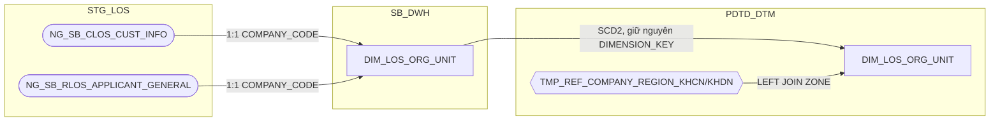

# Output format — whole-document HLD structure

`hld/HLD_Table_Design.md` has exactly **three top-level sections for the
whole document** — not one section set per table. Every table's design
content is filed under the matching subsection of Section 1 or Section 2;
Section 3 is a single flat open-issues table, not nested by table.

```
# HLD — Thiết kế chi tiết cấu trúc bảng (SB_DWH / PDTD_DTM)

## Section 1 — Data Lineage (STG_LOS → SB_DWH → PDTD_DTM)
### 1. SB_DWH
#### 1.1 Bộ bảng CHUNG
##### 1.1.1 <TABLE_NAME>              (one per table, mermaid diagram)
##### 1.1.2 <TABLE_NAME>
#### 1.2 Bộ bảng CLOS
##### 1.2.1 DIM
###### 1.2.1.1 <TABLE_NAME>          (one per table)
###### 1.2.1.2 <TABLE_NAME>
##### 1.2.2 FCT
###### 1.2.2.1 <TABLE_NAME>
#### 1.3 Bộ bảng RLOS
##### 1.3.1 DIM
###### 1.3.1.1 <TABLE_NAME>
##### 1.3.2 FCT
###### 1.3.2.1 <TABLE_NAME>
### 2. PDTD_DTM
#### 2.1 Bộ bảng CHUNG
##### 2.1.1 <TABLE_NAME>
#### 2.2 Bộ bảng CLOS
##### 2.2.1 DIM
###### 2.2.1.1 <TABLE_NAME>
##### 2.2.2 FCT
###### 2.2.2.1 <TABLE_NAME>
#### 2.3 Bộ bảng RLOS
##### 2.3.1 DIM
###### 2.3.1.1 <TABLE_NAME>
##### 2.3.2 FCT
###### 2.3.2.1 <TABLE_NAME>
#### 2.4 Bộ bảng REF_
##### 2.4.1 <TABLE_NAME>

## Section 2 — Column Design
### 1. SB_DWH
#### 1.1 Bộ bảng CHUNG
##### 1.1.1 <TABLE_NAME>               (one per table, column table + 2-bullet description)
##### 1.1.2 <TABLE_NAME>
#### 1.2 Bộ bảng CLOS
##### 1.2.1 DIM
###### 1.2.1.1 <TABLE_NAME>
##### 1.2.2 FCT
###### 1.2.2.1 <TABLE_NAME>
#### 1.3 Bộ bảng RLOS
##### 1.3.1 DIM
###### 1.3.1.1 <TABLE_NAME>
##### 1.3.2 FCT
###### 1.3.2.1 <TABLE_NAME>
### 2. PDTD_DTM
(same numbering as Section 1 — 2., 2.1, 2.1.1, 2.2, 2.2.1, 2.2.1.1..., including 2.4 Bộ bảng REF_)
### 3. STG_LOS (MAP)
#### 3.1 <MAP_TABLE_NAME>              (one per MAP_ table, column table only — no diagram, no CHUNG/CLOS/RLOS split)
#### 3.2 <MAP_TABLE_NAME>

## Section 3 — Vấn đề mở
| STT | Bảng | Vấn đề | Cần xác nhận gì | Trạng thái |
```

**Numbering restarts at 1 independently in each of the two top-level
sections** — Section 1 and Section 2 both have their own `1. SB_DWH` /
`2. PDTD_DTM`. The same table gets the **same number** in both sections
(e.g. `DIM_LOS_ORG_UNIT` is `1.1.1` in both Section 1 and Section 2's SB_DWH
→ CHUNG group) — this is what makes the two sections cross-referenceable.
Numbers are assigned in the order tables appear within their group (first
table designed in a group gets `.1`, the next `.2`, etc.) — never renumber
an already-numbered table when a new one is inserted into the same group;
append the new one with the next unused number in that group instead, even
if that means the split-proposal's own listed order isn't reflected in the
numbers (heading *order* still follows the split proposal — only the number
assignment is by "when it got designed").

The heading depth ladder is fixed: `##` for the two big sections, `### N.`
for layer (SB_DWH / PDTD_DTM), `#### N.N` for group (Bộ bảng CHUNG / CLOS /
RLOS / REF_), one more level (`##### N.N.N`) for DIM/FCT **only inside CLOS
and RLOS groups** (CHUNG and REF_ don't split by DIM/FCT — CHUNG in practice
is DIM-only per the split proposal, REF_ tables aren't classified as
DIM/FCT), then the table name heading one level deeper than whatever the
group's last level was, numbered one level deeper accordingly (e.g.
`###### N.N.N.N <TABLE_NAME>` under a DIM/FCT split, or `##### N.N.N
<TABLE_NAME>` directly under CHUNG/REF_ which has no DIM/FCT level). Follow
the split proposal's own group headings
(`output/Table_Split_Proposal_CLOS_RLOS.md`'s `### 1. Bộ bảng CHUNG` /
`### 2. Bộ bảng CLOS` / `### 3. Bộ bảng RLOS` / `### 4. Bộ bảng REF_` under
each layer) for which group a table belongs to and what order groups appear
in — don't reorder or rename groups. Note the split proposal's own `1./2./3./4.`
numbers are its own local numbering for its four groups, unrelated to this
skill's `1.1/1.2/1.3/1.4` group numbers under a layer — don't confuse the two.

**Never restructure into a per-table `## <TABLE_NAME>` pair of sections** —
that was an earlier draft shape and is no longer correct. If asked to design
a table, insert its Section 1 subsection under the right
layer/group/(DIM|FCT) path, and its Section 2 subsection under the mirrored
path — both insertions land in the *same two* top-level sections that already
exist in the file, never a new top-level section per table.

## The STG_LOS (MAP) layer (Section 2 only)

Every `MAP_` seed table (see `references/design-method.md`'s "Resolution —
a manually-maintained MAP_ seed table at STG_LOS") gets its column table
collected under a single dedicated layer, **`### 3. STG_LOS (MAP)`, at the
end of Section 2 only** — sibling to `### 1. SB_DWH` / `### 2. PDTD_DTM`,
not nested inside either. This exists so all `MAP_` tables are managed in
one place instead of duplicated inline inside every DIM subsection that
happens to use one as a source.

- **Section 1 is unaffected.** Each DIM's own lineage diagram still shows
  its `MAP_` source as a normal STG_LOS node with a normal SCD2 edge into
  the DIM — that's real lineage, not duplication (the diagram only shows
  the table name, not its columns). Don't add a `STG_LOS (MAP)` heading to
  Section 1 or move diagrams there.
- **Section 2 is where the split happens.** The `MAP_` table's full column
  list + load-rule prose (previously written inline under the DIM's own
  Section 2 subsection, e.g. under `1.2.1.2 DIM_CLOS_PRODUCT`) belongs
  instead under `3. STG_LOS (MAP)`, numbered `3.1`, `3.2`, ... in the order
  each `MAP_` table was designed (same "assign by when designed, never
  renumber" rule as every other group). No CHUNG/CLOS/RLOS/DIM/FCT split
  inside this layer — it's a flat list of `MAP_` tables, one heading level
  (`#### 3.N <MAP_TABLE_NAME>`) directly under `### 3. STG_LOS (MAP)`.
- **The DIM's own Section 2 subsection keeps only a one-line pointer**,
  never the inline column table:
  ```
  **Nguồn:** `MAP_CLOS_PRODUCT` (bảng khai báo thủ công, tầng STG_LOS) — xem
  cấu trúc cột đầy đủ và quy tắc nạp SB_DWH tại Section 2 → 3. STG_LOS (MAP)
  → 3.2 MAP_CLOS_PRODUCT.
  ```
  Keep any DIM-specific remark that doesn't belong in the shared `MAP_`
  section (e.g. "không có cột PRODUCT_LINE_NAME — giữ đúng thiết kế cũ")
  folded into this same pointer sentence rather than duplicated.
- **A `MAP_` table's own `3.N` entry** contains exactly what the old inline
  version had: the full column table (attributes + `EFF_DATE` +
  `UPDATED_BY`) and the SCD2 load-rule prose — plus one line naming which
  DIM it feeds and a cross-reference back (e.g. "Nạp lên `DIM_CLOS_PRODUCT`
  (Section 1/2 → SB_DWH → 1.2.1.2)."). Don't repeat the DIM's own business
  reasoning (why this is an application-scoped-source case, etc.) here —
  that stays in the DIM's Section 1/2 prose and Section 3 row.
- **Opening the shared intro once.** The first time this layer is created,
  write one shared paragraph under the `### 3. STG_LOS (MAP)` heading
  itself explaining the common mechanics (manual entry by BA/DevOps,
  `EFF_DATE` = real effective date not ETL timestamp, `UPDATED_BY` =
  audit-only, standard SCD2 compare-and-close/open rule) so every `3.N`
  subsection doesn't have to restate it — each `3.N` only needs to call out
  what's specific to that one seed table (its own natural key, any
  table-specific nuance).

## Section 3 — Vấn đề mở (open issues log)

A single flat Markdown table at the very end of the file — not nested by
layer/group like Sections 1–2, just one growing table of rows:

```
| STT | Bảng | Vấn đề | Cần xác nhận gì | Trạng thái |
| --- | --- | --- | --- | --- |
| 1 | `<TABLE_NAME>` | <what's wrong/uncertain, in enough detail to stand alone without re-reading the table's Section 1/2 prose> | <the specific question that needs a BA/DEV answer> | PENDING |
```

Append one row per open issue, `STT` sequential across the whole table (not
per-table). `Trạng thái` is `PENDING` until the user confirms a resolution,
then becomes `ĐÃ GIẢI QUYẾT` — rows are never deleted, only their status
updated, so the table doubles as a decision log. When a row's status
changes, go back and update the PENDING marker/heading/prose in that table's
Section 1 and Section 2 entries to match (don't let Section 3 say resolved
while Section 1/2 still shows "⚠️ PENDING").

Write this section's `## Section 3 — Vấn đề mở` heading and empty table
header as part of the initial skeleton (see below) even before any issue
exists — so later insertions only ever append a row, never have to create
the section from scratch.

## Building the skeleton once

The first time a table is designed, if `hld/HLD_Table_Design.md` doesn't
exist yet, create it with the title, source-doc references, a short intro
line linking to `references/design-method.md`, and the **full heading
skeleton above already laid out** (all three sections, both layers, all
groups, DIM/FCT split where applicable, and Section 3's empty table header)
with no table content or issue rows under any heading yet — so every later
table insertion only ever has to find its one heading (or, for Section 3,
append a row) and never invent or reorder headings. Use the split proposal's
own group tables to know which layer/group headings must exist (e.g. don't
create a "Bộ bảng CHUNG" FCT heading under SB_DWH — the split proposal notes
there's no shared FCT at that layer).

## Per-table content — Section 1 (Data lineage)

Under the table's heading in Section 1, one Mermaid flowchart (`flowchart
LR`) showing every source STG_LOS table feeding this one, through SB_DWH, to
PDTD_DTM (plus any REF_ table joined in at the PDTD_DTM step). One diagram
per table — don't try to combine multiple tables' lineage into one diagram
(the heading nesting is what keeps 50 tables' worth of diagrams organized,
not a single giant graph).

Conventions:

- Node shape: source STG_LOS tables as `([ ])` (stadium/rounded — "raw
  source" feel), SB_DWH table as a plain rectangle `[ ]`, PDTD_DTM table as
  a plain rectangle `[ ]`, REF_ tables as `{{ }}` (hexagon — "lookup/map"
  feel).
- Subgraph per layer so the layers present are visually grouped left to
  right: `subgraph STG_LOS`, `subgraph SB_DWH`, `subgraph PDTD_DTM`. A
  PDTD_DTM-layer table's diagram may also need the REF_ node(s) it joins —
  all 9 REF_ tables physically live in the PDTD_DTM schema (per
  `output/Table_Split_Proposal_CLOS_RLOS.md`'s own `Bộ bảng REF_` group
  under PDTD_DTM), so draw them **inside `subgraph PDTD_DTM`**, alongside
  the DIM/FCT node they join into — never as a bare node floating outside
  every subgraph, and never in a separate `subgraph REF_`.
- **Keep the SB_DWH and PDTD_DTM subgraphs rendering side by side, not one
  stacked above/below the other.** Once a REF_ node sits inside
  `subgraph PDTD_DTM` alongside the DIM/FCT node, that subgraph holds 2
  nodes while `subgraph SB_DWH` holds only 1 — left unchecked, Mermaid's
  `flowchart LR` layout can drift the two subgraphs out of alignment. Order
  the REF_ node **before** the DIM/FCT node inside `subgraph PDTD_DTM` (REF_
  first, then the DIM/FCT node), and add one invisible link
  (`SB_DWH_NODE ~~~ REF_NODE`) after the real edges to pin the REF_ node
  level with the SB_DWH node. Example: `D ~~~ R` where `D` is the SB_DWH
  node and `R` is the REF_ node — this line adds no visible arrow, it only
  fixes layout.
- Edge labels state the join/transform in a few words, not the full rule —
  e.g. `-->|1:1 COMPANY_CODE|`, `-->|SCD2, EFF/EXP_DATE|`,
  `-->|LEFT JOIN COMPANY_CODE|`. Pull the short label from the lineage doc's
  per-column "Loại" (1:1 / PHÁI SINH / KỸ THUẬT) or the table-level "Quy tắc
  load" line — don't invent detail not in the source docs.
- **Node labels are a bare table name, nothing else** — no parenthetical
  explanation, no filter condition, no restating what the table is or how
  it's populated inside the `[ ]`/`([ ])`/`{{ }}` brackets. This bit twice in
  practice: `X(["MAP_LOS_USER (bảng khai báo thủ công, BA/DevOps nhập tay)"])`
  padded a STG_LOS source node with a description that the prose note below
  already gives in full, and
  `R{{"Q_RLOS_REF_WORKSTEP_2SYSTEMS (dùng chung 2 hệ, lọc SYSTEM='CLOS')"}}`
  padded a REF_ node with a filter condition that belongs on the *edge*
  label instead (`R -->|LEFT JOIN WORKSTEP_CODE, SYSTEM='CLOS' — sinh
  IS_PDTD_STEP| E`). If a filter/condition is genuinely part of the
  join, it goes in the edge label (still kept short, per the rule above);
  if it's background explanation (what kind of table this is, who
  maintains it), it goes in the prose note below the diagram — never
  inside the node's own label. A node label should let someone recognize
  the table by name alone.
- If two source systems feed the same SB_DWH table (a CHUNG dimension like
  `DIM_LOS_ORG_UNIT`), show both source nodes with separate edges into the
  one SB_DWH node — don't merge them into one node.
- If the table is CLOS-only or RLOS-only, only that system's source node(s)
  appear — don't draw a phantom node for the other system.
- **Never draw a node for a table this table's row does not actually use** —
  not even with a dashed edge and a "không join"/"không dùng" label. This
  came up for `DIM_CLOS_APPLICATION`'s PDTD_DTM diagram: `BI_FLOW` is
  computed by `CASE` on `CUST_GROUP` for CLOS, with no join to
  `REF_RLOS_FLOW` at all (that REF_ table only feeds the RLOS sibling's
  `BI_FLOW`) — the CLOS diagram must not show `REF_RLOS_FLOW` in any form.
  If a sibling CLOS/RLOS table computes the same-named column differently
  (one via `REF_` lookup, the other via `CASE`), draw each diagram with only
  the nodes/edges that table's own row actually uses, and put the contrast
  in the prose note below (e.g. "xem ghi chú BI_FLOW ở `DIM_CLOS_APPLICATION`
  — cùng cột đích nhưng công thức khác nhau theo hệ") rather than a phantom
  node in the diagram that isn't used.
- Below the diagram, a short prose note (2-4 sentences) only when there's a
  non-obvious lineage fact worth calling out (e.g. "the standardized ZONE
  join happens at report-query time, not as a physical column on this
  table") — omit the note entirely when the diagram is self-explanatory.
  Don't pad this note with detail the diagram already shows, and don't add
  a note purely to explain why some *other* table's node isn't present —
  absence of an unused node needs no explanation.

Example shape (illustrative — always derive actual node/edge text from the
real lineage doc, never copy this verbatim):



## Per-table content — Section 2 (Column design)

Under the table's heading in Section 2, two parts in this order, matching
the user's reference screenshots exactly.

### 2a. Column table

Markdown table with these exact headers (Vietnamese, matching the design
docx convention already used in `extract/database/*.md`):

```
| STT | Tên cột | Kiểu dữ liệu | Bắt buộc | Độ lớn | Khóa | Mô tả |
```

Fill every row from the reasoning done per `design-method.md` — not a blind
copy of the old merged table's rows. `Khóa` column uses `PK`, `NK`, or blank
(FKs to other DIMs don't get marked here — that's implicit in the `*_SK`
column name and stated in `Mô tả`). Number `STT` sequentially starting at 1.

### 2b. Description block

Immediately below the column table, exactly two bullet lines (matching the
user's reference screenshot format) — this is the table-level description,
not a per-column one:

```
- Bảng <DIM|FCT> <mô tả ngắn gọn: lưu cái gì, thuộc tính/phát sinh theo cái gì, dùng cho hệ nào (CLOS/RLOS/dùng chung)>.
- Khóa chính của bảng (PK): **<PK_COLUMN(S)>**.
```

Keep the first bullet to one sentence — table purpose, grain if it's a FACT,
and system scope (CLOS/RLOS/dùng chung cho cả hai hệ). Don't repeat the full
lineage narrative here; that's Section 1's job. The second bullet names the
literal PK column(s), comma-separated if composite, bold as shown.

Optionally, one closing line noting what changed vs. the old merged table's
column list (columns dropped/added) — this is the part most worth surfacing
since it's the actual storage-optimization outcome; keep it to one line.

## What NOT to include

- Don't add a "Ghi chú"/notes column to the Section 2a table beyond `Mô tả`
  — keep the exact 7-column shape.
- Don't restate the split proposal's "Nguyên nhân tách" prose in the HLD —
  that lives in `output/Table_Split_Proposal_CLOS_RLOS.md`; a table heading
  under the right group is enough of a link back.
- Don't add per-column source-table/source-column detail inside the Section
  2a table — that level of mapping detail belongs to the `mapping-gen` skill
  output later, not the HLD. Section 1's lineage diagram is the right place
  for source-table names.
- Don't create a `## <TABLE_NAME>` top-level section for any table — see
  "Never restructure" above.
