# HLD — DIM tables (PDTD_DTM)

**Trích xuất từ:** `hld/HLD_Table_Design.md` (nguồn tổng, giữ nguyên không xóa)
**Phạm vi:** DIM_LOS_ORG_UNIT, DIM_LOS_USER, DIM_T24_CUSTOMER, DIM_T24_COMPANY, DIM_T24_LOAN, DIM_T24_SEAB_PRODUCTS_DE, DIM_DATE (CHUNG), toàn bộ DIM CLOS (2.2.1.x), toàn bộ DIM RLOS (2.3.1.x) tại layer PDTD_DTM.
**Ghi chú:** REF_LOS_KPI_USER_YEAR (2.1.7, dù nằm cạnh nhóm CHUNG trong file tổng) được gộp vào `HLD_REF.md` vì bản chất là bảng REF_/danh mục, không phải DIM.
**Quy ước đồng bộ:** sửa nội dung tại file này TRƯỚC, sau đó copy đoạn đã sửa về đúng vị trí tương ứng trong `hld/HLD_Table_Design.md`. Section 3 (Vấn đề mở) chỉ quản lý tại file tổng, không lặp ở đây.

---

## Section 1 — Data Lineage

### 2.1 Bộ bảng CHUNG

##### 2.1.1 DIM_LOS_ORG_UNIT — ✅ ĐÃ GIẢI QUYẾT (kế thừa nguồn NG_SB_RLOS_MAS_COMPANY/MAS_BRANCH/MAS_REGION từ SB_DWH, review 2026-09-18)

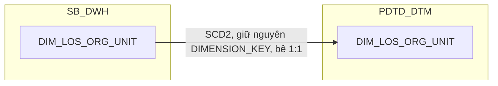

**Ghi chú lineage (review 2026-09-18, theo Meeting note 20260909 mục
#5):** bản PDTD_DTM bê 1:1 từ SB_DWH như bình thường, nay đã kế thừa
nguồn đã chốt (`NG_SB_RLOS_MAS_COMPANY`/`MAS_BRANCH`/`MAS_REGION`, xem
Section 1 → SB_DWH → 1.1.1 trong `HLD_DIM_SB_DWH.md`) thay vì nguồn hồ sơ
LOS trước đây. `ZONE_NAME_LOS` (giá trị tự do, "chưa chuẩn hóa") đã bị
loại bỏ khỏi bảng này — thay bằng `ZONE` (mã chuẩn từ MAS_COMPANY) và
`REGION_CODE`/`REGION_NAME` (chuẩn hóa từ MAS_REGION, bê 1:1 sang PDTD_DTM
cùng các cột khác). Khu vực chuẩn hóa dùng cho BC10/BC11 (map qua
`TMP_REF_COMPANY_REGION_KHCN`/`TMP_REF_COMPANY_REGION_KHDN`) **vẫn không
phải cùng khái niệm với `REGION_CODE`/`REGION_NAME` mới này** — đây là 2
nguồn khác nhau (LOS vs T24-side mapping riêng cho BC10/11); việc LEFT
JOIN với bảng `TMP_REF_COMPANY_REGION_*` vẫn chỉ xảy ra ở tầng truy vấn
báo cáo, không ở tầng bảng DIM — xem Section 3 nếu cần làm rõ thêm với
BA liệu 2 khái niệm khu vực có nên hợp nhất.

##### 2.1.2 DIM_LOS_USER — ✅ ĐÃ GIẢI QUYẾT (kế thừa nguồn NG_SB_RLOS_MAS_USER từ SB_DWH, review 2026-09-18)

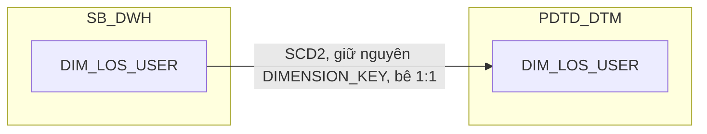

**Ghi chú lineage (review 2026-09-18, theo Meeting note 20260909 mục
#3):** không có bảng `REF_` nào join thêm ở bước này. Bản PDTD_DTM bê 1:1
từ SB_DWH như bình thường, nay đã kế thừa nguồn đã chốt
(`NG_SB_RLOS_MAS_USER`, xem Section 1 → SB_DWH → 1.1.2 trong
`HLD_DIM_SB_DWH.md`) thay vì `MAP_LOS_USER`/nguồn event log trước đây —
kèm theo toàn bộ 23 cột nghiệp vụ dư thừa đã thiết kế ở SB_DWH (không
thêm/bớt cột nào ở layer PDTD_DTM).

##### 2.1.3 DIM_T24_CUSTOMER

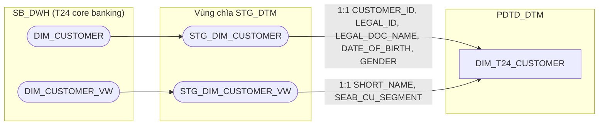

**Ghi chú lineage — bảng đặc thù, nguồn không phải STG_LOS:** khác toàn bộ
DIM/FCT còn lại của datamart này, `DIM_T24_CUSTOMER` không có nguồn CLOS hay
RLOS nào cả — đây là chiều khách hàng lõi **T24 (core banking)**, đã tồn tại
sẵn ở `SB_DWH.DIM_CUSTOMER`/`DIM_CUSTOMER_VW`. ETL chỉ **bê nguyên 1:1** qua
vùng chìa `STG_DTM.STG_DIM_CUSTOMER`/`STG_DIM_CUSTOMER_VW` (theo quy ước
`00_Vung_STG_DTM` của tài liệu gốc — vùng chìa chỉ giữ tối đa 3 ngày hiệu
lực nên ETL bảng này phải chạy trong ngày), giữ nguyên `DIMENSION_KEY` và
cặp `EFF_DATE`/`EXP_DATE` do SB_DWH quản lý — không sinh sequence mới,
không tự tính SCD2 tại PDTD_DTM. Vì nguồn là T24 chứ không phải LOS, bảng
này **không đi qua CDC của LOS**, nên không áp 4 trường hợp I/D của quy
trình A1 (khác toàn bộ DIM khác trong tài liệu này).

**Vai trò cầu nối duy nhất giữa LOS và T24:** đây là chỗ DUY NHẤT nối được
hồ sơ tín dụng LOS (CLOS/RLOS) sang khách hàng lõi T24 — join qua số giấy
tờ định danh (`LEGAL_ID` + `LEGAL_DOC_NAME`, đã chuẩn hóa ở T24) khớp với số
giấy tờ trên phía LOS: `DIM_CLOS_CUSTOMER.ORG_LEGAL_ID` (qua
`DIM_CLOS_LEGAL_PARTY`, xem 2.2.1.7/2.2.1.8) phía CLOS, và
`DIM_RLOS_APPLICANT.ADD_ID`/`ADD_ID_OTHER` phía RLOS — đúng như đã thiết kế
sẵn trên `FCT_CLOS_APPLICATION_DAILY.T24_CUSTOMER_SK`/
`FCT_RLOS_APPLICATION_DAILY.T24_CUSTOMER_SK` (2.2.2.1/2.3.2.1, review
2026-09-17: đổi tên từ `CUSTOMER_SK` để phân biệt rõ với khách hàng LOS).
Giữ thành chiều
riêng (không gộp vào từng fact) vì được 4 báo cáo tham chiếu (BC1, BC2,
BC10, BC11) — gộp sẽ nhân bản dữ liệu 4 lần và mất khả năng lọc theo phân
khúc.

**Ghi chú lineage — SRS BC10/BC11 dùng INNER JOIN có điều kiện phân
khúc, không phải LEFT JOIN đơn giản:** đối chiếu bảng "Các bảng sử dụng"
(BR 1.2) của SRS BC10/BC11 (đọc từ bảng lồng trong ô docx, không chỉ
field-list) xác nhận: `... INNER JOIN STG_DIM_CUSTOMER (d) ON
a.CUSTOMER_SK = d.DIMENSION_KEY AND d.SEAB_CU_SEGMENT IN ('14','21')`
(BC10, khách hàng cá nhân) và `... AND d.SEAB_CU_SEGMENT NOT IN
('14','21')` (BC11, khách hàng doanh nghiệp) — `a.CUSTOMER_SK` ở đây là
cột nguồn `STG_FCT_LOAN.CUSTOMER_SK`, khác với `T24_CUSTOMER_SK` (tên đã
đổi, xem trên) trên `FCT_CLOS/RLOS_APPLICATION_DAILY`. Đây là 2 tập con
lọc trên CÙNG 1 tập hợp đồng, không phải 2 nguồn dữ liệu riêng. Quyết
định (đã xác nhận với người dùng): `FCT_CLOS_LOAN_DISBURSEMENT`/
`FCT_RLOS_LOAN_DISBURSEMENT` giữ nguyên 1 dataset đầy đủ mỗi hệ,
KHÔNG áp INNER JOIN/loại dòng theo phân khúc ở tầng datamart (khác quy
tắc `-1`/Unknown cho FK không khớp được áp dụng xuyên suốt tài liệu này)
— BC10/BC11 tự JOIN `T24_CUSTOMER_SK` → `DIM_T24_CUSTOMER.SEAB_CU_SEGMENT`
để lọc đúng tập con khi cần, không thêm cột phân khúc nào trên fact.

##### 2.1.4 DIM_T24_COMPANY

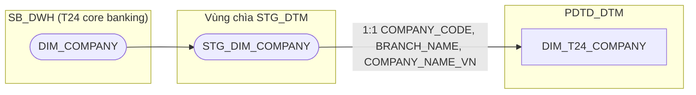

**Ghi chú lineage — bảng đặc thù, nguồn T24 giống `DIM_T24_CUSTOMER`
(2.1.3):** phát sinh khi thiết kế `FCT_CLOS_LOAN_DISBURSEMENT`/
`FCT_RLOS_LOAN_DISBURSEMENT` (2.2.2.7/2.3.2.8) — SRS
BC10/BC11 ghi `BRANCH_NAME`/`COMPANY_NAME` lấy từ `STG_DIM_COMPANY`, một
bảng T24 riêng biệt (`SB_DWH.DIM_COMPANY`), **khác** `DIM_LOS_ORG_UNIT`
(nguồn LOS, do `NG_SB_CLOS_CUST_INFO`/`NG_SB_RLOS_APPLICANT_GENERAL` cấp).
Theo yêu cầu người dùng: kéo `DIM_COMPANY` (T24) 1:1 lên PDTD_DTM thành
DIM riêng (tiền tố `DIM_T24_*`, phân biệt rõ với `DIM_LOS_*` nguồn LOS),
giữ FK vật lý (`COMPANY_SK`) trên `FCT_CLOS_LOAN_DISBURSEMENT`/
`FCT_RLOS_LOAN_DISBURSEMENT` thay vì mô tả
join-time bằng lời — cùng pattern đã áp dụng cho `DIM_T24_CUSTOMER` (chỉ
tồn tại ở PDTD_DTM, không có bản SB_DWH, bê 1:1 qua vùng chìa
`STG_DTM.STG_DIM_COMPANY`, giữ nguyên `DIMENSION_KEY`/`EFF_DATE`/
`EXP_DATE` do SB_DWH quản lý, không đi qua CDC của LOS).

**Join key thật — `CO_CODE`, không phải `COMPANY_CODE` trên fact:** đối
chiếu bảng "Các bảng sử dụng" của SRS BC10/BC11 xác nhận:
`... LEFT JOIN STG_DIM_COMPANY (e) ON a.CO_CODE = e.COMPANY_CODE AND
e.COMPANY_EXP_DATE IS NULL` — cột trên `STG_FCT_LOAN` mang tên `CO_CODE`
(khác `COMPANY_CODE` tôi từng giả định), và điều kiện `COMPANY_EXP_DATE IS
NULL` xác nhận `DIM_COMPANY` phía T24 cũng là SCD2 — chỉ lấy bản ghi hiện
hành khi join. `TMP_REF_COMPANY_REGION_KHCN`/`_KHDN` (lấy `ZONE`) cũng
join theo `a.CO_CODE = g.COMPANY_CODE` — cùng cột nguồn `CO_CODE` trên
`STG_FCT_LOAN`, không phải qua `DIM_LOS_ORG_UNIT.COMPANY_CODE` (nguồn LOS,
là 1 bảng company khác, giữ tách biệt).

**Làm rõ: `COMPANY_EXP_DATE IS NULL` là điều kiện JOIN lúc dùng, KHÔNG
phải điều kiện nạp DIM (review 2026-09-17):** `DIM_T24_COMPANY` bê
**nguyên toàn bộ lịch sử** các dòng `EFF_DATE`/`EXP_DATE` từ
`STG_DIM_COMPANY` (kể cả dòng đã đóng, `EXP_DATE` khác NULL) — cùng cách
`DIM_T24_CUSTOMER` (2.1.3) đã làm, không tự tính SCD2 tại PDTD_DTM, không
lọc `EXP_DATE IS NULL` khi nạp. Điều kiện `COMPANY_EXP_DATE IS NULL` trong
SRS chỉ là điều kiện JOIN của `FCT_CLOS/RLOS_LOAN_DISBURSEMENT` để chọn
đúng bản ghi hiện hành tại thời điểm join — nhầm 2 khái niệm này khi sinh
LLD (lọc `EXP_DATE IS NULL` ngay lúc nạp DIM) sẽ làm mất lịch sử SCD2 của
`DIM_T24_COMPANY`.

**Đối chiếu SRS (BC10, BC11):** cả 2 báo cáo dùng `BRANCH_NAME`
(← `STG_DIM_COMPANY.BRANCH_NAME`) và `COMPANY_NAME`
(← `STG_DIM_COMPANY.COMPANY_NAME_VN`) — khớp đúng. Không có tài liệu gốc
nào (docx thiết kế database) liệt kê cấu trúc đầy đủ của `DIM_COMPANY`
(cùng tình trạng với `DIM_T24_CUSTOMER`, 2.1.3) — chỉ thiết kế đúng 3 cột
SRS xác nhận cần dùng (`COMPANY_CODE`, `BRANCH_NAME`, `COMPANY_NAME_VN`);
nếu sau này có báo cáo khác cần thêm thuộc tính company/branch, bổ sung
cột khi đó.

##### 2.1.5 DIM_T24_LOAN

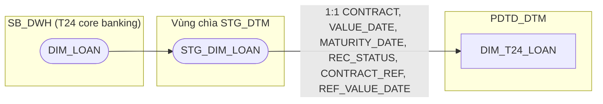

**Ghi chú lineage — bảng đặc thù, nguồn T24 giống `DIM_T24_CUSTOMER`
(2.1.3):** lineage doc gốc của `FCT_PDTD_DISBURSEMENT` đã liệt kê
`SB_DWH.DIM_LOAN` là 1 trong 4 nguồn (cùng `FCT_LOAN`/`DIM_COMPANY`/
`DIM_SEAB_PRODUCTS_DE`), cấp `VALUE_DATE`/`MATURITY_DATE`/`REC_STATUS`/
`CONTRACT_REF`/`REF_VALUE_DATE` — trước đây các cột này bị denormalize
thẳng vào fact theo đúng cách tài liệu gốc mô tả (1:1, không qua FK). Theo
yêu cầu người dùng: tách hẳn thành DIM riêng `DIM_T24_LOAN`, đặt FK vật lý
`CONTRACT_SK` trên `FCT_CLOS_LOAN_DISBURSEMENT`/`FCT_RLOS_LOAN_DISBURSEMENT`
— cùng pattern `DIM_T24_CUSTOMER`/
`DIM_T24_COMPANY` (chỉ tồn tại ở PDTD_DTM, bê 1:1 qua vùng chìa
`STG_DTM.STG_DIM_LOAN`, không đi qua CDC của LOS).

**Join key — `CONTRACT_SK` (surrogate có sẵn trên STG_FCT_LOAN), không
phải `CONTRACT` trực tiếp:** đối chiếu SRS BC10/BC11 xác nhận:
`... LEFT JOIN STG_DIM_LOAN (c) ON a.CONTRACT_SK = c.DIMENSION_KEY` — join
qua khóa surrogate đã có sẵn trên `STG_FCT_LOAN`, không phải so trực tiếp
`CONTRACT` (dù về nghiệp vụ `DIM_T24_LOAN` grain = 1 hợp đồng, business
key vẫn là `CONTRACT`).

**Làm rõ: vì sao join `CONTRACT_SK` KHÔNG cần thêm điều kiện `EXP_DATE IS
NULL` như `DIM_T24_COMPANY` (review 2026-09-17):** SRS BC10/BC11 join
`STG_DIM_LOAN` chỉ bằng `a.CONTRACT_SK = c.DIMENSION_KEY`, không có thêm
`AND c.EXP_DATE IS NULL` — khác hẳn điều kiện join `STG_DIM_COMPANY`
(`a.CO_CODE = e.COMPANY_CODE AND e.COMPANY_EXP_DATE IS NULL`, xem 2.1.4).
Đây không phải thiếu sót cần bổ sung khi sinh LLD — bản chất 2 join khác
nhau: `CO_CODE` là **business key**, dùng để lookup vào DIM có nhiều dòng
lịch sử SCD2 nên bắt buộc lọc `EXP_DATE IS NULL` để chọn đúng 1 bản ghi
hiện hành; còn `CONTRACT_SK` trên `STG_FCT_LOAN` đã LÀ **surrogate trỏ
thẳng đến đúng `DIMENSION_KEY`** của phiên bản `STG_DIM_LOAN` tương ứng
tại thời điểm phát sinh giao dịch (do STG_FCT_LOAN tự lưu sẵn), nên không
cần và không nên lọc thêm `EXP_DATE IS NULL` — làm vậy có thể loại bỏ
đúng dòng lịch sử cần join nếu bản ghi đó đã bị đóng (`EXP_DATE` khác
NULL) sau thời điểm giao dịch.

##### 2.1.6 DIM_T24_SEAB_PRODUCTS_DE

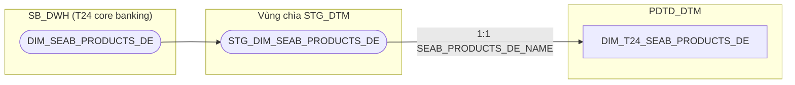

**Ghi chú lineage — bảng đặc thù, nguồn T24 giống `DIM_T24_CUSTOMER`
(2.1.3):** lineage doc gốc liệt kê `SB_DWH.DIM_SEAB_PRODUCTS_DE` cấp
`PRODUCT_T24` (1:1, denormalize thẳng vào fact theo tài liệu gốc). Theo
yêu cầu người dùng: tách DIM riêng, đặt FK vật lý `SEAB_PRODUCTS_DE_SK`
trên `FCT_CLOS_LOAN_DISBURSEMENT`/`FCT_RLOS_LOAN_DISBURSEMENT`.

**Join key — `SEAB_PRODUCTS_DE_SK` (surrogate có sẵn trên STG_FCT_LOAN):**
SRS BC10/BC11 (bảng "Các bảng sử dụng", BR 1.2) ghi nguyên văn: `... LEFT
JOIN STG_DIM_SEAB_PRODUCTS_DE (f) ON a.SEAB_PRODUCTS_SK = f.DIMENSION_KEY`
— tên cột `SEAB_PRODUCTS_SK` (thiếu hậu tố `_DE` so với tên bảng
`DIM_SEAB_PRODUCTS_DE`). Người dùng xác nhận SRS có khả năng viết thiếu/
sai chính tả ở đây (không nhất quán với tên bảng đích và với cách đặt tên
FK theo tên bảng đã dùng xuyên suốt tài liệu này) — thiết kế dùng đúng tên
`SEAB_PRODUCTS_DE_SK` trên `STG_FCT_LOAN` làm nguồn của FK, khác 1 ký tự
so với SRS ghi. Không có tài liệu nào xác nhận business key gốc của sản
phẩm T24 (chỉ có surrogate) — không
cần thiết kế thêm cột NK nào ngoài `SEAB_PRODUCTS_DE_NAME`, vì fact chỉ
cần đúng khóa surrogate để join. Điều kiện join trên không kèm thêm lọc
`EXP_DATE IS NULL` — cùng logic đã giải thích cho `CONTRACT_SK` tại 2.1.5
(`DIM_T24_LOAN`): `SEAB_PRODUCTS_DE_SK` là surrogate có sẵn trên
`STG_FCT_LOAN`, đã trỏ thẳng đúng phiên bản `DIMENSION_KEY` tại thời điểm
giao dịch, không cần lọc thêm như trường hợp join qua business key
(`CO_CODE` trên `DIM_T24_COMPANY`, 2.1.4).


##### 2.1.10 DIM_DATE

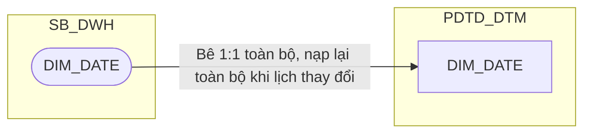

**Ghi chú lineage:** bảng chiều ngày dùng chung toàn ngân hàng, đã có
sẵn tại `SB_DWH.DIM_DATE` — không tự dựng lịch ở tầng PDTD_DTM, bê
nguyên 1:1 để mọi báo cáo dùng chung 1 định nghĩa ngày làm việc/tuần/
tháng báo cáo. Không thuộc phạm vi split CLOS/RLOS (không có bảng
`SB_DWH` riêng của PDTD ứng với mục này trong tài liệu — đây là chiều
hệ thống chung, không phải chiều do PDTD tạo ra). Không có `DATE_SK`
riêng — `DAYID` (kiểu DATE, đã duy nhất) là khóa tự nhiên, đồng thời là
khóa phân vùng của mọi bảng FCT trong toàn tài liệu, nên fact join
thẳng vào đây bằng `DAYID`, không cần surrogate key.

**Đã bỏ cột `DATASOURCE` (review 2026-09-17):** thiết kế trước đó gán
`DATASOURCE='T24'` theo máy móc cùng pattern các bảng `DIM_T24_*`
(2.1.3-2.1.6) — nhưng khác các bảng đó (dữ liệu nghiệp vụ core banking
thật sự thuộc T24), `DIM_DATE` là chiều hệ thống dùng chung toàn ngân
hàng, không phải dữ liệu "thuộc về" T24. Xác nhận không có FK/lookup
nào trong toàn tài liệu cần phân biệt `DIM_DATE` theo `DATASOURCE` — cột
này không có tác dụng, đã bỏ.


### 2.2 Bộ bảng CLOS

##### 2.2.1 DIM

###### 2.2.1.1 DIM_CLOS_APPLICATION — ✅ ĐÃ GIẢI QUYẾT (xem DQ-11 ở SB_DWH; đã bổ sung REF_PRODUCT, SLA_*)

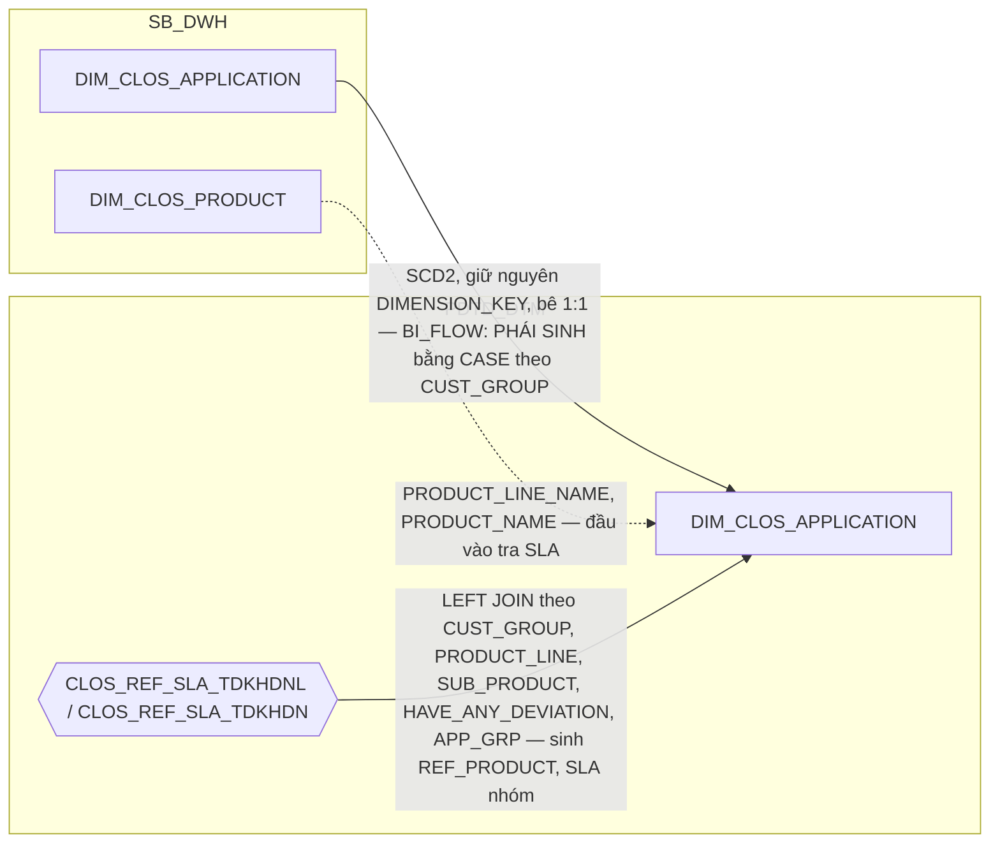

**Ghi chú lineage:** cột `BI_FLOW` (luồng nghiệp vụ chuẩn hóa hiển thị báo
cáo) được **sinh hoàn chỉnh tại PDTD_DTM cho cả 2 hệ**, nhưng theo 2 cách
khác nhau: RLOS lookup qua `REF_RLOS_FLOW` (theo `STREAM`), còn CLOS tính
bằng `CASE` theo `CUST_GROUP` — không qua bảng `REF_` nào. Xem chi tiết công
thức ở Section 2.

**Ghi chú lineage — bổ sung `REF_PRODUCT`, `SLA_CREDIT_OFFICER`,
`SLA_MARKER`, `SLA_CHECKER`, `SLA_CREDIT_APPROVER`:** đây là nơi duy nhất
tính được các cột này — `CLOS_REF_SLA_TDKHDNL`/`CLOS_REF_SLA_TDKHDN`
(2.4.6/2.4.7) chỉ tồn tại ở tầng PDTD_DTM, không có ở SB_DWH. Chọn bảng
theo `CUST_GROUP` (`NBFI/JSC/FDI/BANK/STR/SOC` → `TDKHDNL`;
`MSME/SME/USME` → `TDKHDN_2`), rồi LEFT JOIN theo `PRODUCT_LINE`+
`SUB_PRODUCT` + `HAVE_ANY_DEVIATION` (đã có trên `DIM_CLOS_APPLICATION`,
SB_DWH) + `APP_GRP` quy đổi sang `FLAG_APP_GRP` (xem công thức quy đổi ở
Section 2). Riêng hồ sơ `APP_GRP='C1'`: `REF_PRODUCT` vẫn lookup bình
thường vào `CLOS_REF_SLA_TDKHDN`, còn 4 cột `SLA_*` dùng hằng số cứng 4
giờ (xem 2.4.7). Xem Section 3 dòng #13.

**Lưu ý về `PRODUCT_LINE`/`SUB_PRODUCT` dùng làm khóa tra:** `DIM_CLOS_
APPLICATION` KHÔNG có cột `PRODUCT_SK` — quan hệ hồ sơ↔sản phẩm là 1
chiều, chỉ tồn tại trên `FCT_CLOS_APPLICATION_DAILY` (khóa `PRODUCT_SK`,
grain 1 hồ sơ × 1 ngày, xem 2.2.2.1). ETL lấy `PRODUCT_LINE_NAME`/
`PRODUCT_NAME` bằng cách join gián tiếp qua FCT (`FCT_CLOS_
APPLICATION_DAILY.PRODUCT_SK` → `DIM_CLOS_PRODUCT`) tại phiên bản hồ sơ
tương ứng, rồi đưa 2 giá trị đó vào làm input cho công thức LEFT JOIN
`REF_PRODUCT`/`SLA_*` ngay tại `DIM_CLOS_APPLICATION` — kết quả `REF_
PRODUCT`/`SLA_*` vẫn là thuộc tính ổn định 1:1 với hồ sơ (giống `BI_FLOW`,
`APP_GRP`), chỉ khác là *đầu vào* của công thức phải lấy gián tiếp qua
FCT chứ không phải một khóa có sẵn trên chính DIM này.

**Đính chính khóa tra — dùng `PRODUCT_LINE_NAME`/`PRODUCT_NAME` (tên
hiển thị), không phải `PRODUCT_LINE_CODE`/`SUB_PRODUCT_CODE` (mã)
(review 2026-09-21):** đối chiếu trực tiếp dữ liệu seed thật của
`CLOS_REF_SLA_TDKHDN` (`input/BC5TAT - Team PDTD cung cấp(cam kết SLA
TDKHDN luồng 2).csv`, cột "Product Line"/"Sub Product") cho thấy giá
trị lưu là tên hiển thị tiếng Việt (`Hạn mức`, `Vay cầm cố GTCG theo
món`...), khớp `DIM_CLOS_PRODUCT.PRODUCT_LINE_NAME` (cột 5)/`PRODUCT_
NAME` (cột 8, tên sản phẩm nhánh) — không khớp `PRODUCT_LINE_CODE`/
`SUB_PRODUCT_CODE` (mã nội bộ). Cùng loại sai đã sửa ở `DIM_RLOS_
APPLICATION` (2.3.1.1) — áp dụng nhất quán cho cả 2 hệ.

**Gap CLOS chưa thiết kế `REF_SLA_NLTT` — ĐÃ ĐÁNH GIÁ, KHÔNG bổ sung cột
vào DIM này (review 2026-09-21):** SRS BC5/BC9 yêu cầu CLOS cũng đọc
cam kết SLA nhập liệu tập trung từ `REF_SLA_NLTT` (`SYSTEM_CODE='CLOS'`,
điều kiện JOIN theo `New/Change Request`+`Product Line`+`Sub Product` —
đọc trực tiếp từ bảng lồng "Các bảng sử dụng" BR 1.2 của SRS BC5,
trước đây bị bỏ sót khi chỉ đọc dòng RLOS liền kề). Khác với `REF_
PRODUCT`/`SLA_CREDIT_*` (đã denormalize ở trên), quyết định người dùng
cho `SLA_DE_RESULT`/`SLA_QC_RESULT`/`SLA_DE_TOTAL_RESULT`/`QD_DDE`/
`QD_QC` là KHÔNG thêm cột vào DIM này (và bỏ luôn 3 cột tương ứng đã có
ở `DIM_RLOS_APPLICATION`) — chuyển hẳn sang report-time lookup
`REF_SLA_NLTT`. Xem logic JOIN runtime đầy đủ (cả 2 hệ) tại `REF_SLA_
NLTT` (2.4.8) và ghi chú `POINT` của BC9 (2.1.9).

###### 2.2.1.2 DIM_CLOS_PRODUCT — ✅ ĐÃ GIẢI QUYẾT (nguồn: NG_SB_CLOS_MAS_PRO_LINE/MAS_SUB_PROD, review 2026-09-18; IS_CREDIT_CARD/IS_FAST_PRODUCT chuyển khỏi bảng này)

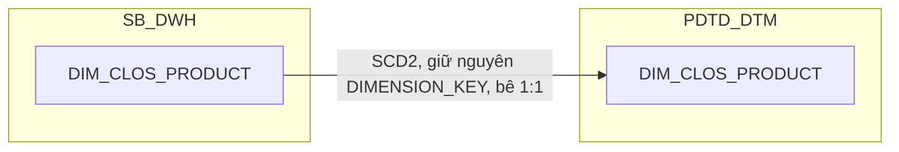

**Ghi chú lineage:** nguồn kế thừa từ SB_DWH nay đã giải quyết
(`NG_SB_CLOS_MAS_PRO_LINE`/`NG_SB_CLOS_MAS_SUB_PROD` — review 2026-09-18,
xem 1.2.1.2 trong `HLD_DIM_SB_DWH.md`), thay thế `MAP_CLOS_PRODUCT`,
không còn PENDING nào ở bảng này. `IS_CREDIT_CARD`/
`IS_FAST_PRODUCT` **đã được gỡ khỏi bảng này** — đối chiếu SRS BC9 gốc
(`SLHS_CLOS`/`SLGN_CLOS`/`TAT_CLOS`) xác nhận CLOS dùng quy tắc phân nhóm
hoàn toàn khác (`PRODUCT_LINE`/`SUB_PRODUCT` theo `NG_SB_CLOS_CUST_INFO`,
không liên quan gì đến 2 cờ này) — xem chi tiết ở ghi chú
`DIM_RLOS_PRODUCT` (2.3.1.2) và Section 3 dòng #3.

###### 2.2.1.3 DIM_CLOS_WORKSTEP — ✅ ĐÃ GIẢI QUYẾT (kế thừa nguồn NG_SB_CLOS_MAS_DECISION từ SB_DWH, review 2026-09-18)

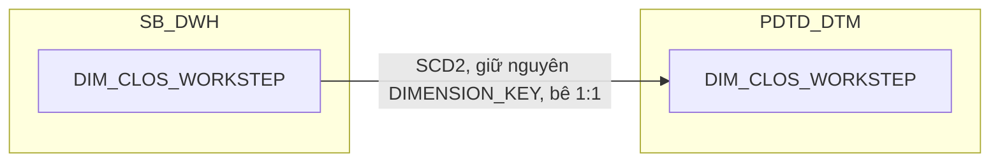

**Ghi chú lineage:** nguồn kế thừa từ SB_DWH nay đã giải quyết
(`NG_SB_CLOS_MAS_DECISION`, DISTINCT QUEUE_NAME — review 2026-09-18, xem
1.2.1.3 trong `HLD_DIM_SB_DWH.md`), thay thế `MAP_CLOS_WORKSTEP`. Bản
PDTD_DTM bê 1:1, không có cột phái sinh nào ở tầng này.

**Đã loại bỏ cột `IS_PDTD_STEP` (review 2026-09-15):** thiết kế trước
đây có cột `IS_PDTD_STEP` (LEFT JOIN `Q_RLOS_REF_WORKSTEP_2SYSTEMS` theo
`WORKSTEP_CODE = WORKSTEP`), ghi chú "dùng làm đầu vào lọc nhân sự Khối
PDTD ở BC9 (`NHAN_SU`, `NSLD`)" — nhưng đối chiếu lại công thức thật của
`NHAN_SU`/`NSLD` (`REF_LOS_KPI_USER_YEAR`, 2.1.7) xác nhận công thức đó
lọc bằng danh sách 8 `WORKSTEP` literal hardcode trực tiếp trên UNION
`FCT_CLOS_WORKSTEP_EVENT`/`FCT_RLOS_WORKSTEP_EVENT`, **không hề JOIN qua
`IS_PDTD_STEP`** — cột này không được dùng ở bất kỳ đâu trong toàn bộ
thiết kế. Đã xóa hẳn cột này (và join `Q_RLOS_REF_WORKSTEP_2SYSTEMS`
tương ứng) khỏi cả `DIM_CLOS_WORKSTEP`/`DIM_RLOS_WORKSTEP` (SB_DWH và
PDTD_DTM) — không mất thông tin gì vì không báo cáo nào tiêu thụ giá trị
này; đồng thời tránh rủi ro nhân bản DIM khi join (grain thật của
`Q_RLOS_REF_WORKSTEP_2SYSTEMS` là `WORKSTEP+DECISION`, trong khi DIM chỉ
có 1 dòng/`WORKSTEP_CODE`, không có `DECISION` để join kèm).

###### 2.2.1.4 DIM_CLOS_DECISION — ✅ ĐÃ GIẢI QUYẾT (kế thừa nguồn NG_SB_CLOS_MAS_DECISION từ SB_DWH, review 2026-09-18)

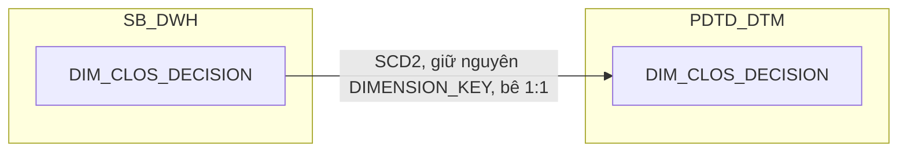

**Ghi chú lineage:** nguồn kế thừa từ SB_DWH nay đã giải quyết
(`NG_SB_CLOS_MAS_DECISION`, DISTINCT DECISION — review 2026-09-18, xem
1.2.1.4 trong `HLD_DIM_SB_DWH.md`), thay thế `MAP_CLOS_DECISION`. Bản
PDTD_DTM bê 1:1, không có REF_ nào join thêm.

###### 2.2.1.5 DIM_CLOS_EXCEPTION_REASON


**Ghi chú lineage:** bản PDTD_DTM bê 1:1 từ SB_DWH, không có REF_ nào join
thêm — cấu trúc giữ nguyên như tài liệu gốc.

###### 2.2.1.6 DIM_CLOS_COLLATERAL_TYPE

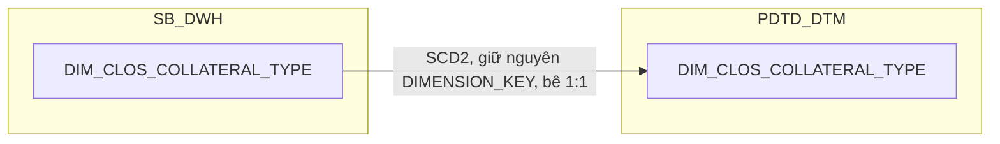

**Ghi chú lineage:** bản PDTD_DTM bê 1:1 từ SB_DWH, không có REF_ nào join
thêm — cấu trúc giữ nguyên như tài liệu gốc.

###### 2.2.1.7 DIM_CLOS_CUSTOMER

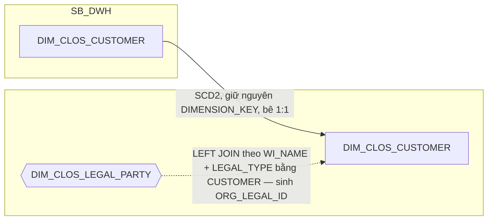

**Ghi chú lineage:** bê nguyên 1:1 từ SB_DWH, cùng grain (1:1 với hồ sơ).
Bổ sung `ORG_LEGAL_ID` — LEFT JOIN `DIM_CLOS_LEGAL_PARTY` (2.2.1.8) theo
`WI_NAME` + `LEGAL_TYPE='CUSTOMER'`, lưu dư thừa số giấy tờ pháp lý của
chính khách hàng vay ngay trên `DIM_CLOS_CUSTOMER` để tiện tra cứu — đã
xác nhận với người dùng: chấp nhận trùng lặp dữ liệu giữa 2 DIM thay vì
buộc báo cáo phải tự JOIN thêm. Join an toàn không fan-out — người dùng
xác nhận nghiệp vụ: `OBJ_TYPE='Khách hàng'` luôn đúng 1 dòng/hồ sơ trên
`NG_SB_CLOS_CUST_INFO_LEGAL` (khác với các vai trò khác — đại diện/thành
viên góp vốn — có thể nhiều dòng, xem 2.2.1.8).

###### 2.2.1.8 DIM_CLOS_LEGAL_PARTY

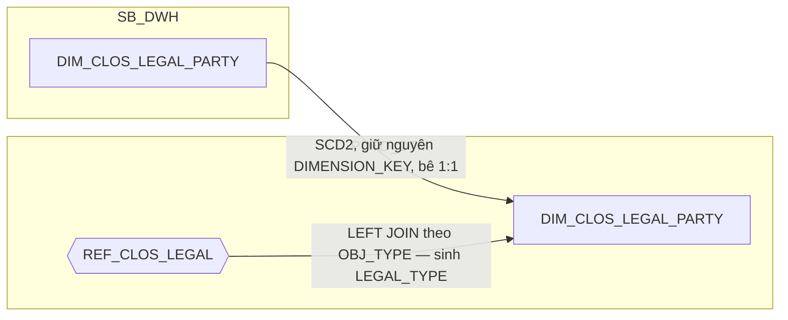

**Ghi chú lineage:** bê nguyên 1:1 từ SB_DWH, cùng grain (1:N với hồ sơ,
không giới hạn). Bổ sung `LEGAL_TYPE` — LEFT JOIN `REF_CLOS_LEGAL` (2.4.2)
theo `OBJ_TYPE`, chuẩn hóa vai trò pháp lý tiếng Việt (Người đại diện theo
pháp luật, Khách hàng, Chủ sở hữu TSBĐ, Thành viên góp vốn chính, Khác)
sang mã tiếng Anh (`LEGAL_REPRESENTATIVE`, `CUSTOMER`, `COLLATERAL_OWNER`,
`MAIN_CONTRIBUTING_MEMBERS`, `OTHER`) — đúng theo đề xuất trong
split-proposal. BC2 lọc `LEGAL_TYPE = 'CUSTOMER'` để chỉ lấy giấy tờ của
chính khách hàng khi tra CIF.


### 2.3 Bộ bảng RLOS

##### 2.3.1 DIM

###### 2.3.1.1 DIM_RLOS_APPLICATION — ✅ ĐÃ GIẢI QUYẾT (đã bổ sung REF_PRODUCT, SLA_*)

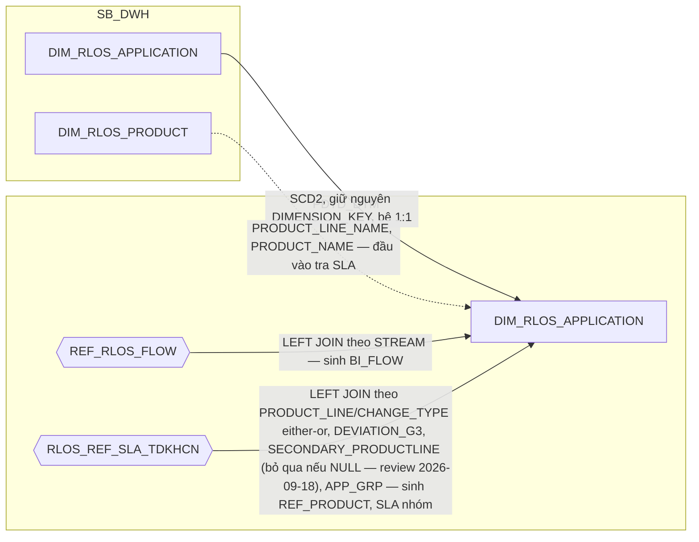

**Ghi chú lineage:** xem ghi chú BI_FLOW ở `DIM_CLOS_APPLICATION` (2.2.1.1) —
cùng cột đích nhưng công thức khác nhau theo hệ.

**Ghi chú lineage — bổ sung `REF_PRODUCT`, `SLA_CREDIT_OFFICER`,
`SLA_MARKER`, `SLA_CHECKER`, `SLA_CREDIT_APPROVER`:** đây là nơi duy nhất
tính được các cột này — `RLOS_REF_SLA_TDKHCN` (2.4.5) chỉ tồn tại ở tầng
PDTD_DTM. Khóa tra gồm `PRODUCT_LINE` hoặc `CHANGE_TYPE` (either/or — chỉ
so khớp `CHANGE_TYPE` khi dòng REF_ có `PRODUCT_LINE = 'Trường Change
Request'`, ngược lại so khớp theo `PRODUCT_LINE`), `DEVIATION_G3`,
`SECONDARY_PRODUCTLINE` (=`IS_SEC_PRODUCT`, map Có→YES/Không→NO),
`APP_GRP` — `DEVIATION_G3`/`SECONDARY_PRODUCTLINE`/`APP_GRP` đã có sẵn
trên `DIM_RLOS_APPLICATION` (SB_DWH, 1.3.1.1), riêng `PRODUCT_LINE` không
có khóa `PRODUCT_SK` trực tiếp trên DIM này (quan hệ hồ sơ↔sản phẩm là 1
chiều, chỉ tồn tại trên `FCT_RLOS_APPLICATION_DAILY.PRODUCT_SK`, grain 1
hồ sơ × 1 ngày, xem 2.3.2.1) — ETL join gián tiếp qua FCT sang `DIM_RLOS_
PRODUCT` để lấy `PRODUCT_LINE_NAME` làm input cho công thức, rồi ghi kết
quả `REF_PRODUCT`/`SLA_*` (vẫn ổn định 1:1 với hồ sơ) thẳng lên `DIM_RLOS_
APPLICATION`. Xem Section 3 dòng #13.

**Đính chính khóa tra — dùng `PRODUCT_LINE_NAME` (tên hiển thị), không
phải `PRODUCT_LINE_CODE` (mã) (review 2026-09-21):** đối chiếu trực tiếp
dữ liệu seed thật của `RLOS_REF_SLA_TDKHCN`/`REF_SLA_NLTT`
(`input/BC5TAT(REF_SLA).xlsx`, cột "Product Line") cho thấy giá trị lưu
là tên hiển thị (`SeAHome-Buy`, `SeAHome-TTD`...), khớp với
`DIM_RLOS_PRODUCT.PRODUCT_LINE_NAME` (cột 5, nguồn `MAS_PRODUCT_LINE.
PRODUCT_LINE_NAME`) — không khớp `PRODUCT_LINE_CODE` (mã nội bộ, cột 4).
Thiết kế trước đây (và Section 3 dòng #13/#46) ghi nhầm `PRODUCT_LINE_
CODE` làm input JOIN — đã sửa lại toàn bộ chỗ dùng khóa này sang
`PRODUCT_LINE_NAME` (ở đây và ở `REF_SLA_NLTT`, xem ghi chú report-time
lookup bên dưới).

**Bổ sung logic "bỏ qua nếu NULL" cho `DEVIATION_G3`/`SECONDARY_PRODUCTLINE`
(review 2026-09-18, theo SRS BC5/BC9 cập nhật):** SRS bản mới bổ sung rõ
*"Nếu file1.'DEVIATION_G3' NULL thì không xét điều kiện này"* và tương tự
cho `SECONDARY_PRODUCTLINE` — 2 điều kiện MỚI không có trong SRS cũ. Khi
dòng REF_ (`RLOS_REF_SLA_TDKHCN`) có `DEVIATION_G3`/`SECONDARY_PRODUCTLINE`
để trống, ETL không so khớp cột đó nữa (bỏ qua khỏi điều kiện AND), khác
với trước đây vốn luôn so khớp cả 2 cột này với giá trị đã tính trên DIM.

**✅ ĐÃ GIẢI QUYẾT (review 2026-09-21) — đảo lại quyết định đóng PENDING
#12: KHÔNG denormalize `SLA_DE_RESULT`/`SLA_QC_RESULT`/`SLA_DE_TOTAL_
RESULT` vào DIM này nữa, chuyển sang report-time lookup:** thiết kế
trước đây (đóng PENDING #12) đặt 3 cột này ngay tại `DIM_RLOS_
APPLICATION` cùng 1 LEFT JOIN input với `REF_PRODUCT`/`SLA_CREDIT_*`.
Rà soát lại khi xử lý gap tương ứng bên CLOS (SRS BC5 cũng yêu cầu CLOS
đọc `REF_SLA_NLTT` nhưng chưa từng được thiết kế ở `DIM_CLOS_APPLICATION`,
xem 2.2.1.1) — quyết định người dùng (review 2026-09-21): bỏ hẳn cách
denormalize cho **cả 2 hệ**, để báo cáo/OAS tự `LEFT JOIN REF_SLA_NLTT`
runtime bằng các khóa đã có sẵn trên DIM/FCT, không thêm cột phái sinh
nào vào `DIM_RLOS_APPLICATION`/`DIM_CLOS_APPLICATION` nữa. Xem logic
JOIN runtime đầy đủ tại `REF_SLA_NLTT` (2.4.8) và ghi chú `POINT` của
BC9 (2.1.9). `SYSTEM_CODE` phân biệt CLOS/RLOS trong cùng 1 bảng REF_
dùng chung.

###### 2.3.1.2 DIM_RLOS_PRODUCT — ✅ ĐÃ GIẢI QUYẾT (nguồn: NG_SB_RLOS_MAS_PRODUCT_LINE/MAS_SUB_PRODUCT, review 2026-09-18; IS_CREDIT_CARD/IS_FAST_PRODUCT chuyển xuống FCT)

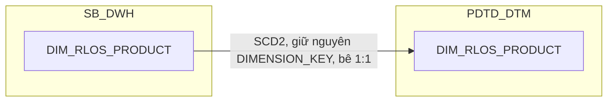

**Ghi chú lineage:** nguồn kế thừa từ SB_DWH nay đã giải quyết
(`NG_SB_RLOS_MAS_PRODUCT_LINE`/`NG_SB_RLOS_MAS_SUB_PRODUCT` — review
2026-09-18, xem 1.3.1.2 trong `HLD_DIM_SB_DWH.md`), thay thế
`MAP_RLOS_PRODUCT`, không còn PENDING nào ở bảng này. `IS_CREDIT_CARD`/
`IS_FAST_PRODUCT` **không còn là cột của DIM này** — đối chiếu SRS BC9 gốc
(`TAT_RLOS`) cho thấy đây không phải 2 thuộc tính bền vững của sản phẩm
mà là **quy tắc phân nhóm SEC/UNSEC riêng của `TAT_RLOS`** (dùng danh
sách `PRODUCT_NAME` cố định + điều kiện `COLLREQUIRE`, đã cài trực tiếp
ở `TAT_RLOS_SEC_*`/`TAT_RLOS_UNSEC_*` của `FCT_LOS_KPI_YTD_DAILY`, 2.1.8
— join `PRODUCT_NAME`/`SUB_PRODUCT_CODE` qua `DIM_RLOS_PRODUCT`), không
tạo cột cờ trên DIM.

**Đính chính — `SLHS_RLOS`/`SLGN_RLOS` KHÔNG dùng điều kiện phân nhóm
sản phẩm này:** SRS cũng định nghĩa "Nhóm 1/Nhóm 2" riêng cho
`SLHS_RLOS`/`SLGN_RLOS` (theo `SUB_PRODUCT`/`PRODUCT_NAME` Credit
Card/SeAHome-Fast), nhưng 2 nhóm đó **bù trừ hoàn toàn** (điều kiện đối
lập chính xác) nên `SLHS(Nhóm 1) + SLHS(Nhóm 2)` luôn bằng COUNT trên
toàn bộ hồ sơ thỏa điều kiện lọc chung — không cần tách nhóm khi tính,
không phải cùng 1 loại rule với `TAT_RLOS`. Xem chi tiết đối chiếu SRS
đầy đủ tại `FCT_LOS_KPI_YTD_DAILY` (2.1.8, Section 1). Xem Section 3
dòng #3.

###### 2.3.1.3 DIM_RLOS_WORKSTEP — ✅ ĐÃ GIẢI QUYẾT (kế thừa nguồn NG_SB_RLOS_MAS_DECISION từ SB_DWH, review 2026-09-18)

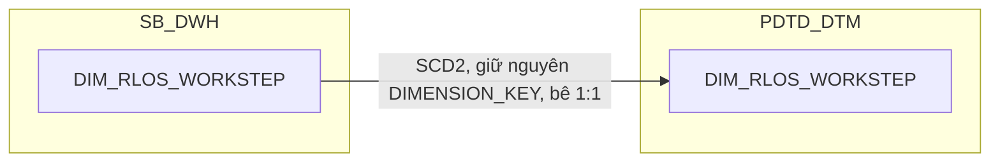

**Ghi chú lineage:** xem ghi chú đầy đủ ở `DIM_CLOS_WORKSTEP` (2.2.1.3) —
cùng thiết kế: nguồn kế thừa đã giải quyết (`NG_SB_RLOS_MAS_DECISION`,
DISTINCT QUEUE_NAME — review 2026-09-18, xem 1.3.1.3 trong
`HLD_DIM_SB_DWH.md`), thay thế `MAP_RLOS_WORKSTEP`. Bản PDTD_DTM bê 1:1,
không có cột phái sinh nào. Cột `IS_PDTD_STEP` đã bị loại bỏ (review
2026-09-15, xem lý do đầy đủ tại 2.2.1.3) — không báo cáo nào tiêu thụ
giá trị này.

###### 2.3.1.4 DIM_RLOS_DECISION — ✅ ĐÃ GIẢI QUYẾT (kế thừa nguồn NG_SB_RLOS_MAS_DECISION từ SB_DWH, review 2026-09-18)

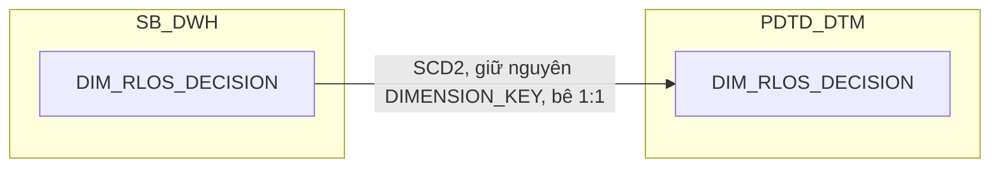

**Ghi chú lineage:** nguồn kế thừa từ SB_DWH nay đã giải quyết
(`NG_SB_RLOS_MAS_DECISION`, DISTINCT DECISION — review 2026-09-18, xem
1.3.1.4 trong `HLD_DIM_SB_DWH.md`), thay thế `MAP_RLOS_DECISION`. Bản
PDTD_DTM bê 1:1, không có REF_ nào join thêm.

###### 2.3.1.5 DIM_RLOS_EXCEPTION_REASON


**Ghi chú lineage:** bản PDTD_DTM bê 1:1 từ SB_DWH, không có REF_ nào join
thêm — cấu trúc giữ nguyên như tài liệu gốc.

###### 2.3.1.6 DIM_RLOS_COLLATERAL_TYPE

```mermaid
flowchart LR
    subgraph SB_DWH
        D["DIM_RLOS_COLLATERAL_TYPE"]
    end
    subgraph PDTD_DTM
        E["DIM_RLOS_COLLATERAL_TYPE"]
    end
    D -->|SCD2, giữ nguyên DIMENSION_KEY, bê 1:1| E
```

**Ghi chú lineage:** bản PDTD_DTM bê 1:1 từ SB_DWH, không có REF_ nào join
thêm — cấu trúc giữ nguyên như tài liệu gốc.

###### 2.3.1.7 DIM_RLOS_CHANGE_TYPE

```mermaid
flowchart LR
    subgraph SB_DWH
        D["DIM_RLOS_CHANGE_TYPE"]
    end
    subgraph PDTD_DTM
        E["DIM_RLOS_CHANGE_TYPE"]
    end
    D -->|SCD2, giữ nguyên DIMENSION_KEY, bê 1:1| E
```

**Ghi chú lineage:** bản PDTD_DTM bê 1:1 từ SB_DWH, không có REF_ nào join
thêm — cấu trúc giữ nguyên như tài liệu gốc.

###### 2.3.1.8 DIM_RLOS_GEO

```mermaid
flowchart LR
    subgraph SB_DWH
        D["DIM_RLOS_GEO"]
    end
    subgraph PDTD_DTM
        E["DIM_RLOS_GEO"]
    end
    D -->|SCD2, giữ nguyên DIMENSION_KEY, bê 1:1| E
```

**Ghi chú lineage:** bản PDTD_DTM bê 1:1 từ SB_DWH, không có REF_ nào join
thêm — cấu trúc giữ nguyên như tài liệu gốc.

###### 2.3.1.9 DIM_RLOS_CARD_PROMOTION

```mermaid
flowchart LR
    subgraph SB_DWH
        D["DIM_RLOS_CARD_PROMOTION"]
    end
    subgraph PDTD_DTM
        E["DIM_RLOS_CARD_PROMOTION"]
    end
    D -->|SCD2, giữ nguyên DIMENSION_KEY, bê 1:1| E
```

**Ghi chú lineage:** bản PDTD_DTM bê 1:1 từ SB_DWH, không có REF_ nào join
thêm — cấu trúc giữ nguyên như tài liệu gốc.

###### 2.3.1.10 DIM_RLOS_APPLICANT

```mermaid
flowchart LR
    subgraph SB_DWH
        D["DIM_RLOS_APPLICANT"]
    end
    subgraph PDTD_DTM
        E["DIM_RLOS_APPLICANT"]
    end
    D -->|SCD2, giữ nguyên DIMENSION_KEY, bê 1:1| E
```

**Ghi chú lineage:** bản PDTD_DTM bê 1:1 từ SB_DWH, không có REF_ nào join
thêm — cấu trúc giữ nguyên như tài liệu gốc.

###### 2.3.1.11 DIM_RLOS_COREPAYER

```mermaid
flowchart LR
    subgraph SB_DWH
        D["DIM_RLOS_COREPAYER"]
    end
    subgraph PDTD_DTM
        E["DIM_RLOS_COREPAYER"]
    end
    D -->|SCD2, giữ nguyên DIMENSION_KEY, bê 1:1| E
```

**Ghi chú lineage:** bản PDTD_DTM bê 1:1 từ SB_DWH, không có REF_ nào join
thêm — cấu trúc giữ nguyên như tài liệu gốc.


---

## Section 2 — Column Design

### 2.1 Bộ bảng CHUNG

##### 2.1.1 DIM_LOS_ORG_UNIT — ✅ ĐÃ GIẢI QUYẾT (kế thừa nguồn NG_SB_RLOS_MAS_COMPANY/MAS_BRANCH/MAS_REGION từ SB_DWH, review 2026-09-18)

**Bảng cũ (trước tách):** `DIM_PDTD_ORG_UNIT` → đổi tên thành `DIM_LOS_ORG_UNIT` (bỏ tiền tố PDTD, dùng chung tên với SB_DWH)

Cấu trúc cột **giống hệt** bản SB_DWH (bê 1:1, xem Section 2 → SB_DWH → Bộ bảng CHUNG → DIM_LOS_ORG_UNIT trong `HLD_DIM_SB_DWH.md`) — không thêm/bớt cột nào ở layer này. **16 cột** (review 2026-09-18, tăng từ 10 cột do đổi nguồn sang bảng danh mục thật, xem Section 1 → 2.1.1).

- Bảng DIM lưu danh mục đơn vị kinh doanh, bê nguyên 1:1 từ SB_DWH, dùng chung cho cả hai hệ CLOS và RLOS.
- Khóa chính của bảng (PK): **DIMENSION_KEY** (giữ nguyên giá trị từ SB_DWH).

##### 2.1.2 DIM_LOS_USER — ✅ ĐÃ GIẢI QUYẾT (kế thừa nguồn NG_SB_RLOS_MAS_USER từ SB_DWH, review 2026-09-18)

**Bảng cũ (trước tách):** `DIM_PDTD_USER` → đổi tên thành `DIM_LOS_USER` (bỏ tiền tố PDTD, dùng chung tên với SB_DWH)

Cấu trúc cột **giống hệt** bản SB_DWH (bê 1:1, xem Section 2 → SB_DWH → Bộ bảng CHUNG → DIM_LOS_USER trong `HLD_DIM_SB_DWH.md`) — không thêm/bớt cột nào ở layer này. **26 cột** (review 2026-09-18, tăng từ 6 cột do đổi nguồn sang bảng danh mục thật + thiết kế dư thừa đầy đủ, xem Section 1 → 2.1.2).

- Bảng DIM lưu danh mục tài khoản cán bộ xử lý hồ sơ, bê nguyên 1:1 từ SB_DWH, dùng chung cho cả hai hệ CLOS và RLOS.
- Khóa chính của bảng (PK): **DIMENSION_KEY** (giữ nguyên giá trị từ SB_DWH).

##### 2.1.3 DIM_T24_CUSTOMER

**Bảng cũ (trước tách):** `DIM_PDTD_CUSTOMER` → đổi tên thành `DIM_T24_CUSTOMER` (bỏ tiền tố PDTD; bảng vốn đã dùng chung cho cả hai hệ, không có bản SB_DWH — chỉ tồn tại ở layer PDTD_DTM)

| STT | Tên cột | Kiểu dữ liệu | Bắt buộc | Độ lớn | Khóa | Mô tả |
| --- | --- | --- | --- | --- | --- | --- |
| 1 | DIMENSION_KEY | NUMBER | Y | 18 | PK | Khóa chính của bảng chiều DIM_T24_CUSTOMER — giữ nguyên DIMENSION_KEY của bảng chiều tương ứng bên SB_DWH (qua vùng chìa STG_DTM), không sinh sequence mới |
| 2 | DATASOURCE | VARCHAR2 | Y | 10 |  | Cột kỹ thuật đánh dấu nguồn hệ, luôn cố định 'T24' — bảng nguồn T24 core banking, không thuộc STG_LOS (CLOS/RLOS) |
| 3 | CUSTOMER_SK | NUMBER | Y | 18 |  | Khóa tham chiếu đến bảng chiều DIM_T24_CUSTOMER, bằng đúng giá trị DIMENSION_KEY của cùng dòng. Mặc định -1 nếu không có giá trị phù hợp |
| 4 | CUSTOMER_ID | VARCHAR2 | Y | 50 | NK | Mã khách hàng CIF — nguồn STG_DIM_CUSTOMER.CUSTOMER (1:1 từ SB_DWH.DIM_CUSTOMER.CUSTOMER) |
| 5 | SHORT_NAME | VARCHAR2 | N | 200 |  | Tên khách hàng theo T24 — nguồn STG_DIM_CUSTOMER_VW.SHORT_NAME (1:1 từ SB_DWH.DIM_CUSTOMER_VW.SHORT_NAME) |
| 6 | LEGAL_ID | VARCHAR2 | N | 100 |  | Số giấy tờ định danh đã chuẩn hóa — nguồn STG_DIM_CUSTOMER.LEGAL_ID. Đây là cột nối về LOS (khớp DIM_CLOS_CUSTOMER.ORG_LEGAL_ID / DIM_RLOS_APPLICANT.ADD_ID, ADD_ID_OTHER) |
| 7 | LEGAL_DOC_NAME | VARCHAR2 | N | 100 |  | Loại giấy tờ định danh — nguồn STG_DIM_CUSTOMER.LEGAL_DOC_NAME. Phải khớp cùng lúc với LEGAL_ID khi tra |
| 8 | DATE_OF_BIRTH | DATE | N |  |  | Ngày sinh — nguồn STG_DIM_CUSTOMER.DATE_OF_BIRTH |
| 9 | GENDER | VARCHAR2 | N | 20 |  | Giới tính — nguồn STG_DIM_CUSTOMER.GENDER |
| 10 | SEAB_CU_SEGMENT | VARCHAR2 | N | 20 |  | Phân khúc khách hàng theo T24 — nguồn STG_DIM_CUSTOMER_VW.SEAB_CU_SEGMENT. BC10 lọc khách hàng cá nhân, BC11 lọc khách hàng doanh nghiệp bằng điều kiện NOT IN ('14','21') |
| 11 | EFF_DATE | DATE | Y |  |  | Ngày bắt đầu hiệu lực của phiên bản bản ghi — do SB_DWH quản lý, bê nguyên qua vùng chìa, không tính lại ở DTM |
| 12 | EXP_DATE | DATE | N |  |  | Ngày hết hiệu lực của phiên bản bản ghi; NULL = bản ghi hiện hành — do SB_DWH quản lý, bê nguyên qua vùng chìa |

- Bảng DIM lưu chiều khách hàng lõi T24, nối vào hồ sơ LOS qua số giấy tờ, dùng chung cho cả hai hệ CLOS và RLOS. Grain: 1 dòng = 1 khách hàng T24. Phục vụ BC1, BC2, BC10, BC11.
- Khóa chính của bảng (PK): **DIMENSION_KEY** (giữ nguyên giá trị từ SB_DWH qua vùng chìa STG_DTM).

**So với thiết kế cũ (`DIM_PDTD_CUSTOMER`, 11 cột):** giữ nguyên 11 cột
nghiệp vụ, bổ sung mới cột kỹ thuật `DATASOURCE` (cố định 'T24') để đồng
bộ với các bảng CHUNG khác tại PDTD_DTM — tổng 12 cột. Bảng này vốn đã
dùng chung cho cả hai hệ (nguồn T24 không phân biệt CLOS/RLOS); đồng thời
đổi tên bảng để bỏ tiền tố `PDTD` cho nhất quán với quy ước `DIM_LOS_*`
của các bảng CHUNG khác.

**Đối chiếu SRS (BC1, BC2, BC10, BC11):** BC1 dùng `CUSTOMER_ID`
(← `STG_DIM_CUSTOMER.CUSTOMER`), `DATE_OF_BIRTH`, `GENDER` — khớp hoàn
toàn. BC2 dùng `CUSTOMER_ID` nhưng qua đường lookup khác:
`STG_DIM_CUSTOMER` LEFT JOIN `REF_CLOS_LEGAL`, lấy giá trị `CUSTOMER` với
điều kiện `TRIM(LEGAL_TYPE) = 'CUSTOMER'` — đây chính là join key
`ORG_LEGAL_ID` trên `DIM_CLOS_CUSTOMER` (đã tra sẵn `LEGAL_TYPE='CUSTOMER'`
từ `DIM_CLOS_LEGAL_PARTY`, xem 2.2.1.7/2.2.1.8), khớp với thiết kế
`T24_CUSTOMER_SK` đã có trên `FCT_CLOS_APPLICATION_DAILY`. BC10/BC11 dùng
`SHORT_NAME` (← `STG_DIM_CUSTOMER_VW.SHORT_NAME`, khớp) nhưng lấy
`CUSTOMER_ID` từ `STG_FCT_LOAN.CUSTOMER_CODE` — một bảng khoản vay T24
khác, ngoài phạm vi `DIM_T24_CUSTOMER`/datamart này (thuộc
nhóm `FCT_CLOS_LOAN_DISBURSEMENT`/`FCT_RLOS_LOAN_DISBURSEMENT`, xem 2.2.2.7/2.3.2.8). Không phát hiện lệch
tài liệu nào ở phạm vi cột của bảng này; không phát sinh PENDING mới.

##### 2.1.4 DIM_T24_COMPANY

**Bảng cũ (trước tách):** không có — bảng mới, tách ra từ mô tả join-time trước đó khi thiết kế `FCT_LOS_DISBURSEMENT` (nay tách thành `FCT_CLOS_LOAN_DISBURSEMENT`/`FCT_RLOS_LOAN_DISBURSEMENT`, xem 2.2.2.7/2.3.2.8), theo yêu cầu người dùng: kéo `DIM_COMPANY` (T24) 1:1 lên PDTD_DTM, đặt FK vật lý thay vì chỉ mô tả JOIN bằng lời

| STT | Tên cột | Kiểu dữ liệu | Bắt buộc | Độ lớn | Khóa | Mô tả |
| --- | --- | --- | --- | --- | --- | --- |
| 1 | DIMENSION_KEY | NUMBER | Y | 18 | PK | Khóa chính của bảng chiều DIM_T24_COMPANY — giữ nguyên DIMENSION_KEY của bảng chiều tương ứng bên SB_DWH (qua vùng chìa STG_DTM), không sinh sequence mới |
| 2 | DATASOURCE | VARCHAR2 | Y | 10 |  | Cột kỹ thuật đánh dấu nguồn hệ, luôn cố định 'T24' — bảng nguồn T24 core banking, không thuộc STG_LOS (CLOS/RLOS) |
| 3 | COMPANY_SK | NUMBER | Y | 18 |  | Khóa tham chiếu đến bảng chiều DIM_T24_COMPANY, bằng đúng giá trị DIMENSION_KEY của cùng dòng. Mặc định -1 nếu không có giá trị phù hợp |
| 4 | COMPANY_CODE | VARCHAR2 | Y | 20 | NK | Mã đơn vị kinh doanh theo T24 — nguồn STG_DIM_COMPANY.COMPANY_CODE (1:1 từ SB_DWH.DIM_COMPANY.COMPANY_CODE). Cùng business key với DIM_LOS_ORG_UNIT.COMPANY_CODE (nguồn LOS) và TMP_REF_COMPANY_REGION_*.COMPANY_CODE, nhưng đây là bảng khác, nguồn T24 |
| 5 | BRANCH_NAME | VARCHAR2 | N | 200 |  | Tên chi nhánh theo T24 — nguồn STG_DIM_COMPANY.BRANCH_NAME. Trường BRANCH_NAME của BC10, BC11 |
| 6 | COMPANY_NAME_VN | VARCHAR2 | N | 200 |  | Tên phòng giao dịch theo T24 — nguồn STG_DIM_COMPANY.COMPANY_NAME_VN. Trường COMPANY_NAME của BC10, BC11 |
| 7 | EFF_DATE | DATE | Y |  |  | Ngày bắt đầu hiệu lực của phiên bản bản ghi — do SB_DWH quản lý, bê nguyên qua vùng chìa, không tính lại ở DTM |
| 8 | EXP_DATE | DATE | N |  |  | Ngày hết hiệu lực của phiên bản bản ghi; NULL = bản ghi hiện hành — do SB_DWH quản lý, bê nguyên qua vùng chìa |

- Bảng DIM lưu chiều đơn vị kinh doanh (chi nhánh/phòng giao dịch) lõi T24, chỉ dùng làm FK cho `FCT_CLOS_LOAN_DISBURSEMENT`/`FCT_RLOS_LOAN_DISBURSEMENT`. Grain: 1 dòng = 1 đơn vị kinh doanh T24. Phục vụ BC10, BC11 (qua FK COMPANY_SK trên fact).
- Khóa chính của bảng (PK): **DIMENSION_KEY** (giữ nguyên giá trị từ SB_DWH qua vùng chìa STG_DTM).

**Bảng mới, không so sánh với thiết kế cũ:** đây là bảng bổ sung phát sinh
trong quá trình thiết kế `FCT_CLOS_LOAN_DISBURSEMENT`/
`FCT_RLOS_LOAN_DISBURSEMENT` — lineage doc gốc
(`FCT_PDTD_DISBURSEMENT.md`) không liệt kê `BRANCH_NAME`/`COMPANY_NAME`
là cột vật lý trên fact, cũng không có DIM company riêng trong 24 bảng
của split-proposal. Việc tách DIM riêng (thay vì lưu `BRANCH_NAME`/
`COMPANY_NAME` trực tiếp trên fact, hoặc coi là join-time qua
`DIM_LOS_ORG_UNIT`) là quyết định kiến trúc theo yêu cầu người dùng, để
2 bảng LOAN_DISBURSEMENT có FK vật lý rõ ràng cho mọi chiều dữ liệu chúng
tham chiếu — không có cột nào chỉ mô tả bằng lời "JOIN qua X" mà không có
khóa tương ứng trên fact.

**Đối chiếu SRS (BC10, BC11):** đã đối chiếu tại Section 1 → 2.1.4.
Không phát sinh PENDING mới.

##### 2.1.5 DIM_T24_LOAN

**Bảng cũ (trước tách):** không có — bảng mới, tách ra khỏi cách denormalize trực tiếp vào fact theo lineage doc gốc, theo yêu cầu người dùng: kéo `DIM_LOAN` (T24) 1:1 lên PDTD_DTM, đặt FK vật lý thay vì lưu 5 cột text/date thẳng trên fact

| STT | Tên cột | Kiểu dữ liệu | Bắt buộc | Độ lớn | Khóa | Mô tả |
| --- | --- | --- | --- | --- | --- | --- |
| 1 | DIMENSION_KEY | NUMBER | Y | 18 | PK | Khóa chính của bảng chiều DIM_T24_LOAN — giữ nguyên DIMENSION_KEY của bảng chiều tương ứng bên SB_DWH (qua vùng chìa STG_DTM), không sinh sequence mới |
| 2 | DATASOURCE | VARCHAR2 | Y | 10 |  | Cột kỹ thuật đánh dấu nguồn hệ, luôn cố định 'T24' — bảng nguồn T24 core banking, không thuộc STG_LOS (CLOS/RLOS) |
| 3 | CONTRACT_SK | NUMBER | Y | 18 |  | Khóa tham chiếu đến bảng chiều DIM_T24_LOAN, bằng đúng giá trị DIMENSION_KEY của cùng dòng. Mặc định -1 nếu không có giá trị phù hợp |
| 4 | CONTRACT | VARCHAR2 | Y | 100 | NK | Mã hợp đồng khoản vay theo T24 — nguồn STG_DIM_LOAN.CONTRACT (1:1 từ SB_DWH.DIM_LOAN.CONTRACT) |
| 5 | VALUE_DATE | DATE | N |  |  | Ngày giải ngân — nguồn STG_DIM_LOAN.VALUE_DATE. Trường VALUE_DATE của BC10, BC11 |
| 6 | MATURITY_DATE | DATE | N |  |  | Ngày đáo hạn — nguồn STG_DIM_LOAN.MATURITY_DATE. Trường MATURITY_DATE của BC10, BC11 |
| 7 | REC_STATUS | VARCHAR2 | N | 20 |  | Trạng thái hợp đồng (Active/Deactive) — nguồn STG_DIM_LOAN.REC_STATUS. Trường STATUS của BC10, BC11 |
| 8 | CONTRACT_REF | VARCHAR2 | N | 100 |  | Mã hợp đồng tham chiếu — nguồn STG_DIM_LOAN.CONTRACT_REF. Trường CONTRACT_REF của BC10, BC11 |
| 9 | REF_VALUE_DATE | DATE | N |  |  | Ngày hiệu lực của hợp đồng tham chiếu — nguồn STG_DIM_LOAN.REF_VALUE_DATE. Trường REF_VALUE_DATE của BC10, BC11 |
| 10 | EFF_DATE | DATE | Y |  |  | Ngày bắt đầu hiệu lực của phiên bản bản ghi — do SB_DWH quản lý, bê nguyên qua vùng chìa, không tính lại ở DTM |
| 11 | EXP_DATE | DATE | N |  |  | Ngày hết hiệu lực của phiên bản bản ghi; NULL = bản ghi hiện hành — do SB_DWH quản lý, bê nguyên qua vùng chìa |

- Bảng DIM lưu chiều hợp đồng khoản vay lõi T24, chỉ dùng làm FK cho `FCT_CLOS_LOAN_DISBURSEMENT`/`FCT_RLOS_LOAN_DISBURSEMENT`. Grain: 1 dòng = 1 hợp đồng T24 (theo phiên bản SCD2). Phục vụ BC10, BC11 (qua FK CONTRACT_SK trên fact).
- Khóa chính của bảng (PK): **DIMENSION_KEY** (giữ nguyên giá trị từ SB_DWH qua vùng chìa STG_DTM).

**Bảng mới, không so sánh với thiết kế cũ:** lineage doc gốc
(`FCT_PDTD_DISBURSEMENT.md`) denormalize 5 cột này thẳng vào fact (1:1 từ
`SB_DWH.DIM_LOAN`), không tách DIM riêng. Theo yêu cầu người dùng: tách
thành `DIM_T24_LOAN`, đặt FK vật lý `CONTRACT_SK` trên fact — cùng lý do
đã áp dụng cho `DIM_T24_COMPANY` (2.1.4).

**Đối chiếu SRS (BC10, BC11):** đã đối chiếu chi tiết tại Section 1 →
2.2.2.7 (đọc lại đầy đủ bảng "Các bảng sử dụng" trong docx) — join key thật
là `CONTRACT_SK` (surrogate có sẵn trên `STG_FCT_LOAN`), không phải
`CONTRACT` trực tiếp. Không phát sinh PENDING mới.

##### 2.1.6 DIM_T24_SEAB_PRODUCTS_DE

**Bảng cũ (trước tách):** không có — bảng mới, tách ra khỏi cách denormalize trực tiếp vào fact theo lineage doc gốc, theo yêu cầu người dùng: kéo `DIM_SEAB_PRODUCTS_DE` (T24) 1:1 lên PDTD_DTM, đặt FK vật lý thay vì lưu cột text thẳng trên fact

| STT | Tên cột | Kiểu dữ liệu | Bắt buộc | Độ lớn | Khóa | Mô tả |
| --- | --- | --- | --- | --- | --- | --- |
| 1 | DIMENSION_KEY | NUMBER | Y | 18 | PK | Khóa chính của bảng chiều DIM_T24_SEAB_PRODUCTS_DE — giữ nguyên DIMENSION_KEY của bảng chiều tương ứng bên SB_DWH (qua vùng chìa STG_DTM), không sinh sequence mới |
| 2 | DATASOURCE | VARCHAR2 | Y | 10 |  | Cột kỹ thuật đánh dấu nguồn hệ, luôn cố định 'T24' — bảng nguồn T24 core banking, không thuộc STG_LOS (CLOS/RLOS) |
| 3 | SEAB_PRODUCTS_DE_SK | NUMBER | Y | 18 |  | Khóa tham chiếu đến bảng chiều DIM_T24_SEAB_PRODUCTS_DE, bằng đúng giá trị DIMENSION_KEY của cùng dòng. Mặc định -1 nếu không có giá trị phù hợp |
| 4 | SEAB_PRODUCTS_DE_NAME | VARCHAR2 | N | 200 |  | Tên sản phẩm giải ngân theo T24 — nguồn STG_DIM_SEAB_PRODUCTS_DE.SEAB_PRODUCTS_DE_NAME. Trường PRODUCT_T24 của BC10, BC11 |
| 5 | EFF_DATE | DATE | Y |  |  | Ngày bắt đầu hiệu lực của phiên bản bản ghi — do SB_DWH quản lý, bê nguyên qua vùng chìa, không tính lại ở DTM |
| 6 | EXP_DATE | DATE | N |  |  | Ngày hết hiệu lực của phiên bản bản ghi; NULL = bản ghi hiện hành — do SB_DWH quản lý, bê nguyên qua vùng chìa |

- Bảng DIM lưu chiều sản phẩm giải ngân lõi T24, chỉ dùng làm FK cho `FCT_CLOS_LOAN_DISBURSEMENT`/`FCT_RLOS_LOAN_DISBURSEMENT`. Grain: 1 dòng = 1 sản phẩm T24 (theo phiên bản SCD2). Phục vụ BC10, BC11 (qua FK SEAB_PRODUCTS_DE_SK trên fact).
- Khóa chính của bảng (PK): **DIMENSION_KEY** (giữ nguyên giá trị từ SB_DWH qua vùng chìa STG_DTM).

**Bảng mới, không so sánh với thiết kế cũ:** cùng lý do đã áp dụng cho
`DIM_T24_LOAN` (2.1.5) — tách DIM riêng thay vì denormalize `PRODUCT_T24`
thẳng vào fact.

**Đối chiếu SRS (BC10, BC11):** đã đối chiếu chi tiết tại Section 1 →
2.2.2.7 — join key là `SEAB_PRODUCTS_DE_SK` (surrogate có sẵn trên
`STG_FCT_LOAN`; SRS ghi nguyên văn `SEAB_PRODUCTS_SK`, người dùng xác nhận
coi là thiếu chính tả, dùng đúng tên khớp tên bảng đích). Không có tài
liệu nào xác nhận business key gốc của sản phẩm T24 (chỉ có surrogate) —
không thiết kế cột NK nào ngoài `SEAB_PRODUCTS_DE_NAME`. Không phát sinh
PENDING mới.


##### 2.1.10 DIM_DATE

**Bảng cũ (trước tách):** `DIM_DATE` (không đổi) — bê 1:1 từ `SB_DWH.DIM_DATE`, không thiết kế lại

| STT | Tên cột | Kiểu dữ liệu | Bắt buộc | Độ lớn | Khóa | Mô tả |
| --- | --- | --- | --- | --- | --- | --- |
| 1 | DAYID | DATE | Y | 18 | PK | Ngày dữ liệu — khóa tự nhiên, đồng thời là khóa phân vùng của mọi bảng FCT trong tài liệu. Nguồn SB_DWH.DIM_DATE.DAYID |
| 2 | IS_WORKING_DAY | VARCHAR2 | Y | 1 |  | 'Y' nếu là ngày làm việc — đầu vào của hàm tính TAT theo giờ làm việc (get_business_minute). Nguồn SB_DWH.DIM_DATE.IS_WORKING_DAY |
| 3 | REPORT_WEEK | VARCHAR2 | Y | 17 |  | Tuần báo cáo — khoảng ngày đầu tuần-cuối tuần (Thứ 2 đến Chủ nhật), dạng YYYYMMDD-YYYYMMDD (review 2026-09-17: sửa lại đúng định dạng SRS BC4, bản cũ ghi nhầm "YYYY-WW" số tuần ISO). Trường REPORT_WEEK của BC4. Nguồn SB_DWH.DIM_DATE.REPORT_WEEK |
| 4 | YEAR_MONTH | VARCHAR2 | Y | 6 |  | Cột kỹ thuật group-theo-tháng của ngày (dạng YYYY-MM), phái sinh từ DAYID — dùng chuẩn cho các bảng chiều ngày. Nguồn SB_DWH.DIM_DATE.YEAR_MONTH (review 2026-09-17: bỏ tham chiếu "Trường YEAR_MONTH của BC9" — đối chiếu SRS xác nhận field YEAR_MONTH của BC9 thực chất là ngày đại diện cho tham số lọc "Năm báo cáo" do người dùng chọn, khác hẳn khái niệm cột tháng YYYY-MM này, không phải căn cứ nghiệp vụ hợp lệ cho cột) |
| 5 | YEAR_ID | NUMBER | Y | 4 |  | Năm của ngày này — mốc reset các phép lũy kế YTD (khớp `KPI_YEAR` trên `REF_LOS_KPI_USER_YEAR`/`FCT_LOS_KPI_YTD_DAILY`, 2.1.7/2.1.8). Nguồn SB_DWH.DIM_DATE.YEAR_ID |

- Bảng DIM chiều ngày dùng chung toàn ngân hàng, bê nguyên 1:1 từ `SB_DWH.DIM_DATE` — không tính lại `IS_WORKING_DAY` hay bất kỳ cột nào ở tầng PDTD_DTM. Phục vụ BC4, BC9, và mọi báo cáo lọc theo khoảng ngày.
- Khóa chính của bảng (PK): **DAYID**.

**Quy tắc load:** bê 1:1 toàn bộ bảng từ `SB_DWH.DIM_DATE`, nạp lại toàn
bộ khi lịch (ngày lễ, ngày làm việc) có thay đổi — không phải SCD2, không
phải nạp incremental theo `DAYID` mới. Giữ nguyên tên cột và giá trị.

**Không phát sinh PENDING mới** — đây là bảng có sẵn của hệ thống, kéo
1:1 theo đúng xác nhận của người dùng, không cần đối chiếu SRS thêm vì
không có công thức nghiệp vụ nào tính lại ở tầng PDTD_DTM.


### 2.2 Bộ bảng CLOS

##### 2.2.1 DIM

###### 2.2.1.1 DIM_CLOS_APPLICATION — ✅ ĐÃ GIẢI QUYẾT (xem DQ-11 ở SB_DWH; đã bổ sung REF_PRODUCT, SLA_*)

**Bảng cũ (trước tách):** `DIM_PDTD_APPLICATION` → tách phần thuộc tính CLOS thành `DIM_CLOS_APPLICATION` (bỏ tiền tố PDTD, dùng chung tên với SB_DWH)

Cấu trúc cột **kế thừa toàn bộ** từ SB_DWH (bê 1:1, xem Section 2 → 1. SB_DWH
→ 1.2 Bộ bảng CLOS → 1.2.1.1 DIM_CLOS_APPLICATION — nay 26 cột (đã gồm
`DATASOURCE`, đã bổ sung `CHANGE_TYPE`/`APP_GRP`/`HAVE_ANY_DEVIATION`,
DQ-11 đã giải quyết; review 2026-09-21: thêm dư thừa `CREDIT_LIMIT_
COMMITTEE`/`CURRENCY_CODE`/`APPROVED_TERM` phục vụ BC3), **cộng thêm 6
cột mới** sinh tại PDTD_DTM:

| STT | Tên cột | Kiểu dữ liệu | Bắt buộc | Độ lớn | Khóa | Mô tả |
| --- | --- | --- | --- | --- | --- | --- |
| ... | *(26 cột kế thừa từ SB_DWH, gồm cả DATASOURCE — xem 1.2.1.1)* |  |  |  |  |  |
| 27 | BI_FLOW | VARCHAR2 | N | 50 |  | Luồng nghiệp vụ chuẩn hóa để hiển thị trên báo cáo — PHÁI SINH tại PDTD_DTM: với CLOS tính bằng CASE theo CUST_GROUP (không qua bảng REF_ nào, khác cách RLOS lookup REF_RLOS_FLOW) |
| 28 | REF_PRODUCT | NVARCHAR2 | N | 200 |  | Nhóm sản phẩm dùng để tra cam kết SLA (BC5) — PHÁI SINH: LEFT JOIN `CLOS_REF_SLA_TDKHDNL`/`CLOS_REF_SLA_TDKHDN` (chọn theo `CUST_GROUP`) theo `PRODUCT_LINE`+`SUB_PRODUCT`+`HAVE_ANY_DEVIATION`+`FLAG_APP_GRP` (quy đổi từ `APP_GRP`). Điều kiện `SUB_PRODUCT` (review 2026-09-18, theo SRS BC5 cập nhật): luôn so khớp `SUB_PRODUCT` trực tiếp — SRS mới đã bỏ điều kiện loại trừ theo `CHANGE_REQUEST` (bản trước chỉ so khớp khi hồ sơ không phải "Change Request") |
| 29 | SLA_CREDIT_OFFICER | NUMBER | N | 10,2 |  | Cam kết giờ cho chuyên viên tín dụng — cùng LEFT JOIN trên. Hồ sơ `APP_GRP='C1'`: hằng số cứng 4 giờ, không lookup |
| 30 | SLA_MARKER | NUMBER | N | 10,2 |  | Cam kết giờ cho bước lập hồ sơ thẩm định — cùng LEFT JOIN trên. Hồ sơ `APP_GRP='C1'`: hằng số cứng 4 giờ |
| 31 | SLA_CHECKER | NUMBER | N | 10,2 |  | Cam kết giờ cho bước kiểm soát thẩm định — cùng LEFT JOIN trên. Hồ sơ `APP_GRP='C1'`: hằng số cứng 4 giờ |
| 32 | SLA_CREDIT_APPROVER | NUMBER | N | 10,2 |  | Cam kết giờ cho cấp phê duyệt — cùng LEFT JOIN trên. Hồ sơ `APP_GRP='C1'`: hằng số cứng 4 giờ |

- Bảng DIM lưu danh mục hồ sơ tín dụng CLOS, bê nguyên 1:1 từ SB_DWH và bổ sung 6 cột chuẩn hóa/tra cứu cho báo cáo (BI_FLOW, cam kết SLA).
- Khóa chính của bảng (PK): **DIMENSION_KEY** (giữ nguyên giá trị từ SB_DWH).

**✅ ĐÃ ĐÁNH GIÁ — không bổ sung cột SLA nhập liệu tập trung
(`SLA_DE_RESULT`/`SLA_QC_RESULT`/`SLA_DE_TOTAL_RESULT`/`QD_DDE`/
`QD_QC`) vào bảng này (review 2026-09-21):** SRS BC5/BC9 yêu cầu CLOS
cũng đọc `REF_SLA_NLTT` (`SYSTEM_CODE='CLOS'`) nhưng quyết định người
dùng là chuyển hẳn sang report-time lookup cho cả CLOS/RLOS, không
denormalize vào DIM — xem chi tiết tại Section 1 → 2.2.1.1 và ghi chú
`POINT` của BC9 (2.1.9).

**Công thức quy đổi `APP_GRP` → `FLAG_APP_GRP` (review 2026-09-18, cập
nhật theo SRS BC5 mới — thay thế công thức tạm thời trước đây):** SRS BC5
(BR 1.2, cả `CLOS_REF_SLA_TDKHDN`/file2 và `CLOS_REF_SLA_TDKHDNL`/file3)
nay định nghĩa chính thức 2 nhóm: `APP_GRP IN ('A1','A2','B1','B2')` →
`FLAG_APP_GRP = 'CGPD'`; `APP_GRP IN ('BOD','CC','SCC','RCC')` →
`FLAG_APP_GRP = 'HDTD'` (đổi nhãn từ `'BOD/CC'` cũ, đồng thời mở rộng tập
giá trị từ `('BOD','CC')` thành `('BOD','CC','SCC','RCC')`). SRS không
liệt kê `C1`/`DEBTCC` vào 1 trong 2 nhóm trên — `C1` đã có xử lý riêng
bằng hằng số cứng 4 giờ (không qua bảng REF_ này, xem Section 3 dòng #13),
còn `DEBTCC` **chưa có căn cứ SRS để xếp nhóm** — vẫn PENDING, cần BA xác
nhận trước khi sinh LLD (xem Section 3 dòng mới).

###### 2.2.1.2 DIM_CLOS_PRODUCT — ✅ ĐÃ GIẢI QUYẾT (nguồn: NG_SB_CLOS_MAS_PRO_LINE/MAS_SUB_PROD, review 2026-09-18; không có IS_CREDIT_CARD/IS_FAST_PRODUCT)

**Bảng cũ (trước tách):** `DIM_PDTD_PRODUCT` → tách phần thuộc tính CLOS thành `DIM_CLOS_PRODUCT` (bỏ tiền tố PDTD, dùng chung tên với SB_DWH)

Cấu trúc cột **kế thừa toàn bộ** từ SB_DWH (bê 1:1, xem Section 2 → 1. SB_DWH
→ 1.2 Bộ bảng CLOS → 1.2.1.2 DIM_CLOS_PRODUCT trong `HLD_DIM_SB_DWH.md` —
9 cột (đã gồm `DATASOURCE`), nguồn `NG_SB_CLOS_MAS_PRO_LINE`/
`NG_SB_CLOS_MAS_SUB_PROD` — review 2026-09-18), **không bổ sung cột nào ở
PDTD_DTM**.

- Bảng DIM lưu danh mục sản phẩm tín dụng CLOS, bê nguyên 1:1 từ SB_DWH, không có cột phái sinh nào ở tầng này.
- Khóa chính của bảng (PK): **DIMENSION_KEY** (giữ nguyên giá trị từ SB_DWH).

**✅ Nguồn kế thừa đã giải quyết (review 2026-09-18):** `DIM_CLOS_PRODUCT`
bản SB_DWH nay đọc từ `NG_SB_CLOS_MAS_PRO_LINE`/`NG_SB_CLOS_MAS_SUB_PROD`
(xem Section 2 → 1.2.1.2 trong `HLD_DIM_SB_DWH.md`), thay thế
`MAP_CLOS_PRODUCT`, không còn PENDING về bản chất nguồn. Bản PDTD_DTM bê
1:1 nên kế thừa nguồn đã chốt.

**✅ Đã giải quyết — không có `IS_CREDIT_CARD`/`IS_FAST_PRODUCT` ở bảng
này (trước đây "CHƯA CHỐT"/"CHO_RULE_BA"):** đối chiếu trực tiếp SRS BC9
gốc (`SLHS_CLOS`, `SLGN_CLOS`, `TAT_CLOS`) xác nhận CLOS phân nhóm hồ sơ
bằng `NG_SB_CLOS_CUST_INFO.PRODUCT_LINE`/`SUB_PRODUCT` (Nhóm 1:
`PRODUCT_LINE = 'PRO01' AND SUB_PRODUCT IN ('Hạn mức thấu chi', 'Hạn mức
Thẻ tín dụng doanh nghiệp')`; Nhóm 2: phần bù, trừ thêm trường hợp
`PRODUCT_LINE = 'PRO02' AND SUB_PRODUCT = 'Phát hành LC theo món'`) —
hoàn toàn không dùng, không liên quan gì đến khái niệm "thẻ tín dụng"/"sản
phẩm nhanh" của RLOS. `TAT_CLOS` cũng chỉ có 1 công thức `AVG(TAT)` duy
nhất, không phân nhóm SEC/UNSEC như `TAT_RLOS`. Vậy 2 cột này **không có
vai trò gì ở CLOS** — quyết định tách bảng ban đầu
(`output/Table_Split_Proposal_CLOS_RLOS.md` dòng 93/161: "chỉ có ý nghĩa
RLOS") là đúng; việc trước đây đặt 2 cột này lên cả `DIM_CLOS_PRODUCT` là
lỗi khi copy nguyên cấu trúc bảng PDTD_DTM cũ (gộp CLOS+RLOS) sang bảng đã
tách — nay đã gỡ bỏ. Xem Section 3 dòng #3.

###### 2.2.1.3 DIM_CLOS_WORKSTEP — ✅ ĐÃ GIẢI QUYẾT (nguồn: NG_SB_CLOS_MAS_DECISION, review 2026-09-18)

**Bảng cũ (trước tách):** `DIM_PDTD_WORKSTEP` → tách phần thuộc tính CLOS thành `DIM_CLOS_WORKSTEP` (bỏ tiền tố PDTD, dùng chung tên với SB_DWH)

Cấu trúc cột **giống hệt** bản SB_DWH (bê 1:1, xem Section 2 → 1. SB_DWH →
1.2 Bộ bảng CLOS → 1.2.1.3 DIM_CLOS_WORKSTEP trong `HLD_DIM_SB_DWH.md` —
6 cột, đã gồm `DATASOURCE`, nguồn `NG_SB_CLOS_MAS_DECISION` DISTINCT
QUEUE_NAME — review 2026-09-18) — không thêm/bớt cột nào ở layer này,
không có REF_ nào join thêm.

- Bảng DIM lưu danh mục bước xử lý CLOS, bê nguyên 1:1 từ SB_DWH, không có cột phái sinh nào ở tầng này.
- Khóa chính của bảng (PK): **DIMENSION_KEY** (giữ nguyên giá trị từ SB_DWH).

**✅ Đã giải quyết (review 2026-09-18):** nguồn kế thừa từ SB_DWH nay đã
chốt (`NG_SB_CLOS_MAS_DECISION`, xem Section 2 → 1.2.1.3), thay thế
`MAP_CLOS_WORKSTEP`, không còn PENDING về bản chất nguồn.

**Đã loại bỏ cột `IS_PDTD_STEP` (review 2026-09-15):** trước đây có 1
cột phái sinh `IS_PDTD_STEP` tại đây (LEFT JOIN `Q_RLOS_REF_WORKSTEP_
2SYSTEMS` theo `WORKSTEP_CODE = WORKSTEP`), với lý do "dùng làm đầu vào
lọc nhân sự cho BC9 (`NHAN_SU`, `NSLD`)". Đối chiếu lại công thức thật
của `NHAN_SU`/`NSLD` (`REF_LOS_KPI_USER_YEAR`, 2.1.7) xác nhận công thức
đó lọc bằng danh sách 8 `WORKSTEP` literal hardcode trực tiếp trên UNION
`FCT_CLOS_WORKSTEP_EVENT`/`FCT_RLOS_WORKSTEP_EVENT` — **không hề JOIN
qua `IS_PDTD_STEP`**. Cột này không được dùng ở bất kỳ đâu trong toàn bộ
thiết kế nên đã xóa hẳn, đồng thời tránh rủi ro nhân bản DIM khi join
(grain thật của `Q_RLOS_REF_WORKSTEP_2SYSTEMS` là `WORKSTEP+DECISION`,
trong khi DIM chỉ có 1 dòng/`WORKSTEP_CODE`, không có `DECISION` để join
kèm).

###### 2.2.1.4 DIM_CLOS_DECISION — ✅ ĐÃ GIẢI QUYẾT (nguồn: NG_SB_CLOS_MAS_DECISION, review 2026-09-18)

**Bảng cũ (trước tách):** `DIM_PDTD_DECISION` → tách phần thuộc tính CLOS thành `DIM_CLOS_DECISION` (bỏ tiền tố PDTD, dùng chung tên với SB_DWH)

Cấu trúc cột **giống hệt** bản SB_DWH (bê 1:1, xem Section 2 → 1. SB_DWH →
1.2 Bộ bảng CLOS → 1.2.1.4 DIM_CLOS_DECISION trong `HLD_DIM_SB_DWH.md` —
6 cột, đã gồm `DATASOURCE`, nguồn `NG_SB_CLOS_MAS_DECISION` DISTINCT
DECISION — review 2026-09-18) — không thêm/bớt cột nào ở layer này,
không có REF_ nào join thêm.

- Bảng DIM lưu danh mục quyết định tại bước xử lý CLOS, bê nguyên 1:1 từ SB_DWH, không có cột phái sinh nào ở tầng này.
- Khóa chính của bảng (PK): **DIMENSION_KEY** (giữ nguyên giá trị từ SB_DWH).

**✅ Nguồn kế thừa đã giải quyết (review 2026-09-18):** `DIM_CLOS_DECISION`
bản SB_DWH nay đọc từ `NG_SB_CLOS_MAS_DECISION` (xem Section 2 → 1.2.1.4),
thay thế `MAP_CLOS_DECISION`, không còn PENDING về bản chất nguồn. Bản
PDTD_DTM bê 1:1 nên kế thừa nguồn đã chốt.

###### 2.2.1.5 DIM_CLOS_EXCEPTION_REASON

**Bảng cũ (trước tách):** `DIM_PDTD_EXCEPTION_REASON` → tách phần thuộc tính CLOS thành `DIM_CLOS_EXCEPTION_REASON` (bỏ tiền tố PDTD, dùng chung tên với SB_DWH)

Cấu trúc cột **giống hệt** bản SB_DWH (bê 1:1, xem Section 2 → 1. SB_DWH →
1.2 Bộ bảng CLOS → 1.2.1.6 DIM_CLOS_EXCEPTION_REASON — 10 cột, đã gồm
`DATASOURCE`) — không thêm/bớt cột nào ở layer này, không có REF_ nào
join thêm.

- Bảng DIM lưu danh mục lý do ngoại lệ CLOS, bê nguyên 1:1 từ SB_DWH, không có cột phái sinh nào ở tầng này.
- Khóa chính của bảng (PK): **DIMENSION_KEY** (giữ nguyên giá trị từ SB_DWH).

###### 2.2.1.6 DIM_CLOS_COLLATERAL_TYPE

**Bảng cũ (trước tách):** `DIM_PDTD_COLLATERAL_TYPE` → tách phần thuộc tính CLOS thành `DIM_CLOS_COLLATERAL_TYPE` (bỏ tiền tố PDTD, dùng chung tên với SB_DWH)

Cấu trúc cột **giống hệt** bản SB_DWH (bê 1:1, xem Section 2 → 1. SB_DWH →
1.2 Bộ bảng CLOS → 1.2.1.6 DIM_CLOS_COLLATERAL_TYPE — 7 cột, đã gồm `DATASOURCE`) — không
thêm/bớt cột nào ở layer này, không có REF_ nào join thêm.

- Bảng DIM lưu danh mục loại tài sản bảo đảm CLOS, bê nguyên 1:1 từ SB_DWH, không có cột phái sinh nào ở tầng này.
- Khóa chính của bảng (PK): **DIMENSION_KEY** (giữ nguyên giá trị từ SB_DWH).

###### 2.2.1.7 DIM_CLOS_CUSTOMER

**Bảng cũ (trước tách):** `FCT_PDTD_APPLICATION_PARTY` → tách phần khách hàng chính CLOS thành DIM riêng (bỏ tiền tố PDTD, đổi tên `DIM_CLOS_CUSTOMER`)

Cấu trúc cột **giống hệt** bản SB_DWH (bê 1:1, xem Section 2 → 1. SB_DWH →
1.2 Bộ bảng CLOS → 1.2.1.7 DIM_CLOS_CUSTOMER — nay 17 cột sau khi làm
giàu thêm ZONE/APP_DATE/LOAN_PURPOSE/CUST_CATEGORY/PRECUSTGROUP/LG_REQ/
FI_REQ/PHONE_REQ/EMAIL/DISTANCE_BRANCH_CUSTOMER, review 2026-09-21, đã
gồm `DATASOURCE`), bổ sung:

| STT | Tên cột | Kiểu dữ liệu | Bắt buộc | Độ lớn | Khóa | Mô tả |
| --- | --- | --- | --- | --- | --- | --- |
| 18 | ORG_LEGAL_ID | VARCHAR2 | N | 100 |  | PHÁI SINH: LEFT JOIN DIM_CLOS_LEGAL_PARTY (2.2.1.8) theo WI_NAME + LEGAL_TYPE='CUSTOMER' — lưu dư thừa số giấy tờ pháp lý của chính khách hàng vay để tiện tra cứu (đã xác nhận với người dùng: chấp nhận trùng lặp dữ liệu giữa 2 DIM). Join an toàn không fan-out — người dùng xác nhận nghiệp vụ: `OBJ_TYPE='Khách hàng'` (LEGAL_TYPE='CUSTOMER') luôn đúng 1 dòng/hồ sơ trên NG_SB_CLOS_CUST_INFO_LEGAL, khác với các vai trò khác (đại diện/thành viên góp vốn...) có thể nhiều dòng |
| 19 | LEGAL_REPRESENTATIVE | VARCHAR2 | N | 1000 |  | Người đại diện theo pháp luật (BC2) — PHÁI SINH: LEFT JOIN DIM_CLOS_LEGAL_PARTY (2.2.1.8) theo WI_NAME + LEGAL_TYPE='LEGAL_REPRESENTATIVE', nối chuỗi FULL_NAME của mọi dòng khớp bằng dấu ";" nếu nhiều đại diện (vai trò này không giới hạn số người, xem 1.2.1.8) — cùng cách RLOS nối ADD_ID/ADD_ID_OTHER (1.3.1.10) khi nhiều giấy tờ. Đúng nguồn SRS BC2 (NG_SB_CLOS_CUST_INFO_LEGAL.NAMEE, lọc OBJ_TYPE='Người đại diện theo pháp luật'); cách nối chuỗi khi nhiều dòng đã được BA xác nhận chính thức, xem Section 3 #19 |
| 20 | ADD_ID_REPRESENTATIVE | VARCHAR2 | N | 1000 |  | Số giấy tờ tùy thân của người đại diện theo pháp luật (BC2) — PHÁI SINH: cùng LEFT JOIN trên, nối chuỗi ID_NUMBER bằng ";" nếu nhiều đại diện. Nguồn SRS BC2 (NG_SB_CLOS_CUST_INFO_LEGAL.ID_NUMBER, cùng điều kiện lọc); cách nối chuỗi đã được BA xác nhận chính thức, xem Section 3 #19 |

- Bảng DIM lưu thông tin doanh nghiệp vay chính CLOS, bê nguyên 1:1 từ SB_DWH, bổ sung ORG_LEGAL_ID/LEGAL_REPRESENTATIVE/ADD_ID_REPRESENTATIVE tra qua DIM_CLOS_LEGAL_PARTY.
- Khóa chính của bảng (PK): **DIMENSION_KEY** (giữ nguyên giá trị từ SB_DWH).

###### 2.2.1.8 DIM_CLOS_LEGAL_PARTY

**Bảng cũ (trước tách):** `FCT_PDTD_APPLICATION_PARTY` + `FCT_PDTD_PARTY_DOCUMENT` → gộp thành 1 DIM duy nhất cho các vai trò pháp lý liên quan CLOS (bỏ tiền tố PDTD, đổi tên `DIM_CLOS_LEGAL_PARTY`)

Cấu trúc cột **giống hệt** bản SB_DWH (bê 1:1, xem Section 2 → 1. SB_DWH →
1.2 Bộ bảng CLOS → 1.2.1.8 DIM_CLOS_LEGAL_PARTY — 10 cột, đã gồm `DATASOURCE`), bổ sung:

| STT | Tên cột | Kiểu dữ liệu | Bắt buộc | Độ lớn | Khóa | Mô tả |
| --- | --- | --- | --- | --- | --- | --- |
| 11 | LEGAL_TYPE | VARCHAR2 | N | 50 |  | PHÁI SINH: LEFT JOIN REF_CLOS_LEGAL (2.4.2) theo OBJ_TYPE — chuẩn hóa vai trò pháp lý sang mã tiếng Anh (LEGAL_REPRESENTATIVE, CUSTOMER, COLLATERAL_OWNER, MAIN_CONTRIBUTING_MEMBERS, OTHER); BC2 lọc LEGAL_TYPE='CUSTOMER' khi tra CIF |

- Bảng DIM lưu người/đối tượng liên quan vai trò pháp lý của hồ sơ CLOS, bê nguyên 1:1 từ SB_DWH, bổ sung LEGAL_TYPE chuẩn hóa.
- Khóa chính của bảng (PK): **DIMENSION_KEY** (giữ nguyên giá trị từ SB_DWH).

**Cơ chế nạp SCD2 "full-row-key" (review 2026-09-17):** bê nguyên cơ chế
đã mô tả tại 1.2.1.8 — SCD2 so khớp bằng toàn bộ 5 cột nghiệp vụ
(`WI_NAME`, `ID_NUMBER`, `FULL_NAME`, `OBJ_TYPE`, `LEGAL_DOC`), không
dùng CDC nguồn (rỗng) để phân biệt update/insert — không tính lại ở
tầng PDTD_DTM, chỉ bê nguyên phiên bản đã tạo tại SB_DWH.


### 2.3 Bộ bảng RLOS

##### 2.3.1 DIM

###### 2.3.1.1 DIM_RLOS_APPLICATION — ✅ ĐÃ GIẢI QUYẾT (đã bổ sung REF_PRODUCT, SLA_*)

**Bảng cũ (trước tách):** `DIM_PDTD_APPLICATION` → tách phần thuộc tính RLOS thành `DIM_RLOS_APPLICATION` (bỏ tiền tố PDTD, dùng chung tên với SB_DWH)

Cấu trúc cột **kế thừa toàn bộ** từ SB_DWH (bê 1:1, xem Section 2 → 1. SB_DWH
→ 1.3 Bộ bảng RLOS → 1.3.1.1 DIM_RLOS_APPLICATION — nay 28 cột (đã gồm
`DATASOURCE`, đã bổ sung `APP_GRP`/`DEVIATION_G3`/`CHANGE_TYPE`/
`LAST_APPROVAL_DATE`; review 2026-09-21: thêm dư thừa `APPROVED_AMT_
FINAL`/`CURRENCY_CODE`/`APPROVED_TERM` phục vụ BC3), **cộng thêm 6
cột mới** sinh tại PDTD_DTM:

| STT | Tên cột | Kiểu dữ liệu | Bắt buộc | Độ lớn | Khóa | Mô tả |
| --- | --- | --- | --- | --- | --- | --- |
| ... | *(28 cột kế thừa từ SB_DWH, gồm cả DATASOURCE — xem 1.3.1.1)* |  |  |  |  |  |
| 29 | BI_FLOW | VARCHAR2 | N | 50 |  | Luồng nghiệp vụ chuẩn hóa để hiển thị trên báo cáo — PHÁI SINH tại PDTD_DTM: LEFT JOIN `REF_RLOS_FLOW` theo `STREAM` |
| 30 | REF_PRODUCT | NVARCHAR2 | N | 200 |  | Nhóm sản phẩm dùng để tra cam kết SLA (BC5) — PHÁI SINH: LEFT JOIN `RLOS_REF_SLA_TDKHCN` theo `PRODUCT_LINE`+`CHANGE_TYPE` (either/or)+`DEVIATION_G3`+`SECONDARY_PRODUCTLINE`+`APP_GRP` |
| 31 | SLA_CREDIT_OFFICER | NUMBER | N | 10,2 |  | Cam kết giờ cho chuyên viên tín dụng — cùng LEFT JOIN trên |
| 32 | SLA_MARKER | NUMBER | N | 10,2 |  | Cam kết giờ cho bước lập hồ sơ thẩm định — cùng LEFT JOIN trên |
| 33 | SLA_CHECKER | NUMBER | N | 10,2 |  | Cam kết giờ cho bước kiểm soát thẩm định — cùng LEFT JOIN trên |
| 34 | SLA_CREDIT_APPROVER | NUMBER | N | 10,2 |  | Cam kết giờ cho cấp phê duyệt — cùng LEFT JOIN trên |

- Bảng DIM lưu danh mục hồ sơ tín dụng RLOS, bê nguyên 1:1 từ SB_DWH và bổ sung 6 cột chuẩn hóa/tra cứu cho báo cáo (BI_FLOW, cam kết SLA phê duyệt tín dụng).
- Khóa chính của bảng (PK): **DIMENSION_KEY** (giữ nguyên giá trị từ SB_DWH).

**Ghi chú `PRODUCT_LINE` either/or với `CHANGE_TYPE`:** khi dòng trên
`RLOS_REF_SLA_TDKHCN` có `PRODUCT_LINE = 'Trường Change Request'`, so khớp
theo `CHANGE_TYPE` của hồ sơ thay vì `PRODUCT_LINE`; các dòng khác so khớp
theo `PRODUCT_LINE` bình thường. `DIM_RLOS_APPLICATION` không có cột
`PRODUCT_SK` — `PRODUCT_LINE_NAME` (nguồn `DIM_RLOS_PRODUCT`, đính chính
review 2026-09-21: dùng tên hiển thị, không phải `PRODUCT_LINE_CODE`)
được ETL lấy gián tiếp qua `FCT_RLOS_APPLICATION_DAILY.PRODUCT_SK` (xem
2.3.2.1) làm input cho công thức, không phải khóa join có sẵn trên
chính bảng này — xem giải thích đầy đủ ở Section 1 → 2.3.1.1.

**✅ ĐÃ GIẢI QUYẾT (review 2026-09-21) — bỏ `SLA_DE_RESULT`/`SLA_QC_
RESULT`/`SLA_DE_TOTAL_RESULT` khỏi bảng này (trước là cột 32-34):**
đảo lại quyết định đóng PENDING #12 — 3 cột này không còn denormalize
tại DIM, chuyển sang report-time lookup `REF_SLA_NLTT` (2.4.8) trực
tiếp bằng `PRODUCT_LINE_NAME` (qua `DIM_RLOS_PRODUCT`) + `SYSTEM_
CODE='RLOS'`, cùng áp dụng cho nhánh CLOS (`DIM_CLOS_APPLICATION`,
2.2.1.1) — xem lý do đầy đủ ở Section 1 → 2.3.1.1 và ghi chú `POINT`
của BC9 (2.1.9).

###### 2.3.1.2 DIM_RLOS_PRODUCT — ✅ ĐÃ GIẢI QUYẾT (nguồn: NG_SB_RLOS_MAS_PRODUCT_LINE/MAS_SUB_PRODUCT, review 2026-09-18; IS_CREDIT_CARD/IS_FAST_PRODUCT chuyển xuống FCT)

**Bảng cũ (trước tách):** `DIM_PDTD_PRODUCT` → tách phần thuộc tính RLOS thành `DIM_RLOS_PRODUCT` (bỏ tiền tố PDTD, dùng chung tên với SB_DWH)

Cấu trúc cột **kế thừa toàn bộ** từ SB_DWH (bê 1:1, xem Section 2 → 1. SB_DWH
→ 1.3 Bộ bảng RLOS → 1.3.1.2 DIM_RLOS_PRODUCT trong `HLD_DIM_SB_DWH.md` —
12 cột (đã gồm `DATASOURCE`), nguồn `NG_SB_RLOS_MAS_PRODUCT_LINE`/
`NG_SB_RLOS_MAS_SUB_PRODUCT` — review 2026-09-18, tăng từ 8 cột), **không
bổ sung cột nào ở PDTD_DTM**.

- Bảng DIM lưu danh mục sản phẩm tín dụng RLOS, bê nguyên 1:1 từ SB_DWH, không có cột phái sinh nào ở tầng này.
- Khóa chính của bảng (PK): **DIMENSION_KEY** (giữ nguyên giá trị từ SB_DWH).

**✅ Nguồn kế thừa đã giải quyết (review 2026-09-18):** `DIM_RLOS_PRODUCT`
bản SB_DWH nay đọc từ `NG_SB_RLOS_MAS_PRODUCT_LINE`/
`NG_SB_RLOS_MAS_SUB_PRODUCT` (xem Section 2 → 1.3.1.2), thay thế
`MAP_RLOS_PRODUCT`, không còn PENDING về bản chất nguồn. Bản PDTD_DTM bê
1:1 nên kế thừa nguồn đã chốt, gồm cả cột mới `PRODUCT_LINE_NAME`/
`SECONDARY_PRODUCT`/`SCORE_REQUIRED`/`SCORE_MODEL`.

**✅ Đã giải quyết — `IS_CREDIT_CARD`/`IS_FAST_PRODUCT` không đặt ở DIM
này, chuyển xuống FCT (trước đây "CHƯA CHỐT"/"CHO_RULE_BA"):** đối chiếu
SRS BC9 gốc xác nhận `TAT_RLOS` phân nhóm SEC/UNSEC bằng danh sách
`PRODUCT_NAME` cố định (`SeABuyHuutri`, `SeACivil`, `SeAHome-Buy`,
`SeAHome-Fast`, `SeAHome-Woman`, `SeAHome-Teacher`, `SeAFast_KTSBD_KD`,
`SeAHome-Pro`) + điều kiện `COLLREQUIRE` — không phải 2 thuộc tính bền
vững của sản phẩm, không đặt cột cờ trên DIM. Rule này đã cài trực tiếp
tại `TAT_RLOS_SEC_*`/`TAT_RLOS_UNSEC_*` của `FCT_LOS_KPI_YTD_DAILY`
(2.1.8, join `PRODUCT_NAME`/`SUB_PRODUCT_CODE` qua `DIM_RLOS_PRODUCT`).

**Đính chính — `SLHS_RLOS`/`SLGN_RLOS` KHÔNG dùng điều kiện phân nhóm
sản phẩm này:** SRS cũng định nghĩa "Nhóm 1/Nhóm 2" riêng cho
`SLHS_RLOS`/`SLGN_RLOS` (theo `SUB_PRODUCT`/`PRODUCT_NAME` Credit
Card/SeAHome-Fast), nhưng 2 nhóm đó **bù trừ hoàn toàn** (điều kiện đối
lập chính xác) nên `SLHS(Nhóm 1) + SLHS(Nhóm 2)` luôn bằng COUNT trên
toàn bộ hồ sơ thỏa điều kiện lọc chung — không cần tách nhóm khi tính,
khác hẳn rule SEC/UNSEC của `TAT_RLOS`. Xem chi tiết đối chiếu SRS đầy
đủ (gồm 2 điều kiện lọc bổ sung `BI_FLOW`/`COMPANY_CODE`) tại
`FCT_LOS_KPI_YTD_DAILY` (2.1.8, Section 1). Xem Section 3 dòng #3.

###### 2.3.1.3 DIM_RLOS_WORKSTEP — ✅ ĐÃ GIẢI QUYẾT (nguồn: NG_SB_RLOS_MAS_DECISION, review 2026-09-18)

**Bảng cũ (trước tách):** `DIM_PDTD_WORKSTEP` → tách phần thuộc tính RLOS thành `DIM_RLOS_WORKSTEP` (bỏ tiền tố PDTD, dùng chung tên với SB_DWH)

Cấu trúc cột **giống hệt** bản SB_DWH (bê 1:1, xem Section 2 → 1. SB_DWH →
1.3 Bộ bảng RLOS → 1.3.1.3 DIM_RLOS_WORKSTEP trong `HLD_DIM_SB_DWH.md` —
6 cột, đã gồm `DATASOURCE`, nguồn `NG_SB_RLOS_MAS_DECISION` DISTINCT
QUEUE_NAME — review 2026-09-18) — không thêm/bớt cột nào ở layer này,
không có REF_ nào join thêm.

- Bảng DIM lưu danh mục bước xử lý RLOS, bê nguyên 1:1 từ SB_DWH, không có cột phái sinh nào ở tầng này.
- Khóa chính của bảng (PK): **DIMENSION_KEY** (giữ nguyên giá trị từ SB_DWH).

**✅ Đã giải quyết (review 2026-09-18):** nguồn kế thừa từ SB_DWH nay đã
chốt (`NG_SB_RLOS_MAS_DECISION`, xem Section 2 → 1.3.1.3), thay thế
`MAP_RLOS_WORKSTEP`, không còn PENDING về bản chất nguồn — kể cả nghi
vấn dữ liệu lẫn tiền tố `CLOS_` cũng không còn ảnh hưởng vì nguồn giờ là
bảng danh mục thật.

**Đã loại bỏ cột `IS_PDTD_STEP` (review 2026-09-15):** cùng lý do đã
trình bày đầy đủ tại `DIM_CLOS_WORKSTEP` (2.2.1.3) — công thức thật của
`NHAN_SU`/`NSLD` (`REF_LOS_KPI_USER_YEAR`, 2.1.7) lọc bằng danh sách 8
`WORKSTEP` literal hardcode, không JOIN qua `IS_PDTD_STEP`. Đã xóa hẳn
cột này khỏi cả `DIM_CLOS_WORKSTEP`/`DIM_RLOS_WORKSTEP`.

###### 2.3.1.4 DIM_RLOS_DECISION — ✅ ĐÃ GIẢI QUYẾT (nguồn: NG_SB_RLOS_MAS_DECISION, review 2026-09-18)

**Bảng cũ (trước tách):** `DIM_PDTD_DECISION` → tách phần thuộc tính RLOS thành `DIM_RLOS_DECISION` (bỏ tiền tố PDTD, dùng chung tên với SB_DWH)

Cấu trúc cột **giống hệt** bản SB_DWH (bê 1:1, xem Section 2 → 1. SB_DWH →
1.3 Bộ bảng RLOS → 1.3.1.4 DIM_RLOS_DECISION trong `HLD_DIM_SB_DWH.md` —
6 cột (đã gồm `DATASOURCE`), nguồn `NG_SB_RLOS_MAS_DECISION` DISTINCT
DECISION — review 2026-09-18) — không thêm/bớt cột nào ở layer này,
không có REF_ nào join thêm.

- Bảng DIM lưu danh mục quyết định tại bước xử lý RLOS, bê nguyên 1:1 từ SB_DWH, không có cột phái sinh nào ở tầng này.
- Khóa chính của bảng (PK): **DIMENSION_KEY** (giữ nguyên giá trị từ SB_DWH).

**✅ Nguồn kế thừa đã giải quyết (review 2026-09-18):** `DIM_RLOS_DECISION`
bản SB_DWH nay đọc từ `NG_SB_RLOS_MAS_DECISION` (xem Section 2 →
1.3.1.4), thay thế `MAP_RLOS_DECISION`, không còn PENDING về bản chất
nguồn. Bản PDTD_DTM bê 1:1 nên kế thừa nguồn đã chốt.

###### 2.3.1.5 DIM_RLOS_EXCEPTION_REASON

**Bảng cũ (trước tách):** `DIM_PDTD_EXCEPTION_REASON` → tách phần thuộc tính RLOS thành `DIM_RLOS_EXCEPTION_REASON` (bỏ tiền tố PDTD, dùng chung tên với SB_DWH)

Cấu trúc cột **giống hệt** bản SB_DWH (bê 1:1, xem Section 2 → 1. SB_DWH →
1.3 Bộ bảng RLOS → 1.3.1.5 DIM_RLOS_EXCEPTION_REASON — 10 cột, đã gồm `DATASOURCE`) — không
thêm/bớt cột nào ở layer này, không có REF_ nào join thêm.

- Bảng DIM lưu danh mục lý do ngoại lệ RLOS, bê nguyên 1:1 từ SB_DWH, không có cột phái sinh nào ở tầng này.
- Khóa chính của bảng (PK): **DIMENSION_KEY** (giữ nguyên giá trị từ SB_DWH).

###### 2.3.1.6 DIM_RLOS_COLLATERAL_TYPE

**Bảng cũ (trước tách):** `DIM_PDTD_COLLATERAL_TYPE` → tách phần thuộc tính RLOS thành `DIM_RLOS_COLLATERAL_TYPE` (bỏ tiền tố PDTD, dùng chung tên với SB_DWH)

Cấu trúc cột **giống hệt** bản SB_DWH (bê 1:1, xem Section 2 → 1. SB_DWH →
1.3 Bộ bảng RLOS → 1.3.1.6 DIM_RLOS_COLLATERAL_TYPE — 7 cột, đã gồm `DATASOURCE`) — không
thêm/bớt cột nào ở layer này, không có REF_ nào join thêm.

- Bảng DIM lưu danh mục loại tài sản bảo đảm RLOS, bê nguyên 1:1 từ SB_DWH, không có cột phái sinh nào ở tầng này.
- Khóa chính của bảng (PK): **DIMENSION_KEY** (giữ nguyên giá trị từ SB_DWH).

###### 2.3.1.7 DIM_RLOS_CHANGE_TYPE

**Bảng cũ (trước tách):** `DIM_PDTD_CHANGE_TYPE` → tách phần thuộc tính RLOS thành `DIM_RLOS_CHANGE_TYPE` (bỏ tiền tố PDTD, dùng chung tên với SB_DWH); phần thuộc tính CLOS không tách (gộp vào `DIM_CLOS_APPLICATION`, xem 2.2.1.1)

Cấu trúc cột **giống hệt** bản SB_DWH (bê 1:1, xem Section 2 → 1. SB_DWH →
1.3 Bộ bảng RLOS → 1.3.1.7 DIM_RLOS_CHANGE_TYPE — 9 cột, đã gồm `DATASOURCE`) — không thêm/bớt
cột nào ở layer này, không có REF_ nào join thêm.

- Bảng DIM lưu danh mục loại và chi tiết loại thay đổi điều kiện phê duyệt RLOS, bê nguyên 1:1 từ SB_DWH, không có cột phái sinh nào ở tầng này.
- Khóa chính của bảng (PK): **DIMENSION_KEY** (giữ nguyên giá trị từ SB_DWH).

###### 2.3.1.8 DIM_RLOS_GEO

**Bảng cũ (trước tách):** `DIM_PDTD_GEO` → đổi tên thành `DIM_RLOS_GEO` (bảng vốn đã RLOS-only, đổi tên để nhất quán với quy ước `DIM_RLOS_*`)

Cấu trúc cột **giống hệt** bản SB_DWH (bê 1:1, xem Section 2 → 1. SB_DWH →
1.3 Bộ bảng RLOS → 1.3.1.8 DIM_RLOS_GEO — 11 cột, đã gồm `DATASOURCE`) — không thêm/bớt cột
nào ở layer này, không có REF_ nào join thêm.

- Bảng DIM lưu danh mục địa giới hành chính tỉnh/thành và quận/huyện, bê nguyên 1:1 từ SB_DWH, không có cột phái sinh nào ở tầng này.
- Khóa chính của bảng (PK): **DIMENSION_KEY** (giữ nguyên giá trị từ SB_DWH).

###### 2.3.1.9 DIM_RLOS_CARD_PROMOTION

**Bảng cũ (trước tách):** `DIM_PDTD_CARD_PROMOTION` → đổi tên thành `DIM_RLOS_CARD_PROMOTION` (bảng vốn đã RLOS-only, đổi tên để nhất quán với quy ước `DIM_RLOS_*`)

Cấu trúc cột **giống hệt** bản SB_DWH (bê 1:1, xem Section 2 → 1. SB_DWH →
1.3 Bộ bảng RLOS → 1.3.1.9 DIM_RLOS_CARD_PROMOTION — 7 cột, đã gồm `DATASOURCE`) — không
thêm/bớt cột nào ở layer này, không có REF_ nào join thêm.

- Bảng DIM lưu danh mục chương trình ưu đãi phí thẻ tín dụng, bê nguyên 1:1 từ SB_DWH, không có cột phái sinh nào ở tầng này.
- Khóa chính của bảng (PK): **DIMENSION_KEY** (giữ nguyên giá trị từ SB_DWH).

###### 2.3.1.10 DIM_RLOS_APPLICANT

**Bảng cũ (trước tách):** `FCT_PDTD_APPLICATION_PARTY` → tách thuộc tính applicant chính phía RLOS thành DIM riêng (bỏ tiền tố PDTD, dùng chung tên với SB_DWH)

Cấu trúc cột **giống hệt** bản SB_DWH (bê 1:1, xem Section 2 → 1. SB_DWH →
1.3 Bộ bảng RLOS → 1.3.1.10 DIM_RLOS_APPLICANT — nay 34 cột sau khi làm
giàu thêm ZONE/NATIONALITY/TITLE/HOME_PHONE/PHONE_1/PHONE_2/SALE_TYPE/
BROKER_TYPE/ID/NAME/ACC_OFFICER/ACCOUNT_OFFICER_NAME/EXISTING_CUSTOMER/
APPLICANT_CIF/BUSINESS_MODEL/KYC1 (review 2026-09-21), đã gồm
`DATASOURCE`) — không thêm/bớt cột nào ở layer này, không có REF_ nào
join thêm.

- Bảng DIM lưu thuộc tính người đề nghị vay chính (applicant), bê nguyên 1:1 từ SB_DWH, không có cột phái sinh nào ở tầng này.
- Khóa chính của bảng (PK): **DIMENSION_KEY** (giữ nguyên giá trị từ SB_DWH).

###### 2.3.1.11 DIM_RLOS_COREPAYER

**Bảng cũ (trước tách):** `FCT_PDTD_APPLICATION_PARTY` → tách thuộc tính corepayer phía RLOS thành DIM riêng (bỏ tiền tố PDTD, dùng chung tên với SB_DWH)

Cấu trúc cột **giống hệt** bản SB_DWH (bê 1:1, xem Section 2 → 1. SB_DWH →
1.3 Bộ bảng RLOS → 1.3.1.11 DIM_RLOS_COREPAYER — nay 18 cột sau khi làm
giàu thêm TITLE/HOUSEHOLD/PHONE_1/PHONE_2/HOME_PHONE (review 2026-09-21),
đã gồm `DATASOURCE`) — không thêm/bớt
cột nào ở layer này, không có REF_ nào join thêm.

- Bảng DIM lưu thuộc tính người đồng trả nợ (corepayer), bê nguyên 1:1 từ SB_DWH, không có cột phái sinh nào ở tầng này.
- Khóa chính của bảng (PK): **DIMENSION_KEY** (giữ nguyên giá trị từ SB_DWH).

