# HLD — DIM tables (SB_DWH)

**Trích xuất từ:** `hld/HLD_Table_Design.md` (nguồn tổng, giữ nguyên không xóa)
**Phạm vi:** DIM_LOS_ORG_UNIT, DIM_LOS_USER (CHUNG), toàn bộ DIM CLOS (1.2.1.x), toàn bộ DIM RLOS (1.3.1.x) tại layer SB_DWH.
**Quy ước đồng bộ:** sửa nội dung tại file này TRƯỚC, sau đó copy đoạn đã sửa về đúng vị trí tương ứng trong `hld/HLD_Table_Design.md`. Section 3 (Vấn đề mở) chỉ quản lý tại file tổng, không lặp ở đây.

---

## Section 1 — Data Lineage

### 1.1 Bộ bảng CHUNG

#### 1.1 Bộ bảng CHUNG

##### 1.1.1 DIM_LOS_ORG_UNIT — ✅ ĐÃ GIẢI QUYẾT (nguồn: NG_SB_RLOS_MAS_COMPANY/MAS_BRANCH/MAS_REGION, review 2026-09-18)

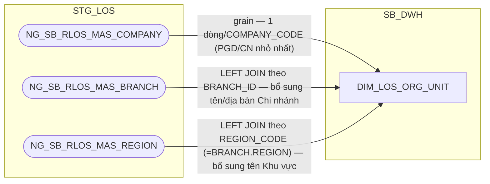

**Đã giải quyết (review 2026-09-18, theo Meeting note 20260909 mục #5):**
nguồn trước đây (`NG_SB_CLOS_CUST_INFO`/`NG_SB_RLOS_APPLICANT_GENERAL` —
giá trị `COMPANY_CODE`/`BRANCH_CODE`/`ZONE` do hồ sơ tự ghi nhận) đã được
xác nhận **không tương ứng với `DIM_COMPANY` (T24)** (BI phản hồi 11/09) và
**thay thế hoàn toàn** bằng 3 bảng danh mục thật do BA LOS cung cấp
(16/09): `NG_SB_RLOS_MAS_COMPANY`, `NG_SB_RLOS_MAS_BRANCH`,
`NG_SB_RLOS_MAS_REGION` — dùng chung cho cả CLOS và RLOS (không có bản
CLOS riêng, cùng đúng bản chất "1 đơn vị kinh doanh vật lý xử lý cả 2 hệ"
đã thiết kế từ đầu).

**Không tách DIM phân cấp riêng (Company/Branch/Region):** theo quyết định
người dùng, vị trí PGD/Chi nhánh/Khu vực là thực thể địa lý cố định (PGD
luôn thuộc đúng 1 Chi nhánh, Chi nhánh luôn thuộc đúng 1 Khu vực, không đổi
theo thời gian) — denormalize cả 3 bảng thành **1 DIM phẳng duy nhất** ở
mức chi tiết nhất (grain = PGD/`COMPANY_CODE`), giữ nguyên kiến trúc
1-DIM-CHUNG đã có, chỉ mở rộng thêm cột từ `MAS_BRANCH`/`MAS_REGION`.

**SCD2 giữ nguyên cơ chế cũ, đổi cách xác định EFF_DATE:** 3 bảng
`MAS_COMPANY`/`MAS_BRANCH`/`MAS_REGION` là bảng danh mục ở STG_LOS,
**không có cột EFF_DATE** do BA khai báo tay (khác `MAP_LOS_USER`/
`MAP_CLOS_PRODUCT`...). Theo quyết định người dùng, `EFF_DATE` của
`DIM_LOS_ORG_UNIT` được ETL tính bằng **CDC** (so sánh bản ghi cũ/mới của 3
bảng nguồn tại mỗi lần chạy) chứ không đọc thẳng từ cột khai báo tay —
khác cơ chế của các DIM ở mục 1.1.2/1.2.1.2-4/1.3.1.2-4 bên dưới (những
DIM đó dùng EFF_DATE do BA/DevOps nhập tay trên chính bảng MAP_).

##### 1.1.2 DIM_LOS_USER — ✅ ĐÃ GIẢI QUYẾT (nguồn: NG_SB_RLOS_MAS_USER, review 2026-09-18)

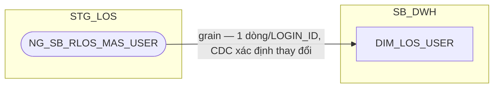

**Đã giải quyết:** `DIM_LOS_USER` lưu danh mục **tài khoản người dùng trên
ứng dụng LOS** (không phải danh sách nhân sự HR). Nguồn nạp trước đây tạm
suy ra qua bảng event log workflow (`NG_SB_CLOS_ENTRY_EXIT`/
`NG_SB_RLOS_ENTRY_EXIT`), sau đó tạm thay bằng bảng khai báo thủ công
`MAP_LOS_USER` (chỉ có `USERNAME`) — nay (review 2026-09-18, theo Meeting
note 20260909 mục #3) BA LOS xác nhận (16/09) dùng bảng danh mục thật
`NG_SB_RLOS_MAS_USER`, dùng chung cho cả CLOS và RLOS (cùng tên gọi
`RLOS` nhưng là danh sách toàn bộ tài khoản LOS, không tách theo hệ) —
**thay thế hoàn toàn** `MAP_LOS_USER`. `ENTRY_EXIT` không còn là nguồn của
DIM này nữa (vẫn tiếp tục là nguồn của các FCT khác như trước).

**Thiết kế dư thừa đầy đủ theo nguồn (review 2026-09-18):** theo quyết
định người dùng (Meeting note mục #15 "thiết kế dư thừa ở Dimension"),
`DIM_LOS_USER` bê nguyên toàn bộ 25 cột nghiệp vụ của `MAS_USER` — không
chỉ `USERNAME` như rà soát SRS trước đây kết luận — để sẵn sàng phục vụ
việc tính KPI/báo cáo phân quyền theo ĐVKD/khối nghiệp vụ (vấn đề #3, #27
Meeting note) dù báo cáo hiện tại chưa khai thác hết. Xem cột chi tiết ở
Section 2.

**SCD2 đổi cách xác định EFF_DATE:** `MAS_USER` không có cột EFF_DATE khai
báo tay như `MAP_LOS_USER` — `EFF_DATE` nay do ETL tính qua **CDC**, cùng
cơ chế đã áp dụng cho `DIM_LOS_ORG_UNIT` (1.1.1). Xem Section 3.


### 1.2 Bộ bảng CLOS

##### 1.2.1 DIM

###### 1.2.1.1 DIM_CLOS_APPLICATION — ✅ ĐÃ GIẢI QUYẾT (xem DQ-11; đã bổ sung CHANGE_TYPE, không tách DIM_CLOS_CHANGE_TYPE; đã bổ sung APP_GRP, HAVE_ANY_DEVIATION — thay thế DIM_CLOS_APPROVAL_GROUP đã loại bỏ)

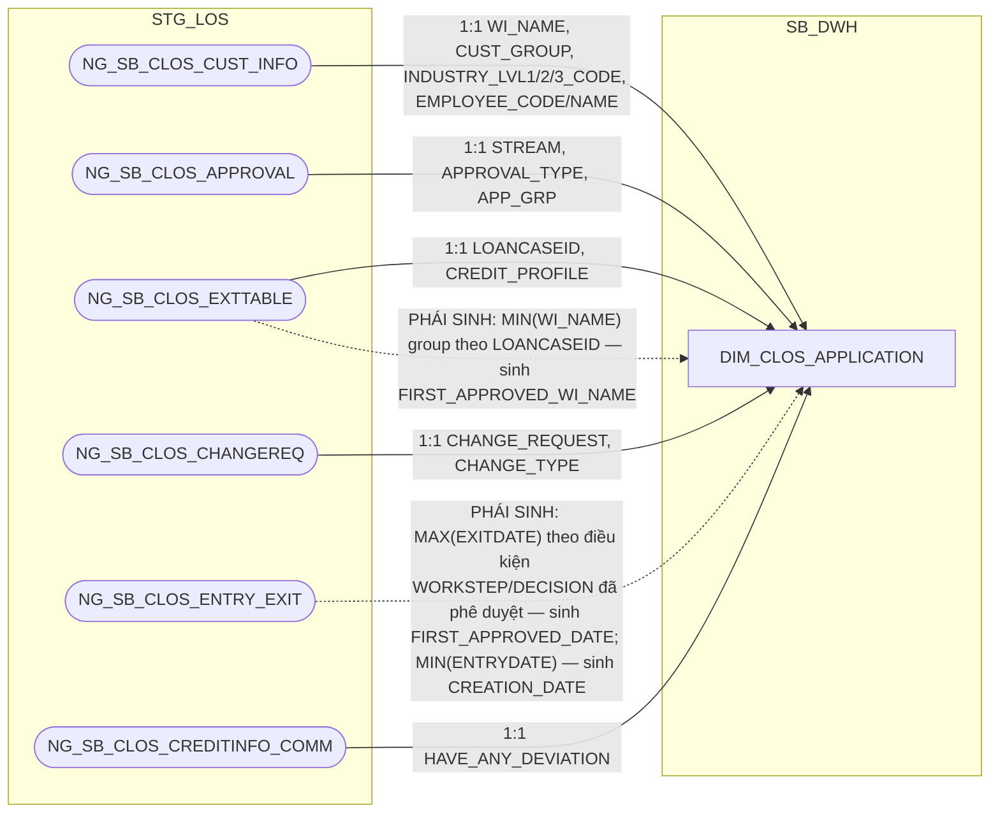

**Đính chính công thức `FIRST_APPROVED_WI_NAME`/`FIRST_APPROVED_DATE`
(review 2026-09-15) — khớp lại đúng SRS BC11:** thiết kế trước đây (kế
thừa từ `extract/SB_DWH/DIM_LOS_APPLICATION.md`, vốn tự ghi chú "LƯU Ý
LỆCH SRS... CẦN BA KÝ NHẬN") dùng công thức "hồ sơ được phê duyệt đầu
tiên theo ENTRYDATE" cho cả 2 cột, khác với nguyên văn SRS BC11:
`APPROVAL_WINAME_LOS` = MIN(WI_NAME) trên `NG_SB_CLOS_EXTTABLE` (group
theo `LOANCASEID`, không lọc WORKSTEP/DECISION), `APPROVAL_DATE` =
MAX(EXITDATE) trên `NG_SB_CLOS_ENTRY_EXIT` (điều kiện `USERNAME IS NOT
NULL AND WORKSTEP IN ('CreditApproval','CreditCommittee') AND DECISION
IN ('Submit','Send To HOSupport','Send To PostSanction')`) — 2 cột độc
lập, không đi cặp cùng 1 bản ghi như thiết kế cũ giả định. Đã sửa lại cả
2 công thức khớp đúng nguyên văn SRS, không còn cảnh báo lệch cần BA ký
nhận. `FCT_CLOS_LOAN_DISBURSEMENT` (2.2.2.7) denormalize trực tiếp 2 cột
này qua `APPLICATION_SK` — nay khớp tuyệt đối BC11, không còn ghi chú
"chấp nhận lệch" như trước.

**Ghi chú lineage — loại bỏ `DIM_CLOS_APPROVAL_GROUP`, bổ sung `APP_GRP` +
`HAVE_ANY_DEVIATION` thẳng lên đây:** kiểm tra lại nguồn `NG_SB_CLOS_APPROVAL`
(RLOS Metadata/CLOS Metadata gốc, sheet Table Review) xác nhận **grain thật
là 1 dòng = 1 hồ sơ** — không phải bảng ghi nhận nhiều lần phê duyệt theo
thời gian như giả định ban đầu khi tạo `DIM_CLOS_APPROVAL_GROUP` (Section 3
dòng #9, nay đã cập nhật). Vì vậy `APP_GRP` (cấp thẩm quyền phê duyệt) là
thuộc tính ổn định của hồ sơ, đọc thẳng từ `NG_SB_CLOS_APPROVAL` — cùng
bảng, cùng cách với `STREAM`/`APPROVAL_TYPE` đã có sẵn ở đây — không cần
một DIM danh mục riêng nữa. `DIM_CLOS_APPROVAL_GROUP` và
`MAP_CLOS_APPROVAL_GROUP` (seed table đi kèm) đã bị loại bỏ hoàn toàn; cột
`APPROVAL_GROUP_SK` cũng bị loại khỏi `FCT_CLOS_APPLICATION_DAILY` (báo
cáo lấy `APP_GRP` bằng JOIN `APPLICATION_SK` sang đây).

`HAVE_ANY_DEVIATION` là cột có sẵn trên `NG_SB_CLOS_CREDITINFO_COMM` (cùng
bảng nguồn đã dùng cho `CREDIT_LIMIT_COMMITTEE` trên
`FCT_CLOS_APPLICATION_DAILY` — bảng ghi tại bước Hội đồng tín dụng, mỗi hồ
sơ 1 dòng, sửa thì ghi đè chứ không sinh dòng mới). Đây là thuộc tính gắn
với hồ sơ (dù chỉ có giá trị từ khi hồ sơ tới bước Hội đồng tín dụng, NULL
ở các phiên bản trước đó — cùng kiểu "thuộc tính đến muộn" như
`RESULT_MAIN_CARD_ID` của `DIM_RLOS_APPLICATION`), không phải giá trị tính
theo giao dịch/theo ngày.

Cả `APP_GRP` và `HAVE_ANY_DEVIATION` dùng làm khóa tra cam kết SLA
(`REF_PRODUCT`/`SLA_*`) khi LEFT JOIN `CLOS_REF_SLA_TDKHDNL`/
`CLOS_REF_SLA_TDKHDN` — việc tra cứu này chỉ thực hiện được ở tầng
PDTD_DTM (REF_ chỉ tồn tại ở đó), xem 2.2.1.1 (Section 1 → PDTD_DTM). SB_DWH
chỉ giữ 2 cột thô này, chưa tính `REF_PRODUCT`/`SLA_*` ở layer này — đã xác
nhận với người dùng, xem Section 3 dòng #13.

**Ghi chú lineage — không tách `DIM_CLOS_CHANGE_TYPE`:** đối chiếu SRS BC2
("Báo cáo CLOS APPLICATION") xác nhận `CHANGE_TYPE` lấy thẳng từ
`NG_SB_CLOS_CHANGEREQ.CHANGE_TYPE`, không qua bảng danh mục nào — khác hẳn
RLOS có `SB_RLOS_MAS_CHANGE_TYPE` là danh mục gốc thật. Metadata CLOS xác
nhận cột này là chuỗi tự do đa giá trị (nhiều loại hạn mức nối bằng `~`,
ví dụ `Hạn mức Chiết khấu~Hạn mức bảo lãnh~`), đã là tên sẵn chứ không phải
mã cần tra tên — không có `DETAIL_CHANGE_TYPE` nào cho CLOS trong SRS. Vì
vậy `CHANGE_TYPE` được giữ làm cột text trực tiếp trên `DIM_CLOS_APPLICATION`
(cùng nguồn `NG_SB_CLOS_CHANGEREQ` với `CHANGE_REQUEST`), không tách thành
DIM riêng — xem Section 3 dòng liên quan.

###### 1.2.1.2 DIM_CLOS_PRODUCT — ✅ ĐÃ GIẢI QUYẾT (nguồn: NG_SB_CLOS_MAS_PRO_LINE/MAS_SUB_PROD, review 2026-09-18)

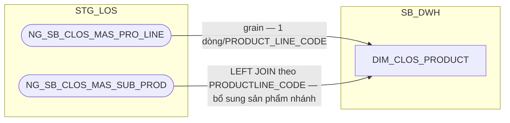

**Đã giải quyết (review 2026-09-18, theo Meeting note 20260909 mục #1):**
nguồn trước đây suy từ `NG_SB_CLOS_CUST_INFO`/`NG_SB_CLOS_EXTTABLE`/
`NG_SB_CLOS_MAS_PRO_LINE` (đều grain-theo-hồ-sơ hoặc chưa xác minh) rồi
tạm thay bằng bảng khai báo thủ công `MAP_CLOS_PRODUCT`; nay BA LOS xác
nhận (16/09) 2 bảng danh mục thật `NG_SB_CLOS_MAS_PRO_LINE` (dòng sản
phẩm) + `NG_SB_CLOS_MAS_SUB_PROD` (sản phẩm nhánh) — **thay thế hoàn
toàn** `MAP_CLOS_PRODUCT`, không cần bảng seed thủ công nữa. Các bảng
`NG_SB_CLOS_CUST_INFO`/`NG_SB_CLOS_EXTTABLE` không còn là nguồn của DIM này
nữa (vẫn tiếp tục phục vụ các bảng khác như `DIM_CLOS_APPLICATION`).

**SCD2 đổi cách xác định EFF_DATE:** `MAS_PRO_LINE`/`MAS_SUB_PROD` không
có cột EFF_DATE khai báo tay như `MAP_CLOS_PRODUCT` trước đây — `EFF_DATE`
nay do ETL tính qua **CDC** (so sánh bản ghi cũ/mới), cùng cơ chế đã áp
dụng cho `DIM_LOS_ORG_UNIT` (1.1.1). Xem Section 3.

###### 1.2.1.3 DIM_CLOS_WORKSTEP — ✅ ĐÃ GIẢI QUYẾT (nguồn: NG_SB_CLOS_MAS_DECISION, review 2026-09-18)

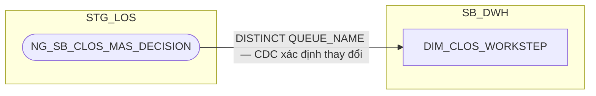

**Đã giải quyết (review 2026-09-18, theo Meeting note 20260909 mục #2):**
nguồn trước đây suy từ `NG_SB_CLOS_ENTRY_EXIT` (bảng lịch sử xử lý, không
phải danh mục bước BPM gốc) rồi tạm thay bằng bảng khai báo thủ công
`MAP_CLOS_WORKSTEP`; nay BA LOS xác nhận (16/09) bảng danh mục thật
`NG_SB_CLOS_MAS_DECISION` — bảng này gộp chung WORKSTEP (`QUEUE_NAME`) và
DECISION (`DECISION`) dạng quan hệ N-N, không có danh mục WORKSTEP độc lập
riêng. Theo quyết định người dùng: **giữ tách 2 DIM** (`DIM_CLOS_WORKSTEP`/
`DIM_CLOS_DECISION`) như thiết kế hiện tại, mỗi DIM suy ra danh mục riêng
bằng `DISTINCT` trên cột tương ứng của cùng bảng nguồn — không gộp thành 1
DIM composite theo đúng cấu trúc N-N của bảng nguồn. `NG_SB_CLOS_ENTRY_EXIT`
không còn là nguồn của DIM này nữa (vẫn tiếp tục phục vụ các FCT khác như
`FCT_CLOS_APPLICATION_DAILY`).

**SCD2 đổi cách xác định EFF_DATE:** cùng cơ chế CDC như 1.2.1.2 (không còn
EFF_DATE khai báo tay của `MAP_CLOS_WORKSTEP`). Xem Section 3.

`WFINSTRUMENTTABLE` vẫn không thuộc phạm vi bảng này — bảng đó chỉ dùng ở
tầng FCT để đối chiếu bước hồ sơ đang đứng hiện tại (`ACTIVITYNAME`) khi
tính cột phái sinh `WORKSTEP_FLAG` (trước đây gọi tắt là "BC4.FLAG") trên
`FCT_*_APPLICATION_DAILY`. **✅ Đã giải quyết (PENDING #6):**
`WFINSTRUMENTTABLE.PROCESSNAME`/`ACTIVITYNAME` đã được nạp trực tiếp vào
`FCT_CLOS_APPLICATION_DAILY`/`FCT_RLOS_APPLICATION_DAILY` (1.2.2.1/
1.3.2.1) để tính `WORKSTEP_FLAG` theo đúng 5 nhánh CASE-WHEN của SRS BC4
— không liên quan tới `DIM_CLOS_WORKSTEP`. **Cập nhật (review
2026-09-21):** nay `WFINSTRUMENTTABLE` cũng LEFT JOIN thêm vào
`FCT_CLOS_WORKSTEP_EVENT`/`FCT_RLOS_WORKSTEP_EVENT` (1.2.2.6/1.3.2.7) để
tính `WORKSTEP_FLAG` độc lập trực tiếp trên bảng event (phục vụ BC4
không cần JOIN fan-out sang `APPLICATION_DAILY` nữa). **Cập nhật tiếp
(review 2026-09-21):** đã bỏ hẳn `WORKSTEP_FLAG` khỏi `FCT_CLOS_
APPLICATION_DAILY`/`FCT_RLOS_APPLICATION_DAILY` — cột chỉ phục vụ đúng
BC4, không còn consumer nào sau khi BC4 đổi sang đọc bản trên
`FCT_CLOS_WORKSTEP_EVENT`/`FCT_RLOS_WORKSTEP_EVENT`.

###### 1.2.1.4 DIM_CLOS_DECISION — ✅ ĐÃ GIẢI QUYẾT (nguồn: NG_SB_CLOS_MAS_DECISION, review 2026-09-18)


**Đã giải quyết (review 2026-09-18, theo Meeting note 20260909 mục #2):**
nguồn trước đây suy từ `NG_SB_CLOS_ENTRY_EXIT` (bảng lịch sử xử lý, không
phải danh mục quyết định BPM gốc) rồi tạm thay bằng bảng khai báo thủ công
`MAP_CLOS_DECISION`; nay BA LOS xác nhận (16/09) cùng bảng danh mục thật
`NG_SB_CLOS_MAS_DECISION` đã dùng cho `DIM_CLOS_WORKSTEP` (1.2.1.3) — lấy
`DISTINCT DECISION` từ cùng bảng (xem 1.2.1.3 về lý do giữ tách 2 DIM thay
vì gộp theo đúng quan hệ N-N của bảng nguồn). `NG_SB_CLOS_ENTRY_EXIT` không
còn là nguồn của DIM này nữa (vẫn tiếp tục phục vụ các FCT khác như
`FCT_CLOS_APPLICATION_DAILY`).

**SCD2 đổi cách xác định EFF_DATE:** cùng cơ chế CDC như 1.2.1.3 (không còn
EFF_DATE khai báo tay của `MAP_CLOS_DECISION`). Xem Section 3.

###### 1.2.1.5 DIM_CLOS_EXCEPTION_REASON


**Ghi chú lineage:** khác với `WORKSTEP`/`DECISION`/`APPROVAL_GROUP`,
`NG_SB_CLOS_MAS_EXCEPTION` mang tiền tố `MAS_` (master) và được lineage
doc gốc xác nhận là bảng LOẠI 1 với khóa CDC khai đủ tổ hợp khóa tự nhiên —
tức đây thực sự là danh mục cấu hình gốc (lý do ngoại lệ được phép phát
sinh tại từng bước/quyết định), không phải bảng sự kiện/giao dịch theo hồ
sơ như `NG_SB_CLOS_ENTRY_EXIT`/`NG_SB_CLOS_APPROVAL`. Do đó **không rơi
vào pattern "application-scoped source"** — giữ nguyên nguồn trực tiếp từ
`NG_SB_CLOS_MAS_EXCEPTION`, không cần bảng `MAP_` seed.

###### 1.2.1.6 DIM_CLOS_COLLATERAL_TYPE

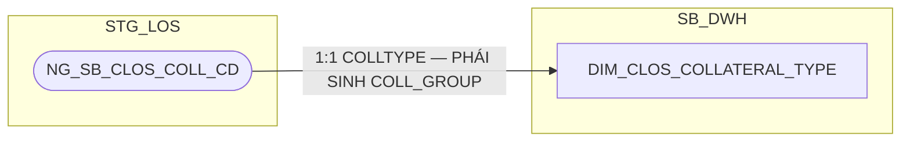

**Ghi chú lineage:** `NG_SB_CLOS_COLL_CD` là bảng danh mục 11 loại TSBĐ
đặc thù doanh nghiệp (`COLLTYPE`), không phải bảng grain-theo-hồ-sơ hay
event log — cùng bản chất danh mục cấu hình gốc như
`NG_SB_CLOS_MAS_EXCEPTION` (1.2.1.6), nên **không rơi vào pattern
"application-scoped source"**. Giữ nguyên nguồn trực tiếp, không cần bảng
`MAP_` seed.

###### 1.2.1.7 DIM_CLOS_CUSTOMER — THAY ĐỔI KIẾN TRÚC (tách khỏi FCT_LOS_APPLICATION_PARTY, không còn là FCT)

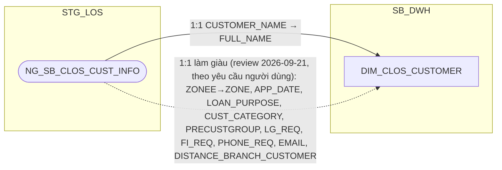

**Ghi chú lineage — đánh giá lại kiến trúc:** `NG_SB_CLOS_CUST_INFO` có
khóa nghiệp vụ thật là `WI_NAME` (khóa kỹ thuật `WI_NAME + EMP_CODE` chỉ
là hiện tượng bàn giao nhân viên xử lý, các báo cáo hạ nguồn luôn lấy dòng
mới nhất theo `WI_NAME` = 1 dòng/hồ sơ, theo CLOS Metadata Table Review) —
đây là quan hệ **1:1 với hồ sơ**, cùng bản chất với `DIM_RLOS_APPLICANT`
(1.3.1.10), khác hẳn `NG_SB_CLOS_CUST_INFO_LEGAL` (1:N thực sự, xem
`DIM_CLOS_LEGAL_PARTY`, 1.2.1.8). Vì vậy tách thành **DIM** (không phải
FCT như thiết kế ban đầu) — sửa lại đánh giá trước đó (từng cho rằng toàn
bộ `FCT_LOS_APPLICATION_PARTY` là quan hệ 1:N không thể tách DIM, nhưng đó
chỉ đúng với phần `CUST_INFO_LEGAL`, không đúng với phần `CUST_INFO`).

Áp dụng **column-optimization rule**: bỏ `DATASOURCE`, `PARTY_TYPE`,
`PARTY_ROLE_CODE` (luôn cố định 'ORG_CUSTOMER', không còn giá trị phân
biệt vì bảng chỉ chứa khách hàng chính), `GEO_SK` (không cần cho tổ chức),
`ORG_LEGAL_ID`/`OBJ_TYPE` (thuộc về `DIM_CLOS_LEGAL_PARTY`, xem 1.2.1.8,
dù có lưu dư thừa `ORG_LEGAL_ID` ở PDTD_DTM — xem Section 2 → 2.2.1.7), 6
cột chỉ có nguồn RLOS theo column-optimization rule.

**Làm giàu thêm 10 cột (review 2026-09-21, theo yêu cầu người dùng):**
`NG_SB_CLOS_CUST_INFO` là quan hệ 1:1/hồ sơ (đã xác nhận ở trên) — mọi cột
mô tả còn lại (không phải khóa join/FK) đưa thẳng lên đây an toàn, không
phá vỡ grain. Bao gồm `ZONE` (đổi tên từ nguồn `ZONEE`, đóng gap BC1/BC2
— xem ghi chú riêng bên dưới), `APP_DATE`, `LOAN_PURPOSE`,
`CUST_CATEGORY`, `PRECUSTGROUP`, `LG_REQ`, `FI_REQ`, `PHONE_REQ`,
`EMAIL`, `DISTANCE_BRANCH_CUSTOMER`. Không đưa `PRODUCT_LINE`/
`SUB_PRODUCT`/`EMP_CODE`/`EMP_NAME`/`COMPANY_CODE`/`COMPANY_NAME`/
`BRANCH_CODE`/`BRANCH_NAME` (đã có ở `DIM_CLOS_PRODUCT`/`DIM_CLOS_
APPLICATION`/`DIM_LOS_ORG_UNIT` — tránh trùng lặp 2 nguồn cho cùng 1 sự
thật).

**Đóng PENDING BC1.ZONE/BC2.ZONE bằng cột `ZONE` mới (review 2026-09-21):**
tách biệt rõ 2 khái niệm từng bị nhập nhằng — `DIM_LOS_ORG_UNIT.ZONE` (mã
nội bộ chuẩn hóa từ `MAS_COMPANY.ZONE`, thuộc tính của ĐƠN VỊ KINH DOANH)
khác với `ZONEE` tự khai trên hồ sơ (thuộc tính của HỒ SƠ/KHÁCH HÀNG tại
thời điểm nhập liệu). Theo quyết định người dùng: BC1/BC2.ZONE đọc từ
cột `ZONE` mới này (qua `CUSTOMER_SK`), không còn liên quan
`DIM_LOS_ORG_UNIT` — `BRANCH_CODE`/`BRANCH_NAME`/`COMPANY_CODE`/
`COMPANY_NAME` của BC1/BC2 vẫn giữ nguyên qua `ORG_UNIT_SK` như cũ, chỉ
riêng cột ZONE đổi nguồn. Quyết định loại bỏ `ZONEE`/`ZONE` khỏi
`DIM_LOS_ORG_UNIT` (review 2026-09-18, do BI xác nhận không tương ứng
`DIM_COMPANY`/T24) vẫn đúng cho vai trò KHÓA JOIN đơn vị kinh doanh —
không mâu thuẫn với việc giữ giá trị này làm thuộc tính hiển thị gắn với
hồ sơ/khách hàng.

###### 1.2.1.8 DIM_CLOS_LEGAL_PARTY — THAY ĐỔI KIẾN TRÚC (gộp FCT_LOS_APPLICATION_PARTY phần vai trò pháp lý + FCT_LOS_PARTY_DOCUMENT, không còn là FCT)

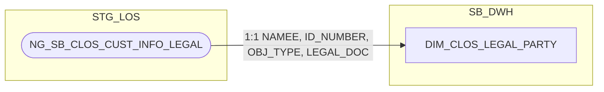

**Ghi chú lineage — đánh giá lại kiến trúc, giải thích chi tiết phân biệt
với `DIM_RLOS_COREPAYER`:** `NG_SB_CLOS_CUST_INFO_LEGAL` là quan hệ **1
hồ sơ : N người liên quan** thực sự (CLOS Metadata Table Review xác nhận
trực tiếp: "1 hồ sơ có nhiều dòng cho cùng 1 WI_NAME", và **"1 người có
thể giữ nhiều vai trò (OBJ_TYPE) khác nhau trong cùng 1 hồ sơ"** — xác
nhận BA). Khác hẳn `APP_GRP`/`HAVE_ANY_DEVIATION` (thuộc tính 1 hồ sơ = 1
giá trị, đã đưa lên `DIM_CLOS_APPLICATION`): **không thể đưa dữ liệu người
liên quan lên DIM_APPLICATION/FCT_APPLICATION_DAILY** vì sẽ làm mất dữ
liệu của những người liên quan khác (nhiều dòng không thể nén vào 1 dòng
mà không đổi grain của `FCT_APPLICATION_DAILY`).

**Vì sao KHÔNG áp dụng pattern pivot-thành-cột-cố-định như
`DIM_RLOS_COREPAYER`:** RLOS corepayer có đúng **1 vai trò duy nhất**
(corepayer), số lượng người có **giới hạn cứng đã xác nhận** (0-4, theo
nhãn PIN Corep1-4) — nên tách được thành 1 DIM riêng theo đúng 1 vai trò
với N nhỏ, biết trước. CLOS có **5 vai trò khả dĩ** (`CUSTOMER`,
`LEGAL_REPRESENTATIVE`, `COLLATERAL_OWNER`, `MAIN_CONTRIBUTING_MEMBERS`,
`OTHER`), nhưng khác RLOS ở 2 điểm mấu chốt: (1) **không có giới hạn cứng
đã biết** cho số người ở mỗi vai trò (số người đại diện/chủ sở hữu
TSBĐ/thành viên góp vốn phụ thuộc hoàn toàn cấu trúc sở hữu thực tế của
từng doanh nghiệp, không có trần cố định như "tối đa 4"); (2) **các vai
trò không loại trừ lẫn nhau** — 1 người có thể đồng thời là người đại
diện pháp luật VÀ thành viên góp vốn chính trên cùng 1 hồ sơ (2 dòng cho
cùng 1 người), trong khi RLOS 1 người chỉ có thể là applicant HOẶC
corepayer, không bao giờ cả hai. Vì N không giới hạn/không biết trước và
vai trò không loại trừ nhau, **không đủ điều kiện pivot thành cột cố định**
— phải giữ dạng bảng danh sách (grain nhân dòng).

**Tuy nhiên vẫn phân loại là DIM (không phải FCT):** dù grain là 1:N,
bản chất dữ liệu vẫn là thông tin MÔ TẢ (không đo lường) — nhất quán với
cách `DIM_RLOS_COREPAYER` (cũng 1:N) được phân loại là DIM thay vì FCT.
Điểm khác biệt DIM_CLOS_LEGAL_PARTY và DIM_RLOS_COREPAYER chỉ nằm ở CÁCH
BIỂU DIỄN N (bảng danh sách vs pivot cột), không nằm ở việc có phải DIM
hay không.

**Gộp `FCT_LOS_PARTY_DOCUMENT` vào thẳng bảng này** (bỏ hẳn bảng document
riêng) — nguồn giấy tờ pháp lý CLOS chỉ có đúng 1 bảng gốc
(`NG_SB_CLOS_CUST_INFO_LEGAL`) với đúng 1 cặp `LEGAL_DOC`/`ID_NUMBER` trên
mỗi dòng, không có rủi ro "nhiều giấy tờ/nhóm" như RLOS IDGRID (14 loại
giấy tờ, có thể nhiều dòng/nhóm TCC-CC) — gộp trực tiếp an toàn, không mất
dữ liệu (đã xác nhận với người dùng).

Bỏ `DATASOURCE`, `PARTY_TYPE`, `PARTY_ROLE_CODE` (thay bằng `OBJ_TYPE`
gốc + `LEGAL_TYPE` chuẩn hóa ở PDTD_DTM, xem Section 2 → 2.2.1.8),
`APPLICATION_SK`, `GEO_SK` (không cần vì không phải khách hàng chính).


### 1.3 Bộ bảng RLOS

##### 1.3.1 DIM

###### 1.3.1.1 DIM_RLOS_APPLICATION — ✅ ĐÃ GIẢI QUYẾT (đã bổ sung APP_GRP, DEVIATION_G3, CHANGE_TYPE — thay thế DIM_RLOS_APPROVAL_GROUP đã loại bỏ)

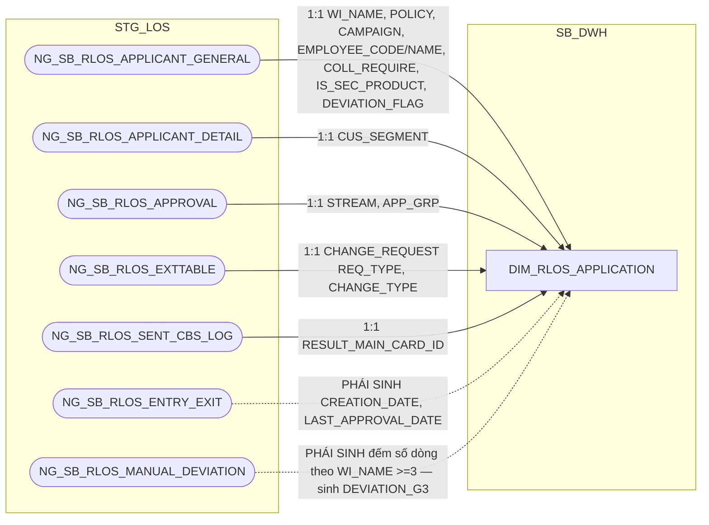

**Ghi chú lineage — loại bỏ `DIM_RLOS_APPROVAL_GROUP`, bổ sung `APP_GRP` +
`DEVIATION_G3` thẳng lên đây:** RLOS Metadata gốc (sheet Table Review, bảng
`NG_SB_RLOS_APPROVAL`) xác nhận trực tiếp **grain = 1 dòng = 1 hồ sơ RLOS**
— cùng kết luận với CLOS (xem 1.2.1.1). `APP_GRP` là thuộc tính ổn định
của hồ sơ, đọc thẳng từ `NG_SB_RLOS_APPROVAL` — cùng bảng, cùng cách với
`STREAM` đã có sẵn ở đây. `DIM_RLOS_APPROVAL_GROUP` và
`MAP_RLOS_APPROVAL_GROUP` đã bị loại bỏ hoàn toàn; cột `APPROVAL_GROUP_SK`
cũng bị loại khỏi `FCT_RLOS_APPLICATION_DAILY`.

`DEVIATION_G3` = COUNT(*) theo `WI_NAME` trên `NG_SB_RLOS_MANUAL_DEVIATION`
(>=3 → 'YES', còn lại → 'NO') — trích nguyên văn SRS BC5/BC9: *"Count số
dòng (sl) của mỗi WI_NAME trong bảng NG_SB_RLOS_MANUAL_DEVIATION, sl>=3
tương ứng 'YES', sl<3 tương ứng 'NO'"*. Đây là số đếm lũy kế có thể tăng
theo thời gian sống hồ sơ, tương tự `APP_GRP` có thể đổi khi định tuyến lại
— khi giá trị đổi qua ngưỡng 3 (NO↔YES), mở phiên bản DIM mới theo đúng cơ
chế SCD2 chuẩn, không phải giá trị tĩnh 1 lần. Cả `APP_GRP`, `DEVIATION_G3`
dùng làm khóa tra cam kết SLA (`REF_PRODUCT`/`SLA_*`) ở PDTD_DTM (2.3.1.1)
cùng `SECONDARY_PRODUCTLINE` (=`IS_SEC_PRODUCT`, đã có sẵn) và
`CHANGE_TYPE` (mới bổ sung, xem bên dưới).

**Bổ sung `CHANGE_TYPE`:** đọc thẳng từ `NG_SB_RLOS_EXTTABLE.CHANGE_TYPE` —
cùng bảng nguồn đã tin cậy dùng cho `LOANCASEID`/`CHANGE_REQUEST` ở DIM
này, không phải nguồn mới. SRS BC5 xác nhận công thức JOIN sang
`RLOS_REF_SLA_TDKHCN` là **either/or** với `PRODUCT_LINE` (chỉ so khớp
`CHANGE_TYPE` khi dòng REF_ có `Product Line = 'Trường Change Request'`,
ngược lại so khớp theo `PRODUCT_LINE` bình thường) — trích nguyên văn:
*"Nếu file1.'Product Line' = 'Trường Change Request': Xét file1.'Change
Type' = d.CHANGE_TYPE. Nếu file1.'Product Line' <> 'Trường Change Request':
Xét file1.'Product Line' = b.PRODUCT_LINE"* (d = `NG_SB_RLOS_EXTTABLE`, b =
`NG_SB_RLOS_APPLICANT_GENERAL`). Cột này khác `CHANGE_TYPE_SK` trên FCT
(trỏ `DIM_RLOS_CHANGE_TYPE` để lấy tên/chi tiết chuẩn hóa cho BC1) — đây là
giá trị thô dùng riêng làm khóa tra SLA. Đã xác nhận qua SRS BC1 (xem
1.3.1.7) đây là exact-match đơn giá trị, RLOS không có multi-select loại
thay đổi như CLOS — join tra SLA an toàn, không rủi ro NULL.

Bảng `NG_SB_RLOS_APPROVAL` còn có cặp cột `PRE_APPROVALGROUP`/`APP_GRP`
(giá trị trước/sau 1 lần định tuyến lại hồ sơ, 2 cột trên cùng 1 dòng,
không phải lịch sử SCD) — đã rà soát toàn bộ SRS, không có báo cáo nào
dùng `PRE_APPROVALGROUP`, nên không đưa cột này vào thiết kế.

**Bổ sung `LAST_APPROVAL_DATE` — để `FCT_RLOS_LOAN_DISBURSEMENT` (2.3.2.8)
join qua DIM, không qua FCT khác hệ:** phục vụ
`BC10.APPROVAL_DATE` — PHÁI SINH: `MAX(EXITDATE)` trên
`NG_SB_RLOS_ENTRY_EXIT` tại bản ghi thỏa `WORKSTEP IN
('CreditApprovalReview','CreditApproval','CreditCommittee')`,
`DECISION IN ('Submit','Send To HOSupport','Send To PostSanction','Submit
To DisbursementMaker')` — đúng nguyên văn công thức SRS BC10. Cùng khái
niệm và cùng công thức với `LAST_APPROVAL_DATE` đã có trên
`FCT_RLOS_APPLICATION_DAILY` (1.3.2.1) — nhưng **tính độc lập lại tại đây**
(đọc thẳng `NG_SB_RLOS_ENTRY_EXIT`, không JOIN fact-to-fact sang
`FCT_RLOS_APPLICATION_DAILY`), theo đúng nguyên tắc "mỗi FCT/DIM là 1
luồng ETL độc lập" đã áp dụng xuyên suốt tài liệu này (xem đánh giá kiến
trúc tại `FCT_CLOS_DEVIATION`, 1.2.2.5). Đây cũng là lựa chọn giữ đối
xứng kiến trúc với CLOS: `DIM_CLOS_APPLICATION` đã có sẵn
`FIRST_APPROVED_WI_NAME`/`FIRST_APPROVED_DATE` ngay trên DIM (không phải
trên FCT) để phục vụ `BC11.APPROVAL_WINAME_LOS`/`APPROVAL_DATE` — RLOS
không có khái niệm "hồ sơ cha" (không có `LOANCASEID` lặp nhiều `WI_NAME`
như CLOS, xem cột `LOANCASEID`/`FIRST_APPROVED_WI_NAME` ở
`DIM_CLOS_APPLICATION`, 1.2.1.1) nên không có `LAST_APPROVAL_WI_NAME`
tương ứng — chỉ cần đúng 1 cột ngày.

###### 1.3.1.2 DIM_RLOS_PRODUCT — ✅ ĐÃ GIẢI QUYẾT (nguồn: NG_SB_RLOS_MAS_PRODUCT_LINE/MAS_SUB_PRODUCT, review 2026-09-18)

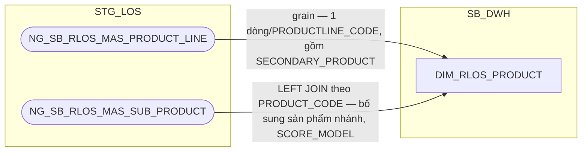

**Đã giải quyết (review 2026-09-18, theo Meeting note 20260909 mục #1):**
cùng giải pháp với `DIM_CLOS_PRODUCT` (1.2.1.2) — nguồn trước đây suy từ
`NG_SB_RLOS_APPLICANT_GENERAL`/`NG_SB_RLOS_EXTTABLE` (grain-theo-hồ-sơ) rồi
tạm thay bằng `MAP_RLOS_PRODUCT`; nay BA LOS xác nhận (16/09) 2 bảng danh
mục thật `NG_SB_RLOS_MAS_PRODUCT_LINE` + `NG_SB_RLOS_MAS_SUB_PRODUCT` —
thay thế hoàn toàn `MAP_RLOS_PRODUCT`. Bảng `MAS_PRODUCT_LINE` có thêm cột
`SECONDARY_PRODUCT` (sản phẩm phụ SeABuy/SeATeacher/SeAWoman/SeACivil/Thẻ
tín dụng — đúng khái niệm đã xác nhận với EU ở vấn đề #10 Meeting note,
khác `SUB_PRODUCT`); `MAS_SUB_PRODUCT` có thêm `SCORE_REQUIRED`/
`SCORE_MODEL` — cả hai chưa có báo cáo nào yêu cầu, xem Section 3.

**SCD2 đổi cách xác định EFF_DATE:** cùng cơ chế CDC như `DIM_CLOS_PRODUCT`
(1.2.1.2) — 2 bảng nguồn không có EFF_DATE khai báo tay. Xem Section 3.

###### 1.3.1.3 DIM_RLOS_WORKSTEP — ✅ ĐÃ GIẢI QUYẾT (nguồn: NG_SB_RLOS_MAS_DECISION, review 2026-09-18)

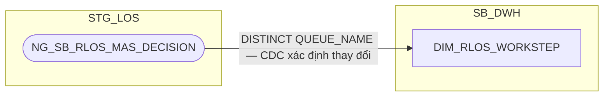

**Đã giải quyết (review 2026-09-18, theo Meeting note 20260909 mục #2):**
cùng giải pháp với `DIM_CLOS_WORKSTEP` (1.2.1.3) — nguồn trước đây suy từ
`NG_SB_RLOS_ENTRY_EXIT` rồi tạm thay bằng `MAP_RLOS_WORKSTEP`; nay BA LOS
xác nhận (16/09) bảng danh mục thật `NG_SB_RLOS_MAS_DECISION` — bảng này
gộp chung WORKSTEP (`QUEUE_NAME`) và DECISION (`DECISION`) dạng N-N (thêm
cột `REQ_TYPE`), không có danh mục WORKSTEP độc lập riêng. Theo quyết định
người dùng: **giữ tách 2 DIM** như `DIM_CLOS_WORKSTEP`/`DIM_CLOS_DECISION`
(xem 1.2.1.3), suy ra `DISTINCT QUEUE_NAME` từ cùng bảng nguồn.
`NG_SB_RLOS_ENTRY_EXIT` không còn là nguồn của DIM này nữa (vẫn tiếp tục
phục vụ các FCT khác).

`WFINSTRUMENTTABLE` vẫn không thuộc phạm vi bảng này — **✅ đã giải quyết
(PENDING #6):** `PROCESSNAME`/`ACTIVITYNAME` nay đã nạp trực tiếp vào
`FCT_RLOS_APPLICATION_DAILY` (1.3.2.1) để tính `WORKSTEP_FLAG`, xem ghi
chú đầy đủ ở `DIM_CLOS_WORKSTEP` (1.2.1.3). **Cập nhật (review 2026-09-21):** nay cũng LEFT JOIN
thêm vào `FCT_RLOS_WORKSTEP_EVENT` (1.3.2.7) để tính `WORKSTEP_FLAG`
độc lập trực tiếp trên bảng event. **Cập nhật tiếp (review 2026-09-21):**
đã bỏ hẳn `WORKSTEP_FLAG` khỏi `FCT_RLOS_APPLICATION_DAILY` — không còn
consumer sau khi BC4 đổi sang đọc bản trên `FCT_RLOS_WORKSTEP_EVENT`.

**SCD2 đổi cách xác định EFF_DATE:** cùng cơ chế CDC như 1.2.1.3. Xem
Section 3.

###### 1.3.1.4 DIM_RLOS_DECISION — ✅ ĐÃ GIẢI QUYẾT (nguồn: NG_SB_RLOS_MAS_DECISION, review 2026-09-18)

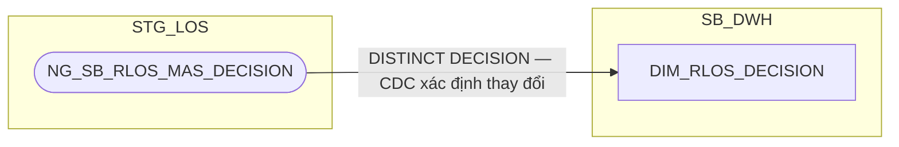

**Đã giải quyết (review 2026-09-18, theo Meeting note 20260909 mục #2):**
nguồn trước đây suy từ `NG_SB_RLOS_ENTRY_EXIT` (bảng lịch sử xử lý, không
phải danh mục quyết định BPM gốc) rồi tạm thay bằng `MAP_RLOS_DECISION`;
nay BA LOS xác nhận (16/09) cùng bảng danh mục thật
`NG_SB_RLOS_MAS_DECISION` đã dùng cho `DIM_RLOS_WORKSTEP` (1.3.1.3) — lấy
`DISTINCT DECISION` từ cùng bảng (xem 1.2.1.3 về lý do giữ tách 2 DIM).
`NG_SB_RLOS_ENTRY_EXIT` không còn là nguồn của DIM này nữa (vẫn tiếp
tục phục vụ các FCT khác).

**SCD2 đổi cách xác định EFF_DATE:** cùng cơ chế CDC như 1.3.1.3. Xem
Section 3.

###### 1.3.1.5 DIM_RLOS_EXCEPTION_REASON


**Ghi chú lineage:** cùng bản chất với `DIM_CLOS_EXCEPTION_REASON`
(1.2.1.6) — `NG_SB_RLOS_MAS_EXCEPTION` là bảng LOẠI 1 (danh mục cấu hình
gốc, khóa CDC khai đủ tổ hợp khóa tự nhiên), không phải bảng sự kiện theo
hồ sơ, nên không rơi vào pattern "application-scoped source". Giữ nguyên
nguồn trực tiếp, không cần bảng `MAP_` seed.

###### 1.3.1.6 DIM_RLOS_COLLATERAL_TYPE

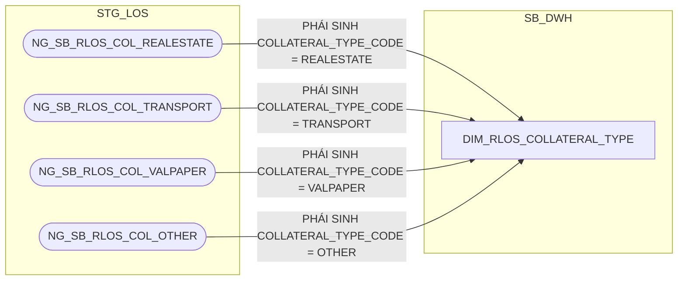

**Ghi chú lineage:** khác với CLOS (1 bảng danh mục `NG_SB_CLOS_COLL_CD`
có cột mã loại), RLOS tách vật lý theo loại tài sản thành 4 bảng (bất động
sản, phương tiện vận tải, giấy tờ có giá, khác) — mỗi bảng không có cột
phân loại riêng, `COLLATERAL_TYPE_CODE` được gán cố định theo đúng bảng
nguồn bản ghi đến từ đó (hằng số kiến trúc, không đọc từ 1 cột dữ liệu).
Đây vẫn là danh mục ổn định (4 giá trị cố định theo cấu trúc vật lý
nguồn, không phụ thuộc dữ liệu giao dịch), không phải bảng sự kiện theo
hồ sơ — **không rơi vào pattern "application-scoped source"**, không cần
bảng `MAP_` seed.

###### 1.3.1.7 DIM_RLOS_CHANGE_TYPE

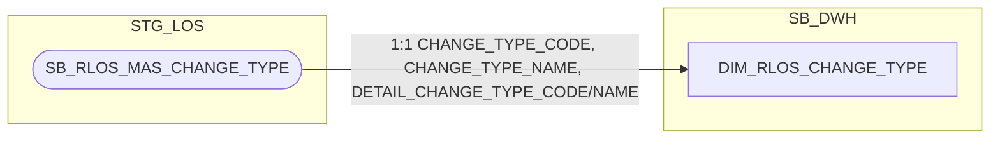

**Ghi chú lineage:** `SB_RLOS_MAS_CHANGE_TYPE` là bảng danh mục gốc thật
(mang tiền tố `MAS_`), khác hẳn phía CLOS — CLOS chỉ có
`NG_SB_CLOS_CHANGEREQ.CHANGE_TYPE` (bảng theo hồ sơ, không phải danh mục),
nên không tách `DIM_CLOS_CHANGE_TYPE` (xem 1.2.1.1). Đối chiếu SRS xác
nhận: **BC1** ("Báo cáo RLOS APPLICATION") là báo cáo duy nhất dùng
`CHANGE_TYPE_DETAIL` (join `SB_RLOS_MAS_CHANGE_TYPE` theo `CHANGE_TYPE`);
không có báo cáo nào khác (BC2–BC11) dùng bảng này. `DIM_RLOS_CHANGE_TYPE`
không rơi vào pattern "application-scoped source" — giữ nguyên nguồn trực
tiếp, không cần bảng `MAP_` seed.

###### 1.3.1.8 DIM_RLOS_GEO

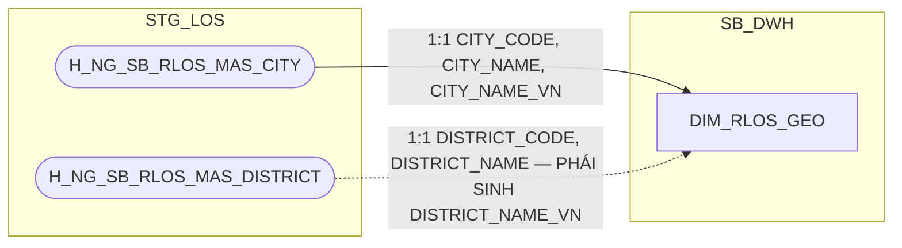

**Ghi chú lineage:** không có bảng tương đương phía CLOS — `DIM_RLOS_GEO`
không thuộc cặp CLOS/RLOS song song mà là DIM đặc thù riêng của RLOS (xem
`output/Table_Split_Proposal_CLOS_RLOS.md` mục 3: "không có nguồn CLOS
tương ứng trong `DS_BANG_202608`"). `H_NG_SB_RLOS_MAS_CITY`/
`H_NG_SB_RLOS_MAS_DISTRICT` là 2 bảng danh mục địa giới hành chính gốc
(mang tiền tố `MAS_`), không phải bảng sự kiện theo hồ sơ — không rơi vào
pattern "application-scoped source", giữ nguyên nguồn trực tiếp. Bảng
không có cột `DATASOURCE` ngay từ thiết kế gốc (đã là RLOS-only), không
cần bỏ cột nào khi tách. Tiền tố `H_` đã đối chiếu khớp đúng nguyên văn
SRS BC1 (cả Business Rules join-table lẫn field-mapping table) — không
nhầm với tên không tiền tố ghi trong `output/Table_Split_Proposal_CLOS_RLOS.md`
(tài liệu chỉ quyết định tách bảng, không phải nguồn công thức chi tiết).

###### 1.3.1.9 DIM_RLOS_CARD_PROMOTION


**Ghi chú lineage:** không có bảng tương đương phía CLOS — chương trình
ưu đãi phí thẻ tín dụng là sản phẩm đặc thù bán lẻ (RLOS), CLOS không có
khái niệm này (xem `output/Table_Split_Proposal_CLOS_RLOS.md` mục 3).
`NG_SB_RLOS_MAS_CARD_PROMOTIO` mang tiền tố `MAS_`, là danh mục cấu hình
gốc thật, không phải bảng sự kiện theo hồ sơ — không rơi vào pattern
"application-scoped source", giữ nguyên nguồn trực tiếp. Bảng gốc (trước
tách) chưa từng có cột `DATASOURCE`; **review 2026-09-17:** đã bổ sung
`DATASOURCE` (cố định 'RLOS') tại Section 2 làm cột kỹ thuật đánh dấu
nguồn hệ, đồng bộ với mọi DIM/FCT RLOS khác sau khi tách vật lý CLOS/RLOS
— quyết định có chủ đích, xem chi tiết tại Section 2 → 1.3.1.9.

###### 1.3.1.10 DIM_RLOS_APPLICANT — MỚI (tách từ FCT_LOS_APPLICATION_PARTY)

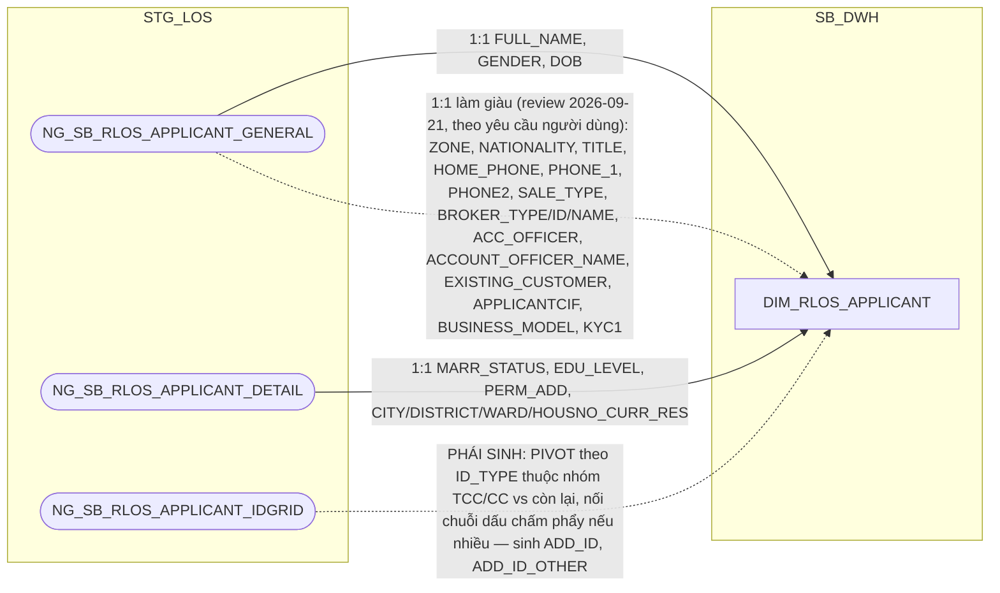

**Ghi chú lineage — tách khỏi `FCT_LOS_APPLICATION_PARTY`, không tách theo
kiểu bảng chi tiết như CLOS:** khác với CLOS (nơi 1 hồ sơ có N người liên
quan với N vai trò không loại trừ lẫn nhau), RLOS có cấu trúc rõ ràng: **1
người đề nghị vay chính** (applicant, 1:1 với hồ sơ) và **0..N người đồng
trả nợ** (corepayer). Vì applicant là quan hệ 1:1 với hồ sơ, tách thành DIM
riêng (không gộp thẳng vào `DIM_RLOS_APPLICATION`) vì đây là nhóm thuộc
tính CON NGƯỜI (nhân khẩu học, liên hệ) khác hẳn bản chất thuộc tính HỒ SƠ
(sản phẩm, quy trình, phê duyệt) đã có trên `DIM_RLOS_APPLICATION`.

**Bổ sung `ADD_ID`/`ADD_ID_OTHER` (pivot từ `FCT_LOS_PARTY_DOCUMENT` cũ):**
theo SRS BC1 (BR 1.3, trích nguyên văn): *"ADD_ID — NG_SB_RLOS_APPLICANT_
IDGRID > ID_NUMBER, với điều kiện ID_TYPE in ('TCC','CC')"*, *"ADD_ID_OTHER
— NG_SB_RLOS_APPLICANT_IDGRID > ID_NUMBER, với điều kiện ID_TYPE not in
('TCC','CC')"*. Đây là 2 NHÓM LỌC theo `ID_TYPE` (14 loại giấy tờ quan sát
được trên `NG_SB_RLOS_APPLICANT_IDGRID`), không phải "giấy tờ chính/giấy
tờ khác" theo nghĩa 1-1 — không có tài liệu nào đảm bảo mỗi nhóm chỉ có
đúng 1 giấy tờ. Xử lý: nếu 1 nhóm có nhiều dòng, **nối chuỗi `ID_NUMBER`
bằng dấu ";"** — tránh phải giữ bảng chi tiết giấy tờ riêng
(`FCT_RLOS_PARTY_DOCUMENT` bị loại bỏ hoàn toàn, xem ghi chú ở
`FCT_RLOS_APPLICATION_PARTY`, 1.3.2.2).

**Xác nhận thiết kế và thứ tự nối chuỗi (review 2026-09-17):** đây là
quyết định kiến trúc có chủ đích — grain của DIM này là 1 dòng/1
applicant, giữ TOÀN BỘ giấy tờ bằng cách nối chuỗi thay vì chọn 1 dòng
đại diện (không có khái niệm "giấy tờ chính" cần chọn, không phải thiếu
sót — pattern này đã được người dùng xác nhận là mục tiêu thiết kế,
tương tự cách `DIM_CLOS_CUSTOMER.LEGAL_REPRESENTATIVE`/
`ADD_ID_REPRESENTATIVE` nối chuỗi khi nhiều đại diện, xem Section 3 #19).
Trong `ADD_ID`, thứ tự nối khi nhóm TCC/CC có nhiều giấy tờ: **ưu tiên
`ID_TYPE='TCC'` trước, `ID_TYPE='CC'` sau**. Thứ tự này là căn cứ để ETL
tách ngược `ADD_ID` khi cần so khớp từng giá trị riêng lẻ (xem
`T24_CUSTOMER_SK` tại `FCT_RLOS_APPLICATION_DAILY`, 1.3.2.1/2.3.2.1).

**Làm giàu thêm 15 cột (review 2026-09-21, theo yêu cầu người dùng):**
`NG_SB_RLOS_APPLICANT_GENERAL` là quan hệ 1:1/hồ sơ (đã xác nhận ở
trên) — mọi cột mô tả còn lại (không phải khóa join/FK, không phải cột
kỹ thuật CDC) đưa thẳng lên đây an toàn. Bao gồm `ZONE` (đóng gap
BC1/BC2 — cùng lý do/quyết định đã áp dụng cho `DIM_CLOS_CUSTOMER.ZONE`,
xem 1.2.1.7), `NATIONALITY`, `TITLE`, `HOME_PHONE`, `PHONE_1`, `PHONE2`
(đổi tên `PHONE_2` cho nhất quán), `SALE_TYPE`, `BROKER_TYPE`/
`BROKER_ID`/`BROKER_NAME`, `ACC_OFFICER`/`ACCOUNT_OFFICER_NAME`,
`EXISTING_CUSTOMER`, `APPLICANTCIF` (đổi tên `APPLICANT_CIF`),
`BUSINESS_MODEL`, `KYC1`. Không đưa `FIRST_NAME`/`MIDDLE_NAME`/
`LAST_NAME` (đã có `FULL_NAME` đủ dùng), `PRODUCT_LINE`/`SUB_PRODUCT`/
`POLICY`/`CAMPAIGN`/`IS_SEC_PRODUCT`/`EMPLOYEE_CODE`/`EMPLOYEE_NAME`/
`COLLREQUIRE`/`PROOF_OF_INCOME`/`COMPANY_CODE`/`COMPANY_NAME`/
`BRACH_CODE`/`BRANCH_NAME` (đã có trên `DIM_RLOS_APPLICATION`/
`DIM_LOS_ORG_UNIT` — tránh trùng lặp), `LOS_ORA_ROWSCN`/`LOS_TIME_
UPDATE_ROWSCN` (cột kỹ thuật CDC nội bộ, không phải dữ liệu nghiệp vụ).
`KYC1` (VARCHAR2, "đơn vị/khối đang xử lý hồ sơ tại thời điểm ghi nhận")
metadata đang ở trạng thái "Cần chỉnh sửa" (đề xuất đổi tên "Luồng phê
duyệt"/Approval Flow) — vẫn đưa lên theo ý nghĩa gốc, cần BA xác nhận
lại tên/ý nghĩa chuẩn trước khi sinh LLD.

###### 1.3.1.11 DIM_RLOS_COREPAYER — MỚI (tách từ FCT_LOS_APPLICATION_PARTY)

```mermaid
flowchart LR
    subgraph STG_LOS
        A(["NG_SB_RLOS_COREPAYER_GENERAL"])
        B(["NG_SB_RLOS_COREP_IDGRID"])
    end
    subgraph SB_DWH
        E["DIM_RLOS_COREPAYER"]
    end
    A -->|1:1 REL_TO_APPLICANT, FULL_NAME, DOB_CO, NATIONALITY_CO| E
    B -.->|PHÁI SINH: PIVOT theo ID_TYPE thuộc nhóm TCC/CC vs còn lại, nối theo WI_NAME + PIN bằng ID_NO_CO, nối chuỗi dấu chấm phẩy nếu nhiều — sinh ADD_ID_COREPAYER, ADD_ID_OTHER_COREPAYER| E
    A -.->|"1:1 làm giàu (review 2026-09-21, theo yêu cầu người dùng, đối xứng DIM_RLOS_APPLICANT): TITLE_CO→TITLE, HOUSEHOLD, PHONE1→PHONE_1, PHONE2→PHONE_2, HOMEPHONE→HOME_PHONE"| E
```

**Ghi chú lineage — grain thực tế khác Table Review metadata (xác nhận
trực tiếp từ người dùng/BA):** RLOS Metadata (sheet Table Review) ghi grain
`NG_SB_RLOS_COREPAYER_GENERAL` là "1 dòng = 1 hồ sơ RLOS (thông tin người
đồng trả nợ, nếu có)" — nhưng người dùng xác nhận trực tiếp: **thực tế 1
hồ sơ có thể có NHIỀU dòng người đồng trả nợ** (khớp với
`NG_SB_RLOS_COREP_IDGRID` xác nhận tối đa 4 corepayer/hồ sơ qua nhãn
`PIN` — Corep1-4). Business key: `WI_NAME + ID_NO_CO` (không match identity
xuyên hồ sơ — đã xác nhận không cần, xem ghi chú ở `FCT_RLOS_APPLICATION_
PARTY`).

Rà soát cấu trúc cột `NG_SB_RLOS_COREPAYER_GENERAL` so với
`NG_SB_RLOS_APPLICANT_GENERAL`/`APPLICANT_DETAIL` (theo RLOS Metadata sheet
"3. Column Review") xác nhận: **KHÔNG trùng khớp cấu trúc**, nên KHÔNG gộp
chung thành 1 `DIM_RLOS_PARTY` — corepayer thiếu hẳn nhóm địa chỉ/hôn
nhân/học vấn (`PERM_ADD`, `CITY/DISTRICT/WARD_CURR_RES`, `MARR_STATUS`,
`EDU_LEVEL`) mà applicant có, trong khi lại có sẵn nhóm chi tiết giấy tờ
(`ID_NO_CO` + hộ chiếu/visa) ngay trên bảng nguồn — khác hẳn applicant
(giấy tờ tách bảng riêng `IDGRID`). Gộp chung sẽ sinh rất nhiều cột luôn
NULL tùy vai trò — cùng rủi ro "bảng lai nhiều hình dạng" đã tránh với
`NG_SB_CLOS_CUST_INFO_LEGAL` (xem `DIM_CLOS_APPLICATION`, 1.2.1.1).

**Bổ sung `ADD_ID_COREPAYER`/`ADD_ID_OTHER_COREPAYER` (pivot từ
`FCT_LOS_PARTY_DOCUMENT` cũ):** cùng công thức nhóm lọc `ID_TYPE` với
applicant, nguồn `NG_SB_RLOS_COREP_IDGRID`, nối theo `WI_NAME + PIN` (=
`ID_NO_CO` trên `COREPAYER_GENERAL`, xác nhận trực tiếp từ người dùng —
Table Review metadata chỉ ghi quan hệ qua `WI_NAME`, không nêu rõ
`ID_NO_CO = PIN`, nên đây là xác nhận nghiệp vụ bổ sung ngoài tài liệu).
Theo SRS BC1: *"ADD_ID_COREPAYER — ID_NUMBER/PARTY_ROLE_CODE với điều
kiện ID_TYPE in ('TCC','CC')"*, *"ADD_ID_OTHER_COREPAYER — ID_NUMBER với
điều kiện ID_TYPE not in ('TCC','CC')"* — nối chuỗi `ID_NUMBER` bằng ";"
nếu nhóm có nhiều dòng.


---

## Section 2 — Column Design

### 1.1 Bộ bảng CHUNG

##### 1.1.1 DIM_LOS_ORG_UNIT — ✅ ĐÃ GIẢI QUYẾT (nguồn: NG_SB_RLOS_MAS_COMPANY/MAS_BRANCH/MAS_REGION, review 2026-09-18)

**Bảng cũ (trước tách):** `DIM_LOS_ORG_UNIT` (không đổi tên — thuộc nhóm CHUNG)

| STT | Tên cột | Kiểu dữ liệu | Bắt buộc | Độ lớn | Khóa | Mô tả |
| --- | --- | --- | --- | --- | --- | --- |
| 1 | DIMENSION_KEY | NUMBER | Y | 18 | PK | Khóa chính của bảng chiều DIM_LOS_ORG_UNIT, sinh bằng Oracle sequence tại SB_DWH; PDTD_DTM giữ nguyên giá trị, không sinh sequence mới |
| 2 | DATASOURCE | VARCHAR2 | Y | 10 |  | Nguồn hệ dùng chung cho cả hai hệ CLOS và RLOS — cột kỹ thuật, luôn cố định 'LOS' |
| 3 | ORG_UNIT_SK | NUMBER | Y | 18 |  | Khóa tham chiếu đến bảng chiều DIM_LOS_ORG_UNIT, bằng đúng giá trị DIMENSION_KEY của cùng dòng. Giá trị mặc định = -1 (dòng Unknown) nếu không có giá trị phù hợp |
| 4 | COMPANY_CODE | VARCHAR2 | Y | 50 | NK | Mã đơn vị kinh doanh (PGD/CN — mức chi tiết nhất) — nguồn NG_SB_RLOS_MAS_COMPANY.COMPANY_CODE (review 2026-09-18: đổi nguồn từ hồ sơ LOS sang bảng danh mục thật, xem Section 3) |
| 5 | COMPANY_NAME | VARCHAR2 | N | 200 |  | Tên đơn vị kinh doanh — nguồn MAS_COMPANY.COMPANY_NAME_VN |
| 6 | COMPANY_ADDRESS | VARCHAR2 | N | 500 |  | Địa chỉ đơn vị kinh doanh — nguồn MAS_COMPANY.COMPANY_ADDRESS_VN (mới, review 2026-09-18) |
| 7 | COMPANY_EMAIL | VARCHAR2 | N | 200 |  | Email đơn vị kinh doanh — nguồn MAS_COMPANY.COMPANY_EMAIL (mới, review 2026-09-18) |
| 8 | ZONE | NUMBER | N | 18 |  | Mã khu vực nội bộ theo LOS (khác REGION_CODE của MAS_REGION) — nguồn MAS_COMPANY.ZONE (mới, review 2026-09-18) |
| 9 | BRANCH_CODE | VARCHAR2 | N | 50 |  | Mã chi nhánh — nguồn MAS_COMPANY.BRANCH_ID, LEFT JOIN MAS_BRANCH.BRANCH_ID (review 2026-09-18) |
| 10 | BRANCH_NAME | VARCHAR2 | N | 200 |  | Tên chi nhánh — nguồn MAS_BRANCH.BRANCH_NAME_VN |
| 11 | CITY | VARCHAR2 | N | 100 |  | Mã tỉnh/thành phố của chi nhánh — nguồn MAS_BRANCH.CITY (mới, review 2026-09-18) |
| 12 | DISTRICT | VARCHAR2 | N | 100 |  | Mã quận/huyện của chi nhánh — nguồn MAS_BRANCH.DISTRICT (mới, review 2026-09-18) |
| 13 | REGION_CODE | NUMBER | N | 18 |  | Mã khu vực địa lý — nguồn MAS_BRANCH.REGION, LEFT JOIN MAS_REGION.REGION_CODE (mới, review 2026-09-18) |
| 14 | REGION_NAME | VARCHAR2 | N | 200 |  | Tên khu vực địa lý — nguồn MAS_REGION.REGION_NAME_VN (mới, review 2026-09-18) |
| 15 | EFF_DATE | DATE | Y |  |  | Ngày bắt đầu hiệu lực của phiên bản bản ghi (SCD Type 2) — do ETL tính qua CDC khi phát hiện thay đổi trên MAS_COMPANY/MAS_BRANCH/MAS_REGION (không có cột khai báo tay như MAP_*, xem Section 3) |
| 16 | EXP_DATE | DATE | N |  |  | Ngày hết hiệu lực của phiên bản bản ghi; NULL = bản ghi hiện hành |

- Bảng DIM lưu danh mục đơn vị kinh doanh (phòng giao dịch/chi nhánh/khu vực) khởi tạo hồ sơ, dùng chung cho cả hai hệ CLOS và RLOS — một đơn vị kinh doanh vật lý xử lý cả hồ sơ CLOS lẫn RLOS nên không tách theo hệ. Grain = 1 dòng/`COMPANY_CODE` (PGD/CN nhỏ nhất); thông tin Chi nhánh/Khu vực được denormalize vào cùng dòng (không tách DIM phân cấp riêng) vì đây là quan hệ vị trí địa lý cố định.
- Khóa chính của bảng (PK): **DIMENSION_KEY**.

**Đã giải quyết (review 2026-09-18, theo Meeting note 20260909 mục #5):**
9 cột nghiệp vụ gốc bị thay thế hoàn toàn về nguồn: `COMPANY_CODE/NAME`,
`BRANCH_CODE/NAME` nay đọc từ bảng danh mục thật thay vì từ hồ sơ LOS;
`ZONE_NAME_LOS` (giá trị tự do, "chưa chuẩn hóa") bị loại bỏ, thay bằng
`ZONE` (mã số chuẩn từ MAS_COMPANY) và `REGION_CODE`/`REGION_NAME` (chuẩn
hóa từ MAS_REGION) — 2 khái niệm khu vực khác nhau, giữ cả hai vì nguồn
gốc và ý nghĩa khác nhau. Bổ sung `COMPANY_ADDRESS`, `COMPANY_EMAIL`,
`CITY`, `DISTRICT` (có sẵn trên bảng danh mục thật, chưa xác nhận báo cáo
nào cần — giữ theo nguyên tắc bê đủ thuộc tính chiều đã có nguồn xác thực,
xem Section 3 nếu cần rà soát lại theo nhu cầu báo cáo). Tổng **16 cột**
(từ 10 cột trước đó).

##### 1.1.2 DIM_LOS_USER — ✅ ĐÃ GIẢI QUYẾT (nguồn: NG_SB_RLOS_MAS_USER, review 2026-09-18)

**Bảng cũ (trước tách):** `DIM_LOS_USER` (không đổi tên — thuộc nhóm CHUNG)

**Nguồn:** `NG_SB_RLOS_MAS_USER` (bảng danh mục thật ở tầng STG_LOS, BA LOS
xác nhận 16/09 — dùng chung cho cả CLOS và RLOS, thay thế `MAP_LOS_USER`).

**`DIM_LOS_USER` (SB_DWH):**

| STT | Tên cột | Kiểu dữ liệu | Bắt buộc | Độ lớn | Khóa | Mô tả |
| --- | --- | --- | --- | --- | --- | --- |
| 1 | DIMENSION_KEY | NUMBER | Y | 18 | PK | Khóa chính của bảng chiều DIM_LOS_USER, sinh bằng Oracle sequence tại SB_DWH; PDTD_DTM giữ nguyên giá trị, không sinh sequence mới |
| 2 | DATASOURCE | VARCHAR2 | Y | 10 |  | Nguồn hệ dùng chung cho cả hai hệ CLOS và RLOS — cột kỹ thuật, luôn cố định 'LOS' |
| 3 | USER_SK | NUMBER | Y | 18 |  | Khóa tham chiếu đến bảng chiều DIM_LOS_USER, bằng đúng giá trị DIMENSION_KEY của cùng dòng. Giá trị mặc định = -1 (dòng Unknown) nếu không có giá trị phù hợp |
| 4 | USERNAME | VARCHAR2 | Y | 100 | NK | Tên tài khoản của cán bộ xử lý hồ sơ trên ứng dụng LOS — nguồn MAS_USER.LOGIN_ID. UNIQUE (USERNAME, EFF_DATE) |
| 5 | EMPLOYEE_NAME | NVARCHAR2 | N | 200 |  | Tên nhân viên — nguồn MAS_USER.EMPLOYEE_NAME (mới, review 2026-09-18) |
| 6 | EMPLOYEE_STATUS | VARCHAR2 | N | 50 |  | Trạng thái tài khoản — nguồn MAS_USER.EMPLOYEE_STATUS (mới, review 2026-09-18) |
| 7 | EMAIL | VARCHAR2 | N | 200 |  | Email — nguồn MAS_USER.EMAIL (mới, review 2026-09-18) |
| 8 | IP_PHONE | VARCHAR2 | N | 50 |  | Số máy nội bộ — nguồn MAS_USER.IP_PHONE (mới, review 2026-09-18) |
| 9 | SB_CODE | VARCHAR2 | N | 50 |  | Mã SB của cán bộ — nguồn MAS_USER.SB_CODE (mới, review 2026-09-18) |
| 10 | ID_CUSTOMER | VARCHAR2 | N | 50 |  | Mã khách hàng gắn với tài khoản (nếu có) — nguồn MAS_USER.ID_CUSTOMER (mới, review 2026-09-18) |
| 11 | COMPANY_CODE | VARCHAR2 | N | 50 |  | Mã chi nhánh/ĐVKD quản lý tài khoản — nguồn MAS_USER.COMPANY_CODE (mới, review 2026-09-18) |
| 12 | COMPANY_NAME | NVARCHAR2 | N | 200 |  | Tên chi nhánh/ĐVKD quản lý tài khoản — nguồn MAS_USER.COMPANY_NAME (mới, review 2026-09-18) |
| 13 | TITLE | VARCHAR2 | N | 100 |  | Danh xưng/chức danh — nguồn MAS_USER.TITLE (mới, review 2026-09-18) |
| 14 | DEPARTMENT_CODE | VARCHAR2 | N | 50 |  | Mã phòng ban — nguồn MAS_USER.DEPARTMENT_CODE (mới, review 2026-09-18) |
| 15 | DEPARTMENT_NAME | VARCHAR2 | N | 200 |  | Tên phòng ban — nguồn MAS_USER.DEPARTMENT_NAME (mới, review 2026-09-18) |
| 16 | UWMAKER_GROUP | VARCHAR2 | N | 100 |  | Nhóm thẩm định — nguồn MAS_USER.UWMAKER_GROUP (mới, review 2026-09-18) |
| 17 | UWCHECKER_GROUP | VARCHAR2 | N | 100 |  | Nhóm kiểm soát thẩm định — nguồn MAS_USER.UWCHECKER_GROUP (mới, review 2026-09-18) |
| 18 | AP_GROUP | VARCHAR2 | N | 100 |  | Nhóm phê duyệt — nguồn MAS_USER.AP_GROUP (mới, review 2026-09-18) |
| 19 | PREDISB_MAKER_GROUP | VARCHAR2 | N | 100 |  | Nhóm soạn thảo hồ sơ XLTD — nguồn MAS_USER.PREDISB_MAKER_GROUP (mới, review 2026-09-18) |
| 20 | PREDISB_GROUP | VARCHAR2 | N | 100 |  | Nhóm kiểm soát soạn thảo hồ sơ XLTD — nguồn MAS_USER.PREDISB_GROUP (mới, review 2026-09-18) |
| 21 | DISB_MAKER_GROUP | VARCHAR2 | N | 100 |  | Nhóm giải ngân — nguồn MAS_USER.DISB_MAKER_GROUP (mới, review 2026-09-18) |
| 22 | DISB_CHECKER_GROUP | VARCHAR2 | N | 100 |  | Nhóm kiểm soát giải ngân — nguồn MAS_USER.DISB_CHECKER_GROUP (mới, review 2026-09-18) |
| 23 | HUB | VARCHAR2 | N | 100 |  | Đơn vị/cụm xử lý — nguồn MAS_USER.HUB (mới, review 2026-09-18) |
| 24 | BRANCH_MANAGER_EMAIL | VARCHAR2 | N | 200 |  | Email giám đốc chi nhánh quản lý tài khoản — nguồn MAS_USER.BRANCH_MANAGER_EMAIL (mới, review 2026-09-18) |
| 25 | EFF_DATE | DATE | Y |  |  | Ngày bắt đầu hiệu lực của phiên bản bản ghi (SCD Type 2) — do ETL tính qua CDC khi phát hiện thay đổi trên MAS_USER (không phải EFF_DATE khai báo tay như MAP_LOS_USER trước đây) |
| 26 | EXP_DATE | DATE | N |  |  | Ngày hết hiệu lực của phiên bản bản ghi; NULL = bản ghi hiện hành |

- Bảng DIM lưu danh mục tài khoản cán bộ xử lý hồ sơ trên workflow, dùng chung cho cả hai hệ CLOS và RLOS — một cán bộ có thể xử lý cả hồ sơ CLOS lẫn RLOS nên không tách theo hệ.
- Khóa chính của bảng (PK): **DIMENSION_KEY**.

**Đã giải quyết (review 2026-09-18, theo Meeting note 20260909 mục #3):**
nguồn nạp trước đây suy từ `NG_SB_CLOS_ENTRY_EXIT`/`NG_SB_RLOS_ENTRY_EXIT`
(event log), sau đó tạm thay bằng `MAP_LOS_USER` (chỉ `USERNAME`); nay BA
LOS xác nhận (16/09) bảng danh mục thật `NG_SB_RLOS_MAS_USER` — thay thế
hoàn toàn `MAP_LOS_USER`.

**Thiết kế dư thừa đầy đủ theo nguồn (review 2026-09-18, theo quyết định
người dùng):** rà soát SRS trước đây (BC1-BC4, BC7, BC9) kết luận không
báo cáo nào cần thuộc tính nhân sự nào khác ngoài `USERNAME` (các cột
`*_USER` trên FCT chỉ hiển thị thẳng tên tài khoản, không join thêm thuộc
tính từ DIM). Tuy nhiên theo nguyên tắc "thiết kế dư thừa ở Dimension"
(Meeting note mục #15) và để sẵn sàng phục vụ vấn đề #3/#27 (phân quyền
theo ĐVKD/khối nghiệp vụ, mở rộng KPI theo phòng ban), `DIM_LOS_USER` bê
nguyên toàn bộ 23 cột nghiệp vụ còn lại của `MAS_USER` (`STT` của nguồn bị
bỏ vì chỉ là số thứ tự kỹ thuật, không mang nghĩa) — tổng **26 cột** (từ 6
cột trước đó). Các cột `*_GROUP`/`DEPARTMENT_*`/`HUB` hiện chưa có báo cáo
nào khai thác trực tiếp — xem Section 3.


### 1.2 Bộ bảng CLOS

##### 1.2.1 DIM

###### 1.2.1.1 DIM_CLOS_APPLICATION — ✅ ĐÃ GIẢI QUYẾT (xem DQ-11; đã bổ sung CHANGE_TYPE, APP_GRP, HAVE_ANY_DEVIATION)

**Bảng cũ (trước tách):** `DIM_LOS_APPLICATION` → tách phần thuộc tính CLOS thành `DIM_CLOS_APPLICATION`

| STT | Tên cột | Kiểu dữ liệu | Bắt buộc | Độ lớn | Khóa | Mô tả |
| --- | --- | --- | --- | --- | --- | --- |
| 1 | DIMENSION_KEY | NUMBER | Y | 18 | PK | Khóa chính của bảng chiều DIM_CLOS_APPLICATION, sinh bằng Oracle sequence tại SB_DWH; PDTD_DTM giữ nguyên giá trị, không sinh sequence mới |
| 2 | DATASOURCE | VARCHAR2 | Y | 10 |  | Cột kỹ thuật đánh dấu nguồn hệ, luôn cố định 'CLOS' sau khi tách vật lý CLOS/RLOS |
| 3 | APPLICATION_SK | NUMBER | Y | 18 |  | Khóa tham chiếu đến bảng chiều DIM_CLOS_APPLICATION, bằng đúng giá trị DIMENSION_KEY của cùng dòng. Giá trị mặc định = -1 (dòng Unknown) nếu không có giá trị phù hợp |
| 4 | WI_NAME | VARCHAR2 | Y | 100 | NK | Mã hồ sơ tín dụng CLOS — nguồn NG_SB_CLOS_CUST_INFO.WI_NAME. UNIQUE (WI_NAME, EFF_DATE) |
| 5 | LOANCASEID | VARCHAR2 | N | 100 |  | Mã khoản vay gắn với hồ sơ — nguồn NG_SB_CLOS_EXTTABLE.LOANCASEID, giữ nguyên văn không lọc ở SB_DWH (DTM lọc riêng theo nhu cầu BC11) |
| 6 | FIRST_APPROVED_WI_NAME | VARCHAR2 | N | 100 |  | Mã hồ sơ cha (BC11.APPROVAL_WINAME_LOS) — PHÁI SINH: MIN(WI_NAME) trên NG_SB_CLOS_EXTTABLE, group theo LOANCASEID (cùng bảng nguồn với cột LOANCASEID ở trên), gán cho mọi hồ sơ cùng LOANCASEID. Đúng nguyên văn công thức SRS BC11 ("lấy WI_NAME nhỏ nhất của LOANCASEID"), không lọc WORKSTEP/DECISION nào thêm |
| 7 | FIRST_APPROVED_DATE | DATE | N |  |  | Ngày phê duyệt (BC11.APPROVAL_DATE) — PHÁI SINH: MAX(EXITDATE) trên NG_SB_CLOS_ENTRY_EXIT của hồ sơ thỏa USERNAME IS NOT NULL AND WORKSTEP IN ('CreditApproval','CreditCommittee') AND DECISION IN ('Submit','Send To HOSupport','Send To PostSanction'). Đúng nguyên văn công thức SRS BC11 — không đi cặp cùng WI_NAME với FIRST_APPROVED_WI_NAME (SRS định nghĩa 2 cột độc lập, khác bảng nguồn) |
| 8 | STREAM | VARCHAR2 | N | 200 |  | Luồng nghiệp vụ của hồ sơ — nguồn NG_SB_CLOS_APPROVAL.STREAM |
| 9 | APPROVAL_TYPE | VARCHAR2 | N | 200 |  | Loại luồng phê duyệt — nguồn NG_SB_CLOS_APPROVAL.STREAM đọc theo nghĩa luồng phê duyệt tại bước kiểm soát nhập liệu |
| 10 | CHANGE_REQUEST | VARCHAR2 | N | 200 |  | Yêu cầu điều chỉnh hồ sơ — nguồn NG_SB_CLOS_CHANGEREQ.CHANGE_REQUEST |
| 11 | CHANGE_TYPE | VARCHAR2 | N | 500 |  | Loại thay đổi điều kiện phê duyệt (BC2) — nguồn NG_SB_CLOS_CHANGEREQ.CHANGE_TYPE, giữ nguyên chuỗi gốc kể cả dạng đa giá trị nối bằng dấu `~` (1 yêu cầu có thể thay đổi nhiều loại hạn mức cùng lúc, ví dụ "Hạn mức Chiết khấu~Hạn mức bảo lãnh~") |
| 12 | CREDIT_PROFILE | VARCHAR2 | N | 50 |  | Cấp tín dụng của hồ sơ (TVTD/CTD) — nguồn NG_SB_CLOS_EXTTABLE.CREDIT_PROFILE. Đã xác nhận trực tiếp trên database: cột tồn tại thật, khớp SRS BC2 — metadata Column Review trước đây thiếu sót |
| 13 | CUST_GROUP | VARCHAR2 | N | 100 |  | Nhóm khách hàng — nguồn NG_SB_CLOS_CUST_INFO.CUST_GROUP |
| 14 | INDUSTRY_LVL1_CODE | VARCHAR2 | N | 200 |  | Mã ngành cấp 1 — nguồn NG_SB_CLOS_CUST_INFO.INDUSTRY_CODE_LEVEL_1. Đã xác nhận trực tiếp trên database: cột tồn tại thật, khớp SRS BC2 — metadata Column Review trước đây thiếu sót |
| 15 | INDUSTRY_LVL2_CODE | VARCHAR2 | N | 200 |  | Mã ngành cấp 2 — nguồn NG_SB_CLOS_CUST_INFO.INDUSTRY_CODE_LEVEL_2. Cùng xác nhận như INDUSTRY_LVL1_CODE |
| 16 | INDUSTRY_LVL3_CODE | VARCHAR2 | N | 200 |  | Mã ngành cấp 3 — nguồn NG_SB_CLOS_CUST_INFO.INDUSTRY_CODE_LEVEL_3. Cùng xác nhận như INDUSTRY_LVL1_CODE |
| 17 | EMPLOYEE_CODE | VARCHAR2 | N | 50 |  | Mã cán bộ quản lý hồ sơ — nguồn NG_SB_CLOS_CUST_INFO.EMP_CODE, quan hệ 1:1 với WI_NAME (LEFT JOIN thẳng, không cần tiêu chí chọn dòng). Metadata Table Review mô tả lý thuyết khóa kỹ thuật WI_NAME+EMP_CODE (bàn giao sinh dòng mới) nhưng người dùng đã kiểm tra trực tiếp dữ liệu thực tế xác nhận mỗi hồ sơ chỉ có đúng 1 dòng trên NG_SB_CLOS_CUST_INFO |
| 18 | EMPLOYEE_NAME | VARCHAR2 | N | 200 |  | Tên cán bộ quản lý hồ sơ — nguồn NG_SB_CLOS_CUST_INFO.EMP_NAME, cùng quan hệ 1:1 như EMPLOYEE_CODE |
| 19 | CREATION_DATE | DATE | N | 10 |  | Ngày khởi tạo hồ sơ — PHÁI SINH: MIN(ENTRYDATE) theo WI_NAME trên NG_SB_CLOS_ENTRY_EXIT, TRUNC về ngày |
| 20 | APP_GRP | VARCHAR2 | N | 50 |  | Cấp thẩm quyền phê duyệt của hồ sơ (A1-C3, BOD, CC, SCC, RCC, DEBTCC) — nguồn NG_SB_CLOS_APPROVAL.APP_GRP. BC1/BC2 hiển thị trực tiếp; BC9 dùng làm khóa tra điểm KPI (POINT); dùng làm khóa tra cam kết SLA ở PDTD_DTM (xem 2.2.1.1) |
| 21 | HAVE_ANY_DEVIATION | VARCHAR2 | N | 10 |  | Hồ sơ có ngoại lệ/độ lệch so với chính sách chuẩn hay không (Có/Không) — nguồn NG_SB_CLOS_CREDITINFO_COMM.HAVE_ANY_DEVIATION. Chỉ có giá trị từ khi hồ sơ tới bước Hội đồng tín dụng, NULL ở các phiên bản trước đó |
| 22 | CREDIT_LIMIT_COMMITTEE | NUMBER | N | 20,2 |  | Hạn mức do hội đồng phê duyệt (BC3.CREDIT_LIMIT) — DƯ THỪA CÓ CHỦ ĐÍCH (review 2026-09-21, theo yêu cầu người dùng): cùng nguồn/giá trị với FCT_CLOS_APPLICATION_DAILY.CREDIT_LIMIT_COMMITTEE (cột 51, 1.2.2.1, nguồn NG_SB_CLOS_CREDITINFO_COMM.CREDIT_LIMIT — cùng bảng LOẠI 1, grain 1 dòng/hồ sơ, đã dùng để nạp HAVE_ANY_DEVIATION ở trên) — đặt thêm 1 bản trên DIM để BC3 lookup thẳng qua APPLICATION_SK (đã có sẵn trên FCT_CLOS_WORKSTEP_EVENT), không cần JOIN fan-out sang FCT_CLOS_APPLICATION_DAILY. KHÔNG thay thế/đổi APPROVED_AMT_FINAL hay công thức CASE chọn CREDIT_LIMIT_APPROVAL/_COMMITTEE hiện có trên FCT — bản trên FCT giữ nguyên |
| 23 | CURRENCY_CODE | VARCHAR2 | N | 10 |  | Loại tiền (BC3.CURRENCY) — DƯ THỪA CÓ CHỦ ĐÍCH, cùng lý do cột 22 — cùng nguồn/giá trị với FCT_CLOS_APPLICATION_DAILY.CURRENCY_CODE (cột 56, nguồn NG_SB_CLOS_CREDITINFO_COMM.CURRENCY) |
| 24 | APPROVED_TERM | NUMBER | N | 5 |  | Kỳ hạn phê duyệt (BC3.CREDIT_TERM) — DƯ THỪA CÓ CHỦ ĐÍCH, cùng lý do cột 22 — cùng nguồn/giá trị với FCT_CLOS_APPLICATION_DAILY.APPROVED_TERM (cột 53, nguồn NG_SB_CLOS_CREDITINFO_COMM.CREDIT_TERM) |
| 25 | EFF_DATE | DATE | Y |  |  | Ngày bắt đầu hiệu lực của phiên bản bản ghi (SCD Type 2) |
| 26 | EXP_DATE | DATE | N |  |  | Ngày hết hiệu lực của phiên bản bản ghi; NULL = bản ghi hiện hành |

- Bảng DIM lưu danh mục hồ sơ tín dụng CLOS (doanh nghiệp/tổ chức), 1 dòng = 1 phiên bản thuộc tính của 1 hồ sơ theo thời gian (SCD Type 2).
- Khóa chính của bảng (PK): **DIMENSION_KEY**.

**So với thiết kế cũ (`DIM_LOS_APPLICATION` gộp, 29 cột):** bỏ `DATASOURCE`
(luôn cố định 'CLOS', không cần cột phân biệt hệ nữa); bỏ 10 cột chỉ populate
từ RLOS (`POLICY`, `CAMPAIGN`, `PROOF_OF_INCOME`, `CUS_SEGMENT`,
`BI_CUS_SEGMENT`, `COLL_REQUIRE`, `IS_SEC_PRODUCT`, `DEVIATION_FLAG`,
`RESULT_MAIN_CARD_ID`); **thêm mới `CHANGE_TYPE`, `APP_GRP`,
`HAVE_ANY_DEVIATION`** (xem giải trình bên dưới); thêm cột kỹ thuật
`DATASOURCE`. Còn 23 cột, **nay 26 cột (review 2026-09-21):** bổ sung
dư thừa `CREDIT_LIMIT_COMMITTEE`/`CURRENCY_CODE`/`APPROVED_TERM` (xem
cột 22-24 ở trên) — phục vụ BC3 lookup thẳng qua `APPLICATION_SK` trên
`FCT_CLOS_WORKSTEP_EVENT`, không cần JOIN fan-out sang `FCT_CLOS_
APPLICATION_DAILY`.

**✅ Đã giải quyết — loại bỏ `DIM_CLOS_APPROVAL_GROUP`, bổ sung `APP_GRP` +
`HAVE_ANY_DEVIATION` thẳng lên đây (trước đây `APP_GRP_CODE` nằm trên
`DIM_CLOS_APPROVAL_GROUP`, mục 1.2.1.5 cũ):** kiểm tra lại
`NG_SB_CLOS_APPROVAL` xác nhận grain thật là 1 dòng = 1 hồ sơ (không phải
nhiều lần phê duyệt theo thời gian như giả định ban đầu ở Section 3 dòng
#9) — nên `APP_GRP` là thuộc tính ổn định của hồ sơ, đọc thẳng từ cùng
bảng đã cấp `STREAM`/`APPROVAL_TYPE`, không cần DIM danh mục riêng nữa.
`DIM_CLOS_APPROVAL_GROUP` và `MAP_CLOS_APPROVAL_GROUP` đã bị loại bỏ hoàn
toàn (xem Section 3 dòng #9, đã cập nhật). `HAVE_ANY_DEVIATION` là cột có
sẵn trên `NG_SB_CLOS_CREDITINFO_COMM` (cùng bảng nguồn của
`CREDIT_LIMIT_COMMITTEE` trên FCT). Cả 2 cột dùng làm khóa tra cam kết SLA
(`REF_PRODUCT`/`SLA_*`) — công thức tra cứu chỉ tính được ở PDTD_DTM (REF_
chỉ tồn tại ở đó), xem 2.2.1.1. Xem Section 3 dòng #13.

**✅ Đã giải quyết (trước đây "⚠️ PENDING — Cần hỏi lại BA/DEV (DQ-11)"):**
- **Nhu cầu báo cáo có thật:** cả 4 trường đều được **BC2** (báo cáo CLOS)
  khai thác trực tiếp — `INDUSTRY_GROUP`/`INDUSTRY_CLASS`/`INDUSTRY` (ngành
  kinh doanh cấp 1/2/3) và `CAP_TIN_DUNG` (tư vấn/cấp tín dụng). SRS BC2 khai
  báo rõ nguồn: `NG_SB_CLOS_CUST_INFO> INDUSTRY_CODE_LEVEL_1/2/3` và
  `NG_SB_CLOS_EXTTABLE> CREDIT_PROFILE`.
- **Đối chiếu ban đầu với metadata cho kết quả sai lệch:**
  `input/CLOS - Metadata.xlsx` sheet "3. Column Review" liệt kê đủ 28 cột
  của `NG_SB_CLOS_EXTTABLE` và 21 cột của `NG_SB_CLOS_CUST_INFO` nhưng không
  có cột nào tên `CREDIT_PROFILE` hay `INDUSTRY_CODE_LEVEL_1/2/3`, dù cả 2
  bảng đều ở trạng thái "Đã xác nhận" trong metadata.
- **Đã xác nhận trực tiếp trên database:** người dùng kiểm tra thực tế trên
  database và xác nhận cả 4 cột **thật sự tồn tại**, đúng tên/bảng như SRS
  BC2 mô tả. Kết luận: **tài liệu `CLOS - Metadata.xlsx` (sheet Column
  Review) bị thiếu sót/lỗi thời** — không phải database thiếu cột, và BA đã
  phân tích đúng ngay từ đầu trong SRS. Giữ nguyên 4 cột trong thiết kế
  (không cần thay đổi gì), không cần hành động gì thêm từ BA/DEV.

**✅ Đã giải quyết — bổ sung `CHANGE_TYPE`, không tách `DIM_CLOS_CHANGE_TYPE`:**
đối chiếu SRS BC2 xác nhận `CHANGE_TYPE` lấy thẳng từ
`NG_SB_CLOS_CHANGEREQ.CHANGE_TYPE`, không join qua bảng danh mục nào —
khác hẳn RLOS có `SB_RLOS_MAS_CHANGE_TYPE` (danh mục gốc thật, dùng cho
BC1). Metadata CLOS (`input/CLOS - Metadata.xlsx`, sheet "2./3. Table/
Column Review", bảng `NG_SB_CLOS_CHANGEREQ`) xác nhận cột này là chuỗi tự
do đa giá trị (nhiều loại hạn mức tín dụng bị thay đổi trong 1 yêu cầu,
nối bằng dấu `~`) — bản thân giá trị đã là tên tiếng Việt sẵn, không phải
mã cần tra danh mục, và không có `DETAIL_CHANGE_TYPE` nào cho CLOS trong
SRS (BC1/BC2/BC5/BC9/BC11 đã rà soát toàn bộ). Vì không có danh mục chuẩn
hóa thật và không có nhu cầu SCD2 lịch sử cho field này, `DIM_CLOS_CHANGE_TYPE`
**không được tách** như đề xuất ban đầu trong
`output/Table_Split_Proposal_CLOS_RLOS.md` (dòng 80) — `CHANGE_TYPE` giữ
làm cột text trực tiếp trên `DIM_CLOS_APPLICATION`, cùng nguồn với
`CHANGE_REQUEST`. Xem Section 3 dòng liên quan.

###### 1.2.1.2 DIM_CLOS_PRODUCT — ✅ ĐÃ GIẢI QUYẾT (nguồn: NG_SB_CLOS_MAS_PRO_LINE/MAS_SUB_PROD, review 2026-09-18)

**Bảng cũ (trước tách):** `DIM_LOS_PRODUCT` → tách phần thuộc tính CLOS thành `DIM_CLOS_PRODUCT`

**Nguồn:** `NG_SB_CLOS_MAS_PRO_LINE` (grain) LEFT JOIN `NG_SB_CLOS_MAS_SUB_PROD`
theo `PRODUCTLINE_CODE` — 2 bảng danh mục thật ở tầng STG_LOS, BA LOS xác
nhận 16/09 (review 2026-09-18, thay thế `MAP_CLOS_PRODUCT`).

**`DIM_CLOS_PRODUCT` (SB_DWH):**

| STT | Tên cột | Kiểu dữ liệu | Bắt buộc | Độ lớn | Khóa | Mô tả |
| --- | --- | --- | --- | --- | --- | --- |
| 1 | DIMENSION_KEY | NUMBER | Y | 18 | PK | Khóa chính của bảng chiều DIM_CLOS_PRODUCT, sinh bằng Oracle sequence tại SB_DWH; PDTD_DTM giữ nguyên giá trị, không sinh sequence mới |
| 2 | DATASOURCE | VARCHAR2 | Y | 10 |  | Cột kỹ thuật đánh dấu nguồn hệ, luôn cố định 'CLOS' sau khi tách vật lý CLOS/RLOS |
| 3 | PRODUCT_SK | NUMBER | Y | 18 |  | Khóa tham chiếu đến bảng chiều DIM_CLOS_PRODUCT, bằng đúng giá trị DIMENSION_KEY của cùng dòng. Giá trị mặc định = -1 (dòng Unknown) nếu không có giá trị phù hợp |
| 4 | PRODUCT_LINE_CODE | VARCHAR2 | N | 100 | NK | Mã dòng sản phẩm — nguồn MAS_PRO_LINE.PRODUCT_LINE_CODE. UNIQUE (PRODUCT_LINE_CODE, PRODUCT_LINE_NAME, SUB_PRODUCT_CODE, EFF_DATE) |
| 5 | PRODUCT_LINE_NAME | VARCHAR2 | N | 200 | NK | Tên dòng sản phẩm — nguồn MAS_PRO_LINE.PRODUCT_LINE_NAME |
| 6 | SUB_PRODUCT_CODE | VARCHAR2 | N | 100 | NK | Mã sản phẩm nhánh — nguồn MAS_SUB_PROD.SUB_PROD_CODE (review 2026-09-18: đổi nguồn, MAS_SUB_PROD không có cột PRODUCT_NAME riêng như MAP_CLOS_PRODUCT trước đây) |
| 7 | PRODUCT_NAME | VARCHAR2 | N | 150 | NK | Tên sản phẩm nhánh chi tiết — nguồn MAS_SUB_PROD.SUB_PROD_NAME (review 2026-09-18: đổi nguồn từ MAP_CLOS_PRODUCT.PRODUCT_NAME sang MAS_SUB_PROD.SUB_PROD_NAME, cùng ý nghĩa "tên sản phẩm nhánh (BC)") |
| 8 | EFF_DATE | DATE | Y |  |  | Ngày bắt đầu hiệu lực của phiên bản bản ghi (SCD Type 2) — do ETL tính qua CDC khi phát hiện thay đổi trên MAS_PRO_LINE/MAS_SUB_PROD (không có cột khai báo tay như MAP_CLOS_PRODUCT trước đây) |
| 9 | EXP_DATE | DATE | N |  |  | Ngày hết hiệu lực của phiên bản bản ghi; NULL = bản ghi hiện hành |

- Bảng DIM lưu danh mục sản phẩm tín dụng CLOS (dòng sản phẩm, sản phẩm nhánh, tên chi tiết), 1 dòng = 1 phiên bản của 1 sản phẩm theo bộ mã ổn định.
- Khóa chính của bảng (PK): **DIMENSION_KEY**.

**Đã giải quyết (review 2026-09-18, theo Meeting note 20260909 mục #1):**
giữ nguyên cấu trúc 9 cột, chỉ đổi **nguồn nạp**: trước đây đọc từ
`MAP_CLOS_PRODUCT` (bảng khai báo thủ công, tạm thay cho
`NG_SB_CLOS_CUST_INFO`/`NG_SB_CLOS_EXTTABLE`/`NG_SB_CLOS_MAS_PRO_LINE`
grain-theo-hồ-sơ ban đầu), nay BA LOS xác nhận (16/09) dùng trực tiếp 2
bảng danh mục thật `NG_SB_CLOS_MAS_PRO_LINE` + `NG_SB_CLOS_MAS_SUB_PROD` —
không cần bảng seed thủ công `MAP_` nữa.

**Đối chiếu SRS (BC1, BC2, BC5, BC9 — theo "Báo cáo sử dụng" của lineage
doc):** BC2 xác nhận đúng ý nghĩa `PRODUCT_LINE_CODE`/`SUB_PRODUCT_CODE`.
BC5 chỉ dùng `REF_PRODUCT` (nhóm sản phẩm SLA) tính từ file nghiệp vụ
ngoài, không map trực tiếp cột nào ở DIM này. BC9 nhánh CLOS (`SLHS_CLOS`/
`SLGN_CLOS`) chỉ dùng `PRODUCT_LINE`/`SUB_PRODUCT` để phân nhóm (theo
`NG_SB_CLOS_CUST_INFO`) — không dùng `PRODUCT_NAME` kiểu SEAPRO/SEALAND/
"sản phẩm nhanh" như nhánh RLOS (đó là logic riêng của
`NG_SB_RLOS_EXTTABLE.PRODUCT_NAME`, xem 1.3.1.2). Không phát hiện lệch
tài liệu nào khác về công thức cột.

**✅ Đã giải quyết (trước đây "⚠️ PENDING — Nguồn không phải danh mục sản
phẩm gốc"):** `NG_SB_CLOS_CUST_INFO` và `NG_SB_CLOS_EXTTABLE` đều là bảng
grain-theo-hồ-sơ, không phải danh mục sản phẩm gốc — DIM trước đây thực
chất chỉ là tập hợp các tổ hợp thuộc tính quan sát được trên hồ sơ, thiếu
sản phẩm chưa từng phát sinh hồ sơ. Đã thay thế hoàn toàn bằng bảng khai
báo thủ công `MAP_CLOS_PRODUCT` — BA/DevOps khai báo sản phẩm mới trước khi
sản phẩm đó cần xuất hiện trên DIM, không còn phụ thuộc việc đã có hồ sơ
nào dùng sản phẩm đó hay chưa. Xem giải pháp kiến trúc chung tại
`.claude/skills/design-hld/references/design-method.md`.

###### 1.2.1.3 DIM_CLOS_WORKSTEP — ✅ ĐÃ GIẢI QUYẾT (nguồn: NG_SB_CLOS_MAS_DECISION, review 2026-09-18)

**Bảng cũ (trước tách):** `DIM_LOS_WORKSTEP` → tách phần thuộc tính CLOS thành `DIM_CLOS_WORKSTEP`

**Nguồn:** `NG_SB_CLOS_MAS_DECISION` (bảng danh mục thật, tầng STG_LOS, BA
LOS xác nhận 16/09) — lấy `DISTINCT QUEUE_NAME` (review 2026-09-18, thay
thế `MAP_CLOS_WORKSTEP`; cùng bảng nguồn với `DIM_CLOS_DECISION`, 1.2.1.4).

**`DIM_CLOS_WORKSTEP` (SB_DWH):**

| STT | Tên cột | Kiểu dữ liệu | Bắt buộc | Độ lớn | Khóa | Mô tả |
| --- | --- | --- | --- | --- | --- | --- |
| 1 | DIMENSION_KEY | NUMBER | Y | 18 | PK | Khóa chính của bảng chiều DIM_CLOS_WORKSTEP, sinh bằng Oracle sequence tại SB_DWH; PDTD_DTM giữ nguyên giá trị, không sinh sequence mới |
| 2 | DATASOURCE | VARCHAR2 | Y | 10 |  | Cột kỹ thuật đánh dấu nguồn hệ, luôn cố định 'CLOS' sau khi tách vật lý CLOS/RLOS |
| 3 | WORKSTEP_SK | NUMBER | Y | 18 |  | Khóa tham chiếu đến bảng chiều DIM_CLOS_WORKSTEP, bằng đúng giá trị DIMENSION_KEY của cùng dòng. Giá trị mặc định = -1 (dòng Unknown) nếu không có giá trị phù hợp |
| 4 | WORKSTEP_CODE | VARCHAR2 | Y | 200 | NK | Mã bước xử lý trên workflow CLOS — nguồn DISTINCT NG_SB_CLOS_MAS_DECISION.QUEUE_NAME (review 2026-09-18: đổi nguồn, không còn cột riêng WORKSTEP_CODE — MAS_DECISION gộp WORKSTEP+DECISION dạng N-N, DIM này chỉ lấy phần WORKSTEP). UNIQUE (WORKSTEP_CODE, EFF_DATE) |
| 5 | EFF_DATE | DATE | Y |  |  | Ngày bắt đầu hiệu lực của phiên bản bản ghi (SCD Type 2) — do ETL tính qua CDC khi phát hiện thay đổi trên MAS_DECISION (không có cột khai báo tay như MAP_CLOS_WORKSTEP trước đây) |
| 6 | EXP_DATE | DATE | N |  |  | Ngày hết hiệu lực của phiên bản bản ghi; NULL = bản ghi hiện hành |

- Bảng DIM lưu danh mục bước xử lý trong quy trình BPM của hồ sơ tín dụng CLOS, 1 dòng = 1 bước xử lý.
- Khóa chính của bảng (PK): **DIMENSION_KEY**.

**Đã giải quyết (review 2026-09-18, theo Meeting note 20260909 mục #2):**
giữ nguyên cấu trúc 6 cột, chỉ đổi **nguồn nạp**: trước đây đọc từ
`MAP_CLOS_WORKSTEP` (tạm thay cho `NG_SB_CLOS_ENTRY_EXIT`, bảng event
log); nay BA LOS xác nhận (16/09) dùng bảng danh mục thật
`NG_SB_CLOS_MAS_DECISION`. Bảng này gộp chung WORKSTEP (`QUEUE_NAME`) và
DECISION (`DECISION`) dạng quan hệ N-N (mỗi WORKSTEP có thể có nhiều
DECISION và ngược lại), không có danh mục WORKSTEP độc lập riêng như
`MAP_CLOS_WORKSTEP` giả định trước — theo quyết định người dùng, **giữ
tách 2 DIM** (`DIM_CLOS_WORKSTEP`/`DIM_CLOS_DECISION`) như thiết kế hiện
tại, mỗi DIM suy ra danh mục bằng `DISTINCT` trên cột tương ứng của cùng
bảng `MAS_DECISION`, chấp nhận không giữ lại thông tin quan hệ N-N cụ thể
(WORKSTEP nào cho phép DECISION nào) vì không báo cáo nào cần khai thác
quan hệ đó hiện tại — xem Section 3.

**Đối chiếu SRS (BC1, BC2, BC3, BC4, BC5, BC7, BC8, BC9 — theo "Báo cáo sử
dụng" của lineage doc):** BC3, BC4, BC8 dùng `WORKSTEP` cho mục đích hiển
thị/lọc trên FCT (`NG_SB_CLOS_ENTRY_EXIT> WORKSTEP`, không đổi — ENTRY_EXIT
vẫn là nguồn của FCT như trước). BC1/BC2/BC5/BC7/BC9 dùng `WORKSTEP`/
`DECISION` cùng nguồn `ENTRY_EXIT` cho mục đích lọc điều kiện. Không phát
hiện lệch tài liệu nào về công thức cột.

**✅ Đã giải quyết (trước đây "⚠️ PENDING — Nguồn gốc là hằng số cấu hình
BPM"):** nguồn nạp trước đây (`NG_SB_CLOS_ENTRY_EXIT`, bảng lịch sử xử lý)
chỉ phản ánh được các mã bước đã từng được ghi nhận qua giao dịch thực tế,
có thể thiếu bước mới cấu hình nhưng chưa có hồ sơ đi qua. Đã thay thế hoàn
toàn bằng bảng khai báo thủ công `MAP_CLOS_WORKSTEP` — BA/DevOps khai báo
đúng theo danh sách bước đã cấu hình trên BPM engine, không còn phụ thuộc
việc đã có hồ sơ đi qua bước đó hay chưa.

`WFINSTRUMENTTABLE` (giữ `PROCESSNAME`/`ACTIVITYNAME` — trạng thái tức thời
của workflow instance) vẫn không thuộc phạm vi bảng này: nó không phải
nguồn nạp cho `DIM_CLOS_WORKSTEP`. **✅ Đã giải quyết (PENDING #6):**
`PROCESSNAME`/`ACTIVITYNAME` nay đã nạp trực tiếp vào
`FCT_CLOS_APPLICATION_DAILY`/`FCT_RLOS_APPLICATION_DAILY` (1.2.2.1/
1.3.2.1) để tính cột phái sinh `WORKSTEP_FLAG` (đổi tên từ "BC4.FLAG" cho
rõ nghĩa hơn) theo đúng 5 nhánh SRS BC4.

###### 1.2.1.4 DIM_CLOS_DECISION — ✅ ĐÃ GIẢI QUYẾT (nguồn: NG_SB_CLOS_MAS_DECISION, review 2026-09-18)

**Bảng cũ (trước tách):** `DIM_LOS_DECISION` → tách phần thuộc tính CLOS thành `DIM_CLOS_DECISION`

**Nguồn:** `NG_SB_CLOS_MAS_DECISION` (bảng danh mục thật, tầng STG_LOS, BA
LOS xác nhận 16/09) — lấy `DISTINCT DECISION` (review 2026-09-18, thay thế
`MAP_CLOS_DECISION`; cùng bảng nguồn với `DIM_CLOS_WORKSTEP`, 1.2.1.3).

**`DIM_CLOS_DECISION` (SB_DWH):**

| STT | Tên cột | Kiểu dữ liệu | Bắt buộc | Độ lớn | Khóa | Mô tả |
| --- | --- | --- | --- | --- | --- | --- |
| 1 | DIMENSION_KEY | NUMBER | Y | 18 | PK | Khóa chính của bảng chiều DIM_CLOS_DECISION, sinh bằng Oracle sequence tại SB_DWH; PDTD_DTM giữ nguyên giá trị, không sinh sequence mới |
| 2 | DATASOURCE | VARCHAR2 | Y | 10 |  | Cột kỹ thuật đánh dấu nguồn hệ, luôn cố định 'CLOS' sau khi tách vật lý CLOS/RLOS |
| 3 | DECISION_SK | NUMBER | Y | 18 |  | Khóa tham chiếu đến bảng chiều DIM_CLOS_DECISION, bằng đúng giá trị DIMENSION_KEY của cùng dòng. Giá trị mặc định = -1 (dòng Unknown) nếu không có giá trị phù hợp |
| 4 | DECISION_CODE | VARCHAR2 | Y | 200 | NK | Mã quyết định tại bước xử lý trên workflow CLOS — nguồn DISTINCT NG_SB_CLOS_MAS_DECISION.DECISION (review 2026-09-18: đổi nguồn — MAS_DECISION gộp WORKSTEP+DECISION dạng N-N, DIM này chỉ lấy phần DECISION). UNIQUE (DECISION_CODE, EFF_DATE) |
| 5 | EFF_DATE | DATE | Y |  |  | Ngày bắt đầu hiệu lực của phiên bản bản ghi (SCD Type 2) — do ETL tính qua CDC khi phát hiện thay đổi trên MAS_DECISION (không có cột khai báo tay như MAP_CLOS_DECISION trước đây) |
| 6 | EXP_DATE | DATE | N |  |  | Ngày hết hiệu lực của phiên bản bản ghi; NULL = bản ghi hiện hành |

- Bảng DIM lưu danh mục quyết định có thể phát sinh tại một bước xử lý của hồ sơ tín dụng CLOS, 1 dòng = 1 quyết định.
- Khóa chính của bảng (PK): **DIMENSION_KEY**.

**Đã giải quyết (review 2026-09-18, theo Meeting note 20260909 mục #2):**
giữ nguyên cấu trúc 6 cột, chỉ đổi **nguồn nạp**: trước đây đọc từ
`MAP_CLOS_DECISION` (tạm thay cho `NG_SB_CLOS_ENTRY_EXIT`, event log); nay
BA LOS xác nhận (16/09) dùng cùng bảng danh mục thật
`NG_SB_CLOS_MAS_DECISION` đã dùng cho `DIM_CLOS_WORKSTEP` (1.2.1.3) — xem
1.2.1.3 về lý do giữ tách 2 DIM dù bảng nguồn là quan hệ N-N. `MAS_DECISION`
còn có cột `CHANNEL` (kênh) chưa xác nhận báo cáo nào cần — giữ nguyên kết
luận cũ (bỏ `DECISION_GROUP`-kiểu, không thêm cột mới ngoài phạm vi đã rà
soát SRS) trừ khi có yêu cầu mới, xem Section 3.

**Đối chiếu SRS (BC1, BC2, BC3, BC4, BC7, BC8, BC9):** BC3, BC8 dùng
`DECISION` trực tiếp từ `NG_SB_CLOS_ENTRY_EXIT.DECISION` cho mục đích hiển
thị (không đổi — ENTRY_EXIT vẫn là nguồn của FCT như trước). BC1/BC2/BC5/
BC9 dùng khái niệm phân loại duyệt/từ chối/hủy/trả về gần giống
`DECISION_GROUP` cũ, nhưng **không lookup trực tiếp cột này** — `BI_APPSTATUS`
(4 giá trị Approved/Rejected/Cancelled/Processing) là công thức CASE-WHEN
riêng của từng báo cáo, tính thẳng trên `DECISION`/`WORKSTEP` của
`NG_SB_*_ENTRY_EXIT` (ví dụ "Cancelled" dựa theo `WORKSTEP`, không dựa
theo `DECISION_CODE`) — xác nhận không báo cáo nào cần cột `DECISION_GROUP`
nên đã loại theo column-optimization rule.

**✅ Đã giải quyết (áp dụng cùng pattern với `DIM_CLOS_WORKSTEP`,
1.2.1.3):** nguồn nạp trước đây (`NG_SB_CLOS_ENTRY_EXIT`, bảng lịch sử xử
lý) chỉ phản ánh được các mã quyết định đã từng được ghi nhận qua giao
dịch thực tế, có thể thiếu quyết định mới cấu hình nhưng chưa có hồ sơ đi
qua. Danh mục quyết định gốc là hằng số cấu hình cứng trong BPM engine,
không phải một bảng database — cùng bản chất pattern "application-scoped
source" đã xác định ở `DIM_LOS_USER`/`DIM_*_PRODUCT`/`DIM_*_WORKSTEP`. Đã
thay thế hoàn toàn bằng bảng khai báo thủ công `MAP_CLOS_DECISION` — BA/
DevOps khai báo đúng theo danh sách quyết định đã cấu hình trên BPM engine,
không còn phụ thuộc việc đã có hồ sơ đi qua quyết định đó hay chưa.

###### 1.2.1.5 DIM_CLOS_EXCEPTION_REASON

**Bảng cũ (trước tách):** `DIM_LOS_EXCEPTION_REASON` → tách phần thuộc tính CLOS thành `DIM_CLOS_EXCEPTION_REASON`

| STT | Tên cột | Kiểu dữ liệu | Bắt buộc | Độ lớn | Khóa | Mô tả |
| --- | --- | --- | --- | --- | --- | --- |
| 1 | DIMENSION_KEY | NUMBER | Y | 18 | PK | Khóa chính của bảng chiều DIM_CLOS_EXCEPTION_REASON, sinh bằng Oracle sequence tại SB_DWH; PDTD_DTM giữ nguyên giá trị, không sinh sequence mới |
| 2 | DATASOURCE | VARCHAR2 | Y | 10 |  | Cột kỹ thuật đánh dấu nguồn hệ, luôn cố định 'CLOS' sau khi tách vật lý CLOS/RLOS |
| 3 | EXCEPTION_REASON_SK | NUMBER | Y | 18 |  | Khóa tham chiếu đến bảng chiều DIM_CLOS_EXCEPTION_REASON, bằng đúng giá trị DIMENSION_KEY của cùng dòng. Giá trị mặc định = -1 (dòng Unknown) nếu không có giá trị phù hợp |
| 4 | ACTIVITYNAME | VARCHAR2 | N | 200 | NK | Tên bước phát sinh nội dung cần làm rõ — nguồn NG_SB_CLOS_MAS_EXCEPTION.ACTIVITYNAME |
| 5 | DECISION_CODE | VARCHAR2 | N | 200 | NK | Mã quyết định tại bước xử lý — nguồn NG_SB_CLOS_MAS_EXCEPTION.DECISION (đổi tên thêm hậu tố CODE cho thống nhất với DIM_CLOS_DECISION) |
| 6 | EXCEPTION_CATEGORY | VARCHAR2 | N | 500 | NK | Phân nhóm nội dung cần làm rõ — nguồn NG_SB_CLOS_MAS_EXCEPTION.EXCEPTION_CATEGORY |
| 7 | EXCEPTION_NAME | VARCHAR2 | N | 500 | NK | Tên nội dung cần làm rõ — nguồn NG_SB_CLOS_MAS_EXCEPTION.EXCEPTION_NAME |
| 8 | EXCEPTION_CODE | VARCHAR2 | N | 50 |  | Mã nội dung cần làm rõ — PHÁI SINH: REGEXP_SUBSTR(EXCEPTION_CATEGORY, '^[^:]+') khi chuỗi có dấu hai chấm, NULL khi không có |
| 9 | EFF_DATE | DATE | Y |  |  | Ngày bắt đầu hiệu lực của phiên bản bản ghi (SCD Type 2) |
| 10 | EXP_DATE | DATE | N |  |  | Ngày hết hiệu lực của phiên bản bản ghi; NULL = bản ghi hiện hành |

- Bảng DIM lưu danh mục lý do ngoại lệ được cấu hình cho từng tổ hợp bước xử lý + quyết định trên workflow CLOS, 1 dòng = 1 tổ hợp bước + quyết định + nhóm lý do + tên lý do.
- Khóa chính của bảng (PK): **DIMENSION_KEY**.

**So với thiết kế cũ (`DIM_LOS_EXCEPTION_REASON` gộp, 10 cột):** giữ lại
`DATASOURCE` làm cột kỹ thuật cố định 'CLOS' sau khi tách vật lý (không
còn cần nằm trong khóa tự nhiên như bản gộp). Còn 10 cột, cấu trúc không
đổi — nguồn nạp không đổi, vẫn đọc trực tiếp từ `NG_SB_CLOS_MAS_EXCEPTION`.

**Đối chiếu SRS (BC7, BC8):** BC7 dùng `ACTIVITYNAME`, `EXCEPTION_CATEGORY`,
`EXCEPTION_NAME`, `EXCEPTION_CODE` trực tiếp để hiển thị.

**Rà soát thêm (review 2026-09-17):** SRS BC7 chỉ định nghĩa công thức
`REGEXP_SUBSTR(EXCEPTION_CATEGORY, '^[^:]+')` cho field `EXCEPTION_CODE`
trên bảng log `NG_SB_CLOS_EXCEPTION` (FCT), không xác nhận trực tiếp áp
dụng lại công thức này trên `MAS_EXCEPTION.EXCEPTION_CATEGORY` (DIM) —
không có báo cáo nào đọc `EXCEPTION_CODE` từ chính DIM này. Người dùng
xác nhận chấp nhận giữ nguyên cột này trên DIM dù dư thừa (tiện tra cứu/
đối soát), không cần xóa. Tương tự, bảng nguồn `NG_SB_CLOS_MAS_EXCEPTION`
còn có 4 cột khác (`CODE`, `RAISE`, `CLEAR`, `ID`) không được đưa vào
DIM — đã xác nhận không báo cáo nào cần (BA từng nêu rõ "BI không cần
quan tâm mã CODE"), người dùng đồng ý không bổ sung.

**Không rơi vào pattern "application-scoped source":** khác với
`DIM_CLOS_WORKSTEP`/`DIM_CLOS_DECISION`,
`NG_SB_CLOS_MAS_EXCEPTION` mang tiền tố `MAS_` và được lineage doc gốc xác
nhận là bảng LOẠI 1 với khóa CDC khai đủ tổ hợp khóa tự nhiên — tức đây là
danh mục cấu hình gốc thật sự, không phải bảng sự kiện/giao dịch theo hồ
sơ như `NG_SB_CLOS_ENTRY_EXIT`/`NG_SB_CLOS_APPROVAL`. Giữ nguyên nguồn
trực tiếp, không cần bảng `MAP_` seed.

###### 1.2.1.6 DIM_CLOS_COLLATERAL_TYPE

**Bảng cũ (trước tách):** `DIM_LOS_COLLATERAL_TYPE` → tách phần thuộc tính CLOS thành `DIM_CLOS_COLLATERAL_TYPE`

| STT | Tên cột | Kiểu dữ liệu | Bắt buộc | Độ lớn | Khóa | Mô tả |
| --- | --- | --- | --- | --- | --- | --- |
| 1 | DIMENSION_KEY | NUMBER | Y | 18 | PK | Khóa chính của bảng chiều DIM_CLOS_COLLATERAL_TYPE, sinh bằng Oracle sequence tại SB_DWH; PDTD_DTM giữ nguyên giá trị, không sinh sequence mới |
| 2 | DATASOURCE | VARCHAR2 | Y | 10 |  | Cột kỹ thuật đánh dấu nguồn hệ, luôn cố định 'CLOS' sau khi tách vật lý CLOS/RLOS |
| 3 | COLLATERAL_TYPE_SK | NUMBER | Y | 18 |  | Khóa tham chiếu đến bảng chiều DIM_CLOS_COLLATERAL_TYPE, bằng đúng giá trị DIMENSION_KEY của cùng dòng. Giá trị mặc định = -1 (dòng Unknown) nếu không có giá trị phù hợp |
| 4 | COLLATERAL_TYPE_CODE | VARCHAR2 | Y | 100 | NK | Mã loại tài sản bảo đảm — nguồn NG_SB_CLOS_COLL_CD.COLLTYPE, giữ nguyên giá trị gốc kể cả chuỗi tiếng Việt không dấu |
| 5 | COLL_GROUP | VARCHAR2 | N | 50 |  | Nhóm tài sản bảo đảm đã chuẩn hóa dùng chung cho cả hai hệ — PHÁI SINH: CASE theo `COLLATERAL_TYPE_CODE` (=`COLLTYPE`): `BAT DONG SAN`→`BDS`; `PHUONGTIEN VTAI`→`PTVT`; `TR.PHIEU TIN PH`→`CPTP`; `TAI SAN KHAC - MMTB,DCSX`→`MMTB`; `HH LA LINHKIEN`/`HH LA NLSX`/`HH TM THANHPHAM`→`HTK`; `TAI SAN KHAC - QUYEN DOI NO`→`KPT`; `KHÔNG CÓ TÀI SẢN`→`TINCHAP`; `TIN CHAP THEO QUY DINH`→`TINCHAP_TQD`; giấy tờ có giá→`GTCG`; còn lại→`KHAC` (10 nhánh, theo đúng `extract/SB_DWH/DIM_LOS_COLLATERAL_TYPE.md`). `GTCG` chỉ phục vụ BC1 (RLOS) — CLOS không có cờ BC2 riêng cho nhóm này nhưng vẫn map đúng vì `COLL_GROUP` dùng chung 1 bảng ánh xạ cho cả 2 hệ |
| 6 | EFF_DATE | DATE | Y |  |  | Ngày bắt đầu hiệu lực của phiên bản bản ghi (SCD Type 2) |
| 7 | EXP_DATE | DATE | N |  |  | Ngày hết hiệu lực của phiên bản bản ghi; NULL = bản ghi hiện hành |

- Bảng DIM lưu danh mục loại tài sản bảo đảm CLOS kèm nhóm tài sản đã chuẩn hóa dùng chung, 1 dòng = 1 loại tài sản bảo đảm.
- Khóa chính của bảng (PK): **DIMENSION_KEY**.

**So với thiết kế cũ (`DIM_LOS_COLLATERAL_TYPE` gộp, 7 cột):** giữ lại
`DATASOURCE` làm cột kỹ thuật cố định 'CLOS' sau khi tách vật lý. Còn 7
cột, cấu trúc không đổi — nguồn nạp không đổi, vẫn đọc trực tiếp từ
`NG_SB_CLOS_COLL_CD`.

**Đối chiếu SRS (BC1, BC2, BC3, BC9):** BC3 dùng `COLLATERAL_TYPE_CODE`
trực tiếp ("Types of Collaterals"). BC1/BC2/BC9 dùng `COLL_GROUP` làm đầu
vào phân loại (BC1: TSBD_BDS/PTVT/GTCG; BC2: 9 cờ TSDB_* — `TSDB_NHOM_0`,
`TSDB_BDS`, `TSDB_PTVT`, `TSDB_MMTB`, `TSDB_HTK`, `TSDB_KPT`,
`TSDB_CP_TP`, `TSDB_TIN_CHAP`, `TIN_CHAP_TQD` (review 2026-09-17: sửa
lại đúng số lượng, bản cũ đếm thiếu — công thức cột `COLL_GROUP` vẫn
luôn đúng, đã có sẵn nhánh `TINCHAP_TQD`, chỉ phần văn bản đối chiếu
liệt kê thiếu); BC9: TSBD_G2). Không phát hiện lệch tài liệu nào về
công thức cột.

**Không rơi vào pattern "application-scoped source":** `NG_SB_CLOS_COLL_CD`
là bảng danh mục 11 loại TSBĐ đặc thù doanh nghiệp, không phải bảng
grain-theo-hồ-sơ hay event log — cùng bản chất danh mục cấu hình gốc như
`NG_SB_CLOS_MAS_EXCEPTION` (1.2.1.6). Giữ nguyên nguồn trực tiếp, không
cần bảng `MAP_` seed.

###### 1.2.1.7 DIM_CLOS_CUSTOMER

**Bảng cũ (trước tách):** `FCT_LOS_APPLICATION_PARTY` (20 cột, gộp CLOS+RLOS) — tách phần khách hàng chính (ORG_CUSTOMER) thành DIM riêng, không còn là FCT

| STT | Tên cột | Kiểu dữ liệu | Bắt buộc | Độ lớn | Khóa | Mô tả |
| --- | --- | --- | --- | --- | --- | --- |
| 1 | DIMENSION_KEY | NUMBER | Y | 18 | PK | Khóa chính của bảng chiều DIM_CLOS_CUSTOMER, sinh bằng Oracle sequence tại SB_DWH |
| 2 | DATASOURCE | VARCHAR2 | Y | 10 |  | Cột kỹ thuật đánh dấu nguồn hệ, luôn cố định 'CLOS' sau khi tách vật lý CLOS/RLOS |
| 3 | CUSTOMER_SK | NUMBER | Y | 18 |  | Khóa tham chiếu đến bảng chiều DIM_CLOS_CUSTOMER, bằng đúng giá trị DIMENSION_KEY của cùng dòng. Mặc định -1 |
| 4 | WI_NAME | VARCHAR2 | Y | 100 | NK | Mã hồ sơ CLOS — nguồn NG_SB_CLOS_CUST_INFO.WI_NAME, quan hệ 1:1 với hồ sơ (LEFT JOIN thẳng, không cần tiêu chí chọn dòng — người dùng đã kiểm tra trực tiếp dữ liệu thực tế xác nhận mỗi hồ sơ chỉ có đúng 1 dòng trên NG_SB_CLOS_CUST_INFO, khác với mô tả lý thuyết 1:N trong metadata Table Review) |
| 5 | FULL_NAME | VARCHAR2 | N | 200 |  | Tên doanh nghiệp khách hàng — nguồn NG_SB_CLOS_CUST_INFO.CUSTOMER_NAME |
| 6 | ZONE | VARCHAR2 | N | 200 |  | Khu vực/vùng quản lý tự khai theo hồ sơ (BC1/BC2.ZONE) — LÀM GIÀU (review 2026-09-21, đóng gap tài liệu BC1/BC2): nguồn NG_SB_CLOS_CUST_INFO.ZONEE (đổi tên bỏ chữ E cuối cho gọn). Khác bản chất với DIM_LOS_ORG_UNIT.ZONE (mã nội bộ chuẩn hóa từ MAS_COMPANY, dùng làm khóa join đơn vị kinh doanh) — cột này là giá trị tự khai gắn với hồ sơ/khách hàng, không dùng để join |
| 7 | APP_DATE | DATE | N |  |  | Ngày khởi tạo/nộp hồ sơ — LÀM GIÀU (review 2026-09-21) — nguồn NG_SB_CLOS_CUST_INFO.APP_DATE |
| 8 | LOAN_PURPOSE | VARCHAR2 | N | 200 |  | Mục đích vay (có/không tạo doanh thu) — LÀM GIÀU — nguồn NG_SB_CLOS_CUST_INFO.LOAN_PURPOSE |
| 9 | CUST_CATEGORY | VARCHAR2 | N | 200 |  | Phân loại khách hàng — LÀM GIÀU — nguồn NG_SB_CLOS_CUST_INFO.CUST_CATEGORY. ⚠️ Metadata: dữ liệu ghi nhận cả loại hình pháp lý (VD "Công ty TNHH MTV") lẫn giá trị dạng mã số trong cùng cột — cần BA xác nhận quy tắc chuẩn |
| 10 | PRECUSTGROUP | VARCHAR2 | N | 100 |  | Phân khúc khách hàng trước xử lý — LÀM GIÀU — nguồn NG_SB_CLOS_CUST_INFO.PRECUSTGROUP, cùng bộ giá trị với CUST_GROUP (SME/MSME/JSC/SOC/NBFI/FDI). ⚠️ Metadata: cần BA xác nhận khác biệt cụ thể với CUST_GROUP (cột 13 trên DIM_CLOS_APPLICATION) — có phải phân khúc trước khi hồ sơ được xử lý/phân loại lại |
| 11 | LG_REQ | VARCHAR2 | N | 10 |  | Cờ yêu cầu bảo lãnh (Letter of Guarantee) — LÀM GIÀU — nguồn NG_SB_CLOS_CUST_INFO.LG_REQ (boolean true/false). ⚠️ Metadata: cần BA xác nhận ý nghĩa và điều kiện phát sinh cụ thể |
| 12 | FI_REQ | VARCHAR2 | N | 10 |  | Cờ yêu cầu (tương tự LG_REQ) — LÀM GIÀU — nguồn NG_SB_CLOS_CUST_INFO.FI_REQ (boolean true/false). ⚠️ Metadata: cần BA xác nhận ý nghĩa và điều kiện phát sinh cụ thể |
| 13 | PHONE_REQ | VARCHAR2 | N | 10 |  | Cờ yêu cầu xác minh điện thoại (tương tự LG_REQ) — LÀM GIÀU — nguồn NG_SB_CLOS_CUST_INFO.PHONE_REQ (boolean true/false). ⚠️ Metadata: cần BA xác nhận ý nghĩa và điều kiện phát sinh cụ thể |
| 14 | EMAIL | VARCHAR2 | N | 200 |  | Email liên hệ của khách hàng/hồ sơ — LÀM GIÀU — nguồn NG_SB_CLOS_CUST_INFO.EMAIL |
| 15 | DISTANCE_BRANCH_CUSTOMER | VARCHAR2 | N | 100 |  | Dải khoảng cách từ khách hàng đến chi nhánh xử lý (đã phân nhóm sẵn, không phải số đo thô) — LÀM GIÀU — nguồn NG_SB_CLOS_CUST_INFO.DISTANCE_BRANCH_CUSTOMER. ⚠️ Metadata: cần BA xác nhận đơn vị đo (nghi vấn km) |
| 16 | EFF_DATE | DATE | Y |  |  | Ngày bắt đầu hiệu lực của phiên bản bản ghi (SCD Type 2) |
| 17 | EXP_DATE | DATE | N |  |  | Ngày hết hiệu lực của phiên bản bản ghi; NULL = bản ghi hiện hành |

- Bảng DIM lưu thông tin doanh nghiệp vay chính của hồ sơ CLOS, 1 dòng = 1 phiên bản của 1 hồ sơ (quan hệ 1:1 với DIM_CLOS_APPLICATION). Phục vụ BC1, BC2, BC3, BC4.
- Khóa chính của bảng (PK): **DIMENSION_KEY**.

**So với thiết kế cũ (tách từ `FCT_LOS_APPLICATION_PARTY` gộp):** đây là
thay đổi kiến trúc — không còn là FCT mà trở thành DIM (đã đánh giá lại:
`NG_SB_CLOS_CUST_INFO` thực chất là quan hệ 1:1 với hồ sơ, giống bản chất
`DIM_RLOS_APPLICANT`, không phải bảng chi tiết N:1 như `NG_SB_CLOS_CUST_
INFO_LEGAL`). Bỏ `PARTY_TYPE`, `PARTY_ROLE_CODE` (luôn cố
định), `GEO_SK`, `ORG_LEGAL_ID`, `OBJ_TYPE` (thuộc về `DIM_CLOS_LEGAL_
PARTY`, xem 1.2.1.8), 6 cột chỉ có nguồn RLOS; giữ lại `DATASOURCE` làm
cột kỹ thuật cố định 'CLOS'. **Nay 17 cột (review 2026-09-21):** làm
giàu thêm 10 cột mô tả từ NG_SB_CLOS_CUST_INFO (ZONE, APP_DATE,
LOAN_PURPOSE, CUST_CATEGORY, PRECUSTGROUP, LG_REQ, FI_REQ, PHONE_REQ,
EMAIL, DISTANCE_BRANCH_CUSTOMER) — xem lý do đầy đủ tại Section 1 →
1.2.1.7.

###### 1.2.1.8 DIM_CLOS_LEGAL_PARTY

**Bảng cũ (trước tách):** `FCT_LOS_APPLICATION_PARTY` + `FCT_LOS_PARTY_DOCUMENT` (20 + 11 cột, gộp CLOS+RLOS) — tách phần vai trò pháp lý liên quan (LEGAL_REP, COLLATERAL_OWNER, MAIN_CONTRIBUTING_MEMBERS, OTHER, và cả dòng CUSTOMER dạng pháp lý) thành 1 DIM duy nhất, gộp luôn giấy tờ

| STT | Tên cột | Kiểu dữ liệu | Bắt buộc | Độ lớn | Khóa | Mô tả |
| --- | --- | --- | --- | --- | --- | --- |
| 1 | DIMENSION_KEY | NUMBER | Y | 18 | PK | Khóa chính của bảng chiều DIM_CLOS_LEGAL_PARTY, sinh bằng Oracle sequence tại SB_DWH |
| 2 | DATASOURCE | VARCHAR2 | Y | 10 |  | Cột kỹ thuật đánh dấu nguồn hệ, luôn cố định 'CLOS' sau khi tách vật lý CLOS/RLOS |
| 3 | LEGAL_PARTY_SK | NUMBER | Y | 18 |  | Khóa tham chiếu đến bảng chiều DIM_CLOS_LEGAL_PARTY, bằng đúng giá trị DIMENSION_KEY của cùng dòng. Mặc định -1 |
| 4 | WI_NAME | VARCHAR2 | Y | 100 | NK | Mã hồ sơ CLOS — nguồn NG_SB_CLOS_CUST_INFO_LEGAL.WI_NAME. Quan hệ 1:N với hồ sơ, N không giới hạn (1 người có thể giữ nhiều vai trò, xác nhận qua RLOS/CLOS Metadata) |
| 5 | ID_NUMBER | VARCHAR2 | Y | 100 | NK | Số giấy tờ định danh — nguồn NG_SB_CLOS_CUST_INFO_LEGAL.ID_NUMBER |
| 6 | FULL_NAME | VARCHAR2 | N | 200 | NK | Họ tên/tên đối tượng — nguồn NG_SB_CLOS_CUST_INFO_LEGAL.NAMEE. Nằm trong khóa nghiệp vụ theo cơ chế nạp "full-row-key" (xem ghi chú SCD2 bên dưới, review 2026-09-17) — không phải vì bản thân có ý nghĩa định danh |
| 7 | OBJ_TYPE | VARCHAR2 | N | 100 | NK | Loại đối tượng của giấy tờ pháp lý — nguồn NG_SB_CLOS_CUST_INFO_LEGAL.OBJ_TYPE. Bắt buộc nằm trong khóa nghiệp vụ (cùng WI_NAME + ID_NUMBER) — BA xác nhận trực tiếp 1 người (cùng ID_NUMBER) có thể giữ nhiều vai trò khác nhau trên cùng hồ sơ (ví dụ vừa là người đại diện theo pháp luật vừa là thành viên góp vốn chính), nên chỉ WI_NAME+ID_NUMBER không đủ phân biệt — thiếu OBJ_TYPE trong khóa sẽ khiến ETL SCD2 hiểu nhầm 2 vai trò song song là 2 phiên bản của cùng 1 bản ghi, làm mất dữ liệu 1 vai trò |
| 8 | LEGAL_DOC | VARCHAR2 | N | 100 | NK | Tên loại giấy tờ pháp lý — nguồn NG_SB_CLOS_CUST_INFO_LEGAL.LEGAL_DOC. Nằm trong khóa nghiệp vụ theo cơ chế nạp "full-row-key" (xem ghi chú SCD2 bên dưới) |
| 9 | EFF_DATE | DATE | Y |  |  | Ngày bắt đầu hiệu lực của phiên bản bản ghi (SCD Type 2) |
| 10 | EXP_DATE | DATE | N |  |  | Ngày hết hiệu lực của phiên bản bản ghi; NULL = bản ghi hiện hành |

- Bảng DIM lưu người/đối tượng liên quan vai trò pháp lý của hồ sơ CLOS (bao gồm cả giấy tờ), 1 dòng = 1 người/1 vai trò/1 hồ sơ (N dòng/hồ sơ, không giới hạn). Phục vụ BC2.
- Khóa chính của bảng (PK): **DIMENSION_KEY**.

**Cơ chế nạp SCD2 đặc biệt — "full-row-key", không dùng CDC nguồn để
phân biệt update/insert (review 2026-09-17):** đối chiếu `DS_BANG_
202608.xlsx` xác nhận `NG_SB_CLOS_CUST_INFO_LEGAL` có **KEY CDC RỖNG**
(cùng nhóm "no CDC key" đã gặp ở `NG_SB_RLOS_MANUAL_DEVIATION`,
`NG_SB_CLOS_CUST_INFO_LEGAL` — xem `.claude/skills/design-hld` danh
sách bảng không khóa CDC). `CLOS - Metadata.xlsx` (Table Review) xác
nhận cơ chế đồng bộ thực tế của nguồn so khớp bằng tổ hợp RỘNG
(`WI_NAME+LEGAL_DOC+ID_NUMBER+NAMEE`) — không có định danh nghiệp vụ ổn
định độc lập với nội dung mô tả. Theo yêu cầu người dùng, thay vì
chuyển sang FCT snapshot theo DAYID (pattern đã áp dụng cho
`FCT_*_DEVIATION`/`FCT_*_COLLATERAL`, không phù hợp ở đây vì
`LEGAL_PARTY_SK` đang được dùng làm FK ổn định thật trên
`FCT_CLOS_APPLICATION_PARTY` và được `DIM_CLOS_CUSTOMER` LEFT JOIN lấy
giá trị hiện hành — chuyển FCT sẽ kéo theo sửa cấu trúc PK/join ở cả 2
nơi đó), **giữ nguyên kiến trúc DIM/SCD2 nhưng đổi khóa nghiệp vụ dùng
để so khớp SCD2 tại ETL PDTD_DTM thành TOÀN BỘ 5 cột nghiệp vụ**
(`WI_NAME`, `ID_NUMBER`, `FULL_NAME`, `OBJ_TYPE`, `LEGAL_DOC` — tất cả
đã đánh dấu NK) thay vì chỉ 3 cột định danh gốc. Quy tắc nạp mỗi lần
chạy ETL:
- Tổ hợp 5 cột nào đang hiện hành (`EXP_DATE IS NULL`) nhưng KHÔNG còn
  xuất hiện ở lần đọc nguồn mới nhất → gán `EXP_DATE` = ngày chạy
  (đóng phiên bản, coi như đã biến mất).
- Tổ hợp 5 cột nào xuất hiện mà chưa từng tồn tại (kể cả khi chỉ khác 1
  ký tự `FULL_NAME`/`LEGAL_DOC` so với 1 dòng đã có) → INSERT dòng mới,
  sinh `DIMENSION_KEY` mới, `EFF_DATE` = ngày chạy.
- Không có khái niệm UPDATE tại chỗ — mọi thay đổi nội dung (kể cả sửa
  chính tả) đều thể hiện thành "đóng phiên bản cũ + mở phiên bản mới",
  không cố suy luận danh tính xuyên suốt qua thay đổi nội dung.

Cách này giải quyết đúng gốc rễ vấn đề CDC key rỗng (không cần hệ CDC
nguồn phân biệt "update" hay "insert mới") mà KHÔNG làm thay đổi cấu
trúc `DIMENSION_KEY`/`LEGAL_PARTY_SK` — mọi FK ở `FCT_CLOS_
APPLICATION_PARTY` và cách `DIM_CLOS_CUSTOMER` LEFT JOIN lấy giá trị
hiện hành giữ nguyên không đổi.

**So với thiết kế cũ (tách từ `FCT_LOS_APPLICATION_PARTY` + `FCT_LOS_
PARTY_DOCUMENT` gộp):** đã đánh giá lại toàn bộ kiến trúc — mặc dù bảng
này vẫn là quan hệ 1:N với hồ sơ (không phải 1:1), vẫn phân loại là **DIM**
(không phải FCT) vì bản chất dữ liệu là thông tin mô tả, không đo lường —
nhất quán với cách `DIM_RLOS_COREPAYER` (cũng 1:N) được phân loại là DIM.
Khác với `DIM_RLOS_COREPAYER` (N có giới hạn cứng 0-4, pivot được giấy tờ
thành 2 cột cố định `ADD_ID_COREPAYER`/`ADD_ID_OTHER_COREPAYER`), nhóm vai
trò pháp lý CLOS có **N không giới hạn và không cố định** (số người đại
diện/chủ sở hữu TSBĐ/thành viên góp vốn tùy cấu trúc sở hữu doanh nghiệp
thực tế), và **1 người có thể giữ nhiều vai trò cùng lúc** (xác nhận trực
tiếp qua CLOS Metadata Table Review) — không đủ điều kiện pivot thành cột
cố định như RLOS, nên **vẫn giữ dạng bảng danh sách** (grain nhân dòng),
chỉ đổi từ FCT (đo lường) sang DIM (mô tả).

Gộp luôn `FCT_LOS_PARTY_DOCUMENT` vào bảng này (bỏ hẳn bảng document
riêng) — vì nguồn giấy tờ pháp lý CLOS chỉ có đúng 1 bảng gốc
(`NG_SB_CLOS_CUST_INFO_LEGAL`) với đúng 1 cặp `LEGAL_DOC`/`ID_NUMBER`/
`OBJ_TYPE` trên mỗi dòng — không có rủi ro "nhiều giấy tờ/nhóm" như RLOS
IDGRID (14 loại giấy tờ, có thể nhiều dòng/nhóm TCC-CC), nên gộp trực tiếp
an toàn, không mất dữ liệu.

Bỏ `PARTY_TYPE`, `PARTY_ROLE_CODE` (thay bằng `OBJ_TYPE`/
`LEGAL_TYPE` chuẩn hóa ở PDTD_DTM, xem 2.2.1.8), `APPLICATION_SK`,
`GEO_SK` (không cần vì không phải khách hàng chính); sau đó thêm lại
`DATASOURCE` làm cột kỹ thuật cố định 'CLOS'.


### 1.3 Bộ bảng RLOS

##### 1.3.1 DIM

###### 1.3.1.1 DIM_RLOS_APPLICATION — ✅ ĐÃ GIẢI QUYẾT (đã bổ sung APP_GRP, DEVIATION_G3)

**Bảng cũ (trước tách):** `DIM_LOS_APPLICATION` → tách phần thuộc tính RLOS thành `DIM_RLOS_APPLICATION`

| STT | Tên cột | Kiểu dữ liệu | Bắt buộc | Độ lớn | Khóa | Mô tả |
| --- | --- | --- | --- | --- | --- | --- |
| 1 | DIMENSION_KEY | NUMBER | Y | 18 | PK | Khóa chính của bảng chiều DIM_RLOS_APPLICATION, sinh bằng Oracle sequence tại SB_DWH; PDTD_DTM giữ nguyên giá trị, không sinh sequence mới |
| 2 | DATASOURCE | VARCHAR2 | Y | 10 |  | Cột kỹ thuật đánh dấu nguồn hệ, luôn cố định 'RLOS' sau khi tách vật lý CLOS/RLOS |
| 3 | APPLICATION_SK | NUMBER | Y | 18 |  | Khóa tham chiếu đến bảng chiều DIM_RLOS_APPLICATION, bằng đúng giá trị DIMENSION_KEY của cùng dòng. Giá trị mặc định = -1 (dòng Unknown) nếu không có giá trị phù hợp |
| 4 | WI_NAME | VARCHAR2 | Y | 100 | NK | Mã hồ sơ tín dụng RLOS — nguồn NG_SB_RLOS_APPLICANT_GENERAL.WI_NAME. UNIQUE (WI_NAME, EFF_DATE) |
| 5 | LOANCASEID | VARCHAR2 | N | 100 |  | Mã khoản vay gắn với hồ sơ — nguồn NG_SB_RLOS_EXTTABLE.LOANCASEID, giữ nguyên văn không lọc |
| 6 | STREAM | VARCHAR2 | N | 200 |  | Luồng nghiệp vụ của hồ sơ — nguồn NG_SB_RLOS_APPROVAL.STREAM |
| 7 | CHANGE_REQUEST | VARCHAR2 | N | 200 |  | Yêu cầu điều chỉnh hồ sơ — nguồn NG_SB_RLOS_EXTTABLE.REQ_TYPE |
| 8 | CHANGE_TYPE | VARCHAR2 | N | 500 |  | Loại thay đổi điều kiện phê duyệt — nguồn NG_SB_RLOS_EXTTABLE.CHANGE_TYPE, giữ nguyên giá trị thô. Dùng làm khóa either/or với PRODUCT_LINE khi tra cam kết SLA ở PDTD_DTM (xem 2.3.1.1) |
| 9 | POLICY | VARCHAR2 | N | 200 |  | Chính sách tín dụng áp dụng cho hồ sơ — nguồn NG_SB_RLOS_APPLICANT_GENERAL.POLICY |
| 10 | CAMPAIGN | VARCHAR2 | N | 200 |  | Chương trình bán áp dụng cho hồ sơ — nguồn NG_SB_RLOS_APPLICANT_GENERAL.CAMPAIGN |
| 11 | PROOF_OF_INCOME | VARCHAR2 | N | 200 |  | Hình thức chứng minh thu nhập — PHÁI SINH: CASE WHEN NG_SB_RLOS_APPLICANT_GENERAL.PROOF_OF_INCOME = 'proofincome01' THEN 'CHUNGTU_CHUNGMINH_THUNHAP' WHEN = 'proofincome02' THEN 'BANGKE_THUNHAP' END |
| 12 | CUS_SEGMENT | VARCHAR2 | N | 100 |  | Phân khúc khách hàng theo LOS (giá trị gốc, chưa chuẩn hóa) — nguồn NG_SB_RLOS_APPLICANT_DETAIL.CUS_SEGMENT |
| 13 | BI_CUS_SEGMENT | VARCHAR2 | N | 50 |  | Phân khúc khách hàng chuẩn hóa để hiển thị trên báo cáo — PHÁI SINH: CASE WHEN UPPER(CUS_SEGMENT) LIKE '%XANH' THEN 'XANH' WHEN CUS_SEGMENT = 'CBNV' THEN 'CBNV' ELSE 'THUONG' END |
| 14 | COLL_REQUIRE | VARCHAR2 | N | 10 |  | Sản phẩm có yêu cầu tài sản bảo đảm hay không — PHÁI SINH: CASE WHEN NG_SB_RLOS_APPLICANT_GENERAL.COLLREQUIRE = 'true' THEN 'YES' ELSE 'NO' END |
| 15 | IS_SEC_PRODUCT | VARCHAR2 | N | 10 |  | Hồ sơ có sản phẩm phụ đi kèm hay không — nguồn NG_SB_RLOS_APPLICANT_GENERAL.IS_SEC_PRODUCT. Đối chiếu SRS BC5: đây chính là nguồn của SECONDARY_PRODUCTLINE khi tra cam kết SLA (map Có→YES, Không→NO), xem 2.3.1.1 |
| 16 | DEVIATION_FLAG | VARCHAR2 | N | 10 |  | Hồ sơ có ngoại lệ chính sách hay không — nguồn NG_SB_RLOS_APPLICANT_GENERAL.DEVIATION_FLAG, đúng theo SRS BC1 chỉ đích danh (DQ-11, đã giải quyết — ưu tiên mapping BA/SRS hơn metadata, xem ghi chú bên dưới). Metadata Column Review (28 dòng) không liệt kê cột này — coi là thiếu sót/lỗi thời của tài liệu Metadata, cần DEV xác nhận tồn tại thật trên database trước khi sinh LLD |
| 17 | EMPLOYEE_CODE | VARCHAR2 | N | 50 |  | Mã cán bộ quản lý hồ sơ — nguồn NG_SB_RLOS_APPLICANT_GENERAL.EMPLOYEE_CODE |
| 18 | EMPLOYEE_NAME | VARCHAR2 | N | 200 |  | Tên cán bộ quản lý hồ sơ — nguồn NG_SB_RLOS_APPLICANT_GENERAL.EMPLOYEE_NAME |
| 19 | CREATION_DATE | DATE | N | 10 |  | Ngày khởi tạo hồ sơ — PHÁI SINH: MIN(ENTRYDATE) theo WI_NAME trên NG_SB_RLOS_ENTRY_EXIT, TRUNC về ngày |
| 20 | RESULT_MAIN_CARD_ID | VARCHAR2 | N | 100 |  | Mã thẻ chính do hệ thẻ (T24) trả về — nguồn NG_SB_RLOS_SENT_CBS_LOG.RESULT_SEAB_MAIN_CARD_ID, lấy dòng mới nhất STATUS='OK'. Thuộc tính đến muộn: chỉ có giá trị sau khi hồ sơ được phê duyệt và đẩy sang T24; NULL ở các phiên bản trước đó là đúng, không phải lỗi |
| 21 | APP_GRP | VARCHAR2 | N | 50 |  | Cấp thẩm quyền phê duyệt của hồ sơ — nguồn NG_SB_RLOS_APPROVAL.APP_GRP. BC1/BC2 hiển thị trực tiếp; BC9 dùng làm khóa tra điểm KPI; dùng làm khóa tra cam kết SLA ở PDTD_DTM (xem 2.3.1.1) |
| 22 | DEVIATION_G3 | VARCHAR2 | N | 10 |  | Hồ sơ có từ 3 ngoại lệ chính sách trở lên hay không (YES/NO) — PHÁI SINH: COUNT(*) theo WI_NAME trên NG_SB_RLOS_MANUAL_DEVIATION, >=3 → 'YES', còn lại → 'NO'. Dùng làm khóa tra cam kết SLA ở PDTD_DTM (xem 2.3.1.1) |
| 23 | LAST_APPROVAL_DATE | DATE | N |  |  | Ngày phê duyệt gần nhất của hồ sơ — PHÁI SINH: MAX(EXITDATE) trên NG_SB_RLOS_ENTRY_EXIT tại WORKSTEP IN ('CreditApprovalReview','CreditApproval','CreditCommittee') AND DECISION IN ('Submit','Send To HOSupport','Send To PostSanction','Submit To DisbursementMaker'). Phục vụ BC10.APPROVAL_DATE (qua FCT_RLOS_LOAN_DISBURSEMENT, xem 2.3.2.8) |
| 24 | APPROVED_AMT_FINAL | NUMBER | N | 20,2 |  | Hạn mức phê duyệt cuối cùng (BC3.CREDIT_LIMIT) — DƯ THỪA CÓ CHỦ ĐÍCH (review 2026-09-21, theo yêu cầu người dùng): cùng nguồn/giá trị với FCT_RLOS_APPLICATION_DAILY.APPROVED_AMT_FINAL (cột 51, 1.3.2.1, nguồn NG_SB_RLOS_CREDIT_PROPOSAL.LOAN_AMOUNT — đơn giản hơn CLOS vì chỉ 1 nguồn duy nhất, không phải công thức CASE chọn 2 nguồn) — đặt thêm 1 bản trên DIM để BC3 lookup thẳng qua APPLICATION_SK (đã có sẵn trên FCT_RLOS_WORKSTEP_EVENT), không cần JOIN fan-out sang FCT_RLOS_APPLICATION_DAILY |
| 25 | CURRENCY_CODE | VARCHAR2 | N | 10 |  | Loại tiền (BC3.CURRENCY) — DƯ THỪA CÓ CHỦ ĐÍCH, cùng lý do cột 24 — cùng nguồn/giá trị với FCT_RLOS_APPLICATION_DAILY.CURRENCY_CODE (cột 56, nguồn NG_SB_RLOS_CREDIT_PROPOSAL.LOAN_CURRENCY) |
| 26 | APPROVED_TERM | NUMBER | N | 5 |  | Kỳ hạn phê duyệt (BC3.CREDIT_TERM) — DƯ THỪA CÓ CHỦ ĐÍCH, cùng lý do cột 24 — cùng nguồn/giá trị với FCT_RLOS_APPLICATION_DAILY.APPROVED_TERM (cột 52, nguồn NG_SB_RLOS_CREDIT_PROPOSAL.LOAN_TERM) |
| 27 | EFF_DATE | DATE | Y |  |  | Ngày bắt đầu hiệu lực của phiên bản bản ghi (SCD Type 2) |
| 28 | EXP_DATE | DATE | N |  |  | Ngày hết hiệu lực của phiên bản bản ghi; NULL = bản ghi hiện hành |

- Bảng DIM lưu danh mục hồ sơ tín dụng RLOS (bán lẻ/cá nhân), 1 dòng = 1 phiên bản thuộc tính của 1 hồ sơ theo thời gian (SCD Type 2).
- Khóa chính của bảng (PK): **DIMENSION_KEY**.

**So với thiết kế cũ (`DIM_LOS_APPLICATION` gộp, 29 cột):** bỏ 7 cột chỉ
populate từ CLOS (`FIRST_APPROVED_WI_NAME`,
`FIRST_APPROVED_DATE`, `APPROVAL_TYPE`, `CREDIT_PROFILE`, `CUST_GROUP`,
`INDUSTRY_LVL1/2/3_CODE` — 3 cột ngành tính là 1 nhóm); **thêm mới
`APP_GRP`, `DEVIATION_G3`, `CHANGE_TYPE`, `LAST_APPROVAL_DATE`** (xem giải
trình bên dưới); giữ lại `DATASOURCE` (nay cố định 'RLOS' làm cột kỹ thuật
đánh dấu nguồn hệ sau khi tách vật lý CLOS/RLOS). Còn 25 cột, **nay 28
cột (review 2026-09-21):** bổ sung dư thừa `APPROVED_AMT_FINAL`/
`CURRENCY_CODE`/`APPROVED_TERM` (xem cột 24-26 ở trên) — cùng lý do đã
áp dụng cho nhánh CLOS.

**✅ Bổ sung `LAST_APPROVAL_DATE` (khi thiết kế `FCT_RLOS_LOAN_DISBURSEMENT`,
2.3.2.8):** phát sinh khi đối chiếu SRS BC10 — trường `APPROVAL_DATE`
(MAX(EXITDATE) tại bước phê duyệt) không có sẵn ở DIM/FCT nào phía RLOS
dưới dạng có thể join trực tiếp cho `FCT_RLOS_LOAN_DISBURSEMENT` mà không tạo
phụ thuộc fact-to-fact. Về khái niệm, đây trùng công thức với
`LAST_APPROVAL_DATE` đã có sẵn trên `FCT_RLOS_APPLICATION_DAILY`
(1.3.2.1) — nhưng đặt thêm 1 bản trên chính DIM này (tính độc lập, không
JOIN sang FCT khác) để giữ đối xứng kiến trúc với CLOS:
`DIM_CLOS_APPLICATION` đã có sẵn `FIRST_APPROVED_WI_NAME`/
`FIRST_APPROVED_DATE` ngay trên DIM (không phải FCT) cho cùng mục đích
(`BC11.APPROVAL_WINAME_LOS`/`APPROVAL_DATE`) — nên
`FCT_CLOS_LOAN_DISBURSEMENT`/`FCT_RLOS_LOAN_DISBURSEMENT`
join DIM theo cùng 1 pattern, không "khi thì DIM
khi thì FCT". Đây là dữ liệu trùng lặp có chủ đích với
`FCT_RLOS_APPLICATION_DAILY.LAST_APPROVAL_DATE` — chấp nhận trùng lặp để
đổi lấy 2 luồng ETL độc lập (không bắt `FCT_RLOS_LOAN_DISBURSEMENT` phải chờ
`FCT_RLOS_APPLICATION_DAILY` chạy xong), đã xác nhận với người dùng.

**✅ Đã giải quyết (DQ-11, cùng nguyên tắc đã áp dụng cho `DIM_CLOS_APPLICATION`,
Section 3 dòng #2):** cột `DEVIATION_FLAG` được SRS BC1 chỉ đích danh nguồn
`NG_SB_RLOS_APPLICANT_GENERAL.DEVIATION_FLAG` nhưng metadata Column Review
(28 dòng) không liệt kê — ưu tiên mapping nguồn→chỉ tiêu của BA/SRS hơn tài
liệu Metadata (đã có tiền lệ metadata bị thiếu sót/lỗi thời ở DQ-11 của
`DIM_CLOS_APPLICATION`). Giữ nguyên `DEVIATION_FLAG` làm nguồn chính thức,
không chuyển sang phương án thay thế `MAJOR_DEV`/`MINOR_DEV` trên
`NG_SB_RLOS_EXTTABLE`. Vẫn cần DEV xác nhận cột tồn tại thật trên database
trước khi sinh LLD (cùng mức độ xác nhận đã làm cho `DIM_CLOS_APPLICATION`).

**✅ Đã giải quyết — loại bỏ `DIM_RLOS_APPROVAL_GROUP`, bổ sung `APP_GRP` +
`DEVIATION_G3` thẳng lên đây:** RLOS Metadata gốc (sheet Table Review, bảng
`NG_SB_RLOS_APPROVAL`) xác nhận trực tiếp **grain = 1 dòng = 1 hồ sơ RLOS**
— cùng kết luận với CLOS (1.2.1.1). `APP_GRP` là thuộc tính ổn định của hồ
sơ, đọc thẳng từ cùng bảng đã cấp `STREAM`. `DIM_RLOS_APPROVAL_GROUP` và
`MAP_RLOS_APPROVAL_GROUP` đã bị loại bỏ hoàn toàn; cột `APPROVAL_GROUP_SK`
cũng bị loại khỏi `FCT_RLOS_APPLICATION_DAILY`.

Đối chiếu SRS BC5 (công thức JOIN sang `RLOS_REF_SLA_TDKHCN`, alias
`c=NG_SB_RLOS_APPROVAL`): *"1. Điều kiện cột APP_GRP: file1.APP_GRP tương
ứng với các giá trị c.APP_GRP"* — xác nhận lookup thẳng theo `APP_GRP` thô,
cùng cấu trúc với CLOS. `DEVIATION_G3` trích nguyên văn SRS BC5/BC9: *"Count
số dòng (sl) của mỗi WI_NAME trong bảng NG_SB_RLOS_MANUAL_DEVIATION, sl>=3
→ 'YES', sl<3 → 'NO'"*.

Bảng `NG_SB_RLOS_APPROVAL` còn có cặp cột `PRE_APPROVALGROUP`/`APP_GRP`
(giá trị trước/sau 1 lần định tuyến lại, 2 cột trên cùng 1 dòng, không phải
lịch sử SCD) — đã rà soát toàn bộ SRS, không có báo cáo nào dùng
`PRE_APPROVALGROUP`, nên không đưa cột này vào thiết kế.

**✅ Đã giải quyết — bổ sung `CHANGE_TYPE`:** đọc thẳng từ
`NG_SB_RLOS_EXTTABLE.CHANGE_TYPE` — cùng bảng nguồn đã tin cậy dùng cho
`LOANCASEID`/`CHANGE_REQUEST` ở DIM này. SRS BC5 xác nhận công thức JOIN
sang `RLOS_REF_SLA_TDKHCN` là either/or với `PRODUCT_LINE` — trích nguyên
văn: *"Nếu file1.'Product Line' = 'Trường Change Request': Xét file1.'Change
Type' = d.CHANGE_TYPE. Nếu file1.'Product Line' <> 'Trường Change Request':
Xét file1.'Product Line' = b.PRODUCT_LINE"* (d = `NG_SB_RLOS_EXTTABLE`, b =
`NG_SB_RLOS_APPLICANT_GENERAL`). Khác với `CHANGE_TYPE_SK` trên FCT (trỏ
`DIM_RLOS_CHANGE_TYPE` để lấy tên/chi tiết chuẩn hóa cho BC1) — đây là giá
trị thô dùng riêng làm khóa tra SLA.

###### 1.3.1.2 DIM_RLOS_PRODUCT — ✅ ĐÃ GIẢI QUYẾT (nguồn: NG_SB_RLOS_MAS_PRODUCT_LINE/MAS_SUB_PRODUCT, review 2026-09-18)

**Bảng cũ (trước tách):** `DIM_LOS_PRODUCT` → tách phần thuộc tính RLOS thành `DIM_RLOS_PRODUCT`

**Nguồn:** `NG_SB_RLOS_MAS_PRODUCT_LINE` (grain) LEFT JOIN
`NG_SB_RLOS_MAS_SUB_PRODUCT` theo `PRODUCT_CODE` — 2 bảng danh mục thật ở
tầng STG_LOS, BA LOS xác nhận 16/09 (review 2026-09-18, thay thế
`MAP_RLOS_PRODUCT`).

**`DIM_RLOS_PRODUCT` (SB_DWH):**

| STT | Tên cột | Kiểu dữ liệu | Bắt buộc | Độ lớn | Khóa | Mô tả |
| --- | --- | --- | --- | --- | --- | --- |
| 1 | DIMENSION_KEY | NUMBER | Y | 18 | PK | Khóa chính của bảng chiều DIM_RLOS_PRODUCT, sinh bằng Oracle sequence tại SB_DWH; PDTD_DTM giữ nguyên giá trị, không sinh sequence mới |
| 2 | DATASOURCE | VARCHAR2 | Y | 10 |  | Cột kỹ thuật đánh dấu nguồn hệ, luôn cố định 'RLOS' sau khi tách vật lý CLOS/RLOS |
| 3 | PRODUCT_SK | NUMBER | Y | 18 |  | Khóa tham chiếu đến bảng chiều DIM_RLOS_PRODUCT, bằng đúng giá trị DIMENSION_KEY của cùng dòng. Giá trị mặc định = -1 (dòng Unknown) nếu không có giá trị phù hợp |
| 4 | PRODUCT_LINE_CODE | VARCHAR2 | N | 100 | NK | Mã dòng sản phẩm — nguồn MAS_PRODUCT_LINE.PRODUCTLINE_CODE. UNIQUE (PRODUCT_LINE_CODE, SUB_PRODUCT_CODE, PRODUCT_NAME, EFF_DATE) |
| 5 | PRODUCT_LINE_NAME | VARCHAR2 | N | 200 |  | Tên dòng sản phẩm — nguồn MAS_PRODUCT_LINE.PRODUCT_LINE_NAME (mới, review 2026-09-18: bảng danh mục thật có cột tên riêng, khác giả định cũ "mã tự mang nghĩa tên") |
| 6 | SECONDARY_PRODUCT | VARCHAR2 | N | 100 |  | Sản phẩm phụ đi kèm (SeABuy/SeATeacher/SeAWoman/SeACivil/Thẻ tín dụng — không phải sản phẩm con của PRODUCT_LINE, xác nhận với EU vấn đề #10 Meeting note) — nguồn MAS_PRODUCT_LINE.SECONDARY_PRODUCT (mới, review 2026-09-18) |
| 7 | SUB_PRODUCT_CODE | VARCHAR2 | N | 100 | NK | Mã sản phẩm nhánh — nguồn MAS_SUB_PRODUCT.SUB_PRODUCT_CODE |
| 8 | PRODUCT_NAME | VARCHAR2 | N | 150 | NK | Tên sản phẩm tín dụng chi tiết — nguồn MAS_SUB_PRODUCT.SUB_PRODUCT_NAME |
| 9 | SCORE_REQUIRED | VARCHAR2 | N | 10 |  | Cờ yêu cầu chấm điểm — nguồn MAS_SUB_PRODUCT.SCORE_REQUIRED (mới, review 2026-09-18, chưa xác nhận báo cáo nào cần, xem Section 3) |
| 10 | SCORE_MODEL | VARCHAR2 | N | 100 |  | Mô hình chấm điểm áp dụng — nguồn MAS_SUB_PRODUCT.SCORE_MODEL (mới, review 2026-09-18, chưa xác nhận báo cáo nào cần, xem Section 3) |
| 11 | EFF_DATE | DATE | Y |  |  | Ngày bắt đầu hiệu lực của phiên bản bản ghi (SCD Type 2) — do ETL tính qua CDC khi phát hiện thay đổi trên MAS_PRODUCT_LINE/MAS_SUB_PRODUCT (không có cột khai báo tay như MAP_RLOS_PRODUCT trước đây) |
| 12 | EXP_DATE | DATE | N |  |  | Ngày hết hiệu lực của phiên bản bản ghi; NULL = bản ghi hiện hành |

- Bảng DIM lưu danh mục sản phẩm tín dụng RLOS (dòng sản phẩm, sản phẩm nhánh, tên chi tiết), 1 dòng = 1 phiên bản của 1 sản phẩm theo bộ mã ổn định.
- Khóa chính của bảng (PK): **DIMENSION_KEY**.

**Đã giải quyết (review 2026-09-18, theo Meeting note 20260909 mục #1 và
#10):** đổi **nguồn nạp** — trước đây đọc từ `MAP_RLOS_PRODUCT` (tạm thay
cho `NG_SB_RLOS_APPLICANT_GENERAL`/`NG_SB_RLOS_EXTTABLE` grain-theo-hồ-sơ
ban đầu, không có cột tên dòng sản phẩm riêng); nay BA LOS xác nhận (16/09)
dùng 2 bảng danh mục thật `NG_SB_RLOS_MAS_PRODUCT_LINE` +
`NG_SB_RLOS_MAS_SUB_PRODUCT` — **có** cột tên (`PRODUCT_LINE_NAME`) và
thêm `SECONDARY_PRODUCT`/`SCORE_REQUIRED`/`SCORE_MODEL` so với
`MAP_RLOS_PRODUCT` cũ. Tổng **12 cột** (từ 8 cột trước đó).

**Đối chiếu SRS (BC1, BC2, BC5, BC9):** BC1 xác nhận đúng ý nghĩa
`PRODUCT_LINE_CODE`/`SUB_PRODUCT_CODE`. BC1 còn có thêm trường
`SAN_PHAM_PHU` (sản phẩm phụ chi tiết, nguồn
`NG_SB_RLOS_SUB_PRODUCT.SUB_PRODUCT_LINE`) — đây thuộc phạm vi
`FCT_RLOS_SUB_PRODUCT` (bảng khác), không phải cột của `DIM_RLOS_PRODUCT`
(khác `SECONDARY_PRODUCT` mới thêm — 2 khái niệm sản phẩm phụ khác nhau,
xem Section 3 nếu cần làm rõ thêm với BA). BC5/BC9 dùng tương tự như đã
kiểm ở `DIM_CLOS_PRODUCT`. Không phát hiện lệch tài liệu nào về công thức
cột.

###### 1.3.1.3 DIM_RLOS_WORKSTEP — ✅ ĐÃ GIẢI QUYẾT (nguồn: NG_SB_RLOS_MAS_DECISION, review 2026-09-18)

**Bảng cũ (trước tách):** `DIM_LOS_WORKSTEP` → tách phần thuộc tính RLOS thành `DIM_RLOS_WORKSTEP`

**Nguồn:** `NG_SB_RLOS_MAS_DECISION` (bảng danh mục thật, tầng STG_LOS, BA
LOS xác nhận 16/09) — lấy `DISTINCT QUEUE_NAME` (review 2026-09-18, thay
thế `MAP_RLOS_WORKSTEP`; cùng bảng nguồn với `DIM_RLOS_DECISION`, 1.3.1.4).

**`DIM_RLOS_WORKSTEP` (SB_DWH):**

| STT | Tên cột | Kiểu dữ liệu | Bắt buộc | Độ lớn | Khóa | Mô tả |
| --- | --- | --- | --- | --- | --- | --- |
| 1 | DIMENSION_KEY | NUMBER | Y | 18 | PK | Khóa chính của bảng chiều DIM_RLOS_WORKSTEP, sinh bằng Oracle sequence tại SB_DWH; PDTD_DTM giữ nguyên giá trị, không sinh sequence mới |
| 2 | DATASOURCE | VARCHAR2 | Y | 10 |  | Cột kỹ thuật đánh dấu nguồn hệ, luôn cố định 'RLOS' sau khi tách vật lý CLOS/RLOS |
| 3 | WORKSTEP_SK | NUMBER | Y | 18 |  | Khóa tham chiếu đến bảng chiều DIM_RLOS_WORKSTEP, bằng đúng giá trị DIMENSION_KEY của cùng dòng. Giá trị mặc định = -1 (dòng Unknown) nếu không có giá trị phù hợp |
| 4 | WORKSTEP_CODE | VARCHAR2 | Y | 200 | NK | Mã bước xử lý trên workflow RLOS — nguồn DISTINCT NG_SB_RLOS_MAS_DECISION.QUEUE_NAME (review 2026-09-18: đổi nguồn — MAS_DECISION gộp WORKSTEP+DECISION dạng N-N, DIM này chỉ lấy phần WORKSTEP). UNIQUE (WORKSTEP_CODE, EFF_DATE) |
| 5 | EFF_DATE | DATE | Y |  |  | Ngày bắt đầu hiệu lực của phiên bản bản ghi (SCD Type 2) — do ETL tính qua CDC khi phát hiện thay đổi trên MAS_DECISION (không có cột khai báo tay như MAP_RLOS_WORKSTEP trước đây) |
| 6 | EXP_DATE | DATE | N |  |  | Ngày hết hiệu lực của phiên bản bản ghi; NULL = bản ghi hiện hành |

- Bảng DIM lưu danh mục bước xử lý trong quy trình BPM của hồ sơ tín dụng RLOS, 1 dòng = 1 bước xử lý.
- Khóa chính của bảng (PK): **DIMENSION_KEY**.

**Đã giải quyết (review 2026-09-18, theo Meeting note 20260909 mục #2):**
giữ nguyên cấu trúc 6 cột, chỉ đổi **nguồn nạp**: trước đây đọc từ
`MAP_RLOS_WORKSTEP` (tạm thay cho `NG_SB_RLOS_ENTRY_EXIT`); nay BA LOS xác
nhận (16/09) dùng bảng danh mục thật `NG_SB_RLOS_MAS_DECISION` — cùng lý
do giữ tách 2 DIM đã giải thích ở `DIM_CLOS_WORKSTEP` (1.2.1.3): bảng
nguồn gộp WORKSTEP+DECISION dạng N-N, không có danh mục WORKSTEP độc lập.

**Đối chiếu SRS (BC1, BC2, BC3, BC4, BC5, BC7, BC8, BC9):** BC3, BC4, BC8
dùng `WORKSTEP` cho mục đích hiển thị/lọc trên FCT
(`NG_SB_RLOS_ENTRY_EXIT> WORKSTEP`, không đổi — vẫn là nguồn của FCT như
trước).

`WFINSTRUMENTTABLE` vẫn không thuộc phạm vi bảng này — **✅ đã giải quyết
(PENDING #6):** thông tin đó nay đã nạp vào `FCT_RLOS_APPLICATION_DAILY`
(1.3.2.1) để tính `WORKSTEP_FLAG`, xem ghi chú đầy đủ ở `DIM_CLOS_
WORKSTEP` (1.2.1.3). **Cập nhật (review 2026-09-21):** nay cũng LEFT JOIN
thêm vào `FCT_RLOS_WORKSTEP_EVENT` (1.3.2.7) để tính `WORKSTEP_FLAG`
độc lập trực tiếp trên bảng event. **Cập nhật tiếp (review 2026-09-21):**
đã bỏ hẳn `WORKSTEP_FLAG` khỏi `FCT_RLOS_APPLICATION_DAILY` — không
còn consumer sau khi BC4 đổi sang đọc bản trên `FCT_RLOS_WORKSTEP_EVENT`.

###### 1.3.1.4 DIM_RLOS_DECISION — ✅ ĐÃ GIẢI QUYẾT (nguồn: NG_SB_RLOS_MAS_DECISION, review 2026-09-18)

**Bảng cũ (trước tách):** `DIM_LOS_DECISION` → tách phần thuộc tính RLOS thành `DIM_RLOS_DECISION`

**Nguồn:** `NG_SB_RLOS_MAS_DECISION` (bảng danh mục thật, tầng STG_LOS, BA
LOS xác nhận 16/09) — lấy `DISTINCT DECISION` (review 2026-09-18, thay
thế `MAP_RLOS_DECISION`; cùng bảng nguồn với `DIM_RLOS_WORKSTEP`, 1.3.1.3).

**`DIM_RLOS_DECISION` (SB_DWH):**

| STT | Tên cột | Kiểu dữ liệu | Bắt buộc | Độ lớn | Khóa | Mô tả |
| --- | --- | --- | --- | --- | --- | --- |
| 1 | DIMENSION_KEY | NUMBER | Y | 18 | PK | Khóa chính của bảng chiều DIM_RLOS_DECISION, sinh bằng Oracle sequence tại SB_DWH; PDTD_DTM giữ nguyên giá trị, không sinh sequence mới |
| 2 | DATASOURCE | VARCHAR2 | Y | 10 |  | Cột kỹ thuật đánh dấu nguồn hệ, luôn cố định 'RLOS' sau khi tách vật lý CLOS/RLOS |
| 3 | DECISION_SK | NUMBER | Y | 18 |  | Khóa tham chiếu đến bảng chiều DIM_RLOS_DECISION, bằng đúng giá trị DIMENSION_KEY của cùng dòng. Giá trị mặc định = -1 (dòng Unknown) nếu không có giá trị phù hợp |
| 4 | DECISION_CODE | VARCHAR2 | Y | 200 | NK | Mã quyết định tại bước xử lý trên workflow RLOS — nguồn DISTINCT NG_SB_RLOS_MAS_DECISION.DECISION (review 2026-09-18: đổi nguồn — MAS_DECISION gộp WORKSTEP+DECISION dạng N-N, DIM này chỉ lấy phần DECISION). UNIQUE (DECISION_CODE, EFF_DATE) |
| 5 | EFF_DATE | DATE | Y |  |  | Ngày bắt đầu hiệu lực của phiên bản bản ghi (SCD Type 2) — do ETL tính qua CDC khi phát hiện thay đổi trên MAS_DECISION (không có cột khai báo tay như MAP_RLOS_DECISION trước đây) |
| 6 | EXP_DATE | DATE | N |  |  | Ngày hết hiệu lực của phiên bản bản ghi; NULL = bản ghi hiện hành |

- Bảng DIM lưu danh mục quyết định có thể phát sinh tại một bước xử lý của hồ sơ tín dụng RLOS, 1 dòng = 1 quyết định.
- Khóa chính của bảng (PK): **DIMENSION_KEY**.

**Đã giải quyết (review 2026-09-18, theo Meeting note 20260909 mục #2):**
giữ nguyên cấu trúc 6 cột, chỉ đổi **nguồn nạp**: trước đây đọc từ
`MAP_RLOS_DECISION` (tạm thay cho `NG_SB_RLOS_ENTRY_EXIT`, event log); nay
BA LOS xác nhận (16/09) dùng cùng bảng danh mục thật
`NG_SB_RLOS_MAS_DECISION` đã dùng cho `DIM_RLOS_WORKSTEP` (1.3.1.3). Bỏ
`DECISION_GROUP` — rà soát toàn bộ SRS BC1-BC11 xác nhận không báo cáo nào
lookup trực tiếp cột này (xem Đối chiếu SRS bên dưới và Section 3).
`MAS_DECISION` còn có cột `REQ_TYPE` (loại yêu cầu thay đổi) chưa xác nhận
báo cáo nào cần — xem Section 3.

**Đối chiếu SRS (BC1, BC2, BC3, BC4, BC7, BC8, BC9):** BC3, BC8 dùng
`DECISION` trực tiếp từ `NG_SB_RLOS_ENTRY_EXIT.DECISION` cho mục đích hiển
thị (không đổi — ENTRY_EXIT vẫn là nguồn của FCT như trước). BC1/BC2/BC5/
BC9 dùng khái niệm phân loại duyệt/từ chối/hủy/trả về gần giống
`DECISION_GROUP` cũ, nhưng **không lookup trực tiếp cột này** — `BI_APPSTATUS`
(4 giá trị Approved/Rejected/Cancelled/Processing) là công thức CASE-WHEN
riêng của từng báo cáo, tính thẳng trên `DECISION`/`WORKSTEP` của
`NG_SB_*_ENTRY_EXIT` (ví dụ "Cancelled" dựa theo `WORKSTEP`, không dựa
theo `DECISION_CODE`) — xác nhận không báo cáo nào cần cột `DECISION_GROUP`
nên đã loại theo column-optimization rule.

###### 1.3.1.5 DIM_RLOS_EXCEPTION_REASON

**Bảng cũ (trước tách):** `DIM_LOS_EXCEPTION_REASON` → tách phần thuộc tính RLOS thành `DIM_RLOS_EXCEPTION_REASON`

| STT | Tên cột | Kiểu dữ liệu | Bắt buộc | Độ lớn | Khóa | Mô tả |
| --- | --- | --- | --- | --- | --- | --- |
| 1 | DIMENSION_KEY | NUMBER | Y | 18 | PK | Khóa chính của bảng chiều DIM_RLOS_EXCEPTION_REASON, sinh bằng Oracle sequence tại SB_DWH; PDTD_DTM giữ nguyên giá trị, không sinh sequence mới |
| 2 | DATASOURCE | VARCHAR2 | Y | 10 |  | Cột kỹ thuật đánh dấu nguồn hệ, luôn cố định 'RLOS' sau khi tách vật lý CLOS/RLOS |
| 3 | EXCEPTION_REASON_SK | NUMBER | Y | 18 |  | Khóa tham chiếu đến bảng chiều DIM_RLOS_EXCEPTION_REASON, bằng đúng giá trị DIMENSION_KEY của cùng dòng. Giá trị mặc định = -1 (dòng Unknown) nếu không có giá trị phù hợp |
| 4 | ACTIVITYNAME | VARCHAR2 | N | 200 | NK | Tên bước phát sinh nội dung cần làm rõ — nguồn NG_SB_RLOS_MAS_EXCEPTION.ACTIVITYNAME |
| 5 | DECISION_CODE | VARCHAR2 | N | 200 | NK | Mã quyết định tại bước xử lý — nguồn NG_SB_RLOS_MAS_EXCEPTION.DECISION (đổi tên thêm hậu tố CODE cho thống nhất với DIM_RLOS_DECISION) |
| 6 | EXCEPTION_CATEGORY | VARCHAR2 | N | 500 | NK | Phân nhóm nội dung cần làm rõ — nguồn NG_SB_RLOS_MAS_EXCEPTION.EXCEPTION_CATEGORY |
| 7 | EXCEPTION_NAME | VARCHAR2 | N | 500 | NK | Tên nội dung cần làm rõ — nguồn NG_SB_RLOS_MAS_EXCEPTION.EXCEPTION_NAME |
| 8 | EXCEPTION_CODE | VARCHAR2 | N | 50 |  | Mã nội dung cần làm rõ — PHÁI SINH: REGEXP_SUBSTR(EXCEPTION_CATEGORY, '^[^:]+') khi chuỗi có dấu hai chấm, NULL khi không có |
| 9 | EFF_DATE | DATE | Y |  |  | Ngày bắt đầu hiệu lực của phiên bản bản ghi (SCD Type 2) |
| 10 | EXP_DATE | DATE | N |  |  | Ngày hết hiệu lực của phiên bản bản ghi; NULL = bản ghi hiện hành |

- Bảng DIM lưu danh mục lý do ngoại lệ được cấu hình cho từng tổ hợp bước xử lý + quyết định trên workflow RLOS, 1 dòng = 1 tổ hợp bước + quyết định + nhóm lý do + tên lý do.
- Khóa chính của bảng (PK): **DIMENSION_KEY**.

**So với thiết kế cũ (`DIM_LOS_EXCEPTION_REASON` gộp, 10 cột):** giữ lại
`DATASOURCE` (nay cố định 'RLOS' làm cột kỹ thuật đánh dấu nguồn hệ sau
khi tách vật lý CLOS/RLOS). Còn 10 cột, cấu trúc không đổi — nguồn
nạp không đổi, vẫn đọc trực tiếp từ `NG_SB_RLOS_MAS_EXCEPTION`.

**Đối chiếu SRS (BC7, BC8):** cùng cách dùng như đã kiểm ở
`DIM_CLOS_EXCEPTION_REASON` (1.2.1.6). Không phát hiện lệch tài liệu nào
về công thức cột.

**Rà soát thêm (review 2026-09-17):** cùng lưu ý như `DIM_CLOS_EXCEPTION_
REASON` (1.2.1.5) — `EXCEPTION_CODE` dư thừa trên DIM (SRS chỉ định
nghĩa công thức này cho FCT), người dùng xác nhận chấp nhận giữ nguyên.
Không bổ sung 4 cột `CODE`/`RAISE`/`CLEAR`/`ID` từ `NG_SB_RLOS_MAS_
EXCEPTION` — không báo cáo nào cần.

**Không rơi vào pattern "application-scoped source":** cùng bản chất với
`DIM_CLOS_EXCEPTION_REASON` (1.2.1.6) — `NG_SB_RLOS_MAS_EXCEPTION` là bảng
LOẠI 1 (danh mục cấu hình gốc), không phải bảng sự kiện theo hồ sơ. Giữ
nguyên nguồn trực tiếp, không cần bảng `MAP_` seed.

###### 1.3.1.6 DIM_RLOS_COLLATERAL_TYPE

**Bảng cũ (trước tách):** `DIM_LOS_COLLATERAL_TYPE` → tách phần thuộc tính RLOS thành `DIM_RLOS_COLLATERAL_TYPE`

| STT | Tên cột | Kiểu dữ liệu | Bắt buộc | Độ lớn | Khóa | Mô tả |
| --- | --- | --- | --- | --- | --- | --- |
| 1 | DIMENSION_KEY | NUMBER | Y | 18 | PK | Khóa chính của bảng chiều DIM_RLOS_COLLATERAL_TYPE, sinh bằng Oracle sequence tại SB_DWH; PDTD_DTM giữ nguyên giá trị, không sinh sequence mới |
| 2 | DATASOURCE | VARCHAR2 | Y | 10 |  | Cột kỹ thuật đánh dấu nguồn hệ, luôn cố định 'RLOS' sau khi tách vật lý CLOS/RLOS |
| 3 | COLLATERAL_TYPE_SK | NUMBER | Y | 18 |  | Khóa tham chiếu đến bảng chiều DIM_RLOS_COLLATERAL_TYPE, bằng đúng giá trị DIMENSION_KEY của cùng dòng. Giá trị mặc định = -1 (dòng Unknown) nếu không có giá trị phù hợp |
| 4 | COLLATERAL_TYPE_CODE | VARCHAR2 | Y | 100 | NK | Mã loại tài sản bảo đảm — PHÁI SINH: gán cố định theo bảng nguồn RLOS bản ghi đến từ đó (REALESTATE/TRANSPORT/VALPAPER/OTHER) |
| 5 | COLL_GROUP | VARCHAR2 | N | 50 |  | Nhóm tài sản bảo đảm đã chuẩn hóa dùng chung cho cả hai hệ — PHÁI SINH: REALESTATE→BDS; TRANSPORT→PTVT; VALPAPER→GTCG; OTHER→KHAC. Mapping suy theo tên nhóm đã dùng cho CLOS — người dùng đã xác nhận thống nhất lấy đúng theo mapping này, không tách nhỏ thêm (xem Section 3 #10) |
| 6 | EFF_DATE | DATE | Y |  |  | Ngày bắt đầu hiệu lực của phiên bản bản ghi (SCD Type 2) |
| 7 | EXP_DATE | DATE | N |  |  | Ngày hết hiệu lực của phiên bản bản ghi; NULL = bản ghi hiện hành |

- Bảng DIM lưu danh mục loại tài sản bảo đảm RLOS kèm nhóm tài sản đã chuẩn hóa dùng chung, 1 dòng = 1 loại tài sản bảo đảm.
- Khóa chính của bảng (PK): **DIMENSION_KEY**.

**So với thiết kế cũ (`DIM_LOS_COLLATERAL_TYPE` gộp, 7 cột):** giữ lại
`DATASOURCE` (nay cố định 'RLOS' làm cột kỹ thuật đánh dấu nguồn hệ sau
khi tách vật lý CLOS/RLOS). Còn 7 cột, cấu trúc không đổi — nguồn
nạp không đổi, vẫn đọc từ 4 bảng `NG_SB_RLOS_COL_REALESTATE`/
`NG_SB_RLOS_COL_TRANSPORT`/`NG_SB_RLOS_COL_VALPAPER`/`NG_SB_RLOS_COL_OTHER`.

**Đối chiếu SRS (BC1, BC2, BC3, BC9):** BC1 dùng `TSBD_BDS`/`TSBD_PTVT`/
`TSBD_GTCG` đọc trực tiếp `PROPERTY`/`NUMBERSIGN` từ 4 bảng grid RLOS
nguồn, không qua `COLL_GROUP`. BC9 (`TSBD_G2`) UNION trực tiếp 4 bảng
`NG_SB_RLOS_COL_*` rồi đếm dòng theo `WI_NAME`, cũng không qua
`COLL_GROUP`. BC2 chỉ có nhánh CLOS (không có báo cáo RLOS tương đương).
Khác với CLOS (nơi `COLL_GROUP` được BC2 tiêu thụ trực tiếp qua 9 cờ
TSDB_*/TIN_CHAP_TQD, review 2026-09-17: sửa lại đúng số lượng, xem
1.2.1.6), phía RLOS hiện **chưa có báo cáo nào tiêu thụ trực tiếp**
`COLL_GROUP` — giữ cột này để đồng bộ kiến trúc dùng chung 2 hệ, theo
quyết định đã chốt tại Section 3 #10, không phải vì có nhu cầu report cụ
thể. Không phát hiện lệch công thức nào ở các cột khác.

**Không rơi vào pattern "application-scoped source":** cùng bản chất với
`DIM_CLOS_COLLATERAL_TYPE` (1.2.1.7) — dù tách vật lý theo 4 bảng, mỗi
bảng vẫn là danh mục ổn định về mặt kiến trúc (không phụ thuộc dữ liệu
giao dịch phát sinh), không phải bảng sự kiện theo hồ sơ. Không cần bảng
`MAP_` seed.

###### 1.3.1.7 DIM_RLOS_CHANGE_TYPE

**Bảng cũ (trước tách):** `DIM_LOS_CHANGE_TYPE` → tách phần thuộc tính RLOS thành `DIM_RLOS_CHANGE_TYPE`; phần thuộc tính CLOS **không tách** (xem 1.2.1.1 — gộp thẳng vào `DIM_CLOS_APPLICATION`)

| STT | Tên cột | Kiểu dữ liệu | Bắt buộc | Độ lớn | Khóa | Mô tả |
| --- | --- | --- | --- | --- | --- | --- |
| 1 | DIMENSION_KEY | NUMBER | Y | 18 | PK | Khóa chính của bảng chiều DIM_RLOS_CHANGE_TYPE, sinh bằng Oracle sequence tại SB_DWH; PDTD_DTM giữ nguyên giá trị, không sinh sequence mới |
| 2 | DATASOURCE | VARCHAR2 | Y | 10 |  | Cột kỹ thuật đánh dấu nguồn hệ, luôn cố định 'RLOS' sau khi tách vật lý CLOS/RLOS |
| 3 | CHANGE_TYPE_SK | NUMBER | Y | 18 |  | Khóa tham chiếu đến bảng chiều DIM_RLOS_CHANGE_TYPE, bằng đúng giá trị DIMENSION_KEY của cùng dòng. Giá trị mặc định = -1 (dòng Unknown) nếu không có giá trị phù hợp |
| 4 | CHANGE_TYPE_CODE | VARCHAR2 | Y | 100 | NK | Mã loại thay đổi điều kiện phê duyệt — nguồn SB_RLOS_MAS_CHANGE_TYPE.CHANGE_TYPE_CODE |
| 5 | CHANGE_TYPE_NAME | VARCHAR2 | N | 200 |  | Tên loại thay đổi điều kiện phê duyệt — nguồn SB_RLOS_MAS_CHANGE_TYPE.CHANGE_TYPE_NAME |
| 6 | DETAIL_CHANGE_TYPE_CODE | VARCHAR2 | N | 100 | NK | Mã chi tiết loại thay đổi — nguồn SB_RLOS_MAS_CHANGE_TYPE.DETAIL_CHANGE_TYPE_CODE |
| 7 | DETAIL_CHANGE_TYPE_NAME | VARCHAR2 | N | 500 |  | Tên chi tiết loại thay đổi — nguồn SB_RLOS_MAS_CHANGE_TYPE.DETAIL_CHANGE_TYPE_NAME. BC1 dùng trường này làm `CHANGE_TYPE_DETAIL` |
| 8 | EFF_DATE | DATE | Y |  |  | Ngày bắt đầu hiệu lực của phiên bản bản ghi (SCD Type 2) |
| 9 | EXP_DATE | DATE | N |  |  | Ngày hết hiệu lực của phiên bản bản ghi; NULL = bản ghi hiện hành |

- Bảng DIM lưu danh mục loại và chi tiết loại thay đổi điều kiện phê duyệt RLOS, 1 dòng = 1 tổ hợp loại + chi tiết loại của RLOS.
- Khóa chính của bảng (PK): **DIMENSION_KEY**.

**So với thiết kế cũ (`DIM_LOS_CHANGE_TYPE` gộp, 9 cột):** giữ lại
`DATASOURCE` (nay cố định 'RLOS' làm cột kỹ thuật đánh dấu nguồn hệ sau
khi tách vật lý CLOS/RLOS). Còn 9 cột, cấu trúc không đổi — nguồn nạp không
đổi, vẫn đọc trực tiếp từ `SB_RLOS_MAS_CHANGE_TYPE`.

**Đối chiếu SRS (BC1, BC2, BC5):** rà soát toàn bộ SRS BC1–BC11 xác nhận
**chỉ duy nhất BC1** ("Báo cáo RLOS APPLICATION") dùng dữ liệu bảng này —
field `CHANGE_TYPE` (nguồn `NG_SB_RLOS_EXTTABLE.CHANGE_TYPE`, nằm trên FCT
không phải DIM này) và `CHANGE_TYPE_DETAIL` (join `SB_RLOS_MAS_CHANGE_TYPE`
theo `CHANGE_TYPE`, lấy `DETAIL_CHANGE_TYPE_NAME`). BC2 dùng nguồn CLOS
riêng (xem 1.2.1.1), không đụng bảng này. **BC5 không có field CHANGE_TYPE
nào** — mô tả cũ trong lineage doc gốc ("kèm cờ tách nhánh cơ cấu nợ phục
vụ cách BC5 xếp nhóm sản phẩm để tra cam kết SLA") không khớp với SRS thực
tế, đã loại bỏ khỏi thiết kế mới. BC5/BC9/BC11 chỉ dùng `CHANGE_TYPE`/
`CHANGE_REQUEST` làm điều kiện JOIN/filter nội bộ (không xuất cột, không
qua bảng này).

**Ghi chú kỹ thuật ETL — NK là CODE, không phải NAME (review 2026-09-17):**
NK của bảng này (`CHANGE_TYPE_CODE`+`DETAIL_CHANGE_TYPE_CODE`) đã được xác
nhận đúng — `KEY CDC` của `SB_RLOS_MAS_CHANGE_TYPE` trong
`input/DS_BANG_202608.xlsx` chính là cặp CODE này, khớp cấu trúc cột gốc
tại `extract/database/DIM_LOS_CHANGE_TYPE.md`. Tuy nhiên SRS BC1 (BR 1.2)
viết điều kiện JOIN thực tế theo TÊN: `g.CHANGE_TYPE = y.CHANGE_TYPE_NAME`
(`g` = `NG_SB_RLOS_EXTTABLE`, `y` = `SB_RLOS_MAS_CHANGE_TYPE`) — vì bảng
FCT nguồn `NG_SB_RLOS_EXTTABLE.CHANGE_TYPE` lưu trực tiếp TÊN loại thay
đổi (không phải mã), không phản ánh đúng bản chất NK chuẩn của bảng danh
mục này. **Khi ETL nạp `NG_SB_RLOS_EXTTABLE` để tra `CHANGE_TYPE_SK`
(xem cột tương ứng trên FCT), phải map `CHANGE_TYPE` (NAME) sang
`CHANGE_TYPE_CODE` qua `SB_RLOS_MAS_CHANGE_TYPE.CHANGE_TYPE_NAME` trước,
rồi mới tra NK (CODE) trên DIM này** — không được tra thẳng theo NAME.

**Không rơi vào pattern "application-scoped source":** `SB_RLOS_MAS_CHANGE_TYPE`
mang tiền tố `MAS_`, là danh mục cấu hình gốc thật — cùng bản chất với
`NG_SB_RLOS_MAS_EXCEPTION` (1.3.1.6). Giữ nguyên nguồn trực tiếp, không
cần bảng `MAP_` seed. SRS không xác nhận nhu cầu theo dõi lịch sử thay đổi
tên loại (không có yêu cầu "as-of" cho field này), nhưng giữ chuẩn SCD
Type 2 để đồng bộ với các DIM danh mục khác trong kiến trúc.

###### 1.3.1.8 DIM_RLOS_GEO

**Bảng cũ (trước tách):** `DIM_LOS_GEO` (không đổi tên gốc, chỉ thêm tiền tố RLOS để nhất quán với các DIM khác — bảng vốn đã RLOS-only, không có phần CLOS tương ứng)

| STT | Tên cột | Kiểu dữ liệu | Bắt buộc | Độ lớn | Khóa | Mô tả |
| --- | --- | --- | --- | --- | --- | --- |
| 1 | DIMENSION_KEY | NUMBER | Y | 18 | PK | Khóa chính của bảng chiều DIM_RLOS_GEO, sinh bằng Oracle sequence tại SB_DWH; PDTD_DTM giữ nguyên giá trị, không sinh sequence mới |
| 2 | DATASOURCE | VARCHAR2 | Y | 10 |  | Cột kỹ thuật đánh dấu nguồn hệ, luôn cố định 'RLOS' sau khi tách vật lý CLOS/RLOS |
| 3 | GEO_SK | NUMBER | Y | 18 |  | Khóa tham chiếu đến bảng chiều DIM_RLOS_GEO, bằng đúng giá trị DIMENSION_KEY của cùng dòng. Giá trị mặc định = -1 (dòng Unknown) nếu không có giá trị phù hợp |
| 4 | CITY_CODE | VARCHAR2 | Y | 50 | NK | Mã tỉnh thành — nguồn H_NG_SB_RLOS_MAS_CITY.CITY_CODE. Nối với NG_SB_RLOS_APPLICANT_DETAIL.CITY_CURR_RES |
| 5 | CITY_NAME | VARCHAR2 | N | 200 |  | Tên tỉnh thành — nguồn H_NG_SB_RLOS_MAS_CITY.CITY_NAME |
| 6 | CITY_NAME_VN | VARCHAR2 | N | 200 |  | Tên tỉnh thành tiếng Việt có dấu — nguồn H_NG_SB_RLOS_MAS_CITY.CITY_NAME_VN |
| 7 | DISTRICT_CODE | VARCHAR2 | N | 50 | NK | Mã quận huyện — nguồn H_NG_SB_RLOS_MAS_DISTRICT.DISTRICT_CODE. Nối với NG_SB_RLOS_APPLICANT_DETAIL.DISTRICT_CURR_RES |
| 8 | DISTRICT_NAME | VARCHAR2 | N | 200 |  | Tên quận huyện — nguồn H_NG_SB_RLOS_MAS_DISTRICT.DISTRICT_NAME |
| 9 | DISTRICT_NAME_VN | VARCHAR2 | N | 200 |  | Tên quận huyện tiếng Việt có dấu — PHÁI SINH: lấy H_NG_SB_RLOS_MAS_DISTRICT.DISTRICT_NAME_VN nhưng gán NULL với giá trị lỗi '#NA'/'#REF!' còn sót từ khâu import Excel |
| 10 | EFF_DATE | DATE | Y |  |  | Ngày bắt đầu hiệu lực của phiên bản bản ghi (SCD Type 2) |
| 11 | EXP_DATE | DATE | N |  |  | Ngày hết hiệu lực của phiên bản bản ghi; NULL = bản ghi hiện hành |

- Bảng DIM lưu danh mục địa giới hành chính tỉnh/thành và quận/huyện, 1 dòng = 1 quận/huyện thuộc 1 tỉnh/thành.
- Khóa chính của bảng (PK): **DIMENSION_KEY**.

**So với thiết kế cũ:** bảng gốc RLOS-only, 10 cột, chưa từng có cột
`DATASOURCE`. Nay bổ sung thêm `DATASOURCE` (cố định 'RLOS') làm cột kỹ
thuật đánh dấu nguồn hệ, đồng bộ với mọi DIM/FCT RLOS khác sau khi tách
vật lý CLOS/RLOS — tổng **11 cột**. Ngoài ra chỉ đổi tên bảng để nhất quán
với quy ước `DIM_RLOS_*` của các DIM khác.

**Đối chiếu SRS (BC1):** `CITY_NAME` dùng cho `CURRENT_RESIDENTIAL_CITY`,
`DISTRICT_NAME` cho `CURRENT_RESIDENTIAL_DISTRICT`, `CITY_NAME_VN`/
`DISTRICT_NAME_VN` là thành phần ghép của `CURRENT_RESIDENTIAL_ADDRESS`.
Không phát hiện lệch tài liệu nào về công thức cột.

**Không rơi vào pattern "application-scoped source":**
`H_NG_SB_RLOS_MAS_CITY`/`H_NG_SB_RLOS_MAS_DISTRICT` mang tiền tố `MAS_`,
là danh mục địa giới hành chính gốc, không phải bảng sự kiện theo hồ sơ.
Giữ nguyên nguồn trực tiếp, không cần bảng `MAP_` seed.

**Rà soát REGION_CODE/REGION_NAME (review 2026-09-17):** cả
`H_NG_SB_RLOS_MAS_CITY` (có `REGION_CODE`) và `H_NG_SB_RLOS_MAS_DISTRICT`
(có `REGION_ID`/`REGION_NAME`/`REGION_NAME_VN`) đều có sẵn cột vùng miền
theo địa chỉ khách hàng, nhưng đã rà soát đủ 11/11 SRS (BC1-BC11): không
có báo cáo nào dùng vùng miền theo địa chỉ khách hàng — BC10/BC11 chỉ
dùng vùng miền theo đơn vị kinh doanh (`TMP_REF_COMPANY_REGION`, khác
khái niệm, khác nguồn). Xác nhận đúng theo column-optimization rule:
**không thêm** `REGION_CODE`/`REGION_NAME` vào bảng này.

**Rà soát DISTRICT_CODE nullable trong NK (review 2026-09-17 — CẦN DEV
XÁC NHẬN BẰNG DỮ LIỆU THẬT trước LLD):** `DISTRICT_CODE` (NK, cột 7) có
`Bắt buộc = N` — về lý thuyết, NK composite (`CITY_CODE`+`DISTRICT_CODE`)
có thành phần NULL gây rủi ro so khớp SCD2/UNIQUE không nhất quán (nhiều
hồ sơ cùng tỉnh/thành nhưng đều NULL quận/huyện có bị coi là trùng NK hay
không tùy engine). Đã tra `input/RLOS - Metadata.xlsx` và
`input/DS_BANG_202608.xlsx` nhưng cả 2 đều không có sample data cấp dòng
để xác nhận dứt điểm có hồ sơ nào NULL `DISTRICT_CURR_RES` thật hay
không — giữ nguyên thiết kế hiện tại (nullable, không đổi sang sentinel)
vì chưa có bằng chứng ngược lại, nhưng đây là điểm **cần DEV xác nhận
bằng dữ liệu thật** trước khi chốt LLD: nếu xác nhận có NULL thật, cân
nhắc đổi sang giá trị sentinel cố định (ví dụ 'UNKNOWN') để NK luôn có
đủ giá trị so khớp.

###### 1.3.1.9 DIM_RLOS_CARD_PROMOTION

**Bảng cũ (trước tách):** `DIM_LOS_CARD_PROMOTION` (không đổi tên gốc, chỉ thêm tiền tố RLOS để nhất quán với các DIM khác — bảng vốn đã RLOS-only, không có phần CLOS tương ứng)

| STT | Tên cột | Kiểu dữ liệu | Bắt buộc | Độ lớn | Khóa | Mô tả |
| --- | --- | --- | --- | --- | --- | --- |
| 1 | DIMENSION_KEY | NUMBER | Y | 18 | PK | Khóa chính của bảng chiều DIM_RLOS_CARD_PROMOTION, sinh bằng Oracle sequence tại SB_DWH; PDTD_DTM giữ nguyên giá trị, không sinh sequence mới |
| 2 | DATASOURCE | VARCHAR2 | Y | 10 |  | Cột kỹ thuật đánh dấu nguồn hệ, luôn cố định 'RLOS' sau khi tách vật lý CLOS/RLOS |
| 3 | CARD_PROMOTION_SK | NUMBER | Y | 18 |  | Khóa tham chiếu đến bảng chiều DIM_RLOS_CARD_PROMOTION, bằng đúng giá trị DIMENSION_KEY của cùng dòng. Giá trị mặc định = -1 (dòng Unknown) nếu không có giá trị phù hợp |
| 4 | PROMOTION_CODE | VARCHAR2 | Y | 100 | NK | Mã chương trình ưu đãi phí thẻ — nguồn NG_SB_RLOS_MAS_CARD_PROMOTIO.PROMOTION_CODE. Nối với NG_SB_RLOS_CBS.PROMOTION_ID |
| 5 | PROMOTION_DESC | VARCHAR2 | N | 500 |  | Tên chương trình ưu đãi phí thẻ — nguồn NG_SB_RLOS_MAS_CARD_PROMOTIO.DESCRIPTION (đổi tên để rõ đây là mô tả chương trình). Đây là giá trị BC1 hiển thị ở trường PROMOTION_ID |
| 6 | EFF_DATE | DATE | Y |  |  | Ngày bắt đầu hiệu lực của phiên bản bản ghi (SCD Type 2) |
| 7 | EXP_DATE | DATE | N |  |  | Ngày hết hiệu lực của phiên bản bản ghi; NULL = bản ghi hiện hành |

- Bảng DIM lưu danh mục chương trình ưu đãi phí thẻ tín dụng, 1 dòng = 1 phiên bản của 1 chương trình ưu đãi.
- Khóa chính của bảng (PK): **DIMENSION_KEY**.

**So với thiết kế cũ:** bảng gốc RLOS-only, 6 cột, chưa từng có cột
`DATASOURCE`. Nay bổ sung thêm `DATASOURCE` (cố định 'RLOS') làm cột kỹ
thuật đánh dấu nguồn hệ, đồng bộ với mọi DIM/FCT RLOS khác sau khi tách
vật lý CLOS/RLOS — tổng **7 cột**. Ngoài ra chỉ đổi tên bảng để nhất quán
với quy ước `DIM_RLOS_*` của các DIM khác.

**Đối chiếu SRS (BC1):** trường `PROMOTION_ID` của BC1 thực chất hiển thị
`PROMOTION_DESC` (mô tả), không phải `PROMOTION_CODE` (mã) — đúng như
lineage doc gốc đã ghi chú. Không phát hiện lệch tài liệu nào về công
thức cột.

**Không rơi vào pattern "application-scoped source":**
`NG_SB_RLOS_MAS_CARD_PROMOTIO` mang tiền tố `MAS_`, là danh mục cấu hình
gốc thật, không phải bảng sự kiện theo hồ sơ. Giữ nguyên nguồn trực tiếp,
không cần bảng `MAP_` seed.

###### 1.3.1.10 DIM_RLOS_APPLICANT

**Bảng cũ (trước tách):** `FCT_LOS_APPLICATION_PARTY` (20 cột, gộp CLOS+RLOS) — tách thuộc tính applicant chính phía RLOS thành DIM riêng, không còn là FCT

| STT | Tên cột | Kiểu dữ liệu | Bắt buộc | Độ lớn | Khóa | Mô tả |
| --- | --- | --- | --- | --- | --- | --- |
| 1 | DIMENSION_KEY | NUMBER | Y | 18 | PK | Khóa chính của bảng chiều DIM_RLOS_APPLICANT, sinh bằng Oracle sequence tại SB_DWH |
| 2 | DATASOURCE | VARCHAR2 | Y | 10 |  | Cột kỹ thuật đánh dấu nguồn hệ, luôn cố định 'RLOS' sau khi tách vật lý CLOS/RLOS |
| 3 | APPLICANT_SK | NUMBER | Y | 18 |  | Khóa tham chiếu đến bảng chiều DIM_RLOS_APPLICANT, bằng đúng giá trị DIMENSION_KEY của cùng dòng. Mặc định -1 |
| 4 | WI_NAME | VARCHAR2 | Y | 100 | NK | Mã hồ sơ RLOS — nguồn NG_SB_RLOS_APPLICANT_GENERAL.WI_NAME. Quan hệ 1:1 với hồ sơ |
| 5 | FULL_NAME | VARCHAR2 | N | 200 |  | Họ tên đầy đủ — nguồn NG_SB_RLOS_APPLICANT_GENERAL.FULL_NAME |
| 6 | DATE_OF_BIRTH | DATE | N |  |  | Ngày sinh — nguồn NG_SB_RLOS_APPLICANT_GENERAL.DOB |
| 7 | GENDER | VARCHAR2 | N | 20 |  | Giới tính — nguồn NG_SB_RLOS_APPLICANT_GENERAL.GENDER |
| 8 | MARRIAGE_STATUS | VARCHAR2 | N | 100 |  | Tình trạng hôn nhân — nguồn NG_SB_RLOS_APPLICANT_DETAIL.MARR_STATUS |
| 9 | EDUCATION_LEVEL | VARCHAR2 | N | 100 |  | Trình độ học vấn — nguồn NG_SB_RLOS_APPLICANT_DETAIL.EDU_LEVEL |
| 10 | VEHICLE | VARCHAR2 | N | 100 |  | Phương tiện đi lại — nguồn NG_SB_RLOS_APPLICANT_DETAIL.VEHICLE |
| 11 | PERM_ADDRESS | VARCHAR2 | N | 500 |  | Địa chỉ thường trú — nguồn NG_SB_RLOS_APPLICANT_DETAIL.PERM_ADD |
| 12 | CURR_HOUSE_NO | VARCHAR2 | N | 200 |  | Số nhà thuộc địa chỉ hiện tại — nguồn NG_SB_RLOS_APPLICANT_DETAIL.HOUSNO_CURR_RES |
| 13 | CURR_WARD | VARCHAR2 | N | 100 |  | Phường xã thuộc địa chỉ hiện tại — nguồn NG_SB_RLOS_APPLICANT_DETAIL.WARD_CURR_RES |
| 14 | GEO_SK | NUMBER | Y | 18 |  | Khóa tới DIM_RLOS_GEO, lookup theo CITY_CURR_RES + DISTRICT_CURR_RES của NG_SB_RLOS_APPLICANT_DETAIL. Mặc định -1 |
| 15 | ADD_ID | VARCHAR2 | N | 500 |  | PHÁI SINH: pivot NG_SB_RLOS_APPLICANT_IDGRID.ID_NUMBER, lọc ID_TYPE IN ('TCC','CC'), nối chuỗi ";" nếu nhiều |
| 16 | ADD_ID_OTHER | VARCHAR2 | N | 1000 |  | PHÁI SINH: pivot NG_SB_RLOS_APPLICANT_IDGRID.ID_NUMBER, lọc ID_TYPE NOT IN ('TCC','CC'), nối chuỗi ";" nếu nhiều |
| 17 | ZONE | VARCHAR2 | N | 50 |  | Vùng miền quản lý tự khai theo hồ sơ (BC1/BC2.ZONE) — LÀM GIÀU (review 2026-09-21, đóng gap tài liệu BC1/BC2): nguồn NG_SB_RLOS_APPLICANT_GENERAL.ZONE. Khác bản chất với DIM_LOS_ORG_UNIT.ZONE (mã nội bộ chuẩn hóa từ MAS_COMPANY, dùng làm khóa join đơn vị kinh doanh) — cột này là giá trị tự khai gắn với hồ sơ/khách hàng, không dùng để join |
| 18 | NATIONALITY | VARCHAR2 | N | 100 |  | Quốc tịch (mã) — LÀM GIÀU — nguồn NG_SB_RLOS_APPLICANT_GENERAL.NATIONALITY |
| 19 | TITLE | VARCHAR2 | N | 50 |  | Danh xưng — LÀM GIÀU — nguồn NG_SB_RLOS_APPLICANT_GENERAL.TITLE |
| 20 | HOME_PHONE | VARCHAR2 | N | 50 |  | Số điện thoại nhà riêng — LÀM GIÀU — nguồn NG_SB_RLOS_APPLICANT_GENERAL.HOME_PHONE |
| 21 | PHONE_1 | VARCHAR2 | N | 50 |  | Số điện thoại di động chính — LÀM GIÀU — nguồn NG_SB_RLOS_APPLICANT_GENERAL.PHONE_1 |
| 22 | PHONE_2 | VARCHAR2 | N | 50 |  | Số điện thoại phụ — LÀM GIÀU — nguồn NG_SB_RLOS_APPLICANT_GENERAL.PHONE2 (đổi tên PHONE2→PHONE_2 cho nhất quán với PHONE_1) |
| 23 | SALE_TYPE | VARCHAR2 | N | 100 |  | Kênh bán hàng — LÀM GIÀU — nguồn NG_SB_RLOS_APPLICANT_GENERAL.SALE_TYPE |
| 24 | BROKER_TYPE | VARCHAR2 | N | 100 |  | Loại đối tác giới thiệu (cộng tác viên, đại diện đối tác, đối tác liên kết) — LÀM GIÀU — nguồn NG_SB_RLOS_APPLICANT_GENERAL.BROKER_TYPE |
| 25 | BROKER_ID | VARCHAR2 | N | 100 |  | Mã đối tác giới thiệu — LÀM GIÀU — nguồn NG_SB_RLOS_APPLICANT_GENERAL.BROKER_ID |
| 26 | BROKER_NAME | VARCHAR2 | N | 200 |  | Tên đối tác giới thiệu — LÀM GIÀU — nguồn NG_SB_RLOS_APPLICANT_GENERAL.BROKER_NAME |
| 27 | ACC_OFFICER | VARCHAR2 | N | 100 |  | Mã nhân viên quan hệ khách hàng (Account Officer) phụ trách — LÀM GIÀU — nguồn NG_SB_RLOS_APPLICANT_GENERAL.ACC_OFFICER |
| 28 | ACCOUNT_OFFICER_NAME | VARCHAR2 | N | 200 |  | Tên Account Officer phụ trách — LÀM GIÀU — nguồn NG_SB_RLOS_APPLICANT_GENERAL.ACCOUNT_OFFICER_NAME |
| 29 | EXISTING_CUSTOMER | VARCHAR2 | N | 10 |  | Cờ khách hàng hiện hữu — LÀM GIÀU — nguồn NG_SB_RLOS_APPLICANT_GENERAL.EXISTING_CUSTOMER. ⚠️ Metadata: không có dữ liệu trong tập mẫu khảo sát |
| 30 | APPLICANT_CIF | VARCHAR2 | N | 50 |  | Mã CIF khách hàng (định danh ngân hàng lõi) — LÀM GIÀU — nguồn NG_SB_RLOS_APPLICANT_GENERAL.APPLICANTCIF (đổi tên cho rõ nghĩa). ⚠️ Metadata: không có dữ liệu trong tập mẫu khảo sát, chỉ được gắn vào hồ sơ ở giai đoạn gần giải ngân |
| 31 | BUSINESS_MODEL | VARCHAR2 | N | 200 |  | Mô hình kinh doanh áp dụng cho kênh giới thiệu — LÀM GIÀU — nguồn NG_SB_RLOS_APPLICANT_GENERAL.BUSINESS_MODEL |
| 32 | KYC1 | VARCHAR2 | N | 50 |  | Đơn vị/khối đang xử lý hồ sơ tại thời điểm ghi nhận (giá trị quan sát: Khối VHCN, Khối PDTD, ĐVKD) — LÀM GIÀU — nguồn NG_SB_RLOS_APPLICANT_GENERAL.KYC1. ⚠️ Metadata đang ở trạng thái "Cần chỉnh sửa", đề xuất đổi tên "Luồng phê duyệt"/Approval Flow — cần BA xác nhận lại tên/ý nghĩa chuẩn trước khi sinh LLD |
| 33 | EFF_DATE | DATE | Y |  |  | Ngày bắt đầu hiệu lực của phiên bản bản ghi (SCD Type 2) |
| 34 | EXP_DATE | DATE | N |  |  | Ngày hết hiệu lực của phiên bản bản ghi; NULL = bản ghi hiện hành |

- Bảng DIM lưu thuộc tính người đề nghị vay chính (applicant) của hồ sơ RLOS, 1 dòng = 1 phiên bản của 1 hồ sơ (quan hệ 1:1 với DIM_RLOS_APPLICATION). Phục vụ BC1, BC2.
- Khóa chính của bảng (PK): **DIMENSION_KEY**.

**So với thiết kế cũ (tách từ `FCT_LOS_APPLICATION_PARTY` gộp):** đây là
thay đổi kiến trúc — không còn là FCT mà trở thành DIM. Bỏ `PARTY_TYPE`,
`PARTY_ROLE_CODE` (luôn cố định 'APPLICANT', không còn giá
trị phân biệt vì bảng chỉ chứa applicant), `ORG_LEGAL_ID`, `OBJ_TYPE`,
`REL_TO_APPLICANT` (các cột chỉ có nguồn CLOS hoặc corepayer theo
column-optimization rule); giữ lại `DATASOURCE` (nay cố định 'RLOS' làm
cột kỹ thuật đánh dấu nguồn hệ sau khi tách vật lý CLOS/RLOS). Thêm mới
`ADD_ID`/`ADD_ID_OTHER` (pivot từ
`FCT_LOS_PARTY_DOCUMENT` cũ, xem ghi chú Section 1 → 1.3.1.10). **Nay 34
cột (review 2026-09-21):** làm giàu thêm 15 cột mô tả từ NG_SB_RLOS_
APPLICANT_GENERAL (ZONE, NATIONALITY, TITLE, HOME_PHONE, PHONE_1,
PHONE_2, SALE_TYPE, BROKER_TYPE/ID/NAME, ACC_OFFICER, ACCOUNT_OFFICER_
NAME, EXISTING_CUSTOMER, APPLICANT_CIF, BUSINESS_MODEL, KYC1) — xem lý
do đầy đủ tại Section 1 → 1.3.1.10.

###### 1.3.1.11 DIM_RLOS_COREPAYER

**Bảng cũ (trước tách):** `FCT_LOS_APPLICATION_PARTY` (20 cột, gộp CLOS+RLOS) — tách thuộc tính corepayer phía RLOS thành DIM riêng, không còn là FCT

| STT | Tên cột | Kiểu dữ liệu | Bắt buộc | Độ lớn | Khóa | Mô tả |
| --- | --- | --- | --- | --- | --- | --- |
| 1 | DIMENSION_KEY | NUMBER | Y | 18 | PK | Khóa chính của bảng chiều DIM_RLOS_COREPAYER, sinh bằng Oracle sequence tại SB_DWH |
| 2 | DATASOURCE | VARCHAR2 | Y | 10 |  | Cột kỹ thuật đánh dấu nguồn hệ, luôn cố định 'RLOS' sau khi tách vật lý CLOS/RLOS |
| 3 | COREPAYER_SK | NUMBER | Y | 18 |  | Khóa tham chiếu đến bảng chiều DIM_RLOS_COREPAYER, bằng đúng giá trị DIMENSION_KEY của cùng dòng. Mặc định -1 |
| 4 | WI_NAME | VARCHAR2 | Y | 100 | NK | Mã hồ sơ RLOS — nguồn NG_SB_RLOS_COREPAYER_GENERAL.WI_NAME. Quan hệ 1:N với hồ sơ (0..4 corepayer) |
| 5 | ID_NO_CO | VARCHAR2 | Y | 100 | NK | Nhãn thứ tự người đồng trả nợ (PIN: Corep1-4) — nguồn NG_SB_RLOS_COREPAYER_GENERAL.ID_NO_CO. Business key cùng WI_NAME + REL_TO_APPLICANT; dùng để join NG_SB_RLOS_COREP_IDGRID.PIN lấy giấy tờ |
| 6 | REL_TO_APPLICANT | VARCHAR2 | N | 200 | NK | Quan hệ với người đề nghị vay chính — nguồn NG_SB_RLOS_COREPAYER_GENERAL.REL_TO_APPLICANT. Đưa vào khóa tự nhiên theo đúng KEY CDC khai trên DS_BANG_202608.xlsx (WI_NAME+REL_TO_APPLICANT+ID_NO_CO) — ID_NO_CO đơn thuần (placeholder Corep1-4) chưa đủ căn cứ đảm bảo không lặp trong cùng hồ sơ |
| 7 | FULL_NAME | VARCHAR2 | N | 200 |  | Họ tên đầy đủ — nguồn NG_SB_RLOS_COREPAYER_GENERAL.FULL_NAME |
| 8 | DATE_OF_BIRTH | DATE | N |  |  | Ngày sinh — nguồn NG_SB_RLOS_COREPAYER_GENERAL.DOB_CO |
| 9 | NATIONALITY | VARCHAR2 | N | 100 |  | Quốc tịch — nguồn NG_SB_RLOS_COREPAYER_GENERAL.NATIONALITY_CO |
| 10 | TITLE | VARCHAR2 | N | 30 |  | Danh xưng — LÀM GIÀU (review 2026-09-21, đối xứng với DIM_RLOS_APPLICANT.TITLE, 1.3.1.10) — nguồn NG_SB_RLOS_COREPAYER_GENERAL.TITLE_CO |
| 11 | HOUSEHOLD | VARCHAR2 | N | 100 |  | Số sổ hộ khẩu — LÀM GIÀU — nguồn NG_SB_RLOS_COREPAYER_GENERAL.HOUSEHOLD |
| 12 | PHONE_1 | VARCHAR2 | N | 50 |  | Số điện thoại di động chính — LÀM GIÀU (đổi tên PHONE1→PHONE_1 cho nhất quán với DIM_RLOS_APPLICANT) — nguồn NG_SB_RLOS_COREPAYER_GENERAL.PHONE1 |
| 13 | PHONE_2 | VARCHAR2 | N | 50 |  | Số điện thoại phụ — LÀM GIÀU (đổi tên PHONE2→PHONE_2) — nguồn NG_SB_RLOS_COREPAYER_GENERAL.PHONE2 |
| 14 | HOME_PHONE | VARCHAR2 | N | 50 |  | Số điện thoại cố định — LÀM GIÀU (đổi tên HOMEPHONE→HOME_PHONE cho nhất quán với DIM_RLOS_APPLICANT) — nguồn NG_SB_RLOS_COREPAYER_GENERAL.HOMEPHONE |
| 15 | ADD_ID_COREPAYER | VARCHAR2 | N | 500 |  | PHÁI SINH: pivot NG_SB_RLOS_COREP_IDGRID.ID_NUMBER (nối WI_NAME + PIN=ID_NO_CO), lọc ID_TYPE IN ('TCC','CC'), nối chuỗi ";" nếu nhiều |
| 16 | ADD_ID_OTHER_COREPAYER | VARCHAR2 | N | 1000 |  | PHÁI SINH: pivot NG_SB_RLOS_COREP_IDGRID.ID_NUMBER (nối WI_NAME + PIN=ID_NO_CO), lọc ID_TYPE NOT IN ('TCC','CC'), nối chuỗi ";" nếu nhiều |
| 17 | EFF_DATE | DATE | Y |  |  | Ngày bắt đầu hiệu lực của phiên bản bản ghi (SCD Type 2) |
| 18 | EXP_DATE | DATE | N |  |  | Ngày hết hiệu lực của phiên bản bản ghi; NULL = bản ghi hiện hành |

- Bảng DIM lưu thuộc tính người đồng trả nợ (corepayer) của hồ sơ RLOS, 1 dòng = 1 corepayer của 1 hồ sơ (0..4 dòng/hồ sơ). Phục vụ BC1.
- Khóa chính của bảng (PK): **DIMENSION_KEY**.

**Làm giàu thêm 5 cột (review 2026-09-21, theo yêu cầu người dùng):**
`NG_SB_RLOS_COREPAYER_GENERAL` giữ grain ổn định 1 dòng/corepayer (đã
xác nhận ở trên, business key `WI_NAME+REL_TO_APPLICANT+ID_NO_CO`) — mọi
cột mô tả còn lại (không phải khóa join/FK, không phải cột không có dữ
liệu thật) đưa thẳng lên đây an toàn, đối xứng với nhóm liên hệ đã làm
giàu ở `DIM_RLOS_APPLICANT` (1.3.1.10): `TITLE`, `HOUSEHOLD`, `PHONE_1`,
`PHONE_2`, `HOME_PHONE`. Không đưa `IS_COREPAYER`/giấy tờ hộ chiếu-visa
chi tiết (`ISSUE_DATE_ID_CO`...)/`KYC1-9`/`ACCNO`-nhóm (metadata ghi rõ
"không có dữ liệu trong tập mẫu khảo sát" — không đáng đưa lên), và
không đưa `AGE` (phái sinh được từ `DATE_OF_BIRTH` đã có, tránh trùng
lặp 2 nguồn cho cùng 1 sự thật).

**So với thiết kế cũ (tách từ `FCT_LOS_APPLICATION_PARTY` gộp):** thay đổi
kiến trúc tương tự `DIM_RLOS_APPLICANT` (1.3.1.10). Không gộp chung 1
`DIM_RLOS_PARTY` với applicant — đã rà soát cấu trúc cột qua RLOS Metadata
"3. Column Review": `NG_SB_RLOS_COREPAYER_GENERAL` không có nhóm địa
chỉ/hôn nhân/học vấn mà applicant có, gộp sẽ sinh nhiều cột NULL không
nhất quán. Grain thực tế (nhiều dòng/hồ sơ) khác ghi chú "1 dòng = 1 hồ
sơ" trên RLOS Metadata Table Review — xác nhận trực tiếp từ người dùng/BA
(xem ghi chú Section 1 → 1.3.1.11). Bỏ `PARTY_TYPE` (luôn
cố định 'COREPAYER'); giữ lại `DATASOURCE` (nay cố định 'RLOS' làm cột kỹ
thuật đánh dấu nguồn hệ sau khi tách vật lý CLOS/RLOS). Thêm mới `ADD_ID_COREPAYER`/`ADD_ID_OTHER_COREPAYER`
(pivot từ `FCT_LOS_PARTY_DOCUMENT` cũ, nguồn `NG_SB_RLOS_COREP_IDGRID`
thay vì `ID_NO_CO` đơn lẻ — xác nhận trực tiếp từ người dùng vì dữ liệu
`ID_NO_CO` chỉ là placeholder theo Table Review).

