# HLD — FCT tables (PDTD_DTM)

**Trích xuất từ:** `hld/HLD_Table_Design.md` (nguồn tổng, giữ nguyên không xóa)
**Phạm vi:** FCT_LOS_KPI_YTD_DAILY, FCT_LOS_KPI_APPLICATION (CHUNG), toàn bộ FCT CLOS (2.2.2.x), toàn bộ FCT RLOS (2.3.2.x) tại layer PDTD_DTM.
**Quy ước đồng bộ:** sửa nội dung tại file này TRƯỚC, sau đó copy đoạn đã sửa về đúng vị trí tương ứng trong `hld/HLD_Table_Design.md`. Section 3 (Vấn đề mở) chỉ quản lý tại file tổng, không lặp ở đây.

---

## Section 1 — Data Lineage

### 2.1 Bộ bảng CHUNG

##### 2.1.8 FCT_LOS_KPI_YTD_DAILY

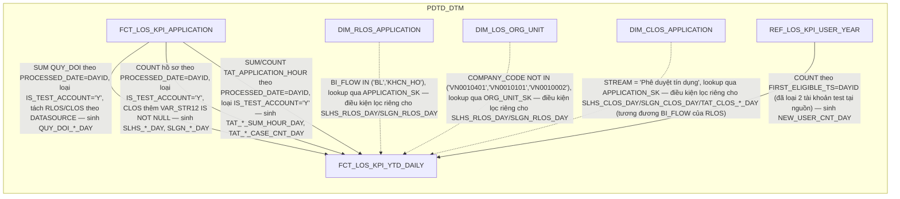

**Ghi chú lineage — bỏ hẳn cơ chế milestone-per-day của tài liệu gốc:**
tài liệu lineage cũ (`FCT_PDTD_KPI_YTD_DAILY`, nguồn
`FCT_PDTD_APPLICATION_MILESTONE`) mô tả `SLGN_CLOS_DAY` là "hồ sơ đạt
mốc FIRST_DISBURSEMENT trong ngày" — nhưng đối chiếu lại công thức SRS
BC9 gốc (BR 1.2, `SLGN_CLOS`) cho thấy điều kiện lọc thực tế là
`PROCESSED_DATE` (ngày phê duyệt/từ chối hồ sơ) trong khoảng từ đầu năm
đến ngày hiện tại — không lọc theo ngày giải ngân thực tế của hợp đồng
T24. Người dùng xác nhận mục tiêu là tính lũy kế đến ngày hiện tại theo
đúng công thức SRS — nên bỏ hẳn khái niệm milestone-per-day kiểu
`FCT_PDTD_APPLICATION_MILESTONE` (bảng này không cần thiết kế lại/thay
thế): mỗi `DAYID`, `SLHS_*_DAY`/`SLGN_*_DAY` chỉ là COUNT hồ sơ có
`PROCESSED_DATE = DAYID` VÀ `IS_TEST_ACCOUNT != 'Y'` trên `FCT_LOS_
KPI_APPLICATION` (2.1.9), tách theo `DATASOURCE`. Riêng nhánh CLOS của
`SLHS_CLOS_DAY`/`SLGN_CLOS_DAY` thêm điều kiện `VAR_STR12 IS NOT NULL`
(không áp dụng cho RLOS). `SLGN_*` (điều kiện đã giải ngân) kiểm tra
tồn tại qua `STG_FCT_LOAN` (LD, cả CLOS/RLOS) và `STG_DTM.STG_FCT_MD`
(MD, CLOS-only) — xem Section 3 dòng #18.

**Rà soát lại 2 điều kiện lọc còn thiếu ở `SLHS_RLOS_DAY`/`SLGN_RLOS_DAY`
(2026-09-15):** đối chiếu lại nguyên văn Business Rules của SRS BC9 cho
`SLHS_RLOS`/`SLGN_RLOS` phát hiện 2 điều kiện lọc chưa đưa vào thiết kế
trước đó (chỉ áp dụng cho RLOS, không có ở công thức CLOS tương ứng):
`f.BI_FLOW IN ('BL', 'KHCN_HO')` (phạm vi luồng, lookup qua `REF_RLOS_
FLOW` — chính là `DIM_RLOS_APPLICATION.BI_FLOW` đã tính sẵn, xem 2.3.1.1)
và loại trừ 3 chi nhánh khởi tạo hồ sơ `COMPANY_CODE NOT IN
('VN0010401','VN0010101','VN0010002')` (lookup qua `DIM_LOS_ORG_UNIT`,
xem 2.1.1). Đã bổ sung cả 2 điều kiện vào công thức `SLHS_RLOS_DAY`/
`SLGN_RLOS_DAY` (join thêm `DIM_RLOS_APPLICATION`/`DIM_LOS_ORG_UNIT` qua
`APPLICATION_SK`/`ORG_UNIT_SK` đã có sẵn trên `FCT_LOS_KPI_APPLICATION`,
không cần thêm cột mới trên bảng đó).

**Rà soát bổ sung — điều kiện `STREAM` còn thiếu ở `SLHS_CLOS_DAY`/
`SLGN_CLOS_DAY`/`TAT_CLOS_*_DAY` (review 2026-09-17):** đối chiếu lại
nguyên văn SRS BC9 cho `SLHS_CLOS`/`SLGN_CLOS`/`TAT_CLOS` phát hiện cả
3 công thức đều có điều kiện `b.STREAM = 'Phê duyệt tín dụng'` (join
`NG_SB_CLOS_APPROVAL b`) mà thiết kế trước đó chưa đưa vào — đây là
điều kiện "phạm vi luồng nghiệp vụ" tương đương `BI_FLOW` của RLOS,
nhưng CLOS dùng khái niệm `STREAM` riêng (không qua `REF_*_FLOW`). Đã
bổ sung vào công thức `SLHS_CLOS_DAY`/`SLGN_CLOS_DAY`/
`TAT_CLOS_SUM_HOUR_DAY`/`TAT_CLOS_CASE_CNT_DAY` (join `DIM_CLOS_
APPLICATION` qua `APPLICATION_SK` đã có sẵn trên `FCT_LOS_KPI_
APPLICATION`, cột `STREAM` đã có sẵn trên DIM đó, không cần thêm cột
mới). Riêng CLOS không có điều kiện tương đương `COMPANY_CODE NOT IN
(...)` của RLOS — SRS BC9 (`SLHS_CLOS`/`SLGN_CLOS`/`TAT_CLOS`) không
nhắc điều kiện loại trừ chi nhánh nào, giữ nguyên không thêm.

**Đính chính — "Nhóm 1/Nhóm 2" của SRS không phải điều kiện phân nhóm
sản phẩm cần tách khi tính `SLHS_RLOS`/`SLGN_RLOS`:** SRS định nghĩa
`SLHS_RLOS = SLHS(Nhóm 1) + SLHS(Nhóm 2)` với Nhóm 1 = "không phải
Credit Card VÀ không phải SeAHome-Fast/FastTSDB", Nhóm 2 = điều kiện đối
lập chính xác (bù trừ hoàn toàn) — tổng 2 nhóm luôn bằng COUNT trên toàn
bộ hồ sơ thỏa "II. Điều kiện lọc dữ liệu" chung, không có hồ sơ nào bị
loại/thêm khi tách nhóm rồi cộng lại. Vì vậy KHÔNG cần đưa điều kiện
`SUB_PRODUCT`/`PRODUCT_NAME` (Nhóm 1/2) vào công thức `SLHS_RLOS_DAY`/
`SLGN_RLOS_DAY` — COUNT theo đúng "II. Điều kiện lọc dữ liệu" (đã đủ với
`PROCESSED_DATE`, `IS_TEST_ACCOUNT`, `BI_FLOW`, `COMPANY_CODE` như trên)
cho kết quả toán học giống hệt. Cách phân nhóm "Nhóm 1/Nhóm 2" này khác
hẳn cách phân nhóm SEC/UNSEC của `TAT_RLOS` (dùng danh sách `PRODUCT_
NAME` khác và điều kiện `COLLREQUIRE`, đã cài đúng ở `TAT_RLOS_SEC_*`/
`TAT_RLOS_UNSEC_*` bên dưới) — 2 rule độc lập, không nhầm lẫn. Sửa lại
ghi chú tại `DIM_RLOS_PRODUCT` (2.3.1.2/2.3.1.2 PDTD_DTM) và Section 3
dòng #3 cho khớp kết luận này.

**Ghi chú — nguồn gốc `STG_FCT_MD`, đóng PENDING #18:** theo SRS BC9
(BR 1.2, nhánh "KPI Khối (CLOS)"), `SLGN_CLOS` kiểm tra tồn tại hợp đồng
qua `LISTAGG(CONTRACT) theo (SEAB_LOS_ID, CUSTOMER)` trên cả
`STG_FCT_LOAN` (nhánh LD) và `STG_DTM.STG_FCT_MD` (nhánh MD — hợp đồng
bảo lãnh, chỉ CLOS có). Đã xác nhận với người dùng: (1) đây là phép
đếm HỒ SƠ (COUNT hồ sơ có ≥1 hợp đồng, không phải COUNT số lượng hợp
đồng — với quan hệ 1 hồ sơ = 1 khách hàng T24 duy nhất đã xác nhận,
LISTAGG+GROUP BY theo (SEAB_LOS_ID, CUSTOMER) không nhân bản dòng, nên
COUNT sau LISTAGG là đếm hồ sơ); (2) không cần biết cấu trúc đầy đủ của
`STG_FCT_MD`/`SB_DWH.FCT_MD` — chỉ cần dùng đúng 3 cột đã xác nhận qua
SRS (`SEAB_LOS_ID`, `CUSTOMER`, `CONTRACT`) làm phép EXISTS/LEFT JOIN
ngay tại công thức `SLGN_CLOS_DAY`, không cần DIM/FCT riêng cho MD.
Không tồn tại `FCT_LOS_MD_DISBURSEMENT` như một bảng vật lý — nhu cầu
duy nhất đã biết của `STG_FCT_MD` được giải quyết trọn vẹn ngay tại đây.

**Ghi chú — `QUY_DOI_*`/`TAT_*` không tính lại từ nguồn thô:** theo yêu
cầu người dùng, `QUY_DOI_RLOS_DAY`/`QUY_DOI_CLOS_DAY` SUM lại từ
`FCT_LOS_KPI_APPLICATION.QUY_DOI` (không tính lại công thức
`POINT*8/VOLUME` ở đây — sửa lại đúng chiều phép tính theo SRS BC9,
review 2026-09-17, xem Section 3 dòng #33), lọc `IS_TEST_ACCOUNT != 'Y'`
— tránh trùng logic giữa 2 bảng. Tương tự, `TAT_*_SUM_HOUR_DAY`/`TAT_*_CASE_CNT_DAY`
(tử số/mẫu số thô của TAT, tách SEC/UNSEC cho RLOS theo đúng tài liệu
gốc) SUM lại từ `FCT_LOS_KPI_APPLICATION.TAT_APPLICATION_HOUR`, cùng
lọc `IS_TEST_ACCOUNT != 'Y'`. Các chỉ tiêu tỷ lệ/
trung bình phái sinh (`TAT_RLOS`, `TAT_CLOS`, `TAT_TB`, `TY_LE_GN_RLOS`,
`TY_LE_GN_CLOS`, `TY_LE_GN_TONG`, `SLHS_TONG`, `SLGN_TONG`, `NSLD`)
**không lưu vật lý** — theo yêu cầu người dùng, đây là phép chia/cộng
đơn giản từ các cột lũy kế đã lưu, tính tại tầng report (OAS), tránh
lưu trùng dữ liệu đã có thể suy ra được.

**Ghi chú — `NEW_USER_CNT_DAY`/`NHAN_SU` không cộng dồn trực tiếp được
như các chỉ tiêu COUNT khác:** `NHAN_SU` là `COUNT(DISTINCT USERNAME)`
— không có tính cộng dồn tự nhiên (1 user active nhiều ngày sẽ bị đếm
trùng nếu cộng thẳng theo ngày). Theo phương án đã thống nhất:
`NEW_USER_CNT_DAY` = COUNT user trên `REF_LOS_KPI_USER_YEAR` (2.1.7) có
`TRUNC(FIRST_ELIGIBLE_TS) = DAYID` (đúng ngày lần đầu user đó đủ điều
kiện trong năm — không trùng lặp vì `REF_LOS_KPI_USER_YEAR` chỉ INSERT
1 lần/user/năm, và đã loại sẵn 2 tài khoản test tại nguồn — xem 2.1.7),
rồi cộng dồn `NHAN_SU(D) = NHAN_SU(D-1) + NEW_USER_CNT_DAY(D)`, reset
về 0 vào ngày 1/1 mỗi năm.

##### 2.1.9 FCT_LOS_KPI_APPLICATION

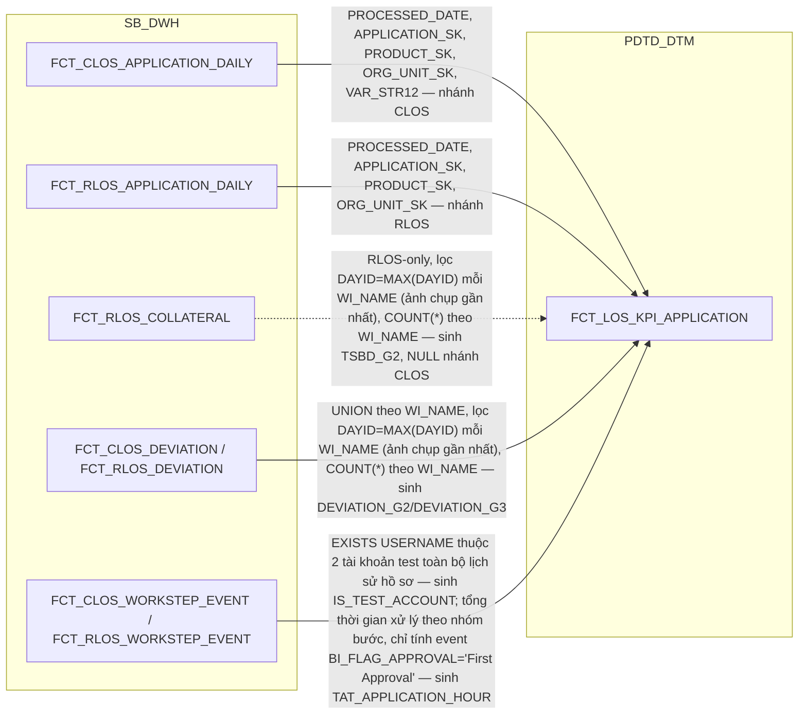

**Ghi chú lineage — thay thế `FCT_LOS_APPLICATION_MILESTONE` đã loại
bỏ:** bảng này giữ đúng vai trò "điểm KPI theo hồ sơ" đã ghi trong split
proposal — grain **1 dòng/hồ sơ (`WI_NAME`)/hệ (`DATASOURCE`)**, là input
duy nhất để `FCT_LOS_KPI_YTD_DAILY` (2.1.8) SUM/COUNT lên grain ngày.
Không có vai trò "pre-aggregate SLHS/SLGN/TAT" như ghi chú "chưa thiết
kế" cũ từng viết — vai trò đó thuộc hẳn về `FCT_LOS_KPI_YTD_DAILY`
(SLHS_*/SLGN_*/TAT_* là số lũy kế theo NGÀY, khác grain hồ sơ của bảng
này). Cột `VOLUME`/`POINT`/`QUY_DOI`/`TAT_APPLICATION_HOUR` tính theo
đúng công thức SRS BC9 (BR 1.2, STT 4-6, 20-21) — `POINT` đọc từ file
cam kết SLA (BC5TAT, đã có tại `RLOS_REF_SLA_TDKHCN`/`CLOS_REF_SLA_
TDKHDNL`/`CLOS_REF_SLA_TDKHDN`, xem 2.1.1.1/2.2.1.1), `VOLUME` tính
theo lịch sử bước xa nhất đã đạt (UNION `FCT_CLOS_WORKSTEP_EVENT`/
`FCT_RLOS_WORKSTEP_EVENT`), `TAT_APPLICATION_HOUR` tổng thời gian xử lý
theo nhóm bước (khác công thức RLOS/CLOS — CLOS cộng thêm bước
`CreditCommittee`). `DEVIATION_G2`/`DEVIATION_G3` UNION trực tiếp bảng
ngoại lệ tương ứng (`FCT_CLOS_DEVIATION`/`FCT_RLOS_DEVIATION`) rồi đếm
theo `WI_NAME`, đúng công thức SRS — không qua cột đếm trung gian nào
trên `*_APPLICATION_DAILY` (đã bỏ theo quyết định tại 1.2.2.1/1.3.2.1).
`TSBD_G2` RLOS-only, đọc trực tiếp `FCT_RLOS_COLLATERAL` (xem rà soát
nguồn bên dưới).

**Bổ sung điều kiện lọc DAYID cho `TSBD_G2`/`DEVIATION_G2`/`DEVIATION_G3`
(review 2026-09-17):** bảng nguồn `FCT_RLOS_COLLATERAL`,
`FCT_CLOS/RLOS_DEVIATION` đều là **full-snapshot-mỗi-ngày** (PK gồm
`DAYID + WI_NAME + COLLATERAL_BK`/`DEVIATION_BK`, dựng theo quy trình A2
— 1 tài sản/1 ngoại lệ còn hiệu lực N ngày sẽ có N dòng, không phải 1
dòng cố định). Thiết kế trước đó chỉ ghi "UNION rồi đếm theo WI_NAME",
thiếu điều kiện lọc DAYID — nếu ETL thực thi đúng nguyên văn sẽ đếm
nhân theo số ngày tài sản/ngoại lệ còn tồn tại, làm sai gần như toàn bộ
giá trị `TSBD_G2`/`DEVIATION_G2`/`DEVIATION_G3`. Đã bổ sung: CHỈ lấy
`DAYID = MAX(DAYID)` của từng `WI_NAME` (ảnh chụp gần nhất), rồi
`COUNT(*)` theo `WI_NAME` trên các dòng đã lọc. `BUSINESS_INCOM`
chỉ có công thức ở nhánh RLOS (SRS không định nghĩa cho CLOS) — để NULL
ở nhánh CLOS.

**Rà soát lại nguồn/công thức `TSBD_G2` và `DEVIATION_G2`/`DEVIATION_G3`
(review 2026-09-17):** đọc trực tiếp nguyên văn SRS BC9 (và BC5 cho
`DEVIATION_G3`) phát hiện 3 vấn đề, đã sửa:
1. **`TSBD_G2` là RLOS-only, không phải CLOS+RLOS như bản cũ.** SRS BC9
   định nghĩa field-list theo 3 khối tách biệt ("Nguồn RLOS" 11 field,
   "Nguồn CLOS" chỉ 5 field cơ bản, "KPI Khối" các field dùng chung có
   hậu tố `_RLOS`/`_CLOS` riêng). `TSBD_G2` chỉ xuất hiện đúng 1 lần
   trong khối "Nguồn RLOS", UNION 4 bảng `NG_SB_RLOS_COL_OTHER`/
   `COL_REALESTATE`/`COL_TRANSPORT`/`COL_VALPAPER` — không có bản sao
   nào trong khối CLOS, và rà soát toàn bộ BC1-BC11 xác nhận không báo
   cáo nào khác cần `TSBD_G2` cho CLOS. Bản cũ UNION cả
   `FCT_CLOS_COLLATERAL` là thiết kế thừa, không phục vụ báo cáo nào —
   đã bỏ, chỉ còn đọc `FCT_RLOS_COLLATERAL`, để NULL nhánh CLOS (nhất
   quán với `INCOM_3`/`BUSINESS_INCOM`).
2. **Công thức đếm sai bản chất — SRS không có ý loại trùng theo nội
   dung.** Bản cũ dùng `COUNT DISTINCT COLLATERAL_BK`/`DEVIATION_BK`;
   nhưng nguyên văn SRS (cả BC9 và BC5) chỉ dùng cụm "đếm số lượng dòng
   theo WI_NAME" (COUNT thô), không hề nhắc khái niệm hash/business
   key/loại trùng. Vì `COLLATERAL_BK`/`DEVIATION_BK` là hash loại trừ
   cột CLOB (tương ứng), 2 dòng thật khác nhau chỉ khác nội dung CLOB
   sẽ bị hash trùng và đếm hụt nếu dùng COUNT DISTINCT — sai với ý SRS.
   Đã sửa cả 3 cột (`TSBD_G2`, `DEVIATION_G2`, `DEVIATION_G3`) từ COUNT
   DISTINCT sang `COUNT(*)` trên các dòng đã lọc `DAYID=MAX(DAYID)`.
3. **Ngưỡng `TSBD_G2`: SRS mâu thuẫn nội bộ giữa "Ý nghĩa" (≥2) và
   "Cách lấy dữ liệu" (=2)** — áp dụng `>=2` theo đúng ý nghĩa nghiệp
   vụ của tên field, coi "=2" trong công thức là lỗi soạn thảo SRS.

**Bổ sung điều kiện lọc tập hồ sơ nền — hồ sơ phải đã kết thúc (review
2026-09-18, SRS BC9 cập nhật):** SRS bản mới đổi bước dựng nguồn cơ sở
của cả khối "Nguồn RLOS" lẫn "Nguồn CLOS" từ `LEFT JOIN
NG_SB_*_EXTTABLE (a) — NG_SB_*_ENTRY_EXIT (b) theo a.WI_NAME=b.WINAME`
thành `INNER JOIN ... AND (b.DECISION IN ('Submit','Send To
PostSanction','Submit To DisbursementMaker','Send To HOSupport','Reject')
OR b.WORKSTEP IN ('CancelRevoke','CancelPermanent'))` — trước đây mọi
hồ sơ trên `EXTTABLE` đều lọt vào (LEFT JOIN, cột `b` có thể NULL); nay
CHỈ hồ sơ đã đến 1 trong các quyết định/kết thúc kể trên (đã phê duyệt/
từ chối/gửi hỗ trợ/gửi giải ngân, hoặc đã hủy) mới được đưa vào. Vì
`WI_NAME` (grain của bảng này) hiện lấy nguồn từ `FCT_CLOS_APPLICATION_
DAILY`/`FCT_RLOS_APPLICATION_DAILY` (đã có mọi hồ sơ, kể cả đang xử lý
dở dang), cần bổ sung điều kiện lọc tương đương khi nạp
`FCT_LOS_KPI_APPLICATION`: chỉ giữ hồ sơ có tồn tại bản ghi lịch sử
(`NG_SB_CLOS/RLOS_ENTRY_EXIT`) thỏa `DECISION` hoặc `WORKSTEP` kể trên
— hồ sơ đang xử lý dở (chưa tới quyết định cuối, chưa hủy) sẽ KHÔNG còn
xuất hiện trong bảng này nữa (khác thiết kế trước đây, vốn nhận mọi hồ
sơ và để `PROCESSED_DATE` xử lý nhánh "hồ sơ chưa đến bước phê duyệt").
Hệ quả kéo theo: nhánh 3 của công thức `PROCESSED_DATE` (cột 6 — "ngày
thoát bước cuối cùng của hồ sơ chưa đến bước phê duyệt và không ở
CancelRevoke") giờ không còn xảy ra nữa đối với dữ liệu nạp vào bảng
này, vì điều kiện lọc đầu vào đã loại sẵn nhóm hồ sơ đó — giữ nguyên
công thức 3 nhánh (không sai, chỉ là nhánh 3 sẽ luôn rỗng), không cần
xóa nhánh này khỏi thiết kế.

**Bổ sung `IS_TEST_ACCOUNT`/`VAR_STR12` — rà soát lại toàn bộ điều kiện
lọc SRS BC9 chưa đưa vào thiết kế:** mọi công thức KPI của BC9
(`SLHS_RLOS`, `SLGN_RLOS`, `TAT_RLOS`, `SLHS_CLOS`, `SLGN_CLOS`,
`TAT_CLOS`, `NHAN_SU`) đều có điều kiện "Loại bỏ các hồ sơ có **tồn
tại** `USERNAME` in ('hanh.nh2', 'hai.bt2')" — tài khoản test/kỹ thuật,
loại **toàn bộ hồ sơ** khỏi mọi phép đếm KPI nếu bất kỳ dòng lịch sử
nào của hồ sơ có `USERNAME` thuộc danh sách này (không phải lọc theo
sự kiện đơn lẻ). Điều kiện này trước đây chưa được đưa vào thiết kế ở
bất kỳ cột nào — bổ sung cờ `IS_TEST_ACCOUNT` (EXISTS trên UNION
`FCT_CLOS_WORKSTEP_EVENT`/`FCT_RLOS_WORKSTEP_EVENT` theo `USERNAME`,
toàn bộ lịch sử hồ sơ, không chỉ sự kiện hoàn tất gần nhất) để
`FCT_LOS_KPI_YTD_DAILY` loại hồ sơ này khỏi mọi phép COUNT/SUM `_DAY`.
Riêng nhánh CLOS của `SLHS_CLOS`/`SLGN_CLOS` còn thêm điều kiện lọc
`WFINSTRUMENTTABLE.VAR_STR12 IS NOT NULL` (xem cột 61 tại `FCT_CLOS_
APPLICATION_DAILY`, 1.2.2.1) — không áp dụng cho `TAT_CLOS`/`QUY_DOI_
CLOS` (khác công thức, cùng nhánh CLOS nhưng SRS không nhắc điều kiện
này), nên giữ `VAR_STR12` là cột riêng, không gộp chung với
`IS_TEST_ACCOUNT`.

### 2.2 Bộ bảng CLOS

##### 2.2.2 FCT

###### 2.2.2.1 FCT_CLOS_APPLICATION_DAILY

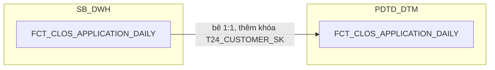

**Ghi chú lineage:** bê nguyên 1:1 từ SB_DWH, cùng grain/PK. Không có cột
vật lý `BI_FLOW`/`ZONE` riêng trên bảng này — báo cáo lấy `BI_FLOW` bằng
JOIN `APPLICATION_SK` sang `DIM_CLOS_APPLICATION` (cột đã có sẵn, tính bằng
CASE theo `CUST_GROUP`, xem 2.2.1.1), và lấy `ZONE` chuẩn hóa bằng JOIN
`ORG_UNIT_SK` sang `DIM_LOS_ORG_UNIT` rồi LEFT JOIN tiếp `TMP_REF_COMPANY_
REGION_KHDN` tại tầng truy vấn báo cáo (xem 2.1.1) — nhất quán với quyết
định "ZONE là join-time-only, không lưu vật lý" đã chốt ở `DIM_LOS_ORG_UNIT`.
Bổ sung duy nhất khóa kỹ thuật `T24_CUSTOMER_SK` (tra qua `DIM_CLOS_CUSTOMER`,
xem 2.2.1.7 — review 2026-09-17: đổi tên từ `CUSTOMER_SK` để phân biệt rõ
với khách hàng LOS) để báo cáo join sang `DIM_T24_CUSTOMER` (T24) khi cần.

###### 2.2.2.2 FCT_CLOS_APPLICATION_PARTY — MỚI (factless-fact liên kết, tương tự FCT_RLOS_APPLICATION_PARTY)

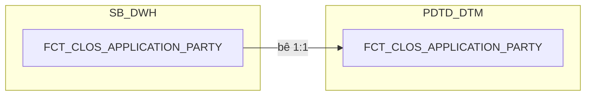

**Ghi chú lineage:** bê nguyên 1:1 từ SB_DWH, cùng grain (1 dòng = 1 hồ sơ
× 1 người liên quan pháp lý trên `DIM_CLOS_LEGAL_PARTY`). Không có REF_ nào
join thêm ở tầng này — bảng chỉ chứa khóa liên kết, xem thiết kế đầy đủ tại
Section 1 → 1. SB_DWH → 1.2.2.2.

###### 2.2.2.3 FCT_CLOS_COLLATERAL

**Ghi chú lineage:** bê nguyên 1:1 từ SB_DWH, cùng grain/PK (`DAYID +
WI_NAME + COLLATERAL_BK`). Không có REF_ nào join thêm ở tầng này — cấu
trúc giữ nguyên như tài liệu gốc, xem thiết kế đầy đủ tại Section 1 → 1.
SB_DWH → 1.2.2.3.

###### 2.2.2.4 FCT_CLOS_EXCEPTION

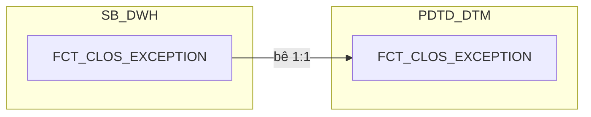

**Ghi chú lineage:** bê nguyên 1:1 từ SB_DWH, cùng grain/PK (`DAYID +
WI_NAME + EXCEPTION_CATEGORY + RAISED_BY + RAISED_DATE_TIME`), cùng đầy
đủ 14 cột (11 cột gốc + `CHECK_FTR`/`FIRST_WORKSTEP_RETURN`/
`PHAN_LOAI_DDE` đã tính sẵn ở tầng SB_DWH — xem đánh giá kiến trúc tại
Section 1 → 1. SB_DWH → 1.2.2.4). Không đọc thêm `NG_SB_CLOS_ENTRY_EXIT`
hay bất kỳ bảng STG_LOS nào ở tầng này, giữ đúng nguyên tắc "DTM chỉ đọc
DWH". Bổ sung duy nhất 1 cột phái sinh tại DTM: `LOANCASEID`, join qua
`DIM_CLOS_APPLICATION.LOANCASEID` theo `APPLICATION_SK` (cùng cách
`FCT_PDTD_EXCEPTION` gốc lấy "Tính ở DTM từ
DIM_PDTD_APPLICATION.LOANCASEID").

###### 2.2.2.5 FCT_CLOS_DEVIATION

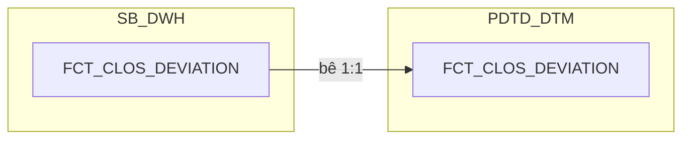

**Ghi chú lineage:** bê nguyên 1:1 từ SB_DWH, cùng grain/PK (`DAYID +
WI_NAME + DEVIATION_BK`), cùng đầy đủ 8 cột (7 cột gốc + `PROCESSED_DATE`
đã tính sẵn ở tầng SB_DWH, đọc thẳng `NG_SB_CLOS_ENTRY_EXIT` — xem đánh
giá kiến trúc tại Section 1 → 1. SB_DWH → 1.2.2.5). Không JOIN sang
`FCT_CLOS_APPLICATION_DAILY` hay đọc thêm bảng STG_LOS nào ở tầng này —
`FCT_CLOS_DEVIATION` và `FCT_CLOS_APPLICATION_DAILY` là 2 luồng ETL độc
lập hoàn toàn (không còn cột đếm trung gian nào giữa 2 bảng, xem đánh giá
kiến trúc tại Section 1/2 → 1.2.2.1), giữ đúng nguyên tắc "DTM chỉ đọc
DWH".

###### 2.2.2.6 FCT_CLOS_WORKSTEP_EVENT — TÁCH TỪ FCT_LOS_WORKSTEP_EVENT

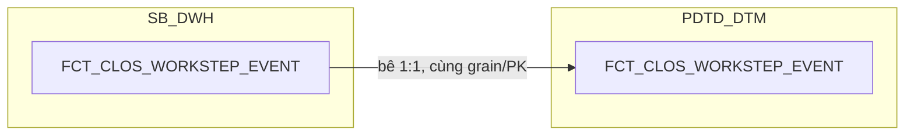

**Ghi chú lineage:** bê nguyên 1:1 từ SB_DWH, cùng grain/PK (`DAYID +
WI_NAME + WORKSTEP_CODE + ENTRYDATE`), cùng đầy đủ 24 cột (đã tăng từ 21
sau khi bổ sung PROCESSED_DATE/WORKSTEP_FLAG/CUSTOMER_SK, review
2026-09-21). Không có bảng
`REF_` nào join thêm ở tầng này — cấu trúc giữ nguyên như bản SB_DWH, xem
thiết kế đầy đủ tại Section 1 → 1. SB_DWH → 1.2.2.6.

###### 2.2.2.7 FCT_CLOS_LOAN_DISBURSEMENT — TÁCH TỪ FCT_LOS_DISBURSEMENT

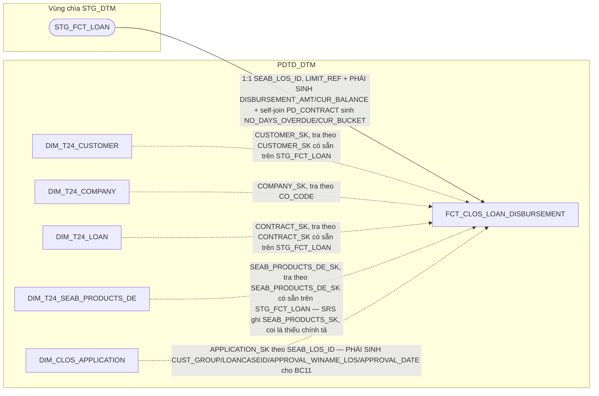

**Vì sao tách khỏi `FCT_LOS_DISBURSEMENT` (bảng CHUNG cũ):** rà soát lại
18 cột gốc phát hiện chỉ 13 cột đầu (`DAYID`, `CONTRACT`, `CUSTOMER_SK`,
`COMPANY_SK`, `CONTRACT_SK`, `SEAB_PRODUCTS_DE_SK`, `SEAB_LOS_ID`, `ZONE`,
`DISBURSEMENT_AMT`, `CUR_BALANCE`, `NO_DAYS_OVERDUE`, `CUR_BUCKET`,
`LIMIT_REFERENCE`) là T24 thuần CHUNG thật (FK trỏ 4 DIM_T24_* dùng
chung CLOS/RLOS) — 5 cột còn lại phụ thuộc hệ nguồn: `APPLICATION_SK`
vốn polymorphic (trỏ `DIM_CLOS_APPLICATION` hoặc `DIM_RLOS_APPLICATION`
tùy hệ), `CUST_GROUP`/`LOANCASEID`/`APPROVAL_WINAME_LOS` chỉ có giá trị
khi hệ nguồn là CLOS (RLOS luôn NULL), và `APPROVAL_DATE` dùng 2 công
thức khác nhau theo hệ. Tách theo đúng nguyên tắc CLOS/RLOS đã áp dụng
cho `FCT_LOS_WORKSTEP_EVENT` (2.2.2.6/2.3.2.7) — mỗi bảng chỉ còn đúng 1
nhánh `APPLICATION_SK`. Đổi tên thêm `LOAN` (`FCT_CLOS_LOAN_DISBURSEMENT`)
để phân biệt với khái niệm giải ngân bảo lãnh (`MD`, xử lý riêng tại
`FCT_LOS_KPI_YTD_DAILY`, không có bảng vật lý) —
`LOAN` = hợp đồng vay, `MD` = hợp đồng bảo lãnh.

**Ghi chú lineage — bảng đặc thù, nguồn T24 giống `DIM_T24_CUSTOMER`:**
cùng bản chất với `DIM_T24_CUSTOMER` (2.1.3) — grain là **HỢP ĐỒNG khoản
vay trên T24**, khác hẳn grain hồ sơ của mọi bảng LOS, nên bắt buộc là
bảng riêng (1 hồ sơ có thể sinh nhiều hợp đồng). Nguồn chính
`SB_DWH.FCT_LOAN`, đọc qua vùng chìa `STG_DTM.STG_FCT_LOAN` — vùng chìa
chỉ giữ dữ liệu của đúng ngày hiện tại nên ETL phải chạy đúng ngày, không
đọc bù được nếu trễ. Nối ngược về hồ sơ LOS bằng `SEAB_LOS_ID`. 4 khóa
T24 (`VALUE_DATE`/`MATURITY_DATE`/`REC_STATUS`/`CONTRACT_REF`/
`REF_VALUE_DATE` trên `DIM_LOAN`; `BRANCH_NAME`/`COMPANY_NAME` trên
`DIM_COMPANY`; `PRODUCT_T24` trên `DIM_SEAB_PRODUCTS_DE`) đã tách thành 3
DIM riêng theo yêu cầu người dùng (2.1.4/2.1.5/2.1.6) — fact chỉ giữ FK
tương ứng, không denormalize các cột đó nữa.

**Đối chiếu chi tiết SRS (BC11) — đọc lại đầy đủ bảng "Các bảng sử
dụng" (BR 1.2, bảng lồng trong ô docx, không chỉ field-list):** phát hiện
quan trọng thay đổi thiết kế ban đầu — SRS thể hiện `STG_FCT_LOAN` (alias
`a`) đã sẵn có các khóa surrogate `CUSTOMER_SK`, `CONTRACT_SK`,
`SEAB_PRODUCTS_SK`, và cột `CO_CODE` (không phải `COMPANY_CODE`) để join
trực tiếp — không cần tự lookup qua `LEGAL_ID`/`COMPANY_CODE` như giả định
ban đầu:
- `... INNER JOIN STG_DIM_CUSTOMER (d) ON a.CUSTOMER_SK = d.DIMENSION_KEY
  AND d.SEAB_CU_SEGMENT NOT IN ('14','21')` (BC11) — `CUSTOMER_SK` đã có
  sẵn trên `STG_FCT_LOAN`, tra thẳng `DIM_T24_CUSTOMER.DIMENSION_KEY`.
  Điều kiện `SEAB_CU_SEGMENT` là bộ lọc báo cáo (phân biệt KHCN/KHDN),
  không phải điều kiện join của `FCT_CLOS_LOAN_DISBURSEMENT` — xem quyết
  định tại 2.1.3 (giữ 1 dataset đầy đủ, không loại dòng).
- `... LEFT JOIN STG_DIM_COMPANY (e) ON a.CO_CODE = e.COMPANY_CODE AND
  e.COMPANY_EXP_DATE IS NULL` — join key thật là `CO_CODE` trên
  `STG_FCT_LOAN`, không phải `COMPANY_CODE`. Xem 2.1.4.
- `... LEFT JOIN STG_DIM_LOAN (c) ON a.CONTRACT_SK = c.DIMENSION_KEY` —
  `CONTRACT_SK` đã có sẵn trên `STG_FCT_LOAN`. Xem 2.1.5.
- `... LEFT JOIN STG_DIM_SEAB_PRODUCTS_DE (f) ON a.SEAB_PRODUCTS_SK =
  f.DIMENSION_KEY` — `SEAB_PRODUCTS_SK` đã có sẵn trên `STG_FCT_LOAN`.
  Xem 2.1.6.
- `... LEFT JOIN STG_FCT_LOAN (b) ON a.PD_CONTRACT = b.CONTRACT` —
  self-join của chính `FCT_LOAN`, nguồn của `NO_DAYS_OVERDUE`/
  `CUR_BUCKET` (đã ghi chú "lấy qua bảng fact tự join theo PD_CONTRACT"
  ở lineage doc gốc, nay xác nhận chính xác công thức).
- `... LEFT JOIN TMP_REF_COMPANY_REGION (g) ON a.CO_CODE =
  g.COMPANY_CODE` — nguồn `ZONE`, cùng cột `CO_CODE`.

**Bổ sung 5 trường theo yêu cầu bám sát SRS:**
- `BRANCH_NAME`, `COMPANY_NAME` — chuyển hẳn vào `DIM_T24_COMPANY`
  (2.1.4), fact chỉ giữ FK `COMPANY_SK`.
- `ZONE` — nguồn `TMP_REF_COMPANY_REGION_KHDN` (bảng REF_ tĩnh, seed
  Excel, không phải DIM SCD2) — lưu **trực tiếp giá trị** trên fact
  (denormalize), không tách FK riêng.
- `CUST_GROUP`, `LOANCASEID`, `APPROVAL_WINAME_LOS`, `APPROVAL_DATE`
  (BC11) — SRS mô tả đọc trực tiếp `NG_SB_CLOS_CUST_INFO`/
  `NG_SB_CLOS_EXTTABLE`/`NG_SB_CLOS_CHANGEREQ`/`NG_SB_CLOS_ENTRY_EXIT`
  qua `SEAB_LOS_ID = WI_NAME` — nhưng vì `FCT_CLOS_LOAN_DISBURSEMENT` là
  bảng PDTD_DTM, giữ nguyên tắc "DTM chỉ đọc DWH" (đã xác nhận với người
  dùng): dùng `DIM_CLOS_APPLICATION.CUST_GROUP`/`.LOANCASEID`/
  `.FIRST_APPROVED_WI_NAME`/`.FIRST_APPROVED_DATE` (SB_DWH, đã có sẵn) —
  join qua `APPLICATION_SK` đã có sẵn trên fact, denormalize giá trị vào
  fact tại thời điểm ETL, không thêm FK mới. Riêng `LOANCASEID`: SRS lọc
  thêm điều kiện `NG_SB_CLOS_CHANGEREQ.CHANGE_REQUEST = 'New'` (nếu không
  khớp thì NULL) — áp dụng cùng điều kiện lọc này khi denormalize từ
  `DIM_CLOS_APPLICATION.LOANCASEID` (cột DIM giữ nguyên văn không lọc,
  lọc tại đây theo đúng nhu cầu BC11 — khớp ghi chú gốc "DTM lọc riêng
  theo nhu cầu BC11" tại 1.2.1.1). Công thức `APPROVAL_WINAME_LOS`/
  `APPROVAL_DATE` denormalize thẳng từ `FIRST_APPROVED_WI_NAME`/
  `FIRST_APPROVED_DATE` — sau khi đính chính lại 2 cột đó tại
  `DIM_CLOS_APPLICATION` (1.2.1.1, review 2026-09-15) theo đúng nguyên
  văn SRS BC11 (MIN(WI_NAME) group theo LOANCASEID trên
  `NG_SB_CLOS_EXTTABLE`; MAX(EXITDATE) trên `NG_SB_CLOS_ENTRY_EXIT`), 2
  cột này tại `FCT_CLOS_LOAN_DISBURSEMENT` nay đã khớp tuyệt đối SRS BC11,
  không còn khác biệt nào cần lưu ý.

### 2.3 Bộ bảng RLOS

##### 2.3.2 FCT

###### 2.3.2.1 FCT_RLOS_APPLICATION_DAILY

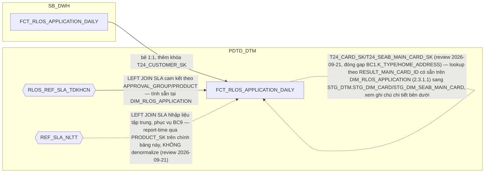

**Ghi chú lineage:** bê nguyên 1:1 từ SB_DWH, cùng grain/PK. Không có cột
vật lý `BI_FLOW`/`ZONE` riêng trên bảng này — báo cáo lấy `BI_FLOW` bằng
JOIN `APPLICATION_SK` sang `DIM_RLOS_APPLICATION` (cột đã có sẵn, LEFT JOIN
`REF_RLOS_FLOW` theo `STREAM`, xem 2.3.1.1), và lấy `ZONE` chuẩn hóa bằng
JOIN `ORG_UNIT_SK` sang `DIM_LOS_ORG_UNIT` rồi LEFT JOIN tiếp
`TMP_REF_COMPANY_REGION_KHCN` tại tầng truy vấn báo cáo (xem 2.1.1) — nhất
quán với quyết định "ZONE là join-time-only" đã chốt. `RLOS_REF_SLA_TDKHCN`
phục vụ `REF_PRODUCT`/`SLA_CREDIT_*` của BC5/BC9, đã tính sẵn tại
`DIM_RLOS_APPLICATION` (2.3.1.1). `REF_SLA_NLTT` (2.4.8, review
2026-09-21) phục vụ `SLA_DE_RESULT`/`SLA_QC_RESULT`/`SLA_DE_TOTAL_
RESULT`/`QD_DDE`/`QD_QC` — KHÔNG denormalize (đảo lại quyết định đóng
PENDING #12), báo cáo tự `LEFT JOIN` runtime bằng `PRODUCT_LINE_NAME`
(qua `PRODUCT_SK` có sẵn trên chính bảng này → `DIM_RLOS_PRODUCT`) +
`SYSTEM_CODE='RLOS'`. Bổ sung duy nhất khóa kỹ thuật `T24_CUSTOMER_SK`
(review 2026-09-17: đổi tên từ `CUSTOMER_SK` để phân biệt rõ với khách
hàng LOS/applicant) để báo cáo join sang `DIM_T24_CUSTOMER` (T24).

###### 2.3.2.2 FCT_RLOS_APPLICATION_PARTY

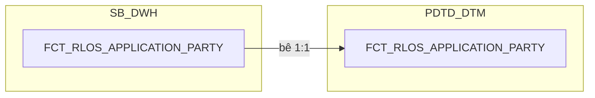

**Ghi chú lineage:** bê nguyên 1:1 từ SB_DWH, cùng grain (1 dòng = 1 hồ sơ
× 1 corepayer, `COREPAYER_SK = -1` nếu không có corepayer). Không có REF_
nào join thêm ở tầng này — bảng chỉ chứa khóa liên kết.

###### 2.3.2.3 FCT_RLOS_COLLATERAL

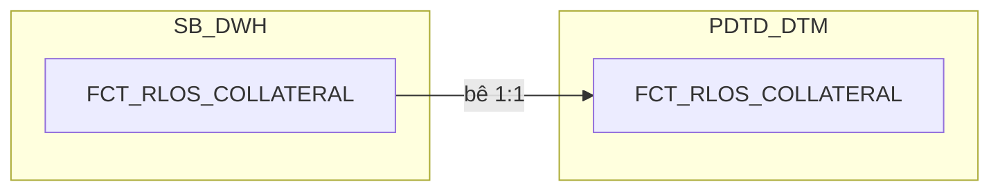

**Ghi chú lineage:** bê nguyên 1:1 từ SB_DWH, cùng grain/PK (`DAYID +
WI_NAME + COLLATERAL_BK`). Không có REF_ nào join thêm ở tầng này — cấu
trúc giữ nguyên như tài liệu gốc, xem thiết kế đầy đủ tại Section 1 → 1.
SB_DWH → 1.3.2.3.

###### 2.3.2.4 FCT_RLOS_SUB_PRODUCT

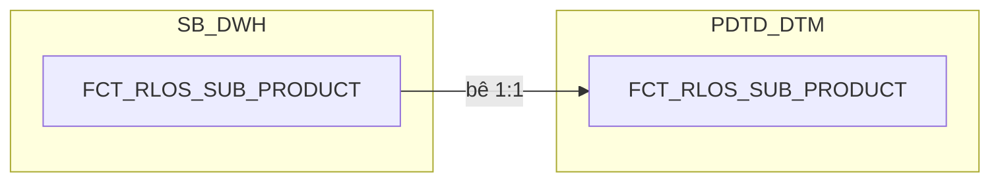

**Ghi chú lineage:** bê nguyên 1:1 từ SB_DWH, cùng grain/PK (`DAYID +
WI_NAME + SUB_PRODUCT_TYPE_CODE + SUB_PRODUCT_BK`). Không có REF_ nào
join thêm ở tầng này — cấu trúc giữ nguyên như tài liệu gốc, xem thiết kế
đầy đủ tại Section 1 → 1. SB_DWH → 1.3.2.4. Cột `CARD_TYPE_CODE` (chỉ có
giá trị ở dòng `SUB_PRODUCT_TYPE_CODE='CREDIT_CARD'`) là loại thẻ đăng ký
lúc đề xuất sản phẩm phụ — khác khái niệm `BC1.K_TYPE` (loại thẻ thật sau
giải ngân, nguồn `STG_DIM_CARD.K_TYPE` qua `NG_SB_RLOS_SENT_CBS_LOG`,
nằm ngoài phạm vi datamart hiện tại, không đi qua cột này).

###### 2.3.2.5 FCT_RLOS_EXCEPTION

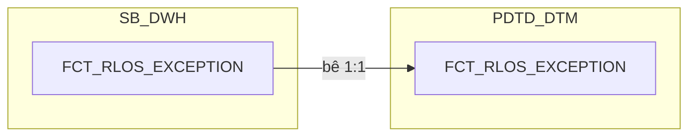

**Ghi chú lineage:** bê nguyên 1:1 từ SB_DWH, cùng grain/PK (`DAYID +
WI_NAME + EXCEPTION_CATEGORY + RAISED_BY + RAISED_DATE_TIME`), cùng đầy
đủ 14 cột (11 cột gốc + `CHECK_FTR`/`FIRST_WORKSTEP_RETURN`/
`PHAN_LOAI_DDE` đã tính sẵn ở tầng SB_DWH — xem đánh giá kiến trúc tại
Section 1 → 1. SB_DWH → 1.3.2.5). Không đọc thêm `NG_SB_RLOS_ENTRY_EXIT`
hay bất kỳ bảng STG_LOS nào ở tầng này, giữ đúng nguyên tắc "DTM chỉ đọc
DWH". Bổ sung duy nhất 1 cột phái sinh tại DTM: `LOANCASEID`, join qua
`DIM_RLOS_APPLICATION.LOANCASEID` theo `APPLICATION_SK` — cùng cách
`FCT_CLOS_EXCEPTION` (2.2.2.4) đã làm.

###### 2.3.2.6 FCT_RLOS_DEVIATION

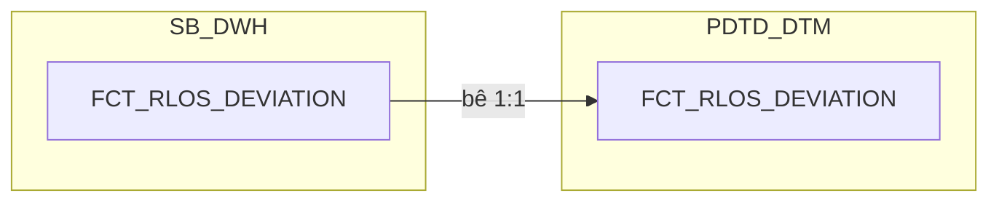

**Ghi chú lineage:** bê nguyên 1:1 từ SB_DWH, cùng grain/PK (`DAYID +
WI_NAME + DEVIATION_BK`), cùng đầy đủ 8 cột (7 cột gốc + `PROCESSED_DATE`
đã tính sẵn ở tầng SB_DWH, đọc thẳng `NG_SB_RLOS_ENTRY_EXIT` — xem đánh
giá kiến trúc tại Section 1 → 1. SB_DWH → 1.3.2.6). Không JOIN sang
`FCT_RLOS_APPLICATION_DAILY` hay đọc thêm bảng STG_LOS nào ở tầng này —
`FCT_RLOS_DEVIATION` và `FCT_RLOS_APPLICATION_DAILY` là 2 luồng ETL độc
lập hoàn toàn (không còn cột đếm trung gian nào giữa 2 bảng, xem đánh giá
kiến trúc tại Section 1/2 → 1.3.2.1), giữ đúng nguyên tắc "DTM chỉ đọc
DWH".

###### 2.3.2.7 FCT_RLOS_WORKSTEP_EVENT — TÁCH TỪ FCT_LOS_WORKSTEP_EVENT

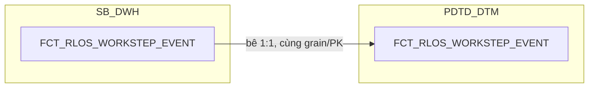

**Ghi chú lineage:** bê nguyên 1:1 từ SB_DWH, cùng grain/PK (`DAYID +
WI_NAME + WORKSTEP_CODE + ENTRYDATE`), cùng đầy đủ 26 cột (đã tăng từ 23
sau khi bổ sung PROCESSED_DATE/WORKSTEP_FLAG/APPLICANT_SK, review
2026-09-21). Không có bảng
`REF_` nào join thêm ở tầng này — cấu trúc giữ nguyên như bản SB_DWH, xem
thiết kế đầy đủ tại Section 1 → 1. SB_DWH → 1.3.2.7.

###### 2.3.2.8 FCT_RLOS_LOAN_DISBURSEMENT — TÁCH TỪ FCT_LOS_DISBURSEMENT

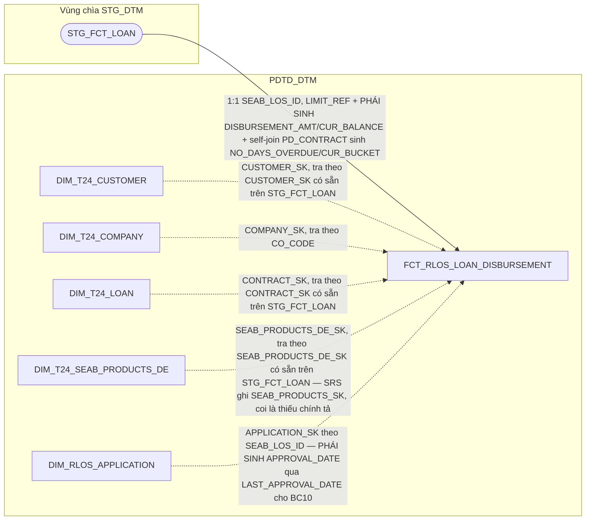

**Vì sao tách khỏi `FCT_LOS_DISBURSEMENT` (bảng CHUNG cũ):** cùng lý do
đã trình bày tại `FCT_CLOS_LOAN_DISBURSEMENT` (2.2.2.7) — 5/18 cột gốc
phụ thuộc hệ (`APPLICATION_SK` polymorphic, `CUST_GROUP`/`LOANCASEID`/
`APPROVAL_WINAME_LOS` chỉ CLOS có, `APPROVAL_DATE` 2 công thức khác
nhau). Bảng RLOS này **không có** 3 cột `CUST_GROUP`/`LOANCASEID`/
`APPROVAL_WINAME_LOS` (RLOS không có khái niệm hồ sơ cha/nhóm khách hàng
doanh nghiệp) — chỉ còn `APPLICATION_SK` (trỏ thẳng
`DIM_RLOS_APPLICATION`) và `APPROVAL_DATE` (1 công thức duy nhất, dùng
`LAST_APPROVAL_DATE`).

**Ghi chú lineage — bảng đặc thù, nguồn T24 giống `DIM_T24_CUSTOMER`:**
cùng bản chất với `DIM_T24_CUSTOMER` (2.1.3) — grain là **HỢP ĐỒNG khoản
vay trên T24**, khác hẳn grain hồ sơ của mọi bảng LOS, nên bắt buộc là
bảng riêng (1 hồ sơ có thể sinh nhiều hợp đồng). Nguồn chính
`SB_DWH.FCT_LOAN`, đọc qua vùng chìa `STG_DTM.STG_FCT_LOAN` — vùng chìa
chỉ giữ dữ liệu của đúng ngày hiện tại nên ETL phải chạy đúng ngày, không
đọc bù được nếu trễ. Nối ngược về hồ sơ LOS bằng `SEAB_LOS_ID`. 4 khóa
T24 (`VALUE_DATE`/`MATURITY_DATE`/`REC_STATUS`/`CONTRACT_REF`/
`REF_VALUE_DATE` trên `DIM_LOAN`; `BRANCH_NAME`/`COMPANY_NAME` trên
`DIM_COMPANY`; `PRODUCT_T24` trên `DIM_SEAB_PRODUCTS_DE`) đã tách thành 3
DIM riêng theo yêu cầu người dùng (2.1.4/2.1.5/2.1.6) — fact chỉ giữ FK
tương ứng, không denormalize các cột đó nữa.

**Đối chiếu chi tiết SRS (BC10) — đọc lại đầy đủ bảng "Các bảng sử
dụng" (BR 1.2, bảng lồng trong ô docx, không chỉ field-list):** SRS thể
hiện `STG_FCT_LOAN` (alias `a`) đã sẵn có các khóa surrogate
`CUSTOMER_SK`, `CONTRACT_SK`, `SEAB_PRODUCTS_SK`, và cột `CO_CODE`
(không phải `COMPANY_CODE`) để join trực tiếp — cùng cơ chế đã xác nhận
ở `FCT_CLOS_LOAN_DISBURSEMENT` (2.2.2.7):
- `... INNER JOIN STG_DIM_CUSTOMER (d) ON a.CUSTOMER_SK = d.DIMENSION_KEY
  AND d.SEAB_CU_SEGMENT IN ('14','21')` (BC10) — điều kiện `SEAB_CU_
  SEGMENT` là bộ lọc báo cáo (khách hàng cá nhân), không phải điều kiện
  join của `FCT_RLOS_LOAN_DISBURSEMENT` — giữ 1 dataset đầy đủ, không
  loại dòng.
- `... LEFT JOIN STG_DIM_COMPANY (e) ON a.CO_CODE = e.COMPANY_CODE AND
  e.COMPANY_EXP_DATE IS NULL` — join key thật là `CO_CODE`. Xem 2.1.4.
- `... LEFT JOIN STG_DIM_LOAN (c) ON a.CONTRACT_SK = c.DIMENSION_KEY` —
  `CONTRACT_SK` đã có sẵn trên `STG_FCT_LOAN`. Xem 2.1.5.
- `... LEFT JOIN STG_DIM_SEAB_PRODUCTS_DE (f) ON a.SEAB_PRODUCTS_SK =
  f.DIMENSION_KEY` — `SEAB_PRODUCTS_SK` đã có sẵn trên `STG_FCT_LOAN`.
  Xem 2.1.6.
- `... LEFT JOIN STG_FCT_LOAN (b) ON a.PD_CONTRACT = b.CONTRACT` —
  self-join của chính `FCT_LOAN`, nguồn của `NO_DAYS_OVERDUE`/
  `CUR_BUCKET`.
- `... LEFT JOIN TMP_REF_COMPANY_REGION (g) ON a.CO_CODE =
  g.COMPANY_CODE` — nguồn `ZONE`, cùng cột `CO_CODE` (nhánh
  `TMP_REF_COMPANY_REGION_KHCN` cho BC10, khách hàng cá nhân).

**Bổ sung 2 trường theo yêu cầu bám sát SRS:**
- `BRANCH_NAME`, `COMPANY_NAME` — chuyển hẳn vào `DIM_T24_COMPANY`
  (2.1.4), fact chỉ giữ FK `COMPANY_SK`.
- `ZONE` — nguồn `TMP_REF_COMPANY_REGION_KHCN` (bảng REF_ tĩnh, seed
  Excel, không phải DIM SCD2) — lưu **trực tiếp giá trị** trên fact
  (denormalize), không tách FK riêng.
- `APPROVAL_DATE` (BC10) — SRS mô tả `MAX(EXITDATE)` trên
  `NG_SB_RLOS_ENTRY_EXIT` tại `WORKSTEP IN ('CreditApprovalReview',
  'CreditApproval','CreditCommittee')`, `DECISION IN ('Submit','Send To
  HOSupport','Send To PostSanction','Submit To DisbursementMaker')` —
  giữ nguyên tắc "DTM chỉ đọc DWH": denormalize từ
  `DIM_RLOS_APPLICATION.LAST_APPROVAL_DATE` (đã bổ sung ở SB_DWH, xem
  1.3.1.1) qua `APPLICATION_SK` đã có sẵn trên fact, không đọc thẳng
  `NG_SB_RLOS_ENTRY_EXIT` tại đây, không JOIN fact-to-fact sang
  `FCT_RLOS_APPLICATION_DAILY`.

**Đã bỏ `LIMIT_REFERENCE` (review 2026-09-17):** cột này có trên bản CLOS
(`FCT_CLOS_LOAN_DISBURSEMENT`, 2.2.2.7 — đúng theo SRS BC11, trường
`LIMIT_REFERENCE`) nhưng đã bị copy nhầm sang bản RLOS mà không kiểm
chứng riêng — rà soát toàn bộ 19 trường output của SRS BC10 xác nhận
không có trường nào tên gần "LIMIT". Đã xóa khỏi bảng cột (2.3.2.8,
Section 2), giảm từ 16 xuống 15 cột.

---

---

## Section 2 — Column Design

### 2.1 Bộ bảng CHUNG

##### 2.1.8 FCT_LOS_KPI_YTD_DAILY

**Bảng cũ (trước tách):** `FCT_PDTD_KPI_YTD_DAILY` (36 cột, gồm 14 cột `_DAY` + 22 cột lũy kế/phái sinh) — đánh giá lại theo yêu cầu người dùng: chỉ giữ daily+lũy kế cho các chỉ tiêu đếm/tổng thật sự cần cộng dồn, bỏ hẳn cột đã là tỷ lệ/trung bình phái sinh (tính tại report), sửa lại nguồn `SLGN_CLOS`/`SLHS_*` theo đúng công thức SRS BC9 (không dùng cơ chế milestone-per-day của `FCT_PDTD_APPLICATION_MILESTONE` đã loại bỏ). Rà soát lại toàn bộ điều kiện lọc SRS BC9 (2026-09-15) phát hiện 2 điều kiện chưa đưa vào thiết kế trước đó — bổ sung `IS_TEST_ACCOUNT`/`VAR_STR12` (từ `FCT_LOS_KPI_APPLICATION`, 2.1.9) vào mọi công thức `_DAY` liên quan.

| STT | Tên cột | Kiểu dữ liệu | Bắt buộc | Độ lớn | Khóa | Mô tả |
| --- | --- | --- | --- | --- | --- | --- |
| 1 | DAYID | DATE | Y |  | PK | Ngày dữ liệu, dạng số YYYYMMDD |
| 2 | SLHS_RLOS_DAY | NUMBER | N | 12 |  | Số hồ sơ RLOS được phê duyệt, phát sinh trong ngày — PHÁI SINH: COUNT hồ sơ trên FCT_LOS_KPI_APPLICATION (DATASOURCE='RLOS') có PROCESSED_DATE=DAYID, IS_TEST_ACCOUNT != 'Y', thỏa điều kiện DECISION đã phê duyệt, VÀ (join DIM_RLOS_APPLICATION qua APPLICATION_SK) BI_FLOW IN ('BL','KHCN_HO'), VÀ (join DIM_LOS_ORG_UNIT qua ORG_UNIT_SK) COMPANY_CODE NOT IN ('VN0010401','VN0010101','VN0010002') (theo đúng công thức SLHS_RLOS của SRS BC9 — SLHS(Nhóm 1)+SLHS(Nhóm 2), 2 nhóm bù trừ hoàn toàn theo SUB_PRODUCT/PRODUCT_NAME nên tổng bằng COUNT trên toàn bộ điều kiện lọc chung, không cần tách nhóm khi tính) |
| 3 | SLHS_RLOS | NUMBER | N | 14 |  | Lũy kế từ 1/1: SLHS_RLOS(D) = SLHS_RLOS(D-1) + SLHS_RLOS_DAY(D), reset vào 1/1. Trường SLHS_RLOS của BC9 |
| 4 | SLGN_RLOS_DAY | NUMBER | N | 12 |  | Số hồ sơ RLOS đã giải ngân (tồn tại hợp đồng trên STG_FCT_LOAN), phát sinh trong ngày — PHÁI SINH: COUNT hồ sơ trên FCT_LOS_KPI_APPLICATION (DATASOURCE='RLOS') có PROCESSED_DATE=DAYID, IS_TEST_ACCOUNT != 'Y', BI_FLOW IN ('BL','KHCN_HO'), COMPANY_CODE NOT IN ('VN0010401','VN0010101','VN0010002') (cùng 2 join như SLHS_RLOS_DAY), VÀ EXISTS hợp đồng STG_FCT_LOAN theo SEAB_LOS_ID |
| 5 | SLGN_RLOS | NUMBER | N | 14 |  | Lũy kế từ 1/1: SLGN_RLOS(D) = SLGN_RLOS(D-1) + SLGN_RLOS_DAY(D), reset vào 1/1. Trường SLGN_RLOS của BC9 |
| 6 | SLHS_CLOS_DAY | NUMBER | N | 12 |  | Số hồ sơ CLOS được phê duyệt, phát sinh trong ngày — cùng cách SLHS_RLOS_DAY, DATASOURCE='CLOS', IS_TEST_ACCOUNT != 'Y' VÀ VAR_STR12 IS NOT NULL, VÀ (join DIM_CLOS_APPLICATION qua APPLICATION_SK) STREAM = 'Phê duyệt tín dụng' (review 2026-09-17 — điều kiện tương đương BI_FLOW của RLOS, SRS BC9 dùng STREAM trên NG_SB_CLOS_APPROVAL riêng cho CLOS), theo công thức SLHS_CLOS của SRS BC9 |
| 7 | SLHS_CLOS | NUMBER | N | 14 |  | Lũy kế từ 1/1: SLHS_CLOS(D) = SLHS_CLOS(D-1) + SLHS_CLOS_DAY(D), reset vào 1/1. Trường SLHS_CLOS của BC9 |
| 8 | SLGN_CLOS_DAY | NUMBER | N | 12 |  | Số hồ sơ CLOS đã giải ngân, phát sinh trong ngày — PHÁI SINH: COUNT hồ sơ trên FCT_LOS_KPI_APPLICATION (DATASOURCE='CLOS') có PROCESSED_DATE=DAYID, IS_TEST_ACCOUNT != 'Y', VAR_STR12 IS NOT NULL, VÀ (join DIM_CLOS_APPLICATION qua APPLICATION_SK) STREAM = 'Phê duyệt tín dụng' (review 2026-09-17, cùng lý do SLHS_CLOS_DAY), VÀ EXISTS hợp đồng trên STG_FCT_LOAN (nhánh LD, review 2026-09-18: SRS BC9 cập nhật đổi khóa nối từ SEAB_LOS_ID+CUSTOMER_CODE sang nối theo VAR_STR12 — xem PENDING mới) HOẶC STG_DTM.STG_FCT_MD (nhánh MD, bảo lãnh) theo SEAB_LOS_ID+CUSTOMER — đúng công thức SLGN_CLOS của SRS BC9. Xem Section 3 dòng #18 (đã giải quyết, cập nhật nhánh LD) |
| 9 | SLGN_CLOS | NUMBER | N | 14 |  | Lũy kế từ 1/1: SLGN_CLOS(D) = SLGN_CLOS(D-1) + SLGN_CLOS_DAY(D), reset vào 1/1. Trường SLGN_CLOS của BC9 |
| 10 | TAT_RLOS_SEC_SUM_HOUR_DAY | NUMBER | N | 18,6 |  | Tổng TAT_APPLICATION_HOUR của hồ sơ RLOS CÓ tài sản bảo đảm, phát sinh trong ngày — SUM lại từ FCT_LOS_KPI_APPLICATION.TAT_APPLICATION_HOUR theo PROCESSED_DATE=DAYID, IS_TEST_ACCOUNT != 'Y', lọc SEC theo COLLREQUIRE |
| 11 | TAT_RLOS_SEC_CASE_CNT_DAY | NUMBER | N | 12 |  | Số hồ sơ RLOS có tài sản bảo đảm, phát sinh trong ngày — mẫu số của TAT_RLOS_SEC, cùng điều kiện lọc trên |
| 12 | TAT_RLOS_SEC_SUM_HOUR_YTD | NUMBER | N | 20,6 |  | Lũy kế từ 1/1: (D) = (D-1) + TAT_RLOS_SEC_SUM_HOUR_DAY(D), reset vào 1/1 |
| 13 | TAT_RLOS_SEC_CASE_CNT_YTD | NUMBER | N | 14 |  | Lũy kế từ 1/1: (D) = (D-1) + TAT_RLOS_SEC_CASE_CNT_DAY(D), reset vào 1/1 |
| 14 | TAT_RLOS_UNSEC_SUM_HOUR_DAY | NUMBER | N | 18,6 |  | Tổng TAT_APPLICATION_HOUR của hồ sơ RLOS KHÔNG có tài sản bảo đảm, phát sinh trong ngày — cùng cách trên (IS_TEST_ACCOUNT != 'Y'), lọc UNSEC |
| 15 | TAT_RLOS_UNSEC_CASE_CNT_DAY | NUMBER | N | 12 |  | Số hồ sơ RLOS không có tài sản bảo đảm, phát sinh trong ngày |
| 16 | TAT_RLOS_UNSEC_SUM_HOUR_YTD | NUMBER | N | 20,6 |  | Lũy kế từ 1/1, reset vào 1/1 |
| 17 | TAT_RLOS_UNSEC_CASE_CNT_YTD | NUMBER | N | 14 |  | Lũy kế từ 1/1, reset vào 1/1 |
| 18 | TAT_CLOS_SUM_HOUR_DAY | NUMBER | N | 18,6 |  | Tổng TAT_APPLICATION_HOUR của hồ sơ CLOS, phát sinh trong ngày — SUM lại từ FCT_LOS_KPI_APPLICATION.TAT_APPLICATION_HOUR (DATASOURCE='CLOS') theo PROCESSED_DATE=DAYID, IS_TEST_ACCOUNT != 'Y' (không lọc VAR_STR12 — SRS không nhắc điều kiện này cho TAT_CLOS), VÀ (join DIM_CLOS_APPLICATION qua APPLICATION_SK) STREAM = 'Phê duyệt tín dụng' (review 2026-09-17 — SRS BC9 có điều kiện này riêng cho TAT_CLOS) |
| 19 | TAT_CLOS_CASE_CNT_DAY | NUMBER | N | 12 |  | Số hồ sơ CLOS, phát sinh trong ngày — mẫu số của TAT_CLOS, cùng điều kiện lọc trên (bao gồm STREAM) |
| 20 | TAT_CLOS_SUM_HOUR_YTD | NUMBER | N | 20,6 |  | Lũy kế từ 1/1, reset vào 1/1 |
| 21 | TAT_CLOS_CASE_CNT_YTD | NUMBER | N | 14 |  | Lũy kế từ 1/1, reset vào 1/1 |
| 22 | QUY_DOI_RLOS_DAY | NUMBER | N | 14,4 |  | Tổng QUY_DOI của hồ sơ RLOS, phát sinh trong ngày — SUM lại từ FCT_LOS_KPI_APPLICATION.QUY_DOI (DATASOURCE='RLOS') theo PROCESSED_DATE=DAYID, IS_TEST_ACCOUNT != 'Y', KHÔNG tính lại công thức POINT*8/VOLUME ở đây |
| 23 | QUY_DOI_RLOS | NUMBER | N | 16,4 |  | Lũy kế từ 1/1: QUY_DOI_RLOS(D) = QUY_DOI_RLOS(D-1) + QUY_DOI_RLOS_DAY(D), reset vào 1/1. Trường QUY_DOI_RLOS của BC9 |
| 24 | QUY_DOI_CLOS_DAY | NUMBER | N | 14,4 |  | Tổng QUY_DOI của hồ sơ CLOS, phát sinh trong ngày — cùng cách trên (IS_TEST_ACCOUNT != 'Y'), DATASOURCE='CLOS' |
| 25 | QUY_DOI_CLOS | NUMBER | N | 16,4 |  | Lũy kế từ 1/1: QUY_DOI_CLOS(D) = QUY_DOI_CLOS(D-1) + QUY_DOI_CLOS_DAY(D), reset vào 1/1. Trường QUY_DOI_CLOS của BC9 |
| 26 | NEW_USER_CNT_DAY | NUMBER | N | 8 |  | Số USERNAME mới đủ điều kiện tính nhân sự trong ngày — PHÁI SINH: COUNT trên REF_LOS_KPI_USER_YEAR (2.1.7) có KPI_YEAR = năm(DAYID) VÀ TRUNC(FIRST_ELIGIBLE_TS) = DAYID (2 tài khoản test đã bị loại tại nguồn REF_LOS_KPI_USER_YEAR, không cần lọc lại ở đây) |
| 27 | NHAN_SU | NUMBER | N | 8 |  | Lũy kế từ 1/1: NHAN_SU(D) = NHAN_SU(D-1) + NEW_USER_CNT_DAY(D), reset vào 1/1 — tương đương COUNT DISTINCT USERNAME lũy kế, không đếm trùng vì REF_LOS_KPI_USER_YEAR chỉ INSERT 1 lần/user/năm. Trường NHAN_SU của BC9 |

- Bảng FACT lũy kế theo ngày, lưu chỉ số KPI toàn khối PDTD phục vụ phần "KPI Khối" của BC9. Grain: 1 dòng = 1 ngày dữ liệu, cho toàn khối (RLOS và CLOS là các nhóm cột song song trên cùng 1 dòng, không tách bảng).
- Khóa chính của bảng (PK): **DAYID**.
- Quy tắc load: chỉ tiêu cộng được thì `TRƯỜNG(D) = TRƯỜNG(D-1) + TRƯỜNG_DAY(D)`, reset vào 1/1 hằng năm. Sửa dữ liệu ngày quá khứ thì chạy lại tuần tự đến ngày cuối đã load trong cùng năm.

**So với thiết kế cũ (`FCT_PDTD_KPI_YTD_DAILY`, 36 cột):** bỏ 9 cột đã
là tỷ lệ/trung bình/tổng phái sinh đơn giản — `TAT_RLOS`, `TAT_CLOS`,
`TAT_TB`, `TY_LE_GN_RLOS`, `TY_LE_GN_CLOS`, `TY_LE_GN_TONG`,
`SLHS_TONG`, `SLGN_TONG`, `NSLD` — theo yêu cầu người dùng: đây là phép
chia/cộng từ các cột lũy kế đã lưu (`TAT_RLOS = (AVG_SEC+AVG_UNSEC)/2`
với `AVG_SEC = TAT_RLOS_SEC_SUM_HOUR_YTD/TAT_RLOS_SEC_CASE_CNT_YTD`;
`TY_LE_GN_CLOS = SLGN_CLOS/SLHS_CLOS`; `SLHS_TONG = SLHS_RLOS+
SLHS_CLOS`; `NSLD = (QUY_DOI_RLOS+QUY_DOI_CLOS)/NHAN_SU`), tính tại
tầng report (OAS) thay vì lưu vật lý — tránh trùng dữ liệu suy ra được.
Giữ nguyên 27 cột còn lại (14 `_DAY` + 13 lũy kế, gộp `NHAN_SU`/
`NEW_USER_CNT_DAY` không tách SEC/UNSEC).

**Đánh giá — thay thế `FCT_LOS_APPLICATION_MILESTONE` đã loại bỏ (đóng
mục "chưa thiết kế" cũ của 2.1.9):** tài liệu lineage gốc dùng
`FCT_PDTD_APPLICATION_MILESTONE` để phát hiện "hồ sơ đạt mốc
FIRST_VALID_APPROVAL/FIRST_DISBURSEMENT trong ngày". Đối chiếu lại công
thức SRS BC9 gốc (`SLHS_*`, `SLGN_*`) xác nhận điều kiện lọc thực tế là
`PROCESSED_DATE` (ngày phê duyệt/từ chối hồ sơ, đã có sẵn trên
`FCT_LOS_KPI_APPLICATION.PROCESSED_DATE`, xem 2.1.9) trong khoảng từ đầu
năm đến ngày hiện tại — không cần bảng milestone riêng, không cần biết
ngày giải ngân T24 thực tế của hợp đồng. Người dùng xác nhận mục tiêu
là tính lũy kế đến ngày hiện tại theo đúng công thức SRS — nên bỏ hẳn
cơ chế milestone-per-day, không thiết kế lại `FCT_LOS_APPLICATION_
MILESTONE` dưới bất kỳ hình thức nào.

**Đóng PENDING #18 (`STG_FCT_MD`):** `SLGN_CLOS_DAY` kiểm tra tồn tại
hợp đồng qua `STG_FCT_LOAN` (LD) và `STG_DTM.STG_FCT_MD` (MD, bảo lãnh,
CLOS-only) bằng EXISTS/LEFT JOIN trực tiếp, dùng đúng các cột đã xác
nhận qua SRS — không cần DIM/FCT riêng, không cần xác nhận thêm cấu trúc
`STG_FCT_MD`/`SB_DWH.FCT_MD`. Đã xác nhận với người dùng: đây là phép
đếm HỒ SƠ (không phải đếm số lượng hợp đồng) — với quan hệ 1 hồ sơ = 1
khách hàng T24 duy nhất, `LISTAGG(CONTRACT)` không nhân bản dòng nên
`COUNT` sau LISTAGG cho đúng số hồ sơ. `FCT_LOS_MD_DISBURSEMENT` (bảng
đã dự kiến trước đây) không cần tồn tại như 1 bảng vật lý — toàn bộ nhu
cầu đã biết của `STG_FCT_MD` được giải quyết trọn vẹn ngay tại cột này.

**Cập nhật khóa nối nhánh LD (review 2026-09-18, SRS BC9 cập nhật, làm
rõ thêm 2026-09-18 lần 2 sau khi đọc lại chi tiết mục "Các bảng sử
dụng"):** SRS bản mới đổi công thức nhánh LD từ `LISTAGG(g.CONTRACT)
theo g.SEAB_LOS_ID và g.CUSTOMER_CODE` thành `LISTAGG(g.CONTRACT) theo
c.VAR_STR12` (`c` = `WFINSTRUMENTTABLE`, `g` = `STG_DTM.STG_FCT_LOAN`).
**Quan trọng — đây KHÔNG phải đổi điều kiện JOIN giữa 2 bảng:**
`WFINSTRUMENTTABLE (c)` và `STG_FCT_LOAN (g)` không join trực tiếp với
nhau — cả 2 vẫn join độc lập vào `NG_SB_CLOS_ENTRY_EXIT (a)`/
`NG_SB_CLOS_APPROVAL (b)` như cũ: `c` qua `a.WINAME = c.PROCESSINSTANCEID`
(gắn với tiến trình xử lý hồ sơ trên workflow engine), còn `g` **vẫn
giữ nguyên khóa JOIN cũ** `b.WI_NAME = g.SEAB_LOS_ID AND
g.CUSTOMER_CODE = e.CUSTOMER` — khóa `SEAB_LOS_ID`+`CUSTOMER_CODE`
KHÔNG hề bị bỏ, nó vẫn là điều kiện đưa `STG_FCT_LOAN` vào tập dữ liệu.
Thay đổi thực sự chỉ nằm ở **bước GROUP BY sau khi đã JOIN xong**: từ
`LISTAGG(CONTRACT)` nhóm theo `SEAB_LOS_ID+CUSTOMER_CODE` sang nhóm
theo `VAR_STR12` — tức đổi cách gộp danh sách hợp đồng thành 1 nhóm khi
đếm số lần giải ngân, không phải đổi cách xác định hồ sơ nào có hợp
đồng nào. Nhánh MD (`STG_FCT_MD`, theo `SEAB_LOS_ID`+`CUSTOMER`) không
đổi.

**CẦN BA/DEV XÁC NHẬN trước khi sinh LLD:** `VAR_STR12` là cột generic
trên `WFINSTRUMENTTABLE` (custom field của workflow engine, không tự
mô tả ý nghĩa qua tên) — SRS hoàn toàn không có bất kỳ chú thích/định
nghĩa nghiệp vụ nào cho cột này (đã rà soát toàn văn, kể cả mục Thuật
ngữ). Cần DEV xác nhận `VAR_STR12` thực chất chứa giá trị gì (mã hồ sơ?
mã lô giải ngân? mã khác?) và liệu việc nhóm `LISTAGG(CONTRACT)` theo
cột này có tương đương 1-1 với việc nhóm theo hồ sơ (như cách nhóm cũ
theo `SEAB_LOS_ID+CUSTOMER_CODE`) hay không — nếu không tương đương,
số đếm `SLGN_CLOS_DAY` sẽ lệch so với ý nghĩa "số hồ sơ đã giải ngân
trong ngày". Tạm giữ nguyên thiết kế cột (nối theo `SEAB_LOS_ID`+
`CUSTOMER_CODE` để lấy tập `CONTRACT`, GROUP BY tạm theo cùng khóa cũ)
cho tới khi có xác nhận, xem Section 3 dòng #47 (file tổng
`hld/HLD_Table_Design.md`).

##### 2.1.9 FCT_LOS_KPI_APPLICATION

**Bảng cũ (trước tách):** `FCT_PDTD_KPI_APPLICATION` (16 cột) — giữ nguyên phạm vi, xác nhận lại vai trò: input duy nhất theo grain hồ sơ cho `FCT_LOS_KPI_YTD_DAILY` (2.1.8) SUM/COUNT lên grain ngày, không tự mình pre-aggregate SLHS/SLGN/TAT

| STT | Tên cột | Kiểu dữ liệu | Bắt buộc | Độ lớn | Khóa | Mô tả |
| --- | --- | --- | --- | --- | --- | --- |
| 1 | WI_NAME | VARCHAR2 | Y | 100 | PK | Mã hồ sơ tín dụng CLOS hoặc RLOS — nguồn FCT_CLOS_APPLICATION_DAILY.WI_NAME/FCT_RLOS_APPLICATION_DAILY.WI_NAME |
| 2 | DATASOURCE | VARCHAR2 | Y | 10 | PK | RLOS hoặc CLOS — quyết định công thức TAT/POINT/nhóm phân loại áp dụng |
| 3 | APPLICATION_SK | NUMBER | Y | 18 |  | Khóa tới DIM_CLOS_APPLICATION hoặc DIM_RLOS_APPLICATION tùy DATASOURCE. Mặc định -1 |
| 4 | PRODUCT_SK | NUMBER | Y | 18 |  | Khóa tới DIM_CLOS_PRODUCT hoặc DIM_RLOS_PRODUCT tùy DATASOURCE. Mặc định -1 |
| 5 | ORG_UNIT_SK | NUMBER | Y | 18 |  | Khóa tới DIM_LOS_ORG_UNIT. Mặc định -1 |
| 6 | PROCESSED_DATE | DATE | N |  |  | Ngày xử lý của hồ sơ — nguồn FCT_CLOS_APPLICATION_DAILY.PROCESSED_DATE/FCT_RLOS_APPLICATION_DAILY.PROCESSED_DATE. Là mốc để FCT_LOS_KPI_YTD_DAILY (2.1.8) xếp hồ sơ vào đúng DAYID khi SUM/COUNT lên grain ngày |
| 7 | VOLUME | NUMBER | N | 5,2 |  | Mức độ hoàn thành hồ sơ, thang 0-1 — PHÁI SINH: theo DECISION nếu đã phê duyệt/từ chối = 1.0; nếu đã CancelRevoke/CancelPermanent thì lấy theo bước xa nhất đã đạt (CreditApproval=0.8, UnderwriterChecker=0.6, UnderwriterMaker=0.5, DetailDataEntry=0.2); còn lại NULL. Tính từ UNION FCT_CLOS_WORKSTEP_EVENT/FCT_RLOS_WORKSTEP_EVENT toàn bộ lịch sử hồ sơ |
| 8 | POINT | NUMBER | N | 12,4 |  | Điểm KPI — RLOS: SLA_DE_TOTAL_RESULT (report-time LEFT JOIN REF_SLA_NLTT theo PRODUCT_LINE_NAME qua DIM_RLOS_PRODUCT + SYSTEM_CODE='RLOS', review 2026-09-21: không còn đọc từ DIM_RLOS_APPLICATION) + SLA_CREDIT_OFFICER + SLA_CREDIT_APPROVER (từ RLOS_REF_SLA_TDKHCN, vẫn đọc qua DIM_RLOS_APPLICATION như cũ); CLOS: SLA_DE_TOTAL_RESULT (report-time LEFT JOIN REF_SLA_NLTT theo PRODUCT_LINE_NAME+PRODUCT_NAME qua DIM_CLOS_PRODUCT+CHANGE_REQUEST qua DIM_CLOS_APPLICATION + SYSTEM_CODE='CLOS', review 2026-09-21: đóng gap CLOS chưa từng có thiết kế) + NVL(SLA_CREDIT_OFFICER theo CLOS_REF_SLA_TDKHDN/TDKHDNL) + NVL(SLA_CREDIT_APPROVER...), riêng APP_GRP='C1' cộng thêm hằng số 4 giờ (xem 2.4.7) |
| 9 | QUY_DOI | NUMBER | N | 12,4 |  | Điểm KPI quy đổi — PHÁI SINH: POINT*8/VOLUME (sửa lại đúng chiều phép tính theo nguyên văn SRS BC9, review 2026-09-17 — bản cũ ghi nhầm POINT/8*VOLUME, sai lệch tới 64 lần), NULL nếu VOLUME NULL. Là đầu vào duy nhất của QUY_DOI_RLOS_DAY/QUY_DOI_CLOS_DAY ở FCT_LOS_KPI_YTD_DAILY (2.1.8) |
| 10 | TAT_APPLICATION_HOUR | NUMBER | N | 18,6 |  | Tổng thời gian xử lý của hồ sơ, đơn vị giờ — RLOS = DDE+QC+UWM+UWC+APPROVER; CLOS = như RLOS cộng thêm COMMITTEE. Loại trừ ngày nghỉ/giờ ngoài hành chính (get_business_minute). CHỈ tính các sự kiện có `BI_FLAG_APPROVAL = 'First Approval'` trên `FCT_CLOS/RLOS_WORKSTEP_EVENT` (review 2026-09-17 — đúng công thức "chỉ lấy hồ sơ được phê duyệt lần đầu" của SRS BC9, khớp 100% điều kiện WORKSTEP/DECISION đã dùng để tính `BI_FLAG_APPROVAL` cho BC5, xem 1.2.2.6/1.3.2.7 cột 20/22) — loại trừ thời gian của vòng làm lại (rework) sau lần EXIT đầu tiên khỏi CreditApproval/CreditCommittee |
| 11 | TSBD_G2 | VARCHAR2 | N | 10 |  | Hồ sơ có từ 2 tài sản bảo đảm trở lên (RLOS-only — SRS BC9 chỉ định nghĩa field này trong khối "Nguồn RLOS", không có bản sao ở khối "Nguồn CLOS" (5 field cơ bản, không gồm TSBD_G2) và không có báo cáo nào khác trong BC1-BC11 cần TSBD_G2 cho CLOS — để NULL nhánh CLOS, review 2026-09-17: bản cũ tính cả CLOS là thiết kế thừa, không phục vụ báo cáo nào, đã bỏ, nhất quán với INCOM_3/BUSINESS_INCOM) — PHÁI SINH đúng nguyên văn SRS: UNION 4 bảng NG_SB_RLOS_COL_OTHER/COL_REALESTATE/COL_TRANSPORT/COL_VALPAPER (qua FCT_RLOS_COLLATERAL), CHỈ lấy DAYID = MAX(DAYID) của từng WI_NAME (ảnh chụp gần nhất — nguồn là full-snapshot-mỗi-ngày theo PK DAYID+WI_NAME+COLLATERAL_BK, review 2026-09-17: không lọc DAYID sẽ đếm nhân theo số ngày tài sản còn tồn tại), rồi COUNT(*) theo WI_NAME trên các dòng đã lọc (review 2026-09-17: sửa từ COUNT DISTINCT COLLATERAL_BK — SRS chỉ nói "đếm số lượng dòng", không có khái niệm loại trùng theo nội dung/hash), >= 2 thì 'YES' (review 2026-09-17: SRS Ý nghĩa field ghi "từ 02 trở lên" nhưng Cách lấy dữ liệu ghi literal "=2" — áp dụng >=2 theo đúng ý nghĩa nghiệp vụ, nhiều khả năng "=2" là lỗi soạn thảo SRS) |
| 12 | INCOM_3 | VARCHAR2 | N | 10 |  | Hồ sơ có từ 3 nguồn thu trở lên (RLOS-only — SRS không định nghĩa cho CLOS, để NULL nhánh CLOS) — đếm cờ REPAYFLAGS >= 3 thì 'YES' |
| 13 | BUSINESS_INCOM | VARCHAR2 | N | 10 |  | Hồ sơ có nguồn thu từ kinh doanh, không áp dụng SeAPro/SeALand (RLOS-only — để NULL nhánh CLOS) — PHÁI SINH đúng nguyên văn SRS BC9: 'YES' nếu (`UPPER(NG_SB_RLOS_EXTTABLE.PRODUCT_NAME) NOT LIKE '%SEAPRO%' AND NOT LIKE '%SEALAND%'`) AND (`NVL(NG_SB_RLOS_REPAYFLAGS.FAIMILYFLAG,'No')='Yes' OR NVL(.ENTERPRISSEFLAG,'No')='Yes' OR NVL(.NONLICFLAG,'No')='Yes'`); còn lại 'NO'. Cùng công thức với FCT_RLOS_APPLICATION_DAILY.FLAG_BUSINESS_INCOME (1.3.2.1) |
| 14 | DEVIATION_G2 | VARCHAR2 | N | 10 |  | Hồ sơ có đúng 2 ngoại lệ — PHÁI SINH: đếm dòng trên bảng ngoại lệ tương ứng (FCT_CLOS_DEVIATION/FCT_RLOS_DEVIATION), CHỈ lấy DAYID = MAX(DAYID) của từng WI_NAME (ảnh chụp gần nhất — 2 bảng nguồn là full-snapshot-mỗi-ngày theo PK DAYID+WI_NAME+DEVIATION_BK, review 2026-09-17: không lọc DAYID sẽ đếm nhân theo số ngày ngoại lệ còn tồn tại), rồi COUNT(*) theo WI_NAME trên các dòng đã lọc (review 2026-09-17: sửa từ COUNT DISTINCT DEVIATION_BK — nguyên văn SRS BC9 dùng "Đếm số lượng dòng (sl_condition) theo WI_NAME", không có khái niệm loại trùng theo nội dung/hash; DEVIATION_BK loại trừ cột REASON khỏi hash nên 2 ngoại lệ thật khác nhau chỉ khác REASON sẽ bị đếm hụt nếu dùng COUNT DISTINCT), = 2 thì 'YES' |
| 15 | DEVIATION_G3 | VARCHAR2 | N | 10 |  | Hồ sơ có từ 3 ngoại lệ trở lên — cùng cách lọc DAYID mới nhất + COUNT(*) theo WI_NAME trên các dòng đã lọc (review 2026-09-17: sửa từ COUNT DISTINCT DEVIATION_BK, cùng lý do cột DEVIATION_G2 — khớp nguyên văn SRS BC9/BC5 "Count số dòng"), >= 3 thì 'YES' |
| 16 | IS_TEST_ACCOUNT | VARCHAR2 | Y | 1 |  | 'Y' nếu hồ sơ có tồn tại (bất kỳ dòng lịch sử nào) USERNAME thuộc 2 tài khoản test/kỹ thuật ('hanh.nh2','hai.bt2') — EXISTS trên UNION FCT_CLOS_WORKSTEP_EVENT/FCT_RLOS_WORKSTEP_EVENT, toàn bộ lịch sử hồ sơ. FCT_LOS_KPI_YTD_DAILY (2.1.8) loại các hồ sơ IS_TEST_ACCOUNT='Y' khỏi MỌI phép COUNT/SUM _DAY (SLHS/SLGN/TAT/QUY_DOI) |
| 17 | VAR_STR12 | VARCHAR2 | N | 200 |  | Cột generic của WFINSTRUMENTTABLE (CLOS-only, RLOS luôn NULL) — nguồn FCT_CLOS_APPLICATION_DAILY.VAR_STR12 (1.2.2.1, cột 61). Dùng làm điều kiện lọc IS NOT NULL riêng cho SLHS_CLOS_DAY/SLGN_CLOS_DAY tại FCT_LOS_KPI_YTD_DAILY — KHÔNG áp dụng cho TAT_CLOS_DAY/QUY_DOI_CLOS_DAY |

- Bảng FACT chấm điểm KPI, lưu điểm KPI của từng hồ sơ, phục vụ BC9 (là input pre-aggregate duy nhất cho `FCT_LOS_KPI_YTD_DAILY`, 2.1.8, không tự thân hiển thị lũy kế). Grain: 1 dòng = 1 hồ sơ (WI_NAME) × 1 hệ nguồn (DATASOURCE).
- Khóa chính của bảng (PK): **WI_NAME, DATASOURCE**.

**So với thiết kế cũ (`FCT_PDTD_KPI_APPLICATION`, 16 cột):** bỏ `DAYID`
khỏi khóa chính — bảng cũ có PK `DAYID + WI_NAME` (snapshot theo ngày),
nhưng các cột (`VOLUME`/`POINT`/`QUY_DOI`/`TSBD_G2`...) đều là thuộc
tính ổn định của hồ sơ sau khi hồ sơ đạt trạng thái cuối, không phải
snapshot biến đổi mỗi ngày — giữ 1 dòng/hồ sơ, dùng `PROCESSED_DATE` để
xếp vào đúng ngày khi tổng hợp ở 2.1.8, thay vì lặp lại dòng theo
`DAYID`. Giữ nguyên 14 cột nghiệp vụ còn lại, thêm mới `IS_TEST_ACCOUNT`/
`VAR_STR12` (rà soát lại toàn bộ điều kiện lọc SRS BC9 chưa đưa vào thiết
kế trước đó, xem ghi chú tại Section 1 → 2.1.9).

**Đối chiếu SRS (BC9):** đã đối chiếu chi tiết công thức
`VOLUME`/`POINT`/`QUY_DOI`/`TSBD_G2`/`INCOM_3`/`BUSINESS_INCOM`/
`DEVIATION_G2`/`DEVIATION_G3`/`TAT_APPLICATION_HOUR` tại BR 1.2 (bảng
field-list, STT 4-11, 20-21) của cả 2 nhánh RLOS/CLOS — xem Section 1 →
2.1.9.

**Bổ sung điều kiện "phê duyệt lần đầu" cho `TAT_APPLICATION_HOUR`
(review 2026-09-17):** đối chiếu lại nguyên văn SRS BC9 (`TAT_RLOS`/
`TAT_CLOS`) phát hiện điều kiện lọc "Chỉ lấy các hồ sơ được phê duyệt
lần đầu" (`EXITDATE <= NVL(MIN(CASE WHEN WORKSTEP IN ('CreditApproval',
'CreditCommittee') AND DECISION IN ('Submit','Send To HOSupport','Send
To PostSanction','Reject','Submit To DisbursementMaker') THEN EXITDATE
END) OVER (PARTITION BY WINAME), SYSDATE)`) mà thiết kế trước đó chưa
áp dụng — `TAT_APPLICATION_HOUR` đang SUM toàn bộ lịch sử hồ sơ, kể cả
các vòng làm lại (rework) sau lần EXIT đầu tiên khỏi CreditApproval/
CreditCommittee. Đối chiếu chéo với SRS BC5 xác nhận công thức này
khớp 100% với công thức đã dùng để tính `BI_FLAG_APPROVAL` (cột có sẵn
trên `FCT_CLOS_WORKSTEP_EVENT`/`FCT_RLOS_WORKSTEP_EVENT`, 1.2.2.6/
1.3.2.7) — cùng WORKSTEP, cùng DECISION, cùng công thức MIN/PARTITION
BY, chỉ khác cách dùng (BC5 gán nhãn flag, BC9 dùng làm điều kiện lọc).
Tái sử dụng thẳng `BI_FLAG_APPROVAL = 'First Approval'` làm điều kiện
lọc khi tính `TAT_APPLICATION_HOUR`, không tạo cột/điều kiện riêng.

### 2.2 Bộ bảng CLOS

##### 2.2.2 FCT

###### 2.2.2.1 FCT_CLOS_APPLICATION_DAILY

**Bảng cũ (trước tách):** `FCT_PDTD_APPLICATION_DAILY` → tách phần CLOS thành `FCT_CLOS_APPLICATION_DAILY` (bỏ tiền tố PDTD, dùng chung tên với SB_DWH)

Cấu trúc cột **giống hệt** bản SB_DWH (bê 1:1, xem Section 2 → 1. SB_DWH →
1.2 Bộ bảng CLOS → 1.2.2.1 FCT_CLOS_APPLICATION_DAILY — 66 cột (đã gồm
`DATASOURCE`, `UNDERWRITERMAKER_TAKERESPON`/`UNDERWRITERCHECKER_
TAKERESPON`/`APPROVAL_TAKERESPON`, `CUSTOMER_SK`), đã có sẵn
`WORKSTEP_FLAG` đóng PENDING #6), bổ sung:

| STT | Tên cột | Kiểu dữ liệu | Bắt buộc | Độ lớn | Khóa | Mô tả |
| --- | --- | --- | --- | --- | --- | --- |
| 67 | T24_CUSTOMER_SK | NUMBER | Y | 18 |  | Khóa tới DIM_T24_CUSTOMER (T24), tra qua ORG_LEGAL_ID trên DIM_CLOS_CUSTOMER. Mặc định -1 (review 2026-09-17: đổi tên từ CUSTOMER_SK để phân biệt rõ với khách hàng LOS — DIM_CLOS_CUSTOMER là chân khách hàng LOS, đây là chân khách hàng T24 riêng, link qua FCT theo đúng nguyên tắc không link DIM sang DIM) |
| 68 | LAST_WORKSTEP | VARCHAR2 | N | 50 |  | Tên bước hoàn tất gần nhất, chuẩn hóa dùng chung 2 hệ — LEFT JOIN Q_RLOS_REF_WORKSTEP_2SYSTEMS theo bước/quyết định của sự kiện hoàn tất gần nhất |

- Bảng FACT xương sống bê 1:1 từ SB_DWH, bổ sung khóa T24_CUSTOMER_SK và cột tên bước chuẩn hóa cho báo cáo, dùng cho hệ CLOS.
- Khóa chính của bảng (PK): **DAYID, WI_NAME**.

**Ghi chú:** không có cột vật lý `BI_FLOW`/`ZONE`/`SLA_*`/`REF_PRODUCT`
trên bảng này — join qua `APPLICATION_SK` sang `DIM_CLOS_APPLICATION`
(2.2.1.1) để lấy các cột đó (đã tính sẵn ở DIM), và join qua `ORG_UNIT_SK`
sang `DIM_LOS_ORG_UNIT` cho `ZONE` — xem ghi chú lineage tại Section 1 →
2.2.2.1.

###### 2.2.2.2 FCT_CLOS_APPLICATION_PARTY — MỚI (factless-fact liên kết, tương tự FCT_RLOS_APPLICATION_PARTY)

**Bảng cũ (trước tách):** không có — bảng bị thiếu trong lần thiết kế trước, bổ sung để khớp pattern factless-fact đã áp dụng cho RLOS

Cấu trúc cột **giống hệt** bản SB_DWH (bê 1:1, xem Section 2 → 1. SB_DWH →
1.2 Bộ bảng CLOS → 1.2.2.2 FCT_CLOS_APPLICATION_PARTY — 6 cột, đã gồm `DATASOURCE`) — không
thêm/bớt cột nào ở layer này, không có REF_ nào join thêm.

- Bảng FACT quan hệ (factless fact), bê nguyên 1:1 từ SB_DWH.
- Khóa chính của bảng (PK): **DAYID, WI_NAME, LEGAL_PARTY_SK** (giữ nguyên như SB_DWH).

###### 2.2.2.3 FCT_CLOS_COLLATERAL

**Bảng cũ (trước tách):** `FCT_PDTD_COLLATERAL` → tách phần CLOS thành `FCT_CLOS_COLLATERAL` (bỏ tiền tố PDTD, dùng chung tên với SB_DWH)

Cấu trúc cột **giống hệt** bản SB_DWH (bê 1:1, xem Section 2 → 1. SB_DWH →
1.2 Bộ bảng CLOS → 1.2.2.3 FCT_CLOS_COLLATERAL — 12 cột, đã gồm `DATASOURCE`) — không thêm/bớt
cột nào ở layer này, không có REF_ nào join thêm.

- Bảng FACT chi tiết (nhân dòng), bê nguyên 1:1 từ SB_DWH, dùng cho hệ CLOS.
- Khóa chính của bảng (PK): **DAYID, WI_NAME, COLLATERAL_BK** (giữ nguyên như SB_DWH).

###### 2.2.2.4 FCT_CLOS_EXCEPTION

**Bảng cũ (trước tách):** `FCT_PDTD_EXCEPTION` → tách phần CLOS thành `FCT_CLOS_EXCEPTION` (bỏ tiền tố PDTD, dùng chung tên với SB_DWH)

Cấu trúc cột **giống hệt** bản SB_DWH (bê 1:1, xem Section 2 → 1. SB_DWH →
1.2 Bộ bảng CLOS → 1.2.2.4 FCT_CLOS_EXCEPTION — 15 cột (đã gồm
`DATASOURCE`), đã có sẵn `CHECK_FTR`/`FIRST_WORKSTEP_RETURN`/
`PHAN_LOAI_DDE`), bổ sung:

| STT | Tên cột | Kiểu dữ liệu | Bắt buộc | Độ lớn | Khóa | Mô tả |
| --- | --- | --- | --- | --- | --- | --- |
| 16 | LOANCASEID | VARCHAR2 | N | 100 |  | Mã khoản vay gắn với hồ sơ — PHÁI SINH: JOIN sang DIM_CLOS_APPLICATION theo APPLICATION_SK, lấy LOANCASEID |

- Bảng FACT chi tiết (nhân dòng), bê 1:1 từ SB_DWH, bổ sung LOANCASEID cho BC7/BC11.
- Khóa chính của bảng (PK): **DAYID, WI_NAME, EXCEPTION_CATEGORY, RAISED_BY, RAISED_DATE_TIME** (giữ nguyên như SB_DWH).

**So với thiết kế cũ (`FCT_PDTD_EXCEPTION` gộp, 16 cột):** bỏ `DATASOURCE`
(luôn cố định 'CLOS'). Còn 15 cột — 14 cột bê 1:1 từ SB_DWH (đã gồm
`CHECK_FTR`/`FIRST_WORKSTEP_RETURN`/`PHAN_LOAI_DDE` tính sẵn ở đó, xem
đánh giá kiến trúc tại Section 1/2 → 1.2.2.4) + 1 cột phái sinh riêng của
tầng DTM (`LOANCASEID`). Không đọc thêm STG_LOS nào ở tầng này — giữ đúng
nguyên tắc "DTM chỉ đọc DWH".

**Đối chiếu SRS (BC7):** `CHECK_FTR`, `FIRST_WORKSTEP_RETURN`,
`PHAN_LOAI_DDE`, `LOANCASEID` khớp đúng công thức SRS nêu (3 cột đầu bê
nguyên từ SB_DWH, đã đối chiếu tại 1.2.2.4; `LOANCASEID` join
`DIM_CLOS_APPLICATION` không đổi so với thiết kế gốc).

###### 2.2.2.5 FCT_CLOS_DEVIATION

**Bảng cũ (trước tách):** `FCT_PDTD_DEVIATION` → tách phần CLOS thành `FCT_CLOS_DEVIATION` (bỏ tiền tố PDTD, dùng chung tên với SB_DWH)

Cấu trúc cột **giống hệt** bản SB_DWH (bê 1:1, xem Section 2 → 1. SB_DWH →
1.2 Bộ bảng CLOS → 1.2.2.5 FCT_CLOS_DEVIATION — 9 cột (đã gồm `DATASOURCE`), đã có sẵn
`PROCESSED_DATE` tính độc lập) — không thêm/bớt cột nào ở layer này,
không có REF_ nào join thêm.

- Bảng FACT chi tiết (nhân dòng), bê nguyên 1:1 từ SB_DWH, dùng cho hệ CLOS.
- Khóa chính của bảng (PK): **DAYID, WI_NAME, DEVIATION_BK** (giữ nguyên như SB_DWH).

**So với thiết kế cũ (`FCT_PDTD_DEVIATION` gộp, 12 cột):** bỏ 3 cột chỉ có
nguồn RLOS theo column-optimization rule (`CHECKING_CONDITION`,
`CHECKING_RESULT`, `DEVIATION_REASON` — xem 1.2.2.5); giữ lại `DATASOURCE`
(cố định 'CLOS'). Còn 9 cột (review 2026-09-17: sửa lại đúng số, bản cũ
ghi nhầm "8 cột" mâu thuẫn với chính câu trên ghi "9 cột"), toàn bộ bê
1:1 từ SB_DWH — không có cột phái sinh riêng nào ở tầng DTM nữa
(`PROCESSED_DATE` đã chuyển hẳn sang tính tại SB_DWH, không còn JOIN
`FCT_CLOS_APPLICATION_DAILY`, xem 1.2.2.5). Không đọc thêm STG_LOS nào ở
tầng này — giữ đúng nguyên tắc "DTM chỉ đọc DWH".

**Đối chiếu SRS (BC6):** `DEVIATION_TYPE_CODE`, `DEV_PROPOSAL`,
`PROCESSED_DATE` khớp đúng công thức SRS nêu cho nhánh CLOS.

###### 2.2.2.6 FCT_CLOS_WORKSTEP_EVENT

**Bảng cũ (trước tách):** `FCT_LOS_WORKSTEP_EVENT` (CHUNG) → tách phần CLOS thành `FCT_CLOS_WORKSTEP_EVENT` (xem lý do tách tại Section 1 → 1. SB_DWH → 1.2.2.6)

Cấu trúc cột **giống hệt** bản SB_DWH (bê 1:1, xem Section 2 → 1. SB_DWH →
1.2 Bộ bảng CLOS → 1.2.2.6 FCT_CLOS_WORKSTEP_EVENT — nay 24 cột sau khi bổ sung PROCESSED_DATE/WORKSTEP_FLAG/CUSTOMER_SK, review 2026-09-21, đã gồm `DATASOURCE`) — không
thêm/bớt cột nào ở layer này, không có REF_ nào join thêm.

- Bảng FACT nhật ký workflow mức nguyên tử, bê nguyên 1:1 từ SB_DWH, dùng cho hệ CLOS.
- Khóa chính của bảng (PK): **DAYID, WI_NAME, WORKSTEP_CODE, ENTRYDATE** (giữ nguyên như SB_DWH).

###### 2.2.2.7 FCT_CLOS_LOAN_DISBURSEMENT — TÁCH TỪ FCT_LOS_DISBURSEMENT

**Bảng cũ (trước tách):** `FCT_LOS_DISBURSEMENT` (CHUNG, 18 cột) — đánh
giá lại 2026-09-14 phát hiện 5/18 cột phụ thuộc hệ (`APPLICATION_SK`
polymorphic; `CUST_GROUP`/`LOANCASEID`/`APPROVAL_WINAME_LOS` chỉ CLOS có
giá trị; `APPROVAL_DATE` 2 công thức khác nhau) — tách thành
`FCT_CLOS_LOAN_DISBURSEMENT`/`FCT_RLOS_LOAN_DISBURSEMENT`, đổi tên thêm
`LOAN` để phân biệt với khái niệm giải ngân bảo lãnh (`MD`, xử lý riêng
tại `FCT_LOS_KPI_YTD_DAILY`, không có bảng vật lý). Xem lý
do tách đầy đủ tại Section 1 → 2.2.2.7.

| STT | Tên cột | Kiểu dữ liệu | Bắt buộc | Độ lớn | Khóa | Mô tả |
| --- | --- | --- | --- | --- | --- | --- |
| 1 | DAYID | DATE | Y |  | PK | Ngày dữ liệu, dạng số YYYYMMDD — nguồn STG_FCT_LOAN.DAYID, TRUNC về 00:00:00. Là ngày ảnh chụp số liệu, KHÔNG phải ngày nghiệp vụ |
| 2 | CONTRACT | VARCHAR2 | Y | 100 | PK | Mã hợp đồng khoản vay — nguồn STG_FCT_LOAN.CONTRACT (1:1 từ SB_DWH.FCT_LOAN.CONTRACT) |
| 3 | DATASOURCE | VARCHAR2 | Y | 10 |  | Cột kỹ thuật đánh dấu nguồn hệ, luôn cố định 'T24' — bảng nguồn T24 core banking (STG_FCT_LOAN), không thuộc STG_LOS |
| 4 | CUSTOMER_SK | NUMBER | Y | 18 |  | Khóa tới DIM_T24_CUSTOMER — nguồn STG_FCT_LOAN.CUSTOMER_SK (surrogate có sẵn, tra thẳng DIM_T24_CUSTOMER.DIMENSION_KEY, không tự lookup qua LEGAL_ID). Mặc định -1 nếu không khớp |
| 5 | COMPANY_SK | NUMBER | Y | 18 |  | Khóa tới DIM_T24_COMPANY (2.1.4) — PHÁI SINH: lookup theo STG_FCT_LOAN.CO_CODE = DIM_T24_COMPANY.COMPANY_CODE (chỉ bản ghi hiện hành, COMPANY_EXP_DATE IS NULL phía nguồn T24). Mặc định -1. Nguồn của BRANCH_NAME/COMPANY_NAME cho BC11 |
| 6 | CONTRACT_SK | NUMBER | Y | 18 |  | Khóa tới DIM_T24_LOAN (2.1.5) — nguồn STG_FCT_LOAN.CONTRACT_SK (surrogate có sẵn, tra thẳng DIM_T24_LOAN.DIMENSION_KEY). Mặc định -1. Nguồn của VALUE_DATE/MATURITY_DATE/REC_STATUS/CONTRACT_REF/REF_VALUE_DATE cho BC11 |
| 7 | SEAB_PRODUCTS_DE_SK | NUMBER | Y | 18 |  | Khóa tới DIM_T24_SEAB_PRODUCTS_DE (2.1.6) — nguồn STG_FCT_LOAN.SEAB_PRODUCTS_DE_SK (surrogate có sẵn, tra thẳng DIM_T24_SEAB_PRODUCTS_DE.DIMENSION_KEY; SRS ghi SEAB_PRODUCTS_SK, coi là thiếu chính tả). Mặc định -1. Nguồn của PRODUCT_T24 cho BC11 |
| 8 | APPLICATION_SK | NUMBER | Y | 18 |  | Khóa tới DIM_CLOS_APPLICATION, tra theo SEAB_LOS_ID. KHÔNG để NULL — không tra được thì gán -1 (Unknown), tránh phép JOIN của OAS rớt dòng |
| 9 | SEAB_LOS_ID | VARCHAR2 | N | 100 |  | Mã hồ sơ LOS do T24 lưu, gắn với hợp đồng — nguồn STG_FCT_LOAN.SEAB_LOS_ID |
| 10 | ZONE | VARCHAR2 | N | 50 |  | Tên vùng của đơn vị kinh doanh — PHÁI SINH: LEFT JOIN TMP_REF_COMPANY_REGION_KHDN theo STG_FCT_LOAN.CO_CODE = COMPANY_CODE. Lưu trực tiếp trên fact (không tách FK riêng) vì nguồn là bảng REF_ tĩnh, không phải DIM SCD2 |
| 11 | DISBURSEMENT_AMT | NUMBER | N | 20,2 |  | Số tiền giải ngân — PHÁI SINH: ABS(STG_FCT_LOAN.FIRST_DISBURSEMENT_AMT). Trường DISBURSEMENT_AMT_T24 của BC11 |
| 12 | CUR_BALANCE | NUMBER | N | 20,2 |  | Dư nợ hiện tại — PHÁI SINH: (ABS(NVL(BALANCE,0)) + ABS(NVL(PD_BALANCE,0))) * REVAL_RATE trên STG_FCT_LOAN |
| 13 | NO_DAYS_OVERDUE | NUMBER | N | 6 |  | Số ngày quá hạn — PHÁI SINH: self-join STG_FCT_LOAN (b) ON a.PD_CONTRACT = b.CONTRACT, lấy b.NO_DAYS_OVERDUE |
| 14 | CUR_BUCKET | NUMBER | N | 2 |  | Nhóm nợ — PHÁI SINH: CASE WHEN NO_DAYS_OVERDUE > 360 THEN 5 WHEN > 180 THEN 4 WHEN > 90 THEN 3 WHEN >= 10 THEN 2 ELSE 1 END, cùng self-join PD_CONTRACT như NO_DAYS_OVERDUE |
| 15 | LIMIT_REFERENCE | VARCHAR2 | N | 100 |  | Mã hạn mức — nguồn STG_FCT_LOAN.LIMIT_REF. Trường LIMIT_REFERENCE của BC11. Giữ trên fact (không chuyển DIM_T24_LOAN) vì nguồn là chính STG_FCT_LOAN, không phải STG_DIM_LOAN |
| 16 | CUST_GROUP | VARCHAR2 | N | 100 |  | Nhóm khách hàng — PHÁI SINH: JOIN APPLICATION_SK sang DIM_CLOS_APPLICATION.CUST_GROUP. Trường CUST_GROUP của BC11 |
| 17 | LOANCASEID | VARCHAR2 | N | 100 |  | Mã khoản vay gắn với hồ sơ cha — PHÁI SINH: JOIN APPLICATION_SK sang DIM_CLOS_APPLICATION.LOANCASEID, CHỈ giữ giá trị khi hồ sơ có CHANGE_REQUEST='New' (đúng công thức SRS BC11), còn lại gán NULL dù DIM có giá trị. Trường LOANCASEID của BC11 |
| 18 | APPROVAL_WINAME_LOS | VARCHAR2 | N | 100 |  | Mã hồ sơ cha đã được phê duyệt — PHÁI SINH: JOIN APPLICATION_SK sang DIM_CLOS_APPLICATION.FIRST_APPROVED_WI_NAME. Trường APPROVAL_WINAME_LOS của BC11 |
| 19 | APPROVAL_DATE | DATE | N |  |  | Ngày phê duyệt — PHÁI SINH: JOIN APPLICATION_SK sang DIM_CLOS_APPLICATION.FIRST_APPROVED_DATE. Trường APPROVAL_DATE của BC11 |

- Bảng FACT đối chiếu T24, lưu khoản vay đã giải ngân của hệ CLOS, nối ngược về hồ sơ LOS qua SEAB_LOS_ID. Grain là **HỢP ĐỒNG** (khác grain hồ sơ của mọi bảng LOS khác), không phải SCD2 — bảng là ảnh chụp theo `DAYID`. Phục vụ BC11.
- Khóa chính của bảng (PK): **DAYID, CONTRACT**.

### 2.3 Bộ bảng RLOS

##### 2.3.2 FCT

###### 2.3.2.1 FCT_RLOS_APPLICATION_DAILY

**Bảng cũ (trước tách):** `FCT_PDTD_APPLICATION_DAILY` → tách phần RLOS thành `FCT_RLOS_APPLICATION_DAILY` (bỏ tiền tố PDTD, dùng chung tên với SB_DWH)

Cấu trúc cột **giống hệt** bản SB_DWH (bê 1:1, xem Section 2 → 1. SB_DWH →
1.3 Bộ bảng RLOS → 1.3.2.1 FCT_RLOS_APPLICATION_DAILY — 79 cột (đã gồm
`DATASOURCE`, `UNDERWRITERMAKER_TAKERESPON`/`UNDERWRITERCHECKER_
TAKERESPON`/`APPROVAL_TAKERESPON`, `APPLICANT_SK`), đã có sẵn
`WORKSTEP_FLAG` đóng PENDING #6), bổ sung:

| STT | Tên cột | Kiểu dữ liệu | Bắt buộc | Độ lớn | Khóa | Mô tả |
| --- | --- | --- | --- | --- | --- | --- |
| 80 | T24_CUSTOMER_SK | NUMBER | Y | 18 |  | Khóa tới DIM_T24_CUSTOMER (T24), tra qua ADD_ID/ADD_ID_OTHER trên DIM_RLOS_APPLICANT. Mặc định -1 (review 2026-09-17: đổi tên từ CUSTOMER_SK để phân biệt rõ với khách hàng LOS/applicant — link qua FCT theo đúng nguyên tắc không link DIM sang DIM. Đồng thời sửa cách join: ADD_ID là chuỗi đã nối nhiều giấy tờ bằng ";" nên KHÔNG thể so khớp trực tiếp với LEGAL_ID đơn của T24 — ETL phải tách chuỗi ADD_ID thành từng giá trị ID_NUMBER riêng lẻ theo đúng thứ tự đã nối khi dựng ADD_ID (ưu tiên TCC trước, CC sau — xem 1.3.1.10), thử so khớp LEGAL_ID lần lượt theo thứ tự đó, lấy giá trị đầu tiên khớp được; nếu không khớp giá trị nào trong ADD_ID thì tiếp tục thử tương tự với ADD_ID_OTHER) |
| 81 | LAST_WORKSTEP | VARCHAR2 | N | 50 |  | Tên bước hoàn tất gần nhất, chuẩn hóa dùng chung 2 hệ — LEFT JOIN Q_RLOS_REF_WORKSTEP_2SYSTEMS theo bước/quyết định của sự kiện hoàn tất gần nhất |
| 82 | T24_CARD_SK | NUMBER | Y | 18 |  | Khóa tới DIM_T24_CARD (T24, cấu trúc cột chi tiết cần bổ sung — bảng đã xác nhận tồn tại thật, xem Section 3 #58) — đóng gap BC1.K_TYPE (review 2026-09-21). Lookup theo RESULT_MAIN_CARD_ID (có sẵn trên DIM_RLOS_APPLICATION, 1.3.1.1 cột 20, qua APPLICATION_SK) = STG_DTM.STG_DIM_CARD.MAIN_ID — đúng nguyên văn nested table SRS BC1 (BR 1.2: "STG_DTM.STG_DIM_CARD (ad) — LEFT JOIN điều kiện n.RESULT_SEAB_MAIN_CARD_ID = ad.MAIN_ID", n=NG_SB_RLOS_SENT_CBS_LOG). Mặc định -1. Trường cần lấy: STG_DIM_CARD.K_TYPE (BC1.K_TYPE, "Loại thẻ tín dụng") |
| 83 | T24_SEAB_MAIN_CARD_SK | NUMBER | Y | 18 |  | Khóa tới DIM_T24_SEAB_MAIN_CARD (T24, cấu trúc cột chi tiết cần bổ sung — bảng đã xác nhận tồn tại thật, xem Section 3 #58) — đóng gap BC1.HOME_ADDRESS (review 2026-09-21). Lookup theo RESULT_MAIN_CARD_ID = STG_DTM.STG_DIM_SEAB_MAIN_CARD.RECID — đúng nguyên văn nested table SRS BC1 (BR 1.2: "STG_DTM.STG_DIM_SEAB_MAIN_CARD (ae) — LEFT JOIN điều kiện n.RESULT_SEAB_MAIN_CARD_ID = ae.RECID"). Mặc định -1. Trường cần lấy: STG_DIM_SEAB_MAIN_CARD.HOME_ADDRESS (BC1.HOME_ADDRESS, "Địa chỉ nhận Pin/Thẻ") |

- Bảng FACT xương sống bê 1:1 từ SB_DWH, bổ sung khóa T24_CUSTOMER_SK, T24_CARD_SK, T24_SEAB_MAIN_CARD_SK và cột tên bước chuẩn hóa cho báo cáo, dùng cho hệ RLOS.
- Khóa chính của bảng (PK): **DAYID, WI_NAME**.

**⚠️ PENDING mới (review 2026-09-21) — `DIM_T24_CARD`/`DIM_T24_SEAB_
MAIN_CARD` chưa thiết kế chi tiết:** đã xác định chắc chắn khóa join
(`RESULT_MAIN_CARD_ID` = `MAIN_ID`/`RECID`) và 2 trường nghiệp vụ SRS
cần (`K_TYPE`, `HOME_ADDRESS`) từ nested table BR 1.2 của SRS BC1 —
nhưng KHÔNG có tài liệu nào trong repo (`DS_BANG_202608.xlsx` chỉ liệt
kê schema `SBLOS2`/STG_LOS, không có `STG_DTM.STG_DIM_CARD`/
`STG_DIM_SEAB_MAIN_CARD`) mô tả đầy đủ cấu trúc cột/PK thật/cơ chế SCD2
của 2 bảng T24 này. Theo quyết định người dùng: chỉ đặt sẵn 2 FK trên
`FCT_RLOS_APPLICATION_DAILY` (đúng pattern `T24_CUSTOMER_SK` đã áp
dụng), CHƯA thiết kế `DIM_T24_CARD`/`DIM_T24_SEAB_MAIN_CARD` đầy đủ —
cần DBA/DEV cung cấp cấu trúc bảng đầy đủ trước khi sinh LLD. Xem
`lld/BC1.csv` các dòng `K_TYPE`/`HOME_ADDRESS`.

**Ghi chú:** không có cột vật lý `BI_FLOW`/`ZONE`/`REF_PRODUCT`/`SLA_
CREDIT_*` trên bảng này — join qua `APPLICATION_SK` sang `DIM_RLOS_
APPLICATION` (2.3.1.1) để lấy các cột đó (đã tính sẵn ở DIM), và join
qua `ORG_UNIT_SK` sang `DIM_LOS_ORG_UNIT` cho `ZONE` — xem ghi chú
lineage tại Section 1 → 2.3.2.1. **✅ ĐÃ GIẢI QUYẾT (đảo lại quyết định
đóng PENDING #12, review 2026-09-21):** `SLA_DE_RESULT`/`SLA_QC_
RESULT`/`SLA_DE_TOTAL_RESULT` (từ `REF_SLA_NLTT`, phục vụ `POINT` của
BC9) KHÔNG còn đặt tại `DIM_RLOS_APPLICATION` — cũng không đặt trên
bảng này. Report/OAS tự `LEFT JOIN REF_SLA_NLTT` runtime bằng
`PRODUCT_LINE_NAME` (qua `PRODUCT_SK` trên bảng này → `DIM_RLOS_
PRODUCT`) + `SYSTEM_CODE='RLOS'`. Xem lý do đầy đủ tại Section 1 →
2.3.1.1.

###### 2.3.2.2 FCT_RLOS_APPLICATION_PARTY

**Bảng cũ (trước tách):** `FCT_PDTD_APPLICATION_PARTY` → thay đổi kiến trúc thành factless-fact liên kết (bỏ tiền tố PDTD, dùng chung tên với SB_DWH)

Cấu trúc cột **giống hệt** bản SB_DWH (bê 1:1, xem Section 2 → 1. SB_DWH →
1.3 Bộ bảng RLOS → 1.3.2.2 FCT_RLOS_APPLICATION_PARTY — 6 cột, đã gồm `DATASOURCE`) — không
thêm/bớt cột nào ở layer này, không có REF_ nào join thêm.

- Bảng FACT quan hệ (factless fact), bê nguyên 1:1 từ SB_DWH.
- Khóa chính của bảng (PK): **DAYID, WI_NAME, COREPAYER_SK** (giữ nguyên như SB_DWH).

###### 2.3.2.3 FCT_RLOS_COLLATERAL

**Bảng cũ (trước tách):** `FCT_PDTD_COLLATERAL` → tách phần RLOS thành `FCT_RLOS_COLLATERAL` (bỏ tiền tố PDTD, dùng chung tên với SB_DWH)

Cấu trúc cột **giống hệt** bản SB_DWH (bê 1:1, xem Section 2 → 1. SB_DWH →
1.3 Bộ bảng RLOS → 1.3.2.3 FCT_RLOS_COLLATERAL — 22 cột, đã gồm `DATASOURCE`) — không thêm/bớt
cột nào ở layer này, không có REF_ nào join thêm.

- Bảng FACT chi tiết (nhân dòng), bê nguyên 1:1 từ SB_DWH.
- Khóa chính của bảng (PK): **DAYID, WI_NAME, COLLATERAL_BK** (giữ nguyên như SB_DWH).

###### 2.3.2.4 FCT_RLOS_SUB_PRODUCT

**Bảng cũ (trước tách):** `FCT_PDTD_SUB_PRODUCT` → đổi tên thành `FCT_RLOS_SUB_PRODUCT` (bỏ tiền tố PDTD, dùng chung tên với SB_DWH — bảng vốn đã RLOS-only)

Cấu trúc cột **giống hệt** bản SB_DWH (bê 1:1, xem Section 2 → 1. SB_DWH →
1.3 Bộ bảng RLOS → 1.3.2.4 FCT_RLOS_SUB_PRODUCT — 11 cột, đã gồm `DATASOURCE`) — không thêm/bớt
cột nào ở layer này, không có REF_ nào join thêm.

- Bảng FACT chi tiết (nhân dòng), bê nguyên 1:1 từ SB_DWH.
- Khóa chính của bảng (PK): **DAYID, WI_NAME, SUB_PRODUCT_TYPE_CODE, SUB_PRODUCT_BK** (giữ nguyên như SB_DWH).

###### 2.3.2.5 FCT_RLOS_EXCEPTION

**Bảng cũ (trước tách):** `FCT_PDTD_EXCEPTION` → tách phần RLOS thành `FCT_RLOS_EXCEPTION` (bỏ tiền tố PDTD, dùng chung tên với SB_DWH)

Cấu trúc cột **giống hệt** bản SB_DWH (bê 1:1, xem Section 2 → 1. SB_DWH →
1.3 Bộ bảng RLOS → 1.3.2.5 FCT_RLOS_EXCEPTION — 15 cột (đã gồm
`DATASOURCE`), đã có sẵn `CHECK_FTR`/`FIRST_WORKSTEP_RETURN`/
`PHAN_LOAI_DDE` tính sẵn ở tầng SB_DWH), bổ sung:

| STT | Tên cột | Kiểu dữ liệu | Bắt buộc | Độ lớn | Khóa | Mô tả |
| --- | --- | --- | --- | --- | --- | --- |
| 16 | LOANCASEID | VARCHAR2 | N | 100 |  | Mã khoản vay gắn với hồ sơ — PHÁI SINH: JOIN sang DIM_RLOS_APPLICATION theo APPLICATION_SK, lấy LOANCASEID |

- Bảng FACT chi tiết (nhân dòng), bê 1:1 từ SB_DWH, bổ sung LOANCASEID cho BC7/BC11.
- Khóa chính của bảng (PK): **DAYID, WI_NAME, EXCEPTION_CATEGORY, RAISED_BY, RAISED_DATE_TIME** (giữ nguyên như SB_DWH).

**So với thiết kế cũ (`FCT_PDTD_EXCEPTION` gộp, 16 cột):** bỏ `DATASOURCE`
(luôn cố định 'RLOS'). Còn 15 cột — 14 cột bê 1:1 từ SB_DWH (đã gồm
`CHECK_FTR`/`FIRST_WORKSTEP_RETURN`/`PHAN_LOAI_DDE` tính sẵn ở đó, xem
đánh giá kiến trúc tại Section 1/2 → 1.3.2.5) + 1 cột phái sinh riêng của
tầng DTM (`LOANCASEID`). Không đọc thêm STG_LOS nào ở tầng này — giữ đúng
nguyên tắc "DTM chỉ đọc DWH".

**Đối chiếu SRS (BC7):** `CHECK_FTR`, `FIRST_WORKSTEP_RETURN`,
`PHAN_LOAI_DDE`, `LOANCASEID` khớp đúng công thức SRS nêu cho nhánh RLOS
(3 cột đầu bê nguyên từ SB_DWH, đã đối chiếu tại 1.3.2.5; `LOANCASEID`
join `DIM_RLOS_APPLICATION` không đổi so với thiết kế gốc).

###### 2.3.2.6 FCT_RLOS_DEVIATION

**Bảng cũ (trước tách):** `FCT_PDTD_DEVIATION` → tách phần RLOS thành `FCT_RLOS_DEVIATION` (bỏ tiền tố PDTD, dùng chung tên với SB_DWH)

Cấu trúc cột **giống hệt** bản SB_DWH (bê 1:1, xem Section 2 → 1. SB_DWH →
1.3 Bộ bảng RLOS → 1.3.2.6 FCT_RLOS_DEVIATION — 9 cột (đã gồm `DATASOURCE`), đã có sẵn
`PROCESSED_DATE` tính độc lập) — không thêm/bớt cột nào ở layer này,
không có REF_ nào join thêm.

- Bảng FACT chi tiết (nhân dòng), bê nguyên 1:1 từ SB_DWH, dùng cho hệ RLOS.
- Khóa chính của bảng (PK): **DAYID, WI_NAME, DEVIATION_BK** (giữ nguyên như SB_DWH).

**So với thiết kế cũ (`FCT_PDTD_DEVIATION` gộp, 12 cột):** bỏ `DATASOURCE`
(luôn cố định 'RLOS'). Bỏ 3 cột chỉ có nguồn CLOS theo column-optimization
rule (`DEVIATION_TYPE_CODE`, `DEV_PROPOSAL`, `AS_REGULAR` — xem 1.3.2.6).
Còn 8 cột, toàn bộ bê 1:1 từ SB_DWH — không có cột phái sinh riêng nào ở
tầng DTM nữa (`PROCESSED_DATE` đã chuyển hẳn sang tính tại SB_DWH, không
còn JOIN `FCT_RLOS_APPLICATION_DAILY`, xem 1.3.2.6). Không đọc thêm
STG_LOS nào ở tầng này — giữ đúng nguyên tắc "DTM chỉ đọc DWH".

**Đối chiếu SRS (BC6):** `CHECKING_CONDITION`, `CHECKING_RESULT`,
`DEVIATION_REASON`, `PROCESSED_DATE` khớp đúng công thức SRS nêu cho
nhánh RLOS (xem phát hiện lỗi đánh máy ở SRS BC6 tại 1.3.2.6 — đã tin
theo lineage doc + metadata, không sửa theo SRS).

###### 2.3.2.7 FCT_RLOS_WORKSTEP_EVENT

**Bảng cũ (trước tách):** `FCT_LOS_WORKSTEP_EVENT` (CHUNG) → tách phần RLOS thành `FCT_RLOS_WORKSTEP_EVENT` (xem lý do tách tại Section 1 → 1. SB_DWH → 1.3.2.7)

Cấu trúc cột **giống hệt** bản SB_DWH (bê 1:1, xem Section 2 → 1. SB_DWH →
1.3 Bộ bảng RLOS → 1.3.2.7 FCT_RLOS_WORKSTEP_EVENT — nay 26 cột sau khi bổ sung PROCESSED_DATE/WORKSTEP_FLAG/APPLICANT_SK, review 2026-09-21, đã gồm `DATASOURCE`) — không
thêm/bớt cột nào ở layer này, không có REF_ nào join thêm.

- Bảng FACT nhật ký workflow mức nguyên tử, bê nguyên 1:1 từ SB_DWH, dùng cho hệ RLOS.
- Khóa chính của bảng (PK): **DAYID, WI_NAME, WORKSTEP_CODE, ENTRYDATE** (giữ nguyên như SB_DWH).

###### 2.3.2.8 FCT_RLOS_LOAN_DISBURSEMENT — TÁCH TỪ FCT_LOS_DISBURSEMENT

**Bảng cũ (trước tách):** `FCT_LOS_DISBURSEMENT` (CHUNG, 18 cột) — tách
thành `FCT_CLOS_LOAN_DISBURSEMENT`/`FCT_RLOS_LOAN_DISBURSEMENT` (5/18 cột
phụ thuộc hệ). Xem lý do tách đầy đủ tại Section 1 → 2.2.2.7/2.3.2.8.

| STT | Tên cột | Kiểu dữ liệu | Bắt buộc | Độ lớn | Khóa | Mô tả |
| --- | --- | --- | --- | --- | --- | --- |
| 1 | DAYID | DATE | Y |  | PK | Ngày dữ liệu, dạng số YYYYMMDD — nguồn STG_FCT_LOAN.DAYID, TRUNC về 00:00:00. Là ngày ảnh chụp số liệu, KHÔNG phải ngày nghiệp vụ |
| 2 | CONTRACT | VARCHAR2 | Y | 100 | PK | Mã hợp đồng khoản vay — nguồn STG_FCT_LOAN.CONTRACT (1:1 từ SB_DWH.FCT_LOAN.CONTRACT) |
| 3 | DATASOURCE | VARCHAR2 | Y | 10 |  | Cột kỹ thuật đánh dấu nguồn hệ, luôn cố định 'T24' — bảng nguồn T24 core banking (STG_FCT_LOAN), không thuộc STG_LOS |
| 4 | CUSTOMER_SK | NUMBER | Y | 18 |  | Khóa tới DIM_T24_CUSTOMER — nguồn STG_FCT_LOAN.CUSTOMER_SK (surrogate có sẵn, tra thẳng DIM_T24_CUSTOMER.DIMENSION_KEY, không tự lookup qua LEGAL_ID). Mặc định -1 nếu không khớp |
| 5 | COMPANY_SK | NUMBER | Y | 18 |  | Khóa tới DIM_T24_COMPANY (2.1.4) — PHÁI SINH: lookup theo STG_FCT_LOAN.CO_CODE = DIM_T24_COMPANY.COMPANY_CODE (chỉ bản ghi hiện hành, COMPANY_EXP_DATE IS NULL phía nguồn T24). Mặc định -1. Nguồn của BRANCH_NAME/COMPANY_NAME cho BC10 |
| 6 | CONTRACT_SK | NUMBER | Y | 18 |  | Khóa tới DIM_T24_LOAN (2.1.5) — nguồn STG_FCT_LOAN.CONTRACT_SK (surrogate có sẵn, tra thẳng DIM_T24_LOAN.DIMENSION_KEY). Mặc định -1. Nguồn của VALUE_DATE/MATURITY_DATE/REC_STATUS/CONTRACT_REF/REF_VALUE_DATE cho BC10 |
| 7 | SEAB_PRODUCTS_DE_SK | NUMBER | Y | 18 |  | Khóa tới DIM_T24_SEAB_PRODUCTS_DE (2.1.6) — nguồn STG_FCT_LOAN.SEAB_PRODUCTS_DE_SK (surrogate có sẵn, tra thẳng DIM_T24_SEAB_PRODUCTS_DE.DIMENSION_KEY; SRS ghi SEAB_PRODUCTS_SK, coi là thiếu chính tả). Mặc định -1. Nguồn của PRODUCT_T24 cho BC10 |
| 8 | APPLICATION_SK | NUMBER | Y | 18 |  | Khóa tới DIM_RLOS_APPLICATION, tra theo SEAB_LOS_ID. KHÔNG để NULL — không tra được thì gán -1 (Unknown), tránh phép JOIN của OAS rớt dòng |
| 9 | SEAB_LOS_ID | VARCHAR2 | N | 100 |  | Mã hồ sơ LOS do T24 lưu, gắn với hợp đồng — nguồn STG_FCT_LOAN.SEAB_LOS_ID |
| 10 | ZONE | VARCHAR2 | N | 50 |  | Tên vùng của đơn vị kinh doanh — PHÁI SINH: LEFT JOIN TMP_REF_COMPANY_REGION_KHCN theo STG_FCT_LOAN.CO_CODE = COMPANY_CODE. Lưu trực tiếp trên fact (không tách FK riêng) vì nguồn là bảng REF_ tĩnh, không phải DIM SCD2 |
| 11 | DISBURSEMENT_AMT | NUMBER | N | 20,2 |  | Số tiền giải ngân — PHÁI SINH: ABS(STG_FCT_LOAN.FIRST_DISBURSEMENT_AMT). Trường DISBURSEMENT_AMT_T24 của BC10 |
| 12 | CUR_BALANCE | NUMBER | N | 20,2 |  | Dư nợ hiện tại — PHÁI SINH: (ABS(NVL(BALANCE,0)) + ABS(NVL(PD_BALANCE,0))) * REVAL_RATE trên STG_FCT_LOAN |
| 13 | NO_DAYS_OVERDUE | NUMBER | N | 6 |  | Số ngày quá hạn — PHÁI SINH: self-join STG_FCT_LOAN (b) ON a.PD_CONTRACT = b.CONTRACT, lấy b.NO_DAYS_OVERDUE |
| 14 | CUR_BUCKET | NUMBER | N | 2 |  | Nhóm nợ — PHÁI SINH: CASE WHEN NO_DAYS_OVERDUE > 360 THEN 5 WHEN > 180 THEN 4 WHEN > 90 THEN 3 WHEN >= 10 THEN 2 ELSE 1 END, cùng self-join PD_CONTRACT như NO_DAYS_OVERDUE |
| 15 | APPROVAL_DATE | DATE | N |  |  | Ngày phê duyệt — PHÁI SINH: JOIN APPLICATION_SK sang DIM_RLOS_APPLICATION.LAST_APPROVAL_DATE. Trường APPROVAL_DATE của BC10 |

- Bảng FACT đối chiếu T24, lưu khoản vay đã giải ngân của hệ RLOS, nối ngược về hồ sơ LOS qua SEAB_LOS_ID. Grain là **HỢP ĐỒNG** (khác grain hồ sơ của mọi bảng LOS khác), không phải SCD2 — bảng là ảnh chụp theo `DAYID`. Phục vụ BC10.
- Khóa chính của bảng (PK): **DAYID, CONTRACT**.

