# HLD — FCT tables (SB_DWH)

**Trích xuất từ:** `hld/HLD_Table_Design.md` (nguồn tổng, giữ nguyên không xóa)
**Phạm vi:** toàn bộ FCT CLOS (1.2.2.x), toàn bộ FCT RLOS (1.3.2.x) tại layer SB_DWH.
**Quy ước đồng bộ:** sửa nội dung tại file này TRƯỚC, sau đó copy đoạn đã sửa về đúng vị trí tương ứng trong `hld/HLD_Table_Design.md`. Section 3 (Vấn đề mở) chỉ quản lý tại file tổng, không lặp ở đây.

---

## Section 1 — Data Lineage

### 1.2 Bộ bảng CLOS

##### 1.2.2 FCT

###### 1.2.2.1 FCT_CLOS_APPLICATION_DAILY

**Lineage đầy đủ (bao gồm cả nguồn của `DIM_CLOS_CUSTOMER`, 1.2.1.7 —
xem `hld/HLD_DIM_SB_DWH.md` để đối chiếu lineage gốc của DIM này):**

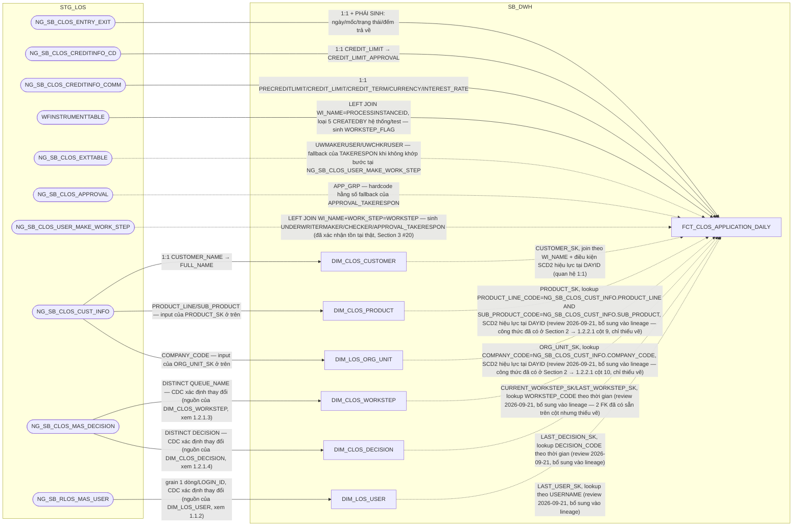

**Ghi chú lineage:** giữ nguyên grain `1 dòng = 1 hồ sơ x 1 ngày dữ liệu`,
PK = `DAYID + WI_NAME`, và toàn bộ quy tắc load T-1 (sinh dòng khi có action
hoặc còn trong chu kỳ thẩm định chưa chốt) như tài liệu gốc — bảng gốc
`FCT_LOS_APPLICATION_DAILY` chỉ tách vật lý theo hệ, không đổi grain/PK/quy
tắc load. **✅ Đã giải quyết (PENDING #6):** `WFINSTRUMENTTABLE` nay đã
nạp vào bảng này để tính cột phái sinh `WORKSTEP_FLAG` (trạng thái bước
hiện tại, 5 nhánh CASE-WHEN theo SRS BC4) — xem chi tiết công thức tại
Section 2 → 1.2.2.1. **✅ Đã giải quyết (review 2026-09-21, Section 3
dòng #20):** 3 cột `*_TAKERESPON` cần nguồn `NG_SB_CLOS_USER_MAKE_
WORK_STEP` — không có trong `DS_BANG_202608.xlsx` nhưng đã xác nhận
tồn tại thật qua `input/CLOS - Metadata.xlsx` (trạng thái "Đã xác
nhận" cho cả bảng và toàn bộ cột).

**Bổ sung 5 node DIM còn thiếu trong lineage (review 2026-09-21):**
rà soát toàn bộ FK của bảng này phát hiện `CURRENT_WORKSTEP_SK`,
`LAST_WORKSTEP_SK`, `LAST_DECISION_SK`, `LAST_USER_SK`, `PRODUCT_SK`,
`ORG_UNIT_SK` đều đã tồn tại thật trong danh sách cột (Section 2 →
1.2.2.1) và có DIM đích tồn tại thật (`DIM_CLOS_WORKSTEP`, `DIM_CLOS_
DECISION`, `DIM_LOS_USER`, `DIM_CLOS_PRODUCT`, `DIM_LOS_ORG_UNIT`) —
nhưng sơ đồ lineage trước đây chỉ vẽ `DIM_CLOS_CUSTOMER`, bỏ sót 5 DIM
còn lại. Đây là thiếu sót thuần vẽ sơ đồ, không phải gap thiết kế mới —
công thức JOIN của `PRODUCT_SK`/`ORG_UNIT_SK` đã có sẵn nguyên văn ở
Section 2 (cột 9-10, review 2026-09-21 trước đó); `WORKSTEP_SK`/
`DECISION_SK`/`USER_SK` theo đúng pattern lookup-theo-thời-gian đã dùng
nhất quán ở mọi bảng khác trong tài liệu (ví dụ `FCT_CLOS_WORKSTEP_
EVENT`, 1.2.2.6). Đã bổ sung đủ 5 node + 5 cạnh JOIN vào mermaid trên.

Áp dụng **column-optimization rule**: loại khỏi bản CLOS mọi cột chỉ có
nguồn RLOS (`SALARYFLAG`...`OTHERFLAG`, `INCOME_SOURCE_CNT`,
`REPAYMENT_SOURCE`, `FLAG_BUSINESS_INCOME`, `LOAN_TO_VALUE`,
`LOAN_OBJECTIVE`, `TOTAL_INCOME`, `CARD_PROMOTION_SK`). `CHANGE_TYPE_SK`
cũng loại khỏi bản CLOS — theo quyết định đã chốt ở `DIM_CLOS_APPLICATION`
(mục 1.2.1.1), CLOS không tách `DIM_CLOS_CHANGE_TYPE`, cột `CHANGE_TYPE` nằm
thẳng trên `DIM_CLOS_APPLICATION`; giữ `CHANGE_TYPE_SK` trỏ sang
`DIM_RLOS_CHANGE_TYPE` sẽ phá vỡ ranh giới tách CLOS/RLOS, nên bỏ hẳn khóa
này khỏi `FCT_CLOS_APPLICATION_DAILY` (đã xác nhận với người dùng).

**Đánh giá kiến trúc — không tham chiếu ETL sang `FCT_CLOS_COLLATERAL`/
`FCT_CLOS_DEVIATION`:** thiết kế gốc có `DEVIATION_CNT`/`COLLATERAL_CNT`
(+ 9 cột con theo nhóm tài sản) tính bằng COUNT(*) trên 2 fact chi tiết đó
— đây là cột kỹ thuật trung gian, không báo cáo nào (BC1-BC11) dùng trực
tiếp tên cột, chỉ để tính ra các cờ YES/NO cuối cùng (`TSDB_NHOM_0`,
`TSBD_BDS`...). Việc pre-aggregate ở ETL bắt `FCT_CLOS_COLLATERAL`/
`FCT_CLOS_DEVIATION` phải chạy xong trước `FCT_CLOS_APPLICATION_DAILY` —
một phụ thuộc thứ tự ETL giữa các fact có thể tránh hoàn toàn, vì báo cáo
dùng OAS (Oracle Analytics Server): model `FCT_CLOS_COLLATERAL`/
`FCT_CLOS_DEVIATION` như logical fact riêng trong RPD, dùng chung
`DIM_CLOS_APPLICATION`/`DAYID` làm conformed dimension, đo lường COUNT
(lọc `COLL_GROUP` khi cần) đặt làm logical measure — BI Server tự sinh
SQL multi-pass đúng chuẩn, không cần cột đếm vật lý trên datamart. Đã bỏ
hẳn 11 cột này khỏi thiết kế (xem 1.2.2.5 và Section 2 → 1.2.2.1) — 3
luồng ETL (`FCT_CLOS_APPLICATION_DAILY`, `FCT_CLOS_COLLATERAL`,
`FCT_CLOS_DEVIATION`) hoàn toàn độc lập.

###### 1.2.2.2 FCT_CLOS_APPLICATION_PARTY — MỚI (factless-fact liên kết, tương tự FCT_RLOS_APPLICATION_PARTY)

**Lineage đầy đủ (bao gồm cả nguồn của `DIM_CLOS_APPLICATION` 1.2.1.1,
`DIM_CLOS_CUSTOMER` 1.2.1.7, và `DIM_CLOS_LEGAL_PARTY` 1.2.1.8 — xem
`hld/HLD_DIM_SB_DWH.md` để đối chiếu lineage gốc của 3 DIM này; bản thân
`FCT_CLOS_APPLICATION_PARTY` không đọc STG_LOS, xem ghi chú "Không có
subgraph STG_LOS" bên dưới — mọi node STG_LOS ở đây chỉ phục vụ lineage
của 3 DIM nó nối tới):**

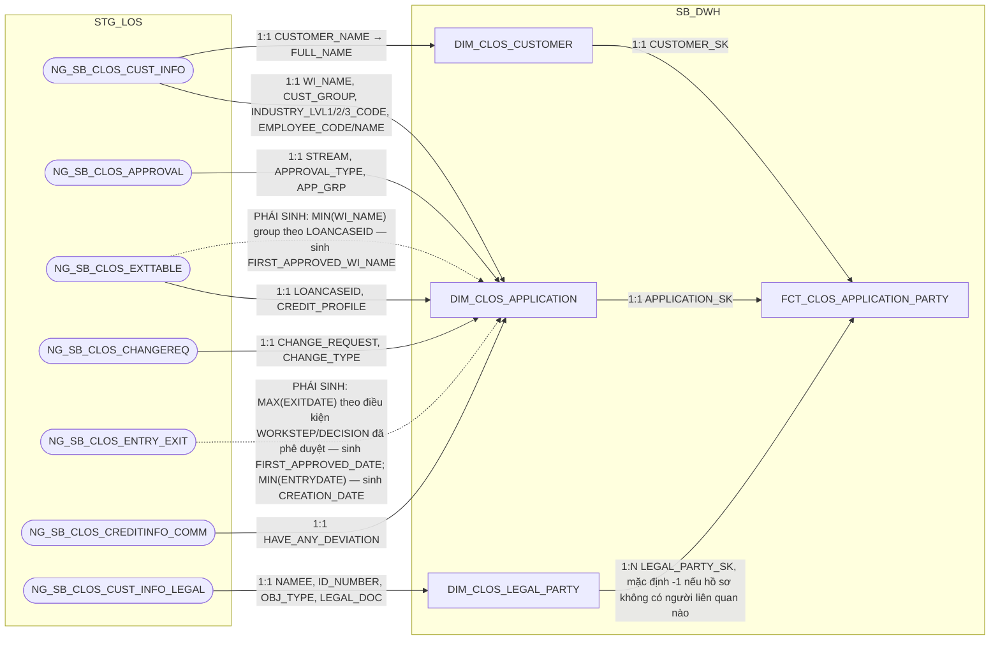

**Ghi chú lineage — bảng còn thiếu, bổ sung để khớp pattern đã áp dụng cho
RLOS:** sau khi tách `DIM_CLOS_CUSTOMER` (1.2.1.7) và `DIM_CLOS_LEGAL_PARTY`
(1.2.1.8) ra khỏi FCT, cần 1 bảng **factless-fact liên kết** để thể hiện lại
quan hệ `1 hồ sơ × 1 khách hàng chính × N người liên quan pháp lý` — đúng
cùng vai trò với `FCT_RLOS_APPLICATION_PARTY` (1.3.2.2) bên RLOS, chỉ khác
ở phía "N": RLOS là `DIM_RLOS_APPLICANT` (1:1) × `DIM_RLOS_COREPAYER` (1:N,
giới hạn cứng 0-4), còn CLOS là `DIM_CLOS_CUSTOMER` (1:1) ×
`DIM_CLOS_LEGAL_PARTY` (1:N, không giới hạn).

**Grain:** 1 dòng = 1 hồ sơ × 1 người liên quan pháp lý (dòng trên
`DIM_CLOS_LEGAL_PARTY`). Hồ sơ không có người liên quan nào khác ngoài
chính khách hàng vẫn có ít nhất 1 dòng ứng với dòng `LEGAL_TYPE='CUSTOMER'`
trên `DIM_CLOS_LEGAL_PARTY` (không dùng sentinel -1 trong trường hợp thông
thường — khác RLOS, vì CLOS luôn có tối thiểu 1 dòng LEGAL_PARTY cho chính
khách hàng); `LEGAL_PARTY_SK = -1` chỉ dùng cho trường hợp dữ liệu thiếu/
không khớp được (Unknown), không phải quy ước "hồ sơ không có corepayer"
như bên RLOS.

Không gộp thuộc tính mô tả nào vào bảng này (toàn bộ đã nằm trên
`DIM_CLOS_CUSTOMER`/`DIM_CLOS_LEGAL_PARTY`) — bảng chỉ giữ 3 khóa liên kết,
cùng nguyên tắc "factless fact" đã áp dụng cho RLOS.

**Không có subgraph STG_LOS (review 2026-09-17):** cùng lý do với
`FCT_RLOS_APPLICATION_PARTY` (1.3.2.2) — bảng không đọc lại STG_LOS, được
build hoàn toàn bằng cách join lại `DIM_CLOS_APPLICATION` ×
`DIM_CLOS_CUSTOMER` × `DIM_CLOS_LEGAL_PARTY` đã có sẵn tại SB_DWH (mỗi
dòng `DIM_CLOS_LEGAL_PARTY` hiện hành của 1 hồ sơ sinh ra đúng 1 dòng
FCT). Hệ quả tất yếu của kiến trúc factless-fact liên kết DIM×DIM×DIM,
không phải thiếu sót lineage.

**Rà soát tính cần thiết (review 2026-09-17):** đã rà soát toàn bộ
BC1-BC11, xác nhận hiện chỉ 2/5 vai trò (`CUSTOMER`,
`LEGAL_REPRESENTATIVE`) thực sự được BC2 dùng, và đã giải quyết trực
tiếp bằng cách nối chuỗi trên `DIM_CLOS_CUSTOMER` (2.2.1.7, không qua
bảng này) — 3 vai trò còn lại (`COLLATERAL_OWNER`,
`MAIN_CONTRIBUTING_MEMBERS`, `OTHER`) chưa có báo cáo nào cần. Theo
quyết định người dùng: **vẫn giữ bảng đúng grain N=5 vai trò đầy đủ**
(không cắt bớt theo column-optimization rule) để mô hình đúng quan hệ
N:N thật giữa hồ sơ và người liên quan pháp lý, đảm bảo toàn vẹn thông
tin — không phải thiếu sót, là lựa chọn có chủ đích.

###### 1.2.2.3 FCT_CLOS_COLLATERAL

**Lineage đầy đủ (bao gồm cả nguồn của `DIM_CLOS_COLLATERAL_TYPE`,
1.2.1.6, và `DIM_CLOS_APPLICATION`, 1.2.1.1 — xem `hld/HLD_DIM_SB_DWH.md`
để đối chiếu lineage gốc của 2 DIM này):**

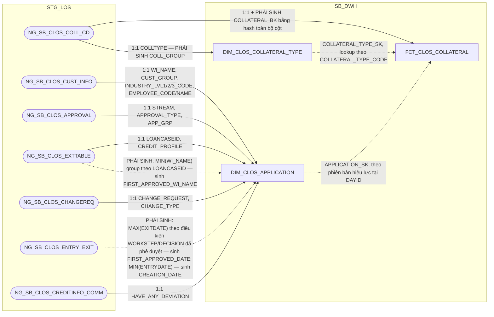

**Ghi chú lineage:** giữ nguyên grain `1 dòng = 1 tài sản bảo đảm của 1 hồ
sơ × 1 ngày dữ liệu` và toàn bộ cơ chế nạp của bảng gốc `FCT_LOS_COLLATERAL`
— nguồn `NG_SB_CLOS_COLL_CD` không khai khóa CDC (LOẠI 2) nên `COLLATERAL_BK`
vẫn phải là hash toàn bộ cột (trừ `COLL_MGMT_APP`/`DESCRIPTION` vì là CLOB),
cộng `DATASOURCE` + tên bảng nguồn để tránh đụng khóa giữa các nguồn (dù
CLOS chỉ có đúng 1 bảng nguồn, vẫn giữ quy tắc hash chung để nhất quán với
RLOS — xem 1.3.2.3). Ảnh chụp đầy đủ theo ngày dựng theo quy trình A2, PK =
`DAYID + WI_NAME + COLLATERAL_BK`. Ngoài `COLLATERAL_TYPE_SK`, bảng còn có
khóa `APPLICATION_SK` nối về `DIM_CLOS_APPLICATION` (không phải khóa tra
danh mục ổn định như `COLLATERAL_TYPE_SK`, mà là khóa liên kết hồ sơ theo
đúng phiên bản DIM hiệu lực tại `DAYID`) — WI_NAME cũng được giữ trực tiếp
trên fact để tiện truy vấn không cần join qua DIM.

Áp dụng **column-optimization rule**: loại khỏi bản CLOS mọi cột chỉ có
nguồn RLOS (`REL_TO_CUSTOMER`, `USING_PURPOSE`, `VEHICLE_TYPE`, `BRAND`,
`CONTROL_POSTER`, `VALPAPER_TYPE`, `NUMBERSIGN`, `IS_ASSET_FORMED`,
`IS_FORMED_FROM_LOAN`) — CLOS chỉ có đúng 1 nguồn tài sản
(`NG_SB_CLOS_COLL_CD`), không có 5 bảng grid theo loại tài sản như RLOS,
nên các thuộc tính đặc thù từng loại tài sản vật lý (bất động sản/phương
tiện/giấy tờ có giá) không áp dụng được. Giữ `COLL_MGMT_METHOD` (chỉ có ở
CLOS, nguồn `NG_SB_CLOS_COLL_CD.COLL_MGMT_APP`) và bỏ `DATASOURCE` (luôn
cố định 'CLOS' sau khi tách vật lý).

**Ghi chú thiết kế — vì sao KHÔNG tách thành DIM dù các cột trông giống
thuộc tính mô tả ổn định:** đã đánh giá và xác nhận giữ nguyên dạng FCT chi
tiết (không tách `DIM_CLOS_COLLATERAL`). Về nội dung, các cột
(`CERTIFICATE_NO`, `OWNER_NAME`, `APPRAISED_VALUE`, `DESCRIPTION`,
`COLL_MGMT_METHOD`, `LOAN_RATE_LTV`...) đúng là thuộc tính mô tả 1 thực thể
tài sản, không phải số đo phát sinh theo giao dịch — nhìn thoáng qua giống
pattern DIM. Nhưng `NG_SB_CLOS_COLL_CD` **không khai khóa CDC** (LOẠI 2,
xem ghi chú `COLLATERAL_BK` ở trên) — hệ nguồn không cấp một định danh tài
sản ổn định (không có `COLLATERAL_ID` hay tương đương), nên **không có khóa
tự nhiên nào độc lập với chính nội dung các thuộc tính**. Hệ quả: SCD2 (nền
tảng của pattern DIM) đòi hỏi phân biệt được "cùng 1 thực thể, đổi thuộc
tính" với "thực thể mới xuất hiện" — nhưng ở đây khóa nhận diện dòng
(`COLLATERAL_BK`) chính là hash của các thuộc tính có thể thay đổi
(`APPRAISED_VALUE` định giá lại, `DESCRIPTION` sửa lỗi chính tả...), nên
bất kỳ thay đổi nội dung nào cũng tự động sinh ra một "danh tính" mới thay
vì mở phiên bản SCD2 mới của cùng 1 tài sản — tách DIM trong điều kiện này
sẽ tạo ảo giác theo dõi được lịch sử tài sản trong khi thực chất không
track được. Vì vậy giữ nguyên dạng FCT ảnh chụp toàn bộ theo ngày (đúng
bản chất: đây là *những gì quan sát được tại ngày DAYID*, không phải *một
thực thể tài sản có danh tính xuyên suốt*) — đây là lựa chọn phù hợp với
hạn chế của hệ nguồn, không phải thiếu sót thiết kế. Đánh đổi chấp nhận:
số dòng có thể tăng theo thời gian nếu tài sản đổi thuộc tính thường xuyên
(1 tài sản vật lý có thể ứng với nhiều `COLLATERAL_BK` khác nhau qua các
ngày) — báo cáo BC1/BC2/BC3/BC9 vẫn đọc đúng vì luôn lọc theo `DAYID` cụ
thể (ảnh chụp của đúng 1 ngày), không lũy kế xuyên ngày. Cùng đánh giá và
kết luận áp dụng cho `FCT_RLOS_COLLATERAL` (1.3.2.3) — RLOS cũng dùng
`STANDARD_HASH` trên 4 bảng grid tài sản, cùng lý do hệ nguồn không khai
khóa CDC.

###### 1.2.2.4 FCT_CLOS_EXCEPTION — review 2026-09-18 (SRS BC7 cập nhật: CHECK_FTR/PHAN_LOAI_DDE đổi công thức)

**Lineage đầy đủ (bao gồm cả nguồn của `DIM_CLOS_EXCEPTION_REASON`,
1.2.1.5, `DIM_CLOS_APPLICATION`, 1.2.1.1, và `DIM_LOS_USER`, 1.1.2 — xem
`hld/HLD_DIM_SB_DWH.md` để đối chiếu lineage gốc của 3 DIM này):**

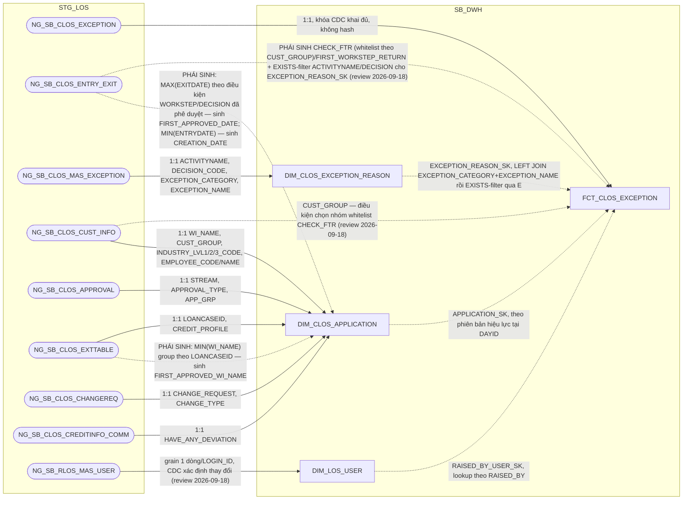

**Ghi chú lineage:** giữ nguyên grain `1 dòng = 1 lần ghi nhận lý do của 1
hồ sơ, trong ảnh chụp của ngày DAYID`. Nguồn chính `NG_SB_CLOS_EXCEPTION`
là LOẠI 1, khóa CDC khai đủ `WI_NAME + EXCEPTION_CATEGORY + RAISED_BY +
RAISED_DATE_TIME` (xác nhận qua `input/DS_BANG_202608.xlsx`) nên PK giữ
thẳng trên cột gốc, không cần hash. Một hồ sơ có thể phát sinh cùng một
loại lý do nhiều lần, bởi nhiều người, ở nhiều thời điểm — khóa phải đủ để
phân biệt từng lần (cơ chế Raise/Clear: bước trả về Raise để nêu lý do,
bước nhận Clear khi đã làm rõ/bổ sung và đẩy lại). Ảnh chụp đầy đủ theo
ngày dựng theo quy trình A2, PK = `DAYID + WI_NAME + EXCEPTION_CATEGORY +
RAISED_BY + RAISED_DATE_TIME`.

**`EXCEPTION_REASON_SK` — lookup 2 bước theo đúng SRS BC7 (không phải
lookup 1 cột đơn giản):** `DIM_CLOS_EXCEPTION_REASON` (1.2.1.5) khai Natural
Key đủ 4 cột (`ACTIVITYNAME + DECISION_CODE + EXCEPTION_CATEGORY +
EXCEPTION_NAME`) vì BA xác nhận 1 tổ hợp bước+quyết định có thể cho phép
nhiều loại ngoại lệ khác nhau — nhưng nguồn của FCT (`NG_SB_CLOS_EXCEPTION`)
không có cột `ACTIVITYNAME`/`DECISION` để join thẳng đủ 4 cột. SRS BC7
(field `ACTIVITYNAME`, nguyên văn Business Rules) giải quyết bằng 2 bước:
1. `LEFT JOIN DIM_CLOS_EXCEPTION_REASON (d)` theo
   `a.EXCEPTION_CATEGORY = d.EXCEPTION_CATEGORY AND a.EXCEPTION_NAME =
   d.EXCEPTION_NAME` — có thể khớp nhiều dòng `d` (nhiều tổ hợp
   `ACTIVITYNAME`/`DECISION_CODE` khác nhau cùng category+name).
2. Lọc lại còn đúng 1 dòng bằng điều kiện tồn tại bản ghi
   `NG_SB_CLOS_ENTRY_EXIT (e)` thỏa `e.WI_NAME = a.WI_NAME AND
   e.WORKSTEP = d.ACTIVITYNAME AND e.DECISION = d.DECISION` — tức chỉ
   giữ tổ hợp (ACTIVITYNAME, DECISION_CODE) nào thực sự đã xảy ra trong
   lịch sử xử lý của chính hồ sơ đó. Không còn dòng nào khớp → `-1`
   (Unknown), theo đúng quy ước default chung.

SRS gốc ghi bảng EXISTS là `NG_SB_RLOS_ENTRY_EXIT` ngay cả ở nhánh CLOS —
đã xác nhận đây là lỗi copy-paste khi soạn thảo (3 field khác trong cùng
khối CLOS của BC7 — `CHECK_FTR`, `FIRST_WORKSTEP_RETURN`, `PHAN_LOAI_DDE`
— đều đúng dùng `NG_SB_CLOS_ENTRY_EXIT`; 2 khối CLOS/RLOS đối xứng tuyệt
đối 13/13 field, chỉ riêng dòng này lạc bảng nguồn), nên HLD dùng đúng
`NG_SB_CLOS_ENTRY_EXIT` cho nhánh CLOS.

**Review 2026-09-18 (SRS BC7 cập nhật) — cùng dạng lỗi copy-paste lặp
lại ở `ACTIVITYNAME`:** bản SRS mới nhất tiếp tục ghi điều kiện EXISTS-
filter là `NG_SB_RLOS_ENTRY_EXIT (e)` ngay trong khối "Nguồn CLOS" (dòng
field `ACTIVITYNAME`) — cùng bảng nguồn lạc như bản SRS trước, xác nhận
lại đây là lỗi soạn thảo lặp lại (không phải cố ý đổi sang cross-check
chéo 2 hệ), giữ nguyên kết luận dùng `NG_SB_CLOS_ENTRY_EXIT` cho nhánh
CLOS.

**Đánh giá kiến trúc — vì sao không gộp vào `FCT_CLOS_APPLICATION_DAILY`
(1.2.2.1):** đã cân nhắc và xác nhận giữ `FCT_CLOS_EXCEPTION` là bảng
riêng, không gộp thành cột trên `FCT_CLOS_APPLICATION_DAILY`, vì hai bảng
khác nhau về grain: `FCT_CLOS_APPLICATION_DAILY` là 1 dòng/hồ sơ/ngày,
còn đây là 1 dòng/**lần nêu lý do**/hồ sơ/ngày — 1 hồ sơ có thể phát sinh
nhiều lần nêu lý do (nhiều loại, nhiều người, nhiều thời điểm, qua các
vòng Raise/Clear). BC7 tự mô tả là báo cáo liệt kê chi tiết từng lý do
("cung cấp các thông tin lý do... có bước trả về/bổ sung/từ chối/hủy"),
không phải rollup — gộp vào grain 1 dòng/hồ sơ/ngày sẽ mất chi tiết (chỉ
giữ được lần gần nhất) hoặc phải pivot số cột không giới hạn N, không khả
thi. Cùng lý do khác grain đã áp dụng cho `FCT_CLOS_COLLATERAL` (xem
1.2.2.3, không gộp vào `FCT_CLOS_APPLICATION_DAILY`) — giữ nguyên bảng
riêng là lựa chọn phù hợp, không phải ETL dư thừa. Số đếm tổng hợp cho
báo cáo (nếu cần) tính trực tiếp ở tầng report/OAS từ bảng chi tiết, không
cần cột đếm trung gian trên `FCT_CLOS_APPLICATION_DAILY` (xem đánh giá
kiến trúc tại 1.2.2.1).

**Đánh giá kiến trúc — vì sao `CHECK_FTR`/`FIRST_WORKSTEP_RETURN` (và ban
đầu cả `PHAN_LOAI_DDE`) chuyển từ `FCT_CLOS_APPLICATION_DAILY` sang đây:**
thiết kế gốc đặt 3 cột này (tên gốc `FLAG_FTR`, `FIRST_WORKSTEP_RETURN`,
`PHAN_LOAI_DDE`) trên `FCT_LOS_APPLICATION_DAILY` — nhưng chính "Trường
đích trên báo cáo" của tài liệu gốc ghi rõ cả 3 chỉ phục vụ `BC7`
(`BC7.CHECK_FTR`, `BC7.FIRST_WORKSTEP_RETURN`, `BC7.PHAN_LOAI_DDE`); rà
soát toàn bộ SRS BC1-BC11 xác nhận không báo cáo nào khác dùng tới. Vì
BC7 đúng grain của `FCT_CLOS_EXCEPTION` (1 dòng/lần nêu lý do), không phải
grain hồ sơ/ngày của `FCT_CLOS_APPLICATION_DAILY`, nên `CHECK_FTR`/
`FIRST_WORKSTEP_RETURN` chuyển hẳn sang tính trực tiếp tại đây, đọc thêm
`NG_SB_CLOS_ENTRY_EXIT` (không qua JOIN ngược `FCT_CLOS_APPLICATION_DAILY`)
— tính ngay ở tầng SB_DWH, giữ đúng nguyên tắc "DTM chỉ đọc DWH" cho tầng
PDTD_DTM (xem 2.2.2.4). `FCT_CLOS_APPLICATION_DAILY`/
`FCT_RLOS_APPLICATION_DAILY` (1.2.2.1/1.3.2.1) đã bỏ cả 3 cột gốc này.
`PHAN_LOAI_DDE` riêng KHÔNG tính tại SB_DWH — xem "Đánh giá kiến trúc —
`PHAN_LOAI_DDE` chuyển hẳn sang PDTD_DTM" ngay dưới đây (review
2026-09-22): bảng danh mục `REF_PHAN_LOAI_DDE` nó lookup vào chỉ tồn tại
vật lý ở tầng PDTD_DTM, nên công thức JOIN cũng phải đặt ở đó.

**Review 2026-09-18 — SRS BC7 cập nhật đổi hẳn công thức `CHECK_FTR` và
`PHAN_LOAI_DDE` (không còn khớp bản SRS trước, `FIRST_WORKSTEP_RETURN`
chỉ bổ sung thêm điều kiện lọc):**

- **`CHECK_FTR` — đảo ngược bản chất phép tính, không còn là công thức
  đơn giản trên `ENTRY_EXIT`:** SRS mới định nghĩa theo **whitelist miễn
  trừ** thay vì điều kiện vi phạm trực tiếp. Mặc định hồ sơ là `'Not
  First Time Right'`; chỉ là `'First Time Right'` nếu **TẤT CẢ** các
  dòng `NG_SB_CLOS_EXCEPTION` của hồ sơ đó đều khớp 1 trong các tổ hợp
  ngoại lệ được miễn trừ dưới đây (join `NG_SB_CLOS_ENTRY_EXIT (h)` theo
  `h.WINAME=a.WI_NAME AND h.WORKSTEP=d.ACTIVITYNAME AND
  h.DECISION=d.DECISION`, với `d`=`NG_SB_CLOS_MAS_EXCEPTION`, phân theo
  `NG_SB_CLOS_CUST_INFO.CUST_GROUP` — **mới bổ sung join này**, DIM
  chưa từng cần `CUST_GROUP` cho cột này trước đây):
  - Nhóm KHDN (`CUST_GROUP IN ('MSME','SME','USME')`): 4 tổ hợp
    (`DetailDataEntry`+`Send_Back`, `DataInputerChecker`+
    `Additional_Doc_Required`, `UnderwriterMaker`+
    `Additional_Doc_Required`, `UnderwriterMaker`+`Send_Back to
    BranchSupport`), mỗi tổ hợp có danh sách `EXCEPTION_CATEGORY` cụ thể
    được miễn trừ (xem SRS BC7 BR 1.2 để lấy đầy đủ literal — danh sách
    dài, không lặp lại toàn bộ ở đây).
  - Nhóm KHDNL/ĐT&ĐCTC (`CUST_GROUP IN ('FDI','SOC','JSC','NBFI','BANK',
    'STR')`): cùng 4 tổ hợp WORKSTEP+DECISION, danh sách
    `EXCEPTION_CATEGORY` miễn trừ khác biệt nhẹ ở tổ hợp 4
    (`UnderwriterMaker`+`Send_Back to BranchSupport` chỉ có đúng 1
    category miễn trừ, không có 3 category còn lại như KHDN).
  - Đây là thay đổi lớn nhất của lần cập nhật SRS này — không chỉ thêm
    điều kiện mà đảo cả chiều logic (từ "có vi phạm → NOT FTR" sang "trừ
    khi mọi ngoại lệ đều được miễn trừ mới là FTR"). Đã xác nhận với
    người dùng đây là thay đổi có chủ ý của SRS, không phải sai sót.
- **`FIRST_WORKSTEP_RETURN`:** vẫn `WORKSTEP` của bản ghi có `MIN(EXITDATE)`
  theo `WI_NAME`, nhưng điều kiện lọc nay viết tường minh thay vì dựa
  vào cột phái sinh `IS_RETURN_EVENT` không rõ định nghĩa của bản SRS
  trước: `EXITDATE IS NOT NULL AND ((WORKSTEP='DetailDataEntry' AND
  DECISION='Send_Back') OR (WORKSTEP IN ('DataInputerChecker',
  'UnderwriterMaker','CreditApproval') AND DECISION=
  'Additional_Doc_Required') OR (WORKSTEP='UnderwriterMaker' AND
  DECISION='Send_Back to BranchSupport'))` — **bổ sung nhánh thứ 3**
  (`UnderwriterMaker` + `Send_Back to BranchSupport`) chưa từng xuất
  hiện trong công thức cũ của cột này.
- **`PHAN_LOAI_DDE` — đổi từ CASE-WHEN tính trực tiếp sang lookup bảng
  danh mục mới `REF_PHAN_LOAI_DDE`:** SRS mới bỏ hẳn công thức CASE-WHEN
  cũ, thay bằng `LEFT JOIN REF_PHAN_LOAI_DDE` theo
  `EXCEPTION_CATEGORY = REF_PHAN_LOAI_DDE.EXCEPTION_CATEGORY AND
  REF_PHAN_LOAI_DDE.SYSTEMNAME='CLOS'`, lấy
  `REF_PHAN_LOAI_DDE.PHAN_LOAI_DDE`. Đây là bảng REF_ tĩnh mới (giống 9
  bảng REF_ hiện có tại `hld/HLD_REF.md`) — cấu trúc và dữ liệu mẫu do
  người dùng cung cấp (`input/REF_PHAN_LOAI_DDE.xlsx`, 19 dòng:
  `EXCEPTION_CATEGORY` + `PHAN_LOAI_DDE` + `SYSTEMNAME`), xem thiết kế
  đầy đủ tại `hld/HLD_REF.md` mục 2.4.10.

**⚠️ Đánh giá kiến trúc — `PHAN_LOAI_DDE` chuyển hẳn sang PDTD_DTM (review
2026-09-22, sửa lỗi vi phạm layer boundary):** công thức trên (`LEFT JOIN
REF_PHAN_LOAI_DDE` ngay tại tầng SB_DWH) đã bị phát hiện sai kiến trúc —
`hld/HLD_REF.md` (đầu Section 2.4) xác nhận rõ **cả 10 bảng REF_/TMP_REF_/
Q_RLOS_REF_ (gồm cả `REF_PHAN_LOAI_DDE`) chỉ tồn tại vật lý ở tầng
PDTD_DTM, không có bản SB_DWH** — BA insert/update thủ công trực tiếp tại
PDTD_DTM, không qua STG_LOS/CDC. Một bảng ở tầng SB_DWH không thể JOIN
trực tiếp một bảng chỉ tồn tại vật lý ở PDTD_DTM (vi phạm chiều dữ liệu
chuẩn STG_LOS→SB_DWH→STG_DTM→PDTD_DTM); nguyên tắc `design-method.md`
của skill `design-hld` cũng xác nhận: JOIN vào bảng REF_ chỉ được phép
xảy ra ở bước "PDTD_DTM copies 1:1 from SB_DWH... **may then** LEFT JOIN
REF_" — là đặc quyền riêng của tầng PDTD_DTM. **`FCT_CLOS_EXCEPTION` ở
tầng SB_DWH (bảng này) KHÔNG còn cột `PHAN_LOAI_DDE`** — cột này bị bỏ
khỏi Section 2 → 1.2.2.4, chỉ còn 14 cột. Công thức `LEFT JOIN
REF_PHAN_LOAI_DDE` ở trên được giữ lại trong đoạn văn này chỉ để lưu lại
lịch sử quyết định SRS BC7 cập nhật 2026-09-18 (đổi từ CASE-WHEN sang
lookup REF_) — công thức thực tế đã chuyển hẳn sang tính tại
`hld/HLD_FCT_PDTD_DTM.md` mục 2.2.2.4 (xem đánh giá kiến trúc tại đó).

###### 1.2.2.5 FCT_CLOS_DEVIATION

**Lineage đầy đủ (bao gồm cả nguồn của `DIM_CLOS_APPLICATION`, 1.2.1.1 —
xem `hld/HLD_DIM_SB_DWH.md` để đối chiếu lineage gốc của DIM này):**

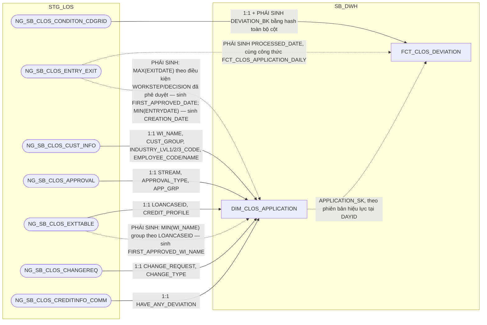

**Ghi chú lineage:** giữ nguyên grain `1 dòng = 1 ngoại lệ chính sách
trong ảnh chụp của ngày DAYID`. Nguồn `NG_SB_CLOS_CONDITON_CDGRID` không
khai khóa CDC (LOẠI 2, xác nhận qua `input/DS_BANG_202608.xlsx` — `KEY
CDC` rỗng) nên `DEVIATION_BK` phải là `STANDARD_HASH(..., 'SHA256')` trên
toàn bộ cột không phải CLOB (loại trừ `AS_REGULAR`, `DEV_PROPOSAL`), cộng
`DATASOURCE` + tên bảng nguồn — cùng cơ chế đã áp dụng cho
`FCT_CLOS_COLLATERAL` (1.2.2.3) và cùng hệ quả cần biết: 2 dòng ngoại lệ
trên cùng hồ sơ chỉ khác nhau ở nội dung CLOB (`AS_REGULAR`/`DEV_PROPOSAL`)
sẽ ra cùng hash và bị gộp làm một (rủi ro đã ghi nhận sẵn trong tài liệu
gốc, "bảng có rủi ro khóa cao nhất trong model"). Ảnh chụp đầy đủ theo
ngày dựng theo quy trình A2, PK = `DAYID + WI_NAME + DEVIATION_BK`
(`DATASOURCE` không nằm trong PK, khác với `FCT_CLOS_EXCEPTION`).

**Vì sao không tách DIM:** cùng lý do đã áp dụng cho `FCT_CLOS_COLLATERAL`
(1.2.2.3) — nguồn không khai khóa CDC nên không có định danh độc lập với
nội dung thuộc tính, SCD2/DIM không khả thi. Giữ dạng FCT ảnh chụp toàn
bộ theo ngày.

**Đánh giá kiến trúc — vì sao `PROCESSED_DATE` tính trực tiếp tại đây
thay vì JOIN `FCT_CLOS_APPLICATION_DAILY`:** để `FCT_CLOS_DEVIATION` và
`FCT_CLOS_APPLICATION_DAILY` là 2 luồng ETL hoàn toàn độc lập, không phụ
thuộc thứ tự chạy trước/sau lẫn nhau (đã rà soát toàn bộ tham chiếu chéo
giữa 2 bảng này khi thiết kế `FCT_CLOS_APPLICATION_DAILY`, xem đánh giá
kiến trúc tại 1.2.2.1 — `DEVIATION_CNT` cũng đã bỏ khỏi
`FCT_CLOS_APPLICATION_DAILY`), `PROCESSED_DATE` tính độc lập ngay tại
đây, đọc thẳng `NG_SB_CLOS_ENTRY_EXIT` — cùng công thức 3 mức ưu tiên
(ngày phê duyệt cuối/ngày hủy/ngày thoát bước gần nhất) đã dùng cho
`FCT_CLOS_APPLICATION_DAILY.PROCESSED_DATE` (1.2.2.1), không JOIN bảng
nào khác. PDTD_DTM của bảng này chỉ còn bê 1:1 (xem 2.2.2.5).

**Lưu ý đối chiếu SRS BC6:** bảng join tổng quan (BR 1.2, nested table)
ghi cả nhánh CLOS lẫn RLOS đều join `NG_SB_RLOS_ENTRY_EXIT` — nhưng
field-list chi tiết (BR 1.3) ghi đúng `PROCESSED_DATE` nhánh CLOS nguồn từ
`NG_SB_CLOS_ENTRY_EXIT`. Cùng dạng lỗi copy-paste đã xác nhận ở SRS BC7
(xem Section 3 #21) — HLD ưu tiên field-list chi tiết (BR 1.3), dùng đúng
`NG_SB_CLOS_ENTRY_EXIT` cho nhánh CLOS như mermaid ở trên.

###### 1.2.2.6 FCT_CLOS_WORKSTEP_EVENT — TÁCH TỪ FCT_LOS_WORKSTEP_EVENT (đánh giá lại 2026-09-14, xem lý do tách bên dưới)

**Lineage đầy đủ (bao gồm cả nguồn của `DIM_CLOS_WORKSTEP` 1.2.1.3,
`DIM_CLOS_DECISION` 1.2.1.4, `DIM_LOS_USER` 1.1.2, và `DIM_CLOS_APPLICATION`
1.2.1.1 — xem `hld/HLD_DIM_SB_DWH.md` để đối chiếu lineage gốc của 4 DIM
này):**

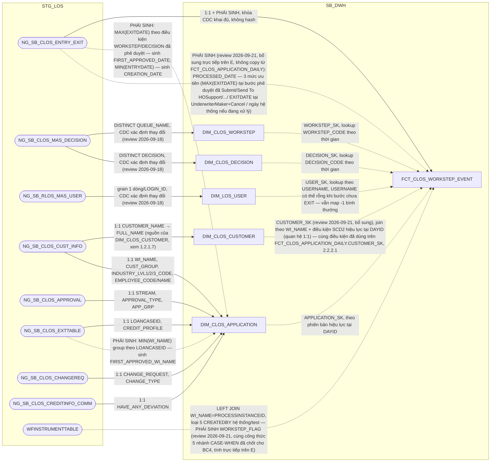

**Vì sao tách vật lý CLOS/RLOS (đánh giá lại 2026-09-14, thay thế kết luận
"giữ CHUNG" trước đó):** lần đánh giá trước kết luận giữ CHUNG vì grain và
ý nghĩa nghiệp vụ "vào bước — ra bước" giống hệt nhau ở cả 2 hệ, và các
rule lọc `WORKSTEP_CODE`/`DECISION_CODE` trong SRS dùng chung 1 bộ công
thức cho cả CLOS/RLOS. Tuy nhiên rà soát lại toàn bộ khóa ngoại của bảng
cho thấy **cả 3 cột FK** (`WORKSTEP_SK`, `DECISION_SK`, `APPLICATION_SK`
— đã bỏ `PRODUCT_SK` khỏi bảng, xem Section 3) đều là **polymorphic FK**
— mỗi cột phải rẽ nhánh trỏ
`DIM_CLOS_*` hoặc `DIM_RLOS_*` tùy `DATASOURCE` ở MỌI lượt lookup — khác
mức độ với `FCT_CLOS_LOAN_DISBURSEMENT`/`FCT_RLOS_LOAN_DISBURSEMENT`
(tách từ `FCT_LOS_DISBURSEMENT`, xem 2.2.2.7/2.3.2.8 PDTD_DTM — 5/18 cột
phụ thuộc hệ, tỷ lệ polymorphic thấp hơn nhiều nhưng vẫn đủ căn cứ để
tách theo cùng nguyên tắc). Ở bảng này, vì MỌI FK đều
polymorphic, tách vật lý thành 2 bảng giúp mỗi bảng chỉ còn FK trỏ thẳng
đúng 1 DIM cố định (không cần CASE theo `DATASOURCE` ở tầng ETL lẫn tầng
report khi join), nhất quán với pattern đã áp dụng cho
`FCT_CLOS_EXCEPTION`/`FCT_RLOS_EXCEPTION` (1.2.2.4/1.3.2.5) và
`FCT_CLOS_DEVIATION`/`FCT_RLOS_DEVIATION` (1.2.2.5/1.3.2.6). Cột
`DATASOURCE` không còn cần thiết sau khi tách vật lý (luôn cố định
'CLOS'), bỏ khỏi bảng theo column-optimization rule.

**Grain và khóa — LOẠI 1, đã xác nhận qua `DS_BANG_202608.xlsx`:**
`NG_SB_CLOS_ENTRY_EXIT` khai đủ khóa CDC `WINAME + WORKSTEP + ENTRYDATE`,
không có cột CLOB — PK giữ thẳng trên cột gốc, không cần hash (khác
pattern `FCT_CLOS_COLLATERAL`/`FCT_CLOS_DEVIATION` đã gặp ở các bảng LOẠI
2). Grain: 1 dòng = 1 **phiên bản** của 1 logical event (`hồ sơ x workstep
x lần vào bước`) — hồ sơ quay lại cùng 1 bước nhiều lần thì mỗi lần là 1
logical event riêng (khác `ENTRYDATE`). PK = `DAYID + WI_NAME +
WORKSTEP_CODE + ENTRYDATE`; `DECISION_SK`/`USER_SK` cố tình KHÔNG nằm
trong khóa (chỉ để tra cứu thêm thuộc tính, không phải định danh — vì giá
trị gốc `DECISION_CODE`/`USERNAME` đã có sẵn trên fact). Bảng **GHI
THÊM, không sửa/xóa** dòng cũ — khác cơ chế "ảnh chụp đầy đủ mỗi ngày"
(quy trình A2) đã dùng cho các fact snapshot khác trong tài liệu này; đây
là quy trình A1 (chỉ ghi bản ghi thay đổi/mới trong `TIME_UPDATE >=
:P_DATE AND < :P_DATE + 1`), đọc đúng trạng thái tại ngày D bằng
`ROW_NUMBER() OVER (PARTITION BY WI_NAME, WORKSTEP_CODE, ENTRYDATE ORDER
BY DAYID DESC)`.

**Đối chiếu SRS (BC3, BC4, BC8, BC9 — các báo cáo trực tiếp dùng cấu trúc
cột này, nhánh CLOS):** BC3/BC4 dùng `WINAME`/`WORKSTEP`/`DECISION`/
`ENTRYDATE`/`EXITDATE`/`USERNAME`/`REMARKS` hiển thị trực tiếp — khớp
đúng. BC8 dùng công thức đếm `SL_RETURN_*` (SUM CASE theo
`WORKSTEP`/`DECISION`) trực tiếp trên `NG_SB_CLOS_ENTRY_EXIT` — không cần
cột phái sinh mới trên fact, tính ở tầng report. BC9 dùng `NHAN_SU`
(đếm `DISTINCT USERNAME` theo đúng danh sách 8 `WORKSTEP` đã ghi trong
lineage doc gốc của `FCT_LOS_KPI_USER_YEAR`, nhánh CLOS) và `TAT_CLOS`
(tổng `get_business_minute(ENTRYDATE, EXITDATE)/60` theo từng nhóm bước)
— khớp đúng với `TAT_WORKING_HOUR` đã có sẵn trên bảng này. Không phát
hiện lệch tài liệu, không phát sinh PENDING mới.

### 1.3 Bộ bảng RLOS

##### 1.3.2 FCT

###### 1.3.2.1 FCT_RLOS_APPLICATION_DAILY

**Lineage đầy đủ (bao gồm cả nguồn của `DIM_RLOS_APPLICANT`, 1.3.1.10 —
xem `hld/HLD_DIM_SB_DWH.md` để đối chiếu lineage gốc của DIM này):**

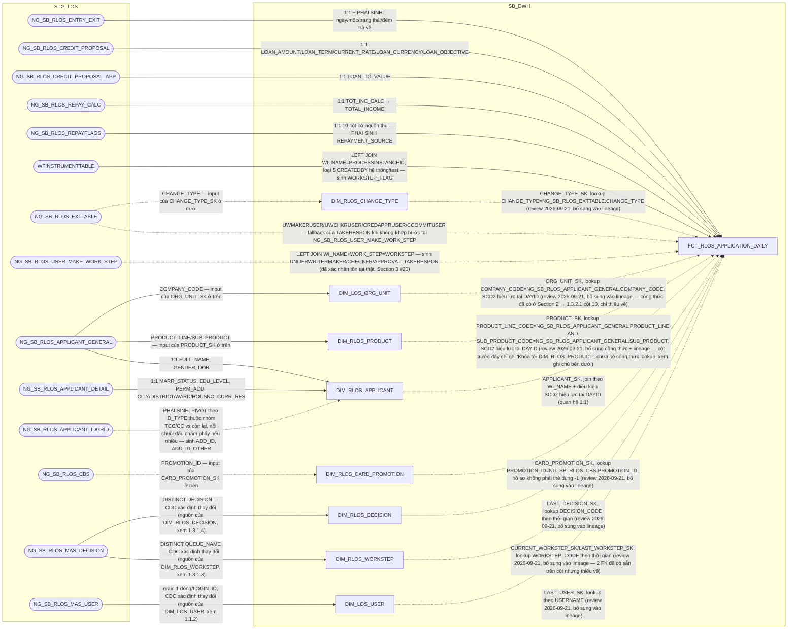

**Ghi chú lineage:** giữ nguyên grain `1 dòng = 1 hồ sơ x 1 ngày dữ liệu`,
PK = `DAYID + WI_NAME`, và toàn bộ quy tắc load T-1 như tài liệu gốc — bảng
gốc `FCT_LOS_APPLICATION_DAILY` chỉ tách vật lý theo hệ, không đổi grain/PK/
quy tắc load. **✅ Đã giải quyết (PENDING #6):** `WFINSTRUMENTTABLE` nay
đã nạp vào bảng này để tính cột phái sinh `WORKSTEP_FLAG` — xem chi tiết
công thức tại Section 2 → 1.3.2.1. **✅ Đã giải quyết (review
2026-09-21, Section 3 dòng #20):** 3 cột `*_TAKERESPON` (xem 1.2.2.1)
cần nguồn `NG_SB_RLOS_USER_MAKE_WORK_STEP` — không có trong
`DS_BANG_202608.xlsx` nhưng đã xác nhận tồn tại thật qua
`input/RLOS - Metadata.xlsx` (bảng "Đã xác nhận", cột "Chưa rà soát"
chi tiết nhưng không phải chưa xác nhận tồn tại).

**Bổ sung 6 node DIM còn thiếu trong lineage + công thức `PRODUCT_SK`
còn thiếu (review 2026-09-21):** cùng phát hiện và lý do đã áp dụng cho
`FCT_CLOS_APPLICATION_DAILY` (1.2.2.1) — `CURRENT_WORKSTEP_SK`,
`LAST_WORKSTEP_SK`, `LAST_DECISION_SK`, `LAST_USER_SK`, `PRODUCT_SK`,
`ORG_UNIT_SK`, `CHANGE_TYPE_SK`, `CARD_PROMOTION_SK` đều có cột và DIM
đích tồn tại thật, nhưng lineage trước đây chỉ vẽ `DIM_RLOS_APPLICANT`.
Riêng `PRODUCT_SK` còn thiếu CẢ công thức lookup ở Section 2 (mô tả cột
gốc chỉ ghi "Khóa tới DIM_RLOS_PRODUCT. Mặc định -1", không nêu nguồn) —
đã bổ sung theo đúng pattern đối xứng với CLOS (`PRODUCT_SK` CLOS, cột 9,
1.2.2.1): nguồn `NG_SB_RLOS_APPLICANT_GENERAL.PRODUCT_LINE/SUB_PRODUCT`
(đã xác nhận tồn tại thật, `input/RLOS - Metadata.xlsx` sheet "3. Column
Review" — cùng bảng đã dùng cho `POLICY`/`EMPLOYEE_CODE`/`COMPANY_CODE`
trên `DIM_RLOS_APPLICATION`/`ORG_UNIT_SK`), khớp `DIM_RLOS_PRODUCT.
PRODUCT_LINE_CODE`/`SUB_PRODUCT_CODE` (1.3.1.2), điều kiện SCD2 giống
`ORG_UNIT_SK`/`PRODUCT_SK` bên CLOS. Đã cập nhật lại mô tả cột 9 tương
ứng ở Section 2 → 1.3.2.1. `CHANGE_TYP_SK`/`CARD_PROMOTION_SK` giữ đúng
công thức đã có (Section 2, cột 11-12), chỉ bổ sung vẽ lineage.

Áp dụng **column-optimization rule**: giữ trọn các cột đặc thù cá nhân
(`SALARYFLAG`...`OTHERFLAG`, `INCOME_SOURCE_CNT`, `REPAYMENT_SOURCE`,
`FLAG_BUSINESS_INCOME`, `LOAN_TO_VALUE`, `LOAN_OBJECTIVE`, `TOTAL_INCOME`,
`CARD_PROMOTION_SK`) mà không cần luôn NULL cho phía CLOS. Loại khỏi bản
RLOS các cột chỉ có nguồn CLOS: `PROPOSED_AMT`, `CREDIT_LIMIT_APPROVAL`,
`CREDIT_LIMIT_COMMITTEE`, `INTEREST_RATE_DESC`. Giữ `CHANGE_TYPE_SK` —
RLOS có `DIM_RLOS_CHANGE_TYPE` (1.3.1.8) thật sự tồn tại, khóa này trỏ đúng
sang DIM đó.

**Đánh giá kiến trúc — không tham chiếu ETL sang `FCT_RLOS_COLLATERAL`/
`FCT_RLOS_DEVIATION`:** cùng đánh giá và kết luận đã áp dụng cho
`FCT_CLOS_APPLICATION_DAILY` (1.2.2.1) — bỏ hẳn `DEVIATION_CNT`,
`COLLATERAL_CNT` + 9 cột con khỏi thiết kế, để tầng report/OAS tự tính
trực tiếp từ `FCT_RLOS_COLLATERAL`/`FCT_RLOS_DEVIATION` qua RPD (multi-fact/
conformed dimension), tránh phụ thuộc thứ tự ETL giữa các fact.

###### 1.3.2.2 FCT_RLOS_APPLICATION_PARTY — THAY ĐỔI KIẾN TRÚC (factless-fact liên kết, không còn giữ thuộc tính mô tả)

**Lineage đầy đủ (bao gồm cả nguồn của `DIM_RLOS_APPLICATION` 1.3.1.1,
`DIM_RLOS_APPLICANT` 1.3.1.10, và `DIM_RLOS_COREPAYER` 1.3.1.11 — xem
`hld/HLD_DIM_SB_DWH.md` để đối chiếu lineage gốc của 3 DIM này; bản thân
`FCT_RLOS_APPLICATION_PARTY` không đọc STG_LOS, xem ghi chú "Không có
subgraph STG_LOS" bên dưới — mọi node STG_LOS ở đây chỉ phục vụ lineage
của 3 DIM nó nối tới):**

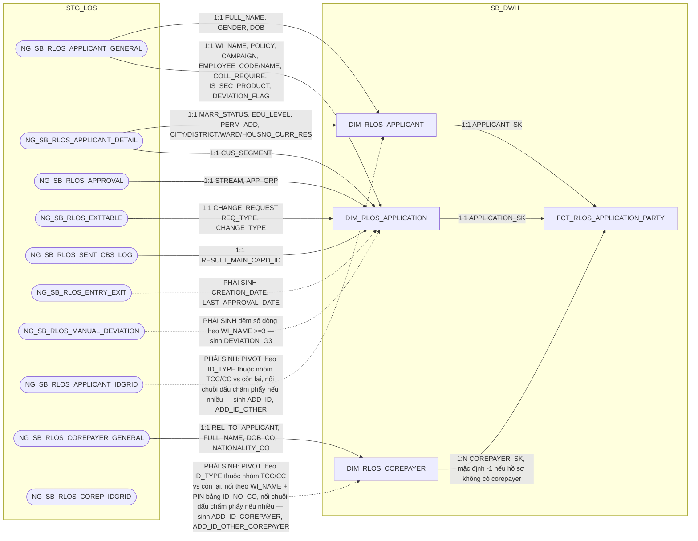

**Ghi chú lineage — thay đổi kiến trúc so với `FCT_LOS_APPLICATION_PARTY`
gốc:** toàn bộ thuộc tính mô tả con người (FULL_NAME, GENDER, địa chỉ,
giấy tờ...) đã chuyển hết sang `DIM_RLOS_APPLICANT`/`DIM_RLOS_COREPAYER`
(1.3.1.10, 1.3.1.11). Bảng này chỉ còn vai trò **factless-fact liên kết**
thể hiện quan hệ `1 hồ sơ × 1 applicant × N corepayer` — đã đánh giá và
xác nhận với người dùng: quan hệ hồ sơ-applicant là 1:1 (không cần bảng
liên kết riêng) nhưng quan hệ hồ sơ-corepayer là 1:N thực sự, nên giữ 1
bảng factless duy nhất để thể hiện đồng thời cả 3 khóa (đúng theo yêu cầu
người dùng, thay vì tách 2 bảng liên kết riêng).

**Grain:** 1 dòng = 1 hồ sơ × 1 corepayer. Hồ sơ KHÔNG có corepayer nào vẫn
có đúng 1 dòng, với `COREPAYER_SK = -1` (Unknown) — theo đúng quy ước SK
mặc định -1 đã dùng xuyên suốt thiết kế, đảm bảo mọi hồ sơ đều có ít nhất
1 dòng để lấy `APPLICANT_SK`.

`FCT_LOS_PARTY_DOCUMENT` (giấy tờ tùy thân) **bị loại bỏ hoàn toàn** phía
RLOS — không còn bảng document nào: giấy tờ applicant/corepayer đã pivot
thành 2 cột `ADD_ID`/`ADD_ID_OTHER` và `ADD_ID_COREPAYER`/
`ADD_ID_OTHER_COREPAYER` ngay trên `DIM_RLOS_APPLICANT`/`DIM_RLOS_
COREPAYER` (xem 1.3.1.10, 1.3.1.11).

**Không có subgraph STG_LOS (review 2026-09-17):** khác các FCT chi tiết
khác trong tài liệu (luôn đọc trực tiếp STG_LOS), bảng này không đọc lại
STG_LOS — nó được build hoàn toàn bằng cách join lại 3 DIM đã có sẵn tại
SB_DWH (mỗi dòng `DIM_RLOS_COREPAYER` đang hiện hành của 1 hồ sơ sinh ra
đúng 1 dòng FCT). Đây là hệ quả tất yếu của kiến trúc factless-fact liên
kết DIM×DIM×DIM, không phải thiếu sót lineage.

###### 1.3.2.3 FCT_RLOS_COLLATERAL

**Lineage đầy đủ (bao gồm cả nguồn của `DIM_RLOS_COLLATERAL_TYPE`,
1.3.1.6, và `DIM_RLOS_APPLICATION`, 1.3.1.1 — xem `hld/HLD_DIM_SB_DWH.md`
để đối chiếu lineage gốc của 2 DIM này):**

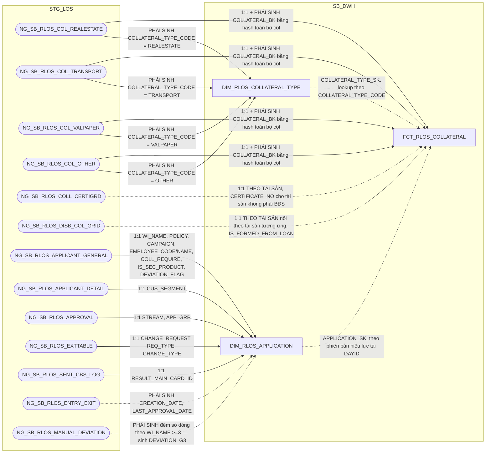

**Ghi chú lineage:** giữ nguyên grain `1 dòng = 1 tài sản bảo đảm của 1 hồ
sơ × 1 ngày dữ liệu` và cơ chế nạp của bảng gốc `FCT_LOS_COLLATERAL` — cả 4
bảng grid tài sản RLOS (`COL_REALESTATE`, `COL_TRANSPORT`, `COL_VALPAPER`,
`COL_OTHER`) và `NG_SB_RLOS_COLL_CERTIGRD` đều **không khai khóa CDC** (LOẠI
2, đã xác nhận qua `input/DS_BANG_202608.xlsx`), nên `COLLATERAL_BK` phải là
hash toàn bộ cột không phải CLOB của đúng bảng nguồn sinh ra dòng đó, cộng
`DATASOURCE` gốc + tên bảng nguồn để 5 nguồn không đụng khóa — cùng quy tắc
đã áp dụng cho `FCT_CLOS_COLLATERAL` (xem 1.2.2.3). Ảnh chụp đầy đủ theo
ngày dựng theo quy trình A2, PK = `DAYID + WI_NAME + COLLATERAL_BK`.
`NG_SB_RLOS_COLL_CERTIGRD` là bảng 1:1 theo tài sản (không phải theo hồ sơ)
bổ sung `CERTIFICATE_NO` cho tài sản không phải bất động sản (BĐS lấy thẳng
từ `COL_REALESTATE.NO_CERTI`); `NG_SB_RLOS_DISB_COL_GRID` cũng 1:1 theo tài
sản, chỉ bổ sung `IS_FORMED_FROM_LOAN` (review 2026-09-17: theo đúng nguyên
văn SRS BC1, giá trị lấy từ cột `COL_TYPE` của dòng thỏa điều kiện lọc
`PROPERTY_FORMED='YES'`, không phải cờ Y/N passthrough của `PROPERTY_FORMED`
như bản cũ) — ETL phải nối đúng dòng của 2 bảng phụ này vào đúng tài sản
tương ứng trong 4 bảng grid chính, không sinh fact riêng.

Áp dụng **column-optimization rule**: loại khỏi bản RLOS cột
`COLL_MGMT_METHOD` (chỉ có nguồn CLOS, `NG_SB_CLOS_COLL_CD.COLL_MGMT_APP`)
— RLOS không có khái niệm "phương thức quản lý tài sản" tương đương trên 4
bảng grid của mình. Giữ toàn bộ 9 cột chỉ có ở RLOS
(`REL_TO_CUSTOMER`, `USING_PURPOSE`, `VEHICLE_TYPE`, `BRAND`,
`CONTROL_POSTER`, `VALPAPER_TYPE`, `NUMBERSIGN`, `IS_ASSET_FORMED`,
`IS_FORMED_FROM_LOAN`) và bỏ `DATASOURCE` (luôn cố định 'RLOS' sau khi tách
vật lý).

**Ghi chú thiết kế — vì sao KHÔNG tách thành DIM:** cùng lý do và kết luận
đã trình bày đầy đủ tại `FCT_CLOS_COLLATERAL` (1.2.2.3) — nguồn không khai
khóa CDC nên `COLLATERAL_BK` là hash của chính các thuộc tính mô tả, danh
tính đổi theo nội dung nên SCD2/DIM không track được lịch sử thật. Giữ
nguyên dạng FCT ảnh chụp toàn bộ theo ngày; báo cáo BC1/BC2/BC3/BC9 luôn lọc
theo `DAYID` cụ thể nên không bị ảnh hưởng bởi việc 1 tài sản vật lý có thể
ứng với nhiều `COLLATERAL_BK` qua các ngày.

###### 1.3.2.4 FCT_RLOS_SUB_PRODUCT

**Lineage đầy đủ (bao gồm cả nguồn của `DIM_RLOS_APPLICATION`, 1.3.1.1, và
`DIM_RLOS_PRODUCT`, 1.3.1.2 — xem `hld/HLD_DIM_SB_DWH.md` để đối chiếu
lineage gốc của 2 DIM này):**

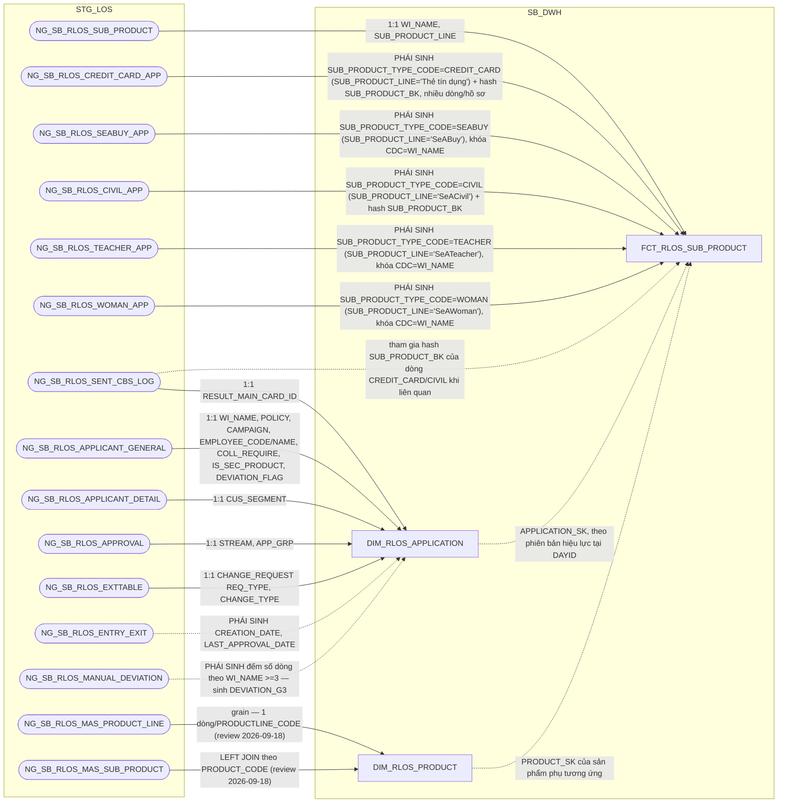

**Ghi chú lineage:** giữ nguyên grain `1 dòng = 1 lần đăng ký sản phẩm phụ
trong ảnh chụp của ngày DAYID` và cơ chế nạp của bảng gốc
`FCT_LOS_SUB_PRODUCT` — bảng gộp 7 nguồn với 2 hình dạng khóa khác nhau,
đã xác nhận qua `input/DS_BANG_202608.xlsx`: `NG_SB_RLOS_SEABUY_APP`/
`NG_SB_RLOS_TEACHER_APP`/`NG_SB_RLOS_WOMAN_APP` là LOẠI 1 (khai khóa CDC =
`WI_NAME`, tối đa 1 dòng/hồ sơ/loại); `NG_SB_RLOS_SUB_PRODUCT`/
`NG_SB_RLOS_CREDIT_CARD_APP`/`NG_SB_RLOS_CIVIL_APP`/
`NG_SB_RLOS_SENT_CBS_LOG` là LOẠI 2 (không khai khóa CDC). Vì vậy
`SUB_PRODUCT_BK` giữ dạng hash toàn bộ cột không phải CLOB của đúng bảng
nguồn sinh ra dòng đó (loại trừ `COMMENT_CO`/`REQUEST`), cộng `DATASOURCE`
+ tên bảng nguồn — riêng `NG_SB_RLOS_CREDIT_CARD_APP` là grid thẻ tín dụng
phụ, 1 hồ sơ có thể có NHIỀU thẻ nên nhiều dòng cùng
`SUB_PRODUCT_TYPE_CODE='CREDIT_CARD'`/hồ sơ — đây là lý do bảng phải nhân
dòng (không phải 1:1 với hồ sơ như 3 nguồn LOẠI 1 kia). Ảnh chụp đầy đủ
theo ngày dựng theo quy trình A2, PK = `DAYID + WI_NAME +
SUB_PRODUCT_TYPE_CODE + SUB_PRODUCT_BK`. `SUB_PRODUCT_TYPE_CODE` gán cố
định theo đúng bảng nguồn bản ghi đến từ đó (hằng số kiến trúc, không đọc
từ 1 cột dữ liệu) — đổi tên từ `SUB_PRODUCT_CODE` gốc để tránh trùng
nghĩa với `SUB_PRODUCT_CODE` đã có sẵn trên `DIM_RLOS_PRODUCT` (sản phẩm
nhánh của sản phẩm CHÍNH, khác hẳn khái niệm sản phẩm PHỤ ở đây).

**Ghi chú thiết kế — không tách DIM:** cùng bản chất "nguồn gộp nhiều
LOẠI 2 không khóa" với `FCT_RLOS_COLLATERAL` (1.3.2.3) cho 4/7 nguồn —
tuy 3 nguồn còn lại (`SEABUY`/`TEACHER`/`WOMAN`) có khóa CDC thật
(`WI_NAME`), bảng vẫn giữ dạng FCT vì bản chất dữ liệu là **sự kiện đăng
ký sản phẩm phụ theo hồ sơ** (số tiền, thời hạn có thể thay đổi theo lần
đăng ký), không phải một thực thể danh mục độc lập với hồ sơ — không có
"sản phẩm phụ" nào tồn tại tách rời khỏi hồ sơ đã đăng ký nó.

###### 1.3.2.5 FCT_RLOS_EXCEPTION — review 2026-09-18 (SRS BC7 cập nhật: CHECK_FTR/PHAN_LOAI_DDE đổi công thức)

**Lineage đầy đủ (bao gồm cả nguồn của `DIM_RLOS_EXCEPTION_REASON`,
1.3.1.5, `DIM_RLOS_APPLICATION`, 1.3.1.1, và `DIM_LOS_USER`, 1.1.2 — xem
`hld/HLD_DIM_SB_DWH.md` để đối chiếu lineage gốc của 3 DIM này):**

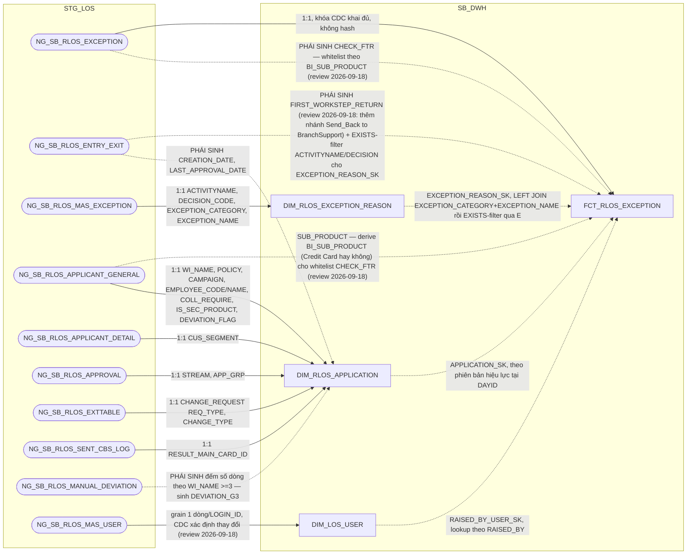

**Ghi chú lineage:** cùng cấu trúc và cơ chế nạp với `FCT_CLOS_EXCEPTION`
(1.2.2.4) — giữ nguyên grain `1 dòng = 1 lần ghi nhận lý do của 1 hồ sơ,
trong ảnh chụp của ngày DAYID`. Nguồn chính `NG_SB_RLOS_EXCEPTION` là LOẠI
1, khóa CDC khai đủ `WI_NAME + EXCEPTION_CATEGORY + RAISED_BY +
RAISED_DATE_TIME` (xác nhận qua `input/DS_BANG_202608.xlsx`, cùng tổ hợp
khóa với `NG_SB_CLOS_EXCEPTION`) nên PK giữ thẳng trên cột gốc, không cần
hash. Ảnh chụp đầy đủ theo ngày dựng theo quy trình A2, PK = `DAYID +
WI_NAME + EXCEPTION_CATEGORY + RAISED_BY + RAISED_DATE_TIME`.

**`EXCEPTION_REASON_SK` — lookup 2 bước, giống hệt cơ chế đã áp dụng cho
CLOS (xem giải thích đầy đủ tại 1.2.2.4):** `DIM_RLOS_EXCEPTION_REASON`
(1.3.1.5) khai Natural Key đủ 4 cột (`ACTIVITYNAME + DECISION_CODE +
EXCEPTION_CATEGORY + EXCEPTION_NAME`), nguồn FCT không có ACTIVITYNAME/
DECISION để join thẳng. SRS BC7 (nhánh RLOS) dùng đúng 2 bước: (1)
`LEFT JOIN DIM_RLOS_EXCEPTION_REASON` theo `EXCEPTION_CATEGORY +
EXCEPTION_NAME`; (2) lọc còn đúng 1 dòng bằng điều kiện tồn tại bản ghi
`NG_SB_RLOS_ENTRY_EXIT` thỏa `WI_NAME` khớp + `WORKSTEP=ACTIVITYNAME` +
`DECISION=DECISION_CODE` của dòng DIM đó. Không còn dòng nào khớp → `-1`.

**Đánh giá kiến trúc — vì sao không gộp vào `FCT_RLOS_APPLICATION_DAILY`
(1.3.2.1):** cùng lý do khác grain đã áp dụng cho `FCT_CLOS_EXCEPTION`
(1.2.2.4) — 1 hồ sơ có thể phát sinh nhiều lần nêu lý do (nhiều loại,
nhiều người, nhiều thời điểm, qua các vòng Raise/Clear), BC7 cần liệt kê
chi tiết từng lần chứ không phải rollup. Giữ bảng riêng.

**Đánh giá kiến trúc — `CHECK_FTR`/`FIRST_WORKSTEP_RETURN` (và ban đầu cả
`PHAN_LOAI_DDE`) chuyển từ `FCT_RLOS_APPLICATION_DAILY` sang đây, cùng lý
do đã áp dụng cho CLOS (xem 1.2.2.4):** rà soát SRS BC7 xác nhận cả 3 cột
gốc chỉ phục vụ đúng BC7, đúng grain của bảng này. `CHECK_FTR`/
`FIRST_WORKSTEP_RETURN` tính ngay ở tầng SB_DWH, giữ nguyên tắc "DTM chỉ
đọc DWH" cho tầng PDTD_DTM (xem 2.3.2.5). `FCT_RLOS_APPLICATION_DAILY`
(1.3.2.1) đã bỏ cả 3 cột gốc này từ trước. `PHAN_LOAI_DDE` riêng KHÔNG
tính tại SB_DWH — đã chuyển hẳn sang tính tại PDTD_DTM (review
2026-09-22), cùng lý do đã áp dụng cho CLOS: xem "⚠️ Đánh giá kiến trúc —
`PHAN_LOAI_DDE` chuyển hẳn sang PDTD_DTM" tại 1.2.2.4.

**Review 2026-09-18 — SRS BC7 cập nhật đổi hẳn công thức `CHECK_FTR` và
`PHAN_LOAI_DDE` (không còn khớp bản SRS trước, `FIRST_WORKSTEP_RETURN`
chỉ bổ sung thêm điều kiện lọc, cùng dạng thay đổi đã áp dụng cho CLOS,
xem 1.2.2.4):**

- **`CHECK_FTR` — vẫn là công thức riêng của RLOS (không dùng chung với
  CLOS), nhưng đổi hẳn tiêu chí:** không còn dựa vào `RCTYPE`/pattern
  `%BR%`/`%FTR%` nữa. SRS mới cũng theo **whitelist miễn trừ** (mặc định
  `'Not First Time Right'`, là `'First Time Right'` chỉ khi mọi dòng
  `NG_SB_RLOS_EXCEPTION (a)` có `EXCEPTION_CATEGORY LIKE '%BR%'` đều khớp
  1 trong 5 điều kiện miễn trừ theo `EXCEPTION_NAME`, một số điều kiện có
  thêm điều kiện phụ theo `BI_SUB_PRODUCT` — cột phái sinh mới: `CASE
  WHEN f.SUB_PRODUCT LIKE '%Phát hành%' OR f.SUB_PRODUCT LIKE '%TTD%'
  THEN 'Credit Card' ELSE f.SUB_PRODUCT END`, với `f`=
  `NG_SB_RLOS_APPLICANT_GENERAL`). Không còn phân nhóm theo `CUST_GROUP`
  như CLOS (RLOS không có khái niệm này) — phân nhóm theo sản phẩm
  (`BI_SUB_PRODUCT`) thay vì phân khúc khách hàng.
- **`FIRST_WORKSTEP_RETURN`:** cùng công thức mới như CLOS — `WORKSTEP`
  tại `MIN(EXITDATE)` theo `WI_NAME`, điều kiện lọc `EXITDATE IS NOT
  NULL AND ((WORKSTEP='DetailDataEntry' AND DECISION='Send_Back') OR
  (WORKSTEP IN ('DataInputerChecker','UnderwriterMaker',
  'CreditApproval') AND DECISION='Additional_Doc_Required') OR
  (WORKSTEP='UnderwriterMaker' AND DECISION='Send_Back to
  BranchSupport'))` trên `NG_SB_RLOS_ENTRY_EXIT` — bổ sung nhánh thứ 3
  giống CLOS.
- **`PHAN_LOAI_DDE` — đổi sang lookup `REF_PHAN_LOAI_DDE`:** `LEFT JOIN
  REF_PHAN_LOAI_DDE` theo `EXCEPTION_CATEGORY = REF_PHAN_LOAI_DDE.
  EXCEPTION_CATEGORY AND REF_PHAN_LOAI_DDE.SYSTEMNAME='RLOS'`, lấy
  `REF_PHAN_LOAI_DDE.PHAN_LOAI_DDE` — cùng bảng REF_ mới dùng chung với
  CLOS (khác `SYSTEMNAME`), xem `hld/HLD_REF.md` mục 2.4.10.

**⚠️ Đánh giá kiến trúc — `PHAN_LOAI_DDE` chuyển hẳn sang PDTD_DTM (review
2026-09-22, cùng lý do đã áp dụng cho CLOS tại 1.2.2.4):** công thức trên
bị phát hiện sai kiến trúc — `REF_PHAN_LOAI_DDE` chỉ tồn tại vật lý ở
PDTD_DTM (xem `hld/HLD_REF.md` đầu Section 2.4), không có bản SB_DWH, nên
không thể JOIN trực tiếp từ tầng SB_DWH. **`FCT_RLOS_EXCEPTION` ở tầng
SB_DWH (bảng này) KHÔNG còn cột `PHAN_LOAI_DDE`** — chỉ còn 14 cột. Công
thức đã chuyển hẳn sang tính tại `hld/HLD_FCT_PDTD_DTM.md` mục 2.3.2.5.

###### 1.3.2.6 FCT_RLOS_DEVIATION

**Lineage đầy đủ (bao gồm cả nguồn của `DIM_RLOS_APPLICATION`, 1.3.1.1 —
xem `hld/HLD_DIM_SB_DWH.md` để đối chiếu lineage gốc của DIM này):**

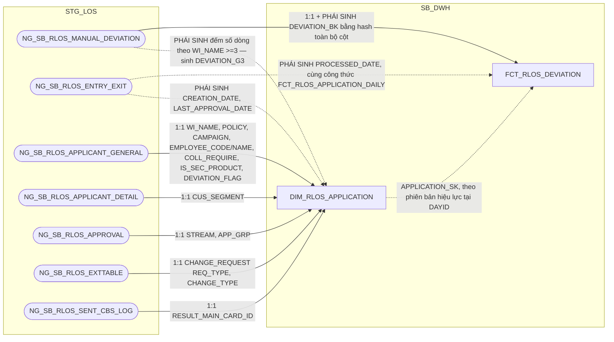

**Ghi chú lineage:** cùng cấu trúc và cơ chế nạp với `FCT_CLOS_DEVIATION`
(1.2.2.5) — giữ nguyên grain `1 dòng = 1 ngoại lệ chính sách trong ảnh
chụp của ngày DAYID`. Nguồn `NG_SB_RLOS_MANUAL_DEVIATION` không khai khóa
CDC (LOẠI 2, xác nhận qua `input/DS_BANG_202608.xlsx` — `KEY CDC` rỗng,
CLOB = `REASON`) nên `DEVIATION_BK` phải là `STANDARD_HASH(..., 'SHA256')`
trên toàn bộ cột không phải CLOB (loại trừ `REASON`), cộng `DATASOURCE` +
tên bảng nguồn — cùng cơ chế đã áp dụng cho `FCT_CLOS_DEVIATION` (1.2.2.5)
và cùng hệ quả cần biết: 2 dòng ngoại lệ trên cùng hồ sơ chỉ khác nhau ở
nội dung CLOB (`REASON`) sẽ ra cùng hash và bị gộp làm một. Ảnh chụp đầy
đủ theo ngày dựng theo quy trình A2, PK = `DAYID + WI_NAME +
DEVIATION_BK` (`DATASOURCE` không nằm trong PK).

**Vì sao không tách DIM:** cùng lý do đã áp dụng cho `FCT_CLOS_DEVIATION`
(1.2.2.5) — nguồn không khai khóa CDC nên không có định danh độc lập với
nội dung thuộc tính, SCD2/DIM không khả thi. Giữ dạng FCT ảnh chụp toàn
bộ theo ngày.

**Đánh giá kiến trúc — vì sao `PROCESSED_DATE` tính trực tiếp tại đây
thay vì JOIN `FCT_RLOS_APPLICATION_DAILY`:** cùng lý do và kết luận đã áp
dụng cho `FCT_CLOS_DEVIATION` (1.2.2.5) — để `FCT_RLOS_DEVIATION` và
`FCT_RLOS_APPLICATION_DAILY` là 2 luồng ETL hoàn toàn độc lập, không phụ
thuộc thứ tự chạy trước/sau lẫn nhau (`DEVIATION_CNT` đã bỏ khỏi
`FCT_RLOS_APPLICATION_DAILY`, xem đánh giá kiến trúc tại 1.3.2.1),
`PROCESSED_DATE` tính độc lập ngay tại đây, đọc thẳng
`NG_SB_RLOS_ENTRY_EXIT` — cùng công thức 3 mức ưu tiên (ngày phê duyệt
cuối/ngày hủy/ngày thoát bước gần nhất, đã đối chiếu khớp SRS BC6) đã
dùng cho `FCT_RLOS_APPLICATION_DAILY.PROCESSED_DATE` (1.3.2.1), không
JOIN bảng nào khác. PDTD_DTM của bảng này chỉ còn bê 1:1 (xem 2.3.2.6).

**Phát hiện khi đối chiếu SRS — nghi vấn lỗi đánh máy ở khối RLOS của
BC6 (cùng phát hiện đã ghi nhận ở `FCT_CLOS_DEVIATION`, 1.2.2.5):** SRS
BC6 ghi "Cách lấy dữ liệu" cho `CHECKING_RESULT`/`CHECKING_CONDITION`
(nhánh RLOS) lần lượt là `NG_SB_RLOS_MANUAL_DEVIATION.DEVIATION_TYPE`/
`.DEV_PROPOSAL` — nhưng 2 tên cột này **không tồn tại** trên bảng RLOS
(chỉ tồn tại trên `NG_SB_CLOS_CONDITON_CDGRID`). Đối chiếu
`RLOS - Metadata.xlsx` (sheet "3. Column Review", trạng thái "Đã xác
nhận") xác nhận lại `NG_SB_RLOS_MANUAL_DEVIATION` có đúng 2 cột
`CHECKING_CONDITION`/`CHECKING_RESULT` cùng tên với trường báo cáo —
khớp với lineage doc gốc (`DA_CHOT`, cùng tên 1:1). Tin theo lineage doc
+ metadata (nhiều khả năng SRS bị copy-paste nhầm từ khối CLOS khi soạn
khối RLOS), giữ nguyên thiết kế cột theo cách 1:1 cùng tên, không sửa
theo SRS — cùng quyết định đã chốt cho `FCT_CLOS_DEVIATION`.

###### 1.3.2.7 FCT_RLOS_WORKSTEP_EVENT — TÁCH TỪ FCT_LOS_WORKSTEP_EVENT (đánh giá lại 2026-09-14, xem lý do tách bên dưới)

**Lineage đầy đủ (bao gồm cả nguồn của `DIM_RLOS_WORKSTEP` 1.3.1.3,
`DIM_RLOS_DECISION` 1.3.1.4, `DIM_LOS_USER` 1.1.2, và `DIM_RLOS_APPLICATION`
1.3.1.1 — xem `hld/HLD_DIM_SB_DWH.md` để đối chiếu lineage gốc của 4 DIM
này):**

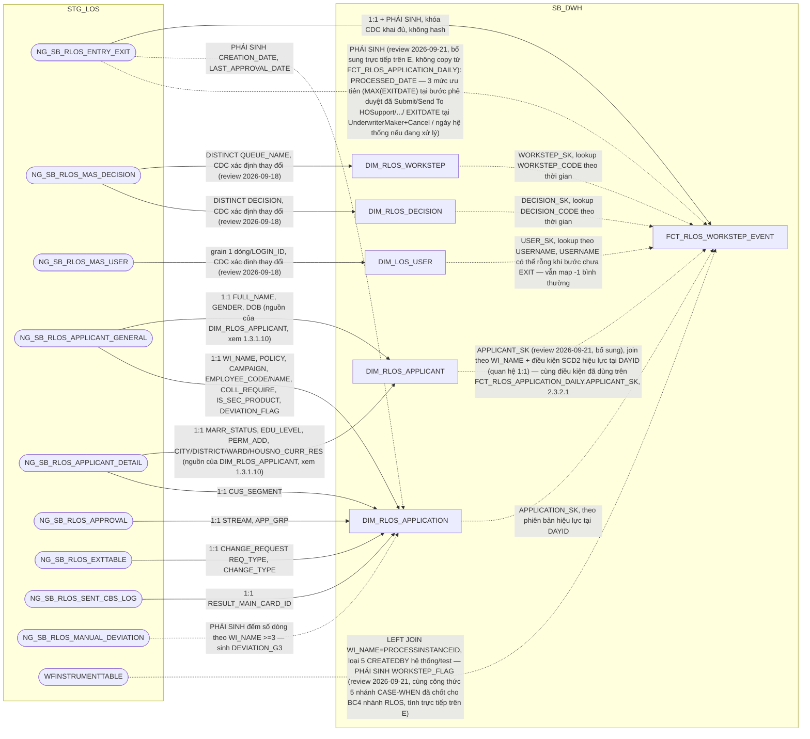

**Vì sao tách vật lý CLOS/RLOS:** cùng lý do và kết luận đã áp dụng cho
`FCT_CLOS_WORKSTEP_EVENT` (1.2.2.6) — cả 3 cột FK (`WORKSTEP_SK`,
`DECISION_SK`, `APPLICATION_SK` — đã bỏ `PRODUCT_SK` khỏi bảng, xem
Section 3) đều là **polymorphic FK**, buộc rẽ nhánh trỏ `DIM_CLOS_*` hoặc
`DIM_RLOS_*` tùy `DATASOURCE` ở mọi
lượt lookup — khác mức độ với `FCT_CLOS_LOAN_DISBURSEMENT`/
`FCT_RLOS_LOAN_DISBURSEMENT` (tách từ `FCT_LOS_DISBURSEMENT`, xem
2.2.2.7/2.3.2.8 PDTD_DTM — chỉ 5/18 cột phụ thuộc hệ). Tách vật lý cho mỗi bảng chỉ còn FK trỏ thẳng đúng 1
DIM cố định, nhất quán với `FCT_CLOS_EXCEPTION`/`FCT_RLOS_EXCEPTION`
(1.2.2.4/1.3.2.5) và `FCT_CLOS_DEVIATION`/`FCT_RLOS_DEVIATION`
(1.2.2.5/1.3.2.6) đã tách. Cột `DATASOURCE` không còn cần thiết sau khi
tách vật lý (luôn cố định 'RLOS'), bỏ khỏi bảng theo column-optimization
rule.

**Thêm bằng chứng riêng cho RLOS — 2 cột `REASON_CODE`/`REASON_DESC`
CHỈ RLOS có:** theo thiết kế cột gốc, `REASON_CODE`/`REASON_DESC` (lý do
hủy hồ sơ) chỉ được populate từ `NG_SB_RLOS_ENTRY_EXIT.REASON_CODE`/
`.REASON_DESC` — CLOS không có cấu trúc "lý do hủy" tương ứng, luôn NULL
ở nhánh CLOS. Đây là bằng chứng cột-mức bổ sung cho việc tách hợp lý,
theo đúng column-optimization rule đã áp dụng cho mọi cặp CLOS/RLOS khác
trong tài liệu này (bảng CLOS sau khi tách bỏ hẳn 2 cột này, xem 1.2.2.6).

**Grain và khóa — LOẠI 1, đã xác nhận qua `DS_BANG_202608.xlsx`:**
`NG_SB_RLOS_ENTRY_EXIT` khai đủ khóa CDC `WINAME + WORKSTEP + ENTRYDATE`,
không có cột CLOB — PK giữ thẳng trên cột gốc, không cần hash. Grain: 1
dòng = 1 **phiên bản** của 1 logical event (`hồ sơ x workstep x lần vào
bước`) — hồ sơ quay lại cùng 1 bước nhiều lần thì mỗi lần là 1 logical
event riêng (khác `ENTRYDATE`). PK = `DAYID + WI_NAME + WORKSTEP_CODE +
ENTRYDATE`; `DECISION_SK`/`USER_SK` cố tình KHÔNG nằm trong khóa (chỉ để
tra cứu thêm thuộc tính, không phải định danh — vì giá trị gốc
`DECISION_CODE`/`USERNAME` đã có sẵn trên fact). Bảng **GHI THÊM, không
sửa/xóa** dòng cũ — quy trình A1 (chỉ ghi bản ghi thay đổi/mới trong
`TIME_UPDATE >= :P_DATE AND < :P_DATE + 1`), đọc đúng trạng thái tại ngày
D bằng `ROW_NUMBER() OVER (PARTITION BY WI_NAME, WORKSTEP_CODE, ENTRYDATE
ORDER BY DAYID DESC)`.

**Đối chiếu SRS (BC3, BC4, BC8, BC9 — các báo cáo trực tiếp dùng cấu trúc
cột này, nhánh RLOS):** BC3/BC4 dùng `WINAME`/`WORKSTEP`/`DECISION`/
`ENTRYDATE`/`EXITDATE`/`USERNAME`/`REMARKS` hiển thị trực tiếp — khớp
đúng. BC8 dùng công thức đếm `SL_RETURN_*` (SUM CASE theo
`WORKSTEP`/`DECISION`) trực tiếp trên `NG_SB_RLOS_ENTRY_EXIT` — không cần
cột phái sinh mới trên fact, tính ở tầng report. BC9 dùng `NHAN_SU`
(đếm `DISTINCT USERNAME` theo đúng danh sách 8 `WORKSTEP`, nhánh RLOS) và
`TAT_RLOS` (tổng `get_business_minute(ENTRYDATE, EXITDATE)/60` theo từng
nhóm bước) — khớp đúng với `TAT_WORKING_HOUR` đã có sẵn trên bảng này.
Không phát hiện lệch tài liệu, không phát sinh PENDING mới.

---

## Section 2 — Column Design

### 1.2 Bộ bảng CLOS

##### 1.2.2 FCT

###### 1.2.2.1 FCT_CLOS_APPLICATION_DAILY

**Bảng cũ (trước tách):** `FCT_LOS_APPLICATION_DAILY` (93 cột, gộp CLOS+RLOS)

| STT | Tên cột | Kiểu dữ liệu | Bắt buộc | Độ lớn | Khóa | Mô tả |
| --- | --- | --- | --- | --- | --- | --- |
| 1 | DAYID | DATE | Y |  | PK | Ngày dữ liệu, dạng số YYYYMMDD |
| 2 | WI_NAME | VARCHAR2 | Y | 100 | PK | Mã hồ sơ tín dụng CLOS |
| 3 | DATASOURCE | VARCHAR2 | Y | 10 |  | Cột kỹ thuật đánh dấu nguồn hệ, luôn cố định 'CLOS' sau khi tách vật lý CLOS/RLOS |
| 4 | APPLICATION_SK | NUMBER | Y | 18 |  | Khóa tới DIM_CLOS_APPLICATION. Mặc định -1 nếu không khớp |
| 5 | CURRENT_WORKSTEP_SK | NUMBER | Y | 18 |  | Khóa tới DIM_CLOS_WORKSTEP, bước hồ sơ đang đứng tại ngày DAYID. Mặc định -1 |
| 6 | LAST_WORKSTEP_SK | NUMBER | Y | 18 |  | Khóa tới DIM_CLOS_WORKSTEP của sự kiện hoàn tất gần nhất. Mặc định -1 |
| 7 | LAST_DECISION_SK | NUMBER | Y | 18 |  | Khóa tới DIM_CLOS_DECISION của sự kiện hoàn tất gần nhất. Mặc định -1 |
| 8 | LAST_USER_SK | NUMBER | Y | 18 |  | Khóa tới DIM_LOS_USER của người xử lý sự kiện hoàn tất gần nhất. Mặc định -1 |
| 9 | PRODUCT_SK | NUMBER | Y | 18 |  | Khóa tới DIM_CLOS_PRODUCT — PHÁI SINH (review 2026-09-21, đóng PENDING BC2.PRODUCT_LINE/SUB_PRODUCT): lookup theo PRODUCT_LINE_CODE=NG_SB_CLOS_CUST_INFO.PRODUCT_LINE AND SUB_PRODUCT_CODE=NG_SB_CLOS_CUST_INFO.SUB_PRODUCT, điều kiện SCD2 EFF_DATE<=DAYID<EXP_DATE (hoặc EXP_DATE IS NULL) trên DIM_CLOS_PRODUCT. NG_SB_CLOS_CUST_INFO.PRODUCT_LINE/SUB_PRODUCT xác nhận CÙNG khái niệm với DIM_CLOS_PRODUCT.PRODUCT_LINE_CODE/SUB_PRODUCT_CODE (đã dùng nhất quán cho BC9 nhánh CLOS, xem 1.2.1.2) — không tạo cột text trùng lặp trên DIM_CLOS_APPLICATION, chỉ hợp nhất qua đúng 1 chiều sản phẩm này. Mặc định -1 nếu không khớp |
| 10 | ORG_UNIT_SK | NUMBER | Y | 18 |  | Khóa tới DIM_LOS_ORG_UNIT — PHÁI SINH (review 2026-09-21, đóng gap tài liệu BC1/BC2.ZONE/BRANCH_CODE): lookup theo COMPANY_CODE=NG_SB_CLOS_CUST_INFO.COMPANY_CODE, điều kiện SCD2 EFF_DATE<=DAYID<EXP_DATE (hoặc EXP_DATE IS NULL) trên DIM_LOS_ORG_UNIT (Natural Key COMPANY_CODE, 1.1.1) — cùng bảng nguồn NG_SB_CLOS_CUST_INFO đã dùng cho CUST_GROUP/EMPLOYEE_CODE trên DIM_CLOS_APPLICATION. Mặc định -1 nếu không khớp |
| 11 | RI_USER | VARCHAR2 | N | 100 |  | User khởi tạo hồ sơ (bước RequestInitiate) |
| 12 | BRANCH_USER | VARCHAR2 | N | 100 |  | User xử lý bước BranchSupport, HOÀN TẤT gần nhất |
| 13 | DDE_USER | VARCHAR2 | N | 100 |  | User xử lý bước DetailDataEntry, HOÀN TẤT gần nhất |
| 14 | QC_USER | VARCHAR2 | N | 100 |  | User xử lý bước DataInputerChecker, HOÀN TẤT gần nhất |
| 15 | UND_MAKER_USER | VARCHAR2 | N | 100 |  | User xử lý bước UnderwriterMaker, HOÀN TẤT gần nhất |
| 16 | UND_CHECKER_USER | VARCHAR2 | N | 100 |  | User xử lý bước UnderwriterChecker, HOÀN TẤT gần nhất |
| 17 | PHV_USER | VARCHAR2 | N | 100 |  | User xử lý bước PhoneVerification, HOÀN TẤT gần nhất |
| 18 | FA_USER | VARCHAR2 | N | 100 |  | User Chuyên viên Thực địa |
| 19 | APPROVER_USER | VARCHAR2 | N | 100 |  | User xử lý bước CreditApproval, HOÀN TẤT gần nhất |
| 20 | COMMITTEE_USER | VARCHAR2 | N | 100 |  | User Hội đồng tín dụng |
| 21 | HOS_USER | VARCHAR2 | N | 100 |  | User Hỗ trợ phê duyệt |
| 22 | PROCESSED_DATE | DATE | N |  |  | Ngày xử lý chung của hồ sơ theo 3 mức ưu tiên (phê duyệt cuối / hủy / hoàn tất gần nhất) |
| 23 | LAST_UWM_ENTRYDATE | TIMESTAMP | N |  |  | MAX(ENTRYDATE) tại UnderwriterMaker <= DAYID — mốc mở chu kỳ thẩm định hiện hành |
| 24 | PROCESSED_DATE_UWM | DATE | N |  |  | Ngày chốt chu kỳ thẩm định hiện hành, tính tương đối theo LAST_UWM_ENTRYDATE |
| 25 | CREATION_DATE | DATE | N |  |  | TRUNC(MIN(ENTRYDATE)) theo WI_NAME |
| 26 | FIRST_APPROVAL_DATE | DATE | N |  |  | MIN(EXITDATE) tại bước phê duyệt hợp lệ |
| 27 | LAST_APPROVAL_DATE | DATE | N |  |  | MAX(EXITDATE) tại bước phê duyệt (nhóm quyết định đã định nghĩa) |
| 28 | MIN_UWM | TIMESTAMP | N |  |  | MIN(ENTRYDATE) tại UnderwriterMaker |
| 29 | MIN_APP | TIMESTAMP | N |  |  | MIN(ENTRYDATE) tại CreditApproval/CreditCommittee |
| 30 | AUTO_CANCEL_DATE | DATE | N |  |  | Ngày hồ sơ bị hệ thống tự hủy (theo quy tắc CancelRevoke rỗng liên tiếp) |
| 31 | CANCEL_USER_DATE | DATE | N |  |  | EXITDATE tại bản ghi DECISION='Cancel' và USERNAME khác NULL |
| 32 | BI_CAN_DATE | DATE | N |  |  | ENTRYDATE tại bước CancelRevoke |
| 33 | LAST_ENTRYDATE | TIMESTAMP | N |  |  | ENTRYDATE của sự kiện hoàn tất gần nhất |
| 34 | LAST_EXITDATE | TIMESTAMP | N |  |  | EXITDATE của cùng sự kiện hoàn tất gần nhất |
| 35 | BI_APPSTATUS | VARCHAR2 | N | 50 |  | Trạng thái hồ sơ chuẩn hóa (Approved/Rejected/Cancelled/Processing) |
| 36 | HAS_ACTION_IN_DAY | VARCHAR2 | Y | 1 |  | 'Y' nếu hồ sơ có phát sinh xử lý trong ngày DAYID |
| 37 | LAST_ACTION_DATE | DATE | Y |  |  | Ngày business action gần nhất tính đến cuối DAYID |
| 38 | INACTIVE_DAY_CNT | NUMBER | Y | 5 |  | TRUNC(DAYID) - TRUNC(LAST_ACTION_DATE) |
| 39 | PRE_WORKSTEP_CODE | VARCHAR2 | N | 200 |  | Bước xử lý liền trước (LAG theo ENTRYDATE) |
| 40 | FLAG_AUTO_CANCEL | VARCHAR2 | N | 10 |  | 'YES' nếu AUTO_CANCEL_DATE khác NULL |
| 41 | LAST_REMARKS | VARCHAR2 | N | 4000 |  | Ghi chú của sự kiện hoàn tất gần nhất |
| 42 | LAST_REMARK_DDE | VARCHAR2 | N | 4000 |  | Ghi chú tại bước DetailDataEntry |
| 43 | LAST_CAN_REMARKS | VARCHAR2 | N | 4000 |  | Ghi chú tại lần hủy hồ sơ |
| 44 | HAS_REACHED_DDE | VARCHAR2 | N | 1 |  | Hồ sơ đã tới bước DetailDataEntry hay chưa |
| 45 | HAS_REACHED_QC | VARCHAR2 | N | 1 |  | Hồ sơ đã tới bước DataInputerChecker hay chưa |
| 46 | HAS_REACHED_UWM | VARCHAR2 | N | 1 |  | Hồ sơ đã tới bước UnderwriterMaker hay chưa |
| 47 | HAS_REACHED_UWC | VARCHAR2 | N | 1 |  | Hồ sơ đã tới bước UnderwriterChecker hay chưa |
| 48 | HAS_REACHED_APPROVAL | VARCHAR2 | N | 1 |  | Hồ sơ đã tới bước CreditApproval/CreditCommittee hay chưa |
| 49 | PROPOSED_AMT | NUMBER | N | 20,2 |  | Số tiền đề xuất — nguồn NG_SB_CLOS_CREDITINFO_COMM.PRECREDITLIMIT |
| 50 | CREDIT_LIMIT_APPROVAL | NUMBER | N | 20,2 |  | Hạn mức do chuyên gia phê duyệt — nguồn NG_SB_CLOS_CREDITINFO_CD.CREDIT_LIMIT |
| 51 | CREDIT_LIMIT_COMMITTEE | NUMBER | N | 20,2 |  | Hạn mức do hội đồng phê duyệt — nguồn NG_SB_CLOS_CREDITINFO_COMM.CREDIT_LIMIT |
| 52 | APPROVED_AMT_FINAL | NUMBER | N | 20,2 |  | Hạn mức phê duyệt cuối cùng: CREDIT_LIMIT_APPROVAL hoặc CREDIT_LIMIT_COMMITTEE tùy bước phê duyệt cuối |
| 53 | APPROVED_TERM | NUMBER | N | 5 |  | Kỳ hạn phê duyệt — nguồn NG_SB_CLOS_CREDITINFO_COMM.CREDIT_TERM |
| 54 | INTEREST_RATE_PCT | NUMBER | N | 8,4 |  | Lãi suất phê duyệt (%), chỉ nhận khi nguồn là số |
| 55 | INTEREST_RATE_DESC | VARCHAR2 | N | 1600 |  | Diễn giải lãi suất nguyên văn — nguồn NG_SB_CLOS_CREDITINFO_COMM.INTEREST_RATE (có thể là công thức nhiều giai đoạn) |
| 56 | CURRENCY_CODE | VARCHAR2 | N | 10 |  | Loại tiền — nguồn NG_SB_CLOS_CREDITINFO_COMM.CURRENCY |
| 57 | RETURN_CNT_DATAENTRY | NUMBER | N | 5 |  | Số lần hồ sơ bị trả về ở khâu nhập liệu |
| 58 | RETURN_CNT_UNDERWRITING | NUMBER | N | 5 |  | Số lần hồ sơ bị trả về ở khâu thẩm định |
| 59 | RETURN_CNT_APPROVAL | NUMBER | N | 5 |  | Số lần hồ sơ bị trả về ở khâu phê duyệt |
| 60 | KPI_VOLUME | NUMBER | N | 5,2 |  | Mức độ hoàn thành hồ sơ, thang 0-1 — PHÁI SINH: theo DECISION nếu đã phê duyệt/từ chối = 1.0; nếu đã CancelRevoke/CancelPermanent thì lấy theo bước xa nhất đã đạt (CreditApproval=0.8, UnderwriterChecker=0.6, UnderwriterMaker=0.5, DetailDataEntry=0.2); còn lại NULL. Cùng công thức đã chốt ở AGG_LOS_KPI_APPLICATION.VOLUME (2.1.9), tính từ toàn bộ lịch sử hồ sơ trên FCT_CLOS_WORKSTEP_EVENT |
| 62 | VAR_STR12 | VARCHAR2 | N | 200 |  | Cột generic của WFINSTRUMENTTABLE — LEFT JOIN riêng theo WI_NAME=PROCESSINSTANCEID (KHÔNG lọc CREATEDBY, khác điều kiện join của WORKSTEP_FLAG — nay chỉ còn trên FCT_CLOS_WORKSTEP_EVENT, đã bỏ khỏi bảng này, xem 1.2.2.6). Dùng làm điều kiện lọc `IS NOT NULL` cho SLHS_CLOS/SLGN_CLOS (AGG_LOS_KPI_YTD_DAILY, 2.1.8) — CLOS-only, RLOS không có cột tương ứng vì SRS BC9 không nhắc WFINSTRUMENTTABLE ở nhánh KPI Khối (RLOS) |
| 63 | UNDERWRITERMAKER_TAKERESPON | VARCHAR2 | N | 100 |  | CV Thẩm định chịu trách nhiệm (BC1/BC2) — PHÁI SINH theo nguyên văn SRS: COALESCE(CASE WHEN m.WORK_STEP='UnderwriterMaker' THEN m.USER_MAKE END, i.UWMAKERUSER) với i=NG_SB_CLOS_EXTTABLE, m=NG_SB_CLOS_USER_MAKE_WORK_STEP (LEFT JOIN theo WI_NAME=m.WI_NAME AND WORKSTEP=m.WORK_STEP). ✅ Bảng nguồn `NG_SB_CLOS_USER_MAKE_WORK_STEP` không có trong `DS_BANG_202608.xlsx` nhưng đã xác nhận tồn tại thật qua `input/CLOS - Metadata.xlsx` (review 2026-09-21, Section 3 dòng #20) |
| 64 | UNDERWRITERCHECKER_TAKERESPON | VARCHAR2 | N | 100 |  | Kiểm soát thẩm định chịu trách nhiệm (BC1/BC2) — PHÁI SINH: cùng cơ chế trên, COALESCE(CASE WHEN m.WORK_STEP='UnderwriterChecker' THEN m.USER_MAKE END, i.UWCHKRUSER). Cùng nguồn `NG_SB_CLOS_USER_MAKE_WORK_STEP` đã xác nhận tồn tại thật (Section 3 dòng #20) |
| 65 | APPROVAL_TAKERESPON | VARCHAR2 | N | 100 |  | Chuyên gia phê duyệt chịu trách nhiệm (BC1/BC2) — PHÁI SINH theo nguyên văn SRS: COALESCE(m.USER_MAKE, CASE e.APP_GRP WHEN 'A1' THEN 'long.lq' WHEN 'CC' THEN 'UBTD' WHEN 'BOD' THEN 'HDQT' END) với e=NG_SB_CLOS_APPROVAL, m=NG_SB_CLOS_USER_MAKE_WORK_STEP. Có hằng số hardcode theo APP_GRP (khác hẳn công thức RLOS dùng CREDAPPRUSER/CCOMMITUSER, xem 1.3.2.1) — cùng nguồn đã xác nhận tồn tại thật, xem Section 3 dòng #20 |
| 66 | CUSTOMER_SK | NUMBER | Y | 18 |  | Khóa tới DIM_CLOS_CUSTOMER (1.2.1.7, review 2026-09-17: bổ sung — quan hệ 1:1 với hồ sơ qua WI_NAME, join theo WI_NAME + điều kiện SCD2 EFF_DATE<=DAYID<EXP_DATE (hoặc EXP_DATE IS NULL) để lấy đúng phiên bản hiệu lực tại DAYID, không phải business key tĩnh). Mặc định -1 nếu không khớp. Đây là chân khách hàng LOS — khác T24_CUSTOMER_SK (chân T24) |

- Bảng FACT xương sống, lưu ảnh trạng thái cuối ngày của hồ sơ CLOS kèm chỉ tiêu lũy kế, phục vụ BC1, BC2, BC3, BC4, BC5, BC6, BC8, BC9, BC11.
- Khóa chính của bảng (PK): **DAYID, WI_NAME**.

**So với thiết kế cũ (`FCT_LOS_APPLICATION_DAILY` gộp, 93 cột):** bỏ
`DATASOURCE` (luôn cố định 'CLOS' sau khi tách vật lý, theo ghi chú thiết kế
khóa của split-proposal). Bỏ 8 cột chỉ có nguồn RLOS theo column-optimization
rule: `CHANGE_TYPE_SK`, `CARD_PROMOTION_SK`, `LOAN_TO_VALUE`,
`LOAN_OBJECTIVE`, `TOTAL_INCOME`, 10 cột `*FLAG` (REPAYFLAGS),
`INCOME_SOURCE_CNT`, `REPAYMENT_SOURCE`, `FLAG_BUSINESS_INCOME`; thêm bỏ
`APPROVAL_GROUP_SK` (do loại bỏ `DIM_CLOS_APPROVAL_GROUP`, `APP_GRP` nay
đọc qua JOIN `APPLICATION_SK` sang `DIM_CLOS_APPLICATION`, xem 1.2.1.1);
thêm bỏ `FLAG_FTR`, `FIRST_WORKSTEP_RETURN`, `PHAN_LOAI_DDE` (đã đánh giá
lại — cả 3 cột chỉ phục vụ đúng 1 báo cáo `BC7` theo chính "Trường đích
trên báo cáo" của tài liệu gốc, không báo cáo nào khác trong BC1-BC11 dùng
tới; BC7 lại đúng grain của `FCT_CLOS_EXCEPTION`, 1.2.2.4, không phải grain
hồ sơ/ngày của bảng này — dời cả 3 cột sang tính trực tiếp tại
`FCT_CLOS_EXCEPTION` thay vì giữ trên đây rồi bắt `FCT_CLOS_EXCEPTION` JOIN
ngược lại); thêm bỏ `DEVIATION_CNT`, `COLLATERAL_CNT` + 9 cột
`COLLATERAL_CNT_*` (đã đánh giá lại — đây chỉ là cột kỹ thuật trung gian
"LŨY KẾ" theo đúng ghi chú của tài liệu gốc, không báo cáo nào trong
BC1-BC11 dùng trực tiếp tên cột này; mọi cờ/chỉ tiêu tiêu thụ cuối cùng
— `TSDB_NHOM_0`/`TSDB_BDS`.../`TSBD_G2`/`DEVIATION_G2`/`DEVIATION_G3` —
tính trực tiếp bằng COUNT/JOIN từ `FCT_CLOS_COLLATERAL`/`FCT_CLOS_
DEVIATION` ngay tại tầng OAS RPD (semantic layer, multi-fact/conformed
dimension), không cần tính sẵn ở ETL DTM — xem đánh giá kiến trúc bên
dưới); thêm mới `WORKSTEP_FLAG` (đóng PENDING #6, xem ghi chú công thức
bên dưới) và `VAR_STR12` (rà soát lại toàn bộ SRS dùng `WFINSTRUMENTTABLE`,
xem ghi chú bên dưới); giữ lại `DATASOURCE` làm cột kỹ thuật cố định
'CLOS'; thêm mới `UNDERWRITERMAKER_TAKERESPON`/`UNDERWRITERCHECKER_
TAKERESPON`/`APPROVAL_TAKERESPON` (review 2026-09-15, theo đúng nguyên
văn SRS BC1/BC2, xem ghi chú công thức bên dưới) — tổng 65 cột (giảm
28 so với bản gộp), trong đó `CHANGE_TYPE_SK` bị loại bỏ hẳn (đã xác nhận
với người dùng) thay vì trỏ sang `DIM_RLOS_CHANGE_TYPE` khác hệ. **Nay 64
cột (review 2026-09-21):** đã bỏ `WORKSTEP_FLAG` (cột 61) khỏi bảng này
— cột chỉ phục vụ đúng BC4, và BC4 đã đổi sang đọc `WORKSTEP_FLAG` bản
tính độc lập trên `FCT_CLOS_WORKSTEP_EVENT` (1.2.2.6) nên bản trên đây
không còn consumer nào, xóa để tránh trùng lặp vô nghĩa.

**Đóng PENDING #6 — công thức `WORKSTEP_FLAG` (lịch sử thiết kế, nay cột
này đã bỏ khỏi bảng — xem ghi chú "Nay 64 cột" ở trên; công thức dưới
đây vẫn đúng, nay áp dụng trên `FCT_CLOS_WORKSTEP_EVENT`, 1.2.2.6):**
theo SRS BC4 (BR 1.2,
trường `FLAG`), nguồn `NG_SB_CLOS_ENTRY_EXIT` (a) LEFT JOIN
`WFINSTRUMENTTABLE` (c) theo `a.WINAME = c.PROCESSINSTANCEID AND
c.CREATEDBY NOT IN ('10000380','10000020','10000420','10000140',
'10000100')` (loại 5 tài khoản hệ thống/test). `WFINSTRUMENTTABLE` có
CDC key `PROCESSINSTANCEID + WORKITEMID` (DS_BANG_202608.xlsx) — đọc
trực tiếp qua STG_LOS như mọi bảng nguồn khác, không cần xử lý đặc
biệt. Công thức 5 nhánh (ưu tiên theo thứ tự, nhánh đầu khớp trước
dừng):
1. `a.WORKSTEP IN ('CreditApproval','CreditCommittee') AND a.DECISION IN ('Send To HOSupport','Reject','Submit','Send To PostSanction')` → 'Hồ sơ đã chuyển sang bước cấp PD và đã được phê duyệt'.
2. `c.PROCESSNAME='CLOS' AND c.ACTIVITYNAME IN ('CreditApproval','CreditCommittee')` → 'Hồ sơ đã chuyển sang bước của cấp phê duyệt nhưng chưa PD'.
3. `a.WORKSTEP='UnderwriterMaker' AND a.DECISION='Cancel'` → 'Hồ sơ CVTĐ đã xử lý và chốt trạng thái tại bước của CVTĐ'.
4. `c.PROCESSNAME='CLOS' AND c.ACTIVITYNAME='UnderwriterMaker'` → 'Hồ sơ CVTĐ đang/phải xử lý'.
5. `a.WORKSTEP='UnderwriterMaker' AND a.DECISION IN ('Send_Back to DDE','Additional_Doc_Required','Send_Back to BranchSupport','Send Back DataInputerChecker','Send To Legal or FI or Phone Verification')` → 'Hồ sơ CVTĐ đã xử lý nhưng chuyển/trả lại các bộ phận để bổ sung/làm rõ'.
Không khớp nhánh nào → NULL.

**Bổ sung `UNDERWRITERMAKER_TAKERESPON`/`UNDERWRITERCHECKER_TAKERESPON`/
`APPROVAL_TAKERESPON` (review 2026-09-15):** ban đầu tài liệu lineage gốc
(`extract/SB_DWH/FCT_LOS_APPLICATION_DAILY.md`, đã "DA_CHOT") coi 3 field
này của BC1/BC2 trùng nghĩa với `UND_MAKER_USER`/`UND_CHECKER_USER`/
`APPROVER_USER` sẵn có (người hoàn tất bước gần nhất trên `ENTRY_EXIT`).
Đối chiếu lại trực tiếp SRS BC1/BC2 (Business Rules) cho thấy công thức
THẬT SỰ khác — dùng bảng nguồn riêng `NG_SB_CLOS_USER_MAKE_WORK_STEP`
(alias m, LEFT JOIN theo `WI_NAME=m.WI_NAME AND WORKSTEP=m.WORK_STEP`),
với fallback về `NG_SB_CLOS_EXTTABLE.UWMAKERUSER`/`UWCHKRUSER` (không
phải `ENTRY_EXIT`), và `APPROVAL_TAKERESPON` còn hardcode hằng số theo
`APP_GRP` khi không có `m.USER_MAKE`. Theo yêu cầu người dùng, đã dựa vào
SRS để thiết kế lại: bổ sung 3 cột mới riêng biệt (cột 63-65), KHÔNG tái
sử dụng `UND_MAKER_USER`/`UND_CHECKER_USER`/`APPROVER_USER` vì công thức
và nguồn khác nhau. Bảng `NG_SB_CLOS_USER_MAKE_WORK_STEP` không có trong
`DS_BANG_202608.xlsx` nhưng đã xác nhận tồn tại thật qua `input/CLOS -
Metadata.xlsx` (review 2026-09-21, Section 3 dòng #20). Phía RLOS, SRS BC1 dùng công thức khác cho
`APPROVAL_TAKERESPON` (CREDAPPRUSER/CCOMMITUSER thay vì hardcode APP_GRP)
— xem 1.3.2.1.

**Rà soát toàn bộ SRS (BC1-BC11) cho `WFINSTRUMENTTABLE` — bổ sung
`VAR_STR12`:** quét lại toàn bộ 11 báo cáo xác nhận `WFINSTRUMENTTABLE`
chỉ được dùng ở đúng 2 nơi — BC4 (`WORKSTEP_FLAG`, nay tính trên
`FCT_CLOS_WORKSTEP_EVENT`, 1.2.2.6, không còn ở bảng này — review
2026-09-21)
và BC9, nhóm nguồn "KPI Khối (CLOS)" (`SLHS_CLOS`/`SLGN_CLOS`), với điều
kiện lọc `c.VAR_STR12 IS NOT NULL` — **join khác với `WORKSTEP_FLAG`**:
`a.WINAME = c.PROCESSINSTANCEID` **không có** điều kiện `CREATEDBY NOT
IN`. Đây là ý nghĩa nghiệp vụ chưa rõ (tên cột generic của
`WFINSTRUMENTTABLE`, không có giải thích trong SRS), nhưng công thức đã
xác nhận rõ ràng — dùng làm điều kiện lọc thêm 1 lần nữa cho
`SLHS_CLOS`/`SLGN_CLOS`. Chỉ CLOS có (nhóm "KPI Khối (RLOS)" của BC9
không nhắc `WFINSTRUMENTTABLE`) — không thêm cột này cho
`FCT_RLOS_APPLICATION_DAILY`. Giá trị dùng downstream tại `FCT_LOS_
KPI_YTD_DAILY.SLHS_CLOS_DAY`/`SLGN_CLOS_DAY` (2.1.8) — xem ghi chú ở đó.

**Đánh giá kiến trúc — vì sao bỏ `DEVIATION_CNT`/`COLLATERAL_CNT*` khỏi
đây, để tầng report/OAS tự tính:** đã rà soát toàn bộ SRS BC1-BC11 và xác
nhận không báo cáo nào tham chiếu trực tiếp `DEVIATION_CNT`/
`COLLATERAL_CNT`/9 cột con — đây đúng là cột "LŨY KẾ" trung gian theo
đúng chú thích của tài liệu gốc ("Căn cứ sinh cờ TSBD_BDS của BC1..."),
không phải trường báo cáo. Đáng chú ý, công thức thật của các chỉ tiêu
tiêu thụ ở BC9 (`TSBD_G2`, `DEVIATION_G2`, `DEVIATION_G3`) tự UNION các
bảng nguồn tài sản/ngoại lệ rồi đếm trực tiếp, hoàn toàn không nhắc tới
`COLLATERAL_CNT`/`DEVIATION_CNT` — và `DEVIATION_G3` cũng đã được thiết
kế độc lập ngay trên `DIM_RLOS_APPLICATION` (1.3.1.1), đọc thẳng
`NG_SB_RLOS_MANUAL_DEVIATION`, không qua cột này. Giữ cột đếm trung gian
này trên `FCT_CLOS_APPLICATION_DAILY` buộc ETL phải chạy `FCT_CLOS_
COLLATERAL`/`FCT_CLOS_DEVIATION` xong trước mới tính được — một phụ
thuộc thứ tự ETL giữa 2 fact hoàn toàn có thể tránh, vì người dùng làm
báo cáo bằng OAS (Oracle Analytics Server): OAS's BI Server hỗ trợ đúng
pattern "multi-fact / conformed dimension" — model `FCT_CLOS_COLLATERAL`/
`FCT_CLOS_DEVIATION` như logical fact table riêng trong RPD, dùng chung
`DIM_CLOS_APPLICATION`/`DAYID` làm conformed dimension với `FCT_CLOS_
APPLICATION_DAILY`; đo lường COUNT(*) (lọc theo `COLL_GROUP` khi cần cờ
theo nhóm tài sản) đặt làm logical measure trên `FCT_CLOS_COLLATERAL`/
`FCT_CLOS_DEVIATION`, các cờ YES/NO (`TSDB_NHOM_0`, `TSBD_BDS`...) là
calculated item wrap quanh measure đó. BI Server tự sinh SQL nhiều lượt
(multi-pass) join theo dimension chung, không fan-out — đây là cách OAS
xử lý multi-fact chuẩn, không phải workaround. Chi phí duy nhất là model
đúng quan hệ logical fact-to-fact 1 lần trong RPD, không phải chi phí lặp
lại theo từng báo cáo. Kết quả: `FCT_CLOS_COLLATERAL`, `FCT_CLOS_
DEVIATION`, `FCT_CLOS_APPLICATION_DAILY` trở thành 3 luồng ETL hoàn toàn
độc lập, không còn phụ thuộc thứ tự chạy trước/sau lẫn nhau. Cùng đánh
giá và kết luận áp dụng cho `FCT_RLOS_APPLICATION_DAILY` (1.3.2.1).

###### 1.2.2.2 FCT_CLOS_APPLICATION_PARTY — MỚI (factless-fact liên kết, tương tự FCT_RLOS_APPLICATION_PARTY)

**Bảng cũ (trước tách):** không có — bảng bị thiếu trong lần thiết kế trước, bổ sung để khớp pattern factless-fact đã áp dụng cho RLOS (`FCT_RLOS_APPLICATION_PARTY`, 1.3.2.2) sau khi tách `DIM_CLOS_CUSTOMER`/`DIM_CLOS_LEGAL_PARTY` ra khỏi FCT

| STT | Tên cột | Kiểu dữ liệu | Bắt buộc | Độ lớn | Khóa | Mô tả |
| --- | --- | --- | --- | --- | --- | --- |
| 1 | DAYID | DATE | Y |  | PK | Ngày dữ liệu, dạng số YYYYMMDD |
| 2 | WI_NAME | VARCHAR2 | Y | 100 | PK | Mã hồ sơ tín dụng CLOS |
| 3 | APPLICATION_SK | NUMBER | Y | 18 |  | Khóa tới DIM_CLOS_APPLICATION. Mặc định -1 |
| 4 | CUSTOMER_SK | NUMBER | Y | 18 |  | Khóa tới DIM_CLOS_CUSTOMER. Mặc định -1 |
| 5 | LEGAL_PARTY_SK | NUMBER | Y | 18 | PK | Khóa tới DIM_CLOS_LEGAL_PARTY — join ĐỦ N dòng cho CẢ 5 vai trò (CUSTOMER, LEGAL_REPRESENTATIVE, COLLATERAL_OWNER, MAIN_CONTRIBUTING_MEMBERS, OTHER), đúng grain "1 dòng = 1 hồ sơ × 1 người liên quan pháp lý" đã nêu ở Section 1 (review 2026-09-17: làm rõ, tránh hiểu nhầm chỉ join riêng CUSTOMER). Mặc định -1 chỉ dùng cho trường hợp dữ liệu thiếu/không khớp được (Unknown) — CLOS luôn có đúng 1 dòng LEGAL_PARTY ứng với chính khách hàng (LEGAL_TYPE='CUSTOMER', xác nhận nghiệp vụ: không bao giờ nhiều dòng cùng vai trò này/hồ sơ, riêng cho vai trò CUSTOMER), khác quy ước "-1 = không có corepayer" bên RLOS |
| 6 | DATASOURCE | VARCHAR2 | Y | 10 |  | Cột kỹ thuật đánh dấu nguồn hệ, luôn cố định 'CLOS' sau khi tách vật lý CLOS/RLOS |

- Bảng FACT quan hệ (factless fact), thể hiện quan hệ 1 hồ sơ × 1 khách hàng chính × N người liên quan pháp lý. Phục vụ BC2.
- Khóa chính của bảng (PK): **DAYID, WI_NAME, LEGAL_PARTY_SK**.

**Bảng bổ sung mới, không so sánh với thiết kế cũ:** đây là bảng còn thiếu
sau khi `DIM_CLOS_CUSTOMER` (1.2.1.7) và `DIM_CLOS_LEGAL_PARTY` (1.2.1.8)
được tách khỏi FCT gốc — cần 1 bảng factless-fact liên kết lại 3 khóa
(`APPLICATION_SK`, `CUSTOMER_SK`, `LEGAL_PARTY_SK`), đúng cùng vai trò với
`FCT_RLOS_APPLICATION_PARTY` (1.3.2.2) bên RLOS. Không gộp thuộc tính mô tả
nào vào bảng này (toàn bộ đã nằm trên `DIM_CLOS_CUSTOMER`/`DIM_CLOS_LEGAL_
PARTY`) — bảng chỉ giữ 3 khóa liên kết, cùng nguyên tắc "factless fact" đã
áp dụng cho RLOS.

###### 1.2.2.3 FCT_CLOS_COLLATERAL

**Bảng cũ (trước tách):** `FCT_LOS_COLLATERAL` (22 cột, gộp CLOS+RLOS)

| STT | Tên cột | Kiểu dữ liệu | Bắt buộc | Độ lớn | Khóa | Mô tả |
| --- | --- | --- | --- | --- | --- | --- |
| 1 | DAYID | DATE | Y |  | PK | Ngày dữ liệu, dạng số YYYYMMDD |
| 2 | WI_NAME | VARCHAR2 | Y | 100 | PK | Mã hồ sơ tín dụng CLOS |
| 3 | COLLATERAL_BK | VARCHAR2 | Y | 64 | PK | Khóa nghiệp vụ của dòng tài sản — PHÁI SINH: STANDARD_HASH(..., 'SHA256') trên toàn bộ cột không phải CLOB của NG_SB_CLOS_COLL_CD (loại trừ COLL_MGMT_APP, DESCRIPTION), cộng DATASOURCE và tên bảng nguồn. Chuẩn hóa trước khi hash: TRIM chuỗi, NULL quy về '<NULL>', DATE/NUMBER dùng format cố định không phụ thuộc NLS |
| 4 | DATASOURCE | VARCHAR2 | Y | 10 |  | Cột kỹ thuật đánh dấu nguồn hệ, luôn cố định 'CLOS' sau khi tách vật lý CLOS/RLOS |
| 5 | APPLICATION_SK | NUMBER | Y | 18 |  | Khóa tới DIM_CLOS_APPLICATION theo phiên bản hiệu lực tại DAYID. Mặc định -1 nếu không khớp |
| 6 | COLLATERAL_TYPE_SK | NUMBER | Y | 18 |  | Khóa tới DIM_CLOS_COLLATERAL_TYPE, lookup theo COLLATERAL_TYPE_CODE. Mặc định -1 |
| 7 | COLLATERAL_TYPE_CODE | VARCHAR2 | N | 100 |  | Mã loại tài sản bảo đảm — nguồn NG_SB_CLOS_COLL_CD.COLLTYPE |
| 8 | DESCRIPTION | VARCHAR2 | N | 4000 |  | Diễn giải tài sản bảo đảm — nguồn NG_SB_CLOS_COLL_CD.DESCRIPTION (CLOB) |
| 9 | OWNER_NAME | VARCHAR2 | N | 200 |  | Chủ sở hữu tài sản — nguồn NG_SB_CLOS_COLL_CD.COLL_OWNER |
| 10 | COLL_MGMT_METHOD | VARCHAR2 | N | 4000 |  | Phương thức quản lý tài sản — nguồn NG_SB_CLOS_COLL_CD.COLL_MGMT_APP. Người dùng thường không nhập trường này trên live nên phần lớn sẽ rỗng, nhưng BC3 vẫn liệt kê nên phải nạp |
| 11 | APPRAISED_VALUE | NUMBER | N | 20,2 |  | Giá trị định giá của tài sản — nguồn NG_SB_CLOS_COLL_CD.APPRAISED_VAL_FIG. Ép kiểu số từ text theo định dạng Việt Nam (dấu chấm ngăn nghìn, dấu phẩy ngăn thập phân), DEFAULT NULL ON CONVERSION ERROR |
| 12 | LOAN_RATE_LTV | NUMBER | N | 5,2 |  | Tỷ lệ cho vay trên giá trị tài sản — nguồn NG_SB_CLOS_COLL_CD.LTV. Cùng quy tắc ép kiểu, đơn vị phần trăm |

- Bảng FACT chi tiết (nhân dòng), lưu ảnh số liệu thay đổi theo ngày của từng tài sản bảo đảm thuộc hồ sơ CLOS. Không có chiều tài sản riêng — toàn bộ thuộc tính lưu thẳng trên fact vì nguồn không khai khóa CDC. Phục vụ BC1, BC2, BC3, BC9.
- Khóa chính của bảng (PK): **DAYID, WI_NAME, COLLATERAL_BK**.

**Đã bỏ `CERTIFICATE_NO` (review 2026-09-17):** đối chiếu SRS BC1/BC2/BC3
và `CLOS - Metadata.xlsx` xác nhận `NG_SB_CLOS_COLL_CD` không có cột
tương ứng "số giấy chứng nhận" (khác RLOS có `NO_CERTI`/
`CERTIFICATENO` trên `NG_SB_RLOS_COL_REALESTATE`/
`NG_SB_RLOS_COLL_CERTIGRD`) — theo column-optimization rule, bỏ hẳn cột
luôn NULL thay vì giữ lại, giảm từ 13 xuống 12 cột.

**Đối chiếu SRS (BC1, BC2, BC3, BC9):** BC1 dùng các cột chi tiết trực
tiếp (OWNER_NAME/OWNERSHIP, APPRAISED_VALUE, LOAN_RATE_LTV...). BC3 dùng
`COLLATERAL_TYPE_CODE` trực tiếp (nguồn `COLLTYPE` gốc tiếng Việt) làm
`TYPES_OF_COLLATERALS` — CLOS chỉ có 1 nguồn tài sản duy nhất nên không
cần cột phái sinh tổng hợp như RLOS (xem 1.3.2.3). BC2/BC9 dùng
`COLL_GROUP` của `DIM_CLOS_COLLATERAL_TYPE` (join qua
`COLLATERAL_TYPE_SK`, không phải cột vật lý trên fact này) làm đầu vào
phân loại nhóm. Không phát hiện lệch tài liệu nào về công thức cột.

**So với thiết kế cũ (`FCT_LOS_COLLATERAL` gộp, 22 cột):** bỏ `DATASOURCE`
(luôn cố định 'CLOS' sau khi tách vật lý). Bỏ 9 cột chỉ có nguồn RLOS theo
column-optimization rule: `REL_TO_CUSTOMER`, `USING_PURPOSE`,
`VEHICLE_TYPE`, `BRAND`, `CONTROL_POSTER`, `VALPAPER_TYPE`, `NUMBERSIGN`,
`IS_ASSET_FORMED`, `IS_FORMED_FROM_LOAN` — CLOS chỉ có đúng 1 nguồn tài sản
(`NG_SB_CLOS_COLL_CD`), không có 5 bảng grid theo loại tài sản vật lý như
RLOS nên các thuộc tính đặc thù loại tài sản (bất động sản/phương tiện/giấy
tờ có giá) không áp dụng được. Giữ `COLL_MGMT_METHOD` (chỉ có ở CLOS); sau
đó thêm lại `DATASOURCE` làm cột kỹ thuật cố định 'CLOS' — tổng
13 cột (giảm 9 so với bản gộp).

###### 1.2.2.4 FCT_CLOS_EXCEPTION

**Bảng cũ (trước tách):** `FCT_LOS_EXCEPTION` (12 cột, gộp CLOS+RLOS)

| STT | Tên cột | Kiểu dữ liệu | Bắt buộc | Độ lớn | Khóa | Mô tả |
| --- | --- | --- | --- | --- | --- | --- |
| 1 | DAYID | DATE | Y |  | PK | Ngày dữ liệu, dạng số YYYYMMDD |
| 2 | WI_NAME | VARCHAR2 | Y | 100 | PK | Mã hồ sơ tín dụng CLOS |
| 3 | APPLICATION_SK | NUMBER | Y | 18 |  | Khóa tới DIM_CLOS_APPLICATION theo phiên bản hiệu lực tại DAYID. Mặc định -1 |
| 4 | EXCEPTION_REASON_SK | NUMBER | Y | 18 |  | Khóa tới DIM_CLOS_EXCEPTION_REASON — PHÁI SINH 2 bước đúng SRS BC7 (không phải lookup 1 cột): (1) LEFT JOIN theo EXCEPTION_CATEGORY + EXCEPTION_NAME, có thể khớp nhiều dòng DIM cùng category+name khác ACTIVITYNAME/DECISION_CODE; (2) lọc còn đúng 1 dòng bằng điều kiện tồn tại bản ghi NG_SB_CLOS_ENTRY_EXIT (WI_NAME khớp + WORKSTEP=ACTIVITYNAME + DECISION=DECISION_CODE của dòng DIM đó) — chỉ giữ tổ hợp đã thực sự xảy ra trong lịch sử xử lý hồ sơ. Mặc định -1 nếu không còn dòng nào khớp. Xem giải thích đầy đủ tại Section 1 → 1.2.2.4 |
| 5 | RAISED_BY_USER_SK | NUMBER | Y | 18 |  | Khóa tới DIM_LOS_USER, người nêu lý do. Mặc định -1. ĐÚNG GRAIN của bảng — 1 lần ghi nhận lý do có đúng 1 người nêu |
| 6 | EXCEPTION_CATEGORY | VARCHAR2 | N | 500 | PK | Phân nhóm nội dung cần làm rõ — nguồn NG_SB_CLOS_EXCEPTION.EXCEPTION_CATEGORY |
| 7 | EXCEPTION_NAME | VARCHAR2 | N | 500 |  | Tên nội dung cần làm rõ — nguồn NG_SB_CLOS_EXCEPTION.EXCEPTION_NAME |
| 8 | EXCEPTION_REMARKS | VARCHAR2 | N | 4000 |  | Ghi chú của nội dung cần làm rõ — nguồn NG_SB_CLOS_EXCEPTION.EXCEPTION_REMARKS |
| 9 | RAISED_BY | VARCHAR2 | N | 100 | PK | Người nêu nội dung cần làm rõ — nguồn NG_SB_CLOS_EXCEPTION.RAISED_BY. Cột RAISED_BY_USER_SK bên cạnh giữ khóa tới DIM |
| 10 | RAISED_DATE_TIME | TIMESTAMP | N |  | PK | Thời điểm nêu nội dung cần làm rõ — nguồn NG_SB_CLOS_EXCEPTION.RAISED_DATE_TIME |
| 11 | DATASOURCE | VARCHAR2 | Y | 10 |  | Cột kỹ thuật đánh dấu nguồn hệ, luôn cố định 'CLOS' sau khi tách vật lý CLOS/RLOS |
| 12 | RCTYPE | VARCHAR2 | N | 20 |  | Loại ghi nhận, Raise (nêu lý do khi trả về) hay Clear (đã làm rõ/bổ sung và đẩy lại) — nguồn NG_SB_CLOS_EXCEPTION.RCTYPE |
| 13 | CHECK_FTR | VARCHAR2 | N | 20 |  | Vi phạm nguyên tắc First Time Right — PHÁI SINH (review 2026-09-18, SRS BC7 cập nhật đổi hẳn công thức): mặc định 'Not First Time Right'; là 'First Time Right' CHỈ KHI mọi dòng NG_SB_CLOS_EXCEPTION (a) của hồ sơ đều khớp 1 tổ hợp ngoại lệ miễn trừ theo (join NG_SB_CLOS_ENTRY_EXIT (h) qua h.WINAME=a.WI_NAME AND h.WORKSTEP=d.ACTIVITYNAME AND h.DECISION=d.DECISION, d=NG_SB_CLOS_MAS_EXCEPTION), phân theo NG_SB_CLOS_CUST_INFO.CUST_GROUP: nhóm KHDN (MSME/SME/USME) và nhóm KHDNL/ĐT&ĐCTC (FDI/SOC/JSC/NBFI/BANK/STR) — mỗi nhóm có 4 tổ hợp WORKSTEP+DECISION với danh sách EXCEPTION_CATEGORY miễn trừ riêng, xem đầy đủ literal tại SRS BC7 BR 1.2 |
| 14 | FIRST_WORKSTEP_RETURN | VARCHAR2 | N | 200 |  | Bước xử lý phát sinh trả về đầu tiên — PHÁI SINH (review 2026-09-18, SRS BC7 cập nhật): WORKSTEP của bản ghi NG_SB_CLOS_ENTRY_EXIT tại MIN(EXITDATE) theo WI_NAME, với điều kiện EXITDATE IS NOT NULL AND ((WORKSTEP='DetailDataEntry' AND DECISION='Send_Back') OR (WORKSTEP IN ('DataInputerChecker','UnderwriterMaker','CreditApproval') AND DECISION='Additional_Doc_Required') OR (WORKSTEP='UnderwriterMaker' AND DECISION='Send_Back to BranchSupport')) — bổ sung nhánh thứ 3 (UnderwriterMaker+Send_Back to BranchSupport) so với công thức cũ |

- Bảng FACT chi tiết (nhân dòng), lưu mỗi lần một lý do được nêu ra trên hồ sơ CLOS, trong ảnh chụp của ngày DAYID. Phục vụ BC7, BC8.
- Khóa chính của bảng (PK): **DAYID, WI_NAME, EXCEPTION_CATEGORY, RAISED_BY, RAISED_DATE_TIME**.

**So với thiết kế cũ (`FCT_LOS_EXCEPTION` gộp, 12 cột):** bỏ `DATASOURCE`
(luôn cố định 'CLOS' sau khi tách vật lý, cũng loại khỏi PK theo ghi chú
thiết kế khóa của split-proposal), 11 cột gốc giữ nguyên cấu trúc, vẫn đọc
trực tiếp từ `NG_SB_CLOS_EXCEPTION` (LOẠI 1, khóa CDC khai đủ). Thêm mới
2 cột `CHECK_FTR`/`FIRST_WORKSTEP_RETURN` — vốn nằm trên
`FCT_LOS_APPLICATION_DAILY` (bản gộp cũ, dưới tên `FLAG_FTR`) nhưng đã
đánh giá lại và dời sang đây (xem đánh giá kiến trúc bên dưới); sau đó
thêm lại `DATASOURCE` làm cột kỹ thuật cố định 'CLOS' — tổng
**14 cột**. `PHAN_LOAI_DDE` (cột thứ 3 từng dự kiến chuyển sang đây) đã
được đánh giá lại (review 2026-09-22) và chuyển hẳn sang tính tại
`hld/HLD_FCT_PDTD_DTM.md` mục 2.2.2.4 — xem "⚠️ Đánh giá kiến trúc —
`PHAN_LOAI_DDE` chuyển hẳn sang PDTD_DTM" ở Section 1 phía trên.

**Đối chiếu SRS (BC7, BC8):** BC7 dùng trực tiếp `EXCEPTION_CATEGORY`,
`EXCEPTION_NAME`, `EXCEPTION_REMARKS`, `RAISED_BY`, `RAISED_DATE_TIME`,
`CHECK_FTR`, `FIRST_WORKSTEP_RETURN`, `PHAN_LOAI_DDE` (cột này tính ở
PDTD_DTM, xem `hld/HLD_FCT_PDTD_DTM.md` mục 2.2.2.4). Đã đối chiếu công
thức `CHECK_FTR`/`FIRST_WORKSTEP_RETURN` trực tiếp với bảng field-list của
SRS BC7 bản cập nhật (review 2026-09-18, cả nhánh CLOS và RLOS) — xem
công thức mới đầy đủ tại Section 1 → 1.2.2.4 và cột tương ứng ở trên.
`RCTYPE` **không còn** là điều kiện lọc của `CHECK_FTR` theo SRS mới
(khác bản trước, xem ghi chú cột `RCTYPE` phía trên) — vẫn giữ cột này vì
BC7 hiển thị trực tiếp `RCTYPE` (Raise/Clear) làm trường riêng trên báo
cáo.

**Đánh giá kiến trúc — vì sao không gộp vào `FCT_CLOS_APPLICATION_DAILY`
(1.2.2.1):** xem ghi chú đầy đủ tại Section 1 → 1. SB_DWH → 1.2.2.4 —
giữ bảng riêng vì khác grain (1 dòng/lần nêu lý do, không phải 1 dòng/hồ
sơ/ngày), BC7 cần liệt kê chi tiết từng lần chứ không phải rollup. Cùng
pattern detail-fact/aggregate-fact với `FCT_CLOS_COLLATERAL` (1.2.2.3).

**Đánh giá kiến trúc — vì sao `CHECK_FTR`/`FIRST_WORKSTEP_RETURN`
chuyển về đây:** rà soát toàn bộ SRS BC1-BC11 xác nhận cả 3 cột gốc
(`CHECK_FTR`/`FIRST_WORKSTEP_RETURN`/`PHAN_LOAI_DDE`) chỉ phục vụ đúng
`BC7` (đúng như "Trường đích trên báo cáo" của tài liệu gốc đã ghi
`BC7.CHECK_FTR`/`BC7.FIRST_WORKSTEP_RETURN`/`BC7.PHAN_LOAI_DDE`, không
báo cáo nào khác dùng) — nên thuộc về đúng grain của bảng này (1 dòng/lần
nêu lý do), không phải grain hồ sơ/ngày của `FCT_CLOS_APPLICATION_DAILY`.
Đã bỏ cả 3 cột khỏi `FCT_CLOS_APPLICATION_DAILY`/`FCT_RLOS_APPLICATION_DAILY`
(1.2.2.1/1.3.2.1) tương ứng — quyết định kiến trúc này (đọc thẳng
`ENTRY_EXIT` tại đây thay vì gián tiếp qua `FCT_CLOS_APPLICATION_DAILY`)
không đổi qua lần review 2026-09-18; chỉ bản thân công thức 3 cột đã đổi
theo SRS BC7 cập nhật (xem Section 1 → 1.2.2.4 và cột tương ứng ở trên).
Riêng `PHAN_LOAI_DDE`: dù cùng phục vụ BC7 và cùng lý do "khác grain
FCT_CLOS_APPLICATION_DAILY", cột này KHÔNG dừng lại ở tầng SB_DWH (bảng
này) mà tiếp tục chuyển sang tính hẳn tại PDTD_DTM (review 2026-09-22) —
vì bảng danh mục nó lookup (`REF_PHAN_LOAI_DDE`) chỉ tồn tại vật lý ở
PDTD_DTM, xem "⚠️ Đánh giá kiến trúc — `PHAN_LOAI_DDE` chuyển hẳn sang
PDTD_DTM" ở Section 1 phía trên. Bảng này (SB_DWH) chỉ còn 2 cột
`CHECK_FTR`/`FIRST_WORKSTEP_RETURN` trong nhóm 3 cột gốc.

###### 1.2.2.5 FCT_CLOS_DEVIATION

**Bảng cũ (trước tách):** `FCT_LOS_DEVIATION` (11 cột, gộp CLOS+RLOS)

| STT | Tên cột | Kiểu dữ liệu | Bắt buộc | Độ lớn | Khóa | Mô tả |
| --- | --- | --- | --- | --- | --- | --- |
| 1 | DAYID | DATE | Y |  | PK | Ngày dữ liệu, dạng số YYYYMMDD |
| 2 | WI_NAME | VARCHAR2 | Y | 100 | PK | Mã hồ sơ tín dụng CLOS |
| 3 | DEVIATION_BK | VARCHAR2 | Y | 64 | PK | Khóa nghiệp vụ của dòng ngoại lệ — PHÁI SINH: STANDARD_HASH(..., 'SHA256') trên toàn bộ cột không phải CLOB của NG_SB_CLOS_CONDITON_CDGRID (loại trừ AS_REGULAR, DEV_PROPOSAL), cộng DATASOURCE và tên bảng nguồn. Chuẩn hóa trước khi hash: TRIM chuỗi, NULL quy về '<NULL>', DATE/NUMBER dùng format cố định không phụ thuộc NLS |
| 4 | DATASOURCE | VARCHAR2 | Y | 10 |  | Cột kỹ thuật đánh dấu nguồn hệ, luôn cố định 'CLOS' sau khi tách vật lý CLOS/RLOS |
| 5 | APPLICATION_SK | NUMBER | Y | 18 |  | Khóa tới DIM_CLOS_APPLICATION theo phiên bản hiệu lực tại DAYID. Mặc định -1 nếu không khớp |
| 6 | DEVIATION_TYPE_CODE | VARCHAR2 | N | 300 |  | Mã loại lệch chính sách — nguồn NG_SB_CLOS_CONDITON_CDGRID.DEVIATION_TYPE |
| 7 | DEV_PROPOSAL | VARCHAR2 | N | 4000 |  | Đề xuất xử lý lệch chính sách — nguồn NG_SB_CLOS_CONDITON_CDGRID.DEV_PROPOSAL |
| 8 | AS_REGULAR | VARCHAR2 | N | 4000 |  | Quy định chuẩn liên quan tới lệch chính sách — nguồn NG_SB_CLOS_CONDITON_CDGRID.AS_REGULAR. Không báo cáo nào hiển thị trực tiếp; BA từng đề xuất đưa vào khóa nghiệp vụ nhưng bị từ chối vì là trường nhập tùy biến (free-text, xem `CLOS - Metadata.xlsx`) — vẫn phải nạp vì là thuộc tính gốc của bảng nguồn (review 2026-09-17: sửa lại mô tả, bản cũ bị cắt cụt gây hiểu nhầm là đã đưa vào DEVIATION_BK, mâu thuẫn với công thức hash loại trừ chính cột này) |
| 9 | PROCESSED_DATE | DATE | N |  |  | Ngày xử lý của hồ sơ — PHÁI SINH: tính độc lập từ NG_SB_CLOS_ENTRY_EXIT theo cùng công thức 3 mức ưu tiên (ngày phê duyệt cuối/ngày hủy/ngày thoát bước gần nhất) đã dùng cho FCT_CLOS_APPLICATION_DAILY.PROCESSED_DATE (1.2.2.1) — không JOIN sang FCT_CLOS_APPLICATION_DAILY để tránh tham chiếu chéo giữa 2 bảng (xem đánh giá kiến trúc bên dưới) |

- Bảng FACT chi tiết (nhân dòng), lưu ảnh số liệu thay đổi theo ngày của từng ngoại lệ chính sách thuộc hồ sơ CLOS. Không có chiều riêng — toàn bộ thuộc tính lưu thẳng trên fact vì nguồn không khai khóa CDC. Phục vụ BC6 (chi tiết) — review 2026-09-17: đã xác nhận BC5 không hề dùng `NG_SB_CLOS_CONDITON_CDGRID`/bảng này, và BC9 chỉ có `DEVIATION_G2`/`DEVIATION_G3` cho nhánh RLOS (nguồn `NG_SB_RLOS_MANUAL_DEVIATION`, khác hẳn), không có tương đương cho nhánh CLOS — bỏ "BC5, BC9" khỏi mô tả bảng, chỉ còn phục vụ BC6, xem Section 3.
- Khóa chính của bảng (PK): **DAYID, WI_NAME, DEVIATION_BK**.

**So với thiết kế cũ (`FCT_LOS_DEVIATION` gộp, 11 cột):** bỏ `DATASOURCE`
(luôn cố định 'CLOS' sau khi tách vật lý). Bỏ 3 cột chỉ có nguồn RLOS
theo column-optimization rule: `CHECKING_CONDITION`, `CHECKING_RESULT`,
`DEVIATION_REASON` (cả 3 đều chỉ được `NG_SB_RLOS_MANUAL_DEVIATION` populate
— CLOS chỉ có đúng 1 nguồn ngoại lệ, `NG_SB_CLOS_CONDITON_CDGRID`, không có
cấu trúc "điều kiện kiểm tra/kết quả kiểm tra" tách rời như RLOS). Giữ
`DEVIATION_TYPE_CODE`/`DEV_PROPOSAL`/`AS_REGULAR` (chỉ có ở CLOS); thêm mới
`PROCESSED_DATE` (xem đánh giá kiến trúc bên dưới); sau đó thêm lại
`DATASOURCE` làm cột kỹ thuật cố định 'CLOS' — tổng **9 cột** (giảm
2 so với bản gộp: 3 cột RLOS-only − 1 `PROCESSED_DATE` thêm mới).

**Đối chiếu SRS (BC6):** BC6 dùng trực tiếp `DEVIATION_TYPE`
(→ `DEVIATION_TYPE_CODE`), `DEV_PROPOSAL`, `PROCESSED_DATE` cho nhánh
CLOS — khớp đúng.

**Rà soát lại "Phục vụ BC5, BC9" (review 2026-09-17):** đã đối chiếu
trực tiếp cả 2 SRS — BC5 (chủ đề SLA-TAT) hoàn toàn không tham chiếu
`NG_SB_CLOS_CONDITON_CDGRID` ở bất kỳ đâu; BC9 chỉ định nghĩa
`DEVIATION_G2`/`DEVIATION_G3` cho nhánh RLOS (nguồn `NG_SB_RLOS_MANUAL_
DEVIATION`, đã thiết kế riêng tại `DIM_RLOS_APPLICATION`, 1.3.1.1),
không có chỉ tiêu tương đương nào cho nhánh CLOS. Ghi chú cũ "BC5/BC9
dùng ngưỡng đếm số dòng ở tầng report/OAS" là suy đoán đối xứng với
RLOS, không có căn cứ SRS — đã bỏ khỏi mô tả bảng, xem Section 3.

**Phát hiện khi đối chiếu SRS — nghi vấn lỗi đánh máy ở khối RLOS của
BC6:** SRS BC6 ghi "Cách lấy dữ liệu" cho `CHECKING_RESULT`/
`CHECKING_CONDITION` (nhánh RLOS) lần lượt là
`NG_SB_RLOS_MANUAL_DEVIATION.DEVIATION_TYPE`/`.DEV_PROPOSAL` — nhưng 2 tên
cột này **không tồn tại** trên bảng RLOS (chỉ tồn tại trên
`NG_SB_CLOS_CONDITON_CDGRID`). Đối chiếu `RLOS - Metadata.xlsx` (sheet
"3. Column Review", trạng thái "Đã xác nhận") xác nhận
`NG_SB_RLOS_MANUAL_DEVIATION` có đúng 2 cột `CHECKING_CONDITION`/
`CHECKING_RESULT` cùng tên với trường báo cáo — khớp với lineage doc gốc
(`DA_CHOT`, cùng tên 1:1). Đã trao đổi với người dùng: tin theo lineage
doc + metadata (nhiều khả năng SRS bị copy-paste nhầm từ khối CLOS khi
soạn khối RLOS), giữ nguyên thiết kế cột theo cách 1:1 cùng tên, không
sửa theo SRS.

**Đánh giá kiến trúc — vì sao `PROCESSED_DATE` tính độc lập tại đây thay
vì JOIN `FCT_CLOS_APPLICATION_DAILY`:** để `FCT_CLOS_DEVIATION` và
`FCT_CLOS_APPLICATION_DAILY` là 2 luồng ETL hoàn toàn độc lập (không còn
cột đếm trung gian nào tham chiếu chéo giữa 2 bảng — `DEVIATION_CNT` cũng
đã bỏ khỏi `FCT_CLOS_APPLICATION_DAILY`, xem đánh giá kiến trúc tại
1.2.2.1), `PROCESSED_DATE` tính độc lập ngay tại `FCT_CLOS_DEVIATION`
(SB_DWH), đọc thẳng `NG_SB_CLOS_ENTRY_EXIT`. Xem đánh giá đầy đủ tại
Section 1 → 1. SB_DWH → 1.2.2.5.

###### 1.2.2.6 FCT_CLOS_WORKSTEP_EVENT — TÁCH TỪ FCT_LOS_WORKSTEP_EVENT

**Bảng cũ (trước tách):** `FCT_LOS_WORKSTEP_EVENT` (CHUNG, 24 cột) — đánh
giá lại 2026-09-14 phát hiện cả 4 cột FK (`WORKSTEP_SK`, `DECISION_SK`,
`APPLICATION_SK`, `PRODUCT_SK`) đều là polymorphic FK phải rẽ nhánh
`DIM_CLOS_*`/`DIM_RLOS_*` theo `DATASOURCE`, khác mức độ với
`FCT_CLOS_LOAN_DISBURSEMENT`/`FCT_RLOS_LOAN_DISBURSEMENT` (tách từ
`FCT_LOS_DISBURSEMENT`, chỉ 5/18 cột phụ thuộc hệ) — nên tách vật lý
thành `FCT_CLOS_WORKSTEP_EVENT`/
`FCT_RLOS_WORKSTEP_EVENT`, cùng pattern `FCT_CLOS_EXCEPTION`/
`FCT_RLOS_EXCEPTION`, `FCT_CLOS_DEVIATION`/`FCT_RLOS_DEVIATION`. Xem lý do
tách đầy đủ tại Section 1 → 1. SB_DWH → 1.2.2.6.

| STT | Tên cột | Kiểu dữ liệu | Bắt buộc | Độ lớn | Khóa | Mô tả |
| --- | --- | --- | --- | --- | --- | --- |
| 1 | DAYID | DATE | Y |  | PK | Ngày dữ liệu, dạng số YYYYMMDD — nguồn NG_SB_CLOS_ENTRY_EXIT, TRUNC về 00:00:00. Là ngày phiên bản được ghi nhận, KHÔNG phải ảnh chụp lại toàn bộ nhật ký mỗi ngày |
| 2 | WI_NAME | VARCHAR2 | Y | 100 | PK | Mã hồ sơ tín dụng CLOS — nguồn NG_SB_CLOS_ENTRY_EXIT.WINAME (đổi tên WINAME→WI_NAME cho thống nhất với các bảng khác) |
| 3 | WORKSTEP_CODE | VARCHAR2 | Y | 200 | PK | Mã bước xử lý trên workflow — nguồn ENTRY_EXIT.WORKSTEP (đổi tên thêm hậu tố CODE), đã cắt tiền tố hệ nguồn nếu có |
| 4 | ENTRYDATE | TIMESTAMP | Y |  | PK | Thời điểm hồ sơ vào bước xử lý — nguồn ENTRY_EXIT.ENTRYDATE. Bắt buộc nằm trong khóa vì 1 hồ sơ có thể quay lại cùng 1 bước nhiều lần |
| 5 | DATASOURCE | VARCHAR2 | Y | 10 |  | Cột kỹ thuật đánh dấu nguồn hệ, luôn cố định 'CLOS' sau khi tách vật lý CLOS/RLOS |
| 6 | WORKSTEP_SK | NUMBER | Y | 18 |  | Khóa tới DIM_CLOS_WORKSTEP, lookup bằng WORKSTEP_CODE theo điều kiện thời gian (EFF_DATE/EXP_DATE). Mặc định -1 nếu không khớp |
| 7 | DECISION_SK | NUMBER | Y | 18 |  | Khóa tới DIM_CLOS_DECISION, lookup bằng DECISION_CODE theo điều kiện thời gian. DECISION null/không khớp dùng -1. KHÔNG nằm trong PK — chỉ để tra cứu thêm thuộc tính |
| 8 | USER_SK | NUMBER | Y | 18 |  | Khóa tới DIM_LOS_USER, người xử lý của chính sự kiện này. ĐÚNG GRAIN của bảng — 1 lần vào bước có đúng 1 người xử lý. Mặc định -1. KHÔNG nằm trong PK |
| 9 | APPLICATION_SK | NUMBER | Y | 18 |  | Khóa tới DIM_CLOS_APPLICATION theo phiên bản hiệu lực tại DAYID. Mặc định -1 |
| 10 | EXITDATE | TIMESTAMP | N |  |  | Thời điểm hồ sơ ra khỏi bước xử lý — nguồn ENTRY_EXIT.EXITDATE. NULL nghĩa là hồ sơ đang nằm tại bước này |
| 11 | DECISION_CODE | VARCHAR2 | N | 200 |  | Mã quyết định tại bước xử lý — nguồn ENTRY_EXIT.DECISION (đổi tên thêm hậu tố CODE) |
| 12 | USERNAME | VARCHAR2 | N | 100 |  | Tên tài khoản người xử lý hồ sơ — nguồn ENTRY_EXIT.USERNAME. Giữ nguyên giá trị gốc để báo cáo hiển thị thẳng, không phải join qua DIM_LOS_USER |
| 13 | REMARKS | VARCHAR2 | N | 4000 |  | Ghi chú tại bước xử lý — nguồn ENTRY_EXIT.REMARKS |
| 14 | TAT_SOURCE_SEC | NUMBER | N | 12 |  | Thời gian xử lý do hệ nguồn ghi, đơn vị giây — nguồn ENTRY_EXIT.TAT. Giữ lại để đối soát với 3 cột TAT tính lại bên dưới. Đơn vị "giây" kế thừa từ extract gốc, CLOS - Metadata.xlsx ghi "cần DE xác nhận đơn vị" — chưa chốt chính thức, xem Section 3 |
| 15 | TAT_CALENDAR_HOUR | NUMBER | N | 18,6 |  | Thời gian xử lý theo lịch tự nhiên, đơn vị giờ — PHÁI SINH: TAT_SOURCE_SEC / 3600, hoặc (CAST(EXITDATE AS DATE) - CAST(ENTRYDATE AS DATE)) * 24 nếu TAT_SOURCE_SEC rỗng. Không trừ ngày nghỉ. NULL nếu chưa có EXITDATE |
| 16 | TAT_WORKING_HOUR | NUMBER | N | 18,6 |  | Thời gian xử lý theo giờ làm việc, đơn vị giờ — PHÁI SINH: GET_BUSINESS_MINUTE(ENTRYDATE, EXITDATE) / 60. Loại trừ ngày lễ, chiều thứ Bảy, cả ngày Chủ nhật; giờ tính 8-12 và 13-17. NULL nếu chưa có EXITDATE |
| 17 | TAT_CPC_HOUR | NUMBER | N | 18,6 |  | Thời gian xử lý theo giờ cam kết SLA, đơn vị giờ — PHÁI SINH: GET_BUSINESS_MINUTE_CPC(ENTRYDATE, EXITDATE) / 60. Giờ theo cam kết SLA, tính 8-11:30 và 13:30-16:30. NULL nếu chưa có EXITDATE |
| 18 | EVENT_SEQ_ASC | NUMBER | N | 5 |  | Thứ tự sự kiện theo chiều cũ đến mới — PHÁI SINH: ROW_NUMBER() OVER (PARTITION BY WI_NAME ORDER BY ENTRYDATE ASC). Dùng xác định sự kiện trả về đầu tiên cho BC7 (FIRST_WORKSTEP_RETURN) |
| 19 | EVENT_SEQ_DESC | NUMBER | N | 5 |  | Thứ tự sự kiện theo chiều mới đến cũ — PHÁI SINH: sau khi chọn phiên bản DAYID lớn nhất <=D cho từng (WI_NAME, WORKSTEP_CODE, ENTRYDATE), xếp logical event theo ENTRYDATE DESC. Dùng cho nhóm LAST_* của BC1, BC2 |
| 20 | BI_FLAG_APPROVAL | VARCHAR2 | N | 50 |  | Đánh dấu lần phê duyệt đầu hay lần phê duyệt lại — PHÁI SINH: 'First Approval' nếu EXITDATE <= MIN(EXITDATE của các sự kiện phê duyệt trong cùng hồ sơ), ngược lại 'From Second Approval'. Dùng cho BC5.BI_FLAG_APPROVAL |
| 21 | PRE_WORKSTEP_CODE | VARCHAR2 | N | 200 |  | Bước xử lý liền trước — PHÁI SINH: LAG(WORKSTEP_CODE) OVER (PARTITION BY WI_NAME ORDER BY ENTRYDATE). Dùng cho BC1.PRE_WORKSTEP, BC2.PRE_WORKSTEP |
| 22 | PROCESSED_DATE | DATE | N |  |  | Ngày xử lý chung của hồ sơ theo 3 mức ưu tiên (phê duyệt cuối / hủy tại UnderwriterMaker / ngày dữ liệu hệ thống nếu đang xử lý) — PHÁI SINH TRỰC TIẾP trên bảng này (review 2026-09-21, KHÔNG copy/JOIN từ FCT_CLOS_APPLICATION_DAILY.PROCESSED_DATE cột 22, 2.2.2.1): MAX(EXITDATE) window theo WI_NAME WHERE WORKSTEP_CODE IN ('CreditCommittee','CreditApproval') AND DECISION_CODE IN ('Send To HOSupport','Reject','Submit','Send To PostSanction','Submit To DisbursementMaker'); nếu rỗng → EXITDATE tại WORKSTEP_CODE='UnderwriterMaker' AND DECISION_CODE='Cancel'; nếu vẫn rỗng → ngày dữ liệu hệ thống (DAYID). Cùng công thức/kết quả với FCT_CLOS_APPLICATION_DAILY.PROCESSED_DATE cho cùng WI_NAME — lặp lại giống nhau trên mọi dòng event của hồ sơ vì công thức quét MAX/EXITDATE theo toàn bộ lịch sử WI_NAME, không phụ thuộc dòng đang xét. Phục vụ BC4.REPORT_DATE (xem lld/BC4.csv) mà không cần JOIN fan-out sang APPLICATION_DAILY |
| 23 | WORKSTEP_FLAG | VARCHAR2 | N | 200 |  | Trạng thái tổng hợp hồ sơ dạng mô tả (trường FLAG của BC4) — PHÁI SINH TRỰC TIẾP trên bảng này (review 2026-09-21, KHÔNG copy/JOIN từ FCT_CLOS_APPLICATION_DAILY.WORKSTEP_FLAG cột 61, 2.2.2.1): LEFT JOIN WFINSTRUMENTTABLE (c) theo WI_NAME=c.PROCESSINSTANCEID AND c.CREATEDBY NOT IN ('10000380','10000020','10000420','10000140','10000100'), sau đó 5 nhánh CASE-WHEN theo thứ tự ưu tiên dựa trên WORKSTEP_CODE/DECISION_CODE của TOÀN BỘ lịch sử WI_NAME (không phải chỉ dòng đang xét) kết hợp c.PROCESSNAME='CLOS'/c.ACTIVITYNAME — xem công thức đầy đủ tại HLD_Table_Design.md dòng ~4236-4250. Cùng kết quả với FCT_CLOS_APPLICATION_DAILY.WORKSTEP_FLAG cho cùng WI_NAME — lặp lại giống nhau trên mọi dòng event của hồ sơ. Phục vụ BC4.FLAG mà không cần JOIN fan-out sang APPLICATION_DAILY |
| 24 | CUSTOMER_SK | NUMBER | Y | 18 |  | Khóa tới DIM_CLOS_CUSTOMER (1.2.1.7) — PHÁI SINH TRỰC TIẾP trên bảng này (review 2026-09-21, theo yêu cầu người dùng: cho phép khai thác lookup DIM qua surrogate key thay vì qua WI_NAME natural key, nhất quán với WORKSTEP_SK/DECISION_SK/USER_SK/APPLICATION_SK đã có sẵn trên bảng): join theo WI_NAME + điều kiện SCD2 EFF_DATE<=DAYID<EXP_DATE (hoặc EXP_DATE IS NULL), quan hệ 1:1 với hồ sơ — cùng điều kiện/kết quả với FCT_CLOS_APPLICATION_DAILY.CUSTOMER_SK (cột 66, 2.2.2.1) cho cùng WI_NAME+DAYID, không copy/JOIN từ đó. Mặc định -1 nếu không khớp |

- Bảng FACT nhật ký workflow mức nguyên tử của hệ CLOS, giữ HẾT MỌI SỰ KIỆN (không bao giờ xóa, không chép lại nhật ký mỗi ngày). Grain: 1 dòng = 1 phiên bản của 1 logical event (hồ sơ × workstep × lần vào bước). Là nguồn duy nhất để tính mọi mốc thời gian, TAT, số lần trả về và người xử lý theo từng bước, nhánh CLOS. Phục vụ BC1, BC2, BC3, BC4, BC5, BC7, BC8, BC9, BC10, BC11.
- Khóa chính của bảng (PK): **DAYID, WI_NAME, WORKSTEP_CODE, ENTRYDATE**.

**So với `FCT_LOS_WORKSTEP_EVENT` gộp (24 cột):** bỏ `DATASOURCE` (luôn cố
định 'CLOS' sau khi tách vật lý — column-optimization rule đã áp dụng cho
mọi cặp CLOS/RLOS khác trong tài liệu này). Bỏ `REASON_CODE`/`REASON_DESC`
(chỉ có nguồn `NG_SB_RLOS_ENTRY_EXIT`, CLOS không có). Cập nhật mô tả
`WORKSTEP_SK`/`DECISION_SK`/`APPLICATION_SK` để trỏ thẳng
`DIM_CLOS_WORKSTEP`/`DIM_CLOS_DECISION`/`DIM_CLOS_APPLICATION` (bỏ nhánh
`DIM_RLOS_*`, không còn cần CASE theo `DATASOURCE`); giữ lại `DATASOURCE`
làm cột kỹ thuật cố định 'CLOS'. Bỏ thêm `PRODUCT_SK` — rà soát toàn bộ
SRS BC1-BC11 xác nhận không báo cáo nào join qua surrogate key này để lấy
dữ liệu sản phẩm (mọi report đọc `PRODUCT_LINE`/`SUB_PRODUCT` mã thô trực
tiếp từ nguồn khác — xem Section 3); quan hệ hồ sơ↔sản phẩm chính đã có
sẵn qua `FCT_CLOS_APPLICATION_DAILY.PRODUCT_SK` (2.2.2.1), không cần lặp
lại ở đây — tổng 21 cột (giảm 3 so với bản gộp), **nay 24 cột** sau khi bổ
sung `PROCESSED_DATE`/`WORKSTEP_FLAG`/`CUSTOMER_SK` (review 2026-09-21,
xem ngay dưới).

**Đối chiếu SRS (BC3, BC4, BC8, BC9):** đã đối chiếu chi tiết tại Section
1 → 1.2.2.6 — khớp đúng công thức TAT/NHAN_SU/SL_RETURN đã ghi trong
lineage doc gốc, nhánh CLOS. Không phát hiện lệch tài liệu, không phát
sinh PENDING mới.

**Bổ sung `PROCESSED_DATE`/`WORKSTEP_FLAG` (review 2026-09-21):** rà soát
lld/BC4.csv phát hiện 2 cột này (đã thiết kế sẵn trên
`FCT_CLOS_APPLICATION_DAILY`, cột 22/61, 2.2.2.1) đang phải JOIN fan-out
theo `WI_NAME` để phục vụ BC4 — nhưng BC4 đã đổi bảng nguồn chính sang
`FCT_CLOS_WORKSTEP_EVENT` (do đây mới đúng grain event-level thật của
báo cáo, xem HLD_Table_Design.md phần "Đính chính lld/BC4.csv"). Theo
yêu cầu người dùng: cả 2 công thức đều chỉ dựa vào `NG_SB_CLOS_ENTRY_EXIT`
(a)/`WFINSTRUMENTTABLE` (c) — nguồn đã có sẵn 1:1 trên chính bảng này —
nên tính ĐỘC LẬP trực tiếp tại ETL của `FCT_CLOS_WORKSTEP_EVENT`, không
copy/JOIN từ `APPLICATION_DAILY` sang. Giá trị giống nhau trên mọi dòng
event cùng 1 hồ sơ (công thức MAX/CASE quét toàn bộ lịch sử `WI_NAME`,
không phụ thuộc dòng đang xét) — bản chất là thuộc tính cấp-hồ-sơ đặt
lặp lại lên bảng event-grain, hợp lệ vì input đã có sẵn tại chính bảng
này. `WFINSTRUMENTTABLE` bổ sung mới vào lineage bảng này (trước đây chỉ
có ở `FCT_CLOS_APPLICATION_DAILY`).

**Bổ sung thêm `CUSTOMER_SK` (review 2026-09-21):** theo yêu cầu người
dùng — hiện BC4.CUSTOMER_NAME phải join `DIM_CLOS_CUSTOMER` qua
`WI_NAME` (natural key), khác mọi FK khác trên bảng này
(`WORKSTEP_SK`/`DECISION_SK`/`USER_SK`/`APPLICATION_SK`) đều đã là
surrogate key lookup. `DIM_CLOS_CUSTOMER` vốn join trực tiếp bằng
`WI_NAME`+SCD2 (không qua `APPLICATION_SK`/`DIM_CLOS_APPLICATION`), và
cả `WI_NAME`+`DAYID` đã có sẵn trên `FCT_CLOS_WORKSTEP_EVENT` (1 phần
PK) — nên bổ sung `CUSTOMER_SK` làm cột FK mới, tính độc lập cùng cơ chế
SCD2 đã dùng trên `FCT_CLOS_APPLICATION_DAILY.CUSTOMER_SK`, không
copy/JOIN từ đó. Cho phép BC4 (và mọi truy vấn khác) lookup
`DIM_CLOS_CUSTOMER` qua surrogate key thay vì `WI_NAME`.

### 1.3 Bộ bảng RLOS

##### 1.3.2 FCT

###### 1.3.2.1 FCT_RLOS_APPLICATION_DAILY

**Bảng cũ (trước tách):** `FCT_LOS_APPLICATION_DAILY` (93 cột, gộp CLOS+RLOS)

| STT | Tên cột | Kiểu dữ liệu | Bắt buộc | Độ lớn | Khóa | Mô tả |
| --- | --- | --- | --- | --- | --- | --- |
| 1 | DAYID | DATE | Y |  | PK | Ngày dữ liệu, dạng số YYYYMMDD |
| 2 | WI_NAME | VARCHAR2 | Y | 100 | PK | Mã hồ sơ tín dụng RLOS |
| 3 | DATASOURCE | VARCHAR2 | Y | 10 |  | Cột kỹ thuật đánh dấu nguồn hệ, luôn cố định 'RLOS' sau khi tách vật lý CLOS/RLOS |
| 4 | APPLICATION_SK | NUMBER | Y | 18 |  | Khóa tới DIM_RLOS_APPLICATION. Mặc định -1 nếu không khớp |
| 5 | CURRENT_WORKSTEP_SK | NUMBER | Y | 18 |  | Khóa tới DIM_RLOS_WORKSTEP, bước hồ sơ đang đứng tại ngày DAYID. Mặc định -1 |
| 6 | LAST_WORKSTEP_SK | NUMBER | Y | 18 |  | Khóa tới DIM_RLOS_WORKSTEP của sự kiện hoàn tất gần nhất. Mặc định -1 |
| 7 | LAST_DECISION_SK | NUMBER | Y | 18 |  | Khóa tới DIM_RLOS_DECISION của sự kiện hoàn tất gần nhất. Mặc định -1 |
| 8 | LAST_USER_SK | NUMBER | Y | 18 |  | Khóa tới DIM_LOS_USER của người xử lý sự kiện hoàn tất gần nhất. Mặc định -1 |
| 9 | PRODUCT_SK | NUMBER | Y | 18 |  | Khóa tới DIM_RLOS_PRODUCT — PHÁI SINH (review 2026-09-21, bổ sung công thức còn thiếu, đối xứng với PRODUCT_SK CLOS cột 9 mục 1.2.2.1): lookup theo PRODUCT_LINE_CODE=NG_SB_RLOS_APPLICANT_GENERAL.PRODUCT_LINE AND SUB_PRODUCT_CODE=NG_SB_RLOS_APPLICANT_GENERAL.SUB_PRODUCT, điều kiện SCD2 EFF_DATE<=DAYID<EXP_DATE (hoặc EXP_DATE IS NULL) trên DIM_RLOS_PRODUCT. NG_SB_RLOS_APPLICANT_GENERAL.PRODUCT_LINE/SUB_PRODUCT xác nhận tồn tại thật (input/RLOS - Metadata.xlsx, sheet "3. Column Review") — cùng bảng nguồn đã dùng cho POLICY/EMPLOYEE_CODE/COMPANY_CODE trên DIM_RLOS_APPLICATION/ORG_UNIT_SK. Mặc định -1 nếu không khớp |
| 10 | ORG_UNIT_SK | NUMBER | Y | 18 |  | Khóa tới DIM_LOS_ORG_UNIT — PHÁI SINH (review 2026-09-21, cùng lý do nhánh CLOS): lookup theo COMPANY_CODE=NG_SB_RLOS_APPLICANT_GENERAL.COMPANY_CODE, điều kiện SCD2 EFF_DATE<=DAYID<EXP_DATE (hoặc EXP_DATE IS NULL) trên DIM_LOS_ORG_UNIT (Natural Key COMPANY_CODE, 1.1.1) — cùng bảng nguồn NG_SB_RLOS_APPLICANT_GENERAL đã dùng cho POLICY/EMPLOYEE_CODE trên DIM_RLOS_APPLICATION. Mặc định -1 nếu không khớp |
| 11 | CHANGE_TYPE_SK | NUMBER | Y | 18 |  | Khóa tới DIM_RLOS_CHANGE_TYPE. Chỉ có giá trị với hồ sơ thay đổi điều kiện phê duyệt, còn lại Unknown -1. Nguồn: NG_SB_RLOS_EXTTABLE.CHANGE_TYPE |
| 12 | CARD_PROMOTION_SK | NUMBER | Y | 18 |  | Khóa tới DIM_RLOS_CARD_PROMOTION. Lookup NG_SB_RLOS_CBS.PROMOTION_ID; hồ sơ không phải thẻ dùng -1 |
| 13 | RI_USER | VARCHAR2 | N | 100 |  | User khởi tạo hồ sơ (bước RequestInitiate) |
| 14 | BRANCH_USER | VARCHAR2 | N | 100 |  | User xử lý bước BranchSupport, HOÀN TẤT gần nhất |
| 15 | DDE_USER | VARCHAR2 | N | 100 |  | User xử lý bước DetailDataEntry, HOÀN TẤT gần nhất |
| 16 | QC_USER | VARCHAR2 | N | 100 |  | User xử lý bước DataInputerChecker, HOÀN TẤT gần nhất |
| 17 | UND_MAKER_USER | VARCHAR2 | N | 100 |  | User xử lý bước UnderwriterMaker, HOÀN TẤT gần nhất |
| 18 | UND_CHECKER_USER | VARCHAR2 | N | 100 |  | User xử lý bước UnderwriterChecker, HOÀN TẤT gần nhất |
| 19 | PHV_USER | VARCHAR2 | N | 100 |  | User xử lý bước PhoneVerification, HOÀN TẤT gần nhất |
| 20 | FA_USER | VARCHAR2 | N | 100 |  | User Chuyên viên Thực địa |
| 21 | APPROVER_USER | VARCHAR2 | N | 100 |  | User xử lý bước CreditApproval, HOÀN TẤT gần nhất |
| 22 | COMMITTEE_USER | VARCHAR2 | N | 100 |  | User Hội đồng tín dụng |
| 23 | HOS_USER | VARCHAR2 | N | 100 |  | User Hỗ trợ phê duyệt |
| 24 | PROCESSED_DATE | DATE | N |  |  | Ngày xử lý chung của hồ sơ theo 3 mức ưu tiên |
| 25 | LAST_UWM_ENTRYDATE | TIMESTAMP | N |  |  | MAX(ENTRYDATE) tại UnderwriterMaker <= DAYID — mốc mở chu kỳ thẩm định hiện hành |
| 26 | PROCESSED_DATE_UWM | DATE | N |  |  | Ngày chốt chu kỳ thẩm định hiện hành, tính tương đối theo LAST_UWM_ENTRYDATE |
| 27 | CREATION_DATE | DATE | N |  |  | TRUNC(MIN(ENTRYDATE)) theo WI_NAME |
| 28 | FIRST_APPROVAL_DATE | DATE | N |  |  | MIN(EXITDATE) tại bước phê duyệt hợp lệ |
| 29 | LAST_APPROVAL_DATE | DATE | N |  |  | MAX(EXITDATE) tại bước phê duyệt (nhóm quyết định đã định nghĩa) |
| 30 | MIN_UWM | TIMESTAMP | N |  |  | MIN(ENTRYDATE) tại UnderwriterMaker |
| 31 | MIN_APP | TIMESTAMP | N |  |  | MIN(ENTRYDATE) tại CreditApproval/CreditCommittee |
| 32 | AUTO_CANCEL_DATE | DATE | N |  |  | Ngày hồ sơ bị hệ thống tự hủy |
| 33 | CANCEL_USER_DATE | DATE | N |  |  | EXITDATE tại bản ghi DECISION='Cancel' và USERNAME khác NULL |
| 34 | BI_CAN_DATE | DATE | N |  |  | ENTRYDATE tại bước CancelRevoke |
| 35 | LAST_ENTRYDATE | TIMESTAMP | N |  |  | ENTRYDATE của sự kiện hoàn tất gần nhất |
| 36 | LAST_EXITDATE | TIMESTAMP | N |  |  | EXITDATE của cùng sự kiện hoàn tất gần nhất |
| 37 | BI_APPSTATUS | VARCHAR2 | N | 50 |  | Trạng thái hồ sơ chuẩn hóa (Approved/Rejected/Cancelled/Processing) |
| 38 | HAS_ACTION_IN_DAY | VARCHAR2 | Y | 1 |  | 'Y' nếu hồ sơ có phát sinh xử lý trong ngày DAYID |
| 39 | LAST_ACTION_DATE | DATE | Y |  |  | Ngày business action gần nhất tính đến cuối DAYID |
| 40 | INACTIVE_DAY_CNT | NUMBER | Y | 5 |  | TRUNC(DAYID) - TRUNC(LAST_ACTION_DATE) |
| 41 | PRE_WORKSTEP_CODE | VARCHAR2 | N | 200 |  | Bước xử lý liền trước (LAG theo ENTRYDATE) |
| 42 | FLAG_AUTO_CANCEL | VARCHAR2 | N | 10 |  | 'YES' nếu AUTO_CANCEL_DATE khác NULL |
| 43 | LAST_REMARKS | VARCHAR2 | N | 4000 |  | Ghi chú của sự kiện hoàn tất gần nhất |
| 44 | LAST_REMARK_DDE | VARCHAR2 | N | 4000 |  | Ghi chú tại bước DetailDataEntry |
| 45 | LAST_CAN_REMARKS | VARCHAR2 | N | 4000 |  | Ghi chú tại lần hủy hồ sơ |
| 46 | HAS_REACHED_DDE | VARCHAR2 | N | 1 |  | Hồ sơ đã tới bước DetailDataEntry hay chưa |
| 47 | HAS_REACHED_QC | VARCHAR2 | N | 1 |  | Hồ sơ đã tới bước DataInputerChecker hay chưa |
| 48 | HAS_REACHED_UWM | VARCHAR2 | N | 1 |  | Hồ sơ đã tới bước UnderwriterMaker hay chưa |
| 49 | HAS_REACHED_UWC | VARCHAR2 | N | 1 |  | Hồ sơ đã tới bước UnderwriterChecker hay chưa |
| 50 | HAS_REACHED_APPROVAL | VARCHAR2 | N | 1 |  | Hồ sơ đã tới bước CreditApproval/CreditCommittee hay chưa |
| 51 | APPROVED_AMT_FINAL | NUMBER | N | 20,2 |  | Hạn mức phê duyệt cuối cùng — nguồn NG_SB_RLOS_CREDIT_PROPOSAL.LOAN_AMOUNT |
| 52 | APPROVED_TERM | NUMBER | N | 5 |  | Kỳ hạn phê duyệt — nguồn NG_SB_RLOS_CREDIT_PROPOSAL.LOAN_TERM |
| 53 | INTEREST_RATE_PCT | NUMBER | N | 8,4 |  | Lãi suất phê duyệt (%) — ép kiểu từ NG_SB_RLOS_CREDIT_PROPOSAL.CURRENT_RATE |
| 54 | LOAN_TO_VALUE | NUMBER | N | 5,2 |  | Tỷ lệ cho vay trên giá trị TSBĐ — nguồn NG_SB_RLOS_CREDIT_PROPOSAL(_APP).LOAN_TO_VALUE |
| 55 | LOAN_OBJECTIVE | VARCHAR2 | N | 200 |  | Mục đích vay — nguồn NG_SB_RLOS_CREDIT_PROPOSAL.LOAN_OBJECTIVE (hồ sơ thẻ tín dụng: mang nghĩa loại thẻ) |
| 56 | CURRENCY_CODE | VARCHAR2 | N | 10 |  | Loại tiền — nguồn NG_SB_RLOS_CREDIT_PROPOSAL.LOAN_CURRENCY |
| 57 | TOTAL_INCOME | NUMBER | N | 20,2 |  | Tổng thu nhập khách hàng — nguồn NG_SB_RLOS_REPAY_CALC.TOT_INC_CALC |
| 58 | RETURN_CNT_DATAENTRY | NUMBER | N | 5 |  | Số lần hồ sơ bị trả về ở khâu nhập liệu (BC8.SL_RETURN_NHAPLIEU) — PHÁI SINH: SUM(CASE WHEN WORKSTEP='DetailDataEntry' AND DECISION='Send_Back' THEN 1 WHEN WORKSTEP='DataInputerChecker' AND DECISION='Additional_Doc_Required' THEN 1 ELSE 0 END) trên NG_SB_RLOS_ENTRY_EXIT, GROUP BY WI_NAME |
| 59 | RETURN_CNT_UNDERWRITING | NUMBER | N | 5 |  | Số lần hồ sơ bị trả về ở khâu thẩm định (BC8.SL_RETURN_THAMDINH) — PHÁI SINH: tổng 2 nhánh, mỗi nhánh = SUM(CASE WORKSTEP+DECISION='Additional_Doc_Required' THEN 1 ELSE 0) trên NG_SB_RLOS_ENTRY_EXIT (a) TRỪ COUNT(DISTINCT a.WI_NAME‖RAISED_DATE_TIME) theo điều kiện exception cụ thể trên NG_SB_RLOS_EXCEPTION (b, LEFT JOIN theo WI_NAME — SRS BC8 ghi nhầm NG_SB_CLOS_EXCEPTION cho nhánh RLOS, đã sửa theo đúng hệ): UnderwriterMaker (WORKSTEP='UnderwriterMaker') trừ COUNT DISTINCT khi b.EXCEPTION_NAME='UW-BR-FTR: Gửi dự thảo phê duyệt TD'; UnderwriterChecker (WORKSTEP='UnderwriterChecker') trừ COUNT DISTINCT khi b.EXCEPTION_CATEGORY='CK-BR: Gửi dự thảo về ĐVKD'. GROUP BY WI_NAME |
| 60 | RETURN_CNT_APPROVAL | NUMBER | N | 5 |  | Số lần hồ sơ bị trả về ở khâu phê duyệt (BC8.SL_RETURN_PHEDUYET) — PHÁI SINH: SUM(CASE WHEN WORKSTEP IN ('CreditApproval','CreditCommittee') AND DECISION='Additional_Doc_Required' THEN 1 ELSE 0 END) trên NG_SB_RLOS_ENTRY_EXIT, GROUP BY WI_NAME |
| 61 | SALARYFLAG | VARCHAR2 | N | 10 |  | Có nguồn thu từ lương hay không — nguồn NG_SB_RLOS_REPAYFLAGS.SALARYFLAG |
| 62 | CARFLAG | VARCHAR2 | N | 10 |  | Có nguồn thu từ cho thuê phương tiện hay không — NG_SB_RLOS_REPAYFLAGS.CARFLAG |
| 63 | HOUSEFLAG | VARCHAR2 | N | 10 |  | Có nguồn thu từ cho thuê nhà hay không — NG_SB_RLOS_REPAYFLAGS.HOUSEFLAG |
| 64 | ENTERPRISSEFLAG | VARCHAR2 | N | 10 |  | Có nguồn thu từ lợi nhuận doanh nghiệp hay không — NG_SB_RLOS_REPAYFLAGS.ENTERPRISSEFLAG (giữ nguyên tên sai chính tả nguồn) |
| 65 | DIVINGFLAG | VARCHAR2 | N | 10 |  | Có nguồn thu từ cổ tức hay không — NG_SB_RLOS_REPAYFLAGS.DIVINGFLAG (giữ nguyên tên sai chính tả nguồn) |
| 66 | FAIMILYFLAG | VARCHAR2 | N | 10 |  | Có nguồn thu từ kinh doanh hộ gia đình hay không — NG_SB_RLOS_REPAYFLAGS.FAIMILYFLAG (giữ nguyên tên sai chính tả nguồn) |
| 67 | NONLICFLAG | VARCHAR2 | N | 10 |  | Có nguồn thu từ kinh doanh không đăng ký hay không — NG_SB_RLOS_REPAYFLAGS.NONLICFLAG |
| 68 | WAGESFLAG | VARCHAR2 | N | 10 |  | Có nguồn thu từ tiền công hay không — NG_SB_RLOS_REPAYFLAGS.WAGESFLAG |
| 69 | PENSIONFLAG | VARCHAR2 | N | 10 |  | Có nguồn thu từ lương hưu/phụ cấp hay không — NG_SB_RLOS_REPAYFLAGS.PENSIONFLAG |
| 70 | OTHERFLAG | VARCHAR2 | N | 10 |  | Có nguồn thu khác hay không — NG_SB_RLOS_REPAYFLAGS.OTHERFLAG |
| 71 | INCOME_SOURCE_CNT | NUMBER | N | 5 |  | Số nguồn thu nhập của hồ sơ — đếm số cờ 'Yes' trong 10 cột trên |
| 72 | REPAYMENT_SOURCE | VARCHAR2 | N | 500 |  | Danh sách nguồn trả nợ, nối tên tiếng Việt các nguồn thu đang bật |
| 73 | FLAG_BUSINESS_INCOME | VARCHAR2 | N | 10 |  | Hồ sơ có nguồn thu từ kinh doanh hay không (không áp dụng SeAPro/SeALand) — PHÁI SINH đúng nguyên văn SRS BC9 (`BUSINESS_INCOM`): 'YES' nếu (`UPPER(NG_SB_RLOS_EXTTABLE.PRODUCT_NAME) NOT LIKE '%SEAPRO%' AND NOT LIKE '%SEALAND%'`) AND (`NVL(NG_SB_RLOS_REPAYFLAGS.FAIMILYFLAG,'No')='Yes' OR NVL(.ENTERPRISSEFLAG,'No')='Yes' OR NVL(.NONLICFLAG,'No')='Yes'`); còn lại 'NO' |
| 74 | KPI_VOLUME | NUMBER | N | 5,2 |  | Mức độ hoàn thành hồ sơ, thang 0-1 — PHÁI SINH: theo DECISION nếu đã phê duyệt/từ chối = 1.0; nếu đã CancelRevoke/CancelPermanent thì lấy theo bước xa nhất đã đạt (CreditApproval=0.8, UnderwriterChecker=0.6, UnderwriterMaker=0.5, DetailDataEntry=0.2); còn lại NULL. Cùng công thức đã chốt ở AGG_LOS_KPI_APPLICATION.VOLUME (2.1.9), tính từ toàn bộ lịch sử hồ sơ trên FCT_RLOS_WORKSTEP_EVENT |
| 76 | UNDERWRITERMAKER_TAKERESPON | VARCHAR2 | N | 100 |  | CV Thẩm định chịu trách nhiệm (BC1) — PHÁI SINH theo nguyên văn SRS: COALESCE(CASE WHEN ak.WORK_STEP='UnderwriterMaker' THEN ak.USER_MAKE END, g.UWMAKERUSER) với g=NG_SB_RLOS_EXTTABLE, ak=NG_SB_RLOS_USER_MAKE_WORK_STEP (LEFT JOIN theo WI_NAME=ak.WI_NAME AND WORKSTEP=ak.WORK_STEP). ✅ Bảng nguồn `NG_SB_RLOS_USER_MAKE_WORK_STEP` không có trong `DS_BANG_202608.xlsx` nhưng đã xác nhận tồn tại thật qua `input/RLOS - Metadata.xlsx` (review 2026-09-21, Section 3 dòng #20, dùng chung với nhánh CLOS) |
| 77 | UNDERWRITERCHECKER_TAKERESPON | VARCHAR2 | N | 100 |  | Kiểm soát thẩm định chịu trách nhiệm (BC1) — PHÁI SINH: cùng cơ chế trên, COALESCE(CASE WHEN ak.WORK_STEP='UnderwriterChecker' THEN ak.USER_MAKE END, g.UWCHKRUSER). Cùng nguồn `NG_SB_RLOS_USER_MAKE_WORK_STEP` đã xác nhận tồn tại thật (Section 3 dòng #20) |
| 78 | APPROVAL_TAKERESPON | VARCHAR2 | N | 100 |  | Chuyên gia phê duyệt chịu trách nhiệm (BC1) — PHÁI SINH theo nguyên văn SRS: COALESCE(CASE WHEN ak.WORK_STEP IN ('CreditCommittee','CreditApproval') THEN ak.USER_MAKE END, g.CREDAPPRUSER, g.CCOMMITUSER) — khác hẳn công thức CLOS (không hardcode theo APP_GRP, dùng 2 cột fallback CREDAPPRUSER/CCOMMITUSER trên chính NG_SB_RLOS_EXTTABLE thay vì hằng số, xem 1.2.2.1). Cùng nguồn đã xác nhận tồn tại thật, xem Section 3 dòng #20 |
| 79 | APPLICANT_SK | NUMBER | Y | 18 |  | Khóa tới DIM_RLOS_APPLICANT (1.3.1.10, review 2026-09-17: bổ sung — quan hệ 1:1 với hồ sơ qua WI_NAME, join theo WI_NAME + điều kiện SCD2 EFF_DATE<=DAYID<EXP_DATE (hoặc EXP_DATE IS NULL) để lấy đúng phiên bản hiệu lực tại DAYID, không phải business key tĩnh). Mặc định -1 nếu không khớp. Đây là chân khách hàng LOS/applicant — khác T24_CUSTOMER_SK (chân T24) |

- Bảng FACT xương sống, lưu ảnh trạng thái cuối ngày của hồ sơ RLOS kèm chỉ tiêu lũy kế, phục vụ BC1, BC3, BC4, BC5, BC6, BC8, BC9, BC10.
- Khóa chính của bảng (PK): **DAYID, WI_NAME**.

**So với thiết kế cũ (`FCT_LOS_APPLICATION_DAILY` gộp, 93 cột):** giữ lại
`DATASOURCE` (nay cố định 'RLOS' làm cột kỹ thuật đánh dấu nguồn hệ sau
khi tách vật lý CLOS/RLOS). Bỏ 4 cột chỉ có nguồn CLOS theo
column-optimization rule: `PROPOSED_AMT`, `CREDIT_LIMIT_APPROVAL`,
`CREDIT_LIMIT_COMMITTEE`, `INTEREST_RATE_DESC`; thêm bỏ `APPROVAL_GROUP_SK`
(do loại bỏ `DIM_RLOS_APPROVAL_GROUP`, `APP_GRP` nay đọc qua JOIN
`APPLICATION_SK` sang `DIM_RLOS_APPLICATION`, xem 1.3.1.1); thêm bỏ
`FLAG_FTR`, `FIRST_WORKSTEP_RETURN`, `PHAN_LOAI_DDE` (cùng lý do đã đánh
giá ở `FCT_CLOS_APPLICATION_DAILY`, 1.2.2.1 — chỉ phục vụ `BC7`, đúng grain
của `FCT_RLOS_EXCEPTION` chứ không phải grain hồ sơ/ngày của bảng này, dời
sang tính trực tiếp tại `FCT_RLOS_EXCEPTION` khi thiết kế bảng đó); thêm bỏ
`DEVIATION_CNT`, `COLLATERAL_CNT` + 9 cột `COLLATERAL_CNT_*` (cùng lý do
đã đánh giá ở `FCT_CLOS_APPLICATION_DAILY`, 1.2.2.1 — chỉ là cột kỹ thuật
trung gian, không báo cáo nào dùng trực tiếp tên cột; các cờ/chỉ tiêu
tiêu thụ tính trực tiếp từ `FCT_RLOS_COLLATERAL`/`FCT_RLOS_DEVIATION` ở
tầng report/OAS); thêm mới `WORKSTEP_FLAG` (đóng PENDING #6) và
`UNDERWRITERMAKER_TAKERESPON`/`UNDERWRITERCHECKER_TAKERESPON`/
`APPROVAL_TAKERESPON` (review 2026-09-15, theo đúng nguyên văn SRS BC1,
xem ghi chú công thức tại 1.2.2.1) — tổng 78 cột (giảm 15 so với bản
gộp), **nay 77 cột (review 2026-09-21):** đã bỏ `WORKSTEP_FLAG` (cột 75)
khỏi bảng này — cùng lý do đã áp dụng cho nhánh CLOS (1.2.2.1), chỉ phục
vụ BC4 và BC4 đã đổi sang đọc bản trên `FCT_RLOS_WORKSTEP_EVENT`
(1.3.2.7). Giữ trọn `CHANGE_TYPE_SK` (trỏ
`DIM_RLOS_CHANGE_TYPE` thật sự tồn tại) và mọi cột đặc thù cá nhân
(`CARD_PROMOTION_SK`, 10 cột `*FLAG`, `REPAYMENT_SOURCE`,
`LOAN_TO_VALUE`...) mà không cần luôn NULL cho phía CLOS.

**Đóng PENDING #6 — công thức `WORKSTEP_FLAG` (nhánh RLOS, lịch sử thiết
kế, nay cột này đã bỏ khỏi bảng — xem ghi chú "Nay 77 cột" ở trên; công
thức dưới đây vẫn đúng, nay áp dụng trên `FCT_RLOS_WORKSTEP_EVENT`,
1.3.2.7):** theo SRS
BC4 (BR 1.2, trường `FLAG`), nguồn `NG_SB_RLOS_ENTRY_EXIT` (a) LEFT JOIN
`WFINSTRUMENTTABLE` (c) theo `a.WINAME = c.PROCESSINSTANCEID AND
c.CREATEDBY NOT IN ('10000380','10000020','10000420','10000140',
'10000100')`. Công thức 5 nhánh (khác CLOS ở nhánh 2, 4, 5):
1. `a.WORKSTEP IN ('CreditApproval','CreditCommittee') AND a.DECISION IN ('Send To HOSupport','Reject','Submit','Send To PostSanction')` → 'Hồ sơ đã chuyển sang bước cấp PD và đã được phê duyệt'.
2. `c.PROCESSNAME='RLOS' AND c.ACTIVITYNAME IN ('CreditApproval','CreditCommittee')` → 'Hồ sơ đã chuyển sang bước của cấp phê duyệt nhưng chưa PD'.
3. `a.WORKSTEP='UnderwriterMaker' AND a.DECISION='Cancel'` → 'Hồ sơ CVTĐ đã xử lý và chốt trạng thái tại bước của CVTĐ'.
4. `(c.PROCESSNAME='RLOS' AND c.ACTIVITYNAME='UnderwriterMaker') OR (a.WORKSTEP='UnderwriterMaker' AND a.DECISION='Send to UWChecker')` → 'Hồ sơ CVTĐ đang/phải xử lý'.
5. `a.WORKSTEP='UnderwriterMaker' AND a.DECISION IN ('Legal_Assessment','Additional_Doc_Required','Send_Back','Send_Back to DDE','Send Back DataInputerChecker','Send To Legal or FI or Phone Verification')` → 'Hồ sơ CVTĐ đã xử lý nhưng chuyển/trả lại các bộ phận để bổ sung/làm rõ'.
Không khớp nhánh nào → NULL.

###### 1.3.2.2 FCT_RLOS_APPLICATION_PARTY

**Bảng cũ (trước tách):** `FCT_LOS_APPLICATION_PARTY` (20 cột, gộp CLOS+RLOS) — thay đổi kiến trúc, không còn giữ thuộc tính mô tả (đã chuyển sang DIM_RLOS_APPLICANT/DIM_RLOS_COREPAYER), chỉ còn là factless-fact liên kết

| STT | Tên cột | Kiểu dữ liệu | Bắt buộc | Độ lớn | Khóa | Mô tả |
| --- | --- | --- | --- | --- | --- | --- |
| 1 | DAYID | DATE | Y |  | PK | Ngày dữ liệu, dạng số YYYYMMDD |
| 2 | WI_NAME | VARCHAR2 | Y | 100 | PK | Mã hồ sơ tín dụng RLOS |
| 3 | DATASOURCE | VARCHAR2 | Y | 10 |  | Cột kỹ thuật đánh dấu nguồn hệ, luôn cố định 'RLOS' sau khi tách vật lý CLOS/RLOS |
| 4 | APPLICATION_SK | NUMBER | Y | 18 |  | Khóa tới DIM_RLOS_APPLICATION. Mặc định -1 |
| 5 | APPLICANT_SK | NUMBER | Y | 18 |  | Khóa tới DIM_RLOS_APPLICANT. Mặc định -1 |
| 6 | COREPAYER_SK | NUMBER | Y | 18 | PK | Khóa tới DIM_RLOS_COREPAYER. Mặc định -1 (Unknown) nếu hồ sơ không có corepayer nào |

- Bảng FACT quan hệ (factless fact), thể hiện quan hệ 1 hồ sơ × 1 applicant × N corepayer. Phục vụ BC1.
- Khóa chính của bảng (PK): **DAYID, WI_NAME, COREPAYER_SK**.

**So với thiết kế cũ (`FCT_LOS_APPLICATION_PARTY` gộp, 20 cột):** thay đổi
kiến trúc hoàn toàn — bỏ toàn bộ cột thuộc tính mô tả (`FULL_NAME`,
`DATE_OF_BIRTH`, `GENDER`, `MARRIAGE_STATUS`, `EDUCATION_LEVEL`,
`VEHICLE`, `PERM_ADDRESS`, `CURR_HOUSE_NO`, `CURR_WARD`, `GEO_SK`,
`REL_TO_APPLICANT`, `PARTY_TYPE`, `PARTY_ROLE_CODE`,
`ORG_LEGAL_ID`, `OBJ_TYPE` — đã chuyển hết sang `DIM_RLOS_APPLICANT`/
`DIM_RLOS_COREPAYER`, xem 1.3.1.10, 1.3.1.11); giữ lại `DATASOURCE` (nay
cố định 'RLOS' làm cột kỹ thuật đánh dấu nguồn hệ sau khi tách vật lý
CLOS/RLOS). Thêm mới `APPLICANT_SK`,
`COREPAYER_SK` — tổng 6 cột (giảm 14 so với bản gộp), grain đổi từ "1
người liên quan/hồ sơ" thành "1 corepayer/hồ sơ" (factless liên kết).

###### 1.3.2.3 FCT_RLOS_COLLATERAL

**Bảng cũ (trước tách):** `FCT_LOS_COLLATERAL` (22 cột, gộp CLOS+RLOS)

| STT | Tên cột | Kiểu dữ liệu | Bắt buộc | Độ lớn | Khóa | Mô tả |
| --- | --- | --- | --- | --- | --- | --- |
| 1 | DAYID | DATE | Y |  | PK | Ngày dữ liệu, dạng số YYYYMMDD |
| 2 | WI_NAME | VARCHAR2 | Y | 100 | PK | Mã hồ sơ tín dụng RLOS |
| 3 | COLLATERAL_BK | VARCHAR2 | Y | 64 | PK | Khóa nghiệp vụ của dòng tài sản — PHÁI SINH: STANDARD_HASH(..., 'SHA256') trên toàn bộ cột không phải CLOB của đúng bảng grid tài sản (COL_REALESTATE/COL_TRANSPORT/COL_VALPAPER/COL_OTHER) sinh ra dòng đó, cộng DATASOURCE và tên bảng nguồn. Chuẩn hóa trước khi hash: TRIM chuỗi, NULL quy về '<NULL>', DATE/NUMBER dùng format cố định không phụ thuộc NLS |
| 4 | DATASOURCE | VARCHAR2 | Y | 10 |  | Cột kỹ thuật đánh dấu nguồn hệ, luôn cố định 'RLOS' sau khi tách vật lý CLOS/RLOS |
| 5 | APPLICATION_SK | NUMBER | Y | 18 |  | Khóa tới DIM_RLOS_APPLICATION theo phiên bản hiệu lực tại DAYID. Mặc định -1 nếu không khớp |
| 6 | COLLATERAL_TYPE_SK | NUMBER | Y | 18 |  | Khóa tới DIM_RLOS_COLLATERAL_TYPE, lookup theo COLLATERAL_TYPE_CODE. Mặc định -1 |
| 7 | COLLATERAL_TYPE_CODE | VARCHAR2 | N | 100 |  | Nhãn phân loại nguồn của tài sản bảo đảm — gán cố định theo bảng grid mà bản ghi đến từ đó (REALESTATE/TRANSPORT/VALPAPER/OTHER). Dùng để lookup COLLATERAL_TYPE_SK và để CASE chọn đúng cột chi tiết khi dựng TYPES_OF_COLLATERALS (cột 22) — không phải dữ liệu mô tả tài sản |
| 8 | CERTIFICATE_NO | VARCHAR2 | N | 500 |  | Số giấy chứng nhận tài sản — BĐS lấy NG_SB_RLOS_COL_REALESTATE.NO_CERTI; các tài sản khác lấy NG_SB_RLOS_COLL_CERTIGRD.CERTIFICATENO (nối theo tài sản, không phải theo hồ sơ). Phục vụ BC1.GCN_REAL_ESTATE, BC1.GCN_OTHER — đúng nguyên văn SRS BC1 là 2 field đầu ra riêng biệt, tách lại khi dựng BC1 bằng WHERE COLLATERAL_TYPE_CODE='REALESTATE' → GCN_REAL_ESTATE, còn lại → GCN_OTHER (gộp 1 cột vật lý vì cùng ý nghĩa "số giấy chứng nhận", grain đã phân biệt sẵn theo COLLATERAL_TYPE_CODE) |
| 9 | DESCRIPTION | VARCHAR2 | N | 4000 |  | Mô tả tài sản bảo đảm (BC3.DESCRIPTION) — PHÁI SINH đúng nguyên văn SRS BC3: UNION theo loại tài sản — BĐS: NO_CERTI \|\| ', ' \|\| USING_PURPOSE; PTVT: BRAND \|\| ', ' \|\| CONTROL_POSTER; GTCG: NUMBERSIGN; Khác: DESCRIBE. Không dùng REMARKS (không có trong SRS) |
| 10 | OWNER_NAME | VARCHAR2 | N | 200 |  | Chủ sở hữu tài sản — nguồn OWNER của 4 bảng grid tài sản RLOS. Cũng là trường OWNERSHIP của BC1 |
| 11 | REL_TO_CUSTOMER | VARCHAR2 | N | 200 |  | Quan hệ giữa chủ tài sản và khách hàng — UNION REL_CUSTOMER/RELATION_CUSTOMER của 4 bảng grid tài sản. Phục vụ BC1.TSBD_RELATIONSHIP |
| 12 | USING_PURPOSE | VARCHAR2 | N | 255 |  | Mục đích sử dụng của bất động sản — nguồn NG_SB_RLOS_COL_REALESTATE.USING_PURPOSE |
| 13 | VEHICLE_TYPE | VARCHAR2 | N | 100 |  | Loại phương tiện vận tải — nguồn NG_SB_RLOS_COL_TRANSPORT.TYPE_VEHICLE |
| 14 | BRAND | VARCHAR2 | N | 200 |  | Hãng của phương tiện vận tải — nguồn NG_SB_RLOS_COL_TRANSPORT.BRAND |
| 15 | CONTROL_POSTER | VARCHAR2 | N | 100 |  | Biển số kiểm soát của phương tiện — nguồn NG_SB_RLOS_COL_TRANSPORT.CONTROL_POSTER |
| 16 | VALPAPER_TYPE | VARCHAR2 | N | 100 |  | Loại giấy tờ có giá — nguồn NG_SB_RLOS_COL_VALPAPER.TYPE1 |
| 17 | NUMBERSIGN | VARCHAR2 | N | 200 |  | Số hiệu giấy tờ có giá — nguồn NG_SB_RLOS_COL_VALPAPER.NUMBERSIGN. Cũng là căn cứ cho cờ BC1.TSBD_GTCG (NUMBERSIGN IS NOT NULL → 'YES') |
| 18 | IS_ASSET_FORMED | VARCHAR2 | N | 10 |  | Tài sản đã hình thành hay chưa — nguồn PROPERTY của COL_REALESTATE/COL_TRANSPORT. Phục vụ BC1.TSBD_BDS, BC1.TSBD_PTVT (PROPERTY='YES' → 'YES') |
| 19 | IS_FORMED_FROM_LOAN | VARCHAR2 | N | 100 |  | Loại tài sản hình thành từ vốn vay — PHÁI SINH đúng nguyên văn SRS BC1.PROPERTY_FORMED: giá trị trả về là NG_SB_RLOS_DISB_COL_GRID.COL_TYPE của dòng nối theo tài sản tương ứng có điều kiện lọc NG_SB_RLOS_DISB_COL_GRID.PROPERTY_FORMED='YES' (cột filter, không phải giá trị trả về); NULL nếu không có dòng nào thỏa điều kiện (review 2026-09-17: sửa lại đúng SRS — bản cũ hiểu nhầm PROPERTY_FORMED là passthrough thành cờ Y/N, thực chất PROPERTY_FORMED chỉ là điều kiện WHERE, giá trị thật trả về là COL_TYPE). Cần BA/DEV xác nhận bộ cột join ổn định (NG_SB_RLOS_DISB_COL_GRID không có trong Metadata để đối chiếu cấu trúc bảng nguồn) |
| 20 | APPRAISED_VALUE | NUMBER | N | 20,2 |  | Giá trị định giá của tài sản — PRICING_VALUE (COL_REALESTATE) hoặc PRICINGVALUE (3 bảng còn lại). Ép kiểu số từ text định dạng Việt Nam, DEFAULT NULL ON CONVERSION ERROR |
| 21 | LOAN_RATE_LTV | NUMBER | N | 5,2 |  | Tỷ lệ cho vay trên giá trị tài sản — LOANRATE của 4 bảng grid tài sản. Cùng quy tắc ép kiểu, đơn vị phần trăm |
| 22 | TYPES_OF_COLLATERALS | VARCHAR2 | N | 500 |  | PHÁI SINH — phục vụ trực tiếp BC3.TYPES_OF_COLLATERALS: CASE theo COLLATERAL_TYPE_CODE chọn đúng 1 cột chi tiết tương ứng — REALESTATE→CERTIFICATE_NO, TRANSPORT→VEHICLE_TYPE, VALPAPER→VALPAPER_TYPE, OTHER→DESCRIPTION. Đúng nguyên văn SRS BC3 (UNION NO_CERTI/TYPE_VEHICLE/TYPE1/DESCRIBE của 4 bảng grid) — dựng sẵn tại ETL để tránh report phải tự xử lý NULL rải rác trên 4 cột nguồn (mỗi dòng chỉ 1 trong 4 cột có giá trị, 3 cột còn lại luôn NULL do chỉ đến từ 1 bảng grid) |

- Bảng FACT chi tiết (nhân dòng), lưu ảnh số liệu thay đổi theo ngày của từng tài sản bảo đảm thuộc hồ sơ RLOS. Không có chiều tài sản riêng — toàn bộ thuộc tính lưu thẳng trên fact vì nguồn không khai khóa CDC. Phục vụ BC1, BC2, BC3, BC9.
- Khóa chính của bảng (PK): **DAYID, WI_NAME, COLLATERAL_BK**.

**Đối chiếu SRS (BC1, BC2, BC3, BC9):** BC1 dùng các cột chi tiết trực
tiếp (GCN_REAL_ESTATE/GCN_OTHER, OWNERSHIP, TSBD_RELATIONSHIP,
PROPERTY_FORMED, TSBD_GTCG...). BC3 dùng `TYPES_OF_COLLATERALS` (cột 22,
PHÁI SINH từ 4 cột chi tiết theo `COLLATERAL_TYPE_CODE`, đúng nguyên văn
UNION `NO_CERTI`/`TYPE_VEHICLE`/`TYPE1`/`DESCRIBE` của SRS). BC2/BC9 dùng
`COLL_GROUP` của `DIM_RLOS_COLLATERAL_TYPE` (join qua `COLLATERAL_TYPE_SK`)
làm đầu vào phân loại nhóm. Không phát hiện lệch tài liệu nào về công thức
cột.

**So với thiết kế cũ (`FCT_LOS_COLLATERAL` gộp, 22 cột):** giữ lại
`DATASOURCE` (nay cố định 'RLOS' làm cột kỹ thuật đánh dấu nguồn hệ sau
khi tách vật lý) và bỏ `COLL_MGMT_METHOD` (chỉ có
nguồn CLOS, `NG_SB_CLOS_COLL_CD.COLL_MGMT_APP`) theo column-optimization
rule — RLOS không có thuộc tính "phương thức quản lý tài sản" tương đương.
Giữ nguyên toàn bộ 9 cột đặc thù RLOS, bổ sung mới `TYPES_OF_COLLATERALS`
(PHÁI SINH, phục vụ BC3 — xem Đối chiếu SRS ở trên) — tổng 22 cột (bằng
bản gộp).

###### 1.3.2.4 FCT_RLOS_SUB_PRODUCT

**Bảng cũ (trước tách):** `FCT_LOS_SUB_PRODUCT` (11 cột, đã là RLOS-only — cột `DATASOURCE` gốc luôn ghi 'RLOS')

| STT | Tên cột | Kiểu dữ liệu | Bắt buộc | Độ lớn | Khóa | Mô tả |
| --- | --- | --- | --- | --- | --- | --- |
| 1 | DAYID | DATE | Y |  | PK | Ngày dữ liệu, dạng số YYYYMMDD |
| 2 | WI_NAME | VARCHAR2 | Y | 100 | PK | Mã hồ sơ tín dụng RLOS — nguồn NG_SB_RLOS_SUB_PRODUCT.WI_NAME và WI_NAME của 5 bảng sản phẩm phụ |
| 3 | SUB_PRODUCT_TYPE_CODE | VARCHAR2 | Y | 30 | PK | Mã LOẠI sản phẩm phụ do DWH chuẩn hóa — PHÁI SINH: gán theo bảng nguồn mà dòng đến từ đó, đúng điều kiện lọc SRS BC1 (BR 1.2): `NG_SB_RLOS_SUB_PRODUCT.SUB_PRODUCT_LINE` = 'SeACivil'→CIVIL, 'SeATeacher'→TEACHER, 'SeAWoman'→WOMAN, 'SeABuy'→SEABUY, 'Thẻ tín dụng'→CREDIT_CARD (giá trị cụ thể theo từng nhóm, không chỉ đơn thuần "dòng có mặt ở bảng nào"). Đổi tên từ SUB_PRODUCT_CODE gốc để tránh trùng nghĩa với DIM_RLOS_PRODUCT.SUB_PRODUCT_CODE (sản phẩm nhánh của sản phẩm chính) |
| 4 | SUB_PRODUCT_BK | VARCHAR2 | Y | 64 | PK | Khóa nghiệp vụ của 1 lần đăng ký sản phẩm phụ — PHÁI SINH: với NG_SB_RLOS_SEABUY_APP/TEACHER_APP/WOMAN_APP (khai khóa CDC=WI_NAME) dùng thẳng khóa nguồn; với NG_SB_RLOS_SUB_PRODUCT/CREDIT_CARD_APP/CIVIL_APP/SENT_CBS_LOG (không khai khóa CDC) dùng STANDARD_HASH(..., 'SHA256') trên toàn bộ cột không phải CLOB (loại trừ COMMENT_CO, REQUEST), cộng DATASOURCE và tên bảng nguồn |
| 5 | DATASOURCE | VARCHAR2 | Y | 10 |  | Cột kỹ thuật đánh dấu nguồn hệ, luôn cố định 'RLOS' sau khi tách vật lý CLOS/RLOS |
| 6 | APPLICATION_SK | NUMBER | Y | 18 |  | Khóa tới DIM_RLOS_APPLICATION theo phiên bản hiệu lực tại DAYID. Mặc định -1 nếu không khớp |
| 7 | PRODUCT_SK | NUMBER | Y | 18 |  | Khóa tới DIM_RLOS_PRODUCT của sản phẩm phụ tương ứng — vai trò SUB được xác định bởi việc dòng nằm trong bảng này, không phải thuộc tính của DIM_RLOS_PRODUCT. Mặc định -1 nếu không khớp |
| 8 | SUB_PRODUCT_LINE | VARCHAR2 | N | 200 |  | Dòng của sản phẩm phụ — nguồn NG_SB_RLOS_SUB_PRODUCT.SUB_PRODUCT_LINE. Trường SAN_PHAM_PHU của BC1 |
| 9 | SPP_AMOUNT | NUMBER | N | 20,2 |  | Hạn mức của sản phẩm phụ — UNION LIMIT_NO của 5 bảng (CREDIT_CARD_APP/SEABUY_APP/CIVIL_APP/TEACHER_APP/WOMAN_APP). Ép kiểu số từ text định dạng Việt Nam, DEFAULT NULL ON CONVERSION ERROR. Trường SPP_Amount của BC1 |
| 10 | SPP_TERM | NUMBER | N | 5 |  | Thời hạn của sản phẩm phụ, đơn vị tháng — CREDIT_CARD_APP.TERM; SEABUY_APP/CIVIL_APP/TEACHER_APP/WOMAN_APP.TIME_VALID. Trường SPP_Term của BC1 |
| 11 | CARD_TYPE_CODE | VARCHAR2 | N | 100 |  | Loại thẻ đăng ký lúc đề xuất sản phẩm phụ là thẻ tín dụng — nguồn NG_SB_RLOS_CREDIT_CARD_APP.CARD_TYPE. Chỉ có ở dòng SUB_PRODUCT_TYPE_CODE='CREDIT_CARD'. Là khái niệm khác BC1.K_TYPE (loại thẻ thật sau giải ngân, nguồn STG_DIM_CARD.K_TYPE, join qua NG_SB_RLOS_SENT_CBS_LOG.RESULT_SEAB_MAIN_CARD_ID = STG_DIM_CARD.MAIN_ID, không đi qua bảng này) — không dùng để tra BC1.K_TYPE |

- Bảng FACT chi tiết (nhân dòng), lưu từng lần đăng ký sản phẩm phụ kèm hồ sơ RLOS (hạn mức, thời hạn, thuộc tính thẻ phụ). Bốn nhóm SeABuy/Civil/Teacher/Woman tối đa 1 dòng/loại/hồ sơ; thẻ tín dụng phụ có thể nhiều dòng/hồ sơ. Phục vụ BC1.
- Khóa chính của bảng (PK): **DAYID, WI_NAME, SUB_PRODUCT_TYPE_CODE, SUB_PRODUCT_BK**.

**So với thiết kế cũ (`FCT_LOS_SUB_PRODUCT`, 11 cột):** không đổi cột gốc —
bảng gốc đã ghi rõ "hiện các bảng sản phẩm phụ trong phạm vi là RLOS" nên
`DATASOURCE` chỉ có giá trị 'RLOS', không phải cột cần cắt theo
column-optimization rule (không có nội dung CLOS nào để loại trừ). Giữ lại
cột `DATASOURCE` trong thiết kế làm cột kỹ thuật đánh dấu nguồn hệ, đồng
bộ với mọi DIM/FCT RLOS khác sau khi tách vật lý CLOS/RLOS — tổng
**11 cột** (bằng bản gốc). Nếu
CLOS phát sinh sản phẩm phụ trong tương lai, tạo mới
`FCT_CLOS_SUB_PRODUCT` khi đó thay vì gộp lại (đúng theo "Nguyên nhân"
tách bảng đã ghi trong `output/Table_Split_Proposal_CLOS_RLOS.md`).

**Đối chiếu SRS (BC1):** `SAN_PHAM_PHU` ← `NG_SB_RLOS_SUB_PRODUCT.SUB_
PRODUCT_LINE`; `SPP_AMOUNT`/`SPP_TERM` ← UNION đúng 5 bảng, đúng tên cột
nguồn (`LIMIT_NO`; `TERM`/`TIME_VALID`) đã thiết kế; `K_TYPE` xác nhận lấy
từ `STG_DIM_CARD.K_TYPE` (bảng thẻ T24 ngoài phạm vi datamart này, không
phải REF_/DIM cần thiết kế) — khớp hoàn toàn với ghi chú "khóa tra BC1.
K_TYPE qua bảng thẻ T24 ở DTM" của lineage doc gốc, không phát hiện lệch.

###### 1.3.2.5 FCT_RLOS_EXCEPTION

**Bảng cũ (trước tách):** `FCT_LOS_EXCEPTION` (12 cột, gộp CLOS+RLOS)

| STT | Tên cột | Kiểu dữ liệu | Bắt buộc | Độ lớn | Khóa | Mô tả |
| --- | --- | --- | --- | --- | --- | --- |
| 1 | DAYID | DATE | Y |  | PK | Ngày dữ liệu, dạng số YYYYMMDD |
| 2 | WI_NAME | VARCHAR2 | Y | 100 | PK | Mã hồ sơ tín dụng RLOS |
| 3 | APPLICATION_SK | NUMBER | Y | 18 |  | Khóa tới DIM_RLOS_APPLICATION theo phiên bản hiệu lực tại DAYID. Mặc định -1 |
| 4 | EXCEPTION_REASON_SK | NUMBER | Y | 18 |  | Khóa tới DIM_RLOS_EXCEPTION_REASON — PHÁI SINH 2 bước đúng SRS BC7 (không phải lookup 1 cột): (1) LEFT JOIN theo EXCEPTION_CATEGORY + EXCEPTION_NAME, có thể khớp nhiều dòng DIM cùng category+name khác ACTIVITYNAME/DECISION_CODE; (2) lọc còn đúng 1 dòng bằng điều kiện tồn tại bản ghi NG_SB_RLOS_ENTRY_EXIT (WI_NAME khớp + WORKSTEP=ACTIVITYNAME + DECISION=DECISION_CODE của dòng DIM đó) — chỉ giữ tổ hợp đã thực sự xảy ra trong lịch sử xử lý hồ sơ. Mặc định -1 nếu không còn dòng nào khớp. Xem giải thích đầy đủ tại Section 1 → 1.3.2.5 |
| 5 | RAISED_BY_USER_SK | NUMBER | Y | 18 |  | Khóa tới DIM_LOS_USER, người nêu lý do. Mặc định -1. ĐÚNG GRAIN của bảng — 1 lần ghi nhận lý do có đúng 1 người nêu |
| 6 | EXCEPTION_CATEGORY | VARCHAR2 | N | 500 | PK | Phân nhóm nội dung cần làm rõ — nguồn NG_SB_RLOS_EXCEPTION.EXCEPTION_CATEGORY |
| 7 | EXCEPTION_NAME | VARCHAR2 | N | 500 |  | Tên nội dung cần làm rõ — nguồn NG_SB_RLOS_EXCEPTION.EXCEPTION_NAME |
| 8 | EXCEPTION_REMARKS | VARCHAR2 | N | 4000 |  | Ghi chú của nội dung cần làm rõ — nguồn NG_SB_RLOS_EXCEPTION.EXCEPTION_REMARKS |
| 9 | RAISED_BY | VARCHAR2 | N | 100 | PK | Người nêu nội dung cần làm rõ — nguồn NG_SB_RLOS_EXCEPTION.RAISED_BY. Cột RAISED_BY_USER_SK bên cạnh giữ khóa tới DIM |
| 10 | RAISED_DATE_TIME | TIMESTAMP | N |  | PK | Thời điểm nêu nội dung cần làm rõ — nguồn NG_SB_RLOS_EXCEPTION.RAISED_DATE_TIME |
| 11 | DATASOURCE | VARCHAR2 | Y | 10 |  | Cột kỹ thuật đánh dấu nguồn hệ, luôn cố định 'RLOS' sau khi tách vật lý CLOS/RLOS |
| 12 | RCTYPE | VARCHAR2 | N | 20 |  | Loại ghi nhận, Raise (nêu lý do khi trả về) hay Clear (đã làm rõ/bổ sung và đẩy lại) — nguồn NG_SB_RLOS_EXCEPTION.RCTYPE. Review 2026-09-18: SRS BC7 cập nhật KHÔNG còn dùng cột này làm điều kiện lọc CHECK_FTR (khác bản SRS trước) — vẫn giữ cột vì BC7 hiển thị trực tiếp làm trường riêng trên báo cáo |
| 13 | CHECK_FTR | VARCHAR2 | N | 20 |  | Vi phạm nguyên tắc First Time Right — PHÁI SINH (review 2026-09-18, SRS BC7 cập nhật đổi hẳn công thức): **công thức RIÊNG của RLOS, không dùng chung với CLOS** — mặc định 'Not First Time Right'; là 'First Time Right' CHỈ KHI mọi dòng NG_SB_RLOS_EXCEPTION (a) có EXCEPTION_CATEGORY LIKE '%BR%' đều khớp 1 trong 5 điều kiện miễn trừ theo EXCEPTION_NAME (một số điều kiện phụ theo BI_SUB_PRODUCT — PHÁI SINH: CASE WHEN NG_SB_RLOS_APPLICANT_GENERAL.SUB_PRODUCT LIKE '%Phát hành%' OR LIKE '%TTD%' THEN 'Credit Card' ELSE SUB_PRODUCT END), xem đầy đủ literal tại SRS BC7 BR 1.2 |
| 14 | FIRST_WORKSTEP_RETURN | VARCHAR2 | N | 200 |  | Bước xử lý phát sinh trả về đầu tiên — PHÁI SINH (review 2026-09-18, SRS BC7 cập nhật): WORKSTEP của bản ghi NG_SB_RLOS_ENTRY_EXIT tại MIN(EXITDATE) theo WI_NAME, với điều kiện EXITDATE IS NOT NULL AND ((WORKSTEP='DetailDataEntry' AND DECISION='Send_Back') OR (WORKSTEP IN ('DataInputerChecker','UnderwriterMaker','CreditApproval') AND DECISION='Additional_Doc_Required') OR (WORKSTEP='UnderwriterMaker' AND DECISION='Send_Back to BranchSupport')) — bổ sung nhánh thứ 3 so với công thức cũ, giống CLOS |

- Bảng FACT chi tiết (nhân dòng), lưu mỗi lần một lý do được nêu ra trên hồ sơ RLOS, trong ảnh chụp của ngày DAYID. Phục vụ BC7, BC8.
- Khóa chính của bảng (PK): **DAYID, WI_NAME, EXCEPTION_CATEGORY, RAISED_BY, RAISED_DATE_TIME**.

**So với thiết kế cũ (`FCT_LOS_EXCEPTION` gộp, 12 cột):** giữ lại
`DATASOURCE` (nay cố định 'RLOS' làm cột kỹ thuật đánh dấu nguồn hệ sau
khi tách vật lý, loại khỏi PK theo ghi chú
thiết kế khóa của split-proposal), 11 cột gốc giữ nguyên cấu trúc, vẫn đọc
trực tiếp từ `NG_SB_RLOS_EXCEPTION` (LOẠI 1, khóa CDC khai đủ, cùng tổ
hợp khóa với `NG_SB_CLOS_EXCEPTION`). Thêm mới 2 cột `CHECK_FTR`/
`FIRST_WORKSTEP_RETURN` — vốn nằm trên `FCT_LOS_APPLICATION_DAILY` (bản
gộp cũ) nhưng đã đánh giá lại và dời sang đây (xem đánh giá kiến trúc bên
dưới) — tổng **14 cột**. `PHAN_LOAI_DDE` (cột thứ 3 từng dự kiến chuyển
sang đây) đã được đánh giá lại (review 2026-09-22) và chuyển hẳn sang
tính tại `hld/HLD_FCT_PDTD_DTM.md` mục 2.3.2.5 — xem "⚠️ Đánh giá kiến
trúc — `PHAN_LOAI_DDE` chuyển hẳn sang PDTD_DTM" ở Section 1 phía trên.

**Đối chiếu SRS (BC7, BC8):** BC7 dùng trực tiếp `EXCEPTION_CATEGORY`,
`EXCEPTION_NAME`, `EXCEPTION_REMARKS`, `RAISED_BY`, `RAISED_DATE_TIME`,
`CHECK_FTR`, `FIRST_WORKSTEP_RETURN`, `PHAN_LOAI_DDE` (cột này tính ở
PDTD_DTM, xem `hld/HLD_FCT_PDTD_DTM.md` mục 2.3.2.5). Đã đối chiếu công
thức trực tiếp với bảng field-list của SRS BC7 bản cập nhật (review
2026-09-18), nhánh "Nguồn RLOS" — xem công thức mới đầy đủ tại Section 1
→ 1.3.2.5 và cột tương ứng ở trên. Vẫn giữ điểm khác biệt quan trọng:
**`CHECK_FTR` phía RLOS dùng công thức riêng biệt với CLOS** (whitelist
theo `BI_SUB_PRODUCT` thay vì `CUST_GROUP`) — 2 định nghĩa tách biệt cho
2 hệ vẫn đúng, chỉ thay đổi nội dung whitelist so với bản SRS trước.

**Đánh giá kiến trúc — vì sao không gộp vào `FCT_RLOS_APPLICATION_DAILY`
(1.3.2.1):** cùng lý do khác grain đã áp dụng cho `FCT_CLOS_EXCEPTION`
(1.2.2.4) — không gộp vào grain 1 dòng/hồ sơ/ngày.

**Đánh giá kiến trúc — vì sao `CHECK_FTR`/`FIRST_WORKSTEP_RETURN` chuyển
về đây:** rà soát SRS BC1-BC11 xác nhận cả 3 cột gốc (`CHECK_FTR`/
`FIRST_WORKSTEP_RETURN`/`PHAN_LOAI_DDE`) chỉ phục vụ BC7, đúng grain của
bảng này — cùng lý do đã áp dụng cho `FCT_CLOS_EXCEPTION` (1.2.2.4).
Riêng `CHECK_FTR`, công thức đọc thẳng `NG_SB_RLOS_EXCEPTION` (chính là
nguồn của FCT này) nên không cần join thêm bảng nào khác — đơn giản hơn
cả CLOS (vốn phải đọc `ENTRY_EXIT`). Riêng `PHAN_LOAI_DDE`: dù cùng lý do
"khác grain" và cùng phục vụ BC7, cột này KHÔNG dừng ở tầng SB_DWH mà
chuyển tiếp sang tính hẳn tại PDTD_DTM (review 2026-09-22, cùng lý do đã
áp dụng cho CLOS) — vì bảng danh mục nó lookup (`REF_PHAN_LOAI_DDE`) chỉ
tồn tại vật lý ở PDTD_DTM. Bảng này (SB_DWH) chỉ còn 2 cột `CHECK_FTR`/
`FIRST_WORKSTEP_RETURN` trong nhóm 3 cột gốc.

###### 1.3.2.6 FCT_RLOS_DEVIATION

**Bảng cũ (trước tách):** `FCT_LOS_DEVIATION` (11 cột, gộp CLOS+RLOS)

| STT | Tên cột | Kiểu dữ liệu | Bắt buộc | Độ lớn | Khóa | Mô tả |
| --- | --- | --- | --- | --- | --- | --- |
| 1 | DAYID | DATE | Y |  | PK | Ngày dữ liệu, dạng số YYYYMMDD |
| 2 | WI_NAME | VARCHAR2 | Y | 100 | PK | Mã hồ sơ tín dụng RLOS |
| 3 | DEVIATION_BK | VARCHAR2 | Y | 64 | PK | Khóa nghiệp vụ của dòng ngoại lệ — PHÁI SINH: STANDARD_HASH(..., 'SHA256') trên toàn bộ cột không phải CLOB của NG_SB_RLOS_MANUAL_DEVIATION (loại trừ REASON), cộng DATASOURCE và tên bảng nguồn. Chuẩn hóa trước khi hash: TRIM chuỗi, NULL quy về '<NULL>', DATE/NUMBER dùng format cố định không phụ thuộc NLS |
| 4 | DATASOURCE | VARCHAR2 | Y | 10 |  | Cột kỹ thuật đánh dấu nguồn hệ, luôn cố định 'RLOS' sau khi tách vật lý CLOS/RLOS |
| 5 | APPLICATION_SK | NUMBER | Y | 18 |  | Khóa tới DIM_RLOS_APPLICATION theo phiên bản hiệu lực tại DAYID. Mặc định -1 nếu không khớp |
| 6 | CHECKING_CONDITION | VARCHAR2 | N | 500 |  | Điều kiện kiểm tra chính sách — nguồn NG_SB_RLOS_MANUAL_DEVIATION.CHECKING_CONDITION |
| 7 | CHECKING_RESULT | VARCHAR2 | N | 200 |  | Kết quả kiểm tra chính sách — nguồn NG_SB_RLOS_MANUAL_DEVIATION.CHECKING_RESULT |
| 8 | DEVIATION_REASON | VARCHAR2 | N | 4000 |  | Lý do lệch chính sách — nguồn NG_SB_RLOS_MANUAL_DEVIATION.REASON (đổi tên cho rõ nghĩa vì tên gốc quá chung) |
| 9 | PROCESSED_DATE | DATE | N |  |  | Ngày xử lý của hồ sơ — PHÁI SINH: tính độc lập từ NG_SB_RLOS_ENTRY_EXIT theo cùng công thức 3 mức ưu tiên (ngày phê duyệt cuối/ngày hủy/ngày thoát bước gần nhất) đã dùng cho FCT_RLOS_APPLICATION_DAILY.PROCESSED_DATE (1.3.2.1) — không JOIN sang FCT_RLOS_APPLICATION_DAILY để tránh tham chiếu chéo giữa 2 bảng (xem đánh giá kiến trúc bên dưới) |

- Bảng FACT chi tiết (nhân dòng), lưu ảnh số liệu thay đổi theo ngày của từng ngoại lệ chính sách thuộc hồ sơ RLOS. Không có chiều riêng — toàn bộ thuộc tính lưu thẳng trên fact vì nguồn không khai khóa CDC. Phục vụ BC6 (chi tiết); đồng thời là nguồn trực tiếp cho `AGG_LOS_KPI_APPLICATION.DEVIATION_G2`/`DEVIATION_G3` (2.1.9, phục vụ BC9 — review 2026-09-17: sửa lại cho đúng, bản cũ ghi nhầm "tính trực tiếp ở tầng report/OAS" không có căn cứ SRS và bỏ sót liên kết thật này). Riêng `DIM_RLOS_APPLICATION.DEVIATION_G3` (1.3.1.1) là 1 thiết kế song song khác, đọc thẳng `NG_SB_RLOS_MANUAL_DEVIATION` không qua bảng này — xem đối chiếu công thức tại "Đối chiếu SRS" bên dưới.
- Khóa chính của bảng (PK): **DAYID, WI_NAME, DEVIATION_BK**.

**So với thiết kế cũ (`FCT_LOS_DEVIATION` gộp, 11 cột):** giữ lại
`DATASOURCE` (nay cố định 'RLOS' làm cột kỹ thuật đánh dấu nguồn hệ sau
khi tách vật lý). Bỏ 3 cột chỉ có nguồn CLOS
theo column-optimization rule: `DEVIATION_TYPE_CODE`, `DEV_PROPOSAL`,
`AS_REGULAR` (cả 3 đều chỉ được `NG_SB_CLOS_CONDITON_CDGRID` populate —
RLOS chỉ có đúng 1 nguồn ngoại lệ, `NG_SB_RLOS_MANUAL_DEVIATION`, không có
cấu trúc "loại lệch/đề xuất xử lý/quy định chuẩn" tách rời như CLOS). Giữ
`CHECKING_CONDITION`/`CHECKING_RESULT`/`DEVIATION_REASON` (chỉ có ở
RLOS); thêm mới `PROCESSED_DATE` (xem đánh giá kiến trúc bên dưới) —
tổng **9 cột** (giảm 2 so với bản gộp: 3 cột CLOS-only −
1 `PROCESSED_DATE` thêm mới).

**Đối chiếu SRS (BC5, BC6, BC9):** BC6 dùng trực tiếp `CHECKING_CONDITION`
(→ tên trường `CHECKING_RESULT`/`CHECKING_CONDITION` của SRS, xem phát
hiện lỗi đánh máy bên dưới), `DEVIATION_REASON` (→ `REASON`),
`PROCESSED_DATE` cho nhánh RLOS.

**Rà soát lại "BC5, BC9 dùng ngưỡng đếm số dòng... tính trực tiếp ở tầng
report/OAS" (review 2026-09-17):** câu này sai và đã được sửa (xem mô tả
bảng ở trên) — SRS chỉ nói đến nguồn thô `NG_SB_RLOS_MANUAL_DEVIATION`,
không hề nhắc "report/OAS". Cơ chế thật trong tài liệu này: `DEVIATION_G2`
và `DEVIATION_G3` (phục vụ BC9) được tính tại `AGG_LOS_KPI_APPLICATION`
(2.1.9) bằng `COUNT DISTINCT DEVIATION_BK` trên chính bảng
`FCT_RLOS_DEVIATION` này (đã lọc `DAYID=MAX(DAYID)` để tránh đếm nhân do
full-snapshot-mỗi-ngày) — tức bảng này **là nguồn trực tiếp ở tầng
datamart**, không phải report/OAS. Song song, `DEVIATION_G3` (đếm >=3
dòng, dùng cho SLA, BC5) lại được thiết kế **độc lập lần thứ hai** ngay
trên `DIM_RLOS_APPLICATION` (1.3.1.1), đọc thẳng
`NG_SB_RLOS_MANUAL_DEVIATION` bằng `COUNT(*)` thô, không qua bảng này.

**Rủi ro lệch kết quả giữa 2 thiết kế song song của DEVIATION_G3 (review
2026-09-17):** `DEVIATION_BK` là hash loại trừ cột `REASON` (xem trên) —
nên 2 dòng ngoại lệ thật khác nhau nhưng chỉ khác nội dung `REASON` sẽ bị
hash trùng, khiến `COUNT DISTINCT DEVIATION_BK` (tại `AGG_LOS_KPI_
APPLICATION`) đếm THẤP hơn `COUNT(*)` thô (tại `DIM_RLOS_APPLICATION`) —
2 nơi có thể trả về YES/NO khác nhau cho cùng 1 hồ sơ. Đã tra cứu nguyên
văn SRS BC9 để xác định công thức đúng — xem kết luận và phương án thống
nhất tại `DIM_RLOS_APPLICATION` (1.3.1.1) và `AGG_LOS_KPI_APPLICATION`
(2.1.9).

**Phát hiện khi đối chiếu SRS — nghi vấn lỗi đánh máy ở khối RLOS của
BC6 (cùng phát hiện đã ghi nhận tại `FCT_CLOS_DEVIATION`, 1.2.2.5):**
SRS BC6 ghi "Cách lấy dữ liệu" cho `CHECKING_RESULT`/`CHECKING_CONDITION`
(nhánh RLOS) lần lượt là `NG_SB_RLOS_MANUAL_DEVIATION.DEVIATION_TYPE`/
`.DEV_PROPOSAL` — nhưng 2 tên cột này **không tồn tại** trên bảng RLOS
(chỉ tồn tại trên `NG_SB_CLOS_CONDITON_CDGRID`). Đối chiếu
`RLOS - Metadata.xlsx` (sheet "3. Column Review", trạng thái "Đã xác
nhận") xác nhận `NG_SB_RLOS_MANUAL_DEVIATION` có đúng 2 cột
`CHECKING_CONDITION`/`CHECKING_RESULT` cùng tên với trường báo cáo —
khớp với lineage doc gốc (`DA_CHOT`, cùng tên 1:1). Tin theo lineage doc
+ metadata (nhiều khả năng SRS bị copy-paste nhầm từ khối CLOS khi soạn
khối RLOS), giữ nguyên thiết kế cột theo cách 1:1 cùng tên, không sửa
theo SRS — cùng quyết định đã chốt cho `FCT_CLOS_DEVIATION`.

**Đánh giá kiến trúc — vì sao `PROCESSED_DATE` tính độc lập tại đây thay
vì JOIN `FCT_RLOS_APPLICATION_DAILY`:** để `FCT_RLOS_DEVIATION` và
`FCT_RLOS_APPLICATION_DAILY` là 2 luồng ETL hoàn toàn độc lập (không còn
cột đếm trung gian nào tham chiếu chéo giữa 2 bảng — `DEVIATION_CNT`
cũng đã bỏ khỏi `FCT_RLOS_APPLICATION_DAILY`, xem đánh giá kiến trúc tại
1.3.2.1), `PROCESSED_DATE` tính độc lập ngay tại `FCT_RLOS_DEVIATION`
(SB_DWH), đọc thẳng `NG_SB_RLOS_ENTRY_EXIT`. Xem đánh giá đầy đủ tại
Section 1 → 1. SB_DWH → 1.3.2.6.

###### 1.3.2.7 FCT_RLOS_WORKSTEP_EVENT — TÁCH TỪ FCT_LOS_WORKSTEP_EVENT

**Bảng cũ (trước tách):** `FCT_LOS_WORKSTEP_EVENT` (CHUNG, 24 cột) — đánh
giá lại 2026-09-14 phát hiện cả 4 cột FK (`WORKSTEP_SK`, `DECISION_SK`,
`APPLICATION_SK`, `PRODUCT_SK`) đều là polymorphic FK phải rẽ nhánh
`DIM_CLOS_*`/`DIM_RLOS_*` theo `DATASOURCE`, khác mức độ với
`FCT_CLOS_LOAN_DISBURSEMENT`/`FCT_RLOS_LOAN_DISBURSEMENT` (tách từ
`FCT_LOS_DISBURSEMENT`, chỉ 5/18 cột phụ thuộc hệ) — nên tách vật lý
thành `FCT_CLOS_WORKSTEP_EVENT`/
`FCT_RLOS_WORKSTEP_EVENT`, cùng pattern `FCT_CLOS_EXCEPTION`/
`FCT_RLOS_EXCEPTION`, `FCT_CLOS_DEVIATION`/`FCT_RLOS_DEVIATION`. Xem lý do
tách đầy đủ tại Section 1 → 1. SB_DWH → 1.3.2.7.

| STT | Tên cột | Kiểu dữ liệu | Bắt buộc | Độ lớn | Khóa | Mô tả |
| --- | --- | --- | --- | --- | --- | --- |
| 1 | DAYID | DATE | Y |  | PK | Ngày dữ liệu, dạng số YYYYMMDD — nguồn NG_SB_RLOS_ENTRY_EXIT, TRUNC về 00:00:00. Là ngày phiên bản được ghi nhận, KHÔNG phải ảnh chụp lại toàn bộ nhật ký mỗi ngày |
| 2 | WI_NAME | VARCHAR2 | Y | 100 | PK | Mã hồ sơ tín dụng RLOS — nguồn NG_SB_RLOS_ENTRY_EXIT.WINAME (đổi tên WINAME→WI_NAME cho thống nhất với các bảng khác) |
| 3 | WORKSTEP_CODE | VARCHAR2 | Y | 200 | PK | Mã bước xử lý trên workflow — nguồn ENTRY_EXIT.WORKSTEP (đổi tên thêm hậu tố CODE), đã cắt tiền tố hệ nguồn nếu có |
| 4 | ENTRYDATE | TIMESTAMP | Y |  | PK | Thời điểm hồ sơ vào bước xử lý — nguồn ENTRY_EXIT.ENTRYDATE. Bắt buộc nằm trong khóa vì 1 hồ sơ có thể quay lại cùng 1 bước nhiều lần |
| 5 | DATASOURCE | VARCHAR2 | Y | 10 |  | Cột kỹ thuật đánh dấu nguồn hệ, luôn cố định 'RLOS' sau khi tách vật lý CLOS/RLOS |
| 6 | WORKSTEP_SK | NUMBER | Y | 18 |  | Khóa tới DIM_RLOS_WORKSTEP, lookup bằng WORKSTEP_CODE theo điều kiện thời gian (EFF_DATE/EXP_DATE). Mặc định -1 nếu không khớp |
| 7 | DECISION_SK | NUMBER | Y | 18 |  | Khóa tới DIM_RLOS_DECISION, lookup bằng DECISION_CODE theo điều kiện thời gian. DECISION null/không khớp dùng -1. KHÔNG nằm trong PK — chỉ để tra cứu thêm thuộc tính |
| 8 | USER_SK | NUMBER | Y | 18 |  | Khóa tới DIM_LOS_USER, người xử lý của chính sự kiện này. ĐÚNG GRAIN của bảng — 1 lần vào bước có đúng 1 người xử lý. Mặc định -1. KHÔNG nằm trong PK |
| 9 | APPLICATION_SK | NUMBER | Y | 18 |  | Khóa tới DIM_RLOS_APPLICATION theo phiên bản hiệu lực tại DAYID. Mặc định -1 |
| 10 | EXITDATE | TIMESTAMP | N |  |  | Thời điểm hồ sơ ra khỏi bước xử lý — nguồn ENTRY_EXIT.EXITDATE. NULL nghĩa là hồ sơ đang nằm tại bước này |
| 11 | DECISION_CODE | VARCHAR2 | N | 200 |  | Mã quyết định tại bước xử lý — nguồn ENTRY_EXIT.DECISION (đổi tên thêm hậu tố CODE) |
| 12 | USERNAME | VARCHAR2 | N | 100 |  | Tên tài khoản người xử lý hồ sơ — nguồn ENTRY_EXIT.USERNAME. Giữ nguyên giá trị gốc để báo cáo hiển thị thẳng, không phải join qua DIM_LOS_USER |
| 13 | REMARKS | VARCHAR2 | N | 4000 |  | Ghi chú tại bước xử lý — nguồn ENTRY_EXIT.REMARKS |
| 14 | REASON_CODE | VARCHAR2 | N | 50 |  | Mã lý do hủy hồ sơ — nguồn NG_SB_RLOS_ENTRY_EXIT.REASON_CODE (chỉ RLOS có cột này) |
| 15 | REASON_DESC | VARCHAR2 | N | 500 |  | Diễn giải lý do hủy hồ sơ — nguồn NG_SB_RLOS_ENTRY_EXIT.REASON_DESC (chỉ RLOS có cột này) |
| 16 | TAT_SOURCE_SEC | NUMBER | N | 12 |  | Thời gian xử lý do hệ nguồn ghi, đơn vị giây — nguồn ENTRY_EXIT.TAT. Giữ lại để đối soát với 3 cột TAT tính lại bên dưới. Đơn vị "giây" kế thừa từ extract gốc, cần DE xác nhận chính thức, xem Section 3 |
| 17 | TAT_CALENDAR_HOUR | NUMBER | N | 18,6 |  | Thời gian xử lý theo lịch tự nhiên, đơn vị giờ — PHÁI SINH: TAT_SOURCE_SEC / 3600, hoặc (CAST(EXITDATE AS DATE) - CAST(ENTRYDATE AS DATE)) * 24 nếu TAT_SOURCE_SEC rỗng. Không trừ ngày nghỉ. NULL nếu chưa có EXITDATE |
| 18 | TAT_WORKING_HOUR | NUMBER | N | 18,6 |  | Thời gian xử lý theo giờ làm việc, đơn vị giờ — PHÁI SINH: GET_BUSINESS_MINUTE(ENTRYDATE, EXITDATE) / 60. Loại trừ ngày lễ, chiều thứ Bảy, cả ngày Chủ nhật; giờ tính 8-12 và 13-17. NULL nếu chưa có EXITDATE |
| 19 | TAT_CPC_HOUR | NUMBER | N | 18,6 |  | Thời gian xử lý theo giờ cam kết SLA, đơn vị giờ — PHÁI SINH: GET_BUSINESS_MINUTE_CPC(ENTRYDATE, EXITDATE) / 60. Giờ theo cam kết SLA, tính 8-11:30 và 13:30-16:30. NULL nếu chưa có EXITDATE |
| 20 | EVENT_SEQ_ASC | NUMBER | N | 5 |  | Thứ tự sự kiện theo chiều cũ đến mới — PHÁI SINH: ROW_NUMBER() OVER (PARTITION BY WI_NAME ORDER BY ENTRYDATE ASC). Dùng xác định sự kiện trả về đầu tiên cho BC7 (FIRST_WORKSTEP_RETURN) |
| 21 | EVENT_SEQ_DESC | NUMBER | N | 5 |  | Thứ tự sự kiện theo chiều mới đến cũ — PHÁI SINH: sau khi chọn phiên bản DAYID lớn nhất <=D cho từng (WI_NAME, WORKSTEP_CODE, ENTRYDATE), xếp logical event theo ENTRYDATE DESC. Dùng cho nhóm LAST_* của BC1, BC2 |
| 22 | BI_FLAG_APPROVAL | VARCHAR2 | N | 50 |  | Đánh dấu lần phê duyệt đầu hay lần phê duyệt lại — PHÁI SINH: 'First Approval' nếu EXITDATE <= MIN(EXITDATE của các sự kiện phê duyệt trong cùng hồ sơ), ngược lại 'From Second Approval'. Dùng cho BC5.BI_FLAG_APPROVAL |
| 23 | PRE_WORKSTEP_CODE | VARCHAR2 | N | 200 |  | Bước xử lý liền trước — PHÁI SINH: LAG(WORKSTEP_CODE) OVER (PARTITION BY WI_NAME ORDER BY ENTRYDATE). Dùng cho BC1.PRE_WORKSTEP, BC2.PRE_WORKSTEP |
| 24 | PROCESSED_DATE | DATE | N |  |  | Ngày xử lý chung của hồ sơ theo 3 mức ưu tiên (phê duyệt cuối / hủy tại UnderwriterMaker / ngày dữ liệu hệ thống nếu đang xử lý) — PHÁI SINH TRỰC TIẾP trên bảng này (review 2026-09-21, KHÔNG copy/JOIN từ FCT_RLOS_APPLICATION_DAILY.PROCESSED_DATE cột 24, 2.3.2.1): MAX(EXITDATE) window theo WI_NAME WHERE WORKSTEP_CODE IN ('CreditCommittee','CreditApproval') AND DECISION_CODE IN ('Send To HOSupport','Reject','Submit','Send To PostSanction','Submit To DisbursementMaker'); nếu rỗng → EXITDATE tại WORKSTEP_CODE='UnderwriterMaker' AND DECISION_CODE='Cancel'; nếu vẫn rỗng → ngày dữ liệu hệ thống (DAYID). Cùng công thức/kết quả với FCT_RLOS_APPLICATION_DAILY.PROCESSED_DATE cho cùng WI_NAME — lặp lại giống nhau trên mọi dòng event của hồ sơ. Phục vụ BC4.REPORT_DATE (xem lld/BC4.csv) mà không cần JOIN fan-out sang APPLICATION_DAILY |
| 25 | WORKSTEP_FLAG | VARCHAR2 | N | 200 |  | Trạng thái tổng hợp hồ sơ dạng mô tả (trường FLAG của BC4, nhánh RLOS) — PHÁI SINH TRỰC TIẾP trên bảng này (review 2026-09-21, KHÔNG copy/JOIN từ FCT_RLOS_APPLICATION_DAILY.WORKSTEP_FLAG cột 75, 2.3.2.1): LEFT JOIN WFINSTRUMENTTABLE (c) theo WI_NAME=c.PROCESSINSTANCEID AND c.CREATEDBY NOT IN ('10000380','10000020','10000420','10000140','10000100'), sau đó 5 nhánh CASE-WHEN theo thứ tự ưu tiên dựa trên WORKSTEP_CODE/DECISION_CODE của TOÀN BỘ lịch sử WI_NAME kết hợp c.PROCESSNAME='RLOS'/c.ACTIVITYNAME (nhánh 2/4/5 khác CLOS — nhánh 4 có thêm OR (WORKSTEP_CODE='UnderwriterMaker' AND DECISION_CODE='Send to UWChecker')) — xem công thức đầy đủ tại HLD_Table_Design.md dòng ~5238+. Cùng kết quả với FCT_RLOS_APPLICATION_DAILY.WORKSTEP_FLAG cho cùng WI_NAME — lặp lại giống nhau trên mọi dòng event của hồ sơ. Phục vụ BC4.FLAG mà không cần JOIN fan-out sang APPLICATION_DAILY |
| 26 | APPLICANT_SK | NUMBER | Y | 18 |  | Khóa tới DIM_RLOS_APPLICANT (1.3.1.10) — PHÁI SINH TRỰC TIẾP trên bảng này (review 2026-09-21, cùng lý do đã áp dụng cho CUSTOMER_SK nhánh CLOS 1.2.2.6): join theo WI_NAME + điều kiện SCD2 EFF_DATE<=DAYID<EXP_DATE (hoặc EXP_DATE IS NULL), quan hệ 1:1 với hồ sơ — cùng điều kiện/kết quả với FCT_RLOS_APPLICATION_DAILY.APPLICANT_SK (cột 79, 2.3.2.1) cho cùng WI_NAME+DAYID, không copy/JOIN từ đó. Mặc định -1 nếu không khớp |

- Bảng FACT nhật ký workflow mức nguyên tử của hệ RLOS, giữ HẾT MỌI SỰ KIỆN (không bao giờ xóa, không chép lại nhật ký mỗi ngày). Grain: 1 dòng = 1 phiên bản của 1 logical event (hồ sơ × workstep × lần vào bước). Là nguồn duy nhất để tính mọi mốc thời gian, TAT, số lần trả về và người xử lý theo từng bước, nhánh RLOS. Phục vụ BC1, BC2, BC3, BC4, BC5, BC7, BC8, BC9, BC10, BC11.
- Khóa chính của bảng (PK): **DAYID, WI_NAME, WORKSTEP_CODE, ENTRYDATE**.

**So với `FCT_LOS_WORKSTEP_EVENT` gộp (24 cột):** giữ lại `DATASOURCE`
(nay cố định 'RLOS' làm cột kỹ thuật đánh dấu nguồn hệ sau khi tách vật
lý CLOS/RLOS). Giữ `REASON_CODE`/
`REASON_DESC` (chỉ có nguồn `NG_SB_RLOS_ENTRY_EXIT`, CLOS không có — bằng
chứng cột-mức bổ sung cho việc tách hợp lý). Cập nhật mô tả
`WORKSTEP_SK`/`DECISION_SK`/`APPLICATION_SK` để trỏ thẳng
`DIM_RLOS_WORKSTEP`/`DIM_RLOS_DECISION`/`DIM_RLOS_APPLICATION` (bỏ nhánh
`DIM_CLOS_*`, không còn cần CASE theo `DATASOURCE`). Bỏ thêm `PRODUCT_SK`
— rà soát toàn bộ SRS BC1-BC11 xác nhận không báo cáo nào join qua
surrogate key này để lấy dữ liệu sản phẩm (xem Section 3), quan hệ hồ
sơ↔sản phẩm chính đã có sẵn qua `FCT_RLOS_APPLICATION_DAILY.PRODUCT_SK`
(2.3.2.1) — tổng 23 cột (giảm 1 so với bản gộp), **nay 26 cột** sau khi
bổ sung `PROCESSED_DATE`/`WORKSTEP_FLAG`/`APPLICANT_SK` (review
2026-09-21, xem ngay dưới).

**Đối chiếu SRS (BC3, BC4, BC8, BC9):** đã đối chiếu chi tiết tại Section
1 → 1.3.2.7 — khớp đúng công thức TAT/NHAN_SU/SL_RETURN đã ghi trong
lineage doc gốc, nhánh RLOS. Không phát hiện lệch tài liệu, không phát
sinh PENDING mới.

**Bổ sung `PROCESSED_DATE`/`WORKSTEP_FLAG` (review 2026-09-21):** cùng
lý do/quyết định đã áp dụng cho nhánh CLOS (1.2.2.6) — BC4 đã đổi bảng
nguồn chính sang `FCT_RLOS_WORKSTEP_EVENT` (grain event-level đúng thật
của báo cáo), và cả 2 công thức chỉ dựa vào `NG_SB_RLOS_ENTRY_EXIT`/
`WFINSTRUMENTTABLE` — nguồn đã có sẵn 1:1 trên chính bảng này — nên tính
ĐỘC LẬP trực tiếp tại ETL của bảng này, không copy/JOIN từ
`FCT_RLOS_APPLICATION_DAILY` sang. `WFINSTRUMENTTABLE` bổ sung mới vào
lineage bảng này (trước đây chỉ có ở `FCT_RLOS_APPLICATION_DAILY`).

**Bổ sung thêm `APPLICANT_SK` (review 2026-09-21):** cùng lý do đã áp
dụng cho `CUSTOMER_SK` nhánh CLOS (1.2.2.6) — `DIM_RLOS_APPLICANT` vốn
join trực tiếp bằng `WI_NAME`+SCD2 (không qua `APPLICATION_SK`), và cả
`WI_NAME`+`DAYID` đã có sẵn trên bảng này — bổ sung `APPLICANT_SK` làm
cột FK mới, tính độc lập cùng cơ chế SCD2 đã dùng trên
`FCT_RLOS_APPLICATION_DAILY.APPLICANT_SK`, không copy/JOIN từ đó.

