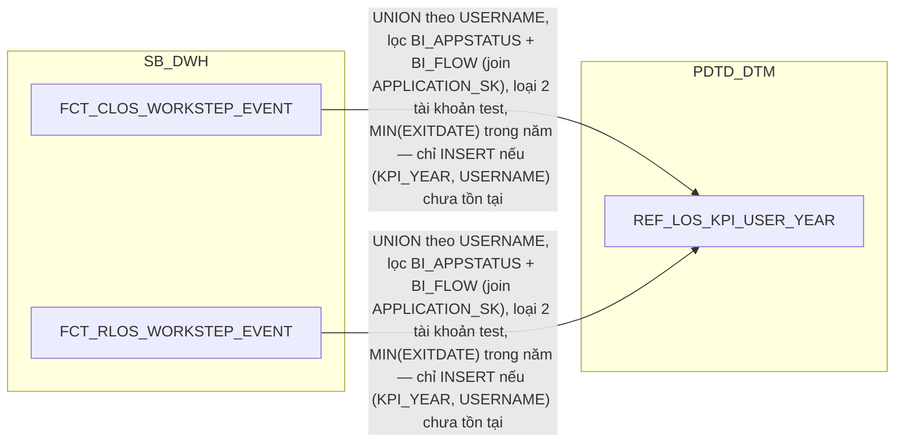

# HLD — REF_ tables (bảng danh mục dùng chung)

**Trích xuất từ:** `hld/HLD_Table_Design.md` (nguồn tổng, giữ nguyên không xóa)
**Phạm vi:** REF_LOS_KPI_USER_YEAR (2.1.7 PDTD_DTM), 10 bảng REF_/TMP_REF_/Q_RLOS_REF_ (2.4 PDTD_DTM, bổ sung REF_PHAN_LOAI_DDE — review 2026-09-18).
**Ghi chú:** nhóm này dùng chung giữa CLOS/RLOS (và một số giữa SB_DWH/PDTD_DTM), nên tách riêng khỏi 4 file DIM/FCT theo layer để tránh trùng lặp.
**Quy ước đồng bộ:** sửa nội dung tại file này TRƯỚC, sau đó copy đoạn đã sửa về đúng vị trí tương ứng trong `hld/HLD_Table_Design.md`. Section 3 (Vấn đề mở) chỉ quản lý tại file tổng, không lặp ở đây.

---

## 2.1.7 REF_LOS_KPI_USER_YEAR

### Data Lineage

##### 2.1.7 REF_LOS_KPI_USER_YEAR — ĐỔI KIẾN TRÚC (đổi từ FCT_LOS_KPI_USER_YEAR sang bảng danh mục REF_, bỏ DAYID khỏi khóa)

**Ghi chú lineage — đổi từ FCT sang REF_ theo yêu cầu người dùng:** tài
liệu lineage gốc (`FCT_PDTD_KPI_USER_YEAR`) thiết kế bảng này với PK
`DAYID + KPI_YEAR + USERNAME`, nhưng bản chất không có metric nào biến
đổi theo `DAYID` — đây thuần túy là **danh sách user đã tham gia xử lý
trong năm** (registry/seed), không phải bảng sự kiện đo lường theo
ngày. Người dùng xác nhận: bỏ `DAYID` khỏi khóa, chỉ giữ `KPI_YEAR +
USERNAME` làm PK, đổi tiền tố `FCT_` → `REF_` cho đồng bộ nhóm bảng
danh mục đặt tại PDTD_DTM. Lưu ý khác biệt so với 9 bảng `REF_` gốc
(`REF_RLOS_FLOW`...): 9 bảng đó là danh mục TĨNH, khởi tạo/cập nhật THỦ
CÔNG bởi BA, không qua ETL — còn `REF_LOS_KPI_USER_YEAR` vẫn giữ nguyên
cơ chế ETL TỰ ĐỘNG (INSERT-if-not-exists chạy mỗi ngày), chỉ mượn tiền
tố `REF_` theo đúng yêu cầu người dùng để thể hiện đây là bảng danh mục
nhỏ tại PDTD_DTM, không phải fact đo lường theo ngày như `FCT_`. Nguồn:
UNION
`FCT_CLOS_WORKSTEP_EVENT`/`FCT_RLOS_WORKSTEP_EVENT` (thay
`FCT_PDTD_WORKSTEP_EVENT` gộp cũ, theo đúng 2 bảng đã tách CLOS/RLOS ở
2.2.2.6/2.3.2.7), lọc đúng 8 workstep (`DetailDataEntry`,
`DataInputerChecker`, `UnderwriterMaker`, `UnderwriterChecker`,
`PhoneVerification`, `CreditApproval`, `CreditCommittee`, `HOSupport`)
theo công thức `NHAN_SU` của SRS BC9.

**Bổ sung 2 điều kiện lọc còn thiếu (review 2026-09-17):** đối chiếu lại
nguyên văn SRS BC9 phát hiện công thức `NHAN_SU` có đủ 4 điều kiện, HLD
trước đó chỉ mới thiết kế 2 (8 workstep + loại 2 tài khoản test):
- `BI_APPSTATUS`: `(DECISION_CODE IN ('Submit','Send To PostSanction',
  'Submit To DisbursementMaker','Send To HOSupport') OR DECISION_CODE =
  'Reject' OR WORKSTEP_CODE IN ('CancelRevoke','CancelPermanent'))` —
  dùng thẳng cột `DECISION_CODE`/`WORKSTEP_CODE` đã có sẵn trên
  `FCT_CLOS_WORKSTEP_EVENT`/`FCT_RLOS_WORKSTEP_EVENT`, không cần join
  thêm.
- `BI_FLOW IN ('BL','KHCN_HO')`: JOIN `APPLICATION_SK` (đã có sẵn trên
  `FCT_CLOS/RLOS_WORKSTEP_EVENT`) sang `DIM_CLOS_APPLICATION.BI_FLOW`/
  `DIM_RLOS_APPLICATION.BI_FLOW` (2.2.1.1/2.3.1.1) — cùng cột `BI_FLOW`
  đã dùng cho điều kiện lọc `SLHS_RLOS_DAY`/`SLGN_RLOS_DAY` tại
  `AGG_LOS_KPI_YTD_DAILY` (2.1.8).

Thiếu 2 điều kiện này sẽ làm `NHAN_SU` đếm dư user chỉ xử lý hồ sơ ngoài
phạm vi luồng BL/KHCN_HO hoặc hồ sơ chưa có quyết định hợp lệ (đang xử lý
dở dang, không thuộc nhóm DECISION được chấp nhận/hủy) — sai lệch KPI
năng suất lao động (`NSLD`) của cả Khối PDTD.

**Loại 2 tài khoản test/kỹ thuật
`USERNAME NOT IN ('hanh.nh2','hai.bt2')`** ngay tại nguồn UNION — theo
đúng công thức `NHAN_SU` gốc, đây là loại trực tiếp DÒNG có username
đó (đếm theo user), khác với `IS_TEST_ACCOUNT` trên `AGG_LOS_KPI_
APPLICATION` (2.1.9, loại theo HỒ SƠ cho `SLHS_*`/`SLGN_*`/`TAT_*`) —
2 tài khoản này không bao giờ được INSERT vào bảng, không phải lọc khi
đếm. Quy tắc load: mỗi lần chạy, với mỗi `USERNAME` mới xuất hiện
(đã lọc đủ 4 điều kiện: 8 workstep, BI_APPSTATUS, BI_FLOW, loại 2 tài
khoản test), kiểm tra `(KPI_YEAR, USERNAME)` đã tồn
tại chưa — chưa có thì INSERT kèm `FIRST_ELIGIBLE_TS` = thời điểm đầu
tiên trong năm user đó thỏa điều kiện; đã có thì bỏ qua, không UPDATE.

### Column Design

##### 2.1.7 REF_LOS_KPI_USER_YEAR — ĐỔI KIẾN TRÚC (đổi từ FCT_LOS_KPI_USER_YEAR sang bảng danh mục REF_, bỏ DAYID khỏi khóa)

**Bảng cũ (trước tách):** `FCT_PDTD_KPI_USER_YEAR` (PK `DAYID + KPI_YEAR + USERNAME`) — đổi kiến trúc theo yêu cầu người dùng: bỏ `DAYID` khỏi khóa (bảng không có metric biến đổi theo ngày, chỉ là danh sách user/năm), đổi tiền tố `FCT_` → `REF_` cho đồng bộ nhóm bảng danh mục tại PDTD_DTM — riêng bảng này vẫn giữ cơ chế ETL tự động (INSERT-if-not-exists), khác 9 bảng `REF_` gốc (khởi tạo/cập nhật thủ công bởi BA, xem 2.4)

| STT | Tên cột | Kiểu dữ liệu | Bắt buộc | Độ lớn | Khóa | Mô tả |
| --- | --- | --- | --- | --- | --- | --- |
| 1 | KPI_YEAR | NUMBER | Y | 4 | PK | Năm KPI — tập user reset vào 1/1 hằng năm |
| 2 | USERNAME | VARCHAR2 | Y | 100 | PK | Tên tài khoản cán bộ xử lý hồ sơ — nguồn UNION FCT_CLOS_WORKSTEP_EVENT.USERNAME/FCT_RLOS_WORKSTEP_EVENT.USERNAME |
| 3 | FIRST_ELIGIBLE_TS | TIMESTAMP | Y |  |  | Thời điểm đầu tiên trong năm user xử lý 1 bước thuộc phạm vi tính nhân sự (8 workstep) — quyết định user được tính vào năm nào và ngày nào trên AGG_LOS_KPI_YTD_DAILY.NEW_USER_CNT_DAY |

- Bảng danh mục (registry) lưu tập user phân biệt đã tham gia xử lý hồ sơ, lũy kế theo năm — để `NHAN_SU` không phải đếm lại DISTINCT từ đầu năm mỗi ngày. Không phải bảng sự kiện đo lường theo `DAYID`. Phục vụ BC9 (đầu vào `NHAN_SU`/`NEW_USER_CNT_DAY` của `AGG_LOS_KPI_YTD_DAILY`, 2.1.8).
- Khóa chính của bảng (PK): **KPI_YEAR, USERNAME**. UNIQUE tự nhiên (đúng bằng PK).

**Đã bỏ `USER_SK` (review 2026-09-17):** người dùng xác nhận mục đích
báo cáo (`NHAN_SU`) chỉ cần đếm số lượng user phân biệt trong năm, không
cần thông tin chi tiết của từng user — không có nhu cầu join sang
`DIM_LOS_USER`. Cột này cũng không có căn cứ SRS trực tiếp (công thức
`NHAN_SU` chỉ yêu cầu `COUNT(DISTINCT USERNAME)`). Bảng còn đúng 3 cột:
`KPI_YEAR`, `USERNAME`, `FIRST_ELIGIBLE_TS`.

**Quy tắc load:** mỗi lần chạy ETL, với mỗi `USERNAME` phát sinh trong
ngày (theo UNION `FCT_CLOS_WORKSTEP_EVENT`/`FCT_RLOS_WORKSTEP_EVENT`,
lọc `WORKSTEP IN (DetailDataEntry, DataInputerChecker, UnderwriterMaker,
UnderwriterChecker, PhoneVerification, CreditApproval, CreditCommittee,
HOSupport)`), kiểm tra `(KPI_YEAR, USERNAME)` đã tồn tại chưa — **chưa
có thì INSERT** kèm `FIRST_ELIGIBLE_TS` = `MIN(EXITDATE)` của user đó
trong năm; **đã có thì bỏ qua**, không UPDATE (đúng theo yêu cầu người
dùng: "kiểm tra nếu chưa tồn tại thì insert, còn nếu tồn tại thì không
xử lý").

---

#### 2.4 Bộ bảng REF_

Cả 10 bảng dưới đây chỉ tồn tại vật lý ở tầng PDTD_DTM (không có bản
SB_DWH) — không phân theo CHUNG/CLOS/RLOS/DIM/FCT như các nhóm khác. Đây
là **danh mục tĩnh khởi tạo/cập nhật thủ công** từ file Excel/CSV do BA
cung cấp, không phải luồng ETL — không có bước "Data Lineage" ở Section 1
cho nhóm bảng này (khác mọi DIM/FCT khác của tài liệu): BA/DevOps
insert/update trực tiếp lên bảng REF_ tại PDTD_DTM khi khởi tạo lần đầu
hoặc khi danh mục có thay đổi (thêm sản phẩm mới, sửa cam kết SLA...),
không đi qua STG_LOS, không qua CDC, không có job ETL định kỳ. Cột "Mô
tả" bên dưới ghi `nguồn file.<TÊN_CỘT>` nghĩa là cột tương ứng trong file
Excel/CSV gốc.

##### 2.4.1 REF_RLOS_FLOW

| STT | Tên cột | Kiểu dữ liệu | Bắt buộc | Độ lớn | Khóa | Mô tả |
| --- | --- | --- | --- | --- | --- | --- |
| 1 | STREAM | VARCHAR2 | Y | 200 | PK | Luồng nghiệp vụ của hồ sơ — nguồn file.STREAM |
| 2 | BI_FLOW | VARCHAR2 | Y | 100 |  | Luồng nghiệp vụ chuẩn hóa để hiển thị trên báo cáo — nguồn file.BI_FLOW. Giá trị quan sát được: KHCN_HO, BL |

- Bảng REF map luồng nghiệp vụ (STREAM) của hồ sơ RLOS sang phân nhóm chuẩn hóa (BI_FLOW) dùng để chia báo cáo theo khối, dùng cho hệ RLOS.
- Khóa chính của bảng (PK): **STREAM**.

##### 2.4.2 REF_CLOS_LEGAL

| STT | Tên cột | Kiểu dữ liệu | Bắt buộc | Độ lớn | Khóa | Mô tả |
| --- | --- | --- | --- | --- | --- | --- |
| 1 | OBJ_TYPE | VARCHAR2 | Y | 50 | PK | Loại đối tượng của giấy tờ pháp lý — nguồn file.OBJ_TYPE, ví dụ Người đại diện theo pháp luật, Khách hàng |
| 2 | LEGAL_TYPE | VARCHAR2 | Y | 50 |  | Nhóm vai trò của giấy tờ pháp lý — nguồn file.LEGAL_TYPE. BC2 lọc LEGAL_TYPE = 'CUSTOMER' để chỉ lấy giấy tờ của chính khách hàng khi tra CIF |

- Bảng REF map vai trò pháp lý của người liên quan (OBJ_TYPE) sang nhóm vai trò chuẩn hóa (LEGAL_TYPE), dùng để tra CIF khách hàng, dùng cho hệ CLOS.
- Khóa chính của bảng (PK): **OBJ_TYPE**.

##### 2.4.3 TMP_REF_COMPANY_REGION_KHCN

| STT | Tên cột | Kiểu dữ liệu | Bắt buộc | Độ lớn | Khóa | Mô tả |
| --- | --- | --- | --- | --- | --- | --- |
| 1 | COMPANY_CODE | VARCHAR2 | Y | 20 | PK | Mã đơn vị kinh doanh — nguồn file.COMPANY_CODE |
| 2 | DVKD | VARCHAR2 | Y | 50 |  | Tên đơn vị kinh doanh — nguồn file.DVKD, ví dụ Sở Giao Dịch |
| 3 | CHI_NHANH | VARCHAR2 | Y | 50 |  | Tên chi nhánh quản lý đơn vị — nguồn file.CHI_NHANH |
| 4 | VUNG | VARCHAR2 | Y | 30 |  | Tên vùng — nguồn file.VUNG, đổ vào trường ZONE của BC10 |

- Bảng REF map đơn vị kinh doanh sang chi nhánh và vùng, dùng cho luồng khách hàng cá nhân (BC10), dùng cho hệ RLOS.
- Khóa chính của bảng (PK): **COMPANY_CODE**.

##### 2.4.4 TMP_REF_COMPANY_REGION_KHDN

| STT | Tên cột | Kiểu dữ liệu | Bắt buộc | Độ lớn | Khóa | Mô tả |
| --- | --- | --- | --- | --- | --- | --- |
| 1 | COMPANY_CODE | VARCHAR2 | Y | 20 | PK | Mã đơn vị kinh doanh — nguồn file.COMPANY_CODE |
| 2 | TEN_CN_T24 | VARCHAR2 | Y | 50 |  | Tên chi nhánh theo cách T24 ghi — nguồn file.TEN_CN_T24, ví dụ AN GIANG BRANCH |
| 3 | TRUNG_TAM | VARCHAR2 | Y | 50 |  | Tên trung tâm khách hàng doanh nghiệp — nguồn file.Trung_tam, ví dụ TT KHDN An Giang |
| 4 | VUNG | VARCHAR2 | Y | 50 |  | Tên vùng — nguồn file.Vung, đổ vào trường ZONE của BC11. Giá trị: Miền Bắc, Miền Nam, Hà Nội |

- Bảng REF map đơn vị kinh doanh sang trung tâm và vùng, dùng cho luồng khách hàng doanh nghiệp (BC11), dùng cho hệ CLOS.
- Khóa chính của bảng (PK): **COMPANY_CODE**.

##### 2.4.5 RLOS_REF_SLA_TDKHCN

| STT | Tên cột | Kiểu dữ liệu | Bắt buộc | Độ lớn | Khóa | Mô tả |
| --- | --- | --- | --- | --- | --- | --- |
| 1 | REF_PRODUCT | NVARCHAR2 | Y | 200 | UK | Nhóm sản phẩm dùng để tra cam kết SLA — nguồn file.REF_PRODUCT, ví dụ Unsecured_CreditCard, Unsecured-loan |
| 2 | PRODUCT_LINE | NVARCHAR2 | Y | 200 | UK | Dòng sản phẩm theo cách LOS hiển thị — nguồn file.Product_Line, ví dụ SeAHome-TTD |
| 3 | CHANGE_TYPE | NVARCHAR2 | N | 200 | UK | Loại thay đổi điều kiện phê duyệt — nguồn file.Change_Type. Để trống nghĩa là áp cho mọi loại thay đổi |
| 4 | DEVIATION_G3 | VARCHAR2 | N | 10 | UK | Hồ sơ có từ 3 ngoại lệ chính sách trở lên hay không — nguồn file.DEVIATION_G3. Để trống nghĩa là áp cho mọi tình trạng |
| 5 | SECONDARY_PRODUCTLINE | VARCHAR2 | N | 10 | UK | Sản phẩm phụ đi kèm hay không — nguồn file.SECONDARY_PRODUCTLINE. Để trống nghĩa là áp cho mọi trường hợp |
| 6 | SLA_CREDIT_OFFICER | NUMBER | N | 10,2 |  | Cam kết giờ cho chuyên viên tín dụng — nguồn file.SLA_CREDIT_OFFICER, đơn vị giờ |
| 7 | SLA_MARKER | NUMBER | N | 10,2 |  | Cam kết giờ cho bước lập hồ sơ thẩm định — nguồn file.SLA_MARKER, đơn vị giờ |
| 8 | SLA_CHECKER | NUMBER | N | 10,2 |  | Cam kết giờ cho bước kiểm soát thẩm định — nguồn file.SLA_CHECKER, đơn vị giờ |
| 9 | SLA_CREDIT_APPROVER | NUMBER | N | 10,2 |  | Cam kết giờ cho cấp phê duyệt — nguồn file.SLA_CREDIT_APPROVER, đơn vị giờ |
| 10 | APP_GRP | NVARCHAR2 | Y | 200 | UK | Cấp thẩm quyền áp dụng — nguồn file.APP_GRP, ví dụ CGPD cấp B,C (B1, B2, C1, C2) |

- Bảng REF cam kết SLA cho luồng khách hàng cá nhân RLOS, 1 dòng = 1 tổ hợp REF_PRODUCT + PRODUCT_LINE + CHANGE_TYPE + DEVIATION_G3 + SECONDARY_PRODUCTLINE + APP_GRP, dùng cho hệ RLOS.
- Khóa chính của bảng (PK): **UNIQUE (REF_PRODUCT, PRODUCT_LINE, CHANGE_TYPE, DEVIATION_G3, SECONDARY_PRODUCTLINE, APP_GRP)**; không có PK kỹ thuật riêng.

##### 2.4.6 CLOS_REF_SLA_TDKHDNL

| STT | Tên cột | Kiểu dữ liệu | Bắt buộc | Độ lớn | Khóa | Mô tả |
| --- | --- | --- | --- | --- | --- | --- |
| 1 | REF_PRODUCT | NVARCHAR2 | Y | 200 | UK | Nhóm sản phẩm dùng để tra cam kết SLA — nguồn file.REF_PRODUCT, ví dụ Cấp tín dụng món ngắn hạn, Hạn mức STK |
| 2 | PRODUCT_LINE | NVARCHAR2 | Y | 200 | UK | Dòng sản phẩm — nguồn file.Product_Line, ví dụ Cấp tín dụng ngắn hạn, Hạn mức |
| 3 | SUB_PRODUCT | NVARCHAR2 | N | 200 | UK | Sản phẩm nhánh — nguồn file.Sub_Product, ví dụ Vay cầm cố GTCG theo món. Để trống nghĩa là áp cho mọi sản phẩm nhánh |
| 4 | HAVE_ANY_DEVIATION | NVARCHAR2 | Y | 200 | UK | Hồ sơ có ngoại lệ hay không — nguồn file.Have_any_deviation. Giá trị quan sát được: Có, Không |
| 5 | SLA_CREDIT_OFFICER | NUMBER | N | 10,2 |  | Cam kết giờ cho chuyên viên tín dụng — nguồn file.SLA_CREDIT_OFFICER, đơn vị giờ |
| 6 | SLA_MARKER | NUMBER | N | 10,2 |  | Cam kết giờ cho bước lập hồ sơ thẩm định — nguồn file.SLA_MARKER, đơn vị giờ |
| 7 | SLA_CHECKER | NUMBER | N | 10,2 |  | Cam kết giờ cho bước kiểm soát thẩm định — nguồn file.SLA_CHECKER, đơn vị giờ |
| 8 | SLA_CREDIT_APPROVER | NUMBER | N | 10,2 |  | Cam kết giờ cho cấp phê duyệt — nguồn file.SLA_CREDIT_APPROVER, đơn vị giờ |
| 9 | FLAG_APP_GRP | NVARCHAR2 | Y | 200 | UK | Cấp thẩm quyền áp dụng — nguồn file.FLAG_APP_GRP, ví dụ CGPD (A1, A2, B1, B2) |

- Bảng REF cam kết SLA cho hồ sơ CLOS doanh nghiệp lớn/định chế (`CUST_GROUP IN ('NBFI','JSC','FDI','BANK','STR','SOC')`), 1 dòng = 1 tổ hợp REF_PRODUCT + PRODUCT_LINE + SUB_PRODUCT + HAVE_ANY_DEVIATION + FLAG_APP_GRP, dùng cho hệ CLOS.
- Khóa chính của bảng (PK): **UNIQUE (REF_PRODUCT, PRODUCT_LINE, SUB_PRODUCT, HAVE_ANY_DEVIATION, FLAG_APP_GRP)**; không có PK kỹ thuật riêng.

**✅ ĐÃ GIẢI QUYẾT (trước đây "⚠️ CHỜ RULE BA" — ghi nhận nguyên văn từ
tài liệu nguồn):** đối chiếu SRS BC5 (BR 1.2) và xác nhận trực tiếp từ BA
— quy tắc chọn giữa bảng này và `CLOS_REF_SLA_TDKHDN` (2.4.7) là theo
`CUST_GROUP` của hồ sơ CLOS (xem chi tiết + trích SRS tại Section 1 →
2.4.6, và Section 3 dòng #13).

##### 2.4.7 CLOS_REF_SLA_TDKHDN

Cấu trúc cột **giống hệt** `CLOS_REF_SLA_TDKHDNL` (2.4.6) — cùng 9 cột,
cùng khóa UNIQUE (REF_PRODUCT, PRODUCT_LINE, SUB_PRODUCT,
HAVE_ANY_DEVIATION, FLAG_APP_GRP). Khác biệt duy nhất là dữ liệu — cam kết
SLA cho hồ sơ CLOS doanh nghiệp vừa/nhỏ (`CUST_GROUP IN
('MSME','SME','USME')`). Đã xác nhận đúng 36 dòng qua file dữ liệu thật
`input/BC5TAT - Team PDTD cung cấp(cam kết SLA TDKHDN luồng 2).csv` — cột
`FLAG (APP_GRP)` chỉ quan sát được 2 giá trị thật: `CGPD`, `BOD/CC`.

- Bảng REF cam kết SLA cho hồ sơ CLOS doanh nghiệp vừa/nhỏ (`CUST_GROUP IN ('MSME','SME','USME')`), cùng cấu trúc với `CLOS_REF_SLA_TDKHDNL`, dùng cho hệ CLOS.
- Khóa chính của bảng (PK): **UNIQUE (REF_PRODUCT, PRODUCT_LINE, SUB_PRODUCT, HAVE_ANY_DEVIATION, FLAG_APP_GRP)**; không có PK kỹ thuật riêng.

**✅ ĐÃ GIẢI QUYẾT:** xem quy tắc chọn bảng đầy đủ ở 2.4.6 và Section 3
dòng #13.

**Ghi chú riêng — trường hợp `APP_GRP = 'C1'` (SRS gọi là "sheet cam kết
SLA TDKHDN luồng 1"):** theo SRS BC5, có 1 sheet thứ ba trong `BC5TAT.xlsx`
chỉ chứa `REF_PRODUCT` cho hồ sơ có `APP_GRP='C1'` — BA xác nhận trực tiếp:
sheet này chỉ có 1 giá trị SLA duy nhất (hằng số 4 giờ cho mọi vai trò:
`SLA_CREDIT_OFFICER`/`SLA_MARKER`/`SLA_CHECKER`/`SLA_CREDIT_APPROVER`), còn
`REF_PRODUCT` của nó kế thừa hoàn toàn từ chính bảng này
(`CLOS_REF_SLA_TDKHDN`, tra theo `PRODUCT_LINE`+`SUB_PRODUCT`) — không có
dữ liệu độc lập nào khác. Vì vậy **không tạo bảng REF_ vật lý riêng cho
"luồng 1"** — giữ đúng 9 bảng REF_ đã liệt kê trong split-proposal. Khi hồ
sơ có `APP_GRP='C1'`: `REF_PRODUCT` vẫn lookup bình thường vào
`CLOS_REF_SLA_TDKHDN`; còn 4 cột `SLA_*` dùng hằng số cứng = 4 giờ trong
công thức PHÁI SINH tại `DIM_CLOS_APPLICATION` (2.2.1.1), không lookup
bảng nào — xác nhận trực tiếp với người dùng. Dữ liệu thật quan sát trên
file CSV nguồn cho 36 dòng hiện có của `CLOS_REF_SLA_TDKHDN`: cột `FLAG
(APP_GRP)` chỉ có 2 giá trị `CGPD` và `BOD/CC` (không có `C1` — đúng vì
`C1` không tra bảng này cho SLA, chỉ tra `REF_PRODUCT`).

##### 2.4.8 REF_SLA_NLTT

| STT | Tên cột | Kiểu dữ liệu | Bắt buộc | Độ lớn | Khóa | Mô tả |
| --- | --- | --- | --- | --- | --- | --- |
| 1 | REF_PRODUCT | NVARCHAR2 | Y | 200 | UK | Nhóm sản phẩm dùng để tra cam kết SLA — nguồn file.REF_PRODUCT |
| 2 | PRODUCT_LINE | NVARCHAR2 | Y | 200 | UK | Dòng sản phẩm — nguồn file.Product_Line, ví dụ SeAHome-TTD |
| 3 | POLICY | NVARCHAR2 | N | 200 | UK | Chính sách tín dụng áp dụng cho hồ sơ — nguồn file.Policy, ví dụ THETD.THU.NHAP. Ký tự * nghĩa là khớp theo mẫu |
| 4 | SUB_PRODUCT | NVARCHAR2 | N | 200 | UK | Sản phẩm nhánh — nguồn file.Sub_Product. Để trống nghĩa là áp cho mọi sản phẩm nhánh |
| 5 | NEW_CHANGE_REQUEST | NVARCHAR2 | Y | 200 | UK | Loại yêu cầu — nguồn file.New_Change_Request, ví dụ New cho hồ sơ mới |
| 6 | SLA_DE_RESULT | NUMBER | N | 10,2 |  | Cam kết giờ cho bước nhập liệu chi tiết — nguồn file.SLA_DE_RESULT. Tên cột có hậu tố RESULT nhưng đây là số giờ cam kết, không phải kết quả đạt/không đạt |
| 7 | SLA_QC_RESULT | NUMBER | N | 10,2 |  | Cam kết giờ cho bước kiểm soát nhập liệu — nguồn file.SLA_QC_RESULT. Cũng là số giờ, không phải kết quả |
| 8 | SLA_DE_TOTAL_RESULT | NUMBER | N | 10,2 |  | Cam kết giờ cho cả khâu nhập liệu, bằng tổng SLA_DE_RESULT + SLA_QC_RESULT — nguồn file.SLA_DE_TOTAL_RESULT. Là 1 thành phần của POINT ở BC9 |
| 9 | QD_DDE | NUMBER | N | 10,2 |  | Điểm quy đổi năng suất bước nhập liệu — nguồn file.QD_DDE |
| 10 | QD_QC | NUMBER | N | 10,2 |  | Điểm quy đổi năng suất bước kiểm soát nhập liệu — nguồn file.QD_QC |
| 11 | SYSTEM_CODE | VARCHAR2 | Y | 10 | UK | Hệ nguồn của dòng cam kết: CLOS hoặc RLOS — nguồn file.SYSTEM_CODE |

- Bảng REF cam kết SLA và điểm quy đổi cho 2 bước nhập liệu/kiểm soát nhập liệu, 1 dòng = 1 tổ hợp REF_PRODUCT + PRODUCT_LINE + POLICY + SUB_PRODUCT + NEW_CHANGE_REQUEST + SYSTEM_CODE, dùng chung cho cả 2 hệ (cột SYSTEM_CODE phân biệt CLOS/RLOS).
- Khóa chính của bảng (PK): **UNIQUE (REF_PRODUCT, PRODUCT_LINE, POLICY, SUB_PRODUCT, NEW_CHANGE_REQUEST, SYSTEM_CODE)**; không có PK kỹ thuật riêng.

**Lưu ý phân biệt với `Q_RLOS_REF_WORKSTEP_2SYSTEMS` (2.4.9):** ở bảng
này, cột `SYSTEM_CODE` THẬT SỰ là 1 phần khóa UK và phân biệt CLOS/RLOS của
từng dòng cam kết — khác với cột `SYSTEM` ở 2.4.9 (không phải cờ phân biệt
hệ, xem ghi chú ở đó). Không nhầm lẫn 2 cột tên gần giống nhau ở 2 bảng REF_
khác nhau.

**✅ ĐÃ GIẢI QUYẾT (review 2026-09-21) — cách khai thác: report-time
lookup, KHÔNG denormalize vào DIM (cả 2 hệ), đóng gap CLOS chưa từng
được thiết kế:** trước đây `SLA_DE_RESULT`/`SLA_QC_RESULT`/`SLA_DE_
TOTAL_RESULT` chỉ được thiết kế cho nhánh RLOS (denormalize vào
`DIM_RLOS_APPLICATION`, xem lịch sử tại `hld/HLD_Table_Design.md`
Section 1 → 2.3.1.1) — nhánh CLOS chưa từng có bất kỳ đường JOIN vào
bảng này dù SRS BC5/BC9 yêu cầu rõ (đọc trực tiếp từ bảng lồng "Các
bảng sử dụng" BR 1.2 của SRS BC5, trước đây bị bỏ sót vì chỉ đọc dòng
RLOS liền kề). Quyết định người dùng: bỏ hẳn việc denormalize cho cả 2
hệ — báo cáo (BC5, và `POINT` của BC9 tại `AGG_LOS_KPI_APPLICATION`)
tự `LEFT JOIN` bảng này **tại thời điểm truy vấn**, theo đúng khóa đã
xác nhận từ dữ liệu seed thật (`input/BC5TAT(REF_SLA).xlsx`, sheet
"cam kết SLA NLTT"):

- **Nhánh RLOS:** `PRODUCT_LINE = DIM_RLOS_PRODUCT.PRODUCT_LINE_NAME`
  (qua `FCT_RLOS_APPLICATION_DAILY.PRODUCT_SK`) + `SYSTEM_CODE='RLOS'`.
  Seed thật xác nhận unique theo đúng `PRODUCT_LINE` (28 dòng, mỗi
  `Product Line` xuất hiện đúng 1 lần) — không còn rủi ro 1:N.
- **Nhánh CLOS:** `PRODUCT_LINE = DIM_CLOS_PRODUCT.PRODUCT_LINE_NAME`
  + `(SUB_PRODUCT IS NULL OR SUB_PRODUCT = DIM_CLOS_PRODUCT.PRODUCT_
  NAME)` (qua `FCT_CLOS_APPLICATION_DAILY.PRODUCT_SK`) + `NEW_CHANGE_
  REQUEST = DIM_CLOS_APPLICATION.CHANGE_REQUEST` (qua `APPLICATION_SK`)
  + `SYSTEM_CODE='CLOS'`. Seed thật (16 dòng) xác nhận unique theo tổ
  hợp 3 cột này, không cần `REF_PRODUCT`/`POLICY`.
- Cả 2 nhánh **không dùng cột `REF_PRODUCT`/`POLICY`** làm khóa tra cho
  nhóm SLA nhập liệu tập trung — 2 cột này vẫn giữ trong khai báo cấu
  trúc bảng (không đổi trong lần sửa này) nhưng không phải điều kiện
  JOIN thật.
- `QD_DDE`/`QD_QC` dùng chung đúng 1 điều kiện JOIN với `SLA_DE_RESULT`
  ở trên — trước đây chưa từng được join/gán vào bất kỳ DIM/FCT nào ở
  cả 2 hệ, nay cùng đóng gap.

Chi tiết đầy đủ (mermaid, lịch sử PENDING #12/#46/#56/#57) xem tại
`hld/HLD_Table_Design.md` Section 1/2/3.

##### 2.4.9 Q_RLOS_REF_WORKSTEP_2SYSTEMS

| STT | Tên cột | Kiểu dữ liệu | Bắt buộc | Độ lớn | Khóa | Mô tả |
| --- | --- | --- | --- | --- | --- | --- |
| 1 | SYSTEM | VARCHAR2 | Y | 10 |  | Hệ sở hữu/nạp bảng map này — nguồn file.SYSTEM. Giá trị quan sát được: OF. KHÔNG phải cờ phân biệt CLOS/RLOS của dữ liệu — xem ghi chú bên dưới |
| 2 | IDFLOW | VARCHAR2 | N | 10 |  | Mã luồng xử lý — nguồn file.IDFLOW, ví dụ 12 cho luồng giải ngân |
| 3 | WORKSTEP | VARCHAR2 | Y | 50 |  | Tên bước xử lý theo đúng cách LOS ghi — nguồn file.WORKSTEP, ví dụ DisbursementMaker |
| 4 | BI_WORKSTEP | VARCHAR2 | N | 50 |  | Tên bước chuẩn hóa để hiển thị trên báo cáo — nguồn file.BI_WORKSTEP, ví dụ 12.Disbursement-Maker |
| 5 | DECISION | VARCHAR2 | N | 100 |  | Quyết định tại bước xử lý — nguồn file.DECISION. Cùng 1 bước có nhiều quyết định nên phải nằm trong tổ hợp tra |

- Bảng REF map bước xử lý và quyết định của cả 2 hệ CLOS, RLOS về 1 tên bước chuẩn hóa dùng chung trên báo cáo, 1 dòng = 1 tổ hợp SYSTEM + IDFLOW + WORKSTEP + DECISION, dùng chung cho cả 2 hệ.
- Khóa chính của bảng (PK): không khai PK/UNIQUE trên DDL gốc — tra theo tổ hợp **WORKSTEP** (+ **DECISION** khi cần phân biệt nhiều quyết định cùng 1 bước).

**Đã xác nhận với người dùng — cột `SYSTEM` KHÔNG phải cờ phân biệt
CLOS/RLOS:** tài liệu nguồn ghi cột này chỉ quan sát được giá trị `OF`
trong toàn bộ 132 dòng dữ liệu — đây là cột nội bộ của chính bảng map này
(hệ sở hữu/nạp file map), không phải cờ đánh dấu dòng dữ liệu thuộc CLOS
hay RLOS. Việc phân biệt CLOS/RLOS khi tra bảng này nằm ở phía DIM/FCT gọi
join (đã biết trước đang xử lý hồ sơ hệ nào), **không dùng điều kiện
`WHERE SYSTEM = ...`**. `IDFLOW` là cột phân biệt luồng xử lý thật sự
trong bảng này (ví dụ 12 = luồng giải ngân), không phải `SYSTEM`. Mọi join từ
`DIM_CLOS_WORKSTEP`/`DIM_RLOS_WORKSTEP` (2.2.1.3/2.3.1.3) và
`FCT_CLOS_APPLICATION_DAILY`/`FCT_RLOS_APPLICATION_DAILY` (cột
`LAST_WORKSTEP`, 2.2.2.1/2.3.2.1) vào bảng này chỉ dùng `WORKSTEP` (+
`DECISION`), không lọc theo `SYSTEM`.

##### 2.4.10 REF_PHAN_LOAI_DDE — MỚI (review 2026-09-18, SRS BC7 cập nhật)

| STT | Tên cột | Kiểu dữ liệu | Bắt buộc | Độ lớn | Khóa | Mô tả |
| --- | --- | --- | --- | --- | --- | --- |
| 1 | EXCEPTION_CATEGORY | NVARCHAR2 | Y | 500 | UK | Nhóm lý do quyết định (nguyên văn, gồm cả mã tiền tố như BC3-DE-NEW/UW-DE) — nguồn file.EXCEPTION_CATEGORY |
| 2 | SYSTEMNAME | VARCHAR2 | Y | 10 | UK | Hệ nguồn của dòng phân loại: CLOS hoặc RLOS — nguồn file.SYSTEMNAME |
| 3 | PHAN_LOAI_DDE | NVARCHAR2 | Y | 100 |  | Phân loại nguyên nhân trả về ở khâu nhập liệu — nguồn file.PHAN_LOAI_DDE. Chỉ quan sát được 2 giá trị: 'Lỗi Nhập liệu', 'Thiếu Checklist' |

- Bảng REF map nhóm lý do ngoại lệ (`EXCEPTION_CATEGORY`) sang phân loại nguyên nhân nhập liệu chuẩn hóa (`PHAN_LOAI_DDE`) dùng cho BC7, 1 dòng = 1 tổ hợp EXCEPTION_CATEGORY + SYSTEMNAME, dùng chung cho cả 2 hệ (cột SYSTEMNAME phân biệt CLOS/RLOS).
- Khóa chính của bảng (PK): **UNIQUE (EXCEPTION_CATEGORY, SYSTEMNAME)**; không có PK kỹ thuật riêng.

**Mới (review 2026-09-18, theo SRS BC7 cập nhật):** bảng danh mục tĩnh
này thay thế công thức CASE-WHEN cũ của cột `PHAN_LOAI_DDE` trên
`FCT_CLOS_EXCEPTION`/`FCT_RLOS_EXCEPTION` (SB_DWH, 1.2.2.4/1.3.2.5) —
xem chi tiết thay đổi tại `hld/HLD_FCT_SB_DWH.md`. Cấu trúc và dữ liệu
mẫu do người dùng cung cấp trực tiếp (`input/REF_PHAN_LOAI_DDE.xlsx`, 19
dòng seed: 12 dòng RLOS, 7 dòng CLOS) — cùng cơ chế khởi tạo/cập nhật
thủ công bởi BA như 9 bảng REF_ khác trong mục này (không qua ETL/CDC,
BA insert/update trực tiếp khi danh mục lý do ngoại lệ có thay đổi).
