# HLD — Thiết kế chi tiết cấu trúc bảng (SB_DWH / PDTD_DTM)

**Căn cứ quyết định tách bảng:** `output/Table_Split_Proposal_CLOS_RLOS.md`
**Căn cứ cấu trúc/lineage:** `extract/database/`, `extract/SB_DWH/`, `extract/PDTD_DTM/`
**Ngày bắt đầu:** 2026-09-10

Mỗi bảng được thiết kế theo phương pháp: DIM đi từ nguồn → hợp nhất theo đối
tượng nghiệp vụ → xác nhận thuộc tính ổn định/phân loại → chốt DIM; FACT đi từ
nguồn → hợp nhất theo đối tượng phát sinh giao dịch/thời gian → xác nhận grain
ổn định → chốt FACT. Xem chi tiết phương pháp tại
`.claude/skills/design-hld/references/design-method.md`.

---

## Section 1 — Data Lineage (STG_LOS → SB_DWH → PDTD_DTM)

### 1. SB_DWH

#### 1.1 Bộ bảng CHUNG

##### 1.1.1 DIM_LOS_ORG_UNIT — ✅ ĐÃ GIẢI QUYẾT (nguồn: NG_SB_RLOS_MAS_COMPANY/MAS_BRANCH/MAS_REGION, review 2026-09-18)

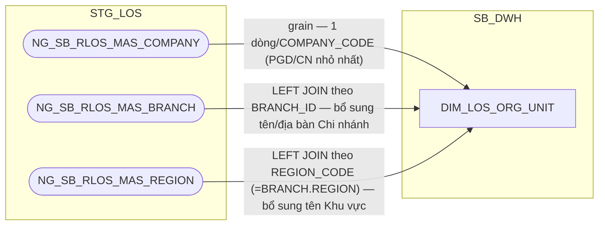

**Đã giải quyết (review 2026-09-18, theo Meeting note 20260909 mục #5):**
nguồn trước đây (`NG_SB_CLOS_CUST_INFO`/`NG_SB_RLOS_APPLICANT_GENERAL` —
giá trị `COMPANY_CODE`/`BRANCH_CODE`/`ZONE` do hồ sơ tự ghi nhận) đã được
xác nhận **không tương ứng với `DIM_COMPANY` (T24)** (BI phản hồi 11/09) và
**thay thế hoàn toàn** bằng 3 bảng danh mục thật do BA LOS cung cấp
(16/09): `NG_SB_RLOS_MAS_COMPANY`, `NG_SB_RLOS_MAS_BRANCH`,
`NG_SB_RLOS_MAS_REGION` — dùng chung cho cả CLOS và RLOS (không có bản
CLOS riêng, cùng đúng bản chất "1 đơn vị kinh doanh vật lý xử lý cả 2 hệ"
đã thiết kế từ đầu).

**Không tách DIM phân cấp riêng (Company/Branch/Region):** theo quyết định
người dùng, vị trí PGD/Chi nhánh/Khu vực là thực thể địa lý cố định (PGD
luôn thuộc đúng 1 Chi nhánh, Chi nhánh luôn thuộc đúng 1 Khu vực, không đổi
theo thời gian) — denormalize cả 3 bảng thành **1 DIM phẳng duy nhất** ở
mức chi tiết nhất (grain = PGD/`COMPANY_CODE`), giữ nguyên kiến trúc
1-DIM-CHUNG đã có, chỉ mở rộng thêm cột từ `MAS_BRANCH`/`MAS_REGION`.

**SCD2 giữ nguyên cơ chế cũ, đổi cách xác định EFF_DATE:** 3 bảng
`MAS_COMPANY`/`MAS_BRANCH`/`MAS_REGION` là bảng danh mục ở STG_LOS,
**không có cột EFF_DATE** do BA khai báo tay (khác `MAP_LOS_USER`/
`MAP_CLOS_PRODUCT`...). Theo quyết định người dùng, `EFF_DATE` của
`DIM_LOS_ORG_UNIT` được ETL tính bằng **CDC** (so sánh bản ghi cũ/mới của 3
bảng nguồn tại mỗi lần chạy) chứ không đọc thẳng từ cột khai báo tay —
khác cơ chế của các DIM ở mục 1.1.2/1.2.1.2-4/1.3.1.2-4 bên dưới (những
DIM đó dùng EFF_DATE do BA/DevOps nhập tay trên chính bảng MAP_).

##### 1.1.2 DIM_LOS_USER — ✅ ĐÃ GIẢI QUYẾT (nguồn: NG_SB_RLOS_MAS_USER, review 2026-09-18)

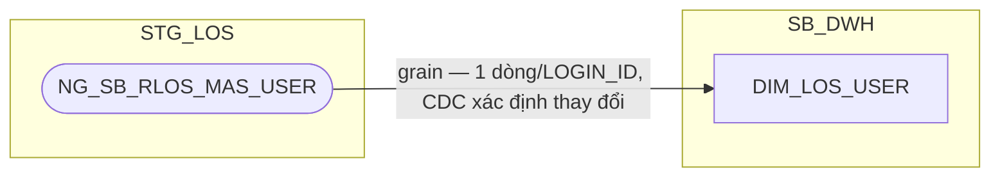

**Đã giải quyết:** `DIM_LOS_USER` lưu danh mục **tài khoản người dùng trên
ứng dụng LOS** (không phải danh sách nhân sự HR). Nguồn nạp trước đây tạm
suy ra qua bảng event log workflow (`NG_SB_CLOS_ENTRY_EXIT`/
`NG_SB_RLOS_ENTRY_EXIT`), sau đó tạm thay bằng bảng khai báo thủ công
`MAP_LOS_USER` (chỉ có `USERNAME`) — nay (review 2026-09-18, theo Meeting
note 20260909 mục #3) BA LOS xác nhận (16/09) dùng bảng danh mục thật
`NG_SB_RLOS_MAS_USER`, dùng chung cho cả CLOS và RLOS (cùng tên gọi
`RLOS` nhưng là danh sách toàn bộ tài khoản LOS, không tách theo hệ) —
**thay thế hoàn toàn** `MAP_LOS_USER`. `ENTRY_EXIT` không còn là nguồn của
DIM này nữa (vẫn tiếp tục là nguồn của các FCT khác như trước).

**Thiết kế dư thừa đầy đủ theo nguồn (review 2026-09-18):** theo quyết
định người dùng (Meeting note mục #15 "thiết kế dư thừa ở Dimension"),
`DIM_LOS_USER` bê nguyên toàn bộ 25 cột nghiệp vụ của `MAS_USER` — không
chỉ `USERNAME` như rà soát SRS trước đây kết luận — để sẵn sàng phục vụ
việc tính KPI/báo cáo phân quyền theo ĐVKD/khối nghiệp vụ (vấn đề #3, #27
Meeting note) dù báo cáo hiện tại chưa khai thác hết. Xem cột chi tiết ở
Section 2.

**SCD2 đổi cách xác định EFF_DATE:** `MAS_USER` không có cột EFF_DATE khai
báo tay như `MAP_LOS_USER` — `EFF_DATE` nay do ETL tính qua **CDC**, cùng
cơ chế đã áp dụng cho `DIM_LOS_ORG_UNIT` (1.1.1). Xem Section 3.


### 1.2 Bộ bảng CLOS

##### 1.2.1 DIM

###### 1.2.1.1 DIM_CLOS_APPLICATION — ✅ ĐÃ GIẢI QUYẾT (xem DQ-11; đã bổ sung CHANGE_TYPE, không tách DIM_CLOS_CHANGE_TYPE; đã bổ sung APP_GRP, HAVE_ANY_DEVIATION — thay thế DIM_CLOS_APPROVAL_GROUP đã loại bỏ)

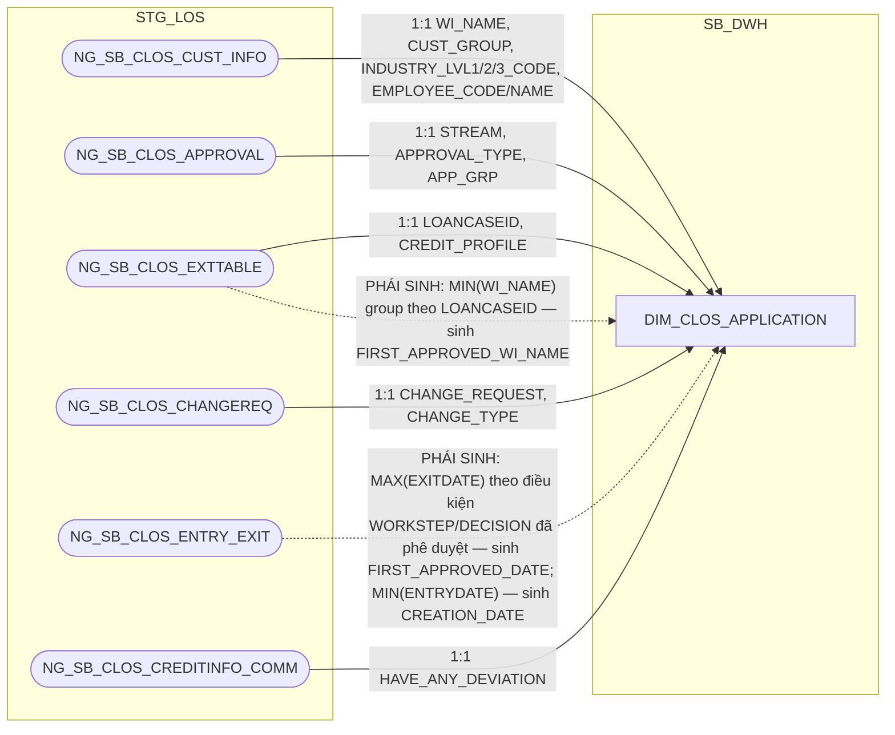

**Đính chính công thức `FIRST_APPROVED_WI_NAME`/`FIRST_APPROVED_DATE`
(review 2026-09-15) — khớp lại đúng SRS BC11:** thiết kế trước đây (kế
thừa từ `extract/SB_DWH/DIM_LOS_APPLICATION.md`, vốn tự ghi chú "LƯU Ý
LỆCH SRS... CẦN BA KÝ NHẬN") dùng công thức "hồ sơ được phê duyệt đầu
tiên theo ENTRYDATE" cho cả 2 cột, khác với nguyên văn SRS BC11:
`APPROVAL_WINAME_LOS` = MIN(WI_NAME) trên `NG_SB_CLOS_EXTTABLE` (group
theo `LOANCASEID`, không lọc WORKSTEP/DECISION), `APPROVAL_DATE` =
MAX(EXITDATE) trên `NG_SB_CLOS_ENTRY_EXIT` (điều kiện `USERNAME IS NOT
NULL AND WORKSTEP IN ('CreditApproval','CreditCommittee') AND DECISION
IN ('Submit','Send To HOSupport','Send To PostSanction')`) — 2 cột độc
lập, không đi cặp cùng 1 bản ghi như thiết kế cũ giả định. Đã sửa lại cả
2 công thức khớp đúng nguyên văn SRS, không còn cảnh báo lệch cần BA ký
nhận. `FCT_CLOS_LOAN_DISBURSEMENT` (2.2.2.7) denormalize trực tiếp 2 cột
này qua `APPLICATION_SK` — nay khớp tuyệt đối BC11, không còn ghi chú
"chấp nhận lệch" như trước.

**Ghi chú lineage — loại bỏ `DIM_CLOS_APPROVAL_GROUP`, bổ sung `APP_GRP` +
`HAVE_ANY_DEVIATION` thẳng lên đây:** kiểm tra lại nguồn `NG_SB_CLOS_APPROVAL`
(RLOS Metadata/CLOS Metadata gốc, sheet Table Review) xác nhận **grain thật
là 1 dòng = 1 hồ sơ** — không phải bảng ghi nhận nhiều lần phê duyệt theo
thời gian như giả định ban đầu khi tạo `DIM_CLOS_APPROVAL_GROUP` (Section 3
dòng #9, nay đã cập nhật). Vì vậy `APP_GRP` (cấp thẩm quyền phê duyệt) là
thuộc tính ổn định của hồ sơ, đọc thẳng từ `NG_SB_CLOS_APPROVAL` — cùng
bảng, cùng cách với `STREAM`/`APPROVAL_TYPE` đã có sẵn ở đây — không cần
một DIM danh mục riêng nữa. `DIM_CLOS_APPROVAL_GROUP` và
`MAP_CLOS_APPROVAL_GROUP` (seed table đi kèm) đã bị loại bỏ hoàn toàn; cột
`APPROVAL_GROUP_SK` cũng bị loại khỏi `FCT_CLOS_APPLICATION_DAILY` (báo
cáo lấy `APP_GRP` bằng JOIN `APPLICATION_SK` sang đây).

`HAVE_ANY_DEVIATION` là cột có sẵn trên `NG_SB_CLOS_CREDITINFO_COMM` (cùng
bảng nguồn đã dùng cho `CREDIT_LIMIT_COMMITTEE` trên
`FCT_CLOS_APPLICATION_DAILY` — bảng ghi tại bước Hội đồng tín dụng, mỗi hồ
sơ 1 dòng, sửa thì ghi đè chứ không sinh dòng mới). Đây là thuộc tính gắn
với hồ sơ (dù chỉ có giá trị từ khi hồ sơ tới bước Hội đồng tín dụng, NULL
ở các phiên bản trước đó — cùng kiểu "thuộc tính đến muộn" như
`RESULT_MAIN_CARD_ID` của `DIM_RLOS_APPLICATION`), không phải giá trị tính
theo giao dịch/theo ngày.

Cả `APP_GRP` và `HAVE_ANY_DEVIATION` dùng làm khóa tra cam kết SLA
(`REF_PRODUCT`/`SLA_*`) khi LEFT JOIN `CLOS_REF_SLA_TDKHDNL`/
`CLOS_REF_SLA_TDKHDN` — việc tra cứu này chỉ thực hiện được ở tầng
PDTD_DTM (REF_ chỉ tồn tại ở đó), xem 2.2.1.1 (Section 1 → PDTD_DTM). SB_DWH
chỉ giữ 2 cột thô này, chưa tính `REF_PRODUCT`/`SLA_*` ở layer này — đã xác
nhận với người dùng, xem Section 3 dòng #13.

**Ghi chú lineage — không tách `DIM_CLOS_CHANGE_TYPE`:** đối chiếu SRS BC2
("Báo cáo CLOS APPLICATION") xác nhận `CHANGE_TYPE` lấy thẳng từ
`NG_SB_CLOS_CHANGEREQ.CHANGE_TYPE`, không qua bảng danh mục nào — khác hẳn
RLOS có `SB_RLOS_MAS_CHANGE_TYPE` là danh mục gốc thật. Metadata CLOS xác
nhận cột này là chuỗi tự do đa giá trị (nhiều loại hạn mức nối bằng `~`,
ví dụ `Hạn mức Chiết khấu~Hạn mức bảo lãnh~`), đã là tên sẵn chứ không phải
mã cần tra tên — không có `DETAIL_CHANGE_TYPE` nào cho CLOS trong SRS. Vì
vậy `CHANGE_TYPE` được giữ làm cột text trực tiếp trên `DIM_CLOS_APPLICATION`
(cùng nguồn `NG_SB_CLOS_CHANGEREQ` với `CHANGE_REQUEST`), không tách thành
DIM riêng — xem Section 3 dòng liên quan.

###### 1.2.1.2 DIM_CLOS_PRODUCT — ✅ ĐÃ GIẢI QUYẾT (nguồn: NG_SB_CLOS_MAS_PRO_LINE/MAS_SUB_PROD, review 2026-09-18)

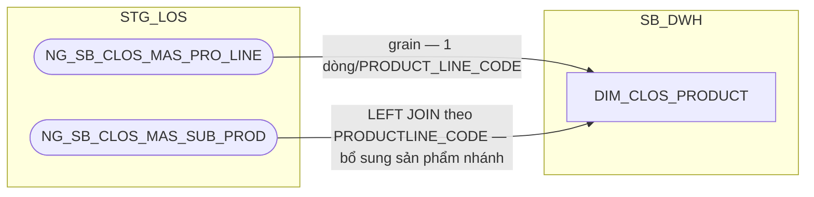

**Đã giải quyết (review 2026-09-18, theo Meeting note 20260909 mục #1):**
nguồn trước đây suy từ `NG_SB_CLOS_CUST_INFO`/`NG_SB_CLOS_EXTTABLE`/
`NG_SB_CLOS_MAS_PRO_LINE` (đều grain-theo-hồ-sơ hoặc chưa xác minh) rồi
tạm thay bằng bảng khai báo thủ công `MAP_CLOS_PRODUCT`; nay BA LOS xác
nhận (16/09) 2 bảng danh mục thật `NG_SB_CLOS_MAS_PRO_LINE` (dòng sản
phẩm) + `NG_SB_CLOS_MAS_SUB_PROD` (sản phẩm nhánh) — **thay thế hoàn
toàn** `MAP_CLOS_PRODUCT`, không cần bảng seed thủ công nữa. Các bảng
`NG_SB_CLOS_CUST_INFO`/`NG_SB_CLOS_EXTTABLE` không còn là nguồn của DIM này
nữa (vẫn tiếp tục phục vụ các bảng khác như `DIM_CLOS_APPLICATION`).

**SCD2 đổi cách xác định EFF_DATE:** `MAS_PRO_LINE`/`MAS_SUB_PROD` không
có cột EFF_DATE khai báo tay như `MAP_CLOS_PRODUCT` trước đây — `EFF_DATE`
nay do ETL tính qua **CDC** (so sánh bản ghi cũ/mới), cùng cơ chế đã áp
dụng cho `DIM_LOS_ORG_UNIT` (1.1.1). Xem Section 3.

###### 1.2.1.3 DIM_CLOS_WORKSTEP — ✅ ĐÃ GIẢI QUYẾT (nguồn: NG_SB_CLOS_MAS_DECISION, review 2026-09-18)

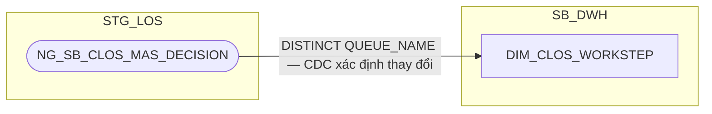

**Đã giải quyết (review 2026-09-18, theo Meeting note 20260909 mục #2):**
nguồn trước đây suy từ `NG_SB_CLOS_ENTRY_EXIT` (bảng lịch sử xử lý, không
phải danh mục bước BPM gốc) rồi tạm thay bằng bảng khai báo thủ công
`MAP_CLOS_WORKSTEP`; nay BA LOS xác nhận (16/09) bảng danh mục thật
`NG_SB_CLOS_MAS_DECISION` — bảng này gộp chung WORKSTEP (`QUEUE_NAME`) và
DECISION (`DECISION`) dạng quan hệ N-N, không có danh mục WORKSTEP độc lập
riêng. Theo quyết định người dùng: **giữ tách 2 DIM** (`DIM_CLOS_WORKSTEP`/
`DIM_CLOS_DECISION`) như thiết kế hiện tại, mỗi DIM suy ra danh mục riêng
bằng `DISTINCT` trên cột tương ứng của cùng bảng nguồn — không gộp thành 1
DIM composite theo đúng cấu trúc N-N của bảng nguồn. `NG_SB_CLOS_ENTRY_EXIT`
không còn là nguồn của DIM này nữa (vẫn tiếp tục phục vụ các FCT khác như
`FCT_CLOS_APPLICATION_DAILY`).

**SCD2 đổi cách xác định EFF_DATE:** cùng cơ chế CDC như 1.2.1.2 (không còn
EFF_DATE khai báo tay của `MAP_CLOS_WORKSTEP`). Xem Section 3.

`WFINSTRUMENTTABLE` vẫn không thuộc phạm vi bảng này — bảng đó chỉ dùng ở
tầng FCT để đối chiếu bước hồ sơ đang đứng hiện tại (`ACTIVITYNAME`) khi
tính cột phái sinh `WORKSTEP_FLAG` (trước đây gọi tắt là "BC4.FLAG") trên
`FCT_*_APPLICATION_DAILY`. **✅ Đã giải quyết (PENDING #6):**
`WFINSTRUMENTTABLE.PROCESSNAME`/`ACTIVITYNAME` đã được nạp trực tiếp vào
`FCT_CLOS_APPLICATION_DAILY`/`FCT_RLOS_APPLICATION_DAILY` (1.2.2.1/
1.3.2.1) để tính `WORKSTEP_FLAG` theo đúng 5 nhánh CASE-WHEN của SRS BC4
— không liên quan tới `DIM_CLOS_WORKSTEP`. **Cập nhật (review
2026-09-21):** nay `WFINSTRUMENTTABLE` cũng LEFT JOIN thêm vào
`FCT_CLOS_WORKSTEP_EVENT`/`FCT_RLOS_WORKSTEP_EVENT` (1.2.2.6/1.3.2.7) để
tính `WORKSTEP_FLAG` độc lập trực tiếp trên bảng event (phục vụ BC4
không cần JOIN fan-out sang `APPLICATION_DAILY` nữa) — cùng công thức,
2 nơi tính độc lập, không phải join chuỗi.

###### 1.2.1.4 DIM_CLOS_DECISION — ✅ ĐÃ GIẢI QUYẾT (nguồn: NG_SB_CLOS_MAS_DECISION, review 2026-09-18)


**Đã giải quyết (review 2026-09-18, theo Meeting note 20260909 mục #2):**
nguồn trước đây suy từ `NG_SB_CLOS_ENTRY_EXIT` (bảng lịch sử xử lý, không
phải danh mục quyết định BPM gốc) rồi tạm thay bằng bảng khai báo thủ công
`MAP_CLOS_DECISION`; nay BA LOS xác nhận (16/09) cùng bảng danh mục thật
`NG_SB_CLOS_MAS_DECISION` đã dùng cho `DIM_CLOS_WORKSTEP` (1.2.1.3) — lấy
`DISTINCT DECISION` từ cùng bảng (xem 1.2.1.3 về lý do giữ tách 2 DIM thay
vì gộp theo đúng quan hệ N-N của bảng nguồn). `NG_SB_CLOS_ENTRY_EXIT` không
còn là nguồn của DIM này nữa (vẫn tiếp tục phục vụ các FCT khác như
`FCT_CLOS_APPLICATION_DAILY`).

**SCD2 đổi cách xác định EFF_DATE:** cùng cơ chế CDC như 1.2.1.3 (không còn
EFF_DATE khai báo tay của `MAP_CLOS_DECISION`). Xem Section 3.

###### 1.2.1.5 DIM_CLOS_EXCEPTION_REASON

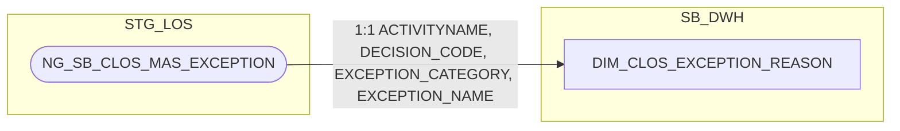

**Ghi chú lineage:** khác với `WORKSTEP`/`DECISION`/`APPROVAL_GROUP`,
`NG_SB_CLOS_MAS_EXCEPTION` mang tiền tố `MAS_` (master) và được lineage
doc gốc xác nhận là bảng LOẠI 1 với khóa CDC khai đủ tổ hợp khóa tự nhiên —
tức đây thực sự là danh mục cấu hình gốc (lý do ngoại lệ được phép phát
sinh tại từng bước/quyết định), không phải bảng sự kiện/giao dịch theo hồ
sơ như `NG_SB_CLOS_ENTRY_EXIT`/`NG_SB_CLOS_APPROVAL`. Do đó **không rơi
vào pattern "application-scoped source"** — giữ nguyên nguồn trực tiếp từ
`NG_SB_CLOS_MAS_EXCEPTION`, không cần bảng `MAP_` seed.

###### 1.2.1.6 DIM_CLOS_COLLATERAL_TYPE

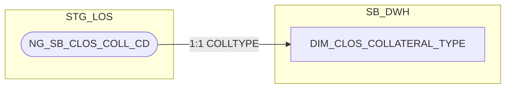

**Ghi chú lineage:** `NG_SB_CLOS_COLL_CD` là bảng danh mục 11 loại TSBĐ
đặc thù doanh nghiệp (`COLLTYPE`), không phải bảng grain-theo-hồ-sơ hay
event log — cùng bản chất danh mục cấu hình gốc như
`NG_SB_CLOS_MAS_EXCEPTION` (1.2.1.6), nên **không rơi vào pattern
"application-scoped source"**. Giữ nguyên nguồn trực tiếp, không cần bảng
`MAP_` seed.

###### 1.2.1.7 DIM_CLOS_CUSTOMER — THAY ĐỔI KIẾN TRÚC (tách khỏi FCT_LOS_APPLICATION_PARTY, không còn là FCT)

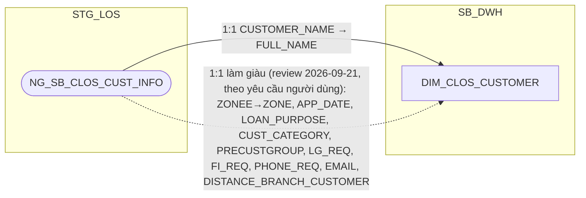

**Ghi chú lineage — đánh giá lại kiến trúc:** `NG_SB_CLOS_CUST_INFO` có
khóa nghiệp vụ thật là `WI_NAME` (khóa kỹ thuật `WI_NAME + EMP_CODE` chỉ
là hiện tượng bàn giao nhân viên xử lý, các báo cáo hạ nguồn luôn lấy dòng
mới nhất theo `WI_NAME` = 1 dòng/hồ sơ, theo CLOS Metadata Table Review) —
đây là quan hệ **1:1 với hồ sơ**, cùng bản chất với `DIM_RLOS_APPLICANT`
(1.3.1.9), khác hẳn `NG_SB_CLOS_CUST_INFO_LEGAL` (1:N thực sự, xem
`DIM_CLOS_LEGAL_PARTY`, 1.2.1.8). Vì vậy tách thành **DIM** (không phải
FCT như thiết kế ban đầu) — sửa lại đánh giá trước đó (từng cho rằng toàn
bộ `FCT_LOS_APPLICATION_PARTY` là quan hệ 1:N không thể tách DIM, nhưng đó
chỉ đúng với phần `CUST_INFO_LEGAL`, không đúng với phần `CUST_INFO`).

Áp dụng **column-optimization rule**: bỏ `DATASOURCE`, `PARTY_TYPE`,
`PARTY_ROLE_CODE` (luôn cố định 'ORG_CUSTOMER', không còn giá trị phân
biệt vì bảng chỉ chứa khách hàng chính), `GEO_SK` (không cần cho tổ chức),
`ORG_LEGAL_ID`/`OBJ_TYPE` (thuộc về `DIM_CLOS_LEGAL_PARTY`, xem 1.2.1.8,
dù có lưu dư thừa `ORG_LEGAL_ID` ở PDTD_DTM — xem Section 2 → 2.2.1.7), 6
cột chỉ có nguồn RLOS theo column-optimization rule.

**Làm giàu thêm 10 cột (review 2026-09-21, theo yêu cầu người dùng):**
`NG_SB_CLOS_CUST_INFO` là quan hệ 1:1/hồ sơ (đã xác nhận ở trên) — mọi cột
mô tả còn lại (không phải khóa join/FK) đưa thẳng lên đây an toàn, không
phá vỡ grain. Bao gồm `ZONE` (đổi tên từ nguồn `ZONEE`, đóng gap BC1/BC2
— xem ghi chú riêng bên dưới), `APP_DATE`, `LOAN_PURPOSE`,
`CUST_CATEGORY`, `PRECUSTGROUP`, `LG_REQ`, `FI_REQ`, `PHONE_REQ`,
`EMAIL`, `DISTANCE_BRANCH_CUSTOMER`. Không đưa `PRODUCT_LINE`/
`SUB_PRODUCT`/`EMP_CODE`/`EMP_NAME`/`COMPANY_CODE`/`COMPANY_NAME`/
`BRANCH_CODE`/`BRANCH_NAME` (đã có ở `DIM_CLOS_PRODUCT`/`DIM_CLOS_
APPLICATION`/`DIM_LOS_ORG_UNIT` — tránh trùng lặp 2 nguồn cho cùng 1 sự
thật).

**Đóng PENDING BC1.ZONE/BC2.ZONE bằng cột `ZONE` mới (review 2026-09-21):**
tách biệt rõ 2 khái niệm từng bị nhập nhằng — `DIM_LOS_ORG_UNIT.ZONE` (mã
nội bộ chuẩn hóa từ `MAS_COMPANY.ZONE`, thuộc tính của ĐƠN VỊ KINH DOANH)
khác với `ZONEE` tự khai trên hồ sơ (thuộc tính của HỒ SƠ/KHÁCH HÀNG tại
thời điểm nhập liệu). Theo quyết định người dùng: BC1/BC2.ZONE đọc từ
cột `ZONE` mới này (qua `CUSTOMER_SK`), không còn liên quan
`DIM_LOS_ORG_UNIT` — `BRANCH_CODE`/`BRANCH_NAME`/`COMPANY_CODE`/
`COMPANY_NAME` của BC1/BC2 vẫn giữ nguyên qua `ORG_UNIT_SK` như cũ, chỉ
riêng cột ZONE đổi nguồn. Quyết định loại bỏ `ZONEE`/`ZONE` khỏi
`DIM_LOS_ORG_UNIT` (review 2026-09-18, do BI xác nhận không tương ứng
`DIM_COMPANY`/T24) vẫn đúng cho vai trò KHÓA JOIN đơn vị kinh doanh —
không mâu thuẫn với việc giữ giá trị này làm thuộc tính hiển thị gắn với
hồ sơ/khách hàng.

###### 1.2.1.8 DIM_CLOS_LEGAL_PARTY — THAY ĐỔI KIẾN TRÚC (gộp FCT_LOS_APPLICATION_PARTY phần vai trò pháp lý + FCT_LOS_PARTY_DOCUMENT, không còn là FCT)

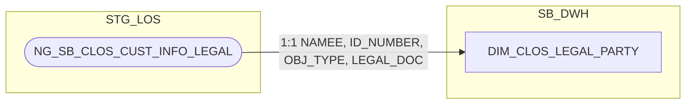

**Ghi chú lineage — đánh giá lại kiến trúc, giải thích chi tiết phân biệt
với `DIM_RLOS_COREPAYER`:** `NG_SB_CLOS_CUST_INFO_LEGAL` là quan hệ **1
hồ sơ : N người liên quan** thực sự (CLOS Metadata Table Review xác nhận
trực tiếp: "1 hồ sơ có nhiều dòng cho cùng 1 WI_NAME", và **"1 người có
thể giữ nhiều vai trò (OBJ_TYPE) khác nhau trong cùng 1 hồ sơ"** — xác
nhận BA). Khác hẳn `APP_GRP`/`HAVE_ANY_DEVIATION` (thuộc tính 1 hồ sơ = 1
giá trị, đã đưa lên `DIM_CLOS_APPLICATION`): **không thể đưa dữ liệu người
liên quan lên DIM_APPLICATION/FCT_APPLICATION_DAILY** vì sẽ làm mất dữ
liệu của những người liên quan khác (nhiều dòng không thể nén vào 1 dòng
mà không đổi grain của `FCT_APPLICATION_DAILY`).

**Vì sao KHÔNG áp dụng pattern pivot-thành-cột-cố-định như
`DIM_RLOS_COREPAYER`:** RLOS corepayer có đúng **1 vai trò duy nhất**
(corepayer), số lượng người có **giới hạn cứng đã xác nhận** (0-4, theo
nhãn PIN Corep1-4) — nên tách được thành 1 DIM riêng theo đúng 1 vai trò
với N nhỏ, biết trước. CLOS có **5 vai trò khả dĩ** (`CUSTOMER`,
`LEGAL_REPRESENTATIVE`, `COLLATERAL_OWNER`, `MAIN_CONTRIBUTING_MEMBERS`,
`OTHER`), nhưng khác RLOS ở 2 điểm mấu chốt: (1) **không có giới hạn cứng
đã biết** cho số người ở mỗi vai trò (số người đại diện/chủ sở hữu
TSBĐ/thành viên góp vốn phụ thuộc hoàn toàn cấu trúc sở hữu thực tế của
từng doanh nghiệp, không có trần cố định như "tối đa 4"); (2) **các vai
trò không loại trừ lẫn nhau** — 1 người có thể đồng thời là người đại
diện pháp luật VÀ thành viên góp vốn chính trên cùng 1 hồ sơ (2 dòng cho
cùng 1 người), trong khi RLOS 1 người chỉ có thể là applicant HOẶC
corepayer, không bao giờ cả hai. Vì N không giới hạn/không biết trước và
vai trò không loại trừ nhau, **không đủ điều kiện pivot thành cột cố định**
— phải giữ dạng bảng danh sách (grain nhân dòng).

**Tuy nhiên vẫn phân loại là DIM (không phải FCT):** dù grain là 1:N,
bản chất dữ liệu vẫn là thông tin MÔ TẢ (không đo lường) — nhất quán với
cách `DIM_RLOS_COREPAYER` (cũng 1:N) được phân loại là DIM thay vì FCT.
Điểm khác biệt DIM_CLOS_LEGAL_PARTY và DIM_RLOS_COREPAYER chỉ nằm ở CÁCH
BIỂU DIỄN N (bảng danh sách vs pivot cột), không nằm ở việc có phải DIM
hay không.

**Gộp `FCT_LOS_PARTY_DOCUMENT` vào thẳng bảng này** (bỏ hẳn bảng document
riêng) — nguồn giấy tờ pháp lý CLOS chỉ có đúng 1 bảng gốc
(`NG_SB_CLOS_CUST_INFO_LEGAL`) với đúng 1 cặp `LEGAL_DOC`/`ID_NUMBER` trên
mỗi dòng, không có rủi ro "nhiều giấy tờ/nhóm" như RLOS IDGRID (14 loại
giấy tờ, có thể nhiều dòng/nhóm TCC-CC) — gộp trực tiếp an toàn, không mất
dữ liệu (đã xác nhận với người dùng).

Bỏ `DATASOURCE`, `PARTY_TYPE`, `PARTY_ROLE_CODE` (thay bằng `OBJ_TYPE`
gốc + `LEGAL_TYPE` chuẩn hóa ở PDTD_DTM, xem Section 2 → 2.2.1.8),
`APPLICATION_SK`, `GEO_SK` (không cần vì không phải khách hàng chính).

##### 1.2.2 FCT

###### 1.2.2.1 FCT_CLOS_APPLICATION_DAILY

**Lineage đầy đủ (bao gồm cả nguồn của `DIM_CLOS_CUSTOMER`, 1.2.1.7 —
xem `hld/HLD_DIM_SB_DWH.md` để đối chiếu lineage gốc của DIM này):**

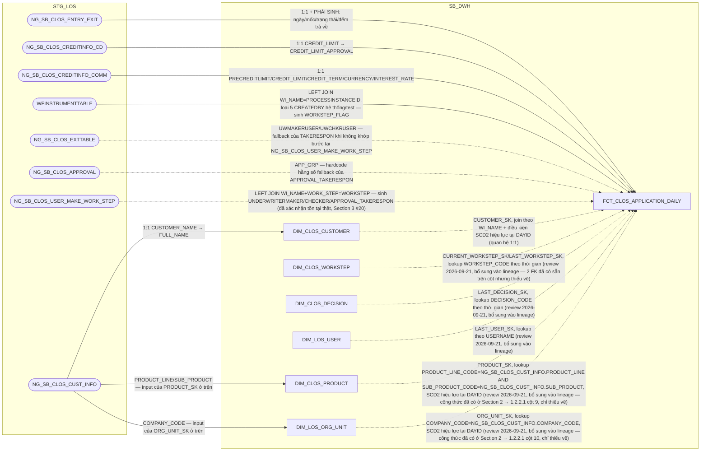

**Ghi chú lineage:** giữ nguyên grain `1 dòng = 1 hồ sơ x 1 ngày dữ liệu`,
PK = `DAYID + WI_NAME`, và toàn bộ quy tắc load T-1 (sinh dòng khi có action
hoặc còn trong chu kỳ thẩm định chưa chốt) như tài liệu gốc — bảng gốc
`FCT_LOS_APPLICATION_DAILY` chỉ tách vật lý theo hệ, không đổi grain/PK/quy
tắc load. **✅ Đã giải quyết (PENDING #6):** `WFINSTRUMENTTABLE` nay đã
nạp vào bảng này để tính cột phái sinh `WORKSTEP_FLAG` (trạng thái bước
hiện tại, 5 nhánh CASE-WHEN theo SRS BC4) — xem chi tiết công thức tại
Section 2 → 1.2.2.1. **✅ Đã giải quyết (review 2026-09-21, Section 3
dòng #20):** 3 cột `*_TAKERESPON` cần nguồn `NG_SB_CLOS_USER_MAKE_
WORK_STEP` — không có trong `DS_BANG_202608.xlsx` nhưng đã xác nhận
tồn tại thật qua `input/CLOS - Metadata.xlsx` (trạng thái "Đã xác
nhận" cho cả bảng và toàn bộ cột).

**Bổ sung 5 node DIM còn thiếu trong lineage (review 2026-09-21):**
rà soát toàn bộ FK của bảng này phát hiện `CURRENT_WORKSTEP_SK`,
`LAST_WORKSTEP_SK`, `LAST_DECISION_SK`, `LAST_USER_SK`, `PRODUCT_SK`,
`ORG_UNIT_SK` đều đã tồn tại thật trong danh sách cột (Section 2 →
1.2.2.1) và có DIM đích tồn tại thật (`DIM_CLOS_WORKSTEP`, `DIM_CLOS_
DECISION`, `DIM_LOS_USER`, `DIM_CLOS_PRODUCT`, `DIM_LOS_ORG_UNIT`) —
nhưng sơ đồ lineage trước đây chỉ vẽ `DIM_CLOS_CUSTOMER`, bỏ sót 5 DIM
còn lại. Đây là thiếu sót thuần vẽ sơ đồ, không phải gap thiết kế mới —
công thức JOIN của `PRODUCT_SK`/`ORG_UNIT_SK` đã có sẵn nguyên văn ở
Section 2 (cột 9-10, review 2026-09-21 trước đó); `WORKSTEP_SK`/
`DECISION_SK`/`USER_SK` theo đúng pattern lookup-theo-thời-gian đã dùng
nhất quán ở mọi bảng khác trong tài liệu (ví dụ `FCT_CLOS_WORKSTEP_
EVENT`, 1.2.2.6). Đã bổ sung đủ 5 node + 5 cạnh JOIN vào mermaid trên.

Áp dụng **column-optimization rule**: loại khỏi bản CLOS mọi cột chỉ có
nguồn RLOS (`SALARYFLAG`...`OTHERFLAG`, `INCOME_SOURCE_CNT`,
`REPAYMENT_SOURCE`, `FLAG_BUSINESS_INCOME`, `LOAN_TO_VALUE`,
`LOAN_OBJECTIVE`, `TOTAL_INCOME`, `CARD_PROMOTION_SK`). `CHANGE_TYPE_SK`
cũng loại khỏi bản CLOS — theo quyết định đã chốt ở `DIM_CLOS_APPLICATION`
(mục 1.2.1.1), CLOS không tách `DIM_CLOS_CHANGE_TYPE`, cột `CHANGE_TYPE` nằm
thẳng trên `DIM_CLOS_APPLICATION`; giữ `CHANGE_TYPE_SK` trỏ sang
`DIM_RLOS_CHANGE_TYPE` sẽ phá vỡ ranh giới tách CLOS/RLOS, nên bỏ hẳn khóa
này khỏi `FCT_CLOS_APPLICATION_DAILY` (đã xác nhận với người dùng).

**Đánh giá kiến trúc — không tham chiếu ETL sang `FCT_CLOS_COLLATERAL`/
`FCT_CLOS_DEVIATION`:** thiết kế gốc có `DEVIATION_CNT`/`COLLATERAL_CNT`
(+ 9 cột con theo nhóm tài sản) tính bằng COUNT(*) trên 2 fact chi tiết đó
— đây là cột kỹ thuật trung gian, không báo cáo nào (BC1-BC11) dùng trực
tiếp tên cột, chỉ để tính ra các cờ YES/NO cuối cùng (`TSDB_NHOM_0`,
`TSBD_BDS`...). Việc pre-aggregate ở ETL bắt `FCT_CLOS_COLLATERAL`/
`FCT_CLOS_DEVIATION` phải chạy xong trước `FCT_CLOS_APPLICATION_DAILY` —
một phụ thuộc thứ tự ETL giữa các fact có thể tránh hoàn toàn, vì báo cáo
dùng OAS (Oracle Analytics Server): model `FCT_CLOS_COLLATERAL`/
`FCT_CLOS_DEVIATION` như logical fact riêng trong RPD, dùng chung
`DIM_CLOS_APPLICATION`/`DAYID` làm conformed dimension, đo lường COUNT
(lọc `COLLATERAL_TYPE_CODE` khi cần) đặt làm logical measure — BI Server tự sinh
SQL multi-pass đúng chuẩn, không cần cột đếm vật lý trên datamart. Đã bỏ
hẳn 11 cột này khỏi thiết kế (xem 1.2.2.5 và Section 2 → 1.2.2.1) — 3
luồng ETL (`FCT_CLOS_APPLICATION_DAILY`, `FCT_CLOS_COLLATERAL`,
`FCT_CLOS_DEVIATION`) hoàn toàn độc lập.

###### 1.2.2.2 FCT_CLOS_APPLICATION_PARTY — MỚI (factless-fact liên kết, tương tự FCT_RLOS_APPLICATION_PARTY)

**Lineage đầy đủ (bao gồm cả nguồn của `DIM_CLOS_APPLICATION` 1.2.1.1,
`DIM_CLOS_CUSTOMER` 1.2.1.7, và `DIM_CLOS_LEGAL_PARTY` 1.2.1.8 — xem
`hld/HLD_DIM_SB_DWH.md` để đối chiếu lineage gốc của 3 DIM này; bản thân
`FCT_CLOS_APPLICATION_PARTY` không đọc STG_LOS, xem ghi chú "Không có
subgraph STG_LOS" bên dưới — mọi node STG_LOS ở đây chỉ phục vụ lineage
của 3 DIM nó nối tới):**

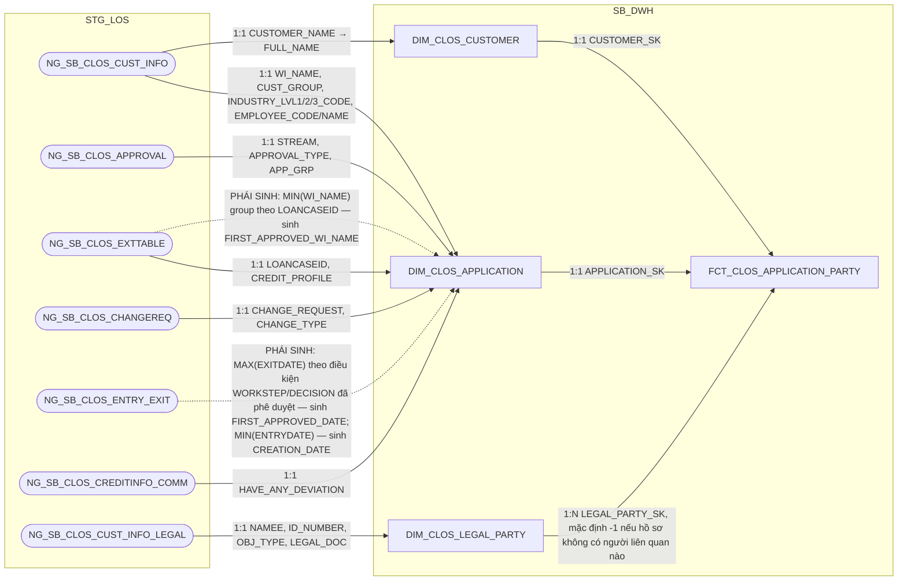

**Ghi chú lineage — bảng còn thiếu, bổ sung để khớp pattern đã áp dụng cho
RLOS:** sau khi tách `DIM_CLOS_CUSTOMER` (1.2.1.7) và `DIM_CLOS_LEGAL_PARTY`
(1.2.1.8) ra khỏi FCT, cần 1 bảng **factless-fact liên kết** để thể hiện lại
quan hệ `1 hồ sơ × 1 khách hàng chính × N người liên quan pháp lý` — đúng
cùng vai trò với `FCT_RLOS_APPLICATION_PARTY` (1.3.2.2) bên RLOS, chỉ khác
ở phía "N": RLOS là `DIM_RLOS_APPLICANT` (1:1) × `DIM_RLOS_COREPAYER` (1:N,
giới hạn cứng 0-4), còn CLOS là `DIM_CLOS_CUSTOMER` (1:1) ×
`DIM_CLOS_LEGAL_PARTY` (1:N, không giới hạn).

**Grain:** 1 dòng = 1 hồ sơ × 1 người liên quan pháp lý (dòng trên
`DIM_CLOS_LEGAL_PARTY`). Hồ sơ không có người liên quan nào khác ngoài
chính khách hàng vẫn có ít nhất 1 dòng ứng với dòng `LEGAL_TYPE='CUSTOMER'`
trên `DIM_CLOS_LEGAL_PARTY` (không dùng sentinel -1 trong trường hợp thông
thường — khác RLOS, vì CLOS luôn có tối thiểu 1 dòng LEGAL_PARTY cho chính
khách hàng); `LEGAL_PARTY_SK = -1` chỉ dùng cho trường hợp dữ liệu thiếu/
không khớp được (Unknown), không phải quy ước "hồ sơ không có corepayer"
như bên RLOS.

Không gộp thuộc tính mô tả nào vào bảng này (toàn bộ đã nằm trên
`DIM_CLOS_CUSTOMER`/`DIM_CLOS_LEGAL_PARTY`) — bảng chỉ giữ 3 khóa liên kết,
cùng nguyên tắc "factless fact" đã áp dụng cho RLOS.

**Không có subgraph STG_LOS (review 2026-09-17):** cùng lý do với
`FCT_RLOS_APPLICATION_PARTY` (1.3.2.2) — bảng không đọc lại STG_LOS, được
build hoàn toàn bằng cách join lại `DIM_CLOS_APPLICATION` ×
`DIM_CLOS_CUSTOMER` × `DIM_CLOS_LEGAL_PARTY` đã có sẵn tại SB_DWH (mỗi
dòng `DIM_CLOS_LEGAL_PARTY` hiện hành của 1 hồ sơ sinh ra đúng 1 dòng
FCT). Hệ quả tất yếu của kiến trúc factless-fact liên kết DIM×DIM×DIM,
không phải thiếu sót lineage.

**Rà soát tính cần thiết (review 2026-09-17):** đã rà soát toàn bộ
BC1-BC11, xác nhận hiện chỉ 2/5 vai trò (`CUSTOMER`,
`LEGAL_REPRESENTATIVE`) thực sự được BC2 dùng, và đã giải quyết trực
tiếp bằng cách nối chuỗi trên `DIM_CLOS_CUSTOMER` (2.2.1.7, không qua
bảng này) — 3 vai trò còn lại (`COLLATERAL_OWNER`,
`MAIN_CONTRIBUTING_MEMBERS`, `OTHER`) chưa có báo cáo nào cần. Theo
quyết định người dùng: **vẫn giữ bảng đúng grain N=5 vai trò đầy đủ**
(không cắt bớt theo column-optimization rule) để mô hình đúng quan hệ
N:N thật giữa hồ sơ và người liên quan pháp lý, đảm bảo toàn vẹn thông
tin — không phải thiếu sót, là lựa chọn có chủ đích.

###### 1.2.2.3 FCT_CLOS_COLLATERAL

**Lineage đầy đủ (bao gồm cả nguồn của `DIM_CLOS_COLLATERAL_TYPE`,
1.2.1.6, và `DIM_CLOS_APPLICATION`, 1.2.1.1 — xem `hld/HLD_DIM_SB_DWH.md`
để đối chiếu lineage gốc của 2 DIM này):**

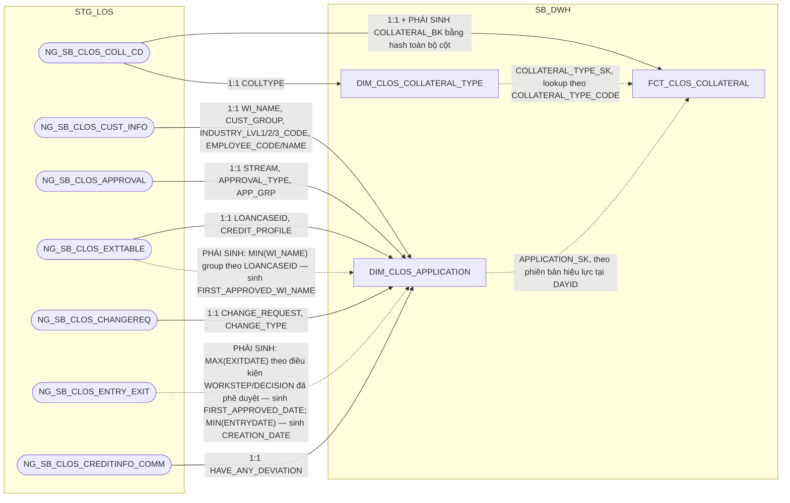

**Ghi chú lineage:** giữ nguyên grain `1 dòng = 1 tài sản bảo đảm của 1 hồ
sơ × 1 ngày dữ liệu` và toàn bộ cơ chế nạp của bảng gốc `FCT_LOS_COLLATERAL`
— nguồn `NG_SB_CLOS_COLL_CD` không khai khóa CDC (LOẠI 2) nên `COLLATERAL_BK`
vẫn phải là hash toàn bộ cột (trừ `COLL_MGMT_APP`/`DESCRIPTION` vì là CLOB),
cộng `DATASOURCE` + tên bảng nguồn để tránh đụng khóa giữa các nguồn (dù
CLOS chỉ có đúng 1 bảng nguồn, vẫn giữ quy tắc hash chung để nhất quán với
RLOS — xem 1.3.2.3). Ảnh chụp đầy đủ theo ngày dựng theo quy trình A2, PK =
`DAYID + WI_NAME + COLLATERAL_BK`. Ngoài `COLLATERAL_TYPE_SK`, bảng còn có
khóa `APPLICATION_SK` nối về `DIM_CLOS_APPLICATION` (không phải khóa tra
danh mục ổn định như `COLLATERAL_TYPE_SK`, mà là khóa liên kết hồ sơ theo
đúng phiên bản DIM hiệu lực tại `DAYID`) — WI_NAME cũng được giữ trực tiếp
trên fact để tiện truy vấn không cần join qua DIM.

Áp dụng **column-optimization rule**: loại khỏi bản CLOS mọi cột chỉ có
nguồn RLOS (`REL_TO_CUSTOMER`, `USING_PURPOSE`, `VEHICLE_TYPE`, `BRAND`,
`CONTROL_POSTER`, `VALPAPER_TYPE`, `NUMBERSIGN`, `IS_ASSET_FORMED`,
`IS_FORMED_FROM_LOAN`) — CLOS chỉ có đúng 1 nguồn tài sản
(`NG_SB_CLOS_COLL_CD`), không có 5 bảng grid theo loại tài sản như RLOS,
nên các thuộc tính đặc thù từng loại tài sản vật lý (bất động sản/phương
tiện/giấy tờ có giá) không áp dụng được. Giữ `COLL_MGMT_METHOD` (chỉ có ở
CLOS, nguồn `NG_SB_CLOS_COLL_CD.COLL_MGMT_APP`) và bỏ `DATASOURCE` (luôn
cố định 'CLOS' sau khi tách vật lý).

**Ghi chú thiết kế — vì sao KHÔNG tách thành DIM dù các cột trông giống
thuộc tính mô tả ổn định:** đã đánh giá và xác nhận giữ nguyên dạng FCT chi
tiết (không tách `DIM_CLOS_COLLATERAL`). Về nội dung, các cột
(`CERTIFICATE_NO`, `OWNER_NAME`, `APPRAISED_VALUE`, `DESCRIPTION`,
`COLL_MGMT_METHOD`, `LOAN_RATE_LTV`...) đúng là thuộc tính mô tả 1 thực thể
tài sản, không phải số đo phát sinh theo giao dịch — nhìn thoáng qua giống
pattern DIM. Nhưng `NG_SB_CLOS_COLL_CD` **không khai khóa CDC** (LOẠI 2,
xem ghi chú `COLLATERAL_BK` ở trên) — hệ nguồn không cấp một định danh tài
sản ổn định (không có `COLLATERAL_ID` hay tương đương), nên **không có khóa
tự nhiên nào độc lập với chính nội dung các thuộc tính**. Hệ quả: SCD2 (nền
tảng của pattern DIM) đòi hỏi phân biệt được "cùng 1 thực thể, đổi thuộc
tính" với "thực thể mới xuất hiện" — nhưng ở đây khóa nhận diện dòng
(`COLLATERAL_BK`) chính là hash của các thuộc tính có thể thay đổi
(`APPRAISED_VALUE` định giá lại, `DESCRIPTION` sửa lỗi chính tả...), nên
bất kỳ thay đổi nội dung nào cũng tự động sinh ra một "danh tính" mới thay
vì mở phiên bản SCD2 mới của cùng 1 tài sản — tách DIM trong điều kiện này
sẽ tạo ảo giác theo dõi được lịch sử tài sản trong khi thực chất không
track được. Vì vậy giữ nguyên dạng FCT ảnh chụp toàn bộ theo ngày (đúng
bản chất: đây là *những gì quan sát được tại ngày DAYID*, không phải *một
thực thể tài sản có danh tính xuyên suốt*) — đây là lựa chọn phù hợp với
hạn chế của hệ nguồn, không phải thiếu sót thiết kế. Đánh đổi chấp nhận:
số dòng có thể tăng theo thời gian nếu tài sản đổi thuộc tính thường xuyên
(1 tài sản vật lý có thể ứng với nhiều `COLLATERAL_BK` khác nhau qua các
ngày) — báo cáo BC1/BC2/BC3/BC9 vẫn đọc đúng vì luôn lọc theo `DAYID` cụ
thể (ảnh chụp của đúng 1 ngày), không lũy kế xuyên ngày. Cùng đánh giá và
kết luận áp dụng cho `FCT_RLOS_COLLATERAL` (1.3.2.3) — RLOS cũng dùng
`STANDARD_HASH` trên 4 bảng grid tài sản, cùng lý do hệ nguồn không khai
khóa CDC.

###### 1.2.2.4 FCT_CLOS_EXCEPTION — review 2026-09-18 (SRS BC7 cập nhật: CHECK_FTR/PHAN_LOAI_DDE đổi công thức)

**Lineage đầy đủ (bao gồm cả nguồn của `DIM_CLOS_EXCEPTION_REASON`,
1.2.1.5, `DIM_CLOS_APPLICATION`, 1.2.1.1, và `DIM_LOS_USER`, 1.1.2 — xem
`hld/HLD_DIM_SB_DWH.md` để đối chiếu lineage gốc của 3 DIM này):**

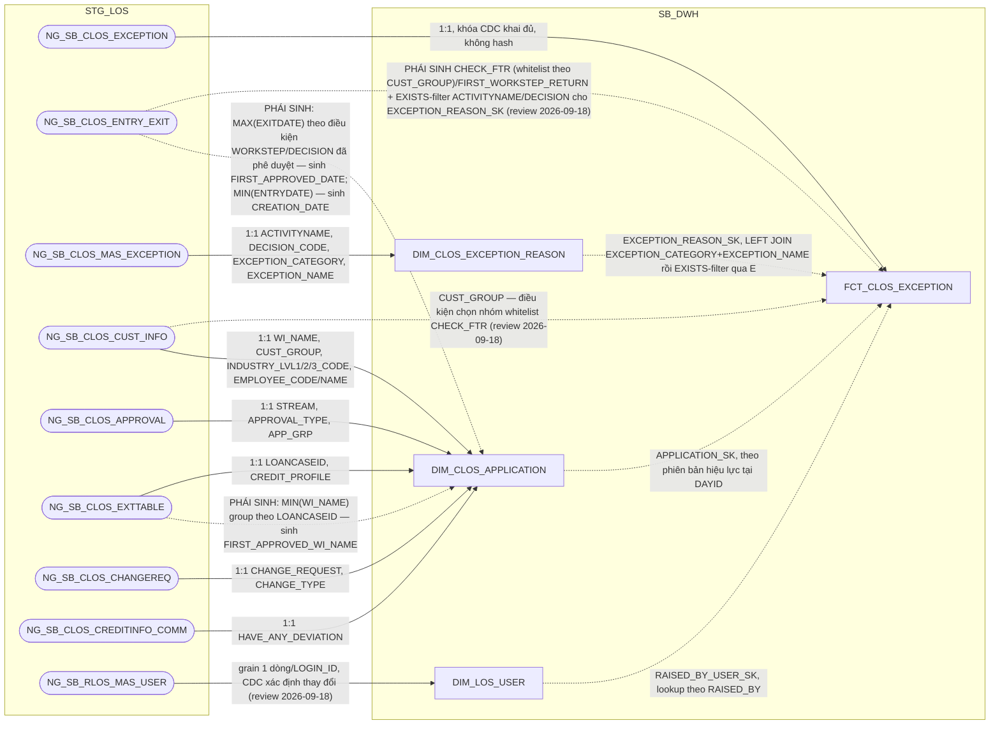

**Ghi chú lineage:** giữ nguyên grain `1 dòng = 1 lần ghi nhận lý do của 1
hồ sơ, trong ảnh chụp của ngày DAYID`. Nguồn chính `NG_SB_CLOS_EXCEPTION`
là LOẠI 1, khóa CDC khai đủ `WI_NAME + EXCEPTION_CATEGORY + RAISED_BY +
RAISED_DATE_TIME` (xác nhận qua `input/DS_BANG_202608.xlsx`) nên PK giữ
thẳng trên cột gốc, không cần hash. Một hồ sơ có thể phát sinh cùng một
loại lý do nhiều lần, bởi nhiều người, ở nhiều thời điểm — khóa phải đủ để
phân biệt từng lần (cơ chế Raise/Clear: bước trả về Raise để nêu lý do,
bước nhận Clear khi đã làm rõ/bổ sung và đẩy lại). Ảnh chụp đầy đủ theo
ngày dựng theo quy trình A2, PK = `DAYID + WI_NAME + EXCEPTION_CATEGORY +
RAISED_BY + RAISED_DATE_TIME`.

**`EXCEPTION_REASON_SK` — lookup 2 bước theo đúng SRS BC7 (không phải
lookup 1 cột đơn giản):** `DIM_CLOS_EXCEPTION_REASON` (1.2.1.5) khai Natural
Key đủ 4 cột (`ACTIVITYNAME + DECISION_CODE + EXCEPTION_CATEGORY +
EXCEPTION_NAME`) vì BA xác nhận 1 tổ hợp bước+quyết định có thể cho phép
nhiều loại ngoại lệ khác nhau — nhưng nguồn của FCT (`NG_SB_CLOS_EXCEPTION`)
không có cột `ACTIVITYNAME`/`DECISION` để join thẳng đủ 4 cột. SRS BC7
(field `ACTIVITYNAME`, nguyên văn Business Rules) giải quyết bằng 2 bước:
1. `LEFT JOIN DIM_CLOS_EXCEPTION_REASON (d)` theo
   `a.EXCEPTION_CATEGORY = d.EXCEPTION_CATEGORY AND a.EXCEPTION_NAME =
   d.EXCEPTION_NAME` — có thể khớp nhiều dòng `d` (nhiều tổ hợp
   `ACTIVITYNAME`/`DECISION_CODE` khác nhau cùng category+name).
2. Lọc lại còn đúng 1 dòng bằng điều kiện tồn tại bản ghi
   `NG_SB_CLOS_ENTRY_EXIT (e)` thỏa `e.WI_NAME = a.WI_NAME AND
   e.WORKSTEP = d.ACTIVITYNAME AND e.DECISION = d.DECISION` — tức chỉ
   giữ tổ hợp (ACTIVITYNAME, DECISION_CODE) nào thực sự đã xảy ra trong
   lịch sử xử lý của chính hồ sơ đó. Không còn dòng nào khớp → `-1`
   (Unknown), theo đúng quy ước default chung.

SRS gốc ghi bảng EXISTS là `NG_SB_RLOS_ENTRY_EXIT` ngay cả ở nhánh CLOS —
đã xác nhận đây là lỗi copy-paste khi soạn thảo (3 field khác trong cùng
khối CLOS của BC7 — `CHECK_FTR`, `FIRST_WORKSTEP_RETURN`, `PHAN_LOAI_DDE`
— đều đúng dùng `NG_SB_CLOS_ENTRY_EXIT`; 2 khối CLOS/RLOS đối xứng tuyệt
đối 13/13 field, chỉ riêng dòng này lạc bảng nguồn), nên HLD dùng đúng
`NG_SB_CLOS_ENTRY_EXIT` cho nhánh CLOS.

**Review 2026-09-18 (SRS BC7 cập nhật) — cùng dạng lỗi copy-paste lặp
lại ở `ACTIVITYNAME`:** bản SRS mới nhất tiếp tục ghi điều kiện EXISTS-
filter là `NG_SB_RLOS_ENTRY_EXIT (e)` ngay trong khối "Nguồn CLOS" (dòng
field `ACTIVITYNAME`) — cùng bảng nguồn lạc như bản SRS trước, xác nhận
lại đây là lỗi soạn thảo lặp lại (không phải cố ý đổi sang cross-check
chéo 2 hệ), giữ nguyên kết luận dùng `NG_SB_CLOS_ENTRY_EXIT` cho nhánh
CLOS.

**Đánh giá kiến trúc — vì sao không gộp vào `FCT_CLOS_APPLICATION_DAILY`
(1.2.2.1):** đã cân nhắc và xác nhận giữ `FCT_CLOS_EXCEPTION` là bảng
riêng, không gộp thành cột trên `FCT_CLOS_APPLICATION_DAILY`, vì hai bảng
khác nhau về grain: `FCT_CLOS_APPLICATION_DAILY` là 1 dòng/hồ sơ/ngày,
còn đây là 1 dòng/**lần nêu lý do**/hồ sơ/ngày — 1 hồ sơ có thể phát sinh
nhiều lần nêu lý do (nhiều loại, nhiều người, nhiều thời điểm, qua các
vòng Raise/Clear). BC7 tự mô tả là báo cáo liệt kê chi tiết từng lý do
("cung cấp các thông tin lý do... có bước trả về/bổ sung/từ chối/hủy"),
không phải rollup — gộp vào grain 1 dòng/hồ sơ/ngày sẽ mất chi tiết (chỉ
giữ được lần gần nhất) hoặc phải pivot số cột không giới hạn N, không khả
thi. Cùng lý do khác grain đã áp dụng cho `FCT_CLOS_COLLATERAL` (xem
1.2.2.3, không gộp vào `FCT_CLOS_APPLICATION_DAILY`) — giữ nguyên bảng
riêng là lựa chọn phù hợp, không phải ETL dư thừa. Số đếm tổng hợp cho
báo cáo (nếu cần) tính trực tiếp ở tầng report/OAS từ bảng chi tiết, không
cần cột đếm trung gian trên `FCT_CLOS_APPLICATION_DAILY` (xem đánh giá
kiến trúc tại 1.2.2.1).

**Đánh giá kiến trúc — vì sao `CHECK_FTR`/`FIRST_WORKSTEP_RETURN` (và ban
đầu cả `PHAN_LOAI_DDE`) chuyển từ `FCT_CLOS_APPLICATION_DAILY` sang đây:**
thiết kế gốc đặt 3 cột này (tên gốc `FLAG_FTR`, `FIRST_WORKSTEP_RETURN`,
`PHAN_LOAI_DDE`) trên `FCT_LOS_APPLICATION_DAILY` — nhưng chính "Trường
đích trên báo cáo" của tài liệu gốc ghi rõ cả 3 chỉ phục vụ `BC7`
(`BC7.CHECK_FTR`, `BC7.FIRST_WORKSTEP_RETURN`, `BC7.PHAN_LOAI_DDE`); rà
soát toàn bộ SRS BC1-BC11 xác nhận không báo cáo nào khác dùng tới. Vì
BC7 đúng grain của `FCT_CLOS_EXCEPTION` (1 dòng/lần nêu lý do), không phải
grain hồ sơ/ngày của `FCT_CLOS_APPLICATION_DAILY`, nên `CHECK_FTR`/
`FIRST_WORKSTEP_RETURN` chuyển hẳn sang tính trực tiếp tại đây, đọc thêm
`NG_SB_CLOS_ENTRY_EXIT` (không qua JOIN ngược `FCT_CLOS_APPLICATION_DAILY`)
— tính ngay ở tầng SB_DWH, giữ đúng nguyên tắc "DTM chỉ đọc DWH" cho tầng
PDTD_DTM (xem 2.2.2.4). `FCT_CLOS_APPLICATION_DAILY`/
`FCT_RLOS_APPLICATION_DAILY` (1.2.2.1/1.3.2.1) đã bỏ cả 3 cột gốc này.
`PHAN_LOAI_DDE` riêng KHÔNG tính tại SB_DWH — xem "Đánh giá kiến trúc —
`PHAN_LOAI_DDE` chuyển hẳn sang PDTD_DTM" ngay dưới đây (review
2026-09-22): bảng danh mục `REF_PHAN_LOAI_DDE` nó lookup vào chỉ tồn tại
vật lý ở tầng PDTD_DTM, nên công thức JOIN cũng phải đặt ở đó.

**Review 2026-09-18 — SRS BC7 cập nhật đổi hẳn công thức `CHECK_FTR` và
`PHAN_LOAI_DDE` (không còn khớp bản SRS trước, `FIRST_WORKSTEP_RETURN`
chỉ bổ sung thêm điều kiện lọc):**

- **`CHECK_FTR` — đảo ngược bản chất phép tính, không còn là công thức
  đơn giản trên `ENTRY_EXIT`:** SRS mới định nghĩa theo **whitelist miễn
  trừ** thay vì điều kiện vi phạm trực tiếp. Mặc định hồ sơ là `'Not
  First Time Right'`; chỉ là `'First Time Right'` nếu **TẤT CẢ** các
  dòng `NG_SB_CLOS_EXCEPTION` của hồ sơ đó đều khớp 1 trong các tổ hợp
  ngoại lệ được miễn trừ dưới đây (join `NG_SB_CLOS_ENTRY_EXIT (h)` theo
  `h.WINAME=a.WI_NAME AND h.WORKSTEP=d.ACTIVITYNAME AND
  h.DECISION=d.DECISION`, với `d`=`NG_SB_CLOS_MAS_EXCEPTION`, phân theo
  `NG_SB_CLOS_CUST_INFO.CUST_GROUP` — **mới bổ sung join này**, DIM
  chưa từng cần `CUST_GROUP` cho cột này trước đây):
  - Nhóm KHDN (`CUST_GROUP IN ('MSME','SME','USME')`): 4 tổ hợp
    (`DetailDataEntry`+`Send_Back`, `DataInputerChecker`+
    `Additional_Doc_Required`, `UnderwriterMaker`+
    `Additional_Doc_Required`, `UnderwriterMaker`+`Send_Back to
    BranchSupport`), mỗi tổ hợp có danh sách `EXCEPTION_CATEGORY` cụ thể
    được miễn trừ (xem SRS BC7 BR 1.2 để lấy đầy đủ literal — danh sách
    dài, không lặp lại toàn bộ ở đây).
  - Nhóm KHDNL/ĐT&ĐCTC (`CUST_GROUP IN ('FDI','SOC','JSC','NBFI','BANK',
    'STR')`): cùng 4 tổ hợp WORKSTEP+DECISION, danh sách
    `EXCEPTION_CATEGORY` miễn trừ khác biệt nhẹ ở tổ hợp 4
    (`UnderwriterMaker`+`Send_Back to BranchSupport` chỉ có đúng 1
    category miễn trừ, không có 3 category còn lại như KHDN).
  - Đây là thay đổi lớn nhất của lần cập nhật SRS này — không chỉ thêm
    điều kiện mà đảo cả chiều logic (từ "có vi phạm → NOT FTR" sang "trừ
    khi mọi ngoại lệ đều được miễn trừ mới là FTR"). Đã xác nhận với
    người dùng đây là thay đổi có chủ ý của SRS, không phải sai sót.
- **`FIRST_WORKSTEP_RETURN`:** vẫn `WORKSTEP` của bản ghi có `MIN(EXITDATE)`
  theo `WI_NAME`, nhưng điều kiện lọc nay viết tường minh thay vì dựa
  vào cột phái sinh `IS_RETURN_EVENT` không rõ định nghĩa của bản SRS
  trước: `EXITDATE IS NOT NULL AND ((WORKSTEP='DetailDataEntry' AND
  DECISION='Send_Back') OR (WORKSTEP IN ('DataInputerChecker',
  'UnderwriterMaker','CreditApproval') AND DECISION=
  'Additional_Doc_Required') OR (WORKSTEP='UnderwriterMaker' AND
  DECISION='Send_Back to BranchSupport'))` — **bổ sung nhánh thứ 3**
  (`UnderwriterMaker` + `Send_Back to BranchSupport`) chưa từng xuất
  hiện trong công thức cũ của cột này.
- **`PHAN_LOAI_DDE` — đổi từ CASE-WHEN tính trực tiếp sang lookup bảng
  danh mục mới `REF_PHAN_LOAI_DDE`:** SRS mới bỏ hẳn công thức CASE-WHEN
  cũ, thay bằng `LEFT JOIN REF_PHAN_LOAI_DDE` theo
  `EXCEPTION_CATEGORY = REF_PHAN_LOAI_DDE.EXCEPTION_CATEGORY AND
  REF_PHAN_LOAI_DDE.SYSTEMNAME='CLOS'`, lấy
  `REF_PHAN_LOAI_DDE.PHAN_LOAI_DDE`. Đây là bảng REF_ tĩnh mới (giống 9
  bảng REF_ hiện có tại `hld/HLD_REF.md`) — cấu trúc và dữ liệu mẫu do
  người dùng cung cấp (`input/REF_PHAN_LOAI_DDE.xlsx`, 19 dòng:
  `EXCEPTION_CATEGORY` + `PHAN_LOAI_DDE` + `SYSTEMNAME`), xem thiết kế
  đầy đủ tại `hld/HLD_REF.md` mục 2.4.10.

**⚠️ Đánh giá kiến trúc — `PHAN_LOAI_DDE` chuyển hẳn sang PDTD_DTM (review
2026-09-22, sửa lỗi vi phạm layer boundary):** công thức trên (`LEFT JOIN
REF_PHAN_LOAI_DDE` ngay tại tầng SB_DWH) đã bị phát hiện sai kiến trúc —
`hld/HLD_REF.md` (đầu Section 2.4) xác nhận rõ **cả 10 bảng REF_/TMP_REF_/
Q_RLOS_REF_ (gồm cả `REF_PHAN_LOAI_DDE`) chỉ tồn tại vật lý ở tầng
PDTD_DTM, không có bản SB_DWH** — BA insert/update thủ công trực tiếp tại
PDTD_DTM, không qua STG_LOS/CDC. Một bảng ở tầng SB_DWH không thể JOIN
trực tiếp một bảng chỉ tồn tại vật lý ở PDTD_DTM (vi phạm chiều dữ liệu
chuẩn STG_LOS→SB_DWH→STG_DTM→PDTD_DTM); nguyên tắc `design-method.md`
của skill `design-hld` cũng xác nhận: JOIN vào bảng REF_ chỉ được phép
xảy ra ở bước "PDTD_DTM copies 1:1 from SB_DWH... **may then** LEFT JOIN
REF_" — là đặc quyền riêng của tầng PDTD_DTM. **`FCT_CLOS_EXCEPTION` ở
tầng SB_DWH (bảng này) KHÔNG còn cột `PHAN_LOAI_DDE`** — cột này bị bỏ
khỏi Section 2 → 1.2.2.4, chỉ còn 14 cột. Công thức `LEFT JOIN
REF_PHAN_LOAI_DDE` ở trên được giữ lại trong đoạn văn này chỉ để lưu lại
lịch sử quyết định SRS BC7 cập nhật 2026-09-18 (đổi từ CASE-WHEN sang
lookup REF_) — công thức thực tế đã chuyển hẳn sang tính tại
`hld/HLD_FCT_PDTD_DTM.md` mục 2.2.2.4 (xem đánh giá kiến trúc tại đó).

###### 1.2.2.5 FCT_CLOS_DEVIATION

**Lineage đầy đủ (bao gồm cả nguồn của `DIM_CLOS_APPLICATION`, 1.2.1.1 —
xem `hld/HLD_DIM_SB_DWH.md` để đối chiếu lineage gốc của DIM này):**

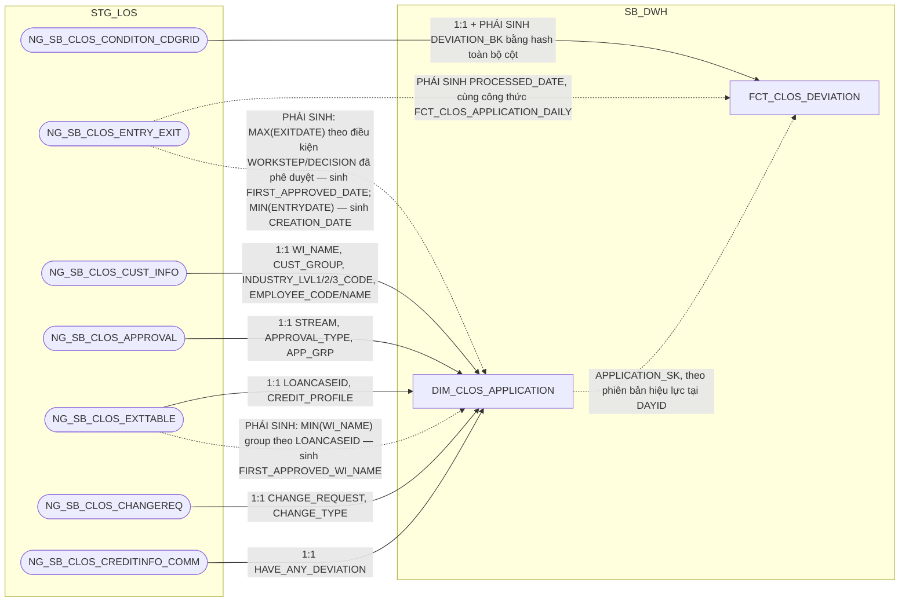

**Ghi chú lineage:** giữ nguyên grain `1 dòng = 1 ngoại lệ chính sách
trong ảnh chụp của ngày DAYID`. Nguồn `NG_SB_CLOS_CONDITON_CDGRID` không
khai khóa CDC (LOẠI 2, xác nhận qua `input/DS_BANG_202608.xlsx` — `KEY
CDC` rỗng) nên `DEVIATION_BK` phải là `STANDARD_HASH(..., 'SHA256')` trên
toàn bộ cột không phải CLOB (loại trừ `AS_REGULAR`, `DEV_PROPOSAL`), cộng
`DATASOURCE` + tên bảng nguồn — cùng cơ chế đã áp dụng cho
`FCT_CLOS_COLLATERAL` (1.2.2.3) và cùng hệ quả cần biết: 2 dòng ngoại lệ
trên cùng hồ sơ chỉ khác nhau ở nội dung CLOB (`AS_REGULAR`/`DEV_PROPOSAL`)
sẽ ra cùng hash và bị gộp làm một (rủi ro đã ghi nhận sẵn trong tài liệu
gốc, "bảng có rủi ro khóa cao nhất trong model"). Ảnh chụp đầy đủ theo
ngày dựng theo quy trình A2, PK = `DAYID + WI_NAME + DEVIATION_BK`
(`DATASOURCE` không nằm trong PK, khác với `FCT_CLOS_EXCEPTION`).

**Vì sao không tách DIM:** cùng lý do đã áp dụng cho `FCT_CLOS_COLLATERAL`
(1.2.2.3) — nguồn không khai khóa CDC nên không có định danh độc lập với
nội dung thuộc tính, SCD2/DIM không khả thi. Giữ dạng FCT ảnh chụp toàn
bộ theo ngày.

**Đánh giá kiến trúc — vì sao `PROCESSED_DATE` tính trực tiếp tại đây
thay vì JOIN `FCT_CLOS_APPLICATION_DAILY`:** để `FCT_CLOS_DEVIATION` và
`FCT_CLOS_APPLICATION_DAILY` là 2 luồng ETL hoàn toàn độc lập, không phụ
thuộc thứ tự chạy trước/sau lẫn nhau (đã rà soát toàn bộ tham chiếu chéo
giữa 2 bảng này khi thiết kế `FCT_CLOS_APPLICATION_DAILY`, xem đánh giá
kiến trúc tại 1.2.2.1 — `DEVIATION_CNT` cũng đã bỏ khỏi
`FCT_CLOS_APPLICATION_DAILY`), `PROCESSED_DATE` tính độc lập ngay tại
đây, đọc thẳng `NG_SB_CLOS_ENTRY_EXIT` — cùng công thức 3 mức ưu tiên
(ngày phê duyệt cuối/ngày hủy/ngày thoát bước gần nhất) đã dùng cho
`FCT_CLOS_APPLICATION_DAILY.PROCESSED_DATE` (1.2.2.1), không JOIN bảng
nào khác. PDTD_DTM của bảng này chỉ còn bê 1:1 (xem 2.2.2.5).

**Lưu ý đối chiếu SRS BC6:** bảng join tổng quan (BR 1.2, nested table)
ghi cả nhánh CLOS lẫn RLOS đều join `NG_SB_RLOS_ENTRY_EXIT` — nhưng
field-list chi tiết (BR 1.3) ghi đúng `PROCESSED_DATE` nhánh CLOS nguồn từ
`NG_SB_CLOS_ENTRY_EXIT`. Cùng dạng lỗi copy-paste đã xác nhận ở SRS BC7
(xem Section 3 #21) — HLD ưu tiên field-list chi tiết (BR 1.3), dùng đúng
`NG_SB_CLOS_ENTRY_EXIT` cho nhánh CLOS như mermaid ở trên.

###### 1.2.2.6 FCT_CLOS_WORKSTEP_EVENT — TÁCH TỪ FCT_LOS_WORKSTEP_EVENT (đánh giá lại 2026-09-14, xem lý do tách bên dưới)

**Lineage đầy đủ (bao gồm cả nguồn của `DIM_CLOS_WORKSTEP` 1.2.1.3,
`DIM_CLOS_DECISION` 1.2.1.4, `DIM_LOS_USER` 1.1.2, và `DIM_CLOS_APPLICATION`
1.2.1.1 — xem `hld/HLD_DIM_SB_DWH.md` để đối chiếu lineage gốc của 4 DIM
này):**

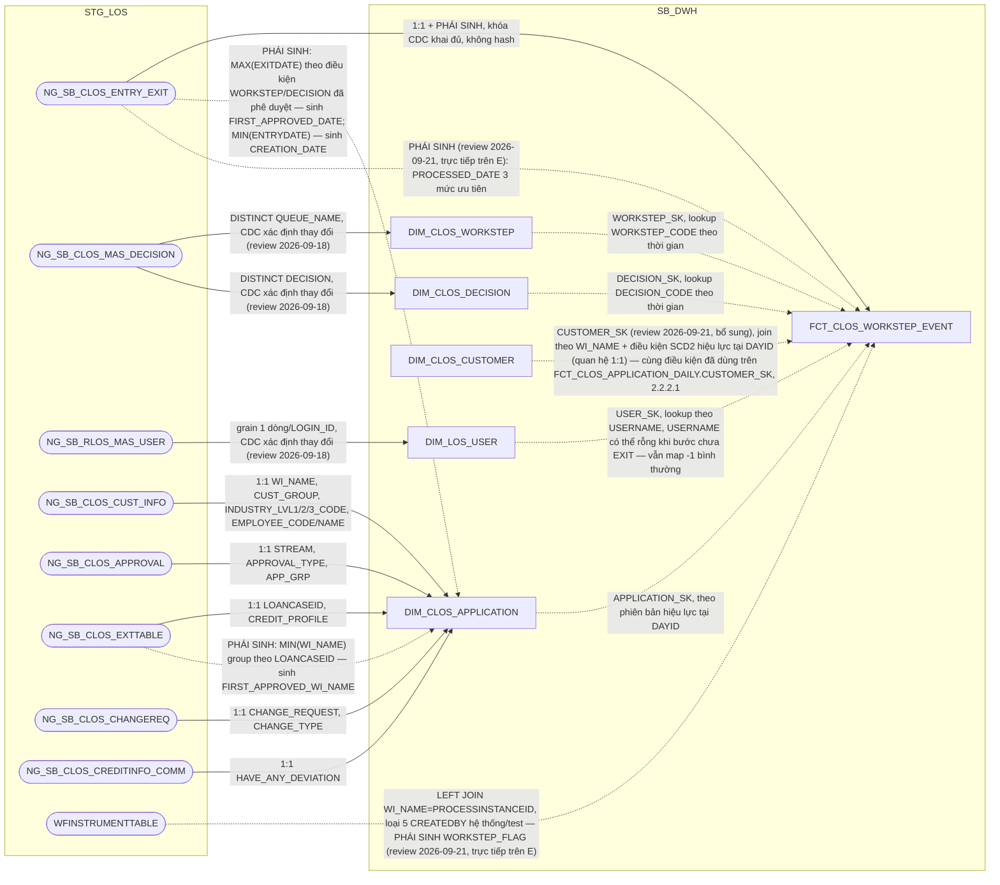

**Vì sao tách vật lý CLOS/RLOS (đánh giá lại 2026-09-14, thay thế kết luận
"giữ CHUNG" trước đó):** lần đánh giá trước kết luận giữ CHUNG vì grain và
ý nghĩa nghiệp vụ "vào bước — ra bước" giống hệt nhau ở cả 2 hệ, và các
rule lọc `WORKSTEP_CODE`/`DECISION_CODE` trong SRS dùng chung 1 bộ công
thức cho cả CLOS/RLOS. Tuy nhiên rà soát lại toàn bộ khóa ngoại của bảng
cho thấy **cả 3 cột FK** (`WORKSTEP_SK`, `DECISION_SK`, `APPLICATION_SK`
— đã bỏ `PRODUCT_SK` khỏi bảng, xem Section 3) đều là **polymorphic FK**
— mỗi cột phải rẽ nhánh trỏ
`DIM_CLOS_*` hoặc `DIM_RLOS_*` tùy `DATASOURCE` ở MỌI lượt lookup — khác
mức độ với `FCT_CLOS_LOAN_DISBURSEMENT`/`FCT_RLOS_LOAN_DISBURSEMENT`
(tách từ `FCT_LOS_DISBURSEMENT`, xem 2.2.2.7/2.3.2.8 PDTD_DTM — 5/18 cột
phụ thuộc hệ, tỷ lệ polymorphic thấp hơn nhiều nhưng vẫn đủ căn cứ để
tách theo cùng nguyên tắc). Ở bảng này, vì MỌI FK đều
polymorphic, tách vật lý thành 2 bảng giúp mỗi bảng chỉ còn FK trỏ thẳng
đúng 1 DIM cố định (không cần CASE theo `DATASOURCE` ở tầng ETL lẫn tầng
report khi join), nhất quán với pattern đã áp dụng cho
`FCT_CLOS_EXCEPTION`/`FCT_RLOS_EXCEPTION` (1.2.2.4/1.3.2.5) và
`FCT_CLOS_DEVIATION`/`FCT_RLOS_DEVIATION` (1.2.2.5/1.3.2.6). Cột
`DATASOURCE` không còn cần thiết sau khi tách vật lý (luôn cố định
'CLOS'), bỏ khỏi bảng theo column-optimization rule.

**Grain và khóa — LOẠI 1, đã xác nhận qua `DS_BANG_202608.xlsx`:**
`NG_SB_CLOS_ENTRY_EXIT` khai đủ khóa CDC `WINAME + WORKSTEP + ENTRYDATE`,
không có cột CLOB — PK giữ thẳng trên cột gốc, không cần hash (khác
pattern `FCT_CLOS_COLLATERAL`/`FCT_CLOS_DEVIATION` đã gặp ở các bảng LOẠI
2). Grain: 1 dòng = 1 **phiên bản** của 1 logical event (`hồ sơ x workstep
x lần vào bước`) — hồ sơ quay lại cùng 1 bước nhiều lần thì mỗi lần là 1
logical event riêng (khác `ENTRYDATE`). PK = `DAYID + WI_NAME +
WORKSTEP_CODE + ENTRYDATE`; `DECISION_SK`/`USER_SK` cố tình KHÔNG nằm
trong khóa (chỉ để tra cứu thêm thuộc tính, không phải định danh — vì giá
trị gốc `DECISION_CODE`/`USERNAME` đã có sẵn trên fact). Bảng **GHI
THÊM, không sửa/xóa** dòng cũ — khác cơ chế "ảnh chụp đầy đủ mỗi ngày"
(quy trình A2) đã dùng cho các fact snapshot khác trong tài liệu này; đây
là quy trình A1 (chỉ ghi bản ghi thay đổi/mới trong `TIME_UPDATE >=
:P_DATE AND < :P_DATE + 1`), đọc đúng trạng thái tại ngày D bằng
`ROW_NUMBER() OVER (PARTITION BY WI_NAME, WORKSTEP_CODE, ENTRYDATE ORDER
BY DAYID DESC)`.

**Đối chiếu SRS (BC3, BC4, BC8, BC9 — các báo cáo trực tiếp dùng cấu trúc
cột này, nhánh CLOS):** BC3/BC4 dùng `WINAME`/`WORKSTEP`/`DECISION`/
`ENTRYDATE`/`EXITDATE`/`USERNAME`/`REMARKS` hiển thị trực tiếp — khớp
đúng. BC8 dùng công thức đếm `SL_RETURN_*` (SUM CASE theo
`WORKSTEP`/`DECISION`) trực tiếp trên `NG_SB_CLOS_ENTRY_EXIT` — không cần
cột phái sinh mới trên fact, tính ở tầng report. BC9 dùng `NHAN_SU`
(đếm `DISTINCT USERNAME` theo đúng danh sách 8 `WORKSTEP` đã ghi trong
lineage doc gốc của `FCT_LOS_KPI_USER_YEAR`, nhánh CLOS) và `TAT_CLOS`
(tổng `get_business_minute(ENTRYDATE, EXITDATE)/60` theo từng nhóm bước)
— khớp đúng với `TAT_WORKING_HOUR` đã có sẵn trên bảng này. Không phát
hiện lệch tài liệu, không phát sinh PENDING mới.

**Đính chính lld/BC4.csv (review 2026-09-21):** rà soát mapping trước đó
phát hiện `WINAME`/`WORKSTEP`/`ENTRYDATE`/`EXITDATE`/`UND_MAKER`/`REMARKS`
của BC4 bị trỏ nhầm sang `FCT_CLOS_APPLICATION_DAILY` (snapshot 1
dòng/hồ sơ/ngày) — SAI GRAIN so với ý định thật của báo cáo. Người dùng
xác nhận: BC4 là báo cáo liệt kê TOÀN BỘ các dòng sự kiện (event-grain,
nhiều dòng/hồ sơ) của các hồ sơ đã có bước thẩm định, lọc `WHERE
WORKSTEP_CODE IN ('UnderwriterMaker','UnderwriterChecker')` trực tiếp
trên bảng này (đúng bảng ở mục này, không phải `APPLICATION_DAILY`) —
mỗi dòng report ứng với đúng 1 dòng event đã lọc, `ENTRYDATE`/`EXITDATE`/
`WORKSTEP_CODE`/`REMARKS` đều là giá trị CỦA CHÍNH dòng đó (không phải
`MIN`/`MAX` cross-row như cách diễn đạt công thức trong SRS gợi ý —
SRS chỉ dùng `MIN`/`MAX` để mô tả điều kiện lọc tập giá trị, không phải
aggregate rút gọn 1 dòng/hồ sơ). `UND_MAKER` = `CASE WHEN
WORKSTEP_CODE='UnderwriterMaker' THEN USERNAME END` trên chính dòng
event (NULL khi dòng đang xét là `UnderwriterChecker`, không self-join
lấy từ dòng UWM khác cùng hồ sơ). Các thuộc tính cấp-hồ-sơ khác của BC4
(`SYSTEMNAME`=`DATASOURCE`, `CUSTOMER_NAME` qua `DIM_CLOS_CUSTOMER`) đọc
trực tiếp trên chính bảng này/DIM liên quan, không cần JOIN sang
`FCT_CLOS_APPLICATION_DAILY` nữa. **Cập nhật tiếp (review 2026-09-21,
theo yêu cầu đồng bộ của người dùng):** `REPORT_DATE`(=`PROCESSED_DATE`)
và `FLAG`(=`WORKSTEP_FLAG`) — 2 cột duy nhất còn cần JOIN fan-out sang
`APPLICATION_DAILY` — nay ĐÃ bổ sung làm cột phái sinh MỚI tính độc lập
ngay trên `FCT_CLOS_WORKSTEP_EVENT` (cột 22-24, xem cột table ngay dưới
và `hld/HLD_FCT_SB_DWH.md` 1.2.2.6/2.2.2.6), cùng công thức/nguồn với
bản trên `APPLICATION_DAILY` nhưng không copy/JOIN — BC4 giờ đọc TOÀN BỘ
9 cột đầu ra (trừ `CUSTOMER_NAME`) từ đúng 1 bảng `FCT_CLOS_WORKSTEP_
EVENT`, không cần JOIN fan-out sang `APPLICATION_DAILY` nào nữa. Nhánh
RLOS áp dụng y hệt trên `FCT_RLOS_WORKSTEP_EVENT` (1.3.2.7, cột 24-26).
Xem `lld/BC4.csv` các dòng 4/6/7/8/9/11 (CLOS) và 15/17/18/19/20/22
(RLOS).


#### 1.3 Bộ bảng RLOS

##### 1.3.1 DIM

###### 1.3.1.1 DIM_RLOS_APPLICATION — ✅ ĐÃ GIẢI QUYẾT (đã bổ sung APP_GRP, DEVIATION_G3, CHANGE_TYPE — thay thế DIM_RLOS_APPROVAL_GROUP đã loại bỏ)

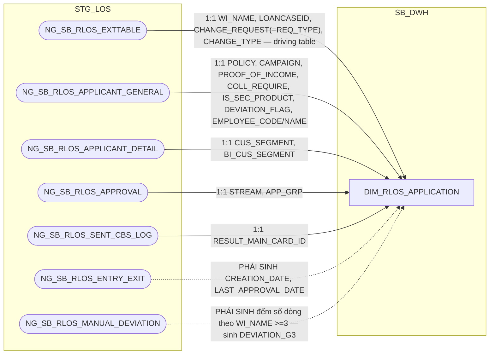

**Ghi chú lineage — đổi driving table sang `NG_SB_RLOS_EXTTABLE` (review
2026-09-22):** trước đây driving là `NG_SB_RLOS_APPLICANT_GENERAL`; cả 2
bảng đều grain 1:1 hồ sơ theo RLOS Metadata (không phải sửa lỗi grain).
Đổi sang `NG_SB_RLOS_EXTTABLE` để nhất quán kiến trúc với
`DIM_CLOS_APPLICATION` (driving `NG_SB_CLOS_EXTTABLE`, xem 1.2.1.1) — cả
2 bảng EXTTABLE cùng vai trò "ảnh chụp trạng thái hiện tại của hồ sơ",
cùng cấu trúc theo RLOS Metadata (bảng `NG_SB_RLOS_EXTTABLE`, sheet Table
Review).

**Ghi chú lineage — loại bỏ `DIM_RLOS_APPROVAL_GROUP`, bổ sung `APP_GRP` +
`DEVIATION_G3` thẳng lên đây:** RLOS Metadata gốc (sheet Table Review, bảng
`NG_SB_RLOS_APPROVAL`) xác nhận trực tiếp **grain = 1 dòng = 1 hồ sơ RLOS**
— cùng kết luận với CLOS (xem 1.2.1.1). `APP_GRP` là thuộc tính ổn định
của hồ sơ, đọc thẳng từ `NG_SB_RLOS_APPROVAL` — cùng bảng, cùng cách với
`STREAM` đã có sẵn ở đây. `DIM_RLOS_APPROVAL_GROUP` và
`MAP_RLOS_APPROVAL_GROUP` đã bị loại bỏ hoàn toàn; cột `APPROVAL_GROUP_SK`
cũng bị loại khỏi `FCT_RLOS_APPLICATION_DAILY`.

`DEVIATION_G3` = COUNT(*) theo `WI_NAME` trên `NG_SB_RLOS_MANUAL_DEVIATION`
(>=3 → 'YES', còn lại → 'NO') — trích nguyên văn SRS BC5/BC9: *"Count số
dòng (sl) của mỗi WI_NAME trong bảng NG_SB_RLOS_MANUAL_DEVIATION, sl>=3
tương ứng 'YES', sl<3 tương ứng 'NO'"*. Đây là số đếm lũy kế có thể tăng
theo thời gian sống hồ sơ, tương tự `APP_GRP` có thể đổi khi định tuyến lại
— khi giá trị đổi qua ngưỡng 3 (NO↔YES), mở phiên bản DIM mới theo đúng cơ
chế SCD2 chuẩn, không phải giá trị tĩnh 1 lần. Cả `APP_GRP`, `DEVIATION_G3`
dùng làm khóa tra cam kết SLA (`REF_PRODUCT`/`SLA_*`) ở PDTD_DTM (2.3.1.1)
cùng `SECONDARY_PRODUCTLINE` (=`IS_SEC_PRODUCT`, đã có sẵn) và
`CHANGE_TYPE` (mới bổ sung, xem bên dưới).

**Bổ sung `CHANGE_TYPE`:** đọc thẳng từ `NG_SB_RLOS_EXTTABLE.CHANGE_TYPE` —
cùng bảng nguồn đã tin cậy dùng cho `LOANCASEID`/`CHANGE_REQUEST` ở DIM
này, không phải nguồn mới. SRS BC5 xác nhận công thức JOIN sang
`RLOS_REF_SLA_TDKHCN` là **either/or** với `PRODUCT_LINE` (chỉ so khớp
`CHANGE_TYPE` khi dòng REF_ có `Product Line = 'Trường Change Request'`,
ngược lại so khớp theo `PRODUCT_LINE` bình thường) — trích nguyên văn:
*"Nếu file1.'Product Line' = 'Trường Change Request': Xét file1.'Change
Type' = d.CHANGE_TYPE. Nếu file1.'Product Line' <> 'Trường Change Request':
Xét file1.'Product Line' = b.PRODUCT_LINE"* (d = `NG_SB_RLOS_EXTTABLE`, b =
`NG_SB_RLOS_APPLICANT_GENERAL`). Cột này khác `CHANGE_TYPE_SK` trên FCT
(trỏ `DIM_RLOS_CHANGE_TYPE` để lấy tên/chi tiết chuẩn hóa cho BC1) — đây là
giá trị thô dùng riêng làm khóa tra SLA. Đã xác nhận qua SRS BC1 (xem
1.3.1.6) đây là exact-match đơn giá trị, RLOS không có multi-select loại
thay đổi như CLOS — join tra SLA an toàn, không rủi ro NULL.

Bảng `NG_SB_RLOS_APPROVAL` còn có cặp cột `PRE_APPROVALGROUP`/`APP_GRP`
(giá trị trước/sau 1 lần định tuyến lại hồ sơ, 2 cột trên cùng 1 dòng,
không phải lịch sử SCD) — đã rà soát toàn bộ SRS, không có báo cáo nào
dùng `PRE_APPROVALGROUP`, nên không đưa cột này vào thiết kế.

**Bổ sung `LAST_APPROVAL_DATE` — để `FCT_RLOS_LOAN_DISBURSEMENT` (2.3.2.8)
join qua DIM, không qua FCT khác hệ:** phục vụ
`BC10.APPROVAL_DATE` — PHÁI SINH: `MAX(EXITDATE)` trên
`NG_SB_RLOS_ENTRY_EXIT` tại bản ghi thỏa `WORKSTEP IN
('CreditApprovalReview','CreditApproval','CreditCommittee')`,
`DECISION IN ('Submit','Send To HOSupport','Send To PostSanction','Submit
To DisbursementMaker')` — đúng nguyên văn công thức SRS BC10. Cùng khái
niệm và cùng công thức với `LAST_APPROVAL_DATE` đã có trên
`FCT_RLOS_APPLICATION_DAILY` (1.3.2.1) — nhưng **tính độc lập lại tại đây**
(đọc thẳng `NG_SB_RLOS_ENTRY_EXIT`, không JOIN fact-to-fact sang
`FCT_RLOS_APPLICATION_DAILY`), theo đúng nguyên tắc "mỗi FCT/DIM là 1
luồng ETL độc lập" đã áp dụng xuyên suốt tài liệu này (xem đánh giá kiến
trúc tại `FCT_CLOS_DEVIATION`, 1.2.2.5). Đây cũng là lựa chọn giữ đối
xứng kiến trúc với CLOS: `DIM_CLOS_APPLICATION` đã có sẵn
`FIRST_APPROVED_WI_NAME`/`FIRST_APPROVED_DATE` ngay trên DIM (không phải
trên FCT) để phục vụ `BC11.APPROVAL_WINAME_LOS`/`APPROVAL_DATE` — RLOS
không có khái niệm "hồ sơ cha" (không có `LOANCASEID` lặp nhiều `WI_NAME`
như CLOS, xem cột `LOANCASEID`/`FIRST_APPROVED_WI_NAME` ở
`DIM_CLOS_APPLICATION`, 1.2.1.1) nên không có `LAST_APPROVAL_WI_NAME`
tương ứng — chỉ cần đúng 1 cột ngày.

###### 1.3.1.2 DIM_RLOS_PRODUCT — ✅ ĐÃ GIẢI QUYẾT (nguồn: NG_SB_RLOS_MAS_PRODUCT_LINE/MAS_SUB_PRODUCT, review 2026-09-18)

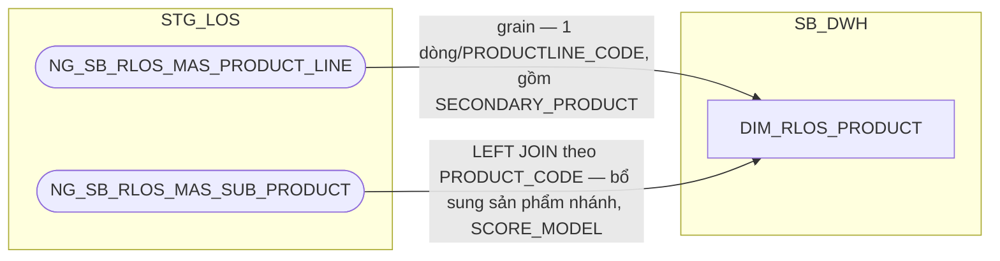

**Đã giải quyết (review 2026-09-18, theo Meeting note 20260909 mục #1):**
cùng giải pháp với `DIM_CLOS_PRODUCT` (1.2.1.2) — nguồn trước đây suy từ
`NG_SB_RLOS_APPLICANT_GENERAL`/`NG_SB_RLOS_EXTTABLE` (grain-theo-hồ-sơ) rồi
tạm thay bằng `MAP_RLOS_PRODUCT`; nay BA LOS xác nhận (16/09) 2 bảng danh
mục thật `NG_SB_RLOS_MAS_PRODUCT_LINE` + `NG_SB_RLOS_MAS_SUB_PRODUCT` —
thay thế hoàn toàn `MAP_RLOS_PRODUCT`. Bảng `MAS_PRODUCT_LINE` có thêm cột
`SECONDARY_PRODUCT` (sản phẩm phụ SeABuy/SeATeacher/SeAWoman/SeACivil/Thẻ
tín dụng — đúng khái niệm đã xác nhận với EU ở vấn đề #10 Meeting note,
khác `SUB_PRODUCT`); `MAS_SUB_PRODUCT` có thêm `SCORE_REQUIRED`/
`SCORE_MODEL` — cả hai chưa có báo cáo nào yêu cầu, xem Section 3.

**SCD2 đổi cách xác định EFF_DATE:** cùng cơ chế CDC như `DIM_CLOS_PRODUCT`
(1.2.1.2) — 2 bảng nguồn không có EFF_DATE khai báo tay. Xem Section 3.

###### 1.3.1.3 DIM_RLOS_WORKSTEP — ✅ ĐÃ GIẢI QUYẾT (nguồn: NG_SB_RLOS_MAS_DECISION, review 2026-09-18)

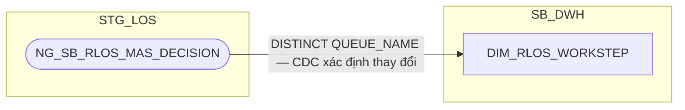

**Đã giải quyết (review 2026-09-18, theo Meeting note 20260909 mục #2):**
cùng giải pháp với `DIM_CLOS_WORKSTEP` (1.2.1.3) — nguồn trước đây suy từ
`NG_SB_RLOS_ENTRY_EXIT` rồi tạm thay bằng `MAP_RLOS_WORKSTEP`; nay BA LOS
xác nhận (16/09) bảng danh mục thật `NG_SB_RLOS_MAS_DECISION` — bảng này
gộp chung WORKSTEP (`QUEUE_NAME`) và DECISION (`DECISION`) dạng N-N (thêm
cột `REQ_TYPE`), không có danh mục WORKSTEP độc lập riêng. Theo quyết định
người dùng: **giữ tách 2 DIM** như `DIM_CLOS_WORKSTEP`/`DIM_CLOS_DECISION`
(xem 1.2.1.3), suy ra `DISTINCT QUEUE_NAME` từ cùng bảng nguồn.
`NG_SB_RLOS_ENTRY_EXIT` không còn là nguồn của DIM này nữa (vẫn tiếp tục
phục vụ các FCT khác).

`WFINSTRUMENTTABLE` vẫn không thuộc phạm vi bảng này — **✅ đã giải quyết
(PENDING #6):** `PROCESSNAME`/`ACTIVITYNAME` nay đã nạp trực tiếp vào
`FCT_RLOS_APPLICATION_DAILY` (1.3.2.1) để tính `WORKSTEP_FLAG`, xem ghi
chú đầy đủ ở `DIM_CLOS_WORKSTEP` (1.2.1.3). **Cập nhật (review
2026-09-21):** nay cũng LEFT JOIN thêm vào `FCT_RLOS_WORKSTEP_EVENT`
(1.3.2.7) để tính `WORKSTEP_FLAG` độc lập trực tiếp trên bảng event.

**SCD2 đổi cách xác định EFF_DATE:** cùng cơ chế CDC như 1.2.1.3. Xem
Section 3.

###### 1.3.1.4 DIM_RLOS_DECISION — ✅ ĐÃ GIẢI QUYẾT (nguồn: NG_SB_RLOS_MAS_DECISION, review 2026-09-18)

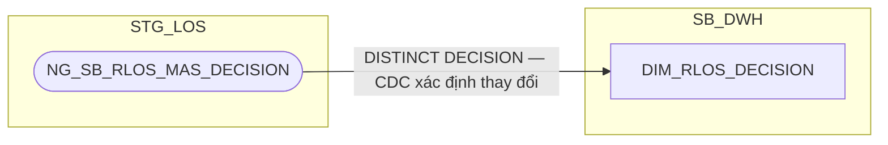

**Đã giải quyết (review 2026-09-18, theo Meeting note 20260909 mục #2):**
nguồn trước đây suy từ `NG_SB_RLOS_ENTRY_EXIT` (bảng lịch sử xử lý, không
phải danh mục quyết định BPM gốc) rồi tạm thay bằng `MAP_RLOS_DECISION`;
nay BA LOS xác nhận (16/09) cùng bảng danh mục thật
`NG_SB_RLOS_MAS_DECISION` đã dùng cho `DIM_RLOS_WORKSTEP` (1.3.1.3) — lấy
`DISTINCT DECISION` từ cùng bảng (xem 1.2.1.3 về lý do giữ tách 2 DIM).
`NG_SB_RLOS_ENTRY_EXIT` không còn là nguồn của DIM này nữa (vẫn tiếp
tục phục vụ các FCT khác).

**SCD2 đổi cách xác định EFF_DATE:** cùng cơ chế CDC như 1.3.1.3. Xem
Section 3.

###### 1.3.1.5 DIM_RLOS_EXCEPTION_REASON

```mermaid
flowchart LR
    subgraph STG_LOS
        A(["NG_SB_RLOS_MAS_EXCEPTION"])
    end
    subgraph SB_DWH
        C["DIM_RLOS_EXCEPTION_REASON"]
    end
    A -->|1:1 ACTIVITYNAME, DECISION_CODE, EXCEPTION_CATEGORY, EXCEPTION_NAME| C
```

**Ghi chú lineage:** cùng bản chất với `DIM_CLOS_EXCEPTION_REASON`
(1.2.1.6) — `NG_SB_RLOS_MAS_EXCEPTION` là bảng LOẠI 1 (danh mục cấu hình
gốc, khóa CDC khai đủ tổ hợp khóa tự nhiên), không phải bảng sự kiện theo
hồ sơ, nên không rơi vào pattern "application-scoped source". Giữ nguyên
nguồn trực tiếp, không cần bảng `MAP_` seed.

###### 1.3.1.6 DIM_RLOS_CHANGE_TYPE

```mermaid
flowchart LR
    subgraph STG_LOS
        A(["SB_RLOS_MAS_CHANGE_TYPE"])
    end
    subgraph SB_DWH
        C["DIM_RLOS_CHANGE_TYPE"]
    end
    A -->|1:1 CHANGE_TYPE_CODE, CHANGE_TYPE_NAME, DETAIL_CHANGE_TYPE_CODE/NAME| C
```

**Ghi chú lineage:** `SB_RLOS_MAS_CHANGE_TYPE` là bảng danh mục gốc thật
(mang tiền tố `MAS_`), khác hẳn phía CLOS — CLOS chỉ có
`NG_SB_CLOS_CHANGEREQ.CHANGE_TYPE` (bảng theo hồ sơ, không phải danh mục),
nên không tách `DIM_CLOS_CHANGE_TYPE` (xem 1.2.1.1). Đối chiếu SRS xác
nhận: **BC1** ("Báo cáo RLOS APPLICATION") là báo cáo duy nhất dùng
`CHANGE_TYPE_DETAIL` (join `SB_RLOS_MAS_CHANGE_TYPE` theo `CHANGE_TYPE`);
không có báo cáo nào khác (BC2–BC11) dùng bảng này. `DIM_RLOS_CHANGE_TYPE`
không rơi vào pattern "application-scoped source" — giữ nguyên nguồn trực
tiếp, không cần bảng `MAP_` seed.

###### 1.3.1.7 DIM_RLOS_GEO

```mermaid
flowchart LR
    subgraph STG_LOS
        A(["H_NG_SB_RLOS_MAS_CITY"])
        B(["H_NG_SB_RLOS_MAS_DISTRICT"])
    end
    subgraph SB_DWH
        C["DIM_RLOS_GEO"]
    end
    A -->|1:1 CITY_CODE, CITY_NAME, CITY_NAME_VN| C
    B -.->|1:1 DISTRICT_CODE, DISTRICT_NAME — PHÁI SINH DISTRICT_NAME_VN| C
```

**Ghi chú lineage:** không có bảng tương đương phía CLOS — `DIM_RLOS_GEO`
không thuộc cặp CLOS/RLOS song song mà là DIM đặc thù riêng của RLOS (xem
`output/Table_Split_Proposal_CLOS_RLOS.md` mục 3: "không có nguồn CLOS
tương ứng trong `DS_BANG_202608`"). `H_NG_SB_RLOS_MAS_CITY`/
`H_NG_SB_RLOS_MAS_DISTRICT` là 2 bảng danh mục địa giới hành chính gốc
(mang tiền tố `MAS_`), không phải bảng sự kiện theo hồ sơ — không rơi vào
pattern "application-scoped source", giữ nguyên nguồn trực tiếp. Bảng
không có cột `DATASOURCE` ngay từ thiết kế gốc (đã là RLOS-only), không
cần bỏ cột nào khi tách. Tiền tố `H_` đã đối chiếu khớp đúng nguyên văn
SRS BC1 (cả Business Rules join-table lẫn field-mapping table) — không
nhầm với tên không tiền tố ghi trong `output/Table_Split_Proposal_CLOS_RLOS.md`
(tài liệu chỉ quyết định tách bảng, không phải nguồn công thức chi tiết).

###### 1.3.1.8 DIM_RLOS_CARD_PROMOTION

```mermaid
flowchart LR
    subgraph STG_LOS
        A(["NG_SB_RLOS_MAS_CARD_PROMOTIO"])
    end
    subgraph SB_DWH
        C["DIM_RLOS_CARD_PROMOTION"]
    end
    A -->|1:1 PROMOTION_CODE, DESCRIPTION| C
```

**Ghi chú lineage:** không có bảng tương đương phía CLOS — chương trình
ưu đãi phí thẻ tín dụng là sản phẩm đặc thù bán lẻ (RLOS), CLOS không có
khái niệm này (xem `output/Table_Split_Proposal_CLOS_RLOS.md` mục 3).
`NG_SB_RLOS_MAS_CARD_PROMOTIO` mang tiền tố `MAS_`, là danh mục cấu hình
gốc thật, không phải bảng sự kiện theo hồ sơ — không rơi vào pattern
"application-scoped source", giữ nguyên nguồn trực tiếp. Bảng gốc (trước
tách) chưa từng có cột `DATASOURCE`; **review 2026-09-17:** đã bổ sung
`DATASOURCE` (cố định 'RLOS') tại Section 2 làm cột kỹ thuật đánh dấu
nguồn hệ, đồng bộ với mọi DIM/FCT RLOS khác sau khi tách vật lý CLOS/RLOS
— quyết định có chủ đích, xem chi tiết tại Section 2 → 1.3.1.8.

###### 1.3.1.9 DIM_RLOS_APPLICANT — MỚI (tách từ FCT_LOS_APPLICATION_PARTY)

```mermaid
flowchart LR
    subgraph STG_LOS
        A(["NG_SB_RLOS_APPLICANT_GENERAL"])
        B(["NG_SB_RLOS_APPLICANT_DETAIL"])
        C(["NG_SB_RLOS_APPLICANT_IDGRID"])
    end
    subgraph SB_DWH
        E["DIM_RLOS_APPLICANT"]
    end
    A -->|1:1 FULL_NAME, GENDER, DOB| E
    B -->|1:1 MARR_STATUS, EDU_LEVEL, PERM_ADD, CITY/DISTRICT/WARD/HOUSNO_CURR_RES| E
    C -.->|PHÁI SINH: PIVOT theo ID_TYPE thuộc nhóm TCC/CC vs còn lại, nối chuỗi dấu chấm phẩy nếu nhiều — sinh ADD_ID, ADD_ID_OTHER| E
    A -.->|"1:1 làm giàu (review 2026-09-21, theo yêu cầu người dùng): ZONE, NATIONALITY, TITLE, HOME_PHONE, PHONE_1, PHONE2, SALE_TYPE, BROKER_TYPE/ID/NAME, ACC_OFFICER, ACCOUNT_OFFICER_NAME, EXISTING_CUSTOMER, APPLICANTCIF, BUSINESS_MODEL, KYC1"| E
```

**Ghi chú lineage — tách khỏi `FCT_LOS_APPLICATION_PARTY`, không tách theo
kiểu bảng chi tiết như CLOS:** khác với CLOS (nơi 1 hồ sơ có N người liên
quan với N vai trò không loại trừ lẫn nhau), RLOS có cấu trúc rõ ràng: **1
người đề nghị vay chính** (applicant, 1:1 với hồ sơ) và **0..N người đồng
trả nợ** (corepayer). Vì applicant là quan hệ 1:1 với hồ sơ, tách thành DIM
riêng (không gộp thẳng vào `DIM_RLOS_APPLICATION`) vì đây là nhóm thuộc
tính CON NGƯỜI (nhân khẩu học, liên hệ) khác hẳn bản chất thuộc tính HỒ SƠ
(sản phẩm, quy trình, phê duyệt) đã có trên `DIM_RLOS_APPLICATION`.

**Bổ sung `ADD_ID`/`ADD_ID_OTHER` (pivot từ `FCT_LOS_PARTY_DOCUMENT` cũ):**
theo SRS BC1 (BR 1.3, trích nguyên văn): *"ADD_ID — NG_SB_RLOS_APPLICANT_
IDGRID > ID_NUMBER, với điều kiện ID_TYPE in ('TCC','CC')"*, *"ADD_ID_OTHER
— NG_SB_RLOS_APPLICANT_IDGRID > ID_NUMBER, với điều kiện ID_TYPE not in
('TCC','CC')"*. Đây là 2 NHÓM LỌC theo `ID_TYPE` (14 loại giấy tờ quan sát
được trên `NG_SB_RLOS_APPLICANT_IDGRID`), không phải "giấy tờ chính/giấy
tờ khác" theo nghĩa 1-1 — không có tài liệu nào đảm bảo mỗi nhóm chỉ có
đúng 1 giấy tờ. Xử lý: nếu 1 nhóm có nhiều dòng, **nối chuỗi `ID_NUMBER`
bằng dấu ";"** — tránh phải giữ bảng chi tiết giấy tờ riêng
(`FCT_RLOS_PARTY_DOCUMENT` bị loại bỏ hoàn toàn, xem ghi chú ở
`FCT_RLOS_APPLICATION_PARTY`, 1.3.2.2).

**Xác nhận thiết kế và thứ tự nối chuỗi (review 2026-09-17):** đây là
quyết định kiến trúc có chủ đích — grain của DIM này là 1 dòng/1
applicant, giữ TOÀN BỘ giấy tờ bằng cách nối chuỗi thay vì chọn 1 dòng
đại diện (không có khái niệm "giấy tờ chính" cần chọn, không phải thiếu
sót — pattern này đã được người dùng xác nhận là mục tiêu thiết kế,
tương tự cách `DIM_CLOS_CUSTOMER.LEGAL_REPRESENTATIVE`/
`ADD_ID_REPRESENTATIVE` nối chuỗi khi nhiều đại diện, xem Section 3 #19).
Trong `ADD_ID`, thứ tự nối khi nhóm TCC/CC có nhiều giấy tờ: **ưu tiên
`ID_TYPE='TCC'` trước, `ID_TYPE='CC'` sau**. Thứ tự này là căn cứ để ETL
tách ngược `ADD_ID` khi cần so khớp từng giá trị riêng lẻ (xem
`T24_CUSTOMER_SK` tại `FCT_RLOS_APPLICATION_DAILY`, 1.3.2.1/2.3.2.1).

**Làm giàu thêm 15 cột (review 2026-09-21, theo yêu cầu người dùng):**
`NG_SB_RLOS_APPLICANT_GENERAL` là quan hệ 1:1/hồ sơ (đã xác nhận ở
trên) — mọi cột mô tả còn lại (không phải khóa join/FK, không phải cột
kỹ thuật CDC) đưa thẳng lên đây an toàn. Bao gồm `ZONE` (đóng gap
BC1/BC2 — cùng lý do/quyết định đã áp dụng cho `DIM_CLOS_CUSTOMER.ZONE`,
xem 1.2.1.7), `NATIONALITY`, `TITLE`, `HOME_PHONE`, `PHONE_1`, `PHONE2`
(đổi tên `PHONE_2` cho nhất quán), `SALE_TYPE`, `BROKER_TYPE`/
`BROKER_ID`/`BROKER_NAME`, `ACC_OFFICER`/`ACCOUNT_OFFICER_NAME`,
`EXISTING_CUSTOMER`, `APPLICANTCIF` (đổi tên `APPLICANT_CIF`),
`BUSINESS_MODEL`, `KYC1`. Không đưa `FIRST_NAME`/`MIDDLE_NAME`/
`LAST_NAME` (đã có `FULL_NAME` đủ dùng), `PRODUCT_LINE`/`SUB_PRODUCT`/
`POLICY`/`CAMPAIGN`/`IS_SEC_PRODUCT`/`EMPLOYEE_CODE`/`EMPLOYEE_NAME`/
`COLLREQUIRE`/`PROOF_OF_INCOME`/`COMPANY_CODE`/`COMPANY_NAME`/
`BRACH_CODE`/`BRANCH_NAME` (đã có trên `DIM_RLOS_APPLICATION`/
`DIM_LOS_ORG_UNIT` — tránh trùng lặp), `LOS_ORA_ROWSCN`/`LOS_TIME_
UPDATE_ROWSCN` (cột kỹ thuật CDC nội bộ, không phải dữ liệu nghiệp vụ).
`KYC1` (VARCHAR2, "đơn vị/khối đang xử lý hồ sơ tại thời điểm ghi nhận")
metadata đang ở trạng thái "Cần chỉnh sửa" (đề xuất đổi tên "Luồng phê
duyệt"/Approval Flow) — vẫn đưa lên theo ý nghĩa gốc, cần BA xác nhận
lại tên/ý nghĩa chuẩn trước khi sinh LLD.

###### 1.3.1.10 DIM_RLOS_COREPAYER — MỚI (tách từ FCT_LOS_APPLICATION_PARTY)

```mermaid
flowchart LR
    subgraph STG_LOS
        A(["NG_SB_RLOS_COREPAYER_GENERAL"])
        B(["NG_SB_RLOS_COREP_IDGRID"])
    end
    subgraph SB_DWH
        E["DIM_RLOS_COREPAYER"]
    end
    A -->|1:1 REL_TO_APPLICANT, FULL_NAME, DOB_CO, NATIONALITY_CO| E
    B -.->|PHÁI SINH: PIVOT theo ID_TYPE thuộc nhóm TCC/CC vs còn lại, nối theo WI_NAME + PIN bằng ID_NO_CO, nối chuỗi dấu chấm phẩy nếu nhiều — sinh ADD_ID_COREPAYER, ADD_ID_OTHER_COREPAYER| E
    A -.->|"1:1 làm giàu (review 2026-09-21, theo yêu cầu người dùng, đối xứng DIM_RLOS_APPLICANT): TITLE_CO→TITLE, HOUSEHOLD, PHONE1→PHONE_1, PHONE2→PHONE_2, HOMEPHONE→HOME_PHONE"| E
```

**Ghi chú lineage — grain thực tế khác Table Review metadata (xác nhận
trực tiếp từ người dùng/BA):** RLOS Metadata (sheet Table Review) ghi grain
`NG_SB_RLOS_COREPAYER_GENERAL` là "1 dòng = 1 hồ sơ RLOS (thông tin người
đồng trả nợ, nếu có)" — nhưng người dùng xác nhận trực tiếp: **thực tế 1
hồ sơ có thể có NHIỀU dòng người đồng trả nợ** (khớp với
`NG_SB_RLOS_COREP_IDGRID` xác nhận tối đa 4 corepayer/hồ sơ qua nhãn
`PIN` — Corep1-4). Business key: `WI_NAME + ID_NO_CO` (không match identity
xuyên hồ sơ — đã xác nhận không cần, xem ghi chú ở `FCT_RLOS_APPLICATION_
PARTY`).

Rà soát cấu trúc cột `NG_SB_RLOS_COREPAYER_GENERAL` so với
`NG_SB_RLOS_APPLICANT_GENERAL`/`APPLICANT_DETAIL` (theo RLOS Metadata sheet
"3. Column Review") xác nhận: **KHÔNG trùng khớp cấu trúc**, nên KHÔNG gộp
chung thành 1 `DIM_RLOS_PARTY` — corepayer thiếu hẳn nhóm địa chỉ/hôn
nhân/học vấn (`PERM_ADD`, `CITY/DISTRICT/WARD_CURR_RES`, `MARR_STATUS`,
`EDU_LEVEL`) mà applicant có, trong khi lại có sẵn nhóm chi tiết giấy tờ
(`ID_NO_CO` + hộ chiếu/visa) ngay trên bảng nguồn — khác hẳn applicant
(giấy tờ tách bảng riêng `IDGRID`). Gộp chung sẽ sinh rất nhiều cột luôn
NULL tùy vai trò — cùng rủi ro "bảng lai nhiều hình dạng" đã tránh với
`NG_SB_CLOS_CUST_INFO_LEGAL` (xem `DIM_CLOS_APPLICATION`, 1.2.1.1).

**Bổ sung `ADD_ID_COREPAYER`/`ADD_ID_OTHER_COREPAYER` (pivot từ
`FCT_LOS_PARTY_DOCUMENT` cũ):** cùng công thức nhóm lọc `ID_TYPE` với
applicant, nguồn `NG_SB_RLOS_COREP_IDGRID`, nối theo `WI_NAME + PIN` (=
`ID_NO_CO` trên `COREPAYER_GENERAL`, xác nhận trực tiếp từ người dùng —
Table Review metadata chỉ ghi quan hệ qua `WI_NAME`, không nêu rõ
`ID_NO_CO = PIN`, nên đây là xác nhận nghiệp vụ bổ sung ngoài tài liệu).
Theo SRS BC1: *"ADD_ID_COREPAYER — ID_NUMBER/PARTY_ROLE_CODE với điều
kiện ID_TYPE in ('TCC','CC')"*, *"ADD_ID_OTHER_COREPAYER — ID_NUMBER với
điều kiện ID_TYPE not in ('TCC','CC')"* — nối chuỗi `ID_NUMBER` bằng ";"
nếu nhóm có nhiều dòng.

##### 1.3.2 FCT

###### 1.3.2.1 FCT_RLOS_APPLICATION_DAILY

**Lineage đầy đủ (bao gồm cả nguồn của `DIM_RLOS_APPLICANT`, 1.3.1.9 —
xem `hld/HLD_DIM_SB_DWH.md` để đối chiếu lineage gốc của DIM này):**

```mermaid
flowchart LR
    subgraph STG_LOS
        A(["NG_SB_RLOS_ENTRY_EXIT"])
        B(["NG_SB_RLOS_CREDIT_PROPOSAL"])
        C(["NG_SB_RLOS_CREDIT_PROPOSAL_APP"])
        F(["NG_SB_RLOS_REPAY_CALC"])
        G(["NG_SB_RLOS_REPAYFLAGS"])
        H(["WFINSTRUMENTTABLE"])
        I(["NG_SB_RLOS_EXTTABLE"])
        J(["NG_SB_RLOS_USER_MAKE_WORK_STEP"])
        P1(["NG_SB_RLOS_APPLICANT_GENERAL"])
        P2(["NG_SB_RLOS_APPLICANT_DETAIL"])
        P3(["NG_SB_RLOS_APPLICANT_IDGRID"])
        P4(["NG_SB_RLOS_CBS"])
    end
    subgraph SB_DWH
        K["DIM_RLOS_APPLICANT"]
        WS["DIM_RLOS_WORKSTEP"]
        DC["DIM_RLOS_DECISION"]
        US["DIM_LOS_USER"]
        PR["DIM_RLOS_PRODUCT"]
        OU["DIM_LOS_ORG_UNIT"]
        CT["DIM_RLOS_CHANGE_TYPE"]
        CP["DIM_RLOS_CARD_PROMOTION"]
        E["FCT_RLOS_APPLICATION_DAILY"]
    end
    A -->|1:1 + PHÁI SINH: ngày/mốc/trạng thái/đếm trả về| E
    B -->|1:1 LOAN_AMOUNT/LOAN_TERM/CURRENT_RATE/LOAN_CURRENCY/LOAN_OBJECTIVE| E
    C -->|1:1 LOAN_TO_VALUE| E
    F -->|1:1 TOT_INC_CALC → TOTAL_INCOME| E
    G -->|1:1 10 cột cờ nguồn thu — PHÁI SINH REPAYMENT_SOURCE| E
    H -->|"LEFT JOIN WI_NAME=PROCESSINSTANCEID, loại 5 CREATEDBY hệ thống/test — sinh WORKSTEP_FLAG"| E
    I -.->|"UWMAKERUSER/UWCHKRUSER/CREDAPPRUSER/CCOMMITUSER — fallback của TAKERESPON khi không khớp bước tại NG_SB_RLOS_USER_MAKE_WORK_STEP"| E
    I -.->|"CHANGE_TYPE — input của CHANGE_TYPE_SK ở dưới"| CT
    J -.->|"LEFT JOIN WI_NAME+WORK_STEP=WORKSTEP — sinh UNDERWRITERMAKER/CHECKER/APPROVAL_TAKERESPON (đã xác nhận tồn tại thật, Section 3 #20)"| E
    K -.->|"APPLICANT_SK, join theo WI_NAME + điều kiện SCD2 hiệu lực tại DAYID (quan hệ 1:1)"| E
    P1 -->|1:1 FULL_NAME, GENDER, DOB| K
    P2 -->|1:1 MARR_STATUS, EDU_LEVEL, PERM_ADD, CITY/DISTRICT/WARD/HOUSNO_CURR_RES| K
    P3 -.->|PHÁI SINH: PIVOT theo ID_TYPE thuộc nhóm TCC/CC vs còn lại, nối chuỗi dấu chấm phẩy nếu nhiều — sinh ADD_ID, ADD_ID_OTHER| K
    WS -.->|"CURRENT_WORKSTEP_SK/LAST_WORKSTEP_SK, lookup WORKSTEP_CODE theo thời gian (review 2026-09-21, bổ sung vào lineage — 2 FK đã có sẵn trên cột nhưng thiếu vẽ)"| E
    DC -.->|"LAST_DECISION_SK, lookup DECISION_CODE theo thời gian (review 2026-09-21, bổ sung vào lineage)"| E
    US -.->|"LAST_USER_SK, lookup theo USERNAME (review 2026-09-21, bổ sung vào lineage)"| E
    PR -.->|"PRODUCT_SK, lookup PRODUCT_LINE_CODE=NG_SB_RLOS_APPLICANT_GENERAL.PRODUCT_LINE AND SUB_PRODUCT_CODE=NG_SB_RLOS_APPLICANT_GENERAL.SUB_PRODUCT, SCD2 hiệu lực tại DAYID (review 2026-09-21, bổ sung công thức + lineage — cột trước đây chỉ ghi 'Khóa tới DIM_RLOS_PRODUCT', chưa có công thức lookup, xem ghi chú bên dưới)"| E
    OU -.->|"ORG_UNIT_SK, lookup COMPANY_CODE=NG_SB_RLOS_APPLICANT_GENERAL.COMPANY_CODE, SCD2 hiệu lực tại DAYID (review 2026-09-21, bổ sung vào lineage — công thức đã có ở Section 2 → 1.3.2.1 cột 10, chỉ thiếu vẽ)"| E
    CT -.->|"CHANGE_TYPE_SK, lookup CHANGE_TYPE=NG_SB_RLOS_EXTTABLE.CHANGE_TYPE (review 2026-09-21, bổ sung vào lineage)"| E
    CP -.->|"CARD_PROMOTION_SK, lookup PROMOTION_ID=NG_SB_RLOS_CBS.PROMOTION_ID, hồ sơ không phải thẻ dùng -1 (review 2026-09-21, bổ sung vào lineage)"| E
    P1 -->|"PRODUCT_LINE/SUB_PRODUCT — input của PRODUCT_SK ở trên"| PR
    P1 -->|"COMPANY_CODE — input của ORG_UNIT_SK ở trên"| OU
    P4 -.->|"PROMOTION_ID — input của CARD_PROMOTION_SK ở trên"| CP
```

**Ghi chú lineage:** giữ nguyên grain `1 dòng = 1 hồ sơ x 1 ngày dữ liệu`,
PK = `DAYID + WI_NAME`, và toàn bộ quy tắc load T-1 như tài liệu gốc — bảng
gốc `FCT_LOS_APPLICATION_DAILY` chỉ tách vật lý theo hệ, không đổi grain/PK/
quy tắc load. **✅ Đã giải quyết (PENDING #6):** `WFINSTRUMENTTABLE` nay
đã nạp vào bảng này để tính cột phái sinh `WORKSTEP_FLAG` — xem chi tiết
công thức tại Section 2 → 1.3.2.1. **✅ Đã giải quyết (review
2026-09-21, Section 3 dòng #20):** 3 cột `*_TAKERESPON` (xem 1.2.2.1)
cần nguồn `NG_SB_RLOS_USER_MAKE_WORK_STEP` — không có trong
`DS_BANG_202608.xlsx` nhưng đã xác nhận tồn tại thật qua
`input/RLOS - Metadata.xlsx` (bảng "Đã xác nhận", cột "Chưa rà soát"
chi tiết nhưng không phải chưa xác nhận tồn tại).

**Bổ sung 6 node DIM còn thiếu trong lineage + công thức `PRODUCT_SK`
còn thiếu (review 2026-09-21):** cùng phát hiện và lý do đã áp dụng cho
`FCT_CLOS_APPLICATION_DAILY` (1.2.2.1) — `CURRENT_WORKSTEP_SK`,
`LAST_WORKSTEP_SK`, `LAST_DECISION_SK`, `LAST_USER_SK`, `PRODUCT_SK`,
`ORG_UNIT_SK`, `CHANGE_TYPE_SK`, `CARD_PROMOTION_SK` đều có cột và DIM
đích tồn tại thật, nhưng lineage trước đây chỉ vẽ `DIM_RLOS_APPLICANT`.
Riêng `PRODUCT_SK` còn thiếu CẢ công thức lookup ở Section 2 (mô tả cột
gốc chỉ ghi "Khóa tới DIM_RLOS_PRODUCT. Mặc định -1", không nêu nguồn) —
đã bổ sung theo đúng pattern đối xứng với CLOS (`PRODUCT_SK` CLOS, cột 9,
1.2.2.1): nguồn `NG_SB_RLOS_APPLICANT_GENERAL.PRODUCT_LINE/SUB_PRODUCT`
(đã xác nhận tồn tại thật, `input/RLOS - Metadata.xlsx` sheet "3. Column
Review" — cùng bảng đã dùng cho `POLICY`/`EMPLOYEE_CODE`/`COMPANY_CODE`
trên `DIM_RLOS_APPLICATION`/`ORG_UNIT_SK`), khớp `DIM_RLOS_PRODUCT.
PRODUCT_LINE_CODE`/`SUB_PRODUCT_CODE` (1.3.1.2), điều kiện SCD2 giống
`ORG_UNIT_SK`/`PRODUCT_SK` bên CLOS. Đã cập nhật lại mô tả cột 9 tương
ứng ở Section 2 → 1.3.2.1. `CHANGE_TYP_SK`/`CARD_PROMOTION_SK` giữ đúng
công thức đã có (Section 2, cột 11-12), chỉ bổ sung vẽ lineage.

Áp dụng **column-optimization rule**: giữ trọn các cột đặc thù cá nhân
(`SALARYFLAG`...`OTHERFLAG`, `INCOME_SOURCE_CNT`, `REPAYMENT_SOURCE`,
`FLAG_BUSINESS_INCOME`, `LOAN_TO_VALUE`, `LOAN_OBJECTIVE`, `TOTAL_INCOME`,
`CARD_PROMOTION_SK`) mà không cần luôn NULL cho phía CLOS. Loại khỏi bản
RLOS các cột chỉ có nguồn CLOS: `PROPOSED_AMT`, `CREDIT_LIMIT_APPROVAL`,
`CREDIT_LIMIT_COMMITTEE`, `INTEREST_RATE_DESC`. Giữ `CHANGE_TYPE_SK` —
RLOS có `DIM_RLOS_CHANGE_TYPE` (1.3.1.6) thật sự tồn tại, khóa này trỏ đúng
sang DIM đó.

**Đánh giá kiến trúc — không tham chiếu ETL sang `FCT_RLOS_COLLATERAL`/
`FCT_RLOS_DEVIATION`:** cùng đánh giá và kết luận đã áp dụng cho
`FCT_CLOS_APPLICATION_DAILY` (1.2.2.1) — bỏ hẳn `DEVIATION_CNT`,
`COLLATERAL_CNT` + 9 cột con khỏi thiết kế, để tầng report/OAS tự tính
trực tiếp từ `FCT_RLOS_COLLATERAL`/`FCT_RLOS_DEVIATION` qua RPD (multi-fact/
conformed dimension), tránh phụ thuộc thứ tự ETL giữa các fact.

###### 1.3.2.2 FCT_RLOS_APPLICATION_PARTY — THAY ĐỔI KIẾN TRÚC (factless-fact liên kết, không còn giữ thuộc tính mô tả)

**Lineage đầy đủ (bao gồm cả nguồn của `DIM_RLOS_APPLICATION` 1.3.1.1,
`DIM_RLOS_APPLICANT` 1.3.1.9, và `DIM_RLOS_COREPAYER` 1.3.1.10 — xem
`hld/HLD_DIM_SB_DWH.md` để đối chiếu lineage gốc của 3 DIM này; bản thân
`FCT_RLOS_APPLICATION_PARTY` không đọc STG_LOS, xem ghi chú "Không có
subgraph STG_LOS" bên dưới — mọi node STG_LOS ở đây chỉ phục vụ lineage
của 3 DIM nó nối tới):**

```mermaid
flowchart LR
    subgraph STG_LOS
        P1(["NG_SB_RLOS_APPLICANT_GENERAL"])
        P2(["NG_SB_RLOS_APPLICANT_DETAIL"])
        P3(["NG_SB_RLOS_APPROVAL"])
        P4(["NG_SB_RLOS_EXTTABLE"])
        P5(["NG_SB_RLOS_SENT_CBS_LOG"])
        P6(["NG_SB_RLOS_ENTRY_EXIT"])
        P7(["NG_SB_RLOS_MANUAL_DEVIATION"])
        P8(["NG_SB_RLOS_APPLICANT_IDGRID"])
        Q1(["NG_SB_RLOS_COREPAYER_GENERAL"])
        Q2(["NG_SB_RLOS_COREP_IDGRID"])
    end
    subgraph SB_DWH
        A["DIM_RLOS_APPLICATION"]
        B["DIM_RLOS_APPLICANT"]
        C["DIM_RLOS_COREPAYER"]
        E["FCT_RLOS_APPLICATION_PARTY"]
    end
    A -->|1:1 APPLICATION_SK| E
    B -->|1:1 APPLICANT_SK| E
    C -->|1:N COREPAYER_SK, mặc định -1 nếu hồ sơ không có corepayer| E
    P1 -->|1:1 WI_NAME, POLICY, CAMPAIGN, EMPLOYEE_CODE/NAME, COLL_REQUIRE, IS_SEC_PRODUCT, DEVIATION_FLAG| A
    P2 -->|1:1 CUS_SEGMENT| A
    P3 -->|1:1 STREAM, APP_GRP| A
    P4 -->|1:1 CHANGE_REQUEST REQ_TYPE, CHANGE_TYPE| A
    P5 -->|1:1 RESULT_MAIN_CARD_ID| A
    P6 -.->|PHÁI SINH CREATION_DATE, LAST_APPROVAL_DATE| A
    P7 -.->|"PHÁI SINH đếm số dòng theo WI_NAME >=3 — sinh DEVIATION_G3"| A
    P1 -->|1:1 FULL_NAME, GENDER, DOB| B
    P2 -->|1:1 MARR_STATUS, EDU_LEVEL, PERM_ADD, CITY/DISTRICT/WARD/HOUSNO_CURR_RES| B
    P8 -.->|PHÁI SINH: PIVOT theo ID_TYPE thuộc nhóm TCC/CC vs còn lại, nối chuỗi dấu chấm phẩy nếu nhiều — sinh ADD_ID, ADD_ID_OTHER| B
    Q1 -->|1:1 REL_TO_APPLICANT, FULL_NAME, DOB_CO, NATIONALITY_CO| C
    Q2 -.->|PHÁI SINH: PIVOT theo ID_TYPE thuộc nhóm TCC/CC vs còn lại, nối theo WI_NAME + PIN bằng ID_NO_CO, nối chuỗi dấu chấm phẩy nếu nhiều — sinh ADD_ID_COREPAYER, ADD_ID_OTHER_COREPAYER| C
```

**Ghi chú lineage — thay đổi kiến trúc so với `FCT_LOS_APPLICATION_PARTY`
gốc:** toàn bộ thuộc tính mô tả con người (FULL_NAME, GENDER, địa chỉ,
giấy tờ...) đã chuyển hết sang `DIM_RLOS_APPLICANT`/`DIM_RLOS_COREPAYER`
(1.3.1.9, 1.3.1.10). Bảng này chỉ còn vai trò **factless-fact liên kết**
thể hiện quan hệ `1 hồ sơ × 1 applicant × N corepayer` — đã đánh giá và
xác nhận với người dùng: quan hệ hồ sơ-applicant là 1:1 (không cần bảng
liên kết riêng) nhưng quan hệ hồ sơ-corepayer là 1:N thực sự, nên giữ 1
bảng factless duy nhất để thể hiện đồng thời cả 3 khóa (đúng theo yêu cầu
người dùng, thay vì tách 2 bảng liên kết riêng).

**Grain:** 1 dòng = 1 hồ sơ × 1 corepayer. Hồ sơ KHÔNG có corepayer nào vẫn
có đúng 1 dòng, với `COREPAYER_SK = -1` (Unknown) — theo đúng quy ước SK
mặc định -1 đã dùng xuyên suốt thiết kế, đảm bảo mọi hồ sơ đều có ít nhất
1 dòng để lấy `APPLICANT_SK`.

`FCT_LOS_PARTY_DOCUMENT` (giấy tờ tùy thân) **bị loại bỏ hoàn toàn** phía
RLOS — không còn bảng document nào: giấy tờ applicant/corepayer đã pivot
thành 2 cột `ADD_ID`/`ADD_ID_OTHER` và `ADD_ID_COREPAYER`/
`ADD_ID_OTHER_COREPAYER` ngay trên `DIM_RLOS_APPLICANT`/`DIM_RLOS_
COREPAYER` (xem 1.3.1.9, 1.3.1.10).

**Không có subgraph STG_LOS (review 2026-09-17):** khác các FCT chi tiết
khác trong tài liệu (luôn đọc trực tiếp STG_LOS), bảng này không đọc lại
STG_LOS — nó được build hoàn toàn bằng cách join lại 3 DIM đã có sẵn tại
SB_DWH (mỗi dòng `DIM_RLOS_COREPAYER` đang hiện hành của 1 hồ sơ sinh ra
đúng 1 dòng FCT). Đây là hệ quả tất yếu của kiến trúc factless-fact liên
kết DIM×DIM×DIM, không phải thiếu sót lineage.

###### 1.3.2.3 FCT_RLOS_COLLATERAL

**Lineage đầy đủ (bao gồm cả nguồn của `DIM_RLOS_APPLICATION`, 1.3.1.1 —
xem `hld/HLD_DIM_SB_DWH.md` để đối chiếu lineage gốc của DIM này):**

```mermaid
flowchart LR
    subgraph STG_LOS
        A1(["NG_SB_RLOS_COL_REALESTATE"])
        A2(["NG_SB_RLOS_COL_TRANSPORT"])
        A3(["NG_SB_RLOS_COL_VALPAPER"])
        A4(["NG_SB_RLOS_COL_OTHER"])
        A5(["NG_SB_RLOS_COLL_CERTIGRD"])
        A6(["NG_SB_RLOS_DISB_COL_GRID"])
        P1(["NG_SB_RLOS_APPLICANT_GENERAL"])
        P2(["NG_SB_RLOS_APPLICANT_DETAIL"])
        P3(["NG_SB_RLOS_APPROVAL"])
        P4(["NG_SB_RLOS_EXTTABLE"])
        P5(["NG_SB_RLOS_SENT_CBS_LOG"])
        P6(["NG_SB_RLOS_ENTRY_EXIT"])
        P7(["NG_SB_RLOS_MANUAL_DEVIATION"])
    end
    subgraph SB_DWH
        D["DIM_RLOS_APPLICATION"]
        C["FCT_RLOS_COLLATERAL"]
    end
    A1 -->|1:1 + PHÁI SINH COLLATERAL_BK bằng hash toàn bộ cột + COLLATERAL_TYPE_CODE = REALESTATE| C
    A2 -->|1:1 + PHÁI SINH COLLATERAL_BK bằng hash toàn bộ cột + COLLATERAL_TYPE_CODE = TRANSPORT| C
    A3 -->|1:1 + PHÁI SINH COLLATERAL_BK bằng hash toàn bộ cột + COLLATERAL_TYPE_CODE = VALPAPER| C
    A4 -->|1:1 + PHÁI SINH COLLATERAL_BK bằng hash toàn bộ cột + COLLATERAL_TYPE_CODE = OTHER| C
    A5 -.->|1:1 THEO TÀI SẢN, CERTIFICATE_NO cho tài sản không phải BĐS| C
    A6 -.->|1:1 THEO TÀI SẢN nối theo tài sản tương ứng, IS_FORMED_FROM_LOAN| C
    D -.->|APPLICATION_SK, theo phiên bản hiệu lực tại DAYID| C
    P1 -->|1:1 WI_NAME, POLICY, CAMPAIGN, EMPLOYEE_CODE/NAME, COLL_REQUIRE, IS_SEC_PRODUCT, DEVIATION_FLAG| D
    P2 -->|1:1 CUS_SEGMENT| D
    P3 -->|1:1 STREAM, APP_GRP| D
    P4 -->|1:1 CHANGE_REQUEST REQ_TYPE, CHANGE_TYPE| D
    P5 -->|1:1 RESULT_MAIN_CARD_ID| D
    P6 -.->|PHÁI SINH CREATION_DATE, LAST_APPROVAL_DATE| D
    P7 -.->|"PHÁI SINH đếm số dòng theo WI_NAME >=3 — sinh DEVIATION_G3"| D
```

**Ghi chú lineage:** giữ nguyên grain `1 dòng = 1 tài sản bảo đảm của 1 hồ
sơ × 1 ngày dữ liệu` và cơ chế nạp của bảng gốc `FCT_LOS_COLLATERAL` — cả 4
bảng grid tài sản RLOS (`COL_REALESTATE`, `COL_TRANSPORT`, `COL_VALPAPER`,
`COL_OTHER`) và `NG_SB_RLOS_COLL_CERTIGRD` đều **không khai khóa CDC** (LOẠI
2, đã xác nhận qua `input/DS_BANG_202608.xlsx`), nên `COLLATERAL_BK` phải là
hash toàn bộ cột không phải CLOB của đúng bảng nguồn sinh ra dòng đó, cộng
`DATASOURCE` gốc + tên bảng nguồn để 5 nguồn không đụng khóa — cùng quy tắc
đã áp dụng cho `FCT_CLOS_COLLATERAL` (xem 1.2.2.3). Ảnh chụp đầy đủ theo
ngày dựng theo quy trình A2, PK = `DAYID + WI_NAME + COLLATERAL_BK`.
`NG_SB_RLOS_COLL_CERTIGRD` là bảng 1:1 theo tài sản (không phải theo hồ sơ)
bổ sung `CERTIFICATE_NO` cho tài sản không phải bất động sản (BĐS lấy thẳng
từ `COL_REALESTATE.NO_CERTI`); `NG_SB_RLOS_DISB_COL_GRID` cũng 1:1 theo tài
sản, chỉ bổ sung `IS_FORMED_FROM_LOAN` (review 2026-09-17: theo đúng nguyên
văn SRS BC1, giá trị lấy từ cột `COL_TYPE` của dòng thỏa điều kiện lọc
`PROPERTY_FORMED='YES'`, không phải cờ Y/N passthrough của `PROPERTY_FORMED`
như bản cũ) — ETL phải nối đúng dòng của 2 bảng phụ này vào đúng tài sản
tương ứng trong 4 bảng grid chính, không sinh fact riêng.

Áp dụng **column-optimization rule**: loại khỏi bản RLOS cột
`COLL_MGMT_METHOD` (chỉ có nguồn CLOS, `NG_SB_CLOS_COLL_CD.COLL_MGMT_APP`)
— RLOS không có khái niệm "phương thức quản lý tài sản" tương đương trên 4
bảng grid của mình. Giữ toàn bộ 9 cột chỉ có ở RLOS
(`REL_TO_CUSTOMER`, `USING_PURPOSE`, `VEHICLE_TYPE`, `BRAND`,
`CONTROL_POSTER`, `VALPAPER_TYPE`, `NUMBERSIGN`, `IS_ASSET_FORMED`,
`IS_FORMED_FROM_LOAN`) và bỏ `DATASOURCE` (luôn cố định 'RLOS' sau khi tách
vật lý).

**Ghi chú thiết kế — vì sao KHÔNG tách thành DIM:** cùng lý do và kết luận
đã trình bày đầy đủ tại `FCT_CLOS_COLLATERAL` (1.2.2.3) — nguồn không khai
khóa CDC nên `COLLATERAL_BK` là hash của chính các thuộc tính mô tả, danh
tính đổi theo nội dung nên SCD2/DIM không track được lịch sử thật. Giữ
nguyên dạng FCT ảnh chụp toàn bộ theo ngày; báo cáo BC1/BC2/BC3/BC9 luôn lọc
theo `DAYID` cụ thể nên không bị ảnh hưởng bởi việc 1 tài sản vật lý có thể
ứng với nhiều `COLLATERAL_BK` qua các ngày.

###### 1.3.2.4 FCT_RLOS_SUB_PRODUCT

**Lineage đầy đủ (bao gồm cả nguồn của `DIM_RLOS_APPLICATION`, 1.3.1.1, và
`DIM_RLOS_PRODUCT`, 1.3.1.2 — xem `hld/HLD_DIM_SB_DWH.md` để đối chiếu
lineage gốc của 2 DIM này):**

```mermaid
flowchart LR
    subgraph STG_LOS
        A1(["NG_SB_RLOS_SUB_PRODUCT"])
        A2(["NG_SB_RLOS_CREDIT_CARD_APP"])
        A3(["NG_SB_RLOS_SEABUY_APP"])
        A4(["NG_SB_RLOS_CIVIL_APP"])
        A5(["NG_SB_RLOS_TEACHER_APP"])
        A6(["NG_SB_RLOS_WOMAN_APP"])
        A7(["NG_SB_RLOS_SENT_CBS_LOG"])
        P1(["NG_SB_RLOS_APPLICANT_GENERAL"])
        P2(["NG_SB_RLOS_APPLICANT_DETAIL"])
        P3(["NG_SB_RLOS_APPROVAL"])
        P4(["NG_SB_RLOS_EXTTABLE"])
        P6(["NG_SB_RLOS_ENTRY_EXIT"])
        P7(["NG_SB_RLOS_MANUAL_DEVIATION"])
    end
    subgraph SB_DWH
        D["DIM_RLOS_APPLICATION"]
        C["FCT_RLOS_SUB_PRODUCT"]
    end
    A1 -->|1:1 WI_NAME, SUB_PRODUCT_LINE| C
    A2 -->|"PHÁI SINH SUB_PRODUCT_TYPE_CODE=CREDIT_CARD (SUB_PRODUCT_LINE='Thẻ tín dụng') + hash SUB_PRODUCT_BK, nhiều dòng/hồ sơ"| C
    A3 -->|"PHÁI SINH SUB_PRODUCT_TYPE_CODE=SEABUY (SUB_PRODUCT_LINE='SeABuy'), khóa CDC=WI_NAME"| C
    A4 -->|"PHÁI SINH SUB_PRODUCT_TYPE_CODE=CIVIL (SUB_PRODUCT_LINE='SeACivil') + hash SUB_PRODUCT_BK"| C
    A5 -->|"PHÁI SINH SUB_PRODUCT_TYPE_CODE=TEACHER (SUB_PRODUCT_LINE='SeATeacher'), khóa CDC=WI_NAME"| C
    A6 -->|"PHÁI SINH SUB_PRODUCT_TYPE_CODE=WOMAN (SUB_PRODUCT_LINE='SeAWoman'), khóa CDC=WI_NAME"| C
    A7 -.->|tham gia hash SUB_PRODUCT_BK của dòng CREDIT_CARD/CIVIL khi liên quan| C
    D -.->|APPLICATION_SK, theo phiên bản hiệu lực tại DAYID| C
    P1 -->|1:1 WI_NAME, POLICY, CAMPAIGN, EMPLOYEE_CODE/NAME, COLL_REQUIRE, IS_SEC_PRODUCT, DEVIATION_FLAG| D
    P2 -->|1:1 CUS_SEGMENT| D
    P3 -->|1:1 STREAM, APP_GRP| D
    P4 -->|1:1 CHANGE_REQUEST REQ_TYPE, CHANGE_TYPE| D
    A7 -->|1:1 RESULT_MAIN_CARD_ID| D
    P6 -.->|PHÁI SINH CREATION_DATE, LAST_APPROVAL_DATE| D
    P7 -.->|"PHÁI SINH đếm số dòng theo WI_NAME >=3 — sinh DEVIATION_G3"| D
```

**Ghi chú lineage:** giữ nguyên grain `1 dòng = 1 lần đăng ký sản phẩm phụ
trong ảnh chụp của ngày DAYID` và cơ chế nạp của bảng gốc
`FCT_LOS_SUB_PRODUCT` — bảng gộp 7 nguồn với 2 hình dạng khóa khác nhau,
đã xác nhận qua `input/DS_BANG_202608.xlsx`: `NG_SB_RLOS_SEABUY_APP`/
`NG_SB_RLOS_TEACHER_APP`/`NG_SB_RLOS_WOMAN_APP` là LOẠI 1 (khai khóa CDC =
`WI_NAME`, tối đa 1 dòng/hồ sơ/loại); `NG_SB_RLOS_SUB_PRODUCT`/
`NG_SB_RLOS_CREDIT_CARD_APP`/`NG_SB_RLOS_CIVIL_APP`/
`NG_SB_RLOS_SENT_CBS_LOG` là LOẠI 2 (không khai khóa CDC). Vì vậy
`SUB_PRODUCT_BK` giữ dạng hash toàn bộ cột không phải CLOB của đúng bảng
nguồn sinh ra dòng đó (loại trừ `COMMENT_CO`/`REQUEST`), cộng `DATASOURCE`
+ tên bảng nguồn — riêng `NG_SB_RLOS_CREDIT_CARD_APP` là grid thẻ tín dụng
phụ, 1 hồ sơ có thể có NHIỀU thẻ nên nhiều dòng cùng
`SUB_PRODUCT_TYPE_CODE='CREDIT_CARD'`/hồ sơ — đây là lý do bảng phải nhân
dòng (không phải 1:1 với hồ sơ như 3 nguồn LOẠI 1 kia). Ảnh chụp đầy đủ
theo ngày dựng theo quy trình A2, PK = `DAYID + WI_NAME +
SUB_PRODUCT_TYPE_CODE + SUB_PRODUCT_BK`. `SUB_PRODUCT_TYPE_CODE` gán cố
định theo đúng bảng nguồn bản ghi đến từ đó (hằng số kiến trúc, không đọc
từ 1 cột dữ liệu) — đổi tên từ `SUB_PRODUCT_CODE` gốc để tránh trùng
nghĩa với `SUB_PRODUCT_CODE` đã có sẵn trên `DIM_RLOS_PRODUCT` (sản phẩm
nhánh của sản phẩm CHÍNH, khác hẳn khái niệm sản phẩm PHỤ ở đây).

**Ghi chú thiết kế — không tách DIM:** cùng bản chất "nguồn gộp nhiều
LOẠI 2 không khóa" với `FCT_RLOS_COLLATERAL` (1.3.2.3) cho 4/7 nguồn —
tuy 3 nguồn còn lại (`SEABUY`/`TEACHER`/`WOMAN`) có khóa CDC thật
(`WI_NAME`), bảng vẫn giữ dạng FCT vì bản chất dữ liệu là **sự kiện đăng
ký sản phẩm phụ theo hồ sơ** (số tiền, thời hạn có thể thay đổi theo lần
đăng ký), không phải một thực thể danh mục độc lập với hồ sơ — không có
"sản phẩm phụ" nào tồn tại tách rời khỏi hồ sơ đã đăng ký nó.

###### 1.3.2.5 FCT_RLOS_EXCEPTION — review 2026-09-18 (SRS BC7 cập nhật: CHECK_FTR/PHAN_LOAI_DDE đổi công thức)

**Lineage đầy đủ (bao gồm cả nguồn của `DIM_RLOS_EXCEPTION_REASON`,
1.3.1.5, `DIM_RLOS_APPLICATION`, 1.3.1.1, và `DIM_LOS_USER`, 1.1.2 — xem
`hld/HLD_DIM_SB_DWH.md` để đối chiếu lineage gốc của 3 DIM này):**

```mermaid
flowchart LR
    subgraph STG_LOS
        A(["NG_SB_RLOS_EXCEPTION"])
        E(["NG_SB_RLOS_ENTRY_EXIT"])
        R(["NG_SB_RLOS_MAS_EXCEPTION"])
        P1(["NG_SB_RLOS_APPLICANT_GENERAL"])
        P2(["NG_SB_RLOS_APPLICANT_DETAIL"])
        P3(["NG_SB_RLOS_APPROVAL"])
        P4(["NG_SB_RLOS_EXTTABLE"])
        P5(["NG_SB_RLOS_SENT_CBS_LOG"])
        P7(["NG_SB_RLOS_MANUAL_DEVIATION"])
        U(["NG_SB_RLOS_MAS_USER"])
    end
    subgraph SB_DWH
        B["DIM_RLOS_EXCEPTION_REASON"]
        D["DIM_RLOS_APPLICATION"]
        F["DIM_LOS_USER"]
        C["FCT_RLOS_EXCEPTION"]
    end
    A -->|1:1, khóa CDC khai đủ, không hash| C
    B -.->|EXCEPTION_REASON_SK, LEFT JOIN EXCEPTION_CATEGORY+EXCEPTION_NAME rồi EXISTS-filter qua E| C
    D -.->|APPLICATION_SK, theo phiên bản hiệu lực tại DAYID| C
    F -.->|RAISED_BY_USER_SK, lookup theo RAISED_BY| C
    A -.->|"PHÁI SINH CHECK_FTR — whitelist theo BI_SUB_PRODUCT (review 2026-09-18)"| C
    P1 -.->|"SUB_PRODUCT — derive BI_SUB_PRODUCT (Credit Card hay không) cho whitelist CHECK_FTR (review 2026-09-18)"| C
    E -.->|"PHÁI SINH FIRST_WORKSTEP_RETURN (review 2026-09-18: thêm nhánh Send_Back to BranchSupport) + EXISTS-filter ACTIVITYNAME/DECISION cho EXCEPTION_REASON_SK"| C
    R -->|1:1 ACTIVITYNAME, DECISION_CODE, EXCEPTION_CATEGORY, EXCEPTION_NAME| B
    P1 -->|1:1 WI_NAME, POLICY, CAMPAIGN, EMPLOYEE_CODE/NAME, COLL_REQUIRE, IS_SEC_PRODUCT, DEVIATION_FLAG| D
    P2 -->|1:1 CUS_SEGMENT| D
    P3 -->|1:1 STREAM, APP_GRP| D
    P4 -->|1:1 CHANGE_REQUEST REQ_TYPE, CHANGE_TYPE| D
    P5 -->|1:1 RESULT_MAIN_CARD_ID| D
    E -.->|PHÁI SINH CREATION_DATE, LAST_APPROVAL_DATE| D
    P7 -.->|"PHÁI SINH đếm số dòng theo WI_NAME >=3 — sinh DEVIATION_G3"| D
    U -->|"grain 1 dòng/LOGIN_ID, CDC xác định thay đổi (review 2026-09-18)"| F
```

**Ghi chú lineage:** cùng cấu trúc và cơ chế nạp với `FCT_CLOS_EXCEPTION`
(1.2.2.4) — giữ nguyên grain `1 dòng = 1 lần ghi nhận lý do của 1 hồ sơ,
trong ảnh chụp của ngày DAYID`. Nguồn chính `NG_SB_RLOS_EXCEPTION` là LOẠI
1, khóa CDC khai đủ `WI_NAME + EXCEPTION_CATEGORY + RAISED_BY +
RAISED_DATE_TIME` (xác nhận qua `input/DS_BANG_202608.xlsx`, cùng tổ hợp
khóa với `NG_SB_CLOS_EXCEPTION`) nên PK giữ thẳng trên cột gốc, không cần
hash. Ảnh chụp đầy đủ theo ngày dựng theo quy trình A2, PK = `DAYID +
WI_NAME + EXCEPTION_CATEGORY + RAISED_BY + RAISED_DATE_TIME`.

**`EXCEPTION_REASON_SK` — lookup 2 bước, giống hệt cơ chế đã áp dụng cho
CLOS (xem giải thích đầy đủ tại 1.2.2.4):** `DIM_RLOS_EXCEPTION_REASON`
(1.3.1.5) khai Natural Key đủ 4 cột (`ACTIVITYNAME + DECISION_CODE +
EXCEPTION_CATEGORY + EXCEPTION_NAME`), nguồn FCT không có ACTIVITYNAME/
DECISION để join thẳng. SRS BC7 (nhánh RLOS) dùng đúng 2 bước: (1)
`LEFT JOIN DIM_RLOS_EXCEPTION_REASON` theo `EXCEPTION_CATEGORY +
EXCEPTION_NAME`; (2) lọc còn đúng 1 dòng bằng điều kiện tồn tại bản ghi
`NG_SB_RLOS_ENTRY_EXIT` thỏa `WI_NAME` khớp + `WORKSTEP=ACTIVITYNAME` +
`DECISION=DECISION_CODE` của dòng DIM đó. Không còn dòng nào khớp → `-1`.

**Đánh giá kiến trúc — vì sao không gộp vào `FCT_RLOS_APPLICATION_DAILY`
(1.3.2.1):** cùng lý do khác grain đã áp dụng cho `FCT_CLOS_EXCEPTION`
(1.2.2.4) — 1 hồ sơ có thể phát sinh nhiều lần nêu lý do (nhiều loại,
nhiều người, nhiều thời điểm, qua các vòng Raise/Clear), BC7 cần liệt kê
chi tiết từng lần chứ không phải rollup. Giữ bảng riêng.

**Đánh giá kiến trúc — `CHECK_FTR`/`FIRST_WORKSTEP_RETURN` (và ban đầu cả
`PHAN_LOAI_DDE`) chuyển từ `FCT_RLOS_APPLICATION_DAILY` sang đây, cùng lý
do đã áp dụng cho CLOS (xem 1.2.2.4):** rà soát SRS BC7 xác nhận cả 3 cột
gốc chỉ phục vụ đúng BC7, đúng grain của bảng này. `CHECK_FTR`/
`FIRST_WORKSTEP_RETURN` tính ngay ở tầng SB_DWH, giữ nguyên tắc "DTM chỉ
đọc DWH" cho tầng PDTD_DTM (xem 2.3.2.5). `FCT_RLOS_APPLICATION_DAILY`
(1.3.2.1) đã bỏ cả 3 cột gốc này từ trước. `PHAN_LOAI_DDE` riêng KHÔNG
tính tại SB_DWH — đã chuyển hẳn sang tính tại PDTD_DTM (review
2026-09-22), cùng lý do đã áp dụng cho CLOS: xem "⚠️ Đánh giá kiến trúc —
`PHAN_LOAI_DDE` chuyển hẳn sang PDTD_DTM" tại 1.2.2.4.

**Review 2026-09-18 — SRS BC7 cập nhật đổi hẳn công thức `CHECK_FTR` và
`PHAN_LOAI_DDE` (không còn khớp bản SRS trước, `FIRST_WORKSTEP_RETURN`
chỉ bổ sung thêm điều kiện lọc, cùng dạng thay đổi đã áp dụng cho CLOS,
xem 1.2.2.4):**

- **`CHECK_FTR` — vẫn là công thức riêng của RLOS (không dùng chung với
  CLOS), nhưng đổi hẳn tiêu chí:** không còn dựa vào `RCTYPE`/pattern
  `%BR%`/`%FTR%` nữa. SRS mới cũng theo **whitelist miễn trừ** (mặc định
  `'Not First Time Right'`, là `'First Time Right'` chỉ khi mọi dòng
  `NG_SB_RLOS_EXCEPTION (a)` có `EXCEPTION_CATEGORY LIKE '%BR%'` đều khớp
  1 trong 5 điều kiện miễn trừ theo `EXCEPTION_NAME`, một số điều kiện có
  thêm điều kiện phụ theo `BI_SUB_PRODUCT` — cột phái sinh mới: `CASE
  WHEN f.SUB_PRODUCT LIKE '%Phát hành%' OR f.SUB_PRODUCT LIKE '%TTD%'
  THEN 'Credit Card' ELSE f.SUB_PRODUCT END`, với `f`=
  `NG_SB_RLOS_APPLICANT_GENERAL`). Không còn phân nhóm theo `CUST_GROUP`
  như CLOS (RLOS không có khái niệm này) — phân nhóm theo sản phẩm
  (`BI_SUB_PRODUCT`) thay vì phân khúc khách hàng.
- **`FIRST_WORKSTEP_RETURN`:** cùng công thức mới như CLOS — `WORKSTEP`
  tại `MIN(EXITDATE)` theo `WI_NAME`, điều kiện lọc `EXITDATE IS NOT
  NULL AND ((WORKSTEP='DetailDataEntry' AND DECISION='Send_Back') OR
  (WORKSTEP IN ('DataInputerChecker','UnderwriterMaker',
  'CreditApproval') AND DECISION='Additional_Doc_Required') OR
  (WORKSTEP='UnderwriterMaker' AND DECISION='Send_Back to
  BranchSupport'))` trên `NG_SB_RLOS_ENTRY_EXIT` — bổ sung nhánh thứ 3
  giống CLOS.
- **`PHAN_LOAI_DDE` — đổi sang lookup `REF_PHAN_LOAI_DDE`:** `LEFT JOIN
  REF_PHAN_LOAI_DDE` theo `EXCEPTION_CATEGORY = REF_PHAN_LOAI_DDE.
  EXCEPTION_CATEGORY AND REF_PHAN_LOAI_DDE.SYSTEMNAME='RLOS'`, lấy
  `REF_PHAN_LOAI_DDE.PHAN_LOAI_DDE` — cùng bảng REF_ mới dùng chung với
  CLOS (khác `SYSTEMNAME`), xem `hld/HLD_REF.md` mục 2.4.10.

**⚠️ Đánh giá kiến trúc — `PHAN_LOAI_DDE` chuyển hẳn sang PDTD_DTM (review
2026-09-22, cùng lý do đã áp dụng cho CLOS tại 1.2.2.4):** công thức trên
bị phát hiện sai kiến trúc — `REF_PHAN_LOAI_DDE` chỉ tồn tại vật lý ở
PDTD_DTM (xem `hld/HLD_REF.md` đầu Section 2.4), không có bản SB_DWH, nên
không thể JOIN trực tiếp từ tầng SB_DWH. **`FCT_RLOS_EXCEPTION` ở tầng
SB_DWH (bảng này) KHÔNG còn cột `PHAN_LOAI_DDE`** — chỉ còn 14 cột. Công
thức đã chuyển hẳn sang tính tại `hld/HLD_FCT_PDTD_DTM.md` mục 2.3.2.5.

###### 1.3.2.6 FCT_RLOS_DEVIATION

**Lineage đầy đủ (bao gồm cả nguồn của `DIM_RLOS_APPLICATION`, 1.3.1.1 —
xem `hld/HLD_DIM_SB_DWH.md` để đối chiếu lineage gốc của DIM này):**

```mermaid
flowchart LR
    subgraph STG_LOS
        A(["NG_SB_RLOS_MANUAL_DEVIATION"])
        E(["NG_SB_RLOS_ENTRY_EXIT"])
        P1(["NG_SB_RLOS_APPLICANT_GENERAL"])
        P2(["NG_SB_RLOS_APPLICANT_DETAIL"])
        P3(["NG_SB_RLOS_APPROVAL"])
        P4(["NG_SB_RLOS_EXTTABLE"])
        P5(["NG_SB_RLOS_SENT_CBS_LOG"])
    end
    subgraph SB_DWH
        D["DIM_RLOS_APPLICATION"]
        C["FCT_RLOS_DEVIATION"]
    end
    A -->|1:1 + PHÁI SINH DEVIATION_BK bằng hash toàn bộ cột| C
    D -.->|APPLICATION_SK, theo phiên bản hiệu lực tại DAYID| C
    E -.->|PHÁI SINH PROCESSED_DATE, cùng công thức FCT_RLOS_APPLICATION_DAILY| C
    P1 -->|1:1 WI_NAME, POLICY, CAMPAIGN, EMPLOYEE_CODE/NAME, COLL_REQUIRE, IS_SEC_PRODUCT, DEVIATION_FLAG| D
    P2 -->|1:1 CUS_SEGMENT| D
    P3 -->|1:1 STREAM, APP_GRP| D
    P4 -->|1:1 CHANGE_REQUEST REQ_TYPE, CHANGE_TYPE| D
    P5 -->|1:1 RESULT_MAIN_CARD_ID| D
    E -.->|PHÁI SINH CREATION_DATE, LAST_APPROVAL_DATE| D
    A -.->|"PHÁI SINH đếm số dòng theo WI_NAME >=3 — sinh DEVIATION_G3"| D
```

**Ghi chú lineage:** cùng cấu trúc và cơ chế nạp với `FCT_CLOS_DEVIATION`
(1.2.2.5) — giữ nguyên grain `1 dòng = 1 ngoại lệ chính sách trong ảnh
chụp của ngày DAYID`. Nguồn `NG_SB_RLOS_MANUAL_DEVIATION` không khai khóa
CDC (LOẠI 2, xác nhận qua `input/DS_BANG_202608.xlsx` — `KEY CDC` rỗng,
CLOB = `REASON`) nên `DEVIATION_BK` phải là `STANDARD_HASH(..., 'SHA256')`
trên toàn bộ cột không phải CLOB (loại trừ `REASON`), cộng `DATASOURCE` +
tên bảng nguồn — cùng cơ chế đã áp dụng cho `FCT_CLOS_DEVIATION` (1.2.2.5)
và cùng hệ quả cần biết: 2 dòng ngoại lệ trên cùng hồ sơ chỉ khác nhau ở
nội dung CLOB (`REASON`) sẽ ra cùng hash và bị gộp làm một. Ảnh chụp đầy
đủ theo ngày dựng theo quy trình A2, PK = `DAYID + WI_NAME +
DEVIATION_BK` (`DATASOURCE` không nằm trong PK).

**Vì sao không tách DIM:** cùng lý do đã áp dụng cho `FCT_CLOS_DEVIATION`
(1.2.2.5) — nguồn không khai khóa CDC nên không có định danh độc lập với
nội dung thuộc tính, SCD2/DIM không khả thi. Giữ dạng FCT ảnh chụp toàn
bộ theo ngày.

**Đánh giá kiến trúc — vì sao `PROCESSED_DATE` tính trực tiếp tại đây
thay vì JOIN `FCT_RLOS_APPLICATION_DAILY`:** cùng lý do và kết luận đã áp
dụng cho `FCT_CLOS_DEVIATION` (1.2.2.5) — để `FCT_RLOS_DEVIATION` và
`FCT_RLOS_APPLICATION_DAILY` là 2 luồng ETL hoàn toàn độc lập, không phụ
thuộc thứ tự chạy trước/sau lẫn nhau (`DEVIATION_CNT` đã bỏ khỏi
`FCT_RLOS_APPLICATION_DAILY`, xem đánh giá kiến trúc tại 1.3.2.1),
`PROCESSED_DATE` tính độc lập ngay tại đây, đọc thẳng
`NG_SB_RLOS_ENTRY_EXIT` — cùng công thức 3 mức ưu tiên (ngày phê duyệt
cuối/ngày hủy/ngày thoát bước gần nhất, đã đối chiếu khớp SRS BC6) đã
dùng cho `FCT_RLOS_APPLICATION_DAILY.PROCESSED_DATE` (1.3.2.1), không
JOIN bảng nào khác. PDTD_DTM của bảng này chỉ còn bê 1:1 (xem 2.3.2.6).

**Phát hiện khi đối chiếu SRS — nghi vấn lỗi đánh máy ở khối RLOS của
BC6 (cùng phát hiện đã ghi nhận ở `FCT_CLOS_DEVIATION`, 1.2.2.5):** SRS
BC6 ghi "Cách lấy dữ liệu" cho `CHECKING_RESULT`/`CHECKING_CONDITION`
(nhánh RLOS) lần lượt là `NG_SB_RLOS_MANUAL_DEVIATION.DEVIATION_TYPE`/
`.DEV_PROPOSAL` — nhưng 2 tên cột này **không tồn tại** trên bảng RLOS
(chỉ tồn tại trên `NG_SB_CLOS_CONDITON_CDGRID`). Đối chiếu
`RLOS - Metadata.xlsx` (sheet "3. Column Review", trạng thái "Đã xác
nhận") xác nhận lại `NG_SB_RLOS_MANUAL_DEVIATION` có đúng 2 cột
`CHECKING_CONDITION`/`CHECKING_RESULT` cùng tên với trường báo cáo —
khớp với lineage doc gốc (`DA_CHOT`, cùng tên 1:1). Tin theo lineage doc
+ metadata (nhiều khả năng SRS bị copy-paste nhầm từ khối CLOS khi soạn
khối RLOS), giữ nguyên thiết kế cột theo cách 1:1 cùng tên, không sửa
theo SRS — cùng quyết định đã chốt cho `FCT_CLOS_DEVIATION`.

###### 1.3.2.7 FCT_RLOS_WORKSTEP_EVENT — TÁCH TỪ FCT_LOS_WORKSTEP_EVENT (đánh giá lại 2026-09-14, xem lý do tách bên dưới)

**Lineage đầy đủ (bao gồm cả nguồn của `DIM_RLOS_WORKSTEP` 1.3.1.3,
`DIM_RLOS_DECISION` 1.3.1.4, `DIM_LOS_USER` 1.1.2, và `DIM_RLOS_APPLICATION`
1.3.1.1 — xem `hld/HLD_DIM_SB_DWH.md` để đối chiếu lineage gốc của 4 DIM
này):**

```mermaid
flowchart LR
    subgraph STG_LOS
        B(["NG_SB_RLOS_ENTRY_EXIT"])
        MW(["NG_SB_RLOS_MAS_DECISION"])
        U(["NG_SB_RLOS_MAS_USER"])
        P1(["NG_SB_RLOS_APPLICANT_GENERAL"])
        P2(["NG_SB_RLOS_APPLICANT_DETAIL"])
        P3(["NG_SB_RLOS_APPROVAL"])
        P4(["NG_SB_RLOS_EXTTABLE"])
        P5(["NG_SB_RLOS_SENT_CBS_LOG"])
        P7(["NG_SB_RLOS_MANUAL_DEVIATION"])
        WF(["WFINSTRUMENTTABLE"])
    end
    subgraph SB_DWH
        WS["DIM_RLOS_WORKSTEP"]
        DC["DIM_RLOS_DECISION"]
        US["DIM_LOS_USER"]
        AP["DIM_RLOS_APPLICATION"]
        AC["DIM_RLOS_APPLICANT"]
        E["FCT_RLOS_WORKSTEP_EVENT"]
    end
    B -->|1:1 + PHÁI SINH, khóa CDC khai đủ, không hash| E
    WS -.->|WORKSTEP_SK, lookup WORKSTEP_CODE theo thời gian| E
    DC -.->|DECISION_SK, lookup DECISION_CODE theo thời gian| E
    US -.->|USER_SK, lookup theo USERNAME, USERNAME có thể rỗng khi bước chưa EXIT — vẫn map -1 bình thường| E
    AP -.->|APPLICATION_SK, theo phiên bản hiệu lực tại DAYID| E
    AC -.->|"APPLICANT_SK (review 2026-09-21, bổ sung), join theo WI_NAME + điều kiện SCD2 hiệu lực tại DAYID (quan hệ 1:1) — cùng điều kiện đã dùng trên FCT_RLOS_APPLICATION_DAILY.APPLICANT_SK, 2.3.2.1"| E
    MW -->|"DISTINCT QUEUE_NAME, CDC xác định thay đổi (review 2026-09-18)"| WS
    MW -->|"DISTINCT DECISION, CDC xác định thay đổi (review 2026-09-18)"| DC
    U -->|"grain 1 dòng/LOGIN_ID, CDC xác định thay đổi (review 2026-09-18)"| US
    P1 -->|1:1 WI_NAME, POLICY, CAMPAIGN, EMPLOYEE_CODE/NAME, COLL_REQUIRE, IS_SEC_PRODUCT, DEVIATION_FLAG| AP
    P2 -->|1:1 CUS_SEGMENT| AP
    P3 -->|1:1 STREAM, APP_GRP| AP
    P4 -->|1:1 CHANGE_REQUEST REQ_TYPE, CHANGE_TYPE| AP
    P5 -->|1:1 RESULT_MAIN_CARD_ID| AP
    B -.->|PHÁI SINH CREATION_DATE, LAST_APPROVAL_DATE| AP
    P7 -.->|"PHÁI SINH đếm số dòng theo WI_NAME >=3 — sinh DEVIATION_G3"| AP
    B -.->|"PHÁI SINH (review 2026-09-21, trực tiếp trên E): PROCESSED_DATE 3 mức ưu tiên"| E
    WF -.->|"LEFT JOIN WI_NAME=PROCESSINSTANCEID, loại 5 CREATEDBY hệ thống/test — PHÁI SINH WORKSTEP_FLAG (review 2026-09-21, trực tiếp trên E, nhánh RLOS)"| E
```

**Vì sao tách vật lý CLOS/RLOS:** cùng lý do và kết luận đã áp dụng cho
`FCT_CLOS_WORKSTEP_EVENT` (1.2.2.6) — cả 3 cột FK (`WORKSTEP_SK`,
`DECISION_SK`, `APPLICATION_SK` — đã bỏ `PRODUCT_SK` khỏi bảng, xem
Section 3) đều là **polymorphic FK**, buộc rẽ nhánh trỏ `DIM_CLOS_*` hoặc
`DIM_RLOS_*` tùy `DATASOURCE` ở mọi
lượt lookup — khác mức độ với `FCT_CLOS_LOAN_DISBURSEMENT`/
`FCT_RLOS_LOAN_DISBURSEMENT` (tách từ `FCT_LOS_DISBURSEMENT`, xem
2.2.2.7/2.3.2.8 PDTD_DTM — chỉ 5/18 cột phụ thuộc hệ). Tách vật lý cho mỗi bảng chỉ còn FK trỏ thẳng đúng 1
DIM cố định, nhất quán với `FCT_CLOS_EXCEPTION`/`FCT_RLOS_EXCEPTION`
(1.2.2.4/1.3.2.5) và `FCT_CLOS_DEVIATION`/`FCT_RLOS_DEVIATION`
(1.2.2.5/1.3.2.6) đã tách. Cột `DATASOURCE` không còn cần thiết sau khi
tách vật lý (luôn cố định 'RLOS'), bỏ khỏi bảng theo column-optimization
rule.

**Thêm bằng chứng riêng cho RLOS — 2 cột `REASON_CODE`/`REASON_DESC`
CHỈ RLOS có:** theo thiết kế cột gốc, `REASON_CODE`/`REASON_DESC` (lý do
hủy hồ sơ) chỉ được populate từ `NG_SB_RLOS_ENTRY_EXIT.REASON_CODE`/
`.REASON_DESC` — CLOS không có cấu trúc "lý do hủy" tương ứng, luôn NULL
ở nhánh CLOS. Đây là bằng chứng cột-mức bổ sung cho việc tách hợp lý,
theo đúng column-optimization rule đã áp dụng cho mọi cặp CLOS/RLOS khác
trong tài liệu này (bảng CLOS sau khi tách bỏ hẳn 2 cột này, xem 1.2.2.6).

**Grain và khóa — LOẠI 1, đã xác nhận qua `DS_BANG_202608.xlsx`:**
`NG_SB_RLOS_ENTRY_EXIT` khai đủ khóa CDC `WINAME + WORKSTEP + ENTRYDATE`,
không có cột CLOB — PK giữ thẳng trên cột gốc, không cần hash. Grain: 1
dòng = 1 **phiên bản** của 1 logical event (`hồ sơ x workstep x lần vào
bước`) — hồ sơ quay lại cùng 1 bước nhiều lần thì mỗi lần là 1 logical
event riêng (khác `ENTRYDATE`). PK = `DAYID + WI_NAME + WORKSTEP_CODE +
ENTRYDATE`; `DECISION_SK`/`USER_SK` cố tình KHÔNG nằm trong khóa (chỉ để
tra cứu thêm thuộc tính, không phải định danh — vì giá trị gốc
`DECISION_CODE`/`USERNAME` đã có sẵn trên fact). Bảng **GHI THÊM, không
sửa/xóa** dòng cũ — quy trình A1 (chỉ ghi bản ghi thay đổi/mới trong
`TIME_UPDATE >= :P_DATE AND < :P_DATE + 1`), đọc đúng trạng thái tại ngày
D bằng `ROW_NUMBER() OVER (PARTITION BY WI_NAME, WORKSTEP_CODE, ENTRYDATE
ORDER BY DAYID DESC)`.

**Đối chiếu SRS (BC3, BC4, BC8, BC9 — các báo cáo trực tiếp dùng cấu trúc
cột này, nhánh RLOS):** BC3/BC4 dùng `WINAME`/`WORKSTEP`/`DECISION`/
`ENTRYDATE`/`EXITDATE`/`USERNAME`/`REMARKS` hiển thị trực tiếp — khớp
đúng. BC8 dùng công thức đếm `SL_RETURN_*` (SUM CASE theo
`WORKSTEP`/`DECISION`) trực tiếp trên `NG_SB_RLOS_ENTRY_EXIT` — không cần
cột phái sinh mới trên fact, tính ở tầng report. BC9 dùng `NHAN_SU`
(đếm `DISTINCT USERNAME` theo đúng danh sách 8 `WORKSTEP`, nhánh RLOS) và
`TAT_RLOS` (tổng `get_business_minute(ENTRYDATE, EXITDATE)/60` theo từng
nhóm bước) — khớp đúng với `TAT_WORKING_HOUR` đã có sẵn trên bảng này.
Không phát hiện lệch tài liệu, không phát sinh PENDING mới.

**Đính chính lld/BC4.csv (review 2026-09-21):** cùng lý do/công thức đã
đính chính ở nhánh CLOS (1.2.2.6) — `WINAME`/`WORKSTEP`/`ENTRYDATE`/
`EXITDATE`/`UND_MAKER`/`REMARKS` của BC4 nhánh RLOS đọc từ chính dòng
event đã lọc `WHERE WORKSTEP_CODE IN ('UnderwriterMaker',
'UnderwriterChecker')` trên bảng này (không phải `FCT_RLOS_
APPLICATION_DAILY`). `UND_MAKER` = `CASE WHEN WORKSTEP_CODE=
'UnderwriterMaker' THEN USERNAME END` trên chính dòng event. Các thuộc
tính (`CUSTOMER_NAME` qua `DIM_RLOS_APPLICANT`) đọc trực tiếp trên DIM
liên quan, không cần JOIN sang `FCT_RLOS_APPLICATION_DAILY`. **Cập nhật
tiếp (review 2026-09-21):** `REPORT_DATE`(=`PROCESSED_DATE`) và
`FLAG`(=`WORKSTEP_FLAG`) nay ĐÃ bổ sung làm cột phái sinh MỚI tính độc
lập ngay trên `FCT_RLOS_WORKSTEP_EVENT` (cột 24-26, xem cột table ngay
dưới và `hld/HLD_FCT_SB_DWH.md` 1.3.2.7/2.3.2.7) — cùng lý do/công thức
đã áp dụng cho nhánh CLOS (1.2.2.6). Xem `lld/BC4.csv` các dòng
15/17/18/19/20/22.


---


### 2. PDTD_DTM

#### 2.1 Bộ bảng CHUNG

##### 2.1.1 DIM_LOS_ORG_UNIT — ✅ ĐÃ GIẢI QUYẾT (kế thừa nguồn NG_SB_RLOS_MAS_COMPANY/MAS_BRANCH/MAS_REGION từ SB_DWH, review 2026-09-18)

```mermaid
flowchart LR
    subgraph SB_DWH
        C["DIM_LOS_ORG_UNIT"]
    end
    subgraph PDTD_DTM
        D["DIM_LOS_ORG_UNIT"]
    end
    C -->|SCD2, giữ nguyên DIMENSION_KEY, bê 1:1| D
```

**Ghi chú lineage (review 2026-09-18, theo Meeting note 20260909 mục
#5):** bản PDTD_DTM bê 1:1 từ SB_DWH như bình thường, nay đã kế thừa
nguồn đã chốt (`NG_SB_RLOS_MAS_COMPANY`/`MAS_BRANCH`/`MAS_REGION`, xem
Section 1 → SB_DWH → 1.1.1 trong `HLD_DIM_SB_DWH.md`) thay vì nguồn hồ sơ
LOS trước đây. `ZONE_NAME_LOS` (giá trị tự do, "chưa chuẩn hóa") đã bị
loại bỏ khỏi bảng này — thay bằng `ZONE` (mã chuẩn từ MAS_COMPANY) và
`REGION_CODE`/`REGION_NAME` (chuẩn hóa từ MAS_REGION, bê 1:1 sang PDTD_DTM
cùng các cột khác). Khu vực chuẩn hóa dùng cho BC10/BC11 (map qua
`TMP_REF_COMPANY_REGION_KHCN`/`TMP_REF_COMPANY_REGION_KHDN`) **vẫn không
phải cùng khái niệm với `REGION_CODE`/`REGION_NAME` mới này** — đây là 2
nguồn khác nhau (LOS vs T24-side mapping riêng cho BC10/11); việc LEFT
JOIN với bảng `TMP_REF_COMPANY_REGION_*` vẫn chỉ xảy ra ở tầng truy vấn
báo cáo, không ở tầng bảng DIM — xem Section 3 nếu cần làm rõ thêm với
BA liệu 2 khái niệm khu vực có nên hợp nhất.

##### 2.1.2 DIM_LOS_USER — ✅ ĐÃ GIẢI QUYẾT (kế thừa nguồn NG_SB_RLOS_MAS_USER từ SB_DWH, review 2026-09-18)

```mermaid
flowchart LR
    subgraph SB_DWH
        C["DIM_LOS_USER"]
    end
    subgraph PDTD_DTM
        D["DIM_LOS_USER"]
    end
    C -->|SCD2, giữ nguyên DIMENSION_KEY, bê 1:1| D
```

**Ghi chú lineage (review 2026-09-18, theo Meeting note 20260909 mục
#3):** không có bảng `REF_` nào join thêm ở bước này. Bản PDTD_DTM bê 1:1
từ SB_DWH như bình thường, nay đã kế thừa nguồn đã chốt
(`NG_SB_RLOS_MAS_USER`, xem Section 1 → SB_DWH → 1.1.2 trong
`HLD_DIM_SB_DWH.md`) thay vì `MAP_LOS_USER`/nguồn event log trước đây —
kèm theo toàn bộ 23 cột nghiệp vụ dư thừa đã thiết kế ở SB_DWH (không
thêm/bớt cột nào ở layer PDTD_DTM).

##### 2.1.3 DIM_T24_CUSTOMER

```mermaid
flowchart LR
    subgraph SB_DWH_T24["SB_DWH (T24 core banking)"]
        A(["DIM_CUSTOMER"])
        B(["DIM_CUSTOMER_VW"])
    end
    subgraph STG_DTM["Vùng chìa STG_DTM"]
        S(["STG_DIM_CUSTOMER"])
        SV(["STG_DIM_CUSTOMER_VW"])
    end
    subgraph PDTD_DTM
        D["DIM_T24_CUSTOMER"]
    end
    A --> S
    B --> SV
    S -->|1:1 CUSTOMER_ID, LEGAL_ID, LEGAL_DOC_NAME, DATE_OF_BIRTH, GENDER| D
    SV -->|1:1 SHORT_NAME, SEAB_CU_SEGMENT| D
```

**Ghi chú lineage — bảng đặc thù, nguồn không phải STG_LOS:** khác toàn bộ
DIM/FCT còn lại của datamart này, `DIM_T24_CUSTOMER` không có nguồn CLOS hay
RLOS nào cả — đây là chiều khách hàng lõi **T24 (core banking)**, đã tồn tại
sẵn ở `SB_DWH.DIM_CUSTOMER`/`DIM_CUSTOMER_VW`. ETL chỉ **bê nguyên 1:1** qua
vùng chìa `STG_DTM.STG_DIM_CUSTOMER`/`STG_DIM_CUSTOMER_VW` (theo quy ước
`00_Vung_STG_DTM` của tài liệu gốc — vùng chìa chỉ giữ tối đa 3 ngày hiệu
lực nên ETL bảng này phải chạy trong ngày), giữ nguyên `DIMENSION_KEY` và
cặp `EFF_DATE`/`EXP_DATE` do SB_DWH quản lý — không sinh sequence mới,
không tự tính SCD2 tại PDTD_DTM. Vì nguồn là T24 chứ không phải LOS, bảng
này **không đi qua CDC của LOS**, nên không áp 4 trường hợp I/D của quy
trình A1 (khác toàn bộ DIM khác trong tài liệu này).

**Vai trò cầu nối duy nhất giữa LOS và T24:** đây là chỗ DUY NHẤT nối được
hồ sơ tín dụng LOS (CLOS/RLOS) sang khách hàng lõi T24 — join qua số giấy
tờ định danh (`LEGAL_ID` + `LEGAL_DOC_NAME`, đã chuẩn hóa ở T24) khớp với số
giấy tờ trên phía LOS: `DIM_CLOS_CUSTOMER.ORG_LEGAL_ID` (qua
`DIM_CLOS_LEGAL_PARTY`, xem 2.2.1.7/2.2.1.8) phía CLOS, và
`DIM_RLOS_APPLICANT.ADD_ID`/`ADD_ID_OTHER` phía RLOS — đúng như đã thiết kế
sẵn trên `FCT_CLOS_APPLICATION_DAILY.T24_CUSTOMER_SK`/
`FCT_RLOS_APPLICATION_DAILY.T24_CUSTOMER_SK` (2.2.2.1/2.3.2.1, review
2026-09-17: đổi tên từ `CUSTOMER_SK` để phân biệt rõ với khách hàng LOS).
Giữ thành chiều
riêng (không gộp vào từng fact) vì được 4 báo cáo tham chiếu (BC1, BC2,
BC10, BC11) — gộp sẽ nhân bản dữ liệu 4 lần và mất khả năng lọc theo phân
khúc.

**Ghi chú lineage — SRS BC10/BC11 dùng INNER JOIN có điều kiện phân
khúc, không phải LEFT JOIN đơn giản:** đối chiếu bảng "Các bảng sử dụng"
(BR 1.2) của SRS BC10/BC11 (đọc từ bảng lồng trong ô docx, không chỉ
field-list) xác nhận: `... INNER JOIN STG_DIM_CUSTOMER (d) ON
a.CUSTOMER_SK = d.DIMENSION_KEY AND d.SEAB_CU_SEGMENT IN ('14','21')`
(BC10, khách hàng cá nhân) và `... AND d.SEAB_CU_SEGMENT NOT IN
('14','21')` (BC11, khách hàng doanh nghiệp) — `a.CUSTOMER_SK` ở đây là
cột nguồn `STG_FCT_LOAN.CUSTOMER_SK`, khác với `T24_CUSTOMER_SK` (tên đã
đổi, xem trên) trên `FCT_CLOS/RLOS_APPLICATION_DAILY`. Đây là 2 tập con
lọc trên CÙNG 1 tập hợp đồng, không phải 2 nguồn dữ liệu riêng. Quyết
định (đã xác nhận với người dùng): `FCT_CLOS_LOAN_DISBURSEMENT`/
`FCT_RLOS_LOAN_DISBURSEMENT` giữ nguyên 1 dataset đầy đủ mỗi hệ,
KHÔNG áp INNER JOIN/loại dòng theo phân khúc ở tầng datamart (khác quy
tắc `-1`/Unknown cho FK không khớp được áp dụng xuyên suốt tài liệu này)
— BC10/BC11 tự JOIN `T24_CUSTOMER_SK` → `DIM_T24_CUSTOMER.SEAB_CU_SEGMENT`
để lọc đúng tập con khi cần, không thêm cột phân khúc nào trên fact.

##### 2.1.4 DIM_T24_COMPANY

```mermaid
flowchart LR
    subgraph SB_DWH_T24["SB_DWH (T24 core banking)"]
        A(["DIM_COMPANY"])
    end
    subgraph STG_DTM["Vùng chìa STG_DTM"]
        S(["STG_DIM_COMPANY"])
    end
    subgraph PDTD_DTM
        D["DIM_T24_COMPANY"]
    end
    A --> S
    S -->|1:1 COMPANY_CODE, BRANCH_NAME, COMPANY_NAME_VN| D
```

**Ghi chú lineage — bảng đặc thù, nguồn T24 giống `DIM_T24_CUSTOMER`
(2.1.3):** phát sinh khi thiết kế `FCT_CLOS_LOAN_DISBURSEMENT`/
`FCT_RLOS_LOAN_DISBURSEMENT` (2.2.2.7/2.3.2.8) — SRS
BC10/BC11 ghi `BRANCH_NAME`/`COMPANY_NAME` lấy từ `STG_DIM_COMPANY`, một
bảng T24 riêng biệt (`SB_DWH.DIM_COMPANY`), **khác** `DIM_LOS_ORG_UNIT`
(nguồn LOS, do `NG_SB_CLOS_CUST_INFO`/`NG_SB_RLOS_APPLICANT_GENERAL` cấp).
Theo yêu cầu người dùng: kéo `DIM_COMPANY` (T24) 1:1 lên PDTD_DTM thành
DIM riêng (tiền tố `DIM_T24_*`, phân biệt rõ với `DIM_LOS_*` nguồn LOS),
giữ FK vật lý (`COMPANY_SK`) trên `FCT_CLOS_LOAN_DISBURSEMENT`/
`FCT_RLOS_LOAN_DISBURSEMENT` thay vì mô tả
join-time bằng lời — cùng pattern đã áp dụng cho `DIM_T24_CUSTOMER` (chỉ
tồn tại ở PDTD_DTM, không có bản SB_DWH, bê 1:1 qua vùng chìa
`STG_DTM.STG_DIM_COMPANY`, giữ nguyên `DIMENSION_KEY`/`EFF_DATE`/
`EXP_DATE` do SB_DWH quản lý, không đi qua CDC của LOS).

**Join key thật — `CO_CODE`, không phải `COMPANY_CODE` trên fact:** đối
chiếu bảng "Các bảng sử dụng" của SRS BC10/BC11 xác nhận:
`... LEFT JOIN STG_DIM_COMPANY (e) ON a.CO_CODE = e.COMPANY_CODE AND
e.COMPANY_EXP_DATE IS NULL` — cột trên `STG_FCT_LOAN` mang tên `CO_CODE`
(khác `COMPANY_CODE` tôi từng giả định), và điều kiện `COMPANY_EXP_DATE IS
NULL` xác nhận `DIM_COMPANY` phía T24 cũng là SCD2 — chỉ lấy bản ghi hiện
hành khi join. `TMP_REF_COMPANY_REGION_KHCN`/`_KHDN` (lấy `ZONE`) cũng
join theo `a.CO_CODE = g.COMPANY_CODE` — cùng cột nguồn `CO_CODE` trên
`STG_FCT_LOAN`, không phải qua `DIM_LOS_ORG_UNIT.COMPANY_CODE` (nguồn LOS,
là 1 bảng company khác, giữ tách biệt).

**Làm rõ: `COMPANY_EXP_DATE IS NULL` là điều kiện JOIN lúc dùng, KHÔNG
phải điều kiện nạp DIM (review 2026-09-17):** `DIM_T24_COMPANY` bê
**nguyên toàn bộ lịch sử** các dòng `EFF_DATE`/`EXP_DATE` từ
`STG_DIM_COMPANY` (kể cả dòng đã đóng, `EXP_DATE` khác NULL) — cùng cách
`DIM_T24_CUSTOMER` (2.1.3) đã làm, không tự tính SCD2 tại PDTD_DTM, không
lọc `EXP_DATE IS NULL` khi nạp. Điều kiện `COMPANY_EXP_DATE IS NULL` trong
SRS chỉ là điều kiện JOIN của `FCT_CLOS/RLOS_LOAN_DISBURSEMENT` để chọn
đúng bản ghi hiện hành tại thời điểm join — nhầm 2 khái niệm này khi sinh
LLD (lọc `EXP_DATE IS NULL` ngay lúc nạp DIM) sẽ làm mất lịch sử SCD2 của
`DIM_T24_COMPANY`.

**Đối chiếu SRS (BC10, BC11):** cả 2 báo cáo dùng `BRANCH_NAME`
(← `STG_DIM_COMPANY.BRANCH_NAME`) và `COMPANY_NAME`
(← `STG_DIM_COMPANY.COMPANY_NAME_VN`) — khớp đúng. Không có tài liệu gốc
nào (docx thiết kế database) liệt kê cấu trúc đầy đủ của `DIM_COMPANY`
(cùng tình trạng với `DIM_T24_CUSTOMER`, 2.1.3) — chỉ thiết kế đúng 3 cột
SRS xác nhận cần dùng (`COMPANY_CODE`, `BRANCH_NAME`, `COMPANY_NAME_VN`);
nếu sau này có báo cáo khác cần thêm thuộc tính company/branch, bổ sung
cột khi đó.

##### 2.1.5 DIM_T24_LOAN

```mermaid
flowchart LR
    subgraph SB_DWH_T24["SB_DWH (T24 core banking)"]
        A(["DIM_LOAN"])
    end
    subgraph STG_DTM["Vùng chìa STG_DTM"]
        S(["STG_DIM_LOAN"])
    end
    subgraph PDTD_DTM
        D["DIM_T24_LOAN"]
    end
    A --> S
    S -->|1:1 CONTRACT, VALUE_DATE, MATURITY_DATE, REC_STATUS, CONTRACT_REF, REF_VALUE_DATE| D
```

**Ghi chú lineage — bảng đặc thù, nguồn T24 giống `DIM_T24_CUSTOMER`
(2.1.3):** lineage doc gốc của `FCT_PDTD_DISBURSEMENT` đã liệt kê
`SB_DWH.DIM_LOAN` là 1 trong 4 nguồn (cùng `FCT_LOAN`/`DIM_COMPANY`/
`DIM_SEAB_PRODUCTS_DE`), cấp `VALUE_DATE`/`MATURITY_DATE`/`REC_STATUS`/
`CONTRACT_REF`/`REF_VALUE_DATE` — trước đây các cột này bị denormalize
thẳng vào fact theo đúng cách tài liệu gốc mô tả (1:1, không qua FK). Theo
yêu cầu người dùng: tách hẳn thành DIM riêng `DIM_T24_LOAN`, đặt FK vật lý
`CONTRACT_SK` trên `FCT_CLOS_LOAN_DISBURSEMENT`/`FCT_RLOS_LOAN_DISBURSEMENT`
— cùng pattern `DIM_T24_CUSTOMER`/
`DIM_T24_COMPANY` (chỉ tồn tại ở PDTD_DTM, bê 1:1 qua vùng chìa
`STG_DTM.STG_DIM_LOAN`, không đi qua CDC của LOS).

**Join key — `CONTRACT_SK` (surrogate có sẵn trên STG_FCT_LOAN), không
phải `CONTRACT` trực tiếp:** đối chiếu SRS BC10/BC11 xác nhận:
`... LEFT JOIN STG_DIM_LOAN (c) ON a.CONTRACT_SK = c.DIMENSION_KEY` — join
qua khóa surrogate đã có sẵn trên `STG_FCT_LOAN`, không phải so trực tiếp
`CONTRACT` (dù về nghiệp vụ `DIM_T24_LOAN` grain = 1 hợp đồng, business
key vẫn là `CONTRACT`).

**Làm rõ: vì sao join `CONTRACT_SK` KHÔNG cần thêm điều kiện `EXP_DATE IS
NULL` như `DIM_T24_COMPANY` (review 2026-09-17):** SRS BC10/BC11 join
`STG_DIM_LOAN` chỉ bằng `a.CONTRACT_SK = c.DIMENSION_KEY`, không có thêm
`AND c.EXP_DATE IS NULL` — khác hẳn điều kiện join `STG_DIM_COMPANY`
(`a.CO_CODE = e.COMPANY_CODE AND e.COMPANY_EXP_DATE IS NULL`, xem 2.1.4).
Đây không phải thiếu sót cần bổ sung khi sinh LLD — bản chất 2 join khác
nhau: `CO_CODE` là **business key**, dùng để lookup vào DIM có nhiều dòng
lịch sử SCD2 nên bắt buộc lọc `EXP_DATE IS NULL` để chọn đúng 1 bản ghi
hiện hành; còn `CONTRACT_SK` trên `STG_FCT_LOAN` đã LÀ **surrogate trỏ
thẳng đến đúng `DIMENSION_KEY`** của phiên bản `STG_DIM_LOAN` tương ứng
tại thời điểm phát sinh giao dịch (do STG_FCT_LOAN tự lưu sẵn), nên không
cần và không nên lọc thêm `EXP_DATE IS NULL` — làm vậy có thể loại bỏ
đúng dòng lịch sử cần join nếu bản ghi đó đã bị đóng (`EXP_DATE` khác
NULL) sau thời điểm giao dịch.

##### 2.1.6 DIM_T24_SEAB_PRODUCTS_DE

```mermaid
flowchart LR
    subgraph SB_DWH_T24["SB_DWH (T24 core banking)"]
        A(["DIM_SEAB_PRODUCTS_DE"])
    end
    subgraph STG_DTM["Vùng chìa STG_DTM"]
        S(["STG_DIM_SEAB_PRODUCTS_DE"])
    end
    subgraph PDTD_DTM
        D["DIM_T24_SEAB_PRODUCTS_DE"]
    end
    A --> S
    S -->|1:1 SEAB_PRODUCTS_DE_NAME| D
```

**Ghi chú lineage — bảng đặc thù, nguồn T24 giống `DIM_T24_CUSTOMER`
(2.1.3):** lineage doc gốc liệt kê `SB_DWH.DIM_SEAB_PRODUCTS_DE` cấp
`PRODUCT_T24` (1:1, denormalize thẳng vào fact theo tài liệu gốc). Theo
yêu cầu người dùng: tách DIM riêng, đặt FK vật lý `SEAB_PRODUCTS_DE_SK`
trên `FCT_CLOS_LOAN_DISBURSEMENT`/`FCT_RLOS_LOAN_DISBURSEMENT`.

**Join key — `SEAB_PRODUCTS_DE_SK` (surrogate có sẵn trên STG_FCT_LOAN):**
SRS BC10/BC11 (bảng "Các bảng sử dụng", BR 1.2) ghi nguyên văn: `... LEFT
JOIN STG_DIM_SEAB_PRODUCTS_DE (f) ON a.SEAB_PRODUCTS_SK = f.DIMENSION_KEY`
— tên cột `SEAB_PRODUCTS_SK` (thiếu hậu tố `_DE` so với tên bảng
`DIM_SEAB_PRODUCTS_DE`). Người dùng xác nhận SRS có khả năng viết thiếu/
sai chính tả ở đây (không nhất quán với tên bảng đích và với cách đặt tên
FK theo tên bảng đã dùng xuyên suốt tài liệu này) — thiết kế dùng đúng tên
`SEAB_PRODUCTS_DE_SK` trên `STG_FCT_LOAN` làm nguồn của FK, khác 1 ký tự
so với SRS ghi. Không có tài liệu nào xác nhận business key gốc của sản
phẩm T24 (chỉ có surrogate) — không
cần thiết kế thêm cột NK nào ngoài `SEAB_PRODUCTS_DE_NAME`, vì fact chỉ
cần đúng khóa surrogate để join. Điều kiện join trên không kèm thêm lọc
`EXP_DATE IS NULL` — cùng logic đã giải thích cho `CONTRACT_SK` tại 2.1.5
(`DIM_T24_LOAN`): `SEAB_PRODUCTS_DE_SK` là surrogate có sẵn trên
`STG_FCT_LOAN`, đã trỏ thẳng đúng phiên bản `DIMENSION_KEY` tại thời điểm
giao dịch, không cần lọc thêm như trường hợp join qua business key
(`CO_CODE` trên `DIM_T24_COMPANY`, 2.1.4).

##### 2.1.7 REF_LOS_KPI_USER_YEAR — ĐỔI KIẾN TRÚC (đổi từ FCT_LOS_KPI_USER_YEAR sang bảng danh mục REF_, bỏ DAYID khỏi khóa)

```mermaid
flowchart LR
    subgraph SB_DWH
        C["FCT_CLOS_WORKSTEP_EVENT"]
        D["FCT_RLOS_WORKSTEP_EVENT"]
    end
    subgraph PDTD_DTM
        E["REF_LOS_KPI_USER_YEAR"]
    end
    C -->|"UNION theo USERNAME, lọc BI_APPSTATUS + BI_FLOW (join APPLICATION_SK), loại 2 tài khoản test, MIN(EXITDATE) trong năm — chỉ INSERT nếu (KPI_YEAR, USERNAME) chưa tồn tại"| E
    D -->|"UNION theo USERNAME, lọc BI_APPSTATUS + BI_FLOW (join APPLICATION_SK), loại 2 tài khoản test, MIN(EXITDATE) trong năm — chỉ INSERT nếu (KPI_YEAR, USERNAME) chưa tồn tại"| E
```

**Ghi chú lineage — đổi từ FCT sang REF_ theo yêu cầu người dùng:** tài
liệu lineage gốc (`FCT_PDTD_KPI_USER_YEAR`) thiết kế bảng này với PK
`DAYID + KPI_YEAR + USERNAME`, nhưng bản chất không có metric nào biến
đổi theo `DAYID` — đây thuần túy là **danh sách user đã tham gia xử lý
trong năm** (registry/seed), không phải bảng sự kiện đo lường theo
ngày. Người dùng xác nhận: bỏ `DAYID` khỏi khóa, chỉ giữ `KPI_YEAR +
USERNAME` làm PK, đổi tiền tố `FCT_` → `REF_` cho đồng bộ nhóm bảng
danh mục đặt tại PDTD_DTM. Lưu ý khác biệt so với 9 bảng `REF_` gốc
(`REF_RLOS_FLOW`...): 9 bảng đó là danh mục TĨNH, khởi tạo/cập nhật THỦ
CÔNG bởi BA, không qua ETL — còn `REF_LOS_KPI_USER_YEAR` vẫn giữ nguyên
cơ chế ETL TỰ ĐỘNG (INSERT-if-not-exists chạy mỗi ngày), chỉ mượn tiền
tố `REF_` theo đúng yêu cầu người dùng để thể hiện đây là bảng danh mục
nhỏ tại PDTD_DTM, không phải fact đo lường theo ngày như `FCT_`. Nguồn:
UNION
`FCT_CLOS_WORKSTEP_EVENT`/`FCT_RLOS_WORKSTEP_EVENT` (thay
`FCT_PDTD_WORKSTEP_EVENT` gộp cũ, theo đúng 2 bảng đã tách CLOS/RLOS ở
2.2.2.6/2.3.2.7), lọc đúng 8 workstep (`DetailDataEntry`,
`DataInputerChecker`, `UnderwriterMaker`, `UnderwriterChecker`,
`PhoneVerification`, `CreditApproval`, `CreditCommittee`, `HOSupport`)
theo công thức `NHAN_SU` của SRS BC9.

**Bổ sung 2 điều kiện lọc còn thiếu (review 2026-09-17):** đối chiếu lại
nguyên văn SRS BC9 phát hiện công thức `NHAN_SU` có đủ 4 điều kiện, HLD
trước đó chỉ mới thiết kế 2 (8 workstep + loại 2 tài khoản test):
- `BI_APPSTATUS`: `(DECISION_CODE IN ('Submit','Send To PostSanction',
  'Submit To DisbursementMaker','Send To HOSupport') OR DECISION_CODE =
  'Reject' OR WORKSTEP_CODE IN ('CancelRevoke','CancelPermanent'))` —
  dùng thẳng cột `DECISION_CODE`/`WORKSTEP_CODE` đã có sẵn trên
  `FCT_CLOS_WORKSTEP_EVENT`/`FCT_RLOS_WORKSTEP_EVENT`, không cần join
  thêm.
- `BI_FLOW IN ('BL','KHCN_HO')`: JOIN `APPLICATION_SK` (đã có sẵn trên
  `FCT_CLOS/RLOS_WORKSTEP_EVENT`) sang `DIM_CLOS_APPLICATION.BI_FLOW`/
  `DIM_RLOS_APPLICATION.BI_FLOW` (2.2.1.1/2.3.1.1) — cùng cột `BI_FLOW`
  đã dùng cho điều kiện lọc `SLHS_RLOS_DAY`/`SLGN_RLOS_DAY` tại
  `AGG_LOS_KPI_YTD_DAILY` (2.1.8).

Thiếu 2 điều kiện này sẽ làm `NHAN_SU` đếm dư user chỉ xử lý hồ sơ ngoài
phạm vi luồng BL/KHCN_HO hoặc hồ sơ chưa có quyết định hợp lệ (đang xử lý
dở dang, không thuộc nhóm DECISION được chấp nhận/hủy) — sai lệch KPI
năng suất lao động (`NSLD`) của cả Khối PDTD.

**Loại 2 tài khoản test/kỹ thuật
`USERNAME NOT IN ('hanh.nh2','hai.bt2')`** ngay tại nguồn UNION — theo
đúng công thức `NHAN_SU` gốc, đây là loại trực tiếp DÒNG có username
đó (đếm theo user), khác với `IS_TEST_ACCOUNT` trên `AGG_LOS_KPI_
APPLICATION` (2.1.9, loại theo HỒ SƠ cho `SLHS_*`/`SLGN_*`/`TAT_*`) —
2 tài khoản này không bao giờ được INSERT vào bảng, không phải lọc khi
đếm. Quy tắc load: mỗi lần chạy, với mỗi `USERNAME` mới xuất hiện
(đã lọc đủ 4 điều kiện: 8 workstep, BI_APPSTATUS, BI_FLOW, loại 2 tài
khoản test), kiểm tra `(KPI_YEAR, USERNAME)` đã tồn
tại chưa — chưa có thì INSERT kèm `FIRST_ELIGIBLE_TS` = thời điểm đầu
tiên trong năm user đó thỏa điều kiện; đã có thì bỏ qua, không UPDATE.


##### 2.1.8 AGG_LOS_KPI_YTD_DAILY — ĐỔI TIỀN TỐ FCT_ → AGG_ (review 2026-09-22)

**Đổi tên `FCT_LOS_KPI_YTD_DAILY` → `AGG_LOS_KPI_YTD_DAILY`:** grain 1
dòng/ngày (`DAYID`), toàn bộ 26 cột non-PK đều là SUM/COUNT/lũy kế từ
`AGG_LOS_KPI_APPLICATION` (không còn thuộc tính mô tả hay FK nào) — đúng
định nghĩa bảng tổng hợp (summary/aggregate fact), không phải transaction
fact. Đổi tiền tố để phân biệt rõ với các FCT_ grain giao dịch/hồ sơ còn
lại trong tài liệu.

```mermaid
flowchart LR
    subgraph PDTD_DTM
        A["AGG_LOS_KPI_APPLICATION"]
        D1["DIM_RLOS_APPLICATION"]
        D3["DIM_CLOS_APPLICATION"]
        D2["DIM_LOS_ORG_UNIT"]
        M["REF_LOS_KPI_USER_YEAR"]
        F["AGG_LOS_KPI_YTD_DAILY"]
    end
    A -->|"SUM QUY_DOI theo PROCESSED_DATE=DAYID, loại IS_TEST_ACCOUNT='Y', tách RLOS/CLOS theo DATASOURCE — sinh QUY_DOI_*_DAY"| F
    A -->|"COUNT hồ sơ theo PROCESSED_DATE=DAYID, loại IS_TEST_ACCOUNT='Y', CLOS thêm VAR_STR12 IS NOT NULL — sinh SLHS_*_DAY, SLGN_*_DAY"| F
    D1 -.->|"BI_FLOW IN ('BL','KHCN_HO'), lookup qua APPLICATION_SK — điều kiện lọc riêng cho SLHS_RLOS_DAY/SLGN_RLOS_DAY"| F
    D2 -.->|"COMPANY_CODE NOT IN ('VN0010401','VN0010101','VN0010002'), lookup qua ORG_UNIT_SK — điều kiện lọc riêng cho SLHS_RLOS_DAY/SLGN_RLOS_DAY"| F
    D3 -.->|"STREAM = 'Phê duyệt tín dụng', lookup qua APPLICATION_SK — điều kiện lọc riêng cho SLHS_CLOS_DAY/SLGN_CLOS_DAY/TAT_CLOS_*_DAY (tương đương BI_FLOW của RLOS)"| F
    A -->|"SUM/COUNT TAT_APPLICATION_HOUR theo PROCESSED_DATE=DAYID, loại IS_TEST_ACCOUNT='Y' — sinh TAT_*_SUM_HOUR_DAY, TAT_*_CASE_CNT_DAY"| F
    M -->|"COUNT theo FIRST_ELIGIBLE_TS=DAYID (đã loại 2 tài khoản test tại nguồn) — sinh NEW_USER_CNT_DAY"| F
```

**Ghi chú lineage — bỏ hẳn cơ chế milestone-per-day của tài liệu gốc:**
tài liệu lineage cũ (`FCT_PDTD_KPI_YTD_DAILY`, nguồn
`FCT_PDTD_APPLICATION_MILESTONE`) mô tả `SLGN_CLOS_DAY` là "hồ sơ đạt
mốc FIRST_DISBURSEMENT trong ngày" — nhưng đối chiếu lại công thức SRS
BC9 gốc (BR 1.2, `SLGN_CLOS`) cho thấy điều kiện lọc thực tế là
`PROCESSED_DATE` (ngày phê duyệt/từ chối hồ sơ) trong khoảng từ đầu năm
đến ngày hiện tại — không lọc theo ngày giải ngân thực tế của hợp đồng
T24. Người dùng xác nhận mục tiêu là tính lũy kế đến ngày hiện tại theo
đúng công thức SRS — nên bỏ hẳn khái niệm milestone-per-day kiểu
`FCT_PDTD_APPLICATION_MILESTONE` (bảng này không cần thiết kế lại/thay
thế): mỗi `DAYID`, `SLHS_*_DAY`/`SLGN_*_DAY` chỉ là COUNT hồ sơ có
`PROCESSED_DATE = DAYID` VÀ `IS_TEST_ACCOUNT != 'Y'` trên `FCT_LOS_
KPI_APPLICATION` (2.1.9), tách theo `DATASOURCE`. Riêng nhánh CLOS của
`SLHS_CLOS_DAY`/`SLGN_CLOS_DAY` thêm điều kiện `VAR_STR12 IS NOT NULL`
(không áp dụng cho RLOS). `SLGN_*` (điều kiện đã giải ngân) kiểm tra
tồn tại qua `STG_FCT_LOAN` (LD, cả CLOS/RLOS) và `STG_DTM.STG_FCT_MD`
(MD, CLOS-only) — xem Section 3 dòng #18.

**Rà soát lại 2 điều kiện lọc còn thiếu ở `SLHS_RLOS_DAY`/`SLGN_RLOS_DAY`
(2026-09-15):** đối chiếu lại nguyên văn Business Rules của SRS BC9 cho
`SLHS_RLOS`/`SLGN_RLOS` phát hiện 2 điều kiện lọc chưa đưa vào thiết kế
trước đó (chỉ áp dụng cho RLOS, không có ở công thức CLOS tương ứng):
`f.BI_FLOW IN ('BL', 'KHCN_HO')` (phạm vi luồng, lookup qua `REF_RLOS_
FLOW` — chính là `DIM_RLOS_APPLICATION.BI_FLOW` đã tính sẵn, xem 2.3.1.1)
và loại trừ 3 chi nhánh khởi tạo hồ sơ `COMPANY_CODE NOT IN
('VN0010401','VN0010101','VN0010002')` (lookup qua `DIM_LOS_ORG_UNIT`,
xem 2.1.1). Đã bổ sung cả 2 điều kiện vào công thức `SLHS_RLOS_DAY`/
`SLGN_RLOS_DAY` (join thêm `DIM_RLOS_APPLICATION`/`DIM_LOS_ORG_UNIT` qua
`APPLICATION_SK`/`ORG_UNIT_SK` đã có sẵn trên `AGG_LOS_KPI_APPLICATION`,
không cần thêm cột mới trên bảng đó).

**Rà soát bổ sung — điều kiện `STREAM` còn thiếu ở `SLHS_CLOS_DAY`/
`SLGN_CLOS_DAY`/`TAT_CLOS_*_DAY` (review 2026-09-17):** đối chiếu lại
nguyên văn SRS BC9 cho `SLHS_CLOS`/`SLGN_CLOS`/`TAT_CLOS` phát hiện cả
3 công thức đều có điều kiện `b.STREAM = 'Phê duyệt tín dụng'` (join
`NG_SB_CLOS_APPROVAL b`) mà thiết kế trước đó chưa đưa vào — đây là
điều kiện "phạm vi luồng nghiệp vụ" tương đương `BI_FLOW` của RLOS,
nhưng CLOS dùng khái niệm `STREAM` riêng (không qua `REF_*_FLOW`). Đã
bổ sung vào công thức `SLHS_CLOS_DAY`/`SLGN_CLOS_DAY`/
`TAT_CLOS_SUM_HOUR_DAY`/`TAT_CLOS_CASE_CNT_DAY` (join `DIM_CLOS_
APPLICATION` qua `APPLICATION_SK` đã có sẵn trên `AGG_LOS_KPI_
APPLICATION`, cột `STREAM` đã có sẵn trên DIM đó, không cần thêm cột
mới). Riêng CLOS không có điều kiện tương đương `COMPANY_CODE NOT IN
(...)` của RLOS — SRS BC9 (`SLHS_CLOS`/`SLGN_CLOS`/`TAT_CLOS`) không
nhắc điều kiện loại trừ chi nhánh nào, giữ nguyên không thêm.

**Đính chính — "Nhóm 1/Nhóm 2" của SRS không phải điều kiện phân nhóm
sản phẩm cần tách khi tính `SLHS_RLOS`/`SLGN_RLOS`:** SRS định nghĩa
`SLHS_RLOS = SLHS(Nhóm 1) + SLHS(Nhóm 2)` với Nhóm 1 = "không phải
Credit Card VÀ không phải SeAHome-Fast/FastTSDB", Nhóm 2 = điều kiện đối
lập chính xác (bù trừ hoàn toàn) — tổng 2 nhóm luôn bằng COUNT trên toàn
bộ hồ sơ thỏa "II. Điều kiện lọc dữ liệu" chung, không có hồ sơ nào bị
loại/thêm khi tách nhóm rồi cộng lại. Vì vậy KHÔNG cần đưa điều kiện
`SUB_PRODUCT`/`PRODUCT_NAME` (Nhóm 1/2) vào công thức `SLHS_RLOS_DAY`/
`SLGN_RLOS_DAY` — COUNT theo đúng "II. Điều kiện lọc dữ liệu" (đã đủ với
`PROCESSED_DATE`, `IS_TEST_ACCOUNT`, `BI_FLOW`, `COMPANY_CODE` như trên)
cho kết quả toán học giống hệt. Cách phân nhóm "Nhóm 1/Nhóm 2" này khác
hẳn cách phân nhóm SEC/UNSEC của `TAT_RLOS` (dùng danh sách `PRODUCT_
NAME` khác và điều kiện `COLLREQUIRE`, đã cài đúng ở `TAT_RLOS_SEC_*`/
`TAT_RLOS_UNSEC_*` bên dưới) — 2 rule độc lập, không nhầm lẫn. Sửa lại
ghi chú tại `DIM_RLOS_PRODUCT` (2.3.1.2/2.3.1.2 PDTD_DTM) và Section 3
dòng #3 cho khớp kết luận này.

**Ghi chú — nguồn gốc `STG_FCT_MD`, đóng PENDING #18:** theo SRS BC9
(BR 1.2, nhánh "KPI Khối (CLOS)"), `SLGN_CLOS` kiểm tra tồn tại hợp đồng
qua `LISTAGG(CONTRACT) theo (SEAB_LOS_ID, CUSTOMER)` trên cả
`STG_FCT_LOAN` (nhánh LD) và `STG_DTM.STG_FCT_MD` (nhánh MD — hợp đồng
bảo lãnh, chỉ CLOS có). Đã xác nhận với người dùng: (1) đây là phép
đếm HỒ SƠ (COUNT hồ sơ có ≥1 hợp đồng, không phải COUNT số lượng hợp
đồng — với quan hệ 1 hồ sơ = 1 khách hàng T24 duy nhất đã xác nhận,
LISTAGG+GROUP BY theo (SEAB_LOS_ID, CUSTOMER) không nhân bản dòng, nên
COUNT sau LISTAGG là đếm hồ sơ); (2) không cần biết cấu trúc đầy đủ của
`STG_FCT_MD`/`SB_DWH.FCT_MD` — chỉ cần dùng đúng 3 cột đã xác nhận qua
SRS (`SEAB_LOS_ID`, `CUSTOMER`, `CONTRACT`) làm phép EXISTS/LEFT JOIN
ngay tại công thức `SLGN_CLOS_DAY`, không cần DIM/FCT riêng cho MD.
Không tồn tại `FCT_LOS_MD_DISBURSEMENT` như một bảng vật lý — nhu cầu
duy nhất đã biết của `STG_FCT_MD` được giải quyết trọn vẹn ngay tại đây.

**Ghi chú — `QUY_DOI_*`/`TAT_*` không tính lại từ nguồn thô:** theo yêu
cầu người dùng, `QUY_DOI_RLOS_DAY`/`QUY_DOI_CLOS_DAY` SUM lại từ
`AGG_LOS_KPI_APPLICATION.QUY_DOI` (không tính lại công thức
`POINT*8/VOLUME` ở đây — sửa lại đúng chiều phép tính theo SRS BC9,
review 2026-09-17, xem Section 3 dòng #33), lọc `IS_TEST_ACCOUNT != 'Y'`
— tránh trùng logic giữa 2 bảng. Tương tự, `TAT_*_SUM_HOUR_DAY`/`TAT_*_CASE_CNT_DAY`
(tử số/mẫu số thô của TAT, tách SEC/UNSEC cho RLOS theo đúng tài liệu
gốc) SUM lại từ `AGG_LOS_KPI_APPLICATION.TAT_APPLICATION_HOUR`, cùng
lọc `IS_TEST_ACCOUNT != 'Y'`. Các chỉ tiêu tỷ lệ/
trung bình phái sinh (`TAT_RLOS`, `TAT_CLOS`, `TAT_TB`, `TY_LE_GN_RLOS`,
`TY_LE_GN_CLOS`, `TY_LE_GN_TONG`, `SLHS_TONG`, `SLGN_TONG`, `NSLD`)
**không lưu vật lý** — theo yêu cầu người dùng, đây là phép chia/cộng
đơn giản từ các cột lũy kế đã lưu, tính tại tầng report (OAS), tránh
lưu trùng dữ liệu đã có thể suy ra được.

**Ghi chú — `NEW_USER_CNT_DAY`/`NHAN_SU` không cộng dồn trực tiếp được
như các chỉ tiêu COUNT khác:** `NHAN_SU` là `COUNT(DISTINCT USERNAME)`
— không có tính cộng dồn tự nhiên (1 user active nhiều ngày sẽ bị đếm
trùng nếu cộng thẳng theo ngày). Theo phương án đã thống nhất:
`NEW_USER_CNT_DAY` = COUNT user trên `REF_LOS_KPI_USER_YEAR` (2.1.7) có
`TRUNC(FIRST_ELIGIBLE_TS) = DAYID` (đúng ngày lần đầu user đó đủ điều
kiện trong năm — không trùng lặp vì `REF_LOS_KPI_USER_YEAR` chỉ INSERT
1 lần/user/năm, và đã loại sẵn 2 tài khoản test tại nguồn — xem 2.1.7),
rồi cộng dồn `NHAN_SU(D) = NHAN_SU(D-1) + NEW_USER_CNT_DAY(D)`, reset
về 0 vào ngày 1/1 mỗi năm.

##### 2.1.9 AGG_LOS_KPI_APPLICATION — ĐỔI TIỀN TỐ FCT_ → AGG_ (review 2026-09-22)

**Đổi tên `FCT_LOS_KPI_APPLICATION` → `AGG_LOS_KPI_APPLICATION`:** grain vẫn
giữ 1 dòng/hồ sơ/hệ (không đổi PK/grain), nhưng toàn bộ cột đều là chỉ tiêu
KPI đã tính sẵn phục vụ thẳng báo cáo BC9 (`VOLUME`, `POINT`, `QUY_DOI`,
`TAT_APPLICATION_HOUR`, `DEVIATION_G2/G3`, `TSBD_G2`...) — không đọc trực
tiếp 1 sự kiện nghiệp vụ thô nào, bản chất là bảng chỉ tiêu tổng hợp/phái
sinh (derived KPI), không phải transaction fact như các FCT_ khác. Đổi
tiền tố cho nhất quán với `AGG_LOS_KPI_YTD_DAILY` (2.1.8) — bảng này là
input trực tiếp duy nhất của bảng đó.

```mermaid
flowchart LR
    subgraph SB_DWH
        A["FCT_CLOS_APPLICATION_DAILY"]
        B["FCT_RLOS_APPLICATION_DAILY"]
        L["FCT_RLOS_COLLATERAL"]
        V["FCT_CLOS_DEVIATION / FCT_RLOS_DEVIATION"]
        W["FCT_CLOS_WORKSTEP_EVENT / FCT_RLOS_WORKSTEP_EVENT"]
    end
    subgraph PDTD_DTM
        K["AGG_LOS_KPI_APPLICATION"]
    end
    A -->|PROCESSED_DATE, APPLICATION_SK, PRODUCT_SK, ORG_UNIT_SK, VAR_STR12 — nhánh CLOS| K
    B -->|PROCESSED_DATE, APPLICATION_SK, PRODUCT_SK, ORG_UNIT_SK — nhánh RLOS| K
    L -.->|"RLOS-only, lọc DAYID=MAX(DAYID) mỗi WI_NAME (ảnh chụp gần nhất), COUNT(*) theo WI_NAME — sinh TSBD_G2, NULL nhánh CLOS"| K
    V -->|"UNION theo WI_NAME, lọc DAYID=MAX(DAYID) mỗi WI_NAME (ảnh chụp gần nhất), COUNT(*) theo WI_NAME — sinh DEVIATION_G2/DEVIATION_G3"| K
    W -->|"EXISTS USERNAME thuộc 2 tài khoản test toàn bộ lịch sử hồ sơ — sinh IS_TEST_ACCOUNT; tổng thời gian xử lý theo nhóm bước, chỉ tính event BI_FLAG_APPROVAL='First Approval' — sinh TAT_APPLICATION_HOUR"| K
```

**Ghi chú lineage — thay thế `FCT_LOS_APPLICATION_MILESTONE` đã loại
bỏ:** bảng này giữ đúng vai trò "điểm KPI theo hồ sơ" đã ghi trong split
proposal — grain **1 dòng/hồ sơ (`WI_NAME`)/hệ (`DATASOURCE`)**, là input
duy nhất để `AGG_LOS_KPI_YTD_DAILY` (2.1.8) SUM/COUNT lên grain ngày.
Không có vai trò "pre-aggregate SLHS/SLGN/TAT" như ghi chú "chưa thiết
kế" cũ từng viết — vai trò đó thuộc hẳn về `AGG_LOS_KPI_YTD_DAILY`
(SLHS_*/SLGN_*/TAT_* là số lũy kế theo NGÀY, khác grain hồ sơ của bảng
này). Cột `VOLUME`/`POINT`/`QUY_DOI`/`TAT_APPLICATION_HOUR` tính theo
đúng công thức SRS BC9 (BR 1.2, STT 4-6, 20-21) — `POINT` đọc từ file
cam kết SLA (BC5TAT, đã có tại `RLOS_REF_SLA_TDKHCN`/`CLOS_REF_SLA_
TDKHDNL`/`CLOS_REF_SLA_TDKHDN`, xem 2.1.1.1/2.2.1.1), `VOLUME` tính
theo lịch sử bước xa nhất đã đạt (UNION `FCT_CLOS_WORKSTEP_EVENT`/
`FCT_RLOS_WORKSTEP_EVENT`), `TAT_APPLICATION_HOUR` tổng thời gian xử lý
theo nhóm bước (khác công thức RLOS/CLOS — CLOS cộng thêm bước
`CreditCommittee`). `DEVIATION_G2`/`DEVIATION_G3` UNION trực tiếp bảng
ngoại lệ tương ứng (`FCT_CLOS_DEVIATION`/`FCT_RLOS_DEVIATION`) rồi đếm
theo `WI_NAME`, đúng công thức SRS — không qua cột đếm trung gian nào
trên `*_APPLICATION_DAILY` (đã bỏ theo quyết định tại 1.2.2.1/1.3.2.1).
`TSBD_G2` RLOS-only, đọc trực tiếp `FCT_RLOS_COLLATERAL` (xem rà soát
nguồn bên dưới).

**Bổ sung điều kiện lọc DAYID cho `TSBD_G2`/`DEVIATION_G2`/`DEVIATION_G3`
(review 2026-09-17):** bảng nguồn `FCT_RLOS_COLLATERAL`,
`FCT_CLOS/RLOS_DEVIATION` đều là **full-snapshot-mỗi-ngày** (PK gồm
`DAYID + WI_NAME + COLLATERAL_BK`/`DEVIATION_BK`, dựng theo quy trình A2
— 1 tài sản/1 ngoại lệ còn hiệu lực N ngày sẽ có N dòng, không phải 1
dòng cố định). Thiết kế trước đó chỉ ghi "UNION rồi đếm theo WI_NAME",
thiếu điều kiện lọc DAYID — nếu ETL thực thi đúng nguyên văn sẽ đếm
nhân theo số ngày tài sản/ngoại lệ còn tồn tại, làm sai gần như toàn bộ
giá trị `TSBD_G2`/`DEVIATION_G2`/`DEVIATION_G3`. Đã bổ sung: CHỈ lấy
`DAYID = MAX(DAYID)` của từng `WI_NAME` (ảnh chụp gần nhất), rồi
`COUNT(*)` theo `WI_NAME` trên các dòng đã lọc. `BUSINESS_INCOM`
chỉ có công thức ở nhánh RLOS (SRS không định nghĩa cho CLOS) — để NULL
ở nhánh CLOS.

**Rà soát lại nguồn/công thức `TSBD_G2` và `DEVIATION_G2`/`DEVIATION_G3`
(review 2026-09-17):** đọc trực tiếp nguyên văn SRS BC9 (và BC5 cho
`DEVIATION_G3`) phát hiện 3 vấn đề, đã sửa:
1. **`TSBD_G2` là RLOS-only, không phải CLOS+RLOS như bản cũ.** SRS BC9
   định nghĩa field-list theo 3 khối tách biệt ("Nguồn RLOS" 11 field,
   "Nguồn CLOS" chỉ 5 field cơ bản, "KPI Khối" các field dùng chung có
   hậu tố `_RLOS`/`_CLOS` riêng). `TSBD_G2` chỉ xuất hiện đúng 1 lần
   trong khối "Nguồn RLOS", UNION 4 bảng `NG_SB_RLOS_COL_OTHER`/
   `COL_REALESTATE`/`COL_TRANSPORT`/`COL_VALPAPER` — không có bản sao
   nào trong khối CLOS, và rà soát toàn bộ BC1-BC11 xác nhận không báo
   cáo nào khác cần `TSBD_G2` cho CLOS. Bản cũ UNION cả
   `FCT_CLOS_COLLATERAL` là thiết kế thừa, không phục vụ báo cáo nào —
   đã bỏ, chỉ còn đọc `FCT_RLOS_COLLATERAL`, để NULL nhánh CLOS (nhất
   quán với `INCOM_3`/`BUSINESS_INCOM`).
2. **Công thức đếm sai bản chất — SRS không có ý loại trùng theo nội
   dung.** Bản cũ dùng `COUNT DISTINCT COLLATERAL_BK`/`DEVIATION_BK`;
   nhưng nguyên văn SRS (cả BC9 và BC5) chỉ dùng cụm "đếm số lượng dòng
   theo WI_NAME" (COUNT thô), không hề nhắc khái niệm hash/business
   key/loại trùng. Vì `COLLATERAL_BK`/`DEVIATION_BK` là hash loại trừ
   cột CLOB (tương ứng), 2 dòng thật khác nhau chỉ khác nội dung CLOB
   sẽ bị hash trùng và đếm hụt nếu dùng COUNT DISTINCT — sai với ý SRS.
   Đã sửa cả 3 cột (`TSBD_G2`, `DEVIATION_G2`, `DEVIATION_G3`) từ COUNT
   DISTINCT sang `COUNT(*)` trên các dòng đã lọc `DAYID=MAX(DAYID)`.
3. **Ngưỡng `TSBD_G2`: SRS mâu thuẫn nội bộ giữa "Ý nghĩa" (≥2) và
   "Cách lấy dữ liệu" (=2)** — áp dụng `>=2` theo đúng ý nghĩa nghiệp
   vụ của tên field, coi "=2" trong công thức là lỗi soạn thảo SRS.

**Bổ sung điều kiện lọc tập hồ sơ nền — hồ sơ phải đã kết thúc (review
2026-09-18, SRS BC9 cập nhật):** SRS bản mới đổi bước dựng nguồn cơ sở
của cả khối "Nguồn RLOS" lẫn "Nguồn CLOS" từ `LEFT JOIN
NG_SB_*_EXTTABLE (a) — NG_SB_*_ENTRY_EXIT (b) theo a.WI_NAME=b.WINAME`
thành `INNER JOIN ... AND (b.DECISION IN ('Submit','Send To
PostSanction','Submit To DisbursementMaker','Send To HOSupport','Reject')
OR b.WORKSTEP IN ('CancelRevoke','CancelPermanent'))` — trước đây mọi
hồ sơ trên `EXTTABLE` đều lọt vào (LEFT JOIN, cột `b` có thể NULL); nay
CHỈ hồ sơ đã đến 1 trong các quyết định/kết thúc kể trên (đã phê duyệt/
từ chối/gửi hỗ trợ/gửi giải ngân, hoặc đã hủy) mới được đưa vào. Vì
`WI_NAME` (grain của bảng này) hiện lấy nguồn từ `FCT_CLOS_APPLICATION_
DAILY`/`FCT_RLOS_APPLICATION_DAILY` (đã có mọi hồ sơ, kể cả đang xử lý
dở dang), cần bổ sung điều kiện lọc tương đương khi nạp
`AGG_LOS_KPI_APPLICATION`: chỉ giữ hồ sơ có tồn tại bản ghi lịch sử
(`NG_SB_CLOS/RLOS_ENTRY_EXIT`) thỏa `DECISION` hoặc `WORKSTEP` kể trên
— hồ sơ đang xử lý dở (chưa tới quyết định cuối, chưa hủy) sẽ KHÔNG còn
xuất hiện trong bảng này nữa (khác thiết kế trước đây, vốn nhận mọi hồ
sơ và để `PROCESSED_DATE` xử lý nhánh "hồ sơ chưa đến bước phê duyệt").
Hệ quả kéo theo: nhánh 3 của công thức `PROCESSED_DATE` (cột 6 — "ngày
thoát bước cuối cùng của hồ sơ chưa đến bước phê duyệt và không ở
CancelRevoke") giờ không còn xảy ra nữa đối với dữ liệu nạp vào bảng
này, vì điều kiện lọc đầu vào đã loại sẵn nhóm hồ sơ đó — giữ nguyên
công thức 3 nhánh (không sai, chỉ là nhánh 3 sẽ luôn rỗng), không cần
xóa nhánh này khỏi thiết kế.

**Bổ sung `IS_TEST_ACCOUNT`/`VAR_STR12` — rà soát lại toàn bộ điều kiện
lọc SRS BC9 chưa đưa vào thiết kế:** mọi công thức KPI của BC9
(`SLHS_RLOS`, `SLGN_RLOS`, `TAT_RLOS`, `SLHS_CLOS`, `SLGN_CLOS`,
`TAT_CLOS`, `NHAN_SU`) đều có điều kiện "Loại bỏ các hồ sơ có **tồn
tại** `USERNAME` in ('hanh.nh2', 'hai.bt2')" — tài khoản test/kỹ thuật,
loại **toàn bộ hồ sơ** khỏi mọi phép đếm KPI nếu bất kỳ dòng lịch sử
nào của hồ sơ có `USERNAME` thuộc danh sách này (không phải lọc theo
sự kiện đơn lẻ). Điều kiện này trước đây chưa được đưa vào thiết kế ở
bất kỳ cột nào — bổ sung cờ `IS_TEST_ACCOUNT` (EXISTS trên UNION
`FCT_CLOS_WORKSTEP_EVENT`/`FCT_RLOS_WORKSTEP_EVENT` theo `USERNAME`,
toàn bộ lịch sử hồ sơ, không chỉ sự kiện hoàn tất gần nhất) để
`AGG_LOS_KPI_YTD_DAILY` loại hồ sơ này khỏi mọi phép COUNT/SUM `_DAY`.
Riêng nhánh CLOS của `SLHS_CLOS`/`SLGN_CLOS` còn thêm điều kiện lọc
`WFINSTRUMENTTABLE.VAR_STR12 IS NOT NULL` (xem cột 61 tại `FCT_CLOS_
APPLICATION_DAILY`, 1.2.2.1) — không áp dụng cho `TAT_CLOS`/`QUY_DOI_
CLOS` (khác công thức, cùng nhánh CLOS nhưng SRS không nhắc điều kiện
này), nên giữ `VAR_STR12` là cột riêng, không gộp chung với
`IS_TEST_ACCOUNT`.


##### 2.1.10 DIM_DATE

```mermaid
flowchart LR
    subgraph SB_DWH
        A(["DIM_DATE"])
    end
    subgraph PDTD_DTM
        D["DIM_DATE"]
    end
    A -->|Bê 1:1 toàn bộ, nạp lại toàn bộ khi lịch thay đổi| D
```

**Ghi chú lineage:** bảng chiều ngày dùng chung toàn ngân hàng, đã có
sẵn tại `SB_DWH.DIM_DATE` — không tự dựng lịch ở tầng PDTD_DTM, bê
nguyên 1:1 để mọi báo cáo dùng chung 1 định nghĩa ngày làm việc/tuần/
tháng báo cáo. Không thuộc phạm vi split CLOS/RLOS (không có bảng
`SB_DWH` riêng của PDTD ứng với mục này trong tài liệu — đây là chiều
hệ thống chung, không phải chiều do PDTD tạo ra). Không có `DATE_SK`
riêng — `DAYID` (kiểu DATE, đã duy nhất) là khóa tự nhiên, đồng thời là
khóa phân vùng của mọi bảng FCT trong toàn tài liệu, nên fact join
thẳng vào đây bằng `DAYID`, không cần surrogate key.

**Đã bỏ cột `DATASOURCE` (review 2026-09-17):** thiết kế trước đó gán
`DATASOURCE='T24'` theo máy móc cùng pattern các bảng `DIM_T24_*`
(2.1.3-2.1.6) — nhưng khác các bảng đó (dữ liệu nghiệp vụ core banking
thật sự thuộc T24), `DIM_DATE` là chiều hệ thống dùng chung toàn ngân
hàng, không phải dữ liệu "thuộc về" T24. Xác nhận không có FK/lookup
nào trong toàn tài liệu cần phân biệt `DIM_DATE` theo `DATASOURCE` — cột
này không có tác dụng, đã bỏ.

##### 2.1.11 DIM_T24_CARD — MỚI (review 2026-09-21, đóng gap BC1.K_TYPE)

```mermaid
flowchart LR
    subgraph SB_DWH_T24["SB_DWH (T24 core banking)"]
        A(["DIM_CARD"])
    end
    subgraph STG_DTM["Vùng chìa STG_DTM"]
        S(["STG_DIM_CARD"])
    end
    subgraph PDTD_DTM
        D["DIM_T24_CARD"]
    end
    A --> S
    S -->|1:1 MAIN_ID, K_TYPE| D
```

**Ghi chú lineage — bảng đặc thù, nguồn T24 giống `DIM_T24_CUSTOMER`
(2.1.3):** phát sinh khi đóng gap `BC1.K_TYPE` (loại thẻ tín dụng) tại
`FCT_RLOS_APPLICATION_DAILY` (2.3.2.1) — SRS BC1 (BR 1.2, nested table)
xác nhận nguồn `STG_DTM.STG_DIM_CARD`, join qua `RESULT_MAIN_CARD_ID`
(có sẵn trên `DIM_RLOS_APPLICATION`) = `STG_DIM_CARD.MAIN_ID`. Cùng
pattern `DIM_T24_CUSTOMER`/`DIM_T24_COMPANY`/`DIM_T24_LOAN`/`DIM_T24_
SEAB_PRODUCTS_DE` (chỉ tồn tại ở PDTD_DTM, bê 1:1 qua vùng chìa
`STG_DTM.STG_DIM_CARD`, giữ nguyên `DIMENSION_KEY`/`EFF_DATE`/`EXP_DATE`
do SB_DWH quản lý, không đi qua CDC của LOS) — không denormalize
`K_TYPE` trực tiếp lên FCT, báo cáo khai thác qua FK `T24_CARD_SK`.

`SB_DWH.DIM_CARD` không có trong bất kỳ datamodel xlsx nào của repo
(khác `DIM_COMPANY`/`DIM_LOAN`/`DIM_SEAB_PRODUCTS_DE` đã có trong
`DATAMODEL_DWH_LOS_20260908.xlsx`) — người dùng xác nhận trực tiếp
(2026-09-21): bảng này có sẵn trên database nguồn T24, chỉ cần map
đúng tên bảng/cột đã biết từ SRS (`MAIN_ID`, `K_TYPE`), không cần thể
hiện đầy đủ cấu trúc cột như các `DIM_T24_*` khác — nếu sau này có báo
cáo khác cần thêm thuộc tính của thẻ, bổ sung cột khi đó.

##### 2.1.12 DIM_T24_SEAB_MAIN_CARD — MỚI (review 2026-09-21, đóng gap BC1.HOME_ADDRESS)

```mermaid
flowchart LR
    subgraph SB_DWH_T24["SB_DWH (T24 core banking)"]
        A(["DIM_SEAB_MAIN_CARD"])
    end
    subgraph STG_DTM["Vùng chìa STG_DTM"]
        S(["STG_DIM_SEAB_MAIN_CARD"])
    end
    subgraph PDTD_DTM
        D["DIM_T24_SEAB_MAIN_CARD"]
    end
    A --> S
    S -->|1:1 RECID, HOME_ADDRESS| D
```

**Ghi chú lineage — bảng đặc thù, nguồn T24 giống `DIM_T24_CARD`
(2.1.11):** phát sinh khi đóng gap `BC1.HOME_ADDRESS` (địa chỉ nhận
Pin/Thẻ) tại `FCT_RLOS_APPLICATION_DAILY` (2.3.2.1) — SRS BC1 (BR 1.2,
nested table) xác nhận nguồn `STG_DTM.STG_DIM_SEAB_MAIN_CARD`, join qua
`RESULT_MAIN_CARD_ID` = `STG_DIM_SEAB_MAIN_CARD.RECID`. Cùng pattern
`DIM_T24_CARD` (2.1.11) — không denormalize `HOME_ADDRESS` trực tiếp
lên FCT, báo cáo khai thác qua FK `T24_SEAB_MAIN_CARD_SK`.

`SB_DWH.DIM_SEAB_MAIN_CARD` cũng không có trong bất kỳ datamodel xlsx
nào của repo — cùng xác nhận của người dùng như `DIM_T24_CARD`: bảng có
sẵn trên database nguồn T24, chỉ cần map đúng tên bảng/cột đã biết từ
SRS (`RECID`, `HOME_ADDRESS`), không cần thể hiện đầy đủ cấu trúc cột.


### 2.2 Bộ bảng CLOS

##### 2.2.1 DIM

###### 2.2.1.1 DIM_CLOS_APPLICATION — ✅ ĐÃ GIẢI QUYẾT (xem DQ-11 ở SB_DWH; đã bổ sung REF_PRODUCT, SLA_*)

```mermaid
flowchart LR
    subgraph SB_DWH
        F["DIM_CLOS_APPLICATION"]
        H["DIM_CLOS_PRODUCT"]
    end
    subgraph PDTD_DTM
        R{{"CLOS_REF_SLA_TDKHDNL / CLOS_REF_SLA_TDKHDN"}}
        G["DIM_CLOS_APPLICATION"]
    end
    F -->|SCD2, giữ nguyên DIMENSION_KEY, bê 1:1 — BI_FLOW: PHÁI SINH bằng CASE theo CUST_GROUP| G
    H -.->|PRODUCT_LINE_NAME, PRODUCT_NAME — đầu vào tra SLA| G
    R -->|LEFT JOIN theo CUST_GROUP, PRODUCT_LINE, SUB_PRODUCT, HAVE_ANY_DEVIATION, APP_GRP — sinh REF_PRODUCT, SLA nhóm| G
```

**Ghi chú lineage:** cột `BI_FLOW` (luồng nghiệp vụ chuẩn hóa hiển thị báo
cáo) được **sinh hoàn chỉnh tại PDTD_DTM cho cả 2 hệ**, nhưng theo 2 cách
khác nhau: RLOS lookup qua `REF_RLOS_FLOW` (theo `STREAM`), còn CLOS tính
bằng `CASE` theo `CUST_GROUP` — không qua bảng `REF_` nào. Công thức đầy đủ
(nguyên văn SRS BC2, đối chiếu trực tiếp docx gốc, table 8 hàng `BI_FLOW`):
`CASE WHEN CUST_GROUP IN ('MSME','SME','USME') THEN 'PDTD_KHDN' WHEN
CUST_GROUP IN ('NBFI','JSC','FDI','BANK','STR','SOC') THEN 'PDTD_KHDNL' ELSE
NULL END`. Xem Section 2 (2.2.1.1, cột 27).

**Ghi chú lineage — bổ sung `REF_PRODUCT`, `SLA_CREDIT_OFFICER`,
`SLA_MARKER`, `SLA_CHECKER`, `SLA_CREDIT_APPROVER`:** đây là nơi duy nhất
tính được các cột này — `CLOS_REF_SLA_TDKHDNL`/`CLOS_REF_SLA_TDKHDN`
(2.4.6/2.4.7) chỉ tồn tại ở tầng PDTD_DTM, không có ở SB_DWH. Chọn bảng
theo `CUST_GROUP` (`NBFI/JSC/FDI/BANK/STR/SOC` → `TDKHDNL`;
`MSME/SME/USME` → `TDKHDN_2`), rồi LEFT JOIN theo `PRODUCT_LINE`+
`SUB_PRODUCT` + `HAVE_ANY_DEVIATION` (đã có trên `DIM_CLOS_APPLICATION`,
SB_DWH) + `APP_GRP` quy đổi sang `FLAG_APP_GRP` (xem công thức quy đổi ở
Section 2). Riêng hồ sơ `APP_GRP='C1'`: `REF_PRODUCT` vẫn lookup bình
thường vào `CLOS_REF_SLA_TDKHDN`, còn 4 cột `SLA_*` dùng hằng số cứng 4
giờ (xem 2.4.7). Xem Section 3 dòng #13.

**Lưu ý về `PRODUCT_LINE`/`SUB_PRODUCT` dùng làm khóa tra:** `DIM_CLOS_
APPLICATION` KHÔNG có cột `PRODUCT_SK` — quan hệ hồ sơ↔sản phẩm là 1
chiều, chỉ tồn tại trên `FCT_CLOS_APPLICATION_DAILY` (khóa `PRODUCT_SK`,
grain 1 hồ sơ × 1 ngày, xem 2.2.2.1). ETL lấy `PRODUCT_LINE_NAME`/
`PRODUCT_NAME` bằng cách join gián tiếp qua FCT (`FCT_CLOS_
APPLICATION_DAILY.PRODUCT_SK` → `DIM_CLOS_PRODUCT`) tại phiên bản hồ sơ
tương ứng, rồi đưa 2 giá trị đó vào làm input cho công thức LEFT JOIN
`REF_PRODUCT`/`SLA_*` ngay tại `DIM_CLOS_APPLICATION` — kết quả `REF_
PRODUCT`/`SLA_*` vẫn là thuộc tính ổn định 1:1 với hồ sơ (giống `BI_FLOW`,
`APP_GRP`), chỉ khác là *đầu vào* của công thức phải lấy gián tiếp qua
FCT chứ không phải một khóa có sẵn trên chính DIM này.

**Đính chính khóa tra — dùng `PRODUCT_LINE_NAME`/`PRODUCT_NAME` (tên
hiển thị), không phải `PRODUCT_LINE_CODE`/`SUB_PRODUCT_CODE` (mã)
(review 2026-09-21):** đối chiếu trực tiếp dữ liệu seed thật của
`CLOS_REF_SLA_TDKHDN` (`input/BC5TAT - Team PDTD cung cấp(cam kết SLA
TDKHDN luồng 2).csv`, cột "Product Line"/"Sub Product") cho thấy giá
trị lưu là tên hiển thị tiếng Việt (`Hạn mức`, `Vay cầm cố GTCG theo
món`...), khớp `DIM_CLOS_PRODUCT.PRODUCT_LINE_NAME` (cột 5)/`PRODUCT_
NAME` (cột 8, tên sản phẩm nhánh) — không khớp `PRODUCT_LINE_CODE`/
`SUB_PRODUCT_CODE` (mã nội bộ). Cùng loại sai đã sửa ở `DIM_RLOS_
APPLICATION` (2.3.1.1) — áp dụng nhất quán cho cả 2 hệ.

**Gap CLOS chưa thiết kế `REF_SLA_NLTT` — ĐÃ ĐÁNH GIÁ, KHÔNG bổ sung cột
vào DIM này (review 2026-09-21):** SRS BC5/BC9 yêu cầu CLOS cũng đọc
cam kết SLA nhập liệu tập trung từ `REF_SLA_NLTT` (`SYSTEM_CODE='CLOS'`,
điều kiện JOIN theo `New/Change Request`+`Product Line`+`Sub Product` —
đọc trực tiếp từ bảng lồng "Các bảng sử dụng" BR 1.2 của SRS BC5,
trước đây bị bỏ sót khi chỉ đọc dòng RLOS liền kề). Khác với `REF_
PRODUCT`/`SLA_CREDIT_*` (đã denormalize ở trên), quyết định người dùng
cho `SLA_DE_RESULT`/`SLA_QC_RESULT`/`SLA_DE_TOTAL_RESULT`/`QD_DDE`/
`QD_QC` là KHÔNG thêm cột vào DIM này (và bỏ luôn 3 cột tương ứng đã có
ở `DIM_RLOS_APPLICATION`) — chuyển hẳn sang report-time lookup
`REF_SLA_NLTT`. Xem logic JOIN runtime đầy đủ (cả 2 hệ) tại `REF_SLA_
NLTT` (2.4.8) và ghi chú `POINT` của BC9 (2.1.9).

###### 2.2.1.2 DIM_CLOS_PRODUCT — ✅ ĐÃ GIẢI QUYẾT (nguồn: NG_SB_CLOS_MAS_PRO_LINE/MAS_SUB_PROD, review 2026-09-18; IS_CREDIT_CARD/IS_FAST_PRODUCT chuyển khỏi bảng này)

```mermaid
flowchart LR
    subgraph SB_DWH
        D["DIM_CLOS_PRODUCT"]
    end
    subgraph PDTD_DTM
        E["DIM_CLOS_PRODUCT"]
    end
    D -->|SCD2, giữ nguyên DIMENSION_KEY, bê 1:1| E
```

**Ghi chú lineage:** nguồn kế thừa từ SB_DWH nay đã giải quyết
(`NG_SB_CLOS_MAS_PRO_LINE`/`NG_SB_CLOS_MAS_SUB_PROD` — review 2026-09-18,
xem 1.2.1.2 trong `HLD_DIM_SB_DWH.md`), thay thế `MAP_CLOS_PRODUCT`,
không còn PENDING nào ở bảng này. `IS_CREDIT_CARD`/
`IS_FAST_PRODUCT` **đã được gỡ khỏi bảng này** — đối chiếu SRS BC9 gốc
(`SLHS_CLOS`/`SLGN_CLOS`/`TAT_CLOS`) xác nhận CLOS dùng quy tắc phân nhóm
hoàn toàn khác (`PRODUCT_LINE`/`SUB_PRODUCT` theo `NG_SB_CLOS_CUST_INFO`,
không liên quan gì đến 2 cờ này) — xem chi tiết ở ghi chú
`DIM_RLOS_PRODUCT` (2.3.1.2) và Section 3 dòng #3.

###### 2.2.1.3 DIM_CLOS_WORKSTEP — ✅ ĐÃ GIẢI QUYẾT (kế thừa nguồn NG_SB_CLOS_MAS_DECISION từ SB_DWH, review 2026-09-18)

```mermaid
flowchart LR
    subgraph SB_DWH
        D["DIM_CLOS_WORKSTEP"]
    end
    subgraph PDTD_DTM
        E["DIM_CLOS_WORKSTEP"]
    end
    D -->|SCD2, giữ nguyên DIMENSION_KEY, bê 1:1| E
```

**Ghi chú lineage:** nguồn kế thừa từ SB_DWH nay đã giải quyết
(`NG_SB_CLOS_MAS_DECISION`, DISTINCT QUEUE_NAME — review 2026-09-18, xem
1.2.1.3 trong `HLD_DIM_SB_DWH.md`), thay thế `MAP_CLOS_WORKSTEP`. Bản
PDTD_DTM bê 1:1, không có cột phái sinh nào ở tầng này.

**Đã loại bỏ cột `IS_PDTD_STEP` (review 2026-09-15):** thiết kế trước
đây có cột `IS_PDTD_STEP` (LEFT JOIN `Q_RLOS_REF_WORKSTEP_2SYSTEMS` theo
`WORKSTEP_CODE = WORKSTEP`), ghi chú "dùng làm đầu vào lọc nhân sự Khối
PDTD ở BC9 (`NHAN_SU`, `NSLD`)" — nhưng đối chiếu lại công thức thật của
`NHAN_SU`/`NSLD` (`REF_LOS_KPI_USER_YEAR`, 2.1.7) xác nhận công thức đó
lọc bằng danh sách 8 `WORKSTEP` literal hardcode trực tiếp trên UNION
`FCT_CLOS_WORKSTEP_EVENT`/`FCT_RLOS_WORKSTEP_EVENT`, **không hề JOIN qua
`IS_PDTD_STEP`** — cột này không được dùng ở bất kỳ đâu trong toàn bộ
thiết kế. Đã xóa hẳn cột này (và join `Q_RLOS_REF_WORKSTEP_2SYSTEMS`
tương ứng) khỏi cả `DIM_CLOS_WORKSTEP`/`DIM_RLOS_WORKSTEP` (SB_DWH và
PDTD_DTM) — không mất thông tin gì vì không báo cáo nào tiêu thụ giá trị
này; đồng thời tránh rủi ro nhân bản DIM khi join (grain thật của
`Q_RLOS_REF_WORKSTEP_2SYSTEMS` là `WORKSTEP+DECISION`, trong khi DIM chỉ
có 1 dòng/`WORKSTEP_CODE`, không có `DECISION` để join kèm).

###### 2.2.1.4 DIM_CLOS_DECISION — ✅ ĐÃ GIẢI QUYẾT (kế thừa nguồn NG_SB_CLOS_MAS_DECISION từ SB_DWH, review 2026-09-18)

```mermaid
flowchart LR
    subgraph SB_DWH
        D["DIM_CLOS_DECISION"]
    end
    subgraph PDTD_DTM
        E["DIM_CLOS_DECISION"]
    end
    D -->|SCD2, giữ nguyên DIMENSION_KEY, bê 1:1| E
```

**Ghi chú lineage:** nguồn kế thừa từ SB_DWH nay đã giải quyết
(`NG_SB_CLOS_MAS_DECISION`, DISTINCT DECISION — review 2026-09-18, xem
1.2.1.4 trong `HLD_DIM_SB_DWH.md`), thay thế `MAP_CLOS_DECISION`. Bản
PDTD_DTM bê 1:1, không có REF_ nào join thêm.

###### 2.2.1.5 DIM_CLOS_EXCEPTION_REASON

```mermaid
flowchart LR
    subgraph SB_DWH
        D["DIM_CLOS_EXCEPTION_REASON"]
    end
    subgraph PDTD_DTM
        E["DIM_CLOS_EXCEPTION_REASON"]
    end
    D -->|SCD2, giữ nguyên DIMENSION_KEY, bê 1:1| E
```

**Ghi chú lineage:** bản PDTD_DTM bê 1:1 từ SB_DWH, không có REF_ nào join
thêm — cấu trúc giữ nguyên như tài liệu gốc.

###### 2.2.1.6 DIM_CLOS_COLLATERAL_TYPE

```mermaid
flowchart LR
    subgraph SB_DWH
        D["DIM_CLOS_COLLATERAL_TYPE"]
    end
    subgraph PDTD_DTM
        E["DIM_CLOS_COLLATERAL_TYPE"]
    end
    D -->|SCD2, giữ nguyên DIMENSION_KEY, bê 1:1| E
```

**Ghi chú lineage:** bản PDTD_DTM bê 1:1 từ SB_DWH, không có REF_ nào join
thêm — cấu trúc giữ nguyên như tài liệu gốc.

###### 2.2.1.7 DIM_CLOS_CUSTOMER

```mermaid
flowchart LR
    subgraph SB_DWH
        C["DIM_CLOS_CUSTOMER"]
    end
    subgraph PDTD_DTM
        R{{"DIM_CLOS_LEGAL_PARTY"}}
        D["DIM_CLOS_CUSTOMER"]
    end
    C -->|SCD2, giữ nguyên DIMENSION_KEY, bê 1:1| D
    R -.->|LEFT JOIN theo WI_NAME + LEGAL_TYPE bằng CUSTOMER — sinh ORG_LEGAL_ID| D
```

**Ghi chú lineage:** bê nguyên 1:1 từ SB_DWH, cùng grain (1:1 với hồ sơ).
Bổ sung `ORG_LEGAL_ID` — LEFT JOIN `DIM_CLOS_LEGAL_PARTY` (2.2.1.8) theo
`WI_NAME` + `LEGAL_TYPE='CUSTOMER'`, lưu dư thừa số giấy tờ pháp lý của
chính khách hàng vay ngay trên `DIM_CLOS_CUSTOMER` để tiện tra cứu — đã
xác nhận với người dùng: chấp nhận trùng lặp dữ liệu giữa 2 DIM thay vì
buộc báo cáo phải tự JOIN thêm. Join an toàn không fan-out — người dùng
xác nhận nghiệp vụ: `OBJ_TYPE='Khách hàng'` luôn đúng 1 dòng/hồ sơ trên
`NG_SB_CLOS_CUST_INFO_LEGAL` (khác với các vai trò khác — đại diện/thành
viên góp vốn — có thể nhiều dòng, xem 2.2.1.8).

###### 2.2.1.8 DIM_CLOS_LEGAL_PARTY

```mermaid
flowchart LR
    subgraph SB_DWH
        C["DIM_CLOS_LEGAL_PARTY"]
    end
    subgraph PDTD_DTM
        R{{"REF_CLOS_LEGAL"}}
        D["DIM_CLOS_LEGAL_PARTY"]
    end
    C -->|SCD2, giữ nguyên DIMENSION_KEY, bê 1:1| D
    R -->|LEFT JOIN theo OBJ_TYPE — sinh LEGAL_TYPE| D
```

**Ghi chú lineage:** bê nguyên 1:1 từ SB_DWH, cùng grain (1:N với hồ sơ,
không giới hạn). Bổ sung `LEGAL_TYPE` — LEFT JOIN `REF_CLOS_LEGAL` (2.4.2)
theo `OBJ_TYPE`, chuẩn hóa vai trò pháp lý tiếng Việt (Người đại diện theo
pháp luật, Khách hàng, Chủ sở hữu TSBĐ, Thành viên góp vốn chính, Khác)
sang mã tiếng Anh (`LEGAL_REPRESENTATIVE`, `CUSTOMER`, `COLLATERAL_OWNER`,
`MAIN_CONTRIBUTING_MEMBERS`, `OTHER`) — đúng theo đề xuất trong
split-proposal. BC2 lọc `LEGAL_TYPE = 'CUSTOMER'` để chỉ lấy giấy tờ của
chính khách hàng khi tra CIF.

##### 2.2.2 FCT

###### 2.2.2.1 FCT_CLOS_APPLICATION_DAILY

```mermaid
flowchart LR
    subgraph SB_DWH
        C["FCT_CLOS_APPLICATION_DAILY"]
    end
    subgraph PDTD_DTM
        D["FCT_CLOS_APPLICATION_DAILY"]
    end
    C -->|bê 1:1, thêm khóa T24_CUSTOMER_SK| D
```

**Ghi chú lineage:** bê nguyên 1:1 từ SB_DWH, cùng grain/PK. Không có cột
vật lý `BI_FLOW`/`ZONE` riêng trên bảng này — báo cáo lấy `BI_FLOW` bằng
JOIN `APPLICATION_SK` sang `DIM_CLOS_APPLICATION` (cột đã có sẵn, tính bằng
CASE theo `CUST_GROUP`, xem 2.2.1.1), và lấy `ZONE` chuẩn hóa bằng JOIN
`ORG_UNIT_SK` sang `DIM_LOS_ORG_UNIT` rồi LEFT JOIN tiếp `TMP_REF_COMPANY_
REGION_KHDN` tại tầng truy vấn báo cáo (xem 2.1.1) — nhất quán với quyết
định "ZONE là join-time-only, không lưu vật lý" đã chốt ở `DIM_LOS_ORG_UNIT`.
Bổ sung duy nhất khóa kỹ thuật `T24_CUSTOMER_SK` (tra qua `DIM_CLOS_CUSTOMER`,
xem 2.2.1.7 — review 2026-09-17: đổi tên từ `CUSTOMER_SK` để phân biệt rõ
với khách hàng LOS) để báo cáo join sang `DIM_T24_CUSTOMER` (T24) khi cần.

###### 2.2.2.2 FCT_CLOS_APPLICATION_PARTY — MỚI (factless-fact liên kết, tương tự FCT_RLOS_APPLICATION_PARTY)

```mermaid
flowchart LR
    subgraph SB_DWH
        C["FCT_CLOS_APPLICATION_PARTY"]
    end
    subgraph PDTD_DTM
        D["FCT_CLOS_APPLICATION_PARTY"]
    end
    C -->|bê 1:1| D
```

**Ghi chú lineage:** bê nguyên 1:1 từ SB_DWH, cùng grain (1 dòng = 1 hồ sơ
× 1 người liên quan pháp lý trên `DIM_CLOS_LEGAL_PARTY`). Không có REF_ nào
join thêm ở tầng này — bảng chỉ chứa khóa liên kết, xem thiết kế đầy đủ tại
Section 1 → 1. SB_DWH → 1.2.2.2.

###### 2.2.2.3 FCT_CLOS_COLLATERAL

```mermaid
flowchart LR
    subgraph SB_DWH
        C["FCT_CLOS_COLLATERAL"]
    end
    subgraph PDTD_DTM
        D["FCT_CLOS_COLLATERAL"]
    end
    C -->|bê 1:1| D
```

**Ghi chú lineage:** bê nguyên 1:1 từ SB_DWH, cùng grain/PK (`DAYID +
WI_NAME + COLLATERAL_BK`). Không có REF_ nào join thêm ở tầng này — cấu
trúc giữ nguyên như tài liệu gốc, xem thiết kế đầy đủ tại Section 1 → 1.
SB_DWH → 1.2.2.3.

###### 2.2.2.4 FCT_CLOS_EXCEPTION

```mermaid
flowchart LR
    subgraph SB_DWH
        C["FCT_CLOS_EXCEPTION"]
    end
    subgraph PDTD_DTM
        REF(["REF_PHAN_LOAI_DDE"])
        D["FCT_CLOS_EXCEPTION"]
    end
    C -->|bê 1:1| D
    REF -.->|"LEFT JOIN EXCEPTION_CATEGORY + SYSTEMNAME='CLOS' — sinh PHAN_LOAI_DDE (review 2026-09-22, chuyển từ SB_DWH)"| D
```

**Ghi chú lineage:** bê nguyên 1:1 từ SB_DWH, cùng grain/PK (`DAYID +
WI_NAME + EXCEPTION_CATEGORY + RAISED_BY + RAISED_DATE_TIME`), cùng đầy
đủ 13 cột (11 cột gốc + `CHECK_FTR`/`FIRST_WORKSTEP_RETURN` đã tính sẵn
ở tầng SB_DWH — xem Section 1 → 1. SB_DWH → 1.2.2.4). Không đọc thêm
`NG_SB_CLOS_ENTRY_EXIT` hay bất kỳ bảng STG_LOS nào ở tầng này, giữ đúng
nguyên tắc "DTM chỉ đọc DWH". Bổ sung 2 cột phái sinh tại DTM:
`LOANCASEID` (join qua `DIM_CLOS_APPLICATION.LOANCASEID` theo
`APPLICATION_SK`, cùng cách `FCT_PDTD_EXCEPTION` gốc lấy "Tính ở DTM từ
DIM_PDTD_APPLICATION.LOANCASEID") và **`PHAN_LOAI_DDE`** (review
2026-09-22, chuyển tầng từ SB_DWH — xem "⚠️ Đánh giá kiến trúc" bên
dưới): `LEFT JOIN REF_PHAN_LOAI_DDE` theo `EXCEPTION_CATEGORY +
SYSTEMNAME='CLOS'`, lấy `REF_PHAN_LOAI_DDE.PHAN_LOAI_DDE`.

**⚠️ Đánh giá kiến trúc — `PHAN_LOAI_DDE` chuyển từ SB_DWH sang đây
(review 2026-09-22, sửa lỗi vi phạm layer boundary):** thiết kế ban đầu
(SRS BC7 cập nhật 2026-09-18) đặt công thức `LEFT JOIN REF_PHAN_LOAI_DDE`
ngay tại tầng SB_DWH (`FCT_CLOS_EXCEPTION`, xem `hld/HLD_FCT_SB_DWH.md`
mục 1.2.2.4) — nhưng điều này sai kiến trúc: `hld/HLD_REF.md` (đầu
Section 2.4) xác nhận `REF_PHAN_LOAI_DDE` (cùng 9 bảng REF_/TMP_REF_/
Q_RLOS_REF_ khác) **chỉ tồn tại vật lý ở tầng PDTD_DTM**, BA insert/update
thủ công trực tiếp tại đây, không qua STG_LOS/CDC — không có bản SB_DWH.
Một bảng SB_DWH không thể JOIN trực tiếp một bảng chỉ tồn tại vật lý ở
PDTD_DTM (vi phạm chiều dữ liệu chuẩn STG_LOS→SB_DWH→STG_DTM→PDTD_DTM).
Đúng theo nguyên tắc thiết kế của tài liệu này (xem "PDTD_DTM copies 1:1
from SB_DWH... **may then** LEFT JOIN REF_" — JOIN vào bảng REF_ là đặc
quyền riêng của tầng PDTD_DTM), công thức đã chuyển hẳn sang tính tại
đây, cùng cách `LOANCASEID` đang làm. `FCT_CLOS_EXCEPTION` ở tầng SB_DWH
nay KHÔNG còn cột `PHAN_LOAI_DDE` (còn 14 cột, xem
`hld/HLD_FCT_SB_DWH.md` mục 1.2.2.4).

###### 2.2.2.5 FCT_CLOS_DEVIATION

```mermaid
flowchart LR
    subgraph SB_DWH
        C["FCT_CLOS_DEVIATION"]
    end
    subgraph PDTD_DTM
        D["FCT_CLOS_DEVIATION"]
    end
    C -->|bê 1:1| D
```

**Ghi chú lineage:** bê nguyên 1:1 từ SB_DWH, cùng grain/PK (`DAYID +
WI_NAME + DEVIATION_BK`), cùng đầy đủ 8 cột (7 cột gốc + `PROCESSED_DATE`
đã tính sẵn ở tầng SB_DWH, đọc thẳng `NG_SB_CLOS_ENTRY_EXIT` — xem đánh
giá kiến trúc tại Section 1 → 1. SB_DWH → 1.2.2.5). Không JOIN sang
`FCT_CLOS_APPLICATION_DAILY` hay đọc thêm bảng STG_LOS nào ở tầng này —
`FCT_CLOS_DEVIATION` và `FCT_CLOS_APPLICATION_DAILY` là 2 luồng ETL độc
lập hoàn toàn (không còn cột đếm trung gian nào giữa 2 bảng, xem đánh giá
kiến trúc tại Section 1/2 → 1.2.2.1), giữ đúng nguyên tắc "DTM chỉ đọc
DWH".

###### 2.2.2.6 FCT_CLOS_WORKSTEP_EVENT — TÁCH TỪ FCT_LOS_WORKSTEP_EVENT

```mermaid
flowchart LR
    subgraph SB_DWH
        C["FCT_CLOS_WORKSTEP_EVENT"]
    end
    subgraph PDTD_DTM
        D["FCT_CLOS_WORKSTEP_EVENT"]
    end
    C -->|bê 1:1, cùng grain/PK| D
```

**Ghi chú lineage:** bê nguyên 1:1 từ SB_DWH, cùng grain/PK (`DAYID +
WI_NAME + WORKSTEP_CODE + ENTRYDATE`), cùng đầy đủ 23 cột (đã tăng từ 21
lên 24 sau khi bổ sung PROCESSED_DATE/WORKSTEP_FLAG/CUSTOMER_SK, review
2026-09-21, rồi giảm còn 23 sau khi bỏ EVENT_SEQ_DESC — cột dư thừa,
review 2026-09-22). Không có bảng
`REF_` nào join thêm ở tầng này — cấu trúc giữ nguyên như bản SB_DWH, xem
thiết kế đầy đủ tại Section 1 → 1. SB_DWH → 1.2.2.6.

###### 2.2.2.7 FCT_CLOS_LOAN_DISBURSEMENT — TÁCH TỪ FCT_LOS_DISBURSEMENT

```mermaid
flowchart LR
    subgraph STG_DTM["Vùng chìa STG_DTM"]
        SA(["STG_FCT_LOAN"])
    end
    subgraph PDTD_DTM
        CUST["DIM_T24_CUSTOMER"]
        COMP["DIM_T24_COMPANY"]
        LOAN["DIM_T24_LOAN"]
        PROD["DIM_T24_SEAB_PRODUCTS_DE"]
        CAPP["DIM_CLOS_APPLICATION"]
        E["FCT_CLOS_LOAN_DISBURSEMENT"]
    end
    SA -->|1:1 SEAB_LOS_ID, LIMIT_REF + PHÁI SINH DISBURSEMENT_AMT/CUR_BALANCE + self-join PD_CONTRACT sinh NO_DAYS_OVERDUE/CUR_BUCKET| E
    CUST -.->|CUSTOMER_SK, tra theo CUSTOMER_SK có sẵn trên STG_FCT_LOAN| E
    COMP -.->|COMPANY_SK, tra theo CO_CODE| E
    LOAN -.->|CONTRACT_SK, tra theo CONTRACT_SK có sẵn trên STG_FCT_LOAN| E
    PROD -.->|SEAB_PRODUCTS_DE_SK, tra theo SEAB_PRODUCTS_DE_SK có sẵn trên STG_FCT_LOAN — SRS ghi SEAB_PRODUCTS_SK, coi là thiếu chính tả| E
    CAPP -.->|APPLICATION_SK theo SEAB_LOS_ID — PHÁI SINH CUST_GROUP/LOANCASEID/APPROVAL_WINAME_LOS/APPROVAL_DATE cho BC11| E
```

**Vì sao tách khỏi `FCT_LOS_DISBURSEMENT` (bảng CHUNG cũ):** rà soát lại
18 cột gốc phát hiện chỉ 13 cột đầu (`DAYID`, `CONTRACT`, `CUSTOMER_SK`,
`COMPANY_SK`, `CONTRACT_SK`, `SEAB_PRODUCTS_DE_SK`, `SEAB_LOS_ID`, `ZONE`,
`DISBURSEMENT_AMT`, `CUR_BALANCE`, `NO_DAYS_OVERDUE`, `CUR_BUCKET`,
`LIMIT_REFERENCE`) là T24 thuần CHUNG thật (FK trỏ 4 DIM_T24_* dùng
chung CLOS/RLOS) — 5 cột còn lại phụ thuộc hệ nguồn: `APPLICATION_SK`
vốn polymorphic (trỏ `DIM_CLOS_APPLICATION` hoặc `DIM_RLOS_APPLICATION`
tùy hệ), `CUST_GROUP`/`LOANCASEID`/`APPROVAL_WINAME_LOS` chỉ có giá trị
khi hệ nguồn là CLOS (RLOS luôn NULL), và `APPROVAL_DATE` dùng 2 công
thức khác nhau theo hệ. Tách theo đúng nguyên tắc CLOS/RLOS đã áp dụng
cho `FCT_LOS_WORKSTEP_EVENT` (2.2.2.6/2.3.2.7) — mỗi bảng chỉ còn đúng 1
nhánh `APPLICATION_SK`. Đổi tên thêm `LOAN` (`FCT_CLOS_LOAN_DISBURSEMENT`)
để phân biệt với khái niệm giải ngân bảo lãnh (`MD`, xử lý riêng tại
`AGG_LOS_KPI_YTD_DAILY`, không có bảng vật lý) —
`LOAN` = hợp đồng vay, `MD` = hợp đồng bảo lãnh.

**Ghi chú lineage — bảng đặc thù, nguồn T24 giống `DIM_T24_CUSTOMER`:**
cùng bản chất với `DIM_T24_CUSTOMER` (2.1.3) — grain là **HỢP ĐỒNG khoản
vay trên T24**, khác hẳn grain hồ sơ của mọi bảng LOS, nên bắt buộc là
bảng riêng (1 hồ sơ có thể sinh nhiều hợp đồng). Nguồn chính
`SB_DWH.FCT_LOAN`, đọc qua vùng chìa `STG_DTM.STG_FCT_LOAN` — vùng chìa
chỉ giữ dữ liệu của đúng ngày hiện tại nên ETL phải chạy đúng ngày, không
đọc bù được nếu trễ. Nối ngược về hồ sơ LOS bằng `SEAB_LOS_ID`. 4 khóa
T24 (`VALUE_DATE`/`MATURITY_DATE`/`REC_STATUS`/`CONTRACT_REF`/
`REF_VALUE_DATE` trên `DIM_LOAN`; `BRANCH_NAME`/`COMPANY_NAME` trên
`DIM_COMPANY`; `PRODUCT_T24` trên `DIM_SEAB_PRODUCTS_DE`) đã tách thành 3
DIM riêng theo yêu cầu người dùng (2.1.4/2.1.5/2.1.6) — fact chỉ giữ FK
tương ứng, không denormalize các cột đó nữa.

**Đối chiếu chi tiết SRS (BC11) — đọc lại đầy đủ bảng "Các bảng sử
dụng" (BR 1.2, bảng lồng trong ô docx, không chỉ field-list):** phát hiện
quan trọng thay đổi thiết kế ban đầu — SRS thể hiện `STG_FCT_LOAN` (alias
`a`) đã sẵn có các khóa surrogate `CUSTOMER_SK`, `CONTRACT_SK`,
`SEAB_PRODUCTS_SK`, và cột `CO_CODE` (không phải `COMPANY_CODE`) để join
trực tiếp — không cần tự lookup qua `LEGAL_ID`/`COMPANY_CODE` như giả định
ban đầu:
- `... INNER JOIN STG_DIM_CUSTOMER (d) ON a.CUSTOMER_SK = d.DIMENSION_KEY
  AND d.SEAB_CU_SEGMENT NOT IN ('14','21')` (BC11) — `CUSTOMER_SK` đã có
  sẵn trên `STG_FCT_LOAN`, tra thẳng `DIM_T24_CUSTOMER.DIMENSION_KEY`.
  Điều kiện `SEAB_CU_SEGMENT` là bộ lọc báo cáo (phân biệt KHCN/KHDN),
  không phải điều kiện join của `FCT_CLOS_LOAN_DISBURSEMENT` — xem quyết
  định tại 2.1.3 (giữ 1 dataset đầy đủ, không loại dòng).
- `... LEFT JOIN STG_DIM_COMPANY (e) ON a.CO_CODE = e.COMPANY_CODE AND
  e.COMPANY_EXP_DATE IS NULL` — join key thật là `CO_CODE` trên
  `STG_FCT_LOAN`, không phải `COMPANY_CODE`. Xem 2.1.4.
- `... LEFT JOIN STG_DIM_LOAN (c) ON a.CONTRACT_SK = c.DIMENSION_KEY` —
  `CONTRACT_SK` đã có sẵn trên `STG_FCT_LOAN`. Xem 2.1.5.
- `... LEFT JOIN STG_DIM_SEAB_PRODUCTS_DE (f) ON a.SEAB_PRODUCTS_SK =
  f.DIMENSION_KEY` — `SEAB_PRODUCTS_SK` đã có sẵn trên `STG_FCT_LOAN`.
  Xem 2.1.6.
- `... LEFT JOIN STG_FCT_LOAN (b) ON a.PD_CONTRACT = b.CONTRACT` —
  self-join của chính `FCT_LOAN`, nguồn của `NO_DAYS_OVERDUE`/
  `CUR_BUCKET` (đã ghi chú "lấy qua bảng fact tự join theo PD_CONTRACT"
  ở lineage doc gốc, nay xác nhận chính xác công thức).
- `... LEFT JOIN TMP_REF_COMPANY_REGION (g) ON a.CO_CODE =
  g.COMPANY_CODE` — nguồn `ZONE`, cùng cột `CO_CODE`.

**Bổ sung 5 trường theo yêu cầu bám sát SRS:**
- `BRANCH_NAME`, `COMPANY_NAME` — chuyển hẳn vào `DIM_T24_COMPANY`
  (2.1.4), fact chỉ giữ FK `COMPANY_SK`.
- `ZONE` — nguồn `TMP_REF_COMPANY_REGION_KHDN` (bảng REF_ tĩnh, seed
  Excel, không phải DIM SCD2) — lưu **trực tiếp giá trị** trên fact
  (denormalize), không tách FK riêng.
- `CUST_GROUP`, `LOANCASEID`, `APPROVAL_WINAME_LOS`, `APPROVAL_DATE`
  (BC11) — SRS mô tả đọc trực tiếp `NG_SB_CLOS_CUST_INFO`/
  `NG_SB_CLOS_EXTTABLE`/`NG_SB_CLOS_CHANGEREQ`/`NG_SB_CLOS_ENTRY_EXIT`
  qua `SEAB_LOS_ID = WI_NAME` — nhưng vì `FCT_CLOS_LOAN_DISBURSEMENT` là
  bảng PDTD_DTM, giữ nguyên tắc "DTM chỉ đọc DWH" (đã xác nhận với người
  dùng): dùng `DIM_CLOS_APPLICATION.CUST_GROUP`/`.LOANCASEID`/
  `.FIRST_APPROVED_WI_NAME`/`.FIRST_APPROVED_DATE` (SB_DWH, đã có sẵn) —
  join qua `APPLICATION_SK` đã có sẵn trên fact, denormalize giá trị vào
  fact tại thời điểm ETL, không thêm FK mới. Riêng `LOANCASEID`: SRS lọc
  thêm điều kiện `NG_SB_CLOS_CHANGEREQ.CHANGE_REQUEST = 'New'` (nếu không
  khớp thì NULL) — áp dụng cùng điều kiện lọc này khi denormalize từ
  `DIM_CLOS_APPLICATION.LOANCASEID` (cột DIM giữ nguyên văn không lọc,
  lọc tại đây theo đúng nhu cầu BC11 — khớp ghi chú gốc "DTM lọc riêng
  theo nhu cầu BC11" tại 1.2.1.1). Công thức `APPROVAL_WINAME_LOS`/
  `APPROVAL_DATE` denormalize thẳng từ `FIRST_APPROVED_WI_NAME`/
  `FIRST_APPROVED_DATE` — sau khi đính chính lại 2 cột đó tại
  `DIM_CLOS_APPLICATION` (1.2.1.1, review 2026-09-15) theo đúng nguyên
  văn SRS BC11 (MIN(WI_NAME) group theo LOANCASEID trên
  `NG_SB_CLOS_EXTTABLE`; MAX(EXITDATE) trên `NG_SB_CLOS_ENTRY_EXIT`), 2
  cột này tại `FCT_CLOS_LOAN_DISBURSEMENT` nay đã khớp tuyệt đối SRS BC11,
  không còn khác biệt nào cần lưu ý.

#### 2.3 Bộ bảng RLOS

##### 2.3.1 DIM

###### 2.3.1.1 DIM_RLOS_APPLICATION — ✅ ĐÃ GIẢI QUYẾT (đã bổ sung REF_PRODUCT, SLA_*)

```mermaid
flowchart LR
    subgraph SB_DWH
        F["DIM_RLOS_APPLICATION"]
        H["DIM_RLOS_PRODUCT"]
    end
    subgraph PDTD_DTM
        R{{"REF_RLOS_FLOW"}}
        S{{"RLOS_REF_SLA_TDKHCN"}}
        G["DIM_RLOS_APPLICATION"]
    end
    F -->|SCD2, giữ nguyên DIMENSION_KEY, bê 1:1| G
    R -->|LEFT JOIN theo STREAM — sinh BI_FLOW| G
    H -.->|PRODUCT_LINE_NAME, PRODUCT_NAME — đầu vào tra SLA| G
    S -->|"LEFT JOIN theo PRODUCT_LINE/CHANGE_TYPE either-or, DEVIATION_G3, SECONDARY_PRODUCTLINE (bỏ qua nếu NULL — review 2026-09-18), APP_GRP — sinh REF_PRODUCT, SLA nhóm"| G
```

**Ghi chú lineage:** xem ghi chú BI_FLOW ở `DIM_CLOS_APPLICATION` (2.2.1.1) —
cùng cột đích nhưng công thức khác nhau theo hệ.

**Ghi chú lineage — bổ sung `REF_PRODUCT`, `SLA_CREDIT_OFFICER`,
`SLA_MARKER`, `SLA_CHECKER`, `SLA_CREDIT_APPROVER`:** đây là nơi duy nhất
tính được các cột này — `RLOS_REF_SLA_TDKHCN` (2.4.5) chỉ tồn tại ở tầng
PDTD_DTM. Khóa tra gồm `PRODUCT_LINE` hoặc `CHANGE_TYPE` (either/or — chỉ
so khớp `CHANGE_TYPE` khi dòng REF_ có `PRODUCT_LINE = 'Trường Change
Request'`, ngược lại so khớp theo `PRODUCT_LINE`), `DEVIATION_G3`,
`SECONDARY_PRODUCTLINE` (=`IS_SEC_PRODUCT`, map Có→YES/Không→NO),
`APP_GRP` — `DEVIATION_G3`/`SECONDARY_PRODUCTLINE`/`APP_GRP` đã có sẵn
trên `DIM_RLOS_APPLICATION` (SB_DWH, 1.3.1.1), riêng `PRODUCT_LINE` không
có khóa `PRODUCT_SK` trực tiếp trên DIM này (quan hệ hồ sơ↔sản phẩm là 1
chiều, chỉ tồn tại trên `FCT_RLOS_APPLICATION_DAILY.PRODUCT_SK`, grain 1
hồ sơ × 1 ngày, xem 2.3.2.1) — ETL join gián tiếp qua FCT sang `DIM_RLOS_
PRODUCT` để lấy `PRODUCT_LINE_NAME` làm input cho công thức, rồi ghi kết
quả `REF_PRODUCT`/`SLA_*` (vẫn ổn định 1:1 với hồ sơ) thẳng lên `DIM_RLOS_
APPLICATION`. Xem Section 3 dòng #13.

**Đính chính khóa tra — dùng `PRODUCT_LINE_NAME` (tên hiển thị), không
phải `PRODUCT_LINE_CODE` (mã) (review 2026-09-21):** đối chiếu trực tiếp
dữ liệu seed thật của `RLOS_REF_SLA_TDKHCN`/`REF_SLA_NLTT`
(`input/BC5TAT(REF_SLA).xlsx`, cột "Product Line") cho thấy giá trị lưu
là tên hiển thị (`SeAHome-Buy`, `SeAHome-TTD`...), khớp với
`DIM_RLOS_PRODUCT.PRODUCT_LINE_NAME` (cột 5, nguồn `MAS_PRODUCT_LINE.
PRODUCT_LINE_NAME`) — không khớp `PRODUCT_LINE_CODE` (mã nội bộ, cột 4).
Thiết kế trước đây (và Section 3 dòng #13/#46) ghi nhầm `PRODUCT_LINE_
CODE` làm input JOIN — đã sửa lại toàn bộ chỗ dùng khóa này sang
`PRODUCT_LINE_NAME` (ở đây và ở `REF_SLA_NLTT`, xem ghi chú report-time
lookup bên dưới).

**Bổ sung logic "bỏ qua nếu NULL" cho `DEVIATION_G3`/`SECONDARY_PRODUCTLINE`
(review 2026-09-18, theo SRS BC5/BC9 cập nhật):** SRS bản mới bổ sung rõ
*"Nếu file1.'DEVIATION_G3' NULL thì không xét điều kiện này"* và tương tự
cho `SECONDARY_PRODUCTLINE` — 2 điều kiện MỚI không có trong SRS cũ. Khi
dòng REF_ (`RLOS_REF_SLA_TDKHCN`) có `DEVIATION_G3`/`SECONDARY_PRODUCTLINE`
để trống, ETL không so khớp cột đó nữa (bỏ qua khỏi điều kiện AND), khác
với trước đây vốn luôn so khớp cả 2 cột này với giá trị đã tính trên DIM.

**✅ ĐÃ GIẢI QUYẾT (review 2026-09-21) — đảo lại quyết định đóng PENDING
#12: KHÔNG denormalize `SLA_DE_RESULT`/`SLA_QC_RESULT`/`SLA_DE_TOTAL_
RESULT` vào DIM này nữa, chuyển sang report-time lookup:** thiết kế
trước đây (đóng PENDING #12) đặt 3 cột này ngay tại `DIM_RLOS_
APPLICATION` cùng 1 LEFT JOIN input với `REF_PRODUCT`/`SLA_CREDIT_*`.
Rà soát lại khi xử lý gap tương ứng bên CLOS (SRS BC5 cũng yêu cầu CLOS
đọc `REF_SLA_NLTT` nhưng chưa từng được thiết kế ở `DIM_CLOS_APPLICATION`,
xem 2.2.1.1) — quyết định người dùng (review 2026-09-21): bỏ hẳn cách
denormalize cho **cả 2 hệ**, để báo cáo/OAS tự `LEFT JOIN REF_SLA_NLTT`
runtime bằng các khóa đã có sẵn trên DIM/FCT, không thêm cột phái sinh
nào vào `DIM_RLOS_APPLICATION`/`DIM_CLOS_APPLICATION` nữa. Xem logic
JOIN runtime đầy đủ tại `REF_SLA_NLTT` (2.4.8) và ghi chú `POINT` của
BC9 (2.1.9). `SYSTEM_CODE` phân biệt CLOS/RLOS trong cùng 1 bảng REF_
dùng chung.

###### 2.3.1.2 DIM_RLOS_PRODUCT — ✅ ĐÃ GIẢI QUYẾT (nguồn: NG_SB_RLOS_MAS_PRODUCT_LINE/MAS_SUB_PRODUCT, review 2026-09-18; IS_CREDIT_CARD/IS_FAST_PRODUCT chuyển xuống FCT)

```mermaid
flowchart LR
    subgraph SB_DWH
        D["DIM_RLOS_PRODUCT"]
    end
    subgraph PDTD_DTM
        E["DIM_RLOS_PRODUCT"]
    end
    D -->|SCD2, giữ nguyên DIMENSION_KEY, bê 1:1| E
```

**Ghi chú lineage:** nguồn kế thừa từ SB_DWH nay đã giải quyết
(`NG_SB_RLOS_MAS_PRODUCT_LINE`/`NG_SB_RLOS_MAS_SUB_PRODUCT` — review
2026-09-18, xem 1.3.1.2 trong `HLD_DIM_SB_DWH.md`), thay thế
`MAP_RLOS_PRODUCT`, không còn PENDING nào ở bảng này. `IS_CREDIT_CARD`/
`IS_FAST_PRODUCT` **không còn là cột của DIM này** — đối chiếu SRS BC9 gốc
(`TAT_RLOS`) cho thấy đây không phải 2 thuộc tính bền vững của sản phẩm
mà là **quy tắc phân nhóm SEC/UNSEC riêng của `TAT_RLOS`** (dùng danh
sách `PRODUCT_NAME` cố định + điều kiện `COLLREQUIRE`, đã cài trực tiếp
ở `TAT_RLOS_SEC_*`/`TAT_RLOS_UNSEC_*` của `AGG_LOS_KPI_YTD_DAILY`, 2.1.8
— join `PRODUCT_NAME`/`SUB_PRODUCT_CODE` qua `DIM_RLOS_PRODUCT`), không
tạo cột cờ trên DIM.

**Đính chính — `SLHS_RLOS`/`SLGN_RLOS` KHÔNG dùng điều kiện phân nhóm
sản phẩm này:** SRS cũng định nghĩa "Nhóm 1/Nhóm 2" riêng cho
`SLHS_RLOS`/`SLGN_RLOS` (theo `SUB_PRODUCT`/`PRODUCT_NAME` Credit
Card/SeAHome-Fast), nhưng 2 nhóm đó **bù trừ hoàn toàn** (điều kiện đối
lập chính xác) nên `SLHS(Nhóm 1) + SLHS(Nhóm 2)` luôn bằng COUNT trên
toàn bộ hồ sơ thỏa điều kiện lọc chung — không cần tách nhóm khi tính,
không phải cùng 1 loại rule với `TAT_RLOS`. Xem chi tiết đối chiếu SRS
đầy đủ tại `AGG_LOS_KPI_YTD_DAILY` (2.1.8, Section 1). Xem Section 3
dòng #3.

###### 2.3.1.3 DIM_RLOS_WORKSTEP — ✅ ĐÃ GIẢI QUYẾT (kế thừa nguồn NG_SB_RLOS_MAS_DECISION từ SB_DWH, review 2026-09-18)

```mermaid
flowchart LR
    subgraph SB_DWH
        D["DIM_RLOS_WORKSTEP"]
    end
    subgraph PDTD_DTM
        E["DIM_RLOS_WORKSTEP"]
    end
    D -->|SCD2, giữ nguyên DIMENSION_KEY, bê 1:1| E
```

**Ghi chú lineage:** xem ghi chú đầy đủ ở `DIM_CLOS_WORKSTEP` (2.2.1.3) —
cùng thiết kế: nguồn kế thừa đã giải quyết (`NG_SB_RLOS_MAS_DECISION`,
DISTINCT QUEUE_NAME — review 2026-09-18, xem 1.3.1.3 trong
`HLD_DIM_SB_DWH.md`), thay thế `MAP_RLOS_WORKSTEP`. Bản PDTD_DTM bê 1:1,
không có cột phái sinh nào. Cột `IS_PDTD_STEP` đã bị loại bỏ (review
2026-09-15, xem lý do đầy đủ tại 2.2.1.3) — không báo cáo nào tiêu thụ
giá trị này.

###### 2.3.1.4 DIM_RLOS_DECISION — ✅ ĐÃ GIẢI QUYẾT (kế thừa nguồn NG_SB_RLOS_MAS_DECISION từ SB_DWH, review 2026-09-18)

```mermaid
flowchart LR
    subgraph SB_DWH
        D["DIM_RLOS_DECISION"]
    end
    subgraph PDTD_DTM
        E["DIM_RLOS_DECISION"]
    end
    D -->|SCD2, giữ nguyên DIMENSION_KEY, bê 1:1| E
```

**Ghi chú lineage:** nguồn kế thừa từ SB_DWH nay đã giải quyết
(`NG_SB_RLOS_MAS_DECISION`, DISTINCT DECISION — review 2026-09-18, xem
1.3.1.4 trong `HLD_DIM_SB_DWH.md`), thay thế `MAP_RLOS_DECISION`. Bản
PDTD_DTM bê 1:1, không có REF_ nào join thêm.

###### 2.3.1.5 DIM_RLOS_EXCEPTION_REASON

```mermaid
flowchart LR
    subgraph SB_DWH
        D["DIM_RLOS_EXCEPTION_REASON"]
    end
    subgraph PDTD_DTM
        E["DIM_RLOS_EXCEPTION_REASON"]
    end
    D -->|SCD2, giữ nguyên DIMENSION_KEY, bê 1:1| E
```

**Ghi chú lineage:** bản PDTD_DTM bê 1:1 từ SB_DWH, không có REF_ nào join
thêm — cấu trúc giữ nguyên như tài liệu gốc.

###### 2.3.1.6 DIM_RLOS_CHANGE_TYPE

```mermaid
flowchart LR
    subgraph SB_DWH
        D["DIM_RLOS_CHANGE_TYPE"]
    end
    subgraph PDTD_DTM
        E["DIM_RLOS_CHANGE_TYPE"]
    end
    D -->|SCD2, giữ nguyên DIMENSION_KEY, bê 1:1| E
```

**Ghi chú lineage:** bản PDTD_DTM bê 1:1 từ SB_DWH, không có REF_ nào join
thêm — cấu trúc giữ nguyên như tài liệu gốc.

###### 2.3.1.7 DIM_RLOS_GEO

```mermaid
flowchart LR
    subgraph SB_DWH
        D["DIM_RLOS_GEO"]
    end
    subgraph PDTD_DTM
        E["DIM_RLOS_GEO"]
    end
    D -->|SCD2, giữ nguyên DIMENSION_KEY, bê 1:1| E
```

**Ghi chú lineage:** bản PDTD_DTM bê 1:1 từ SB_DWH, không có REF_ nào join
thêm — cấu trúc giữ nguyên như tài liệu gốc.

###### 2.3.1.8 DIM_RLOS_CARD_PROMOTION

```mermaid
flowchart LR
    subgraph SB_DWH
        D["DIM_RLOS_CARD_PROMOTION"]
    end
    subgraph PDTD_DTM
        E["DIM_RLOS_CARD_PROMOTION"]
    end
    D -->|SCD2, giữ nguyên DIMENSION_KEY, bê 1:1| E
```

**Ghi chú lineage:** bản PDTD_DTM bê 1:1 từ SB_DWH, không có REF_ nào join
thêm — cấu trúc giữ nguyên như tài liệu gốc.

###### 2.3.1.9 DIM_RLOS_APPLICANT

```mermaid
flowchart LR
    subgraph SB_DWH
        D["DIM_RLOS_APPLICANT"]
    end
    subgraph PDTD_DTM
        E["DIM_RLOS_APPLICANT"]
    end
    D -->|SCD2, giữ nguyên DIMENSION_KEY, bê 1:1| E
```

**Ghi chú lineage:** bản PDTD_DTM bê 1:1 từ SB_DWH, không có REF_ nào join
thêm — cấu trúc giữ nguyên như tài liệu gốc.

###### 2.3.1.10 DIM_RLOS_COREPAYER

```mermaid
flowchart LR
    subgraph SB_DWH
        D["DIM_RLOS_COREPAYER"]
    end
    subgraph PDTD_DTM
        E["DIM_RLOS_COREPAYER"]
    end
    D -->|SCD2, giữ nguyên DIMENSION_KEY, bê 1:1| E
```

**Ghi chú lineage:** bản PDTD_DTM bê 1:1 từ SB_DWH, không có REF_ nào join
thêm — cấu trúc giữ nguyên như tài liệu gốc.

##### 2.3.2 FCT

###### 2.3.2.1 FCT_RLOS_APPLICATION_DAILY

```mermaid
flowchart LR
    subgraph SB_DWH
        C["FCT_RLOS_APPLICATION_DAILY"]
    end
    subgraph PDTD_DTM
        R{{"RLOS_REF_SLA_TDKHCN"}}
        S{{"REF_SLA_NLTT"}}
        CARD["DIM_T24_CARD"]
        SMC["DIM_T24_SEAB_MAIN_CARD"]
        D["FCT_RLOS_APPLICATION_DAILY"]
    end
    C -->|bê 1:1, thêm khóa T24_CUSTOMER_SK| D
    R -->|LEFT JOIN SLA cam kết theo APPROVAL_GROUP/PRODUCT — tính sẵn tại DIM_RLOS_APPLICATION| D
    S -.->|"LEFT JOIN SLA Nhập liệu tập trung, phục vụ BC9 — report-time qua PRODUCT_SK trên chính bảng này, KHÔNG denormalize (review 2026-09-21)"| D
    CARD -.->|"T24_CARD_SK (review 2026-09-21, đóng gap BC1.K_TYPE) — lookup theo RESULT_MAIN_CARD_ID có sẵn trên DIM_RLOS_APPLICATION (2.3.1.1) = MAIN_ID"| D
    SMC -.->|"T24_SEAB_MAIN_CARD_SK (review 2026-09-21, đóng gap BC1.HOME_ADDRESS) — lookup theo RESULT_MAIN_CARD_ID = RECID"| D
```

**Ghi chú lineage:** bê nguyên 1:1 từ SB_DWH, cùng grain/PK. Không có cột
vật lý `BI_FLOW`/`ZONE` riêng trên bảng này — báo cáo lấy `BI_FLOW` bằng
JOIN `APPLICATION_SK` sang `DIM_RLOS_APPLICATION` (cột đã có sẵn, LEFT JOIN
`REF_RLOS_FLOW` theo `STREAM`, xem 2.3.1.1), và lấy `ZONE` chuẩn hóa bằng
JOIN `ORG_UNIT_SK` sang `DIM_LOS_ORG_UNIT` rồi LEFT JOIN tiếp
`TMP_REF_COMPANY_REGION_KHCN` tại tầng truy vấn báo cáo (xem 2.1.1) — nhất
quán với quyết định "ZONE là join-time-only" đã chốt. `RLOS_REF_SLA_TDKHCN`
phục vụ `REF_PRODUCT`/`SLA_CREDIT_*` của BC5/BC9, đã tính sẵn tại
`DIM_RLOS_APPLICATION` (2.3.1.1). `REF_SLA_NLTT` (2.4.8, review
2026-09-21) phục vụ `SLA_DE_RESULT`/`SLA_QC_RESULT`/`SLA_DE_TOTAL_
RESULT`/`QD_DDE`/`QD_QC` — KHÔNG denormalize (đảo lại quyết định đóng
PENDING #12), báo cáo tự `LEFT JOIN` runtime bằng `PRODUCT_LINE_NAME`
(qua `PRODUCT_SK` có sẵn trên chính bảng này → `DIM_RLOS_PRODUCT`) +
`SYSTEM_CODE='RLOS'`. Bổ sung duy nhất khóa kỹ thuật `T24_CUSTOMER_SK`
(review 2026-09-17: đổi tên từ `CUSTOMER_SK` để phân biệt rõ với khách
hàng LOS/applicant) để báo cáo join sang `DIM_T24_CUSTOMER` (T24).

###### 2.3.2.2 FCT_RLOS_APPLICATION_PARTY

```mermaid
flowchart LR
    subgraph SB_DWH
        C["FCT_RLOS_APPLICATION_PARTY"]
    end
    subgraph PDTD_DTM
        D["FCT_RLOS_APPLICATION_PARTY"]
    end
    C -->|bê 1:1| D
```

**Ghi chú lineage:** bê nguyên 1:1 từ SB_DWH, cùng grain (1 dòng = 1 hồ sơ
× 1 corepayer, `COREPAYER_SK = -1` nếu không có corepayer). Không có REF_
nào join thêm ở tầng này — bảng chỉ chứa khóa liên kết.

###### 2.3.2.3 FCT_RLOS_COLLATERAL

```mermaid
flowchart LR
    subgraph SB_DWH
        C["FCT_RLOS_COLLATERAL"]
    end
    subgraph PDTD_DTM
        D["FCT_RLOS_COLLATERAL"]
    end
    C -->|bê 1:1| D
```

**Ghi chú lineage:** bê nguyên 1:1 từ SB_DWH, cùng grain/PK (`DAYID +
WI_NAME + COLLATERAL_BK`). Không có REF_ nào join thêm ở tầng này — cấu
trúc giữ nguyên như tài liệu gốc, xem thiết kế đầy đủ tại Section 1 → 1.
SB_DWH → 1.3.2.3.

###### 2.3.2.4 FCT_RLOS_SUB_PRODUCT

```mermaid
flowchart LR
    subgraph SB_DWH
        C["FCT_RLOS_SUB_PRODUCT"]
    end
    subgraph PDTD_DTM
        D["FCT_RLOS_SUB_PRODUCT"]
    end
    C -->|bê 1:1| D
```

**Ghi chú lineage:** bê nguyên 1:1 từ SB_DWH, cùng grain/PK (`DAYID +
WI_NAME + SUB_PRODUCT_TYPE_CODE + SUB_PRODUCT_BK`). Không có REF_ nào
join thêm ở tầng này — cấu trúc giữ nguyên như tài liệu gốc, xem thiết kế
đầy đủ tại Section 1 → 1. SB_DWH → 1.3.2.4. Cột `CARD_TYPE_CODE` (chỉ có
giá trị ở dòng `SUB_PRODUCT_TYPE_CODE='CREDIT_CARD'`) là loại thẻ đăng ký
lúc đề xuất sản phẩm phụ — khác khái niệm `BC1.K_TYPE` (loại thẻ thật sau
giải ngân, nguồn `STG_DIM_CARD.K_TYPE` qua `NG_SB_RLOS_SENT_CBS_LOG`,
nằm ngoài phạm vi datamart hiện tại, không đi qua cột này).

###### 2.3.2.5 FCT_RLOS_EXCEPTION

```mermaid
flowchart LR
    subgraph SB_DWH
        C["FCT_RLOS_EXCEPTION"]
    end
    subgraph PDTD_DTM
        REF(["REF_PHAN_LOAI_DDE"])
        D["FCT_RLOS_EXCEPTION"]
    end
    C -->|bê 1:1| D
    REF -.->|"LEFT JOIN EXCEPTION_CATEGORY + SYSTEMNAME='RLOS' — sinh PHAN_LOAI_DDE (review 2026-09-22, chuyển từ SB_DWH)"| D
```

**Ghi chú lineage:** bê nguyên 1:1 từ SB_DWH, cùng grain/PK (`DAYID +
WI_NAME + EXCEPTION_CATEGORY + RAISED_BY + RAISED_DATE_TIME`), cùng đầy
đủ 13 cột (11 cột gốc + `CHECK_FTR`/`FIRST_WORKSTEP_RETURN` đã tính sẵn
ở tầng SB_DWH — xem Section 1 → 1. SB_DWH → 1.3.2.5). Không đọc thêm
`NG_SB_RLOS_ENTRY_EXIT` hay bất kỳ bảng STG_LOS nào ở tầng này, giữ đúng
nguyên tắc "DTM chỉ đọc DWH". Bổ sung 2 cột phái sinh tại DTM:
`LOANCASEID` (join qua `DIM_RLOS_APPLICATION.LOANCASEID` theo
`APPLICATION_SK` — cùng cách `FCT_CLOS_EXCEPTION`, 2.2.2.4, đã làm) và
**`PHAN_LOAI_DDE`** (review 2026-09-22, chuyển tầng từ SB_DWH, cùng lý do
đã áp dụng cho CLOS — xem "⚠️ Đánh giá kiến trúc" tại 2.2.2.4): `LEFT
JOIN REF_PHAN_LOAI_DDE` theo `EXCEPTION_CATEGORY + SYSTEMNAME='RLOS'`,
lấy `REF_PHAN_LOAI_DDE.PHAN_LOAI_DDE` — cùng bảng REF_ dùng chung với
CLOS. `FCT_RLOS_EXCEPTION` ở tầng SB_DWH nay KHÔNG còn cột
`PHAN_LOAI_DDE` (còn 14 cột, xem `hld/HLD_FCT_SB_DWH.md` mục 1.3.2.5).

###### 2.3.2.6 FCT_RLOS_DEVIATION

```mermaid
flowchart LR
    subgraph SB_DWH
        C["FCT_RLOS_DEVIATION"]
    end
    subgraph PDTD_DTM
        D["FCT_RLOS_DEVIATION"]
    end
    C -->|bê 1:1| D
```

**Ghi chú lineage:** bê nguyên 1:1 từ SB_DWH, cùng grain/PK (`DAYID +
WI_NAME + DEVIATION_BK`), cùng đầy đủ 8 cột (7 cột gốc + `PROCESSED_DATE`
đã tính sẵn ở tầng SB_DWH, đọc thẳng `NG_SB_RLOS_ENTRY_EXIT` — xem đánh
giá kiến trúc tại Section 1 → 1. SB_DWH → 1.3.2.6). Không JOIN sang
`FCT_RLOS_APPLICATION_DAILY` hay đọc thêm bảng STG_LOS nào ở tầng này —
`FCT_RLOS_DEVIATION` và `FCT_RLOS_APPLICATION_DAILY` là 2 luồng ETL độc
lập hoàn toàn (không còn cột đếm trung gian nào giữa 2 bảng, xem đánh giá
kiến trúc tại Section 1/2 → 1.3.2.1), giữ đúng nguyên tắc "DTM chỉ đọc
DWH".

###### 2.3.2.7 FCT_RLOS_WORKSTEP_EVENT — TÁCH TỪ FCT_LOS_WORKSTEP_EVENT

```mermaid
flowchart LR
    subgraph SB_DWH
        C["FCT_RLOS_WORKSTEP_EVENT"]
    end
    subgraph PDTD_DTM
        D["FCT_RLOS_WORKSTEP_EVENT"]
    end
    C -->|bê 1:1, cùng grain/PK| D
```

**Ghi chú lineage:** bê nguyên 1:1 từ SB_DWH, cùng grain/PK (`DAYID +
WI_NAME + WORKSTEP_CODE + ENTRYDATE`), cùng đầy đủ 25 cột (đã tăng từ 23
lên 26 sau khi bổ sung PROCESSED_DATE/WORKSTEP_FLAG/APPLICANT_SK, review
2026-09-21, rồi giảm còn 25 sau khi bỏ EVENT_SEQ_DESC — cột dư thừa,
review 2026-09-22). Không có bảng
`REF_` nào join thêm ở tầng này — cấu trúc giữ nguyên như bản SB_DWH, xem
thiết kế đầy đủ tại Section 1 → 1. SB_DWH → 1.3.2.7.

###### 2.3.2.8 FCT_RLOS_LOAN_DISBURSEMENT — TÁCH TỪ FCT_LOS_DISBURSEMENT

```mermaid
flowchart LR
    subgraph STG_DTM["Vùng chìa STG_DTM"]
        SA(["STG_FCT_LOAN"])
    end
    subgraph PDTD_DTM
        CUST["DIM_T24_CUSTOMER"]
        COMP["DIM_T24_COMPANY"]
        LOAN["DIM_T24_LOAN"]
        PROD["DIM_T24_SEAB_PRODUCTS_DE"]
        RAPP["DIM_RLOS_APPLICATION"]
        E["FCT_RLOS_LOAN_DISBURSEMENT"]
    end
    SA -->|1:1 SEAB_LOS_ID, LIMIT_REF + PHÁI SINH DISBURSEMENT_AMT/CUR_BALANCE + self-join PD_CONTRACT sinh NO_DAYS_OVERDUE/CUR_BUCKET| E
    CUST -.->|CUSTOMER_SK, tra theo CUSTOMER_SK có sẵn trên STG_FCT_LOAN| E
    COMP -.->|COMPANY_SK, tra theo CO_CODE| E
    LOAN -.->|CONTRACT_SK, tra theo CONTRACT_SK có sẵn trên STG_FCT_LOAN| E
    PROD -.->|SEAB_PRODUCTS_DE_SK, tra theo SEAB_PRODUCTS_DE_SK có sẵn trên STG_FCT_LOAN — SRS ghi SEAB_PRODUCTS_SK, coi là thiếu chính tả| E
    RAPP -.->|APPLICATION_SK theo SEAB_LOS_ID — PHÁI SINH APPROVAL_DATE qua LAST_APPROVAL_DATE cho BC10| E
```

**Vì sao tách khỏi `FCT_LOS_DISBURSEMENT` (bảng CHUNG cũ):** cùng lý do
đã trình bày tại `FCT_CLOS_LOAN_DISBURSEMENT` (2.2.2.7) — 5/18 cột gốc
phụ thuộc hệ (`APPLICATION_SK` polymorphic, `CUST_GROUP`/`LOANCASEID`/
`APPROVAL_WINAME_LOS` chỉ CLOS có, `APPROVAL_DATE` 2 công thức khác
nhau). Bảng RLOS này **không có** 3 cột `CUST_GROUP`/`LOANCASEID`/
`APPROVAL_WINAME_LOS` (RLOS không có khái niệm hồ sơ cha/nhóm khách hàng
doanh nghiệp) — chỉ còn `APPLICATION_SK` (trỏ thẳng
`DIM_RLOS_APPLICATION`) và `APPROVAL_DATE` (1 công thức duy nhất, dùng
`LAST_APPROVAL_DATE`).

**Ghi chú lineage — bảng đặc thù, nguồn T24 giống `DIM_T24_CUSTOMER`:**
cùng bản chất với `DIM_T24_CUSTOMER` (2.1.3) — grain là **HỢP ĐỒNG khoản
vay trên T24**, khác hẳn grain hồ sơ của mọi bảng LOS, nên bắt buộc là
bảng riêng (1 hồ sơ có thể sinh nhiều hợp đồng). Nguồn chính
`SB_DWH.FCT_LOAN`, đọc qua vùng chìa `STG_DTM.STG_FCT_LOAN` — vùng chìa
chỉ giữ dữ liệu của đúng ngày hiện tại nên ETL phải chạy đúng ngày, không
đọc bù được nếu trễ. Nối ngược về hồ sơ LOS bằng `SEAB_LOS_ID`. 4 khóa
T24 (`VALUE_DATE`/`MATURITY_DATE`/`REC_STATUS`/`CONTRACT_REF`/
`REF_VALUE_DATE` trên `DIM_LOAN`; `BRANCH_NAME`/`COMPANY_NAME` trên
`DIM_COMPANY`; `PRODUCT_T24` trên `DIM_SEAB_PRODUCTS_DE`) đã tách thành 3
DIM riêng theo yêu cầu người dùng (2.1.4/2.1.5/2.1.6) — fact chỉ giữ FK
tương ứng, không denormalize các cột đó nữa.

**Đối chiếu chi tiết SRS (BC10) — đọc lại đầy đủ bảng "Các bảng sử
dụng" (BR 1.2, bảng lồng trong ô docx, không chỉ field-list):** SRS thể
hiện `STG_FCT_LOAN` (alias `a`) đã sẵn có các khóa surrogate
`CUSTOMER_SK`, `CONTRACT_SK`, `SEAB_PRODUCTS_SK`, và cột `CO_CODE`
(không phải `COMPANY_CODE`) để join trực tiếp — cùng cơ chế đã xác nhận
ở `FCT_CLOS_LOAN_DISBURSEMENT` (2.2.2.7):
- `... INNER JOIN STG_DIM_CUSTOMER (d) ON a.CUSTOMER_SK = d.DIMENSION_KEY
  AND d.SEAB_CU_SEGMENT IN ('14','21')` (BC10) — điều kiện `SEAB_CU_
  SEGMENT` là bộ lọc báo cáo (khách hàng cá nhân), không phải điều kiện
  join của `FCT_RLOS_LOAN_DISBURSEMENT` — giữ 1 dataset đầy đủ, không
  loại dòng.
- `... LEFT JOIN STG_DIM_COMPANY (e) ON a.CO_CODE = e.COMPANY_CODE AND
  e.COMPANY_EXP_DATE IS NULL` — join key thật là `CO_CODE`. Xem 2.1.4.
- `... LEFT JOIN STG_DIM_LOAN (c) ON a.CONTRACT_SK = c.DIMENSION_KEY` —
  `CONTRACT_SK` đã có sẵn trên `STG_FCT_LOAN`. Xem 2.1.5.
- `... LEFT JOIN STG_DIM_SEAB_PRODUCTS_DE (f) ON a.SEAB_PRODUCTS_SK =
  f.DIMENSION_KEY` — `SEAB_PRODUCTS_SK` đã có sẵn trên `STG_FCT_LOAN`.
  Xem 2.1.6.
- `... LEFT JOIN STG_FCT_LOAN (b) ON a.PD_CONTRACT = b.CONTRACT` —
  self-join của chính `FCT_LOAN`, nguồn của `NO_DAYS_OVERDUE`/
  `CUR_BUCKET`.
- `... LEFT JOIN TMP_REF_COMPANY_REGION (g) ON a.CO_CODE =
  g.COMPANY_CODE` — nguồn `ZONE`, cùng cột `CO_CODE` (nhánh
  `TMP_REF_COMPANY_REGION_KHCN` cho BC10, khách hàng cá nhân).

**Bổ sung 2 trường theo yêu cầu bám sát SRS:**
- `BRANCH_NAME`, `COMPANY_NAME` — chuyển hẳn vào `DIM_T24_COMPANY`
  (2.1.4), fact chỉ giữ FK `COMPANY_SK`.
- `ZONE` — nguồn `TMP_REF_COMPANY_REGION_KHCN` (bảng REF_ tĩnh, seed
  Excel, không phải DIM SCD2) — lưu **trực tiếp giá trị** trên fact
  (denormalize), không tách FK riêng.
- `APPROVAL_DATE` (BC10) — SRS mô tả `MAX(EXITDATE)` trên
  `NG_SB_RLOS_ENTRY_EXIT` tại `WORKSTEP IN ('CreditApprovalReview',
  'CreditApproval','CreditCommittee')`, `DECISION IN ('Submit','Send To
  HOSupport','Send To PostSanction','Submit To DisbursementMaker')` —
  giữ nguyên tắc "DTM chỉ đọc DWH": denormalize từ
  `DIM_RLOS_APPLICATION.LAST_APPROVAL_DATE` (đã bổ sung ở SB_DWH, xem
  1.3.1.1) qua `APPLICATION_SK` đã có sẵn trên fact, không đọc thẳng
  `NG_SB_RLOS_ENTRY_EXIT` tại đây, không JOIN fact-to-fact sang
  `FCT_RLOS_APPLICATION_DAILY`.

**Đã bỏ `LIMIT_REFERENCE` (review 2026-09-17):** cột này có trên bản CLOS
(`FCT_CLOS_LOAN_DISBURSEMENT`, 2.2.2.7 — đúng theo SRS BC11, trường
`LIMIT_REFERENCE`) nhưng đã bị copy nhầm sang bản RLOS mà không kiểm
chứng riêng — rà soát toàn bộ 19 trường output của SRS BC10 xác nhận
không có trường nào tên gần "LIMIT". Đã xóa khỏi bảng cột (2.3.2.8,
Section 2), giảm từ 16 xuống 15 cột.

---

## Section 2 — Column Design

### 1. SB_DWH

#### 1.1 Bộ bảng CHUNG

##### 1.1.1 DIM_LOS_ORG_UNIT — ✅ ĐÃ GIẢI QUYẾT (nguồn: NG_SB_RLOS_MAS_COMPANY/MAS_BRANCH/MAS_REGION, review 2026-09-18)

**Bảng cũ (trước tách):** `DIM_LOS_ORG_UNIT` (không đổi tên — thuộc nhóm CHUNG)

| STT | Tên cột | Kiểu dữ liệu | Bắt buộc | Độ lớn | Khóa | Mô tả |
| --- | --- | --- | --- | --- | --- | --- |
| 1 | DIMENSION_KEY | NUMBER | Y | 18 | PK | Khóa chính của bảng chiều DIM_LOS_ORG_UNIT, sinh bằng Oracle sequence tại SB_DWH; PDTD_DTM giữ nguyên giá trị, không sinh sequence mới |
| 2 | DATASOURCE | VARCHAR2 | Y | 10 |  | Nguồn hệ dùng chung cho cả hai hệ CLOS và RLOS — cột kỹ thuật, luôn cố định 'LOS' |
| 3 | ORG_UNIT_SK | NUMBER | Y | 18 |  | Khóa tham chiếu đến bảng chiều DIM_LOS_ORG_UNIT, bằng đúng giá trị DIMENSION_KEY của cùng dòng. Giá trị mặc định = -1 (dòng Unknown) nếu không có giá trị phù hợp |
| 4 | COMPANY_CODE | VARCHAR2 | Y | 50 | NK | Mã đơn vị kinh doanh (PGD/CN — mức chi tiết nhất) — nguồn NG_SB_RLOS_MAS_COMPANY.COMPANY_CODE (review 2026-09-18: đổi nguồn từ hồ sơ LOS sang bảng danh mục thật, xem Section 3) |
| 5 | COMPANY_NAME | VARCHAR2 | N | 200 |  | Tên đơn vị kinh doanh — nguồn MAS_COMPANY.COMPANY_NAME_VN |
| 6 | COMPANY_ADDRESS | VARCHAR2 | N | 500 |  | Địa chỉ đơn vị kinh doanh — nguồn MAS_COMPANY.COMPANY_ADDRESS_VN (mới, review 2026-09-18) |
| 7 | COMPANY_EMAIL | VARCHAR2 | N | 200 |  | Email đơn vị kinh doanh — nguồn MAS_COMPANY.COMPANY_EMAIL (mới, review 2026-09-18) |
| 8 | ZONE | NUMBER | N | 18 |  | Mã khu vực nội bộ theo LOS (khác REGION_CODE của MAS_REGION) — nguồn MAS_COMPANY.ZONE (mới, review 2026-09-18) |
| 9 | BRANCH_CODE | VARCHAR2 | N | 50 |  | Mã chi nhánh — nguồn MAS_COMPANY.BRANCH_ID, LEFT JOIN MAS_BRANCH.BRANCH_ID (review 2026-09-18) |
| 10 | BRANCH_NAME | VARCHAR2 | N | 200 |  | Tên chi nhánh — nguồn MAS_BRANCH.BRANCH_NAME_VN |
| 11 | CITY | VARCHAR2 | N | 100 |  | Mã tỉnh/thành phố của chi nhánh — nguồn MAS_BRANCH.CITY (mới, review 2026-09-18) |
| 12 | DISTRICT | VARCHAR2 | N | 100 |  | Mã quận/huyện của chi nhánh — nguồn MAS_BRANCH.DISTRICT (mới, review 2026-09-18) |
| 13 | REGION_CODE | NUMBER | N | 18 |  | Mã khu vực địa lý — nguồn MAS_BRANCH.REGION, LEFT JOIN MAS_REGION.REGION_CODE (mới, review 2026-09-18) |
| 14 | REGION_NAME | VARCHAR2 | N | 200 |  | Tên khu vực địa lý — nguồn MAS_REGION.REGION_NAME_VN (mới, review 2026-09-18) |
| 15 | EFF_DATE | DATE | Y |  |  | Ngày bắt đầu hiệu lực của phiên bản bản ghi (SCD Type 2) — do ETL tính qua CDC khi phát hiện thay đổi trên MAS_COMPANY/MAS_BRANCH/MAS_REGION (không có cột khai báo tay như MAP_*, xem Section 3) |
| 16 | EXP_DATE | DATE | N |  |  | Ngày hết hiệu lực của phiên bản bản ghi; NULL = bản ghi hiện hành |

- Bảng DIM lưu danh mục đơn vị kinh doanh (phòng giao dịch/chi nhánh/khu vực) khởi tạo hồ sơ, dùng chung cho cả hai hệ CLOS và RLOS — một đơn vị kinh doanh vật lý xử lý cả hồ sơ CLOS lẫn RLOS nên không tách theo hệ. Grain = 1 dòng/`COMPANY_CODE` (PGD/CN nhỏ nhất); thông tin Chi nhánh/Khu vực được denormalize vào cùng dòng (không tách DIM phân cấp riêng) vì đây là quan hệ vị trí địa lý cố định.
- Khóa chính của bảng (PK): **DIMENSION_KEY**.

**Đã giải quyết (review 2026-09-18, theo Meeting note 20260909 mục #5):**
9 cột nghiệp vụ gốc bị thay thế hoàn toàn về nguồn: `COMPANY_CODE/NAME`,
`BRANCH_CODE/NAME` nay đọc từ bảng danh mục thật thay vì từ hồ sơ LOS;
`ZONE_NAME_LOS` (giá trị tự do, "chưa chuẩn hóa") bị loại bỏ, thay bằng
`ZONE` (mã số chuẩn từ MAS_COMPANY) và `REGION_CODE`/`REGION_NAME` (chuẩn
hóa từ MAS_REGION) — 2 khái niệm khu vực khác nhau, giữ cả hai vì nguồn
gốc và ý nghĩa khác nhau. Bổ sung `COMPANY_ADDRESS`, `COMPANY_EMAIL`,
`CITY`, `DISTRICT` (có sẵn trên bảng danh mục thật, chưa xác nhận báo cáo
nào cần — giữ theo nguyên tắc bê đủ thuộc tính chiều đã có nguồn xác thực,
xem Section 3 nếu cần rà soát lại theo nhu cầu báo cáo). Tổng **16 cột**
(từ 10 cột trước đó).

##### 1.1.2 DIM_LOS_USER — ✅ ĐÃ GIẢI QUYẾT (nguồn: NG_SB_RLOS_MAS_USER, review 2026-09-18)

**Bảng cũ (trước tách):** `DIM_LOS_USER` (không đổi tên — thuộc nhóm CHUNG)

**Nguồn:** `NG_SB_RLOS_MAS_USER` (bảng danh mục thật ở tầng STG_LOS, BA LOS
xác nhận 16/09 — dùng chung cho cả CLOS và RLOS, thay thế `MAP_LOS_USER`).

**`DIM_LOS_USER` (SB_DWH):**

| STT | Tên cột | Kiểu dữ liệu | Bắt buộc | Độ lớn | Khóa | Mô tả |
| --- | --- | --- | --- | --- | --- | --- |
| 1 | DIMENSION_KEY | NUMBER | Y | 18 | PK | Khóa chính của bảng chiều DIM_LOS_USER, sinh bằng Oracle sequence tại SB_DWH; PDTD_DTM giữ nguyên giá trị, không sinh sequence mới |
| 2 | DATASOURCE | VARCHAR2 | Y | 10 |  | Nguồn hệ dùng chung cho cả hai hệ CLOS và RLOS — cột kỹ thuật, luôn cố định 'LOS' |
| 3 | USER_SK | NUMBER | Y | 18 |  | Khóa tham chiếu đến bảng chiều DIM_LOS_USER, bằng đúng giá trị DIMENSION_KEY của cùng dòng. Giá trị mặc định = -1 (dòng Unknown) nếu không có giá trị phù hợp |
| 4 | USERNAME | VARCHAR2 | Y | 100 | NK | Tên tài khoản của cán bộ xử lý hồ sơ trên ứng dụng LOS — nguồn MAS_USER.LOGIN_ID. UNIQUE (USERNAME, EFF_DATE) |
| 5 | EMPLOYEE_NAME | NVARCHAR2 | N | 200 |  | Tên nhân viên — nguồn MAS_USER.EMPLOYEE_NAME (mới, review 2026-09-18) |
| 6 | EMPLOYEE_STATUS | VARCHAR2 | N | 50 |  | Trạng thái tài khoản — nguồn MAS_USER.EMPLOYEE_STATUS (mới, review 2026-09-18) |
| 7 | EMAIL | VARCHAR2 | N | 200 |  | Email — nguồn MAS_USER.EMAIL (mới, review 2026-09-18) |
| 8 | IP_PHONE | VARCHAR2 | N | 50 |  | Số máy nội bộ — nguồn MAS_USER.IP_PHONE (mới, review 2026-09-18) |
| 9 | SB_CODE | VARCHAR2 | N | 50 |  | Mã SB của cán bộ — nguồn MAS_USER.SB_CODE (mới, review 2026-09-18) |
| 10 | ID_CUSTOMER | VARCHAR2 | N | 50 |  | Mã khách hàng gắn với tài khoản (nếu có) — nguồn MAS_USER.ID_CUSTOMER (mới, review 2026-09-18) |
| 11 | COMPANY_CODE | VARCHAR2 | N | 50 |  | Mã chi nhánh/ĐVKD quản lý tài khoản — nguồn MAS_USER.COMPANY_CODE (mới, review 2026-09-18) |
| 12 | COMPANY_NAME | NVARCHAR2 | N | 200 |  | Tên chi nhánh/ĐVKD quản lý tài khoản — nguồn MAS_USER.COMPANY_NAME (mới, review 2026-09-18) |
| 13 | TITLE | VARCHAR2 | N | 100 |  | Danh xưng/chức danh — nguồn MAS_USER.TITLE (mới, review 2026-09-18) |
| 14 | DEPARTMENT_CODE | VARCHAR2 | N | 50 |  | Mã phòng ban — nguồn MAS_USER.DEPARTMENT_CODE (mới, review 2026-09-18) |
| 15 | DEPARTMENT_NAME | VARCHAR2 | N | 200 |  | Tên phòng ban — nguồn MAS_USER.DEPARTMENT_NAME (mới, review 2026-09-18) |
| 16 | UWMAKER_GROUP | VARCHAR2 | N | 100 |  | Nhóm thẩm định — nguồn MAS_USER.UWMAKER_GROUP (mới, review 2026-09-18) |
| 17 | UWCHECKER_GROUP | VARCHAR2 | N | 100 |  | Nhóm kiểm soát thẩm định — nguồn MAS_USER.UWCHECKER_GROUP (mới, review 2026-09-18) |
| 18 | AP_GROUP | VARCHAR2 | N | 100 |  | Nhóm phê duyệt — nguồn MAS_USER.AP_GROUP (mới, review 2026-09-18) |
| 19 | PREDISB_MAKER_GROUP | VARCHAR2 | N | 100 |  | Nhóm soạn thảo hồ sơ XLTD — nguồn MAS_USER.PREDISB_MAKER_GROUP (mới, review 2026-09-18) |
| 20 | PREDISB_GROUP | VARCHAR2 | N | 100 |  | Nhóm kiểm soát soạn thảo hồ sơ XLTD — nguồn MAS_USER.PREDISB_GROUP (mới, review 2026-09-18) |
| 21 | DISB_MAKER_GROUP | VARCHAR2 | N | 100 |  | Nhóm giải ngân — nguồn MAS_USER.DISB_MAKER_GROUP (mới, review 2026-09-18) |
| 22 | DISB_CHECKER_GROUP | VARCHAR2 | N | 100 |  | Nhóm kiểm soát giải ngân — nguồn MAS_USER.DISB_CHECKER_GROUP (mới, review 2026-09-18) |
| 23 | HUB | VARCHAR2 | N | 100 |  | Đơn vị/cụm xử lý — nguồn MAS_USER.HUB (mới, review 2026-09-18) |
| 24 | BRANCH_MANAGER_EMAIL | VARCHAR2 | N | 200 |  | Email giám đốc chi nhánh quản lý tài khoản — nguồn MAS_USER.BRANCH_MANAGER_EMAIL (mới, review 2026-09-18) |
| 25 | EFF_DATE | DATE | Y |  |  | Ngày bắt đầu hiệu lực của phiên bản bản ghi (SCD Type 2) — do ETL tính qua CDC khi phát hiện thay đổi trên MAS_USER (không phải EFF_DATE khai báo tay như MAP_LOS_USER trước đây) |
| 26 | EXP_DATE | DATE | N |  |  | Ngày hết hiệu lực của phiên bản bản ghi; NULL = bản ghi hiện hành |

- Bảng DIM lưu danh mục tài khoản cán bộ xử lý hồ sơ trên workflow, dùng chung cho cả hai hệ CLOS và RLOS — một cán bộ có thể xử lý cả hồ sơ CLOS lẫn RLOS nên không tách theo hệ.
- Khóa chính của bảng (PK): **DIMENSION_KEY**.

**Đã giải quyết (review 2026-09-18, theo Meeting note 20260909 mục #3):**
nguồn nạp trước đây suy từ `NG_SB_CLOS_ENTRY_EXIT`/`NG_SB_RLOS_ENTRY_EXIT`
(event log), sau đó tạm thay bằng `MAP_LOS_USER` (chỉ `USERNAME`); nay BA
LOS xác nhận (16/09) bảng danh mục thật `NG_SB_RLOS_MAS_USER` — thay thế
hoàn toàn `MAP_LOS_USER`.

**Thiết kế dư thừa đầy đủ theo nguồn (review 2026-09-18, theo quyết định
người dùng):** rà soát SRS trước đây (BC1-BC4, BC7, BC9) kết luận không
báo cáo nào cần thuộc tính nhân sự nào khác ngoài `USERNAME` (các cột
`*_USER` trên FCT chỉ hiển thị thẳng tên tài khoản, không join thêm thuộc
tính từ DIM). Tuy nhiên theo nguyên tắc "thiết kế dư thừa ở Dimension"
(Meeting note mục #15) và để sẵn sàng phục vụ vấn đề #3/#27 (phân quyền
theo ĐVKD/khối nghiệp vụ, mở rộng KPI theo phòng ban), `DIM_LOS_USER` bê
nguyên toàn bộ 23 cột nghiệp vụ còn lại của `MAS_USER` (`STT` của nguồn bị
bỏ vì chỉ là số thứ tự kỹ thuật, không mang nghĩa) — tổng **26 cột** (từ 6
cột trước đó). Các cột `*_GROUP`/`DEPARTMENT_*`/`HUB` hiện chưa có báo cáo
nào khai thác trực tiếp — xem Section 3.


### 1.2 Bộ bảng CLOS

##### 1.2.1 DIM

###### 1.2.1.1 DIM_CLOS_APPLICATION — ✅ ĐÃ GIẢI QUYẾT (xem DQ-11; đã bổ sung CHANGE_TYPE, APP_GRP, HAVE_ANY_DEVIATION)

**Bảng cũ (trước tách):** `DIM_LOS_APPLICATION` → tách phần thuộc tính CLOS thành `DIM_CLOS_APPLICATION`

| STT | Tên cột | Kiểu dữ liệu | Bắt buộc | Độ lớn | Khóa | Mô tả |
| --- | --- | --- | --- | --- | --- | --- |
| 1 | DIMENSION_KEY | NUMBER | Y | 18 | PK | Khóa chính của bảng chiều DIM_CLOS_APPLICATION, sinh bằng Oracle sequence tại SB_DWH; PDTD_DTM giữ nguyên giá trị, không sinh sequence mới |
| 2 | DATASOURCE | VARCHAR2 | Y | 10 |  | Cột kỹ thuật đánh dấu nguồn hệ, luôn cố định 'CLOS' sau khi tách vật lý CLOS/RLOS |
| 3 | APPLICATION_SK | NUMBER | Y | 18 |  | Khóa tham chiếu đến bảng chiều DIM_CLOS_APPLICATION, bằng đúng giá trị DIMENSION_KEY của cùng dòng. Giá trị mặc định = -1 (dòng Unknown) nếu không có giá trị phù hợp |
| 4 | WI_NAME | VARCHAR2 | Y | 100 | NK | Mã hồ sơ tín dụng CLOS — nguồn NG_SB_CLOS_CUST_INFO.WI_NAME. UNIQUE (WI_NAME, EFF_DATE) |
| 5 | LOANCASEID | VARCHAR2 | N | 100 |  | Mã khoản vay gắn với hồ sơ — nguồn NG_SB_CLOS_EXTTABLE.LOANCASEID, giữ nguyên văn không lọc ở SB_DWH (DTM lọc riêng theo nhu cầu BC11) |
| 6 | FIRST_APPROVED_WI_NAME | VARCHAR2 | N | 100 |  | Mã hồ sơ cha (BC11.APPROVAL_WINAME_LOS) — PHÁI SINH: MIN(WI_NAME) trên NG_SB_CLOS_EXTTABLE, group theo LOANCASEID (cùng bảng nguồn với cột LOANCASEID ở trên), gán cho mọi hồ sơ cùng LOANCASEID. Đúng nguyên văn công thức SRS BC11 ("lấy WI_NAME nhỏ nhất của LOANCASEID"), không lọc WORKSTEP/DECISION nào thêm |
| 7 | FIRST_APPROVED_DATE | DATE | N |  |  | Ngày phê duyệt (BC11.APPROVAL_DATE) — PHÁI SINH: MAX(EXITDATE) trên NG_SB_CLOS_ENTRY_EXIT của hồ sơ thỏa USERNAME IS NOT NULL AND WORKSTEP IN ('CreditApproval','CreditCommittee') AND DECISION IN ('Submit','Send To HOSupport','Send To PostSanction'). Đúng nguyên văn công thức SRS BC11 — không đi cặp cùng WI_NAME với FIRST_APPROVED_WI_NAME (SRS định nghĩa 2 cột độc lập, khác bảng nguồn) |
| 8 | STREAM | VARCHAR2 | N | 200 |  | Luồng nghiệp vụ của hồ sơ — nguồn NG_SB_CLOS_APPROVAL.STREAM |
| 9 | APPROVAL_TYPE | VARCHAR2 | N | 200 |  | Loại luồng phê duyệt — nguồn NG_SB_CLOS_APPROVAL.STREAM đọc theo nghĩa luồng phê duyệt tại bước kiểm soát nhập liệu |
| 10 | CHANGE_REQUEST | VARCHAR2 | N | 200 |  | Yêu cầu điều chỉnh hồ sơ — nguồn NG_SB_CLOS_CHANGEREQ.CHANGE_REQUEST |
| 11 | CHANGE_TYPE | VARCHAR2 | N | 500 |  | Loại thay đổi điều kiện phê duyệt (BC2) — nguồn NG_SB_CLOS_CHANGEREQ.CHANGE_TYPE, giữ nguyên chuỗi gốc kể cả dạng đa giá trị nối bằng dấu `~` (1 yêu cầu có thể thay đổi nhiều loại hạn mức cùng lúc, ví dụ "Hạn mức Chiết khấu~Hạn mức bảo lãnh~") |
| 12 | CREDIT_PROFILE | VARCHAR2 | N | 50 |  | Cấp tín dụng của hồ sơ (TVTD/CTD) — nguồn NG_SB_CLOS_EXTTABLE.CREDIT_PROFILE. Đã xác nhận trực tiếp trên database: cột tồn tại thật, khớp SRS BC2 — metadata Column Review trước đây thiếu sót |
| 13 | CUST_GROUP | VARCHAR2 | N | 100 |  | Nhóm khách hàng — nguồn NG_SB_CLOS_CUST_INFO.CUST_GROUP |
| 14 | INDUSTRY_LVL1_CODE | VARCHAR2 | N | 200 |  | Mã ngành cấp 1 — nguồn NG_SB_CLOS_CUST_INFO.INDUSTRY_CODE_LEVEL_1. Đã xác nhận trực tiếp trên database: cột tồn tại thật, khớp SRS BC2 — metadata Column Review trước đây thiếu sót |
| 15 | INDUSTRY_LVL2_CODE | VARCHAR2 | N | 200 |  | Mã ngành cấp 2 — nguồn NG_SB_CLOS_CUST_INFO.INDUSTRY_CODE_LEVEL_2. Cùng xác nhận như INDUSTRY_LVL1_CODE |
| 16 | INDUSTRY_LVL3_CODE | VARCHAR2 | N | 200 |  | Mã ngành cấp 3 — nguồn NG_SB_CLOS_CUST_INFO.INDUSTRY_CODE_LEVEL_3. Cùng xác nhận như INDUSTRY_LVL1_CODE |
| 17 | EMPLOYEE_CODE | VARCHAR2 | N | 50 |  | Mã cán bộ quản lý hồ sơ — nguồn NG_SB_CLOS_CUST_INFO.EMP_CODE, quan hệ 1:1 với WI_NAME (LEFT JOIN thẳng, không cần tiêu chí chọn dòng). Metadata Table Review mô tả lý thuyết khóa kỹ thuật WI_NAME+EMP_CODE (bàn giao sinh dòng mới) nhưng người dùng đã kiểm tra trực tiếp dữ liệu thực tế xác nhận mỗi hồ sơ chỉ có đúng 1 dòng trên NG_SB_CLOS_CUST_INFO |
| 18 | EMPLOYEE_NAME | VARCHAR2 | N | 200 |  | Tên cán bộ quản lý hồ sơ — nguồn NG_SB_CLOS_CUST_INFO.EMP_NAME, cùng quan hệ 1:1 như EMPLOYEE_CODE |
| 19 | CREATION_DATE | DATE | N | 10 |  | Ngày khởi tạo hồ sơ — PHÁI SINH: MIN(ENTRYDATE) theo WI_NAME trên NG_SB_CLOS_ENTRY_EXIT, TRUNC về ngày |
| 20 | APP_GRP | VARCHAR2 | N | 50 |  | Cấp thẩm quyền phê duyệt của hồ sơ (A1-C3, BOD, CC, SCC, RCC) — nguồn NG_SB_CLOS_APPROVAL.APP_GRP. BC1/BC2 hiển thị trực tiếp; BC9 dùng làm khóa tra điểm KPI (POINT); dùng làm khóa tra cam kết SLA ở PDTD_DTM (xem 2.2.1.1) |
| 21 | HAVE_ANY_DEVIATION | VARCHAR2 | N | 10 |  | Hồ sơ có ngoại lệ/độ lệch so với chính sách chuẩn hay không (Có/Không) — nguồn NG_SB_CLOS_CREDITINFO_COMM.HAVE_ANY_DEVIATION. Chỉ có giá trị từ khi hồ sơ tới bước Hội đồng tín dụng, NULL ở các phiên bản trước đó |
| 22 | CREDIT_LIMIT_COMMITTEE | NUMBER | N | 20,2 |  | Hạn mức do hội đồng phê duyệt (BC3.CREDIT_LIMIT) — DƯ THỪA CÓ CHỦ ĐÍCH (review 2026-09-21, theo yêu cầu người dùng): cùng nguồn/giá trị với FCT_CLOS_APPLICATION_DAILY.CREDIT_LIMIT_COMMITTEE (cột 51, 1.2.2.1, nguồn NG_SB_CLOS_CREDITINFO_COMM.CREDIT_LIMIT — cùng bảng LOẠI 1, grain 1 dòng/hồ sơ, đã dùng để nạp HAVE_ANY_DEVIATION ở trên) — đặt thêm 1 bản trên DIM để BC3 lookup thẳng qua APPLICATION_SK (đã có sẵn trên FCT_CLOS_WORKSTEP_EVENT), không cần JOIN fan-out sang FCT_CLOS_APPLICATION_DAILY. KHÔNG thay thế/đổi APPROVED_AMT_FINAL hay công thức CASE chọn CREDIT_LIMIT_APPROVAL/_COMMITTEE hiện có trên FCT — bản trên FCT giữ nguyên |
| 23 | CURRENCY_CODE | VARCHAR2 | N | 10 |  | Loại tiền (BC3.CURRENCY) — DƯ THỪA CÓ CHỦ ĐÍCH, cùng lý do cột 22 — cùng nguồn/giá trị với FCT_CLOS_APPLICATION_DAILY.CURRENCY_CODE (cột 56, nguồn NG_SB_CLOS_CREDITINFO_COMM.CURRENCY) |
| 24 | APPROVED_TERM | NUMBER | N | 5 |  | Kỳ hạn phê duyệt (BC3.CREDIT_TERM) — DƯ THỪA CÓ CHỦ ĐÍCH, cùng lý do cột 22 — cùng nguồn/giá trị với FCT_CLOS_APPLICATION_DAILY.APPROVED_TERM (cột 53, nguồn NG_SB_CLOS_CREDITINFO_COMM.CREDIT_TERM) |
| 25 | EFF_DATE | DATE | Y |  |  | Ngày bắt đầu hiệu lực của phiên bản bản ghi (SCD Type 2) |
| 26 | EXP_DATE | DATE | N |  |  | Ngày hết hiệu lực của phiên bản bản ghi; NULL = bản ghi hiện hành |

- Bảng DIM lưu danh mục hồ sơ tín dụng CLOS (doanh nghiệp/tổ chức), 1 dòng = 1 phiên bản thuộc tính của 1 hồ sơ theo thời gian (SCD Type 2).
- Khóa chính của bảng (PK): **DIMENSION_KEY**.

**So với thiết kế cũ (`DIM_LOS_APPLICATION` gộp, 29 cột):** bỏ `DATASOURCE`
(luôn cố định 'CLOS', không cần cột phân biệt hệ nữa); bỏ 10 cột chỉ populate
từ RLOS (`POLICY`, `CAMPAIGN`, `PROOF_OF_INCOME`, `CUS_SEGMENT`,
`BI_CUS_SEGMENT`, `COLL_REQUIRE`, `IS_SEC_PRODUCT`, `DEVIATION_FLAG`,
`RESULT_MAIN_CARD_ID`); **thêm mới `CHANGE_TYPE`, `APP_GRP`,
`HAVE_ANY_DEVIATION`** (xem giải trình bên dưới); thêm cột kỹ thuật
`DATASOURCE`. Còn 23 cột, **nay 26 cột (review 2026-09-21):** bổ sung
dư thừa `CREDIT_LIMIT_COMMITTEE`/`CURRENCY_CODE`/`APPROVED_TERM` (xem
cột 22-24 ở trên) — phục vụ BC3 lookup thẳng qua `APPLICATION_SK` trên
`FCT_CLOS_WORKSTEP_EVENT`, không cần JOIN fan-out sang `FCT_CLOS_
APPLICATION_DAILY`.

**✅ Đã giải quyết — loại bỏ `DIM_CLOS_APPROVAL_GROUP`, bổ sung `APP_GRP` +
`HAVE_ANY_DEVIATION` thẳng lên đây (trước đây `APP_GRP_CODE` nằm trên
`DIM_CLOS_APPROVAL_GROUP`, mục 1.2.1.5 cũ):** kiểm tra lại
`NG_SB_CLOS_APPROVAL` xác nhận grain thật là 1 dòng = 1 hồ sơ (không phải
nhiều lần phê duyệt theo thời gian như giả định ban đầu ở Section 3 dòng
#9) — nên `APP_GRP` là thuộc tính ổn định của hồ sơ, đọc thẳng từ cùng
bảng đã cấp `STREAM`/`APPROVAL_TYPE`, không cần DIM danh mục riêng nữa.
`DIM_CLOS_APPROVAL_GROUP` và `MAP_CLOS_APPROVAL_GROUP` đã bị loại bỏ hoàn
toàn (xem Section 3 dòng #9, đã cập nhật). `HAVE_ANY_DEVIATION` là cột có
sẵn trên `NG_SB_CLOS_CREDITINFO_COMM` (cùng bảng nguồn của
`CREDIT_LIMIT_COMMITTEE` trên FCT). Cả 2 cột dùng làm khóa tra cam kết SLA
(`REF_PRODUCT`/`SLA_*`) — công thức tra cứu chỉ tính được ở PDTD_DTM (REF_
chỉ tồn tại ở đó), xem 2.2.1.1. Xem Section 3 dòng #13.

**✅ Đã giải quyết (trước đây "⚠️ PENDING — Cần hỏi lại BA/DEV (DQ-11)"):**
- **Nhu cầu báo cáo có thật:** cả 4 trường đều được **BC2** (báo cáo CLOS)
  khai thác trực tiếp — `INDUSTRY_GROUP`/`INDUSTRY_CLASS`/`INDUSTRY` (ngành
  kinh doanh cấp 1/2/3) và `CAP_TIN_DUNG` (tư vấn/cấp tín dụng). SRS BC2 khai
  báo rõ nguồn: `NG_SB_CLOS_CUST_INFO> INDUSTRY_CODE_LEVEL_1/2/3` và
  `NG_SB_CLOS_EXTTABLE> CREDIT_PROFILE`.
- **Đối chiếu ban đầu với metadata cho kết quả sai lệch:**
  `input/CLOS - Metadata.xlsx` sheet "3. Column Review" liệt kê đủ 28 cột
  của `NG_SB_CLOS_EXTTABLE` và 21 cột của `NG_SB_CLOS_CUST_INFO` nhưng không
  có cột nào tên `CREDIT_PROFILE` hay `INDUSTRY_CODE_LEVEL_1/2/3`, dù cả 2
  bảng đều ở trạng thái "Đã xác nhận" trong metadata.
- **Đã xác nhận trực tiếp trên database:** người dùng kiểm tra thực tế trên
  database và xác nhận cả 4 cột **thật sự tồn tại**, đúng tên/bảng như SRS
  BC2 mô tả. Kết luận: **tài liệu `CLOS - Metadata.xlsx` (sheet Column
  Review) bị thiếu sót/lỗi thời** — không phải database thiếu cột, và BA đã
  phân tích đúng ngay từ đầu trong SRS. Giữ nguyên 4 cột trong thiết kế
  (không cần thay đổi gì), không cần hành động gì thêm từ BA/DEV.

**✅ Đã giải quyết — bổ sung `CHANGE_TYPE`, không tách `DIM_CLOS_CHANGE_TYPE`:**
đối chiếu SRS BC2 xác nhận `CHANGE_TYPE` lấy thẳng từ
`NG_SB_CLOS_CHANGEREQ.CHANGE_TYPE`, không join qua bảng danh mục nào —
khác hẳn RLOS có `SB_RLOS_MAS_CHANGE_TYPE` (danh mục gốc thật, dùng cho
BC1). Metadata CLOS (`input/CLOS - Metadata.xlsx`, sheet "2./3. Table/
Column Review", bảng `NG_SB_CLOS_CHANGEREQ`) xác nhận cột này là chuỗi tự
do đa giá trị (nhiều loại hạn mức tín dụng bị thay đổi trong 1 yêu cầu,
nối bằng dấu `~`) — bản thân giá trị đã là tên tiếng Việt sẵn, không phải
mã cần tra danh mục, và không có `DETAIL_CHANGE_TYPE` nào cho CLOS trong
SRS (BC1/BC2/BC5/BC9/BC11 đã rà soát toàn bộ). Vì không có danh mục chuẩn
hóa thật và không có nhu cầu SCD2 lịch sử cho field này, `DIM_CLOS_CHANGE_TYPE`
**không được tách** như đề xuất ban đầu trong
`output/Table_Split_Proposal_CLOS_RLOS.md` (dòng 80) — `CHANGE_TYPE` giữ
làm cột text trực tiếp trên `DIM_CLOS_APPLICATION`, cùng nguồn với
`CHANGE_REQUEST`. Xem Section 3 dòng liên quan.

###### 1.2.1.2 DIM_CLOS_PRODUCT — ✅ ĐÃ GIẢI QUYẾT (nguồn: NG_SB_CLOS_MAS_PRO_LINE/MAS_SUB_PROD, review 2026-09-18)

**Bảng cũ (trước tách):** `DIM_LOS_PRODUCT` → tách phần thuộc tính CLOS thành `DIM_CLOS_PRODUCT`

**Nguồn:** `NG_SB_CLOS_MAS_PRO_LINE` (grain) LEFT JOIN `NG_SB_CLOS_MAS_SUB_PROD`
theo `PRODUCTLINE_CODE` — 2 bảng danh mục thật ở tầng STG_LOS, BA LOS xác
nhận 16/09 (review 2026-09-18, thay thế `MAP_CLOS_PRODUCT`).

**`DIM_CLOS_PRODUCT` (SB_DWH):**

| STT | Tên cột | Kiểu dữ liệu | Bắt buộc | Độ lớn | Khóa | Mô tả |
| --- | --- | --- | --- | --- | --- | --- |
| 1 | DIMENSION_KEY | NUMBER | Y | 18 | PK | Khóa chính của bảng chiều DIM_CLOS_PRODUCT, sinh bằng Oracle sequence tại SB_DWH; PDTD_DTM giữ nguyên giá trị, không sinh sequence mới |
| 2 | DATASOURCE | VARCHAR2 | Y | 10 |  | Cột kỹ thuật đánh dấu nguồn hệ, luôn cố định 'CLOS' sau khi tách vật lý CLOS/RLOS |
| 3 | PRODUCT_SK | NUMBER | Y | 18 |  | Khóa tham chiếu đến bảng chiều DIM_CLOS_PRODUCT, bằng đúng giá trị DIMENSION_KEY của cùng dòng. Giá trị mặc định = -1 (dòng Unknown) nếu không có giá trị phù hợp |
| 4 | PRODUCT_LINE_CODE | VARCHAR2 | N | 100 | NK | Mã dòng sản phẩm — nguồn MAS_PRO_LINE.PRODUCT_LINE_CODE. UNIQUE (PRODUCT_LINE_CODE, PRODUCT_LINE_NAME, SUB_PRODUCT_CODE, EFF_DATE) |
| 5 | PRODUCT_LINE_NAME | VARCHAR2 | N | 200 | NK | Tên dòng sản phẩm — nguồn MAS_PRO_LINE.PRODUCT_LINE_NAME |
| 6 | SUB_PRODUCT_CODE | VARCHAR2 | N | 100 | NK | Mã sản phẩm nhánh — nguồn MAS_SUB_PROD.SUB_PROD_CODE (review 2026-09-18: đổi nguồn, MAS_SUB_PROD không có cột PRODUCT_NAME riêng như MAP_CLOS_PRODUCT trước đây) |
| 7 | PRODUCT_NAME | VARCHAR2 | N | 150 | NK | Tên sản phẩm nhánh chi tiết — nguồn MAS_SUB_PROD.SUB_PROD_NAME (review 2026-09-18: đổi nguồn từ MAP_CLOS_PRODUCT.PRODUCT_NAME sang MAS_SUB_PROD.SUB_PROD_NAME, cùng ý nghĩa "tên sản phẩm nhánh (BC)") |
| 8 | EFF_DATE | DATE | Y |  |  | Ngày bắt đầu hiệu lực của phiên bản bản ghi (SCD Type 2) — do ETL tính qua CDC khi phát hiện thay đổi trên MAS_PRO_LINE/MAS_SUB_PROD (không có cột khai báo tay như MAP_CLOS_PRODUCT trước đây) |
| 9 | EXP_DATE | DATE | N |  |  | Ngày hết hiệu lực của phiên bản bản ghi; NULL = bản ghi hiện hành |

- Bảng DIM lưu danh mục sản phẩm tín dụng CLOS (dòng sản phẩm, sản phẩm nhánh, tên chi tiết), 1 dòng = 1 phiên bản của 1 sản phẩm theo bộ mã ổn định.
- Khóa chính của bảng (PK): **DIMENSION_KEY**.

**Đã giải quyết (review 2026-09-18, theo Meeting note 20260909 mục #1):**
giữ nguyên cấu trúc 9 cột, chỉ đổi **nguồn nạp**: trước đây đọc từ
`MAP_CLOS_PRODUCT` (bảng khai báo thủ công, tạm thay cho
`NG_SB_CLOS_CUST_INFO`/`NG_SB_CLOS_EXTTABLE`/`NG_SB_CLOS_MAS_PRO_LINE`
grain-theo-hồ-sơ ban đầu), nay BA LOS xác nhận (16/09) dùng trực tiếp 2
bảng danh mục thật `NG_SB_CLOS_MAS_PRO_LINE` + `NG_SB_CLOS_MAS_SUB_PROD` —
không cần bảng seed thủ công `MAP_` nữa.

**Đối chiếu SRS (BC1, BC2, BC5, BC9 — theo "Báo cáo sử dụng" của lineage
doc):** BC2 xác nhận đúng ý nghĩa `PRODUCT_LINE_CODE`/`SUB_PRODUCT_CODE`.
BC5 chỉ dùng `REF_PRODUCT` (nhóm sản phẩm SLA) tính từ file nghiệp vụ
ngoài, không map trực tiếp cột nào ở DIM này. BC9 nhánh CLOS (`SLHS_CLOS`/
`SLGN_CLOS`) chỉ dùng `PRODUCT_LINE`/`SUB_PRODUCT` để phân nhóm (theo
`NG_SB_CLOS_CUST_INFO`) — không dùng `PRODUCT_NAME` kiểu SEAPRO/SEALAND/
"sản phẩm nhanh" như nhánh RLOS (đó là logic riêng của
`NG_SB_RLOS_EXTTABLE.PRODUCT_NAME`, xem 1.3.1.2). Không phát hiện lệch
tài liệu nào khác về công thức cột.

**✅ Đã giải quyết (trước đây "⚠️ PENDING — Nguồn không phải danh mục sản
phẩm gốc"):** `NG_SB_CLOS_CUST_INFO` và `NG_SB_CLOS_EXTTABLE` đều là bảng
grain-theo-hồ-sơ, không phải danh mục sản phẩm gốc — DIM trước đây thực
chất chỉ là tập hợp các tổ hợp thuộc tính quan sát được trên hồ sơ, thiếu
sản phẩm chưa từng phát sinh hồ sơ. Đã thay thế hoàn toàn bằng bảng khai
báo thủ công `MAP_CLOS_PRODUCT` — BA/DevOps khai báo sản phẩm mới trước khi
sản phẩm đó cần xuất hiện trên DIM, không còn phụ thuộc việc đã có hồ sơ
nào dùng sản phẩm đó hay chưa. Xem giải pháp kiến trúc chung tại
`.claude/skills/design-hld/references/design-method.md`.

###### 1.2.1.3 DIM_CLOS_WORKSTEP — ✅ ĐÃ GIẢI QUYẾT (nguồn: NG_SB_CLOS_MAS_DECISION, review 2026-09-18)

**Bảng cũ (trước tách):** `DIM_LOS_WORKSTEP` → tách phần thuộc tính CLOS thành `DIM_CLOS_WORKSTEP`

**Nguồn:** `NG_SB_CLOS_MAS_DECISION` (bảng danh mục thật, tầng STG_LOS, BA
LOS xác nhận 16/09) — lấy `DISTINCT QUEUE_NAME` (review 2026-09-18, thay
thế `MAP_CLOS_WORKSTEP`; cùng bảng nguồn với `DIM_CLOS_DECISION`, 1.2.1.4).

**`DIM_CLOS_WORKSTEP` (SB_DWH):**

| STT | Tên cột | Kiểu dữ liệu | Bắt buộc | Độ lớn | Khóa | Mô tả |
| --- | --- | --- | --- | --- | --- | --- |
| 1 | DIMENSION_KEY | NUMBER | Y | 18 | PK | Khóa chính của bảng chiều DIM_CLOS_WORKSTEP, sinh bằng Oracle sequence tại SB_DWH; PDTD_DTM giữ nguyên giá trị, không sinh sequence mới |
| 2 | DATASOURCE | VARCHAR2 | Y | 10 |  | Cột kỹ thuật đánh dấu nguồn hệ, luôn cố định 'CLOS' sau khi tách vật lý CLOS/RLOS |
| 3 | WORKSTEP_SK | NUMBER | Y | 18 |  | Khóa tham chiếu đến bảng chiều DIM_CLOS_WORKSTEP, bằng đúng giá trị DIMENSION_KEY của cùng dòng. Giá trị mặc định = -1 (dòng Unknown) nếu không có giá trị phù hợp |
| 4 | WORKSTEP_CODE | VARCHAR2 | Y | 200 | NK | Mã bước xử lý trên workflow CLOS — nguồn DISTINCT NG_SB_CLOS_MAS_DECISION.QUEUE_NAME (review 2026-09-18: đổi nguồn, không còn cột riêng WORKSTEP_CODE — MAS_DECISION gộp WORKSTEP+DECISION dạng N-N, DIM này chỉ lấy phần WORKSTEP). UNIQUE (WORKSTEP_CODE, EFF_DATE) |
| 5 | EFF_DATE | DATE | Y |  |  | Ngày bắt đầu hiệu lực của phiên bản bản ghi (SCD Type 2) — do ETL tính qua CDC khi phát hiện thay đổi trên MAS_DECISION (không có cột khai báo tay như MAP_CLOS_WORKSTEP trước đây) |
| 6 | EXP_DATE | DATE | N |  |  | Ngày hết hiệu lực của phiên bản bản ghi; NULL = bản ghi hiện hành |

- Bảng DIM lưu danh mục bước xử lý trong quy trình BPM của hồ sơ tín dụng CLOS, 1 dòng = 1 bước xử lý.
- Khóa chính của bảng (PK): **DIMENSION_KEY**.

**Đã giải quyết (review 2026-09-18, theo Meeting note 20260909 mục #2):**
giữ nguyên cấu trúc 6 cột, chỉ đổi **nguồn nạp**: trước đây đọc từ
`MAP_CLOS_WORKSTEP` (tạm thay cho `NG_SB_CLOS_ENTRY_EXIT`, bảng event
log); nay BA LOS xác nhận (16/09) dùng bảng danh mục thật
`NG_SB_CLOS_MAS_DECISION`. Bảng này gộp chung WORKSTEP (`QUEUE_NAME`) và
DECISION (`DECISION`) dạng quan hệ N-N (mỗi WORKSTEP có thể có nhiều
DECISION và ngược lại), không có danh mục WORKSTEP độc lập riêng như
`MAP_CLOS_WORKSTEP` giả định trước — theo quyết định người dùng, **giữ
tách 2 DIM** (`DIM_CLOS_WORKSTEP`/`DIM_CLOS_DECISION`) như thiết kế hiện
tại, mỗi DIM suy ra danh mục bằng `DISTINCT` trên cột tương ứng của cùng
bảng `MAS_DECISION`, chấp nhận không giữ lại thông tin quan hệ N-N cụ thể
(WORKSTEP nào cho phép DECISION nào) vì không báo cáo nào cần khai thác
quan hệ đó hiện tại — xem Section 3.

**Đối chiếu SRS (BC1, BC2, BC3, BC4, BC5, BC7, BC8, BC9 — theo "Báo cáo sử
dụng" của lineage doc):** BC3, BC4, BC8 dùng `WORKSTEP` cho mục đích hiển
thị/lọc trên FCT (`NG_SB_CLOS_ENTRY_EXIT> WORKSTEP`, không đổi — ENTRY_EXIT
vẫn là nguồn của FCT như trước). BC1/BC2/BC5/BC7/BC9 dùng `WORKSTEP`/
`DECISION` cùng nguồn `ENTRY_EXIT` cho mục đích lọc điều kiện. Không phát
hiện lệch tài liệu nào về công thức cột.

**✅ Đã giải quyết (trước đây "⚠️ PENDING — Nguồn gốc là hằng số cấu hình
BPM"):** nguồn nạp trước đây (`NG_SB_CLOS_ENTRY_EXIT`, bảng lịch sử xử lý)
chỉ phản ánh được các mã bước đã từng được ghi nhận qua giao dịch thực tế,
có thể thiếu bước mới cấu hình nhưng chưa có hồ sơ đi qua. Đã thay thế hoàn
toàn bằng bảng khai báo thủ công `MAP_CLOS_WORKSTEP` — BA/DevOps khai báo
đúng theo danh sách bước đã cấu hình trên BPM engine, không còn phụ thuộc
việc đã có hồ sơ đi qua bước đó hay chưa.

`WFINSTRUMENTTABLE` (giữ `PROCESSNAME`/`ACTIVITYNAME` — trạng thái tức thời
của workflow instance) vẫn không thuộc phạm vi bảng này: nó không phải
nguồn nạp cho `DIM_CLOS_WORKSTEP`. **✅ Đã giải quyết (PENDING #6):**
`PROCESSNAME`/`ACTIVITYNAME` nay đã nạp trực tiếp vào
`FCT_CLOS_APPLICATION_DAILY`/`FCT_RLOS_APPLICATION_DAILY` (1.2.2.1/
1.3.2.1) để tính cột phái sinh `WORKSTEP_FLAG` (đổi tên từ "BC4.FLAG" cho
rõ nghĩa hơn) theo đúng 5 nhánh SRS BC4.

###### 1.2.1.4 DIM_CLOS_DECISION — ✅ ĐÃ GIẢI QUYẾT (nguồn: NG_SB_CLOS_MAS_DECISION, review 2026-09-18)

**Bảng cũ (trước tách):** `DIM_LOS_DECISION` → tách phần thuộc tính CLOS thành `DIM_CLOS_DECISION`

**Nguồn:** `NG_SB_CLOS_MAS_DECISION` (bảng danh mục thật, tầng STG_LOS, BA
LOS xác nhận 16/09) — lấy `DISTINCT DECISION` (review 2026-09-18, thay thế
`MAP_CLOS_DECISION`; cùng bảng nguồn với `DIM_CLOS_WORKSTEP`, 1.2.1.3).

**`DIM_CLOS_DECISION` (SB_DWH):**

| STT | Tên cột | Kiểu dữ liệu | Bắt buộc | Độ lớn | Khóa | Mô tả |
| --- | --- | --- | --- | --- | --- | --- |
| 1 | DIMENSION_KEY | NUMBER | Y | 18 | PK | Khóa chính của bảng chiều DIM_CLOS_DECISION, sinh bằng Oracle sequence tại SB_DWH; PDTD_DTM giữ nguyên giá trị, không sinh sequence mới |
| 2 | DATASOURCE | VARCHAR2 | Y | 10 |  | Cột kỹ thuật đánh dấu nguồn hệ, luôn cố định 'CLOS' sau khi tách vật lý CLOS/RLOS |
| 3 | DECISION_SK | NUMBER | Y | 18 |  | Khóa tham chiếu đến bảng chiều DIM_CLOS_DECISION, bằng đúng giá trị DIMENSION_KEY của cùng dòng. Giá trị mặc định = -1 (dòng Unknown) nếu không có giá trị phù hợp |
| 4 | DECISION_CODE | VARCHAR2 | Y | 200 | NK | Mã quyết định tại bước xử lý trên workflow CLOS — nguồn DISTINCT NG_SB_CLOS_MAS_DECISION.DECISION (review 2026-09-18: đổi nguồn — MAS_DECISION gộp WORKSTEP+DECISION dạng N-N, DIM này chỉ lấy phần DECISION). UNIQUE (DECISION_CODE, EFF_DATE) |
| 5 | EFF_DATE | DATE | Y |  |  | Ngày bắt đầu hiệu lực của phiên bản bản ghi (SCD Type 2) — do ETL tính qua CDC khi phát hiện thay đổi trên MAS_DECISION (không có cột khai báo tay như MAP_CLOS_DECISION trước đây) |
| 6 | EXP_DATE | DATE | N |  |  | Ngày hết hiệu lực của phiên bản bản ghi; NULL = bản ghi hiện hành |

- Bảng DIM lưu danh mục quyết định có thể phát sinh tại một bước xử lý của hồ sơ tín dụng CLOS, 1 dòng = 1 quyết định.
- Khóa chính của bảng (PK): **DIMENSION_KEY**.

**Đã giải quyết (review 2026-09-18, theo Meeting note 20260909 mục #2):**
giữ nguyên cấu trúc 6 cột, chỉ đổi **nguồn nạp**: trước đây đọc từ
`MAP_CLOS_DECISION` (tạm thay cho `NG_SB_CLOS_ENTRY_EXIT`, event log); nay
BA LOS xác nhận (16/09) dùng cùng bảng danh mục thật
`NG_SB_CLOS_MAS_DECISION` đã dùng cho `DIM_CLOS_WORKSTEP` (1.2.1.3) — xem
1.2.1.3 về lý do giữ tách 2 DIM dù bảng nguồn là quan hệ N-N. `MAS_DECISION`
còn có cột `CHANNEL` (kênh) chưa xác nhận báo cáo nào cần — giữ nguyên kết
luận cũ (bỏ `DECISION_GROUP`-kiểu, không thêm cột mới ngoài phạm vi đã rà
soát SRS) trừ khi có yêu cầu mới, xem Section 3.

**Đối chiếu SRS (BC1, BC2, BC3, BC4, BC7, BC8, BC9):** BC3, BC8 dùng
`DECISION` trực tiếp từ `NG_SB_CLOS_ENTRY_EXIT.DECISION` cho mục đích hiển
thị (không đổi — ENTRY_EXIT vẫn là nguồn của FCT như trước). BC1/BC2/BC5/
BC9 dùng khái niệm phân loại duyệt/từ chối/hủy/trả về gần giống
`DECISION_GROUP` cũ, nhưng **không lookup trực tiếp cột này** — `BI_APPSTATUS`
(4 giá trị Approved/Rejected/Cancelled/Processing) là công thức CASE-WHEN
riêng của từng báo cáo, tính thẳng trên `DECISION`/`WORKSTEP` của
`NG_SB_*_ENTRY_EXIT` (ví dụ "Cancelled" dựa theo `WORKSTEP`, không dựa
theo `DECISION_CODE`) — xác nhận không báo cáo nào cần cột `DECISION_GROUP`
nên đã loại theo column-optimization rule.

**✅ Đã giải quyết (áp dụng cùng pattern với `DIM_CLOS_WORKSTEP`,
1.2.1.3):** nguồn nạp trước đây (`NG_SB_CLOS_ENTRY_EXIT`, bảng lịch sử xử
lý) chỉ phản ánh được các mã quyết định đã từng được ghi nhận qua giao
dịch thực tế, có thể thiếu quyết định mới cấu hình nhưng chưa có hồ sơ đi
qua. Danh mục quyết định gốc là hằng số cấu hình cứng trong BPM engine,
không phải một bảng database — cùng bản chất pattern "application-scoped
source" đã xác định ở `DIM_LOS_USER`/`DIM_*_PRODUCT`/`DIM_*_WORKSTEP`. Đã
thay thế hoàn toàn bằng bảng khai báo thủ công `MAP_CLOS_DECISION` — BA/
DevOps khai báo đúng theo danh sách quyết định đã cấu hình trên BPM engine,
không còn phụ thuộc việc đã có hồ sơ đi qua quyết định đó hay chưa.

###### 1.2.1.5 DIM_CLOS_EXCEPTION_REASON

**Bảng cũ (trước tách):** `DIM_LOS_EXCEPTION_REASON` → tách phần thuộc tính CLOS thành `DIM_CLOS_EXCEPTION_REASON`

| STT | Tên cột | Kiểu dữ liệu | Bắt buộc | Độ lớn | Khóa | Mô tả |
| --- | --- | --- | --- | --- | --- | --- |
| 1 | DIMENSION_KEY | NUMBER | Y | 18 | PK | Khóa chính của bảng chiều DIM_CLOS_EXCEPTION_REASON, sinh bằng Oracle sequence tại SB_DWH; PDTD_DTM giữ nguyên giá trị, không sinh sequence mới |
| 2 | DATASOURCE | VARCHAR2 | Y | 10 |  | Cột kỹ thuật đánh dấu nguồn hệ, luôn cố định 'CLOS' sau khi tách vật lý CLOS/RLOS |
| 3 | EXCEPTION_REASON_SK | NUMBER | Y | 18 |  | Khóa tham chiếu đến bảng chiều DIM_CLOS_EXCEPTION_REASON, bằng đúng giá trị DIMENSION_KEY của cùng dòng. Giá trị mặc định = -1 (dòng Unknown) nếu không có giá trị phù hợp |
| 4 | ACTIVITYNAME | VARCHAR2 | N | 200 | NK | Tên bước phát sinh nội dung cần làm rõ — nguồn NG_SB_CLOS_MAS_EXCEPTION.ACTIVITYNAME |
| 5 | DECISION_CODE | VARCHAR2 | N | 200 | NK | Mã quyết định tại bước xử lý — nguồn NG_SB_CLOS_MAS_EXCEPTION.DECISION (đổi tên thêm hậu tố CODE cho thống nhất với DIM_CLOS_DECISION) |
| 6 | EXCEPTION_CATEGORY | VARCHAR2 | N | 500 | NK | Phân nhóm nội dung cần làm rõ — nguồn NG_SB_CLOS_MAS_EXCEPTION.EXCEPTION_CATEGORY |
| 7 | EXCEPTION_NAME | VARCHAR2 | N | 500 | NK | Tên nội dung cần làm rõ — nguồn NG_SB_CLOS_MAS_EXCEPTION.EXCEPTION_NAME |
| 8 | EXCEPTION_CODE | VARCHAR2 | N | 50 |  | Mã nội dung cần làm rõ — PHÁI SINH: CASE WHEN INSTR(EXCEPTION_CATEGORY, ':') > 0 THEN REGEXP_SUBSTR(EXCEPTION_CATEGORY, '^[^:]+') ELSE NULL END (review 2026-09-22: viết lại đúng cú pháp CASE WHEN, trước đây mô tả văn xuôi không parse được) |
| 9 | EFF_DATE | DATE | Y |  |  | Ngày bắt đầu hiệu lực của phiên bản bản ghi (SCD Type 2) |
| 10 | EXP_DATE | DATE | N |  |  | Ngày hết hiệu lực của phiên bản bản ghi; NULL = bản ghi hiện hành |

- Bảng DIM lưu danh mục lý do ngoại lệ được cấu hình cho từng tổ hợp bước xử lý + quyết định trên workflow CLOS, 1 dòng = 1 tổ hợp bước + quyết định + nhóm lý do + tên lý do.
- Khóa chính của bảng (PK): **DIMENSION_KEY**.

**So với thiết kế cũ (`DIM_LOS_EXCEPTION_REASON` gộp, 10 cột):** giữ lại
`DATASOURCE` làm cột kỹ thuật cố định 'CLOS' sau khi tách vật lý (không
còn cần nằm trong khóa tự nhiên như bản gộp). Còn 10 cột, cấu trúc không
đổi — nguồn nạp không đổi, vẫn đọc trực tiếp từ `NG_SB_CLOS_MAS_EXCEPTION`.

**Đối chiếu SRS (BC7, BC8):** BC7 dùng `ACTIVITYNAME`, `EXCEPTION_CATEGORY`,
`EXCEPTION_NAME`, `EXCEPTION_CODE` trực tiếp để hiển thị.

**Rà soát thêm (review 2026-09-17):** SRS BC7 chỉ định nghĩa công thức
`REGEXP_SUBSTR(EXCEPTION_CATEGORY, '^[^:]+')` cho field `EXCEPTION_CODE`
trên bảng log `NG_SB_CLOS_EXCEPTION` (FCT), không xác nhận trực tiếp áp
dụng lại công thức này trên `MAS_EXCEPTION.EXCEPTION_CATEGORY` (DIM) —
không có báo cáo nào đọc `EXCEPTION_CODE` từ chính DIM này. Người dùng
xác nhận chấp nhận giữ nguyên cột này trên DIM dù dư thừa (tiện tra cứu/
đối soát), không cần xóa. Tương tự, bảng nguồn `NG_SB_CLOS_MAS_EXCEPTION`
còn có 4 cột khác (`CODE`, `RAISE`, `CLEAR`, `ID`) không được đưa vào
DIM — đã xác nhận không báo cáo nào cần (BA từng nêu rõ "BI không cần
quan tâm mã CODE"), người dùng đồng ý không bổ sung.

**Không rơi vào pattern "application-scoped source":** khác với
`DIM_CLOS_WORKSTEP`/`DIM_CLOS_DECISION`,
`NG_SB_CLOS_MAS_EXCEPTION` mang tiền tố `MAS_` và được lineage doc gốc xác
nhận là bảng LOẠI 1 với khóa CDC khai đủ tổ hợp khóa tự nhiên — tức đây là
danh mục cấu hình gốc thật sự, không phải bảng sự kiện/giao dịch theo hồ
sơ như `NG_SB_CLOS_ENTRY_EXIT`/`NG_SB_CLOS_APPROVAL`. Giữ nguyên nguồn
trực tiếp, không cần bảng `MAP_` seed.

###### 1.2.1.6 DIM_CLOS_COLLATERAL_TYPE

**Bảng cũ (trước tách):** `DIM_LOS_COLLATERAL_TYPE` → tách phần thuộc tính CLOS thành `DIM_CLOS_COLLATERAL_TYPE`

| STT | Tên cột | Kiểu dữ liệu | Bắt buộc | Độ lớn | Khóa | Mô tả |
| --- | --- | --- | --- | --- | --- | --- |
| 1 | DIMENSION_KEY | NUMBER | Y | 18 | PK | Khóa chính của bảng chiều DIM_CLOS_COLLATERAL_TYPE, sinh bằng Oracle sequence tại SB_DWH; PDTD_DTM giữ nguyên giá trị, không sinh sequence mới |
| 2 | DATASOURCE | VARCHAR2 | Y | 10 |  | Cột kỹ thuật đánh dấu nguồn hệ, luôn cố định 'CLOS' sau khi tách vật lý CLOS/RLOS |
| 3 | COLLATERAL_TYPE_SK | NUMBER | Y | 18 |  | Khóa tham chiếu đến bảng chiều DIM_CLOS_COLLATERAL_TYPE, bằng đúng giá trị DIMENSION_KEY của cùng dòng. Giá trị mặc định = -1 (dòng Unknown) nếu không có giá trị phù hợp |
| 4 | COLLATERAL_TYPE_CODE | VARCHAR2 | Y | 100 | NK | Mã loại tài sản bảo đảm — nguồn NG_SB_CLOS_COLL_CD.COLLTYPE, giữ nguyên giá trị gốc kể cả chuỗi tiếng Việt không dấu |
| 5 | EFF_DATE | DATE | Y |  |  | Ngày bắt đầu hiệu lực của phiên bản bản ghi (SCD Type 2) |
| 6 | EXP_DATE | DATE | N |  |  | Ngày hết hiệu lực của phiên bản bản ghi; NULL = bản ghi hiện hành |

- Bảng DIM lưu danh mục loại tài sản bảo đảm CLOS, 1 dòng = 1 loại tài sản bảo đảm.
- Khóa chính của bảng (PK): **DIMENSION_KEY**.

**So với thiết kế cũ (`DIM_LOS_COLLATERAL_TYPE` gộp, 7 cột):** giữ lại
`DATASOURCE` làm cột kỹ thuật cố định 'CLOS' sau khi tách vật lý. Còn 6
cột — nguồn nạp không đổi, vẫn đọc trực tiếp từ `NG_SB_CLOS_COLL_CD`.

**Đối chiếu SRS (BC1, BC2, BC3, BC9):** BC3 dùng `COLLATERAL_TYPE_CODE`
trực tiếp ("Types of Collaterals"). BC2 tự tính 9 cờ TSDB_* —
`TSDB_NHOM_0`, `TSDB_BDS`, `TSDB_PTVT`, `TSDB_MMTB`, `TSDB_HTK`,
`TSDB_KPT`, `TSDB_CP_TP`, `TSDB_TIN_CHAP`, `TIN_CHAP_TQD` — bằng 9 câu
CASE so sánh trực tiếp `COLLTYPE` gốc, không qua cột nhóm trung gian nào
ở DTM. BC1/BC9 là báo cáo RLOS, không liên quan bảng CLOS này. Không phát
hiện lệch tài liệu nào về công thức cột `COLLATERAL_TYPE_CODE`.

**Không rơi vào pattern "application-scoped source":** `NG_SB_CLOS_COLL_CD`
là bảng danh mục 11 loại TSBĐ đặc thù doanh nghiệp, không phải bảng
grain-theo-hồ-sơ hay event log — cùng bản chất danh mục cấu hình gốc như
`NG_SB_CLOS_MAS_EXCEPTION` (1.2.1.6). Giữ nguyên nguồn trực tiếp, không
cần bảng `MAP_` seed.

###### 1.2.1.7 DIM_CLOS_CUSTOMER

**Bảng cũ (trước tách):** `FCT_LOS_APPLICATION_PARTY` (20 cột, gộp CLOS+RLOS) — tách phần khách hàng chính (ORG_CUSTOMER) thành DIM riêng, không còn là FCT

| STT | Tên cột | Kiểu dữ liệu | Bắt buộc | Độ lớn | Khóa | Mô tả |
| --- | --- | --- | --- | --- | --- | --- |
| 1 | DIMENSION_KEY | NUMBER | Y | 18 | PK | Khóa chính của bảng chiều DIM_CLOS_CUSTOMER, sinh bằng Oracle sequence tại SB_DWH |
| 2 | DATASOURCE | VARCHAR2 | Y | 10 |  | Cột kỹ thuật đánh dấu nguồn hệ, luôn cố định 'CLOS' sau khi tách vật lý CLOS/RLOS |
| 3 | CUSTOMER_SK | NUMBER | Y | 18 |  | Khóa tham chiếu đến bảng chiều DIM_CLOS_CUSTOMER, bằng đúng giá trị DIMENSION_KEY của cùng dòng. Mặc định -1 |
| 4 | WI_NAME | VARCHAR2 | Y | 100 | NK | Mã hồ sơ CLOS — nguồn NG_SB_CLOS_CUST_INFO.WI_NAME, quan hệ 1:1 với hồ sơ (LEFT JOIN thẳng, không cần tiêu chí chọn dòng — người dùng đã kiểm tra trực tiếp dữ liệu thực tế xác nhận mỗi hồ sơ chỉ có đúng 1 dòng trên NG_SB_CLOS_CUST_INFO, khác với mô tả lý thuyết 1:N trong metadata Table Review) |
| 5 | FULL_NAME | VARCHAR2 | N | 200 |  | Tên doanh nghiệp khách hàng — nguồn NG_SB_CLOS_CUST_INFO.CUSTOMER_NAME |
| 6 | ZONE | VARCHAR2 | N | 200 |  | Khu vực/vùng quản lý tự khai theo hồ sơ (BC1/BC2.ZONE) — LÀM GIÀU (review 2026-09-21, đóng gap tài liệu BC1/BC2): nguồn NG_SB_CLOS_CUST_INFO.ZONEE (đổi tên bỏ chữ E cuối cho gọn). Khác bản chất với DIM_LOS_ORG_UNIT.ZONE (mã nội bộ chuẩn hóa từ MAS_COMPANY, dùng làm khóa join đơn vị kinh doanh) — cột này là giá trị tự khai gắn với hồ sơ/khách hàng, không dùng để join |
| 7 | APP_DATE | DATE | N |  |  | Ngày khởi tạo/nộp hồ sơ — LÀM GIÀU (review 2026-09-21) — nguồn NG_SB_CLOS_CUST_INFO.APP_DATE |
| 8 | LOAN_PURPOSE | VARCHAR2 | N | 200 |  | Mục đích vay (có/không tạo doanh thu) — LÀM GIÀU — nguồn NG_SB_CLOS_CUST_INFO.LOAN_PURPOSE |
| 9 | CUST_CATEGORY | VARCHAR2 | N | 200 |  | Phân loại khách hàng — LÀM GIÀU — nguồn NG_SB_CLOS_CUST_INFO.CUST_CATEGORY. ⚠️ Metadata: dữ liệu ghi nhận cả loại hình pháp lý (VD "Công ty TNHH MTV") lẫn giá trị dạng mã số trong cùng cột — cần BA xác nhận quy tắc chuẩn |
| 10 | PRECUSTGROUP | VARCHAR2 | N | 100 |  | Phân khúc khách hàng trước xử lý — LÀM GIÀU — nguồn NG_SB_CLOS_CUST_INFO.PRECUSTGROUP, cùng bộ giá trị với CUST_GROUP (SME/MSME/JSC/SOC/NBFI/FDI). ⚠️ Metadata: cần BA xác nhận khác biệt cụ thể với CUST_GROUP (cột 13 trên DIM_CLOS_APPLICATION) — có phải phân khúc trước khi hồ sơ được xử lý/phân loại lại |
| 11 | LG_REQ | VARCHAR2 | N | 10 |  | Cờ yêu cầu bảo lãnh (Letter of Guarantee) — LÀM GIÀU — nguồn NG_SB_CLOS_CUST_INFO.LG_REQ (boolean true/false). ⚠️ Metadata: cần BA xác nhận ý nghĩa và điều kiện phát sinh cụ thể |
| 12 | FI_REQ | VARCHAR2 | N | 10 |  | Cờ yêu cầu (tương tự LG_REQ) — LÀM GIÀU — nguồn NG_SB_CLOS_CUST_INFO.FI_REQ (boolean true/false). ⚠️ Metadata: cần BA xác nhận ý nghĩa và điều kiện phát sinh cụ thể |
| 13 | PHONE_REQ | VARCHAR2 | N | 10 |  | Cờ yêu cầu xác minh điện thoại (tương tự LG_REQ) — LÀM GIÀU — nguồn NG_SB_CLOS_CUST_INFO.PHONE_REQ (boolean true/false). ⚠️ Metadata: cần BA xác nhận ý nghĩa và điều kiện phát sinh cụ thể |
| 14 | EMAIL | VARCHAR2 | N | 200 |  | Email liên hệ của khách hàng/hồ sơ — LÀM GIÀU — nguồn NG_SB_CLOS_CUST_INFO.EMAIL |
| 15 | DISTANCE_BRANCH_CUSTOMER | VARCHAR2 | N | 100 |  | Dải khoảng cách từ khách hàng đến chi nhánh xử lý (đã phân nhóm sẵn, không phải số đo thô) — LÀM GIÀU — nguồn NG_SB_CLOS_CUST_INFO.DISTANCE_BRANCH_CUSTOMER. ⚠️ Metadata: cần BA xác nhận đơn vị đo (nghi vấn km) |
| 16 | EFF_DATE | DATE | Y |  |  | Ngày bắt đầu hiệu lực của phiên bản bản ghi (SCD Type 2) |
| 17 | EXP_DATE | DATE | N |  |  | Ngày hết hiệu lực của phiên bản bản ghi; NULL = bản ghi hiện hành |

- Bảng DIM lưu thông tin doanh nghiệp vay chính của hồ sơ CLOS, 1 dòng = 1 phiên bản của 1 hồ sơ (quan hệ 1:1 với DIM_CLOS_APPLICATION). Phục vụ BC1, BC2, BC3, BC4.
- Khóa chính của bảng (PK): **DIMENSION_KEY**.

**So với thiết kế cũ (tách từ `FCT_LOS_APPLICATION_PARTY` gộp):** đây là
thay đổi kiến trúc — không còn là FCT mà trở thành DIM (đã đánh giá lại:
`NG_SB_CLOS_CUST_INFO` thực chất là quan hệ 1:1 với hồ sơ, giống bản chất
`DIM_RLOS_APPLICANT`, không phải bảng chi tiết N:1 như `NG_SB_CLOS_CUST_
INFO_LEGAL`). Bỏ `PARTY_TYPE`, `PARTY_ROLE_CODE` (luôn cố
định), `GEO_SK`, `ORG_LEGAL_ID`, `OBJ_TYPE` (thuộc về `DIM_CLOS_LEGAL_
PARTY`, xem 1.2.1.8), 6 cột chỉ có nguồn RLOS; giữ lại `DATASOURCE` làm
cột kỹ thuật cố định 'CLOS'. **Nay 17 cột (review 2026-09-21):** làm
giàu thêm 10 cột mô tả từ NG_SB_CLOS_CUST_INFO (ZONE, APP_DATE,
LOAN_PURPOSE, CUST_CATEGORY, PRECUSTGROUP, LG_REQ, FI_REQ, PHONE_REQ,
EMAIL, DISTANCE_BRANCH_CUSTOMER) — xem lý do đầy đủ tại Section 1 →
1.2.1.7.

###### 1.2.1.8 DIM_CLOS_LEGAL_PARTY

**Bảng cũ (trước tách):** `FCT_LOS_APPLICATION_PARTY` + `FCT_LOS_PARTY_DOCUMENT` (20 + 11 cột, gộp CLOS+RLOS) — tách phần vai trò pháp lý liên quan (LEGAL_REP, COLLATERAL_OWNER, MAIN_CONTRIBUTING_MEMBERS, OTHER, và cả dòng CUSTOMER dạng pháp lý) thành 1 DIM duy nhất, gộp luôn giấy tờ

| STT | Tên cột | Kiểu dữ liệu | Bắt buộc | Độ lớn | Khóa | Mô tả |
| --- | --- | --- | --- | --- | --- | --- |
| 1 | DIMENSION_KEY | NUMBER | Y | 18 | PK | Khóa chính của bảng chiều DIM_CLOS_LEGAL_PARTY, sinh bằng Oracle sequence tại SB_DWH |
| 2 | DATASOURCE | VARCHAR2 | Y | 10 |  | Cột kỹ thuật đánh dấu nguồn hệ, luôn cố định 'CLOS' sau khi tách vật lý CLOS/RLOS |
| 3 | LEGAL_PARTY_SK | NUMBER | Y | 18 |  | Khóa tham chiếu đến bảng chiều DIM_CLOS_LEGAL_PARTY, bằng đúng giá trị DIMENSION_KEY của cùng dòng. Mặc định -1 |
| 4 | WI_NAME | VARCHAR2 | Y | 100 | NK | Mã hồ sơ CLOS — nguồn NG_SB_CLOS_CUST_INFO_LEGAL.WI_NAME. Quan hệ 1:N với hồ sơ, N không giới hạn (1 người có thể giữ nhiều vai trò, xác nhận qua RLOS/CLOS Metadata) |
| 5 | ID_NUMBER | VARCHAR2 | Y | 100 | NK | Số giấy tờ định danh — nguồn NG_SB_CLOS_CUST_INFO_LEGAL.ID_NUMBER |
| 6 | FULL_NAME | VARCHAR2 | N | 200 | NK | Họ tên/tên đối tượng — nguồn NG_SB_CLOS_CUST_INFO_LEGAL.NAMEE. Nằm trong khóa nghiệp vụ theo cơ chế nạp "full-row-key" (xem ghi chú SCD2 bên dưới, review 2026-09-17) — không phải vì bản thân có ý nghĩa định danh |
| 7 | OBJ_TYPE | VARCHAR2 | N | 100 | NK | Loại đối tượng của giấy tờ pháp lý — nguồn NG_SB_CLOS_CUST_INFO_LEGAL.OBJ_TYPE. Bắt buộc nằm trong khóa nghiệp vụ (cùng WI_NAME + ID_NUMBER) — BA xác nhận trực tiếp 1 người (cùng ID_NUMBER) có thể giữ nhiều vai trò khác nhau trên cùng hồ sơ (ví dụ vừa là người đại diện theo pháp luật vừa là thành viên góp vốn chính), nên chỉ WI_NAME+ID_NUMBER không đủ phân biệt — thiếu OBJ_TYPE trong khóa sẽ khiến ETL SCD2 hiểu nhầm 2 vai trò song song là 2 phiên bản của cùng 1 bản ghi, làm mất dữ liệu 1 vai trò |
| 8 | LEGAL_DOC | VARCHAR2 | N | 100 | NK | Tên loại giấy tờ pháp lý — nguồn NG_SB_CLOS_CUST_INFO_LEGAL.LEGAL_DOC. Nằm trong khóa nghiệp vụ theo cơ chế nạp "full-row-key" (xem ghi chú SCD2 bên dưới) |
| 9 | EFF_DATE | DATE | Y |  |  | Ngày bắt đầu hiệu lực của phiên bản bản ghi (SCD Type 2) |
| 10 | EXP_DATE | DATE | N |  |  | Ngày hết hiệu lực của phiên bản bản ghi; NULL = bản ghi hiện hành |

- Bảng DIM lưu người/đối tượng liên quan vai trò pháp lý của hồ sơ CLOS (bao gồm cả giấy tờ), 1 dòng = 1 người/1 vai trò/1 hồ sơ (N dòng/hồ sơ, không giới hạn). Phục vụ BC2.
- Khóa chính của bảng (PK): **DIMENSION_KEY**.

**Cơ chế nạp SCD2 đặc biệt — "full-row-key", không dùng CDC nguồn để
phân biệt update/insert (review 2026-09-17):** đối chiếu `DS_BANG_
202608.xlsx` xác nhận `NG_SB_CLOS_CUST_INFO_LEGAL` có **KEY CDC RỖNG**
(cùng nhóm "no CDC key" đã gặp ở `NG_SB_RLOS_MANUAL_DEVIATION`,
`NG_SB_CLOS_CUST_INFO_LEGAL` — xem `.claude/skills/design-hld` danh
sách bảng không khóa CDC). `CLOS - Metadata.xlsx` (Table Review) xác
nhận cơ chế đồng bộ thực tế của nguồn so khớp bằng tổ hợp RỘNG
(`WI_NAME+LEGAL_DOC+ID_NUMBER+NAMEE`) — không có định danh nghiệp vụ ổn
định độc lập với nội dung mô tả. Theo yêu cầu người dùng, thay vì
chuyển sang FCT snapshot theo DAYID (pattern đã áp dụng cho
`FCT_*_DEVIATION`/`FCT_*_COLLATERAL`, không phù hợp ở đây vì
`LEGAL_PARTY_SK` đang được dùng làm FK ổn định thật trên
`FCT_CLOS_APPLICATION_PARTY` và được `DIM_CLOS_CUSTOMER` LEFT JOIN lấy
giá trị hiện hành — chuyển FCT sẽ kéo theo sửa cấu trúc PK/join ở cả 2
nơi đó), **giữ nguyên kiến trúc DIM/SCD2 nhưng đổi khóa nghiệp vụ dùng
để so khớp SCD2 tại ETL PDTD_DTM thành TOÀN BỘ 5 cột nghiệp vụ**
(`WI_NAME`, `ID_NUMBER`, `FULL_NAME`, `OBJ_TYPE`, `LEGAL_DOC` — tất cả
đã đánh dấu NK) thay vì chỉ 3 cột định danh gốc. Quy tắc nạp mỗi lần
chạy ETL:
- Tổ hợp 5 cột nào đang hiện hành (`EXP_DATE IS NULL`) nhưng KHÔNG còn
  xuất hiện ở lần đọc nguồn mới nhất → gán `EXP_DATE` = ngày chạy
  (đóng phiên bản, coi như đã biến mất).
- Tổ hợp 5 cột nào xuất hiện mà chưa từng tồn tại (kể cả khi chỉ khác 1
  ký tự `FULL_NAME`/`LEGAL_DOC` so với 1 dòng đã có) → INSERT dòng mới,
  sinh `DIMENSION_KEY` mới, `EFF_DATE` = ngày chạy.
- Không có khái niệm UPDATE tại chỗ — mọi thay đổi nội dung (kể cả sửa
  chính tả) đều thể hiện thành "đóng phiên bản cũ + mở phiên bản mới",
  không cố suy luận danh tính xuyên suốt qua thay đổi nội dung.

Cách này giải quyết đúng gốc rễ vấn đề CDC key rỗng (không cần hệ CDC
nguồn phân biệt "update" hay "insert mới") mà KHÔNG làm thay đổi cấu
trúc `DIMENSION_KEY`/`LEGAL_PARTY_SK` — mọi FK ở `FCT_CLOS_
APPLICATION_PARTY` và cách `DIM_CLOS_CUSTOMER` LEFT JOIN lấy giá trị
hiện hành giữ nguyên không đổi.

**So với thiết kế cũ (tách từ `FCT_LOS_APPLICATION_PARTY` + `FCT_LOS_
PARTY_DOCUMENT` gộp):** đã đánh giá lại toàn bộ kiến trúc — mặc dù bảng
này vẫn là quan hệ 1:N với hồ sơ (không phải 1:1), vẫn phân loại là **DIM**
(không phải FCT) vì bản chất dữ liệu là thông tin mô tả, không đo lường —
nhất quán với cách `DIM_RLOS_COREPAYER` (cũng 1:N) được phân loại là DIM.
Khác với `DIM_RLOS_COREPAYER` (N có giới hạn cứng 0-4, pivot được giấy tờ
thành 2 cột cố định `ADD_ID_COREPAYER`/`ADD_ID_OTHER_COREPAYER`), nhóm vai
trò pháp lý CLOS có **N không giới hạn và không cố định** (số người đại
diện/chủ sở hữu TSBĐ/thành viên góp vốn tùy cấu trúc sở hữu doanh nghiệp
thực tế), và **1 người có thể giữ nhiều vai trò cùng lúc** (xác nhận trực
tiếp qua CLOS Metadata Table Review) — không đủ điều kiện pivot thành cột
cố định như RLOS, nên **vẫn giữ dạng bảng danh sách** (grain nhân dòng),
chỉ đổi từ FCT (đo lường) sang DIM (mô tả).

Gộp luôn `FCT_LOS_PARTY_DOCUMENT` vào bảng này (bỏ hẳn bảng document
riêng) — vì nguồn giấy tờ pháp lý CLOS chỉ có đúng 1 bảng gốc
(`NG_SB_CLOS_CUST_INFO_LEGAL`) với đúng 1 cặp `LEGAL_DOC`/`ID_NUMBER`/
`OBJ_TYPE` trên mỗi dòng — không có rủi ro "nhiều giấy tờ/nhóm" như RLOS
IDGRID (14 loại giấy tờ, có thể nhiều dòng/nhóm TCC-CC), nên gộp trực tiếp
an toàn, không mất dữ liệu.

Bỏ `PARTY_TYPE`, `PARTY_ROLE_CODE` (thay bằng `OBJ_TYPE`/
`LEGAL_TYPE` chuẩn hóa ở PDTD_DTM, xem 2.2.1.8), `APPLICATION_SK`,
`GEO_SK` (không cần vì không phải khách hàng chính); sau đó thêm lại
`DATASOURCE` làm cột kỹ thuật cố định 'CLOS'.

##### 1.2.2 FCT

###### 1.2.2.1 FCT_CLOS_APPLICATION_DAILY

**Bảng cũ (trước tách):** `FCT_LOS_APPLICATION_DAILY` (93 cột, gộp CLOS+RLOS)

| STT | Tên cột | Kiểu dữ liệu | Bắt buộc | Độ lớn | Khóa | Mô tả |
| --- | --- | --- | --- | --- | --- | --- |
| 1 | DAYID | DATE | Y |  | PK | Ngày dữ liệu, dạng số YYYYMMDD |
| 2 | WI_NAME | VARCHAR2 | Y | 100 | PK | Mã hồ sơ tín dụng CLOS |
| 3 | DATASOURCE | VARCHAR2 | Y | 10 |  | Cột kỹ thuật đánh dấu nguồn hệ, luôn cố định 'CLOS' sau khi tách vật lý CLOS/RLOS |
| 4 | APPLICATION_SK | NUMBER | Y | 18 |  | Khóa tới DIM_CLOS_APPLICATION. Mặc định -1 nếu không khớp |
| 5 | CURRENT_WORKSTEP_SK | NUMBER | Y | 18 |  | Khóa tới DIM_CLOS_WORKSTEP, bước hồ sơ đang đứng tại ngày DAYID. Mặc định -1 |
| 6 | LAST_WORKSTEP_SK | NUMBER | Y | 18 |  | Khóa tới DIM_CLOS_WORKSTEP của sự kiện hoàn tất gần nhất. Mặc định -1 |
| 7 | LAST_DECISION_SK | NUMBER | Y | 18 |  | Khóa tới DIM_CLOS_DECISION của sự kiện hoàn tất gần nhất. Mặc định -1 |
| 8 | LAST_USER_SK | NUMBER | Y | 18 |  | Khóa tới DIM_LOS_USER của người xử lý sự kiện hoàn tất gần nhất. Mặc định -1 |
| 9 | PRODUCT_SK | NUMBER | Y | 18 |  | Khóa tới DIM_CLOS_PRODUCT — PHÁI SINH (review 2026-09-21, đóng PENDING BC2.PRODUCT_LINE/SUB_PRODUCT): lookup theo PRODUCT_LINE_CODE=NG_SB_CLOS_CUST_INFO.PRODUCT_LINE AND SUB_PRODUCT_CODE=NG_SB_CLOS_CUST_INFO.SUB_PRODUCT, điều kiện SCD2 EFF_DATE<=DAYID<EXP_DATE (hoặc EXP_DATE IS NULL) trên DIM_CLOS_PRODUCT. NG_SB_CLOS_CUST_INFO.PRODUCT_LINE/SUB_PRODUCT xác nhận CÙNG khái niệm với DIM_CLOS_PRODUCT.PRODUCT_LINE_CODE/SUB_PRODUCT_CODE (đã dùng nhất quán cho BC9 nhánh CLOS, xem 1.2.1.2) — không tạo cột text trùng lặp trên DIM_CLOS_APPLICATION, chỉ hợp nhất qua đúng 1 chiều sản phẩm này. Mặc định -1 nếu không khớp |
| 10 | ORG_UNIT_SK | NUMBER | Y | 18 |  | Khóa tới DIM_LOS_ORG_UNIT — PHÁI SINH (review 2026-09-21, đóng gap tài liệu BC1/BC2.ZONE/BRANCH_CODE): lookup theo COMPANY_CODE=NG_SB_CLOS_CUST_INFO.COMPANY_CODE, điều kiện SCD2 EFF_DATE<=DAYID<EXP_DATE (hoặc EXP_DATE IS NULL) trên DIM_LOS_ORG_UNIT (Natural Key COMPANY_CODE, 1.1.1) — cùng bảng nguồn NG_SB_CLOS_CUST_INFO đã dùng cho CUST_GROUP/EMPLOYEE_CODE trên DIM_CLOS_APPLICATION. Mặc định -1 nếu không khớp |
| 11 | RI_USER | VARCHAR2 | N | 100 |  | User khởi tạo hồ sơ (bước RequestInitiate) |
| 12 | BRANCH_USER | VARCHAR2 | N | 100 |  | User xử lý bước BranchSupport, HOÀN TẤT gần nhất |
| 13 | DDE_USER | VARCHAR2 | N | 100 |  | User xử lý bước DetailDataEntry, HOÀN TẤT gần nhất |
| 14 | QC_USER | VARCHAR2 | N | 100 |  | User xử lý bước DataInputerChecker, HOÀN TẤT gần nhất |
| 15 | UND_MAKER_USER | VARCHAR2 | N | 100 |  | User xử lý bước UnderwriterMaker, HOÀN TẤT gần nhất |
| 16 | UND_CHECKER_USER | VARCHAR2 | N | 100 |  | User xử lý bước UnderwriterChecker, HOÀN TẤT gần nhất |
| 17 | PHV_USER | VARCHAR2 | N | 100 |  | User xử lý bước PhoneVerification, HOÀN TẤT gần nhất |
| 18 | FA_USER | VARCHAR2 | N | 100 |  | User Chuyên viên Thực địa — WORKSTEP='FieldAssessment' (đối chiếu SRS BC2, field FA_USER) |
| 19 | APPROVER_USER | VARCHAR2 | N | 100 |  | User xử lý bước CreditApproval, HOÀN TẤT gần nhất |
| 20 | COMMITTEE_USER | VARCHAR2 | N | 100 |  | User Hội đồng tín dụng |
| 21 | HOS_USER | VARCHAR2 | N | 100 |  | User Hỗ trợ phê duyệt — WORKSTEP='HOSupport' (đối chiếu SRS BC2, field BI_HOS_USER) |
| 22 | PROCESSED_DATE | DATE | N |  |  | Ngày xử lý chung của hồ sơ theo 3 mức ưu tiên: (1) MAX(EXITDATE) WHERE WORKSTEP IN ('CreditCommittee','CreditApproval') AND DECISION IN ('Send To HOSupport','Reject','Submit','Send To PostSanction','Submit To DisbursementMaker'); (2) NVL(EXITDATE, ENTRYDATE) WHERE WORKSTEP='CancelRevoke'; (3) EXITDATE của sự kiện hoàn tất gần nhất. Đối chiếu nguyên văn SRS BC2 (review 2026-09-22) — nhánh (2) sửa lại đúng WORKSTEP='CancelRevoke' + NVL(EXITDATE,ENTRYDATE), bản trước đây ghi sai WORKSTEP='UnderwriterMaker' AND DECISION='Cancel' |
| 23 | LAST_UWM_ENTRYDATE | TIMESTAMP | N |  |  | MAX(ENTRYDATE) tại UnderwriterMaker <= DAYID — mốc mở chu kỳ thẩm định hiện hành |
| 24 | PROCESSED_DATE_UWM | DATE | N |  |  | Ngày chốt chu kỳ thẩm định hiện hành, tính tương đối theo LAST_UWM_ENTRYDATE |
| 25 | CREATION_DATE | DATE | N |  |  | TRUNC(MIN(ENTRYDATE)) theo WI_NAME |
| 26 | FIRST_APPROVAL_DATE | DATE | N |  |  | MIN(EXITDATE) tại bước phê duyệt — WORKSTEP IN ('CreditApproval','CreditCommittee'), không có điều kiện DECISION (đối chiếu SRS BC2 field LAST_APPROVAL_DATE, áp dụng nhất quán MIN cho FIRST) |
| 27 | LAST_APPROVAL_DATE | DATE | N |  |  | MAX(EXITDATE) tại bước phê duyệt — WORKSTEP IN ('CreditApproval','CreditCommittee'), không có điều kiện DECISION (đối chiếu nguyên văn SRS BC2 field LAST_APPROVAL_DATE, review 2026-09-22 — bản trước đây ghi thừa điều kiện DECISION "đã phê duyệt hợp lệ" không có căn cứ SRS) |
| 28 | MIN_UWM | TIMESTAMP | N |  |  | MIN(ENTRYDATE) tại UnderwriterMaker |
| 29 | MIN_APP | TIMESTAMP | N |  |  | MIN(ENTRYDATE) tại CreditApproval/CreditCommittee |
| 30 | AUTO_CANCEL_DATE | DATE | N |  |  | Ngày hồ sơ bị hệ thống tự hủy — CASE WHEN LAST_DECISION (DECISION tại dòng ENTRYDATE lớn nhất) = 'Auto-Cancel' THEN BI_CAN_DATE ELSE NULL END. Cột trung gian nuôi FLAG_AUTO_CANCEL (cột 40) — xác nhận CÓ report dùng gián tiếp: FLAG_AUTO_CANCEL chính là field FLAG_AUTO_CAN mà cả SRS BC1 (RLOS) và BC2 (CLOS) tiêu thụ trực tiếp ('YES' nếu BI_CAN_DATE IS NOT NULL AND LAST_DECISION='Auto-Cancel', review 2026-09-22) — thay thế mô tả cũ "theo quy tắc CancelRevoke rỗng liên tiếp" (không khớp SRS) |
| 31 | CANCEL_USER_DATE | DATE | N |  |  | EXITDATE tại bản ghi DECISION='Cancel' và USERNAME khác NULL |
| 32 | BI_CAN_DATE | DATE | N |  |  | ENTRYDATE tại bước CancelRevoke |
| 33 | LAST_ENTRYDATE | TIMESTAMP | N |  |  | ENTRYDATE của sự kiện hoàn tất gần nhất |
| 34 | LAST_EXITDATE | TIMESTAMP | N |  |  | EXITDATE của cùng sự kiện hoàn tất gần nhất |
| 35 | BI_APPSTATUS | VARCHAR2 | N | 50 |  | Trạng thái hồ sơ chuẩn hóa: DECISION IN ('Submit','Send To PostSanction','Submit To DisbursementMaker','Send To HOSupport') → 'Approved'; DECISION='Reject' → 'Rejected'; WORKSTEP IN ('CancelRevoke','CancelPermanent') → 'Cancelled'; còn lại → 'Processing' (đối chiếu nguyên văn SRS BC2 field BI_APPSTATUS, review 2026-09-22, áp dụng trên bản ghi hoàn tất gần nhất) |
| 36 | HAS_ACTION_IN_DAY | VARCHAR2 | Y | 1 |  | 'Y' nếu hồ sơ có phát sinh xử lý trong ngày DAYID |
| 37 | LAST_ACTION_DATE | DATE | Y |  |  | Ngày business action gần nhất tính đến cuối DAYID |
| 38 | INACTIVE_DAY_CNT | NUMBER | Y | 5 |  | TRUNC(DAYID) - TRUNC(LAST_ACTION_DATE) |
| 39 | PRE_WORKSTEP_CODE | VARCHAR2 | N | 200 |  | Bước xử lý liền trước (LAG theo ENTRYDATE) |
| 40 | FLAG_AUTO_CANCEL | VARCHAR2 | N | 10 |  | 'YES'/'NO' theo nguyên văn SRS BC2 field FLAG_AUTO_CAN: BI_CAN_DATE IS NOT NULL AND LAST_DECISION='Auto-Cancel' → 'YES', else 'NO' (review 2026-09-22: công thức độc lập, không còn tham chiếu AUTO_CANCEL_DATE cùng dòng để tránh phụ thuộc vòng vo qua 2 lớp CASE — cả 2 cột nay cùng đọc chung điều kiện gốc) |
| 41 | LAST_REMARKS | VARCHAR2 | N | 4000 |  | Ghi chú của sự kiện hoàn tất gần nhất |
| 42 | LAST_REMARK_DDE | VARCHAR2 | N | 4000 |  | Ghi chú tại bước DetailDataEntry |
| 43 | LAST_CAN_REMARKS | VARCHAR2 | N | 4000 |  | Ghi chú tại lần hủy hồ sơ |
| 44 | HAS_REACHED_DDE | VARCHAR2 | N | 1 |  | Hồ sơ đã tới bước DetailDataEntry hay chưa |
| 45 | HAS_REACHED_QC | VARCHAR2 | N | 1 |  | Hồ sơ đã tới bước DataInputerChecker hay chưa |
| 46 | HAS_REACHED_UWM | VARCHAR2 | N | 1 |  | Hồ sơ đã tới bước UnderwriterMaker hay chưa |
| 47 | HAS_REACHED_UWC | VARCHAR2 | N | 1 |  | Hồ sơ đã tới bước UnderwriterChecker hay chưa |
| 48 | HAS_REACHED_APPROVAL | VARCHAR2 | N | 1 |  | Hồ sơ đã tới bước CreditApproval/CreditCommittee hay chưa |
| 49 | PROPOSED_AMT | NUMBER | N | 20,2 |  | Số tiền đề xuất — nguồn NG_SB_CLOS_CREDITINFO_COMM.PRECREDITLIMIT |
| 50 | CREDIT_LIMIT_APPROVAL | NUMBER | N | 20,2 |  | Hạn mức do chuyên gia phê duyệt — nguồn NG_SB_CLOS_CREDITINFO_CD.CREDIT_LIMIT |
| 51 | CREDIT_LIMIT_COMMITTEE | NUMBER | N | 20,2 |  | Hạn mức do hội đồng phê duyệt — nguồn NG_SB_CLOS_CREDITINFO_COMM.CREDIT_LIMIT |
| 52 | APPROVED_AMT_FINAL | NUMBER | N | 20,2 |  | Hạn mức phê duyệt cuối cùng (BC3.CREDIT_LIMIT) — nguồn NG_SB_CLOS_CREDITINFO_COMM.CREDIT_LIMIT, map thẳng 1 nguồn (review 2026-09-22: đổi từ CASE chọn CREDIT_LIMIT_APPROVAL/CREDIT_LIMIT_COMMITTEE theo bước phê duyệt cuối — đối chiếu SRS BC3 xác nhận không có CASE chọn 2 nguồn, và đối xứng với bản RLOS FCT_RLOS_APPLICATION_DAILY.APPROVED_AMT_FINAL cũng map thẳng 1 nguồn duy nhất) |
| 53 | APPROVED_TERM | NUMBER | N | 5 |  | Kỳ hạn phê duyệt — nguồn NG_SB_CLOS_CREDITINFO_COMM.CREDIT_TERM |
| 54 | INTEREST_RATE_PCT | NUMBER | N | 8,4 |  | Lãi suất phê duyệt (%), chỉ nhận khi nguồn là số |
| 55 | INTEREST_RATE_DESC | VARCHAR2 | N | 1600 |  | Diễn giải lãi suất nguyên văn — nguồn NG_SB_CLOS_CREDITINFO_COMM.INTEREST_RATE (có thể là công thức nhiều giai đoạn) |
| 56 | CURRENCY_CODE | VARCHAR2 | N | 10 |  | Loại tiền — nguồn NG_SB_CLOS_CREDITINFO_COMM.CURRENCY |
| 57 | RETURN_CNT_DATAENTRY | NUMBER | N | 5 |  | Số lần hồ sơ bị trả về ở khâu nhập liệu |
| 58 | RETURN_CNT_UNDERWRITING | NUMBER | N | 5 |  | Số lần hồ sơ bị trả về ở khâu thẩm định |
| 59 | RETURN_CNT_APPROVAL | NUMBER | N | 5 |  | Số lần hồ sơ bị trả về ở khâu phê duyệt |
| 60 | KPI_VOLUME | NUMBER | N | 5,2 |  | Mức độ hoàn thành hồ sơ, thang 0-1 — PHÁI SINH theo nguyên văn SRS BC9 (field VOLUME nhánh CLOS, review 2026-09-22): DECISION IN ('Submit','Send To PostSanction','Submit To DisbursementMaker','Send To HOSupport','Reject') → 1.0 (SRS có cả 'Reject', bản HLD cũ ghi tắt "đã phê duyệt/từ chối" nhưng thiếu liệt kê literal); còn lại xét theo bước xa nhất từng đạt qua EXISTS độc lập theo thứ tự ưu tiên: WORKSTEP IN ('CreditApproval','CreditCommittee') → 0.8, 'UnderwriterChecker' → 0.6, 'UnderwriterMaker' → 0.5, 'DetailDataEntry' → 0.2; còn lại NULL. Nguồn tính từ toàn bộ lịch sử hồ sơ trên FCT_CLOS_WORKSTEP_EVENT (quyết định kiến trúc đã chốt, khác SRS gốc dùng trực tiếp NG_SB_CLOS_ENTRY_EXIT — cùng công thức đã chốt ở AGG_LOS_KPI_APPLICATION.VOLUME, 2.1.9) |
| 61 | VAR_STR12 | VARCHAR2 | N | 200 |  | Cột generic của WFINSTRUMENTTABLE — LEFT JOIN riêng theo WI_NAME=PROCESSINSTANCEID (KHÔNG lọc CREATEDBY, khác điều kiện join của WORKSTEP_FLAG — nay chỉ còn trên FCT_CLOS_WORKSTEP_EVENT, đã bỏ khỏi bảng này, xem 1.2.2.6). Dùng làm điều kiện lọc `IS NOT NULL` cho SLHS_CLOS/SLGN_CLOS (AGG_LOS_KPI_YTD_DAILY, 2.1.8) — CLOS-only, RLOS không có cột tương ứng vì SRS BC9 không nhắc WFINSTRUMENTTABLE ở nhánh KPI Khối (RLOS) |
| 62 | UNDERWRITERMAKER_TAKERESPON | VARCHAR2 | N | 100 |  | CV Thẩm định chịu trách nhiệm (BC1/BC2) — PHÁI SINH theo nguyên văn SRS: COALESCE(CASE WHEN m.WORK_STEP='UnderwriterMaker' THEN m.USER_MAKE END, i.UWMAKERUSER) với i=NG_SB_CLOS_EXTTABLE, m=NG_SB_CLOS_USER_MAKE_WORK_STEP (LEFT JOIN theo WI_NAME=m.WI_NAME AND WORKSTEP=m.WORK_STEP). ✅ Bảng nguồn `NG_SB_CLOS_USER_MAKE_WORK_STEP` không có trong `DS_BANG_202608.xlsx` nhưng đã xác nhận tồn tại thật qua `input/CLOS - Metadata.xlsx` (review 2026-09-21, Section 3 dòng #20) |
| 63 | UNDERWRITERCHECKER_TAKERESPON | VARCHAR2 | N | 100 |  | Kiểm soát thẩm định chịu trách nhiệm (BC1/BC2) — PHÁI SINH: cùng cơ chế trên, COALESCE(CASE WHEN m.WORK_STEP='UnderwriterChecker' THEN m.USER_MAKE END, i.UWCHKRUSER). Cùng nguồn `NG_SB_CLOS_USER_MAKE_WORK_STEP` đã xác nhận tồn tại thật (Section 3 dòng #20) |
| 64 | APPROVAL_TAKERESPON | VARCHAR2 | N | 100 |  | Chuyên gia phê duyệt chịu trách nhiệm (BC1/BC2) — PHÁI SINH theo nguyên văn SRS: COALESCE(m.USER_MAKE, CASE e.APP_GRP WHEN 'A1' THEN 'long.lq' WHEN 'CC' THEN 'UBTD' WHEN 'BOD' THEN 'HDQT' END) với e=NG_SB_CLOS_APPROVAL, m=NG_SB_CLOS_USER_MAKE_WORK_STEP. Có hằng số hardcode theo APP_GRP (khác hẳn công thức RLOS dùng CREDAPPRUSER/CCOMMITUSER, xem 1.3.2.1) — cùng nguồn đã xác nhận tồn tại thật, xem Section 3 dòng #20 |
| 65 | CUSTOMER_SK | NUMBER | Y | 18 |  | Khóa tới DIM_CLOS_CUSTOMER (1.2.1.7, review 2026-09-17: bổ sung — quan hệ 1:1 với hồ sơ qua WI_NAME, join theo WI_NAME + điều kiện SCD2 EFF_DATE<=DAYID<EXP_DATE (hoặc EXP_DATE IS NULL) để lấy đúng phiên bản hiệu lực tại DAYID, không phải business key tĩnh). Mặc định -1 nếu không khớp. Đây là chân khách hàng LOS — khác T24_CUSTOMER_SK (chân T24) |

- Bảng FACT xương sống, lưu ảnh trạng thái cuối ngày của hồ sơ CLOS kèm chỉ tiêu lũy kế, phục vụ BC1, BC2, BC3, BC4, BC5, BC6, BC8, BC9, BC11.
- Khóa chính của bảng (PK): **DAYID, WI_NAME**.

**So với thiết kế cũ (`FCT_LOS_APPLICATION_DAILY` gộp, 93 cột):** bỏ
`DATASOURCE` (luôn cố định 'CLOS' sau khi tách vật lý, theo ghi chú thiết kế
khóa của split-proposal). Bỏ 8 cột chỉ có nguồn RLOS theo column-optimization
rule: `CHANGE_TYPE_SK`, `CARD_PROMOTION_SK`, `LOAN_TO_VALUE`,
`LOAN_OBJECTIVE`, `TOTAL_INCOME`, 10 cột `*FLAG` (REPAYFLAGS),
`INCOME_SOURCE_CNT`, `REPAYMENT_SOURCE`, `FLAG_BUSINESS_INCOME`; thêm bỏ
`APPROVAL_GROUP_SK` (do loại bỏ `DIM_CLOS_APPROVAL_GROUP`, `APP_GRP` nay
đọc qua JOIN `APPLICATION_SK` sang `DIM_CLOS_APPLICATION`, xem 1.2.1.1);
thêm bỏ `FLAG_FTR`, `FIRST_WORKSTEP_RETURN`, `PHAN_LOAI_DDE` (đã đánh giá
lại — cả 3 cột chỉ phục vụ đúng 1 báo cáo `BC7` theo chính "Trường đích
trên báo cáo" của tài liệu gốc, không báo cáo nào khác trong BC1-BC11 dùng
tới; BC7 lại đúng grain của `FCT_CLOS_EXCEPTION`, 1.2.2.4, không phải grain
hồ sơ/ngày của bảng này — dời cả 3 cột sang tính trực tiếp tại
`FCT_CLOS_EXCEPTION` thay vì giữ trên đây rồi bắt `FCT_CLOS_EXCEPTION` JOIN
ngược lại); thêm bỏ `DEVIATION_CNT`, `COLLATERAL_CNT` + 9 cột
`COLLATERAL_CNT_*` (đã đánh giá lại — đây chỉ là cột kỹ thuật trung gian
"LŨY KẾ" theo đúng ghi chú của tài liệu gốc, không báo cáo nào trong
BC1-BC11 dùng trực tiếp tên cột này; mọi cờ/chỉ tiêu tiêu thụ cuối cùng
— `TSDB_NHOM_0`/`TSDB_BDS`.../`TSBD_G2`/`DEVIATION_G2`/`DEVIATION_G3` —
tính trực tiếp bằng COUNT/JOIN từ `FCT_CLOS_COLLATERAL`/`FCT_CLOS_
DEVIATION` ngay tại tầng OAS RPD (semantic layer, multi-fact/conformed
dimension), không cần tính sẵn ở ETL DTM — xem đánh giá kiến trúc bên
dưới); thêm mới `WORKSTEP_FLAG` (đóng PENDING #6, xem ghi chú công thức
bên dưới) và `VAR_STR12` (rà soát lại toàn bộ SRS dùng `WFINSTRUMENTTABLE`,
xem ghi chú bên dưới); giữ lại `DATASOURCE` làm cột kỹ thuật cố định
'CLOS'; thêm mới `UNDERWRITERMAKER_TAKERESPON`/`UNDERWRITERCHECKER_
TAKERESPON`/`APPROVAL_TAKERESPON` (review 2026-09-15, theo đúng nguyên
văn SRS BC1/BC2, xem ghi chú công thức bên dưới) — tổng 65 cột (giảm
28 so với bản gộp), trong đó `CHANGE_TYPE_SK` bị loại bỏ hẳn (đã xác nhận
với người dùng) thay vì trỏ sang `DIM_RLOS_CHANGE_TYPE` khác hệ. **Nay 64
cột (review 2026-09-21):** đã bỏ `WORKSTEP_FLAG` khỏi bảng này — cột
chỉ phục vụ đúng BC4, và BC4 đã đổi sang đọc `WORKSTEP_FLAG` bản tính
độc lập trên `FCT_CLOS_WORKSTEP_EVENT` (1.2.2.6) nên bản trên đây không
còn consumer nào, xóa để tránh trùng lặp vô nghĩa — đã đánh số lại STT
liên tục 1-64 cho các cột còn lại.

**Đóng PENDING #6 — công thức `WORKSTEP_FLAG` (lịch sử thiết kế, nay cột
này đã bỏ khỏi bảng — xem ghi chú "Nay 64 cột" ở trên; công thức dưới
đây vẫn đúng, nay áp dụng trên `FCT_CLOS_WORKSTEP_EVENT`, 1.2.2.6):**
theo SRS BC4 (BR 1.2,
trường `FLAG`), nguồn `NG_SB_CLOS_ENTRY_EXIT` (a) LEFT JOIN
`WFINSTRUMENTTABLE` (c) theo `a.WINAME = c.PROCESSINSTANCEID AND
c.CREATEDBY NOT IN ('10000380','10000020','10000420','10000140',
'10000100')` (loại 5 tài khoản hệ thống/test). `WFINSTRUMENTTABLE` có
CDC key `PROCESSINSTANCEID + WORKITEMID` (DS_BANG_202608.xlsx) — đọc
trực tiếp qua STG_LOS như mọi bảng nguồn khác, không cần xử lý đặc
biệt. Công thức 5 nhánh (ưu tiên theo thứ tự, nhánh đầu khớp trước
dừng):
1. `a.WORKSTEP IN ('CreditApproval','CreditCommittee') AND a.DECISION IN ('Send To HOSupport','Reject','Submit','Send To PostSanction')` → 'Hồ sơ đã chuyển sang bước cấp PD và đã được phê duyệt'.
2. `c.PROCESSNAME='CLOS' AND c.ACTIVITYNAME IN ('CreditApproval','CreditCommittee')` → 'Hồ sơ đã chuyển sang bước của cấp phê duyệt nhưng chưa PD'.
3. `a.WORKSTEP='UnderwriterMaker' AND a.DECISION='Cancel'` → 'Hồ sơ CVTĐ đã xử lý và chốt trạng thái tại bước của CVTĐ'.
4. `c.PROCESSNAME='CLOS' AND c.ACTIVITYNAME='UnderwriterMaker'` → 'Hồ sơ CVTĐ đang/phải xử lý'.
5. `a.WORKSTEP='UnderwriterMaker' AND a.DECISION IN ('Send_Back to DDE','Additional_Doc_Required','Send_Back to BranchSupport','Send Back DataInputerChecker','Send To Legal or FI or Phone Verification')` → 'Hồ sơ CVTĐ đã xử lý nhưng chuyển/trả lại các bộ phận để bổ sung/làm rõ'.
Không khớp nhánh nào → NULL.

**Bổ sung `UNDERWRITERMAKER_TAKERESPON`/`UNDERWRITERCHECKER_TAKERESPON`/
`APPROVAL_TAKERESPON` (review 2026-09-15):** ban đầu tài liệu lineage gốc
(`extract/SB_DWH/FCT_LOS_APPLICATION_DAILY.md`, đã "DA_CHOT") coi 3 field
này của BC1/BC2 trùng nghĩa với `UND_MAKER_USER`/`UND_CHECKER_USER`/
`APPROVER_USER` sẵn có (người hoàn tất bước gần nhất trên `ENTRY_EXIT`).
Đối chiếu lại trực tiếp SRS BC1/BC2 (Business Rules) cho thấy công thức
THẬT SỰ khác — dùng bảng nguồn riêng `NG_SB_CLOS_USER_MAKE_WORK_STEP`
(alias m, LEFT JOIN theo `WI_NAME=m.WI_NAME AND WORKSTEP=m.WORK_STEP`),
với fallback về `NG_SB_CLOS_EXTTABLE.UWMAKERUSER`/`UWCHKRUSER` (không
phải `ENTRY_EXIT`), và `APPROVAL_TAKERESPON` còn hardcode hằng số theo
`APP_GRP` khi không có `m.USER_MAKE`. Theo yêu cầu người dùng, đã dựa vào
SRS để thiết kế lại: bổ sung 3 cột mới riêng biệt (cột 63-65), KHÔNG tái
sử dụng `UND_MAKER_USER`/`UND_CHECKER_USER`/`APPROVER_USER` vì công thức
và nguồn khác nhau. Bảng `NG_SB_CLOS_USER_MAKE_WORK_STEP` không có trong
`DS_BANG_202608.xlsx` nhưng đã xác nhận tồn tại thật qua `input/CLOS -
Metadata.xlsx` (review 2026-09-21, Section 3 dòng #20). Phía RLOS, SRS BC1 dùng công thức khác cho
`APPROVAL_TAKERESPON` (CREDAPPRUSER/CCOMMITUSER thay vì hardcode APP_GRP)
— xem 1.3.2.1.

**Rà soát toàn bộ SRS (BC1-BC11) cho `WFINSTRUMENTTABLE` — bổ sung
`VAR_STR12`:** quét lại toàn bộ 11 báo cáo xác nhận `WFINSTRUMENTTABLE`
chỉ được dùng ở đúng 2 nơi — BC4 (`WORKSTEP_FLAG`, nay tính trên
`FCT_CLOS_WORKSTEP_EVENT`, 1.2.2.6, không còn ở bảng này — review
2026-09-21)
và BC9, nhóm nguồn "KPI Khối (CLOS)" (`SLHS_CLOS`/`SLGN_CLOS`), với điều
kiện lọc `c.VAR_STR12 IS NOT NULL` — **join khác với `WORKSTEP_FLAG`**:
`a.WINAME = c.PROCESSINSTANCEID` **không có** điều kiện `CREATEDBY NOT
IN`. Đây là ý nghĩa nghiệp vụ chưa rõ (tên cột generic của
`WFINSTRUMENTTABLE`, không có giải thích trong SRS), nhưng công thức đã
xác nhận rõ ràng — dùng làm điều kiện lọc thêm 1 lần nữa cho
`SLHS_CLOS`/`SLGN_CLOS`. Chỉ CLOS có (nhóm "KPI Khối (RLOS)" của BC9
không nhắc `WFINSTRUMENTTABLE`) — không thêm cột này cho
`FCT_RLOS_APPLICATION_DAILY`. Giá trị dùng downstream tại `FCT_LOS_
KPI_YTD_DAILY.SLHS_CLOS_DAY`/`SLGN_CLOS_DAY` (2.1.8) — xem ghi chú ở đó.

**Đánh giá kiến trúc — vì sao bỏ `DEVIATION_CNT`/`COLLATERAL_CNT*` khỏi
đây, để tầng report/OAS tự tính:** đã rà soát toàn bộ SRS BC1-BC11 và xác
nhận không báo cáo nào tham chiếu trực tiếp `DEVIATION_CNT`/
`COLLATERAL_CNT`/9 cột con — đây đúng là cột "LŨY KẾ" trung gian theo
đúng chú thích của tài liệu gốc ("Căn cứ sinh cờ TSBD_BDS của BC1..."),
không phải trường báo cáo. Đáng chú ý, công thức thật của các chỉ tiêu
tiêu thụ ở BC9 (`TSBD_G2`, `DEVIATION_G2`, `DEVIATION_G3`) tự UNION các
bảng nguồn tài sản/ngoại lệ rồi đếm trực tiếp, hoàn toàn không nhắc tới
`COLLATERAL_CNT`/`DEVIATION_CNT` — và `DEVIATION_G3` cũng đã được thiết
kế độc lập ngay trên `DIM_RLOS_APPLICATION` (1.3.1.1), đọc thẳng
`NG_SB_RLOS_MANUAL_DEVIATION`, không qua cột này. Giữ cột đếm trung gian
này trên `FCT_CLOS_APPLICATION_DAILY` buộc ETL phải chạy `FCT_CLOS_
COLLATERAL`/`FCT_CLOS_DEVIATION` xong trước mới tính được — một phụ
thuộc thứ tự ETL giữa 2 fact hoàn toàn có thể tránh, vì người dùng làm
báo cáo bằng OAS (Oracle Analytics Server): OAS's BI Server hỗ trợ đúng
pattern "multi-fact / conformed dimension" — model `FCT_CLOS_COLLATERAL`/
`FCT_CLOS_DEVIATION` như logical fact table riêng trong RPD, dùng chung
`DIM_CLOS_APPLICATION`/`DAYID` làm conformed dimension với `FCT_CLOS_
APPLICATION_DAILY`; đo lường COUNT(*) (lọc theo `COLLATERAL_TYPE_CODE`
khi cần cờ theo nhóm tài sản) đặt làm logical measure trên `FCT_CLOS_COLLATERAL`/
`FCT_CLOS_DEVIATION`, các cờ YES/NO (`TSDB_NHOM_0`, `TSBD_BDS`...) là
calculated item wrap quanh measure đó. BI Server tự sinh SQL nhiều lượt
(multi-pass) join theo dimension chung, không fan-out — đây là cách OAS
xử lý multi-fact chuẩn, không phải workaround. Chi phí duy nhất là model
đúng quan hệ logical fact-to-fact 1 lần trong RPD, không phải chi phí lặp
lại theo từng báo cáo. Kết quả: `FCT_CLOS_COLLATERAL`, `FCT_CLOS_
DEVIATION`, `FCT_CLOS_APPLICATION_DAILY` trở thành 3 luồng ETL hoàn toàn
độc lập, không còn phụ thuộc thứ tự chạy trước/sau lẫn nhau. Cùng đánh
giá và kết luận áp dụng cho `FCT_RLOS_APPLICATION_DAILY` (1.3.2.1).

###### 1.2.2.2 FCT_CLOS_APPLICATION_PARTY — MỚI (factless-fact liên kết, tương tự FCT_RLOS_APPLICATION_PARTY)

**Bảng cũ (trước tách):** không có — bảng bị thiếu trong lần thiết kế trước, bổ sung để khớp pattern factless-fact đã áp dụng cho RLOS (`FCT_RLOS_APPLICATION_PARTY`, 1.3.2.2) sau khi tách `DIM_CLOS_CUSTOMER`/`DIM_CLOS_LEGAL_PARTY` ra khỏi FCT

| STT | Tên cột | Kiểu dữ liệu | Bắt buộc | Độ lớn | Khóa | Mô tả |
| --- | --- | --- | --- | --- | --- | --- |
| 1 | DAYID | DATE | Y |  | PK | Ngày dữ liệu, dạng số YYYYMMDD |
| 2 | WI_NAME | VARCHAR2 | Y | 100 | PK | Mã hồ sơ tín dụng CLOS |
| 3 | APPLICATION_SK | NUMBER | Y | 18 |  | Khóa tới DIM_CLOS_APPLICATION. Mặc định -1 |
| 4 | CUSTOMER_SK | NUMBER | Y | 18 |  | Khóa tới DIM_CLOS_CUSTOMER. Mặc định -1 |
| 5 | LEGAL_PARTY_SK | NUMBER | Y | 18 | PK | Khóa tới DIM_CLOS_LEGAL_PARTY — join ĐỦ N dòng cho CẢ 5 vai trò (CUSTOMER, LEGAL_REPRESENTATIVE, COLLATERAL_OWNER, MAIN_CONTRIBUTING_MEMBERS, OTHER), đúng grain "1 dòng = 1 hồ sơ × 1 người liên quan pháp lý" đã nêu ở Section 1 (review 2026-09-17: làm rõ, tránh hiểu nhầm chỉ join riêng CUSTOMER). Mặc định -1 chỉ dùng cho trường hợp dữ liệu thiếu/không khớp được (Unknown) — CLOS luôn có đúng 1 dòng LEGAL_PARTY ứng với chính khách hàng (LEGAL_TYPE='CUSTOMER', xác nhận nghiệp vụ: không bao giờ nhiều dòng cùng vai trò này/hồ sơ, riêng cho vai trò CUSTOMER), khác quy ước "-1 = không có corepayer" bên RLOS |
| 6 | DATASOURCE | VARCHAR2 | Y | 10 |  | Cột kỹ thuật đánh dấu nguồn hệ, luôn cố định 'CLOS' sau khi tách vật lý CLOS/RLOS |

- Bảng FACT quan hệ (factless fact), thể hiện quan hệ 1 hồ sơ × 1 khách hàng chính × N người liên quan pháp lý. Phục vụ BC2.
- Khóa chính của bảng (PK): **DAYID, WI_NAME, LEGAL_PARTY_SK**.

**Bảng bổ sung mới, không so sánh với thiết kế cũ:** đây là bảng còn thiếu
sau khi `DIM_CLOS_CUSTOMER` (1.2.1.7) và `DIM_CLOS_LEGAL_PARTY` (1.2.1.8)
được tách khỏi FCT gốc — cần 1 bảng factless-fact liên kết lại 3 khóa
(`APPLICATION_SK`, `CUSTOMER_SK`, `LEGAL_PARTY_SK`), đúng cùng vai trò với
`FCT_RLOS_APPLICATION_PARTY` (1.3.2.2) bên RLOS. Không gộp thuộc tính mô tả
nào vào bảng này (toàn bộ đã nằm trên `DIM_CLOS_CUSTOMER`/`DIM_CLOS_LEGAL_
PARTY`) — bảng chỉ giữ 3 khóa liên kết, cùng nguyên tắc "factless fact" đã
áp dụng cho RLOS.

###### 1.2.2.3 FCT_CLOS_COLLATERAL

**Bảng cũ (trước tách):** `FCT_LOS_COLLATERAL` (22 cột, gộp CLOS+RLOS)

| STT | Tên cột | Kiểu dữ liệu | Bắt buộc | Độ lớn | Khóa | Mô tả |
| --- | --- | --- | --- | --- | --- | --- |
| 1 | DAYID | DATE | Y |  | PK | Ngày dữ liệu, dạng số YYYYMMDD |
| 2 | WI_NAME | VARCHAR2 | Y | 100 | PK | Mã hồ sơ tín dụng CLOS |
| 3 | COLLATERAL_BK | VARCHAR2 | Y | 64 | PK | Khóa nghiệp vụ của dòng tài sản — PHÁI SINH: STANDARD_HASH(..., 'SHA256') trên toàn bộ cột không phải CLOB của NG_SB_CLOS_COLL_CD (loại trừ COLL_MGMT_APP, DESCRIPTION), cộng DATASOURCE và tên bảng nguồn. Chuẩn hóa trước khi hash: TRIM chuỗi, NULL quy về '<NULL>', DATE/NUMBER dùng format cố định không phụ thuộc NLS |
| 4 | DATASOURCE | VARCHAR2 | Y | 10 |  | Cột kỹ thuật đánh dấu nguồn hệ, luôn cố định 'CLOS' sau khi tách vật lý CLOS/RLOS |
| 5 | APPLICATION_SK | NUMBER | Y | 18 |  | Khóa tới DIM_CLOS_APPLICATION theo phiên bản hiệu lực tại DAYID. Mặc định -1 nếu không khớp |
| 6 | COLLATERAL_TYPE_SK | NUMBER | Y | 18 |  | Khóa tới DIM_CLOS_COLLATERAL_TYPE, lookup theo COLLATERAL_TYPE_CODE. Mặc định -1 |
| 7 | COLLATERAL_TYPE_CODE | VARCHAR2 | N | 100 |  | Mã loại tài sản bảo đảm — nguồn NG_SB_CLOS_COLL_CD.COLLTYPE |
| 8 | DESCRIPTION | VARCHAR2 | N | 4000 |  | Diễn giải tài sản bảo đảm — nguồn NG_SB_CLOS_COLL_CD.DESCRIPTION (CLOB) |
| 9 | OWNER_NAME | VARCHAR2 | N | 200 |  | Chủ sở hữu tài sản — nguồn NG_SB_CLOS_COLL_CD.COLL_OWNER |
| 10 | COLL_MGMT_METHOD | VARCHAR2 | N | 4000 |  | Phương thức quản lý tài sản — nguồn NG_SB_CLOS_COLL_CD.COLL_MGMT_APP. Người dùng thường không nhập trường này trên live nên phần lớn sẽ rỗng, nhưng BC3 vẫn liệt kê nên phải nạp |
| 11 | APPRAISED_VALUE | NUMBER | N | 20,2 |  | Giá trị định giá của tài sản — nguồn NG_SB_CLOS_COLL_CD.APPRAISED_VAL_FIG. Ép kiểu số từ text theo định dạng Việt Nam (dấu chấm ngăn nghìn, dấu phẩy ngăn thập phân), DEFAULT NULL ON CONVERSION ERROR |
| 12 | LOAN_RATE_LTV | NUMBER | N | 5,2 |  | Tỷ lệ cho vay trên giá trị tài sản — nguồn NG_SB_CLOS_COLL_CD.LTV. Cùng quy tắc ép kiểu, đơn vị phần trăm |

- Bảng FACT chi tiết (nhân dòng), lưu ảnh số liệu thay đổi theo ngày của từng tài sản bảo đảm thuộc hồ sơ CLOS. Không có chiều tài sản riêng — toàn bộ thuộc tính lưu thẳng trên fact vì nguồn không khai khóa CDC. Phục vụ BC1, BC2, BC3, BC9.
- Khóa chính của bảng (PK): **DAYID, WI_NAME, COLLATERAL_BK**.

**Đã bỏ `CERTIFICATE_NO` (review 2026-09-17):** đối chiếu SRS BC1/BC2/BC3
và `CLOS - Metadata.xlsx` xác nhận `NG_SB_CLOS_COLL_CD` không có cột
tương ứng "số giấy chứng nhận" (khác RLOS có `NO_CERTI`/
`CERTIFICATENO` trên `NG_SB_RLOS_COL_REALESTATE`/
`NG_SB_RLOS_COLL_CERTIGRD`) — theo column-optimization rule, bỏ hẳn cột
luôn NULL thay vì giữ lại, giảm từ 13 xuống 12 cột.

**Đối chiếu SRS (BC1, BC2, BC3, BC9):** BC1 dùng các cột chi tiết trực
tiếp (OWNER_NAME/OWNERSHIP, APPRAISED_VALUE, LOAN_RATE_LTV...). BC3 dùng
`COLLATERAL_TYPE_CODE` trực tiếp (nguồn `COLLTYPE` gốc tiếng Việt) làm
`TYPES_OF_COLLATERALS` — CLOS chỉ có 1 nguồn tài sản duy nhất nên không
cần cột phái sinh tổng hợp như RLOS (xem 1.3.2.3). BC2 tự tính 9 cờ
TSDB_*/TIN_CHAP_TQD bằng CASE so sánh trực tiếp `COLLATERAL_TYPE_CODE`
của `DIM_CLOS_COLLATERAL_TYPE` (join qua `COLLATERAL_TYPE_SK`, không
phải cột vật lý trên fact này). BC9 là báo cáo RLOS, không liên quan bảng
này. Không phát hiện lệch tài liệu nào về công thức cột.

**So với thiết kế cũ (`FCT_LOS_COLLATERAL` gộp, 22 cột):** bỏ `DATASOURCE`
(luôn cố định 'CLOS' sau khi tách vật lý). Bỏ 9 cột chỉ có nguồn RLOS theo
column-optimization rule: `REL_TO_CUSTOMER`, `USING_PURPOSE`,
`VEHICLE_TYPE`, `BRAND`, `CONTROL_POSTER`, `VALPAPER_TYPE`, `NUMBERSIGN`,
`IS_ASSET_FORMED`, `IS_FORMED_FROM_LOAN` — CLOS chỉ có đúng 1 nguồn tài sản
(`NG_SB_CLOS_COLL_CD`), không có 5 bảng grid theo loại tài sản vật lý như
RLOS nên các thuộc tính đặc thù loại tài sản (bất động sản/phương tiện/giấy
tờ có giá) không áp dụng được. Giữ `COLL_MGMT_METHOD` (chỉ có ở CLOS); sau
đó thêm lại `DATASOURCE` làm cột kỹ thuật cố định 'CLOS' — tổng
13 cột (giảm 9 so với bản gộp).

###### 1.2.2.4 FCT_CLOS_EXCEPTION

**Bảng cũ (trước tách):** `FCT_LOS_EXCEPTION` (12 cột, gộp CLOS+RLOS)

| STT | Tên cột | Kiểu dữ liệu | Bắt buộc | Độ lớn | Khóa | Mô tả |
| --- | --- | --- | --- | --- | --- | --- |
| 1 | DAYID | DATE | Y |  | PK | Ngày dữ liệu, dạng số YYYYMMDD |
| 2 | WI_NAME | VARCHAR2 | Y | 100 | PK | Mã hồ sơ tín dụng CLOS |
| 3 | APPLICATION_SK | NUMBER | Y | 18 |  | Khóa tới DIM_CLOS_APPLICATION theo phiên bản hiệu lực tại DAYID. Mặc định -1 |
| 4 | EXCEPTION_REASON_SK | NUMBER | Y | 18 |  | Khóa tới DIM_CLOS_EXCEPTION_REASON — PHÁI SINH 2 bước đúng SRS BC7 (không phải lookup 1 cột): (1) LEFT JOIN theo EXCEPTION_CATEGORY + EXCEPTION_NAME, có thể khớp nhiều dòng DIM cùng category+name khác ACTIVITYNAME/DECISION_CODE; (2) lọc còn đúng 1 dòng bằng điều kiện tồn tại bản ghi NG_SB_CLOS_ENTRY_EXIT (WI_NAME khớp + WORKSTEP=ACTIVITYNAME + DECISION=DECISION_CODE của dòng DIM đó) — chỉ giữ tổ hợp đã thực sự xảy ra trong lịch sử xử lý hồ sơ. Mặc định -1 nếu không còn dòng nào khớp. Xem giải thích đầy đủ tại Section 1 → 1.2.2.4 |
| 5 | RAISED_BY_USER_SK | NUMBER | Y | 18 |  | Khóa tới DIM_LOS_USER, người nêu lý do. Mặc định -1. ĐÚNG GRAIN của bảng — 1 lần ghi nhận lý do có đúng 1 người nêu |
| 6 | EXCEPTION_CATEGORY | VARCHAR2 | N | 500 | PK | Phân nhóm nội dung cần làm rõ — nguồn NG_SB_CLOS_EXCEPTION.EXCEPTION_CATEGORY |
| 7 | EXCEPTION_NAME | VARCHAR2 | N | 500 |  | Tên nội dung cần làm rõ — nguồn NG_SB_CLOS_EXCEPTION.EXCEPTION_NAME |
| 8 | EXCEPTION_REMARKS | VARCHAR2 | N | 4000 |  | Ghi chú của nội dung cần làm rõ — nguồn NG_SB_CLOS_EXCEPTION.EXCEPTION_REMARKS |
| 9 | RAISED_BY | VARCHAR2 | N | 100 | PK | Người nêu nội dung cần làm rõ — nguồn NG_SB_CLOS_EXCEPTION.RAISED_BY. Cột RAISED_BY_USER_SK bên cạnh giữ khóa tới DIM |
| 10 | RAISED_DATE_TIME | TIMESTAMP | N |  | PK | Thời điểm nêu nội dung cần làm rõ — nguồn NG_SB_CLOS_EXCEPTION.RAISED_DATE_TIME |
| 11 | DATASOURCE | VARCHAR2 | Y | 10 |  | Cột kỹ thuật đánh dấu nguồn hệ, luôn cố định 'CLOS' sau khi tách vật lý CLOS/RLOS |
| 12 | RCTYPE | VARCHAR2 | N | 20 |  | Loại ghi nhận, Raise (nêu lý do khi trả về) hay Clear (đã làm rõ/bổ sung và đẩy lại) — nguồn NG_SB_CLOS_EXCEPTION.RCTYPE |
| 13 | CHECK_FTR | VARCHAR2 | N | 20 |  | Vi phạm nguyên tắc First Time Right — PHÁI SINH (review 2026-09-18, SRS BC7 cập nhật đổi hẳn công thức): mặc định 'Not First Time Right'; là 'First Time Right' CHỈ KHI mọi dòng NG_SB_CLOS_EXCEPTION (a) của hồ sơ đều khớp 1 tổ hợp ngoại lệ miễn trừ theo (join NG_SB_CLOS_ENTRY_EXIT (h) qua h.WINAME=a.WI_NAME AND h.WORKSTEP=d.ACTIVITYNAME AND h.DECISION=d.DECISION, d=NG_SB_CLOS_MAS_EXCEPTION), phân theo NG_SB_CLOS_CUST_INFO.CUST_GROUP: nhóm KHDN (MSME/SME/USME) và nhóm KHDNL/ĐT&ĐCTC (FDI/SOC/JSC/NBFI/BANK/STR) — mỗi nhóm có 4 tổ hợp WORKSTEP+DECISION với danh sách EXCEPTION_CATEGORY miễn trừ riêng, xem đầy đủ literal tại SRS BC7 BR 1.2 |
| 14 | FIRST_WORKSTEP_RETURN | VARCHAR2 | N | 200 |  | Bước xử lý phát sinh trả về đầu tiên — PHÁI SINH (review 2026-09-18, SRS BC7 cập nhật): WORKSTEP của bản ghi NG_SB_CLOS_ENTRY_EXIT tại MIN(EXITDATE) theo WI_NAME, với điều kiện EXITDATE IS NOT NULL AND ((WORKSTEP='DetailDataEntry' AND DECISION='Send_Back') OR (WORKSTEP IN ('DataInputerChecker','UnderwriterMaker','CreditApproval') AND DECISION='Additional_Doc_Required') OR (WORKSTEP='UnderwriterMaker' AND DECISION='Send_Back to BranchSupport')) — bổ sung nhánh thứ 3 (UnderwriterMaker+Send_Back to BranchSupport) so với công thức cũ |

- Bảng FACT chi tiết (nhân dòng), lưu mỗi lần một lý do được nêu ra trên hồ sơ CLOS, trong ảnh chụp của ngày DAYID. Phục vụ BC7, BC8.
- Khóa chính của bảng (PK): **DAYID, WI_NAME, EXCEPTION_CATEGORY, RAISED_BY, RAISED_DATE_TIME**.

**So với thiết kế cũ (`FCT_LOS_EXCEPTION` gộp, 12 cột):** bỏ `DATASOURCE`
(luôn cố định 'CLOS' sau khi tách vật lý, cũng loại khỏi PK theo ghi chú
thiết kế khóa của split-proposal), 11 cột gốc giữ nguyên cấu trúc, vẫn đọc
trực tiếp từ `NG_SB_CLOS_EXCEPTION` (LOẠI 1, khóa CDC khai đủ). Thêm mới
2 cột `CHECK_FTR`/`FIRST_WORKSTEP_RETURN` — vốn nằm trên
`FCT_LOS_APPLICATION_DAILY` (bản gộp cũ, dưới tên `FLAG_FTR`) nhưng đã
đánh giá lại và dời sang đây (xem đánh giá kiến trúc bên dưới); sau đó
thêm lại `DATASOURCE` làm cột kỹ thuật cố định 'CLOS' — tổng
**14 cột**. `PHAN_LOAI_DDE` (cột thứ 3 từng dự kiến chuyển sang đây) đã
được đánh giá lại (review 2026-09-22) và chuyển hẳn sang tính tại
`hld/HLD_FCT_PDTD_DTM.md` mục 2.2.2.4 — xem "⚠️ Đánh giá kiến trúc —
`PHAN_LOAI_DDE` chuyển hẳn sang PDTD_DTM" ở Section 1 phía trên.

**Đối chiếu SRS (BC7, BC8):** BC7 dùng trực tiếp `EXCEPTION_CATEGORY`,
`EXCEPTION_NAME`, `EXCEPTION_REMARKS`, `RAISED_BY`, `RAISED_DATE_TIME`,
`CHECK_FTR`, `FIRST_WORKSTEP_RETURN`, `PHAN_LOAI_DDE` (cột này tính ở
PDTD_DTM, xem `hld/HLD_FCT_PDTD_DTM.md` mục 2.2.2.4). Đã đối chiếu công
thức `CHECK_FTR`/`FIRST_WORKSTEP_RETURN` trực tiếp với bảng field-list của
SRS BC7 bản cập nhật (review 2026-09-18, cả nhánh CLOS và RLOS) — xem
công thức mới đầy đủ tại Section 1 → 1.2.2.4 và cột tương ứng ở trên.
`RCTYPE` **không còn** là điều kiện lọc của `CHECK_FTR` theo SRS mới
(khác bản trước, xem ghi chú cột `RCTYPE` phía trên) — vẫn giữ cột này vì
BC7 hiển thị trực tiếp `RCTYPE` (Raise/Clear) làm trường riêng trên báo
cáo.

**Đánh giá kiến trúc — vì sao không gộp vào `FCT_CLOS_APPLICATION_DAILY`
(1.2.2.1):** xem ghi chú đầy đủ tại Section 1 → 1. SB_DWH → 1.2.2.4 —
giữ bảng riêng vì khác grain (1 dòng/lần nêu lý do, không phải 1 dòng/hồ
sơ/ngày), BC7 cần liệt kê chi tiết từng lần chứ không phải rollup. Cùng
pattern detail-fact/aggregate-fact với `FCT_CLOS_COLLATERAL` (1.2.2.3).

**Đánh giá kiến trúc — vì sao `CHECK_FTR`/`FIRST_WORKSTEP_RETURN`
chuyển về đây:** rà soát toàn bộ SRS BC1-BC11 xác nhận cả 3 cột gốc
(`CHECK_FTR`/`FIRST_WORKSTEP_RETURN`/`PHAN_LOAI_DDE`) chỉ phục vụ đúng
`BC7` (đúng như "Trường đích trên báo cáo" của tài liệu gốc đã ghi
`BC7.CHECK_FTR`/`BC7.FIRST_WORKSTEP_RETURN`/`BC7.PHAN_LOAI_DDE`, không
báo cáo nào khác dùng) — nên thuộc về đúng grain của bảng này (1 dòng/lần
nêu lý do), không phải grain hồ sơ/ngày của `FCT_CLOS_APPLICATION_DAILY`.
Đã bỏ cả 3 cột khỏi `FCT_CLOS_APPLICATION_DAILY`/`FCT_RLOS_APPLICATION_DAILY`
(1.2.2.1/1.3.2.1) tương ứng — quyết định kiến trúc này (đọc thẳng
`ENTRY_EXIT` tại đây thay vì gián tiếp qua `FCT_CLOS_APPLICATION_DAILY`)
không đổi qua lần review 2026-09-18; chỉ bản thân công thức 3 cột đã đổi
theo SRS BC7 cập nhật (xem Section 1 → 1.2.2.4 và cột tương ứng ở trên).
Riêng `PHAN_LOAI_DDE`: dù cùng phục vụ BC7 và cùng lý do "khác grain
FCT_CLOS_APPLICATION_DAILY", cột này KHÔNG dừng lại ở tầng SB_DWH mà
tiếp tục chuyển sang tính hẳn tại PDTD_DTM (review 2026-09-22) — vì bảng
danh mục nó lookup (`REF_PHAN_LOAI_DDE`) chỉ tồn tại vật lý ở PDTD_DTM,
xem "⚠️ Đánh giá kiến trúc — `PHAN_LOAI_DDE` chuyển hẳn sang PDTD_DTM" ở
Section 1 phía trên. Bảng này (SB_DWH) chỉ còn 2 cột `CHECK_FTR`/
`FIRST_WORKSTEP_RETURN` trong nhóm 3 cột gốc.

###### 1.2.2.5 FCT_CLOS_DEVIATION

**Bảng cũ (trước tách):** `FCT_LOS_DEVIATION` (11 cột, gộp CLOS+RLOS)

| STT | Tên cột | Kiểu dữ liệu | Bắt buộc | Độ lớn | Khóa | Mô tả |
| --- | --- | --- | --- | --- | --- | --- |
| 1 | DAYID | DATE | Y |  | PK | Ngày dữ liệu, dạng số YYYYMMDD |
| 2 | WI_NAME | VARCHAR2 | Y | 100 | PK | Mã hồ sơ tín dụng CLOS |
| 3 | DEVIATION_BK | VARCHAR2 | Y | 64 | PK | Khóa nghiệp vụ của dòng ngoại lệ — PHÁI SINH: STANDARD_HASH(..., 'SHA256') trên toàn bộ cột không phải CLOB của NG_SB_CLOS_CONDITON_CDGRID (loại trừ AS_REGULAR, DEV_PROPOSAL), cộng DATASOURCE và tên bảng nguồn. Chuẩn hóa trước khi hash: TRIM chuỗi, NULL quy về '<NULL>', DATE/NUMBER dùng format cố định không phụ thuộc NLS |
| 4 | DATASOURCE | VARCHAR2 | Y | 10 |  | Cột kỹ thuật đánh dấu nguồn hệ, luôn cố định 'CLOS' sau khi tách vật lý CLOS/RLOS |
| 5 | APPLICATION_SK | NUMBER | Y | 18 |  | Khóa tới DIM_CLOS_APPLICATION theo phiên bản hiệu lực tại DAYID. Mặc định -1 nếu không khớp |
| 6 | DEVIATION_TYPE_CODE | VARCHAR2 | N | 300 |  | Mã loại lệch chính sách — nguồn NG_SB_CLOS_CONDITON_CDGRID.DEVIATION_TYPE |
| 7 | DEV_PROPOSAL | VARCHAR2 | N | 4000 |  | Đề xuất xử lý lệch chính sách — nguồn NG_SB_CLOS_CONDITON_CDGRID.DEV_PROPOSAL |
| 8 | AS_REGULAR | VARCHAR2 | N | 4000 |  | Quy định chuẩn liên quan tới lệch chính sách — nguồn NG_SB_CLOS_CONDITON_CDGRID.AS_REGULAR. Không báo cáo nào hiển thị trực tiếp; BA từng đề xuất đưa vào khóa nghiệp vụ nhưng bị từ chối vì là trường nhập tùy biến (free-text, xem `CLOS - Metadata.xlsx`) — vẫn phải nạp vì là thuộc tính gốc của bảng nguồn (review 2026-09-17: sửa lại mô tả, bản cũ bị cắt cụt gây hiểu nhầm là đã đưa vào DEVIATION_BK, mâu thuẫn với công thức hash loại trừ chính cột này) |
| 9 | PROCESSED_DATE | DATE | N |  |  | Ngày xử lý của hồ sơ — PHÁI SINH: tính độc lập từ NG_SB_CLOS_ENTRY_EXIT theo cùng công thức 3 mức ưu tiên (ngày phê duyệt cuối/ngày hủy/ngày thoát bước gần nhất) đã dùng cho FCT_CLOS_APPLICATION_DAILY.PROCESSED_DATE (1.2.2.1) — không JOIN sang FCT_CLOS_APPLICATION_DAILY để tránh tham chiếu chéo giữa 2 bảng (xem đánh giá kiến trúc bên dưới) |

- Bảng FACT chi tiết (nhân dòng), lưu ảnh số liệu thay đổi theo ngày của từng ngoại lệ chính sách thuộc hồ sơ CLOS. Không có chiều riêng — toàn bộ thuộc tính lưu thẳng trên fact vì nguồn không khai khóa CDC. Phục vụ BC6 (chi tiết) — review 2026-09-17: đã xác nhận BC5 không hề dùng `NG_SB_CLOS_CONDITON_CDGRID`/bảng này, và BC9 chỉ có `DEVIATION_G2`/`DEVIATION_G3` cho nhánh RLOS (nguồn `NG_SB_RLOS_MANUAL_DEVIATION`, khác hẳn), không có tương đương cho nhánh CLOS — bỏ "BC5, BC9" khỏi mô tả bảng, chỉ còn phục vụ BC6, xem Section 3.
- Khóa chính của bảng (PK): **DAYID, WI_NAME, DEVIATION_BK**.

**So với thiết kế cũ (`FCT_LOS_DEVIATION` gộp, 11 cột):** bỏ `DATASOURCE`
(luôn cố định 'CLOS' sau khi tách vật lý). Bỏ 3 cột chỉ có nguồn RLOS
theo column-optimization rule: `CHECKING_CONDITION`, `CHECKING_RESULT`,
`DEVIATION_REASON` (cả 3 đều chỉ được `NG_SB_RLOS_MANUAL_DEVIATION` populate
— CLOS chỉ có đúng 1 nguồn ngoại lệ, `NG_SB_CLOS_CONDITON_CDGRID`, không có
cấu trúc "điều kiện kiểm tra/kết quả kiểm tra" tách rời như RLOS). Giữ
`DEVIATION_TYPE_CODE`/`DEV_PROPOSAL`/`AS_REGULAR` (chỉ có ở CLOS); thêm mới
`PROCESSED_DATE` (xem đánh giá kiến trúc bên dưới); sau đó thêm lại
`DATASOURCE` làm cột kỹ thuật cố định 'CLOS' — tổng **9 cột** (giảm
2 so với bản gộp: 3 cột RLOS-only − 1 `PROCESSED_DATE` thêm mới).

**Đối chiếu SRS (BC6):** BC6 dùng trực tiếp `DEVIATION_TYPE`
(→ `DEVIATION_TYPE_CODE`), `DEV_PROPOSAL`, `PROCESSED_DATE` cho nhánh
CLOS — khớp đúng.

**Rà soát lại "Phục vụ BC5, BC9" (review 2026-09-17):** đã đối chiếu
trực tiếp cả 2 SRS — BC5 (chủ đề SLA-TAT) hoàn toàn không tham chiếu
`NG_SB_CLOS_CONDITON_CDGRID` ở bất kỳ đâu; BC9 chỉ định nghĩa
`DEVIATION_G2`/`DEVIATION_G3` cho nhánh RLOS (nguồn `NG_SB_RLOS_MANUAL_
DEVIATION`, đã thiết kế riêng tại `DIM_RLOS_APPLICATION`, 1.3.1.1),
không có chỉ tiêu tương đương nào cho nhánh CLOS. Ghi chú cũ "BC5/BC9
dùng ngưỡng đếm số dòng ở tầng report/OAS" là suy đoán đối xứng với
RLOS, không có căn cứ SRS — đã bỏ khỏi mô tả bảng, xem Section 3.

**Phát hiện khi đối chiếu SRS — nghi vấn lỗi đánh máy ở khối RLOS của
BC6:** SRS BC6 ghi "Cách lấy dữ liệu" cho `CHECKING_RESULT`/
`CHECKING_CONDITION` (nhánh RLOS) lần lượt là
`NG_SB_RLOS_MANUAL_DEVIATION.DEVIATION_TYPE`/`.DEV_PROPOSAL` — nhưng 2 tên
cột này **không tồn tại** trên bảng RLOS (chỉ tồn tại trên
`NG_SB_CLOS_CONDITON_CDGRID`). Đối chiếu `RLOS - Metadata.xlsx` (sheet
"3. Column Review", trạng thái "Đã xác nhận") xác nhận
`NG_SB_RLOS_MANUAL_DEVIATION` có đúng 2 cột `CHECKING_CONDITION`/
`CHECKING_RESULT` cùng tên với trường báo cáo — khớp với lineage doc gốc
(`DA_CHOT`, cùng tên 1:1). Đã trao đổi với người dùng: tin theo lineage
doc + metadata (nhiều khả năng SRS bị copy-paste nhầm từ khối CLOS khi
soạn khối RLOS), giữ nguyên thiết kế cột theo cách 1:1 cùng tên, không
sửa theo SRS.

**Đánh giá kiến trúc — vì sao `PROCESSED_DATE` tính độc lập tại đây thay
vì JOIN `FCT_CLOS_APPLICATION_DAILY`:** để `FCT_CLOS_DEVIATION` và
`FCT_CLOS_APPLICATION_DAILY` là 2 luồng ETL hoàn toàn độc lập (không còn
cột đếm trung gian nào tham chiếu chéo giữa 2 bảng — `DEVIATION_CNT` cũng
đã bỏ khỏi `FCT_CLOS_APPLICATION_DAILY`, xem đánh giá kiến trúc tại
1.2.2.1), `PROCESSED_DATE` tính độc lập ngay tại `FCT_CLOS_DEVIATION`
(SB_DWH), đọc thẳng `NG_SB_CLOS_ENTRY_EXIT`. Xem đánh giá đầy đủ tại
Section 1 → 1. SB_DWH → 1.2.2.5.

###### 1.2.2.6 FCT_CLOS_WORKSTEP_EVENT — TÁCH TỪ FCT_LOS_WORKSTEP_EVENT

**Bảng cũ (trước tách):** `FCT_LOS_WORKSTEP_EVENT` (CHUNG, 24 cột) — đánh
giá lại 2026-09-14 phát hiện cả 4 cột FK (`WORKSTEP_SK`, `DECISION_SK`,
`APPLICATION_SK`, `PRODUCT_SK`) đều là polymorphic FK phải rẽ nhánh
`DIM_CLOS_*`/`DIM_RLOS_*` theo `DATASOURCE`, khác mức độ với
`FCT_CLOS_LOAN_DISBURSEMENT`/`FCT_RLOS_LOAN_DISBURSEMENT` (tách từ
`FCT_LOS_DISBURSEMENT`, chỉ 5/18 cột phụ thuộc hệ) — nên tách vật lý
thành `FCT_CLOS_WORKSTEP_EVENT`/
`FCT_RLOS_WORKSTEP_EVENT`, cùng pattern `FCT_CLOS_EXCEPTION`/
`FCT_RLOS_EXCEPTION`, `FCT_CLOS_DEVIATION`/`FCT_RLOS_DEVIATION`. Xem lý do
tách đầy đủ tại Section 1 → 1. SB_DWH → 1.2.2.6.

| STT | Tên cột | Kiểu dữ liệu | Bắt buộc | Độ lớn | Khóa | Mô tả |
| --- | --- | --- | --- | --- | --- | --- |
| 1 | DAYID | DATE | Y |  | PK | Ngày dữ liệu, dạng số YYYYMMDD — nguồn NG_SB_CLOS_ENTRY_EXIT, TRUNC về 00:00:00. Là ngày phiên bản được ghi nhận, KHÔNG phải ảnh chụp lại toàn bộ nhật ký mỗi ngày |
| 2 | WI_NAME | VARCHAR2 | Y | 100 | PK | Mã hồ sơ tín dụng CLOS — nguồn NG_SB_CLOS_ENTRY_EXIT.WINAME (đổi tên WINAME→WI_NAME cho thống nhất với các bảng khác) |
| 3 | WORKSTEP_CODE | VARCHAR2 | Y | 200 | PK | Mã bước xử lý trên workflow — nguồn ENTRY_EXIT.WORKSTEP (đổi tên thêm hậu tố CODE), đã cắt tiền tố hệ nguồn nếu có |
| 4 | ENTRYDATE | TIMESTAMP | Y |  | PK | Thời điểm hồ sơ vào bước xử lý — nguồn ENTRY_EXIT.ENTRYDATE. Bắt buộc nằm trong khóa vì 1 hồ sơ có thể quay lại cùng 1 bước nhiều lần |
| 5 | DATASOURCE | VARCHAR2 | Y | 10 |  | Cột kỹ thuật đánh dấu nguồn hệ, luôn cố định 'CLOS' sau khi tách vật lý CLOS/RLOS |
| 6 | WORKSTEP_SK | NUMBER | Y | 18 |  | Khóa tới DIM_CLOS_WORKSTEP, lookup bằng WORKSTEP_CODE theo điều kiện thời gian (EFF_DATE/EXP_DATE). Mặc định -1 nếu không khớp |
| 7 | DECISION_SK | NUMBER | Y | 18 |  | Khóa tới DIM_CLOS_DECISION, lookup bằng DECISION_CODE theo điều kiện thời gian. DECISION null/không khớp dùng -1. KHÔNG nằm trong PK — chỉ để tra cứu thêm thuộc tính |
| 8 | USER_SK | NUMBER | Y | 18 |  | Khóa tới DIM_LOS_USER, người xử lý của chính sự kiện này. ĐÚNG GRAIN của bảng — 1 lần vào bước có đúng 1 người xử lý. Mặc định -1. KHÔNG nằm trong PK |
| 9 | APPLICATION_SK | NUMBER | Y | 18 |  | Khóa tới DIM_CLOS_APPLICATION theo phiên bản hiệu lực tại DAYID. Mặc định -1 |
| 10 | EXITDATE | TIMESTAMP | N |  |  | Thời điểm hồ sơ ra khỏi bước xử lý — nguồn ENTRY_EXIT.EXITDATE. NULL nghĩa là hồ sơ đang nằm tại bước này |
| 11 | DECISION_CODE | VARCHAR2 | N | 200 |  | Mã quyết định tại bước xử lý — nguồn ENTRY_EXIT.DECISION (đổi tên thêm hậu tố CODE) |
| 12 | USERNAME | VARCHAR2 | N | 100 |  | Tên tài khoản người xử lý hồ sơ — nguồn ENTRY_EXIT.USERNAME. Giữ nguyên giá trị gốc để báo cáo hiển thị thẳng, không phải join qua DIM_LOS_USER |
| 13 | REMARKS | VARCHAR2 | N | 4000 |  | Ghi chú tại bước xử lý — nguồn ENTRY_EXIT.REMARKS |
| 14 | TAT_SOURCE_SEC | NUMBER | N | 12 |  | Thời gian xử lý do hệ nguồn ghi, đơn vị giây — nguồn ENTRY_EXIT.TAT. Giữ lại để đối soát với 3 cột TAT tính lại bên dưới. Đơn vị "giây" kế thừa từ extract gốc, CLOS - Metadata.xlsx ghi "cần DE xác nhận đơn vị" — chưa chốt chính thức, xem Section 3 |
| 15 | TAT_CALENDAR_HOUR | NUMBER | N | 18,6 |  | Thời gian xử lý theo lịch tự nhiên, đơn vị giờ — PHÁI SINH: TAT_SOURCE_SEC / 3600, hoặc (CAST(EXITDATE AS DATE) - CAST(ENTRYDATE AS DATE)) * 24 nếu TAT_SOURCE_SEC rỗng. Không trừ ngày nghỉ. NULL nếu chưa có EXITDATE |
| 16 | TAT_WORKING_HOUR | NUMBER | N | 18,6 |  | Thời gian xử lý theo giờ làm việc, đơn vị giờ — PHÁI SINH: GET_BUSINESS_MINUTE(ENTRYDATE, EXITDATE) / 60. Loại trừ ngày lễ, chiều thứ Bảy, cả ngày Chủ nhật; giờ tính 8-12 và 13-17. NULL nếu chưa có EXITDATE |
| 17 | TAT_CPC_HOUR | NUMBER | N | 18,6 |  | Thời gian xử lý theo giờ cam kết SLA, đơn vị giờ — PHÁI SINH: GET_BUSINESS_MINUTE_CPC(ENTRYDATE, EXITDATE) / 60. Giờ theo cam kết SLA, tính 8-11:30 và 13:30-16:30. NULL nếu chưa có EXITDATE |
| 18 | EVENT_SEQ_ASC | NUMBER | N | 5 |  | Thứ tự sự kiện theo chiều cũ đến mới — PHÁI SINH: ROW_NUMBER() OVER (PARTITION BY WI_NAME ORDER BY ENTRYDATE ASC). Dùng xác định sự kiện trả về đầu tiên cho BC7 (FIRST_WORKSTEP_RETURN); chiều giảm dần (mới→cũ) khi cần có thể tự suy bằng COUNT(*) OVER (PARTITION BY WI_NAME) - EVENT_SEQ_ASC + 1, không cần cột riêng |
| 19 | BI_FLAG_APPROVAL | VARCHAR2 | N | 50 |  | Đánh dấu lần phê duyệt đầu hay lần phê duyệt lại — PHÁI SINH: 'First Approval' nếu EXITDATE <= MIN(EXITDATE của các sự kiện phê duyệt trong cùng hồ sơ), ngược lại 'From Second Approval'. Dùng cho BC5.BI_FLAG_APPROVAL |
| 20 | PRE_WORKSTEP_CODE | VARCHAR2 | N | 200 |  | Bước xử lý liền trước — PHÁI SINH: LAG(WORKSTEP_CODE) OVER (PARTITION BY WI_NAME ORDER BY ENTRYDATE). Dùng cho BC1.PRE_WORKSTEP, BC2.PRE_WORKSTEP |
| 21 | PROCESSED_DATE | DATE | N |  |  | Ngày xử lý chung của hồ sơ theo 3 mức ưu tiên (phê duyệt cuối / hủy tại UnderwriterMaker / ngày dữ liệu hệ thống nếu đang xử lý) — PHÁI SINH TRỰC TIẾP trên bảng này (review 2026-09-21, KHÔNG copy/JOIN từ FCT_CLOS_APPLICATION_DAILY.PROCESSED_DATE cột 22, 2.2.2.1): MAX(EXITDATE) window theo WI_NAME WHERE WORKSTEP_CODE IN ('CreditCommittee','CreditApproval') AND DECISION_CODE IN ('Send To HOSupport','Reject','Submit','Send To PostSanction','Submit To DisbursementMaker'); nếu rỗng → EXITDATE tại WORKSTEP_CODE='UnderwriterMaker' AND DECISION_CODE='Cancel'; nếu vẫn rỗng → ngày dữ liệu hệ thống (DAYID). Cùng công thức/kết quả với FCT_CLOS_APPLICATION_DAILY.PROCESSED_DATE cho cùng WI_NAME — lặp lại giống nhau trên mọi dòng event của hồ sơ vì công thức quét MAX/EXITDATE theo toàn bộ lịch sử WI_NAME, không phụ thuộc dòng đang xét. Phục vụ BC4.REPORT_DATE (xem lld/BC4.csv) mà không cần JOIN fan-out sang APPLICATION_DAILY |
| 22 | WORKSTEP_FLAG | VARCHAR2 | N | 200 |  | Trạng thái tổng hợp hồ sơ dạng mô tả (trường FLAG của BC4) — PHÁI SINH TRỰC TIẾP trên bảng này (review 2026-09-21, KHÔNG copy/JOIN từ bảng APPLICATION_DAILY — cột WORKSTEP_FLAG tương ứng đã bị xóa khỏi FCT_CLOS_APPLICATION_DAILY, 2.2.2.1, không còn consumer nào khác): LEFT JOIN WFINSTRUMENTTABLE (c) theo WI_NAME=c.PROCESSINSTANCEID AND c.CREATEDBY NOT IN ('10000380','10000020','10000420','10000140','10000100'), sau đó 5 nhánh CASE-WHEN theo thứ tự ưu tiên dựa trên WORKSTEP_CODE/DECISION_CODE của TOÀN BỘ lịch sử WI_NAME (không phải chỉ dòng đang xét) kết hợp c.PROCESSNAME='CLOS'/c.ACTIVITYNAME — xem công thức đầy đủ ở dòng 4289+ (Đóng PENDING #6). Phục vụ BC4.FLAG mà không cần JOIN fan-out sang APPLICATION_DAILY |
| 23 | CUSTOMER_SK | NUMBER | Y | 18 |  | Khóa tới DIM_CLOS_CUSTOMER (1.2.1.7) — PHÁI SINH TRỰC TIẾP trên bảng này (review 2026-09-21, theo yêu cầu người dùng: cho phép khai thác lookup DIM qua surrogate key thay vì qua WI_NAME natural key, nhất quán với WORKSTEP_SK/DECISION_SK/USER_SK/APPLICATION_SK đã có sẵn trên bảng): join theo WI_NAME + điều kiện SCD2 EFF_DATE<=DAYID<EXP_DATE (hoặc EXP_DATE IS NULL), quan hệ 1:1 với hồ sơ — cùng điều kiện/kết quả với FCT_CLOS_APPLICATION_DAILY.CUSTOMER_SK (cột 66, 2.2.2.1) cho cùng WI_NAME+DAYID, không copy/JOIN từ đó. Mặc định -1 nếu không khớp |

- Bảng FACT nhật ký workflow mức nguyên tử của hệ CLOS, giữ HẾT MỌI SỰ KIỆN (không bao giờ xóa, không chép lại nhật ký mỗi ngày). Grain: 1 dòng = 1 phiên bản của 1 logical event (hồ sơ × workstep × lần vào bước). Là nguồn duy nhất để tính mọi mốc thời gian, TAT, số lần trả về và người xử lý theo từng bước, nhánh CLOS. Phục vụ BC1, BC2, BC3, BC4, BC5, BC7, BC8, BC9, BC10, BC11.
- Khóa chính của bảng (PK): **DAYID, WI_NAME, WORKSTEP_CODE, ENTRYDATE**.

**So với `FCT_LOS_WORKSTEP_EVENT` gộp (24 cột):** bỏ `DATASOURCE` (luôn cố
định 'CLOS' sau khi tách vật lý — column-optimization rule đã áp dụng cho
mọi cặp CLOS/RLOS khác trong tài liệu này). Bỏ `REASON_CODE`/`REASON_DESC`
(chỉ có nguồn `NG_SB_RLOS_ENTRY_EXIT`, CLOS không có). Cập nhật mô tả
`WORKSTEP_SK`/`DECISION_SK`/`APPLICATION_SK` để trỏ thẳng
`DIM_CLOS_WORKSTEP`/`DIM_CLOS_DECISION`/`DIM_CLOS_APPLICATION` (bỏ nhánh
`DIM_RLOS_*`, không còn cần CASE theo `DATASOURCE`); giữ lại `DATASOURCE`
làm cột kỹ thuật cố định 'CLOS'. Bỏ thêm `PRODUCT_SK` — rà soát toàn bộ
SRS BC1-BC11 xác nhận không báo cáo nào join qua surrogate key này để lấy
dữ liệu sản phẩm (mọi report đọc `PRODUCT_LINE`/`SUB_PRODUCT` mã thô trực
tiếp từ nguồn khác — xem Section 3); quan hệ hồ sơ↔sản phẩm chính đã có
sẵn qua `FCT_CLOS_APPLICATION_DAILY.PRODUCT_SK` (2.2.2.1), không cần lặp
lại ở đây — tổng 21 cột (giảm 3 so với bản gộp), tăng lên 24 cột sau khi
bổ sung `PROCESSED_DATE`/`WORKSTEP_FLAG`/`CUSTOMER_SK` (review
2026-09-21 — BC4 đổi bảng nguồn chính sang đây, xem Section 1 → 1.2.2.6
phần "Đính chính lld/BC4.csv" — cùng nguồn đã có sẵn 1:1 trên chính bảng
này, tính độc lập, không copy/JOIN từ `FCT_CLOS_APPLICATION_DAILY`), rồi
**nay 23 cột** sau khi bỏ `EVENT_SEQ_DESC` (review 2026-09-22 — cột dư
thừa, không công thức nào trong toàn tài liệu tham chiếu tới, chiều
giảm dần tự suy từ `EVENT_SEQ_ASC` khi cần, xem Section 3).

**Đối chiếu SRS (BC3, BC4, BC8, BC9):** đã đối chiếu chi tiết tại Section
1 → 1.2.2.6 — khớp đúng công thức TAT/NHAN_SU/SL_RETURN đã ghi trong
lineage doc gốc, nhánh CLOS. Không phát hiện lệch tài liệu, không phát
sinh PENDING mới. **Cập nhật (review 2026-09-21):**
đã bổ sung `PROCESSED_DATE`/`WORKSTEP_FLAG`/`CUSTOMER_SK` (nay cột
21-23 sau khi đánh số lại — xem cập nhật 2026-09-22 dưới đây)
— xem chi tiết
căn cứ tại Section 1 → 1.2.2.6, phần "Đính chính lld/BC4.csv".
**Cập nhật (review 2026-09-22):** đã bỏ cột `EVENT_SEQ_DESC` (cột dư
thừa — không có công thức nào trong toàn tài liệu tham chiếu tới, cả
`FIRST_WORKSTEP_RETURN` lẫn nhóm `LAST_*` đều tự tính độc lập; chiều
giảm dần tự suy từ `EVENT_SEQ_ASC` bằng `COUNT(*) OVER (PARTITION BY
WI_NAME) - EVENT_SEQ_ASC + 1` khi cần), đánh số lại STT các cột phía
sau — bảng nay còn 23 cột.


#### 1.3 Bộ bảng RLOS

##### 1.3.1 DIM

###### 1.3.1.1 DIM_RLOS_APPLICATION — ✅ ĐÃ GIẢI QUYẾT (đã bổ sung APP_GRP, DEVIATION_G3)

**Bảng cũ (trước tách):** `DIM_LOS_APPLICATION` → tách phần thuộc tính RLOS thành `DIM_RLOS_APPLICATION`

| STT | Tên cột | Kiểu dữ liệu | Bắt buộc | Độ lớn | Khóa | Mô tả |
| --- | --- | --- | --- | --- | --- | --- |
| 1 | DIMENSION_KEY | NUMBER | Y | 18 | PK | Khóa chính của bảng chiều DIM_RLOS_APPLICATION, sinh bằng Oracle sequence tại SB_DWH; PDTD_DTM giữ nguyên giá trị, không sinh sequence mới |
| 2 | DATASOURCE | VARCHAR2 | Y | 10 |  | Cột kỹ thuật đánh dấu nguồn hệ, luôn cố định 'RLOS' sau khi tách vật lý CLOS/RLOS |
| 3 | APPLICATION_SK | NUMBER | Y | 18 |  | Khóa tham chiếu đến bảng chiều DIM_RLOS_APPLICATION, bằng đúng giá trị DIMENSION_KEY của cùng dòng. Giá trị mặc định = -1 (dòng Unknown) nếu không có giá trị phù hợp |
| 4 | WI_NAME | VARCHAR2 | Y | 100 | NK | Mã hồ sơ tín dụng RLOS — nguồn NG_SB_RLOS_EXTTABLE.WI_NAME (review 2026-09-22: đổi driving table sang NG_SB_RLOS_EXTTABLE — bảng master 1:1 hồ sơ, nhất quán kiến trúc với DIM_CLOS_APPLICATION driving NG_SB_CLOS_EXTTABLE). UNIQUE (WI_NAME, EFF_DATE) |
| 5 | LOANCASEID | VARCHAR2 | N | 100 |  | Mã khoản vay gắn với hồ sơ — nguồn NG_SB_RLOS_EXTTABLE.LOANCASEID, giữ nguyên văn không lọc |
| 6 | STREAM | VARCHAR2 | N | 200 |  | Luồng nghiệp vụ của hồ sơ — nguồn NG_SB_RLOS_APPROVAL.STREAM |
| 7 | CHANGE_REQUEST | VARCHAR2 | N | 200 |  | Yêu cầu điều chỉnh hồ sơ — nguồn NG_SB_RLOS_EXTTABLE.REQ_TYPE |
| 8 | CHANGE_TYPE | VARCHAR2 | N | 500 |  | Loại thay đổi điều kiện phê duyệt — nguồn NG_SB_RLOS_EXTTABLE.CHANGE_TYPE, giữ nguyên giá trị thô. Dùng làm khóa either/or với PRODUCT_LINE khi tra cam kết SLA ở PDTD_DTM (xem 2.3.1.1) |
| 9 | POLICY | VARCHAR2 | N | 200 |  | Chính sách tín dụng áp dụng cho hồ sơ — nguồn NG_SB_RLOS_APPLICANT_GENERAL.POLICY |
| 10 | CAMPAIGN | VARCHAR2 | N | 200 |  | Chương trình bán áp dụng cho hồ sơ — nguồn NG_SB_RLOS_APPLICANT_GENERAL.CAMPAIGN |
| 11 | PROOF_OF_INCOME | VARCHAR2 | N | 200 |  | Hình thức chứng minh thu nhập — PHÁI SINH: CASE WHEN NG_SB_RLOS_APPLICANT_GENERAL.PROOF_OF_INCOME = 'proofincome01' THEN 'CHUNGTU_CHUNGMINH_THUNHAP' WHEN NG_SB_RLOS_APPLICANT_GENERAL.PROOF_OF_INCOME = 'proofincome02' THEN 'BANGKE_THUNHAP' END (review 2026-09-22: sửa lỗi thiếu tên cột ở vế WHEN thứ 2) |
| 12 | CUS_SEGMENT | VARCHAR2 | N | 100 |  | Phân khúc khách hàng theo LOS (giá trị gốc, chưa chuẩn hóa) — nguồn NG_SB_RLOS_APPLICANT_DETAIL.CUS_SEGMENT |
| 13 | BI_CUS_SEGMENT | VARCHAR2 | N | 50 |  | Phân khúc khách hàng chuẩn hóa để hiển thị trên báo cáo — PHÁI SINH: CASE WHEN UPPER(NG_SB_RLOS_APPLICANT_DETAIL.CUS_SEGMENT) LIKE '%XANH' THEN 'XANH' WHEN NG_SB_RLOS_APPLICANT_DETAIL.CUS_SEGMENT = 'CBNV' THEN 'CBNV' ELSE 'THUONG' END |
| 14 | COLL_REQUIRE | VARCHAR2 | N | 10 |  | Sản phẩm có yêu cầu tài sản bảo đảm hay không — PHÁI SINH: CASE WHEN NG_SB_RLOS_APPLICANT_GENERAL.COLLREQUIRE = 'true' THEN 'YES' ELSE 'NO' END |
| 15 | IS_SEC_PRODUCT | VARCHAR2 | N | 10 |  | Hồ sơ có sản phẩm phụ đi kèm hay không — nguồn NG_SB_RLOS_APPLICANT_GENERAL.IS_SEC_PRODUCT. Đối chiếu SRS BC5: đây chính là nguồn của SECONDARY_PRODUCTLINE khi tra cam kết SLA (map Có→YES, Không→NO), xem 2.3.1.1 |
| 16 | DEVIATION_FLAG | VARCHAR2 | N | 10 |  | Hồ sơ có ngoại lệ chính sách hay không — nguồn NG_SB_RLOS_APPLICANT_GENERAL.DEVIATION_FLAG, đúng theo SRS BC1 chỉ đích danh (DQ-11, đã giải quyết — ưu tiên mapping BA/SRS hơn metadata, xem ghi chú bên dưới). Metadata Column Review (28 dòng) không liệt kê cột này — coi là thiếu sót/lỗi thời của tài liệu Metadata, cần DEV xác nhận tồn tại thật trên database trước khi sinh LLD |
| 17 | EMPLOYEE_CODE | VARCHAR2 | N | 50 |  | Mã cán bộ quản lý hồ sơ — nguồn NG_SB_RLOS_APPLICANT_GENERAL.EMPLOYEE_CODE |
| 18 | EMPLOYEE_NAME | VARCHAR2 | N | 200 |  | Tên cán bộ quản lý hồ sơ — nguồn NG_SB_RLOS_APPLICANT_GENERAL.EMPLOYEE_NAME |
| 19 | CREATION_DATE | DATE | N | 10 |  | Ngày khởi tạo hồ sơ — PHÁI SINH: MIN(ENTRYDATE) theo WI_NAME trên NG_SB_RLOS_ENTRY_EXIT, TRUNC về ngày |
| 20 | RESULT_MAIN_CARD_ID | VARCHAR2 | N | 100 |  | Mã thẻ chính do hệ thẻ (T24) trả về — nguồn NG_SB_RLOS_SENT_CBS_LOG.RESULT_SEAB_MAIN_CARD_ID, lấy dòng mới nhất STATUS='OK'. Thuộc tính đến muộn: chỉ có giá trị sau khi hồ sơ được phê duyệt và đẩy sang T24; NULL ở các phiên bản trước đó là đúng, không phải lỗi |
| 21 | APP_GRP | VARCHAR2 | N | 50 |  | Cấp thẩm quyền phê duyệt của hồ sơ — nguồn NG_SB_RLOS_APPROVAL.APP_GRP. BC1/BC2 hiển thị trực tiếp; BC9 dùng làm khóa tra điểm KPI; dùng làm khóa tra cam kết SLA ở PDTD_DTM (xem 2.3.1.1) |
| 22 | DEVIATION_G3 | VARCHAR2 | N | 10 |  | Hồ sơ có từ 3 ngoại lệ chính sách trở lên hay không (YES/NO) — PHÁI SINH: COUNT(*) theo WI_NAME trên NG_SB_RLOS_MANUAL_DEVIATION, >=3 → 'YES', còn lại → 'NO'. Dùng làm khóa tra cam kết SLA ở PDTD_DTM (xem 2.3.1.1) |
| 23 | LAST_APPROVAL_DATE | DATE | N |  |  | Ngày phê duyệt gần nhất của hồ sơ — PHÁI SINH: MAX(EXITDATE) trên NG_SB_RLOS_ENTRY_EXIT tại WORKSTEP IN ('CreditApprovalReview','CreditApproval','CreditCommittee') AND DECISION IN ('Submit','Send To HOSupport','Send To PostSanction','Submit To DisbursementMaker'). Phục vụ BC10.APPROVAL_DATE (qua FCT_RLOS_LOAN_DISBURSEMENT, xem 2.3.2.8) |
| 24 | APPROVED_AMT_FINAL | NUMBER | N | 20,2 |  | Hạn mức phê duyệt cuối cùng (BC3.CREDIT_LIMIT) — DƯ THỪA CÓ CHỦ ĐÍCH (review 2026-09-21, theo yêu cầu người dùng): cùng nguồn/giá trị với FCT_RLOS_APPLICATION_DAILY.APPROVED_AMT_FINAL (cột 51, 1.3.2.1, nguồn NG_SB_RLOS_CREDIT_PROPOSAL.LOAN_AMOUNT — đơn giản hơn CLOS vì chỉ 1 nguồn duy nhất, không phải công thức CASE chọn 2 nguồn) — đặt thêm 1 bản trên DIM để BC3 lookup thẳng qua APPLICATION_SK (đã có sẵn trên FCT_RLOS_WORKSTEP_EVENT), không cần JOIN fan-out sang FCT_RLOS_APPLICATION_DAILY |
| 25 | CURRENCY_CODE | VARCHAR2 | N | 10 |  | Loại tiền (BC3.CURRENCY) — DƯ THỪA CÓ CHỦ ĐÍCH, cùng lý do cột 24 — cùng nguồn/giá trị với FCT_RLOS_APPLICATION_DAILY.CURRENCY_CODE (cột 56, nguồn NG_SB_RLOS_CREDIT_PROPOSAL.LOAN_CURRENCY) |
| 26 | APPROVED_TERM | NUMBER | N | 5 |  | Kỳ hạn phê duyệt (BC3.CREDIT_TERM) — DƯ THỪA CÓ CHỦ ĐÍCH, cùng lý do cột 24 — cùng nguồn/giá trị với FCT_RLOS_APPLICATION_DAILY.APPROVED_TERM (cột 52, nguồn NG_SB_RLOS_CREDIT_PROPOSAL.LOAN_TERM) |
| 27 | EFF_DATE | DATE | Y |  |  | Ngày bắt đầu hiệu lực của phiên bản bản ghi (SCD Type 2) |
| 28 | EXP_DATE | DATE | N |  |  | Ngày hết hiệu lực của phiên bản bản ghi; NULL = bản ghi hiện hành |

- Bảng DIM lưu danh mục hồ sơ tín dụng RLOS (bán lẻ/cá nhân), 1 dòng = 1 phiên bản thuộc tính của 1 hồ sơ theo thời gian (SCD Type 2).
- Khóa chính của bảng (PK): **DIMENSION_KEY**.

**So với thiết kế cũ (`DIM_LOS_APPLICATION` gộp, 29 cột):** bỏ 7 cột chỉ
populate từ CLOS (`FIRST_APPROVED_WI_NAME`,
`FIRST_APPROVED_DATE`, `APPROVAL_TYPE`, `CREDIT_PROFILE`, `CUST_GROUP`,
`INDUSTRY_LVL1/2/3_CODE` — 3 cột ngành tính là 1 nhóm); **thêm mới
`APP_GRP`, `DEVIATION_G3`, `CHANGE_TYPE`, `LAST_APPROVAL_DATE`** (xem giải
trình bên dưới); giữ lại `DATASOURCE` (nay cố định 'RLOS' làm cột kỹ thuật
đánh dấu nguồn hệ sau khi tách vật lý CLOS/RLOS). Còn 25 cột, **nay 28
cột (review 2026-09-21):** bổ sung dư thừa `APPROVED_AMT_FINAL`/
`CURRENCY_CODE`/`APPROVED_TERM` (xem cột 24-26 ở trên) — cùng lý do đã
áp dụng cho nhánh CLOS.

**✅ Bổ sung `LAST_APPROVAL_DATE` (khi thiết kế `FCT_RLOS_LOAN_DISBURSEMENT`,
2.3.2.8):** phát sinh khi đối chiếu SRS BC10 — trường `APPROVAL_DATE`
(MAX(EXITDATE) tại bước phê duyệt) không có sẵn ở DIM/FCT nào phía RLOS
dưới dạng có thể join trực tiếp cho `FCT_RLOS_LOAN_DISBURSEMENT` mà không tạo
phụ thuộc fact-to-fact. Về khái niệm, đây trùng công thức với
`LAST_APPROVAL_DATE` đã có sẵn trên `FCT_RLOS_APPLICATION_DAILY`
(1.3.2.1) — nhưng đặt thêm 1 bản trên chính DIM này (tính độc lập, không
JOIN sang FCT khác) để giữ đối xứng kiến trúc với CLOS:
`DIM_CLOS_APPLICATION` đã có sẵn `FIRST_APPROVED_WI_NAME`/
`FIRST_APPROVED_DATE` ngay trên DIM (không phải FCT) cho cùng mục đích
(`BC11.APPROVAL_WINAME_LOS`/`APPROVAL_DATE`) — nên
`FCT_CLOS_LOAN_DISBURSEMENT`/`FCT_RLOS_LOAN_DISBURSEMENT`
join DIM theo cùng 1 pattern, không "khi thì DIM
khi thì FCT". Đây là dữ liệu trùng lặp có chủ đích với
`FCT_RLOS_APPLICATION_DAILY.LAST_APPROVAL_DATE` — chấp nhận trùng lặp để
đổi lấy 2 luồng ETL độc lập (không bắt `FCT_RLOS_LOAN_DISBURSEMENT` phải chờ
`FCT_RLOS_APPLICATION_DAILY` chạy xong), đã xác nhận với người dùng.

**✅ Đã giải quyết (DQ-11, cùng nguyên tắc đã áp dụng cho `DIM_CLOS_APPLICATION`,
Section 3 dòng #2):** cột `DEVIATION_FLAG` được SRS BC1 chỉ đích danh nguồn
`NG_SB_RLOS_APPLICANT_GENERAL.DEVIATION_FLAG` nhưng metadata Column Review
(28 dòng) không liệt kê — ưu tiên mapping nguồn→chỉ tiêu của BA/SRS hơn tài
liệu Metadata (đã có tiền lệ metadata bị thiếu sót/lỗi thời ở DQ-11 của
`DIM_CLOS_APPLICATION`). Giữ nguyên `DEVIATION_FLAG` làm nguồn chính thức,
không chuyển sang phương án thay thế `MAJOR_DEV`/`MINOR_DEV` trên
`NG_SB_RLOS_EXTTABLE`. Vẫn cần DEV xác nhận cột tồn tại thật trên database
trước khi sinh LLD (cùng mức độ xác nhận đã làm cho `DIM_CLOS_APPLICATION`).

**✅ Đã giải quyết — loại bỏ `DIM_RLOS_APPROVAL_GROUP`, bổ sung `APP_GRP` +
`DEVIATION_G3` thẳng lên đây:** RLOS Metadata gốc (sheet Table Review, bảng
`NG_SB_RLOS_APPROVAL`) xác nhận trực tiếp **grain = 1 dòng = 1 hồ sơ RLOS**
— cùng kết luận với CLOS (1.2.1.1). `APP_GRP` là thuộc tính ổn định của hồ
sơ, đọc thẳng từ cùng bảng đã cấp `STREAM`. `DIM_RLOS_APPROVAL_GROUP` và
`MAP_RLOS_APPROVAL_GROUP` đã bị loại bỏ hoàn toàn; cột `APPROVAL_GROUP_SK`
cũng bị loại khỏi `FCT_RLOS_APPLICATION_DAILY`.

Đối chiếu SRS BC5 (công thức JOIN sang `RLOS_REF_SLA_TDKHCN`, alias
`c=NG_SB_RLOS_APPROVAL`): *"1. Điều kiện cột APP_GRP: file1.APP_GRP tương
ứng với các giá trị c.APP_GRP"* — xác nhận lookup thẳng theo `APP_GRP` thô,
cùng cấu trúc với CLOS. `DEVIATION_G3` trích nguyên văn SRS BC5/BC9: *"Count
số dòng (sl) của mỗi WI_NAME trong bảng NG_SB_RLOS_MANUAL_DEVIATION, sl>=3
→ 'YES', sl<3 → 'NO'"*.

Bảng `NG_SB_RLOS_APPROVAL` còn có cặp cột `PRE_APPROVALGROUP`/`APP_GRP`
(giá trị trước/sau 1 lần định tuyến lại, 2 cột trên cùng 1 dòng, không phải
lịch sử SCD) — đã rà soát toàn bộ SRS, không có báo cáo nào dùng
`PRE_APPROVALGROUP`, nên không đưa cột này vào thiết kế.

**✅ Đã giải quyết — bổ sung `CHANGE_TYPE`:** đọc thẳng từ
`NG_SB_RLOS_EXTTABLE.CHANGE_TYPE` — cùng bảng nguồn đã tin cậy dùng cho
`LOANCASEID`/`CHANGE_REQUEST` ở DIM này. SRS BC5 xác nhận công thức JOIN
sang `RLOS_REF_SLA_TDKHCN` là either/or với `PRODUCT_LINE` — trích nguyên
văn: *"Nếu file1.'Product Line' = 'Trường Change Request': Xét file1.'Change
Type' = d.CHANGE_TYPE. Nếu file1.'Product Line' <> 'Trường Change Request':
Xét file1.'Product Line' = b.PRODUCT_LINE"* (d = `NG_SB_RLOS_EXTTABLE`, b =
`NG_SB_RLOS_APPLICANT_GENERAL`). Khác với `CHANGE_TYPE_SK` trên FCT (trỏ
`DIM_RLOS_CHANGE_TYPE` để lấy tên/chi tiết chuẩn hóa cho BC1) — đây là giá
trị thô dùng riêng làm khóa tra SLA.

###### 1.3.1.2 DIM_RLOS_PRODUCT — ✅ ĐÃ GIẢI QUYẾT (nguồn: NG_SB_RLOS_MAS_PRODUCT_LINE/MAS_SUB_PRODUCT, review 2026-09-18)

**Bảng cũ (trước tách):** `DIM_LOS_PRODUCT` → tách phần thuộc tính RLOS thành `DIM_RLOS_PRODUCT`

**Nguồn:** `NG_SB_RLOS_MAS_PRODUCT_LINE` (grain) LEFT JOIN
`NG_SB_RLOS_MAS_SUB_PRODUCT` theo `PRODUCT_CODE` — 2 bảng danh mục thật ở
tầng STG_LOS, BA LOS xác nhận 16/09 (review 2026-09-18, thay thế
`MAP_RLOS_PRODUCT`).

**`DIM_RLOS_PRODUCT` (SB_DWH):**

| STT | Tên cột | Kiểu dữ liệu | Bắt buộc | Độ lớn | Khóa | Mô tả |
| --- | --- | --- | --- | --- | --- | --- |
| 1 | DIMENSION_KEY | NUMBER | Y | 18 | PK | Khóa chính của bảng chiều DIM_RLOS_PRODUCT, sinh bằng Oracle sequence tại SB_DWH; PDTD_DTM giữ nguyên giá trị, không sinh sequence mới |
| 2 | DATASOURCE | VARCHAR2 | Y | 10 |  | Cột kỹ thuật đánh dấu nguồn hệ, luôn cố định 'RLOS' sau khi tách vật lý CLOS/RLOS |
| 3 | PRODUCT_SK | NUMBER | Y | 18 |  | Khóa tham chiếu đến bảng chiều DIM_RLOS_PRODUCT, bằng đúng giá trị DIMENSION_KEY của cùng dòng. Giá trị mặc định = -1 (dòng Unknown) nếu không có giá trị phù hợp |
| 4 | PRODUCT_LINE_CODE | VARCHAR2 | N | 100 | NK | Mã dòng sản phẩm — nguồn MAS_PRODUCT_LINE.PRODUCTLINE_CODE. UNIQUE (PRODUCT_LINE_CODE, SUB_PRODUCT_CODE, PRODUCT_NAME, EFF_DATE) |
| 5 | PRODUCT_LINE_NAME | VARCHAR2 | N | 200 |  | Tên dòng sản phẩm — nguồn MAS_PRODUCT_LINE.PRODUCT_LINE_NAME (mới, review 2026-09-18: bảng danh mục thật có cột tên riêng, khác giả định cũ "mã tự mang nghĩa tên") |
| 6 | SECONDARY_PRODUCT | VARCHAR2 | N | 100 |  | Sản phẩm phụ đi kèm (SeABuy/SeATeacher/SeAWoman/SeACivil/Thẻ tín dụng — không phải sản phẩm con của PRODUCT_LINE, xác nhận với EU vấn đề #10 Meeting note) — nguồn MAS_PRODUCT_LINE.SECONDARY_PRODUCT (mới, review 2026-09-18) |
| 7 | SUB_PRODUCT_CODE | VARCHAR2 | N | 100 | NK | Mã sản phẩm nhánh — nguồn MAS_SUB_PRODUCT.SUB_PRODUCT_CODE |
| 8 | PRODUCT_NAME | VARCHAR2 | N | 150 | NK | Tên sản phẩm tín dụng chi tiết — nguồn MAS_SUB_PRODUCT.SUB_PRODUCT_NAME |
| 9 | SCORE_REQUIRED | VARCHAR2 | N | 10 |  | Cờ yêu cầu chấm điểm — nguồn MAS_SUB_PRODUCT.SCORE_REQUIRED (mới, review 2026-09-18, chưa xác nhận báo cáo nào cần, xem Section 3) |
| 10 | SCORE_MODEL | VARCHAR2 | N | 100 |  | Mô hình chấm điểm áp dụng — nguồn MAS_SUB_PRODUCT.SCORE_MODEL (mới, review 2026-09-18, chưa xác nhận báo cáo nào cần, xem Section 3) |
| 11 | EFF_DATE | DATE | Y |  |  | Ngày bắt đầu hiệu lực của phiên bản bản ghi (SCD Type 2) — do ETL tính qua CDC khi phát hiện thay đổi trên MAS_PRODUCT_LINE/MAS_SUB_PRODUCT (không có cột khai báo tay như MAP_RLOS_PRODUCT trước đây) |
| 12 | EXP_DATE | DATE | N |  |  | Ngày hết hiệu lực của phiên bản bản ghi; NULL = bản ghi hiện hành |

- Bảng DIM lưu danh mục sản phẩm tín dụng RLOS (dòng sản phẩm, sản phẩm nhánh, tên chi tiết), 1 dòng = 1 phiên bản của 1 sản phẩm theo bộ mã ổn định.
- Khóa chính của bảng (PK): **DIMENSION_KEY**.

**Đã giải quyết (review 2026-09-18, theo Meeting note 20260909 mục #1 và
#10):** đổi **nguồn nạp** — trước đây đọc từ `MAP_RLOS_PRODUCT` (tạm thay
cho `NG_SB_RLOS_APPLICANT_GENERAL`/`NG_SB_RLOS_EXTTABLE` grain-theo-hồ-sơ
ban đầu, không có cột tên dòng sản phẩm riêng); nay BA LOS xác nhận (16/09)
dùng 2 bảng danh mục thật `NG_SB_RLOS_MAS_PRODUCT_LINE` +
`NG_SB_RLOS_MAS_SUB_PRODUCT` — **có** cột tên (`PRODUCT_LINE_NAME`) và
thêm `SECONDARY_PRODUCT`/`SCORE_REQUIRED`/`SCORE_MODEL` so với
`MAP_RLOS_PRODUCT` cũ. Tổng **12 cột** (từ 8 cột trước đó).

**Đối chiếu SRS (BC1, BC2, BC5, BC9):** BC1 xác nhận đúng ý nghĩa
`PRODUCT_LINE_CODE`/`SUB_PRODUCT_CODE`. BC1 còn có thêm trường
`SAN_PHAM_PHU` (sản phẩm phụ chi tiết, nguồn
`NG_SB_RLOS_SUB_PRODUCT.SUB_PRODUCT_LINE`) — đây thuộc phạm vi
`FCT_RLOS_SUB_PRODUCT` (bảng khác), không phải cột của `DIM_RLOS_PRODUCT`
(khác `SECONDARY_PRODUCT` mới thêm — 2 khái niệm sản phẩm phụ khác nhau,
xem Section 3 nếu cần làm rõ thêm với BA). BC5/BC9 dùng tương tự như đã
kiểm ở `DIM_CLOS_PRODUCT`. Không phát hiện lệch tài liệu nào về công thức
cột.

###### 1.3.1.3 DIM_RLOS_WORKSTEP — ✅ ĐÃ GIẢI QUYẾT (nguồn: NG_SB_RLOS_MAS_DECISION, review 2026-09-18)

**Bảng cũ (trước tách):** `DIM_LOS_WORKSTEP` → tách phần thuộc tính RLOS thành `DIM_RLOS_WORKSTEP`

**Nguồn:** `NG_SB_RLOS_MAS_DECISION` (bảng danh mục thật, tầng STG_LOS, BA
LOS xác nhận 16/09) — lấy `DISTINCT QUEUE_NAME` (review 2026-09-18, thay
thế `MAP_RLOS_WORKSTEP`; cùng bảng nguồn với `DIM_RLOS_DECISION`, 1.3.1.4).

**`DIM_RLOS_WORKSTEP` (SB_DWH):**

| STT | Tên cột | Kiểu dữ liệu | Bắt buộc | Độ lớn | Khóa | Mô tả |
| --- | --- | --- | --- | --- | --- | --- |
| 1 | DIMENSION_KEY | NUMBER | Y | 18 | PK | Khóa chính của bảng chiều DIM_RLOS_WORKSTEP, sinh bằng Oracle sequence tại SB_DWH; PDTD_DTM giữ nguyên giá trị, không sinh sequence mới |
| 2 | DATASOURCE | VARCHAR2 | Y | 10 |  | Cột kỹ thuật đánh dấu nguồn hệ, luôn cố định 'RLOS' sau khi tách vật lý CLOS/RLOS |
| 3 | WORKSTEP_SK | NUMBER | Y | 18 |  | Khóa tham chiếu đến bảng chiều DIM_RLOS_WORKSTEP, bằng đúng giá trị DIMENSION_KEY của cùng dòng. Giá trị mặc định = -1 (dòng Unknown) nếu không có giá trị phù hợp |
| 4 | WORKSTEP_CODE | VARCHAR2 | Y | 200 | NK | Mã bước xử lý trên workflow RLOS — nguồn DISTINCT NG_SB_RLOS_MAS_DECISION.QUEUE_NAME (review 2026-09-18: đổi nguồn — MAS_DECISION gộp WORKSTEP+DECISION dạng N-N, DIM này chỉ lấy phần WORKSTEP). UNIQUE (WORKSTEP_CODE, EFF_DATE) |
| 5 | EFF_DATE | DATE | Y |  |  | Ngày bắt đầu hiệu lực của phiên bản bản ghi (SCD Type 2) — do ETL tính qua CDC khi phát hiện thay đổi trên MAS_DECISION (không có cột khai báo tay như MAP_RLOS_WORKSTEP trước đây) |
| 6 | EXP_DATE | DATE | N |  |  | Ngày hết hiệu lực của phiên bản bản ghi; NULL = bản ghi hiện hành |

- Bảng DIM lưu danh mục bước xử lý trong quy trình BPM của hồ sơ tín dụng RLOS, 1 dòng = 1 bước xử lý.
- Khóa chính của bảng (PK): **DIMENSION_KEY**.

**Đã giải quyết (review 2026-09-18, theo Meeting note 20260909 mục #2):**
giữ nguyên cấu trúc 6 cột, chỉ đổi **nguồn nạp**: trước đây đọc từ
`MAP_RLOS_WORKSTEP` (tạm thay cho `NG_SB_RLOS_ENTRY_EXIT`); nay BA LOS xác
nhận (16/09) dùng bảng danh mục thật `NG_SB_RLOS_MAS_DECISION` — cùng lý
do giữ tách 2 DIM đã giải thích ở `DIM_CLOS_WORKSTEP` (1.2.1.3): bảng
nguồn gộp WORKSTEP+DECISION dạng N-N, không có danh mục WORKSTEP độc lập.

**Đối chiếu SRS (BC1, BC2, BC3, BC4, BC5, BC7, BC8, BC9):** BC3, BC4, BC8
dùng `WORKSTEP` cho mục đích hiển thị/lọc trên FCT
(`NG_SB_RLOS_ENTRY_EXIT> WORKSTEP`, không đổi — vẫn là nguồn của FCT như
trước).

`WFINSTRUMENTTABLE` vẫn không thuộc phạm vi bảng này — **✅ đã giải quyết
(PENDING #6):** thông tin đó nay đã nạp vào `FCT_RLOS_APPLICATION_DAILY`
(1.3.2.1) để tính `WORKSTEP_FLAG`, xem ghi chú đầy đủ ở `DIM_CLOS_
WORKSTEP` (1.2.1.3).

###### 1.3.1.4 DIM_RLOS_DECISION — ✅ ĐÃ GIẢI QUYẾT (nguồn: NG_SB_RLOS_MAS_DECISION, review 2026-09-18)

**Bảng cũ (trước tách):** `DIM_LOS_DECISION` → tách phần thuộc tính RLOS thành `DIM_RLOS_DECISION`

**Nguồn:** `NG_SB_RLOS_MAS_DECISION` (bảng danh mục thật, tầng STG_LOS, BA
LOS xác nhận 16/09) — lấy `DISTINCT DECISION` (review 2026-09-18, thay
thế `MAP_RLOS_DECISION`; cùng bảng nguồn với `DIM_RLOS_WORKSTEP`, 1.3.1.3).

**`DIM_RLOS_DECISION` (SB_DWH):**

| STT | Tên cột | Kiểu dữ liệu | Bắt buộc | Độ lớn | Khóa | Mô tả |
| --- | --- | --- | --- | --- | --- | --- |
| 1 | DIMENSION_KEY | NUMBER | Y | 18 | PK | Khóa chính của bảng chiều DIM_RLOS_DECISION, sinh bằng Oracle sequence tại SB_DWH; PDTD_DTM giữ nguyên giá trị, không sinh sequence mới |
| 2 | DATASOURCE | VARCHAR2 | Y | 10 |  | Cột kỹ thuật đánh dấu nguồn hệ, luôn cố định 'RLOS' sau khi tách vật lý CLOS/RLOS |
| 3 | DECISION_SK | NUMBER | Y | 18 |  | Khóa tham chiếu đến bảng chiều DIM_RLOS_DECISION, bằng đúng giá trị DIMENSION_KEY của cùng dòng. Giá trị mặc định = -1 (dòng Unknown) nếu không có giá trị phù hợp |
| 4 | DECISION_CODE | VARCHAR2 | Y | 200 | NK | Mã quyết định tại bước xử lý trên workflow RLOS — nguồn DISTINCT NG_SB_RLOS_MAS_DECISION.DECISION (review 2026-09-18: đổi nguồn — MAS_DECISION gộp WORKSTEP+DECISION dạng N-N, DIM này chỉ lấy phần DECISION). UNIQUE (DECISION_CODE, EFF_DATE) |
| 5 | EFF_DATE | DATE | Y |  |  | Ngày bắt đầu hiệu lực của phiên bản bản ghi (SCD Type 2) — do ETL tính qua CDC khi phát hiện thay đổi trên MAS_DECISION (không có cột khai báo tay như MAP_RLOS_DECISION trước đây) |
| 6 | EXP_DATE | DATE | N |  |  | Ngày hết hiệu lực của phiên bản bản ghi; NULL = bản ghi hiện hành |

- Bảng DIM lưu danh mục quyết định có thể phát sinh tại một bước xử lý của hồ sơ tín dụng RLOS, 1 dòng = 1 quyết định.
- Khóa chính của bảng (PK): **DIMENSION_KEY**.

**Đã giải quyết (review 2026-09-18, theo Meeting note 20260909 mục #2):**
giữ nguyên cấu trúc 6 cột, chỉ đổi **nguồn nạp**: trước đây đọc từ
`MAP_RLOS_DECISION` (tạm thay cho `NG_SB_RLOS_ENTRY_EXIT`, event log); nay
BA LOS xác nhận (16/09) dùng cùng bảng danh mục thật
`NG_SB_RLOS_MAS_DECISION` đã dùng cho `DIM_RLOS_WORKSTEP` (1.3.1.3). Bỏ
`DECISION_GROUP` — rà soát toàn bộ SRS BC1-BC11 xác nhận không báo cáo nào
lookup trực tiếp cột này (xem Đối chiếu SRS bên dưới và Section 3).
`MAS_DECISION` còn có cột `REQ_TYPE` (loại yêu cầu thay đổi) chưa xác nhận
báo cáo nào cần — xem Section 3.

**Đối chiếu SRS (BC1, BC2, BC3, BC4, BC7, BC8, BC9):** BC3, BC8 dùng
`DECISION` trực tiếp từ `NG_SB_RLOS_ENTRY_EXIT.DECISION` cho mục đích hiển
thị (không đổi — ENTRY_EXIT vẫn là nguồn của FCT như trước). BC1/BC2/BC5/
BC9 dùng khái niệm phân loại duyệt/từ chối/hủy/trả về gần giống
`DECISION_GROUP` cũ, nhưng **không lookup trực tiếp cột này** — `BI_APPSTATUS`
(4 giá trị Approved/Rejected/Cancelled/Processing) là công thức CASE-WHEN
riêng của từng báo cáo, tính thẳng trên `DECISION`/`WORKSTEP` của
`NG_SB_*_ENTRY_EXIT` (ví dụ "Cancelled" dựa theo `WORKSTEP`, không dựa
theo `DECISION_CODE`) — xác nhận không báo cáo nào cần cột `DECISION_GROUP`
nên đã loại theo column-optimization rule.

###### 1.3.1.5 DIM_RLOS_EXCEPTION_REASON

**Bảng cũ (trước tách):** `DIM_LOS_EXCEPTION_REASON` → tách phần thuộc tính RLOS thành `DIM_RLOS_EXCEPTION_REASON`

| STT | Tên cột | Kiểu dữ liệu | Bắt buộc | Độ lớn | Khóa | Mô tả |
| --- | --- | --- | --- | --- | --- | --- |
| 1 | DIMENSION_KEY | NUMBER | Y | 18 | PK | Khóa chính của bảng chiều DIM_RLOS_EXCEPTION_REASON, sinh bằng Oracle sequence tại SB_DWH; PDTD_DTM giữ nguyên giá trị, không sinh sequence mới |
| 2 | DATASOURCE | VARCHAR2 | Y | 10 |  | Cột kỹ thuật đánh dấu nguồn hệ, luôn cố định 'RLOS' sau khi tách vật lý CLOS/RLOS |
| 3 | EXCEPTION_REASON_SK | NUMBER | Y | 18 |  | Khóa tham chiếu đến bảng chiều DIM_RLOS_EXCEPTION_REASON, bằng đúng giá trị DIMENSION_KEY của cùng dòng. Giá trị mặc định = -1 (dòng Unknown) nếu không có giá trị phù hợp |
| 4 | ACTIVITYNAME | VARCHAR2 | N | 200 | NK | Tên bước phát sinh nội dung cần làm rõ — nguồn NG_SB_RLOS_MAS_EXCEPTION.ACTIVITYNAME |
| 5 | DECISION_CODE | VARCHAR2 | N | 200 | NK | Mã quyết định tại bước xử lý — nguồn NG_SB_RLOS_MAS_EXCEPTION.DECISION (đổi tên thêm hậu tố CODE cho thống nhất với DIM_RLOS_DECISION) |
| 6 | EXCEPTION_CATEGORY | VARCHAR2 | N | 500 | NK | Phân nhóm nội dung cần làm rõ — nguồn NG_SB_RLOS_MAS_EXCEPTION.EXCEPTION_CATEGORY |
| 7 | EXCEPTION_NAME | VARCHAR2 | N | 500 | NK | Tên nội dung cần làm rõ — nguồn NG_SB_RLOS_MAS_EXCEPTION.EXCEPTION_NAME |
| 8 | EXCEPTION_CODE | VARCHAR2 | N | 50 |  | Mã nội dung cần làm rõ — PHÁI SINH: CASE WHEN INSTR(EXCEPTION_CATEGORY, ':') > 0 THEN REGEXP_SUBSTR(EXCEPTION_CATEGORY, '^[^:]+') ELSE NULL END (review 2026-09-22: viết lại đúng cú pháp CASE WHEN, trước đây mô tả văn xuôi không parse được) |
| 9 | EFF_DATE | DATE | Y |  |  | Ngày bắt đầu hiệu lực của phiên bản bản ghi (SCD Type 2) |
| 10 | EXP_DATE | DATE | N |  |  | Ngày hết hiệu lực của phiên bản bản ghi; NULL = bản ghi hiện hành |

- Bảng DIM lưu danh mục lý do ngoại lệ được cấu hình cho từng tổ hợp bước xử lý + quyết định trên workflow RLOS, 1 dòng = 1 tổ hợp bước + quyết định + nhóm lý do + tên lý do.
- Khóa chính của bảng (PK): **DIMENSION_KEY**.

**So với thiết kế cũ (`DIM_LOS_EXCEPTION_REASON` gộp, 10 cột):** giữ lại
`DATASOURCE` (nay cố định 'RLOS' làm cột kỹ thuật đánh dấu nguồn hệ sau
khi tách vật lý CLOS/RLOS). Còn 10 cột, cấu trúc không đổi — nguồn
nạp không đổi, vẫn đọc trực tiếp từ `NG_SB_RLOS_MAS_EXCEPTION`.

**Đối chiếu SRS (BC7, BC8):** cùng cách dùng như đã kiểm ở
`DIM_CLOS_EXCEPTION_REASON` (1.2.1.6). Không phát hiện lệch tài liệu nào
về công thức cột.

**Rà soát thêm (review 2026-09-17):** cùng lưu ý như `DIM_CLOS_EXCEPTION_
REASON` (1.2.1.5) — `EXCEPTION_CODE` dư thừa trên DIM (SRS chỉ định
nghĩa công thức này cho FCT), người dùng xác nhận chấp nhận giữ nguyên.
Không bổ sung 4 cột `CODE`/`RAISE`/`CLEAR`/`ID` từ `NG_SB_RLOS_MAS_
EXCEPTION` — không báo cáo nào cần.

**Không rơi vào pattern "application-scoped source":** cùng bản chất với
`DIM_CLOS_EXCEPTION_REASON` (1.2.1.6) — `NG_SB_RLOS_MAS_EXCEPTION` là bảng
LOẠI 1 (danh mục cấu hình gốc), không phải bảng sự kiện theo hồ sơ. Giữ
nguyên nguồn trực tiếp, không cần bảng `MAP_` seed.

###### 1.3.1.6 DIM_RLOS_CHANGE_TYPE

**Bảng cũ (trước tách):** `DIM_LOS_CHANGE_TYPE` → tách phần thuộc tính RLOS thành `DIM_RLOS_CHANGE_TYPE`; phần thuộc tính CLOS **không tách** (xem 1.2.1.1 — gộp thẳng vào `DIM_CLOS_APPLICATION`)

| STT | Tên cột | Kiểu dữ liệu | Bắt buộc | Độ lớn | Khóa | Mô tả |
| --- | --- | --- | --- | --- | --- | --- |
| 1 | DIMENSION_KEY | NUMBER | Y | 18 | PK | Khóa chính của bảng chiều DIM_RLOS_CHANGE_TYPE, sinh bằng Oracle sequence tại SB_DWH; PDTD_DTM giữ nguyên giá trị, không sinh sequence mới |
| 2 | DATASOURCE | VARCHAR2 | Y | 10 |  | Cột kỹ thuật đánh dấu nguồn hệ, luôn cố định 'RLOS' sau khi tách vật lý CLOS/RLOS |
| 3 | CHANGE_TYPE_SK | NUMBER | Y | 18 |  | Khóa tham chiếu đến bảng chiều DIM_RLOS_CHANGE_TYPE, bằng đúng giá trị DIMENSION_KEY của cùng dòng. Giá trị mặc định = -1 (dòng Unknown) nếu không có giá trị phù hợp |
| 4 | CHANGE_TYPE_CODE | VARCHAR2 | Y | 100 | NK | Mã loại thay đổi điều kiện phê duyệt — nguồn SB_RLOS_MAS_CHANGE_TYPE.CHANGE_TYPE_CODE |
| 5 | CHANGE_TYPE_NAME | VARCHAR2 | N | 200 |  | Tên loại thay đổi điều kiện phê duyệt — nguồn SB_RLOS_MAS_CHANGE_TYPE.CHANGE_TYPE_NAME |
| 6 | DETAIL_CHANGE_TYPE_CODE | VARCHAR2 | N | 100 | NK | Mã chi tiết loại thay đổi — nguồn SB_RLOS_MAS_CHANGE_TYPE.DETAIL_CHANGE_TYPE_CODE |
| 7 | DETAIL_CHANGE_TYPE_NAME | VARCHAR2 | N | 500 |  | Tên chi tiết loại thay đổi — nguồn SB_RLOS_MAS_CHANGE_TYPE.DETAIL_CHANGE_TYPE_NAME. BC1 dùng trường này làm `CHANGE_TYPE_DETAIL` |
| 8 | EFF_DATE | DATE | Y |  |  | Ngày bắt đầu hiệu lực của phiên bản bản ghi (SCD Type 2) |
| 9 | EXP_DATE | DATE | N |  |  | Ngày hết hiệu lực của phiên bản bản ghi; NULL = bản ghi hiện hành |

- Bảng DIM lưu danh mục loại và chi tiết loại thay đổi điều kiện phê duyệt RLOS, 1 dòng = 1 tổ hợp loại + chi tiết loại của RLOS.
- Khóa chính của bảng (PK): **DIMENSION_KEY**.

**So với thiết kế cũ (`DIM_LOS_CHANGE_TYPE` gộp, 9 cột):** giữ lại
`DATASOURCE` (nay cố định 'RLOS' làm cột kỹ thuật đánh dấu nguồn hệ sau
khi tách vật lý CLOS/RLOS). Còn 9 cột, cấu trúc không đổi — nguồn nạp không
đổi, vẫn đọc trực tiếp từ `SB_RLOS_MAS_CHANGE_TYPE`.

**Đối chiếu SRS (BC1, BC2, BC5):** rà soát toàn bộ SRS BC1–BC11 xác nhận
**chỉ duy nhất BC1** ("Báo cáo RLOS APPLICATION") dùng dữ liệu bảng này —
field `CHANGE_TYPE` (nguồn `NG_SB_RLOS_EXTTABLE.CHANGE_TYPE`, nằm trên FCT
không phải DIM này) và `CHANGE_TYPE_DETAIL` (join `SB_RLOS_MAS_CHANGE_TYPE`
theo `CHANGE_TYPE`, lấy `DETAIL_CHANGE_TYPE_NAME`). BC2 dùng nguồn CLOS
riêng (xem 1.2.1.1), không đụng bảng này. **BC5 không có field CHANGE_TYPE
nào** — mô tả cũ trong lineage doc gốc ("kèm cờ tách nhánh cơ cấu nợ phục
vụ cách BC5 xếp nhóm sản phẩm để tra cam kết SLA") không khớp với SRS thực
tế, đã loại bỏ khỏi thiết kế mới. BC5/BC9/BC11 chỉ dùng `CHANGE_TYPE`/
`CHANGE_REQUEST` làm điều kiện JOIN/filter nội bộ (không xuất cột, không
qua bảng này).

**Ghi chú kỹ thuật ETL — NK là CODE, không phải NAME (review 2026-09-17):**
NK của bảng này (`CHANGE_TYPE_CODE`+`DETAIL_CHANGE_TYPE_CODE`) đã được xác
nhận đúng — `KEY CDC` của `SB_RLOS_MAS_CHANGE_TYPE` trong
`input/DS_BANG_202608.xlsx` chính là cặp CODE này, khớp cấu trúc cột gốc
tại `extract/database/DIM_LOS_CHANGE_TYPE.md`. Tuy nhiên SRS BC1 (BR 1.2)
viết điều kiện JOIN thực tế theo TÊN: `g.CHANGE_TYPE = y.CHANGE_TYPE_NAME`
(`g` = `NG_SB_RLOS_EXTTABLE`, `y` = `SB_RLOS_MAS_CHANGE_TYPE`) — vì bảng
FCT nguồn `NG_SB_RLOS_EXTTABLE.CHANGE_TYPE` lưu trực tiếp TÊN loại thay
đổi (không phải mã), không phản ánh đúng bản chất NK chuẩn của bảng danh
mục này. **Khi ETL nạp `NG_SB_RLOS_EXTTABLE` để tra `CHANGE_TYPE_SK`
(xem cột tương ứng trên FCT), phải map `CHANGE_TYPE` (NAME) sang
`CHANGE_TYPE_CODE` qua `SB_RLOS_MAS_CHANGE_TYPE.CHANGE_TYPE_NAME` trước,
rồi mới tra NK (CODE) trên DIM này** — không được tra thẳng theo NAME.

**Không rơi vào pattern "application-scoped source":** `SB_RLOS_MAS_CHANGE_TYPE`
mang tiền tố `MAS_`, là danh mục cấu hình gốc thật — cùng bản chất với
`NG_SB_RLOS_MAS_EXCEPTION` (1.3.1.5). Giữ nguyên nguồn trực tiếp, không
cần bảng `MAP_` seed. SRS không xác nhận nhu cầu theo dõi lịch sử thay đổi
tên loại (không có yêu cầu "as-of" cho field này), nhưng giữ chuẩn SCD
Type 2 để đồng bộ với các DIM danh mục khác trong kiến trúc.

###### 1.3.1.7 DIM_RLOS_GEO

**Bảng cũ (trước tách):** `DIM_LOS_GEO` (không đổi tên gốc, chỉ thêm tiền tố RLOS để nhất quán với các DIM khác — bảng vốn đã RLOS-only, không có phần CLOS tương ứng)

| STT | Tên cột | Kiểu dữ liệu | Bắt buộc | Độ lớn | Khóa | Mô tả |
| --- | --- | --- | --- | --- | --- | --- |
| 1 | DIMENSION_KEY | NUMBER | Y | 18 | PK | Khóa chính của bảng chiều DIM_RLOS_GEO, sinh bằng Oracle sequence tại SB_DWH; PDTD_DTM giữ nguyên giá trị, không sinh sequence mới |
| 2 | DATASOURCE | VARCHAR2 | Y | 10 |  | Cột kỹ thuật đánh dấu nguồn hệ, luôn cố định 'RLOS' sau khi tách vật lý CLOS/RLOS |
| 3 | GEO_SK | NUMBER | Y | 18 |  | Khóa tham chiếu đến bảng chiều DIM_RLOS_GEO, bằng đúng giá trị DIMENSION_KEY của cùng dòng. Giá trị mặc định = -1 (dòng Unknown) nếu không có giá trị phù hợp |
| 4 | CITY_CODE | VARCHAR2 | Y | 50 | NK | Mã tỉnh thành — nguồn H_NG_SB_RLOS_MAS_CITY.CITY_CODE. Nối với NG_SB_RLOS_APPLICANT_DETAIL.CITY_CURR_RES |
| 5 | CITY_NAME | VARCHAR2 | N | 200 |  | Tên tỉnh thành — nguồn H_NG_SB_RLOS_MAS_CITY.CITY_NAME |
| 6 | CITY_NAME_VN | VARCHAR2 | N | 200 |  | Tên tỉnh thành tiếng Việt có dấu — nguồn H_NG_SB_RLOS_MAS_CITY.CITY_NAME_VN |
| 7 | DISTRICT_CODE | VARCHAR2 | N | 50 | NK | Mã quận huyện — nguồn H_NG_SB_RLOS_MAS_DISTRICT.DISTRICT_CODE. Nối với NG_SB_RLOS_APPLICANT_DETAIL.DISTRICT_CURR_RES |
| 8 | DISTRICT_NAME | VARCHAR2 | N | 200 |  | Tên quận huyện — nguồn H_NG_SB_RLOS_MAS_DISTRICT.DISTRICT_NAME |
| 9 | DISTRICT_NAME_VN | VARCHAR2 | N | 200 |  | Tên quận huyện tiếng Việt có dấu — PHÁI SINH: lấy H_NG_SB_RLOS_MAS_DISTRICT.DISTRICT_NAME_VN nhưng gán NULL với giá trị lỗi '#NA'/'#REF!' còn sót từ khâu import Excel |
| 10 | EFF_DATE | DATE | Y |  |  | Ngày bắt đầu hiệu lực của phiên bản bản ghi (SCD Type 2) |
| 11 | EXP_DATE | DATE | N |  |  | Ngày hết hiệu lực của phiên bản bản ghi; NULL = bản ghi hiện hành |

- Bảng DIM lưu danh mục địa giới hành chính tỉnh/thành và quận/huyện, 1 dòng = 1 quận/huyện thuộc 1 tỉnh/thành.
- Khóa chính của bảng (PK): **DIMENSION_KEY**.

**So với thiết kế cũ:** bảng gốc RLOS-only, 10 cột, chưa từng có cột
`DATASOURCE`. Nay bổ sung thêm `DATASOURCE` (cố định 'RLOS') làm cột kỹ
thuật đánh dấu nguồn hệ, đồng bộ với mọi DIM/FCT RLOS khác sau khi tách
vật lý CLOS/RLOS — tổng **11 cột**. Ngoài ra chỉ đổi tên bảng để nhất quán
với quy ước `DIM_RLOS_*` của các DIM khác.

**Đối chiếu SRS (BC1):** `CITY_NAME` dùng cho `CURRENT_RESIDENTIAL_CITY`,
`DISTRICT_NAME` cho `CURRENT_RESIDENTIAL_DISTRICT`, `CITY_NAME_VN`/
`DISTRICT_NAME_VN` là thành phần ghép của `CURRENT_RESIDENTIAL_ADDRESS`.
Không phát hiện lệch tài liệu nào về công thức cột.

**Không rơi vào pattern "application-scoped source":**
`H_NG_SB_RLOS_MAS_CITY`/`H_NG_SB_RLOS_MAS_DISTRICT` mang tiền tố `MAS_`,
là danh mục địa giới hành chính gốc, không phải bảng sự kiện theo hồ sơ.
Giữ nguyên nguồn trực tiếp, không cần bảng `MAP_` seed.

**Rà soát REGION_CODE/REGION_NAME (review 2026-09-17):** cả
`H_NG_SB_RLOS_MAS_CITY` (có `REGION_CODE`) và `H_NG_SB_RLOS_MAS_DISTRICT`
(có `REGION_ID`/`REGION_NAME`/`REGION_NAME_VN`) đều có sẵn cột vùng miền
theo địa chỉ khách hàng, nhưng đã rà soát đủ 11/11 SRS (BC1-BC11): không
có báo cáo nào dùng vùng miền theo địa chỉ khách hàng — BC10/BC11 chỉ
dùng vùng miền theo đơn vị kinh doanh (`TMP_REF_COMPANY_REGION`, khác
khái niệm, khác nguồn). Xác nhận đúng theo column-optimization rule:
**không thêm** `REGION_CODE`/`REGION_NAME` vào bảng này.

**Rà soát DISTRICT_CODE nullable trong NK (review 2026-09-17 — CẦN DEV
XÁC NHẬN BẰNG DỮ LIỆU THẬT trước LLD):** `DISTRICT_CODE` (NK, cột 7) có
`Bắt buộc = N` — về lý thuyết, NK composite (`CITY_CODE`+`DISTRICT_CODE`)
có thành phần NULL gây rủi ro so khớp SCD2/UNIQUE không nhất quán (nhiều
hồ sơ cùng tỉnh/thành nhưng đều NULL quận/huyện có bị coi là trùng NK hay
không tùy engine). Đã tra `input/RLOS - Metadata.xlsx` và
`input/DS_BANG_202608.xlsx` nhưng cả 2 đều không có sample data cấp dòng
để xác nhận dứt điểm có hồ sơ nào NULL `DISTRICT_CURR_RES` thật hay
không — giữ nguyên thiết kế hiện tại (nullable, không đổi sang sentinel)
vì chưa có bằng chứng ngược lại, nhưng đây là điểm **cần DEV xác nhận
bằng dữ liệu thật** trước khi chốt LLD: nếu xác nhận có NULL thật, cân
nhắc đổi sang giá trị sentinel cố định (ví dụ 'UNKNOWN') để NK luôn có
đủ giá trị so khớp.

###### 1.3.1.8 DIM_RLOS_CARD_PROMOTION

**Bảng cũ (trước tách):** `DIM_LOS_CARD_PROMOTION` (không đổi tên gốc, chỉ thêm tiền tố RLOS để nhất quán với các DIM khác — bảng vốn đã RLOS-only, không có phần CLOS tương ứng)

| STT | Tên cột | Kiểu dữ liệu | Bắt buộc | Độ lớn | Khóa | Mô tả |
| --- | --- | --- | --- | --- | --- | --- |
| 1 | DIMENSION_KEY | NUMBER | Y | 18 | PK | Khóa chính của bảng chiều DIM_RLOS_CARD_PROMOTION, sinh bằng Oracle sequence tại SB_DWH; PDTD_DTM giữ nguyên giá trị, không sinh sequence mới |
| 2 | DATASOURCE | VARCHAR2 | Y | 10 |  | Cột kỹ thuật đánh dấu nguồn hệ, luôn cố định 'RLOS' sau khi tách vật lý CLOS/RLOS |
| 3 | CARD_PROMOTION_SK | NUMBER | Y | 18 |  | Khóa tham chiếu đến bảng chiều DIM_RLOS_CARD_PROMOTION, bằng đúng giá trị DIMENSION_KEY của cùng dòng. Giá trị mặc định = -1 (dòng Unknown) nếu không có giá trị phù hợp |
| 4 | PROMOTION_CODE | VARCHAR2 | Y | 100 | NK | Mã chương trình ưu đãi phí thẻ — nguồn NG_SB_RLOS_MAS_CARD_PROMOTIO.PROMOTION_CODE. Nối với NG_SB_RLOS_CBS.PROMOTION_ID |
| 5 | PROMOTION_DESC | VARCHAR2 | N | 500 |  | Tên chương trình ưu đãi phí thẻ — nguồn NG_SB_RLOS_MAS_CARD_PROMOTIO.DESCRIPTION (đổi tên để rõ đây là mô tả chương trình). Đây là giá trị BC1 hiển thị ở trường PROMOTION_ID |
| 6 | EFF_DATE | DATE | Y |  |  | Ngày bắt đầu hiệu lực của phiên bản bản ghi (SCD Type 2) |
| 7 | EXP_DATE | DATE | N |  |  | Ngày hết hiệu lực của phiên bản bản ghi; NULL = bản ghi hiện hành |

- Bảng DIM lưu danh mục chương trình ưu đãi phí thẻ tín dụng, 1 dòng = 1 phiên bản của 1 chương trình ưu đãi.
- Khóa chính của bảng (PK): **DIMENSION_KEY**.

**So với thiết kế cũ:** bảng gốc RLOS-only, 6 cột, chưa từng có cột
`DATASOURCE`. Nay bổ sung thêm `DATASOURCE` (cố định 'RLOS') làm cột kỹ
thuật đánh dấu nguồn hệ, đồng bộ với mọi DIM/FCT RLOS khác sau khi tách
vật lý CLOS/RLOS — tổng **7 cột**. Ngoài ra chỉ đổi tên bảng để nhất quán
với quy ước `DIM_RLOS_*` của các DIM khác.

**Đối chiếu SRS (BC1):** trường `PROMOTION_ID` của BC1 thực chất hiển thị
`PROMOTION_DESC` (mô tả), không phải `PROMOTION_CODE` (mã) — đúng như
lineage doc gốc đã ghi chú. Không phát hiện lệch tài liệu nào về công
thức cột.

**Không rơi vào pattern "application-scoped source":**
`NG_SB_RLOS_MAS_CARD_PROMOTIO` mang tiền tố `MAS_`, là danh mục cấu hình
gốc thật, không phải bảng sự kiện theo hồ sơ. Giữ nguyên nguồn trực tiếp,
không cần bảng `MAP_` seed.

###### 1.3.1.9 DIM_RLOS_APPLICANT

**Bảng cũ (trước tách):** `FCT_LOS_APPLICATION_PARTY` (20 cột, gộp CLOS+RLOS) — tách thuộc tính applicant chính phía RLOS thành DIM riêng, không còn là FCT

| STT | Tên cột | Kiểu dữ liệu | Bắt buộc | Độ lớn | Khóa | Mô tả |
| --- | --- | --- | --- | --- | --- | --- |
| 1 | DIMENSION_KEY | NUMBER | Y | 18 | PK | Khóa chính của bảng chiều DIM_RLOS_APPLICANT, sinh bằng Oracle sequence tại SB_DWH |
| 2 | DATASOURCE | VARCHAR2 | Y | 10 |  | Cột kỹ thuật đánh dấu nguồn hệ, luôn cố định 'RLOS' sau khi tách vật lý CLOS/RLOS |
| 3 | APPLICANT_SK | NUMBER | Y | 18 |  | Khóa tham chiếu đến bảng chiều DIM_RLOS_APPLICANT, bằng đúng giá trị DIMENSION_KEY của cùng dòng. Mặc định -1 |
| 4 | WI_NAME | VARCHAR2 | Y | 100 | NK | Mã hồ sơ RLOS — nguồn NG_SB_RLOS_APPLICANT_GENERAL.WI_NAME. Quan hệ 1:1 với hồ sơ |
| 5 | FULL_NAME | VARCHAR2 | N | 200 |  | Họ tên đầy đủ — nguồn NG_SB_RLOS_APPLICANT_GENERAL.FULL_NAME |
| 6 | DATE_OF_BIRTH | DATE | N |  |  | Ngày sinh — nguồn NG_SB_RLOS_APPLICANT_GENERAL.DOB |
| 7 | GENDER | VARCHAR2 | N | 20 |  | Giới tính — nguồn NG_SB_RLOS_APPLICANT_GENERAL.GENDER |
| 8 | MARRIAGE_STATUS | VARCHAR2 | N | 100 |  | Tình trạng hôn nhân — nguồn NG_SB_RLOS_APPLICANT_DETAIL.MARR_STATUS |
| 9 | EDUCATION_LEVEL | VARCHAR2 | N | 100 |  | Trình độ học vấn — nguồn NG_SB_RLOS_APPLICANT_DETAIL.EDU_LEVEL |
| 10 | VEHICLE | VARCHAR2 | N | 100 |  | Phương tiện đi lại — nguồn NG_SB_RLOS_APPLICANT_DETAIL.VEHICLE |
| 11 | PERM_ADDRESS | VARCHAR2 | N | 500 |  | Địa chỉ thường trú — nguồn NG_SB_RLOS_APPLICANT_DETAIL.PERM_ADD |
| 12 | CURR_HOUSE_NO | VARCHAR2 | N | 200 |  | Số nhà thuộc địa chỉ hiện tại — nguồn NG_SB_RLOS_APPLICANT_DETAIL.HOUSNO_CURR_RES |
| 13 | CURR_WARD | VARCHAR2 | N | 100 |  | Phường xã thuộc địa chỉ hiện tại — nguồn NG_SB_RLOS_APPLICANT_DETAIL.WARD_CURR_RES |
| 14 | GEO_SK | NUMBER | Y | 18 |  | Khóa tới DIM_RLOS_GEO, lookup theo CITY_CURR_RES + DISTRICT_CURR_RES của NG_SB_RLOS_APPLICANT_DETAIL. Mặc định -1 |
| 15 | ADD_ID | VARCHAR2 | N | 500 |  | PHÁI SINH: pivot NG_SB_RLOS_APPLICANT_IDGRID.ID_NUMBER, lọc ID_TYPE IN ('TCC','CC'), nối chuỗi ";" nếu nhiều |
| 16 | ADD_ID_OTHER | VARCHAR2 | N | 1000 |  | PHÁI SINH: pivot NG_SB_RLOS_APPLICANT_IDGRID.ID_NUMBER, lọc ID_TYPE NOT IN ('TCC','CC'), nối chuỗi ";" nếu nhiều |
| 17 | ZONE | VARCHAR2 | N | 50 |  | Vùng miền quản lý tự khai theo hồ sơ (BC1/BC2.ZONE) — LÀM GIÀU (review 2026-09-21, đóng gap tài liệu BC1/BC2): nguồn NG_SB_RLOS_APPLICANT_GENERAL.ZONE. Khác bản chất với DIM_LOS_ORG_UNIT.ZONE (mã nội bộ chuẩn hóa từ MAS_COMPANY, dùng làm khóa join đơn vị kinh doanh) — cột này là giá trị tự khai gắn với hồ sơ/khách hàng, không dùng để join |
| 18 | NATIONALITY | VARCHAR2 | N | 100 |  | Quốc tịch (mã) — LÀM GIÀU — nguồn NG_SB_RLOS_APPLICANT_GENERAL.NATIONALITY |
| 19 | TITLE | VARCHAR2 | N | 50 |  | Danh xưng — LÀM GIÀU — nguồn NG_SB_RLOS_APPLICANT_GENERAL.TITLE |
| 20 | HOME_PHONE | VARCHAR2 | N | 50 |  | Số điện thoại nhà riêng — LÀM GIÀU — nguồn NG_SB_RLOS_APPLICANT_GENERAL.HOME_PHONE |
| 21 | PHONE_1 | VARCHAR2 | N | 50 |  | Số điện thoại di động chính — LÀM GIÀU — nguồn NG_SB_RLOS_APPLICANT_GENERAL.PHONE_1 |
| 22 | PHONE_2 | VARCHAR2 | N | 50 |  | Số điện thoại phụ — LÀM GIÀU — nguồn NG_SB_RLOS_APPLICANT_GENERAL.PHONE2 (đổi tên PHONE2→PHONE_2 cho nhất quán với PHONE_1) |
| 23 | SALE_TYPE | VARCHAR2 | N | 100 |  | Kênh bán hàng — LÀM GIÀU — nguồn NG_SB_RLOS_APPLICANT_GENERAL.SALE_TYPE |
| 24 | BROKER_TYPE | VARCHAR2 | N | 100 |  | Loại đối tác giới thiệu (cộng tác viên, đại diện đối tác, đối tác liên kết) — LÀM GIÀU — nguồn NG_SB_RLOS_APPLICANT_GENERAL.BROKER_TYPE |
| 25 | BROKER_ID | VARCHAR2 | N | 100 |  | Mã đối tác giới thiệu — LÀM GIÀU — nguồn NG_SB_RLOS_APPLICANT_GENERAL.BROKER_ID |
| 26 | BROKER_NAME | VARCHAR2 | N | 200 |  | Tên đối tác giới thiệu — LÀM GIÀU — nguồn NG_SB_RLOS_APPLICANT_GENERAL.BROKER_NAME |
| 27 | ACC_OFFICER | VARCHAR2 | N | 100 |  | Mã nhân viên quan hệ khách hàng (Account Officer) phụ trách — LÀM GIÀU — nguồn NG_SB_RLOS_APPLICANT_GENERAL.ACC_OFFICER |
| 28 | ACCOUNT_OFFICER_NAME | VARCHAR2 | N | 200 |  | Tên Account Officer phụ trách — LÀM GIÀU — nguồn NG_SB_RLOS_APPLICANT_GENERAL.ACCOUNT_OFFICER_NAME |
| 29 | EXISTING_CUSTOMER | VARCHAR2 | N | 10 |  | Cờ khách hàng hiện hữu — LÀM GIÀU — nguồn NG_SB_RLOS_APPLICANT_GENERAL.EXISTING_CUSTOMER. ⚠️ Metadata: không có dữ liệu trong tập mẫu khảo sát |
| 30 | APPLICANT_CIF | VARCHAR2 | N | 50 |  | Mã CIF khách hàng (định danh ngân hàng lõi) — LÀM GIÀU — nguồn NG_SB_RLOS_APPLICANT_GENERAL.APPLICANTCIF (đổi tên cho rõ nghĩa). ⚠️ Metadata: không có dữ liệu trong tập mẫu khảo sát, chỉ được gắn vào hồ sơ ở giai đoạn gần giải ngân |
| 31 | BUSINESS_MODEL | VARCHAR2 | N | 200 |  | Mô hình kinh doanh áp dụng cho kênh giới thiệu — LÀM GIÀU — nguồn NG_SB_RLOS_APPLICANT_GENERAL.BUSINESS_MODEL |
| 32 | KYC1 | VARCHAR2 | N | 50 |  | Đơn vị/khối đang xử lý hồ sơ tại thời điểm ghi nhận (giá trị quan sát: Khối VHCN, Khối PDTD, ĐVKD) — LÀM GIÀU — nguồn NG_SB_RLOS_APPLICANT_GENERAL.KYC1. ⚠️ Metadata đang ở trạng thái "Cần chỉnh sửa", đề xuất đổi tên "Luồng phê duyệt"/Approval Flow — cần BA xác nhận lại tên/ý nghĩa chuẩn trước khi sinh LLD |
| 33 | EFF_DATE | DATE | Y |  |  | Ngày bắt đầu hiệu lực của phiên bản bản ghi (SCD Type 2) |
| 34 | EXP_DATE | DATE | N |  |  | Ngày hết hiệu lực của phiên bản bản ghi; NULL = bản ghi hiện hành |

- Bảng DIM lưu thuộc tính người đề nghị vay chính (applicant) của hồ sơ RLOS, 1 dòng = 1 phiên bản của 1 hồ sơ (quan hệ 1:1 với DIM_RLOS_APPLICATION). Phục vụ BC1, BC2.
- Khóa chính của bảng (PK): **DIMENSION_KEY**.

**So với thiết kế cũ (tách từ `FCT_LOS_APPLICATION_PARTY` gộp):** đây là
thay đổi kiến trúc — không còn là FCT mà trở thành DIM. Bỏ `PARTY_TYPE`,
`PARTY_ROLE_CODE` (luôn cố định 'APPLICANT', không còn giá
trị phân biệt vì bảng chỉ chứa applicant), `ORG_LEGAL_ID`, `OBJ_TYPE`,
`REL_TO_APPLICANT` (các cột chỉ có nguồn CLOS hoặc corepayer theo
column-optimization rule); giữ lại `DATASOURCE` (nay cố định 'RLOS' làm
cột kỹ thuật đánh dấu nguồn hệ sau khi tách vật lý CLOS/RLOS). Thêm mới
`ADD_ID`/`ADD_ID_OTHER` (pivot từ
`FCT_LOS_PARTY_DOCUMENT` cũ, xem ghi chú Section 1 → 1.3.1.9). **Nay 34
cột (review 2026-09-21):** làm giàu thêm 15 cột mô tả từ NG_SB_RLOS_
APPLICANT_GENERAL (ZONE, NATIONALITY, TITLE, HOME_PHONE, PHONE_1,
PHONE_2, SALE_TYPE, BROKER_TYPE/ID/NAME, ACC_OFFICER, ACCOUNT_OFFICER_
NAME, EXISTING_CUSTOMER, APPLICANT_CIF, BUSINESS_MODEL, KYC1) — xem lý
do đầy đủ tại Section 1 → 1.3.1.9.

###### 1.3.1.10 DIM_RLOS_COREPAYER

**Bảng cũ (trước tách):** `FCT_LOS_APPLICATION_PARTY` (20 cột, gộp CLOS+RLOS) — tách thuộc tính corepayer phía RLOS thành DIM riêng, không còn là FCT

| STT | Tên cột | Kiểu dữ liệu | Bắt buộc | Độ lớn | Khóa | Mô tả |
| --- | --- | --- | --- | --- | --- | --- |
| 1 | DIMENSION_KEY | NUMBER | Y | 18 | PK | Khóa chính của bảng chiều DIM_RLOS_COREPAYER, sinh bằng Oracle sequence tại SB_DWH |
| 2 | DATASOURCE | VARCHAR2 | Y | 10 |  | Cột kỹ thuật đánh dấu nguồn hệ, luôn cố định 'RLOS' sau khi tách vật lý CLOS/RLOS |
| 3 | COREPAYER_SK | NUMBER | Y | 18 |  | Khóa tham chiếu đến bảng chiều DIM_RLOS_COREPAYER, bằng đúng giá trị DIMENSION_KEY của cùng dòng. Mặc định -1 |
| 4 | WI_NAME | VARCHAR2 | Y | 100 | NK | Mã hồ sơ RLOS — nguồn NG_SB_RLOS_COREPAYER_GENERAL.WI_NAME. Quan hệ 1:N với hồ sơ (0..4 corepayer) |
| 5 | ID_NO_CO | VARCHAR2 | Y | 100 | NK | Nhãn thứ tự người đồng trả nợ (PIN: Corep1-4) — nguồn NG_SB_RLOS_COREPAYER_GENERAL.ID_NO_CO. Business key cùng WI_NAME + REL_TO_APPLICANT; dùng để join NG_SB_RLOS_COREP_IDGRID.PIN lấy giấy tờ |
| 6 | REL_TO_APPLICANT | VARCHAR2 | N | 200 | NK | Quan hệ với người đề nghị vay chính — nguồn NG_SB_RLOS_COREPAYER_GENERAL.REL_TO_APPLICANT. Đưa vào khóa tự nhiên theo đúng KEY CDC khai trên DS_BANG_202608.xlsx (WI_NAME+REL_TO_APPLICANT+ID_NO_CO) — ID_NO_CO đơn thuần (placeholder Corep1-4) chưa đủ căn cứ đảm bảo không lặp trong cùng hồ sơ |
| 7 | FULL_NAME | VARCHAR2 | N | 200 |  | Họ tên đầy đủ — nguồn NG_SB_RLOS_COREPAYER_GENERAL.FULL_NAME |
| 8 | DATE_OF_BIRTH | DATE | N |  |  | Ngày sinh — nguồn NG_SB_RLOS_COREPAYER_GENERAL.DOB_CO |
| 9 | NATIONALITY | VARCHAR2 | N | 100 |  | Quốc tịch — nguồn NG_SB_RLOS_COREPAYER_GENERAL.NATIONALITY_CO |
| 10 | TITLE | VARCHAR2 | N | 30 |  | Danh xưng — LÀM GIÀU (review 2026-09-21, đối xứng với DIM_RLOS_APPLICANT.TITLE, 1.3.1.9) — nguồn NG_SB_RLOS_COREPAYER_GENERAL.TITLE_CO |
| 11 | HOUSEHOLD | VARCHAR2 | N | 100 |  | Số sổ hộ khẩu — LÀM GIÀU — nguồn NG_SB_RLOS_COREPAYER_GENERAL.HOUSEHOLD |
| 12 | PHONE_1 | VARCHAR2 | N | 50 |  | Số điện thoại di động chính — LÀM GIÀU (đổi tên PHONE1→PHONE_1 cho nhất quán với DIM_RLOS_APPLICANT) — nguồn NG_SB_RLOS_COREPAYER_GENERAL.PHONE1 |
| 13 | PHONE_2 | VARCHAR2 | N | 50 |  | Số điện thoại phụ — LÀM GIÀU (đổi tên PHONE2→PHONE_2) — nguồn NG_SB_RLOS_COREPAYER_GENERAL.PHONE2 |
| 14 | HOME_PHONE | VARCHAR2 | N | 50 |  | Số điện thoại cố định — LÀM GIÀU (đổi tên HOMEPHONE→HOME_PHONE cho nhất quán với DIM_RLOS_APPLICANT) — nguồn NG_SB_RLOS_COREPAYER_GENERAL.HOMEPHONE |
| 15 | ADD_ID_COREPAYER | VARCHAR2 | N | 500 |  | PHÁI SINH: pivot NG_SB_RLOS_COREP_IDGRID.ID_NUMBER (nối WI_NAME + PIN=ID_NO_CO), lọc ID_TYPE IN ('TCC','CC'), nối chuỗi ";" nếu nhiều |
| 16 | ADD_ID_OTHER_COREPAYER | VARCHAR2 | N | 1000 |  | PHÁI SINH: pivot NG_SB_RLOS_COREP_IDGRID.ID_NUMBER (nối WI_NAME + PIN=ID_NO_CO), lọc ID_TYPE NOT IN ('TCC','CC'), nối chuỗi ";" nếu nhiều |
| 17 | EFF_DATE | DATE | Y |  |  | Ngày bắt đầu hiệu lực của phiên bản bản ghi (SCD Type 2) |
| 18 | EXP_DATE | DATE | N |  |  | Ngày hết hiệu lực của phiên bản bản ghi; NULL = bản ghi hiện hành |

- Bảng DIM lưu thuộc tính người đồng trả nợ (corepayer) của hồ sơ RLOS, 1 dòng = 1 corepayer của 1 hồ sơ (0..4 dòng/hồ sơ). Phục vụ BC1.
- Khóa chính của bảng (PK): **DIMENSION_KEY**.

**Làm giàu thêm 5 cột (review 2026-09-21, theo yêu cầu người dùng):**
`NG_SB_RLOS_COREPAYER_GENERAL` giữ grain ổn định 1 dòng/corepayer (đã
xác nhận ở trên, business key `WI_NAME+REL_TO_APPLICANT+ID_NO_CO`) — mọi
cột mô tả còn lại (không phải khóa join/FK, không phải cột không có dữ
liệu thật) đưa thẳng lên đây an toàn, đối xứng với nhóm liên hệ đã làm
giàu ở `DIM_RLOS_APPLICANT` (1.3.1.9): `TITLE`, `HOUSEHOLD`, `PHONE_1`,
`PHONE_2`, `HOME_PHONE`. Không đưa `IS_COREPAYER`/giấy tờ hộ chiếu-visa
chi tiết (`ISSUE_DATE_ID_CO`...)/`KYC1-9`/`ACCNO`-nhóm (metadata ghi rõ
"không có dữ liệu trong tập mẫu khảo sát" — không đáng đưa lên), và
không đưa `AGE` (phái sinh được từ `DATE_OF_BIRTH` đã có, tránh trùng
lặp 2 nguồn cho cùng 1 sự thật).

**So với thiết kế cũ (tách từ `FCT_LOS_APPLICATION_PARTY` gộp):** thay đổi
kiến trúc tương tự `DIM_RLOS_APPLICANT` (1.3.1.9). Không gộp chung 1
`DIM_RLOS_PARTY` với applicant — đã rà soát cấu trúc cột qua RLOS Metadata
"3. Column Review": `NG_SB_RLOS_COREPAYER_GENERAL` không có nhóm địa
chỉ/hôn nhân/học vấn mà applicant có, gộp sẽ sinh nhiều cột NULL không
nhất quán. Grain thực tế (nhiều dòng/hồ sơ) khác ghi chú "1 dòng = 1 hồ
sơ" trên RLOS Metadata Table Review — xác nhận trực tiếp từ người dùng/BA
(xem ghi chú Section 1 → 1.3.1.10). Bỏ `PARTY_TYPE` (luôn
cố định 'COREPAYER'); giữ lại `DATASOURCE` (nay cố định 'RLOS' làm cột kỹ
thuật đánh dấu nguồn hệ sau khi tách vật lý CLOS/RLOS). Thêm mới `ADD_ID_COREPAYER`/`ADD_ID_OTHER_COREPAYER`
(pivot từ `FCT_LOS_PARTY_DOCUMENT` cũ, nguồn `NG_SB_RLOS_COREP_IDGRID`
thay vì `ID_NO_CO` đơn lẻ — xác nhận trực tiếp từ người dùng vì dữ liệu
`ID_NO_CO` chỉ là placeholder theo Table Review).

##### 1.3.2 FCT

###### 1.3.2.1 FCT_RLOS_APPLICATION_DAILY

**Bảng cũ (trước tách):** `FCT_LOS_APPLICATION_DAILY` (93 cột, gộp CLOS+RLOS)

| STT | Tên cột | Kiểu dữ liệu | Bắt buộc | Độ lớn | Khóa | Mô tả |
| --- | --- | --- | --- | --- | --- | --- |
| 1 | DAYID | DATE | Y |  | PK | Ngày dữ liệu, dạng số YYYYMMDD |
| 2 | WI_NAME | VARCHAR2 | Y | 100 | PK | Mã hồ sơ tín dụng RLOS |
| 3 | DATASOURCE | VARCHAR2 | Y | 10 |  | Cột kỹ thuật đánh dấu nguồn hệ, luôn cố định 'RLOS' sau khi tách vật lý CLOS/RLOS |
| 4 | APPLICATION_SK | NUMBER | Y | 18 |  | Khóa tới DIM_RLOS_APPLICATION. Mặc định -1 nếu không khớp |
| 5 | CURRENT_WORKSTEP_SK | NUMBER | Y | 18 |  | Khóa tới DIM_RLOS_WORKSTEP, bước hồ sơ đang đứng tại ngày DAYID. Mặc định -1 |
| 6 | LAST_WORKSTEP_SK | NUMBER | Y | 18 |  | Khóa tới DIM_RLOS_WORKSTEP của sự kiện hoàn tất gần nhất. Mặc định -1 |
| 7 | LAST_DECISION_SK | NUMBER | Y | 18 |  | Khóa tới DIM_RLOS_DECISION của sự kiện hoàn tất gần nhất. Mặc định -1 |
| 8 | LAST_USER_SK | NUMBER | Y | 18 |  | Khóa tới DIM_LOS_USER của người xử lý sự kiện hoàn tất gần nhất. Mặc định -1 |
| 9 | PRODUCT_SK | NUMBER | Y | 18 |  | Khóa tới DIM_RLOS_PRODUCT — PHÁI SINH (review 2026-09-21, bổ sung công thức còn thiếu, đối xứng với PRODUCT_SK CLOS cột 9 mục 1.2.2.1): lookup theo PRODUCT_LINE_CODE=NG_SB_RLOS_APPLICANT_GENERAL.PRODUCT_LINE AND SUB_PRODUCT_CODE=NG_SB_RLOS_APPLICANT_GENERAL.SUB_PRODUCT, điều kiện SCD2 EFF_DATE<=DAYID<EXP_DATE (hoặc EXP_DATE IS NULL) trên DIM_RLOS_PRODUCT. NG_SB_RLOS_APPLICANT_GENERAL.PRODUCT_LINE/SUB_PRODUCT xác nhận tồn tại thật (input/RLOS - Metadata.xlsx, sheet "3. Column Review") — cùng bảng nguồn đã dùng cho POLICY/EMPLOYEE_CODE/COMPANY_CODE trên DIM_RLOS_APPLICATION/ORG_UNIT_SK. Mặc định -1 nếu không khớp |
| 10 | ORG_UNIT_SK | NUMBER | Y | 18 |  | Khóa tới DIM_LOS_ORG_UNIT — PHÁI SINH (review 2026-09-21, cùng lý do nhánh CLOS): lookup theo COMPANY_CODE=NG_SB_RLOS_APPLICANT_GENERAL.COMPANY_CODE, điều kiện SCD2 EFF_DATE<=DAYID<EXP_DATE (hoặc EXP_DATE IS NULL) trên DIM_LOS_ORG_UNIT (Natural Key COMPANY_CODE, 1.1.1) — cùng bảng nguồn NG_SB_RLOS_APPLICANT_GENERAL đã dùng cho POLICY/EMPLOYEE_CODE trên DIM_RLOS_APPLICATION. Mặc định -1 nếu không khớp |
| 11 | CHANGE_TYPE_SK | NUMBER | Y | 18 |  | Khóa tới DIM_RLOS_CHANGE_TYPE. Chỉ có giá trị với hồ sơ thay đổi điều kiện phê duyệt, còn lại Unknown -1. Nguồn: NG_SB_RLOS_EXTTABLE.CHANGE_TYPE |
| 12 | CARD_PROMOTION_SK | NUMBER | Y | 18 |  | Khóa tới DIM_RLOS_CARD_PROMOTION. Lookup NG_SB_RLOS_CBS.PROMOTION_ID; hồ sơ không phải thẻ dùng -1 |
| 13 | RI_USER | VARCHAR2 | N | 100 |  | User khởi tạo hồ sơ (bước RequestInitiate) |
| 14 | BRANCH_USER | VARCHAR2 | N | 100 |  | User xử lý bước BranchSupport, HOÀN TẤT gần nhất |
| 15 | DDE_USER | VARCHAR2 | N | 100 |  | User xử lý bước DetailDataEntry, HOÀN TẤT gần nhất |
| 16 | QC_USER | VARCHAR2 | N | 100 |  | User xử lý bước DataInputerChecker, HOÀN TẤT gần nhất |
| 17 | UND_MAKER_USER | VARCHAR2 | N | 100 |  | User xử lý bước UnderwriterMaker, HOÀN TẤT gần nhất |
| 18 | UND_CHECKER_USER | VARCHAR2 | N | 100 |  | User xử lý bước UnderwriterChecker, HOÀN TẤT gần nhất |
| 19 | PHV_USER | VARCHAR2 | N | 100 |  | User xử lý bước PhoneVerification, HOÀN TẤT gần nhất |
| 20 | FA_USER | VARCHAR2 | N | 100 |  | User Chuyên viên Thực địa |
| 21 | APPROVER_USER | VARCHAR2 | N | 100 |  | User xử lý bước CreditApproval, HOÀN TẤT gần nhất |
| 22 | COMMITTEE_USER | VARCHAR2 | N | 100 |  | User Hội đồng tín dụng |
| 23 | HOS_USER | VARCHAR2 | N | 100 |  | User Hỗ trợ phê duyệt |
| 24 | PROCESSED_DATE | DATE | N |  |  | Ngày xử lý chung của hồ sơ theo 3 mức ưu tiên |
| 25 | LAST_UWM_ENTRYDATE | TIMESTAMP | N |  |  | MAX(ENTRYDATE) tại UnderwriterMaker <= DAYID — mốc mở chu kỳ thẩm định hiện hành |
| 26 | PROCESSED_DATE_UWM | DATE | N |  |  | Ngày chốt chu kỳ thẩm định hiện hành, tính tương đối theo LAST_UWM_ENTRYDATE |
| 27 | CREATION_DATE | DATE | N |  |  | TRUNC(MIN(ENTRYDATE)) theo WI_NAME |
| 28 | FIRST_APPROVAL_DATE | DATE | N |  |  | MIN(EXITDATE) tại bước phê duyệt hợp lệ |
| 29 | LAST_APPROVAL_DATE | DATE | N |  |  | MAX(EXITDATE) tại bước phê duyệt (nhóm quyết định đã định nghĩa) |
| 30 | MIN_UWM | TIMESTAMP | N |  |  | MIN(ENTRYDATE) tại UnderwriterMaker |
| 31 | MIN_APP | TIMESTAMP | N |  |  | MIN(ENTRYDATE) tại CreditApproval/CreditCommittee |
| 32 | AUTO_CANCEL_DATE | DATE | N |  |  | Ngày hồ sơ bị hệ thống tự động chuyển sang CancelRevoke (do quá 5 ngày làm việc ở bước ĐVKD không bổ sung) — PHÁI SINH theo nguyên văn SRS BC1 (field AUTO_CAN_DATE, review 2026-09-22): MIN(ENTRYDATE) tại WORKSTEP='CancelRevoke' thỏa 1 trong 3 điều kiện OR — (1) dòng CancelRevoke rỗng (USERNAME/EXITDATE/DECISION NULL); (2) từng treo BranchSupport >= 2400 phút làm việc (hàm get_business_minute, loại ngày nghỉ/ngoài giờ hành chính); (3) không có bước hủy thủ công (DECISION='Cancel') trước/cùng lúc vào CancelRevoke. Xác nhận CÓ report dùng trực tiếp (BC1, xem lld/BC1.csv dòng 76) — không phải cột dư thừa |
| 33 | CANCEL_USER_DATE | DATE | N |  |  | EXITDATE tại bản ghi DECISION='Cancel' và USERNAME khác NULL |
| 34 | BI_CAN_DATE | DATE | N |  |  | ENTRYDATE tại bước CancelRevoke |
| 35 | LAST_ENTRYDATE | TIMESTAMP | N |  |  | ENTRYDATE của sự kiện hoàn tất gần nhất |
| 36 | LAST_EXITDATE | TIMESTAMP | N |  |  | EXITDATE của cùng sự kiện hoàn tất gần nhất |
| 37 | BI_APPSTATUS | VARCHAR2 | N | 50 |  | Trạng thái hồ sơ chuẩn hóa (Approved/Rejected/Cancelled/Processing) |
| 38 | HAS_ACTION_IN_DAY | VARCHAR2 | Y | 1 |  | 'Y' nếu hồ sơ có phát sinh xử lý trong ngày DAYID |
| 39 | LAST_ACTION_DATE | DATE | Y |  |  | Ngày business action gần nhất tính đến cuối DAYID |
| 40 | INACTIVE_DAY_CNT | NUMBER | Y | 5 |  | TRUNC(DAYID) - TRUNC(LAST_ACTION_DATE) |
| 41 | PRE_WORKSTEP_CODE | VARCHAR2 | N | 200 |  | Bước xử lý liền trước (LAG theo ENTRYDATE) |
| 42 | FLAG_AUTO_CANCEL | VARCHAR2 | N | 10 |  | 'YES'/'NO' theo nguyên văn SRS BC1 field FLAG_AUTO_CAN (review 2026-09-22): AUTO_CAN_DATE IS NOT NULL → 'YES', else 'NO' |
| 43 | LAST_REMARKS | VARCHAR2 | N | 4000 |  | Ghi chú của sự kiện hoàn tất gần nhất |
| 44 | LAST_REMARK_DDE | VARCHAR2 | N | 4000 |  | Ghi chú tại bước DetailDataEntry |
| 45 | LAST_CAN_REMARKS | VARCHAR2 | N | 4000 |  | Ghi chú tại lần hủy hồ sơ |
| 46 | HAS_REACHED_DDE | VARCHAR2 | N | 1 |  | Hồ sơ đã tới bước DetailDataEntry hay chưa |
| 47 | HAS_REACHED_QC | VARCHAR2 | N | 1 |  | Hồ sơ đã tới bước DataInputerChecker hay chưa |
| 48 | HAS_REACHED_UWM | VARCHAR2 | N | 1 |  | Hồ sơ đã tới bước UnderwriterMaker hay chưa |
| 49 | HAS_REACHED_UWC | VARCHAR2 | N | 1 |  | Hồ sơ đã tới bước UnderwriterChecker hay chưa |
| 50 | HAS_REACHED_APPROVAL | VARCHAR2 | N | 1 |  | Hồ sơ đã tới bước CreditApproval/CreditCommittee hay chưa |
| 51 | APPROVED_AMT_FINAL | NUMBER | N | 20,2 |  | Hạn mức phê duyệt cuối cùng — nguồn NG_SB_RLOS_CREDIT_PROPOSAL.LOAN_AMOUNT |
| 52 | APPROVED_TERM | NUMBER | N | 5 |  | Kỳ hạn phê duyệt — nguồn NG_SB_RLOS_CREDIT_PROPOSAL.LOAN_TERM |
| 53 | INTEREST_RATE_PCT | NUMBER | N | 8,4 |  | Lãi suất phê duyệt (%) — ép kiểu từ NG_SB_RLOS_CREDIT_PROPOSAL.CURRENT_RATE |
| 54 | LOAN_TO_VALUE | NUMBER | N | 5,2 |  | Tỷ lệ cho vay trên giá trị TSBĐ — nguồn NG_SB_RLOS_CREDIT_PROPOSAL(_APP).LOAN_TO_VALUE |
| 55 | LOAN_OBJECTIVE | VARCHAR2 | N | 200 |  | Mục đích vay — nguồn NG_SB_RLOS_CREDIT_PROPOSAL.LOAN_OBJECTIVE (hồ sơ thẻ tín dụng: mang nghĩa loại thẻ) |
| 56 | CURRENCY_CODE | VARCHAR2 | N | 10 |  | Loại tiền — nguồn NG_SB_RLOS_CREDIT_PROPOSAL.LOAN_CURRENCY |
| 57 | TOTAL_INCOME | NUMBER | N | 20,2 |  | Tổng thu nhập khách hàng — nguồn NG_SB_RLOS_REPAY_CALC.TOT_INC_CALC |
| 58 | RETURN_CNT_DATAENTRY | NUMBER | N | 5 |  | Số lần hồ sơ bị trả về ở khâu nhập liệu (BC8.SL_RETURN_NHAPLIEU) — PHÁI SINH: SUM(CASE WHEN WORKSTEP='DetailDataEntry' AND DECISION='Send_Back' THEN 1 WHEN WORKSTEP='DataInputerChecker' AND DECISION='Additional_Doc_Required' THEN 1 ELSE 0 END) trên NG_SB_RLOS_ENTRY_EXIT, GROUP BY WI_NAME |
| 59 | RETURN_CNT_UNDERWRITING | NUMBER | N | 5 |  | Số lần hồ sơ bị trả về ở khâu thẩm định (BC8.SL_RETURN_THAMDINH) — PHÁI SINH: tổng 2 nhánh, mỗi nhánh = SUM(CASE WORKSTEP+DECISION='Additional_Doc_Required' THEN 1 ELSE 0) trên NG_SB_RLOS_ENTRY_EXIT (a) TRỪ COUNT(DISTINCT a.WI_NAME‖RAISED_DATE_TIME) theo điều kiện exception cụ thể trên NG_SB_RLOS_EXCEPTION (b, LEFT JOIN theo WI_NAME — SRS BC8 ghi nhầm NG_SB_CLOS_EXCEPTION cho nhánh RLOS, đã sửa theo đúng hệ): UnderwriterMaker (WORKSTEP='UnderwriterMaker') trừ COUNT DISTINCT khi b.EXCEPTION_NAME='UW-BR-FTR: Gửi dự thảo phê duyệt TD'; UnderwriterChecker (WORKSTEP='UnderwriterChecker') trừ COUNT DISTINCT khi b.EXCEPTION_CATEGORY='CK-BR: Gửi dự thảo về ĐVKD'. GROUP BY WI_NAME |
| 60 | RETURN_CNT_APPROVAL | NUMBER | N | 5 |  | Số lần hồ sơ bị trả về ở khâu phê duyệt (BC8.SL_RETURN_PHEDUYET) — PHÁI SINH: SUM(CASE WHEN WORKSTEP IN ('CreditApproval','CreditCommittee') AND DECISION='Additional_Doc_Required' THEN 1 ELSE 0 END) trên NG_SB_RLOS_ENTRY_EXIT, GROUP BY WI_NAME |
| 61 | SALARYFLAG | VARCHAR2 | N | 10 |  | Có nguồn thu từ lương hay không — nguồn NG_SB_RLOS_REPAYFLAGS.SALARYFLAG |
| 62 | CARFLAG | VARCHAR2 | N | 10 |  | Có nguồn thu từ cho thuê phương tiện hay không — NG_SB_RLOS_REPAYFLAGS.CARFLAG |
| 63 | HOUSEFLAG | VARCHAR2 | N | 10 |  | Có nguồn thu từ cho thuê nhà hay không — NG_SB_RLOS_REPAYFLAGS.HOUSEFLAG |
| 64 | ENTERPRISSEFLAG | VARCHAR2 | N | 10 |  | Có nguồn thu từ lợi nhuận doanh nghiệp hay không — NG_SB_RLOS_REPAYFLAGS.ENTERPRISSEFLAG (giữ nguyên tên sai chính tả nguồn) |
| 65 | DIVINGFLAG | VARCHAR2 | N | 10 |  | Có nguồn thu từ cổ tức hay không — NG_SB_RLOS_REPAYFLAGS.DIVINGFLAG (giữ nguyên tên sai chính tả nguồn) |
| 66 | FAIMILYFLAG | VARCHAR2 | N | 10 |  | Có nguồn thu từ kinh doanh hộ gia đình hay không — NG_SB_RLOS_REPAYFLAGS.FAIMILYFLAG (giữ nguyên tên sai chính tả nguồn) |
| 67 | NONLICFLAG | VARCHAR2 | N | 10 |  | Có nguồn thu từ kinh doanh không đăng ký hay không — NG_SB_RLOS_REPAYFLAGS.NONLICFLAG |
| 68 | WAGESFLAG | VARCHAR2 | N | 10 |  | Có nguồn thu từ tiền công hay không — NG_SB_RLOS_REPAYFLAGS.WAGESFLAG |
| 69 | PENSIONFLAG | VARCHAR2 | N | 10 |  | Có nguồn thu từ lương hưu/phụ cấp hay không — NG_SB_RLOS_REPAYFLAGS.PENSIONFLAG |
| 70 | OTHERFLAG | VARCHAR2 | N | 10 |  | Có nguồn thu khác hay không — NG_SB_RLOS_REPAYFLAGS.OTHERFLAG |
| 71 | INCOME_SOURCE_CNT | NUMBER | N | 5 |  | Số nguồn thu nhập của hồ sơ — đếm số cờ 'Yes' trong 10 cột trên |
| 72 | REPAYMENT_SOURCE | VARCHAR2 | N | 500 |  | Danh sách nguồn trả nợ, nối tên tiếng Việt các nguồn thu đang bật |
| 73 | FLAG_BUSINESS_INCOME | VARCHAR2 | N | 10 |  | Hồ sơ có nguồn thu từ kinh doanh hay không (không áp dụng SeAPro/SeALand) — PHÁI SINH đúng nguyên văn SRS BC9 (`BUSINESS_INCOM`): 'YES' nếu (`UPPER(NG_SB_RLOS_EXTTABLE.PRODUCT_NAME) NOT LIKE '%SEAPRO%' AND NOT LIKE '%SEALAND%'`) AND (`NVL(NG_SB_RLOS_REPAYFLAGS.FAIMILYFLAG,'No')='Yes' OR NVL(.ENTERPRISSEFLAG,'No')='Yes' OR NVL(.NONLICFLAG,'No')='Yes'`); còn lại 'NO' |
| 74 | KPI_VOLUME | NUMBER | N | 5,2 |  | Mức độ hoàn thành hồ sơ, thang 0-1 — PHÁI SINH: theo DECISION nếu đã phê duyệt/từ chối = 1.0; nếu đã CancelRevoke/CancelPermanent thì lấy theo bước xa nhất đã đạt (CreditApproval=0.8, UnderwriterChecker=0.6, UnderwriterMaker=0.5, DetailDataEntry=0.2); còn lại NULL. Cùng công thức đã chốt ở AGG_LOS_KPI_APPLICATION.VOLUME (2.1.9), tính từ toàn bộ lịch sử hồ sơ trên FCT_RLOS_WORKSTEP_EVENT |
| 75 | UNDERWRITERMAKER_TAKERESPON | VARCHAR2 | N | 100 |  | CV Thẩm định chịu trách nhiệm (BC1) — PHÁI SINH theo nguyên văn SRS: COALESCE(CASE WHEN ak.WORK_STEP='UnderwriterMaker' THEN ak.USER_MAKE END, g.UWMAKERUSER) với g=NG_SB_RLOS_EXTTABLE, ak=NG_SB_RLOS_USER_MAKE_WORK_STEP (LEFT JOIN theo WI_NAME=ak.WI_NAME AND WORKSTEP=ak.WORK_STEP). ✅ Bảng nguồn `NG_SB_RLOS_USER_MAKE_WORK_STEP` không có trong `DS_BANG_202608.xlsx` nhưng đã xác nhận tồn tại thật qua `input/RLOS - Metadata.xlsx` (review 2026-09-21, Section 3 dòng #20, dùng chung với nhánh CLOS) |
| 76 | UNDERWRITERCHECKER_TAKERESPON | VARCHAR2 | N | 100 |  | Kiểm soát thẩm định chịu trách nhiệm (BC1) — PHÁI SINH: cùng cơ chế trên, COALESCE(CASE WHEN ak.WORK_STEP='UnderwriterChecker' THEN ak.USER_MAKE END, g.UWCHKRUSER). Cùng nguồn `NG_SB_RLOS_USER_MAKE_WORK_STEP` đã xác nhận tồn tại thật (Section 3 dòng #20) |
| 77 | APPROVAL_TAKERESPON | VARCHAR2 | N | 100 |  | Chuyên gia phê duyệt chịu trách nhiệm (BC1) — PHÁI SINH theo nguyên văn SRS: COALESCE(CASE WHEN ak.WORK_STEP IN ('CreditCommittee','CreditApproval') THEN ak.USER_MAKE END, g.CREDAPPRUSER, g.CCOMMITUSER) — khác hẳn công thức CLOS (không hardcode theo APP_GRP, dùng 2 cột fallback CREDAPPRUSER/CCOMMITUSER trên chính NG_SB_RLOS_EXTTABLE thay vì hằng số, xem 1.2.2.1). Cùng nguồn đã xác nhận tồn tại thật, xem Section 3 dòng #20 |
| 78 | APPLICANT_SK | NUMBER | Y | 18 |  | Khóa tới DIM_RLOS_APPLICANT (1.3.1.9, review 2026-09-17: bổ sung — quan hệ 1:1 với hồ sơ qua WI_NAME, join theo WI_NAME + điều kiện SCD2 EFF_DATE<=DAYID<EXP_DATE (hoặc EXP_DATE IS NULL) để lấy đúng phiên bản hiệu lực tại DAYID, không phải business key tĩnh). Mặc định -1 nếu không khớp. Đây là chân khách hàng LOS/applicant — khác T24_CUSTOMER_SK (chân T24) |

- Bảng FACT xương sống, lưu ảnh trạng thái cuối ngày của hồ sơ RLOS kèm chỉ tiêu lũy kế, phục vụ BC1, BC3, BC4, BC5, BC6, BC8, BC9, BC10.
- Khóa chính của bảng (PK): **DAYID, WI_NAME**.

**So với thiết kế cũ (`FCT_LOS_APPLICATION_DAILY` gộp, 93 cột):** giữ lại
`DATASOURCE` (nay cố định 'RLOS' làm cột kỹ thuật đánh dấu nguồn hệ sau
khi tách vật lý CLOS/RLOS). Bỏ 4 cột chỉ có nguồn CLOS theo
column-optimization rule: `PROPOSED_AMT`, `CREDIT_LIMIT_APPROVAL`,
`CREDIT_LIMIT_COMMITTEE`, `INTEREST_RATE_DESC`; thêm bỏ `APPROVAL_GROUP_SK`
(do loại bỏ `DIM_RLOS_APPROVAL_GROUP`, `APP_GRP` nay đọc qua JOIN
`APPLICATION_SK` sang `DIM_RLOS_APPLICATION`, xem 1.3.1.1); thêm bỏ
`FLAG_FTR`, `FIRST_WORKSTEP_RETURN`, `PHAN_LOAI_DDE` (cùng lý do đã đánh
giá ở `FCT_CLOS_APPLICATION_DAILY`, 1.2.2.1 — chỉ phục vụ `BC7`, đúng grain
của `FCT_RLOS_EXCEPTION` chứ không phải grain hồ sơ/ngày của bảng này, dời
sang tính trực tiếp tại `FCT_RLOS_EXCEPTION` khi thiết kế bảng đó); thêm bỏ
`DEVIATION_CNT`, `COLLATERAL_CNT` + 9 cột `COLLATERAL_CNT_*` (cùng lý do
đã đánh giá ở `FCT_CLOS_APPLICATION_DAILY`, 1.2.2.1 — chỉ là cột kỹ thuật
trung gian, không báo cáo nào dùng trực tiếp tên cột; các cờ/chỉ tiêu
tiêu thụ tính trực tiếp từ `FCT_RLOS_COLLATERAL`/`FCT_RLOS_DEVIATION` ở
tầng report/OAS); thêm mới `WORKSTEP_FLAG` (đóng PENDING #6) và
`UNDERWRITERMAKER_TAKERESPON`/`UNDERWRITERCHECKER_TAKERESPON`/
`APPROVAL_TAKERESPON` (review 2026-09-15, theo đúng nguyên văn SRS BC1,
xem ghi chú công thức tại 1.2.2.1) — tổng 79 cột (giảm 15 so với bản
gộp, cộng thêm `APPLICANT_SK` bổ sung review 2026-09-17), **nay 78 cột
(review 2026-09-21):** đã bỏ `WORKSTEP_FLAG` khỏi bảng này — cùng lý do
đã áp dụng cho nhánh CLOS (1.2.2.1), chỉ phục vụ BC4 và BC4 đã đổi sang
đọc bản trên `FCT_RLOS_WORKSTEP_EVENT` (1.3.2.7). Giữ trọn `CHANGE_
TYPE_SK` (trỏ `DIM_RLOS_CHANGE_TYPE` thật sự tồn tại) và mọi cột đặc
thù cá nhân (`CARD_PROMOTION_SK`, 10 cột `*FLAG`, `REPAYMENT_SOURCE`,
`LOAN_TO_VALUE`...) mà không cần luôn NULL cho phía CLOS — đã đánh số
lại STT liên tục 1-78 cho các cột còn lại.

**Đóng PENDING #6 — công thức `WORKSTEP_FLAG` (nhánh RLOS, lịch sử thiết
kế, nay cột này đã bỏ khỏi bảng — xem ghi chú "Nay 78 cột" ở trên; công
thức dưới đây vẫn đúng, nay áp dụng trên `FCT_RLOS_WORKSTEP_EVENT`,
1.3.2.7):** theo SRS
BC4 (BR 1.2, trường `FLAG`), nguồn `NG_SB_RLOS_ENTRY_EXIT` (a) LEFT JOIN
`WFINSTRUMENTTABLE` (c) theo `a.WINAME = c.PROCESSINSTANCEID AND
c.CREATEDBY NOT IN ('10000380','10000020','10000420','10000140',
'10000100')`. Công thức 5 nhánh (khác CLOS ở nhánh 2, 4, 5):
1. `a.WORKSTEP IN ('CreditApproval','CreditCommittee') AND a.DECISION IN ('Send To HOSupport','Reject','Submit','Send To PostSanction')` → 'Hồ sơ đã chuyển sang bước cấp PD và đã được phê duyệt'.
2. `c.PROCESSNAME='RLOS' AND c.ACTIVITYNAME IN ('CreditApproval','CreditCommittee')` → 'Hồ sơ đã chuyển sang bước của cấp phê duyệt nhưng chưa PD'.
3. `a.WORKSTEP='UnderwriterMaker' AND a.DECISION='Cancel'` → 'Hồ sơ CVTĐ đã xử lý và chốt trạng thái tại bước của CVTĐ'.
4. `(c.PROCESSNAME='RLOS' AND c.ACTIVITYNAME='UnderwriterMaker') OR (a.WORKSTEP='UnderwriterMaker' AND a.DECISION='Send to UWChecker')` → 'Hồ sơ CVTĐ đang/phải xử lý'.
5. `a.WORKSTEP='UnderwriterMaker' AND a.DECISION IN ('Legal_Assessment','Additional_Doc_Required','Send_Back','Send_Back to DDE','Send Back DataInputerChecker','Send To Legal or FI or Phone Verification')` → 'Hồ sơ CVTĐ đã xử lý nhưng chuyển/trả lại các bộ phận để bổ sung/làm rõ'.
Không khớp nhánh nào → NULL.

###### 1.3.2.2 FCT_RLOS_APPLICATION_PARTY

**Bảng cũ (trước tách):** `FCT_LOS_APPLICATION_PARTY` (20 cột, gộp CLOS+RLOS) — thay đổi kiến trúc, không còn giữ thuộc tính mô tả (đã chuyển sang DIM_RLOS_APPLICANT/DIM_RLOS_COREPAYER), chỉ còn là factless-fact liên kết

| STT | Tên cột | Kiểu dữ liệu | Bắt buộc | Độ lớn | Khóa | Mô tả |
| --- | --- | --- | --- | --- | --- | --- |
| 1 | DAYID | DATE | Y |  | PK | Ngày dữ liệu, dạng số YYYYMMDD |
| 2 | WI_NAME | VARCHAR2 | Y | 100 | PK | Mã hồ sơ tín dụng RLOS |
| 3 | DATASOURCE | VARCHAR2 | Y | 10 |  | Cột kỹ thuật đánh dấu nguồn hệ, luôn cố định 'RLOS' sau khi tách vật lý CLOS/RLOS |
| 4 | APPLICATION_SK | NUMBER | Y | 18 |  | Khóa tới DIM_RLOS_APPLICATION. Mặc định -1 |
| 5 | APPLICANT_SK | NUMBER | Y | 18 |  | Khóa tới DIM_RLOS_APPLICANT. Mặc định -1 |
| 6 | COREPAYER_SK | NUMBER | Y | 18 | PK | Khóa tới DIM_RLOS_COREPAYER. Mặc định -1 (Unknown) nếu hồ sơ không có corepayer nào |

- Bảng FACT quan hệ (factless fact), thể hiện quan hệ 1 hồ sơ × 1 applicant × N corepayer. Phục vụ BC1.
- Khóa chính của bảng (PK): **DAYID, WI_NAME, COREPAYER_SK**.

**So với thiết kế cũ (`FCT_LOS_APPLICATION_PARTY` gộp, 20 cột):** thay đổi
kiến trúc hoàn toàn — bỏ toàn bộ cột thuộc tính mô tả (`FULL_NAME`,
`DATE_OF_BIRTH`, `GENDER`, `MARRIAGE_STATUS`, `EDUCATION_LEVEL`,
`VEHICLE`, `PERM_ADDRESS`, `CURR_HOUSE_NO`, `CURR_WARD`, `GEO_SK`,
`REL_TO_APPLICANT`, `PARTY_TYPE`, `PARTY_ROLE_CODE`,
`ORG_LEGAL_ID`, `OBJ_TYPE` — đã chuyển hết sang `DIM_RLOS_APPLICANT`/
`DIM_RLOS_COREPAYER`, xem 1.3.1.9, 1.3.1.10); giữ lại `DATASOURCE` (nay
cố định 'RLOS' làm cột kỹ thuật đánh dấu nguồn hệ sau khi tách vật lý
CLOS/RLOS). Thêm mới `APPLICANT_SK`,
`COREPAYER_SK` — tổng 6 cột (giảm 14 so với bản gộp), grain đổi từ "1
người liên quan/hồ sơ" thành "1 corepayer/hồ sơ" (factless liên kết).

###### 1.3.2.3 FCT_RLOS_COLLATERAL

**Bảng cũ (trước tách):** `FCT_LOS_COLLATERAL` (22 cột, gộp CLOS+RLOS)

| STT | Tên cột | Kiểu dữ liệu | Bắt buộc | Độ lớn | Khóa | Mô tả |
| --- | --- | --- | --- | --- | --- | --- |
| 1 | DAYID | DATE | Y |  | PK | Ngày dữ liệu, dạng số YYYYMMDD |
| 2 | WI_NAME | VARCHAR2 | Y | 100 | PK | Mã hồ sơ tín dụng RLOS |
| 3 | COLLATERAL_BK | VARCHAR2 | Y | 64 | PK | Khóa nghiệp vụ của dòng tài sản — PHÁI SINH: STANDARD_HASH(..., 'SHA256') trên toàn bộ cột không phải CLOB của đúng bảng grid tài sản (COL_REALESTATE/COL_TRANSPORT/COL_VALPAPER/COL_OTHER) sinh ra dòng đó, cộng DATASOURCE và tên bảng nguồn. Chuẩn hóa trước khi hash: TRIM chuỗi, NULL quy về '<NULL>', DATE/NUMBER dùng format cố định không phụ thuộc NLS |
| 4 | DATASOURCE | VARCHAR2 | Y | 10 |  | Cột kỹ thuật đánh dấu nguồn hệ, luôn cố định 'RLOS' sau khi tách vật lý CLOS/RLOS |
| 5 | APPLICATION_SK | NUMBER | Y | 18 |  | Khóa tới DIM_RLOS_APPLICATION theo phiên bản hiệu lực tại DAYID. Mặc định -1 nếu không khớp |
| 6 | COLLATERAL_TYPE_CODE | VARCHAR2 | N | 100 |  | Nhãn phân loại nguồn của tài sản bảo đảm — gán cố định theo bảng grid mà bản ghi đến từ đó (REALESTATE/TRANSPORT/VALPAPER/OTHER). Dùng để CASE chọn đúng cột chi tiết khi dựng TYPES_OF_COLLATERALS (cột 21) — không phải dữ liệu mô tả tài sản |
| 7 | CERTIFICATE_NO | VARCHAR2 | N | 500 |  | Số giấy chứng nhận tài sản — BĐS lấy NG_SB_RLOS_COL_REALESTATE.NO_CERTI; các tài sản khác lấy NG_SB_RLOS_COLL_CERTIGRD.CERTIFICATENO (nối theo tài sản, không phải theo hồ sơ). Phục vụ BC1.GCN_REAL_ESTATE, BC1.GCN_OTHER — đúng nguyên văn SRS BC1 là 2 field đầu ra riêng biệt, tách lại khi dựng BC1 bằng WHERE COLLATERAL_TYPE_CODE='REALESTATE' → GCN_REAL_ESTATE, còn lại → GCN_OTHER (gộp 1 cột vật lý vì cùng ý nghĩa "số giấy chứng nhận", grain đã phân biệt sẵn theo COLLATERAL_TYPE_CODE) |
| 8 | DESCRIPTION | VARCHAR2 | N | 4000 |  | Mô tả tài sản bảo đảm (BC3.DESCRIPTION) — PHÁI SINH đúng nguyên văn SRS BC3: UNION theo loại tài sản — BĐS: NO_CERTI \|\| ', ' \|\| USING_PURPOSE; PTVT: BRAND \|\| ', ' \|\| CONTROL_POSTER; GTCG: NUMBERSIGN; Khác: DESCRIBE. Không dùng REMARKS (không có trong SRS) |
| 9 | OWNER_NAME | VARCHAR2 | N | 200 |  | Chủ sở hữu tài sản — nguồn OWNER của 4 bảng grid tài sản RLOS. Cũng là trường OWNERSHIP của BC1 |
| 10 | REL_TO_CUSTOMER | VARCHAR2 | N | 200 |  | Quan hệ giữa chủ tài sản và khách hàng — UNION REL_CUSTOMER/RELATION_CUSTOMER của 4 bảng grid tài sản. Phục vụ BC1.TSBD_RELATIONSHIP |
| 11 | USING_PURPOSE | VARCHAR2 | N | 255 |  | Mục đích sử dụng của bất động sản — nguồn NG_SB_RLOS_COL_REALESTATE.USING_PURPOSE |
| 12 | VEHICLE_TYPE | VARCHAR2 | N | 100 |  | Loại phương tiện vận tải — nguồn NG_SB_RLOS_COL_TRANSPORT.TYPE_VEHICLE |
| 13 | BRAND | VARCHAR2 | N | 200 |  | Hãng của phương tiện vận tải — nguồn NG_SB_RLOS_COL_TRANSPORT.BRAND |
| 14 | CONTROL_POSTER | VARCHAR2 | N | 100 |  | Biển số kiểm soát của phương tiện — nguồn NG_SB_RLOS_COL_TRANSPORT.CONTROL_POSTER |
| 15 | VALPAPER_TYPE | VARCHAR2 | N | 100 |  | Loại giấy tờ có giá — nguồn NG_SB_RLOS_COL_VALPAPER.TYPE1 |
| 16 | NUMBERSIGN | VARCHAR2 | N | 200 |  | Số hiệu giấy tờ có giá — nguồn NG_SB_RLOS_COL_VALPAPER.NUMBERSIGN. Cũng là căn cứ cho cờ BC1.TSBD_GTCG (NUMBERSIGN IS NOT NULL → 'YES') |
| 17 | IS_ASSET_FORMED | VARCHAR2 | N | 10 |  | Tài sản đã hình thành hay chưa — nguồn PROPERTY của COL_REALESTATE/COL_TRANSPORT. Phục vụ BC1.TSBD_BDS, BC1.TSBD_PTVT (PROPERTY='YES' → 'YES') |
| 18 | IS_FORMED_FROM_LOAN | VARCHAR2 | N | 100 |  | Loại tài sản hình thành từ vốn vay — PHÁI SINH đúng nguyên văn SRS BC1.PROPERTY_FORMED: giá trị trả về là NG_SB_RLOS_DISB_COL_GRID.COL_TYPE của dòng nối theo tài sản tương ứng có điều kiện lọc NG_SB_RLOS_DISB_COL_GRID.PROPERTY_FORMED='YES' (cột filter, không phải giá trị trả về); NULL nếu không có dòng nào thỏa điều kiện (review 2026-09-17: sửa lại đúng SRS — bản cũ hiểu nhầm PROPERTY_FORMED là passthrough thành cờ Y/N, thực chất PROPERTY_FORMED chỉ là điều kiện WHERE, giá trị thật trả về là COL_TYPE). Cần BA/DEV xác nhận bộ cột join ổn định (NG_SB_RLOS_DISB_COL_GRID không có trong Metadata để đối chiếu cấu trúc bảng nguồn) |
| 19 | APPRAISED_VALUE | NUMBER | N | 20,2 |  | Giá trị định giá của tài sản — PRICING_VALUE (COL_REALESTATE) hoặc PRICINGVALUE (3 bảng còn lại). Ép kiểu số từ text định dạng Việt Nam, DEFAULT NULL ON CONVERSION ERROR |
| 20 | LOAN_RATE_LTV | NUMBER | N | 5,2 |  | Tỷ lệ cho vay trên giá trị tài sản — LOANRATE của 4 bảng grid tài sản. Cùng quy tắc ép kiểu, đơn vị phần trăm |
| 21 | TYPES_OF_COLLATERALS | VARCHAR2 | N | 500 |  | PHÁI SINH — phục vụ trực tiếp BC3.TYPES_OF_COLLATERALS: CASE theo COLLATERAL_TYPE_CODE chọn đúng 1 cột chi tiết tương ứng — REALESTATE→CERTIFICATE_NO, TRANSPORT→VEHICLE_TYPE, VALPAPER→VALPAPER_TYPE, OTHER→DESCRIPTION. Đúng nguyên văn SRS BC3 (UNION NO_CERTI/TYPE_VEHICLE/TYPE1/DESCRIBE của 4 bảng grid) — dựng sẵn tại ETL để tránh report phải tự xử lý NULL rải rác trên 4 cột nguồn (mỗi dòng chỉ 1 trong 4 cột có giá trị, 3 cột còn lại luôn NULL do chỉ đến từ 1 bảng grid) |

- Bảng FACT chi tiết (nhân dòng), lưu ảnh số liệu thay đổi theo ngày của từng tài sản bảo đảm thuộc hồ sơ RLOS. Không có chiều tài sản riêng — toàn bộ thuộc tính lưu thẳng trên fact vì nguồn không khai khóa CDC. Phục vụ BC1, BC2, BC3, BC9.
- Khóa chính của bảng (PK): **DAYID, WI_NAME, COLLATERAL_BK**.

**Đối chiếu SRS (BC1, BC2, BC3, BC9):** BC1 dùng các cột chi tiết trực
tiếp (GCN_REAL_ESTATE/GCN_OTHER, OWNERSHIP, TSBD_RELATIONSHIP,
PROPERTY_FORMED, TSBD_GTCG...). BC3 dùng `TYPES_OF_COLLATERALS` (cột 21,
PHÁI SINH từ 4 cột chi tiết theo `COLLATERAL_TYPE_CODE`, đúng nguyên văn
UNION `NO_CERTI`/`TYPE_VEHICLE`/`TYPE1`/`DESCRIBE` của SRS). BC9
(`TSBD_G2`) UNION trực tiếp 4 bảng `NG_SB_RLOS_COL_*` rồi đếm dòng theo
`WI_NAME`, không qua cột nhóm trung gian nào ở DTM. BC2 chỉ có nhánh CLOS,
không có báo cáo RLOS tương đương. Không phát hiện lệch tài liệu nào về
công thức cột.

**So với thiết kế cũ (`FCT_LOS_COLLATERAL` gộp, 22 cột):** giữ lại
`DATASOURCE` (nay cố định 'RLOS' làm cột kỹ thuật đánh dấu nguồn hệ sau
khi tách vật lý) và bỏ `COLL_MGMT_METHOD` (chỉ có
nguồn CLOS, `NG_SB_CLOS_COLL_CD.COLL_MGMT_APP`) theo column-optimization
rule — RLOS không có thuộc tính "phương thức quản lý tài sản" tương đương.
Giữ nguyên toàn bộ 9 cột đặc thù RLOS, bổ sung mới `TYPES_OF_COLLATERALS`
(PHÁI SINH, phục vụ BC3 — xem Đối chiếu SRS ở trên), và bỏ `COLLATERAL_TYPE_SK`
(review 2026-09-22: không báo cáo nào JOIN sang `DIM_RLOS_COLLATERAL_TYPE`
— đã loại bỏ hẳn DIM này, xem Section 3; `COLLATERAL_TYPE_CODE` đã có sẵn
trực tiếp trên fact này) — tổng 21 cột.

###### 1.3.2.4 FCT_RLOS_SUB_PRODUCT

**Bảng cũ (trước tách):** `FCT_LOS_SUB_PRODUCT` (11 cột, đã là RLOS-only — cột `DATASOURCE` gốc luôn ghi 'RLOS')

| STT | Tên cột | Kiểu dữ liệu | Bắt buộc | Độ lớn | Khóa | Mô tả |
| --- | --- | --- | --- | --- | --- | --- |
| 1 | DAYID | DATE | Y |  | PK | Ngày dữ liệu, dạng số YYYYMMDD |
| 2 | WI_NAME | VARCHAR2 | Y | 100 | PK | Mã hồ sơ tín dụng RLOS — nguồn NG_SB_RLOS_SUB_PRODUCT.WI_NAME và WI_NAME của 5 bảng sản phẩm phụ |
| 3 | SUB_PRODUCT_TYPE_CODE | VARCHAR2 | Y | 30 | PK | Mã LOẠI sản phẩm phụ do DWH chuẩn hóa — PHÁI SINH: gán theo bảng nguồn mà dòng đến từ đó, đúng điều kiện lọc SRS BC1 (BR 1.2): `NG_SB_RLOS_SUB_PRODUCT.SUB_PRODUCT_LINE` = 'SeACivil'→CIVIL, 'SeATeacher'→TEACHER, 'SeAWoman'→WOMAN, 'SeABuy'→SEABUY, 'Thẻ tín dụng'→CREDIT_CARD (giá trị cụ thể theo từng nhóm, không chỉ đơn thuần "dòng có mặt ở bảng nào"). Đổi tên từ SUB_PRODUCT_CODE gốc để tránh trùng nghĩa với DIM_RLOS_PRODUCT.SUB_PRODUCT_CODE (sản phẩm nhánh của sản phẩm chính) |
| 4 | SUB_PRODUCT_BK | VARCHAR2 | Y | 64 | PK | Khóa nghiệp vụ của 1 lần đăng ký sản phẩm phụ — PHÁI SINH: với NG_SB_RLOS_SEABUY_APP/TEACHER_APP/WOMAN_APP (khai khóa CDC=WI_NAME) dùng thẳng khóa nguồn; với NG_SB_RLOS_SUB_PRODUCT/CREDIT_CARD_APP/CIVIL_APP/SENT_CBS_LOG (không khai khóa CDC) dùng STANDARD_HASH(..., 'SHA256') trên toàn bộ cột không phải CLOB (loại trừ COMMENT_CO, REQUEST), cộng DATASOURCE và tên bảng nguồn |
| 5 | DATASOURCE | VARCHAR2 | Y | 10 |  | Cột kỹ thuật đánh dấu nguồn hệ, luôn cố định 'RLOS' sau khi tách vật lý CLOS/RLOS |
| 6 | APPLICATION_SK | NUMBER | Y | 18 |  | Khóa tới DIM_RLOS_APPLICATION theo phiên bản hiệu lực tại DAYID. Mặc định -1 nếu không khớp |
| 7 | SUB_PRODUCT_LINE | VARCHAR2 | N | 200 |  | Dòng của sản phẩm phụ — nguồn NG_SB_RLOS_SUB_PRODUCT.SUB_PRODUCT_LINE. Trường SAN_PHAM_PHU của BC1 |
| 8 | SPP_AMOUNT | NUMBER | N | 20,2 |  | Hạn mức của sản phẩm phụ — UNION LIMIT_NO của 5 bảng (CREDIT_CARD_APP/SEABUY_APP/CIVIL_APP/TEACHER_APP/WOMAN_APP). Ép kiểu số từ text định dạng Việt Nam, DEFAULT NULL ON CONVERSION ERROR. Trường SPP_Amount của BC1 |
| 9 | SPP_TERM | NUMBER | N | 5 |  | Thời hạn của sản phẩm phụ, đơn vị tháng — CREDIT_CARD_APP.TERM; SEABUY_APP/CIVIL_APP/TEACHER_APP/WOMAN_APP.TIME_VALID. Trường SPP_Term của BC1 |
| 10 | CARD_TYPE_CODE | VARCHAR2 | N | 100 |  | Loại thẻ đăng ký lúc đề xuất sản phẩm phụ là thẻ tín dụng — nguồn NG_SB_RLOS_CREDIT_CARD_APP.CARD_TYPE. Chỉ có ở dòng SUB_PRODUCT_TYPE_CODE='CREDIT_CARD'. Là khái niệm khác BC1.K_TYPE (loại thẻ thật sau giải ngân, nguồn STG_DIM_CARD.K_TYPE, join qua NG_SB_RLOS_SENT_CBS_LOG.RESULT_SEAB_MAIN_CARD_ID = STG_DIM_CARD.MAIN_ID, không đi qua bảng này) — không dùng để tra BC1.K_TYPE |

- Bảng FACT chi tiết (nhân dòng), lưu từng lần đăng ký sản phẩm phụ kèm hồ sơ RLOS (hạn mức, thời hạn, thuộc tính thẻ phụ). Bốn nhóm SeABuy/Civil/Teacher/Woman tối đa 1 dòng/loại/hồ sơ; thẻ tín dụng phụ có thể nhiều dòng/hồ sơ. Phục vụ BC1.
- Khóa chính của bảng (PK): **DAYID, WI_NAME, SUB_PRODUCT_TYPE_CODE, SUB_PRODUCT_BK**.

**So với thiết kế cũ (`FCT_LOS_SUB_PRODUCT`, 11 cột):** không đổi cột gốc —
bảng gốc đã ghi rõ "hiện các bảng sản phẩm phụ trong phạm vi là RLOS" nên
`DATASOURCE` chỉ có giá trị 'RLOS', không phải cột cần cắt theo
column-optimization rule (không có nội dung CLOS nào để loại trừ). Giữ lại
cột `DATASOURCE` trong thiết kế làm cột kỹ thuật đánh dấu nguồn hệ, đồng
bộ với mọi DIM/FCT RLOS khác sau khi tách vật lý CLOS/RLOS — tổng **10
cột** (review 2026-09-22: loại bỏ `PRODUCT_SK` — rà soát toàn bộ 11 SRS
BC1-BC11 xác nhận không báo cáo nào dùng cột này, và không có căn cứ SRS
nào cho JOIN key sang `DIM_RLOS_PRODUCT`; chiều sản phẩm chính/nhánh của
hồ sơ đã có đủ trên `DIM_RLOS_APPLICATION` qua `NG_SB_RLOS_APPLICANT_
GENERAL.PRODUCT_LINE`/`SUB_PRODUCT` — sản phẩm phụ (`SUB_PRODUCT_LINE` ở
đây) là thuộc tính bổ sung độc lập, không phải 1 sản phẩm cần tra trong
`DIM_RLOS_PRODUCT`, nên không cần lặp lại chiều sản phẩm ở FCT này). Nếu
CLOS phát sinh sản phẩm phụ trong tương lai, tạo mới
`FCT_CLOS_SUB_PRODUCT` khi đó thay vì gộp lại (đúng theo "Nguyên nhân"
tách bảng đã ghi trong `output/Table_Split_Proposal_CLOS_RLOS.md`).

**Đối chiếu SRS (BC1):** `SAN_PHAM_PHU` ← `NG_SB_RLOS_SUB_PRODUCT.SUB_
PRODUCT_LINE`; `SPP_AMOUNT`/`SPP_TERM` ← UNION đúng 5 bảng, đúng tên cột
nguồn (`LIMIT_NO`; `TERM`/`TIME_VALID`) đã thiết kế; `K_TYPE` xác nhận lấy
từ `STG_DIM_CARD.K_TYPE` (bảng thẻ T24 ngoài phạm vi datamart này, không
phải REF_/DIM cần thiết kế) — khớp hoàn toàn với ghi chú "khóa tra BC1.
K_TYPE qua bảng thẻ T24 ở DTM" của lineage doc gốc, không phát hiện lệch.

###### 1.3.2.5 FCT_RLOS_EXCEPTION

**Bảng cũ (trước tách):** `FCT_LOS_EXCEPTION` (12 cột, gộp CLOS+RLOS)

| STT | Tên cột | Kiểu dữ liệu | Bắt buộc | Độ lớn | Khóa | Mô tả |
| --- | --- | --- | --- | --- | --- | --- |
| 1 | DAYID | DATE | Y |  | PK | Ngày dữ liệu, dạng số YYYYMMDD |
| 2 | WI_NAME | VARCHAR2 | Y | 100 | PK | Mã hồ sơ tín dụng RLOS |
| 3 | APPLICATION_SK | NUMBER | Y | 18 |  | Khóa tới DIM_RLOS_APPLICATION theo phiên bản hiệu lực tại DAYID. Mặc định -1 |
| 4 | EXCEPTION_REASON_SK | NUMBER | Y | 18 |  | Khóa tới DIM_RLOS_EXCEPTION_REASON — PHÁI SINH 2 bước đúng SRS BC7 (không phải lookup 1 cột): (1) LEFT JOIN theo EXCEPTION_CATEGORY + EXCEPTION_NAME, có thể khớp nhiều dòng DIM cùng category+name khác ACTIVITYNAME/DECISION_CODE; (2) lọc còn đúng 1 dòng bằng điều kiện tồn tại bản ghi NG_SB_RLOS_ENTRY_EXIT (WI_NAME khớp + WORKSTEP=ACTIVITYNAME + DECISION=DECISION_CODE của dòng DIM đó) — chỉ giữ tổ hợp đã thực sự xảy ra trong lịch sử xử lý hồ sơ. Mặc định -1 nếu không còn dòng nào khớp. Xem giải thích đầy đủ tại Section 1 → 1.3.2.5 |
| 5 | RAISED_BY_USER_SK | NUMBER | Y | 18 |  | Khóa tới DIM_LOS_USER, người nêu lý do. Mặc định -1. ĐÚNG GRAIN của bảng — 1 lần ghi nhận lý do có đúng 1 người nêu |
| 6 | EXCEPTION_CATEGORY | VARCHAR2 | N | 500 | PK | Phân nhóm nội dung cần làm rõ — nguồn NG_SB_RLOS_EXCEPTION.EXCEPTION_CATEGORY |
| 7 | EXCEPTION_NAME | VARCHAR2 | N | 500 |  | Tên nội dung cần làm rõ — nguồn NG_SB_RLOS_EXCEPTION.EXCEPTION_NAME |
| 8 | EXCEPTION_REMARKS | VARCHAR2 | N | 4000 |  | Ghi chú của nội dung cần làm rõ — nguồn NG_SB_RLOS_EXCEPTION.EXCEPTION_REMARKS |
| 9 | RAISED_BY | VARCHAR2 | N | 100 | PK | Người nêu nội dung cần làm rõ — nguồn NG_SB_RLOS_EXCEPTION.RAISED_BY. Cột RAISED_BY_USER_SK bên cạnh giữ khóa tới DIM |
| 10 | RAISED_DATE_TIME | TIMESTAMP | N |  | PK | Thời điểm nêu nội dung cần làm rõ — nguồn NG_SB_RLOS_EXCEPTION.RAISED_DATE_TIME |
| 11 | DATASOURCE | VARCHAR2 | Y | 10 |  | Cột kỹ thuật đánh dấu nguồn hệ, luôn cố định 'RLOS' sau khi tách vật lý CLOS/RLOS |
| 12 | RCTYPE | VARCHAR2 | N | 20 |  | Loại ghi nhận, Raise (nêu lý do khi trả về) hay Clear (đã làm rõ/bổ sung và đẩy lại) — nguồn NG_SB_RLOS_EXCEPTION.RCTYPE. Review 2026-09-18: SRS BC7 cập nhật KHÔNG còn dùng cột này làm điều kiện lọc CHECK_FTR (khác bản SRS trước) — vẫn giữ cột vì BC7 hiển thị trực tiếp làm trường riêng trên báo cáo |
| 13 | CHECK_FTR | VARCHAR2 | N | 20 |  | Vi phạm nguyên tắc First Time Right — PHÁI SINH (review 2026-09-18, SRS BC7 cập nhật đổi hẳn công thức): **công thức RIÊNG của RLOS, không dùng chung với CLOS** — mặc định 'Not First Time Right'; là 'First Time Right' CHỈ KHI mọi dòng NG_SB_RLOS_EXCEPTION (a) có EXCEPTION_CATEGORY LIKE '%BR%' đều khớp 1 trong 5 điều kiện miễn trừ theo EXCEPTION_NAME (một số điều kiện phụ theo BI_SUB_PRODUCT — PHÁI SINH: CASE WHEN NG_SB_RLOS_APPLICANT_GENERAL.SUB_PRODUCT LIKE '%Phát hành%' OR LIKE '%TTD%' THEN 'Credit Card' ELSE SUB_PRODUCT END), xem đầy đủ literal tại SRS BC7 BR 1.2 |
| 14 | FIRST_WORKSTEP_RETURN | VARCHAR2 | N | 200 |  | Bước xử lý phát sinh trả về đầu tiên — PHÁI SINH (review 2026-09-18, SRS BC7 cập nhật): WORKSTEP của bản ghi NG_SB_RLOS_ENTRY_EXIT tại MIN(EXITDATE) theo WI_NAME, với điều kiện EXITDATE IS NOT NULL AND ((WORKSTEP='DetailDataEntry' AND DECISION='Send_Back') OR (WORKSTEP IN ('DataInputerChecker','UnderwriterMaker','CreditApproval') AND DECISION='Additional_Doc_Required') OR (WORKSTEP='UnderwriterMaker' AND DECISION='Send_Back to BranchSupport')) — bổ sung nhánh thứ 3 so với công thức cũ, giống CLOS |

- Bảng FACT chi tiết (nhân dòng), lưu mỗi lần một lý do được nêu ra trên hồ sơ RLOS, trong ảnh chụp của ngày DAYID. Phục vụ BC7, BC8.
- Khóa chính của bảng (PK): **DAYID, WI_NAME, EXCEPTION_CATEGORY, RAISED_BY, RAISED_DATE_TIME**.

**So với thiết kế cũ (`FCT_LOS_EXCEPTION` gộp, 12 cột):** giữ lại
`DATASOURCE` (nay cố định 'RLOS' làm cột kỹ thuật đánh dấu nguồn hệ sau
khi tách vật lý, loại khỏi PK theo ghi chú
thiết kế khóa của split-proposal), 11 cột gốc giữ nguyên cấu trúc, vẫn đọc
trực tiếp từ `NG_SB_RLOS_EXCEPTION` (LOẠI 1, khóa CDC khai đủ, cùng tổ
hợp khóa với `NG_SB_CLOS_EXCEPTION`). Thêm mới 2 cột `CHECK_FTR`/
`FIRST_WORKSTEP_RETURN` — vốn nằm trên `FCT_LOS_APPLICATION_DAILY` (bản
gộp cũ) nhưng đã đánh giá lại và dời sang đây (xem đánh giá kiến trúc bên
dưới) — tổng **14 cột**. `PHAN_LOAI_DDE` (cột thứ 3 từng dự kiến chuyển
sang đây) đã được đánh giá lại (review 2026-09-22) và chuyển hẳn sang
tính tại `hld/HLD_FCT_PDTD_DTM.md` mục 2.3.2.5 — xem "⚠️ Đánh giá kiến
trúc — `PHAN_LOAI_DDE` chuyển hẳn sang PDTD_DTM" ở Section 1 phía trên.

**Đối chiếu SRS (BC7, BC8):** BC7 dùng trực tiếp `EXCEPTION_CATEGORY`,
`EXCEPTION_NAME`, `EXCEPTION_REMARKS`, `RAISED_BY`, `RAISED_DATE_TIME`,
`CHECK_FTR`, `FIRST_WORKSTEP_RETURN`, `PHAN_LOAI_DDE` (cột này tính ở
PDTD_DTM, xem `hld/HLD_FCT_PDTD_DTM.md` mục 2.3.2.5). Đã đối chiếu công
thức trực tiếp với bảng field-list của SRS BC7 bản cập nhật (review
2026-09-18), nhánh "Nguồn RLOS" — xem công thức mới đầy đủ tại Section 1
→ 1.3.2.5 và cột tương ứng ở trên. Vẫn giữ điểm khác biệt quan trọng:
**`CHECK_FTR` phía RLOS dùng công thức riêng biệt với CLOS** (whitelist
theo `BI_SUB_PRODUCT` thay vì `CUST_GROUP`) — 2 định nghĩa tách biệt cho
2 hệ vẫn đúng, chỉ thay đổi nội dung whitelist so với bản SRS trước.

**Đánh giá kiến trúc — vì sao không gộp vào `FCT_RLOS_APPLICATION_DAILY`
(1.3.2.1):** cùng lý do khác grain đã áp dụng cho `FCT_CLOS_EXCEPTION`
(1.2.2.4) — không gộp vào grain 1 dòng/hồ sơ/ngày.

**Đánh giá kiến trúc — vì sao `CHECK_FTR`/`FIRST_WORKSTEP_RETURN` chuyển
về đây:** rà soát SRS BC1-BC11 xác nhận cả 3 cột gốc (`CHECK_FTR`/
`FIRST_WORKSTEP_RETURN`/`PHAN_LOAI_DDE`) chỉ phục vụ BC7, đúng grain của
bảng này — cùng lý do đã áp dụng cho `FCT_CLOS_EXCEPTION` (1.2.2.4).
Riêng `CHECK_FTR`, công thức đọc thẳng `NG_SB_RLOS_EXCEPTION` (chính là
nguồn của FCT này) nên không cần join thêm bảng nào khác — đơn giản hơn
cả CLOS (vốn phải đọc `ENTRY_EXIT`). Riêng `PHAN_LOAI_DDE`: dù cùng lý do
"khác grain" và cùng phục vụ BC7, cột này KHÔNG dừng ở tầng SB_DWH mà
chuyển tiếp sang tính hẳn tại PDTD_DTM (review 2026-09-22, cùng lý do đã
áp dụng cho CLOS) — vì bảng danh mục nó lookup (`REF_PHAN_LOAI_DDE`) chỉ
tồn tại vật lý ở PDTD_DTM. Bảng này (SB_DWH) chỉ còn 2 cột `CHECK_FTR`/
`FIRST_WORKSTEP_RETURN` trong nhóm 3 cột gốc.

###### 1.3.2.6 FCT_RLOS_DEVIATION

**Bảng cũ (trước tách):** `FCT_LOS_DEVIATION` (11 cột, gộp CLOS+RLOS)

| STT | Tên cột | Kiểu dữ liệu | Bắt buộc | Độ lớn | Khóa | Mô tả |
| --- | --- | --- | --- | --- | --- | --- |
| 1 | DAYID | DATE | Y |  | PK | Ngày dữ liệu, dạng số YYYYMMDD |
| 2 | WI_NAME | VARCHAR2 | Y | 100 | PK | Mã hồ sơ tín dụng RLOS |
| 3 | DEVIATION_BK | VARCHAR2 | Y | 64 | PK | Khóa nghiệp vụ của dòng ngoại lệ — PHÁI SINH: STANDARD_HASH(..., 'SHA256') trên toàn bộ cột không phải CLOB của NG_SB_RLOS_MANUAL_DEVIATION (loại trừ REASON), cộng DATASOURCE và tên bảng nguồn. Chuẩn hóa trước khi hash: TRIM chuỗi, NULL quy về '<NULL>', DATE/NUMBER dùng format cố định không phụ thuộc NLS |
| 4 | DATASOURCE | VARCHAR2 | Y | 10 |  | Cột kỹ thuật đánh dấu nguồn hệ, luôn cố định 'RLOS' sau khi tách vật lý CLOS/RLOS |
| 5 | APPLICATION_SK | NUMBER | Y | 18 |  | Khóa tới DIM_RLOS_APPLICATION theo phiên bản hiệu lực tại DAYID. Mặc định -1 nếu không khớp |
| 6 | CHECKING_CONDITION | VARCHAR2 | N | 500 |  | Điều kiện kiểm tra chính sách — nguồn NG_SB_RLOS_MANUAL_DEVIATION.CHECKING_CONDITION |
| 7 | CHECKING_RESULT | VARCHAR2 | N | 200 |  | Kết quả kiểm tra chính sách — nguồn NG_SB_RLOS_MANUAL_DEVIATION.CHECKING_RESULT |
| 8 | DEVIATION_REASON | VARCHAR2 | N | 4000 |  | Lý do lệch chính sách — nguồn NG_SB_RLOS_MANUAL_DEVIATION.REASON (đổi tên cho rõ nghĩa vì tên gốc quá chung) |
| 9 | PROCESSED_DATE | DATE | N |  |  | Ngày xử lý của hồ sơ — PHÁI SINH: tính độc lập từ NG_SB_RLOS_ENTRY_EXIT theo cùng công thức 3 mức ưu tiên (ngày phê duyệt cuối/ngày hủy/ngày thoát bước gần nhất) đã dùng cho FCT_RLOS_APPLICATION_DAILY.PROCESSED_DATE (1.3.2.1) — không JOIN sang FCT_RLOS_APPLICATION_DAILY để tránh tham chiếu chéo giữa 2 bảng (xem đánh giá kiến trúc bên dưới) |

- Bảng FACT chi tiết (nhân dòng), lưu ảnh số liệu thay đổi theo ngày của từng ngoại lệ chính sách thuộc hồ sơ RLOS. Không có chiều riêng — toàn bộ thuộc tính lưu thẳng trên fact vì nguồn không khai khóa CDC. Phục vụ BC6 (chi tiết); đồng thời là nguồn trực tiếp cho `AGG_LOS_KPI_APPLICATION.DEVIATION_G2`/`DEVIATION_G3` (2.1.9, phục vụ BC9 — review 2026-09-17: sửa lại cho đúng, bản cũ ghi nhầm "tính trực tiếp ở tầng report/OAS" không có căn cứ SRS và bỏ sót liên kết thật này). Riêng `DIM_RLOS_APPLICATION.DEVIATION_G3` (1.3.1.1) là 1 thiết kế song song khác, đọc thẳng `NG_SB_RLOS_MANUAL_DEVIATION` không qua bảng này — xem đối chiếu công thức tại "Đối chiếu SRS" bên dưới.
- Khóa chính của bảng (PK): **DAYID, WI_NAME, DEVIATION_BK**.

**So với thiết kế cũ (`FCT_LOS_DEVIATION` gộp, 11 cột):** giữ lại
`DATASOURCE` (nay cố định 'RLOS' làm cột kỹ thuật đánh dấu nguồn hệ sau
khi tách vật lý). Bỏ 3 cột chỉ có nguồn CLOS
theo column-optimization rule: `DEVIATION_TYPE_CODE`, `DEV_PROPOSAL`,
`AS_REGULAR` (cả 3 đều chỉ được `NG_SB_CLOS_CONDITON_CDGRID` populate —
RLOS chỉ có đúng 1 nguồn ngoại lệ, `NG_SB_RLOS_MANUAL_DEVIATION`, không có
cấu trúc "loại lệch/đề xuất xử lý/quy định chuẩn" tách rời như CLOS). Giữ
`CHECKING_CONDITION`/`CHECKING_RESULT`/`DEVIATION_REASON` (chỉ có ở
RLOS); thêm mới `PROCESSED_DATE` (xem đánh giá kiến trúc bên dưới) —
tổng **9 cột** (giảm 2 so với bản gộp: 3 cột CLOS-only −
1 `PROCESSED_DATE` thêm mới).

**Đối chiếu SRS (BC5, BC6, BC9):** BC6 dùng trực tiếp `CHECKING_CONDITION`
(→ tên trường `CHECKING_RESULT`/`CHECKING_CONDITION` của SRS, xem phát
hiện lỗi đánh máy bên dưới), `DEVIATION_REASON` (→ `REASON`),
`PROCESSED_DATE` cho nhánh RLOS.

**Rà soát lại "BC5, BC9 dùng ngưỡng đếm số dòng... tính trực tiếp ở tầng
report/OAS" (review 2026-09-17):** câu này sai và đã được sửa (xem mô tả
bảng ở trên) — SRS chỉ nói đến nguồn thô `NG_SB_RLOS_MANUAL_DEVIATION`,
không hề nhắc "report/OAS". Cơ chế thật trong tài liệu này: `DEVIATION_G2`
và `DEVIATION_G3` (phục vụ BC9) được tính tại `AGG_LOS_KPI_APPLICATION`
(2.1.9) bằng `COUNT DISTINCT DEVIATION_BK` trên chính bảng
`FCT_RLOS_DEVIATION` này (đã lọc `DAYID=MAX(DAYID)` để tránh đếm nhân do
full-snapshot-mỗi-ngày) — tức bảng này **là nguồn trực tiếp ở tầng
datamart**, không phải report/OAS. Song song, `DEVIATION_G3` (đếm >=3
dòng, dùng cho SLA, BC5) lại được thiết kế **độc lập lần thứ hai** ngay
trên `DIM_RLOS_APPLICATION` (1.3.1.1), đọc thẳng
`NG_SB_RLOS_MANUAL_DEVIATION` bằng `COUNT(*)` thô, không qua bảng này.

**Rủi ro lệch kết quả giữa 2 thiết kế song song của DEVIATION_G3 (review
2026-09-17):** `DEVIATION_BK` là hash loại trừ cột `REASON` (xem trên) —
nên 2 dòng ngoại lệ thật khác nhau nhưng chỉ khác nội dung `REASON` sẽ bị
hash trùng, khiến `COUNT DISTINCT DEVIATION_BK` (tại `AGG_LOS_KPI_
APPLICATION`) đếm THẤP hơn `COUNT(*)` thô (tại `DIM_RLOS_APPLICATION`) —
2 nơi có thể trả về YES/NO khác nhau cho cùng 1 hồ sơ. Đã tra cứu nguyên
văn SRS BC9 để xác định công thức đúng — xem kết luận và phương án thống
nhất tại `DIM_RLOS_APPLICATION` (1.3.1.1) và `AGG_LOS_KPI_APPLICATION`
(2.1.9).

**Phát hiện khi đối chiếu SRS — nghi vấn lỗi đánh máy ở khối RLOS của
BC6 (cùng phát hiện đã ghi nhận tại `FCT_CLOS_DEVIATION`, 1.2.2.5):**
SRS BC6 ghi "Cách lấy dữ liệu" cho `CHECKING_RESULT`/`CHECKING_CONDITION`
(nhánh RLOS) lần lượt là `NG_SB_RLOS_MANUAL_DEVIATION.DEVIATION_TYPE`/
`.DEV_PROPOSAL` — nhưng 2 tên cột này **không tồn tại** trên bảng RLOS
(chỉ tồn tại trên `NG_SB_CLOS_CONDITON_CDGRID`). Đối chiếu
`RLOS - Metadata.xlsx` (sheet "3. Column Review", trạng thái "Đã xác
nhận") xác nhận `NG_SB_RLOS_MANUAL_DEVIATION` có đúng 2 cột
`CHECKING_CONDITION`/`CHECKING_RESULT` cùng tên với trường báo cáo —
khớp với lineage doc gốc (`DA_CHOT`, cùng tên 1:1). Tin theo lineage doc
+ metadata (nhiều khả năng SRS bị copy-paste nhầm từ khối CLOS khi soạn
khối RLOS), giữ nguyên thiết kế cột theo cách 1:1 cùng tên, không sửa
theo SRS — cùng quyết định đã chốt cho `FCT_CLOS_DEVIATION`.

**Đánh giá kiến trúc — vì sao `PROCESSED_DATE` tính độc lập tại đây thay
vì JOIN `FCT_RLOS_APPLICATION_DAILY`:** để `FCT_RLOS_DEVIATION` và
`FCT_RLOS_APPLICATION_DAILY` là 2 luồng ETL hoàn toàn độc lập (không còn
cột đếm trung gian nào tham chiếu chéo giữa 2 bảng — `DEVIATION_CNT`
cũng đã bỏ khỏi `FCT_RLOS_APPLICATION_DAILY`, xem đánh giá kiến trúc tại
1.3.2.1), `PROCESSED_DATE` tính độc lập ngay tại `FCT_RLOS_DEVIATION`
(SB_DWH), đọc thẳng `NG_SB_RLOS_ENTRY_EXIT`. Xem đánh giá đầy đủ tại
Section 1 → 1. SB_DWH → 1.3.2.6.

###### 1.3.2.7 FCT_RLOS_WORKSTEP_EVENT — TÁCH TỪ FCT_LOS_WORKSTEP_EVENT

**Bảng cũ (trước tách):** `FCT_LOS_WORKSTEP_EVENT` (CHUNG, 24 cột) — đánh
giá lại 2026-09-14 phát hiện cả 4 cột FK (`WORKSTEP_SK`, `DECISION_SK`,
`APPLICATION_SK`, `PRODUCT_SK`) đều là polymorphic FK phải rẽ nhánh
`DIM_CLOS_*`/`DIM_RLOS_*` theo `DATASOURCE`, khác mức độ với
`FCT_CLOS_LOAN_DISBURSEMENT`/`FCT_RLOS_LOAN_DISBURSEMENT` (tách từ
`FCT_LOS_DISBURSEMENT`, chỉ 5/18 cột phụ thuộc hệ) — nên tách vật lý
thành `FCT_CLOS_WORKSTEP_EVENT`/
`FCT_RLOS_WORKSTEP_EVENT`, cùng pattern `FCT_CLOS_EXCEPTION`/
`FCT_RLOS_EXCEPTION`, `FCT_CLOS_DEVIATION`/`FCT_RLOS_DEVIATION`. Xem lý do
tách đầy đủ tại Section 1 → 1. SB_DWH → 1.3.2.7.

| STT | Tên cột | Kiểu dữ liệu | Bắt buộc | Độ lớn | Khóa | Mô tả |
| --- | --- | --- | --- | --- | --- | --- |
| 1 | DAYID | DATE | Y |  | PK | Ngày dữ liệu, dạng số YYYYMMDD — nguồn NG_SB_RLOS_ENTRY_EXIT, TRUNC về 00:00:00. Là ngày phiên bản được ghi nhận, KHÔNG phải ảnh chụp lại toàn bộ nhật ký mỗi ngày |
| 2 | WI_NAME | VARCHAR2 | Y | 100 | PK | Mã hồ sơ tín dụng RLOS — nguồn NG_SB_RLOS_ENTRY_EXIT.WINAME (đổi tên WINAME→WI_NAME cho thống nhất với các bảng khác) |
| 3 | WORKSTEP_CODE | VARCHAR2 | Y | 200 | PK | Mã bước xử lý trên workflow — nguồn ENTRY_EXIT.WORKSTEP (đổi tên thêm hậu tố CODE), đã cắt tiền tố hệ nguồn nếu có |
| 4 | ENTRYDATE | TIMESTAMP | Y |  | PK | Thời điểm hồ sơ vào bước xử lý — nguồn ENTRY_EXIT.ENTRYDATE. Bắt buộc nằm trong khóa vì 1 hồ sơ có thể quay lại cùng 1 bước nhiều lần |
| 5 | DATASOURCE | VARCHAR2 | Y | 10 |  | Cột kỹ thuật đánh dấu nguồn hệ, luôn cố định 'RLOS' sau khi tách vật lý CLOS/RLOS |
| 6 | WORKSTEP_SK | NUMBER | Y | 18 |  | Khóa tới DIM_RLOS_WORKSTEP, lookup bằng WORKSTEP_CODE theo điều kiện thời gian (EFF_DATE/EXP_DATE). Mặc định -1 nếu không khớp |
| 7 | DECISION_SK | NUMBER | Y | 18 |  | Khóa tới DIM_RLOS_DECISION, lookup bằng DECISION_CODE theo điều kiện thời gian. DECISION null/không khớp dùng -1. KHÔNG nằm trong PK — chỉ để tra cứu thêm thuộc tính |
| 8 | USER_SK | NUMBER | Y | 18 |  | Khóa tới DIM_LOS_USER, người xử lý của chính sự kiện này. ĐÚNG GRAIN của bảng — 1 lần vào bước có đúng 1 người xử lý. Mặc định -1. KHÔNG nằm trong PK |
| 9 | APPLICATION_SK | NUMBER | Y | 18 |  | Khóa tới DIM_RLOS_APPLICATION theo phiên bản hiệu lực tại DAYID. Mặc định -1 |
| 10 | EXITDATE | TIMESTAMP | N |  |  | Thời điểm hồ sơ ra khỏi bước xử lý — nguồn ENTRY_EXIT.EXITDATE. NULL nghĩa là hồ sơ đang nằm tại bước này |
| 11 | DECISION_CODE | VARCHAR2 | N | 200 |  | Mã quyết định tại bước xử lý — nguồn ENTRY_EXIT.DECISION (đổi tên thêm hậu tố CODE) |
| 12 | USERNAME | VARCHAR2 | N | 100 |  | Tên tài khoản người xử lý hồ sơ — nguồn ENTRY_EXIT.USERNAME. Giữ nguyên giá trị gốc để báo cáo hiển thị thẳng, không phải join qua DIM_LOS_USER |
| 13 | REMARKS | VARCHAR2 | N | 4000 |  | Ghi chú tại bước xử lý — nguồn ENTRY_EXIT.REMARKS |
| 14 | REASON_CODE | VARCHAR2 | N | 50 |  | Mã lý do hủy hồ sơ — nguồn NG_SB_RLOS_ENTRY_EXIT.REASON_CODE (chỉ RLOS có cột này) |
| 15 | REASON_DESC | VARCHAR2 | N | 500 |  | Diễn giải lý do hủy hồ sơ — nguồn NG_SB_RLOS_ENTRY_EXIT.REASON_DESC (chỉ RLOS có cột này) |
| 16 | TAT_SOURCE_SEC | NUMBER | N | 12 |  | Thời gian xử lý do hệ nguồn ghi, đơn vị giây — nguồn ENTRY_EXIT.TAT. Giữ lại để đối soát với 3 cột TAT tính lại bên dưới. Đơn vị "giây" kế thừa từ extract gốc, cần DE xác nhận chính thức, xem Section 3 |
| 17 | TAT_CALENDAR_HOUR | NUMBER | N | 18,6 |  | Thời gian xử lý theo lịch tự nhiên, đơn vị giờ — PHÁI SINH: TAT_SOURCE_SEC / 3600, hoặc (CAST(EXITDATE AS DATE) - CAST(ENTRYDATE AS DATE)) * 24 nếu TAT_SOURCE_SEC rỗng. Không trừ ngày nghỉ. NULL nếu chưa có EXITDATE |
| 18 | TAT_WORKING_HOUR | NUMBER | N | 18,6 |  | Thời gian xử lý theo giờ làm việc, đơn vị giờ — PHÁI SINH: GET_BUSINESS_MINUTE(ENTRYDATE, EXITDATE) / 60. Loại trừ ngày lễ, chiều thứ Bảy, cả ngày Chủ nhật; giờ tính 8-12 và 13-17. NULL nếu chưa có EXITDATE |
| 19 | TAT_CPC_HOUR | NUMBER | N | 18,6 |  | Thời gian xử lý theo giờ cam kết SLA, đơn vị giờ — PHÁI SINH: GET_BUSINESS_MINUTE_CPC(ENTRYDATE, EXITDATE) / 60. Giờ theo cam kết SLA, tính 8-11:30 và 13:30-16:30. NULL nếu chưa có EXITDATE |
| 20 | EVENT_SEQ_ASC | NUMBER | N | 5 |  | Thứ tự sự kiện theo chiều cũ đến mới — PHÁI SINH: ROW_NUMBER() OVER (PARTITION BY WI_NAME ORDER BY ENTRYDATE ASC). Dùng xác định sự kiện trả về đầu tiên cho BC7 (FIRST_WORKSTEP_RETURN); chiều giảm dần (mới→cũ) khi cần có thể tự suy bằng COUNT(*) OVER (PARTITION BY WI_NAME) - EVENT_SEQ_ASC + 1, không cần cột riêng |
| 21 | BI_FLAG_APPROVAL | VARCHAR2 | N | 50 |  | Đánh dấu lần phê duyệt đầu hay lần phê duyệt lại — PHÁI SINH: 'First Approval' nếu EXITDATE <= MIN(EXITDATE của các sự kiện phê duyệt trong cùng hồ sơ), ngược lại 'From Second Approval'. Dùng cho BC5.BI_FLAG_APPROVAL |
| 22 | PRE_WORKSTEP_CODE | VARCHAR2 | N | 200 |  | Bước xử lý liền trước — PHÁI SINH: LAG(WORKSTEP_CODE) OVER (PARTITION BY WI_NAME ORDER BY ENTRYDATE). Dùng cho BC1.PRE_WORKSTEP, BC2.PRE_WORKSTEP |
| 23 | PROCESSED_DATE | DATE | N |  |  | Ngày xử lý chung của hồ sơ theo 3 mức ưu tiên (phê duyệt cuối / hủy tại UnderwriterMaker / ngày dữ liệu hệ thống nếu đang xử lý) — PHÁI SINH TRỰC TIẾP trên bảng này (review 2026-09-21, KHÔNG copy/JOIN từ FCT_RLOS_APPLICATION_DAILY.PROCESSED_DATE cột 24, 2.3.2.1): MAX(EXITDATE) window theo WI_NAME WHERE WORKSTEP_CODE IN ('CreditCommittee','CreditApproval') AND DECISION_CODE IN ('Send To HOSupport','Reject','Submit','Send To PostSanction','Submit To DisbursementMaker'); nếu rỗng → EXITDATE tại WORKSTEP_CODE='UnderwriterMaker' AND DECISION_CODE='Cancel'; nếu vẫn rỗng → ngày dữ liệu hệ thống (DAYID). Cùng công thức/kết quả với FCT_RLOS_APPLICATION_DAILY.PROCESSED_DATE cho cùng WI_NAME — lặp lại giống nhau trên mọi dòng event của hồ sơ. Phục vụ BC4.REPORT_DATE (xem lld/BC4.csv) mà không cần JOIN fan-out sang APPLICATION_DAILY |
| 24 | WORKSTEP_FLAG | VARCHAR2 | N | 200 |  | Trạng thái tổng hợp hồ sơ dạng mô tả (trường FLAG của BC4, nhánh RLOS) — PHÁI SINH TRỰC TIẾP trên bảng này (review 2026-09-21, KHÔNG copy/JOIN từ bảng APPLICATION_DAILY — cột WORKSTEP_FLAG tương ứng đã bị xóa khỏi FCT_RLOS_APPLICATION_DAILY, 2.3.2.1, không còn consumer nào khác): LEFT JOIN WFINSTRUMENTTABLE (c) theo WI_NAME=c.PROCESSINSTANCEID AND c.CREATEDBY NOT IN ('10000380','10000020','10000420','10000140','10000100'), sau đó 5 nhánh CASE-WHEN theo thứ tự ưu tiên dựa trên WORKSTEP_CODE/DECISION_CODE của TOÀN BỘ lịch sử WI_NAME kết hợp c.PROCESSNAME='RLOS'/c.ACTIVITYNAME (nhánh 2/4/5 khác CLOS — nhánh 4 có thêm OR (WORKSTEP_CODE='UnderwriterMaker' AND DECISION_CODE='Send to UWChecker')) — xem công thức đầy đủ ở dòng 5297+ (Đóng PENDING #6, nhánh RLOS). Phục vụ BC4.FLAG mà không cần JOIN fan-out sang APPLICATION_DAILY |
| 25 | APPLICANT_SK | NUMBER | Y | 18 |  | Khóa tới DIM_RLOS_APPLICANT (1.3.1.9) — PHÁI SINH TRỰC TIẾP trên bảng này (review 2026-09-21, cùng lý do đã áp dụng cho CUSTOMER_SK nhánh CLOS 1.2.2.6): join theo WI_NAME + điều kiện SCD2 EFF_DATE<=DAYID<EXP_DATE (hoặc EXP_DATE IS NULL), quan hệ 1:1 với hồ sơ — cùng điều kiện/kết quả với FCT_RLOS_APPLICATION_DAILY.APPLICANT_SK (cột 79, 2.3.2.1) cho cùng WI_NAME+DAYID, không copy/JOIN từ đó. Mặc định -1 nếu không khớp |

- Bảng FACT nhật ký workflow mức nguyên tử của hệ RLOS, giữ HẾT MỌI SỰ KIỆN (không bao giờ xóa, không chép lại nhật ký mỗi ngày). Grain: 1 dòng = 1 phiên bản của 1 logical event (hồ sơ × workstep × lần vào bước). Là nguồn duy nhất để tính mọi mốc thời gian, TAT, số lần trả về và người xử lý theo từng bước, nhánh RLOS. Phục vụ BC1, BC2, BC3, BC4, BC5, BC7, BC8, BC9, BC10, BC11.
- Khóa chính của bảng (PK): **DAYID, WI_NAME, WORKSTEP_CODE, ENTRYDATE**.

**So với `FCT_LOS_WORKSTEP_EVENT` gộp (24 cột):** giữ lại `DATASOURCE`
(nay cố định 'RLOS' làm cột kỹ thuật đánh dấu nguồn hệ sau khi tách vật
lý CLOS/RLOS). Giữ `REASON_CODE`/
`REASON_DESC` (chỉ có nguồn `NG_SB_RLOS_ENTRY_EXIT`, CLOS không có — bằng
chứng cột-mức bổ sung cho việc tách hợp lý). Cập nhật mô tả
`WORKSTEP_SK`/`DECISION_SK`/`APPLICATION_SK` để trỏ thẳng
`DIM_RLOS_WORKSTEP`/`DIM_RLOS_DECISION`/`DIM_RLOS_APPLICATION` (bỏ nhánh
`DIM_CLOS_*`, không còn cần CASE theo `DATASOURCE`). Bỏ thêm `PRODUCT_SK`
— rà soát toàn bộ SRS BC1-BC11 xác nhận không báo cáo nào join qua
surrogate key này để lấy dữ liệu sản phẩm (xem Section 3), quan hệ hồ
sơ↔sản phẩm chính đã có sẵn qua `FCT_RLOS_APPLICATION_DAILY.PRODUCT_SK`
(2.3.2.1) — tổng 23 cột (giảm 1 so với bản gộp), tăng lên 26 cột sau khi
bổ sung `PROCESSED_DATE`/`WORKSTEP_FLAG`/`APPLICANT_SK` (review
2026-09-21, cùng lý do đã áp dụng cho nhánh CLOS 1.2.2.6 — xem Section 1
→ 1.3.2.7 phần "Đính chính lld/BC4.csv"), rồi **nay 25 cột** sau khi bỏ
`EVENT_SEQ_DESC` (review 2026-09-22 — cột dư thừa, không công thức nào
trong toàn tài liệu tham chiếu tới, chiều giảm dần tự suy từ
`EVENT_SEQ_ASC` khi cần, xem Section 3).

**Đối chiếu SRS (BC3, BC4, BC8, BC9):** đã đối chiếu chi tiết tại Section
1 → 1.3.2.7 — khớp đúng công thức TAT/NHAN_SU/SL_RETURN đã ghi trong
lineage doc gốc, nhánh RLOS. Không phát hiện lệch tài liệu, không phát
sinh PENDING mới. **Cập nhật (review 2026-09-21):**
đã bổ sung `PROCESSED_DATE`/`WORKSTEP_FLAG`/`APPLICANT_SK` (nay cột
23-25 sau khi đánh số lại — xem cập nhật 2026-09-22 dưới đây)
— xem chi tiết
căn cứ tại Section 1 → 1.3.2.7, phần "Đính chính lld/BC4.csv".
**Cập nhật (review 2026-09-22):** đã bỏ cột `EVENT_SEQ_DESC` (cột dư
thừa — không có công thức nào trong toàn tài liệu tham chiếu tới, cả
`FIRST_WORKSTEP_RETURN` lẫn nhóm `LAST_*` đều tự tính độc lập; chiều
giảm dần tự suy từ `EVENT_SEQ_ASC` bằng `COUNT(*) OVER (PARTITION BY
WI_NAME) - EVENT_SEQ_ASC + 1` khi cần), đánh số lại STT các cột phía
sau — bảng nay còn 25 cột.


### 2. PDTD_DTM

#### 2.1 Bộ bảng CHUNG

##### 2.1.1 DIM_LOS_ORG_UNIT — ✅ ĐÃ GIẢI QUYẾT (kế thừa nguồn NG_SB_RLOS_MAS_COMPANY/MAS_BRANCH/MAS_REGION từ SB_DWH, review 2026-09-18)

**Bảng cũ (trước tách):** `DIM_PDTD_ORG_UNIT` → đổi tên thành `DIM_LOS_ORG_UNIT` (bỏ tiền tố PDTD, dùng chung tên với SB_DWH)

Cấu trúc cột **giống hệt** bản SB_DWH (bê 1:1, xem Section 2 → SB_DWH → Bộ bảng CHUNG → DIM_LOS_ORG_UNIT trong `HLD_DIM_SB_DWH.md`) — không thêm/bớt cột nào ở layer này. **16 cột** (review 2026-09-18, tăng từ 10 cột do đổi nguồn sang bảng danh mục thật, xem Section 1 → 2.1.1).

- Bảng DIM lưu danh mục đơn vị kinh doanh, bê nguyên 1:1 từ SB_DWH, dùng chung cho cả hai hệ CLOS và RLOS.
- Khóa chính của bảng (PK): **DIMENSION_KEY** (giữ nguyên giá trị từ SB_DWH).

##### 2.1.2 DIM_LOS_USER — ✅ ĐÃ GIẢI QUYẾT (kế thừa nguồn NG_SB_RLOS_MAS_USER từ SB_DWH, review 2026-09-18)

**Bảng cũ (trước tách):** `DIM_PDTD_USER` → đổi tên thành `DIM_LOS_USER` (bỏ tiền tố PDTD, dùng chung tên với SB_DWH)

Cấu trúc cột **giống hệt** bản SB_DWH (bê 1:1, xem Section 2 → SB_DWH → Bộ bảng CHUNG → DIM_LOS_USER trong `HLD_DIM_SB_DWH.md`) — không thêm/bớt cột nào ở layer này. **26 cột** (review 2026-09-18, tăng từ 6 cột do đổi nguồn sang bảng danh mục thật + thiết kế dư thừa đầy đủ, xem Section 1 → 2.1.2).

- Bảng DIM lưu danh mục tài khoản cán bộ xử lý hồ sơ, bê nguyên 1:1 từ SB_DWH, dùng chung cho cả hai hệ CLOS và RLOS.
- Khóa chính của bảng (PK): **DIMENSION_KEY** (giữ nguyên giá trị từ SB_DWH).

##### 2.1.3 DIM_T24_CUSTOMER

**Bảng cũ (trước tách):** `DIM_PDTD_CUSTOMER` → đổi tên thành `DIM_T24_CUSTOMER` (bỏ tiền tố PDTD; bảng vốn đã dùng chung cho cả hai hệ, không có bản SB_DWH — chỉ tồn tại ở layer PDTD_DTM)

| STT | Tên cột | Kiểu dữ liệu | Bắt buộc | Độ lớn | Khóa | Mô tả |
| --- | --- | --- | --- | --- | --- | --- |
| 1 | DIMENSION_KEY | NUMBER | Y | 18 | PK | Khóa chính của bảng chiều DIM_T24_CUSTOMER — giữ nguyên DIMENSION_KEY của bảng chiều tương ứng bên SB_DWH (qua vùng chìa STG_DTM), không sinh sequence mới |
| 2 | DATASOURCE | VARCHAR2 | Y | 10 |  | Cột kỹ thuật đánh dấu nguồn hệ, luôn cố định 'T24' — bảng nguồn T24 core banking, không thuộc STG_LOS (CLOS/RLOS) |
| 3 | CUSTOMER_SK | NUMBER | Y | 18 |  | Khóa tham chiếu đến bảng chiều DIM_T24_CUSTOMER, bằng đúng giá trị DIMENSION_KEY của cùng dòng. Mặc định -1 nếu không có giá trị phù hợp |
| 4 | CUSTOMER_ID | VARCHAR2 | Y | 50 | NK | Mã khách hàng CIF — nguồn STG_DIM_CUSTOMER.CUSTOMER (1:1 từ SB_DWH.DIM_CUSTOMER.CUSTOMER) |
| 5 | SHORT_NAME | VARCHAR2 | N | 200 |  | Tên khách hàng theo T24 — nguồn STG_DIM_CUSTOMER_VW.SHORT_NAME (1:1 từ SB_DWH.DIM_CUSTOMER_VW.SHORT_NAME) |
| 6 | LEGAL_ID | VARCHAR2 | N | 100 |  | Số giấy tờ định danh đã chuẩn hóa — nguồn STG_DIM_CUSTOMER.LEGAL_ID. Đây là cột nối về LOS (khớp DIM_CLOS_CUSTOMER.ORG_LEGAL_ID / DIM_RLOS_APPLICANT.ADD_ID, ADD_ID_OTHER) |
| 7 | LEGAL_DOC_NAME | VARCHAR2 | N | 100 |  | Loại giấy tờ định danh — nguồn STG_DIM_CUSTOMER.LEGAL_DOC_NAME. Phải khớp cùng lúc với LEGAL_ID khi tra |
| 8 | DATE_OF_BIRTH | DATE | N |  |  | Ngày sinh — nguồn STG_DIM_CUSTOMER.DATE_OF_BIRTH |
| 9 | GENDER | VARCHAR2 | N | 20 |  | Giới tính — nguồn STG_DIM_CUSTOMER.GENDER |
| 10 | SEAB_CU_SEGMENT | VARCHAR2 | N | 20 |  | Phân khúc khách hàng theo T24 — nguồn STG_DIM_CUSTOMER_VW.SEAB_CU_SEGMENT. BC10 lọc khách hàng cá nhân, BC11 lọc khách hàng doanh nghiệp bằng điều kiện NOT IN ('14','21') |
| 11 | EFF_DATE | DATE | Y |  |  | Ngày bắt đầu hiệu lực của phiên bản bản ghi — do SB_DWH quản lý, bê nguyên qua vùng chìa, không tính lại ở DTM |
| 12 | EXP_DATE | DATE | N |  |  | Ngày hết hiệu lực của phiên bản bản ghi; NULL = bản ghi hiện hành — do SB_DWH quản lý, bê nguyên qua vùng chìa |

- Bảng DIM lưu chiều khách hàng lõi T24, nối vào hồ sơ LOS qua số giấy tờ, dùng chung cho cả hai hệ CLOS và RLOS. Grain: 1 dòng = 1 khách hàng T24. Phục vụ BC1, BC2, BC10, BC11.
- Khóa chính của bảng (PK): **DIMENSION_KEY** (giữ nguyên giá trị từ SB_DWH qua vùng chìa STG_DTM).

**So với thiết kế cũ (`DIM_PDTD_CUSTOMER`, 11 cột):** giữ nguyên 11 cột
nghiệp vụ, bổ sung mới cột kỹ thuật `DATASOURCE` (cố định 'T24') để đồng
bộ với các bảng CHUNG khác tại PDTD_DTM — tổng 12 cột. Bảng này vốn đã
dùng chung cho cả hai hệ (nguồn T24 không phân biệt CLOS/RLOS); đồng thời
đổi tên bảng để bỏ tiền tố `PDTD` cho nhất quán với quy ước `DIM_LOS_*`
của các bảng CHUNG khác.

**Đối chiếu SRS (BC1, BC2, BC10, BC11):** BC1 dùng `CUSTOMER_ID`
(← `STG_DIM_CUSTOMER.CUSTOMER`), `DATE_OF_BIRTH`, `GENDER` — khớp hoàn
toàn. BC2 dùng `CUSTOMER_ID` nhưng qua đường lookup khác:
`STG_DIM_CUSTOMER` LEFT JOIN `REF_CLOS_LEGAL`, lấy giá trị `CUSTOMER` với
điều kiện `TRIM(LEGAL_TYPE) = 'CUSTOMER'` — đây chính là join key
`ORG_LEGAL_ID` trên `DIM_CLOS_CUSTOMER` (đã tra sẵn `LEGAL_TYPE='CUSTOMER'`
từ `DIM_CLOS_LEGAL_PARTY`, xem 2.2.1.7/2.2.1.8), khớp với thiết kế
`T24_CUSTOMER_SK` đã có trên `FCT_CLOS_APPLICATION_DAILY`. BC10/BC11 dùng
`SHORT_NAME` (← `STG_DIM_CUSTOMER_VW.SHORT_NAME`, khớp) nhưng lấy
`CUSTOMER_ID` từ `STG_FCT_LOAN.CUSTOMER_CODE` — một bảng khoản vay T24
khác, ngoài phạm vi `DIM_T24_CUSTOMER`/datamart này (thuộc
nhóm `FCT_CLOS_LOAN_DISBURSEMENT`/`FCT_RLOS_LOAN_DISBURSEMENT`, xem 2.2.2.7/2.3.2.8). Không phát hiện lệch
tài liệu nào ở phạm vi cột của bảng này; không phát sinh PENDING mới.

##### 2.1.4 DIM_T24_COMPANY

**Bảng cũ (trước tách):** không có — bảng mới, tách ra từ mô tả join-time trước đó khi thiết kế `FCT_LOS_DISBURSEMENT` (nay tách thành `FCT_CLOS_LOAN_DISBURSEMENT`/`FCT_RLOS_LOAN_DISBURSEMENT`, xem 2.2.2.7/2.3.2.8), theo yêu cầu người dùng: kéo `DIM_COMPANY` (T24) 1:1 lên PDTD_DTM, đặt FK vật lý thay vì chỉ mô tả JOIN bằng lời

| STT | Tên cột | Kiểu dữ liệu | Bắt buộc | Độ lớn | Khóa | Mô tả |
| --- | --- | --- | --- | --- | --- | --- |
| 1 | DIMENSION_KEY | NUMBER | Y | 18 | PK | Khóa chính của bảng chiều DIM_T24_COMPANY — giữ nguyên DIMENSION_KEY của bảng chiều tương ứng bên SB_DWH (qua vùng chìa STG_DTM), không sinh sequence mới |
| 2 | DATASOURCE | VARCHAR2 | Y | 10 |  | Cột kỹ thuật đánh dấu nguồn hệ, luôn cố định 'T24' — bảng nguồn T24 core banking, không thuộc STG_LOS (CLOS/RLOS) |
| 3 | COMPANY_SK | NUMBER | Y | 18 |  | Khóa tham chiếu đến bảng chiều DIM_T24_COMPANY, bằng đúng giá trị DIMENSION_KEY của cùng dòng. Mặc định -1 nếu không có giá trị phù hợp |
| 4 | COMPANY_CODE | VARCHAR2 | Y | 20 | NK | Mã đơn vị kinh doanh theo T24 — nguồn STG_DIM_COMPANY.COMPANY_CODE (1:1 từ SB_DWH.DIM_COMPANY.COMPANY_CODE). Cùng business key với DIM_LOS_ORG_UNIT.COMPANY_CODE (nguồn LOS) và TMP_REF_COMPANY_REGION_*.COMPANY_CODE, nhưng đây là bảng khác, nguồn T24 |
| 5 | BRANCH_NAME | VARCHAR2 | N | 200 |  | Tên chi nhánh theo T24 — nguồn STG_DIM_COMPANY.BRANCH_NAME. Trường BRANCH_NAME của BC10, BC11 |
| 6 | COMPANY_NAME_VN | VARCHAR2 | N | 200 |  | Tên phòng giao dịch theo T24 — nguồn STG_DIM_COMPANY.COMPANY_NAME_VN. Trường COMPANY_NAME của BC10, BC11 |
| 7 | EFF_DATE | DATE | Y |  |  | Ngày bắt đầu hiệu lực của phiên bản bản ghi — do SB_DWH quản lý, bê nguyên qua vùng chìa, không tính lại ở DTM |
| 8 | EXP_DATE | DATE | N |  |  | Ngày hết hiệu lực của phiên bản bản ghi; NULL = bản ghi hiện hành — do SB_DWH quản lý, bê nguyên qua vùng chìa |

- Bảng DIM lưu chiều đơn vị kinh doanh (chi nhánh/phòng giao dịch) lõi T24, chỉ dùng làm FK cho `FCT_CLOS_LOAN_DISBURSEMENT`/`FCT_RLOS_LOAN_DISBURSEMENT`. Grain: 1 dòng = 1 đơn vị kinh doanh T24. Phục vụ BC10, BC11 (qua FK COMPANY_SK trên fact).
- Khóa chính của bảng (PK): **DIMENSION_KEY** (giữ nguyên giá trị từ SB_DWH qua vùng chìa STG_DTM).

**Bảng mới, không so sánh với thiết kế cũ:** đây là bảng bổ sung phát sinh
trong quá trình thiết kế `FCT_CLOS_LOAN_DISBURSEMENT`/
`FCT_RLOS_LOAN_DISBURSEMENT` — lineage doc gốc
(`FCT_PDTD_DISBURSEMENT.md`) không liệt kê `BRANCH_NAME`/`COMPANY_NAME`
là cột vật lý trên fact, cũng không có DIM company riêng trong 24 bảng
của split-proposal. Việc tách DIM riêng (thay vì lưu `BRANCH_NAME`/
`COMPANY_NAME` trực tiếp trên fact, hoặc coi là join-time qua
`DIM_LOS_ORG_UNIT`) là quyết định kiến trúc theo yêu cầu người dùng, để
2 bảng LOAN_DISBURSEMENT có FK vật lý rõ ràng cho mọi chiều dữ liệu chúng
tham chiếu — không có cột nào chỉ mô tả bằng lời "JOIN qua X" mà không có
khóa tương ứng trên fact.

**Đối chiếu SRS (BC10, BC11):** đã đối chiếu tại Section 1 → 2.1.4.
Không phát sinh PENDING mới.

##### 2.1.5 DIM_T24_LOAN

**Bảng cũ (trước tách):** không có — bảng mới, tách ra khỏi cách denormalize trực tiếp vào fact theo lineage doc gốc, theo yêu cầu người dùng: kéo `DIM_LOAN` (T24) 1:1 lên PDTD_DTM, đặt FK vật lý thay vì lưu 5 cột text/date thẳng trên fact

| STT | Tên cột | Kiểu dữ liệu | Bắt buộc | Độ lớn | Khóa | Mô tả |
| --- | --- | --- | --- | --- | --- | --- |
| 1 | DIMENSION_KEY | NUMBER | Y | 18 | PK | Khóa chính của bảng chiều DIM_T24_LOAN — giữ nguyên DIMENSION_KEY của bảng chiều tương ứng bên SB_DWH (qua vùng chìa STG_DTM), không sinh sequence mới |
| 2 | DATASOURCE | VARCHAR2 | Y | 10 |  | Cột kỹ thuật đánh dấu nguồn hệ, luôn cố định 'T24' — bảng nguồn T24 core banking, không thuộc STG_LOS (CLOS/RLOS) |
| 3 | CONTRACT_SK | NUMBER | Y | 18 |  | Khóa tham chiếu đến bảng chiều DIM_T24_LOAN, bằng đúng giá trị DIMENSION_KEY của cùng dòng. Mặc định -1 nếu không có giá trị phù hợp |
| 4 | CONTRACT | VARCHAR2 | Y | 100 | NK | Mã hợp đồng khoản vay theo T24 — nguồn STG_DIM_LOAN.CONTRACT (1:1 từ SB_DWH.DIM_LOAN.CONTRACT) |
| 5 | VALUE_DATE | DATE | N |  |  | Ngày giải ngân — nguồn STG_DIM_LOAN.VALUE_DATE. Trường VALUE_DATE của BC10, BC11 |
| 6 | MATURITY_DATE | DATE | N |  |  | Ngày đáo hạn — nguồn STG_DIM_LOAN.MATURITY_DATE. Trường MATURITY_DATE của BC10, BC11 |
| 7 | REC_STATUS | VARCHAR2 | N | 20 |  | Trạng thái hợp đồng (Active/Deactive) — nguồn STG_DIM_LOAN.REC_STATUS. Trường STATUS của BC10, BC11 |
| 8 | CONTRACT_REF | VARCHAR2 | N | 100 |  | Mã hợp đồng tham chiếu — nguồn STG_DIM_LOAN.CONTRACT_REF. Trường CONTRACT_REF của BC10, BC11 |
| 9 | REF_VALUE_DATE | DATE | N |  |  | Ngày hiệu lực của hợp đồng tham chiếu — nguồn STG_DIM_LOAN.REF_VALUE_DATE. Trường REF_VALUE_DATE của BC10, BC11 |
| 10 | EFF_DATE | DATE | Y |  |  | Ngày bắt đầu hiệu lực của phiên bản bản ghi — do SB_DWH quản lý, bê nguyên qua vùng chìa, không tính lại ở DTM |
| 11 | EXP_DATE | DATE | N |  |  | Ngày hết hiệu lực của phiên bản bản ghi; NULL = bản ghi hiện hành — do SB_DWH quản lý, bê nguyên qua vùng chìa |

- Bảng DIM lưu chiều hợp đồng khoản vay lõi T24, chỉ dùng làm FK cho `FCT_CLOS_LOAN_DISBURSEMENT`/`FCT_RLOS_LOAN_DISBURSEMENT`. Grain: 1 dòng = 1 hợp đồng T24 (theo phiên bản SCD2). Phục vụ BC10, BC11 (qua FK CONTRACT_SK trên fact).
- Khóa chính của bảng (PK): **DIMENSION_KEY** (giữ nguyên giá trị từ SB_DWH qua vùng chìa STG_DTM).

**Bảng mới, không so sánh với thiết kế cũ:** lineage doc gốc
(`FCT_PDTD_DISBURSEMENT.md`) denormalize 5 cột này thẳng vào fact (1:1 từ
`SB_DWH.DIM_LOAN`), không tách DIM riêng. Theo yêu cầu người dùng: tách
thành `DIM_T24_LOAN`, đặt FK vật lý `CONTRACT_SK` trên fact — cùng lý do
đã áp dụng cho `DIM_T24_COMPANY` (2.1.4).

**Đối chiếu SRS (BC10, BC11):** đã đối chiếu chi tiết tại Section 1 →
2.2.2.7 (đọc lại đầy đủ bảng "Các bảng sử dụng" trong docx) — join key thật
là `CONTRACT_SK` (surrogate có sẵn trên `STG_FCT_LOAN`), không phải
`CONTRACT` trực tiếp. Không phát sinh PENDING mới.

##### 2.1.6 DIM_T24_SEAB_PRODUCTS_DE

**Bảng cũ (trước tách):** không có — bảng mới, tách ra khỏi cách denormalize trực tiếp vào fact theo lineage doc gốc, theo yêu cầu người dùng: kéo `DIM_SEAB_PRODUCTS_DE` (T24) 1:1 lên PDTD_DTM, đặt FK vật lý thay vì lưu cột text thẳng trên fact

| STT | Tên cột | Kiểu dữ liệu | Bắt buộc | Độ lớn | Khóa | Mô tả |
| --- | --- | --- | --- | --- | --- | --- |
| 1 | DIMENSION_KEY | NUMBER | Y | 18 | PK | Khóa chính của bảng chiều DIM_T24_SEAB_PRODUCTS_DE — giữ nguyên DIMENSION_KEY của bảng chiều tương ứng bên SB_DWH (qua vùng chìa STG_DTM), không sinh sequence mới |
| 2 | DATASOURCE | VARCHAR2 | Y | 10 |  | Cột kỹ thuật đánh dấu nguồn hệ, luôn cố định 'T24' — bảng nguồn T24 core banking, không thuộc STG_LOS (CLOS/RLOS) |
| 3 | SEAB_PRODUCTS_DE_SK | NUMBER | Y | 18 |  | Khóa tham chiếu đến bảng chiều DIM_T24_SEAB_PRODUCTS_DE, bằng đúng giá trị DIMENSION_KEY của cùng dòng. Mặc định -1 nếu không có giá trị phù hợp |
| 4 | SEAB_PRODUCTS_DE_NAME | VARCHAR2 | N | 200 |  | Tên sản phẩm giải ngân theo T24 — nguồn STG_DIM_SEAB_PRODUCTS_DE.SEAB_PRODUCTS_DE_NAME. Trường PRODUCT_T24 của BC10, BC11 |
| 5 | EFF_DATE | DATE | Y |  |  | Ngày bắt đầu hiệu lực của phiên bản bản ghi — do SB_DWH quản lý, bê nguyên qua vùng chìa, không tính lại ở DTM |
| 6 | EXP_DATE | DATE | N |  |  | Ngày hết hiệu lực của phiên bản bản ghi; NULL = bản ghi hiện hành — do SB_DWH quản lý, bê nguyên qua vùng chìa |

- Bảng DIM lưu chiều sản phẩm giải ngân lõi T24, chỉ dùng làm FK cho `FCT_CLOS_LOAN_DISBURSEMENT`/`FCT_RLOS_LOAN_DISBURSEMENT`. Grain: 1 dòng = 1 sản phẩm T24 (theo phiên bản SCD2). Phục vụ BC10, BC11 (qua FK SEAB_PRODUCTS_DE_SK trên fact).
- Khóa chính của bảng (PK): **DIMENSION_KEY** (giữ nguyên giá trị từ SB_DWH qua vùng chìa STG_DTM).

**Bảng mới, không so sánh với thiết kế cũ:** cùng lý do đã áp dụng cho
`DIM_T24_LOAN` (2.1.5) — tách DIM riêng thay vì denormalize `PRODUCT_T24`
thẳng vào fact.

**Đối chiếu SRS (BC10, BC11):** đã đối chiếu chi tiết tại Section 1 →
2.2.2.7 — join key là `SEAB_PRODUCTS_DE_SK` (surrogate có sẵn trên
`STG_FCT_LOAN`; SRS ghi nguyên văn `SEAB_PRODUCTS_SK`, người dùng xác nhận
coi là thiếu chính tả, dùng đúng tên khớp tên bảng đích). Không có tài
liệu nào xác nhận business key gốc của sản phẩm T24 (chỉ có surrogate) —
không thiết kế cột NK nào ngoài `SEAB_PRODUCTS_DE_NAME`. Không phát sinh
PENDING mới.

##### 2.1.7 REF_LOS_KPI_USER_YEAR — ĐỔI KIẾN TRÚC (đổi từ FCT_LOS_KPI_USER_YEAR sang bảng danh mục REF_, bỏ DAYID khỏi khóa)

**Bảng cũ (trước tách):** `FCT_PDTD_KPI_USER_YEAR` (PK `DAYID + KPI_YEAR + USERNAME`) — đổi kiến trúc theo yêu cầu người dùng: bỏ `DAYID` khỏi khóa (bảng không có metric biến đổi theo ngày, chỉ là danh sách user/năm), đổi tiền tố `FCT_` → `REF_` cho đồng bộ nhóm bảng danh mục tại PDTD_DTM — riêng bảng này vẫn giữ cơ chế ETL tự động (INSERT-if-not-exists), khác 9 bảng `REF_` gốc (khởi tạo/cập nhật thủ công bởi BA, xem 2.4)

| STT | Tên cột | Kiểu dữ liệu | Bắt buộc | Độ lớn | Khóa | Mô tả |
| --- | --- | --- | --- | --- | --- | --- |
| 1 | KPI_YEAR | NUMBER | Y | 4 | PK | Năm KPI — tập user reset vào 1/1 hằng năm |
| 2 | USERNAME | VARCHAR2 | Y | 100 | PK | Tên tài khoản cán bộ xử lý hồ sơ — nguồn UNION FCT_CLOS_WORKSTEP_EVENT.USERNAME/FCT_RLOS_WORKSTEP_EVENT.USERNAME |
| 3 | FIRST_ELIGIBLE_TS | TIMESTAMP | Y |  |  | Thời điểm đầu tiên trong năm user xử lý 1 bước thuộc phạm vi tính nhân sự (8 workstep) — quyết định user được tính vào năm nào và ngày nào trên AGG_LOS_KPI_YTD_DAILY.NEW_USER_CNT_DAY |

- Bảng danh mục (registry) lưu tập user phân biệt đã tham gia xử lý hồ sơ, lũy kế theo năm — để `NHAN_SU` không phải đếm lại DISTINCT từ đầu năm mỗi ngày. Không phải bảng sự kiện đo lường theo `DAYID`. Phục vụ BC9 (đầu vào `NHAN_SU`/`NEW_USER_CNT_DAY` của `AGG_LOS_KPI_YTD_DAILY`, 2.1.8).
- Khóa chính của bảng (PK): **KPI_YEAR, USERNAME**. UNIQUE tự nhiên (đúng bằng PK).

**Đã bỏ `USER_SK` (review 2026-09-17):** người dùng xác nhận mục đích
báo cáo (`NHAN_SU`) chỉ cần đếm số lượng user phân biệt trong năm, không
cần thông tin chi tiết của từng user — không có nhu cầu join sang
`DIM_LOS_USER`. Cột này cũng không có căn cứ SRS trực tiếp (công thức
`NHAN_SU` chỉ yêu cầu `COUNT(DISTINCT USERNAME)`). Bảng còn đúng 3 cột:
`KPI_YEAR`, `USERNAME`, `FIRST_ELIGIBLE_TS`.

**Quy tắc load:** mỗi lần chạy ETL, với mỗi `USERNAME` phát sinh trong
ngày (theo UNION `FCT_CLOS_WORKSTEP_EVENT`/`FCT_RLOS_WORKSTEP_EVENT`,
lọc `WORKSTEP IN (DetailDataEntry, DataInputerChecker, UnderwriterMaker,
UnderwriterChecker, PhoneVerification, CreditApproval, CreditCommittee,
HOSupport)`), kiểm tra `(KPI_YEAR, USERNAME)` đã tồn tại chưa — **chưa
có thì INSERT** kèm `FIRST_ELIGIBLE_TS` = `MIN(EXITDATE)` của user đó
trong năm; **đã có thì bỏ qua**, không UPDATE (đúng theo yêu cầu người
dùng: "kiểm tra nếu chưa tồn tại thì insert, còn nếu tồn tại thì không
xử lý").


##### 2.1.8 AGG_LOS_KPI_YTD_DAILY — ĐỔI TIỀN TỐ FCT_ → AGG_ (review 2026-09-22, xem lý do ở Section 1)

**Bảng cũ (trước tách):** `FCT_PDTD_KPI_YTD_DAILY` (36 cột, gồm 14 cột `_DAY` + 22 cột lũy kế/phái sinh) — đánh giá lại theo yêu cầu người dùng: chỉ giữ daily+lũy kế cho các chỉ tiêu đếm/tổng thật sự cần cộng dồn, bỏ hẳn cột đã là tỷ lệ/trung bình phái sinh (tính tại report), sửa lại nguồn `SLGN_CLOS`/`SLHS_*` theo đúng công thức SRS BC9 (không dùng cơ chế milestone-per-day của `FCT_PDTD_APPLICATION_MILESTONE` đã loại bỏ). Rà soát lại toàn bộ điều kiện lọc SRS BC9 (2026-09-15) phát hiện 2 điều kiện chưa đưa vào thiết kế trước đó — bổ sung `IS_TEST_ACCOUNT`/`VAR_STR12` (từ `AGG_LOS_KPI_APPLICATION`, 2.1.9) vào mọi công thức `_DAY` liên quan.

| STT | Tên cột | Kiểu dữ liệu | Bắt buộc | Độ lớn | Khóa | Mô tả |
| --- | --- | --- | --- | --- | --- | --- |
| 1 | DAYID | DATE | Y |  | PK | Ngày dữ liệu, dạng số YYYYMMDD |
| 2 | SLHS_RLOS_DAY | NUMBER | N | 12 |  | Số hồ sơ RLOS được phê duyệt, phát sinh trong ngày — PHÁI SINH: COUNT hồ sơ trên AGG_LOS_KPI_APPLICATION (DATASOURCE='RLOS') có PROCESSED_DATE=DAYID, IS_TEST_ACCOUNT != 'Y', thỏa điều kiện DECISION đã phê duyệt, VÀ (join DIM_RLOS_APPLICATION qua APPLICATION_SK) BI_FLOW IN ('BL','KHCN_HO'), VÀ (join DIM_LOS_ORG_UNIT qua ORG_UNIT_SK) COMPANY_CODE NOT IN ('VN0010401','VN0010101','VN0010002') (theo đúng công thức SLHS_RLOS của SRS BC9 — SLHS(Nhóm 1)+SLHS(Nhóm 2), 2 nhóm bù trừ hoàn toàn theo SUB_PRODUCT/PRODUCT_NAME nên tổng bằng COUNT trên toàn bộ điều kiện lọc chung, không cần tách nhóm khi tính) |
| 3 | SLHS_RLOS | NUMBER | N | 14 |  | Lũy kế từ 1/1: SLHS_RLOS(D) = SLHS_RLOS(D-1) + SLHS_RLOS_DAY(D), reset vào 1/1. Trường SLHS_RLOS của BC9 |
| 4 | SLGN_RLOS_DAY | NUMBER | N | 12 |  | Số hồ sơ RLOS đã giải ngân (tồn tại hợp đồng trên STG_FCT_LOAN), phát sinh trong ngày — PHÁI SINH: COUNT hồ sơ trên AGG_LOS_KPI_APPLICATION (DATASOURCE='RLOS') có PROCESSED_DATE=DAYID, IS_TEST_ACCOUNT != 'Y', BI_FLOW IN ('BL','KHCN_HO'), COMPANY_CODE NOT IN ('VN0010401','VN0010101','VN0010002') (cùng 2 join như SLHS_RLOS_DAY), VÀ EXISTS hợp đồng STG_FCT_LOAN theo SEAB_LOS_ID |
| 5 | SLGN_RLOS | NUMBER | N | 14 |  | Lũy kế từ 1/1: SLGN_RLOS(D) = SLGN_RLOS(D-1) + SLGN_RLOS_DAY(D), reset vào 1/1. Trường SLGN_RLOS của BC9 |
| 6 | SLHS_CLOS_DAY | NUMBER | N | 12 |  | Số hồ sơ CLOS được phê duyệt, phát sinh trong ngày — cùng cách SLHS_RLOS_DAY, DATASOURCE='CLOS', IS_TEST_ACCOUNT != 'Y' VÀ VAR_STR12 IS NOT NULL, VÀ (join DIM_CLOS_APPLICATION qua APPLICATION_SK) STREAM = 'Phê duyệt tín dụng' (review 2026-09-17 — điều kiện tương đương BI_FLOW của RLOS, SRS BC9 dùng STREAM trên NG_SB_CLOS_APPROVAL riêng cho CLOS), theo công thức SLHS_CLOS của SRS BC9 |
| 7 | SLHS_CLOS | NUMBER | N | 14 |  | Lũy kế từ 1/1: SLHS_CLOS(D) = SLHS_CLOS(D-1) + SLHS_CLOS_DAY(D), reset vào 1/1. Trường SLHS_CLOS của BC9 |
| 8 | SLGN_CLOS_DAY | NUMBER | N | 12 |  | Số hồ sơ CLOS đã giải ngân, phát sinh trong ngày — PHÁI SINH: COUNT hồ sơ trên AGG_LOS_KPI_APPLICATION (DATASOURCE='CLOS') có PROCESSED_DATE=DAYID, IS_TEST_ACCOUNT != 'Y', VAR_STR12 IS NOT NULL, VÀ (join DIM_CLOS_APPLICATION qua APPLICATION_SK) STREAM = 'Phê duyệt tín dụng' (review 2026-09-17, cùng lý do SLHS_CLOS_DAY), VÀ EXISTS hợp đồng trên STG_FCT_LOAN (nhánh LD, review 2026-09-18/2026-09-21: LISTAGG(CONTRACT) nhóm theo WFINSTRUMENTTABLE.VAR_STR12, khóa JOIN vào STG_FCT_LOAN vẫn là SEAB_LOS_ID+CUSTOMER_CODE — xem đã giải quyết Section 1 → 2.1.8) HOẶC STG_DTM.STG_FCT_MD (nhánh MD, bảo lãnh) theo SEAB_LOS_ID+CUSTOMER — đúng công thức SLGN_CLOS của SRS BC9. Xem Section 3 dòng #18/#47 (đã giải quyết) |
| 9 | SLGN_CLOS | NUMBER | N | 14 |  | Lũy kế từ 1/1: SLGN_CLOS(D) = SLGN_CLOS(D-1) + SLGN_CLOS_DAY(D), reset vào 1/1. Trường SLGN_CLOS của BC9 |
| 10 | TAT_RLOS_SEC_SUM_HOUR_DAY | NUMBER | N | 18,6 |  | Tổng TAT_APPLICATION_HOUR của hồ sơ RLOS CÓ tài sản bảo đảm, phát sinh trong ngày — SUM lại từ AGG_LOS_KPI_APPLICATION.TAT_APPLICATION_HOUR theo PROCESSED_DATE=DAYID, IS_TEST_ACCOUNT != 'Y', lọc SEC theo COLLREQUIRE |
| 11 | TAT_RLOS_SEC_CASE_CNT_DAY | NUMBER | N | 12 |  | Số hồ sơ RLOS có tài sản bảo đảm, phát sinh trong ngày — mẫu số của TAT_RLOS_SEC, cùng điều kiện lọc trên |
| 12 | TAT_RLOS_SEC_SUM_HOUR_YTD | NUMBER | N | 20,6 |  | Lũy kế từ 1/1: (D) = (D-1) + TAT_RLOS_SEC_SUM_HOUR_DAY(D), reset vào 1/1 |
| 13 | TAT_RLOS_SEC_CASE_CNT_YTD | NUMBER | N | 14 |  | Lũy kế từ 1/1: (D) = (D-1) + TAT_RLOS_SEC_CASE_CNT_DAY(D), reset vào 1/1 |
| 14 | TAT_RLOS_UNSEC_SUM_HOUR_DAY | NUMBER | N | 18,6 |  | Tổng TAT_APPLICATION_HOUR của hồ sơ RLOS KHÔNG có tài sản bảo đảm, phát sinh trong ngày — cùng cách trên (IS_TEST_ACCOUNT != 'Y'), lọc UNSEC |
| 15 | TAT_RLOS_UNSEC_CASE_CNT_DAY | NUMBER | N | 12 |  | Số hồ sơ RLOS không có tài sản bảo đảm, phát sinh trong ngày |
| 16 | TAT_RLOS_UNSEC_SUM_HOUR_YTD | NUMBER | N | 20,6 |  | Lũy kế từ 1/1, reset vào 1/1 |
| 17 | TAT_RLOS_UNSEC_CASE_CNT_YTD | NUMBER | N | 14 |  | Lũy kế từ 1/1, reset vào 1/1 |
| 18 | TAT_CLOS_SUM_HOUR_DAY | NUMBER | N | 18,6 |  | Tổng TAT_APPLICATION_HOUR của hồ sơ CLOS, phát sinh trong ngày — SUM lại từ AGG_LOS_KPI_APPLICATION.TAT_APPLICATION_HOUR (DATASOURCE='CLOS') theo PROCESSED_DATE=DAYID, IS_TEST_ACCOUNT != 'Y' (không lọc VAR_STR12 — SRS không nhắc điều kiện này cho TAT_CLOS), VÀ (join DIM_CLOS_APPLICATION qua APPLICATION_SK) STREAM = 'Phê duyệt tín dụng' (review 2026-09-17 — SRS BC9 có điều kiện này riêng cho TAT_CLOS) |
| 19 | TAT_CLOS_CASE_CNT_DAY | NUMBER | N | 12 |  | Số hồ sơ CLOS, phát sinh trong ngày — mẫu số của TAT_CLOS, cùng điều kiện lọc trên (bao gồm STREAM) |
| 20 | TAT_CLOS_SUM_HOUR_YTD | NUMBER | N | 20,6 |  | Lũy kế từ 1/1, reset vào 1/1 |
| 21 | TAT_CLOS_CASE_CNT_YTD | NUMBER | N | 14 |  | Lũy kế từ 1/1, reset vào 1/1 |
| 22 | QUY_DOI_RLOS_DAY | NUMBER | N | 14,4 |  | Tổng QUY_DOI của hồ sơ RLOS, phát sinh trong ngày — SUM lại từ AGG_LOS_KPI_APPLICATION.QUY_DOI (DATASOURCE='RLOS') theo PROCESSED_DATE=DAYID, IS_TEST_ACCOUNT != 'Y', KHÔNG tính lại công thức POINT*8/VOLUME ở đây |
| 23 | QUY_DOI_RLOS | NUMBER | N | 16,4 |  | Lũy kế từ 1/1: QUY_DOI_RLOS(D) = QUY_DOI_RLOS(D-1) + QUY_DOI_RLOS_DAY(D), reset vào 1/1. Trường QUY_DOI_RLOS của BC9 |
| 24 | QUY_DOI_CLOS_DAY | NUMBER | N | 14,4 |  | Tổng QUY_DOI của hồ sơ CLOS, phát sinh trong ngày — cùng cách trên (IS_TEST_ACCOUNT != 'Y'), DATASOURCE='CLOS' |
| 25 | QUY_DOI_CLOS | NUMBER | N | 16,4 |  | Lũy kế từ 1/1: QUY_DOI_CLOS(D) = QUY_DOI_CLOS(D-1) + QUY_DOI_CLOS_DAY(D), reset vào 1/1. Trường QUY_DOI_CLOS của BC9 |
| 26 | NEW_USER_CNT_DAY | NUMBER | N | 8 |  | Số USERNAME mới đủ điều kiện tính nhân sự trong ngày — PHÁI SINH: COUNT trên REF_LOS_KPI_USER_YEAR (2.1.7) có KPI_YEAR = năm(DAYID) VÀ TRUNC(FIRST_ELIGIBLE_TS) = DAYID (2 tài khoản test đã bị loại tại nguồn REF_LOS_KPI_USER_YEAR, không cần lọc lại ở đây) |
| 27 | NHAN_SU | NUMBER | N | 8 |  | Lũy kế từ 1/1: NHAN_SU(D) = NHAN_SU(D-1) + NEW_USER_CNT_DAY(D), reset vào 1/1 — tương đương COUNT DISTINCT USERNAME lũy kế, không đếm trùng vì REF_LOS_KPI_USER_YEAR chỉ INSERT 1 lần/user/năm. Trường NHAN_SU của BC9 |

- Bảng FACT lũy kế theo ngày, lưu chỉ số KPI toàn khối PDTD phục vụ phần "KPI Khối" của BC9. Grain: 1 dòng = 1 ngày dữ liệu, cho toàn khối (RLOS và CLOS là các nhóm cột song song trên cùng 1 dòng, không tách bảng).
- Khóa chính của bảng (PK): **DAYID**.
- Quy tắc load: chỉ tiêu cộng được thì `TRƯỜNG(D) = TRƯỜNG(D-1) + TRƯỜNG_DAY(D)`, reset vào 1/1 hằng năm. Sửa dữ liệu ngày quá khứ thì chạy lại tuần tự đến ngày cuối đã load trong cùng năm.

**So với thiết kế cũ (`FCT_PDTD_KPI_YTD_DAILY`, 36 cột):** bỏ 9 cột đã
là tỷ lệ/trung bình/tổng phái sinh đơn giản — `TAT_RLOS`, `TAT_CLOS`,
`TAT_TB`, `TY_LE_GN_RLOS`, `TY_LE_GN_CLOS`, `TY_LE_GN_TONG`,
`SLHS_TONG`, `SLGN_TONG`, `NSLD` — theo yêu cầu người dùng: đây là phép
chia/cộng từ các cột lũy kế đã lưu (`TAT_RLOS = (AVG_SEC+AVG_UNSEC)/2`
với `AVG_SEC = TAT_RLOS_SEC_SUM_HOUR_YTD/TAT_RLOS_SEC_CASE_CNT_YTD`;
`TY_LE_GN_CLOS = SLGN_CLOS/SLHS_CLOS`; `SLHS_TONG = SLHS_RLOS+
SLHS_CLOS`; `NSLD = (QUY_DOI_RLOS+QUY_DOI_CLOS)/NHAN_SU`), tính tại
tầng report (OAS) thay vì lưu vật lý — tránh trùng dữ liệu suy ra được.
Giữ nguyên 27 cột còn lại (14 `_DAY` + 13 lũy kế, gộp `NHAN_SU`/
`NEW_USER_CNT_DAY` không tách SEC/UNSEC).

**Đánh giá — thay thế `FCT_LOS_APPLICATION_MILESTONE` đã loại bỏ (đóng
mục "chưa thiết kế" cũ của 2.1.9):** tài liệu lineage gốc dùng
`FCT_PDTD_APPLICATION_MILESTONE` để phát hiện "hồ sơ đạt mốc
FIRST_VALID_APPROVAL/FIRST_DISBURSEMENT trong ngày". Đối chiếu lại công
thức SRS BC9 gốc (`SLHS_*`, `SLGN_*`) xác nhận điều kiện lọc thực tế là
`PROCESSED_DATE` (ngày phê duyệt/từ chối hồ sơ, đã có sẵn trên
`AGG_LOS_KPI_APPLICATION.PROCESSED_DATE`, xem 2.1.9) trong khoảng từ đầu
năm đến ngày hiện tại — không cần bảng milestone riêng, không cần biết
ngày giải ngân T24 thực tế của hợp đồng. Người dùng xác nhận mục tiêu
là tính lũy kế đến ngày hiện tại theo đúng công thức SRS — nên bỏ hẳn
cơ chế milestone-per-day, không thiết kế lại `FCT_LOS_APPLICATION_
MILESTONE` dưới bất kỳ hình thức nào.

**Đóng PENDING #18 (`STG_FCT_MD`):** `SLGN_CLOS_DAY` kiểm tra tồn tại
hợp đồng qua `STG_FCT_LOAN` (LD) và `STG_DTM.STG_FCT_MD` (MD, bảo lãnh,
CLOS-only) bằng EXISTS/LEFT JOIN trực tiếp, dùng đúng các cột đã xác
nhận qua SRS — không cần DIM/FCT riêng, không cần xác nhận thêm cấu trúc
`STG_FCT_MD`/`SB_DWH.FCT_MD`. Đã xác nhận với người dùng: đây là phép
đếm HỒ SƠ (không phải đếm số lượng hợp đồng) — với quan hệ 1 hồ sơ = 1
khách hàng T24 duy nhất, `LISTAGG(CONTRACT)` không nhân bản dòng nên
`COUNT` sau LISTAGG cho đúng số hồ sơ. `FCT_LOS_MD_DISBURSEMENT` (bảng
đã dự kiến trước đây) không cần tồn tại như 1 bảng vật lý — toàn bộ nhu
cầu đã biết của `STG_FCT_MD` được giải quyết trọn vẹn ngay tại cột này.

**Cập nhật khóa nối nhánh LD (review 2026-09-18, SRS BC9 cập nhật, làm
rõ thêm 2026-09-18 lần 2 sau khi đọc lại chi tiết mục "Các bảng sử
dụng"):** SRS bản mới đổi công thức nhánh LD từ `LISTAGG(g.CONTRACT)
theo g.SEAB_LOS_ID và g.CUSTOMER_CODE` thành `LISTAGG(g.CONTRACT) theo
c.VAR_STR12` (`c` = `WFINSTRUMENTTABLE`, `g` = `STG_DTM.STG_FCT_LOAN`).
**Quan trọng — đây KHÔNG phải đổi điều kiện JOIN giữa 2 bảng:**
`WFINSTRUMENTTABLE (c)` và `STG_FCT_LOAN (g)` không join trực tiếp với
nhau — cả 2 vẫn join độc lập vào `NG_SB_CLOS_ENTRY_EXIT (a)`/
`NG_SB_CLOS_APPROVAL (b)` như cũ: `c` qua `a.WINAME = c.PROCESSINSTANCEID`
(gắn với tiến trình xử lý hồ sơ trên workflow engine), còn `g` **vẫn
giữ nguyên khóa JOIN cũ** `b.WI_NAME = g.SEAB_LOS_ID AND
g.CUSTOMER_CODE = e.CUSTOMER` — khóa `SEAB_LOS_ID`+`CUSTOMER_CODE`
KHÔNG hề bị bỏ, nó vẫn là điều kiện đưa `STG_FCT_LOAN` vào tập dữ liệu.
Thay đổi thực sự chỉ nằm ở **bước GROUP BY sau khi đã JOIN xong**: từ
`LISTAGG(CONTRACT)` nhóm theo `SEAB_LOS_ID+CUSTOMER_CODE` sang nhóm
theo `VAR_STR12` — tức đổi cách gộp danh sách hợp đồng thành 1 nhóm khi
đếm số lần giải ngân, không phải đổi cách xác định hồ sơ nào có hợp
đồng nào. Nhánh MD (`STG_FCT_MD`, theo `SEAB_LOS_ID`+`CUSTOMER`) không
đổi.

**✅ ĐÃ GIẢI QUYẾT (review 2026-09-21):** `VAR_STR12` là cột generic trên
`WFINSTRUMENTTABLE` (custom field của workflow engine) — SRS không có
chú thích ý nghĩa nghiệp vụ của cột, nhưng người dùng xác nhận trực
tiếp cột này tồn tại thật trên `WFINSTRUMENTTABLE` (khớp metadata
`VAR_STR1` đến `VAR_STR20` của bảng). Theo quyết định người dùng: bám
sát đúng nguyên văn công thức SRS BC9 là đủ căn cứ để viết ETL, không
cần biết ý nghĩa nghiệp vụ cụ thể của `VAR_STR12` mới viết được SQL —
chính thức đổi `SLGN_CLOS_DAY` sang `LISTAGG(CONTRACT)` nhóm theo
`VAR_STR12` (thay vì tạm giữ `SEAB_LOS_ID+CUSTOMER_CODE`), khớp đúng
Section 2 → 2.1.8 cột 8.

##### 2.1.9 AGG_LOS_KPI_APPLICATION — ĐỔI TIỀN TỐ FCT_ → AGG_ (review 2026-09-22, xem lý do ở Section 1)

**Bảng cũ (trước tách):** `FCT_PDTD_KPI_APPLICATION` (16 cột) — giữ nguyên phạm vi, xác nhận lại vai trò: input duy nhất theo grain hồ sơ cho `AGG_LOS_KPI_YTD_DAILY` (2.1.8) SUM/COUNT lên grain ngày, không tự mình pre-aggregate SLHS/SLGN/TAT

| STT | Tên cột | Kiểu dữ liệu | Bắt buộc | Độ lớn | Khóa | Mô tả |
| --- | --- | --- | --- | --- | --- | --- |
| 1 | WI_NAME | VARCHAR2 | Y | 100 | PK | Mã hồ sơ tín dụng CLOS hoặc RLOS — nguồn FCT_CLOS_APPLICATION_DAILY.WI_NAME/FCT_RLOS_APPLICATION_DAILY.WI_NAME |
| 2 | DATASOURCE | VARCHAR2 | Y | 10 | PK | RLOS hoặc CLOS — quyết định công thức TAT/POINT/nhóm phân loại áp dụng |
| 3 | APPLICATION_SK | NUMBER | Y | 18 |  | Khóa tới DIM_CLOS_APPLICATION hoặc DIM_RLOS_APPLICATION tùy DATASOURCE. Mặc định -1 |
| 4 | PRODUCT_SK | NUMBER | Y | 18 |  | Khóa tới DIM_CLOS_PRODUCT hoặc DIM_RLOS_PRODUCT tùy DATASOURCE. Mặc định -1 |
| 5 | ORG_UNIT_SK | NUMBER | Y | 18 |  | Khóa tới DIM_LOS_ORG_UNIT. Mặc định -1 |
| 6 | PROCESSED_DATE | DATE | N |  |  | Ngày xử lý của hồ sơ — nguồn FCT_CLOS_APPLICATION_DAILY.PROCESSED_DATE/FCT_RLOS_APPLICATION_DAILY.PROCESSED_DATE. Là mốc để AGG_LOS_KPI_YTD_DAILY (2.1.8) xếp hồ sơ vào đúng DAYID khi SUM/COUNT lên grain ngày |
| 7 | VOLUME | NUMBER | N | 5,2 |  | Mức độ hoàn thành hồ sơ, thang 0-1 — PHÁI SINH: theo DECISION nếu đã phê duyệt/từ chối = 1.0; nếu đã CancelRevoke/CancelPermanent thì lấy theo bước xa nhất đã đạt (CreditApproval=0.8, UnderwriterChecker=0.6, UnderwriterMaker=0.5, DetailDataEntry=0.2); còn lại NULL. Tính từ UNION FCT_CLOS_WORKSTEP_EVENT/FCT_RLOS_WORKSTEP_EVENT toàn bộ lịch sử hồ sơ |
| 8 | POINT | NUMBER | N | 12,4 |  | Điểm KPI — RLOS: SLA_DE_TOTAL_RESULT (report-time LEFT JOIN REF_SLA_NLTT theo PRODUCT_LINE_NAME qua DIM_RLOS_PRODUCT + SYSTEM_CODE='RLOS', review 2026-09-21: không còn đọc từ DIM_RLOS_APPLICATION) + SLA_CREDIT_OFFICER + SLA_CREDIT_APPROVER (từ RLOS_REF_SLA_TDKHCN, vẫn đọc qua DIM_RLOS_APPLICATION như cũ); CLOS: SLA_DE_TOTAL_RESULT (report-time LEFT JOIN REF_SLA_NLTT theo PRODUCT_LINE_NAME+PRODUCT_NAME qua DIM_CLOS_PRODUCT+CHANGE_REQUEST qua DIM_CLOS_APPLICATION + SYSTEM_CODE='CLOS', review 2026-09-21: đóng gap CLOS chưa từng có thiết kế) + NVL(SLA_CREDIT_OFFICER theo CLOS_REF_SLA_TDKHDN/TDKHDNL) + NVL(SLA_CREDIT_APPROVER...), riêng APP_GRP='C1' cộng thêm hằng số 4 giờ (xem 2.4.7) |
| 9 | QUY_DOI | NUMBER | N | 12,4 |  | Điểm KPI quy đổi — PHÁI SINH: POINT*8/VOLUME (sửa lại đúng chiều phép tính theo nguyên văn SRS BC9, review 2026-09-17 — bản cũ ghi nhầm POINT/8*VOLUME, sai lệch tới 64 lần), NULL nếu VOLUME NULL. Là đầu vào duy nhất của QUY_DOI_RLOS_DAY/QUY_DOI_CLOS_DAY ở AGG_LOS_KPI_YTD_DAILY (2.1.8) |
| 10 | TAT_APPLICATION_HOUR | NUMBER | N | 18,6 |  | Tổng thời gian xử lý của hồ sơ, đơn vị giờ — RLOS = DDE+QC+UWM+UWC+APPROVER; CLOS = như RLOS cộng thêm COMMITTEE. Loại trừ ngày nghỉ/giờ ngoài hành chính (get_business_minute). CHỈ tính các sự kiện có `BI_FLAG_APPROVAL = 'First Approval'` trên `FCT_CLOS/RLOS_WORKSTEP_EVENT` (review 2026-09-17 — đúng công thức "chỉ lấy hồ sơ được phê duyệt lần đầu" của SRS BC9, khớp 100% điều kiện WORKSTEP/DECISION đã dùng để tính `BI_FLAG_APPROVAL` cho BC5, xem 1.2.2.6/1.3.2.7 cột 20/22) — loại trừ thời gian của vòng làm lại (rework) sau lần EXIT đầu tiên khỏi CreditApproval/CreditCommittee |
| 11 | TSBD_G2 | VARCHAR2 | N | 10 |  | Hồ sơ có từ 2 tài sản bảo đảm trở lên (RLOS-only — SRS BC9 chỉ định nghĩa field này trong khối "Nguồn RLOS", không có bản sao ở khối "Nguồn CLOS" (5 field cơ bản, không gồm TSBD_G2) và không có báo cáo nào khác trong BC1-BC11 cần TSBD_G2 cho CLOS — để NULL nhánh CLOS, review 2026-09-17: bản cũ tính cả CLOS là thiết kế thừa, không phục vụ báo cáo nào, đã bỏ, nhất quán với INCOM_3/BUSINESS_INCOM) — PHÁI SINH đúng nguyên văn SRS: UNION 4 bảng NG_SB_RLOS_COL_OTHER/COL_REALESTATE/COL_TRANSPORT/COL_VALPAPER (qua FCT_RLOS_COLLATERAL), CHỈ lấy DAYID = MAX(DAYID) của từng WI_NAME (ảnh chụp gần nhất — nguồn là full-snapshot-mỗi-ngày theo PK DAYID+WI_NAME+COLLATERAL_BK, review 2026-09-17: không lọc DAYID sẽ đếm nhân theo số ngày tài sản còn tồn tại), rồi COUNT(*) theo WI_NAME trên các dòng đã lọc (review 2026-09-17: sửa từ COUNT DISTINCT COLLATERAL_BK — SRS chỉ nói "đếm số lượng dòng", không có khái niệm loại trùng theo nội dung/hash), >= 2 thì 'YES' (review 2026-09-17: SRS Ý nghĩa field ghi "từ 02 trở lên" nhưng Cách lấy dữ liệu ghi literal "=2" — áp dụng >=2 theo đúng ý nghĩa nghiệp vụ, nhiều khả năng "=2" là lỗi soạn thảo SRS) |
| 12 | INCOM_3 | VARCHAR2 | N | 10 |  | Hồ sơ có từ 3 nguồn thu trở lên (RLOS-only — SRS không định nghĩa cho CLOS, để NULL nhánh CLOS) — đếm cờ REPAYFLAGS >= 3 thì 'YES' |
| 13 | BUSINESS_INCOM | VARCHAR2 | N | 10 |  | Hồ sơ có nguồn thu từ kinh doanh, không áp dụng SeAPro/SeALand (RLOS-only — để NULL nhánh CLOS) — PHÁI SINH đúng nguyên văn SRS BC9: 'YES' nếu (`UPPER(NG_SB_RLOS_EXTTABLE.PRODUCT_NAME) NOT LIKE '%SEAPRO%' AND NOT LIKE '%SEALAND%'`) AND (`NVL(NG_SB_RLOS_REPAYFLAGS.FAIMILYFLAG,'No')='Yes' OR NVL(.ENTERPRISSEFLAG,'No')='Yes' OR NVL(.NONLICFLAG,'No')='Yes'`); còn lại 'NO'. Cùng công thức với FCT_RLOS_APPLICATION_DAILY.FLAG_BUSINESS_INCOME (1.3.2.1) |
| 14 | DEVIATION_G2 | VARCHAR2 | N | 10 |  | Hồ sơ có đúng 2 ngoại lệ — PHÁI SINH: đếm dòng trên bảng ngoại lệ tương ứng (FCT_CLOS_DEVIATION/FCT_RLOS_DEVIATION), CHỈ lấy DAYID = MAX(DAYID) của từng WI_NAME (ảnh chụp gần nhất — 2 bảng nguồn là full-snapshot-mỗi-ngày theo PK DAYID+WI_NAME+DEVIATION_BK, review 2026-09-17: không lọc DAYID sẽ đếm nhân theo số ngày ngoại lệ còn tồn tại), rồi COUNT(*) theo WI_NAME trên các dòng đã lọc (review 2026-09-17: sửa từ COUNT DISTINCT DEVIATION_BK — nguyên văn SRS BC9 dùng "Đếm số lượng dòng (sl_condition) theo WI_NAME", không có khái niệm loại trùng theo nội dung/hash; DEVIATION_BK loại trừ cột REASON khỏi hash nên 2 ngoại lệ thật khác nhau chỉ khác REASON sẽ bị đếm hụt nếu dùng COUNT DISTINCT), = 2 thì 'YES' |
| 15 | DEVIATION_G3 | VARCHAR2 | N | 10 |  | Hồ sơ có từ 3 ngoại lệ trở lên — cùng cách lọc DAYID mới nhất + COUNT(*) theo WI_NAME trên các dòng đã lọc (review 2026-09-17: sửa từ COUNT DISTINCT DEVIATION_BK, cùng lý do cột DEVIATION_G2 — khớp nguyên văn SRS BC9/BC5 "Count số dòng"), >= 3 thì 'YES' |
| 16 | IS_TEST_ACCOUNT | VARCHAR2 | Y | 1 |  | 'Y' nếu hồ sơ có tồn tại (bất kỳ dòng lịch sử nào) USERNAME thuộc 2 tài khoản test/kỹ thuật ('hanh.nh2','hai.bt2') — EXISTS trên UNION FCT_CLOS_WORKSTEP_EVENT/FCT_RLOS_WORKSTEP_EVENT, toàn bộ lịch sử hồ sơ. AGG_LOS_KPI_YTD_DAILY (2.1.8) loại các hồ sơ IS_TEST_ACCOUNT='Y' khỏi MỌI phép COUNT/SUM _DAY (SLHS/SLGN/TAT/QUY_DOI) |
| 17 | VAR_STR12 | VARCHAR2 | N | 200 |  | Cột generic của WFINSTRUMENTTABLE (CLOS-only, RLOS luôn NULL) — nguồn FCT_CLOS_APPLICATION_DAILY.VAR_STR12 (1.2.2.1, cột 61). Dùng làm điều kiện lọc IS NOT NULL riêng cho SLHS_CLOS_DAY/SLGN_CLOS_DAY tại AGG_LOS_KPI_YTD_DAILY — KHÔNG áp dụng cho TAT_CLOS_DAY/QUY_DOI_CLOS_DAY |

- Bảng FACT chấm điểm KPI, lưu điểm KPI của từng hồ sơ, phục vụ BC9 (là input pre-aggregate duy nhất cho `AGG_LOS_KPI_YTD_DAILY`, 2.1.8, không tự thân hiển thị lũy kế). Grain: 1 dòng = 1 hồ sơ (WI_NAME) × 1 hệ nguồn (DATASOURCE).
- Khóa chính của bảng (PK): **WI_NAME, DATASOURCE**.

**So với thiết kế cũ (`FCT_PDTD_KPI_APPLICATION`, 16 cột):** bỏ `DAYID`
khỏi khóa chính — bảng cũ có PK `DAYID + WI_NAME` (snapshot theo ngày),
nhưng các cột (`VOLUME`/`POINT`/`QUY_DOI`/`TSBD_G2`...) đều là thuộc
tính ổn định của hồ sơ sau khi hồ sơ đạt trạng thái cuối, không phải
snapshot biến đổi mỗi ngày — giữ 1 dòng/hồ sơ, dùng `PROCESSED_DATE` để
xếp vào đúng ngày khi tổng hợp ở 2.1.8, thay vì lặp lại dòng theo
`DAYID`. Giữ nguyên 14 cột nghiệp vụ còn lại, thêm mới `IS_TEST_ACCOUNT`/
`VAR_STR12` (rà soát lại toàn bộ điều kiện lọc SRS BC9 chưa đưa vào thiết
kế trước đó, xem ghi chú tại Section 1 → 2.1.9).

**Đối chiếu SRS (BC9):** đã đối chiếu chi tiết công thức
`VOLUME`/`POINT`/`QUY_DOI`/`TSBD_G2`/`INCOM_3`/`BUSINESS_INCOM`/
`DEVIATION_G2`/`DEVIATION_G3`/`TAT_APPLICATION_HOUR` tại BR 1.2 (bảng
field-list, STT 4-11, 20-21) của cả 2 nhánh RLOS/CLOS — xem Section 1 →
2.1.9.

**Bổ sung điều kiện "phê duyệt lần đầu" cho `TAT_APPLICATION_HOUR`
(review 2026-09-17):** đối chiếu lại nguyên văn SRS BC9 (`TAT_RLOS`/
`TAT_CLOS`) phát hiện điều kiện lọc "Chỉ lấy các hồ sơ được phê duyệt
lần đầu" (`EXITDATE <= NVL(MIN(CASE WHEN WORKSTEP IN ('CreditApproval',
'CreditCommittee') AND DECISION IN ('Submit','Send To HOSupport','Send
To PostSanction','Reject','Submit To DisbursementMaker') THEN EXITDATE
END) OVER (PARTITION BY WINAME), SYSDATE)`) mà thiết kế trước đó chưa
áp dụng — `TAT_APPLICATION_HOUR` đang SUM toàn bộ lịch sử hồ sơ, kể cả
các vòng làm lại (rework) sau lần EXIT đầu tiên khỏi CreditApproval/
CreditCommittee. Đối chiếu chéo với SRS BC5 xác nhận công thức này
khớp 100% với công thức đã dùng để tính `BI_FLAG_APPROVAL` (cột có sẵn
trên `FCT_CLOS_WORKSTEP_EVENT`/`FCT_RLOS_WORKSTEP_EVENT`, 1.2.2.6/
1.3.2.7) — cùng WORKSTEP, cùng DECISION, cùng công thức MIN/PARTITION
BY, chỉ khác cách dùng (BC5 gán nhãn flag, BC9 dùng làm điều kiện lọc).
Tái sử dụng thẳng `BI_FLAG_APPROVAL = 'First Approval'` làm điều kiện
lọc khi tính `TAT_APPLICATION_HOUR`, không tạo cột/điều kiện riêng.


##### 2.1.10 DIM_DATE

**Bảng cũ (trước tách):** `DIM_DATE` (không đổi) — bê 1:1 từ `SB_DWH.DIM_DATE`, không thiết kế lại

| STT | Tên cột | Kiểu dữ liệu | Bắt buộc | Độ lớn | Khóa | Mô tả |
| --- | --- | --- | --- | --- | --- | --- |
| 1 | DAYID | DATE | Y | 18 | PK | Ngày dữ liệu — khóa tự nhiên, đồng thời là khóa phân vùng của mọi bảng FCT trong tài liệu. Nguồn SB_DWH.DIM_DATE.DAYID |
| 2 | IS_WORKING_DAY | VARCHAR2 | Y | 1 |  | 'Y' nếu là ngày làm việc — đầu vào của hàm tính TAT theo giờ làm việc (get_business_minute). Nguồn SB_DWH.DIM_DATE.IS_WORKING_DAY |
| 3 | REPORT_WEEK | VARCHAR2 | Y | 17 |  | Tuần báo cáo — khoảng ngày đầu tuần-cuối tuần (Thứ 2 đến Chủ nhật), dạng YYYYMMDD-YYYYMMDD (review 2026-09-17: sửa lại đúng định dạng SRS BC4, bản cũ ghi nhầm "YYYY-WW" số tuần ISO). Trường REPORT_WEEK của BC4. Nguồn SB_DWH.DIM_DATE.REPORT_WEEK |
| 4 | YEAR_MONTH | VARCHAR2 | Y | 6 |  | Cột kỹ thuật group-theo-tháng của ngày (dạng YYYY-MM), phái sinh từ DAYID — dùng chuẩn cho các bảng chiều ngày. Nguồn SB_DWH.DIM_DATE.YEAR_MONTH (review 2026-09-17: bỏ tham chiếu "Trường YEAR_MONTH của BC9" — đối chiếu SRS xác nhận field YEAR_MONTH của BC9 thực chất là ngày đại diện cho tham số lọc "Năm báo cáo" do người dùng chọn, khác hẳn khái niệm cột tháng YYYY-MM này, không phải căn cứ nghiệp vụ hợp lệ cho cột) |
| 5 | YEAR_ID | NUMBER | Y | 4 |  | Năm của ngày này — mốc reset các phép lũy kế YTD (khớp `KPI_YEAR` trên `REF_LOS_KPI_USER_YEAR`/`AGG_LOS_KPI_YTD_DAILY`, 2.1.7/2.1.8). Nguồn SB_DWH.DIM_DATE.YEAR_ID |

- Bảng DIM chiều ngày dùng chung toàn ngân hàng, bê nguyên 1:1 từ `SB_DWH.DIM_DATE` — không tính lại `IS_WORKING_DAY` hay bất kỳ cột nào ở tầng PDTD_DTM. Phục vụ BC4, BC9, và mọi báo cáo lọc theo khoảng ngày.
- Khóa chính của bảng (PK): **DAYID**.

**Quy tắc load:** bê 1:1 toàn bộ bảng từ `SB_DWH.DIM_DATE`, nạp lại toàn
bộ khi lịch (ngày lễ, ngày làm việc) có thay đổi — không phải SCD2, không
phải nạp incremental theo `DAYID` mới. Giữ nguyên tên cột và giá trị.

**Không phát sinh PENDING mới** — đây là bảng có sẵn của hệ thống, kéo
1:1 theo đúng xác nhận của người dùng, không cần đối chiếu SRS thêm vì
không có công thức nghiệp vụ nào tính lại ở tầng PDTD_DTM.

##### 2.1.11 DIM_T24_CARD — MỚI (review 2026-09-21, đóng gap BC1.K_TYPE)

**Bảng cũ (trước tách):** không có — bảng mới, tách ra khỏi cách join trực tiếp STG_DIM_CARD vào fact, theo yêu cầu người dùng: kéo `DIM_CARD` (T24) 1:1 lên PDTD_DTM, đặt FK vật lý trên `FCT_RLOS_APPLICATION_DAILY` thay vì denormalize giá trị

| STT | Tên cột | Kiểu dữ liệu | Bắt buộc | Độ lớn | Khóa | Mô tả |
| --- | --- | --- | --- | --- | --- | --- |
| 1 | DIMENSION_KEY | NUMBER | Y | 18 | PK | Khóa chính của bảng chiều DIM_T24_CARD — giữ nguyên DIMENSION_KEY của bảng chiều tương ứng bên SB_DWH (qua vùng chìa STG_DTM), không sinh sequence mới |
| 2 | DATASOURCE | VARCHAR2 | Y | 10 |  | Cột kỹ thuật đánh dấu nguồn hệ, luôn cố định 'T24' — bảng nguồn T24 core banking, không thuộc STG_LOS (CLOS/RLOS) |
| 3 | CARD_SK | NUMBER | Y | 18 |  | Khóa tham chiếu đến bảng chiều DIM_T24_CARD, bằng đúng giá trị DIMENSION_KEY của cùng dòng. Mặc định -1 nếu không có giá trị phù hợp |
| 4 | MAIN_ID | VARCHAR2 | Y | 100 | NK | Mã thẻ chính theo T24 — nguồn STG_DIM_CARD.MAIN_ID (1:1 từ SB_DWH.DIM_CARD.MAIN_ID). Join key với RESULT_MAIN_CARD_ID trên DIM_RLOS_APPLICATION |
| 5 | K_TYPE | VARCHAR2 | N | 100 |  | Loại thẻ tín dụng — nguồn STG_DIM_CARD.K_TYPE. Trường K_TYPE của BC1 |
| 6 | EFF_DATE | DATE | Y |  |  | Ngày bắt đầu hiệu lực của phiên bản bản ghi — do SB_DWH quản lý, bê nguyên qua vùng chìa, không tính lại ở DTM |
| 7 | EXP_DATE | DATE | N |  |  | Ngày hết hiệu lực của phiên bản bản ghi; NULL = bản ghi hiện hành — do SB_DWH quản lý, bê nguyên qua vùng chìa |

- Bảng DIM lưu chiều thẻ tín dụng lõi T24, chỉ dùng làm FK cho `FCT_RLOS_APPLICATION_DAILY`. Grain: 1 dòng = 1 thẻ T24 (theo phiên bản SCD2). Phục vụ BC1 (qua FK T24_CARD_SK trên fact).
- Khóa chính của bảng (PK): **DIMENSION_KEY** (giữ nguyên giá trị từ SB_DWH qua vùng chìa STG_DTM).

**Bảng mới, không so sánh với thiết kế cũ:** phát sinh khi đóng gap
`BC1.K_TYPE` — SRS BC1 (BR 1.2, nested table) xác nhận nguồn `STG_DTM.
STG_DIM_CARD`, join qua `RESULT_MAIN_CARD_ID` (có sẵn trên `DIM_RLOS_
APPLICATION`) = `MAIN_ID`. Theo yêu cầu người dùng: tách DIM riêng, đặt
FK vật lý `T24_CARD_SK` trên `FCT_RLOS_APPLICATION_DAILY` (2.3.2.1) —
cùng pattern `DIM_T24_CUSTOMER`/`DIM_T24_COMPANY`/`DIM_T24_LOAN`/
`DIM_T24_SEAB_PRODUCTS_DE` (chỉ tồn tại ở PDTD_DTM, bê 1:1 qua vùng
chìa `STG_DTM.STG_DIM_CARD`, không đi qua CDC của LOS).

`SB_DWH.DIM_CARD` không có trong bất kỳ datamodel xlsx nào của repo —
người dùng xác nhận trực tiếp (2026-09-21): bảng có sẵn trên database
nguồn T24, chỉ cần map đúng tên bảng/cột đã biết từ SRS (`MAIN_ID`,
`K_TYPE`), không cần thể hiện đầy đủ cấu trúc cột; nếu sau này có báo
cáo khác cần thêm thuộc tính của thẻ, bổ sung cột khi đó.

##### 2.1.12 DIM_T24_SEAB_MAIN_CARD — MỚI (review 2026-09-21, đóng gap BC1.HOME_ADDRESS)

**Bảng cũ (trước tách):** không có — bảng mới, tách ra khỏi cách join trực tiếp STG_DIM_SEAB_MAIN_CARD vào fact, theo yêu cầu người dùng: kéo `DIM_SEAB_MAIN_CARD` (T24) 1:1 lên PDTD_DTM, đặt FK vật lý trên `FCT_RLOS_APPLICATION_DAILY` thay vì denormalize giá trị

| STT | Tên cột | Kiểu dữ liệu | Bắt buộc | Độ lớn | Khóa | Mô tả |
| --- | --- | --- | --- | --- | --- | --- |
| 1 | DIMENSION_KEY | NUMBER | Y | 18 | PK | Khóa chính của bảng chiều DIM_T24_SEAB_MAIN_CARD — giữ nguyên DIMENSION_KEY của bảng chiều tương ứng bên SB_DWH (qua vùng chìa STG_DTM), không sinh sequence mới |
| 2 | DATASOURCE | VARCHAR2 | Y | 10 |  | Cột kỹ thuật đánh dấu nguồn hệ, luôn cố định 'T24' — bảng nguồn T24 core banking, không thuộc STG_LOS (CLOS/RLOS) |
| 3 | SEAB_MAIN_CARD_SK | NUMBER | Y | 18 |  | Khóa tham chiếu đến bảng chiều DIM_T24_SEAB_MAIN_CARD, bằng đúng giá trị DIMENSION_KEY của cùng dòng. Mặc định -1 nếu không có giá trị phù hợp |
| 4 | RECID | VARCHAR2 | Y | 100 | NK | Mã bản ghi thẻ chính SeAB theo T24 — nguồn STG_DIM_SEAB_MAIN_CARD.RECID (1:1 từ SB_DWH.DIM_SEAB_MAIN_CARD.RECID). Join key với RESULT_MAIN_CARD_ID trên DIM_RLOS_APPLICATION |
| 5 | HOME_ADDRESS | VARCHAR2 | N | 500 |  | Địa chỉ nhận Pin/Thẻ — nguồn STG_DIM_SEAB_MAIN_CARD.HOME_ADDRESS. Trường HOME_ADDRESS của BC1 |
| 6 | EFF_DATE | DATE | Y |  |  | Ngày bắt đầu hiệu lực của phiên bản bản ghi — do SB_DWH quản lý, bê nguyên qua vùng chìa, không tính lại ở DTM |
| 7 | EXP_DATE | DATE | N |  |  | Ngày hết hiệu lực của phiên bản bản ghi; NULL = bản ghi hiện hành — do SB_DWH quản lý, bê nguyên qua vùng chìa |

- Bảng DIM lưu chiều thẻ chính SeAB lõi T24, chỉ dùng làm FK cho `FCT_RLOS_APPLICATION_DAILY`. Grain: 1 dòng = 1 thẻ chính T24 (theo phiên bản SCD2). Phục vụ BC1 (qua FK T24_SEAB_MAIN_CARD_SK trên fact).
- Khóa chính của bảng (PK): **DIMENSION_KEY** (giữ nguyên giá trị từ SB_DWH qua vùng chìa STG_DTM).

**Bảng mới, không so sánh với thiết kế cũ:** cùng lý do đã áp dụng cho
`DIM_T24_CARD` (2.1.11) — phát sinh khi đóng gap `BC1.HOME_ADDRESS`,
nguồn `STG_DTM.STG_DIM_SEAB_MAIN_CARD`, join qua `RESULT_MAIN_CARD_ID`
= `RECID`. FK vật lý `T24_SEAB_MAIN_CARD_SK` trên `FCT_RLOS_
APPLICATION_DAILY` (2.3.2.1).

`SB_DWH.DIM_SEAB_MAIN_CARD` cũng không có trong bất kỳ datamodel xlsx
nào của repo — cùng xác nhận của người dùng như `DIM_T24_CARD`: bảng có
sẵn trên database nguồn T24, chỉ cần map đúng tên bảng/cột đã biết từ
SRS (`RECID`, `HOME_ADDRESS`), không cần thể hiện đầy đủ cấu trúc cột.


### 2.2 Bộ bảng CLOS

##### 2.2.1 DIM

###### 2.2.1.1 DIM_CLOS_APPLICATION — ✅ ĐÃ GIẢI QUYẾT (xem DQ-11 ở SB_DWH; đã bổ sung REF_PRODUCT, SLA_*)

**Bảng cũ (trước tách):** `DIM_PDTD_APPLICATION` → tách phần thuộc tính CLOS thành `DIM_CLOS_APPLICATION` (bỏ tiền tố PDTD, dùng chung tên với SB_DWH)

Cấu trúc cột **kế thừa toàn bộ** từ SB_DWH (bê 1:1, xem Section 2 → 1. SB_DWH
→ 1.2 Bộ bảng CLOS → 1.2.1.1 DIM_CLOS_APPLICATION — nay 26 cột (đã gồm
`DATASOURCE`, đã bổ sung `CHANGE_TYPE`/`APP_GRP`/`HAVE_ANY_DEVIATION`,
DQ-11 đã giải quyết; review 2026-09-21: thêm dư thừa `CREDIT_LIMIT_
COMMITTEE`/`CURRENCY_CODE`/`APPROVED_TERM` phục vụ BC3), **cộng thêm 6
cột mới** sinh tại PDTD_DTM:

| STT | Tên cột | Kiểu dữ liệu | Bắt buộc | Độ lớn | Khóa | Mô tả |
| --- | --- | --- | --- | --- | --- | --- |
| ... | *(26 cột kế thừa từ SB_DWH, gồm cả DATASOURCE — xem 1.2.1.1)* |  |  |  |  |  |
| 27 | BI_FLOW | VARCHAR2 | N | 50 |  | Luồng nghiệp vụ chuẩn hóa để hiển thị trên báo cáo — PHÁI SINH tại PDTD_DTM: `CASE WHEN CUST_GROUP IN ('MSME','SME','USME') THEN 'PDTD_KHDN' WHEN CUST_GROUP IN ('NBFI','JSC','FDI','BANK','STR','SOC') THEN 'PDTD_KHDNL' ELSE NULL END` (nguyên văn SRS BC2, không qua bảng REF_ nào, khác cách RLOS lookup REF_RLOS_FLOW) |
| 28 | REF_PRODUCT | NVARCHAR2 | N | 200 |  | Nhóm sản phẩm dùng để tra cam kết SLA (BC5) — PHÁI SINH: LEFT JOIN `CLOS_REF_SLA_TDKHDNL`/`CLOS_REF_SLA_TDKHDN` (chọn theo `CUST_GROUP`) theo `PRODUCT_LINE`+`SUB_PRODUCT`+`HAVE_ANY_DEVIATION`+`FLAG_APP_GRP` (quy đổi từ `APP_GRP`). Điều kiện `SUB_PRODUCT` (review 2026-09-18, theo SRS BC5 cập nhật): luôn so khớp `SUB_PRODUCT` trực tiếp — SRS mới đã bỏ điều kiện loại trừ theo `CHANGE_REQUEST` (bản trước chỉ so khớp khi hồ sơ không phải "Change Request") |
| 29 | SLA_CREDIT_OFFICER | NUMBER | N | 10,2 |  | Cam kết giờ cho chuyên viên tín dụng — cùng LEFT JOIN trên. Hồ sơ `APP_GRP='C1'`: hằng số cứng 4 giờ, không lookup |
| 30 | SLA_MARKER | NUMBER | N | 10,2 |  | Cam kết giờ cho bước lập hồ sơ thẩm định — cùng LEFT JOIN trên. Hồ sơ `APP_GRP='C1'`: hằng số cứng 4 giờ |
| 31 | SLA_CHECKER | NUMBER | N | 10,2 |  | Cam kết giờ cho bước kiểm soát thẩm định — cùng LEFT JOIN trên. Hồ sơ `APP_GRP='C1'`: hằng số cứng 4 giờ |
| 32 | SLA_CREDIT_APPROVER | NUMBER | N | 10,2 |  | Cam kết giờ cho cấp phê duyệt — cùng LEFT JOIN trên. Hồ sơ `APP_GRP='C1'`: hằng số cứng 4 giờ |

- Bảng DIM lưu danh mục hồ sơ tín dụng CLOS, bê nguyên 1:1 từ SB_DWH và bổ sung 6 cột chuẩn hóa/tra cứu cho báo cáo (BI_FLOW, cam kết SLA).
- Khóa chính của bảng (PK): **DIMENSION_KEY** (giữ nguyên giá trị từ SB_DWH).

**✅ ĐÃ ĐÁNH GIÁ — không bổ sung cột SLA nhập liệu tập trung
(`SLA_DE_RESULT`/`SLA_QC_RESULT`/`SLA_DE_TOTAL_RESULT`/`QD_DDE`/
`QD_QC`) vào bảng này (review 2026-09-21):** SRS BC5/BC9 yêu cầu CLOS
cũng đọc `REF_SLA_NLTT` (`SYSTEM_CODE='CLOS'`) nhưng quyết định người
dùng là chuyển hẳn sang report-time lookup cho cả CLOS/RLOS, không
denormalize vào DIM — xem chi tiết tại Section 1 → 2.2.1.1 và ghi chú
`POINT` của BC9 (2.1.9).

**Công thức quy đổi `APP_GRP` → `FLAG_APP_GRP` (review 2026-09-18, cập
nhật theo SRS BC5 mới — thay thế công thức tạm thời trước đây):** SRS BC5
(BR 1.2, cả `CLOS_REF_SLA_TDKHDN`/file2 và `CLOS_REF_SLA_TDKHDNL`/file3)
nay định nghĩa chính thức 2 nhóm: `APP_GRP IN ('A1','A2','B1','B2')` →
`FLAG_APP_GRP = 'CGPD'`; `APP_GRP IN ('BOD','CC','SCC','RCC')` →
`FLAG_APP_GRP = 'HDTD'` (đổi nhãn từ `'BOD/CC'` cũ, đồng thời mở rộng tập
giá trị từ `('BOD','CC')` thành `('BOD','CC','SCC','RCC')`). SRS không
liệt kê `C1` vào 1 trong 2 nhóm trên — `C1` đã có xử lý riêng bằng hằng
số cứng 4 giờ (không qua bảng REF_ này, xem Section 3 dòng #13).

###### 2.2.1.2 DIM_CLOS_PRODUCT — ✅ ĐÃ GIẢI QUYẾT (nguồn: NG_SB_CLOS_MAS_PRO_LINE/MAS_SUB_PROD, review 2026-09-18; không có IS_CREDIT_CARD/IS_FAST_PRODUCT)

**Bảng cũ (trước tách):** `DIM_PDTD_PRODUCT` → tách phần thuộc tính CLOS thành `DIM_CLOS_PRODUCT` (bỏ tiền tố PDTD, dùng chung tên với SB_DWH)

Cấu trúc cột **kế thừa toàn bộ** từ SB_DWH (bê 1:1, xem Section 2 → 1. SB_DWH
→ 1.2 Bộ bảng CLOS → 1.2.1.2 DIM_CLOS_PRODUCT trong `HLD_DIM_SB_DWH.md` —
9 cột (đã gồm `DATASOURCE`), nguồn `NG_SB_CLOS_MAS_PRO_LINE`/
`NG_SB_CLOS_MAS_SUB_PROD` — review 2026-09-18), **không bổ sung cột nào ở
PDTD_DTM**.

- Bảng DIM lưu danh mục sản phẩm tín dụng CLOS, bê nguyên 1:1 từ SB_DWH, không có cột phái sinh nào ở tầng này.
- Khóa chính của bảng (PK): **DIMENSION_KEY** (giữ nguyên giá trị từ SB_DWH).

**✅ Nguồn kế thừa đã giải quyết (review 2026-09-18):** `DIM_CLOS_PRODUCT`
bản SB_DWH nay đọc từ `NG_SB_CLOS_MAS_PRO_LINE`/`NG_SB_CLOS_MAS_SUB_PROD`
(xem Section 2 → 1.2.1.2 trong `HLD_DIM_SB_DWH.md`), thay thế
`MAP_CLOS_PRODUCT`, không còn PENDING về bản chất nguồn. Bản PDTD_DTM bê
1:1 nên kế thừa nguồn đã chốt.

**✅ Đã giải quyết — không có `IS_CREDIT_CARD`/`IS_FAST_PRODUCT` ở bảng
này (trước đây "CHƯA CHỐT"/"CHO_RULE_BA"):** đối chiếu trực tiếp SRS BC9
gốc (`SLHS_CLOS`, `SLGN_CLOS`, `TAT_CLOS`) xác nhận CLOS phân nhóm hồ sơ
bằng `NG_SB_CLOS_CUST_INFO.PRODUCT_LINE`/`SUB_PRODUCT` (Nhóm 1:
`PRODUCT_LINE = 'PRO01' AND SUB_PRODUCT IN ('Hạn mức thấu chi', 'Hạn mức
Thẻ tín dụng doanh nghiệp')`; Nhóm 2: phần bù, trừ thêm trường hợp
`PRODUCT_LINE = 'PRO02' AND SUB_PRODUCT = 'Phát hành LC theo món'`) —
hoàn toàn không dùng, không liên quan gì đến khái niệm "thẻ tín dụng"/"sản
phẩm nhanh" của RLOS. `TAT_CLOS` cũng chỉ có 1 công thức `AVG(TAT)` duy
nhất, không phân nhóm SEC/UNSEC như `TAT_RLOS`. Vậy 2 cột này **không có
vai trò gì ở CLOS** — quyết định tách bảng ban đầu
(`output/Table_Split_Proposal_CLOS_RLOS.md` dòng 93/161: "chỉ có ý nghĩa
RLOS") là đúng; việc trước đây đặt 2 cột này lên cả `DIM_CLOS_PRODUCT` là
lỗi khi copy nguyên cấu trúc bảng PDTD_DTM cũ (gộp CLOS+RLOS) sang bảng đã
tách — nay đã gỡ bỏ. Xem Section 3 dòng #3.

###### 2.2.1.3 DIM_CLOS_WORKSTEP — ✅ ĐÃ GIẢI QUYẾT (nguồn: NG_SB_CLOS_MAS_DECISION, review 2026-09-18)

**Bảng cũ (trước tách):** `DIM_PDTD_WORKSTEP` → tách phần thuộc tính CLOS thành `DIM_CLOS_WORKSTEP` (bỏ tiền tố PDTD, dùng chung tên với SB_DWH)

Cấu trúc cột **giống hệt** bản SB_DWH (bê 1:1, xem Section 2 → 1. SB_DWH →
1.2 Bộ bảng CLOS → 1.2.1.3 DIM_CLOS_WORKSTEP trong `HLD_DIM_SB_DWH.md` —
6 cột, đã gồm `DATASOURCE`, nguồn `NG_SB_CLOS_MAS_DECISION` DISTINCT
QUEUE_NAME — review 2026-09-18) — không thêm/bớt cột nào ở layer này,
không có REF_ nào join thêm.

- Bảng DIM lưu danh mục bước xử lý CLOS, bê nguyên 1:1 từ SB_DWH, không có cột phái sinh nào ở tầng này.
- Khóa chính của bảng (PK): **DIMENSION_KEY** (giữ nguyên giá trị từ SB_DWH).

**✅ Đã giải quyết (review 2026-09-18):** nguồn kế thừa từ SB_DWH nay đã
chốt (`NG_SB_CLOS_MAS_DECISION`, xem Section 2 → 1.2.1.3), thay thế
`MAP_CLOS_WORKSTEP`, không còn PENDING về bản chất nguồn.

**Đã loại bỏ cột `IS_PDTD_STEP` (review 2026-09-15):** trước đây có 1
cột phái sinh `IS_PDTD_STEP` tại đây (LEFT JOIN `Q_RLOS_REF_WORKSTEP_
2SYSTEMS` theo `WORKSTEP_CODE = WORKSTEP`), với lý do "dùng làm đầu vào
lọc nhân sự cho BC9 (`NHAN_SU`, `NSLD`)". Đối chiếu lại công thức thật
của `NHAN_SU`/`NSLD` (`REF_LOS_KPI_USER_YEAR`, 2.1.7) xác nhận công thức
đó lọc bằng danh sách 8 `WORKSTEP` literal hardcode trực tiếp trên UNION
`FCT_CLOS_WORKSTEP_EVENT`/`FCT_RLOS_WORKSTEP_EVENT` — **không hề JOIN
qua `IS_PDTD_STEP`**. Cột này không được dùng ở bất kỳ đâu trong toàn bộ
thiết kế nên đã xóa hẳn, đồng thời tránh rủi ro nhân bản DIM khi join
(grain thật của `Q_RLOS_REF_WORKSTEP_2SYSTEMS` là `WORKSTEP+DECISION`,
trong khi DIM chỉ có 1 dòng/`WORKSTEP_CODE`, không có `DECISION` để join
kèm).

###### 2.2.1.4 DIM_CLOS_DECISION — ✅ ĐÃ GIẢI QUYẾT (nguồn: NG_SB_CLOS_MAS_DECISION, review 2026-09-18)

**Bảng cũ (trước tách):** `DIM_PDTD_DECISION` → tách phần thuộc tính CLOS thành `DIM_CLOS_DECISION` (bỏ tiền tố PDTD, dùng chung tên với SB_DWH)

Cấu trúc cột **giống hệt** bản SB_DWH (bê 1:1, xem Section 2 → 1. SB_DWH →
1.2 Bộ bảng CLOS → 1.2.1.4 DIM_CLOS_DECISION trong `HLD_DIM_SB_DWH.md` —
6 cột, đã gồm `DATASOURCE`, nguồn `NG_SB_CLOS_MAS_DECISION` DISTINCT
DECISION — review 2026-09-18) — không thêm/bớt cột nào ở layer này,
không có REF_ nào join thêm.

- Bảng DIM lưu danh mục quyết định tại bước xử lý CLOS, bê nguyên 1:1 từ SB_DWH, không có cột phái sinh nào ở tầng này.
- Khóa chính của bảng (PK): **DIMENSION_KEY** (giữ nguyên giá trị từ SB_DWH).

**✅ Nguồn kế thừa đã giải quyết (review 2026-09-18):** `DIM_CLOS_DECISION`
bản SB_DWH nay đọc từ `NG_SB_CLOS_MAS_DECISION` (xem Section 2 → 1.2.1.4),
thay thế `MAP_CLOS_DECISION`, không còn PENDING về bản chất nguồn. Bản
PDTD_DTM bê 1:1 nên kế thừa nguồn đã chốt.

###### 2.2.1.5 DIM_CLOS_EXCEPTION_REASON

**Bảng cũ (trước tách):** `DIM_PDTD_EXCEPTION_REASON` → tách phần thuộc tính CLOS thành `DIM_CLOS_EXCEPTION_REASON` (bỏ tiền tố PDTD, dùng chung tên với SB_DWH)

Cấu trúc cột **giống hệt** bản SB_DWH (bê 1:1, xem Section 2 → 1. SB_DWH →
1.2 Bộ bảng CLOS → 1.2.1.6 DIM_CLOS_EXCEPTION_REASON — 10 cột, đã gồm
`DATASOURCE`) — không thêm/bớt cột nào ở layer này, không có REF_ nào
join thêm.

- Bảng DIM lưu danh mục lý do ngoại lệ CLOS, bê nguyên 1:1 từ SB_DWH, không có cột phái sinh nào ở tầng này.
- Khóa chính của bảng (PK): **DIMENSION_KEY** (giữ nguyên giá trị từ SB_DWH).

###### 2.2.1.6 DIM_CLOS_COLLATERAL_TYPE

**Bảng cũ (trước tách):** `DIM_PDTD_COLLATERAL_TYPE` → tách phần thuộc tính CLOS thành `DIM_CLOS_COLLATERAL_TYPE` (bỏ tiền tố PDTD, dùng chung tên với SB_DWH)

Cấu trúc cột **giống hệt** bản SB_DWH (bê 1:1, xem Section 2 → 1. SB_DWH →
1.2 Bộ bảng CLOS → 1.2.1.6 DIM_CLOS_COLLATERAL_TYPE — 7 cột, đã gồm `DATASOURCE`) — không
thêm/bớt cột nào ở layer này, không có REF_ nào join thêm.

- Bảng DIM lưu danh mục loại tài sản bảo đảm CLOS, bê nguyên 1:1 từ SB_DWH, không có cột phái sinh nào ở tầng này.
- Khóa chính của bảng (PK): **DIMENSION_KEY** (giữ nguyên giá trị từ SB_DWH).

###### 2.2.1.7 DIM_CLOS_CUSTOMER

**Bảng cũ (trước tách):** `FCT_PDTD_APPLICATION_PARTY` → tách phần khách hàng chính CLOS thành DIM riêng (bỏ tiền tố PDTD, đổi tên `DIM_CLOS_CUSTOMER`)

Cấu trúc cột **giống hệt** bản SB_DWH (bê 1:1, xem Section 2 → 1. SB_DWH →
1.2 Bộ bảng CLOS → 1.2.1.7 DIM_CLOS_CUSTOMER — nay 17 cột sau khi làm
giàu thêm ZONE/APP_DATE/LOAN_PURPOSE/CUST_CATEGORY/PRECUSTGROUP/LG_REQ/
FI_REQ/PHONE_REQ/EMAIL/DISTANCE_BRANCH_CUSTOMER, review 2026-09-21, đã
gồm `DATASOURCE`), bổ sung:

| STT | Tên cột | Kiểu dữ liệu | Bắt buộc | Độ lớn | Khóa | Mô tả |
| --- | --- | --- | --- | --- | --- | --- |
| 18 | ORG_LEGAL_ID | VARCHAR2 | N | 100 |  | PHÁI SINH: LEFT JOIN DIM_CLOS_LEGAL_PARTY (2.2.1.8) theo WI_NAME + LEGAL_TYPE='CUSTOMER' — lưu dư thừa số giấy tờ pháp lý của chính khách hàng vay để tiện tra cứu (đã xác nhận với người dùng: chấp nhận trùng lặp dữ liệu giữa 2 DIM). Join an toàn không fan-out — người dùng xác nhận nghiệp vụ: `OBJ_TYPE='Khách hàng'` (LEGAL_TYPE='CUSTOMER') luôn đúng 1 dòng/hồ sơ trên NG_SB_CLOS_CUST_INFO_LEGAL, khác với các vai trò khác (đại diện/thành viên góp vốn...) có thể nhiều dòng |
| 19 | LEGAL_REPRESENTATIVE | VARCHAR2 | N | 1000 |  | Người đại diện theo pháp luật (BC2) — PHÁI SINH: LEFT JOIN DIM_CLOS_LEGAL_PARTY (2.2.1.8) theo WI_NAME + LEGAL_TYPE='LEGAL_REPRESENTATIVE', nối chuỗi FULL_NAME của mọi dòng khớp bằng dấu ";" nếu nhiều đại diện (vai trò này không giới hạn số người, xem 1.2.1.8) — cùng cách RLOS nối ADD_ID/ADD_ID_OTHER (1.3.1.9) khi nhiều giấy tờ. Đúng nguồn SRS BC2 (NG_SB_CLOS_CUST_INFO_LEGAL.NAMEE, lọc OBJ_TYPE='Người đại diện theo pháp luật'); cách nối chuỗi khi nhiều dòng đã được BA xác nhận chính thức, xem Section 3 #19 |
| 20 | ADD_ID_REPRESENTATIVE | VARCHAR2 | N | 1000 |  | Số giấy tờ tùy thân của người đại diện theo pháp luật (BC2) — PHÁI SINH: cùng LEFT JOIN trên, nối chuỗi ID_NUMBER bằng ";" nếu nhiều đại diện. Nguồn SRS BC2 (NG_SB_CLOS_CUST_INFO_LEGAL.ID_NUMBER, cùng điều kiện lọc); cách nối chuỗi đã được BA xác nhận chính thức, xem Section 3 #19 |

- Bảng DIM lưu thông tin doanh nghiệp vay chính CLOS, bê nguyên 1:1 từ SB_DWH, bổ sung ORG_LEGAL_ID/LEGAL_REPRESENTATIVE/ADD_ID_REPRESENTATIVE tra qua DIM_CLOS_LEGAL_PARTY.
- Khóa chính của bảng (PK): **DIMENSION_KEY** (giữ nguyên giá trị từ SB_DWH).

###### 2.2.1.8 DIM_CLOS_LEGAL_PARTY

**Bảng cũ (trước tách):** `FCT_PDTD_APPLICATION_PARTY` + `FCT_PDTD_PARTY_DOCUMENT` → gộp thành 1 DIM duy nhất cho các vai trò pháp lý liên quan CLOS (bỏ tiền tố PDTD, đổi tên `DIM_CLOS_LEGAL_PARTY`)

Cấu trúc cột **giống hệt** bản SB_DWH (bê 1:1, xem Section 2 → 1. SB_DWH →
1.2 Bộ bảng CLOS → 1.2.1.8 DIM_CLOS_LEGAL_PARTY — 10 cột, đã gồm `DATASOURCE`), bổ sung:

| STT | Tên cột | Kiểu dữ liệu | Bắt buộc | Độ lớn | Khóa | Mô tả |
| --- | --- | --- | --- | --- | --- | --- |
| 11 | LEGAL_TYPE | VARCHAR2 | N | 50 |  | PHÁI SINH: LEFT JOIN REF_CLOS_LEGAL (2.4.2) theo OBJ_TYPE — chuẩn hóa vai trò pháp lý sang mã tiếng Anh (LEGAL_REPRESENTATIVE, CUSTOMER, COLLATERAL_OWNER, MAIN_CONTRIBUTING_MEMBERS, OTHER); BC2 lọc LEGAL_TYPE='CUSTOMER' khi tra CIF |

- Bảng DIM lưu người/đối tượng liên quan vai trò pháp lý của hồ sơ CLOS, bê nguyên 1:1 từ SB_DWH, bổ sung LEGAL_TYPE chuẩn hóa.
- Khóa chính của bảng (PK): **DIMENSION_KEY** (giữ nguyên giá trị từ SB_DWH).

**Cơ chế nạp SCD2 "full-row-key" (review 2026-09-17):** bê nguyên cơ chế
đã mô tả tại 1.2.1.8 — SCD2 so khớp bằng toàn bộ 5 cột nghiệp vụ
(`WI_NAME`, `ID_NUMBER`, `FULL_NAME`, `OBJ_TYPE`, `LEGAL_DOC`), không
dùng CDC nguồn (rỗng) để phân biệt update/insert — không tính lại ở
tầng PDTD_DTM, chỉ bê nguyên phiên bản đã tạo tại SB_DWH.

##### 2.2.2 FCT

###### 2.2.2.1 FCT_CLOS_APPLICATION_DAILY

**Bảng cũ (trước tách):** `FCT_PDTD_APPLICATION_DAILY` → tách phần CLOS thành `FCT_CLOS_APPLICATION_DAILY` (bỏ tiền tố PDTD, dùng chung tên với SB_DWH)

Cấu trúc cột **giống hệt** bản SB_DWH (bê 1:1, xem Section 2 → 1. SB_DWH →
1.2 Bộ bảng CLOS → 1.2.2.1 FCT_CLOS_APPLICATION_DAILY — 64 cột (đã gồm
`DATASOURCE`, `UNDERWRITERMAKER_TAKERESPON`/`UNDERWRITERCHECKER_
TAKERESPON`/`APPROVAL_TAKERESPON`, `CUSTOMER_SK`; đã bỏ `WORKSTEP_FLAG`,
xem PENDING #6 đóng), bổ sung:

| STT | Tên cột | Kiểu dữ liệu | Bắt buộc | Độ lớn | Khóa | Mô tả |
| --- | --- | --- | --- | --- | --- | --- |
| 65 | T24_CUSTOMER_SK | NUMBER | Y | 18 |  | Khóa tới DIM_T24_CUSTOMER (T24), tra qua ORG_LEGAL_ID trên DIM_CLOS_CUSTOMER. Mặc định -1 (review 2026-09-17: đổi tên từ CUSTOMER_SK để phân biệt rõ với khách hàng LOS — DIM_CLOS_CUSTOMER là chân khách hàng LOS, đây là chân khách hàng T24 riêng, link qua FCT theo đúng nguyên tắc không link DIM sang DIM) |
| 66 | LAST_WORKSTEP | VARCHAR2 | N | 50 |  | Tên bước hoàn tất gần nhất, chuẩn hóa dùng chung 2 hệ — LEFT JOIN Q_RLOS_REF_WORKSTEP_2SYSTEMS theo bước/quyết định của sự kiện hoàn tất gần nhất |

- Bảng FACT xương sống bê 1:1 từ SB_DWH, bổ sung khóa T24_CUSTOMER_SK và cột tên bước chuẩn hóa cho báo cáo, dùng cho hệ CLOS.
- Khóa chính của bảng (PK): **DAYID, WI_NAME**.

**Ghi chú:** không có cột vật lý `BI_FLOW`/`ZONE`/`SLA_*`/`REF_PRODUCT`
trên bảng này — join qua `APPLICATION_SK` sang `DIM_CLOS_APPLICATION`
(2.2.1.1) để lấy các cột đó (đã tính sẵn ở DIM), và join qua `ORG_UNIT_SK`
sang `DIM_LOS_ORG_UNIT` cho `ZONE` — xem ghi chú lineage tại Section 1 →
2.2.2.1.

###### 2.2.2.2 FCT_CLOS_APPLICATION_PARTY — MỚI (factless-fact liên kết, tương tự FCT_RLOS_APPLICATION_PARTY)

**Bảng cũ (trước tách):** không có — bảng bị thiếu trong lần thiết kế trước, bổ sung để khớp pattern factless-fact đã áp dụng cho RLOS

Cấu trúc cột **giống hệt** bản SB_DWH (bê 1:1, xem Section 2 → 1. SB_DWH →
1.2 Bộ bảng CLOS → 1.2.2.2 FCT_CLOS_APPLICATION_PARTY — 6 cột, đã gồm `DATASOURCE`) — không
thêm/bớt cột nào ở layer này, không có REF_ nào join thêm.

- Bảng FACT quan hệ (factless fact), bê nguyên 1:1 từ SB_DWH.
- Khóa chính của bảng (PK): **DAYID, WI_NAME, LEGAL_PARTY_SK** (giữ nguyên như SB_DWH).

###### 2.2.2.3 FCT_CLOS_COLLATERAL

**Bảng cũ (trước tách):** `FCT_PDTD_COLLATERAL` → tách phần CLOS thành `FCT_CLOS_COLLATERAL` (bỏ tiền tố PDTD, dùng chung tên với SB_DWH)

Cấu trúc cột **giống hệt** bản SB_DWH (bê 1:1, xem Section 2 → 1. SB_DWH →
1.2 Bộ bảng CLOS → 1.2.2.3 FCT_CLOS_COLLATERAL — 12 cột, đã gồm `DATASOURCE`) — không thêm/bớt
cột nào ở layer này, không có REF_ nào join thêm.

- Bảng FACT chi tiết (nhân dòng), bê nguyên 1:1 từ SB_DWH, dùng cho hệ CLOS.
- Khóa chính của bảng (PK): **DAYID, WI_NAME, COLLATERAL_BK** (giữ nguyên như SB_DWH).

###### 2.2.2.4 FCT_CLOS_EXCEPTION

**Bảng cũ (trước tách):** `FCT_PDTD_EXCEPTION` → tách phần CLOS thành `FCT_CLOS_EXCEPTION` (bỏ tiền tố PDTD, dùng chung tên với SB_DWH)

Cấu trúc cột **giống hệt** bản SB_DWH (bê 1:1, xem Section 2 → 1. SB_DWH →
1.2 Bộ bảng CLOS → 1.2.2.4 FCT_CLOS_EXCEPTION — 14 cột (đã gồm
`DATASOURCE`), đã có sẵn `CHECK_FTR`/`FIRST_WORKSTEP_RETURN`), bổ sung:

| STT | Tên cột | Kiểu dữ liệu | Bắt buộc | Độ lớn | Khóa | Mô tả |
| --- | --- | --- | --- | --- | --- | --- |
| 15 | PHAN_LOAI_DDE | VARCHAR2 | N | 100 |  | Phân loại nguyên nhân trả về ở khâu nhập liệu — PHÁI SINH TẠI PDTD_DTM (review 2026-09-22, chuyển từ SB_DWH — xem "⚠️ Đánh giá kiến trúc" tại Section 1 → 2.2.2.4): LEFT JOIN REF_PHAN_LOAI_DDE theo EXCEPTION_CATEGORY = REF_PHAN_LOAI_DDE.EXCEPTION_CATEGORY AND REF_PHAN_LOAI_DDE.SYSTEMNAME='CLOS', lấy REF_PHAN_LOAI_DDE.PHAN_LOAI_DDE |
| 16 | LOANCASEID | VARCHAR2 | N | 100 |  | Mã khoản vay gắn với hồ sơ — PHÁI SINH: JOIN sang DIM_CLOS_APPLICATION theo APPLICATION_SK, lấy LOANCASEID |

- Bảng FACT chi tiết (nhân dòng), bê 1:1 từ SB_DWH, bổ sung PHAN_LOAI_DDE/LOANCASEID cho BC7/BC11.
- Khóa chính của bảng (PK): **DAYID, WI_NAME, EXCEPTION_CATEGORY, RAISED_BY, RAISED_DATE_TIME** (giữ nguyên như SB_DWH).

**So với thiết kế cũ (`FCT_PDTD_EXCEPTION` gộp, 16 cột):** bỏ `DATASOURCE`
(luôn cố định 'CLOS'). Còn 15 cột — 13 cột bê 1:1 từ SB_DWH (đã gồm
`CHECK_FTR`/`FIRST_WORKSTEP_RETURN` tính sẵn ở đó, xem Section 1/2 →
1.2.2.4) + 2 cột phái sinh riêng của tầng DTM (`PHAN_LOAI_DDE` — chuyển
từ SB_DWH, review 2026-09-22 — và `LOANCASEID`). Không đọc thêm STG_LOS
nào ở tầng này — giữ đúng nguyên tắc "DTM chỉ đọc DWH" (`PHAN_LOAI_DDE`
đọc `REF_PHAN_LOAI_DDE`, một bảng PDTD_DTM, không phải STG_LOS).

**Đối chiếu SRS (BC7):** `CHECK_FTR`, `FIRST_WORKSTEP_RETURN`,
`PHAN_LOAI_DDE`, `LOANCASEID` khớp đúng công thức SRS nêu (2 cột đầu bê
nguyên từ SB_DWH, đã đối chiếu tại 1.2.2.4; `PHAN_LOAI_DDE` tính tại đây
theo REF_PHAN_LOAI_DDE, xem cột 15 ở trên; `LOANCASEID` join
`DIM_CLOS_APPLICATION` không đổi so với thiết kế gốc).

###### 2.2.2.5 FCT_CLOS_DEVIATION

**Bảng cũ (trước tách):** `FCT_PDTD_DEVIATION` → tách phần CLOS thành `FCT_CLOS_DEVIATION` (bỏ tiền tố PDTD, dùng chung tên với SB_DWH)

Cấu trúc cột **giống hệt** bản SB_DWH (bê 1:1, xem Section 2 → 1. SB_DWH →
1.2 Bộ bảng CLOS → 1.2.2.5 FCT_CLOS_DEVIATION — 9 cột (đã gồm `DATASOURCE`), đã có sẵn
`PROCESSED_DATE` tính độc lập) — không thêm/bớt cột nào ở layer này,
không có REF_ nào join thêm.

- Bảng FACT chi tiết (nhân dòng), bê nguyên 1:1 từ SB_DWH, dùng cho hệ CLOS.
- Khóa chính của bảng (PK): **DAYID, WI_NAME, DEVIATION_BK** (giữ nguyên như SB_DWH).

**So với thiết kế cũ (`FCT_PDTD_DEVIATION` gộp, 12 cột):** bỏ 3 cột chỉ có
nguồn RLOS theo column-optimization rule (`CHECKING_CONDITION`,
`CHECKING_RESULT`, `DEVIATION_REASON` — xem 1.2.2.5); giữ lại `DATASOURCE`
(cố định 'CLOS'). Còn 9 cột (review 2026-09-17: sửa lại đúng số, bản cũ
ghi nhầm "8 cột" mâu thuẫn với chính câu trên ghi "9 cột"), toàn bộ bê
1:1 từ SB_DWH — không có cột phái sinh riêng nào ở tầng DTM nữa
(`PROCESSED_DATE` đã chuyển hẳn sang tính tại SB_DWH, không còn JOIN
`FCT_CLOS_APPLICATION_DAILY`, xem 1.2.2.5). Không đọc thêm STG_LOS nào ở
tầng này — giữ đúng nguyên tắc "DTM chỉ đọc DWH".

**Đối chiếu SRS (BC6):** `DEVIATION_TYPE_CODE`, `DEV_PROPOSAL`,
`PROCESSED_DATE` khớp đúng công thức SRS nêu cho nhánh CLOS.

###### 2.2.2.6 FCT_CLOS_WORKSTEP_EVENT

**Bảng cũ (trước tách):** `FCT_LOS_WORKSTEP_EVENT` (CHUNG) → tách phần CLOS thành `FCT_CLOS_WORKSTEP_EVENT` (xem lý do tách tại Section 1 → 1. SB_DWH → 1.2.2.6)

Cấu trúc cột **giống hệt** bản SB_DWH (bê 1:1, xem Section 2 → 1. SB_DWH →
1.2 Bộ bảng CLOS → 1.2.2.6 FCT_CLOS_WORKSTEP_EVENT — nay 23 cột sau khi bổ sung PROCESSED_DATE/WORKSTEP_FLAG/CUSTOMER_SK (review 2026-09-21) rồi bỏ EVENT_SEQ_DESC — cột dư thừa (review 2026-09-22), đã gồm `DATASOURCE`) — không
thêm/bớt cột nào ở layer này, không có REF_ nào join thêm.

- Bảng FACT nhật ký workflow mức nguyên tử, bê nguyên 1:1 từ SB_DWH, dùng cho hệ CLOS.
- Khóa chính của bảng (PK): **DAYID, WI_NAME, WORKSTEP_CODE, ENTRYDATE** (giữ nguyên như SB_DWH).

###### 2.2.2.7 FCT_CLOS_LOAN_DISBURSEMENT — TÁCH TỪ FCT_LOS_DISBURSEMENT

**Bảng cũ (trước tách):** `FCT_LOS_DISBURSEMENT` (CHUNG, 18 cột) — đánh
giá lại 2026-09-14 phát hiện 5/18 cột phụ thuộc hệ (`APPLICATION_SK`
polymorphic; `CUST_GROUP`/`LOANCASEID`/`APPROVAL_WINAME_LOS` chỉ CLOS có
giá trị; `APPROVAL_DATE` 2 công thức khác nhau) — tách thành
`FCT_CLOS_LOAN_DISBURSEMENT`/`FCT_RLOS_LOAN_DISBURSEMENT`, đổi tên thêm
`LOAN` để phân biệt với khái niệm giải ngân bảo lãnh (`MD`, xử lý riêng
tại `AGG_LOS_KPI_YTD_DAILY`, không có bảng vật lý). Xem lý
do tách đầy đủ tại Section 1 → 2.2.2.7.

| STT | Tên cột | Kiểu dữ liệu | Bắt buộc | Độ lớn | Khóa | Mô tả |
| --- | --- | --- | --- | --- | --- | --- |
| 1 | DAYID | DATE | Y |  | PK | Ngày dữ liệu, dạng số YYYYMMDD — nguồn STG_FCT_LOAN.DAYID, TRUNC về 00:00:00. Là ngày ảnh chụp số liệu, KHÔNG phải ngày nghiệp vụ |
| 2 | CONTRACT | VARCHAR2 | Y | 100 | PK | Mã hợp đồng khoản vay — nguồn STG_FCT_LOAN.CONTRACT (1:1 từ SB_DWH.FCT_LOAN.CONTRACT) |
| 3 | DATASOURCE | VARCHAR2 | Y | 10 |  | Cột kỹ thuật đánh dấu nguồn hệ, luôn cố định 'T24' — bảng nguồn T24 core banking (STG_FCT_LOAN), không thuộc STG_LOS |
| 4 | CUSTOMER_SK | NUMBER | Y | 18 |  | Khóa tới DIM_T24_CUSTOMER — nguồn STG_FCT_LOAN.CUSTOMER_SK (surrogate có sẵn, tra thẳng DIM_T24_CUSTOMER.DIMENSION_KEY, không tự lookup qua LEGAL_ID). Mặc định -1 nếu không khớp |
| 5 | COMPANY_SK | NUMBER | Y | 18 |  | Khóa tới DIM_T24_COMPANY (2.1.4) — PHÁI SINH: lookup theo STG_FCT_LOAN.CO_CODE = DIM_T24_COMPANY.COMPANY_CODE (chỉ bản ghi hiện hành, COMPANY_EXP_DATE IS NULL phía nguồn T24). Mặc định -1. Nguồn của BRANCH_NAME/COMPANY_NAME cho BC11 |
| 6 | CONTRACT_SK | NUMBER | Y | 18 |  | Khóa tới DIM_T24_LOAN (2.1.5) — nguồn STG_FCT_LOAN.CONTRACT_SK (surrogate có sẵn, tra thẳng DIM_T24_LOAN.DIMENSION_KEY). Mặc định -1. Nguồn của VALUE_DATE/MATURITY_DATE/REC_STATUS/CONTRACT_REF/REF_VALUE_DATE cho BC11 |
| 7 | SEAB_PRODUCTS_DE_SK | NUMBER | Y | 18 |  | Khóa tới DIM_T24_SEAB_PRODUCTS_DE (2.1.6) — nguồn STG_FCT_LOAN.SEAB_PRODUCTS_DE_SK (surrogate có sẵn, tra thẳng DIM_T24_SEAB_PRODUCTS_DE.DIMENSION_KEY; SRS ghi SEAB_PRODUCTS_SK, coi là thiếu chính tả). Mặc định -1. Nguồn của PRODUCT_T24 cho BC11 |
| 8 | APPLICATION_SK | NUMBER | Y | 18 |  | Khóa tới DIM_CLOS_APPLICATION, tra theo SEAB_LOS_ID. KHÔNG để NULL — không tra được thì gán -1 (Unknown), tránh phép JOIN của OAS rớt dòng |
| 9 | SEAB_LOS_ID | VARCHAR2 | N | 100 |  | Mã hồ sơ LOS do T24 lưu, gắn với hợp đồng — nguồn STG_FCT_LOAN.SEAB_LOS_ID |
| 10 | ZONE | VARCHAR2 | N | 50 |  | Tên vùng của đơn vị kinh doanh — PHÁI SINH: LEFT JOIN TMP_REF_COMPANY_REGION_KHDN theo STG_FCT_LOAN.CO_CODE = COMPANY_CODE. Lưu trực tiếp trên fact (không tách FK riêng) vì nguồn là bảng REF_ tĩnh, không phải DIM SCD2 |
| 11 | DISBURSEMENT_AMT | NUMBER | N | 20,2 |  | Số tiền giải ngân — PHÁI SINH: ABS(STG_FCT_LOAN.FIRST_DISBURSEMENT_AMT). Trường DISBURSEMENT_AMT_T24 của BC11 |
| 12 | CUR_BALANCE | NUMBER | N | 20,2 |  | Dư nợ hiện tại — PHÁI SINH: (ABS(NVL(BALANCE,0)) + ABS(NVL(PD_BALANCE,0))) * REVAL_RATE trên STG_FCT_LOAN |
| 13 | NO_DAYS_OVERDUE | NUMBER | N | 6 |  | Số ngày quá hạn — PHÁI SINH: self-join STG_FCT_LOAN (b) ON a.PD_CONTRACT = b.CONTRACT, lấy b.NO_DAYS_OVERDUE |
| 14 | CUR_BUCKET | NUMBER | N | 2 |  | Nhóm nợ — PHÁI SINH: CASE WHEN NO_DAYS_OVERDUE > 360 THEN 5 WHEN > 180 THEN 4 WHEN > 90 THEN 3 WHEN >= 10 THEN 2 ELSE 1 END, cùng self-join PD_CONTRACT như NO_DAYS_OVERDUE |
| 15 | LIMIT_REFERENCE | VARCHAR2 | N | 100 |  | Mã hạn mức — nguồn STG_FCT_LOAN.LIMIT_REF. Trường LIMIT_REFERENCE của BC11. Giữ trên fact (không chuyển DIM_T24_LOAN) vì nguồn là chính STG_FCT_LOAN, không phải STG_DIM_LOAN |
| 16 | CUST_GROUP | VARCHAR2 | N | 100 |  | Nhóm khách hàng — PHÁI SINH: JOIN APPLICATION_SK sang DIM_CLOS_APPLICATION.CUST_GROUP. Trường CUST_GROUP của BC11 |
| 17 | LOANCASEID | VARCHAR2 | N | 100 |  | Mã khoản vay gắn với hồ sơ cha — PHÁI SINH: JOIN APPLICATION_SK sang DIM_CLOS_APPLICATION.LOANCASEID, CHỈ giữ giá trị khi hồ sơ có CHANGE_REQUEST='New' (đúng công thức SRS BC11), còn lại gán NULL dù DIM có giá trị. Trường LOANCASEID của BC11 |
| 18 | APPROVAL_WINAME_LOS | VARCHAR2 | N | 100 |  | Mã hồ sơ cha đã được phê duyệt — PHÁI SINH: JOIN APPLICATION_SK sang DIM_CLOS_APPLICATION.FIRST_APPROVED_WI_NAME. Trường APPROVAL_WINAME_LOS của BC11 |
| 19 | APPROVAL_DATE | DATE | N |  |  | Ngày phê duyệt — PHÁI SINH: JOIN APPLICATION_SK sang DIM_CLOS_APPLICATION.FIRST_APPROVED_DATE. Trường APPROVAL_DATE của BC11 |

- Bảng FACT đối chiếu T24, lưu khoản vay đã giải ngân của hệ CLOS, nối ngược về hồ sơ LOS qua SEAB_LOS_ID. Grain là **HỢP ĐỒNG** (khác grain hồ sơ của mọi bảng LOS khác), không phải SCD2 — bảng là ảnh chụp theo `DAYID`. Phục vụ BC11.
- Khóa chính của bảng (PK): **DAYID, CONTRACT**.

#### 2.3 Bộ bảng RLOS

##### 2.3.1 DIM

###### 2.3.1.1 DIM_RLOS_APPLICATION — ✅ ĐÃ GIẢI QUYẾT (đã bổ sung REF_PRODUCT, SLA_*)

**Bảng cũ (trước tách):** `DIM_PDTD_APPLICATION` → tách phần thuộc tính RLOS thành `DIM_RLOS_APPLICATION` (bỏ tiền tố PDTD, dùng chung tên với SB_DWH)

Cấu trúc cột **kế thừa toàn bộ** từ SB_DWH (bê 1:1, xem Section 2 → 1. SB_DWH
→ 1.3 Bộ bảng RLOS → 1.3.1.1 DIM_RLOS_APPLICATION — nay 28 cột (đã gồm
`DATASOURCE`, đã bổ sung `APP_GRP`/`DEVIATION_G3`/`CHANGE_TYPE`/
`LAST_APPROVAL_DATE`; review 2026-09-21: thêm dư thừa `APPROVED_AMT_
FINAL`/`CURRENCY_CODE`/`APPROVED_TERM` phục vụ BC3), **cộng thêm 6
cột mới** sinh tại PDTD_DTM:

| STT | Tên cột | Kiểu dữ liệu | Bắt buộc | Độ lớn | Khóa | Mô tả |
| --- | --- | --- | --- | --- | --- | --- |
| ... | *(28 cột kế thừa từ SB_DWH, gồm cả DATASOURCE — xem 1.3.1.1)* |  |  |  |  |  |
| 29 | BI_FLOW | VARCHAR2 | N | 50 |  | Luồng nghiệp vụ chuẩn hóa để hiển thị trên báo cáo — PHÁI SINH tại PDTD_DTM: LEFT JOIN `REF_RLOS_FLOW` theo `STREAM` |
| 30 | REF_PRODUCT | NVARCHAR2 | N | 200 |  | Nhóm sản phẩm dùng để tra cam kết SLA (BC5) — PHÁI SINH: LEFT JOIN `RLOS_REF_SLA_TDKHCN` theo `PRODUCT_LINE`+`CHANGE_TYPE` (either/or)+`DEVIATION_G3`+`SECONDARY_PRODUCTLINE`+`APP_GRP` |
| 31 | SLA_CREDIT_OFFICER | NUMBER | N | 10,2 |  | Cam kết giờ cho chuyên viên tín dụng — cùng LEFT JOIN trên |
| 32 | SLA_MARKER | NUMBER | N | 10,2 |  | Cam kết giờ cho bước lập hồ sơ thẩm định — cùng LEFT JOIN trên |
| 33 | SLA_CHECKER | NUMBER | N | 10,2 |  | Cam kết giờ cho bước kiểm soát thẩm định — cùng LEFT JOIN trên |
| 34 | SLA_CREDIT_APPROVER | NUMBER | N | 10,2 |  | Cam kết giờ cho cấp phê duyệt — cùng LEFT JOIN trên |

- Bảng DIM lưu danh mục hồ sơ tín dụng RLOS, bê nguyên 1:1 từ SB_DWH và bổ sung 6 cột chuẩn hóa/tra cứu cho báo cáo (BI_FLOW, cam kết SLA phê duyệt tín dụng).
- Khóa chính của bảng (PK): **DIMENSION_KEY** (giữ nguyên giá trị từ SB_DWH).

**Ghi chú `PRODUCT_LINE` either/or với `CHANGE_TYPE`:** khi dòng trên
`RLOS_REF_SLA_TDKHCN` có `PRODUCT_LINE = 'Trường Change Request'`, so khớp
theo `CHANGE_TYPE` của hồ sơ thay vì `PRODUCT_LINE`; các dòng khác so khớp
theo `PRODUCT_LINE` bình thường. `DIM_RLOS_APPLICATION` không có cột
`PRODUCT_SK` — `PRODUCT_LINE_NAME` (nguồn `DIM_RLOS_PRODUCT`, đính chính
review 2026-09-21: dùng tên hiển thị, không phải `PRODUCT_LINE_CODE`)
được ETL lấy gián tiếp qua `FCT_RLOS_APPLICATION_DAILY.PRODUCT_SK` (xem
2.3.2.1) làm input cho công thức, không phải khóa join có sẵn trên
chính bảng này — xem giải thích đầy đủ ở Section 1 → 2.3.1.1.

**✅ ĐÃ GIẢI QUYẾT (review 2026-09-21) — bỏ `SLA_DE_RESULT`/`SLA_QC_
RESULT`/`SLA_DE_TOTAL_RESULT` khỏi bảng này (trước là cột 32-34):**
đảo lại quyết định đóng PENDING #12 — 3 cột này không còn denormalize
tại DIM, chuyển sang report-time lookup `REF_SLA_NLTT` (2.4.8) trực
tiếp bằng `PRODUCT_LINE_NAME` (qua `DIM_RLOS_PRODUCT`) + `SYSTEM_
CODE='RLOS'`, cùng áp dụng cho nhánh CLOS (`DIM_CLOS_APPLICATION`,
2.2.1.1) — xem lý do đầy đủ ở Section 1 → 2.3.1.1 và ghi chú `POINT`
của BC9 (2.1.9).

###### 2.3.1.2 DIM_RLOS_PRODUCT — ✅ ĐÃ GIẢI QUYẾT (nguồn: NG_SB_RLOS_MAS_PRODUCT_LINE/MAS_SUB_PRODUCT, review 2026-09-18; IS_CREDIT_CARD/IS_FAST_PRODUCT chuyển xuống FCT)

**Bảng cũ (trước tách):** `DIM_PDTD_PRODUCT` → tách phần thuộc tính RLOS thành `DIM_RLOS_PRODUCT` (bỏ tiền tố PDTD, dùng chung tên với SB_DWH)

Cấu trúc cột **kế thừa toàn bộ** từ SB_DWH (bê 1:1, xem Section 2 → 1. SB_DWH
→ 1.3 Bộ bảng RLOS → 1.3.1.2 DIM_RLOS_PRODUCT trong `HLD_DIM_SB_DWH.md` —
12 cột (đã gồm `DATASOURCE`), nguồn `NG_SB_RLOS_MAS_PRODUCT_LINE`/
`NG_SB_RLOS_MAS_SUB_PRODUCT` — review 2026-09-18, tăng từ 8 cột), **không
bổ sung cột nào ở PDTD_DTM**.

- Bảng DIM lưu danh mục sản phẩm tín dụng RLOS, bê nguyên 1:1 từ SB_DWH, không có cột phái sinh nào ở tầng này.
- Khóa chính của bảng (PK): **DIMENSION_KEY** (giữ nguyên giá trị từ SB_DWH).

**✅ Nguồn kế thừa đã giải quyết (review 2026-09-18):** `DIM_RLOS_PRODUCT`
bản SB_DWH nay đọc từ `NG_SB_RLOS_MAS_PRODUCT_LINE`/
`NG_SB_RLOS_MAS_SUB_PRODUCT` (xem Section 2 → 1.3.1.2), thay thế
`MAP_RLOS_PRODUCT`, không còn PENDING về bản chất nguồn. Bản PDTD_DTM bê
1:1 nên kế thừa nguồn đã chốt, gồm cả cột mới `PRODUCT_LINE_NAME`/
`SECONDARY_PRODUCT`/`SCORE_REQUIRED`/`SCORE_MODEL`.

**✅ Đã giải quyết — `IS_CREDIT_CARD`/`IS_FAST_PRODUCT` không đặt ở DIM
này, chuyển xuống FCT (trước đây "CHƯA CHỐT"/"CHO_RULE_BA"):** đối chiếu
SRS BC9 gốc xác nhận `TAT_RLOS` phân nhóm SEC/UNSEC bằng danh sách
`PRODUCT_NAME` cố định (`SeABuyHuutri`, `SeACivil`, `SeAHome-Buy`,
`SeAHome-Fast`, `SeAHome-Woman`, `SeAHome-Teacher`, `SeAFast_KTSBD_KD`,
`SeAHome-Pro`) + điều kiện `COLLREQUIRE` — không phải 2 thuộc tính bền
vững của sản phẩm, không đặt cột cờ trên DIM. Rule này đã cài trực tiếp
tại `TAT_RLOS_SEC_*`/`TAT_RLOS_UNSEC_*` của `AGG_LOS_KPI_YTD_DAILY`
(2.1.8, join `PRODUCT_NAME`/`SUB_PRODUCT_CODE` qua `DIM_RLOS_PRODUCT`).

**Đính chính — `SLHS_RLOS`/`SLGN_RLOS` KHÔNG dùng điều kiện phân nhóm
sản phẩm này:** SRS cũng định nghĩa "Nhóm 1/Nhóm 2" riêng cho
`SLHS_RLOS`/`SLGN_RLOS` (theo `SUB_PRODUCT`/`PRODUCT_NAME` Credit
Card/SeAHome-Fast), nhưng 2 nhóm đó **bù trừ hoàn toàn** (điều kiện đối
lập chính xác) nên `SLHS(Nhóm 1) + SLHS(Nhóm 2)` luôn bằng COUNT trên
toàn bộ hồ sơ thỏa điều kiện lọc chung — không cần tách nhóm khi tính,
khác hẳn rule SEC/UNSEC của `TAT_RLOS`. Xem chi tiết đối chiếu SRS đầy
đủ (gồm 2 điều kiện lọc bổ sung `BI_FLOW`/`COMPANY_CODE`) tại
`AGG_LOS_KPI_YTD_DAILY` (2.1.8, Section 1). Xem Section 3 dòng #3.

###### 2.3.1.3 DIM_RLOS_WORKSTEP — ✅ ĐÃ GIẢI QUYẾT (nguồn: NG_SB_RLOS_MAS_DECISION, review 2026-09-18)

**Bảng cũ (trước tách):** `DIM_PDTD_WORKSTEP` → tách phần thuộc tính RLOS thành `DIM_RLOS_WORKSTEP` (bỏ tiền tố PDTD, dùng chung tên với SB_DWH)

Cấu trúc cột **giống hệt** bản SB_DWH (bê 1:1, xem Section 2 → 1. SB_DWH →
1.3 Bộ bảng RLOS → 1.3.1.3 DIM_RLOS_WORKSTEP trong `HLD_DIM_SB_DWH.md` —
6 cột, đã gồm `DATASOURCE`, nguồn `NG_SB_RLOS_MAS_DECISION` DISTINCT
QUEUE_NAME — review 2026-09-18) — không thêm/bớt cột nào ở layer này,
không có REF_ nào join thêm.

- Bảng DIM lưu danh mục bước xử lý RLOS, bê nguyên 1:1 từ SB_DWH, không có cột phái sinh nào ở tầng này.
- Khóa chính của bảng (PK): **DIMENSION_KEY** (giữ nguyên giá trị từ SB_DWH).

**✅ Đã giải quyết (review 2026-09-18):** nguồn kế thừa từ SB_DWH nay đã
chốt (`NG_SB_RLOS_MAS_DECISION`, xem Section 2 → 1.3.1.3), thay thế
`MAP_RLOS_WORKSTEP`, không còn PENDING về bản chất nguồn — kể cả nghi
vấn dữ liệu lẫn tiền tố `CLOS_` cũng không còn ảnh hưởng vì nguồn giờ là
bảng danh mục thật.

**Đã loại bỏ cột `IS_PDTD_STEP` (review 2026-09-15):** cùng lý do đã
trình bày đầy đủ tại `DIM_CLOS_WORKSTEP` (2.2.1.3) — công thức thật của
`NHAN_SU`/`NSLD` (`REF_LOS_KPI_USER_YEAR`, 2.1.7) lọc bằng danh sách 8
`WORKSTEP` literal hardcode, không JOIN qua `IS_PDTD_STEP`. Đã xóa hẳn
cột này khỏi cả `DIM_CLOS_WORKSTEP`/`DIM_RLOS_WORKSTEP`.

###### 2.3.1.4 DIM_RLOS_DECISION — ✅ ĐÃ GIẢI QUYẾT (nguồn: NG_SB_RLOS_MAS_DECISION, review 2026-09-18)

**Bảng cũ (trước tách):** `DIM_PDTD_DECISION` → tách phần thuộc tính RLOS thành `DIM_RLOS_DECISION` (bỏ tiền tố PDTD, dùng chung tên với SB_DWH)

Cấu trúc cột **giống hệt** bản SB_DWH (bê 1:1, xem Section 2 → 1. SB_DWH →
1.3 Bộ bảng RLOS → 1.3.1.4 DIM_RLOS_DECISION trong `HLD_DIM_SB_DWH.md` —
6 cột (đã gồm `DATASOURCE`), nguồn `NG_SB_RLOS_MAS_DECISION` DISTINCT
DECISION — review 2026-09-18) — không thêm/bớt cột nào ở layer này,
không có REF_ nào join thêm.

- Bảng DIM lưu danh mục quyết định tại bước xử lý RLOS, bê nguyên 1:1 từ SB_DWH, không có cột phái sinh nào ở tầng này.
- Khóa chính của bảng (PK): **DIMENSION_KEY** (giữ nguyên giá trị từ SB_DWH).

**✅ Nguồn kế thừa đã giải quyết (review 2026-09-18):** `DIM_RLOS_DECISION`
bản SB_DWH nay đọc từ `NG_SB_RLOS_MAS_DECISION` (xem Section 2 →
1.3.1.4), thay thế `MAP_RLOS_DECISION`, không còn PENDING về bản chất
nguồn. Bản PDTD_DTM bê 1:1 nên kế thừa nguồn đã chốt.

###### 2.3.1.5 DIM_RLOS_EXCEPTION_REASON

**Bảng cũ (trước tách):** `DIM_PDTD_EXCEPTION_REASON` → tách phần thuộc tính RLOS thành `DIM_RLOS_EXCEPTION_REASON` (bỏ tiền tố PDTD, dùng chung tên với SB_DWH)

Cấu trúc cột **giống hệt** bản SB_DWH (bê 1:1, xem Section 2 → 1. SB_DWH →
1.3 Bộ bảng RLOS → 1.3.1.5 DIM_RLOS_EXCEPTION_REASON — 10 cột, đã gồm `DATASOURCE`) — không
thêm/bớt cột nào ở layer này, không có REF_ nào join thêm.

- Bảng DIM lưu danh mục lý do ngoại lệ RLOS, bê nguyên 1:1 từ SB_DWH, không có cột phái sinh nào ở tầng này.
- Khóa chính của bảng (PK): **DIMENSION_KEY** (giữ nguyên giá trị từ SB_DWH).

###### 2.3.1.6 DIM_RLOS_CHANGE_TYPE

**Bảng cũ (trước tách):** `DIM_PDTD_CHANGE_TYPE` → tách phần thuộc tính RLOS thành `DIM_RLOS_CHANGE_TYPE` (bỏ tiền tố PDTD, dùng chung tên với SB_DWH); phần thuộc tính CLOS không tách (gộp vào `DIM_CLOS_APPLICATION`, xem 2.2.1.1)

Cấu trúc cột **giống hệt** bản SB_DWH (bê 1:1, xem Section 2 → 1. SB_DWH →
1.3 Bộ bảng RLOS → 1.3.1.7 DIM_RLOS_CHANGE_TYPE — 9 cột, đã gồm `DATASOURCE`) — không thêm/bớt
cột nào ở layer này, không có REF_ nào join thêm.

- Bảng DIM lưu danh mục loại và chi tiết loại thay đổi điều kiện phê duyệt RLOS, bê nguyên 1:1 từ SB_DWH, không có cột phái sinh nào ở tầng này.
- Khóa chính của bảng (PK): **DIMENSION_KEY** (giữ nguyên giá trị từ SB_DWH).

###### 2.3.1.7 DIM_RLOS_GEO

**Bảng cũ (trước tách):** `DIM_PDTD_GEO` → đổi tên thành `DIM_RLOS_GEO` (bảng vốn đã RLOS-only, đổi tên để nhất quán với quy ước `DIM_RLOS_*`)

Cấu trúc cột **giống hệt** bản SB_DWH (bê 1:1, xem Section 2 → 1. SB_DWH →
1.3 Bộ bảng RLOS → 1.3.1.8 DIM_RLOS_GEO — 11 cột, đã gồm `DATASOURCE`) — không thêm/bớt cột
nào ở layer này, không có REF_ nào join thêm.

- Bảng DIM lưu danh mục địa giới hành chính tỉnh/thành và quận/huyện, bê nguyên 1:1 từ SB_DWH, không có cột phái sinh nào ở tầng này.
- Khóa chính của bảng (PK): **DIMENSION_KEY** (giữ nguyên giá trị từ SB_DWH).

###### 2.3.1.8 DIM_RLOS_CARD_PROMOTION

**Bảng cũ (trước tách):** `DIM_PDTD_CARD_PROMOTION` → đổi tên thành `DIM_RLOS_CARD_PROMOTION` (bảng vốn đã RLOS-only, đổi tên để nhất quán với quy ước `DIM_RLOS_*`)

Cấu trúc cột **giống hệt** bản SB_DWH (bê 1:1, xem Section 2 → 1. SB_DWH →
1.3 Bộ bảng RLOS → 1.3.1.8 DIM_RLOS_CARD_PROMOTION — 7 cột, đã gồm `DATASOURCE`) — không
thêm/bớt cột nào ở layer này, không có REF_ nào join thêm.

- Bảng DIM lưu danh mục chương trình ưu đãi phí thẻ tín dụng, bê nguyên 1:1 từ SB_DWH, không có cột phái sinh nào ở tầng này.
- Khóa chính của bảng (PK): **DIMENSION_KEY** (giữ nguyên giá trị từ SB_DWH).

###### 2.3.1.9 DIM_RLOS_APPLICANT

**Bảng cũ (trước tách):** `FCT_PDTD_APPLICATION_PARTY` → tách thuộc tính applicant chính phía RLOS thành DIM riêng (bỏ tiền tố PDTD, dùng chung tên với SB_DWH)

Cấu trúc cột **giống hệt** bản SB_DWH (bê 1:1, xem Section 2 → 1. SB_DWH →
1.3 Bộ bảng RLOS → 1.3.1.9 DIM_RLOS_APPLICANT — nay 34 cột sau khi làm
giàu thêm ZONE/NATIONALITY/TITLE/HOME_PHONE/PHONE_1/PHONE_2/SALE_TYPE/
BROKER_TYPE/ID/NAME/ACC_OFFICER/ACCOUNT_OFFICER_NAME/EXISTING_CUSTOMER/
APPLICANT_CIF/BUSINESS_MODEL/KYC1 (review 2026-09-21), đã gồm
`DATASOURCE`) — không thêm/bớt cột nào ở layer này, không có REF_ nào
join thêm.

- Bảng DIM lưu thuộc tính người đề nghị vay chính (applicant), bê nguyên 1:1 từ SB_DWH, không có cột phái sinh nào ở tầng này.
- Khóa chính của bảng (PK): **DIMENSION_KEY** (giữ nguyên giá trị từ SB_DWH).

###### 2.3.1.10 DIM_RLOS_COREPAYER

**Bảng cũ (trước tách):** `FCT_PDTD_APPLICATION_PARTY` → tách thuộc tính corepayer phía RLOS thành DIM riêng (bỏ tiền tố PDTD, dùng chung tên với SB_DWH)

Cấu trúc cột **giống hệt** bản SB_DWH (bê 1:1, xem Section 2 → 1. SB_DWH →
1.3 Bộ bảng RLOS → 1.3.1.10 DIM_RLOS_COREPAYER — nay 18 cột sau khi làm
giàu thêm TITLE/HOUSEHOLD/PHONE_1/PHONE_2/HOME_PHONE (review 2026-09-21),
đã gồm `DATASOURCE`) — không thêm/bớt
cột nào ở layer này, không có REF_ nào join thêm.

- Bảng DIM lưu thuộc tính người đồng trả nợ (corepayer), bê nguyên 1:1 từ SB_DWH, không có cột phái sinh nào ở tầng này.
- Khóa chính của bảng (PK): **DIMENSION_KEY** (giữ nguyên giá trị từ SB_DWH).

##### 2.3.2 FCT

###### 2.3.2.1 FCT_RLOS_APPLICATION_DAILY

**Bảng cũ (trước tách):** `FCT_PDTD_APPLICATION_DAILY` → tách phần RLOS thành `FCT_RLOS_APPLICATION_DAILY` (bỏ tiền tố PDTD, dùng chung tên với SB_DWH)

Cấu trúc cột **giống hệt** bản SB_DWH (bê 1:1, xem Section 2 → 1. SB_DWH →
1.3 Bộ bảng RLOS → 1.3.2.1 FCT_RLOS_APPLICATION_DAILY — 78 cột (đã gồm
`DATASOURCE`, `UNDERWRITERMAKER_TAKERESPON`/`UNDERWRITERCHECKER_
TAKERESPON`/`APPROVAL_TAKERESPON`, `APPLICANT_SK`; đã bỏ `WORKSTEP_
FLAG`, xem PENDING #6 đóng), bổ sung:

| STT | Tên cột | Kiểu dữ liệu | Bắt buộc | Độ lớn | Khóa | Mô tả |
| --- | --- | --- | --- | --- | --- | --- |
| 79 | T24_CUSTOMER_SK | NUMBER | Y | 18 |  | Khóa tới DIM_T24_CUSTOMER (T24), tra qua ADD_ID/ADD_ID_OTHER trên DIM_RLOS_APPLICANT. Mặc định -1 (review 2026-09-17: đổi tên từ CUSTOMER_SK để phân biệt rõ với khách hàng LOS/applicant — link qua FCT theo đúng nguyên tắc không link DIM sang DIM. Đồng thời sửa cách join: ADD_ID là chuỗi đã nối nhiều giấy tờ bằng ";" nên KHÔNG thể so khớp trực tiếp với LEGAL_ID đơn của T24 — ETL phải tách chuỗi ADD_ID thành từng giá trị ID_NUMBER riêng lẻ theo đúng thứ tự đã nối khi dựng ADD_ID (ưu tiên TCC trước, CC sau — xem 1.3.1.9), thử so khớp LEGAL_ID lần lượt theo thứ tự đó, lấy giá trị đầu tiên khớp được; nếu không khớp giá trị nào trong ADD_ID thì tiếp tục thử tương tự với ADD_ID_OTHER) |
| 80 | LAST_WORKSTEP | VARCHAR2 | N | 50 |  | Tên bước hoàn tất gần nhất, chuẩn hóa dùng chung 2 hệ — LEFT JOIN Q_RLOS_REF_WORKSTEP_2SYSTEMS theo bước/quyết định của sự kiện hoàn tất gần nhất |
| 81 | T24_CARD_SK | NUMBER | Y | 18 |  | Khóa tới DIM_T24_CARD (2.1.11) — đóng gap BC1.K_TYPE (review 2026-09-21). Lookup theo RESULT_MAIN_CARD_ID (có sẵn trên DIM_RLOS_APPLICATION, 1.3.1.1 cột 20, qua APPLICATION_SK) = DIM_T24_CARD.MAIN_ID (bê 1:1 từ STG_DTM.STG_DIM_CARD.MAIN_ID — đúng nguyên văn nested table SRS BC1 (BR 1.2: "STG_DTM.STG_DIM_CARD (ad) — LEFT JOIN điều kiện n.RESULT_SEAB_MAIN_CARD_ID = ad.MAIN_ID", n=NG_SB_RLOS_SENT_CBS_LOG)). Mặc định -1. Báo cáo khai thác K_TYPE qua FK này, không denormalize trực tiếp lên FCT |
| 82 | T24_SEAB_MAIN_CARD_SK | NUMBER | Y | 18 |  | Khóa tới DIM_T24_SEAB_MAIN_CARD (2.1.12) — đóng gap BC1.HOME_ADDRESS (review 2026-09-21). Lookup theo RESULT_MAIN_CARD_ID = DIM_T24_SEAB_MAIN_CARD.RECID (bê 1:1 từ STG_DTM.STG_DIM_SEAB_MAIN_CARD.RECID — đúng nguyên văn nested table SRS BC1 (BR 1.2: "STG_DTM.STG_DIM_SEAB_MAIN_CARD (ae) — LEFT JOIN điều kiện n.RESULT_SEAB_MAIN_CARD_ID = ae.RECID")). Mặc định -1. Báo cáo khai thác HOME_ADDRESS qua FK này, không denormalize trực tiếp lên FCT |

- Bảng FACT xương sống bê 1:1 từ SB_DWH, bổ sung khóa T24_CUSTOMER_SK, T24_CARD_SK, T24_SEAB_MAIN_CARD_SK và cột tên bước chuẩn hóa cho báo cáo, dùng cho hệ RLOS.
- Khóa chính của bảng (PK): **DAYID, WI_NAME**.

**✅ ĐÃ GIẢI QUYẾT (review 2026-09-21) — `DIM_T24_CARD`/`DIM_T24_
SEAB_MAIN_CARD` thiết kế theo đúng pattern `DIM_T24_CUSTOMER`/`DIM_T24_
COMPANY` (2.1.3/2.1.4):** đúng chuẩn luồng `SB_DWH → STG_DTM (vùng
chìa, bê 1:1) → PDTD_DTM`, `STG_DIM_CARD`/`STG_DIM_SEAB_MAIN_CARD` chỉ
là vùng chìa STG_DTM của `SB_DWH.DIM_CARD`/`DIM_SEAB_MAIN_CARD` (nguồn
T24 core banking) — không phải điểm đến cuối, phải có `DIM_T24_CARD`/
`DIM_T24_SEAB_MAIN_CARD` tại PDTD_DTM (DIMENSION_KEY riêng) để FCT join
FK vào, cùng cách `DIM_T24_CUSTOMER` đã làm — không denormalize giá trị
K_TYPE/HOME_ADDRESS trực tiếp lên FCT. Đã khôi phục 2 FK `T24_CARD_SK`/
`T24_SEAB_MAIN_CARD_SK` (cột 81-82) và bổ sung `DIM_T24_CARD` (2.1.11)/
`DIM_T24_SEAB_MAIN_CARD` (2.1.12) — xem thiết kế đầy đủ tại đó.
`SB_DWH.DIM_CARD`/`DIM_SEAB_MAIN_CARD` không có trong bất kỳ datamodel
xlsx nào của repo (`DATAMODEL_DWH_LOS_20260908.xlsx` chỉ có `DIM_LOS_
CARD_PROMOTION`, khác entity) — người dùng xác nhận trực tiếp: 2 bảng
này có sẵn trên database nguồn T24, chỉ cần map đúng tên bảng/cột đã
biết từ SRS, không cần thể hiện đầy đủ cấu trúc cột như các `DIM_T24_*`
khác (cùng mức độ chấp nhận đã áp dụng cho `DIM_T24_CUSTOMER`/`DIM_T24_
COMPANY`, xem Section 3 dòng liên quan).

**Ghi chú:** không có cột vật lý `BI_FLOW`/`ZONE`/`REF_PRODUCT`/`SLA_
CREDIT_*` trên bảng này — join qua `APPLICATION_SK` sang `DIM_RLOS_
APPLICATION` (2.3.1.1) để lấy các cột đó (đã tính sẵn ở DIM), và join
qua `ORG_UNIT_SK` sang `DIM_LOS_ORG_UNIT` cho `ZONE` — xem ghi chú
lineage tại Section 1 → 2.3.2.1. **✅ ĐÃ GIẢI QUYẾT (đảo lại quyết định
đóng PENDING #12, review 2026-09-21):** `SLA_DE_RESULT`/`SLA_QC_
RESULT`/`SLA_DE_TOTAL_RESULT` (từ `REF_SLA_NLTT`, phục vụ `POINT` của
BC9) KHÔNG còn đặt tại `DIM_RLOS_APPLICATION` — cũng không đặt trên
bảng này. Report/OAS tự `LEFT JOIN REF_SLA_NLTT` runtime bằng
`PRODUCT_LINE_NAME` (qua `PRODUCT_SK` trên bảng này → `DIM_RLOS_
PRODUCT`) + `SYSTEM_CODE='RLOS'`. Xem lý do đầy đủ tại Section 1 →
2.3.1.1.

###### 2.3.2.2 FCT_RLOS_APPLICATION_PARTY

**Bảng cũ (trước tách):** `FCT_PDTD_APPLICATION_PARTY` → thay đổi kiến trúc thành factless-fact liên kết (bỏ tiền tố PDTD, dùng chung tên với SB_DWH)

Cấu trúc cột **giống hệt** bản SB_DWH (bê 1:1, xem Section 2 → 1. SB_DWH →
1.3 Bộ bảng RLOS → 1.3.2.2 FCT_RLOS_APPLICATION_PARTY — 6 cột, đã gồm `DATASOURCE`) — không
thêm/bớt cột nào ở layer này, không có REF_ nào join thêm.

- Bảng FACT quan hệ (factless fact), bê nguyên 1:1 từ SB_DWH.
- Khóa chính của bảng (PK): **DAYID, WI_NAME, COREPAYER_SK** (giữ nguyên như SB_DWH).

###### 2.3.2.3 FCT_RLOS_COLLATERAL

**Bảng cũ (trước tách):** `FCT_PDTD_COLLATERAL` → tách phần RLOS thành `FCT_RLOS_COLLATERAL` (bỏ tiền tố PDTD, dùng chung tên với SB_DWH)

Cấu trúc cột **giống hệt** bản SB_DWH (bê 1:1, xem Section 2 → 1. SB_DWH →
1.3 Bộ bảng RLOS → 1.3.2.3 FCT_RLOS_COLLATERAL — 21 cột, đã gồm `DATASOURCE`) — không thêm/bớt
cột nào ở layer này, không có REF_ nào join thêm.

- Bảng FACT chi tiết (nhân dòng), bê nguyên 1:1 từ SB_DWH.
- Khóa chính của bảng (PK): **DAYID, WI_NAME, COLLATERAL_BK** (giữ nguyên như SB_DWH).

###### 2.3.2.4 FCT_RLOS_SUB_PRODUCT

**Bảng cũ (trước tách):** `FCT_PDTD_SUB_PRODUCT` → đổi tên thành `FCT_RLOS_SUB_PRODUCT` (bỏ tiền tố PDTD, dùng chung tên với SB_DWH — bảng vốn đã RLOS-only)

Cấu trúc cột **giống hệt** bản SB_DWH (bê 1:1, xem Section 2 → 1. SB_DWH →
1.3 Bộ bảng RLOS → 1.3.2.4 FCT_RLOS_SUB_PRODUCT — 11 cột, đã gồm `DATASOURCE`) — không thêm/bớt
cột nào ở layer này, không có REF_ nào join thêm.

- Bảng FACT chi tiết (nhân dòng), bê nguyên 1:1 từ SB_DWH.
- Khóa chính của bảng (PK): **DAYID, WI_NAME, SUB_PRODUCT_TYPE_CODE, SUB_PRODUCT_BK** (giữ nguyên như SB_DWH).

###### 2.3.2.5 FCT_RLOS_EXCEPTION

**Bảng cũ (trước tách):** `FCT_PDTD_EXCEPTION` → tách phần RLOS thành `FCT_RLOS_EXCEPTION` (bỏ tiền tố PDTD, dùng chung tên với SB_DWH)

Cấu trúc cột **giống hệt** bản SB_DWH (bê 1:1, xem Section 2 → 1. SB_DWH →
1.3 Bộ bảng RLOS → 1.3.2.5 FCT_RLOS_EXCEPTION — 14 cột (đã gồm
`DATASOURCE`), đã có sẵn `CHECK_FTR`/`FIRST_WORKSTEP_RETURN` tính sẵn ở
tầng SB_DWH), bổ sung:

| STT | Tên cột | Kiểu dữ liệu | Bắt buộc | Độ lớn | Khóa | Mô tả |
| --- | --- | --- | --- | --- | --- | --- |
| 15 | PHAN_LOAI_DDE | VARCHAR2 | N | 100 |  | Phân loại nguyên nhân trả về ở khâu nhập liệu — PHÁI SINH TẠI PDTD_DTM (review 2026-09-22, chuyển từ SB_DWH — xem "⚠️ Đánh giá kiến trúc" tại Section 1 → 2.2.2.4): LEFT JOIN REF_PHAN_LOAI_DDE theo EXCEPTION_CATEGORY = REF_PHAN_LOAI_DDE.EXCEPTION_CATEGORY AND REF_PHAN_LOAI_DDE.SYSTEMNAME='RLOS', lấy REF_PHAN_LOAI_DDE.PHAN_LOAI_DDE |
| 16 | LOANCASEID | VARCHAR2 | N | 100 |  | Mã khoản vay gắn với hồ sơ — PHÁI SINH: JOIN sang DIM_RLOS_APPLICATION theo APPLICATION_SK, lấy LOANCASEID |

- Bảng FACT chi tiết (nhân dòng), bê 1:1 từ SB_DWH, bổ sung PHAN_LOAI_DDE/LOANCASEID cho BC7/BC11.
- Khóa chính của bảng (PK): **DAYID, WI_NAME, EXCEPTION_CATEGORY, RAISED_BY, RAISED_DATE_TIME** (giữ nguyên như SB_DWH).

**So với thiết kế cũ (`FCT_PDTD_EXCEPTION` gộp, 16 cột):** bỏ `DATASOURCE`
(luôn cố định 'RLOS'). Còn 15 cột — 13 cột bê 1:1 từ SB_DWH (đã gồm
`CHECK_FTR`/`FIRST_WORKSTEP_RETURN` tính sẵn ở đó, xem Section 1/2 →
1.3.2.5) + 2 cột phái sinh riêng của tầng DTM (`PHAN_LOAI_DDE` — chuyển
từ SB_DWH, review 2026-09-22 — và `LOANCASEID`). Không đọc thêm STG_LOS
nào ở tầng này — giữ đúng nguyên tắc "DTM chỉ đọc DWH" (`PHAN_LOAI_DDE`
đọc `REF_PHAN_LOAI_DDE`, một bảng PDTD_DTM, không phải STG_LOS).

**Đối chiếu SRS (BC7):** `CHECK_FTR`, `FIRST_WORKSTEP_RETURN`,
`PHAN_LOAI_DDE`, `LOANCASEID` khớp đúng công thức SRS nêu cho nhánh RLOS
(2 cột đầu bê nguyên từ SB_DWH, đã đối chiếu tại 1.3.2.5; `PHAN_LOAI_DDE`
tính tại đây theo REF_PHAN_LOAI_DDE, xem cột 15 ở trên; `LOANCASEID` join
`DIM_RLOS_APPLICATION` không đổi so với thiết kế gốc).

###### 2.3.2.6 FCT_RLOS_DEVIATION

**Bảng cũ (trước tách):** `FCT_PDTD_DEVIATION` → tách phần RLOS thành `FCT_RLOS_DEVIATION` (bỏ tiền tố PDTD, dùng chung tên với SB_DWH)

Cấu trúc cột **giống hệt** bản SB_DWH (bê 1:1, xem Section 2 → 1. SB_DWH →
1.3 Bộ bảng RLOS → 1.3.2.6 FCT_RLOS_DEVIATION — 9 cột (đã gồm `DATASOURCE`), đã có sẵn
`PROCESSED_DATE` tính độc lập) — không thêm/bớt cột nào ở layer này,
không có REF_ nào join thêm.

- Bảng FACT chi tiết (nhân dòng), bê nguyên 1:1 từ SB_DWH, dùng cho hệ RLOS.
- Khóa chính của bảng (PK): **DAYID, WI_NAME, DEVIATION_BK** (giữ nguyên như SB_DWH).

**So với thiết kế cũ (`FCT_PDTD_DEVIATION` gộp, 12 cột):** bỏ `DATASOURCE`
(luôn cố định 'RLOS'). Bỏ 3 cột chỉ có nguồn CLOS theo column-optimization
rule (`DEVIATION_TYPE_CODE`, `DEV_PROPOSAL`, `AS_REGULAR` — xem 1.3.2.6).
Còn 8 cột, toàn bộ bê 1:1 từ SB_DWH — không có cột phái sinh riêng nào ở
tầng DTM nữa (`PROCESSED_DATE` đã chuyển hẳn sang tính tại SB_DWH, không
còn JOIN `FCT_RLOS_APPLICATION_DAILY`, xem 1.3.2.6). Không đọc thêm
STG_LOS nào ở tầng này — giữ đúng nguyên tắc "DTM chỉ đọc DWH".

**Đối chiếu SRS (BC6):** `CHECKING_CONDITION`, `CHECKING_RESULT`,
`DEVIATION_REASON`, `PROCESSED_DATE` khớp đúng công thức SRS nêu cho
nhánh RLOS (xem phát hiện lỗi đánh máy ở SRS BC6 tại 1.3.2.6 — đã tin
theo lineage doc + metadata, không sửa theo SRS).

###### 2.3.2.7 FCT_RLOS_WORKSTEP_EVENT

**Bảng cũ (trước tách):** `FCT_LOS_WORKSTEP_EVENT` (CHUNG) → tách phần RLOS thành `FCT_RLOS_WORKSTEP_EVENT` (xem lý do tách tại Section 1 → 1. SB_DWH → 1.3.2.7)

Cấu trúc cột **giống hệt** bản SB_DWH (bê 1:1, xem Section 2 → 1. SB_DWH →
1.3 Bộ bảng RLOS → 1.3.2.7 FCT_RLOS_WORKSTEP_EVENT — nay 25 cột sau khi bổ sung PROCESSED_DATE/WORKSTEP_FLAG/APPLICANT_SK (review 2026-09-21) rồi bỏ EVENT_SEQ_DESC — cột dư thừa (review 2026-09-22), đã gồm `DATASOURCE`) — không
thêm/bớt cột nào ở layer này, không có REF_ nào join thêm.

- Bảng FACT nhật ký workflow mức nguyên tử, bê nguyên 1:1 từ SB_DWH, dùng cho hệ RLOS.
- Khóa chính của bảng (PK): **DAYID, WI_NAME, WORKSTEP_CODE, ENTRYDATE** (giữ nguyên như SB_DWH).

###### 2.3.2.8 FCT_RLOS_LOAN_DISBURSEMENT — TÁCH TỪ FCT_LOS_DISBURSEMENT

**Bảng cũ (trước tách):** `FCT_LOS_DISBURSEMENT` (CHUNG, 18 cột) — tách
thành `FCT_CLOS_LOAN_DISBURSEMENT`/`FCT_RLOS_LOAN_DISBURSEMENT` (5/18 cột
phụ thuộc hệ). Xem lý do tách đầy đủ tại Section 1 → 2.2.2.7/2.3.2.8.

| STT | Tên cột | Kiểu dữ liệu | Bắt buộc | Độ lớn | Khóa | Mô tả |
| --- | --- | --- | --- | --- | --- | --- |
| 1 | DAYID | DATE | Y |  | PK | Ngày dữ liệu, dạng số YYYYMMDD — nguồn STG_FCT_LOAN.DAYID, TRUNC về 00:00:00. Là ngày ảnh chụp số liệu, KHÔNG phải ngày nghiệp vụ |
| 2 | CONTRACT | VARCHAR2 | Y | 100 | PK | Mã hợp đồng khoản vay — nguồn STG_FCT_LOAN.CONTRACT (1:1 từ SB_DWH.FCT_LOAN.CONTRACT) |
| 3 | DATASOURCE | VARCHAR2 | Y | 10 |  | Cột kỹ thuật đánh dấu nguồn hệ, luôn cố định 'T24' — bảng nguồn T24 core banking (STG_FCT_LOAN), không thuộc STG_LOS |
| 4 | CUSTOMER_SK | NUMBER | Y | 18 |  | Khóa tới DIM_T24_CUSTOMER — nguồn STG_FCT_LOAN.CUSTOMER_SK (surrogate có sẵn, tra thẳng DIM_T24_CUSTOMER.DIMENSION_KEY, không tự lookup qua LEGAL_ID). Mặc định -1 nếu không khớp |
| 5 | COMPANY_SK | NUMBER | Y | 18 |  | Khóa tới DIM_T24_COMPANY (2.1.4) — PHÁI SINH: lookup theo STG_FCT_LOAN.CO_CODE = DIM_T24_COMPANY.COMPANY_CODE (chỉ bản ghi hiện hành, COMPANY_EXP_DATE IS NULL phía nguồn T24). Mặc định -1. Nguồn của BRANCH_NAME/COMPANY_NAME cho BC10 |
| 6 | CONTRACT_SK | NUMBER | Y | 18 |  | Khóa tới DIM_T24_LOAN (2.1.5) — nguồn STG_FCT_LOAN.CONTRACT_SK (surrogate có sẵn, tra thẳng DIM_T24_LOAN.DIMENSION_KEY). Mặc định -1. Nguồn của VALUE_DATE/MATURITY_DATE/REC_STATUS/CONTRACT_REF/REF_VALUE_DATE cho BC10 |
| 7 | SEAB_PRODUCTS_DE_SK | NUMBER | Y | 18 |  | Khóa tới DIM_T24_SEAB_PRODUCTS_DE (2.1.6) — nguồn STG_FCT_LOAN.SEAB_PRODUCTS_DE_SK (surrogate có sẵn, tra thẳng DIM_T24_SEAB_PRODUCTS_DE.DIMENSION_KEY; SRS ghi SEAB_PRODUCTS_SK, coi là thiếu chính tả). Mặc định -1. Nguồn của PRODUCT_T24 cho BC10 |
| 8 | APPLICATION_SK | NUMBER | Y | 18 |  | Khóa tới DIM_RLOS_APPLICATION, tra theo SEAB_LOS_ID. KHÔNG để NULL — không tra được thì gán -1 (Unknown), tránh phép JOIN của OAS rớt dòng |
| 9 | SEAB_LOS_ID | VARCHAR2 | N | 100 |  | Mã hồ sơ LOS do T24 lưu, gắn với hợp đồng — nguồn STG_FCT_LOAN.SEAB_LOS_ID |
| 10 | ZONE | VARCHAR2 | N | 50 |  | Tên vùng của đơn vị kinh doanh — PHÁI SINH: LEFT JOIN TMP_REF_COMPANY_REGION_KHCN theo STG_FCT_LOAN.CO_CODE = COMPANY_CODE. Lưu trực tiếp trên fact (không tách FK riêng) vì nguồn là bảng REF_ tĩnh, không phải DIM SCD2 |
| 11 | DISBURSEMENT_AMT | NUMBER | N | 20,2 |  | Số tiền giải ngân — PHÁI SINH: ABS(STG_FCT_LOAN.FIRST_DISBURSEMENT_AMT). Trường DISBURSEMENT_AMT_T24 của BC10 |
| 12 | CUR_BALANCE | NUMBER | N | 20,2 |  | Dư nợ hiện tại — PHÁI SINH: (ABS(NVL(BALANCE,0)) + ABS(NVL(PD_BALANCE,0))) * REVAL_RATE trên STG_FCT_LOAN |
| 13 | NO_DAYS_OVERDUE | NUMBER | N | 6 |  | Số ngày quá hạn — PHÁI SINH: self-join STG_FCT_LOAN (b) ON a.PD_CONTRACT = b.CONTRACT, lấy b.NO_DAYS_OVERDUE |
| 14 | CUR_BUCKET | NUMBER | N | 2 |  | Nhóm nợ — PHÁI SINH: CASE WHEN NO_DAYS_OVERDUE > 360 THEN 5 WHEN > 180 THEN 4 WHEN > 90 THEN 3 WHEN >= 10 THEN 2 ELSE 1 END, cùng self-join PD_CONTRACT như NO_DAYS_OVERDUE |
| 15 | APPROVAL_DATE | DATE | N |  |  | Ngày phê duyệt — PHÁI SINH: JOIN APPLICATION_SK sang DIM_RLOS_APPLICATION.LAST_APPROVAL_DATE. Trường APPROVAL_DATE của BC10 |

- Bảng FACT đối chiếu T24, lưu khoản vay đã giải ngân của hệ RLOS, nối ngược về hồ sơ LOS qua SEAB_LOS_ID. Grain là **HỢP ĐỒNG** (khác grain hồ sơ của mọi bảng LOS khác), không phải SCD2 — bảng là ảnh chụp theo `DAYID`. Phục vụ BC10.
- Khóa chính của bảng (PK): **DAYID, CONTRACT**.

#### 2.4 Bộ bảng REF_

Cả 10 bảng dưới đây chỉ tồn tại vật lý ở tầng PDTD_DTM (không có bản
SB_DWH) — không phân theo CHUNG/CLOS/RLOS/DIM/FCT như các nhóm khác. Đây
là **danh mục tĩnh khởi tạo/cập nhật thủ công** từ file Excel/CSV do BA
cung cấp, không phải luồng ETL — không có bước "Data Lineage" ở Section 1
cho nhóm bảng này (khác mọi DIM/FCT khác của tài liệu): BA/DevOps
insert/update trực tiếp lên bảng REF_ tại PDTD_DTM khi khởi tạo lần đầu
hoặc khi danh mục có thay đổi (thêm sản phẩm mới, sửa cam kết SLA...),
không đi qua STG_LOS, không qua CDC, không có job ETL định kỳ. Cột "Mô
tả" bên dưới ghi `nguồn file.<TÊN_CỘT>` nghĩa là cột tương ứng trong file
Excel/CSV gốc.

##### 2.4.1 REF_RLOS_FLOW

| STT | Tên cột | Kiểu dữ liệu | Bắt buộc | Độ lớn | Khóa | Mô tả |
| --- | --- | --- | --- | --- | --- | --- |
| 1 | STREAM | VARCHAR2 | Y | 200 | PK | Luồng nghiệp vụ của hồ sơ — nguồn file.STREAM |
| 2 | BI_FLOW | VARCHAR2 | Y | 100 |  | Luồng nghiệp vụ chuẩn hóa để hiển thị trên báo cáo — nguồn file.BI_FLOW. Giá trị quan sát được: KHCN_HO, BL |

- Bảng REF map luồng nghiệp vụ (STREAM) của hồ sơ RLOS sang phân nhóm chuẩn hóa (BI_FLOW) dùng để chia báo cáo theo khối, dùng cho hệ RLOS.
- Khóa chính của bảng (PK): **STREAM**.

##### 2.4.2 REF_CLOS_LEGAL

| STT | Tên cột | Kiểu dữ liệu | Bắt buộc | Độ lớn | Khóa | Mô tả |
| --- | --- | --- | --- | --- | --- | --- |
| 1 | OBJ_TYPE | VARCHAR2 | Y | 50 | PK | Loại đối tượng của giấy tờ pháp lý — nguồn file.OBJ_TYPE, ví dụ Người đại diện theo pháp luật, Khách hàng |
| 2 | LEGAL_TYPE | VARCHAR2 | Y | 50 |  | Nhóm vai trò của giấy tờ pháp lý — nguồn file.LEGAL_TYPE. BC2 lọc LEGAL_TYPE = 'CUSTOMER' để chỉ lấy giấy tờ của chính khách hàng khi tra CIF |

- Bảng REF map vai trò pháp lý của người liên quan (OBJ_TYPE) sang nhóm vai trò chuẩn hóa (LEGAL_TYPE), dùng để tra CIF khách hàng, dùng cho hệ CLOS.
- Khóa chính của bảng (PK): **OBJ_TYPE**.

##### 2.4.3 TMP_REF_COMPANY_REGION_KHCN

| STT | Tên cột | Kiểu dữ liệu | Bắt buộc | Độ lớn | Khóa | Mô tả |
| --- | --- | --- | --- | --- | --- | --- |
| 1 | COMPANY_CODE | VARCHAR2 | Y | 20 | PK | Mã đơn vị kinh doanh — nguồn file.COMPANY_CODE |
| 2 | DVKD | VARCHAR2 | Y | 50 |  | Tên đơn vị kinh doanh — nguồn file.DVKD, ví dụ Sở Giao Dịch |
| 3 | CHI_NHANH | VARCHAR2 | Y | 50 |  | Tên chi nhánh quản lý đơn vị — nguồn file.CHI_NHANH |
| 4 | VUNG | VARCHAR2 | Y | 30 |  | Tên vùng — nguồn file.VUNG, đổ vào trường ZONE của BC10 |

- Bảng REF map đơn vị kinh doanh sang chi nhánh và vùng, dùng cho luồng khách hàng cá nhân (BC10), dùng cho hệ RLOS.
- Khóa chính của bảng (PK): **COMPANY_CODE**.

##### 2.4.4 TMP_REF_COMPANY_REGION_KHDN

| STT | Tên cột | Kiểu dữ liệu | Bắt buộc | Độ lớn | Khóa | Mô tả |
| --- | --- | --- | --- | --- | --- | --- |
| 1 | COMPANY_CODE | VARCHAR2 | Y | 20 | PK | Mã đơn vị kinh doanh — nguồn file.COMPANY_CODE |
| 2 | TEN_CN_T24 | VARCHAR2 | Y | 50 |  | Tên chi nhánh theo cách T24 ghi — nguồn file.TEN_CN_T24, ví dụ AN GIANG BRANCH |
| 3 | TRUNG_TAM | VARCHAR2 | Y | 50 |  | Tên trung tâm khách hàng doanh nghiệp — nguồn file.Trung_tam, ví dụ TT KHDN An Giang |
| 4 | VUNG | VARCHAR2 | Y | 50 |  | Tên vùng — nguồn file.Vung, đổ vào trường ZONE của BC11. Giá trị: Miền Bắc, Miền Nam, Hà Nội |

- Bảng REF map đơn vị kinh doanh sang trung tâm và vùng, dùng cho luồng khách hàng doanh nghiệp (BC11), dùng cho hệ CLOS.
- Khóa chính của bảng (PK): **COMPANY_CODE**.

##### 2.4.5 RLOS_REF_SLA_TDKHCN

| STT | Tên cột | Kiểu dữ liệu | Bắt buộc | Độ lớn | Khóa | Mô tả |
| --- | --- | --- | --- | --- | --- | --- |
| 1 | REF_PRODUCT | NVARCHAR2 | Y | 200 | UK | Nhóm sản phẩm dùng để tra cam kết SLA — nguồn file.REF_PRODUCT, ví dụ Unsecured_CreditCard, Unsecured-loan |
| 2 | PRODUCT_LINE | NVARCHAR2 | Y | 200 | UK | Dòng sản phẩm theo cách LOS hiển thị — nguồn file.Product_Line, ví dụ SeAHome-TTD |
| 3 | CHANGE_TYPE | NVARCHAR2 | N | 200 | UK | Loại thay đổi điều kiện phê duyệt — nguồn file.Change_Type. Để trống nghĩa là áp cho mọi loại thay đổi |
| 4 | DEVIATION_G3 | VARCHAR2 | N | 10 | UK | Hồ sơ có từ 3 ngoại lệ chính sách trở lên hay không — nguồn file.DEVIATION_G3. Để trống nghĩa là áp cho mọi tình trạng |
| 5 | SECONDARY_PRODUCTLINE | VARCHAR2 | N | 10 | UK | Sản phẩm phụ đi kèm hay không — nguồn file.SECONDARY_PRODUCTLINE. Để trống nghĩa là áp cho mọi trường hợp |
| 6 | SLA_CREDIT_OFFICER | NUMBER | N | 10,2 |  | Cam kết giờ cho chuyên viên tín dụng — nguồn file.SLA_CREDIT_OFFICER, đơn vị giờ |
| 7 | SLA_MARKER | NUMBER | N | 10,2 |  | Cam kết giờ cho bước lập hồ sơ thẩm định — nguồn file.SLA_MARKER, đơn vị giờ |
| 8 | SLA_CHECKER | NUMBER | N | 10,2 |  | Cam kết giờ cho bước kiểm soát thẩm định — nguồn file.SLA_CHECKER, đơn vị giờ |
| 9 | SLA_CREDIT_APPROVER | NUMBER | N | 10,2 |  | Cam kết giờ cho cấp phê duyệt — nguồn file.SLA_CREDIT_APPROVER, đơn vị giờ |
| 10 | APP_GRP | NVARCHAR2 | Y | 200 | UK | Cấp thẩm quyền áp dụng — nguồn file.APP_GRP, ví dụ CGPD cấp B,C (B1, B2, C1, C2) |

- Bảng REF cam kết SLA cho luồng khách hàng cá nhân RLOS, 1 dòng = 1 tổ hợp REF_PRODUCT + PRODUCT_LINE + CHANGE_TYPE + DEVIATION_G3 + SECONDARY_PRODUCTLINE + APP_GRP, dùng cho hệ RLOS.
- Khóa chính của bảng (PK): **UNIQUE (REF_PRODUCT, PRODUCT_LINE, CHANGE_TYPE, DEVIATION_G3, SECONDARY_PRODUCTLINE, APP_GRP)**; không có PK kỹ thuật riêng.

##### 2.4.6 CLOS_REF_SLA_TDKHDNL

| STT | Tên cột | Kiểu dữ liệu | Bắt buộc | Độ lớn | Khóa | Mô tả |
| --- | --- | --- | --- | --- | --- | --- |
| 1 | REF_PRODUCT | NVARCHAR2 | Y | 200 | UK | Nhóm sản phẩm dùng để tra cam kết SLA — nguồn file.REF_PRODUCT, ví dụ Cấp tín dụng món ngắn hạn, Hạn mức STK |
| 2 | PRODUCT_LINE | NVARCHAR2 | Y | 200 | UK | Dòng sản phẩm — nguồn file.Product_Line, ví dụ Cấp tín dụng ngắn hạn, Hạn mức |
| 3 | SUB_PRODUCT | NVARCHAR2 | N | 200 | UK | Sản phẩm nhánh — nguồn file.Sub_Product, ví dụ Vay cầm cố GTCG theo món. Để trống nghĩa là áp cho mọi sản phẩm nhánh |
| 4 | HAVE_ANY_DEVIATION | NVARCHAR2 | Y | 200 | UK | Hồ sơ có ngoại lệ hay không — nguồn file.Have_any_deviation. Giá trị quan sát được: Có, Không |
| 5 | SLA_CREDIT_OFFICER | NUMBER | N | 10,2 |  | Cam kết giờ cho chuyên viên tín dụng — nguồn file.SLA_CREDIT_OFFICER, đơn vị giờ |
| 6 | SLA_MARKER | NUMBER | N | 10,2 |  | Cam kết giờ cho bước lập hồ sơ thẩm định — nguồn file.SLA_MARKER, đơn vị giờ |
| 7 | SLA_CHECKER | NUMBER | N | 10,2 |  | Cam kết giờ cho bước kiểm soát thẩm định — nguồn file.SLA_CHECKER, đơn vị giờ |
| 8 | SLA_CREDIT_APPROVER | NUMBER | N | 10,2 |  | Cam kết giờ cho cấp phê duyệt — nguồn file.SLA_CREDIT_APPROVER, đơn vị giờ |
| 9 | FLAG_APP_GRP | NVARCHAR2 | Y | 200 | UK | Cấp thẩm quyền áp dụng — nguồn file.FLAG_APP_GRP, ví dụ CGPD (A1, A2, B1, B2) |

- Bảng REF cam kết SLA cho hồ sơ CLOS doanh nghiệp lớn/định chế (`CUST_GROUP IN ('NBFI','JSC','FDI','BANK','STR','SOC')`), 1 dòng = 1 tổ hợp REF_PRODUCT + PRODUCT_LINE + SUB_PRODUCT + HAVE_ANY_DEVIATION + FLAG_APP_GRP, dùng cho hệ CLOS.
- Khóa chính của bảng (PK): **UNIQUE (REF_PRODUCT, PRODUCT_LINE, SUB_PRODUCT, HAVE_ANY_DEVIATION, FLAG_APP_GRP)**; không có PK kỹ thuật riêng.

**✅ ĐÃ GIẢI QUYẾT (trước đây "⚠️ CHỜ RULE BA" — ghi nhận nguyên văn từ
tài liệu nguồn):** đối chiếu SRS BC5 (BR 1.2) và xác nhận trực tiếp từ BA
— quy tắc chọn giữa bảng này và `CLOS_REF_SLA_TDKHDN` (2.4.7) là theo
`CUST_GROUP` của hồ sơ CLOS (xem chi tiết + trích SRS tại Section 1 →
2.4.6, và Section 3 dòng #13).

##### 2.4.7 CLOS_REF_SLA_TDKHDN

Cấu trúc cột **giống hệt** `CLOS_REF_SLA_TDKHDNL` (2.4.6) — cùng 9 cột,
cùng khóa UNIQUE (REF_PRODUCT, PRODUCT_LINE, SUB_PRODUCT,
HAVE_ANY_DEVIATION, FLAG_APP_GRP). Khác biệt duy nhất là dữ liệu — cam kết
SLA cho hồ sơ CLOS doanh nghiệp vừa/nhỏ (`CUST_GROUP IN
('MSME','SME','USME')`). Đã xác nhận đúng 36 dòng qua file dữ liệu thật
`input/BC5TAT - Team PDTD cung cấp(cam kết SLA TDKHDN luồng 2).csv` — cột
`FLAG (APP_GRP)` chỉ quan sát được 2 giá trị thật: `CGPD`, `BOD/CC`.

- Bảng REF cam kết SLA cho hồ sơ CLOS doanh nghiệp vừa/nhỏ (`CUST_GROUP IN ('MSME','SME','USME')`), cùng cấu trúc với `CLOS_REF_SLA_TDKHDNL`, dùng cho hệ CLOS.
- Khóa chính của bảng (PK): **UNIQUE (REF_PRODUCT, PRODUCT_LINE, SUB_PRODUCT, HAVE_ANY_DEVIATION, FLAG_APP_GRP)**; không có PK kỹ thuật riêng.

**✅ ĐÃ GIẢI QUYẾT:** xem quy tắc chọn bảng đầy đủ ở 2.4.6 và Section 3
dòng #13.

**Ghi chú riêng — trường hợp `APP_GRP = 'C1'` (SRS gọi là "sheet cam kết
SLA TDKHDN luồng 1"):** theo SRS BC5, có 1 sheet thứ ba trong `BC5TAT.xlsx`
chỉ chứa `REF_PRODUCT` cho hồ sơ có `APP_GRP='C1'` — BA xác nhận trực tiếp:
sheet này chỉ có 1 giá trị SLA duy nhất (hằng số 4 giờ cho mọi vai trò:
`SLA_CREDIT_OFFICER`/`SLA_MARKER`/`SLA_CHECKER`/`SLA_CREDIT_APPROVER`), còn
`REF_PRODUCT` của nó kế thừa hoàn toàn từ chính bảng này
(`CLOS_REF_SLA_TDKHDN`, tra theo `PRODUCT_LINE`+`SUB_PRODUCT`) — không có
dữ liệu độc lập nào khác. Vì vậy **không tạo bảng REF_ vật lý riêng cho
"luồng 1"** — giữ đúng 9 bảng REF_ đã liệt kê trong split-proposal. Khi hồ
sơ có `APP_GRP='C1'`: `REF_PRODUCT` vẫn lookup bình thường vào
`CLOS_REF_SLA_TDKHDN`; còn 4 cột `SLA_*` dùng hằng số cứng = 4 giờ trong
công thức PHÁI SINH tại `DIM_CLOS_APPLICATION` (2.2.1.1), không lookup
bảng nào — xác nhận trực tiếp với người dùng. Dữ liệu thật quan sát trên
file CSV nguồn cho 36 dòng hiện có của `CLOS_REF_SLA_TDKHDN`: cột `FLAG
(APP_GRP)` chỉ có 2 giá trị `CGPD` và `BOD/CC` (không có `C1` — đúng vì
`C1` không tra bảng này cho SLA, chỉ tra `REF_PRODUCT`).

##### 2.4.8 REF_SLA_NLTT

| STT | Tên cột | Kiểu dữ liệu | Bắt buộc | Độ lớn | Khóa | Mô tả |
| --- | --- | --- | --- | --- | --- | --- |
| 1 | REF_PRODUCT | NVARCHAR2 | Y | 200 | UK | Nhóm sản phẩm dùng để tra cam kết SLA — nguồn file.REF_PRODUCT |
| 2 | PRODUCT_LINE | NVARCHAR2 | Y | 200 | UK | Dòng sản phẩm — nguồn file.Product_Line, ví dụ SeAHome-TTD |
| 3 | POLICY | NVARCHAR2 | N | 200 | UK | Chính sách tín dụng áp dụng cho hồ sơ — nguồn file.Policy, ví dụ THETD.THU.NHAP. Ký tự * nghĩa là khớp theo mẫu |
| 4 | SUB_PRODUCT | NVARCHAR2 | N | 200 | UK | Sản phẩm nhánh — nguồn file.Sub_Product. Để trống nghĩa là áp cho mọi sản phẩm nhánh |
| 5 | NEW_CHANGE_REQUEST | NVARCHAR2 | Y | 200 | UK | Loại yêu cầu — nguồn file.New_Change_Request, ví dụ New cho hồ sơ mới |
| 6 | SLA_DE_RESULT | NUMBER | N | 10,2 |  | Cam kết giờ cho bước nhập liệu chi tiết — nguồn file.SLA_DE_RESULT. Tên cột có hậu tố RESULT nhưng đây là số giờ cam kết, không phải kết quả đạt/không đạt |
| 7 | SLA_QC_RESULT | NUMBER | N | 10,2 |  | Cam kết giờ cho bước kiểm soát nhập liệu — nguồn file.SLA_QC_RESULT. Cũng là số giờ, không phải kết quả |
| 8 | SLA_DE_TOTAL_RESULT | NUMBER | N | 10,2 |  | Cam kết giờ cho cả khâu nhập liệu, bằng tổng SLA_DE_RESULT + SLA_QC_RESULT — nguồn file.SLA_DE_TOTAL_RESULT. Là 1 thành phần của POINT ở BC9 |
| 9 | QD_DDE | NUMBER | N | 10,2 |  | Điểm quy đổi năng suất bước nhập liệu — nguồn file.QD_DDE |
| 10 | QD_QC | NUMBER | N | 10,2 |  | Điểm quy đổi năng suất bước kiểm soát nhập liệu — nguồn file.QD_QC |
| 11 | SYSTEM_CODE | VARCHAR2 | Y | 10 | UK | Hệ nguồn của dòng cam kết: CLOS hoặc RLOS — nguồn file.SYSTEM_CODE |

- Bảng REF cam kết SLA và điểm quy đổi cho 2 bước nhập liệu/kiểm soát nhập liệu, 1 dòng = 1 tổ hợp REF_PRODUCT + PRODUCT_LINE + POLICY + SUB_PRODUCT + NEW_CHANGE_REQUEST + SYSTEM_CODE, dùng chung cho cả 2 hệ (cột SYSTEM_CODE phân biệt CLOS/RLOS).
- Khóa chính của bảng (PK): **UNIQUE (REF_PRODUCT, PRODUCT_LINE, POLICY, SUB_PRODUCT, NEW_CHANGE_REQUEST, SYSTEM_CODE)**; không có PK kỹ thuật riêng.

**Lưu ý phân biệt với `Q_RLOS_REF_WORKSTEP_2SYSTEMS` (2.4.9):** ở bảng
này, cột `SYSTEM_CODE` THẬT SỰ là 1 phần khóa UK và phân biệt CLOS/RLOS của
từng dòng cam kết — khác với cột `SYSTEM` ở 2.4.9 (không phải cờ phân biệt
hệ, xem ghi chú ở đó). Không nhầm lẫn 2 cột tên gần giống nhau ở 2 bảng REF_
khác nhau.

**✅ ĐÃ GIẢI QUYẾT (review 2026-09-21) — cách khai thác: report-time
lookup, KHÔNG denormalize vào DIM (cả 2 hệ), đóng gap CLOS chưa từng
được thiết kế:** trước đây `SLA_DE_RESULT`/`SLA_QC_RESULT`/`SLA_DE_
TOTAL_RESULT` chỉ được thiết kế cho nhánh RLOS (denormalize vào
`DIM_RLOS_APPLICATION`, xem lịch sử tại Section 1 → 2.3.1.1) — nhánh
CLOS chưa từng có bất kỳ đường JOIN vào bảng này dù SRS BC5/BC9 yêu cầu
rõ (đọc trực tiếp từ bảng lồng "Các bảng sử dụng" BR 1.2 của SRS BC5,
trước đây bị bỏ sót vì chỉ đọc dòng RLOS liền kề). Quyết định người
dùng: bỏ hẳn việc denormalize cho cả 2 hệ — báo cáo (BC5, và `POINT`
của BC9 tại `AGG_LOS_KPI_APPLICATION`, 2.1.9) tự `LEFT JOIN` bảng này
**tại thời điểm truy vấn**, theo đúng khóa đã xác nhận từ dữ liệu seed
thật (`input/BC5TAT(REF_SLA).xlsx`, sheet "cam kết SLA NLTT"):

- **Nhánh RLOS:** `PRODUCT_LINE = DIM_RLOS_PRODUCT.PRODUCT_LINE_NAME`
  (qua `FCT_RLOS_APPLICATION_DAILY.PRODUCT_SK`) + `SYSTEM_CODE='RLOS'`.
  Seed thật xác nhận unique theo đúng `PRODUCT_LINE` (28 dòng, mỗi
  `Product Line` xuất hiện đúng 1 lần) — không còn rủi ro 1:N, đóng
  luôn Section 3 dòng #46.
- **Nhánh CLOS:** `PRODUCT_LINE = DIM_CLOS_PRODUCT.PRODUCT_LINE_NAME`
  + `(SUB_PRODUCT IS NULL OR SUB_PRODUCT = DIM_CLOS_PRODUCT.PRODUCT_
  NAME)` (qua `FCT_CLOS_APPLICATION_DAILY.PRODUCT_SK`) + `NEW_CHANGE_
  REQUEST = DIM_CLOS_APPLICATION.CHANGE_REQUEST` (qua `APPLICATION_SK`)
  + `SYSTEM_CODE='CLOS'`. Seed thật (16 dòng) xác nhận unique theo tổ
  hợp 3 cột này, không cần `REF_PRODUCT`/`POLICY`.
- Cả 2 nhánh **không dùng cột `REF_PRODUCT`/`POLICY`** làm khóa tra cho
  `SLA_DE_RESULT`/`SLA_QC_RESULT`/`SLA_DE_TOTAL_RESULT`/`QD_DDE`/
  `QD_QC` — 2 cột này vẫn giữ trong khai báo cấu trúc bảng (định nghĩa
  cột không đổi trong lần sửa này) nhưng không phải điều kiện JOIN thật
  cho nhóm SLA nhập liệu tập trung.
- `QD_DDE`/`QD_QC` dùng chung đúng 1 điều kiện JOIN với `SLA_DE_RESULT`
  ở trên (không có điều kiện riêng) — trước đây chưa từng được
  join/gán vào bất kỳ DIM/FCT nào ở cả 2 hệ, nay cùng đóng gap.

##### 2.4.9 Q_RLOS_REF_WORKSTEP_2SYSTEMS

| STT | Tên cột | Kiểu dữ liệu | Bắt buộc | Độ lớn | Khóa | Mô tả |
| --- | --- | --- | --- | --- | --- | --- |
| 1 | SYSTEM | VARCHAR2 | Y | 10 |  | Hệ sở hữu/nạp bảng map này — nguồn file.SYSTEM. Giá trị quan sát được: OF. KHÔNG phải cờ phân biệt CLOS/RLOS của dữ liệu — xem ghi chú bên dưới |
| 2 | IDFLOW | VARCHAR2 | N | 10 |  | Mã luồng xử lý — nguồn file.IDFLOW, ví dụ 12 cho luồng giải ngân |
| 3 | WORKSTEP | VARCHAR2 | Y | 50 |  | Tên bước xử lý theo đúng cách LOS ghi — nguồn file.WORKSTEP, ví dụ DisbursementMaker |
| 4 | BI_WORKSTEP | VARCHAR2 | N | 50 |  | Tên bước chuẩn hóa để hiển thị trên báo cáo — nguồn file.BI_WORKSTEP, ví dụ 12.Disbursement-Maker |
| 5 | DECISION | VARCHAR2 | N | 100 |  | Quyết định tại bước xử lý — nguồn file.DECISION. Cùng 1 bước có nhiều quyết định nên phải nằm trong tổ hợp tra |

- Bảng REF map bước xử lý và quyết định của cả 2 hệ CLOS, RLOS về 1 tên bước chuẩn hóa dùng chung trên báo cáo, 1 dòng = 1 tổ hợp SYSTEM + IDFLOW + WORKSTEP + DECISION, dùng chung cho cả 2 hệ.
- Khóa chính của bảng (PK): không khai PK/UNIQUE trên DDL gốc — tra theo tổ hợp **WORKSTEP** (+ **DECISION** khi cần phân biệt nhiều quyết định cùng 1 bước).

**Đã xác nhận với người dùng — cột `SYSTEM` KHÔNG phải cờ phân biệt
CLOS/RLOS:** tài liệu nguồn ghi cột này chỉ quan sát được giá trị `OF`
trong toàn bộ 132 dòng dữ liệu — đây là cột nội bộ của chính bảng map này
(hệ sở hữu/nạp file map), không phải cờ đánh dấu dòng dữ liệu thuộc CLOS
hay RLOS. Việc phân biệt CLOS/RLOS khi tra bảng này nằm ở phía DIM/FCT gọi
join (đã biết trước đang xử lý hồ sơ hệ nào), **không dùng điều kiện
`WHERE SYSTEM = ...`**. `IDFLOW` là cột phân biệt luồng xử lý thật sự
trong bảng này (ví dụ 12 = luồng giải ngân), không phải `SYSTEM`. Mọi join từ
`DIM_CLOS_WORKSTEP`/`DIM_RLOS_WORKSTEP` (2.2.1.3/2.3.1.3) và
`FCT_CLOS_APPLICATION_DAILY`/`FCT_RLOS_APPLICATION_DAILY` (cột
`LAST_WORKSTEP`, 2.2.2.1/2.3.2.1) vào bảng này chỉ dùng `WORKSTEP` (+
`DECISION`), không lọc theo `SYSTEM`.

##### 2.4.10 REF_PHAN_LOAI_DDE — MỚI (review 2026-09-18, SRS BC7 cập nhật)

| STT | Tên cột | Kiểu dữ liệu | Bắt buộc | Độ lớn | Khóa | Mô tả |
| --- | --- | --- | --- | --- | --- | --- |
| 1 | EXCEPTION_CATEGORY | NVARCHAR2 | Y | 500 | UK | Nhóm lý do quyết định (nguyên văn, gồm cả mã tiền tố như BC3-DE-NEW/UW-DE) — nguồn file.EXCEPTION_CATEGORY |
| 2 | SYSTEMNAME | VARCHAR2 | Y | 10 | UK | Hệ nguồn của dòng phân loại: CLOS hoặc RLOS — nguồn file.SYSTEMNAME |
| 3 | PHAN_LOAI_DDE | NVARCHAR2 | Y | 100 |  | Phân loại nguyên nhân trả về ở khâu nhập liệu — nguồn file.PHAN_LOAI_DDE. Chỉ quan sát được 2 giá trị: 'Lỗi Nhập liệu', 'Thiếu Checklist' |

- Bảng REF map nhóm lý do ngoại lệ (`EXCEPTION_CATEGORY`) sang phân loại nguyên nhân nhập liệu chuẩn hóa (`PHAN_LOAI_DDE`) dùng cho BC7, 1 dòng = 1 tổ hợp EXCEPTION_CATEGORY + SYSTEMNAME, dùng chung cho cả 2 hệ (cột SYSTEMNAME phân biệt CLOS/RLOS).
- Khóa chính của bảng (PK): **UNIQUE (EXCEPTION_CATEGORY, SYSTEMNAME)**; không có PK kỹ thuật riêng.

**Mới (review 2026-09-18, theo SRS BC7 cập nhật):** bảng danh mục tĩnh
này thay thế công thức CASE-WHEN cũ của cột `PHAN_LOAI_DDE` trên
`FCT_CLOS_EXCEPTION`/`FCT_RLOS_EXCEPTION` (SB_DWH, 1.2.2.4/1.3.2.5) —
xem chi tiết thay đổi tại `hld/HLD_FCT_SB_DWH.md`. Cấu trúc và dữ liệu
mẫu do người dùng cung cấp trực tiếp (`input/REF_PHAN_LOAI_DDE.xlsx`, 19
dòng seed: 12 dòng RLOS, 7 dòng CLOS) — cùng cơ chế khởi tạo/cập nhật
thủ công bởi BA như 9 bảng REF_ khác trong mục này (không qua ETL/CDC,
BA insert/update trực tiếp khi danh mục lý do ngoại lệ có thay đổi).

---

## Section 3 — Vấn đề mở

Tổng hợp mọi vấn đề PENDING/cần BA/DEV xác nhận đã phát hiện trong quá trình
thiết kế, tránh nằm rải rác trong từng ghi chú bảng. Khi 1 vấn đề được xác
nhận/giải quyết, cập nhật cột **Trạng thái** thành `ĐÃ GIẢI QUYẾT` (giữ
nguyên dòng để lưu lịch sử, không xóa) và đồng bộ lại ghi chú/heading PENDING
tương ứng ở Section 1/2 của bảng đó.

| STT | Bảng | Vấn đề | Cần xác nhận gì | Trạng thái |
| --- | --- | --- | --- | --- |
| 1 | `DIM_LOS_USER` | Nguồn nạp trước đây (`NG_SB_CLOS_ENTRY_EXIT`/`NG_SB_RLOS_ENTRY_EXIT`) là bảng event log workflow, không phải bảng master tài khoản LOS — chỉ ghi nhận được tài khoản đã từng xử lý ít nhất 1 bước trên hồ sơ | Đã thay thế bằng bảng khai báo thủ công `MAP_LOS_USER` ở tầng STG_LOS (do BA/DevOps nhập tay, SCD2 theo EFF_DATE khai báo) — xem `.claude/skills/design-hld/references/design-method.md`, mục "Resolution — a manually-maintained MAP_ seed table at STG_LOS" | ĐÃ GIẢI QUYẾT |
| 2 | `DIM_CLOS_APPLICATION` (DQ-11) | 4 cột (`CREDIT_PROFILE`, `INDUSTRY_LVL1/2/3_CODE`) được SRS BC2 chỉ đích danh nguồn (`NG_SB_CLOS_EXTTABLE.CREDIT_PROFILE`, `NG_SB_CLOS_CUST_INFO.INDUSTRY_CODE_LEVEL_1/2/3`) nhưng metadata Column Review (cả 2 bảng đã "Đã xác nhận") không liệt kê các cột nguồn này | Người dùng đã kiểm tra trực tiếp trên database và xác nhận cả 4 cột thật sự tồn tại, đúng tên/bảng như SRS BC2 mô tả — kết luận: tài liệu `CLOS - Metadata.xlsx` (sheet Column Review) bị thiếu sót/lỗi thời, không phải database thiếu cột; BA đã phân tích đúng trong SRS ngay từ đầu | ĐÃ GIẢI QUYẾT |
| 3 | `DIM_CLOS_PRODUCT`, `DIM_RLOS_PRODUCT` (PDTD_DTM) | 2 cột `IS_CREDIT_CARD`, `IS_FAST_PRODUCT` từng được đánh dấu "CHƯA CHỐT"/"CHO_RULE_BA" ngay trong lineage doc gốc, đặt trên cả 2 bảng CLOS và RLOS — đối chiếu trực tiếp SRS BC9 gốc (không phải metadata suy diễn) cho thấy: (1) CLOS không dùng khái niệm này ở bất kỳ đâu (`SLHS_CLOS`/`SLGN_CLOS`/`TAT_CLOS` phân nhóm bằng `PRODUCT_LINE`/`SUB_PRODUCT` khác hẳn) — đặt ở `DIM_CLOS_PRODUCT` là lỗi khi copy nguyên cột từ bảng PDTD_DTM cũ (gộp CLOS+RLOS); (2) phía RLOS chỉ `TAT_RLOS` thật sự cần phân nhóm SEC/UNSEC theo `PRODUCT_NAME`/`COLLREQUIRE` — `SLHS_RLOS`/`SLGN_RLOS` cũng có "Nhóm 1/Nhóm 2" trong SRS nhưng 2 nhóm bù trừ hoàn toàn (tổng = COUNT toàn bộ hồ sơ thỏa điều kiện lọc chung, không cần tách khi tính), không cùng loại rule với `TAT_RLOS` — không gộp vừa vào 1 cặp cờ boolean cố định trên DIM được | Đã gỡ `IS_CREDIT_CARD`/`IS_FAST_PRODUCT` khỏi cả `DIM_CLOS_PRODUCT` và `DIM_RLOS_PRODUCT`. Rule phân nhóm SEC/UNSEC của `TAT_RLOS` đã đặt trực tiếp tại `TAT_RLOS_SEC_*`/`TAT_RLOS_UNSEC_*` của `AGG_LOS_KPI_YTD_DAILY` (2.1.8, join `PRODUCT_NAME`/`SUB_PRODUCT_CODE` qua `DIM_RLOS_PRODUCT`). `SLHS_RLOS_DAY`/`SLGN_RLOS_DAY` không cần logic phân nhóm sản phẩm nào — chỉ bổ sung 2 điều kiện lọc còn thiếu là `BI_FLOW`/`COMPANY_CODE` (xem 2.1.8) | ĐÃ GIẢI QUYẾT |
| 4 | `DIM_CLOS_PRODUCT`, `DIM_RLOS_PRODUCT` (SB_DWH, kế thừa lên PDTD_DTM) | Cùng pattern với `DIM_LOS_USER` (dòng 1): nguồn nạp trước đây (`NG_SB_CLOS_CUST_INFO`/`NG_SB_CLOS_EXTTABLE` phía CLOS, `NG_SB_RLOS_APPLICANT_GENERAL`/`NG_SB_RLOS_EXTTABLE` phía RLOS) đều là bảng grain-theo-hồ-sơ, không phải danh mục sản phẩm gốc — DIM thực chất là tập hợp tổ hợp thuộc tính sản phẩm quan sát được trên hồ sơ, có thể thiếu sản phẩm chưa từng phát sinh hồ sơ | Đã thay thế bằng bảng khai báo thủ công `MAP_CLOS_PRODUCT`/`MAP_RLOS_PRODUCT` ở tầng STG_LOS (cùng giải pháp với `DIM_LOS_USER`, dòng 1) | ĐÃ GIẢI QUYẾT |
| 5 | `DIM_CLOS_WORKSTEP`, `DIM_RLOS_WORKSTEP` (SB_DWH, kế thừa lên PDTD_DTM) | Cùng pattern application-scoped source với `DIM_LOS_USER`/`DIM_*_PRODUCT`: nguồn nạp trước đây duy nhất (`NG_SB_CLOS_ENTRY_EXIT`/`NG_SB_RLOS_ENTRY_EXIT`) là bảng lịch sử xử lý bước, không phải danh mục bước BPM gốc — DIM thực chất là tập distinct các mã bước đã từng quan sát được, có thể thiếu bước mới cấu hình nhưng chưa có hồ sơ đi qua. Danh mục bước gốc là hằng số cấu hình cứng trong BPM engine, không phải một bảng database. Riêng RLOS còn có nghi vấn dữ liệu lẫn tiền tố `CLOS_` (`CLOS_DataInputerChecker`) trong tập mẫu khảo sát (khi còn suy từ event log) | Đã thay thế bằng bảng khai báo thủ công `MAP_CLOS_WORKSTEP`/`MAP_RLOS_WORKSTEP` ở tầng STG_LOS — BA/DevOps khai báo đúng theo danh sách bước đã cấu hình trên BPM engine, nghi vấn lẫn tiền tố CLOS_ không còn ảnh hưởng vì không còn suy từ event log | ĐÃ GIẢI QUYẾT |
| 6 | `FCT_CLOS_APPLICATION_DAILY`/`FCT_RLOS_APPLICATION_DAILY` (SB_DWH, 1.2.2.1/1.3.2.1) | `WFINSTRUMENTTABLE` (bảng trạng thái tức thời của workflow instance, cột `PROCESSNAME`/`ACTIVITYNAME`) hiện KHÔNG được nạp vào bất kỳ DIM/FCT nào trên datamart — dữ liệu này cần thiết để tính cột phái sinh xác định bước hồ sơ đang đứng kết hợp quyết định gần nhất, theo đúng công thức 5 nhánh CASE-WHEN mà SRS BC4 mô tả cho trường `FLAG` (lineage doc cũ chỉ ghi chú "đầu vào BC4.FLAG" tại `CURRENT_WORKSTEP_SK`, chưa có cột nào chốt thành giá trị text theo công thức). Người dùng đề xuất đặt tên cột rõ nghĩa hơn, ví dụ `WORKSTEP_FLAG`, thay vì `FLAG` chung chung | Đã thiết kế cột `WORKSTEP_FLAG` (VARCHAR2) trên `FCT_CLOS_APPLICATION_DAILY` (cột 60)/`FCT_RLOS_APPLICATION_DAILY` (cột 74), nạp `WFINSTRUMENTTABLE.PROCESSNAME`/`ACTIVITYNAME` (LEFT JOIN theo `WI_NAME=PROCESSINSTANCEID`, loại 5 `CREATEDBY` hệ thống/test) kết hợp `WORKSTEP`/`DECISION` của `ENTRY_EXIT`, đúng 5 nhánh CASE-WHEN SRS BC4 (khác nhẹ giữa CLOS/RLOS ở nhánh 2, 4, 5). `WFINSTRUMENTTABLE` có CDC key `PROCESSINSTANCEID+WORKITEMID` (DS_BANG_202608.xlsx), đọc trực tiếp qua STG_LOS. **Cập nhật 2026-09-21:** đã bỏ cột `WORKSTEP_FLAG` khỏi cả 2 bảng `APPLICATION_DAILY` này (không còn consumer — BC4 đã đổi sang đọc bản tính độc lập trên `FCT_CLOS_WORKSTEP_EVENT`/`FCT_RLOS_WORKSTEP_EVENT`, 1.2.2.6/1.3.2.7); `WFINSTRUMENTTABLE` vẫn giữ trong lineage 2 bảng `APPLICATION_DAILY` vì `VAR_STR12` (CLOS) còn cần join riêng | ĐÃ GIẢI QUYẾT |
| 8 | `DIM_CLOS_DECISION`, `DIM_RLOS_DECISION` (SB_DWH, kế thừa lên PDTD_DTM) — review 2026-09-16, cập nhật | Cùng pattern application-scoped source với `DIM_*_WORKSTEP` (dòng 5): nguồn nạp trước đây duy nhất (`NG_SB_CLOS_ENTRY_EXIT`/`NG_SB_RLOS_ENTRY_EXIT`) là bảng lịch sử xử lý, không phải danh mục quyết định BPM gốc — `DECISION_CODE` là tập giá trị hữu hạn cấu hình cứng trong BPM engine (Submit, Reject, Send To HOSupport...), có thể thiếu quyết định mới cấu hình nhưng chưa có hồ sơ nào dùng tới | Đã thay thế bằng bảng khai báo thủ công `MAP_CLOS_DECISION`/`MAP_RLOS_DECISION` ở tầng STG_LOS (cùng giải pháp với `DIM_*_WORKSTEP`, dòng 5). Ban đầu có thêm `DECISION_GROUP` khai báo tay đi kèm `DECISION_CODE`, nhưng review lại (2026-09-16, khi review `FCT_CLOS_WORKSTEP_EVENT`) rà soát toàn bộ SRS BC1-BC11 xác nhận không báo cáo nào lookup trực tiếp `DECISION_GROUP` (mọi report tự tính nhóm quyết định bằng CASE/IN-list trên `DECISION` thô) — đã bỏ cột này khỏi cả `MAP_CLOS_DECISION`/`MAP_RLOS_DECISION` và `DIM_CLOS_DECISION`/`DIM_RLOS_DECISION` theo column-optimization rule | ĐÃ GIẢI QUYẾT |
| 9 | `DIM_CLOS_APPROVAL_GROUP`, `DIM_RLOS_APPROVAL_GROUP` (đã loại bỏ hoàn toàn) | Ban đầu áp dụng pattern application-scoped source (giống `DIM_*_WORKSTEP`/`DIM_*_DECISION`, dòng 5, 8) — giả định `NG_SB_CLOS_APPROVAL`/`NG_SB_RLOS_APPROVAL` là bảng ghi nhận luồng phê duyệt phát sinh nhiều lần theo hồ sơ, nên tạo `MAP_CLOS_APPROVAL_GROUP`/`MAP_RLOS_APPROVAL_GROUP` thay thế. Sau đó **kiểm tra lại grain thật** (CLOS Metadata + RLOS Metadata, sheet Table Review) xác nhận **cả 2 bảng đều grain 1 dòng = 1 hồ sơ** — không phải bảng sự kiện nhiều dòng như giả định ban đầu | Đã loại bỏ hoàn toàn `DIM_CLOS_APPROVAL_GROUP`/`DIM_RLOS_APPROVAL_GROUP` và `MAP_CLOS_APPROVAL_GROUP`/`MAP_RLOS_APPROVAL_GROUP` — `APP_GRP` (cấp thẩm quyền phê duyệt) đọc thẳng từ `NG_SB_CLOS_APPROVAL`/`NG_SB_RLOS_APPROVAL` lên `DIM_CLOS_APPLICATION`/`DIM_RLOS_APPLICATION` (xem 1.2.1.1/1.3.1.1), cùng cách với `STREAM`/`APPROVAL_TYPE` đã có sẵn. Cột `APPROVAL_GROUP_SK` cũng bị loại khỏi `FCT_CLOS_APPLICATION_DAILY`/`FCT_RLOS_APPLICATION_DAILY`. `APPROVAL_LEVEL` (thứ tự cấp, dùng gom nhóm SLA) không còn cần thiết — thay bằng `FLAG_APP_GRP` có sẵn trên chính bảng REF_ SLA (`CLOS_REF_SLA_TDKHDNL`/`TDKHDN_2`), xem dòng #13 | ĐÃ GIẢI QUYẾT |
| 10 | `DIM_RLOS_COLLATERAL_TYPE` (SB_DWH, kế thừa lên PDTD_DTM) | Cột `COLL_GROUP` ban đầu giữ với lý do "đồng bộ kiến trúc dùng chung 2 hệ" với CLOS — rà soát lại (2026-09-22) xác nhận không có báo cáo nào (BC1/BC2/BC9, cả CLOS lẫn RLOS) thực sự lọc xuyên hệ bằng cột này, và phía CLOS cũng đã bỏ hẳn `COLL_GROUP` cùng lý do (xem `DIM_CLOS_COLLATERAL_TYPE`, 1.2.1.6) | Đã xóa hẳn `COLL_GROUP` khỏi `DIM_RLOS_COLLATERAL_TYPE` (cả 3 tầng SB_DWH/STG_DTM/PDTD_DTM) — không có `FCT_*` nào JOIN lookup cột này nên xóa an toàn. BC1 đọc trực tiếp `PROPERTY`/`NUMBERSIGN` từ 4 bảng grid nguồn, BC9 UNION trực tiếp 4 bảng rồi đếm — cả 2 không cần cột nhóm trung gian | ĐÃ GIẢI QUYẾT |
| 11 | `DIM_CLOS_CHANGE_TYPE` (đề xuất tách ban đầu trong `output/Table_Split_Proposal_CLOS_RLOS.md` dòng 80) | Đối chiếu SRS (BC1, BC2, BC5, BC9, BC11) và metadata CLOS (`NG_SB_CLOS_CHANGEREQ.CHANGE_TYPE`) xác nhận: (1) BC2 ("Báo cáo CLOS APPLICATION") lấy `CHANGE_TYPE` thẳng từ `NG_SB_CLOS_CHANGEREQ`, không qua bảng danh mục nào, khác hẳn RLOS có `SB_RLOS_MAS_CHANGE_TYPE` (danh mục gốc thật); (2) giá trị cột là chuỗi tự do đa giá trị đã là tên sẵn (nối bằng dấu `~`, không phải mã cần tra tên); (3) không có `DETAIL_CHANGE_TYPE` nào cho CLOS trong SRS; (4) BC5 không hề dùng CHANGE_TYPE (mô tả cũ về "tra SLA" trong lineage doc gốc không khớp SRS thực tế) | Đã quyết định KHÔNG tách `DIM_CLOS_CHANGE_TYPE` — `CHANGE_TYPE` giữ làm cột text trực tiếp trên `DIM_CLOS_APPLICATION` (1.2.1.1), cùng nguồn với `CHANGE_REQUEST`. Phía RLOS vẫn giữ `DIM_RLOS_CHANGE_TYPE` (1.3.1.8) vì `SB_RLOS_MAS_CHANGE_TYPE` là danh mục gốc thật, phục vụ BC1 | ĐÃ GIẢI QUYẾT |
| 12 | `DIM_RLOS_APPLICATION` (2.3.1.1, PDTD_DTM) & `REF_SLA_NLTT` (2.4.8) | Cột `SLA_DE_RESULT`/`SLA_QC_RESULT`/`SLA_DE_TOTAL_RESULT` (từ `REF_SLA_NLTT`, SLA Nhập liệu tập trung phục vụ `POINT` của BC9). Lịch sử: ban đầu chưa thêm vào bảng nào → đã thêm vào `DIM_RLOS_APPLICATION` (đóng lần 1) → review 2026-09-21: đảo lại, bỏ khỏi DIM | Review 2026-09-21 (khi đóng gap CLOS chưa từng thiết kế, xem dòng #48): quyết định người dùng đổi kiến trúc — KHÔNG denormalize vào DIM cho cả 2 hệ, chuyển hẳn sang report-time lookup `REF_SLA_NLTT` tại tầng report/OAS (BC5, `POINT` của BC9), dùng khóa `PRODUCT_LINE_NAME` (đã sửa từ `PRODUCT_LINE_CODE`, xem dòng #49) qua `DIM_RLOS_PRODUCT`/`DIM_CLOS_PRODUCT` | ĐÃ GIẢI QUYẾT |
| 13 | `CLOS_REF_SLA_TDKHDNL` (2.4.6), `CLOS_REF_SLA_TDKHDN` (2.4.7) | Tài liệu nguồn tự ghi "CHỜ RULE BA": 2 bảng có CÙNG cấu trúc cột, CÙNG khóa UNIQUE (REF_PRODUCT, PRODUCT_LINE, SUB_PRODUCT, HAVE_ANY_DEVIATION, FLAG_APP_GRP) nhưng dữ liệu khác nhau (mỗi bảng 36 dòng riêng) — chưa có quy tắc xác định hồ sơ CLOS nào (theo luồng/đơn vị/sản phẩm nào) thì tra cam kết SLA ở bảng nào | Đối chiếu SRS BC5 (BR 1.2 — trích nguyên văn: *"BC5TAT - sheet cam kết SLA TDKHDNL (file3) LEFT JOIN với điều kiện: b.CUST_GROUP IN ('NBFI','JSC','FDI','BANK','STR','SOC')..."*, *"...sheet cam kết SLA TDKHDN luồng 2 (file2) LEFT JOIN với điều kiện: b.CUST_GROUP IN ('MSME','SME','USME')..."*) và xác nhận trực tiếp từ BA: quy tắc chọn bảng dựa trên `CUST_GROUP` của hồ sơ (`NG_SB_CLOS_CUST_INFO`/`DIM_CLOS_APPLICATION.CUST_GROUP`) — `NBFI/JSC/FDI/BANK/STR/SOC` → `CLOS_REF_SLA_TDKHDNL`; `MSME/SME/USME` → `CLOS_REF_SLA_TDKHDN`. Riêng hồ sơ có `APP_GRP='C1'` (SRS gọi "sheet luồng 1", chỉ chứa `REF_PRODUCT`, không có công thức SLA riêng — BA xác nhận `REF_PRODUCT` của nhóm này kế thừa hoàn toàn từ `CLOS_REF_SLA_TDKHDN`, và giá trị SLA là hằng số cứng 4 giờ cho mọi vai trò) — không tạo bảng REF_ vật lý riêng cho trường hợp này, xử lý bằng hằng số trong công thức PHÁI SINH tại `DIM_CLOS_APPLICATION` (2.2.1.1, PDTD_DTM — đã dời khỏi FCT sau khi loại bỏ `DIM_CLOS_APPROVAL_GROUP`, xem dòng #9). Dữ liệu 36 dòng của `CLOS_REF_SLA_TDKHDN` đã đối chiếu qua file thật `input/BC5TAT - Team PDTD cung cấp(cam kết SLA TDKHDN luồng 2).csv` (cột FLAG(APP_GRP) chỉ có CGPD, BOD/CC) | ĐÃ GIẢI QUYẾT |
| 14 | `DIM_CLOS_APPLICATION` (2.2.1.1, PDTD_DTM) | Công thức quy đổi `APP_GRP` (thô, A1/A2/B1/B2/C1/BOD/CC/SCC/RCC...) sang `FLAG_APP_GRP` (CGPD/BOD-CC, dùng làm khóa tra `CLOS_REF_SLA_TDKHDNL`/`TDKHDN_2`) mới chỉ có ví dụ tạm thời (A1/A2/B1/B2/C1→CGPD, còn lại→BOD/CC), chưa có bảng ánh xạ đầy đủ mọi giá trị `APP_GRP` quan sát được | Người dùng xác nhận công thức hiện tại dựa trên dữ liệu thực tế + trao đổi trực tiếp với BA — giữ nguyên, không cần bảng ánh xạ bổ sung | ĐÃ GIẢI QUYẾT |
| 15 | `FCT_CLOS_EXCEPTION`/`FCT_RLOS_EXCEPTION` (SB_DWH + PDTD_DTM) | Phát hiện ban đầu: `PHAN_LOAI_DDE` không có trong docx gốc của `FCT_LOS_EXCEPTION`/`FCT_PDTD_EXCEPTION` — đã tạm đánh dấu PENDING chờ BA. Đánh giá lại theo yêu cầu người dùng: `PHAN_LOAI_DDE` (cùng `CHECK_FTR`/`FIRST_WORKSTEP_RETURN`, tên gốc `FLAG_FTR`) thật ra đã có công thức đầy đủ và `DA_CHOT` (chốt) trên `FCT_LOS_APPLICATION_DAILY`/`FCT_PDTD_APPLICATION_DAILY` — chỉ là đặt nhầm bảng: "Trường đích trên báo cáo" của tài liệu gốc tự ghi cả 3 cột chỉ phục vụ `BC7`, rà soát toàn bộ SRS BC1-BC11 xác nhận không báo cáo nào khác dùng, và BC7 đúng grain của `FCT_*_EXCEPTION` (1 dòng/lần nêu lý do) chứ không phải grain hồ sơ/ngày của `FCT_*_APPLICATION_DAILY` | Đã bỏ PENDING — chuyển nguyên công thức đã chốt (`CHECK_FTR`, `FIRST_WORKSTEP_RETURN`, `PHAN_LOAI_DDE`) từ `FCT_CLOS_APPLICATION_DAILY`/`FCT_RLOS_APPLICATION_DAILY` (1.2.2.1/1.3.2.1, đã bỏ 3 cột này) sang tính trực tiếp tại `FCT_CLOS_EXCEPTION` (1.2.2.4, đã thiết kế) — công thức đối chiếu khớp cả 2 nhánh CLOS/RLOS của SRS BC7. `FCT_RLOS_EXCEPTION` sẽ áp dụng cùng công thức khi thiết kế | ĐÃ GIẢI QUYẾT |
| 16 | `FCT_CLOS_APPLICATION_DAILY`/`FCT_RLOS_APPLICATION_DAILY` (SB_DWH + PDTD_DTM) | Người dùng yêu cầu đánh giá lại toàn bộ tham chiếu fact-to-fact khi ETL trên 2 bảng này — phát hiện `DEVIATION_CNT`, `COLLATERAL_CNT` + 9 cột `COLLATERAL_CNT_*` là cột đếm trung gian (COUNT(*) trên `FCT_*_DEVIATION`/`FCT_*_COLLATERAL`), bắt ETL của 2 fact chi tiết phải chạy xong trước `FCT_*_APPLICATION_DAILY`. Rà soát toàn bộ SRS BC1-BC11 xác nhận không báo cáo nào dùng trực tiếp tên 11 cột này — chúng chỉ là căn cứ trung gian để tính ra các cờ YES/NO thật sự hiển thị (`TSDB_NHOM_0`, `TSDB_BDS/PTVT/MMTB/HTK/KPT/CPTP/TIN_CHAP`, `TIN_CHAP_TQD` của BC2; `TSBD_BDS/PTVT/GTCG` của BC1; `TSBD_G2`, `DEVIATION_G2`, `DEVIATION_G3` của BC9). Công thức SRS thật của `TSBD_G2`/`DEVIATION_G2`/`DEVIATION_G3` (BC9) còn tự UNION trực tiếp các bảng nguồn tài sản/ngoại lệ rồi đếm, không hề nhắc tới `COLLATERAL_CNT`/`DEVIATION_CNT` | Đã bỏ hẳn 11 cột đếm trung gian khỏi `FCT_CLOS_APPLICATION_DAILY`/`FCT_RLOS_APPLICATION_DAILY` (cả SB_DWH + PDTD_DTM) — người dùng làm báo cáo bằng OAS (Oracle Analytics Server), xác nhận có thể model `FCT_*_COLLATERAL`/`FCT_*_DEVIATION` như logical fact riêng trong RPD (dùng chung `DIM_*_APPLICATION`/`DAYID` làm conformed dimension — pattern multi-fact chuẩn của OAS), đo lường COUNT(*) lọc theo `COLLATERAL_TYPE_CODE` khi cần đặt làm logical measure, các cờ YES/NO là calculated item wrap quanh measure đó — BI Server tự sinh SQL multi-pass, không fan-out. Kết quả: `FCT_*_APPLICATION_DAILY`, `FCT_*_COLLATERAL`, `FCT_*_DEVIATION` là 3 luồng ETL hoàn toàn độc lập, không còn phụ thuộc thứ tự chạy trước/sau. 9 cờ TSDB_*/TIN_CHAP_TQD của BC2 lọc trực tiếp theo `COLLATERAL_TYPE_CODE` (=`COLLTYPE` gốc tiếng Việt) của `DIM_CLOS_COLLATERAL_TYPE`, đúng nguyên văn SRS | ĐÃ GIẢI QUYẾT |
| 17 | `FCT_LOS_WORKSTEP_EVENT`, `FCT_LOS_DISBURSEMENT` (đã tách vật lý) | Đánh giá lại 2026-09-14 theo yêu cầu người dùng: `FCT_LOS_WORKSTEP_EVENT` (CHUNG) có cả 4 cột FK đều polymorphic (`WORKSTEP_SK`/`DECISION_SK`/`APPLICATION_SK`/`PRODUCT_SK`, rẽ nhánh `DIM_CLOS_*`/`DIM_RLOS_*` theo `DATASOURCE`), và `FCT_LOS_DISBURSEMENT` (CHUNG) có 5/18 cột phụ thuộc hệ — không nhất quán với việc `DIM_LOS_WORKSTEP`/`DIM_LOS_DECISION`/... đã tách CLOS/RLOS từ trước | Đã tách vật lý cả 2 bảng: `FCT_LOS_WORKSTEP_EVENT` → `FCT_CLOS_WORKSTEP_EVENT` (1.2.2.6/2.2.2.6) + `FCT_RLOS_WORKSTEP_EVENT` (1.3.2.7/2.3.2.7); `FCT_LOS_DISBURSEMENT` → `FCT_CLOS_LOAN_DISBURSEMENT` (2.2.2.7) + `FCT_RLOS_LOAN_DISBURSEMENT` (2.3.2.8), đổi tên thêm `LOAN` để phân biệt nhánh giải ngân vay khỏi nhánh bảo lãnh (`FCT_LOS_MD_DISBURSEMENT`, xem dòng #18) | ĐÃ GIẢI QUYẾT |
| 18 | `FCT_LOS_MD_DISBURSEMENT` (dự kiến ban đầu, CLOS-only) | Nguồn `STG_DTM.STG_FCT_MD` (T24, nhánh giải ngân bảo lãnh của CLOS — phát hiện khi đánh giá lại `FCT_LOS_DISBURSEMENT`, cần cho `BC9.SLGN_CLOS`) không có tài liệu extract nào mô tả cấu trúc — chỉ biết qua SRS BC9 (BR 1.2) rằng có cột `SEAB_LOS_ID`, `CUSTOMER`, `CONTRACT` và tham gia JOIN với `STG_DIM_CUSTOMER`. Người dùng xác nhận `MD` = hợp đồng bảo lãnh, `LOAN` = hợp đồng vay; CLOS có cả 2 loại giao dịch T24, RLOS chỉ có vay (đã rà soát SRS BC10/BC11 xác nhận không nhắc `STG_FCT_MD`) | Trao đổi lại với người dùng (2026-09-14) xác nhận nhu cầu thực tế của `STG_FCT_MD` chỉ là kiểm tra tồn tại hợp đồng bảo lãnh cho `SLGN_CLOS` (đếm HỒ SƠ, không đếm số lượng hợp đồng — xác nhận quan hệ 1 hồ sơ = 1 khách hàng T24) — không cần biết đầy đủ cấu trúc cột, không cần bảng/DIM riêng. Giải quyết trực tiếp bằng EXISTS/LEFT JOIN 3 cột đã biết (`SEAB_LOS_ID`, `CUSTOMER`, `CONTRACT`) ngay tại `AGG_LOS_KPI_YTD_DAILY.SLGN_CLOS_DAY` (2.1.8). Không tạo `FCT_LOS_MD_DISBURSEMENT`/`DIM_T24_MD` nào cả | ĐÃ GIẢI QUYẾT |
| 19 | `DIM_CLOS_CUSTOMER` (2.2.1.7, PDTD_DTM) — review 2026-09-15, xác nhận BA 2026-09-16 | SRS BC2 có 2 trường báo cáo trực tiếp `LEGAL_REPRESENTATIVE`/`ADD_ID_REPRESENTATIVE` (người đại diện theo pháp luật — nguồn `NG_SB_CLOS_CUST_INFO_LEGAL.NAMEE`/`.ID_NUMBER`, lọc `OBJ_TYPE='Người đại diện theo pháp luật'`) mà thiết kế trước đó chưa có cột nào phục vụ. Vai trò này không giới hạn số người (có thể nhiều đồng đại diện, xem 1.2.1.8) nên khi nén về grain 1 dòng/hồ sơ cần quy tắc xử lý multi-row — SRS hoàn toàn không ghi rõ cách xử lý (không có dấu nối chuỗi, không ROW_NUMBER/MIN/MAX nào trong nguyên văn Business Rules) | Đã bổ sung 2 cột `LEGAL_REPRESENTATIVE`/`ADD_ID_REPRESENTATIVE` trên `DIM_CLOS_CUSTOMER` (2.2.1.7, cột 9-10) — đã trao đổi trực tiếp với BA và thống nhất: nối chuỗi bằng dấu ";" khi nhiều đại diện, theo đúng pattern đã dùng cho RLOS (`ADD_ID`/`ADD_ID_OTHER`, 1.3.1.10). Quy tắc này đã được BA xác nhận chính thức (không còn là suy luận chưa kiểm chứng) | ĐÃ GIẢI QUYẾT |
| 20 | `FCT_CLOS_APPLICATION_DAILY`/`FCT_RLOS_APPLICATION_DAILY` (SB_DWH, 1.2.2.1/1.3.2.1) — review 2026-09-15, tái xác nhận 2026-09-18, đóng PENDING 2026-09-21 | Tài liệu lineage gốc (đã "DA_CHOT") coi 3 trường `UNDERWRITERMAKER_TAKERESPON`/`UNDERWRITERCHECKER_TAKERESPON`/`APPROVAL_TAKERESPON` của BC1/BC2 trùng nghĩa với `UND_MAKER_USER`/`UND_CHECKER_USER`/`APPROVER_USER` sẵn có (người hoàn tất bước gần nhất trên `ENTRY_EXIT`). Đối chiếu lại trực tiếp SRS BC1/BC2 (Business Rules) cho thấy công thức THẬT SỰ khác hẳn — COALESCE với bảng nguồn riêng `NG_SB_CLOS_USER_MAKE_WORK_STEP`/`NG_SB_RLOS_USER_MAKE_WORK_STEP` (LEFT JOIN theo `WI_NAME+WORK_STEP=WORKSTEP`), fallback về `EXTTABLE.UWMAKERUSER`/`UWCHKRUSER` (không phải `ENTRY_EXIT`), và `APPROVAL_TAKERESPON` phía CLOS còn hardcode hằng số theo `APP_GRP`. Bảng nguồn này không có trong `DS_BANG_202608.xlsx` — chưa xác nhận được có tồn tại thật trên hệ nguồn hay không | Theo yêu cầu người dùng, đã dựa vào nguyên văn SRS để thiết kế lại: bổ sung 3 cột mới riêng biệt trên cả `FCT_CLOS_APPLICATION_DAILY` (cột 63-65) và `FCT_RLOS_APPLICATION_DAILY` (cột 76-78), KHÔNG tái sử dụng `UND_MAKER_USER`/`UND_CHECKER_USER`/`APPROVER_USER` vì công thức và nguồn khác nhau thật sự. **Đóng PENDING (review 2026-09-21):** người dùng chỉ ra cả 2 bảng thực ra đã có trong metadata Excel — kiểm tra trực tiếp xác nhận `NG_SB_CLOS_USER_MAKE_WORK_STEP` (`input/CLOS - Metadata.xlsx`, sheet "2. Table Review"/"3. Column Review") ở trạng thái "Đã xác nhận" cho cả bảng và toàn bộ cột (`WI_NAME`, `WORK_STEP`, `USER_MAKE`, `USER_NAME`, `UPDATE_BY`, `UPDATE_TIME`, `USER_ID`), khóa nghiệp vụ `WI_NAME + WORK_STEP + USER_MAKE`, quan hệ khớp đúng với `UWMAKERUSER`/`UWCHKRUSER`/`CREDAPPRUSER`/`CCOMMITUSER` trên `NG_SB_CLOS_EXTTABLE` — đúng cấu trúc đã dùng trong công thức HLD. `NG_SB_RLOS_USER_MAKE_WORK_STEP` (`input/RLOS - Metadata.xlsx`) cũng ở trạng thái "Đã xác nhận" tại sheet "2. Table Review" (bảng tồn tại thật, khóa nghiệp vụ `WI_NAME + WORK_STEP + UPDATE_TIME`, quan hệ với `NG_SB_RLOS_ENTRY_EXIT` dùng resolve `FINAL_BI_APPROVER` cho báo cáo SLA/TAT) — riêng sheet "3. Column Review" của RLOS còn ở trạng thái "Chưa rà soát" (khác "chưa xác nhận tồn tại" — bảng đã xác nhận, chỉ cột chưa được review chi tiết như bên CLOS). `DS_BANG_202608.xlsx` chỉ là danh sách bảng đã cấp quyền STG_LOS ở một thời điểm, không phải nguồn duy nhất xác nhận sự tồn tại — 2 file Metadata này là bằng chứng đủ mạnh hơn. Không cần thay đổi thiết kế cột, không cần quay lại phương án fallback | ĐÃ GIẢI QUYẾT |
| 21 | `FCT_CLOS_EXCEPTION`/`FCT_RLOS_EXCEPTION` (SB_DWH, 1.2.2.4/1.3.2.5) — review 2026-09-16 | `DIM_CLOS_EXCEPTION_REASON`/`DIM_RLOS_EXCEPTION_REASON` (1.2.1.5/1.3.1.5) khai Natural Key đủ 4 cột (`ACTIVITYNAME + DECISION_CODE + EXCEPTION_CATEGORY + EXCEPTION_NAME` — BA xác nhận 1 tổ hợp bước+quyết định có thể cho phép nhiều loại ngoại lệ khác nhau), nhưng thiết kế ban đầu của `EXCEPTION_REASON_SK` trên FCT chỉ ghi "lookup theo EXCEPTION_CATEGORY" (1 cột) — nguồn FCT (`NG_SB_CLOS_EXCEPTION`/`NG_SB_RLOS_EXCEPTION`) không có ACTIVITYNAME/DECISION để join đủ 4 cột NK. Đối chiếu số liệu `CLOS - Metadata.xlsx`: `NG_SB_CLOS_MAS_EXCEPTION` có 18 ACTIVITYNAME × 13 DECISION = tối đa 234 tổ hợp nhưng tới 320 EXCEPTION_CATEGORY phân biệt — về toán học không thể mỗi category chỉ gắn đúng 1 tổ hợp, xác nhận rủi ro ambiguous lookup là có thật. Đối chiếu lại nguyên văn SRS BC7 (field `ACTIVITYNAME`) phát hiện công thức thật là lookup 2 bước, không phải 1 cột đơn giản — đồng thời phát hiện SRS BC7 ghi nhầm bảng EXISTS ở nhánh CLOS là `NG_SB_RLOS_ENTRY_EXIT` (lỗi copy-paste — 3 field khác cùng khối CLOS đều đúng dùng `NG_SB_CLOS_ENTRY_EXIT`, 2 khối CLOS/RLOS đối xứng tuyệt đối 13/13 field) | Đã thiết kế lại `EXCEPTION_REASON_SK` theo đúng công thức SRS BC7 (không đổi NK 4 cột của DIM — đúng bản chất danh mục cấu hình): (1) LEFT JOIN `DIM_*_EXCEPTION_REASON` theo `EXCEPTION_CATEGORY + EXCEPTION_NAME`; (2) lọc còn đúng 1 dòng bằng điều kiện tồn tại bản ghi `NG_*_ENTRY_EXIT` (WI_NAME khớp + WORKSTEP=ACTIVITYNAME + DECISION=DECISION_CODE của dòng DIM đó — dùng đúng `NG_SB_CLOS_ENTRY_EXIT` cho nhánh CLOS, sửa lỗi copy-paste của SRS gốc); không còn dòng khớp → mặc định -1. Đã cập nhật mermaid + ghi chú lineage + mô tả cột cho cả CLOS và RLOS (1.2.2.4/2.2.2.4, 1.3.2.5/2.3.2.5) | ĐÃ GIẢI QUYẾT |
| 22 | `FCT_CLOS_WORKSTEP_EVENT`/`FCT_RLOS_WORKSTEP_EVENT` (SB_DWH, 1.2.2.6/1.3.2.7) — review 2026-09-16 | Rà soát toàn bộ SRS BC1-BC11 (bao gồm cell.tables) xác nhận không có báo cáo nào join qua surrogate key `PRODUCT_SK` của 2 bảng này để lấy dữ liệu sản phẩm — mọi report đọc `PRODUCT_LINE`/`SUB_PRODUCT` mã thô trực tiếp từ nguồn khác (application/customer info), kể cả BC9 (ghi chú cũ nói "dùng bởi BC9" nhưng thực tế BC9 chỉ dùng `PRODUCT_NAME` thô trong CASE cục bộ, không cần `DIMENSION_KEY`). Đã xác nhận thêm: PDTD_DTM của 2 bảng này "bê 1:1" từ SB_DWH, không denormalize `PRODUCT_SK` thành mã thô ở tầng nào — nên không có report nào trong toàn bộ chuỗi ETL thực sự cần cột này | Đã bỏ `PRODUCT_SK` khỏi cả `FCT_CLOS_WORKSTEP_EVENT` (22→21 cột) và `FCT_RLOS_WORKSTEP_EVENT` (24→23 cột), cả SB_DWH và PDTD_DTM. Quan hệ hồ sơ↔sản phẩm chính đã có sẵn qua `FCT_CLOS/RLOS_APPLICATION_DAILY.PRODUCT_SK`, không cần lặp lại. Đồng thời rà soát tương tự phát hiện `DECISION_GROUP` (cột trên `MAP_CLOS/RLOS_DECISION`, `DIM_CLOS/RLOS_DECISION`) cũng không báo cáo nào lookup trực tiếp — đã bỏ theo cùng column-optimization rule (xem dòng #8) | ĐÃ GIẢI QUYẾT |
| 23 | `DIM_RLOS_APPLICATION` (SB_DWH + PDTD_DTM, 1.3.1.1/2.3.1.1) — review 2026-09-16 | Review toàn diện: (a) 5 dòng ghi chú PDTD_DTM (2.3.1.5-2.3.1.9) tham chiếu chéo sai số heading thật của SB_DWH (lệch +1, ví dụ ghi "1.3.1.6 DIM_RLOS_EXCEPTION_REASON" trong khi heading thật là 1.3.1.5); (b) cột `DEVIATION_FLAG` (DQ-11 RLOS) được SRS BC1 chỉ đích danh nguồn nhưng metadata Column Review không liệt kê — cùng dạng lệch tài liệu đã gặp ở DQ-11 của `DIM_CLOS_APPLICATION` (dòng #2); (c) cột `CHANGE_TYPE` dùng làm khóa exact-match either/or tra cam kết SLA (BC5, qua `RLOS_REF_SLA_TDKHCN`) — đã đối chiếu lại nguyên văn SRS BC5 xác nhận công thức hiện tại khớp 100% (alias d=`NG_SB_RLOS_EXTTABLE`), nhưng SRS không xác nhận RLOS có cho phép multi-select loại thay đổi hay không (khác CLOS đã xác nhận multi-value nối bằng ";") | (a) Đã sửa lại đúng 5 số tham chiếu (2.3.1.5→1.3.1.5, 2.3.1.6→1.3.1.6, 2.3.1.7→1.3.1.7, 2.3.1.8→1.3.1.8, 2.3.1.9→1.3.1.9). (b) Theo chỉ đạo người dùng ưu tiên mapping nguồn→chỉ tiêu của BA/SRS hơn tài liệu Metadata — giữ nguyên `DEVIATION_FLAG` làm nguồn chính thức, không chuyển phương án thay thế `MAJOR_DEV`/`MINOR_DEV`, vẫn cần DEV xác nhận tồn tại thật trên database trước LLD. (c) Đã tìm thấy bằng chứng trực tiếp khi review `DIM_RLOS_CHANGE_TYPE` (1.3.1.7): SRS BC1 (BR 1.2, nested table) xác nhận `g.CHANGE_TYPE` (=`NG_SB_RLOS_EXTTABLE.CHANGE_TYPE`, cùng cột đang dùng làm khóa tra SLA) LEFT JOIN `SB_RLOS_MAS_CHANGE_TYPE` theo exact-match đơn giá trị (`g.CHANGE_TYPE = y.CHANGE_TYPE_NAME`), quét toàn bộ 88 dòng BR 1.2 không có string-split/UNION nào cho cột này; giá trị mẫu trên `RLOS - Metadata.xlsx` cũng là 1 chuỗi đơn không dấu phân cách — khác hẳn CLOS (đã xác nhận multi-value nối bằng ";"). Xác nhận RLOS KHÔNG có multi-value `CHANGE_TYPE` — join exact-match tra SLA an toàn, không có rủi ro | ĐÃ GIẢI QUYẾT |
| 24 | `DIM_RLOS_CHANGE_TYPE` (SB_DWH, 1.3.1.7) — review 2026-09-17 | NK khai `CHANGE_TYPE_CODE`, nhưng SRS BC1 (BR 1.2, nested table) thực tế JOIN theo `CHANGE_TYPE_NAME` (`g.CHANGE_TYPE = y.CHANGE_TYPE_NAME`, với `y = SB_RLOS_MAS_CHANGE_TYPE`), không phải theo CODE — nếu LLD tự suy diễn theo CODE sẽ sai khóa join | Đã xác nhận qua `DS_BANG_202608.xlsx` (KEY CDC = CHANGE_TYPE_CODE+DETAIL_CHANGE_TYPE_CODE) và `extract/database/DIM_LOS_CHANGE_TYPE.md`: bảng nguồn thật sự có cột CODE, NK dùng CODE là ĐÚNG, không đổi. SRS join theo NAME chỉ vì FCT nguồn `NG_SB_RLOS_EXTTABLE.CHANGE_TYPE` lưu theo tên — đã thêm ghi chú kỹ thuật ETL yêu cầu map NAME→CODE qua CHANGE_TYPE_NAME trước khi tra NK/SK, tránh LLD tra thẳng theo NAME | ĐÃ GIẢI QUYẾT |
| 25 | `DIM_RLOS_GEO` (SB_DWH, 1.3.1.8) — review 2026-09-17 | (a) Cột `DISTRICT_CODE` được đánh dấu NK nhưng nullable (Bắt buộc=N) — NK composite có thành phần NULL gây vấn đề so khớp SCD2/UNIQUE (tỉnh thành không có quận huyện sẽ không phân biệt được theo lý thuyết). (b) Cột `REGION_CODE`/`REGION_NAME` tồn tại thật trên bảng nguồn (`H_NG_SB_RLOS_MAS_CITY`/`H_NG_SB_RLOS_MAS_DISTRICT`, theo Metadata) nhưng HLD chưa đưa vào `DIM_RLOS_GEO` — SRS BC10/BC11 dùng nguồn vùng miền khác (`TMP_REF_COMPANY_REGION` theo đơn vị kinh doanh, không phải theo địa chỉ khách hàng), nên hiện chưa xác nhận có report nào cần | (a) Đã tra Metadata/DS_BANG nhưng không có sample data cấp dòng để xác nhận dứt điểm — giữ nguyên nullable, đã ghi chú rõ đây là điểm CẦN DEV XÁC NHẬN bằng dữ liệu thật trước LLD (nếu có NULL thật, cân nhắc đổi sang sentinel). (b) Đã rà soát đủ 11/11 SRS BC1-BC11, xác nhận không báo cáo nào cần REGION theo địa chỉ khách hàng — giữ nguyên không thêm cột, đúng column-optimization rule | ĐÃ GIẢI QUYẾT |
| 26 | `DIM_RLOS_APPLICANT` (SB_DWH, 1.3.1.10) & `FCT_CLOS/RLOS_APPLICATION_DAILY` (2.2.2.1/2.3.2.1) — review 2026-09-17 | Đánh giá kỹ SRS BC1 (BR 1.2 nested table + field-list): (a) `DATE_OF_BIRTH`/`GENDER` hiện lấy nguồn RLOS, nghi ngờ ban đầu là sai (BC1 cần bản T24). (b) `CUSTOMER_SK` tra qua `ADD_ID`/`ADD_ID_OTHER` đã PIVOT+nối chuỗi ";" — nghi ngờ join sai tầng. (c) Nguồn `NG_SB_RLOS_APPLICANT_IDGRID` không có cột "giấy tờ chính", nhóm TCC/CC có thể nhiều hơn 1 dòng — nghi ngờ thiếu quy tắc chọn 1 dòng đại diện | Người dùng làm rõ mục tiêu thiết kế: DIM ở grain 1 dòng/1 applicant (khách hàng LOS), pivot giấy tờ thành 2 cột để giữ TOÀN BỘ giấy tờ (không chọn đại diện), CUSTOMER_SK là 1 chân T24 riêng link qua FCT (đúng nguyên tắc không link DIM sang DIM). Kết luận: (a) ĐÚNG ý đồ, không sửa — DIM_RLOS_APPLICANT là DIM ở mức applicant LOS, không phải DIM T24. (c) FALSE POSITIVE — "chọn giấy tờ đại diện" là câu hỏi sai, thiết kế cố ý nối chuỗi giữ hết, không chọn 1 dòng; đã bổ sung ghi chú xác nhận thứ tự ưu tiên nối chuỗi TCC trước, CC sau. (b) Đã đổi tên cột từ `CUSTOMER_SK` thành `T24_CUSTOMER_SK` (cả CLOS và RLOS) để phân biệt rõ khách hàng LOS/T24; đồng thời sửa cách join: ADD_ID là chuỗi đã nối nên không thể so khớp trực tiếp với LEGAL_ID đơn — ETL phải tách chuỗi thành từng giá trị theo đúng thứ tự đã nối (TCC trước, CC sau), thử khớp lần lượt, lấy giá trị đầu tiên khớp; không khớp thì thử tiếp ADD_ID_OTHER | ĐÃ GIẢI QUYẾT |
| 27 | `DIM_RLOS_COREPAYER` (SB_DWH, 1.3.1.11) — review 2026-09-17 | NK khai `WI_NAME + ID_NO_CO`, nhưng `DS_BANG_202608.xlsx` ghi KEY CDC thật của `NG_SB_RLOS_COREPAYER_GENERAL` là `WI_NAME + REL_TO_APPLICANT + ID_NO_CO` (3 cột) — `ID_NO_CO` chỉ là nhãn thứ tự placeholder (giá trị mẫu "Corep1-Corep4"), chưa đủ căn cứ đảm bảo không lặp trong cùng hồ sơ nếu thiếu `REL_TO_APPLICANT`. Mâu thuẫn thêm với RLOS Metadata "2. Table Review" (ghi nhầm grain "1 dòng/hồ sơ", trong khi HLD đã xác nhận trực tiếp với người dùng là 0..4 dòng/hồ sơ) | Theo yêu cầu người dùng, đã thêm `REL_TO_APPLICANT` vào Natural Key (đánh dấu NK) để bám sát đúng KEY CDC trên DS_BANG, ưu tiên an toàn hơn là rủi ro trùng khóa | ĐÃ GIẢI QUYẾT |
| 28 | `FCT_CLOS_APPLICATION_DAILY`/`FCT_RLOS_APPLICATION_DAILY` (SB_DWH, 1.2.2.1/1.3.2.1) — review 2026-09-17 | Rà soát phát hiện 3 cột có mô tả quá chung, thiếu công thức chi tiết dù đã có sẵn nguồn chuẩn để đối chiếu: (a) `KPI_VOLUME` (cả CLOS/RLOS) chỉ ghi "theo bước cao nhất đã đạt", trong khi `AGG_LOS_KPI_APPLICATION.VOLUME` (2.1.9) đã chốt đầy đủ thang điểm 1.0/0.8/0.6/0.5/0.2; (b) `FLAG_BUSINESS_INCOME` (RLOS) chỉ nói chung "dựa trên FAIMILYFLAG/ENTERPRISSEFLAG/NONLICFLAG và loại sản phẩm", thiếu điều kiện loại trừ cụ thể SeAPro/SeALand; cùng vấn đề ở `BUSINESS_INCOM` (2.1.9); (c) `RETURN_CNT_DATAENTRY/UNDERWRITING/APPROVAL` (RLOS) chỉ ghi "số lần trả về ở khâu X", thiếu công thức WORKSTEP/DECISION cụ thể theo SRS BC8 — khi đối chiếu SRS BC8 phát hiện thêm lỗi copy-paste (nhánh RLOS của `RETURN_CNT_UNDERWRITING` ghi nhầm bảng `NG_SB_CLOS_EXCEPTION` thay vì `NG_SB_RLOS_EXCEPTION`, cùng dạng lỗi đã gặp ở BC6/BC7) | Đã bổ sung đầy đủ công thức theo đúng SRS: `KPI_VOLUME` (cả CLOS/RLOS) tham chiếu đúng công thức đã chốt ở `AGG_LOS_KPI_APPLICATION.VOLUME`; `FLAG_BUSINESS_INCOME`/`BUSINESS_INCOM` bổ sung đúng nguyên văn SRS BC9 (loại trừ SeAPro/SeALand qua `PRODUCT_NAME`, kết hợp OR 3 cờ REPAYFLAGS); `RETURN_CNT_*` (RLOS) bổ sung đầy đủ công thức SRS BC8 cho cả 3 cột, sửa lỗi copy-paste dùng đúng `NG_SB_RLOS_EXCEPTION` cho `RETURN_CNT_UNDERWRITING` | ĐÃ GIẢI QUYẾT |
| 29 | `FCT_RLOS_LOAN_DISBURSEMENT` (PDTD_DTM, 2.3.2.8) — review 2026-09-17 | Cột `LIMIT_REFERENCE` không có căn cứ trong SRS BC10 — rà soát toàn bộ 19 trường output của BC10 không có trường nào tên gần "LIMIT". Bản CLOS tương ứng (`FCT_CLOS_LOAN_DISBURSEMENT`, 2.2.2.7) có đúng cột này theo SRS BC11 — cột đã bị copy sang bản RLOS mà chưa kiểm chứng riêng | Đã bỏ hẳn cột `LIMIT_REFERENCE` khỏi `FCT_RLOS_LOAN_DISBURSEMENT` theo column-optimization rule, giảm từ 16 xuống 15 cột | ĐÃ GIẢI QUYẾT |
| 30 | `REF_LOS_KPI_USER_YEAR` (PDTD_DTM, 2.1.7) — review 2026-09-17 | Đối chiếu lại nguyên văn SRS BC9 (field `NHAN_SU`) phát hiện công thức nguồn có đủ 4 điều kiện lọc, HLD trước đó chỉ thiết kế 2 (8 workstep + loại 2 tài khoản test), thiếu: (1) `BI_APPSTATUS` (`DECISION IN ('Submit','Send To PostSanction','Submit To DisbursementMaker','Send To HOSupport')` HOẶC `DECISION='Reject'` HOẶC `WORKSTEP IN ('CancelRevoke','CancelPermanent')`); (2) `f.BI_FLOW IN ('BL','KHCN_HO')` (join `RLOS_REF_FLOW`/tương đương). Thiếu 2 điều kiện này sẽ làm `NHAN_SU` đếm dư user xử lý hồ sơ ngoài luồng BL/KHCN_HO hoặc hồ sơ chưa có quyết định hợp lệ | Đã bổ sung đầy đủ 2 điều kiện vào công thức nguồn UNION của `REF_LOS_KPI_USER_YEAR` — `BI_APPSTATUS` dùng thẳng cột `DECISION_CODE`/`WORKSTEP_CODE` đã có sẵn trên `FCT_CLOS/RLOS_WORKSTEP_EVENT`; `BI_FLOW` join `APPLICATION_SK` (đã có sẵn trên cùng bảng) sang `DIM_CLOS/RLOS_APPLICATION.BI_FLOW` — không cần thêm bảng/cột vật lý mới. Đã cập nhật cả mermaid Section 1 và mô tả Section 2 | ĐÃ GIẢI QUYẾT |
| 31 | `AGG_LOS_KPI_YTD_DAILY` (PDTD_DTM, 2.1.8) — review 2026-09-17 | Đối chiếu lại nguyên văn SRS BC9 (`SLHS_CLOS`, `SLGN_CLOS`, `TAT_CLOS`) phát hiện cả 3 công thức đều có điều kiện `b.STREAM = 'Phê duyệt tín dụng'` (join `NG_SB_CLOS_APPROVAL`) mà HLD trước đó chưa thiết kế — cùng dạng lỗi "bổ sung điều kiện cho RLOS nhưng quên CLOS" đã lặp lại nhiều lần (STREAM là điều kiện tương đương `BI_FLOW` của RLOS, nhưng CLOS dùng khái niệm riêng, không qua `REF_*_FLOW`). Đối chiếu ngược phía RLOS xác nhận SLHS_RLOS/SLGN_RLOS/TAT_RLOS không có STREAM — không phải nhầm lẫn đọc SRS | Đã bổ sung điều kiện `(join DIM_CLOS_APPLICATION qua APPLICATION_SK) STREAM = 'Phê duyệt tín dụng'` vào công thức `SLHS_CLOS_DAY`, `SLGN_CLOS_DAY`, `TAT_CLOS_SUM_HOUR_DAY`/`TAT_CLOS_CASE_CNT_DAY` — cột `STREAM` đã có sẵn trên `DIM_CLOS_APPLICATION`, không cần thêm cột/bảng mới. Đã cập nhật mermaid Section 1 (thêm node `DIM_CLOS_APPLICATION`) và mô tả Section 2 | ĐÃ GIẢI QUYẾT |
| 32 | `AGG_LOS_KPI_APPLICATION` (PDTD_DTM, 2.1.9) — review 2026-09-17 | Đối chiếu lại nguyên văn SRS BC9 (`TAT_RLOS`/`TAT_CLOS`) phát hiện điều kiện lọc "Chỉ lấy các hồ sơ được phê duyệt lần đầu" (`EXITDATE <= NVL(MIN(CASE WHEN WORKSTEP IN ('CreditApproval','CreditCommittee') AND DECISION IN ('Submit','Send To HOSupport','Send To PostSanction','Reject','Submit To DisbursementMaker') THEN EXITDATE END) OVER (PARTITION BY WINAME), SYSDATE)`) mà `TAT_APPLICATION_HOUR` chưa áp dụng — đang SUM toàn bộ lịch sử hồ sơ, kể cả vòng làm lại (rework) sau lần EXIT đầu tiên khỏi CreditApproval/CreditCommittee, có thể làm TAT bị thổi phồng | Đối chiếu chéo với SRS BC5 xác nhận công thức này khớp 100% với công thức đã dùng để tính cột `BI_FLAG_APPROVAL` (có sẵn trên `FCT_CLOS/RLOS_WORKSTEP_EVENT`, thiết kế cho BC5 — cùng WORKSTEP, cùng DECISION, cùng công thức MIN/PARTITION BY, chỉ khác cách dùng: BC5 gán nhãn, BC9 dùng làm điều kiện lọc). Đã bổ sung điều kiện `BI_FLAG_APPROVAL = 'First Approval'` khi tính `TAT_APPLICATION_HOUR`, tái sử dụng cột có sẵn, không tạo cột/điều kiện riêng | ĐÃ GIẢI QUYẾT |
| 33 | `AGG_LOS_KPI_APPLICATION` (PDTD_DTM, 2.1.9) — review 2026-09-17 | Công thức `QUY_DOI` ghi sai chiều phép tính so với SRS BC9 — HLD ghi `POINT/8*VOLUME`, nguyên văn SRS (đã đọc cả run-text XML để loại trừ lỗi ghép nối) là `POINT*8/VOLUME`. 2 công thức cho kết quả khác nhau tới 64 lần, ảnh hưởng trực tiếp `QUY_DOI_RLOS_DAY`/`QUY_DOI_CLOS_DAY` (2.1.8) và cuối cùng `NSLD` của toàn Khối PDTD | Đã sửa lại đúng `POINT*8/VOLUME` (NULL nếu VOLUME NULL) tại cột `QUY_DOI` (2.1.9) và đồng bộ ghi chú tại 2.1.8 (Section 1 + mô tả `QUY_DOI_RLOS_DAY`) | ĐÃ GIẢI QUYẾT |
| 34 | `AGG_LOS_KPI_APPLICATION` (PDTD_DTM, 2.1.9) — review 2026-09-17 | `TSBD_G2`/`DEVIATION_G2`/`DEVIATION_G3` UNION+đếm trực tiếp từ `FCT_CLOS/RLOS_COLLATERAL`/`FCT_CLOS/RLOS_DEVIATION` theo `WI_NAME`, nhưng 4 bảng nguồn này đều là full-snapshot-mỗi-ngày (PK `DAYID + WI_NAME + COLLATERAL_BK`/`DEVIATION_BK`, dựng theo quy trình A2) — 1 tài sản/1 ngoại lệ còn hiệu lực N ngày sẽ có N dòng. Thiết kế trước đó không lọc DAYID trước khi đếm — nếu ETL thực thi đúng nguyên văn sẽ đếm nhân theo số ngày tồn tại, làm sai gần như toàn bộ giá trị 3 cờ này | Đã bổ sung điều kiện lọc: CHỈ lấy `DAYID = MAX(DAYID)` của từng `WI_NAME` (ảnh chụp gần nhất) trước khi `COUNT DISTINCT COLLATERAL_BK`/`DEVIATION_BK` theo `WI_NAME`. Đã cập nhật mermaid Section 1 (thêm node `FCT_CLOS/RLOS_DEVIATION`, trước đó bị thiếu hoàn toàn dù Section 2 đã dùng làm nguồn) và mô tả Section 2 cho cả 3 cột | ĐÃ GIẢI QUYẾT |
| 35 | `DIM_DATE` (PDTD_DTM, 2.1.10) — review 2026-09-17 | 3 vấn đề: (a) cột `DATASOURCE='T24'` copy máy móc pattern từ nhóm `DIM_T24_*` dù `DIM_DATE` là chiều hệ thống dùng chung, không có FK/lookup nào cần phân biệt theo cột này; (b) `REPORT_WEEK` mô tả sai định dạng "YYYY-WW", SRS BC4 xác nhận đúng là khoảng ngày đầu tuần-cuối tuần; (c) `YEAR_MONTH` trích dẫn sai căn cứ "Trường YEAR_MONTH của BC9" — đối chiếu SRS xác nhận field đó của BC9 thực chất là ngày đại diện cho tham số lọc "Năm báo cáo", không phải cột tháng YYYY-MM | (a) Đã bỏ hẳn cột `DATASOURCE` khỏi `DIM_DATE`. (b) Đã sửa mô tả `REPORT_WEEK` thành đúng định dạng khoảng ngày YYYYMMDD-YYYYMMDD theo SRS BC4, tăng độ lớn cột lên 17. (c) Đã sửa mô tả `YEAR_MONTH` thành cột kỹ thuật group-theo-tháng chuẩn của bảng chiều ngày, bỏ tham chiếu sai tới BC9 (vẫn giữ cột vì hữu ích kỹ thuật) | ĐÃ GIẢI QUYẾT |
| 36 | `DIM_CLOS_LEGAL_PARTY` (SB_DWH, 1.2.1.8) — review 2026-09-17 | Nguồn `NG_SB_CLOS_CUST_INFO_LEGAL` có KEY CDC RỖNG trong `DS_BANG_202608.xlsx` — cùng tình huống đã gặp ở `NG_SB_RLOS_MANUAL_DEVIATION` (nơi HLD kết luận "SCD2/DIM không khả thi", chuyển sang FCT snapshot). Metadata CLOS xác nhận cơ chế đồng bộ thực tế so khớp bằng tổ hợp rộng (WI_NAME+LEGAL_DOC+ID_NUMBER+NAMEE, bao gồm cả thuộc tính mô tả) — không phải định danh nghiệp vụ ổn định. HLD trước đó thiết kế EFF_DATE/EXP_DATE chuẩn mà không cảnh báo rủi ro này. Khác `FCT_*_DEVIATION`, bảng này đang được dùng làm FK thật (`LEGAL_PARTY_SK` trên `FCT_CLOS_APPLICATION_PARTY`, và `DIM_CLOS_CUSTOMER` LEFT JOIN lấy giá trị hiện hành) — chuyển sang FCT snapshot sẽ kéo theo sửa cấu trúc PK/join ở cả 2 nơi, phức tạp hơn nhiều so với DEVIATION | Theo yêu cầu người dùng, giữ nguyên kiến trúc DIM/SK ổn định (không đổi FK ở các bảng phụ thuộc) — đổi khóa nghiệp vụ dùng để so khớp SCD2 tại ETL PDTD_DTM thành TOÀN BỘ 5 cột nghiệp vụ (WI_NAME, ID_NUMBER, FULL_NAME, OBJ_TYPE, LEGAL_DOC, đã đánh dấu NK cả 5). Cơ chế nạp: tổ hợp 5 cột đang hiện hành nhưng không còn ở nguồn → EXP_DATE=ngày chạy; tổ hợp mới hoàn toàn (kể cả chỉ khác 1 ký tự FULL_NAME/LEGAL_DOC) → INSERT mới. Giải quyết đúng gốc rễ CDC rỗng mà không đổi cấu trúc DIMENSION_KEY/LEGAL_PARTY_SK. Đã bổ sung ghi chú đầy đủ tại cả SB_DWH (1.2.1.8) và PDTD_DTM (2.2.1.8) | ĐÃ GIẢI QUYẾT |
| 37 | `FCT_CLOS_APPLICATION_PARTY` (SB_DWH, 1.2.2.2) — review 2026-09-17 | (a) Mô tả cột `LEGAL_PARTY_SK` viết tách rời dễ gây hiểu nhầm là bảng chỉ join đúng 1 dòng vai trò CUSTOMER, trong khi "Grain" ở Section 1 xác nhận ý đồ thật là join đủ N dòng cho cả 5 vai trò. (b) Rà soát toàn bộ BC1-BC11 xác nhận hiện chỉ 2/5 vai trò (CUSTOMER, LEGAL_REPRESENTATIVE) có báo cáo dùng — đã giải quyết riêng qua nối chuỗi trên DIM_CLOS_CUSTOMER, không qua bảng này; 3 vai trò còn lại (COLLATERAL_OWNER, MAIN_CONTRIBUTING_MEMBERS, OTHER) chưa có báo cáo nào cần | (a) Đã sửa mô tả cột LEGAL_PARTY_SK, làm rõ join đủ N dòng cho cả 5 vai trò, câu "-1 chỉ Unknown" chỉ áp dụng riêng cho vai trò CUSTOMER. (b) Theo quyết định người dùng: giữ nguyên bảng đúng grain N=5 vai trò đầy đủ (không cắt theo column-optimization rule) để đảm bảo toàn vẹn thông tin/mô hình đúng quan hệ N:N, dù hiện 3/5 vai trò chưa có report nào dùng — quyết định có chủ đích | ĐÃ GIẢI QUYẾT |
| 38 | `FCT_CLOS_COLLATERAL` (SB_DWH, 1.2.2.3) — review 2026-09-17 | Cột `CERTIFICATE_NO` ghi "chưa xác nhận cột tương ứng trên NG_SB_CLOS_COLL_CD — tạm để NULL", nhưng chưa được log vào Section 3 dù đã tồn tại từ trước | Đối chiếu SRS BC1/BC2/BC3 và `CLOS - Metadata.xlsx` xác nhận `NG_SB_CLOS_COLL_CD` thực sự không có cột "số giấy chứng nhận" tương ứng (khác RLOS có `NO_CERTI`/`CERTIFICATENO`) — theo column-optimization rule, đã bỏ hẳn cột `CERTIFICATE_NO` khỏi `FCT_CLOS_COLLATERAL` (cả SB_DWH và PDTD_DTM), giảm từ 13 xuống 12 cột, thay vì giữ cột luôn NULL | ĐÃ GIẢI QUYẾT |
| 39 | `FCT_CLOS_DEVIATION` (SB_DWH, 1.2.2.5) — review 2026-09-17 | (a) Mô tả bảng ghi "Phục vụ BC6, BC5, BC9" nhưng đối chiếu trực tiếp SRS xác nhận BC5 không hề tham chiếu `NG_SB_CLOS_CONDITON_CDGRID`, BC9 chỉ có `DEVIATION_G2`/`DEVIATION_G3` cho nhánh RLOS (nguồn khác) — suy đoán đối xứng với RLOS, không có căn cứ SRS thật cho CLOS. (b) Mô tả cột `AS_REGULAR` ghi "được đưa vào khóa nghiệp vụ của bảng" mâu thuẫn với chính công thức `DEVIATION_BK` (loại trừ AS_REGULAR khỏi hash) — câu bị cắt cụt từ lineage doc gốc ("BA đề xuất... nhưng bị từ chối vì là trường nhập tùy biến"). (c) Section 2 (PDTD_DTM) ghi mâu thuẫn nội bộ "9 cột" rồi "Còn 8 cột" trong cùng đoạn | (a) Đã sửa mô tả bảng chỉ còn "Phục vụ BC6", bỏ BC5/BC9. (b) Đã sửa lại mô tả `AS_REGULAR` đúng ý gốc: BA từng đề xuất nhưng bị từ chối vì free-text, vẫn nạp vì là thuộc tính gốc nguồn. (c) Đã sửa "Còn 8 cột" thành "Còn 9 cột" cho khớp | ĐÃ GIẢI QUYẾT |
| 40 | `DIM_RLOS_CARD_PROMOTION` (SB_DWH, 1.3.1.9) — review 2026-09-17 | Section 1 (lineage) khẳng định bảng "không có cột DATASOURCE" trong khi Section 2 (column design) lại thêm cột `DATASOURCE` — mâu thuẫn nội bộ giữa 2 section của cùng 1 bảng | Xác nhận Section 2 đúng: quyết định có chủ đích bổ sung `DATASOURCE` (cố định 'RLOS') đồng bộ với mọi DIM/FCT RLOS khác sau khi tách vật lý CLOS/RLOS. Đã sửa lại câu ở Section 1 cho khớp với Section 2, không bỏ cột | ĐÃ GIẢI QUYẾT |
| 41 | `FCT_RLOS_APPLICATION_PARTY` (SB_DWH, 1.3.2.2) & `FCT_CLOS_APPLICATION_PARTY` (SB_DWH, 1.2.2.2) — review 2026-09-17 | (a) [False positive, đã loại] mô tả FK APPLICATION_SK/APPLICANT_SK/CUSTOMER_SK chỉ ghi "Mặc định -1", nghi thiếu cụm "theo phiên bản hiệu lực tại DAYID" như các FCT khác — xác nhận không cần: bảng đã có DAYID trong PK (snapshot theo ngày), nên version-at-DAYID đã ngụ ý sẵn, không phải FK tĩnh cần làm rõ thời điểm. (b) Mermaid Section 1 của cả 2 bảng không vẽ subgraph STG_LOS, khác pattern mọi FCT khác — gây cảm giác thiếu lineage | (a) Không sửa, xác nhận false positive. (b) Đã thêm ghi chú giải thích tại Section 1 của cả 2 bảng: đây là factless-fact build hoàn toàn từ join lại các DIM đã có sẵn (không đọc STG_LOS), không phải thiếu sót | ĐÃ GIẢI QUYẾT |
| 42 | `FCT_RLOS_COLLATERAL` (SB_DWH + PDTD_DTM, 1.3.2.3 / 2.3.2.3) — review 2026-09-17 | (a) Cột `IS_FORMED_FROM_LOAN` mô tả sai công thức: bản cũ ghi "nguồn NG_SB_RLOS_DISB_COL_GRID.PROPERTY_FORMED, 'YES'→'Y'" (coi là cờ passthrough), nhưng đọc nguyên văn SRS BC1 (field PROPERTY_FORMED, đối chiếu cú pháp với các hàng khác cùng mẫu câu trong docx) xác nhận giá trị trả về thật sự là cột `COL_TYPE`, còn `PROPERTY_FORMED='YES'` chỉ là điều kiện WHERE lọc dòng — khác bản chất hoàn toàn (không phải cờ boolean mà là giá trị phân loại). (b) Section 2 PDTD_DTM ghi "21 cột" trong khi SB_DWH có đúng 22 cột (khớp câu tổng kết riêng của SB_DWH) — số cũ chưa đồng bộ khi thêm TYPES_OF_COLLATERALS, bảng chị em FCT_CLOS_COLLATERAL đã được cập nhật đúng nhưng RLOS bị bỏ sót | (a) Đã sửa lại mô tả cột đúng theo SRS: giá trị trả về là COL_TYPE của dòng lọc theo PROPERTY_FORMED='YES' (cột filter), NULL nếu không có dòng thỏa. Vẫn giữ ghi chú cần BA/DEV xác nhận cấu trúc bảng nguồn (NG_SB_RLOS_DISB_COL_GRID/NG_SB_RLOS_COLL_CERTIGRD không có trong RLOS Metadata để đối chiếu độc lập). (b) Đã sửa "21 cột" thành "22 cột" | ĐÃ GIẢI QUYẾT |
| 43 | `FCT_RLOS_DEVIATION` (SB_DWH, 1.3.2.6) & `AGG_LOS_KPI_APPLICATION` (PDTD_DTM, 2.1.9) — review 2026-09-17 | (a) Mô tả FCT_RLOS_DEVIATION ghi "BC5, BC9 dùng ngưỡng đếm số dòng... tính trực tiếp ở tầng report/OAS" — sai và không có căn cứ SRS, bỏ sót việc bảng này là nguồn trực tiếp cho AGG_LOS_KPI_APPLICATION.DEVIATION_G2/G3 ở tầng datamart. (b) AGG_LOS_KPI_APPLICATION.DEVIATION_G2/G3 và TSBD_G2 dùng COUNT DISTINCT DEVIATION_BK/COLLATERAL_BK — đọc nguyên văn SRS BC9/BC5 xác nhận công thức đúng là COUNT thô ("đếm số lượng dòng theo WI_NAME"), không có ý loại trùng theo nội dung/hash — COUNT DISTINCT có rủi ro đếm hụt vì BK loại trừ cột CLOB khỏi hash. (c) TSBD_G2 bản cũ tính cho cả CLOS+RLOS, nhưng SRS BC9 chỉ định nghĩa field này trong khối "Nguồn RLOS" (UNION 4 bảng RLOS collateral), khối "Nguồn CLOS" không có field này, rà soát BC1-BC11 xác nhận không báo cáo nào khác cần TSBD_G2 cho CLOS — thiết kế thừa. (d) SRS ghi Ý nghĩa TSBD_G2 là "≥2" nhưng Cách lấy dữ liệu ghi literal "=2" — mâu thuẫn nội bộ SRS | (a) Đã sửa mô tả bảng và đoạn "Đối chiếu SRS" của FCT_RLOS_DEVIATION, nêu đúng liên kết thật với AGG_LOS_KPI_APPLICATION. (b) Đã sửa cả 3 cột (TSBD_G2, DEVIATION_G2, DEVIATION_G3) từ COUNT DISTINCT sang COUNT(*) trên các dòng đã lọc DAYID=MAX. (c) Đã bỏ UNION FCT_CLOS_COLLATERAL khỏi TSBD_G2, chỉ còn đọc FCT_RLOS_COLLATERAL, để NULL nhánh CLOS (nhất quán INCOM_3/BUSINESS_INCOM); cập nhật mermaid Section 1 (2.1.9) đổi node thành FCT_RLOS_COLLATERAL, dùng dotted edge. (d) Áp dụng >=2 theo đúng ý nghĩa nghiệp vụ, coi "=2" là lỗi soạn thảo SRS | ĐÃ GIẢI QUYẾT |
| 44 | `FCT_CLOS_APPLICATION_DAILY`/`FCT_RLOS_APPLICATION_DAILY` (SB_DWH, 1.2.2.1/1.3.2.1) — review 2026-09-17 | Bảng xương sống có `APPLICATION_SK` và `T24_CUSTOMER_SK` (chân T24) nhưng KHÔNG có FK nào trỏ tới `DIM_CLOS_CUSTOMER`/`DIM_RLOS_APPLICANT` (chân khách hàng LOS) — khác `FCT_*_APPLICATION_PARTY` (đã có đủ 3 chân). Tra cứu xác nhận: `DIM_CLOS_CUSTOMER`/`DIM_RLOS_APPLICANT` có NK=WI_NAME (quan hệ 1:1 với hồ sơ), SRS BC1 gốc join tới IDGRID (chứa ADD_ID) bằng business key `WI_NAME` thuần, không qua surrogate — nên về mặt kỹ thuật join qua WI_NAME+SCD2 time-window vẫn hợp lệ, không bắt buộc phải có FK riêng | Theo quyết định người dùng: vì đã tách thành DIM riêng có DIMENSION_KEY sinh sequence, nên vẫn link qua khóa surrogate cho nhất quán với mọi FK khác trong tài liệu, thay vì join business key trực tiếp. Đã bổ sung `CUSTOMER_SK` (cột 66, → DIM_CLOS_CUSTOMER) trên FCT_CLOS_APPLICATION_DAILY và `APPLICANT_SK` (cột 79, → DIM_RLOS_APPLICANT) trên FCT_RLOS_APPLICATION_DAILY, join theo WI_NAME + điều kiện SCD2 hiệu lực tại DAYID (quan hệ 1:1 nên không fan-out). Đã đánh số lại các cột PDTD_DTM bổ sung sau đó (T24_CUSTOMER_SK/LAST_WORKSTEP) và cập nhật mermaid Section 1 của cả 2 bảng | ĐÃ GIẢI QUYẾT |
| 45 | `DIM_CLOS_APPLICATION` (PDTD_DTM, 2.2.1.1) — cột `FLAG_APP_GRP`/`REF_PRODUCT` — review 2026-09-18, đối chiếu SRS BC5 cập nhật | (a) Công thức quy đổi `APP_GRP`→`FLAG_APP_GRP` trước đây ghi tạm `('BOD','CC')`→`'BOD/CC'`, chưa xác nhận đủ mọi giá trị `APP_GRP` (còn `SCC`, `RCC` chưa rõ nhóm). (b) Điều kiện `SUB_PRODUCT` khi tra `CLOS_REF_SLA_TDKHDNL`/`TDKHDN`/sheet luồng 1 trước đây gắn với `CHANGE_REQUEST <> 'Change Request'` | Đối chiếu SRS BC5 bản cập nhật (BR 1.2, nested table) xác nhận: (a) `APP_GRP IN ('BOD','CC','SCC','RCC')` nay map thành `FLAG_APP_GRP='HDTD'` (đổi nhãn từ `'BOD/CC'`, mở rộng thêm `SCC`/`RCC` vào nhóm này). (b) SRS mới đã bỏ hẳn điều kiện `CHANGE_REQUEST` cho `SUB_PRODUCT` — nay luôn so khớp trực tiếp (chỉ bỏ qua nếu giá trị REF là NULL). Đã sửa cả 2 điểm tại `DIM_CLOS_APPLICATION` (2.2.1.1) | ĐÃ GIẢI QUYẾT |
| 46 | `REF_SLA_NLTT` (2.4.8) — điều kiện JOIN nhánh RLOS, review 2026-09-21 với dữ liệu seed thật | Rủi ro JOIN 1:N nếu 1 `PRODUCT_LINE` khớp nhiều dòng seed — nghi vấn treo từ review 2026-09-18 vì SRS không đề cập cách xử lý trùng | Đã có dữ liệu seed thật (`input/BC5TAT(REF_SLA).xlsx`, sheet "cam kết SLA NLTT", 28 dòng nhánh RLOS) — xác nhận mỗi `Product Line` xuất hiện đúng 1 lần, unique thật theo đúng khóa `PRODUCT_LINE`+`SYSTEM_CODE='RLOS'`. Không còn rủi ro 1:N | ĐÃ GIẢI QUYẾT |
| 47 | `AGG_LOS_KPI_YTD_DAILY.SLGN_CLOS_DAY` (PDTD_DTM, 2.1.8) — nhánh LD — review 2026-09-18, đối chiếu SRS BC9 cập nhật, làm rõ thêm 2026-09-18 lần 2 | Nhánh giải ngân LD trước đây kiểm tra tồn tại hợp đồng trên `STG_FCT_LOAN` theo `SEAB_LOS_ID`+`CUSTOMER_CODE` | SRS BC9 bản cập nhật đổi công thức `LISTAGG(g.CONTRACT)` từ nhóm theo `SEAB_LOS_ID`+`CUSTOMER_CODE` sang nhóm theo `c.VAR_STR12` (`c`=`WFINSTRUMENTTABLE`). **Làm rõ lần 2 (2026-09-18):** đọc lại chi tiết mục "Các bảng sử dụng" xác nhận đây KHÔNG phải đổi điều kiện JOIN giữa `WFINSTRUMENTTABLE` và `STG_FCT_LOAN` (2 bảng này không join trực tiếp với nhau, mỗi bảng join độc lập vào `NG_SB_CLOS_ENTRY_EXIT`/`NG_SB_CLOS_APPROVAL`) — khóa JOIN `SEAB_LOS_ID`+`CUSTOMER_CODE` giữa hồ sơ và `STG_FCT_LOAN` vẫn giữ nguyên không đổi; thay đổi thực sự chỉ nằm ở bước GROUP BY sau khi đã JOIN xong (đổi cách gộp danh sách CONTRACT thành 1 nhóm khi đếm). Đã cập nhật ghi chú đầy đủ tại Section 1 → 2.1.8. **✅ ĐÃ GIẢI QUYẾT (review 2026-09-21):** `VAR_STR12` là cột generic trên `WFINSTRUMENTTABLE`, SRS không có định nghĩa ý nghĩa nghiệp vụ, nhưng người dùng xác nhận trực tiếp cột này tồn tại thật trên `WFINSTRUMENTTABLE` (khớp metadata `VAR_STR1`-`VAR_STR20`) — theo quyết định người dùng, bám sát đúng nguyên văn công thức SRS BC9 là đủ căn cứ để viết ETL, không cần biết ý nghĩa nghiệp vụ cụ thể mới viết được SQL. Đã chính thức đổi `SLGN_CLOS_DAY` sang `LISTAGG(CONTRACT)` nhóm theo `VAR_STR12` (khóa JOIN vào `STG_FCT_LOAN` vẫn giữ `SEAB_LOS_ID`+`CUSTOMER_CODE`, không đổi) | ĐÃ GIẢI QUYẾT |
| 48 | `AGG_LOS_KPI_APPLICATION` (PDTD_DTM, 2.1.9) — tập hồ sơ nền (`WI_NAME`) — review 2026-09-18, đối chiếu SRS BC9 cập nhật | Trước đây bảng nhận MỌI hồ sơ có trên `FCT_CLOS/RLOS_APPLICATION_DAILY` (kể cả đang xử lý dở dang, chưa tới quyết định cuối) — không có điều kiện lọc loại trừ theo trạng thái xử lý | SRS BC9 bản cập nhật đổi bước dựng nguồn cơ sở ("Nguồn RLOS"/"Nguồn CLOS") từ `LEFT JOIN EXTTABLE-ENTRY_EXIT` thành `INNER JOIN ... AND (DECISION IN ('Submit','Send To PostSanction','Submit To DisbursementMaker','Send To HOSupport','Reject') OR WORKSTEP IN ('CancelRevoke','CancelPermanent'))` — chỉ hồ sơ đã đến quyết định cuối/đã hủy mới được tính KPI, hồ sơ đang xử lý dở dang bị loại khỏi bảng. Đã xác nhận đây là thay đổi có chủ ý của SRS (không phải sơ suất) — đã bổ sung điều kiện lọc tương ứng vào ghi chú thiết kế tại Section 1 → 2.1.9 | ĐÃ GIẢI QUYẾT |
| 49 | `DIM_LOS_ORG_UNIT`, `DIM_LOS_USER`, `DIM_CLOS/RLOS_PRODUCT`, `DIM_CLOS/RLOS_WORKSTEP`, `DIM_CLOS/RLOS_DECISION` (SB_DWH, 1.1.1/1.1.2/1.2.1.2-4/1.3.1.2-4) — review 2026-09-18, theo `input/DS Bảng danh mục.xlsx` + `Meeting_note_20260909.xlsx` mục #1-#3, #5 | Các DIM này trước đây dùng bảng khai báo thủ công (`MAP_LOS_USER`, `MAP_CLOS/RLOS_PRODUCT`, `MAP_CLOS/RLOS_WORKSTEP`, `MAP_CLOS/RLOS_DECISION`) hoặc nguồn hồ sơ LOS (`DIM_LOS_ORG_UNIT`) làm giải pháp tạm vì chưa có danh mục gốc thật | BA LOS đã xác nhận (16/09) các bảng danh mục thật sẵn có ở STG_LOS: `NG_SB_RLOS_MAS_COMPANY`/`MAS_BRANCH`/`MAS_REGION` (ORG_UNIT), `NG_SB_RLOS_MAS_USER` (USER), `NG_SB_CLOS_MAS_PRO_LINE`/`MAS_SUB_PROD` + `NG_SB_RLOS_MAS_PRODUCT_LINE`/`MAS_SUB_PRODUCT` (PRODUCT), `NG_SB_CLOS/RLOS_MAS_DECISION` (WORKSTEP+DECISION, DISTINCT theo từng cột) — đã đổi toàn bộ nguồn nạp sang các bảng này, loại bỏ hoàn toàn 7 bảng `MAP_` cùng mọi mô tả liên quan (đã xóa khỏi tài liệu, không còn tồn tại ở bất kỳ đâu — xem nguồn mới tại Section 1/2 → SB_DWH → từng DIM tương ứng trong `hld/HLD_DIM_SB_DWH.md`). `DIM_LOS_ORG_UNIT` đổi cấu trúc: denormalize thêm cột từ MAS_BRANCH/MAS_REGION (10→16 cột), `DIM_LOS_USER` thiết kế dư thừa đầy đủ 25 cột nguồn theo yêu cầu người dùng (6→26 cột), `DIM_RLOS_PRODUCT` thêm PRODUCT_LINE_NAME/SECONDARY_PRODUCT/SCORE_REQUIRED/SCORE_MODEL (8→12 cột). SCD2 đổi cơ chế: EFF_DATE nay do ETL tính qua CDC (so sánh bản ghi cũ/mới của bảng nguồn), không còn khai báo tay như MAP_* | ĐÃ GIẢI QUYẾT |
| 50 | `DIM_RLOS_PRODUCT` (SB_DWH, 1.3.1.2) — cột `SCORE_REQUIRED`/`SCORE_MODEL` (`NG_SB_RLOS_MAS_SUB_PRODUCT`) — review 2026-09-18 | Bảng danh mục thật có 2 cột chấm điểm chưa từng xuất hiện trong thiết kế cũ | Rà soát SRS BC1-BC11 chưa xác nhận báo cáo nào khai thác 2 cột này — đã thêm vào DIM theo nguyên tắc "thiết kế dư thừa" (quyết định có chủ đích, không phải rủi ro cần BA gỡ bỏ). Người dùng xác nhận (2026-09-18): đây đúng là thiết kế dư thừa hợp lệ theo quy ước đã chốt cho nhóm DIM — không cần hành động thêm, giữ nguyên cột, chỉ log lại để biết cột nào có sẵn nhưng chưa dùng | ĐÃ GIẢI QUYẾT (theo dõi) |
| 51 | `DIM_LOS_USER` (SB_DWH, 1.1.2) — các cột `*_GROUP`/`DEPARTMENT_*`/`HUB` (`NG_SB_RLOS_MAS_USER`) — review 2026-09-18 | 23 cột nghiệp vụ mới (ngoài USERNAME) được thiết kế dư thừa đầy đủ theo yêu cầu người dùng, nhưng rà soát SRS BC1-BC4/BC7/BC9 hiện tại xác nhận chưa report nào join tới các cột này | Người dùng xác nhận (2026-09-18): đây đúng là thiết kế dư thừa hợp lệ (cùng bản chất với #50), không phải PENDING chờ quyết định — giữ nguyên để theo dõi: khi triển khai vấn đề #27 Meeting note (KPI theo phòng ban) hoặc bất kỳ report mới nào cần phân quyền theo ĐVKD/khối nghiệp vụ, các cột `DEPARTMENT_CODE/NAME`, `UWMAKER_GROUP`, `UWCHECKER_GROUP`, `AP_GROUP`, `PREDISB_*_GROUP`, `DISB_*_GROUP`, `HUB` đã sẵn sàng dùng ngay, không cần sửa DIM | ĐÃ GIẢI QUYẾT (theo dõi) |
| 52 | `DIM_CLOS/RLOS_WORKSTEP`, `DIM_CLOS/RLOS_DECISION` (SB_DWH, 1.2.1.3-4/1.3.1.3-4) — quan hệ N-N của `NG_SB_CLOS/RLOS_MAS_DECISION` — review 2026-09-18 | Bảng nguồn `MAS_DECISION` là quan hệ N-N thật giữa WORKSTEP (`QUEUE_NAME`) và DECISION (`DECISION`) — theo quyết định người dùng, vẫn giữ tách 2 DIM riêng (suy ra bằng DISTINCT từng cột), không giữ lại thông tin "WORKSTEP nào cho phép DECISION nào" | Nếu về sau có report cần biết chính xác tổ hợp WORKSTEP-DECISION hợp lệ (khác với việc chỉ liệt kê danh mục riêng từng loại), cần quay lại thiết kế bảng cầu nối (bridge table) riêng từ `MAS_DECISION`, không suy được từ 2 DIM hiện tại | PENDING |
| 53 | `DIM_LOS_ORG_UNIT` (PDTD_DTM, 2.1.1) — khái niệm khu vực trùng tên khác nguồn — review 2026-09-18 | `REGION_CODE`/`REGION_NAME` mới (nguồn `NG_SB_RLOS_MAS_REGION`) và khu vực chuẩn hóa dùng cho BC10/BC11 (map qua `TMP_REF_COMPANY_REGION_KHCN`/`_KHDN`, nguồn T24-side riêng) là 2 khái niệm khác nhau nhưng cùng gọi là "khu vực/region" | Đã rà soát lại phạm vi dùng thực tế: `TMP_REF_COMPANY_REGION_KHCN`/`_KHDN` chỉ phục vụ đúng 1 cột `ZONE` trên `FCT_CLOS/RLOS_LOAN_DISBURSEMENT` (BC10/BC11, xem `hld/HLD_FCT_PDTD_DTM.md`), hoàn toàn không liên quan tới `REGION_CODE`/`REGION_NAME` trên `DIM_LOS_ORG_UNIT` (nguồn LOS, dùng cho danh mục tổ chức, chưa report nào join tới). Đây là 2 cơ chế độc lập phục vụ 2 mục đích khác nhau rõ ràng (LOS org structure vs T24 mapping cho báo cáo giải ngân) — không có bằng chứng nào cho thấy cần hợp nhất. Người dùng xác nhận (2026-09-18): đóng vấn đề này, không cần hỏi thêm BA, giữ nguyên tách biệt như thiết kế hiện tại | ĐÃ GIẢI QUYẾT |
| 54 | `DIM_CLOS/RLOS_APPROVAL_GROUP` — đánh giá không khôi phục — review 2026-09-18, theo Meeting note mục #4 | Meeting note mục #4 yêu cầu danh mục cấp phê duyệt riêng; HLD trước đó đã chủ động loại bỏ `DIM_CLOS/RLOS_APPROVAL_GROUP` (APP_GRP là thuộc tính ổn định 1:1 trên Application, xem #9 lịch sử). Nay có bảng danh mục thật `NG_SB_CLOS_MAS_APPROV_LEVEL`/`NG_SB_RLOS_DYN_APPROVAL` (LEVEL_CODE/LEVEL_NAME/DESCRIPTION) sẵn sàng nếu cần label hiển thị cho APP_GRP | Người dùng xác nhận hiện không có báo cáo nào cần hiển thị LEVEL_NAME/DESCRIPTION — không tạo DIM/REF_ mới. Giữ nguyên APP_GRP là cột trên `DIM_CLOS/RLOS_APPLICATION`, không đổi thiết kế. Log lại để nếu sau này có report cần tên/mô tả cấp phê duyệt, đã biết ngay nguồn dùng | ĐÃ GIẢI QUYẾT (không cần thiết kế thêm) |
| 55 | `FCT_CLOS_EXCEPTION`/`FCT_RLOS_EXCEPTION` (SB_DWH, 1.2.2.4/1.3.2.5) — cột `CHECK_FTR`, `FIRST_WORKSTEP_RETURN`, `PHAN_LOAI_DDE` — review 2026-09-18, đối chiếu SRS BC7 cập nhật (BC7 upload lại) | SRS BC7 bản mới đổi hẳn công thức cả 3 cột so với bản trước: (a) `CHECK_FTR` đảo ngược bản chất phép tính từ "có vi phạm trực tiếp → NOT FTR" sang whitelist miễn trừ (mặc định NOT FTR, chỉ FTR nếu MỌI exception đều thuộc danh sách miễn trừ) — CLOS phân nhóm theo `CUST_GROUP` (thêm JOIN `NG_SB_CLOS_CUST_INFO` mới), RLOS phân nhóm theo `BI_SUB_PRODUCT` derive từ `NG_SB_RLOS_APPLICANT_GENERAL.SUB_PRODUCT` (không còn dùng `RCTYPE`/pattern `%BR%`/`%FTR%` như trước); (b) `FIRST_WORKSTEP_RETURN` bổ sung nhánh lọc thứ 3 (`UnderwriterMaker`+`Send_Back to BranchSupport`) cho cả CLOS/RLOS; (c) `PHAN_LOAI_DDE` đổi hẳn từ CASE-WHEN tính trực tiếp sang lookup bảng danh mục mới `REF_PHAN_LOAI_DDE` (JOIN theo `EXCEPTION_CATEGORY`+`SYSTEMNAME`). Cũng phát hiện lỗi copy-paste lặp lại ở field `ACTIVITYNAME` nhánh CLOS (SRS ghi nhầm `NG_SB_RLOS_ENTRY_EXIT` — cùng dạng lỗi đã xác nhận ở bản SRS trước) | Đã xác nhận với người dùng đây là thay đổi có chủ ý của SRS — đã cập nhật đầy đủ công thức mới cho cả 2 nhánh tại Section 1/2 → 1.2.2.4/1.3.2.5 (`hld/HLD_FCT_SB_DWH.md`), thêm bảng REF_ mới `REF_PHAN_LOAI_DDE` (2.4.10, `hld/HLD_REF.md`) với cấu trúc/dữ liệu mẫu do người dùng cung cấp trực tiếp (`input/REF_PHAN_LOAI_DDE.xlsx`, 19 dòng). Lỗi copy-paste `ACTIVITYNAME` tiếp tục xử lý theo hướng dùng đúng `NG_SB_CLOS_ENTRY_EXIT` cho nhánh CLOS, nhất quán với cách đã xử lý bản SRS trước | ĐÃ GIẢI QUYẾT |
| 56 | `DIM_CLOS_APPLICATION` (2.2.1.1) & `REF_SLA_NLTT` (2.4.8) — gap CLOS chưa thiết kế `SLA_DE_RESULT`/`SLA_QC_RESULT`/`SLA_DE_TOTAL_RESULT`/`QD_DDE`/`QD_QC` — review 2026-09-21, phát hiện khi rà soát mapping BC5/BC9 | SRS BC5/BC9 yêu cầu CLOS đọc cam kết SLA nhập liệu tập trung từ `REF_SLA_NLTT` (`SYSTEM_CODE='CLOS'`) nhưng toàn bộ HLD chỉ thiết kế đường JOIN này cho nhánh RLOS — nhánh CLOS chưa từng có ở bất kỳ DIM/FCT nào | Đọc lại bảng lồng "Các bảng sử dụng" (BR 1.2) của SRS BC5 (trước đây chỉ đọc dòng RLOS liền kề, bỏ sót dòng CLOS) xác nhận đủ điều kiện JOIN cho CLOS: `New/Change Request`=`DIM_CLOS_APPLICATION.CHANGE_REQUEST`, `Product Line`=`DIM_CLOS_PRODUCT.PRODUCT_LINE_NAME`, `Sub Product`=`DIM_CLOS_PRODUCT.PRODUCT_NAME` (bỏ qua nếu seed để trống). Quyết định người dùng: không denormalize cho cả 2 hệ — chuyển hẳn sang report-time lookup `REF_SLA_NLTT`, xem chi tiết tại 2.4.8 | ĐÃ GIẢI QUYẾT |
| 57 | `RLOS_REF_SLA_TDKHCN` (2.4.5), `CLOS_REF_SLA_TDKHDNL`/`CLOS_REF_SLA_TDKHDN` (2.4.6/2.4.7), `REF_SLA_NLTT` (2.4.8) — khóa JOIN dùng sai `PRODUCT_LINE_CODE`/`SUB_PRODUCT_CODE` (mã), review 2026-09-21 | Toàn bộ 4 bảng REF_ SLA đều được thiết kế JOIN bằng `PRODUCT_LINE_CODE`/`SUB_PRODUCT_CODE` (mã nội bộ) từ `DIM_CLOS_PRODUCT`/`DIM_RLOS_PRODUCT` — nhưng chưa từng đối chiếu với dữ liệu seed thật để xác nhận cột nào seed lưu | Đối chiếu trực tiếp dữ liệu seed thật (`input/BC5TAT(REF_SLA).xlsx` và `input/BC5TAT - Team PDTD cung cấp(cam kết SLA TDKHDN luồng 2).csv`, cột "Product Line"/"Sub Product") xác nhận giá trị lưu là TÊN hiển thị (`SeAHome-Buy`, `Hạn mức`...), khớp `PRODUCT_LINE_NAME`/`PRODUCT_NAME` — không khớp `*_CODE`. Đã sửa lại khóa JOIN sang `PRODUCT_LINE_NAME`/`PRODUCT_NAME` tại `DIM_RLOS_APPLICATION` (2.3.1.1), `DIM_CLOS_APPLICATION` (2.2.1.1), và ghi chú report-time lookup của `REF_SLA_NLTT` (2.4.8). **Tái xác nhận (review 2026-09-21):** đã đọc trực tiếp 2 sheet còn lại trong `input/BC5TAT(REF_SLA).xlsx` — "cam kết SLA TDKHDNL" (nguồn seed của `CLOS_REF_SLA_TDKHDNL`, 2.4.6) và "cam kết SLA TDKHCN" (nguồn seed của `RLOS_REF_SLA_TDKHCN`, 2.4.5) — cả 2 đều xác nhận cột "Product Line"/"Sub Product" lưu TÊN hiển thị (ví dụ "Cấp tín dụng ngắn hạn", "Hạn mức", "SeAHome-TTD", "SeAHome-Buy"), khớp đúng `PRODUCT_LINE_NAME`/`PRODUCT_NAME` — cùng kết luận với 2 bảng đã kiểm trước đó. Không có sai lệch nào, đóng hẳn vấn đề này cho cả 4 bảng REF_ SLA | ĐÃ GIẢI QUYẾT |
| 58 | `FCT_RLOS_APPLICATION_DAILY` (PDTD_DTM, 2.3.2.1) — `T24_CARD_SK`/`T24_SEAB_MAIN_CARD_SK`, trỏ `DIM_T24_CARD`/`DIM_T24_SEAB_MAIN_CARD` — review 2026-09-21, đóng gap BC1.K_TYPE/HOME_ADDRESS | SRS BC1 (BR 1.2, nested table) xác nhận `K_TYPE`/`HOME_ADDRESS` nguồn từ `STG_DTM.STG_DIM_CARD`/`STG_DIM_SEAB_MAIN_CARD`, join qua `RESULT_MAIN_CARD_ID` (có sẵn trên `DIM_RLOS_APPLICATION`) = `MAIN_ID`/`RECID`. `SB_DWH.DIM_CARD`/`DIM_SEAB_MAIN_CARD` (nguồn gốc T24 của 2 bảng STG này) không có trong bất kỳ datamodel xlsx nào của repo — từng cân nhắc bỏ FK, join trực tiếp STG vào fact, nhưng không đúng kiến trúc chuẩn của tài liệu (mọi nguồn T24 phải đi qua `DIM_T24_*` tại PDTD_DTM, FK trên fact, không denormalize) | Người dùng xác nhận (2026-09-21): đúng kiến trúc là FK trên fact trỏ `DIM_T24_CARD`/`DIM_T24_SEAB_MAIN_CARD` (2.1.11/2.1.12, cùng pattern `DIM_T24_CUSTOMER`/`DIM_T24_COMPANY`), không denormalize giá trị trực tiếp lên FCT; 2 bảng T24 gốc có sẵn trên database, chỉ cần map đúng tên bảng/cột đã biết từ SRS (`MAIN_ID`/`K_TYPE`, `RECID`/`HOME_ADDRESS`), không cần thể hiện đầy đủ cấu trúc cột. Đã bổ sung `DIM_T24_CARD` (2.1.11)/`DIM_T24_SEAB_MAIN_CARD` (2.1.12) và khôi phục 2 FK trên `FCT_RLOS_APPLICATION_DAILY` (cột 81-82) | ĐÃ GIẢI QUYẾT |
| 59 | `FCT_CLOS_APPLICATION_DAILY`/`FCT_RLOS_APPLICATION_DAILY` (SB_DWH, 1.2.2.1/1.3.2.1) — sơ đồ lineage thiếu vẽ DIM cho nhiều FK đã có cột thật — review 2026-09-21, theo yêu cầu người dùng rà soát toàn bộ *_SK trên FCT | Rà soát toàn bộ cột `*_SK` trên mọi bảng FCT và đối chiếu với node DIM trong mermaid lineage (Section 1) phát hiện 2 bảng lớn nhất chỉ vẽ đúng 1 DIM (CUSTOMER/APPLICANT) trong khi cột thật có tới 6-8 FK — `CURRENT_WORKSTEP_SK`, `LAST_WORKSTEP_SK`, `LAST_DECISION_SK`, `LAST_USER_SK`, `PRODUCT_SK`, `ORG_UNIT_SK` (cả CLOS/RLOS) + `CHANGE_TYPE_SK`, `CARD_PROMOTION_SK` (riêng RLOS) đều "mồ côi" trong sơ đồ. Riêng `FCT_RLOS_APPLICATION_DAILY.PRODUCT_SK` còn thiếu CẢ công thức lookup ở Section 2 (chỉ ghi "Khóa tới DIM_RLOS_PRODUCT", không nêu nguồn) — không chỉ thiếu vẽ | Đã bổ sung đủ node + cạnh JOIN vào mermaid của cả 2 bảng (`hld/HLD_Table_Design.md` và mirror `hld/HLD_FCT_SB_DWH.md`), dùng đúng công thức đã có sẵn ở Section 2 cho các FK đã có công thức (`PRODUCT_SK`/`ORG_UNIT_SK` CLOS), và bổ sung công thức mới cho `PRODUCT_SK` RLOS (nguồn `NG_SB_RLOS_APPLICANT_GENERAL.PRODUCT_LINE/SUB_PRODUCT`, đối xứng pattern CLOS, đã xác nhận tồn tại thật qua `RLOS - Metadata.xlsx`) — cập nhật đồng thời mô tả cột 9 ở Section 2 của cả 2 file. Các bảng FCT còn lại (WORKSTEP_EVENT, EXCEPTION, COLLATERAL, DEVIATION, APPLICATION_PARTY, SUB_PRODUCT, LOAN_DISBURSEMENT...) đã rà soát và xác nhận không có gap tương tự | ĐÃ GIẢI QUYẾT |
| 60 | `FCT_RLOS_SUB_PRODUCT` (SB_DWH, 1.3.2.4) — cột `PRODUCT_SK` — review 2026-09-22, phát hiện khi thiết kế lại LLD | Dòng #59 từng kết luận `SUB_PRODUCT` "đã rà soát và xác nhận không có gap tương tự" — kết luận đó sai: rà soát lại toàn bộ 11 SRS BC1-BC11 xác nhận KHÔNG báo cáo nào dùng `PRODUCT_SK` của bảng này (chỉ 3 field `SAN_PHAM_PHU`/`SPP_Amount`/`SPP_Term` dùng bảng, xem `lld/BC1.csv`), và HLD cũng không có công thức JOIN key cụ thể nào cho cột này (chỉ mô tả bằng lời "theo tổ hợp PRODUCT_LINE/SUB_PRODUCT tương ứng SUB_PRODUCT_TYPE_CODE" — không có mapping literal, khác hẳn `PRODUCT_SK` đã có công thức đầy đủ ở dòng #59) | Người dùng xác nhận: chiều sản phẩm chính/nhánh của hồ sơ đã có đủ trên `DIM_RLOS_APPLICATION` qua `NG_SB_RLOS_APPLICANT_GENERAL.PRODUCT_LINE`/`SUB_PRODUCT` (đã join `DIM_RLOS_PRODUCT` ở đó theo đúng SRS BC1) — sản phẩm phụ (`SUB_PRODUCT_LINE`) là thuộc tính bổ sung độc lập của hồ sơ, không phải 1 sản phẩm cần tra riêng trong `DIM_RLOS_PRODUCT`, nên không cần lặp lại chiều sản phẩm ở FCT này. Cùng lý do/pattern đã áp dụng cho `PRODUCT_SK` trên `FCT_CLOS/RLOS_WORKSTEP_EVENT` (dòng #22). Đã loại bỏ hoàn toàn `PRODUCT_SK` khỏi `FCT_RLOS_SUB_PRODUCT` (SB_DWH, 11→10 cột) — xóa node `DIM_RLOS_PRODUCT`/`NG_SB_RLOS_MAS_PRODUCT_LINE`/`NG_SB_RLOS_MAS_SUB_PRODUCT` khỏi mermaid Section 1 (không còn cạnh nào dùng tới), xóa dòng bảng cột Section 2, đánh số lại STT liên tục | ĐÃ GIẢI QUYẾT |
