# HLD — Thiết kế chi tiết cấu trúc bảng (SB_DWH / PDTD_DTM)

**Căn cứ quyết định tách bảng:** `output/Table_Split_Proposal_CLOS_RLOS.md`
**Căn cứ cấu trúc/lineage:** `extract/database/`, `extract/SB_DWH/`, `extract/PDTD_DTM/`
**Ngày bắt đầu:** 2026-09-10

Mỗi bảng được thiết kế theo phương pháp: DIM đi từ nguồn → hợp nhất theo đối
tượng nghiệp vụ → xác nhận thuộc tính ổn định/phân loại → chốt DIM; FACT đi từ
nguồn → hợp nhất theo đối tượng phát sinh giao dịch/thời gian → xác nhận grain
ổn định → chốt FACT. Xem chi tiết phương pháp tại
`.claude/skills/design-hld/references/design-method.md`.

---

## Section 1 — Data Lineage (STG_LOS → SB_DWH → PDTD_DTM)

### 1. SB_DWH

#### 1.1 Bộ bảng CHUNG

##### 1.1.1 DIM_LOS_COMPANY — ✅ ĐÃ GIẢI QUYẾT (nguồn: NG_SB_RLOS_MAS_COMPANY/MAS_BRANCH/MAS_REGION, review 2026-09-18)

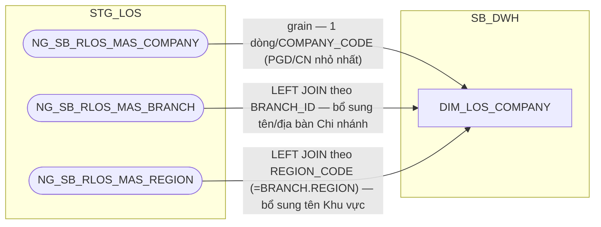
```mermaid
flowchart LR
    subgraph STG_LOS
        A(["NG_SB_RLOS_MAS_COMPANY"])
        B(["NG_SB_RLOS_MAS_BRANCH"])
        R(["NG_SB_RLOS_MAS_REGION"])
    end
    subgraph SB_DWH
        C["DIM_LOS_COMPANY"]
    end
    A -->|"grain — 1 dòng/COMPANY_CODE (PGD/CN nhỏ nhất)"| C
    B -->|"LEFT JOIN theo BRANCH_ID — bổ sung tên/địa bàn Chi nhánh"| C
    R -->|"LEFT JOIN theo REGION_CODE (=BRANCH.REGION) — bổ sung tên Khu vực"| C
```

**Đã giải quyết (review 2026-09-18, theo Meeting note 20260909 mục #5):**
nguồn trước đây (`NG_SB_CLOS_CUST_INFO`/`NG_SB_RLOS_APPLICANT_GENERAL` —
giá trị `COMPANY_CODE`/`BRANCH_CODE`/`ZONE` do hồ sơ tự ghi nhận) đã được
xác nhận **không tương ứng với `DIM_COMPANY` (T24)** (BI phản hồi 11/09) và
**thay thế hoàn toàn** bằng 3 bảng danh mục thật do BA LOS cung cấp
(16/09): `NG_SB_RLOS_MAS_COMPANY`, `NG_SB_RLOS_MAS_BRANCH`,
`NG_SB_RLOS_MAS_REGION` — dùng chung cho cả CLOS và RLOS (không có bản
CLOS riêng, cùng đúng bản chất "1 đơn vị kinh doanh vật lý xử lý cả 2 hệ"
đã thiết kế từ đầu).

**Không tách DIM phân cấp riêng (Company/Branch/Region):** theo quyết định
người dùng, vị trí PGD/Chi nhánh/Khu vực là thực thể địa lý cố định (PGD
luôn thuộc đúng 1 Chi nhánh, Chi nhánh luôn thuộc đúng 1 Khu vực, không đổi
theo thời gian) — denormalize cả 3 bảng thành **1 DIM phẳng duy nhất** ở
mức chi tiết nhất (grain = PGD/`COMPANY_CODE`), giữ nguyên kiến trúc
1-DIM-CHUNG đã có, chỉ mở rộng thêm cột từ `MAS_BRANCH`/`MAS_REGION`.

**SCD2 giữ nguyên cơ chế cũ, đổi cách xác định EFF_DATE:** 3 bảng
`MAS_COMPANY`/`MAS_BRANCH`/`MAS_REGION` là bảng danh mục ở STG_LOS,
**không có cột EFF_DATE** do BA khai báo tay (khác `MAP_LOS_USER`/
`MAP_CLOS_PRODUCT`...). Theo quyết định người dùng, `EFF_DATE` của
`DIM_LOS_COMPANY` được ETL tính bằng **CDC** (so sánh bản ghi cũ/mới của 3
bảng nguồn tại mỗi lần chạy) chứ không đọc thẳng từ cột khai báo tay —
khác cơ chế của các DIM ở mục 1.1.2/1.2.1.2-4/1.3.1.2-4 bên dưới (những
DIM đó dùng EFF_DATE do BA/DevOps nhập tay trên chính bảng MAP_).

##### 1.1.2 DIM_LOS_USER — ✅ ĐÃ GIẢI QUYẾT (nguồn: NG_SB_RLOS_MAS_USER, review 2026-09-18)

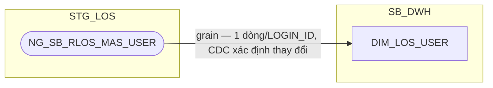
```mermaid
flowchart LR
    subgraph STG_LOS
        X(["NG_SB_RLOS_MAS_USER"])
    end
    subgraph SB_DWH
        C["DIM_LOS_USER"]
    end
    X -->|"grain — 1 dòng/LOGIN_ID, CDC xác định thay đổi"| C
```

**Đã giải quyết:** `DIM_LOS_USER` lưu danh mục **tài khoản người dùng trên
ứng dụng LOS** (không phải danh sách nhân sự HR). Nguồn nạp trước đây tạm
suy ra qua bảng event log workflow (`NG_SB_CLOS_ENTRY_EXIT`/
`NG_SB_RLOS_ENTRY_EXIT`), sau đó tạm thay bằng bảng khai báo thủ công
`MAP_LOS_USER` (chỉ có `USERNAME`) — nay (review 2026-09-18, theo Meeting
note 20260909 mục #3) BA LOS xác nhận (16/09) dùng bảng danh mục thật
`NG_SB_RLOS_MAS_USER`, dùng chung cho cả CLOS và RLOS (cùng tên gọi
`RLOS` nhưng là danh sách toàn bộ tài khoản LOS, không tách theo hệ) —
**thay thế hoàn toàn** `MAP_LOS_USER`. `ENTRY_EXIT` không còn là nguồn của
DIM này nữa (vẫn tiếp tục là nguồn của các FCT khác như trước).

**Thiết kế dư thừa đầy đủ theo nguồn (review 2026-09-18):** theo quyết
định người dùng (Meeting note mục #15 "thiết kế dư thừa ở Dimension"),
`DIM_LOS_USER` bê nguyên toàn bộ 25 cột nghiệp vụ của `MAS_USER` — không
chỉ `USERNAME` như rà soát SRS trước đây kết luận — để sẵn sàng phục vụ
việc tính KPI/báo cáo phân quyền theo ĐVKD/khối nghiệp vụ (vấn đề #3, #27
Meeting note) dù báo cáo hiện tại chưa khai thác hết. Xem cột chi tiết ở
Section 2.

**SCD2 đổi cách xác định EFF_DATE:** `MAS_USER` không có cột EFF_DATE khai
báo tay như `MAP_LOS_USER` — `EFF_DATE` nay do ETL tính qua **CDC**, cùng
cơ chế đã áp dụng cho `DIM_LOS_COMPANY` (1.1.1). Xem Section 3.

### 1.2 Bộ bảng CLOS

##### 1.2.1 DIM

###### 1.2.1.1 DIM_CLOS_APPLICATION — ✅ ĐÃ GIẢI QUYẾT (xem DQ-11; APP_GRP, HAVE_ANY_DEVIATION — thay thế DIM_CLOS_APPROVAL_GROUP đã loại bỏ). ⚠️ review 2026-09-25 (lượt 3): xóa INDUSTRY_LVL1/2/3_CODE (trùng DIM_CLOS_CUSTOMER), đổi nguồn EMPLOYEE_CODE/NAME sang EXTTABLE. ⚠️ review 2026-10-02 (theo yêu cầu người dùng): đổi tên EMPLOYEE_CODE/NAME→CREATE_EMPLOYEE_CODE/NAME; xóa FIRST_APPROVED_WI_NAME (tái tạo tại PDTD_DTM.FCT_CLOS_LOAN_DISBURSEMENT), CUSTOMER_NAME, PRODUCT_NAME (dư thừa, không ai dùng), APP_DATE (trùng CREATION_DATE)

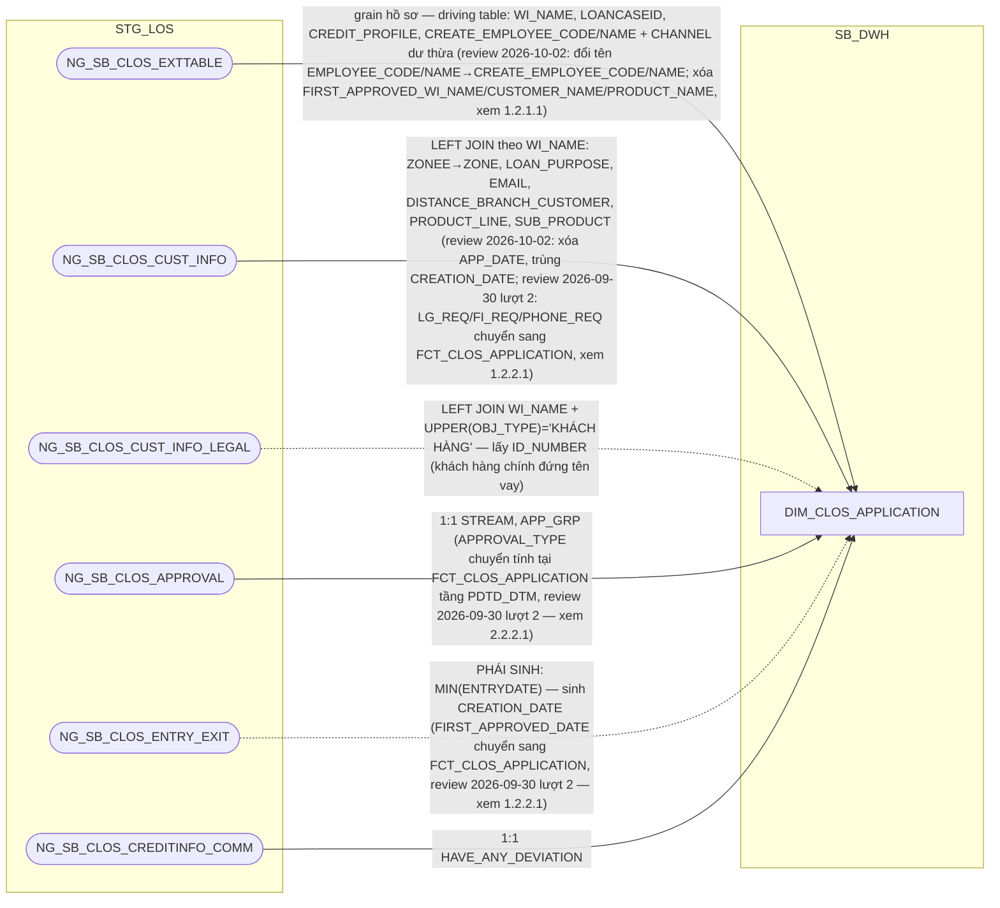
```mermaid
flowchart LR
    subgraph STG_LOS
        A(["NG_SB_CLOS_CUST_INFO"])
        B(["NG_SB_CLOS_APPROVAL"])
        C(["NG_SB_CLOS_EXTTABLE"])
        E(["NG_SB_CLOS_ENTRY_EXIT"])
        G(["NG_SB_CLOS_CREDITINFO_COMM"])
        L(["NG_SB_CLOS_CUST_INFO_LEGAL"])
    end
    subgraph SB_DWH
        F["DIM_CLOS_APPLICATION"]
    end
    C -->|"grain hồ sơ — driving table: WI_NAME, LOANCASEID, CREDIT_PROFILE, CREATE_EMPLOYEE_CODE/NAME + CHANNEL dư thừa (review 2026-10-02: đổi tên EMPLOYEE_CODE/NAME→CREATE_EMPLOYEE_CODE/NAME; xóa FIRST_APPROVED_WI_NAME/CUSTOMER_NAME/PRODUCT_NAME, xem 1.2.1.1)"| F
    A -->|"LEFT JOIN theo WI_NAME: ZONEE→ZONE, LOAN_PURPOSE, EMAIL, DISTANCE_BRANCH_CUSTOMER, PRODUCT_LINE, SUB_PRODUCT (review 2026-10-02: xóa APP_DATE, trùng CREATION_DATE; review 2026-09-30 lượt 2: LG_REQ/FI_REQ/PHONE_REQ chuyển sang FCT_CLOS_APPLICATION, xem 1.2.2.1)"| F
    L -.->|"LEFT JOIN WI_NAME + UPPER(OBJ_TYPE)='KHÁCH HÀNG' — lấy ID_NUMBER (khách hàng chính đứng tên vay)"| F
    B -->|"1:1 STREAM, APP_GRP (APPROVAL_TYPE chuyển tính tại FCT_CLOS_APPLICATION tầng PDTD_DTM, review 2026-09-30 lượt 2 — xem 2.2.2.1)"| F
    E -.->|"PHÁI SINH: MIN(ENTRYDATE) — sinh CREATION_DATE (FIRST_APPROVED_DATE chuyển sang FCT_CLOS_APPLICATION, review 2026-09-30 lượt 2 — xem 1.2.2.1)"| F
    G -->|1:1 HAVE_ANY_DEVIATION| F
```

**✅ Đã giải quyết — xóa `INDUSTRY_LVL1/2/3_CODE`, đổi nguồn
`EMPLOYEE_CODE`/`EMPLOYEE_NAME` (review 2026-09-25, lượt 3, theo yêu cầu
người dùng):** `INDUSTRY_LVL1/2/3_CODE` là thuộc tính khách hàng (ngành
nghề kinh doanh cố hữu, không đổi giữa các hồ sơ của cùng khách hàng),
đã có sẵn ở `DIM_CLOS_CUSTOMER` (1.2.1.6) — xóa khỏi bảng này để không
trùng lặp, xem chi tiết tại Section 2 (1.2.1.1). `EMPLOYEE_CODE`/
`EMPLOYEE_NAME` đổi nguồn từ `NG_SB_CLOS_CUST_INFO.EMP_CODE`/`EMP_NAME`
sang `NG_SB_CLOS_EXTTABLE.EMPLOYEE_CODE`/`EMPLOYEE_NAME` (đã có sẵn 2
cột cùng tên trên EXTTABLE, xác nhận qua metadata Column Review) — cùng
driving table với `WI_NAME`/`LOANCASEID`/`CREDIT_PROFILE`, không cần
LEFT JOIN thêm bảng `NG_SB_CLOS_CUST_INFO` nào cho 2 cột này.

**Đổi driving table sang `NG_SB_CLOS_EXTTABLE` (review 2026-09-25, lượt
2):** `input/DS_BANG_202608.xlsx` xác nhận cả `NG_SB_CLOS_EXTTABLE` và
`NG_SB_CLOS_CUST_INFO` đều có `KEY CDC = WI_NAME` (cùng grain hồ sơ) —
đổi bảng lấy `WI_NAME` (NK) sang `NG_SB_CLOS_EXTTABLE` vì đây là driving
table gốc đúng nghĩa của hồ sơ CLOS (theo yêu cầu người dùng); `NG_SB_
CLOS_CUST_INFO` vẫn tiếp tục LEFT JOIN theo `WI_NAME` để lấy các thuộc
tính của nó, không đổi ý nghĩa dữ liệu, chỉ đổi bảng "cầm trịch" grain.

**Đổi ngược 2 nhóm cột với `DIM_CLOS_CUSTOMER` (review 2026-09-25, sau
khi đánh giá lại grain của `DIM_CLOS_CUSTOMER`, xem 1.2.1.6):**

- **Xóa `CUST_GROUP`** khỏi bảng này — thuộc tính khách hàng thật (phân
  khúc doanh nghiệp), không phải hồ sơ, đã chuyển hẳn về `DIM_CLOS_
  CUSTOMER` (1.2.1.6, cột 6). Mọi công thức từng dùng `CUST_GROUP` local
  của bảng này (`BUSINESS_FLOW`, chọn bảng SLA `CLOS_REF_SLA_TDKHDNL`/
  `CLOS_REF_SLA_TDKHDN` cho `REF_PRODUCT`/`SLA_*`, cả hai ở PDTD_DTM —
  xem 2.2.1.1) nay đổi sang lấy `CUST_GROUP` từ `DIM_CLOS_CUSTOMER` qua
  `CUSTOMER_SK`. `CHECK_FTR` trên `FCT_CLOS_EXCEPTION` (1.2.2.4) và
  `CUST_GROUP` denormalize trên `FCT_CLOS_LOAN_DISBURSEMENT` (2.2.2.7)
  cũng đổi tương tự — xem ghi chú riêng tại mỗi bảng đó.
- **Nhận lại 8 cột hồ sơ-grain** đã bị loại khỏi `DIM_CLOS_CUSTOMER`
  (review 2026-09-25, xem 1.2.1.6): `ZONE` (đổi tên từ nguồn `ZONEE`),
  `APP_DATE`, `LOAN_PURPOSE`, `LG_REQ`, `FI_REQ`, `PHONE_REQ`, `EMAIL`,
  `DISTANCE_BRANCH_CUSTOMER` — cùng nguồn `NG_SB_CLOS_CUST_INFO`, quan hệ
  1:1 với hồ sơ (đúng grain của bảng này). Đây là các cột từng bị đặt sai
  chỗ ở `DIM_CLOS_CUSTOMER` (review 2026-09-21, dưới tên "làm giàu"),
  nay xác định lại đúng bản chất là thuộc tính HỒ SƠ (khu vực đơn vị xử
  lý, mục đích vay của khoản đang xin, cờ yêu cầu phát sinh theo hồ sơ,
  liên hệ khai theo hồ sơ, khoảng cách tới chi nhánh xử lý cụ thể) — đưa
  về đúng bảng theo grain, xem Section 3.

**Xóa `CHANGE_REQUEST`/`CHANGE_TYPE` khỏi DIM, chuyển hẳn sang Fact
(review 2026-09-25, lượt 2):** nguồn `NG_SB_CLOS_CHANGEREQ` mang bản
chất "thay đổi thường xuyên" theo hồ sơ (không phải thuộc tính ổn định
kiểu SCD2 chậm thay đổi như các cột khác của DIM này) — theo quyết định
người dùng, 2 cột này sẽ được thêm vào `FCT_CLOS_APPLICATION`
(1.2.2.1) ở lượt review riêng của bảng đó, chưa xử lý trong lượt này.
**⚠️ Tham chiếu treo:** các bảng sau vẫn còn sơ đồ lineage/mô tả tham
chiếu `CHANGE_REQUEST`/`CHANGE_TYPE` qua `DIM_CLOS_APPLICATION` — sẽ cập
nhật khi `FCT_CLOS_APPLICATION` được review: `FCT_CLOS_WORKSTEP_
EVENT` (1.2.2.6), `FCT_CLOS_EXCEPTION` (1.2.2.4), `FCT_CLOS_DEVIATION`,
`FCT_CLOS_COLLATERAL`, `DIM_CLOS_CHANGE_
TYPE` note (RLOS-side, không đổi), và công thức `REF_PRODUCT`/`SLA_*` ở
PDTD_DTM (2.2.1.1) dùng `CHANGE_TYPE` làm khóa either/or. (⚠️ review
2026-09-26: `FCT_CLOS_APPLICATION_PARTY` (PDTD_DTM, 2.2.2.2) đã bị xóa
hẳn — loại khỏi danh sách này, không còn tồn tại để cập nhật; bản
SB_DWH, 1.2.2.2, không có tham chiếu treo này.) Xem Section 3.

**Thêm mới — thông tin hồ sơ từ `NG_SB_CLOS_CUST_INFO` (review 2026-09-25,
lượt 2, theo yêu cầu người dùng + đối chiếu SRS BC2):** `PRODUCT_LINE`,
`SUB_PRODUCT` — text tự khai theo hồ sơ (mã dòng sản phẩm dạng PRO01-06 +
tên sản phẩm chi tiết), BC2 dùng hiển thị trực tiếp (STT27/28). Giữ
nguyên dạng text, KHÔNG join `DIM_CLOS_PRODUCT` — giá trị của `CUST_INFO.
PRODUCT_LINE`/`SUB_PRODUCT` là tự khai theo hồ sơ, chưa xác nhận khớp
1:1 với mã chuẩn hóa `PRODUCT_LINE_CODE`/`SUB_PRODUCT_CODE` của `DIM_
CLOS_PRODUCT` (nguồn `NG_SB_CLOS_MAS_PRO_LINE`/`MAS_SUB_PROD`, xem
1.2.1.2) — quan hệ hồ sơ↔sản phẩm chuẩn hóa vẫn tiếp tục đi qua `FCT_
CLOS_APPLICATION_DAILY.PRODUCT_SK` như thiết kế cũ (xem 2.2.1.1 Section
1, "Lưu ý về PRODUCT_LINE/SUB_PRODUCT dùng làm khóa tra"), không đổi.

**Thêm mới — khách hàng chính (review 2026-09-25, lượt 2):** `ID_NUMBER`
— số ĐKKD/CMND của khách hàng đứng tên vay chính, lấy qua `NG_SB_CLOS_
CUST_INFO_LEGAL` lọc `UPPER(OBJ_TYPE)='KHÁCH HÀNG'` theo `WI_NAME` (mỗi
hồ sơ chỉ có đúng 1 dòng OBJ_TYPE='Khách hàng', đã xác nhận — xem
`FCT_CLOS_LEGAL_PARTY`, 1.2.2.7). Mục đích: thể hiện tường minh quan hệ
hồ sơ↔khách hàng ngay trên DIM này (yêu cầu người dùng khi `DIM_CLOS_
CUSTOMER` đổi NK, không còn `WI_NAME`). `CUSTOMER_NAME` KHÔNG cần lấy
riêng qua LEGAL — `NG_SB_CLOS_EXTTABLE` (driving table) đã có sẵn cột
này, xem nhóm 18 cột dư thừa dưới đây.

**Thêm mới — 18 cột dư thừa lưu vết nguồn `NG_SB_CLOS_EXTTABLE` (review
2026-09-25, lượt 2, theo yêu cầu người dùng):** đối chiếu `input/CLOS -
Metadata.xlsx` (sheet "3. Column Review", 28 cột đã review của
`EXTTABLE`) với SRS (BC2/BC3/BC5/BC9) không phát hiện report nào dùng
trực tiếp 18 cột này — thêm vào DIM để không bỏ sót thuộc tính gốc của
driving table mới, đánh dấu "Thiết kế dư thừa" (cùng cách đã làm với
`CHANNEL` trên `DIM_CLOS_WORKSTEP_DECISION`, 1.2.1.3): `CUSTOMER_NAME`,
`DECISION`, `CURR_WSNAME`, `PREV_WSNAME`, `PRODUCT_NAME`, `DATACHKUSER`,
`UWMAKERUSER`, `UWCHKRUSER`, `CREDAPPRUSER`, `CCOMMITUSER`,
`HOSUPPORTUSER`, `POSTSANCUSER`, `PREDISBMAKUSER`, `PREDISBCHKUSER`,
`DISBCHKUSER`, `DISBMAKUSER`, `CHECKER3_TARGET`, `CHANNEL` (⚠️ review
2026-09-30, theo yêu cầu người dùng: 12 cột `DATACHKUSER`…`CHECKER3_TARGET`
đã xóa lại khỏi DIM — xem giải trình đầu mục 1.2.1.1, chỉ còn `DECISION`/
`CURR_WSNAME`/`PREV_WSNAME`/`PRODUCT_NAME`/`CHANNEL` trong nhóm này).
Loại trừ cột
`RN` (100% rỗng trên metadata, không có ý nghĩa nghiệp vụ). Lưu ý:
`EXTTABLE` và `CUST_INFO` có 6 cột trùng tên (`COMPANY_CODE/NAME`,
`BRANCH_CODE/NAME`, `CUSTOMER_NAME`, `CUST_GROUP`) — theo quyết định
người dùng, `COMPANY_CODE/NAME`/`BRANCH_CODE/NAME` KHÔNG đưa vào DIM này
(quan hệ hồ sơ↔đơn vị kinh doanh đã có sẵn qua `COMPANY_SK` → `DIM_LOS_
COMPANY`); `CUSTOMER_NAME` lấy từ `EXTTABLE` (driving table); `CUST_
GROUP` không lấy ở cả 2 nguồn (đã chuyển hẳn về `DIM_CLOS_CUSTOMER`).

**Join `CUST_GROUP` mới qua `CUSTOMER_SK` (áp dụng cho mọi công thức
từng đọc `CUST_GROUP` local, review 2026-09-25):** vì `DIM_CLOS_
APPLICATION` không có chiều ngày (không phải SCD2-theo-DAYID như FCT),
không thể tra `DIM_CLOS_CUSTOMER` theo điều kiện "hiệu lực tại DAYID"
như trên `FCT_CLOS_APPLICATION`. Thay vào đó, dùng đúng logic đã
dùng để dựng chính `DIM_CLOS_CUSTOMER`: `WI_NAME` (của dòng đang ETL) →
`NG_SB_CLOS_CUST_INFO_LEGAL` lọc `UPPER(OBJ_TYPE)='KHÁCH HÀNG'` → lấy
`ID_NUMBER` → LEFT JOIN `DIM_CLOS_CUSTOMER` theo `ID_NUMBER` (NK) lấy
bản ghi hiện hành (`EXP_DATE IS NULL`) tại thời điểm ETL — ra
`CUSTOMER_SK`/`CUST_GROUP`. Xem cột `CUSTOMER_SK` (mới, cột 27) tại
Section 2.

**Đính chính công thức `FIRST_APPROVED_WI_NAME`/`FIRST_APPROVED_DATE`
(review 2026-09-15) — khớp lại đúng SRS BC11:** thiết kế trước đây (kế
thừa từ `extract/SB_DWH/DIM_LOS_APPLICATION.md`, vốn tự ghi chú "LƯU Ý
LỆCH SRS... CẦN BA KÝ NHẬN") dùng công thức "hồ sơ được phê duyệt đầu
tiên theo ENTRYDATE" cho cả 2 cột, khác với nguyên văn SRS BC11:
`APPROVAL_WINAME_LOS` = MIN(WI_NAME) trên `NG_SB_CLOS_EXTTABLE` (group
theo `LOANCASEID`, không lọc WORKSTEP/DECISION), `APPROVAL_DATE` =
MAX(EXITDATE) trên `NG_SB_CLOS_ENTRY_EXIT` (điều kiện `USERNAME IS NOT
NULL AND WORKSTEP IN ('CreditApproval','CreditCommittee') AND DECISION
IN ('Submit','Send To HOSupport','Send To PostSanction')`) — 2 cột độc
lập, không đi cặp cùng 1 bản ghi như thiết kế cũ giả định. Đã sửa lại cả
2 công thức khớp đúng nguyên văn SRS, không còn cảnh báo lệch cần BA ký
nhận. `FCT_CLOS_LOAN_DISBURSEMENT` (2.2.2.7) denormalize trực tiếp 2 cột
này qua `APPLICATION_SK` — nay khớp tuyệt đối BC11, không còn ghi chú
"chấp nhận lệch" như trước.

**⚠️ Review 2026-09-30 (lượt 2, theo yêu cầu người dùng): chuyển
`FIRST_APPROVED_DATE`/`LG_REQ`/`FI_REQ`/`PHONE_REQ` sang `FCT_CLOS_
APPLICATION`, xóa `APPROVAL_TYPE`/`DECISION`/`CURR_WSNAME`/
`PREV_WSNAME`:** rà soát cùng pattern đã áp dụng cho `DIM_RLOS_
APPLICATION` (đợt review trước đó). `FIRST_APPROVED_DATE` chỉ có giá trị
từ khi hồ sơ tới bước phê duyệt (không phải thuộc tính hồ sơ ổn định),
chuyển sang đặt cạnh `LAST_APPROVAL_DATE` trên `FCT_CLOS_APPLICATION`
(1.2.2.1) — 2 cột độc lập (khác điều kiện lọc DECISION), không trùng
lặp dù cùng công thức MAX(EXITDATE). `LG_REQ`/`FI_REQ`/`PHONE_REQ` là cờ
yêu cầu gắn với nguồn `NG_SB_CLOS_CUST_INFO` (bảng tự phát sinh dòng mới
khi hồ sơ bàn giao nhân viên khác xử lý) — chuyển sang `FCT_CLOS_
APPLICATION`, cùng lý do 11 cờ tương ứng đã chuyển bên `DIM_RLOS_
APPLICATION`. `APPROVAL_TYPE` xóa khỏi DIM — không phải cột trùng lặp
với `STREAM` (cùng nguồn nhưng khác điều kiện lọc `STREAM IN ('Phê duyệt
tín dụng','Sent To Disbursement Request')`), nhưng điều kiện lọc là
business rule nên chuyển tính tại `FCT_CLOS_APPLICATION` tầng PDTD_DTM
(2.2.2.1), không đặt ở SB_DWH; `STREAM` (giá trị gốc) vẫn giữ nguyên
trên DIM này. `DECISION`/`CURR_WSNAME`/`PREV_WSNAME` xóa hẳn — trùng bản
chất với `LAST_WORKSTEP_DECISION_SK`/`PRE_WORKSTEP_CODE` đã có report
dùng qua BC2 trên `FCT_CLOS_APPLICATION`, cùng `FCT_CLOS_WORKSTEP_EVENT`
— đúng tiền lệ đã xóa 3 cột cùng tên trên `DIM_RLOS_APPLICATION`. Xem
bảng cột chi tiết và giải trình đầy đủ tại Section 2 → 1.2.1.1 (mục lục
riêng ở đây chỉ giữ sơ đồ lineage tổng quan).

**⚠️ Review 2026-10-02 (theo yêu cầu người dùng): đổi tên `EMPLOYEE_CODE`/
`EMPLOYEE_NAME`, xóa `FIRST_APPROVED_WI_NAME`/`CUSTOMER_NAME`/
`PRODUCT_NAME`/`APP_DATE`:**

- **Đổi tên `EMPLOYEE_CODE`→`CREATE_EMPLOYEE_CODE`, `EMPLOYEE_NAME`→
  `CREATE_EMPLOYEE_NAME`** (SB_DWH, STG_DTM, PDTD_DTM — đổi tên kỹ thuật
  nội bộ, không đổi giá trị/nguồn): làm rõ đây là nhân viên **khởi tạo
  hồ sơ** (CRO), phân biệt với các cột user theo từng bước xử lý đã có
  sẵn trên `FCT_CLOS_APPLICATION` (`APPROVER_USER`, `UND_MAKER_USER`...).
  Báo cáo BC2 (SRS gốc dùng tên `EMPLOYEE_CODE`/`EMPLOYEE_NAME`, hiển thị
  "Mã CRO"/"Tên CRO") **không đổi tên hiển thị** — `lld/BC2.csv` chỉ cập
  nhật cột nguồn tham chiếu sang tên mới, giá trị/ý nghĩa giữ nguyên.
- **Xóa `FIRST_APPROVED_WI_NAME`** khỏi DIM: cột này hiện là nguồn thật
  duy nhất cho `FCT_CLOS_LOAN_DISBURSEMENT.APPROVAL_WINAME_LOS` (BC11,
  2.2.2.7) qua JOIN `APPLICATION_SK` — không phải cột dư thừa chưa ai
  dùng. Quyết định: đưa logic tính `MIN(WI_NAME) OVER (PARTITION BY
  LOANCASEID)` lên **report/ETL-time ngay tại `FCT_CLOS_LOAN_
  DISBURSEMENT`** (PDTD_DTM) — tiền xử lý một sub-select trên
  `STG_DIM_CLOS_APPLICATION` để mỗi dòng `WI_NAME` tự mang theo giá trị
  `FIRST_APPROVED_WI_NAME` của nhóm `LOANCASEID` (window function, không
  gom nhóm số dòng), rồi `FCT_CLOS_LOAN_DISBURSEMENT` JOIN sub-select đó
  theo đúng điều kiện `SEAB_LOS_ID = WI_NAME` đã có sẵn (cột 9,
  `APPLICATION_SK`) — không cần JOIN thêm theo `LOANCASEID`. Không đặt ở
  SB_DWH vì không có report/bảng nào khác tiêu thụ `FIRST_APPROVED_
  WI_NAME` ngoài bảng PDTD_DTM này. `LOANCASEID` (cột thô, không phái
  sinh) vẫn giữ nguyên trên DIM — chỉ cột phái sinh `FIRST_APPROVED_
  WI_NAME` chuyển đi. Xem chi tiết công thức tại Section 2 → 2.2.2.7.
- **Xóa `CUSTOMER_NAME`, `PRODUCT_NAME`:** xác nhận lại qua `lld/sb_dwh/
  SB_DWH_DIM_CLOS_APPLICATION.csv` — cả 2 cột chỉ là bản sao trực tiếp
  (`direct`) từ `NG_SB_CLOS_EXTTABLE`, không dùng làm khóa JOIN ở bất kỳ
  nơi nào. Báo cáo lấy tên khách hàng (BC2/BC3/BC4) qua `DIM_CLOS_
  CUSTOMER.FULL_NAME` bằng `CUSTOMER_SK` có sẵn trên `FCT_CLOS_
  APPLICATION`/`FCT_CLOS_WORKSTEP_EVENT`; tên sản phẩm (BC5/BC9) qua
  `DIM_CLOS_PRODUCT.PRODUCT_NAME` bằng `PRODUCT_SK` — không đụng đến 2
  cột dư thừa này trên `DIM_CLOS_APPLICATION`. Khai thác hồ sơ↔khách
  hàng/sản phẩm tiếp tục qua `CUSTOMER_SK`/`PRODUCT_SK` trên FCT như
  thiết kế hiện có, không cần 2 cột text song song.
- **Xóa `APP_DATE`:** đối chiếu `input/CLOS - Metadata.xlsx` (sheet
  "3. Column Review") xác nhận `NG_SB_CLOS_CUST_INFO.APP_DATE` có ý
  nghĩa nghiệp vụ "Ngày khởi tạo/nộp hồ sơ" (trường LOS: "Ngày khởi
  tạo") — trùng ý nghĩa với `CREATION_DATE` (cột phái sinh `MIN
  (ENTRYDATE)`, đã có BC2 STT8 dùng). Giữ `CREATION_DATE` (đã có report
  tiêu thụ), xóa `APP_DATE` (dư thừa, không report nào dùng trực tiếp —
  chỉ "đi kèm" nhóm 8 cột hồ sơ-grain nhận lại từ `DIM_CLOS_CUSTOMER` ở
  review 2026-09-25, không phải vì bản thân nó cần thiết).

**Ghi chú lineage — loại bỏ `DIM_CLOS_APPROVAL_GROUP`, bổ sung `APP_GRP` +
`HAVE_ANY_DEVIATION` thẳng lên đây:** kiểm tra lại nguồn `NG_SB_CLOS_APPROVAL`
(RLOS Metadata/CLOS Metadata gốc, sheet Table Review) xác nhận **grain thật
là 1 dòng = 1 hồ sơ** — không phải bảng ghi nhận nhiều lần phê duyệt theo
thời gian như giả định ban đầu khi tạo `DIM_CLOS_APPROVAL_GROUP` (Section 3
dòng #9, nay đã cập nhật). Vì vậy `APP_GRP` (cấp thẩm quyền phê duyệt) là
thuộc tính ổn định của hồ sơ, đọc thẳng từ `NG_SB_CLOS_APPROVAL` — cùng
bảng, cùng cách với `STREAM` đã có sẵn ở đây — không cần
một DIM danh mục riêng nữa. `DIM_CLOS_APPROVAL_GROUP` và
`MAP_CLOS_APPROVAL_GROUP` (seed table đi kèm) đã bị loại bỏ hoàn toàn; cột
`APPROVAL_GROUP_SK` cũng bị loại khỏi `FCT_CLOS_APPLICATION` (báo
cáo lấy `APP_GRP` bằng JOIN `APPLICATION_SK` sang đây).

`HAVE_ANY_DEVIATION` là cột có sẵn trên `NG_SB_CLOS_CREDITINFO_COMM` (cùng
bảng nguồn đã dùng cho `CREDIT_LIMIT_COMMITTEE` trên
`FCT_CLOS_APPLICATION` — bảng ghi tại bước Hội đồng tín dụng, mỗi hồ
sơ 1 dòng, sửa thì ghi đè chứ không sinh dòng mới). Đây là thuộc tính gắn
với hồ sơ (dù chỉ có giá trị từ khi hồ sơ tới bước Hội đồng tín dụng, NULL
ở các phiên bản trước đó — cùng kiểu "thuộc tính đến muộn" như
`RESULT_MAIN_CARD_ID` của `DIM_RLOS_APPLICATION`), không phải giá trị tính
theo giao dịch/theo ngày.

Cả `APP_GRP` và `HAVE_ANY_DEVIATION` dùng làm khóa tra cam kết SLA
(`REF_PRODUCT`/`SLA_*`) khi LEFT JOIN `CLOS_REF_SLA_TDKHDNL`/
`CLOS_REF_SLA_TDKHDN` — việc tra cứu này chỉ thực hiện được ở tầng
PDTD_DTM (REF_ chỉ tồn tại ở đó), xem 2.2.1.1 (Section 1 → PDTD_DTM). SB_DWH
chỉ giữ 2 cột thô này, chưa tính `REF_PRODUCT`/`SLA_*` ở layer này — đã xác
nhận với người dùng, xem Section 3 dòng #13.

**Ghi chú lineage — không tách `DIM_CLOS_CHANGE_TYPE` (giữ nguyên phân
tích, chỉ đổi nơi lưu trữ):** đối chiếu SRS BC2 ("Báo cáo CLOS
APPLICATION") xác nhận `CHANGE_TYPE` lấy thẳng từ `NG_SB_CLOS_
CHANGEREQ.CHANGE_TYPE`, không qua bảng danh mục nào — khác hẳn RLOS có
`SB_RLOS_MAS_CHANGE_TYPE` là danh mục gốc thật. Metadata CLOS xác nhận
cột này là chuỗi tự do đa giá trị (nhiều loại hạn mức nối bằng `~`, ví
dụ `Hạn mức Chiết khấu~Hạn mức bảo lãnh~`), đã là tên sẵn chứ không phải
mã cần tra tên — không có `DETAIL_CHANGE_TYPE` nào cho CLOS trong SRS,
nên vẫn không tách thành DIM riêng. **⚠️ review 2026-09-25 (lượt 2):**
`CHANGE_TYPE`/`CHANGE_REQUEST` không còn là cột trên `DIM_CLOS_
APPLICATION` — đã xóa (xem ghi chú ở trên), chuyển hẳn sang `FCT_CLOS_
APPLICATION_DAILY` khi review bảng đó. Xem Section 3 dòng liên quan.

###### 1.2.1.2 DIM_CLOS_PRODUCT — ✅ ĐÃ GIẢI QUYẾT (nguồn: NG_SB_CLOS_MAS_PRO_LINE/MAS_SUB_PROD, review 2026-09-18)

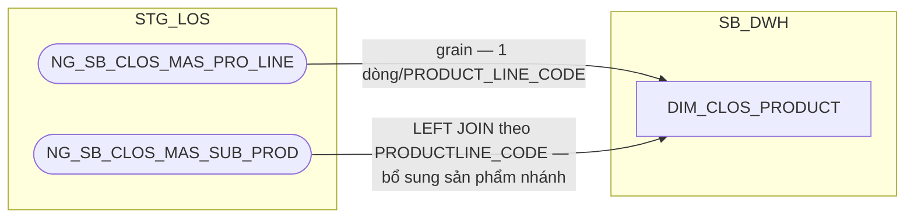
```mermaid
flowchart LR
    subgraph STG_LOS
        A(["NG_SB_CLOS_MAS_PRO_LINE"])
        B(["NG_SB_CLOS_MAS_SUB_PROD"])
    end
    subgraph SB_DWH
        D["DIM_CLOS_PRODUCT"]
    end
    A -->|"grain — 1 dòng/PRODUCT_LINE_CODE"| D
    B -->|"LEFT JOIN theo PRODUCTLINE_CODE — bổ sung sản phẩm nhánh"| D
```

**Đã giải quyết (review 2026-09-18, theo Meeting note 20260909 mục #1):**
nguồn trước đây suy từ `NG_SB_CLOS_CUST_INFO`/`NG_SB_CLOS_EXTTABLE`/
`NG_SB_CLOS_MAS_PRO_LINE` (đều grain-theo-hồ-sơ hoặc chưa xác minh) rồi
tạm thay bằng bảng khai báo thủ công `MAP_CLOS_PRODUCT`; nay BA LOS xác
nhận (16/09) 2 bảng danh mục thật `NG_SB_CLOS_MAS_PRO_LINE` (dòng sản
phẩm) + `NG_SB_CLOS_MAS_SUB_PROD` (sản phẩm nhánh) — **thay thế hoàn
toàn** `MAP_CLOS_PRODUCT`, không cần bảng seed thủ công nữa. Các bảng
`NG_SB_CLOS_CUST_INFO`/`NG_SB_CLOS_EXTTABLE` không còn là nguồn của DIM này
nữa (vẫn tiếp tục phục vụ các bảng khác như `DIM_CLOS_APPLICATION`).

**SCD2 đổi cách xác định EFF_DATE:** `MAS_PRO_LINE`/`MAS_SUB_PROD` không
có cột EFF_DATE khai báo tay như `MAP_CLOS_PRODUCT` trước đây — `EFF_DATE`
nay do ETL tính qua **CDC** (so sánh bản ghi cũ/mới), cùng cơ chế đã áp
dụng cho `DIM_LOS_COMPANY` (1.1.1). Xem Section 3.

###### 1.2.1.3 DIM_CLOS_WORKSTEP_DECISION — ✅ ĐÃ GIẢI QUYẾT (nguồn: NG_SB_CLOS_MAS_DECISION, review 2026-09-24, gộp từ DIM_CLOS_WORKSTEP + DIM_CLOS_DECISION)

```mermaid
flowchart LR
    subgraph STG_LOS
        A(["NG_SB_CLOS_MAS_DECISION"])
    end
    subgraph SB_DWH
        C["DIM_CLOS_WORKSTEP_DECISION"]
    end
    A -->|"1:1 QUEUE_NAME + DECISION — CDC xác định thay đổi, mỗi cặp (WORKSTEP_CODE, DECISION_CODE) là 1 dòng duy nhất trên nguồn"| C
```

**Gộp 2 DIM thành 1 (review 2026-09-24):** trước đây tách riêng
`DIM_CLOS_WORKSTEP` (DISTINCT QUEUE_NAME) và `DIM_CLOS_DECISION`
(DISTINCT DECISION) từ cùng bảng nguồn `NG_SB_CLOS_MAS_DECISION`, theo
quyết định cũ (review 2026-09-18) "giữ tách 2 DIM... không gộp thành 1
DIM composite theo đúng cấu trúc N-N của bảng nguồn". Xác nhận lại
(review 2026-09-24, theo quyết định người dùng): `NG_SB_CLOS_MAS_DECISION`
đúng là 1 WORKSTEP có thể xuất hiện ở nhiều dòng với DECISION khác nhau
(N:N ở mức từng cột), NHƯNG **mỗi cặp (QUEUE_NAME, DECISION) là duy nhất
trên bảng nguồn** — grain thật của bảng nguồn là "1 dòng = 1 cặp
(WORKSTEP, DECISION) hợp lệ", không phải 2 danh mục độc lập tự do kết
hợp. Tách thành 2 DIM riêng làm mất thông tin cặp nào thực sự hợp lệ.
Đã gộp lại thành 1 DIM composite `DIM_CLOS_WORKSTEP_DECISION`, giữ đúng
grain của bảng nguồn — không còn suy ra danh mục bằng DISTINCT riêng lẻ
từng cột.

⚠️ **Giả định cần BA xác nhận lại trước khi sinh LLD:** file
`input/DS Bảng danh mục.xlsx` (sheet `NG_SB_CLOS_MAS_DECISION`) chỉ xác
nhận bảng nguồn tồn tại thật với 3 cột (`QUEUE_NAME`, `DECISION`,
`CHANNEL`) — không có dữ liệu mẫu để tự kiểm chứng độc lập việc mỗi cặp
(QUEUE_NAME, DECISION) là duy nhất. Grain trên dựa theo xác nhận nghiệp
vụ của người dùng, chưa có bằng chứng dữ liệu mẫu trong repo.

**`DIM_CLOS_WORKSTEP_DECISION` (SB_DWH):**

| STT | Tên cột | Kiểu dữ liệu | Bắt buộc | Độ lớn | Khóa | Mô tả |
| --- | --- | --- | --- | --- | --- | --- |
| 1 | DIMENSION_KEY | NUMBER | Y | 18 | PK | Khóa chính của bảng chiều DIM_CLOS_WORKSTEP_DECISION, sinh bằng Oracle sequence tại SB_DWH; PDTD_DTM giữ nguyên giá trị, không sinh sequence mới |
| 2 | WORKSTEP_DECISION_SK | NUMBER | Y | 18 |  | Khóa tham chiếu đến bảng chiều DIM_CLOS_WORKSTEP_DECISION, bằng đúng giá trị DIMENSION_KEY của cùng dòng. Giá trị mặc định = -1 (dòng Unknown) nếu không có giá trị phù hợp |
| 3 | WORKSTEP_CODE | VARCHAR2 | Y | 200 | NK | Mã bước xử lý trên workflow CLOS — nguồn NG_SB_CLOS_MAS_DECISION.QUEUE_NAME. Cùng với DECISION_CODE tạo thành khóa nghiệp vụ composite của bảng |
| 4 | DECISION_CODE | VARCHAR2 | Y | 200 | NK | Mã quyết định phát sinh tại bước xử lý trên — nguồn NG_SB_CLOS_MAS_DECISION.DECISION. UNIQUE (WORKSTEP_CODE, DECISION_CODE, EFF_DATE) |
| 5 | CHANNEL | VARCHAR2 | N | 200 |  | Kênh áp dụng của cặp (bước xử lý, quyết định) — nguồn NG_SB_CLOS_MAS_DECISION.CHANNEL. Giữ có chủ đích để bảo toàn dữ liệu nguồn (review 2026-09-24, theo yêu cầu người dùng) — hiện chưa có báo cáo nào tiêu thụ, tương tự trường hợp FCT_CLOS_DEVIATION.AS_REGULAR |
| 6 | EFF_DATE | DATE | Y |  |  | Ngày bắt đầu hiệu lực của phiên bản bản ghi (SCD Type 2) — do ETL tính qua CDC khi phát hiện thay đổi trên MAS_DECISION |
| 7 | EXP_DATE | DATE | N |  |  | Ngày hết hiệu lực của phiên bản bản ghi; NULL = bản ghi hiện hành |

- Bảng DIM lưu danh mục cặp (bước xử lý, quyết định) hợp lệ trong quy trình BPM của hồ sơ tín dụng CLOS, 1 dòng = 1 cặp (WORKSTEP_CODE, DECISION_CODE) hợp lệ.
- Khóa chính của bảng (PK): **DIMENSION_KEY**.

**Bổ sung cột `CHANNEL` (review 2026-09-24, theo yêu cầu người dùng):**
bảng nguồn `NG_SB_CLOS_MAS_DECISION` có 3 cột (`QUEUE_NAME`, `DECISION`,
`CHANNEL` — xác nhận qua `input/DS Bảng danh mục.xlsx`), trước đây DIM
chỉ nạp 2 cột đầu. Bổ sung `CHANNEL` để không bỏ sót thuộc tính gốc
của bảng nguồn — giữ có chủ đích dù chưa có báo cáo nào tiêu thụ trực
tiếp (thiết kế dư thừa cho thông tin nguồn, giống `AS_REGULAR` trên
`FCT_CLOS_DEVIATION`, xem Section 2 → 2.2.2.7 dòng ghi chú "Sửa lỗi
copy-paste hàng loạt").

**Đối chiếu SRS (BC1, BC2, BC3, BC4, BC5, BC7, BC8, BC9):** BC3, BC4, BC8
dùng `WORKSTEP`/`DECISION` cho mục đích hiển thị/lọc — nay đọc qua JOIN
`WORKSTEP_DECISION_SK` sang `DIM_CLOS_WORKSTEP_DECISION` thay vì cột
denormalize trên `FCT_CLOS_WORKSTEP_EVENT` (xem 1.2.2.6, cột đã xóa).
BC1/BC2/BC5/BC7/BC9 dùng cùng cách. Không phát hiện lệch tài liệu nào về
công thức cột.

`WFINSTRUMENTTABLE` vẫn không thuộc phạm vi bảng này — bảng đó chỉ dùng ở
tầng FCT để đối chiếu bước hồ sơ đang đứng hiện tại (`ACTIVITYNAME`) khi
tính cột phái sinh `WORKSTEP_FLAG` trên `FCT_*_APPLICATION_DAILY`/
`FCT_*_WORKSTEP_EVENT` — không liên quan tới `DIM_CLOS_WORKSTEP_DECISION`.

###### 1.2.1.5 DIM_CLOS_EXCEPTION

```mermaid
flowchart LR
    subgraph STG_LOS
        A(["NG_SB_CLOS_MAS_EXCEPTION"])
    end
    subgraph SB_DWH
        C["DIM_CLOS_EXCEPTION"]
    end
    A -->|1:1 ACTIVITYNAME, DECISION_CODE, EXCEPTION_CATEGORY, EXCEPTION_NAME| C
```

**Ghi chú lineage:** khác với `WORKSTEP`/`DECISION`/`APPROVAL_GROUP`,
`NG_SB_CLOS_MAS_EXCEPTION` mang tiền tố `MAS_` (master) và được lineage
doc gốc xác nhận là bảng LOẠI 1 với khóa CDC khai đủ tổ hợp khóa tự nhiên —
tức đây thực sự là danh mục cấu hình gốc (lý do ngoại lệ được phép phát
sinh tại từng bước/quyết định), không phải bảng sự kiện/giao dịch theo hồ
sơ như `NG_SB_CLOS_ENTRY_EXIT`/`NG_SB_CLOS_APPROVAL`. Do đó **không rơi
vào pattern "application-scoped source"** — giữ nguyên nguồn trực tiếp từ
`NG_SB_CLOS_MAS_EXCEPTION`, không cần bảng `MAP_` seed.

###### 1.2.1.6 DIM_CLOS_CUSTOMER — ĐỔI GRAIN (review 2026-09-25, "1 dòng/hồ sơ" → "1 dòng/khách hàng")

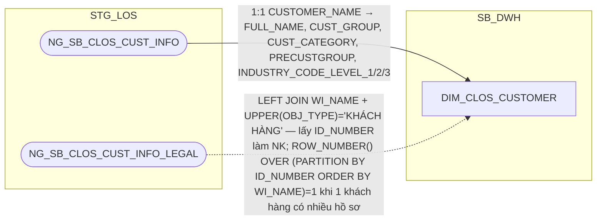
```mermaid
flowchart LR
    subgraph STG_LOS
        A(["NG_SB_CLOS_CUST_INFO"])
        L(["NG_SB_CLOS_CUST_INFO_LEGAL"])
    end
    subgraph SB_DWH
        E["DIM_CLOS_CUSTOMER"]
    end
    A -->|1:1 CUSTOMER_NAME → FULL_NAME, CUST_GROUP, CUST_CATEGORY, PRECUSTGROUP, INDUSTRY_CODE_LEVEL_1/2/3| E
    L -.->|"LEFT JOIN WI_NAME + UPPER(OBJ_TYPE)='KHÁCH HÀNG' — lấy ID_NUMBER làm NK; ROW_NUMBER() OVER (PARTITION BY ID_NUMBER ORDER BY WI_NAME)=1 khi 1 khách hàng có nhiều hồ sơ"| E
```

**Ghi chú lineage — đổi khóa nghiệp vụ (review 2026-09-25, theo yêu cầu
người dùng):** thiết kế trước đây (xem lịch sử ngay dưới) dùng `WI_NAME`
làm NK — nghĩa là grain thật là "1 dòng/hồ sơ", không phải "1 dòng/khách
hàng". Một khách hàng nộp nhiều hồ sơ (nhiều `WI_NAME`) sẽ tạo nhiều dòng
trùng lặp cho cùng 1 khách hàng — sai bản chất DIM khách hàng. NK mới là
**`ID_NUMBER`** (số ĐKKD/CMND của khách hàng, định danh pháp lý ổn định,
không đổi giữa các hồ sơ khác nhau) — lấy bằng `NG_SB_CLOS_CUST_INFO` LEFT
JOIN `NG_SB_CLOS_CUST_INFO_LEGAL` theo `WI_NAME` + `UPPER(OBJ_TYPE)='KHÁCH
HÀNG'` (mỗi hồ sơ chỉ có đúng 1 dòng `OBJ_TYPE='Khách hàng'` — đã xác nhận
trước đây, xem `FCT_CLOS_LEGAL_PARTY`, 1.2.1.7). `WI_NAME` **không còn là
cột lưu trữ trên bảng này** — chỉ là điều kiện join lúc ETL, không đại
diện cho grain nữa.

**Dedupe khi 1 `ID_NUMBER` xuất hiện ở nhiều `WI_NAME`:** dữ liệu thuộc
tính giống nhau giữa các hồ sơ của cùng khách hàng trên thực tế (xác nhận
người dùng) — chỉ cần lấy 1 dòng đại diện bằng `ROW_NUMBER() OVER
(PARTITION BY ID_NUMBER ORDER BY WI_NAME) = 1`, không cần logic "mới
nhất" phức tạp.

**Lịch sử kiến trúc trước 2026-09-25 (để tham khảo):** bảng này vốn tách
từ `FCT_LOS_APPLICATION_PARTY` (áp dụng column-optimization rule: bỏ
`DATASOURCE`, `PARTY_TYPE`, `PARTY_ROLE_CODE`, `GEO_SK`, `ORG_LEGAL_ID`/
`OBJ_TYPE`, 6 cột chỉ có nguồn RLOS), sau đó làm giàu thêm 10 cột mô tả
hồ sơ (review 2026-09-21: `ZONE`, `APP_DATE`, `LOAN_PURPOSE`,
`CUST_CATEGORY`, `PRECUSTGROUP`, `LG_REQ`, `FI_REQ`, `PHONE_REQ`, `EMAIL`,
`DISTANCE_BRANCH_CUSTOMER`), dựa trên lập luận "quan hệ 1:1 với hồ sơ nên
đưa mọi cột mô tả lên an toàn". Lập luận đó đúng về mặt kỹ thuật join
nhưng sai về NGỮ NGHĨA GRAIN — nhiều cột trong số 10 cột làm giàu đó thực
chất là thuộc tính HỒ SƠ (đơn vị xử lý, mục đích vay của khoản đang xin,
cờ yêu cầu phát sinh theo hồ sơ...), không phải thuộc tính KHÁCH HÀNG —
xem đánh giá lại chi tiết ngay dưới.

**Rà soát lại toàn bộ 20 cột + 3 cột gap SRS của `NG_SB_CLOS_CUST_INFO`
theo đúng ngữ nghĩa KHÁCH HÀNG vs HỒ SƠ (review 2026-09-25):**

- **Giữ/thêm — thuộc tính KHÁCH HÀNG thật (ổn định qua các hồ sơ khác
  nhau của cùng 1 khách hàng):** `CUSTOMER_NAME`→`FULL_NAME`,
  `CUST_GROUP` (chuyển từ `DIM_CLOS_APPLICATION`, xem ghi chú TODO dưới),
  `CUST_CATEGORY`, `PRECUSTGROUP`, và 3 cột mới `INDUSTRY_CODE_LEVEL_1/
  2/3` (gap SRS, xem ghi chú riêng dưới).
- **Loại bỏ — thực chất là thuộc tính HỒ SƠ, không phải khách hàng
  (review 2026-09-25, đảo ngược quyết định "làm giàu" 2026-09-21):**
  `APP_DATE` (ngày tạo hồ sơ — gắn với hồ sơ, không gắn với khách hàng),
  `ZONE`/`ZONEE` (khu vực đơn vị XỬ LÝ hồ sơ — cùng bản chất
  `COMPANY_CODE`/`BRANCH_CODE`, không phải thuộc tính khách hàng dù trước
  đây lưu ở đây), `LOAN_PURPOSE` (mục đích vay của khoản đang xin trong
  hồ sơ này, không phải đặc tính cố định của khách hàng), `LG_REQ`/
  `FI_REQ`/`PHONE_REQ` (cờ yêu cầu phát sinh theo từng hồ sơ),
  `EMAIL` (liên hệ khai theo hồ sơ, không đảm bảo cố định theo khách
  hàng), `DISTANCE_BRANCH_CUSTOMER` (khoảng cách tới chi nhánh xử lý CỤ
  THỂ của hồ sơ này, phụ thuộc hồ sơ chứ không phải hằng số của khách
  hàng). **8 cột này hiện "mồ côi"** — xóa khỏi bảng này trong lượt review
  này, đích đến (đưa về `DIM_CLOS_APPLICATION` hay bỏ hẳn) do người dùng
  quyết định ở lượt review riêng cho `DIM_CLOS_APPLICATION`, xem Section 3.
- **Xóa vì trùng lặp với NK mới:** `ORG_LEGAL_ID` (trước đây ở PDTD_DTM,
  2.2.1.6 — LEFT JOIN `FCT_CLOS_LEGAL_PARTY` theo `WI_NAME`+`LEGAL_TYPE=
  'CUSTOMER'` lấy `ID_NUMBER` của khách hàng chính) nay **trùng lặp hoàn
  toàn** với NK `ID_NUMBER` của chính bảng này — xóa cột, báo cáo tra
  trực tiếp NK của dòng.

**Bổ sung `CUST_GROUP` (review 2026-09-25) — ⚠️ TODO còn trùng lặp tạm
thời ở `DIM_CLOS_APPLICATION`:** `CUST_GROUP` (phân khúc KH: SME/MSME/
USME/STR/JSC/SOC/BANK/FDI/NBFI) là thuộc tính khách hàng thật, không phải
hồ sơ — theo quyết định người dùng, thêm vào đây (nguồn
`NG_SB_CLOS_CUST_INFO.CUST_GROUP`, cùng dòng dùng để lấy `ID_NUMBER`).
Cột này **hiện vẫn còn tồn tại trùng lặp tại `DIM_CLOS_APPLICATION`**
(1.2.1.1/2.2.1.1, dùng làm input tính `BUSINESS_FLOW`/chọn bảng SLA) — người
dùng sẽ đánh giá xóa ở đó khi làm lại `DIM_CLOS_APPLICATION` ở lượt review
riêng, CHƯA xử lý trong lượt này. Xem Section 3.

**Bổ sung 3 cột `INDUSTRY_LVL1/2/3_CODE` (review 2026-09-25 — gap SRS vs
metadata, cùng pattern DQ-11 đã ghi ở Section 3 #2):** metadata
`CLOS - Metadata.xlsx` (sheet "3. Column Review", 20 cột đã review của
`NG_SB_CLOS_CUST_INFO`) KHÔNG liệt kê 3 cột này. Đối chiếu trực tiếp SRS
gốc `BC2_PDTD_DTM_SRS_v1.0.docx` (table 8, rows 9-11) xác nhận rõ:
`INDUSTRY_GROUP`←`NG_SB_CLOS_CUST_INFO.INDUSTRY_CODE_LEVEL_1`,
`INDUSTRY_CLASS`←`.INDUSTRY_CODE_LEVEL_2`, `INDUSTRY`←
`.INDUSTRY_CODE_LEVEL_3`. Đây là ngành nghề kinh doanh — đặc tính cố hữu
của khách hàng doanh nghiệp, đúng grain CUSTOMER. Đặt tên cột đích
`INDUSTRY_LVL1_CODE`/`INDUSTRY_LVL2_CODE`/`INDUSTRY_LVL3_CODE` (mượn
naming convention đã dùng ở `DIM_LOS_APPLICATION`/`DIM_PDTD_APPLICATION`
— bảng RLOS khác domain, chỉ mượn tên cột). ⚠️ PENDING — cần xác nhận
trực tiếp trên database (giống DQ-11): metadata chưa liệt kê không có
nghĩa là cột không tồn tại (có thể do review sót), nhưng chưa có xác nhận
DB thực tế cho riêng 3 cột này. Xem Section 3.

###### 1.2.1.7 DIM_CLOS_LEGAL_PARTY — xem `FCT_CLOS_LEGAL_PARTY` (1.2.2.7)

**Đổi phân loại DIM → FACT (review 2026-09-25, theo quyết định người
dùng):** bảng này đã đổi tên thành `FCT_CLOS_LEGAL_PARTY` và chuyển sang
nhóm FCT — xem 1.2.2.7 (Section 1) / 1.2.2.7 (Section 2) để tránh trùng
lặp nội dung. Giữ lại số hiệu `1.2.1.7` như một mục rỗng trỏ chuyển tiếp,
không xóa số để không làm lệch số các bảng DIM khác trong nhóm CLOS.

##### 1.2.2 FCT

###### 1.2.2.1 FCT_CLOS_APPLICATION — ⚠️ review 2026-10-04 (theo yêu cầu người dùng): rút gọn còn 22 cột — chuyển 9 cột "người phụ trách từng bước" + RETURN_CNT_* sang derive tại PDTD_DTM từ FCT_CLOS_WORKSTEP_EVENT, đổi tên LAST_WORKSTEP_DECISION_SK → WORKSTEP_DECISION_SK, VAR_STR12 → APPLICATION_LINK_INFO

**Lineage đầy đủ (bao gồm cả nguồn của `DIM_CLOS_CUSTOMER`, 1.2.1.6 —
xem `hld/HLD_DIM_SB_DWH.md` để đối chiếu lineage gốc của DIM này):**

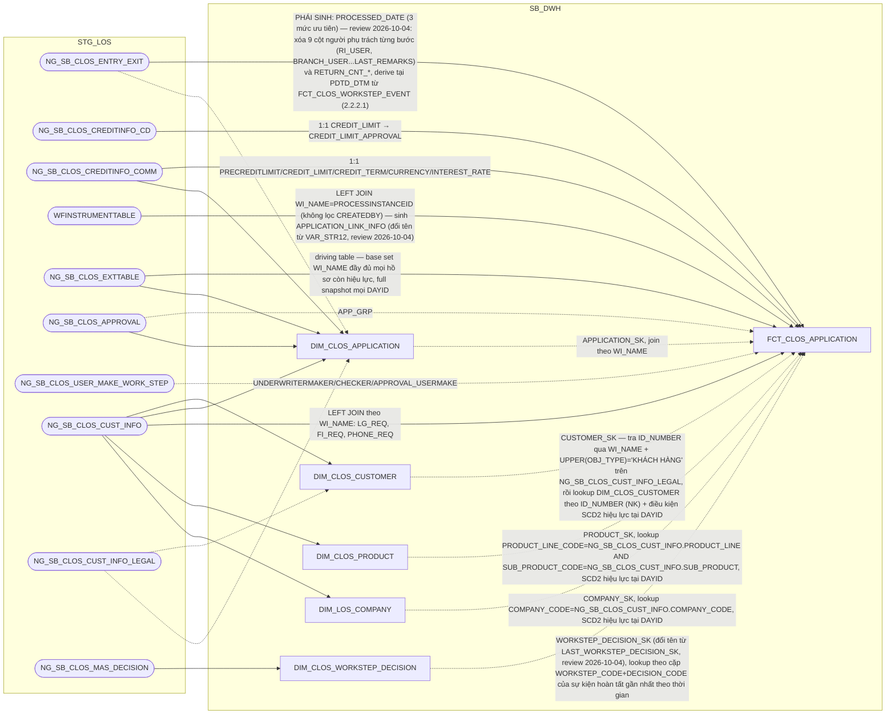
```mermaid
flowchart LR
    subgraph STG_LOS
        A(["NG_SB_CLOS_ENTRY_EXIT"])
        B(["NG_SB_CLOS_CREDITINFO_CD"])
        C(["NG_SB_CLOS_CREDITINFO_COMM"])
        D(["WFINSTRUMENTTABLE"])
        F(["NG_SB_CLOS_EXTTABLE"])
        G(["NG_SB_CLOS_APPROVAL"])
        H(["NG_SB_CLOS_USER_MAKE_WORK_STEP"])
        M(["NG_SB_CLOS_CUST_INFO"])
        ML(["NG_SB_CLOS_CUST_INFO_LEGAL"])
        MW(["NG_SB_CLOS_MAS_DECISION"])
    end
    subgraph SB_DWH
        K["DIM_CLOS_CUSTOMER"]
        WD["DIM_CLOS_WORKSTEP_DECISION"]
        PR["DIM_CLOS_PRODUCT"]
        OU["DIM_LOS_COMPANY"]
        AP["DIM_CLOS_APPLICATION"]
        E["FCT_CLOS_APPLICATION"]
    end
    A -->|"PHÁI SINH: PROCESSED_DATE (3 mức ưu tiên) — review 2026-10-04: xóa 9 cột người phụ trách từng bước (RI_USER, BRANCH_USER...LAST_REMARKS) và RETURN_CNT_*, derive tại PDTD_DTM từ FCT_CLOS_WORKSTEP_EVENT (2.2.2.1)"| E
    B -->|1:1 CREDIT_LIMIT → CREDIT_LIMIT_APPROVAL| E
    C -->|1:1 PRECREDITLIMIT/CREDIT_LIMIT/CREDIT_TERM/CURRENCY/INTEREST_RATE| E
    D -->|"LEFT JOIN WI_NAME=PROCESSINSTANCEID (không lọc CREATEDBY) — sinh APPLICATION_LINK_INFO (đổi tên từ VAR_STR12, review 2026-10-04)"| E
    F -->|"driving table — base set WI_NAME đầy đủ mọi hồ sơ còn hiệu lực, full snapshot mọi DAYID"| E
    G -.->|"APP_GRP"| E
    H -.->|"UNDERWRITERMAKER/CHECKER/APPROVAL_USERMAKE"| E
    K -.->|"CUSTOMER_SK — tra ID_NUMBER qua WI_NAME + UPPER(OBJ_TYPE)='KHÁCH HÀNG' trên NG_SB_CLOS_CUST_INFO_LEGAL, rồi lookup DIM_CLOS_CUSTOMER theo ID_NUMBER (NK) + điều kiện SCD2 hiệu lực tại DAYID"| E
    M --> K
    ML -.-> K
    MW --> WD
    WD -.->|"WORKSTEP_DECISION_SK (đổi tên từ LAST_WORKSTEP_DECISION_SK, review 2026-10-04), lookup theo cặp WORKSTEP_CODE+DECISION_CODE của sự kiện hoàn tất gần nhất theo thời gian"| E
    PR -.->|"PRODUCT_SK, lookup PRODUCT_LINE_CODE=NG_SB_CLOS_CUST_INFO.PRODUCT_LINE AND SUB_PRODUCT_CODE=NG_SB_CLOS_CUST_INFO.SUB_PRODUCT, SCD2 hiệu lực tại DAYID"| E
    OU -.->|"COMPANY_SK, lookup COMPANY_CODE=NG_SB_CLOS_CUST_INFO.COMPANY_CODE, SCD2 hiệu lực tại DAYID"| E
    F --> AP
    M --> AP
    ML -.-> AP
    G --> AP
    A -.-> AP
    C --> AP
    AP -.->|"APPLICATION_SK, join theo WI_NAME"| E
    M -->|"LEFT JOIN theo WI_NAME: LG_REQ, FI_REQ, PHONE_REQ"| E
    M --> PR
    M --> OU
```

**⚠️ Cập nhật join `CUSTOMER_SK` sau khi `DIM_CLOS_CUSTOMER` đổi grain
(review 2026-09-25):** trước đây join thẳng `WI_NAME + SCD2 tại DAYID`
(quan hệ 1:1 hồ sơ↔DIM). Nay `DIM_CLOS_CUSTOMER` có NK=`ID_NUMBER`
(grain 1 dòng/khách hàng, xem 1.2.1.6) — ETL phải qua 1 bước tra cứu
trung gian: `WI_NAME` (của dòng `FCT_CLOS_APPLICATION` đang nạp) →
`NG_SB_CLOS_CUST_INFO_LEGAL` lọc `UPPER(OBJ_TYPE)='KHÁCH HÀNG'` → lấy
`ID_NUMBER` → lookup `DIM_CLOS_CUSTOMER.DIMENSION_KEY` theo `ID_NUMBER` +
điều kiện SCD2 hiệu lực tại `DAYID`. Quan hệ vẫn N:1 (nhiều hồ sơ/DAYID
của cùng khách hàng có thể trỏ cùng 1 `CUSTOMER_SK`), không phải 1:1 như
trước — đây là hệ quả tất yếu của việc grain khách hàng độc lập với hồ sơ.
Mặc định -1 nếu không khớp.

**Ghi chú lineage:** giữ nguyên grain `1 dòng = 1 hồ sơ x 1 ngày dữ liệu`,
PK = `DAYID + WI_NAME`. **✅ Đã giải quyết (PENDING #6):** `WFINSTRUMENTTABLE`
nay đã nạp vào bảng này để tính cột phái sinh `WORKSTEP_FLAG` (trạng thái
bước hiện tại, 5 nhánh CASE-WHEN theo SRS BC4) — xem chi tiết công thức tại
Section 2 → 1.2.2.1. **✅ Đã giải quyết (review 2026-09-21, Section 3
dòng #20):** input thô `UNDERWRITERMAKER_USERMAKE`/`UNDERWRITERCHECKER_
USERMAKE`/`APPROVAL_USERMAKE` (review 2026-09-26, đổi tên từ `*_TAKERESPON`
— xem "Đổi driving table + chuyển business rule sang PDTD_DTM" bên dưới)
cần nguồn `NG_SB_CLOS_USER_MAKE_WORK_STEP` — không có trong
`DS_BANG_202608.xlsx` nhưng đã xác nhận tồn tại thật qua `input/CLOS -
Metadata.xlsx` (trạng thái "Đã xác nhận" cho cả bảng và toàn bộ cột).

**⚠️ Đổi driving table + chuyển business rule sang PDTD_DTM (review
2026-09-26, theo yêu cầu người dùng):** đánh giá lại yêu cầu "tại mỗi
DAYID phải view được hết trạng thái mới nhất của toàn bộ tập hồ sơ" —
driving table trước đây (`NG_SB_CLOS_ENTRY_EXIT`, nhật ký sự kiện) không
đảm bảo phủ đủ hồ sơ đang "đứng yên" (không action trong ngày nhưng vẫn
còn trong chu kỳ thẩm định), vì bản thân bảng sự kiện chỉ sinh dòng khi có
action mới. Đổi driving table sang `NG_SB_CLOS_EXTTABLE` (KEY CDC=`WI_NAME`,
xem [[feedback_clos_exttable_master_driving]]) — full snapshot: mọi
`WI_NAME` còn hiệu lực trên `EXTTABLE` sinh dòng ở MỌI `DAYID`, thay cho
quy tắc T-1 có điều kiện (HAS_ACTION_IN_DAY hoặc còn trong chu kỳ thẩm
định tra trên `FCT_CLOS_WORKSTEP_EVENT`) của tài liệu gốc
`FCT_LOS_APPLICATION_DAILY` — đây là thay đổi có ý nghĩa nghiệp vụ (khối
lượng dữ liệu tăng, hồ sơ đã chốt Approved/Rejected/Cancelled vẫn tiếp tục
sinh dòng mỗi ngày thay vì dừng lại), đã xác nhận với người dùng.

Đồng thời chuyển 2 cột business rule (CASE WHEN dựa trên "sự kiện hoàn tất
gần nhất", tái tạo được từ input đã có sẵn trên chính bảng này) sang tính
tại PDTD_DTM, ưu tiên dữ liệu bám sát nguồn: `APPLICATION_STATUS`,
`FLAG_AUTO_CANCEL` — xem Section 2 → 2.2.2.1 (PDTD_DTM) để biết công
thức đầy đủ viết lại theo nguồn SB_DWH. (Trước đây có thêm
`UNDERWRITERMAKER_TAKERESPON`/`UNDERWRITERCHECKER_TAKERESPON`/
`APPROVAL_TAKERESPON` trong danh sách này — đã xóa khỏi thiết kế review
2026-10-01, xem Section 2 → 2.2.2.1.)
**Không có `AUTO_CANCEL_DATE`** (rà soát lại review 2026-09-26, cùng
ngày, sau khi đối chiếu SRS BC1 gốc do người dùng cung cấp) — field
`AUTO_CAN_DATE` chỉ tồn tại trong SRS BC1 (RLOS, công thức hoàn toàn
khác — MIN(ENTRYDATE) + điều kiện NULL 3 cột + treo BranchSupport
≥2400 phút làm việc + không có DECISION='Cancel' trước đó); SRS BC2
(CLOS) không định nghĩa field này, chỉ định nghĩa trực tiếp
`FLAG_AUTO_CAN`; không báo cáo nào trong BC1-BC11 tiêu thụ
`AUTO_CANCEL_DATE` cho nhánh CLOS — cột dư thừa, không đưa vào bất kỳ
tầng nào.
Bảng này (SB_DWH) nay chỉ còn giữ 3 cột input thô tương ứng
`UNDERWRITERMAKER_USERMAKE`/`UNDERWRITERCHECKER_USERMAKE`/
`APPROVAL_USERMAKE` (nguyên giá trị `USER_MAKE`/fallback, KHÔNG áp
COALESCE/CASE WHEN business rule — business rule dời hẳn sang PDTD_DTM).
Các cột aggregate quét toàn bộ lịch sử sự kiện (`RETURN_CNT_DATAENTRY`/
`UNDERWRITING`/`APPROVAL`, `PROCESSED_DATE`) — đã đánh giá và xác nhận
GIỮ NGUYÊN ở SB_DWH, không chuyển, vì không thể tái tạo chỉ từ 1-2 mốc
"sự kiện gần nhất" hiện có trên bảng, phải quét nhiều dòng nguồn.

**Bổ sung node DIM còn thiếu trong lineage (review 2026-09-21):**
rà soát toàn bộ FK của bảng này phát hiện `LAST_WORKSTEP_SK`,
`LAST_DECISION_SK`, `PRODUCT_SK`, `COMPANY_SK` đều đã tồn tại thật trong
danh sách cột (Section 2 → 1.2.2.1) và có DIM đích tồn tại thật
(`DIM_CLOS_WORKSTEP`, `DIM_CLOS_DECISION`, `DIM_CLOS_PRODUCT`,
`DIM_LOS_COMPANY`) — nhưng sơ đồ lineage trước đây chỉ vẽ `DIM_CLOS_
CUSTOMER`, bỏ sót các DIM còn lại. Đây là thiếu sót thuần vẽ sơ đồ,
không phải gap thiết kế mới — công thức JOIN của `PRODUCT_SK`/
`COMPANY_SK` đã có sẵn nguyên văn ở Section 2 (cột 5-6); `WORKSTEP_SK`/
`DECISION_SK` theo đúng pattern lookup-theo-thời-gian đã dùng nhất quán
ở mọi bảng khác trong tài liệu (ví dụ `FCT_CLOS_WORKSTEP_EVENT`, 1.2.2.6).
Đã bổ sung đủ node + cạnh JOIN vào mermaid trên. **Cắt gọn (review
2026-09-24):** `CURRENT_WORKSTEP_SK` và `LAST_USER_SK` — dù có FK/DIM
đích tồn tại thật (`DIM_CLOS_WORKSTEP`, `DIM_LOS_USER`) — đã bị XÓA khỏi
bảng vì rà soát toàn bộ báo cáo (BC1-BC11) xác nhận không báo cáo nào
JOIN qua 2 khóa này; các báo cáo chỉ đọc `LAST_WORKSTEP_SK`/
`LAST_DECISION_SK` hoặc các cột USERNAME text (`RI_USER`, `BRANCH_USER`...)
có sẵn trực tiếp trên bảng. **Gộp thêm (review 2026-09-24, tiếp theo):**
`LAST_WORKSTEP_SK`+`LAST_DECISION_SK` gộp thành 1 `LAST_WORKSTEP_
DECISION_SK` duy nhất, theo quyết định gộp `DIM_CLOS_WORKSTEP`+
`DIM_CLOS_DECISION` (xem 1.2.1.3).

Áp dụng **column-optimization rule**: loại khỏi bản CLOS mọi cột chỉ có
nguồn RLOS (`SALARYFLAG`...`OTHERFLAG`, `INCOME_SOURCE_CNT`,
`REPAYMENT_SOURCE`, `FLAG_BUSINESS_INCOME`, `LOAN_TO_VALUE`,
`LOAN_OBJECTIVE`, `TOTAL_INCOME`, `CARD_PROMOTION_SK`). `CHANGE_TYPE_SK`
cũng loại khỏi bản CLOS — theo quyết định đã chốt ở `DIM_CLOS_APPLICATION`
(mục 1.2.1.1), CLOS không tách `DIM_CLOS_CHANGE_TYPE`, cột `CHANGE_TYPE` nằm
thẳng trên `DIM_CLOS_APPLICATION`; giữ `CHANGE_TYPE_SK` trỏ sang
`DIM_RLOS_CHANGE_TYPE` sẽ phá vỡ ranh giới tách CLOS/RLOS, nên bỏ hẳn khóa
này khỏi `FCT_CLOS_APPLICATION` (đã xác nhận với người dùng).

**Đánh giá kiến trúc — không tham chiếu ETL sang `FCT_CLOS_COLLATERAL`/
`FCT_CLOS_DEVIATION`:** thiết kế gốc có `DEVIATION_CNT`/`COLLATERAL_CNT`
(+ 9 cột con theo nhóm tài sản) tính bằng COUNT(*) trên 2 fact chi tiết đó
— đây là cột kỹ thuật trung gian, không báo cáo nào (BC1-BC11) dùng trực
tiếp tên cột, chỉ để tính ra các cờ YES/NO cuối cùng (`TSDB_NHOM_0`,
`TSBD_BDS`...). Việc pre-aggregate ở ETL bắt `FCT_CLOS_COLLATERAL`/
`FCT_CLOS_DEVIATION` phải chạy xong trước `FCT_CLOS_APPLICATION` —
một phụ thuộc thứ tự ETL giữa các fact có thể tránh hoàn toàn, vì báo cáo
dùng OAS (Oracle Analytics Server): model `FCT_CLOS_COLLATERAL`/
`FCT_CLOS_DEVIATION` như logical fact riêng trong RPD, dùng chung
`DIM_CLOS_APPLICATION`/`DAYID` làm conformed dimension, đo lường COUNT
(lọc `COLLATERAL_TYPE_CODE` khi cần) đặt làm logical measure — BI Server tự sinh
SQL multi-pass đúng chuẩn, không cần cột đếm vật lý trên datamart. Đã bỏ
hẳn 11 cột này khỏi thiết kế (xem 1.2.2.5 và Section 2 → 1.2.2.1) — 3
luồng ETL (`FCT_CLOS_APPLICATION`, `FCT_CLOS_COLLATERAL`,
`FCT_CLOS_DEVIATION`) hoàn toàn độc lập.

**⚠️ Nhận thêm 4 cột từ `DIM_CLOS_APPLICATION` (review 2026-09-30, lượt
2, theo yêu cầu người dùng):** `FIRST_APPROVED_DATE` (đặt cạnh
`LAST_APPROVAL_DATE` — cùng bản chất grain-theo-sự-kiện, chỉ có giá trị
từ khi hồ sơ tới bước phê duyệt, không phải thuộc tính hồ sơ ổn định phù
hợp DIM; 2 cột độc lập không trùng lặp dù cùng công thức MAX(EXITDATE),
khác điều kiện lọc DECISION) và `LG_REQ`/`FI_REQ`/`PHONE_REQ` (cùng lý
do 11 cờ tương ứng đã chuyển bên `DIM_RLOS_APPLICATION`/`FCT_RLOS_
APPLICATION`: nguồn `NG_SB_CLOS_CUST_INFO` tự phát sinh dòng mới khi
bàn giao nhân viên khác xử lý). Không đổi công thức/nguồn — chỉ đổi
bảng chứa. Xem bảng cột chi tiết tại Section 2 → 1.2.2.1.

###### 1.2.2.2 FCT_CLOS_APPLICATION_PARTY — ĐÃ XÓA (review 2026-09-26, theo yêu cầu người dùng)

**Đã xóa hẳn bảng này:** cùng lý do đã áp dụng cho `FCT_RLOS_APPLICATION_
PARTY` (1.3.2.2, đã xóa) — bảng liên kết factless này chỉ mang 3 khóa
(`APPLICATION_SK`/`CUSTOMER_SK`/`LEGAL_PARTY_SK`) để bắc cầu
`DIM_CLOS_CUSTOMER` sang `FCT_CLOS_LEGAL_PARTY`. Nhưng `FCT_CLOS_LEGAL_
PARTY` (1.2.2.7) tự nó đã mang sẵn `WI_NAME` (và cả `CUSTOMER_SK`/
`APPLICATION_SK` từ review 2026-09-25) để join trực tiếp sang
`DIM_CLOS_APPLICATION`/`DIM_CLOS_CUSTOMER` theo đúng `WI_NAME`+
`LEGAL_TYPE`, không cần đi qua bảng cầu nối trung gian này nữa — khác
biệt duy nhất so với bên RLOS là nhánh CLOS chưa từng mất surrogate key
ổn định, nhưng bảng cầu nối vẫn dư thừa vì đích đến (`FCT_CLOS_LEGAL_
PARTY`) đã tự đủ khóa join trực tiếp. Đã xóa hoàn toàn khỏi thiết kế.
`DIM_CLOS_CUSTOMER` (PDTD_DTM) lookup `ID_NUMBER`/`LEGAL_REPRESENTATIVE`/
`ADD_ID_REPRESENTATIVE` bằng cách JOIN thẳng `FCT_CLOS_LEGAL_PARTY` theo
`WI_NAME`+`LEGAL_TYPE`, không qua bảng này nữa. Giữ lại số hiệu `1.2.2.2`
như một mục rỗng trỏ chuyển tiếp, không xóa số để không làm lệch số các
bảng FCT khác trong nhóm CLOS.

**Phạm vi:** xóa ở CẢ 2 tầng — SB_DWH (mục này) và PDTD_DTM (2.2.2.2,
đã xóa từ trước). Xem thêm `hld/hld_review/HLD_FCT_SB_DWH_review.md`
mục 2 (đã áp dụng cùng thay đổi này) và Section 3 dòng #37/#85 (lịch sử
quyết định trước đó, đã bổ sung ghi chú xóa hẳn).

###### 1.2.2.3 FCT_CLOS_COLLATERAL

**Lineage đầy đủ (bao gồm cả nguồn của `DIM_CLOS_APPLICATION`, 1.2.1.1 —
xem `hld/HLD_DIM_SB_DWH.md` để đối chiếu lineage gốc của DIM này):**

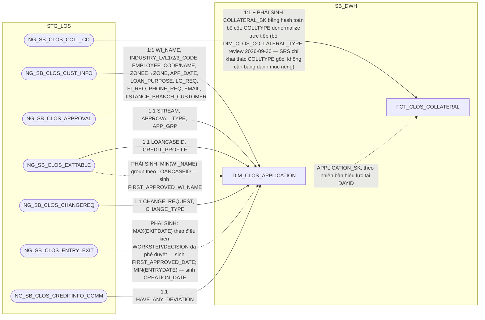
```mermaid
flowchart LR
    subgraph STG_LOS
        A(["NG_SB_CLOS_COLL_CD"])
        H(["NG_SB_CLOS_CUST_INFO"])
        I(["NG_SB_CLOS_APPROVAL"])
        J(["NG_SB_CLOS_EXTTABLE"])
        K1(["NG_SB_CLOS_CHANGEREQ"])
        L(["NG_SB_CLOS_ENTRY_EXIT"])
        N(["NG_SB_CLOS_CREDITINFO_COMM"])
    end
    subgraph SB_DWH
        D["DIM_CLOS_APPLICATION"]
        C["FCT_CLOS_COLLATERAL"]
    end
    A -->|"1:1 + PHÁI SINH COLLATERAL_BK bằng hash toàn bộ cột; COLLTYPE denormalize trực tiếp (bỏ DIM_CLOS_COLLATERAL_TYPE, review 2026-09-30 — SRS chỉ khai thác COLLTYPE gốc, không cần bảng danh mục riêng)"| C
    D -.->|APPLICATION_SK, theo phiên bản hiệu lực tại DAYID| C
    H -->|"1:1 WI_NAME, INDUSTRY_LVL1/2/3_CODE, EMPLOYEE_CODE/NAME, ZONEE→ZONE, APP_DATE, LOAN_PURPOSE, LG_REQ, FI_REQ, PHONE_REQ, EMAIL, DISTANCE_BRANCH_CUSTOMER"| D
    I -->|1:1 STREAM, APPROVAL_TYPE, APP_GRP| D
    J -->|1:1 LOANCASEID, CREDIT_PROFILE| D
    J -.->|"PHÁI SINH: MIN(WI_NAME) group theo LOANCASEID — sinh FIRST_APPROVED_WI_NAME"| D
    K1 -->|1:1 CHANGE_REQUEST, CHANGE_TYPE| D
    L -.->|"PHÁI SINH: MAX(EXITDATE) theo điều kiện WORKSTEP/DECISION đã phê duyệt — sinh FIRST_APPROVED_DATE; MIN(ENTRYDATE) — sinh CREATION_DATE"| D
    N -->|1:1 HAVE_ANY_DEVIATION| D
```

**Ghi chú lineage:** giữ nguyên grain `1 dòng = 1 tài sản bảo đảm của 1 hồ
sơ × 1 ngày dữ liệu` và toàn bộ cơ chế nạp của bảng gốc `FCT_LOS_COLLATERAL`
— nguồn `NG_SB_CLOS_COLL_CD` không khai khóa CDC (LOẠI 2) nên `COLLATERAL_BK`
vẫn phải là hash toàn bộ cột (trừ `COLL_MGMT_APP`/`DESCRIPTION` vì là CLOB),
cộng tên bảng nguồn để tránh đụng khóa giữa các nguồn (dù
CLOS chỉ có đúng 1 bảng nguồn, vẫn giữ quy tắc hash chung để nhất quán với
RLOS — xem 1.3.2.3). Ảnh chụp đầy đủ theo ngày dựng theo quy trình A2, PK =
`DAYID + WI_NAME + COLLATERAL_BK`. Bảng còn có khóa `APPLICATION_SK` nối
về `DIM_CLOS_APPLICATION` (khóa liên kết hồ sơ theo đúng phiên bản DIM
hiệu lực tại `DAYID`) — WI_NAME cũng được giữ trực tiếp trên fact để tiện
truy vấn không cần join qua DIM.

**Bỏ hẳn `DIM_CLOS_COLLATERAL_TYPE` (review 2026-09-30, theo yêu cầu
người dùng):** rà soát lại xác nhận SRS (BC1, BC2, BC3, BC9) chỉ khai thác
trực tiếp giá trị text `NG_SB_CLOS_COLL_CD.COLLTYPE` (tiếng Việt không
dấu) — không có báo cáo nào cần một bảng danh mục loại tài sản riêng với
`DIMENSION_KEY`/SCD2. Xóa hẳn `DIM_CLOS_COLLATERAL_TYPE` (trước đây
1.2.1.6) khỏi thiết kế — đảo ngược quyết định đổi nguồn sang
`NG_SB_RLOS_MAS_COLL_CODE` (review 2026-09-26) lẫn quyết định tách DIM
ban đầu. `COLLTYPE` nay denormalize trực tiếp trên `FCT_CLOS_COLLATERAL`
(cột `COLLATERAL_TYPE_CODE`, xem Section 2) — đúng tiền lệ đã áp dụng cho
`FCT_RLOS_COLLATERAL` khi xóa `DIM_RLOS_COLLATERAL_TYPE` (review
2026-09-22, xem 1.3.2.3).

Áp dụng **column-optimization rule**: loại khỏi bản CLOS mọi cột chỉ có
nguồn RLOS (`REL_TO_CUSTOMER`, `USING_PURPOSE`, `VEHICLE_TYPE`, `BRAND`,
`CONTROL_POSTER`, `VALPAPER_TYPE`, `NUMBERSIGN`, `IS_ASSET_FORMED`,
`IS_FORMED_FROM_LOAN`) — CLOS chỉ có đúng 1 nguồn tài sản
(`NG_SB_CLOS_COLL_CD`), không có 5 bảng grid theo loại tài sản như RLOS,
nên các thuộc tính đặc thù từng loại tài sản vật lý (bất động sản/phương
tiện/giấy tờ có giá) không áp dụng được. Giữ `COLL_MGMT_METHOD` (chỉ có ở
CLOS, nguồn `NG_SB_CLOS_COLL_CD.COLL_MGMT_APP`) và bỏ hẳn cột kỹ thuật
`DATASOURCE` — không còn mang thông tin phân biệt sau khi tách vật lý
CLOS/RLOS.

**Ghi chú thiết kế — vì sao KHÔNG tách thành DIM dù các cột trông giống
thuộc tính mô tả ổn định:** đã đánh giá và xác nhận giữ nguyên dạng FCT chi
tiết (không tách `DIM_CLOS_COLLATERAL`). Về nội dung, các cột
(`CERTIFICATE_NO`, `OWNER_NAME`, `APPRAISED_VALUE`, `DESCRIPTION`,
`COLL_MGMT_METHOD`, `LOAN_RATE_LTV`...) đúng là thuộc tính mô tả 1 thực thể
tài sản, không phải số đo phát sinh theo giao dịch — nhìn thoáng qua giống
pattern DIM. Nhưng `NG_SB_CLOS_COLL_CD` **không khai khóa CDC** (LOẠI 2,
xem ghi chú `COLLATERAL_BK` ở trên) — hệ nguồn không cấp một định danh tài
sản ổn định (không có `COLLATERAL_ID` hay tương đương), nên **không có khóa
tự nhiên nào độc lập với chính nội dung các thuộc tính**. Hệ quả: SCD2 (nền
tảng của pattern DIM) đòi hỏi phân biệt được "cùng 1 thực thể, đổi thuộc
tính" với "thực thể mới xuất hiện" — nhưng ở đây khóa nhận diện dòng
(`COLLATERAL_BK`) chính là hash của các thuộc tính có thể thay đổi
(`APPRAISED_VALUE` định giá lại, `DESCRIPTION` sửa lỗi chính tả...), nên
bất kỳ thay đổi nội dung nào cũng tự động sinh ra một "danh tính" mới thay
vì mở phiên bản SCD2 mới của cùng 1 tài sản — tách DIM trong điều kiện này
sẽ tạo ảo giác theo dõi được lịch sử tài sản trong khi thực chất không
track được. Vì vậy giữ nguyên dạng FCT ảnh chụp toàn bộ theo ngày (đúng
bản chất: đây là *những gì quan sát được tại ngày DAYID*, không phải *một
thực thể tài sản có danh tính xuyên suốt*) — đây là lựa chọn phù hợp với
hạn chế của hệ nguồn, không phải thiếu sót thiết kế. Đánh đổi chấp nhận:
số dòng có thể tăng theo thời gian nếu tài sản đổi thuộc tính thường xuyên
(1 tài sản vật lý có thể ứng với nhiều `COLLATERAL_BK` khác nhau qua các
ngày) — báo cáo BC1/BC2/BC3/BC9 vẫn đọc đúng vì luôn lọc theo `DAYID` cụ
thể (ảnh chụp của đúng 1 ngày), không lũy kế xuyên ngày. Cùng đánh giá và
kết luận áp dụng cho `FCT_RLOS_COLLATERAL` (1.3.2.3) — RLOS cũng dùng
`STANDARD_HASH` trên 4 bảng grid tài sản, cùng lý do hệ nguồn không khai
khóa CDC.

###### 1.2.2.4 FCT_CLOS_EXCEPTION — review 2026-09-18 (SRS BC7 cập nhật: CHECK_FTR/PHAN_LOAI_DDE đổi công thức). ⚠️ review 2026-09-26: CHECK_FTR/FIRST_WORKSTEP_RETURN chuyển hẳn sang tính tại PDTD_DTM (xem 5.2.2.4 hoặc HLD_FCT_PDTD_DTM_review.md mục 6); bảng này (SB_DWH) chỉ còn giữ CUSTOMER_SK làm cột thô phục vụ tra CUST_GROUP ở PDTD_DTM

**Lineage đầy đủ (bao gồm cả nguồn của `DIM_CLOS_EXCEPTION`,
1.2.1.5, `DIM_CLOS_APPLICATION`, 1.2.1.1, `DIM_CLOS_CUSTOMER`, 1.2.1.6,
và `DIM_LOS_USER`, 1.1.2 — xem `hld/HLD_DIM_SB_DWH.md` để đối chiếu
lineage gốc của các DIM này):**

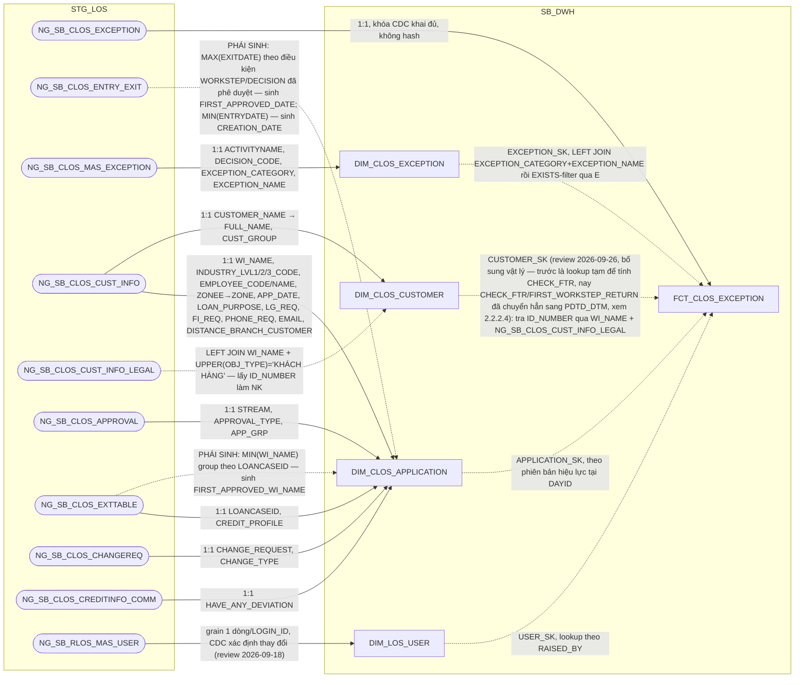
```mermaid
flowchart LR
    subgraph STG_LOS
        A(["NG_SB_CLOS_EXCEPTION"])
        E(["NG_SB_CLOS_ENTRY_EXIT"])
        R(["NG_SB_CLOS_MAS_EXCEPTION"])
        H(["NG_SB_CLOS_CUST_INFO"])
        L(["NG_SB_CLOS_CUST_INFO_LEGAL"])
        I(["NG_SB_CLOS_APPROVAL"])
        J(["NG_SB_CLOS_EXTTABLE"])
        K1(["NG_SB_CLOS_CHANGEREQ"])
        N(["NG_SB_CLOS_CREDITINFO_COMM"])
        U(["NG_SB_RLOS_MAS_USER"])
    end
    subgraph SB_DWH
        B["DIM_CLOS_EXCEPTION"]
        D["DIM_CLOS_APPLICATION"]
        KC["DIM_CLOS_CUSTOMER"]
        F["DIM_LOS_USER"]
        C["FCT_CLOS_EXCEPTION"]
    end
    A -->|1:1, khóa CDC khai đủ, không hash| C
    B -.->|EXCEPTION_SK, LEFT JOIN EXCEPTION_CATEGORY+EXCEPTION_NAME rồi EXISTS-filter qua E| C
    D -.->|APPLICATION_SK, theo phiên bản hiệu lực tại DAYID| C
    F -.->|USER_SK, lookup theo RAISED_BY| C
    KC -.->|"CUSTOMER_SK (review 2026-09-26, bổ sung vật lý — trước là lookup tạm để tính CHECK_FTR, nay CHECK_FTR/FIRST_WORKSTEP_RETURN đã chuyển hẳn sang PDTD_DTM, xem 2.2.2.4): tra ID_NUMBER qua WI_NAME + NG_SB_CLOS_CUST_INFO_LEGAL"| C
    R -->|1:1 ACTIVITYNAME, DECISION_CODE, EXCEPTION_CATEGORY, EXCEPTION_NAME| B
    H -->|1:1 WI_NAME, INDUSTRY_LVL1/2/3_CODE, EMPLOYEE_CODE/NAME, ZONEE→ZONE, APP_DATE, LOAN_PURPOSE, LG_REQ, FI_REQ, PHONE_REQ, EMAIL, DISTANCE_BRANCH_CUSTOMER| D
    I -->|1:1 STREAM, APPROVAL_TYPE, APP_GRP| D
    J -->|1:1 LOANCASEID, CREDIT_PROFILE| D
    J -.->|"PHÁI SINH: MIN(WI_NAME) group theo LOANCASEID — sinh FIRST_APPROVED_WI_NAME"| D
    K1 -->|1:1 CHANGE_REQUEST, CHANGE_TYPE| D
    E -.->|"PHÁI SINH: MAX(EXITDATE) theo điều kiện WORKSTEP/DECISION đã phê duyệt — sinh FIRST_APPROVED_DATE; MIN(ENTRYDATE) — sinh CREATION_DATE"| D
    N -->|1:1 HAVE_ANY_DEVIATION| D
    H -->|1:1 CUSTOMER_NAME → FULL_NAME, CUST_GROUP| KC
    L -.->|"LEFT JOIN WI_NAME + UPPER(OBJ_TYPE)='KHÁCH HÀNG' — lấy ID_NUMBER làm NK"| KC
    U -->|"grain 1 dòng/LOGIN_ID, CDC xác định thay đổi (review 2026-09-18)"| F
```

**Ghi chú lineage:** giữ nguyên grain `1 dòng = 1 lần ghi nhận lý do của 1
hồ sơ, trong ảnh chụp của ngày DAYID`. Nguồn chính `NG_SB_CLOS_EXCEPTION`
là LOẠI 1, khóa CDC khai đủ `WI_NAME + EXCEPTION_CATEGORY + RAISED_BY +
RAISED_DATE_TIME` (xác nhận qua `input/DS_BANG_202608.xlsx`) nên PK giữ
thẳng trên cột gốc, không cần hash. Một hồ sơ có thể phát sinh cùng một
loại lý do nhiều lần, bởi nhiều người, ở nhiều thời điểm — khóa phải đủ để
phân biệt từng lần (cơ chế Raise/Clear: bước trả về Raise để nêu lý do,
bước nhận Clear khi đã làm rõ/bổ sung và đẩy lại). Ảnh chụp đầy đủ theo
ngày dựng theo quy trình A2, PK = `DAYID + WI_NAME + EXCEPTION_CATEGORY +
RAISED_BY + RAISED_DATE_TIME`.

**`EXCEPTION_SK` — lookup 2 bước theo đúng SRS BC7 (không phải
lookup 1 cột đơn giản):** `DIM_CLOS_EXCEPTION` (1.2.1.5) khai Natural
Key đủ 4 cột (`ACTIVITYNAME + DECISION_CODE + EXCEPTION_CATEGORY +
EXCEPTION_NAME`) vì BA xác nhận 1 tổ hợp bước+quyết định có thể cho phép
nhiều loại ngoại lệ khác nhau — nhưng nguồn của FCT (`NG_SB_CLOS_EXCEPTION`)
không có cột `ACTIVITYNAME`/`DECISION` để join thẳng đủ 4 cột. SRS BC7
(field `ACTIVITYNAME`, nguyên văn Business Rules) giải quyết bằng 2 bước:
1. `LEFT JOIN DIM_CLOS_EXCEPTION (d)` theo
   `a.EXCEPTION_CATEGORY = d.EXCEPTION_CATEGORY AND a.EXCEPTION_NAME =
   d.EXCEPTION_NAME` — có thể khớp nhiều dòng `d` (nhiều tổ hợp
   `ACTIVITYNAME`/`DECISION_CODE` khác nhau cùng category+name).
2. Lọc lại còn đúng 1 dòng bằng điều kiện tồn tại bản ghi
   `NG_SB_CLOS_ENTRY_EXIT (e)` thỏa `e.WI_NAME = a.WI_NAME AND
   e.WORKSTEP = d.ACTIVITYNAME AND e.DECISION = d.DECISION` — tức chỉ
   giữ tổ hợp (ACTIVITYNAME, DECISION_CODE) nào thực sự đã xảy ra trong
   lịch sử xử lý của chính hồ sơ đó. Không còn dòng nào khớp → `-1`
   (Unknown), theo đúng quy ước default chung.

SRS gốc ghi bảng EXISTS là `NG_SB_RLOS_ENTRY_EXIT` ngay cả ở nhánh CLOS —
đã xác nhận đây là lỗi copy-paste khi soạn thảo (3 field khác trong cùng
khối CLOS của BC7 — `CHECK_FTR`, `FIRST_WORKSTEP_RETURN`, `PHAN_LOAI_DDE`
— đều đúng dùng `NG_SB_CLOS_ENTRY_EXIT`; 2 khối CLOS/RLOS đối xứng tuyệt
đối 13/13 field, chỉ riêng dòng này lạc bảng nguồn), nên HLD dùng đúng
`NG_SB_CLOS_ENTRY_EXIT` cho nhánh CLOS.

**Review 2026-09-18 (SRS BC7 cập nhật) — cùng dạng lỗi copy-paste lặp
lại ở `ACTIVITYNAME`:** bản SRS mới nhất tiếp tục ghi điều kiện EXISTS-
filter là `NG_SB_RLOS_ENTRY_EXIT (e)` ngay trong khối "Nguồn CLOS" (dòng
field `ACTIVITYNAME`) — cùng bảng nguồn lạc như bản SRS trước, xác nhận
lại đây là lỗi soạn thảo lặp lại (không phải cố ý đổi sang cross-check
chéo 2 hệ), giữ nguyên kết luận dùng `NG_SB_CLOS_ENTRY_EXIT` cho nhánh
CLOS.

**Đánh giá kiến trúc — vì sao không gộp vào `FCT_CLOS_APPLICATION`
(1.2.2.1):** đã cân nhắc và xác nhận giữ `FCT_CLOS_EXCEPTION` là bảng
riêng, không gộp thành cột trên `FCT_CLOS_APPLICATION`, vì hai bảng
khác nhau về grain: `FCT_CLOS_APPLICATION` là 1 dòng/hồ sơ/ngày,
còn đây là 1 dòng/**lần nêu lý do**/hồ sơ/ngày — 1 hồ sơ có thể phát sinh
nhiều lần nêu lý do (nhiều loại, nhiều người, nhiều thời điểm, qua các
vòng Raise/Clear). BC7 tự mô tả là báo cáo liệt kê chi tiết từng lý do
("cung cấp các thông tin lý do... có bước trả về/bổ sung/từ chối/hủy"),
không phải rollup — gộp vào grain 1 dòng/hồ sơ/ngày sẽ mất chi tiết (chỉ
giữ được lần gần nhất) hoặc phải pivot số cột không giới hạn N, không khả
thi. Cùng lý do khác grain đã áp dụng cho `FCT_CLOS_COLLATERAL` (xem
1.2.2.3, không gộp vào `FCT_CLOS_APPLICATION`) — giữ nguyên bảng
riêng là lựa chọn phù hợp, không phải ETL dư thừa. Số đếm tổng hợp cho
báo cáo (nếu cần) tính trực tiếp ở tầng report/OAS từ bảng chi tiết, không
cần cột đếm trung gian trên `FCT_CLOS_APPLICATION` (xem đánh giá
kiến trúc tại 1.2.2.1).

**Đánh giá kiến trúc — vì sao `CHECK_FTR`/`FIRST_WORKSTEP_RETURN`/
`PHAN_LOAI_DDE` đều chuyển hẳn sang tính tại PDTD_DTM (cập nhật review
2026-09-26 — 2 cột đầu từng đặt tại SB_DWH, xem lịch sử quyết định bên
dưới):** thiết kế gốc đặt 3 cột này (tên gốc `FLAG_FTR`,
`FIRST_WORKSTEP_RETURN`, `PHAN_LOAI_DDE`) trên `FCT_LOS_APPLICATION_DAILY`
— nhưng chính "Trường đích trên báo cáo" của tài liệu gốc ghi rõ cả 3 chỉ
phục vụ `BC7` (`BC7.CHECK_FTR`, `BC7.FIRST_WORKSTEP_RETURN`,
`BC7.PHAN_LOAI_DDE`); rà soát toàn bộ SRS BC1-BC11 xác nhận không báo cáo
nào khác dùng tới. Vì BC7 đúng grain của `FCT_CLOS_EXCEPTION` (1 dòng/lần
nêu lý do), không phải grain hồ sơ/ngày của `FCT_CLOS_APPLICATION`,
cả 3 cột đã bỏ hẳn khỏi `FCT_CLOS_APPLICATION`/
`FCT_RLOS_APPLICATION` (1.2.2.1/1.3.2.1) từ trước.

**Lịch sử quyết định — `CHECK_FTR`/`FIRST_WORKSTEP_RETURN` (review
2026-09-18 → 2026-09-26):** ban đầu (review 2026-09-18) 2 cột này chuyển
sang tính trực tiếp tại SB_DWH (đọc thêm `NG_SB_CLOS_ENTRY_EXIT`), với lý
do "giữ đúng nguyên tắc DTM chỉ đọc DWH cho tầng PDTD_DTM". Rà soát lại
(review 2026-09-26, theo yêu cầu người dùng) xác nhận lý do đó KHÔNG đủ —
cả 2 công thức đều là CASE WHEN/whitelist theo business rule SRS BC7
(danh sách miễn trừ/điều kiện WORKSTEP-DECISION do BA định nghĩa, có thể
đổi theo SRS), không phải giá trị gốc STG_LOS hay phép JOIN+lọc thuần
túy — đặt tại SB_DWH vi phạm nguyên tắc "SB_DWH ảnh chụp sạch nguồn,
PDTD_DTM chuẩn hóa/tính business rule". Đã chuyển hẳn công thức sang
PDTD_DTM (xem `hld/hld_review/HLD_FCT_PDTD_DTM_review.md` mục 6): SB_DWH
KHÔNG cần thêm cột thô mới nào ngoài `CUSTOMER_SK` (bổ sung cùng đợt, để
PDTD_DTM tra `CUST_GROUP`) — vì lịch sử `WORKSTEP_CODE`/`EXITDATE`/
`DECISION_CODE` theo `WI_NAME` mà cả 2 công thức cần đã có sẵn, đầy đủ
trên `SB_DWH.FCT_CLOS_WORKSTEP_EVENT` (1.2.2.6); PDTD_DTM JOIN sang bảng
SB_DWH này (không phải STG_LOS) để tự tính lại, đúng nguyên tắc "JOIN
dựng cột ETL luôn xuất phát từ SB_DWH, PDTD_DTM không đọc thẳng STG_LOS".
`PHAN_LOAI_DDE` đã chuyển PDTD_DTM từ trước (review 2026-09-22) vì lý do
khác — bảng danh mục `REF_PHAN_LOAI_DDE` nó lookup vào chỉ tồn tại vật lý
ở tầng PDTD_DTM, xem "Đánh giá kiến trúc — `PHAN_LOAI_DDE` chuyển hẳn
sang PDTD_DTM" ngay dưới đây.

**Review 2026-09-18 — SRS BC7 cập nhật đổi hẳn công thức `CHECK_FTR` và
`PHAN_LOAI_DDE` (không còn khớp bản SRS trước, `FIRST_WORKSTEP_RETURN`
chỉ bổ sung thêm điều kiện lọc):** ⚠️ định nghĩa nghiệp vụ dưới đây vẫn
đúng, nhưng nơi HIỆN THỰC HÓA công thức đã chuyển hẳn sang PDTD_DTM
(review 2026-09-26) — bảng nguồn `h`/`e` bên dưới (`NG_SB_CLOS_
ENTRY_EXIT`) tại PDTD_DTM đọc qua `SB_DWH.FCT_CLOS_WORKSTEP_EVENT`, không
JOIN thẳng STG_LOS. Xem cơ chế chuyển tại đánh giá kiến trúc phía trên và
công thức JOIN cụ thể tại `hld/hld_review/HLD_FCT_PDTD_DTM_review.md`
mục 6.

- **`CHECK_FTR` — đảo ngược bản chất phép tính, không còn là công thức
  đơn giản trên `ENTRY_EXIT`:** SRS mới định nghĩa theo **whitelist miễn
  trừ** thay vì điều kiện vi phạm trực tiếp. Mặc định hồ sơ là `'Not
  First Time Right'`; chỉ là `'First Time Right'` nếu **TẤT CẢ** các
  dòng `NG_SB_CLOS_EXCEPTION` của hồ sơ đó đều khớp 1 trong các tổ hợp
  ngoại lệ được miễn trừ dưới đây (join `NG_SB_CLOS_ENTRY_EXIT (h)` theo
  `h.WINAME=a.WI_NAME AND h.WORKSTEP=d.ACTIVITYNAME AND
  h.DECISION=d.DECISION`, với `d`=`NG_SB_CLOS_MAS_EXCEPTION`, phân theo
  `NG_SB_CLOS_CUST_INFO.CUST_GROUP` — **mới bổ sung join này**, DIM
  chưa từng cần `CUST_GROUP` cho cột này trước đây):
  - Nhóm KHDN (`CUST_GROUP IN ('MSME','SME','USME')`): 4 tổ hợp
    (`DetailDataEntry`+`Send_Back`, `DataInputerChecker`+
    `Additional_Doc_Required`, `UnderwriterMaker`+
    `Additional_Doc_Required`, `UnderwriterMaker`+`Send_Back to
    BranchSupport`), mỗi tổ hợp có danh sách `EXCEPTION_CATEGORY` cụ thể
    được miễn trừ (xem SRS BC7 BR 1.2 để lấy đầy đủ literal — danh sách
    dài, không lặp lại toàn bộ ở đây).
  - Nhóm KHDNL/ĐT&ĐCTC (`CUST_GROUP IN ('FDI','SOC','JSC','NBFI','BANK',
    'STR')`): ⚠️ **Review 2026-10-04 (đối chiếu SRS BC7, sửa mô tả sai lệch
    so với thiết kế thật đã implement từ review 2026-09-29):** nhóm này
    chỉ có **3 tổ hợp** WORKSTEP+DECISION (`DetailDataEntry`+`Send_Back`,
    `DataInputerChecker`+`Additional_Doc_Required`, `UnderwriterMaker`+
    `Additional_Doc_Required`) — KHÔNG có tổ hợp thứ 4 riêng
    (`UnderwriterMaker`+`Send_Back to BranchSupport`) như nhóm KHDN.
    Category `UW-BR: Gửi dự thảo đề xuất cho chi nhánh` được GỘP THẲNG
    vào danh sách miễn trừ của tổ hợp 3 (`UnderwriterMaker`+
    `Additional_Doc_Required`) thay vì đứng ở tổ hợp riêng. LLD
    (`lld/pdtd_dtm/PDTD_DTM_FCT_CLOS_EXCEPTION.csv`, cột `CHECK_FTR`) đã
    implement đúng theo cách này từ review 2026-09-29; đoạn mô tả "4 tổ
    hợp" ở trên là lạc hậu/sai, không phản ánh đúng thiết kế đang chạy.
  - Đây là thay đổi lớn nhất của lần cập nhật SRS này — không chỉ thêm
    điều kiện mà đảo cả chiều logic (từ "có vi phạm → NOT FTR" sang "trừ
    khi mọi ngoại lệ đều được miễn trừ mới là FTR"). Đã xác nhận với
    người dùng đây là thay đổi có chủ ý của SRS, không phải sai sót.
- **`FIRST_WORKSTEP_RETURN`:** vẫn `WORKSTEP` của bản ghi có `MIN(EXITDATE)`
  theo `WI_NAME`, nhưng điều kiện lọc nay viết tường minh thay vì dựa
  vào cột phái sinh `IS_RETURN_EVENT` không rõ định nghĩa của bản SRS
  trước: `EXITDATE IS NOT NULL AND ((WORKSTEP='DetailDataEntry' AND
  DECISION='Send_Back') OR (WORKSTEP IN ('DataInputerChecker',
  'UnderwriterMaker','CreditApproval') AND DECISION=
  'Additional_Doc_Required') OR (WORKSTEP='UnderwriterMaker' AND
  DECISION='Send_Back to BranchSupport'))` — **bổ sung nhánh thứ 3**
  (`UnderwriterMaker` + `Send_Back to BranchSupport`) chưa từng xuất
  hiện trong công thức cũ của cột này.
- **`PHAN_LOAI_DDE` — đổi từ CASE-WHEN tính trực tiếp sang lookup bảng
  danh mục mới `REF_PHAN_LOAI_DDE`:** SRS mới bỏ hẳn công thức CASE-WHEN
  cũ, thay bằng `LEFT JOIN REF_PHAN_LOAI_DDE` theo
  `EXCEPTION_CATEGORY = REF_PHAN_LOAI_DDE.EXCEPTION_CATEGORY AND
  REF_PHAN_LOAI_DDE.SYSTEMNAME='CLOS'`, lấy
  `REF_PHAN_LOAI_DDE.PHAN_LOAI_DDE`. Đây là bảng REF_ tĩnh mới (giống 9
  bảng REF_ hiện có tại `hld/HLD_REF.md`) — cấu trúc và dữ liệu mẫu do
  người dùng cung cấp (`input/REF_PHAN_LOAI_DDE.xlsx`, 19 dòng:
  `EXCEPTION_CATEGORY` + `PHAN_LOAI_DDE` + `SYSTEMNAME`), xem thiết kế
  đầy đủ tại `hld/HLD_REF.md` mục 2.4.10.

**⚠️ Đánh giá kiến trúc — `PHAN_LOAI_DDE` chuyển hẳn sang PDTD_DTM (review
2026-09-22, sửa lỗi vi phạm layer boundary):** công thức trên (`LEFT JOIN
REF_PHAN_LOAI_DDE` ngay tại tầng SB_DWH) đã bị phát hiện sai kiến trúc —
`hld/HLD_REF.md` (đầu Section 2.4) xác nhận rõ **cả 10 bảng REF_/TMP_REF_/
Q_RLOS_REF_ (gồm cả `REF_PHAN_LOAI_DDE`) chỉ tồn tại vật lý ở tầng
PDTD_DTM, không có bản SB_DWH** — BA insert/update thủ công trực tiếp tại
PDTD_DTM, không qua STG_LOS/CDC. Một bảng ở tầng SB_DWH không thể JOIN
trực tiếp một bảng chỉ tồn tại vật lý ở PDTD_DTM (vi phạm chiều dữ liệu
chuẩn STG_LOS→SB_DWH→STG_DTM→PDTD_DTM); nguyên tắc `design-method.md`
của skill `design-hld` cũng xác nhận: JOIN vào bảng REF_ chỉ được phép
xảy ra ở bước "PDTD_DTM copies 1:1 from SB_DWH... **may then** LEFT JOIN
REF_" — là đặc quyền riêng của tầng PDTD_DTM. **`FCT_CLOS_EXCEPTION` ở
tầng SB_DWH (bảng này) KHÔNG còn cột `PHAN_LOAI_DDE`** — cột này bị bỏ
khỏi Section 2 → 1.2.2.4, chỉ còn 14 cột. Công thức `LEFT JOIN
REF_PHAN_LOAI_DDE` ở trên được giữ lại trong đoạn văn này chỉ để lưu lại
lịch sử quyết định SRS BC7 cập nhật 2026-09-18 (đổi từ CASE-WHEN sang
lookup REF_) — công thức thực tế đã chuyển hẳn sang tính tại
`hld/HLD_FCT_PDTD_DTM.md` mục 2.2.2.4 (xem đánh giá kiến trúc tại đó).

###### 1.2.2.5 FCT_CLOS_DEVIATION

**Lineage đầy đủ (bao gồm cả nguồn của `DIM_CLOS_APPLICATION`, 1.2.1.1 —
xem `hld/HLD_DIM_SB_DWH.md` để đối chiếu lineage gốc của DIM này):**

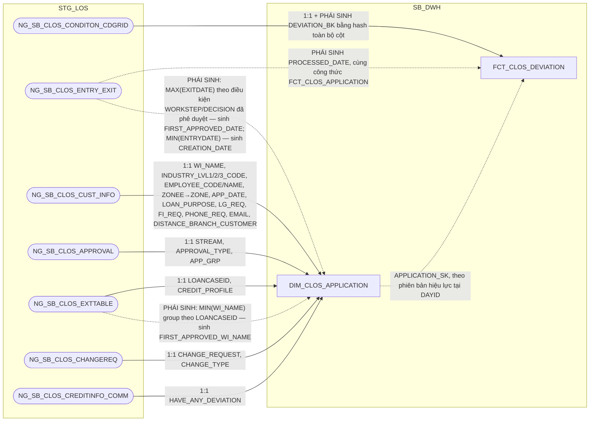
```mermaid
flowchart LR
    subgraph STG_LOS
        A(["NG_SB_CLOS_CONDITON_CDGRID"])
        E(["NG_SB_CLOS_ENTRY_EXIT"])
        H(["NG_SB_CLOS_CUST_INFO"])
        I(["NG_SB_CLOS_APPROVAL"])
        J(["NG_SB_CLOS_EXTTABLE"])
        K(["NG_SB_CLOS_CHANGEREQ"])
        L(["NG_SB_CLOS_CREDITINFO_COMM"])
    end
    subgraph SB_DWH
        D["DIM_CLOS_APPLICATION"]
        C["FCT_CLOS_DEVIATION"]
    end
    A -->|1:1 + PHÁI SINH DEVIATION_BK bằng hash toàn bộ cột| C
    D -.->|APPLICATION_SK, theo phiên bản hiệu lực tại DAYID| C
    E -.->|PHÁI SINH PROCESSED_DATE, cùng công thức FCT_CLOS_APPLICATION| C
    H -->|"1:1 WI_NAME, INDUSTRY_LVL1/2/3_CODE, EMPLOYEE_CODE/NAME, ZONEE→ZONE, APP_DATE, LOAN_PURPOSE, LG_REQ, FI_REQ, PHONE_REQ, EMAIL, DISTANCE_BRANCH_CUSTOMER"| D
    I -->|1:1 STREAM, APPROVAL_TYPE, APP_GRP| D
    J -->|1:1 LOANCASEID, CREDIT_PROFILE| D
    J -.->|"PHÁI SINH: MIN(WI_NAME) group theo LOANCASEID — sinh FIRST_APPROVED_WI_NAME"| D
    K -->|1:1 CHANGE_REQUEST, CHANGE_TYPE| D
    E -.->|"PHÁI SINH: MAX(EXITDATE) theo điều kiện WORKSTEP/DECISION đã phê duyệt — sinh FIRST_APPROVED_DATE; MIN(ENTRYDATE) — sinh CREATION_DATE"| D
    L -->|1:1 HAVE_ANY_DEVIATION| D
```

**Ghi chú lineage:** giữ nguyên grain `1 dòng = 1 ngoại lệ chính sách
trong ảnh chụp của ngày DAYID`. Nguồn `NG_SB_CLOS_CONDITON_CDGRID` không
khai khóa CDC (LOẠI 2, xác nhận qua `input/DS_BANG_202608.xlsx` — `KEY
CDC` rỗng) nên `DEVIATION_BK` phải là `STANDARD_HASH(..., 'SHA256')` trên
toàn bộ cột không phải CLOB (loại trừ `AS_REGULAR`, `DEV_PROPOSAL`), cộng
tên bảng nguồn — cùng cơ chế đã áp dụng cho
`FCT_CLOS_COLLATERAL` (1.2.2.3) và cùng hệ quả cần biết: 2 dòng ngoại lệ
trên cùng hồ sơ chỉ khác nhau ở nội dung CLOB (`AS_REGULAR`/`DEV_PROPOSAL`)
sẽ ra cùng hash và bị gộp làm một (rủi ro đã ghi nhận sẵn trong tài liệu
gốc, "bảng có rủi ro khóa cao nhất trong model"). Ảnh chụp đầy đủ theo
ngày dựng theo quy trình A2, PK = `DAYID + WI_NAME + DEVIATION_BK`.

**Vì sao không tách DIM:** cùng lý do đã áp dụng cho `FCT_CLOS_COLLATERAL`
(1.2.2.3) — nguồn không khai khóa CDC nên không có định danh độc lập với
nội dung thuộc tính, SCD2/DIM không khả thi. Giữ dạng FCT ảnh chụp toàn
bộ theo ngày.

**Đánh giá kiến trúc — vì sao `PROCESSED_DATE` tính trực tiếp tại đây
thay vì JOIN `FCT_CLOS_APPLICATION`:** để `FCT_CLOS_DEVIATION` và
`FCT_CLOS_APPLICATION` là 2 luồng ETL hoàn toàn độc lập, không phụ
thuộc thứ tự chạy trước/sau lẫn nhau (đã rà soát toàn bộ tham chiếu chéo
giữa 2 bảng này khi thiết kế `FCT_CLOS_APPLICATION`, xem đánh giá
kiến trúc tại 1.2.2.1 — `DEVIATION_CNT` cũng đã bỏ khỏi
`FCT_CLOS_APPLICATION`), `PROCESSED_DATE` tính độc lập ngay tại
đây, đọc thẳng `NG_SB_CLOS_ENTRY_EXIT` — cùng công thức 3 mức ưu tiên
(ngày phê duyệt cuối/ngày hủy/ngày thoát bước gần nhất) đã dùng cho
`FCT_CLOS_APPLICATION.PROCESSED_DATE` (1.2.2.1), không JOIN bảng
nào khác. PDTD_DTM của bảng này chỉ còn bê 1:1 (xem 2.2.2.5).

**Lưu ý đối chiếu SRS BC6:** bảng join tổng quan (BR 1.2, nested table)
ghi cả nhánh CLOS lẫn RLOS đều join `NG_SB_RLOS_ENTRY_EXIT` — nhưng
field-list chi tiết (BR 1.3) ghi đúng `PROCESSED_DATE` nhánh CLOS nguồn từ
`NG_SB_CLOS_ENTRY_EXIT`. Cùng dạng lỗi copy-paste đã xác nhận ở SRS BC7
(xem Section 3 #21) — HLD ưu tiên field-list chi tiết (BR 1.3), dùng đúng
`NG_SB_CLOS_ENTRY_EXIT` cho nhánh CLOS như mermaid ở trên.

###### 1.2.2.6 FCT_CLOS_WORKSTEP_EVENT — TÁCH TỪ FCT_LOS_WORKSTEP_EVENT (đánh giá lại 2026-09-14, xem lý do tách bên dưới). ⚠️ review 2026-10-04 (theo yêu cầu người dùng): bỏ điều kiện lọc CREATEDBY khỏi JOIN WFINSTRUMENTTABLE (nay unfiltered, đồng bộ pattern đã áp dụng cho FCT_RLOS_WORKSTEP_EVENT), bổ sung WF_CREATEDBY thành cột thô riêng — nay 22 cột

**Lineage đầy đủ (bao gồm cả nguồn của `DIM_CLOS_WORKSTEP_DECISION`
1.2.1.3, `DIM_LOS_USER` 1.1.2, và `DIM_CLOS_APPLICATION` 1.2.1.1 — xem
`hld/HLD_DIM_SB_DWH.md` để đối chiếu lineage gốc của 3 DIM này):**

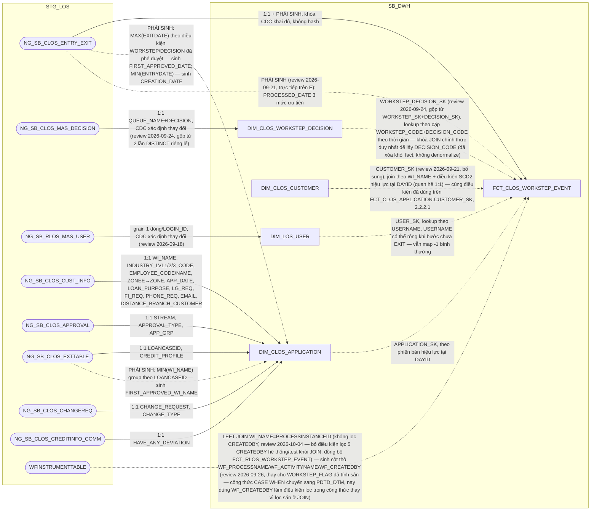
```mermaid
flowchart LR
    subgraph STG_LOS
        A(["NG_SB_CLOS_ENTRY_EXIT"])
        MW(["NG_SB_CLOS_MAS_DECISION"])
        U(["NG_SB_RLOS_MAS_USER"])
        H(["NG_SB_CLOS_CUST_INFO"])
        I(["NG_SB_CLOS_APPROVAL"])
        J(["NG_SB_CLOS_EXTTABLE"])
        K1(["NG_SB_CLOS_CHANGEREQ"])
        N(["NG_SB_CLOS_CREDITINFO_COMM"])
        WF(["WFINSTRUMENTTABLE"])
    end
    subgraph SB_DWH
        WD["DIM_CLOS_WORKSTEP_DECISION"]
        US["DIM_LOS_USER"]
        AP["DIM_CLOS_APPLICATION"]
        KC["DIM_CLOS_CUSTOMER"]
        E["FCT_CLOS_WORKSTEP_EVENT"]
    end
    A -->|1:1 + PHÁI SINH, khóa CDC khai đủ, không hash| E
    WD -.->|"WORKSTEP_DECISION_SK (review 2026-09-24, gộp từ WORKSTEP_SK+DECISION_SK), lookup theo cặp WORKSTEP_CODE+DECISION_CODE theo thời gian — khóa JOIN chính thức duy nhất để lấy DECISION_CODE (đã xóa khỏi fact, không denormalize)"| E
    US -.->|USER_SK, lookup theo USERNAME, USERNAME có thể rỗng khi bước chưa EXIT — vẫn map -1 bình thường| E
    AP -.->|APPLICATION_SK, theo phiên bản hiệu lực tại DAYID| E
    KC -.->|"CUSTOMER_SK (review 2026-09-21, bổ sung), join theo WI_NAME + điều kiện SCD2 hiệu lực tại DAYID (quan hệ 1:1) — cùng điều kiện đã dùng trên FCT_CLOS_APPLICATION.CUSTOMER_SK, 2.2.2.1"| E
    MW -->|"1:1 QUEUE_NAME+DECISION, CDC xác định thay đổi (review 2026-09-24, gộp từ 2 lần DISTINCT riêng lẻ)"| WD
    U -->|"grain 1 dòng/LOGIN_ID, CDC xác định thay đổi (review 2026-09-18)"| US
    H -->|"1:1 WI_NAME, INDUSTRY_LVL1/2/3_CODE, EMPLOYEE_CODE/NAME, ZONEE→ZONE, APP_DATE, LOAN_PURPOSE, LG_REQ, FI_REQ, PHONE_REQ, EMAIL, DISTANCE_BRANCH_CUSTOMER"| AP
    I -->|1:1 STREAM, APPROVAL_TYPE, APP_GRP| AP
    J -->|1:1 LOANCASEID, CREDIT_PROFILE| AP
    J -.->|"PHÁI SINH: MIN(WI_NAME) group theo LOANCASEID — sinh FIRST_APPROVED_WI_NAME"| AP
    K1 -->|1:1 CHANGE_REQUEST, CHANGE_TYPE| AP
    A -.->|"PHÁI SINH: MAX(EXITDATE) theo điều kiện WORKSTEP/DECISION đã phê duyệt — sinh FIRST_APPROVED_DATE; MIN(ENTRYDATE) — sinh CREATION_DATE"| AP
    N -->|1:1 HAVE_ANY_DEVIATION| AP
    A -.->|"PHÁI SINH (review 2026-09-21, trực tiếp trên E): PROCESSED_DATE 3 mức ưu tiên"| E
    WF -.->|"LEFT JOIN WI_NAME=PROCESSINSTANCEID (không lọc CREATEDBY, review 2026-10-04 — bỏ điều kiện lọc 5 CREATEDBY hệ thống/test khỏi JOIN, đồng bộ FCT_RLOS_WORKSTEP_EVENT) — sinh cột thô WF_PROCESSNAME/WF_ACTIVITYNAME/WF_CREATEDBY (review 2026-09-26, thay cho WORKSTEP_FLAG đã tính sẵn — công thức CASE WHEN chuyển sang PDTD_DTM, nay dùng WF_CREATEDBY làm điều kiện lọc trong công thức thay vì lọc sẵn ở JOIN)"| E
```

**⚠️ review 2026-10-04 (theo yêu cầu người dùng) — bỏ điều kiện lọc
CREATEDBY khỏi JOIN `WFINSTRUMENTTABLE`, bổ sung `WF_CREATEDBY` làm cột
thô riêng:** trước đây JOIN `WI_NAME=PROCESSINSTANCEID AND CREATEDBY NOT
IN (...)` lọc sẵn 5 tài khoản hệ thống/test ngay tại JOIN — khác pattern
đã áp dụng cho `FCT_RLOS_WORKSTEP_EVENT` (1.3.2.7), nơi JOIN để
UNFILTERED và điều kiện lọc `CREATEDBY` chuyển vào công thức
`WORKSTEP_FLAG`/`APPROVAL_FLAG` tính tại PDTD_DTM. Đồng bộ lại CLOS theo
đúng pattern đó: JOIN nay KHÔNG lọc `CREATEDBY` (lấy nguyên `c.PROCESSNAME`/
`c.ACTIVITYNAME`/`c.CREATEDBY` của mọi dòng khớp `WI_NAME`), bổ sung
`WF_CREATEDBY` thành cột thô riêng (trước đây chỉ dùng inline trong điều
kiện JOIN, không có cột output) để công thức `WORKSTEP_FLAG` tại
PDTD_DTM tự áp điều kiện `CREATEDBY NOT IN (...)` khi cần — xem Section
2 → 2.2.2.1 (PDTD_DTM) để biết công thức đầy đủ viết lại.

**Gộp WORKSTEP_SK+DECISION_SK thành 1 khóa (review 2026-09-24):** sau khi
gộp `DIM_CLOS_WORKSTEP`+`DIM_CLOS_DECISION` thành `DIM_CLOS_WORKSTEP_
DECISION` (1.2.1.3), 2 khóa `WORKSTEP_SK`/`DECISION_SK` trên bảng này gộp
thành 1 `WORKSTEP_DECISION_SK` duy nhất, lookup theo cặp
(WORKSTEP_CODE, DECISION_CODE) của chính dòng event, điều kiện thời gian
SCD2. Đồng thời xóa cột `DECISION_CODE` denormalize trên fact — cột này
không phải PK (khác `WORKSTEP_CODE`, vẫn giữ nguyên vì là 1 phần PK vật
lý của bảng), nên bắt buộc phải JOIN qua `WORKSTEP_DECISION_SK` để lấy
giá trị DECISION khi cần. `WORKSTEP_CODE` KHÔNG đổi — vẫn denormalize
trực tiếp trên fact và nằm trong PK như thiết kế gốc.

**Vì sao tách vật lý CLOS/RLOS (đánh giá lại 2026-09-14, thay thế kết luận
"giữ CHUNG" trước đó):** lần đánh giá trước kết luận giữ CHUNG vì grain và
ý nghĩa nghiệp vụ "vào bước — ra bước" giống hệt nhau ở cả 2 hệ, và các
rule lọc `WORKSTEP_CODE`/`DECISION_CODE` trong SRS dùng chung 1 bộ công
thức cho cả CLOS/RLOS. Tuy nhiên rà soát lại toàn bộ khóa ngoại của bảng
cho thấy **cả 3 cột FK** (`WORKSTEP_SK`, `DECISION_SK`, `APPLICATION_SK`
— đã bỏ `PRODUCT_SK` khỏi bảng, xem Section 3) đều là **polymorphic FK**
— mỗi cột phải rẽ nhánh trỏ
`DIM_CLOS_*` hoặc `DIM_RLOS_*` tùy nguồn hệ ở MỌI lượt lookup — khác
mức độ với `FCT_CLOS_LOAN_DISBURSEMENT`/`FCT_RLOS_LOAN_DISBURSEMENT`
(tách từ `FCT_LOS_DISBURSEMENT`, xem 2.2.2.7/2.3.2.8 PDTD_DTM — 5/18 cột
phụ thuộc hệ, tỷ lệ polymorphic thấp hơn nhiều nhưng vẫn đủ căn cứ để
tách theo cùng nguyên tắc). Ở bảng này, vì MỌI FK đều
polymorphic, tách vật lý thành 2 bảng giúp mỗi bảng chỉ còn FK trỏ thẳng
đúng 1 DIM cố định (không cần CASE theo nguồn hệ ở tầng ETL lẫn tầng
report khi join), nhất quán với pattern đã áp dụng cho
`FCT_CLOS_EXCEPTION`/`FCT_RLOS_EXCEPTION` (1.2.2.4/1.3.2.5) và
`FCT_CLOS_DEVIATION`/`FCT_RLOS_DEVIATION` (1.2.2.5/1.3.2.6). Cột kỹ thuật
`DATASOURCE` không còn mang thông tin phân biệt sau khi tách vật lý
(luôn cố định 'CLOS'), đã bỏ hẳn khỏi bảng theo column-optimization rule.

**Grain và khóa — LOẠI 1, đã xác nhận qua `DS_BANG_202608.xlsx`:**
`NG_SB_CLOS_ENTRY_EXIT` khai đủ khóa CDC `WINAME + WORKSTEP + ENTRYDATE`,
không có cột CLOB — PK giữ thẳng trên cột gốc, không cần hash (khác
pattern `FCT_CLOS_COLLATERAL`/`FCT_CLOS_DEVIATION` đã gặp ở các bảng LOẠI
2). Grain: 1 dòng = 1 **phiên bản** của 1 logical event (`hồ sơ x workstep
x lần vào bước`) — hồ sơ quay lại cùng 1 bước nhiều lần thì mỗi lần là 1
logical event riêng (khác `ENTRYDATE`). PK = `DAYID + WI_NAME +
WORKSTEP_CODE + ENTRYDATE`; `DECISION_SK`/`USER_SK` cố tình KHÔNG nằm
trong khóa (chỉ để tra cứu thêm thuộc tính, không phải định danh — vì giá
trị gốc `DECISION_CODE`/`USERNAME` đã có sẵn trên fact). Bảng **GHI
THÊM, không sửa/xóa** dòng cũ — khác cơ chế "ảnh chụp đầy đủ mỗi ngày"
(quy trình A2) đã dùng cho các fact snapshot khác trong tài liệu này; đây
là quy trình A1 (chỉ ghi bản ghi thay đổi/mới trong `TIME_UPDATE >=
:P_DATE AND < :P_DATE + 1`), đọc đúng trạng thái tại ngày D bằng
`ROW_NUMBER() OVER (PARTITION BY WI_NAME, WORKSTEP_CODE, ENTRYDATE ORDER
BY DAYID DESC)`.

**Đối chiếu SRS (BC3, BC4, BC8, BC9 — các báo cáo trực tiếp dùng cấu trúc
cột này, nhánh CLOS):** BC3/BC4 dùng `WINAME`/`WORKSTEP`/`DECISION`/
`ENTRYDATE`/`EXITDATE`/`USERNAME`/`REMARKS` hiển thị trực tiếp — khớp
đúng. BC8 dùng công thức đếm `SL_RETURN_*` (SUM CASE theo
`WORKSTEP`/`DECISION`) trực tiếp trên `NG_SB_CLOS_ENTRY_EXIT` — không cần
cột phái sinh mới trên fact, tính ở tầng report. BC9 dùng `NHAN_SU`
(đếm `DISTINCT USERNAME` theo đúng danh sách 8 `WORKSTEP` đã ghi trong
lineage doc gốc của `FCT_LOS_KPI_USER_YEAR`, nhánh CLOS) và `TAT_CLOS`
(tổng `get_business_minute(ENTRYDATE, EXITDATE)/60` theo từng nhóm bước)
— khớp đúng với `TAT_WORKING_HOUR` đã có sẵn trên bảng này. Không phát
hiện lệch tài liệu, không phát sinh PENDING mới.

**Đính chính lld/BC4.csv (review 2026-09-21):** rà soát mapping trước đó
phát hiện `WINAME`/`WORKSTEP`/`ENTRYDATE`/`EXITDATE`/`UND_MAKER`/`REMARKS`
của BC4 bị trỏ nhầm sang `FCT_CLOS_APPLICATION` (snapshot 1
dòng/hồ sơ/ngày) — SAI GRAIN so với ý định thật của báo cáo. Người dùng
xác nhận: BC4 là báo cáo liệt kê TOÀN BỘ các dòng sự kiện (event-grain,
nhiều dòng/hồ sơ) của các hồ sơ đã có bước thẩm định, lọc `WHERE
WORKSTEP_CODE IN ('UnderwriterMaker','UnderwriterChecker')` trực tiếp
trên bảng này (đúng bảng ở mục này, không phải `APPLICATION_DAILY`) —
mỗi dòng report ứng với đúng 1 dòng event đã lọc, `ENTRYDATE`/`EXITDATE`/
`WORKSTEP_CODE`/`REMARKS` đều là giá trị CỦA CHÍNH dòng đó (không phải
`MIN`/`MAX` cross-row như cách diễn đạt công thức trong SRS gợi ý —
SRS chỉ dùng `MIN`/`MAX` để mô tả điều kiện lọc tập giá trị, không phải
aggregate rút gọn 1 dòng/hồ sơ). `UND_MAKER` = `CASE WHEN
WORKSTEP_CODE='UnderwriterMaker' THEN USERNAME END` trên chính dòng
event (NULL khi dòng đang xét là `UnderwriterChecker`, không self-join
lấy từ dòng UWM khác cùng hồ sơ). Các thuộc tính cấp-hồ-sơ khác của BC4
(`SYSTEMNAME`=literal cố định `'CLOS'` — bảng này đã bỏ hẳn cột
`DATASOURCE`, không còn mang thông tin phân biệt sau khi tách vật lý;
`CUSTOMER_NAME` qua `DIM_CLOS_CUSTOMER`) đọc
trực tiếp trên chính bảng này/DIM liên quan, không cần JOIN sang
`FCT_CLOS_APPLICATION` nữa. **Cập nhật tiếp (review 2026-09-21,
theo yêu cầu đồng bộ của người dùng):** `REPORT_DATE`(=`PROCESSED_DATE`)
và `FLAG`(=`WORKSTEP_FLAG`) — 2 cột duy nhất còn cần JOIN fan-out sang
`APPLICATION_DAILY` — nay ĐÃ bổ sung làm cột phái sinh MỚI tính độc lập
ngay trên `FCT_CLOS_WORKSTEP_EVENT` (cột 22-24, xem cột table ngay dưới
và `hld/HLD_FCT_SB_DWH.md` 1.2.2.6/2.2.2.6), cùng công thức/nguồn với
bản trên `APPLICATION_DAILY` nhưng không copy/JOIN — BC4 giờ đọc TOÀN BỘ
9 cột đầu ra (trừ `CUSTOMER_NAME`) từ đúng 1 bảng `FCT_CLOS_WORKSTEP_
EVENT`, không cần JOIN fan-out sang `APPLICATION_DAILY` nào nữa. Nhánh
RLOS áp dụng y hệt trên `FCT_RLOS_WORKSTEP_EVENT` (1.3.2.7, cột 24-26).
Xem `lld/BC4.csv` các dòng 4/6/7/8/9/11 (CLOS) và 15/17/18/19/20/22
(RLOS).

###### 1.2.2.7 FCT_CLOS_LEGAL_PARTY — ĐỔI PHÂN LOẠI DIM → FACT (review 2026-09-25, trước đây là DIM_CLOS_LEGAL_PARTY, 1.2.1.7)

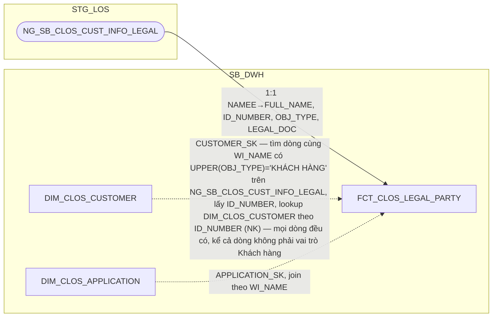
```mermaid
flowchart LR
    subgraph STG_LOS
        A(["NG_SB_CLOS_CUST_INFO_LEGAL"])
    end
    subgraph SB_DWH
        K["DIM_CLOS_CUSTOMER"]
        AP["DIM_CLOS_APPLICATION"]
        E["FCT_CLOS_LEGAL_PARTY"]
    end
    A -->|1:1 NAMEE→FULL_NAME, ID_NUMBER, OBJ_TYPE, LEGAL_DOC| E
    K -.->|"CUSTOMER_SK — tìm dòng cùng WI_NAME có UPPER(OBJ_TYPE)='KHÁCH HÀNG' trên NG_SB_CLOS_CUST_INFO_LEGAL, lấy ID_NUMBER, lookup DIM_CLOS_CUSTOMER theo ID_NUMBER (NK) — mọi dòng đều có, kể cả dòng không phải vai trò Khách hàng"| E
    AP -.->|"APPLICATION_SK, join theo WI_NAME"| E
```

**Đổi phân loại DIM → FACT (review 2026-09-25, theo quyết định người
dùng):** nguồn `NG_SB_CLOS_CUST_INFO_LEGAL` có **KEY CDC RỖNG** trong
`input/DS_BANG_202608.xlsx` — đã ghi nhận rủi ro này ở Section 3 #36
(trước đây giải quyết bằng cách GIỮ NGUYÊN kiến trúc DIM, đổi cơ chế SCD2
sang so khớp "full-row-key" 5 cột). Lần này người dùng quyết định đổi
hướng khác, đúng theo "Red flag — source table has no CDC key → can't be
a DIM/SCD2" (`references/design-method.md`): chuyển hẳn thành **FACT** —
một snapshot trung thực của những gì nguồn thực sự cung cấp (không có
định danh dòng độc lập với nội dung), thay vì giả vờ có lịch sử SCD2 đáng
tin cậy. Xem Section 3 — dòng follow-up thay thế quyết định cũ (không xóa
dòng #36, giữ lịch sử).

**Giữ nguyên toàn bộ thuộc tính của `DIM_CLOS_LEGAL_PARTY` cũ** (`OBJ_TYPE`
gốc, `FULL_NAME`←`NAMEE`, `LEGAL_DOC`, `ID_NUMBER`, và `LEGAL_TYPE` chuẩn
hóa qua `REF_CLOS_LEGAL` ở PDTD_DTM, xem Section 2 → 2.2.2.8) — chỉ đổi
khóa/cơ chế nạp. **Grain: 1 dòng = 1 người/đối tượng liên quan pháp lý của
1 hồ sơ** (`WI_NAME` + `ID_NUMBER`, theo đúng "Khóa nghiệp vụ" ghi trong
`CLOS - Metadata.xlsx` sheet "2. Table Review" dòng
`NG_SB_CLOS_CUST_INFO_LEGAL`) — PK giờ là composite `WI_NAME + ID_NUMBER`,
không còn `DIMENSION_KEY` sequence.

**Bổ sung 2 chiều FK mới (yêu cầu người dùng, review 2026-09-25):**

1. **Chiều khách hàng chính — `CUSTOMER_SK`:** MỌI dòng (dù vai trò
   `OBJ_TYPE` là gì — Khách hàng, Người đại diện theo pháp luật, Chủ sở
   hữu TSBĐ, Thành viên góp vốn chính, Khác) đều có `CUSTOMER_SK` trỏ về
   khách hàng CHÍNH của hồ sơ đó — không phải chính dòng đang xét (trừ
   khi dòng đó chính là `OBJ_TYPE='Khách hàng'` thì trùng nhau tự nhiên).
   Cách lấy: từ `WI_NAME` của dòng đang xét, tìm dòng khác cùng `WI_NAME`
   có `UPPER(OBJ_TYPE)='KHÁCH HÀNG'` trên chính `NG_SB_CLOS_CUST_INFO_
   LEGAL`, lấy `ID_NUMBER` của dòng đó, lookup sang `DIM_CLOS_CUSTOMER.
   DIMENSION_KEY` theo `ID_NUMBER` (NK, xem 1.2.1.6) — tái sử dụng đúng
   logic đã dùng để dựng `DIM_CLOS_CUSTOMER`, không phát minh lại. Mặc
   định -1 nếu không khớp.
2. **Chiều hồ sơ — `APPLICATION_SK`:** join theo `WI_NAME` sang
   `DIM_CLOS_APPLICATION.DIMENSION_KEY` (1.2.1.1) — quan hệ N:1 (nhiều
   dòng vai trò pháp lý cùng `WI_NAME` trỏ về đúng 1 hồ sơ). Mặc định -1
   nếu không khớp.

**Vì sao KHÔNG áp dụng pattern pivot-thành-cột-cố-định (lịch sử — so sánh
với `DIM_RLOS_COREPAYER` tại thời điểm review này, xem cập nhật ⚠️ dưới
đây):** RLOS corepayer (tại thời điểm review 2026-09-25) có đúng **1 vai
trò duy nhất** (corepayer), số lượng người có **giới hạn cứng đã xác
nhận** (0-4, theo nhãn PIN Corep1-4) — nên tách được thành 1 DIM riêng
theo đúng 1 vai trò với N nhỏ, biết trước. CLOS có **5 vai trò khả dĩ**
(`CUSTOMER`, `LEGAL_REPRESENTATIVE`, `COLLATERAL_OWNER`,
`MAIN_CONTRIBUTING_MEMBERS`, `OTHER`), nhưng khác RLOS ở 2 điểm mấu chốt:
(1) **không có giới hạn cứng đã biết** cho số người ở mỗi vai trò (số
người đại diện/chủ sở hữu TSBĐ/thành viên góp vốn phụ thuộc hoàn toàn
cấu trúc sở hữu thực tế của từng doanh nghiệp, không có trần cố định như
"tối đa 4"); (2) **các vai trò không loại trừ lẫn nhau** — 1 người có
thể đồng thời là người đại diện pháp luật VÀ thành viên góp vốn chính
trên cùng 1 hồ sơ (2 dòng cho cùng 1 người), trong khi RLOS 1 người chỉ
có thể là applicant HOẶC corepayer, không bao giờ cả hai. Vì N không
giới hạn/không biết trước và vai trò không loại trừ nhau, **không đủ
điều kiện pivot thành cột cố định** — phải giữ dạng bảng danh sách (grain
nhân dòng).

⚠️ **Cập nhật 2026-09-26 — so sánh trên chỉ còn giá trị lịch sử ở vế
CLOS:** `DIM_RLOS_COREPAYER` đã đổi thành `FCT_RLOS_COREPAYER` (1.3.2.9)
và bỏ hẳn pivot `ADD_ID_COREPAYER`/`ADD_ID_OTHER_COREPAYER`, đổi grain
sang 1 dòng/giấy tờ — theo yêu cầu người dùng ("cần chi tiết theo dòng"),
KHÔNG phải vì corepayer hết đủ điều kiện pivot (giới hạn cứng 0-4 và
1-vai-trò-duy-nhất vẫn đúng, không đổi). Lập luận "vì sao KHÔNG pivot"
của `FCT_CLOS_LEGAL_PARTY` (bảng này) vẫn đúng nguyên vẹn — CLOS thật sự
không đủ điều kiện pivot (N không giới hạn, vai trò không loại trừ nhau)
— chỉ riêng đối tượng so sánh (`DIM_RLOS_COREPAYER`) không còn tồn tại
dưới tên/kiến trúc đó nữa.

**Gộp `FCT_LOS_PARTY_DOCUMENT` vào thẳng bảng này** (bỏ hẳn bảng document
riêng) — nguồn giấy tờ pháp lý CLOS chỉ có đúng 1 bảng gốc
(`NG_SB_CLOS_CUST_INFO_LEGAL`) với đúng 1 cặp `LEGAL_DOC`/`ID_NUMBER` trên
mỗi dòng, không có rủi ro "nhiều giấy tờ/nhóm" như RLOS IDGRID (14 loại
giấy tờ, có thể nhiều dòng/nhóm TCC-CC) — gộp trực tiếp an toàn, không mất
dữ liệu (đã xác nhận với người dùng).

Bỏ `PARTY_TYPE`, `PARTY_ROLE_CODE` (thay bằng `OBJ_TYPE`
gốc + `LEGAL_TYPE` chuẩn hóa ở PDTD_DTM, xem Section 2 → 2.2.2.8),
`GEO_SK` (không cần vì không phải khách hàng chính). Cột kỹ thuật
`DATASOURCE` cũng bỏ hẳn — không còn mang thông tin phân biệt sau khi
tách vật lý CLOS/RLOS.

**Ảnh hưởng lan truyền do đổi tên bảng (review 2026-09-25):** `FCT_CLOS_
APPLICATION_PARTY` (1.2.2.2) có cột `LEGAL_PARTY_SK` từng trỏ
`DIM_CLOS_LEGAL_PARTY.DIMENSION_KEY` — nay đổi trỏ sang `FCT_CLOS_
LEGAL_PARTY` theo đúng PK composite mới (`WI_NAME + ID_NUMBER`), không
còn `DIMENSION_KEY` để trỏ. Xem 1.2.2.2 cột `LEGAL_PARTY_SK` đã cập nhật
ghi chú. `DIM_CLOS_CUSTOMER` (1.2.1.6, PDTD_DTM 2.2.1.6) — các cột
`LEGAL_REPRESENTATIVE`/`ADD_ID_REPRESENTATIVE` đổi nguồn từ "LEFT JOIN
DIM_CLOS_LEGAL_PARTY" thành "LEFT JOIN FCT_CLOS_LEGAL_PARTY" (cùng điều
kiện join theo WI_NAME+LEGAL_TYPE, chỉ đổi tên bảng nguồn).

#### 1.3 Bộ bảng RLOS

##### 1.3.1 DIM

###### 1.3.1.1 DIM_RLOS_APPLICATION — ✅ ĐÃ GIẢI QUYẾT (đã bổ sung APP_GRP, APPLICATION_DATE; lấy đầy đủ cột dư thừa từ driving table EXTTABLE; DEVIATION_G3 chuyển report-time PDTD_DTM; CHANGE_REQUEST/CHANGE_TYPE/CUS_SEGMENT/APPROVED_AMT_FINAL/CURRENCY_CODE/APPROVED_TERM chuyển đi nơi khác). ⚠️ review 2026-09-30 (3 lượt, theo yêu cầu người dùng): xóa 12 cột "username/routing tại 1 bước" (UWMAKERUSER/UWCHKRUSER/CREDAPPRUSER/CCOMMITUSER/DATACHKUSER/HOSUPPORTUSER/POSTSANCUSER/PREDISBMAKUSER/PREDISBCHKUSER/DISBMAKUSER/DISBCHKUSER/CHECKER3_TARGET), sau đó 10 cột username khác + APPROVAL_REJECT/APPROVAL_FLAG, chuyển 11 cột cờ nhánh phụ sang FCT_RLOS_APPLICATION, rồi xóa tiếp CURR_WSNAME/PREV_WSNAME/DECISION/CHECKER3_CONDITION/DISBURSEMENT_TYPE/DISB_DECSION/MAJOR_DEV/MINOR_DEV/CANCEL_DATE + chuyển TOTALNONELIGIBLE/REASON (→CANCEL_REASON) sang FCT_RLOS_APPLICATION — xem chi tiết đầy đủ tại 1.3.1.1 (Section 1) — nay 39 cột, sau đó 38 cột sau khi bỏ cột kỹ thuật DATASOURCE. ⚠️ review 2026-10-04 (theo yêu cầu người dùng): nhận lại 27 cột SCD1 từ `FCT_RLOS_APPLICATION` (thuộc tính một-lần/ổn định, không phải event; PRODUCT_NAME trùng với cột dư thừa đã có sẵn từ EXTTABLE nên không tính là cột mới, chỉ cập nhật lại lý do giữ; xóa BUSINESS_MODEL dư thừa — không tồn tại trong review file hiện hành, đổi tên EMPLOYEE_CODE/NAME→CREATE_EMPLOYEE_CODE/NAME đồng bộ pattern CLOS) — nay 64 cột, xem chi tiết tại Section 2 (1.3.1.1)

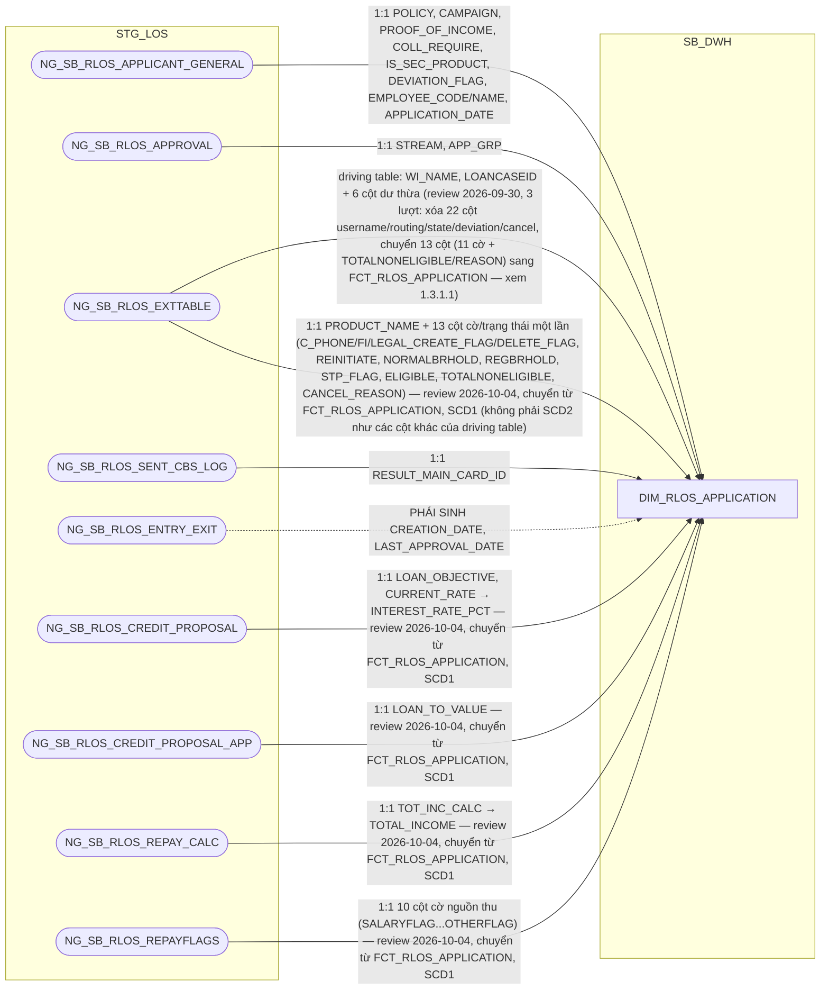
```mermaid
flowchart LR
    subgraph STG_LOS
        A(["NG_SB_RLOS_APPLICANT_GENERAL"])
        C(["NG_SB_RLOS_APPROVAL"])
        D(["NG_SB_RLOS_EXTTABLE"])
        E(["NG_SB_RLOS_SENT_CBS_LOG"])
        F(["NG_SB_RLOS_ENTRY_EXIT"])
        B1(["NG_SB_RLOS_CREDIT_PROPOSAL"])
        B2(["NG_SB_RLOS_CREDIT_PROPOSAL_APP"])
        B3(["NG_SB_RLOS_REPAY_CALC"])
        B4(["NG_SB_RLOS_REPAYFLAGS"])
    end
    subgraph SB_DWH
        G["DIM_RLOS_APPLICATION"]
    end
    D -->|"driving table: WI_NAME, LOANCASEID + 6 cột dư thừa (review 2026-09-30, 3 lượt: xóa 22 cột username/routing/state/deviation/cancel, chuyển 13 cột (11 cờ + TOTALNONELIGIBLE/REASON) sang FCT_RLOS_APPLICATION — xem 1.3.1.1)"| G
    A -->|1:1 POLICY, CAMPAIGN, PROOF_OF_INCOME, COLL_REQUIRE, IS_SEC_PRODUCT, DEVIATION_FLAG, EMPLOYEE_CODE/NAME, APPLICATION_DATE| G
    C -->|1:1 STREAM, APP_GRP| G
    E -->|1:1 RESULT_MAIN_CARD_ID| G
    F -.->|PHÁI SINH CREATION_DATE, LAST_APPROVAL_DATE| G
    B1 -->|"1:1 LOAN_OBJECTIVE, CURRENT_RATE → INTEREST_RATE_PCT — review 2026-10-04, chuyển từ FCT_RLOS_APPLICATION, SCD1"| G
    B2 -->|"1:1 LOAN_TO_VALUE — review 2026-10-04, chuyển từ FCT_RLOS_APPLICATION, SCD1"| G
    B3 -->|"1:1 TOT_INC_CALC → TOTAL_INCOME — review 2026-10-04, chuyển từ FCT_RLOS_APPLICATION, SCD1"| G
    B4 -->|"1:1 10 cột cờ nguồn thu (SALARYFLAG...OTHERFLAG) — review 2026-10-04, chuyển từ FCT_RLOS_APPLICATION, SCD1"| G
    D -->|"1:1 PRODUCT_NAME + 13 cột cờ/trạng thái một lần (C_PHONE/FI/LEGAL_CREATE_FLAG/DELETE_FLAG, REINITIATE, NORMALBRHOLD, REGBRHOLD, STP_FLAG, ELIGIBLE, TOTALNONELIGIBLE, CANCEL_REASON) — review 2026-10-04, chuyển từ FCT_RLOS_APPLICATION, SCD1 (không phải SCD2 như các cột khác của driving table)"| G
```

**Ghi chú lineage — đổi driving table sang `NG_SB_RLOS_EXTTABLE` (review
2026-09-22):** trước đây driving là `NG_SB_RLOS_APPLICANT_GENERAL`; cả 2
bảng đều grain 1:1 hồ sơ theo RLOS Metadata (không phải sửa lỗi grain).
Đổi sang `NG_SB_RLOS_EXTTABLE` để nhất quán kiến trúc với
`DIM_CLOS_APPLICATION` (driving `NG_SB_CLOS_EXTTABLE`, xem 1.2.1.1) — cả
2 bảng EXTTABLE cùng vai trò "ảnh chụp trạng thái hiện tại của hồ sơ",
cùng cấu trúc theo RLOS Metadata (bảng `NG_SB_RLOS_EXTTABLE`, sheet Table
Review).

**✅ Đã giải quyết — lấy đầy đủ cột dư thừa của driving table
`NG_SB_RLOS_EXTTABLE` (review 2026-09-25):** trước đó đổi driving table
(review 2026-09-22) mới chỉ lấy 4 cột (`WI_NAME`, `LOANCASEID`,
`CHANGE_REQUEST`, `CHANGE_TYPE`), bỏ sót các cột khác của cùng bảng —
cùng tình huống đã xử lý ở `DIM_CLOS_APPLICATION` (1.2.1.1). Rà soát lại
toàn bộ 50 cột của `NG_SB_RLOS_EXTTABLE` (`CLOS - Metadata.xlsx`, sheet
"3. Column Review" — file này chứa chung metadata cả 2 hệ, gồm cả bảng
RLOS) đối chiếu SRS BC1 (bảng field-list chính, 87 dòng):
- **4 cột có report dùng thật** (BC1, dạng `COALESCE` fallback):
  `UWMAKERUSER` (fallback cho `UNDERWRITERMAKER_USERMAKE`),
  `UWCHKRUSER` (fallback cho `UNDERWRITERCHECKER_USERMAKE`),
  `CREDAPPRUSER`, `CCOMMITUSER` (2 fallback tuần tự cho
  `APPROVAL_USERMAKE`). (Tên đích ban đầu dự kiến `*_TAKERESPON` — đã
  đổi/xóa theo review 2026-10-01, xem Section 2 → 2.3.2.1.)
- **49 cột còn lại không có báo cáo nào dùng trực tiếp** — thêm vào theo
  quyết định người dùng, đánh dấu "Thiết kế dư thừa" để không bỏ sót
  thuộc tính gốc của driving table (cùng nguyên tắc đã áp dụng ở
  `DIM_CLOS_APPLICATION`): `CURR_WSNAME`, `PREV_WSNAME`, `DECISION`,
  `CUSTOMER_NAME`, `PRODUCT_NAME`, `APPROVAL_CONDITION`, `APPROVER_TYPE`,
  `CHECKER3_CONDITION`, `CHECKER3_TARGET`, `DISBURSEMENT_TYPE`,
  `DISB_DECSION`, `STP_FLAG`, `ELIGIBLE`, `C_PHONE_CREATE_FLAG`,
  `C_FI_CREATE_FLAG`, `C_LEGAL_CREATE_FLAG`, `C_PHONE_DELETE_FLAG`,
  `C_FI_DELETE_FLAG`, `C_LEGAL_DELETE_FLAG`, `REINITIATE`, `RR_USER`,
  `DATACHKUSER`, `HOSUPPORTUSER`, `POSTSANCUSER`, `PREDISBMAKUSER`,
  `PREDISBCHKUSER`, `DISBMAKUSER`, `DISBCHKUSER`, `POSTDISBDEUSER`,
  `NORMBRUSER`, `REGBRUSER`, `NORMSUPPORT_DCSN`, `REGSUPPORT_DCSN`,
  `NORMALBRHOLD`, `REGBRHOLD`, `BRASUPPORTSENDER`, `DISBURSEUSER`,
  `DISBCHECKERUSER`, `LASTAPPROVER`, `APP_STATUS`, `APPROVAL_REJECT`,
  `APPROVAL_FLAG`, `MAJOR_DEV`, `MINOR_DEV`, `TOTALNONELIGIBLE`,
  `CANCEL_DATE`, `REASON`, `RMEMAILID`, `REMARKS`.
- **Loại trừ hoàn toàn:** `ITEMINDEX` (khóa vật lý kỹ thuật của bảng
  nguồn, không mang ý nghĩa nghiệp vụ — cùng lý do đã loại `RN` ở
  `NG_SB_CLOS_EXTTABLE`); `BRANCH_CODE`/`BRANCH_NAME` (đã có sẵn qua
  `COMPANY_SK` → `DIM_LOS_COMPANY` trên `FCT_RLOS_APPLICATION`,
  không cần thêm lại dạng text — cùng lý do đã loại
  `COMPANY_CODE`/`COMPANY_NAME`/`BRANCH_CODE`/`BRANCH_NAME` ở
  `DIM_CLOS_APPLICATION`).

`MAJOR_DEV`/`MINOR_DEV` (số lượng sai lệch chính sách mức lớn/nhỏ ghi
nhận trực tiếp trên `NG_SB_RLOS_EXTTABLE`) đọc **khác nguồn hoàn toàn**
với `DEVIATION_G3` (đếm từ `NG_SB_RLOS_MANUAL_DEVIATION`, xem ghi chú
riêng bên dưới) — giữ cả hai, không dùng `MAJOR_DEV`/`MINOR_DEV` để suy ra
hay thay thế `DEVIATION_G3`, tránh nhầm lẫn 2 khái niệm đếm khác nguồn.
`DISB_DECSION` giữ nguyên tên gốc dù thiếu chữ so với chính tả đúng
"DECISION" — lỗi đặt tên từ hệ thống nguồn, đã ghi nhận ở metadata.

**✅ Đã giải quyết — chuyển `CHANGE_REQUEST`/`CHANGE_TYPE` sang
`FCT_RLOS_APPLICATION` (review 2026-09-25):** cùng lý do đã áp dụng
cho `DIM_CLOS_APPLICATION` (1.2.1.1) — bản chất "thay đổi thường xuyên"
theo hồ sơ không phù hợp cột ổn định SCD2 của DIM. Khác với CLOS (chấp
nhận để tham chiếu treo tạm thời), lần này thêm thẳng luôn vào
`FCT_RLOS_APPLICATION` (1.3.2.1, đọc trực tiếp
`NG_SB_RLOS_EXTTABLE.REQ_TYPE`/`CHANGE_TYPE`) — không để trạng thái
PENDING. Khóa tra SLA (`REF_PRODUCT`/`SLA_*`, PDTD_DTM 2.3.1.1) đổi sang
lấy `CHANGE_TYPE` qua `APPLICATION_SK` → `FCT_RLOS_APPLICATION`
thay vì đọc cột local đã xóa trên DIM.

**✅ Đã giải quyết — chuyển `CUS_SEGMENT`/`CUSTOMER_SEGMENT` sang
`DIM_RLOS_APPLICANT` (review 2026-09-25):** nguồn
`NG_SB_RLOS_APPLICANT_DETAIL.CUS_SEGMENT` là thuộc tính khách hàng/cá
nhân applicant, không phải hồ sơ — cùng bản chất tách bạch đã áp dụng
cho `CUST_GROUP` giữa `DIM_CLOS_APPLICATION`/`DIM_CLOS_CUSTOMER`. Chuyển
2 cột này sang `DIM_RLOS_APPLICANT` — bảng dự kiến đổi tên
thành `DIM_RLOS_CUSTOMER` ở một lượt review riêng sau này, chưa thực hiện
đổi tên trong lượt này. **Cập nhật (review 2026-09-26):** `DIM_RLOS_
APPLICANT` đã đổi hẳn thành `FCT_RLOS_CUSTOMER` (1.3.2.x, đổi grain
sang WI_NAME+ID_TYPE+ID_NUMBER, xem ghi chú tại đó) — `CUS_SEGMENT` nay
nằm trên bảng FCT này; `CUSTOMER_SEGMENT` chuyển tiếp sang PDTD_DTM (không
còn ở SB_DWH).

**✅ Đã giải quyết — chuyển `APPROVED_AMT_FINAL`/`CURRENCY_CODE`/
`APPROVED_TERM` sang `FCT_RLOS_WORKSTEP_EVENT` (review 2026-09-25):**
trước đây 3 cột này đặt trên DIM dạng "dư thừa có chủ đích" (cùng
nguồn/giá trị với `FCT_RLOS_APPLICATION`) chỉ để
`FCT_RLOS_WORKSTEP_EVENT` (1.3.2.7) lookup thẳng qua `APPLICATION_SK`
không cần JOIN fan-out. Theo yêu cầu người dùng: đặt thẳng 3 cột này lên
chính `FCT_RLOS_WORKSTEP_EVENT` (tính độc lập tại đó, cùng nguồn
`NG_SB_RLOS_CREDIT_PROPOSAL`, cùng pattern `PROCESSED_DATE`/
`WORKSTEP_FLAG` đã có — phái sinh trực tiếp trên bảng, lặp lại giống
nhau trên mọi dòng event của hồ sơ) — không cần đặt bản dư thừa trên DIM
nữa.

**✅ Đã giải quyết — bổ sung `APPLICATION_DATE` (review 2026-09-25):**
rà soát toàn bộ ~29 cột của `NG_SB_RLOS_APPLICANT_GENERAL` (cùng bảng
driving `POLICY`/`CAMPAIGN`/`EMPLOYEE_CODE`...) phát hiện `APPLICATION_
DATE` ("ngày khởi tạo hồ sơ" khai theo form) là cột hồ sơ-grain duy nhất
còn thiếu, chưa dùng ở đâu trong tài liệu. Thêm dạng dư thừa riêng, song
song với `CREATION_DATE` đã có sẵn (cột phái sinh `MIN(ENTRYDATE)` trên
`NG_SB_RLOS_ENTRY_EXIT`, cùng khái niệm "ngày khởi tạo hồ sơ" nhưng khác
nguồn — theo yêu cầu người dùng, giữ cả hai vì không chắc chắn 2 giá trị
luôn khớp nhau). Các cột hồ sơ-grain khác của `NG_SB_RLOS_APPLICANT_
GENERAL` đã dùng ở nơi khác: `COMPANY_CODE`/`BRACH_CODE`/`BRANCH_NAME`
(lookup `COMPANY_SK`), `PRODUCT_LINE`/`SUB_PRODUCT` (lookup
`PRODUCT_SK`), `ZONE`/`NATIONALITY`/`TITLE`/`HOME_PHONE`/`PHONE_1`/
`PHONE2`/`SALE_TYPE`/`BROKER_*`/`ACC_OFFICER`/`ACCOUNT_OFFICER_NAME`/
`EXISTING_CUSTOMER`/`APPLICANTCIF`/`BUSINESS_MODEL`/`KYC1` (⚠️ review
2026-09-26: `ZONE`/`SALE_TYPE`/`BROKER_*`/`ACC_OFFICER`/
`ACCOUNT_OFFICER_NAME`/`EXISTING_CUSTOMER`/`APPLICANTCIF`/
`BUSINESS_MODEL`/`KYC1` xác nhận qua dữ liệu thực là thuộc tính HỒ SƠ,
không phải khách hàng — đã chuyển các cột này VỀ LẠI đây (`DIM_RLOS_
APPLICATION`), xem cột bổ sung ở bảng cột Section 2. `NATIONALITY`/
`TITLE`/`HOME_PHONE`/`PHONE_1`/`PHONE_2` vẫn ở `FCT_RLOS_CUSTOMER` —
đây là thuộc tính con người thật), `LOS_ORA_ROWSCN`/`LOS_TIME_UPDATE_ROWSCN`
(cột kỹ thuật CDC, không đưa vào).

**Ghi chú lineage — loại bỏ `DIM_RLOS_APPROVAL_GROUP`, bổ sung `APP_GRP`
thẳng lên đây:** RLOS Metadata gốc (sheet Table Review, bảng
`NG_SB_RLOS_APPROVAL`) xác nhận trực tiếp **grain = 1 dòng = 1 hồ sơ RLOS**
— cùng kết luận với CLOS (xem 1.2.1.1). `APP_GRP` là thuộc tính ổn định
của hồ sơ, đọc thẳng từ `NG_SB_RLOS_APPROVAL` — cùng bảng, cùng cách với
`STREAM` đã có sẵn ở đây. `DIM_RLOS_APPROVAL_GROUP` và
`MAP_RLOS_APPROVAL_GROUP` đã bị loại bỏ hoàn toàn; cột `APPROVAL_GROUP_SK`
cũng bị loại khỏi `FCT_RLOS_APPLICATION`. `APP_GRP` dùng làm khóa
tra cam kết SLA (`REF_PRODUCT`/`SLA_*`) ở PDTD_DTM (2.3.1.1) cùng
`SECONDARY_PRODUCTLINE` (=`IS_SEC_PRODUCT`, đã có sẵn), `CHANGE_TYPE`
(xem bên dưới) và `DEVIATION_G3` (nay tính report-time tại PDTD_DTM,
không còn đặt trên DIM này — xem ghi chú riêng ở 2.3.1.1).

**✅ Đã giải quyết — bỏ `DEVIATION_G3` khỏi DIM, chuyển sang report-time
PDTD_DTM (review 2026-09-25):** thiết kế trước đây đặt `DEVIATION_G3`
ngay trên DIM này (SCD2, COUNT(*) theo `WI_NAME` trên
`NG_SB_RLOS_MANUAL_DEVIATION`, đọc thẳng STG_LOS). Rà soát lại: nguồn này
đã có sẵn đường đi SB_DWH qua `FCT_RLOS_DEVIATION` (1.3.2.x — cùng bảng
`NG_SB_RLOS_MANUAL_DEVIATION`, full-snapshot mỗi ngày theo `DAYID +
WI_NAME + DEVIATION_BK`) — đây cũng chính là nguồn `AGG_LOS_KPI_
APPLICATION.DEVIATION_G3` (2.1.9, PDTD_DTM, report-time: UNION
`FCT_RLOS_DEVIATION`, lọc `DAYID=MAX(DAYID)` mỗi `WI_NAME`, `COUNT(*)`,
>=3→'YES'). Theo yêu cầu người dùng: bỏ hẳn bản SCD2 trên DIM (SB_DWH),
để khóa tra SLA (`REF_PRODUCT`/`SLA_*`, PDTD_DTM 2.3.1.1) dùng chung
nguồn/công thức với `AGG_LOS_KPI_APPLICATION` — không cần đọc thẳng
STG_LOS thêm lần nữa, không tạo 2 luồng tính song song cho cùng 1 khái
niệm. Xem ghi chú report-time đầy đủ tại 2.3.1.1.

**Bổ sung `CHANGE_TYPE`:** đọc thẳng từ `NG_SB_RLOS_EXTTABLE.CHANGE_TYPE` —
cùng bảng nguồn đã tin cậy dùng cho `LOANCASEID`/`CHANGE_REQUEST` ở DIM
này, không phải nguồn mới. SRS BC5 xác nhận công thức JOIN sang
`RLOS_REF_SLA_TDKHCN` là **either/or** với `PRODUCT_LINE` (chỉ so khớp
`CHANGE_TYPE` khi dòng REF_ có `Product Line = 'Trường Change Request'`,
ngược lại so khớp theo `PRODUCT_LINE` bình thường) — trích nguyên văn:
*"Nếu file1.'Product Line' = 'Trường Change Request': Xét file1.'Change
Type' = d.CHANGE_TYPE. Nếu file1.'Product Line' <> 'Trường Change Request':
Xét file1.'Product Line' = b.PRODUCT_LINE"* (d = `NG_SB_RLOS_EXTTABLE`, b =
`NG_SB_RLOS_APPLICANT_GENERAL`). Cột này khác `CHANGE_TYPE_SK` trên FCT
(trỏ `DIM_RLOS_CHANGE_TYPE` để lấy tên/chi tiết chuẩn hóa cho BC1) — đây là
giá trị thô dùng riêng làm khóa tra SLA. Đã xác nhận qua SRS BC1 (xem
1.3.1.6) đây là exact-match đơn giá trị, RLOS không có multi-select loại
thay đổi như CLOS — join tra SLA an toàn, không rủi ro NULL.

Bảng `NG_SB_RLOS_APPROVAL` còn có cặp cột `PRE_APPROVALGROUP`/`APP_GRP`
(giá trị trước/sau 1 lần định tuyến lại hồ sơ, 2 cột trên cùng 1 dòng,
không phải lịch sử SCD) — đã rà soát toàn bộ SRS, không có báo cáo nào
dùng `PRE_APPROVALGROUP`, nên không đưa cột này vào thiết kế.

**Bổ sung `LAST_APPROVAL_DATE` — để `FCT_RLOS_LOAN_DISBURSEMENT` (2.3.2.8)
join qua DIM, không qua FCT khác hệ:** phục vụ
`BC10.APPROVAL_DATE` — PHÁI SINH: `MAX(EXITDATE)` trên
`NG_SB_RLOS_ENTRY_EXIT` tại bản ghi thỏa `WORKSTEP IN
('CreditApprovalReview','CreditApproval','CreditCommittee')`,
`DECISION IN ('Submit','Send To HOSupport','Send To PostSanction','Submit
To DisbursementMaker')` — đúng nguyên văn công thức SRS BC10. Cùng khái
niệm và cùng công thức với `LAST_APPROVAL_DATE` đã có trên
`FCT_RLOS_APPLICATION` (1.3.2.1) — nhưng **tính độc lập lại tại đây**
(đọc thẳng `NG_SB_RLOS_ENTRY_EXIT`, không JOIN fact-to-fact sang
`FCT_RLOS_APPLICATION`), theo đúng nguyên tắc "mỗi FCT/DIM là 1
luồng ETL độc lập" đã áp dụng xuyên suốt tài liệu này (xem đánh giá kiến
trúc tại `FCT_CLOS_DEVIATION`, 1.2.2.5). RLOS không có khái niệm "hồ sơ
cha" (không có `LOANCASEID` lặp nhiều `WI_NAME` như CLOS, xem cột
`LOANCASEID` ở `DIM_CLOS_APPLICATION`, 1.2.1.1)
nên không có `LAST_APPROVAL_WI_NAME` tương ứng — chỉ cần đúng 1 cột
ngày. ⚠️ Review 2026-09-30: `FIRST_APPROVED_DATE` phía CLOS đã chuyển
từ `DIM_CLOS_APPLICATION` sang `FCT_CLOS_APPLICATION` (đặt cạnh
`LAST_APPROVAL_DATE`, xem 1.2.2.1) — nay cả 2 hệ đều đặt cột phê duyệt
trên FCT. ⚠️ Review 2026-10-02: khái niệm "hồ sơ cha" (`FIRST_APPROVED_
WI_NAME`) đã xóa khỏi `DIM_CLOS_APPLICATION` — tái tạo bằng window
function ngay tại `FCT_CLOS_LOAN_DISBURSEMENT` (PDTD_DTM, 2.2.2.7), xem
chi tiết tại 1.2.1.1.

###### 1.3.1.2 DIM_RLOS_PRODUCT — ✅ ĐÃ GIẢI QUYẾT (nguồn: NG_SB_RLOS_MAS_PRODUCT_LINE/MAS_SUB_PRODUCT, review 2026-09-18)

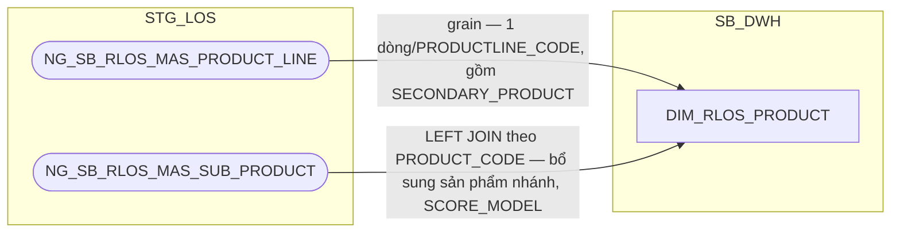
```mermaid
flowchart LR
    subgraph STG_LOS
        A(["NG_SB_RLOS_MAS_PRODUCT_LINE"])
        B(["NG_SB_RLOS_MAS_SUB_PRODUCT"])
    end
    subgraph SB_DWH
        C["DIM_RLOS_PRODUCT"]
    end
    A -->|"grain — 1 dòng/PRODUCTLINE_CODE, gồm SECONDARY_PRODUCT"| C
    B -->|"LEFT JOIN theo PRODUCT_CODE — bổ sung sản phẩm nhánh, SCORE_MODEL"| C
```

**Đã giải quyết (review 2026-09-18, theo Meeting note 20260909 mục #1):**
cùng giải pháp với `DIM_CLOS_PRODUCT` (1.2.1.2) — nguồn trước đây suy từ
`NG_SB_RLOS_APPLICANT_GENERAL`/`NG_SB_RLOS_EXTTABLE` (grain-theo-hồ-sơ) rồi
tạm thay bằng `MAP_RLOS_PRODUCT`; nay BA LOS xác nhận (16/09) 2 bảng danh
mục thật `NG_SB_RLOS_MAS_PRODUCT_LINE` + `NG_SB_RLOS_MAS_SUB_PRODUCT` —
thay thế hoàn toàn `MAP_RLOS_PRODUCT`. Bảng `MAS_PRODUCT_LINE` có thêm cột
`SECONDARY_PRODUCT` (sản phẩm phụ SeABuy/SeATeacher/SeAWoman/SeACivil/Thẻ
tín dụng — đúng khái niệm đã xác nhận với EU ở vấn đề #10 Meeting note,
khác `SUB_PRODUCT`); `MAS_SUB_PRODUCT` có thêm `SCORE_REQUIRED`/
`SCORE_MODEL` — cả hai chưa có báo cáo nào yêu cầu, xem Section 3.

**SCD2 đổi cách xác định EFF_DATE:** cùng cơ chế CDC như `DIM_CLOS_PRODUCT`
(1.2.1.2) — 2 bảng nguồn không có EFF_DATE khai báo tay. Xem Section 3.

###### 1.3.1.2A DIM_RLOS_SECONDPRODUCT — ✅ ĐÃ GIẢI QUYẾT (bảng mới, review 2026-10-04, theo yêu cầu người dùng — nguồn: NG_SB_RLOS_MAS_PRODUCT_LINE)

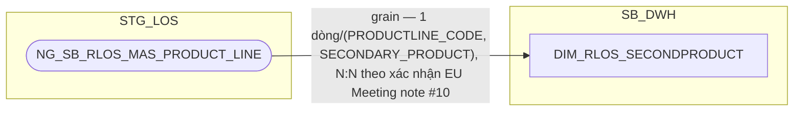
```mermaid
flowchart LR
    subgraph STG_LOS
        A(["NG_SB_RLOS_MAS_PRODUCT_LINE"])
    end
    subgraph SB_DWH
        C["DIM_RLOS_SECONDPRODUCT"]
    end
    A -->|"grain — 1 dòng/(PRODUCTLINE_CODE, SECONDARY_PRODUCT), N:N theo xác nhận EU Meeting note #10"| C
```

**Bảng mới (review 2026-10-04, theo yêu cầu người dùng):** danh mục tổ
hợp (sản phẩm chính, sản phẩm phụ) hợp lệ của RLOS — "sản phẩm phụ" ở
đây là SeABuy/SeATeacher/SeAWoman/SeACivil/Thẻ tín dụng, sản phẩm thứ 2
đi kèm sản phẩm chính (đã có trên `MAS_PRODUCT_LINE.SECONDARY_PRODUCT`,
cùng nguồn đã dùng cho `DIM_RLOS_PRODUCT`, 1.3.1.2 — nhưng tách riêng
thành DIM độc lập vì quan hệ (sản phẩm chính, sản phẩm phụ) là N:N,
không phải 1:1 với `DIM_RLOS_PRODUCT`). Khóa nghiệp vụ composite
`PRODUCTLINE_CODE`+`SECONDARY_PRODUCT`, hash vào cột `SECONDPRODUCT_BK`
(SHA256). Grain SCD2: 1 dòng lưu lịch sử thay đổi theo thời gian.
Phục vụ Báo cáo RLOS APPLICATION (BC1) qua
`FCT_RLOS_APPLICATION_SECONDPRODUCT.SECONDPRODUCT_SK` (1.3.2.9, xem
item 5). Xem cấu trúc cột đầy đủ tại Section 2 → 1.3.1.2A.

###### 1.3.1.3 DIM_RLOS_WORKSTEP_DECISION — ✅ ĐÃ GIẢI QUYẾT (nguồn: NG_SB_RLOS_MAS_DECISION, review 2026-09-24, gộp từ DIM_RLOS_WORKSTEP + DIM_RLOS_DECISION)

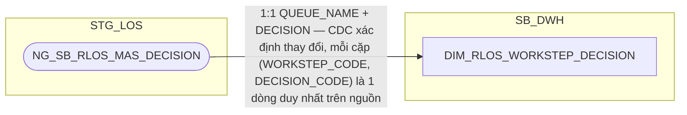
```mermaid
flowchart LR
    subgraph STG_LOS
        A(["NG_SB_RLOS_MAS_DECISION"])
    end
    subgraph SB_DWH
        C["DIM_RLOS_WORKSTEP_DECISION"]
    end
    A -->|"1:1 QUEUE_NAME + DECISION — CDC xác định thay đổi, mỗi cặp (WORKSTEP_CODE, DECISION_CODE) là 1 dòng duy nhất trên nguồn"| C
```

**Gộp 2 DIM thành 1 (review 2026-09-24):** cùng lý do và quyết định đã
áp dụng cho `DIM_CLOS_WORKSTEP_DECISION` (1.2.1.3) — `NG_SB_RLOS_MAS_
DECISION` (thêm cột `REQ_TYPE`, khác `CHANNEL` của bản CLOS) gộp chung
WORKSTEP (`QUEUE_NAME`) và DECISION (`DECISION`), 1 WORKSTEP có thể
xuất hiện ở nhiều dòng với DECISION khác nhau nhưng mỗi cặp (QUEUE_NAME,
DECISION) là duy nhất trên bảng nguồn. Quyết định cũ (review 2026-09-18)
"giữ tách 2 DIM" đã thay thế — gộp lại thành `DIM_RLOS_WORKSTEP_DECISION`,
giữ đúng grain "1 dòng = 1 cặp (WORKSTEP, DECISION) hợp lệ" của bảng
nguồn. `NG_SB_RLOS_ENTRY_EXIT` không còn là nguồn của DIM này nữa (vẫn
tiếp tục phục vụ các FCT khác).

⚠️ **Giả định cần BA xác nhận lại trước khi sinh LLD:** cùng lưu ý đã
ghi ở `DIM_CLOS_WORKSTEP_DECISION` (1.2.1.3) — `input/DS Bảng danh
mục.xlsx` chỉ xác nhận cấu trúc cột, không có dữ liệu mẫu để tự kiểm
chứng grain.

`WFINSTRUMENTTABLE` vẫn không thuộc phạm vi bảng này — **✅ đã giải quyết
(PENDING #6):** `PROCESSNAME`/`ACTIVITYNAME` nay đã nạp trực tiếp vào
`FCT_RLOS_APPLICATION` (1.3.2.1) để tính `WORKSTEP_FLAG`, xem ghi
chú đầy đủ ở `DIM_CLOS_WORKSTEP_DECISION` (1.2.1.3). **Cập nhật (review
2026-09-21):** nay cũng LEFT JOIN thêm vào `FCT_RLOS_WORKSTEP_EVENT`
(1.3.2.7) để tính `WORKSTEP_FLAG` độc lập trực tiếp trên bảng event.

**SCD2 đổi cách xác định EFF_DATE:** cùng cơ chế CDC như 1.2.1.3. Xem
Section 3.

###### 1.3.1.5 DIM_RLOS_EXCEPTION

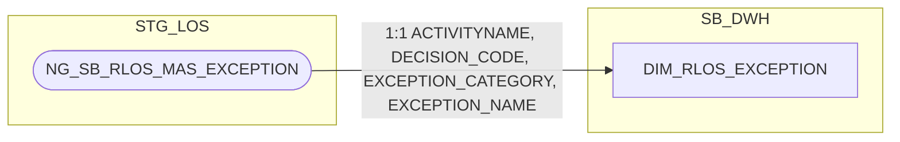
```mermaid
flowchart LR
    subgraph STG_LOS
        A(["NG_SB_RLOS_MAS_EXCEPTION"])
    end
    subgraph SB_DWH
        C["DIM_RLOS_EXCEPTION"]
    end
    A -->|1:1 ACTIVITYNAME, DECISION_CODE, EXCEPTION_CATEGORY, EXCEPTION_NAME| C
```

**Ghi chú lineage:** cùng bản chất với `DIM_CLOS_EXCEPTION`
(1.2.1.6) — `NG_SB_RLOS_MAS_EXCEPTION` là bảng LOẠI 1 (danh mục cấu hình
gốc, khóa CDC khai đủ tổ hợp khóa tự nhiên), không phải bảng sự kiện theo
hồ sơ, nên không rơi vào pattern "application-scoped source". Giữ nguyên
nguồn trực tiếp, không cần bảng `MAP_` seed.

###### 1.3.1.6 DIM_RLOS_CHANGE_TYPE

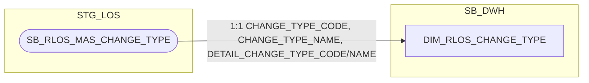
```mermaid
flowchart LR
    subgraph STG_LOS
        A(["SB_RLOS_MAS_CHANGE_TYPE"])
    end
    subgraph SB_DWH
        C["DIM_RLOS_CHANGE_TYPE"]
    end
    A -->|1:1 CHANGE_TYPE_CODE, CHANGE_TYPE_NAME, DETAIL_CHANGE_TYPE_CODE/NAME| C
```

**Ghi chú lineage:** `SB_RLOS_MAS_CHANGE_TYPE` là bảng danh mục gốc thật
(mang tiền tố `MAS_`), khác hẳn phía CLOS — CLOS chỉ có
`NG_SB_CLOS_CHANGEREQ.CHANGE_TYPE` (bảng theo hồ sơ, không phải danh mục),
nên không tách `DIM_CLOS_CHANGE_TYPE` (xem 1.2.1.1). Đối chiếu SRS xác
nhận: **BC1** ("Báo cáo RLOS APPLICATION") là báo cáo duy nhất dùng
`CHANGE_TYPE_DETAIL` (join `SB_RLOS_MAS_CHANGE_TYPE` theo `CHANGE_TYPE`);
không có báo cáo nào khác (BC2–BC11) dùng bảng này. `DIM_RLOS_CHANGE_TYPE`
không rơi vào pattern "application-scoped source" — giữ nguyên nguồn trực
tiếp, không cần bảng `MAP_` seed.

###### 1.3.1.7 DIM_RLOS_CARD_PROMOTION

```mermaid
flowchart LR
    subgraph STG_LOS
        A(["NG_SB_RLOS_MAS_CARD_PROMOTIO"])
    end
    subgraph SB_DWH
        C["DIM_RLOS_CARD_PROMOTION"]
    end
    A -->|1:1 PROMOTION_CODE, DESCRIPTION| C
```

**Ghi chú lineage:** không có bảng tương đương phía CLOS — chương trình
ưu đãi phí thẻ tín dụng là sản phẩm đặc thù bán lẻ (RLOS), CLOS không có
khái niệm này (xem `output/Table_Split_Proposal_CLOS_RLOS.md` mục 3).
`NG_SB_RLOS_MAS_CARD_PROMOTIO` mang tiền tố `MAS_`, là danh mục cấu hình
gốc thật, không phải bảng sự kiện theo hồ sơ — không rơi vào pattern
"application-scoped source", giữ nguyên nguồn trực tiếp. Bảng gốc (trước
tách) chưa từng có cột `DATASOURCE`; **review 2026-09-17:** từng bổ sung
`DATASOURCE` (cố định 'RLOS') tại Section 2 làm cột kỹ thuật đánh dấu
nguồn hệ, đồng bộ với mọi DIM/FCT RLOS khác sau khi tách vật lý CLOS/RLOS.
**Cập nhật:** đã bỏ hẳn cột này khỏi Section 2 → 1.3.1.7 — không còn mang
thông tin phân biệt sau khi tách vật lý CLOS/RLOS (cố định 'RLOS', không
nằm trong PK).

##### 1.3.2 FCT

###### 1.3.2.1 FCT_RLOS_APPLICATION — ⚠️ review 2026-10-04 (theo yêu cầu người dùng): chuyển 28 cột SCD1 (INTEREST_RATE_PCT, LOAN_TO_VALUE, LOAN_OBJECTIVE, TOTAL_INCOME, 10 cột cờ nguồn thu, PRODUCT_NAME, 13 cột cờ/trạng thái một lần) VỀ `DIM_RLOS_APPLICATION` (1.3.1.1); xóa `HAS_ACTION_IN_DAY` + 18 cột "người phụ trách từng bước" (LAST_USER_SK, BRANCH_USER, DDE_USER, QC_USER, UND_MAKER_USER, UND_CHECKER_USER, PHV_USER, APPROVER_USER, LAST_APPROVAL_DATE, MIN_UWM, MIN_APP, CANCEL_USER_DATE, CANCEL_DATE, LAST_ENTRYDATE, LAST_EXITDATE, PRE_WORKSTEP_CODE, LAST_REMARKS, LAST_REMARK_DDE, LAST_CAN_REMARKS) — nay derive tại PDTD_DTM từ `FCT_RLOS_WORKSTEP_EVENT` thay vì tính tại SB_DWH; đổi tên `LAST_WORKSTEP_DECISION_SK` → `WORKSTEP_DECISION_SK` (đồng bộ pattern CLOS) — nay 17 cột

```mermaid
flowchart LR
    subgraph STG_LOS
        A(["NG_SB_RLOS_ENTRY_EXIT"])
        I(["NG_SB_RLOS_EXTTABLE"])
        J(["NG_SB_RLOS_USER_MAKE_WORK_STEP"])
        P1(["NG_SB_RLOS_APPLICANT_GENERAL"])
        P4(["NG_SB_RLOS_CBS"])
        MW(["NG_SB_RLOS_MAS_DECISION"])
    end
    subgraph SB_DWH
        WD["DIM_RLOS_WORKSTEP_DECISION"]
        PR["DIM_RLOS_PRODUCT"]
        OU["DIM_LOS_COMPANY"]
        CT["DIM_RLOS_CHANGE_TYPE"]
        CP["DIM_RLOS_CARD_PROMOTION"]
        E["FCT_RLOS_APPLICATION"]
    end
    A -->|"PHÁI SINH: PROCESSED_DATE, CREATION_DATE (3 mức ưu tiên) — review 2026-10-04: xóa HAS_ACTION_IN_DAY và 18 cột người phụ trách từng bước/mốc thời gian (LAST_USER_SK, BRANCH_USER...LAST_CAN_REMARKS, cùng nguồn), derive tại PDTD_DTM từ FCT_RLOS_WORKSTEP_EVENT (1.3.2.7)"| E
    I -->|"CHANGE_REQUEST(=REQ_TYPE), CHANGE_TYPE — giá trị thô, không chuyển DIM (cờ/trạng thái workflow biến động nhiều lần, cùng lý do đã từ chối SCD hóa trước đây)"| E
    I -.-> CT
    J -.->|"LEFT JOIN WI_NAME+WORK_STEP=WORKSTEP — sinh input thô UNDERWRITERMAKER/CHECKER/APPROVAL_USERMAKE, công thức COALESCE/CASE tính tại PDTD_DTM"| E
    WD -.->|"WORKSTEP_DECISION_SK (đổi tên từ LAST_WORKSTEP_DECISION_SK, review 2026-10-04; gộp từ LAST_WORKSTEP_SK+LAST_DECISION_SK), lookup theo cặp WORKSTEP_CODE+DECISION_CODE của sự kiện hoàn tất gần nhất theo thời gian"| E
    MW --> WD
    PR -.->|"PRODUCT_SK, lookup PRODUCTLINE_CODE=NG_SB_RLOS_APPLICANT_GENERAL.PRODUCT_LINE AND SUB_PRODUCT_CODE=NG_SB_RLOS_APPLICANT_GENERAL.SUB_PRODUCT, SCD2 hiệu lực tại DAYID."| E
    OU -.->|"COMPANY_SK, lookup COMPANY_CODE=NG_SB_RLOS_APPLICANT_GENERAL.COMPANY_CODE, SCD2 hiệu lực tại DAYID"| E
    CT -.->|"CHANGE_TYPE_SK, lookup CHANGE_TYPE=NG_SB_RLOS_EXTTABLE.CHANGE_TYPE"| E
    CP -.->|"CARD_PROMOTION_SK, lookup PROMOTION_ID=NG_SB_RLOS_CBS.PROMOTION_ID, hồ sơ không phải thẻ dùng -1"| E
    P1 --> PR
    P1 --> OU
    P4 -.-> CP
```

**Bỏ `APPLICANT_SK`/`T24_CUSTOMER_SK` khỏi bảng này (review 2026-09-26,
theo yêu cầu người dùng):** trước đây 2 cột này join `DIM_RLOS_APPLICANT`
với giả định quan hệ 1:1 hồ sơ↔applicant. Sau khi `DIM_RLOS_APPLICANT`
đổi thành `FCT_RLOS_CUSTOMER` (grain `WI_NAME+ID_TYPE+ID_NUMBER`, 1:N
giấy tờ/hồ sơ — xem 1.3.2.x), không còn 1 SK đại diện duy nhất/hồ sơ để
giữ ở đây nữa. Báo cáo cần thông tin applicant/T24 customer sẽ tự JOIN
`FCT_RLOS_CUSTOMER` theo `WI_NAME` khi cần — `T24_CUSTOMER_SK` chuyển
hẳn sang tính trực tiếp trên `FCT_RLOS_CUSTOMER` (đúng grain giấy tờ,
xem 1.3.2.x).

**Ghi chú lineage:** giữ nguyên grain `1 dòng = 1 hồ sơ x 1 ngày dữ liệu`,
PK = `DAYID + WI_NAME`, và toàn bộ quy tắc load T-1 như tài liệu gốc — bảng
gốc `FCT_LOS_APPLICATION_DAILY` chỉ tách vật lý theo hệ, không đổi grain/PK/
quy tắc load.

**⚠️ review 2026-10-04 (theo yêu cầu người dùng) — rút gọn còn 17 cột
(DAYID...CHANGE_TYPE), đồng bộ pattern CLOS:**
- **Chuyển 28 cột SCD1 VỀ `DIM_RLOS_APPLICATION`** (1.3.1.1, xem chi tiết
  tại đó): `INTEREST_RATE_PCT`, `LOAN_TO_VALUE`, `LOAN_OBJECTIVE`,
  `TOTAL_INCOME`, 10 cột cờ nguồn thu `SALARYFLAG`...`OTHERFLAG`,
  `PRODUCT_NAME`, 13 cột cờ/trạng thái một lần `C_PHONE_CREATE_FLAG`...
  `CANCEL_REASON` — đây là thuộc tính một-lần/ổn định của hồ sơ (không
  đổi nhiều lần trong ngày), phù hợp SCD1 trên DIM hơn là lặp lại mỗi
  dòng `DAYID` trên FCT.
- **Xóa `HAS_ACTION_IN_DAY`** và **18 cột "người phụ trách từng bước"**
  (`LAST_USER_SK`, `BRANCH_USER`, `DDE_USER`, `QC_USER`,
  `UND_MAKER_USER`, `UND_CHECKER_USER`, `PHV_USER`, `APPROVER_USER`,
  `LAST_APPROVAL_DATE`, `MIN_UWM`, `MIN_APP`, `CANCEL_USER_DATE`,
  `CANCEL_DATE`, `LAST_ENTRYDATE`, `LAST_EXITDATE`, `PRE_WORKSTEP_CODE`,
  `LAST_REMARKS`, `LAST_REMARK_DDE`, `LAST_CAN_REMARKS`) — các cột này
  bản chất là "ảnh chụp người/mốc thời gian xử lý bước cuối cùng", đều
  suy ra được từ `FCT_RLOS_WORKSTEP_EVENT` (1.3.2.7, đã có đủ
  `WORKSTEP_CODE`/`USERNAME`/`ENTRYDATE`/`EXITDATE`/`REMARKS` theo từng
  bước) — nay derive tại PDTD_DTM (2.3.2.1) thay vì tính sẵn tại SB_DWH,
  tránh tính trùng 2 lần cùng 1 nguồn.
- **Đổi tên `LAST_WORKSTEP_DECISION_SK` → `WORKSTEP_DECISION_SK`**
  (đồng bộ pattern CLOS, xem `FCT_CLOS_APPLICATION` cột 4, 1.2.2.1) —
  cùng ý nghĩa, chỉ đổi tên.
- **Xóa node `WFINSTRUMENTTABLE`/`DIM_LOS_USER`/`LAST_USER_SK` khỏi
  lineage** — không còn nguồn cho các cột đã xóa ở trên.

**Column-optimization rule (giữ nguyên từ trước):** không tham chiếu ETL
sang `FCT_RLOS_COLLATERAL`/`FCT_RLOS_DEVIATION` — bỏ hẳn `DEVIATION_CNT`,
`COLLATERAL_CNT` + 9 cột con khỏi thiết kế, để tầng report/OAS tự tính
trực tiếp từ `FCT_RLOS_COLLATERAL`/`FCT_RLOS_DEVIATION` qua RPD (multi-fact/
conformed dimension), tránh phụ thuộc thứ tự ETL giữa các fact.

###### 1.3.2.2 FCT_RLOS_APPLICATION_PARTY — ĐÃ XÓA (review 2026-09-26, theo yêu cầu người dùng)

**Xóa hẳn bảng này (review 2026-09-26):** sau khi `DIM_RLOS_APPLICANT`
đổi thành `FCT_RLOS_CUSTOMER` (bỏ `APPLICANT_SK` khỏi bảng này, xem lịch
sử ở Section 3) và `DIM_RLOS_COREPAYER` đổi thành `FCT_RLOS_COREPAYER`
(1.3.2.9, cùng lý do — grain đổi sang giấy tờ định danh, không còn 1
surrogate key ổn định đại diện cho 1 corepayer/hồ sơ để giữ ở đây), bảng
liên kết `FCT_RLOS_APPLICATION_PARTY` chỉ còn lại `DAYID + WI_NAME +
DATASOURCE + APPLICATION_SK` — không còn giữ bất kỳ quan hệ N:N/1:N nào
(applicant và corepayer đều có thể JOIN trực tiếp theo `WI_NAME` sang
`FCT_RLOS_CUSTOMER`/`FCT_RLOS_COREPAYER` khi cần), trùng lặp hoàn toàn
với thông tin đã có sẵn trên `FCT_RLOS_APPLICATION` (1.3.2.1, cũng
có `DAYID+WI_NAME+APPLICATION_SK`). Không còn lý do kiến trúc để giữ
bảng này — đã xóa hoàn toàn khỏi thiết kế. Giữ lại số hiệu `1.3.2.2` như
một mục rỗng trỏ chuyển tiếp, không xóa số để không làm lệch số các
bảng FCT khác trong nhóm RLOS.

**Khác biệt với phía CLOS (lịch sử — xem cập nhật 2026-09-26 ngay dưới):**
ban đầu nhận định `FCT_CLOS_APPLICATION_PARTY` (1.2.2.2) VẪN GIỮ NGUYÊN —
`DIM_CLOS_CUSTOMER`/`FCT_CLOS_LEGAL_PARTY` (chân applicant phía CLOS)
không trải qua thay đổi tương tự, vẫn có `CUSTOMER_SK`/`LEGAL_PARTY_SK`
ổn định để liên kết. Chỉ riêng nhánh RLOS mất cả 2 chân liên kết
(applicant, rồi corepayer) nên bảng liên kết RLOS mới trở nên thừa.

⚠️ **Cập nhật (review 2026-09-26, cùng ngày):** xác nhận lại theo yêu cầu
người dùng — `FCT_CLOS_LEGAL_PARTY` (1.2.2.7) tự nó đã đủ `WI_NAME`/
`CUSTOMER_SK`/`APPLICATION_SK` để join trực tiếp, không cần bảng cầu nối
trung gian — cùng bản chất dư thừa như bên RLOS dù lý do kỹ thuật khác
nhau (RLOS mất surrogate key ổn định; CLOS thì đích đến đã tự đủ khóa
join trực tiếp). `FCT_CLOS_APPLICATION_PARTY` nay cũng đã **xóa hẳn** —
xem 1.2.2.2.

###### 1.3.2.3 FCT_RLOS_COLLATERAL

**Lineage đầy đủ (bao gồm cả nguồn của `DIM_RLOS_APPLICATION`, 1.3.1.1 —
xem `hld/HLD_DIM_SB_DWH.md` để đối chiếu lineage gốc của DIM này):**

```mermaid
flowchart LR
    subgraph STG_LOS
        A1(["NG_SB_RLOS_COL_REALESTATE"])
        A2(["NG_SB_RLOS_COL_TRANSPORT"])
        A3(["NG_SB_RLOS_COL_VALPAPER"])
        A4(["NG_SB_RLOS_COL_OTHER"])
        A5(["NG_SB_RLOS_COLL_CERTIGRD"])
        A6(["NG_SB_RLOS_DISB_COL_GRID"])
        P1(["NG_SB_RLOS_APPLICANT_GENERAL"])
        P2(["NG_SB_RLOS_APPLICANT_DETAIL"])
        P3(["NG_SB_RLOS_APPROVAL"])
        P4(["NG_SB_RLOS_EXTTABLE"])
        P5(["NG_SB_RLOS_SENT_CBS_LOG"])
        P6(["NG_SB_RLOS_ENTRY_EXIT"])
        P7(["NG_SB_RLOS_MANUAL_DEVIATION"])
    end
    subgraph SB_DWH
        D["DIM_RLOS_APPLICATION"]
        C["FCT_RLOS_COLLATERAL"]
    end
    A1 -->|1:1 + PHÁI SINH COLLATERAL_BK bằng hash toàn bộ cột + COLLATERAL_TYPE_CODE = REALESTATE| C
    A2 -->|1:1 + PHÁI SINH COLLATERAL_BK bằng hash toàn bộ cột + COLLATERAL_TYPE_CODE = TRANSPORT| C
    A3 -->|1:1 + PHÁI SINH COLLATERAL_BK bằng hash toàn bộ cột + COLLATERAL_TYPE_CODE = VALPAPER| C
    A4 -->|1:1 + PHÁI SINH COLLATERAL_BK bằng hash toàn bộ cột + COLLATERAL_TYPE_CODE = OTHER| C
    A5 -.->|1:1 THEO TÀI SẢN, CERTIFICATE_NO cho tài sản không phải BĐS| C
    A6 -.->|1:1 THEO TÀI SẢN nối theo tài sản tương ứng, IS_FORMED_FROM_LOAN| C
    D -.->|APPLICATION_SK, theo phiên bản hiệu lực tại DAYID| C
    P1 -->|1:1 WI_NAME, POLICY, CAMPAIGN, EMPLOYEE_CODE/NAME, COLL_REQUIRE, IS_SEC_PRODUCT, DEVIATION_FLAG| D
    P2 -->|1:1 CUS_SEGMENT| D
    P3 -->|1:1 STREAM, APP_GRP| D
    P4 -->|1:1 CHANGE_REQUEST REQ_TYPE, CHANGE_TYPE| D
    P5 -->|1:1 RESULT_MAIN_CARD_ID| D
    P6 -.->|PHÁI SINH CREATION_DATE, LAST_APPROVAL_DATE| D
    P7 -.->|"PHÁI SINH đếm số dòng theo WI_NAME >=3 — sinh DEVIATION_G3"| D
```

**Ghi chú lineage:** giữ nguyên grain `1 dòng = 1 tài sản bảo đảm của 1 hồ
sơ × 1 ngày dữ liệu` và cơ chế nạp của bảng gốc `FCT_LOS_COLLATERAL` — cả 4
bảng grid tài sản RLOS (`COL_REALESTATE`, `COL_TRANSPORT`, `COL_VALPAPER`,
`COL_OTHER`) và `NG_SB_RLOS_COLL_CERTIGRD` đều **không khai khóa CDC** (LOẠI
2, đã xác nhận qua `input/DS_BANG_202608.xlsx`), nên `COLLATERAL_BK` phải là
hash toàn bộ cột không phải CLOB của đúng bảng nguồn sinh ra dòng đó, cộng
tên bảng nguồn để 5 nguồn không đụng khóa — cùng quy tắc
đã áp dụng cho `FCT_CLOS_COLLATERAL` (xem 1.2.2.3). Ảnh chụp đầy đủ theo
ngày dựng theo quy trình A2, PK = `DAYID + WI_NAME + COLLATERAL_BK`.
`NG_SB_RLOS_COLL_CERTIGRD` là bảng 1:1 theo tài sản (không phải theo hồ sơ)
bổ sung `CERTIFICATE_NO` cho tài sản không phải bất động sản (BĐS lấy thẳng
từ `COL_REALESTATE.NO_CERTI`); `NG_SB_RLOS_DISB_COL_GRID` cũng 1:1 theo tài
sản, chỉ bổ sung `IS_FORMED_FROM_LOAN` (review 2026-09-17: theo đúng nguyên
văn SRS BC1, giá trị lấy từ cột `COL_TYPE` của dòng thỏa điều kiện lọc
`PROPERTY_FORMED='YES'`, không phải cờ Y/N passthrough của `PROPERTY_FORMED`
như bản cũ) — ETL phải nối đúng dòng của 2 bảng phụ này vào đúng tài sản
tương ứng trong 4 bảng grid chính, không sinh fact riêng.

Áp dụng **column-optimization rule**: loại khỏi bản RLOS cột
`COLL_MGMT_METHOD` (chỉ có nguồn CLOS, `NG_SB_CLOS_COLL_CD.COLL_MGMT_APP`)
— RLOS không có khái niệm "phương thức quản lý tài sản" tương đương trên 4
bảng grid của mình. Giữ toàn bộ 9 cột chỉ có ở RLOS
(`REL_TO_CUSTOMER`, `USING_PURPOSE`, `VEHICLE_TYPE`, `BRAND`,
`CONTROL_POSTER`, `VALPAPER_TYPE`, `NUMBERSIGN`, `IS_ASSET_FORMED`,
`IS_FORMED_FROM_LOAN`) và bỏ hẳn cột kỹ thuật `DATASOURCE` — không còn
mang thông tin phân biệt sau khi tách vật lý CLOS/RLOS.

**Ghi chú thiết kế — vì sao KHÔNG tách thành DIM:** cùng lý do và kết luận
đã trình bày đầy đủ tại `FCT_CLOS_COLLATERAL` (1.2.2.3) — nguồn không khai
khóa CDC nên `COLLATERAL_BK` là hash của chính các thuộc tính mô tả, danh
tính đổi theo nội dung nên SCD2/DIM không track được lịch sử thật. Giữ
nguyên dạng FCT ảnh chụp toàn bộ theo ngày; báo cáo BC1/BC2/BC3/BC9 luôn lọc
theo `DAYID` cụ thể nên không bị ảnh hưởng bởi việc 1 tài sản vật lý có thể
ứng với nhiều `COLLATERAL_BK` qua các ngày.

###### 1.3.2.4 FCT_RLOS_APPLICATION_SECONDPRODUCT — ⚠️ review 2026-09-27 (theo yêu cầu người dùng): sửa lại toàn bộ cơ chế nạp cho khớp SRS BC1 BR 1.2 (driving table đúng là NG_SB_RLOS_SUB_PRODUCT, 5 bảng grid chỉ LEFT JOIN bổ sung chi tiết, không tự sinh dòng độc lập). ⚠️ review 2026-10-04 (theo yêu cầu người dùng): đổi tên bảng từ FCT_RLOS_SUB_PRODUCT → FCT_RLOS_APPLICATION_SECONDPRODUCT; bổ sung cột SECONDPRODUCT_SK (FK → DIM_RLOS_SECONDPRODUCT mới, item 4) — nay 9 cột

**Lineage đầy đủ (bao gồm cả nguồn của `DIM_RLOS_APPLICATION`, 1.3.1.1, và
`DIM_RLOS_PRODUCT`, 1.3.1.2 — xem `hld/HLD_DIM_SB_DWH.md` để đối chiếu
lineage gốc của 2 DIM này):**

```mermaid
flowchart LR
    subgraph STG_LOS
        A1(["NG_SB_RLOS_SUB_PRODUCT"])
        A2(["NG_SB_RLOS_CREDIT_CARD_APP"])
        A3(["NG_SB_RLOS_SEABUY_APP"])
        A4(["NG_SB_RLOS_CIVIL_APP"])
        A5(["NG_SB_RLOS_TEACHER_APP"])
        A6(["NG_SB_RLOS_WOMAN_APP"])
        P1(["NG_SB_RLOS_APPLICANT_GENERAL"])
        P2(["NG_SB_RLOS_APPLICANT_DETAIL"])
        P3(["NG_SB_RLOS_APPROVAL"])
        P4(["NG_SB_RLOS_EXTTABLE"])
        P6(["NG_SB_RLOS_ENTRY_EXIT"])
        P7(["NG_SB_RLOS_MANUAL_DEVIATION"])
    end
    subgraph SB_DWH
        D["DIM_RLOS_APPLICATION"]
        SP["DIM_RLOS_SECONDPRODUCT"]
        C["FCT_RLOS_APPLICATION_SECONDPRODUCT"]
    end
    A1 -->|"driving table (review 2026-09-27, sửa lại — khớp SRS BC1 BR 1.2) — 1 dòng = 1 hồ sơ x 1 lần đăng ký sản phẩm phụ, WI_NAME + SUB_PRODUCT_LINE ('SeABuy'/'SeACivil'/'SeATeacher'/'SeAWoman'/'Thẻ tín dụng') tự phân biệt loại"| C
    A2 -.->|"LEFT JOIN theo WI_NAME=WI_NAME AND SUB_PRODUCT_LINE='Thẻ tín dụng' — bổ sung SPP_AMOUNT/SPP_TERM/CARD_TYPE_CODE, 1 hồ sơ có thể khớp NHIỀU dòng (nhiều thẻ phụ) nên tự nhân dòng qua JOIN"| C
    A3 -.->|"LEFT JOIN theo WI_NAME=WI_NAME AND SUB_PRODUCT_LINE='SeABuy' — bổ sung SPP_AMOUNT/SPP_TERM"| C
    A4 -.->|"LEFT JOIN theo WI_NAME=WI_NAME AND SUB_PRODUCT_LINE='SeACivil' — bổ sung SPP_AMOUNT/SPP_TERM"| C
    A5 -.->|"LEFT JOIN theo WI_NAME=WI_NAME AND SUB_PRODUCT_LINE='SeATeacher' — bổ sung SPP_AMOUNT/SPP_TERM"| C
    A6 -.->|"LEFT JOIN theo WI_NAME=WI_NAME AND SUB_PRODUCT_LINE='SeAWoman' — bổ sung SPP_AMOUNT/SPP_TERM"| C
    D -.->|APPLICATION_SK, theo phiên bản hiệu lực tại DAYID| C
    SP -.->|"SECONDPRODUCT_SK — MỚI (review 2026-10-04, theo yêu cầu người dùng): lookup PRODUCTLINE_CODE=NG_SB_RLOS_APPLICANT_GENERAL.PRODUCT_LINE (sản phẩm chính của hồ sơ) AND SECONDARY_PRODUCT=SUB_PRODUCT_LINE (cột có sẵn trên chính dòng này), SCD2 hiệu lực tại DAYID. Mặc định -1 nếu hồ sơ không có sản phẩm phụ hoặc không khớp"| C
    P1 -->|1:1 WI_NAME, POLICY, CAMPAIGN, EMPLOYEE_CODE/NAME, COLL_REQUIRE, IS_SEC_PRODUCT, DEVIATION_FLAG| D
    P2 -->|1:1 CUS_SEGMENT| D
    P3 -->|1:1 STREAM, APP_GRP| D
    P4 -->|1:1 CHANGE_REQUEST REQ_TYPE, CHANGE_TYPE| D
    P6 -.->|PHÁI SINH CREATION_DATE, LAST_APPROVAL_DATE| D
    P7 -.->|"PHÁI SINH đếm số dòng theo WI_NAME >=3 — sinh DEVIATION_G3"| D
```

**⚠️ review 2026-10-04 (theo yêu cầu người dùng) — đổi tên bảng
`FCT_RLOS_SUB_PRODUCT` → `FCT_RLOS_APPLICATION_SECONDPRODUCT`** (tên cũ
dễ nhầm với "sản phẩm nhánh" của `DIM_RLOS_PRODUCT.SUB_PRODUCT_CODE`,
trong khi bảng này lưu "sản phẩm phụ" đi kèm hồ sơ — khái niệm khác
hẳn) **và bổ sung cột `SECONDPRODUCT_SK`** (FK → `DIM_RLOS_SECONDPRODUCT`
mới, 1.3.1.2A) — lookup theo `PRODUCTLINE_CODE`=
`NG_SB_RLOS_APPLICANT_GENERAL.PRODUCT_LINE` (sản phẩm chính gắn với hồ
sơ, qua `WI_NAME`) AND `SECONDARY_PRODUCT`=`SUB_PRODUCT_LINE` (cột có
sẵn trên chính dòng này), điều kiện SCD2 hiệu lực tại `DAYID`. Mặc định
-1 nếu hồ sơ không có sản phẩm phụ hoặc không khớp. Khóa này cho phép
báo cáo tra đúng tổ hợp (sản phẩm chính, sản phẩm phụ) hợp lệ qua 1 SK
ổn định thay vì tự JOIN lại `PRODUCTLINE_CODE`+`SECONDARY_PRODUCT` mỗi
lần cần.

**⚠️ Sửa lại toàn bộ cơ chế nạp (review 2026-09-27, theo phát hiện +
xác nhận của người dùng, đối chiếu `input/srs_report/BC1_PDTD_DTM_SRS_
v1.0.docx` BR 1.2):** bản trước hiểu sai bản chất — coi 5 bảng grid
(`CREDIT_CARD_APP`/`SEABUY_APP`/`CIVIL_APP`/`TEACHER_APP`/`WOMAN_APP`)
là 5 nguồn tự sinh dòng độc lập, `SUB_PRODUCT_TYPE_CODE` gán theo "dòng
đến từ bảng nào". SRS gốc xác nhận khác hẳn:

- **`NG_SB_RLOS_SUB_PRODUCT` (A1) là driving table DUY NHẤT** — BR 1.2
  ghi rõ A1 (alias `f`) LEFT JOIN thẳng vào driving table của cả báo cáo
  (`NG_SB_RLOS_ENTRY_EXIT`, alias `a`) theo `WI_NAME`. Mỗi dòng của A1 =
  1 hồ sơ × 1 lần đăng ký sản phẩm phụ, với `SUB_PRODUCT_LINE` đã tự
  phân biệt đủ 5 loại — không cần suy từ "bảng nguồn nào".
- **5 bảng grid chỉ LEFT JOIN bổ sung chi tiết vào A1**, có điều kiện
  lọc đúng loại (nguyên văn BR 1.2): `f.WI_NAME=af.WI_NAME AND
  f.SUB_PRODUCT_LINE='Thẻ tín dụng'` (CREDIT_CARD_APP), tương tự cho 4
  bảng còn lại với `SUB_PRODUCT_LINE='SeABuy'/'SeACivil'/'SeATeacher'/
  'SeAWoman'`. Đây KHÔNG phải UNION 5 nguồn độc lập — chỉ là JOIN thêm
  cột `SPP_AMOUNT`/`SPP_TERM`/`CARD_TYPE_CODE` vào đúng dòng của A1.
  Riêng `CREDIT_CARD_APP`: LEFT JOIN theo bản chất SQL sẽ tự NHÂN DÒNG
  nếu khớp N dòng thẻ phụ của cùng 1 hồ sơ — đúng lý do bảng có thể
  nhiều dòng/hồ sơ, nhưng nguồn gốc nhân dòng là ở JOIN, không phải 5
  driving table độc lập.
- **`NG_SB_RLOS_SENT_CBS_LOG` KHÔNG liên quan gì tới bảng này** — đối
  chiếu SRS xác nhận bảng này (alias `n`) LEFT JOIN thẳng vào `a`
  (ENTRY_EXIT), chỉ cấp `RESULT_SEAB_MAIN_CARD_ID` để tra `K_TYPE`/
  `HOME_ADDRESS` qua `STG_DIM_CARD`/`STG_DIM_SEAB_MAIN_CARD` (vai trò đã
  có sẵn ở `FCT_RLOS_APPLICATION`, cột `T24_CARD_SK`/
  `T24_SEAB_MAIN_CARD_SK`, review 2026-09-21) — không join vào `f`. Đã
  xóa hẳn khỏi lineage/nguồn của bảng này (bản trước liệt kê nhầm vào
  danh sách 7 nguồn và ghi "tham gia hash SUB_PRODUCT_BK" — sai).
- **`SUB_PRODUCT_TYPE_CODE` XÓA HẲN khỏi thiết kế (review 2026-09-27,
  theo yêu cầu người dùng, phát hiện tiếp theo cùng ngày):** sau khi sửa
  lại cơ chế nạp, cột này chỉ còn là CASE WHEN ánh xạ 1-1 từ
  `SUB_PRODUCT_LINE` (`'SeACivil'→'CIVIL'`, `'SeATeacher'→'TEACHER'`,
  `'SeAWoman'→'WOMAN'`, `'SeABuy'→'SEABUY'`, `'Thẻ tín dụng'→
  'CREDIT_CARD'`) — không còn mang thêm giá trị phân biệt nào so với
  chính `SUB_PRODUCT_LINE` đã có sẵn trên driving table. Giữ cả 2 cột là
  dư thừa thật (khác các trường hợp "cột kỹ thuật, một phần PK" khác
  trong cùng bảng review — đây là ánh xạ 1-1, không phải khóa độc lập).
- **`SUB_PRODUCT_BK`** — `NG_SB_RLOS_SUB_PRODUCT` không khai KEY CDC
  trong `input/DS_BANG_202608.xlsx` (rỗng), nên vẫn phải hash, không
  dùng thẳng `WI_NAME`. Công thức (theo yêu cầu người dùng):
  `STANDARD_HASH(WI_NAME || '~' || SUB_PRODUCT_LINE || '~' ||
  NVL(TO_CHAR(SPP_AMOUNT), '<NULL>') || '~' || NVL(TO_CHAR(SPP_TERM),
  '<NULL>'), 'SHA256')` — hash trên cặp khóa
  driving table (`WI_NAME`+`SUB_PRODUCT_LINE`, dùng trực tiếp giá trị
  gốc thay cho `SUB_PRODUCT_TYPE_CODE` đã xóa) cộng 2 giá trị đã JOIN
  bổ sung (`SPP_AMOUNT`/`SPP_TERM`) để phân biệt nhiều dòng thẻ phụ
  nhân ra từ JOIN — không hash gộp toàn bộ cột của 5 bảng grid như bản
  gốc ban đầu. `CARD_TYPE_CODE` KHÔNG đưa vào hash — luôn NULL với 4
  nhóm không phải thẻ, và dù có giá trị cũng không đủ phân biệt 2 thẻ
  cùng loại (rủi ro nhận diện đã trao đổi với người dùng). Rủi ro đụng
  độ PK còn lại (2 thẻ phụ cùng hồ sơ trùng cả `SPP_AMOUNT` lẫn
  `SPP_TERM`) — người dùng xác nhận CHẤP NHẬN, cùng bản chất rủi ro đã
  chấp nhận ở `FCT_CLOS_DEVIATION`/`FCT_RLOS_DEVIATION` (2 ngoại lệ chỉ
  khác `REASON`, bị hash trùng). **PK rút gọn còn `DAYID + SUB_PRODUCT_
  BK`** (theo yêu cầu người dùng) — `SUB_PRODUCT_BK` tự nó đã hash đủ
  `WI_NAME`+`SUB_PRODUCT_LINE`+`SPP_AMOUNT`+`SPP_TERM` để đảm bảo tính
  duy nhất, không cần thêm `WI_NAME`/`SUB_PRODUCT_LINE`/
  `SUB_PRODUCT_TYPE_CODE` làm thành phần PK riêng nữa.

**Ghi chú thiết kế — không tách DIM:** bảng vẫn giữ dạng FCT vì bản chất
dữ liệu là **sự kiện đăng ký sản phẩm phụ theo hồ sơ** (số tiền, thời
hạn có thể thay đổi theo lần đăng ký), không phải một thực thể danh mục
độc lập với hồ sơ — không có "sản phẩm phụ" nào tồn tại tách rời khỏi
hồ sơ đã đăng ký nó. `NG_SB_RLOS_SUB_PRODUCT` không khai CDC key (xem
trên) nên không đủ điều kiện SCD2 ngay cả khi muốn tách riêng.

###### 1.3.2.5 FCT_RLOS_EXCEPTION — review 2026-09-18 (SRS BC7 cập nhật: CHECK_FTR/PHAN_LOAI_DDE đổi công thức)

**Lineage đầy đủ (bao gồm cả nguồn của `DIM_RLOS_EXCEPTION`,
1.3.1.5, `DIM_RLOS_APPLICATION`, 1.3.1.1, và `DIM_LOS_USER`, 1.1.2 — xem
`hld/HLD_DIM_SB_DWH.md` để đối chiếu lineage gốc của 3 DIM này):**

```mermaid
flowchart LR
    subgraph STG_LOS
        A(["NG_SB_RLOS_EXCEPTION"])
        E(["NG_SB_RLOS_ENTRY_EXIT"])
        R(["NG_SB_RLOS_MAS_EXCEPTION"])
        P1(["NG_SB_RLOS_APPLICANT_GENERAL"])
        P2(["NG_SB_RLOS_APPLICANT_DETAIL"])
        P3(["NG_SB_RLOS_APPROVAL"])
        P4(["NG_SB_RLOS_EXTTABLE"])
        P5(["NG_SB_RLOS_SENT_CBS_LOG"])
        P7(["NG_SB_RLOS_MANUAL_DEVIATION"])
        U(["NG_SB_RLOS_MAS_USER"])
    end
    subgraph SB_DWH
        B["DIM_RLOS_EXCEPTION"]
        D["DIM_RLOS_APPLICATION"]
        F["DIM_LOS_USER"]
        C["FCT_RLOS_EXCEPTION"]
    end
    A -->|1:1, khóa CDC khai đủ, không hash| C
    B -.->|EXCEPTION_SK, LEFT JOIN EXCEPTION_CATEGORY+EXCEPTION_NAME rồi EXISTS-filter qua E| C
    D -.->|APPLICATION_SK, theo phiên bản hiệu lực tại DAYID| C
    F -.->|USER_SK, lookup theo RAISED_BY| C
    P1 -.->|"SUB_PRODUCT — cột thô (review 2026-09-27, bổ sung), LEFT JOIN theo WI_NAME; CHECK_FTR (whitelist theo BI_SUB_PRODUCT phái sinh từ cột này) đã chuyển hẳn sang PDTD_DTM, xem mục 16 PDTD_DTM review"| C
    R -->|1:1 ACTIVITYNAME, DECISION_CODE, EXCEPTION_CATEGORY, EXCEPTION_NAME| B
    P1 -->|1:1 WI_NAME, POLICY, CAMPAIGN, EMPLOYEE_CODE/NAME, COLL_REQUIRE, IS_SEC_PRODUCT, DEVIATION_FLAG| D
    P2 -->|1:1 CUS_SEGMENT| D
    P3 -->|1:1 STREAM, APP_GRP| D
    P4 -->|1:1 CHANGE_REQUEST REQ_TYPE, CHANGE_TYPE| D
    P5 -->|1:1 RESULT_MAIN_CARD_ID| D
    E -.->|PHÁI SINH CREATION_DATE, LAST_APPROVAL_DATE| D
    P7 -.->|"PHÁI SINH đếm số dòng theo WI_NAME >=3 — sinh DEVIATION_G3"| D
    U -->|"grain 1 dòng/LOGIN_ID, CDC xác định thay đổi (review 2026-09-18)"| F
```

**Ghi chú lineage:** cùng cấu trúc và cơ chế nạp với `FCT_CLOS_EXCEPTION`
(1.2.2.4) — giữ nguyên grain `1 dòng = 1 lần ghi nhận lý do của 1 hồ sơ,
trong ảnh chụp của ngày DAYID`. Nguồn chính `NG_SB_RLOS_EXCEPTION` là LOẠI
1, khóa CDC khai đủ `WI_NAME + EXCEPTION_CATEGORY + RAISED_BY +
RAISED_DATE_TIME` (xác nhận qua `input/DS_BANG_202608.xlsx`, cùng tổ hợp
khóa với `NG_SB_CLOS_EXCEPTION`) nên PK giữ thẳng trên cột gốc, không cần
hash. Ảnh chụp đầy đủ theo ngày dựng theo quy trình A2, PK = `DAYID +
WI_NAME + EXCEPTION_CATEGORY + RAISED_BY + RAISED_DATE_TIME`.

**`EXCEPTION_SK` — lookup 2 bước, giống hệt cơ chế đã áp dụng cho
CLOS (xem giải thích đầy đủ tại 1.2.2.4):** `DIM_RLOS_EXCEPTION`
(1.3.1.5) khai Natural Key đủ 4 cột (`ACTIVITYNAME + DECISION_CODE +
EXCEPTION_CATEGORY + EXCEPTION_NAME`), nguồn FCT không có ACTIVITYNAME/
DECISION để join thẳng. SRS BC7 (nhánh RLOS) dùng đúng 2 bước: (1)
`LEFT JOIN DIM_RLOS_EXCEPTION` theo `EXCEPTION_CATEGORY +
EXCEPTION_NAME`; (2) lọc còn đúng 1 dòng bằng điều kiện tồn tại bản ghi
`NG_SB_RLOS_ENTRY_EXIT` thỏa `WI_NAME` khớp + `WORKSTEP=ACTIVITYNAME` +
`DECISION=DECISION_CODE` của dòng DIM đó. Không còn dòng nào khớp → `-1`.

**Đánh giá kiến trúc — vì sao không gộp vào `FCT_RLOS_APPLICATION`
(1.3.2.1):** cùng lý do khác grain đã áp dụng cho `FCT_CLOS_EXCEPTION`
(1.2.2.4) — 1 hồ sơ có thể phát sinh nhiều lần nêu lý do (nhiều loại,
nhiều người, nhiều thời điểm, qua các vòng Raise/Clear), BC7 cần liệt kê
chi tiết từng lần chứ không phải rollup. Giữ bảng riêng.

**Đánh giá kiến trúc — `CHECK_FTR`/`FIRST_WORKSTEP_RETURN`/`PHAN_LOAI_DDE`
chuyển từ `FCT_RLOS_APPLICATION` sang đây, cùng lý do đã áp dụng cho
CLOS (xem 1.2.2.4):** rà soát SRS BC7 xác nhận cả 3 cột gốc chỉ phục vụ
đúng BC7, đúng grain của bảng này. `FCT_RLOS_APPLICATION` (1.3.2.1)
đã bỏ cả 3 cột gốc này từ trước. Cả 3 cột đều KHÔNG tính tại SB_DWH —
`PHAN_LOAI_DDE` đã chuyển hẳn sang PDTD_DTM từ review 2026-09-22;
`CHECK_FTR`/`FIRST_WORKSTEP_RETURN` chuyển tiếp sang PDTD_DTM ở review
2026-09-27 (xem ngay dưới) — cùng lý do đã áp dụng cho CLOS.

**Review 2026-09-18 — SRS BC7 cập nhật đổi hẳn công thức `CHECK_FTR` và
`PHAN_LOAI_DDE` (không còn khớp bản SRS trước, `FIRST_WORKSTEP_RETURN`
chỉ bổ sung thêm điều kiện lọc, cùng dạng thay đổi đã áp dụng cho CLOS,
xem 1.2.2.4):**

- **`CHECK_FTR` — vẫn là công thức riêng của RLOS (không dùng chung với
  CLOS), nhưng đổi hẳn tiêu chí:** không còn dựa vào `RCTYPE`/pattern
  `%BR%`/`%FTR%` nữa. SRS mới cũng theo **whitelist miễn trừ** (mặc định
  `'Not First Time Right'`, là `'First Time Right'` chỉ khi mọi dòng
  `NG_SB_RLOS_EXCEPTION (a)` có `EXCEPTION_CATEGORY LIKE '%BR%'` đều khớp
  1 trong 5 điều kiện miễn trừ theo `EXCEPTION_NAME`, một số điều kiện có
  thêm điều kiện phụ theo `BI_SUB_PRODUCT` — cột phái sinh mới: `CASE
  WHEN f.SUB_PRODUCT LIKE '%Phát hành%' OR f.SUB_PRODUCT LIKE '%TTD%'
  THEN 'Credit Card' ELSE f.SUB_PRODUCT END`, với `f`=
  `NG_SB_RLOS_APPLICANT_GENERAL`). Không còn phân nhóm theo `CUST_GROUP`
  như CLOS (RLOS không có khái niệm này) — phân nhóm theo sản phẩm
  (`BI_SUB_PRODUCT`) thay vì phân khúc khách hàng.
- **`FIRST_WORKSTEP_RETURN`:** cùng công thức mới như CLOS — `WORKSTEP`
  tại `MIN(EXITDATE)` theo `WI_NAME`, điều kiện lọc `EXITDATE IS NOT
  NULL AND ((WORKSTEP='DetailDataEntry' AND DECISION='Send_Back') OR
  (WORKSTEP IN ('DataInputerChecker','UnderwriterMaker',
  'CreditApproval') AND DECISION='Additional_Doc_Required') OR
  (WORKSTEP='UnderwriterMaker' AND DECISION='Send_Back to
  BranchSupport'))` trên `NG_SB_RLOS_ENTRY_EXIT` — bổ sung nhánh thứ 3
  giống CLOS.
- **`PHAN_LOAI_DDE` — đổi sang lookup `REF_PHAN_LOAI_DDE`:** `LEFT JOIN
  REF_PHAN_LOAI_DDE` theo `EXCEPTION_CATEGORY = REF_PHAN_LOAI_DDE.
  EXCEPTION_CATEGORY AND REF_PHAN_LOAI_DDE.SYSTEMNAME='RLOS'`, lấy
  `REF_PHAN_LOAI_DDE.PHAN_LOAI_DDE` — cùng bảng REF_ mới dùng chung với
  CLOS (khác `SYSTEMNAME`), xem `hld/HLD_REF.md` mục 2.4.10.

**⚠️ Đánh giá kiến trúc — `CHECK_FTR`/`FIRST_WORKSTEP_RETURN` chuyển hẳn
sang PDTD_DTM (review 2026-09-27, theo yêu cầu người dùng, cùng cơ chế đã
áp dụng cho CLOS tại 1.2.2.4):** rà soát lại xác nhận `CHECK_FTR` là công
thức CASE WHEN/whitelist theo business rule (không phải giá trị gốc từ
STG_LOS), vi phạm nguyên tắc "SB_DWH ảnh chụp sạch nguồn, PDTD_DTM chuẩn
hóa/tính business rule". Dữ liệu thô `CHECK_FTR` cần (`EXCEPTION_CATEGORY`/
`EXCEPTION_NAME` đã có sẵn, cộng `SUB_PRODUCT` bổ sung mới) đủ để tính
ngay tại chính bảng này, không cần join thêm bảng SB_DWH khác — PDTD_DTM
tự CASE WHEN phân loại `BI_SUB_PRODUCT` từ `SUB_PRODUCT` khi tính
`CHECK_FTR`. `FIRST_WORKSTEP_RETURN` tuy là mechanical MIN(EXITDATE)+lọc
(không phải business rule tự thân) nhưng chuyển theo để nhất quán kiến
trúc với CLOS — đọc lịch sử `WORKSTEP_CODE`/`EXITDATE`/`DECISION_CODE` từ
`SB_DWH.FCT_RLOS_WORKSTEP_EVENT` (1.3.2.7) thay vì `NG_SB_RLOS_ENTRY_EXIT`
trực tiếp. Bảng này (SB_DWH) từ 14 cột xuống còn **13 cột** (xóa
`CHECK_FTR`/`FIRST_WORKSTEP_RETURN`, thêm `SUB_PRODUCT`). Xem công thức
đầy đủ tại `hld/hld_review/HLD_FCT_PDTD_DTM_review.md` mục 16.

**⚠️ Đánh giá kiến trúc — `PHAN_LOAI_DDE` chuyển hẳn sang PDTD_DTM (review
2026-09-22, cùng lý do đã áp dụng cho CLOS tại 1.2.2.4):** công thức trên
bị phát hiện sai kiến trúc — `REF_PHAN_LOAI_DDE` chỉ tồn tại vật lý ở
PDTD_DTM (xem `hld/HLD_REF.md` đầu Section 2.4), không có bản SB_DWH, nên
không thể JOIN trực tiếp từ tầng SB_DWH. **`FCT_RLOS_EXCEPTION` ở tầng
SB_DWH (bảng này) KHÔNG còn cột `PHAN_LOAI_DDE`** — chỉ còn 13 cột. Công
thức đã chuyển hẳn sang tính tại `hld/HLD_FCT_PDTD_DTM.md` mục 2.3.2.5.

###### 1.3.2.6 FCT_RLOS_DEVIATION

**Lineage đầy đủ (bao gồm cả nguồn của `DIM_RLOS_APPLICATION`, 1.3.1.1 —
xem `hld/HLD_DIM_SB_DWH.md` để đối chiếu lineage gốc của DIM này):**

```mermaid
flowchart LR
    subgraph STG_LOS
        A(["NG_SB_RLOS_MANUAL_DEVIATION"])
        E(["NG_SB_RLOS_ENTRY_EXIT"])
        P1(["NG_SB_RLOS_APPLICANT_GENERAL"])
        P2(["NG_SB_RLOS_APPLICANT_DETAIL"])
        P3(["NG_SB_RLOS_APPROVAL"])
        P4(["NG_SB_RLOS_EXTTABLE"])
        P5(["NG_SB_RLOS_SENT_CBS_LOG"])
    end
    subgraph SB_DWH
        D["DIM_RLOS_APPLICATION"]
        C["FCT_RLOS_DEVIATION"]
    end
    A -->|1:1 + PHÁI SINH DEVIATION_BK bằng hash toàn bộ cột| C
    D -.->|APPLICATION_SK, theo phiên bản hiệu lực tại DAYID| C
    E -.->|PHÁI SINH PROCESSED_DATE, cùng công thức FCT_RLOS_APPLICATION| C
    P1 -->|1:1 WI_NAME, POLICY, CAMPAIGN, EMPLOYEE_CODE/NAME, COLL_REQUIRE, IS_SEC_PRODUCT, DEVIATION_FLAG| D
    P2 -->|1:1 CUS_SEGMENT| D
    P3 -->|1:1 STREAM, APP_GRP| D
    P4 -->|1:1 CHANGE_REQUEST REQ_TYPE, CHANGE_TYPE| D
    P5 -->|1:1 RESULT_MAIN_CARD_ID| D
    E -.->|PHÁI SINH CREATION_DATE, LAST_APPROVAL_DATE| D
    A -.->|"PHÁI SINH đếm số dòng theo WI_NAME >=3 — sinh DEVIATION_G3"| D
```

**Ghi chú lineage:** cùng cấu trúc và cơ chế nạp với `FCT_CLOS_DEVIATION`
(1.2.2.5) — giữ nguyên grain `1 dòng = 1 ngoại lệ chính sách trong ảnh
chụp của ngày DAYID`. Nguồn `NG_SB_RLOS_MANUAL_DEVIATION` không khai khóa
CDC (LOẠI 2, xác nhận qua `input/DS_BANG_202608.xlsx` — `KEY CDC` rỗng,
CLOB = `REASON`) nên `DEVIATION_BK` phải là `STANDARD_HASH(..., 'SHA256')`
trên toàn bộ cột không phải CLOB (loại trừ `REASON`), cộng
tên bảng nguồn — cùng cơ chế đã áp dụng cho `FCT_CLOS_DEVIATION` (1.2.2.5)
và cùng hệ quả cần biết: 2 dòng ngoại lệ trên cùng hồ sơ chỉ khác nhau ở
nội dung CLOB (`REASON`) sẽ ra cùng hash và bị gộp làm một. Ảnh chụp đầy
đủ theo ngày dựng theo quy trình A2, PK = `DAYID + WI_NAME +
DEVIATION_BK`.

**Vì sao không tách DIM:** cùng lý do đã áp dụng cho `FCT_CLOS_DEVIATION`
(1.2.2.5) — nguồn không khai khóa CDC nên không có định danh độc lập với
nội dung thuộc tính, SCD2/DIM không khả thi. Giữ dạng FCT ảnh chụp toàn
bộ theo ngày.

**Đánh giá kiến trúc — vì sao `PROCESSED_DATE` tính trực tiếp tại đây
thay vì JOIN `FCT_RLOS_APPLICATION`:** cùng lý do và kết luận đã áp
dụng cho `FCT_CLOS_DEVIATION` (1.2.2.5) — để `FCT_RLOS_DEVIATION` và
`FCT_RLOS_APPLICATION` là 2 luồng ETL hoàn toàn độc lập, không phụ
thuộc thứ tự chạy trước/sau lẫn nhau (`DEVIATION_CNT` đã bỏ khỏi
`FCT_RLOS_APPLICATION`, xem đánh giá kiến trúc tại 1.3.2.1),
`PROCESSED_DATE` tính độc lập ngay tại đây, đọc thẳng
`NG_SB_RLOS_ENTRY_EXIT` — cùng công thức 3 mức ưu tiên (ngày phê duyệt
cuối/ngày hủy/ngày thoát bước gần nhất, đã đối chiếu khớp SRS BC6) đã
dùng cho `FCT_RLOS_APPLICATION.PROCESSED_DATE` (1.3.2.1), không
JOIN bảng nào khác. PDTD_DTM của bảng này chỉ còn bê 1:1 (xem 2.3.2.6).

**Phát hiện khi đối chiếu SRS — nghi vấn lỗi đánh máy ở khối RLOS của
BC6 (cùng phát hiện đã ghi nhận ở `FCT_CLOS_DEVIATION`, 1.2.2.5):** SRS
BC6 ghi "Cách lấy dữ liệu" cho `CHECKING_RESULT`/`CHECKING_CONDITION`
(nhánh RLOS) lần lượt là `NG_SB_RLOS_MANUAL_DEVIATION.DEVIATION_TYPE`/
`.DEV_PROPOSAL` — nhưng 2 tên cột này **không tồn tại** trên bảng RLOS
(chỉ tồn tại trên `NG_SB_CLOS_CONDITON_CDGRID`). Đối chiếu
`RLOS - Metadata.xlsx` (sheet "3. Column Review", trạng thái "Đã xác
nhận") xác nhận lại `NG_SB_RLOS_MANUAL_DEVIATION` có đúng 2 cột
`CHECKING_CONDITION`/`CHECKING_RESULT` cùng tên với trường báo cáo —
khớp với lineage doc gốc (`DA_CHOT`, cùng tên 1:1). Tin theo lineage doc
+ metadata (nhiều khả năng SRS bị copy-paste nhầm từ khối CLOS khi soạn
khối RLOS), giữ nguyên thiết kế cột theo cách 1:1 cùng tên, không sửa
theo SRS — cùng quyết định đã chốt cho `FCT_CLOS_DEVIATION`.

###### 1.3.2.7 FCT_RLOS_WORKSTEP_EVENT — TÁCH TỪ FCT_LOS_WORKSTEP_EVENT (đánh giá lại 2026-09-14, xem lý do tách bên dưới). ⚠️ review 2026-10-01 (theo yêu cầu người dùng): bỏ điều kiện lọc CREATEDBY khỏi JOIN WFINSTRUMENTTABLE (nay unfiltered, đồng bộ pattern đã áp dụng cho FCT_CLOS_WORKSTEP_EVENT), bổ sung WF_CREATEDBY thành cột thô riêng — nay 25 cột

**Lineage đầy đủ (bao gồm cả nguồn của `DIM_RLOS_WORKSTEP_DECISION`
1.3.1.3, `DIM_LOS_USER` 1.1.2, và `DIM_RLOS_APPLICATION` 1.3.1.1 — xem
`hld/HLD_DIM_SB_DWH.md` để đối chiếu lineage gốc của 3 DIM này):**

```mermaid
flowchart LR
    subgraph STG_LOS
        B(["NG_SB_RLOS_ENTRY_EXIT"])
        MW(["NG_SB_RLOS_MAS_DECISION"])
        U(["NG_SB_RLOS_MAS_USER"])
        P1(["NG_SB_RLOS_APPLICANT_GENERAL"])
        P3(["NG_SB_RLOS_APPROVAL"])
        P4(["NG_SB_RLOS_EXTTABLE"])
        P5(["NG_SB_RLOS_SENT_CBS_LOG"])
        WF(["WFINSTRUMENTTABLE"])
        CR(["NG_SB_RLOS_CREDIT_PROPOSAL"])
    end
    subgraph SB_DWH
        WD["DIM_RLOS_WORKSTEP_DECISION"]
        US["DIM_LOS_USER"]
        AP["DIM_RLOS_APPLICATION"]
        E["FCT_RLOS_WORKSTEP_EVENT"]
    end
    B -->|1:1 + PHÁI SINH, khóa CDC khai đủ, không hash| E
    WD -.->|"WORKSTEP_DECISION_SK (review 2026-09-24, gộp từ WORKSTEP_SK+DECISION_SK), lookup theo cặp WORKSTEP_CODE+DECISION_CODE theo thời gian — khóa JOIN chính thức duy nhất để lấy DECISION_CODE (đã xóa khỏi fact, không denormalize)"| E
    US -.->|USER_SK, lookup theo USERNAME, USERNAME có thể rỗng khi bước chưa EXIT — vẫn map -1 bình thường| E
    AP -.->|APPLICATION_SK, theo phiên bản hiệu lực tại DAYID| E
    MW -->|"1:1 QUEUE_NAME+DECISION, CDC xác định thay đổi (review 2026-09-24, gộp từ 2 lần DISTINCT riêng lẻ)"| WD
    U -->|"grain 1 dòng/LOGIN_ID, CDC xác định thay đổi (review 2026-09-18)"| US
    P1 -->|"1:1 POLICY, CAMPAIGN, EMPLOYEE_CODE/NAME, COLL_REQUIRE, IS_SEC_PRODUCT, DEVIATION_FLAG, APPLICATION_DATE"| AP
    P3 -->|1:1 STREAM, APP_GRP| AP
    P4 -->|"driving table: WI_NAME, LOANCASEID + 6 cột dư thừa (review 2026-09-30, 3 lượt: xóa 22 cột username/routing/state/deviation/cancel, chuyển 13 cột (11 cờ + TOTALNONELIGIBLE/REASON) sang FCT_RLOS_APPLICATION — xem 1.3.1.1)"| AP
    P5 -->|1:1 RESULT_MAIN_CARD_ID| AP
    B -.->|PHÁI SINH CREATION_DATE, LAST_APPROVAL_DATE| AP
    B -.->|"PHÁI SINH (review 2026-09-21, trực tiếp trên E): PROCESSED_DATE 3 mức ưu tiên"| E
    WF -.->|"LEFT JOIN WI_NAME=PROCESSINSTANCEID (không lọc CREATEDBY, review 2026-10-01 — bỏ điều kiện lọc 5 CREATEDBY hệ thống/test khỏi JOIN, đồng bộ FCT_CLOS_WORKSTEP_EVENT) — sinh cột thô WF_PROCESSNAME/WF_ACTIVITYNAME/WF_CREATEDBY (review 2026-09-27, thay cho WORKSTEP_FLAG đã tính sẵn — công thức CASE WHEN chuyển sang PDTD_DTM, nay dùng WF_CREATEDBY làm điều kiện lọc trong công thức thay vì lọc sẵn ở JOIN)"| E
    CR -->|"1:1 LOAN_AMOUNT/LOAN_TERM/LOAN_CURRENCY — sinh APPROVED_AMT_FINAL/APPROVED_TERM/CURRENCY_CODE (review 2026-09-25, chuyển từ DIM_RLOS_APPLICATION, tính độc lập tại E)"| E
```

**⚠️ review 2026-10-01 (theo yêu cầu người dùng) — bỏ điều kiện lọc
CREATEDBY khỏi JOIN `WFINSTRUMENTTABLE`, bổ sung `WF_CREATEDBY` làm cột
thô riêng:** trước đây JOIN `WI_NAME=PROCESSINSTANCEID AND CREATEDBY NOT
IN (...)` lọc sẵn 5 tài khoản hệ thống/test ngay tại JOIN. Đồng bộ pattern
đã áp dụng cho `FCT_CLOS_WORKSTEP_EVENT` (1.2.2.6, review 2026-10-04):
JOIN nay KHÔNG lọc `CREATEDBY` (lấy nguyên `c.PROCESSNAME`/
`c.ACTIVITYNAME`/`c.CREATEDBY` của mọi dòng khớp `WI_NAME`), bổ sung
`WF_CREATEDBY` thành cột thô riêng (trước đây chỉ dùng inline trong điều
kiện JOIN, không có cột output) để công thức `WORKSTEP_FLAG` tại
PDTD_DTM tự áp điều kiện `CREATEDBY NOT IN (...)` khi cần — xem Section
2 → 2.3.2.7 (PDTD_DTM) để biết công thức đầy đủ viết lại.

**Gộp WORKSTEP_SK+DECISION_SK thành 1 khóa (review 2026-09-24):** cùng
thay đổi đã áp dụng cho `FCT_CLOS_WORKSTEP_EVENT` (1.2.2.6) — 2 khóa gộp
thành `WORKSTEP_DECISION_SK`, xóa cột `DECISION_CODE` denormalize trên
fact. `WORKSTEP_CODE` KHÔNG đổi — vẫn denormalize trực tiếp và nằm
trong PK.

**✅ Đã giải quyết — bổ sung `APPROVED_AMT_FINAL`/`CURRENCY_CODE`/
`APPROVED_TERM` trực tiếp trên `E` (review 2026-09-25):** trước đây 3
cột này lấy dạng "dư thừa có chủ đích" từ `DIM_RLOS_APPLICATION` (cùng
nguồn/giá trị với `FCT_RLOS_APPLICATION`). Theo yêu cầu người
dùng: bỏ khỏi DIM, tính độc lập ngay tại đây (đọc trực tiếp
`NG_SB_RLOS_CREDIT_PROPOSAL.LOAN_AMOUNT`/`LOAN_TERM`/`LOAN_CURRENCY`) —
cùng pattern `PROCESSED_DATE`/`WORKSTEP_FLAG` đã có (phái sinh trực tiếp
trên bảng, lặp lại giống nhau trên mọi dòng event của cùng hồ sơ, không
qua JOIN DIM/FCT khác).

**Vì sao tách vật lý CLOS/RLOS:** cùng lý do và kết luận đã áp dụng cho
`FCT_CLOS_WORKSTEP_EVENT` (1.2.2.6) — cả 3 cột FK (`WORKSTEP_SK`,
`DECISION_SK`, `APPLICATION_SK` — đã bỏ `PRODUCT_SK` khỏi bảng, xem
Section 3) đều là **polymorphic FK**, buộc rẽ nhánh trỏ `DIM_CLOS_*` hoặc
`DIM_RLOS_*` tùy nguồn hệ ở mọi
lượt lookup — khác mức độ với `FCT_CLOS_LOAN_DISBURSEMENT`/
`FCT_RLOS_LOAN_DISBURSEMENT` (tách từ `FCT_LOS_DISBURSEMENT`, xem
2.2.2.7/2.3.2.8 PDTD_DTM — chỉ 5/18 cột phụ thuộc hệ). Tách vật lý cho mỗi bảng chỉ còn FK trỏ thẳng đúng 1
DIM cố định, nhất quán với `FCT_CLOS_EXCEPTION`/`FCT_RLOS_EXCEPTION`
(1.2.2.4/1.3.2.5) và `FCT_CLOS_DEVIATION`/`FCT_RLOS_DEVIATION`
(1.2.2.5/1.3.2.6) đã tách. Cột kỹ thuật `DATASOURCE` không còn mang
thông tin phân biệt sau khi tách vật lý (luôn cố định 'RLOS'), đã bỏ hẳn
khỏi bảng theo column-optimization rule.

**Thêm bằng chứng riêng cho RLOS — 2 cột `REASON_CODE`/`REASON_DESC`
CHỈ RLOS có:** theo thiết kế cột gốc, `REASON_CODE`/`REASON_DESC` (lý do
hủy hồ sơ) chỉ được populate từ `NG_SB_RLOS_ENTRY_EXIT.REASON_CODE`/
`.REASON_DESC` — CLOS không có cấu trúc "lý do hủy" tương ứng, luôn NULL
ở nhánh CLOS. Đây là bằng chứng cột-mức bổ sung cho việc tách hợp lý,
theo đúng column-optimization rule đã áp dụng cho mọi cặp CLOS/RLOS khác
trong tài liệu này (bảng CLOS sau khi tách bỏ hẳn 2 cột này, xem 1.2.2.6).

**Grain và khóa — LOẠI 1, đã xác nhận qua `DS_BANG_202608.xlsx`:**
`NG_SB_RLOS_ENTRY_EXIT` khai đủ khóa CDC `WINAME + WORKSTEP + ENTRYDATE`,
không có cột CLOB — PK giữ thẳng trên cột gốc, không cần hash. Grain: 1
dòng = 1 **phiên bản** của 1 logical event (`hồ sơ x workstep x lần vào
bước`) — hồ sơ quay lại cùng 1 bước nhiều lần thì mỗi lần là 1 logical
event riêng (khác `ENTRYDATE`). PK = `DAYID + WI_NAME + WORKSTEP_CODE +
ENTRYDATE`; `DECISION_SK`/`USER_SK` cố tình KHÔNG nằm trong khóa (chỉ để
tra cứu thêm thuộc tính, không phải định danh — vì giá trị gốc
`DECISION_CODE`/`USERNAME` đã có sẵn trên fact). Bảng **GHI THÊM, không
sửa/xóa** dòng cũ — quy trình A1 (chỉ ghi bản ghi thay đổi/mới trong
`TIME_UPDATE >= :P_DATE AND < :P_DATE + 1`), đọc đúng trạng thái tại ngày
D bằng `ROW_NUMBER() OVER (PARTITION BY WI_NAME, WORKSTEP_CODE, ENTRYDATE
ORDER BY DAYID DESC)`.

**Đối chiếu SRS (BC3, BC4, BC8, BC9 — các báo cáo trực tiếp dùng cấu trúc
cột này, nhánh RLOS):** BC3/BC4 dùng `WINAME`/`WORKSTEP`/`DECISION`/
`ENTRYDATE`/`EXITDATE`/`USERNAME`/`REMARKS` hiển thị trực tiếp — khớp
đúng. BC8 dùng công thức đếm `SL_RETURN_*` (SUM CASE theo
`WORKSTEP`/`DECISION`) trực tiếp trên `NG_SB_RLOS_ENTRY_EXIT` — không cần
cột phái sinh mới trên fact, tính ở tầng report. BC9 dùng `NHAN_SU`
(đếm `DISTINCT USERNAME` theo đúng danh sách 8 `WORKSTEP`, nhánh RLOS) và
`TAT_RLOS` (tổng `get_business_minute(ENTRYDATE, EXITDATE)/60` theo từng
nhóm bước) — khớp đúng với `TAT_WORKING_HOUR` đã có sẵn trên bảng này.
Không phát hiện lệch tài liệu, không phát sinh PENDING mới.

**Đính chính lld/BC4.csv (review 2026-09-21):** cùng lý do/công thức đã
đính chính ở nhánh CLOS (1.2.2.6) — `WINAME`/`WORKSTEP`/`ENTRYDATE`/
`EXITDATE`/`UND_MAKER`/`REMARKS` của BC4 nhánh RLOS đọc từ chính dòng
event đã lọc `WHERE WORKSTEP_CODE IN ('UnderwriterMaker',
'UnderwriterChecker')` trên bảng này (không phải `FCT_RLOS_
APPLICATION_DAILY`). `UND_MAKER` = `CASE WHEN WORKSTEP_CODE=
'UnderwriterMaker' THEN USERNAME END` trên chính dòng event. Các thuộc
tính (`CUSTOMER_NAME` qua `FCT_RLOS_CUSTOMER`, join theo `WI_NAME` —
⚠️ review 2026-09-26: đổi từ `DIM_RLOS_APPLICANT` sau khi bảng đó đổi
thành FCT) đọc trực tiếp trên bảng liên quan, không cần JOIN sang
`FCT_RLOS_APPLICATION`. **Cập nhật
tiếp (review 2026-09-21):** `REPORT_DATE`(=`PROCESSED_DATE`) và
`FLAG`(=`WORKSTEP_FLAG`) nay ĐÃ bổ sung làm cột phái sinh MỚI tính độc
lập ngay trên `FCT_RLOS_WORKSTEP_EVENT` (cột 24-26, xem cột table ngay
dưới và `hld/HLD_FCT_SB_DWH.md` 1.3.2.7/2.3.2.7) — cùng lý do/công thức
đã áp dụng cho nhánh CLOS (1.2.2.6). Xem `lld/BC4.csv` các dòng
15/17/18/19/20/22.

**✅ Đã giải quyết — bỏ `APPLICANT_SK` (review 2026-09-26, theo yêu cầu
người dùng):** cột `APPLICANT_SK` (review 2026-09-21, bổ sung) join
`DIM_RLOS_APPLICANT` với giả định 1:1 hồ sơ↔applicant. Sau khi `DIM_RLOS_
APPLICANT` đổi thành `FCT_RLOS_CUSTOMER` (grain `WI_NAME+ID_TYPE+
ID_NUMBER`, xem 1.3.2.8), không còn 1 SK đại diện duy nhất/hồ sơ để giữ
ở đây — đã bỏ cột này khỏi bảng (24→23 cột), báo cáo cần thông tin
applicant tự JOIN `FCT_RLOS_CUSTOMER` theo `WI_NAME`.

###### 1.3.2.8 FCT_RLOS_CUSTOMER — MỚI (đổi từ DIM_RLOS_APPLICANT, review 2026-09-26, theo yêu cầu người dùng)

**Lineage đầy đủ (bao gồm cả nguồn của `DIM_RLOS_APPLICATION`, 1.3.1.1 —
xem `hld/HLD_DIM_SB_DWH.md` để đối chiếu lineage gốc của DIM này, cùng
pattern đã áp dụng cho `FCT_RLOS_COLLATERAL`/`FCT_RLOS_DEVIATION`):**

```mermaid
flowchart LR
    subgraph STG_LOS
        A(["NG_SB_RLOS_APPLICANT_IDGRID"])
        B(["NG_SB_RLOS_APPLICANT_GENERAL"])
        C(["NG_SB_RLOS_APPLICANT_DETAIL"])
        D(["NG_SB_RLOS_MAS_CITY"])
        F(["NG_SB_RLOS_MAS_DISTRICT"])
        T(["STG_DTM.STG_DIM_CUSTOMER"])
        P3(["NG_SB_RLOS_APPROVAL"])
        P4(["NG_SB_RLOS_EXTTABLE"])
        P5(["NG_SB_RLOS_SENT_CBS_LOG"])
        P6(["NG_SB_RLOS_ENTRY_EXIT"])
        P7(["NG_SB_RLOS_MANUAL_DEVIATION"])
    end
    subgraph SB_DWH
        AP["DIM_RLOS_APPLICATION"]
        E["FCT_RLOS_CUSTOMER"]
    end
    A -->|"driving table — 1 dòng/giấy tờ, KHÔNG dedup: WI_NAME, ID_TYPE, ID_NUMBER, CIF + 7 cột dư thừa"| E
    AP -.->|"APPLICATION_SK, join theo WI_NAME"| E
    B -->|"1:1 theo WI_NAME của chính dòng IDGRID: FULL_NAME, DOB, GENDER, NATIONALITY, TITLE, HOME_PHONE, PHONE_1, PHONE2"| E
    C -->|"1:1 theo WI_NAME của chính dòng IDGRID: MARR_STATUS, EDU_LEVEL, VEHICLE, PERM_ADD, HOUSNO/WARD_CURR_RES, CUS_SEGMENT"| E
    D -->|"LEFT JOIN theo CITY_CURR_RES=CITY_CODE — bổ sung CITY_NAME/CITY_NAME_VN"| E
    F -.->|"LEFT JOIN theo DISTRICT_CURR_RES=DISTRICT_CODE — bổ sung DISTRICT_NAME, PHÁI SINH DISTRICT_NAME_VN"| E
    T -.->|"LEFT JOIN theo ID_NUMBER=LEGAL_ID AND ID_TYPE=LEGAL_DOC_NAME (đúng nguyên văn SRS BC1 BR 1.2) — sinh T24_CUSTOMER_SK"| E
    B --> AP
    C --> AP
    P3 --> AP
    P4 --> AP
    P5 --> AP
    P6 -.-> AP
    P7 -.-> AP
```

**Đổi kiến trúc DIM → FACT, đổi grain (review 2026-09-26, theo yêu cầu
người dùng):** trước đây `DIM_RLOS_APPLICANT` ở grain 1 dòng/1 hồ sơ
(`WI_NAME`, SCD2), pivot giấy tờ định danh thành 2 cột chuỗi `ADD_ID`/
`ADD_ID_OTHER`. Người dùng yêu cầu đổi sang chi tiết tới từng giấy tờ:
grain mới là **1 dòng = 1 ngày × 1 giấy tờ định danh của người vay chính
trên 1 hồ sơ** (`DAYID + WI_NAME + ID_TYPE + ID_NUMBER`), snapshot hàng
ngày giống `FCT_RLOS_APPLICATION` (mỗi ngày lặp lại toàn bộ giấy
tờ của mọi hồ sơ đang active).

**Vì sao đổi thành FACT, không giữ DIM:** cân nhắc ban đầu là dedup xuyên
hồ sơ để tạo `DIM_RLOS_CUSTOMER` (1 dòng/khách hàng, chọn hồ sơ mới nhất
làm đại diện thuộc tính) — nhưng đã quyết định KHÔNG đi hướng này: nguồn
`NG_SB_RLOS_APPLICANT_IDGRID` **không có KEY CDC** trong
`DS_BANG_202608.xlsx` (cùng "red flag" đã khiến `DIM_CLOS_LEGAL_PARTY`
đổi thành `FCT_CLOS_LEGAL_PARTY`, xem 1.2.2.7), và không có căn cứ chuẩn
hóa đủ tin cậy để dedup nhiều hồ sơ về đúng 1 khách hàng (rủi ro trộn sai
dữ liệu giữa 2 khách hàng nếu giấy tờ ghi lỗi/trùng). Theo yêu cầu người
dùng: giữ grain chi tiết theo `WI_NAME` (mỗi dòng gắn với đúng 1 hồ sơ
cụ thể, không dedup/merge xuyên hồ sơ) — ít rủi ro hơn, nhất quán với
cách `FCT_CLOS_LEGAL_PARTY` đã xử lý vấn đề tương tự bên CLOS. Không
SCD2 — snapshot trung thực theo `DAYID`, không có `EFF_DATE`/`EXP_DATE`.

**Driving table đổi từ GENERAL sang IDGRID:** trước đây `NG_SB_RLOS_
APPLICANT_GENERAL` là driving table (1 dòng/hồ sơ), `IDGRID` chỉ dùng để
pivot 2 cột `ADD_ID`/`ADD_ID_OTHER`. Nay đảo lại: `IDGRID` là driving
table (1 dòng/giấy tờ, không dedup — 1 hồ sơ có thể có nhiều giấy tờ,
cùng 1 giấy tờ có thể xuất hiện lại ở hồ sơ khác nếu khách hàng nộp lại
hồ sơ), `GENERAL`/`DETAIL` LEFT JOIN vào theo đúng `WI_NAME` của chính
dòng `IDGRID` đang xét (không group by/dedup theo ID_NUMBER — mỗi dòng
IDGRID giữ nguyên ngữ cảnh hồ sơ gốc của nó).

**Bỏ `ADD_ID`/`ADD_ID_OTHER` (pivot logic cũ):** không còn cần thiết vì
mỗi giấy tờ đã là 1 dòng riêng trên bảng này. BC1 cần dạng chuỗi nối
nhiều giấy tờ (`ADD_ID`/`ADD_ID_OTHER`) sẽ tính lại ở tầng PDTD_DTM bằng
LISTAGG từ bảng này — xử lý khi review PDTD_DTM (2.3.2.x), chưa xử lý
trong lượt này.

**Bổ sung `CUSTOMER_BK` (theo yêu cầu người dùng):** `VARCHAR2(64)`,
PHÁI SINH: `STANDARD_HASH(WI_NAME || '~' || ID_TYPE || '~' || ID_NUMBER,
'SHA256')` — cùng công thức/mục đích với `EXCEPTION_BK` (`DIM_CLOS_
EXCEPTION`/`DIM_RLOS_EXCEPTION`), gộp khóa composite 3 cột thành 1 khóa
đơn. PK của bảng: `DAYID + CUSTOMER_BK`.

**Bổ sung `T24_CUSTOMER_SK` (chuyển từ `FCT_RLOS_APPLICATION`,
review 2026-09-26):** trước đây đặt trên `FCT_RLOS_APPLICATION`,
tra qua `ADD_ID`/`ADD_ID_OTHER` (chuỗi đã nối nhiều giấy tờ, phải tách
ngược theo thứ tự ưu tiên TCC>CC). Nay mỗi dòng của bảng này đã tự mang
đúng 1 cặp `(ID_TYPE, ID_NUMBER)` — join trực tiếp, đúng nguyên văn SRS
BC1 (BR 1.2): `LEFT JOIN STG_DTM.STG_DIM_CUSTOMER (ac) ON u.ID_NUMBER =
ac.LEGAL_ID AND u.ID_TYPE = ac.LEGAL_DOC_NAME` (u = `NG_SB_RLOS_
APPLICANT_IDGRID`, chính là driving table của bảng này) — không cần logic
ưu tiên/tách chuỗi nào nữa. Mặc định -1 nếu không khớp.

**Chuyển 9 cột hồ sơ-scoped VỀ `DIM_RLOS_APPLICATION` (review 2026-09-26,
xác nhận qua dữ liệu thực):** `ZONE`, `SALE_TYPE`, `BROKER_TYPE`/
`BROKER_ID`/`BROKER_NAME`, `ACC_OFFICER`, `ACCOUNT_OFFICER_NAME`,
`EXISTING_CUSTOMER`, `APPLICANT_CIF` (nguồn `GENERAL.APPLICANTCIF`,
khác `CIF` của IDGRID — xem cột riêng ở dưới), `BUSINESS_MODEL`, `KYC1`
— người dùng xác nhận trực tiếp qua dữ liệu thực: các cột này gắn với
HỒ SƠ (vd. AO/broker phụ trách có thể khác nhau giữa 2 hồ sơ của cùng 1
khách hàng), không phải thuộc tính ổn định của khách hàng như đã giả
định ở thiết kế trước (xem `DIM_RLOS_APPLICATION`, 1.3.1.1). Vẫn giữ ở
đây (con người thật): `NATIONALITY`, `TITLE`, `HOME_PHONE`, `PHONE_1`,
`PHONE_2`.

**Bổ sung `CIF` (từ `IDGRID.CIF`, review 2026-09-26):** "Mã CIF khách
hàng, nếu đã định danh" — hiện chưa có báo cáo nào dùng trực tiếp (SRS
BC1 dùng `T24_CUSTOMER_SK`→`STG_DIM_CUSTOMER` làm chân T24 chính thức,
không dùng cột này), nhưng giữ lại vì có ý nghĩa nghiệp vụ thật, tương
tự các cột "thiết kế dư thừa" khác trong tài liệu.

**Bổ sung 7 cột dư thừa còn lại từ `IDGRID` (review 2026-09-26, theo yêu
cầu người dùng):** `ISSUE_DATE`, `EXPIRY_DATE`, `ISSUE_PLACE`,
`ISSUE_DATE_VISA`, `EXPIRY_DATE_VISA`, `CUST_CLASS`, `IS_FETCH` — có ý
nghĩa nghiệp vụ thật (ngày cấp/hết hạn giấy tờ, nơi cấp, phân loại khách
hàng, cờ tự động lấy từ hệ định danh), giữ dạng dư thừa cho thông tin
nguồn dù chưa có report nào dùng. Loại 3 cột kỹ thuật thuần: `RSPAN`
(trường không rõ nghĩa, dữ liệu thưa), `TIME_UPDATE` (mốc cập nhật kỹ
thuật của nguồn, không phải ngày nghiệp vụ), `RECID` (số thứ tự bản ghi
nội bộ, không có ý nghĩa nghiệp vụ).

**Chuyển `CUSTOMER_SEGMENT` sang PDTD_DTM (review 2026-09-26):** SB_DWH chỉ
giữ `CUS_SEGMENT` thô (nguồn `DETAIL.CUS_SEGMENT`); cột phái sinh
`CUSTOMER_SEGMENT` (CASE WHEN chuẩn hóa XANH/CBNV/THUONG) chuyển hẳn sang
tính tại PDTD_DTM (2.3.2.x) — theo yêu cầu người dùng, giữ SB_DWH đơn
thuần là snapshot nguồn, đẩy logic phân loại report-facing xuống tầng
report-ready.

**Ripple — các bảng khác tham chiếu `APPLICANT_SK`/`DIM_RLOS_APPLICANT`
cũ:** đã xử lý đồng thời trong lượt review này —
`FCT_RLOS_APPLICATION_PARTY` (1.3.2.2, ban đầu bỏ `APPLICANT_SK`, sau đó
xóa hẳn cả bảng khi `DIM_RLOS_COREPAYER` cũng đổi thành FACT — xem
1.3.2.9), `FCT_RLOS_APPLICATION` (1.3.2.1, bỏ `APPLICANT_SK`/
`T24_CUSTOMER_SK`), `FCT_RLOS_WORKSTEP_EVENT` (1.3.2.7, bỏ
`APPLICANT_SK`) — xem ghi chú tại từng bảng.

###### 1.3.2.9 FCT_RLOS_COREPAYER — MỚI (đổi từ DIM_RLOS_COREPAYER, review 2026-09-26, theo yêu cầu người dùng)

**Lineage đầy đủ (bao gồm cả nguồn của `DIM_RLOS_APPLICATION`, 1.3.1.1 —
xem `hld/HLD_DIM_SB_DWH.md` để đối chiếu lineage gốc của DIM này, cùng
pattern đã áp dụng cho `FCT_RLOS_COLLATERAL`/`FCT_RLOS_DEVIATION`):**

```mermaid
flowchart LR
    subgraph STG_LOS
        B(["NG_SB_RLOS_COREP_IDGRID"])
        A(["NG_SB_RLOS_COREPAYER_GENERAL"])
        P1(["NG_SB_RLOS_APPLICANT_GENERAL"])
        P2(["NG_SB_RLOS_APPLICANT_DETAIL"])
        P3(["NG_SB_RLOS_APPROVAL"])
        P4(["NG_SB_RLOS_EXTTABLE"])
        P5(["NG_SB_RLOS_SENT_CBS_LOG"])
        P6(["NG_SB_RLOS_ENTRY_EXIT"])
        P7(["NG_SB_RLOS_MANUAL_DEVIATION"])
    end
    subgraph SB_DWH
        AP["DIM_RLOS_APPLICATION"]
        E["FCT_RLOS_COREPAYER"]
    end
    B -->|"driving table — 1 dòng/giấy tờ, KHÔNG pivot: WI_NAME, REL_TO_APPLICANT, ID_NO_CO(=PIN), ID_TYPE, ID_NUMBER"| E
    AP -.->|"APPLICATION_SK, join theo WI_NAME"| E
    A -.->|"LEFT JOIN theo WI_NAME + PIN=ID_NO_CO: FULL_NAME, DOB_CO, NATIONALITY_CO, TITLE_CO, HOUSEHOLD, PHONE1, PHONE2, HOMEPHONE"| E
    P1 --> AP
    P2 --> AP
    P3 --> AP
    P4 --> AP
    P5 --> AP
    P6 -.-> AP
    P7 -.-> AP
```

**Đổi kiến trúc DIM → FACT, bỏ pivot giấy tờ (review 2026-09-26, theo yêu
cầu người dùng):** trước đây `DIM_RLOS_COREPAYER` ở grain 1 dòng/1
corepayer (`WI_NAME+REL_TO_APPLICANT+ID_NO_CO`, SCD2), pivot giấy tờ định
danh của corepayer thành 2 cột chuỗi `ADD_ID_COREPAYER`/`ADD_ID_OTHER_
COREPAYER`. Người dùng yêu cầu bỏ pivot, giữ chi tiết theo từng dòng giấy
tờ — grain mới là **1 dòng = 1 ngày × 1 giấy tờ định danh của 1 corepayer
trên 1 hồ sơ** (`DAYID + WI_NAME + REL_TO_APPLICANT + ID_NO_CO + ID_TYPE +
ID_NUMBER`), snapshot hàng ngày giống `FCT_RLOS_CUSTOMER` (mỗi ngày lặp
lại toàn bộ giấy tờ của mọi corepayer đang active). Không SCD2 — không có
`EFF_DATE`/`EXP_DATE`.

**Khác với `FCT_RLOS_CUSTOMER` — nguồn có CDC key, nhưng vẫn đổi thành
FACT để nhất quán kiến trúc:** `NG_SB_RLOS_COREP_IDGRID` (driving table
mới) **CÓ** khai khóa CDC trong `DS_BANG_202608.xlsx` (`WI_NAME +
ID_NUMBER + ID_TYPE`), khác hẳn `NG_SB_RLOS_APPLICANT_IDGRID` (không có
CDC key — lý do buộc `FCT_RLOS_CUSTOMER` phải đổi thành FACT, xem
1.3.2.8) và `NG_SB_CLOS_CUST_INFO_LEGAL` (không có CDC key — lý do buộc
`FCT_CLOS_LEGAL_PARTY` phải đổi thành FACT, xem 1.2.2.7). Về lý thuyết,
SCD2 vẫn khả thi ở đây (khóa tự nhiên ổn định độc lập với nội dung thuộc
tính). Người dùng quyết định vẫn đổi thành FACT theo yêu cầu "chi tiết
theo dòng" (bỏ pivot) — ưu tiên nhất quán kiến trúc với 2 bảng chị em
(`FCT_RLOS_CUSTOMER`, `FCT_CLOS_LEGAL_PARTY`, cùng vai trò "giấy tờ định
danh của 1 vai trò liên quan tới hồ sơ, không dedup xuyên hồ sơ") hơn là
giữ SCD2 chỉ vì nguồn cho phép.

**Bổ sung `COREPAYER_BK` (theo yêu cầu người dùng, cùng công thức
`CUSTOMER_BK`/`EXCEPTION_BK`):** `VARCHAR2(64)`, PHÁI SINH:
`STANDARD_HASH(WI_NAME || '~' || REL_TO_APPLICANT || '~' || ID_NO_CO ||
'~' || ID_TYPE || '~' || ID_NUMBER, 'SHA256')` — gộp khóa composite 5 cột
thành 1 khóa đơn. PK của bảng: `DAYID + COREPAYER_BK`.

**Không có `T24_CUSTOMER_SK` (quyết định người dùng, review 2026-09-26):**
khác `FCT_RLOS_CUSTOMER` (có `T24_CUSTOMER_SK` vì đó là chân người vay
chính), corepayer không cần nối sang T24 — chỉ khách hàng chính và người
liên quan pháp lý mới cần chân T24, người đồng trả nợ thì không.

**Driving table đổi từ GENERAL sang IDGRID:** trước đây `NG_SB_RLOS_
COREPAYER_GENERAL` là driving table (1 dòng/corepayer), `COREP_IDGRID`
chỉ dùng để pivot 2 cột `ADD_ID_COREPAYER`/`ADD_ID_OTHER_COREPAYER`. Nay
đảo lại: `COREP_IDGRID` là driving table (1 dòng/giấy tờ, không dedup —
1 corepayer có thể có nhiều giấy tờ), `COREPAYER_GENERAL` LEFT JOIN vào
theo đúng `WI_NAME + PIN=ID_NO_CO` (điều kiện join đã xác nhận nghiệp vụ
trước đây, giữ nguyên) để lấy thông tin cá nhân của chính corepayer đó.

**Bỏ `ADD_ID_COREPAYER`/`ADD_ID_OTHER_COREPAYER` (pivot logic cũ):**
không còn cần thiết vì mỗi giấy tờ đã là 1 dòng riêng trên bảng này. BC1
cần dạng chuỗi nối nhiều giấy tờ sẽ tính lại ở tầng PDTD_DTM bằng
LISTAGG từ bảng này — xử lý khi review PDTD_DTM (2.3.2.x), chưa xử lý
trong lượt này.

**Giữ nguyên 5 cột làm giàu (TITLE/HOUSEHOLD/PHONE_1/PHONE_2/HOME_PHONE,
review 2026-09-21):** không đổi nguồn/công thức, chỉ đổi cách join — LEFT
JOIN từ `COREPAYER_GENERAL` vào đúng dòng `WI_NAME+PIN` đang xét trên
driving table `IDGRID`, thay vì đọc trực tiếp trên chính driving table
như trước.

**Ripple — `FCT_RLOS_APPLICATION_PARTY` xóa hẳn (review 2026-09-26):**
bảng liên kết factless (1.3.2.2) trước đây có `COREPAYER_SK` trỏ
`DIM_RLOS_COREPAYER.DIMENSION_KEY` — nay không còn 1 surrogate key ổn
định đại diện cho 1 corepayer/hồ sơ để giữ (cùng lý do đã khiến
`APPLICANT_SK` bị bỏ trước đó). Sau khi bỏ cả 2 cột, bảng liên kết chỉ
còn `DAYID+WI_NAME+DATASOURCE+APPLICATION_SK` — trùng lặp hoàn toàn với
`FCT_RLOS_APPLICATION`, không còn lý do tồn tại — đã xóa hẳn, xem
1.3.2.2.

---

### 2. PDTD_DTM

#### 2.1 Bộ bảng CHUNG

##### 2.1.1 DIM_LOS_COMPANY — ✅ ĐÃ GIẢI QUYẾT (kế thừa nguồn NG_SB_RLOS_MAS_COMPANY/MAS_BRANCH/MAS_REGION từ SB_DWH, review 2026-09-18)

```mermaid
flowchart LR
    subgraph SB_DWH
        C["DIM_LOS_COMPANY"]
    end
    subgraph PDTD_DTM
        D["DIM_LOS_COMPANY"]
    end
    C -->|SCD2, giữ nguyên DIMENSION_KEY, bê 1:1| D
```

**Ghi chú lineage (review 2026-09-18, theo Meeting note 20260909 mục
#5):** bản PDTD_DTM bê 1:1 từ SB_DWH như bình thường, nay đã kế thừa
nguồn đã chốt (`NG_SB_RLOS_MAS_COMPANY`/`MAS_BRANCH`/`MAS_REGION`, xem
Section 1 → SB_DWH → 1.1.1 trong `HLD_DIM_SB_DWH.md`) thay vì nguồn hồ sơ
LOS trước đây. `ZONE_NAME_LOS` (giá trị tự do, "chưa chuẩn hóa") đã bị
loại bỏ khỏi bảng này — thay bằng `ZONE` (mã chuẩn từ MAS_COMPANY) và
`REGION_CODE`/`REGION_NAME` (chuẩn hóa từ MAS_REGION, bê 1:1 sang PDTD_DTM
cùng các cột khác). Khu vực chuẩn hóa dùng cho BC10/BC11 (map qua
`TMP_REF_COMPANY_REGION_KHCN`/`TMP_REF_COMPANY_REGION_KHDN`) **vẫn không
phải cùng khái niệm với `REGION_CODE`/`REGION_NAME` mới này** — đây là 2
nguồn khác nhau (LOS vs T24-side mapping riêng cho BC10/11); việc LEFT
JOIN với bảng `TMP_REF_COMPANY_REGION_*` vẫn chỉ xảy ra ở tầng truy vấn
báo cáo, không ở tầng bảng DIM — xem Section 3 nếu cần làm rõ thêm với
BA liệu 2 khái niệm khu vực có nên hợp nhất.

##### 2.1.2 DIM_LOS_USER — ✅ ĐÃ GIẢI QUYẾT (kế thừa nguồn NG_SB_RLOS_MAS_USER từ SB_DWH, review 2026-09-18)

```mermaid
flowchart LR
    subgraph SB_DWH
        C["DIM_LOS_USER"]
    end
    subgraph PDTD_DTM
        D["DIM_LOS_USER"]
    end
    C -->|SCD2, giữ nguyên DIMENSION_KEY, bê 1:1| D
```

**Ghi chú lineage (review 2026-09-18, theo Meeting note 20260909 mục
#3):** không có bảng `REF_` nào join thêm ở bước này. Bản PDTD_DTM bê 1:1
từ SB_DWH như bình thường, nay đã kế thừa nguồn đã chốt
(`NG_SB_RLOS_MAS_USER`, xem Section 1 → SB_DWH → 1.1.2 trong
`HLD_DIM_SB_DWH.md`) thay vì `MAP_LOS_USER`/nguồn event log trước đây —
kèm theo toàn bộ 23 cột nghiệp vụ dư thừa đã thiết kế ở SB_DWH (không
thêm/bớt cột nào ở layer PDTD_DTM).

##### 2.1.3 DIM_T24_CUSTOMER

```mermaid
flowchart LR
    subgraph SB_DWH_T24["SB_DWH (T24 core banking)"]
        A(["DIM_CUSTOMER"])
        B(["DIM_CUSTOMER_VW"])
    end
    subgraph STG_DTM["Vùng chìa STG_DTM"]
        S(["STG_DIM_CUSTOMER"])
        SV(["STG_DIM_CUSTOMER_VW"])
    end
    subgraph PDTD_DTM
        D["DIM_T24_CUSTOMER"]
    end
    A --> S
    B --> SV
    S -->|1:1 CUSTOMER_ID, LEGAL_ID, LEGAL_DOC_NAME, DATE_OF_BIRTH, GENDER| D
    SV -->|1:1 SHORT_NAME, SEAB_CU_SEGMENT| D
```

**Ghi chú lineage — bảng đặc thù, nguồn không phải STG_LOS:** khác toàn bộ
DIM/FCT còn lại của datamart này, `DIM_T24_CUSTOMER` không có nguồn CLOS hay
RLOS nào cả — đây là chiều khách hàng lõi **T24 (core banking)**, đã tồn tại
sẵn ở `SB_DWH.DIM_CUSTOMER`/`DIM_CUSTOMER_VW`. ETL chỉ **bê nguyên 1:1** qua
vùng chìa `STG_DTM.STG_DIM_CUSTOMER`/`STG_DIM_CUSTOMER_VW` (theo quy ước
`00_Vung_STG_DTM` của tài liệu gốc — vùng chìa chỉ giữ tối đa 3 ngày hiệu
lực nên ETL bảng này phải chạy trong ngày), giữ nguyên `DIMENSION_KEY` và
cặp `EFF_DATE`/`EXP_DATE` do SB_DWH quản lý — không sinh sequence mới,
không tự tính SCD2 tại PDTD_DTM. Vì nguồn là T24 chứ không phải LOS, bảng
này **không đi qua CDC của LOS**, nên không áp 4 trường hợp I/D của quy
trình A1 (khác toàn bộ DIM khác trong tài liệu này).

**Vai trò cầu nối duy nhất giữa LOS và T24:** đây là chỗ DUY NHẤT nối được
hồ sơ tín dụng LOS (CLOS/RLOS) sang khách hàng lõi T24 — join qua số giấy
tờ định danh (`LEGAL_ID` + `LEGAL_DOC_NAME`, đã chuẩn hóa ở T24) khớp với số
giấy tờ trên phía LOS: `DIM_CLOS_CUSTOMER.ID_NUMBER` (⚠️ review 2026-09-25:
đổi từ `ORG_LEGAL_ID` — cột này đã bị xóa khỏi `DIM_CLOS_CUSTOMER` vì
trùng lặp hoàn toàn với NK mới `ID_NUMBER` sau khi đổi grain sang 1
dòng/khách hàng, xem 1.2.1.6/2.2.1.6; giá trị/nguồn dữ liệu không đổi,
chỉ đổi tên cột tham chiếu) phía CLOS, và
`ID_TYPE`/`ID_NUMBER` trên `FCT_RLOS_CUSTOMER` phía RLOS (⚠️ review
2026-09-26: đổi từ `DIM_RLOS_APPLICANT.ADD_ID`/`ADD_ID_OTHER` — bảng đó
đã đổi hẳn thành `FCT_RLOS_CUSTOMER`, đổi grain sang
`WI_NAME+ID_TYPE+ID_NUMBER`; join T24 giờ theo đúng cặp `ID_TYPE`/
`ID_NUMBER` của từng dòng giấy tờ, không cần tách chuỗi `ADD_ID` nữa —
xem 1.3.2.x/2.3.2.x) — đúng như đã thiết kế sẵn trên
`FCT_CLOS_APPLICATION.T24_CUSTOMER_SK` (2.2.2.1) và
`FCT_RLOS_CUSTOMER.T24_CUSTOMER_SK` (1.3.2.x/2.3.2.x, review 2026-09-17:
đổi tên từ `CUSTOMER_SK` để phân biệt rõ với khách hàng LOS; review
2026-09-26: chuyển vị trí đặt cột từ `FCT_RLOS_APPLICATION` sang
`FCT_RLOS_CUSTOMER` theo đúng grain giấy tờ). Giữ thành chiều
riêng (không gộp vào từng fact) vì được 4 báo cáo tham chiếu (BC1, BC2,
BC10, BC11) — gộp sẽ nhân bản dữ liệu 4 lần và mất khả năng lọc theo phân
khúc.

**Ghi chú lineage — SRS BC10/BC11 dùng INNER JOIN có điều kiện phân
khúc, không phải LEFT JOIN đơn giản:** đối chiếu bảng "Các bảng sử dụng"
(BR 1.2) của SRS BC10/BC11 (đọc từ bảng lồng trong ô docx, không chỉ
field-list) xác nhận: `... INNER JOIN STG_DIM_CUSTOMER (d) ON
a.CUSTOMER_SK = d.DIMENSION_KEY AND d.SEAB_CU_SEGMENT IN ('14','21')`
(BC10, khách hàng cá nhân) và `... AND d.SEAB_CU_SEGMENT NOT IN
('14','21')` (BC11, khách hàng doanh nghiệp) — `a.CUSTOMER_SK` ở đây là
cột nguồn `STG_FCT_LOAN.CUSTOMER_SK`, khác với `T24_CUSTOMER_SK` (tên đã
đổi, xem trên) trên `FCT_CLOS/RLOS_APPLICATION_DAILY`. Đây là 2 tập con
lọc trên CÙNG 1 tập hợp đồng, không phải 2 nguồn dữ liệu riêng. Quyết
định (đã xác nhận với người dùng): `FCT_CLOS_LOAN_DISBURSEMENT`/
`FCT_RLOS_LOAN_DISBURSEMENT` giữ nguyên 1 dataset đầy đủ mỗi hệ,
KHÔNG áp INNER JOIN/loại dòng theo phân khúc ở tầng datamart (khác quy
tắc `-1`/Unknown cho FK không khớp được áp dụng xuyên suốt tài liệu này)
— BC10/BC11 tự JOIN `T24_CUSTOMER_SK` → `DIM_T24_CUSTOMER.SEAB_CU_SEGMENT`
để lọc đúng tập con khi cần, không thêm cột phân khúc nào trên fact.

##### 2.1.4 DIM_T24_COMPANY

```mermaid
flowchart LR
    subgraph SB_DWH_T24["SB_DWH (T24 core banking)"]
        A(["DIM_COMPANY"])
    end
    subgraph STG_DTM["Vùng chìa STG_DTM"]
        S(["STG_DIM_COMPANY"])
    end
    subgraph PDTD_DTM
        D["DIM_T24_COMPANY"]
    end
    A --> S
    S -->|1:1 COMPANY_CODE, BRANCH_NAME, COMPANY_NAME_VN| D
```

**Ghi chú lineage — bảng đặc thù, nguồn T24 giống `DIM_T24_CUSTOMER`
(2.1.3):** phát sinh khi thiết kế `FCT_CLOS_LOAN_DISBURSEMENT`/
`FCT_RLOS_LOAN_DISBURSEMENT` (2.2.2.7/2.3.2.8) — SRS
BC10/BC11 ghi `BRANCH_NAME`/`COMPANY_NAME` lấy từ `STG_DIM_COMPANY`, một
bảng T24 riêng biệt (`SB_DWH.DIM_COMPANY`), **khác** `DIM_LOS_COMPANY`
(nguồn LOS, do `NG_SB_CLOS_CUST_INFO`/`NG_SB_RLOS_APPLICANT_GENERAL` cấp).
Theo yêu cầu người dùng: kéo `DIM_COMPANY` (T24) 1:1 lên PDTD_DTM thành
DIM riêng (tiền tố `DIM_T24_*`, phân biệt rõ với `DIM_LOS_*` nguồn LOS),
giữ FK vật lý (`T24_COMPANY_SK`) trên `FCT_CLOS_LOAN_DISBURSEMENT`/
`FCT_RLOS_LOAN_DISBURSEMENT` thay vì mô tả
join-time bằng lời — cùng pattern đã áp dụng cho `DIM_T24_CUSTOMER` (chỉ
tồn tại ở PDTD_DTM, không có bản SB_DWH, bê 1:1 qua vùng chìa
`STG_DTM.STG_DIM_COMPANY`, giữ nguyên `DIMENSION_KEY`/`EFF_DATE`/
`EXP_DATE` do SB_DWH quản lý, không đi qua CDC của LOS).

**Join key thật — `CO_CODE`, không phải `COMPANY_CODE` trên fact:** đối
chiếu bảng "Các bảng sử dụng" của SRS BC10/BC11 xác nhận:
`... LEFT JOIN STG_DIM_COMPANY (e) ON a.CO_CODE = e.COMPANY_CODE AND
e.COMPANY_EXP_DATE IS NULL` — cột trên `STG_FCT_LOAN` mang tên `CO_CODE`
(khác `COMPANY_CODE` tôi từng giả định), và điều kiện `COMPANY_EXP_DATE IS
NULL` xác nhận `DIM_COMPANY` phía T24 cũng là SCD2 — chỉ lấy bản ghi hiện
hành khi join. `TMP_REF_COMPANY_REGION_KHCN`/`_KHDN` (lấy `ZONE`) cũng
join theo `a.CO_CODE = g.COMPANY_CODE` — cùng cột nguồn `CO_CODE` trên
`STG_FCT_LOAN`, không phải qua `DIM_LOS_COMPANY.COMPANY_CODE` (nguồn LOS,
là 1 bảng company khác, giữ tách biệt).

**Làm rõ: `COMPANY_EXP_DATE IS NULL` là điều kiện JOIN lúc dùng, KHÔNG
phải điều kiện nạp DIM (review 2026-09-17):** `DIM_T24_COMPANY` bê
**nguyên toàn bộ lịch sử** các dòng `EFF_DATE`/`EXP_DATE` từ
`STG_DIM_COMPANY` (kể cả dòng đã đóng, `EXP_DATE` khác NULL) — cùng cách
`DIM_T24_CUSTOMER` (2.1.3) đã làm, không tự tính SCD2 tại PDTD_DTM, không
lọc `EXP_DATE IS NULL` khi nạp. Điều kiện `COMPANY_EXP_DATE IS NULL` trong
SRS chỉ là điều kiện JOIN của `FCT_CLOS/RLOS_LOAN_DISBURSEMENT` để chọn
đúng bản ghi hiện hành tại thời điểm join — nhầm 2 khái niệm này khi sinh
LLD (lọc `EXP_DATE IS NULL` ngay lúc nạp DIM) sẽ làm mất lịch sử SCD2 của
`DIM_T24_COMPANY`.

**Đối chiếu SRS (BC10, BC11):** cả 2 báo cáo dùng `BRANCH_NAME`
(← `STG_DIM_COMPANY.BRANCH_NAME`) và `COMPANY_NAME`
(← `STG_DIM_COMPANY.COMPANY_NAME_VN`) — khớp đúng. Không có tài liệu gốc
nào (docx thiết kế database) liệt kê cấu trúc đầy đủ của `DIM_COMPANY`
(cùng tình trạng với `DIM_T24_CUSTOMER`, 2.1.3) — chỉ thiết kế đúng 3 cột
SRS xác nhận cần dùng (`COMPANY_CODE`, `BRANCH_NAME`, `COMPANY_NAME_VN`);
nếu sau này có báo cáo khác cần thêm thuộc tính company/branch, bổ sung
cột khi đó.

##### 2.1.5 DIM_T24_LOAN

```mermaid
flowchart LR
    subgraph SB_DWH_T24["SB_DWH (T24 core banking)"]
        A(["DIM_LOAN"])
    end
    subgraph STG_DTM["Vùng chìa STG_DTM"]
        S(["STG_DIM_LOAN"])
    end
    subgraph PDTD_DTM
        D["DIM_T24_LOAN"]
    end
    A --> S
    S -->|1:1 CONTRACT, VALUE_DATE, MATURITY_DATE, REC_STATUS, CONTRACT_REF, REF_VALUE_DATE| D
```

**Ghi chú lineage — bảng đặc thù, nguồn T24 giống `DIM_T24_CUSTOMER`
(2.1.3):** lineage doc gốc của `FCT_PDTD_DISBURSEMENT` đã liệt kê
`SB_DWH.DIM_LOAN` là 1 trong 4 nguồn (cùng `FCT_LOAN`/`DIM_COMPANY`/
`DIM_SEAB_PRODUCTS_DE`), cấp `VALUE_DATE`/`MATURITY_DATE`/`REC_STATUS`/
`CONTRACT_REF`/`REF_VALUE_DATE` — trước đây các cột này bị denormalize
thẳng vào fact theo đúng cách tài liệu gốc mô tả (1:1, không qua FK). Theo
yêu cầu người dùng: tách hẳn thành DIM riêng `DIM_T24_LOAN`, đặt FK vật lý
`CONTRACT_SK` trên `FCT_CLOS_LOAN_DISBURSEMENT`/`FCT_RLOS_LOAN_DISBURSEMENT`
— cùng pattern `DIM_T24_CUSTOMER`/
`DIM_T24_COMPANY` (chỉ tồn tại ở PDTD_DTM, bê 1:1 qua vùng chìa
`STG_DTM.STG_DIM_LOAN`, không đi qua CDC của LOS).

**Join key — `CONTRACT_SK` (surrogate có sẵn trên STG_FCT_LOAN), không
phải `CONTRACT` trực tiếp:** đối chiếu SRS BC10/BC11 xác nhận:
`... LEFT JOIN STG_DIM_LOAN (c) ON a.CONTRACT_SK = c.DIMENSION_KEY` — join
qua khóa surrogate đã có sẵn trên `STG_FCT_LOAN`, không phải so trực tiếp
`CONTRACT` (dù về nghiệp vụ `DIM_T24_LOAN` grain = 1 hợp đồng, business
key vẫn là `CONTRACT`).

**Làm rõ: vì sao join `CONTRACT_SK` KHÔNG cần thêm điều kiện `EXP_DATE IS
NULL` như `DIM_T24_COMPANY` (review 2026-09-17):** SRS BC10/BC11 join
`STG_DIM_LOAN` chỉ bằng `a.CONTRACT_SK = c.DIMENSION_KEY`, không có thêm
`AND c.EXP_DATE IS NULL` — khác hẳn điều kiện join `STG_DIM_COMPANY`
(`a.CO_CODE = e.COMPANY_CODE AND e.COMPANY_EXP_DATE IS NULL`, xem 2.1.4).
Đây không phải thiếu sót cần bổ sung khi sinh LLD — bản chất 2 join khác
nhau: `CO_CODE` là **business key**, dùng để lookup vào DIM có nhiều dòng
lịch sử SCD2 nên bắt buộc lọc `EXP_DATE IS NULL` để chọn đúng 1 bản ghi
hiện hành; còn `CONTRACT_SK` trên `STG_FCT_LOAN` đã LÀ **surrogate trỏ
thẳng đến đúng `DIMENSION_KEY`** của phiên bản `STG_DIM_LOAN` tương ứng
tại thời điểm phát sinh giao dịch (do STG_FCT_LOAN tự lưu sẵn), nên không
cần và không nên lọc thêm `EXP_DATE IS NULL` — làm vậy có thể loại bỏ
đúng dòng lịch sử cần join nếu bản ghi đó đã bị đóng (`EXP_DATE` khác
NULL) sau thời điểm giao dịch.

##### 2.1.6 DIM_T24_SEAB_PRODUCTS_DE

```mermaid
flowchart LR
    subgraph SB_DWH_T24["SB_DWH (T24 core banking)"]
        A(["DIM_SEAB_PRODUCTS_DE"])
    end
    subgraph STG_DTM["Vùng chìa STG_DTM"]
        S(["STG_DIM_SEAB_PRODUCTS_DE"])
    end
    subgraph PDTD_DTM
        D["DIM_T24_SEAB_PRODUCTS_DE"]
    end
    A --> S
    S -->|1:1 SEAB_PRODUCTS_DE_NAME| D
```

**Ghi chú lineage — bảng đặc thù, nguồn T24 giống `DIM_T24_CUSTOMER`
(2.1.3):** lineage doc gốc liệt kê `SB_DWH.DIM_SEAB_PRODUCTS_DE` cấp
`PRODUCT_T24` (1:1, denormalize thẳng vào fact theo tài liệu gốc). Theo
yêu cầu người dùng: tách DIM riêng, đặt FK vật lý `SEAB_PRODUCTS_DE_SK`
trên `FCT_CLOS_LOAN_DISBURSEMENT`/`FCT_RLOS_LOAN_DISBURSEMENT`.

**Join key — `SEAB_PRODUCTS_DE_SK` (surrogate có sẵn trên STG_FCT_LOAN):**
SRS BC10/BC11 (bảng "Các bảng sử dụng", BR 1.2) ghi nguyên văn: `... LEFT
JOIN STG_DIM_SEAB_PRODUCTS_DE (f) ON a.SEAB_PRODUCTS_SK = f.DIMENSION_KEY`
— tên cột `SEAB_PRODUCTS_SK` (thiếu hậu tố `_DE` so với tên bảng
`DIM_SEAB_PRODUCTS_DE`). Người dùng xác nhận SRS có khả năng viết thiếu/
sai chính tả ở đây (không nhất quán với tên bảng đích và với cách đặt tên
FK theo tên bảng đã dùng xuyên suốt tài liệu này) — thiết kế dùng đúng tên
`SEAB_PRODUCTS_DE_SK` trên `STG_FCT_LOAN` làm nguồn của FK, khác 1 ký tự
so với SRS ghi. Không có tài liệu nào xác nhận business key gốc của sản
phẩm T24 (chỉ có surrogate) — không
cần thiết kế thêm cột NK nào ngoài `SEAB_PRODUCTS_DE_NAME`, vì fact chỉ
cần đúng khóa surrogate để join. Điều kiện join trên không kèm thêm lọc
`EXP_DATE IS NULL` — cùng logic đã giải thích cho `CONTRACT_SK` tại 2.1.5
(`DIM_T24_LOAN`): `SEAB_PRODUCTS_DE_SK` là surrogate có sẵn trên
`STG_FCT_LOAN`, đã trỏ thẳng đúng phiên bản `DIMENSION_KEY` tại thời điểm
giao dịch, không cần lọc thêm như trường hợp join qua business key
(`CO_CODE` trên `DIM_T24_COMPANY`, 2.1.4).

##### 2.1.7 AGG_LOS_KPI_USER_YEAR — ĐỔI TÊN TỪ REF_LOS_KPI_USER_YEAR (review 2026-09-27, theo yêu cầu người dùng)

**⚠️ Đổi tên `REF_LOS_KPI_USER_YEAR` → `AGG_LOS_KPI_USER_YEAR` (review
2026-09-27, theo yêu cầu người dùng):** để thống nhất quy ước đặt tên —
tiền tố `REF_` chỉ dành cho bảng danh mục cung cấp thêm thông tin, khởi
tạo/cập nhật THỦ CÔNG bởi BA, không qua ETL (9 bảng `REF_` gốc như
`REF_RLOS_FLOW`, xem 2.4); còn bảng này lưu KẾT QUẢ TÍNH TOÁN qua cơ chế
ETL TỰ ĐỘNG (INSERT-if-not-exists chạy mỗi ngày, tính `FIRST_ELIGIBLE_
TS`), đúng bản chất phải mang tiền tố `AGG_` giống `AGG_LOS_KPI_
APPLICATION`/`AGG_LOS_KPI_YTD_DAILY` — không phải bảng danh mục thuần
túy. Thiết kế đầy đủ (lineage + cấu trúc cột) đã chuyển sang
`hld/hld_review/HLD_FCT_PDTD_DTM_review.md` (cùng nhóm với 2 bảng
`AGG_LOS_KPI_*` khác), không còn nằm trong `hld/HLD_REF.md`.

```mermaid
flowchart LR
    subgraph SB_DWH
        C["FCT_CLOS_WORKSTEP_EVENT"]
        D["FCT_RLOS_WORKSTEP_EVENT"]
    end
    subgraph PDTD_DTM
        E["AGG_LOS_KPI_USER_YEAR"]
    end
    C -->|"UNION theo USERNAME, lọc APPLICATION_STATUS + BUSINESS_FLOW (join APPLICATION_SK), loại 2 tài khoản test, MIN(EXITDATE) trong năm — chỉ INSERT nếu (KPI_YEAR, USERNAME) chưa tồn tại"| E
    D -->|"UNION theo USERNAME, lọc APPLICATION_STATUS + BUSINESS_FLOW (join APPLICATION_SK), loại 2 tài khoản test, MIN(EXITDATE) trong năm — chỉ INSERT nếu (KPI_YEAR, USERNAME) chưa tồn tại"| E
```

**Ghi chú lineage — đổi từ FCT sang bảng danh mục/tổng hợp theo yêu cầu
người dùng:** tài liệu lineage gốc (`FCT_PDTD_KPI_USER_YEAR`) thiết kế
bảng này với PK `DAYID + KPI_YEAR + USERNAME`, nhưng bản chất không có
metric nào biến đổi theo `DAYID` — đây thuần túy là **danh sách user đã
tham gia xử lý trong năm** (registry/seed), không phải bảng sự kiện đo
lường theo ngày. Người dùng xác nhận: bỏ `DAYID` khỏi khóa, chỉ giữ
`KPI_YEAR + USERNAME` làm PK. Nguồn:
UNION
`FCT_CLOS_WORKSTEP_EVENT`/`FCT_RLOS_WORKSTEP_EVENT` (thay
`FCT_PDTD_WORKSTEP_EVENT` gộp cũ, theo đúng 2 bảng đã tách CLOS/RLOS ở
2.2.2.6/2.3.2.7), lọc đúng 8 workstep (`DetailDataEntry`,
`DataInputerChecker`, `UnderwriterMaker`, `UnderwriterChecker`,
`PhoneVerification`, `CreditApproval`, `CreditCommittee`, `HOSupport`)
theo công thức `NHAN_SU` của SRS BC9.

**Bổ sung 2 điều kiện lọc còn thiếu (review 2026-09-17):** đối chiếu lại
nguyên văn SRS BC9 phát hiện công thức `NHAN_SU` có đủ 4 điều kiện, HLD
trước đó chỉ mới thiết kế 2 (8 workstep + loại 2 tài khoản test):
- `APPLICATION_STATUS`: `(DECISION_CODE IN ('Submit','Send To PostSanction',
  'Submit To DisbursementMaker','Send To HOSupport') OR DECISION_CODE =
  'Reject' OR WORKSTEP_CODE IN ('CancelRevoke','CancelPermanent'))` —
  dùng thẳng cột `DECISION_CODE`/`WORKSTEP_CODE` đã có sẵn trên
  `FCT_CLOS_WORKSTEP_EVENT`/`FCT_RLOS_WORKSTEP_EVENT`, không cần join
  thêm.
- `BUSINESS_FLOW IN ('BL','KHCN_HO')`: JOIN `APPLICATION_SK` (đã có sẵn trên
  `FCT_CLOS/RLOS_WORKSTEP_EVENT`) sang `BUSINESS_FLOW` (⚠️ review 2026-09-26:
  cột này đã chuyển từ `DIM_CLOS_APPLICATION`/`DIM_RLOS_APPLICATION`
  sang `FCT_CLOS_APPLICATION`/`FCT_RLOS_APPLICATION`,
  2.2.2.1/2.3.2.1 — JOIN tiếp `APPLICATION_SK` sang FCT đó thay vì DIM)
  — cùng cột `BUSINESS_FLOW` đã dùng cho điều kiện lọc `SLHS_RLOS_DAY`/
  `SLGN_RLOS_DAY` tại `AGG_LOS_KPI_YTD_DAILY` (2.1.8).

Thiếu 2 điều kiện này sẽ làm `NHAN_SU` đếm dư user chỉ xử lý hồ sơ ngoài
phạm vi luồng BL/KHCN_HO hoặc hồ sơ chưa có quyết định hợp lệ (đang xử lý
dở dang, không thuộc nhóm DECISION được chấp nhận/hủy) — sai lệch KPI
năng suất lao động (`NSLD`) của cả Khối PDTD.

**Loại 2 tài khoản test/kỹ thuật
`USERNAME NOT IN ('hanh.nh2','hai.bt2')`** ngay tại nguồn UNION — theo
đúng công thức `NHAN_SU` gốc, đây là loại trực tiếp DÒNG có username
đó (đếm theo user), khác với `IS_TEST_ACCOUNT` trên `AGG_LOS_KPI_
APPLICATION` (2.1.9, loại theo HỒ SƠ cho `SLHS_*`/`SLGN_*`/`TAT_*`) —
2 tài khoản này không bao giờ được INSERT vào bảng, không phải lọc khi
đếm. Quy tắc load: mỗi lần chạy, với mỗi `USERNAME` mới xuất hiện
(đã lọc đủ 4 điều kiện: 8 workstep, APPLICATION_STATUS, BUSINESS_FLOW, loại 2 tài
khoản test), kiểm tra `(KPI_YEAR, USERNAME)` đã tồn
tại chưa — chưa có thì INSERT kèm `FIRST_ELIGIBLE_TS` = thời điểm đầu
tiên trong năm user đó thỏa điều kiện; đã có thì bỏ qua, không UPDATE.

##### 2.1.8 AGG_LOS_KPI_YTD_DAILY — ĐỔI TIỀN TỐ FCT_ → AGG_ (review 2026-09-22)

**Đổi tên `FCT_LOS_KPI_YTD_DAILY` → `AGG_LOS_KPI_YTD_DAILY`:** grain 1
dòng/ngày (`DAYID`), toàn bộ 26 cột non-PK đều là SUM/COUNT/lũy kế từ
`AGG_LOS_KPI_APPLICATION` (không còn thuộc tính mô tả hay FK nào) — đúng
định nghĩa bảng tổng hợp (summary/aggregate fact), không phải transaction
fact. Đổi tiền tố để phân biệt rõ với các FCT_ grain giao dịch/hồ sơ còn
lại trong tài liệu.

```mermaid
flowchart LR
    subgraph PDTD_DTM
        A["AGG_LOS_KPI_APPLICATION"]
        D1["DIM_RLOS_APPLICATION"]
        D3["DIM_CLOS_APPLICATION"]
        D2["DIM_LOS_COMPANY"]
        M["AGG_LOS_KPI_USER_YEAR"]
        F["AGG_LOS_KPI_YTD_DAILY"]
    end
    A -->|"SUM QUY_DOI theo DAYID=v_batch_date VÀ PROCESSED_DATE=v_batch_date (2 điều kiện độc lập, review 2026-09-27), loại IS_TEST_ACCOUNT='Y', tách RLOS/CLOS theo DATASOURCE — sinh QUY_DOI_*_DAY"| F
    A -->|"COUNT hồ sơ theo DAYID=v_batch_date VÀ PROCESSED_DATE=v_batch_date (2 điều kiện độc lập), loại IS_TEST_ACCOUNT='Y', CLOS thêm APPLICATION_LINK_INFO IS NOT NULL (đổi tên từ VAR_STR12, review 2026-10-04) — sinh SLHS_*_DAY, SLGN_*_DAY"| F
    D1 -.->|"BUSINESS_FLOW IN ('BL','KHCN_HO'), lookup qua APPLICATION_SK — điều kiện lọc riêng cho SLHS_RLOS_DAY/SLGN_RLOS_DAY"| F
    D2 -.->|"COMPANY_CODE NOT IN ('VN0010401','VN0010101','VN0010002'), lookup qua COMPANY_SK — điều kiện lọc riêng cho SLHS_RLOS_DAY/SLGN_RLOS_DAY"| F
    D3 -.->|"STREAM = 'Phê duyệt tín dụng', lookup qua APPLICATION_SK — điều kiện lọc riêng cho SLHS_CLOS_DAY/SLGN_CLOS_DAY/TAT_CLOS_*_DAY (tương đương BUSINESS_FLOW của RLOS)"| F
    A -->|"SUM/COUNT TAT_APPLICATION_HOUR theo DAYID=v_batch_date VÀ PROCESSED_DATE=v_batch_date (2 điều kiện độc lập), loại IS_TEST_ACCOUNT='Y' — sinh TAT_*_SUM_HOUR_DAY, TAT_*_CASE_CNT_DAY"| F
    M -->|"COUNT theo FIRST_ELIGIBLE_TS=DAYID (đã loại 2 tài khoản test tại nguồn) — sinh NEW_USER_CNT_DAY"| F
```

**Ghi chú lineage — bỏ hẳn cơ chế milestone-per-day của tài liệu gốc:**
tài liệu lineage cũ (`FCT_PDTD_KPI_YTD_DAILY`, nguồn
`FCT_PDTD_APPLICATION_MILESTONE`) mô tả `SLGN_CLOS_DAY` là "hồ sơ đạt
mốc FIRST_DISBURSEMENT trong ngày" — nhưng đối chiếu lại công thức SRS
BC9 gốc (BR 1.2, `SLGN_CLOS`) cho thấy điều kiện lọc thực tế là
`PROCESSED_DATE` (ngày phê duyệt/từ chối hồ sơ) trong khoảng từ đầu năm
đến ngày hiện tại — không lọc theo ngày giải ngân thực tế của hợp đồng
T24. Người dùng xác nhận mục tiêu là tính lũy kế đến ngày hiện tại theo
đúng công thức SRS — nên bỏ hẳn khái niệm milestone-per-day kiểu
`FCT_PDTD_APPLICATION_MILESTONE` (bảng này không cần thiết kế lại/thay
thế): mỗi `DAYID`, `SLHS_*_DAY`/`SLGN_*_DAY` chỉ là COUNT hồ sơ có
`PROCESSED_DATE = DAYID` VÀ `IS_TEST_ACCOUNT != 'Y'` trên `FCT_LOS_
KPI_APPLICATION` (2.1.9), tách theo `DATASOURCE`. Riêng nhánh CLOS của
`SLHS_CLOS_DAY`/`SLGN_CLOS_DAY` thêm điều kiện `APPLICATION_LINK_INFO IS
NOT NULL` (đổi tên từ `VAR_STR12`, review 2026-10-04; không áp dụng cho
RLOS). `SLGN_*` (điều kiện đã giải ngân) kiểm tra
tồn tại qua `STG_FCT_LOAN` (LD, cả CLOS/RLOS) và `STG_DTM.STG_FCT_MD`
(MD, CLOS-only) — xem Section 3 dòng #18.

**Rà soát lại 2 điều kiện lọc còn thiếu ở `SLHS_RLOS_DAY`/`SLGN_RLOS_DAY`
(2026-09-15):** đối chiếu lại nguyên văn Business Rules của SRS BC9 cho
`SLHS_RLOS`/`SLGN_RLOS` phát hiện 2 điều kiện lọc chưa đưa vào thiết kế
trước đó (chỉ áp dụng cho RLOS, không có ở công thức CLOS tương ứng):
`f.BUSINESS_FLOW IN ('BL', 'KHCN_HO')` (phạm vi luồng, lookup qua `REF_RLOS_
FLOW` — cột `BUSINESS_FLOW` đã tính sẵn, ⚠️ review 2026-09-26: nay đặt tại
`FCT_RLOS_APPLICATION` thay vì `DIM_RLOS_APPLICATION`, xem 2.3.2.1)
và loại trừ 3 chi nhánh khởi tạo hồ sơ `COMPANY_CODE NOT IN
('VN0010401','VN0010101','VN0010002')` (lookup qua `DIM_LOS_COMPANY`,
xem 2.1.1). Đã bổ sung cả 2 điều kiện vào công thức `SLHS_RLOS_DAY`/
`SLGN_RLOS_DAY` (join thêm `DIM_RLOS_APPLICATION`/`DIM_LOS_COMPANY` qua
`APPLICATION_SK`/`COMPANY_SK` đã có sẵn trên `AGG_LOS_KPI_APPLICATION`,
không cần thêm cột mới trên bảng đó).

**Rà soát bổ sung — điều kiện `STREAM` còn thiếu ở `SLHS_CLOS_DAY`/
`SLGN_CLOS_DAY`/`TAT_CLOS_*_DAY` (review 2026-09-17):** đối chiếu lại
nguyên văn SRS BC9 cho `SLHS_CLOS`/`SLGN_CLOS`/`TAT_CLOS` phát hiện cả
3 công thức đều có điều kiện `b.STREAM = 'Phê duyệt tín dụng'` (join
`NG_SB_CLOS_APPROVAL b`) mà thiết kế trước đó chưa đưa vào — đây là
điều kiện "phạm vi luồng nghiệp vụ" tương đương `BUSINESS_FLOW` của RLOS,
nhưng CLOS dùng khái niệm `STREAM` riêng (không qua `REF_*_FLOW`). Đã
bổ sung vào công thức `SLHS_CLOS_DAY`/`SLGN_CLOS_DAY`/
`TAT_CLOS_SUM_HOUR_DAY`/`TAT_CLOS_CASE_CNT_DAY` (join `DIM_CLOS_
APPLICATION` qua `APPLICATION_SK` đã có sẵn trên `AGG_LOS_KPI_
APPLICATION`, cột `STREAM` đã có sẵn trên DIM đó, không cần thêm cột
mới). Riêng CLOS không có điều kiện tương đương `COMPANY_CODE NOT IN
(...)` của RLOS — SRS BC9 (`SLHS_CLOS`/`SLGN_CLOS`/`TAT_CLOS`) không
nhắc điều kiện loại trừ chi nhánh nào, giữ nguyên không thêm.

**Đính chính — "Nhóm 1/Nhóm 2" của SRS không phải điều kiện phân nhóm
sản phẩm cần tách khi tính `SLHS_RLOS`/`SLGN_RLOS`:** SRS định nghĩa
`SLHS_RLOS = SLHS(Nhóm 1) + SLHS(Nhóm 2)` với Nhóm 1 = "không phải
Credit Card VÀ không phải SeAHome-Fast/FastTSDB", Nhóm 2 = điều kiện đối
lập chính xác (bù trừ hoàn toàn) — tổng 2 nhóm luôn bằng COUNT trên toàn
bộ hồ sơ thỏa "II. Điều kiện lọc dữ liệu" chung, không có hồ sơ nào bị
loại/thêm khi tách nhóm rồi cộng lại. Vì vậy KHÔNG cần đưa điều kiện
`SUB_PRODUCT`/`PRODUCT_NAME` (Nhóm 1/2) vào công thức `SLHS_RLOS_DAY`/
`SLGN_RLOS_DAY` — COUNT theo đúng "II. Điều kiện lọc dữ liệu" (đã đủ với
`PROCESSED_DATE`, `IS_TEST_ACCOUNT`, `BUSINESS_FLOW`, `COMPANY_CODE` như trên)
cho kết quả toán học giống hệt. Cách phân nhóm "Nhóm 1/Nhóm 2" này khác
hẳn cách phân nhóm SEC/UNSEC của `TAT_RLOS` (dùng danh sách `PRODUCT_
NAME` khác và điều kiện `COLLREQUIRE`, đã cài đúng ở `TAT_RLOS_SEC_*`/
`TAT_RLOS_UNSEC_*` bên dưới) — 2 rule độc lập, không nhầm lẫn. Sửa lại
ghi chú tại `DIM_RLOS_PRODUCT` (2.3.1.2/2.3.1.2 PDTD_DTM) và Section 3
dòng #3 cho khớp kết luận này.

**Ghi chú — nguồn gốc `STG_FCT_MD`, đóng PENDING #18:** theo SRS BC9
(BR 1.2, nhánh "KPI Khối (CLOS)"), `SLGN_CLOS` kiểm tra tồn tại hợp đồng
qua `LISTAGG(CONTRACT) theo (SEAB_LOS_ID, CUSTOMER)` trên cả
`STG_FCT_LOAN` (nhánh LD) và `STG_DTM.STG_FCT_MD` (nhánh MD — hợp đồng
bảo lãnh, chỉ CLOS có). Đã xác nhận với người dùng: (1) đây là phép
đếm HỒ SƠ (COUNT hồ sơ có ≥1 hợp đồng, không phải COUNT số lượng hợp
đồng — với quan hệ 1 hồ sơ = 1 khách hàng T24 duy nhất đã xác nhận,
LISTAGG+GROUP BY theo (SEAB_LOS_ID, CUSTOMER) không nhân bản dòng, nên
COUNT sau LISTAGG là đếm hồ sơ); (2) không cần biết cấu trúc đầy đủ của
`STG_FCT_MD`/`SB_DWH.FCT_MD` — chỉ cần dùng đúng 3 cột đã xác nhận qua
SRS (`SEAB_LOS_ID`, `CUSTOMER`, `CONTRACT`) làm phép EXISTS/LEFT JOIN
ngay tại công thức `SLGN_CLOS_DAY`, không cần DIM/FCT riêng cho MD.
Không tồn tại `FCT_LOS_MD_DISBURSEMENT` như một bảng vật lý — nhu cầu
duy nhất đã biết của `STG_FCT_MD` được giải quyết trọn vẹn ngay tại đây.

**Ghi chú — `QUY_DOI_*`/`TAT_*` không tính lại từ nguồn thô:** theo yêu
cầu người dùng, `QUY_DOI_RLOS_DAY`/`QUY_DOI_CLOS_DAY` SUM lại từ
`AGG_LOS_KPI_APPLICATION.QUY_DOI` (không tính lại công thức
`POINT*8/VOLUME` ở đây — sửa lại đúng chiều phép tính theo SRS BC9,
review 2026-09-17, xem Section 3 dòng #33), lọc `IS_TEST_ACCOUNT != 'Y'`
— tránh trùng logic giữa 2 bảng. Tương tự, `TAT_*_SUM_HOUR_DAY`/`TAT_*_CASE_CNT_DAY`
(tử số/mẫu số thô của TAT, tách SEC/UNSEC cho RLOS theo đúng tài liệu
gốc) SUM lại từ `AGG_LOS_KPI_APPLICATION.TAT_APPLICATION_HOUR`, cùng
lọc `IS_TEST_ACCOUNT != 'Y'`. Các chỉ tiêu tỷ lệ/
trung bình phái sinh (`TAT_RLOS`, `TAT_CLOS`, `TAT_TB`, `TY_LE_GN_RLOS`,
`TY_LE_GN_CLOS`, `TY_LE_GN_TONG`, `SLHS_TONG`, `SLGN_TONG`, `NSLD`)
**không lưu vật lý** — theo yêu cầu người dùng, đây là phép chia/cộng
đơn giản từ các cột lũy kế đã lưu, tính tại tầng report (OAS), tránh
lưu trùng dữ liệu đã có thể suy ra được.

**Ghi chú — `NEW_USER_CNT_DAY`/`NHAN_SU` không cộng dồn trực tiếp được
như các chỉ tiêu COUNT khác:** `NHAN_SU` là `COUNT(DISTINCT USERNAME)`
— không có tính cộng dồn tự nhiên (1 user active nhiều ngày sẽ bị đếm
trùng nếu cộng thẳng theo ngày). Theo phương án đã thống nhất:
`NEW_USER_CNT_DAY` = COUNT user trên `AGG_LOS_KPI_USER_YEAR` (2.1.7) có
`TRUNC(FIRST_ELIGIBLE_TS) = DAYID` (đúng ngày lần đầu user đó đủ điều
kiện trong năm — không trùng lặp vì `AGG_LOS_KPI_USER_YEAR` chỉ INSERT
1 lần/user/năm, và đã loại sẵn 2 tài khoản test tại nguồn — xem 2.1.7),
rồi cộng dồn `NHAN_SU(D) = NHAN_SU(D-1) + NEW_USER_CNT_DAY(D)`, reset
về 0 vào ngày 1/1 mỗi năm.

##### 2.1.9 AGG_LOS_KPI_APPLICATION — ĐỔI SANG SNAPSHOT HÀNG NGÀY, THÊM DAYID VÀO PK (review 2026-09-27, theo yêu cầu người dùng)

**⚠️ Đổi grain: thêm `DAYID` vào PK, bỏ điều kiện lọc "hồ sơ đã kết
thúc" (review 2026-09-27, theo yêu cầu người dùng):** trước đây bảng có
grain 1 dòng/hồ sơ/hệ (PK `WI_NAME, DATASOURCE`), chỉ nhận hồ sơ đã tới
1 trong các quyết định/kết thúc (INNER JOIN lọc `DECISION`/`WORKSTEP`).
Đối chiếu lại SRS BC9 gốc (BR 1.1/1.2) xác nhận: SRS **không có khái
niệm point-in-time snapshot theo ngày** cho các chỉ tiêu application-
level (`VOLUME`/`POINT`/`QUY_DOI`/`TSBD_G2`/`INCOM_3`/`BUSINESS_INCOM`/
`DEVIATION_G2`/`DEVIATION_G3`) — mọi công thức đều là hàm của lịch sử
hồ sơ tính đến thời điểm chạy, gán `NULL` khi hồ sơ chưa kết thúc
(nguyên văn `VOLUME`: "Các trường hợp còn lại gán giá trị NULL"), và
tham số "Ngày báo cáo" của SRS chỉ là filter hiển thị theo
`PROCESSED_DATE`, không phải tham số snapshot đa-thời-điểm.

Tuy nhiên, theo yêu cầu người dùng (không xuất phát từ SRS, mà từ nhu
cầu kỹ thuật/vận hành ETL): bảng này cần có `DAYID` để tại **mỗi ngày
chạy batch (`v_batch_date`)**, luôn có đủ **toàn bộ tập hồ sơ đang tồn
tại tại DAYID đó** (kế thừa nguyên trạng từ `FCT_CLOS_APPLICATION_
DAILY`/`FCT_RLOS_APPLICATION` đã lọc `DAYID = v_batch_date` —
2 bảng đó vốn đã là full snapshot mọi ngày, không lọc theo trạng thái
kết thúc), với các chỉ tiêu KPI được tính **point-in-time** (chỉ dựa
trên lịch sử sự kiện đã xảy ra tính đến đúng `v_batch_date`, không đọc
sự kiện tương lai). Hồ sơ chưa kết thúc tại `v_batch_date` vẫn có mặt
trong bảng — các cột `VOLUME`/`POINT`/`QUY_DOI`/`TSBD_G2`/`INCOM_3`/
`BUSINESS_INCOM`/`DEVIATION_G2`/`DEVIATION_G3` sẽ NULL cho tới khi hồ
sơ đạt điều kiện có giá trị xác định (đúng nhánh else của SRS), rồi giữ
nguyên giá trị đó ở mọi DAYID sau đó (vì input là lịch sử đã đóng băng,
không đổi ngược).

**Nguyên tắc ETL bắt buộc (theo yêu cầu người dùng): `DAYID` trên bảng
đích luôn gán = `v_batch_date` của lần chạy — KHÔNG BAO GIỜ dùng `DAYID`
đã có sẵn trên chính bảng này (hay `AGG_LOS_KPI_YTD_DAILY`) làm điều
kiện JOIN/so sánh ngược lại để tính ra chính `DAYID` đó (tránh vòng lặp
tự tham chiếu).** Mọi điều kiện "point-in-time tính đến DAYID" bên dưới
đều lọc theo `v_batch_date` trực tiếp trên bảng NGUỒN (event log/
snapshot khác), không bao giờ đọc lại `DAYID` của chính `AGG_LOS_KPI_
APPLICATION`.

**Khóa chính của bảng (PK) mới: `DAYID, WI_NAME, DATASOURCE`.**

```mermaid
flowchart LR
    subgraph PDTD_DTM
        A["FCT_CLOS_APPLICATION"]
        B["FCT_RLOS_APPLICATION"]
        L["FCT_RLOS_COLLATERAL"]
        V["FCT_CLOS_DEVIATION / FCT_RLOS_DEVIATION"]
        W["FCT_CLOS_WORKSTEP_EVENT / FCT_RLOS_WORKSTEP_EVENT"]
        K["AGG_LOS_KPI_APPLICATION"]
    end
    A -->|"driving table CLOS — lọc DAYID=v_batch_date (full snapshot, KHÔNG lọc hồ sơ đã kết thúc): DAYID, WI_NAME, PROCESSED_DATE, APPLICATION_SK, PRODUCT_SK, COMPANY_SK, APPLICATION_LINK_INFO (đổi tên từ VAR_STR12, review 2026-10-04)"| K
    B -->|"driving table RLOS — lọc DAYID=v_batch_date (full snapshot): DAYID, WI_NAME, PROCESSED_DATE, APPLICATION_SK, PRODUCT_SK, COMPANY_SK"| K
    L -.->|"RLOS-only, lọc DAYID=v_batch_date trực tiếp (point-in-time, không còn MAX(DAYID) toàn lịch sử) trên chính DAYID đang nạp, COUNT(*) theo WI_NAME — sinh TSBD_G2, NULL nhánh CLOS"| K
    V -->|"UNION theo WI_NAME, lọc DAYID=v_batch_date trực tiếp (point-in-time), COUNT(*) theo WI_NAME — sinh DEVIATION_G2/DEVIATION_G3"| K
    W -->|"EXISTS USERNAME thuộc 2 tài khoản test trong lịch sử CÓ ENTRYDATE<=v_batch_date — sinh IS_TEST_ACCOUNT; tổng thời gian xử lý theo nhóm bước, chỉ tính event APPROVAL_FLAG='First Approval' VÀ EXITDATE<=v_batch_date — sinh TAT_APPLICATION_HOUR; VOLUME tính theo lịch sử bước xa nhất đã đạt VỚI ENTRYDATE/EXITDATE<=v_batch_date (point-in-time)"| K
```

**Đổi nguồn A/B/L/V/W sang bản PDTD_DTM (review 2026-09-27, theo yêu
cầu người dùng):** trước đây `AGG_LOS_KPI_APPLICATION` (bảng PDTD_DTM)
JOIN trực tiếp vào 5 bảng **SB_DWH** — vi phạm nguyên tắc phân tầng (một
bảng PDTD_DTM không nên JOIN ngược lại SB_DWH, bỏ qua tầng bê-1:1 trung
gian). Nhân dịp chuyển `APPROVAL_FLAG` (CLOS) từ SB_DWH sang PDTD_DTM
— khiến `W` không còn tồn tại đồng nhất ở SB_DWH cho cả 2 nhánh — đã rà
soát lại và coi `AGG_LOS_KPI_APPLICATION` là bảng FACT tổng hợp thuần
PDTD_DTM: cả 5 cạnh A/B/L/V/W nay đọc từ bản **PDTD_DTM** (bê 1:1 từ
SB_DWH, cấu trúc cột giống hệt, xem `hld/hld_review/HLD_FCT_PDTD_DTM_
review.md` mục 3/5/7/8/10/12/15/16), không còn JOIN ngược SB_DWH.

**Ghi chú lineage — thay thế `FCT_LOS_APPLICATION_MILESTONE` đã loại
bỏ:** bảng này giữ đúng vai trò "điểm KPI theo hồ sơ theo ngày" — grain
**1 dòng/hồ sơ (`WI_NAME`) × 1 hệ (`DATASOURCE`) × 1 ngày (`DAYID`)**,
là input duy nhất để `AGG_LOS_KPI_YTD_DAILY` (2.1.8) SUM/COUNT lên grain
ngày. Không có vai trò "pre-aggregate SLHS/SLGN/TAT" — vai trò đó thuộc
hẳn về `AGG_LOS_KPI_YTD_DAILY` (SLHS_*/SLGN_*/TAT_* là số phát sinh/lũy
kế theo NGÀY PHÁT SINH `PROCESSED_DATE`, khác khái niệm DAYID snapshot
của bảng này). `POINT` đọc từ file cam kết SLA (đã có tại `RLOS_REF_
SLA_TDKHCN`/`CLOS_REF_SLA_TDKHDNL`/`CLOS_REF_SLA_TDKHDN`, xem
2.1.1.1/2.2.1.1) — không phụ thuộc DAYID (khóa tra là `PRODUCT_LINE_
NAME`/`APP_GRP`, ổn định theo hồ sơ). `VOLUME` tính theo lịch sử bước xa
nhất đã đạt TÍNH ĐẾN `v_batch_date` (UNION `FCT_CLOS_WORKSTEP_EVENT`/
`FCT_RLOS_WORKSTEP_EVENT`, lọc `ENTRYDATE`/`EXITDATE` <= `v_batch_date`
— point-in-time). `TAT_APPLICATION_HOUR` tổng thời gian xử lý theo nhóm
bước tính đến `v_batch_date` (khác công thức RLOS/CLOS — CLOS cộng thêm
bước `CreditCommittee`). `DEVIATION_G2`/`DEVIATION_G3` đếm trực tiếp
bảng ngoại lệ tương ứng (`FCT_CLOS_DEVIATION`/`FCT_RLOS_DEVIATION`) lọc
`DAYID=v_batch_date` rồi đếm theo `WI_NAME`, đúng công thức SRS. `TSBD_
G2` RLOS-only, đọc trực tiếp `FCT_RLOS_COLLATERAL` lọc
`DAYID=v_batch_date` (xem rà soát nguồn bên dưới).

**Đổi cơ chế lọc DAYID cho `TSBD_G2`/`DEVIATION_G2`/`DEVIATION_G3` sang
point-in-time trực tiếp (review 2026-09-27, thay thế cơ chế
`DAYID=MAX(DAYID)` cũ):** trước đây (khi bảng chưa có `DAYID`), phải
lọc `DAYID = MAX(DAYID)` của từng `WI_NAME` trên bảng nguồn
(`FCT_RLOS_COLLATERAL`/`FCT_CLOS/RLOS_DEVIATION`, đều full-snapshot-
mỗi-ngày theo PK `DAYID + WI_NAME + COLLATERAL_BK`/`DEVIATION_BK`) để
lấy "ảnh chụp gần nhất" duy nhất cho hồ sơ. Nay bảng này tự có `DAYID`,
nên đơn giản hơn: lọc trực tiếp `DAYID = v_batch_date` (đúng DAYID đang
nạp) trên bảng nguồn — không cần `MAX(DAYID)`/window function nữa. Vẫn
giữ `COUNT(*)` theo `WI_NAME` (không phải `COUNT DISTINCT` — xem lý do
gốc bên dưới), `TSBD_G2 >= 2` → 'YES', `DEVIATION_G2 = 2` → 'YES',
`DEVIATION_G3 >= 3` → 'YES'.

**Rà soát lại nguồn/công thức `TSBD_G2` và `DEVIATION_G2`/`DEVIATION_G3`
(review 2026-09-17, vẫn giữ nguyên các kết luận sau khi đổi sang
point-in-time):** đọc trực tiếp nguyên văn SRS BC9 (và BC5 cho
`DEVIATION_G3`) phát hiện 3 vấn đề, đã sửa:
1. **`TSBD_G2` là RLOS-only, không phải CLOS+RLOS như bản cũ.** SRS BC9
   định nghĩa field-list theo 3 khối tách biệt ("Nguồn RLOS" 11 field,
   "Nguồn CLOS" chỉ 5 field cơ bản, "KPI Khối" các field dùng chung có
   hậu tố `_RLOS`/`_CLOS` riêng). `TSBD_G2` chỉ xuất hiện đúng 1 lần
   trong khối "Nguồn RLOS", UNION 4 bảng `NG_SB_RLOS_COL_OTHER`/
   `COL_REALESTATE`/`COL_TRANSPORT`/`COL_VALPAPER` — không có bản sao
   nào trong khối CLOS, và rà soát toàn bộ BC1-BC11 xác nhận không báo
   cáo nào khác cần `TSBD_G2` cho CLOS. Bản cũ UNION cả
   `FCT_CLOS_COLLATERAL` là thiết kế thừa, không phục vụ báo cáo nào —
   đã bỏ, chỉ còn đọc `FCT_RLOS_COLLATERAL`, để NULL nhánh CLOS (nhất
   quán với `INCOM_3`/`BUSINESS_INCOM`).
2. **Công thức đếm sai bản chất — SRS không có ý loại trùng theo nội
   dung.** Bản cũ dùng `COUNT DISTINCT COLLATERAL_BK`/`DEVIATION_BK`;
   nhưng nguyên văn SRS (cả BC9 và BC5) chỉ dùng cụm "đếm số lượng dòng
   theo WI_NAME" (COUNT thô), không hề nhắc khái niệm hash/business
   key/loại trùng. Vì `COLLATERAL_BK`/`DEVIATION_BK` là hash loại trừ
   cột CLOB (tương ứng), 2 dòng thật khác nhau chỉ khác nội dung CLOB
   sẽ bị hash trùng và đếm hụt nếu dùng COUNT DISTINCT — sai với ý SRS.
   Đã sửa cả 3 cột (`TSBD_G2`, `DEVIATION_G2`, `DEVIATION_G3`) từ COUNT
   DISTINCT sang `COUNT(*)`.
3. **Ngưỡng `TSBD_G2`: SRS mâu thuẫn nội bộ giữa "Ý nghĩa" (≥2) và
   "Cách lấy dữ liệu" (=2)** — áp dụng `>=2` theo đúng ý nghĩa nghiệp
   vụ của tên field, coi "=2" trong công thức là lỗi soạn thảo SRS.

**Bỏ hẳn điều kiện lọc tập hồ sơ nền "hồ sơ phải đã kết thúc" (review
2026-09-27, đảo ngược quyết định review 2026-09-18):** quyết định
2026-09-18 (dựa trên SRS BC9 cập nhật đổi driving table báo cáo từ LEFT
JOIN sang INNER JOIN theo `DECISION`/`WORKSTEP` kết thúc) đã áp dụng
điều kiện lọc "hồ sơ phải tồn tại bản ghi lịch sử thỏa DECISION đã
phê duyệt/từ chối/gửi hỗ trợ/gửi giải ngân, hoặc WORKSTEP đã hủy" khi
nạp bảng này. Sau khi đối chiếu lại kỹ SRS gốc (review 2026-09-27): SRS
không có đoạn nào phát biểu điều kiện này như 1 "driving-table filter"
độc lập — đây là diễn giải/tổng hợp của HLD từ nhánh else "Các trường
hợp còn lại gán giá trị NULL" của cột `VOLUME`. Theo yêu cầu người dùng
(đổi sang snapshot hàng ngày, mục đích khác — theo dõi được cả hồ sơ
đang xử lý dở dang qua từng DAYID): **bỏ hẳn điều kiện lọc này** — bảng
nhận TOÀN BỘ hồ sơ có mặt trên `FCT_CLOS/RLOS_APPLICATION_DAILY` tại
`v_batch_date`, kể cả hồ sơ chưa kết thúc (các cột `VOLUME`/`POINT`/
`QUY_DOI`/`TSBD_G2`/`INCOM_3`/`BUSINESS_INCOM`/`DEVIATION_G2`/
`DEVIATION_G3` sẽ NULL cho hồ sơ đó, đúng nhánh else nguyên văn SRS —
không phải lỗi thiết kế, mà là trạng thái hợp lệ của hồ sơ đang xử lý).
Hệ quả: nhánh 3 của công thức `PROCESSED_DATE` ("ngày thoát bước cuối
cùng của hồ sơ chưa đến bước phê duyệt và không ở CancelRevoke") nay
LẠI có thể xảy ra thật (khác kết luận tạm thời của review 2026-09-18),
vì hồ sơ đang xử lý dở dang giờ có mặt trong bảng.

**Bổ sung `IS_TEST_ACCOUNT`/`APPLICATION_LINK_INFO` — rà soát lại toàn bộ
điều kiện lọc SRS BC9 chưa đưa vào thiết kế:** mọi công thức KPI của BC9
(`SLHS_RLOS`, `SLGN_RLOS`, `TAT_RLOS`, `SLHS_CLOS`, `SLGN_CLOS`,
`TAT_CLOS`, `NHAN_SU`) đều có điều kiện "Loại bỏ các hồ sơ có **tồn
tại** `USERNAME` in ('hanh.nh2', 'hai.bt2')" — tài khoản test/kỹ thuật,
loại **toàn bộ hồ sơ** khỏi mọi phép đếm KPI nếu bất kỳ dòng lịch sử
nào của hồ sơ (tính đến `v_batch_date`, point-in-time) có `USERNAME`
thuộc danh sách này. Bổ sung cờ `IS_TEST_ACCOUNT` (EXISTS trên UNION
`FCT_CLOS_WORKSTEP_EVENT`/`FCT_RLOS_WORKSTEP_EVENT` theo `USERNAME`,
lọc `ENTRYDATE <= v_batch_date`) để `AGG_LOS_KPI_YTD_DAILY` loại hồ sơ
này khỏi mọi phép COUNT/SUM `_DAY`. Riêng nhánh CLOS của `SLHS_CLOS`/
`SLGN_CLOS` còn thêm điều kiện lọc `WFINSTRUMENTTABLE.APPLICATION_LINK_
INFO IS NOT NULL` (đổi tên từ `VAR_STR12`, review 2026-10-04 — xem cột
tại `FCT_CLOS_APPLICATION`, 1.2.2.1) — không áp dụng cho `TAT_CLOS`/
`QUY_DOI_CLOS` (khác công thức, cùng nhánh CLOS nhưng SRS không nhắc
điều kiện này), nên giữ `APPLICATION_LINK_INFO` là cột riêng, không gộp
chung với `IS_TEST_ACCOUNT`.

**Ảnh hưởng tới `AGG_LOS_KPI_YTD_DAILY` (2.1.8): KHÔNG đổi logic.** Dù
`AGG_LOS_KPI_APPLICATION` giờ có N dòng/hồ sơ (1 dòng/DAYID), công thức
`SLHS_*_DAY`/`SLGN_*_DAY`/`TAT_*_DAY`/`QUY_DOI_*_DAY` vẫn lọc
`PROCESSED_DATE = DAYID` (với `DAYID` ở đây là `v_batch_date` của
`AGG_LOS_KPI_YTD_DAILY`, không phải đọc `DAYID` của `AGG_LOS_KPI_
APPLICATION`) — vì `PROCESSED_DATE` là thuộc tính cố định gắn với hồ sơ
(ngày hồ sơ thực sự chốt, không đổi theo DAYID snapshot), điều kiện này
vẫn chỉ chọn đúng 1 dòng cho mỗi hồ sơ (dòng có `DAYID = PROCESSED_DATE`
của chính nó) — kết quả toán học giữ nguyên, không đếm nhân bản. Cần
lưu ý duy nhất khi viết ETL: JOIN `AGG_LOS_KPI_YTD_DAILY` vào `AGG_LOS_
KPI_APPLICATION` phải có điều kiện `AGG_LOS_KPI_APPLICATION.DAYID =
v_batch_date` (để chỉ đọc đúng snapshot ngày đang chạy, đúng nguyên tắc
ETL) VÀ `PROCESSED_DATE = v_batch_date` (điều kiện nghiệp vụ "phát sinh
trong ngày") — 2 điều kiện độc lập, cùng so với `v_batch_date`, không
đối chiếu `DAYID` nguồn với `DAYID` đích.

##### 2.1.10 DIM_DATE

```mermaid
flowchart LR
    subgraph SB_DWH
        A(["DIM_DATE"])
    end
    subgraph PDTD_DTM
        D["DIM_DATE"]
    end
    A -->|Bê 1:1 toàn bộ, nạp lại toàn bộ khi lịch thay đổi| D
```

**Ghi chú lineage:** bảng chiều ngày dùng chung toàn ngân hàng, đã có
sẵn tại `SB_DWH.DIM_DATE` — không tự dựng lịch ở tầng PDTD_DTM, bê
nguyên 1:1 để mọi báo cáo dùng chung 1 định nghĩa ngày làm việc/tuần/
tháng báo cáo. Không thuộc phạm vi split CLOS/RLOS (không có bảng
`SB_DWH` riêng của PDTD ứng với mục này trong tài liệu — đây là chiều
hệ thống chung, không phải chiều do PDTD tạo ra). Không có `DATE_SK`
riêng — `DAYID` (kiểu DATE, đã duy nhất) là khóa tự nhiên, đồng thời là
khóa phân vùng của mọi bảng FCT trong toàn tài liệu, nên fact join
thẳng vào đây bằng `DAYID`, không cần surrogate key.

**Đã bỏ cột `DATASOURCE` (review 2026-09-17):** thiết kế trước đó gán
`DATASOURCE='T24'` theo máy móc cùng pattern các bảng `DIM_T24_*`
(2.1.3-2.1.6) — nhưng khác các bảng đó (dữ liệu nghiệp vụ core banking
thật sự thuộc T24), `DIM_DATE` là chiều hệ thống dùng chung toàn ngân
hàng, không phải dữ liệu "thuộc về" T24. Xác nhận không có FK/lookup
nào trong toàn tài liệu cần phân biệt `DIM_DATE` theo `DATASOURCE` — cột
này không có tác dụng, đã bỏ.

##### 2.1.11 DIM_T24_CARD — MỚI (review 2026-09-21, đóng gap BC1.K_TYPE)

```mermaid
flowchart LR
    subgraph SB_DWH_T24["SB_DWH (T24 core banking)"]
        A(["DIM_CARD"])
    end
    subgraph STG_DTM["Vùng chìa STG_DTM"]
        S(["STG_DIM_CARD"])
    end
    subgraph PDTD_DTM
        D["DIM_T24_CARD"]
    end
    A --> S
    S -->|1:1 MAIN_ID, K_TYPE| D
```

**Ghi chú lineage — bảng đặc thù, nguồn T24 giống `DIM_T24_CUSTOMER`
(2.1.3):** phát sinh khi đóng gap `BC1.K_TYPE` (loại thẻ tín dụng) tại
`FCT_RLOS_APPLICATION` (2.3.2.1) — SRS BC1 (BR 1.2, nested table)
xác nhận nguồn `STG_DTM.STG_DIM_CARD`, join qua `RESULT_MAIN_CARD_ID`
(có sẵn trên `DIM_RLOS_APPLICATION`) = `STG_DIM_CARD.MAIN_ID`. Cùng
pattern `DIM_T24_CUSTOMER`/`DIM_T24_COMPANY`/`DIM_T24_LOAN`/`DIM_T24_
SEAB_PRODUCTS_DE` (chỉ tồn tại ở PDTD_DTM, bê 1:1 qua vùng chìa
`STG_DTM.STG_DIM_CARD`, giữ nguyên `DIMENSION_KEY`/`EFF_DATE`/`EXP_DATE`
do SB_DWH quản lý, không đi qua CDC của LOS) — không denormalize
`K_TYPE` trực tiếp lên FCT, báo cáo khai thác qua FK `T24_CARD_SK`.

`SB_DWH.DIM_CARD` không có trong bất kỳ datamodel xlsx nào của repo
(khác `DIM_COMPANY`/`DIM_LOAN`/`DIM_SEAB_PRODUCTS_DE` đã có trong
`DATAMODEL_DWH_LOS_20260908.xlsx`) — người dùng xác nhận trực tiếp
(2026-09-21): bảng này có sẵn trên database nguồn T24, chỉ cần map
đúng tên bảng/cột đã biết từ SRS (`MAIN_ID`, `K_TYPE`), không cần thể
hiện đầy đủ cấu trúc cột như các `DIM_T24_*` khác — nếu sau này có báo
cáo khác cần thêm thuộc tính của thẻ, bổ sung cột khi đó.

##### 2.1.12 DIM_T24_SEAB_MAIN_CARD — MỚI (review 2026-09-21, đóng gap BC1.HOME_ADDRESS)

```mermaid
flowchart LR
    subgraph SB_DWH_T24["SB_DWH (T24 core banking)"]
        A(["DIM_SEAB_MAIN_CARD"])
    end
    subgraph STG_DTM["Vùng chìa STG_DTM"]
        S(["STG_DIM_SEAB_MAIN_CARD"])
    end
    subgraph PDTD_DTM
        D["DIM_T24_SEAB_MAIN_CARD"]
    end
    A --> S
    S -->|1:1 RECID, HOME_ADDRESS| D
```

**Ghi chú lineage — bảng đặc thù, nguồn T24 giống `DIM_T24_CARD`
(2.1.11):** phát sinh khi đóng gap `BC1.HOME_ADDRESS` (địa chỉ nhận
Pin/Thẻ) tại `FCT_RLOS_APPLICATION` (2.3.2.1) — SRS BC1 (BR 1.2,
nested table) xác nhận nguồn `STG_DTM.STG_DIM_SEAB_MAIN_CARD`, join qua
`RESULT_MAIN_CARD_ID` = `STG_DIM_SEAB_MAIN_CARD.RECID`. Cùng pattern
`DIM_T24_CARD` (2.1.11) — không denormalize `HOME_ADDRESS` trực tiếp
lên FCT, báo cáo khai thác qua FK `T24_SEAB_MAIN_CARD_SK`.

`SB_DWH.DIM_SEAB_MAIN_CARD` cũng không có trong bất kỳ datamodel xlsx
nào của repo — cùng xác nhận của người dùng như `DIM_T24_CARD`: bảng có
sẵn trên database nguồn T24, chỉ cần map đúng tên bảng/cột đã biết từ
SRS (`RECID`, `HOME_ADDRESS`), không cần thể hiện đầy đủ cấu trúc cột.

### 2.2 Bộ bảng CLOS

##### 2.2.1 DIM

###### 2.2.1.1 DIM_CLOS_APPLICATION — ✅ ĐÃ GIẢI QUYẾT (xem DQ-11 ở SB_DWH). ⚠️ review 2026-09-26 (theo yêu cầu người dùng): chuyển hẳn BUSINESS_FLOW/REF_PRODUCT/SLA_* sang FCT_CLOS_APPLICATION — bảng này quay lại bê nguyên 1:1 từ SB_DWH, không còn cột phái sinh nào. ⚠️ review 2026-09-30 (theo yêu cầu người dùng): kế thừa 26 cột từ SB_DWH sau khi chuyển FIRST_APPROVED_DATE/LG_REQ/FI_REQ/PHONE_REQ sang FCT_CLOS_APPLICATION và xóa APPROVAL_TYPE/DECISION/CURR_WSNAME/PREV_WSNAME. ⚠️ review 2026-10-02 (theo yêu cầu người dùng): kế thừa 22 cột từ SB_DWH sau khi đổi tên EMPLOYEE_CODE/NAME→CREATE_EMPLOYEE_CODE/NAME và xóa FIRST_APPROVED_WI_NAME/CUSTOMER_NAME/PRODUCT_NAME/APP_DATE, sau đó 21 cột sau khi bỏ cột kỹ thuật DATASOURCE — xem Section 1 → 1.2.1.1

```mermaid
flowchart LR
    subgraph SB_DWH
        F["DIM_CLOS_APPLICATION"]
    end
    subgraph PDTD_DTM
        G["DIM_CLOS_APPLICATION"]
    end
    F -->|"SCD2, giữ nguyên DIMENSION_KEY, bê 1:1, không còn cột phái sinh nào — nay 21 cột"| G
```

**Chuyển `BUSINESS_FLOW`/`REF_PRODUCT`/`SLA_CREDIT_OFFICER`/`SLA_MARKER`/
`SLA_CHECKER`/`SLA_CREDIT_APPROVER` sang `FCT_CLOS_APPLICATION`
(review 2026-09-26, theo yêu cầu người dùng):** sơ đồ join `CUSTOMER_SK`
→ `DIM_CLOS_CUSTOMER` (lấy `CUST_GROUP`), `CLOS_REF_SLA_TDKHDNL`/
`CLOS_REF_SLA_TDKHDN` và `DIM_CLOS_PRODUCT` (qua `PRODUCT_SK`) để sinh 6
cột này nay chuyển hẳn sang `FCT_CLOS_APPLICATION` (2.2.2.1) — xem
lineage đầy đủ tại đó. Lý do: khóa tra các cột này (`CUST_GROUP`/
`APP_GRP`) là thuộc tính ổn định/gán một lần của hồ sơ hoặc khách hàng
(không phải SCD2-sensitive theo lịch sử phiên bản hồ sơ), nên đặt phép
JOIN REF ở tầng FCT không làm mất tính đúng point-in-time, đồng thời giữ
nguyên tắc "DIM PDTD_DTM giống hệt DIM SB_DWH" xuyên suốt toàn bộ layer
— cùng lý do áp dụng cho `DIM_RLOS_APPLICATION` (2.3.1.1).

**Gap CLOS chưa thiết kế `REF_SLA_NLTT` — ĐÃ ĐÁNH GIÁ, KHÔNG bổ sung cột
vào DIM này (review 2026-09-21, vẫn giữ nguyên sau review 2026-09-26):**
SRS BC5/BC9 yêu cầu CLOS cũng đọc cam kết SLA nhập liệu tập trung từ
`REF_SLA_NLTT` (`SYSTEM_CODE='CLOS'`, điều kiện JOIN theo `New/Change
Request`+`Product Line`+`Sub Product` — đọc trực tiếp từ bảng lồng "Các
bảng sử dụng" BR 1.2 của SRS BC5, trước đây bị bỏ sót khi chỉ đọc dòng
RLOS liền kề). Quyết định người dùng cho `SLA_DE_RESULT`/`SLA_QC_RESULT`/
`SLA_DE_TOTAL_RESULT`/`QD_DDE`/`QD_QC` là KHÔNG thêm cột vào DIM này (và
bỏ luôn 3 cột tương ứng đã có ở `DIM_RLOS_APPLICATION`) — chuyển hẳn sang
report-time lookup `REF_SLA_NLTT`. Xem logic JOIN runtime đầy đủ (cả 2
hệ) tại `REF_SLA_NLTT` (2.4.8) và ghi chú `POINT` của BC9 (2.1.9).

###### 2.2.1.2 DIM_CLOS_PRODUCT — ✅ ĐÃ GIẢI QUYẾT (nguồn: NG_SB_CLOS_MAS_PRO_LINE/MAS_SUB_PROD, review 2026-09-18; IS_CREDIT_CARD/IS_FAST_PRODUCT chuyển khỏi bảng này)

```mermaid
flowchart LR
    subgraph SB_DWH
        D["DIM_CLOS_PRODUCT"]
    end
    subgraph PDTD_DTM
        E["DIM_CLOS_PRODUCT"]
    end
    D -->|SCD2, giữ nguyên DIMENSION_KEY, bê 1:1| E
```

**Ghi chú lineage:** nguồn kế thừa từ SB_DWH nay đã giải quyết
(`NG_SB_CLOS_MAS_PRO_LINE`/`NG_SB_CLOS_MAS_SUB_PROD` — review 2026-09-18,
xem 1.2.1.2 trong `HLD_DIM_SB_DWH.md`), thay thế `MAP_CLOS_PRODUCT`,
không còn PENDING nào ở bảng này. `IS_CREDIT_CARD`/
`IS_FAST_PRODUCT` **đã được gỡ khỏi bảng này** — đối chiếu SRS BC9 gốc
(`SLHS_CLOS`/`SLGN_CLOS`/`TAT_CLOS`) xác nhận CLOS dùng quy tắc phân nhóm
hoàn toàn khác (`PRODUCT_LINE`/`SUB_PRODUCT` theo `NG_SB_CLOS_CUST_INFO`,
không liên quan gì đến 2 cờ này) — xem chi tiết ở ghi chú
`DIM_RLOS_PRODUCT` (2.3.1.2) và Section 3 dòng #3.

###### 2.2.1.3 DIM_CLOS_WORKSTEP_DECISION — ✅ ĐÃ GIẢI QUYẾT (kế thừa nguồn NG_SB_CLOS_MAS_DECISION từ SB_DWH, review 2026-09-24, gộp từ DIM_CLOS_WORKSTEP + DIM_CLOS_DECISION)

```mermaid
flowchart LR
    subgraph SB_DWH
        D["DIM_CLOS_WORKSTEP_DECISION"]
    end
    subgraph PDTD_DTM
        E["DIM_CLOS_WORKSTEP_DECISION"]
    end
    D -->|SCD2, giữ nguyên DIMENSION_KEY, bê 1:1| E
```

**Ghi chú lineage:** nguồn kế thừa từ SB_DWH (`NG_SB_CLOS_MAS_DECISION`,
1:1 QUEUE_NAME+DECISION — xem 1.2.1.3). Bản PDTD_DTM bê 1:1, không có
cột phái sinh nào ở tầng này.

**Gộp 2 DIM thành 1 (review 2026-09-24):** cùng lý do đã áp dụng cho bản
SB_DWH (1.2.1.3) — `DIM_CLOS_WORKSTEP`/`DIM_CLOS_DECISION` gộp thành
`DIM_CLOS_WORKSTEP_DECISION`, giữ đúng grain "1 dòng = 1 cặp (WORKSTEP,
DECISION) hợp lệ" của bảng nguồn.

**Đã loại bỏ cột `IS_PDTD_STEP` (review 2026-09-15, vẫn giữ nguyên quyết
định này sau khi gộp DIM):** thiết kế trước đây có cột `IS_PDTD_STEP`
(LEFT JOIN `Q_RLOS_REF_WORKSTEP_2SYSTEMS` theo `WORKSTEP_CODE =
WORKSTEP`), ghi chú "dùng làm đầu vào lọc nhân sự Khối PDTD ở BC9
(`NHAN_SU`, `NSLD`)" — nhưng đối chiếu lại công thức thật của
`NHAN_SU`/`NSLD` (`AGG_LOS_KPI_USER_YEAR`, 2.1.7) xác nhận công thức đó
lọc bằng danh sách 8 `WORKSTEP` literal hardcode trực tiếp trên UNION
`FCT_CLOS_WORKSTEP_EVENT`/`FCT_RLOS_WORKSTEP_EVENT`, **không hề JOIN qua
`IS_PDTD_STEP`** — cột này không được dùng ở bất kỳ đâu trong toàn bộ
thiết kế. Đã xóa hẳn cột này (và join `Q_RLOS_REF_WORKSTEP_2SYSTEMS`
tương ứng) khỏi cả `DIM_CLOS_WORKSTEP_DECISION`/`DIM_RLOS_WORKSTEP_
DECISION` (SB_DWH và PDTD_DTM). Ghi chú lịch sử: quyết định xóa này ban
đầu còn viện dẫn lý do "grain thật của `Q_RLOS_REF_WORKSTEP_2SYSTEMS` là
`WORKSTEP+DECISION`, trong khi DIM chỉ có 1 dòng/`WORKSTEP_CODE`" — sau
khi gộp DIM, lý do đó không còn áp dụng (DIM composite mới đã có sẵn cả
2 cột), nhưng quyết định xóa `IS_PDTD_STEP` vẫn giữ nguyên vì lý do
chính (không báo cáo nào tiêu thụ) không đổi.

###### 2.2.1.5 DIM_CLOS_EXCEPTION

```mermaid
flowchart LR
    subgraph SB_DWH
        D["DIM_CLOS_EXCEPTION"]
    end
    subgraph PDTD_DTM
        E["DIM_CLOS_EXCEPTION"]
    end
    D -->|SCD2, giữ nguyên DIMENSION_KEY, bê 1:1| E
```

**Ghi chú lineage:** bản PDTD_DTM bê 1:1 từ SB_DWH, không có REF_ nào join
thêm — cấu trúc giữ nguyên như tài liệu gốc.

###### 2.2.1.6 DIM_CLOS_CUSTOMER — ĐỔI GRAIN (review 2026-09-25, xem lý do đầy đủ tại 1.2.1.6). ⚠️ review 2026-09-26 (theo yêu cầu người dùng): chuyển hẳn LEGAL_REPRESENTATIVE/ADD_ID_REPRESENTATIVE sang FCT_CLOS_APPLICATION

```mermaid
flowchart LR
    subgraph SB_DWH
        C["DIM_CLOS_CUSTOMER"]
    end
    subgraph PDTD_DTM
        D["DIM_CLOS_CUSTOMER"]
    end
    C -->|SCD2, giữ nguyên DIMENSION_KEY, bê 1:1, không còn cột phái sinh nào| D
```

**Ghi chú lineage:** bê nguyên 1:1 từ SB_DWH, cùng grain (1 dòng/khách
hàng — review 2026-09-25, xem 1.2.1.6). Cột `ORG_LEGAL_ID` (trước đây
LEFT JOIN `DIM_CLOS_LEGAL_PARTY` theo `WI_NAME`+`LEGAL_TYPE='CUSTOMER'`
lấy ID_NUMBER của khách hàng chính) đã **XÓA** — trùng lặp hoàn toàn với
NK mới `ID_NUMBER` của chính bảng này (xem 2.2.1.6 Section 2).

**Chuyển `LEGAL_REPRESENTATIVE`/`ADD_ID_REPRESENTATIVE` sang
`FCT_CLOS_APPLICATION` (review 2026-09-26, theo yêu cầu người
dùng):** join sang `FCT_CLOS_LEGAL_PARTY` (2.2.2.8) theo `WI_NAME`+
`LEGAL_TYPE='LEGAL_REPRESENTATIVE'` để sinh 2 cột này (nối chuỗi
`FULL_NAME`/`ID_NUMBER` bằng ";" nếu nhiều đại diện) nay đặt tại
`FCT_CLOS_APPLICATION` (2.2.2.1) — cùng lý do đã áp dụng cho
`BUSINESS_FLOW`/`REF_PRODUCT`/`SLA_*` ở `DIM_CLOS_APPLICATION` (2.2.1.1): DIM
không còn được phép JOIN sang FCT khác (`FCT_CLOS_LEGAL_PARTY`) để giữ
đúng nguyên tắc "DIM PDTD_DTM giống hệt DIM SB_DWH". Bảng này từ 15 cột
xuống còn 13 cột (xem Section 2 → 2.2.1.6).

###### 2.2.1.7 DIM_CLOS_LEGAL_PARTY — xem `FCT_CLOS_LEGAL_PARTY` (2.2.2.8)

**Đổi phân loại DIM → FACT (review 2026-09-25):** bảng này đã đổi tên
thành `FCT_CLOS_LEGAL_PARTY` và chuyển sang nhóm FCT — xem 2.2.2.8 để
tránh trùng lặp nội dung. Giữ lại số hiệu `2.2.1.7` như một mục rỗng trỏ
chuyển tiếp, không xóa số để không làm lệch số các bảng DIM khác trong
nhóm CLOS.

##### 2.2.2 FCT

###### 2.2.2.1 FCT_CLOS_APPLICATION — ⚠️ review 2026-09-26 (theo yêu cầu người dùng): nhận thêm 6 cột BUSINESS_FLOW/REF_PRODUCT/SLA_* từ DIM_CLOS_APPLICATION + 2 cột LEGAL_REPRESENTATIVE/ADD_ID_REPRESENTATIVE từ DIM_CLOS_CUSTOMER (không nhận ORG_LEGAL_ID — xóa khỏi ETL) + 5 cột business rule APPLICATION_STATUS/FLAG_AUTO_CANCEL/*_TAKERESPON chuyển từ SB_DWH (đổi driving table sang EXTTABLE, full snapshot). ⚠️ review 2026-10-04 (theo yêu cầu người dùng): nhận thêm 9 cột "người phụ trách từng bước" (RI_USER...LAST_REMARKS) derive tại đây từ FCT_CLOS_WORKSTEP_EVENT (thay vì bê 1:1 từ SB_DWH như trước — SB_DWH đã xóa các cột này); xóa 1 cột CREATION_DATE trùng lặp (cấp lại từ DIM_CLOS_APPLICATION qua APPLICATION_SK) — nay 54 cột

```mermaid
flowchart LR
    subgraph SB_DWH
        C["FCT_CLOS_APPLICATION"]
        SK["DIM_CLOS_CUSTOMER"]
        SH["DIM_CLOS_PRODUCT"]
        SCA["DIM_CLOS_APPLICATION"]
        SLP["FCT_CLOS_LEGAL_PARTY"]
        WE["FCT_CLOS_WORKSTEP_EVENT"]
    end
    subgraph PDTD_DTM
        R{{"CLOS_REF_SLA_TDKHDNL / CLOS_REF_SLA_TDKHDN"}}
        D["FCT_CLOS_APPLICATION"]
    end
    C -->|"bê 1:1 (driving table đổi sang NG_SB_CLOS_EXTTABLE, full snapshot), thêm khóa T24_CUSTOMER_SK"| D
    SK -.->|"CUSTOMER_SK — cấp CUST_GROUP, JOIN ngay tại SB_DWH (đúng luồng ETL SB_DWH→PDTD_DTM), kết quả là thành phần khóa chọn bảng TDKHDNL/TDKHDN"| C
    SH -.->|"PRODUCT_SK — cấp PRODUCT_LINE_NAME/SUB_PRODUCT_NAME, JOIN ngay tại SB_DWH"| C
    SCA -.->|"APPLICATION_SK — cấp HAVE_ANY_DEVIATION và APP_GRP (quy đổi CASE WHEN → FLAG_APP_GRP ngay tại bước JOIN), JOIN ngay tại SB_DWH"| C
    SCA -.->|"APPLICATION_SK — cấp CREATION_DATE (xóa bản trùng trên FCT_CLOS_APPLICATION, review 2026-10-04, theo yêu cầu người dùng)"| D
    C -->|"CUST_GROUP/PRODUCT_LINE_NAME/SUB_PRODUCT_NAME/HAVE_ANY_DEVIATION/FLAG_APP_GRP đã tính sẵn tại SB_DWH — LEFT JOIN R"| R
    R -->|"LEFT JOIN theo CUST_GROUP, PRODUCT_LINE, SUB_PRODUCT, HAVE_ANY_DEVIATION, APP_GRP — sinh REF_PRODUCT, SLA"| D
    SCA -->|"WI_NAME (qua APPLICATION_SK) → FCT_CLOS_LEGAL_PARTY (SB_DWH) lọc OBJ_TYPE='Người đại diện theo pháp luật' — sinh LEGAL_REPRESENTATIVE/ADD_ID_REPRESENTATIVE"| SLP
    SLP -->|"nối chuỗi FULL_NAME/ID_NUMBER bằng ';' nếu nhiều đại diện"| D
    SCA -.->|"APPLICATION_SK — cấp STREAM (giữ nguyên giá trị gốc trên DIM) — PHÁI SINH tại PDTD_DTM: CASE WHEN STREAM IN ('Phê duyệt tín dụng','Sent To Disbursement Request') THEN STREAM ELSE NULL END, sinh APPROVAL_TYPE"| D
    WE -.->|"Cung cấp nguồn cho thông tin User/Date tại Workstep, Lookup từ FCT_CLOS_APPLICATION sang qua APPLICATION_SK"| D
```

> Ghi chú: đúng luồng ETL SB_DWH → PDTD_DTM → report, mọi JOIN dùng để TÍNH SẴN cột (`REF_PRODUCT`/`SLA_*`, `LEGAL_REPRESENTATIVE`/`ADD_ID_REPRESENTATIVE`) đều thực hiện ngay tại SB_DWH — `DIM_CLOS_CUSTOMER`/`DIM_CLOS_PRODUCT`/`DIM_CLOS_APPLICATION`/`FCT_CLOS_LEGAL_PARTY` ở đây đều là bản SB_DWH, KHÔNG phải bản PDTD_DTM. PDTD_DTM chỉ còn 2 bảng liên quan trực tiếp lineage: `R` (REF, chỉ tồn tại ở PDTD_DTM — nơi duy nhất JOIN REF_ được phép xảy ra) và `D` (bảng đích). **Không còn `ORG_LEGAL_ID`** (xóa khỏi ETL, review 2026-09-26 — theo yêu cầu người dùng) — giá trị này chỉ là `ID_NUMBER` của khách hàng chính, báo cáo tự JOIN report-time `D.CUSTOMER_SK` → `PDTD_DTM.DIM_CLOS_CUSTOMER.ID_NUMBER` khi cần, không ETL sẵn; `T24_CUSTOMER_SK` (khóa tới `DIM_T24_CUSTOMER`) nay tra qua `DIM_CLOS_CUSTOMER.ID_NUMBER` (không còn `ORG_LEGAL_ID` để tra, cột này đã xóa). Riêng `DIM_CLOS_WORKSTEP_DECISION` KHÔNG xuất hiện trong sơ đồ — bảng này chỉ được JOIN RA để tra `WORKSTEP_CODE`/`DECISION_CODE` làm điều kiện CASE WHEN trực tiếp cho `APPLICATION_STATUS`/`FLAG_AUTO_CANCEL` (không phải thành phần khóa dẫn tới một nguồn REF/FCT khác), nên không tính là nguồn theo đúng nghĩa lineage. Chi tiết JOIN đầy đủ xem cột "Mô tả" của bảng cấu trúc bên dưới.

**⚠️ review 2026-10-04 (theo yêu cầu người dùng) — nhận thêm 9 cột
"người phụ trách từng bước" derive TẠI ĐÂY (không còn bê 1:1 từ SB_DWH,
vì SB_DWH đã xóa các cột này — xem Section 1 → 1.2.2.1):** `RI_USER`
(USERNAME tại `WORKSTEP_CODE='RequestInitiate'`), `BRANCH_USER`/
`DDE_USER`/`QC_USER`/`UND_MAKER_USER`/`UND_CHECKER_USER`/`PHV_USER`/
`FA_USER`/`APPROVER_USER`/`COMMITTEE_USER`/`HOS_USER` (USERNAME tại
từng `WORKSTEP_CODE` cố định, bản ghi `EXITDATE` lớn nhất <=DAYID theo
`WI_NAME`), `LAST_APPROVAL_DATE`/`MIN_UWM`/`MIN_APP`/`CANCEL_DATE`/
`LAST_ENTRYDATE`/`LAST_EXITDATE`/`PRE_WORKSTEP_CODE`/`LAST_REMARKS` —
tất cả PHÁI SINH TẠI PDTD_DTM từ `SB_DWH.FCT_CLOS_WORKSTEP_EVENT`
(2.2.2.1, mục FCT_CLOS_WORKSTEP_EVENT), cùng pattern đã áp dụng cho
`FCT_RLOS_APPLICATION` (xem §11 review). `FLAG_AUTO_CANCEL` tiếp tục
dùng `CANCEL_DATE` (nay derive cùng bảng) làm input — không đổi công
thức.

**⚠️ review 2026-10-04 (theo yêu cầu người dùng) — xóa 1 cột
`CREATION_DATE` trùng lặp:** rà soát phát hiện `CREATION_DATE` đã có sẵn
trên `DIM_CLOS_APPLICATION` (tra qua `APPLICATION_SK`, cột có sẵn trên
bảng này) — bản ETL riêng trên `FCT_CLOS_APPLICATION` (PDTD_DTM) là dư
thừa, cùng giá trị. Xóa bản trùng trên `FCT_CLOS_APPLICATION`, báo cáo
tự lấy `CREATION_DATE` qua `DIM_CLOS_APPLICATION`.

**Ghi chú lineage:** bê nguyên 1:1 từ SB_DWH, cùng grain/PK. Không có cột
vật lý `ZONE` riêng trên bảng này — báo cáo lấy `ZONE` chuẩn hóa bằng JOIN
`COMPANY_SK` sang `DIM_LOS_COMPANY` rồi LEFT JOIN tiếp `TMP_REF_COMPANY_
REGION_KHDN` tại tầng truy vấn báo cáo (xem 2.1.1) — nhất quán với quyết
định "ZONE là join-time-only, không lưu vật lý" đã chốt ở `DIM_LOS_COMPANY`.
Bổ sung khóa kỹ thuật `T24_CUSTOMER_SK` (tra qua `DIM_CLOS_CUSTOMER
.ID_NUMBER` — ⚠️ review 2026-09-25: đổi từ `ORG_LEGAL_ID` sau khi cột đó bị
xóa khỏi `DIM_CLOS_CUSTOMER` do trùng lặp với NK mới, xem 2.2.1.6 — review
2026-09-17: đổi tên từ `CUSTOMER_SK` để phân biệt rõ với khách hàng LOS)
để báo cáo join sang `DIM_T24_CUSTOMER` (T24) khi cần.

**Chuyển `BUSINESS_FLOW`/`REF_PRODUCT`/`SLA_CREDIT_OFFICER`/`SLA_MARKER`/
`SLA_CHECKER`/`SLA_CREDIT_APPROVER` từ `DIM_CLOS_APPLICATION` sang đây
(review 2026-09-26, theo yêu cầu người dùng):** `BUSINESS_FLOW` — PHÁI SINH:
`CASE WHEN CUST_GROUP IN ('MSME','SME','USME') THEN 'PDTD_KHDN' WHEN
CUST_GROUP IN ('NBFI','JSC','FDI','BANK','STR','SOC') THEN 'PDTD_KHDNL'
ELSE NULL END` (nguyên văn SRS BC2, không qua bảng REF_ nào), `CUST_
GROUP` lấy qua `CUSTOMER_SK` (cột có sẵn trên bảng này) → `DIM_CLOS_
CUSTOMER` (⚠️ rà soát lại review 2026-09-26, cùng ngày, theo yêu cầu
người dùng: đúng luồng ETL SB_DWH→PDTD_DTM, JOIN này thực hiện ngay tại
`SB_DWH.DIM_CLOS_CUSTOMER` khi tính sẵn giá trị `BUSINESS_FLOW`, không phải
tra bản `DIM_CLOS_CUSTOMER` ở PDTD_DTM). `REF_PRODUCT`/`SLA_*` — PHÁI
SINH: LEFT JOIN `CLOS_REF_SLA_TDKHDNL`/`CLOS_REF_SLA_TDKHDN` (chọn theo
`CUST_GROUP`: `NBFI/JSC/FDI/BANK/STR/SOC` → `TDKHDNL`; `MSME/SME/USME`
→ `TDKHDN_2`) theo `PRODUCT_LINE_NAME`+`SUB_PRODUCT_NAME` (lấy qua
`PRODUCT_SK`, cột có sẵn trên bảng này, → `SB_DWH.DIM_CLOS_PRODUCT`) +
`HAVE_ANY_DEVIATION` (đã có trên `SB_DWH.DIM_CLOS_APPLICATION`, tra qua
`APPLICATION_SK`) + `FLAG_APP_GRP` (quy đổi từ `APP_GRP` — cột thật duy
nhất trên DIM, cũng tra qua `APPLICATION_SK` → `SB_DWH.DIM_CLOS_
APPLICATION` — công thức quy đổi xem Section 2 → 2.2.1.1). Toàn bộ khóa
tra (`CUST_GROUP`/`PRODUCT_LINE_NAME`/`SUB_PRODUCT_NAME`/
`HAVE_ANY_DEVIATION`/`APP_GRP`) được tính NGAY TẠI SB_DWH — chỉ riêng
LEFT JOIN vào `CLOS_REF_SLA_TDKHDNL`/`CLOS_REF_SLA_TDKHDN` (bảng REF_,
chỉ tồn tại ở PDTD_DTM) mới thực hiện tại PDTD_DTM, đúng nguyên tắc
"JOIN vào bảng REF_ là đặc quyền riêng của tầng PDTD_DTM". Riêng hồ sơ
`APP_GRP='C1'`: `REF_PRODUCT` vẫn lookup bình thường vào `CLOS_REF_SLA_
TDKHDN`, còn 4 cột `SLA_*` dùng hằng số cứng 4 giờ (xem 2.4.7). Lý do
dời khỏi DIM: khóa tra (`CUST_GROUP`/`APP_GRP`) là thuộc tính ổn định
của hồ sơ/khách hàng, không SCD2-sensitive, nên đặt JOIN ở tầng FCT
không ảnh hưởng tính đúng point-in-time — đồng thời giữ nguyên tắc "DIM
PDTD_DTM giống hệt DIM SB_DWH". Xem Section 3 dòng #13.

**Chuyển `LEGAL_REPRESENTATIVE`/`ADD_ID_REPRESENTATIVE` từ
`DIM_CLOS_CUSTOMER` sang đây (review 2026-09-26, theo yêu cầu người
dùng):** `APPLICATION_SK` (cột có sẵn) → `SB_DWH.DIM_CLOS_APPLICATION`
lấy `WI_NAME` → LEFT JOIN `SB_DWH.FCT_CLOS_LEGAL_PARTY` (Section 1 →
1.2.2.7 — KHÔNG phải bản PDTD_DTM 2.2.2.8) theo `WI_NAME`+`OBJ_TYPE`=
'Người đại diện theo pháp luật': `LEGAL_REPRESENTATIVE` = nối chuỗi
`NAMEE` bằng ";" nếu nhiều đại diện, `ADD_ID_REPRESENTATIVE` = nối
chuỗi `ID_NUMBER` cùng cách. Đúng nguồn SRS BC2 (`NG_SB_CLOS_CUST_INFO_
LEGAL.NAMEE`/`ID_NUMBER`, lọc `OBJ_TYPE`); cách nối chuỗi khi nhiều
dòng đã được BA xác nhận chính thức, xem Section 3 #19. **Không nhận
`ORG_LEGAL_ID`** (rà soát lại review 2026-09-26, cùng ngày, theo yêu
cầu người dùng) — giá trị này chỉ là `ID_NUMBER` của khách hàng chính
trên hồ sơ, báo cáo BC2 tự JOIN report-time `CUSTOMER_SK` (cột có sẵn)
→ `PDTD_DTM.DIM_CLOS_CUSTOMER.ID_NUMBER` khi cần hiển thị, không cần
ETL sẵn một cột riêng cho việc này — khác `LEGAL_REPRESENTATIVE`/
`ADD_ID_REPRESENTATIVE`, 2 cột này bắt buộc ETL sẵn vì phải nối chuỗi
nhiều dòng khớp (report không tự làm được).

**Đổi driving table + chuyển 6 cột business rule từ SB_DWH sang đây
(review 2026-09-26, theo yêu cầu người dùng — đánh giá đầy đủ tại Section 1
→ 1.2.2.1 "Đổi driving table + chuyển business rule sang PDTD_DTM"):**
driving table của SB_DWH đổi sang `NG_SB_CLOS_EXTTABLE` (full snapshot, PK
`DAYID+WI_NAME` sinh dòng ở MỌI ngày cho mọi hồ sơ còn hiệu lực) để đảm bảo
tại mỗi `DAYID` xem được trạng thái mới nhất của toàn bộ tập hồ sơ — bảng
này bê 1:1 nên PK/grain cũng thay đổi theo cùng cách. 6 cột công thức
CASE WHEN/COALESCE dựa trên "sự kiện hoàn tất gần nhất" viết lại tham
chiếu cột đã có sẵn trên chính `FCT_CLOS_APPLICATION` (SB_DWH),
KHÔNG đọc lại STG_LOS:

- `APPLICATION_STATUS` — PHÁI SINH: tra `WORKSTEP_CODE`/`DECISION_CODE` qua
  `LAST_WORKSTEP_DECISION_SK` (cột có sẵn, → `DIM_CLOS_WORKSTEP_DECISION`),
  áp `CASE WHEN DECISION_CODE IN ('Submit','Send To PostSanction','Submit
  To DisbursementMaker','Send To HOSupport') THEN 'Approved' WHEN
  DECISION_CODE='Reject' THEN 'Rejected' WHEN WORKSTEP_CODE IN
  ('CancelRevoke','CancelPermanent') THEN 'Cancelled' ELSE 'Processing'
  END` — nguyên văn công thức SRS BC2, chỉ đổi nguồn tra WORKSTEP/DECISION
  từ ENTRY_EXIT trực tiếp (bản SB_DWH cũ) sang qua FK có sẵn.
- `FLAG_AUTO_CANCEL` — PHÁI SINH: `CASE WHEN CANCEL_DATE IS NOT NULL AND
  DECISION_CODE (qua LAST_WORKSTEP_DECISION_SK) = 'Auto-Cancel' THEN
  'YES' ELSE 'NO' END` — nguyên văn công thức SRS BC2 field FLAG_AUTO_CAN,
  cùng đọc chung `LAST_WORKSTEP_DECISION_SK`/`CANCEL_DATE` (cột có sẵn),
  giữ đúng nguyên tắc đã chốt ở bản SB_DWH gốc. **Không có cột
  `AUTO_CANCEL_DATE`** (rà soát lại review 2026-09-26, cùng ngày, sau khi
  đối chiếu SRS BC1 gốc do người dùng cung cấp) — field `AUTO_CAN_DATE`
  chỉ tồn tại trong SRS BC1 (RLOS, xem `lld/BC1.csv` dòng 76, công thức
  hoàn toàn khác: MIN(ENTRYDATE) + điều kiện NULL 3 cột + treo
  BranchSupport ≥2400 phút làm việc + không có DECISION='Cancel' trước
  đó); SRS BC2 (CLOS) không định nghĩa field này, chỉ định nghĩa trực
  tiếp `FLAG_AUTO_CAN`; không báo cáo nào trong BC1-BC11 tiêu thụ
  `AUTO_CANCEL_DATE` cho nhánh CLOS — cột dư thừa, loại khỏi thiết kế.
**⚠️ Review 2026-10-01 (theo yêu cầu người dùng): xóa `UNDERWRITERMAKER_
TAKERESPON`/`UNDERWRITERCHECKER_TAKERESPON`/`APPROVAL_TAKERESPON`** —
3 cột này trước đây được PHÁI SINH bằng cách map thẳng, không đổi giá
trị, từ `UNDERWRITERMAKER_USERMAKE`/`UNDERWRITERCHECKER_USERMAKE`/
`APPROVAL_USERMAKE` (cột có sẵn trên SB_DWH, đã là kết quả COALESCE
cuối cùng) — tức là trùng giá trị 100% với 3 cột đó, chỉ khác tên. Phát
hiện đây là thiết kế dư thừa thật: không cần giữ cả 2 tên cột cho cùng
1 giá trị. BC2 (`lld/BC2.csv`) nay map thẳng vào `*_USERMAKE`, không
còn cột `*_TAKERESPON` nào ở tầng PDTD_DTM. Xem Section 2 → 2.2.2.1 để
biết vị trí cột đầy đủ (nay `*_USERMAKE` ở cột 39-41, kế thừa 1:1 từ
SB_DWH, không có cột output riêng).

**⚠️ Review 2026-09-30 (theo yêu cầu người dùng): kế thừa 4 cột từ
SB_DWH, bổ sung `APPROVAL_TYPE` riêng tại tầng này:** `FIRST_APPROVED_
DATE`/`LG_REQ`/`FI_REQ`/`PHONE_REQ` đã chuyển từ `DIM_CLOS_APPLICATION`
sang `FCT_CLOS_APPLICATION` tầng SB_DWH (xem Section 1 → 1.2.2.1) — bảng
này bê 1:1 nên kế thừa nguyên trạng, không cần thêm gì. Riêng
`APPROVAL_TYPE` (cột 63) — khác 4 cột trên, đây là business rule (điều
kiện lọc `STREAM IN ('Phê duyệt tín dụng','Sent To Disbursement
Request')`, đúng nguyên văn SRS BC2), không phải ảnh chụp sạch nguồn nên
KHÔNG đặt ở SB_DWH — bổ sung riêng tại PDTD_DTM: PHÁI SINH `CASE WHEN
STREAM IN ('Phê duyệt tín dụng','Sent To Disbursement Request') THEN
STREAM ELSE NULL END`, `STREAM` lấy qua `APPLICATION_SK` (cột có sẵn) →
`DIM_CLOS_APPLICATION.STREAM` (giữ nguyên giá trị gốc, không lọc — vẫn
phục vụ BC3/BC9). `APPROVAL_TYPE` đã xóa khỏi `DIM_CLOS_APPLICATION` cả
2 tầng (xem Section 2 → 2.2.1.1).

###### 2.2.2.2 FCT_CLOS_APPLICATION_PARTY — ĐÃ XÓA (review 2026-09-26, theo yêu cầu người dùng) — hợp nhất vào FCT_CLOS_LEGAL_PARTY (2.2.2.8), xem mục đó

**Đã xóa hẳn bảng này tại tầng PDTD_DTM.** `FCT_CLOS_LEGAL_PARTY`
(2.2.2.8) nay bổ sung `DAYID` vào grain/PK, hấp thụ luôn vai trò cầu nối
hồ sơ × khách hàng chính × người liên quan pháp lý theo ngày mà bảng này
từng đảm nhiệm (cùng 3 khóa `APPLICATION_SK`/`CUSTOMER_SK`/
`LEGAL_PARTY_SK` — 2 khóa đầu nay cũng có mặt trực tiếp trên
`FCT_CLOS_LEGAL_PARTY`, xem 2.2.2.8) — không còn lý do giữ 1 bảng liên
kết riêng chỉ để lặp lại đúng 3 khóa đó ở grain ngày. Giữ lại số hiệu
`2.2.2.2` như một mục rỗng trỏ chuyển tiếp, không xóa số để không làm
lệch số các bảng FCT khác trong nhóm CLOS.

⚠️ **Lưu ý phạm vi (cập nhật 2026-09-26, cùng ngày):** ban đầu chỉ bản
PDTD_DTM (2.2.2.2) bị xóa, bản SB_DWH được nhận định VẪN GIỮ NGUYÊN. Xác
nhận lại theo yêu cầu người dùng cùng ngày: bản SB_DWH
(`FCT_CLOS_APPLICATION_PARTY`, 1.2.2.2) **nay cũng đã xóa hẳn** — cùng lý
do (`FCT_CLOS_LEGAL_PARTY` tự đủ `WI_NAME`/`CUSTOMER_SK`/`APPLICATION_SK`
để join trực tiếp) — xem Section 1 → 1. SB_DWH → 1.2.2.2. Vậy bảng này
nay đã xóa ở CẢ 2 tầng.

###### 2.2.2.3 FCT_CLOS_COLLATERAL

```mermaid
flowchart LR
    subgraph SB_DWH
        C["FCT_CLOS_COLLATERAL"]
    end
    subgraph PDTD_DTM
        D["FCT_CLOS_COLLATERAL"]
    end
    C -->|bê 1:1| D
```

**Ghi chú lineage:** bê nguyên 1:1 từ SB_DWH, cùng grain/PK (`DAYID +
WI_NAME + COLLATERAL_BK`). Không có REF_ nào join thêm ở tầng này — cấu
trúc giữ nguyên như tài liệu gốc, xem thiết kế đầy đủ tại Section 1 → 1.
SB_DWH → 1.2.2.3.

###### 2.2.2.4 FCT_CLOS_EXCEPTION

```mermaid
flowchart LR
    subgraph SB_DWH
        C["FCT_CLOS_EXCEPTION"]
        WE["FCT_CLOS_WORKSTEP_EVENT"]
        DE["DIM_CLOS_EXCEPTION"]
        KC["DIM_CLOS_CUSTOMER"]
    end
    subgraph REF_DTM["Bảng REF tại PDTD_DTM"]
        REF(["REF_PHAN_LOAI_DDE"])
    end
    subgraph PDTD_DTM
        D["FCT_CLOS_EXCEPTION"]
    end
    C -->|bê 1:1| D
    REF -.->|"LEFT JOIN EXCEPTION_CATEGORY + SYSTEMNAME='CLOS' — sinh PHAN_LOAI_DDE (review 2026-09-22, chuyển từ SB_DWH)"| D
    WE -.->|"JOIN theo WI_NAME (không phải STG_LOS) — sinh FIRST_WORKSTEP_RETURN: WORKSTEP_CODE tại MIN(EXITDATE) thỏa 3 nhánh WORKSTEP/DECISION_CODE (review 2026-09-26, chuyển từ SB_DWH)"| D
    DE -.->|"EXCEPTION_SK → ACTIVITYNAME/DECISION_CODE, dùng làm điều kiện EXISTS-check với WE — sinh CHECK_FTR (review 2026-09-26, chuyển từ SB_DWH)"| D
    KC -.->|"CUSTOMER_SK → CUST_GROUP, phân nhóm whitelist miễn trừ CHECK_FTR (review 2026-09-26)"| D
```

**Ghi chú lineage:** bê nguyên 1:1 từ SB_DWH, cùng grain/PK (`DAYID +
WI_NAME + EXCEPTION_CATEGORY + RAISED_BY + RAISED_DATE_TIME`), cùng đầy
đủ 13 cột gốc (11 cột nguyên bản + `CUSTOMER_SK` bổ sung review
2026-09-26 — xem Section 1 → 1. SB_DWH → 1.2.2.4). Không đọc thẳng
`NG_SB_CLOS_ENTRY_EXIT` hay bất kỳ bảng STG_LOS nào ở tầng này — mọi JOIN
bổ sung tại đây đều xuất phát từ bảng SB_DWH đã materialize sẵn
(`FCT_CLOS_WORKSTEP_EVENT`, `DIM_CLOS_EXCEPTION`, `DIM_CLOS_CUSTOMER`),
giữ đúng nguyên tắc "DTM không JOIN thẳng STG_LOS". Bổ sung 4 cột phái
sinh tại DTM: `LOANCASEID` (join qua `DIM_CLOS_APPLICATION.LOANCASEID`
theo `APPLICATION_SK`), **`PHAN_LOAI_DDE`** (review 2026-09-22, xem
"⚠️ Đánh giá kiến trúc" bên dưới), và **`CHECK_FTR`/`FIRST_WORKSTEP_
RETURN`** (review 2026-09-26, chuyển từ SB_DWH — xem "⚠️ Đánh giá kiến
trúc" thứ hai bên dưới).

**⚠️ Đánh giá kiến trúc — `PHAN_LOAI_DDE` chuyển từ SB_DWH sang đây
(review 2026-09-22, sửa lỗi vi phạm layer boundary):** thiết kế ban đầu
(SRS BC7 cập nhật 2026-09-18) đặt công thức `LEFT JOIN REF_PHAN_LOAI_DDE`
ngay tại tầng SB_DWH (`FCT_CLOS_EXCEPTION`, xem `hld/HLD_FCT_SB_DWH.md`
mục 1.2.2.4) — nhưng điều này sai kiến trúc: `hld/HLD_REF.md` (đầu
Section 2.4) xác nhận `REF_PHAN_LOAI_DDE` (cùng 9 bảng REF_/TMP_REF_/
Q_RLOS_REF_ khác) **chỉ tồn tại vật lý ở tầng PDTD_DTM**, BA insert/update
thủ công trực tiếp tại đây, không qua STG_LOS/CDC — không có bản SB_DWH.
Một bảng SB_DWH không thể JOIN trực tiếp một bảng chỉ tồn tại vật lý ở
PDTD_DTM (vi phạm chiều dữ liệu chuẩn STG_LOS→SB_DWH→STG_DTM→PDTD_DTM).
Đúng theo nguyên tắc thiết kế của tài liệu này (xem "PDTD_DTM copies 1:1
from SB_DWH... **may then** LEFT JOIN REF_" — JOIN vào bảng REF_ là đặc
quyền riêng của tầng PDTD_DTM), công thức đã chuyển hẳn sang tính tại
đây, cùng cách `LOANCASEID` đang làm.

**⚠️ Đánh giá kiến trúc — `CHECK_FTR`/`FIRST_WORKSTEP_RETURN` chuyển từ
SB_DWH sang đây (review 2026-09-26, theo yêu cầu người dùng):** cả 2 cột
là công thức CASE WHEN/whitelist theo business rule SRS BC7 (không phải
giá trị gốc STG_LOS hay phép JOIN+lọc thuần túy) — đặt tại SB_DWH vi phạm
nguyên tắc "SB_DWH ảnh chụp sạch nguồn, PDTD_DTM chuẩn hóa/tính business
rule". Công thức thực hiện tại đây:
- **`FIRST_WORKSTEP_RETURN`:** `WORKSTEP_CODE` của dòng `SB_DWH.FCT_CLOS_
  WORKSTEP_EVENT (we)` có `MIN(EXITDATE)` theo `WI_NAME` (không phải
  `DAYID` — `WE` là nhật ký toàn bộ lịch sử, không snapshot theo ngày),
  với điều kiện `we.EXITDATE IS NOT NULL AND ((we.WORKSTEP_CODE=
  'DetailDataEntry' AND wd.DECISION_CODE='Send_Back') OR
  (we.WORKSTEP_CODE IN ('DataInputerChecker','UnderwriterMaker',
  'CreditApproval') AND wd.DECISION_CODE='Additional_Doc_Required') OR
  (we.WORKSTEP_CODE='UnderwriterMaker' AND wd.DECISION_CODE='Send_Back to
  BranchSupport'))` — `wd.DECISION_CODE` tra qua
  `we.WORKSTEP_DECISION_SK → SB_DWH.DIM_CLOS_WORKSTEP_DECISION` (vì `WE`
  đã xóa denormalize `DECISION_CODE`, review 2026-09-24).
- **`CHECK_FTR`:** per-hồ-sơ (mọi dòng cùng `WI_NAME` trên
  `PDTD_DTM.FCT_CLOS_EXCEPTION` phải cùng đạt điều kiện) — mặc định
  `'Not First Time Right'`; là `'First Time Right'` CHỈ KHI với MỌI dòng
  `x` cùng `WI_NAME`, tồn tại (EXISTS) dòng `we` trong
  `SB_DWH.FCT_CLOS_WORKSTEP_EVENT` thỏa `we.WI_NAME=x.WI_NAME AND
  wd.WORKSTEP_CODE=de.ACTIVITYNAME AND wd.DECISION_CODE=de.DECISION_CODE`
  (`de`=`SB_DWH.DIM_CLOS_EXCEPTION`, tra qua `x.EXCEPTION_SK`) VÀ
  `de.EXCEPTION_CATEGORY` nằm trong danh sách whitelist miễn trừ tương
  ứng — whitelist chọn theo `CUST_GROUP` (tra qua `x.CUSTOMER_SK →
  SB_DWH.DIM_CLOS_CUSTOMER.CUST_GROUP`): nhóm KHDN
  (`MSME`/`SME`/`USME`) và nhóm KHDNL/ĐT&ĐCTC
  (`FDI`/`SOC`/`JSC`/`NBFI`/`BANK`/`STR`), mỗi nhóm 4 tổ hợp
  WORKSTEP+DECISION với danh sách `EXCEPTION_CATEGORY` miễn trừ riêng
  (xem đầy đủ literal tại SRS BC7 BR 1.2, và diễn giải công thức gốc tại
  Section 1 → 1.2.2.4).
Cơ chế chuyển không cần thêm cột thô mới nào trên `SB_DWH.FCT_CLOS_
EXCEPTION` ngoài `CUSTOMER_SK` (đã bổ sung, xem Section 1) — toàn bộ dữ
liệu lịch sử `WORKSTEP_CODE`/`EXITDATE`/`DECISION_CODE` theo `WI_NAME`
cần thiết đã có sẵn, đầy đủ trên `SB_DWH.FCT_CLOS_WORKSTEP_EVENT`
(1.2.2.6). `FCT_CLOS_EXCEPTION` ở tầng SB_DWH nay KHÔNG còn cột
`CHECK_FTR`/`FIRST_WORKSTEP_RETURN`/`PHAN_LOAI_DDE` (còn 13 cột, xem
Section 1 → 1.2.2.4).

###### 2.2.2.5 FCT_CLOS_DEVIATION

```mermaid
flowchart LR
    subgraph SB_DWH
        C["FCT_CLOS_DEVIATION"]
    end
    subgraph PDTD_DTM
        D["FCT_CLOS_DEVIATION"]
    end
    C -->|bê 1:1| D
```

**Ghi chú lineage:** bê nguyên 1:1 từ SB_DWH, cùng grain/PK (`DAYID +
WI_NAME + DEVIATION_BK`), cùng đầy đủ 8 cột (7 cột gốc + `PROCESSED_DATE`
đã tính sẵn ở tầng SB_DWH, đọc thẳng `NG_SB_CLOS_ENTRY_EXIT` — xem đánh
giá kiến trúc tại Section 1 → 1. SB_DWH → 1.2.2.5). Không JOIN sang
`FCT_CLOS_APPLICATION` hay đọc thêm bảng STG_LOS nào ở tầng này —
`FCT_CLOS_DEVIATION` và `FCT_CLOS_APPLICATION` là 2 luồng ETL độc
lập hoàn toàn (không còn cột đếm trung gian nào giữa 2 bảng, xem đánh giá
kiến trúc tại Section 1/2 → 1.2.2.1), giữ đúng nguyên tắc "DTM chỉ đọc
DWH".

###### 2.2.2.6 FCT_CLOS_WORKSTEP_EVENT — TÁCH TỪ FCT_LOS_WORKSTEP_EVENT

```mermaid
flowchart LR
    subgraph SB_DWH
        C["FCT_CLOS_WORKSTEP_EVENT"]
    end
    subgraph PDTD_DTM
        D["FCT_CLOS_WORKSTEP_EVENT"]
    end
    C -->|bê 1:1, cùng grain/PK| D
```

**Ghi chú lineage:** bê nguyên 1:1 từ SB_DWH, cùng grain/PK (`DAYID +
WI_NAME + WORKSTEP_CODE + ENTRYDATE`), cùng đầy đủ 23 cột (đã tăng từ 21
lên 24 sau khi bổ sung PROCESSED_DATE/WORKSTEP_FLAG/CUSTOMER_SK, review
2026-09-21, rồi giảm còn 23 sau khi bỏ EVENT_SEQ_DESC — cột dư thừa,
review 2026-09-22). Không có bảng
`REF_` nào join thêm ở tầng này — cấu trúc giữ nguyên như bản SB_DWH, xem
thiết kế đầy đủ tại Section 1 → 1. SB_DWH → 1.2.2.6.

###### 2.2.2.7 FCT_CLOS_LOAN_DISBURSEMENT — TÁCH TỪ FCT_LOS_DISBURSEMENT

```mermaid
flowchart LR
    subgraph STG_DTM["Vùng chìa STG_DTM"]
        SA(["STG_FCT_LOAN"])
    end
    subgraph PDTD_DTM
        CUST["DIM_T24_CUSTOMER"]
        COMP["DIM_T24_COMPANY"]
        LOAN["DIM_T24_LOAN"]
        PROD["DIM_T24_SEAB_PRODUCTS_DE"]
        CAPP["DIM_CLOS_APPLICATION"]
        E["FCT_CLOS_LOAN_DISBURSEMENT"]
    end
    SA -->|1:1 SEAB_LOS_ID, LIMIT_REF + PHÁI SINH DISBURSEMENT_AMT/CUR_BALANCE + self-join PD_CONTRACT sinh NO_DAYS_OVERDUE/CUR_BUCKET| E
    CUST -.->|CUSTOMER_SK, tra theo CUSTOMER_SK có sẵn trên STG_FCT_LOAN| E
    COMP -.->|T24_COMPANY_SK, tra theo CO_CODE| E
    LOAN -.->|CONTRACT_SK, tra theo CONTRACT_SK có sẵn trên STG_FCT_LOAN| E
    PROD -.->|SEAB_PRODUCTS_DE_SK, tra theo SEAB_PRODUCTS_DE_SK có sẵn trên STG_FCT_LOAN — SRS ghi SEAB_PRODUCTS_SK, coi là thiếu chính tả| E
    CAPP -.->|"APPLICATION_SK theo SEAB_LOS_ID — PHÁI SINH LOANCASEID/APPROVAL_DATE cho BC11; CUST_GROUP (⚠️ review 2026-09-25: qua CUSTOMER_SK có sẵn trên DIM_CLOS_APPLICATION → DIM_CLOS_CUSTOMER, không còn cột local trên DIM_CLOS_APPLICATION)"| E
    CAPP -.->|"⚠️ review 2026-10-02: sub-select DIM_CLOS_APPLICATION dùng MIN(WI_NAME) OVER (PARTITION BY LOANCASEID) — sinh APPROVAL_WINAME_LOS, JOIN theo SEAB_LOS_ID=WI_NAME (không còn FIRST_APPROVED_WI_NAME sẵn trên DIM, xem 1.2.1.1)"| E
```

**Vì sao tách khỏi `FCT_LOS_DISBURSEMENT` (bảng CHUNG cũ):** rà soát lại
18 cột gốc phát hiện chỉ 13 cột đầu (`DAYID`, `CONTRACT`, `CUSTOMER_SK`,
`T24_COMPANY_SK`, `CONTRACT_SK`, `SEAB_PRODUCTS_DE_SK`, `SEAB_LOS_ID`, `ZONE`,
`DISBURSEMENT_AMT`, `CUR_BALANCE`, `NO_DAYS_OVERDUE`, `CUR_BUCKET`,
`LIMIT_REFERENCE`) là T24 thuần CHUNG thật (FK trỏ 4 DIM_T24_* dùng
chung CLOS/RLOS) — 5 cột còn lại phụ thuộc hệ nguồn: `APPLICATION_SK`
vốn polymorphic (trỏ `DIM_CLOS_APPLICATION` hoặc `DIM_RLOS_APPLICATION`
tùy hệ), `CUST_GROUP`/`LOANCASEID`/`APPROVAL_WINAME_LOS` chỉ có giá trị
khi hệ nguồn là CLOS (RLOS luôn NULL), và `APPROVAL_DATE` dùng 2 công
thức khác nhau theo hệ. Tách theo đúng nguyên tắc CLOS/RLOS đã áp dụng
cho `FCT_LOS_WORKSTEP_EVENT` (2.2.2.6/2.3.2.7) — mỗi bảng chỉ còn đúng 1
nhánh `APPLICATION_SK`. Đổi tên thêm `LOAN` (`FCT_CLOS_LOAN_DISBURSEMENT`)
để phân biệt với khái niệm giải ngân bảo lãnh (`MD`, xử lý riêng tại
`AGG_LOS_KPI_YTD_DAILY`, không có bảng vật lý) —
`LOAN` = hợp đồng vay, `MD` = hợp đồng bảo lãnh.

**Ghi chú lineage — bảng đặc thù, nguồn T24 giống `DIM_T24_CUSTOMER`:**
cùng bản chất với `DIM_T24_CUSTOMER` (2.1.3) — grain là **HỢP ĐỒNG khoản
vay trên T24**, khác hẳn grain hồ sơ của mọi bảng LOS, nên bắt buộc là
bảng riêng (1 hồ sơ có thể sinh nhiều hợp đồng). Nguồn chính
`SB_DWH.FCT_LOAN`, đọc qua vùng chìa `STG_DTM.STG_FCT_LOAN` — vùng chìa
chỉ giữ dữ liệu của đúng ngày hiện tại nên ETL phải chạy đúng ngày, không
đọc bù được nếu trễ. Nối ngược về hồ sơ LOS bằng `SEAB_LOS_ID`. 4 khóa
T24 (`VALUE_DATE`/`MATURITY_DATE`/`REC_STATUS`/`CONTRACT_REF`/
`REF_VALUE_DATE` trên `DIM_LOAN`; `BRANCH_NAME`/`COMPANY_NAME` trên
`DIM_COMPANY`; `PRODUCT_T24` trên `DIM_SEAB_PRODUCTS_DE`) đã tách thành 3
DIM riêng theo yêu cầu người dùng (2.1.4/2.1.5/2.1.6) — fact chỉ giữ FK
tương ứng, không denormalize các cột đó nữa.

**Đối chiếu chi tiết SRS (BC11) — đọc lại đầy đủ bảng "Các bảng sử
dụng" (BR 1.2, bảng lồng trong ô docx, không chỉ field-list):** phát hiện
quan trọng thay đổi thiết kế ban đầu — SRS thể hiện `STG_FCT_LOAN` (alias
`a`) đã sẵn có các khóa surrogate `CUSTOMER_SK`, `CONTRACT_SK`,
`SEAB_PRODUCTS_SK`, và cột `CO_CODE` (không phải `COMPANY_CODE`) để join
trực tiếp — không cần tự lookup qua `LEGAL_ID`/`COMPANY_CODE` như giả định
ban đầu:
- `... INNER JOIN STG_DIM_CUSTOMER (d) ON a.CUSTOMER_SK = d.DIMENSION_KEY
  AND d.SEAB_CU_SEGMENT NOT IN ('14','21')` (BC11) — `CUSTOMER_SK` đã có
  sẵn trên `STG_FCT_LOAN`, tra thẳng `DIM_T24_CUSTOMER.DIMENSION_KEY`.
  Điều kiện `SEAB_CU_SEGMENT` là bộ lọc báo cáo (phân biệt KHCN/KHDN),
  không phải điều kiện join của `FCT_CLOS_LOAN_DISBURSEMENT` — xem quyết
  định tại 2.1.3 (giữ 1 dataset đầy đủ, không loại dòng).
- `... LEFT JOIN STG_DIM_COMPANY (e) ON a.CO_CODE = e.COMPANY_CODE AND
  e.COMPANY_EXP_DATE IS NULL` — join key thật là `CO_CODE` trên
  `STG_FCT_LOAN`, không phải `COMPANY_CODE`. Xem 2.1.4.
- `... LEFT JOIN STG_DIM_LOAN (c) ON a.CONTRACT_SK = c.DIMENSION_KEY` —
  `CONTRACT_SK` đã có sẵn trên `STG_FCT_LOAN`. Xem 2.1.5.
- `... LEFT JOIN STG_DIM_SEAB_PRODUCTS_DE (f) ON a.SEAB_PRODUCTS_SK =
  f.DIMENSION_KEY` — `SEAB_PRODUCTS_SK` đã có sẵn trên `STG_FCT_LOAN`.
  Xem 2.1.6.
- `... LEFT JOIN STG_FCT_LOAN (b) ON a.PD_CONTRACT = b.CONTRACT` —
  self-join của chính `FCT_LOAN`, nguồn của `NO_DAYS_OVERDUE`/
  `CUR_BUCKET` (đã ghi chú "lấy qua bảng fact tự join theo PD_CONTRACT"
  ở lineage doc gốc, nay xác nhận chính xác công thức).
- `... LEFT JOIN TMP_REF_COMPANY_REGION (g) ON a.CO_CODE =
  g.COMPANY_CODE` — nguồn `ZONE`, cùng cột `CO_CODE`.

**Bổ sung 5 trường theo yêu cầu bám sát SRS:**
- `BRANCH_NAME`, `COMPANY_NAME` — chuyển hẳn vào `DIM_T24_COMPANY`
  (2.1.4), fact chỉ giữ FK `T24_COMPANY_SK`.
- `ZONE` — nguồn `TMP_REF_COMPANY_REGION_KHDN` (bảng REF_ tĩnh, seed
  Excel, không phải DIM SCD2) — lưu **trực tiếp giá trị** trên fact
  (denormalize), không tách FK riêng.
- `CUST_GROUP`, `LOANCASEID`, `APPROVAL_WINAME_LOS`, `APPROVAL_DATE`
  (BC11) — SRS mô tả đọc trực tiếp `NG_SB_CLOS_CUST_INFO`/
  `NG_SB_CLOS_EXTTABLE`/`NG_SB_CLOS_CHANGEREQ`/`NG_SB_CLOS_ENTRY_EXIT`
  qua `SEAB_LOS_ID = WI_NAME` — nhưng vì `FCT_CLOS_LOAN_DISBURSEMENT` là
  bảng PDTD_DTM, giữ nguyên tắc "DTM chỉ đọc DWH" (đã xác nhận với người
  dùng): dùng `DIM_CLOS_APPLICATION.LOANCASEID`
  (SB_DWH, đã có sẵn) — join qua `APPLICATION_SK`
  đã có sẵn trên fact, denormalize giá trị vào fact tại thời điểm ETL,
  không thêm FK mới. `CUST_GROUP` (⚠️ review 2026-09-25: đổi nguồn sau khi
  cột này chuyển khỏi `DIM_CLOS_APPLICATION` về `DIM_CLOS_CUSTOMER`) lấy
  qua `CUSTOMER_SK` có sẵn trên `DIM_CLOS_APPLICATION` (2.2.1.1, cột 34)
  → `DIM_CLOS_CUSTOMER.CUST_GROUP`, không denormalize trực tiếp từ cột
  local nữa. Riêng `LOANCASEID`: SRS lọc
  thêm điều kiện `NG_SB_CLOS_CHANGEREQ.CHANGE_REQUEST = 'New'` (nếu không
  khớp thì NULL) — áp dụng cùng điều kiện lọc này khi denormalize từ
  `DIM_CLOS_APPLICATION.LOANCASEID` (cột DIM giữ nguyên văn không lọc,
  lọc tại đây theo đúng nhu cầu BC11 — khớp ghi chú gốc "DTM lọc riêng
  theo nhu cầu BC11" tại 1.2.1.1).
  **⚠️ Review 2026-10-02 (theo yêu cầu người dùng) — `APPROVAL_WINAME_LOS`
  không còn denormalize từ `DIM_CLOS_APPLICATION.FIRST_APPROVED_WI_NAME`**
  (cột đã xóa khỏi DIM, xem 1.2.1.1/2.2.1.1): công thức SRS BC11 gốc
  (`MIN(WI_NAME) GROUP BY LOANCASEID` trên `NG_SB_CLOS_EXTTABLE`) cần
  quét toàn bộ hồ sơ cùng `LOANCASEID`, không suy ra được từ 1 dòng
  `APPLICATION_SK` đơn lẻ — chuyển hẳn sang tính tại chính ETL của bảng
  này: pre-compute sub-select trên `STG_DIM_CLOS_APPLICATION` dùng window
  function `MIN(WI_NAME) OVER (PARTITION BY LOANCASEID)` để mỗi dòng
  `WI_NAME` tự mang theo giá trị `FIRST_APPROVED_WI_NAME` của nhóm
  `LOANCASEID`, rồi LEFT JOIN sub-select đó bằng đúng điều kiện đã dùng
  cho `APPLICATION_SK` (`SEAB_LOS_ID = WI_NAME`) — không cần JOIN thêm
  theo `LOANCASEID`. Xem công thức đầy đủ tại cột 17, bảng cột chi tiết
  trên.
  **⚠️ Review 2026-10-02 (theo yêu cầu người dùng) — `APPROVAL_DATE`
  không còn denormalize từ `FCT_CLOS_APPLICATION.FIRST_APPROVED_DATE`**
  (cột đã xóa, tái tạo từ `FCT_CLOS_WORKSTEP_EVENT` — xem 1.2.2.1/
  1.2.2.6): `FCT_CLOS_WORKSTEP_EVENT` đã có sẵn `USERNAME`/`EXITDATE`/
  `WORKSTEP_CODE`/`WORKSTEP_DECISION_SK` (→ `DECISION_CODE`) để tính lại
  đúng công thức gốc SRS BC11 (`MAX(EXITDATE)` lọc `WORKSTEP_CODE IN
  ('CreditApproval','CreditCommittee')` + `DECISION_CODE IN ('Submit',
  'Send To HOSupport','Send To PostSanction')` + `USERNAME IS NOT NULL`)
  — không cần `FCT_CLOS_APPLICATION` giữ sẵn một bản riêng. Sub-select
  `GROUP BY WI_NAME` trên `FCT_CLOS_WORKSTEP_EVENT`, LEFT JOIN bằng đúng
  điều kiện `SEAB_LOS_ID = WI_NAME` đã dùng cho `APPLICATION_SK` — không
  qua `APPLICATION_SK` nữa. Xem công thức đầy đủ tại cột 19, bảng cột
  chi tiết trên.

###### 2.2.2.8 FCT_CLOS_LEGAL_PARTY — ĐỔI PHÂN LOẠI DIM → FACT (review 2026-09-25, trước đây là DIM_CLOS_LEGAL_PARTY, 2.2.1.7). ⚠️ review 2026-09-26 (theo yêu cầu người dùng): thêm DAYID vào PK/grain, hấp thụ vai trò cầu nối của FCT_CLOS_APPLICATION_PARTY (2.2.2.2, đã xóa)

```mermaid
flowchart LR
    subgraph SB_DWH
        C["FCT_CLOS_LEGAL_PARTY"]
    end
    subgraph PDTD_DTM
        R{{"REF_CLOS_LEGAL"}}
        D["FCT_CLOS_LEGAL_PARTY"]
    end
    C -->|"bê 1:1 (WI_NAME+ID_NUMBER+CUSTOMER_SK+APPLICATION_SK), thêm DAYID vào PK — snapshot theo ngày (review 2026-09-26)"| D
    R -->|LEFT JOIN theo OBJ_TYPE — sinh LEGAL_TYPE| D
```

**Ghi chú lineage:** bê nguyên 1:1 từ SB_DWH (bao gồm cả `CUSTOMER_SK`/
`APPLICATION_SK` đã có sẵn ở SB_DWH, xem 1.2.2.7), cùng grain gốc (1
người/1 vai trò/1 hồ sơ, N dòng/hồ sơ không giới hạn — review 2026-09-25:
không còn SCD2, không có `DIMENSION_KEY`). Bổ sung `LEGAL_TYPE` — LEFT
JOIN `REF_CLOS_LEGAL` (2.4.2) theo `OBJ_TYPE`, chuẩn hóa vai trò pháp lý
tiếng Việt (Người đại diện theo pháp luật, Khách hàng, Chủ sở hữu TSBĐ,
Thành viên góp vốn chính, Khác) sang mã tiếng Anh (`LEGAL_REPRESENTATIVE`,
`CUSTOMER`, `COLLATERAL_OWNER`, `MAIN_CONTRIBUTING_MEMBERS`, `OTHER`) —
đúng theo đề xuất trong split-proposal. BC2 lọc `LEGAL_TYPE = 'CUSTOMER'`
để chỉ lấy giấy tờ của chính khách hàng khi tra CIF;
`FCT_CLOS_APPLICATION.LEGAL_REPRESENTATIVE`/`ADD_ID_REPRESENTATIVE`
(2.2.2.1) lọc `LEGAL_TYPE='LEGAL_REPRESENTATIVE'` để lấy người đại diện
theo pháp luật.

⚠️ **Thêm `DAYID` vào PK/grain, xóa `FCT_CLOS_APPLICATION_PARTY` (2.2.2.2)
— review 2026-09-26, theo yêu cầu người dùng:** bảng `FCT_CLOS_
APPLICATION_PARTY` (2.2.2.2, factless-fact liên kết theo `DAYID+WI_NAME+
LEGAL_PARTY_SK`, 6 cột gồm `APPLICATION_SK`/`CUSTOMER_SK`/`LEGAL_PARTY_SK`)
đã bị xóa hẳn khỏi tầng PDTD_DTM — hợp nhất vào bảng này. Lý do: bảng đó
chỉ tồn tại để "chụp lại theo ngày" đúng 3 khóa liên kết mà
`FCT_CLOS_LEGAL_PARTY` đã có sẵn 2/3 (`CUSTOMER_SK`, `APPLICATION_SK`,
bổ sung tại SB_DWH từ review 2026-09-25) — thêm `DAYID` vào PK của chính
bảng này (PK mới: **DAYID, WI_NAME, ID_NUMBER**) là đủ để nó tự đóng vai
trò cầu nối theo ngày, không cần bảng trung gian riêng nữa.

**⚠️ Rà soát lại (review 2026-09-26, cùng ngày, theo yêu cầu người
dùng):** `FCT_CLOS_APPLICATION.LEGAL_REPRESENTATIVE`/
`ADD_ID_REPRESENTATIVE` (2.2.2.1) KHÔNG LEFT JOIN bản PDTD_DTM này —
đúng luồng ETL SB_DWH→PDTD_DTM, 2 cột này ETL từ bản **SB_DWH** của
`FCT_CLOS_LEGAL_PARTY` (`APPLICATION_SK` → `SB_DWH.DIM_CLOS_APPLICATION.
WI_NAME` → LEFT JOIN `SB_DWH.FCT_CLOS_LEGAL_PARTY`). Bảng PDTD_DTM này
chỉ còn phục vụ report-time lookup `ID_NUMBER` (`LEGAL_TYPE='CUSTOMER'`)
khi BC2 cần đối chiếu — không phải nguồn ETL cho `FCT_CLOS_APPLICATION_
DAILY` nữa. `ORG_LEGAL_ID` cũng không còn ETL — báo cáo tự JOIN
report-time `CUSTOMER_SK` → `PDTD_DTM.DIM_CLOS_CUSTOMER.ID_NUMBER`. Cơ
chế nạp: mỗi `DAYID`, lặp lại toàn bộ dòng `FCT_CLOS_LEGAL_PARTY` (SB_DWH, không snapshot theo ngày) — tức
1 dòng SB_DWH sinh N dòng PDTD_DTM (1 dòng/ngày còn hiệu lực), giống cách
`FCT_CLOS_APPLICATION_PARTY` cũ snapshot `FCT_CLOS_LEGAL_PARTY` theo
`DAYID` trước đây (xem 1.2.2.2 lịch sử) — không phải cơ chế mới, chỉ gộp
vào đúng 1 bảng thay vì 2. `APPLICATION_SK`/`CUSTOMER_SK` trên bảng này
(vốn đã bê 1:1 từ SB_DWH, không đổi công thức) nay đồng thời phục vụ cả
vai trò gốc (thuộc tính của chính `FCT_CLOS_LEGAL_PARTY`) lẫn vai trò cầu
nối cũ của `FCT_CLOS_APPLICATION_PARTY` — không cần thêm cột nào khác
ngoài `DAYID`.

#### 2.3 Bộ bảng RLOS

##### 2.3.1 DIM

###### 2.3.1.1 DIM_RLOS_APPLICATION — ✅ ĐÃ GIẢI QUYẾT. ⚠️ review 2026-09-26 (theo yêu cầu người dùng): chuyển hẳn BUSINESS_FLOW/DEVIATION_G3/REF_PRODUCT/SLA_* sang FCT_RLOS_APPLICATION — bảng này quay lại bê nguyên 1:1 từ SB_DWH, không còn cột phái sinh nào. ⚠️ review 2026-10-04 (theo yêu cầu người dùng): nhận thêm 27 cột SCD1 cùng SB_DWH (bê 1:1, xem 1.3.1.1) — nay 64 cột

```mermaid
flowchart LR
    subgraph SB_DWH
        F["DIM_RLOS_APPLICATION"]
    end
    subgraph PDTD_DTM
        G["DIM_RLOS_APPLICATION"]
    end
    F -->|"SCD2 cho cột nghiệp vụ gốc + SCD1 cho 24 cột bổ sung (review 2026-10-04) — giữ nguyên DIMENSION_KEY, bê 1:1, không còn cột phái sinh nào (đã gồm 10 cột hồ sơ-scoped ZONE/SALE_TYPE/BROKER_*/ACC_OFFICER/ACCOUNT_OFFICER_NAME/EXISTING_CUSTOMER/APPLICANT_CIF/KYC1)"| G
```

**Chuyển `BUSINESS_FLOW`/`DEVIATION_G3`/`REF_PRODUCT`/`SLA_CREDIT_OFFICER`/
`SLA_MARKER`/`SLA_CHECKER`/`SLA_CREDIT_APPROVER` sang
`FCT_RLOS_APPLICATION` (review 2026-09-26, theo yêu cầu người
dùng):** sơ đồ join `REF_RLOS_FLOW` (theo `STREAM`, sinh `BUSINESS_FLOW`),
`FCT_RLOS_DEVIATION` (report-time, sinh `DEVIATION_G3`), `DIM_RLOS_
PRODUCT` (qua `PRODUCT_SK`, đầu vào tra SLA) và `RLOS_REF_SLA_TDKHCN`
(sinh `REF_PRODUCT`/`SLA_*`) để sinh 7 cột này nay chuyển hẳn sang
`FCT_RLOS_APPLICATION` (2.3.2.1) — xem lineage đầy đủ tại đó. Lý
do: cùng lý do đã áp dụng cho `DIM_CLOS_APPLICATION` (2.2.1.1) — khóa
tra (`STREAM`/`APP_GRP`) là thuộc tính ổn định của hồ sơ, `DEVIATION_G3`
vốn đã là event-grain report-time từ `FCT_RLOS_DEVIATION`, nên đặt các
JOIN này ở tầng FCT không làm mất tính đúng point-in-time, đồng thời giữ
nguyên tắc "DIM PDTD_DTM giống hệt DIM SB_DWH".

**✅ ĐÃ GIẢI QUYẾT (review 2026-09-21) — đảo lại quyết định đóng PENDING
#12: KHÔNG denormalize `SLA_DE_RESULT`/`SLA_QC_RESULT`/`SLA_DE_TOTAL_
RESULT` vào DIM này nữa, chuyển sang report-time lookup (vẫn giữ nguyên
sau review 2026-09-26):** thiết kế trước đây (đóng PENDING #12) đặt 3
cột này ngay tại `DIM_RLOS_APPLICATION` cùng 1 LEFT JOIN input với `REF_
PRODUCT`/`SLA_CREDIT_*`. Rà soát lại khi xử lý gap tương ứng bên CLOS
(SRS BC5 cũng yêu cầu CLOS đọc `REF_SLA_NLTT` nhưng chưa từng được thiết
kế ở `DIM_CLOS_APPLICATION`, xem 2.2.1.1) — quyết định người dùng (review
2026-09-21): bỏ hẳn cách denormalize cho **cả 2 hệ**, để báo cáo/OAS tự
`LEFT JOIN REF_SLA_NLTT` runtime bằng các khóa đã có sẵn trên DIM/FCT,
không thêm cột phái sinh nào vào `DIM_RLOS_APPLICATION`/`DIM_CLOS_
APPLICATION` nữa. Xem logic JOIN runtime đầy đủ tại `REF_SLA_NLTT`
(2.4.8) và ghi chú `POINT` của BC9 (2.1.9). `SYSTEM_CODE` phân biệt
CLOS/RLOS trong cùng 1 bảng REF_ dùng chung.

###### 2.3.1.2 DIM_RLOS_PRODUCT — ✅ ĐÃ GIẢI QUYẾT (nguồn: NG_SB_RLOS_MAS_PRODUCT_LINE/MAS_SUB_PRODUCT, review 2026-09-18; IS_CREDIT_CARD/IS_FAST_PRODUCT chuyển xuống FCT)

```mermaid
flowchart LR
    subgraph SB_DWH
        D["DIM_RLOS_PRODUCT"]
    end
    subgraph PDTD_DTM
        E["DIM_RLOS_PRODUCT"]
    end
    D -->|SCD2, giữ nguyên DIMENSION_KEY, bê 1:1| E
```

**Ghi chú lineage:** nguồn kế thừa từ SB_DWH nay đã giải quyết
(`NG_SB_RLOS_MAS_PRODUCT_LINE`/`NG_SB_RLOS_MAS_SUB_PRODUCT` — review
2026-09-18, xem 1.3.1.2 trong `HLD_DIM_SB_DWH.md`), thay thế
`MAP_RLOS_PRODUCT`, không còn PENDING nào ở bảng này. `IS_CREDIT_CARD`/
`IS_FAST_PRODUCT` **không còn là cột của DIM này** — đối chiếu SRS BC9 gốc
(`TAT_RLOS`) cho thấy đây không phải 2 thuộc tính bền vững của sản phẩm
mà là **quy tắc phân nhóm SEC/UNSEC riêng của `TAT_RLOS`** (dùng danh
sách `PRODUCT_NAME` cố định + điều kiện `COLLREQUIRE`, đã cài trực tiếp
ở `TAT_RLOS_SEC_*`/`TAT_RLOS_UNSEC_*` của `AGG_LOS_KPI_YTD_DAILY`, 2.1.8
— join `PRODUCT_NAME`/`SUB_PRODUCT_CODE` qua `DIM_RLOS_PRODUCT`), không
tạo cột cờ trên DIM.

**Đính chính — `SLHS_RLOS`/`SLGN_RLOS` KHÔNG dùng điều kiện phân nhóm
sản phẩm này:** SRS cũng định nghĩa "Nhóm 1/Nhóm 2" riêng cho
`SLHS_RLOS`/`SLGN_RLOS` (theo `SUB_PRODUCT`/`PRODUCT_NAME` Credit
Card/SeAHome-Fast), nhưng 2 nhóm đó **bù trừ hoàn toàn** (điều kiện đối
lập chính xác) nên `SLHS(Nhóm 1) + SLHS(Nhóm 2)` luôn bằng COUNT trên
toàn bộ hồ sơ thỏa điều kiện lọc chung — không cần tách nhóm khi tính,
không phải cùng 1 loại rule với `TAT_RLOS`. Xem chi tiết đối chiếu SRS
đầy đủ tại `AGG_LOS_KPI_YTD_DAILY` (2.1.8, Section 1). Xem Section 3
dòng #3.

###### 2.3.1.2A DIM_RLOS_SECONDPRODUCT — ✅ ĐÃ GIẢI QUYẾT (bảng mới, review 2026-10-04, theo yêu cầu người dùng — kế thừa 1:1 từ SB_DWH)

```mermaid
flowchart LR
    subgraph SB_DWH
        D["DIM_RLOS_SECONDPRODUCT"]
    end
    subgraph PDTD_DTM
        E["DIM_RLOS_SECONDPRODUCT"]
    end
    D -->|SCD2, giữ nguyên DIMENSION_KEY, bê 1:1| E
```

**Bảng mới (review 2026-10-04, theo yêu cầu người dùng):** bê nguyên 1:1
từ SB_DWH (1.3.1.2A), không có cột phái sinh nào riêng tại PDTD_DTM.
Xem mục đích thiết kế/lý do tách DIM đầy đủ tại Section 1 → 1.3.1.2A.
Xem cấu trúc cột đầy đủ tại Section 2 → 2.3.1.2A.

###### 2.3.1.3 DIM_RLOS_WORKSTEP_DECISION — ✅ ĐÃ GIẢI QUYẾT (kế thừa nguồn NG_SB_RLOS_MAS_DECISION từ SB_DWH, review 2026-09-24, gộp từ DIM_RLOS_WORKSTEP + DIM_RLOS_DECISION)

```mermaid
flowchart LR
    subgraph SB_DWH
        D["DIM_RLOS_WORKSTEP_DECISION"]
    end
    subgraph PDTD_DTM
        E["DIM_RLOS_WORKSTEP_DECISION"]
    end
    D -->|SCD2, giữ nguyên DIMENSION_KEY, bê 1:1| E
```

**Ghi chú lineage:** xem ghi chú đầy đủ ở `DIM_CLOS_WORKSTEP_DECISION`
(2.2.1.3) — cùng thiết kế: nguồn kế thừa (`NG_SB_RLOS_MAS_DECISION`, 1:1
QUEUE_NAME+DECISION — xem 1.3.1.3). Bản PDTD_DTM bê 1:1, không có cột
phái sinh nào. Cột `IS_PDTD_STEP` đã bị loại bỏ (review 2026-09-15, xem
lý do đầy đủ tại 2.2.1.3) — không báo cáo nào tiêu thụ giá trị này,
quyết định giữ nguyên sau khi gộp DIM.

**Gộp 2 DIM thành 1 (review 2026-09-24):** cùng lý do đã áp dụng cho
bản SB_DWH (1.3.1.3) — `DIM_RLOS_WORKSTEP`/`DIM_RLOS_DECISION` gộp
thành `DIM_RLOS_WORKSTEP_DECISION`.

###### 2.3.1.5 DIM_RLOS_EXCEPTION

```mermaid
flowchart LR
    subgraph SB_DWH
        D["DIM_RLOS_EXCEPTION"]
    end
    subgraph PDTD_DTM
        E["DIM_RLOS_EXCEPTION"]
    end
    D -->|SCD2, giữ nguyên DIMENSION_KEY, bê 1:1| E
```

**Ghi chú lineage:** bản PDTD_DTM bê 1:1 từ SB_DWH, không có REF_ nào join
thêm — cấu trúc giữ nguyên như tài liệu gốc.

###### 2.3.1.6 DIM_RLOS_CHANGE_TYPE

```mermaid
flowchart LR
    subgraph SB_DWH
        D["DIM_RLOS_CHANGE_TYPE"]
    end
    subgraph PDTD_DTM
        E["DIM_RLOS_CHANGE_TYPE"]
    end
    D -->|SCD2, giữ nguyên DIMENSION_KEY, bê 1:1| E
```

**Ghi chú lineage:** bản PDTD_DTM bê 1:1 từ SB_DWH, không có REF_ nào join
thêm — cấu trúc giữ nguyên như tài liệu gốc.

###### 2.3.1.7 DIM_RLOS_CARD_PROMOTION

```mermaid
flowchart LR
    subgraph SB_DWH
        D["DIM_RLOS_CARD_PROMOTION"]
    end
    subgraph PDTD_DTM
        E["DIM_RLOS_CARD_PROMOTION"]
    end
    D -->|SCD2, giữ nguyên DIMENSION_KEY, bê 1:1| E
```

**Ghi chú lineage:** bản PDTD_DTM bê 1:1 từ SB_DWH, không có REF_ nào join
thêm — cấu trúc giữ nguyên như tài liệu gốc.

##### 2.3.2 FCT

###### 2.3.2.1 FCT_RLOS_APPLICATION — ⚠️ review 2026-09-26 (theo yêu cầu người dùng): nhận thêm 7 cột BUSINESS_FLOW/DEVIATION_G3/REF_PRODUCT/SLA_* từ DIM_RLOS_APPLICATION. ⚠️ review 2026-10-04 (theo yêu cầu người dùng): nhận thêm `USER_SK` (đổi tên từ `LAST_USER_SK`) + 18 cột "người phụ trách từng bước" derive tại đây từ `FCT_RLOS_WORKSTEP_EVENT` (thay vì bê 1:1 từ SB_DWH như trước) — nay 49 cột

```mermaid
flowchart LR
    subgraph SB_DWH
        C["FCT_RLOS_APPLICATION"]
        DV["FCT_RLOS_DEVIATION"]
        WE["FCT_RLOS_WORKSTEP_EVENT"]
        RAPP["DIM_RLOS_APPLICATION"]
    end
    subgraph REF_DTM["Bảng REF tại PDTD_DTM"]
        REF(["REF_RLOS_FLOW / RLOS_REF_SLA_TDKHCN / REF_SLA_NLTT"])
    end
    subgraph STG_DTM["Vùng chìa STG_DTM"]
        STG(["STG_DIM_CARD / STG_DIM_SEAB_MAIN_CARD"])
    end
    subgraph PDTD_DTM
        D["FCT_RLOS_APPLICATION"]
    end
    C -->|bê 1:1| D
    DV -.->|"report-time: DAYID=MAX(DAYID)/WI_NAME, COUNT(*) >=3 → 'YES' — sinh DEVIATION_G3"| D
    REF -->|"LEFT JOIN theo STREAM (BUSINESS_FLOW); PRODUCT_LINE/CHANGE_TYPE/DEVIATION_G3/APP_GRP (REF_PRODUCT, SLA_*); PRODUCT_SK report-time (SLA Nhập liệu tập trung, BC9)"| D
    WE -.->|"WORKSTEP_DECISION_SK → WORKSTEP_CODE/DECISION_CODE — sinh APPLICATION_STATUS/FLAG_AUTO_CANCEL, AUTO_CANCEL_DATE"| D
    STG -.->|"MAIN_ID/RECID = RESULT_MAIN_CARD_ID (qua DIM_RLOS_APPLICATION) — sinh T24_CARD_SK/T24_SEAB_MAIN_CARD_SK"| D
    WE -.->|"PHÁI SINH TẠI PDTD_DTM (chuyển từ SB_DWH, xóa khỏi FCT_RLOS_APPLICATION SB_DWH) — MAX/MIN/LAG(ENTRYDATE/EXITDATE/WORKSTEP_CODE) theo WI_NAME+WORKSTEP_CODE — sinh USER_SK (đổi tên từ LAST_USER_SK), BRANCH_USER, DDE_USER, QC_USER, UND_MAKER_USER, UND_CHECKER_USER, PHV_USER, APPROVER_USER (USERNAME tại từng WORKSTEP_CODE cố định, bản ghi EXITDATE lớn nhất), LAST_APPROVAL_DATE/MIN_UWM/MIN_APP (MAX/MIN EXITDATE/ENTRYDATE), CANCEL_USER_DATE, CANCEL_DATE (ENTRYDATE tại WORKSTEP_CODE='CancelRevoke'), LAST_ENTRYDATE/LAST_EXITDATE/PRE_WORKSTEP_CODE/LAST_REMARKS/LAST_REMARK_DDE/LAST_CAN_REMARKS (của sự kiện hoàn tất gần nhất) — FLAG_AUTO_CANCEL tiếp tục dùng CANCEL_DATE làm input, cùng bảng"| D
    RAPP -.->|"APPLICATION_SK — tra INTEREST_RATE_PCT/LOAN_TO_VALUE/LOAN_OBJECTIVE/TOTAL_INCOME/10 cột cờ nguồn thu/PRODUCT_NAME (đã chuyển từ FCT_RLOS_APPLICATION SB_DWH sang DIM_RLOS_APPLICATION, SCD1) — input cho REPAYMENT_SOURCE/INCOM_3/BUSINESS_INCOM/FLAG_BUSINESS_INCOME tính tại AGG_LOS_KPI_APPLICATION (2.1.9)"| D
```

**Ghi chú lineage:** bê nguyên 1:1 từ SB_DWH các cột gốc (DAYID...
CHANGE_TYPE, 17 cột), cùng grain/PK. Không có cột vật lý `ZONE` riêng
trên bảng này — báo cáo lấy `ZONE` chuẩn hóa bằng JOIN `COMPANY_SK` sang
`DIM_LOS_COMPANY` rồi LEFT JOIN tiếp `TMP_REF_COMPANY_REGION_KHCN` tại
tầng truy vấn báo cáo (xem 2.1.1) — nhất quán với quyết định "ZONE là
join-time-only" đã chốt. `REF_SLA_NLTT` (2.4.8, review 2026-09-21) phục
vụ `SLA_DE_RESULT`/`SLA_QC_RESULT`/`SLA_DE_TOTAL_RESULT`/`QD_DDE`/
`QD_QC` — KHÔNG denormalize (đảo lại quyết định đóng PENDING #12), báo
cáo tự `LEFT JOIN` runtime bằng `PRODUCT_LINE_NAME` (qua `PRODUCT_SK` có
sẵn trên chính bảng này → `DIM_RLOS_PRODUCT`) + `SYSTEM_CODE='RLOS'`.
⚠️ Review 2026-09-26: KHÔNG còn bổ sung `T24_CUSTOMER_SK` ở tầng này
nữa — cột này đã chuyển hẳn sang `FCT_RLOS_CUSTOMER` (1.3.2.8/2.3.2.x,
đúng grain giấy tờ, join trực tiếp `ID_NUMBER`/`ID_TYPE` không cần qua
`ADD_ID` chuỗi nối); báo cáo cần `T24_CUSTOMER_SK` sẽ tự JOIN
`FCT_RLOS_CUSTOMER` theo `WI_NAME`.

**Chuyển `BUSINESS_FLOW`/`DEVIATION_G3`/`REF_PRODUCT`/`SLA_CREDIT_OFFICER`/
`SLA_MARKER`/`SLA_CHECKER`/`SLA_CREDIT_APPROVER` từ `DIM_RLOS_APPLICATION`
sang đây (review 2026-09-26, theo yêu cầu người dùng):** `BUSINESS_FLOW` —
PHÁI SINH: LEFT JOIN `REF_RLOS_FLOW` theo `STREAM` (`STREAM` đã có sẵn
trên `DIM_RLOS_APPLICATION`, tra qua `APPLICATION_SK`). `DEVIATION_G3` —
PHÁI SINH: đọc `FCT_RLOS_DEVIATION` (SB_DWH, 1.3.2.x), lọc `DAYID=
MAX(DAYID)` mỗi `WI_NAME` (ảnh chụp gần nhất), `COUNT(*)` theo `WI_NAME`,
>=3 → 'YES', còn lại → 'NO'. Cùng nguồn/công thức với `AGG_LOS_KPI_
APPLICATION.DEVIATION_G3` (2.1.9) — không phải 2 luồng tính độc lập.
`REF_PRODUCT`/`SLA_*` — PHÁI SINH: LEFT JOIN `RLOS_REF_SLA_TDKHCN` theo
`PRODUCT_LINE_NAME` (lấy qua `PRODUCT_SK`, cột có sẵn trên bảng này, →
`DIM_RLOS_PRODUCT`) hoặc `CHANGE_TYPE` (either/or — chỉ so khớp `CHANGE_
TYPE` khi dòng REF_ có `PRODUCT_LINE = 'Trường Change Request'`; `CHANGE_
TYPE` đã có sẵn trên chính bảng này, cột 38, không cần tra qua bảng khác)
+ `DEVIATION_G3` (cột vừa tính ở trên, bỏ qua điều kiện nếu REF_ để
trống — review 2026-09-18) + `SECONDARY_PRODUCTLINE` (=`IS_SEC_PRODUCT`,
map Có→YES/Không→NO, đã có trên `DIM_RLOS_APPLICATION`, tra qua
`APPLICATION_SK`, bỏ qua điều kiện nếu REF_ để trống) + `APP_GRP` (đã có
trên `DIM_RLOS_APPLICATION`, tra qua `APPLICATION_SK`). Khóa tra dùng
`PRODUCT_LINE_NAME` (tên hiển thị), không phải `PRODUCT_LINE_CODE` (mã)
— xác nhận theo dữ liệu seed thật của `RLOS_REF_SLA_TDKHCN` (review
2026-09-21). Lý do dời khỏi DIM: khóa tra (`STREAM`/`APP_GRP`) là thuộc
tính ổn định của hồ sơ, `DEVIATION_G3` vốn đã là event-grain report-time,
nên đặt JOIN ở tầng FCT không ảnh hưởng tính đúng point-in-time — đồng
thời giữ nguyên tắc "DIM PDTD_DTM giống hệt DIM SB_DWH", cùng lý do áp
dụng cho `DIM_CLOS_APPLICATION`/`FCT_CLOS_APPLICATION` (2.2.1.1/
2.2.2.1). Xem Section 3 dòng #13.

**Chuyển thêm 3 cột business rule từ SB_DWH về đây (review 2026-09-27,
theo yêu cầu người dùng — đồng bộ RLOS theo đúng pattern đã áp dụng cho
CLOS 2.2.2.1):** `AUTO_CANCEL_DATE`/`APPLICATION_STATUS`/`FLAG_AUTO_CANCEL`
— công thức viết lại tham chiếu cột đã có sẵn trên chính bảng này (qua
`WORKSTEP_DECISION_SK`/`CANCEL_DATE`) hoặc lịch sử sự kiện trên
`SB_DWH.FCT_RLOS_WORKSTEP_EVENT` (1.3.2.7), không đọc lại STG_LOS.
`APPLICATION_STATUS`: tra `WORKSTEP_CODE`/`DECISION_CODE` qua
`WORKSTEP_DECISION_SK` → `DIM_RLOS_WORKSTEP_DECISION`, áp
`CASE WHEN DECISION_CODE IN ('Submit','Send To PostSanction',
'Submit To DisbursementMaker','Send To HOSupport') THEN 'Approved' WHEN
DECISION_CODE='Reject' THEN 'Rejected' WHEN WORKSTEP_CODE IN
('CancelRevoke','CancelPermanent') THEN 'Cancelled' ELSE 'Processing'
END` (cùng công thức đã dùng cho CLOS). `AUTO_CANCEL_DATE`: giữ nguyên
công thức 3 nhánh OR theo nguyên văn SRS BC1, nay đọc `MIN(ENTRYDATE)`
trên `SB_DWH.FCT_RLOS_WORKSTEP_EVENT` thay vì `NG_SB_RLOS_ENTRY_EXIT`
trực tiếp. `FLAG_AUTO_CANCEL`:
`CASE WHEN AUTO_CANCEL_DATE IS NOT NULL THEN 'YES' ELSE 'NO' END`.
**Review 2026-10-01 (theo yêu cầu người dùng):** trước đây dự kiến thêm
3 cột `UNDERWRITERMAKER_TAKERESPON`/`UNDERWRITERCHECKER_TAKERESPON`/
`APPROVAL_TAKERESPON` map thẳng từ `*_USERMAKE` trong cùng lô chuyển
này — đã xóa khỏi thiết kế vì trùng giá trị 100% với `*_USERMAKE` (đã
bê 1:1 từ SB_DWH, kết quả COALESCE cuối cùng), không mang business
logic riêng; BC1 nay map thẳng vào `*_USERMAKE`.

**⚠️ review 2026-10-04 (theo yêu cầu người dùng) — nhận thêm `USER_SK` +
18 cột "người phụ trách từng bước" derive TẠI ĐÂY (không còn bê 1:1 từ
SB_DWH, vì SB_DWH đã xóa các cột này — xem Section 1 → 1.3.2.1):**
`USER_SK` (đổi tên từ `LAST_USER_SK`), `BRANCH_USER`/`DDE_USER`/
`QC_USER`/`UND_MAKER_USER`/`UND_CHECKER_USER`/`PHV_USER`/
`APPROVER_USER` (USERNAME tại từng `WORKSTEP_CODE` cố định, bản ghi
`EXITDATE` lớn nhất <=DAYID theo `WI_NAME`, đọc trên `SB_DWH.FCT_RLOS_
WORKSTEP_EVENT`), `LAST_APPROVAL_DATE`/`MIN_UWM`/`MIN_APP` (MAX/MIN
ENTRYDATE/EXITDATE tại các WORKSTEP_CODE tương ứng), `CANCEL_USER_DATE`/
`CANCEL_DATE` (qua `DECISION_CODE='Cancel'`/`WORKSTEP_CODE='CancelRevoke'`),
`LAST_ENTRYDATE`/`LAST_EXITDATE`/`PRE_WORKSTEP_CODE`/`LAST_REMARKS`/
`LAST_REMARK_DDE`/`LAST_CAN_REMARKS` (của sự kiện hoàn tất gần nhất,
LAG theo ENTRYDATE) — tất cả đều PHÁI SINH TẠI PDTD_DTM từ `SB_DWH.
FCT_RLOS_WORKSTEP_EVENT`, không còn tính sẵn tại SB_DWH. `FLAG_AUTO_
CANCEL` tiếp tục dùng `CANCEL_DATE` (nay derive cùng bảng) làm input —
không đổi công thức. Xem Section 2 → 2.3.2.1 (bảng cột) để biết chi
tiết đánh số cột (nay 49 cột).

###### 2.3.2.2 FCT_RLOS_APPLICATION_PARTY — ĐÃ XÓA (review 2026-09-26, theo yêu cầu người dùng)

**Đã xóa hẳn bảng này** — xem lý do đầy đủ tại Section 1 → 1.3.2.2 (SB_DWH):
sau khi cả `FCT_RLOS_CUSTOMER` (2.3.2.9) và `FCT_RLOS_COREPAYER`
(2.3.2.10) đều là FACT chi tiết theo giấy tờ, bảng liên kết này mất cả
`APPLICANT_SK` lẫn `COREPAYER_SK`, không còn lý do tồn tại.

###### 2.3.2.3 FCT_RLOS_COLLATERAL

```mermaid
flowchart LR
    subgraph SB_DWH
        C["FCT_RLOS_COLLATERAL"]
    end
    subgraph PDTD_DTM
        D["FCT_RLOS_COLLATERAL"]
    end
    C -->|bê 1:1| D
```

**Ghi chú lineage:** bê nguyên 1:1 từ SB_DWH, cùng grain/PK (`DAYID +
WI_NAME + COLLATERAL_BK`). Không có REF_ nào join thêm ở tầng này — cấu
trúc giữ nguyên như tài liệu gốc, xem thiết kế đầy đủ tại Section 1 → 1.
SB_DWH → 1.3.2.3.

###### 2.3.2.4 FCT_RLOS_APPLICATION_SECONDPRODUCT — ⚠️ review 2026-10-04 (theo yêu cầu người dùng): đổi tên từ FCT_RLOS_SUB_PRODUCT; bổ sung SECONDPRODUCT_SK (bê 1:1 từ SB_DWH)

```mermaid
flowchart LR
    subgraph SB_DWH
        C["FCT_RLOS_APPLICATION_SECONDPRODUCT"]
    end
    subgraph PDTD_DTM
        D["FCT_RLOS_APPLICATION_SECONDPRODUCT"]
    end
    C -->|bê 1:1| D
```

**Ghi chú lineage:** bê nguyên 1:1 từ SB_DWH, cùng grain/PK (`DAYID +
SUB_PRODUCT_BK` — review 2026-09-27, theo yêu cầu người dùng: xóa hẳn
`SUB_PRODUCT_TYPE_CODE` khỏi PK vì chỉ là ánh xạ 1-1 của `SUB_PRODUCT_
LINE`, còn `WI_NAME`+`SUB_PRODUCT_LINE`+`SPP_AMOUNT`+`SPP_TERM` đã được
hash vào `SUB_PRODUCT_BK` nên tự nó đủ đảm bảo duy nhất). Không có REF_
nào join thêm ở tầng này — cấu trúc giữ nguyên như tài liệu gốc, xem
thiết kế đầy đủ tại Section 1 → 1. SB_DWH → 1.3.2.4. Cột `CARD_TYPE_CODE`
(chỉ có giá trị ở dòng `SUB_PRODUCT_LINE='Thẻ tín dụng'`) là loại thẻ
đăng ký lúc đề xuất sản phẩm phụ — khác khái niệm `BC1.K_TYPE` (loại thẻ
thật sau giải ngân, nguồn `STG_DIM_CARD.K_TYPE` qua `NG_SB_RLOS_
SENT_CBS_LOG`, nằm ngoài phạm vi datamart hiện tại, không đi qua cột
này).

###### 2.3.2.5 FCT_RLOS_EXCEPTION

```mermaid
flowchart LR
    subgraph SB_DWH
        C["FCT_RLOS_EXCEPTION"]
        WE["FCT_RLOS_WORKSTEP_EVENT"]
    end
    subgraph PDTD_DTM
        REF(["REF_PHAN_LOAI_DDE"])
        D["FCT_RLOS_EXCEPTION"]
    end
    C -->|bê 1:1| D
    REF -.->|"LEFT JOIN EXCEPTION_CATEGORY + SYSTEMNAME='RLOS' — sinh PHAN_LOAI_DDE (review 2026-09-22, chuyển từ SB_DWH)"| D
    WE -.->|"JOIN theo WI_NAME (không phải STG_LOS) — sinh FIRST_WORKSTEP_RETURN: WORKSTEP_CODE tại MIN(EXITDATE) thỏa 3 nhánh WORKSTEP/DECISION_CODE (review 2026-09-27, chuyển từ SB_DWH)"| D
    C -.->|"EXCEPTION_CATEGORY/EXCEPTION_NAME (có sẵn) + SUB_PRODUCT (cột thô mới) — sinh CHECK_FTR: whitelist miễn trừ phân nhóm theo BI_SUB_PRODUCT (review 2026-09-27, chuyển từ SB_DWH)"| D
```

**Ghi chú lineage:** bê nguyên 1:1 từ SB_DWH, cùng grain/PK (`DAYID +
WI_NAME + EXCEPTION_CATEGORY + RAISED_BY + RAISED_DATE_TIME`), cùng đầy
đủ 13 cột (11 cột gốc + `SUB_PRODUCT` cột thô — xem Section 1 → 1. SB_DWH
→ 1.3.2.5). Không đọc thêm `NG_SB_RLOS_ENTRY_EXIT` hay bất kỳ bảng STG_LOS
nào ở tầng này, giữ đúng nguyên tắc "DTM chỉ đọc DWH". Bổ sung 4 cột phái
sinh tại DTM: `LOANCASEID` (join qua `DIM_RLOS_APPLICATION.LOANCASEID`
theo `APPLICATION_SK` — cùng cách `FCT_CLOS_EXCEPTION`, 2.2.2.4, đã làm),
**`PHAN_LOAI_DDE`** (review 2026-09-22, chuyển tầng từ SB_DWH, cùng lý do
đã áp dụng cho CLOS — xem "⚠️ Đánh giá kiến trúc" tại 2.2.2.4): `LEFT
JOIN REF_PHAN_LOAI_DDE` theo `EXCEPTION_CATEGORY + SYSTEMNAME='RLOS'`,
lấy `REF_PHAN_LOAI_DDE.PHAN_LOAI_DDE` — cùng bảng REF_ dùng chung với
CLOS, và **`CHECK_FTR`/`FIRST_WORKSTEP_RETURN`** (review 2026-09-27,
chuyển tầng từ SB_DWH, xem mục 6.3 chi tiết công thức tại
`hld/hld_review/HLD_FCT_PDTD_DTM_review.md` mục 16). `FCT_RLOS_EXCEPTION`
ở tầng SB_DWH nay KHÔNG còn cột `PHAN_LOAI_DDE`/`CHECK_FTR`/
`FIRST_WORKSTEP_RETURN` (còn 13 cột, xem
`hld/hld_review/HLD_FCT_SB_DWH_review.md` mục 12).

###### 2.3.2.6 FCT_RLOS_DEVIATION

```mermaid
flowchart LR
    subgraph SB_DWH
        C["FCT_RLOS_DEVIATION"]
    end
    subgraph PDTD_DTM
        D["FCT_RLOS_DEVIATION"]
    end
    C -->|bê 1:1| D
```

**Ghi chú lineage:** bê nguyên 1:1 từ SB_DWH, cùng grain/PK (`DAYID +
WI_NAME + DEVIATION_BK`), cùng đầy đủ 8 cột (7 cột gốc + `PROCESSED_DATE`
đã tính sẵn ở tầng SB_DWH, đọc thẳng `NG_SB_RLOS_ENTRY_EXIT` — xem đánh
giá kiến trúc tại Section 1 → 1. SB_DWH → 1.3.2.6). Không JOIN sang
`FCT_RLOS_APPLICATION` hay đọc thêm bảng STG_LOS nào ở tầng này —
`FCT_RLOS_DEVIATION` và `FCT_RLOS_APPLICATION` là 2 luồng ETL độc
lập hoàn toàn (không còn cột đếm trung gian nào giữa 2 bảng, xem đánh giá
kiến trúc tại Section 1/2 → 1.3.2.1), giữ đúng nguyên tắc "DTM chỉ đọc
DWH".

###### 2.3.2.7 FCT_RLOS_WORKSTEP_EVENT — TÁCH TỪ FCT_LOS_WORKSTEP_EVENT

```mermaid
flowchart LR
    subgraph SB_DWH
        C["FCT_RLOS_WORKSTEP_EVENT"]
    end
    subgraph PDTD_DTM
        D["FCT_RLOS_WORKSTEP_EVENT"]
    end
    C -->|bê 1:1, cùng grain/PK| D
```

**Ghi chú lineage:** bê nguyên 1:1 từ SB_DWH, cùng grain/PK (`DAYID +
WI_NAME + WORKSTEP_CODE + ENTRYDATE`), cùng đầy đủ 25 cột (đã tăng từ 23
lên 26 sau khi bổ sung PROCESSED_DATE/WORKSTEP_FLAG/APPLICANT_SK, review
2026-09-21, rồi giảm còn 25 sau khi bỏ EVENT_SEQ_DESC — cột dư thừa,
review 2026-09-22; ⚠️ review 2026-09-26: bỏ tiếp `APPLICANT_SK` sau khi
`DIM_RLOS_APPLICANT` đổi thành `FCT_RLOS_CUSTOMER` — vẫn còn 25 cột vì
`APPROVED_AMT_FINAL`/`CURRENCY_CODE`/`APPROVED_TERM` đánh số lại lấp
đúng chỗ trống). Không có bảng
`REF_` nào join thêm ở tầng này — cấu trúc giữ nguyên như bản SB_DWH, xem
thiết kế đầy đủ tại Section 1 → 1. SB_DWH → 1.3.2.7.

###### 2.3.2.8 FCT_RLOS_LOAN_DISBURSEMENT — TÁCH TỪ FCT_LOS_DISBURSEMENT

```mermaid
flowchart LR
    subgraph STG_DTM["Vùng chìa STG_DTM"]
        SA(["STG_FCT_LOAN"])
    end
    subgraph PDTD_DTM
        CUST["DIM_T24_CUSTOMER"]
        COMP["DIM_T24_COMPANY"]
        LOAN["DIM_T24_LOAN"]
        PROD["DIM_T24_SEAB_PRODUCTS_DE"]
        RAPP["DIM_RLOS_APPLICATION"]
        E["FCT_RLOS_LOAN_DISBURSEMENT"]
    end
    SA -->|1:1 SEAB_LOS_ID, LIMIT_REF + PHÁI SINH DISBURSEMENT_AMT/CUR_BALANCE + self-join PD_CONTRACT sinh NO_DAYS_OVERDUE/CUR_BUCKET| E
    CUST -.->|CUSTOMER_SK, tra theo CUSTOMER_SK có sẵn trên STG_FCT_LOAN| E
    COMP -.->|T24_COMPANY_SK, tra theo CO_CODE| E
    LOAN -.->|CONTRACT_SK, tra theo CONTRACT_SK có sẵn trên STG_FCT_LOAN| E
    PROD -.->|SEAB_PRODUCTS_DE_SK, tra theo SEAB_PRODUCTS_DE_SK có sẵn trên STG_FCT_LOAN — SRS ghi SEAB_PRODUCTS_SK, coi là thiếu chính tả| E
    RAPP -.->|APPLICATION_SK theo SEAB_LOS_ID — PHÁI SINH APPROVAL_DATE qua LAST_APPROVAL_DATE cho BC10| E
```

**Vì sao tách khỏi `FCT_LOS_DISBURSEMENT` (bảng CHUNG cũ):** cùng lý do
đã trình bày tại `FCT_CLOS_LOAN_DISBURSEMENT` (2.2.2.7) — 5/18 cột gốc
phụ thuộc hệ (`APPLICATION_SK` polymorphic, `CUST_GROUP`/`LOANCASEID`/
`APPROVAL_WINAME_LOS` chỉ CLOS có, `APPROVAL_DATE` 2 công thức khác
nhau). Bảng RLOS này **không có** 3 cột `CUST_GROUP`/`LOANCASEID`/
`APPROVAL_WINAME_LOS` (RLOS không có khái niệm hồ sơ cha/nhóm khách hàng
doanh nghiệp) — chỉ còn `APPLICATION_SK` (trỏ thẳng
`DIM_RLOS_APPLICATION`) và `APPROVAL_DATE` (1 công thức duy nhất, dùng
`LAST_APPROVAL_DATE`).

**Ghi chú lineage — bảng đặc thù, nguồn T24 giống `DIM_T24_CUSTOMER`:**
cùng bản chất với `DIM_T24_CUSTOMER` (2.1.3) — grain là **HỢP ĐỒNG khoản
vay trên T24**, khác hẳn grain hồ sơ của mọi bảng LOS, nên bắt buộc là
bảng riêng (1 hồ sơ có thể sinh nhiều hợp đồng). Nguồn chính
`SB_DWH.FCT_LOAN`, đọc qua vùng chìa `STG_DTM.STG_FCT_LOAN` — vùng chìa
chỉ giữ dữ liệu của đúng ngày hiện tại nên ETL phải chạy đúng ngày, không
đọc bù được nếu trễ. Nối ngược về hồ sơ LOS bằng `SEAB_LOS_ID`. 4 khóa
T24 (`VALUE_DATE`/`MATURITY_DATE`/`REC_STATUS`/`CONTRACT_REF`/
`REF_VALUE_DATE` trên `DIM_LOAN`; `BRANCH_NAME`/`COMPANY_NAME` trên
`DIM_COMPANY`; `PRODUCT_T24` trên `DIM_SEAB_PRODUCTS_DE`) đã tách thành 3
DIM riêng theo yêu cầu người dùng (2.1.4/2.1.5/2.1.6) — fact chỉ giữ FK
tương ứng, không denormalize các cột đó nữa.

**Đối chiếu chi tiết SRS (BC10) — đọc lại đầy đủ bảng "Các bảng sử
dụng" (BR 1.2, bảng lồng trong ô docx, không chỉ field-list):** SRS thể
hiện `STG_FCT_LOAN` (alias `a`) đã sẵn có các khóa surrogate
`CUSTOMER_SK`, `CONTRACT_SK`, `SEAB_PRODUCTS_SK`, và cột `CO_CODE`
(không phải `COMPANY_CODE`) để join trực tiếp — cùng cơ chế đã xác nhận
ở `FCT_CLOS_LOAN_DISBURSEMENT` (2.2.2.7):
- `... INNER JOIN STG_DIM_CUSTOMER (d) ON a.CUSTOMER_SK = d.DIMENSION_KEY
  AND d.SEAB_CU_SEGMENT IN ('14','21')` (BC10) — điều kiện `SEAB_CU_
  SEGMENT` là bộ lọc báo cáo (khách hàng cá nhân), không phải điều kiện
  join của `FCT_RLOS_LOAN_DISBURSEMENT` — giữ 1 dataset đầy đủ, không
  loại dòng.
- `... LEFT JOIN STG_DIM_COMPANY (e) ON a.CO_CODE = e.COMPANY_CODE AND
  e.COMPANY_EXP_DATE IS NULL` — join key thật là `CO_CODE`. Xem 2.1.4.
- `... LEFT JOIN STG_DIM_LOAN (c) ON a.CONTRACT_SK = c.DIMENSION_KEY` —
  `CONTRACT_SK` đã có sẵn trên `STG_FCT_LOAN`. Xem 2.1.5.
- `... LEFT JOIN STG_DIM_SEAB_PRODUCTS_DE (f) ON a.SEAB_PRODUCTS_SK =
  f.DIMENSION_KEY` — `SEAB_PRODUCTS_SK` đã có sẵn trên `STG_FCT_LOAN`.
  Xem 2.1.6.
- `... LEFT JOIN STG_FCT_LOAN (b) ON a.PD_CONTRACT = b.CONTRACT` —
  self-join của chính `FCT_LOAN`, nguồn của `NO_DAYS_OVERDUE`/
  `CUR_BUCKET`.
- `... LEFT JOIN TMP_REF_COMPANY_REGION (g) ON a.CO_CODE =
  g.COMPANY_CODE` — nguồn `ZONE`, cùng cột `CO_CODE` (nhánh
  `TMP_REF_COMPANY_REGION_KHCN` cho BC10, khách hàng cá nhân).

**Bổ sung 2 trường theo yêu cầu bám sát SRS:**
- `BRANCH_NAME`, `COMPANY_NAME` — chuyển hẳn vào `DIM_T24_COMPANY`
  (2.1.4), fact chỉ giữ FK `T24_COMPANY_SK`.
- `ZONE` — nguồn `TMP_REF_COMPANY_REGION_KHCN` (bảng REF_ tĩnh, seed
  Excel, không phải DIM SCD2) — lưu **trực tiếp giá trị** trên fact
  (denormalize), không tách FK riêng.
- `APPROVAL_DATE` (BC10) — SRS mô tả `MAX(EXITDATE)` trên
  `NG_SB_RLOS_ENTRY_EXIT` tại `WORKSTEP IN ('CreditApprovalReview',
  'CreditApproval','CreditCommittee')`, `DECISION IN ('Submit','Send To
  HOSupport','Send To PostSanction','Submit To DisbursementMaker')` —
  giữ nguyên tắc "DTM chỉ đọc DWH": denormalize từ
  `DIM_RLOS_APPLICATION.LAST_APPROVAL_DATE` (đã bổ sung ở SB_DWH, xem
  1.3.1.1) qua `APPLICATION_SK` đã có sẵn trên fact, không đọc thẳng
  `NG_SB_RLOS_ENTRY_EXIT` tại đây, không JOIN fact-to-fact sang
  `FCT_RLOS_APPLICATION`.

**Đã bỏ `LIMIT_REFERENCE` (review 2026-09-17):** cột này có trên bản CLOS
(`FCT_CLOS_LOAN_DISBURSEMENT`, 2.2.2.7 — đúng theo SRS BC11, trường
`LIMIT_REFERENCE`) nhưng đã bị copy nhầm sang bản RLOS mà không kiểm
chứng riêng — rà soát toàn bộ 19 trường output của SRS BC10 xác nhận
không có trường nào tên gần "LIMIT". Đã xóa khỏi bảng cột (2.3.2.8,
Section 2), giảm từ 16 xuống 15 cột.

###### 2.3.2.9 FCT_RLOS_CUSTOMER — MỚI (đổi từ DIM_RLOS_APPLICANT, review 2026-09-26)

```mermaid
flowchart LR
    subgraph SB_DWH
        C["FCT_RLOS_CUSTOMER"]
    end
    subgraph PDTD_DTM
        D["FCT_RLOS_CUSTOMER"]
    end
    C -.->|"bê 1:1, PHÁI SINH thêm CUSTOMER_SEGMENT từ CUS_SEGMENT"| D
```

**Ghi chú lineage:** bê nguyên 1:1 từ SB_DWH, cùng grain/PK (`DAYID +
CUSTOMER_BK`). Bổ sung duy nhất `CUSTOMER_SEGMENT` (PHÁI SINH: `CASE WHEN
UPPER(CUS_SEGMENT) LIKE '%XANH' THEN 'XANH' WHEN CUS_SEGMENT = 'CBNV'
THEN 'CBNV' ELSE 'THUONG' END`) — cùng công thức đã dùng khi cột này còn
ở SB_DWH (trước review 2026-09-26), nay chuyển hẳn xuống PDTD_DTM theo
đúng nguyên tắc "SB_DWH là ảnh chụp sạch của nguồn, không biến đổi giá
trị; PDTD_DTM mới là tầng chuẩn hóa/phục vụ báo cáo" — cùng lý do đã áp
dụng cho `PROOF_OF_INCOME`/`COLL_REQUIRE` trên `DIM_RLOS_APPLICATION`
(xem 2.3.1.1). Không có bảng `REF_` nào join thêm ở tầng này.

###### 2.3.2.10 FCT_RLOS_COREPAYER — MỚI (đổi từ DIM_RLOS_COREPAYER, review 2026-09-26)

```mermaid
flowchart LR
    subgraph SB_DWH
        C["FCT_RLOS_COREPAYER"]
    end
    subgraph PDTD_DTM
        D["FCT_RLOS_COREPAYER"]
    end
    C -->|bê 1:1| D
```

**Ghi chú lineage:** bê nguyên 1:1 từ SB_DWH, cùng grain/PK (`DAYID +
COREPAYER_BK`). Không có cột phái sinh nào ở tầng này, không có bảng
`REF_` nào join thêm.

---

## Section 2 — Column Design

### 1. SB_DWH

#### 1.1 Bộ bảng CHUNG

##### 1.1.1 DIM_LOS_COMPANY — ✅ ĐÃ GIẢI QUYẾT (nguồn: NG_SB_RLOS_MAS_COMPANY/MAS_BRANCH/MAS_REGION, review 2026-09-18)

**Bảng cũ (trước tách):** `DIM_LOS_COMPANY` (không đổi tên — thuộc nhóm CHUNG)

| STT | Tên cột | Kiểu dữ liệu | Bắt buộc | Độ lớn | Khóa | Mô tả |
| --- | --- | --- | --- | --- | --- | --- |
| 1 | DIMENSION_KEY | NUMBER | Y | 18 | PK | Khóa chính của bảng chiều DIM_LOS_COMPANY, sinh bằng Oracle sequence tại SB_DWH; PDTD_DTM giữ nguyên giá trị, không sinh sequence mới |
| 2 | COMPANY_SK | NUMBER | Y | 18 |  | Khóa tham chiếu đến bảng chiều DIM_LOS_COMPANY, bằng đúng giá trị DIMENSION_KEY của cùng dòng. Giá trị mặc định = -1 (dòng Unknown) nếu không có giá trị phù hợp |
| 3 | COMPANY_CODE | VARCHAR2 | Y | 50 | NK | Mã đơn vị kinh doanh (PGD/CN — mức chi tiết nhất) — nguồn NG_SB_RLOS_MAS_COMPANY.COMPANY_CODE (review 2026-09-18: đổi nguồn từ hồ sơ LOS sang bảng danh mục thật, xem Section 3) |
| 4 | COMPANY_NAME | VARCHAR2 | N | 200 |  | Tên đơn vị kinh doanh — nguồn MAS_COMPANY.COMPANY_NAME_VN |
| 5 | COMPANY_ADDRESS | VARCHAR2 | N | 500 |  | Địa chỉ đơn vị kinh doanh — nguồn MAS_COMPANY.COMPANY_ADDRESS_VN (mới, review 2026-09-18) |
| 6 | COMPANY_EMAIL | VARCHAR2 | N | 200 |  | Email đơn vị kinh doanh — nguồn MAS_COMPANY.COMPANY_EMAIL (mới, review 2026-09-18) |
| 7 | ZONE | NUMBER | N | 18 |  | Mã khu vực nội bộ theo LOS (khác REGION_CODE của MAS_REGION) — nguồn MAS_COMPANY.ZONE (mới, review 2026-09-18) |
| 8 | BRANCH_CODE | VARCHAR2 | N | 50 |  | Mã chi nhánh — nguồn MAS_COMPANY.BRANCH_ID, LEFT JOIN MAS_BRANCH.BRANCH_ID (review 2026-09-18) |
| 9 | BRANCH_NAME | VARCHAR2 | N | 200 |  | Tên chi nhánh — nguồn MAS_BRANCH.BRANCH_NAME_VN |
| 10 | CITY | VARCHAR2 | N | 100 |  | Mã tỉnh/thành phố của chi nhánh — nguồn MAS_BRANCH.CITY (mới, review 2026-09-18) |
| 11 | DISTRICT | VARCHAR2 | N | 100 |  | Mã quận/huyện của chi nhánh — nguồn MAS_BRANCH.DISTRICT (mới, review 2026-09-18) |
| 12 | REGION_CODE | NUMBER | N | 18 |  | Mã khu vực địa lý — nguồn MAS_BRANCH.REGION, LEFT JOIN MAS_REGION.REGION_CODE (mới, review 2026-09-18) |
| 13 | REGION_NAME | VARCHAR2 | N | 200 |  | Tên khu vực địa lý — nguồn MAS_REGION.REGION_NAME_VN (mới, review 2026-09-18) |
| 14 | EFF_DATE | DATE | Y |  |  | Ngày bắt đầu hiệu lực của phiên bản bản ghi (SCD Type 2) — do ETL tính qua CDC khi phát hiện thay đổi trên MAS_COMPANY/MAS_BRANCH/MAS_REGION (không có cột khai báo tay như MAP_*, xem Section 3) |
| 15 | EXP_DATE | DATE | N |  |  | Ngày hết hiệu lực của phiên bản bản ghi; NULL = bản ghi hiện hành |

- Bảng DIM lưu danh mục đơn vị kinh doanh (phòng giao dịch/chi nhánh/khu vực) khởi tạo hồ sơ, dùng chung cho cả hai hệ CLOS và RLOS — một đơn vị kinh doanh vật lý xử lý cả hồ sơ CLOS lẫn RLOS nên không tách theo hệ. Grain = 1 dòng/`COMPANY_CODE` (PGD/CN nhỏ nhất); thông tin Chi nhánh/Khu vực được denormalize vào cùng dòng (không tách DIM phân cấp riêng) vì đây là quan hệ vị trí địa lý cố định.
- Khóa chính của bảng (PK): **DIMENSION_KEY**.

**Đã giải quyết (review 2026-09-18, theo Meeting note 20260909 mục #5):**
9 cột nghiệp vụ gốc bị thay thế hoàn toàn về nguồn: `COMPANY_CODE/NAME`,
`BRANCH_CODE/NAME` nay đọc từ bảng danh mục thật thay vì từ hồ sơ LOS;
`ZONE_NAME_LOS` (giá trị tự do, "chưa chuẩn hóa") bị loại bỏ, thay bằng
`ZONE` (mã số chuẩn từ MAS_COMPANY) và `REGION_CODE`/`REGION_NAME` (chuẩn
hóa từ MAS_REGION) — 2 khái niệm khu vực khác nhau, giữ cả hai vì nguồn
gốc và ý nghĩa khác nhau. Bổ sung `COMPANY_ADDRESS`, `COMPANY_EMAIL`,
`CITY`, `DISTRICT` (có sẵn trên bảng danh mục thật, chưa xác nhận báo cáo
nào cần — giữ theo nguyên tắc bê đủ thuộc tính chiều đã có nguồn xác thực,
xem Section 3 nếu cần rà soát lại theo nhu cầu báo cáo). Tổng **15 cột**
(từ 10 cột trước đó; đã bỏ hẳn cột kỹ thuật `DATASOURCE` — không còn mang
thông tin phân biệt, dùng chung cố định 'LOS', không nằm trong PK).

##### 1.1.2 DIM_LOS_USER — ✅ ĐÃ GIẢI QUYẾT (nguồn: NG_SB_RLOS_MAS_USER, review 2026-09-18)

**Bảng cũ (trước tách):** `DIM_LOS_USER` (không đổi tên — thuộc nhóm CHUNG)

**Nguồn:** `NG_SB_RLOS_MAS_USER` (bảng danh mục thật ở tầng STG_LOS, BA LOS
xác nhận 16/09 — dùng chung cho cả CLOS và RLOS, thay thế `MAP_LOS_USER`).

**`DIM_LOS_USER` (SB_DWH):**

| STT | Tên cột | Kiểu dữ liệu | Bắt buộc | Độ lớn | Khóa | Mô tả |
| --- | --- | --- | --- | --- | --- | --- |
| 1 | DIMENSION_KEY | NUMBER | Y | 18 | PK | Khóa chính của bảng chiều DIM_LOS_USER, sinh bằng Oracle sequence tại SB_DWH; PDTD_DTM giữ nguyên giá trị, không sinh sequence mới |
| 2 | USER_SK | NUMBER | Y | 18 |  | Khóa tham chiếu đến bảng chiều DIM_LOS_USER, bằng đúng giá trị DIMENSION_KEY của cùng dòng. Giá trị mặc định = -1 (dòng Unknown) nếu không có giá trị phù hợp |
| 3 | USERNAME | VARCHAR2 | Y | 100 | NK | Tên tài khoản của cán bộ xử lý hồ sơ trên ứng dụng LOS — nguồn MAS_USER.LOGIN_ID. UNIQUE (USERNAME, EFF_DATE) |
| 4 | EMPLOYEE_NAME | NVARCHAR2 | N | 200 |  | Tên nhân viên — nguồn MAS_USER.EMPLOYEE_NAME (mới, review 2026-09-18) |
| 5 | EMPLOYEE_STATUS | VARCHAR2 | N | 50 |  | Trạng thái tài khoản — nguồn MAS_USER.EMPLOYEE_STATUS (mới, review 2026-09-18) |
| 6 | EMAIL | VARCHAR2 | N | 200 |  | Email — nguồn MAS_USER.EMAIL (mới, review 2026-09-18) |
| 7 | IP_PHONE | VARCHAR2 | N | 50 |  | Số máy nội bộ — nguồn MAS_USER.IP_PHONE (mới, review 2026-09-18) |
| 8 | SB_CODE | VARCHAR2 | N | 50 |  | Mã SB của cán bộ — nguồn MAS_USER.SB_CODE (mới, review 2026-09-18) |
| 9 | ID_CUSTOMER | VARCHAR2 | N | 50 |  | Mã khách hàng gắn với tài khoản (nếu có) — nguồn MAS_USER.ID_CUSTOMER (mới, review 2026-09-18) |
| 10 | COMPANY_CODE | VARCHAR2 | N | 50 |  | Mã chi nhánh/ĐVKD quản lý tài khoản — nguồn MAS_USER.COMPANY_CODE (mới, review 2026-09-18) |
| 11 | COMPANY_NAME | NVARCHAR2 | N | 200 |  | Tên chi nhánh/ĐVKD quản lý tài khoản — nguồn MAS_USER.COMPANY_NAME (mới, review 2026-09-18) |
| 12 | TITLE | VARCHAR2 | N | 100 |  | Danh xưng/chức danh — nguồn MAS_USER.TITLE (mới, review 2026-09-18) |
| 13 | DEPARTMENT_CODE | VARCHAR2 | N | 50 |  | Mã phòng ban — nguồn MAS_USER.DEPARTMENT_CODE (mới, review 2026-09-18) |
| 14 | DEPARTMENT_NAME | VARCHAR2 | N | 200 |  | Tên phòng ban — nguồn MAS_USER.DEPARTMENT_NAME (mới, review 2026-09-18) |
| 15 | UWMAKER_GROUP | VARCHAR2 | N | 100 |  | Nhóm thẩm định — nguồn MAS_USER.UWMAKER_GROUP (mới, review 2026-09-18) |
| 16 | UWCHECKER_GROUP | VARCHAR2 | N | 100 |  | Nhóm kiểm soát thẩm định — nguồn MAS_USER.UWCHECKER_GROUP (mới, review 2026-09-18) |
| 17 | AP_GROUP | VARCHAR2 | N | 100 |  | Nhóm phê duyệt — nguồn MAS_USER.AP_GROUP (mới, review 2026-09-18) |
| 18 | PREDISB_MAKER_GROUP | VARCHAR2 | N | 100 |  | Nhóm soạn thảo hồ sơ XLTD — nguồn MAS_USER.PREDISB_MAKER_GROUP (mới, review 2026-09-18) |
| 19 | PREDISB_GROUP | VARCHAR2 | N | 100 |  | Nhóm kiểm soát soạn thảo hồ sơ XLTD — nguồn MAS_USER.PREDISB_GROUP (mới, review 2026-09-18) |
| 20 | DISB_MAKER_GROUP | VARCHAR2 | N | 100 |  | Nhóm giải ngân — nguồn MAS_USER.DISB_MAKER_GROUP (mới, review 2026-09-18) |
| 21 | DISB_CHECKER_GROUP | VARCHAR2 | N | 100 |  | Nhóm kiểm soát giải ngân — nguồn MAS_USER.DISB_CHECKER_GROUP (mới, review 2026-09-18) |
| 22 | HUB | VARCHAR2 | N | 100 |  | Đơn vị/cụm xử lý — nguồn MAS_USER.HUB (mới, review 2026-09-18) |
| 23 | BRANCH_MANAGER_EMAIL | VARCHAR2 | N | 200 |  | Email giám đốc chi nhánh quản lý tài khoản — nguồn MAS_USER.BRANCH_MANAGER_EMAIL (mới, review 2026-09-18) |
| 24 | EFF_DATE | DATE | Y |  |  | Ngày bắt đầu hiệu lực của phiên bản bản ghi (SCD Type 2) — do ETL tính qua CDC khi phát hiện thay đổi trên MAS_USER (không phải EFF_DATE khai báo tay như MAP_LOS_USER trước đây) |
| 25 | EXP_DATE | DATE | N |  |  | Ngày hết hiệu lực của phiên bản bản ghi; NULL = bản ghi hiện hành |

- Bảng DIM lưu danh mục tài khoản cán bộ xử lý hồ sơ trên workflow, dùng chung cho cả hai hệ CLOS và RLOS — một cán bộ có thể xử lý cả hồ sơ CLOS lẫn RLOS nên không tách theo hệ.
- Khóa chính của bảng (PK): **DIMENSION_KEY**.

**Đã giải quyết (review 2026-09-18, theo Meeting note 20260909 mục #3):**
nguồn nạp trước đây suy từ `NG_SB_CLOS_ENTRY_EXIT`/`NG_SB_RLOS_ENTRY_EXIT`
(event log), sau đó tạm thay bằng `MAP_LOS_USER` (chỉ `USERNAME`); nay BA
LOS xác nhận (16/09) bảng danh mục thật `NG_SB_RLOS_MAS_USER` — thay thế
hoàn toàn `MAP_LOS_USER`.

**Thiết kế dư thừa đầy đủ theo nguồn (review 2026-09-18, theo quyết định
người dùng):** rà soát SRS trước đây (BC1-BC4, BC7, BC9) kết luận không
báo cáo nào cần thuộc tính nhân sự nào khác ngoài `USERNAME` (các cột
`*_USER` trên FCT chỉ hiển thị thẳng tên tài khoản, không join thêm thuộc
tính từ DIM). Tuy nhiên theo nguyên tắc "thiết kế dư thừa ở Dimension"
(Meeting note mục #15) và để sẵn sàng phục vụ vấn đề #3/#27 (phân quyền
theo ĐVKD/khối nghiệp vụ, mở rộng KPI theo phòng ban), `DIM_LOS_USER` bê
nguyên toàn bộ 23 cột nghiệp vụ còn lại của `MAS_USER` (`STT` của nguồn bị
bỏ vì chỉ là số thứ tự kỹ thuật, không mang nghĩa) — tổng **25 cột** (từ 6
cột trước đó; đã bỏ hẳn cột kỹ thuật `DATASOURCE` — không còn mang thông
tin phân biệt, dùng chung cố định 'LOS', không nằm trong PK). Các cột
`*_GROUP`/`DEPARTMENT_*`/`HUB` hiện chưa có báo cáo
nào khai thác trực tiếp — xem Section 3.

### 1.2 Bộ bảng CLOS

##### 1.2.1 DIM

###### 1.2.1.1 DIM_CLOS_APPLICATION — ✅ ĐÃ GIẢI QUYẾT (xem DQ-11; APP_GRP, HAVE_ANY_DEVIATION). ⚠️ review 2026-09-25 (lượt 3): xóa INDUSTRY_LVL1/2/3_CODE (trùng DIM_CLOS_CUSTOMER), đổi nguồn EMPLOYEE_CODE/NAME sang EXTTABLE. ⚠️ review 2026-09-30 (theo yêu cầu người dùng): xóa CREDIT_LIMIT_COMMITTEE/CURRENCY_CODE/APPROVED_TERM (BC3 đã trỏ thẳng FCT_CLOS_WORKSTEP_EVENT, không cần bản dư thừa trên DIM nữa) và xóa 12 cột "username/routing tại 1 bước" (DATACHKUSER/UWMAKERUSER/UWCHKRUSER/CREDAPPRUSER/CCOMMITUSER/HOSUPPORTUSER/POSTSANCUSER/PREDISBMAKUSER/PREDISBCHKUSER/DISBCHKUSER/DISBMAKUSER/CHECKER3_TARGET) — các cột set-tại-chỗ (NULL→username khi hồ sơ qua bước) trên EXTTABLE khiến DIM (SCD2) sinh thêm phiên bản mới mỗi lần 1 bước hoàn tất, trong khi thông tin USERNAME/WORKSTEP_CODE tương đương đã có sẵn trên FCT_CLOS_WORKSTEP_EVENT (bảng nhật ký, không bị vấn đề phình version); công thức COALESCE cho UNDERWRITERMAKER_USERMAKE/UNDERWRITERCHECKER_USERMAKE/APPROVAL_USERMAKE tại FCT_CLOS_APPLICATION (1.2.2.1) đọc thẳng NG_SB_CLOS_EXTTABLE, không phụ thuộc DIM nên không ảnh hưởng. ⚠️ review 2026-09-30 (lượt tiếp theo, theo yêu cầu người dùng): chuyển FIRST_APPROVED_DATE sang FCT_CLOS_APPLICATION (đặt cạnh LAST_APPROVAL_DATE — cùng lý do: chỉ có giá trị từ khi hồ sơ tới bước phê duyệt, không phải thuộc tính hồ sơ ổn định phù hợp DIM); xóa APPROVAL_TYPE (chuyển tính CASE lọc STREAM tại FCT_CLOS_APPLICATION tầng PDTD_DTM — xem 2.2.2.1); chuyển LG_REQ/FI_REQ/PHONE_REQ sang FCT_CLOS_APPLICATION (cùng lý do 11 cờ đã chuyển bên DIM_RLOS_APPLICATION: cờ yêu cầu gắn với nguồn NG_SB_CLOS_CUST_INFO, bảng phát sinh dòng mới khi bàn giao nhân viên khác xử lý, không phải thuộc tính hồ sơ ổn định); xóa DECISION/CURR_WSNAME/PREV_WSNAME (trùng bản chất với LAST_WORKSTEP_DECISION_SK/PRE_WORKSTEP_CODE đã có report dùng qua BC2 trên FCT_CLOS_APPLICATION, cùng FCT_CLOS_WORKSTEP_EVENT — đúng tiền lệ đã xóa 3 cột cùng tên trên DIM_RLOS_APPLICATION) — 26 cột. ⚠️ review 2026-10-02 (theo yêu cầu người dùng): đổi tên EMPLOYEE_CODE/NAME→CREATE_EMPLOYEE_CODE/NAME; xóa FIRST_APPROVED_WI_NAME (tái tạo tại PDTD_DTM.FCT_CLOS_LOAN_DISBURSEMENT), CUSTOMER_NAME/PRODUCT_NAME (dư thừa), APP_DATE (trùng CREATION_DATE) — nay 22 cột, sau đó bỏ thêm cột kỹ thuật DATASOURCE — còn 21 cột

**Bảng cũ (trước tách):** `DIM_LOS_APPLICATION` → tách phần thuộc tính CLOS thành `DIM_CLOS_APPLICATION`

| STT | Tên cột | Kiểu dữ liệu | Bắt buộc | Độ lớn | Khóa | Mô tả |
| --- | --- | --- | --- | --- | --- | --- |
| 1 | DIMENSION_KEY | NUMBER | Y | 18 | PK | Khóa chính của bảng chiều DIM_CLOS_APPLICATION, sinh bằng Oracle sequence tại SB_DWH; PDTD_DTM giữ nguyên giá trị, không sinh sequence mới |
| 2 | APPLICATION_SK | NUMBER | Y | 18 |  | Khóa tham chiếu đến bảng chiều DIM_CLOS_APPLICATION, bằng đúng giá trị DIMENSION_KEY của cùng dòng. Giá trị mặc định = -1 (dòng Unknown) nếu không có giá trị phù hợp |
| 3 | WI_NAME | VARCHAR2 | Y | 100 | NK | Mã hồ sơ tín dụng CLOS — nguồn đổi thành NG_SB_CLOS_EXTTABLE.WI_NAME (review 2026-09-25 lượt 2: đổi driving table, KEY CDC=WI_NAME xác nhận qua DS_BANG_202608.xlsx, cùng grain với NG_SB_CLOS_CUST_INFO nên không đổi ý nghĩa dữ liệu). UNIQUE (WI_NAME, EFF_DATE) |
| 4 | LOANCASEID | VARCHAR2 | N | 100 |  | Mã khoản vay gắn với hồ sơ — nguồn NG_SB_CLOS_EXTTABLE.LOANCASEID, giữ nguyên văn không lọc ở SB_DWH (DTM lọc riêng theo nhu cầu BC11). Cột thô, không phái sinh — khác `FIRST_APPROVED_WI_NAME` (đã xóa, xem ghi chú dưới) |
| 5 | STREAM | VARCHAR2 | N | 200 |  | Luồng nghiệp vụ của hồ sơ — nguồn NG_SB_CLOS_APPROVAL.STREAM |
| 6 | CREDIT_PROFILE | VARCHAR2 | N | 50 |  | Cấp tín dụng của hồ sơ (TVTD/CTD) — nguồn NG_SB_CLOS_EXTTABLE.CREDIT_PROFILE. Đã xác nhận trực tiếp trên database: cột tồn tại thật, khớp SRS BC2 — metadata Column Review trước đây thiếu sót |
| 7 | CREATE_EMPLOYEE_CODE | VARCHAR2 | N | 100 |  | Mã cán bộ khởi tạo hồ sơ (CRO) — nguồn NG_SB_CLOS_EXTTABLE.EMPLOYEE_CODE (⚠️ review 2026-10-02: đổi tên từ `EMPLOYEE_CODE`, theo yêu cầu người dùng — làm rõ đây là nhân viên khởi tạo hồ sơ, phân biệt với các cột user theo bước xử lý trên `FCT_CLOS_APPLICATION`; không đổi nguồn/giá trị. Report BC2 vẫn hiển thị "Mã CRO", chỉ đổi cột nguồn tham chiếu) |
| 8 | CREATE_EMPLOYEE_NAME | VARCHAR2 | N | 225 |  | Tên cán bộ khởi tạo hồ sơ (CRO) — nguồn NG_SB_CLOS_EXTTABLE.EMPLOYEE_NAME (⚠️ review 2026-10-02: đổi tên từ `EMPLOYEE_NAME`, cùng lý do cột 7) |
| 9 | CREATION_DATE | DATE | N | 10 |  | Ngày khởi tạo hồ sơ — PHÁI SINH: MIN(ENTRYDATE) theo WI_NAME trên NG_SB_CLOS_ENTRY_EXIT, TRUNC về ngày |
| 10 | APP_GRP | VARCHAR2 | N | 50 |  | Cấp thẩm quyền phê duyệt của hồ sơ (A1-C3, BOD, CC, SCC, RCC) — nguồn NG_SB_CLOS_APPROVAL.APP_GRP. BC1/BC2 hiển thị trực tiếp; BC9 dùng làm khóa tra điểm KPI (POINT); dùng làm khóa tra cam kết SLA ở PDTD_DTM (xem 2.2.1.1) |
| 11 | HAVE_ANY_DEVIATION | VARCHAR2 | N | 10 |  | Hồ sơ có ngoại lệ/độ lệch so với chính sách chuẩn hay không (Có/Không) — nguồn NG_SB_CLOS_CREDITINFO_COMM.HAVE_ANY_DEVIATION. Chỉ có giá trị từ khi hồ sơ tới bước Hội đồng tín dụng, NULL ở các phiên bản trước đó |
| 12 | ZONE | VARCHAR2 | N | 200 |  | Khu vực/vùng quản lý tự khai theo hồ sơ (BC1/BC2.ZONE) — NHẬN LẠI TỪ DIM_CLOS_CUSTOMER (review 2026-09-25, xác định lại là thuộc tính hồ sơ, không phải khách hàng — xem 1.2.1.6): nguồn NG_SB_CLOS_CUST_INFO.ZONEE (đổi tên bỏ chữ E cuối cho gọn). Khác bản chất với DIM_LOS_COMPANY.ZONE (mã nội bộ chuẩn hóa từ MAS_COMPANY, dùng làm khóa join đơn vị kinh doanh) — cột này là giá trị tự khai gắn với hồ sơ, không dùng để join |
| 13 | LOAN_PURPOSE | VARCHAR2 | N | 200 |  | Mục đích vay của khoản đang xin trong hồ sơ này (có/không tạo doanh thu) — NHẬN LẠI TỪ DIM_CLOS_CUSTOMER (review 2026-09-25) — nguồn NG_SB_CLOS_CUST_INFO.LOAN_PURPOSE |
| 14 | EMAIL | VARCHAR2 | N | 200 |  | Email liên hệ khai theo hồ sơ — NHẬN LẠI TỪ DIM_CLOS_CUSTOMER (review 2026-09-25) — nguồn NG_SB_CLOS_CUST_INFO.EMAIL |
| 15 | DISTANCE_BRANCH_CUSTOMER | VARCHAR2 | N | 100 |  | Dải khoảng cách từ khách hàng đến chi nhánh xử lý hồ sơ này (đã phân nhóm sẵn, không phải số đo thô) — NHẬN LẠI TỪ DIM_CLOS_CUSTOMER (review 2026-09-25) — nguồn NG_SB_CLOS_CUST_INFO.DISTANCE_BRANCH_CUSTOMER. ⚠️ Metadata: cần BA xác nhận đơn vị đo (nghi vấn km) |
| 16 | PRODUCT_LINE | VARCHAR2 | N | 200 |  | Dòng sản phẩm tự khai theo hồ sơ (mã PRO01-06) — BỔ SUNG (review 2026-09-25 lượt 2, theo SRS BC2 STT27) — nguồn NG_SB_CLOS_CUST_INFO.PRODUCT_LINE. Text as-is, KHÔNG join DIM_CLOS_PRODUCT (xem ghi chú dưới) |
| 17 | SUB_PRODUCT | VARCHAR2 | N | 255 |  | Sản phẩm vay chi tiết tự khai theo hồ sơ — BỔ SUNG (review 2026-09-25 lượt 2, theo SRS BC2 STT28) — nguồn NG_SB_CLOS_CUST_INFO.SUB_PRODUCT. Text as-is, cùng lý do cột 16 |
| 18 | ID_NUMBER | VARCHAR2 | N | 100 |  | Số ĐKKD/CMND của khách hàng đứng tên vay chính — BỔ SUNG (review 2026-09-25 lượt 2, theo yêu cầu người dùng) — nguồn NG_SB_CLOS_CUST_INFO_LEGAL.ID_NUMBER, LEFT JOIN theo WI_NAME + UPPER(OBJ_TYPE)='KHÁCH HÀNG' (mỗi hồ sơ đúng 1 dòng, xem FCT_CLOS_LEGAL_PARTY 1.2.2.7). Thể hiện tường minh quan hệ hồ sơ↔khách hàng trên chính DIM này; dùng nội bộ để tự tra `CUSTOMER_SK` trên FCT, không phải khóa report dùng để join |
| 19 | CHANNEL | VARCHAR2 | N | 200 |  | Kênh nộp hồ sơ (eBanking/khác) — BỔ SUNG (review 2026-09-25 lượt 2), nguồn NG_SB_CLOS_EXTTABLE.CHANNEL. Thiết kế dư thừa |
| 20 | EFF_DATE | DATE | Y |  |  | Ngày bắt đầu hiệu lực của phiên bản bản ghi (SCD Type 2) |
| 21 | EXP_DATE | DATE | N |  |  | Ngày hết hiệu lực của phiên bản bản ghi; NULL = bản ghi hiện hành |

- Bảng DIM lưu danh mục hồ sơ tín dụng CLOS (doanh nghiệp/tổ chức), 1 dòng = 1 phiên bản thuộc tính của 1 hồ sơ theo thời gian (SCD Type 2).
- Khóa chính của bảng (PK): **DIMENSION_KEY**.

**✅ Đã giải quyết — đổi driving table sang `NG_SB_CLOS_EXTTABLE` (review
2026-09-25, lượt 2, theo yêu cầu người dùng):** `input/DS_BANG_202608.xlsx`
xác nhận `NG_SB_CLOS_EXTTABLE` và `NG_SB_CLOS_CUST_INFO` đều có `KEY CDC =
WI_NAME`, cùng grain hồ sơ — đổi bảng cầm trịch NK `WI_NAME` (cột 4) sang
`NG_SB_CLOS_EXTTABLE`, không đổi ý nghĩa dữ liệu. `NG_SB_CLOS_CUST_INFO`
vẫn tiếp tục LEFT JOIN theo `WI_NAME` để cấp các cột của nó (industry,
8 cột hồ sơ-grain, `PRODUCT_LINE`/`SUB_PRODUCT`).

**Rà soát lại 2 nhóm cột theo đúng ranh giới KHÁCH HÀNG vs HỒ SƠ (review
2026-09-25, sau khi đánh giá lại grain của `DIM_CLOS_CUSTOMER`, xem
1.2.1.6):** xóa `CUST_GROUP` — phân khúc khách hàng doanh nghiệp là
thuộc tính khách hàng thật, không phải hồ sơ, đã chuyển hẳn về `DIM_CLOS_
CUSTOMER`. Nhận lại 8 cột (cột 22-29): `ZONE`, `APP_DATE`, `LOAN_PURPOSE`,
`LG_REQ`, `FI_REQ`, `PHONE_REQ`, `EMAIL`, `DISTANCE_BRANCH_CUSTOMER` —
các cột này từng bị đưa nhầm sang `DIM_CLOS_CUSTOMER` (review 2026-09-21,
dưới tên "làm giàu"), nay xác định lại đúng grain là thuộc tính HỒ SƠ
(khu vực đơn vị xử lý, mục đích vay của khoản đang xin, cờ yêu cầu phát
sinh theo hồ sơ, liên hệ khai theo hồ sơ, khoảng cách tới chi nhánh xử
lý cụ thể) — cùng nguồn `NG_SB_CLOS_CUST_INFO`, quan hệ 1:1 với hồ sơ.

**✅ Đã giải quyết — xóa `CHANGE_REQUEST`/`CHANGE_TYPE`, chuyển hẳn sang
Fact (review 2026-09-25, lượt 2, theo yêu cầu người dùng):** nguồn
`NG_SB_CLOS_CHANGEREQ` mang bản chất "thay đổi thường xuyên" theo hồ sơ,
không phù hợp là cột ổn định SCD2 trên DIM — sẽ thêm vào `FCT_CLOS_
APPLICATION_DAILY` (1.2.2.1) khi review riêng bảng đó. Trước đây từng
"bổ sung `CHANGE_TYPE`, không tách `DIM_CLOS_CHANGE_TYPE`" (kết luận giữ
làm text trực tiếp, không phải DIM danh mục — kết luận đó về **bản chất
dữ liệu** vẫn đúng, chỉ đổi **nơi lưu trữ** từ DIM sang FCT). ⚠️ Tham
chiếu treo cho tới khi FCT_CLOS_APPLICATION được review: `FCT_CLOS_
WORKSTEP_EVENT` (1.2.2.6), `FCT_CLOS_EXCEPTION` (1.2.2.4), `FCT_CLOS_
DEVIATION`, `FCT_CLOS_COLLATERAL`, và công
thức `REF_PRODUCT`/`SLA_*` ở PDTD_DTM (2.2.1.1) dùng `CHANGE_TYPE` làm
khóa either/or. (⚠️ review 2026-09-26: `FCT_CLOS_APPLICATION_PARTY`
PDTD_DTM, 2.2.2.2, đã xóa hẳn — loại khỏi danh sách.) Xem Section 3.

**So với thiết kế cũ (`DIM_LOS_APPLICATION` gộp, 29 cột):** bỏ 10 cột chỉ populate
từ RLOS (`POLICY`, `CAMPAIGN`, `PROOF_OF_INCOME`, `CUS_SEGMENT`,
`CUSTOMER_SEGMENT`, `COLL_REQUIRE`, `IS_SEC_PRODUCT`, `DEVIATION_FLAG`,
`RESULT_MAIN_CARD_ID`); thêm `APP_GRP`,
`HAVE_ANY_DEVIATION` (xem giải trình bên dưới) — cột kỹ thuật `DATASOURCE`
từng được thêm cùng đợt này nhưng đã bỏ hẳn sau cùng (không còn mang
thông tin phân biệt sau khi tách vật lý CLOS/RLOS, xem Section 2 dưới);
bổ sung dư thừa
`CREDIT_LIMIT_COMMITTEE`/`CURRENCY_CODE`/`APPROVED_TERM` (review
2026-09-21) — phục vụ BC3 lookup thẳng qua `APPLICATION_SK` trên
`FCT_CLOS_WORKSTEP_EVENT`, không cần JOIN fan-out sang `FCT_CLOS_
APPLICATION_DAILY`. **Review 2026-09-25 lượt 2:** đổi driving table,
xóa `CUST_GROUP`/`CHANGE_REQUEST`/`CHANGE_TYPE`, thêm 8 cột hồ sơ-grain +
`PRODUCT_LINE`/`SUB_PRODUCT`/`ID_NUMBER` + 18 cột dư thừa từ EXTTABLE.
**Review 2026-09-25 lượt 3:** xóa `INDUSTRY_LVL1/2/3_CODE` (đã có ở
`DIM_CLOS_CUSTOMER`, 1.2.1.6 — thuộc tính khách hàng, trùng lặp tại đây);
đổi nguồn `EMPLOYEE_CODE`/`EMPLOYEE_NAME` từ `NG_SB_CLOS_CUST_INFO` sang
`NG_SB_CLOS_EXTTABLE` (cùng driving table với `WI_NAME`, theo yêu cầu
người dùng) — nay 49 cột. **Review 2026-09-30 (theo yêu cầu người dùng):**
xóa `CREDIT_LIMIT_COMMITTEE`/`CURRENCY_CODE`/`APPROVED_TERM` (dư thừa
không còn cần thiết vì BC3 đã trỏ thẳng `FCT_CLOS_WORKSTEP_EVENT`) và xóa
12 cột "username/routing tại 1 bước" (`DATACHKUSER`/`UWMAKERUSER`/
`UWCHKRUSER`/`CREDAPPRUSER`/`CCOMMITUSER`/`HOSUPPORTUSER`/`POSTSANCUSER`/
`PREDISBMAKUSER`/`PREDISBCHKUSER`/`DISBCHKUSER`/`DISBMAKUSER`/
`CHECKER3_TARGET`) — xem giải trình đầy đủ ở đầu mục này — nay 34 cột.
**Review 2026-09-30 (lượt tiếp theo, theo yêu cầu người dùng):** rà soát
4 nhóm cột còn lại theo cùng pattern đã áp dụng cho `DIM_RLOS_APPLICATION`:
- `FIRST_APPROVED_DATE` — chuyển sang `FCT_CLOS_APPLICATION` (1.2.2.1),
  đặt cạnh `LAST_APPROVAL_DATE`: không phải thuộc tính hồ sơ ổn định, chỉ
  có giá trị từ khi hồ sơ tới bước phê duyệt (MAX(EXITDATE) lọc DECISION
  IN ('Submit','Send To HOSupport','Send To PostSanction')) — cùng bản
  chất grain-theo-sự-kiện với `LAST_APPROVAL_DATE` đã đặt ở FCT. Không
  trùng lặp: `LAST_APPROVAL_DATE` không lọc DECISION (phục vụ BC2),
  `FIRST_APPROVED_DATE` lọc DECISION (phục vụ BC11 qua `FCT_CLOS_
  LOAN_DISBURSEMENT.APPROVAL_DATE`, 2.2.2.7 PDTD_DTM) — 2 metric khác
  nhau, giữ cả 2 nhưng cùng chuyển sang FCT.
- `APPROVAL_TYPE` — xóa khỏi DIM (cả SB_DWH và PDTD_DTM). Không phải cột
  trùng lặp với `STREAM` (cùng nguồn `NG_SB_CLOS_APPROVAL.STREAM` nhưng
  khác điều kiện: `APPROVAL_TYPE` lọc `STREAM IN ('Phê duyệt tín dụng',
  'Sent To Disbursement Request')` theo SRS BC2, `STREAM` giữ nguyên giá
  trị gốc phục vụ BC3/BC9) — nhưng điều kiện lọc là business rule, không
  phù hợp tính tại SB_DWH (ảnh chụp sạch nguồn); chuyển sang tính tại
  `FCT_CLOS_APPLICATION` tầng PDTD_DTM (2.2.2.1), giữ `STREAM` thô ở DIM.
- `LG_REQ`/`FI_REQ`/`PHONE_REQ` — chuyển sang `FCT_CLOS_APPLICATION`
  (1.2.2.1): cùng lý do đã áp dụng cho 11 cờ nhánh phụ/trạng thái tương
  ứng bên `DIM_RLOS_APPLICATION` — nguồn `NG_SB_CLOS_CUST_INFO` tự thân
  phát sinh dòng mới khi hồ sơ bàn giao nhân viên khác xử lý (xác nhận
  qua `input/CLOS - Metadata.xlsx` sheet "2. Table Review"), không phải
  thuộc tính hồ sơ ổn định phù hợp SCD2; hiện chưa có report nào tiêu thụ
  trực tiếp (đối chiếu toàn bộ SRS BC1-BC11).
- `DECISION`/`CURR_WSNAME`/`PREV_WSNAME` — xóa hẳn: trùng bản chất với
  `LAST_WORKSTEP_DECISION_SK`(cột 5)/`PRE_WORKSTEP_CODE`(cột 27) đã có
  report dùng qua BC2 trên `FCT_CLOS_APPLICATION` (1.2.2.1), và
  `FCT_CLOS_WORKSTEP_EVENT` (1.2.2.6) tái tạo được đầy đủ lịch sử — đúng
  tiền lệ đã xóa 3 cột cùng tên trên `DIM_RLOS_APPLICATION`. Không có
  report hay bảng PDTD_DTM nào tham chiếu 3 cột này làm nguồn.

Nay 26 cột.

**⚠️ Review 2026-10-02 (theo yêu cầu người dùng): đổi tên `EMPLOYEE_CODE`/
`EMPLOYEE_NAME`, xóa `FIRST_APPROVED_WI_NAME`/`CUSTOMER_NAME`/
`PRODUCT_NAME`/`APP_DATE` — nay 22 cột (sau đó đã bỏ thêm cột kỹ thuật
`DATASOURCE` — còn 21 cột):**

- Đổi tên `EMPLOYEE_CODE`→`CREATE_EMPLOYEE_CODE`, `EMPLOYEE_NAME`→
  `CREATE_EMPLOYEE_NAME` (SB_DWH/STG_DTM/PDTD_DTM, giữ nguyên nguồn/giá
  trị) — làm rõ là nhân viên khởi tạo hồ sơ (CRO), phân biệt với các cột
  user theo bước xử lý trên `FCT_CLOS_APPLICATION`. Report BC2 (tên gốc
  SRS `EMPLOYEE_CODE`/`EMPLOYEE_NAME`, hiển thị "Mã CRO"/"Tên CRO")
  không đổi tên hiển thị, chỉ đổi cột nguồn tham chiếu trong
  `lld/BC2.csv`.
- Xóa `FIRST_APPROVED_WI_NAME`: đây là nguồn thật duy nhất cho
  `FCT_CLOS_LOAN_DISBURSEMENT.APPROVAL_WINAME_LOS` (BC11, 2.2.2.7) —
  không phải cột dư thừa. Chuyển logic `MIN(WI_NAME) OVER (PARTITION BY
  LOANCASEID)` sang tính ngay tại ETL của `FCT_CLOS_LOAN_DISBURSEMENT`
  (PDTD_DTM): pre-compute một sub-select trên `STG_DIM_CLOS_APPLICATION`
  gắn `FIRST_APPROVED_WI_NAME` (window function theo `LOANCASEID`) vào
  từng dòng `WI_NAME`, rồi `FCT_CLOS_LOAN_DISBURSEMENT` JOIN sub-select
  đó theo đúng điều kiện `SEAB_LOS_ID = WI_NAME` đã có sẵn (cột
  `APPLICATION_SK`) — không cần JOIN thêm theo `LOANCASEID`. `LOANCASEID`
  (cột thô, cột 5) vẫn giữ nguyên trên DIM. Xem công thức đầy đủ tại
  Section 2 → 2.2.2.7.
- Xóa `CUSTOMER_NAME`, `PRODUCT_NAME`: xác nhận qua `lld/sb_dwh/
  SB_DWH_DIM_CLOS_APPLICATION.csv` — cả 2 chỉ là bản sao trực tiếp từ
  `NG_SB_CLOS_EXTTABLE`, không dùng làm khóa JOIN ở bất kỳ đâu. Báo cáo
  (BC2/BC3/BC4) lấy tên khách hàng qua `DIM_CLOS_CUSTOMER.FULL_NAME`
  bằng `CUSTOMER_SK`; tên sản phẩm (BC5/BC9) qua `DIM_CLOS_PRODUCT.
  PRODUCT_NAME` bằng `PRODUCT_SK` — không đụng đến 2 cột dư thừa này.
- Xóa `APP_DATE`: đối chiếu `input/CLOS - Metadata.xlsx` (sheet "3.
  Column Review") xác nhận `NG_SB_CLOS_CUST_INFO.APP_DATE` = "Ngày khởi
  tạo/nộp hồ sơ" (trường LOS: "Ngày khởi tạo") — trùng ý nghĩa với
  `CREATION_DATE` (cột 10, đã có BC2 STT8 dùng). Giữ `CREATION_DATE`, xóa
  `APP_DATE` (không report nào dùng trực tiếp).

**✅ Đã giải quyết — loại bỏ `DIM_CLOS_APPROVAL_GROUP`, bổ sung `APP_GRP` +
`HAVE_ANY_DEVIATION` thẳng lên đây (trước đây `APP_GRP_CODE` nằm trên
`DIM_CLOS_APPROVAL_GROUP`, mục 1.2.1.5 cũ):** kiểm tra lại
`NG_SB_CLOS_APPROVAL` xác nhận grain thật là 1 dòng = 1 hồ sơ (không phải
nhiều lần phê duyệt theo thời gian như giả định ban đầu ở Section 3 dòng
#9) — nên `APP_GRP` là thuộc tính ổn định của hồ sơ, đọc thẳng từ cùng
bảng đã cấp `STREAM`, không cần DIM danh mục riêng nữa.
`DIM_CLOS_APPROVAL_GROUP` và `MAP_CLOS_APPROVAL_GROUP` đã bị loại bỏ hoàn
toàn (xem Section 3 dòng #9, đã cập nhật). `HAVE_ANY_DEVIATION` là cột có
sẵn trên `NG_SB_CLOS_CREDITINFO_COMM` (cùng bảng nguồn của
`CREDIT_LIMIT_COMMITTEE` trên FCT). Cả 2 cột dùng làm khóa tra cam kết SLA
(`REF_PRODUCT`/`SLA_*`) — công thức tra cứu chỉ tính được ở PDTD_DTM (REF_
chỉ tồn tại ở đó), xem 2.2.1.1. Xem Section 3 dòng #13.

**✅ Đã giải quyết (trước đây "⚠️ PENDING — Cần hỏi lại BA/DEV (DQ-11)"):**
- **Nhu cầu báo cáo có thật:** cả 4 trường đều được **BC2** (báo cáo CLOS)
  khai thác trực tiếp — `INDUSTRY_GROUP`/`INDUSTRY_CLASS`/`INDUSTRY` (ngành
  kinh doanh cấp 1/2/3) và `CAP_TIN_DUNG` (tư vấn/cấp tín dụng). SRS BC2 khai
  báo rõ nguồn: `NG_SB_CLOS_CUST_INFO> INDUSTRY_CODE_LEVEL_1/2/3` và
  `NG_SB_CLOS_EXTTABLE> CREDIT_PROFILE`.
- **Đối chiếu ban đầu với metadata cho kết quả sai lệch:**
  `input/CLOS - Metadata.xlsx` sheet "3. Column Review" liệt kê đủ 28 cột
  của `NG_SB_CLOS_EXTTABLE` và 21 cột của `NG_SB_CLOS_CUST_INFO` nhưng không
  có cột nào tên `CREDIT_PROFILE` hay `INDUSTRY_CODE_LEVEL_1/2/3`, dù cả 2
  bảng đều ở trạng thái "Đã xác nhận" trong metadata.
- **Đã xác nhận trực tiếp trên database:** người dùng kiểm tra thực tế trên
  database và xác nhận cả 4 cột **thật sự tồn tại**, đúng tên/bảng như SRS
  BC2 mô tả. Kết luận: **tài liệu `CLOS - Metadata.xlsx` (sheet Column
  Review) bị thiếu sót/lỗi thời** — không phải database thiếu cột, và BA đã
  phân tích đúng ngay từ đầu trong SRS.
- **Review 2026-09-25 lượt 3 — `INDUSTRY_LVL1/2/3_CODE` chuyển hẳn khỏi
  bảng này:** dù đã xác nhận tồn tại thật, 3 cột này là thuộc tính khách
  hàng (ngành nghề kinh doanh cố hữu, không đổi giữa các hồ sơ khác nhau
  của cùng khách hàng), không phải hồ sơ — đã có sẵn ở `DIM_CLOS_CUSTOMER`
  (1.2.1.6, cột 9-11), giữ ở cả 2 bảng là trùng lặp. Xóa khỏi
  `DIM_CLOS_APPLICATION`, chỉ còn `CREDIT_PROFILE` (cột 10) giữ nguyên
  trong thiết kế theo kết luận DQ-11 trên.

**✅ Đã giải quyết — thêm `PRODUCT_LINE`/`SUB_PRODUCT` as-is, không join
`DIM_CLOS_PRODUCT` (review 2026-09-25, lượt 2, theo yêu cầu người dùng):**
SRS BC2 (STT27/28) xác nhận cả 2 trường lấy trực tiếp từ `NG_SB_CLOS_
CUST_INFO.PRODUCT_LINE`/`SUB_PRODUCT` — đây là giá trị tự khai theo hồ sơ,
chưa xác nhận khớp 1:1 với mã chuẩn hóa `PRODUCT_LINE_CODE`/`SUB_PRODUCT_
CODE` của `DIM_CLOS_PRODUCT` (nguồn khác: `NG_SB_CLOS_MAS_PRO_LINE`/
`MAS_SUB_PROD`). Giữ độc lập, tránh join sai — quan hệ hồ sơ↔sản phẩm
chuẩn hóa (`PRODUCT_SK`) vẫn tiếp tục chỉ tồn tại trên `FCT_CLOS_
APPLICATION_DAILY` như thiết kế cũ, không đổi.

**✅ Đã giải quyết — 18 cột dư thừa từ `NG_SB_CLOS_EXTTABLE` (review
2026-09-25, lượt 2, theo yêu cầu người dùng):** đối chiếu SRS (BC2/BC3/
BC5/BC9) không phát hiện report nào dùng trực tiếp `DECISION`,
`CURR_WSNAME`, `PREV_WSNAME`, `PRODUCT_NAME`, `DATACHKUSER`,
`UWMAKERUSER`, `UWCHKRUSER`, `CREDAPPRUSER`, `CCOMMITUSER`,
`HOSUPPORTUSER`, `POSTSANCUSER`, `PREDISBMAKUSER`, `PREDISBCHKUSER`,
`DISBCHKUSER`, `DISBMAKUSER`, `CHECKER3_TARGET`, `CHANNEL` (17 cột, cộng
`CUSTOMER_NAME` ở cột 33 = 18) — quyết định người dùng vẫn thêm vào để
không bỏ sót thuộc tính gốc của driving table mới, đánh dấu "Thiết kế dư
thừa" (cùng cách đã làm với `CHANNEL` trên `DIM_CLOS_WORKSTEP_DECISION`,
1.2.1.3). ⚠️ Review 2026-09-30 (theo yêu cầu người dùng): 12 trong số đó
(`DATACHKUSER`…`CHECKER3_TARGET`) đã xóa lại khỏi DIM — xem giải trình
đầu mục 1.2.1.1; chỉ còn `PRODUCT_NAME`/`CHANNEL`/`CUSTOMER_NAME` trong
nhóm này (⚠️ review 2026-09-30, lượt tiếp theo: `DECISION`/`CURR_WSNAME`/
`PREV_WSNAME` đã xóa hẳn — xem giải trình đầu mục 1.2.1.1). Loại trừ `RN`
(100% rỗng trên metadata, không có ý nghĩa
nghiệp vụ). `COMPANY_CODE`/`COMPANY_NAME`/`BRANCH_CODE`/`BRANCH_NAME`
(trùng tên giữa EXTTABLE và CUST_INFO) **không** đưa vào DIM này — quyết
định người dùng: quan hệ hồ sơ↔đơn vị kinh doanh đã có sẵn qua
`COMPANY_SK` → `DIM_LOS_COMPANY`, thêm lại 4 cột text song song là dư
thừa/rủi ro lệch dữ liệu với `COMPANY_SK`.

###### 1.2.1.2 DIM_CLOS_PRODUCT — ✅ ĐÃ GIẢI QUYẾT (nguồn: NG_SB_CLOS_MAS_PRO_LINE/MAS_SUB_PROD, review 2026-09-18)

**Bảng cũ (trước tách):** `DIM_LOS_PRODUCT` → tách phần thuộc tính CLOS thành `DIM_CLOS_PRODUCT`

**Nguồn:** `NG_SB_CLOS_MAS_PRO_LINE` (grain) LEFT JOIN `NG_SB_CLOS_MAS_SUB_PROD`
theo `PRODUCTLINE_CODE` — 2 bảng danh mục thật ở tầng STG_LOS, BA LOS xác
nhận 16/09 (review 2026-09-18, thay thế `MAP_CLOS_PRODUCT`).

**`DIM_CLOS_PRODUCT` (SB_DWH):**

| STT | Tên cột | Kiểu dữ liệu | Bắt buộc | Độ lớn | Khóa | Mô tả |
| --- | --- | --- | --- | --- | --- | --- |
| 1 | DIMENSION_KEY | NUMBER | Y | 18 | PK | Khóa chính của bảng chiều DIM_CLOS_PRODUCT, sinh bằng Oracle sequence tại SB_DWH; PDTD_DTM giữ nguyên giá trị, không sinh sequence mới |
| 2 | PRODUCT_SK | NUMBER | Y | 18 |  | Khóa tham chiếu đến bảng chiều DIM_CLOS_PRODUCT, bằng đúng giá trị DIMENSION_KEY của cùng dòng. Giá trị mặc định = -1 (dòng Unknown) nếu không có giá trị phù hợp |
| 3 | PRODUCT_LINE_CODE | VARCHAR2 | N | 100 | NK | Mã dòng sản phẩm — nguồn MAS_PRO_LINE.PRODUCT_LINE_CODE. UNIQUE (PRODUCT_LINE_CODE, PRODUCT_LINE_NAME, SUB_PRODUCT_CODE, EFF_DATE) |
| 4 | PRODUCT_LINE_NAME | VARCHAR2 | N | 200 | NK | Tên dòng sản phẩm — nguồn MAS_PRO_LINE.PRODUCT_LINE_NAME |
| 5 | SUB_PRODUCT_CODE | VARCHAR2 | N | 100 | NK | Mã sản phẩm nhánh — nguồn MAS_SUB_PROD.SUB_PROD_CODE (review 2026-09-18: đổi nguồn, MAS_SUB_PROD không có cột PRODUCT_NAME riêng như MAP_CLOS_PRODUCT trước đây) |
| 6 | PRODUCT_NAME | VARCHAR2 | N | 150 | NK | Tên sản phẩm nhánh chi tiết — nguồn MAS_SUB_PROD.SUB_PROD_NAME (review 2026-09-18: đổi nguồn từ MAP_CLOS_PRODUCT.PRODUCT_NAME sang MAS_SUB_PROD.SUB_PROD_NAME, cùng ý nghĩa "tên sản phẩm nhánh (BC)") |
| 7 | EFF_DATE | DATE | Y |  |  | Ngày bắt đầu hiệu lực của phiên bản bản ghi (SCD Type 2) — do ETL tính qua CDC khi phát hiện thay đổi trên MAS_PRO_LINE/MAS_SUB_PROD (không có cột khai báo tay như MAP_CLOS_PRODUCT trước đây) |
| 8 | EXP_DATE | DATE | N |  |  | Ngày hết hiệu lực của phiên bản bản ghi; NULL = bản ghi hiện hành |

- Bảng DIM lưu danh mục sản phẩm tín dụng CLOS (dòng sản phẩm, sản phẩm nhánh, tên chi tiết), 1 dòng = 1 phiên bản của 1 sản phẩm theo bộ mã ổn định.
- Khóa chính của bảng (PK): **DIMENSION_KEY**.

**Đã giải quyết (review 2026-09-18, theo Meeting note 20260909 mục #1):**
giữ nguyên cấu trúc 8 cột (đã bỏ hẳn cột kỹ thuật `DATASOURCE` — không
còn mang thông tin phân biệt sau khi tách vật lý CLOS/RLOS), chỉ đổi
**nguồn nạp**: trước đây đọc từ
`MAP_CLOS_PRODUCT` (bảng khai báo thủ công, tạm thay cho
`NG_SB_CLOS_CUST_INFO`/`NG_SB_CLOS_EXTTABLE`/`NG_SB_CLOS_MAS_PRO_LINE`
grain-theo-hồ-sơ ban đầu), nay BA LOS xác nhận (16/09) dùng trực tiếp 2
bảng danh mục thật `NG_SB_CLOS_MAS_PRO_LINE` + `NG_SB_CLOS_MAS_SUB_PROD` —
không cần bảng seed thủ công `MAP_` nữa.

**Đối chiếu SRS (BC1, BC2, BC5, BC9 — theo "Báo cáo sử dụng" của lineage
doc):** BC2 xác nhận đúng ý nghĩa `PRODUCT_LINE_CODE`/`SUB_PRODUCT_CODE`.
BC5 chỉ dùng `REF_PRODUCT` (nhóm sản phẩm SLA) tính từ file nghiệp vụ
ngoài, không map trực tiếp cột nào ở DIM này. BC9 nhánh CLOS (`SLHS_CLOS`/
`SLGN_CLOS`) chỉ dùng `PRODUCT_LINE`/`SUB_PRODUCT` để phân nhóm (theo
`NG_SB_CLOS_CUST_INFO`) — không dùng `PRODUCT_NAME` kiểu SEAPRO/SEALAND/
"sản phẩm nhanh" như nhánh RLOS (đó là logic riêng của
`NG_SB_RLOS_EXTTABLE.PRODUCT_NAME`, xem 1.3.1.2). Không phát hiện lệch
tài liệu nào khác về công thức cột.

**✅ Đã giải quyết (trước đây "⚠️ PENDING — Nguồn không phải danh mục sản
phẩm gốc"):** `NG_SB_CLOS_CUST_INFO` và `NG_SB_CLOS_EXTTABLE` đều là bảng
grain-theo-hồ-sơ, không phải danh mục sản phẩm gốc — DIM trước đây thực
chất chỉ là tập hợp các tổ hợp thuộc tính quan sát được trên hồ sơ, thiếu
sản phẩm chưa từng phát sinh hồ sơ. Đã thay thế hoàn toàn bằng bảng khai
báo thủ công `MAP_CLOS_PRODUCT` — BA/DevOps khai báo sản phẩm mới trước khi
sản phẩm đó cần xuất hiện trên DIM, không còn phụ thuộc việc đã có hồ sơ
nào dùng sản phẩm đó hay chưa. Xem giải pháp kiến trúc chung tại
`.claude/skills/design-hld/references/design-method.md`.

###### 1.2.1.3 DIM_CLOS_WORKSTEP_DECISION — ✅ ĐÃ GIẢI QUYẾT (nguồn: NG_SB_CLOS_MAS_DECISION, review 2026-09-24, gộp từ DIM_CLOS_WORKSTEP + DIM_CLOS_DECISION)

**Bảng cũ (trước tách):** `DIM_LOS_WORKSTEP`/`DIM_LOS_DECISION` → tách phần thuộc tính CLOS, sau đó gộp lại (review 2026-09-24) thành `DIM_CLOS_WORKSTEP_DECISION`

**Nguồn:** `NG_SB_CLOS_MAS_DECISION` (bảng danh mục thật, tầng STG_LOS, BA
LOS xác nhận 16/09, cấu trúc cột xác nhận thêm qua `input/DS Bảng danh
mục.xlsx` sheet cùng tên — 3 cột QUEUE_NAME/DECISION/CHANNEL) — lấy 1:1
QUEUE_NAME+DECISION (review 2026-09-24, gộp từ 2 lần DISTINCT riêng lẻ
trước đây).

**`DIM_CLOS_WORKSTEP_DECISION` (SB_DWH):**

| STT | Tên cột | Kiểu dữ liệu | Bắt buộc | Độ lớn | Khóa | Mô tả |
| --- | --- | --- | --- | --- | --- | --- |
| 1 | DIMENSION_KEY | NUMBER | Y | 18 | PK | Khóa chính của bảng chiều DIM_CLOS_WORKSTEP_DECISION, sinh bằng Oracle sequence tại SB_DWH; PDTD_DTM giữ nguyên giá trị, không sinh sequence mới |
| 2 | WORKSTEP_DECISION_SK | NUMBER | Y | 18 |  | Khóa tham chiếu đến bảng chiều DIM_CLOS_WORKSTEP_DECISION, bằng đúng giá trị DIMENSION_KEY của cùng dòng. Giá trị mặc định = -1 (dòng Unknown) nếu không có giá trị phù hợp |
| 3 | WORKSTEP_CODE | VARCHAR2 | Y | 200 | NK | Mã bước xử lý trên workflow CLOS — nguồn NG_SB_CLOS_MAS_DECISION.QUEUE_NAME. Cùng với DECISION_CODE tạo thành khóa nghiệp vụ composite |
| 4 | DECISION_CODE | VARCHAR2 | Y | 200 | NK | Mã quyết định phát sinh tại bước xử lý trên — nguồn NG_SB_CLOS_MAS_DECISION.DECISION. UNIQUE (WORKSTEP_CODE, DECISION_CODE, EFF_DATE) |
| 5 | CHANNEL | VARCHAR2 | N | 200 |  | Kênh áp dụng của cặp (bước xử lý, quyết định) — nguồn NG_SB_CLOS_MAS_DECISION.CHANNEL. Giữ có chủ đích để bảo toàn dữ liệu nguồn (review 2026-09-24, theo yêu cầu người dùng) — hiện chưa có báo cáo nào tiêu thụ, tương tự trường hợp FCT_CLOS_DEVIATION.AS_REGULAR |
| 6 | EFF_DATE | DATE | Y |  |  | Ngày bắt đầu hiệu lực của phiên bản bản ghi (SCD Type 2) — do ETL tính qua CDC khi phát hiện thay đổi trên MAS_DECISION |
| 7 | EXP_DATE | DATE | N |  |  | Ngày hết hiệu lực của phiên bản bản ghi; NULL = bản ghi hiện hành |

- Bảng DIM lưu danh mục cặp (bước xử lý, quyết định) hợp lệ trong quy trình BPM của hồ sơ tín dụng CLOS, 1 dòng = 1 cặp (WORKSTEP_CODE, DECISION_CODE) hợp lệ.
- Khóa chính của bảng (PK): **DIMENSION_KEY**.

**Bổ sung cột `CHANNEL` (review 2026-09-24, theo yêu cầu người dùng):**
bảng nguồn có 3 cột (`QUEUE_NAME`, `DECISION`, `CHANNEL`), trước đây DIM
chỉ nạp 2 cột đầu — bổ sung `CHANNEL` để không bỏ sót thuộc tính gốc
của bảng nguồn, giữ có chủ đích dù chưa có báo cáo nào tiêu thụ trực
tiếp (thiết kế dư thừa cho thông tin nguồn).

**Gộp 2 DIM thành 1 (review 2026-09-24, thay thế quyết định cũ 2026-09-18):**
`NG_SB_CLOS_MAS_DECISION` gộp chung WORKSTEP (`QUEUE_NAME`) và DECISION
(`DECISION`) — 1 WORKSTEP có thể xuất hiện ở nhiều dòng với DECISION
khác nhau, nhưng **mỗi cặp (QUEUE_NAME, DECISION) là duy nhất trên bảng
nguồn**: grain thật là "1 dòng = 1 cặp (WORKSTEP, DECISION) hợp lệ",
không phải 2 danh mục độc lập tự do kết hợp N×M. Quyết định cũ (2026-09-18)
tách 2 DIM riêng (mỗi DIM DISTINCT 1 cột) làm mất thông tin cặp nào thực
sự hợp lệ — nay gộp lại thành 1 DIM composite, giữ đúng grain bảng nguồn.

⚠️ **Giả định cần BA xác nhận lại trước khi sinh LLD:**
`input/DS Bảng danh mục.xlsx` chỉ xác nhận bảng nguồn tồn tại thật với
cấu trúc cột (không có dữ liệu mẫu) — chưa có bằng chứng dữ liệu thật
trong repo để tự kiểm chứng độc lập việc mỗi cặp (QUEUE_NAME, DECISION)
là duy nhất; grain trên dựa theo xác nhận nghiệp vụ của người dùng.

**Đối chiếu SRS (BC1, BC2, BC3, BC4, BC5, BC7, BC8, BC9 — theo "Báo cáo sử
dụng" của lineage doc):** BC3, BC4, BC8 dùng `WORKSTEP`/`DECISION` cho
mục đích hiển thị/lọc — nay đọc qua JOIN `WORKSTEP_DECISION_SK` sang DIM
này thay vì cột denormalize trên `FCT_CLOS_WORKSTEP_EVENT` (xem 1.2.2.6,
2 cột đã xóa). BC1/BC2/BC5/BC7/BC9 dùng cùng cách. Không phát hiện lệch
tài liệu nào về công thức cột.

`WFINSTRUMENTTABLE` (giữ `PROCESSNAME`/`ACTIVITYNAME` — trạng thái tức thời
của workflow instance) vẫn không thuộc phạm vi bảng này: nó không phải
nguồn nạp cho `DIM_CLOS_WORKSTEP_DECISION`. **✅ Đã giải quyết (PENDING
#6):** `PROCESSNAME`/`ACTIVITYNAME` nay đã nạp trực tiếp vào
`FCT_CLOS_APPLICATION`/`FCT_RLOS_APPLICATION` (1.2.2.1/
1.3.2.1) để tính cột phái sinh `WORKSTEP_FLAG` (đổi tên từ "BC4.FLAG" cho
rõ nghĩa hơn) theo đúng 5 nhánh SRS BC4.

###### 1.2.1.5 DIM_CLOS_EXCEPTION

**Bảng cũ (trước tách):** `DIM_LOS_EXCEPTION_REASON` → tách phần thuộc tính CLOS thành `DIM_CLOS_EXCEPTION`

| STT | Tên cột | Kiểu dữ liệu | Bắt buộc | Độ lớn | Khóa | Mô tả |
| --- | --- | --- | --- | --- | --- | --- |
| 1 | DIMENSION_KEY | NUMBER | Y | 18 | PK | Khóa chính của bảng chiều DIM_CLOS_EXCEPTION, sinh bằng Oracle sequence tại SB_DWH; PDTD_DTM giữ nguyên giá trị, không sinh sequence mới |
| 2 | EXCEPTION_SK | NUMBER | Y | 18 |  | Khóa tham chiếu đến bảng chiều DIM_CLOS_EXCEPTION, bằng đúng giá trị DIMENSION_KEY của cùng dòng. Giá trị mặc định = -1 (dòng Unknown) nếu không có giá trị phù hợp |
| 3 | EXCEPTION_BK | VARCHAR2 | Y | 64 |  | Khóa nghiệp vụ hash của tổ hợp (bước, quyết định, nhóm lý do, tên lý do) — PHÁI SINH: STANDARD_HASH(ACTIVITYNAME \|\| '~' \|\| DECISION_CODE \|\| '~' \|\| EXCEPTION_CATEGORY \|\| '~' \|\| EXCEPTION_NAME, 'SHA256') (bổ sung review 2026-09-24, theo yêu cầu người dùng) |
| 4 | ACTIVITYNAME | VARCHAR2 | N | 200 | NK | Tên bước phát sinh nội dung cần làm rõ — nguồn NG_SB_CLOS_MAS_EXCEPTION.ACTIVITYNAME |
| 5 | DECISION_CODE | VARCHAR2 | N | 200 | NK | Mã quyết định tại bước xử lý — nguồn NG_SB_CLOS_MAS_EXCEPTION.DECISION (đổi tên thêm hậu tố CODE cho thống nhất với DIM_CLOS_WORKSTEP_DECISION.DECISION_CODE) |
| 6 | EXCEPTION_CATEGORY | VARCHAR2 | N | 500 | NK | Phân nhóm nội dung cần làm rõ — nguồn NG_SB_CLOS_MAS_EXCEPTION.EXCEPTION_CATEGORY |
| 7 | EXCEPTION_NAME | VARCHAR2 | N | 500 | NK | Tên nội dung cần làm rõ — nguồn NG_SB_CLOS_MAS_EXCEPTION.EXCEPTION_NAME |
| 8 | EXCEPTION_CODE | VARCHAR2 | N | 50 |  | Mã nội dung cần làm rõ — PHÁI SINH: CASE WHEN INSTR(EXCEPTION_CATEGORY, ':') > 0 THEN REGEXP_SUBSTR(EXCEPTION_CATEGORY, '^[^:]+') ELSE NULL END (review 2026-09-22: viết lại đúng cú pháp CASE WHEN, trước đây mô tả văn xuôi không parse được) |
| 9 | RAISE_FLAG | VARCHAR2 | N | 5 |  | Cờ cho biết ngoại lệ này có được phép Raise (nêu lý do) tại tổ hợp bước/quyết định này hay không — nguồn NG_SB_CLOS_MAS_EXCEPTION.RAISE (đổi tên thêm hậu tố FLAG, tránh trùng từ khóa RAISE). Bổ sung (review 2026-09-24, theo yêu cầu người dùng) để không bỏ sót thuộc tính gốc của bảng nguồn — giữ có chủ đích, thiết kế dư thừa cho thông tin nguồn | — | — |
| 10 | CLEAR_FLAG | VARCHAR2 | N | 5 |  | Cờ cho biết ngoại lệ này có được phép Clear (trả lời làm rõ) tại tổ hợp bước/quyết định này hay không — nguồn NG_SB_CLOS_MAS_EXCEPTION.CLEAR (đổi tên thêm hậu tố FLAG cho nhất quán với RAISE_FLAG). Bổ sung (review 2026-09-24) — thiết kế dư thừa cho thông tin nguồn | — | — |
| 11 | ID_SOURCE | NUMBER | N | 18 |  | Số định danh nội bộ của bản ghi danh mục trên bảng nguồn — nguồn NG_SB_CLOS_MAS_EXCEPTION.ID (đổi tên thêm hậu tố SOURCE, tránh trùng khái niệm với DIMENSION_KEY/ID kỹ thuật của DIM, đồng nhất với CODE_SOURCE). Bổ sung (review 2026-09-24) — thiết kế dư thừa cho thông tin nguồn | — | — |
| 12 | CODE_SOURCE | VARCHAR2 | N | 255 |  | Mã viết tắt của tổ hợp ngoại lệ — nguồn NG_SB_CLOS_MAS_EXCEPTION.CODE (đổi tên thêm hậu tố SOURCE, tránh trùng khái niệm với EXCEPTION_CODE phái sinh ở cột 8, đồng nhất với ID_SOURCE). Bổ sung (review 2026-09-24) — thiết kế dư thừa cho thông tin nguồn | — | — |
| 13 | STATUS | VARCHAR2 | N | 50 |  | Trạng thái bản ghi danh mục trên bảng nguồn (còn hiệu lực/đã ngừng áp dụng...) — nguồn NG_SB_CLOS_MAS_EXCEPTION.STATUS, giữ nguyên tên nguồn. Bổ sung (review 2026-09-24) — thiết kế dư thừa cho thông tin nguồn | — | — |
| 14 | EFF_DATE | DATE | Y |  |  | Ngày bắt đầu hiệu lực của phiên bản bản ghi (SCD Type 2) |
| 15 | EXP_DATE | DATE | N |  |  | Ngày hết hiệu lực của phiên bản bản ghi; NULL = bản ghi hiện hành |

- Bảng DIM lưu danh mục lý do ngoại lệ được cấu hình cho từng tổ hợp bước xử lý + quyết định trên workflow CLOS, 1 dòng = 1 tổ hợp bước + quyết định + nhóm lý do + tên lý do.
- Khóa chính của bảng (PK): **DIMENSION_KEY**.

**So với thiết kế cũ (`DIM_LOS_EXCEPTION_REASON` gộp, 10 cột):** đã bỏ hẳn
cột kỹ thuật `DATASOURCE` — không còn mang thông tin phân biệt sau khi
tách vật lý CLOS/RLOS (không còn cần nằm trong khóa tự nhiên như bản
gộp). Còn 9 cột, cấu trúc không
đổi — nguồn nạp không đổi, vẫn đọc trực tiếp từ `NG_SB_CLOS_MAS_EXCEPTION`.

**Đối chiếu SRS (BC7, BC8):** BC7 dùng `ACTIVITYNAME`, `EXCEPTION_CATEGORY`,
`EXCEPTION_NAME`, `EXCEPTION_CODE` trực tiếp để hiển thị.

**Rà soát thêm (review 2026-09-17):** SRS BC7 chỉ định nghĩa công thức
`REGEXP_SUBSTR(EXCEPTION_CATEGORY, '^[^:]+')` cho field `EXCEPTION_CODE`
trên bảng log `NG_SB_CLOS_EXCEPTION` (FCT), không xác nhận trực tiếp áp
dụng lại công thức này trên `MAS_EXCEPTION.EXCEPTION_CATEGORY` (DIM) —
không có báo cáo nào đọc `EXCEPTION_CODE` từ chính DIM này. Người dùng
xác nhận chấp nhận giữ nguyên cột này trên DIM dù dư thừa (tiện tra cứu/
đối soát), không cần xóa.

**Bổ sung 5 cột dư thừa cho thông tin nguồn + khóa hash EXCEPTION_BK
(review 2026-09-24, theo yêu cầu người dùng — đảo lại quyết định cũ
2026-09-17 "người dùng đồng ý không bổ sung"):** bảng nguồn
`NG_SB_CLOS_MAS_EXCEPTION` còn có 5 cột (`RAISE`, `CLEAR`, `ID`, `CODE`,
`STATUS`) chưa từng được đưa vào DIM. Đã bổ sung `RAISE_FLAG`,
`CLEAR_FLAG`, `ID_SOURCE`, `CODE_SOURCE`, `STATUS` (giữ nguyên
tên nguồn — trừ `RAISE`/`CLEAR`/`ID`/`CODE` phải đổi hậu tố/tiền tố để
tránh trùng khái niệm với cột phái sinh/kỹ thuật đã có sẵn) — giữ có chủ
đích để bảo toàn dữ liệu nguồn, chưa có báo cáo nào tiêu thụ. Đồng thời
bổ sung `EXCEPTION_BK` (đặt ngay sau `EXCEPTION_SK`, cột 4) —
khóa nghiệp vụ hash SHA256 nối 4 cột Natural Key hiện tại
(`ACTIVITYNAME`+`DECISION_CODE`+`EXCEPTION_CATEGORY`+`EXCEPTION_NAME`),
theo cùng pattern `*_BK` đã dùng cho
`FCT_CLOS_COLLATERAL.COLLATERAL_BK`/`FCT_CLOS_DEVIATION.DEVIATION_BK`.
Cấu trúc bổ sung này đồng nhất với bản RLOS song song
(`DIM_RLOS_EXCEPTION`, 1.3.1.5) — cả 2 nguồn `NG_SB_CLOS_MAS_
EXCEPTION`/`NG_SB_RLOS_MAS_EXCEPTION` đều có đủ 5 cột này.

**Không rơi vào pattern "application-scoped source":** khác với
`DIM_CLOS_WORKSTEP`/`DIM_CLOS_DECISION`,
`NG_SB_CLOS_MAS_EXCEPTION` mang tiền tố `MAS_` và được lineage doc gốc xác
nhận là bảng LOẠI 1 với khóa CDC khai đủ tổ hợp khóa tự nhiên — tức đây là
danh mục cấu hình gốc thật sự, không phải bảng sự kiện/giao dịch theo hồ
sơ như `NG_SB_CLOS_ENTRY_EXIT`/`NG_SB_CLOS_APPROVAL`. Giữ nguyên nguồn
trực tiếp, không cần bảng `MAP_` seed.

###### 1.2.1.6 DIM_CLOS_CUSTOMER

**Bảng cũ (trước tách):** `FCT_LOS_APPLICATION_PARTY` (20 cột, gộp CLOS+RLOS) — tách phần khách hàng chính (ORG_CUSTOMER) thành DIM riêng, không còn là FCT. **Đổi grain (review 2026-09-25):** từ "1 dòng/hồ sơ" sang "1 dòng/khách hàng" — xem lý do đầy đủ tại Section 1 → 1.2.1.6.

| STT | Tên cột | Kiểu dữ liệu | Bắt buộc | Độ lớn | Khóa | Mô tả |
| --- | --- | --- | --- | --- | --- | --- |
| 1 | DIMENSION_KEY | NUMBER | Y | 18 | PK | Khóa chính của bảng chiều DIM_CLOS_CUSTOMER, sinh bằng Oracle sequence tại SB_DWH |
| 2 | CUSTOMER_SK | NUMBER | Y | 18 |  | Khóa tham chiếu đến bảng chiều DIM_CLOS_CUSTOMER, bằng đúng giá trị DIMENSION_KEY của cùng dòng. Mặc định -1 |
| 3 | ID_NUMBER | VARCHAR2 | Y | 100 | NK | Số ĐKKD/CMND của khách hàng — định danh pháp lý ổn định, không đổi giữa các hồ sơ khác nhau (review 2026-09-25, đổi NK từ WI_NAME). Nguồn: NG_SB_CLOS_CUST_INFO LEFT JOIN NG_SB_CLOS_CUST_INFO_LEGAL theo WI_NAME + UPPER(OBJ_TYPE)='KHÁCH HÀNG' lấy ID_NUMBER; dedupe khi 1 ID_NUMBER xuất hiện ở nhiều WI_NAME bằng ROW_NUMBER() OVER (PARTITION BY ID_NUMBER ORDER BY WI_NAME) = 1 |
| 4 | FULL_NAME | VARCHAR2 | N | 200 |  | Tên doanh nghiệp khách hàng — nguồn NG_SB_CLOS_CUST_INFO.CUSTOMER_NAME (dòng đại diện đã chọn ở cột ID_NUMBER) |
| 5 | CUST_GROUP | VARCHAR2 | N | 100 |  | Phân khúc khách hàng doanh nghiệp (SME/MSME/USME/STR/JSC/SOC/BANK/FDI/NBFI) — CHUYỂN TỪ DIM_CLOS_APPLICATION (review 2026-09-25, xác định lại là thuộc tính khách hàng, không phải hồ sơ). Nguồn NG_SB_CLOS_CUST_INFO.CUST_GROUP. Đã xóa khỏi DIM_CLOS_APPLICATION (1.2.1.1) khi review riêng bảng đó, không còn trùng lặp |
| 6 | CUST_CATEGORY | VARCHAR2 | N | 200 |  | Phân loại khách hàng — nguồn NG_SB_CLOS_CUST_INFO.CUST_CATEGORY. ⚠️ Metadata: dữ liệu ghi nhận cả loại hình pháp lý (VD "Công ty TNHH MTV") lẫn giá trị dạng mã số trong cùng cột — cần BA xác nhận quy tắc chuẩn |
| 7 | PRECUSTGROUP | VARCHAR2 | N | 100 |  | Phân khúc khách hàng trước xử lý — nguồn NG_SB_CLOS_CUST_INFO.PRECUSTGROUP, cùng bộ giá trị với CUST_GROUP (SME/MSME/JSC/SOC/NBFI/FDI). ⚠️ Metadata: cần BA xác nhận khác biệt cụ thể với CUST_GROUP — có phải phân khúc trước khi hồ sơ được xử lý/phân loại lại |
| 8 | INDUSTRY_LVL1_CODE | VARCHAR2 | N | 200 |  | Mã ngành kinh doanh cấp 1 — BỔ SUNG (review 2026-09-25, gap SRS vs metadata). Nguồn NG_SB_CLOS_CUST_INFO.INDUSTRY_CODE_LEVEL_1 (SRS BC2 xác nhận, table 8 dòng INDUSTRY_GROUP). ⚠️ PENDING — cột không có trong CLOS - Metadata.xlsx (20 cột đã review), cần xác nhận trực tiếp trên database giống pattern DQ-11, xem Section 3 |
| 9 | INDUSTRY_LVL2_CODE | VARCHAR2 | N | 200 |  | Mã ngành kinh doanh cấp 2 — BỔ SUNG (review 2026-09-25, gap SRS vs metadata). Nguồn NG_SB_CLOS_CUST_INFO.INDUSTRY_CODE_LEVEL_2 (SRS BC2 xác nhận, table 8 dòng INDUSTRY_CLASS). ⚠️ PENDING — xem cột 8 |
| 10 | INDUSTRY_LVL3_CODE | VARCHAR2 | N | 200 |  | Mã ngành kinh doanh cấp 3 — BỔ SUNG (review 2026-09-25, gap SRS vs metadata). Nguồn NG_SB_CLOS_CUST_INFO.INDUSTRY_CODE_LEVEL_3 (SRS BC2 xác nhận, table 8 dòng INDUSTRY). ⚠️ PENDING — xem cột 8 |
| 11 | EFF_DATE | DATE | Y |  |  | Ngày bắt đầu hiệu lực của phiên bản bản ghi (SCD Type 2) |
| 12 | EXP_DATE | DATE | N |  |  | Ngày hết hiệu lực của phiên bản bản ghi; NULL = bản ghi hiện hành |

- Bảng DIM lưu thông tin doanh nghiệp khách hàng chính CLOS, 1 dòng = 1 khách hàng (theo ID_NUMBER) — KHÔNG còn theo hồ sơ (review 2026-09-25). Phục vụ BC1, BC2, BC3, BC4.
- Khóa chính của bảng (PK): **DIMENSION_KEY**.

**So với thiết kế cũ (tách từ `FCT_LOS_APPLICATION_PARTY` gộp):** đây là
thay đổi kiến trúc — không còn là FCT mà trở thành DIM (đã đánh giá lại:
`NG_SB_CLOS_CUST_INFO` thực chất là quan hệ 1:1 với hồ sơ, giống bản chất
`DIM_RLOS_APPLICANT` tại thời điểm đó — ⚠️ bảng này đã đổi thành
`FCT_RLOS_CUSTOMER` từ review 2026-09-26, xem 1.3.2.8, so sánh ở đây chỉ
còn giá trị lịch sử), không phải bảng chi tiết N:1 như `NG_SB_CLOS_CUST_
INFO_LEGAL`). Bỏ `PARTY_TYPE`, `PARTY_ROLE_CODE` (luôn cố
định), `GEO_SK`, `OBJ_TYPE` (thuộc về `FCT_CLOS_LEGAL_PARTY`, xem
1.2.2.7), 6 cột chỉ có nguồn RLOS; cột kỹ thuật `DATASOURCE` từng được
thêm vào cùng đợt này nhưng đã bỏ hẳn sau cùng (không còn mang thông tin
phân biệt sau khi tách vật lý CLOS/RLOS). Giai đoạn 2026-09-21 từng làm giàu thêm 10 cột mô tả
(`ZONE`, `APP_DATE`, `LOAN_PURPOSE`, `CUST_CATEGORY`, `PRECUSTGROUP`,
`LG_REQ`, `FI_REQ`, `PHONE_REQ`, `EMAIL`, `DISTANCE_BRANCH_CUSTOMER`),
nâng lên 17 cột.

**Đổi grain + rà soát lại toàn bộ cột (review 2026-09-25) — nay còn 12
cột:** NK đổi từ `WI_NAME` sang `ID_NUMBER` (cột 3). Xóa `WI_NAME` khỏi
danh sách cột (chỉ còn là điều kiện join ETL). Chuyển `CUST_GROUP` từ
`DIM_CLOS_APPLICATION` vào đây (cột 5, ⚠️ TODO còn trùng lặp tạm ở nơi
cũ). Thêm 3 cột `INDUSTRY_LVL1/2/3_CODE` (cột 8-10, gap SRS). Xóa 8 cột
hồ sơ-grain (`ZONE`, `APP_DATE`, `LOAN_PURPOSE`, `LG_REQ`, `FI_REQ`,
`PHONE_REQ`, `EMAIL`, `DISTANCE_BRANCH_CUSTOMER`) — thực chất là thuộc
tính hồ sơ, không phải khách hàng; đích đến do người dùng quyết định ở
lượt review `DIM_CLOS_APPLICATION` riêng. Xem lý do đầy đủ tại Section 1
→ 1.2.1.6 và Section 3.

###### 1.2.1.7 DIM_CLOS_LEGAL_PARTY — xem `FCT_CLOS_LEGAL_PARTY` (1.2.2.7)

**Đổi phân loại DIM → FACT (review 2026-09-25):** bảng này đã đổi tên
thành `FCT_CLOS_LEGAL_PARTY` và chuyển sang nhóm FCT — xem 1.2.2.7 để
tránh trùng lặp nội dung (cột, cơ chế nạp, lý do đổi phân loại). Giữ lại
số hiệu `1.2.1.7` như một mục rỗng trỏ chuyển tiếp, không xóa số để
không làm lệch số các bảng DIM khác trong nhóm CLOS.

##### 1.2.2 FCT

###### 1.2.2.1 FCT_CLOS_APPLICATION — ⚠️ review 2026-10-04 (theo yêu cầu người dùng): rút gọn còn 22 cột (DAYID...PHONE_REQ) — chuyển RI_USER...LAST_REMARKS (9 cột người phụ trách từng bước) VỀ derive tại PDTD_DTM từ FCT_CLOS_WORKSTEP_EVENT, đổi tên LAST_WORKSTEP_DECISION_SK → WORKSTEP_DECISION_SK, đổi tên VAR_STR12 → APPLICATION_LINK_INFO

**Bảng cũ (trước tách):** `FCT_LOS_APPLICATION_DAILY` (93 cột, gộp CLOS+RLOS)

| STT | Tên cột | Kiểu dữ liệu | Bắt buộc | Độ lớn | Khóa | Mô tả |
| --- | --- | --- | --- | --- | --- | --- |
| 1 | DAYID | DATE | Y |  | PK | Ngày dữ liệu, dạng số YYYYMMDD |
| 2 | APPLICATION_SK | NUMBER | Y | 18 |  | Khóa tới DIM_CLOS_APPLICATION. Mặc định -1 nếu không khớp |
| 3 | WORKSTEP_DECISION_SK | NUMBER | Y | 18 |  | Khóa tới DIM_CLOS_WORKSTEP_DECISION (gộp từ LAST_WORKSTEP_SK+LAST_DECISION_SK) của sự kiện hoàn tất gần nhất, lookup theo cặp WORKSTEP_CODE+DECISION_CODE của sự kiện đó. Mặc định -1 — đổi tên từ LAST_WORKSTEP_DECISION_SK (review 2026-10-04, theo yêu cầu người dùng) |
| 4 | PRODUCT_SK | NUMBER | Y | 18 |  | Khóa tới DIM_CLOS_PRODUCT — lookup theo PRODUCT_LINE_CODE=NG_SB_CLOS_CUST_INFO.PRODUCT_LINE AND SUB_PRODUCT_CODE=NG_SB_CLOS_CUST_INFO.SUB_PRODUCT, điều kiện SCD2 hiệu lực tại DAYID. Mặc định -1 nếu không khớp |
| 5 | COMPANY_SK | NUMBER | Y | 18 |  | Khóa tới DIM_LOS_COMPANY — lookup theo COMPANY_CODE=NG_SB_CLOS_CUST_INFO.COMPANY_CODE, điều kiện SCD2 hiệu lực tại DAYID. Mặc định -1 nếu không khớp |
| 6 | CUSTOMER_SK | NUMBER | Y | 18 |  | Khóa tới DIM_CLOS_CUSTOMER (NK=ID_NUMBER, vì DIM_CLOS_CUSTOMER grain 1 dòng/khách hàng) — nguồn: lấy NG_SB_CLOS_CUST_INFO_LEGAL.ID_NUMBER, LEFT JOIN theo WI_NAME (của chính dòng đang nạp) + UPPER(OBJ_TYPE)='KHÁCH HÀNG', rồi lookup DIM_CLOS_CUSTOMER.DIMENSION_KEY theo ID_NUMBER (NK) + điều kiện SCD2 hiệu lực tại DAYID. Quan hệ N:1 (nhiều hồ sơ/DAYID của cùng khách hàng có thể trỏ cùng 1 CUSTOMER_SK). Mặc định -1 nếu không khớp. Đây là chân khách hàng LOS — khác T24_CUSTOMER_SK |
| 7 | WI_NAME | VARCHAR2 | Y | 100 | PK | Mã hồ sơ tín dụng CLOS — nguồn NG_SB_CLOS_EXTTABLE.WI_NAME (direct, driving table) |
| 8 | PROCESSED_DATE | DATE | N |  |  | Ngày xử lý chung của hồ sơ theo 3 mức ưu tiên (phê duyệt cuối / hủy / hoàn tất gần nhất) — nguồn NG_SB_CLOS_ENTRY_EXIT, COALESCE theo thứ tự: (1) MAX(EXITDATE) tại WORKSTEP IN ('CreditCommittee','CreditApproval') AND DECISION đã hoàn tất phê duyệt (Submit/Reject/Send To HOSupport/Send To PostSanction/Submit To DisbursementMaker); (2) NVL(EXITDATE,ENTRYDATE) tại WORKSTEP='CancelRevoke'; (3) EXITDATE của sự kiện hoàn tất gần nhất |
| 9 | PROPOSED_AMT | NUMBER | N | 20,2 |  | Số tiền đề xuất — nguồn NG_SB_CLOS_CREDITINFO_COMM.PRECREDITLIMIT |
| 10 | CREDIT_LIMIT_APPROVAL | NUMBER | N | 20,2 |  | Hạn mức do chuyên gia phê duyệt — nguồn NG_SB_CLOS_CREDITINFO_CD.CREDIT_LIMIT |
| 11 | CREDIT_LIMIT_COMMITTEE | NUMBER | N | 20,2 |  | Hạn mức do hội đồng phê duyệt — nguồn NG_SB_CLOS_CREDITINFO_COMM.CREDIT_LIMIT |
| 12 | APPROVED_AMT_FINAL | NUMBER | N | 20,2 |  | Hạn mức phê duyệt cuối cùng — nguồn NG_SB_CLOS_CREDITINFO_COMM.CREDIT_LIMIT, map thẳng 1 nguồn |
| 13 | APPROVED_TERM | NUMBER | N | 5 |  | Kỳ hạn phê duyệt — nguồn NG_SB_CLOS_CREDITINFO_COMM.CREDIT_TERM |
| 14 | INTEREST_RATE_PCT | NUMBER | N | 8,4 |  | Lãi suất phê duyệt (%), chỉ nhận khi nguồn là số — nguồn NG_SB_CLOS_CREDITINFO_COMM.INTEREST_RATE, ép kiểu số (TO_NUMBER), NULL nếu không phải số hợp lệ |
| 15 | CURRENCY_CODE | VARCHAR2 | N | 10 |  | Loại tiền — nguồn NG_SB_CLOS_CREDITINFO_COMM.CURRENCY |
| 16 | APPLICATION_LINK_INFO | VARCHAR2 | N | 200 |  | Thông tin liên kết hồ sơ — cột generic của WFINSTRUMENTTABLE — LEFT JOIN riêng theo WI_NAME=PROCESSINSTANCEID (không lọc CREATEDBY) — đổi tên từ VAR_STR12 (review 2026-10-04, theo yêu cầu người dùng). Dùng làm điều kiện lọc IS NOT NULL cho SLHS_CLOS/SLGN_CLOS (AGG_LOS_KPI_YTD_DAILY) |
| 17 | UNDERWRITERMAKER_USERMAKE | VARCHAR2 | N | 100 |  | COALESCE(CASE WHEN NG_SB_CLOS_USER_MAKE_WORK_STEP.WORK_STEP='UnderwriterMaker' THEN NG_SB_CLOS_USER_MAKE_WORK_STEP.USER_MAKE END, NG_SB_CLOS_EXTTABLE.UWMAKERUSER) — LEFT JOIN NG_SB_CLOS_USER_MAKE_WORK_STEP theo WI_NAME + WORK_STEP='UnderwriterMaker' |
| 18 | UNDERWRITERCHECKER_USERMAKE | VARCHAR2 | N | 100 |  | COALESCE(CASE WHEN NG_SB_CLOS_USER_MAKE_WORK_STEP.WORK_STEP='UnderwriterChecker' THEN NG_SB_CLOS_USER_MAKE_WORK_STEP.USER_MAKE END, NG_SB_CLOS_EXTTABLE.UWCHKRUSER) — LEFT JOIN NG_SB_CLOS_USER_MAKE_WORK_STEP theo WI_NAME + WORK_STEP='UnderwriterChecker' |
| 19 | APPROVAL_USERMAKE | VARCHAR2 | N | 100 |  | PHÁI SINH, COALESCE(NG_SB_CLOS_USER_MAKE_WORK_STEP.USER_MAKE, CASE NG_SB_CLOS_APPROVAL.APP_GRP WHEN 'A1' THEN 'long.lq' WHEN 'CC' THEN 'UBTD' WHEN 'BOD' THEN 'HDQT' END) — LEFT JOIN NG_SB_CLOS_USER_MAKE_WORK_STEP theo WI_NAME (không lọc WORK_STEP), LEFT JOIN NG_SB_CLOS_APPROVAL theo WI_NAME. Khác RLOS: có hằng số hardcode theo APP_GRP thay vì 2 cột fallback trên EXTTABLE |
| 20 | LG_REQ | VARCHAR2 | N | 10 |  | Cờ yêu cầu bảo lãnh (Letter of Guarantee) phát sinh theo hồ sơ — nguồn NG_SB_CLOS_CUST_INFO.LG_REQ (boolean true/false) |
| 21 | FI_REQ | VARCHAR2 | N | 10 |  | Cờ yêu cầu — nguồn NG_SB_CLOS_CUST_INFO.FI_REQ (boolean true/false) |
| 22 | PHONE_REQ | VARCHAR2 | N | 10 |  | Cờ yêu cầu xác minh điện thoại — nguồn NG_SB_CLOS_CUST_INFO.PHONE_REQ (boolean true/false) |

**⚠️ review 2026-10-04 (theo yêu cầu người dùng) — rút gọn từ 46 cột
xuống 22 cột:**
- **Chuyển 9 cột "người phụ trách từng bước" sang derive TẠI PDTD_DTM**
  từ `FCT_CLOS_WORKSTEP_EVENT` (xem 2.2.2.1): `RI_USER`, `BRANCH_USER`,
  `DDE_USER`, `QC_USER`, `UND_MAKER_USER`, `UND_CHECKER_USER`,
  `PHV_USER`, `FA_USER`, `APPROVER_USER`, `COMMITTEE_USER`, `HOS_USER`
  (cột 7-17 cũ), cùng `LAST_APPROVAL_DATE`/`MIN_UWM`/`MIN_APP`/
  `CANCEL_DATE`/`LAST_ENTRYDATE`/`LAST_EXITDATE`/`PRE_WORKSTEP_CODE`/
  `LAST_REMARKS` (cột 20, 21-27 cũ) — đều suy ra được từ
  `FCT_CLOS_WORKSTEP_EVENT`, không cần tính sẵn tại SB_DWH.
- **Xóa `RETURN_CNT_DATAENTRY`/`RETURN_CNT_UNDERWRITING`/
  `RETURN_CNT_APPROVAL`** (cột 35-37 cũ) — báo cáo (BC8) nay tự
  SUM/COUNT report-time từ `FCT_CLOS_WORKSTEP_EVENT` JOIN
  `DIM_CLOS_WORKSTEP_DECISION`.
- **Đổi tên `LAST_WORKSTEP_DECISION_SK` → `WORKSTEP_DECISION_SK`** (cột
  4 cũ) và **`VAR_STR12` → `APPLICATION_LINK_INFO`** (cột 38 cũ) —
  đồng bộ cách đặt tên, không đổi công thức/nguồn.
- Giữ nguyên 22 cột còn lại (DAYID...PHONE_REQ) — xem bảng cột trên.

**Lịch sử thiết kế (trước review 2026-10-04, giữ làm bằng chứng — xem
bản hiện hành 22 cột ở trên):** từ `FCT_LOS_APPLICATION_DAILY` gộp (93
cột) → tách CLOS/RLOS, bỏ 8 cột chỉ nguồn RLOS + `APPROVAL_GROUP_SK`/
`FLAG_FTR`/`FIRST_WORKSTEP_RETURN`/`PHAN_LOAI_DDE`/`DEVIATION_CNT`/
`COLLATERAL_CNT`+9 cột con theo column-optimization rule, thêm
`WORKSTEP_FLAG`/`VAR_STR12`/3 cột `*_TAKERESPON` (review 2026-09-15) →
65 cột → bỏ `WORKSTEP_FLAG` (chuyển hẳn sang `FCT_CLOS_WORKSTEP_EVENT`,
review 2026-09-21) → 64 cột → xóa 16 cột dư thừa xác nhận không dùng
(`CURRENT_WORKSTEP_SK`/`LAST_USER_SK`/`FIRST_APPROVAL_DATE`/
`CANCEL_USER_DATE`/`HAS_ACTION_IN_DAY`/`LAST_ACTION_DATE`/
`INACTIVE_DAY_CNT`/`LAST_REMARK_DDE`/`LAST_CAN_REMARKS`/5 cột
`HAS_REACHED_*`/`INTEREST_RATE_DESC`/`KPI_VOLUME`, review 2026-09-24) →
xóa thêm `LAST_UWM_ENTRYDATE`/`PROCESSED_DATE_UWM` (dư thừa, BC4 đã đổi
nguồn) → 47 cột → đổi driving table, chuyển 5 cột business rule
(`APPLICATION_STATUS`/`FLAG_AUTO_CANCEL`) sang PDTD_DTM, đổi 3 cột
`*_TAKERESPON`→`*_USERMAKE` (review 2026-09-26) → 43 cột → nhận thêm
`FIRST_APPROVED_DATE`+`LG_REQ`/`FI_REQ`/`PHONE_REQ` từ
`DIM_CLOS_APPLICATION` (review 2026-09-30) → 47 cột → xóa
`FIRST_APPROVED_DATE` (tái tạo từ `FCT_CLOS_WORKSTEP_EVENT`, review
2026-10-02) → 46 cột. **Review 2026-10-04 (hiện hành):** rút gọn hẳn
còn 22 cột — xem chi tiết ngay trên.

- Bảng FACT xương sống, lưu ảnh trạng thái cuối ngày của hồ sơ CLOS, phục vụ BC1, BC2, BC3, BC4, BC5, BC6, BC8, BC9, BC11.
- Khóa chính của bảng (PK): **DAYID, WI_NAME**.

**So với thiết kế cũ (`FCT_LOS_APPLICATION_DAILY` gộp, 93 cột):** bỏ
`DATASOURCE` (luôn cố định 'CLOS' sau khi tách vật lý, theo ghi chú thiết kế
khóa của split-proposal). Bỏ 8 cột chỉ có nguồn RLOS theo column-optimization
rule: `CHANGE_TYPE_SK`, `CARD_PROMOTION_SK`, `LOAN_TO_VALUE`,
`LOAN_OBJECTIVE`, `TOTAL_INCOME`, 10 cột `*FLAG` (REPAYFLAGS),
`INCOME_SOURCE_CNT`, `REPAYMENT_SOURCE`, `FLAG_BUSINESS_INCOME`; thêm bỏ
`APPROVAL_GROUP_SK` (do loại bỏ `DIM_CLOS_APPROVAL_GROUP`, `APP_GRP` nay
đọc qua JOIN `APPLICATION_SK` sang `DIM_CLOS_APPLICATION`, xem 1.2.1.1);
thêm bỏ `FLAG_FTR`, `FIRST_WORKSTEP_RETURN`, `PHAN_LOAI_DDE` (đã đánh giá
lại — cả 3 cột chỉ phục vụ đúng 1 báo cáo `BC7` theo chính "Trường đích
trên báo cáo" của tài liệu gốc, không báo cáo nào khác trong BC1-BC11 dùng
tới; BC7 lại đúng grain của `FCT_CLOS_EXCEPTION`, 1.2.2.4, không phải grain
hồ sơ/ngày của bảng này — dời cả 3 cột sang tính trực tiếp tại
`FCT_CLOS_EXCEPTION` thay vì giữ trên đây rồi bắt `FCT_CLOS_EXCEPTION` JOIN
ngược lại); thêm bỏ `DEVIATION_CNT`, `COLLATERAL_CNT` + 9 cột
`COLLATERAL_CNT_*` (đã đánh giá lại — đây chỉ là cột kỹ thuật trung gian
"LŨY KẾ" theo đúng ghi chú của tài liệu gốc, không báo cáo nào trong
BC1-BC11 dùng trực tiếp tên cột này; mọi cờ/chỉ tiêu tiêu thụ cuối cùng
— `TSDB_NHOM_0`/`TSDB_BDS`.../`TSBD_G2`/`DEVIATION_G2`/`DEVIATION_G3` —
tính trực tiếp bằng COUNT/JOIN từ `FCT_CLOS_COLLATERAL`/`FCT_CLOS_
DEVIATION` ngay tại tầng OAS RPD (semantic layer, multi-fact/conformed
dimension), không cần tính sẵn ở ETL DTM — xem đánh giá kiến trúc bên
dưới); thêm mới `WORKSTEP_FLAG` (đóng PENDING #6, xem ghi chú công thức
bên dưới) và `VAR_STR12` (rà soát lại toàn bộ SRS dùng `WFINSTRUMENTTABLE`,
xem ghi chú bên dưới); giữ lại `DATASOURCE` làm cột kỹ thuật cố định
'CLOS'; thêm mới `UNDERWRITERMAKER_TAKERESPON`/`UNDERWRITERCHECKER_
TAKERESPON`/`APPROVAL_TAKERESPON` (review 2026-09-15, theo đúng nguyên
văn SRS BC1/BC2, xem ghi chú công thức bên dưới) — tổng 65 cột (giảm
28 so với bản gộp), trong đó `CHANGE_TYPE_SK` bị loại bỏ hẳn (đã xác nhận
với người dùng) thay vì trỏ sang `DIM_RLOS_CHANGE_TYPE` khác hệ. **Nay 64
cột (review 2026-09-21):** đã bỏ `WORKSTEP_FLAG` khỏi bảng này — cột
chỉ phục vụ đúng BC4, và BC4 đã đổi sang đọc `WORKSTEP_FLAG` bản tính
độc lập trên `FCT_CLOS_WORKSTEP_EVENT` (1.2.2.6) nên bản trên đây không
còn consumer nào, xóa để tránh trùng lặp vô nghĩa — đã đánh số lại STT
liên tục 1-64 cho các cột còn lại.

**Đóng PENDING #6 — công thức `WORKSTEP_FLAG` (lịch sử thiết kế, nay cột
này đã bỏ khỏi bảng — xem ghi chú "Nay 64 cột" ở trên; công thức dưới
đây nay áp dụng trên `FCT_CLOS_APPLICATION`/`FCT_CLOS_WORKSTEP_EVENT`
PDTD_DTM, 2.2.2.6 — ⚠️ review 2026-10-04: JOIN `WFINSTRUMENTTABLE` ở
SB_DWH nay KHÔNG lọc `CREATEDBY`, điều kiện lọc chuyển vào nhánh 2/4 của
CASE WHEN dưới đây, xem chi tiết tại Section 2 → 2.2.2.6):** theo SRS
BC4 (BR 1.2,
trường `FLAG`), nguồn `NG_SB_CLOS_ENTRY_EXIT` (a) LEFT JOIN
`WFINSTRUMENTTABLE` (c) theo `a.WINAME = c.PROCESSINSTANCEID` (không
điều kiện `CREATEDBY` ở JOIN — review 2026-10-04). `WFINSTRUMENTTABLE` có
CDC key `PROCESSINSTANCEID + WORKITEMID` (DS_BANG_202608.xlsx) — đọc
trực tiếp qua STG_LOS như mọi bảng nguồn khác, không cần xử lý đặc
biệt. Công thức 5 nhánh (ưu tiên theo thứ tự, nhánh đầu khớp trước
dừng):
1. `a.WORKSTEP IN ('CreditApproval','CreditCommittee') AND a.DECISION IN ('Send To HOSupport','Reject','Submit','Send To PostSanction')` → 'Hồ sơ đã chuyển sang bước cấp PD và đã được phê duyệt'.
2. `c.PROCESSNAME='CLOS' AND c.ACTIVITYNAME IN ('CreditApproval','CreditCommittee') AND c.CREATEDBY NOT IN ('10000380','10000020','10000420','10000140','10000100')` (điều kiện `CREATEDBY` chuyển vào đây từ review 2026-10-04, loại 5 tài khoản hệ thống/test) → 'Hồ sơ đã chuyển sang bước của cấp phê duyệt nhưng chưa PD'.
3. `a.WORKSTEP='UnderwriterMaker' AND a.DECISION='Cancel'` → 'Hồ sơ CVTĐ đã xử lý và chốt trạng thái tại bước của CVTĐ'.
4. `c.PROCESSNAME='CLOS' AND c.ACTIVITYNAME='UnderwriterMaker' AND c.CREATEDBY NOT IN ('10000380','10000020','10000420','10000140','10000100')` (cùng điều kiện lọc chuyển vào, review 2026-10-04) → 'Hồ sơ CVTĐ đang/phải xử lý'.
5. `a.WORKSTEP='UnderwriterMaker' AND a.DECISION IN ('Send_Back to DDE','Additional_Doc_Required','Send_Back to BranchSupport','Send Back DataInputerChecker','Send To Legal or FI or Phone Verification')` → 'Hồ sơ CVTĐ đã xử lý nhưng chuyển/trả lại các bộ phận để bổ sung/làm rõ'.
Không khớp nhánh nào → NULL.

**Bổ sung `UNDERWRITERMAKER_TAKERESPON`/`UNDERWRITERCHECKER_TAKERESPON`/
`APPROVAL_TAKERESPON` (review 2026-09-15):** ban đầu tài liệu lineage gốc
(`extract/SB_DWH/FCT_LOS_APPLICATION_DAILY.md`, đã "DA_CHOT") coi 3 field
này của BC1/BC2 trùng nghĩa với `UND_MAKER_USER`/`UND_CHECKER_USER`/
`APPROVER_USER` sẵn có (người hoàn tất bước gần nhất trên `ENTRY_EXIT`).
Đối chiếu lại trực tiếp SRS BC1/BC2 (Business Rules) cho thấy công thức
THẬT SỰ khác — dùng bảng nguồn riêng `NG_SB_CLOS_USER_MAKE_WORK_STEP`
(alias m, LEFT JOIN theo `WI_NAME=m.WI_NAME AND WORKSTEP=m.WORK_STEP`),
với fallback về `NG_SB_CLOS_EXTTABLE.UWMAKERUSER`/`UWCHKRUSER` (không
phải `ENTRY_EXIT`), và `APPROVAL_TAKERESPON` còn hardcode hằng số theo
`APP_GRP` khi không có `m.USER_MAKE`. Theo yêu cầu người dùng, đã dựa vào
SRS để thiết kế lại: bổ sung 3 cột mới riêng biệt (cột 63-65), KHÔNG tái
sử dụng `UND_MAKER_USER`/`UND_CHECKER_USER`/`APPROVER_USER` vì công thức
và nguồn khác nhau. Bảng `NG_SB_CLOS_USER_MAKE_WORK_STEP` không có trong
`DS_BANG_202608.xlsx` nhưng đã xác nhận tồn tại thật qua `input/CLOS -
Metadata.xlsx` (review 2026-09-21, Section 3 dòng #20). Phía RLOS, SRS BC1 dùng công thức khác cho
`APPROVAL_TAKERESPON` (CREDAPPRUSER/CCOMMITUSER thay vì hardcode APP_GRP)
— xem 1.3.2.1.

**Rà soát toàn bộ SRS (BC1-BC11) cho `WFINSTRUMENTTABLE` — bổ sung
`VAR_STR12`, nay đổi tên `APPLICATION_LINK_INFO` (review 2026-10-04,
xem bảng cột ở trên):** quét lại toàn bộ 11 báo cáo xác nhận `WFINSTRUMENTTABLE`
chỉ được dùng ở đúng 2 nơi — BC4 (`WORKSTEP_FLAG`, nay tính trên
`FCT_CLOS_WORKSTEP_EVENT`, 1.2.2.6, không còn ở bảng này — review
2026-09-21)
và BC9, nhóm nguồn "KPI Khối (CLOS)" (`SLHS_CLOS`/`SLGN_CLOS`), với điều
kiện lọc `c.VAR_STR12 IS NOT NULL` — **join khác với `WORKSTEP_FLAG`**:
`a.WINAME = c.PROCESSINSTANCEID` **không có** điều kiện `CREATEDBY NOT
IN`. Đây là ý nghĩa nghiệp vụ chưa rõ (tên cột generic của
`WFINSTRUMENTTABLE`, không có giải thích trong SRS), nhưng công thức đã
xác nhận rõ ràng — dùng làm điều kiện lọc thêm 1 lần nữa cho
`SLHS_CLOS`/`SLGN_CLOS`. Chỉ CLOS có (nhóm "KPI Khối (RLOS)" của BC9
không nhắc `WFINSTRUMENTTABLE`) — không thêm cột này cho
`FCT_RLOS_APPLICATION`. Giá trị dùng downstream tại `FCT_LOS_
KPI_YTD_DAILY.SLHS_CLOS_DAY`/`SLGN_CLOS_DAY` (2.1.8) — xem ghi chú ở đó.

**Đánh giá kiến trúc — vì sao bỏ `DEVIATION_CNT`/`COLLATERAL_CNT*` khỏi
đây, để tầng report/OAS tự tính:** đã rà soát toàn bộ SRS BC1-BC11 và xác
nhận không báo cáo nào tham chiếu trực tiếp `DEVIATION_CNT`/
`COLLATERAL_CNT`/9 cột con — đây đúng là cột "LŨY KẾ" trung gian theo
đúng chú thích của tài liệu gốc ("Căn cứ sinh cờ TSBD_BDS của BC1..."),
không phải trường báo cáo. Đáng chú ý, công thức thật của các chỉ tiêu
tiêu thụ ở BC9 (`TSBD_G2`, `DEVIATION_G2`, `DEVIATION_G3`) tự UNION các
bảng nguồn tài sản/ngoại lệ rồi đếm trực tiếp, hoàn toàn không nhắc tới
`COLLATERAL_CNT`/`DEVIATION_CNT` — và `DEVIATION_G3` cũng đã được thiết
kế độc lập ngay trên `DIM_RLOS_APPLICATION` (1.3.1.1), đọc thẳng
`NG_SB_RLOS_MANUAL_DEVIATION`, không qua cột này. Giữ cột đếm trung gian
này trên `FCT_CLOS_APPLICATION` buộc ETL phải chạy `FCT_CLOS_
COLLATERAL`/`FCT_CLOS_DEVIATION` xong trước mới tính được — một phụ
thuộc thứ tự ETL giữa 2 fact hoàn toàn có thể tránh, vì người dùng làm
báo cáo bằng OAS (Oracle Analytics Server): OAS's BI Server hỗ trợ đúng
pattern "multi-fact / conformed dimension" — model `FCT_CLOS_COLLATERAL`/
`FCT_CLOS_DEVIATION` như logical fact table riêng trong RPD, dùng chung
`DIM_CLOS_APPLICATION`/`DAYID` làm conformed dimension với `FCT_CLOS_
APPLICATION_DAILY`; đo lường COUNT(*) (lọc theo `COLLATERAL_TYPE_CODE`
khi cần cờ theo nhóm tài sản) đặt làm logical measure trên `FCT_CLOS_COLLATERAL`/
`FCT_CLOS_DEVIATION`, các cờ YES/NO (`TSDB_NHOM_0`, `TSBD_BDS`...) là
calculated item wrap quanh measure đó. BI Server tự sinh SQL nhiều lượt
(multi-pass) join theo dimension chung, không fan-out — đây là cách OAS
xử lý multi-fact chuẩn, không phải workaround. Chi phí duy nhất là model
đúng quan hệ logical fact-to-fact 1 lần trong RPD, không phải chi phí lặp
lại theo từng báo cáo. Kết quả: `FCT_CLOS_COLLATERAL`, `FCT_CLOS_
DEVIATION`, `FCT_CLOS_APPLICATION` trở thành 3 luồng ETL hoàn toàn
độc lập, không còn phụ thuộc thứ tự chạy trước/sau lẫn nhau. Cùng đánh
giá và kết luận áp dụng cho `FCT_RLOS_APPLICATION` (1.3.2.1).

###### 1.2.2.2 FCT_CLOS_APPLICATION_PARTY — ĐÃ XÓA (review 2026-09-26, theo yêu cầu người dùng)

**Đã xóa hẳn bảng này** — xem lý do đầy đủ tại Section 1 → 1.2.2.2. Bảng
liên kết factless này chỉ mang 3 khóa (`APPLICATION_SK`/`CUSTOMER_SK`/
`LEGAL_PARTY_SK`) để bắc cầu `DIM_CLOS_CUSTOMER` sang `FCT_CLOS_LEGAL_
PARTY`. Nhưng `FCT_CLOS_LEGAL_PARTY` (1.2.2.7) tự nó đã mang sẵn
`WI_NAME` (và cả `CUSTOMER_SK`/`APPLICATION_SK` từ review 2026-09-25) để
join trực tiếp, không cần bảng cầu nối trung gian này nữa — cùng lý do
đã áp dụng cho `FCT_RLOS_APPLICATION_PARTY` (1.3.2.2, đã xóa). Giữ lại
số hiệu `1.2.2.2` như một mục rỗng trỏ chuyển tiếp, không xóa số để
không làm lệch số các bảng FCT khác trong nhóm CLOS.

###### 1.2.2.3 FCT_CLOS_COLLATERAL

**Bảng cũ (trước tách):** `FCT_LOS_COLLATERAL` (22 cột, gộp CLOS+RLOS)

| STT | Tên cột | Kiểu dữ liệu | Bắt buộc | Độ lớn | Khóa | Mô tả |
| --- | --- | --- | --- | --- | --- | --- |
| 1 | DAYID | DATE | Y |  | PK | Ngày dữ liệu, dạng số YYYYMMDD |
| 2 | WI_NAME | VARCHAR2 | Y | 100 | PK | Mã hồ sơ tín dụng CLOS |
| 3 | COLLATERAL_BK | VARCHAR2 | Y | 64 | PK | Khóa nghiệp vụ của dòng tài sản — PHÁI SINH: STANDARD_HASH(..., 'SHA256') trên toàn bộ cột không phải CLOB của NG_SB_CLOS_COLL_CD (loại trừ COLL_MGMT_APP, DESCRIPTION), cộng tên bảng nguồn. Chuẩn hóa trước khi hash: TRIM chuỗi, NULL quy về '<NULL>', DATE/NUMBER dùng format cố định không phụ thuộc NLS |
| 4 | APPLICATION_SK | NUMBER | Y | 18 |  | Khóa tới DIM_CLOS_APPLICATION theo phiên bản hiệu lực tại DAYID. Mặc định -1 nếu không khớp |
| 5 | COLLATERAL_TYPE_CODE | VARCHAR2 | N | 500 |  | Loại tài sản bảo đảm — DENORMALIZE TRỰC TIẾP, nguồn NG_SB_CLOS_COLL_CD.COLLTYPE (text tự do tiếng Việt không dấu). Bỏ DIM_CLOS_COLLATERAL_TYPE (review 2026-09-30, theo yêu cầu người dùng): SRS chỉ khai thác trực tiếp giá trị COLLTYPE, không cần bảng danh mục/SK riêng — xem Section 1 → 1.2.2.3 |
| 6 | DESCRIPTION | VARCHAR2 | N | 4000 |  | Diễn giải tài sản bảo đảm — nguồn NG_SB_CLOS_COLL_CD.DESCRIPTION (CLOB) |
| 7 | OWNER_NAME | VARCHAR2 | N | 200 |  | Chủ sở hữu tài sản — nguồn NG_SB_CLOS_COLL_CD.COLL_OWNER |
| 8 | COLL_MGMT_METHOD | VARCHAR2 | N | 4000 |  | Phương thức quản lý tài sản — nguồn NG_SB_CLOS_COLL_CD.COLL_MGMT_APP. Người dùng thường không nhập trường này trên live nên phần lớn sẽ rỗng, nhưng BC3 vẫn liệt kê nên phải nạp |
| 9 | APPRAISED_VALUE | NUMBER | N | 20,2 |  | Giá trị định giá của tài sản — nguồn NG_SB_CLOS_COLL_CD.APPRAISED_VAL_FIG. Ép kiểu số từ text theo định dạng Việt Nam (dấu chấm ngăn nghìn, dấu phẩy ngăn thập phân), DEFAULT NULL ON CONVERSION ERROR |
| 10 | LOAN_RATE_LTV | NUMBER | N | 5,2 |  | Tỷ lệ cho vay trên giá trị tài sản — nguồn NG_SB_CLOS_COLL_CD.LTV. Cùng quy tắc ép kiểu, đơn vị phần trăm |

- Bảng FACT chi tiết (nhân dòng), lưu ảnh số liệu thay đổi theo ngày của từng tài sản bảo đảm thuộc hồ sơ CLOS. Không có chiều tài sản riêng — toàn bộ thuộc tính lưu thẳng trên fact vì nguồn không khai khóa CDC. Phục vụ BC1, BC2, BC3, BC9.
- Khóa chính của bảng (PK): **DAYID, COLLATERAL_BK** (⚠️ review 2026-10-04, theo yêu cầu người dùng: rút gọn từ `DAYID, WI_NAME, COLLATERAL_BK` — `COLLATERAL_BK` đã hash sẵn `WI_NAME` bên trong nên tự nó đủ đảm bảo duy nhất cùng `DAYID`, không cần `WI_NAME` làm thành phần PK riêng).

**Đã bỏ `CERTIFICATE_NO` (review 2026-09-17):** đối chiếu SRS BC1/BC2/BC3
và `CLOS - Metadata.xlsx` xác nhận `NG_SB_CLOS_COLL_CD` không có cột
tương ứng "số giấy chứng nhận" (khác RLOS có `NO_CERTI`/
`CERTIFICATENO` trên `NG_SB_RLOS_COL_REALESTATE`/
`NG_SB_RLOS_COLL_CERTIGRD`) — theo column-optimization rule, bỏ hẳn cột
luôn NULL thay vì giữ lại, giảm từ 13 xuống 12 cột.

**Bỏ `DIM_CLOS_COLLATERAL_TYPE`, quay lại denormalize `COLLATERAL_TYPE_CODE`
trên fact (review 2026-09-30, theo yêu cầu người dùng):** đảo ngược quyết
định review 2026-09-24 (khi đó đã chủ động BỎ cột denormalize này để quay
về join qua `COLLATERAL_TYPE_SK` → `DIM_CLOS_COLLATERAL_TYPE`, với lý do
`lld/BC2.csv`/`lld/BC3.csv` viết sai so với thiết kế gốc). Rà soát lại
(2026-09-30) xác nhận: SRS (BC1, BC2, BC3, BC9) thực chất chỉ khai thác
trực tiếp giá trị text `NG_SB_CLOS_COLL_CD.COLLTYPE` — không có công thức
báo cáo nào thật sự cần một bảng danh mục riêng với `DIMENSION_KEY`/SCD2,
nên việc tồn tại `DIM_CLOS_COLLATERAL_TYPE` chỉ thêm độ phức tạp không cần
thiết. Xóa hẳn `DIM_CLOS_COLLATERAL_TYPE` khỏi thiết kế (xem Section 1 →
1.2.2.3) — đúng tiền lệ đã áp dụng cho `FCT_RLOS_COLLATERAL` khi xóa
`DIM_RLOS_COLLATERAL_TYPE` (review 2026-09-22, xem 1.3.2.3, cột
`COLLATERAL_TYPE_CODE` đã có sẵn denormalize ở đó). Bỏ cột
`COLLATERAL_TYPE_SK`, thêm lại cột `COLLATERAL_TYPE_CODE` (cột 5, nguồn
trực tiếp `COLLTYPE`) — vẫn giữ 11 cột.

**Đối chiếu SRS (BC1, BC2, BC3, BC9):** BC1 dùng các cột chi tiết trực
tiếp (OWNER_NAME/OWNERSHIP, APPRAISED_VALUE, LOAN_RATE_LTV...). BC3 dùng
`COLLATERAL_TYPE_CODE` (giá trị `COLLTYPE` gốc tiếng Việt, denormalize
trực tiếp trên fact) làm `TYPES_OF_COLLATERALS` — CLOS chỉ có 1 nguồn tài
sản duy nhất nên không cần cột phái sinh tổng hợp như RLOS (xem 1.3.2.3).
BC2 tự tính 9 cờ TSDB_*/TIN_CHAP_TQD bằng CASE so sánh trực tiếp
`COLLATERAL_TYPE_CODE` (cột vật lý trên chính fact này, không còn qua
join DIM). BC9 là báo cáo RLOS, không liên quan bảng này. Không phát hiện
lệch tài liệu nào về công thức cột.

**So với thiết kế cũ (`FCT_LOS_COLLATERAL` gộp, 22 cột):** bỏ hẳn cột kỹ
thuật `DATASOURCE` (không còn mang thông tin phân biệt sau khi tách vật
lý CLOS/RLOS). Bỏ 9 cột chỉ có nguồn RLOS theo
column-optimization rule: `REL_TO_CUSTOMER`, `USING_PURPOSE`,
`VEHICLE_TYPE`, `BRAND`, `CONTROL_POSTER`, `VALPAPER_TYPE`, `NUMBERSIGN`,
`IS_ASSET_FORMED`, `IS_FORMED_FROM_LOAN` — CLOS chỉ có đúng 1 nguồn tài sản
(`NG_SB_CLOS_COLL_CD`), không có 5 bảng grid theo loại tài sản vật lý như
RLOS nên các thuộc tính đặc thù loại tài sản (bất động sản/phương tiện/giấy
tờ có giá) không áp dụng được. Giữ `COLL_MGMT_METHOD` (chỉ có ở CLOS); đã
bỏ tiếp `CERTIFICATE_NO` (review 2026-09-17) — tổng 10 cột (giảm 12 so với
bản gộp: 9 cột RLOS-only + `DATASOURCE` + `CERTIFICATE_NO`).

###### 1.2.2.4 FCT_CLOS_EXCEPTION

**Bảng cũ (trước tách):** `FCT_LOS_EXCEPTION` (12 cột, gộp CLOS+RLOS)

| STT | Tên cột | Kiểu dữ liệu | Bắt buộc | Độ lớn | Khóa | Mô tả |
| --- | --- | --- | --- | --- | --- | --- |
| 1 | DAYID | DATE | Y |  | PK | Ngày dữ liệu, dạng số YYYYMMDD |
| 2 | WI_NAME | VARCHAR2 | Y | 100 | PK | Mã hồ sơ tín dụng CLOS |
| 3 | APPLICATION_SK | NUMBER | Y | 18 |  | Khóa tới DIM_CLOS_APPLICATION theo phiên bản hiệu lực tại DAYID. Mặc định -1 |
| 4 | EXCEPTION_SK | NUMBER | Y | 18 |  | Khóa tới DIM_CLOS_EXCEPTION — PHÁI SINH 2 bước đúng SRS BC7 (không phải lookup 1 cột): (1) LEFT JOIN theo EXCEPTION_CATEGORY + EXCEPTION_NAME, có thể khớp nhiều dòng DIM cùng category+name khác ACTIVITYNAME/DECISION_CODE; (2) lọc còn đúng 1 dòng bằng điều kiện tồn tại bản ghi NG_SB_CLOS_ENTRY_EXIT (WI_NAME khớp + WORKSTEP=ACTIVITYNAME + DECISION=DECISION_CODE của dòng DIM đó) — chỉ giữ tổ hợp đã thực sự xảy ra trong lịch sử xử lý hồ sơ. Mặc định -1 nếu không còn dòng nào khớp. Xem giải thích đầy đủ tại Section 1 → 1.2.2.4 |
| 5 | USER_SK | NUMBER | Y | 18 |  | Khóa tới DIM_LOS_USER, người nêu lý do. Mặc định -1. ĐÚNG GRAIN của bảng — 1 lần ghi nhận lý do có đúng 1 người nêu |
| 6 | EXCEPTION_CATEGORY | VARCHAR2 | N | 500 | PK | Phân nhóm nội dung cần làm rõ — nguồn NG_SB_CLOS_EXCEPTION.EXCEPTION_CATEGORY |
| 7 | EXCEPTION_NAME | VARCHAR2 | N | 500 |  | Tên nội dung cần làm rõ — nguồn NG_SB_CLOS_EXCEPTION.EXCEPTION_NAME |
| 8 | EXCEPTION_REMARKS | VARCHAR2 | N | 4000 |  | Ghi chú của nội dung cần làm rõ — nguồn NG_SB_CLOS_EXCEPTION.EXCEPTION_REMARKS |
| 9 | RAISED_BY | VARCHAR2 | N | 100 | PK | Người nêu nội dung cần làm rõ — nguồn NG_SB_CLOS_EXCEPTION.RAISED_BY. Cột USER_SK bên cạnh giữ khóa tới DIM |
| 10 | RAISED_DATE_TIME | TIMESTAMP | N |  | PK | Thời điểm nêu nội dung cần làm rõ — nguồn NG_SB_CLOS_EXCEPTION.RAISED_DATE_TIME |
| 11 | RCTYPE | VARCHAR2 | N | 20 |  | Loại ghi nhận, Raise (nêu lý do khi trả về) hay Clear (đã làm rõ/bổ sung và đẩy lại) — nguồn NG_SB_CLOS_EXCEPTION.RCTYPE |
| 12 | CUSTOMER_SK | NUMBER | Y | 18 |  | Khóa tới DIM_CLOS_CUSTOMER (review 2026-09-26, bổ sung vật lý — trước đây chỉ là lookup tạm để tính CHECK_FTR, chưa denormalize thành cột): tra ID_NUMBER qua WI_NAME + UPPER(OBJ_TYPE)='KHÁCH HÀNG' trên NG_SB_CLOS_CUST_INFO_LEGAL, rồi lookup DIM_CLOS_CUSTOMER theo ID_NUMBER (NK) + điều kiện SCD2 hiệu lực tại DAYID. Mặc định -1 nếu không khớp |

**Chuyển `CHECK_FTR`/`FIRST_WORKSTEP_RETURN` sang tính tại PDTD_DTM (review
2026-09-26, theo yêu cầu người dùng):** 2 cột này là business rule CASE
WHEN/whitelist theo SRS BC7 (không phải giá trị gốc từ STG_LOS) — vi phạm
nguyên tắc "SB_DWH là ảnh chụp sạch của nguồn, không biến đổi giá trị;
PDTD_DTM mới là tầng chuẩn hóa/tính business rule". Đã xác nhận: dữ liệu
thô cả 2 công thức cần (lịch sử `WORKSTEP_CODE`/`EXITDATE`/`DECISION_CODE`
theo `WI_NAME`) đã có sẵn đầy đủ trên `SB_DWH.FCT_CLOS_WORKSTEP_EVENT`
(1.2.2.6) — không cần thêm cột thô mới nào trên bảng này ngoài
`CUSTOMER_SK` (cột 13, để PDTD_DTM tra `CUST_GROUP` phân nhóm whitelist).
Xem công thức đầy đủ tại `hld/hld_review/HLD_FCT_PDTD_DTM_review.md`
mục 6 (khi có) hoặc Section 2 → 2.2.2.4. Bảng này (SB_DWH) từ 14 cột
xuống còn **13 cột** (xóa `CHECK_FTR`/`FIRST_WORKSTEP_RETURN`, thêm
`CUSTOMER_SK`).

- Bảng FACT chi tiết (nhân dòng), lưu mỗi lần một lý do được nêu ra trên hồ sơ CLOS, trong ảnh chụp của ngày DAYID. Phục vụ BC7, BC8.
- Khóa chính của bảng (PK): **DAYID, WI_NAME, EXCEPTION_CATEGORY, RAISED_BY, RAISED_DATE_TIME**.

**So với thiết kế cũ (`FCT_LOS_EXCEPTION` gộp, 12 cột):** bỏ `DATASOURCE`
(luôn cố định 'CLOS' sau khi tách vật lý, cũng loại khỏi PK theo ghi chú
thiết kế khóa của split-proposal), 11 cột gốc giữ nguyên cấu trúc, vẫn đọc
trực tiếp từ `NG_SB_CLOS_EXCEPTION` (LOẠI 1, khóa CDC khai đủ). Từng thêm
2 cột `CHECK_FTR`/`FIRST_WORKSTEP_RETURN` — vốn nằm trên
`FCT_LOS_APPLICATION_DAILY` (bản gộp cũ, dưới tên `FLAG_FTR`) — nhưng nay
đã chuyển hẳn sang tính tại PDTD_DTM (review 2026-09-26, xem ghi chú
ngay trên). `PHAN_LOAI_DDE` (cột thứ 3 từng dự kiến chuyển sang đây) cũng
đã được đánh giá lại (review 2026-09-22) và chuyển hẳn sang tính tại
`hld/HLD_FCT_PDTD_DTM.md` mục 2.2.2.4 — xem "⚠️ Đánh giá kiến trúc —
`PHAN_LOAI_DDE` chuyển hẳn sang PDTD_DTM" ở Section 1 phía trên. Bảng
này (SB_DWH) sau cùng thêm `CUSTOMER_SK` (review 2026-09-26) — tổng
**13 cột**.

**Đối chiếu SRS (BC7, BC8):** BC7 dùng trực tiếp `EXCEPTION_CATEGORY`,
`EXCEPTION_NAME`, `EXCEPTION_REMARKS`, `RAISED_BY`, `RAISED_DATE_TIME`,
`CHECK_FTR`, `FIRST_WORKSTEP_RETURN`, `PHAN_LOAI_DDE` — cả 3 cột phái
sinh này nay đều tính tại PDTD_DTM (xem `hld/hld_review/HLD_FCT_PDTD_
DTM_review.md` mục 6, review 2026-09-26). Đã đối chiếu công thức
`CHECK_FTR`/`FIRST_WORKSTEP_RETURN` trực tiếp với bảng field-list của
SRS BC7 bản cập nhật (review 2026-09-18, cả nhánh CLOS và RLOS) — xem
công thức đầy đủ tại `hld/hld_review/HLD_FCT_PDTD_DTM_review.md` mục 6.
`RCTYPE` **không còn** là điều kiện lọc của `CHECK_FTR` theo SRS mới
(khác bản trước, xem ghi chú cột `RCTYPE` phía trên) — vẫn giữ cột này vì
BC7 hiển thị trực tiếp `RCTYPE` (Raise/Clear) làm trường riêng trên báo
cáo.

**Đánh giá kiến trúc — vì sao không gộp vào `FCT_CLOS_APPLICATION`
(1.2.2.1):** xem ghi chú đầy đủ tại Section 1 → 1. SB_DWH → 1.2.2.4 —
giữ bảng riêng vì khác grain (1 dòng/lần nêu lý do, không phải 1 dòng/hồ
sơ/ngày), BC7 cần liệt kê chi tiết từng lần chứ không phải rollup. Cùng
pattern detail-fact/aggregate-fact với `FCT_CLOS_COLLATERAL` (1.2.2.3).

**Đánh giá kiến trúc — vì sao `CHECK_FTR`/`FIRST_WORKSTEP_RETURN`/
`PHAN_LOAI_DDE` đều chuyển hẳn sang tính tại PDTD_DTM (review 2026-09-26,
cập nhật — trước đây 2 cột đầu từng đặt tại SB_DWH):** rà soát toàn bộ
SRS BC1-BC11 xác nhận cả 3 cột chỉ phục vụ đúng `BC7` (đúng như "Trường
đích trên báo cáo" của tài liệu gốc đã ghi `BC7.CHECK_FTR`/
`BC7.FIRST_WORKSTEP_RETURN`/`BC7.PHAN_LOAI_DDE`, không báo cáo nào khác
dùng) — nên thuộc về đúng grain của bảng này (1 dòng/lần nêu lý do),
không phải grain hồ sơ/ngày của `FCT_CLOS_APPLICATION`. Đã bỏ cả 3
cột khỏi `FCT_CLOS_APPLICATION`/`FCT_RLOS_APPLICATION`
(1.2.2.1/1.3.2.1) tương ứng — quyết định kiến trúc này (không tính gián
tiếp qua `FCT_CLOS_APPLICATION`) không đổi. Điểm đổi ở review
2026-09-26: `CHECK_FTR`/`FIRST_WORKSTEP_RETURN` từng đặt tính TẠI SB_DWH
(lý do cũ: JOIN liên-FCT `FCT_CLOS_EXCEPTION`↔`FCT_CLOS_WORKSTEP_EVENT`
"phải" xảy ra ở SB_DWH) — nhưng rà soát lại xác nhận đây là 2 công thức
CASE WHEN/whitelist theo business rule SRS BC7 (không phải giá trị gốc
STG_LOS), nên vi phạm nguyên tắc phân tầng "SB_DWH ảnh chụp sạch nguồn,
PDTD_DTM chuẩn hóa/tính business rule" — cùng bản chất với `PHAN_LOAI_DDE`
đã chuyển trước đó (review 2026-09-22). Cơ chế chuyển: SB_DWH KHÔNG cần
thêm cột thô mới nào ngoài `CUSTOMER_SK` (cột 13, để PDTD_DTM tra
`CUST_GROUP`) — vì toàn bộ dữ liệu lịch sử `WORKSTEP_CODE`/`EXITDATE`/
`DECISION_CODE` theo `WI_NAME` mà cả 2 công thức cần đã có sẵn, đầy đủ
trên `SB_DWH.FCT_CLOS_WORKSTEP_EVENT` (1.2.2.6) — PDTD_DTM.FCT_CLOS_
EXCEPTION JOIN sang bảng SB_DWH này (không phải STG_LOS) để tự tính lại
2 công thức, đúng nguyên tắc "JOIN dựng cột ETL luôn xuất phát từ bảng
SB_DWH, PDTD_DTM chỉ được đọc SB_DWH chứ không đọc STG_LOS trực tiếp".
Xem công thức JOIN đầy đủ tại `hld/hld_review/HLD_FCT_PDTD_DTM_review.md`
mục 6. Bảng này (SB_DWH) nay không còn cột phái sinh business-rule nào
trong nhóm 3 cột gốc — chỉ giữ `CUSTOMER_SK` làm cột thô phục vụ PDTD_DTM.

###### 1.2.2.5 FCT_CLOS_DEVIATION

**Bảng cũ (trước tách):** `FCT_LOS_DEVIATION` (11 cột, gộp CLOS+RLOS)

| STT | Tên cột | Kiểu dữ liệu | Bắt buộc | Độ lớn | Khóa | Mô tả |
| --- | --- | --- | --- | --- | --- | --- |
| 1 | DAYID | DATE | Y |  | PK | Ngày dữ liệu, dạng số YYYYMMDD |
| 2 | WI_NAME | VARCHAR2 | Y | 100 | PK | Mã hồ sơ tín dụng CLOS |
| 3 | DEVIATION_BK | VARCHAR2 | Y | 64 | PK | Khóa nghiệp vụ của dòng ngoại lệ — PHÁI SINH: STANDARD_HASH(..., 'SHA256') trên toàn bộ cột không phải CLOB của NG_SB_CLOS_CONDITON_CDGRID (loại trừ AS_REGULAR, DEV_PROPOSAL), cộng tên bảng nguồn. Chuẩn hóa trước khi hash: TRIM chuỗi, NULL quy về '<NULL>', DATE/NUMBER dùng format cố định không phụ thuộc NLS |
| 4 | APPLICATION_SK | NUMBER | Y | 18 |  | Khóa tới DIM_CLOS_APPLICATION theo phiên bản hiệu lực tại DAYID. Mặc định -1 nếu không khớp |
| 5 | DEVIATION_TYPE_CODE | VARCHAR2 | N | 300 |  | Mã loại lệch chính sách — nguồn NG_SB_CLOS_CONDITON_CDGRID.DEVIATION_TYPE |
| 6 | DEV_PROPOSAL | VARCHAR2 | N | 4000 |  | Đề xuất xử lý lệch chính sách — nguồn NG_SB_CLOS_CONDITON_CDGRID.DEV_PROPOSAL |
| 7 | AS_REGULAR | VARCHAR2 | N | 4000 |  | Quy định chuẩn liên quan tới lệch chính sách — nguồn NG_SB_CLOS_CONDITON_CDGRID.AS_REGULAR. Không báo cáo nào hiển thị trực tiếp; BA từng đề xuất đưa vào khóa nghiệp vụ nhưng bị từ chối vì là trường nhập tùy biến (free-text, xem `CLOS - Metadata.xlsx`) — vẫn phải nạp vì là thuộc tính gốc của bảng nguồn (review 2026-09-17: sửa lại mô tả, bản cũ bị cắt cụt gây hiểu nhầm là đã đưa vào DEVIATION_BK, mâu thuẫn với công thức hash loại trừ chính cột này) |
| 8 | PROCESSED_DATE | DATE | N |  |  | Ngày xử lý của hồ sơ — PHÁI SINH: tính độc lập từ NG_SB_CLOS_ENTRY_EXIT theo cùng công thức 3 mức ưu tiên (ngày phê duyệt cuối/ngày hủy/ngày thoát bước gần nhất) đã dùng cho FCT_CLOS_APPLICATION.PROCESSED_DATE (1.2.2.1) — không JOIN sang FCT_CLOS_APPLICATION để tránh tham chiếu chéo giữa 2 bảng (xem đánh giá kiến trúc bên dưới) |

- Bảng FACT chi tiết (nhân dòng), lưu ảnh số liệu thay đổi theo ngày của từng ngoại lệ chính sách thuộc hồ sơ CLOS. Không có chiều riêng — toàn bộ thuộc tính lưu thẳng trên fact vì nguồn không khai khóa CDC. Phục vụ BC6 (chi tiết) — review 2026-09-17: đã xác nhận BC5 không hề dùng `NG_SB_CLOS_CONDITON_CDGRID`/bảng này, và BC9 chỉ có `DEVIATION_G2`/`DEVIATION_G3` cho nhánh RLOS (nguồn `NG_SB_RLOS_MANUAL_DEVIATION`, khác hẳn), không có tương đương cho nhánh CLOS — bỏ "BC5, BC9" khỏi mô tả bảng, chỉ còn phục vụ BC6, xem Section 3.
- Khóa chính của bảng (PK): **DAYID, WI_NAME, DEVIATION_BK**.

**So với thiết kế cũ (`FCT_LOS_DEVIATION` gộp, 11 cột):** bỏ hẳn cột kỹ
thuật `DATASOURCE` (không còn mang thông tin phân biệt sau khi tách vật
lý CLOS/RLOS). Bỏ 3 cột chỉ có nguồn RLOS
theo column-optimization rule: `CHECKING_CONDITION`, `CHECKING_RESULT`,
`DEVIATION_REASON` (cả 3 đều chỉ được `NG_SB_RLOS_MANUAL_DEVIATION` populate
— CLOS chỉ có đúng 1 nguồn ngoại lệ, `NG_SB_CLOS_CONDITON_CDGRID`, không có
cấu trúc "điều kiện kiểm tra/kết quả kiểm tra" tách rời như RLOS). Giữ
`DEVIATION_TYPE_CODE`/`DEV_PROPOSAL`/`AS_REGULAR` (chỉ có ở CLOS); thêm mới
`PROCESSED_DATE` (xem đánh giá kiến trúc bên dưới) — tổng **8 cột** (giảm
3 so với bản gộp: 3 cột RLOS-only + 1 `DATASOURCE`, cộng 1 `PROCESSED_DATE`
thêm mới).

**Đối chiếu SRS (BC6):** BC6 dùng trực tiếp `DEVIATION_TYPE`
(→ `DEVIATION_TYPE_CODE`), `DEV_PROPOSAL`, `PROCESSED_DATE` cho nhánh
CLOS — khớp đúng.

**Rà soát lại "Phục vụ BC5, BC9" (review 2026-09-17):** đã đối chiếu
trực tiếp cả 2 SRS — BC5 (chủ đề SLA-TAT) hoàn toàn không tham chiếu
`NG_SB_CLOS_CONDITON_CDGRID` ở bất kỳ đâu; BC9 chỉ định nghĩa
`DEVIATION_G2`/`DEVIATION_G3` cho nhánh RLOS (nguồn `NG_SB_RLOS_MANUAL_
DEVIATION`, đã thiết kế riêng tại `DIM_RLOS_APPLICATION`, 1.3.1.1),
không có chỉ tiêu tương đương nào cho nhánh CLOS. Ghi chú cũ "BC5/BC9
dùng ngưỡng đếm số dòng ở tầng report/OAS" là suy đoán đối xứng với
RLOS, không có căn cứ SRS — đã bỏ khỏi mô tả bảng, xem Section 3.

**Phát hiện khi đối chiếu SRS — nghi vấn lỗi đánh máy ở khối RLOS của
BC6:** SRS BC6 ghi "Cách lấy dữ liệu" cho `CHECKING_RESULT`/
`CHECKING_CONDITION` (nhánh RLOS) lần lượt là
`NG_SB_RLOS_MANUAL_DEVIATION.DEVIATION_TYPE`/`.DEV_PROPOSAL` — nhưng 2 tên
cột này **không tồn tại** trên bảng RLOS (chỉ tồn tại trên
`NG_SB_CLOS_CONDITON_CDGRID`). Đối chiếu `RLOS - Metadata.xlsx` (sheet
"3. Column Review", trạng thái "Đã xác nhận") xác nhận
`NG_SB_RLOS_MANUAL_DEVIATION` có đúng 2 cột `CHECKING_CONDITION`/
`CHECKING_RESULT` cùng tên với trường báo cáo — khớp với lineage doc gốc
(`DA_CHOT`, cùng tên 1:1). Đã trao đổi với người dùng: tin theo lineage
doc + metadata (nhiều khả năng SRS bị copy-paste nhầm từ khối CLOS khi
soạn khối RLOS), giữ nguyên thiết kế cột theo cách 1:1 cùng tên, không
sửa theo SRS.

**Đánh giá kiến trúc — vì sao `PROCESSED_DATE` tính độc lập tại đây thay
vì JOIN `FCT_CLOS_APPLICATION`:** để `FCT_CLOS_DEVIATION` và
`FCT_CLOS_APPLICATION` là 2 luồng ETL hoàn toàn độc lập (không còn
cột đếm trung gian nào tham chiếu chéo giữa 2 bảng — `DEVIATION_CNT` cũng
đã bỏ khỏi `FCT_CLOS_APPLICATION`, xem đánh giá kiến trúc tại
1.2.2.1), `PROCESSED_DATE` tính độc lập ngay tại `FCT_CLOS_DEVIATION`
(SB_DWH), đọc thẳng `NG_SB_CLOS_ENTRY_EXIT`. Xem đánh giá đầy đủ tại
Section 1 → 1. SB_DWH → 1.2.2.5.

###### 1.2.2.6 FCT_CLOS_WORKSTEP_EVENT — TÁCH TỪ FCT_LOS_WORKSTEP_EVENT. ⚠️ review 2026-10-02 (theo yêu cầu người dùng): thêm FIRST_APPROVED_DATE (tái tạo từ FCT_CLOS_APPLICATION đã xóa) — nay 22 cột, sau đó 21 cột sau khi bỏ cột kỹ thuật DATASOURCE. ⚠️ review 2026-10-04 (theo yêu cầu người dùng): bỏ điều kiện lọc CREATEDBY khỏi JOIN WFINSTRUMENTTABLE (unfiltered), bổ sung WF_CREATEDBY thành cột thô riêng — nay 22 cột

**Bảng cũ (trước tách):** `FCT_LOS_WORKSTEP_EVENT` (CHUNG, 24 cột) — đánh
giá lại 2026-09-14 phát hiện cả 4 cột FK (`WORKSTEP_SK`, `DECISION_SK`,
`APPLICATION_SK`, `PRODUCT_SK`) đều là polymorphic FK phải rẽ nhánh
`DIM_CLOS_*`/`DIM_RLOS_*` theo `DATASOURCE`, khác mức độ với
`FCT_CLOS_LOAN_DISBURSEMENT`/`FCT_RLOS_LOAN_DISBURSEMENT` (tách từ
`FCT_LOS_DISBURSEMENT`, chỉ 5/18 cột phụ thuộc hệ) — nên tách vật lý
thành `FCT_CLOS_WORKSTEP_EVENT`/
`FCT_RLOS_WORKSTEP_EVENT`, cùng pattern `FCT_CLOS_EXCEPTION`/
`FCT_RLOS_EXCEPTION`, `FCT_CLOS_DEVIATION`/`FCT_RLOS_DEVIATION`. Xem lý do
tách đầy đủ tại Section 1 → 1. SB_DWH → 1.2.2.6.

| STT | Tên cột | Kiểu dữ liệu | Bắt buộc | Độ lớn | Khóa | Mô tả |
| --- | --- | --- | --- | --- | --- | --- |
| 1 | DAYID | DATE | Y |  | PK | Ngày dữ liệu, dạng số YYYYMMDD — nguồn NG_SB_CLOS_ENTRY_EXIT, TRUNC về 00:00:00. Là ngày phiên bản được ghi nhận, KHÔNG phải ảnh chụp lại toàn bộ nhật ký mỗi ngày |
| 2 | WI_NAME | VARCHAR2 | Y | 100 | PK | Mã hồ sơ tín dụng CLOS — nguồn NG_SB_CLOS_ENTRY_EXIT.WINAME (đổi tên WINAME→WI_NAME cho thống nhất với các bảng khác) |
| 3 | WORKSTEP_CODE | VARCHAR2 | Y | 200 | PK | Mã bước xử lý trên workflow — nguồn ENTRY_EXIT.WORKSTEP (đổi tên thêm hậu tố CODE), đã cắt tiền tố hệ nguồn nếu có |
| 4 | ENTRYDATE | TIMESTAMP | Y |  | PK | Thời điểm hồ sơ vào bước xử lý — nguồn ENTRY_EXIT.ENTRYDATE. Bắt buộc nằm trong khóa vì 1 hồ sơ có thể quay lại cùng 1 bước nhiều lần |
| 5 | WORKSTEP_DECISION_SK | NUMBER | Y | 18 |  | Khóa tới DIM_CLOS_WORKSTEP_DECISION (review 2026-09-24, gộp từ WORKSTEP_SK+DECISION_SK), lookup theo cặp WORKSTEP_CODE (cột 3, chính dòng event) + DECISION_CODE điều kiện thời gian (EFF_DATE/EXP_DATE). Mặc định -1 nếu không khớp. KHÔNG nằm trong PK — chỉ để tra cứu thêm thuộc tính (kể cả DECISION_CODE, đã xóa denormalize khỏi fact) |
| 6 | USER_SK | NUMBER | Y | 18 |  | Khóa tới DIM_LOS_USER, người xử lý của chính sự kiện này. ĐÚNG GRAIN của bảng — 1 lần vào bước có đúng 1 người xử lý. Mặc định -1. KHÔNG nằm trong PK |
| 7 | APPLICATION_SK | NUMBER | Y | 18 |  | Khóa tới DIM_CLOS_APPLICATION theo phiên bản hiệu lực tại DAYID. Mặc định -1 |
| 8 | EXITDATE | TIMESTAMP | N |  |  | Thời điểm hồ sơ ra khỏi bước xử lý — nguồn ENTRY_EXIT.EXITDATE. NULL nghĩa là hồ sơ đang nằm tại bước này |
| 9 | USERNAME | VARCHAR2 | N | 100 |  | Tên tài khoản người xử lý hồ sơ — nguồn ENTRY_EXIT.USERNAME. Giữ nguyên giá trị gốc để báo cáo hiển thị thẳng, không phải join qua DIM_LOS_USER |
| 10 | REMARKS | VARCHAR2 | N | 4000 |  | Ghi chú tại bước xử lý — nguồn ENTRY_EXIT.REMARKS |
| 11 | TAT_SOURCE_SEC | NUMBER | N | 12 |  | Thời gian xử lý do hệ nguồn ghi, đơn vị giây — nguồn ENTRY_EXIT.TAT. Giữ lại để đối soát với 3 cột TAT tính lại bên dưới. Đơn vị "giây" kế thừa từ extract gốc, CLOS - Metadata.xlsx ghi "cần DE xác nhận đơn vị" — chưa chốt chính thức, xem Section 3 |
| 12 | TAT_CALENDAR_HOUR | NUMBER | N | 18,6 |  | Thời gian xử lý theo lịch tự nhiên, đơn vị giờ — PHÁI SINH: TAT_SOURCE_SEC / 3600, hoặc (CAST(EXITDATE AS DATE) - CAST(ENTRYDATE AS DATE)) * 24 nếu TAT_SOURCE_SEC rỗng. Không trừ ngày nghỉ. NULL nếu chưa có EXITDATE |
| 13 | TAT_WORKING_HOUR | NUMBER | N | 18,6 |  | Thời gian xử lý theo giờ làm việc, đơn vị giờ — PHÁI SINH: GET_BUSINESS_MINUTE(ENTRYDATE, EXITDATE) / 60. Loại trừ ngày lễ, chiều thứ Bảy, cả ngày Chủ nhật; giờ tính 8-12 và 13-17. NULL nếu chưa có EXITDATE |
| 14 | TAT_CPC_HOUR | NUMBER | N | 18,6 |  | Thời gian xử lý theo giờ cam kết SLA, đơn vị giờ — PHÁI SINH: GET_BUSINESS_MINUTE_CPC(ENTRYDATE, EXITDATE) / 60. Giờ theo cam kết SLA, tính 8-11:30 và 13:30-16:30. NULL nếu chưa có EXITDATE |
| 15 | EVENT_SEQ_ASC | NUMBER | N | 5 |  | Thứ tự sự kiện theo chiều cũ đến mới — PHÁI SINH: ROW_NUMBER() OVER (PARTITION BY WI_NAME ORDER BY ENTRYDATE ASC). Dùng xác định sự kiện trả về đầu tiên cho BC7 (FIRST_WORKSTEP_RETURN); chiều giảm dần (mới→cũ) khi cần có thể tự suy bằng COUNT(*) OVER (PARTITION BY WI_NAME) - EVENT_SEQ_ASC + 1, không cần cột riêng |
| 16 | PRE_WORKSTEP_CODE | VARCHAR2 | N | 200 |  | Bước xử lý liền trước — PHÁI SINH: LAG(WORKSTEP_CODE) OVER (PARTITION BY WI_NAME ORDER BY ENTRYDATE). Dùng cho BC1.PRE_WORKSTEP, BC2.PRE_WORKSTEP |
| 17 | PROCESSED_DATE | DATE | N |  |  | Ngày xử lý chung của hồ sơ theo 3 mức ưu tiên (phê duyệt cuối / hủy tại UnderwriterMaker / ngày dữ liệu hệ thống nếu đang xử lý) — PHÁI SINH TRỰC TIẾP trên bảng này (review 2026-09-21, KHÔNG copy/JOIN từ FCT_CLOS_APPLICATION.PROCESSED_DATE cột 19, 2.2.2.1): MAX(EXITDATE) window theo WI_NAME WHERE WORKSTEP_CODE IN ('CreditCommittee','CreditApproval') AND DECISION_CODE IN ('Send To HOSupport','Reject','Submit','Send To PostSanction','Submit To DisbursementMaker') — DECISION_CODE ở đây tra qua JOIN WORKSTEP_DECISION_SK sang DIM_CLOS_WORKSTEP_DECISION (review 2026-09-24, cột denormalize gốc đã xóa); nếu rỗng → EXITDATE tại WORKSTEP_CODE='UnderwriterMaker' AND DECISION_CODE='Cancel' (cùng cách tra); nếu vẫn rỗng → ngày dữ liệu hệ thống (DAYID). Cùng công thức/kết quả với FCT_CLOS_APPLICATION.PROCESSED_DATE cho cùng WI_NAME — lặp lại giống nhau trên mọi dòng event của hồ sơ vì công thức quét MAX/EXITDATE theo toàn bộ lịch sử WI_NAME, không phụ thuộc dòng đang xét. Phục vụ BC4.REPORT_DATE (xem lld/BC4.csv) mà không cần JOIN fan-out sang APPLICATION_DAILY |
| 18 | WF_PROCESSNAME | VARCHAR2 | N | 50 |  | Tên hệ thống workflow của instance đang đứng — cột thô (review 2026-09-26, thay cho WORKSTEP_FLAG đã tính sẵn; review 2026-10-04: JOIN nay KHÔNG lọc CREATEDBY, đồng bộ pattern FCT_RLOS_WORKSTEP_EVENT): LEFT JOIN WFINSTRUMENTTABLE (c) theo WI_NAME=c.PROCESSINSTANCEID (không điều kiện CREATEDBY), lấy c.PROCESSNAME. Lặp lại giống nhau trên mọi dòng event cùng WI_NAME (hồ sơ-scope, không phải event-scope), cùng cơ chế PROCESSED_DATE/CUSTOMER_SK đang làm | Nguồn cho chỉ tiêu/trường WORKSTEP_FLAG (tính tại PDTD_DTM, xem HLD_FCT_PDTD_DTM_review.md mục 8) | — |
| 19 | WF_ACTIVITYNAME | VARCHAR2 | N | 200 |  | Bước hiện tại của instance workflow — cột thô (review 2026-09-26, cùng JOIN trên — review 2026-10-04: không còn lọc CREATEDBY): lấy c.ACTIVITYNAME | Nguồn cho chỉ tiêu/trường WORKSTEP_FLAG (tính tại PDTD_DTM) | — |
| 20 | WF_CREATEDBY | VARCHAR2 | N | 50 |  | Mã người/hệ thống tạo bản ghi workflow — cột thô MỚI (review 2026-10-04, theo yêu cầu người dùng, đồng bộ FCT_RLOS_WORKSTEP_EVENT cột 21): cùng JOIN trên (cột 18-19), lấy c.CREATEDBY. Trước đây chỉ dùng inline trong điều kiện lọc của JOIN (`CREATEDBY NOT IN (...)`), nay JOIN unfiltered nên cần cột riêng để công thức WORKSTEP_FLAG/APPROVAL_FLAG tại PDTD_DTM tự áp điều kiện lọc khi cần | Nguồn cho chỉ tiêu/trường WORKSTEP_FLAG (điều kiện lọc, tính tại PDTD_DTM) | — |
| 21 | CUSTOMER_SK | NUMBER | Y | 18 |  | Khóa tới DIM_CLOS_CUSTOMER (1.2.1.6) — PHÁI SINH TRỰC TIẾP trên bảng này (review 2026-09-21, theo yêu cầu người dùng: cho phép khai thác lookup DIM qua surrogate key thay vì qua WI_NAME natural key, nhất quán với WORKSTEP_DECISION_SK/USER_SK/APPLICATION_SK đã có sẵn trên bảng): join theo WI_NAME + điều kiện SCD2 EFF_DATE<=DAYID<EXP_DATE (hoặc EXP_DATE IS NULL), quan hệ 1:1 với hồ sơ — cùng điều kiện/kết quả với FCT_CLOS_APPLICATION.CUSTOMER_SK (2.2.2.1) cho cùng WI_NAME+DAYID, không copy/JOIN từ đó. Mặc định -1 nếu không khớp |
| 22 | FIRST_APPROVED_DATE | DATE | N |  |  | Ngày phê duyệt (BC11.APPROVAL_DATE) — CỘT MỚI (review 2026-10-02, theo yêu cầu người dùng: chuyển từ FCT_CLOS_APPLICATION về tính ngay trên bảng nhật ký, cùng pattern PROCESSED_DATE cột 18): MAX(EXITDATE) GROUP BY WI_NAME WHERE USERNAME IS NOT NULL AND WORKSTEP_CODE IN ('CreditApproval','CreditCommittee') AND DECISION_CODE IN ('Submit','Send To HOSupport','Send To PostSanction') — DECISION_CODE tra qua WORKSTEP_DECISION_SK (cột 6) sang DIM_CLOS_WORKSTEP_DECISION, cùng cách PROCESSED_DATE đang làm. Đúng nguyên văn công thức SRS BC11, khác LAST_APPROVAL_DATE (DIM_CLOS_APPLICATION không còn giữ cột này — xem FCT_CLOS_APPLICATION cột cùng tên, không lọc DECISION, phục vụ BC2): 2 metric độc lập, không trùng lặp dù cùng công thức MAX(EXITDATE). Lặp lại giống nhau trên mọi dòng event cùng WI_NAME (hồ sơ-scope), cùng cơ chế PROCESSED_DATE/CUSTOMER_SK |

**Chuyển `APPROVAL_FLAG` sang tính tại PDTD_DTM (review 2026-09-27,
theo yêu cầu người dùng, tạm thời chỉ CLOS — RLOS vẫn giữ nguyên):** cột
này là so sánh vị trí (window function `MIN(EXITDATE)` qua các sự kiện
phê duyệt trong cùng hồ sơ, gán nhãn 'First Approval'/'From Second
Approval') — không phải business rule whitelist, nhưng người dùng chọn
chuyển sang PDTD_DTM để nhất quán kiến trúc. Không cần thêm cột thô nào
— `EXITDATE`/`WORKSTEP_CODE`/`WORKSTEP_DECISION_SK` đã có sẵn ngay trên
bảng này; PDTD_DTM tự tính lại `MIN(EXITDATE)` qua các dòng cùng
`WI_NAME` trên chính bảng PDTD_DTM đã bê 1:1, không JOIN thẳng STG_LOS.
Xem công thức tại `hld/hld_review/HLD_FCT_PDTD_DTM_review.md` mục 8.

- Bảng FACT nhật ký workflow mức nguyên tử của hệ CLOS, giữ HẾT MỌI SỰ KIỆN (không bao giờ xóa, không chép lại nhật ký mỗi ngày). Grain: 1 dòng = 1 phiên bản của 1 logical event (hồ sơ × workstep × lần vào bước). Là nguồn duy nhất để tính mọi mốc thời gian, TAT, số lần trả về và người xử lý theo từng bước, nhánh CLOS. Phục vụ BC1, BC2, BC3, BC4, BC5, BC7, BC8, BC9, BC10, BC11.
- Khóa chính của bảng (PK): **DAYID, WI_NAME, WORKSTEP_CODE, ENTRYDATE**.

**Chuyển `WORKSTEP_FLAG` sang tính tại PDTD_DTM (review 2026-09-26, theo
yêu cầu người dùng):** cột này là công thức 5 nhánh CASE-WHEN theo
business rule SRS BC4 (không phải giá trị gốc STG_LOS) — vi phạm nguyên
tắc "SB_DWH ảnh chụp sạch nguồn, PDTD_DTM chuẩn hóa/tính business rule",
cùng bản chất với `CHECK_FTR`/`APPLICATION_STATUS` đã chuyển trước đó. SB_DWH
nay chỉ giữ 2 cột thô `WF_PROCESSNAME`/`WF_ACTIVITYNAME` (cột 18-19, kết
quả JOIN `WFINSTRUMENTTABLE` đã lọc `CREATEDBY`, không tính CASE WHEN)
— `WORKSTEP_CODE`/`DECISION_CODE` của toàn bộ lịch sử `WI_NAME` mà công
thức cần đã có sẵn ngay trên chính bảng này (không cần thêm cột). Xem
công thức đầy đủ tại `hld/hld_review/HLD_FCT_PDTD_DTM_review.md` mục 8.

**So với `FCT_LOS_WORKSTEP_EVENT` gộp (24 cột):** bỏ hẳn cột kỹ thuật
`DATASOURCE` (không còn mang thông tin phân biệt sau khi tách vật lý —
column-optimization rule đã áp dụng cho
mọi cặp CLOS/RLOS khác trong tài liệu này). Bỏ `REASON_CODE`/`REASON_DESC`
(chỉ có nguồn `NG_SB_RLOS_ENTRY_EXIT`, CLOS không có). Cập nhật mô tả
`WORKSTEP_SK`/`DECISION_SK`/`APPLICATION_SK` để trỏ thẳng
`DIM_CLOS_WORKSTEP`/`DIM_CLOS_DECISION`/`DIM_CLOS_APPLICATION` (bỏ nhánh
`DIM_RLOS_*`, không còn cần CASE theo nguồn hệ). Bỏ thêm `PRODUCT_SK` — rà soát toàn bộ
SRS BC1-BC11 xác nhận không báo cáo nào join qua surrogate key này để lấy
dữ liệu sản phẩm (mọi report đọc `PRODUCT_LINE`/`SUB_PRODUCT` mã thô trực
tiếp từ nguồn khác — xem Section 3); quan hệ hồ sơ↔sản phẩm chính đã có
sẵn qua `FCT_CLOS_APPLICATION.PRODUCT_SK` (2.2.2.1), không cần lặp
lại ở đây — tổng 21 cột (giảm 3 so với bản gộp), tăng lên 24 cột sau khi
bổ sung `PROCESSED_DATE`/`WORKSTEP_FLAG`/`CUSTOMER_SK` (review
2026-09-21 — BC4 đổi bảng nguồn chính sang đây, xem Section 1 → 1.2.2.6
phần "Đính chính lld/BC4.csv" — cùng nguồn đã có sẵn 1:1 trên chính bảng
này, tính độc lập, không copy/JOIN từ `FCT_CLOS_APPLICATION`), rồi
23 cột sau khi bỏ `EVENT_SEQ_DESC` (review 2026-09-22 — cột dư
thừa, không công thức nào trong toàn tài liệu tham chiếu tới, chiều
giảm dần tự suy từ `EVENT_SEQ_ASC` khi cần, xem Section 3), 21
cột sau khi gộp `WORKSTEP_SK`+`DECISION_SK` thành 1 `WORKSTEP_
DECISION_SK` và xóa cột `DECISION_CODE` denormalize (review 2026-09-24,
theo quyết định gộp `DIM_CLOS_WORKSTEP`+`DIM_CLOS_DECISION` — xem
1.2.1.3), 22 cột sau khi đổi `WORKSTEP_FLAG` (đã tính sẵn) thành 2 cột
thô `WF_PROCESSNAME`/`WF_ACTIVITYNAME` (review 2026-09-26 — công thức
CASE WHEN chuyển sang PDTD_DTM), **nay 21 cột** sau khi chuyển tiếp
`APPROVAL_FLAG` sang tính tại PDTD_DTM (review 2026-09-27, tạm thời
chỉ nhánh CLOS). `WORKSTEP_CODE` KHÔNG đổi, vẫn giữ trên fact vì là 1
phần PK vật lý của bảng.

**Đối chiếu SRS (BC3, BC4, BC8, BC9):** đã đối chiếu chi tiết tại Section
1 → 1.2.2.6 — khớp đúng công thức TAT/NHAN_SU/SL_RETURN đã ghi trong
lineage doc gốc, nhánh CLOS. Không phát hiện lệch tài liệu, không phát
sinh PENDING mới. **Cập nhật (review 2026-09-21):**
đã bổ sung `PROCESSED_DATE`/`WORKSTEP_FLAG`/`CUSTOMER_SK` (nay cột
21-23 sau khi đánh số lại — xem cập nhật 2026-09-22 dưới đây)
— xem chi tiết
căn cứ tại Section 1 → 1.2.2.6, phần "Đính chính lld/BC4.csv".
**Cập nhật (review 2026-09-22):** đã bỏ cột `EVENT_SEQ_DESC` (cột dư
thừa — không có công thức nào trong toàn tài liệu tham chiếu tới, cả
`FIRST_WORKSTEP_RETURN` lẫn nhóm `LAST_*` đều tự tính độc lập; chiều
giảm dần tự suy từ `EVENT_SEQ_ASC` bằng `COUNT(*) OVER (PARTITION BY
WI_NAME) - EVENT_SEQ_ASC + 1` khi cần), đánh số lại STT các cột phía
sau — bảng nay còn 23 cột.

###### 1.2.2.7 FCT_CLOS_LEGAL_PARTY — ĐỔI PHÂN LOẠI DIM → FACT (review 2026-09-25, trước đây là DIM_CLOS_LEGAL_PARTY, 1.2.1.7)

**Bảng cũ (trước đổi phân loại):** `DIM_CLOS_LEGAL_PARTY` (1.2.1.7) — vốn tách từ `FCT_LOS_APPLICATION_PARTY` + `FCT_LOS_PARTY_DOCUMENT` gộp (20 + 11 cột), nay đổi từ DIM sang FACT vì nguồn không có CDC key ổn định (xem lý do đầy đủ tại Section 1 → 1.2.2.7)

| STT | Tên cột | Kiểu dữ liệu | Bắt buộc | Độ lớn | Khóa | Mô tả |
| --- | --- | --- | --- | --- | --- | --- |
| 1 | WI_NAME | VARCHAR2 | Y | 100 | PK | Mã hồ sơ CLOS — nguồn NG_SB_CLOS_CUST_INFO_LEGAL.WI_NAME. Quan hệ 1:N với hồ sơ, N không giới hạn (1 người có thể giữ nhiều vai trò, xác nhận qua CLOS Metadata) |
| 2 | ID_NUMBER | VARCHAR2 | Y | 100 | PK | Số giấy tờ định danh — nguồn NG_SB_CLOS_CUST_INFO_LEGAL.ID_NUMBER. Cùng WI_NAME tạo PK, theo đúng "Khóa nghiệp vụ" ghi trong CLOS - Metadata.xlsx sheet "2. Table Review" dòng NG_SB_CLOS_CUST_INFO_LEGAL |
| 3 | FULL_NAME | VARCHAR2 | N | 200 |  | Họ tên/tên đối tượng — nguồn NG_SB_CLOS_CUST_INFO_LEGAL.NAMEE |
| 4 | OBJ_TYPE | VARCHAR2 | N | 100 |  | Loại đối tượng của giấy tờ pháp lý — nguồn NG_SB_CLOS_CUST_INFO_LEGAL.OBJ_TYPE (Khách hàng, Người đại diện theo pháp luật, Chủ sở hữu TSBĐ, Thành viên góp vốn chính, Khác). 1 người (cùng ID_NUMBER) có thể giữ nhiều vai trò khác nhau trên cùng hồ sơ (nhiều dòng, xác nhận BA) |
| 5 | LEGAL_DOC | VARCHAR2 | N | 100 |  | Tên loại giấy tờ pháp lý — nguồn NG_SB_CLOS_CUST_INFO_LEGAL.LEGAL_DOC |
| 6 | CUSTOMER_SK | NUMBER | Y | 18 |  | Khóa tới DIM_CLOS_CUSTOMER — khách hàng CHÍNH của hồ sơ (MỌI dòng đều có, không chỉ dòng OBJ_TYPE='Khách hàng'). Cách lấy: tìm dòng khác cùng WI_NAME có UPPER(OBJ_TYPE)='KHÁCH HÀNG' trên NG_SB_CLOS_CUST_INFO_LEGAL, lấy ID_NUMBER của dòng đó, lookup DIM_CLOS_CUSTOMER.DIMENSION_KEY theo ID_NUMBER (NK, xem 1.2.1.6) — tái sử dụng đúng logic dựng DIM_CLOS_CUSTOMER. Mặc định -1 nếu không khớp |
| 7 | APPLICATION_SK | NUMBER | Y | 18 |  | Khóa tới DIM_CLOS_APPLICATION — join theo WI_NAME (1.2.1.1). Quan hệ N:1 (nhiều dòng vai trò pháp lý cùng WI_NAME trỏ về đúng 1 hồ sơ). Mặc định -1 nếu không khớp |

- Bảng FACT lưu người/đối tượng liên quan vai trò pháp lý của hồ sơ CLOS (bao gồm cả giấy tờ), 1 dòng = 1 người × 1 vai trò × 1 hồ sơ (N dòng/hồ sơ, không giới hạn) — snapshot trung thực từ nguồn, không SCD2 (nguồn không có CDC key ổn định). Phục vụ BC2.
- Khóa chính của bảng (PK): **WI_NAME, ID_NUMBER**.

**Đổi phân loại DIM → FACT, bỏ SCD2 (review 2026-09-25):** trước đây bảng
này là `DIM_CLOS_LEGAL_PARTY` với `DIMENSION_KEY` sequence + `EFF_DATE`/
`EXP_DATE` (SCD2 "full-row-key" so khớp 5 cột, do nguồn `NG_SB_CLOS_
CUST_INFO_LEGAL` có KEY CDC RỖNG trong `DS_BANG_202608.xlsx` — xem lý do
đầy đủ, kể cả quyết định cũ 2026-09-17, tại Section 1 → 1.2.2.7 và
Section 3 #36). Người dùng quyết định đổi hướng: bỏ hẳn `DIMENSION_KEY`/
`EFF_DATE`/`EXP_DATE`, chuyển thành FACT snapshot trung thực — PK là
composite `WI_NAME + ID_NUMBER` (đúng "Khóa nghiệp vụ" trong CLOS
Metadata Table Review), không còn giả vờ có lịch sử SCD2 đáng tin cậy
trên 1 nguồn không có định danh dòng độc lập với nội dung.

**Bổ sung 2 chiều FK mới (yêu cầu người dùng, review 2026-09-25):**
`CUSTOMER_SK` (cột 7, mọi dòng đều trỏ về khách hàng chính của hồ sơ,
không phải chính dòng đang xét) và `APPLICATION_SK` (cột 8, trỏ hồ sơ
chứa dòng này) — xem chi tiết công thức tại Section 1 → 1.2.2.7.

**Vẫn giữ nguyên vẹn toàn bộ thuộc tính pháp lý cũ** (`OBJ_TYPE`, `FULL_
NAME`←`NAMEE`, `LEGAL_DOC`, `ID_NUMBER`) và lý do gộp `FCT_LOS_PARTY_
DOCUMENT`/không pivot thành cột cố định (giống `DIM_RLOS_COREPAYER`) —
không đổi, xem đầy đủ tại Section 1 → 1.2.2.7. Bỏ `PARTY_TYPE`,
`PARTY_ROLE_CODE` (thay bằng `OBJ_TYPE`/`LEGAL_TYPE` chuẩn hóa ở PDTD_
DTM, xem Section 2 → 2.2.2.8), `GEO_SK` (không cần vì không phải khách
hàng chính); bỏ hẳn cột kỹ thuật `DATASOURCE` — không còn mang thông tin
phân biệt sau khi tách vật lý CLOS/RLOS.

**Ảnh hưởng lan truyền:** `FCT_CLOS_APPLICATION_PARTY.LEGAL_PARTY_SK`
(1.2.2.2) đổi từ trỏ `DIMENSION_KEY` sang trỏ composite `WI_NAME+
ID_NUMBER` của bảng này — xem 1.2.2.2 đã cập nhật ghi chú (⚠️ lưu ý:
bảng `FCT_CLOS_APPLICATION_PARTY` này sau đó đã bị xóa hẳn, review
2026-09-26 — ghi chú ở đây chỉ còn giá trị lịch sử). `DIM_CLOS_
CUSTOMER.LEGAL_REPRESENTATIVE`/`ADD_ID_REPRESENTATIVE` (PDTD_DTM,
2.2.1.6) đổi nguồn từ "LEFT JOIN DIM_CLOS_LEGAL_PARTY" thành "LEFT JOIN
FCT_CLOS_LEGAL_PARTY" (cùng điều kiện join).

#### 1.3 Bộ bảng RLOS

##### 1.3.1 DIM

###### 1.3.1.1 DIM_RLOS_APPLICATION — ✅ ĐÃ GIẢI QUYẾT (đã bổ sung APP_GRP, APPLICATION_DATE; lấy đầy đủ cột dư thừa EXTTABLE; DEVIATION_G3 chuyển report-time PDTD_DTM; CHANGE_REQUEST/CHANGE_TYPE/CUS_SEGMENT/APPROVED_AMT_FINAL/CURRENCY_CODE/APPROVED_TERM chuyển đi nơi khác). ⚠️ review 2026-09-30 (lượt 1): xóa 12 cột "username/routing tại 1 bước" — 73 cột. ⚠️ review 2026-09-30 (lượt 2, theo yêu cầu người dùng): xóa tiếp 10 cột username tại 1 bước khác (RR_USER/POSTDISBDEUSER/NORMBRUSER/REGBRUSER/BRASUPPORTSENDER/DISBURSEUSER/DISBCHECKERUSER/LASTAPPROVER/NORMSUPPORT_DCSN/REGSUPPORT_DCSN) và 2 cột APPROVAL_REJECT/APPROVAL_FLAG (cùng lý do SCD2 phình version); chuyển 11 cột cờ nhánh phụ/trạng thái (C_PHONE_CREATE_FLAG/C_PHONE_DELETE_FLAG/C_FI_CREATE_FLAG/C_FI_DELETE_FLAG/C_LEGAL_CREATE_FLAG/C_LEGAL_DELETE_FLAG/REINITIATE/NORMALBRHOLD/REGBRHOLD/STP_FLAG/ELIGIBLE) sang FCT_RLOS_APPLICATION (1.3.2.1) — 50 cột. ⚠️ review 2026-09-30 (lượt 3, theo yêu cầu người dùng): xóa `CURR_WSNAME`/`PREV_WSNAME`/`DECISION` (ảnh chụp state trùng `CURRENT_WORKSTEP_SK`/`PRE_WORKSTEP_CODE`/`LAST_WORKSTEP_DECISION_SK`→`DECISION_CODE` đã có trên FCT_RLOS_APPLICATION), `CHECKER3_CONDITION`/`DISBURSEMENT_TYPE`/`DISB_DECSION` (chấp nhận rủi ro chưa xác nhận WORKSTEP_CODE thay thế, cùng nguyên tắc lượt 2), `MAJOR_DEV`/`MINOR_DEV` (không tồn tại thông tin thay thế — FCT_RLOS_DEVIATION chỉ đếm tổng số dòng, không phân biệt mức độ lớn/nhỏ, xóa vì không dùng), `CANCEL_DATE` (trùng lặp ý nghĩa với FCT_RLOS_APPLICATION.CANCEL_DATE); chuyển `TOTALNONELIGIBLE` và `REASON` (đổi tên `CANCEL_REASON`) sang FCT_RLOS_APPLICATION — nay 39 cột, sau đó 38 cột sau khi bỏ cột kỹ thuật `DATASOURCE`. ⚠️ review 2026-10-04 (theo yêu cầu người dùng): nhận lại 27 cột SCD1 mới (update-in-place, không gắn EFF_DATE/EXP_DATE) từ `FCT_RLOS_APPLICATION` — các thuộc tính một-lần/ổn định của hồ sơ, không phải event theo thời gian: `INTEREST_RATE_PCT`/`LOAN_TO_VALUE`/`LOAN_OBJECTIVE`/`TOTAL_INCOME` (4 cột, nguồn `NG_SB_RLOS_CREDIT_PROPOSAL`/`_APP`/`NG_SB_RLOS_REPAY_CALC`), 10 cột cờ nguồn thu `SALARYFLAG`...`OTHERFLAG` (nguồn `NG_SB_RLOS_REPAYFLAGS`), 13 cột cờ/trạng thái một lần `C_PHONE_CREATE_FLAG`/`C_PHONE_DELETE_FLAG`/`C_FI_CREATE_FLAG`/`C_FI_DELETE_FLAG`/`C_LEGAL_CREATE_FLAG`/`C_LEGAL_DELETE_FLAG`/`REINITIATE`/`NORMALBRHOLD`/`REGBRHOLD`/`STP_FLAG`/`ELIGIBLE`/`TOTALNONELIGIBLE`/`CANCEL_REASON` (nguồn `NG_SB_RLOS_EXTTABLE`) — tổng 4+10+13 = 27 cột mới (giữ nguyên PK/BK). `PRODUCT_NAME` (nguồn gốc xa cùng `NG_SB_RLOS_EXTTABLE.PRODUCT_NAME`) KHÔNG tính là cột mới — đã có sẵn trên DIM từ trước (dư thừa, cột 19 base), review 2026-10-04 chỉ xác nhận thêm đây cũng là thuộc tính SCD1 ổn định, cập nhật lại lý do giữ trên cùng 1 dòng, không tạo dòng mới. **Đồng thời sửa 2 lỗi phát hiện khi đối chiếu lại với review file gốc:** xóa `BUSINESS_MODEL` (không tồn tại trong `hld_review/HLD_DIM_SB_DWH_review.md` — phát hiện là cột thừa sót lại từ trước đợt dọn 2026-09-30, review chỉ còn 37 cột base không phải 38); đổi tên `EMPLOYEE_CODE`/`EMPLOYEE_NAME` → `CREATE_EMPLOYEE_CODE`/`CREATE_EMPLOYEE_NAME` (đồng bộ pattern rename đã áp dụng cho `DIM_CLOS_APPLICATION`, review 2026-10-02, review file RLOS cũng dùng tên mới) — nay 64 cột (37 + 27), xem chi tiết tại bảng cột Section 2 (1.3.1.1)

**Bảng cũ (trước tách):** `DIM_LOS_APPLICATION` → tách phần thuộc tính RLOS thành `DIM_RLOS_APPLICATION`

| STT | Tên cột | Kiểu dữ liệu | Bắt buộc | Độ lớn | Khóa | Mô tả |
| --- | --- | --- | --- | --- | --- | --- |
| 1 | DIMENSION_KEY | NUMBER | Y | 18 | PK | Khóa chính của bảng chiều DIM_RLOS_APPLICATION, sinh bằng Oracle sequence tại SB_DWH; PDTD_DTM giữ nguyên giá trị, không sinh sequence mới |
| 2 | APPLICATION_SK | NUMBER | Y | 18 |  | Khóa tham chiếu đến bảng chiều DIM_RLOS_APPLICATION, bằng đúng giá trị DIMENSION_KEY của cùng dòng. Giá trị mặc định = -1 (dòng Unknown) nếu không có giá trị phù hợp |
| 3 | WI_NAME | VARCHAR2 | Y | 100 | NK | Mã hồ sơ tín dụng RLOS — nguồn NG_SB_RLOS_EXTTABLE.WI_NAME (review 2026-09-22: đổi driving table sang NG_SB_RLOS_EXTTABLE — bảng master 1:1 hồ sơ, nhất quán kiến trúc với DIM_CLOS_APPLICATION driving NG_SB_CLOS_EXTTABLE). UNIQUE (WI_NAME, EFF_DATE) |
| 4 | LOANCASEID | VARCHAR2 | N | 100 |  | Mã khoản vay gắn với hồ sơ — nguồn NG_SB_RLOS_EXTTABLE.LOANCASEID, giữ nguyên văn không lọc |
| 5 | STREAM | VARCHAR2 | N | 200 |  | Luồng nghiệp vụ của hồ sơ — nguồn NG_SB_RLOS_APPROVAL.STREAM |
| 6 | POLICY | VARCHAR2 | N | 200 |  | Chính sách tín dụng áp dụng cho hồ sơ — nguồn NG_SB_RLOS_APPLICANT_GENERAL.POLICY |
| 7 | CAMPAIGN | VARCHAR2 | N | 200 |  | Chương trình bán áp dụng cho hồ sơ — nguồn NG_SB_RLOS_APPLICANT_GENERAL.CAMPAIGN |
| 8 | PROOF_OF_INCOME | VARCHAR2 | N | 200 |  | Hình thức chứng minh thu nhập — nguồn NG_SB_RLOS_APPLICANT_GENERAL.PROOF_OF_INCOME, giữ nguyên giá trị gốc (mã 'proofincome01'/'proofincome02'...). ⚠️ Review 2026-09-26: chuyển logic CASE WHEN map sang tên hiển thị ('CHUNGTU_CHUNGMINH_THUNHAP'/'BANGKE_THUNHAP') xuống PDTD_DTM (xem 2.3.1.1) — SB_DWH chỉ lưu ảnh chụp sạch của nguồn, không biến đổi giá trị |
| 9 | COLL_REQUIRE | VARCHAR2 | N | 10 |  | Sản phẩm có yêu cầu tài sản bảo đảm hay không — nguồn NG_SB_RLOS_APPLICANT_GENERAL.COLLREQUIRE, giữ nguyên giá trị gốc ('true'/'false'). ⚠️ Review 2026-09-26: chuyển logic CASE WHEN chuẩn hóa YES/NO xuống PDTD_DTM (xem 2.3.1.1) — cùng lý do cột 8 |
| 10 | IS_SEC_PRODUCT | VARCHAR2 | N | 10 |  | Hồ sơ có sản phẩm phụ đi kèm hay không — nguồn NG_SB_RLOS_APPLICANT_GENERAL.IS_SEC_PRODUCT. Đối chiếu SRS BC5: đây chính là nguồn của SECONDARY_PRODUCTLINE khi tra cam kết SLA (map Có→YES, Không→NO), xem 2.3.1.1 |
| 11 | DEVIATION_FLAG | VARCHAR2 | N | 10 |  | Hồ sơ có ngoại lệ chính sách hay không — nguồn NG_SB_RLOS_APPLICANT_GENERAL.DEVIATION_FLAG, đúng theo SRS BC1 chỉ đích danh (DQ-11, đã giải quyết — ưu tiên mapping BA/SRS hơn metadata, xem ghi chú bên dưới). Metadata Column Review (28 dòng) không liệt kê cột này — coi là thiếu sót/lỗi thời của tài liệu Metadata, cần DEV xác nhận tồn tại thật trên database trước khi sinh LLD |
| 12 | CREATE_EMPLOYEE_CODE | VARCHAR2 | N | 50 |  | Mã cán bộ quản lý hồ sơ — nguồn NG_SB_RLOS_APPLICANT_GENERAL.EMPLOYEE_CODE (đổi tên từ EMPLOYEE_CODE, đồng bộ pattern DIM_CLOS_APPLICATION review 2026-10-02) |
| 13 | CREATE_EMPLOYEE_NAME | VARCHAR2 | N | 200 |  | Tên cán bộ quản lý hồ sơ — nguồn NG_SB_RLOS_APPLICANT_GENERAL.EMPLOYEE_NAME (đổi tên từ EMPLOYEE_NAME, đồng bộ pattern DIM_CLOS_APPLICATION review 2026-10-02) |
| 14 | CREATION_DATE | DATE | N | 10 |  | Ngày khởi tạo hồ sơ — PHÁI SINH: MIN(ENTRYDATE) theo WI_NAME trên NG_SB_RLOS_ENTRY_EXIT, TRUNC về ngày |
| 15 | APPLICATION_DATE | DATE | N |  |  | Ngày khởi tạo hồ sơ khai theo form — nguồn NG_SB_RLOS_APPLICANT_GENERAL.APPLICATION_DATE. Dư thừa song song với CREATION_DATE (cột 14, phái sinh MIN(ENTRYDATE) trên NG_SB_RLOS_ENTRY_EXIT) — cùng khái niệm nhưng khác nguồn, giữ cả 2 vì không chắc chắn 2 giá trị luôn khớp nhau |
| 16 | RESULT_MAIN_CARD_ID | VARCHAR2 | N | 100 |  | Mã thẻ chính do hệ thẻ (T24) trả về — nguồn NG_SB_RLOS_SENT_CBS_LOG.RESULT_SEAB_MAIN_CARD_ID, lấy dòng mới nhất STATUS='OK'. Thuộc tính đến muộn: chỉ có giá trị sau khi hồ sơ được phê duyệt và đẩy sang T24; NULL ở các phiên bản trước đó là đúng, không phải lỗi |
| 17 | APP_GRP | VARCHAR2 | N | 50 |  | Cấp thẩm quyền phê duyệt của hồ sơ — nguồn NG_SB_RLOS_APPROVAL.APP_GRP. BC1/BC2 hiển thị trực tiếp; BC9 dùng làm khóa tra điểm KPI; dùng làm khóa tra cam kết SLA ở PDTD_DTM (xem 2.3.1.1) |
| 18 | LAST_APPROVAL_DATE | DATE | N |  |  | Ngày phê duyệt gần nhất của hồ sơ — PHÁI SINH: MAX(EXITDATE) trên NG_SB_RLOS_ENTRY_EXIT tại WORKSTEP IN ('CreditApprovalReview','CreditApproval','CreditCommittee') AND DECISION IN ('Submit','Send To HOSupport','Send To PostSanction','Submit To DisbursementMaker'). Phục vụ BC10.APPROVAL_DATE (qua FCT_RLOS_LOAN_DISBURSEMENT, xem 2.3.2.8) |
| 19 | CUSTOMER_NAME | VARCHAR2 | N | 150 |  | Tên khách hàng — nguồn NG_SB_RLOS_EXTTABLE.CUSTOMER_NAME. Thiết kế dư thừa |
| 20 | APPROVAL_CONDITION | VARCHAR2 | N | 50 |  | Nhóm/cấp phê duyệt áp dụng cho hồ sơ — nguồn NG_SB_RLOS_EXTTABLE.APPROVAL_CONDITION, cùng bộ mã với APP_GRP (cột 17) nhưng ghi nhận trực tiếp trên EXTTABLE thay vì NG_SB_RLOS_APPROVAL. Thiết kế dư thừa |
| 21 | APPROVER_TYPE | VARCHAR2 | N | 100 |  | Loại cấp phê duyệt xử lý hồ sơ — nguồn NG_SB_RLOS_EXTTABLE.APPROVER_TYPE. Thiết kế dư thừa |
| 22 | APP_STATUS | VARCHAR2 | N | 100 |  | Trạng thái hồ sơ (giá trị mẫu quan sát được là lý do từ chối theo câu hỏi Knock-out) — nguồn NG_SB_RLOS_EXTTABLE.APP_STATUS. Cần BA xác nhận đầy đủ tập giá trị hợp lệ. Thiết kế dư thừa |
| 23 | RMEMAILID | VARCHAR2 | N | 250 |  | Email cán bộ quan hệ khách hàng (RM) phụ trách — nguồn NG_SB_RLOS_EXTTABLE.RMEMAILID. Thiết kế dư thừa |
| 24 | REMARKS | VARCHAR2 | N | 4000 |  | Ghi chú — nguồn NG_SB_RLOS_EXTTABLE.REMARKS, dữ liệu HTML thô, rất ít khi có dữ liệu. Thiết kế dư thừa |
| 25 | ZONE | VARCHAR2 | N | 50 |  | Vùng miền quản lý tự khai theo hồ sơ (BC1/BC2.ZONE) — CHUYỂN TỪ `DIM_RLOS_APPLICANT` (review 2026-09-26, xác nhận qua dữ liệu thực là thuộc tính hồ sơ, không phải khách hàng): nguồn NG_SB_RLOS_APPLICANT_GENERAL.ZONE |
| 26 | SALE_TYPE | VARCHAR2 | N | 100 |  | Kênh bán hàng — CHUYỂN TỪ `DIM_RLOS_APPLICANT` (review 2026-09-26) — nguồn NG_SB_RLOS_APPLICANT_GENERAL.SALE_TYPE. Thiết kế dư thừa |
| 27 | BROKER_TYPE | VARCHAR2 | N | 100 |  | Loại đối tác giới thiệu (cộng tác viên, đại diện đối tác, đối tác liên kết) — CHUYỂN TỪ `DIM_RLOS_APPLICANT` (review 2026-09-26) — nguồn NG_SB_RLOS_APPLICANT_GENERAL.BROKER_TYPE. Thiết kế dư thừa |
| 28 | BROKER_ID | VARCHAR2 | N | 100 |  | Mã đối tác giới thiệu — CHUYỂN TỪ `DIM_RLOS_APPLICANT` (review 2026-09-26) — nguồn NG_SB_RLOS_APPLICANT_GENERAL.BROKER_ID. Thiết kế dư thừa |
| 29 | BROKER_NAME | VARCHAR2 | N | 200 |  | Tên đối tác giới thiệu — CHUYỂN TỪ `DIM_RLOS_APPLICANT` (review 2026-09-26) — nguồn NG_SB_RLOS_APPLICANT_GENERAL.BROKER_NAME. Thiết kế dư thừa |
| 30 | ACC_OFFICER | VARCHAR2 | N | 100 |  | Mã nhân viên quan hệ khách hàng (Account Officer) phụ trách hồ sơ — CHUYỂN TỪ `DIM_RLOS_APPLICANT` (review 2026-09-26) — nguồn NG_SB_RLOS_APPLICANT_GENERAL.ACC_OFFICER. Thiết kế dư thừa |
| 31 | ACCOUNT_OFFICER_NAME | VARCHAR2 | N | 200 |  | Tên Account Officer phụ trách hồ sơ — CHUYỂN TỪ `DIM_RLOS_APPLICANT` (review 2026-09-26) — nguồn NG_SB_RLOS_APPLICANT_GENERAL.ACCOUNT_OFFICER_NAME. Thiết kế dư thừa |
| 32 | EXISTING_CUSTOMER | VARCHAR2 | N | 10 |  | Cờ khách hàng hiện hữu tại thời điểm nộp hồ sơ — CHUYỂN TỪ `DIM_RLOS_APPLICANT` (review 2026-09-26) — nguồn NG_SB_RLOS_APPLICANT_GENERAL.EXISTING_CUSTOMER. ⚠️ Metadata: không có dữ liệu trong tập mẫu khảo sát. Thiết kế dư thừa |
| 33 | APPLICANT_CIF | VARCHAR2 | N | 50 |  | Mã CIF khách hàng (định danh ngân hàng lõi) tại thời điểm hồ sơ — CHUYỂN TỪ `DIM_RLOS_APPLICANT` (review 2026-09-26) — nguồn NG_SB_RLOS_APPLICANT_GENERAL.APPLICANTCIF (đổi tên cho rõ nghĩa). ⚠️ Metadata: không có dữ liệu trong tập mẫu khảo sát, chỉ được gắn vào hồ sơ ở giai đoạn gần giải ngân. Khác `CIF` trên `FCT_RLOS_CUSTOMER` (nguồn IDGRID.CIF, gắn theo giấy tờ). Thiết kế dư thừa |
| 34 | KYC1 | VARCHAR2 | N | 50 |  | Đơn vị/khối đang xử lý hồ sơ tại thời điểm ghi nhận (giá trị quan sát: Khối VHCN, Khối PDTD, ĐVKD) — CHUYỂN TỪ `DIM_RLOS_APPLICANT` (review 2026-09-26) — nguồn NG_SB_RLOS_APPLICANT_GENERAL.KYC1. ⚠️ Metadata đang ở trạng thái "Cần chỉnh sửa", đề xuất đổi tên "Luồng phê duyệt"/Approval Flow — cần BA xác nhận lại tên/ý nghĩa chuẩn trước khi sinh LLD. Thiết kế dư thừa |
| 35 | INTEREST_RATE_PCT | NUMBER | N | 8,4 |  | Lãi suất phê duyệt (%) — CHUYỂN TỪ FCT_RLOS_APPLICATION (review 2026-10-04, theo yêu cầu người dùng), lưu SCD1 (UPDATE tại chỗ, không sinh version SCD2 mới) — nguồn NG_SB_RLOS_CREDIT_PROPOSAL.CURRENT_RATE, ép kiểu số, NULL nếu không phải số hợp lệ |
| 36 | LOAN_TO_VALUE | NUMBER | N | 5,2 |  | Tỷ lệ cho vay trên giá trị TSBĐ — CHUYỂN TỪ FCT_RLOS_APPLICATION (review 2026-10-04), lưu SCD1 — nguồn NG_SB_RLOS_CREDIT_PROPOSAL(_APP).LOAN_TO_VALUE |
| 37 | LOAN_OBJECTIVE | VARCHAR2 | N | 200 |  | Mục đích vay — CHUYỂN TỪ FCT_RLOS_APPLICATION (review 2026-10-04), lưu SCD1 — nguồn NG_SB_RLOS_CREDIT_PROPOSAL.LOAN_OBJECTIVE (hồ sơ thẻ tín dụng: mang nghĩa loại thẻ) |
| 38 | TOTAL_INCOME | NUMBER | N | 20,2 |  | Tổng thu nhập khách hàng — CHUYỂN TỪ FCT_RLOS_APPLICATION (review 2026-10-04), lưu SCD1 — nguồn NG_SB_RLOS_REPAY_CALC.TOT_INC_CALC |
| 39 | SALARYFLAG | VARCHAR2 | N | 10 |  | Có nguồn thu từ lương hay không — CHUYỂN TỪ FCT_RLOS_APPLICATION (review 2026-10-04), lưu SCD1 — nguồn NG_SB_RLOS_REPAYFLAGS.SALARYFLAG |
| 40 | CARFLAG | VARCHAR2 | N | 10 |  | Có nguồn thu từ cho thuê phương tiện hay không — CHUYỂN TỪ FCT_RLOS_APPLICATION (review 2026-10-04), lưu SCD1 — nguồn NG_SB_RLOS_REPAYFLAGS.CARFLAG |
| 41 | HOUSEFLAG | VARCHAR2 | N | 10 |  | Có nguồn thu từ cho thuê nhà hay không — CHUYỂN TỪ FCT_RLOS_APPLICATION (review 2026-10-04), lưu SCD1 — nguồn NG_SB_RLOS_REPAYFLAGS.HOUSEFLAG |
| 42 | ENTERPRISSEFLAG | VARCHAR2 | N | 10 |  | Có nguồn thu từ lợi nhuận doanh nghiệp hay không — CHUYỂN TỪ FCT_RLOS_APPLICATION (review 2026-10-04), lưu SCD1 — nguồn NG_SB_RLOS_REPAYFLAGS.ENTERPRISSEFLAG (giữ nguyên tên sai chính tả nguồn) |
| 43 | DIVINGFLAG | VARCHAR2 | N | 10 |  | Có nguồn thu từ cổ tức hay không — CHUYỂN TỪ FCT_RLOS_APPLICATION (review 2026-10-04), lưu SCD1 — nguồn NG_SB_RLOS_REPAYFLAGS.DIVINGFLAG (giữ nguyên tên sai chính tả nguồn) |
| 44 | FAIMILYFLAG | VARCHAR2 | N | 10 |  | Có nguồn thu từ kinh doanh hộ gia đình hay không — CHUYỂN TỪ FCT_RLOS_APPLICATION (review 2026-10-04), lưu SCD1 — nguồn NG_SB_RLOS_REPAYFLAGS.FAIMILYFLAG (giữ nguyên tên sai chính tả nguồn) |
| 45 | NONLICFLAG | VARCHAR2 | N | 10 |  | Có nguồn thu từ kinh doanh không đăng ký hay không — CHUYỂN TỪ FCT_RLOS_APPLICATION (review 2026-10-04), lưu SCD1 — nguồn NG_SB_RLOS_REPAYFLAGS.NONLICFLAG |
| 46 | WAGESFLAG | VARCHAR2 | N | 10 |  | Có nguồn thu từ tiền công hay không — CHUYỂN TỪ FCT_RLOS_APPLICATION (review 2026-10-04), lưu SCD1 — nguồn NG_SB_RLOS_REPAYFLAGS.WAGESFLAG |
| 47 | PENSIONFLAG | VARCHAR2 | N | 10 |  | Có nguồn thu từ lương hưu/phụ cấp hay không — CHUYỂN TỪ FCT_RLOS_APPLICATION (review 2026-10-04), lưu SCD1 — nguồn NG_SB_RLOS_REPAYFLAGS.PENSIONFLAG |
| 48 | OTHERFLAG | VARCHAR2 | N | 10 |  | Có nguồn thu khác hay không — CHUYỂN TỪ FCT_RLOS_APPLICATION (review 2026-10-04), lưu SCD1 — nguồn NG_SB_RLOS_REPAYFLAGS.OTHERFLAG |
| 49 | PRODUCT_NAME | VARCHAR2 | N | 200 |  | Tên sản phẩm vay — CHUYỂN TỪ FCT_RLOS_APPLICATION (review 2026-10-04, theo yêu cầu người dùng — ổn định ngay từ khi khai hồ sơ, khác bản chất CHANGE_REQUEST/CHANGE_TYPE dù cùng nguồn EXTTABLE), lưu SCD1 — nguồn NG_SB_RLOS_EXTTABLE.PRODUCT_NAME |
| 50 | C_PHONE_CREATE_FLAG | VARCHAR2 | N | 20 |  | Cờ đánh dấu hồ sơ có phát sinh nhánh phụ Xác minh điện thoại — CHUYỂN TỪ FCT_RLOS_APPLICATION (review 2026-10-04, theo yêu cầu người dùng — chỉ bật cờ 1 lần duy nhất, không như CHANGE_REQUEST/CHANGE_TYPE), lưu SCD1 — nguồn NG_SB_RLOS_EXTTABLE.C_PHONE_CREATE_FLAG |
| 51 | C_PHONE_DELETE_FLAG | VARCHAR2 | N | 10 |  | Cờ đánh dấu nhánh phụ Xác minh điện thoại đã được xóa/hủy — CHUYỂN TỪ FCT_RLOS_APPLICATION (review 2026-10-04), lưu SCD1, cùng lý do cột 50 — nguồn NG_SB_RLOS_EXTTABLE.C_PHONE_DELETE_FLAG |
| 52 | C_FI_CREATE_FLAG | VARCHAR2 | N | 20 |  | Cờ đánh dấu hồ sơ có phát sinh nhánh phụ Thẩm định thực địa — CHUYỂN TỪ FCT_RLOS_APPLICATION (review 2026-10-04), lưu SCD1, cùng lý do cột 50 — nguồn NG_SB_RLOS_EXTTABLE.C_FI_CREATE_FLAG |
| 53 | C_FI_DELETE_FLAG | VARCHAR2 | N | 10 |  | Cờ đánh dấu nhánh phụ Thẩm định thực địa đã được xóa/hủy — CHUYỂN TỪ FCT_RLOS_APPLICATION (review 2026-10-04), lưu SCD1, cùng lý do cột 50 — nguồn NG_SB_RLOS_EXTTABLE.C_FI_DELETE_FLAG |
| 54 | C_LEGAL_CREATE_FLAG | VARCHAR2 | N | 20 |  | Cờ đánh dấu hồ sơ có phát sinh nhánh phụ Thẩm định pháp chế — CHUYỂN TỪ FCT_RLOS_APPLICATION (review 2026-10-04), lưu SCD1, cùng lý do cột 50 — nguồn NG_SB_RLOS_EXTTABLE.C_LEGAL_CREATE_FLAG |
| 55 | C_LEGAL_DELETE_FLAG | VARCHAR2 | N | 10 |  | Cờ đánh dấu nhánh phụ Thẩm định pháp chế đã được xóa/hủy — CHUYỂN TỪ FCT_RLOS_APPLICATION (review 2026-10-04), lưu SCD1, cùng lý do cột 50 — nguồn NG_SB_RLOS_EXTTABLE.C_LEGAL_DELETE_FLAG |
| 56 | REINITIATE | VARCHAR2 | N | 5 |  | Cờ đánh dấu hồ sơ đang ở luồng khởi tạo lại (ReInitiate) sau khi bị từ chối — CHUYỂN TỪ FCT_RLOS_APPLICATION (review 2026-10-04), lưu SCD1, cùng lý do cột 50 — nguồn NG_SB_RLOS_EXTTABLE.REINITIATE |
| 57 | NORMALBRHOLD | VARCHAR2 | N | 10 |  | Cờ tạm giữ (hold) hồ sơ tại bước ký hợp đồng, hồ sơ không công chứng — CHUYỂN TỪ FCT_RLOS_APPLICATION (review 2026-10-04), lưu SCD1, cùng lý do cột 50 — nguồn NG_SB_RLOS_EXTTABLE.NORMALBRHOLD |
| 58 | REGBRHOLD | VARCHAR2 | N | 10 |  | Cờ tạm giữ (hold) hồ sơ tại bước ký hợp đồng, hồ sơ có công chứng — CHUYỂN TỪ FCT_RLOS_APPLICATION (review 2026-10-04), lưu SCD1, cùng lý do cột 50 — nguồn NG_SB_RLOS_EXTTABLE.REGBRHOLD |
| 59 | STP_FLAG | VARCHAR2 | N | 50 |  | Cờ xử lý tự động (Straight-Through Processing) — CHUYỂN TỪ FCT_RLOS_APPLICATION (review 2026-10-04), lưu SCD1, cùng lý do cột 50 — nguồn NG_SB_RLOS_EXTTABLE.STP_FLAG |
| 60 | ELIGIBLE | VARCHAR2 | N | 100 |  | Cờ đủ điều kiện — CHUYỂN TỪ FCT_RLOS_APPLICATION (review 2026-10-04), lưu SCD1, cùng lý do cột 50 — nguồn NG_SB_RLOS_EXTTABLE.ELIGIBLE |
| 61 | TOTALNONELIGIBLE | VARCHAR2 | N | 5 |  | Số lượng điều kiện không đủ tiêu chuẩn ghi nhận trên hồ sơ — CHUYỂN TỪ FCT_RLOS_APPLICATION (review 2026-10-04), lưu SCD1 — nguồn NG_SB_RLOS_EXTTABLE.TOTALNONELIGIBLE |
| 62 | CANCEL_REASON | VARCHAR2 | N | 500 |  | Lý do hủy hồ sơ — CHUYỂN TỪ FCT_RLOS_APPLICATION (review 2026-10-04), lưu SCD1 — nguồn NG_SB_RLOS_EXTTABLE.REASON |
| 63 | EFF_DATE | DATE | Y |  |  | Ngày bắt đầu hiệu lực của phiên bản bản ghi (SCD Type 2) — chỉ áp dụng cho các cột nghiệp vụ gốc SCD2, không áp dụng cho 2 nhóm cột SCD1 bổ sung ở trên |
| 64 | EXP_DATE | DATE | N |  |  | Ngày hết hiệu lực của phiên bản bản ghi; NULL = bản ghi hiện hành |

- Bảng DIM lưu danh mục hồ sơ tín dụng RLOS (bán lẻ/cá nhân), 1 dòng = 1 phiên bản thuộc tính của 1 hồ sơ theo thời gian (SCD Type 2) cho các cột nghiệp vụ gốc; riêng 24 cột bổ sung (cột 37-62, review 2026-10-04) dùng cơ chế SCD1 (UPDATE tại chỗ, không gắn với EFF_DATE/EXP_DATE).
- Khóa chính của bảng (PK): **DIMENSION_KEY**.
- Khóa nghiệp vụ (BK): **WI_NAME** (`EFF_DATE` chỉ là điều kiện UNIQUE cho SCD2, không phải thành phần khóa).

**So với thiết kế cũ (`DIM_LOS_APPLICATION` gộp, 29 cột):** bỏ 7 cột chỉ
populate từ CLOS (`FIRST_APPROVED_WI_NAME`,
`FIRST_APPROVED_DATE`, `APPROVAL_TYPE`, `CREDIT_PROFILE`, `CUST_GROUP`,
`INDUSTRY_LVL1/2/3_CODE` — 3 cột ngành tính là 1 nhóm); **thêm mới
`APP_GRP`, `CHANGE_TYPE`, `LAST_APPROVAL_DATE`** (xem giải trình bên
dưới); cột kỹ thuật `DATASOURCE` từng được thêm vào cùng đợt này nhưng
đã bỏ hẳn sau cùng (không còn mang thông tin phân biệt sau khi tách vật
lý CLOS/RLOS). Còn 24 cột; **27 cột
(review 2026-09-21):** bổ sung dư thừa `APPROVED_AMT_FINAL`/
`CURRENCY_CODE`/`APPROVED_TERM` — cùng lý do đã áp dụng cho nhánh CLOS.
**80 cột (review 2026-09-25, lượt 1):** rà soát lại toàn bộ 50 cột của
driving table `NG_SB_RLOS_EXTTABLE` đối chiếu SRS BC1 — bổ sung 4 cột có
report dùng thật (`UWMAKERUSER`/`UWCHKRUSER`/`CREDAPPRUSER`/
`CCOMMITUSER`, fallback COALESCE) và 49 cột dư thừa, cùng nguyên tắc đã
áp dụng cho `DIM_CLOS_APPLICATION` (1.2.1.1); đồng thời bỏ `DEVIATION_G3`
khỏi DIM (chuyển tính report-time tại PDTD_DTM, xem ghi chú riêng bên
dưới). **Nay 74 cột (review 2026-09-25, lượt 2):** xóa `CHANGE_REQUEST`/
`CHANGE_TYPE` (chuyển sang `FCT_RLOS_APPLICATION`), xóa
`CUS_SEGMENT`/`CUSTOMER_SEGMENT` (chuyển sang `DIM_RLOS_APPLICANT`), xóa
`APPROVED_AMT_FINAL`/`CURRENCY_CODE`/`APPROVED_TERM` (chuyển sang
`FCT_RLOS_WORKSTEP_EVENT`), thêm `APPLICATION_DATE` (xem giải trình bên
dưới). **Nay 83 cột (review 2026-09-26):** `DIM_RLOS_APPLICANT` đổi
thành `FCT_RLOS_CUSTOMER` (grain giấy tờ, xem 1.3.2.8) — 9 cột từng
"làm giàu" vào đó ngày 2026-09-21 (`ZONE`, `SALE_TYPE`, `BROKER_TYPE`/
`BROKER_ID`/`BROKER_NAME`, `ACC_OFFICER`, `ACCOUNT_OFFICER_NAME`,
`EXISTING_CUSTOMER`, `APPLICANTCIF`→`APPLICANT_CIF`, `BUSINESS_MODEL`,
`KYC1`) được xác nhận qua dữ liệu thực là thuộc tính HỒ SƠ, không phải
khách hàng — chuyển VỀ đây (cột 73-83). **Nay 73 cột (review 2026-09-30,
theo yêu cầu người dùng):** xóa 12 cột "username/routing tại 1 bước"
(`UWMAKERUSER`/`UWCHKRUSER`/`CREDAPPRUSER`/`CCOMMITUSER`/`DATACHKUSER`/
`HOSUPPORTUSER`/`POSTSANCUSER`/`PREDISBMAKUSER`/`PREDISBCHKUSER`/
`DISBMAKUSER`/`DISBCHKUSER`/`CHECKER3_TARGET`) — cùng lý do đã áp dụng
cho `DIM_CLOS_APPLICATION` (1.2.1.1): các cột này set-tại-chỗ trên
`NG_SB_RLOS_EXTTABLE` (NULL→username khi hồ sơ qua từng bước) khiến DIM
(SCD2) sinh thêm phiên bản mới không cần thiết mỗi lần hồ sơ hoàn tất 1
bước; thông tin `USERNAME`/`WORKSTEP_CODE` tương đương đã có sẵn trên
`FCT_RLOS_WORKSTEP_EVENT` (bảng nhật ký, không bị vấn đề phình version).
4 cột fallback COALESCE (`UWMAKERUSER`/`UWCHKRUSER`/`CREDAPPRUSER`/
`CCOMMITUSER`) không ảnh hưởng công thức `UNDERWRITERMAKER_USERMAKE`/
`UNDERWRITERCHECKER_USERMAKE`/`APPROVAL_USERMAKE` tại `FCT_RLOS_
APPLICATION` (1.3.2.1) vì công thức đó đọc thẳng `NG_SB_RLOS_EXTTABLE`
(driving table đã join sẵn), không phụ thuộc cột trên DIM này.

**Nay 50 cột (review 2026-09-30, lượt 2, theo yêu cầu người dùng):** rà
soát tiếp 23 cột dư thừa còn lại trên `NG_SB_RLOS_EXTTABLE`, chia 3
nhóm:
- **Xóa hẳn (10 cột username tại 1 bước, cùng lý do 12 cột đã xóa ở lượt
  1):** `RR_USER`, `POSTDISBDEUSER`, `NORMBRUSER`, `REGBRUSER`,
  `BRASUPPORTSENDER`, `DISBURSEUSER`, `DISBCHECKERUSER`, `LASTAPPROVER`,
  `NORMSUPPORT_DCSN`, `REGSUPPORT_DCSN` — chấp nhận rủi ro chưa xác nhận
  được `WORKSTEP_CODE` tương ứng trên `FCT_RLOS_WORKSTEP_EVENT` (khác 12
  cột lượt 1 vốn có `WORKSTEP_CODE` khớp thẳng công thức SRS đã kiểm
  chứng — điều tra riêng cho thấy các bước "ký hợp đồng chi nhánh công
  chứng/không công chứng", "Round-Robin re-appraisal", "giải ngân thực
  tế", "PostDisbursementDataEntry" không khớp danh sách `WORKSTEP_CODE`
  đã xác nhận thật trong SRS/HLD).
- **Xóa hẳn (2 cột trạng thái phê duyệt):** `APPROVAL_REJECT`,
  `APPROVAL_FLAG` — theo yêu cầu người dùng.
- **Chuyển sang `FCT_RLOS_APPLICATION` (11 cột cờ nhánh phụ/trạng thái,
  không đổi công thức/nguồn, chỉ đổi bảng chứa — xem 1.3.2.1):**
  `C_PHONE_CREATE_FLAG`, `C_PHONE_DELETE_FLAG`, `C_FI_CREATE_FLAG`,
  `C_FI_DELETE_FLAG`, `C_LEGAL_CREATE_FLAG`, `C_LEGAL_DELETE_FLAG`,
  `REINITIATE`, `NORMALBRHOLD`, `REGBRHOLD`, `STP_FLAG`, `ELIGIBLE`.

**Nay 39 cột (review 2026-09-30, lượt 3, theo yêu cầu người dùng):** rà
soát tiếp các cột còn lại, chia 3 nhóm:
- **Xóa hẳn (ảnh chụp state, có đường thay thế xác nhận rõ ràng):**
  `CURR_WSNAME`/`PREV_WSNAME`/`DECISION` — trùng bản chất với
  `CURRENT_WORKSTEP_SK`/`PRE_WORKSTEP_CODE` (đã có report dùng qua BC1/
  BC2)/`LAST_WORKSTEP_DECISION_SK`→`DECISION_CODE` (đã có report dùng
  qua BC1.LAST_DECISION) sẵn có trên `FCT_RLOS_APPLICATION`.
- **Xóa hẳn (chấp nhận rủi ro, chưa xác nhận `WORKSTEP_CODE` thay thế —
  cùng nguyên tắc lượt 2):** `CHECKER3_CONDITION`/`DISBURSEMENT_TYPE`/
  `DISB_DECSION` — điều tra riêng xác nhận "BranchChecker3"/"bước giải
  ngân thực tế" không khớp danh sách `WORKSTEP_CODE` đã xác nhận thật
  trong SRS/HLD, theo yêu cầu người dùng chấp nhận xóa dù chưa có đường
  tái tạo xác nhận.
- **Xóa hẳn (không tồn tại thông tin thay thế):** `MAJOR_DEV`/
  `MINOR_DEV` — xác nhận `FCT_RLOS_DEVIATION` (1.3.2.x) chỉ đếm TỔNG số
  dòng deviation (COUNT(\*) GROUP BY WI_NAME cho DEVIATION_G3), không có
  bất kỳ cột nào phân loại mức độ lớn/nhỏ — 2 cột này không dùng cho báo
  cáo nào và không tồn tại đường tái tạo, xóa theo yêu cầu người dùng.
  `CANCEL_DATE` — trùng lặp ý nghĩa với `FCT_RLOS_APPLICATION.CANCEL_
  DATE` (ENTRYDATE tại CancelRevoke) đã có report dùng (BC1 hiển thị
  trực tiếp).
- **Chuyển sang `FCT_RLOS_APPLICATION` (không xóa):** `TOTALNONELIGIBLE`
  (nguyên trạng) và `REASON` (đổi tên `CANCEL_REASON`, đặt cạnh
  `CANCEL_DATE` — cùng ngữ cảnh nghiệp vụ hủy hồ sơ) — xem 1.3.2.1.

**✅ Đã giải quyết — chuyển logic CASE WHEN của `PROOF_OF_INCOME`/
`COLL_REQUIRE` xuống PDTD_DTM (review 2026-09-26):** 2 cột này (cột 8-9)
trước đây tính sẵn giá trị map (`'proofincome01'`→`'CHUNGTU_CHUNGMINH_
THUNHAP'`, `'true'`→`'YES'`...) ngay tại SB_DWH — không đúng nguyên tắc
kiến trúc "SB_DWH là ảnh chụp sạch của nguồn, không biến đổi giá trị;
PDTD_DTM mới là tầng chuẩn hóa/phục vụ báo cáo" đã áp dụng cho các cột
khác (`BUSINESS_FLOW`, `DEVIATION_G3`...). Theo yêu cầu người dùng: SB_DWH nay
lưu nguyên giá trị gốc từ `NG_SB_RLOS_APPLICANT_GENERAL.PROOF_OF_INCOME`/
`.COLLREQUIRE`; công thức `CASE WHEN` map sang giá trị hiển thị chuyển
xuống PDTD_DTM, áp dụng ngay khi bê 1:1 (xem 2.3.1.1) — đây là 2 ngoại lệ
duy nhất trong số cột "kế thừa" bị biến đổi giá trị khi bê, không giữ
nguyên văn như 72 cột kế thừa còn lại.

**✅ Bổ sung `LAST_APPROVAL_DATE` (khi thiết kế `FCT_RLOS_LOAN_DISBURSEMENT`,
2.3.2.8):** phát sinh khi đối chiếu SRS BC10 — trường `APPROVAL_DATE`
(MAX(EXITDATE) tại bước phê duyệt) không có sẵn ở DIM/FCT nào phía RLOS
dưới dạng có thể join trực tiếp cho `FCT_RLOS_LOAN_DISBURSEMENT` mà không tạo
phụ thuộc fact-to-fact. Về khái niệm, đây trùng công thức với
`LAST_APPROVAL_DATE` đã có sẵn trên `FCT_RLOS_APPLICATION`
(1.3.2.1) — nhưng đặt thêm 1 bản trên chính DIM này (tính độc lập, không
JOIN sang FCT khác) để giữ đối xứng kiến trúc với CLOS tại thời điểm
thiết kế (`DIM_CLOS_APPLICATION` khi đó có sẵn `FIRST_APPROVED_WI_NAME`/
`FIRST_APPROVED_DATE` ngay trên DIM cho cùng mục đích
`BC11.APPROVAL_WINAME_LOS`/`APPROVAL_DATE`). Đây là dữ liệu trùng lặp có
chủ đích với `FCT_RLOS_APPLICATION.LAST_APPROVAL_DATE` — chấp nhận trùng
lặp để đổi lấy 2 luồng ETL độc lập (không bắt `FCT_RLOS_LOAN_DISBURSEMENT`
phải chờ `FCT_RLOS_APPLICATION` chạy xong), đã xác nhận với người dùng.
⚠️ Review 2026-09-30: `FIRST_APPROVED_DATE` phía CLOS đã chuyển từ
`DIM_CLOS_APPLICATION` sang `FCT_CLOS_APPLICATION` (đặt cạnh
`LAST_APPROVAL_DATE`, xem 1.2.2.1) — điểm đối xứng ban đầu không còn,
nhưng `LAST_APPROVAL_DATE` trên `DIM_RLOS_APPLICATION` vẫn giữ nguyên vị
trí (chưa có yêu cầu đánh giá lại riêng cột này).

**✅ Đã giải quyết (DQ-11, cùng nguyên tắc đã áp dụng cho `DIM_CLOS_APPLICATION`,
Section 3 dòng #2):** cột `DEVIATION_FLAG` được SRS BC1 chỉ đích danh nguồn
`NG_SB_RLOS_APPLICANT_GENERAL.DEVIATION_FLAG` nhưng metadata Column Review
(28 dòng) không liệt kê — ưu tiên mapping nguồn→chỉ tiêu của BA/SRS hơn tài
liệu Metadata (đã có tiền lệ metadata bị thiếu sót/lỗi thời ở DQ-11 của
`DIM_CLOS_APPLICATION`). Giữ nguyên `DEVIATION_FLAG` làm nguồn chính thức,
không chuyển sang phương án thay thế `MAJOR_DEV`/`MINOR_DEV` trên
`NG_SB_RLOS_EXTTABLE`. Vẫn cần DEV xác nhận cột tồn tại thật trên database
trước khi sinh LLD (cùng mức độ xác nhận đã làm cho `DIM_CLOS_APPLICATION`).

**✅ Đã giải quyết — loại bỏ `DIM_RLOS_APPROVAL_GROUP`, bổ sung `APP_GRP`
thẳng lên đây:** RLOS Metadata gốc (sheet Table Review, bảng
`NG_SB_RLOS_APPROVAL`) xác nhận trực tiếp **grain = 1 dòng = 1 hồ sơ RLOS**
— cùng kết luận với CLOS (1.2.1.1). `APP_GRP` là thuộc tính ổn định của hồ
sơ, đọc thẳng từ cùng bảng đã cấp `STREAM`. `DIM_RLOS_APPROVAL_GROUP` và
`MAP_RLOS_APPROVAL_GROUP` đã bị loại bỏ hoàn toàn; cột `APPROVAL_GROUP_SK`
cũng bị loại khỏi `FCT_RLOS_APPLICATION`.

Đối chiếu SRS BC5 (công thức JOIN sang `RLOS_REF_SLA_TDKHCN`, alias
`c=NG_SB_RLOS_APPROVAL`): *"1. Điều kiện cột APP_GRP: file1.APP_GRP tương
ứng với các giá trị c.APP_GRP"* — xác nhận lookup thẳng theo `APP_GRP` thô,
cùng cấu trúc với CLOS.

Bảng `NG_SB_RLOS_APPROVAL` còn có cặp cột `PRE_APPROVALGROUP`/`APP_GRP`
(giá trị trước/sau 1 lần định tuyến lại, 2 cột trên cùng 1 dòng, không phải
lịch sử SCD) — đã rà soát toàn bộ SRS, không có báo cáo nào dùng
`PRE_APPROVALGROUP`, nên không đưa cột này vào thiết kế.

**✅ Đã giải quyết — bỏ `DEVIATION_G3` khỏi DIM này, chuyển sang report-time
PDTD_DTM (review 2026-09-25):** trước đây `DEVIATION_G3` được thiết kế
ngay trên DIM này (SCD2, `COUNT(*)` theo `WI_NAME` trên
`NG_SB_RLOS_MANUAL_DEVIATION`, trích nguyên văn SRS BC5/BC9: *"Count số
dòng (sl) của mỗi WI_NAME trong bảng NG_SB_RLOS_MANUAL_DEVIATION, sl>=3
→ 'YES', sl<3 → 'NO'"*), dùng làm khóa tra cam kết SLA cùng `APP_GRP`.
Rà soát lại: `NG_SB_RLOS_MANUAL_DEVIATION` đã có đường đi SB_DWH riêng
qua `FCT_RLOS_DEVIATION` (1.3.2.x, full-snapshot mỗi ngày) — đây cũng là
nguồn của `AGG_LOS_KPI_APPLICATION.DEVIATION_G3` (2.1.9, PDTD_DTM,
report-time, cùng công thức đếm). Theo yêu cầu người dùng: bỏ hẳn bản
SCD2 trên DIM, chuyển khóa tra SLA sang dùng chung nguồn/công thức
report-time này tại PDTD_DTM (2.3.1.1) — không đọc thẳng STG_LOS 2 lần
cho cùng 1 khái niệm.

**✅ Đã giải quyết — chuyển `CHANGE_REQUEST`/`CHANGE_TYPE` sang
`FCT_RLOS_APPLICATION` (review 2026-09-25):** cùng lý do đã áp
dụng cho `DIM_CLOS_APPLICATION` — bản chất "thay đổi thường xuyên" theo
hồ sơ không phù hợp cột ổn định SCD2 của DIM. 2 cột này (nguồn
`NG_SB_RLOS_EXTTABLE.REQ_TYPE`/`CHANGE_TYPE`) nay đặt thẳng trên
`FCT_RLOS_APPLICATION` (1.3.2.1, cột 78-79) — xem công thức
either/or với `PRODUCT_LINE` để tra `RLOS_REF_SLA_TDKHCN` tại ghi chú
của bảng đó và tại 2.3.1.1 (PDTD_DTM).

###### 1.3.1.2 DIM_RLOS_PRODUCT — ✅ ĐÃ GIẢI QUYẾT (nguồn: NG_SB_RLOS_MAS_PRODUCT_LINE/MAS_SUB_PRODUCT, review 2026-09-18)

**Bảng cũ (trước tách):** `DIM_LOS_PRODUCT` → tách phần thuộc tính RLOS thành `DIM_RLOS_PRODUCT`

**Nguồn:** `NG_SB_RLOS_MAS_PRODUCT_LINE` (grain) LEFT JOIN
`NG_SB_RLOS_MAS_SUB_PRODUCT` theo `PRODUCT_CODE` — 2 bảng danh mục thật ở
tầng STG_LOS, BA LOS xác nhận 16/09 (review 2026-09-18, thay thế
`MAP_RLOS_PRODUCT`).

**`DIM_RLOS_PRODUCT` (SB_DWH):**

| STT | Tên cột | Kiểu dữ liệu | Bắt buộc | Độ lớn | Khóa | Mô tả |
| --- | --- | --- | --- | --- | --- | --- |
| 1 | DIMENSION_KEY | NUMBER | Y | 18 | PK | Khóa chính của bảng chiều DIM_RLOS_PRODUCT, sinh bằng Oracle sequence tại SB_DWH; PDTD_DTM giữ nguyên giá trị, không sinh sequence mới |
| 2 | PRODUCT_SK | NUMBER | Y | 18 |  | Khóa tham chiếu đến bảng chiều DIM_RLOS_PRODUCT, bằng đúng giá trị DIMENSION_KEY của cùng dòng. Giá trị mặc định = -1 (dòng Unknown) nếu không có giá trị phù hợp |
| 3 | PRODUCT_LINE_CODE | VARCHAR2 | N | 100 | NK | Mã dòng sản phẩm — nguồn MAS_PRODUCT_LINE.PRODUCTLINE_CODE. UNIQUE (PRODUCT_LINE_CODE, SUB_PRODUCT_CODE, PRODUCT_NAME, EFF_DATE) |
| 4 | PRODUCT_LINE_NAME | VARCHAR2 | N | 200 |  | Tên dòng sản phẩm — nguồn MAS_PRODUCT_LINE.PRODUCT_LINE_NAME (mới, review 2026-09-18: bảng danh mục thật có cột tên riêng, khác giả định cũ "mã tự mang nghĩa tên") |
| 5 | SECONDARY_PRODUCT | VARCHAR2 | N | 100 |  | Sản phẩm phụ đi kèm (SeABuy/SeATeacher/SeAWoman/SeACivil/Thẻ tín dụng — không phải sản phẩm con của PRODUCT_LINE, xác nhận với EU vấn đề #10 Meeting note) — nguồn MAS_PRODUCT_LINE.SECONDARY_PRODUCT (mới, review 2026-09-18) |
| 6 | SUB_PRODUCT_CODE | VARCHAR2 | N | 100 | NK | Mã sản phẩm nhánh — nguồn MAS_SUB_PRODUCT.SUB_PRODUCT_CODE |
| 7 | PRODUCT_NAME | VARCHAR2 | N | 150 | NK | Tên sản phẩm tín dụng chi tiết — nguồn MAS_SUB_PRODUCT.SUB_PRODUCT_NAME |
| 8 | SCORE_REQUIRED | VARCHAR2 | N | 10 |  | Cờ yêu cầu chấm điểm — nguồn MAS_SUB_PRODUCT.SCORE_REQUIRED (mới, review 2026-09-18, chưa xác nhận báo cáo nào cần, xem Section 3) |
| 9 | SCORE_MODEL | VARCHAR2 | N | 100 |  | Mô hình chấm điểm áp dụng — nguồn MAS_SUB_PRODUCT.SCORE_MODEL (mới, review 2026-09-18, chưa xác nhận báo cáo nào cần, xem Section 3) |
| 10 | EFF_DATE | DATE | Y |  |  | Ngày bắt đầu hiệu lực của phiên bản bản ghi (SCD Type 2) — do ETL tính qua CDC khi phát hiện thay đổi trên MAS_PRODUCT_LINE/MAS_SUB_PRODUCT (không có cột khai báo tay như MAP_RLOS_PRODUCT trước đây) |
| 11 | EXP_DATE | DATE | N |  |  | Ngày hết hiệu lực của phiên bản bản ghi; NULL = bản ghi hiện hành |

- Bảng DIM lưu danh mục sản phẩm tín dụng RLOS (dòng sản phẩm, sản phẩm nhánh, tên chi tiết), 1 dòng = 1 phiên bản của 1 sản phẩm theo bộ mã ổn định.
- Khóa chính của bảng (PK): **DIMENSION_KEY**.

**Đã giải quyết (review 2026-09-18, theo Meeting note 20260909 mục #1 và
#10):** đổi **nguồn nạp** — trước đây đọc từ `MAP_RLOS_PRODUCT` (tạm thay
cho `NG_SB_RLOS_APPLICANT_GENERAL`/`NG_SB_RLOS_EXTTABLE` grain-theo-hồ-sơ
ban đầu, không có cột tên dòng sản phẩm riêng); nay BA LOS xác nhận (16/09)
dùng 2 bảng danh mục thật `NG_SB_RLOS_MAS_PRODUCT_LINE` +
`NG_SB_RLOS_MAS_SUB_PRODUCT` — **có** cột tên (`PRODUCT_LINE_NAME`) và
thêm `SECONDARY_PRODUCT`/`SCORE_REQUIRED`/`SCORE_MODEL` so với
`MAP_RLOS_PRODUCT` cũ. Tổng **12 cột** (từ 8 cột trước đó).

**Đối chiếu SRS (BC1, BC2, BC5, BC9):** BC1 xác nhận đúng ý nghĩa
`PRODUCT_LINE_CODE`/`SUB_PRODUCT_CODE`. BC1 còn có thêm trường
`SAN_PHAM_PHU` (sản phẩm phụ chi tiết, nguồn
`NG_SB_RLOS_SUB_PRODUCT.SUB_PRODUCT_LINE`) — đây thuộc phạm vi
`FCT_RLOS_APPLICATION_SECONDPRODUCT` (bảng khác, đổi tên từ
`FCT_RLOS_SUB_PRODUCT`, review 2026-10-04 — xem 1.3.2.9), không phải
cột của `DIM_RLOS_PRODUCT` (khác `SECONDARY_PRODUCT` mới thêm — 2 khái
niệm sản phẩm phụ khác nhau, xem Section 3 nếu cần làm rõ thêm với BA).
BC5/BC9 dùng tương tự như đã kiểm ở `DIM_CLOS_PRODUCT`. Không phát hiện
lệch tài liệu nào về công thức cột.

###### 1.3.1.2A DIM_RLOS_SECONDPRODUCT — ✅ ĐÃ GIẢI QUYẾT (bảng mới, review 2026-10-04, theo yêu cầu người dùng — nguồn: NG_SB_RLOS_MAS_PRODUCT_LINE)

**Bảng mới (review 2026-10-04, theo yêu cầu người dùng):** danh mục tổ
hợp (sản phẩm chính, sản phẩm phụ) hợp lệ của RLOS. Khóa chính
`DIMENSION_KEY`; khóa nghiệp vụ composite `PRODUCTLINE_CODE`+
`SECONDARY_PRODUCT`, hash SHA256 vào `SECONDPRODUCT_BK`. Grain SCD2: 1
dòng lưu lịch sử theo thời gian (khóa tự nhiên
`PRODUCTLINE_CODE`+`SECONDARY_PRODUCT`+`EFF_DATE`).

| STT | Tên cột | Kiểu dữ liệu | Bắt buộc | Độ lớn | Khóa | Mô tả |
| --- | --- | --- | --- | --- | --- | --- |
| 1 | DIMENSION_KEY | NUMBER | Y | 18 | PK | Khóa chính của bảng chiều DIM_RLOS_SECONDPRODUCT, sinh bằng Oracle sequence tại SB_DWH; PDTD_DTM giữ nguyên giá trị, không sinh sequence mới |
| 2 | SECONDPRODUCT_SK | NUMBER | Y | 18 |  | Khóa tham chiếu đến bảng chiều DIM_RLOS_SECONDPRODUCT, bằng đúng giá trị DIMENSION_KEY của cùng dòng. Giá trị mặc định = -1 (dòng Unknown) nếu không có giá trị phù hợp hoặc hồ sơ không có sản phẩm phụ |
| 3 | SECONDPRODUCT_BK | VARCHAR2 | Y | 64 | BK | Khóa nghiệp vụ hash của tổ hợp (sản phẩm chính, sản phẩm phụ) — PHÁI SINH: STANDARD_HASH(PRODUCTLINE_CODE \|\| '~' \|\| SECONDARY_PRODUCT, 'SHA256') |
| 4 | PRODUCTLINE_CODE | VARCHAR2 | N | 200 |  | Mã dòng sản phẩm chính — nguồn MAS_PRODUCT_LINE.PRODUCTLINE_CODE |
| 5 | PRODUCTLINE_NAME | VARCHAR2 | N | 200 |  | Tên dòng sản phẩm chính — nguồn MAS_PRODUCT_LINE.PRODUCT_LINE_NAME |
| 6 | SECONDARY_PRODUCT | VARCHAR2 | N | 200 |  | Sản phẩm phụ đi kèm (SeABuy/SeATeacher/SeAWoman/SeACivil/Thẻ tín dụng — không phải sản phẩm con của sản phẩm chính, xác nhận EU Meeting note #10) — nguồn MAS_PRODUCT_LINE.SECONDARY_PRODUCT |
| 7 | EFF_DATE | DATE | Y |  |  | Ngày bắt đầu hiệu lực của phiên bản bản ghi (SCD Type 2) — do ETL tính qua CDC khi phát hiện thay đổi trên MAS_PRODUCT_LINE |
| 8 | EXP_DATE | DATE | N |  |  | Ngày hết hiệu lực của phiên bản bản ghi; NULL = bản ghi hiện hành |

- Bảng DIM lưu danh mục tổ hợp (sản phẩm chính, sản phẩm phụ) hợp lệ của RLOS, 1 dòng = 1 phiên bản thuộc tính của 1 tổ hợp theo thời gian (SCD Type 2).
- Khóa chính của bảng (PK): **DIMENSION_KEY**.
- Khóa nghiệp vụ (BK): **PRODUCTLINE_CODE, SECONDARY_PRODUCT** (hash vào `SECONDPRODUCT_BK`).

**Lý do tách DIM riêng (không gộp vào `DIM_RLOS_PRODUCT`):** quan hệ
(sản phẩm chính, sản phẩm phụ) là N:N theo xác nhận EU Meeting note #10
— cùng `PRODUCTLINE_CODE` có thể đi kèm nhiều `SECONDARY_PRODUCT` khác
nhau và ngược lại, trong khi `DIM_RLOS_PRODUCT` (1.3.1.2) có grain
1 dòng/`PRODUCT_LINE_CODE`+`SUB_PRODUCT_CODE`+`PRODUCT_NAME` (sản phẩm
nhánh, khái niệm khác hẳn `SECONDARY_PRODUCT`). Tách riêng để
`FCT_RLOS_APPLICATION_SECONDPRODUCT` (1.3.2.9, xem item 5) có 1 SK ổn
định trỏ đúng tổ hợp sản phẩm phụ, không lẫn với chiều sản phẩm chính.

###### 1.3.1.3 DIM_RLOS_WORKSTEP_DECISION — ✅ ĐÃ GIẢI QUYẾT (nguồn: NG_SB_RLOS_MAS_DECISION, review 2026-09-24, gộp từ DIM_RLOS_WORKSTEP + DIM_RLOS_DECISION)

**Bảng cũ (trước tách):** `DIM_LOS_WORKSTEP`/`DIM_LOS_DECISION` → tách phần thuộc tính RLOS, sau đó gộp lại (review 2026-09-24) thành `DIM_RLOS_WORKSTEP_DECISION`

**Nguồn:** `NG_SB_RLOS_MAS_DECISION` (bảng danh mục thật, tầng STG_LOS, BA
LOS xác nhận 16/09, cấu trúc cột xác nhận thêm qua `input/DS Bảng danh
mục.xlsx` — 3 cột QUEUE_NAME/DECISION/REQ_TYPE) — lấy 1:1 QUEUE_NAME+
DECISION (review 2026-09-24, gộp từ 2 lần DISTINCT riêng lẻ trước đây).

**`DIM_RLOS_WORKSTEP_DECISION` (SB_DWH):**

| STT | Tên cột | Kiểu dữ liệu | Bắt buộc | Độ lớn | Khóa | Mô tả |
| --- | --- | --- | --- | --- | --- | --- |
| 1 | DIMENSION_KEY | NUMBER | Y | 18 | PK | Khóa chính của bảng chiều DIM_RLOS_WORKSTEP_DECISION, sinh bằng Oracle sequence tại SB_DWH; PDTD_DTM giữ nguyên giá trị, không sinh sequence mới |
| 2 | WORKSTEP_DECISION_SK | NUMBER | Y | 18 |  | Khóa tham chiếu đến bảng chiều DIM_RLOS_WORKSTEP_DECISION, bằng đúng giá trị DIMENSION_KEY của cùng dòng. Giá trị mặc định = -1 (dòng Unknown) nếu không có giá trị phù hợp |
| 3 | WORKSTEP_CODE | VARCHAR2 | Y | 200 | NK | Mã bước xử lý trên workflow RLOS — nguồn NG_SB_RLOS_MAS_DECISION.QUEUE_NAME. Cùng với DECISION_CODE tạo thành khóa nghiệp vụ composite |
| 4 | DECISION_CODE | VARCHAR2 | Y | 200 | NK | Mã quyết định phát sinh tại bước xử lý trên — nguồn NG_SB_RLOS_MAS_DECISION.DECISION. UNIQUE (WORKSTEP_CODE, DECISION_CODE, EFF_DATE) |
| 5 | EFF_DATE | DATE | Y |  |  | Ngày bắt đầu hiệu lực của phiên bản bản ghi (SCD Type 2) — do ETL tính qua CDC khi phát hiện thay đổi trên MAS_DECISION |
| 6 | EXP_DATE | DATE | N |  |  | Ngày hết hiệu lực của phiên bản bản ghi; NULL = bản ghi hiện hành |

- Bảng DIM lưu danh mục cặp (bước xử lý, quyết định) hợp lệ trong quy trình BPM của hồ sơ tín dụng RLOS, 1 dòng = 1 cặp (WORKSTEP_CODE, DECISION_CODE) hợp lệ.
- Khóa chính của bảng (PK): **DIMENSION_KEY**.

**Gộp 2 DIM thành 1 (review 2026-09-24, thay thế quyết định cũ
2026-09-18):** cùng lý do đã áp dụng cho `DIM_CLOS_WORKSTEP_DECISION`
(1.2.1.3) — `NG_SB_RLOS_MAS_DECISION` gộp chung WORKSTEP+DECISION, mỗi
cặp (QUEUE_NAME, DECISION) là duy nhất trên bảng nguồn. Bỏ `DECISION_
GROUP`-kiểu và cột `REQ_TYPE` (chưa xác nhận báo cáo nào cần) — giữ
nguyên các kết luận cũ về những cột này, chỉ thay đổi cấu trúc DIM.

⚠️ **Giả định cần BA xác nhận lại trước khi sinh LLD:** cùng lưu ý đã
ghi ở `DIM_CLOS_WORKSTEP_DECISION` (1.2.1.3).

**Đối chiếu SRS (BC1, BC2, BC3, BC4, BC5, BC7, BC8, BC9):** BC3, BC4, BC8
dùng `WORKSTEP`/`DECISION` cho mục đích hiển thị/lọc — nay đọc qua JOIN
`WORKSTEP_DECISION_SK` sang DIM này thay vì cột denormalize trên
`FCT_RLOS_WORKSTEP_EVENT` (xem 1.3.2.7, cột đã xóa). `APPLICATION_STATUS` (4
giá trị Approved/Rejected/Cancelled/Processing) vẫn là công thức
CASE-WHEN riêng của từng báo cáo, tính thẳng trên `DECISION`/`WORKSTEP`
của `NG_SB_*_ENTRY_EXIT`, không lookup DIM này — không đổi.

`WFINSTRUMENTTABLE` vẫn không thuộc phạm vi bảng này — **✅ đã giải quyết
(PENDING #6):** thông tin đó nay đã nạp vào `FCT_RLOS_APPLICATION`
(1.3.2.1) để tính `WORKSTEP_FLAG`, xem ghi chú đầy đủ ở `DIM_CLOS_
WORKSTEP_DECISION` (1.2.1.3).

###### 1.3.1.5 DIM_RLOS_EXCEPTION

**Bảng cũ (trước tách):** `DIM_LOS_EXCEPTION_REASON` → tách phần thuộc tính RLOS thành `DIM_RLOS_EXCEPTION`

| STT | Tên cột | Kiểu dữ liệu | Bắt buộc | Độ lớn | Khóa | Mô tả |
| --- | --- | --- | --- | --- | --- | --- |
| 1 | DIMENSION_KEY | NUMBER | Y | 18 | PK | Khóa chính của bảng chiều DIM_RLOS_EXCEPTION, sinh bằng Oracle sequence tại SB_DWH; PDTD_DTM giữ nguyên giá trị, không sinh sequence mới |
| 2 | EXCEPTION_SK | NUMBER | Y | 18 |  | Khóa tham chiếu đến bảng chiều DIM_RLOS_EXCEPTION, bằng đúng giá trị DIMENSION_KEY của cùng dòng. Giá trị mặc định = -1 (dòng Unknown) nếu không có giá trị phù hợp |
| 3 | EXCEPTION_BK | VARCHAR2 | Y | 64 |  | Khóa nghiệp vụ hash của tổ hợp (bước, quyết định, nhóm lý do, tên lý do) — PHÁI SINH: STANDARD_HASH(ACTIVITYNAME \|\| '~' \|\| DECISION_CODE \|\| '~' \|\| EXCEPTION_CATEGORY \|\| '~' \|\| EXCEPTION_NAME, 'SHA256') (bổ sung review 2026-09-24, theo yêu cầu người dùng, cùng công thức đã áp dụng cho DIM_CLOS_EXCEPTION) |
| 4 | ACTIVITYNAME | VARCHAR2 | N | 200 | NK | Tên bước phát sinh nội dung cần làm rõ — nguồn NG_SB_RLOS_MAS_EXCEPTION.ACTIVITYNAME |
| 5 | DECISION_CODE | VARCHAR2 | N | 200 | NK | Mã quyết định tại bước xử lý — nguồn NG_SB_RLOS_MAS_EXCEPTION.DECISION (đổi tên thêm hậu tố CODE cho thống nhất với DIM_RLOS_WORKSTEP_DECISION.DECISION_CODE) |
| 6 | EXCEPTION_CATEGORY | VARCHAR2 | N | 500 | NK | Phân nhóm nội dung cần làm rõ — nguồn NG_SB_RLOS_MAS_EXCEPTION.EXCEPTION_CATEGORY |
| 7 | EXCEPTION_NAME | VARCHAR2 | N | 500 | NK | Tên nội dung cần làm rõ — nguồn NG_SB_RLOS_MAS_EXCEPTION.EXCEPTION_NAME |
| 8 | EXCEPTION_CODE | VARCHAR2 | N | 50 |  | Mã nội dung cần làm rõ — PHÁI SINH: CASE WHEN INSTR(EXCEPTION_CATEGORY, ':') > 0 THEN REGEXP_SUBSTR(EXCEPTION_CATEGORY, '^[^:]+') ELSE NULL END (review 2026-09-22: viết lại đúng cú pháp CASE WHEN, trước đây mô tả văn xuôi không parse được) |
| 9 | RAISE_FLAG | VARCHAR2 | N | 5 |  | Cờ cho biết ngoại lệ này có được phép Raise (nêu lý do) tại tổ hợp bước/quyết định này hay không — nguồn NG_SB_RLOS_MAS_EXCEPTION.RAISE (đổi tên thêm hậu tố FLAG, tránh trùng từ khóa RAISE). Bổ sung (review 2026-09-24) — thiết kế dư thừa cho thông tin nguồn |
| 10 | CLEAR_FLAG | VARCHAR2 | N | 5 |  | Cờ cho biết ngoại lệ này có được phép Clear (trả lời làm rõ) tại tổ hợp bước/quyết định này hay không — nguồn NG_SB_RLOS_MAS_EXCEPTION.CLEAR (đổi tên thêm hậu tố FLAG cho nhất quán với RAISE_FLAG). Bổ sung (review 2026-09-24) — thiết kế dư thừa cho thông tin nguồn |
| 11 | ID_SOURCE | NUMBER | N | 18 |  | Số định danh nội bộ của bản ghi danh mục trên bảng nguồn — nguồn NG_SB_RLOS_MAS_EXCEPTION.ID (đổi tên thêm hậu tố SOURCE, tránh trùng khái niệm với DIMENSION_KEY/ID kỹ thuật của DIM, đồng nhất với CODE_SOURCE). Bổ sung (review 2026-09-24) — thiết kế dư thừa cho thông tin nguồn |
| 12 | CODE_SOURCE | VARCHAR2 | N | 255 |  | Mã viết tắt của tổ hợp ngoại lệ — nguồn NG_SB_RLOS_MAS_EXCEPTION.CODE (đổi tên thêm hậu tố SOURCE, tránh trùng khái niệm với EXCEPTION_CODE phái sinh ở cột 8, đồng nhất với ID_SOURCE). Bổ sung (review 2026-09-24) — thiết kế dư thừa cho thông tin nguồn |
| 13 | STATUS | VARCHAR2 | N | 50 |  | Trạng thái bản ghi danh mục trên bảng nguồn (còn hiệu lực/đã ngừng áp dụng...) — nguồn NG_SB_RLOS_MAS_EXCEPTION.STATUS, giữ nguyên tên nguồn. Bổ sung (review 2026-09-24) — thiết kế dư thừa cho thông tin nguồn, đồng bộ với bản CLOS |
| 14 | EFF_DATE | DATE | Y |  |  | Ngày bắt đầu hiệu lực của phiên bản bản ghi (SCD Type 2) |
| 15 | EXP_DATE | DATE | N |  |  | Ngày hết hiệu lực của phiên bản bản ghi; NULL = bản ghi hiện hành |

- Bảng DIM lưu danh mục lý do ngoại lệ được cấu hình cho từng tổ hợp bước xử lý + quyết định trên workflow RLOS, 1 dòng = 1 tổ hợp bước + quyết định + nhóm lý do + tên lý do.
- Khóa chính của bảng (PK): **DIMENSION_KEY**.

**So với thiết kế cũ (`DIM_LOS_EXCEPTION_REASON` gộp, 10 cột):** bỏ hẳn
cột kỹ thuật `DATASOURCE` — không còn mang thông tin phân biệt sau khi
tách vật lý CLOS/RLOS. Còn 9 cột, cấu trúc không đổi — nguồn
nạp không đổi, vẫn đọc trực tiếp từ `NG_SB_RLOS_MAS_EXCEPTION`.

**Đối chiếu SRS (BC7, BC8):** cùng cách dùng như đã kiểm ở
`DIM_CLOS_EXCEPTION` (1.2.1.6). Không phát hiện lệch tài liệu nào
về công thức cột.

**Rà soát thêm (review 2026-09-17):** cùng lưu ý như `DIM_CLOS_EXCEPTION`
(1.2.1.5) — `EXCEPTION_CODE` dư thừa trên DIM (SRS chỉ định
nghĩa công thức này cho FCT), người dùng xác nhận chấp nhận giữ nguyên.

**Bổ sung 5 cột dư thừa cho thông tin nguồn + khóa hash EXCEPTION_BK
(review 2026-09-24, theo yêu cầu người dùng — đảo lại quyết định cũ
2026-09-17 "không báo cáo nào cần"):** bảng nguồn `NG_SB_RLOS_MAS_
EXCEPTION` có cấu trúc tương đồng bản CLOS, cả 2 nguồn đều đủ 5 cột chưa
từng đưa vào DIM (`RAISE`, `CLEAR`, `ID`, `CODE`, `STATUS`). Đã bổ sung
`RAISE_FLAG`, `CLEAR_FLAG`, `ID_SOURCE`, `CODE_SOURCE`,
`STATUS` (giữ nguyên tên nguồn — trừ `RAISE`/`CLEAR`/`ID`/`CODE` phải
đổi hậu tố/tiền tố để tránh trùng khái niệm với cột phái sinh/kỹ thuật
đã có sẵn), cùng `EXCEPTION_BK` (đặt ngay sau `EXCEPTION_SK`,
cột 3 — khóa hash SHA256 nối 4 cột NK hiện tại) — đồng bộ hoàn toàn với
`DIM_CLOS_EXCEPTION` (1.2.1.5).

**Không rơi vào pattern "application-scoped source":** cùng bản chất với
`DIM_CLOS_EXCEPTION` (1.2.1.6) — `NG_SB_RLOS_MAS_EXCEPTION` là bảng
LOẠI 1 (danh mục cấu hình gốc), không phải bảng sự kiện theo hồ sơ. Giữ
nguyên nguồn trực tiếp, không cần bảng `MAP_` seed.

###### 1.3.1.6 DIM_RLOS_CHANGE_TYPE

**Bảng cũ (trước tách):** `DIM_LOS_CHANGE_TYPE` → tách phần thuộc tính RLOS thành `DIM_RLOS_CHANGE_TYPE`; phần thuộc tính CLOS **không tách** (xem 1.2.1.1 — gộp thẳng vào `DIM_CLOS_APPLICATION`)

| STT | Tên cột | Kiểu dữ liệu | Bắt buộc | Độ lớn | Khóa | Mô tả |
| --- | --- | --- | --- | --- | --- | --- |
| 1 | DIMENSION_KEY | NUMBER | Y | 18 | PK | Khóa chính của bảng chiều DIM_RLOS_CHANGE_TYPE, sinh bằng Oracle sequence tại SB_DWH; PDTD_DTM giữ nguyên giá trị, không sinh sequence mới |
| 2 | CHANGE_TYPE_SK | NUMBER | Y | 18 |  | Khóa tham chiếu đến bảng chiều DIM_RLOS_CHANGE_TYPE, bằng đúng giá trị DIMENSION_KEY của cùng dòng. Giá trị mặc định = -1 (dòng Unknown) nếu không có giá trị phù hợp |
| 3 | CHANGE_TYPE_CODE | VARCHAR2 | Y | 100 | NK | Mã loại thay đổi điều kiện phê duyệt — nguồn SB_RLOS_MAS_CHANGE_TYPE.CHANGE_TYPE_CODE |
| 4 | CHANGE_TYPE_NAME | VARCHAR2 | N | 200 |  | Tên loại thay đổi điều kiện phê duyệt — nguồn SB_RLOS_MAS_CHANGE_TYPE.CHANGE_TYPE_NAME |
| 5 | DETAIL_CHANGE_TYPE_CODE | VARCHAR2 | N | 100 | NK | Mã chi tiết loại thay đổi — nguồn SB_RLOS_MAS_CHANGE_TYPE.DETAIL_CHANGE_TYPE_CODE |
| 6 | DETAIL_CHANGE_TYPE_NAME | VARCHAR2 | N | 500 |  | Tên chi tiết loại thay đổi — nguồn SB_RLOS_MAS_CHANGE_TYPE.DETAIL_CHANGE_TYPE_NAME. BC1 dùng trường này làm `CHANGE_TYPE_DETAIL` |
| 7 | EFF_DATE | DATE | Y |  |  | Ngày bắt đầu hiệu lực của phiên bản bản ghi (SCD Type 2) |
| 8 | EXP_DATE | DATE | N |  |  | Ngày hết hiệu lực của phiên bản bản ghi; NULL = bản ghi hiện hành |

- Bảng DIM lưu danh mục loại và chi tiết loại thay đổi điều kiện phê duyệt RLOS, 1 dòng = 1 tổ hợp loại + chi tiết loại của RLOS.
- Khóa chính của bảng (PK): **DIMENSION_KEY**.

**So với thiết kế cũ (`DIM_LOS_CHANGE_TYPE` gộp, 9 cột):** bỏ hẳn cột kỹ
thuật `DATASOURCE` — không còn mang thông tin phân biệt sau khi tách vật
lý CLOS/RLOS. Còn 8 cột, cấu trúc không đổi — nguồn nạp không
đổi, vẫn đọc trực tiếp từ `SB_RLOS_MAS_CHANGE_TYPE`.

**Đối chiếu SRS (BC1, BC2, BC5):** rà soát toàn bộ SRS BC1–BC11 xác nhận
**chỉ duy nhất BC1** ("Báo cáo RLOS APPLICATION") dùng dữ liệu bảng này —
field `CHANGE_TYPE` (nguồn `NG_SB_RLOS_EXTTABLE.CHANGE_TYPE`, nằm trên FCT
không phải DIM này) và `CHANGE_TYPE_DETAIL` (join `SB_RLOS_MAS_CHANGE_TYPE`
theo `CHANGE_TYPE`, lấy `DETAIL_CHANGE_TYPE_NAME`). BC2 dùng nguồn CLOS
riêng (xem 1.2.1.1), không đụng bảng này. **BC5 không có field CHANGE_TYPE
nào** — mô tả cũ trong lineage doc gốc ("kèm cờ tách nhánh cơ cấu nợ phục
vụ cách BC5 xếp nhóm sản phẩm để tra cam kết SLA") không khớp với SRS thực
tế, đã loại bỏ khỏi thiết kế mới. BC5/BC9/BC11 chỉ dùng `CHANGE_TYPE`/
`CHANGE_REQUEST` làm điều kiện JOIN/filter nội bộ (không xuất cột, không
qua bảng này).

**Ghi chú kỹ thuật ETL — NK là CODE, không phải NAME (review 2026-09-17):**
NK của bảng này (`CHANGE_TYPE_CODE`+`DETAIL_CHANGE_TYPE_CODE`) đã được xác
nhận đúng — `KEY CDC` của `SB_RLOS_MAS_CHANGE_TYPE` trong
`input/DS_BANG_202608.xlsx` chính là cặp CODE này, khớp cấu trúc cột gốc
tại `extract/database/DIM_LOS_CHANGE_TYPE.md`. Tuy nhiên SRS BC1 (BR 1.2)
viết điều kiện JOIN thực tế theo TÊN: `g.CHANGE_TYPE = y.CHANGE_TYPE_NAME`
(`g` = `NG_SB_RLOS_EXTTABLE`, `y` = `SB_RLOS_MAS_CHANGE_TYPE`) — vì bảng
FCT nguồn `NG_SB_RLOS_EXTTABLE.CHANGE_TYPE` lưu trực tiếp TÊN loại thay
đổi (không phải mã), không phản ánh đúng bản chất NK chuẩn của bảng danh
mục này. **Khi ETL nạp `NG_SB_RLOS_EXTTABLE` để tra `CHANGE_TYPE_SK`
(xem cột tương ứng trên FCT), phải map `CHANGE_TYPE` (NAME) sang
`CHANGE_TYPE_CODE` qua `SB_RLOS_MAS_CHANGE_TYPE.CHANGE_TYPE_NAME` trước,
rồi mới tra NK (CODE) trên DIM này** — không được tra thẳng theo NAME.

**Không rơi vào pattern "application-scoped source":** `SB_RLOS_MAS_CHANGE_TYPE`
mang tiền tố `MAS_`, là danh mục cấu hình gốc thật — cùng bản chất với
`NG_SB_RLOS_MAS_EXCEPTION` (1.3.1.5). Giữ nguyên nguồn trực tiếp, không
cần bảng `MAP_` seed. SRS không xác nhận nhu cầu theo dõi lịch sử thay đổi
tên loại (không có yêu cầu "as-of" cho field này), nhưng giữ chuẩn SCD
Type 2 để đồng bộ với các DIM danh mục khác trong kiến trúc.

###### 1.3.1.7 DIM_RLOS_CARD_PROMOTION

**Bảng cũ (trước tách):** `DIM_LOS_CARD_PROMOTION` (không đổi tên gốc, chỉ thêm tiền tố RLOS để nhất quán với các DIM khác — bảng vốn đã RLOS-only, không có phần CLOS tương ứng)

| STT | Tên cột | Kiểu dữ liệu | Bắt buộc | Độ lớn | Khóa | Mô tả |
| --- | --- | --- | --- | --- | --- | --- |
| 1 | DIMENSION_KEY | NUMBER | Y | 18 | PK | Khóa chính của bảng chiều DIM_RLOS_CARD_PROMOTION, sinh bằng Oracle sequence tại SB_DWH; PDTD_DTM giữ nguyên giá trị, không sinh sequence mới |
| 2 | CARD_PROMOTION_SK | NUMBER | Y | 18 |  | Khóa tham chiếu đến bảng chiều DIM_RLOS_CARD_PROMOTION, bằng đúng giá trị DIMENSION_KEY của cùng dòng. Giá trị mặc định = -1 (dòng Unknown) nếu không có giá trị phù hợp |
| 3 | PROMOTION_CODE | VARCHAR2 | Y | 100 | NK | Mã chương trình ưu đãi phí thẻ — nguồn NG_SB_RLOS_MAS_CARD_PROMOTIO.PROMOTION_CODE. Nối với NG_SB_RLOS_CBS.PROMOTION_ID |
| 4 | PROMOTION_DESC | VARCHAR2 | N | 500 |  | Tên chương trình ưu đãi phí thẻ — nguồn NG_SB_RLOS_MAS_CARD_PROMOTIO.DESCRIPTION (đổi tên để rõ đây là mô tả chương trình). Đây là giá trị BC1 hiển thị ở trường PROMOTION_ID |
| 5 | EFF_DATE | DATE | Y |  |  | Ngày bắt đầu hiệu lực của phiên bản bản ghi (SCD Type 2) |
| 6 | EXP_DATE | DATE | N |  |  | Ngày hết hiệu lực của phiên bản bản ghi; NULL = bản ghi hiện hành |

- Bảng DIM lưu danh mục chương trình ưu đãi phí thẻ tín dụng, 1 dòng = 1 phiên bản của 1 chương trình ưu đãi.
- Khóa chính của bảng (PK): **DIMENSION_KEY**.

**So với thiết kế cũ:** bảng gốc RLOS-only, 6 cột, chưa từng có cột
`DATASOURCE`. Từng cân nhắc bổ sung thêm `DATASOURCE` (cố định 'RLOS')
làm cột kỹ thuật đánh dấu nguồn hệ, đồng bộ với mọi DIM/FCT RLOS khác sau
khi tách vật lý CLOS/RLOS — nhưng quyết định sau cùng là KHÔNG thêm, vì
cột này không còn mang thông tin phân biệt (cố định, không nằm trong PK)
— giữ nguyên **6 cột**. Ngoài ra chỉ đổi tên bảng để nhất quán
với quy ước `DIM_RLOS_*` của các DIM khác.

**Đối chiếu SRS (BC1):** trường `PROMOTION_ID` của BC1 thực chất hiển thị
`PROMOTION_DESC` (mô tả), không phải `PROMOTION_CODE` (mã) — đúng như
lineage doc gốc đã ghi chú. Không phát hiện lệch tài liệu nào về công
thức cột.

**Không rơi vào pattern "application-scoped source":**
`NG_SB_RLOS_MAS_CARD_PROMOTIO` mang tiền tố `MAS_`, là danh mục cấu hình
gốc thật, không phải bảng sự kiện theo hồ sơ. Giữ nguyên nguồn trực tiếp,
không cần bảng `MAP_` seed.

##### 1.3.2 FCT

###### 1.3.2.1 FCT_RLOS_APPLICATION — ⚠️ review 2026-10-04 (theo yêu cầu người dùng): rút gọn còn 17 cột (DAYID...CHANGE_TYPE) — chuyển 28 cột SCD1 VỀ `DIM_RLOS_APPLICATION` (1.3.1.1), xóa `HAS_ACTION_IN_DAY` + 18 cột "người phụ trách từng bước" (derive tại PDTD_DTM từ `FCT_RLOS_WORKSTEP_EVENT`), đổi tên `LAST_WORKSTEP_DECISION_SK` → `WORKSTEP_DECISION_SK` — xem lý do đầy đủ tại Section 1 → 1.3.2.1

**Bảng cũ (trước tách):** `FCT_LOS_APPLICATION_DAILY` (93 cột, gộp CLOS+RLOS)

| STT | Tên cột | Kiểu dữ liệu | Bắt buộc | Độ lớn | Khóa | Mô tả |
| --- | --- | --- | --- | --- | --- | --- |
| 1 | DAYID | DATE | Y |  | PK | Ngày dữ liệu, dạng số YYYYMMDD |
| 2 | APPLICATION_SK | NUMBER | Y | 18 |  | Khóa tới DIM_RLOS_APPLICATION. Mặc định -1 nếu không khớp |
| 3 | WORKSTEP_DECISION_SK | NUMBER | Y | 18 |  | Khóa tới DIM_RLOS_WORKSTEP_DECISION (gộp từ LAST_WORKSTEP_SK+LAST_DECISION_SK) của sự kiện hoàn tất gần nhất, lookup theo cặp WORKSTEP_CODE+DECISION_CODE của sự kiện đó. Mặc định -1 — đổi tên từ LAST_WORKSTEP_DECISION_SK (review 2026-10-04, theo yêu cầu người dùng, đồng bộ pattern CLOS) |
| 4 | PRODUCT_SK | NUMBER | Y | 18 |  | Khóa tới DIM_RLOS_PRODUCT — PHÁI SINH: lookup theo PRODUCTLINE_CODE=NG_SB_RLOS_APPLICANT_GENERAL.PRODUCT_LINE AND SUB_PRODUCT_CODE=NG_SB_RLOS_APPLICANT_GENERAL.SUB_PRODUCT, điều kiện SCD2 EFF_DATE<=DAYID<EXP_DATE (hoặc EXP_DATE IS NULL) trên DIM_RLOS_PRODUCT. Mặc định -1 nếu không khớp |
| 5 | COMPANY_SK | NUMBER | Y | 18 |  | Khóa tới DIM_LOS_COMPANY — PHÁI SINH: lookup theo COMPANY_CODE=NG_SB_RLOS_APPLICANT_GENERAL.COMPANY_CODE, điều kiện SCD2 EFF_DATE<=DAYID<EXP_DATE (hoặc EXP_DATE IS NULL) trên DIM_LOS_COMPANY. Mặc định -1 nếu không khớp |
| 6 | CHANGE_TYPE_SK | NUMBER | Y | 18 |  | Khóa tới DIM_RLOS_CHANGE_TYPE. Chỉ có giá trị với hồ sơ thay đổi điều kiện phê duyệt, còn lại Unknown -1. Nguồn: NG_SB_RLOS_EXTTABLE.CHANGE_TYPE |
| 7 | CARD_PROMOTION_SK | NUMBER | Y | 18 |  | Khóa tới DIM_RLOS_CARD_PROMOTION. Lookup NG_SB_RLOS_CBS.PROMOTION_ID; hồ sơ không phải thẻ dùng -1 |
| 8 | WI_NAME | VARCHAR2 | Y | 100 | PK | Mã hồ sơ tín dụng RLOS — nguồn NG_SB_RLOS_ENTRY_EXIT.WINAME |
| 9 | PROCESSED_DATE | DATE | N |  |  | Ngày xử lý chung của hồ sơ theo 3 mức ưu tiên — nguồn NG_SB_RLOS_ENTRY_EXIT, cùng công thức 3 mức ưu tiên đã dùng cho nhánh CLOS |
| 10 | CREATION_DATE | DATE | N |  |  | TRUNC(MIN(ENTRYDATE)) theo WI_NAME — nguồn NG_SB_RLOS_ENTRY_EXIT.ENTRYDATE |
| 11 | APPROVED_AMT_FINAL | NUMBER | N | 20,2 |  | Hạn mức phê duyệt cuối cùng — nguồn NG_SB_RLOS_CREDIT_PROPOSAL.LOAN_AMOUNT |
| 12 | APPROVED_TERM | NUMBER | N | 5 |  | Kỳ hạn phê duyệt — nguồn NG_SB_RLOS_CREDIT_PROPOSAL.LOAN_TERM |
| 13 | UNDERWRITERMAKER_USERMAKE | VARCHAR2 | N | 100 |  | PHÁI SINH, COALESCE ĐÃ TÍNH XONG TẠI SB_DWH (giá trị cuối cùng, không tính lại ở PDTD_DTM): COALESCE(CASE WHEN NG_SB_RLOS_USER_MAKE_WORK_STEP.WORK_STEP='UnderwriterMaker' THEN NG_SB_RLOS_USER_MAKE_WORK_STEP.USER_MAKE END, NG_SB_RLOS_EXTTABLE.UWMAKERUSER) |
| 14 | UNDERWRITERCHECKER_USERMAKE | VARCHAR2 | N | 100 |  | PHÁI SINH, COALESCE ĐÃ TÍNH XONG TẠI SB_DWH (cùng cơ chế cột trên): COALESCE(CASE WHEN NG_SB_RLOS_USER_MAKE_WORK_STEP.WORK_STEP='UnderwriterChecker' THEN NG_SB_RLOS_USER_MAKE_WORK_STEP.USER_MAKE END, NG_SB_RLOS_EXTTABLE.UWCHKRUSER) |
| 15 | APPROVAL_USERMAKE | VARCHAR2 | N | 100 |  | PHÁI SINH, COALESCE ĐÃ TÍNH XONG TẠI SB_DWH: COALESCE(CASE WHEN NG_SB_RLOS_USER_MAKE_WORK_STEP.WORK_STEP IN ('CreditCommittee','CreditApproval') THEN NG_SB_RLOS_USER_MAKE_WORK_STEP.USER_MAKE END, NG_SB_RLOS_EXTTABLE.CREDAPPRUSER, NG_SB_RLOS_EXTTABLE.CCOMMITUSER) |
| 16 | CHANGE_REQUEST | VARCHAR2 | N | 200 |  | Yêu cầu điều chỉnh hồ sơ — nguồn NG_SB_RLOS_EXTTABLE.REQ_TYPE |
| 17 | CHANGE_TYPE | VARCHAR2 | N | 500 |  | Loại thay đổi điều kiện phê duyệt — nguồn NG_SB_RLOS_EXTTABLE.CHANGE_TYPE, giữ nguyên giá trị thô. Dùng làm khóa either/or với PRODUCT_LINE khi tra cam kết SLA ở PDTD_DTM — khác CHANGE_TYPE_SK (cột 6, trỏ DIM_RLOS_CHANGE_TYPE để lấy tên/chi tiết chuẩn hóa cho BC1). Không chuyển DIM_RLOS_APPLICATION dù cùng nguồn EXTTABLE với 13 cột cờ/trạng thái khác — đây là cờ/trạng thái workflow thực sự biến động nhiều lần trong vòng đời hồ sơ, không phải "bật 1 lần duy nhất" như nhóm cờ CREATE/DELETE_FLAG |

- Bảng FACT xương sống, lưu ảnh trạng thái cuối ngày của hồ sơ RLOS, phục vụ BC1, BC3, BC4, BC5, BC6, BC8, BC9, BC10.
- Khóa chính của bảng (PK): **DAYID, WI_NAME**.

**⚠️ review 2026-10-04 (theo yêu cầu người dùng) — rút gọn từ 71 cột
xuống 17 cột:**
- **Chuyển 28 cột SCD1 VỀ `DIM_RLOS_APPLICATION`** (xem 1.3.1.1):
  `INTEREST_RATE_PCT` (cột 34 cũ), `LOAN_TO_VALUE` (35), `LOAN_OBJECTIVE`
  (36), `TOTAL_INCOME` (37), 10 cột cờ nguồn thu `SALARYFLAG`...
  `OTHERFLAG` (41-50), `PRODUCT_NAME`, 13 cột cờ/trạng thái một lần
  `C_PHONE_CREATE_FLAG`...`CANCEL_REASON` (59-71) — các thuộc tính
  một-lần/ổn định của hồ sơ, không phải event theo thời gian, phù hợp
  SCD1 trên DIM hơn là lặp lại mỗi dòng DAYID.
- **Xóa `HAS_ACTION_IN_DAY`** (cột 27 cũ) **và 18 cột "người phụ trách
  từng bước"**: `CURRENT_WORKSTEP_SK`→`LAST_USER_SK` (cột 4, 6 cũ,
  đổi tên thành `BRANCH_USER`/`DDE_USER`/`QC_USER`/`UND_MAKER_USER`/
  `UND_CHECKER_USER`/`PHV_USER`/`APPROVER_USER`, cột 11-17 cũ),
  `LAST_APPROVAL_DATE`/`MIN_UWM`/`MIN_APP`/`CANCEL_USER_DATE`/
  `CANCEL_DATE`/`LAST_ENTRYDATE`/`LAST_EXITDATE`/`PRE_WORKSTEP_CODE`/
  `LAST_REMARKS`/`LAST_REMARK_DDE`/`LAST_CAN_REMARKS` (cột 20-31 cũ) —
  đều suy ra được từ `FCT_RLOS_WORKSTEP_EVENT` (1.3.2.7), nay derive tại
  PDTD_DTM (2.3.2.1) thay vì tính sẵn tại SB_DWH.
- Cũng loại theo cùng đợt review: `RETURN_CNT_DATAENTRY`/
  `RETURN_CNT_UNDERWRITING`/`RETURN_CNT_APPROVAL` (38-40 cũ),
  `INCOME_SOURCE_CNT`/`REPAYMENT_SOURCE`/`FLAG_BUSINESS_INCOME` (51-53
  cũ, nay tính tại `AGG_LOS_KPI_APPLICATION` qua `DIM_RLOS_APPLICATION`
  SCD1) — các cột tổng hợp này không còn chỗ đứng ở grain ngày của FCT
  này sau khi nguồn input (10 cột cờ/PRODUCT_NAME) đã chuyển sang DIM.
- **Đổi tên `LAST_WORKSTEP_DECISION_SK` → `WORKSTEP_DECISION_SK`** (cột
  3) — đồng bộ pattern CLOS.
- Giữ nguyên 17 cột còn lại (DAYID...CHANGE_TYPE) — xem bảng cột trên.

**Lịch sử thiết kế (trước review 2026-10-04, giữ làm bằng chứng — xem
bản hiện hành 17 cột ở trên):** từ `FCT_LOS_APPLICATION_DAILY` gộp (93
cột) → tách CLOS/RLOS, bỏ cột kỹ thuật `DATASOURCE` + 4 cột chỉ nguồn
CLOS + `APPROVAL_GROUP_SK`/`FLAG_FTR`/`FIRST_WORKSTEP_RETURN`/
`PHAN_LOAI_DDE`/`DEVIATION_CNT`/`COLLATERAL_CNT`+9 cột con theo
column-optimization rule → thêm `WORKSTEP_FLAG`/3 cột `*_TAKERESPON`
(review 2026-09-15) → 79 cột, rồi bỏ `WORKSTEP_FLAG` (chuyển hẳn sang
`FCT_RLOS_WORKSTEP_EVENT`, 1.3.2.7) → 78 cột, gộp
`LAST_WORKSTEP_SK`+`LAST_DECISION_SK`→`LAST_WORKSTEP_DECISION_SK`
(review 2026-09-24) → 77 cột → thêm `CHANGE_REQUEST`/`CHANGE_TYPE`
(review 2026-09-25, chuyển từ `DIM_RLOS_APPLICATION`) → 79 cột → bỏ
`APPLICANT_SK` (review 2026-09-26, `DIM_RLOS_APPLICANT` đổi thành
`FCT_RLOS_CUSTOMER`) → 78 cột → đổi 3 cột `*_TAKERESPON`→`*_USERMAKE`,
chuyển `AUTO_CANCEL_DATE`/`APPLICATION_STATUS`/`FLAG_AUTO_CANCEL` sang
PDTD_DTM (review 2026-09-27) → 75 cột → nhận 11 cột cờ nhánh phụ/trạng
thái từ `DIM_RLOS_APPLICATION` (review 2026-09-30, lượt 1) → 86 cột →
xóa 16 cột dư thừa xác nhận không dùng (`RI_USER`/`FA_USER`/
`COMMITTEE_USER`/`HOS_USER`/`LAST_UWM_ENTRYDATE`/`PROCESSED_DATE_UWM`/
`FIRST_APPROVAL_DATE`/`LAST_ACTION_DATE`/`INACTIVE_DAY_CNT`/
`CURRENCY_CODE`/5 cột `HAS_REACHED_*`/`KPI_VOLUME`, review 2026-09-30
lượt 2), nhận thêm `TOTALNONELIGIBLE`/`CANCEL_REASON` từ
`DIM_RLOS_APPLICATION` → 72 cột, rồi 71 cột sau rà soát cuối. **Review
2026-10-04 (hiện hành):** rút gọn hẳn còn 17 cột — xem chi tiết ngay
trên.

**Đóng PENDING #6 — công thức `WORKSTEP_FLAG` (nhánh RLOS, lịch sử thiết
kế, cột này đã bỏ khỏi bảng từ review 2026-09-21; công thức dưới đây vẫn
đúng, nay áp dụng trên `FCT_RLOS_WORKSTEP_EVENT`,
1.3.2.7):** theo SRS
BC4 (BR 1.2, trường `FLAG`), nguồn `NG_SB_RLOS_ENTRY_EXIT` (a) LEFT JOIN
`WFINSTRUMENTTABLE` (c) theo `a.WINAME = c.PROCESSINSTANCEID AND
c.CREATEDBY NOT IN ('10000380','10000020','10000420','10000140',
'10000100')`. Công thức 5 nhánh (khác CLOS ở nhánh 2, 4, 5):
1. `a.WORKSTEP IN ('CreditApproval','CreditCommittee') AND a.DECISION IN ('Send To HOSupport','Reject','Submit','Send To PostSanction')` → 'Hồ sơ đã chuyển sang bước cấp PD và đã được phê duyệt'.
2. `c.PROCESSNAME='RLOS' AND c.ACTIVITYNAME IN ('CreditApproval','CreditCommittee')` → 'Hồ sơ đã chuyển sang bước của cấp phê duyệt nhưng chưa PD'.
3. `a.WORKSTEP='UnderwriterMaker' AND a.DECISION='Cancel'` → 'Hồ sơ CVTĐ đã xử lý và chốt trạng thái tại bước của CVTĐ'.
4. `(c.PROCESSNAME='RLOS' AND c.ACTIVITYNAME='UnderwriterMaker') OR (a.WORKSTEP='UnderwriterMaker' AND a.DECISION='Send to UWChecker')` → 'Hồ sơ CVTĐ đang/phải xử lý'.
5. `a.WORKSTEP='UnderwriterMaker' AND a.DECISION IN ('Legal_Assessment','Additional_Doc_Required','Send_Back','Send_Back to DDE','Send Back DataInputerChecker','Send To Legal or FI or Phone Verification')` → 'Hồ sơ CVTĐ đã xử lý nhưng chuyển/trả lại các bộ phận để bổ sung/làm rõ'.
Không khớp nhánh nào → NULL.

###### 1.3.2.2 FCT_RLOS_APPLICATION_PARTY — ĐÃ XÓA (review 2026-09-26, theo yêu cầu người dùng)

**Đã xóa hẳn bảng này** — xem lý do đầy đủ tại Section 1 → 1.3.2.2:
sau khi `DIM_RLOS_APPLICANT`/`DIM_RLOS_COREPAYER` đều đổi thành FACT
(`FCT_RLOS_CUSTOMER`/`FCT_RLOS_COREPAYER`), bảng liên kết này mất cả
`APPLICANT_SK` lẫn `COREPAYER_SK`, chỉ còn `DAYID+WI_NAME+DATASOURCE+
APPLICATION_SK` — trùng lặp hoàn toàn với `FCT_RLOS_APPLICATION`
(1.3.2.1), không còn lý do tồn tại. Giữ lại số hiệu `1.3.2.2` như một
mục rỗng trỏ chuyển tiếp, không xóa số để không làm lệch số các bảng FCT
khác trong nhóm RLOS.

###### 1.3.2.3 FCT_RLOS_COLLATERAL

**Bảng cũ (trước tách):** `FCT_LOS_COLLATERAL` (22 cột, gộp CLOS+RLOS)

| STT | Tên cột | Kiểu dữ liệu | Bắt buộc | Độ lớn | Khóa | Mô tả |
| --- | --- | --- | --- | --- | --- | --- |
| 1 | DAYID | DATE | Y |  | PK | Ngày dữ liệu, dạng số YYYYMMDD |
| 2 | WI_NAME | VARCHAR2 | Y | 100 | PK | Mã hồ sơ tín dụng RLOS |
| 3 | COLLATERAL_BK | VARCHAR2 | Y | 64 | PK | Khóa nghiệp vụ của dòng tài sản — PHÁI SINH: STANDARD_HASH(..., 'SHA256') trên toàn bộ cột không phải CLOB của đúng bảng grid tài sản (COL_REALESTATE/COL_TRANSPORT/COL_VALPAPER/COL_OTHER) sinh ra dòng đó, cộng tên bảng nguồn. Chuẩn hóa trước khi hash: TRIM chuỗi, NULL quy về '<NULL>', DATE/NUMBER dùng format cố định không phụ thuộc NLS |
| 4 | APPLICATION_SK | NUMBER | Y | 18 |  | Khóa tới DIM_RLOS_APPLICATION theo phiên bản hiệu lực tại DAYID. Mặc định -1 nếu không khớp |
| 5 | COLLATERAL_TYPE_CODE | VARCHAR2 | N | 100 |  | Nhãn phân loại nguồn của tài sản bảo đảm — gán cố định theo bảng grid mà bản ghi đến từ đó (REALESTATE/TRANSPORT/VALPAPER/OTHER). Dùng để CASE chọn đúng cột chi tiết khi dựng TYPES_OF_COLLATERALS (cột 21) — không phải dữ liệu mô tả tài sản |
| 6 | CERTIFICATE_NO | VARCHAR2 | N | 500 |  | Số giấy chứng nhận tài sản — BĐS lấy NG_SB_RLOS_COL_REALESTATE.NO_CERTI; các tài sản khác lấy NG_SB_RLOS_COLL_CERTIGRD.CERTIFICATENO (nối theo tài sản, không phải theo hồ sơ). Phục vụ BC1.GCN_REAL_ESTATE, BC1.GCN_OTHER — đúng nguyên văn SRS BC1 là 2 field đầu ra riêng biệt, tách lại khi dựng BC1 bằng WHERE COLLATERAL_TYPE_CODE='REALESTATE' → GCN_REAL_ESTATE, còn lại → GCN_OTHER (gộp 1 cột vật lý vì cùng ý nghĩa "số giấy chứng nhận", grain đã phân biệt sẵn theo COLLATERAL_TYPE_CODE) |
| 7 | DESCRIPTION | VARCHAR2 | N | 4000 |  | Mô tả tài sản bảo đảm (BC3.DESCRIPTION) — PHÁI SINH đúng nguyên văn SRS BC3: UNION theo loại tài sản — BĐS: NO_CERTI \|\| ', ' \|\| USING_PURPOSE; PTVT: BRAND \|\| ', ' \|\| CONTROL_POSTER; GTCG: NUMBERSIGN; Khác: DESCRIBE. Không dùng REMARKS (không có trong SRS) |
| 8 | OWNER_NAME | VARCHAR2 | N | 200 |  | Chủ sở hữu tài sản — nguồn OWNER của 4 bảng grid tài sản RLOS. Cũng là trường OWNERSHIP của BC1 |
| 9 | REL_TO_CUSTOMER | VARCHAR2 | N | 200 |  | Quan hệ giữa chủ tài sản và khách hàng — UNION REL_CUSTOMER/RELATION_CUSTOMER của 4 bảng grid tài sản. Phục vụ BC1.TSBD_RELATIONSHIP |
| 10 | USING_PURPOSE | VARCHAR2 | N | 255 |  | Mục đích sử dụng của bất động sản — nguồn NG_SB_RLOS_COL_REALESTATE.USING_PURPOSE |
| 11 | VEHICLE_TYPE | VARCHAR2 | N | 100 |  | Loại phương tiện vận tải — nguồn NG_SB_RLOS_COL_TRANSPORT.TYPE_VEHICLE |
| 12 | BRAND | VARCHAR2 | N | 200 |  | Hãng của phương tiện vận tải — nguồn NG_SB_RLOS_COL_TRANSPORT.BRAND |
| 13 | CONTROL_POSTER | VARCHAR2 | N | 100 |  | Biển số kiểm soát của phương tiện — nguồn NG_SB_RLOS_COL_TRANSPORT.CONTROL_POSTER |
| 14 | VALPAPER_TYPE | VARCHAR2 | N | 100 |  | Loại giấy tờ có giá — nguồn NG_SB_RLOS_COL_VALPAPER.TYPE1 |
| 15 | NUMBERSIGN | VARCHAR2 | N | 200 |  | Số hiệu giấy tờ có giá — nguồn NG_SB_RLOS_COL_VALPAPER.NUMBERSIGN. Cũng là căn cứ cho cờ BC1.TSBD_GTCG (NUMBERSIGN IS NOT NULL → 'YES') |
| 16 | IS_ASSET_FORMED | VARCHAR2 | N | 10 |  | Tài sản đã hình thành hay chưa — nguồn PROPERTY của COL_REALESTATE/COL_TRANSPORT. Phục vụ BC1.TSBD_BDS, BC1.TSBD_PTVT (PROPERTY='YES' → 'YES') |
| 17 | IS_FORMED_FROM_LOAN | VARCHAR2 | N | 100 |  | Loại tài sản hình thành từ vốn vay — PHÁI SINH đúng nguyên văn SRS BC1.PROPERTY_FORMED: giá trị trả về là NG_SB_RLOS_DISB_COL_GRID.COL_TYPE của dòng nối theo tài sản tương ứng có điều kiện lọc NG_SB_RLOS_DISB_COL_GRID.PROPERTY_FORMED='YES' (cột filter, không phải giá trị trả về); NULL nếu không có dòng nào thỏa điều kiện (review 2026-09-17: sửa lại đúng SRS — bản cũ hiểu nhầm PROPERTY_FORMED là passthrough thành cờ Y/N, thực chất PROPERTY_FORMED chỉ là điều kiện WHERE, giá trị thật trả về là COL_TYPE). Cần BA/DEV xác nhận bộ cột join ổn định (NG_SB_RLOS_DISB_COL_GRID không có trong Metadata để đối chiếu cấu trúc bảng nguồn) |
| 18 | APPRAISED_VALUE | NUMBER | N | 20,2 |  | Giá trị định giá của tài sản — PRICING_VALUE (COL_REALESTATE) hoặc PRICINGVALUE (3 bảng còn lại). Ép kiểu số từ text định dạng Việt Nam, DEFAULT NULL ON CONVERSION ERROR |
| 19 | LOAN_RATE_LTV | NUMBER | N | 5,2 |  | Tỷ lệ cho vay trên giá trị tài sản — LOANRATE của 4 bảng grid tài sản. Cùng quy tắc ép kiểu, đơn vị phần trăm |
| 20 | TYPES_OF_COLLATERALS | VARCHAR2 | N | 500 |  | PHÁI SINH — phục vụ trực tiếp BC3.TYPES_OF_COLLATERALS: CASE theo COLLATERAL_TYPE_CODE chọn đúng 1 cột chi tiết tương ứng — REALESTATE→CERTIFICATE_NO, TRANSPORT→VEHICLE_TYPE, VALPAPER→VALPAPER_TYPE, OTHER→DESCRIPTION. Đúng nguyên văn SRS BC3 (UNION NO_CERTI/TYPE_VEHICLE/TYPE1/DESCRIBE của 4 bảng grid) — dựng sẵn tại ETL để tránh report phải tự xử lý NULL rải rác trên 4 cột nguồn (mỗi dòng chỉ 1 trong 4 cột có giá trị, 3 cột còn lại luôn NULL do chỉ đến từ 1 bảng grid) |

- Bảng FACT chi tiết (nhân dòng), lưu ảnh số liệu thay đổi theo ngày của từng tài sản bảo đảm thuộc hồ sơ RLOS. Không có chiều tài sản riêng — toàn bộ thuộc tính lưu thẳng trên fact vì nguồn không khai khóa CDC. Phục vụ BC1, BC2, BC3, BC9.
- Khóa chính của bảng (PK): **DAYID, COLLATERAL_BK** (⚠️ review 2026-10-04, theo yêu cầu người dùng: rút gọn từ `DAYID, WI_NAME, COLLATERAL_BK` — `COLLATERAL_BK` đã hash sẵn `WI_NAME` bên trong nên tự nó đủ đảm bảo duy nhất cùng `DAYID`, không cần `WI_NAME` làm thành phần PK riêng).

**Đối chiếu SRS (BC1, BC2, BC3, BC9):** BC1 dùng các cột chi tiết trực
tiếp (GCN_REAL_ESTATE/GCN_OTHER, OWNERSHIP, TSBD_RELATIONSHIP,
PROPERTY_FORMED, TSBD_GTCG...). BC3 dùng `TYPES_OF_COLLATERALS` (cột 21,
PHÁI SINH từ 4 cột chi tiết theo `COLLATERAL_TYPE_CODE`, đúng nguyên văn
UNION `NO_CERTI`/`TYPE_VEHICLE`/`TYPE1`/`DESCRIBE` của SRS). BC9
(`TSBD_G2`) UNION trực tiếp 4 bảng `NG_SB_RLOS_COL_*` rồi đếm dòng theo
`WI_NAME`, không qua cột nhóm trung gian nào ở DTM. BC2 chỉ có nhánh CLOS,
không có báo cáo RLOS tương đương. Không phát hiện lệch tài liệu nào về
công thức cột.

**So với thiết kế cũ (`FCT_LOS_COLLATERAL` gộp, 22 cột):** giữ lại
`DATASOURCE` (nay cố định 'RLOS' làm cột kỹ thuật đánh dấu nguồn hệ sau
khi tách vật lý) và bỏ `COLL_MGMT_METHOD` (chỉ có
nguồn CLOS, `NG_SB_CLOS_COLL_CD.COLL_MGMT_APP`) theo column-optimization
rule — RLOS không có thuộc tính "phương thức quản lý tài sản" tương đương.
Giữ nguyên toàn bộ 9 cột đặc thù RLOS, bổ sung mới `TYPES_OF_COLLATERALS`
(PHÁI SINH, phục vụ BC3 — xem Đối chiếu SRS ở trên), và bỏ `COLLATERAL_TYPE_SK`
(review 2026-09-22: không báo cáo nào JOIN sang `DIM_RLOS_COLLATERAL_TYPE`
— đã loại bỏ hẳn DIM này, xem Section 3; `COLLATERAL_TYPE_CODE` đã có sẵn
trực tiếp trên fact này) — tổng 21 cột.

###### 1.3.2.4 FCT_RLOS_APPLICATION_SECONDPRODUCT — ⚠️ review 2026-09-27: sửa lại cơ chế nạp cho khớp SRS BC1 BR 1.2 (xem Section 1 → 1.3.2.4). ⚠️ review 2026-10-04 (theo yêu cầu người dùng): đổi tên từ FCT_RLOS_SUB_PRODUCT; bổ sung SECONDPRODUCT_SK — nay 9 cột

**Bảng cũ (trước tách):** `FCT_LOS_SUB_PRODUCT` (11 cột, đã là RLOS-only — cột `DATASOURCE` gốc luôn ghi 'RLOS'); đổi tên thành `FCT_RLOS_SUB_PRODUCT`, nay đổi tiếp thành `FCT_RLOS_APPLICATION_SECONDPRODUCT` (review 2026-10-04, theo yêu cầu người dùng — tránh nhầm với "sản phẩm nhánh" của `DIM_RLOS_PRODUCT.SUB_PRODUCT_CODE`)

| STT | Tên cột | Kiểu dữ liệu | Bắt buộc | Độ lớn | Khóa | Mô tả |
| --- | --- | --- | --- | --- | --- | --- |
| 1 | DAYID | DATE | Y |  | PK | Ngày dữ liệu, dạng số YYYYMMDD |
| 2 | SUB_PRODUCT_BK | VARCHAR2 | Y | 64 | PK | Khóa nghiệp vụ của 1 lần đăng ký sản phẩm phụ — PHÁI SINH: `NG_SB_RLOS_SUB_PRODUCT` không khai KEY CDC (`input/DS_BANG_202608.xlsx` rỗng), vẫn phải hash: STANDARD_HASH(WI_NAME \|\| '~' \|\| SUB_PRODUCT_LINE \|\| '~' \|\| NVL(TO_CHAR(SPP_AMOUNT),'<NULL>') \|\| '~' \|\| NVL(TO_CHAR(SPP_TERM),'<NULL>'), 'SHA256') — hash cặp khóa driving table (WI_NAME+SUB_PRODUCT_LINE) cộng 2 giá trị đã JOIN bổ sung (SPP_AMOUNT/SPP_TERM) để phân biệt nhiều dòng thẻ phụ nhân ra khi LEFT JOIN CREDIT_CARD_APP khớp nhiều thẻ/hồ sơ. Không hash CARD_TYPE_CODE (luôn NULL với 4 nhóm không phải thẻ, không đủ phân biệt 2 thẻ cùng loại) và không hash toàn bộ cột của 5 bảng grid như bản gốc ban đầu (chúng chỉ là JOIN bổ sung, không phải thành phần định danh dòng). Rủi ro đụng độ (2 thẻ phụ cùng hồ sơ trùng cả SPP_AMOUNT lẫn SPP_TERM) — CHẤP NHẬN theo quyết định người dùng. Tự thân đủ đảm bảo duy nhất — PK chỉ cần DAYID + SUB_PRODUCT_BK, không cần thêm WI_NAME/SUB_PRODUCT_LINE làm thành phần PK riêng |
| 3 | APPLICATION_SK | NUMBER | Y | 18 |  | Khóa tới DIM_RLOS_APPLICATION theo phiên bản hiệu lực tại DAYID. Mặc định -1 nếu không khớp |
| 4 | SECONDPRODUCT_SK | NUMBER | Y | 18 |  | Khóa tới DIM_RLOS_SECONDPRODUCT — MỚI (review 2026-10-04, theo yêu cầu người dùng): PHÁI SINH lookup PRODUCTLINE_CODE=NG_SB_RLOS_APPLICANT_GENERAL.PRODUCT_LINE (sản phẩm chính gắn với hồ sơ, qua WI_NAME) AND SECONDARY_PRODUCT=SUB_PRODUCT_LINE (cột 6, cùng bảng), điều kiện SCD2 EFF_DATE<=DAYID<EXP_DATE (hoặc EXP_DATE IS NULL) trên DIM_RLOS_SECONDPRODUCT. Mặc định -1 nếu hồ sơ không có sản phẩm phụ hoặc không khớp |
| 5 | WI_NAME | VARCHAR2 | Y | 100 |  | Mã hồ sơ tín dụng RLOS — nguồn NG_SB_RLOS_SUB_PRODUCT.WI_NAME (driving table) |
| 6 | SUB_PRODUCT_LINE | VARCHAR2 | N | 200 |  | Dòng của sản phẩm phụ — nguồn NG_SB_RLOS_SUB_PRODUCT.SUB_PRODUCT_LINE (driving table). Trường SAN_PHAM_PHU của BC1 — 5 giá trị khả dĩ ('SeABuy'/'SeACivil'/'SeATeacher'/'SeAWoman'/'Thẻ tín dụng') tự phân biệt loại sản phẩm phụ, đủ dùng làm điều kiện JOIN sang 5 bảng grid, không cần cột chuẩn hóa riêng (`SUB_PRODUCT_TYPE_CODE` đã xóa hẳn khỏi thiết kế — chỉ là ánh xạ 1-1 dư thừa của cột này). Đồng thời là đầu vào tra SECONDPRODUCT_SK (cột 4, cùng bảng) |
| 7 | SPP_AMOUNT | NUMBER | N | 20,2 |  | Hạn mức của sản phẩm phụ — PHÁI SINH: LEFT JOIN đúng 1 trong 5 bảng grid theo WI_NAME=WI_NAME AND SUB_PRODUCT_LINE='<giá trị tương ứng>' (không phải UNION 5 nguồn độc lập), lấy LIMIT_NO. Ép kiểu số từ text định dạng Việt Nam, DEFAULT NULL ON CONVERSION ERROR. Trường SPP_Amount của BC1 |
| 8 | SPP_TERM | NUMBER | N | 5 |  | Thời hạn của sản phẩm phụ, đơn vị tháng — PHÁI SINH (cùng cơ chế JOIN cột 7): CREDIT_CARD_APP.TERM hoặc SEABUY_APP/CIVIL_APP/TEACHER_APP/WOMAN_APP.TIME_VALID của đúng bảng đã khớp điều kiện JOIN. Trường SPP_Term của BC1 |
| 9 | CARD_TYPE_CODE | VARCHAR2 | N | 100 |  | Loại thẻ đăng ký lúc đề xuất sản phẩm phụ là thẻ tín dụng — nguồn NG_SB_RLOS_CREDIT_CARD_APP.CARD_TYPE (LEFT JOIN theo cơ chế cột 7). Chỉ có ở dòng SUB_PRODUCT_LINE='Thẻ tín dụng'. Là khái niệm khác BC1.K_TYPE (loại thẻ thật sau giải ngân, nguồn STG_DIM_CARD.K_TYPE, join qua NG_SB_RLOS_SENT_CBS_LOG.RESULT_SEAB_MAIN_CARD_ID = STG_DIM_CARD.MAIN_ID — thuộc FCT_RLOS_APPLICATION, không đi qua bảng này) — không dùng để tra BC1.K_TYPE |

- Bảng FACT chi tiết (nhân dòng), driving table = `NG_SB_RLOS_SUB_PRODUCT` (1 dòng = 1 hồ sơ x 1 lần đăng ký sản phẩm phụ), LEFT JOIN bổ sung chi tiết từ đúng 1 trong 5 bảng grid theo `SUB_PRODUCT_LINE`. Bốn nhóm SeABuy/Civil/Teacher/Woman thường 1 dòng/loại/hồ sơ (vì bảng grid tương ứng cũng chỉ 1 dòng/hồ sơ); thẻ tín dụng phụ có thể nhiều dòng/hồ sơ (LEFT JOIN tự nhân dòng nếu `CREDIT_CARD_APP` khớp nhiều thẻ). Phục vụ BC1.
- Khóa chính của bảng (PK): **DAYID, SUB_PRODUCT_BK**.

**So với thiết kế cũ (`FCT_LOS_SUB_PRODUCT`, 11 cột):** không đổi cột gốc —
bảng gốc đã ghi rõ "hiện các bảng sản phẩm phụ trong phạm vi là RLOS" nên
`DATASOURCE` chỉ có giá trị 'RLOS', không phải cột cần cắt theo
column-optimization rule (không có nội dung CLOS nào để loại trừ). Bỏ hẳn
cột kỹ thuật `DATASOURCE` khỏi thiết kế — không còn mang thông tin phân
biệt sau khi tách vật lý CLOS/RLOS. Loại bỏ
`PRODUCT_SK` (review 2026-09-22 — rà soát toàn bộ 11 SRS BC1-BC11 xác
nhận không báo cáo nào dùng cột này, và không có căn cứ SRS nào cho JOIN
key sang `DIM_RLOS_PRODUCT`; chiều sản phẩm chính/nhánh của hồ sơ đã có
đủ trên `DIM_RLOS_APPLICATION` qua `NG_SB_RLOS_APPLICANT_GENERAL.
PRODUCT_LINE`/`SUB_PRODUCT` — sản phẩm phụ (`SUB_PRODUCT_LINE` ở đây) là
thuộc tính bổ sung độc lập, không phải 1 sản phẩm cần tra trong `DIM_
RLOS_PRODUCT`, nên không cần lặp lại chiều sản phẩm ở FCT này) — 11→10
cột. Xóa tiếp `SUB_PRODUCT_TYPE_CODE` (review 2026-09-27, theo yêu cầu
người dùng — chỉ là ánh xạ 1-1 dư thừa của `SUB_PRODUCT_LINE`, xem cột 6)
— 10→9 cột. **Review 2026-10-04 (theo yêu cầu người dùng):** đổi tên
bảng thành `FCT_RLOS_APPLICATION_SECONDPRODUCT`, bổ sung
`SECONDPRODUCT_SK` (FK → `DIM_RLOS_SECONDPRODUCT` mới, item 4) — vẫn
**9 cột** (đổi STT 2→4 do chèn cột mới, đánh số lại liên tục). Nếu CLOS
phát sinh sản phẩm phụ trong tương lai, tạo mới
`FCT_CLOS_APPLICATION_SECONDPRODUCT` khi đó thay vì gộp lại (đúng theo
"Nguyên nhân" tách bảng đã ghi trong
`output/Table_Split_Proposal_CLOS_RLOS.md`).

**Đối chiếu SRS (BC1, BR 1.2 — xác nhận lại đầy đủ review 2026-09-27):**
`SAN_PHAM_PHU` ← `NG_SB_RLOS_SUB_PRODUCT.SUB_PRODUCT_LINE` (driving
table, alias `f`); `SPP_AMOUNT`/`SPP_TERM` ← LEFT JOIN đúng 1 trong 5
bảng theo `f.WI_NAME=<bảng>.WI_NAME AND f.SUB_PRODUCT_LINE='<giá trị>'`
(nguyên văn BR 1.2, không phải UNION độc lập), đúng tên cột nguồn
(`LIMIT_NO`; `TERM`/`TIME_VALID`); `K_TYPE` xác nhận lấy từ
`STG_DIM_CARD.K_TYPE` qua `NG_SB_RLOS_SENT_CBS_LOG` (bảng này join
thẳng vào `NG_SB_RLOS_ENTRY_EXIT`, không join vào `f` — thuộc
`FCT_RLOS_APPLICATION`, không phải bảng này).

###### 1.3.2.5 FCT_RLOS_EXCEPTION

**Bảng cũ (trước tách):** `FCT_LOS_EXCEPTION` (12 cột, gộp CLOS+RLOS)

| STT | Tên cột | Kiểu dữ liệu | Bắt buộc | Độ lớn | Khóa | Mô tả |
| --- | --- | --- | --- | --- | --- | --- |
| 1 | DAYID | DATE | Y |  | PK | Ngày dữ liệu, dạng số YYYYMMDD |
| 2 | WI_NAME | VARCHAR2 | Y | 100 | PK | Mã hồ sơ tín dụng RLOS |
| 3 | APPLICATION_SK | NUMBER | Y | 18 |  | Khóa tới DIM_RLOS_APPLICATION theo phiên bản hiệu lực tại DAYID. Mặc định -1 |
| 4 | EXCEPTION_SK | NUMBER | Y | 18 |  | Khóa tới DIM_RLOS_EXCEPTION — PHÁI SINH 2 bước đúng SRS BC7 (không phải lookup 1 cột): (1) LEFT JOIN theo EXCEPTION_CATEGORY + EXCEPTION_NAME, có thể khớp nhiều dòng DIM cùng category+name khác ACTIVITYNAME/DECISION_CODE; (2) lọc còn đúng 1 dòng bằng điều kiện tồn tại bản ghi NG_SB_RLOS_ENTRY_EXIT (WI_NAME khớp + WORKSTEP=ACTIVITYNAME + DECISION=DECISION_CODE của dòng DIM đó) — chỉ giữ tổ hợp đã thực sự xảy ra trong lịch sử xử lý hồ sơ. Mặc định -1 nếu không còn dòng nào khớp. Xem giải thích đầy đủ tại Section 1 → 1.3.2.5 |
| 5 | USER_SK | NUMBER | Y | 18 |  | Khóa tới DIM_LOS_USER, người nêu lý do. Mặc định -1. ĐÚNG GRAIN của bảng — 1 lần ghi nhận lý do có đúng 1 người nêu |
| 6 | EXCEPTION_CATEGORY | VARCHAR2 | N | 500 | PK | Phân nhóm nội dung cần làm rõ — nguồn NG_SB_RLOS_EXCEPTION.EXCEPTION_CATEGORY |
| 7 | EXCEPTION_NAME | VARCHAR2 | N | 500 |  | Tên nội dung cần làm rõ — nguồn NG_SB_RLOS_EXCEPTION.EXCEPTION_NAME |
| 8 | EXCEPTION_REMARKS | VARCHAR2 | N | 4000 |  | Ghi chú của nội dung cần làm rõ — nguồn NG_SB_RLOS_EXCEPTION.EXCEPTION_REMARKS |
| 9 | RAISED_BY | VARCHAR2 | N | 100 | PK | Người nêu nội dung cần làm rõ — nguồn NG_SB_RLOS_EXCEPTION.RAISED_BY. Cột USER_SK bên cạnh giữ khóa tới DIM |
| 10 | RAISED_DATE_TIME | TIMESTAMP | N |  | PK | Thời điểm nêu nội dung cần làm rõ — nguồn NG_SB_RLOS_EXCEPTION.RAISED_DATE_TIME |
| 11 | RCTYPE | VARCHAR2 | N | 20 |  | Loại ghi nhận, Raise (nêu lý do khi trả về) hay Clear (đã làm rõ/bổ sung và đẩy lại) — nguồn NG_SB_RLOS_EXCEPTION.RCTYPE. Review 2026-09-18: SRS BC7 cập nhật KHÔNG còn dùng cột này làm điều kiện lọc CHECK_FTR (khác bản SRS trước) — vẫn giữ cột vì BC7 hiển thị trực tiếp làm trường riêng trên báo cáo |
| 12 | SUB_PRODUCT | VARCHAR2 | N | 255 |  | Sản phẩm vay chi tiết tự khai theo hồ sơ — cột thô (review 2026-09-27, bổ sung — theo yêu cầu người dùng, cùng cơ chế đã áp dụng cho CLOS 1.2.2.4): LEFT JOIN NG_SB_RLOS_APPLICANT_GENERAL theo WI_NAME, lấy SUB_PRODUCT. Không tính BI_SUB_PRODUCT ở đây — chỉ giữ giá trị gốc, PDTD_DTM tự CASE WHEN phân loại 'Credit Card' khi tính CHECK_FTR |

**Chuyển `CHECK_FTR`/`FIRST_WORKSTEP_RETURN` sang tính tại PDTD_DTM (review
2026-09-27, theo yêu cầu người dùng, cùng cơ chế đã áp dụng cho CLOS
1.2.2.4):** 2 cột này là business rule CASE WHEN/whitelist theo SRS BC7
(không phải giá trị gốc từ STG_LOS) — vi phạm nguyên tắc "SB_DWH là ảnh
chụp sạch của nguồn, không biến đổi giá trị; PDTD_DTM mới là tầng chuẩn
hóa/tính business rule". Đã xác nhận: dữ liệu thô `CHECK_FTR` cần
(`EXCEPTION_CATEGORY`/`EXCEPTION_NAME` đã có sẵn trên chính bảng này,
`SUB_PRODUCT` bổ sung mới ở cột 13) đã đủ — không cần join thêm bảng SB_DWH
nào khác. Dữ liệu thô `FIRST_WORKSTEP_RETURN` cần (lịch sử `WORKSTEP_CODE`/
`EXITDATE`/`DECISION_CODE` theo `WI_NAME`) đã có sẵn đầy đủ trên
`SB_DWH.FCT_RLOS_WORKSTEP_EVENT` (1.3.2.7). Xem công thức đầy đủ tại
`hld/hld_review/HLD_FCT_PDTD_DTM_review.md` mục 16 (RLOS). Bảng này
(SB_DWH) từ 14 cột xuống còn **13 cột** (xóa `CHECK_FTR`/
`FIRST_WORKSTEP_RETURN`, thêm `SUB_PRODUCT`).

- Bảng FACT chi tiết (nhân dòng), lưu mỗi lần một lý do được nêu ra trên hồ sơ RLOS, trong ảnh chụp của ngày DAYID. Phục vụ BC7, BC8.
- Khóa chính của bảng (PK): **DAYID, WI_NAME, EXCEPTION_CATEGORY, RAISED_BY, RAISED_DATE_TIME**.

**So với thiết kế cũ (`FCT_LOS_EXCEPTION` gộp, 12 cột):** giữ lại
`DATASOURCE` (nay cố định 'RLOS' làm cột kỹ thuật đánh dấu nguồn hệ sau
khi tách vật lý, loại khỏi PK theo ghi chú
thiết kế khóa của split-proposal), 11 cột gốc giữ nguyên cấu trúc, vẫn đọc
trực tiếp từ `NG_SB_RLOS_EXCEPTION` (LOẠI 1, khóa CDC khai đủ, cùng tổ
hợp khóa với `NG_SB_CLOS_EXCEPTION`). Từng thêm 2 cột `CHECK_FTR`/
`FIRST_WORKSTEP_RETURN` — vốn nằm trên `FCT_LOS_APPLICATION_DAILY` (bản
gộp cũ) — nhưng nay đã chuyển hẳn sang tính tại PDTD_DTM (review
2026-09-27, xem ghi chú ngay trên). `PHAN_LOAI_DDE` (cột thứ 3 từng dự
kiến chuyển sang đây) cũng đã được đánh giá lại (review 2026-09-22) và
chuyển hẳn sang tính tại `hld/HLD_FCT_PDTD_DTM.md` mục 2.3.2.5 — xem "⚠️
Đánh giá kiến trúc — `PHAN_LOAI_DDE` chuyển hẳn sang PDTD_DTM" ở Section 1
phía trên. Bảng này (SB_DWH) sau cùng thêm `SUB_PRODUCT` (review
2026-09-27) — tổng **13 cột**.

**Đối chiếu SRS (BC7, BC8):** BC7 dùng trực tiếp `EXCEPTION_CATEGORY`,
`EXCEPTION_NAME`, `EXCEPTION_REMARKS`, `RAISED_BY`, `RAISED_DATE_TIME`,
`CHECK_FTR`, `FIRST_WORKSTEP_RETURN`, `PHAN_LOAI_DDE` — cả 3 cột phái
sinh này nay đều tính tại PDTD_DTM (xem `hld/hld_review/HLD_FCT_PDTD_
DTM_review.md` mục 16, review 2026-09-27). Đã đối chiếu công thức
`CHECK_FTR`/`FIRST_WORKSTEP_RETURN` trực tiếp với bảng field-list của SRS
BC7 bản cập nhật (review 2026-09-18, nhánh RLOS) — xem công thức đầy đủ
tại `hld/hld_review/HLD_FCT_PDTD_DTM_review.md` mục 16. Vẫn giữ điểm khác
biệt quan trọng: **`CHECK_FTR` phía RLOS dùng công thức riêng biệt với
CLOS** (whitelist theo `BI_SUB_PRODUCT` thay vì `CUST_GROUP`) — 2 định
nghĩa tách biệt cho 2 hệ vẫn đúng, chỉ thay đổi nội dung whitelist so với
bản SRS trước.

**Đánh giá kiến trúc — vì sao không gộp vào `FCT_RLOS_APPLICATION`
(1.3.2.1):** cùng lý do khác grain đã áp dụng cho `FCT_CLOS_EXCEPTION`
(1.2.2.4) — không gộp vào grain 1 dòng/hồ sơ/ngày.

**Đánh giá kiến trúc — vì sao `CHECK_FTR`/`FIRST_WORKSTEP_RETURN`/
`PHAN_LOAI_DDE` đều chuyển hẳn sang tính tại PDTD_DTM (review 2026-09-27,
cập nhật — trước đây 2 cột đầu từng đặt tại SB_DWH):** rà soát SRS BC1-BC11
xác nhận cả 3 cột chỉ phục vụ đúng BC7, đúng grain của bảng này — cùng lý
do đã áp dụng cho `FCT_CLOS_EXCEPTION` (1.2.2.4). Khác CLOS (vốn cần thêm
`CUSTOMER_SK` để tra `CUST_GROUP`), whitelist RLOS phân nhóm theo
`BI_SUB_PRODUCT` — chỉ cần bổ sung 1 cột thô `SUB_PRODUCT` (cột 13, LEFT
JOIN `NG_SB_RLOS_APPLICANT_GENERAL` theo `WI_NAME`) vì giá trị này chưa
tồn tại sẵn ở đâu khác tại SB_DWH (`DIM_RLOS_APPLICATION`/`DIM_RLOS_
PRODUCT` chỉ có mã/tên chuẩn hóa, không có text tự khai gốc). PDTD_DTM tự
CASE WHEN phân loại `BI_SUB_PRODUCT` từ cột thô này khi tính `CHECK_FTR`.
`FIRST_WORKSTEP_RETURN` đọc lịch sử `WORKSTEP_CODE`/`EXITDATE`/
`DECISION_CODE` đã có sẵn trên `SB_DWH.FCT_RLOS_WORKSTEP_EVENT` (1.3.2.7),
không cần thêm cột thô nào. `PHAN_LOAI_DDE` vẫn chuyển hẳn sang PDTD_DTM
như trước (review 2026-09-22) vì bảng danh mục nó lookup (`REF_PHAN_
LOAI_DDE`) chỉ tồn tại vật lý ở PDTD_DTM. Bảng này (SB_DWH) không còn cột
nào trong nhóm 3 cột gốc `CHECK_FTR`/`FIRST_WORKSTEP_RETURN`/
`PHAN_LOAI_DDE`.

###### 1.3.2.6 FCT_RLOS_DEVIATION

**Bảng cũ (trước tách):** `FCT_LOS_DEVIATION` (11 cột, gộp CLOS+RLOS)

| STT | Tên cột | Kiểu dữ liệu | Bắt buộc | Độ lớn | Khóa | Mô tả |
| --- | --- | --- | --- | --- | --- | --- |
| 1 | DAYID | DATE | Y |  | PK | Ngày dữ liệu, dạng số YYYYMMDD |
| 2 | WI_NAME | VARCHAR2 | Y | 100 | PK | Mã hồ sơ tín dụng RLOS |
| 3 | DEVIATION_BK | VARCHAR2 | Y | 64 | PK | Khóa nghiệp vụ của dòng ngoại lệ — PHÁI SINH: STANDARD_HASH(..., 'SHA256') trên toàn bộ cột không phải CLOB của NG_SB_RLOS_MANUAL_DEVIATION (loại trừ REASON), cộng tên bảng nguồn. Chuẩn hóa trước khi hash: TRIM chuỗi, NULL quy về '<NULL>', DATE/NUMBER dùng format cố định không phụ thuộc NLS |
| 4 | APPLICATION_SK | NUMBER | Y | 18 |  | Khóa tới DIM_RLOS_APPLICATION theo phiên bản hiệu lực tại DAYID. Mặc định -1 nếu không khớp |
| 5 | CHECKING_CONDITION | VARCHAR2 | N | 500 |  | Điều kiện kiểm tra chính sách — nguồn NG_SB_RLOS_MANUAL_DEVIATION.CHECKING_CONDITION |
| 6 | CHECKING_RESULT | VARCHAR2 | N | 200 |  | Kết quả kiểm tra chính sách — nguồn NG_SB_RLOS_MANUAL_DEVIATION.CHECKING_RESULT |
| 7 | DEVIATION_REASON | VARCHAR2 | N | 4000 |  | Lý do lệch chính sách — nguồn NG_SB_RLOS_MANUAL_DEVIATION.REASON (đổi tên cho rõ nghĩa vì tên gốc quá chung) |
| 8 | PROCESSED_DATE | DATE | N |  |  | Ngày xử lý của hồ sơ — PHÁI SINH: tính độc lập từ NG_SB_RLOS_ENTRY_EXIT theo cùng công thức 3 mức ưu tiên (ngày phê duyệt cuối/ngày hủy/ngày thoát bước gần nhất) đã dùng cho FCT_RLOS_APPLICATION.PROCESSED_DATE (1.3.2.1) — không JOIN sang FCT_RLOS_APPLICATION để tránh tham chiếu chéo giữa 2 bảng (xem đánh giá kiến trúc bên dưới) |

- Bảng FACT chi tiết (nhân dòng), lưu ảnh số liệu thay đổi theo ngày của từng ngoại lệ chính sách thuộc hồ sơ RLOS. Không có chiều riêng — toàn bộ thuộc tính lưu thẳng trên fact vì nguồn không khai khóa CDC. Phục vụ BC6 (chi tiết); đồng thời là nguồn trực tiếp cho `AGG_LOS_KPI_APPLICATION.DEVIATION_G2`/`DEVIATION_G3` (2.1.9, phục vụ BC9 — review 2026-09-17: sửa lại cho đúng, bản cũ ghi nhầm "tính trực tiếp ở tầng report/OAS" không có căn cứ SRS và bỏ sót liên kết thật này). Riêng `DIM_RLOS_APPLICATION.DEVIATION_G3` (1.3.1.1) là 1 thiết kế song song khác, đọc thẳng `NG_SB_RLOS_MANUAL_DEVIATION` không qua bảng này — xem đối chiếu công thức tại "Đối chiếu SRS" bên dưới.
- Khóa chính của bảng (PK): **DAYID, WI_NAME, DEVIATION_BK**.

**So với thiết kế cũ (`FCT_LOS_DEVIATION` gộp, 11 cột):** giữ lại
`DATASOURCE` (nay cố định 'RLOS' làm cột kỹ thuật đánh dấu nguồn hệ sau
khi tách vật lý). Bỏ 3 cột chỉ có nguồn CLOS
theo column-optimization rule: `DEVIATION_TYPE_CODE`, `DEV_PROPOSAL`,
`AS_REGULAR` (cả 3 đều chỉ được `NG_SB_CLOS_CONDITON_CDGRID` populate —
RLOS chỉ có đúng 1 nguồn ngoại lệ, `NG_SB_RLOS_MANUAL_DEVIATION`, không có
cấu trúc "loại lệch/đề xuất xử lý/quy định chuẩn" tách rời như CLOS). Giữ
`CHECKING_CONDITION`/`CHECKING_RESULT`/`DEVIATION_REASON` (chỉ có ở
RLOS); thêm mới `PROCESSED_DATE` (xem đánh giá kiến trúc bên dưới) —
tổng **9 cột** (giảm 2 so với bản gộp: 3 cột CLOS-only −
1 `PROCESSED_DATE` thêm mới).

**Đối chiếu SRS (BC5, BC6, BC9):** BC6 dùng trực tiếp `CHECKING_CONDITION`
(→ tên trường `CHECKING_RESULT`/`CHECKING_CONDITION` của SRS, xem phát
hiện lỗi đánh máy bên dưới), `DEVIATION_REASON` (→ `REASON`),
`PROCESSED_DATE` cho nhánh RLOS.

**Rà soát lại "BC5, BC9 dùng ngưỡng đếm số dòng... tính trực tiếp ở tầng
report/OAS" (review 2026-09-17):** câu này sai và đã được sửa (xem mô tả
bảng ở trên) — SRS chỉ nói đến nguồn thô `NG_SB_RLOS_MANUAL_DEVIATION`,
không hề nhắc "report/OAS". Cơ chế thật trong tài liệu này: `DEVIATION_G2`
và `DEVIATION_G3` (phục vụ BC9) được tính tại `AGG_LOS_KPI_APPLICATION`
(2.1.9) bằng `COUNT DISTINCT DEVIATION_BK` trên chính bảng
`FCT_RLOS_DEVIATION` này (đã lọc `DAYID=MAX(DAYID)` để tránh đếm nhân do
full-snapshot-mỗi-ngày) — tức bảng này **là nguồn trực tiếp ở tầng
datamart**, không phải report/OAS. Song song, `DEVIATION_G3` (đếm >=3
dòng, dùng cho SLA, BC5) lại được thiết kế **độc lập lần thứ hai** ngay
trên `DIM_RLOS_APPLICATION` (1.3.1.1), đọc thẳng
`NG_SB_RLOS_MANUAL_DEVIATION` bằng `COUNT(*)` thô, không qua bảng này.

**Rủi ro lệch kết quả giữa 2 thiết kế song song của DEVIATION_G3 (review
2026-09-17):** `DEVIATION_BK` là hash loại trừ cột `REASON` (xem trên) —
nên 2 dòng ngoại lệ thật khác nhau nhưng chỉ khác nội dung `REASON` sẽ bị
hash trùng, khiến `COUNT DISTINCT DEVIATION_BK` (tại `AGG_LOS_KPI_
APPLICATION`) đếm THẤP hơn `COUNT(*)` thô (tại `DIM_RLOS_APPLICATION`) —
2 nơi có thể trả về YES/NO khác nhau cho cùng 1 hồ sơ. Đã tra cứu nguyên
văn SRS BC9 để xác định công thức đúng — xem kết luận và phương án thống
nhất tại `DIM_RLOS_APPLICATION` (1.3.1.1) và `AGG_LOS_KPI_APPLICATION`
(2.1.9).

**Phát hiện khi đối chiếu SRS — nghi vấn lỗi đánh máy ở khối RLOS của
BC6 (cùng phát hiện đã ghi nhận tại `FCT_CLOS_DEVIATION`, 1.2.2.5):**
SRS BC6 ghi "Cách lấy dữ liệu" cho `CHECKING_RESULT`/`CHECKING_CONDITION`
(nhánh RLOS) lần lượt là `NG_SB_RLOS_MANUAL_DEVIATION.DEVIATION_TYPE`/
`.DEV_PROPOSAL` — nhưng 2 tên cột này **không tồn tại** trên bảng RLOS
(chỉ tồn tại trên `NG_SB_CLOS_CONDITON_CDGRID`). Đối chiếu
`RLOS - Metadata.xlsx` (sheet "3. Column Review", trạng thái "Đã xác
nhận") xác nhận `NG_SB_RLOS_MANUAL_DEVIATION` có đúng 2 cột
`CHECKING_CONDITION`/`CHECKING_RESULT` cùng tên với trường báo cáo —
khớp với lineage doc gốc (`DA_CHOT`, cùng tên 1:1). Tin theo lineage doc
+ metadata (nhiều khả năng SRS bị copy-paste nhầm từ khối CLOS khi soạn
khối RLOS), giữ nguyên thiết kế cột theo cách 1:1 cùng tên, không sửa
theo SRS — cùng quyết định đã chốt cho `FCT_CLOS_DEVIATION`.

**Đánh giá kiến trúc — vì sao `PROCESSED_DATE` tính độc lập tại đây thay
vì JOIN `FCT_RLOS_APPLICATION`:** để `FCT_RLOS_DEVIATION` và
`FCT_RLOS_APPLICATION` là 2 luồng ETL hoàn toàn độc lập (không còn
cột đếm trung gian nào tham chiếu chéo giữa 2 bảng — `DEVIATION_CNT`
cũng đã bỏ khỏi `FCT_RLOS_APPLICATION`, xem đánh giá kiến trúc tại
1.3.2.1), `PROCESSED_DATE` tính độc lập ngay tại `FCT_RLOS_DEVIATION`
(SB_DWH), đọc thẳng `NG_SB_RLOS_ENTRY_EXIT`. Xem đánh giá đầy đủ tại
Section 1 → 1. SB_DWH → 1.3.2.6.

###### 1.3.2.7 FCT_RLOS_WORKSTEP_EVENT — TÁCH TỪ FCT_LOS_WORKSTEP_EVENT. ⚠️ review 2026-10-01 (theo yêu cầu người dùng): bỏ điều kiện lọc CREATEDBY khỏi JOIN WFINSTRUMENTTABLE (nay unfiltered), bổ sung WF_CREATEDBY thành cột thô riêng — nay 25 cột

**Bảng cũ (trước tách):** `FCT_LOS_WORKSTEP_EVENT` (CHUNG, 24 cột) — đánh
giá lại 2026-09-14 phát hiện cả 4 cột FK (`WORKSTEP_SK`, `DECISION_SK`,
`APPLICATION_SK`, `PRODUCT_SK`) đều là polymorphic FK phải rẽ nhánh
`DIM_CLOS_*`/`DIM_RLOS_*` theo `DATASOURCE`, khác mức độ với
`FCT_CLOS_LOAN_DISBURSEMENT`/`FCT_RLOS_LOAN_DISBURSEMENT` (tách từ
`FCT_LOS_DISBURSEMENT`, chỉ 5/18 cột phụ thuộc hệ) — nên tách vật lý
thành `FCT_CLOS_WORKSTEP_EVENT`/
`FCT_RLOS_WORKSTEP_EVENT`, cùng pattern `FCT_CLOS_EXCEPTION`/
`FCT_RLOS_EXCEPTION`, `FCT_CLOS_DEVIATION`/`FCT_RLOS_DEVIATION`. Xem lý do
tách đầy đủ tại Section 1 → 1. SB_DWH → 1.3.2.7.

| STT | Tên cột | Kiểu dữ liệu | Bắt buộc | Độ lớn | Khóa | Mô tả |
| --- | --- | --- | --- | --- | --- | --- |
| 1 | DAYID | DATE | Y |  | PK | Ngày dữ liệu, dạng số YYYYMMDD — nguồn NG_SB_RLOS_ENTRY_EXIT, TRUNC về 00:00:00. Là ngày phiên bản được ghi nhận, KHÔNG phải ảnh chụp lại toàn bộ nhật ký mỗi ngày |
| 2 | WI_NAME | VARCHAR2 | Y | 100 | PK | Mã hồ sơ tín dụng RLOS — nguồn NG_SB_RLOS_ENTRY_EXIT.WINAME (đổi tên WINAME→WI_NAME cho thống nhất với các bảng khác) |
| 3 | WORKSTEP_CODE | VARCHAR2 | Y | 200 | PK | Mã bước xử lý trên workflow — nguồn ENTRY_EXIT.WORKSTEP (đổi tên thêm hậu tố CODE), đã cắt tiền tố hệ nguồn nếu có |
| 4 | ENTRYDATE | TIMESTAMP | Y |  | PK | Thời điểm hồ sơ vào bước xử lý — nguồn ENTRY_EXIT.ENTRYDATE. Bắt buộc nằm trong khóa vì 1 hồ sơ có thể quay lại cùng 1 bước nhiều lần |
| 5 | WORKSTEP_DECISION_SK | NUMBER | Y | 18 |  | Khóa tới DIM_RLOS_WORKSTEP_DECISION (review 2026-09-24, gộp từ WORKSTEP_SK+DECISION_SK), lookup theo cặp WORKSTEP_CODE (cột 3, chính dòng event) + DECISION_CODE điều kiện thời gian (EFF_DATE/EXP_DATE). Mặc định -1 nếu không khớp. KHÔNG nằm trong PK — chỉ để tra cứu thêm thuộc tính (kể cả DECISION_CODE, đã xóa denormalize khỏi fact) |
| 6 | USER_SK | NUMBER | Y | 18 |  | Khóa tới DIM_LOS_USER, người xử lý của chính sự kiện này. ĐÚNG GRAIN của bảng — 1 lần vào bước có đúng 1 người xử lý. Mặc định -1. KHÔNG nằm trong PK |
| 7 | APPLICATION_SK | NUMBER | Y | 18 |  | Khóa tới DIM_RLOS_APPLICATION theo phiên bản hiệu lực tại DAYID. Mặc định -1 |
| 8 | EXITDATE | TIMESTAMP | N |  |  | Thời điểm hồ sơ ra khỏi bước xử lý — nguồn ENTRY_EXIT.EXITDATE. NULL nghĩa là hồ sơ đang nằm tại bước này |
| 9 | USERNAME | VARCHAR2 | N | 100 |  | Tên tài khoản người xử lý hồ sơ — nguồn ENTRY_EXIT.USERNAME. Giữ nguyên giá trị gốc để báo cáo hiển thị thẳng, không phải join qua DIM_LOS_USER |
| 10 | REMARKS | VARCHAR2 | N | 4000 |  | Ghi chú tại bước xử lý — nguồn ENTRY_EXIT.REMARKS |
| 11 | REASON_CODE | VARCHAR2 | N | 50 |  | Mã lý do hủy hồ sơ — nguồn NG_SB_RLOS_ENTRY_EXIT.REASON_CODE (chỉ RLOS có cột này) |
| 12 | REASON_DESC | VARCHAR2 | N | 500 |  | Diễn giải lý do hủy hồ sơ — nguồn NG_SB_RLOS_ENTRY_EXIT.REASON_DESC (chỉ RLOS có cột này) |
| 13 | TAT_SOURCE_SEC | NUMBER | N | 12 |  | Thời gian xử lý do hệ nguồn ghi, đơn vị giây — nguồn ENTRY_EXIT.TAT. Giữ lại để đối soát với 3 cột TAT tính lại bên dưới. Đơn vị "giây" kế thừa từ extract gốc, cần DE xác nhận chính thức, xem Section 3 |
| 14 | TAT_CALENDAR_HOUR | NUMBER | N | 18,6 |  | Thời gian xử lý theo lịch tự nhiên, đơn vị giờ — PHÁI SINH: TAT_SOURCE_SEC / 3600, hoặc (CAST(EXITDATE AS DATE) - CAST(ENTRYDATE AS DATE)) * 24 nếu TAT_SOURCE_SEC rỗng. Không trừ ngày nghỉ. NULL nếu chưa có EXITDATE |
| 15 | TAT_WORKING_HOUR | NUMBER | N | 18,6 |  | Thời gian xử lý theo giờ làm việc, đơn vị giờ — PHÁI SINH: GET_BUSINESS_MINUTE(ENTRYDATE, EXITDATE) / 60. Loại trừ ngày lễ, chiều thứ Bảy, cả ngày Chủ nhật; giờ tính 8-12 và 13-17. NULL nếu chưa có EXITDATE |
| 16 | TAT_CPC_HOUR | NUMBER | N | 18,6 |  | Thời gian xử lý theo giờ cam kết SLA, đơn vị giờ — PHÁI SINH: GET_BUSINESS_MINUTE_CPC(ENTRYDATE, EXITDATE) / 60. Giờ theo cam kết SLA, tính 8-11:30 và 13:30-16:30. NULL nếu chưa có EXITDATE |
| 17 | EVENT_SEQ_ASC | NUMBER | N | 5 |  | Thứ tự sự kiện theo chiều cũ đến mới — PHÁI SINH: ROW_NUMBER() OVER (PARTITION BY WI_NAME ORDER BY ENTRYDATE ASC). Dùng xác định sự kiện trả về đầu tiên cho BC7 (FIRST_WORKSTEP_RETURN); chiều giảm dần (mới→cũ) khi cần có thể tự suy bằng COUNT(*) OVER (PARTITION BY WI_NAME) - EVENT_SEQ_ASC + 1, không cần cột riêng |
| 18 | PRE_WORKSTEP_CODE | VARCHAR2 | N | 200 |  | Bước xử lý liền trước — PHÁI SINH: LAG(WORKSTEP_CODE) OVER (PARTITION BY WI_NAME ORDER BY ENTRYDATE). Dùng cho BC1.PRE_WORKSTEP, BC2.PRE_WORKSTEP |
| 19 | PROCESSED_DATE | DATE | N |  |  | Ngày xử lý chung của hồ sơ theo 3 mức ưu tiên (phê duyệt cuối / hủy tại UnderwriterMaker / ngày dữ liệu hệ thống nếu đang xử lý) — PHÁI SINH TRỰC TIẾP trên bảng này (review 2026-09-21, KHÔNG copy/JOIN từ FCT_RLOS_APPLICATION.PROCESSED_DATE cột 23, 2.3.2.1): MAX(EXITDATE) window theo WI_NAME WHERE WORKSTEP_CODE IN ('CreditCommittee','CreditApproval') AND DECISION_CODE IN ('Send To HOSupport','Reject','Submit','Send To PostSanction','Submit To DisbursementMaker') — DECISION_CODE ở đây tra qua JOIN WORKSTEP_DECISION_SK sang DIM_RLOS_WORKSTEP_DECISION (review 2026-09-24, cột denormalize gốc đã xóa); nếu rỗng → EXITDATE tại WORKSTEP_CODE='UnderwriterMaker' AND DECISION_CODE='Cancel' (cùng cách tra); nếu vẫn rỗng → ngày dữ liệu hệ thống (DAYID). Cùng công thức/kết quả với FCT_RLOS_APPLICATION.PROCESSED_DATE cho cùng WI_NAME — lặp lại giống nhau trên mọi dòng event của hồ sơ. Phục vụ BC4.REPORT_DATE (xem lld/BC4.csv) mà không cần JOIN fan-out sang APPLICATION_DAILY |
| 20 | WF_PROCESSNAME | VARCHAR2 | N | 50 |  | Tên hệ thống workflow của instance đang đứng — cột thô (review 2026-09-27, thay cho WORKSTEP_FLAG đã tính sẵn, cùng cơ chế đã áp dụng cho CLOS 1.2.2.6; review 2026-10-01: JOIN nay KHÔNG lọc CREATEDBY, đồng bộ pattern FCT_CLOS_WORKSTEP_EVENT): LEFT JOIN WFINSTRUMENTTABLE (c) theo WI_NAME=c.PROCESSINSTANCEID (không điều kiện CREATEDBY), lấy c.PROCESSNAME. Lặp lại giống nhau trên mọi dòng event cùng WI_NAME | Nguồn cho chỉ tiêu/trường WORKSTEP_FLAG (tính tại PDTD_DTM, xem 2.3.2.7) | — |
| 21 | WF_ACTIVITYNAME | VARCHAR2 | N | 200 |  | Bước hiện tại của instance workflow — cột thô (review 2026-09-27, cùng JOIN trên — review 2026-10-01: không còn lọc CREATEDBY): lấy c.ACTIVITYNAME | Nguồn cho chỉ tiêu/trường WORKSTEP_FLAG (tính tại PDTD_DTM) | — |
| 22 | WF_CREATEDBY | VARCHAR2 | N | 50 |  | Mã người/hệ thống tạo bản ghi workflow — cột thô MỚI (review 2026-10-01, theo yêu cầu người dùng, đồng bộ FCT_CLOS_WORKSTEP_EVENT cột 20): cùng JOIN trên (cột 20-21), lấy c.CREATEDBY. Trước đây chỉ dùng inline trong điều kiện lọc của JOIN (`CREATEDBY NOT IN (...)`), nay JOIN unfiltered nên cần cột riêng để công thức WORKSTEP_FLAG tại PDTD_DTM tự áp điều kiện lọc khi cần | Nguồn cho chỉ tiêu/trường WORKSTEP_FLAG (điều kiện lọc, tính tại PDTD_DTM) | — |
| 23 | APPROVED_AMT_FINAL | NUMBER | N | 20,2 |  | Hạn mức phê duyệt cuối cùng (BC3.CREDIT_LIMIT) — PHÁI SINH TRỰC TIẾP trên bảng này (review 2026-09-25, chuyển từ DIM_RLOS_APPLICATION): nguồn NG_SB_RLOS_CREDIT_PROPOSAL.LOAN_AMOUNT, cùng công thức/kết quả với FCT_RLOS_APPLICATION.APPROVED_AMT_FINAL (1.3.2.1) cho cùng WI_NAME, không copy/JOIN từ đó — phục vụ BC3 lookup thẳng qua APPLICATION_SK, không cần JOIN fan-out sang FCT_RLOS_APPLICATION |
| 24 | CURRENCY_CODE | VARCHAR2 | N | 10 |  | Loại tiền (BC3.CURRENCY) — PHÁI SINH TRỰC TIẾP, cùng lý do cột 23: nguồn NG_SB_RLOS_CREDIT_PROPOSAL.LOAN_CURRENCY |
| 25 | APPROVED_TERM | NUMBER | N | 5 |  | Kỳ hạn phê duyệt (BC3.CREDIT_TERM) — PHÁI SINH TRỰC TIẾP, cùng lý do cột 23: nguồn NG_SB_RLOS_CREDIT_PROPOSAL.LOAN_TERM |

- Bảng FACT nhật ký workflow mức nguyên tử của hệ RLOS, giữ HẾT MỌI SỰ KIỆN (không bao giờ xóa, không chép lại nhật ký mỗi ngày). Grain: 1 dòng = 1 phiên bản của 1 logical event (hồ sơ × workstep × lần vào bước). Là nguồn duy nhất để tính mọi mốc thời gian, TAT, số lần trả về và người xử lý theo từng bước, nhánh RLOS. Phục vụ BC1, BC2, BC3, BC4, BC5, BC7, BC8, BC9, BC10, BC11.
- Khóa chính của bảng (PK): **DAYID, WI_NAME, WORKSTEP_CODE, ENTRYDATE**.

**Chuyển `APPROVAL_FLAG`/`WORKSTEP_FLAG` sang tính tại PDTD_DTM
(review 2026-09-27, theo yêu cầu người dùng, cùng cơ chế đã áp dụng cho
CLOS 1.2.2.6):** `WORKSTEP_FLAG` là công thức 5 nhánh CASE-WHEN theo
business rule SRS BC4 (không phải giá trị gốc STG_LOS) — vi phạm nguyên
tắc "SB_DWH ảnh chụp sạch nguồn, PDTD_DTM chuẩn hóa/tính business rule".
`APPROVAL_FLAG` (window function `MIN(EXITDATE)` so sánh vị trí)
không phải business-rule whitelist nhưng chuyển theo để nhất quán kiến
trúc. SB_DWH nay giữ 3 cột thô `WF_PROCESSNAME`/`WF_ACTIVITYNAME`/
`WF_CREATEDBY` (cột 20-22, kết quả JOIN `WFINSTRUMENTTABLE`) —
không cần thêm cột nào khác vì `WORKSTEP_CODE`/`DECISION_CODE`/
`EXITDATE` của toàn bộ lịch sử `WI_NAME` đã có sẵn ngay trên bảng này.
Xem công thức đầy đủ tại `hld/hld_review/HLD_FCT_PDTD_DTM_review.md`
mục 16.

**Bỏ điều kiện lọc CREATEDBY khỏi JOIN `WFINSTRUMENTTABLE`, bổ sung
`WF_CREATEDBY` làm cột thô riêng (review 2026-10-01, theo yêu cầu người
dùng):** trước đây JOIN `WI_NAME=PROCESSINSTANCEID AND CREATEDBY NOT
IN (...)` lọc sẵn 5 tài khoản hệ thống/test ngay tại JOIN. Đồng bộ
pattern đã áp dụng cho `FCT_CLOS_WORKSTEP_EVENT` (1.2.2.6, review
2026-10-04): JOIN nay KHÔNG lọc `CREATEDBY` (lấy nguyên `c.PROCESSNAME`/
`c.ACTIVITYNAME`/`c.CREATEDBY` của mọi dòng khớp `WI_NAME`), bổ sung
`WF_CREATEDBY` thành cột thô riêng (trước đây chỉ dùng inline trong điều
kiện JOIN, không có cột output) để công thức `WORKSTEP_FLAG` tại
PDTD_DTM tự áp điều kiện `CREATEDBY NOT IN (...)` khi cần — xem Section
2 → 2.3.2.7 (PDTD_DTM) để biết công thức đầy đủ viết lại.

**So với `FCT_LOS_WORKSTEP_EVENT` gộp (24 cột):** bỏ hẳn cột kỹ thuật
`DATASOURCE` (không còn mang thông tin phân biệt sau khi tách vật lý
CLOS/RLOS — column-optimization rule đã áp dụng cho mọi cặp CLOS/RLOS
khác trong tài liệu này). Giữ `REASON_CODE`/
`REASON_DESC` (chỉ có nguồn `NG_SB_RLOS_ENTRY_EXIT`, CLOS không có — bằng
chứng cột-mức bổ sung cho việc tách hợp lý). Cập nhật mô tả
`WORKSTEP_SK`/`DECISION_SK`/`APPLICATION_SK` để trỏ thẳng
`DIM_RLOS_WORKSTEP`/`DIM_RLOS_DECISION`/`DIM_RLOS_APPLICATION` (bỏ nhánh
`DIM_CLOS_*`, không còn cần CASE theo nguồn hệ). Bỏ thêm `PRODUCT_SK`
— rà soát toàn bộ SRS BC1-BC11 xác nhận không báo cáo nào join qua
surrogate key này để lấy dữ liệu sản phẩm (xem Section 3), quan hệ hồ
sơ↔sản phẩm chính đã có sẵn qua `FCT_RLOS_APPLICATION.PRODUCT_SK`
(2.3.2.1) — tổng 22 cột (giảm 2 so với bản gộp, gồm cả DATASOURCE),
tăng lên 26 cột sau khi
bổ sung `PROCESSED_DATE`/`WORKSTEP_FLAG`/`APPLICANT_SK` (review
2026-09-21, cùng lý do đã áp dụng cho nhánh CLOS 1.2.2.6 — xem Section 1
→ 1.3.2.7 phần "Đính chính lld/BC4.csv"), rồi 25 cột sau khi bỏ
`EVENT_SEQ_DESC` (review 2026-09-22 — cột dư thừa, không công thức nào
trong toàn tài liệu tham chiếu tới, chiều giảm dần tự suy từ
`EVENT_SEQ_ASC` khi cần, xem Section 3), 22 cột sau khi gộp
`WORKSTEP_SK`+`DECISION_SK` thành 1 `WORKSTEP_DECISION_SK` và xóa cột
`DECISION_CODE` denormalize (review 2026-09-24, theo quyết định gộp
`DIM_RLOS_WORKSTEP`+`DIM_RLOS_DECISION` — xem 1.3.1.3). `WORKSTEP_CODE`
KHÔNG đổi, vẫn giữ trên fact vì là 1 phần PK vật lý của bảng. **25 cột
(review 2026-09-25):** bổ sung `APPROVED_AMT_FINAL`/`CURRENCY_CODE`/
`APPROVED_TERM` (chuyển từ `DIM_RLOS_APPLICATION`, tính độc
lập trực tiếp trên bảng này). 24 cột (review 2026-09-26): bỏ
`APPLICANT_SK` — `DIM_RLOS_APPLICANT` đã đổi thành `FCT_RLOS_CUSTOMER`
(grain giấy tờ, 1.3.2.8), không còn 1:1 hồ sơ↔applicant để giữ 1 FK duy
nhất ở đây (xem ghi chú Section 1 → 1.3.2.7). **Nay vẫn 24 cột (review
2026-09-27):** đổi `WORKSTEP_FLAG`+`APPROVAL_FLAG` (2 cột đã tính
sẵn) thành 2 cột thô `WF_PROCESSNAME`/`WF_ACTIVITYNAME`, công thức CASE
WHEN/window function chuyển sang PDTD_DTM (cùng cơ chế đã áp dụng cho
CLOS, xem đánh giá kiến trúc phía trên). `APPROVED_AMT_FINAL`/
`CURRENCY_CODE`/`APPROVED_TERM` đánh số lại thành cột 23-25. **Nay 25
cột (review 2026-10-01):** bỏ điều kiện lọc `CREATEDBY` khỏi JOIN
`WFINSTRUMENTTABLE` (unfiltered), bổ sung `WF_CREATEDBY` thành cột thô
riêng (cột 22, điều kiện lọc chuyển vào công thức `WORKSTEP_FLAG` tại
PDTD_DTM) — đồng bộ pattern đã áp dụng cho `FCT_CLOS_WORKSTEP_EVENT`
(1.2.2.6). `APPROVED_AMT_FINAL`/`CURRENCY_CODE`/`APPROVED_TERM` đánh số
lại thành cột 23-25.

**Đối chiếu SRS (BC3, BC4, BC8, BC9):** đã đối chiếu chi tiết tại Section
1 → 1.3.2.7 — khớp đúng công thức TAT/NHAN_SU/SL_RETURN đã ghi trong
lineage doc gốc, nhánh RLOS. Không phát hiện lệch tài liệu, không phát
sinh PENDING mới. **Cập nhật (review 2026-09-21):**
đã bổ sung `PROCESSED_DATE`/`WORKSTEP_FLAG`/`APPLICANT_SK`
— xem chi tiết
căn cứ tại Section 1 → 1.3.2.7, phần "Đính chính lld/BC4.csv".
**Cập nhật (review 2026-09-22):** đã bỏ cột `EVENT_SEQ_DESC` (cột dư
thừa — không có công thức nào trong toàn tài liệu tham chiếu tới, cả
`FIRST_WORKSTEP_RETURN` lẫn nhóm `LAST_*` đều tự tính độc lập; chiều
giảm dần tự suy từ `EVENT_SEQ_ASC` bằng `COUNT(*) OVER (PARTITION BY
WI_NAME) - EVENT_SEQ_ASC + 1` khi cần), đánh số lại STT các cột phía
sau — bảng nay còn 25 cột. **Cập nhật (review 2026-09-26):** đã bỏ tiếp
`APPLICANT_SK` — nay còn 25 cột (23-25 là `APPROVED_AMT_FINAL`/
`CURRENCY_CODE`/`APPROVED_TERM`, xem ghi chú "Nay 25 cột" ở trên).

###### 1.3.2.8 FCT_RLOS_CUSTOMER — MỚI (đổi từ DIM_RLOS_APPLICANT, review 2026-09-26, theo yêu cầu người dùng)

**Bảng cũ (trước đổi):** `DIM_RLOS_APPLICANT` (1.3.1.8 cũ, 41 cột, grain 1 dòng/hồ sơ) — đổi thành FACT, đổi grain sang 1 dòng/giấy tờ định danh, xem lý do đầy đủ tại Section 1 → 1.3.2.8

| STT | Tên cột | Kiểu dữ liệu | Bắt buộc | Độ lớn | Khóa | Mô tả |
| --- | --- | --- | --- | --- | --- | --- |
| 1 | DAYID | DATE | Y |  | PK | Ngày dữ liệu, dạng số YYYYMMDD |
| 2 | APPLICATION_SK | NUMBER | Y | 18 |  | Khóa tới DIM_RLOS_APPLICATION (1.3.1.1), join theo WI_NAME + điều kiện SCD2 hiệu lực tại DAYID. Mặc định -1 nếu không khớp |
| 3 | CUSTOMER_BK | VARCHAR2 | Y | 64 | PK | Khóa nghiệp vụ hash của tổ hợp (hồ sơ, loại giấy tờ, số giấy tờ) — PHÁI SINH: STANDARD_HASH(WI_NAME \|\| '~' \|\| ID_TYPE \|\| '~' \|\| ID_NUMBER, 'SHA256'). Cùng công thức/mục đích với EXCEPTION_BK (DIM_CLOS_EXCEPTION/DIM_RLOS_EXCEPTION, 1.2.1.5/1.3.1.5) |
| 4 | WI_NAME | VARCHAR2 | Y | 100 |  | Mã hồ sơ RLOS — nguồn NG_SB_RLOS_APPLICANT_IDGRID.WI_NAME (driving table). Quan hệ 1:N với giấy tờ (1 hồ sơ có thể có nhiều giấy tờ) |
| 5 | ID_TYPE | VARCHAR2 | N | 50 |  | Loại giấy tờ định danh — nguồn NG_SB_RLOS_APPLICANT_IDGRID.ID_TYPE. 14 giá trị quan sát được (BLX, CMND, CMNDQD, DKKD...); SRS BC1 dùng nhóm TCC/CC làm khóa lọc ADD_ID (xem ghi chú Section 1) |
| 6 | ID_NUMBER | VARCHAR2 | N | 100 |  | Số giấy tờ định danh — nguồn NG_SB_RLOS_APPLICANT_IDGRID.ID_NUMBER |
| 7 | T24_CUSTOMER_SK | NUMBER | Y | 18 |  | Khóa tới DIM_T24_CUSTOMER (T24) — CHUYỂN TỪ FCT_RLOS_APPLICATION (review 2026-09-26): join trực tiếp theo ID_NUMBER=LEGAL_ID AND ID_TYPE=LEGAL_DOC_NAME (đúng nguyên văn SRS BC1 BR 1.2: LEFT JOIN STG_DTM.STG_DIM_CUSTOMER (ac) ON u.ID_NUMBER=ac.LEGAL_ID AND u.ID_TYPE=ac.LEGAL_DOC_NAME, u=NG_SB_RLOS_APPLICANT_IDGRID). Mặc định -1 nếu không khớp. Đây là chân khách hàng T24 — khác chân khách hàng LOS/applicant thể hiện bằng chính WI_NAME/ID_TYPE/ID_NUMBER trên bảng này |
| 8 | ISSUE_DATE | DATE | N |  |  | Ngày cấp giấy tờ — nguồn NG_SB_RLOS_APPLICANT_IDGRID.ISSUE_DATE. Thiết kế dư thừa |
| 9 | EXPIRY_DATE | DATE | N |  |  | Ngày hết hạn giấy tờ — nguồn NG_SB_RLOS_APPLICANT_IDGRID.EXPIRY_DATE. Thiết kế dư thừa |
| 10 | ISSUE_PLACE | VARCHAR2 | N | 200 |  | Nơi cấp giấy tờ — nguồn NG_SB_RLOS_APPLICANT_IDGRID.ISSUE_PLACE. Thiết kế dư thừa |
| 11 | ISSUE_DATE_VISA | DATE | N |  |  | Ngày cấp visa (khách hàng nước ngoài) — nguồn NG_SB_RLOS_APPLICANT_IDGRID.ISSUE_DATE_VISA. Thiết kế dư thừa |
| 12 | EXPIRY_DATE_VISA | DATE | N |  |  | Ngày hết hạn visa (khách hàng nước ngoài) — nguồn NG_SB_RLOS_APPLICANT_IDGRID.EXPIRY_DATE_VISA. Thiết kế dư thừa |
| 13 | CUST_CLASS | VARCHAR2 | N | 200 |  | Phân loại khách hàng theo giấy tờ (CLASS.IND.UNDEFINED/CLASS.MASS/CLASS.SB.STAFF/CLASS.VIPS) — nguồn NG_SB_RLOS_APPLICANT_IDGRID.CUST_CLASS. Thiết kế dư thừa |
| 14 | IS_FETCH | VARCHAR2 | N | 200 |  | Cờ giấy tờ có được tự động lấy từ hệ định danh hay không — nguồn NG_SB_RLOS_APPLICANT_IDGRID.IS_FETCH. Thiết kế dư thừa |
| 15 | CIF | VARCHAR2 | N | 50 |  | Mã CIF khách hàng, nếu đã định danh — nguồn NG_SB_RLOS_APPLICANT_IDGRID.CIF. Hiện chưa có report nào dùng trực tiếp (SRS BC1 dùng T24_CUSTOMER_SK làm chân T24 chính thức), giữ dạng dư thừa vì có ý nghĩa nghiệp vụ thật |
| 16 | FULL_NAME | VARCHAR2 | N | 200 |  | Họ tên đầy đủ — nguồn NG_SB_RLOS_APPLICANT_GENERAL.FULL_NAME, LEFT JOIN theo WI_NAME của chính dòng IDGRID đang xét |
| 17 | DATE_OF_BIRTH | DATE | N |  |  | Ngày sinh — nguồn NG_SB_RLOS_APPLICANT_GENERAL.DOB |
| 18 | GENDER | VARCHAR2 | N | 20 |  | Giới tính — nguồn NG_SB_RLOS_APPLICANT_GENERAL.GENDER |
| 19 | NATIONALITY | VARCHAR2 | N | 100 |  | Quốc tịch (mã) — nguồn NG_SB_RLOS_APPLICANT_GENERAL.NATIONALITY |
| 20 | TITLE | VARCHAR2 | N | 50 |  | Danh xưng — nguồn NG_SB_RLOS_APPLICANT_GENERAL.TITLE |
| 21 | HOME_PHONE | VARCHAR2 | N | 50 |  | Số điện thoại nhà riêng — nguồn NG_SB_RLOS_APPLICANT_GENERAL.HOME_PHONE |
| 22 | PHONE_1 | VARCHAR2 | N | 50 |  | Số điện thoại di động chính — nguồn NG_SB_RLOS_APPLICANT_GENERAL.PHONE_1 |
| 23 | PHONE_2 | VARCHAR2 | N | 50 |  | Số điện thoại phụ — nguồn NG_SB_RLOS_APPLICANT_GENERAL.PHONE2 (đổi tên PHONE2→PHONE_2 cho nhất quán với PHONE_1) |
| 24 | MARRIAGE_STATUS | VARCHAR2 | N | 100 |  | Tình trạng hôn nhân — nguồn NG_SB_RLOS_APPLICANT_DETAIL.MARR_STATUS, LEFT JOIN theo WI_NAME của chính dòng IDGRID đang xét |
| 25 | EDUCATION_LEVEL | VARCHAR2 | N | 100 |  | Trình độ học vấn — nguồn NG_SB_RLOS_APPLICANT_DETAIL.EDU_LEVEL |
| 26 | VEHICLE | VARCHAR2 | N | 100 |  | Phương tiện đi lại — nguồn NG_SB_RLOS_APPLICANT_DETAIL.VEHICLE |
| 27 | PERM_ADDRESS | VARCHAR2 | N | 500 |  | Địa chỉ thường trú — nguồn NG_SB_RLOS_APPLICANT_DETAIL.PERM_ADD |
| 28 | CURR_HOUSE_NO | VARCHAR2 | N | 200 |  | Số nhà thuộc địa chỉ hiện tại — nguồn NG_SB_RLOS_APPLICANT_DETAIL.HOUSNO_CURR_RES |
| 29 | CURR_WARD | VARCHAR2 | N | 100 |  | Phường xã thuộc địa chỉ hiện tại — nguồn NG_SB_RLOS_APPLICANT_DETAIL.WARD_CURR_RES |
| 30 | CITY_CODE | VARCHAR2 | N | 50 |  | Mã tỉnh/thành phố thuộc địa chỉ hiện tại — nguồn NG_SB_RLOS_MAS_CITY.CITY_CODE, LEFT JOIN theo NG_SB_RLOS_APPLICANT_DETAIL.CITY_CURR_RES |
| 31 | CITY_NAME | VARCHAR2 | N | 200 |  | Tên tỉnh/thành phố — nguồn NG_SB_RLOS_MAS_CITY.CITY_NAME |
| 32 | CITY_NAME_VN | VARCHAR2 | N | 200 |  | Tên tỉnh/thành phố tiếng Việt có dấu — nguồn NG_SB_RLOS_MAS_CITY.CITY_NAME_VN |
| 33 | DISTRICT_CODE | VARCHAR2 | N | 50 |  | Mã quận/huyện thuộc địa chỉ hiện tại — nguồn NG_SB_RLOS_MAS_DISTRICT.DISTRICT_CODE, LEFT JOIN theo NG_SB_RLOS_APPLICANT_DETAIL.DISTRICT_CURR_RES |
| 34 | DISTRICT_NAME | VARCHAR2 | N | 200 |  | Tên quận/huyện — nguồn NG_SB_RLOS_MAS_DISTRICT.DISTRICT_NAME |
| 35 | DISTRICT_NAME_VN | VARCHAR2 | N | 200 |  | Tên quận/huyện tiếng Việt có dấu — PHÁI SINH: lấy NG_SB_RLOS_MAS_DISTRICT.DISTRICT_NAME_VN nhưng gán NULL với giá trị lỗi '#NA'/'#REF!' còn sót từ khâu import Excel |
| 36 | CUS_SEGMENT | VARCHAR2 | N | 100 |  | Phân khúc khách hàng theo LOS (giá trị gốc, chưa chuẩn hóa) — nguồn NG_SB_RLOS_APPLICANT_DETAIL.CUS_SEGMENT. `CUSTOMER_SEGMENT` (chuẩn hóa CASE WHEN) chuyển hẳn sang tính tại PDTD_DTM (2.3.2.x), không có ở SB_DWH |

- Bảng FACT snapshot hàng ngày, giữ chi tiết tới từng giấy tờ định danh của người vay chính RLOS. Grain: 1 dòng = 1 ngày × 1 giấy tờ của 1 hồ sơ. Không SCD2 (không có EFF_DATE/EXP_DATE) — mỗi ngày lặp lại toàn bộ giấy tờ của mọi hồ sơ đang active, giống pattern FCT_RLOS_APPLICATION. Phục vụ BC1, BC2, BC3, BC4.
- Khóa chính của bảng (PK): **DAYID, CUSTOMER_BK**.

**So với thiết kế cũ (`DIM_RLOS_APPLICANT`, 41 cột):** xem đầy đủ lý do
đổi kiến trúc DIM→FACT, đổi grain, đổi driving table (GENERAL→IDGRID),
bỏ `ADD_ID`/`ADD_ID_OTHER`, bổ sung `CUSTOMER_BK`/`T24_CUSTOMER_SK`/
`CIF`/7 cột dư thừa IDGRID, chuyển 9 cột hồ sơ-scoped về `DIM_RLOS_
APPLICATION`, chuyển `CUSTOMER_SEGMENT` sang PDTD_DTM — tại Section 1 →
1.3.2.8. 37 cột (giảm 4 so với 41 cột cũ: bỏ `ADD_ID`/`ADD_ID_OTHER` (2
cột pivot không còn cần), bỏ 9 cột hồ sơ-scoped, cộng thêm `APPLICANT_
BK`/`T24_CUSTOMER_SK`/`CIF`/7 cột dư thừa IDGRID (10 cột mới) và `ID_
TYPE`/`ID_NUMBER` denormalize từ NK (2 cột) — 41 - 2 - 9 + 10 + 2 = 42,
trừ `EFF_DATE`/`EXP_DATE` không còn (bỏ SCD2, -2), cộng `DAYID` (+1) =
37 cột).

###### 1.3.2.9 FCT_RLOS_COREPAYER — MỚI (đổi từ DIM_RLOS_COREPAYER, review 2026-09-26, theo yêu cầu người dùng)

**Bảng cũ (trước đổi):** `DIM_RLOS_COREPAYER` (1.3.1.8 cũ, 18 cột, grain 1 dòng/corepayer, SCD2) — đổi thành FACT, đổi grain sang 1 dòng/giấy tờ của corepayer, xem lý do đầy đủ tại Section 1 → 1.3.2.9

| STT | Tên cột | Kiểu dữ liệu | Bắt buộc | Độ lớn | Khóa | Mô tả |
| --- | --- | --- | --- | --- | --- | --- |
| 1 | DAYID | DATE | Y |  | PK | Ngày dữ liệu, dạng số YYYYMMDD |
| 2 | APPLICATION_SK | NUMBER | Y | 18 |  | Khóa tới DIM_RLOS_APPLICATION (1.3.1.1), join theo WI_NAME + điều kiện SCD2 hiệu lực tại DAYID. Mặc định -1 nếu không khớp |
| 3 | COREPAYER_BK | VARCHAR2 | Y | 64 | PK | Khóa nghiệp vụ hash của tổ hợp (hồ sơ, quan hệ với người vay chính, nhãn thứ tự corepayer, loại giấy tờ, số giấy tờ) — PHÁI SINH: STANDARD_HASH(WI_NAME \|\| '~' \|\| REL_TO_APPLICANT \|\| '~' \|\| ID_NO_CO \|\| '~' \|\| ID_TYPE \|\| '~' \|\| ID_NUMBER, 'SHA256'). Cùng công thức/mục đích với CUSTOMER_BK (FCT_RLOS_CUSTOMER, 1.3.2.8), EXCEPTION_BK (DIM_CLOS/RLOS_EXCEPTION) |
| 4 | WI_NAME | VARCHAR2 | Y | 100 |  | Mã hồ sơ RLOS — nguồn NG_SB_RLOS_COREP_IDGRID.WI_NAME (driving table). Quan hệ 1:N với giấy tờ (1 corepayer có thể có nhiều giấy tờ, 1 hồ sơ có thể có 0..4 corepayer) |
| 5 | REL_TO_APPLICANT | VARCHAR2 | N | 200 |  | Quan hệ với người đề nghị vay chính — nguồn NG_SB_RLOS_COREPAYER_GENERAL.REL_TO_APPLICANT, LEFT JOIN theo WI_NAME + PIN=ID_NO_CO của chính dòng IDGRID đang xét. Cùng KEY CDC gốc của COREPAYER_GENERAL (WI_NAME+REL_TO_APPLICANT+ID_NO_CO), giữ lại để phân biệt các corepayer khác nhau khi ID_NO_CO chỉ là nhãn thứ tự |
| 6 | ID_NO_CO | VARCHAR2 | N | 100 |  | Nhãn thứ tự người đồng trả nợ (PIN: Corep1-4) — nguồn NG_SB_RLOS_COREP_IDGRID.PIN (=ID_NO_CO trên COREPAYER_GENERAL, xác nhận nghiệp vụ) |
| 7 | ID_TYPE | VARCHAR2 | N | 50 |  | Loại giấy tờ định danh — nguồn NG_SB_RLOS_COREP_IDGRID.ID_TYPE |
| 8 | ID_NUMBER | VARCHAR2 | N | 100 |  | Số giấy tờ định danh — nguồn NG_SB_RLOS_COREP_IDGRID.ID_NUMBER |
| 9 | FULL_NAME | VARCHAR2 | N | 200 |  | Họ tên đầy đủ — nguồn NG_SB_RLOS_COREPAYER_GENERAL.FULL_NAME, LEFT JOIN theo WI_NAME + PIN=ID_NO_CO của chính dòng IDGRID đang xét |
| 10 | DATE_OF_BIRTH | DATE | N |  |  | Ngày sinh — nguồn NG_SB_RLOS_COREPAYER_GENERAL.DOB_CO |
| 11 | NATIONALITY | VARCHAR2 | N | 100 |  | Quốc tịch — nguồn NG_SB_RLOS_COREPAYER_GENERAL.NATIONALITY_CO |
| 12 | TITLE | VARCHAR2 | N | 30 |  | Danh xưng — nguồn NG_SB_RLOS_COREPAYER_GENERAL.TITLE_CO |
| 13 | HOUSEHOLD | VARCHAR2 | N | 100 |  | Số sổ hộ khẩu — nguồn NG_SB_RLOS_COREPAYER_GENERAL.HOUSEHOLD |
| 14 | PHONE_1 | VARCHAR2 | N | 50 |  | Số điện thoại di động chính — nguồn NG_SB_RLOS_COREPAYER_GENERAL.PHONE1 |
| 15 | PHONE_2 | VARCHAR2 | N | 50 |  | Số điện thoại phụ — nguồn NG_SB_RLOS_COREPAYER_GENERAL.PHONE2 |
| 16 | HOME_PHONE | VARCHAR2 | N | 50 |  | Số điện thoại cố định — nguồn NG_SB_RLOS_COREPAYER_GENERAL.HOMEPHONE |

- Bảng FACT snapshot hàng ngày, giữ chi tiết tới từng giấy tờ định danh của người đồng trả nợ (corepayer) RLOS. Grain: 1 dòng = 1 ngày × 1 giấy tờ của 1 corepayer trên 1 hồ sơ. Không SCD2 (không có EFF_DATE/EXP_DATE) — mỗi ngày lặp lại toàn bộ giấy tờ của mọi corepayer đang active, giống pattern FCT_RLOS_CUSTOMER/FCT_RLOS_APPLICATION. Phục vụ BC1.
- Khóa chính của bảng (PK): **DAYID, COREPAYER_BK**.

**So với thiết kế cũ (`DIM_RLOS_COREPAYER`, 18 cột):** đổi kiến trúc
DIM→FACT, đổi grain từ 1 dòng/corepayer sang 1 dòng/giấy tờ của
corepayer, đổi driving table (COREPAYER_GENERAL→COREP_IDGRID), bỏ pivot
`ADD_ID_COREPAYER`/`ADD_ID_OTHER_COREPAYER` (2 cột), bổ sung
`COREPAYER_BK`/`ID_TYPE`/`ID_NUMBER` denormalize từ NK (3 cột) — xem lý
do đầy đủ tại Section 1 → 1.3.2.9. 17 cột (giảm 1 so với 18 cột cũ: bỏ
`DIMENSION_KEY`/`COREPAYER_SK`/`EFF_DATE`/`EXP_DATE`/`ADD_ID_COREPAYER`/
`ADD_ID_OTHER_COREPAYER` (6 cột), cộng `DAYID`/`COREPAYER_BK`/`ID_TYPE`/
`ID_NUMBER` (4 cột), giữ nguyên `REL_TO_APPLICANT`/`ID_NO_CO` (đổi từ
NK sang cột thường) và `APPLICATION_SK` mới — 18 - 6 + 4 + 1 = 17).
Không có `T24_CUSTOMER_SK` — theo quyết định người dùng, chỉ khách hàng
chính và người liên quan pháp lý mới cần chân T24, corepayer thì không.

**Ripple — `FCT_RLOS_APPLICATION_PARTY` xóa hẳn (review 2026-09-26):** xem
Section 1 → 1.3.2.9 và 1.3.2.2 (bảng đã xóa).

### 2. PDTD_DTM

#### 2.1 Bộ bảng CHUNG

##### 2.1.1 DIM_LOS_COMPANY — ✅ ĐÃ GIẢI QUYẾT (kế thừa nguồn NG_SB_RLOS_MAS_COMPANY/MAS_BRANCH/MAS_REGION từ SB_DWH, review 2026-09-18)

**Bảng cũ (trước tách):** `DIM_PDTD_ORG_UNIT` → đổi tên thành `DIM_LOS_COMPANY` (bỏ tiền tố PDTD, dùng chung tên với SB_DWH)

Cấu trúc cột **giống hệt** bản SB_DWH (bê 1:1, xem Section 2 → SB_DWH → Bộ bảng CHUNG → DIM_LOS_COMPANY trong `HLD_DIM_SB_DWH.md`) — không thêm/bớt cột nào ở layer này. **16 cột** (review 2026-09-18, tăng từ 10 cột do đổi nguồn sang bảng danh mục thật, xem Section 1 → 2.1.1).

- Bảng DIM lưu danh mục đơn vị kinh doanh, bê nguyên 1:1 từ SB_DWH, dùng chung cho cả hai hệ CLOS và RLOS.
- Khóa chính của bảng (PK): **DIMENSION_KEY** (giữ nguyên giá trị từ SB_DWH).

##### 2.1.2 DIM_LOS_USER — ✅ ĐÃ GIẢI QUYẾT (kế thừa nguồn NG_SB_RLOS_MAS_USER từ SB_DWH, review 2026-09-18)

**Bảng cũ (trước tách):** `DIM_PDTD_USER` → đổi tên thành `DIM_LOS_USER` (bỏ tiền tố PDTD, dùng chung tên với SB_DWH)

Cấu trúc cột **giống hệt** bản SB_DWH (bê 1:1, xem Section 2 → SB_DWH → Bộ bảng CHUNG → DIM_LOS_USER trong `HLD_DIM_SB_DWH.md`) — không thêm/bớt cột nào ở layer này. **26 cột** (review 2026-09-18, tăng từ 6 cột do đổi nguồn sang bảng danh mục thật + thiết kế dư thừa đầy đủ, xem Section 1 → 2.1.2).

- Bảng DIM lưu danh mục tài khoản cán bộ xử lý hồ sơ, bê nguyên 1:1 từ SB_DWH, dùng chung cho cả hai hệ CLOS và RLOS.
- Khóa chính của bảng (PK): **DIMENSION_KEY** (giữ nguyên giá trị từ SB_DWH).

##### 2.1.3 DIM_T24_CUSTOMER

**Bảng cũ (trước tách):** `DIM_PDTD_CUSTOMER` → đổi tên thành `DIM_T24_CUSTOMER` (bỏ tiền tố PDTD; bảng vốn đã dùng chung cho cả hai hệ, không có bản SB_DWH — chỉ tồn tại ở layer PDTD_DTM)

| STT | Tên cột | Kiểu dữ liệu | Bắt buộc | Độ lớn | Khóa | Mô tả |
| --- | --- | --- | --- | --- | --- | --- |
| 1 | DIMENSION_KEY | NUMBER | Y | 18 | PK | Khóa chính của bảng chiều DIM_T24_CUSTOMER — giữ nguyên DIMENSION_KEY của bảng chiều tương ứng bên SB_DWH (qua vùng chìa STG_DTM), không sinh sequence mới |
| 2 | CUSTOMER_SK | NUMBER | Y | 18 |  | Khóa tham chiếu đến bảng chiều DIM_T24_CUSTOMER, bằng đúng giá trị DIMENSION_KEY của cùng dòng. Mặc định -1 nếu không có giá trị phù hợp |
| 3 | CUSTOMER_ID | VARCHAR2 | Y | 50 | NK | Mã khách hàng CIF — nguồn STG_DIM_CUSTOMER.CUSTOMER (1:1 từ SB_DWH.DIM_CUSTOMER.CUSTOMER) |
| 4 | SHORT_NAME | VARCHAR2 | N | 200 |  | Tên khách hàng theo T24 — nguồn STG_DIM_CUSTOMER_VW.SHORT_NAME (1:1 từ SB_DWH.DIM_CUSTOMER_VW.SHORT_NAME) |
| 5 | LEGAL_ID | VARCHAR2 | N | 100 |  | Số giấy tờ định danh đã chuẩn hóa — nguồn STG_DIM_CUSTOMER.LEGAL_ID. Đây là cột nối về LOS (khớp DIM_CLOS_CUSTOMER.ID_NUMBER — ⚠️ review 2026-09-25: đổi từ ORG_LEGAL_ID sau khi cột đó bị xóa do trùng lặp với NK mới, xem 2.2.1.6 / khớp FCT_RLOS_CUSTOMER.ID_NUMBER+ID_TYPE, xem 1.3.2.8 — review 2026-09-26: đổi từ ADD_ID/ADD_ID_OTHER sau khi bảng đó đổi grain sang giấy tờ) |
| 6 | LEGAL_DOC_NAME | VARCHAR2 | N | 100 |  | Loại giấy tờ định danh — nguồn STG_DIM_CUSTOMER.LEGAL_DOC_NAME. Phải khớp cùng lúc với LEGAL_ID khi tra |
| 7 | DATE_OF_BIRTH | DATE | N |  |  | Ngày sinh — nguồn STG_DIM_CUSTOMER.DATE_OF_BIRTH |
| 8 | GENDER | VARCHAR2 | N | 20 |  | Giới tính — nguồn STG_DIM_CUSTOMER.GENDER |
| 9 | SEAB_CU_SEGMENT | VARCHAR2 | N | 20 |  | Phân khúc khách hàng theo T24 — nguồn STG_DIM_CUSTOMER_VW.SEAB_CU_SEGMENT. BC10 lọc khách hàng cá nhân, BC11 lọc khách hàng doanh nghiệp bằng điều kiện NOT IN ('14','21') |
| 10 | EFF_DATE | DATE | Y |  |  | Ngày bắt đầu hiệu lực của phiên bản bản ghi — do SB_DWH quản lý, bê nguyên qua vùng chìa, không tính lại ở DTM |
| 11 | EXP_DATE | DATE | N |  |  | Ngày hết hiệu lực của phiên bản bản ghi; NULL = bản ghi hiện hành — do SB_DWH quản lý, bê nguyên qua vùng chìa |

- Bảng DIM lưu chiều khách hàng lõi T24, nối vào hồ sơ LOS qua số giấy tờ, dùng chung cho cả hai hệ CLOS và RLOS. Grain: 1 dòng = 1 khách hàng T24. Phục vụ BC1, BC2, BC10, BC11.
- Khóa chính của bảng (PK): **DIMENSION_KEY** (giữ nguyên giá trị từ SB_DWH qua vùng chìa STG_DTM).

**So với thiết kế cũ (`DIM_PDTD_CUSTOMER`, 11 cột):** giữ nguyên 11 cột
nghiệp vụ, không bổ sung cột kỹ thuật `DATASOURCE` (cột này không mang
thông tin phân biệt vì bảng vốn đã dùng chung cho cả hai hệ, nguồn T24
không phân biệt CLOS/RLOS) — tổng vẫn 11 cột; đồng thời
đổi tên bảng để bỏ tiền tố `PDTD` cho nhất quán với quy ước `DIM_LOS_*`
của các bảng CHUNG khác.

**Đối chiếu SRS (BC1, BC2, BC10, BC11):** BC1 dùng `CUSTOMER_ID`
(← `STG_DIM_CUSTOMER.CUSTOMER`), `DATE_OF_BIRTH`, `GENDER` — khớp hoàn
toàn. BC2 dùng `CUSTOMER_ID` nhưng qua đường lookup khác:
`STG_DIM_CUSTOMER` LEFT JOIN `REF_CLOS_LEGAL`, lấy giá trị `CUSTOMER` với
điều kiện `TRIM(LEGAL_TYPE) = 'CUSTOMER'` — đây chính là join key
`ID_NUMBER` trên `DIM_CLOS_CUSTOMER` (⚠️ review 2026-09-25: đổi từ
`ORG_LEGAL_ID` sau khi cột đó bị xóa do trùng lặp với NK mới `ID_NUMBER`
— nay là NK trực tiếp của bảng, không còn cần tra qua `FCT_CLOS_LEGAL_
PARTY` với điều kiện `LEGAL_TYPE='CUSTOMER'` nữa vì `DIM_CLOS_CUSTOMER`
tự thân đã dùng đúng `ID_NUMBER` của khách hàng chính, xem 2.2.1.6),
khớp với thiết kế `T24_CUSTOMER_SK` đã có trên `FCT_CLOS_APPLICATION_
DAILY`. BC10/BC11 dùng
`SHORT_NAME` (← `STG_DIM_CUSTOMER_VW.SHORT_NAME`, khớp) nhưng lấy
`CUSTOMER_ID` từ `STG_FCT_LOAN.CUSTOMER_CODE` — một bảng khoản vay T24
khác, ngoài phạm vi `DIM_T24_CUSTOMER`/datamart này (thuộc
nhóm `FCT_CLOS_LOAN_DISBURSEMENT`/`FCT_RLOS_LOAN_DISBURSEMENT`, xem 2.2.2.7/2.3.2.8). Không phát hiện lệch
tài liệu nào ở phạm vi cột của bảng này; không phát sinh PENDING mới.

##### 2.1.4 DIM_T24_COMPANY

**Bảng cũ (trước tách):** không có — bảng mới, tách ra từ mô tả join-time trước đó khi thiết kế `FCT_LOS_DISBURSEMENT` (nay tách thành `FCT_CLOS_LOAN_DISBURSEMENT`/`FCT_RLOS_LOAN_DISBURSEMENT`, xem 2.2.2.7/2.3.2.8), theo yêu cầu người dùng: kéo `DIM_COMPANY` (T24) 1:1 lên PDTD_DTM, đặt FK vật lý thay vì chỉ mô tả JOIN bằng lời

| STT | Tên cột | Kiểu dữ liệu | Bắt buộc | Độ lớn | Khóa | Mô tả |
| --- | --- | --- | --- | --- | --- | --- |
| 1 | DIMENSION_KEY | NUMBER | Y | 18 | PK | Khóa chính của bảng chiều DIM_T24_COMPANY — giữ nguyên DIMENSION_KEY của bảng chiều tương ứng bên SB_DWH (qua vùng chìa STG_DTM), không sinh sequence mới |
| 2 | T24_COMPANY_SK | NUMBER | Y | 18 |  | Khóa tham chiếu đến bảng chiều DIM_T24_COMPANY, bằng đúng giá trị DIMENSION_KEY của cùng dòng. Mặc định -1 nếu không có giá trị phù hợp |
| 3 | COMPANY_CODE | VARCHAR2 | Y | 20 | NK | Mã đơn vị kinh doanh theo T24 — nguồn STG_DIM_COMPANY.COMPANY_CODE (1:1 từ SB_DWH.DIM_COMPANY.COMPANY_CODE). Cùng business key với DIM_LOS_COMPANY.COMPANY_CODE (nguồn LOS) và TMP_REF_COMPANY_REGION_*.COMPANY_CODE, nhưng đây là bảng khác, nguồn T24 |
| 4 | BRANCH_NAME | VARCHAR2 | N | 200 |  | Tên chi nhánh theo T24 — nguồn STG_DIM_COMPANY.BRANCH_NAME. Trường BRANCH_NAME của BC10, BC11 |
| 5 | COMPANY_NAME_VN | VARCHAR2 | N | 200 |  | Tên phòng giao dịch theo T24 — nguồn STG_DIM_COMPANY.COMPANY_NAME_VN. Trường COMPANY_NAME của BC10, BC11 |
| 6 | EFF_DATE | DATE | Y |  |  | Ngày bắt đầu hiệu lực của phiên bản bản ghi — do SB_DWH quản lý, bê nguyên qua vùng chìa, không tính lại ở DTM |
| 7 | EXP_DATE | DATE | N |  |  | Ngày hết hiệu lực của phiên bản bản ghi; NULL = bản ghi hiện hành — do SB_DWH quản lý, bê nguyên qua vùng chìa |

- Bảng DIM lưu chiều đơn vị kinh doanh (chi nhánh/phòng giao dịch) lõi T24, chỉ dùng làm FK cho `FCT_CLOS_LOAN_DISBURSEMENT`/`FCT_RLOS_LOAN_DISBURSEMENT`. Grain: 1 dòng = 1 đơn vị kinh doanh T24. Phục vụ BC10, BC11 (qua FK T24_COMPANY_SK trên fact).
- Khóa chính của bảng (PK): **DIMENSION_KEY** (giữ nguyên giá trị từ SB_DWH qua vùng chìa STG_DTM).

**Bảng mới, không so sánh với thiết kế cũ:** đây là bảng bổ sung phát sinh
trong quá trình thiết kế `FCT_CLOS_LOAN_DISBURSEMENT`/
`FCT_RLOS_LOAN_DISBURSEMENT` — lineage doc gốc
(`FCT_PDTD_DISBURSEMENT.md`) không liệt kê `BRANCH_NAME`/`COMPANY_NAME`
là cột vật lý trên fact, cũng không có DIM company riêng trong 24 bảng
của split-proposal. Việc tách DIM riêng (thay vì lưu `BRANCH_NAME`/
`COMPANY_NAME` trực tiếp trên fact, hoặc coi là join-time qua
`DIM_LOS_COMPANY`) là quyết định kiến trúc theo yêu cầu người dùng, để
2 bảng LOAN_DISBURSEMENT có FK vật lý rõ ràng cho mọi chiều dữ liệu chúng
tham chiếu — không có cột nào chỉ mô tả bằng lời "JOIN qua X" mà không có
khóa tương ứng trên fact.

**Đối chiếu SRS (BC10, BC11):** đã đối chiếu tại Section 1 → 2.1.4.
Không phát sinh PENDING mới.

##### 2.1.5 DIM_T24_LOAN

**Bảng cũ (trước tách):** không có — bảng mới, tách ra khỏi cách denormalize trực tiếp vào fact theo lineage doc gốc, theo yêu cầu người dùng: kéo `DIM_LOAN` (T24) 1:1 lên PDTD_DTM, đặt FK vật lý thay vì lưu 5 cột text/date thẳng trên fact

| STT | Tên cột | Kiểu dữ liệu | Bắt buộc | Độ lớn | Khóa | Mô tả |
| --- | --- | --- | --- | --- | --- | --- |
| 1 | DIMENSION_KEY | NUMBER | Y | 18 | PK | Khóa chính của bảng chiều DIM_T24_LOAN — giữ nguyên DIMENSION_KEY của bảng chiều tương ứng bên SB_DWH (qua vùng chìa STG_DTM), không sinh sequence mới |
| 2 | CONTRACT_SK | NUMBER | Y | 18 |  | Khóa tham chiếu đến bảng chiều DIM_T24_LOAN, bằng đúng giá trị DIMENSION_KEY của cùng dòng. Mặc định -1 nếu không có giá trị phù hợp |
| 3 | CONTRACT | VARCHAR2 | Y | 100 | NK | Mã hợp đồng khoản vay theo T24 — nguồn STG_DIM_LOAN.CONTRACT (1:1 từ SB_DWH.DIM_LOAN.CONTRACT) |
| 4 | VALUE_DATE | DATE | N |  |  | Ngày giải ngân — nguồn STG_DIM_LOAN.VALUE_DATE. Trường VALUE_DATE của BC10, BC11 |
| 5 | MATURITY_DATE | DATE | N |  |  | Ngày đáo hạn — nguồn STG_DIM_LOAN.MATURITY_DATE. Trường MATURITY_DATE của BC10, BC11 |
| 6 | REC_STATUS | VARCHAR2 | N | 20 |  | Trạng thái hợp đồng (Active/Deactive) — nguồn STG_DIM_LOAN.REC_STATUS. Trường STATUS của BC10, BC11 |
| 7 | CONTRACT_REF | VARCHAR2 | N | 100 |  | Mã hợp đồng tham chiếu — nguồn STG_DIM_LOAN.CONTRACT_REF. Trường CONTRACT_REF của BC10, BC11 |
| 8 | REF_VALUE_DATE | DATE | N |  |  | Ngày hiệu lực của hợp đồng tham chiếu — nguồn STG_DIM_LOAN.REF_VALUE_DATE. Trường REF_VALUE_DATE của BC10, BC11 |
| 9 | EFF_DATE | DATE | Y |  |  | Ngày bắt đầu hiệu lực của phiên bản bản ghi — do SB_DWH quản lý, bê nguyên qua vùng chìa, không tính lại ở DTM |
| 10 | EXP_DATE | DATE | N |  |  | Ngày hết hiệu lực của phiên bản bản ghi; NULL = bản ghi hiện hành — do SB_DWH quản lý, bê nguyên qua vùng chìa |

- Bảng DIM lưu chiều hợp đồng khoản vay lõi T24, chỉ dùng làm FK cho `FCT_CLOS_LOAN_DISBURSEMENT`/`FCT_RLOS_LOAN_DISBURSEMENT`. Grain: 1 dòng = 1 hợp đồng T24 (theo phiên bản SCD2). Phục vụ BC10, BC11 (qua FK CONTRACT_SK trên fact).
- Khóa chính của bảng (PK): **DIMENSION_KEY** (giữ nguyên giá trị từ SB_DWH qua vùng chìa STG_DTM).

**Bảng mới, không so sánh với thiết kế cũ:** lineage doc gốc
(`FCT_PDTD_DISBURSEMENT.md`) denormalize 5 cột này thẳng vào fact (1:1 từ
`SB_DWH.DIM_LOAN`), không tách DIM riêng. Theo yêu cầu người dùng: tách
thành `DIM_T24_LOAN`, đặt FK vật lý `CONTRACT_SK` trên fact — cùng lý do
đã áp dụng cho `DIM_T24_COMPANY` (2.1.4).

**Đối chiếu SRS (BC10, BC11):** đã đối chiếu chi tiết tại Section 1 →
2.2.2.7 (đọc lại đầy đủ bảng "Các bảng sử dụng" trong docx) — join key thật
là `CONTRACT_SK` (surrogate có sẵn trên `STG_FCT_LOAN`), không phải
`CONTRACT` trực tiếp. Không phát sinh PENDING mới.

##### 2.1.6 DIM_T24_SEAB_PRODUCTS_DE

**Bảng cũ (trước tách):** không có — bảng mới, tách ra khỏi cách denormalize trực tiếp vào fact theo lineage doc gốc, theo yêu cầu người dùng: kéo `DIM_SEAB_PRODUCTS_DE` (T24) 1:1 lên PDTD_DTM, đặt FK vật lý thay vì lưu cột text thẳng trên fact

| STT | Tên cột | Kiểu dữ liệu | Bắt buộc | Độ lớn | Khóa | Mô tả |
| --- | --- | --- | --- | --- | --- | --- |
| 1 | DIMENSION_KEY | NUMBER | Y | 18 | PK | Khóa chính của bảng chiều DIM_T24_SEAB_PRODUCTS_DE — giữ nguyên DIMENSION_KEY của bảng chiều tương ứng bên SB_DWH (qua vùng chìa STG_DTM), không sinh sequence mới |
| 2 | SEAB_PRODUCTS_DE_SK | NUMBER | Y | 18 |  | Khóa tham chiếu đến bảng chiều DIM_T24_SEAB_PRODUCTS_DE, bằng đúng giá trị DIMENSION_KEY của cùng dòng. Mặc định -1 nếu không có giá trị phù hợp |
| 3 | SEAB_PRODUCTS_DE_NAME | VARCHAR2 | N | 200 |  | Tên sản phẩm giải ngân theo T24 — nguồn STG_DIM_SEAB_PRODUCTS_DE.SEAB_PRODUCTS_DE_NAME. Trường PRODUCT_T24 của BC10, BC11 |
| 4 | EFF_DATE | DATE | Y |  |  | Ngày bắt đầu hiệu lực của phiên bản bản ghi — do SB_DWH quản lý, bê nguyên qua vùng chìa, không tính lại ở DTM |
| 5 | EXP_DATE | DATE | N |  |  | Ngày hết hiệu lực của phiên bản bản ghi; NULL = bản ghi hiện hành — do SB_DWH quản lý, bê nguyên qua vùng chìa |

- Bảng DIM lưu chiều sản phẩm giải ngân lõi T24, chỉ dùng làm FK cho `FCT_CLOS_LOAN_DISBURSEMENT`/`FCT_RLOS_LOAN_DISBURSEMENT`. Grain: 1 dòng = 1 sản phẩm T24 (theo phiên bản SCD2). Phục vụ BC10, BC11 (qua FK SEAB_PRODUCTS_DE_SK trên fact).
- Khóa chính của bảng (PK): **DIMENSION_KEY** (giữ nguyên giá trị từ SB_DWH qua vùng chìa STG_DTM).

**Bảng mới, không so sánh với thiết kế cũ:** cùng lý do đã áp dụng cho
`DIM_T24_LOAN` (2.1.5) — tách DIM riêng thay vì denormalize `PRODUCT_T24`
thẳng vào fact.

**Đối chiếu SRS (BC10, BC11):** đã đối chiếu chi tiết tại Section 1 →
2.2.2.7 — join key là `SEAB_PRODUCTS_DE_SK` (surrogate có sẵn trên
`STG_FCT_LOAN`; SRS ghi nguyên văn `SEAB_PRODUCTS_SK`, người dùng xác nhận
coi là thiếu chính tả, dùng đúng tên khớp tên bảng đích). Không có tài
liệu nào xác nhận business key gốc của sản phẩm T24 (chỉ có surrogate) —
không thiết kế cột NK nào ngoài `SEAB_PRODUCTS_DE_NAME`. Không phát sinh
PENDING mới.

##### 2.1.7 AGG_LOS_KPI_USER_YEAR — ĐỔI TÊN TỪ REF_LOS_KPI_USER_YEAR (review 2026-09-27, theo yêu cầu người dùng)

**Bảng cũ:** `FCT_PDTD_KPI_USER_YEAR` (PK `DAYID + KPI_YEAR + USERNAME`) → đổi kiến trúc bỏ `DAYID` khỏi khóa (bảng không có metric biến đổi theo ngày, chỉ là danh sách user/năm), gọi là `REF_LOS_KPI_USER_YEAR` một thời gian → **đổi tên lần 2 (review 2026-09-27) thành `AGG_LOS_KPI_USER_YEAR`** để đúng quy ước: `REF_` chỉ dành cho danh mục tĩnh khởi tạo/cập nhật thủ công bởi BA (9 bảng gốc, xem 2.4); bảng này lưu kết quả tính toán qua ETL tự động (INSERT-if-not-exists), đúng bản chất `AGG_`. Xem đánh giá đầy đủ tại Section 1 → 2.1.7 và `hld/hld_review/HLD_FCT_PDTD_DTM_review.md`.

| STT | Tên cột | Kiểu dữ liệu | Bắt buộc | Độ lớn | Khóa | Mô tả |
| --- | --- | --- | --- | --- | --- | --- |
| 1 | KPI_YEAR | NUMBER | Y | 4 | PK | Năm KPI — tập user reset vào 1/1 hằng năm |
| 2 | USERNAME | VARCHAR2 | Y | 100 | PK | Tên tài khoản cán bộ xử lý hồ sơ — nguồn UNION FCT_CLOS_WORKSTEP_EVENT.USERNAME/FCT_RLOS_WORKSTEP_EVENT.USERNAME |
| 3 | FIRST_ELIGIBLE_TS | TIMESTAMP | Y |  |  | Thời điểm đầu tiên trong năm user xử lý 1 bước thuộc phạm vi tính nhân sự (8 workstep) — quyết định user được tính vào năm nào và ngày nào trên AGG_LOS_KPI_YTD_DAILY.NEW_USER_CNT_DAY |

- Bảng danh mục (registry) lưu tập user phân biệt đã tham gia xử lý hồ sơ, lũy kế theo năm — để `NHAN_SU` không phải đếm lại DISTINCT từ đầu năm mỗi ngày. Không phải bảng sự kiện đo lường theo `DAYID`. Phục vụ BC9 (đầu vào `NHAN_SU`/`NEW_USER_CNT_DAY` của `AGG_LOS_KPI_YTD_DAILY`, 2.1.8).
- Khóa chính của bảng (PK): **KPI_YEAR, USERNAME**. UNIQUE tự nhiên (đúng bằng PK).

**Đã bỏ `USER_SK` (review 2026-09-17):** người dùng xác nhận mục đích
báo cáo (`NHAN_SU`) chỉ cần đếm số lượng user phân biệt trong năm, không
cần thông tin chi tiết của từng user — không có nhu cầu join sang
`DIM_LOS_USER`. Cột này cũng không có căn cứ SRS trực tiếp (công thức
`NHAN_SU` chỉ yêu cầu `COUNT(DISTINCT USERNAME)`). Bảng còn đúng 3 cột:
`KPI_YEAR`, `USERNAME`, `FIRST_ELIGIBLE_TS`.

**Quy tắc load:** mỗi lần chạy ETL, với mỗi `USERNAME` phát sinh trong
ngày (theo UNION `FCT_CLOS_WORKSTEP_EVENT`/`FCT_RLOS_WORKSTEP_EVENT`,
lọc `WORKSTEP IN (DetailDataEntry, DataInputerChecker, UnderwriterMaker,
UnderwriterChecker, PhoneVerification, CreditApproval, CreditCommittee,
HOSupport)`), kiểm tra `(KPI_YEAR, USERNAME)` đã tồn tại chưa — **chưa
có thì INSERT** kèm `FIRST_ELIGIBLE_TS` = `MIN(EXITDATE)` của user đó
trong năm; **đã có thì bỏ qua**, không UPDATE (đúng theo yêu cầu người
dùng: "kiểm tra nếu chưa tồn tại thì insert, còn nếu tồn tại thì không
xử lý").

##### 2.1.8 AGG_LOS_KPI_YTD_DAILY — ĐỔI TIỀN TỐ FCT_ → AGG_ (review 2026-09-22, xem lý do ở Section 1)

**Bảng cũ (trước tách):** `FCT_PDTD_KPI_YTD_DAILY` (36 cột, gồm 14 cột `_DAY` + 22 cột lũy kế/phái sinh) — đánh giá lại theo yêu cầu người dùng: chỉ giữ daily+lũy kế cho các chỉ tiêu đếm/tổng thật sự cần cộng dồn, bỏ hẳn cột đã là tỷ lệ/trung bình phái sinh (tính tại report), sửa lại nguồn `SLGN_CLOS`/`SLHS_*` theo đúng công thức SRS BC9 (không dùng cơ chế milestone-per-day của `FCT_PDTD_APPLICATION_MILESTONE` đã loại bỏ). Rà soát lại toàn bộ điều kiện lọc SRS BC9 (2026-09-15) phát hiện 2 điều kiện chưa đưa vào thiết kế trước đó — bổ sung `IS_TEST_ACCOUNT`/`VAR_STR12` (từ `AGG_LOS_KPI_APPLICATION`, 2.1.9) vào mọi công thức `_DAY` liên quan.

| STT | Tên cột | Kiểu dữ liệu | Bắt buộc | Độ lớn | Khóa | Mô tả |
| --- | --- | --- | --- | --- | --- | --- |
| 1 | DAYID | DATE | Y |  | PK | Ngày dữ liệu, dạng số YYYYMMDD |
| 2 | SLHS_RLOS_DAY | NUMBER | N | 12 |  | Số hồ sơ RLOS được phê duyệt, phát sinh trong ngày — PHÁI SINH: COUNT hồ sơ trên AGG_LOS_KPI_APPLICATION (DATASOURCE='RLOS') có AGG_LOS_KPI_APPLICATION.DAYID = v_batch_date (đọc đúng snapshot ngày đang chạy — bảng nguồn nay có DAYID riêng, review 2026-09-27, xem lưu ý bắt buộc tại Section 1 → 2.1.9) VÀ PROCESSED_DATE = v_batch_date (điều kiện nghiệp vụ "phát sinh trong ngày" — 2 điều kiện độc lập, không đối chiếu DAYID nguồn/đích), IS_TEST_ACCOUNT != 'Y', thỏa điều kiện DECISION đã phê duyệt, VÀ (join DIM_RLOS_APPLICATION qua APPLICATION_SK) BUSINESS_FLOW IN ('BL','KHCN_HO'), VÀ (join DIM_LOS_COMPANY qua COMPANY_SK) COMPANY_CODE NOT IN ('VN0010401','VN0010101','VN0010002') (theo đúng công thức SLHS_RLOS của SRS BC9 — SLHS(Nhóm 1)+SLHS(Nhóm 2), 2 nhóm bù trừ hoàn toàn theo SUB_PRODUCT/PRODUCT_NAME nên tổng bằng COUNT trên toàn bộ điều kiện lọc chung, không cần tách nhóm khi tính) |
| 3 | SLHS_RLOS | NUMBER | N | 14 |  | Lũy kế từ 1/1: SLHS_RLOS(D) = SLHS_RLOS(D-1) + SLHS_RLOS_DAY(D), reset vào 1/1. Trường SLHS_RLOS của BC9 |
| 4 | SLGN_RLOS_DAY | NUMBER | N | 12 |  | Số hồ sơ RLOS đã giải ngân (tồn tại hợp đồng trên STG_FCT_LOAN), phát sinh trong ngày — PHÁI SINH: COUNT hồ sơ trên AGG_LOS_KPI_APPLICATION (DATASOURCE='RLOS') có AGG_LOS_KPI_APPLICATION.DAYID = v_batch_date VÀ PROCESSED_DATE = v_batch_date (2 điều kiện độc lập, cùng cơ chế cột SLHS_RLOS_DAY), IS_TEST_ACCOUNT != 'Y', BUSINESS_FLOW IN ('BL','KHCN_HO'), COMPANY_CODE NOT IN ('VN0010401','VN0010101','VN0010002') (cùng 2 join như SLHS_RLOS_DAY), VÀ EXISTS hợp đồng STG_FCT_LOAN theo SEAB_LOS_ID |
| 5 | SLGN_RLOS | NUMBER | N | 14 |  | Lũy kế từ 1/1: SLGN_RLOS(D) = SLGN_RLOS(D-1) + SLGN_RLOS_DAY(D), reset vào 1/1. Trường SLGN_RLOS của BC9 |
| 6 | SLHS_CLOS_DAY | NUMBER | N | 12 |  | Số hồ sơ CLOS được phê duyệt, phát sinh trong ngày — cùng cách SLHS_RLOS_DAY (bao gồm AGG_LOS_KPI_APPLICATION.DAYID = v_batch_date VÀ PROCESSED_DATE = v_batch_date, 2 điều kiện độc lập), DATASOURCE='CLOS', IS_TEST_ACCOUNT != 'Y' VÀ APPLICATION_LINK_INFO IS NOT NULL (đổi tên từ VAR_STR12, review 2026-10-04), VÀ (join DIM_CLOS_APPLICATION qua APPLICATION_SK) STREAM = 'Phê duyệt tín dụng' (review 2026-09-17 — điều kiện tương đương BUSINESS_FLOW của RLOS, SRS BC9 dùng STREAM trên NG_SB_CLOS_APPROVAL riêng cho CLOS), theo công thức SLHS_CLOS của SRS BC9 |
| 7 | SLHS_CLOS | NUMBER | N | 14 |  | Lũy kế từ 1/1: SLHS_CLOS(D) = SLHS_CLOS(D-1) + SLHS_CLOS_DAY(D), reset vào 1/1. Trường SLHS_CLOS của BC9 |
| 8 | SLGN_CLOS_DAY | NUMBER | N | 12 |  | Số hồ sơ CLOS đã giải ngân, phát sinh trong ngày — PHÁI SINH: COUNT hồ sơ trên AGG_LOS_KPI_APPLICATION (DATASOURCE='CLOS') có AGG_LOS_KPI_APPLICATION.DAYID = v_batch_date VÀ PROCESSED_DATE = v_batch_date (2 điều kiện độc lập, cùng cơ chế cột SLHS_CLOS_DAY), IS_TEST_ACCOUNT != 'Y', APPLICATION_LINK_INFO IS NOT NULL (đổi tên từ VAR_STR12, review 2026-10-04), VÀ (join DIM_CLOS_APPLICATION qua APPLICATION_SK) STREAM = 'Phê duyệt tín dụng' (review 2026-09-17, cùng lý do SLHS_CLOS_DAY), VÀ EXISTS hợp đồng trên STG_FCT_LOAN (nhánh LD, review 2026-09-18/2026-09-21: LISTAGG(CONTRACT) nhóm theo WFINSTRUMENTTABLE.APPLICATION_LINK_INFO (nguồn WFINSTRUMENTTABLE.VAR_STR12 — tên cột gốc trên bảng nguồn không đổi, chỉ đổi tên cột đích tại FCT_CLOS_APPLICATION), khóa JOIN vào STG_FCT_LOAN vẫn là SEAB_LOS_ID+CUSTOMER_CODE — xem đã giải quyết Section 1 → 2.1.8) HOẶC STG_DTM.STG_FCT_MD (nhánh MD, bảo lãnh) theo SEAB_LOS_ID+CUSTOMER — đúng công thức SLGN_CLOS của SRS BC9. Xem Section 3 dòng #18/#47 (đã giải quyết) |
| 9 | SLGN_CLOS | NUMBER | N | 14 |  | Lũy kế từ 1/1: SLGN_CLOS(D) = SLGN_CLOS(D-1) + SLGN_CLOS_DAY(D), reset vào 1/1. Trường SLGN_CLOS của BC9 |
| 10 | TAT_RLOS_SEC_SUM_HOUR_DAY | NUMBER | N | 18,6 |  | Tổng TAT_APPLICATION_HOUR của hồ sơ RLOS CÓ tài sản bảo đảm, phát sinh trong ngày — SUM lại từ AGG_LOS_KPI_APPLICATION.TAT_APPLICATION_HOUR có AGG_LOS_KPI_APPLICATION.DAYID = v_batch_date VÀ PROCESSED_DATE = v_batch_date (2 điều kiện độc lập, review 2026-09-27), IS_TEST_ACCOUNT != 'Y', lọc SEC theo COLLREQUIRE |
| 11 | TAT_RLOS_SEC_CASE_CNT_DAY | NUMBER | N | 12 |  | Số hồ sơ RLOS có tài sản bảo đảm, phát sinh trong ngày — mẫu số của TAT_RLOS_SEC, cùng điều kiện lọc trên |
| 12 | TAT_RLOS_SEC_SUM_HOUR_YTD | NUMBER | N | 20,6 |  | Lũy kế từ 1/1: (D) = (D-1) + TAT_RLOS_SEC_SUM_HOUR_DAY(D), reset vào 1/1 |
| 13 | TAT_RLOS_SEC_CASE_CNT_YTD | NUMBER | N | 14 |  | Lũy kế từ 1/1: (D) = (D-1) + TAT_RLOS_SEC_CASE_CNT_DAY(D), reset vào 1/1 |
| 14 | TAT_RLOS_UNSEC_SUM_HOUR_DAY | NUMBER | N | 18,6 |  | Tổng TAT_APPLICATION_HOUR của hồ sơ RLOS KHÔNG có tài sản bảo đảm, phát sinh trong ngày — cùng cách trên (AGG_LOS_KPI_APPLICATION.DAYID = v_batch_date VÀ PROCESSED_DATE = v_batch_date, IS_TEST_ACCOUNT != 'Y'), lọc UNSEC |
| 15 | TAT_RLOS_UNSEC_CASE_CNT_DAY | NUMBER | N | 12 |  | Số hồ sơ RLOS không có tài sản bảo đảm, phát sinh trong ngày |
| 16 | TAT_RLOS_UNSEC_SUM_HOUR_YTD | NUMBER | N | 20,6 |  | Lũy kế từ 1/1, reset vào 1/1 |
| 17 | TAT_RLOS_UNSEC_CASE_CNT_YTD | NUMBER | N | 14 |  | Lũy kế từ 1/1, reset vào 1/1 |
| 18 | TAT_CLOS_SUM_HOUR_DAY | NUMBER | N | 18,6 |  | Tổng TAT_APPLICATION_HOUR của hồ sơ CLOS, phát sinh trong ngày — SUM lại từ AGG_LOS_KPI_APPLICATION.TAT_APPLICATION_HOUR (DATASOURCE='CLOS') có AGG_LOS_KPI_APPLICATION.DAYID = v_batch_date VÀ PROCESSED_DATE = v_batch_date (2 điều kiện độc lập, review 2026-09-27), IS_TEST_ACCOUNT != 'Y' (không lọc APPLICATION_LINK_INFO, đổi tên từ VAR_STR12 — SRS không nhắc điều kiện này cho TAT_CLOS), VÀ (join DIM_CLOS_APPLICATION qua APPLICATION_SK) STREAM = 'Phê duyệt tín dụng' (review 2026-09-17 — SRS BC9 có điều kiện này riêng cho TAT_CLOS) |
| 19 | TAT_CLOS_CASE_CNT_DAY | NUMBER | N | 12 |  | Số hồ sơ CLOS, phát sinh trong ngày — mẫu số của TAT_CLOS, cùng điều kiện lọc trên (bao gồm STREAM) |
| 20 | TAT_CLOS_SUM_HOUR_YTD | NUMBER | N | 20,6 |  | Lũy kế từ 1/1, reset vào 1/1 |
| 21 | TAT_CLOS_CASE_CNT_YTD | NUMBER | N | 14 |  | Lũy kế từ 1/1, reset vào 1/1 |
| 22 | QUY_DOI_RLOS_DAY | NUMBER | N | 14,4 |  | Tổng QUY_DOI của hồ sơ RLOS, phát sinh trong ngày — SUM lại từ AGG_LOS_KPI_APPLICATION.QUY_DOI (DATASOURCE='RLOS') có AGG_LOS_KPI_APPLICATION.DAYID = v_batch_date VÀ PROCESSED_DATE = v_batch_date (2 điều kiện độc lập, review 2026-09-27), IS_TEST_ACCOUNT != 'Y', KHÔNG tính lại công thức POINT*8/VOLUME ở đây |
| 23 | QUY_DOI_RLOS | NUMBER | N | 16,4 |  | Lũy kế từ 1/1: QUY_DOI_RLOS(D) = QUY_DOI_RLOS(D-1) + QUY_DOI_RLOS_DAY(D), reset vào 1/1. Trường QUY_DOI_RLOS của BC9 |
| 24 | QUY_DOI_CLOS_DAY | NUMBER | N | 14,4 |  | Tổng QUY_DOI của hồ sơ CLOS, phát sinh trong ngày — cùng cách trên (AGG_LOS_KPI_APPLICATION.DAYID = v_batch_date VÀ PROCESSED_DATE = v_batch_date, IS_TEST_ACCOUNT != 'Y'), DATASOURCE='CLOS' |
| 25 | QUY_DOI_CLOS | NUMBER | N | 16,4 |  | Lũy kế từ 1/1: QUY_DOI_CLOS(D) = QUY_DOI_CLOS(D-1) + QUY_DOI_CLOS_DAY(D), reset vào 1/1. Trường QUY_DOI_CLOS của BC9 |
| 26 | NEW_USER_CNT_DAY | NUMBER | N | 8 |  | Số USERNAME mới đủ điều kiện tính nhân sự trong ngày — PHÁI SINH: COUNT trên AGG_LOS_KPI_USER_YEAR (2.1.7) có KPI_YEAR = năm(DAYID) VÀ TRUNC(FIRST_ELIGIBLE_TS) = DAYID (2 tài khoản test đã bị loại tại nguồn AGG_LOS_KPI_USER_YEAR, không cần lọc lại ở đây) |
| 27 | NHAN_SU | NUMBER | N | 8 |  | Lũy kế từ 1/1: NHAN_SU(D) = NHAN_SU(D-1) + NEW_USER_CNT_DAY(D), reset vào 1/1 — tương đương COUNT DISTINCT USERNAME lũy kế, không đếm trùng vì AGG_LOS_KPI_USER_YEAR chỉ INSERT 1 lần/user/năm. Trường NHAN_SU của BC9 |

- Bảng FACT lũy kế theo ngày, lưu chỉ số KPI toàn khối PDTD phục vụ phần "KPI Khối" của BC9. Grain: 1 dòng = 1 ngày dữ liệu, cho toàn khối (RLOS và CLOS là các nhóm cột song song trên cùng 1 dòng, không tách bảng).
- Khóa chính của bảng (PK): **DAYID**.
- Quy tắc load: chỉ tiêu cộng được thì `TRƯỜNG(D) = TRƯỜNG(D-1) + TRƯỜNG_DAY(D)`, reset vào 1/1 hằng năm. Sửa dữ liệu ngày quá khứ thì chạy lại tuần tự đến ngày cuối đã load trong cùng năm.

**So với thiết kế cũ (`FCT_PDTD_KPI_YTD_DAILY`, 36 cột):** bỏ 9 cột đã
là tỷ lệ/trung bình/tổng phái sinh đơn giản — `TAT_RLOS`, `TAT_CLOS`,
`TAT_TB`, `TY_LE_GN_RLOS`, `TY_LE_GN_CLOS`, `TY_LE_GN_TONG`,
`SLHS_TONG`, `SLGN_TONG`, `NSLD` — theo yêu cầu người dùng: đây là phép
chia/cộng từ các cột lũy kế đã lưu (`TAT_RLOS = (AVG_SEC+AVG_UNSEC)/2`
với `AVG_SEC = TAT_RLOS_SEC_SUM_HOUR_YTD/TAT_RLOS_SEC_CASE_CNT_YTD`;
`TY_LE_GN_CLOS = SLGN_CLOS/SLHS_CLOS`; `SLHS_TONG = SLHS_RLOS+
SLHS_CLOS`; `NSLD = (QUY_DOI_RLOS+QUY_DOI_CLOS)/NHAN_SU`), tính tại
tầng report (OAS) thay vì lưu vật lý — tránh trùng dữ liệu suy ra được.
Giữ nguyên 27 cột còn lại (14 `_DAY` + 13 lũy kế, gộp `NHAN_SU`/
`NEW_USER_CNT_DAY` không tách SEC/UNSEC).

**Xác nhận giữ nguyên công thức `TAT_RLOS = (AVG_SEC+AVG_UNSEC)/2`
(review 2026-09-27, đối chiếu lại SRS):** SRS BC9 nguyên văn ghi công
thức là "AVG_TAT_UNSEC + AVG_TAT_SEC/2" (khác `(AVG_SEC+AVG_UNSEC)/2`
về mặt toán học). Theo xác nhận của người dùng: coi đây là lỗi soạn
thảo SRS (ý định thật là trung bình cộng 2 nhóm SEC/UNSEC) — **giữ
nguyên** công thức `(AVG_SEC+AVG_UNSEC)/2` như đã thiết kế, không sửa
theo literal SRS.

**Bổ sung điều kiện `AGG_LOS_KPI_APPLICATION.DAYID = v_batch_date` vào
12 cột `_DAY` đọc từ `AGG_LOS_KPI_APPLICATION` (review 2026-09-27, sau
khi bảng đó đổi grain thêm DAYID — xem Section 1 → 2.1.9):** trước đây
các cột `_DAY` chỉ ghi điều kiện `PROCESSED_DATE=DAYID`, đủ đúng khi
`AGG_LOS_KPI_APPLICATION` còn grain 1 dòng/hồ sơ (không có DAYID). Sau
khi bảng đó đổi thành N dòng/hồ sơ (1 dòng/DAYID), nếu ETL chỉ lọc
`PROCESSED_DATE = v_batch_date` mà bỏ qua `DAYID` nguồn sẽ vẫn đúng về
mặt kết quả (vì mỗi hồ sơ chỉ có đúng 1 dòng có `PROCESSED_DATE` khớp
`v_batch_date`, do `PROCESSED_DATE` là thuộc tính cố định không đổi
theo `DAYID` snapshot) — nhưng để tránh rủi ro đọc nhầm/quét thừa dữ
liệu khi viết SQL thực tế (và làm rõ ý định thiết kế cho người viết LLD/
ETL), đã bổ sung tường minh **cả 2 điều kiện độc lập**
(`AGG_LOS_KPI_APPLICATION.DAYID = v_batch_date` VÀ `PROCESSED_DATE =
v_batch_date`) vào mô tả của: `SLHS_RLOS_DAY`, `SLGN_RLOS_DAY`,
`SLHS_CLOS_DAY`, `SLGN_CLOS_DAY`, `TAT_RLOS_SEC_SUM_HOUR_DAY`,
`TAT_RLOS_UNSEC_SUM_HOUR_DAY`, `TAT_CLOS_SUM_HOUR_DAY`,
`QUY_DOI_RLOS_DAY`, `QUY_DOI_CLOS_DAY` (9 cột ghi trực tiếp; 3 cột
`*_CASE_CNT_DAY` kế thừa qua "cùng điều kiện lọc trên"). `NEW_USER_
CNT_DAY` KHÔNG áp dụng (nguồn là `AGG_LOS_KPI_USER_YEAR`, không phải
`AGG_LOS_KPI_APPLICATION`, không có khái niệm DAYID snapshot này).

**Đánh giá — thay thế `FCT_LOS_APPLICATION_MILESTONE` đã loại bỏ (đóng
mục "chưa thiết kế" cũ của 2.1.9):** tài liệu lineage gốc dùng
`FCT_PDTD_APPLICATION_MILESTONE` để phát hiện "hồ sơ đạt mốc
FIRST_VALID_APPROVAL/FIRST_DISBURSEMENT trong ngày". Đối chiếu lại công
thức SRS BC9 gốc (`SLHS_*`, `SLGN_*`) xác nhận điều kiện lọc thực tế là
`PROCESSED_DATE` (ngày phê duyệt/từ chối hồ sơ, đã có sẵn trên
`AGG_LOS_KPI_APPLICATION.PROCESSED_DATE`, xem 2.1.9) trong khoảng từ đầu
năm đến ngày hiện tại — không cần bảng milestone riêng, không cần biết
ngày giải ngân T24 thực tế của hợp đồng. Người dùng xác nhận mục tiêu
là tính lũy kế đến ngày hiện tại theo đúng công thức SRS — nên bỏ hẳn
cơ chế milestone-per-day, không thiết kế lại `FCT_LOS_APPLICATION_
MILESTONE` dưới bất kỳ hình thức nào.

**Đóng PENDING #18 (`STG_FCT_MD`):** `SLGN_CLOS_DAY` kiểm tra tồn tại
hợp đồng qua `STG_FCT_LOAN` (LD) và `STG_DTM.STG_FCT_MD` (MD, bảo lãnh,
CLOS-only) bằng EXISTS/LEFT JOIN trực tiếp, dùng đúng các cột đã xác
nhận qua SRS — không cần DIM/FCT riêng, không cần xác nhận thêm cấu trúc
`STG_FCT_MD`/`SB_DWH.FCT_MD`. Đã xác nhận với người dùng: đây là phép
đếm HỒ SƠ (không phải đếm số lượng hợp đồng) — với quan hệ 1 hồ sơ = 1
khách hàng T24 duy nhất, `LISTAGG(CONTRACT)` không nhân bản dòng nên
`COUNT` sau LISTAGG cho đúng số hồ sơ. `FCT_LOS_MD_DISBURSEMENT` (bảng
đã dự kiến trước đây) không cần tồn tại như 1 bảng vật lý — toàn bộ nhu
cầu đã biết của `STG_FCT_MD` được giải quyết trọn vẹn ngay tại cột này.

**Cập nhật khóa nối nhánh LD (review 2026-09-18, SRS BC9 cập nhật, làm
rõ thêm 2026-09-18 lần 2 sau khi đọc lại chi tiết mục "Các bảng sử
dụng"):** SRS bản mới đổi công thức nhánh LD từ `LISTAGG(g.CONTRACT)
theo g.SEAB_LOS_ID và g.CUSTOMER_CODE` thành `LISTAGG(g.CONTRACT) theo
c.VAR_STR12` (`c` = `WFINSTRUMENTTABLE`, `g` = `STG_DTM.STG_FCT_LOAN`).
**Quan trọng — đây KHÔNG phải đổi điều kiện JOIN giữa 2 bảng:**
`WFINSTRUMENTTABLE (c)` và `STG_FCT_LOAN (g)` không join trực tiếp với
nhau — cả 2 vẫn join độc lập vào `NG_SB_CLOS_ENTRY_EXIT (a)`/
`NG_SB_CLOS_APPROVAL (b)` như cũ: `c` qua `a.WINAME = c.PROCESSINSTANCEID`
(gắn với tiến trình xử lý hồ sơ trên workflow engine), còn `g` **vẫn
giữ nguyên khóa JOIN cũ** `b.WI_NAME = g.SEAB_LOS_ID AND
g.CUSTOMER_CODE = e.CUSTOMER` — khóa `SEAB_LOS_ID`+`CUSTOMER_CODE`
KHÔNG hề bị bỏ, nó vẫn là điều kiện đưa `STG_FCT_LOAN` vào tập dữ liệu.
Thay đổi thực sự chỉ nằm ở **bước GROUP BY sau khi đã JOIN xong**: từ
`LISTAGG(CONTRACT)` nhóm theo `SEAB_LOS_ID+CUSTOMER_CODE` sang nhóm
theo `VAR_STR12` — tức đổi cách gộp danh sách hợp đồng thành 1 nhóm khi
đếm số lần giải ngân, không phải đổi cách xác định hồ sơ nào có hợp
đồng nào. Nhánh MD (`STG_FCT_MD`, theo `SEAB_LOS_ID`+`CUSTOMER`) không
đổi.

**✅ ĐÃ GIẢI QUYẾT (review 2026-09-21):** `VAR_STR12` là cột generic trên
`WFINSTRUMENTTABLE` (custom field của workflow engine) — SRS không có
chú thích ý nghĩa nghiệp vụ của cột, nhưng người dùng xác nhận trực
tiếp cột này tồn tại thật trên `WFINSTRUMENTTABLE` (khớp metadata
`VAR_STR1` đến `VAR_STR20` của bảng). Theo quyết định người dùng: bám
sát đúng nguyên văn công thức SRS BC9 là đủ căn cứ để viết ETL, không
cần biết ý nghĩa nghiệp vụ cụ thể của `VAR_STR12` mới viết được SQL —
chính thức đổi `SLGN_CLOS_DAY` sang `LISTAGG(CONTRACT)` nhóm theo
`VAR_STR12` (thay vì tạm giữ `SEAB_LOS_ID+CUSTOMER_CODE`), khớp đúng
Section 2 → 2.1.8 cột 8.

##### 2.1.9 AGG_LOS_KPI_APPLICATION — ĐỔI SANG SNAPSHOT HÀNG NGÀY, THÊM DAYID VÀO PK (review 2026-09-27, xem lý do đầy đủ ở Section 1)

**Bảng cũ (trước review 2026-09-27):** `AGG_LOS_KPI_APPLICATION` PK
`WI_NAME, DATASOURCE`, chỉ nhận hồ sơ đã kết thúc, giữ đúng phạm vi cột
của `FCT_PDTD_KPI_APPLICATION` gốc (16 cột) — nay đổi grain, thêm `DAYID`
vào PK, bỏ điều kiện lọc "hồ sơ đã kết thúc" (theo yêu cầu người dùng,
không xuất phát từ SRS — xem Section 1 → 2.1.9).

| STT | Tên cột | Kiểu dữ liệu | Bắt buộc | Độ lớn | Khóa | Mô tả |
| --- | --- | --- | --- | --- | --- | --- |
| 1 | DAYID | DATE | Y |  | PK | Ngày dữ liệu, dạng số YYYYMMDD — gán = v_batch_date của lần chạy ETL (KHÔNG suy ra từ đối chiếu DAYID khác trên chính bảng này hay AGG_LOS_KPI_YTD_DAILY). Kế thừa trực tiếp DAYID=v_batch_date đã lọc sẵn trên driving table FCT_CLOS_APPLICATION/FCT_RLOS_APPLICATION |
| 2 | WI_NAME | VARCHAR2 | Y | 100 | PK | Mã hồ sơ tín dụng CLOS hoặc RLOS — nguồn FCT_CLOS_APPLICATION.WI_NAME/FCT_RLOS_APPLICATION.WI_NAME (đã lọc DAYID=v_batch_date) |
| 3 | DATASOURCE | VARCHAR2 | Y | 10 | PK | RLOS hoặc CLOS — quyết định công thức TAT/POINT/nhóm phân loại áp dụng |
| 4 | APPLICATION_SK | NUMBER | Y | 18 |  | Khóa tới DIM_CLOS_APPLICATION hoặc DIM_RLOS_APPLICATION tùy DATASOURCE. Mặc định -1 |
| 5 | PRODUCT_SK | NUMBER | Y | 18 |  | Khóa tới DIM_CLOS_PRODUCT hoặc DIM_RLOS_PRODUCT tùy DATASOURCE. Mặc định -1 |
| 6 | COMPANY_SK | NUMBER | Y | 18 |  | Khóa tới DIM_LOS_COMPANY. Mặc định -1 |
| 7 | PROCESSED_DATE | DATE | N |  |  | Ngày xử lý của hồ sơ — nguồn FCT_CLOS_APPLICATION.PROCESSED_DATE/FCT_RLOS_APPLICATION.PROCESSED_DATE (cùng DAYID=v_batch_date đã lọc). Là THUỘC TÍNH CỐ ĐỊNH của hồ sơ (ngày hồ sơ thực sự chốt/hủy, KHÁC DAYID — không đổi ngược theo thời gian một khi hồ sơ đã chốt), là mốc để AGG_LOS_KPI_YTD_DAILY (2.1.8) xếp hồ sơ vào đúng ngày phát sinh khi SUM/COUNT lên grain ngày |
| 8 | VOLUME | NUMBER | N | 5,2 |  | Mức độ hoàn thành hồ sơ, thang 0-1 — PHÁI SINH POINT-IN-TIME (review 2026-09-27, đổi từ "toàn bộ lịch sử" sang tính đến v_batch_date): theo DECISION nếu đã phê duyệt/từ chối (EXITDATE<=v_batch_date) = 1.0; nếu đã CancelRevoke/CancelPermanent (EXITDATE<=v_batch_date) thì lấy theo bước xa nhất đã đạt (CreditApproval=0.8, UnderwriterChecker=0.6, UnderwriterMaker=0.5, DetailDataEntry=0.2); còn lại (hồ sơ chưa kết thúc tính đến v_batch_date) NULL — đúng nguyên văn nhánh else SRS. Tính từ UNION FCT_CLOS_WORKSTEP_EVENT/FCT_RLOS_WORKSTEP_EVENT, lọc ENTRYDATE/EXITDATE<=v_batch_date |
| 9 | POINT | NUMBER | N | 12,4 |  | Điểm KPI — RLOS: SLA_DE_TOTAL_RESULT (report-time LEFT JOIN REF_SLA_NLTT theo PRODUCT_LINE_NAME qua DIM_RLOS_PRODUCT + SYSTEM_CODE='RLOS') + SLA_CREDIT_OFFICER + SLA_CREDIT_APPROVER (từ RLOS_REF_SLA_TDKHCN, qua DIM_RLOS_APPLICATION); CLOS: SLA_DE_TOTAL_RESULT (report-time LEFT JOIN REF_SLA_NLTT theo PRODUCT_LINE_NAME+PRODUCT_NAME qua DIM_CLOS_PRODUCT+CHANGE_REQUEST qua DIM_CLOS_APPLICATION + SYSTEM_CODE='CLOS') + NVL(SLA_CREDIT_OFFICER theo CLOS_REF_SLA_TDKHDN/TDKHDNL) + NVL(SLA_CREDIT_APPROVER...), riêng APP_GRP='C1' cộng thêm hằng số 4 giờ (xem 2.4.7). Không phụ thuộc DAYID — khóa tra (PRODUCT_LINE_NAME/APP_GRP) ổn định theo hồ sơ, không đổi theo point-in-time |
| 10 | QUY_DOI | NUMBER | N | 12,4 |  | Điểm KPI quy đổi — PHÁI SINH: POINT*8/VOLUME, NULL nếu VOLUME NULL (hồ sơ chưa kết thúc tính đến v_batch_date). Là đầu vào duy nhất của QUY_DOI_RLOS_DAY/QUY_DOI_CLOS_DAY ở AGG_LOS_KPI_YTD_DAILY (2.1.8) |
| 11 | TAT_APPLICATION_HOUR | NUMBER | N | 18,6 |  | Tổng thời gian xử lý của hồ sơ, đơn vị giờ, POINT-IN-TIME tính đến v_batch_date (review 2026-09-27) — RLOS = DDE+QC+UWM+UWC+APPROVER; CLOS = như RLOS cộng thêm COMMITTEE. Loại trừ ngày nghỉ/giờ ngoài hành chính (get_business_minute). CHỈ tính các sự kiện có `APPROVAL_FLAG = 'First Approval'` VÀ `EXITDATE <= v_batch_date` trên `FCT_CLOS/RLOS_WORKSTEP_EVENT` (đúng công thức "chỉ lấy hồ sơ được phê duyệt lần đầu" của SRS BC9) — NULL nếu hồ sơ chưa có sự kiện nào thỏa điều kiện tính đến v_batch_date |
| 12 | TSBD_G2 | VARCHAR2 | N | 10 |  | Hồ sơ có từ 2 tài sản bảo đảm trở lên (RLOS-only — SRS BC9 chỉ định nghĩa field này trong khối "Nguồn RLOS", không có bản sao ở khối "Nguồn CLOS", để NULL nhánh CLOS) — PHÁI SINH POINT-IN-TIME (review 2026-09-27, đổi cơ chế lọc DAYID): đọc trực tiếp FCT_RLOS_COLLATERAL lọc `DAYID = v_batch_date` (đúng DAYID đang nạp — KHÔNG còn MAX(DAYID) toàn lịch sử như thiết kế cũ, vì bảng nguồn đã là full-snapshot-mỗi-ngày, chỉ cần lọc đúng ngày là đủ có ảnh chụp tại đúng thời điểm), COUNT(*) theo WI_NAME, >= 2 thì 'YES' |
| 13 | INCOM_3 | VARCHAR2 | N | 10 |  | Hồ sơ có từ 3 nguồn thu trở lên (RLOS-only — SRS không định nghĩa cho CLOS, để NULL nhánh CLOS) — đếm cờ REPAYFLAGS (nguồn FCT_RLOS_APPLICATION đã lọc DAYID=v_batch_date) >= 3 thì 'YES' |
| 14 | BUSINESS_INCOM | VARCHAR2 | N | 10 |  | Hồ sơ có nguồn thu từ kinh doanh, không áp dụng SeAPro/SeALand (RLOS-only — để NULL nhánh CLOS) — PHÁI SINH đúng nguyên văn SRS BC9: 'YES' nếu (`UPPER(NG_SB_RLOS_EXTTABLE.PRODUCT_NAME) NOT LIKE '%SEAPRO%' AND NOT LIKE '%SEALAND%'`) AND (`NVL(NG_SB_RLOS_REPAYFLAGS.FAIMILYFLAG,'No')='Yes' OR NVL(.ENTERPRISSEFLAG,'No')='Yes' OR NVL(.NONLICFLAG,'No')='Yes'`); còn lại 'NO'. Cùng công thức với FCT_RLOS_APPLICATION.FLAG_BUSINESS_INCOME (1.3.2.1) |
| 15 | DEVIATION_G2 | VARCHAR2 | N | 10 |  | Hồ sơ có đúng 2 ngoại lệ — PHÁI SINH POINT-IN-TIME (review 2026-09-27, đổi cơ chế lọc DAYID): đếm dòng trên bảng ngoại lệ tương ứng (FCT_CLOS_DEVIATION/FCT_RLOS_DEVIATION) lọc `DAYID = v_batch_date` (đúng DAYID đang nạp, không còn MAX(DAYID) toàn lịch sử), COUNT(*) theo WI_NAME, = 2 thì 'YES' |
| 16 | DEVIATION_G3 | VARCHAR2 | N | 10 |  | Hồ sơ có từ 3 ngoại lệ trở lên — cùng cách lọc `DAYID = v_batch_date` + COUNT(*) theo WI_NAME, >= 3 thì 'YES' |
| 17 | IS_TEST_ACCOUNT | VARCHAR2 | Y | 1 |  | 'Y' nếu hồ sơ có tồn tại (bất kỳ dòng lịch sử nào TÍNH ĐẾN v_batch_date) USERNAME thuộc 2 tài khoản test/kỹ thuật ('hanh.nh2','hai.bt2') — EXISTS trên UNION FCT_CLOS_WORKSTEP_EVENT/FCT_RLOS_WORKSTEP_EVENT, lọc ENTRYDATE<=v_batch_date (point-in-time, review 2026-09-27). AGG_LOS_KPI_YTD_DAILY (2.1.8) loại các hồ sơ IS_TEST_ACCOUNT='Y' khỏi MỌI phép COUNT/SUM _DAY (SLHS/SLGN/TAT/QUY_DOI) |
| 18 | APPLICATION_LINK_INFO | VARCHAR2 | N | 200 |  | Cột generic của WFINSTRUMENTTABLE (CLOS-only, RLOS luôn NULL) — nguồn FCT_CLOS_APPLICATION.APPLICATION_LINK_INFO (1.2.2.1, đổi tên từ VAR_STR12, review 2026-10-04), đã lọc DAYID=v_batch_date. Dùng làm điều kiện lọc IS NOT NULL riêng cho SLHS_CLOS_DAY/SLGN_CLOS_DAY tại AGG_LOS_KPI_YTD_DAILY — KHÔNG áp dụng cho TAT_CLOS_DAY/QUY_DOI_CLOS_DAY |

- Bảng FACT chấm điểm KPI theo ngày, lưu điểm KPI point-in-time của từng hồ sơ tại mỗi DAYID, phục vụ BC9 (là input pre-aggregate duy nhất cho `AGG_LOS_KPI_YTD_DAILY`, 2.1.8, không tự thân hiển thị lũy kế). Grain: 1 dòng = 1 hồ sơ (WI_NAME) × 1 hệ nguồn (DATASOURCE) × 1 ngày (DAYID).
- Khóa chính của bảng (PK): **DAYID, WI_NAME, DATASOURCE**.

**Đổi grain (review 2026-09-27, theo yêu cầu người dùng, không xuất
phát từ SRS):** thêm `DAYID` vào PK, đổi driving table sang full
snapshot `FCT_CLOS/RLOS_APPLICATION_DAILY` lọc `DAYID=v_batch_date`
(nhận TOÀN BỘ hồ sơ, kể cả chưa kết thúc — bỏ điều kiện INNER JOIN lọc
`DECISION`/`WORKSTEP` đã kết thúc từng áp dụng trước đây), mọi công
thức lịch sử (`VOLUME`, `TAT_APPLICATION_HOUR`, `IS_TEST_ACCOUNT`,
`TSBD_G2`, `DEVIATION_G2`/`G3`) chuyển sang **point-in-time** (chỉ dựa
trên sự kiện/dữ liệu đã xảy ra tính đến `v_batch_date`, không đọc lại
`DAYID` của chính bảng này hay của `AGG_LOS_KPI_YTD_DAILY` để tránh vòng
lặp tự tham chiếu). Xem đánh giá đầy đủ (bao gồm đối chiếu SRS xác nhận
SRS không có khái niệm point-in-time snapshot cho các chỉ tiêu này,
nhưng người dùng vẫn quyết định theo hướng này vì lý do kỹ thuật/vận
hành ETL) tại Section 1 → 2.1.9. Còn **18 cột** (17 cột cũ + `DAYID`).

**Đối chiếu SRS (BC9):** đã đối chiếu chi tiết công thức
`VOLUME`/`POINT`/`QUY_DOI`/`TSBD_G2`/`INCOM_3`/`BUSINESS_INCOM`/
`DEVIATION_G2`/`DEVIATION_G3`/`TAT_APPLICATION_HOUR` tại BR 1.2 (bảng
field-list, STT 4-11, 20-21) của cả 2 nhánh RLOS/CLOS — xem Section 1 →
2.1.9. Toàn bộ công thức nghiệp vụ giữ nguyên đúng SRS, chỉ đổi cách
lọc mốc thời gian (point-in-time thay vì toàn bộ lịch sử/MAX(DAYID)).

**Điều kiện "phê duyệt lần đầu" cho `TAT_APPLICATION_HOUR` (review
2026-09-17, vẫn giữ nguyên sau khi đổi sang point-in-time):** đối chiếu
lại nguyên văn SRS BC9 (`TAT_RLOS`/`TAT_CLOS`) xác nhận điều kiện lọc
"Chỉ lấy các hồ sơ được phê duyệt lần đầu" (`EXITDATE <= NVL(MIN(CASE
WHEN WORKSTEP IN ('CreditApproval','CreditCommittee') AND DECISION IN
('Submit','Send To HOSupport','Send To PostSanction','Reject','Submit
To DisbursementMaker') THEN EXITDATE END) OVER (PARTITION BY WINAME),
SYSDATE)`) khớp 100% với công thức đã dùng để tính `APPROVAL_FLAG`
(cột có sẵn trên `FCT_CLOS_WORKSTEP_EVENT`/`FCT_RLOS_WORKSTEP_EVENT`,
1.2.2.6/1.3.2.7) — cùng WORKSTEP, cùng DECISION, cùng công thức
MIN/PARTITION BY, chỉ khác cách dùng (BC5 gán nhãn flag, BC9 dùng làm
điều kiện lọc). Tái sử dụng thẳng `APPROVAL_FLAG = 'First Approval'`
làm điều kiện lọc khi tính `TAT_APPLICATION_HOUR`, cộng thêm điều kiện
`EXITDATE <= v_batch_date` (point-in-time, review 2026-09-27) để loại
sự kiện tương lai so với DAYID đang nạp.

##### 2.1.10 DIM_DATE

**Bảng cũ (trước tách):** `DIM_DATE` (không đổi) — bê 1:1 từ `SB_DWH.DIM_DATE`, không thiết kế lại

| STT | Tên cột | Kiểu dữ liệu | Bắt buộc | Độ lớn | Khóa | Mô tả |
| --- | --- | --- | --- | --- | --- | --- |
| 1 | DAYID | DATE | Y | 18 | PK | Ngày dữ liệu — khóa tự nhiên, đồng thời là khóa phân vùng của mọi bảng FCT trong tài liệu. Nguồn SB_DWH.DIM_DATE.DAYID |
| 2 | IS_WORKING_DAY | VARCHAR2 | Y | 1 |  | 'Y' nếu là ngày làm việc — đầu vào của hàm tính TAT theo giờ làm việc (get_business_minute). Nguồn SB_DWH.DIM_DATE.IS_WORKING_DAY |
| 3 | REPORT_WEEK | VARCHAR2 | Y | 17 |  | Tuần báo cáo — khoảng ngày đầu tuần-cuối tuần (Thứ 2 đến Chủ nhật), dạng YYYYMMDD-YYYYMMDD (review 2026-09-17: sửa lại đúng định dạng SRS BC4, bản cũ ghi nhầm "YYYY-WW" số tuần ISO). Trường REPORT_WEEK của BC4. Nguồn SB_DWH.DIM_DATE.REPORT_WEEK |
| 4 | YEAR_MONTH | VARCHAR2 | Y | 6 |  | Cột kỹ thuật group-theo-tháng của ngày (dạng YYYY-MM), phái sinh từ DAYID — dùng chuẩn cho các bảng chiều ngày. Nguồn SB_DWH.DIM_DATE.YEAR_MONTH (review 2026-09-17: bỏ tham chiếu "Trường YEAR_MONTH của BC9" — đối chiếu SRS xác nhận field YEAR_MONTH của BC9 thực chất là ngày đại diện cho tham số lọc "Năm báo cáo" do người dùng chọn, khác hẳn khái niệm cột tháng YYYY-MM này, không phải căn cứ nghiệp vụ hợp lệ cho cột) |
| 5 | YEAR_ID | NUMBER | Y | 4 |  | Năm của ngày này — mốc reset các phép lũy kế YTD (khớp `KPI_YEAR` trên `AGG_LOS_KPI_USER_YEAR`/`AGG_LOS_KPI_YTD_DAILY`, 2.1.7/2.1.8). Nguồn SB_DWH.DIM_DATE.YEAR_ID |

- Bảng DIM chiều ngày dùng chung toàn ngân hàng, bê nguyên 1:1 từ `SB_DWH.DIM_DATE` — không tính lại `IS_WORKING_DAY` hay bất kỳ cột nào ở tầng PDTD_DTM. Phục vụ BC4, BC9, và mọi báo cáo lọc theo khoảng ngày.
- Khóa chính của bảng (PK): **DAYID**.

**Quy tắc load:** bê 1:1 toàn bộ bảng từ `SB_DWH.DIM_DATE`, nạp lại toàn
bộ khi lịch (ngày lễ, ngày làm việc) có thay đổi — không phải SCD2, không
phải nạp incremental theo `DAYID` mới. Giữ nguyên tên cột và giá trị.

**Không phát sinh PENDING mới** — đây là bảng có sẵn của hệ thống, kéo
1:1 theo đúng xác nhận của người dùng, không cần đối chiếu SRS thêm vì
không có công thức nghiệp vụ nào tính lại ở tầng PDTD_DTM.

##### 2.1.11 DIM_T24_CARD — MỚI (review 2026-09-21, đóng gap BC1.K_TYPE)

**Bảng cũ (trước tách):** không có — bảng mới, tách ra khỏi cách join trực tiếp STG_DIM_CARD vào fact, theo yêu cầu người dùng: kéo `DIM_CARD` (T24) 1:1 lên PDTD_DTM, đặt FK vật lý trên `FCT_RLOS_APPLICATION` thay vì denormalize giá trị

| STT | Tên cột | Kiểu dữ liệu | Bắt buộc | Độ lớn | Khóa | Mô tả |
| --- | --- | --- | --- | --- | --- | --- |
| 1 | DIMENSION_KEY | NUMBER | Y | 18 | PK | Khóa chính của bảng chiều DIM_T24_CARD — giữ nguyên DIMENSION_KEY của bảng chiều tương ứng bên SB_DWH (qua vùng chìa STG_DTM), không sinh sequence mới |
| 2 | CARD_SK | NUMBER | Y | 18 |  | Khóa tham chiếu đến bảng chiều DIM_T24_CARD, bằng đúng giá trị DIMENSION_KEY của cùng dòng. Mặc định -1 nếu không có giá trị phù hợp |
| 3 | MAIN_ID | VARCHAR2 | Y | 100 | NK | Mã thẻ chính theo T24 — nguồn STG_DIM_CARD.MAIN_ID (1:1 từ SB_DWH.DIM_CARD.MAIN_ID). Join key với RESULT_MAIN_CARD_ID trên DIM_RLOS_APPLICATION |
| 4 | K_TYPE | VARCHAR2 | N | 100 |  | Loại thẻ tín dụng — nguồn STG_DIM_CARD.K_TYPE. Trường K_TYPE của BC1 |
| 5 | EFF_DATE | DATE | Y |  |  | Ngày bắt đầu hiệu lực của phiên bản bản ghi — do SB_DWH quản lý, bê nguyên qua vùng chìa, không tính lại ở DTM |
| 6 | EXP_DATE | DATE | N |  |  | Ngày hết hiệu lực của phiên bản bản ghi; NULL = bản ghi hiện hành — do SB_DWH quản lý, bê nguyên qua vùng chìa |

- Bảng DIM lưu chiều thẻ tín dụng lõi T24, chỉ dùng làm FK cho `FCT_RLOS_APPLICATION`. Grain: 1 dòng = 1 thẻ T24 (theo phiên bản SCD2). Phục vụ BC1 (qua FK T24_CARD_SK trên fact).
- Khóa chính của bảng (PK): **DIMENSION_KEY** (giữ nguyên giá trị từ SB_DWH qua vùng chìa STG_DTM).

**Bảng mới, không so sánh với thiết kế cũ:** phát sinh khi đóng gap
`BC1.K_TYPE` — SRS BC1 (BR 1.2, nested table) xác nhận nguồn `STG_DTM.
STG_DIM_CARD`, join qua `RESULT_MAIN_CARD_ID` (có sẵn trên `DIM_RLOS_
APPLICATION`) = `MAIN_ID`. Theo yêu cầu người dùng: tách DIM riêng, đặt
FK vật lý `T24_CARD_SK` trên `FCT_RLOS_APPLICATION` (2.3.2.1) —
cùng pattern `DIM_T24_CUSTOMER`/`DIM_T24_COMPANY`/`DIM_T24_LOAN`/
`DIM_T24_SEAB_PRODUCTS_DE` (chỉ tồn tại ở PDTD_DTM, bê 1:1 qua vùng
chìa `STG_DTM.STG_DIM_CARD`, không đi qua CDC của LOS).

`SB_DWH.DIM_CARD` không có trong bất kỳ datamodel xlsx nào của repo —
người dùng xác nhận trực tiếp (2026-09-21): bảng có sẵn trên database
nguồn T24, chỉ cần map đúng tên bảng/cột đã biết từ SRS (`MAIN_ID`,
`K_TYPE`), không cần thể hiện đầy đủ cấu trúc cột; nếu sau này có báo
cáo khác cần thêm thuộc tính của thẻ, bổ sung cột khi đó.

##### 2.1.12 DIM_T24_SEAB_MAIN_CARD — MỚI (review 2026-09-21, đóng gap BC1.HOME_ADDRESS)

**Bảng cũ (trước tách):** không có — bảng mới, tách ra khỏi cách join trực tiếp STG_DIM_SEAB_MAIN_CARD vào fact, theo yêu cầu người dùng: kéo `DIM_SEAB_MAIN_CARD` (T24) 1:1 lên PDTD_DTM, đặt FK vật lý trên `FCT_RLOS_APPLICATION` thay vì denormalize giá trị

| STT | Tên cột | Kiểu dữ liệu | Bắt buộc | Độ lớn | Khóa | Mô tả |
| --- | --- | --- | --- | --- | --- | --- |
| 1 | DIMENSION_KEY | NUMBER | Y | 18 | PK | Khóa chính của bảng chiều DIM_T24_SEAB_MAIN_CARD — giữ nguyên DIMENSION_KEY của bảng chiều tương ứng bên SB_DWH (qua vùng chìa STG_DTM), không sinh sequence mới |
| 2 | SEAB_MAIN_CARD_SK | NUMBER | Y | 18 |  | Khóa tham chiếu đến bảng chiều DIM_T24_SEAB_MAIN_CARD, bằng đúng giá trị DIMENSION_KEY của cùng dòng. Mặc định -1 nếu không có giá trị phù hợp |
| 3 | RECID | VARCHAR2 | Y | 100 | NK | Mã bản ghi thẻ chính SeAB theo T24 — nguồn STG_DIM_SEAB_MAIN_CARD.RECID (1:1 từ SB_DWH.DIM_SEAB_MAIN_CARD.RECID). Join key với RESULT_MAIN_CARD_ID trên DIM_RLOS_APPLICATION |
| 4 | HOME_ADDRESS | VARCHAR2 | N | 500 |  | Địa chỉ nhận Pin/Thẻ — nguồn STG_DIM_SEAB_MAIN_CARD.HOME_ADDRESS. Trường HOME_ADDRESS của BC1 |
| 5 | EFF_DATE | DATE | Y |  |  | Ngày bắt đầu hiệu lực của phiên bản bản ghi — do SB_DWH quản lý, bê nguyên qua vùng chìa, không tính lại ở DTM |
| 6 | EXP_DATE | DATE | N |  |  | Ngày hết hiệu lực của phiên bản bản ghi; NULL = bản ghi hiện hành — do SB_DWH quản lý, bê nguyên qua vùng chìa |

- Bảng DIM lưu chiều thẻ chính SeAB lõi T24, chỉ dùng làm FK cho `FCT_RLOS_APPLICATION`. Grain: 1 dòng = 1 thẻ chính T24 (theo phiên bản SCD2). Phục vụ BC1 (qua FK T24_SEAB_MAIN_CARD_SK trên fact).
- Khóa chính của bảng (PK): **DIMENSION_KEY** (giữ nguyên giá trị từ SB_DWH qua vùng chìa STG_DTM).

**Bảng mới, không so sánh với thiết kế cũ:** cùng lý do đã áp dụng cho
`DIM_T24_CARD` (2.1.11) — phát sinh khi đóng gap `BC1.HOME_ADDRESS`,
nguồn `STG_DTM.STG_DIM_SEAB_MAIN_CARD`, join qua `RESULT_MAIN_CARD_ID`
= `RECID`. FK vật lý `T24_SEAB_MAIN_CARD_SK` trên `FCT_RLOS_
APPLICATION_DAILY` (2.3.2.1).

`SB_DWH.DIM_SEAB_MAIN_CARD` cũng không có trong bất kỳ datamodel xlsx
nào của repo — cùng xác nhận của người dùng như `DIM_T24_CARD`: bảng có
sẵn trên database nguồn T24, chỉ cần map đúng tên bảng/cột đã biết từ
SRS (`RECID`, `HOME_ADDRESS`), không cần thể hiện đầy đủ cấu trúc cột.

### 2.2 Bộ bảng CLOS

##### 2.2.1 DIM

###### 2.2.1.1 DIM_CLOS_APPLICATION — ✅ ĐÃ GIẢI QUYẾT (xem DQ-11 ở SB_DWH). ⚠️ review 2026-09-26 (theo yêu cầu người dùng): chuyển hẳn BUSINESS_FLOW/REF_PRODUCT/SLA_* (và CUSTOMER_SK — cột chỉ phục vụ 4 cột đó) sang FCT_CLOS_APPLICATION, bảng này quay lại bê nguyên 1:1 từ SB_DWH. ⚠️ review 2026-09-30 (theo yêu cầu người dùng): chuyển FIRST_APPROVED_DATE/LG_REQ/FI_REQ/PHONE_REQ sang FCT_CLOS_APPLICATION, xóa APPROVAL_TYPE/DECISION/CURR_WSNAME/PREV_WSNAME. ⚠️ review 2026-10-02 (theo yêu cầu người dùng): đổi tên EMPLOYEE_CODE/NAME→CREATE_EMPLOYEE_CODE/NAME; xóa FIRST_APPROVED_WI_NAME (tái tạo tại FCT_CLOS_LOAN_DISBURSEMENT), CUSTOMER_NAME/PRODUCT_NAME, APP_DATE — nay 22 cột, sau đó bỏ thêm cột kỹ thuật DATASOURCE — còn 21 cột

**Bảng cũ (trước tách):** `DIM_PDTD_APPLICATION` → tách phần thuộc tính CLOS thành `DIM_CLOS_APPLICATION` (bỏ tiền tố PDTD, dùng chung tên với SB_DWH)

Cấu trúc cột **kế thừa toàn bộ, bê nguyên 1:1** từ SB_DWH (xem Section 2 →
1. SB_DWH → 1.2 Bộ bảng CLOS → 1.2.1.1 DIM_CLOS_APPLICATION — nay 21
cột: driving table `NG_SB_CLOS_EXTTABLE`, đã gồm `APP_GRP`/
`HAVE_ANY_DEVIATION`, DQ-11 đã giải quyết (chỉ còn `CREDIT_PROFILE`, đã
xóa `INDUSTRY_LVL1/2/3_CODE` vì trùng `DIM_CLOS_CUSTOMER`), các cột hồ
sơ-grain nhận lại từ `DIM_CLOS_CUSTOMER`, `PRODUCT_LINE`/`SUB_PRODUCT`/
`ID_NUMBER`, và 1 cột dư thừa lưu vết nguồn EXTTABLE còn lại (`CHANNEL`;
`CREATE_EMPLOYEE_CODE`/`CREATE_EMPLOYEE_NAME` đổi tên từ `EMPLOYEE_CODE`/
`EMPLOYEE_NAME`, review 2026-10-02, cùng nguồn EXTTABLE) — KHÔNG còn
`CUST_GROUP` (đã chuyển hẳn về `DIM_CLOS_CUSTOMER`), `CHANGE_REQUEST`/
`CHANGE_TYPE` (đã chuyển hẳn sang `FCT_CLOS_APPLICATION`, xem Section 1 →
1.2.1.1), `CREDIT_LIMIT_COMMITTEE`/`CURRENCY_CODE`/`APPROVED_TERM`, 12
cột "username/routing tại 1 bước" (`DATACHKUSER`/`UWMAKERUSER`/
`UWCHKRUSER`/`CREDAPPRUSER`/`CCOMMITUSER`/`HOSUPPORTUSER`/`POSTSANCUSER`/
`PREDISBMAKUSER`/`PREDISBCHKUSER`/`DISBCHKUSER`/`DISBMAKUSER`/
`CHECKER3_TARGET`, xóa review 2026-09-30 theo yêu cầu người dùng — xem
lý do đầy đủ tại Section 1 → 1.2.1.1), cột kỹ thuật `DATASOURCE` (đã bỏ
hẳn — không còn mang thông tin phân biệt sau khi tách vật lý CLOS/RLOS),
hay `FIRST_APPROVED_DATE`/
`LG_REQ`/`FI_REQ`/`PHONE_REQ` (chuyển sang `FCT_CLOS_APPLICATION`,
review 2026-09-30, lượt tiếp theo) và `APPROVAL_TYPE`/`DECISION`/
`CURR_WSNAME`/`PREV_WSNAME` (xóa hẳn, cùng lượt review), hay
`FIRST_APPROVED_WI_NAME`/`CUSTOMER_NAME`/`PRODUCT_NAME`/`APP_DATE` (xóa
review 2026-10-02 — `FIRST_APPROVED_WI_NAME` tái tạo tại
`FCT_CLOS_LOAN_DISBURSEMENT` bằng window function, `CUSTOMER_NAME`/
`PRODUCT_NAME` dư thừa không ai dùng, `APP_DATE` trùng `CREATION_DATE`)
— xem lý do đầy đủ tại Section 1 → 1.2.1.1. **Không còn cột nào bổ
sung riêng tại PDTD_DTM** (review 2026-09-26, theo yêu cầu người dùng):
`CUSTOMER_SK`/`BUSINESS_FLOW`/`REF_PRODUCT`/`SLA_CREDIT_OFFICER`/`SLA_MARKER`/
`SLA_CHECKER`/`SLA_CREDIT_APPROVER` (7 cột từng bổ sung ở đây, review
2026-09-25) nay chuyển hẳn sang `FCT_CLOS_APPLICATION` (xem Section
2 → 2.2.2.1 và Section 1 → 2.2.1.1/2.2.2.1); cùng cách áp dụng cho
`APPROVAL_TYPE` (review 2026-09-30, xem Section 2 → 2.2.2.1 — chuyển
tính CASE lọc STREAM tại `FCT_CLOS_APPLICATION` tầng này, không đặt lại
trên DIM).

- Bảng DIM lưu danh mục hồ sơ tín dụng CLOS, bê nguyên 1:1 từ SB_DWH, không còn cột phái sinh nào ở tầng PDTD_DTM.
- Khóa chính của bảng (PK): **DIMENSION_KEY** (giữ nguyên giá trị từ SB_DWH).

**✅ ĐÃ ĐÁNH GIÁ — không bổ sung cột SLA nhập liệu tập trung
(`SLA_DE_RESULT`/`SLA_QC_RESULT`/`SLA_DE_TOTAL_RESULT`/`QD_DDE`/
`QD_QC`) vào bảng này (review 2026-09-21, vẫn giữ nguyên sau review
2026-09-26):** SRS BC5/BC9 yêu cầu CLOS cũng đọc `REF_SLA_NLTT`
(`SYSTEM_CODE='CLOS'`) nhưng quyết định người dùng là chuyển hẳn sang
report-time lookup cho cả CLOS/RLOS, không denormalize vào DIM — xem
chi tiết tại Section 1 → 2.2.1.1 và ghi chú `POINT` của BC9 (2.1.9).

**Công thức quy đổi `APP_GRP` → `FLAG_APP_GRP` (review 2026-09-18, cập
nhật theo SRS BC5 mới — nay dùng tại `FCT_CLOS_APPLICATION`, xem
Section 2 → 2.2.2.1, sau khi `REF_PRODUCT`/`SLA_*` chuyển khỏi bảng
này):** SRS BC5 (BR 1.2, cả `CLOS_REF_SLA_TDKHDN`/file2 và `CLOS_REF_
SLA_TDKHDNL`/file3) định nghĩa chính thức 2 nhóm: `APP_GRP IN
('A1','A2','B1','B2')` → `FLAG_APP_GRP = 'CGPD'`; `APP_GRP IN
('BOD','CC','SCC','RCC')` → `FLAG_APP_GRP = 'HDTD'` (đổi nhãn từ
`'BOD/CC'` cũ, đồng thời mở rộng tập giá trị từ `('BOD','CC')` thành
`('BOD','CC','SCC','RCC')`). SRS không liệt kê `C1` vào 1 trong 2 nhóm
trên — `C1` đã có xử lý riêng bằng hằng số cứng 4 giờ (không qua bảng
REF_ này, xem Section 3 dòng #13).

###### 2.2.1.2 DIM_CLOS_PRODUCT — ✅ ĐÃ GIẢI QUYẾT (nguồn: NG_SB_CLOS_MAS_PRO_LINE/MAS_SUB_PROD, review 2026-09-18; không có IS_CREDIT_CARD/IS_FAST_PRODUCT)

**Bảng cũ (trước tách):** `DIM_PDTD_PRODUCT` → tách phần thuộc tính CLOS thành `DIM_CLOS_PRODUCT` (bỏ tiền tố PDTD, dùng chung tên với SB_DWH)

Cấu trúc cột **kế thừa toàn bộ** từ SB_DWH (bê 1:1, xem Section 2 → 1. SB_DWH
→ 1.2 Bộ bảng CLOS → 1.2.1.2 DIM_CLOS_PRODUCT trong `HLD_DIM_SB_DWH.md` —
8 cột (đã bỏ hẳn cột kỹ thuật `DATASOURCE`), nguồn `NG_SB_CLOS_MAS_PRO_LINE`/
`NG_SB_CLOS_MAS_SUB_PROD` — review 2026-09-18), **không bổ sung cột nào ở
PDTD_DTM**.

- Bảng DIM lưu danh mục sản phẩm tín dụng CLOS, bê nguyên 1:1 từ SB_DWH, không có cột phái sinh nào ở tầng này.
- Khóa chính của bảng (PK): **DIMENSION_KEY** (giữ nguyên giá trị từ SB_DWH).

**✅ Nguồn kế thừa đã giải quyết (review 2026-09-18):** `DIM_CLOS_PRODUCT`
bản SB_DWH nay đọc từ `NG_SB_CLOS_MAS_PRO_LINE`/`NG_SB_CLOS_MAS_SUB_PROD`
(xem Section 2 → 1.2.1.2 trong `HLD_DIM_SB_DWH.md`), thay thế
`MAP_CLOS_PRODUCT`, không còn PENDING về bản chất nguồn. Bản PDTD_DTM bê
1:1 nên kế thừa nguồn đã chốt.

**✅ Đã giải quyết — không có `IS_CREDIT_CARD`/`IS_FAST_PRODUCT` ở bảng
này (trước đây "CHƯA CHỐT"/"CHO_RULE_BA"):** đối chiếu trực tiếp SRS BC9
gốc (`SLHS_CLOS`, `SLGN_CLOS`, `TAT_CLOS`) xác nhận CLOS phân nhóm hồ sơ
bằng `NG_SB_CLOS_CUST_INFO.PRODUCT_LINE`/`SUB_PRODUCT` (Nhóm 1:
`PRODUCT_LINE = 'PRO01' AND SUB_PRODUCT IN ('Hạn mức thấu chi', 'Hạn mức
Thẻ tín dụng doanh nghiệp')`; Nhóm 2: phần bù, trừ thêm trường hợp
`PRODUCT_LINE = 'PRO02' AND SUB_PRODUCT = 'Phát hành LC theo món'`) —
hoàn toàn không dùng, không liên quan gì đến khái niệm "thẻ tín dụng"/"sản
phẩm nhanh" của RLOS. `TAT_CLOS` cũng chỉ có 1 công thức `AVG(TAT)` duy
nhất, không phân nhóm SEC/UNSEC như `TAT_RLOS`. Vậy 2 cột này **không có
vai trò gì ở CLOS** — quyết định tách bảng ban đầu
(`output/Table_Split_Proposal_CLOS_RLOS.md` dòng 93/161: "chỉ có ý nghĩa
RLOS") là đúng; việc trước đây đặt 2 cột này lên cả `DIM_CLOS_PRODUCT` là
lỗi khi copy nguyên cấu trúc bảng PDTD_DTM cũ (gộp CLOS+RLOS) sang bảng đã
tách — nay đã gỡ bỏ. Xem Section 3 dòng #3.

###### 2.2.1.3 DIM_CLOS_WORKSTEP — ✅ ĐÃ GIẢI QUYẾT (nguồn: NG_SB_CLOS_MAS_DECISION, review 2026-09-18)

**Bảng cũ (trước tách):** `DIM_PDTD_WORKSTEP` → tách phần thuộc tính CLOS thành `DIM_CLOS_WORKSTEP` (bỏ tiền tố PDTD, dùng chung tên với SB_DWH)

Cấu trúc cột **giống hệt** bản SB_DWH (bê 1:1, xem Section 2 → 1. SB_DWH →
1.2 Bộ bảng CLOS → 1.2.1.3 DIM_CLOS_WORKSTEP trong `HLD_DIM_SB_DWH.md` —
5 cột, đã bỏ hẳn cột kỹ thuật `DATASOURCE`, nguồn `NG_SB_CLOS_MAS_DECISION` DISTINCT
QUEUE_NAME — review 2026-09-18) — không thêm/bớt cột nào ở layer này,
không có REF_ nào join thêm.

- Bảng DIM lưu danh mục bước xử lý CLOS, bê nguyên 1:1 từ SB_DWH, không có cột phái sinh nào ở tầng này.
- Khóa chính của bảng (PK): **DIMENSION_KEY** (giữ nguyên giá trị từ SB_DWH).

**✅ Đã giải quyết (review 2026-09-18):** nguồn kế thừa từ SB_DWH nay đã
chốt (`NG_SB_CLOS_MAS_DECISION`, xem Section 2 → 1.2.1.3), thay thế
`MAP_CLOS_WORKSTEP`, không còn PENDING về bản chất nguồn.

**Đã loại bỏ cột `IS_PDTD_STEP` (review 2026-09-15):** trước đây có 1
cột phái sinh `IS_PDTD_STEP` tại đây (LEFT JOIN `Q_RLOS_REF_WORKSTEP_
2SYSTEMS` theo `WORKSTEP_CODE = WORKSTEP`), với lý do "dùng làm đầu vào
lọc nhân sự cho BC9 (`NHAN_SU`, `NSLD`)". Đối chiếu lại công thức thật
của `NHAN_SU`/`NSLD` (`AGG_LOS_KPI_USER_YEAR`, 2.1.7) xác nhận công thức
đó lọc bằng danh sách 8 `WORKSTEP` literal hardcode trực tiếp trên UNION
`FCT_CLOS_WORKSTEP_EVENT`/`FCT_RLOS_WORKSTEP_EVENT` — **không hề JOIN
qua `IS_PDTD_STEP`**. Cột này không được dùng ở bất kỳ đâu trong toàn bộ
thiết kế nên đã xóa hẳn, đồng thời tránh rủi ro nhân bản DIM khi join
(grain thật của `Q_RLOS_REF_WORKSTEP_2SYSTEMS` là `WORKSTEP+DECISION`,
trong khi DIM chỉ có 1 dòng/`WORKSTEP_CODE`, không có `DECISION` để join
kèm).

###### 2.2.1.4 DIM_CLOS_DECISION — ✅ ĐÃ GIẢI QUYẾT (nguồn: NG_SB_CLOS_MAS_DECISION, review 2026-09-18)

**Bảng cũ (trước tách):** `DIM_PDTD_DECISION` → tách phần thuộc tính CLOS thành `DIM_CLOS_DECISION` (bỏ tiền tố PDTD, dùng chung tên với SB_DWH)

Cấu trúc cột **giống hệt** bản SB_DWH (bê 1:1, xem Section 2 → 1. SB_DWH →
1.2 Bộ bảng CLOS → 1.2.1.4 DIM_CLOS_DECISION trong `HLD_DIM_SB_DWH.md` —
5 cột, đã bỏ hẳn cột kỹ thuật `DATASOURCE`, nguồn `NG_SB_CLOS_MAS_DECISION` DISTINCT
DECISION — review 2026-09-18) — không thêm/bớt cột nào ở layer này,
không có REF_ nào join thêm.

- Bảng DIM lưu danh mục quyết định tại bước xử lý CLOS, bê nguyên 1:1 từ SB_DWH, không có cột phái sinh nào ở tầng này.
- Khóa chính của bảng (PK): **DIMENSION_KEY** (giữ nguyên giá trị từ SB_DWH).

**✅ Nguồn kế thừa đã giải quyết (review 2026-09-18):** `DIM_CLOS_DECISION`
bản SB_DWH nay đọc từ `NG_SB_CLOS_MAS_DECISION` (xem Section 2 → 1.2.1.4),
thay thế `MAP_CLOS_DECISION`, không còn PENDING về bản chất nguồn. Bản
PDTD_DTM bê 1:1 nên kế thừa nguồn đã chốt.

###### 2.2.1.5 DIM_CLOS_EXCEPTION

**Bảng cũ (trước tách):** `DIM_PDTD_EXCEPTION_REASON` → tách phần thuộc tính CLOS thành `DIM_CLOS_EXCEPTION` (bỏ tiền tố PDTD, dùng chung tên với SB_DWH)

Cấu trúc cột **giống hệt** bản SB_DWH (bê 1:1, xem Section 2 → 1. SB_DWH →
1.2 Bộ bảng CLOS → 1.2.1.6 DIM_CLOS_EXCEPTION — 9 cột, đã bỏ hẳn cột kỹ
thuật `DATASOURCE`) — không thêm/bớt cột nào ở layer này, không có REF_ nào
join thêm.

- Bảng DIM lưu danh mục lý do ngoại lệ CLOS, bê nguyên 1:1 từ SB_DWH, không có cột phái sinh nào ở tầng này.
- Khóa chính của bảng (PK): **DIMENSION_KEY** (giữ nguyên giá trị từ SB_DWH).

###### 2.2.1.6 DIM_CLOS_CUSTOMER — ⚠️ review 2026-09-26 (theo yêu cầu người dùng): chuyển hẳn LEGAL_REPRESENTATIVE/ADD_ID_REPRESENTATIVE sang FCT_CLOS_APPLICATION

**Bảng cũ (trước tách):** `FCT_PDTD_APPLICATION_PARTY` → tách phần khách hàng chính CLOS thành DIM riêng (bỏ tiền tố PDTD, đổi tên `DIM_CLOS_CUSTOMER`). **Đổi grain (review 2026-09-25):** xem 2.2.1.6 Section 1 và 1.2.1.6 Section 2 (SB_DWH) — nay 1 dòng/khách hàng (NK=ID_NUMBER), không còn 1 dòng/hồ sơ.

Cấu trúc cột **giống hệt** bản SB_DWH (bê nguyên 1:1, xem Section 2 → 1.
SB_DWH → 1.2 Bộ bảng CLOS → 1.2.1.6 DIM_CLOS_CUSTOMER — nay 12 cột sau
khi đổi grain, review 2026-09-25, đã bỏ hẳn cột kỹ thuật `DATASOURCE`). **Không còn cột
nào bổ sung riêng tại PDTD_DTM** (review 2026-09-26, theo yêu cầu người
dùng): `LEGAL_REPRESENTATIVE`/`ADD_ID_REPRESENTATIVE` (2 cột từng bổ
sung ở đây) nay chuyển hẳn sang `FCT_CLOS_APPLICATION` (xem
Section 2 → 2.2.2.1 và Section 1 → 2.2.1.6/2.2.2.1).

- Bảng DIM lưu thông tin doanh nghiệp khách hàng chính CLOS, bê nguyên 1:1 từ SB_DWH, không còn cột phái sinh nào ở tầng PDTD_DTM.
- Khóa chính của bảng (PK): **DIMENSION_KEY** (giữ nguyên giá trị từ SB_DWH).

**Xóa `ORG_LEGAL_ID` (review 2026-09-25):** cột này trước đây (LEFT JOIN
`DIM_CLOS_LEGAL_PARTY` theo `WI_NAME`+`LEGAL_TYPE='CUSTOMER'` lấy
`ID_NUMBER` của khách hàng chính) nay **trùng lặp hoàn toàn** với NK mới
`ID_NUMBER` của chính `DIM_CLOS_CUSTOMER` (SB_DWH, 1.2.1.6) — xóa khỏi
danh sách cột, báo cáo tra trực tiếp NK của dòng thay vì cột phái sinh
riêng. Xem Section 3. (`ORG_LEGAL_ID` vẫn tồn tại độc lập ở
`FCT_CLOS_APPLICATION`, xem 2.2.2.1 — cột đó không trùng NK, vì
`FCT_CLOS_APPLICATION` có grain hồ sơ × ngày, không có NK
`ID_NUMBER` riêng như DIM này.)

**Chuyển `LEGAL_REPRESENTATIVE`/`ADD_ID_REPRESENTATIVE` sang
`FCT_CLOS_APPLICATION` (review 2026-09-26, theo yêu cầu người
dùng):** 2 cột PHÁI SINH bằng LEFT JOIN `FCT_CLOS_LEGAL_PARTY`
(2.2.2.8, trước đây `DIM_CLOS_LEGAL_PARTY`, xem 2.2.1.7) theo `WI_NAME`+
`LEGAL_TYPE='LEGAL_REPRESENTATIVE'`+`DAYID=DAYID`, nối chuỗi `FULL_NAME`/`ID_NUMBER`
bằng ";" nếu nhiều đại diện — nay đặt tại `FCT_CLOS_APPLICATION`
(xem Section 2 → 2.2.2.1) thay vì DIM này, cùng lý do đã áp dụng cho
`BUSINESS_FLOW`/`REF_PRODUCT`/`SLA_*` ở `DIM_CLOS_APPLICATION` (2.2.1.1): DIM
không còn được phép JOIN sang FCT khác để giữ đúng nguyên tắc "DIM
PDTD_DTM giống hệt DIM SB_DWH". Bảng này từ 15 cột xuống còn 13 cột.

###### 2.2.1.7 DIM_CLOS_LEGAL_PARTY — xem `FCT_CLOS_LEGAL_PARTY` (2.2.2.8)

**Đổi phân loại DIM → FACT (review 2026-09-25):** bảng này đã đổi tên
thành `FCT_CLOS_LEGAL_PARTY` và chuyển sang nhóm FCT — xem 2.2.2.8 để
tránh trùng lặp nội dung (cột, cơ chế nạp). Giữ lại số hiệu `2.2.1.7`
như một mục rỗng trỏ chuyển tiếp, không xóa số để không làm lệch số các
bảng DIM khác trong nhóm CLOS.

##### 2.2.2 FCT

###### 2.2.2.1 FCT_CLOS_APPLICATION — ⚠️ review 2026-09-26 (theo yêu cầu người dùng): nhận thêm 6 cột BUSINESS_FLOW/REF_PRODUCT/SLA_* từ DIM_CLOS_APPLICATION + 2 cột LEGAL_REPRESENTATIVE/ADD_ID_REPRESENTATIVE từ DIM_CLOS_CUSTOMER (không nhận ORG_LEGAL_ID — xóa khỏi ETL, xem ghi chú bên dưới) + 5 cột business rule chuyển từ SB_DWH (đổi driving table sang EXTTABLE, full snapshot). ⚠️ review 2026-10-04 (theo yêu cầu người dùng): nhận thêm 9 cột "người phụ trách từng bước" derive tại đây từ FCT_CLOS_WORKSTEP_EVENT (thay vì bê 1:1); xóa 1 cột CREATION_DATE trùng lặp (cấp qua DIM_CLOS_APPLICATION); T24_CUSTOMER_SK nay tra qua DIM_CLOS_CUSTOMER.ID_NUMBER — nay 54 cột

**Bảng cũ (trước tách):** `FCT_PDTD_APPLICATION_DAILY` → tách phần CLOS thành `FCT_CLOS_APPLICATION` (bỏ tiền tố PDTD, dùng chung tên với SB_DWH)

| STT | Tên cột | Kiểu dữ liệu | Bắt buộc | Độ lớn | Khóa | Mô tả |
| --- | --- | --- | --- | --- | --- | --- |
| 1 | DAYID | DATE | Y |  | PK | Ngày dữ liệu, dạng số YYYYMMDD — bê 1:1 từ SB_DWH.FCT_CLOS_APPLICATION.DAYID |
| 2 | APPLICATION_SK | NUMBER | Y | 18 |  | Khóa tới DIM_CLOS_APPLICATION. Mặc định -1 nếu không khớp — bê 1:1 từ SB_DWH.FCT_CLOS_APPLICATION.APPLICATION_SK |
| 3 | WORKSTEP_DECISION_SK | NUMBER | Y | 18 |  | Khóa tới DIM_CLOS_WORKSTEP_DECISION. Mặc định -1 — bê 1:1 từ SB_DWH.FCT_CLOS_APPLICATION.WORKSTEP_DECISION_SK (đổi tên từ LAST_WORKSTEP_DECISION_SK, review 2026-10-04, theo yêu cầu người dùng) |
| 4 | PRODUCT_SK | NUMBER | Y | 18 |  | Khóa tới DIM_CLOS_PRODUCT — lookup theo PRODUCT_LINE_CODE=NG_SB_CLOS_CUST_INFO.PRODUCT_LINE AND SUB_PRODUCT_CODE=NG_SB_CLOS_CUST_INFO.SUB_PRODUCT, điều kiện SCD2 hiệu lực tại DAYID. Mặc định -1 nếu không khớp — bê 1:1 từ SB_DWH.FCT_CLOS_APPLICATION.PRODUCT_SK |
| 5 | COMPANY_SK | NUMBER | Y | 18 |  | Khóa tới DIM_LOS_COMPANY — lookup theo COMPANY_CODE=NG_SB_CLOS_CUST_INFO.COMPANY_CODE, điều kiện SCD2 hiệu lực tại DAYID. Mặc định -1 nếu không khớp — bê 1:1 từ SB_DWH.FCT_CLOS_APPLICATION.COMPANY_SK |
| 6 | CUSTOMER_SK | NUMBER | Y | 18 |  | Khóa tới DIM_CLOS_CUSTOMER — quan hệ 1:1 với hồ sơ qua WI_NAME, join theo WI_NAME + điều kiện SCD2 hiệu lực tại DAYID. Mặc định -1 nếu không khớp. Đây là chân khách hàng LOS — khác T24_CUSTOMER_SK (chân T24, bổ sung riêng tại PDTD_DTM) — bê 1:1 từ SB_DWH.FCT_CLOS_APPLICATION.CUSTOMER_SK |
| 7 | T24_CUSTOMER_SK | NUMBER | Y | 18 |  | Khóa tới DIM_T24_CUSTOMER (T24), tra qua DIM_CLOS_CUSTOMER.ID_NUMBER (review 2026-10-04: đổi từ ORG_LEGAL_ID — cột này đã xóa khỏi DIM_CLOS_CUSTOMER từ review 2026-09-25 do trùng lặp với NK mới ID_NUMBER, xem 2.2.1.6). Mặc định -1 |
| 8 | WI_NAME | VARCHAR2 | Y | 100 | PK | Mã hồ sơ tín dụng CLOS — bê 1:1 từ SB_DWH.FCT_CLOS_APPLICATION.WI_NAME (nguồn gốc xa: NG_SB_CLOS_EXTTABLE.WI_NAME, driving table tại SB_DWH) |
| 9 | RI_USER | VARCHAR2 | N | 100 |  | User khởi tạo hồ sơ (bước RequestInitiate) — PHÁI SINH TẠI PDTD_DTM (review 2026-10-04, chuyển từ SB_DWH, theo yêu cầu người dùng): USERNAME tại bản ghi SB_DWH.FCT_CLOS_WORKSTEP_EVENT WHERE WORKSTEP_CODE='RequestInitiate' theo WI_NAME (quy ước tối đa 1 dòng/hồ sơ, không cần MAX/MIN EXITDATE) — BỔ SUNG RIÊNG TẠI PDTD_DTM, không còn ở SB_DWH |
| 10 | BRANCH_USER | VARCHAR2 | N | 100 |  | User xử lý bước BranchSupport, HOÀN TẤT gần nhất — PHÁI SINH TẠI PDTD_DTM (review 2026-10-04, chuyển từ SB_DWH): USERNAME trên SB_DWH.FCT_CLOS_WORKSTEP_EVENT tại WORKSTEP_CODE='BranchSupport', bản ghi EXITDATE lớn nhất (<=DAYID) theo WI_NAME — BỔ SUNG RIÊNG TẠI PDTD_DTM, không còn ở SB_DWH |
| 11 | DDE_USER | VARCHAR2 | N | 100 |  | User xử lý bước DetailDataEntry, HOÀN TẤT gần nhất — PHÁI SINH TẠI PDTD_DTM (review 2026-10-04, chuyển từ SB_DWH): USERNAME trên SB_DWH.FCT_CLOS_WORKSTEP_EVENT tại WORKSTEP_CODE='DetailDataEntry', bản ghi EXITDATE lớn nhất (<=DAYID) theo WI_NAME — BỔ SUNG RIÊNG TẠI PDTD_DTM, không còn ở SB_DWH |
| 12 | QC_USER | VARCHAR2 | N | 100 |  | User xử lý bước DataInputerChecker, HOÀN TẤT gần nhất — PHÁI SINH TẠI PDTD_DTM (review 2026-10-04, chuyển từ SB_DWH): USERNAME trên SB_DWH.FCT_CLOS_WORKSTEP_EVENT tại WORKSTEP_CODE='DataInputerChecker', bản ghi EXITDATE lớn nhất (<=DAYID) theo WI_NAME — BỔ SUNG RIÊNG TẠI PDTD_DTM, không còn ở SB_DWH |
| 13 | UND_MAKER_USER | VARCHAR2 | N | 100 |  | User xử lý bước UnderwriterMaker, HOÀN TẤT gần nhất — PHÁI SINH TẠI PDTD_DTM (review 2026-10-04, chuyển từ SB_DWH): USERNAME trên SB_DWH.FCT_CLOS_WORKSTEP_EVENT tại WORKSTEP_CODE='UnderwriterMaker', bản ghi EXITDATE lớn nhất (<=DAYID) theo WI_NAME — BỔ SUNG RIÊNG TẠI PDTD_DTM, không còn ở SB_DWH |
| 14 | UND_CHECKER_USER | VARCHAR2 | N | 100 |  | User xử lý bước UnderwriterChecker, HOÀN TẤT gần nhất — PHÁI SINH TẠI PDTD_DTM (review 2026-10-04, chuyển từ SB_DWH): USERNAME trên SB_DWH.FCT_CLOS_WORKSTEP_EVENT tại WORKSTEP_CODE='UnderwriterChecker', bản ghi EXITDATE lớn nhất (<=DAYID) theo WI_NAME — BỔ SUNG RIÊNG TẠI PDTD_DTM, không còn ở SB_DWH |
| 15 | PHV_USER | VARCHAR2 | N | 100 |  | User xử lý bước PhoneVerification, HOÀN TẤT gần nhất — PHÁI SINH TẠI PDTD_DTM (review 2026-10-04, chuyển từ SB_DWH): USERNAME trên SB_DWH.FCT_CLOS_WORKSTEP_EVENT tại WORKSTEP_CODE='PhoneVerification', bản ghi EXITDATE lớn nhất (<=DAYID) theo WI_NAME — BỔ SUNG RIÊNG TẠI PDTD_DTM, không còn ở SB_DWH |
| 16 | FA_USER | VARCHAR2 | N | 100 |  | User Chuyên viên Thực địa — PHÁI SINH TẠI PDTD_DTM (review 2026-10-04, chuyển từ SB_DWH): USERNAME trên SB_DWH.FCT_CLOS_WORKSTEP_EVENT tại WORKSTEP_CODE='FieldAssessment', bản ghi EXITDATE lớn nhất (<=DAYID) theo WI_NAME — BỔ SUNG RIÊNG TẠI PDTD_DTM, không còn ở SB_DWH |
| 17 | APPROVER_USER | VARCHAR2 | N | 100 |  | User xử lý bước CreditApproval, HOÀN TẤT gần nhất — PHÁI SINH TẠI PDTD_DTM (review 2026-10-04, chuyển từ SB_DWH): USERNAME trên SB_DWH.FCT_CLOS_WORKSTEP_EVENT tại WORKSTEP_CODE='CreditApproval', bản ghi EXITDATE lớn nhất (<=DAYID) theo WI_NAME — BỔ SUNG RIÊNG TẠI PDTD_DTM, không còn ở SB_DWH |
| 18 | COMMITTEE_USER | VARCHAR2 | N | 100 |  | User Hội đồng tín dụng — PHÁI SINH TẠI PDTD_DTM (review 2026-10-04, chuyển từ SB_DWH): USERNAME trên SB_DWH.FCT_CLOS_WORKSTEP_EVENT tại WORKSTEP_CODE='CreditCommittee', bản ghi EXITDATE lớn nhất (<=DAYID) theo WI_NAME — BỔ SUNG RIÊNG TẠI PDTD_DTM, không còn ở SB_DWH |
| 19 | HOS_USER | VARCHAR2 | N | 100 |  | User Hỗ trợ phê duyệt — PHÁI SINH TẠI PDTD_DTM (review 2026-10-04, chuyển từ SB_DWH): USERNAME trên SB_DWH.FCT_CLOS_WORKSTEP_EVENT tại WORKSTEP_CODE='HOSupport', bản ghi EXITDATE lớn nhất (<=DAYID) theo WI_NAME — BỔ SUNG RIÊNG TẠI PDTD_DTM, không còn ở SB_DWH |
| 20 | PROCESSED_DATE | DATE | N |  |  | Ngày xử lý chung của hồ sơ theo 3 mức ưu tiên (phê duyệt cuối / hủy / hoàn tất gần nhất) — bê 1:1 từ SB_DWH.FCT_CLOS_APPLICATION.PROCESSED_DATE |
| 21 | LAST_APPROVAL_DATE | DATE | N |  |  | MAX(EXITDATE) tại bước phê duyệt (nhóm quyết định đã định nghĩa) — PHÁI SINH TẠI PDTD_DTM (review 2026-10-04, chuyển từ SB_DWH): MAX(EXITDATE) trên SB_DWH.FCT_CLOS_WORKSTEP_EVENT tại WORKSTEP_CODE IN ('CreditApproval','CreditCommittee'), không lọc DECISION, theo WI_NAME — BỔ SUNG RIÊNG TẠI PDTD_DTM, không còn ở SB_DWH |
| 22 | MIN_UWM | TIMESTAMP | N |  |  | MIN(ENTRYDATE) tại UnderwriterMaker — PHÁI SINH TẠI PDTD_DTM (review 2026-10-04, chuyển từ SB_DWH): MIN(ENTRYDATE) trên SB_DWH.FCT_CLOS_WORKSTEP_EVENT tại WORKSTEP_CODE='UnderwriterMaker' theo WI_NAME — BỔ SUNG RIÊNG TẠI PDTD_DTM, không còn ở SB_DWH |
| 23 | MIN_APP | TIMESTAMP | N |  |  | MIN(ENTRYDATE) tại CreditApproval/CreditCommittee — PHÁI SINH TẠI PDTD_DTM (review 2026-10-04, chuyển từ SB_DWH): MIN(ENTRYDATE) trên SB_DWH.FCT_CLOS_WORKSTEP_EVENT tại WORKSTEP_CODE IN ('CreditApproval','CreditCommittee') theo WI_NAME — BỔ SUNG RIÊNG TẠI PDTD_DTM, không còn ở SB_DWH |
| 24 | CANCEL_DATE | DATE | N |  |  | ENTRYDATE tại bước CancelRevoke — PHÁI SINH TẠI PDTD_DTM (review 2026-10-04, chuyển từ SB_DWH): ENTRYDATE trên SB_DWH.FCT_CLOS_WORKSTEP_EVENT tại WORKSTEP_CODE='CancelRevoke' theo WI_NAME — BỔ SUNG RIÊNG TẠI PDTD_DTM, không còn ở SB_DWH. FLAG_AUTO_CANCEL (business rule dựa trên cột này) tiếp tục tính tại chính bảng này, nay dùng input từ cột đã derive cùng bảng |
| 25 | LAST_ENTRYDATE | TIMESTAMP | N |  |  | ENTRYDATE của sự kiện hoàn tất gần nhất — PHÁI SINH TẠI PDTD_DTM (review 2026-10-04, chuyển từ SB_DWH): ENTRYDATE trên SB_DWH.FCT_CLOS_WORKSTEP_EVENT của bản ghi EXITDATE IS NOT NULL có ENTRYDATE lớn nhất (<=DAYID) theo WI_NAME — BỔ SUNG RIÊNG TẠI PDTD_DTM, không còn ở SB_DWH |
| 26 | LAST_EXITDATE | TIMESTAMP | N |  |  | EXITDATE của cùng sự kiện hoàn tất gần nhất — PHÁI SINH TẠI PDTD_DTM (review 2026-10-04, chuyển từ SB_DWH), cùng bản ghi "sự kiện hoàn tất gần nhất" (cột 25) trên SB_DWH.FCT_CLOS_WORKSTEP_EVENT — BỔ SUNG RIÊNG TẠI PDTD_DTM, không còn ở SB_DWH |
| 27 | PRE_WORKSTEP_CODE | VARCHAR2 | N | 200 |  | Bước xử lý liền trước (LAG theo ENTRYDATE) — PHÁI SINH TẠI PDTD_DTM (review 2026-10-04, chuyển từ SB_DWH): LAG(WORKSTEP_CODE) OVER (PARTITION BY WI_NAME ORDER BY ENTRYDATE) trên SB_DWH.FCT_CLOS_WORKSTEP_EVENT của sự kiện hoàn tất gần nhất — BỔ SUNG RIÊNG TẠI PDTD_DTM, không còn ở SB_DWH |
| 28 | LAST_REMARKS | VARCHAR2 | N | 4000 |  | Ghi chú của sự kiện hoàn tất gần nhất — PHÁI SINH TẠI PDTD_DTM (review 2026-10-04, chuyển từ SB_DWH): REMARKS trên SB_DWH.FCT_CLOS_WORKSTEP_EVENT của cùng bản ghi "sự kiện hoàn tất gần nhất" (cột 25-27) — BỔ SUNG RIÊNG TẠI PDTD_DTM, không còn ở SB_DWH |
| 29 | PROPOSED_AMT | NUMBER | N | 20,2 |  | Số tiền đề xuất — bê 1:1 từ SB_DWH.FCT_CLOS_APPLICATION.PROPOSED_AMT (nguồn gốc xa: NG_SB_CLOS_CREDITINFO_COMM.PRECREDITLIMIT) |
| 30 | CREDIT_LIMIT_APPROVAL | NUMBER | N | 20,2 |  | Hạn mức do chuyên gia phê duyệt — bê 1:1 từ SB_DWH.FCT_CLOS_APPLICATION.CREDIT_LIMIT_APPROVAL |
| 31 | CREDIT_LIMIT_COMMITTEE | NUMBER | N | 20,2 |  | Hạn mức do hội đồng phê duyệt — bê 1:1 từ SB_DWH.FCT_CLOS_APPLICATION.CREDIT_LIMIT_COMMITTEE |
| 32 | APPROVED_AMT_FINAL | NUMBER | N | 20,2 |  | Hạn mức phê duyệt cuối cùng — bê 1:1 từ SB_DWH.FCT_CLOS_APPLICATION.APPROVED_AMT_FINAL |
| 33 | APPROVED_TERM | NUMBER | N | 5 |  | Kỳ hạn phê duyệt — bê 1:1 từ SB_DWH.FCT_CLOS_APPLICATION.APPROVED_TERM |
| 34 | INTEREST_RATE_PCT | NUMBER | N | 8,4 |  | Lãi suất phê duyệt (%), chỉ nhận khi nguồn là số — bê 1:1 từ SB_DWH.FCT_CLOS_APPLICATION.INTEREST_RATE_PCT |
| 35 | CURRENCY_CODE | VARCHAR2 | N | 10 |  | Loại tiền — bê 1:1 từ SB_DWH.FCT_CLOS_APPLICATION.CURRENCY_CODE (nguồn gốc xa: NG_SB_CLOS_CREDITINFO_COMM.CURRENCY) |
| 36 | APPLICATION_LINK_INFO | VARCHAR2 | N | 200 |  | Thông tin liên kết hồ sơ — cột generic của WFINSTRUMENTTABLE — LEFT JOIN riêng theo WI_NAME=PROCESSINSTANCEID (không lọc CREATEDBY) — bê 1:1 từ SB_DWH.FCT_CLOS_APPLICATION.APPLICATION_LINK_INFO (đổi tên từ VAR_STR12, review 2026-10-04, theo yêu cầu người dùng) |
| 37 | UNDERWRITERMAKER_USERMAKE | VARCHAR2 | N | 100 |  | PHÁI SINH, COALESCE ĐÃ TÍNH XONG TẠI SB_DWH, bê 1:1 từ SB_DWH.FCT_CLOS_APPLICATION.UNDERWRITERMAKER_USERMAKE |
| 38 | UNDERWRITERCHECKER_USERMAKE | VARCHAR2 | N | 100 |  | PHÁI SINH, COALESCE ĐÃ TÍNH XONG TẠI SB_DWH, bê 1:1 từ SB_DWH.FCT_CLOS_APPLICATION.UNDERWRITERCHECKER_USERMAKE |
| 39 | APPROVAL_USERMAKE | VARCHAR2 | N | 100 |  | PHÁI SINH, COALESCE ĐÃ TÍNH XONG TẠI SB_DWH, bê 1:1 từ SB_DWH.FCT_CLOS_APPLICATION.APPROVAL_USERMAKE |
| 40 | LG_REQ | VARCHAR2 | N | 10 |  | Cờ yêu cầu bảo lãnh (Letter of Guarantee) phát sinh theo hồ sơ — bê 1:1 từ SB_DWH.FCT_CLOS_APPLICATION.LG_REQ |
| 41 | FI_REQ | VARCHAR2 | N | 10 |  | Cờ yêu cầu (tương tự LG_REQ) — bê 1:1 từ SB_DWH.FCT_CLOS_APPLICATION.FI_REQ |
| 42 | PHONE_REQ | VARCHAR2 | N | 10 |  | Cờ yêu cầu xác minh điện thoại (tương tự LG_REQ) — bê 1:1 từ SB_DWH.FCT_CLOS_APPLICATION.PHONE_REQ |
| 43 | LAST_WORKSTEP | VARCHAR2 | N | 50 |  | Tên bước hoàn tất gần nhất, chuẩn hóa dùng chung 2 hệ — PHÁI SINH TẠI PDTD_DTM: LEFT JOIN PDTD_DTM.Q_RLOS_REF_WORKSTEP_2SYSTEMS (bảng REF_, chỉ tồn tại ở PDTD_DTM) theo WORKSTEP_CODE/DECISION_CODE tra qua WORKSTEP_DECISION_SK (cột 3, đã bê 1:1 từ SB_DWH.FCT_CLOS_APPLICATION) → SB_DWH.DIM_CLOS_WORKSTEP_DECISION |
| 44 | BUSINESS_FLOW | VARCHAR2 | N | 50 |  | Luồng nghiệp vụ chuẩn hóa để hiển thị trên báo cáo — PHÁI SINH TẠI PDTD_DTM: CASE WHEN CUST_GROUP IN ('MSME','SME','USME') THEN 'PDTD_KHDN' WHEN CUST_GROUP IN ('NBFI','JSC','FDI','BANK','STR','SOC') THEN 'PDTD_KHDNL' ELSE NULL END (nguyên văn SRS BC2) — CUST_GROUP tra qua CUSTOMER_SK (cột 6, cùng bảng) → DIM_CLOS_CUSTOMER — BỔ SUNG RIÊNG TẠI PDTD_DTM, không có ở SB_DWH |
| 45 | REF_PRODUCT | NVARCHAR2 | N | 200 |  | Nhóm sản phẩm dùng để tra cam kết SLA (BC5) — PHÁI SINH TẠI PDTD_DTM: LEFT JOIN CLOS_REF_SLA_TDKHDNL/CLOS_REF_SLA_TDKHDN (chọn bảng theo CUST_GROUP, tra qua CUSTOMER_SK → DIM_CLOS_CUSTOMER) theo PRODUCT_LINE_NAME+SUB_PRODUCT_NAME (tra qua PRODUCT_SK cột 4, cùng bảng → DIM_CLOS_PRODUCT) + HAVE_ANY_DEVIATION + FLAG_APP_GRP (quy đổi từ APP_GRP, cả 2 tra qua APPLICATION_SK cột 2 → DIM_CLOS_APPLICATION) — BỔ SUNG RIÊNG TẠI PDTD_DTM, không có ở SB_DWH |
| 46 | SLA_CREDIT_OFFICER | NUMBER | N | 10,2 |  | Cam kết giờ cho chuyên viên tín dụng — PHÁI SINH TẠI PDTD_DTM: cùng LEFT JOIN REF_PRODUCT (cột 45, cùng bảng); hồ sơ APP_GRP='C1' dùng hằng số cứng 4 giờ, không lookup — BỔ SUNG RIÊNG TẠI PDTD_DTM, không có ở SB_DWH |
| 47 | SLA_MARKER | NUMBER | N | 10,2 |  | Cam kết giờ cho bước lập hồ sơ thẩm định — PHÁI SINH TẠI PDTD_DTM: cùng LEFT JOIN REF_PRODUCT (cột 45, cùng bảng); hồ sơ APP_GRP='C1' dùng hằng số cứng 4 giờ, không lookup — BỔ SUNG RIÊNG TẠI PDTD_DTM, không có ở SB_DWH |
| 48 | SLA_CHECKER | NUMBER | N | 10,2 |  | Cam kết giờ cho bước kiểm soát thẩm định — PHÁI SINH TẠI PDTD_DTM: cùng LEFT JOIN REF_PRODUCT (cột 45, cùng bảng); hồ sơ APP_GRP='C1' dùng hằng số cứng 4 giờ, không lookup — BỔ SUNG RIÊNG TẠI PDTD_DTM, không có ở SB_DWH |
| 49 | SLA_CREDIT_APPROVER | NUMBER | N | 10,2 |  | Cam kết giờ cho cấp phê duyệt — PHÁI SINH TẠI PDTD_DTM: cùng LEFT JOIN REF_PRODUCT (cột 45, cùng bảng); hồ sơ APP_GRP='C1' dùng hằng số cứng 4 giờ, không lookup — BỔ SUNG RIÊNG TẠI PDTD_DTM, không có ở SB_DWH |
| 50 | LEGAL_REPRESENTATIVE | VARCHAR2 | N | 1000 |  | Người đại diện theo pháp luật (BC2) — PHÁI SINH TẠI PDTD_DTM: APPLICATION_SK (cột 2, cùng bảng) → DIM_CLOS_APPLICATION.WI_NAME → LEFT JOIN SB_DWH.FCT_CLOS_LEGAL_PARTY theo WI_NAME + OBJ_TYPE='Người đại diện theo pháp luật', nối chuỗi FULL_NAME (nguồn NAMEE) bằng ';' nếu nhiều đại diện — BỔ SUNG RIÊNG TẠI PDTD_DTM, không có ở SB_DWH |
| 51 | ADD_ID_REPRESENTATIVE | VARCHAR2 | N | 1000 |  | Số giấy tờ tùy thân của người đại diện theo pháp luật (BC2) — PHÁI SINH TẠI PDTD_DTM: cùng đường JOIN với LEGAL_REPRESENTATIVE (cột 50, cùng bảng), nối chuỗi ID_NUMBER bằng ';' nếu nhiều đại diện — BỔ SUNG RIÊNG TẠI PDTD_DTM, không có ở SB_DWH |
| 52 | APPLICATION_STATUS | VARCHAR2 | N | 50 |  | Trạng thái hồ sơ chuẩn hóa (BC2) — PHÁI SINH TẠI PDTD_DTM, CHUYỂN TỪ SB_DWH (đồng bộ theo pattern RLOS): tra WORKSTEP_CODE/DECISION_CODE qua WORKSTEP_DECISION_SK (cột 3, cùng bảng) → SB_DWH.DIM_CLOS_WORKSTEP_DECISION, áp CASE WHEN DECISION_CODE IN ('Submit','Send To PostSanction','Submit To DisbursementMaker','Send To HOSupport') THEN 'Approved' WHEN DECISION_CODE='Reject' THEN 'Rejected' WHEN WORKSTEP_CODE IN ('CancelRevoke','CancelPermanent') THEN 'Cancelled' ELSE 'Processing' END — BỔ SUNG RIÊNG TẠI PDTD_DTM, không có ở SB_DWH |
| 53 | FLAG_AUTO_CANCEL | VARCHAR2 | N | 10 |  | 'YES'/'NO' theo nguyên văn SRS BC2 field FLAG_AUTO_CAN (BC2) — PHÁI SINH TẠI PDTD_DTM, CHUYỂN TỪ SB_DWH: CASE WHEN CANCEL_DATE (cột 24, cùng bảng, nay đã derive tại PDTD_DTM) IS NOT NULL AND DECISION_CODE (qua WORKSTEP_DECISION_SK, cột 3) = 'Auto-Cancel' THEN 'YES' ELSE 'NO' END — BỔ SUNG RIÊNG TẠI PDTD_DTM, không có ở SB_DWH |
| 54 | APPROVAL_TYPE | VARCHAR2 | N | 200 |  | Loại luồng phê duyệt (BC2) — PHÁI SINH TẠI PDTD_DTM: CASE WHEN STREAM IN ('Phê duyệt tín dụng','Sent To Disbursement Request') THEN STREAM ELSE NULL END, STREAM tra qua APPLICATION_SK (cột 2, cùng bảng) → DIM_CLOS_APPLICATION.STREAM (giữ nguyên giá trị gốc trên DIM) — BỔ SUNG RIÊNG TẠI PDTD_DTM, không có ở SB_DWH |

**Review 2026-10-01 (theo yêu cầu người dùng):** xóa 3 cột
`UNDERWRITERMAKER_TAKERESPON`/`UNDERWRITERCHECKER_TAKERESPON`/
`APPROVAL_TAKERESPON` — phát hiện trùng giá trị 100% với
`UNDERWRITERMAKER_USERMAKE`/`UNDERWRITERCHECKER_USERMAKE`/
`APPROVAL_USERMAKE` (đã là kết quả COALESCE cuối cùng từ SB_DWH), công
thức chỉ map thẳng đổi tên, không mang business logic khác biệt. BC2
(`lld/BC2.csv`) sửa map thẳng vào `*_USERMAKE` thay vì `*_TAKERESPON`.

**Xóa `ORG_LEGAL_ID` khỏi ETL (rà soát lại review 2026-09-26, cùng ngày,
theo yêu cầu người dùng):** giá trị này chỉ là `ID_NUMBER` của khách
hàng chính — báo cáo BC2 tự JOIN report-time `CUSTOMER_SK` (cột 6, cột
có sẵn) → `PDTD_DTM.DIM_CLOS_CUSTOMER.ID_NUMBER` khi cần hiển thị,
không cần ETL/lưu vật lý một cột riêng cho việc này (khác
`LEGAL_REPRESENTATIVE`/`ADD_ID_REPRESENTATIVE` — 2 cột này BẮT BUỘC ETL
sẵn vì phải nối chuỗi nhiều dòng khớp, không thể để report tự làm).

- Bảng FACT xương sống bê 1:1 phần lớn cột từ SB_DWH, bổ sung khóa T24_CUSTOMER_SK, cột tên bước chuẩn hóa, cột luồng nghiệp vụ/cam kết SLA (BUSINESS_FLOW/REF_PRODUCT/SLA_*), cột thông tin pháp lý (LEGAL_REPRESENTATIVE/ADD_ID_REPRESENTATIVE), cột business rule trạng thái/hủy tự động (APPLICATION_STATUS/FLAG_AUTO_CANCEL), cột loại luồng phê duyệt (APPROVAL_TYPE), và 9 cột "người phụ trách từng bước" (review 2026-10-04, derive tại đây từ FCT_CLOS_WORKSTEP_EVENT) cho báo cáo, dùng cho hệ CLOS.
- Khóa chính của bảng (PK): **DAYID, WI_NAME**.
- **Lịch sử đếm cột (trước review 2026-10-04):** 46 cột (SB_DWH bê 1:1
  sau các lượt cắt gọn/chuyển business rule) → nhận thêm T24_CUSTOMER_SK/
  LAST_WORKSTEP/6 cột BUSINESS_FLOW+REF_PRODUCT+SLA_*/2 cột
  LEGAL_REPRESENTATIVE+ADD_ID_REPRESENTATIVE/5 cột business rule (review
  2026-09-26) → 63 cột (review 2026-09-30: +4 cột kế thừa, +APPROVAL_TYPE)
  → 60 cột (review 2026-10-01: xóa 3 cột `*_TAKERESPON` trùng giá trị) →
  59 cột (review 2026-10-02: SB_DWH xuống 46 cột). **Review 2026-10-04
  (hiện hành):** SB_DWH xóa 9 cột người phụ trách từng bước +
  RETURN_CNT_* (46→22 cột); tại đây, 9 cột người phụ trách từng bước
  KHÔNG còn bê 1:1 nữa mà derive riêng từ `FCT_CLOS_WORKSTEP_EVENT`; xóa
  1 cột `CREATION_DATE` trùng lặp (cấp qua `DIM_CLOS_APPLICATION`) — nay
  **54 cột**.

**Ghi chú:** không có cột vật lý `ZONE` trên bảng này — join qua
`COMPANY_SK` sang `DIM_LOS_COMPANY` cho `ZONE` — xem ghi chú lineage tại
Section 1 → 2.2.2.1. `BUSINESS_FLOW`/`REF_PRODUCT`/`SLA_*`/
`LEGAL_REPRESENTATIVE`/`ADD_ID_REPRESENTATIVE` (cột 44-51) trước đây đặt
tại `DIM_CLOS_APPLICATION`/`DIM_CLOS_CUSTOMER` (review 2026-09-25) — nay
chuyển hẳn về đây (review 2026-09-26, theo yêu cầu người dùng), xem chi
tiết lineage tại Section 1 → 2.2.2.1. `APPLICATION_STATUS`/`FLAG_AUTO_CANCEL`
(cột 52-53) trước đây tính tại SB_DWH — nay chuyển hẳn về đây theo yêu
cầu "ưu tiên dữ liệu bám sát nguồn STG_LOS nhất có thể" (review
2026-09-26), xem chi tiết lineage tại Section 1 → 2.2.2.1.
`APPROVAL_TYPE` (cột 54, review 2026-09-30) trước đây đặt tại
`DIM_CLOS_APPLICATION` — nay chuyển hẳn về đây vì là business rule
(điều kiện lọc STREAM), không phải ảnh chụp sạch nguồn phù hợp SB_DWH;
`STREAM` (giá trị gốc) vẫn giữ nguyên trên `DIM_CLOS_APPLICATION`.

###### 2.2.2.2 FCT_CLOS_APPLICATION_PARTY — ĐÃ XÓA (review 2026-09-26, theo yêu cầu người dùng) — hợp nhất vào FCT_CLOS_LEGAL_PARTY (2.2.2.8), xem mục đó

Xem lý do đầy đủ tại Section 1 → 2.2.2.2. Bản SB_DWH (1.2.2.2) nay cũng
đã xóa hẳn (cập nhật 2026-09-26, cùng ngày — ban đầu chỉ bản PDTD_DTM bị
xóa) — xem Section 2 → 1. SB_DWH → 1.2.2.2.

###### 2.2.2.3 FCT_CLOS_COLLATERAL

**Bảng cũ (trước tách):** `FCT_PDTD_COLLATERAL` → tách phần CLOS thành `FCT_CLOS_COLLATERAL` (bỏ tiền tố PDTD, dùng chung tên với SB_DWH)

Cấu trúc cột **giống hệt** bản SB_DWH (bê 1:1, xem Section 2 → 1. SB_DWH →
1.2 Bộ bảng CLOS → 1.2.2.3 FCT_CLOS_COLLATERAL — 10 cột, đã bỏ hẳn cột
kỹ thuật `DATASOURCE`) — không thêm/bớt
cột nào ở layer này, không có REF_ nào join thêm.

- Bảng FACT chi tiết (nhân dòng), bê nguyên 1:1 từ SB_DWH, dùng cho hệ CLOS.
- Khóa chính của bảng (PK): **DAYID, COLLATERAL_BK** (giữ nguyên như SB_DWH — ⚠️ review 2026-10-04, rút gọn từ `DAYID, WI_NAME, COLLATERAL_BK`).

###### 2.2.2.4 FCT_CLOS_EXCEPTION

**Bảng cũ (trước tách):** `FCT_PDTD_EXCEPTION` → tách phần CLOS thành `FCT_CLOS_EXCEPTION` (bỏ tiền tố PDTD, dùng chung tên với SB_DWH)

Cấu trúc cột **giống hệt** bản SB_DWH (bê 1:1, xem Section 2 → 1. SB_DWH →
1.2 Bộ bảng CLOS → 1.2.2.4 FCT_CLOS_EXCEPTION — 13 cột, đã gồm
`DATASOURCE`/`CUSTOMER_SK`, KHÔNG còn `CHECK_FTR`/`FIRST_WORKSTEP_RETURN`
— review 2026-09-26), bổ sung 3 cột phái sinh tại tầng này:

| STT | Tên cột | Kiểu dữ liệu | Bắt buộc | Độ lớn | Khóa | Mô tả |
| --- | --- | --- | --- | --- | --- | --- |
| 14 | CHECK_FTR | VARCHAR2 | N | 20 |  | Vi phạm nguyên tắc First Time Right — PHÁI SINH TẠI PDTD_DTM (review 2026-09-26, chuyển từ SB_DWH — xem "⚠️ Đánh giá kiến trúc" tại Section 1 → 2.2.2.4): mặc định 'Not First Time Right'; là 'First Time Right' CHỈ KHI mọi dòng cùng WI_NAME đều tồn tại (EXISTS) dòng khớp trong SB_DWH.FCT_CLOS_WORKSTEP_EVENT (WORKSTEP_CODE=DIM_CLOS_EXCEPTION.ACTIVITYNAME AND DECISION_CODE=DIM_CLOS_EXCEPTION.DECISION_CODE, tra qua EXCEPTION_SK) VÀ EXCEPTION_CATEGORY nằm trong whitelist miễn trừ theo CUST_GROUP (tra qua CUSTOMER_SK → DIM_CLOS_CUSTOMER), phân theo nhóm KHDN (MSME/SME/USME) và nhóm KHDNL/ĐT&ĐCTC (FDI/SOC/JSC/NBFI/BANK/STR) — mỗi nhóm 4 tổ hợp WORKSTEP+DECISION với danh sách EXCEPTION_CATEGORY miễn trừ riêng, xem đầy đủ literal tại SRS BC7 BR 1.2 |
| 15 | FIRST_WORKSTEP_RETURN | VARCHAR2 | N | 200 |  | Bước xử lý phát sinh trả về đầu tiên — PHÁI SINH TẠI PDTD_DTM (review 2026-09-26, chuyển từ SB_DWH): WORKSTEP_CODE của dòng SB_DWH.FCT_CLOS_WORKSTEP_EVENT tại MIN(EXITDATE) theo WI_NAME, với điều kiện EXITDATE IS NOT NULL AND ((WORKSTEP_CODE='DetailDataEntry' AND DECISION_CODE='Send_Back') OR (WORKSTEP_CODE IN ('DataInputerChecker','UnderwriterMaker','CreditApproval') AND DECISION_CODE='Additional_Doc_Required') OR (WORKSTEP_CODE='UnderwriterMaker' AND DECISION_CODE='Send_Back to BranchSupport')) — DECISION_CODE tra qua WORKSTEP_DECISION_SK → DIM_CLOS_WORKSTEP_DECISION |
| 16 | PHAN_LOAI_DDE | VARCHAR2 | N | 100 |  | Phân loại nguyên nhân trả về ở khâu nhập liệu — PHÁI SINH TẠI PDTD_DTM (review 2026-09-22, chuyển từ SB_DWH — xem "⚠️ Đánh giá kiến trúc" tại Section 1 → 2.2.2.4): LEFT JOIN REF_PHAN_LOAI_DDE theo EXCEPTION_CATEGORY = REF_PHAN_LOAI_DDE.EXCEPTION_CATEGORY AND REF_PHAN_LOAI_DDE.SYSTEMNAME='CLOS', lấy REF_PHAN_LOAI_DDE.PHAN_LOAI_DDE |

- Bảng FACT chi tiết (nhân dòng), bê 1:1 từ SB_DWH (13 cột), bổ sung CHECK_FTR/FIRST_WORKSTEP_RETURN/PHAN_LOAI_DDE cho BC7 — tổng **16 cột**.
- Khóa chính của bảng (PK): **DAYID, WI_NAME, EXCEPTION_CATEGORY, RAISED_BY, RAISED_DATE_TIME** (giữ nguyên như SB_DWH).

**So với thiết kế cũ (`FCT_PDTD_EXCEPTION` gộp, 16 cột):** bỏ `DATASOURCE`
(luôn cố định 'CLOS'). Còn 15 cột — 13 cột bê 1:1 từ SB_DWH (đã gồm
`CHECK_FTR`/`FIRST_WORKSTEP_RETURN` tính sẵn ở đó, xem Section 1/2 →
1.2.2.4) + 1 cột phái sinh riêng của tầng DTM (`PHAN_LOAI_DDE` — chuyển
từ SB_DWH, review 2026-09-22). Không đọc thêm STG_LOS
nào ở tầng này — giữ đúng nguyên tắc "DTM chỉ đọc DWH" (`PHAN_LOAI_DDE`
đọc `REF_PHAN_LOAI_DDE`, một bảng PDTD_DTM, không phải STG_LOS).

**Đối chiếu SRS (BC7):** `CHECK_FTR`, `FIRST_WORKSTEP_RETURN`,
`PHAN_LOAI_DDE` khớp đúng công thức SRS nêu (2 cột đầu bê
nguyên từ SB_DWH, đã đối chiếu tại 1.2.2.4; `PHAN_LOAI_DDE` tính tại đây
theo REF_PHAN_LOAI_DDE, xem cột 16 ở trên).

**Xóa `LOANCASEID` khỏi ETL (review 2026-09-27, theo yêu cầu người
dùng):** rà soát lại `lld/BC7.csv` xác nhận cột này chỉ là bản dư thừa
có chủ đích — cùng giá trị đã có sẵn qua đường JOIN `APPLICATION_SK` →
`DIM_CLOS_APPLICATION.LOANCASEID` (chính `lld/BC7.csv` cũng ghi "2 đường
đều ra cùng giá trị"). Không phải business rule, không phải aggregate
cần tính sẵn — chỉ là copy 1 bước JOIN qua FK đã có trên bảng. Rà soát
lại cũng xác nhận `BC11` KHÔNG dùng cột này (bullet "phục vụ BC11 qua
LOANCASEID" ở mục đích thiết kế trước đây là sai — `lld/BC11.csv` lấy
`LOANCASEID` từ `FCT_CLOS_LOAN_DISBURSEMENT`, một bảng hoàn toàn khác).
Đã xóa hẳn khỏi ETL — báo cáo tự JOIN `APPLICATION_SK` →
`DIM_CLOS_APPLICATION.LOANCASEID` khi cần. Bảng từ 17 cột xuống còn
**16 cột**.

###### 2.2.2.5 FCT_CLOS_DEVIATION

**Bảng cũ (trước tách):** `FCT_PDTD_DEVIATION` → tách phần CLOS thành `FCT_CLOS_DEVIATION` (bỏ tiền tố PDTD, dùng chung tên với SB_DWH)

Cấu trúc cột **giống hệt** bản SB_DWH (bê 1:1, xem Section 2 → 1. SB_DWH →
1.2 Bộ bảng CLOS → 1.2.2.5 FCT_CLOS_DEVIATION — 9 cột (đã gồm `DATASOURCE`), đã có sẵn
`PROCESSED_DATE` tính độc lập) — không thêm/bớt cột nào ở layer này,
không có REF_ nào join thêm.

- Bảng FACT chi tiết (nhân dòng), bê nguyên 1:1 từ SB_DWH, dùng cho hệ CLOS.
- Khóa chính của bảng (PK): **DAYID, WI_NAME, DEVIATION_BK** (giữ nguyên như SB_DWH).

**So với thiết kế cũ (`FCT_PDTD_DEVIATION` gộp, 12 cột):** bỏ 3 cột chỉ có
nguồn RLOS theo column-optimization rule (`CHECKING_CONDITION`,
`CHECKING_RESULT`, `DEVIATION_REASON` — xem 1.2.2.5); giữ lại `DATASOURCE`
(cố định 'CLOS'). Còn 9 cột (review 2026-09-17: sửa lại đúng số, bản cũ
ghi nhầm "8 cột" mâu thuẫn với chính câu trên ghi "9 cột"), toàn bộ bê
1:1 từ SB_DWH — không có cột phái sinh riêng nào ở tầng DTM nữa
(`PROCESSED_DATE` đã chuyển hẳn sang tính tại SB_DWH, không còn JOIN
`FCT_CLOS_APPLICATION`, xem 1.2.2.5). Không đọc thêm STG_LOS nào ở
tầng này — giữ đúng nguyên tắc "DTM chỉ đọc DWH".

**Đối chiếu SRS (BC6):** `DEVIATION_TYPE_CODE`, `DEV_PROPOSAL`,
`PROCESSED_DATE` khớp đúng công thức SRS nêu cho nhánh CLOS.

###### 2.2.2.6 FCT_CLOS_WORKSTEP_EVENT — ⚠️ review 2026-10-02 (theo yêu cầu người dùng): kế thừa FIRST_APPROVED_DATE (cột mới 1.2.2.6) từ SB_DWH. ⚠️ review 2026-10-04 (theo yêu cầu người dùng): kế thừa WF_CREATEDBY (cột thô mới, JOIN WFINSTRUMENTTABLE unfiltered) từ SB_DWH; công thức WORKSTEP_FLAG/APPROVAL_FLAG tại đây nay tự áp điều kiện lọc CREATEDBY

**Bảng cũ (trước tách):** `FCT_LOS_WORKSTEP_EVENT` (CHUNG) → tách phần CLOS thành `FCT_CLOS_WORKSTEP_EVENT` (xem lý do tách tại Section 1 → 1. SB_DWH → 1.2.2.6)

Cấu trúc cột **giống hệt** bản SB_DWH (bê 1:1, xem Section 2 → 1. SB_DWH →
1.2 Bộ bảng CLOS → 1.2.2.6 FCT_CLOS_WORKSTEP_EVENT — 22 cột (⚠️ review
2026-10-02: +1 cột `FIRST_APPROVED_DATE`, tái tạo từ `FCT_CLOS_
APPLICATION` đã xóa, sau đó bỏ cột kỹ thuật `DATASOURCE`; ⚠️ review
2026-10-04: +1 cột `WF_CREATEDBY`, JOIN `WFINSTRUMENTTABLE` nay
unfiltered), gồm cả `WF_PROCESSNAME`/`WF_ACTIVITYNAME`/`WF_CREATEDBY`
thô, KHÔNG có `WORKSTEP_FLAG` hay `APPROVAL_FLAG` — review 2026-09-26/27),
bổ sung **2 cột phái sinh tại tầng này**:

| STT | Tên cột | Kiểu dữ liệu | Bắt buộc | Độ lớn | Khóa | Mô tả |
| --- | --- | --- | --- | --- | --- | --- |
| 23 | APPROVAL_FLAG | VARCHAR2 | N | 50 |  | Đánh dấu lần phê duyệt đầu hay lần phê duyệt lại — PHÁI SINH TẠI PDTD_DTM (review 2026-09-27, chuyển từ SB_DWH, tạm thời chỉ nhánh CLOS): 'First Approval' nếu EXITDATE <= MIN(EXITDATE của các sự kiện phê duyệt trong cùng hồ sơ, EXISTS-check qua các dòng cùng WI_NAME trên chính bảng PDTD_DTM này, bê 1:1 từ SB_DWH), ngược lại 'From Second Approval'. Không JOIN thẳng STG_LOS. Dùng cho BC5.APPROVAL_FLAG |
| 24 | WORKSTEP_FLAG | VARCHAR2 | N | 200 |  | Trạng thái tổng hợp hồ sơ dạng mô tả (trường FLAG của BC4) — PHÁI SINH TẠI PDTD_DTM (review 2026-09-26, chuyển từ SB_DWH — xem "⚠️ Đánh giá kiến trúc" bên dưới): 5 nhánh CASE-WHEN theo thứ tự ưu tiên, đọc `WORKSTEP_CODE`/`DECISION_CODE` (qua `WORKSTEP_DECISION_SK` → `DIM_CLOS_WORKSTEP_DECISION`) của TOÀN BỘ lịch sử `WI_NAME` (EXISTS-check qua các dòng cùng hồ sơ trên chính bảng PDTD_DTM này, bê 1:1 từ SB_DWH) kết hợp `WF_PROCESSNAME`/`WF_ACTIVITYNAME`/`WF_CREATEDBY` (cột 18-20, đã bê 1:1) — nhánh 2 và 4 của công thức (so khớp `c.PROCESSNAME='CLOS' AND c.ACTIVITYNAME=...`) nay BẮT BUỘC thêm điều kiện `WF_CREATEDBY NOT IN ('10000380','10000020','10000420','10000140','10000100')` ngay trong CASE WHEN (review 2026-10-04, theo yêu cầu người dùng — trước đây điều kiện này lọc sẵn ở JOIN SB_DWH, nay JOIN unfiltered nên phải chuyển vào đây) — xem công thức đầy đủ tại Section 1 → 1.2.2.6 ("Đóng PENDING #6"). Phục vụ BC4.FLAG mà không cần JOIN fan-out sang APPLICATION_DAILY, không JOIN thẳng STG_LOS |

**⚠️ Đánh giá kiến trúc — `WORKSTEP_FLAG` chuyển từ SB_DWH sang đây
(review 2026-09-26, theo yêu cầu người dùng):** cột này là công thức 5
nhánh CASE-WHEN theo business rule SRS BC4 (không phải giá trị gốc
STG_LOS) — trước đây tính tại SB_DWH (review 2026-09-21), vi phạm
nguyên tắc "SB_DWH ảnh chụp sạch nguồn, PDTD_DTM chuẩn hóa/tính business
rule", cùng bản chất với `CHECK_FTR`/`APPLICATION_STATUS` đã chuyển trước đó.
SB_DWH nay giữ 3 cột thô `WF_PROCESSNAME`/`WF_ACTIVITYNAME`/
`WF_CREATEDBY` (review 2026-10-04: JOIN `WFINSTRUMENTTABLE` nay KHÔNG
lọc `CREATEDBY`, đồng bộ pattern `FCT_RLOS_WORKSTEP_EVENT` — điều kiện
lọc `CREATEDBY` chuyển vào công thức CASE WHEN tại đây) — không cần
thêm cột nào khác vì `WORKSTEP_CODE`/`DECISION_CODE` của toàn bộ lịch
sử `WI_NAME` đã có sẵn ngay trên chính bảng này.

**Đánh giá kiến trúc — `APPROVAL_FLAG` chuyển từ SB_DWH sang đây
(review 2026-09-27, theo yêu cầu người dùng, tạm thời chỉ CLOS):** cột
này về bản chất không phải business-rule whitelist (là window function
so sánh vị trí, không tra danh mục BA định nghĩa) nên không bắt buộc
phải chuyển — nhưng người dùng chọn chuyển để nhất quán kiến trúc với
`WORKSTEP_FLAG`. Không cần thêm cột thô nào — `EXITDATE`/`WORKSTEP_CODE`
đã có sẵn trên chính bảng này.

- Bảng FACT nhật ký workflow mức nguyên tử, bê nguyên 1:1 từ SB_DWH, dùng cho hệ CLOS, bổ sung `APPROVAL_FLAG`/`WORKSTEP_FLAG` tại tầng này.
- Khóa chính của bảng (PK): **DAYID, WI_NAME, WORKSTEP_CODE, ENTRYDATE** (giữ nguyên như SB_DWH).

###### 2.2.2.7 FCT_CLOS_LOAN_DISBURSEMENT — TÁCH TỪ FCT_LOS_DISBURSEMENT. ⚠️ review 2026-10-02 (theo yêu cầu người dùng): đổi nguồn APPROVAL_WINAME_LOS (không còn phụ thuộc DIM_CLOS_APPLICATION.FIRST_APPROVED_WI_NAME, đã xóa, xem 1.2.1.1/2.2.1.1) và APPROVAL_DATE (không còn phụ thuộc FCT_CLOS_APPLICATION.FIRST_APPROVED_DATE, đã xóa — tái tạo từ FCT_CLOS_WORKSTEP_EVENT, xem 1.2.2.1/1.2.2.6)

**Bảng cũ (trước tách):** `FCT_LOS_DISBURSEMENT` (CHUNG, 18 cột) — đánh
giá lại 2026-09-14 phát hiện 5/18 cột phụ thuộc hệ (`APPLICATION_SK`
polymorphic; `CUST_GROUP`/`LOANCASEID`/`APPROVAL_WINAME_LOS` chỉ CLOS có
giá trị; `APPROVAL_DATE` 2 công thức khác nhau) — tách thành
`FCT_CLOS_LOAN_DISBURSEMENT`/`FCT_RLOS_LOAN_DISBURSEMENT`, đổi tên thêm
`LOAN` để phân biệt với khái niệm giải ngân bảo lãnh (`MD`, xử lý riêng
tại `AGG_LOS_KPI_YTD_DAILY`, không có bảng vật lý). Xem lý
do tách đầy đủ tại Section 1 → 2.2.2.7.

| STT | Tên cột | Kiểu dữ liệu | Bắt buộc | Độ lớn | Khóa | Mô tả |
| --- | --- | --- | --- | --- | --- | --- |
| 1 | DAYID | DATE | Y |  | PK | Ngày dữ liệu, dạng số YYYYMMDD — nguồn STG_FCT_LOAN.DAYID, TRUNC về 00:00:00. Là ngày ảnh chụp số liệu, KHÔNG phải ngày nghiệp vụ |
| 2 | CONTRACT | VARCHAR2 | Y | 100 | PK | Mã hợp đồng khoản vay — nguồn STG_FCT_LOAN.CONTRACT (1:1 từ SB_DWH.FCT_LOAN.CONTRACT) |
| 3 | CUSTOMER_SK | NUMBER | Y | 18 |  | Khóa tới DIM_T24_CUSTOMER — nguồn STG_FCT_LOAN.CUSTOMER_SK (surrogate có sẵn, tra thẳng DIM_T24_CUSTOMER.DIMENSION_KEY, không tự lookup qua LEGAL_ID). Mặc định -1 nếu không khớp |
| 4 | T24_COMPANY_SK | NUMBER | Y | 18 |  | Khóa tới DIM_T24_COMPANY (2.1.4) — PHÁI SINH: lookup theo STG_FCT_LOAN.CO_CODE = DIM_T24_COMPANY.COMPANY_CODE (chỉ bản ghi hiện hành, COMPANY_EXP_DATE IS NULL phía nguồn T24). Mặc định -1. Nguồn của BRANCH_NAME/COMPANY_NAME cho BC11 |
| 5 | CONTRACT_SK | NUMBER | Y | 18 |  | Khóa tới DIM_T24_LOAN (2.1.5) — nguồn STG_FCT_LOAN.CONTRACT_SK (surrogate có sẵn, tra thẳng DIM_T24_LOAN.DIMENSION_KEY). Mặc định -1. Nguồn của VALUE_DATE/MATURITY_DATE/REC_STATUS/CONTRACT_REF/REF_VALUE_DATE cho BC11 |
| 6 | SEAB_PRODUCTS_DE_SK | NUMBER | Y | 18 |  | Khóa tới DIM_T24_SEAB_PRODUCTS_DE (2.1.6) — nguồn STG_FCT_LOAN.SEAB_PRODUCTS_DE_SK (surrogate có sẵn, tra thẳng DIM_T24_SEAB_PRODUCTS_DE.DIMENSION_KEY; SRS ghi SEAB_PRODUCTS_SK, coi là thiếu chính tả). Mặc định -1. Nguồn của PRODUCT_T24 cho BC11 |
| 7 | APPLICATION_SK | NUMBER | Y | 18 |  | Khóa tới DIM_CLOS_APPLICATION, tra theo SEAB_LOS_ID. KHÔNG để NULL — không tra được thì gán -1 (Unknown), tránh phép JOIN của OAS rớt dòng |
| 8 | SEAB_LOS_ID | VARCHAR2 | N | 100 |  | Mã hồ sơ LOS do T24 lưu, gắn với hợp đồng — nguồn STG_FCT_LOAN.SEAB_LOS_ID |
| 9 | ZONE | VARCHAR2 | N | 50 |  | Tên vùng của đơn vị kinh doanh — PHÁI SINH: LEFT JOIN TMP_REF_COMPANY_REGION_KHDN theo STG_FCT_LOAN.CO_CODE = COMPANY_CODE. Lưu trực tiếp trên fact (không tách FK riêng) vì nguồn là bảng REF_ tĩnh, không phải DIM SCD2 |
| 10 | DISBURSEMENT_AMT | NUMBER | N | 20,2 |  | Số tiền giải ngân — PHÁI SINH: ABS(STG_FCT_LOAN.FIRST_DISBURSEMENT_AMT). Trường DISBURSEMENT_AMT_T24 của BC11 |
| 11 | CUR_BALANCE | NUMBER | N | 20,2 |  | Dư nợ hiện tại — PHÁI SINH: (ABS(NVL(BALANCE,0)) + ABS(NVL(PD_BALANCE,0))) * REVAL_RATE trên STG_FCT_LOAN |
| 12 | NO_DAYS_OVERDUE | NUMBER | N | 6 |  | Số ngày quá hạn — PHÁI SINH: self-join STG_FCT_LOAN (b) ON a.PD_CONTRACT = b.CONTRACT, lấy b.NO_DAYS_OVERDUE |
| 13 | CUR_BUCKET | NUMBER | N | 2 |  | Nhóm nợ — PHÁI SINH: CASE WHEN NO_DAYS_OVERDUE > 360 THEN 5 WHEN > 180 THEN 4 WHEN > 90 THEN 3 WHEN >= 10 THEN 2 ELSE 1 END, cùng self-join PD_CONTRACT như NO_DAYS_OVERDUE |
| 14 | LIMIT_REFERENCE | VARCHAR2 | N | 100 |  | Mã hạn mức — nguồn STG_FCT_LOAN.LIMIT_REF. Trường LIMIT_REFERENCE của BC11. Giữ trên fact (không chuyển DIM_T24_LOAN) vì nguồn là chính STG_FCT_LOAN, không phải STG_DIM_LOAN |
| 15 | CUST_GROUP | VARCHAR2 | N | 100 |  | Nhóm khách hàng — PHÁI SINH (⚠️ review 2026-09-25: đổi nguồn sau khi CUST_GROUP chuyển khỏi DIM_CLOS_APPLICATION): JOIN APPLICATION_SK sang DIM_CLOS_APPLICATION, lấy CUSTOMER_SK (cột 34, 2.2.1.1) có sẵn trên DIM đó, rồi JOIN tiếp sang DIM_CLOS_CUSTOMER.CUST_GROUP — không tự tra lại NG_SB_CLOS_CUST_INFO_LEGAL từ đầu, tái sử dụng CUSTOMER_SK đã tính sẵn ở DIM_CLOS_APPLICATION. Trường CUST_GROUP của BC11 |
| 16 | LOANCASEID | VARCHAR2 | N | 100 |  | Mã khoản vay gắn với hồ sơ cha — PHÁI SINH: JOIN APPLICATION_SK sang DIM_CLOS_APPLICATION.LOANCASEID, CHỈ giữ giá trị khi hồ sơ có CHANGE_REQUEST='New' (đúng công thức SRS BC11), còn lại gán NULL dù DIM có giá trị. Trường LOANCASEID của BC11 |
| 17 | APPROVAL_WINAME_LOS | VARCHAR2 | N | 100 |  | Mã hồ sơ cha đã được phê duyệt — PHÁI SINH (⚠️ review 2026-10-02: đổi nguồn sau khi `FIRST_APPROVED_WI_NAME` chuyển khỏi `DIM_CLOS_APPLICATION` — xóa hẳn, không chuyển sang bảng SB_DWH nào khác, xem 1.2.1.1/2.2.1.1): tiền xử lý sub-select trên `STG_DIM_CLOS_APPLICATION` — `MIN(WI_NAME) OVER (PARTITION BY LOANCASEID)` tính cho MỖI DÒNG `WI_NAME` (không gom nhóm số dòng), rồi LEFT JOIN `APPLICATION_SK` sang sub-select đó theo đúng điều kiện `SEAB_LOS_ID = WI_NAME` đã có sẵn ở cột 8 — lấy `FIRST_APPROVED_WI_NAME` của sub-select. Không cần JOIN thêm theo `LOANCASEID`. Trường APPROVAL_WINAME_LOS của BC11 |
| 18 | APPROVAL_DATE | DATE | N |  |  | Ngày phê duyệt — PHÁI SINH (⚠️ review 2026-10-02, theo yêu cầu người dùng: đổi nguồn sau khi `FIRST_APPROVED_DATE` bị xóa khỏi `FCT_CLOS_APPLICATION` — tái tạo từ `FCT_CLOS_WORKSTEP_EVENT`, xem 1.2.2.1/1.2.2.6): LEFT JOIN (SELECT WI_NAME, MAX(EXITDATE) AS FIRST_APPROVED_DATE FROM FCT_CLOS_WORKSTEP_EVENT WHERE USERNAME IS NOT NULL AND WORKSTEP_CODE IN ('CreditApproval','CreditCommittee') AND DECISION_CODE IN ('Submit','Send To HOSupport','Send To PostSanction') GROUP BY WI_NAME) sub ON sub.WI_NAME = SEAB_LOS_ID (cùng điều kiện đã dùng cho APPLICATION_SK, cột 7 — không qua APPLICATION_SK nữa; `DECISION_CODE` không có sẵn trực tiếp trên `FCT_CLOS_WORKSTEP_EVENT`, tra qua `WORKSTEP_DECISION_SK` → `DIM_CLOS_WORKSTEP_DECISION.DECISION_CODE`, cùng cách `PROCESSED_DATE` của bảng đó đang làm). Trường APPROVAL_DATE của BC11 |

- Bảng FACT đối chiếu T24, lưu khoản vay đã giải ngân của hệ CLOS, nối ngược về hồ sơ LOS qua SEAB_LOS_ID. Grain là **HỢP ĐỒNG** (khác grain hồ sơ của mọi bảng LOS khác), không phải SCD2 — bảng là ảnh chụp theo `DAYID`. Phục vụ BC11.
- Khóa chính của bảng (PK): **DAYID, CONTRACT**.

**⚠️ Review 2026-10-02 (theo yêu cầu người dùng) — `APPROVAL_WINAME_LOS`
không còn phụ thuộc `DIM_CLOS_APPLICATION.FIRST_APPROVED_WI_NAME`:**
cột nguồn đó đã xóa khỏi `DIM_CLOS_APPLICATION` (SB_DWH 1.2.1.1, PDTD_DTM
2.2.1.1, xem giải trình đầy đủ tại đó). Công thức gốc SRS BC11 (`MIN
(WI_NAME) GROUP BY LOANCASEID`) cần quét toàn bộ hồ sơ cùng `LOANCASEID`
— không thể suy ra chỉ từ 1 dòng `APPLICATION_SK` đơn lẻ. Thay vì giữ
sẵn trên DIM (SB_DWH), logic được chuyển hẳn sang tính tại chính ETL của
bảng này (PDTD_DTM): pre-compute sub-select trên `STG_DIM_CLOS_
APPLICATION` dùng window function `MIN(WI_NAME) OVER (PARTITION BY
LOANCASEID)` — mỗi dòng `WI_NAME` tự mang theo giá trị `FIRST_APPROVED_
WI_NAME` của nhóm `LOANCASEID` nó thuộc về — rồi `FCT_CLOS_LOAN_
DISBURSEMENT` LEFT JOIN sub-select này bằng đúng điều kiện đã dùng cho
`APPLICATION_SK` (cột 8: `SEAB_LOS_ID = WI_NAME`), không cần thêm điều
kiện JOIN theo `LOANCASEID`. Không đặt lại trên SB_DWH vì đây là bảng
PDTD_DTM duy nhất tiêu thụ cột này.

###### 2.2.2.8 FCT_CLOS_LEGAL_PARTY — ĐỔI PHÂN LOẠI DIM → FACT (review 2026-09-25, trước đây là DIM_CLOS_LEGAL_PARTY, 2.2.1.7). ⚠️ review 2026-09-26 (theo yêu cầu người dùng): thêm DAYID vào PK, hợp nhất FCT_CLOS_APPLICATION_PARTY (2.2.2.2, đã xóa)

**Bảng cũ (trước đổi phân loại):** `DIM_CLOS_LEGAL_PARTY` (2.2.1.7) — nay đổi từ DIM sang FACT (xem lý do đầy đủ tại Section 1 → 1.2.2.7 / 2.2.2.8)

Cấu trúc cột **giống hệt** bản SB_DWH (bê 1:1, xem Section 2 → 1. SB_DWH →
1.2 Bộ bảng CLOS → 1.2.2.7 FCT_CLOS_LEGAL_PARTY — 8 cột, đã gồm
`CUSTOMER_SK`/`APPLICATION_SK`), bổ sung:

| STT | Tên cột | Kiểu dữ liệu | Bắt buộc | Độ lớn | Khóa | Mô tả |
| --- | --- | --- | --- | --- | --- | --- |
| 0 | DAYID | DATE | Y |  | PK | Ngày dữ liệu, dạng số YYYYMMDD — CỘT MỚI (review 2026-09-26, theo yêu cầu người dùng): thêm vào PK/grain để bảng này hấp thụ luôn vai trò cầu nối theo-ngày của `FCT_CLOS_APPLICATION_PARTY` (2.2.2.2, đã xóa — xem lý do đầy đủ tại Section 1 → 2.2.2.8). Mỗi `DAYID`, lặp lại toàn bộ dòng hiện hành của `FCT_CLOS_LEGAL_PARTY` (SB_DWH, không có DAYID) — 1 dòng SB_DWH sinh N dòng PDTD_DTM (1 dòng/ngày) |
| 9 | LEGAL_TYPE | VARCHAR2 | N | 50 |  | PHÁI SINH: LEFT JOIN REF_CLOS_LEGAL (2.4.2) theo OBJ_TYPE — chuẩn hóa vai trò pháp lý sang mã tiếng Anh (LEGAL_REPRESENTATIVE, CUSTOMER, COLLATERAL_OWNER, MAIN_CONTRIBUTING_MEMBERS, OTHER); BC2 lọc LEGAL_TYPE='CUSTOMER' khi tra CIF, LEGAL_TYPE='LEGAL_REPRESENTATIVE' khi tra người đại diện |

- Bảng FACT lưu người/đối tượng liên quan vai trò pháp lý của hồ sơ CLOS, bê nguyên 1:1 từ SB_DWH (cả `CUSTOMER_SK`/`APPLICATION_SK`), bổ sung `LEGAL_TYPE` chuẩn hóa và `DAYID` (snapshot theo ngày, review 2026-09-26).
- Khóa chính của bảng (PK): **DAYID, WI_NAME, ID_NUMBER** (⚠️ review 2026-09-26: thêm `DAYID`, khác SB_DWH — SB_DWH giữ nguyên `WI_NAME, ID_NUMBER` không có DAYID).

**Không còn cơ chế SCD2 (review 2026-09-25):** khác thiết kế cũ (bảng
từng là DIM với `DIMENSION_KEY`/`EFF_DATE`/`EXP_DATE`, cơ chế nạp
"full-row-key" so khớp 5 cột nghiệp vụ do nguồn không có CDC key ổn
định) — nay là FACT snapshot đơn giản, bê nguyên 1:1 từ SB_DWH không
tính lại gì thêm ở tầng này (ngoài `LEGAL_TYPE`/`DAYID`), không có khái
niệm hiệu lực theo thời gian.

**Hợp nhất `FCT_CLOS_APPLICATION_PARTY` (2.2.2.2, đã xóa) vào bảng này —
review 2026-09-26, theo yêu cầu người dùng:** bảng cầu nối cũ
(factless-fact, PK `DAYID+WI_NAME+LEGAL_PARTY_SK`, 6 cột gồm
`APPLICATION_SK`/`CUSTOMER_SK`/`LEGAL_PARTY_SK`/`DATASOURCE`) đã xóa
hẳn khỏi tầng PDTD_DTM. `APPLICATION_SK`/`CUSTOMER_SK` mà bảng đó từng
cung cấp nay đã có sẵn ngay trên bảng này (kế thừa từ SB_DWH, xem
1.2.2.7) — chỉ cần thêm `DAYID` vào PK của bảng này là đủ để thay thế
hoàn toàn vai trò cầu nối theo ngày, không cần cột `LEGAL_PARTY_SK` giả
lập nào khác (khóa tự nhiên của bảng này, `WI_NAME+ID_NUMBER`, đã đóng
vai trò đó).

**⚠️ Rà soát lại (review 2026-09-26, cùng ngày, theo yêu cầu người
dùng):** `FCT_CLOS_APPLICATION.LEGAL_REPRESENTATIVE`/
`ADD_ID_REPRESENTATIVE` (2.2.2.1, cột 52-53) KHÔNG LEFT JOIN bản
PDTD_DTM này — đúng luồng ETL SB_DWH→PDTD_DTM, việc tính 2 cột này thực
hiện ngay tại SB_DWH (`APPLICATION_SK` → `SB_DWH.DIM_CLOS_APPLICATION.
WI_NAME` → LEFT JOIN `SB_DWH.FCT_CLOS_LEGAL_PARTY`, xem 2.2.2.1). Bảng
PDTD_DTM này (2.2.2.8) chỉ còn phục vụ report-time lookup `ID_NUMBER`
(qua `LEGAL_TYPE='CUSTOMER'`) khi báo cáo BC2 cần đối chiếu — không còn
là nguồn ETL cho `FCT_CLOS_APPLICATION` nữa. `ORG_LEGAL_ID` cũng
không còn ETL trên `FCT_CLOS_APPLICATION` — báo cáo tự JOIN
report-time `CUSTOMER_SK` → `PDTD_DTM.DIM_CLOS_CUSTOMER.ID_NUMBER`.

#### 2.3 Bộ bảng RLOS

##### 2.3.1 DIM

###### 2.3.1.1 DIM_RLOS_APPLICATION — ✅ ĐÃ GIẢI QUYẾT (PROOF_OF_INCOME/COLL_REQUIRE tính CASE WHEN tại đây). ⚠️ review 2026-09-26 (theo yêu cầu người dùng): chuyển hẳn BUSINESS_FLOW/DEVIATION_G3/REF_PRODUCT/SLA_* sang FCT_RLOS_APPLICATION

**Bảng cũ (trước tách):** `DIM_PDTD_APPLICATION` → tách phần thuộc tính RLOS thành `DIM_RLOS_APPLICATION` (bỏ tiền tố PDTD, dùng chung tên với SB_DWH)

Cấu trúc cột **kế thừa toàn bộ** từ SB_DWH (bê 1:1, xem Section 2 → 1. SB_DWH
→ 1.3 Bộ bảng RLOS → 1.3.1.1 DIM_RLOS_APPLICATION — nay 38 cột (đã bỏ hẳn
cột kỹ thuật `DATASOURCE`, đã bổ sung `APP_GRP`/`APPLICATION_DATE`/`LAST_APPROVAL_DATE`;
review 2026-09-25 lượt 1: bổ sung dư thừa từ driving table
`NG_SB_RLOS_EXTTABLE`, đồng thời bỏ `DEVIATION_G3` khỏi SB_DWH; review
2026-09-25 lượt 2: xóa `CHANGE_REQUEST`/`CHANGE_TYPE` (chuyển sang
`FCT_RLOS_APPLICATION`), xóa `CUS_SEGMENT`/`CUSTOMER_SEGMENT` (chuyển
sang `DIM_RLOS_APPLICANT`), xóa `APPROVED_AMT_FINAL`/`CURRENCY_CODE`/
`APPROVED_TERM` (chuyển sang `FCT_RLOS_WORKSTEP_EVENT`), thêm
`APPLICATION_DATE`; review 2026-09-26: `DIM_RLOS_APPLICANT` đổi thành
`FCT_RLOS_CUSTOMER` (grain giấy tờ) — nhận lại 9 cột hồ sơ-scoped
(`ZONE`, `SALE_TYPE`, `BROKER_TYPE`/`BROKER_ID`/`BROKER_NAME`,
`ACC_OFFICER`, `ACCOUNT_OFFICER_NAME`, `EXISTING_CUSTOMER`,
`APPLICANT_CIF`, `BUSINESS_MODEL`, `KYC1`); review 2026-09-30 (lượt 1,
theo yêu cầu người dùng): xóa 12 cột "username/routing tại 1 bước"
(`UWMAKERUSER`/`UWCHKRUSER`/`CREDAPPRUSER`/`CCOMMITUSER`/`DATACHKUSER`/
`HOSUPPORTUSER`/`POSTSANCUSER`/`PREDISBMAKUSER`/`PREDISBCHKUSER`/
`DISBMAKUSER`/`DISBCHKUSER`/`CHECKER3_TARGET`); review 2026-09-30 (lượt
2, theo yêu cầu người dùng): xóa tiếp 10 cột username tại 1 bước khác
(`RR_USER`/`POSTDISBDEUSER`/`NORMBRUSER`/`REGBRUSER`/
`BRASUPPORTSENDER`/`DISBURSEUSER`/`DISBCHECKERUSER`/`LASTAPPROVER`/
`NORMSUPPORT_DCSN`/`REGSUPPORT_DCSN`) và 2 cột `APPROVAL_REJECT`/
`APPROVAL_FLAG`, chuyển 11 cột cờ nhánh phụ/trạng thái sang
`FCT_RLOS_APPLICATION`; review 2026-09-30 (lượt 3, theo yêu cầu người
dùng): xóa tiếp `CURR_WSNAME`/`PREV_WSNAME`/`DECISION`/
`CHECKER3_CONDITION`/`DISBURSEMENT_TYPE`/`DISB_DECSION`/`MAJOR_DEV`/
`MINOR_DEV`/`CANCEL_DATE`, chuyển `TOTALNONELIGIBLE`/`REASON`
(→`CANCEL_REASON`) sang `FCT_RLOS_APPLICATION` — xem lý do đầy đủ tại
Section 1 → 1.3.1.1; review 2026-10-04 (theo yêu cầu người dùng): nhận
lại 27 cột SCD1 mới từ `FCT_RLOS_APPLICATION` (`INTEREST_RATE_PCT`,
`LOAN_TO_VALUE`, `LOAN_OBJECTIVE`, `TOTAL_INCOME`, 10 cột cờ nguồn thu
`SALARYFLAG`...`OTHERFLAG`, 13 cột cờ/trạng thái một lần
`C_PHONE_CREATE_FLAG`...`CANCEL_REASON`) — kế thừa 1:1 từ SB_DWH (cùng
cơ chế SCD1), xem chi tiết cột 36-63 tại Section 2 → 1. SB_DWH → 1.3.1.1.
`PRODUCT_NAME` không tính là cột mới — đã có sẵn trên DIM từ trước (dư
thừa, cột 19), chỉ cập nhật lý do giữ
. **Đồng thời sửa 2 lỗi phát hiện khi đối chiếu lại với review file gốc:**
xóa `BUSINESS_MODEL` (không tồn tại trong
`hld_review/HLD_DIM_SB_DWH_review.md`); đổi tên `EMPLOYEE_CODE`/
`EMPLOYEE_NAME` → `CREATE_EMPLOYEE_CODE`/`CREATE_EMPLOYEE_NAME` (đồng bộ
pattern CLOS) — nay 64 cột.
**Không còn cột nào bổ sung riêng tại
PDTD_DTM ngoài 2 cột biến đổi giá trị** (review 2026-09-26, theo yêu cầu
người dùng): `BUSINESS_FLOW`/`DEVIATION_G3`/`REF_PRODUCT`/
`SLA_CREDIT_OFFICER`/`SLA_MARKER`/`SLA_CHECKER`/`SLA_CREDIT_APPROVER`
(7 cột từng bổ sung ở đây) nay chuyển hẳn sang `FCT_RLOS_APPLICATION`
(xem Section 2 → 2.3.2.1 và Section 1 → 2.3.1.1/2.3.2.1).
**Ngoại lệ (review 2026-09-26, vẫn giữ nguyên):**
2 cột kế thừa `PROOF_OF_INCOME`/`COLL_REQUIRE` (cột 8-9) KHÔNG bê nguyên
giá trị như các cột kế thừa còn lại — SB_DWH nay chỉ lưu giá trị gốc, còn
logic `CASE WHEN` map sang giá trị hiển thị áp dụng ngay tại đây khi bê
1:1 (xem 2 dòng minh họa bên dưới), vì đây là bước biến đổi/chuẩn hóa dữ
liệu phục vụ báo cáo, không thuộc phạm vi SB_DWH:

| STT | Tên cột | Kiểu dữ liệu | Bắt buộc | Độ lớn | Khóa | Mô tả |
| --- | --- | --- | --- | --- | --- | --- |
| ... | *(7 cột kế thừa 1:1 khác, không đổi giá trị — xem 1.3.1.1)* |  |  |  |  |  |
| 9 | PROOF_OF_INCOME | VARCHAR2 | N | 200 |  | Hình thức chứng minh thu nhập — PHÁI SINH tại PDTD_DTM (review 2026-09-26, chuyển từ SB_DWH): CASE WHEN DIM_RLOS_APPLICATION.PROOF_OF_INCOME (SB_DWH) = 'proofincome01' THEN 'CHUNGTU_CHUNGMINH_THUNHAP' WHEN = 'proofincome02' THEN 'BANGKE_THUNHAP' END |
| 10 | COLL_REQUIRE | VARCHAR2 | N | 10 |  | Sản phẩm có yêu cầu tài sản bảo đảm hay không — PHÁI SINH tại PDTD_DTM (review 2026-09-26, chuyển từ SB_DWH): CASE WHEN DIM_RLOS_APPLICATION.COLLREQUIRE (SB_DWH) = 'true' THEN 'YES' ELSE 'NO' END |
| ... | *(16 cột kế thừa 1:1 tiếp theo, không đổi giá trị — xem 1.3.1.1)* |  |  |  |  |  |
| 25-34 | (9 cột hồ sơ-scoped chuyển về từ `DIM_RLOS_APPLICANT`) | | | | | ZONE/SALE_TYPE/BROKER_TYPE/BROKER_ID/BROKER_NAME/ACC_OFFICER/ACCOUNT_OFFICER_NAME/EXISTING_CUSTOMER/APPLICANT_CIF/KYC1 — kế thừa 1:1 giá trị gốc, không biến đổi (xem 1.3.1.1 cột 25-34). BUSINESS_MODEL đã xóa khỏi thiết kế (không tồn tại trong review file gốc) |
| 35-62 | (27 cột SCD1 mới nhận lại từ `FCT_RLOS_APPLICATION`, review 2026-10-04) | | | | | INTEREST_RATE_PCT/LOAN_TO_VALUE/LOAN_OBJECTIVE/TOTAL_INCOME, 10 cột cờ nguồn thu SALARYFLAG...OTHERFLAG, 13 cột cờ/trạng thái một lần C_PHONE_CREATE_FLAG...CANCEL_REASON — kế thừa 1:1 giá trị gốc từ SB_DWH, cùng cơ chế SCD1 (xem 1.3.1.1 cột 35-62). PRODUCT_NAME (cột 19) không tính ở nhóm này — đã có sẵn từ trước, chỉ cập nhật lý do giữ |

- Bảng DIM lưu danh mục hồ sơ tín dụng RLOS, bê nguyên 1:1 từ SB_DWH (64 cột), không còn cột phái sinh nào khác ở tầng PDTD_DTM ngoài PROOF_OF_INCOME/COLL_REQUIRE (biến đổi giá trị tại chỗ, không phải cột mới).
- Khóa chính của bảng (PK): **DIMENSION_KEY** (giữ nguyên giá trị từ SB_DWH).
- Khóa nghiệp vụ (BK): **WI_NAME**.

**✅ ĐÃ GIẢI QUYẾT (review 2026-09-21) — bỏ `SLA_DE_RESULT`/`SLA_QC_
RESULT`/`SLA_DE_TOTAL_RESULT` khỏi bảng này (trước là cột 32-34, vẫn giữ
nguyên sau review 2026-09-26):** đảo lại quyết định đóng PENDING #12 — 3
cột này không còn denormalize tại DIM, chuyển sang report-time lookup
`REF_SLA_NLTT` (2.4.8) trực tiếp bằng `PRODUCT_LINE_NAME` (qua `DIM_RLOS_
PRODUCT`) + `SYSTEM_CODE='RLOS'`, cùng áp dụng cho nhánh CLOS (`DIM_CLOS_
APPLICATION`, 2.2.1.1) — xem lý do đầy đủ ở Section 1 → 2.3.1.1 và ghi
chú `POINT` của BC9 (2.1.9).

###### 2.3.1.2 DIM_RLOS_PRODUCT — ✅ ĐÃ GIẢI QUYẾT (nguồn: NG_SB_RLOS_MAS_PRODUCT_LINE/MAS_SUB_PRODUCT, review 2026-09-18; IS_CREDIT_CARD/IS_FAST_PRODUCT chuyển xuống FCT)

**Bảng cũ (trước tách):** `DIM_PDTD_PRODUCT` → tách phần thuộc tính RLOS thành `DIM_RLOS_PRODUCT` (bỏ tiền tố PDTD, dùng chung tên với SB_DWH)

Cấu trúc cột **kế thừa toàn bộ** từ SB_DWH (bê 1:1, xem Section 2 → 1. SB_DWH
→ 1.3 Bộ bảng RLOS → 1.3.1.2 DIM_RLOS_PRODUCT trong `HLD_DIM_SB_DWH.md` —
12 cột (đã gồm `DATASOURCE`), nguồn `NG_SB_RLOS_MAS_PRODUCT_LINE`/
`NG_SB_RLOS_MAS_SUB_PRODUCT` — review 2026-09-18, tăng từ 8 cột), **không
bổ sung cột nào ở PDTD_DTM**.

- Bảng DIM lưu danh mục sản phẩm tín dụng RLOS, bê nguyên 1:1 từ SB_DWH, không có cột phái sinh nào ở tầng này.
- Khóa chính của bảng (PK): **DIMENSION_KEY** (giữ nguyên giá trị từ SB_DWH).

**✅ Nguồn kế thừa đã giải quyết (review 2026-09-18):** `DIM_RLOS_PRODUCT`
bản SB_DWH nay đọc từ `NG_SB_RLOS_MAS_PRODUCT_LINE`/
`NG_SB_RLOS_MAS_SUB_PRODUCT` (xem Section 2 → 1.3.1.2), thay thế
`MAP_RLOS_PRODUCT`, không còn PENDING về bản chất nguồn. Bản PDTD_DTM bê
1:1 nên kế thừa nguồn đã chốt, gồm cả cột mới `PRODUCT_LINE_NAME`/
`SECONDARY_PRODUCT`/`SCORE_REQUIRED`/`SCORE_MODEL`.

**✅ Đã giải quyết — `IS_CREDIT_CARD`/`IS_FAST_PRODUCT` không đặt ở DIM
này, chuyển xuống FCT (trước đây "CHƯA CHỐT"/"CHO_RULE_BA"):** đối chiếu
SRS BC9 gốc xác nhận `TAT_RLOS` phân nhóm SEC/UNSEC bằng danh sách
`PRODUCT_NAME` cố định (`SeABuyHuutri`, `SeACivil`, `SeAHome-Buy`,
`SeAHome-Fast`, `SeAHome-Woman`, `SeAHome-Teacher`, `SeAFast_KTSBD_KD`,
`SeAHome-Pro`) + điều kiện `COLLREQUIRE` — không phải 2 thuộc tính bền
vững của sản phẩm, không đặt cột cờ trên DIM. Rule này đã cài trực tiếp
tại `TAT_RLOS_SEC_*`/`TAT_RLOS_UNSEC_*` của `AGG_LOS_KPI_YTD_DAILY`
(2.1.8, join `PRODUCT_NAME`/`SUB_PRODUCT_CODE` qua `DIM_RLOS_PRODUCT`).

**Đính chính — `SLHS_RLOS`/`SLGN_RLOS` KHÔNG dùng điều kiện phân nhóm
sản phẩm này:** SRS cũng định nghĩa "Nhóm 1/Nhóm 2" riêng cho
`SLHS_RLOS`/`SLGN_RLOS` (theo `SUB_PRODUCT`/`PRODUCT_NAME` Credit
Card/SeAHome-Fast), nhưng 2 nhóm đó **bù trừ hoàn toàn** (điều kiện đối
lập chính xác) nên `SLHS(Nhóm 1) + SLHS(Nhóm 2)` luôn bằng COUNT trên
toàn bộ hồ sơ thỏa điều kiện lọc chung — không cần tách nhóm khi tính,
khác hẳn rule SEC/UNSEC của `TAT_RLOS`. Xem chi tiết đối chiếu SRS đầy
đủ (gồm 2 điều kiện lọc bổ sung `BUSINESS_FLOW`/`COMPANY_CODE`) tại
`AGG_LOS_KPI_YTD_DAILY` (2.1.8, Section 1). Xem Section 3 dòng #3.

###### 2.3.1.2A DIM_RLOS_SECONDPRODUCT — ✅ ĐÃ GIẢI QUYẾT (bảng mới, review 2026-10-04, theo yêu cầu người dùng)

**Bảng mới (review 2026-10-04, theo yêu cầu người dùng):** danh mục tổ
hợp (sản phẩm chính, sản phẩm phụ) hợp lệ của RLOS, bê nguyên 1:1 từ
SB_DWH (Section 2 → 1.3.1.2A), không có cột phái sinh riêng tại
PDTD_DTM.

| STT | Tên cột | Kiểu dữ liệu | Bắt buộc | Độ lớn | Khóa | Mô tả |
| --- | --- | --- | --- | --- | --- | --- |
| 1 | DIMENSION_KEY | NUMBER | Y | 18 | PK | Khóa chính của bảng chiều DIM_RLOS_SECONDPRODUCT, sinh bằng Oracle sequence tại SB_DWH; PDTD_DTM giữ nguyên giá trị, không sinh sequence mới |
| 2 | SECONDPRODUCT_SK | NUMBER | Y | 18 |  | Khóa tham chiếu đến bảng chiều DIM_RLOS_SECONDPRODUCT, bằng đúng giá trị DIMENSION_KEY của cùng dòng. Giá trị mặc định = -1 (dòng Unknown) nếu không có giá trị phù hợp hoặc hồ sơ không có sản phẩm phụ |
| 3 | SECONDPRODUCT_BK | VARCHAR2 | Y | 64 | BK | Khóa nghiệp vụ hash của tổ hợp (sản phẩm chính, sản phẩm phụ) — kế thừa nguyên văn từ SB_DWH, PHÁI SINH sẵn tại tầng SB_DWH: STANDARD_HASH(PRODUCTLINE_CODE \|\| '~' \|\| SECONDARY_PRODUCT, 'SHA256') |
| 4 | PRODUCTLINE_CODE | VARCHAR2 | N | 200 |  | Mã dòng sản phẩm chính — nguồn MAS_PRODUCT_LINE.PRODUCTLINE_CODE |
| 5 | PRODUCTLINE_NAME | VARCHAR2 | N | 200 |  | Tên dòng sản phẩm chính — nguồn MAS_PRODUCT_LINE.PRODUCT_LINE_NAME |
| 6 | SECONDARY_PRODUCT | VARCHAR2 | N | 200 |  | Sản phẩm phụ đi kèm (SeABuy/SeATeacher/SeAWoman/SeACivil/Thẻ tín dụng) — nguồn MAS_PRODUCT_LINE.SECONDARY_PRODUCT |
| 7 | EFF_DATE | DATE | Y |  |  | Ngày bắt đầu hiệu lực của phiên bản bản ghi (SCD Type 2) — do SB_DWH quản lý, bê nguyên qua tầng PDTD_DTM |
| 8 | EXP_DATE | DATE | N |  |  | Ngày hết hiệu lực của phiên bản bản ghi; NULL = bản ghi hiện hành |

- Bảng DIM lưu danh mục tổ hợp (sản phẩm chính, sản phẩm phụ) hợp lệ của RLOS, bê nguyên 1:1 từ SB_DWH, không có cột phái sinh nào ở tầng này.
- Khóa chính của bảng (PK): **DIMENSION_KEY** (giữ nguyên giá trị từ SB_DWH).

###### 2.3.1.3 DIM_RLOS_WORKSTEP — ✅ ĐÃ GIẢI QUYẾT (nguồn: NG_SB_RLOS_MAS_DECISION, review 2026-09-18)

**Bảng cũ (trước tách):** `DIM_PDTD_WORKSTEP` → tách phần thuộc tính RLOS thành `DIM_RLOS_WORKSTEP` (bỏ tiền tố PDTD, dùng chung tên với SB_DWH)

Cấu trúc cột **giống hệt** bản SB_DWH (bê 1:1, xem Section 2 → 1. SB_DWH →
1.3 Bộ bảng RLOS → 1.3.1.3 DIM_RLOS_WORKSTEP trong `HLD_DIM_SB_DWH.md` —
6 cột, đã gồm `DATASOURCE`, nguồn `NG_SB_RLOS_MAS_DECISION` DISTINCT
QUEUE_NAME — review 2026-09-18) — không thêm/bớt cột nào ở layer này,
không có REF_ nào join thêm.

- Bảng DIM lưu danh mục bước xử lý RLOS, bê nguyên 1:1 từ SB_DWH, không có cột phái sinh nào ở tầng này.
- Khóa chính của bảng (PK): **DIMENSION_KEY** (giữ nguyên giá trị từ SB_DWH).

**✅ Đã giải quyết (review 2026-09-18):** nguồn kế thừa từ SB_DWH nay đã
chốt (`NG_SB_RLOS_MAS_DECISION`, xem Section 2 → 1.3.1.3), thay thế
`MAP_RLOS_WORKSTEP`, không còn PENDING về bản chất nguồn — kể cả nghi
vấn dữ liệu lẫn tiền tố `CLOS_` cũng không còn ảnh hưởng vì nguồn giờ là
bảng danh mục thật.

**Đã loại bỏ cột `IS_PDTD_STEP` (review 2026-09-15):** cùng lý do đã
trình bày đầy đủ tại `DIM_CLOS_WORKSTEP` (2.2.1.3) — công thức thật của
`NHAN_SU`/`NSLD` (`AGG_LOS_KPI_USER_YEAR`, 2.1.7) lọc bằng danh sách 8
`WORKSTEP` literal hardcode, không JOIN qua `IS_PDTD_STEP`. Đã xóa hẳn
cột này khỏi cả `DIM_CLOS_WORKSTEP`/`DIM_RLOS_WORKSTEP`.

###### 2.3.1.4 DIM_RLOS_DECISION — ✅ ĐÃ GIẢI QUYẾT (nguồn: NG_SB_RLOS_MAS_DECISION, review 2026-09-18)

**Bảng cũ (trước tách):** `DIM_PDTD_DECISION` → tách phần thuộc tính RLOS thành `DIM_RLOS_DECISION` (bỏ tiền tố PDTD, dùng chung tên với SB_DWH)

Cấu trúc cột **giống hệt** bản SB_DWH (bê 1:1, xem Section 2 → 1. SB_DWH →
1.3 Bộ bảng RLOS → 1.3.1.4 DIM_RLOS_DECISION trong `HLD_DIM_SB_DWH.md` —
6 cột (đã gồm `DATASOURCE`), nguồn `NG_SB_RLOS_MAS_DECISION` DISTINCT
DECISION — review 2026-09-18) — không thêm/bớt cột nào ở layer này,
không có REF_ nào join thêm.

- Bảng DIM lưu danh mục quyết định tại bước xử lý RLOS, bê nguyên 1:1 từ SB_DWH, không có cột phái sinh nào ở tầng này.
- Khóa chính của bảng (PK): **DIMENSION_KEY** (giữ nguyên giá trị từ SB_DWH).

**✅ Nguồn kế thừa đã giải quyết (review 2026-09-18):** `DIM_RLOS_DECISION`
bản SB_DWH nay đọc từ `NG_SB_RLOS_MAS_DECISION` (xem Section 2 →
1.3.1.4), thay thế `MAP_RLOS_DECISION`, không còn PENDING về bản chất
nguồn. Bản PDTD_DTM bê 1:1 nên kế thừa nguồn đã chốt.

###### 2.3.1.5 DIM_RLOS_EXCEPTION

**Bảng cũ (trước tách):** `DIM_PDTD_EXCEPTION_REASON` → tách phần thuộc tính RLOS thành `DIM_RLOS_EXCEPTION` (bỏ tiền tố PDTD, dùng chung tên với SB_DWH)

Cấu trúc cột **giống hệt** bản SB_DWH (bê 1:1, xem Section 2 → 1. SB_DWH →
1.3 Bộ bảng RLOS → 1.3.1.5 DIM_RLOS_EXCEPTION — 10 cột, đã gồm `DATASOURCE`) — không
thêm/bớt cột nào ở layer này, không có REF_ nào join thêm.

- Bảng DIM lưu danh mục lý do ngoại lệ RLOS, bê nguyên 1:1 từ SB_DWH, không có cột phái sinh nào ở tầng này.
- Khóa chính của bảng (PK): **DIMENSION_KEY** (giữ nguyên giá trị từ SB_DWH).

###### 2.3.1.6 DIM_RLOS_CHANGE_TYPE

**Bảng cũ (trước tách):** `DIM_PDTD_CHANGE_TYPE` → tách phần thuộc tính RLOS thành `DIM_RLOS_CHANGE_TYPE` (bỏ tiền tố PDTD, dùng chung tên với SB_DWH); phần thuộc tính CLOS không tách (gộp vào `DIM_CLOS_APPLICATION`, xem 2.2.1.1)

Cấu trúc cột **giống hệt** bản SB_DWH (bê 1:1, xem Section 2 → 1. SB_DWH →
1.3 Bộ bảng RLOS → 1.3.1.7 DIM_RLOS_CHANGE_TYPE — 9 cột, đã gồm `DATASOURCE`) — không thêm/bớt
cột nào ở layer này, không có REF_ nào join thêm.

- Bảng DIM lưu danh mục loại và chi tiết loại thay đổi điều kiện phê duyệt RLOS, bê nguyên 1:1 từ SB_DWH, không có cột phái sinh nào ở tầng này.
- Khóa chính của bảng (PK): **DIMENSION_KEY** (giữ nguyên giá trị từ SB_DWH).

###### 2.3.1.7 DIM_RLOS_CARD_PROMOTION

**Bảng cũ (trước tách):** `DIM_PDTD_CARD_PROMOTION` → đổi tên thành `DIM_RLOS_CARD_PROMOTION` (bảng vốn đã RLOS-only, đổi tên để nhất quán với quy ước `DIM_RLOS_*`)

Cấu trúc cột **giống hệt** bản SB_DWH (bê 1:1, xem Section 2 → 1. SB_DWH →
1.3 Bộ bảng RLOS → 1.3.1.7 DIM_RLOS_CARD_PROMOTION — 7 cột, đã gồm `DATASOURCE`) — không
thêm/bớt cột nào ở layer này, không có REF_ nào join thêm.

- Bảng DIM lưu danh mục chương trình ưu đãi phí thẻ tín dụng, bê nguyên 1:1 từ SB_DWH, không có cột phái sinh nào ở tầng này.
- Khóa chính của bảng (PK): **DIMENSION_KEY** (giữ nguyên giá trị từ SB_DWH).

##### 2.3.2 FCT

###### 2.3.2.1 FCT_RLOS_APPLICATION — ⚠️ review 2026-09-26 (theo yêu cầu người dùng): nhận thêm 7 cột BUSINESS_FLOW/DEVIATION_G3/REF_PRODUCT/SLA_* từ DIM_RLOS_APPLICATION. ⚠️ review 2026-10-04 (theo yêu cầu người dùng): nhận thêm USER_SK (đổi tên từ LAST_USER_SK) + 18 cột "người phụ trách từng bước" derive tại đây từ FCT_RLOS_WORKSTEP_EVENT — nay 49 cột

**Bảng cũ (trước tách):** `FCT_PDTD_APPLICATION_DAILY` → tách phần RLOS thành `FCT_RLOS_APPLICATION` (bỏ tiền tố PDTD, dùng chung tên với SB_DWH)

| STT | Tên cột | Kiểu dữ liệu | Bắt buộc | Độ lớn | Khóa | Mô tả |
| --- | --- | --- | --- | --- | --- | --- |
| 1 | DAYID | DATE | Y |  | PK | Ngày dữ liệu, dạng số YYYYMMDD — bê 1:1 từ SB_DWH.FCT_RLOS_APPLICATION.DAYID |
| 2 | APPLICATION_SK | NUMBER | Y | 18 |  | Khóa tới DIM_RLOS_APPLICATION. Mặc định -1 nếu không khớp — bê 1:1 từ SB_DWH.FCT_RLOS_APPLICATION.APPLICATION_SK |
| 3 | WORKSTEP_DECISION_SK | NUMBER | Y | 18 |  | Khóa tới DIM_RLOS_WORKSTEP_DECISION. Mặc định -1 — bê 1:1 từ SB_DWH.FCT_RLOS_APPLICATION.WORKSTEP_DECISION_SK (đổi tên từ LAST_WORKSTEP_DECISION_SK, review 2026-10-04, theo yêu cầu người dùng, đồng bộ pattern CLOS) |
| 4 | PRODUCT_SK | NUMBER | Y | 18 |  | Khóa tới DIM_RLOS_PRODUCT — lookup theo PRODUCTLINE_CODE=NG_SB_RLOS_APPLICANT_GENERAL.PRODUCT_LINE AND SUB_PRODUCT_CODE=NG_SB_RLOS_APPLICANT_GENERAL.SUB_PRODUCT, điều kiện SCD2 hiệu lực tại DAYID. Mặc định -1 nếu không khớp — bê 1:1 từ SB_DWH.FCT_RLOS_APPLICATION.PRODUCT_SK |
| 5 | COMPANY_SK | NUMBER | Y | 18 |  | Khóa tới DIM_LOS_COMPANY — lookup theo COMPANY_CODE=NG_SB_RLOS_APPLICANT_GENERAL.COMPANY_CODE, điều kiện SCD2 hiệu lực tại DAYID. Mặc định -1 nếu không khớp — bê 1:1 từ SB_DWH.FCT_RLOS_APPLICATION.COMPANY_SK |
| 6 | CHANGE_TYPE_SK | NUMBER | Y | 18 |  | Khóa tới DIM_RLOS_CHANGE_TYPE. Chỉ có giá trị với hồ sơ thay đổi điều kiện phê duyệt, còn lại Unknown -1. Nguồn: NG_SB_RLOS_EXTTABLE.CHANGE_TYPE — bê 1:1 từ SB_DWH.FCT_RLOS_APPLICATION.CHANGE_TYPE_SK |
| 7 | CARD_PROMOTION_SK | NUMBER | Y | 18 |  | Khóa tới DIM_RLOS_CARD_PROMOTION. Lookup NG_SB_RLOS_CBS.PROMOTION_ID; hồ sơ không phải thẻ dùng -1 — bê 1:1 từ SB_DWH.FCT_RLOS_APPLICATION.CARD_PROMOTION_SK |
| 8 | T24_CARD_SK | NUMBER | Y | 18 |  | Khóa tới DIM_T24_CARD. Mặc định -1. Báo cáo khai thác K_TYPE qua FK này, không denormalize trực tiếp lên FCT — BỔ SUNG RIÊNG TẠI PDTD_DTM, không có ở SB_DWH |
| 9 | T24_SEAB_MAIN_CARD_SK | NUMBER | Y | 18 |  | Khóa tới DIM_T24_SEAB_MAIN_CARD. Mặc định -1. Báo cáo khai thác HOME_ADDRESS qua FK này, không denormalize trực tiếp lên FCT — BỔ SUNG RIÊNG TẠI PDTD_DTM, không có ở SB_DWH |
| 10 | WI_NAME | VARCHAR2 | Y | 100 | PK | Mã hồ sơ tín dụng RLOS — bê 1:1 từ SB_DWH.FCT_RLOS_APPLICATION.WI_NAME (nguồn gốc xa: NG_SB_RLOS_ENTRY_EXIT.WINAME, direct, driving table) |
| 11 | USER_SK | NUMBER | Y | 18 |  | Khóa tới DIM_LOS_USER của người xử lý sự kiện hoàn tất gần nhất — PHÁI SINH TẠI PDTD_DTM (review 2026-10-04, chuyển từ SB_DWH, đổi tên từ LAST_USER_SK): USER_SK trên SB_DWH.FCT_RLOS_WORKSTEP_EVENT của bản ghi "sự kiện hoàn tất gần nhất" (cùng bản ghi dùng để tính WORKSTEP_DECISION_SK, cột 3) theo WI_NAME — BỔ SUNG RIÊNG TẠI PDTD_DTM, không còn ở SB_DWH. Thiết kế dư thừa |
| 12 | BRANCH_USER | VARCHAR2 | N | 100 |  | User xử lý bước BranchSupport, HOÀN TẤT gần nhất — PHÁI SINH TẠI PDTD_DTM (review 2026-10-04, chuyển từ SB_DWH): USERNAME trên SB_DWH.FCT_RLOS_WORKSTEP_EVENT tại WORKSTEP_CODE='BranchSupport', bản ghi EXITDATE lớn nhất (<=DAYID) theo WI_NAME — BỔ SUNG RIÊNG TẠI PDTD_DTM, không còn ở SB_DWH |
| 13 | DDE_USER | VARCHAR2 | N | 100 |  | User xử lý bước DetailDataEntry, HOÀN TẤT gần nhất — PHÁI SINH TẠI PDTD_DTM (review 2026-10-04, chuyển từ SB_DWH): USERNAME trên SB_DWH.FCT_RLOS_WORKSTEP_EVENT tại WORKSTEP_CODE='DetailDataEntry', bản ghi EXITDATE lớn nhất (<=DAYID) theo WI_NAME — BỔ SUNG RIÊNG TẠI PDTD_DTM, không còn ở SB_DWH |
| 14 | QC_USER | VARCHAR2 | N | 100 |  | User xử lý bước DataInputerChecker, HOÀN TẤT gần nhất — PHÁI SINH TẠI PDTD_DTM (review 2026-10-04, chuyển từ SB_DWH): USERNAME trên SB_DWH.FCT_RLOS_WORKSTEP_EVENT tại WORKSTEP_CODE='DataInputerChecker', bản ghi EXITDATE lớn nhất (<=DAYID) theo WI_NAME — BỔ SUNG RIÊNG TẠI PDTD_DTM, không còn ở SB_DWH |
| 15 | UND_MAKER_USER | VARCHAR2 | N | 100 |  | User xử lý bước UnderwriterMaker, HOÀN TẤT gần nhất — PHÁI SINH TẠI PDTD_DTM (review 2026-10-04, chuyển từ SB_DWH): USERNAME trên SB_DWH.FCT_RLOS_WORKSTEP_EVENT tại WORKSTEP_CODE='UnderwriterMaker', bản ghi EXITDATE lớn nhất (<=DAYID) theo WI_NAME — BỔ SUNG RIÊNG TẠI PDTD_DTM, không còn ở SB_DWH |
| 16 | UND_CHECKER_USER | VARCHAR2 | N | 100 |  | User xử lý bước UnderwriterChecker, HOÀN TẤT gần nhất — PHÁI SINH TẠI PDTD_DTM (review 2026-10-04, chuyển từ SB_DWH): USERNAME trên SB_DWH.FCT_RLOS_WORKSTEP_EVENT tại WORKSTEP_CODE='UnderwriterChecker', bản ghi EXITDATE lớn nhất (<=DAYID) theo WI_NAME — BỔ SUNG RIÊNG TẠI PDTD_DTM, không còn ở SB_DWH |
| 17 | PHV_USER | VARCHAR2 | N | 100 |  | User xử lý bước PhoneVerification, HOÀN TẤT gần nhất — PHÁI SINH TẠI PDTD_DTM (review 2026-10-04, chuyển từ SB_DWH): USERNAME trên SB_DWH.FCT_RLOS_WORKSTEP_EVENT tại WORKSTEP_CODE='PhoneVerification', bản ghi EXITDATE lớn nhất (<=DAYID) theo WI_NAME — BỔ SUNG RIÊNG TẠI PDTD_DTM, không còn ở SB_DWH |
| 18 | APPROVER_USER | VARCHAR2 | N | 100 |  | User xử lý bước CreditApproval, HOÀN TẤT gần nhất — PHÁI SINH TẠI PDTD_DTM (review 2026-10-04, chuyển từ SB_DWH): USERNAME trên SB_DWH.FCT_RLOS_WORKSTEP_EVENT tại WORKSTEP_CODE='CreditApproval', bản ghi EXITDATE lớn nhất (<=DAYID) theo WI_NAME — BỔ SUNG RIÊNG TẠI PDTD_DTM, không còn ở SB_DWH |
| 19 | PROCESSED_DATE | DATE | N |  |  | Ngày xử lý chung của hồ sơ theo 3 mức ưu tiên — bê 1:1 từ SB_DWH.FCT_RLOS_APPLICATION.PROCESSED_DATE |
| 20 | CREATION_DATE | DATE | N |  |  | TRUNC(MIN(ENTRYDATE)) theo WI_NAME — bê 1:1 từ SB_DWH.FCT_RLOS_APPLICATION.CREATION_DATE |
| 21 | LAST_APPROVAL_DATE | DATE | N |  |  | MAX(EXITDATE) tại bước phê duyệt (nhóm quyết định đã định nghĩa) — PHÁI SINH TẠI PDTD_DTM (review 2026-10-04, chuyển từ SB_DWH): MAX(EXITDATE) trên SB_DWH.FCT_RLOS_WORKSTEP_EVENT tại WORKSTEP_CODE IN ('CreditApproval','CreditCommittee'), không lọc DECISION, theo WI_NAME — BỔ SUNG RIÊNG TẠI PDTD_DTM, không còn ở SB_DWH |
| 22 | MIN_UWM | TIMESTAMP | N |  |  | MIN(ENTRYDATE) tại UnderwriterMaker — PHÁI SINH TẠI PDTD_DTM (review 2026-10-04, chuyển từ SB_DWH): MIN(ENTRYDATE) trên SB_DWH.FCT_RLOS_WORKSTEP_EVENT tại WORKSTEP_CODE='UnderwriterMaker' theo WI_NAME — BỔ SUNG RIÊNG TẠI PDTD_DTM, không còn ở SB_DWH |
| 23 | MIN_APP | TIMESTAMP | N |  |  | MIN(ENTRYDATE) tại CreditApproval/CreditCommittee — PHÁI SINH TẠI PDTD_DTM (review 2026-10-04, chuyển từ SB_DWH): MIN(ENTRYDATE) trên SB_DWH.FCT_RLOS_WORKSTEP_EVENT tại WORKSTEP_CODE IN ('CreditApproval','CreditCommittee') theo WI_NAME — BỔ SUNG RIÊNG TẠI PDTD_DTM, không còn ở SB_DWH |
| 24 | CANCEL_USER_DATE | DATE | N |  |  | EXITDATE tại bản ghi DECISION='Cancel' và USERNAME khác NULL — PHÁI SINH TẠI PDTD_DTM (review 2026-10-04, chuyển từ SB_DWH): trên SB_DWH.FCT_RLOS_WORKSTEP_EVENT, điều kiện DECISION_CODE='Cancel' (qua WORKSTEP_DECISION_SK) AND USERNAME IS NOT NULL theo WI_NAME — BỔ SUNG RIÊNG TẠI PDTD_DTM, không còn ở SB_DWH |
| 25 | CANCEL_DATE | DATE | N |  |  | ENTRYDATE tại bước CancelRevoke — PHÁI SINH TẠI PDTD_DTM (review 2026-10-04, chuyển từ SB_DWH): ENTRYDATE trên SB_DWH.FCT_RLOS_WORKSTEP_EVENT tại WORKSTEP_CODE='CancelRevoke' theo WI_NAME — BỔ SUNG RIÊNG TẠI PDTD_DTM, không còn ở SB_DWH. FLAG_AUTO_CANCEL (business rule dựa trên cột này) tiếp tục tính tại chính bảng này, nay dùng input từ cột đã derive cùng bảng |
| 26 | LAST_ENTRYDATE | TIMESTAMP | N |  |  | ENTRYDATE của sự kiện hoàn tất gần nhất — PHÁI SINH TẠI PDTD_DTM (review 2026-10-04, chuyển từ SB_DWH): ENTRYDATE trên SB_DWH.FCT_RLOS_WORKSTEP_EVENT của bản ghi EXITDATE IS NOT NULL có ENTRYDATE lớn nhất (<=DAYID) theo WI_NAME — BỔ SUNG RIÊNG TẠI PDTD_DTM, không còn ở SB_DWH |
| 27 | LAST_EXITDATE | TIMESTAMP | N |  |  | EXITDATE của cùng sự kiện hoàn tất gần nhất — PHÁI SINH TẠI PDTD_DTM (review 2026-10-04, chuyển từ SB_DWH), cùng bản ghi "sự kiện hoàn tất gần nhất" (cột 26) trên SB_DWH.FCT_RLOS_WORKSTEP_EVENT — BỔ SUNG RIÊNG TẠI PDTD_DTM, không còn ở SB_DWH |
| 28 | PRE_WORKSTEP_CODE | VARCHAR2 | N | 200 |  | Bước xử lý liền trước (LAG theo ENTRYDATE) — PHÁI SINH TẠI PDTD_DTM (review 2026-10-04, chuyển từ SB_DWH): LAG(WORKSTEP_CODE) OVER (PARTITION BY WI_NAME ORDER BY ENTRYDATE) trên SB_DWH.FCT_RLOS_WORKSTEP_EVENT của sự kiện hoàn tất gần nhất — BỔ SUNG RIÊNG TẠI PDTD_DTM, không còn ở SB_DWH |
| 29 | LAST_REMARKS | VARCHAR2 | N | 4000 |  | Ghi chú của sự kiện hoàn tất gần nhất — PHÁI SINH TẠI PDTD_DTM (review 2026-10-04, chuyển từ SB_DWH): REMARKS trên SB_DWH.FCT_RLOS_WORKSTEP_EVENT của cùng bản ghi "sự kiện hoàn tất gần nhất" (cột 26-28) — BỔ SUNG RIÊNG TẠI PDTD_DTM, không còn ở SB_DWH |
| 30 | LAST_REMARK_DDE | VARCHAR2 | N | 4000 |  | Ghi chú tại bước DetailDataEntry — PHÁI SINH TẠI PDTD_DTM (review 2026-10-04, chuyển từ SB_DWH): REMARKS trên SB_DWH.FCT_RLOS_WORKSTEP_EVENT, bước WORKSTEP_CODE='DetailDataEntry' gần nhất (bản ghi EXITDATE lớn nhất <=DAYID) theo WI_NAME — BỔ SUNG RIÊNG TẠI PDTD_DTM, không còn ở SB_DWH |
| 31 | LAST_CAN_REMARKS | VARCHAR2 | N | 4000 |  | Ghi chú tại lần hủy hồ sơ — PHÁI SINH TẠI PDTD_DTM (review 2026-10-04, chuyển từ SB_DWH): REMARKS trên SB_DWH.FCT_RLOS_WORKSTEP_EVENT, bước hủy hồ sơ gần nhất theo WI_NAME — BỔ SUNG RIÊNG TẠI PDTD_DTM, không còn ở SB_DWH |
| 32 | APPROVED_AMT_FINAL | NUMBER | N | 20,2 |  | Hạn mức phê duyệt cuối cùng — bê 1:1 từ SB_DWH.FCT_RLOS_APPLICATION.APPROVED_AMT_FINAL (nguồn gốc xa: NG_SB_RLOS_CREDIT_PROPOSAL.LOAN_AMOUNT) |
| 33 | APPROVED_TERM | NUMBER | N | 5 |  | Kỳ hạn phê duyệt — bê 1:1 từ SB_DWH.FCT_RLOS_APPLICATION.APPROVED_TERM |
| 34 | UNDERWRITERMAKER_USERMAKE | VARCHAR2 | N | 100 |  | PHÁI SINH, COALESCE ĐÃ TÍNH XONG TẠI SB_DWH, bê 1:1 từ SB_DWH.FCT_RLOS_APPLICATION.UNDERWRITERMAKER_USERMAKE: COALESCE(CASE WHEN NG_SB_RLOS_USER_MAKE_WORK_STEP.WORK_STEP='UnderwriterMaker' THEN NG_SB_RLOS_USER_MAKE_WORK_STEP.USER_MAKE END, NG_SB_RLOS_EXTTABLE.UWMAKERUSER) |
| 35 | UNDERWRITERCHECKER_USERMAKE | VARCHAR2 | N | 100 |  | PHÁI SINH, COALESCE ĐÃ TÍNH XONG TẠI SB_DWH, bê 1:1 từ SB_DWH.FCT_RLOS_APPLICATION.UNDERWRITERCHECKER_USERMAKE: COALESCE(CASE WHEN NG_SB_RLOS_USER_MAKE_WORK_STEP.WORK_STEP='UnderwriterChecker' THEN NG_SB_RLOS_USER_MAKE_WORK_STEP.USER_MAKE END, NG_SB_RLOS_EXTTABLE.UWCHKRUSER) |
| 36 | APPROVAL_USERMAKE | VARCHAR2 | N | 100 |  | PHÁI SINH, COALESCE ĐÃ TÍNH XONG TẠI SB_DWH, bê 1:1 từ SB_DWH.FCT_RLOS_APPLICATION.APPROVAL_USERMAKE: COALESCE(CASE WHEN NG_SB_RLOS_USER_MAKE_WORK_STEP.WORK_STEP IN ('CreditCommittee','CreditApproval') THEN NG_SB_RLOS_USER_MAKE_WORK_STEP.USER_MAKE END, NG_SB_RLOS_EXTTABLE.CREDAPPRUSER, NG_SB_RLOS_EXTTABLE.CCOMMITUSER) |
| 37 | CHANGE_REQUEST | VARCHAR2 | N | 200 |  | Yêu cầu điều chỉnh hồ sơ — bê 1:1 từ SB_DWH.FCT_RLOS_APPLICATION.CHANGE_REQUEST |
| 38 | CHANGE_TYPE | VARCHAR2 | N | 500 |  | Loại thay đổi điều kiện phê duyệt — bê 1:1 từ SB_DWH.FCT_RLOS_APPLICATION.CHANGE_TYPE |
| 39 | APPLICATION_STATUS | VARCHAR2 | N | 50 |  | Trạng thái hồ sơ chuẩn hóa (BC1) — PHÁI SINH TẠI PDTD_DTM, CHUYỂN TỪ SB_DWH, business rule (đồng bộ theo pattern CLOS): tra WORKSTEP_CODE/DECISION_CODE qua WORKSTEP_DECISION_SK (cột 3, cùng bảng, đã bê 1:1 từ SB_DWH) → SB_DWH.DIM_RLOS_WORKSTEP_DECISION, áp CASE WHEN DECISION_CODE IN ('Submit','Send To PostSanction','Submit To DisbursementMaker','Send To HOSupport') THEN 'Approved' WHEN DECISION_CODE='Reject' THEN 'Rejected' WHEN WORKSTEP_CODE IN ('CancelRevoke','CancelPermanent') THEN 'Cancelled' ELSE 'Processing' END — BỔ SUNG RIÊNG TẠI PDTD_DTM, không có ở SB_DWH |
| 40 | AUTO_CANCEL_DATE | DATE | N |  |  | Ngày hồ sơ bị hệ thống tự động chuyển sang CancelRevoke (BC1.AUTO_CAN_DATE) — PHÁI SINH TẠI PDTD_DTM |
| 41 | FLAG_AUTO_CANCEL | VARCHAR2 | N | 10 |  | 'YES'/'NO' theo nguyên văn SRS BC1 field FLAG_AUTO_CAN (BC1) — PHÁI SINH TẠI PDTD_DTM: CASE WHEN CANCEL_DATE (cột 25, cùng bảng, nay đã derive tại PDTD_DTM) IS NOT NULL AND lịch sử FCT_RLOS_WORKSTEP_EVENT khớp điều kiện Auto-Cancel THEN 'YES' ELSE 'NO' END |
| 42 | LAST_WORKSTEP | VARCHAR2 | N | 50 |  | Tên bước hoàn tất gần nhất, chuẩn hóa dùng chung 2 hệ |
| 43 | BUSINESS_FLOW | VARCHAR2 | N | 50 |  | Luồng nghiệp vụ chuẩn hóa để hiển thị trên báo cáo |
| 44 | DEVIATION_G3 | VARCHAR2 | N | 10 |  | Hồ sơ có từ 3 ngoại lệ chính sách trở lên hay không (YES/NO) — CHUYỂN TỪ `DIM_RLOS_APPLICATION` |
| 45 | REF_PRODUCT | NVARCHAR2 | N | 200 |  | Nhóm sản phẩm dùng để tra cam kết SLA (BC5) — CHUYỂN TỪ `DIM_RLOS_APPLICATION`. PHÁI SINH TẠI PDTD_DTM: LEFT JOIN RLOS_REF_SLA_TDKHCN (bảng REF_, chỉ tồn tại ở PDTD_DTM) theo PRODUCTLINE_NAME hoặc CHANGE_TYPE (either/or — chỉ so khớp CHANGE_TYPE khi dòng REF_ có PRODUCT_LINE='Trường Change Request'; CHANGE_TYPE đã có sẵn trên chính bảng này, cột 38, đã bê 1:1 từ SB_DWH)+DEVIATION_G3 (cột 44, cùng bảng, bỏ qua nếu REF_ để trống)+SECONDARY_PRODUCTLINE (qua APPLICATION_SK cột 2 → SB_DWH.DIM_RLOS_APPLICATION, bỏ qua nếu REF_ để trống)+APP_GRP (qua APPLICATION_SK cột 2 → SB_DWH.DIM_RLOS_APPLICATION) — BỔ SUNG RIÊNG TẠI PDTD_DTM, không có ở SB_DWH |
| 46 | SLA_CREDIT_OFFICER | NUMBER | N | 10,2 |  | Cam kết giờ cho chuyên viên tín dụng — CHUYỂN TỪ `DIM_RLOS_APPLICATION`. PHÁI SINH TẠI PDTD_DTM, cùng LEFT JOIN REF_ trên (cột 45) — BỔ SUNG RIÊNG TẠI PDTD_DTM, không có ở SB_DWH |
| 47 | SLA_MARKER | NUMBER | N | 10,2 |  | Cam kết giờ cho bước lập hồ sơ thẩm định — CHUYỂN TỪ `DIM_RLOS_APPLICATION`. PHÁI SINH TẠI PDTD_DTM, cùng LEFT JOIN REF_ trên (cột 45) — BỔ SUNG RIÊNG TẠI PDTD_DTM, không có ở SB_DWH |
| 48 | SLA_CHECKER | NUMBER | N | 10,2 |  | Cam kết giờ cho bước kiểm soát thẩm định — CHUYỂN TỪ `DIM_RLOS_APPLICATION`. PHÁI SINH TẠI PDTD_DTM, cùng LEFT JOIN REF_ trên (cột 45) — BỔ SUNG RIÊNG TẠI PDTD_DTM, không có ở SB_DWH |
| 49 | SLA_CREDIT_APPROVER | NUMBER | N | 10,2 |  | Cam kết giờ cho cấp phê duyệt — CHUYỂN TỪ `DIM_RLOS_APPLICATION`. PHÁI SINH TẠI PDTD_DTM, cùng LEFT JOIN REF_ trên (cột 45) — BỔ SUNG RIÊNG TẠI PDTD_DTM, không có ở SB_DWH |

- Bảng FACT xương sống của hồ sơ tín dụng RLOS tại PDTD_DTM — bê nguyên 1:1 phần lớn cột từ SB_DWH, bổ sung khóa T24_CARD_SK/T24_SEAB_MAIN_CARD_SK, cột tên bước chuẩn hóa, cột luồng nghiệp vụ/DEVIATION_G3/cam kết SLA (chuyển từ DIM_RLOS_APPLICATION), và 19 cột "người phụ trách từng bước" (USER_SK + 18 cột, review 2026-10-04, derive tại đây từ FCT_RLOS_WORKSTEP_EVENT). ⚠️ Review 2026-09-26: KHÔNG còn `T24_CUSTOMER_SK` ở đây — chuyển hẳn sang `FCT_RLOS_CUSTOMER` (2.3.2.9), đúng grain giấy tờ, join trực tiếp ID_NUMBER/ID_TYPE.
- Khóa chính của bảng (PK): **DAYID, WI_NAME**.
- **Lịch sử đếm cột (trước review 2026-10-04):** 72 cột (SB_DWH bê 1:1,
  đã gồm 11 cột cờ nhận thêm và 16 cột dư thừa xóa đi + 2 cột chuyển
  vào, review 2026-09-30) → nhận thêm `LAST_WORKSTEP`/`T24_CARD_SK`/
  `T24_SEAB_MAIN_CARD_SK` và 6 cột chuyển từ `DIM_RLOS_APPLICATION`
  (review 2026-09-26) → nhận thêm 3 cột business rule chuyển từ SB_DWH
  (`APPLICATION_STATUS`/`AUTO_CANCEL_DATE`/`FLAG_AUTO_CANCEL`, review
  2026-09-27) → 88 cột → xóa 3 cột `*_TAKERESPON` dư thừa (review
  2026-10-01, trùng giá trị 100% với `*_USERMAKE`) → 85 cột. **Review
  2026-10-04 (hiện hành):** SB_DWH xóa 28 cột SCD1 (chuyển về DIM) + 18
  cột người phụ trách từng bước + HAS_ACTION_IN_DAY (71→17 cột); tại
  đây, 18 cột người phụ trách từng bước + USER_SK KHÔNG còn bê 1:1 nữa
  mà derive riêng từ `FCT_RLOS_WORKSTEP_EVENT` — nay **49 cột**.

**✅ ĐÃ GIẢI QUYẾT (review 2026-09-21) — `DIM_T24_CARD`/`DIM_T24_
SEAB_MAIN_CARD` thiết kế theo đúng pattern `DIM_T24_CUSTOMER`/`DIM_T24_
COMPANY` (2.1.3/2.1.4):** đúng chuẩn luồng `SB_DWH → STG_DTM (vùng
chìa, bê 1:1) → PDTD_DTM`, `STG_DIM_CARD`/`STG_DIM_SEAB_MAIN_CARD` chỉ
là vùng chìa STG_DTM của `SB_DWH.DIM_CARD`/`DIM_SEAB_MAIN_CARD` (nguồn
T24 core banking) — không phải điểm đến cuối, phải có `DIM_T24_CARD`/
`DIM_T24_SEAB_MAIN_CARD` tại PDTD_DTM (DIMENSION_KEY riêng) để FCT join
FK vào, cùng cách `DIM_T24_CUSTOMER` đã làm — không denormalize giá trị
K_TYPE/HOME_ADDRESS trực tiếp lên FCT. Đã khôi phục 2 FK `T24_CARD_SK`/
`T24_SEAB_MAIN_CARD_SK` (cột 8-9) và bổ sung `DIM_T24_CARD` (2.1.11)/
`DIM_T24_SEAB_MAIN_CARD` (2.1.12) — xem thiết kế đầy đủ tại đó.
`SB_DWH.DIM_CARD`/`DIM_SEAB_MAIN_CARD` không có trong bất kỳ datamodel
xlsx nào của repo (`DATAMODEL_DWH_LOS_20260908.xlsx` chỉ có `DIM_LOS_
CARD_PROMOTION`, khác entity) — người dùng xác nhận trực tiếp: 2 bảng
này có sẵn trên database nguồn T24, chỉ cần map đúng tên bảng/cột đã
biết từ SRS, không cần thể hiện đầy đủ cấu trúc cột như các `DIM_T24_*`
khác (cùng mức độ chấp nhận đã áp dụng cho `DIM_T24_CUSTOMER`/`DIM_T24_
COMPANY`, xem Section 3 dòng liên quan).

**Ghi chú:** không có cột vật lý `ZONE` trên bảng này — join qua
`COMPANY_SK` sang `DIM_LOS_COMPANY` cho `ZONE` — xem ghi chú lineage tại
Section 1 → 2.3.2.1. `BUSINESS_FLOW`/`REF_PRODUCT`/`SLA_CREDIT_*`/
`DEVIATION_G3` (cột 43-49) trước đây đặt tại `DIM_RLOS_APPLICATION`
(review 2026-09-25) — nay chuyển hẳn về đây (review 2026-09-26, theo
yêu cầu người dùng), xem chi tiết lineage tại Section 1 → 2.3.2.1. **✅
ĐÃ GIẢI QUYẾT (đảo lại quyết định đóng PENDING #12, review 2026-09-21,
vẫn giữ nguyên sau review 2026-09-26):** `SLA_DE_RESULT`/`SLA_QC_
RESULT`/`SLA_DE_TOTAL_RESULT` (từ `REF_SLA_NLTT`, phục vụ `POINT` của
BC9) KHÔNG còn đặt tại `DIM_RLOS_APPLICATION` — cũng không đặt trên
bảng này. Report/OAS tự `LEFT JOIN REF_SLA_NLTT` runtime bằng
`PRODUCT_LINE_NAME` (qua `PRODUCT_SK` trên bảng này → `DIM_RLOS_
PRODUCT`) + `SYSTEM_CODE='RLOS'`. Xem lý do đầy đủ tại Section 1 →
2.3.1.1.

###### 2.3.2.2 FCT_RLOS_APPLICATION_PARTY — ĐÃ XÓA (review 2026-09-26, theo yêu cầu người dùng)

**Đã xóa hẳn bảng này** — cùng lý do đã ghi tại Section 1 → 2.3.2.2/
1.3.2.2 (main doc): sau khi cả `FCT_RLOS_CUSTOMER` và `FCT_RLOS_
COREPAYER` (2.3.2.9) đều là FACT chi tiết theo giấy tờ, bảng liên kết
này mất cả `APPLICANT_SK` lẫn `COREPAYER_SK` — chỉ còn `DAYID+WI_NAME+
DATASOURCE+APPLICATION_SK`, trùng lặp hoàn toàn với `FCT_RLOS_
APPLICATION_DAILY` (2.3.2.1). Giữ lại số hiệu `2.3.2.2` như một mục
rỗng trỏ chuyển tiếp.

###### 2.3.2.3 FCT_RLOS_COLLATERAL

**Bảng cũ (trước tách):** `FCT_PDTD_COLLATERAL` → tách phần RLOS thành `FCT_RLOS_COLLATERAL` (bỏ tiền tố PDTD, dùng chung tên với SB_DWH)

Cấu trúc cột **giống hệt** bản SB_DWH (bê 1:1, xem Section 2 → 1. SB_DWH →
1.3 Bộ bảng RLOS → 1.3.2.3 FCT_RLOS_COLLATERAL — 21 cột, đã gồm `DATASOURCE`) — không thêm/bớt
cột nào ở layer này, không có REF_ nào join thêm.

- Bảng FACT chi tiết (nhân dòng), bê nguyên 1:1 từ SB_DWH.
- Khóa chính của bảng (PK): **DAYID, COLLATERAL_BK** (giữ nguyên như SB_DWH — ⚠️ review 2026-10-04, rút gọn từ `DAYID, WI_NAME, COLLATERAL_BK`).

###### 2.3.2.4 FCT_RLOS_APPLICATION_SECONDPRODUCT — ⚠️ review 2026-10-04 (theo yêu cầu người dùng): đổi tên từ FCT_RLOS_SUB_PRODUCT; bổ sung SECONDPRODUCT_SK (bê 1:1 từ SB_DWH) — nay 9 cột

**Bảng cũ (trước tách):** `FCT_PDTD_SUB_PRODUCT` → đổi tên thành `FCT_RLOS_SUB_PRODUCT` (bỏ tiền tố PDTD, dùng chung tên với SB_DWH — bảng vốn đã RLOS-only), nay đổi tiếp thành `FCT_RLOS_APPLICATION_SECONDPRODUCT` (review 2026-10-04, theo yêu cầu người dùng — đồng bộ tên với SB_DWH)

Cấu trúc cột **giống hệt** bản SB_DWH (bê 1:1, xem Section 2 → 1. SB_DWH →
1.3 Bộ bảng RLOS → 1.3.2.4 FCT_RLOS_APPLICATION_SECONDPRODUCT — 9 cột,
đã gồm `SECONDPRODUCT_SK` (FK → `DIM_RLOS_SECONDPRODUCT`, review
2026-10-04), KHÔNG còn `SUB_PRODUCT_TYPE_CODE`/`DATASOURCE`) — không
thêm/bớt cột nào ở layer này, không có REF_ nào join thêm.

- Bảng FACT chi tiết (nhân dòng), bê nguyên 1:1 từ SB_DWH.
- Khóa chính của bảng (PK): **DAYID, SUB_PRODUCT_BK** (giữ nguyên như SB_DWH).

###### 2.3.2.5 FCT_RLOS_EXCEPTION

**Bảng cũ (trước tách):** `FCT_PDTD_EXCEPTION` → tách phần RLOS thành `FCT_RLOS_EXCEPTION` (bỏ tiền tố PDTD, dùng chung tên với SB_DWH)

Cấu trúc cột **giống hệt** bản SB_DWH (bê 1:1, xem Section 2 → 1. SB_DWH →
1.3 Bộ bảng RLOS → 1.3.2.5 FCT_RLOS_EXCEPTION — 13 cột (đã gồm
`DATASOURCE`/`SUB_PRODUCT`, KHÔNG còn `CHECK_FTR`/`FIRST_WORKSTEP_RETURN`
— review 2026-09-27), bổ sung 3 cột phái sinh tại tầng này:

| STT | Tên cột | Kiểu dữ liệu | Bắt buộc | Độ lớn | Khóa | Mô tả |
| --- | --- | --- | --- | --- | --- | --- |
| 14 | CHECK_FTR | VARCHAR2 | N | 20 |  | Vi phạm nguyên tắc First Time Right — PHÁI SINH TẠI PDTD_DTM (review 2026-09-27, chuyển từ SB_DWH — xem "⚠️ Đánh giá kiến trúc" tại Section 1 → 1.3.2.5): **công thức RIÊNG của RLOS, không dùng chung với CLOS** — mặc định 'Not First Time Right'; là 'First Time Right' CHỈ KHI mọi dòng cùng WI_NAME có EXCEPTION_CATEGORY LIKE '%BR%' (tra trên chính bảng này) đều khớp 1 trong 5 điều kiện miễn trừ theo EXCEPTION_NAME, một số điều kiện phụ theo BI_SUB_PRODUCT — PHÁI SINH TẠI ĐÂY: CASE WHEN SUB_PRODUCT (cột 13, bê 1:1 từ SB_DWH) LIKE '%Phát hành%' OR LIKE '%TTD%' THEN 'Credit Card' ELSE SUB_PRODUCT END, xem đầy đủ literal tại SRS BC7 BR 1.2 |
| 15 | FIRST_WORKSTEP_RETURN | VARCHAR2 | N | 200 |  | Bước xử lý phát sinh trả về đầu tiên — PHÁI SINH TẠI PDTD_DTM (review 2026-09-27, chuyển từ SB_DWH): WORKSTEP_CODE của dòng SB_DWH.FCT_RLOS_WORKSTEP_EVENT tại MIN(EXITDATE) theo WI_NAME, với điều kiện EXITDATE IS NOT NULL AND ((WORKSTEP_CODE='DetailDataEntry' AND DECISION_CODE='Send_Back') OR (WORKSTEP_CODE IN ('DataInputerChecker','UnderwriterMaker','CreditApproval') AND DECISION_CODE='Additional_Doc_Required') OR (WORKSTEP_CODE='UnderwriterMaker' AND DECISION_CODE='Send_Back to BranchSupport')) — DECISION_CODE tra qua WORKSTEP_DECISION_SK → DIM_RLOS_WORKSTEP_DECISION |
| 16 | PHAN_LOAI_DDE | VARCHAR2 | N | 100 |  | Phân loại nguyên nhân trả về ở khâu nhập liệu — PHÁI SINH TẠI PDTD_DTM (review 2026-09-22, chuyển từ SB_DWH — xem "⚠️ Đánh giá kiến trúc" tại Section 1 → 2.2.2.4): LEFT JOIN REF_PHAN_LOAI_DDE theo EXCEPTION_CATEGORY = REF_PHAN_LOAI_DDE.EXCEPTION_CATEGORY AND REF_PHAN_LOAI_DDE.SYSTEMNAME='RLOS', lấy REF_PHAN_LOAI_DDE.PHAN_LOAI_DDE |

- Bảng FACT chi tiết (nhân dòng), bê 1:1 từ SB_DWH (13 cột), bổ sung CHECK_FTR/FIRST_WORKSTEP_RETURN/PHAN_LOAI_DDE cho BC7 — tổng **16 cột**.
- Khóa chính của bảng (PK): **DAYID, WI_NAME, EXCEPTION_CATEGORY, RAISED_BY, RAISED_DATE_TIME** (giữ nguyên như SB_DWH).

**So với thiết kế cũ (`FCT_PDTD_EXCEPTION` gộp, 16 cột):** bỏ `DATASOURCE`
(luôn cố định 'RLOS'). Còn 15 cột — 13 cột bê 1:1 từ SB_DWH (nay gồm
`SUB_PRODUCT` thay vì `CHECK_FTR`/`FIRST_WORKSTEP_RETURN` tính sẵn, xem
Section 1/2 → 1.3.2.5) + 3 cột phái sinh riêng của tầng DTM
(`CHECK_FTR`/`FIRST_WORKSTEP_RETURN` — chuyển từ SB_DWH, review
2026-09-27; `PHAN_LOAI_DDE` — chuyển từ SB_DWH, review 2026-09-22).
Không đọc thêm STG_LOS nào ở tầng này — giữ đúng nguyên
tắc "DTM chỉ đọc DWH" (`PHAN_LOAI_DDE` đọc `REF_PHAN_LOAI_DDE`,
`FIRST_WORKSTEP_RETURN` đọc `SB_DWH.FCT_RLOS_WORKSTEP_EVENT` — đều là
bảng SB_DWH/PDTD_DTM, không phải STG_LOS).

**Xóa `LOANCASEID` khỏi ETL (review 2026-09-27, theo yêu cầu người
dùng, cùng cơ chế đã áp dụng cho CLOS 2.2.2.4):** rà soát lại
`lld/BC7.csv` xác nhận cột này chỉ là bản dư thừa có chủ đích — cùng giá
trị đã có sẵn qua đường JOIN `APPLICATION_SK` → `DIM_RLOS_APPLICATION.
LOANCASEID` (chính `lld/BC7.csv` cũng ghi "ưu tiên dùng cột trực tiếp"
nhưng xác nhận 2 đường ra cùng giá trị). Rà soát lại cũng xác nhận `BC11`
KHÔNG dùng cột này (`lld/BC11.csv` lấy `LOANCASEID` từ `FCT_CLOS_
LOAN_DISBURSEMENT`, một bảng hoàn toàn khác — CLOS-only, RLOS không có
bảng loan-disbursement tương ứng). Đã xóa hẳn khỏi ETL — báo cáo tự JOIN
`APPLICATION_SK` → `DIM_RLOS_APPLICATION.LOANCASEID` khi cần. Bảng từ
17 cột xuống còn **16 cột**.

**Đối chiếu SRS (BC7):** `CHECK_FTR`, `FIRST_WORKSTEP_RETURN`,
`PHAN_LOAI_DDE`, `LOANCASEID` khớp đúng công thức SRS nêu (2 cột đầu nay
tính tại đây thay vì bê nguyên từ SB_DWH, đã đối chiếu công thức gốc tại
1.3.2.5; `PHAN_LOAI_DDE` tính tại đây theo REF_PHAN_LOAI_DDE, xem cột 16
ở trên; `LOANCASEID` join `DIM_RLOS_APPLICATION` không đổi so với thiết
kế gốc).

###### 2.3.2.6 FCT_RLOS_DEVIATION

**Bảng cũ (trước tách):** `FCT_PDTD_DEVIATION` → tách phần RLOS thành `FCT_RLOS_DEVIATION` (bỏ tiền tố PDTD, dùng chung tên với SB_DWH)

Cấu trúc cột **giống hệt** bản SB_DWH (bê 1:1, xem Section 2 → 1. SB_DWH →
1.3 Bộ bảng RLOS → 1.3.2.6 FCT_RLOS_DEVIATION — 9 cột (đã gồm `DATASOURCE`), đã có sẵn
`PROCESSED_DATE` tính độc lập) — không thêm/bớt cột nào ở layer này,
không có REF_ nào join thêm.

- Bảng FACT chi tiết (nhân dòng), bê nguyên 1:1 từ SB_DWH, dùng cho hệ RLOS.
- Khóa chính của bảng (PK): **DAYID, WI_NAME, DEVIATION_BK** (giữ nguyên như SB_DWH).

**So với thiết kế cũ (`FCT_PDTD_DEVIATION` gộp, 12 cột):** bỏ `DATASOURCE`
(luôn cố định 'RLOS'). Bỏ 3 cột chỉ có nguồn CLOS theo column-optimization
rule (`DEVIATION_TYPE_CODE`, `DEV_PROPOSAL`, `AS_REGULAR` — xem 1.3.2.6).
Còn 8 cột, toàn bộ bê 1:1 từ SB_DWH — không có cột phái sinh riêng nào ở
tầng DTM nữa (`PROCESSED_DATE` đã chuyển hẳn sang tính tại SB_DWH, không
còn JOIN `FCT_RLOS_APPLICATION`, xem 1.3.2.6). Không đọc thêm
STG_LOS nào ở tầng này — giữ đúng nguyên tắc "DTM chỉ đọc DWH".

**Đối chiếu SRS (BC6):** `CHECKING_CONDITION`, `CHECKING_RESULT`,
`DEVIATION_REASON`, `PROCESSED_DATE` khớp đúng công thức SRS nêu cho
nhánh RLOS (xem phát hiện lỗi đánh máy ở SRS BC6 tại 1.3.2.6 — đã tin
theo lineage doc + metadata, không sửa theo SRS).

###### 2.3.2.7 FCT_RLOS_WORKSTEP_EVENT — ⚠️ review 2026-10-01 (theo yêu cầu người dùng): kế thừa WF_CREATEDBY (cột thô mới, JOIN WFINSTRUMENTTABLE unfiltered) từ SB_DWH; công thức WORKSTEP_FLAG tại đây nay tự áp điều kiện lọc CREATEDBY

**Bảng cũ (trước tách):** `FCT_LOS_WORKSTEP_EVENT` (CHUNG) → tách phần RLOS thành `FCT_RLOS_WORKSTEP_EVENT` (xem lý do tách tại Section 1 → 1. SB_DWH → 1.3.2.7)

Cấu trúc cột **giống hệt** bản SB_DWH (bê 1:1, xem Section 2 → 1. SB_DWH →
1.3 Bộ bảng RLOS → 1.3.2.7 FCT_RLOS_WORKSTEP_EVENT — 25 cột, ⚠️ review
2026-10-01: +1 cột `WF_CREATEDBY`, JOIN `WFINSTRUMENTTABLE` nay
unfiltered, gồm cả `WF_PROCESSNAME`/`WF_ACTIVITYNAME`/`WF_CREATEDBY`
thô, KHÔNG có `WORKSTEP_FLAG`/
`APPROVAL_FLAG` — review 2026-09-27, sau khi bỏ cột kỹ thuật
`DATASOURCE`), bổ sung **2 cột phái sinh tại
tầng này**:

| STT | Tên cột | Kiểu dữ liệu | Bắt buộc | Độ lớn | Khóa | Mô tả |
| --- | --- | --- | --- | --- | --- | --- |
| 26 | APPROVAL_FLAG | VARCHAR2 | N | 50 |  | Đánh dấu lần phê duyệt đầu hay lần phê duyệt lại — PHÁI SINH TẠI PDTD_DTM (review 2026-09-27, chuyển từ SB_DWH, cùng cơ chế đã áp dụng cho CLOS 2.2.2.6): 'First Approval' nếu EXITDATE <= MIN(EXITDATE của các sự kiện phê duyệt trong cùng hồ sơ, EXISTS-check qua các dòng cùng WI_NAME trên chính bảng này), ngược lại 'From Second Approval'. Dùng cho BC5.APPROVAL_FLAG |
| 27 | WORKSTEP_FLAG | VARCHAR2 | N | 200 |  | Trạng thái tổng hợp hồ sơ dạng mô tả (trường FLAG của BC4, nhánh RLOS) — PHÁI SINH TẠI PDTD_DTM (review 2026-09-27, chuyển từ SB_DWH): 5 nhánh CASE-WHEN theo thứ tự ưu tiên dựa trên WORKSTEP_CODE/DECISION_CODE (tra qua WORKSTEP_DECISION_SK → DIM_RLOS_WORKSTEP_DECISION) của TOÀN BỘ lịch sử WI_NAME (EXISTS-check qua các dòng cùng WI_NAME trên chính bảng này) kết hợp WF_PROCESSNAME='RLOS'/WF_ACTIVITYNAME/WF_CREATEDBY (cột 20-22, đã bê 1:1) — nhánh 2/4/5 khác CLOS (nhánh 4 có thêm OR (WORKSTEP_CODE='UnderwriterMaker' AND DECISION_CODE='Send to UWChecker')); nhánh 2/4 nay BẮT BUỘC thêm điều kiện `WF_CREATEDBY NOT IN ('10000380','10000020','10000420','10000140','10000100')` ngay trong CASE WHEN (review 2026-10-01, theo yêu cầu người dùng — trước đây điều kiện này lọc sẵn ở JOIN SB_DWH, nay JOIN unfiltered nên phải chuyển vào đây, đồng bộ pattern CLOS 2.2.2.6). Phục vụ BC4.FLAG mà không cần JOIN fan-out sang APPLICATION_DAILY, không JOIN thẳng STG_LOS |

**Đánh giá kiến trúc — `WORKSTEP_FLAG`/`APPROVAL_FLAG` chuyển từ
SB_DWH sang đây (review 2026-09-27, theo yêu cầu người dùng, cùng cơ
chế đã áp dụng cho CLOS 2.2.2.6):** `WORKSTEP_FLAG` là công thức 5
nhánh CASE-WHEN theo business rule SRS BC4 — vi phạm nguyên tắc "SB_DWH
ảnh chụp sạch nguồn, PDTD_DTM chuẩn hóa/tính business rule".
`APPROVAL_FLAG` chuyển theo để nhất quán kiến trúc. SB_DWH nay giữ 3
cột thô `WF_PROCESSNAME`/`WF_ACTIVITYNAME`/`WF_CREATEDBY` (review
2026-10-01: JOIN `WFINSTRUMENTTABLE` nay KHÔNG lọc `CREATEDBY`, đồng bộ
pattern `FCT_CLOS_WORKSTEP_EVENT` — điều kiện lọc `CREATEDBY` chuyển
vào công thức CASE WHEN tại đây) — không cần thêm cột nào
khác vì `WORKSTEP_CODE`/`DECISION_CODE`/`EXITDATE` của toàn bộ lịch sử
`WI_NAME` đã có sẵn ngay trên chính bảng này.

- Bảng FACT nhật ký workflow mức nguyên tử, bê nguyên 1:1 từ SB_DWH, dùng cho hệ RLOS, bổ sung `APPROVAL_FLAG`/`WORKSTEP_FLAG` tại tầng này.
- Khóa chính của bảng (PK): **DAYID, WI_NAME, WORKSTEP_CODE, ENTRYDATE** (giữ nguyên như SB_DWH).

###### 2.3.2.8 FCT_RLOS_LOAN_DISBURSEMENT — TÁCH TỪ FCT_LOS_DISBURSEMENT

**Bảng cũ (trước tách):** `FCT_LOS_DISBURSEMENT` (CHUNG, 18 cột) — tách
thành `FCT_CLOS_LOAN_DISBURSEMENT`/`FCT_RLOS_LOAN_DISBURSEMENT` (5/18 cột
phụ thuộc hệ). Xem lý do tách đầy đủ tại Section 1 → 2.2.2.7/2.3.2.8.

| STT | Tên cột | Kiểu dữ liệu | Bắt buộc | Độ lớn | Khóa | Mô tả |
| --- | --- | --- | --- | --- | --- | --- |
| 1 | DAYID | DATE | Y |  | PK | Ngày dữ liệu, dạng số YYYYMMDD — nguồn STG_FCT_LOAN.DAYID, TRUNC về 00:00:00. Là ngày ảnh chụp số liệu, KHÔNG phải ngày nghiệp vụ |
| 2 | CONTRACT | VARCHAR2 | Y | 100 | PK | Mã hợp đồng khoản vay — nguồn STG_FCT_LOAN.CONTRACT (1:1 từ SB_DWH.FCT_LOAN.CONTRACT) |
| 3 | CUSTOMER_SK | NUMBER | Y | 18 |  | Khóa tới DIM_T24_CUSTOMER — nguồn STG_FCT_LOAN.CUSTOMER_SK (surrogate có sẵn, tra thẳng DIM_T24_CUSTOMER.DIMENSION_KEY, không tự lookup qua LEGAL_ID). Mặc định -1 nếu không khớp |
| 4 | T24_COMPANY_SK | NUMBER | Y | 18 |  | Khóa tới DIM_T24_COMPANY (2.1.4) — PHÁI SINH: lookup theo STG_FCT_LOAN.CO_CODE = DIM_T24_COMPANY.COMPANY_CODE (chỉ bản ghi hiện hành, COMPANY_EXP_DATE IS NULL phía nguồn T24). Mặc định -1. Nguồn của BRANCH_NAME/COMPANY_NAME cho BC10 |
| 5 | CONTRACT_SK | NUMBER | Y | 18 |  | Khóa tới DIM_T24_LOAN (2.1.5) — nguồn STG_FCT_LOAN.CONTRACT_SK (surrogate có sẵn, tra thẳng DIM_T24_LOAN.DIMENSION_KEY). Mặc định -1. Nguồn của VALUE_DATE/MATURITY_DATE/REC_STATUS/CONTRACT_REF/REF_VALUE_DATE cho BC10 |
| 6 | SEAB_PRODUCTS_DE_SK | NUMBER | Y | 18 |  | Khóa tới DIM_T24_SEAB_PRODUCTS_DE (2.1.6) — nguồn STG_FCT_LOAN.SEAB_PRODUCTS_DE_SK (surrogate có sẵn, tra thẳng DIM_T24_SEAB_PRODUCTS_DE.DIMENSION_KEY; SRS ghi SEAB_PRODUCTS_SK, coi là thiếu chính tả). Mặc định -1. Nguồn của PRODUCT_T24 cho BC10 |
| 7 | APPLICATION_SK | NUMBER | Y | 18 |  | Khóa tới DIM_RLOS_APPLICATION, tra theo SEAB_LOS_ID. KHÔNG để NULL — không tra được thì gán -1 (Unknown), tránh phép JOIN của OAS rớt dòng |
| 8 | SEAB_LOS_ID | VARCHAR2 | N | 100 |  | Mã hồ sơ LOS do T24 lưu, gắn với hợp đồng — nguồn STG_FCT_LOAN.SEAB_LOS_ID |
| 9 | ZONE | VARCHAR2 | N | 50 |  | Tên vùng của đơn vị kinh doanh — PHÁI SINH: LEFT JOIN TMP_REF_COMPANY_REGION_KHCN theo STG_FCT_LOAN.CO_CODE = COMPANY_CODE. Lưu trực tiếp trên fact (không tách FK riêng) vì nguồn là bảng REF_ tĩnh, không phải DIM SCD2 |
| 10 | DISBURSEMENT_AMT | NUMBER | N | 20,2 |  | Số tiền giải ngân — PHÁI SINH: ABS(STG_FCT_LOAN.FIRST_DISBURSEMENT_AMT). Trường DISBURSEMENT_AMT_T24 của BC10 |
| 11 | CUR_BALANCE | NUMBER | N | 20,2 |  | Dư nợ hiện tại — PHÁI SINH: (ABS(NVL(BALANCE,0)) + ABS(NVL(PD_BALANCE,0))) * REVAL_RATE trên STG_FCT_LOAN |
| 12 | NO_DAYS_OVERDUE | NUMBER | N | 6 |  | Số ngày quá hạn — PHÁI SINH: self-join STG_FCT_LOAN (b) ON a.PD_CONTRACT = b.CONTRACT, lấy b.NO_DAYS_OVERDUE |
| 13 | CUR_BUCKET | NUMBER | N | 2 |  | Nhóm nợ — PHÁI SINH: CASE WHEN NO_DAYS_OVERDUE > 360 THEN 5 WHEN > 180 THEN 4 WHEN > 90 THEN 3 WHEN >= 10 THEN 2 ELSE 1 END, cùng self-join PD_CONTRACT như NO_DAYS_OVERDUE |
| 14 | APPROVAL_DATE | DATE | N |  |  | Ngày phê duyệt — PHÁI SINH: JOIN APPLICATION_SK sang DIM_RLOS_APPLICATION.LAST_APPROVAL_DATE. Trường APPROVAL_DATE của BC10 |

- Bảng FACT đối chiếu T24, lưu khoản vay đã giải ngân của hệ RLOS, nối ngược về hồ sơ LOS qua SEAB_LOS_ID. Grain là **HỢP ĐỒNG** (khác grain hồ sơ của mọi bảng LOS khác), không phải SCD2 — bảng là ảnh chụp theo `DAYID`. Phục vụ BC10.
- Khóa chính của bảng (PK): **DAYID, CONTRACT**.

###### 2.3.2.9 FCT_RLOS_CUSTOMER — MỚI (đổi từ DIM_RLOS_APPLICANT, review 2026-09-26)

**Bảng cũ (trước đổi):** `DIM_RLOS_APPLICANT` (2.3.1.8 cũ) → đổi thành FACT, đổi grain sang 1 dòng/giấy tờ định danh, xem lý do đầy đủ tại Section 1 → 2.3.2.9

Cấu trúc cột **kế thừa toàn bộ** từ SB_DWH (bê 1:1, xem Section 2 → 1. SB_DWH →
1.3 Bộ bảng RLOS → 1.3.2.8 FCT_RLOS_CUSTOMER — 37 cột, đã gồm
`DATASOURCE`/`CUSTOMER_BK`/`T24_CUSTOMER_SK`), **cộng thêm 1 cột mới**:

| STT | Tên cột | Kiểu dữ liệu | Bắt buộc | Độ lớn | Khóa | Mô tả |
| --- | --- | --- | --- | --- | --- | --- |
| ... | *(37 cột kế thừa 1:1, không đổi giá trị — xem 1.3.2.8)* |  |  |  |  |  |
| 38 | CUSTOMER_SEGMENT | VARCHAR2 | N | 50 |  | Phân khúc khách hàng chuẩn hóa để hiển thị trên báo cáo — PHÁI SINH tại PDTD_DTM (review 2026-09-26, chuyển từ SB_DWH khi bảng còn là DIM): CASE WHEN UPPER(CUS_SEGMENT) LIKE '%XANH' THEN 'XANH' WHEN CUS_SEGMENT = 'CBNV' THEN 'CBNV' ELSE 'THUONG' END |

- Bảng FACT snapshot hàng ngày, bê nguyên 1:1 từ SB_DWH, bổ sung 1 cột chuẩn hóa `CUSTOMER_SEGMENT` cho báo cáo. Phục vụ BC1, BC2, BC3, BC4.
- Khóa chính của bảng (PK): **DAYID, CUSTOMER_BK** (giữ nguyên như SB_DWH).

###### 2.3.2.10 FCT_RLOS_COREPAYER — MỚI (đổi từ DIM_RLOS_COREPAYER, review 2026-09-26)

**Bảng cũ (trước đổi):** `DIM_RLOS_COREPAYER` (2.3.1.8 cũ) → đổi thành FACT, đổi grain sang 1 dòng/giấy tờ của corepayer, xem lý do đầy đủ tại Section 1 → 1.3.2.9

Cấu trúc cột **kế thừa toàn bộ** từ SB_DWH (bê 1:1, xem Section 2 → 1. SB_DWH →
1.3 Bộ bảng RLOS → 1.3.2.9 FCT_RLOS_COREPAYER — 17 cột, đã gồm
`DATASOURCE`/`COREPAYER_BK`), **không bổ sung cột nào ở PDTD_DTM**.

- Bảng FACT snapshot hàng ngày, bê nguyên 1:1 từ SB_DWH, không có cột phái sinh nào ở tầng này. Phục vụ BC1.
- Khóa chính của bảng (PK): **DAYID, COREPAYER_BK** (giữ nguyên như SB_DWH).

#### 2.4 Bộ bảng REF_

Cả 10 bảng dưới đây chỉ tồn tại vật lý ở tầng PDTD_DTM (không có bản
SB_DWH) — không phân theo CHUNG/CLOS/RLOS/DIM/FCT như các nhóm khác. Đây
là **danh mục tĩnh khởi tạo/cập nhật thủ công** từ file Excel/CSV do BA
cung cấp, không phải luồng ETL — không có bước "Data Lineage" ở Section 1
cho nhóm bảng này (khác mọi DIM/FCT khác của tài liệu): BA/DevOps
insert/update trực tiếp lên bảng REF_ tại PDTD_DTM khi khởi tạo lần đầu
hoặc khi danh mục có thay đổi (thêm sản phẩm mới, sửa cam kết SLA...),
không đi qua STG_LOS, không qua CDC, không có job ETL định kỳ. Cột "Mô
tả" bên dưới ghi `nguồn file.<TÊN_CỘT>` nghĩa là cột tương ứng trong file
Excel/CSV gốc.

##### 2.4.1 REF_RLOS_FLOW

| STT | Tên cột | Kiểu dữ liệu | Bắt buộc | Độ lớn | Khóa | Mô tả |
| --- | --- | --- | --- | --- | --- | --- |
| 1 | STREAM | VARCHAR2 | Y | 200 | PK | Luồng nghiệp vụ của hồ sơ — nguồn file.STREAM |
| 2 | BUSINESS_FLOW | VARCHAR2 | Y | 100 |  | Luồng nghiệp vụ chuẩn hóa để hiển thị trên báo cáo — nguồn file.BUSINESS_FLOW. Giá trị quan sát được: KHCN_HO, BL |

- Bảng REF map luồng nghiệp vụ (STREAM) của hồ sơ RLOS sang phân nhóm chuẩn hóa (BUSINESS_FLOW) dùng để chia báo cáo theo khối, dùng cho hệ RLOS.
- Khóa chính của bảng (PK): **STREAM**.

##### 2.4.2 REF_CLOS_LEGAL

| STT | Tên cột | Kiểu dữ liệu | Bắt buộc | Độ lớn | Khóa | Mô tả |
| --- | --- | --- | --- | --- | --- | --- |
| 1 | OBJ_TYPE | VARCHAR2 | Y | 50 | PK | Loại đối tượng của giấy tờ pháp lý — nguồn file.OBJ_TYPE, ví dụ Người đại diện theo pháp luật, Khách hàng |
| 2 | LEGAL_TYPE | VARCHAR2 | Y | 50 |  | Nhóm vai trò của giấy tờ pháp lý — nguồn file.LEGAL_TYPE. BC2 lọc LEGAL_TYPE = 'CUSTOMER' để chỉ lấy giấy tờ của chính khách hàng khi tra CIF |

- Bảng REF map vai trò pháp lý của người liên quan (OBJ_TYPE) sang nhóm vai trò chuẩn hóa (LEGAL_TYPE), dùng để tra CIF khách hàng, dùng cho hệ CLOS.
- Khóa chính của bảng (PK): **OBJ_TYPE**.

##### 2.4.3 TMP_REF_COMPANY_REGION_KHCN

| STT | Tên cột | Kiểu dữ liệu | Bắt buộc | Độ lớn | Khóa | Mô tả |
| --- | --- | --- | --- | --- | --- | --- |
| 1 | COMPANY_CODE | VARCHAR2 | Y | 20 | PK | Mã đơn vị kinh doanh — nguồn file.COMPANY_CODE |
| 2 | DVKD | VARCHAR2 | Y | 50 |  | Tên đơn vị kinh doanh — nguồn file.DVKD, ví dụ Sở Giao Dịch |
| 3 | CHI_NHANH | VARCHAR2 | Y | 50 |  | Tên chi nhánh quản lý đơn vị — nguồn file.CHI_NHANH |
| 4 | VUNG | VARCHAR2 | Y | 30 |  | Tên vùng — nguồn file.VUNG, đổ vào trường ZONE của BC10 |

- Bảng REF map đơn vị kinh doanh sang chi nhánh và vùng, dùng cho luồng khách hàng cá nhân (BC10), dùng cho hệ RLOS.
- Khóa chính của bảng (PK): **COMPANY_CODE**.

##### 2.4.4 TMP_REF_COMPANY_REGION_KHDN

| STT | Tên cột | Kiểu dữ liệu | Bắt buộc | Độ lớn | Khóa | Mô tả |
| --- | --- | --- | --- | --- | --- | --- |
| 1 | COMPANY_CODE | VARCHAR2 | Y | 20 | PK | Mã đơn vị kinh doanh — nguồn file.COMPANY_CODE |
| 2 | TEN_CN_T24 | VARCHAR2 | Y | 50 |  | Tên chi nhánh theo cách T24 ghi — nguồn file.TEN_CN_T24, ví dụ AN GIANG BRANCH |
| 3 | TRUNG_TAM | VARCHAR2 | Y | 50 |  | Tên trung tâm khách hàng doanh nghiệp — nguồn file.Trung_tam, ví dụ TT KHDN An Giang |
| 4 | VUNG | VARCHAR2 | Y | 50 |  | Tên vùng — nguồn file.Vung, đổ vào trường ZONE của BC11. Giá trị: Miền Bắc, Miền Nam, Hà Nội |

- Bảng REF map đơn vị kinh doanh sang trung tâm và vùng, dùng cho luồng khách hàng doanh nghiệp (BC11), dùng cho hệ CLOS.
- Khóa chính của bảng (PK): **COMPANY_CODE**.

##### 2.4.5 RLOS_REF_SLA_TDKHCN

| STT | Tên cột | Kiểu dữ liệu | Bắt buộc | Độ lớn | Khóa | Mô tả |
| --- | --- | --- | --- | --- | --- | --- |
| 1 | REF_PRODUCT | NVARCHAR2 | Y | 200 | UK | Nhóm sản phẩm dùng để tra cam kết SLA — nguồn file.REF_PRODUCT, ví dụ Unsecured_CreditCard, Unsecured-loan |
| 2 | PRODUCT_LINE | NVARCHAR2 | Y | 200 | UK | Dòng sản phẩm theo cách LOS hiển thị — nguồn file.Product_Line, ví dụ SeAHome-TTD |
| 3 | CHANGE_TYPE | NVARCHAR2 | N | 200 | UK | Loại thay đổi điều kiện phê duyệt — nguồn file.Change_Type. Để trống nghĩa là áp cho mọi loại thay đổi |
| 4 | DEVIATION_G3 | VARCHAR2 | N | 10 | UK | Hồ sơ có từ 3 ngoại lệ chính sách trở lên hay không — nguồn file.DEVIATION_G3. Để trống nghĩa là áp cho mọi tình trạng |
| 5 | SECONDARY_PRODUCTLINE | VARCHAR2 | N | 10 | UK | Sản phẩm phụ đi kèm hay không — nguồn file.SECONDARY_PRODUCTLINE. Để trống nghĩa là áp cho mọi trường hợp |
| 6 | SLA_CREDIT_OFFICER | NUMBER | N | 10,2 |  | Cam kết giờ cho chuyên viên tín dụng — nguồn file.SLA_CREDIT_OFFICER, đơn vị giờ |
| 7 | SLA_MARKER | NUMBER | N | 10,2 |  | Cam kết giờ cho bước lập hồ sơ thẩm định — nguồn file.SLA_MARKER, đơn vị giờ |
| 8 | SLA_CHECKER | NUMBER | N | 10,2 |  | Cam kết giờ cho bước kiểm soát thẩm định — nguồn file.SLA_CHECKER, đơn vị giờ |
| 9 | SLA_CREDIT_APPROVER | NUMBER | N | 10,2 |  | Cam kết giờ cho cấp phê duyệt — nguồn file.SLA_CREDIT_APPROVER, đơn vị giờ |
| 10 | APP_GRP | NVARCHAR2 | Y | 200 | UK | Cấp thẩm quyền áp dụng — nguồn file.APP_GRP, ví dụ CGPD cấp B,C (B1, B2, C1, C2) |

- Bảng REF cam kết SLA cho luồng khách hàng cá nhân RLOS, 1 dòng = 1 tổ hợp REF_PRODUCT + PRODUCT_LINE + CHANGE_TYPE + DEVIATION_G3 + SECONDARY_PRODUCTLINE + APP_GRP, dùng cho hệ RLOS.
- Khóa chính của bảng (PK): **UNIQUE (REF_PRODUCT, PRODUCT_LINE, CHANGE_TYPE, DEVIATION_G3, SECONDARY_PRODUCTLINE, APP_GRP)**; không có PK kỹ thuật riêng.

##### 2.4.6 CLOS_REF_SLA_TDKHDNL

| STT | Tên cột | Kiểu dữ liệu | Bắt buộc | Độ lớn | Khóa | Mô tả |
| --- | --- | --- | --- | --- | --- | --- |
| 1 | REF_PRODUCT | NVARCHAR2 | Y | 200 | UK | Nhóm sản phẩm dùng để tra cam kết SLA — nguồn file.REF_PRODUCT, ví dụ Cấp tín dụng món ngắn hạn, Hạn mức STK |
| 2 | PRODUCT_LINE | NVARCHAR2 | Y | 200 | UK | Dòng sản phẩm — nguồn file.Product_Line, ví dụ Cấp tín dụng ngắn hạn, Hạn mức |
| 3 | SUB_PRODUCT | NVARCHAR2 | N | 200 | UK | Sản phẩm nhánh — nguồn file.Sub_Product, ví dụ Vay cầm cố GTCG theo món. Để trống nghĩa là áp cho mọi sản phẩm nhánh |
| 4 | HAVE_ANY_DEVIATION | NVARCHAR2 | Y | 200 | UK | Hồ sơ có ngoại lệ hay không — nguồn file.Have_any_deviation. Giá trị quan sát được: Có, Không |
| 5 | SLA_CREDIT_OFFICER | NUMBER | N | 10,2 |  | Cam kết giờ cho chuyên viên tín dụng — nguồn file.SLA_CREDIT_OFFICER, đơn vị giờ |
| 6 | SLA_MARKER | NUMBER | N | 10,2 |  | Cam kết giờ cho bước lập hồ sơ thẩm định — nguồn file.SLA_MARKER, đơn vị giờ |
| 7 | SLA_CHECKER | NUMBER | N | 10,2 |  | Cam kết giờ cho bước kiểm soát thẩm định — nguồn file.SLA_CHECKER, đơn vị giờ |
| 8 | SLA_CREDIT_APPROVER | NUMBER | N | 10,2 |  | Cam kết giờ cho cấp phê duyệt — nguồn file.SLA_CREDIT_APPROVER, đơn vị giờ |
| 9 | FLAG_APP_GRP | NVARCHAR2 | Y | 200 | UK | Cấp thẩm quyền áp dụng — nguồn file.FLAG_APP_GRP, ví dụ CGPD (A1, A2, B1, B2) |

- Bảng REF cam kết SLA cho hồ sơ CLOS doanh nghiệp lớn/định chế (`CUST_GROUP IN ('NBFI','JSC','FDI','BANK','STR','SOC')`), 1 dòng = 1 tổ hợp REF_PRODUCT + PRODUCT_LINE + SUB_PRODUCT + HAVE_ANY_DEVIATION + FLAG_APP_GRP, dùng cho hệ CLOS.
- Khóa chính của bảng (PK): **UNIQUE (REF_PRODUCT, PRODUCT_LINE, SUB_PRODUCT, HAVE_ANY_DEVIATION, FLAG_APP_GRP)**; không có PK kỹ thuật riêng.

**✅ ĐÃ GIẢI QUYẾT (trước đây "⚠️ CHỜ RULE BA" — ghi nhận nguyên văn từ
tài liệu nguồn):** đối chiếu SRS BC5 (BR 1.2) và xác nhận trực tiếp từ BA
— quy tắc chọn giữa bảng này và `CLOS_REF_SLA_TDKHDN` (2.4.7) là theo
`CUST_GROUP` của hồ sơ CLOS (xem chi tiết + trích SRS tại Section 1 →
2.4.6, và Section 3 dòng #13).

##### 2.4.7 CLOS_REF_SLA_TDKHDN

Cấu trúc cột **giống hệt** `CLOS_REF_SLA_TDKHDNL` (2.4.6) — cùng 9 cột,
cùng khóa UNIQUE (REF_PRODUCT, PRODUCT_LINE, SUB_PRODUCT,
HAVE_ANY_DEVIATION, FLAG_APP_GRP). Khác biệt duy nhất là dữ liệu — cam kết
SLA cho hồ sơ CLOS doanh nghiệp vừa/nhỏ (`CUST_GROUP IN
('MSME','SME','USME')`). Đã xác nhận đúng 36 dòng qua file dữ liệu thật
`input/BC5TAT - Team PDTD cung cấp(cam kết SLA TDKHDN luồng 2).csv` — cột
`FLAG (APP_GRP)` chỉ quan sát được 2 giá trị thật: `CGPD`, `BOD/CC`.

- Bảng REF cam kết SLA cho hồ sơ CLOS doanh nghiệp vừa/nhỏ (`CUST_GROUP IN ('MSME','SME','USME')`), cùng cấu trúc với `CLOS_REF_SLA_TDKHDNL`, dùng cho hệ CLOS.
- Khóa chính của bảng (PK): **UNIQUE (REF_PRODUCT, PRODUCT_LINE, SUB_PRODUCT, HAVE_ANY_DEVIATION, FLAG_APP_GRP)**; không có PK kỹ thuật riêng.

**✅ ĐÃ GIẢI QUYẾT:** xem quy tắc chọn bảng đầy đủ ở 2.4.6 và Section 3
dòng #13.

**Ghi chú riêng — trường hợp `APP_GRP = 'C1'` (SRS gọi là "sheet cam kết
SLA TDKHDN luồng 1"):** theo SRS BC5, có 1 sheet thứ ba trong `BC5TAT.xlsx`
chỉ chứa `REF_PRODUCT` cho hồ sơ có `APP_GRP='C1'` — BA xác nhận trực tiếp:
sheet này chỉ có 1 giá trị SLA duy nhất (hằng số 4 giờ cho mọi vai trò:
`SLA_CREDIT_OFFICER`/`SLA_MARKER`/`SLA_CHECKER`/`SLA_CREDIT_APPROVER`), còn
`REF_PRODUCT` của nó kế thừa hoàn toàn từ chính bảng này
(`CLOS_REF_SLA_TDKHDN`, tra theo `PRODUCT_LINE`+`SUB_PRODUCT`) — không có
dữ liệu độc lập nào khác. Vì vậy **không tạo bảng REF_ vật lý riêng cho
"luồng 1"** — giữ đúng 9 bảng REF_ đã liệt kê trong split-proposal. Khi hồ
sơ có `APP_GRP='C1'`: `REF_PRODUCT` vẫn lookup bình thường vào
`CLOS_REF_SLA_TDKHDN`; còn 4 cột `SLA_*` dùng hằng số cứng = 4 giờ trong
công thức PHÁI SINH tại `DIM_CLOS_APPLICATION` (2.2.1.1), không lookup
bảng nào — xác nhận trực tiếp với người dùng. Dữ liệu thật quan sát trên
file CSV nguồn cho 36 dòng hiện có của `CLOS_REF_SLA_TDKHDN`: cột `FLAG
(APP_GRP)` chỉ có 2 giá trị `CGPD` và `BOD/CC` (không có `C1` — đúng vì
`C1` không tra bảng này cho SLA, chỉ tra `REF_PRODUCT`).

##### 2.4.8 REF_SLA_NLTT

| STT | Tên cột | Kiểu dữ liệu | Bắt buộc | Độ lớn | Khóa | Mô tả |
| --- | --- | --- | --- | --- | --- | --- |
| 1 | REF_PRODUCT | NVARCHAR2 | Y | 200 | UK | Nhóm sản phẩm dùng để tra cam kết SLA — nguồn file.REF_PRODUCT |
| 2 | PRODUCT_LINE | NVARCHAR2 | Y | 200 | UK | Dòng sản phẩm — nguồn file.Product_Line, ví dụ SeAHome-TTD |
| 3 | POLICY | NVARCHAR2 | N | 200 | UK | Chính sách tín dụng áp dụng cho hồ sơ — nguồn file.Policy, ví dụ THETD.THU.NHAP. Ký tự * nghĩa là khớp theo mẫu |
| 4 | SUB_PRODUCT | NVARCHAR2 | N | 200 | UK | Sản phẩm nhánh — nguồn file.Sub_Product. Để trống nghĩa là áp cho mọi sản phẩm nhánh |
| 5 | NEW_CHANGE_REQUEST | NVARCHAR2 | Y | 200 | UK | Loại yêu cầu — nguồn file.New_Change_Request, ví dụ New cho hồ sơ mới |
| 6 | SLA_DE_RESULT | NUMBER | N | 10,2 |  | Cam kết giờ cho bước nhập liệu chi tiết — nguồn file.SLA_DE_RESULT. Tên cột có hậu tố RESULT nhưng đây là số giờ cam kết, không phải kết quả đạt/không đạt |
| 7 | SLA_QC_RESULT | NUMBER | N | 10,2 |  | Cam kết giờ cho bước kiểm soát nhập liệu — nguồn file.SLA_QC_RESULT. Cũng là số giờ, không phải kết quả |
| 8 | SLA_DE_TOTAL_RESULT | NUMBER | N | 10,2 |  | Cam kết giờ cho cả khâu nhập liệu, bằng tổng SLA_DE_RESULT + SLA_QC_RESULT — nguồn file.SLA_DE_TOTAL_RESULT. Là 1 thành phần của POINT ở BC9 |
| 9 | QD_DDE | NUMBER | N | 10,2 |  | Điểm quy đổi năng suất bước nhập liệu — nguồn file.QD_DDE |
| 10 | QD_QC | NUMBER | N | 10,2 |  | Điểm quy đổi năng suất bước kiểm soát nhập liệu — nguồn file.QD_QC |
| 11 | SYSTEM_CODE | VARCHAR2 | Y | 10 | UK | Hệ nguồn của dòng cam kết: CLOS hoặc RLOS — nguồn file.SYSTEM_CODE |

- Bảng REF cam kết SLA và điểm quy đổi cho 2 bước nhập liệu/kiểm soát nhập liệu, 1 dòng = 1 tổ hợp REF_PRODUCT + PRODUCT_LINE + POLICY + SUB_PRODUCT + NEW_CHANGE_REQUEST + SYSTEM_CODE, dùng chung cho cả 2 hệ (cột SYSTEM_CODE phân biệt CLOS/RLOS).
- Khóa chính của bảng (PK): **UNIQUE (REF_PRODUCT, PRODUCT_LINE, POLICY, SUB_PRODUCT, NEW_CHANGE_REQUEST, SYSTEM_CODE)**; không có PK kỹ thuật riêng.

**Lưu ý phân biệt với `Q_RLOS_REF_WORKSTEP_2SYSTEMS` (2.4.9):** ở bảng
này, cột `SYSTEM_CODE` THẬT SỰ là 1 phần khóa UK và phân biệt CLOS/RLOS của
từng dòng cam kết — khác với cột `SYSTEM` ở 2.4.9 (không phải cờ phân biệt
hệ, xem ghi chú ở đó). Không nhầm lẫn 2 cột tên gần giống nhau ở 2 bảng REF_
khác nhau.

**✅ ĐÃ GIẢI QUYẾT (review 2026-09-21) — cách khai thác: report-time
lookup, KHÔNG denormalize vào DIM (cả 2 hệ), đóng gap CLOS chưa từng
được thiết kế:** trước đây `SLA_DE_RESULT`/`SLA_QC_RESULT`/`SLA_DE_
TOTAL_RESULT` chỉ được thiết kế cho nhánh RLOS (denormalize vào
`DIM_RLOS_APPLICATION`, xem lịch sử tại Section 1 → 2.3.1.1) — nhánh
CLOS chưa từng có bất kỳ đường JOIN vào bảng này dù SRS BC5/BC9 yêu cầu
rõ (đọc trực tiếp từ bảng lồng "Các bảng sử dụng" BR 1.2 của SRS BC5,
trước đây bị bỏ sót vì chỉ đọc dòng RLOS liền kề). Quyết định người
dùng: bỏ hẳn việc denormalize cho cả 2 hệ — báo cáo (BC5, và `POINT`
của BC9 tại `AGG_LOS_KPI_APPLICATION`, 2.1.9) tự `LEFT JOIN` bảng này
**tại thời điểm truy vấn**, theo đúng khóa đã xác nhận từ dữ liệu seed
thật (`input/BC5TAT(REF_SLA).xlsx`, sheet "cam kết SLA NLTT"):

- **Nhánh RLOS:** `PRODUCT_LINE = DIM_RLOS_PRODUCT.PRODUCT_LINE_NAME`
  (qua `FCT_RLOS_APPLICATION.PRODUCT_SK`) + `SYSTEM_CODE='RLOS'`.
  Seed thật xác nhận unique theo đúng `PRODUCT_LINE` (28 dòng, mỗi
  `Product Line` xuất hiện đúng 1 lần) — không còn rủi ro 1:N, đóng
  luôn Section 3 dòng #46.
- **Nhánh CLOS:** `PRODUCT_LINE = DIM_CLOS_PRODUCT.PRODUCT_LINE_NAME`
  + `(SUB_PRODUCT IS NULL OR SUB_PRODUCT = DIM_CLOS_PRODUCT.PRODUCT_
  NAME)` (qua `FCT_CLOS_APPLICATION.PRODUCT_SK`) + `NEW_CHANGE_
  REQUEST = DIM_CLOS_APPLICATION.CHANGE_REQUEST` (qua `APPLICATION_SK`)
  + `SYSTEM_CODE='CLOS'`. Seed thật (16 dòng) xác nhận unique theo tổ
  hợp 3 cột này, không cần `REF_PRODUCT`/`POLICY`.
- Cả 2 nhánh **không dùng cột `REF_PRODUCT`/`POLICY`** làm khóa tra cho
  `SLA_DE_RESULT`/`SLA_QC_RESULT`/`SLA_DE_TOTAL_RESULT`/`QD_DDE`/
  `QD_QC` — 2 cột này vẫn giữ trong khai báo cấu trúc bảng (định nghĩa
  cột không đổi trong lần sửa này) nhưng không phải điều kiện JOIN thật
  cho nhóm SLA nhập liệu tập trung.
- `QD_DDE`/`QD_QC` dùng chung đúng 1 điều kiện JOIN với `SLA_DE_RESULT`
  ở trên (không có điều kiện riêng) — trước đây chưa từng được
  join/gán vào bất kỳ DIM/FCT nào ở cả 2 hệ, nay cùng đóng gap.

##### 2.4.9 Q_RLOS_REF_WORKSTEP_2SYSTEMS

| STT | Tên cột | Kiểu dữ liệu | Bắt buộc | Độ lớn | Khóa | Mô tả |
| --- | --- | --- | --- | --- | --- | --- |
| 1 | SYSTEM | VARCHAR2 | Y | 10 |  | Hệ sở hữu/nạp bảng map này — nguồn file.SYSTEM. Giá trị quan sát được: OF. KHÔNG phải cờ phân biệt CLOS/RLOS của dữ liệu — xem ghi chú bên dưới |
| 2 | IDFLOW | VARCHAR2 | N | 10 |  | Mã luồng xử lý — nguồn file.IDFLOW, ví dụ 12 cho luồng giải ngân |
| 3 | WORKSTEP | VARCHAR2 | Y | 50 |  | Tên bước xử lý theo đúng cách LOS ghi — nguồn file.WORKSTEP, ví dụ DisbursementMaker |
| 4 | WORKSTEP_DISPLAY | VARCHAR2 | N | 50 |  | Tên bước chuẩn hóa để hiển thị trên báo cáo — nguồn file.WORKSTEP_DISPLAY, ví dụ 12.Disbursement-Maker |
| 5 | DECISION | VARCHAR2 | N | 100 |  | Quyết định tại bước xử lý — nguồn file.DECISION. Cùng 1 bước có nhiều quyết định nên phải nằm trong tổ hợp tra |

- Bảng REF map bước xử lý và quyết định của cả 2 hệ CLOS, RLOS về 1 tên bước chuẩn hóa dùng chung trên báo cáo, 1 dòng = 1 tổ hợp SYSTEM + IDFLOW + WORKSTEP + DECISION, dùng chung cho cả 2 hệ.
- Khóa chính của bảng (PK): không khai PK/UNIQUE trên DDL gốc — tra theo tổ hợp **WORKSTEP** (+ **DECISION** khi cần phân biệt nhiều quyết định cùng 1 bước).

**Đã xác nhận với người dùng — cột `SYSTEM` KHÔNG phải cờ phân biệt
CLOS/RLOS:** tài liệu nguồn ghi cột này chỉ quan sát được giá trị `OF`
trong toàn bộ 132 dòng dữ liệu — đây là cột nội bộ của chính bảng map này
(hệ sở hữu/nạp file map), không phải cờ đánh dấu dòng dữ liệu thuộc CLOS
hay RLOS. Việc phân biệt CLOS/RLOS khi tra bảng này nằm ở phía DIM/FCT gọi
join (đã biết trước đang xử lý hồ sơ hệ nào), **không dùng điều kiện
`WHERE SYSTEM = ...`**. `IDFLOW` là cột phân biệt luồng xử lý thật sự
trong bảng này (ví dụ 12 = luồng giải ngân), không phải `SYSTEM`. Mọi join từ
`DIM_CLOS_WORKSTEP`/`DIM_RLOS_WORKSTEP` (2.2.1.3/2.3.1.3) và
`FCT_CLOS_APPLICATION`/`FCT_RLOS_APPLICATION` (cột
`LAST_WORKSTEP`, 2.2.2.1/2.3.2.1) vào bảng này chỉ dùng `WORKSTEP` (+
`DECISION`), không lọc theo `SYSTEM`.

##### 2.4.10 REF_PHAN_LOAI_DDE — MỚI (review 2026-09-18, SRS BC7 cập nhật)

| STT | Tên cột | Kiểu dữ liệu | Bắt buộc | Độ lớn | Khóa | Mô tả |
| --- | --- | --- | --- | --- | --- | --- |
| 1 | EXCEPTION_CATEGORY | NVARCHAR2 | Y | 500 | UK | Nhóm lý do quyết định (nguyên văn, gồm cả mã tiền tố như BC3-DE-NEW/UW-DE) — nguồn file.EXCEPTION_CATEGORY |
| 2 | SYSTEMNAME | VARCHAR2 | Y | 10 | UK | Hệ nguồn của dòng phân loại: CLOS hoặc RLOS — nguồn file.SYSTEMNAME |
| 3 | PHAN_LOAI_DDE | NVARCHAR2 | Y | 100 |  | Phân loại nguyên nhân trả về ở khâu nhập liệu — nguồn file.PHAN_LOAI_DDE. Chỉ quan sát được 2 giá trị: 'Lỗi Nhập liệu', 'Thiếu Checklist' |

- Bảng REF map nhóm lý do ngoại lệ (`EXCEPTION_CATEGORY`) sang phân loại nguyên nhân nhập liệu chuẩn hóa (`PHAN_LOAI_DDE`) dùng cho BC7, 1 dòng = 1 tổ hợp EXCEPTION_CATEGORY + SYSTEMNAME, dùng chung cho cả 2 hệ (cột SYSTEMNAME phân biệt CLOS/RLOS).
- Khóa chính của bảng (PK): **UNIQUE (EXCEPTION_CATEGORY, SYSTEMNAME)**; không có PK kỹ thuật riêng.

**Mới (review 2026-09-18, theo SRS BC7 cập nhật):** bảng danh mục tĩnh
này thay thế công thức CASE-WHEN cũ của cột `PHAN_LOAI_DDE` trên
`FCT_CLOS_EXCEPTION`/`FCT_RLOS_EXCEPTION` (SB_DWH, 1.2.2.4/1.3.2.5) —
xem chi tiết thay đổi tại `hld/HLD_FCT_SB_DWH.md`. Cấu trúc và dữ liệu
mẫu do người dùng cung cấp trực tiếp (`input/REF_PHAN_LOAI_DDE.xlsx`, 19
dòng seed: 12 dòng RLOS, 7 dòng CLOS) — cùng cơ chế khởi tạo/cập nhật
thủ công bởi BA như 9 bảng REF_ khác trong mục này (không qua ETL/CDC,
BA insert/update trực tiếp khi danh mục lý do ngoại lệ có thay đổi).

---

## Section 3 — Vấn đề mở

Tổng hợp mọi vấn đề PENDING/cần BA/DEV xác nhận đã phát hiện trong quá trình
thiết kế, tránh nằm rải rác trong từng ghi chú bảng. Khi 1 vấn đề được xác
nhận/giải quyết, cập nhật cột **Trạng thái** thành `ĐÃ GIẢI QUYẾT` (giữ
nguyên dòng để lưu lịch sử, không xóa) và đồng bộ lại ghi chú/heading PENDING
tương ứng ở Section 1/2 của bảng đó.

| STT | Bảng | Vấn đề | Cần xác nhận gì | Trạng thái |
| --- | --- | --- | --- | --- |
| 1 | `DIM_LOS_USER` | Nguồn nạp trước đây (`NG_SB_CLOS_ENTRY_EXIT`/`NG_SB_RLOS_ENTRY_EXIT`) là bảng event log workflow, không phải bảng master tài khoản LOS — chỉ ghi nhận được tài khoản đã từng xử lý ít nhất 1 bước trên hồ sơ | Đã thay thế bằng bảng khai báo thủ công `MAP_LOS_USER` ở tầng STG_LOS (do BA/DevOps nhập tay, SCD2 theo EFF_DATE khai báo) — xem `.claude/skills/design-hld/references/design-method.md`, mục "Resolution — a manually-maintained MAP_ seed table at STG_LOS" | ĐÃ GIẢI QUYẾT |
| 2 | `DIM_CLOS_APPLICATION` (DQ-11) | 4 cột (`CREDIT_PROFILE`, `INDUSTRY_LVL1/2/3_CODE`) được SRS BC2 chỉ đích danh nguồn (`NG_SB_CLOS_EXTTABLE.CREDIT_PROFILE`, `NG_SB_CLOS_CUST_INFO.INDUSTRY_CODE_LEVEL_1/2/3`) nhưng metadata Column Review (cả 2 bảng đã "Đã xác nhận") không liệt kê các cột nguồn này | Người dùng đã kiểm tra trực tiếp trên database và xác nhận cả 4 cột thật sự tồn tại, đúng tên/bảng như SRS BC2 mô tả — kết luận: tài liệu `CLOS - Metadata.xlsx` (sheet Column Review) bị thiếu sót/lỗi thời, không phải database thiếu cột; BA đã phân tích đúng trong SRS ngay từ đầu | ĐÃ GIẢI QUYẾT |
| 3 | `DIM_CLOS_PRODUCT`, `DIM_RLOS_PRODUCT` (PDTD_DTM) | 2 cột `IS_CREDIT_CARD`, `IS_FAST_PRODUCT` từng được đánh dấu "CHƯA CHỐT"/"CHO_RULE_BA" ngay trong lineage doc gốc, đặt trên cả 2 bảng CLOS và RLOS — đối chiếu trực tiếp SRS BC9 gốc (không phải metadata suy diễn) cho thấy: (1) CLOS không dùng khái niệm này ở bất kỳ đâu (`SLHS_CLOS`/`SLGN_CLOS`/`TAT_CLOS` phân nhóm bằng `PRODUCT_LINE`/`SUB_PRODUCT` khác hẳn) — đặt ở `DIM_CLOS_PRODUCT` là lỗi khi copy nguyên cột từ bảng PDTD_DTM cũ (gộp CLOS+RLOS); (2) phía RLOS chỉ `TAT_RLOS` thật sự cần phân nhóm SEC/UNSEC theo `PRODUCT_NAME`/`COLLREQUIRE` — `SLHS_RLOS`/`SLGN_RLOS` cũng có "Nhóm 1/Nhóm 2" trong SRS nhưng 2 nhóm bù trừ hoàn toàn (tổng = COUNT toàn bộ hồ sơ thỏa điều kiện lọc chung, không cần tách khi tính), không cùng loại rule với `TAT_RLOS` — không gộp vừa vào 1 cặp cờ boolean cố định trên DIM được | Đã gỡ `IS_CREDIT_CARD`/`IS_FAST_PRODUCT` khỏi cả `DIM_CLOS_PRODUCT` và `DIM_RLOS_PRODUCT`. Rule phân nhóm SEC/UNSEC của `TAT_RLOS` đã đặt trực tiếp tại `TAT_RLOS_SEC_*`/`TAT_RLOS_UNSEC_*` của `AGG_LOS_KPI_YTD_DAILY` (2.1.8, join `PRODUCT_NAME`/`SUB_PRODUCT_CODE` qua `DIM_RLOS_PRODUCT`). `SLHS_RLOS_DAY`/`SLGN_RLOS_DAY` không cần logic phân nhóm sản phẩm nào — chỉ bổ sung 2 điều kiện lọc còn thiếu là `BUSINESS_FLOW`/`COMPANY_CODE` (xem 2.1.8) | ĐÃ GIẢI QUYẾT |
| 4 | `DIM_CLOS_PRODUCT`, `DIM_RLOS_PRODUCT` (SB_DWH, kế thừa lên PDTD_DTM) | Cùng pattern với `DIM_LOS_USER` (dòng 1): nguồn nạp trước đây (`NG_SB_CLOS_CUST_INFO`/`NG_SB_CLOS_EXTTABLE` phía CLOS, `NG_SB_RLOS_APPLICANT_GENERAL`/`NG_SB_RLOS_EXTTABLE` phía RLOS) đều là bảng grain-theo-hồ-sơ, không phải danh mục sản phẩm gốc — DIM thực chất là tập hợp tổ hợp thuộc tính sản phẩm quan sát được trên hồ sơ, có thể thiếu sản phẩm chưa từng phát sinh hồ sơ | Đã thay thế bằng bảng khai báo thủ công `MAP_CLOS_PRODUCT`/`MAP_RLOS_PRODUCT` ở tầng STG_LOS (cùng giải pháp với `DIM_LOS_USER`, dòng 1) | ĐÃ GIẢI QUYẾT |
| 5 | `DIM_CLOS_WORKSTEP`, `DIM_RLOS_WORKSTEP` (SB_DWH, kế thừa lên PDTD_DTM) | Cùng pattern application-scoped source với `DIM_LOS_USER`/`DIM_*_PRODUCT`: nguồn nạp trước đây duy nhất (`NG_SB_CLOS_ENTRY_EXIT`/`NG_SB_RLOS_ENTRY_EXIT`) là bảng lịch sử xử lý bước, không phải danh mục bước BPM gốc — DIM thực chất là tập distinct các mã bước đã từng quan sát được, có thể thiếu bước mới cấu hình nhưng chưa có hồ sơ đi qua. Danh mục bước gốc là hằng số cấu hình cứng trong BPM engine, không phải một bảng database. Riêng RLOS còn có nghi vấn dữ liệu lẫn tiền tố `CLOS_` (`CLOS_DataInputerChecker`) trong tập mẫu khảo sát (khi còn suy từ event log) | Đã thay thế bằng bảng khai báo thủ công `MAP_CLOS_WORKSTEP`/`MAP_RLOS_WORKSTEP` ở tầng STG_LOS — BA/DevOps khai báo đúng theo danh sách bước đã cấu hình trên BPM engine, nghi vấn lẫn tiền tố CLOS_ không còn ảnh hưởng vì không còn suy từ event log | ĐÃ GIẢI QUYẾT |
| 6 | `FCT_CLOS_APPLICATION`/`FCT_RLOS_APPLICATION` (SB_DWH, 1.2.2.1/1.3.2.1) | `WFINSTRUMENTTABLE` (bảng trạng thái tức thời của workflow instance, cột `PROCESSNAME`/`ACTIVITYNAME`) hiện KHÔNG được nạp vào bất kỳ DIM/FCT nào trên datamart — dữ liệu này cần thiết để tính cột phái sinh xác định bước hồ sơ đang đứng kết hợp quyết định gần nhất, theo đúng công thức 5 nhánh CASE-WHEN mà SRS BC4 mô tả cho trường `FLAG` (lineage doc cũ chỉ ghi chú "đầu vào BC4.FLAG" tại `CURRENT_WORKSTEP_SK`, chưa có cột nào chốt thành giá trị text theo công thức). Người dùng đề xuất đặt tên cột rõ nghĩa hơn, ví dụ `WORKSTEP_FLAG`, thay vì `FLAG` chung chung | Đã thiết kế cột `WORKSTEP_FLAG` (VARCHAR2) trên `FCT_CLOS_APPLICATION` (cột 60)/`FCT_RLOS_APPLICATION` (cột 74), nạp `WFINSTRUMENTTABLE.PROCESSNAME`/`ACTIVITYNAME` (LEFT JOIN theo `WI_NAME=PROCESSINSTANCEID`, loại 5 `CREATEDBY` hệ thống/test) kết hợp `WORKSTEP`/`DECISION` của `ENTRY_EXIT`, đúng 5 nhánh CASE-WHEN SRS BC4 (khác nhẹ giữa CLOS/RLOS ở nhánh 2, 4, 5). `WFINSTRUMENTTABLE` có CDC key `PROCESSINSTANCEID+WORKITEMID` (DS_BANG_202608.xlsx), đọc trực tiếp qua STG_LOS. **Cập nhật 2026-09-21:** đã bỏ cột `WORKSTEP_FLAG` khỏi cả 2 bảng `APPLICATION_DAILY` này (không còn consumer — BC4 đã đổi sang đọc bản tính độc lập trên `FCT_CLOS_WORKSTEP_EVENT`/`FCT_RLOS_WORKSTEP_EVENT`, 1.2.2.6/1.3.2.7); `WFINSTRUMENTTABLE` vẫn giữ trong lineage 2 bảng `APPLICATION_DAILY` vì `VAR_STR12` (CLOS) còn cần join riêng | ĐÃ GIẢI QUYẾT |
| 8 | `DIM_CLOS_DECISION`, `DIM_RLOS_DECISION` (SB_DWH, kế thừa lên PDTD_DTM) — review 2026-09-16, cập nhật | Cùng pattern application-scoped source với `DIM_*_WORKSTEP` (dòng 5): nguồn nạp trước đây duy nhất (`NG_SB_CLOS_ENTRY_EXIT`/`NG_SB_RLOS_ENTRY_EXIT`) là bảng lịch sử xử lý, không phải danh mục quyết định BPM gốc — `DECISION_CODE` là tập giá trị hữu hạn cấu hình cứng trong BPM engine (Submit, Reject, Send To HOSupport...), có thể thiếu quyết định mới cấu hình nhưng chưa có hồ sơ nào dùng tới | Đã thay thế bằng bảng khai báo thủ công `MAP_CLOS_DECISION`/`MAP_RLOS_DECISION` ở tầng STG_LOS (cùng giải pháp với `DIM_*_WORKSTEP`, dòng 5). Ban đầu có thêm `DECISION_GROUP` khai báo tay đi kèm `DECISION_CODE`, nhưng review lại (2026-09-16, khi review `FCT_CLOS_WORKSTEP_EVENT`) rà soát toàn bộ SRS BC1-BC11 xác nhận không báo cáo nào lookup trực tiếp `DECISION_GROUP` (mọi report tự tính nhóm quyết định bằng CASE/IN-list trên `DECISION` thô) — đã bỏ cột này khỏi cả `MAP_CLOS_DECISION`/`MAP_RLOS_DECISION` và `DIM_CLOS_DECISION`/`DIM_RLOS_DECISION` theo column-optimization rule | ĐÃ GIẢI QUYẾT |
| 9 | `DIM_CLOS_APPROVAL_GROUP`, `DIM_RLOS_APPROVAL_GROUP` (đã loại bỏ hoàn toàn) | Ban đầu áp dụng pattern application-scoped source (giống `DIM_*_WORKSTEP`/`DIM_*_DECISION`, dòng 5, 8) — giả định `NG_SB_CLOS_APPROVAL`/`NG_SB_RLOS_APPROVAL` là bảng ghi nhận luồng phê duyệt phát sinh nhiều lần theo hồ sơ, nên tạo `MAP_CLOS_APPROVAL_GROUP`/`MAP_RLOS_APPROVAL_GROUP` thay thế. Sau đó **kiểm tra lại grain thật** (CLOS Metadata + RLOS Metadata, sheet Table Review) xác nhận **cả 2 bảng đều grain 1 dòng = 1 hồ sơ** — không phải bảng sự kiện nhiều dòng như giả định ban đầu | Đã loại bỏ hoàn toàn `DIM_CLOS_APPROVAL_GROUP`/`DIM_RLOS_APPROVAL_GROUP` và `MAP_CLOS_APPROVAL_GROUP`/`MAP_RLOS_APPROVAL_GROUP` — `APP_GRP` (cấp thẩm quyền phê duyệt) đọc thẳng từ `NG_SB_CLOS_APPROVAL`/`NG_SB_RLOS_APPROVAL` lên `DIM_CLOS_APPLICATION`/`DIM_RLOS_APPLICATION` (xem 1.2.1.1/1.3.1.1), cùng cách với `STREAM`/`APPROVAL_TYPE` đã có sẵn. Cột `APPROVAL_GROUP_SK` cũng bị loại khỏi `FCT_CLOS_APPLICATION`/`FCT_RLOS_APPLICATION`. `APPROVAL_LEVEL` (thứ tự cấp, dùng gom nhóm SLA) không còn cần thiết — thay bằng `FLAG_APP_GRP` có sẵn trên chính bảng REF_ SLA (`CLOS_REF_SLA_TDKHDNL`/`TDKHDN_2`), xem dòng #13 | ĐÃ GIẢI QUYẾT |
| 10 | `DIM_RLOS_COLLATERAL_TYPE` (SB_DWH, kế thừa lên PDTD_DTM) | Cột `COLL_GROUP` ban đầu giữ với lý do "đồng bộ kiến trúc dùng chung 2 hệ" với CLOS — rà soát lại (2026-09-22) xác nhận không có báo cáo nào (BC1/BC2/BC9, cả CLOS lẫn RLOS) thực sự lọc xuyên hệ bằng cột này, và phía CLOS cũng đã bỏ hẳn `COLL_GROUP` cùng lý do (⚠️ review 2026-09-30: `DIM_CLOS_COLLATERAL_TYPE` sau đó đã bị xóa hẳn khỏi thiết kế, xem dòng mới — tham chiếu gốc chỉ còn giá trị lịch sử) | Đã xóa hẳn `COLL_GROUP` khỏi `DIM_RLOS_COLLATERAL_TYPE` (cả 3 tầng SB_DWH/STG_DTM/PDTD_DTM) — không có `FCT_*` nào JOIN lookup cột này nên xóa an toàn. BC1 đọc trực tiếp `PROPERTY`/`NUMBERSIGN` từ 4 bảng grid nguồn, BC9 UNION trực tiếp 4 bảng rồi đếm — cả 2 không cần cột nhóm trung gian | ĐÃ GIẢI QUYẾT |
| 11 | `DIM_CLOS_CHANGE_TYPE` (đề xuất tách ban đầu trong `output/Table_Split_Proposal_CLOS_RLOS.md` dòng 80) | Đối chiếu SRS (BC1, BC2, BC5, BC9, BC11) và metadata CLOS (`NG_SB_CLOS_CHANGEREQ.CHANGE_TYPE`) xác nhận: (1) BC2 ("Báo cáo CLOS APPLICATION") lấy `CHANGE_TYPE` thẳng từ `NG_SB_CLOS_CHANGEREQ`, không qua bảng danh mục nào, khác hẳn RLOS có `SB_RLOS_MAS_CHANGE_TYPE` (danh mục gốc thật); (2) giá trị cột là chuỗi tự do đa giá trị đã là tên sẵn (nối bằng dấu `~`, không phải mã cần tra tên); (3) không có `DETAIL_CHANGE_TYPE` nào cho CLOS trong SRS; (4) BC5 không hề dùng CHANGE_TYPE (mô tả cũ về "tra SLA" trong lineage doc gốc không khớp SRS thực tế) | Đã quyết định KHÔNG tách `DIM_CLOS_CHANGE_TYPE` — `CHANGE_TYPE` giữ làm cột text trực tiếp trên `DIM_CLOS_APPLICATION` (1.2.1.1), cùng nguồn với `CHANGE_REQUEST`. Phía RLOS vẫn giữ `DIM_RLOS_CHANGE_TYPE` (1.3.1.8) vì `SB_RLOS_MAS_CHANGE_TYPE` là danh mục gốc thật, phục vụ BC1 | ĐÃ GIẢI QUYẾT |
| 12 | `DIM_RLOS_APPLICATION` (2.3.1.1, PDTD_DTM) & `REF_SLA_NLTT` (2.4.8) | Cột `SLA_DE_RESULT`/`SLA_QC_RESULT`/`SLA_DE_TOTAL_RESULT` (từ `REF_SLA_NLTT`, SLA Nhập liệu tập trung phục vụ `POINT` của BC9). Lịch sử: ban đầu chưa thêm vào bảng nào → đã thêm vào `DIM_RLOS_APPLICATION` (đóng lần 1) → review 2026-09-21: đảo lại, bỏ khỏi DIM | Review 2026-09-21 (khi đóng gap CLOS chưa từng thiết kế, xem dòng #48): quyết định người dùng đổi kiến trúc — KHÔNG denormalize vào DIM cho cả 2 hệ, chuyển hẳn sang report-time lookup `REF_SLA_NLTT` tại tầng report/OAS (BC5, `POINT` của BC9), dùng khóa `PRODUCT_LINE_NAME` (đã sửa từ `PRODUCT_LINE_CODE`, xem dòng #49) qua `DIM_RLOS_PRODUCT`/`DIM_CLOS_PRODUCT` | ĐÃ GIẢI QUYẾT |
| 13 | `CLOS_REF_SLA_TDKHDNL` (2.4.6), `CLOS_REF_SLA_TDKHDN` (2.4.7) | Tài liệu nguồn tự ghi "CHỜ RULE BA": 2 bảng có CÙNG cấu trúc cột, CÙNG khóa UNIQUE (REF_PRODUCT, PRODUCT_LINE, SUB_PRODUCT, HAVE_ANY_DEVIATION, FLAG_APP_GRP) nhưng dữ liệu khác nhau (mỗi bảng 36 dòng riêng) — chưa có quy tắc xác định hồ sơ CLOS nào (theo luồng/đơn vị/sản phẩm nào) thì tra cam kết SLA ở bảng nào | Đối chiếu SRS BC5 (BR 1.2 — trích nguyên văn: *"BC5TAT - sheet cam kết SLA TDKHDNL (file3) LEFT JOIN với điều kiện: b.CUST_GROUP IN ('NBFI','JSC','FDI','BANK','STR','SOC')..."*, *"...sheet cam kết SLA TDKHDN luồng 2 (file2) LEFT JOIN với điều kiện: b.CUST_GROUP IN ('MSME','SME','USME')..."*) và xác nhận trực tiếp từ BA: quy tắc chọn bảng dựa trên `CUST_GROUP` của hồ sơ (`NG_SB_CLOS_CUST_INFO`/`DIM_CLOS_APPLICATION.CUST_GROUP`) — `NBFI/JSC/FDI/BANK/STR/SOC` → `CLOS_REF_SLA_TDKHDNL`; `MSME/SME/USME` → `CLOS_REF_SLA_TDKHDN`. Riêng hồ sơ có `APP_GRP='C1'` (SRS gọi "sheet luồng 1", chỉ chứa `REF_PRODUCT`, không có công thức SLA riêng — BA xác nhận `REF_PRODUCT` của nhóm này kế thừa hoàn toàn từ `CLOS_REF_SLA_TDKHDN`, và giá trị SLA là hằng số cứng 4 giờ cho mọi vai trò) — không tạo bảng REF_ vật lý riêng cho trường hợp này, xử lý bằng hằng số trong công thức PHÁI SINH tại `DIM_CLOS_APPLICATION` (2.2.1.1, PDTD_DTM — đã dời khỏi FCT sau khi loại bỏ `DIM_CLOS_APPROVAL_GROUP`, xem dòng #9). Dữ liệu 36 dòng của `CLOS_REF_SLA_TDKHDN` đã đối chiếu qua file thật `input/BC5TAT - Team PDTD cung cấp(cam kết SLA TDKHDN luồng 2).csv` (cột FLAG(APP_GRP) chỉ có CGPD, BOD/CC) | ĐÃ GIẢI QUYẾT |
| 14 | `DIM_CLOS_APPLICATION` (2.2.1.1, PDTD_DTM) | Công thức quy đổi `APP_GRP` (thô, A1/A2/B1/B2/C1/BOD/CC/SCC/RCC...) sang `FLAG_APP_GRP` (CGPD/BOD-CC, dùng làm khóa tra `CLOS_REF_SLA_TDKHDNL`/`TDKHDN_2`) mới chỉ có ví dụ tạm thời (A1/A2/B1/B2/C1→CGPD, còn lại→BOD/CC), chưa có bảng ánh xạ đầy đủ mọi giá trị `APP_GRP` quan sát được | Người dùng xác nhận công thức hiện tại dựa trên dữ liệu thực tế + trao đổi trực tiếp với BA — giữ nguyên, không cần bảng ánh xạ bổ sung | ĐÃ GIẢI QUYẾT |
| 15 | `FCT_CLOS_EXCEPTION`/`FCT_RLOS_EXCEPTION` (SB_DWH + PDTD_DTM) | Phát hiện ban đầu: `PHAN_LOAI_DDE` không có trong docx gốc của `FCT_LOS_EXCEPTION`/`FCT_PDTD_EXCEPTION` — đã tạm đánh dấu PENDING chờ BA. Đánh giá lại theo yêu cầu người dùng: `PHAN_LOAI_DDE` (cùng `CHECK_FTR`/`FIRST_WORKSTEP_RETURN`, tên gốc `FLAG_FTR`) thật ra đã có công thức đầy đủ và `DA_CHOT` (chốt) trên `FCT_LOS_APPLICATION_DAILY`/`FCT_PDTD_APPLICATION_DAILY` — chỉ là đặt nhầm bảng: "Trường đích trên báo cáo" của tài liệu gốc tự ghi cả 3 cột chỉ phục vụ `BC7`, rà soát toàn bộ SRS BC1-BC11 xác nhận không báo cáo nào khác dùng, và BC7 đúng grain của `FCT_*_EXCEPTION` (1 dòng/lần nêu lý do) chứ không phải grain hồ sơ/ngày của `FCT_*_APPLICATION_DAILY` | Đã bỏ PENDING — chuyển nguyên công thức đã chốt (`CHECK_FTR`, `FIRST_WORKSTEP_RETURN`, `PHAN_LOAI_DDE`) từ `FCT_CLOS_APPLICATION`/`FCT_RLOS_APPLICATION` (1.2.2.1/1.3.2.1, đã bỏ 3 cột này) sang tính trực tiếp tại `FCT_CLOS_EXCEPTION` (1.2.2.4, đã thiết kế) — công thức đối chiếu khớp cả 2 nhánh CLOS/RLOS của SRS BC7. `FCT_RLOS_EXCEPTION` sẽ áp dụng cùng công thức khi thiết kế | ĐÃ GIẢI QUYẾT |
| 16 | `FCT_CLOS_APPLICATION`/`FCT_RLOS_APPLICATION` (SB_DWH + PDTD_DTM) | Người dùng yêu cầu đánh giá lại toàn bộ tham chiếu fact-to-fact khi ETL trên 2 bảng này — phát hiện `DEVIATION_CNT`, `COLLATERAL_CNT` + 9 cột `COLLATERAL_CNT_*` là cột đếm trung gian (COUNT(*) trên `FCT_*_DEVIATION`/`FCT_*_COLLATERAL`), bắt ETL của 2 fact chi tiết phải chạy xong trước `FCT_*_APPLICATION_DAILY`. Rà soát toàn bộ SRS BC1-BC11 xác nhận không báo cáo nào dùng trực tiếp tên 11 cột này — chúng chỉ là căn cứ trung gian để tính ra các cờ YES/NO thật sự hiển thị (`TSDB_NHOM_0`, `TSDB_BDS/PTVT/MMTB/HTK/KPT/CPTP/TIN_CHAP`, `TIN_CHAP_TQD` của BC2; `TSBD_BDS/PTVT/GTCG` của BC1; `TSBD_G2`, `DEVIATION_G2`, `DEVIATION_G3` của BC9). Công thức SRS thật của `TSBD_G2`/`DEVIATION_G2`/`DEVIATION_G3` (BC9) còn tự UNION trực tiếp các bảng nguồn tài sản/ngoại lệ rồi đếm, không hề nhắc tới `COLLATERAL_CNT`/`DEVIATION_CNT` | Đã bỏ hẳn 11 cột đếm trung gian khỏi `FCT_CLOS_APPLICATION`/`FCT_RLOS_APPLICATION` (cả SB_DWH + PDTD_DTM) — người dùng làm báo cáo bằng OAS (Oracle Analytics Server), xác nhận có thể model `FCT_*_COLLATERAL`/`FCT_*_DEVIATION` như logical fact riêng trong RPD (dùng chung `DIM_*_APPLICATION`/`DAYID` làm conformed dimension — pattern multi-fact chuẩn của OAS), đo lường COUNT(*) lọc theo `COLLATERAL_TYPE_CODE` khi cần đặt làm logical measure, các cờ YES/NO là calculated item wrap quanh measure đó — BI Server tự sinh SQL multi-pass, không fan-out. Kết quả: `FCT_*_APPLICATION_DAILY`, `FCT_*_COLLATERAL`, `FCT_*_DEVIATION` là 3 luồng ETL hoàn toàn độc lập, không còn phụ thuộc thứ tự chạy trước/sau. 9 cờ TSDB_*/TIN_CHAP_TQD của BC2 lọc trực tiếp theo `COLLATERAL_TYPE_CODE` (=`COLLTYPE` gốc tiếng Việt, denormalize trực tiếp trên `FCT_CLOS_COLLATERAL` — ⚠️ review 2026-09-30: `DIM_CLOS_COLLATERAL_TYPE` đã bị xóa hẳn, xem 1.2.2.3), đúng nguyên văn SRS | ĐÃ GIẢI QUYẾT |
| 17 | `FCT_LOS_WORKSTEP_EVENT`, `FCT_LOS_DISBURSEMENT` (đã tách vật lý) | Đánh giá lại 2026-09-14 theo yêu cầu người dùng: `FCT_LOS_WORKSTEP_EVENT` (CHUNG) có cả 4 cột FK đều polymorphic (`WORKSTEP_SK`/`DECISION_SK`/`APPLICATION_SK`/`PRODUCT_SK`, rẽ nhánh `DIM_CLOS_*`/`DIM_RLOS_*` theo `DATASOURCE`), và `FCT_LOS_DISBURSEMENT` (CHUNG) có 5/18 cột phụ thuộc hệ — không nhất quán với việc `DIM_LOS_WORKSTEP`/`DIM_LOS_DECISION`/... đã tách CLOS/RLOS từ trước | Đã tách vật lý cả 2 bảng: `FCT_LOS_WORKSTEP_EVENT` → `FCT_CLOS_WORKSTEP_EVENT` (1.2.2.6/2.2.2.6) + `FCT_RLOS_WORKSTEP_EVENT` (1.3.2.7/2.3.2.7); `FCT_LOS_DISBURSEMENT` → `FCT_CLOS_LOAN_DISBURSEMENT` (2.2.2.7) + `FCT_RLOS_LOAN_DISBURSEMENT` (2.3.2.8), đổi tên thêm `LOAN` để phân biệt nhánh giải ngân vay khỏi nhánh bảo lãnh (`FCT_LOS_MD_DISBURSEMENT`, xem dòng #18) | ĐÃ GIẢI QUYẾT |
| 18 | `FCT_LOS_MD_DISBURSEMENT` (dự kiến ban đầu, CLOS-only) | Nguồn `STG_DTM.STG_FCT_MD` (T24, nhánh giải ngân bảo lãnh của CLOS — phát hiện khi đánh giá lại `FCT_LOS_DISBURSEMENT`, cần cho `BC9.SLGN_CLOS`) không có tài liệu extract nào mô tả cấu trúc — chỉ biết qua SRS BC9 (BR 1.2) rằng có cột `SEAB_LOS_ID`, `CUSTOMER`, `CONTRACT` và tham gia JOIN với `STG_DIM_CUSTOMER`. Người dùng xác nhận `MD` = hợp đồng bảo lãnh, `LOAN` = hợp đồng vay; CLOS có cả 2 loại giao dịch T24, RLOS chỉ có vay (đã rà soát SRS BC10/BC11 xác nhận không nhắc `STG_FCT_MD`) | Trao đổi lại với người dùng (2026-09-14) xác nhận nhu cầu thực tế của `STG_FCT_MD` chỉ là kiểm tra tồn tại hợp đồng bảo lãnh cho `SLGN_CLOS` (đếm HỒ SƠ, không đếm số lượng hợp đồng — xác nhận quan hệ 1 hồ sơ = 1 khách hàng T24) — không cần biết đầy đủ cấu trúc cột, không cần bảng/DIM riêng. Giải quyết trực tiếp bằng EXISTS/LEFT JOIN 3 cột đã biết (`SEAB_LOS_ID`, `CUSTOMER`, `CONTRACT`) ngay tại `AGG_LOS_KPI_YTD_DAILY.SLGN_CLOS_DAY` (2.1.8). Không tạo `FCT_LOS_MD_DISBURSEMENT`/`DIM_T24_MD` nào cả | ĐÃ GIẢI QUYẾT |
| 19 | `DIM_CLOS_CUSTOMER` (2.2.1.6, PDTD_DTM) — review 2026-09-15, xác nhận BA 2026-09-16 | SRS BC2 có 2 trường báo cáo trực tiếp `LEGAL_REPRESENTATIVE`/`ADD_ID_REPRESENTATIVE` (người đại diện theo pháp luật — nguồn `NG_SB_CLOS_CUST_INFO_LEGAL.NAMEE`/`.ID_NUMBER`, lọc `OBJ_TYPE='Người đại diện theo pháp luật'`) mà thiết kế trước đó chưa có cột nào phục vụ. Vai trò này không giới hạn số người (có thể nhiều đồng đại diện, xem 1.2.1.7) nên khi nén về grain 1 dòng/hồ sơ cần quy tắc xử lý multi-row — SRS hoàn toàn không ghi rõ cách xử lý (không có dấu nối chuỗi, không ROW_NUMBER/MIN/MAX nào trong nguyên văn Business Rules) | Đã bổ sung 2 cột `LEGAL_REPRESENTATIVE`/`ADD_ID_REPRESENTATIVE` trên `DIM_CLOS_CUSTOMER` (2.2.1.6, cột 9-10) — đã trao đổi trực tiếp với BA và thống nhất: nối chuỗi bằng dấu ";" khi nhiều đại diện, theo đúng pattern đã dùng cho RLOS (`ADD_ID`/`ADD_ID_OTHER`, 1.3.1.10). Quy tắc này đã được BA xác nhận chính thức (không còn là suy luận chưa kiểm chứng) | ĐÃ GIẢI QUYẾT |
| 20 | `FCT_CLOS_APPLICATION`/`FCT_RLOS_APPLICATION` (SB_DWH, 1.2.2.1/1.3.2.1) — review 2026-09-15, tái xác nhận 2026-09-18, đóng PENDING 2026-09-21 | Tài liệu lineage gốc (đã "DA_CHOT") coi 3 trường `UNDERWRITERMAKER_TAKERESPON`/`UNDERWRITERCHECKER_TAKERESPON`/`APPROVAL_TAKERESPON` của BC1/BC2 trùng nghĩa với `UND_MAKER_USER`/`UND_CHECKER_USER`/`APPROVER_USER` sẵn có (người hoàn tất bước gần nhất trên `ENTRY_EXIT`). Đối chiếu lại trực tiếp SRS BC1/BC2 (Business Rules) cho thấy công thức THẬT SỰ khác hẳn — COALESCE với bảng nguồn riêng `NG_SB_CLOS_USER_MAKE_WORK_STEP`/`NG_SB_RLOS_USER_MAKE_WORK_STEP` (LEFT JOIN theo `WI_NAME+WORK_STEP=WORKSTEP`), fallback về `EXTTABLE.UWMAKERUSER`/`UWCHKRUSER` (không phải `ENTRY_EXIT`), và `APPROVAL_TAKERESPON` phía CLOS còn hardcode hằng số theo `APP_GRP`. Bảng nguồn này không có trong `DS_BANG_202608.xlsx` — chưa xác nhận được có tồn tại thật trên hệ nguồn hay không | Theo yêu cầu người dùng, đã dựa vào nguyên văn SRS để thiết kế lại: bổ sung 3 cột mới riêng biệt trên cả `FCT_CLOS_APPLICATION` (cột 63-65) và `FCT_RLOS_APPLICATION` (cột 76-78), KHÔNG tái sử dụng `UND_MAKER_USER`/`UND_CHECKER_USER`/`APPROVER_USER` vì công thức và nguồn khác nhau thật sự. **Đóng PENDING (review 2026-09-21):** người dùng chỉ ra cả 2 bảng thực ra đã có trong metadata Excel — kiểm tra trực tiếp xác nhận `NG_SB_CLOS_USER_MAKE_WORK_STEP` (`input/CLOS - Metadata.xlsx`, sheet "2. Table Review"/"3. Column Review") ở trạng thái "Đã xác nhận" cho cả bảng và toàn bộ cột (`WI_NAME`, `WORK_STEP`, `USER_MAKE`, `USER_NAME`, `UPDATE_BY`, `UPDATE_TIME`, `USER_ID`), khóa nghiệp vụ `WI_NAME + WORK_STEP + USER_MAKE`, quan hệ khớp đúng với `UWMAKERUSER`/`UWCHKRUSER`/`CREDAPPRUSER`/`CCOMMITUSER` trên `NG_SB_CLOS_EXTTABLE` — đúng cấu trúc đã dùng trong công thức HLD. `NG_SB_RLOS_USER_MAKE_WORK_STEP` (`input/RLOS - Metadata.xlsx`) cũng ở trạng thái "Đã xác nhận" tại sheet "2. Table Review" (bảng tồn tại thật, khóa nghiệp vụ `WI_NAME + WORK_STEP + UPDATE_TIME`, quan hệ với `NG_SB_RLOS_ENTRY_EXIT` dùng resolve `FINAL_BI_APPROVER` cho báo cáo SLA/TAT) — riêng sheet "3. Column Review" của RLOS còn ở trạng thái "Chưa rà soát" (khác "chưa xác nhận tồn tại" — bảng đã xác nhận, chỉ cột chưa được review chi tiết như bên CLOS). `DS_BANG_202608.xlsx` chỉ là danh sách bảng đã cấp quyền STG_LOS ở một thời điểm, không phải nguồn duy nhất xác nhận sự tồn tại — 2 file Metadata này là bằng chứng đủ mạnh hơn. Không cần thay đổi thiết kế cột, không cần quay lại phương án fallback | ĐÃ GIẢI QUYẾT |
| 21 | `FCT_CLOS_EXCEPTION`/`FCT_RLOS_EXCEPTION` (SB_DWH, 1.2.2.4/1.3.2.5) — review 2026-09-16 | `DIM_CLOS_EXCEPTION`/`DIM_RLOS_EXCEPTION` (1.2.1.5/1.3.1.5) khai Natural Key đủ 4 cột (`ACTIVITYNAME + DECISION_CODE + EXCEPTION_CATEGORY + EXCEPTION_NAME` — BA xác nhận 1 tổ hợp bước+quyết định có thể cho phép nhiều loại ngoại lệ khác nhau), nhưng thiết kế ban đầu của `EXCEPTION_SK` trên FCT chỉ ghi "lookup theo EXCEPTION_CATEGORY" (1 cột) — nguồn FCT (`NG_SB_CLOS_EXCEPTION`/`NG_SB_RLOS_EXCEPTION`) không có ACTIVITYNAME/DECISION để join đủ 4 cột NK. Đối chiếu số liệu `CLOS - Metadata.xlsx`: `NG_SB_CLOS_MAS_EXCEPTION` có 18 ACTIVITYNAME × 13 DECISION = tối đa 234 tổ hợp nhưng tới 320 EXCEPTION_CATEGORY phân biệt — về toán học không thể mỗi category chỉ gắn đúng 1 tổ hợp, xác nhận rủi ro ambiguous lookup là có thật. Đối chiếu lại nguyên văn SRS BC7 (field `ACTIVITYNAME`) phát hiện công thức thật là lookup 2 bước, không phải 1 cột đơn giản — đồng thời phát hiện SRS BC7 ghi nhầm bảng EXISTS ở nhánh CLOS là `NG_SB_RLOS_ENTRY_EXIT` (lỗi copy-paste — 3 field khác cùng khối CLOS đều đúng dùng `NG_SB_CLOS_ENTRY_EXIT`, 2 khối CLOS/RLOS đối xứng tuyệt đối 13/13 field) | Đã thiết kế lại `EXCEPTION_SK` theo đúng công thức SRS BC7 (không đổi NK 4 cột của DIM — đúng bản chất danh mục cấu hình): (1) LEFT JOIN `DIM_*_EXCEPTION` theo `EXCEPTION_CATEGORY + EXCEPTION_NAME`; (2) lọc còn đúng 1 dòng bằng điều kiện tồn tại bản ghi `NG_*_ENTRY_EXIT` (WI_NAME khớp + WORKSTEP=ACTIVITYNAME + DECISION=DECISION_CODE của dòng DIM đó — dùng đúng `NG_SB_CLOS_ENTRY_EXIT` cho nhánh CLOS, sửa lỗi copy-paste của SRS gốc); không còn dòng khớp → mặc định -1. Đã cập nhật mermaid + ghi chú lineage + mô tả cột cho cả CLOS và RLOS (1.2.2.4/2.2.2.4, 1.3.2.5/2.3.2.5) | ĐÃ GIẢI QUYẾT |
| 22 | `FCT_CLOS_WORKSTEP_EVENT`/`FCT_RLOS_WORKSTEP_EVENT` (SB_DWH, 1.2.2.6/1.3.2.7) — review 2026-09-16 | Rà soát toàn bộ SRS BC1-BC11 (bao gồm cell.tables) xác nhận không có báo cáo nào join qua surrogate key `PRODUCT_SK` của 2 bảng này để lấy dữ liệu sản phẩm — mọi report đọc `PRODUCT_LINE`/`SUB_PRODUCT` mã thô trực tiếp từ nguồn khác (application/customer info), kể cả BC9 (ghi chú cũ nói "dùng bởi BC9" nhưng thực tế BC9 chỉ dùng `PRODUCT_NAME` thô trong CASE cục bộ, không cần `DIMENSION_KEY`). Đã xác nhận thêm: PDTD_DTM của 2 bảng này "bê 1:1" từ SB_DWH, không denormalize `PRODUCT_SK` thành mã thô ở tầng nào — nên không có report nào trong toàn bộ chuỗi ETL thực sự cần cột này | Đã bỏ `PRODUCT_SK` khỏi cả `FCT_CLOS_WORKSTEP_EVENT` (22→21 cột) và `FCT_RLOS_WORKSTEP_EVENT` (24→23 cột), cả SB_DWH và PDTD_DTM. Quan hệ hồ sơ↔sản phẩm chính đã có sẵn qua `FCT_CLOS/RLOS_APPLICATION_DAILY.PRODUCT_SK`, không cần lặp lại. Đồng thời rà soát tương tự phát hiện `DECISION_GROUP` (cột trên `MAP_CLOS/RLOS_DECISION`, `DIM_CLOS/RLOS_DECISION`) cũng không báo cáo nào lookup trực tiếp — đã bỏ theo cùng column-optimization rule (xem dòng #8) | ĐÃ GIẢI QUYẾT |
| 23 | `DIM_RLOS_APPLICATION` (SB_DWH + PDTD_DTM, 1.3.1.1/2.3.1.1) — review 2026-09-16 | Review toàn diện: (a) 5 dòng ghi chú PDTD_DTM (2.3.1.5-2.3.1.9) tham chiếu chéo sai số heading thật của SB_DWH (lệch +1, ví dụ ghi "1.3.1.6 DIM_RLOS_EXCEPTION" trong khi heading thật là 1.3.1.5); (b) cột `DEVIATION_FLAG` (DQ-11 RLOS) được SRS BC1 chỉ đích danh nguồn nhưng metadata Column Review không liệt kê — cùng dạng lệch tài liệu đã gặp ở DQ-11 của `DIM_CLOS_APPLICATION` (dòng #2); (c) cột `CHANGE_TYPE` dùng làm khóa exact-match either/or tra cam kết SLA (BC5, qua `RLOS_REF_SLA_TDKHCN`) — đã đối chiếu lại nguyên văn SRS BC5 xác nhận công thức hiện tại khớp 100% (alias d=`NG_SB_RLOS_EXTTABLE`), nhưng SRS không xác nhận RLOS có cho phép multi-select loại thay đổi hay không (khác CLOS đã xác nhận multi-value nối bằng ";") | (a) Đã sửa lại đúng 5 số tham chiếu (2.3.1.5→1.3.1.5, 2.3.1.6→1.3.1.6, 2.3.1.7→1.3.1.7, 2.3.1.8→1.3.1.8, 2.3.1.9→1.3.1.9). (b) Theo chỉ đạo người dùng ưu tiên mapping nguồn→chỉ tiêu của BA/SRS hơn tài liệu Metadata — giữ nguyên `DEVIATION_FLAG` làm nguồn chính thức, không chuyển phương án thay thế `MAJOR_DEV`/`MINOR_DEV`, vẫn cần DEV xác nhận tồn tại thật trên database trước LLD. (c) Đã tìm thấy bằng chứng trực tiếp khi review `DIM_RLOS_CHANGE_TYPE` (1.3.1.7): SRS BC1 (BR 1.2, nested table) xác nhận `g.CHANGE_TYPE` (=`NG_SB_RLOS_EXTTABLE.CHANGE_TYPE`, cùng cột đang dùng làm khóa tra SLA) LEFT JOIN `SB_RLOS_MAS_CHANGE_TYPE` theo exact-match đơn giá trị (`g.CHANGE_TYPE = y.CHANGE_TYPE_NAME`), quét toàn bộ 88 dòng BR 1.2 không có string-split/UNION nào cho cột này; giá trị mẫu trên `RLOS - Metadata.xlsx` cũng là 1 chuỗi đơn không dấu phân cách — khác hẳn CLOS (đã xác nhận multi-value nối bằng ";"). Xác nhận RLOS KHÔNG có multi-value `CHANGE_TYPE` — join exact-match tra SLA an toàn, không có rủi ro | ĐÃ GIẢI QUYẾT |
| 24 | `DIM_RLOS_CHANGE_TYPE` (SB_DWH, 1.3.1.7) — review 2026-09-17 | NK khai `CHANGE_TYPE_CODE`, nhưng SRS BC1 (BR 1.2, nested table) thực tế JOIN theo `CHANGE_TYPE_NAME` (`g.CHANGE_TYPE = y.CHANGE_TYPE_NAME`, với `y = SB_RLOS_MAS_CHANGE_TYPE`), không phải theo CODE — nếu LLD tự suy diễn theo CODE sẽ sai khóa join | Đã xác nhận qua `DS_BANG_202608.xlsx` (KEY CDC = CHANGE_TYPE_CODE+DETAIL_CHANGE_TYPE_CODE) và `extract/database/DIM_LOS_CHANGE_TYPE.md`: bảng nguồn thật sự có cột CODE, NK dùng CODE là ĐÚNG, không đổi. SRS join theo NAME chỉ vì FCT nguồn `NG_SB_RLOS_EXTTABLE.CHANGE_TYPE` lưu theo tên — đã thêm ghi chú kỹ thuật ETL yêu cầu map NAME→CODE qua CHANGE_TYPE_NAME trước khi tra NK/SK, tránh LLD tra thẳng theo NAME | ĐÃ GIẢI QUYẾT |
| 25 | `DIM_RLOS_GEO` (SB_DWH, 1.3.1.8) — review 2026-09-17, tên bảng nguồn cập nhật 2026-09-24 | (a) Cột `DISTRICT_CODE` được đánh dấu NK nhưng nullable (Bắt buộc=N) — NK composite có thành phần NULL gây vấn đề so khớp SCD2/UNIQUE (tỉnh thành không có quận huyện sẽ không phân biệt được theo lý thuyết). (b) Cột `REGION_CODE`/`REGION_NAME` tồn tại thật trên bảng nguồn (`NG_SB_RLOS_MAS_CITY`/`NG_SB_RLOS_MAS_DISTRICT`, theo Metadata) nhưng HLD chưa đưa vào `DIM_RLOS_GEO` — SRS BC10/BC11 dùng nguồn vùng miền khác (`TMP_REF_COMPANY_REGION` theo đơn vị kinh doanh, không phải theo địa chỉ khách hàng), nên hiện chưa xác nhận có report nào cần | (a) Đã tra Metadata/DS_BANG nhưng không có sample data cấp dòng để xác nhận dứt điểm — giữ nguyên nullable, đã ghi chú rõ đây là điểm CẦN DEV XÁC NHẬN bằng dữ liệu thật trước LLD (nếu có NULL thật, cân nhắc đổi sang sentinel). (b) Đã rà soát đủ 11/11 SRS BC1-BC11, xác nhận không báo cáo nào cần REGION theo địa chỉ khách hàng — giữ nguyên không thêm cột, đúng column-optimization rule | ĐÃ GIẢI QUYẾT |
| 26 | `DIM_RLOS_APPLICANT` (SB_DWH, 1.3.1.10) & `FCT_CLOS/RLOS_APPLICATION_DAILY` (2.2.2.1/2.3.2.1) — review 2026-09-17 | Đánh giá kỹ SRS BC1 (BR 1.2 nested table + field-list): (a) `DATE_OF_BIRTH`/`GENDER` hiện lấy nguồn RLOS, nghi ngờ ban đầu là sai (BC1 cần bản T24). (b) `CUSTOMER_SK` tra qua `ADD_ID`/`ADD_ID_OTHER` đã PIVOT+nối chuỗi ";" — nghi ngờ join sai tầng. (c) Nguồn `NG_SB_RLOS_APPLICANT_IDGRID` không có cột "giấy tờ chính", nhóm TCC/CC có thể nhiều hơn 1 dòng — nghi ngờ thiếu quy tắc chọn 1 dòng đại diện | Người dùng làm rõ mục tiêu thiết kế: DIM ở grain 1 dòng/1 applicant (khách hàng LOS), pivot giấy tờ thành 2 cột để giữ TOÀN BỘ giấy tờ (không chọn đại diện), CUSTOMER_SK là 1 chân T24 riêng link qua FCT (đúng nguyên tắc không link DIM sang DIM). Kết luận: (a) ĐÚNG ý đồ, không sửa — DIM_RLOS_APPLICANT là DIM ở mức applicant LOS, không phải DIM T24. (c) FALSE POSITIVE — "chọn giấy tờ đại diện" là câu hỏi sai, thiết kế cố ý nối chuỗi giữ hết, không chọn 1 dòng; đã bổ sung ghi chú xác nhận thứ tự ưu tiên nối chuỗi TCC trước, CC sau. (b) Đã đổi tên cột từ `CUSTOMER_SK` thành `T24_CUSTOMER_SK` (cả CLOS và RLOS) để phân biệt rõ khách hàng LOS/T24; đồng thời sửa cách join: ADD_ID là chuỗi đã nối nên không thể so khớp trực tiếp với LEGAL_ID đơn — ETL phải tách chuỗi thành từng giá trị theo đúng thứ tự đã nối (TCC trước, CC sau), thử khớp lần lượt, lấy giá trị đầu tiên khớp; không khớp thì thử tiếp ADD_ID_OTHER | ĐÃ GIẢI QUYẾT |
| 27 | `DIM_RLOS_COREPAYER` (SB_DWH, 1.3.1.11) — review 2026-09-17 | NK khai `WI_NAME + ID_NO_CO`, nhưng `DS_BANG_202608.xlsx` ghi KEY CDC thật của `NG_SB_RLOS_COREPAYER_GENERAL` là `WI_NAME + REL_TO_APPLICANT + ID_NO_CO` (3 cột) — `ID_NO_CO` chỉ là nhãn thứ tự placeholder (giá trị mẫu "Corep1-Corep4"), chưa đủ căn cứ đảm bảo không lặp trong cùng hồ sơ nếu thiếu `REL_TO_APPLICANT`. Mâu thuẫn thêm với RLOS Metadata "2. Table Review" (ghi nhầm grain "1 dòng/hồ sơ", trong khi HLD đã xác nhận trực tiếp với người dùng là 0..4 dòng/hồ sơ) | Theo yêu cầu người dùng, đã thêm `REL_TO_APPLICANT` vào Natural Key (đánh dấu NK) để bám sát đúng KEY CDC trên DS_BANG, ưu tiên an toàn hơn là rủi ro trùng khóa | ĐÃ GIẢI QUYẾT |
| 28 | `FCT_CLOS_APPLICATION`/`FCT_RLOS_APPLICATION` (SB_DWH, 1.2.2.1/1.3.2.1) — review 2026-09-17 | Rà soát phát hiện 3 cột có mô tả quá chung, thiếu công thức chi tiết dù đã có sẵn nguồn chuẩn để đối chiếu: (a) `KPI_VOLUME` (cả CLOS/RLOS) chỉ ghi "theo bước cao nhất đã đạt", trong khi `AGG_LOS_KPI_APPLICATION.VOLUME` (2.1.9) đã chốt đầy đủ thang điểm 1.0/0.8/0.6/0.5/0.2; (b) `FLAG_BUSINESS_INCOME` (RLOS) chỉ nói chung "dựa trên FAIMILYFLAG/ENTERPRISSEFLAG/NONLICFLAG và loại sản phẩm", thiếu điều kiện loại trừ cụ thể SeAPro/SeALand; cùng vấn đề ở `BUSINESS_INCOM` (2.1.9); (c) `RETURN_CNT_DATAENTRY/UNDERWRITING/APPROVAL` (RLOS) chỉ ghi "số lần trả về ở khâu X", thiếu công thức WORKSTEP/DECISION cụ thể theo SRS BC8 — khi đối chiếu SRS BC8 phát hiện thêm lỗi copy-paste (nhánh RLOS của `RETURN_CNT_UNDERWRITING` ghi nhầm bảng `NG_SB_CLOS_EXCEPTION` thay vì `NG_SB_RLOS_EXCEPTION`, cùng dạng lỗi đã gặp ở BC6/BC7) | Đã bổ sung đầy đủ công thức theo đúng SRS: `KPI_VOLUME` (cả CLOS/RLOS) tham chiếu đúng công thức đã chốt ở `AGG_LOS_KPI_APPLICATION.VOLUME`; `FLAG_BUSINESS_INCOME`/`BUSINESS_INCOM` bổ sung đúng nguyên văn SRS BC9 (loại trừ SeAPro/SeALand qua `PRODUCT_NAME`, kết hợp OR 3 cờ REPAYFLAGS); `RETURN_CNT_*` (RLOS) bổ sung đầy đủ công thức SRS BC8 cho cả 3 cột, sửa lỗi copy-paste dùng đúng `NG_SB_RLOS_EXCEPTION` cho `RETURN_CNT_UNDERWRITING` | ĐÃ GIẢI QUYẾT |
| 29 | `FCT_RLOS_LOAN_DISBURSEMENT` (PDTD_DTM, 2.3.2.8) — review 2026-09-17 | Cột `LIMIT_REFERENCE` không có căn cứ trong SRS BC10 — rà soát toàn bộ 19 trường output của BC10 không có trường nào tên gần "LIMIT". Bản CLOS tương ứng (`FCT_CLOS_LOAN_DISBURSEMENT`, 2.2.2.7) có đúng cột này theo SRS BC11 — cột đã bị copy sang bản RLOS mà chưa kiểm chứng riêng | Đã bỏ hẳn cột `LIMIT_REFERENCE` khỏi `FCT_RLOS_LOAN_DISBURSEMENT` theo column-optimization rule, giảm từ 16 xuống 15 cột | ĐÃ GIẢI QUYẾT |
| 30 | `AGG_LOS_KPI_USER_YEAR` (PDTD_DTM, 2.1.7) — review 2026-09-17 | Đối chiếu lại nguyên văn SRS BC9 (field `NHAN_SU`) phát hiện công thức nguồn có đủ 4 điều kiện lọc, HLD trước đó chỉ thiết kế 2 (8 workstep + loại 2 tài khoản test), thiếu: (1) `APPLICATION_STATUS` (`DECISION IN ('Submit','Send To PostSanction','Submit To DisbursementMaker','Send To HOSupport')` HOẶC `DECISION='Reject'` HOẶC `WORKSTEP IN ('CancelRevoke','CancelPermanent')`); (2) `f.BUSINESS_FLOW IN ('BL','KHCN_HO')` (join `RLOS_REF_FLOW`/tương đương). Thiếu 2 điều kiện này sẽ làm `NHAN_SU` đếm dư user xử lý hồ sơ ngoài luồng BL/KHCN_HO hoặc hồ sơ chưa có quyết định hợp lệ | Đã bổ sung đầy đủ 2 điều kiện vào công thức nguồn UNION của `AGG_LOS_KPI_USER_YEAR` — `APPLICATION_STATUS` dùng thẳng cột `DECISION_CODE`/`WORKSTEP_CODE` đã có sẵn trên `FCT_CLOS/RLOS_WORKSTEP_EVENT`; `BUSINESS_FLOW` join `APPLICATION_SK` (đã có sẵn trên cùng bảng) sang `DIM_CLOS/RLOS_APPLICATION.BUSINESS_FLOW` — không cần thêm bảng/cột vật lý mới. Đã cập nhật cả mermaid Section 1 và mô tả Section 2 | ĐÃ GIẢI QUYẾT |
| 31 | `AGG_LOS_KPI_YTD_DAILY` (PDTD_DTM, 2.1.8) — review 2026-09-17 | Đối chiếu lại nguyên văn SRS BC9 (`SLHS_CLOS`, `SLGN_CLOS`, `TAT_CLOS`) phát hiện cả 3 công thức đều có điều kiện `b.STREAM = 'Phê duyệt tín dụng'` (join `NG_SB_CLOS_APPROVAL`) mà HLD trước đó chưa thiết kế — cùng dạng lỗi "bổ sung điều kiện cho RLOS nhưng quên CLOS" đã lặp lại nhiều lần (STREAM là điều kiện tương đương `BUSINESS_FLOW` của RLOS, nhưng CLOS dùng khái niệm riêng, không qua `REF_*_FLOW`). Đối chiếu ngược phía RLOS xác nhận SLHS_RLOS/SLGN_RLOS/TAT_RLOS không có STREAM — không phải nhầm lẫn đọc SRS | Đã bổ sung điều kiện `(join DIM_CLOS_APPLICATION qua APPLICATION_SK) STREAM = 'Phê duyệt tín dụng'` vào công thức `SLHS_CLOS_DAY`, `SLGN_CLOS_DAY`, `TAT_CLOS_SUM_HOUR_DAY`/`TAT_CLOS_CASE_CNT_DAY` — cột `STREAM` đã có sẵn trên `DIM_CLOS_APPLICATION`, không cần thêm cột/bảng mới. Đã cập nhật mermaid Section 1 (thêm node `DIM_CLOS_APPLICATION`) và mô tả Section 2 | ĐÃ GIẢI QUYẾT |
| 32 | `AGG_LOS_KPI_APPLICATION` (PDTD_DTM, 2.1.9) — review 2026-09-17 | Đối chiếu lại nguyên văn SRS BC9 (`TAT_RLOS`/`TAT_CLOS`) phát hiện điều kiện lọc "Chỉ lấy các hồ sơ được phê duyệt lần đầu" (`EXITDATE <= NVL(MIN(CASE WHEN WORKSTEP IN ('CreditApproval','CreditCommittee') AND DECISION IN ('Submit','Send To HOSupport','Send To PostSanction','Reject','Submit To DisbursementMaker') THEN EXITDATE END) OVER (PARTITION BY WINAME), SYSDATE)`) mà `TAT_APPLICATION_HOUR` chưa áp dụng — đang SUM toàn bộ lịch sử hồ sơ, kể cả vòng làm lại (rework) sau lần EXIT đầu tiên khỏi CreditApproval/CreditCommittee, có thể làm TAT bị thổi phồng | Đối chiếu chéo với SRS BC5 xác nhận công thức này khớp 100% với công thức đã dùng để tính cột `APPROVAL_FLAG` (có sẵn trên `FCT_CLOS/RLOS_WORKSTEP_EVENT`, thiết kế cho BC5 — cùng WORKSTEP, cùng DECISION, cùng công thức MIN/PARTITION BY, chỉ khác cách dùng: BC5 gán nhãn, BC9 dùng làm điều kiện lọc). Đã bổ sung điều kiện `APPROVAL_FLAG = 'First Approval'` khi tính `TAT_APPLICATION_HOUR`, tái sử dụng cột có sẵn, không tạo cột/điều kiện riêng | ĐÃ GIẢI QUYẾT |
| 33 | `AGG_LOS_KPI_APPLICATION` (PDTD_DTM, 2.1.9) — review 2026-09-17 | Công thức `QUY_DOI` ghi sai chiều phép tính so với SRS BC9 — HLD ghi `POINT/8*VOLUME`, nguyên văn SRS (đã đọc cả run-text XML để loại trừ lỗi ghép nối) là `POINT*8/VOLUME`. 2 công thức cho kết quả khác nhau tới 64 lần, ảnh hưởng trực tiếp `QUY_DOI_RLOS_DAY`/`QUY_DOI_CLOS_DAY` (2.1.8) và cuối cùng `NSLD` của toàn Khối PDTD | Đã sửa lại đúng `POINT*8/VOLUME` (NULL nếu VOLUME NULL) tại cột `QUY_DOI` (2.1.9) và đồng bộ ghi chú tại 2.1.8 (Section 1 + mô tả `QUY_DOI_RLOS_DAY`) | ĐÃ GIẢI QUYẾT |
| 34 | `AGG_LOS_KPI_APPLICATION` (PDTD_DTM, 2.1.9) — review 2026-09-17 | `TSBD_G2`/`DEVIATION_G2`/`DEVIATION_G3` UNION+đếm trực tiếp từ `FCT_CLOS/RLOS_COLLATERAL`/`FCT_CLOS/RLOS_DEVIATION` theo `WI_NAME`, nhưng 4 bảng nguồn này đều là full-snapshot-mỗi-ngày (PK `DAYID + WI_NAME + COLLATERAL_BK`/`DEVIATION_BK`, dựng theo quy trình A2) — 1 tài sản/1 ngoại lệ còn hiệu lực N ngày sẽ có N dòng. Thiết kế trước đó không lọc DAYID trước khi đếm — nếu ETL thực thi đúng nguyên văn sẽ đếm nhân theo số ngày tồn tại, làm sai gần như toàn bộ giá trị 3 cờ này | Đã bổ sung điều kiện lọc: CHỈ lấy `DAYID = MAX(DAYID)` của từng `WI_NAME` (ảnh chụp gần nhất) trước khi `COUNT DISTINCT COLLATERAL_BK`/`DEVIATION_BK` theo `WI_NAME`. Đã cập nhật mermaid Section 1 (thêm node `FCT_CLOS/RLOS_DEVIATION`, trước đó bị thiếu hoàn toàn dù Section 2 đã dùng làm nguồn) và mô tả Section 2 cho cả 3 cột | ĐÃ GIẢI QUYẾT |
| 35 | `DIM_DATE` (PDTD_DTM, 2.1.10) — review 2026-09-17 | 3 vấn đề: (a) cột `DATASOURCE='T24'` copy máy móc pattern từ nhóm `DIM_T24_*` dù `DIM_DATE` là chiều hệ thống dùng chung, không có FK/lookup nào cần phân biệt theo cột này; (b) `REPORT_WEEK` mô tả sai định dạng "YYYY-WW", SRS BC4 xác nhận đúng là khoảng ngày đầu tuần-cuối tuần; (c) `YEAR_MONTH` trích dẫn sai căn cứ "Trường YEAR_MONTH của BC9" — đối chiếu SRS xác nhận field đó của BC9 thực chất là ngày đại diện cho tham số lọc "Năm báo cáo", không phải cột tháng YYYY-MM | (a) Đã bỏ hẳn cột `DATASOURCE` khỏi `DIM_DATE`. (b) Đã sửa mô tả `REPORT_WEEK` thành đúng định dạng khoảng ngày YYYYMMDD-YYYYMMDD theo SRS BC4, tăng độ lớn cột lên 17. (c) Đã sửa mô tả `YEAR_MONTH` thành cột kỹ thuật group-theo-tháng chuẩn của bảng chiều ngày, bỏ tham chiếu sai tới BC9 (vẫn giữ cột vì hữu ích kỹ thuật) | ĐÃ GIẢI QUYẾT |
| 36 | `DIM_CLOS_LEGAL_PARTY` (SB_DWH, 1.2.1.7) — review 2026-09-17 | Nguồn `NG_SB_CLOS_CUST_INFO_LEGAL` có KEY CDC RỖNG trong `DS_BANG_202608.xlsx` — cùng tình huống đã gặp ở `NG_SB_RLOS_MANUAL_DEVIATION` (nơi HLD kết luận "SCD2/DIM không khả thi", chuyển sang FCT snapshot). Metadata CLOS xác nhận cơ chế đồng bộ thực tế so khớp bằng tổ hợp rộng (WI_NAME+LEGAL_DOC+ID_NUMBER+NAMEE, bao gồm cả thuộc tính mô tả) — không phải định danh nghiệp vụ ổn định. HLD trước đó thiết kế EFF_DATE/EXP_DATE chuẩn mà không cảnh báo rủi ro này. Khác `FCT_*_DEVIATION`, bảng này đang được dùng làm FK thật (`LEGAL_PARTY_SK` trên `FCT_CLOS_APPLICATION_PARTY`, và `DIM_CLOS_CUSTOMER` LEFT JOIN lấy giá trị hiện hành) — chuyển sang FCT snapshot sẽ kéo theo sửa cấu trúc PK/join ở cả 2 nơi, phức tạp hơn nhiều so với DEVIATION | Theo yêu cầu người dùng, giữ nguyên kiến trúc DIM/SK ổn định (không đổi FK ở các bảng phụ thuộc) — đổi khóa nghiệp vụ dùng để so khớp SCD2 tại ETL PDTD_DTM thành TOÀN BỘ 5 cột nghiệp vụ (WI_NAME, ID_NUMBER, FULL_NAME, OBJ_TYPE, LEGAL_DOC, đã đánh dấu NK cả 5). Cơ chế nạp: tổ hợp 5 cột đang hiện hành nhưng không còn ở nguồn → EXP_DATE=ngày chạy; tổ hợp mới hoàn toàn (kể cả chỉ khác 1 ký tự FULL_NAME/LEGAL_DOC) → INSERT mới. Giải quyết đúng gốc rễ CDC rỗng mà không đổi cấu trúc DIMENSION_KEY/LEGAL_PARTY_SK. Đã bổ sung ghi chú đầy đủ tại cả SB_DWH (1.2.1.7) và PDTD_DTM (2.2.1.7) | ĐÃ GIẢI QUYẾT |
| 37 | `FCT_CLOS_APPLICATION_PARTY` (SB_DWH, 1.2.2.2) — review 2026-09-17 | (a) Mô tả cột `LEGAL_PARTY_SK` viết tách rời dễ gây hiểu nhầm là bảng chỉ join đúng 1 dòng vai trò CUSTOMER, trong khi "Grain" ở Section 1 xác nhận ý đồ thật là join đủ N dòng cho cả 5 vai trò. (b) Rà soát toàn bộ BC1-BC11 xác nhận hiện chỉ 2/5 vai trò (CUSTOMER, LEGAL_REPRESENTATIVE) có báo cáo dùng — đã giải quyết riêng qua nối chuỗi trên DIM_CLOS_CUSTOMER, không qua bảng này; 3 vai trò còn lại (COLLATERAL_OWNER, MAIN_CONTRIBUTING_MEMBERS, OTHER) chưa có báo cáo nào cần | (a) Đã sửa mô tả cột LEGAL_PARTY_SK, làm rõ join đủ N dòng cho cả 5 vai trò, câu "-1 chỉ Unknown" chỉ áp dụng riêng cho vai trò CUSTOMER. (b) Theo quyết định người dùng: giữ nguyên bảng đúng grain N=5 vai trò đầy đủ (không cắt theo column-optimization rule) để đảm bảo toàn vẹn thông tin/mô hình đúng quan hệ N:N, dù hiện 3/5 vai trò chưa có report nào dùng — quyết định có chủ đích. (⚠️ review 2026-09-26: quyết định "giữ nguyên bảng" ở đây đã bị đảo ngược — `FCT_CLOS_APPLICATION_PARTY` nay đã **xóa hẳn** cả SB_DWH lẫn PDTD_DTM, hợp nhất vào `FCT_CLOS_LEGAL_PARTY` (1.2.2.7/2.2.2.8), do bảng đích đã tự đủ `WI_NAME`/`CUSTOMER_SK`/`APPLICATION_SK` để join trực tiếp — xem 1.2.2.2/2.2.2.2 đã cập nhật) | ĐÃ GIẢI QUYẾT |
| 38 | `FCT_CLOS_COLLATERAL` (SB_DWH, 1.2.2.3) — review 2026-09-17 | Cột `CERTIFICATE_NO` ghi "chưa xác nhận cột tương ứng trên NG_SB_CLOS_COLL_CD — tạm để NULL", nhưng chưa được log vào Section 3 dù đã tồn tại từ trước | Đối chiếu SRS BC1/BC2/BC3 và `CLOS - Metadata.xlsx` xác nhận `NG_SB_CLOS_COLL_CD` thực sự không có cột "số giấy chứng nhận" tương ứng (khác RLOS có `NO_CERTI`/`CERTIFICATENO`) — theo column-optimization rule, đã bỏ hẳn cột `CERTIFICATE_NO` khỏi `FCT_CLOS_COLLATERAL` (cả SB_DWH và PDTD_DTM), giảm từ 13 xuống 12 cột, thay vì giữ cột luôn NULL | ĐÃ GIẢI QUYẾT |
| 39 | `FCT_CLOS_DEVIATION` (SB_DWH, 1.2.2.5) — review 2026-09-17 | (a) Mô tả bảng ghi "Phục vụ BC6, BC5, BC9" nhưng đối chiếu trực tiếp SRS xác nhận BC5 không hề tham chiếu `NG_SB_CLOS_CONDITON_CDGRID`, BC9 chỉ có `DEVIATION_G2`/`DEVIATION_G3` cho nhánh RLOS (nguồn khác) — suy đoán đối xứng với RLOS, không có căn cứ SRS thật cho CLOS. (b) Mô tả cột `AS_REGULAR` ghi "được đưa vào khóa nghiệp vụ của bảng" mâu thuẫn với chính công thức `DEVIATION_BK` (loại trừ AS_REGULAR khỏi hash) — câu bị cắt cụt từ lineage doc gốc ("BA đề xuất... nhưng bị từ chối vì là trường nhập tùy biến"). (c) Section 2 (PDTD_DTM) ghi mâu thuẫn nội bộ "9 cột" rồi "Còn 8 cột" trong cùng đoạn | (a) Đã sửa mô tả bảng chỉ còn "Phục vụ BC6", bỏ BC5/BC9. (b) Đã sửa lại mô tả `AS_REGULAR` đúng ý gốc: BA từng đề xuất nhưng bị từ chối vì free-text, vẫn nạp vì là thuộc tính gốc nguồn. (c) Đã sửa "Còn 8 cột" thành "Còn 9 cột" cho khớp | ĐÃ GIẢI QUYẾT |
| 40 | `DIM_RLOS_CARD_PROMOTION` (SB_DWH, 1.3.1.9) — review 2026-09-17 | Section 1 (lineage) khẳng định bảng "không có cột DATASOURCE" trong khi Section 2 (column design) lại thêm cột `DATASOURCE` — mâu thuẫn nội bộ giữa 2 section của cùng 1 bảng | Xác nhận Section 2 đúng tại thời điểm đó: quyết định có chủ đích bổ sung `DATASOURCE` (cố định 'RLOS') đồng bộ với mọi DIM/FCT RLOS khác sau khi tách vật lý CLOS/RLOS, đã sửa câu Section 1 cho khớp Section 2. **Đảo ngược sau cùng (rà soát toàn tài liệu, 2026-10-xx):** đã bỏ hẳn cột `DATASOURCE` khỏi bảng này (và mọi DIM/FCT CLOS/RLOS tương tự có DATASOURCE cố định, không nằm trong PK) — cột này cố định theo từng bảng đã tách vật lý nên không còn mang thông tin phân biệt, xem Section 1/2 → 1.3.1.9 | ĐÃ GIẢI QUYẾT |
| 41 | `FCT_RLOS_APPLICATION_PARTY` (SB_DWH, 1.3.2.2) & `FCT_CLOS_APPLICATION_PARTY` (SB_DWH, 1.2.2.2) — review 2026-09-17 | (a) [False positive, đã loại] mô tả FK APPLICATION_SK/APPLICANT_SK/CUSTOMER_SK chỉ ghi "Mặc định -1", nghi thiếu cụm "theo phiên bản hiệu lực tại DAYID" như các FCT khác — xác nhận không cần: bảng đã có DAYID trong PK (snapshot theo ngày), nên version-at-DAYID đã ngụ ý sẵn, không phải FK tĩnh cần làm rõ thời điểm. (b) Mermaid Section 1 của cả 2 bảng không vẽ subgraph STG_LOS, khác pattern mọi FCT khác — gây cảm giác thiếu lineage | (a) Không sửa, xác nhận false positive. (b) Đã thêm ghi chú giải thích tại Section 1 của cả 2 bảng: đây là factless-fact build hoàn toàn từ join lại các DIM đã có sẵn (không đọc STG_LOS), không phải thiếu sót | ĐÃ GIẢI QUYẾT |
| 42 | `FCT_RLOS_COLLATERAL` (SB_DWH + PDTD_DTM, 1.3.2.3 / 2.3.2.3) — review 2026-09-17 | (a) Cột `IS_FORMED_FROM_LOAN` mô tả sai công thức: bản cũ ghi "nguồn NG_SB_RLOS_DISB_COL_GRID.PROPERTY_FORMED, 'YES'→'Y'" (coi là cờ passthrough), nhưng đọc nguyên văn SRS BC1 (field PROPERTY_FORMED, đối chiếu cú pháp với các hàng khác cùng mẫu câu trong docx) xác nhận giá trị trả về thật sự là cột `COL_TYPE`, còn `PROPERTY_FORMED='YES'` chỉ là điều kiện WHERE lọc dòng — khác bản chất hoàn toàn (không phải cờ boolean mà là giá trị phân loại). (b) Section 2 PDTD_DTM ghi "21 cột" trong khi SB_DWH có đúng 22 cột (khớp câu tổng kết riêng của SB_DWH) — số cũ chưa đồng bộ khi thêm TYPES_OF_COLLATERALS, bảng chị em FCT_CLOS_COLLATERAL đã được cập nhật đúng nhưng RLOS bị bỏ sót | (a) Đã sửa lại mô tả cột đúng theo SRS: giá trị trả về là COL_TYPE của dòng lọc theo PROPERTY_FORMED='YES' (cột filter), NULL nếu không có dòng thỏa. Vẫn giữ ghi chú cần BA/DEV xác nhận cấu trúc bảng nguồn (NG_SB_RLOS_DISB_COL_GRID/NG_SB_RLOS_COLL_CERTIGRD không có trong RLOS Metadata để đối chiếu độc lập). (b) Đã sửa "21 cột" thành "22 cột" | ĐÃ GIẢI QUYẾT |
| 43 | `FCT_RLOS_DEVIATION` (SB_DWH, 1.3.2.6) & `AGG_LOS_KPI_APPLICATION` (PDTD_DTM, 2.1.9) — review 2026-09-17 | (a) Mô tả FCT_RLOS_DEVIATION ghi "BC5, BC9 dùng ngưỡng đếm số dòng... tính trực tiếp ở tầng report/OAS" — sai và không có căn cứ SRS, bỏ sót việc bảng này là nguồn trực tiếp cho AGG_LOS_KPI_APPLICATION.DEVIATION_G2/G3 ở tầng datamart. (b) AGG_LOS_KPI_APPLICATION.DEVIATION_G2/G3 và TSBD_G2 dùng COUNT DISTINCT DEVIATION_BK/COLLATERAL_BK — đọc nguyên văn SRS BC9/BC5 xác nhận công thức đúng là COUNT thô ("đếm số lượng dòng theo WI_NAME"), không có ý loại trùng theo nội dung/hash — COUNT DISTINCT có rủi ro đếm hụt vì BK loại trừ cột CLOB khỏi hash. (c) TSBD_G2 bản cũ tính cho cả CLOS+RLOS, nhưng SRS BC9 chỉ định nghĩa field này trong khối "Nguồn RLOS" (UNION 4 bảng RLOS collateral), khối "Nguồn CLOS" không có field này, rà soát BC1-BC11 xác nhận không báo cáo nào khác cần TSBD_G2 cho CLOS — thiết kế thừa. (d) SRS ghi Ý nghĩa TSBD_G2 là "≥2" nhưng Cách lấy dữ liệu ghi literal "=2" — mâu thuẫn nội bộ SRS | (a) Đã sửa mô tả bảng và đoạn "Đối chiếu SRS" của FCT_RLOS_DEVIATION, nêu đúng liên kết thật với AGG_LOS_KPI_APPLICATION. (b) Đã sửa cả 3 cột (TSBD_G2, DEVIATION_G2, DEVIATION_G3) từ COUNT DISTINCT sang COUNT(*) trên các dòng đã lọc DAYID=MAX. (c) Đã bỏ UNION FCT_CLOS_COLLATERAL khỏi TSBD_G2, chỉ còn đọc FCT_RLOS_COLLATERAL, để NULL nhánh CLOS (nhất quán INCOM_3/BUSINESS_INCOM); cập nhật mermaid Section 1 (2.1.9) đổi node thành FCT_RLOS_COLLATERAL, dùng dotted edge. (d) Áp dụng >=2 theo đúng ý nghĩa nghiệp vụ, coi "=2" là lỗi soạn thảo SRS | ĐÃ GIẢI QUYẾT |
| 44 | `FCT_CLOS_APPLICATION`/`FCT_RLOS_APPLICATION` (SB_DWH, 1.2.2.1/1.3.2.1) — review 2026-09-17 | Bảng xương sống có `APPLICATION_SK` và `T24_CUSTOMER_SK` (chân T24) nhưng KHÔNG có FK nào trỏ tới `DIM_CLOS_CUSTOMER`/`DIM_RLOS_APPLICANT` (chân khách hàng LOS) — khác `FCT_*_APPLICATION_PARTY` (đã có đủ 3 chân). Tra cứu xác nhận: `DIM_CLOS_CUSTOMER`/`DIM_RLOS_APPLICANT` có NK=WI_NAME (quan hệ 1:1 với hồ sơ), SRS BC1 gốc join tới IDGRID (chứa ADD_ID) bằng business key `WI_NAME` thuần, không qua surrogate — nên về mặt kỹ thuật join qua WI_NAME+SCD2 time-window vẫn hợp lệ, không bắt buộc phải có FK riêng | Theo quyết định người dùng: vì đã tách thành DIM riêng có DIMENSION_KEY sinh sequence, nên vẫn link qua khóa surrogate cho nhất quán với mọi FK khác trong tài liệu, thay vì join business key trực tiếp. Đã bổ sung `CUSTOMER_SK` (cột 66, → DIM_CLOS_CUSTOMER) trên FCT_CLOS_APPLICATION và `APPLICANT_SK` (cột 79, → DIM_RLOS_APPLICANT) trên FCT_RLOS_APPLICATION, join theo WI_NAME + điều kiện SCD2 hiệu lực tại DAYID (quan hệ 1:1 nên không fan-out). Đã đánh số lại các cột PDTD_DTM bổ sung sau đó (T24_CUSTOMER_SK/LAST_WORKSTEP) và cập nhật mermaid Section 1 của cả 2 bảng | ĐÃ GIẢI QUYẾT |
| 45 | `DIM_CLOS_APPLICATION` (PDTD_DTM, 2.2.1.1) — cột `FLAG_APP_GRP`/`REF_PRODUCT` — review 2026-09-18, đối chiếu SRS BC5 cập nhật | (a) Công thức quy đổi `APP_GRP`→`FLAG_APP_GRP` trước đây ghi tạm `('BOD','CC')`→`'BOD/CC'`, chưa xác nhận đủ mọi giá trị `APP_GRP` (còn `SCC`, `RCC` chưa rõ nhóm). (b) Điều kiện `SUB_PRODUCT` khi tra `CLOS_REF_SLA_TDKHDNL`/`TDKHDN`/sheet luồng 1 trước đây gắn với `CHANGE_REQUEST <> 'Change Request'` | Đối chiếu SRS BC5 bản cập nhật (BR 1.2, nested table) xác nhận: (a) `APP_GRP IN ('BOD','CC','SCC','RCC')` nay map thành `FLAG_APP_GRP='HDTD'` (đổi nhãn từ `'BOD/CC'`, mở rộng thêm `SCC`/`RCC` vào nhóm này). (b) SRS mới đã bỏ hẳn điều kiện `CHANGE_REQUEST` cho `SUB_PRODUCT` — nay luôn so khớp trực tiếp (chỉ bỏ qua nếu giá trị REF là NULL). Đã sửa cả 2 điểm tại `DIM_CLOS_APPLICATION` (2.2.1.1) | ĐÃ GIẢI QUYẾT |
| 46 | `REF_SLA_NLTT` (2.4.8) — điều kiện JOIN nhánh RLOS, review 2026-09-21 với dữ liệu seed thật | Rủi ro JOIN 1:N nếu 1 `PRODUCT_LINE` khớp nhiều dòng seed — nghi vấn treo từ review 2026-09-18 vì SRS không đề cập cách xử lý trùng | Đã có dữ liệu seed thật (`input/BC5TAT(REF_SLA).xlsx`, sheet "cam kết SLA NLTT", 28 dòng nhánh RLOS) — xác nhận mỗi `Product Line` xuất hiện đúng 1 lần, unique thật theo đúng khóa `PRODUCT_LINE`+`SYSTEM_CODE='RLOS'`. Không còn rủi ro 1:N | ĐÃ GIẢI QUYẾT |
| 47 | `AGG_LOS_KPI_YTD_DAILY.SLGN_CLOS_DAY` (PDTD_DTM, 2.1.8) — nhánh LD — review 2026-09-18, đối chiếu SRS BC9 cập nhật, làm rõ thêm 2026-09-18 lần 2 | Nhánh giải ngân LD trước đây kiểm tra tồn tại hợp đồng trên `STG_FCT_LOAN` theo `SEAB_LOS_ID`+`CUSTOMER_CODE` | SRS BC9 bản cập nhật đổi công thức `LISTAGG(g.CONTRACT)` từ nhóm theo `SEAB_LOS_ID`+`CUSTOMER_CODE` sang nhóm theo `c.VAR_STR12` (`c`=`WFINSTRUMENTTABLE`). **Làm rõ lần 2 (2026-09-18):** đọc lại chi tiết mục "Các bảng sử dụng" xác nhận đây KHÔNG phải đổi điều kiện JOIN giữa `WFINSTRUMENTTABLE` và `STG_FCT_LOAN` (2 bảng này không join trực tiếp với nhau, mỗi bảng join độc lập vào `NG_SB_CLOS_ENTRY_EXIT`/`NG_SB_CLOS_APPROVAL`) — khóa JOIN `SEAB_LOS_ID`+`CUSTOMER_CODE` giữa hồ sơ và `STG_FCT_LOAN` vẫn giữ nguyên không đổi; thay đổi thực sự chỉ nằm ở bước GROUP BY sau khi đã JOIN xong (đổi cách gộp danh sách CONTRACT thành 1 nhóm khi đếm). Đã cập nhật ghi chú đầy đủ tại Section 1 → 2.1.8. **✅ ĐÃ GIẢI QUYẾT (review 2026-09-21):** `VAR_STR12` là cột generic trên `WFINSTRUMENTTABLE`, SRS không có định nghĩa ý nghĩa nghiệp vụ, nhưng người dùng xác nhận trực tiếp cột này tồn tại thật trên `WFINSTRUMENTTABLE` (khớp metadata `VAR_STR1`-`VAR_STR20`) — theo quyết định người dùng, bám sát đúng nguyên văn công thức SRS BC9 là đủ căn cứ để viết ETL, không cần biết ý nghĩa nghiệp vụ cụ thể mới viết được SQL. Đã chính thức đổi `SLGN_CLOS_DAY` sang `LISTAGG(CONTRACT)` nhóm theo `VAR_STR12` (khóa JOIN vào `STG_FCT_LOAN` vẫn giữ `SEAB_LOS_ID`+`CUSTOMER_CODE`, không đổi) | ĐÃ GIẢI QUYẾT |
| 48 | `AGG_LOS_KPI_APPLICATION` (PDTD_DTM, 2.1.9) — tập hồ sơ nền (`WI_NAME`) — review 2026-09-18, đối chiếu SRS BC9 cập nhật | Trước đây bảng nhận MỌI hồ sơ có trên `FCT_CLOS/RLOS_APPLICATION_DAILY` (kể cả đang xử lý dở dang, chưa tới quyết định cuối) — không có điều kiện lọc loại trừ theo trạng thái xử lý | SRS BC9 bản cập nhật đổi bước dựng nguồn cơ sở ("Nguồn RLOS"/"Nguồn CLOS") từ `LEFT JOIN EXTTABLE-ENTRY_EXIT` thành `INNER JOIN ... AND (DECISION IN ('Submit','Send To PostSanction','Submit To DisbursementMaker','Send To HOSupport','Reject') OR WORKSTEP IN ('CancelRevoke','CancelPermanent'))` — chỉ hồ sơ đã đến quyết định cuối/đã hủy mới được tính KPI, hồ sơ đang xử lý dở dang bị loại khỏi bảng. Đã xác nhận đây là thay đổi có chủ ý của SRS (không phải sơ suất) — đã bổ sung điều kiện lọc tương ứng vào ghi chú thiết kế tại Section 1 → 2.1.9 | ĐÃ GIẢI QUYẾT |
| 49 | `DIM_LOS_COMPANY`, `DIM_LOS_USER`, `DIM_CLOS/RLOS_PRODUCT`, `DIM_CLOS/RLOS_WORKSTEP`, `DIM_CLOS/RLOS_DECISION` (SB_DWH, 1.1.1/1.1.2/1.2.1.2-4/1.3.1.2-4) — review 2026-09-18, theo `input/DS Bảng danh mục.xlsx` + `Meeting_note_20260909.xlsx` mục #1-#3, #5 | Các DIM này trước đây dùng bảng khai báo thủ công (`MAP_LOS_USER`, `MAP_CLOS/RLOS_PRODUCT`, `MAP_CLOS/RLOS_WORKSTEP`, `MAP_CLOS/RLOS_DECISION`) hoặc nguồn hồ sơ LOS (`DIM_LOS_COMPANY`) làm giải pháp tạm vì chưa có danh mục gốc thật | BA LOS đã xác nhận (16/09) các bảng danh mục thật sẵn có ở STG_LOS: `NG_SB_RLOS_MAS_COMPANY`/`MAS_BRANCH`/`MAS_REGION` (ORG_UNIT), `NG_SB_RLOS_MAS_USER` (USER), `NG_SB_CLOS_MAS_PRO_LINE`/`MAS_SUB_PROD` + `NG_SB_RLOS_MAS_PRODUCT_LINE`/`MAS_SUB_PRODUCT` (PRODUCT), `NG_SB_CLOS/RLOS_MAS_DECISION` (WORKSTEP+DECISION, DISTINCT theo từng cột) — đã đổi toàn bộ nguồn nạp sang các bảng này, loại bỏ hoàn toàn 7 bảng `MAP_` cùng mọi mô tả liên quan (đã xóa khỏi tài liệu, không còn tồn tại ở bất kỳ đâu — xem nguồn mới tại Section 1/2 → SB_DWH → từng DIM tương ứng trong `hld/HLD_DIM_SB_DWH.md`). `DIM_LOS_COMPANY` đổi cấu trúc: denormalize thêm cột từ MAS_BRANCH/MAS_REGION (10→16 cột), `DIM_LOS_USER` thiết kế dư thừa đầy đủ 25 cột nguồn theo yêu cầu người dùng (6→26 cột), `DIM_RLOS_PRODUCT` thêm PRODUCT_LINE_NAME/SECONDARY_PRODUCT/SCORE_REQUIRED/SCORE_MODEL (8→12 cột). SCD2 đổi cơ chế: EFF_DATE nay do ETL tính qua CDC (so sánh bản ghi cũ/mới của bảng nguồn), không còn khai báo tay như MAP_* | ĐÃ GIẢI QUYẾT |
| 50 | `DIM_RLOS_PRODUCT` (SB_DWH, 1.3.1.2) — cột `SCORE_REQUIRED`/`SCORE_MODEL` (`NG_SB_RLOS_MAS_SUB_PRODUCT`) — review 2026-09-18 | Bảng danh mục thật có 2 cột chấm điểm chưa từng xuất hiện trong thiết kế cũ | Rà soát SRS BC1-BC11 chưa xác nhận báo cáo nào khai thác 2 cột này — đã thêm vào DIM theo nguyên tắc "thiết kế dư thừa" (quyết định có chủ đích, không phải rủi ro cần BA gỡ bỏ). Người dùng xác nhận (2026-09-18): đây đúng là thiết kế dư thừa hợp lệ theo quy ước đã chốt cho nhóm DIM — không cần hành động thêm, giữ nguyên cột, chỉ log lại để biết cột nào có sẵn nhưng chưa dùng | ĐÃ GIẢI QUYẾT (theo dõi) |
| 51 | `DIM_LOS_USER` (SB_DWH, 1.1.2) — các cột `*_GROUP`/`DEPARTMENT_*`/`HUB` (`NG_SB_RLOS_MAS_USER`) — review 2026-09-18 | 23 cột nghiệp vụ mới (ngoài USERNAME) được thiết kế dư thừa đầy đủ theo yêu cầu người dùng, nhưng rà soát SRS BC1-BC4/BC7/BC9 hiện tại xác nhận chưa report nào join tới các cột này | Người dùng xác nhận (2026-09-18): đây đúng là thiết kế dư thừa hợp lệ (cùng bản chất với #50), không phải PENDING chờ quyết định — giữ nguyên để theo dõi: khi triển khai vấn đề #27 Meeting note (KPI theo phòng ban) hoặc bất kỳ report mới nào cần phân quyền theo ĐVKD/khối nghiệp vụ, các cột `DEPARTMENT_CODE/NAME`, `UWMAKER_GROUP`, `UWCHECKER_GROUP`, `AP_GROUP`, `PREDISB_*_GROUP`, `DISB_*_GROUP`, `HUB` đã sẵn sàng dùng ngay, không cần sửa DIM | ĐÃ GIẢI QUYẾT (theo dõi) |
| 52 | `DIM_CLOS/RLOS_WORKSTEP`, `DIM_CLOS/RLOS_DECISION` (SB_DWH, 1.2.1.3-4/1.3.1.3-4) — quan hệ N-N của `NG_SB_CLOS/RLOS_MAS_DECISION` — review 2026-09-18 | Bảng nguồn `MAS_DECISION` là quan hệ N-N thật giữa WORKSTEP (`QUEUE_NAME`) và DECISION (`DECISION`) — theo quyết định người dùng, vẫn giữ tách 2 DIM riêng (suy ra bằng DISTINCT từng cột), không giữ lại thông tin "WORKSTEP nào cho phép DECISION nào" | Nếu về sau có report cần biết chính xác tổ hợp WORKSTEP-DECISION hợp lệ (khác với việc chỉ liệt kê danh mục riêng từng loại), cần quay lại thiết kế bảng cầu nối (bridge table) riêng từ `MAS_DECISION`, không suy được từ 2 DIM hiện tại | PENDING |
| 53 | `DIM_LOS_COMPANY` (PDTD_DTM, 2.1.1) — khái niệm khu vực trùng tên khác nguồn — review 2026-09-18 | `REGION_CODE`/`REGION_NAME` mới (nguồn `NG_SB_RLOS_MAS_REGION`) và khu vực chuẩn hóa dùng cho BC10/BC11 (map qua `TMP_REF_COMPANY_REGION_KHCN`/`_KHDN`, nguồn T24-side riêng) là 2 khái niệm khác nhau nhưng cùng gọi là "khu vực/region" | Đã rà soát lại phạm vi dùng thực tế: `TMP_REF_COMPANY_REGION_KHCN`/`_KHDN` chỉ phục vụ đúng 1 cột `ZONE` trên `FCT_CLOS/RLOS_LOAN_DISBURSEMENT` (BC10/BC11, xem `hld/HLD_FCT_PDTD_DTM.md`), hoàn toàn không liên quan tới `REGION_CODE`/`REGION_NAME` trên `DIM_LOS_COMPANY` (nguồn LOS, dùng cho danh mục tổ chức, chưa report nào join tới). Đây là 2 cơ chế độc lập phục vụ 2 mục đích khác nhau rõ ràng (LOS org structure vs T24 mapping cho báo cáo giải ngân) — không có bằng chứng nào cho thấy cần hợp nhất. Người dùng xác nhận (2026-09-18): đóng vấn đề này, không cần hỏi thêm BA, giữ nguyên tách biệt như thiết kế hiện tại | ĐÃ GIẢI QUYẾT |
| 54 | `DIM_CLOS/RLOS_APPROVAL_GROUP` — đánh giá không khôi phục — review 2026-09-18, theo Meeting note mục #4 | Meeting note mục #4 yêu cầu danh mục cấp phê duyệt riêng; HLD trước đó đã chủ động loại bỏ `DIM_CLOS/RLOS_APPROVAL_GROUP` (APP_GRP là thuộc tính ổn định 1:1 trên Application, xem #9 lịch sử). Nay có bảng danh mục thật `NG_SB_CLOS_MAS_APPROV_LEVEL`/`NG_SB_RLOS_DYN_APPROVAL` (LEVEL_CODE/LEVEL_NAME/DESCRIPTION) sẵn sàng nếu cần label hiển thị cho APP_GRP | Người dùng xác nhận hiện không có báo cáo nào cần hiển thị LEVEL_NAME/DESCRIPTION — không tạo DIM/REF_ mới. Giữ nguyên APP_GRP là cột trên `DIM_CLOS/RLOS_APPLICATION`, không đổi thiết kế. Log lại để nếu sau này có report cần tên/mô tả cấp phê duyệt, đã biết ngay nguồn dùng | ĐÃ GIẢI QUYẾT (không cần thiết kế thêm) |
| 55 | `FCT_CLOS_EXCEPTION`/`FCT_RLOS_EXCEPTION` (SB_DWH, 1.2.2.4/1.3.2.5) — cột `CHECK_FTR`, `FIRST_WORKSTEP_RETURN`, `PHAN_LOAI_DDE` — review 2026-09-18, đối chiếu SRS BC7 cập nhật (BC7 upload lại) | SRS BC7 bản mới đổi hẳn công thức cả 3 cột so với bản trước: (a) `CHECK_FTR` đảo ngược bản chất phép tính từ "có vi phạm trực tiếp → NOT FTR" sang whitelist miễn trừ (mặc định NOT FTR, chỉ FTR nếu MỌI exception đều thuộc danh sách miễn trừ) — CLOS phân nhóm theo `CUST_GROUP` (thêm JOIN `NG_SB_CLOS_CUST_INFO` mới), RLOS phân nhóm theo `BI_SUB_PRODUCT` derive từ `NG_SB_RLOS_APPLICANT_GENERAL.SUB_PRODUCT` (không còn dùng `RCTYPE`/pattern `%BR%`/`%FTR%` như trước); (b) `FIRST_WORKSTEP_RETURN` bổ sung nhánh lọc thứ 3 (`UnderwriterMaker`+`Send_Back to BranchSupport`) cho cả CLOS/RLOS; (c) `PHAN_LOAI_DDE` đổi hẳn từ CASE-WHEN tính trực tiếp sang lookup bảng danh mục mới `REF_PHAN_LOAI_DDE` (JOIN theo `EXCEPTION_CATEGORY`+`SYSTEMNAME`). Cũng phát hiện lỗi copy-paste lặp lại ở field `ACTIVITYNAME` nhánh CLOS (SRS ghi nhầm `NG_SB_RLOS_ENTRY_EXIT` — cùng dạng lỗi đã xác nhận ở bản SRS trước) | Đã xác nhận với người dùng đây là thay đổi có chủ ý của SRS — đã cập nhật đầy đủ công thức mới cho cả 2 nhánh tại Section 1/2 → 1.2.2.4/1.3.2.5 (`hld/HLD_FCT_SB_DWH.md`), thêm bảng REF_ mới `REF_PHAN_LOAI_DDE` (2.4.10, `hld/HLD_REF.md`) với cấu trúc/dữ liệu mẫu do người dùng cung cấp trực tiếp (`input/REF_PHAN_LOAI_DDE.xlsx`, 19 dòng). Lỗi copy-paste `ACTIVITYNAME` tiếp tục xử lý theo hướng dùng đúng `NG_SB_CLOS_ENTRY_EXIT` cho nhánh CLOS, nhất quán với cách đã xử lý bản SRS trước | ĐÃ GIẢI QUYẾT |
| 56 | `DIM_CLOS_APPLICATION` (2.2.1.1) & `REF_SLA_NLTT` (2.4.8) — gap CLOS chưa thiết kế `SLA_DE_RESULT`/`SLA_QC_RESULT`/`SLA_DE_TOTAL_RESULT`/`QD_DDE`/`QD_QC` — review 2026-09-21, phát hiện khi rà soát mapping BC5/BC9 | SRS BC5/BC9 yêu cầu CLOS đọc cam kết SLA nhập liệu tập trung từ `REF_SLA_NLTT` (`SYSTEM_CODE='CLOS'`) nhưng toàn bộ HLD chỉ thiết kế đường JOIN này cho nhánh RLOS — nhánh CLOS chưa từng có ở bất kỳ DIM/FCT nào | Đọc lại bảng lồng "Các bảng sử dụng" (BR 1.2) của SRS BC5 (trước đây chỉ đọc dòng RLOS liền kề, bỏ sót dòng CLOS) xác nhận đủ điều kiện JOIN cho CLOS: `New/Change Request`=`DIM_CLOS_APPLICATION.CHANGE_REQUEST`, `Product Line`=`DIM_CLOS_PRODUCT.PRODUCT_LINE_NAME`, `Sub Product`=`DIM_CLOS_PRODUCT.PRODUCT_NAME` (bỏ qua nếu seed để trống). Quyết định người dùng: không denormalize cho cả 2 hệ — chuyển hẳn sang report-time lookup `REF_SLA_NLTT`, xem chi tiết tại 2.4.8 | ĐÃ GIẢI QUYẾT |
| 57 | `RLOS_REF_SLA_TDKHCN` (2.4.5), `CLOS_REF_SLA_TDKHDNL`/`CLOS_REF_SLA_TDKHDN` (2.4.6/2.4.7), `REF_SLA_NLTT` (2.4.8) — khóa JOIN dùng sai `PRODUCT_LINE_CODE`/`SUB_PRODUCT_CODE` (mã), review 2026-09-21 | Toàn bộ 4 bảng REF_ SLA đều được thiết kế JOIN bằng `PRODUCT_LINE_CODE`/`SUB_PRODUCT_CODE` (mã nội bộ) từ `DIM_CLOS_PRODUCT`/`DIM_RLOS_PRODUCT` — nhưng chưa từng đối chiếu với dữ liệu seed thật để xác nhận cột nào seed lưu | Đối chiếu trực tiếp dữ liệu seed thật (`input/BC5TAT(REF_SLA).xlsx` và `input/BC5TAT - Team PDTD cung cấp(cam kết SLA TDKHDN luồng 2).csv`, cột "Product Line"/"Sub Product") xác nhận giá trị lưu là TÊN hiển thị (`SeAHome-Buy`, `Hạn mức`...), khớp `PRODUCT_LINE_NAME`/`PRODUCT_NAME` — không khớp `*_CODE`. Đã sửa lại khóa JOIN sang `PRODUCT_LINE_NAME`/`PRODUCT_NAME` tại `DIM_RLOS_APPLICATION` (2.3.1.1), `DIM_CLOS_APPLICATION` (2.2.1.1), và ghi chú report-time lookup của `REF_SLA_NLTT` (2.4.8). **Tái xác nhận (review 2026-09-21):** đã đọc trực tiếp 2 sheet còn lại trong `input/BC5TAT(REF_SLA).xlsx` — "cam kết SLA TDKHDNL" (nguồn seed của `CLOS_REF_SLA_TDKHDNL`, 2.4.6) và "cam kết SLA TDKHCN" (nguồn seed của `RLOS_REF_SLA_TDKHCN`, 2.4.5) — cả 2 đều xác nhận cột "Product Line"/"Sub Product" lưu TÊN hiển thị (ví dụ "Cấp tín dụng ngắn hạn", "Hạn mức", "SeAHome-TTD", "SeAHome-Buy"), khớp đúng `PRODUCT_LINE_NAME`/`PRODUCT_NAME` — cùng kết luận với 2 bảng đã kiểm trước đó. Không có sai lệch nào, đóng hẳn vấn đề này cho cả 4 bảng REF_ SLA | ĐÃ GIẢI QUYẾT |
| 58 | `FCT_RLOS_APPLICATION` (PDTD_DTM, 2.3.2.1) — `T24_CARD_SK`/`T24_SEAB_MAIN_CARD_SK`, trỏ `DIM_T24_CARD`/`DIM_T24_SEAB_MAIN_CARD` — review 2026-09-21, đóng gap BC1.K_TYPE/HOME_ADDRESS | SRS BC1 (BR 1.2, nested table) xác nhận `K_TYPE`/`HOME_ADDRESS` nguồn từ `STG_DTM.STG_DIM_CARD`/`STG_DIM_SEAB_MAIN_CARD`, join qua `RESULT_MAIN_CARD_ID` (có sẵn trên `DIM_RLOS_APPLICATION`) = `MAIN_ID`/`RECID`. `SB_DWH.DIM_CARD`/`DIM_SEAB_MAIN_CARD` (nguồn gốc T24 của 2 bảng STG này) không có trong bất kỳ datamodel xlsx nào của repo — từng cân nhắc bỏ FK, join trực tiếp STG vào fact, nhưng không đúng kiến trúc chuẩn của tài liệu (mọi nguồn T24 phải đi qua `DIM_T24_*` tại PDTD_DTM, FK trên fact, không denormalize) | Người dùng xác nhận (2026-09-21): đúng kiến trúc là FK trên fact trỏ `DIM_T24_CARD`/`DIM_T24_SEAB_MAIN_CARD` (2.1.11/2.1.12, cùng pattern `DIM_T24_CUSTOMER`/`DIM_T24_COMPANY`), không denormalize giá trị trực tiếp lên FCT; 2 bảng T24 gốc có sẵn trên database, chỉ cần map đúng tên bảng/cột đã biết từ SRS (`MAIN_ID`/`K_TYPE`, `RECID`/`HOME_ADDRESS`), không cần thể hiện đầy đủ cấu trúc cột. Đã bổ sung `DIM_T24_CARD` (2.1.11)/`DIM_T24_SEAB_MAIN_CARD` (2.1.12) và khôi phục 2 FK trên `FCT_RLOS_APPLICATION` (cột 81-82) | ĐÃ GIẢI QUYẾT |
| 59 | `FCT_CLOS_APPLICATION`/`FCT_RLOS_APPLICATION` (SB_DWH, 1.2.2.1/1.3.2.1) — sơ đồ lineage thiếu vẽ DIM cho nhiều FK đã có cột thật — review 2026-09-21, theo yêu cầu người dùng rà soát toàn bộ *_SK trên FCT | Rà soát toàn bộ cột `*_SK` trên mọi bảng FCT và đối chiếu với node DIM trong mermaid lineage (Section 1) phát hiện 2 bảng lớn nhất chỉ vẽ đúng 1 DIM (CUSTOMER/APPLICANT) trong khi cột thật có tới 6-8 FK — `CURRENT_WORKSTEP_SK`, `LAST_WORKSTEP_SK`, `LAST_DECISION_SK`, `LAST_USER_SK`, `PRODUCT_SK`, `COMPANY_SK` (cả CLOS/RLOS) + `CHANGE_TYPE_SK`, `CARD_PROMOTION_SK` (riêng RLOS) đều "mồ côi" trong sơ đồ. Riêng `FCT_RLOS_APPLICATION.PRODUCT_SK` còn thiếu CẢ công thức lookup ở Section 2 (chỉ ghi "Khóa tới DIM_RLOS_PRODUCT", không nêu nguồn) — không chỉ thiếu vẽ | Đã bổ sung đủ node + cạnh JOIN vào mermaid của cả 2 bảng (`hld/HLD_Table_Design.md` và mirror `hld/HLD_FCT_SB_DWH.md`), dùng đúng công thức đã có sẵn ở Section 2 cho các FK đã có công thức (`PRODUCT_SK`/`COMPANY_SK` CLOS), và bổ sung công thức mới cho `PRODUCT_SK` RLOS (nguồn `NG_SB_RLOS_APPLICANT_GENERAL.PRODUCT_LINE/SUB_PRODUCT`, đối xứng pattern CLOS, đã xác nhận tồn tại thật qua `RLOS - Metadata.xlsx`) — cập nhật đồng thời mô tả cột 9 ở Section 2 của cả 2 file. Các bảng FCT còn lại (WORKSTEP_EVENT, EXCEPTION, COLLATERAL, DEVIATION, APPLICATION_PARTY, SUB_PRODUCT, LOAN_DISBURSEMENT...) đã rà soát và xác nhận không có gap tương tự | ĐÃ GIẢI QUYẾT |
| 60 | `DIM_CLOS_LEGAL_PARTY` — QUYẾT ĐỊNH THAY THẾ dòng #36 (review 2026-09-25) | Dòng #36 (2026-09-17) giải quyết CDC-key-rỗng bằng cách GIỮ NGUYÊN kiến trúc DIM, chỉ đổi khóa so khớp SCD2 sang full-row-key 5 cột. Người dùng nay quyết định đổi hướng khác | Chuyển hẳn `DIM_CLOS_LEGAL_PARTY` thành **FACT** (`FCT_CLOS_LEGAL_PARTY`, SB_DWH 1.2.2.7 / PDTD_DTM 2.2.2.8) — đúng theo "Red flag — source table has no CDC key → can't be a DIM/SCD2" (`design-method.md`). Bỏ `DIMENSION_KEY`/`EFF_DATE`/`EXP_DATE`, PK đổi thành composite `WI_NAME+ID_NUMBER`. Đồng thời bổ sung 2 chiều FK mới `CUSTOMER_SK`/`APPLICATION_SK` (yêu cầu mới của người dùng). Quyết định #36 (giữ DIM) coi như đã bị thay thế — không xóa dòng #36, chỉ ghi nhận thay đổi tại đây | ĐÃ GIẢI QUYẾT |
| 61 | `DIM_CLOS_CUSTOMER` (SB_DWH 1.2.1.6 / PDTD_DTM 2.2.1.6) — đổi grain "1 dòng/hồ sơ" → "1 dòng/khách hàng" — review 2026-09-25 | NK cũ (`WI_NAME`) khiến 1 khách hàng nộp nhiều hồ sơ tạo nhiều dòng trùng lặp trong DIM khách hàng — sai bản chất DIM. Đồng thời rà soát lại phát hiện nhiều cột "làm giàu" (review 2026-09-21) thực chất là thuộc tính HỒ SƠ, không phải khách hàng | Đổi NK sang `ID_NUMBER` (số ĐKKD/CMND, lấy qua `NG_SB_CLOS_CUST_INFO_LEGAL` lọc `OBJ_TYPE='Khách hàng'`), dedupe bằng `ROW_NUMBER() OVER (PARTITION BY ID_NUMBER ORDER BY WI_NAME)=1`. Xóa 8 cột hồ sơ-grain (`APP_DATE`, `ZONE`, `LOAN_PURPOSE`, `LG_REQ`, `FI_REQ`, `PHONE_REQ`, `EMAIL`, `DISTANCE_BRANCH_CUSTOMER`) và cột `ORG_LEGAL_ID` (trùng NK mới). Thêm `CUST_GROUP` (chuyển từ `DIM_CLOS_APPLICATION`) + 3 cột `INDUSTRY_LVL1/2/3_CODE` (xem dòng #62, #63 riêng) | ĐÃ GIẢI QUYẾT |
| 62 | `DIM_CLOS_APPLICATION` (1.2.1.1/2.2.1.1) — `CUST_GROUP` còn trùng lặp tạm thời sau khi chuyển sang `DIM_CLOS_CUSTOMER` — review 2026-09-25 | `CUST_GROUP` đã được thêm vào `DIM_CLOS_CUSTOMER` (dòng #61) vì là thuộc tính khách hàng thật, nhưng THEO YÊU CẦU NGƯỜI DÙNG chưa xóa khỏi `DIM_CLOS_APPLICATION` trong lượt review này (để dành đánh giá khi review riêng bảng đó — cột này đang là input tính `BUSINESS_FLOW`/chọn bảng SLA ở `DIM_CLOS_APPLICATION`) | Khi review `DIM_CLOS_APPLICATION`: quyết định có xóa `CUST_GROUP` khỏi đó không (đổi công thức `BUSINESS_FLOW`/SLA sang JOIN qua `CUSTOMER_SK` lấy từ `DIM_CLOS_CUSTOMER` thay vì đọc cột local) | ĐÃ GIẢI QUYẾT |
| 63 | `DIM_CLOS_CUSTOMER` — 3 cột `INDUSTRY_LVL1/2/3_CODE` mới, gap SRS vs metadata (cùng pattern DQ-11, dòng #2) — review 2026-09-25 | SRS gốc `BC2_PDTD_DTM_SRS_v1.0.docx` (table 8, rows 9-11) xác nhận trực tiếp nguồn `NG_SB_CLOS_CUST_INFO.INDUSTRY_CODE_LEVEL_1/2/3`, nhưng `CLOS - Metadata.xlsx` (sheet "3. Column Review", 20 cột đã review của `NG_SB_CLOS_CUST_INFO`) KHÔNG liệt kê 3 cột này | Cần xác nhận trực tiếp trên database (giống cách đã làm cho DQ-11, dòng #2) rằng 3 cột `INDUSTRY_CODE_LEVEL_1/2/3` thật sự tồn tại trên `NG_SB_CLOS_CUST_INFO` — hiện mới chỉ có bằng chứng giấy tờ SRS, chưa kiểm tra DB thực tế | PENDING |
| 64 | `DIM_CLOS_CUSTOMER` — 8 cột hồ sơ-grain bị loại, chưa có đích đến — review 2026-09-25 | `APP_DATE`, `ZONE`, `LOAN_PURPOSE`, `LG_REQ`, `FI_REQ`, `PHONE_REQ`, `EMAIL`, `DISTANCE_BRANCH_CUSTOMER` đã bị xóa khỏi `DIM_CLOS_CUSTOMER` (xác định lại là thuộc tính hồ sơ, không phải khách hàng) nhưng CHƯA được thêm vào bất kỳ bảng nào khác — hiện "mồ côi" | Khi review `DIM_CLOS_APPLICATION`: quyết định đưa 8 cột này về đó (cùng nguồn `NG_SB_CLOS_CUST_INFO`, quan hệ 1:1 với hồ sơ) hay bỏ hẳn theo column-optimization rule (kiểm tra lại xem còn báo cáo nào cần không) | ĐÃ GIẢI QUYẾT |
| 65 | `DIM_CLOS_APPLICATION` (1.2.1.1/2.2.1.1) — hoàn tất tách bạch KHÁCH HÀNG vs HỒ SƠ với `DIM_CLOS_CUSTOMER` — review 2026-09-25 (lượt 1, xem tiếp #66/#67 cho lượt 2) | Tiếp nối dòng #61/#62/#64: `DIM_CLOS_CUSTOMER` đã đổi grain sang 1 dòng/khách hàng, cần `DIM_CLOS_APPLICATION` xử lý dứt điểm 2 phần: (1) xóa `CUST_GROUP` (dòng #62), (2) nhận lại 8 cột hồ sơ-grain mồ côi (dòng #64) | Đã xóa `CUST_GROUP` khỏi `DIM_CLOS_APPLICATION` (SB_DWH 1.2.1.1, PDTD_DTM 2.2.1.1) — mọi công thức từng đọc cột local (`BUSINESS_FLOW`, chọn bảng SLA `CLOS_REF_SLA_TDKHDNL`/`CLOS_REF_SLA_TDKHDN` cho `REF_PRODUCT`/`SLA_*`) đổi sang JOIN qua `CUSTOMER_SK` → `DIM_CLOS_CUSTOMER.CUST_GROUP`. Đã cập nhật tương tự `CHECK_FTR` trên `FCT_CLOS_EXCEPTION` (1.2.2.4, whitelist theo CUST_GROUP) và `CUST_GROUP` denormalize trên `FCT_CLOS_LOAN_DISBURSEMENT` (2.2.2.7, qua CUSTOMER_SK có sẵn trên DIM_CLOS_APPLICATION). Đã thêm 8 cột hồ sơ-grain (`ZONE`, `APP_DATE`, `LOAN_PURPOSE`, `LG_REQ`, `FI_REQ`, `PHONE_REQ`, `EMAIL`, `DISTANCE_BRANCH_CUSTOMER`) vào `DIM_CLOS_APPLICATION`. **Cập nhật (lượt 2, xem #66):** số cột đã đổi tiếp, xem dòng #66 | ĐÃ GIẢI QUYẾT |
| 66 | `DIM_CLOS_APPLICATION` (1.2.1.1/2.2.1.1) — đổi driving table, thêm thông tin hồ sơ/khách hàng chính và dư thừa EXTTABLE — review 2026-09-25 (lượt 2) | Người dùng yêu cầu: (1) đổi driving table sang `NG_SB_CLOS_EXTTABLE` (đúng bảng "cầm trịch" WI_NAME của hồ sơ CLOS theo KEY CDC); (2) bổ sung thông tin khách hàng chính (`CUSTOMER_NAME`/`ID_NUMBER`) lên DIM này để thể hiện quan hệ hồ sơ↔khách hàng sau khi `DIM_CLOS_CUSTOMER` đổi NK bỏ `WI_NAME`; (3) rà soát lại SRS+metadata để bổ sung cột hồ sơ-grain còn thiếu; (4) chuyển `CHANGE_REQUEST`/`CHANGE_TYPE` (nguồn `NG_SB_CLOS_CHANGEREQ`, "thay đổi thường xuyên") sang Fact | Đổi NK `WI_NAME` sang nguồn `NG_SB_CLOS_EXTTABLE` (KEY CDC=WI_NAME, xác nhận qua `DS_BANG_202608.xlsx`, cùng grain với CUST_INFO nên không đổi ý nghĩa dữ liệu). Xóa `CHANGE_REQUEST`/`CHANGE_TYPE` khỏi DIM (chuyển hẳn sang `FCT_CLOS_APPLICATION` khi review riêng bảng đó — theo yêu cầu người dùng, chấp nhận để lại tham chiếu treo tạm thời ở `FCT_CLOS_WORKSTEP_EVENT`/`FCT_CLOS_EXCEPTION`/`FCT_CLOS_DEVIATION`/`FCT_CLOS_COLLATERAL`/`FCT_CLOS_APPLICATION_PARTY`/`REF_PRODUCT`+`SLA_*` PDTD_DTM cho tới khi đó, xem #67). ⚠️ **Review 2026-10-04 (đối chiếu SRS BC2, phát hiện tham chiếu treo thật sự tồn tại trong LLD CSV, không chỉ trong tài liệu): đã GIẢI QUYẾT HOÀN TOÀN.** Bổ sung `CHANGE_REQUEST`/`CHANGE_TYPE` vào `FCT_CLOS_APPLICATION` (SB_DWH/STG_DTM/PDTD_DTM, nguồn `NG_SB_CLOS_CHANGEREQ`, join theo `WI_NAME`) — xem `hld_review/HLD_FCT_SB_DWH_review.md` mục 1 cột 23-24 và `hld_review/HLD_FCT_PDTD_DTM_review.md` mục 4 cột 55-56. `REF_PRODUCT`/`SLA_*` (PDTD_DTM) hết treo ngay (đã tham chiếu `STG_FCT_CLOS_APPLICATION.CHANGE_REQUEST` từ trước, nay cột tồn tại thật). Rà soát `FCT_CLOS_WORKSTEP_EVENT`/`FCT_CLOS_EXCEPTION`/`FCT_CLOS_DEVIATION`/`FCT_CLOS_COLLATERAL` xác nhận không còn tham chiếu nào tới CHANGE_REQUEST/CHANGE_TYPE (đã dọn sạch trong các đợt rewrite sau này). `FCT_CLOS_APPLICATION_PARTY` đã xóa hẳn khỏi thiết kế (review 2026-09-26, hợp nhất vào `FCT_CLOS_LEGAL_PARTY`) nên không còn tồn tại để treo. Thêm `PRODUCT_LINE`/`SUB_PRODUCT` (CUST_INFO, text as-is, không join `DIM_CLOS_PRODUCT` — khóa tra `REF_PRODUCT`/`SLA_*` vẫn giữ nguyên qua `DIM_CLOS_PRODUCT`/FCT như cũ, xác nhận theo yêu cầu người dùng). Thêm `ID_NUMBER` (qua `NG_SB_CLOS_CUST_INFO_LEGAL` lọc `OBJ_TYPE='KHÁCH HÀNG'`). Thêm 18 cột dư thừa lưu vết nguồn EXTTABLE (`CUSTOMER_NAME`, `DECISION`, `CURR_WSNAME`, `PREV_WSNAME`, `PRODUCT_NAME`, 10 cột `*USER`, `CHECKER3_TARGET`, `CHANNEL`) — không có report nào dùng trực tiếp nhưng người dùng quyết định vẫn thêm để không bỏ sót thuộc tính gốc của driving table mới. Loại trừ `RN` (rác 100% rỗng) và `COMPANY_CODE`/`COMPANY_NAME`/`BRANCH_CODE`/`BRANCH_NAME` (đã có `COMPANY_SK` → `DIM_LOS_COMPANY`, không cần thêm lại dạng text). SB_DWH: 33→52 cột; PDTD_DTM: 40→59 cột | ĐÃ GIẢI QUYẾT |
| 67 | `FCT_CLOS_WORKSTEP_EVENT`/`FCT_CLOS_EXCEPTION`/`FCT_CLOS_DEVIATION`/`FCT_CLOS_COLLATERAL`/`FCT_CLOS_APPLICATION_PARTY` và `REF_PRODUCT`/`SLA_*` (PDTD_DTM 2.2.1.1) — tham chiếu treo tới `CHANGE_REQUEST`/`CHANGE_TYPE` sau khi 2 cột này bị xóa khỏi `DIM_CLOS_APPLICATION` — review 2026-09-25 (lượt 2) | Dòng #66 xóa `CHANGE_REQUEST`/`CHANGE_TYPE` khỏi `DIM_CLOS_APPLICATION` ngay lập tức (theo yêu cầu người dùng, chấp nhận rủi ro tạm thời) trong khi hơn 10 vị trí khác (mermaid lineage + công thức either/or `PRODUCT_LINE`/`CHANGE_TYPE` cho `REF_PRODUCT`/`SLA_*`) vẫn còn tham chiếu 2 cột này qua `DIM_CLOS_APPLICATION` | Cần cập nhật từng vị trí khi review `FCT_CLOS_APPLICATION` (nơi 2 cột sẽ được thêm vào): đổi mọi mermaid `-->|1:1 CHANGE_REQUEST, CHANGE_TYPE\|` trỏ `DIM_CLOS_APPLICATION` sang trỏ `FCT_CLOS_APPLICATION`, và sửa công thức either/or `CHANGE_TYPE` trong `REF_PRODUCT`/`SLA_*` (2.2.1.1 PDTD_DTM) lấy qua `APPLICATION_SK` thay vì đọc cột local đã xóa. (⚠️ review 2026-09-26: `FCT_CLOS_APPLICATION_PARTY` PDTD_DTM đã xóa hẳn, 2.2.2.2 — loại khỏi danh sách tham chiếu treo này, không còn tồn tại để cập nhật) | PENDING |
| 80 | `DIM_CLOS_APPLICATION` (1.2.1.1/2.2.1.1) — xóa `INDUSTRY_LVL1/2/3_CODE` trùng lặp, đổi nguồn `EMPLOYEE_CODE`/`EMPLOYEE_NAME` — review 2026-09-25 (lượt 3) | Sau lượt 2, `INDUSTRY_LVL1/2/3_CODE` vẫn còn tồn tại song song ở cả `DIM_CLOS_APPLICATION` và `DIM_CLOS_CUSTOMER` — người dùng xác nhận đây là thuộc tính khách hàng thật (ngành nghề kinh doanh cố hữu), không phải hồ sơ, cần xóa khỏi `DIM_CLOS_APPLICATION`. Đồng thời `EMPLOYEE_CODE`/`EMPLOYEE_NAME` (trước đây nguồn `NG_SB_CLOS_CUST_INFO.EMP_CODE`/`EMP_NAME`) cần đổi sang lấy trực tiếp từ driving table `NG_SB_CLOS_EXTTABLE` (đã có sẵn 2 cột cùng tên theo metadata) | Đã xóa `INDUSTRY_LVL1/2/3_CODE` khỏi `DIM_CLOS_APPLICATION` (SB_DWH 1.2.1.1, PDTD_DTM 2.2.1.1) — vẫn giữ nguyên ở `DIM_CLOS_CUSTOMER` (1.2.1.6), không còn trùng lặp. Đã đổi nguồn `EMPLOYEE_CODE`/`EMPLOYEE_NAME` sang `NG_SB_CLOS_EXTTABLE.EMPLOYEE_CODE`/`EMPLOYEE_NAME`, cùng driving table với `WI_NAME`/`LOANCASEID`/`CREDIT_PROFILE`, không cần LEFT JOIN `NG_SB_CLOS_CUST_INFO` cho 2 cột này nữa. SB_DWH: 52→49 cột; PDTD_DTM: 59→56 cột | ĐÃ GIẢI QUYẾT |
| 81 | `DIM_RLOS_APPLICATION` (1.3.1.1/2.3.1.1) — lấy đầy đủ cột dư thừa driving table `NG_SB_RLOS_EXTTABLE`, chuyển `DEVIATION_G3` sang report-time PDTD_DTM — review 2026-09-25 (lượt 1) | Tương tự lượt review `DIM_CLOS_APPLICATION` (#66): driving table đã đổi sang `NG_SB_RLOS_EXTTABLE` từ trước (review 2026-09-22) nhưng mới lấy 4 cột (`WI_NAME`, `LOANCASEID`, `CHANGE_REQUEST`, `CHANGE_TYPE`), bỏ sót các cột khác. Đồng thời phát hiện `DEVIATION_G3` (SB_DWH, SCD2, đọc thẳng `NG_SB_RLOS_MANUAL_DEVIATION`) trùng khái niệm/công thức với `AGG_LOS_KPI_APPLICATION.DEVIATION_G3` (PDTD_DTM, report-time, đọc qua `FCT_RLOS_DEVIATION`) — 2 luồng tính song song không cần thiết cho cùng 1 khái niệm | Rà soát toàn bộ 50 cột `NG_SB_RLOS_EXTTABLE` đối chiếu SRS BC1: xác nhận `UWMAKERUSER`/`UWCHKRUSER`/`CREDAPPRUSER`/`CCOMMITUSER` có report dùng thật (fallback COALESCE cho `UNDERWRITERMAKER_TAKERESPON`/`UNDERWRITERCHECKER_TAKERESPON`/`APPROVAL_TAKERESPON`); thêm 49 cột còn lại làm "Thiết kế dư thừa"; loại trừ `ITEMINDEX` (khóa vật lý kỹ thuật) và `BRANCH_CODE`/`BRANCH_NAME` (đã có qua `COMPANY_SK`→`DIM_LOS_COMPANY`). Theo yêu cầu người dùng: bỏ hẳn `DEVIATION_G3` khỏi `DIM_RLOS_APPLICATION` SB_DWH, chuyển tính report-time tại PDTD_DTM (2.3.1.1) đọc `FCT_RLOS_DEVIATION`, dùng chung nguồn/công thức với `AGG_LOS_KPI_APPLICATION` — khóa tra SLA (`REF_PRODUCT`/`SLA_*`) dùng giá trị report-time này. SB_DWH: 28→80 cột; PDTD_DTM: 34→87 cột (7 cột mới, thêm `DEVIATION_G3`) | ĐÃ GIẢI QUYẾT |
| 82 | `DIM_RLOS_APPLICATION` (1.3.1.1/2.3.1.1) — chuyển `CHANGE_REQUEST`/`CHANGE_TYPE` sang `FCT_RLOS_APPLICATION`, `CUS_SEGMENT`/`CUSTOMER_SEGMENT` sang `DIM_RLOS_APPLICANT`, `APPROVED_AMT_FINAL`/`CURRENCY_CODE`/`APPROVED_TERM` sang `FCT_RLOS_WORKSTEP_EVENT`, bổ sung `APPLICATION_DATE` — review 2026-09-25 (lượt 2) | Người dùng yêu cầu: (1) `CHANGE_REQUEST`/`CHANGE_TYPE` (nguồn `NG_SB_RLOS_EXTTABLE`, "thay đổi thường xuyên") không phù hợp SCD2 của DIM, chuyển sang Fact — cùng lý do đã áp dụng cho CLOS (#66) nhưng lần này thêm thẳng vào Fact ngay, không để PENDING; (2) `CUS_SEGMENT` (nguồn `NG_SB_RLOS_APPLICANT_DETAIL`) là thuộc tính khách hàng/cá nhân applicant, không phải hồ sơ, chuyển sang `DIM_RLOS_APPLICANT` (dự kiến đổi tên `DIM_RLOS_CUSTOMER` ở lượt sau); (3) rà soát thêm `NG_SB_RLOS_APPLICANT_GENERAL` để bổ sung cột hồ sơ-grain còn thiếu; (4) `APPROVED_AMT_FINAL`/`CURRENCY_CODE`/`APPROVED_TERM` (trước là "dư thừa có chủ đích" trên DIM) chuyển sang `FCT_RLOS_WORKSTEP_EVENT`, tính độc lập tại đó | Xóa `CHANGE_REQUEST`/`CHANGE_TYPE` khỏi DIM, thêm thẳng vào `FCT_RLOS_APPLICATION` (cột 78-79, đọc trực tiếp `NG_SB_RLOS_EXTTABLE.REQ_TYPE`/`CHANGE_TYPE`) — không để lại tham chiếu treo, đã cập nhật toàn bộ mermaid/công thức either/or `REF_PRODUCT`/`SLA_*` (PDTD_DTM 2.3.1.1) lấy `CHANGE_TYPE` qua `APPLICATION_SK`. Xóa `CUS_SEGMENT`/`CUSTOMER_SEGMENT` khỏi DIM, thêm vào `DIM_RLOS_APPLICANT` (SB_DWH 1.3.1.9 cột 33-34, PDTD_DTM 2.3.1.9). Xóa `APPROVED_AMT_FINAL`/`CURRENCY_CODE`/`APPROVED_TERM` khỏi DIM, thêm vào `FCT_RLOS_WORKSTEP_EVENT` (SB_DWH 1.3.2.7 cột 24-26, tính độc lập từ `NG_SB_RLOS_CREDIT_PROPOSAL`, cùng pattern `PROCESSED_DATE`/`WORKSTEP_FLAG` đã có). Bổ sung `APPLICATION_DATE` (nguồn `NG_SB_RLOS_APPLICANT_GENERAL.APPLICATION_DATE`, dư thừa song song với `CREATION_DATE` đã có). SB_DWH: 80→74 cột; PDTD_DTM: 87→81 cột; `FCT_RLOS_APPLICATION` SB_DWH 77→79 cột (PDTD_DTM bê 1:1); `FCT_RLOS_WORKSTEP_EVENT` SB_DWH+PDTD_DTM 23→26 cột; `DIM_RLOS_APPLICANT` SB_DWH+PDTD_DTM 34→36 cột | ĐÃ GIẢI QUYẾT |
| 83 | `DIM_RLOS_GEO` (SB_DWH 1.3.1.7 cũ / PDTD_DTM 2.3.1.7 cũ) — gộp vào `DIM_RLOS_APPLICANT` — review 2026-09-26, theo yêu cầu người dùng | Người dùng yêu cầu không tách `DIM_RLOS_GEO` riêng nữa — quan hệ applicant↔địa bàn cư trú hiện tại là 1:1 (không phải danh mục dùng chung nhiều nơi như `DIM_LOS_COMPANY`), không có báo cáo nào dùng `DIM_RLOS_GEO` độc lập ngoài `DIM_RLOS_APPLICANT.GEO_SK` — tách riêng chỉ tạo thêm 1 JOIN không cần thiết | Xóa hẳn `DIM_RLOS_GEO` (cả 2 layer): xóa cột `GEO_SK` trên `DIM_RLOS_APPLICANT`, thay bằng denormalize thẳng 6 cột `CITY_CODE`/`CITY_NAME`/`CITY_NAME_VN`/`DISTRICT_CODE`/`DISTRICT_NAME`/`DISTRICT_NAME_VN` (LEFT JOIN trực tiếp `NG_SB_RLOS_MAS_CITY`/`NG_SB_RLOS_MAS_DISTRICT` theo `CITY_CURR_RES`/`DISTRICT_CURR_RES`, giữ nguyên công thức/nguồn gốc của `DIM_RLOS_GEO` cũ). Đánh số lại heading Section 1+2: `DIM_RLOS_CARD_PROMOTION` 1.3.1.7 cũ→giữ nguyên số (SB_DWH) do đứng trước GEO trong Section 1 nhưng đổi từ 1.3.1.8 xuống 1.3.1.7 ở Section 2 (PDTD_DTM 2.3.1.8 cũ→2.3.1.7); `DIM_RLOS_APPLICANT` 1.3.1.9 cũ→1.3.1.8 (PDTD_DTM 2.3.1.9 cũ→2.3.1.8); `DIM_RLOS_COREPAYER` 1.3.1.10 cũ→1.3.1.9 (PDTD_DTM 2.3.1.10 cũ→2.3.1.9). SB_DWH+PDTD_DTM `DIM_RLOS_APPLICANT`: 36→41 cột. Đã cập nhật toàn bộ mermaid/cross-reference liên quan trong Section 1+2 (không cập nhật số cũ trong các dòng lịch sử #19/#23/#26/#40/#82 phía trên — giữ nguyên làm bằng chứng lịch sử tại thời điểm ghi nhận) | ĐÃ GIẢI QUYẾT |
| 84 | `DIM_RLOS_APPLICANT` (SB_DWH 1.3.1.8 cũ / PDTD_DTM 2.3.1.8 cũ) — đổi thành `FCT_RLOS_CUSTOMER`, đổi grain sang giấy tờ định danh — review 2026-09-26, theo yêu cầu người dùng | Nguồn `NG_SB_RLOS_APPLICANT_GENERAL` lẫn cả thuộc tính hồ sơ (ZONE/SALE_TYPE/BROKER_*/ACC_OFFICER/EXISTING_CUSTOMER/APPLICANT_CIF/BUSINESS_MODEL/KYC1) trên 1 DIM khách hàng — người dùng xác nhận qua dữ liệu thực đây là thuộc tính hồ sơ, không phải khách hàng. Đồng thời WI_NAME (mã hồ sơ) không hợp lý làm khóa nghiệp vụ cho ý định "grain khách hàng" — người dùng muốn đổi khóa nghiệp vụ sang chi tiết tới `ID_TYPE`+`ID_NUMBER` của khách hàng (giống hướng minh họa ảnh SQL: driving table IDGRID, join GENERAL lấy thông tin khách hàng, join DETAIL bổ sung thông tin, bỏ pivot ADD_ID/ADD_ID_OTHER từ IDGRID, giữ nguyên 6 cột địa bàn vừa gộp từ DIM_RLOS_GEO — xem dòng #83) | Cân nhắc ban đầu: dedup xuyên hồ sơ về 1 dòng/khách hàng (`DIM_RLOS_CUSTOMER`, chọn hồ sơ mới nhất làm đại diện thuộc tính, giống pattern `DIM_CLOS_CUSTOMER`) — REJECTED: nguồn `NG_SB_RLOS_APPLICANT_IDGRID` không có KEY CDC trong `DS_BANG_202608.xlsx` (cùng "red flag" đã khiến `DIM_CLOS_LEGAL_PARTY`→`FCT_CLOS_LEGAL_PARTY`, xem dòng #36 gốc/1.2.2.7), không đủ căn cứ chuẩn hóa để dedup an toàn xuyên hồ sơ — người dùng quyết định đổi hẳn thành **FACT** thay vì DIM, grain **WI_NAME+ID_TYPE+ID_NUMBER** (không dedup xuyên hồ sơ, mỗi dòng gắn với đúng 1 hồ sơ cụ thể), nhất quán với cách `FCT_CLOS_LEGAL_PARTY` đã xử lý vấn đề tương tự. Không SCD2 (snapshot theo `DAYID`, giống `FCT_RLOS_APPLICATION`). Đổi driving table GENERAL→IDGRID (1 dòng/giấy tờ, không dedup); GENERAL/DETAIL LEFT JOIN theo đúng WI_NAME của chính dòng IDGRID đang xét (không group by ID_NUMBER). Bổ sung `CUSTOMER_BK` (VARCHAR2(64), `STANDARD_HASH(WI_NAME‖'~'‖ID_TYPE‖'~'‖ID_NUMBER, 'SHA256')`, cùng công thức `EXCEPTION_BK`) làm PK đơn thay 3 cột composite; PK cuối = `DAYID+CUSTOMER_BK`. Bỏ hẳn `ADD_ID`/`ADD_ID_OTHER` (không cần nữa vì mỗi giấy tờ đã 1 dòng riêng — BC1 cần dạng chuỗi sẽ LISTAGG lại ở PDTD_DTM khi review riêng). Chuyển `T24_CUSTOMER_SK` từ `FCT_RLOS_APPLICATION` sang đây, join trực tiếp `ID_NUMBER=LEGAL_ID AND ID_TYPE=LEGAL_DOC_NAME` (đúng SRS BC1 BR 1.2, không cần tách chuỗi ADD_ID theo thứ tự ưu tiên TCC/CC nữa). Bổ sung `CIF` (IDGRID.CIF, dư thừa) + 7 cột dư thừa khác từ IDGRID (`ISSUE_DATE`/`EXPIRY_DATE`/`ISSUE_PLACE`/`ISSUE_DATE_VISA`/`EXPIRY_DATE_VISA`/`CUST_CLASS`/`IS_FETCH`; loại 3 cột kỹ thuật thuần `RSPAN`/`TIME_UPDATE`/`RECID`). Chuyển 9 cột hồ sơ-scoped VỀ `DIM_RLOS_APPLICATION` (73-83, xác nhận qua dữ liệu thực). Chuyển `CUSTOMER_SEGMENT` sang PDTD_DTM (SB_DWH chỉ giữ `CUS_SEGMENT` thô). Ripple: `FCT_RLOS_APPLICATION_PARTY` bỏ `APPLICANT_SK` (chỉ còn hồ sơ×corepayer, applicant link qua WI_NAME trực tiếp sang FCT mới); `FCT_RLOS_APPLICATION` bỏ `APPLICANT_SK`+`T24_CUSTOMER_SK` (79→78 cột SB_DWH); `FCT_RLOS_WORKSTEP_EVENT` bỏ `APPLICANT_SK` (26→25 cột). SB_DWH: `DIM_RLOS_APPLICATION` 74→83 cột; `FCT_RLOS_CUSTOMER` mới 37 cột (SB_DWH), 38 cột (PDTD_DTM, +`CUSTOMER_SEGMENT`). Đánh số lại heading: `DIM_RLOS_COREPAYER` 1.3.1.9 cũ→1.3.1.8 (PDTD_DTM 2.3.1.9 cũ→2.3.1.8); `FCT_RLOS_CUSTOMER` mới thêm tại 1.3.2.8/2.3.2.9 (Section FCT, không còn ở Section DIM) | ĐÃ GIẢI QUYẾT |
| 60 | `FCT_RLOS_SUB_PRODUCT` (SB_DWH, 1.3.2.4) — cột `PRODUCT_SK` — review 2026-09-22, phát hiện khi thiết kế lại LLD (⚠️ bảng này đã đổi tên thành `FCT_RLOS_APPLICATION_SECONDPRODUCT` từ review 2026-10-04, xem dòng lịch sử mới hơn — tên cũ giữ nguyên ở đây làm bằng chứng lịch sử tại thời điểm ghi nhận) | Dòng #59 từng kết luận `SUB_PRODUCT` "đã rà soát và xác nhận không có gap tương tự" — kết luận đó sai: rà soát lại toàn bộ 11 SRS BC1-BC11 xác nhận KHÔNG báo cáo nào dùng `PRODUCT_SK` của bảng này (chỉ 3 field `SAN_PHAM_PHU`/`SPP_Amount`/`SPP_Term` dùng bảng, xem `lld/BC1.csv`), và HLD cũng không có công thức JOIN key cụ thể nào cho cột này (chỉ mô tả bằng lời "theo tổ hợp PRODUCT_LINE/SUB_PRODUCT tương ứng SUB_PRODUCT_TYPE_CODE" — không có mapping literal, khác hẳn `PRODUCT_SK` đã có công thức đầy đủ ở dòng #59) | Người dùng xác nhận: chiều sản phẩm chính/nhánh của hồ sơ đã có đủ trên `DIM_RLOS_APPLICATION` qua `NG_SB_RLOS_APPLICANT_GENERAL.PRODUCT_LINE`/`SUB_PRODUCT` (đã join `DIM_RLOS_PRODUCT` ở đó theo đúng SRS BC1) — sản phẩm phụ (`SUB_PRODUCT_LINE`) là thuộc tính bổ sung độc lập của hồ sơ, không phải 1 sản phẩm cần tra riêng trong `DIM_RLOS_PRODUCT`, nên không cần lặp lại chiều sản phẩm ở FCT này. Cùng lý do/pattern đã áp dụng cho `PRODUCT_SK` trên `FCT_CLOS/RLOS_WORKSTEP_EVENT` (dòng #22). Đã loại bỏ hoàn toàn `PRODUCT_SK` khỏi `FCT_RLOS_SUB_PRODUCT` (SB_DWH, 11→10 cột) — xóa node `DIM_RLOS_PRODUCT`/`NG_SB_RLOS_MAS_PRODUCT_LINE`/`NG_SB_RLOS_MAS_SUB_PRODUCT` khỏi mermaid Section 1 (không còn cạnh nào dùng tới), xóa dòng bảng cột Section 2, đánh số lại STT liên tục | ĐÃ GIẢI QUYẾT |
| 85 | `DIM_RLOS_COREPAYER` (SB_DWH 1.3.1.8 / PDTD_DTM 2.3.1.8) — đổi thành `FCT_RLOS_COREPAYER`, đổi grain sang giấy tờ định danh; xóa hẳn `FCT_RLOS_APPLICATION_PARTY` — review 2026-09-26, theo yêu cầu người dùng | Người dùng yêu cầu "chi tiết theo dòng" thay vì pivot giấy tờ (`ADD_ID_COREPAYER`/`ADD_ID_OTHER_COREPAYER`) — cùng dạng thay đổi đã áp dụng cho `DIM_RLOS_APPLICANT` (dòng #84), dù nguồn của corepayer (`NG_SB_RLOS_COREPAYER_GENERAL`: KEY CDC=`WI_NAME+REL_TO_APPLICANT+ID_NO_CO`; `NG_SB_RLOS_COREP_IDGRID`: KEY CDC=`WI_NAME+ID_NUMBER+ID_TYPE`) **CÓ** khai khóa CDC đầy đủ trong `DS_BANG_202608.xlsx` — khác hẳn `NG_SB_RLOS_APPLICANT_IDGRID`/`NG_SB_CLOS_CUST_INFO_LEGAL` (không có CDC key, "red flag" buộc phải đổi FACT ở dòng #36/#84). Về lý thuyết SCD2 vẫn khả thi ở đây | Người dùng xác nhận vẫn đổi thành **FACT** (`FCT_RLOS_COREPAYER`, 1.3.2.9/2.3.2.10) để nhất quán kiến trúc với `FCT_RLOS_CUSTOMER`/`FCT_CLOS_LEGAL_PARTY`, không phải vì bắt buộc bởi CDC key. Đổi driving table GENERAL→COREP_IDGRID (1 dòng/giấy tờ, không dedup); GENERAL LEFT JOIN vào theo `WI_NAME+PIN=ID_NO_CO` (điều kiện đã xác nhận nghiệp vụ trước đây, giữ nguyên). Bỏ pivot `ADD_ID_COREPAYER`/`ADD_ID_OTHER_COREPAYER` — BC1 cần dạng chuỗi sẽ LISTAGG lại ở PDTD_DTM khi review riêng (chưa xử lý trong lượt này). Bổ sung `COREPAYER_BK` (VARCHAR2(64), `STANDARD_HASH(WI_NAME‖'~'‖REL_TO_APPLICANT‖'~'‖ID_NO_CO‖'~'‖ID_TYPE‖'~'‖ID_NUMBER, 'SHA256')`, cùng công thức `CUSTOMER_BK`/`EXCEPTION_BK`) làm PK đơn thay 5 cột composite; PK cuối = `DAYID+COREPAYER_BK`. Không SCD2 (snapshot theo `DAYID`). Không có `T24_CUSTOMER_SK` (quyết định người dùng — chỉ khách hàng chính và người liên quan pháp lý mới cần chân T24, corepayer thì không). Giữ nguyên 5 cột làm giàu (`TITLE`/`HOUSEHOLD`/`PHONE_1`/`PHONE_2`/`HOME_PHONE`), chỉ đổi cách join. Ripple: `FCT_RLOS_APPLICATION_PARTY` (1.3.2.2/2.3.2.2) **xóa hẳn** — sau khi mất cả `APPLICANT_SK` (dòng #84) và `COREPAYER_SK`, bảng liên kết chỉ còn `DAYID+WI_NAME+DATASOURCE+APPLICATION_SK`, trùng lặp hoàn toàn với `FCT_RLOS_APPLICATION`, không còn lý do tồn tại. Khác phía CLOS — `FCT_CLOS_APPLICATION_PARTY` (1.2.2.2) vẫn giữ nguyên vì `DIM_CLOS_CUSTOMER`/`FCT_CLOS_LEGAL_PARTY` không trải qua thay đổi tương tự. SB_DWH+PDTD_DTM `DIM_RLOS_COREPAYER`→`FCT_RLOS_COREPAYER`: 18→17 cột. (⚠️ review 2026-09-26, cùng ngày: nhận định "CLOS vẫn giữ nguyên" ở trên đã bị đảo ngược cùng ngày — `FCT_CLOS_APPLICATION_PARTY` (1.2.2.2) nay cũng đã **xóa hẳn**, hợp nhất vào `FCT_CLOS_LEGAL_PARTY` vì bảng đích đã tự đủ khóa join trực tiếp, không phải vì CLOS trải qua thay đổi tương tự RLOS — xem 1.2.2.2/2.2.2.2 đã cập nhật) | ĐÃ GIẢI QUYẾT |
| 86 | `DIM_CLOS_COLLATERAL_TYPE` (SB_DWH 1.2.1.6 cũ / PDTD_DTM 2.2.1.6 cũ) — xóa hẳn khỏi thiết kế — review 2026-09-30, theo yêu cầu người dùng | Nghiệp vụ không thực sự cần một bảng danh mục loại tài sản bảo đảm riêng cho CLOS — rà soát lại SRS (BC1, BC2, BC3, BC9) xác nhận chỉ khai thác trực tiếp giá trị text `NG_SB_CLOS_COLL_CD.COLLTYPE` (BC2 tính 9 cờ TSDB_*/TIN_CHAP_TQD, BC3 lấy `TYPES_OF_COLLATERALS`), không có công thức báo cáo nào cần `DIMENSION_KEY`/SCD2 của một bảng danh mục riêng | Xóa hẳn `DIM_CLOS_COLLATERAL_TYPE` (cả SB_DWH và PDTD_DTM, cả Section 1 lineage lẫn Section 2 cột chi tiết) — đảo ngược cả quyết định tách DIM ban đầu lẫn quyết định đổi nguồn sang `NG_SB_RLOS_MAS_COLL_CODE` (review 2026-09-26). `FCT_CLOS_COLLATERAL` bỏ cột `COLLATERAL_TYPE_SK`, thêm lại cột denormalize `COLLATERAL_TYPE_CODE` (nguồn trực tiếp `COLLTYPE`, xem 1.2.2.3) — đúng tiền lệ đã áp dụng cho `FCT_RLOS_COLLATERAL` khi xóa `DIM_RLOS_COLLATERAL_TYPE` (review 2026-09-22, xem 1.3.2.3). Đây cũng là đảo ngược quyết định review 2026-09-24 (khi đó đã chủ động bỏ cột denormalize này để quay về join qua SK) — lần này người dùng xác nhận trực tiếp chỉ cần lưu giá trị `COLLTYPE` trên fact, không cần qua DIM. Renumber: `DIM_CLOS_CUSTOMER` 1.2.1.7 cũ→1.2.1.6 (PDTD_DTM 2.2.1.7 cũ→2.2.1.6); `DIM_CLOS_LEGAL_PARTY` (mục rỗng trỏ chuyển tiếp) 1.2.1.8 cũ→1.2.1.7 (PDTD_DTM 2.2.1.8 cũ→2.2.1.7). Đã rà soát và cập nhật toàn bộ cross-reference liên quan trong Section 1+2 (không cập nhật số cũ trong các dòng lịch sử #19/#36 phía trên — giữ nguyên làm bằng chứng lịch sử tại thời điểm ghi nhận) | ĐÃ GIẢI QUYẾT |
