# HLD Review — DIM tables (PDTD_DTM)

## 1. DIM_LOS_ORG_UNIT

### 1.1 Mục đích thiết kế
- **Ý nghĩa bảng:** danh mục đơn vị kinh doanh (phòng giao dịch/chi nhánh/khu vực) khởi tạo hồ sơ, dùng chung cho cả hai hệ CLOS và RLOS — một đơn vị kinh doanh vật lý xử lý cả hồ sơ CLOS lẫn RLOS nên không tách theo hệ. Bảng bê nguyên 1:1 từ SB_DWH, không thêm/bớt cột nào ở layer PDTD_DTM.
- **Khóa chính của bảng (PK):** `DIMENSION_KEY` (giữ nguyên giá trị từ SB_DWH, không sinh sequence mới)
- **Độ chi tiết (grain):** 1 dòng lưu lịch sử thông tin thay đổi theo thời gian (SCD Type 2, khóa tự nhiên `COMPANY_CODE` — mức PGD/CN nhỏ nhất), do SB_DWH quản lý SCD2, PDTD_DTM chỉ bê qua vùng chìa STG_DTM.
- **Phục vụ báo cáo:**
  - Báo cáo RLOS APPLICATION (BC1)
  - Báo cáo CLOS APPLICATION (BC2)
  - Báo cáo KPI (BC9) — tra khóa `COMPANY_CODE` làm điều kiện lọc chi nhánh khi tính `SLHS_RLOS_*`/`SLGN_RLOS_*`

### 1.2 Sơ đồ lineage

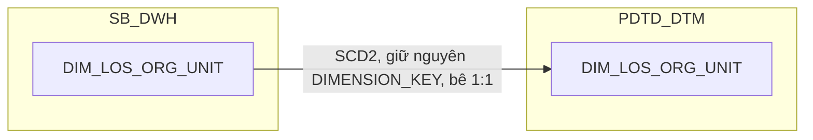

### 1.3 Cấu trúc bảng

| STT | Tên cột | Kiểu dữ liệu | Bắt buộc | Độ lớn | Khóa | Mô tả | Báo cáo sử dụng | Tên chỉ tiêu trên báo cáo |
| --- | --- | --- | --- | --- | --- | --- | --- | --- |
| 1 | DIMENSION_KEY | NUMBER | Y | 18 | PK | Khóa chính của bảng chiều DIM_LOS_ORG_UNIT — giữ nguyên giá trị từ SB_DWH qua vùng chìa STG_DTM, không sinh sequence mới | — | — |
| 2 | DATASOURCE | VARCHAR2 | Y | 10 |  | Nguồn hệ dùng chung cho cả hai hệ CLOS và RLOS — cột kỹ thuật, luôn cố định 'LOS' | — | — |
| 3 | ORG_UNIT_SK | NUMBER | Y | 18 |  | Khóa tham chiếu đến bảng chiều DIM_LOS_ORG_UNIT, bằng đúng giá trị DIMENSION_KEY của cùng dòng — dùng để các FCT lookup vào DIM này | — | — |
| 4 | COMPANY_CODE | VARCHAR2 | Y | 50 | NK | Mã đơn vị kinh doanh (PGD/CN — mức chi tiết nhất) — nguồn MAS_COMPANY.COMPANY_CODE | Báo cáo RLOS APPLICATION (BC1)<br>Báo cáo CLOS APPLICATION (BC2)<br>Báo cáo KPI (BC9) — điều kiện lọc chi nhánh loại trừ | MÃ PGD (Mã đơn vị kinh doanh); nguồn cho chỉ tiêu SLHS_RLOS_*/SLGN_RLOS_* (điều kiện lọc chi nhánh trên AGG_LOS_KPI_YTD_DAILY) |
| 5 | COMPANY_NAME | VARCHAR2 | N | 200 |  | Tên đơn vị kinh doanh — nguồn MAS_COMPANY.COMPANY_NAME_VN | Báo cáo RLOS APPLICATION (BC1)<br>Báo cáo CLOS APPLICATION (BC2) | TÊN PGD (Tên đơn vị kinh doanh) |
| 6 | COMPANY_ADDRESS | VARCHAR2 | N | 500 |  | Địa chỉ đơn vị kinh doanh — nguồn MAS_COMPANY.COMPANY_ADDRESS_VN | — | Thiết kế dư thừa |
| 7 | COMPANY_EMAIL | VARCHAR2 | N | 200 |  | Email đơn vị kinh doanh — nguồn MAS_COMPANY.COMPANY_EMAIL | — | Thiết kế dư thừa |
| 8 | ZONE | NUMBER | N | 18 |  | Mã khu vực nội bộ theo LOS (khác REGION_CODE của MAS_REGION) — nguồn MAS_COMPANY.ZONE | — | Thiết kế dư thừa |
| 9 | BRANCH_CODE | VARCHAR2 | N | 50 |  | Mã chi nhánh — nguồn MAS_COMPANY.BRANCH_ID, LEFT JOIN MAS_BRANCH.BRANCH_ID | Báo cáo RLOS APPLICATION (BC1)<br>Báo cáo CLOS APPLICATION (BC2) | MÃ CHI NHÁNH |
| 10 | BRANCH_NAME | VARCHAR2 | N | 200 |  | Tên chi nhánh — nguồn MAS_BRANCH.BRANCH_NAME_VN | Báo cáo RLOS APPLICATION (BC1)<br>Báo cáo CLOS APPLICATION (BC2) | TÊN CHI NHÁNH |
| 11 | CITY | VARCHAR2 | N | 100 |  | Mã tỉnh/thành phố của chi nhánh — nguồn MAS_BRANCH.CITY | — | Thiết kế dư thừa |
| 12 | DISTRICT | VARCHAR2 | N | 100 |  | Mã quận/huyện của chi nhánh — nguồn MAS_BRANCH.DISTRICT | — | Thiết kế dư thừa |
| 13 | REGION_CODE | NUMBER | N | 18 |  | Mã khu vực địa lý — nguồn MAS_BRANCH.REGION, LEFT JOIN MAS_REGION.REGION_CODE | — | Thiết kế dư thừa |
| 14 | REGION_NAME | VARCHAR2 | N | 200 |  | Tên khu vực địa lý — nguồn MAS_REGION.REGION_NAME_VN. Lưu ý: khái niệm khu vực này KHÁC với khu vực chuẩn hóa dùng cho BC10/BC11 (qua `TMP_REF_COMPANY_REGION_KHCN`/`KHDN`) — 2 nguồn khác nhau (LOS vs T24-side mapping riêng), không hợp nhất | — | Thiết kế dư thừa |
| 15 | EFF_DATE | DATE | Y |  |  | Ngày bắt đầu hiệu lực của phiên bản bản ghi (SCD Type 2) — do SB_DWH quản lý, bê nguyên qua vùng chìa, không tính lại SCD2 ở DTM | — | — |
| 16 | EXP_DATE | DATE | N |  |  | Ngày hết hiệu lực của phiên bản bản ghi; NULL = bản ghi hiện hành — do SB_DWH quản lý, bê nguyên qua vùng chìa | — | — |

## 2. DIM_LOS_USER

### 2.1 Mục đích thiết kế
- **Ý nghĩa bảng:** danh mục tài khoản người dùng trên ứng dụng LOS (không phải danh sách nhân sự HR) — dùng chung cho cả hai hệ CLOS và RLOS, vì một cán bộ có thể xử lý cả hồ sơ CLOS lẫn RLOS. Bảng bê nguyên 1:1 từ SB_DWH, không thêm/bớt cột nào ở layer PDTD_DTM.
- **Khóa chính của bảng (PK):** `DIMENSION_KEY` (giữ nguyên giá trị từ SB_DWH, không sinh sequence mới)
- **Độ chi tiết (grain):** 1 dòng lưu lịch sử thông tin thay đổi theo thời gian (SCD Type 2, khóa tự nhiên `USERNAME`), do SB_DWH quản lý SCD2, PDTD_DTM chỉ bê qua vùng chìa STG_DTM.
- **Phục vụ báo cáo:**
  - Báo cáo RLOS APPLICATION (BC1) — qua giá trị `USERNAME` hiển thị thẳng trên các FCT, không join thuộc tính từ DIM
  - Báo cáo Thông tin phê duyệt (BC3) — tương tự, `USERNAME` hiển thị thẳng
  - Báo cáo Tuần Chuyên viên Thẩm định (BC4) — tương tự
  - Báo cáo NGOẠI LỆ (BC6) / Báo cáo EXCEPTION - FTR (BC7) — tương tự
  - Báo cáo KPI (BC9) — đếm số lượng nhân sự theo `USERNAME`

### 2.2 Sơ đồ lineage


### 2.3 Cấu trúc bảng

| STT | Tên cột | Kiểu dữ liệu | Bắt buộc | Độ lớn | Khóa | Mô tả | Báo cáo sử dụng | Tên chỉ tiêu trên báo cáo |
| --- | --- | --- | --- | --- | --- | --- | --- | --- |
| 1 | DIMENSION_KEY | NUMBER | Y | 18 | PK | Khóa chính của bảng chiều DIM_LOS_USER — giữ nguyên giá trị từ SB_DWH qua vùng chìa STG_DTM, không sinh sequence mới | — | — |
| 2 | DATASOURCE | VARCHAR2 | Y | 10 |  | Nguồn hệ dùng chung cho cả hai hệ CLOS và RLOS — cột kỹ thuật, luôn cố định 'LOS' | — | — |
| 3 | USER_SK | NUMBER | Y | 18 |  | Khóa tham chiếu đến bảng chiều DIM_LOS_USER, bằng đúng giá trị DIMENSION_KEY của cùng dòng. Giá trị mặc định = -1 (dòng Unknown) nếu không có giá trị phù hợp | — | — |
| 4 | USERNAME | VARCHAR2 | Y | 100 | NK | Tên tài khoản của cán bộ xử lý hồ sơ trên ứng dụng LOS — nguồn MAS_USER.LOGIN_ID | Báo cáo RLOS APPLICATION (BC1)<br>Báo cáo Thông tin phê duyệt (BC3)<br>Báo cáo Tuần Chuyên viên Thẩm định (BC4)<br>Báo cáo NGOẠI LỆ (BC6)<br>Báo cáo EXCEPTION - FTR (BC7)<br>Báo cáo KPI (BC9) | UND_MAKER (User Chuyên viên thẩm định); BI_APPROVER/BI_COMMITTEE (User phê duyệt/Hội đồng tín dụng); RAISED_BY (User tạo lý do); NHAN_SU (đếm số nhân sự theo USERNAME) — các báo cáo đều đọc giá trị thô trên FCT (thường qua CASE WHEN theo WORKSTEP_CODE trên chính dòng event), không join thuộc tính qua DIM này |
| 5 | EMPLOYEE_NAME | NVARCHAR2 | N | 200 |  | Tên nhân viên — nguồn MAS_USER.EMPLOYEE_NAME | — | Thiết kế dư thừa |
| 6 | EMPLOYEE_STATUS | VARCHAR2 | N | 50 |  | Trạng thái tài khoản — nguồn MAS_USER.EMPLOYEE_STATUS | — | Thiết kế dư thừa |
| 7 | EMAIL | VARCHAR2 | N | 200 |  | Email — nguồn MAS_USER.EMAIL | — | Thiết kế dư thừa |
| 8 | IP_PHONE | VARCHAR2 | N | 50 |  | Số máy nội bộ — nguồn MAS_USER.IP_PHONE | — | Thiết kế dư thừa |
| 9 | SB_CODE | VARCHAR2 | N | 50 |  | Mã SB của cán bộ — nguồn MAS_USER.SB_CODE | — | Thiết kế dư thừa |
| 10 | ID_CUSTOMER | VARCHAR2 | N | 50 |  | Mã khách hàng gắn với tài khoản (nếu có) — nguồn MAS_USER.ID_CUSTOMER | — | Thiết kế dư thừa |
| 11 | COMPANY_CODE | VARCHAR2 | N | 50 |  | Mã chi nhánh/ĐVKD quản lý tài khoản — nguồn MAS_USER.COMPANY_CODE | — | Thiết kế dư thừa |
| 12 | COMPANY_NAME | NVARCHAR2 | N | 200 |  | Tên chi nhánh/ĐVKD quản lý tài khoản — nguồn MAS_USER.COMPANY_NAME | — | Thiết kế dư thừa |
| 13 | TITLE | VARCHAR2 | N | 100 |  | Danh xưng/chức danh — nguồn MAS_USER.TITLE | — | Thiết kế dư thừa |
| 14 | DEPARTMENT_CODE | VARCHAR2 | N | 50 |  | Mã phòng ban — nguồn MAS_USER.DEPARTMENT_CODE | — | Thiết kế dư thừa |
| 15 | DEPARTMENT_NAME | VARCHAR2 | N | 200 |  | Tên phòng ban — nguồn MAS_USER.DEPARTMENT_NAME | — | Thiết kế dư thừa |
| 16 | UWMAKER_GROUP | VARCHAR2 | N | 100 |  | Nhóm thẩm định — nguồn MAS_USER.UWMAKER_GROUP | — | Thiết kế dư thừa |
| 17 | UWCHECKER_GROUP | VARCHAR2 | N | 100 |  | Nhóm kiểm soát thẩm định — nguồn MAS_USER.UWCHECKER_GROUP | — | Thiết kế dư thừa |
| 18 | AP_GROUP | VARCHAR2 | N | 100 |  | Nhóm phê duyệt — nguồn MAS_USER.AP_GROUP | — | Thiết kế dư thừa |
| 19 | PREDISB_MAKER_GROUP | VARCHAR2 | N | 100 |  | Nhóm soạn thảo hồ sơ XLTD — nguồn MAS_USER.PREDISB_MAKER_GROUP | — | Thiết kế dư thừa |
| 20 | PREDISB_GROUP | VARCHAR2 | N | 100 |  | Nhóm kiểm soát soạn thảo hồ sơ XLTD — nguồn MAS_USER.PREDISB_GROUP | — | Thiết kế dư thừa |
| 21 | DISB_MAKER_GROUP | VARCHAR2 | N | 100 |  | Nhóm giải ngân — nguồn MAS_USER.DISB_MAKER_GROUP | — | Thiết kế dư thừa |
| 22 | DISB_CHECKER_GROUP | VARCHAR2 | N | 100 |  | Nhóm kiểm soát giải ngân — nguồn MAS_USER.DISB_CHECKER_GROUP | — | Thiết kế dư thừa |
| 23 | HUB | VARCHAR2 | N | 100 |  | Đơn vị/cụm xử lý — nguồn MAS_USER.HUB | — | Thiết kế dư thừa |
| 24 | BRANCH_MANAGER_EMAIL | VARCHAR2 | N | 200 |  | Email giám đốc chi nhánh quản lý tài khoản — nguồn MAS_USER.BRANCH_MANAGER_EMAIL | — | Thiết kế dư thừa |
| 25 | EFF_DATE | DATE | Y |  |  | Ngày bắt đầu hiệu lực của phiên bản bản ghi (SCD Type 2) — do SB_DWH quản lý, bê nguyên qua vùng chìa, không tính lại SCD2 ở DTM | — | — |
| 26 | EXP_DATE | DATE | N |  |  | Ngày hết hiệu lực của phiên bản bản ghi; NULL = bản ghi hiện hành — do SB_DWH quản lý, bê nguyên qua vùng chìa | — | — |

## 3. DIM_CLOS_APPLICATION

### 3.1 Mục đích thiết kế
- **Ý nghĩa bảng:** danh mục hồ sơ tín dụng CLOS (doanh nghiệp/tổ chức) — lưu các thông tin ít thay đổi của 1 hồ sơ (luồng nghiệp vụ, phê duyệt, ngành nghề khách hàng, cấp thẩm quyền, cờ ngoại lệ...). So với SB_DWH, PDTD_DTM bổ sung thêm 6 cột chuẩn hóa/tra cứu phục vụ báo cáo: `BI_FLOW` (luồng nghiệp vụ chuẩn hóa) và nhóm cam kết SLA (`REF_PRODUCT`, `SLA_CREDIT_OFFICER`, `SLA_MARKER`, `SLA_CHECKER`, `SLA_CREDIT_APPROVER`) — đây là nơi duy nhất tính các cột SLA này (LEFT JOIN `CLOS_REF_SLA_TDKHDNL`/`CLOS_REF_SLA_TDKHDN`, chọn bảng theo `CUST_GROUP`).
- **Khóa chính của bảng (PK):** `DIMENSION_KEY` (giữ nguyên giá trị từ SB_DWH, không sinh sequence mới)
- **Độ chi tiết (grain):** 1 dòng hồ sơ lưu lịch sử thông tin thay đổi theo thời gian (SCD Type 2, khóa tự nhiên `WI_NAME` + `EFF_DATE`).
- **Phục vụ báo cáo:**
  - Báo cáo CLOS APPLICATION (BC2)
  - Báo cáo Thông tin phê duyệt (BC3)
  - Báo cáo SLA - TAT (BC5) — tra khóa `CHANGE_REQUEST`/`APP_GRP`/`HAVE_ANY_DEVIATION`/`CUST_GROUP`, đồng thời là nơi sinh `REF_PRODUCT`/`SLA_*`
  - Báo cáo KPI (BC9) — tra điều kiện lọc `STREAM`/`CHANGE_REQUEST`/`APP_GRP`, và `SLA_*`/`REF_PRODUCT` để tính `POINT`
  - Báo cáo Giải ngân _ Quá hạn KHDN (BC11) — qua `FCT_CLOS_LOAN_DISBURSEMENT`

### 3.2 Sơ đồ lineage

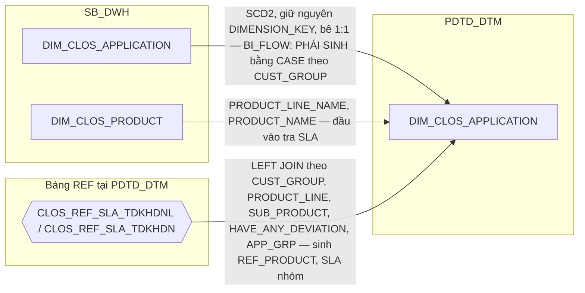

### 3.3 Cấu trúc bảng

| STT | Tên cột | Kiểu dữ liệu | Bắt buộc | Độ lớn | Khóa | Mô tả | Báo cáo sử dụng | Tên chỉ tiêu trên báo cáo |
| --- | --- | --- | --- | --- | --- | --- | --- | --- |
| 1 | DIMENSION_KEY | NUMBER | Y | 18 | PK | Khóa chính của bảng chiều DIM_CLOS_APPLICATION — giữ nguyên giá trị từ SB_DWH qua vùng chìa STG_DTM, không sinh sequence mới | — | — |
| 2 | DATASOURCE | VARCHAR2 | Y | 10 |  | Cột kỹ thuật đánh dấu nguồn hệ, luôn cố định 'CLOS' | — | — |
| 3 | APPLICATION_SK | NUMBER | Y | 18 |  | Khóa tham chiếu đến bảng chiều DIM_CLOS_APPLICATION, bằng đúng giá trị DIMENSION_KEY của cùng dòng. Giá trị mặc định = -1 (dòng Unknown) nếu không có giá trị phù hợp | — | — |
| 4 | WI_NAME | VARCHAR2 | Y | 100 | NK | Mã hồ sơ tín dụng CLOS — nguồn NG_SB_CLOS_CUST_INFO.WI_NAME | Báo cáo CLOS APPLICATION (BC2)<br>Báo cáo Thông tin phê duyệt (BC3)<br>Báo cáo Tuần Chuyên viên Thẩm định (BC4)<br>Báo cáo SLA - TAT (BC5)<br>Báo cáo NGOẠI LỆ (BC6)<br>Báo cáo EXCEPTION - FTR (BC7)<br>Báo cáo RETURN (BC8)<br>Báo cáo KPI (BC9)<br>Báo cáo Giải ngân _ Quá hạn KHDN (BC11) — qua FIRST_APPROVED_WI_NAME | WINAME / WI_NAME (Mã hồ sơ) |
| 5 | LOANCASEID | VARCHAR2 | N | 100 |  | Mã khoản vay gắn với hồ sơ — nguồn NG_SB_CLOS_EXTTABLE.LOANCASEID, giữ nguyên văn không lọc | Báo cáo EXCEPTION - FTR (BC7)<br>Báo cáo Giải ngân _ Quá hạn KHDN (BC11) | LOANCASEID (Mã LOANCASEID) |
| 6 | FIRST_APPROVED_WI_NAME | VARCHAR2 | N | 100 |  | Mã hồ sơ cha (BC11.APPROVAL_WINAME_LOS) — PHÁI SINH: MIN(WI_NAME) trên NG_SB_CLOS_EXTTABLE, group theo LOANCASEID, gán cho mọi hồ sơ cùng LOANCASEID | Báo cáo Giải ngân _ Quá hạn KHDN (BC11) — qua FCT_CLOS_LOAN_DISBURSEMENT | APPROVAL_WINAME_LOS (Mã hồ sơ phê duyệt) |
| 7 | FIRST_APPROVED_DATE | DATE | N |  |  | Ngày phê duyệt (BC11.APPROVAL_DATE) — PHÁI SINH: MAX(EXITDATE) trên NG_SB_CLOS_ENTRY_EXIT của hồ sơ thỏa USERNAME IS NOT NULL AND WORKSTEP IN ('CreditApproval','CreditCommittee') AND DECISION IN ('Submit','Send To HOSupport','Send To PostSanction') | Báo cáo Giải ngân _ Quá hạn KHDN (BC11) — qua FCT_CLOS_LOAN_DISBURSEMENT | APPROVAL_DATE (Ngày phê duyệt) |
| 8 | STREAM | VARCHAR2 | N | 200 |  | Luồng nghiệp vụ của hồ sơ — nguồn NG_SB_CLOS_APPROVAL.STREAM | Báo cáo Thông tin phê duyệt (BC3)<br>Báo cáo KPI (BC9) — điều kiện lọc STREAM cho SLHS_CLOS/SLGN_CLOS/TAT_CLOS | BC3: STREAM (Luồng hồ sơ); nguồn cho chỉ tiêu SLHS_CLOS_*/SLGN_CLOS_*/TAT_CLOS_* (điều kiện lọc trên AGG_LOS_KPI_YTD_DAILY) |
| 9 | APPROVAL_TYPE | VARCHAR2 | N | 200 |  | Loại luồng phê duyệt — nguồn NG_SB_CLOS_APPROVAL.STREAM đọc theo nghĩa luồng phê duyệt tại bước kiểm soát nhập liệu | Báo cáo CLOS APPLICATION (BC2) | APPROVAL_TYPE (Luồng phê duyệt) |
| 10 | CHANGE_REQUEST | VARCHAR2 | N | 200 |  | Yêu cầu điều chỉnh hồ sơ — nguồn NG_SB_CLOS_CHANGEREQ.CHANGE_REQUEST | Báo cáo CLOS APPLICATION (BC2)<br>Báo cáo SLA - TAT (BC5) — khóa tra SLA_DE (REF_SLA_NLTT)<br>Báo cáo KPI (BC9) — khóa tra POINT<br>Báo cáo Giải ngân _ Quá hạn KHDN (BC11) — điều kiện lọc LOANCASEID | BC2: CHANGE_REQUEST (Thay đổi điều kiện — New/Change); nguồn cho chỉ tiêu SLA_DE (BC5), POINT (BC9), điều kiện lọc LOANCASEID (BC11) |
| 11 | CHANGE_TYPE | VARCHAR2 | N | 500 |  | Loại thay đổi điều kiện phê duyệt (BC2) — nguồn NG_SB_CLOS_CHANGEREQ.CHANGE_TYPE, giữ nguyên chuỗi gốc kể cả dạng đa giá trị nối bằng dấu `~` | Báo cáo CLOS APPLICATION (BC2) | CHANGE_TYPE (Chi tiết loại thay đổi điều kiện) |
| 12 | CREDIT_PROFILE | VARCHAR2 | N | 50 |  | Cấp tín dụng của hồ sơ (TVTD/CTD) — nguồn NG_SB_CLOS_EXTTABLE.CREDIT_PROFILE | Báo cáo CLOS APPLICATION (BC2) | CAP_TIN_DUNG (Hồ sơ tư vấn tín dụng hay cấp tín dụng) |
| 13 | CUST_GROUP | VARCHAR2 | N | 100 |  | Nhóm khách hàng — nguồn NG_SB_CLOS_CUST_INFO.CUST_GROUP | Báo cáo CLOS APPLICATION (BC2)<br>Báo cáo SLA - TAT (BC5) — chọn bảng CLOS_REF_SLA_TDKHDNL/TDKHDN để tra REF_PRODUCT/SLA_*<br>Báo cáo EXCEPTION - FTR (BC7) — điều kiện chọn whitelist CHECK_FTR<br>Báo cáo Giải ngân _ Quá hạn KHDN (BC11) | BC2/BC11: CUST_GROUP (Nhóm phân loại khách hàng); nguồn cho chỉ tiêu BI_FLOW (cùng bảng), REF_PRODUCT/SLA_* (BC5), whitelist CHECK_FTR (BC7) |
| 14 | INDUSTRY_LVL1_CODE | VARCHAR2 | N | 200 |  | Mã ngành cấp 1 — nguồn NG_SB_CLOS_CUST_INFO.INDUSTRY_CODE_LEVEL_1 | Báo cáo CLOS APPLICATION (BC2) | INDUSTRY_GROUP (Ngành kinh doanh cấp 1) |
| 15 | INDUSTRY_LVL2_CODE | VARCHAR2 | N | 200 |  | Mã ngành cấp 2 — nguồn NG_SB_CLOS_CUST_INFO.INDUSTRY_CODE_LEVEL_2 | Báo cáo CLOS APPLICATION (BC2) | INDUSTRY_CLASS (Ngành kinh doanh cấp 2) |
| 16 | INDUSTRY_LVL3_CODE | VARCHAR2 | N | 200 |  | Mã ngành cấp 3 — nguồn NG_SB_CLOS_CUST_INFO.INDUSTRY_CODE_LEVEL_3 | Báo cáo CLOS APPLICATION (BC2) | INDUSTRY (Ngành kinh doanh cấp 3) |
| 17 | EMPLOYEE_CODE | VARCHAR2 | N | 50 |  | Mã cán bộ quản lý hồ sơ — nguồn NG_SB_CLOS_CUST_INFO.EMP_CODE, quan hệ 1:1 với WI_NAME | Báo cáo CLOS APPLICATION (BC2) | EMPLOYEE_CODE (Mã CRO) |
| 18 | EMPLOYEE_NAME | VARCHAR2 | N | 200 |  | Tên cán bộ quản lý hồ sơ — nguồn NG_SB_CLOS_CUST_INFO.EMP_NAME, cùng quan hệ 1:1 như EMPLOYEE_CODE | Báo cáo CLOS APPLICATION (BC2) | EMPLOYEE_NAME (Tên CRO) |
| 19 | CREATION_DATE | DATE | N | 10 |  | Ngày khởi tạo hồ sơ — PHÁI SINH: MIN(ENTRYDATE) theo WI_NAME trên NG_SB_CLOS_ENTRY_EXIT, TRUNC về ngày | Báo cáo CLOS APPLICATION (BC2) | CREATION_DATE (Ngày hồ sơ khởi tạo) |
| 20 | APP_GRP | VARCHAR2 | N | 50 |  | Cấp thẩm quyền phê duyệt của hồ sơ (A1-C3, BOD, CC, SCC, RCC, DEBTCC) — nguồn NG_SB_CLOS_APPROVAL.APP_GRP | Báo cáo CLOS APPLICATION (BC2) — hiển thị trực tiếp<br>Báo cáo SLA - TAT (BC5) — quy đổi FLAG_APP_GRP để tra REF_PRODUCT/SLA_* (cùng bảng); C1 dùng hằng số cứng<br>Báo cáo KPI (BC9) — khóa tra điểm KPI (POINT) | APP_GRP (Cấp phân quyền phê duyệt); nguồn cho chỉ tiêu POINT (BC9), REF_PRODUCT/SLA_CREDIT_OFFICER/SLA_MARKER/SLA_CHECKER/SLA_CREDIT_APPROVER (cùng bảng, BC5) |
| 21 | HAVE_ANY_DEVIATION | VARCHAR2 | N | 10 |  | Hồ sơ có ngoại lệ/độ lệch so với chính sách chuẩn hay không (Có/Không) — nguồn NG_SB_CLOS_CREDITINFO_COMM.HAVE_ANY_DEVIATION. Chỉ có giá trị từ khi hồ sơ tới bước Hội đồng tín dụng, NULL ở các phiên bản trước đó | Báo cáo SLA - TAT (BC5) — khóa tra REF_PRODUCT/SLA_* (cùng bảng) | Nguồn cho chỉ tiêu REF_PRODUCT/SLA_* (BC5) |
| 22 | CREDIT_LIMIT_COMMITTEE | NUMBER | N | 20,2 |  | Hạn mức do hội đồng phê duyệt (BC3.CREDIT_LIMIT) — DƯ THỪA CÓ CHỦ ĐÍCH, cùng nguồn/giá trị với FCT_CLOS_APPLICATION_DAILY.CREDIT_LIMIT_COMMITTEE | Báo cáo Thông tin phê duyệt (BC3) — qua FCT_CLOS_WORKSTEP_EVENT | CREDIT_LIMIT (Số tiền phê duyệt) |
| 23 | CURRENCY_CODE | VARCHAR2 | N | 10 |  | Loại tiền (BC3.CURRENCY) — DƯ THỪA CÓ CHỦ ĐÍCH, cùng lý do cột 22 | Báo cáo Thông tin phê duyệt (BC3) — qua FCT_CLOS_WORKSTEP_EVENT | CURRENCY (Đơn vị tiền tệ) |
| 24 | APPROVED_TERM | NUMBER | N | 5 |  | Kỳ hạn phê duyệt (BC3.CREDIT_TERM) — DƯ THỪA CÓ CHỦ ĐÍCH, cùng lý do cột 22 | Báo cáo Thông tin phê duyệt (BC3) — qua FCT_CLOS_WORKSTEP_EVENT | CREDIT_TERM (Thời hạn phê duyệt) |
| 25 | EFF_DATE | DATE | Y |  |  | Ngày bắt đầu hiệu lực của phiên bản bản ghi (SCD Type 2) | — | — |
| 26 | EXP_DATE | DATE | N |  |  | Ngày hết hiệu lực của phiên bản bản ghi; NULL = bản ghi hiện hành | — | — |
| 27 | BI_FLOW | VARCHAR2 | N | 50 |  | Luồng nghiệp vụ chuẩn hóa để hiển thị trên báo cáo — PHÁI SINH tại PDTD_DTM: CASE theo CUST_GROUP (MSME/SME/USME → PDTD_KHDN; NBFI/JSC/FDI/BANK/STR/SOC → PDTD_KHDNL; còn lại → NULL), không qua bảng REF_ nào (khác cách RLOS lookup REF_RLOS_FLOW) | Báo cáo CLOS APPLICATION (BC2) | BI_FLOW (Phân khúc khách hàng) |
| 28 | REF_PRODUCT | NVARCHAR2 | N | 200 |  | Nhóm sản phẩm dùng để tra cam kết SLA (BC5) — PHÁI SINH: LEFT JOIN `CLOS_REF_SLA_TDKHDNL`/`CLOS_REF_SLA_TDKHDN` (chọn theo CUST_GROUP) theo PRODUCT_LINE+SUB_PRODUCT (lấy gián tiếp qua FCT_CLOS_APPLICATION_DAILY.PRODUCT_SK → DIM_CLOS_PRODUCT)+HAVE_ANY_DEVIATION+FLAG_APP_GRP (quy đổi từ APP_GRP) | Báo cáo SLA - TAT (BC5)<br>Báo cáo KPI (BC9) — input tính POINT | REF_PRODUCT (Nhóm sản phẩm SLA) |
| 29 | SLA_CREDIT_OFFICER | NUMBER | N | 10,2 |  | Cam kết giờ cho chuyên viên tín dụng — cùng LEFT JOIN trên. Hồ sơ APP_GRP='C1': hằng số cứng 4 giờ, không lookup | Báo cáo SLA - TAT (BC5)<br>Báo cáo KPI (BC9) — input tính POINT | SLA_CREDIT_OFFICER (Cam kết SLA của Phòng thẩm định) |
| 30 | SLA_MARKER | NUMBER | N | 10,2 |  | Cam kết giờ cho bước lập hồ sơ thẩm định — cùng LEFT JOIN trên. Hồ sơ APP_GRP='C1': hằng số cứng 4 giờ | Báo cáo SLA - TAT (BC5) | SLA_MARKER (Cam kết SLA của Chuyên viên thẩm định) |
| 31 | SLA_CHECKER | NUMBER | N | 10,2 |  | Cam kết giờ cho bước kiểm soát thẩm định — cùng LEFT JOIN trên. Hồ sơ APP_GRP='C1': hằng số cứng 4 giờ | Báo cáo SLA - TAT (BC5) | SLA_CHECKER (Cam kết SLA của Kiểm soát thẩm định) |
| 32 | SLA_CREDIT_APPROVER | NUMBER | N | 10,2 |  | Cam kết giờ cho cấp phê duyệt — cùng LEFT JOIN trên. Hồ sơ APP_GRP='C1': hằng số cứng 4 giờ | Báo cáo SLA - TAT (BC5)<br>Báo cáo KPI (BC9) — input tính POINT | SLA_CREDIT_APPROVER (Cam kết SLA của Chuyên gia phê duyệt) |

## 4. DIM_CLOS_COLLATERAL_TYPE

### 4.1 Mục đích thiết kế
- **Ý nghĩa bảng:** danh mục loại tài sản bảo đảm (TSBĐ) dùng trong hồ sơ CLOS (doanh nghiệp) — mỗi dòng là 1 loại tài sản bảo đảm đã được ngân hàng định nghĩa sẵn (bất động sản, phương tiện vận tải, hàng tồn kho, giấy tờ có giá...), không gắn theo hồ sơ cụ thể nào.
- **Khóa chính của bảng (PK):** `DIMENSION_KEY`
- **Độ chi tiết (grain):** 1 dòng = 1 loại tài sản bảo đảm, bê nguyên 1:1 từ SB_DWH, không có cột phái sinh nào ở tầng PDTD_DTM.
- **Phục vụ báo cáo:**
  - Báo cáo Thông tin phê duyệt (BC3)
  - Báo cáo CLOS APPLICATION (BC2)

### 4.2 Sơ đồ lineage

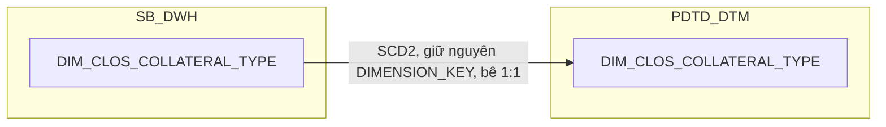

### 4.3 Cấu trúc bảng

| STT | Tên cột | Kiểu dữ liệu | Bắt buộc | Độ lớn | Khóa | Mô tả | Báo cáo sử dụng | Tên chỉ tiêu trên báo cáo |
| --- | --- | --- | --- | --- | --- | --- | --- | --- |
| 1 | DIMENSION_KEY | NUMBER | Y | 18 | PK | Khóa chính của bảng chiều DIM_CLOS_COLLATERAL_TYPE, kế thừa nguyên giá trị từ SB_DWH, không sinh sequence mới ở tầng PDTD_DTM | — | — |
| 2 | DATASOURCE | VARCHAR2 | Y | 10 |  | Cột kỹ thuật đánh dấu nguồn hệ, luôn cố định 'CLOS' | — | — |
| 3 | COLLATERAL_TYPE_SK | NUMBER | Y | 18 |  | Khóa tham chiếu đến bảng chiều DIM_CLOS_COLLATERAL_TYPE, bằng đúng giá trị DIMENSION_KEY của cùng dòng. Giá trị mặc định = -1 (dòng Unknown) nếu không có giá trị phù hợp | — | — |
| 4 | COLLATERAL_TYPE_CODE | VARCHAR2 | Y | 100 | NK | Mã loại tài sản bảo đảm — kế thừa nguyên văn từ SB_DWH (nguồn gốc NG_SB_CLOS_COLL_CD.COLLTYPE), giữ nguyên giá trị gốc kể cả chuỗi tiếng Việt không dấu | Báo cáo Thông tin phê duyệt (BC3) — hiển thị trực tiếp<br>Báo cáo CLOS APPLICATION (BC2) — khóa lọc 9 cờ TSDB_* | TYPES_OF_COLLATERALS (Loại TSBĐ, BC3); nguồn cho chỉ tiêu/trường TSDB_NHOM_0/TSDB_BDS/TSDB_PTVT/TSDB_MMTB/TSDB_HTK/TSDB_KPT/TSDB_CP_TP/TSDB_TIN_CHAP/TIN_CHAP_TQD (BC2) |
| 5 | EFF_DATE | DATE | Y |  |  | Ngày bắt đầu hiệu lực của phiên bản bản ghi (SCD Type 2) | — | — |
| 6 | EXP_DATE | DATE | N |  |  | Ngày hết hiệu lực của phiên bản bản ghi; NULL = bản ghi hiện hành | — | — |

## 5. DIM_CLOS_CUSTOMER

### 5.1 Mục đích thiết kế
- **Ý nghĩa bảng:** thông tin doanh nghiệp vay chính của hồ sơ CLOS — lưu tên khách hàng cùng các thông tin mô tả liên quan tự khai trên hồ sơ (khu vực hoạt động, mục đích vay, phân loại khách hàng...), bổ sung số giấy tờ pháp lý và người đại diện theo pháp luật tra từ `DIM_CLOS_LEGAL_PARTY` để tiện tra cứu trực tiếp, không phải tự JOIN thêm.
- **Khóa chính của bảng (PK):** `DIMENSION_KEY`
- **Độ chi tiết (grain):** 1 dòng lưu 1 phiên bản của 1 hồ sơ (quan hệ 1:1 với `DIM_CLOS_APPLICATION`), lưu lịch sử thông tin thay đổi theo thời gian (SCD Type 2), bê nguyên 1:1 từ SB_DWH.
- **Phục vụ báo cáo:**
  - Báo cáo CLOS APPLICATION (BC2)
  - Báo cáo Thông tin phê duyệt (BC3)
  - Báo cáo Tuần Chuyên viên Thẩm định (BC4)

### 5.2 Sơ đồ lineage

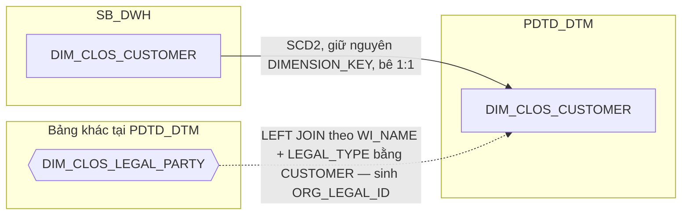

### 5.3 Cấu trúc bảng

| STT | Tên cột | Kiểu dữ liệu | Bắt buộc | Độ lớn | Khóa | Mô tả | Báo cáo sử dụng | Tên chỉ tiêu trên báo cáo |
| --- | --- | --- | --- | --- | --- | --- | --- | --- |
| 1 | DIMENSION_KEY | NUMBER | Y | 18 | PK | Khóa chính của bảng chiều DIM_CLOS_CUSTOMER, kế thừa nguyên giá trị từ SB_DWH | — | — |
| 2 | DATASOURCE | VARCHAR2 | Y | 10 |  | Cột kỹ thuật đánh dấu nguồn hệ, luôn cố định 'CLOS' | — | — |
| 3 | CUSTOMER_SK | NUMBER | Y | 18 |  | Khóa tham chiếu đến bảng chiều DIM_CLOS_CUSTOMER, bằng đúng giá trị DIMENSION_KEY của cùng dòng. Mặc định -1 | — | — |
| 4 | WI_NAME | VARCHAR2 | Y | 100 | NK | Mã hồ sơ CLOS, quan hệ 1:1 với hồ sơ — kế thừa nguyên văn từ SB_DWH (nguồn gốc NG_SB_CLOS_CUST_INFO.WI_NAME) | — | Nguồn cho chỉ tiêu/trường CUSTOMER_SK (khóa join FCT_CLOS_APPLICATION_DAILY/FCT_CLOS_WORKSTEP_EVENT), khóa LEFT JOIN sinh ORG_LEGAL_ID/LEGAL_REPRESENTATIVE/ADD_ID_REPRESENTATIVE |
| 5 | FULL_NAME | VARCHAR2 | N | 200 |  | Tên doanh nghiệp khách hàng — kế thừa nguyên văn từ SB_DWH (nguồn gốc NG_SB_CLOS_CUST_INFO.CUSTOMER_NAME) | Báo cáo CLOS APPLICATION (BC2)<br>Báo cáo Thông tin phê duyệt (BC3)<br>Báo cáo Tuần Chuyên viên Thẩm định (BC4) | CUSTOMER_NAME (Tên khách hàng) |
| 6 | ZONE | VARCHAR2 | N | 200 |  | Khu vực/vùng quản lý tự khai theo hồ sơ — kế thừa nguyên văn từ SB_DWH (làm giàu từ NG_SB_CLOS_CUST_INFO.ZONEE). Khác bản chất với DIM_LOS_ORG_UNIT.ZONE (mã nội bộ chuẩn hóa, dùng để join đơn vị kinh doanh) — cột này là giá trị tự khai gắn với hồ sơ/khách hàng | Báo cáo CLOS APPLICATION (BC2) | ZONE (Khu vực) |
| 7 | APP_DATE | DATE | N |  |  | Ngày khởi tạo/nộp hồ sơ — kế thừa nguyên văn từ SB_DWH (nguồn gốc NG_SB_CLOS_CUST_INFO.APP_DATE) | — | Thiết kế dư thừa |
| 8 | LOAN_PURPOSE | VARCHAR2 | N | 200 |  | Mục đích vay (có/không tạo doanh thu) — kế thừa nguyên văn từ SB_DWH (nguồn gốc NG_SB_CLOS_CUST_INFO.LOAN_PURPOSE) | — | Thiết kế dư thừa |
| 9 | CUST_CATEGORY | VARCHAR2 | N | 200 |  | Phân loại khách hàng — kế thừa nguyên văn từ SB_DWH (nguồn gốc NG_SB_CLOS_CUST_INFO.CUST_CATEGORY) | — | Thiết kế dư thừa |
| 10 | PRECUSTGROUP | VARCHAR2 | N | 100 |  | Phân khúc khách hàng trước xử lý — kế thừa nguyên văn từ SB_DWH (nguồn gốc NG_SB_CLOS_CUST_INFO.PRECUSTGROUP, cùng bộ giá trị với CUST_GROUP trên DIM_CLOS_APPLICATION) | — | Thiết kế dư thừa |
| 11 | LG_REQ | VARCHAR2 | N | 10 |  | Cờ yêu cầu bảo lãnh (Letter of Guarantee) — kế thừa nguyên văn từ SB_DWH (nguồn gốc NG_SB_CLOS_CUST_INFO.LG_REQ) | — | Thiết kế dư thừa |
| 12 | FI_REQ | VARCHAR2 | N | 10 |  | Cờ yêu cầu (tương tự LG_REQ) — kế thừa nguyên văn từ SB_DWH (nguồn gốc NG_SB_CLOS_CUST_INFO.FI_REQ) | — | Thiết kế dư thừa |
| 13 | PHONE_REQ | VARCHAR2 | N | 10 |  | Cờ yêu cầu xác minh điện thoại (tương tự LG_REQ) — kế thừa nguyên văn từ SB_DWH (nguồn gốc NG_SB_CLOS_CUST_INFO.PHONE_REQ) | — | Thiết kế dư thừa |
| 14 | EMAIL | VARCHAR2 | N | 200 |  | Email liên hệ của khách hàng/hồ sơ — kế thừa nguyên văn từ SB_DWH (nguồn gốc NG_SB_CLOS_CUST_INFO.EMAIL) | — | Thiết kế dư thừa |
| 15 | DISTANCE_BRANCH_CUSTOMER | VARCHAR2 | N | 100 |  | Dải khoảng cách từ khách hàng đến chi nhánh xử lý (đã phân nhóm sẵn) — kế thừa nguyên văn từ SB_DWH (nguồn gốc NG_SB_CLOS_CUST_INFO.DISTANCE_BRANCH_CUSTOMER) | — | Thiết kế dư thừa |
| 16 | ORG_LEGAL_ID | VARCHAR2 | N | 100 |  | Số ĐKKD/MST doanh nghiệp — PHÁI SINH tại PDTD_DTM: LEFT JOIN DIM_CLOS_LEGAL_PARTY theo WI_NAME + LEGAL_TYPE='CUSTOMER', lưu dư thừa số giấy tờ pháp lý của chính khách hàng vay để tiện tra cứu. Join an toàn không fan-out — đã xác nhận nghiệp vụ OBJ_TYPE='Khách hàng' luôn đúng 1 dòng/hồ sơ | Báo cáo CLOS APPLICATION (BC2) — hiển thị trực tiếp<br>Báo cáo CLOS APPLICATION (BC2) — khóa join CUSTOMER_ID (DIM_T24_CUSTOMER) | ID_NUMBER (Số ĐKKD/MST doanh nghiệp); nguồn cho chỉ tiêu/trường CUSTOMER_ID (khóa join DIM_T24_CUSTOMER qua LEGAL_ID/LEGAL_DOC_NAME) |
| 17 | LEGAL_REPRESENTATIVE | VARCHAR2 | N | 1000 |  | Người đại diện theo pháp luật — PHÁI SINH tại PDTD_DTM: LEFT JOIN DIM_CLOS_LEGAL_PARTY theo WI_NAME + LEGAL_TYPE='LEGAL_REPRESENTATIVE', nối chuỗi FULL_NAME của mọi dòng khớp bằng dấu ";" nếu nhiều đại diện — cách nối chuỗi đã được BA xác nhận chính thức | Báo cáo CLOS APPLICATION (BC2) | LEGAL_REPRESENTATIVE (Người đại diện pháp luật) |
| 18 | ADD_ID_REPRESENTATIVE | VARCHAR2 | N | 1000 |  | Số giấy tờ tùy thân của người đại diện theo pháp luật — PHÁI SINH tại PDTD_DTM: cùng LEFT JOIN trên, nối chuỗi ID_NUMBER bằng ";" nếu nhiều đại diện | Báo cáo CLOS APPLICATION (BC2) | ADD_ID_REPRESENTATIVE (Số GTTT của người đại diện theo pháp luật) |
| 19 | EFF_DATE | DATE | Y |  |  | Ngày bắt đầu hiệu lực của phiên bản bản ghi (SCD Type 2) | — | — |
| 20 | EXP_DATE | DATE | N |  |  | Ngày hết hiệu lực của phiên bản bản ghi; NULL = bản ghi hiện hành | — | — |

## 6. DIM_CLOS_DECISION

### 6.1 Mục đích thiết kế
- **Ý nghĩa bảng:** danh mục các quyết định có thể phát sinh tại một bước xử lý trên workflow CLOS (ví dụ Submit, Reject, Send To HOSupport...) — đây là danh mục cấu hình gốc của BPM engine, không phải bảng sự kiện/giao dịch theo hồ sơ.
- **Khóa chính của bảng (PK):** `DIMENSION_KEY`
- **Độ chi tiết (grain):** 1 dòng = 1 mã quyết định, bê nguyên 1:1 từ SB_DWH, không có cột phái sinh nào ở tầng PDTD_DTM.
- **Phục vụ báo cáo:**
  - Báo cáo CLOS APPLICATION (BC2) — qua LAST_DECISION_SK trên FCT_CLOS_APPLICATION_DAILY

### 6.2 Sơ đồ lineage

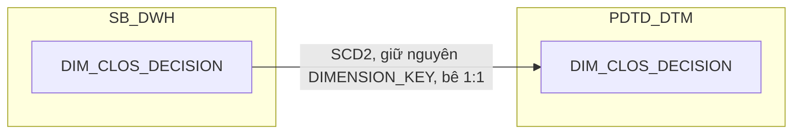

### 6.3 Cấu trúc bảng

| STT | Tên cột | Kiểu dữ liệu | Bắt buộc | Độ lớn | Khóa | Mô tả | Báo cáo sử dụng | Tên chỉ tiêu trên báo cáo |
| --- | --- | --- | --- | --- | --- | --- | --- | --- |
| 1 | DIMENSION_KEY | NUMBER | Y | 18 | PK | Khóa chính của bảng chiều DIM_CLOS_DECISION, kế thừa nguyên giá trị từ SB_DWH | — | — |
| 2 | DATASOURCE | VARCHAR2 | Y | 10 |  | Cột kỹ thuật đánh dấu nguồn hệ, luôn cố định 'CLOS' | — | — |
| 3 | DECISION_SK | NUMBER | Y | 18 |  | Khóa tham chiếu đến bảng chiều DIM_CLOS_DECISION, bằng đúng giá trị DIMENSION_KEY của cùng dòng. Giá trị mặc định = -1 (dòng Unknown) nếu không có giá trị phù hợp | — | — |
| 4 | DECISION_CODE | VARCHAR2 | Y | 200 | NK | Mã quyết định tại bước xử lý trên workflow CLOS — kế thừa nguyên văn từ SB_DWH (nguồn gốc DISTINCT NG_SB_CLOS_MAS_DECISION.DECISION) | Báo cáo CLOS APPLICATION (BC2) | LAST_DECISION (Quyết định bước cuối) |
| 5 | EFF_DATE | DATE | Y |  |  | Ngày bắt đầu hiệu lực của phiên bản bản ghi (SCD Type 2) | — | — |
| 6 | EXP_DATE | DATE | N |  |  | Ngày hết hiệu lực của phiên bản bản ghi; NULL = bản ghi hiện hành | — | — |

## 7. DIM_CLOS_EXCEPTION_REASON

### 7.1 Mục đích thiết kế
- **Ý nghĩa bảng:** danh mục các lý do ngoại lệ được cấu hình cho từng tổ hợp bước xử lý + quyết định trên workflow CLOS — đây là danh mục cấu hình gốc thật sự, không phải bảng sự kiện/giao dịch theo hồ sơ.
- **Khóa chính của bảng (PK):** `DIMENSION_KEY`
- **Độ chi tiết (grain):** 1 dòng = 1 tổ hợp bước xử lý + quyết định + nhóm lý do + tên lý do, bê nguyên 1:1 từ SB_DWH, không có cột phái sinh nào ở tầng PDTD_DTM.
- **Phục vụ báo cáo:**
  - Báo cáo EXCEPTION - FTR (BC7)

### 7.2 Sơ đồ lineage


### 7.3 Cấu trúc bảng

| STT | Tên cột | Kiểu dữ liệu | Bắt buộc | Độ lớn | Khóa | Mô tả | Báo cáo sử dụng | Tên chỉ tiêu trên báo cáo |
| --- | --- | --- | --- | --- | --- | --- | --- | --- |
| 1 | DIMENSION_KEY | NUMBER | Y | 18 | PK | Khóa chính của bảng chiều DIM_CLOS_EXCEPTION_REASON, kế thừa nguyên giá trị từ SB_DWH | — | — |
| 2 | DATASOURCE | VARCHAR2 | Y | 10 |  | Cột kỹ thuật đánh dấu nguồn hệ, luôn cố định 'CLOS' | — | — |
| 3 | EXCEPTION_REASON_SK | NUMBER | Y | 18 |  | Khóa tham chiếu đến bảng chiều DIM_CLOS_EXCEPTION_REASON, bằng đúng giá trị DIMENSION_KEY của cùng dòng. Giá trị mặc định = -1 (dòng Unknown) nếu không có giá trị phù hợp | — | — |
| 4 | ACTIVITYNAME | VARCHAR2 | N | 200 | NK | Tên bước phát sinh nội dung cần làm rõ — kế thừa nguyên văn từ SB_DWH (nguồn gốc NG_SB_CLOS_MAS_EXCEPTION.ACTIVITYNAME) | Báo cáo EXCEPTION - FTR (BC7) | ACTIVITYNAME (Tên bước) |
| 5 | DECISION_CODE | VARCHAR2 | N | 200 | NK | Mã quyết định tại bước xử lý — kế thừa nguyên văn từ SB_DWH (nguồn gốc NG_SB_CLOS_MAS_EXCEPTION.DECISION) | — | Nguồn cho chỉ tiêu/trường EXCEPTION_REASON_SK (khóa join 2 bước của FCT_CLOS_EXCEPTION) |
| 6 | EXCEPTION_CATEGORY | VARCHAR2 | N | 500 | NK | Phân nhóm nội dung cần làm rõ — kế thừa nguyên văn từ SB_DWH (nguồn gốc NG_SB_CLOS_MAS_EXCEPTION.EXCEPTION_CATEGORY) | Báo cáo EXCEPTION - FTR (BC7) — hiển thị trực tiếp<br>Báo cáo EXCEPTION - FTR (BC7) — khóa join 2 bước cùng ACTIVITYNAME | EXCEPTION_CATEGORY (Nhóm lý do quyết định) |
| 7 | EXCEPTION_NAME | VARCHAR2 | N | 500 | NK | Tên nội dung cần làm rõ — kế thừa nguyên văn từ SB_DWH (nguồn gốc NG_SB_CLOS_MAS_EXCEPTION.EXCEPTION_NAME) | Báo cáo EXCEPTION - FTR (BC7) | EXCEPTION_NAME (Tên lý do) |
| 8 | EXCEPTION_CODE | VARCHAR2 | N | 50 |  | Mã nội dung cần làm rõ — kế thừa nguyên văn từ SB_DWH, PHÁI SINH sẵn tại tầng DIM: CASE WHEN INSTR(EXCEPTION_CATEGORY, ':') > 0 THEN REGEXP_SUBSTR(EXCEPTION_CATEGORY, '^[^:]+') ELSE NULL END, đặt sẵn trên DIM để tránh tính lại ở tầng report | Báo cáo EXCEPTION - FTR (BC7) | EXCEPTION_CODE (Code lý do) |
| 9 | EFF_DATE | DATE | Y |  |  | Ngày bắt đầu hiệu lực của phiên bản bản ghi (SCD Type 2) | — | — |
| 10 | EXP_DATE | DATE | N |  |  | Ngày hết hiệu lực của phiên bản bản ghi; NULL = bản ghi hiện hành | — | — |

## 8. DIM_CLOS_LEGAL_PARTY

### 8.1 Mục đích thiết kế
- **Ý nghĩa bảng:** người/đối tượng liên quan vai trò pháp lý của hồ sơ CLOS (người đại diện theo pháp luật, chủ sở hữu tài sản bảo đảm, thành viên góp vốn chính, khách hàng dạng pháp lý...) kèm giấy tờ định danh — gộp cả phần vai trò pháp lý và giấy tờ pháp lý vào 1 bảng duy nhất.
- **Khóa chính của bảng (PK):** `DIMENSION_KEY`
- **Độ chi tiết (grain):** 1 dòng = 1 người/1 vai trò/1 hồ sơ, số dòng trên mỗi hồ sơ không giới hạn (1 người có thể giữ nhiều vai trò cùng lúc), bê nguyên 1:1 từ SB_DWH. Nạp theo cơ chế SCD2 "full-row-key" — so khớp bằng toàn bộ 5 cột nghiệp vụ (không dùng CDC nguồn), mọi thay đổi nội dung đều thể hiện thành đóng phiên bản cũ + mở phiên bản mới.
- **Phục vụ báo cáo:**
  - Báo cáo CLOS APPLICATION (BC2) — qua các trường phái sinh trên DIM_CLOS_CUSTOMER (ORG_LEGAL_ID, LEGAL_REPRESENTATIVE, ADD_ID_REPRESENTATIVE)

### 8.2 Sơ đồ lineage

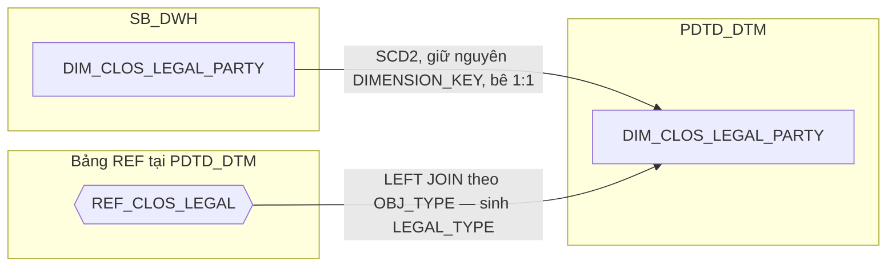

### 8.3 Cấu trúc bảng

| STT | Tên cột | Kiểu dữ liệu | Bắt buộc | Độ lớn | Khóa | Mô tả | Báo cáo sử dụng | Tên chỉ tiêu trên báo cáo |
| --- | --- | --- | --- | --- | --- | --- | --- | --- |
| 1 | DIMENSION_KEY | NUMBER | Y | 18 | PK | Khóa chính của bảng chiều DIM_CLOS_LEGAL_PARTY, kế thừa nguyên giá trị từ SB_DWH | — | — |
| 2 | DATASOURCE | VARCHAR2 | Y | 10 |  | Cột kỹ thuật đánh dấu nguồn hệ, luôn cố định 'CLOS' | — | — |
| 3 | LEGAL_PARTY_SK | NUMBER | Y | 18 |  | Khóa tham chiếu đến bảng chiều DIM_CLOS_LEGAL_PARTY, bằng đúng giá trị DIMENSION_KEY của cùng dòng. Mặc định -1 | — | — |
| 4 | WI_NAME | VARCHAR2 | Y | 100 | NK | Mã hồ sơ CLOS, quan hệ 1:N với hồ sơ (N không giới hạn) — kế thừa nguyên văn từ SB_DWH (nguồn gốc NG_SB_CLOS_CUST_INFO_LEGAL.WI_NAME) | — | Nguồn cho chỉ tiêu/trường ORG_LEGAL_ID/LEGAL_REPRESENTATIVE/ADD_ID_REPRESENTATIVE (khóa join DIM_CLOS_CUSTOMER, BC2) |
| 5 | ID_NUMBER | VARCHAR2 | Y | 100 | NK | Số giấy tờ định danh — kế thừa nguyên văn từ SB_DWH (nguồn gốc NG_SB_CLOS_CUST_INFO_LEGAL.ID_NUMBER) | — | Nguồn cho chỉ tiêu/trường ORG_LEGAL_ID/ADD_ID_REPRESENTATIVE (BC2) |
| 6 | FULL_NAME | VARCHAR2 | N | 200 | NK | Họ tên/tên đối tượng — kế thừa nguyên văn từ SB_DWH (nguồn gốc NG_SB_CLOS_CUST_INFO_LEGAL.NAMEE). Nằm trong khóa nghiệp vụ theo cơ chế nạp "full-row-key", không phải vì bản thân có ý nghĩa định danh | — | Nguồn cho chỉ tiêu/trường LEGAL_REPRESENTATIVE (BC2) |
| 7 | OBJ_TYPE | VARCHAR2 | N | 100 | NK | Loại đối tượng của giấy tờ pháp lý — kế thừa nguyên văn từ SB_DWH (nguồn gốc NG_SB_CLOS_CUST_INFO_LEGAL.OBJ_TYPE). Bắt buộc nằm trong khóa nghiệp vụ (cùng WI_NAME + ID_NUMBER) vì 1 người có thể giữ nhiều vai trò khác nhau trên cùng hồ sơ | — | Khóa LEFT JOIN REF_CLOS_LEGAL sinh LEGAL_TYPE (khóa lọc CUSTOMER/LEGAL_REPRESENTATIVE tại PDTD_DTM, BC2) |
| 8 | LEGAL_DOC | VARCHAR2 | N | 100 |  | Tên loại giấy tờ pháp lý — kế thừa nguyên văn từ SB_DWH (nguồn gốc NG_SB_CLOS_CUST_INFO_LEGAL.LEGAL_DOC). Nằm trong khóa nghiệp vụ theo cơ chế nạp "full-row-key" | — | Thiết kế dư thừa |
| 9 | LEGAL_TYPE | VARCHAR2 | N | 50 |  | Vai trò pháp lý chuẩn hóa sang mã tiếng Anh (LEGAL_REPRESENTATIVE, CUSTOMER, COLLATERAL_OWNER, MAIN_CONTRIBUTING_MEMBERS, OTHER) — PHÁI SINH tại PDTD_DTM: LEFT JOIN REF_CLOS_LEGAL theo OBJ_TYPE | Báo cáo CLOS APPLICATION (BC2) — khóa lọc LEGAL_TYPE='CUSTOMER'/'LEGAL_REPRESENTATIVE' khi tra ORG_LEGAL_ID/LEGAL_REPRESENTATIVE/ADD_ID_REPRESENTATIVE trên DIM_CLOS_CUSTOMER | Nguồn cho chỉ tiêu/trường ID_NUMBER, LEGAL_REPRESENTATIVE, ADD_ID_REPRESENTATIVE (BC2) |
| 10 | EFF_DATE | DATE | Y |  |  | Ngày bắt đầu hiệu lực của phiên bản bản ghi (SCD Type 2) | — | — |
| 11 | EXP_DATE | DATE | N |  |  | Ngày hết hiệu lực của phiên bản bản ghi; NULL = bản ghi hiện hành | — | — |

## 9. DIM_DATE

### 9.1 Mục đích thiết kế
- **Ý nghĩa bảng:** bảng chiều ngày dùng chung toàn ngân hàng, đã có sẵn tại `SB_DWH.DIM_DATE` — không tự dựng lịch ở tầng PDTD_DTM, bê nguyên 1:1 để mọi báo cáo dùng chung 1 định nghĩa ngày làm việc/tuần/tháng báo cáo. Không thuộc phạm vi split CLOS/RLOS (chiều hệ thống chung, không phải chiều do PDTD tạo ra).
- **Khóa chính của bảng (PK):** `DAYID` — không có `DATE_SK`/surrogate key riêng, `DAYID` (kiểu DATE, đã duy nhất) vừa là khóa tự nhiên vừa là khóa phân vùng của mọi bảng FCT trong toàn tài liệu, nên fact join thẳng vào đây bằng `DAYID`.
- **Độ chi tiết (grain):** 1 dòng = 1 ngày. Không phải SCD2 — quy tắc load là nạp lại toàn bộ bảng từ `SB_DWH.DIM_DATE` khi lịch (ngày lễ, ngày làm việc) có thay đổi, không phải nạp incremental theo `DAYID` mới.
- **Phục vụ báo cáo:**
  - Báo cáo Tuần Chuyên viên Thẩm định (BC4) — qua `REPORT_WEEK`
  - Báo cáo KPI (BC9) — qua `YEAR_ID` (mốc reset lũy kế YTD) và `IS_WORKING_DAY` (đầu vào hàm tính TAT theo giờ làm việc)
  - Báo cáo SLA - TAT (BC5) — qua `IS_WORKING_DAY` (đầu vào hàm get_business_minute tính TAT)
  - Mọi báo cáo FCT khác — qua `DAYID` làm khóa phân vùng/join trực tiếp, không hiển thị như 1 chỉ tiêu riêng

### 9.2 Sơ đồ lineage

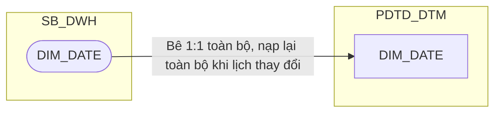

### 9.3 Cấu trúc bảng

Lấy 1:1 từ bảng có sẵn trên `STG_DTM.DIM_DATE`.

## 10. DIM_CLOS_PRODUCT

### 10.1 Mục đích thiết kế
- **Ý nghĩa bảng:** danh mục sản phẩm tín dụng CLOS (doanh nghiệp) — gồm dòng sản phẩm và sản phẩm nhánh chi tiết, là thông tin ít thay đổi theo bộ mã ổn định. Bê nguyên 1:1 từ SB_DWH, không bổ sung cột nào ở tầng PDTD_DTM (kể cả `REF_PRODUCT`/`SLA_*` — nhóm cột này chỉ tồn tại trên `DIM_CLOS_APPLICATION`, không phải trên `DIM_CLOS_PRODUCT`).
- **Khóa chính của bảng (PK):** `DIMENSION_KEY`
- **Độ chi tiết (grain):** 1 dòng lưu lịch sử thay đổi của 1 tổ hợp dòng sản phẩm + sản phẩm nhánh theo thời gian (SCD Type 2, do ETL tính qua CDC).
- **Phục vụ báo cáo:**
  - Báo cáo CLOS APPLICATION (BC2) — hiển thị trực tiếp dòng sản phẩm/sản phẩm nhánh, khóa join qua `FCT_CLOS_APPLICATION_DAILY.PRODUCT_SK`
  - Báo cáo SLA - TAT (BC5) — khóa tra cam kết SLA nhập liệu tập trung REF_SLA_NLTT
  - Báo cáo KPI (BC9) — qua công thức điểm KPI nhánh CLOS (SLA_DE_TOTAL_RESULT)

### 10.2 Sơ đồ lineage
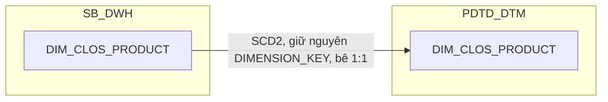

### 10.3 Cấu trúc bảng

| STT | Tên cột | Kiểu dữ liệu | Bắt buộc | Độ lớn | Khóa | Mô tả | Báo cáo sử dụng | Tên chỉ tiêu trên báo cáo |
| --- | --- | --- | --- | --- | --- | --- | --- | --- |
| 1 | DIMENSION_KEY | NUMBER | Y | 18 | PK | Khóa chính của bảng chiều DIM_CLOS_PRODUCT, sinh bằng Oracle sequence tại SB_DWH; PDTD_DTM giữ nguyên giá trị, không sinh sequence mới | — | — |
| 2 | DATASOURCE | VARCHAR2 | Y | 10 |  | Cột kỹ thuật đánh dấu nguồn hệ, luôn cố định 'CLOS' sau khi tách vật lý CLOS/RLOS | — | — |
| 3 | PRODUCT_SK | NUMBER | Y | 18 |  | Khóa tham chiếu đến bảng chiều DIM_CLOS_PRODUCT, bằng đúng giá trị DIMENSION_KEY của cùng dòng. Giá trị mặc định = -1 (dòng Unknown) nếu không có giá trị phù hợp | — | — |
| 4 | PRODUCT_LINE_CODE | VARCHAR2 | N | 100 | NK | Mã dòng sản phẩm — nguồn NG_SB_CLOS_MAS_PRO_LINE.PRODUCT_LINE_CODE. UNIQUE (PRODUCT_LINE_CODE, PRODUCT_LINE_NAME, SUB_PRODUCT_CODE, EFF_DATE) | Báo cáo CLOS APPLICATION (BC2) — khóa join qua FCT_CLOS_APPLICATION_DAILY.PRODUCT_SK | PRODUCT_LINE (Dòng sản phẩm) |
| 5 | PRODUCT_LINE_NAME | VARCHAR2 | N | 200 | NK | Tên dòng sản phẩm — nguồn NG_SB_CLOS_MAS_PRO_LINE.PRODUCT_LINE_NAME | Báo cáo SLA - TAT (BC5) — khóa tra REF_SLA_NLTT<br>Báo cáo KPI (BC9) — qua SLA_DE_TOTAL_RESULT | Nguồn cho chỉ tiêu/trường SLA_DE_RESULT/SLA_DE_TOTAL_RESULT (khóa JOIN Product Line trên REF_SLA_NLTT) |
| 6 | SUB_PRODUCT_CODE | VARCHAR2 | N | 100 | NK | Mã sản phẩm nhánh — nguồn NG_SB_CLOS_MAS_SUB_PROD.SUB_PROD_CODE (review 2026-09-18: đổi nguồn, MAS_SUB_PROD không có cột PRODUCT_NAME riêng như MAP_CLOS_PRODUCT trước đây) | Báo cáo CLOS APPLICATION (BC2) — khóa join qua FCT_CLOS_APPLICATION_DAILY.PRODUCT_SK | SUB_PRODUCT (Sản phẩm nhánh) |
| 7 | PRODUCT_NAME | VARCHAR2 | N | 150 | NK | Tên sản phẩm nhánh chi tiết — nguồn NG_SB_CLOS_MAS_SUB_PROD.SUB_PROD_NAME (review 2026-09-18: đổi nguồn từ MAP_CLOS_PRODUCT.PRODUCT_NAME sang MAS_SUB_PROD.SUB_PROD_NAME, cùng ý nghĩa "tên sản phẩm nhánh (BC)") | Báo cáo SLA - TAT (BC5) — khóa tra REF_SLA_NLTT<br>Báo cáo KPI (BC9) — qua SLA_DE_TOTAL_RESULT | Nguồn cho chỉ tiêu/trường SLA_DE_RESULT/SLA_DE_TOTAL_RESULT (khóa JOIN Sub Product trên REF_SLA_NLTT) |
| 8 | EFF_DATE | DATE | Y |  |  | Ngày bắt đầu hiệu lực của phiên bản bản ghi (SCD Type 2) — do ETL tính qua CDC khi phát hiện thay đổi trên MAS_PRO_LINE/MAS_SUB_PROD (không có cột khai báo tay như MAP_CLOS_PRODUCT trước đây) | — | — |
| 9 | EXP_DATE | DATE | N |  |  | Ngày hết hiệu lực của phiên bản bản ghi; NULL = bản ghi hiện hành | — | — |

## 11. DIM_CLOS_WORKSTEP

### 11.1 Mục đích thiết kế
- **Ý nghĩa bảng:** danh mục các bước xử lý trong quy trình BPM của hồ sơ tín dụng CLOS — là thông tin ít thay đổi, suy ra từ bảng danh mục quyết định gốc (WORKSTEP/DECISION gộp chung dạng N-N, tách riêng phần WORKSTEP). Bê nguyên 1:1 từ SB_DWH, không bổ sung cột nào ở tầng PDTD_DTM.
- **Khóa chính của bảng (PK):** `DIMENSION_KEY`
- **Độ chi tiết (grain):** 1 dòng lưu lịch sử thay đổi của 1 bước xử lý theo thời gian (SCD Type 2, do ETL tính qua CDC).
- **Phục vụ báo cáo:**
  - Báo cáo RLOS APPLICATION (BC1), Báo cáo CLOS APPLICATION (BC2), Báo cáo Thông tin phê duyệt (BC3), Báo cáo Tuần Chuyên viên Thẩm định (BC4), Báo cáo SLA - TAT (BC5), Báo cáo EXCEPTION - FTR (BC7), Báo cáo RETURN (BC8), Báo cáo KPI (BC9) — các báo cáo này đều dùng mã bước xử lý CLOS, nhưng đọc giá trị trực tiếp trên bảng sự kiện (FCT_CLOS_WORKSTEP_EVENT/NG_SB_CLOS_ENTRY_EXIT), không qua JOIN hiển thị từ DIM này
  - `WORKSTEP_SK` được `FCT_CLOS_APPLICATION_DAILY` tham chiếu qua `CURRENT_WORKSTEP_SK`/`LAST_WORKSTEP_SK` để chuẩn hóa surrogate key, không phục vụ hiển thị trực tiếp trên báo cáo

### 11.2 Sơ đồ lineage
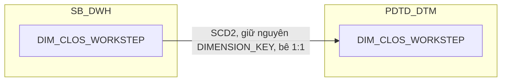

### 11.3 Cấu trúc bảng

| STT | Tên cột | Kiểu dữ liệu | Bắt buộc | Độ lớn | Khóa | Mô tả | Báo cáo sử dụng | Tên chỉ tiêu trên báo cáo |
| --- | --- | --- | --- | --- | --- | --- | --- | --- |
| 1 | DIMENSION_KEY | NUMBER | Y | 18 | PK | Khóa chính của bảng chiều DIM_CLOS_WORKSTEP, sinh bằng Oracle sequence tại SB_DWH; PDTD_DTM giữ nguyên giá trị, không sinh sequence mới | — | — |
| 2 | DATASOURCE | VARCHAR2 | Y | 10 |  | Cột kỹ thuật đánh dấu nguồn hệ, luôn cố định 'CLOS' sau khi tách vật lý CLOS/RLOS | — | — |
| 3 | WORKSTEP_SK | NUMBER | Y | 18 |  | Khóa tham chiếu đến bảng chiều DIM_CLOS_WORKSTEP, bằng đúng giá trị DIMENSION_KEY của cùng dòng. Giá trị mặc định = -1 (dòng Unknown) nếu không có giá trị phù hợp; được FCT_CLOS_APPLICATION_DAILY tham chiếu qua CURRENT_WORKSTEP_SK/LAST_WORKSTEP_SK để chuẩn hóa surrogate key, không phục vụ hiển thị trực tiếp trên báo cáo | — | — |
| 4 | WORKSTEP_CODE | VARCHAR2 | Y | 200 | NK | Mã bước xử lý trên workflow CLOS — nguồn DISTINCT NG_SB_CLOS_MAS_DECISION.QUEUE_NAME (review 2026-09-18: đổi nguồn, không còn cột riêng WORKSTEP_CODE — MAS_DECISION gộp WORKSTEP+DECISION dạng N-N, DIM này chỉ lấy phần WORKSTEP). UNIQUE (WORKSTEP_CODE, EFF_DATE) | Báo cáo RLOS APPLICATION (BC1)<br>Báo cáo CLOS APPLICATION (BC2)<br>Báo cáo Thông tin phê duyệt (BC3)<br>Báo cáo Tuần Chuyên viên Thẩm định (BC4)<br>Báo cáo SLA - TAT (BC5)<br>Báo cáo EXCEPTION - FTR (BC7)<br>Báo cáo RETURN (BC8)<br>Báo cáo KPI (BC9) | Nguồn cho chỉ tiêu/trường WORKSTEP (giá trị đọc trực tiếp trên FCT_CLOS_WORKSTEP_EVENT.WORKSTEP_CODE, DIM này chỉ phục vụ làm danh mục đối chiếu/chuẩn hóa mã bước) |
| 5 | EFF_DATE | DATE | Y |  |  | Ngày bắt đầu hiệu lực của phiên bản bản ghi (SCD Type 2) — do ETL tính qua CDC khi phát hiện thay đổi trên MAS_DECISION (không có cột khai báo tay như MAP_CLOS_WORKSTEP trước đây) | — | — |
| 6 | EXP_DATE | DATE | N |  |  | Ngày hết hiệu lực của phiên bản bản ghi; NULL = bản ghi hiện hành | — | — |

## 12. DIM_RLOS_APPLICANT

### 12.1 Mục đích thiết kế
- **Ý nghĩa bảng:** thông tin người đề nghị vay chính (applicant) của hồ sơ RLOS — nhân khẩu học, liên hệ, giấy tờ tùy thân, tách riêng khỏi thông tin hồ sơ (sản phẩm, quy trình, phê duyệt) vì khác bản chất thuộc tính. Bê nguyên 1:1 từ SB_DWH, không bổ sung cột nào ở tầng PDTD_DTM.
- **Khóa chính của bảng (PK):** `DIMENSION_KEY`
- **Độ chi tiết (grain):** 1 dòng lưu lịch sử thông tin thay đổi theo thời gian của 1 applicant (SCD Type 2), quan hệ 1:1 với hồ sơ RLOS.
- **Phục vụ báo cáo:**
  - Báo cáo RLOS APPLICATION (BC1)
  - Báo cáo Thông tin phê duyệt (BC3) — hiển thị tên khách hàng
  - Báo cáo Tuần Chuyên viên Thẩm định (BC4) — hiển thị tên khách hàng

### 12.2 Sơ đồ lineage
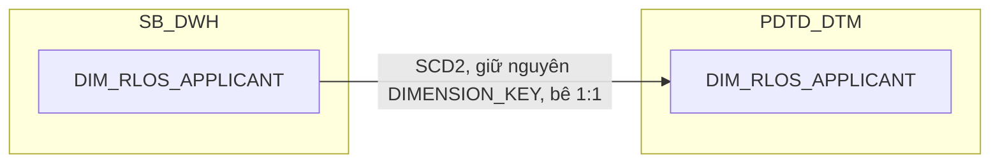

### 12.3 Cấu trúc bảng

| STT | Tên cột | Kiểu dữ liệu | Bắt buộc | Độ lớn | Khóa | Mô tả | Báo cáo sử dụng | Tên chỉ tiêu trên báo cáo |
| --- | --- | --- | --- | --- | --- | --- | --- | --- |
| 1 | DIMENSION_KEY | NUMBER | Y | 18 | PK | Khóa chính của bảng chiều DIM_RLOS_APPLICANT, sinh bằng Oracle sequence tại SB_DWH; PDTD_DTM giữ nguyên giá trị, không sinh sequence mới | — | — |
| 2 | DATASOURCE | VARCHAR2 | Y | 10 |  | Cột kỹ thuật đánh dấu nguồn hệ, luôn cố định 'RLOS' sau khi tách vật lý CLOS/RLOS | — | — |
| 3 | APPLICANT_SK | NUMBER | Y | 18 |  | Khóa tham chiếu đến bảng chiều DIM_RLOS_APPLICANT, bằng đúng giá trị DIMENSION_KEY của cùng dòng. Mặc định -1 | — | — |
| 4 | WI_NAME | VARCHAR2 | Y | 100 | NK | Mã hồ sơ RLOS — nguồn NG_SB_RLOS_APPLICANT_GENERAL.WI_NAME. Quan hệ 1:1 với hồ sơ | — | — |
| 5 | FULL_NAME | VARCHAR2 | N | 200 |  | Họ tên đầy đủ — nguồn NG_SB_RLOS_APPLICANT_GENERAL.FULL_NAME | Báo cáo RLOS APPLICATION (BC1)<br>Báo cáo Thông tin phê duyệt (BC3)<br>Báo cáo Tuần Chuyên viên Thẩm định (BC4) | CUSTOMER_NAME (Tên khách hàng) |
| 6 | DATE_OF_BIRTH | DATE | N |  |  | Ngày sinh — nguồn NG_SB_RLOS_APPLICANT_GENERAL.DOB | Báo cáo RLOS APPLICATION (BC1) | DATE_OF_BIRTH (Ngày sinh) |
| 7 | GENDER | VARCHAR2 | N | 20 |  | Giới tính — nguồn NG_SB_RLOS_APPLICANT_GENERAL.GENDER | Báo cáo RLOS APPLICATION (BC1) | GENDER (Giới tính) |
| 8 | MARRIAGE_STATUS | VARCHAR2 | N | 100 |  | Tình trạng hôn nhân — nguồn NG_SB_RLOS_APPLICANT_DETAIL.MARR_STATUS | Báo cáo RLOS APPLICATION (BC1) | MARRIAGE_STATUS (Tình trạng hôn nhân) |
| 9 | EDUCATION_LEVEL | VARCHAR2 | N | 100 |  | Trình độ học vấn — nguồn NG_SB_RLOS_APPLICANT_DETAIL.EDU_LEVEL | Báo cáo RLOS APPLICATION (BC1) | EDUCATION_LEVEL (Trình độ học vấn) |
| 10 | VEHICLE | VARCHAR2 | N | 100 |  | Phương tiện đi lại — nguồn NG_SB_RLOS_APPLICANT_DETAIL.VEHICLE | Báo cáo RLOS APPLICATION (BC1) | VEHICLES (Phương tiện đi lại) |
| 11 | PERM_ADDRESS | VARCHAR2 | N | 500 |  | Địa chỉ thường trú — nguồn NG_SB_RLOS_APPLICANT_DETAIL.PERM_ADD | Báo cáo RLOS APPLICATION (BC1) | PERMANENT_RESIDENCE_ADDRESS (Địa chỉ thường trú) |
| 12 | CURR_HOUSE_NO | VARCHAR2 | N | 200 |  | Số nhà thuộc địa chỉ hiện tại — nguồn NG_SB_RLOS_APPLICANT_DETAIL.HOUSNO_CURR_RES | Báo cáo RLOS APPLICATION (BC1) | Nguồn cho chỉ tiêu/trường CURRENT_RESIDENTIAL_ADDRESS (thành phần số nhà) |
| 13 | CURR_WARD | VARCHAR2 | N | 100 |  | Phường xã thuộc địa chỉ hiện tại — nguồn NG_SB_RLOS_APPLICANT_DETAIL.WARD_CURR_RES | Báo cáo RLOS APPLICATION (BC1) | CURRENT_RESIDENTIAL_WARD (Địa chỉ hiện tại — Phường/Xã) |
| 14 | GEO_SK | NUMBER | Y | 18 |  | Khóa tới DIM_RLOS_GEO, lookup theo CITY_CURR_RES + DISTRICT_CURR_RES của NG_SB_RLOS_APPLICANT_DETAIL. Mặc định -1 | Báo cáo RLOS APPLICATION (BC1) — khóa tra DIM_RLOS_GEO | Nguồn cho chỉ tiêu/trường CURRENT_RESIDENTIAL_CITY/CURRENT_RESIDENTIAL_DISTRICT |
| 15 | ADD_ID | VARCHAR2 | N | 500 |  | PHÁI SINH: pivot NG_SB_RLOS_APPLICANT_IDGRID.ID_NUMBER, lọc ID_TYPE IN ('TCC','CC'), nối chuỗi ";" nếu nhiều | Báo cáo RLOS APPLICATION (BC1) | ADD_ID (Số "TCC", Số "CC") |
| 16 | ADD_ID_OTHER | VARCHAR2 | N | 1000 |  | PHÁI SINH: pivot NG_SB_RLOS_APPLICANT_IDGRID.ID_NUMBER, lọc ID_TYPE NOT IN ('TCC','CC'), nối chuỗi ";" nếu nhiều | Báo cáo RLOS APPLICATION (BC1) | ADD_ID_OTHER (Số GTTT khác) |
| 17 | ZONE | VARCHAR2 | N | 50 |  | Vùng miền quản lý tự khai theo hồ sơ (BC1/BC2.ZONE) — LÀM GIÀU (review 2026-09-21, đóng gap tài liệu BC1/BC2): nguồn NG_SB_RLOS_APPLICANT_GENERAL.ZONE. Khác bản chất với DIM_LOS_ORG_UNIT.ZONE (mã nội bộ chuẩn hóa từ MAS_COMPANY, dùng làm khóa join đơn vị kinh doanh) — cột này là giá trị tự khai gắn với hồ sơ/khách hàng, không dùng để join | Báo cáo RLOS APPLICATION (BC1) | ZONE (Khu vực hoạt động) |
| 18 | NATIONALITY | VARCHAR2 | N | 100 |  | Quốc tịch (mã) — LÀM GIÀU — nguồn NG_SB_RLOS_APPLICANT_GENERAL.NATIONALITY | — | Thiết kế dư thừa |
| 19 | TITLE | VARCHAR2 | N | 50 |  | Danh xưng — LÀM GIÀU — nguồn NG_SB_RLOS_APPLICANT_GENERAL.TITLE | — | Thiết kế dư thừa |
| 20 | HOME_PHONE | VARCHAR2 | N | 50 |  | Số điện thoại nhà riêng — LÀM GIÀU — nguồn NG_SB_RLOS_APPLICANT_GENERAL.HOME_PHONE | — | Thiết kế dư thừa |
| 21 | PHONE_1 | VARCHAR2 | N | 50 |  | Số điện thoại di động chính — LÀM GIÀU — nguồn NG_SB_RLOS_APPLICANT_GENERAL.PHONE_1 | — | Thiết kế dư thừa |
| 22 | PHONE_2 | VARCHAR2 | N | 50 |  | Số điện thoại phụ — LÀM GIÀU — nguồn NG_SB_RLOS_APPLICANT_GENERAL.PHONE2 (đổi tên PHONE2→PHONE_2 cho nhất quán với PHONE_1) | — | Thiết kế dư thừa |
| 23 | SALE_TYPE | VARCHAR2 | N | 100 |  | Kênh bán hàng — LÀM GIÀU — nguồn NG_SB_RLOS_APPLICANT_GENERAL.SALE_TYPE | — | Thiết kế dư thừa |
| 24 | BROKER_TYPE | VARCHAR2 | N | 100 |  | Loại đối tác giới thiệu (cộng tác viên, đại diện đối tác, đối tác liên kết) — LÀM GIÀU — nguồn NG_SB_RLOS_APPLICANT_GENERAL.BROKER_TYPE | — | Thiết kế dư thừa |
| 25 | BROKER_ID | VARCHAR2 | N | 100 |  | Mã đối tác giới thiệu — LÀM GIÀU — nguồn NG_SB_RLOS_APPLICANT_GENERAL.BROKER_ID | — | Thiết kế dư thừa |
| 26 | BROKER_NAME | VARCHAR2 | N | 200 |  | Tên đối tác giới thiệu — LÀM GIÀU — nguồn NG_SB_RLOS_APPLICANT_GENERAL.BROKER_NAME | — | Thiết kế dư thừa |
| 27 | ACC_OFFICER | VARCHAR2 | N | 100 |  | Mã nhân viên quan hệ khách hàng (Account Officer) phụ trách — LÀM GIÀU — nguồn NG_SB_RLOS_APPLICANT_GENERAL.ACC_OFFICER | — | Thiết kế dư thừa |
| 28 | ACCOUNT_OFFICER_NAME | VARCHAR2 | N | 200 |  | Tên Account Officer phụ trách — LÀM GIÀU — nguồn NG_SB_RLOS_APPLICANT_GENERAL.ACCOUNT_OFFICER_NAME | — | Thiết kế dư thừa |
| 29 | EXISTING_CUSTOMER | VARCHAR2 | N | 10 |  | Cờ khách hàng hiện hữu — LÀM GIÀU — nguồn NG_SB_RLOS_APPLICANT_GENERAL.EXISTING_CUSTOMER | — | Thiết kế dư thừa |
| 30 | APPLICANT_CIF | VARCHAR2 | N | 50 |  | Mã CIF khách hàng (định danh ngân hàng lõi) — LÀM GIÀU — nguồn NG_SB_RLOS_APPLICANT_GENERAL.APPLICANTCIF (đổi tên cho rõ nghĩa) | — | Thiết kế dư thừa |
| 31 | BUSINESS_MODEL | VARCHAR2 | N | 200 |  | Mô hình kinh doanh áp dụng cho kênh giới thiệu — LÀM GIÀU — nguồn NG_SB_RLOS_APPLICANT_GENERAL.BUSINESS_MODEL | — | Thiết kế dư thừa |
| 32 | KYC1 | VARCHAR2 | N | 50 |  | Đơn vị/khối đang xử lý hồ sơ tại thời điểm ghi nhận — LÀM GIÀU — nguồn NG_SB_RLOS_APPLICANT_GENERAL.KYC1 | — | Thiết kế dư thừa |
| 33 | EFF_DATE | DATE | Y |  |  | Ngày bắt đầu hiệu lực của phiên bản bản ghi (SCD Type 2) | — | — |
| 34 | EXP_DATE | DATE | N |  |  | Ngày hết hiệu lực của phiên bản bản ghi; NULL = bản ghi hiện hành | — | — |

## 13. DIM_RLOS_APPLICATION

### 13.1 Mục đích thiết kế
- **Ý nghĩa bảng:** danh mục hồ sơ tín dụng RLOS (bán lẻ/cá nhân) — lưu các thông tin ít thay đổi của 1 hồ sơ (luồng nghiệp vụ, chính sách, chương trình bán, cấp thẩm quyền phê duyệt, cờ ngoại lệ...). Kế thừa toàn bộ 28 cột từ SB_DWH, cộng thêm 6 cột phái sinh mới tại PDTD_DTM: `BI_FLOW` (chuẩn hóa luồng hồ sơ để hiển thị) và nhóm `REF_PRODUCT`/`SLA_CREDIT_OFFICER`/`SLA_MARKER`/`SLA_CHECKER`/`SLA_CREDIT_APPROVER` (tra cam kết SLA phê duyệt tín dụng từ `RLOS_REF_SLA_TDKHCN`, chỉ tồn tại ở tầng PDTD_DTM).
- **Khóa chính của bảng (PK):** `DIMENSION_KEY`
- **Độ chi tiết (grain):** 1 dòng hồ sơ lưu lịch sử thông tin thay đổi theo thời gian (SCD Type 2, khóa tự nhiên `WI_NAME` + `EFF_DATE`).
- **Phục vụ báo cáo:**
  - Báo cáo RLOS APPLICATION (BC1) — trong đó `BI_FLOW` (Phân khúc hồ sơ) hiển thị trực tiếp
  - Báo cáo CLOS APPLICATION (BC2) — đối chiếu `STREAM`/`CREATION_DATE` nhánh chung
  - Báo cáo Thông tin phê duyệt (BC3) — `STREAM`, `CREDIT_LIMIT`, `CURRENCY`, `CREDIT_TERM`
  - Báo cáo SLA - TAT (BC5) — tra khóa `APP_GRP`/`DEVIATION_G3`/`CHANGE_TYPE`, đồng thời `REF_PRODUCT`/`SLA_CREDIT_OFFICER`/`SLA_MARKER`/`SLA_CHECKER`/`SLA_CREDIT_APPROVER` dùng trực tiếp để so sánh với TAT thực tế
  - Báo cáo EXCEPTION - FTR (BC7) — `LOANCASEID`
  - Báo cáo KPI (BC9) — `APP_GRP`, `DEVIATION_G3`
  - Báo cáo Giải ngân _ Quá hạn KHCN (BC10) — `LAST_APPROVAL_DATE`

### 13.2 Sơ đồ lineage
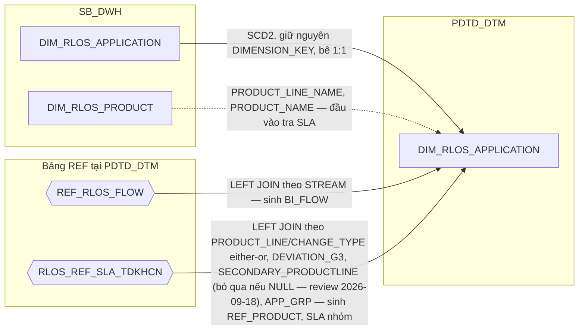

### 13.3 Cấu trúc bảng

| STT | Tên cột | Kiểu dữ liệu | Bắt buộc | Độ lớn | Khóa | Mô tả | Báo cáo sử dụng | Tên chỉ tiêu trên báo cáo |
| --- | --- | --- | --- | --- | --- | --- | --- | --- |
| 1 | DIMENSION_KEY | NUMBER | Y | 18 | PK | Khóa chính của bảng chiều DIM_RLOS_APPLICATION, sinh bằng Oracle sequence tại SB_DWH; PDTD_DTM giữ nguyên giá trị, không sinh sequence mới | — | — |
| 2 | DATASOURCE | VARCHAR2 | Y | 10 |  | Cột kỹ thuật đánh dấu nguồn hệ, luôn cố định 'RLOS' sau khi tách vật lý CLOS/RLOS | — | — |
| 3 | APPLICATION_SK | NUMBER | Y | 18 |  | Khóa tham chiếu đến bảng chiều DIM_RLOS_APPLICATION, bằng đúng giá trị DIMENSION_KEY của cùng dòng. Giá trị mặc định = -1 (dòng Unknown) nếu không có giá trị phù hợp | — | — |
| 4 | WI_NAME | VARCHAR2 | Y | 100 | NK | Mã hồ sơ tín dụng RLOS — nguồn NG_SB_RLOS_APPLICANT_GENERAL.WI_NAME. UNIQUE (WI_NAME, EFF_DATE) | Báo cáo RLOS APPLICATION (BC1)<br>Báo cáo CLOS APPLICATION (BC2)<br>Báo cáo Thông tin phê duyệt (BC3)<br>Báo cáo SLA - TAT (BC5)<br>Báo cáo NGOẠI LỆ (BC6)<br>Báo cáo EXCEPTION - FTR (BC7)<br>Báo cáo RETURN (BC8)<br>Báo cáo KPI (BC9) | WINAME / WI_NAME (Mã hồ sơ) |
| 5 | LOANCASEID | VARCHAR2 | N | 100 |  | Mã khoản vay gắn với hồ sơ — nguồn NG_SB_RLOS_EXTTABLE.LOANCASEID, giữ nguyên văn không lọc | Báo cáo EXCEPTION - FTR (BC7) | LOANCASEID (Mã LOANCASEID) |
| 6 | STREAM | VARCHAR2 | N | 200 |  | Luồng nghiệp vụ của hồ sơ — nguồn NG_SB_RLOS_APPROVAL.STREAM | Báo cáo RLOS APPLICATION (BC1) — hiển thị trực tiếp, đồng thời là khóa tra BI_FLOW<br>Báo cáo CLOS APPLICATION (BC2)<br>Báo cáo Thông tin phê duyệt (BC3) | STREAM (Luồng hồ sơ); nguồn cho chỉ tiêu/trường BI_FLOW (Phân khúc hồ sơ, BC1) |
| 7 | CHANGE_REQUEST | VARCHAR2 | N | 200 |  | Yêu cầu điều chỉnh hồ sơ — nguồn NG_SB_RLOS_EXTTABLE.REQ_TYPE | Báo cáo RLOS APPLICATION (BC1)<br>Báo cáo CLOS APPLICATION (BC2) | CHANGE_REQUEST (Thay đổi điều kiện — New/Change) |
| 8 | CHANGE_TYPE | VARCHAR2 | N | 500 |  | Loại thay đổi điều kiện phê duyệt — nguồn NG_SB_RLOS_EXTTABLE.CHANGE_TYPE, giữ nguyên giá trị thô. Dùng làm khóa either/or với PRODUCT_LINE khi tra cam kết SLA ở PDTD_DTM | Báo cáo RLOS APPLICATION (BC1) — hiển thị trực tiếp<br>Báo cáo SLA - TAT (BC5) — khóa tra REF_PRODUCT/SLA_* | CHANGE_TYPE (Loại thay đổi điều kiện) |
| 9 | POLICY | VARCHAR2 | N | 200 |  | Chính sách tín dụng áp dụng cho hồ sơ — nguồn NG_SB_RLOS_APPLICANT_GENERAL.POLICY | Báo cáo RLOS APPLICATION (BC1) | POLICY (Chính sách áp dụng) |
| 10 | CAMPAIGN | VARCHAR2 | N | 200 |  | Chương trình bán áp dụng cho hồ sơ — nguồn NG_SB_RLOS_APPLICANT_GENERAL.CAMPAIGN | Báo cáo RLOS APPLICATION (BC1) | CAMPAIGN (Mã chương trình tiếp thị) |
| 11 | PROOF_OF_INCOME | VARCHAR2 | N | 200 |  | Hình thức chứng minh thu nhập — PHÁI SINH: CASE WHEN NG_SB_RLOS_APPLICANT_GENERAL.PROOF_OF_INCOME = 'proofincome01' THEN 'CHUNGTU_CHUNGMINH_THUNHAP' WHEN = 'proofincome02' THEN 'BANGKE_THUNHAP' END | Báo cáo RLOS APPLICATION (BC1) | PROOF_OF_INCOME (Nguồn thu nhập) |
| 12 | CUS_SEGMENT | VARCHAR2 | N | 100 |  | Phân khúc khách hàng theo LOS (giá trị gốc, chưa chuẩn hóa) — nguồn NG_SB_RLOS_APPLICANT_DETAIL.CUS_SEGMENT | Nguồn cho chỉ tiêu/trường BI_CUS_SEGMENT | — |
| 13 | BI_CUS_SEGMENT | VARCHAR2 | N | 50 |  | Phân khúc khách hàng chuẩn hóa để hiển thị trên báo cáo — PHÁI SINH: CASE WHEN UPPER(CUS_SEGMENT) LIKE '%XANH' THEN 'XANH' WHEN CUS_SEGMENT = 'CBNV' THEN 'CBNV' ELSE 'THUONG' END | Báo cáo RLOS APPLICATION (BC1) | BI_CUS_SEGMENT (Phân khúc khách hàng chuẩn) |
| 14 | COLL_REQUIRE | VARCHAR2 | N | 10 |  | Hồ sơ có yêu cầu tài sản bảo đảm hay không — PHÁI SINH: CASE WHEN NG_SB_RLOS_APPLICANT_GENERAL.COLLREQUIRE = 'true' THEN 'YES' ELSE 'NO' END | Báo cáo KPI (BC9) | Nguồn cho chỉ tiêu/trường TAT_RLOS_SEC_*/TAT_RLOS_UNSEC_* (điều kiện lọc SEC/UNSEC trên AGG_LOS_KPI_YTD_DAILY) |
| 15 | IS_SEC_PRODUCT | VARCHAR2 | N | 10 |  | Hồ sơ có sản phẩm phụ đi kèm hay không — nguồn NG_SB_RLOS_APPLICANT_GENERAL.IS_SEC_PRODUCT. Đối chiếu SRS BC5: đây chính là nguồn của SECONDARY_PRODUCTLINE khi tra cam kết SLA | Báo cáo RLOS APPLICATION (BC1) — hiển thị trực tiếp<br>Báo cáo SLA - TAT (BC5) — khóa tra REF_PRODUCT/SLA_* | SECONDARY_PRODUCTLINE (Có sản phẩm phụ — YES/NO) |
| 16 | DEVIATION_FLAG | VARCHAR2 | N | 10 |  | Hồ sơ có ngoại lệ chính sách hay không — nguồn NG_SB_RLOS_APPLICANT_GENERAL.DEVIATION_FLAG (DQ-11, đã giải quyết) | Báo cáo RLOS APPLICATION (BC1) | DEVIATION (Hồ sơ có ngoại lệ — YES/NO) |
| 17 | EMPLOYEE_CODE | VARCHAR2 | N | 50 |  | Mã cán bộ quản lý hồ sơ — nguồn NG_SB_RLOS_APPLICANT_GENERAL.EMPLOYEE_CODE | Báo cáo RLOS APPLICATION (BC1) | EMPLOYEE_CODE (Mã CRO) |
| 18 | EMPLOYEE_NAME | VARCHAR2 | N | 200 |  | Tên cán bộ quản lý hồ sơ — nguồn NG_SB_RLOS_APPLICANT_GENERAL.EMPLOYEE_NAME | Báo cáo RLOS APPLICATION (BC1) | EMPLOYEE_NAME (Tên CRO) |
| 19 | CREATION_DATE | DATE | N | 10 |  | Ngày khởi tạo hồ sơ — PHÁI SINH: MIN(ENTRYDATE) theo WI_NAME trên NG_SB_RLOS_ENTRY_EXIT, TRUNC về ngày | Báo cáo RLOS APPLICATION (BC1)<br>Báo cáo CLOS APPLICATION (BC2) | CREATION_DATE (Ngày khởi tạo hồ sơ) |
| 20 | RESULT_MAIN_CARD_ID | VARCHAR2 | N | 100 |  | Mã thẻ chính do hệ thẻ (T24) trả về — nguồn NG_SB_RLOS_SENT_CBS_LOG.RESULT_SEAB_MAIN_CARD_ID, lấy dòng mới nhất STATUS='OK' | Báo cáo RLOS APPLICATION (BC1) | K_TYPE (Loại thẻ tín dụng); HOME_ADDRESS (Địa chỉ nhận Pin/Thẻ) — cả 2 phái sinh từ lookup RESULT_MAIN_CARD_ID → STG_DIM_CARD |
| 21 | APP_GRP | VARCHAR2 | N | 50 |  | Cấp thẩm quyền phê duyệt của hồ sơ — nguồn NG_SB_RLOS_APPROVAL.APP_GRP. BC1/BC2 hiển thị trực tiếp; BC9 dùng làm khóa tra điểm KPI; dùng làm khóa tra cam kết SLA ở PDTD_DTM | Báo cáo RLOS APPLICATION (BC1) — hiển thị trực tiếp<br>Báo cáo SLA - TAT (BC5) — khóa tra REF_PRODUCT/SLA_*<br>Báo cáo KPI (BC9) — khóa tra điểm KPI | APP_GRP (Cấp phân quyền phê duyệt) |
| 22 | DEVIATION_G3 | VARCHAR2 | N | 10 |  | Hồ sơ có từ 3 ngoại lệ chính sách trở lên hay không (YES/NO) — PHÁI SINH: COUNT(*) theo WI_NAME trên NG_SB_RLOS_MANUAL_DEVIATION, >=3 → 'YES', còn lại → 'NO' | Báo cáo KPI (BC9) — hiển thị trực tiếp<br>Báo cáo SLA - TAT (BC5) — khóa tra REF_PRODUCT/SLA_* | DEVIATION_G3 (HS có từ 3 ngoại lệ trở lên — YES/NO) |
| 23 | LAST_APPROVAL_DATE | DATE | N |  |  | Ngày phê duyệt gần nhất của hồ sơ — PHÁI SINH: MAX(EXITDATE) trên NG_SB_RLOS_ENTRY_EXIT tại WORKSTEP/DECISION theo SRS BC10 | Báo cáo Giải ngân _ Quá hạn KHCN (BC10) — qua FCT_RLOS_LOAN_DISBURSEMENT | APPROVAL_DATE (Ngày phê duyệt) |
| 24 | APPROVED_AMT_FINAL | NUMBER | N | 20,2 |  | Hạn mức phê duyệt cuối cùng — DƯ THỪA CÓ CHỦ ĐÍCH, cùng nguồn/giá trị với FCT_RLOS_APPLICATION_DAILY.APPROVED_AMT_FINAL | Báo cáo Thông tin phê duyệt (BC3) — qua FCT_RLOS_WORKSTEP_EVENT | CREDIT_LIMIT (Số tiền phê duyệt) |
| 25 | CURRENCY_CODE | VARCHAR2 | N | 10 |  | Loại tiền — DƯ THỪA CÓ CHỦ ĐÍCH, cùng lý do cột 24 | Báo cáo Thông tin phê duyệt (BC3) — qua FCT_RLOS_WORKSTEP_EVENT | CURRENCY (Đơn vị tiền tệ) |
| 26 | APPROVED_TERM | NUMBER | N | 5 |  | Kỳ hạn phê duyệt — DƯ THỪA CÓ CHỦ ĐÍCH, cùng lý do cột 24 | Báo cáo Thông tin phê duyệt (BC3) — qua FCT_RLOS_WORKSTEP_EVENT | CREDIT_TERM (Thời hạn phê duyệt) |
| 27 | EFF_DATE | DATE | Y |  |  | Ngày bắt đầu hiệu lực của phiên bản bản ghi (SCD Type 2) | — | — |
| 28 | EXP_DATE | DATE | N |  |  | Ngày hết hiệu lực của phiên bản bản ghi; NULL = bản ghi hiện hành | — | — |
| 29 | BI_FLOW | VARCHAR2 | N | 50 |  | Luồng nghiệp vụ chuẩn hóa để hiển thị trên báo cáo — PHÁI SINH tại PDTD_DTM: LEFT JOIN REF_RLOS_FLOW theo STREAM | Báo cáo RLOS APPLICATION (BC1) — hiển thị trực tiếp | BI_FLOW (Phân khúc hồ sơ) |
| 30 | REF_PRODUCT | NVARCHAR2 | N | 200 |  | Nhóm sản phẩm dùng để tra cam kết SLA (BC5) — PHÁI SINH: LEFT JOIN RLOS_REF_SLA_TDKHCN theo PRODUCT_LINE + CHANGE_TYPE (either/or) + DEVIATION_G3 + SECONDARY_PRODUCTLINE + APP_GRP; PRODUCT_LINE_NAME lấy gián tiếp qua FCT_RLOS_APPLICATION_DAILY.PRODUCT_SK → DIM_RLOS_PRODUCT | Báo cáo SLA - TAT (BC5) — hiển thị trực tiếp nhóm sản phẩm tra SLA | REF_PRODUCT (Nhóm sản phẩm SLA) |
| 31 | SLA_CREDIT_OFFICER | NUMBER | N | 10,2 |  | Cam kết giờ cho chuyên viên tín dụng — cùng LEFT JOIN trên | Báo cáo SLA - TAT (BC5) — so sánh với STEP04_UND_TAT_CPC ra SLA_CO_RESUTL | SLA_CREDIT_OFFICER (Cam kết SLA của Phòng thẩm định) |
| 32 | SLA_MARKER | NUMBER | N | 10,2 |  | Cam kết giờ cho bước lập hồ sơ thẩm định — cùng LEFT JOIN trên | Báo cáo SLA - TAT (BC5) — so sánh với STEP04_UNDMAKER_TAT_CPC ra SLA_MARKER_RESUTL | SLA_MARKER (Cam kết SLA của Chuyên viên thẩm định) |
| 33 | SLA_CHECKER | NUMBER | N | 10,2 |  | Cam kết giờ cho bước kiểm soát thẩm định — cùng LEFT JOIN trên | Báo cáo SLA - TAT (BC5) — so sánh với STEP04_UNDCHECKER_TAT_CPC ra SLA_CHECKER_RESUTL | SLA_CHECKER (Cam kết SLA của Kiểm soát thẩm định) |
| 34 | SLA_CREDIT_APPROVER | NUMBER | N | 10,2 |  | Cam kết giờ cho cấp phê duyệt — cùng LEFT JOIN trên | Báo cáo SLA - TAT (BC5) — so sánh với STEP07_APPROVER_TAT_CPC ra SLA_APPROVER_RESULT | SLA_CREDIT_APPROVER (Cam kết SLA của Chuyên gia phê duyệt) |

## 14. DIM_RLOS_CARD_PROMOTION

### 14.1 Mục đích thiết kế
- **Ý nghĩa bảng:** danh mục chương trình ưu đãi phí thẻ tín dụng — sản phẩm đặc thù bán lẻ (RLOS), không có tương ứng phía CLOS. Là thông tin ít thay đổi theo cấu hình chương trình. Bê nguyên 1:1 từ SB_DWH, không bổ sung cột nào ở tầng PDTD_DTM.
- **Khóa chính của bảng (PK):** `DIMENSION_KEY`
- **Độ chi tiết (grain):** 1 dòng lưu lịch sử thay đổi của 1 chương trình ưu đãi theo thời gian (SCD Type 2).
- **Phục vụ báo cáo:**
  - Báo cáo RLOS APPLICATION (BC1)

### 14.2 Sơ đồ lineage


### 14.3 Cấu trúc bảng

| STT | Tên cột | Kiểu dữ liệu | Bắt buộc | Độ lớn | Khóa | Mô tả | Báo cáo sử dụng | Tên chỉ tiêu trên báo cáo |
| --- | --- | --- | --- | --- | --- | --- | --- | --- |
| 1 | DIMENSION_KEY | NUMBER | Y | 18 | PK | Khóa chính của bảng chiều DIM_RLOS_CARD_PROMOTION, sinh bằng Oracle sequence tại SB_DWH; PDTD_DTM giữ nguyên giá trị, không sinh sequence mới | — | — |
| 2 | DATASOURCE | VARCHAR2 | Y | 10 |  | Cột kỹ thuật đánh dấu nguồn hệ, luôn cố định 'RLOS' sau khi tách vật lý CLOS/RLOS | — | — |
| 3 | CARD_PROMOTION_SK | NUMBER | Y | 18 |  | Khóa tham chiếu đến bảng chiều DIM_RLOS_CARD_PROMOTION, bằng đúng giá trị DIMENSION_KEY của cùng dòng. Giá trị mặc định = -1 (dòng Unknown) nếu không có giá trị phù hợp | Báo cáo RLOS APPLICATION (BC1) — khóa join qua FCT_RLOS_APPLICATION_DAILY.CARD_PROMOTION_SK | — |
| 4 | PROMOTION_CODE | VARCHAR2 | Y | 100 | NK | Mã chương trình ưu đãi phí thẻ — nguồn NG_SB_RLOS_MAS_CARD_PROMOTIO.PROMOTION_CODE. Nối với NG_SB_RLOS_CBS.PROMOTION_ID | Báo cáo RLOS APPLICATION (BC1) — khóa tra CARD_PROMOTION_SK | — |
| 5 | PROMOTION_DESC | VARCHAR2 | N | 500 |  | Tên chương trình ưu đãi phí thẻ — nguồn NG_SB_RLOS_MAS_CARD_PROMOTIO.DESCRIPTION (đổi tên để rõ đây là mô tả chương trình). Đây là giá trị BC1 hiển thị ở trường PROMOTION_ID | Báo cáo RLOS APPLICATION (BC1) | PROMOTION_ID (Ưu đãi phí) |
| 6 | EFF_DATE | DATE | Y |  |  | Ngày bắt đầu hiệu lực của phiên bản bản ghi (SCD Type 2) | — | — |
| 7 | EXP_DATE | DATE | N |  |  | Ngày hết hiệu lực của phiên bản bản ghi; NULL = bản ghi hiện hành | — | — |

## 15. DIM_RLOS_CHANGE_TYPE
### 15.1 Mục đích thiết kế
- **Ý nghĩa bảng:** danh mục loại và chi tiết loại thay đổi điều kiện phê duyệt của hồ sơ RLOS — là danh mục cấu hình gốc, thông tin ít thay đổi, bê nguyên 1:1 từ SB_DWH.
- **Khóa chính của bảng (PK):** `DIMENSION_KEY`
- **Độ chi tiết (grain):** 1 dòng lưu lịch sử thay đổi của 1 tổ hợp loại + chi tiết loại thay đổi theo thời gian (SCD Type 2).
- **Phục vụ báo cáo:**
  - Báo cáo RLOS APPLICATION (BC1) — báo cáo duy nhất dùng bảng này

### 15.2 Sơ đồ lineage
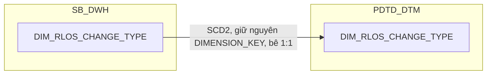

### 15.3 Cấu trúc bảng

| STT | Tên cột | Kiểu dữ liệu | Bắt buộc | Độ lớn | Khóa | Mô tả | Báo cáo sử dụng | Tên chỉ tiêu trên báo cáo |
| --- | --- | --- | --- | --- | --- | --- | --- | --- |
| 1 | DIMENSION_KEY | NUMBER | Y | 18 | PK | Khóa chính của bảng chiều DIM_RLOS_CHANGE_TYPE, sinh bằng Oracle sequence tại SB_DWH; PDTD_DTM giữ nguyên giá trị, không sinh sequence mới | — | — |
| 2 | DATASOURCE | VARCHAR2 | Y | 10 |  | Cột kỹ thuật đánh dấu nguồn hệ, luôn cố định 'RLOS' sau khi tách vật lý CLOS/RLOS | — | — |
| 3 | CHANGE_TYPE_SK | NUMBER | Y | 18 |  | Khóa tham chiếu đến bảng chiều DIM_RLOS_CHANGE_TYPE, bằng đúng giá trị DIMENSION_KEY của cùng dòng. Giá trị mặc định = -1 (dòng Unknown) nếu không có giá trị phù hợp | — | — |
| 4 | CHANGE_TYPE_CODE | VARCHAR2 | Y | 100 | NK | Mã loại thay đổi điều kiện phê duyệt — nguồn SB_RLOS_MAS_CHANGE_TYPE.CHANGE_TYPE_CODE | Báo cáo RLOS APPLICATION (BC1) — khóa tra CHANGE_TYPE_SK | — |
| 5 | CHANGE_TYPE_NAME | VARCHAR2 | N | 200 |  | Tên loại thay đổi điều kiện phê duyệt — nguồn SB_RLOS_MAS_CHANGE_TYPE.CHANGE_TYPE_NAME | — | Nguồn cho chỉ tiêu/trường CHANGE_TYPE_SK (ETL map NG_SB_RLOS_EXTTABLE.CHANGE_TYPE dạng tên sang CHANGE_TYPE_CODE trước khi tra khóa) |
| 6 | DETAIL_CHANGE_TYPE_CODE | VARCHAR2 | N | 100 | NK | Mã chi tiết loại thay đổi — nguồn SB_RLOS_MAS_CHANGE_TYPE.DETAIL_CHANGE_TYPE_CODE | — | — |
| 7 | DETAIL_CHANGE_TYPE_NAME | VARCHAR2 | N | 500 |  | Tên chi tiết loại thay đổi — nguồn SB_RLOS_MAS_CHANGE_TYPE.DETAIL_CHANGE_TYPE_NAME. BC1 dùng trường này làm CHANGE_TYPE_DETAIL | Báo cáo RLOS APPLICATION (BC1) | CHANGE_TYPE_DETAIL (Chi tiết loại thay đổi điều kiện) |
| 8 | EFF_DATE | DATE | Y |  |  | Ngày bắt đầu hiệu lực của phiên bản bản ghi (SCD Type 2) | — | — |
| 9 | EXP_DATE | DATE | N |  |  | Ngày hết hiệu lực của phiên bản bản ghi; NULL = bản ghi hiện hành | — | — |

## 16. DIM_RLOS_COREPAYER
### 16.1 Mục đích thiết kế
- **Ý nghĩa bảng:** thông tin người đồng trả nợ (corepayer) của hồ sơ RLOS — tách riêng khỏi applicant chính vì đây là quan hệ 1 hồ sơ có thể có 0 đến 4 người đồng trả nợ, bê nguyên 1:1 từ SB_DWH.
- **Khóa chính của bảng (PK):** `DIMENSION_KEY`
- **Độ chi tiết (grain):** 1 dòng lưu lịch sử thông tin thay đổi theo thời gian của 1 người đồng trả nợ trên 1 hồ sơ (SCD Type 2), quan hệ 1:N với hồ sơ RLOS (0..4 corepayer/hồ sơ).
- **Phục vụ báo cáo:**
  - Báo cáo RLOS APPLICATION (BC1)

### 16.2 Sơ đồ lineage
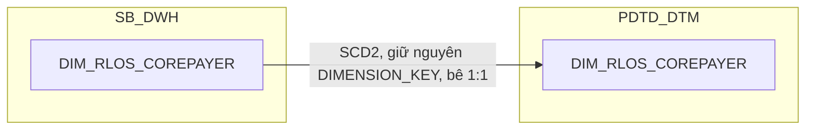

### 16.3 Cấu trúc bảng

| STT | Tên cột | Kiểu dữ liệu | Bắt buộc | Độ lớn | Khóa | Mô tả | Báo cáo sử dụng | Tên chỉ tiêu trên báo cáo |
| --- | --- | --- | --- | --- | --- | --- | --- | --- |
| 1 | DIMENSION_KEY | NUMBER | Y | 18 | PK | Khóa chính của bảng chiều DIM_RLOS_COREPAYER, sinh bằng Oracle sequence tại SB_DWH; PDTD_DTM giữ nguyên giá trị, không sinh sequence mới | — | — |
| 2 | DATASOURCE | VARCHAR2 | Y | 10 |  | Cột kỹ thuật đánh dấu nguồn hệ, luôn cố định 'RLOS' sau khi tách vật lý CLOS/RLOS | — | — |
| 3 | COREPAYER_SK | NUMBER | Y | 18 |  | Khóa tham chiếu đến bảng chiều DIM_RLOS_COREPAYER, bằng đúng giá trị DIMENSION_KEY của cùng dòng. Giá trị mặc định = -1 (dòng Unknown) nếu không có giá trị phù hợp | — | — |
| 4 | WI_NAME | VARCHAR2 | Y | 100 | NK | Mã hồ sơ RLOS — nguồn NG_SB_RLOS_COREPAYER_GENERAL.WI_NAME. Quan hệ 1:N với hồ sơ (0..4 corepayer) | — | — |
| 5 | ID_NO_CO | VARCHAR2 | Y | 100 | NK | Nhãn thứ tự người đồng trả nợ (PIN: Corep1-4) — nguồn NG_SB_RLOS_COREPAYER_GENERAL.ID_NO_CO. Business key cùng WI_NAME + REL_TO_APPLICANT; dùng để join lấy giấy tờ | — | — |
| 6 | REL_TO_APPLICANT | VARCHAR2 | N | 200 | NK | Quan hệ với người đề nghị vay chính — nguồn NG_SB_RLOS_COREPAYER_GENERAL.REL_TO_APPLICANT. Thuộc khóa tự nhiên theo KEY CDC khai trên DS_BANG_202608.xlsx (WI_NAME+REL_TO_APPLICANT+ID_NO_CO) | Báo cáo RLOS APPLICATION (BC1) | CO_REPAYER/ADD_ID_COREPAYER (thành phần vai trò trong tên hiển thị) |
| 7 | FULL_NAME | VARCHAR2 | N | 200 |  | Họ tên đầy đủ — nguồn NG_SB_RLOS_COREPAYER_GENERAL.FULL_NAME | Báo cáo RLOS APPLICATION (BC1) | CO_REPAYER (Tên người đồng trả nợ) |
| 8 | DATE_OF_BIRTH | DATE | N |  |  | Ngày sinh — nguồn NG_SB_RLOS_COREPAYER_GENERAL.DOB_CO | — | Thiết kế dư thừa |
| 9 | NATIONALITY | VARCHAR2 | N | 100 |  | Quốc tịch — nguồn NG_SB_RLOS_COREPAYER_GENERAL.NATIONALITY_CO | — | Thiết kế dư thừa |
| 10 | TITLE | VARCHAR2 | N | 30 |  | Danh xưng — nguồn NG_SB_RLOS_COREPAYER_GENERAL.TITLE_CO, làm giàu đối xứng với DIM_RLOS_APPLICANT.TITLE (review 2026-09-21) | — | Thiết kế dư thừa |
| 11 | HOUSEHOLD | VARCHAR2 | N | 100 |  | Số sổ hộ khẩu — nguồn NG_SB_RLOS_COREPAYER_GENERAL.HOUSEHOLD, làm giàu (review 2026-09-21) | — | Thiết kế dư thừa |
| 12 | PHONE_1 | VARCHAR2 | N | 50 |  | Số điện thoại di động chính — nguồn NG_SB_RLOS_COREPAYER_GENERAL.PHONE1, làm giàu (review 2026-09-21) | — | Thiết kế dư thừa |
| 13 | PHONE_2 | VARCHAR2 | N | 50 |  | Số điện thoại phụ — nguồn NG_SB_RLOS_COREPAYER_GENERAL.PHONE2, làm giàu (review 2026-09-21) | — | Thiết kế dư thừa |
| 14 | HOME_PHONE | VARCHAR2 | N | 50 |  | Số điện thoại cố định — nguồn NG_SB_RLOS_COREPAYER_GENERAL.HOMEPHONE, làm giàu (review 2026-09-21) | — | Thiết kế dư thừa |
| 15 | ADD_ID_COREPAYER | VARCHAR2 | N | 500 |  | PHÁI SINH: pivot NG_SB_RLOS_COREP_IDGRID.ID_NUMBER (nối WI_NAME + PIN=ID_NO_CO), lọc ID_TYPE IN ('TCC','CC'), nối chuỗi ";" nếu nhiều | Báo cáo RLOS APPLICATION (BC1) | ADD_ID_COREPAYER (Số "TCC" và "CC" của người đồng trả nợ) |
| 16 | ADD_ID_OTHER_COREPAYER | VARCHAR2 | N | 1000 |  | PHÁI SINH: pivot NG_SB_RLOS_COREP_IDGRID.ID_NUMBER (nối WI_NAME + PIN=ID_NO_CO), lọc ID_TYPE NOT IN ('TCC','CC'), nối chuỗi ";" nếu nhiều | Báo cáo RLOS APPLICATION (BC1) | ADD_ID_OTHER_COREPAYER (Số GTTT khác của người đồng trả nợ) |
| 17 | EFF_DATE | DATE | Y |  |  | Ngày bắt đầu hiệu lực của phiên bản bản ghi (SCD Type 2) | — | — |
| 18 | EXP_DATE | DATE | N |  |  | Ngày hết hiệu lực của phiên bản bản ghi; NULL = bản ghi hiện hành | — | — |

## 17. DIM_RLOS_DECISION
### 17.1 Mục đích thiết kế
- **Ý nghĩa bảng:** danh mục các quyết định có thể phát sinh tại một bước xử lý trên workflow RLOS — đây là danh mục cấu hình gốc của BPM engine, không phải bảng sự kiện/giao dịch theo hồ sơ, bê nguyên 1:1 từ SB_DWH.
- **Khóa chính của bảng (PK):** `DIMENSION_KEY`
- **Độ chi tiết (grain):** 1 dòng = 1 mã quyết định, lưu lịch sử thay đổi theo thời gian (SCD Type 2, xác định qua CDC trên bảng danh mục gốc).
- **Phục vụ báo cáo:**
  - Báo cáo RLOS APPLICATION (BC1) — qua LAST_DECISION_SK trên FCT_RLOS_APPLICATION_DAILY

### 17.2 Sơ đồ lineage
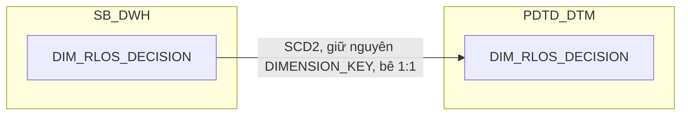

### 17.3 Cấu trúc bảng

| STT | Tên cột | Kiểu dữ liệu | Bắt buộc | Độ lớn | Khóa | Mô tả | Báo cáo sử dụng | Tên chỉ tiêu trên báo cáo |
| --- | --- | --- | --- | --- | --- | --- | --- | --- |
| 1 | DIMENSION_KEY | NUMBER | Y | 18 | PK | Khóa chính của bảng chiều DIM_RLOS_DECISION, sinh bằng Oracle sequence tại SB_DWH; PDTD_DTM giữ nguyên giá trị, không sinh sequence mới | — | — |
| 2 | DATASOURCE | VARCHAR2 | Y | 10 |  | Cột kỹ thuật đánh dấu nguồn hệ, luôn cố định 'RLOS' sau khi tách vật lý CLOS/RLOS | — | — |
| 3 | DECISION_SK | NUMBER | Y | 18 |  | Khóa tham chiếu đến bảng chiều DIM_RLOS_DECISION, bằng đúng giá trị DIMENSION_KEY của cùng dòng. Giá trị mặc định = -1 (dòng Unknown) nếu không có giá trị phù hợp | — | — |
| 4 | DECISION_CODE | VARCHAR2 | Y | 200 | NK | Mã quyết định tại bước xử lý trên workflow RLOS — nguồn DISTINCT NG_SB_RLOS_MAS_DECISION.DECISION (review 2026-09-18: MAS_DECISION gộp WORKSTEP+DECISION dạng N-N, DIM này chỉ lấy phần DECISION). UNIQUE (DECISION_CODE, EFF_DATE) | Báo cáo RLOS APPLICATION (BC1) | LAST_DECISION (Quyết định bước cuối) |
| 5 | EFF_DATE | DATE | Y |  |  | Ngày bắt đầu hiệu lực của phiên bản bản ghi (SCD Type 2) — do ETL tính qua CDC khi phát hiện thay đổi trên MAS_DECISION | — | — |
| 6 | EXP_DATE | DATE | N |  |  | Ngày hết hiệu lực của phiên bản bản ghi; NULL = bản ghi hiện hành | — | — |

## 18. DIM_RLOS_EXCEPTION_REASON
### 18.1 Mục đích thiết kế
- **Ý nghĩa bảng:** danh mục các lý do ngoại lệ (nội dung cần làm rõ) được cấu hình cho từng tổ hợp bước xử lý + quyết định trên workflow RLOS — danh mục cấu hình gốc thật sự, không phải bảng sự kiện/giao dịch theo hồ sơ, bê nguyên 1:1 từ SB_DWH.
- **Khóa chính của bảng (PK):** `DIMENSION_KEY`
- **Độ chi tiết (grain):** 1 dòng = 1 tổ hợp bước xử lý + quyết định + nhóm lý do + tên lý do, lưu lịch sử thay đổi theo thời gian (SCD Type 2).
- **Phục vụ báo cáo:**
  - Báo cáo EXCEPTION - FTR (BC7)

### 18.2 Sơ đồ lineage


### 18.3 Cấu trúc bảng

| STT | Tên cột | Kiểu dữ liệu | Bắt buộc | Độ lớn | Khóa | Mô tả | Báo cáo sử dụng | Tên chỉ tiêu trên báo cáo |
| --- | --- | --- | --- | --- | --- | --- | --- | --- |
| 1 | DIMENSION_KEY | NUMBER | Y | 18 | PK | Khóa chính của bảng chiều DIM_RLOS_EXCEPTION_REASON, sinh bằng Oracle sequence tại SB_DWH; PDTD_DTM giữ nguyên giá trị, không sinh sequence mới | — | — |
| 2 | DATASOURCE | VARCHAR2 | Y | 10 |  | Cột kỹ thuật đánh dấu nguồn hệ, luôn cố định 'RLOS' sau khi tách vật lý CLOS/RLOS | — | — |
| 3 | EXCEPTION_REASON_SK | NUMBER | Y | 18 |  | Khóa tham chiếu đến bảng chiều DIM_RLOS_EXCEPTION_REASON, bằng đúng giá trị DIMENSION_KEY của cùng dòng. Giá trị mặc định = -1 (dòng Unknown) nếu không có giá trị phù hợp | — | — |
| 4 | ACTIVITYNAME | VARCHAR2 | N | 200 | NK | Tên bước phát sinh nội dung cần làm rõ — nguồn NG_SB_RLOS_MAS_EXCEPTION.ACTIVITYNAME | Báo cáo EXCEPTION - FTR (BC7) | ACTIVITYNAME (Tên bước) |
| 5 | DECISION_CODE | VARCHAR2 | N | 200 | NK | Mã quyết định tại bước xử lý — nguồn NG_SB_RLOS_MAS_EXCEPTION.DECISION (đổi tên thêm hậu tố CODE cho thống nhất với DIM_RLOS_DECISION) | — | Nguồn cho chỉ tiêu/trường EXCEPTION_REASON_SK (khóa join 2 bước của FCT_RLOS_EXCEPTION) |
| 6 | EXCEPTION_CATEGORY | VARCHAR2 | N | 500 | NK | Phân nhóm nội dung cần làm rõ — nguồn NG_SB_RLOS_MAS_EXCEPTION.EXCEPTION_CATEGORY | Báo cáo EXCEPTION - FTR (BC7) | EXCEPTION_CATEGORY (Nhóm lý do quyết định) |
| 7 | EXCEPTION_NAME | VARCHAR2 | N | 500 | NK | Tên nội dung cần làm rõ — nguồn NG_SB_RLOS_MAS_EXCEPTION.EXCEPTION_NAME | Báo cáo EXCEPTION - FTR (BC7) | EXCEPTION_NAME (Tên lý do) |
| 8 | EXCEPTION_CODE | VARCHAR2 | N | 50 |  | Mã nội dung cần làm rõ — PHÁI SINH: CASE WHEN INSTR(EXCEPTION_CATEGORY, ':') > 0 THEN REGEXP_SUBSTR(EXCEPTION_CATEGORY, '^[^:]+') ELSE NULL END | Báo cáo EXCEPTION - FTR (BC7) | EXCEPTION_CODE (Code lý do) |
| 9 | EFF_DATE | DATE | Y |  |  | Ngày bắt đầu hiệu lực của phiên bản bản ghi (SCD Type 2) | — | — |
| 10 | EXP_DATE | DATE | N |  |  | Ngày hết hiệu lực của phiên bản bản ghi; NULL = bản ghi hiện hành | — | — |

## 19. DIM_RLOS_GEO
### 19.1 Mục đích thiết kế
- **Ý nghĩa bảng:** danh mục địa bàn hành chính (tỉnh/thành phố, quận/huyện) dùng để chuẩn hóa địa chỉ hiện tại của applicant RLOS, bê nguyên 1:1 từ SB_DWH.
- **Khóa chính của bảng (PK):** `DIMENSION_KEY`
- **Độ chi tiết (grain):** 1 dòng lưu lịch sử thay đổi của 1 tổ hợp tỉnh/thành + quận/huyện theo thời gian (SCD Type 2).
- **Phục vụ báo cáo:**
  - Báo cáo RLOS APPLICATION (BC1) — qua GEO_SK trên DIM_RLOS_APPLICANT

### 19.2 Sơ đồ lineage
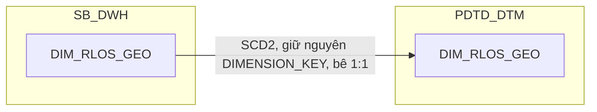

### 19.3 Cấu trúc bảng

| STT | Tên cột | Kiểu dữ liệu | Bắt buộc | Độ lớn | Khóa | Mô tả | Báo cáo sử dụng | Tên chỉ tiêu trên báo cáo |
| --- | --- | --- | --- | --- | --- | --- | --- | --- |
| 1 | DIMENSION_KEY | NUMBER | Y | 18 | PK | Khóa chính của bảng chiều DIM_RLOS_GEO, sinh bằng Oracle sequence tại SB_DWH; PDTD_DTM giữ nguyên giá trị, không sinh sequence mới | — | — |
| 2 | DATASOURCE | VARCHAR2 | Y | 10 |  | Cột kỹ thuật đánh dấu nguồn hệ, luôn cố định 'RLOS' sau khi tách vật lý CLOS/RLOS | — | — |
| 3 | GEO_SK | NUMBER | Y | 18 |  | Khóa tham chiếu đến bảng chiều DIM_RLOS_GEO, bằng đúng giá trị DIMENSION_KEY của cùng dòng. Giá trị mặc định = -1 (dòng Unknown) nếu không có giá trị phù hợp | — | — |
| 4 | CITY_CODE | VARCHAR2 | Y | 50 | NK | Mã tỉnh/thành phố — nguồn H_NG_SB_RLOS_MAS_CITY.CITY_CODE, nối với NG_SB_RLOS_APPLICANT_DETAIL.CITY_CURR_RES | — | Nguồn cho chỉ tiêu/trường CURRENT_RESIDENTIAL_CITY (khóa join DIM_RLOS_APPLICANT.GEO_SK) |
| 5 | CITY_NAME | VARCHAR2 | N | 200 |  | Tên tỉnh/thành phố — nguồn H_NG_SB_RLOS_MAS_CITY.CITY_NAME | Báo cáo RLOS APPLICATION (BC1) | CURRENT_RESIDENTIAL_CITY (Địa chỉ hiện tại — Tỉnh/TP) |
| 6 | CITY_NAME_VN | VARCHAR2 | N | 200 |  | Tên tỉnh/thành phố dạng đầy đủ tiếng Việt (dùng ghép địa chỉ chi tiết) — nguồn H_NG_SB_RLOS_MAS_CITY.CITY_NAME_VN | Báo cáo RLOS APPLICATION (BC1) | Nguồn cho chỉ tiêu/trường CURRENT_RESIDENTIAL_ADDRESS (thành phần tỉnh/thành) |
| 7 | DISTRICT_CODE | VARCHAR2 | N | 50 | NK | Mã quận/huyện — nguồn H_NG_SB_RLOS_MAS_DISTRICT.DISTRICT_CODE, nối với NG_SB_RLOS_APPLICANT_DETAIL.DISTRICT_CURR_RES | — | Nguồn cho chỉ tiêu/trường CURRENT_RESIDENTIAL_DISTRICT (khóa join DIM_RLOS_APPLICANT.GEO_SK) |
| 8 | DISTRICT_NAME | VARCHAR2 | N | 200 |  | Tên quận/huyện — nguồn H_NG_SB_RLOS_MAS_DISTRICT.DISTRICT_NAME | Báo cáo RLOS APPLICATION (BC1) | CURRENT_RESIDENTIAL_DISTRICT (Địa chỉ hiện tại — Quận/Huyện) |
| 9 | DISTRICT_NAME_VN | VARCHAR2 | N | 200 |  | Tên quận/huyện dạng đầy đủ tiếng Việt (dùng ghép địa chỉ chi tiết) — PHÁI SINH: lấy H_NG_SB_RLOS_MAS_DISTRICT.DISTRICT_NAME_VN nhưng gán NULL với giá trị lỗi '#NA'/'#REF!' còn sót từ khâu import Excel | Báo cáo RLOS APPLICATION (BC1) | Nguồn cho chỉ tiêu/trường CURRENT_RESIDENTIAL_ADDRESS (thành phần quận/huyện) |
| 10 | EFF_DATE | DATE | Y |  |  | Ngày bắt đầu hiệu lực của phiên bản bản ghi (SCD Type 2) | — | — |
| 11 | EXP_DATE | DATE | N |  |  | Ngày hết hiệu lực của phiên bản bản ghi; NULL = bản ghi hiện hành | — | — |

## 20. DIM_RLOS_PRODUCT

### 20.1 Mục đích thiết kế
- **Ý nghĩa bảng:** danh mục sản phẩm tín dụng RLOS (bán lẻ/cá nhân) — lưu dòng sản phẩm, sản phẩm nhánh, tên sản phẩm chi tiết và sản phẩm phụ đi kèm. Bản PDTD_DTM bê nguyên 1:1 từ SB_DWH, không có cột phái sinh hay bổ sung nào ở tầng này.
- **Khóa chính của bảng (PK):** `DIMENSION_KEY` (giữ nguyên giá trị từ SB_DWH)
- **Độ chi tiết (grain):** 1 dòng lưu lịch sử thông tin thay đổi theo thời gian (SCD Type 2, khóa tự nhiên `PRODUCT_LINE_CODE` + `SUB_PRODUCT_CODE` + `PRODUCT_NAME` + `EFF_DATE`).
- **Phục vụ báo cáo:**
  - Báo cáo RLOS APPLICATION (BC1)
  - Báo cáo SLA - TAT (BC5) — khóa tra REF_SLA_NLTT
  - Báo cáo KPI (BC9) — khóa tra điểm KPI, điều kiện lọc SEC/UNSEC

### 20.2 Sơ đồ lineage
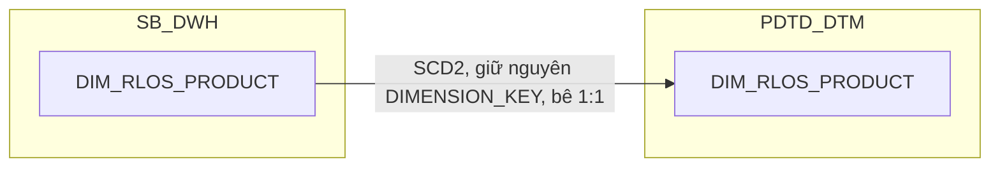

### 20.3 Cấu trúc bảng

| STT | Tên cột | Kiểu dữ liệu | Bắt buộc | Độ lớn | Khóa | Mô tả | Báo cáo sử dụng | Tên chỉ tiêu trên báo cáo |
| --- | --- | --- | --- | --- | --- | --- | --- | --- |
| 1 | DIMENSION_KEY | NUMBER | Y | 18 | PK | Khóa chính của bảng chiều DIM_RLOS_PRODUCT, sinh bằng Oracle sequence tại SB_DWH; PDTD_DTM giữ nguyên giá trị, không sinh sequence mới | — | — |
| 2 | DATASOURCE | VARCHAR2 | Y | 10 |  | Cột kỹ thuật đánh dấu nguồn hệ, luôn cố định 'RLOS' sau khi tách vật lý CLOS/RLOS | — | — |
| 3 | PRODUCT_SK | NUMBER | Y | 18 |  | Khóa tham chiếu đến bảng chiều DIM_RLOS_PRODUCT, bằng đúng giá trị DIMENSION_KEY của cùng dòng. Giá trị mặc định = -1 (dòng Unknown) nếu không có giá trị phù hợp | — | — |
| 4 | PRODUCT_LINE_CODE | VARCHAR2 | N | 100 | NK | Mã dòng sản phẩm — nguồn MAS_PRODUCT_LINE.PRODUCTLINE_CODE. UNIQUE (PRODUCT_LINE_CODE, SUB_PRODUCT_CODE, PRODUCT_NAME, EFF_DATE) | Báo cáo RLOS APPLICATION (BC1) | PRODUCT_LINE (Dòng sản phẩm) |
| 5 | PRODUCT_LINE_NAME | VARCHAR2 | N | 200 |  | Tên dòng sản phẩm — nguồn MAS_PRODUCT_LINE.PRODUCT_LINE_NAME | Báo cáo RLOS APPLICATION (BC1) — có thể hiển thị thay PRODUCT_LINE_CODE<br>Báo cáo SLA - TAT (BC5) — khóa tra REF_SLA_NLTT<br>Báo cáo KPI (BC9) — khóa tra POINT (SLA_DE_TOTAL_RESULT) | PRODUCT_LINE (Dòng sản phẩm); nguồn cho chỉ tiêu/trường POINT (Điểm KPI, BC9) |
| 6 | SECONDARY_PRODUCT | VARCHAR2 | N | 100 |  | Sản phẩm phụ đi kèm (SeABuy/SeATeacher/SeAWoman/SeACivil/Thẻ tín dụng — không phải sản phẩm con của PRODUCT_LINE) — nguồn MAS_PRODUCT_LINE.SECONDARY_PRODUCT | Báo cáo RLOS APPLICATION (BC1) — có thể hiển thị thay SUB_PRODUCT_CODE | SUB_PRODUCT (Sản phẩm nhánh) |
| 7 | SUB_PRODUCT_CODE | VARCHAR2 | N | 100 | NK | Mã sản phẩm nhánh — nguồn MAS_SUB_PRODUCT.SUB_PRODUCT_CODE | Báo cáo RLOS APPLICATION (BC1)<br>Báo cáo KPI (BC9) — điều kiện lọc SEC/UNSEC | SUB_PRODUCT (Sản phẩm nhánh); nguồn cho chỉ tiêu/trường TAT_RLOS_SEC_*/TAT_RLOS_UNSEC_* (điều kiện lọc SEC/UNSEC trên AGG_LOS_KPI_YTD_DAILY) |
| 8 | PRODUCT_NAME | VARCHAR2 | N | 150 | NK | Tên sản phẩm tín dụng chi tiết — nguồn MAS_SUB_PRODUCT.SUB_PRODUCT_NAME | Báo cáo KPI (BC9) — điều kiện lọc SEC/UNSEC | Nguồn cho chỉ tiêu/trường TAT_RLOS_SEC_*/TAT_RLOS_UNSEC_* (điều kiện lọc SEC/UNSEC trên AGG_LOS_KPI_YTD_DAILY) |
| 9 | SCORE_REQUIRED | VARCHAR2 | N | 10 |  | Cờ yêu cầu chấm điểm — nguồn MAS_SUB_PRODUCT.SCORE_REQUIRED | — | Thiết kế dư thừa |
| 10 | SCORE_MODEL | VARCHAR2 | N | 100 |  | Mô hình chấm điểm áp dụng — nguồn MAS_SUB_PRODUCT.SCORE_MODEL | — | Thiết kế dư thừa |
| 11 | EFF_DATE | DATE | Y |  |  | Ngày bắt đầu hiệu lực của phiên bản bản ghi (SCD Type 2) — do SB_DWH quản lý, bê nguyên qua tầng PDTD_DTM | — | — |
| 12 | EXP_DATE | DATE | N |  |  | Ngày hết hiệu lực của phiên bản bản ghi; NULL = bản ghi hiện hành | — | — |

## 21. DIM_RLOS_WORKSTEP

### 21.1 Mục đích thiết kế
- **Ý nghĩa bảng:** danh mục các bước xử lý trong quy trình BPM của hồ sơ tín dụng RLOS (workflow queue) — tách riêng khỏi quyết định phát sinh tại từng bước (`DIM_RLOS_DECISION`) dù cùng lấy từ 1 bảng nguồn gộp N-N. Bản PDTD_DTM bê nguyên 1:1 từ SB_DWH, không thêm/bớt cột, không có REF_ nào join thêm.
- **Khóa chính của bảng (PK):** `DIMENSION_KEY` (giữ nguyên giá trị từ SB_DWH)
- **Độ chi tiết (grain):** 1 dòng lưu lịch sử thông tin thay đổi theo thời gian (SCD Type 2, khóa tự nhiên `WORKSTEP_CODE` + `EFF_DATE`).
- **Phục vụ báo cáo:**
  - Báo cáo RLOS APPLICATION (BC1) — qua FCT_RLOS_APPLICATION_DAILY/FCT_RLOS_WORKSTEP_EVENT
  - Báo cáo Thông tin phê duyệt (BC3) — qua FCT_RLOS_WORKSTEP_EVENT
  - Báo cáo Tuần Chuyên viên Thẩm định (BC4) — qua FCT_RLOS_WORKSTEP_EVENT
  - Báo cáo SLA - TAT (BC5) — qua FCT_RLOS_WORKSTEP_EVENT
  - Báo cáo RETURN (BC8) — qua FCT_RLOS_WORKSTEP_EVENT

### 21.2 Sơ đồ lineage
```mermaid
flowchart LR
    subgraph SB_DWH
        D["DIM_RLOS_WORKSTEP"]
    end
    subgraph PDTD_DTM
        E["DIM_RLOS_WORKSTEP"]
    end
    D -->|SCD2, giữ nguyên DIMENSION_KEY, bê 1:1| E
```

### 21.3 Cấu trúc bảng

| STT | Tên cột | Kiểu dữ liệu | Bắt buộc | Độ lớn | Khóa | Mô tả | Báo cáo sử dụng | Tên chỉ tiêu trên báo cáo |
| --- | --- | --- | --- | --- | --- | --- | --- | --- |
| 1 | DIMENSION_KEY | NUMBER | Y | 18 | PK | Khóa chính của bảng chiều DIM_RLOS_WORKSTEP, sinh bằng Oracle sequence tại SB_DWH; PDTD_DTM giữ nguyên giá trị, không sinh sequence mới | — | — |
| 2 | DATASOURCE | VARCHAR2 | Y | 10 |  | Cột kỹ thuật đánh dấu nguồn hệ, luôn cố định 'RLOS' sau khi tách vật lý CLOS/RLOS | — | — |
| 3 | WORKSTEP_SK | NUMBER | Y | 18 |  | Khóa tham chiếu đến bảng chiều DIM_RLOS_WORKSTEP, bằng đúng giá trị DIMENSION_KEY của cùng dòng. Giá trị mặc định = -1 (dòng Unknown) nếu không có giá trị phù hợp | — | — |
| 4 | WORKSTEP_CODE | VARCHAR2 | Y | 200 | NK | Mã bước xử lý trên workflow RLOS — nguồn DISTINCT NG_SB_RLOS_MAS_DECISION.QUEUE_NAME (MAS_DECISION gộp WORKSTEP+DECISION dạng N-N, DIM này chỉ lấy phần WORKSTEP). UNIQUE (WORKSTEP_CODE, EFF_DATE) | Báo cáo RLOS APPLICATION (BC1) — qua FCT_RLOS_APPLICATION_DAILY.LAST_WORKSTEP_SK<br>Báo cáo Thông tin phê duyệt (BC3) — qua FCT_RLOS_WORKSTEP_EVENT.WORKSTEP_CODE<br>Báo cáo Tuần Chuyên viên Thẩm định (BC4) — qua FCT_RLOS_WORKSTEP_EVENT.WORKSTEP_CODE<br>Báo cáo SLA - TAT (BC5) — qua FCT_RLOS_WORKSTEP_EVENT.WORKSTEP_CODE<br>Báo cáo RETURN (BC8) — qua FCT_RLOS_WORKSTEP_EVENT.WORKSTEP_CODE | WORKSTEP (Bước hồ sơ) |
| 5 | EFF_DATE | DATE | Y |  |  | Ngày bắt đầu hiệu lực của phiên bản bản ghi (SCD Type 2) — do SB_DWH quản lý, bê nguyên qua tầng PDTD_DTM | — | — |
| 6 | EXP_DATE | DATE | N |  |  | Ngày hết hiệu lực của phiên bản bản ghi; NULL = bản ghi hiện hành | — | — |

## 22. DIM_T24_COMPANY

### 22.1 Mục đích thiết kế
- **Ý nghĩa bảng:** danh mục đơn vị kinh doanh (chi nhánh/phòng giao dịch) lõi T24 core banking — khác hẳn `DIM_LOS_ORG_UNIT` (nguồn LOS, do `NG_SB_CLOS_CUST_INFO`/`NG_SB_RLOS_APPLICANT_GENERAL` cấp). Bảng phát sinh khi thiết kế `FCT_CLOS_LOAN_DISBURSEMENT`/`FCT_RLOS_LOAN_DISBURSEMENT` — tách riêng thành DIM có FK vật lý thay vì mô tả join-time bằng lời như tài liệu gốc. Chỉ tồn tại ở layer PDTD_DTM (không có bản SB_DWH), bê 1:1 từ `SB_DWH.DIM_COMPANY` qua vùng chìa `STG_DTM.STG_DIM_COMPANY`, không đi qua CDC của LOS.
- **Khóa chính của bảng (PK):** `DIMENSION_KEY` (giữ nguyên giá trị từ SB_DWH qua vùng chìa STG_DTM)
- **Độ chi tiết (grain):** 1 dòng = 1 đơn vị kinh doanh T24, lưu lịch sử thay đổi theo thời gian (SCD Type 2, khóa tự nhiên `COMPANY_CODE`) — bê nguyên toàn bộ lịch sử `EFF_DATE`/`EXP_DATE` từ nguồn, không tự tính SCD2 tại PDTD_DTM.
- **Phục vụ báo cáo:**
  - Báo cáo Giải ngân _ Quá hạn KHCN (BC10) — qua FK COMPANY_SK trên FCT_RLOS_LOAN_DISBURSEMENT
  - Báo cáo Giải ngân _ Quá hạn KHDN (BC11) — qua FK COMPANY_SK trên FCT_CLOS_LOAN_DISBURSEMENT

### 22.2 Sơ đồ lineage
```mermaid
flowchart LR
    subgraph SB_DWH_T24["SB_DWH (T24 core banking)"]
        A(["DIM_COMPANY"])
    end
    subgraph STG_DTM["Vùng chìa STG_DTM"]
        S(["STG_DIM_COMPANY"])
    end
    subgraph PDTD_DTM
        D["DIM_T24_COMPANY"]
    end
    A --> S
    S -->|1:1 COMPANY_CODE, BRANCH_NAME, COMPANY_NAME_VN| D
```

### 22.3 Cấu trúc bảng

Lấy 1:1 từ bảng có sẵn trên `STG_DTM.STG_DIM_COMPANY`.

## 23. DIM_T24_CUSTOMER

### 23.1 Mục đích thiết kế
- **Ý nghĩa bảng:** chiều khách hàng lõi T24 (core banking) — khác toàn bộ DIM/FCT còn lại của datamart này, bảng không có nguồn CLOS hay RLOS nào cả, đã tồn tại sẵn ở `SB_DWH.DIM_CUSTOMER`. Đây là chỗ DUY NHẤT nối được hồ sơ tín dụng LOS (CLOS/RLOS) sang khách hàng lõi T24 — join qua số giấy tờ định danh (`LEGAL_ID` + `LEGAL_DOC_NAME`, đã chuẩn hóa ở T24) khớp với `DIM_CLOS_CUSTOMER.ORG_LEGAL_ID` phía CLOS và `DIM_RLOS_APPLICANT.ADD_ID`/`ADD_ID_OTHER` phía RLOS. Giữ thành chiều riêng (không gộp vào từng fact) vì được nhiều báo cáo tham chiếu — gộp sẽ nhân bản dữ liệu và mất khả năng lọc theo phân khúc. Chỉ tồn tại ở layer PDTD_DTM, bê 1:1 từ SB_DWH qua vùng chìa STG_DTM, không đi qua CDC của LOS.
- **Khóa chính của bảng (PK):** `DIMENSION_KEY` (giữ nguyên giá trị từ SB_DWH qua vùng chìa STG_DTM)
- **Độ chi tiết (grain):** 1 dòng = 1 khách hàng T24, lưu lịch sử thay đổi theo thời gian (SCD Type 2, khóa tự nhiên `CUSTOMER_ID`) — bê nguyên toàn bộ lịch sử, không tự tính SCD2 tại PDTD_DTM.
- **Phục vụ báo cáo:**
  - Báo cáo RLOS APPLICATION (BC1) — qua FCT_RLOS_APPLICATION_DAILY.T24_CUSTOMER_SK
  - Báo cáo CLOS APPLICATION (BC2) — qua FCT_CLOS_APPLICATION_DAILY.T24_CUSTOMER_SK
  - Báo cáo Giải ngân _ Quá hạn KHCN (BC10) — qua FCT_RLOS_LOAN_DISBURSEMENT.CUSTOMER_SK, lọc SEAB_CU_SEGMENT IN ('14','21')
  - Báo cáo Giải ngân _ Quá hạn KHDN (BC11) — qua FCT_CLOS_LOAN_DISBURSEMENT.CUSTOMER_SK, lọc SEAB_CU_SEGMENT NOT IN ('14','21')

### 23.2 Sơ đồ lineage
```mermaid
flowchart LR
    subgraph SB_DWH_T24["SB_DWH (T24 core banking)"]
        A(["DIM_CUSTOMER"])
    end
    subgraph STG_DTM["Vùng chìa STG_DTM"]
        S(["STG_DIM_CUSTOMER"])
    end
    subgraph PDTD_DTM
        D["DIM_T24_CUSTOMER"]
    end
    A --> S
    S -->|1:1 CUSTOMER_ID, LEGAL_ID, LEGAL_DOC_NAME, DATE_OF_BIRTH, GENDER, SHORT_NAME, SEAB_CU_SEGMENT| D
```

### 23.3 Cấu trúc bảng

Lấy 1:1 từ bảng có sẵn trên `STG_DTM.STG_DIM_CUSTOMER`.

## 24. DIM_T24_LOAN

### 24.1 Mục đích thiết kế
- **Ý nghĩa bảng:** chiều hợp đồng khoản vay lõi T24 — lineage doc gốc của `FCT_PDTD_DISBURSEMENT` từng denormalize 5 cột này thẳng vào fact (1:1 từ `SB_DWH.DIM_LOAN`). Theo yêu cầu người dùng, tách hẳn thành DIM riêng để có FK vật lý (`CONTRACT_SK`) rõ ràng trên `FCT_CLOS_LOAN_DISBURSEMENT`/`FCT_RLOS_LOAN_DISBURSEMENT` thay vì lưu text/date thẳng trên fact. Chỉ tồn tại ở layer PDTD_DTM, bê 1:1 từ SB_DWH qua vùng chìa STG_DTM, không đi qua CDC của LOS.
- **Khóa chính của bảng (PK):** `DIMENSION_KEY` (giữ nguyên giá trị từ SB_DWH qua vùng chìa STG_DTM)
- **Độ chi tiết (grain):** 1 dòng = 1 hợp đồng T24 (theo phiên bản SCD2), khóa tự nhiên `CONTRACT`. Join key thật trên fact là `CONTRACT_SK` — surrogate có sẵn trên `STG_FCT_LOAN`, đã trỏ thẳng đúng phiên bản `DIMENSION_KEY` tại thời điểm giao dịch nên không cần thêm điều kiện `EXP_DATE IS NULL` như khi lookup qua business key.
- **Phục vụ báo cáo:**
  - Báo cáo Giải ngân _ Quá hạn KHCN (BC10) — qua FK CONTRACT_SK trên FCT_RLOS_LOAN_DISBURSEMENT
  - Báo cáo Giải ngân _ Quá hạn KHDN (BC11) — qua FK CONTRACT_SK trên FCT_CLOS_LOAN_DISBURSEMENT

### 24.2 Sơ đồ lineage
```mermaid
flowchart LR
    subgraph SB_DWH_T24["SB_DWH (T24 core banking)"]
        A(["DIM_LOAN"])
    end
    subgraph STG_DTM["Vùng chìa STG_DTM"]
        S(["STG_DIM_LOAN"])
    end
    subgraph PDTD_DTM
        D["DIM_T24_LOAN"]
    end
    A --> S
    S -->|1:1 CONTRACT, VALUE_DATE, MATURITY_DATE, REC_STATUS, CONTRACT_REF, REF_VALUE_DATE| D
```

### 24.3 Cấu trúc bảng

Lấy 1:1 từ bảng có sẵn trên `STG_DTM.STG_DIM_LOAN`.

## 25. DIM_T24_SEAB_PRODUCTS_DE

### 25.1 Mục đích thiết kế
- **Ý nghĩa bảng:** chiều sản phẩm giải ngân lõi T24 — lineage doc gốc denormalize cột `PRODUCT_T24` thẳng vào fact (1:1 từ `SB_DWH.DIM_SEAB_PRODUCTS_DE`). Theo yêu cầu người dùng, tách DIM riêng, đặt FK vật lý `SEAB_PRODUCTS_DE_SK` trên fact thay vì lưu cột text thẳng. Không có tài liệu nào xác nhận business key gốc của sản phẩm T24 (chỉ có surrogate) nên không thiết kế thêm cột NK nào ngoài tên sản phẩm. Chỉ tồn tại ở layer PDTD_DTM, bê 1:1 từ SB_DWH qua vùng chìa STG_DTM, không đi qua CDC của LOS.
- **Khóa chính của bảng (PK):** `DIMENSION_KEY` (giữ nguyên giá trị từ SB_DWH qua vùng chìa STG_DTM)
- **Độ chi tiết (grain):** 1 dòng = 1 sản phẩm T24 (theo phiên bản SCD2). Join key trên fact là `SEAB_PRODUCTS_DE_SK` — surrogate có sẵn trên `STG_FCT_LOAN` (SRS ghi nguyên văn `SEAB_PRODUCTS_SK`, xác nhận là thiếu chính tả, dùng đúng tên khớp tên bảng đích).
- **Phục vụ báo cáo:**
  - Báo cáo Giải ngân _ Quá hạn KHCN (BC10) — qua FK SEAB_PRODUCTS_DE_SK trên FCT_RLOS_LOAN_DISBURSEMENT
  - Báo cáo Giải ngân _ Quá hạn KHDN (BC11) — qua FK SEAB_PRODUCTS_DE_SK trên FCT_CLOS_LOAN_DISBURSEMENT

### 25.2 Sơ đồ lineage
```mermaid
flowchart LR
    subgraph SB_DWH_T24["SB_DWH (T24 core banking)"]
        A(["DIM_SEAB_PRODUCTS_DE"])
    end
    subgraph STG_DTM["Vùng chìa STG_DTM"]
        S(["STG_DIM_SEAB_PRODUCTS_DE"])
    end
    subgraph PDTD_DTM
        D["DIM_T24_SEAB_PRODUCTS_DE"]
    end
    A --> S
    S -->|1:1 SEAB_PRODUCTS_DE_NAME| D
```

### 25.3 Cấu trúc bảng

Lấy 1:1 từ bảng có sẵn trên `STG_DTM.STG_DIM_SEAB_PRODUCTS_DE`.
