# HLD Review — DIM tables (SB_DWH)

## 1. DIM_LOS_COMPANY

### 1.1 Mục đích thiết kế
- **Ý nghĩa bảng:** danh mục đơn vị kinh doanh (phòng giao dịch/chi nhánh/khu vực) khởi tạo hồ sơ, dùng chung cho cả hai hệ CLOS và RLOS — một đơn vị kinh doanh vật lý xử lý cả hồ sơ CLOS lẫn RLOS nên không tách theo hệ.
- **Khóa chính của bảng (PK):** `DIMENSION_KEY`
- **Khóa nghiệp vụ (BK):** `COMPANY_CODE`
- **Độ chi tiết (grain):** 1 dòng lưu lịch sử thông tin thay đổi theo thời gian (SCD Type 2, khóa tự nhiên `COMPANY_CODE` — mức PGD/CN nhỏ nhất); thông tin Chi nhánh/Khu vực được gộp vào cùng dòng (không tách DIM phân cấp riêng) vì đây là quan hệ vị trí địa lý cố định.
- **Phục vụ báo cáo:**
  - Báo cáo RLOS APPLICATION (BC1)
  - Báo cáo CLOS APPLICATION (BC2)
  - Báo cáo KPI (BC9) — tra khóa `COMPANY_CODE` làm điều kiện lọc chi nhánh khi tính `SLHS_RLOS_*`/`SLGN_RLOS_*`

### 1.2 Sơ đồ lineage

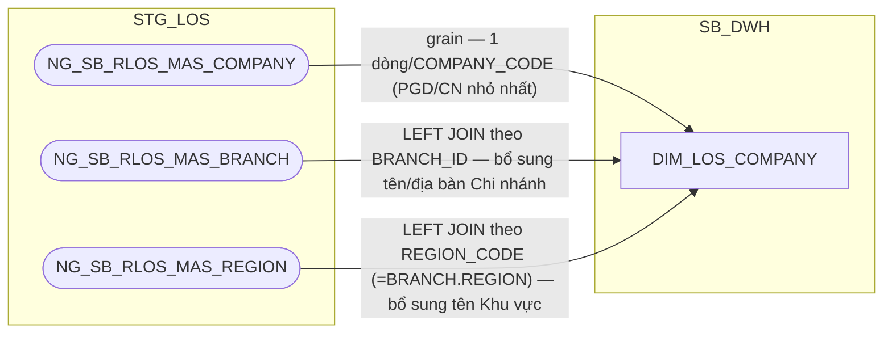

### 1.3 Cấu trúc bảng

| STT | Tên cột | Kiểu dữ liệu | Bắt buộc | Độ lớn | Khóa | Mô tả | Báo cáo sử dụng | Tên chỉ tiêu trên báo cáo |
| --- | --- | --- | --- | --- | --- | --- | --- | --- |
| 1 | DIMENSION_KEY | NUMBER | Y | 18 | PK | Khóa chính của bảng chiều DIM_LOS_COMPANY, sinh bằng Oracle sequence tại SB_DWH; PDTD_DTM giữ nguyên giá trị, không sinh sequence mới | — | — |
| 2 | COMPANY_SK | NUMBER | Y | 18 |  | Khóa tham chiếu đến bảng chiều DIM_LOS_COMPANY, bằng đúng giá trị DIMENSION_KEY của cùng dòng. Giá trị mặc định = -1 (dòng Unknown) nếu không có giá trị phù hợp | — | — |
| 3 | COMPANY_CODE | VARCHAR2 | N | 200 | BK | Mã đơn vị kinh doanh (PGD/CN — mức chi tiết nhất) — nguồn NG_SB_RLOS_MAS_COMPANY.COMPANY_CODE | Báo cáo RLOS APPLICATION (BC1) Báo cáo CLOS APPLICATION (BC2) Báo cáo KPI (BC9) — điều kiện lọc chi nhánh loại trừ | MÃ PGD (Mã đơn vị kinh doanh); nguồn cho chỉ tiêu SLHS_RLOS_*/SLGN_RLOS_* (điều kiện lọc chi nhánh trên AGG_LOS_KPI_YTD_DAILY) |
| 4 | COMPANY_NAME | NVARCHAR2 | N | 200 |  | Tên đơn vị kinh doanh — nguồn MAS_COMPANY.COMPANY_NAME_VN | Báo cáo RLOS APPLICATION (BC1) Báo cáo CLOS APPLICATION (BC2) | TÊN PGD (Tên đơn vị kinh doanh) |
| 5 | COMPANY_ADDRESS | NVARCHAR2 | N | 200 |  | Địa chỉ đơn vị kinh doanh — nguồn MAS_COMPANY.COMPANY_ADDRESS_VN | — | Thiết kế dư thừa |
| 6 | COMPANY_EMAIL | VARCHAR2 | N | 200 |  | Email đơn vị kinh doanh — nguồn MAS_COMPANY.COMPANY_EMAIL | — | Thiết kế dư thừa |
| 7 | ZONE | NUMBER | N | 18 |  | Mã khu vực nội bộ theo LOS (khác REGION_CODE của MAS_REGION) — nguồn MAS_COMPANY.ZONE | — | Thiết kế dư thừa |
| 8 | BRANCH_CODE | VARCHAR2 | N | 200 |  | Mã chi nhánh — nguồn MAS_COMPANY.BRANCH_ID, LEFT JOIN MAS_BRANCH.BRANCH_ID | Báo cáo RLOS APPLICATION (BC1) Báo cáo CLOS APPLICATION (BC2) | MÃ CHI NHÁNH |
| 9 | BRANCH_NAME | NVARCHAR2 | N | 200 |  | Tên chi nhánh — nguồn MAS_BRANCH.BRANCH_NAME_VN | Báo cáo RLOS APPLICATION (BC1) Báo cáo CLOS APPLICATION (BC2) | TÊN CHI NHÁNH |
| 10 | CITY | VARCHAR2 | N | 200 |  | Mã tỉnh/thành phố của chi nhánh — nguồn MAS_BRANCH.CITY | — | Thiết kế dư thừa |
| 11 | DISTRICT | VARCHAR2 | N | 200 |  | Mã quận/huyện của chi nhánh — nguồn MAS_BRANCH.DISTRICT | — | Thiết kế dư thừa |
| 12 | REGION_CODE | NUMBER | N | 18 |  | Mã khu vực địa lý — nguồn MAS_BRANCH.REGION, LEFT JOIN MAS_REGION.REGION_CODE | — | Thiết kế dư thừa |
| 13 | REGION_NAME | NVARCHAR2 | N | 200 |  | Tên khu vực địa lý — nguồn MAS_REGION.REGION_NAME_VN | — | Thiết kế dư thừa |
| 14 | EFF_DATE | DATE | N |  |  | Ngày bắt đầu hiệu lực của phiên bản bản ghi (SCD Type 2) — do ETL tính qua CDC khi phát hiện thay đổi trên MAS_COMPANY/MAS_BRANCH/MAS_REGION | — | — |
| 15 | EXP_DATE | DATE | N |  |  | Ngày hết hiệu lực của phiên bản bản ghi; NULL = bản ghi hiện hành | — | — |

## 2. DIM_LOS_USER

### 2.1 Mục đích thiết kế
- **Ý nghĩa bảng:** danh mục tài khoản người dùng trên ứng dụng LOS (không phải danh sách nhân sự HR) — dùng chung cho cả hai hệ CLOS và RLOS, vì một cán bộ có thể xử lý cả hồ sơ CLOS lẫn RLOS.
- **Khóa chính của bảng (PK):** `DIMENSION_KEY`
- **Khóa nghiệp vụ (BK):** `USERNAME`
- **Độ chi tiết (grain):** 1 dòng lưu lịch sử thông tin thay đổi theo thời gian (SCD Type 2, khóa tự nhiên `USERNAME`).
- **Phục vụ báo cáo:**
  - Báo cáo RLOS APPLICATION (BC1) — qua giá trị `USERNAME` hiển thị thẳng trên các FCT, không join thuộc tính từ DIM
  - Báo cáo Thông tin phê duyệt (BC3) — tương tự, `USERNAME` hiển thị thẳng
  - Báo cáo Tuần Chuyên viên Thẩm định (BC4) — tương tự
  - Báo cáo NGOẠI LỆ (BC6) / Báo cáo EXCEPTION - FTR (BC7) — tương tự
  - Báo cáo KPI (BC9) — đếm số lượng nhân sự theo `USERNAME`

### 2.2 Sơ đồ lineage

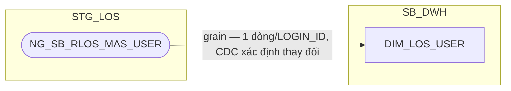

### 2.3 Cấu trúc bảng

| STT | Tên cột | Kiểu dữ liệu | Bắt buộc | Độ lớn | Khóa | Mô tả | Báo cáo sử dụng | Tên chỉ tiêu trên báo cáo |
| --- | --- | --- | --- | --- | --- | --- | --- | --- |
| 1 | DIMENSION_KEY | NUMBER | Y | 18 | PK | Khóa chính của bảng chiều DIM_LOS_USER, sinh bằng Oracle sequence tại SB_DWH; PDTD_DTM giữ nguyên giá trị, không sinh sequence mới | — | — |
| 2 | USER_SK | NUMBER | Y | 18 |  | Khóa tham chiếu đến bảng chiều DIM_LOS_USER, bằng đúng giá trị DIMENSION_KEY của cùng dòng. Giá trị mặc định = -1 (dòng Unknown) nếu không có giá trị phù hợp | — | — |
| 3 | USERNAME | VARCHAR2 | N | 200 | BK | Tên tài khoản của cán bộ xử lý hồ sơ trên ứng dụng LOS — nguồn MAS_USER.LOGIN_ID. UNIQUE (USERNAME, EFF_DATE) | Báo cáo RLOS APPLICATION (BC1) Báo cáo Thông tin phê duyệt (BC3) Báo cáo Tuần Chuyên viên Thẩm định (BC4) Báo cáo NGOẠI LỆ (BC6) Báo cáo EXCEPTION - FTR (BC7) Báo cáo KPI (BC9) | UND_MAKER (User Chuyên viên thẩm định); BI_APPROVER/BI_COMMITTEE (User phê duyệt/Hội đồng tín dụng); RAISED_BY (User tạo lý do); NHAN_SU (đếm số nhân sự theo USERNAME) — các báo cáo đều đọc giá trị thô trên FCT, không join thuộc tính qua DIM này |
| 4 | EMPLOYEE_NAME | NVARCHAR2 | N | 200 |  | Tên nhân viên — nguồn MAS_USER.EMPLOYEE_NAME | — | Thiết kế dư thừa |
| 5 | EMPLOYEE_STATUS | VARCHAR2 | N | 200 |  | Trạng thái tài khoản — nguồn MAS_USER.EMPLOYEE_STATUS | — | Thiết kế dư thừa |
| 6 | EMAIL | VARCHAR2 | N | 200 |  | Email — nguồn MAS_USER.EMAIL | — | Thiết kế dư thừa |
| 7 | IP_PHONE | VARCHAR2 | N | 200 |  | Số máy nội bộ — nguồn MAS_USER.IP_PHONE | — | Thiết kế dư thừa |
| 8 | SB_CODE | VARCHAR2 | N | 200 |  | Mã SB của cán bộ — nguồn MAS_USER.SB_CODE | — | Thiết kế dư thừa |
| 9 | ID_CUSTOMER | VARCHAR2 | N | 200 |  | Mã khách hàng gắn với tài khoản (nếu có) — nguồn MAS_USER.ID_CUSTOMER | — | Thiết kế dư thừa |
| 10 | COMPANY_CODE | VARCHAR2 | N | 200 |  | Mã chi nhánh/ĐVKD quản lý tài khoản — nguồn MAS_USER.COMPANY_CODE | — | Thiết kế dư thừa |
| 11 | COMPANY_NAME | NVARCHAR2 | N | 200 |  | Tên chi nhánh/ĐVKD quản lý tài khoản — nguồn MAS_USER.COMPANY_NAME | — | Thiết kế dư thừa |
| 12 | TITLE | VARCHAR2 | N | 200 |  | Danh xưng/chức danh — nguồn MAS_USER.TITLE | — | Thiết kế dư thừa |
| 13 | DEPARTMENT_CODE | VARCHAR2 | N | 200 |  | Mã phòng ban — nguồn MAS_USER.DEPARTMENT_CODE | — | Thiết kế dư thừa |
| 14 | DEPARTMENT_NAME | VARCHAR2 | N | 200 |  | Tên phòng ban — nguồn MAS_USER.DEPARTMENT_NAME | — | Thiết kế dư thừa |
| 15 | UWMAKER_GROUP | VARCHAR2 | N | 200 |  | Nhóm thẩm định — nguồn MAS_USER.UWMAKER_GROUP | — | Thiết kế dư thừa |
| 16 | UWCHECKER_GROUP | VARCHAR2 | N | 200 |  | Nhóm kiểm soát thẩm định — nguồn MAS_USER.UWCHECKER_GROUP | — | Thiết kế dư thừa |
| 17 | AP_GROUP | VARCHAR2 | N | 200 |  | Nhóm phê duyệt — nguồn MAS_USER.AP_GROUP | — | Thiết kế dư thừa |
| 18 | PREDISB_MAKER_GROUP | VARCHAR2 | N | 200 |  | Nhóm soạn thảo hồ sơ XLTD — nguồn MAS_USER.PREDISB_MAKER_GROUP | — | Thiết kế dư thừa |
| 19 | PREDISB_GROUP | VARCHAR2 | N | 200 |  | Nhóm kiểm soát soạn thảo hồ sơ XLTD — nguồn MAS_USER.PREDISB_GROUP | — | Thiết kế dư thừa |
| 22 | DISB_MAKER_GROUP | VARCHAR2 | N | 200 |  | Nhóm giải ngân — nguồn MAS_USER.DISB_MAKER_GROUP | — | Thiết kế dư thừa |
| 21 | DISB_CHECKER_GROUP | VARCHAR2 | N | 200 |  | Nhóm kiểm soát giải ngân — nguồn MAS_USER.DISB_CHECKER_GROUP | — | Thiết kế dư thừa |
| 22 | HUB | VARCHAR2 | N | 200 |  | Đơn vị/cụm xử lý — nguồn MAS_USER.HUB | — | Thiết kế dư thừa |
| 23 | BRANCH_MANAGER_EMAIL | VARCHAR2 | N | 200 |  | Email giám đốc chi nhánh quản lý tài khoản — nguồn MAS_USER.BRANCH_MANAGER_EMAIL | — | Thiết kế dư thừa |
| 24 | EFF_DATE | DATE | N |  |  | Ngày bắt đầu hiệu lực của phiên bản bản ghi (SCD Type 2) — do ETL tính qua CDC khi phát hiện thay đổi trên MAS_USER | — | — |
| 25 | EXP_DATE | DATE | N |  |  | Ngày hết hiệu lực của phiên bản bản ghi; NULL = bản ghi hiện hành | — | — |

## 3. DIM_CLOS_APPLICATION

### 3.1 Mục đích thiết kế
- **Ý nghĩa bảng:** danh mục hồ sơ tín dụng CLOS (doanh nghiệp/tổ chức) — lưu các thông tin ít thay đổi của 1 hồ sơ
- **Khóa chính của bảng (PK):** `DIMENSION_KEY`
- **Khóa nghiệp vụ (BK):** `WI_NAME` (`EFF_DATE` chỉ là điều kiện UNIQUE cho SCD2, không phải thành phần khóa)
- **Độ chi tiết (grain):** 1 dòng hồ sơ lưu lịch sử thông tin thay đổi theo thời gian (SCD Type 2, khóa tự nhiên `WI_NAME` + `EFF_DATE`).
- **Phục vụ báo cáo:**
  - Báo cáo CLOS APPLICATION (BC2)
  - Báo cáo Thông tin phê duyệt (BC3)
  - Báo cáo SLA - TAT (BC5) — tra khóa `APP_GRP`/`HAVE_ANY_DEVIATION`/`CUST_GROUP` (qua `CUSTOMER_SK` → `DIM_CLOS_CUSTOMER`, xem PDTD_DTM)
  - Báo cáo KPI (BC9) — tra điều kiện lọc `STREAM`/`APP_GRP`
  - Báo cáo Giải ngân _ Quá hạn KHDN (BC11) — qua `FCT_CLOS_LOAN_DISBURSEMENT`

### 3.2 Sơ đồ lineage

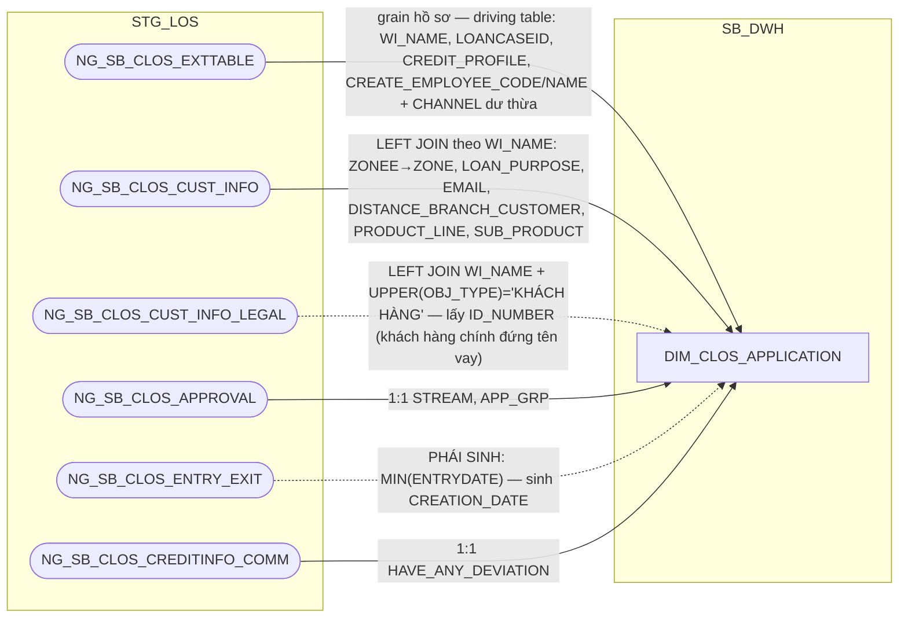

### 3.3 Cấu trúc bảng

| STT | Tên cột | Kiểu dữ liệu | Bắt buộc | Độ lớn | Khóa | Mô tả | Báo cáo sử dụng | Tên chỉ tiêu trên báo cáo |
| --- | --- | --- | --- | --- | --- | --- | --- | --- |
| 1 | DIMENSION_KEY | NUMBER | Y | 18 | PK | Khóa chính của bảng chiều DIM_CLOS_APPLICATION, sinh bằng Oracle sequence tại SB_DWH; PDTD_DTM giữ nguyên giá trị, không sinh sequence mới | — | — |
| 2 | APPLICATION_SK | NUMBER | Y | 18 |  | Khóa tham chiếu đến bảng chiều DIM_CLOS_APPLICATION, bằng đúng giá trị DIMENSION_KEY của cùng dòng. Giá trị mặc định = -1 (dòng Unknown) nếu không có giá trị phù hợp | — | — |
| 3 | WI_NAME | NVARCHAR2 | N | 63 | BK | Mã hồ sơ tín dụng CLOS — nguồn NG_SB_CLOS_EXTTABLE.WI_NAME. UNIQUE (WI_NAME, EFF_DATE) | Báo cáo CLOS APPLICATION (BC2) Báo cáo Thông tin phê duyệt (BC3) Báo cáo Tuần Chuyên viên Thẩm định (BC4) Báo cáo SLA - TAT (BC5) Báo cáo NGOẠI LỆ (BC6) Báo cáo EXCEPTION - FTR (BC7) Báo cáo RETURN (BC8) Báo cáo KPI (BC9) Báo cáo Giải ngân _ Quá hạn KHDN (BC11) — qua FCT_CLOS_LOAN_DISBURSEMENT | WINAME / WI_NAME (Mã hồ sơ) |
| 4 | LOANCASEID | NVARCHAR2 | N | 100 |  | Mã khoản vay gắn với hồ sơ — nguồn NG_SB_CLOS_EXTTABLE.LOANCASEID, giữ nguyên văn không lọc ở SB_DWH (DTM lọc riêng theo nhu cầu BC11). Cột thô, không phái sinh | Báo cáo EXCEPTION - FTR (BC7) Báo cáo Giải ngân _ Quá hạn KHDN (BC11) | LOANCASEID (Mã LOANCASEID) |
| 5 | STREAM | NVARCHAR2 | N | 200 |  | Luồng nghiệp vụ của hồ sơ — nguồn NG_SB_CLOS_APPROVAL.STREAM | Báo cáo Thông tin phê duyệt (BC3) Báo cáo KPI (BC9) — điều kiện lọc STREAM cho SLHS_CLOS/SLGN_CLOS/TAT_CLOS | BC3: STREAM (Luồng hồ sơ); nguồn cho chỉ tiêu SLHS_CLOS_*/SLGN_CLOS_*/TAT_CLOS_* (điều kiện lọc trên AGG_LOS_KPI_YTD_DAILY) |
| 6 | CREDIT_PROFILE | NVARCHAR2 | N | 50 |  | Cấp tín dụng của hồ sơ (TVTD/CTD) — nguồn NG_SB_CLOS_EXTTABLE.CREDIT_PROFILE | Báo cáo CLOS APPLICATION (BC2) | CAP_TIN_DUNG (Hồ sơ tư vấn tín dụng hay cấp tín dụng) |
| 7 | CREATE_EMPLOYEE_CODE | NVARCHAR2 | N | 100 |  | Mã cán bộ khởi tạo hồ sơ (CRO) — nguồn NG_SB_CLOS_EXTTABLE.EMPLOYEE_CODE.| Báo cáo CLOS APPLICATION (BC2) | EMPLOYEE_CODE (Mã CRO) |
| 8 | CREATE_EMPLOYEE_NAME | NVARCHAR2 | N | 225 |  | Tên cán bộ khởi tạo hồ sơ (CRO) — nguồn NG_SB_CLOS_EXTTABLE.EMPLOYEE_NAME.| Báo cáo CLOS APPLICATION (BC2) | EMPLOYEE_NAME (Tên CRO) |
| 9 | CREATION_DATE | DATE | N | 10 |  | Ngày khởi tạo hồ sơ — PHÁI SINH: MIN(ENTRYDATE) theo WI_NAME trên NG_SB_CLOS_ENTRY_EXIT, TRUNC về ngày | Báo cáo CLOS APPLICATION (BC2) | CREATION_DATE (Ngày hồ sơ khởi tạo) |
| 10 | APP_GRP | NVARCHAR2 | N | 200 |  | Cấp thẩm quyền phê duyệt của hồ sơ (A1-C3, BOD, CC, SCC, RCC) — nguồn NG_SB_CLOS_APPROVAL.APP_GRP | Báo cáo CLOS APPLICATION (BC2) — hiển thị trực tiếp Báo cáo SLA - TAT (BC5) — khóa tra REF_PRODUCT/SLA_* Báo cáo KPI (BC9) — khóa tra điểm KPI (POINT) | APP_GRP (Cấp phân quyền phê duyệt); nguồn cho chỉ tiêu POINT (BC9), SLA_CREDIT_OFFICER/SLA_MARKER/SLA_CHECKER/SLA_CREDIT_APPROVER (BC5) |
| 11 | HAVE_ANY_DEVIATION | NVARCHAR2 | N | 100 |  | Hồ sơ có ngoại lệ/độ lệch so với chính sách chuẩn hay không (Có/Không) — nguồn NG_SB_CLOS_CREDITINFO_COMM.HAVE_ANY_DEVIATION. Chỉ có giá trị từ khi hồ sơ tới bước Hội đồng tín dụng, NULL ở các phiên bản trước đó | Báo cáo SLA - TAT (BC5) — khóa tra REF_PRODUCT/SLA_* | Nguồn cho chỉ tiêu REF_PRODUCT/SLA_* (BC5) |
| 12 | ZONE | NVARCHAR2 | N | 200 |  | Khu vực/vùng quản lý tự khai theo hồ sơ (BC1/BC2.ZONE) — nguồn NG_SB_CLOS_CUST_INFO.ZONEE (đổi tên bỏ chữ E cuối cho gọn). Khác bản chất với DIM_LOS_COMPANY.ZONE (mã nội bộ chuẩn hóa từ MAS_COMPANY, dùng làm khóa join đơn vị kinh doanh) — cột này là giá trị tự khai gắn với hồ sơ, không dùng để join | Báo cáo CLOS APPLICATION (BC2) | ZONE (Khu vực) |
| 13 | LOAN_PURPOSE | NVARCHAR2 | N | 200 |  | Mục đích vay của khoản đang xin trong hồ sơ này (có/không tạo doanh thu) — nguồn NG_SB_CLOS_CUST_INFO.LOAN_PURPOSE | — | Thiết kế dư thừa |
| 14 | EMAIL | NVARCHAR2 | N | 100 |  | Email liên hệ khai theo hồ sơ — nguồn NG_SB_CLOS_CUST_INFO.EMAIL | — | Thiết kế dư thừa |
| 15 | DISTANCE_BRANCH_CUSTOMER | NVARCHAR2 | N | 200 |  | Dải khoảng cách từ khách hàng đến chi nhánh xử lý hồ sơ này (đã phân nhóm sẵn, không phải số đo thô) — nguồn NG_SB_CLOS_CUST_INFO.DISTANCE_BRANCH_CUSTOMER. Cần BA xác nhận đơn vị đo (nghi vấn km) | — | Thiết kế dư thừa |
| 16 | PRODUCT_LINE | NVARCHAR2 | N | 200 |  | Dòng sản phẩm tự khai theo hồ sơ (mã PRO01-06) — nguồn NG_SB_CLOS_CUST_INFO.PRODUCT_LINE. Text as-is, KHÔNG dùng để tra REF_PRODUCT/SLA_* (khóa tra vẫn qua DIM_CLOS_PRODUCT/FCT, xem ghi chú cuối mục) | Báo cáo CLOS APPLICATION (BC2) | PRODUCT_LINE (Dòng sản phẩm) |
| 17 | SUB_PRODUCT | NVARCHAR2 | N | 255 |  | Sản phẩm vay chi tiết tự khai theo hồ sơ — nguồn NG_SB_CLOS_CUST_INFO.SUB_PRODUCT. Text as-is, cùng lý do cột 17 | Báo cáo CLOS APPLICATION (BC2) | SUB_PRODUCT (Sản phẩm nhánh) |
| 18 | ID_NUMBER | NVARCHAR2 | N | 100 |  | Số ĐKKD/CMND của khách hàng đứng tên vay chính — nguồn NG_SB_CLOS_CUST_INFO_LEGAL.ID_NUMBER, LEFT JOIN theo WI_NAME + UPPER(OBJ_TYPE)='KHÁCH HÀNG'. Dùng nội bộ để tự tra CUSTOMER_SK trên FCT, không phải khóa report dùng để join | — | Thể hiện quan hệ hồ sơ↔khách hàng trực tiếp trên DIM này |
| 19 | CHANNEL | NVARCHAR2 | N | 255 |  | Kênh nộp hồ sơ (eBanking/khác) — nguồn NG_SB_CLOS_EXTTABLE.CHANNEL | — | Thiết kế dư thừa |
| 20 | EFF_DATE | DATE | N |  |  | Ngày bắt đầu hiệu lực của phiên bản bản ghi (SCD Type 2) | — | — |
| 21 | EXP_DATE | DATE | N |  |  | Ngày hết hiệu lực của phiên bản bản ghi; NULL = bản ghi hiện hành | — | — |

## 4. DIM_CLOS_CUSTOMER

### 4.1 Mục đích thiết kế
- **Ý nghĩa bảng:** thông tin doanh nghiệp khách hàng chính CLOS — lưu tên khách hàng cùng các thuộc tính mô tả CỐ HỮU của khách hàng (phân khúc, loại hình pháp lý, ngành nghề kinh doanh...).
- **Khóa chính của bảng (PK):** `DIMENSION_KEY`
- **Khóa nghiệp vụ (BK):** `ID_NUMBER`
- **Độ chi tiết (grain):** 1 dòng = 1 khách hàng (theo `ID_NUMBER` — số ĐKKD/CMND, định danh pháp lý ổn định không đổi giữa các hồ sơ khác nhau). Lưu lịch sử thông tin thay đổi theo thời gian (SCD Type 2).
- **Phục vụ báo cáo:**
  - Báo cáo CLOS APPLICATION (BC2)
  - Báo cáo Thông tin phê duyệt (BC3)
  - Báo cáo Tuần Chuyên viên Thẩm định (BC4)

### 4.2 Sơ đồ lineage

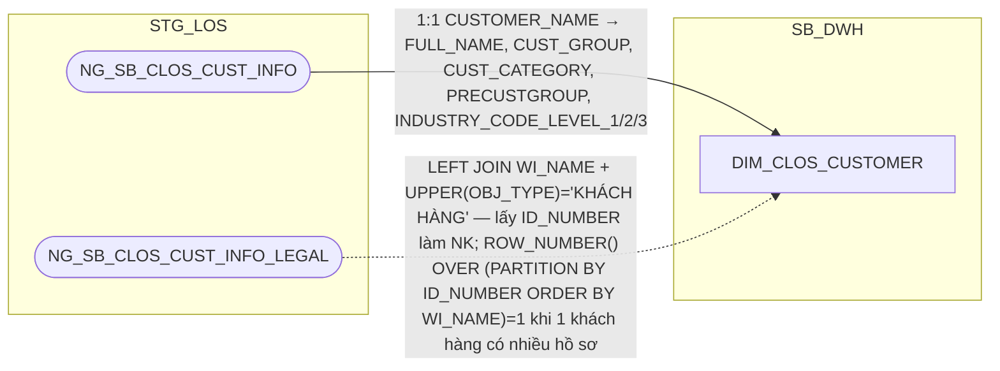

### 4.3 Cấu trúc bảng

| STT | Tên cột | Kiểu dữ liệu | Bắt buộc | Độ lớn | Khóa | Mô tả | Báo cáo sử dụng | Tên chỉ tiêu trên báo cáo |
| --- | --- | --- | --- | --- | --- | --- | --- | --- |
| 1 | DIMENSION_KEY | NUMBER | Y | 18 | PK | Khóa chính của bảng chiều DIM_CLOS_CUSTOMER, sinh bằng Oracle sequence tại SB_DWH | — | — |
| 2 | CUSTOMER_SK | NUMBER | Y | 18 |  | Khóa tham chiếu đến bảng chiều DIM_CLOS_CUSTOMER, bằng đúng giá trị DIMENSION_KEY của cùng dòng. Mặc định -1 | — | — |
| 3 | ID_NUMBER | VARCHAR2 | N | 100 | BK | Số ĐKKD/CMND của khách hàng — định danh pháp lý ổn định, không đổi giữa các hồ sơ khác nhau. Nguồn: NG_SB_CLOS_CUST_INFO LEFT JOIN NG_SB_CLOS_CUST_INFO_LEGAL theo WI_NAME + UPPER(OBJ_TYPE)='KHÁCH HÀNG' | — | Nguồn cho chỉ tiêu/trường CUSTOMER_SK (khóa join FCT_CLOS_APPLICATION, tra qua ID_NUMBER; FCT_CLOS_LEGAL_PARTY.CUSTOMER_SK) |
| 4 | FULL_NAME | NVARCHAR2 | N | 200 |  | Tên doanh nghiệp khách hàng — nguồn NG_SB_CLOS_CUST_INFO.CUSTOMER_NAME (dòng đại diện đã chọn ở cột ID_NUMBER) | Báo cáo CLOS APPLICATION (BC2) Báo cáo Thông tin phê duyệt (BC3) Báo cáo Tuần Chuyên viên Thẩm định (BC4) | CUSTOMER_NAME (Tên khách hàng) |
| 5 | CUST_GROUP | NVARCHAR2 | N | 200 |  | Phân khúc khách hàng doanh nghiệp (SME/MSME/USME/STR/JSC/SOC/BANK/FDI/NBFI) — nguồn NG_SB_CLOS_CUST_INFO.CUST_GROUP|
| 6 | CUST_CATEGORY | NVARCHAR2 | N | 200 |  | Phân loại khách hàng — nguồn NG_SB_CLOS_CUST_INFO.CUST_CATEGORY. Metadata ghi nhận cả loại hình pháp lý lẫn giá trị dạng mã số trong cùng cột — cần BA xác nhận quy tắc chuẩn | — | Thiết kế dư thừa |
| 7 | PRECUSTGROUP | NVARCHAR2 | N | 300 |  | Phân khúc khách hàng trước xử lý — nguồn NG_SB_CLOS_CUST_INFO.PRECUSTGROUP, cùng bộ giá trị với CUST_GROUP (SME/MSME/JSC/SOC/NBFI/FDI). Cần BA xác nhận khác biệt cụ thể với CUST_GROUP | — | Thiết kế dư thừa |
| 8 | INDUSTRY_LVL1_CODE | VARCHAR2 | N | 200 |  | Mã ngành kinh doanh cấp 1 — Nguồn NG_SB_CLOS_CUST_INFO.INDUSTRY_CODE_LEVEL_1|
| 9 | INDUSTRY_LVL2_CODE | VARCHAR2 | N | 200 |  | Mã ngành kinh doanh cấp 2 — Nguồn NG_SB_CLOS_CUST_INFO.INDUSTRY_CODE_LEVEL_2|
| 10 | INDUSTRY_LVL3_CODE | VARCHAR2 | N | 200 |  | Mã ngành kinh doanh cấp 3 — Nguồn NG_SB_CLOS_CUST_INFO.INDUSTRY_CODE_LEVEL_3|
| 11 | EFF_DATE | DATE | N |  |  | Ngày bắt đầu hiệu lực của phiên bản bản ghi (SCD Type 2) | — | — |
| 12 | EXP_DATE | DATE | N |  |  | Ngày hết hiệu lực của phiên bản bản ghi; NULL = bản ghi hiện hành | — | — |

## 5. DIM_CLOS_WORKSTEP_DECISION

### 5.1 Mục đích thiết kế
- **Ý nghĩa bảng:** danh mục cặp (bước xử lý, quyết định) hợp lệ trong quy trình BPM của hồ sơ tín dụng CLOS — đây là danh mục cấu hình gốc của BPM engine, không phải bảng sự kiện/giao dịch theo hồ sơ.
- **Khóa chính của bảng (PK):** `DIMENSION_KEY`
- **Khóa nghiệp vụ (BK):** composite `WORKSTEP_CODE` + `DECISION_CODE` — hash vào cột `WORKSTEP_DECISION_BK` 
- **Độ chi tiết (grain):** 1 dòng = 1 cặp (WORKSTEP_CODE, DECISION_CODE) hợp lệ, lưu lịch sử thay đổi theo thời gian (SCD Type 2, xác định qua CDC trên bảng danh mục gốc).
- **Phục vụ báo cáo:**
  - Báo cáo RLOS APPLICATION (BC1), Báo cáo CLOS APPLICATION (BC2), Báo cáo Thông tin phê duyệt (BC3), Báo cáo Tuần Chuyên viên Thẩm định (BC4), Báo cáo SLA - TAT (BC5), Báo cáo EXCEPTION - FTR (BC7), Báo cáo RETURN (BC8), Báo cáo KPI (BC9) — hầu hết đọc trực tiếp WORKSTEP_CODE/DECISION_CODE trên bảng sự kiện (FCT_CLOS_WORKSTEP_EVENT); BC2 dùng LAST_DECISION qua JOIN LAST_WORKSTEP_DECISION_SK trên FCT_CLOS_APPLICATION

### 5.2 Sơ đồ lineage

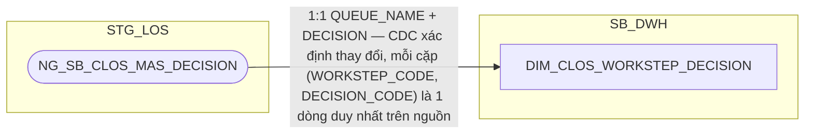

### 5.3 Cấu trúc bảng

| STT | Tên cột | Kiểu dữ liệu | Bắt buộc | Độ lớn | Khóa | Mô tả | Báo cáo sử dụng | Tên chỉ tiêu trên báo cáo |
| --- | --- | --- | --- | --- | --- | --- | --- | --- |
| 1 | DIMENSION_KEY | NUMBER | Y | 18 | PK | Khóa chính của bảng chiều DIM_CLOS_WORKSTEP_DECISION, sinh bằng Oracle sequence tại SB_DWH; PDTD_DTM giữ nguyên giá trị, không sinh sequence mới | — | — |
| 2 | WORKSTEP_DECISION_SK | NUMBER | Y | 18 |  | Khóa tham chiếu đến bảng chiều DIM_CLOS_WORKSTEP_DECISION, bằng đúng giá trị DIMENSION_KEY của cùng dòng. Giá trị mặc định = -1 (dòng Unknown) nếu không có giá trị phù hợp; được các FCT (APPLICATION_DAILY, WORKSTEP_EVENT...) tham chiếu qua CURRENT_WORKSTEP_SK/LAST_WORKSTEP_DECISION_SK/WORKSTEP_DECISION_SK để chuẩn hóa surrogate key, không phục vụ hiển thị trực tiếp trên báo cáo | — | — |
| 3 | WORKSTEP_DECISION_BK | VARCHAR2 | N | 64 | BK | Khóa nghiệp vụ hash của cặp (bước xử lý, quyết định) — PHÁI SINH: STANDARD_HASH(WORKSTEP_CODE \|\| '~' \|\| DECISION_CODE, 'SHA256').| — | — |
| 4 | WORKSTEP_CODE | NVARCHAR2 | N | 255 |  | Mã bước xử lý trên workflow CLOS — nguồn NG_SB_CLOS_MAS_DECISION.QUEUE_NAME. Cùng với DECISION_CODE là thành phần nguồn của WORKSTEP_DECISION_BK | Báo cáo RLOS APPLICATION (BC1) Báo cáo CLOS APPLICATION (BC2) Báo cáo Thông tin phê duyệt (BC3) Báo cáo Tuần Chuyên viên Thẩm định (BC4) Báo cáo SLA - TAT (BC5) Báo cáo EXCEPTION - FTR (BC7) Báo cáo RETURN (BC8) Báo cáo KPI (BC9) | Nguồn cho chỉ tiêu/trường WORKSTEP (giá trị đọc trực tiếp trên FCT_CLOS_WORKSTEP_EVENT.WORKSTEP_CODE, DIM này chỉ phục vụ làm danh mục đối chiếu/chuẩn hóa mã bước) |
| 5 | DECISION_CODE | NVARCHAR2 | N | 255 |  | Mã quyết định phát sinh tại bước xử lý trên — nguồn NG_SB_CLOS_MAS_DECISION.DECISION. UNIQUE (WORKSTEP_CODE, DECISION_CODE, EFF_DATE) | Báo cáo CLOS APPLICATION (BC2) | LAST_DECISION (Quyết định bước cuối) |
| 6 | CHANNEL | NVARCHAR2 | N | 255 |  | Kênh áp dụng của cặp (bước xử lý, quyết định) — nguồn NG_SB_CLOS_MAS_DECISION.CHANNEL. Giữ có chủ đích để bảo toàn dữ liệu nguồn, hiện chưa có báo cáo nào tiêu thụ | — | Thiết kế dư thừa |
| 7 | EFF_DATE | DATE | N |  |  | Ngày bắt đầu hiệu lực của phiên bản bản ghi (SCD Type 2) — do ETL tính qua CDC khi phát hiện thay đổi trên MAS_DECISION | — | — |
| 8 | EXP_DATE | DATE | N |  |  | Ngày hết hiệu lực của phiên bản bản ghi; NULL = bản ghi hiện hành | — | — |

## 6. DIM_CLOS_EXCEPTION

### 6.1 Mục đích thiết kế
- **Ý nghĩa bảng:** danh mục các lý do ngoại lệ (nội dung cần làm rõ) được cấu hình cho từng tổ hợp bước xử lý + quyết định trên workflow CLOS — đây là danh mục cấu hình gốc thật sự (bảng MAS_ có khóa CDC khai đủ tổ hợp khóa tự nhiên), không phải bảng sự kiện/giao dịch theo hồ sơ.
- **Khóa chính của bảng (PK):** `DIMENSION_KEY`
- **Khóa nghiệp vụ (BK):** composite `ACTIVITYNAME` + `DECISION_CODE` + `EXCEPTION_CATEGORY` + `EXCEPTION_NAME` — hash vào cột `EXCEPTION_BK`
- **Độ chi tiết (grain):** 1 dòng = 1 tổ hợp bước xử lý + quyết định + nhóm lý do + tên lý do, lưu lịch sử thay đổi theo thời gian (SCD Type 2).
- **Phục vụ báo cáo:**
  - Báo cáo EXCEPTION - FTR (BC7)

### 6.2 Sơ đồ lineage

### 6.3 Cấu trúc bảng

| STT | Tên cột | Kiểu dữ liệu | Bắt buộc | Độ lớn | Khóa | Mô tả | Báo cáo sử dụng | Tên chỉ tiêu trên báo cáo |
| --- | --- | --- | --- | --- | --- | --- | --- | --- |
| 1 | DIMENSION_KEY | NUMBER | Y | 18 | PK | Khóa chính của bảng chiều DIM_CLOS_EXCEPTION, sinh bằng Oracle sequence tại SB_DWH; PDTD_DTM giữ nguyên giá trị, không sinh sequence mới | — | — |
| 2 | EXCEPTION_SK | NUMBER | Y | 18 |  | Khóa tham chiếu đến bảng chiều DIM_CLOS_EXCEPTION, bằng đúng giá trị DIMENSION_KEY của cùng dòng. Giá trị mặc định = -1 (dòng Unknown) nếu không có giá trị phù hợp | — | — |
| 3 | EXCEPTION_BK | VARCHAR2 | N | 64 | BK | Khóa nghiệp vụ hash của tổ hợp (bước, quyết định, nhóm lý do, tên lý do) — PHÁI SINH: STANDARD_HASH(ACTIVITYNAME \|\| "~" \|\| DECISION_CODE \|\| '~' \|\| EXCEPTION_CATEGORY \|\| '~' \|\| EXCEPTION_NAME, 'SHA256')| — | — |
| 4 | ACTIVITYNAME | NVARCHAR2 | N | 255 |  | Tên bước phát sinh nội dung cần làm rõ — nguồn NG_SB_CLOS_MAS_EXCEPTION.ACTIVITYNAME. Thành phần nguồn của EXCEPTION_BK (không còn tự đánh dấu khóa, xem cột 4) | Báo cáo EXCEPTION - FTR (BC7) | ACTIVITYNAME (Tên bước) |
| 5 | DECISION_CODE | NVARCHAR2 | N | 100 |  | Mã quyết định tại bước xử lý — nguồn NG_SB_CLOS_MAS_EXCEPTION.DECISION (đổi tên thêm hậu tố CODE cho thống nhất với DIM_CLOS_WORKSTEP_DECISION.DECISION_CODE) | — | Nguồn cho chỉ tiêu/trường EXCEPTION_SK (khóa join 2 bước của FCT_CLOS_EXCEPTION) |
| 6 | EXCEPTION_CATEGORY | NVARCHAR2 | N | 500 |  | Phân nhóm nội dung cần làm rõ — nguồn NG_SB_CLOS_MAS_EXCEPTION.EXCEPTION_CATEGORY | Báo cáo EXCEPTION - FTR (BC7) | EXCEPTION_CATEGORY (Nhóm lý do quyết định) |
| 7 | EXCEPTION_NAME | NVARCHAR2 | N | 500 |  | Tên nội dung cần làm rõ — nguồn NG_SB_CLOS_MAS_EXCEPTION.EXCEPTION_NAME | Báo cáo EXCEPTION - FTR (BC7) | EXCEPTION_NAME (Tên lý do) |
| 8 | EXCEPTION_CODE | VARCHAR2 | N | 50 |  | Mã nội dung cần làm rõ — PHÁI SINH: CASE WHEN INSTR(EXCEPTION_CATEGORY, ':') > 0 THEN REGEXP_SUBSTR(EXCEPTION_CATEGORY, '^[^:]+') ELSE NULL END | Báo cáo EXCEPTION - FTR (BC7) | EXCEPTION_CODE (Code lý do) |
| 9 | RAISE_FLAG | NVARCHAR2 | N | 5 |  | Cờ cho biết ngoại lệ này có được phép Raise (nêu lý do) tại tổ hợp bước/quyết định này hay không — nguồn NG_SB_CLOS_MAS_EXCEPTION.RAISE (đổi tên thêm hậu tố FLAG, tránh trùng từ khóa RAISE). Giữ có chủ đích để không bỏ sót thuộc tính gốc của bảng nguồn | — | Thiết kế dư thừa |
| 10 | CLEAR_FLAG | NVARCHAR2 | N | 255 |  | Cờ cho biết ngoại lệ này có được phép Clear (trả lời làm rõ) tại tổ hợp bước/quyết định này hay không — nguồn NG_SB_CLOS_MAS_EXCEPTION.CLEAR (đổi tên thêm hậu tố FLAG cho nhất quán với RAISE_FLAG) | — | Thiết kế dư thừa |
| 11 | ID_SOURCE | NUMBER | N | 18 |  | Số định danh nội bộ của bản ghi danh mục trên bảng nguồn — nguồn NG_SB_CLOS_MAS_EXCEPTION.ID (đổi tên thêm hậu tố SOURCE, tránh trùng khái niệm với DIMENSION_KEY/ID kỹ thuật của DIM, đồng nhất với CODE_SOURCE) | — | Thiết kế dư thừa |
| 12 | CODE_SOURCE | NVARCHAR2 | N | 255 |  | Mã viết tắt của tổ hợp ngoại lệ — nguồn NG_SB_CLOS_MAS_EXCEPTION.CODE (đổi tên thêm hậu tố SOURCE, tránh trùng khái niệm với EXCEPTION_CODE phái sinh ở cột 9, đồng nhất với ID_SOURCE) | — | Thiết kế dư thừa |
| 13 | STATUS | NVARCHAR2 | N | 1 |  | Trạng thái bản ghi danh mục trên bảng nguồn (còn hiệu lực/đã ngừng áp dụng...) — nguồn NG_SB_CLOS_MAS_EXCEPTION.STATUS, giữ nguyên tên nguồn | — | Thiết kế dư thừa |
| 14 | EFF_DATE | DATE | N |  |  | Ngày bắt đầu hiệu lực của phiên bản bản ghi (SCD Type 2) | — | — |
| 15 | EXP_DATE | DATE | N |  |  | Ngày hết hiệu lực của phiên bản bản ghi; NULL = bản ghi hiện hành | — | — |

## 7. DIM_CLOS_PRODUCT

### 7.1 Mục đích thiết kế
- **Ý nghĩa bảng:** danh mục sản phẩm tín dụng CLOS (doanh nghiệp) — gồm dòng sản phẩm và sản phẩm nhánh chi tiết, là thông tin ít thay đổi theo bộ mã ổn định.
- **Khóa chính của bảng (PK):** `DIMENSION_KEY`
- **Khóa nghiệp vụ (BK):** composite `PRODUCT_LINE_CODE` + `PRODUCT_LINE_NAME` + `SUB_PRODUCT_CODE` + `SUB_PRODUCT_NAME` — hash vào cột `PRODUCT_BK`
- **Độ chi tiết (grain):** 1 dòng lưu lịch sử thay đổi của 1 tổ hợp dòng sản phẩm + sản phẩm nhánh theo thời gian (SCD Type 2, do ETL tính qua CDC).
- **Phục vụ báo cáo:**
  - Báo cáo CLOS APPLICATION (BC2) — hiển thị trực tiếp dòng sản phẩm/sản phẩm nhánh
  - Báo cáo SLA - TAT (BC5) — khóa tra cam kết SLA nhập liệu tập trung REF_SLA_NLTT
  - Báo cáo KPI (BC9) — qua công thức điểm KPI nhánh CLOS

### 7.2 Sơ đồ lineage

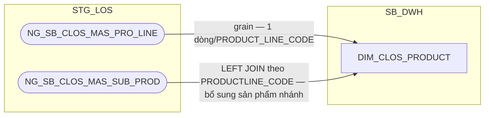

### 7.3 Cấu trúc bảng

| STT | Tên cột | Kiểu dữ liệu | Bắt buộc | Độ lớn | Khóa | Mô tả | Báo cáo sử dụng | Tên chỉ tiêu trên báo cáo |
| --- | --- | --- | --- | --- | --- | --- | --- | --- |
| 1 | DIMENSION_KEY | NUMBER | Y | 18 | PK | Khóa chính của bảng chiều DIM_CLOS_PRODUCT, sinh bằng Oracle sequence tại SB_DWH; PDTD_DTM giữ nguyên giá trị, không sinh sequence mới | — | — |
| 2 | PRODUCT_SK | NUMBER | Y | 18 |  | Khóa tham chiếu đến bảng chiều DIM_CLOS_PRODUCT, bằng đúng giá trị DIMENSION_KEY của cùng dòng. Giá trị mặc định = -1 (dòng Unknown) nếu không có giá trị phù hợp | — | — |
| 3 | PRODUCT_BK | VARCHAR2 | N | 64 | BK | Khóa nghiệp vụ hash của tổ hợp (dòng sản phẩm, tên dòng, sản phẩm nhánh, tên sản phẩm) — PHÁI SINH: STANDARD_HASH(PRODUCT_LINE_CODE \|\| '~' \|\| PRODUCT_LINE_NAME \|\| '~' \|\| SUB_PRODUCT_CODE \|\| '~' \|\| SUB_PRODUCT_NAME, 'SHA256')| — | — |
| 4 | PRODUCT_LINE_CODE | NVARCHAR2 | N | 100 |  | Mã dòng sản phẩm — nguồn NG_SB_CLOS_MAS_PRO_LINE.PRODUCT_LINE_CODE. UNIQUE (PRODUCT_LINE_CODE, PRODUCT_LINE_NAME, SUB_PRODUCT_CODE, EFF_DATE). Thành phần nguồn của PRODUCT_BK (không còn tự đánh dấu khóa, xem cột 4) | Báo cáo CLOS APPLICATION (BC2) | PRODUCT_LINE (Dòng sản phẩm) |
| 5 | PRODUCT_LINE_NAME | NVARCHAR2 | N | 100 |  | Tên dòng sản phẩm — nguồn NG_SB_CLOS_MAS_PRO_LINE.PRODUCT_LINE_NAME | Báo cáo SLA - TAT (BC5) — khóa tra REF_SLA_NLTT Báo cáo KPI (BC9) — qua SLA_DE_TOTAL_RESULT | Nguồn cho chỉ tiêu/trường SLA_DE_RESULT/SLA_DE_TOTAL_RESULT (khóa JOIN Product Line trên REF_SLA_NLTT) |
| 6 | SUB_PRODUCT_CODE | NVARCHAR2 | N | 255 |  | Mã sản phẩm nhánh — nguồn NG_SB_CLOS_MAS_SUB_PROD.SUB_PROD_CODE | Báo cáo CLOS APPLICATION (BC2) | SUB_PRODUCT (Sản phẩm nhánh) |
| 7 | SUB_PRODUCT_NAME | NVARCHAR2 | N | 255 |  | Tên sản phẩm nhánh chi tiết — nguồn NG_SB_CLOS_MAS_SUB_PROD.SUB_PROD_NAME (đổi tên từ PRODUCT_NAME, review 2026-10-06, đồng nhất với SUB_PRODUCT_CODE) | Báo cáo SLA - TAT (BC5) — khóa tra REF_SLA_NLTT Báo cáo KPI (BC9) — qua SLA_DE_TOTAL_RESULT | Nguồn cho chỉ tiêu/trường SLA_DE_RESULT/SLA_DE_TOTAL_RESULT (khóa JOIN Sub Product trên REF_SLA_NLTT) |
| 8 | SUB_PROD_ACTIVE | VARCHAR2 | N | 100 |  | Trạng thái hiệu lực của sản phẩm nhánh — nguồn NG_SB_CLOS_MAS_SUB_PROD.ACTIVE | — | — |
| 9 | EFF_DATE | DATE | N |  |  | Ngày bắt đầu hiệu lực của phiên bản bản ghi (SCD Type 2) — do ETL tính qua CDC khi phát hiện thay đổi trên MAS_PRO_LINE/MAS_SUB_PROD (không có cột khai báo tay như MAP_CLOS_PRODUCT trước đây) | — | — |
| 10 | EXP_DATE | DATE | N |  |  | Ngày hết hiệu lực của phiên bản bản ghi; NULL = bản ghi hiện hành | — | — |

## 8. DIM_RLOS_APPLICATION

### 8.1 Mục đích thiết kế

- **Ý nghĩa bảng:** danh mục hồ sơ tín dụng RLOS (bán lẻ/cá nhân) — lưu các
  thông tin ít thay đổi của 1 hồ sơ (luồng nghiệp vụ, chính sách, chương
  trình bán, cấp thẩm quyền phê duyệt, kênh bán hàng/đối tác giới thiệu/AO
  phụ trách hồ sơ...).
- **Khóa chính của bảng (PK):** `DIMENSION_KEY`
- **Khóa nghiệp vụ (BK):** `WI_NAME` (`EFF_DATE` chỉ là điều kiện UNIQUE cho SCD2, không phải thành phần khóa)
- **Độ chi tiết (grain):** 1 dòng hồ sơ lưu lịch sử thông tin thay đổi theo
  thời gian (SCD Type 2, khóa tự nhiên `WI_NAME` + `EFF_DATE`) cho các
  cột nghiệp vụ gốc; riêng 2 nhóm cột bổ sung ở trên dùng cơ chế SCD1
  (UPDATE tại chỗ, không gắn với EFF_DATE/EXP_DATE).
- **Phục vụ báo cáo:**
  - Báo cáo RLOS APPLICATION (BC1)
  - Báo cáo CLOS APPLICATION (BC2) — đối chiếu `STREAM`/`CREATION_DATE` nhánh chung
  - Báo cáo Thông tin phê duyệt (BC3) — `STREAM`
  - Báo cáo SLA - TAT (BC5) — tra khóa `APP_GRP` (`CHANGE_TYPE`/`DEVIATION_G3` tính report-time ở tầng PDTD_DTM/`FCT_RLOS_APPLICATION`, xem mục 2.3.1.1 trong `HLD_Table_Design.md`)
  - Báo cáo EXCEPTION - FTR (BC7) — `LOANCASEID`
  - Báo cáo KPI (BC9) — `APP_GRP`; `INTEREST_RATE_PCT`/10 cột cờ nguồn
    thu nay là nguồn cho `REPAYMENT_SOURCE`/`INCOM_3`/`BUSINESS_INCOM`
    tính tại `AGG_LOS_KPI_APPLICATION` (PDTD_DTM)
  - Báo cáo Giải ngân _ Quá hạn KHCN (BC10) — `LAST_APPROVAL_DATE`

### 8.2 Sơ đồ lineage

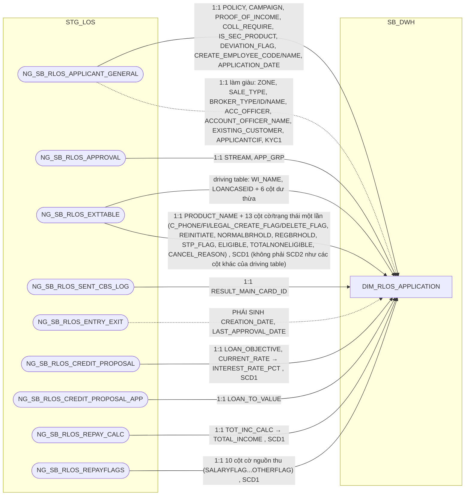

### 8.3 Cấu trúc bảng

| STT | Tên cột | Kiểu dữ liệu | Bắt buộc | Độ lớn | Khóa | Mô tả | Báo cáo sử dụng | Tên chỉ tiêu trên báo cáo |
| --- | --- | --- | --- | --- | --- | --- | --- | --- |
| 1 | DIMENSION_KEY | NUMBER | Y | 18 | PK | Khóa chính của bảng chiều DIM_RLOS_APPLICATION, sinh bằng Oracle sequence tại SB_DWH; PDTD_DTM giữ nguyên giá trị, không sinh sequence mới | — | — |
| 2 | APPLICATION_SK | NUMBER | Y | 18 |  | Khóa tham chiếu đến bảng chiều DIM_RLOS_APPLICATION, bằng đúng giá trị DIMENSION_KEY của cùng dòng. Giá trị mặc định = -1 (dòng Unknown) nếu không có giá trị phù hợp | — | — |
| 3 | WI_NAME | NVARCHAR2 | N | 63 | BK | Mã hồ sơ tín dụng RLOS — nguồn NG_SB_RLOS_EXTTABLE.WI_NAME. UNIQUE (WI_NAME, EFF_DATE) | Báo cáo RLOS APPLICATION (BC1) Báo cáo CLOS APPLICATION (BC2) Báo cáo Thông tin phê duyệt (BC3) Báo cáo SLA - TAT (BC5) Báo cáo NGOẠI LỆ (BC6) Báo cáo EXCEPTION - FTR (BC7) Báo cáo RETURN (BC8) Báo cáo KPI (BC9) | WINAME / WI_NAME (Mã hồ sơ) |
| 4 | LOANCASEID | NVARCHAR2 | N | 100 |  | Mã khoản vay gắn với hồ sơ — nguồn NG_SB_RLOS_EXTTABLE.LOANCASEID, giữ nguyên văn không lọc | Báo cáo EXCEPTION - FTR (BC7) | LOANCASEID (Mã LOANCASEID) |
| 5 | STREAM | NVARCHAR2 | N | 200 |  | Luồng nghiệp vụ của hồ sơ — nguồn NG_SB_RLOS_APPROVAL.STREAM | Báo cáo RLOS APPLICATION (BC1) — hiển thị trực tiếp, đồng thời là khóa tra BUSINESS_FLOW Báo cáo CLOS APPLICATION (BC2) Báo cáo Thông tin phê duyệt (BC3) | STREAM (Luồng hồ sơ); nguồn cho chỉ tiêu/trường BUSINESS_FLOW (Phân khúc hồ sơ, BC1) |
| 6 | POLICY | NVARCHAR2 | N | 200 |  | Chính sách tín dụng áp dụng cho hồ sơ — nguồn NG_SB_RLOS_APPLICANT_GENERAL.POLICY | Báo cáo RLOS APPLICATION (BC1) | POLICY (Chính sách áp dụng) |
| 7 | CAMPAIGN | NVARCHAR2 | N | 200 |  | Chương trình bán áp dụng cho hồ sơ — nguồn NG_SB_RLOS_APPLICANT_GENERAL.CAMPAIGN | Báo cáo RLOS APPLICATION (BC1) | CAMPAIGN (Mã chương trình tiếp thị) |
| 8 | PROOF_OF_INCOME | NVARCHAR2 | N | 200 |  | Hình thức chứng minh thu nhập — nguồn NG_SB_RLOS_APPLICANT_GENERAL.PROOF_OF_INCOME, giữ nguyên giá trị gốc (mã 'proofincome01'/'proofincome02'...). Logic chuẩn hóa sang tên hiển thị đặt tại PDTD_DTM | Báo cáo RLOS APPLICATION (BC1) | PROOF_OF_INCOME (Nguồn thu nhập) |
| 9 | COLL_REQUIRE | NVARCHAR2 | N | 10 |  | Hồ sơ có yêu cầu tài sản bảo đảm hay không — nguồn NG_SB_RLOS_APPLICANT_GENERAL.COLLREQUIRE, giữ nguyên giá trị gốc ('true'/'false'). Logic chuẩn hóa YES/NO đặt tại PDTD_DTM | Báo cáo SLA - TAT (BC5) — 1 trong 3 nguồn tính REF_PRODUCT (cùng APPROVAL_LEVEL/DEVIATION_CNT) | Nguồn cho chỉ tiêu/trường REF_PRODUCT (Nhóm sản phẩm SLA, BC5); TAT_RLOS_SEC_*/TAT_RLOS_UNSEC_* (điều kiện lọc có/không TSBĐ trên AGG_LOS_KPI_YTD_DAILY, PDTD_DTM) |
| 10 | IS_SEC_PRODUCT | NVARCHAR2 | N | 100 |  | Hồ sơ có sản phẩm phụ đi kèm hay không — nguồn NG_SB_RLOS_APPLICANT_GENERAL.IS_SEC_PRODUCT. Đối chiếu SRS BC5: đây chính là nguồn của SECONDARY_PRODUCTLINE khi tra cam kết SLA | Báo cáo RLOS APPLICATION (BC1) — hiển thị trực tiếp Báo cáo SLA - TAT (BC5) — khóa tra REF_PRODUCT/SLA_* | SECONDARY_PRODUCTLINE (Có sản phẩm phụ — YES/NO) |
| 11 | DEVIATION_FLAG | NVARCHAR2 | N | 10 |  | Hồ sơ có ngoại lệ chính sách hay không — nguồn NG_SB_RLOS_APPLICANT_GENERAL.DEVIATION_FLAG (DQ-11, đã giải quyết) | Báo cáo RLOS APPLICATION (BC1) | DEVIATION (Hồ sơ có ngoại lệ — YES/NO) |
| 12 | CREATE_EMPLOYEE_CODE | NVARCHAR2 | N | 20 |  | Mã cán bộ quản lý hồ sơ — nguồn NG_SB_RLOS_APPLICANT_GENERAL.EMPLOYEE_CODE.| Báo cáo RLOS APPLICATION (BC1) | EMPLOYEE_CODE (Mã CRO) |
| 13 | CREATE_EMPLOYEE_NAME | NVARCHAR2 | N | 50 |  | Tên cán bộ quản lý hồ sơ — nguồn NG_SB_RLOS_APPLICANT_GENERAL.EMPLOYEE_NAME.| Báo cáo RLOS APPLICATION (BC1) | EMPLOYEE_NAME (Tên CRO) |
| 14 | CREATION_DATE | DATE | N | 10 |  | Ngày khởi tạo hồ sơ — PHÁI SINH: MIN(ENTRYDATE) theo WI_NAME trên NG_SB_RLOS_ENTRY_EXIT, TRUNC về ngày | Báo cáo RLOS APPLICATION (BC1) Báo cáo CLOS APPLICATION (BC2) | CREATION_DATE (Ngày khởi tạo hồ sơ) |
| 15 | APPLICATION_DATE | DATE | N |  |  | Ngày khởi tạo hồ sơ khai theo form — nguồn NG_SB_RLOS_APPLICANT_GENERAL.APPLICATION_DATE | — | Thiết kế dư thừa (song song với CREATION_DATE, khác nguồn) |
| 16 | RESULT_MAIN_CARD_ID | VARCHAR2 | N | 200 |  | Mã thẻ chính do hệ thẻ (T24) trả về — nguồn NG_SB_RLOS_SENT_CBS_LOG.RESULT_SEAB_MAIN_CARD_ID, lấy dòng mới nhất STATUS='OK' | Báo cáo RLOS APPLICATION (BC1) | K_TYPE (Loại thẻ tín dụng); HOME_ADDRESS (Địa chỉ nhận Pin/Thẻ) — cả 2 phái sinh từ lookup RESULT_MAIN_CARD_ID → STG_DIM_CARD |
| 17 | APP_GRP | NVARCHAR2 | N | 200 |  | Cấp thẩm quyền phê duyệt của hồ sơ — nguồn NG_SB_RLOS_APPROVAL.APP_GRP. BC1/BC2 hiển thị trực tiếp; BC9 dùng làm khóa tra điểm KPI; dùng làm khóa tra cam kết SLA ở PDTD_DTM | Báo cáo RLOS APPLICATION (BC1) — hiển thị trực tiếp Báo cáo SLA - TAT (BC5) — khóa tra REF_PRODUCT/SLA_* Báo cáo KPI (BC9) — khóa tra điểm KPI | APP_GRP (Cấp phân quyền phê duyệt) |
| 18 | LAST_APPROVAL_DATE | DATE | N |  |  | Ngày phê duyệt gần nhất của hồ sơ — PHÁI SINH: MAX(EXITDATE) trên NG_SB_RLOS_ENTRY_EXIT tại WORKSTEP/DECISION theo SRS BC10 | Báo cáo Giải ngân _ Quá hạn KHCN (BC10) — qua FCT_RLOS_LOAN_DISBURSEMENT | APPROVAL_DATE (Ngày phê duyệt) |
| 19 | CUSTOMER_NAME | NVARCHAR2 | N | 150 |  | Tên khách hàng đứng tên vay chính của hồ sơ — nguồn NG_SB_RLOS_EXTTABLE.CUSTOMER_NAME, bản 1:1 theo WI_NAME.| — | — |
| 20 | APPROVAL_CONDITION | NVARCHAR2 | N | 50 |  | Nhóm/cấp phê duyệt áp dụng cho hồ sơ, cùng bộ mã với APP_GRP (cột 17) — nguồn NG_SB_RLOS_EXTTABLE.APPROVAL_CONDITION | — | Thiết kế dư thừa |
| 21 | APPROVER_TYPE | NVARCHAR2 | N | 100 |  | Loại cấp phê duyệt xử lý hồ sơ — nguồn NG_SB_RLOS_EXTTABLE.APPROVER_TYPE | — | Thiết kế dư thừa |
| 22 | APP_STATUS | NVARCHAR2 | N | 100 |  | Trạng thái hồ sơ (giá trị mẫu quan sát được là lý do từ chối theo câu hỏi Knock-out) — nguồn NG_SB_RLOS_EXTTABLE.APP_STATUS | — | Thiết kế dư thừa |
| 23 | RMEMAILID | NVARCHAR2 | N | 250 |  | Email cán bộ quan hệ khách hàng (RM) phụ trách — nguồn NG_SB_RLOS_EXTTABLE.RMEMAILID | — | Thiết kế dư thừa |
| 24 | REMARKS | NVARCHAR2 | N | 4000 |  | Ghi chú — nguồn NG_SB_RLOS_EXTTABLE.REMARKS, dữ liệu HTML thô, rất ít khi có dữ liệu | — | Thiết kế dư thừa |
| 25 | ZONE | NVARCHAR2 | N | 50 |  | Vùng miền quản lý tự khai theo hồ sơ (BC1/BC2.ZONE) — CHUYỂN TỪ `FCT_RLOS_CUSTOMER` - nguồn NG_SB_RLOS_APPLICANT_GENERAL.ZONE | Báo cáo RLOS APPLICATION (BC1) | ZONE (Khu vực hoạt động) |
| 26 | SALE_TYPE | NVARCHAR2 | N | 200 |  | Kênh bán hàng — CHUYỂN TỪ `FCT_RLOS_CUSTOMER`— nguồn NG_SB_RLOS_APPLICANT_GENERAL.SALE_TYPE | — | Thiết kế dư thừa |
| 27 | BROKER_TYPE | NVARCHAR2 | N | 200 |  | Loại đối tác giới thiệu (cộng tác viên, đại diện đối tác, đối tác liên kết) — CHUYỂN TỪ `FCT_RLOS_CUSTOMER` — nguồn NG_SB_RLOS_APPLICANT_GENERAL.BROKER_TYPE | — | Thiết kế dư thừa |
| 28 | BROKER_ID | NVARCHAR2 | N | 200 |  | Mã đối tác giới thiệu — CHUYỂN TỪ `FCT_RLOS_CUSTOMER`  — nguồn NG_SB_RLOS_APPLICANT_GENERAL.BROKER_ID | — | Thiết kế dư thừa |
| 29 | BROKER_NAME | NVARCHAR2 | N | 200 |  | Tên đối tác giới thiệu — CHUYỂN TỪ `FCT_RLOS_CUSTOMER` — nguồn NG_SB_RLOS_APPLICANT_GENERAL.BROKER_NAME | — | Thiết kế dư thừa |
| 30 | ACC_OFFICER | NVARCHAR2 | N | 100 |  | Mã nhân viên quan hệ khách hàng (Account Officer) phụ trách hồ sơ — CHUYỂN TỪ `FCT_RLOS_CUSTOMER` — nguồn NG_SB_RLOS_APPLICANT_GENERAL.ACC_OFFICER | — | Thiết kế dư thừa |
| 31 | ACCOUNT_OFFICER_NAME | NVARCHAR2 | N | 200 |  | Tên Account Officer phụ trách hồ sơ — CHUYỂN TỪ `FCT_RLOS_CUSTOMER` — nguồn NG_SB_RLOS_APPLICANT_GENERAL.ACCOUNT_OFFICER_NAME | — | Thiết kế dư thừa |
| 32 | EXISTING_CUSTOMER | NVARCHAR2 | N | 100 |  | Cờ khách hàng hiện hữu tại thời điểm nộp hồ sơ - nguồn NG_SB_RLOS_APPLICANT_GENERAL.EXISTING_CUSTOMER| — | Thiết kế dư thừa |
| 33 | APPLICANT_CIF | NVARCHAR2 | N | 100 |  | Mã CIF khách hàng (định danh ngân hàng lõi) tại thời điểm hồ sơ — nguồn NG_SB_RLOS_APPLICANT_GENERAL.APPLICANTCIF| — | Thiết kế dư thừa |
| 34 | KYC1 | NVARCHAR2 | N | 20 |  | Đơn vị/khối đang xử lý hồ sơ tại thời điểm ghi nhận (giá trị quan sát: Khối VHCN, Khối PDTD, ĐVKD) — nguồn NG_SB_RLOS_APPLICANT_GENERAL.KYC1| — | Thiết kế dư thừa |
| 35 | INTEREST_RATE_PCT | NUMBER | N | 8,4 |  | Lãi suất phê duyệt (%) , lưu SCD1 (UPDATE tại chỗ, không sinh version SCD2 mới) — nguồn NG_SB_RLOS_CREDIT_PROPOSAL.CURRENT_RATE, ép kiểu số, NULL nếu không phải số hợp lệ | Báo cáo RLOS APPLICATION (BC1) — hiển thị trực tiếp | INTEREST_RATE (Lãi suất phê duyệt, %/năm) |
| 36 | LOAN_TO_VALUE | NUMBER | N | 5,2 |  | Tỷ lệ cho vay trên giá trị TSBĐ —  lưu SCD1 — nguồn NG_SB_RLOS_CREDIT_PROPOSAL(_APP).LOAN_TO_VALUE | Báo cáo RLOS APPLICATION (BC1) — hiển thị trực tiếp | LOAN_TO_VALUE (Tỷ lệ LTV, %) |
| 37 | LOAN_OBJECTIVE | NVARCHAR2 | N | 100 |  | Mục đích vay —  lưu SCD1 — nguồn NG_SB_RLOS_CREDIT_PROPOSAL.LOAN_OBJECTIVE (hồ sơ thẻ tín dụng: mang nghĩa loại thẻ) | Báo cáo RLOS APPLICATION (BC1) — hiển thị trực tiếp | Loan Objective (Mục đích cho vay) |
| 38 | TOTAL_INCOME | NUMBER | N | 20,2 |  | Tổng thu nhập khách hàng —  lưu SCD1 — nguồn NG_SB_RLOS_REPAY_CALC.TOT_INC_CALC | Báo cáo RLOS APPLICATION (BC1) — hiển thị trực tiếp | TOTAL_INCOME (Tổng thu nhập phê duyệt) |
| 39 | SALARYFLAG | NVARCHAR2 | N | 10 |  | Có nguồn thu từ lương hay không —  lưu SCD1 — nguồn NG_SB_RLOS_REPAYFLAGS.SALARYFLAG | Nguồn cho chỉ tiêu/trường REPAYMENT_SOURCE/INCOM_3 (tính tại PDTD_DTM, tra qua APPLICATION_SK) | — |
| 40 | CARFLAG | NVARCHAR2 | N | 10 |  | Có nguồn thu từ cho thuê phương tiện hay không —  lưu SCD1 — nguồn NG_SB_RLOS_REPAYFLAGS.CARFLAG | Nguồn cho chỉ tiêu/trường REPAYMENT_SOURCE/INCOM_3 (tính tại PDTD_DTM) | — |
| 41 | HOUSEFLAG | NVARCHAR2 | N | 10 |  | Có nguồn thu từ cho thuê nhà hay không —  lưu SCD1 — nguồn NG_SB_RLOS_REPAYFLAGS.HOUSEFLAG | Nguồn cho chỉ tiêu/trường REPAYMENT_SOURCE/INCOM_3 (tính tại PDTD_DTM) | — |
| 42 | ENTERPRISSEFLAG | NVARCHAR2 | N | 10 |  | Có nguồn thu từ lợi nhuận doanh nghiệp hay không —  lưu SCD1 — nguồn NG_SB_RLOS_REPAYFLAGS.ENTERPRISSEFLAG (giữ nguyên tên sai chính tả nguồn) | Nguồn cho chỉ tiêu/trường REPAYMENT_SOURCE/INCOM_3/BUSINESS_INCOM (tính tại PDTD_DTM) | — |
| 43 | DIVINGFLAG | NVARCHAR2 | N | 10 |  | Có nguồn thu từ cổ tức hay không —  lưu SCD1 — nguồn NG_SB_RLOS_REPAYFLAGS.DIVINGFLAG (giữ nguyên tên sai chính tả nguồn) | Nguồn cho chỉ tiêu/trường REPAYMENT_SOURCE/INCOM_3 (tính tại PDTD_DTM) | — |
| 44 | FAIMILYFLAG | NVARCHAR2 | N | 10 |  | Có nguồn thu từ kinh doanh hộ gia đình hay không —  lưu SCD1 — nguồn NG_SB_RLOS_REPAYFLAGS.FAIMILYFLAG (giữ nguyên tên sai chính tả nguồn) | Nguồn cho chỉ tiêu/trường REPAYMENT_SOURCE/INCOM_3/BUSINESS_INCOM (tính tại PDTD_DTM) | — |
| 45 | NONLICFLAG | NVARCHAR2 | N | 10 |  | Có nguồn thu từ kinh doanh không đăng ký hay không —  lưu SCD1 — nguồn NG_SB_RLOS_REPAYFLAGS.NONLICFLAG | Nguồn cho chỉ tiêu/trường REPAYMENT_SOURCE/INCOM_3/BUSINESS_INCOM (tính tại PDTD_DTM) | — |
| 46 | WAGESFLAG | NVARCHAR2 | N | 10 |  | Có nguồn thu từ tiền công hay không —  lưu SCD1 — nguồn NG_SB_RLOS_REPAYFLAGS.WAGESFLAG | Nguồn cho chỉ tiêu/trường REPAYMENT_SOURCE/INCOM_3 (tính tại PDTD_DTM) | — |
| 47 | PENSIONFLAG | NVARCHAR2 | N | 10 |  | Có nguồn thu từ lương hưu/phụ cấp hay không —  lưu SCD1 — nguồn NG_SB_RLOS_REPAYFLAGS.PENSIONFLAG | Nguồn cho chỉ tiêu/trường REPAYMENT_SOURCE/INCOM_3 (tính tại PDTD_DTM) | — |
| 48 | OTHERFLAG | NVARCHAR2 | N | 10 |  | Có nguồn thu khác hay không —  lưu SCD1 — nguồn NG_SB_RLOS_REPAYFLAGS.OTHERFLAG | Nguồn cho chỉ tiêu/trường REPAYMENT_SOURCE/INCOM_3 (tính tại PDTD_DTM) | — |
| 49 | PRODUCT_NAME | NVARCHAR2 | N | 150 |  | Tên sản phẩm vay — CHUYỂN TỪ FCT_RLOS_APPLICATION, lưu SCD1 — nguồn NG_SB_RLOS_EXTTABLE.PRODUCT_NAME | Nguồn cho chỉ tiêu/trường FLAG_BUSINESS_INCOME (tính tại PDTD_DTM, tra qua APPLICATION_SK) | — |
| 50 | C_PHONE_CREATE_FLAG | NVARCHAR2 | N | 20 |  | Cờ đánh dấu hồ sơ có phát sinh nhánh phụ Xác minh điện thoại — CHUYỂN TỪ FCT_RLOS_APPLICATION, lưu SCD1 — nguồn NG_SB_RLOS_EXTTABLE.C_PHONE_CREATE_FLAG | — | Thiết kế dư thừa |
| 51 | C_PHONE_DELETE_FLAG | NVARCHAR2 | N | 10 |  | Cờ đánh dấu nhánh phụ Xác minh điện thoại đã được xóa/hủy —  lưu SCD1, cùng lý do cột 50 — nguồn NG_SB_RLOS_EXTTABLE.C_PHONE_DELETE_FLAG | — | Thiết kế dư thừa |
| 52 | C_FI_CREATE_FLAG | NVARCHAR2 | N | 10 |  | Cờ đánh dấu hồ sơ có phát sinh nhánh phụ Thẩm định thực địa —  lưu SCD1, cùng lý do cột 50 — nguồn NG_SB_RLOS_EXTTABLE.C_FI_CREATE_FLAG | — | Thiết kế dư thừa |
| 53 | C_FI_DELETE_FLAG | NVARCHAR2 | N | 10 |  | Cờ đánh dấu nhánh phụ Thẩm định thực địa đã được xóa/hủy —  lưu SCD1, cùng lý do cột 50 — nguồn NG_SB_RLOS_EXTTABLE.C_FI_DELETE_FLAG | — | Thiết kế dư thừa |
| 54 | C_LEGAL_CREATE_FLAG | NVARCHAR2 | N | 10 |  | Cờ đánh dấu hồ sơ có phát sinh nhánh phụ Thẩm định pháp chế —  lưu SCD1, cùng lý do cột 50 — nguồn NG_SB_RLOS_EXTTABLE.C_LEGAL_CREATE_FLAG | — | Thiết kế dư thừa |
| 55 | C_LEGAL_DELETE_FLAG | NVARCHAR2 | N | 10 |  | Cờ đánh dấu nhánh phụ Thẩm định pháp chế đã được xóa/hủy —  lưu SCD1, cùng lý do cột 50 — nguồn NG_SB_RLOS_EXTTABLE.C_LEGAL_DELETE_FLAG | — | Thiết kế dư thừa |
| 56 | REINITIATE | NVARCHAR2 | N | 5 |  | Cờ đánh dấu hồ sơ đang ở luồng khởi tạo lại (ReInitiate) sau khi bị từ chối —  lưu SCD1, cùng lý do cột 50 — nguồn NG_SB_RLOS_EXTTABLE.REINITIATE | — | Thiết kế dư thừa |
| 57 | NORMALBRHOLD | NVARCHAR2 | N | 10 |  | Cờ tạm giữ (hold) hồ sơ tại bước ký hợp đồng, hồ sơ không công chứng —  lưu SCD1, cùng lý do cột 50 — nguồn NG_SB_RLOS_EXTTABLE.NORMALBRHOLD | — | Thiết kế dư thừa |
| 58 | REGBRHOLD | NVARCHAR2 | N | 10 |  | Cờ tạm giữ (hold) hồ sơ tại bước ký hợp đồng, hồ sơ có công chứng —  lưu SCD1, cùng lý do cột 50 — nguồn NG_SB_RLOS_EXTTABLE.REGBRHOLD | — | Thiết kế dư thừa |
| 59 | STP_FLAG | NVARCHAR2 | N | 50 |  | Cờ xử lý tự động (Straight-Through Processing) —  lưu SCD1, cùng lý do cột 50 — nguồn NG_SB_RLOS_EXTTABLE.STP_FLAG | — | Thiết kế dư thừa |
| 60 | ELIGIBLE | NVARCHAR2 | N | 100 |  | Cờ đủ điều kiện —  lưu SCD1, cùng lý do cột 50 — nguồn NG_SB_RLOS_EXTTABLE.ELIGIBLE | — | Thiết kế dư thừa |
| 61 | TOTALNONELIGIBLE | NVARCHAR2 | N | 5 |  | Số lượng điều kiện không đủ tiêu chuẩn ghi nhận trên hồ sơ —  lưu SCD1 — nguồn NG_SB_RLOS_EXTTABLE.TOTALNONELIGIBLE | — | Thiết kế dư thừa |
| 62 | CANCEL_REASON | NVARCHAR2 | N | 500 |  | Lý do hủy hồ sơ —  lưu SCD1 — nguồn NG_SB_RLOS_EXTTABLE.REASON | — | Thiết kế dư thừa |
| 63 | EFF_DATE | DATE | N |  |  | Ngày bắt đầu hiệu lực của phiên bản bản ghi (SCD Type 2) — chỉ áp dụng cho các cột nghiệp vụ gốc SCD2, không áp dụng cho 2 nhóm cột SCD1 bổ sung ở trên | — | — |
| 64 | EXP_DATE | DATE | N |  |  | Ngày hết hiệu lực của phiên bản bản ghi; NULL = bản ghi hiện hành | — | — |

## 9. DIM_RLOS_CARD_PROMOTION

### 9.1 Mục đích thiết kế
- **Ý nghĩa bảng:** danh mục chương trình ưu đãi phí thẻ tín dụng — sản phẩm đặc thù bán lẻ (RLOS), không có tương ứng phía CLOS. Là thông tin ít thay đổi theo cấu hình chương trình.
- **Khóa chính của bảng (PK):** `DIMENSION_KEY`
- **Khóa nghiệp vụ (BK):** `PROMOTION_CODE`
- **Độ chi tiết (grain):** 1 dòng lưu lịch sử thay đổi của 1 chương trình ưu đãi theo thời gian (SCD Type 2).
- **Phục vụ báo cáo:**
  - Báo cáo RLOS APPLICATION (BC1)

### 9.2 Sơ đồ lineage

### 9.3 Cấu trúc bảng

| STT | Tên cột | Kiểu dữ liệu | Bắt buộc | Độ lớn | Khóa | Mô tả | Báo cáo sử dụng | Tên chỉ tiêu trên báo cáo |
| --- | --- | --- | --- | --- | --- | --- | --- | --- |
| 1 | DIMENSION_KEY | NUMBER | Y | 18 | PK | Khóa chính của bảng chiều DIM_RLOS_CARD_PROMOTION, sinh bằng Oracle sequence tại SB_DWH; PDTD_DTM giữ nguyên giá trị, không sinh sequence mới | — | — |
| 2 | CARD_PROMOTION_SK | NUMBER | Y | 18 |  | Khóa tham chiếu đến bảng chiều DIM_RLOS_CARD_PROMOTION, bằng đúng giá trị DIMENSION_KEY của cùng dòng. Giá trị mặc định = -1 (dòng Unknown) nếu không có giá trị phù hợp | — | — |
| 3 | PROMOTION_CODE | NVARCHAR2 | N | 255 | BK | Mã chương trình ưu đãi phí thẻ — nguồn NG_SB_RLOS_MAS_CARD_PROMOTIO.PROMOTION_CODE. Nối với NG_SB_RLOS_CBS.PROMOTION_ID | Báo cáo RLOS APPLICATION (BC1) — khóa tra CARD_PROMOTION_SK | — |
| 4 | PROMOTION_DESC | NVARCHAR2 | N | 255 |  | Tên chương trình ưu đãi phí thẻ — nguồn NG_SB_RLOS_MAS_CARD_PROMOTIO.DESCRIPTION (đổi tên để rõ đây là mô tả chương trình). Đây là giá trị BC1 hiển thị ở trường PROMOTION_ID | Báo cáo RLOS APPLICATION (BC1) | PROMOTION_ID (Ưu đãi phí) |
| 5 | PRO_TRANS | NVARCHAR2 | N | 255 |  | Thông tin giao dịch áp dụng của chương trình ưu đãi — nguồn NG_SB_RLOS_MAS_CARD_PROMOTIO.PRO_TRANS | — | — |
| 6 | PRO_VALID | NVARCHAR2 | N | 255 |  | Thông tin hiệu lực áp dụng của chương trình ưu đãi — nguồn NG_SB_RLOS_MAS_CARD_PROMOTIO.PRO_VALID | — | — |
| 7 | ORDER_PROMOTION | NVARCHAR2 | N | 255 |  | Thứ tự ưu tiên áp dụng của chương trình ưu đãi — nguồn NG_SB_RLOS_MAS_CARD_PROMOTIO.ORDER_PROMOTION | — | — |
| 8 | EFF_DATE | DATE | N |  |  | Ngày bắt đầu hiệu lực của phiên bản bản ghi (SCD Type 2) | — | — |
| 9 | EXP_DATE | DATE | N |  |  | Ngày hết hiệu lực của phiên bản bản ghi; NULL = bản ghi hiện hành | — | — |

## 10. DIM_RLOS_CHANGE_TYPE

### 10.1 Mục đích thiết kế
- **Ý nghĩa bảng:** danh mục loại và chi tiết loại thay đổi điều kiện phê duyệt của hồ sơ RLOS — là danh mục cấu hình gốc, thông tin ít thay đổi.
- **Khóa chính của bảng (PK):** `DIMENSION_KEY`
- **Khóa nghiệp vụ (BK):** composite `CHANGE_TYPE_CODE` + `DETAIL_CHANGE_TYPE_CODE` — hash vào cột `CHANGE_TYPE_BK` 
- **Độ chi tiết (grain):** 1 dòng lưu lịch sử thay đổi của 1 tổ hợp loại + chi tiết loại thay đổi theo thời gian (SCD Type 2).
- **Phục vụ báo cáo:**
  - Báo cáo RLOS APPLICATION (BC1) — báo cáo duy nhất dùng bảng này

### 10.2 Sơ đồ lineage

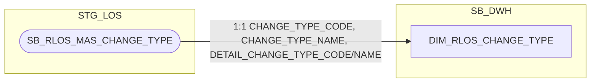

### 10.3 Cấu trúc bảng

| STT | Tên cột | Kiểu dữ liệu | Bắt buộc | Độ lớn | Khóa | Mô tả | Báo cáo sử dụng | Tên chỉ tiêu trên báo cáo |
| --- | --- | --- | --- | --- | --- | --- | --- | --- |
| 1 | DIMENSION_KEY | NUMBER | Y | 18 | PK | Khóa chính của bảng chiều DIM_RLOS_CHANGE_TYPE, sinh bằng Oracle sequence tại SB_DWH; PDTD_DTM giữ nguyên giá trị, không sinh sequence mới | — | — |
| 2 | CHANGE_TYPE_SK | NUMBER | Y | 18 |  | Khóa tham chiếu đến bảng chiều DIM_RLOS_CHANGE_TYPE, bằng đúng giá trị DIMENSION_KEY của cùng dòng. Giá trị mặc định = -1 (dòng Unknown) nếu không có giá trị phù hợp | — | — |
| 3 | CHANGE_TYPE_BK | VARCHAR2 | N | 64 | BK | Khóa nghiệp vụ hash của tổ hợp (loại thay đổi, chi tiết loại thay đổi) — PHÁI SINH: STANDARD_HASH(CHANGE_TYPE_CODE \|\| '~' \|\| DETAIL_CHANGE_TYPE_CODE, 'SHA256')| — | — |
| 4 | CHANGE_TYPE_CODE | NVARCHAR2 | N | 200 |  | Mã loại thay đổi điều kiện phê duyệt — nguồn SB_RLOS_MAS_CHANGE_TYPE.CHANGE_TYPE_CODE. Thành phần nguồn của CHANGE_TYPE_BK (không còn tự đánh dấu khóa, xem cột 4) | Báo cáo RLOS APPLICATION (BC1) — khóa tra CHANGE_TYPE_SK | — |
| 5 | CHANGE_TYPE_NAME | NVARCHAR2 | N | 200 |  | Tên loại thay đổi điều kiện phê duyệt — nguồn SB_RLOS_MAS_CHANGE_TYPE.CHANGE_TYPE_NAME | — | Nguồn cho chỉ tiêu/trường CHANGE_TYPE_SK (ETL map NG_SB_RLOS_EXTTABLE.CHANGE_TYPE dạng tên sang CHANGE_TYPE_CODE trước khi tra khóa) |
| 6 | DETAIL_CHANGE_TYPE_CODE | NVARCHAR2 | N | 200 |  | Mã chi tiết loại thay đổi — nguồn SB_RLOS_MAS_CHANGE_TYPE.DETAIL_CHANGE_TYPE_CODE. Thành phần thứ 2 của NK composite (cùng CHANGE_TYPE_CODE) dùng cho CDC/SCD2 và tính CHANGE_TYPE_BK — BC1 chỉ hiển thị DETAIL_CHANGE_TYPE_NAME (cột 8), không dùng mã này | — | Thiết kế dư thừa cho báo cáo (vẫn là NK/thành phần business key bắt buộc cho CDC/SCD2, không thể bỏ) |
| 7 | DETAIL_CHANGE_TYPE_NAME | NVARCHAR2 | N | 200 |  | Tên chi tiết loại thay đổi — nguồn SB_RLOS_MAS_CHANGE_TYPE.DETAIL_CHANGE_TYPE_NAME. BC1 dùng trường này làm CHANGE_TYPE_DETAIL | Báo cáo RLOS APPLICATION (BC1) | CHANGE_TYPE_DETAIL (Chi tiết loại thay đổi điều kiện) |
| 8 | IS_ACTIVE | NVARCHAR2 | N | 1 |  | Cờ hiệu lực của loại thay đổi điều kiện phê duyệt — nguồn SB_RLOS_MAS_CHANGE_TYPE.IS_ACTIVE | — | — |
| 9 | EFF_DATE | DATE | N |  |  | Ngày bắt đầu hiệu lực của phiên bản bản ghi (SCD Type 2) | — | — |
| 10 | EXP_DATE | DATE | N |  |  | Ngày hết hiệu lực của phiên bản bản ghi; NULL = bản ghi hiện hành | — | — |

## 11. DIM_RLOS_WORKSTEP_DECISION

### 11.1 Mục đích thiết kế
- **Ý nghĩa bảng:** danh mục cặp (bước xử lý, quyết định) hợp lệ trong quy trình BPM của hồ sơ tín dụng RLOS — đây là danh mục cấu hình gốc của BPM engine, không phải bảng sự kiện/giao dịch theo hồ sơ.
- **Khóa chính của bảng (PK):** `DIMENSION_KEY`
- **Khóa nghiệp vụ (BK):** composite `WORKSTEP_CODE` + `DECISION_CODE` — hash vào cột `WORKSTEP_DECISION_BK`
- **Độ chi tiết (grain):** 1 dòng = 1 cặp (WORKSTEP_CODE, DECISION_CODE) hợp lệ, lưu lịch sử thay đổi theo thời gian (SCD Type 2, xác định qua CDC trên bảng danh mục gốc).
- **Phục vụ báo cáo:**
  - Báo cáo RLOS APPLICATION (BC1) — qua FCT_RLOS_APPLICATION/FCT_RLOS_WORKSTEP_EVENT, LAST_DECISION qua LAST_WORKSTEP_DECISION_SK
  - Báo cáo Thông tin phê duyệt (BC3) — qua FCT_RLOS_WORKSTEP_EVENT
  - Báo cáo Tuần Chuyên viên Thẩm định (BC4) — qua FCT_RLOS_WORKSTEP_EVENT
  - Báo cáo SLA - TAT (BC5) — qua FCT_RLOS_WORKSTEP_EVENT
  - Báo cáo RETURN (BC8) — qua FCT_RLOS_WORKSTEP_EVENT

### 11.2 Sơ đồ lineage

### 11.3 Cấu trúc bảng

| STT | Tên cột | Kiểu dữ liệu | Bắt buộc | Độ lớn | Khóa | Mô tả | Báo cáo sử dụng | Tên chỉ tiêu trên báo cáo |
| --- | --- | --- | --- | --- | --- | --- | --- | --- |
| 1 | DIMENSION_KEY | NUMBER | Y | 18 | PK | Khóa chính của bảng chiều DIM_RLOS_WORKSTEP_DECISION, sinh bằng Oracle sequence tại SB_DWH; PDTD_DTM giữ nguyên giá trị, không sinh sequence mới | — | — |
| 2 | WORKSTEP_DECISION_SK | NUMBER | Y | 18 |  | Khóa tham chiếu đến bảng chiều DIM_RLOS_WORKSTEP_DECISION, bằng đúng giá trị DIMENSION_KEY của cùng dòng. Giá trị mặc định = -1 (dòng Unknown) nếu không có giá trị phù hợp | — | — |
| 3 | WORKSTEP_DECISION_BK | VARCHAR2 | N | 64 | BK | Khóa nghiệp vụ hash của cặp (bước xử lý, quyết định) — PHÁI SINH: STANDARD_HASH(WORKSTEP_CODE \|\| '~' \|\| DECISION_CODE, 'SHA256')| — | — |
| 4 | WORKSTEP_CODE | NVARCHAR2 | N | 255 |  | Mã bước xử lý trên workflow RLOS — nguồn NG_SB_RLOS_MAS_DECISION.QUEUE_NAME. Cùng với DECISION_CODE là thành phần nguồn của WORKSTEP_DECISION_BK| Báo cáo RLOS APPLICATION (BC1) — qua FCT_RLOS_APPLICATION.LAST_WORKSTEP_DECISION_SK Báo cáo Thông tin phê duyệt (BC3) — qua FCT_RLOS_WORKSTEP_EVENT.WORKSTEP_CODE Báo cáo Tuần Chuyên viên Thẩm định (BC4) — qua FCT_RLOS_WORKSTEP_EVENT.WORKSTEP_CODE Báo cáo SLA - TAT (BC5) — qua FCT_RLOS_WORKSTEP_EVENT.WORKSTEP_CODE Báo cáo RETURN (BC8) — qua FCT_RLOS_WORKSTEP_EVENT.WORKSTEP_CODE | WORKSTEP (Bước hồ sơ) |
| 5 | DECISION_CODE | NVARCHAR2 | N | 255 |  | Mã quyết định phát sinh tại bước xử lý trên — nguồn NG_SB_RLOS_MAS_DECISION.DECISION. UNIQUE (WORKSTEP_CODE, DECISION_CODE, EFF_DATE) | Báo cáo RLOS APPLICATION (BC1) | LAST_DECISION (Quyết định bước cuối) |
| 6 | REQ_TYPE | NVARCHAR2 | N | 255 |  | Loại yêu cầu điều chỉnh hồ sơ liên quan tới bước/quyết định — nguồn NG_SB_RLOS_MAS_DECISION.REQ_TYPE | — | — |
| 7 | EFF_DATE | DATE | N |  |  | Ngày bắt đầu hiệu lực của phiên bản bản ghi (SCD Type 2) — do ETL tính qua CDC khi phát hiện thay đổi trên MAS_DECISION | — | — |
| 8 | EXP_DATE | DATE | N |  |  | Ngày hết hiệu lực của phiên bản bản ghi; NULL = bản ghi hiện hành | — | — |

## 12. DIM_RLOS_EXCEPTION

### 12.1 Mục đích thiết kế
- **Ý nghĩa bảng:** danh mục các lý do ngoại lệ (nội dung cần làm rõ) được cấu hình cho từng tổ hợp bước xử lý + quyết định trên workflow RLOS — danh mục cấu hình gốc thật sự, không phải bảng sự kiện/giao dịch theo hồ sơ.
- **Khóa chính của bảng (PK):** `DIMENSION_KEY`
- **Khóa nghiệp vụ (BK):** composite `ACTIVITYNAME` + `DECISION_CODE` + `EXCEPTION_CATEGORY` + `EXCEPTION_NAME` — hash vào cột `EXCEPTION_BK`
- **Độ chi tiết (grain):** 1 dòng = 1 tổ hợp bước xử lý + quyết định + nhóm lý do + tên lý do, lưu lịch sử thay đổi theo thời gian (SCD Type 2).
- **Phục vụ báo cáo:**
  - Báo cáo EXCEPTION - FTR (BC7)

### 12.2 Sơ đồ lineage

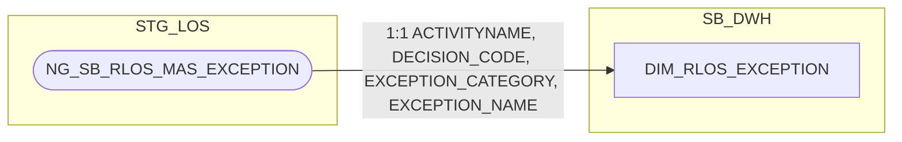

### 12.3 Cấu trúc bảng

| STT | Tên cột | Kiểu dữ liệu | Bắt buộc | Độ lớn | Khóa | Mô tả | Báo cáo sử dụng | Tên chỉ tiêu trên báo cáo |
| --- | --- | --- | --- | --- | --- | --- | --- | --- |
| 1 | DIMENSION_KEY | NUMBER | Y | 18 | PK | Khóa chính của bảng chiều DIM_RLOS_EXCEPTION, sinh bằng Oracle sequence tại SB_DWH; PDTD_DTM giữ nguyên giá trị, không sinh sequence mới | — | — |
| 2 | EXCEPTION_SK | NUMBER | Y | 18 |  | Khóa tham chiếu đến bảng chiều DIM_RLOS_EXCEPTION, bằng đúng giá trị DIMENSION_KEY của cùng dòng. Giá trị mặc định = -1 (dòng Unknown) nếu không có giá trị phù hợp | — | — |
| 3 | EXCEPTION_BK | VARCHAR2 | N | 64 | BK | Khóa nghiệp vụ hash của tổ hợp (bước, quyết định, nhóm lý do, tên lý do) — PHÁI SINH: STANDARD_HASH(ACTIVITYNAME \|\| '~' \|\| DECISION_CODE \|\| '~' \|\| EXCEPTION_CATEGORY \|\| '~' \|\| EXCEPTION_NAME, 'SHA256')| — | — |
| 4 | ACTIVITYNAME | NVARCHAR2 | N | 255 |  | Tên bước phát sinh nội dung cần làm rõ — nguồn NG_SB_RLOS_MAS_EXCEPTION.ACTIVITYNAME. Thành phần nguồn của EXCEPTION_BK (không còn tự đánh dấu khóa, xem cột 4) | Báo cáo EXCEPTION - FTR (BC7) | ACTIVITYNAME (Tên bước) |
| 5 | DECISION_CODE | NVARCHAR2 | N | 100 |  | Mã quyết định tại bước xử lý — nguồn NG_SB_RLOS_MAS_EXCEPTION.DECISION (đổi tên thêm hậu tố CODE cho thống nhất với DIM_RLOS_WORKSTEP_DECISION.DECISION_CODE) | — | Nguồn cho chỉ tiêu/trường EXCEPTION_SK (khóa join 2 bước của FCT_RLOS_EXCEPTION) |
| 6 | EXCEPTION_CATEGORY | NVARCHAR2 | N | 100 |  | Phân nhóm nội dung cần làm rõ — nguồn NG_SB_RLOS_MAS_EXCEPTION.EXCEPTION_CATEGORY | Báo cáo EXCEPTION - FTR (BC7) | EXCEPTION_CATEGORY (Nhóm lý do quyết định) |
| 7 | EXCEPTION_NAME | NVARCHAR2 | N | 1000 |  | Tên nội dung cần làm rõ — nguồn NG_SB_RLOS_MAS_EXCEPTION.EXCEPTION_NAME | Báo cáo EXCEPTION - FTR (BC7) | EXCEPTION_NAME (Tên lý do) |
| 8 | EXCEPTION_CODE | VARCHAR2 | N | 50 |  | Mã nội dung cần làm rõ — PHÁI SINH: CASE WHEN INSTR(EXCEPTION_CATEGORY, ':') > 0 THEN REGEXP_SUBSTR(EXCEPTION_CATEGORY, '^[^:]+') ELSE NULL END | Báo cáo EXCEPTION - FTR (BC7) | EXCEPTION_CODE (Code lý do) |
| 9 | RAISE_FLAG | NVARCHAR2 | N | 5 |  | Cờ cho biết ngoại lệ này có được phép Raise (nêu lý do) tại tổ hợp bước/quyết định này hay không — nguồn NG_SB_RLOS_MAS_EXCEPTION.RAISE (đổi tên thêm hậu tố FLAG, tránh trùng từ khóa RAISE) | — | Thiết kế dư thừa |
| 10 | CLEAR_FLAG | NVARCHAR2 | N | 5 |  | Cờ cho biết ngoại lệ này có được phép Clear (trả lời làm rõ) tại tổ hợp bước/quyết định này hay không — nguồn NG_SB_RLOS_MAS_EXCEPTION.CLEAR (đổi tên thêm hậu tố FLAG cho nhất quán với RAISE_FLAG) | — | Thiết kế dư thừa |
| 11 | ID_SOURCE | NUMBER | N | 18 |  | Số định danh nội bộ của bản ghi danh mục trên bảng nguồn — nguồn NG_SB_RLOS_MAS_EXCEPTION.ID (đổi tên thêm hậu tố SOURCE, tránh trùng khái niệm với DIMENSION_KEY/ID kỹ thuật của DIM, đồng nhất với CODE_SOURCE) | — | Thiết kế dư thừa |
| 12 | CODE_SOURCE | NVARCHAR2 | N | 255 |  | Mã viết tắt của tổ hợp ngoại lệ — nguồn NG_SB_RLOS_MAS_EXCEPTION.CODE (đổi tên thêm hậu tố SOURCE, tránh trùng khái niệm với EXCEPTION_CODE phái sinh ở cột 9, đồng nhất với ID_SOURCE) | — | Thiết kế dư thừa |
| 13 | STATUS | NVARCHAR2 | N | 1 |  | Trạng thái bản ghi danh mục trên bảng nguồn (còn hiệu lực/đã ngừng áp dụng...) — nguồn NG_SB_RLOS_MAS_EXCEPTION.STATUS, giữ nguyên tên nguồn, đồng bộ với bản CLOS | — | Thiết kế dư thừa |
| 14 | EFF_DATE | DATE | N |  |  | Ngày bắt đầu hiệu lực của phiên bản bản ghi (SCD Type 2) | — | — |
| 15 | EXP_DATE | DATE | N |  |  | Ngày hết hiệu lực của phiên bản bản ghi; NULL = bản ghi hiện hành | — | — |

## 13. DIM_RLOS_PRODUCT

### 13.1 Mục đích thiết kế

- **Ý nghĩa bảng:** danh mục sản phẩm tín dụng RLOS (bán lẻ/cá nhân) — lưu
  dòng sản phẩm chính (`PRODUCTLINE_CODE`) và sản phẩm nhánh (`SUB_PRODUCT_CODE`,
  con của sản phẩm chính).
- **Khóa chính của bảng (PK):** `DIMENSION_KEY`
- **Khóa nghiệp vụ (BK):** composite `PRODUCTLINE_CODE` + `SUB_PRODUCT_CODE` — hash vào cột `PRODUCT_BK`.
- **Độ chi tiết (grain):** 1 dòng lưu lịch sử thông tin thay đổi theo thời
  gian (SCD Type 2, khóa tự nhiên `PRODUCTLINE_CODE` + `SUB_PRODUCT_CODE` +
  `EFF_DATE`).
- **Phục vụ báo cáo:**
  - Báo cáo RLOS APPLICATION (BC1)
  - Báo cáo SLA - TAT (BC5) — khóa tra REF_SLA_NLTT
  - Báo cáo KPI (BC9) — khóa tra điểm KPI, điều kiện lọc SEC/UNSEC

### 13.2 Sơ đồ lineage

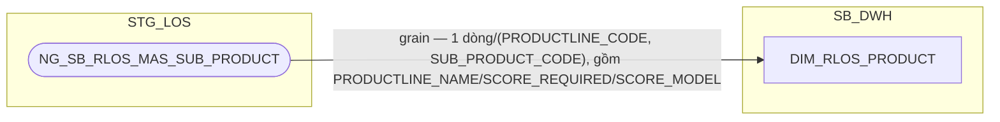

### 13.3 Cấu trúc bảng

| STT | Tên cột | Kiểu dữ liệu | Bắt buộc | Độ lớn | Khóa | Mô tả | Báo cáo sử dụng | Tên chỉ tiêu trên báo cáo |
| --- | --- | --- | --- | --- | --- | --- | --- | --- |
| 1 | DIMENSION_KEY | NUMBER | Y | 18 | PK | Khóa chính của bảng chiều DIM_RLOS_PRODUCT, sinh bằng Oracle sequence tại SB_DWH; PDTD_DTM giữ nguyên giá trị, không sinh sequence mới | — | — |
| 2 | PRODUCT_SK | NUMBER | Y | 18 |  | Khóa tham chiếu đến bảng chiều DIM_RLOS_PRODUCT, bằng đúng giá trị DIMENSION_KEY của cùng dòng. Giá trị mặc định = -1 (dòng Unknown) nếu không có giá trị phù hợp | — | — |
| 3 | PRODUCT_BK | VARCHAR2 | N | 64 | BK | Khóa nghiệp vụ hash của tổ hợp (dòng sản phẩm chính, sản phẩm nhánh) — PHÁI SINH: STANDARD_HASH(PRODUCTLINE_CODE \|\| '~' \|\| SUB_PRODUCT_CODE, 'SHA256') | — | — |
| 4 | PRODUCTLINE_CODE | VARCHAR2 | N | 200 |  | Mã dòng sản phẩm chính — nguồn MAS_SUB_PRODUCT.PRODUCT_CODE (= PRODUCTLINE_CODE của MAS_PRODUCT_LINE, cùng khái niệm).| Báo cáo RLOS APPLICATION (BC1) | PRODUCT_LINE (Dòng sản phẩm) |
| 5 | PRODUCTLINE_NAME | VARCHAR2 | N | 200 |  | Tên dòng sản phẩm chính — nguồn MAS_SUB_PRODUCT.PRODUCT_NAME.| Báo cáo RLOS APPLICATION (BC1) — có thể hiển thị thay PRODUCTLINE_CODE | PRODUCT_LINE (Dòng sản phẩm) |
| 6 | SUB_PRODUCT_CODE | VARCHAR2 | N | 200 |  | Mã sản phẩm nhánh — nguồn MAS_SUB_PRODUCT.SUB_PRODUCT_CODE | Báo cáo RLOS APPLICATION (BC1) Báo cáo KPI (BC9) — điều kiện lọc SEC/UNSEC | SUB_PRODUCT (Sản phẩm nhánh); nguồn cho chỉ tiêu/trường TAT_RLOS_SEC_*/TAT_RLOS_UNSEC_* (điều kiện lọc SEC/UNSEC trên AGG_LOS_KPI_YTD_DAILY) |
| 7 | SUB_PRODUCT_NAME | NVARCHAR2 | N | 200 |  | Tên sản phẩm tín dụng chi tiết — nguồn MAS_SUB_PRODUCT.SUB_PRODUCT_NAME.| Báo cáo KPI (BC9) — điều kiện lọc SEC/UNSEC | Nguồn cho chỉ tiêu/trường TAT_RLOS_SEC_*/TAT_RLOS_UNSEC_* (điều kiện lọc SEC/UNSEC trên AGG_LOS_KPI_YTD_DAILY) |
| 8 | SCORE_REQUIRED | VARCHAR2 | N | 200 |  | Cờ yêu cầu chấm điểm — nguồn MAS_SUB_PRODUCT.SCORE_REQUIRED | — | Thiết kế dư thừa |
| 9 | SCORE_MODEL | VARCHAR2 | N | 200 |  | Mô hình chấm điểm áp dụng — nguồn MAS_SUB_PRODUCT.SCORE_MODEL | — | Thiết kế dư thừa |
| 10 | EFF_DATE | DATE | N |  |  | Ngày bắt đầu hiệu lực của phiên bản bản ghi (SCD Type 2) — do ETL tính qua CDC khi phát hiện thay đổi trên MAS_SUB_PRODUCT | — | — |
| 11 | EXP_DATE | DATE | N |  |  | Ngày hết hiệu lực của phiên bản bản ghi; NULL = bản ghi hiện hành | — | — |

## 13A. DIM_RLOS_SECONDPRODUCT

### 13A.1 Mục đích thiết kế
- **Ý nghĩa bảng:** danh mục tổ hợp (sản phẩm chính, sản phẩm phụ) hợp lệ
  của RLOS — "sản phẩm phụ" ở đây là SeABuy/SeATeacher/SeAWoman/SeACivil/
  Thẻ tín dụng, sản phẩm thứ 2 đi kèm sản phẩm chính
- **Khóa chính của bảng (PK):** `DIMENSION_KEY`
- **Khóa nghiệp vụ (BK):** composite `PRODUCTLINE_CODE` + `SECONDARY_PRODUCT` — hash vào cột `SECONDPRODUCT_BK`
- **Độ chi tiết (grain):** 1 dòng lưu lịch sử thông tin thay đổi theo thời
  gian (SCD Type 2, khóa tự nhiên `PRODUCTLINE_CODE` + `SECONDARY_PRODUCT` +
  `EFF_DATE`).
- **Phục vụ báo cáo:**
  - Báo cáo RLOS APPLICATION (BC1) — qua `FCT_RLOS_APPLICATION_SECONDPRODUCT.SECONDPRODUCT_SK` (xem mục 9)

### 13A.2 Sơ đồ lineage

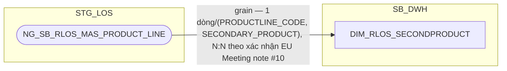

### 13A.3 Cấu trúc bảng

| STT | Tên cột | Kiểu dữ liệu | Bắt buộc | Độ lớn | Khóa | Mô tả | Báo cáo sử dụng | Tên chỉ tiêu trên báo cáo |
| --- | --- | --- | --- | --- | --- | --- | --- | --- |
| 1 | DIMENSION_KEY | NUMBER | Y | 18 | PK | Khóa chính của bảng chiều DIM_RLOS_SECONDPRODUCT, sinh bằng Oracle sequence tại SB_DWH; PDTD_DTM giữ nguyên giá trị, không sinh sequence mới | — | — |
| 2 | SECONDPRODUCT_SK | NUMBER | Y | 18 |  | Khóa tham chiếu đến bảng chiều DIM_RLOS_SECONDPRODUCT, bằng đúng giá trị DIMENSION_KEY của cùng dòng. Giá trị mặc định = -1 (dòng Unknown) nếu không có giá trị phù hợp hoặc hồ sơ không có sản phẩm phụ | — | — |
| 3 | SECONDPRODUCT_BK | VARCHAR2 | N | 64 | BK | Khóa nghiệp vụ hash của tổ hợp (sản phẩm chính, sản phẩm phụ) — PHÁI SINH: STANDARD_HASH(PRODUCTLINE_CODE \|\| '~' \|\| SECONDARY_PRODUCT, 'SHA256') | — | — |
| 4 | PRODUCTLINE_CODE | VARCHAR2 | N | 200 |  | Mã dòng sản phẩm chính — nguồn MAS_PRODUCT_LINE.PRODUCTLINE_CODE.| Báo cáo RLOS APPLICATION (BC1) | PRODUCT_LINE (Dòng sản phẩm) |
| 5 | PRODUCTLINE_NAME | VARCHAR2 | N | 200 |  | Tên dòng sản phẩm chính — nguồn MAS_PRODUCT_LINE.PRODUCT_LINE_NAME.| Báo cáo RLOS APPLICATION (BC1) — có thể hiển thị thay PRODUCTLINE_CODE | PRODUCT_LINE (Dòng sản phẩm) |
| 6 | SECONDARY_PRODUCT | VARCHAR2 | N | 200 |  | Sản phẩm phụ đi kèm (SeABuy/SeATeacher/SeAWoman/SeACivil/Thẻ tín dụng — không phải sản phẩm con của sản phẩm chính, xác nhận EU Meeting note #10) — nguồn MAS_PRODUCT_LINE.SECONDARY_PRODUCT | Báo cáo RLOS APPLICATION (BC1) — khóa JOIN qua FCT_RLOS_APPLICATION_SECONDPRODUCT.SECONDPRODUCT_SK | SAN_PHAM_PHU (Sản phẩm phụ chi tiết) |
| 7 | EFF_DATE | DATE | N |  |  | Ngày bắt đầu hiệu lực của phiên bản bản ghi (SCD Type 2) — do ETL tính qua CDC khi phát hiện thay đổi trên MAS_PRODUCT_LINE | — | — |
| 8 | EXP_DATE | DATE | N |  |  | Ngày hết hiệu lực của phiên bản bản ghi; NULL = bản ghi hiện hành | — | — |

