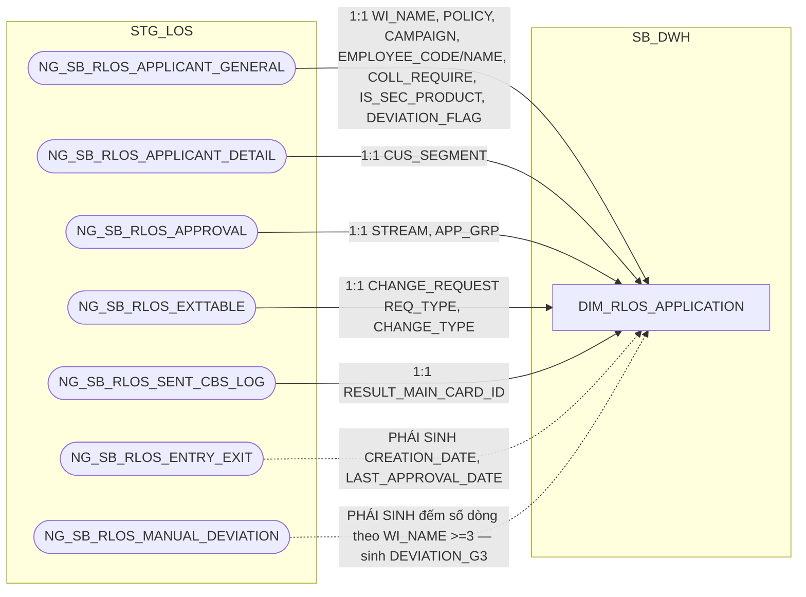

# HLD Review — DIM tables (SB_DWH)

## 1. DIM_RLOS_APPLICATION

### 1.1 Mục đích thiết kế

- **Ý nghĩa bảng:** danh mục hồ sơ tín dụng RLOS (bán lẻ/cá nhân) — lưu các
  thông tin ít thay đổi của 1 hồ sơ (luồng nghiệp vụ, chính sách, chương
  trình bán, cấp thẩm quyền phê duyệt, cờ ngoại lệ...).
- **Độ chi tiết (grain):** 1 dòng hồ sơ lưu lịch sử thông tin thay đổi theo
  thời gian (SCD Type 2, khóa tự nhiên `WI_NAME` + `EFF_DATE`).
- **Phục vụ báo cáo:**
  - Báo cáo RLOS APPLICATION (BC1)
  - Báo cáo CLOS APPLICATION (BC2) — đối chiếu `STREAM`/`CREATION_DATE` nhánh chung
  - Báo cáo Thông tin phê duyệt (BC3) — `STREAM`, `CREDIT_LIMIT`, `CURRENCY`, `CREDIT_TERM`
  - Báo cáo SLA - TAT (BC5) — tra khóa `APP_GRP`/`DEVIATION_G3`/`CHANGE_TYPE`
  - Báo cáo EXCEPTION - FTR (BC7) — `LOANCASEID`
  - Báo cáo KPI (BC9) — `APP_GRP`, `DEVIATION_G3`
  - Báo cáo Giải ngân _ Quá hạn KHCN (BC10) — `LAST_APPROVAL_DATE`

### 1.2 Sơ đồ lineage

### 1.3 Cấu trúc bảng

| STT | Tên cột | Kiểu dữ liệu | Bắt buộc | Độ lớn | Khóa | Mô tả | Báo cáo sử dụng | Tên chỉ tiêu trên báo cáo |
| --- | --- | --- | --- | --- | --- | --- | --- | --- |
| 1 | DIMENSION_KEY | NUMBER | Y | 18 | PK | Khóa chính của bảng chiều DIM_RLOS_APPLICATION, sinh bằng Oracle sequence tại SB_DWH; PDTD_DTM giữ nguyên giá trị, không sinh sequence mới | — | — |
| 2 | DATASOURCE | VARCHAR2 | Y | 10 |  | Cột kỹ thuật đánh dấu nguồn hệ, luôn cố định 'RLOS' sau khi tách vật lý CLOS/RLOS | — | — |
| 3 | APPLICATION_SK | NUMBER | Y | 18 |  | Khóa tham chiếu đến bảng chiều DIM_RLOS_APPLICATION, bằng đúng giá trị DIMENSION_KEY của cùng dòng. Giá trị mặc định = -1 (dòng Unknown) nếu không có giá trị phù hợp | — | — |
| 4 | WI_NAME | VARCHAR2 | Y | 100 | NK | Mã hồ sơ tín dụng RLOS — nguồn NG_SB_RLOS_APPLICANT_GENERAL.WI_NAME. UNIQUE (WI_NAME, EFF_DATE) | Báo cáo RLOS APPLICATION (BC1) Báo cáo CLOS APPLICATION (BC2) Báo cáo Thông tin phê duyệt (BC3) Báo cáo SLA - TAT (BC5) Báo cáo NGOẠI LỆ (BC6) Báo cáo EXCEPTION - FTR (BC7) Báo cáo RETURN (BC8) Báo cáo KPI (BC9) | WINAME / WI_NAME (Mã hồ sơ) |
| 5 | LOANCASEID | VARCHAR2 | N | 100 |  | Mã khoản vay gắn với hồ sơ — nguồn NG_SB_RLOS_EXTTABLE.LOANCASEID, giữ nguyên văn không lọc | Báo cáo EXCEPTION - FTR (BC7) | LOANCASEID (Mã LOANCASEID) |
| 6 | STREAM | VARCHAR2 | N | 200 |  | Luồng nghiệp vụ của hồ sơ — nguồn NG_SB_RLOS_APPROVAL.STREAM | Báo cáo RLOS APPLICATION (BC1) — hiển thị trực tiếp, đồng thời là khóa tra BI_FLOW Báo cáo CLOS APPLICATION (BC2) Báo cáo Thông tin phê duyệt (BC3) | STREAM (Luồng hồ sơ); nguồn cho chỉ tiêu/trường BI_FLOW (Phân khúc hồ sơ, BC1) |
| 7 | CHANGE_REQUEST | VARCHAR2 | N | 200 |  | Yêu cầu điều chỉnh hồ sơ — nguồn NG_SB_RLOS_EXTTABLE.REQ_TYPE | Báo cáo RLOS APPLICATION (BC1) Báo cáo CLOS APPLICATION (BC2) | CHANGE_REQUEST (Thay đổi điều kiện — New/Change) |
| 8 | CHANGE_TYPE | VARCHAR2 | N | 500 |  | Loại thay đổi điều kiện phê duyệt — nguồn NG_SB_RLOS_EXTTABLE.CHANGE_TYPE, giữ nguyên giá trị thô. Dùng làm khóa either/or với PRODUCT_LINE khi tra cam kết SLA ở PDTD_DTM | Báo cáo RLOS APPLICATION (BC1) — hiển thị trực tiếp Báo cáo SLA - TAT (BC5) — khóa tra REF_PRODUCT/SLA_* | CHANGE_TYPE (Loại thay đổi điều kiện) |
| 9 | POLICY | VARCHAR2 | N | 200 |  | Chính sách tín dụng áp dụng cho hồ sơ — nguồn NG_SB_RLOS_APPLICANT_GENERAL.POLICY | Báo cáo RLOS APPLICATION (BC1) | POLICY (Chính sách áp dụng) |
| 10 | CAMPAIGN | VARCHAR2 | N | 200 |  | Chương trình bán áp dụng cho hồ sơ — nguồn NG_SB_RLOS_APPLICANT_GENERAL.CAMPAIGN | Báo cáo RLOS APPLICATION (BC1) | CAMPAIGN (Mã chương trình tiếp thị) |
| 11 | PROOF_OF_INCOME | VARCHAR2 | N | 200 |  | Hình thức chứng minh thu nhập — PHÁI SINH: CASE WHEN NG_SB_RLOS_APPLICANT_GENERAL.PROOF_OF_INCOME = 'proofincome01' THEN 'CHUNGTU_CHUNGMINH_THUNHAP' WHEN = 'proofincome02' THEN 'BANGKE_THUNHAP' END | Báo cáo RLOS APPLICATION (BC1) | PROOF_OF_INCOME (Nguồn thu nhập) |
| 12 | CUS_SEGMENT | VARCHAR2 | N | 100 |  | Phân khúc khách hàng theo LOS (giá trị gốc, chưa chuẩn hóa) — nguồn NG_SB_RLOS_APPLICANT_DETAIL.CUS_SEGMENT | Nguồn cho chỉ tiêu/trường BI_CUS_SEGMENT | — |
| 13 | BI_CUS_SEGMENT | VARCHAR2 | N | 50 |  | Phân khúc khách hàng chuẩn hóa để hiển thị trên báo cáo — PHÁI SINH: CASE WHEN UPPER(CUS_SEGMENT) LIKE '%XANH' THEN 'XANH' WHEN CUS_SEGMENT = 'CBNV' THEN 'CBNV' ELSE 'THUONG' END | Báo cáo RLOS APPLICATION (BC1) | BI_CUS_SEGMENT (Phân khúc khách hàng chuẩn) |
| 14 | COLL_REQUIRE | VARCHAR2 | N | 10 |  | Hồ sơ có yêu cầu tài sản bảo đảm hay không — PHÁI SINH: CASE WHEN NG_SB_RLOS_APPLICANT_GENERAL.COLLREQUIRE = 'true' THEN 'YES' ELSE 'NO' END | Báo cáo KPI (BC9) | Nguồn cho chỉ tiêu/trường TAT_RLOS_SEC_*/TAT_RLOS_UNSEC_* (điều kiện lọc SEC/UNSEC trên AGG_LOS_KPI_YTD_DAILY) |
| 15 | IS_SEC_PRODUCT | VARCHAR2 | N | 10 |  | Hồ sơ có sản phẩm phụ đi kèm hay không — nguồn NG_SB_RLOS_APPLICANT_GENERAL.IS_SEC_PRODUCT. Đối chiếu SRS BC5: đây chính là nguồn của SECONDARY_PRODUCTLINE khi tra cam kết SLA | Báo cáo RLOS APPLICATION (BC1) — hiển thị trực tiếp Báo cáo SLA - TAT (BC5) — khóa tra REF_PRODUCT/SLA_* | SECONDARY_PRODUCTLINE (Có sản phẩm phụ — YES/NO) |
| 16 | DEVIATION_FLAG | VARCHAR2 | N | 10 |  | Hồ sơ có ngoại lệ chính sách hay không — nguồn NG_SB_RLOS_APPLICANT_GENERAL.DEVIATION_FLAG (DQ-11, đã giải quyết) | Báo cáo RLOS APPLICATION (BC1) | DEVIATION (Hồ sơ có ngoại lệ — YES/NO) |
| 17 | EMPLOYEE_CODE | VARCHAR2 | N | 50 |  | Mã cán bộ quản lý hồ sơ — nguồn NG_SB_RLOS_APPLICANT_GENERAL.EMPLOYEE_CODE | Báo cáo RLOS APPLICATION (BC1) | EMPLOYEE_CODE (Mã CRO) |
| 18 | EMPLOYEE_NAME | VARCHAR2 | N | 200 |  | Tên cán bộ quản lý hồ sơ — nguồn NG_SB_RLOS_APPLICANT_GENERAL.EMPLOYEE_NAME | Báo cáo RLOS APPLICATION (BC1) | EMPLOYEE_NAME (Tên CRO) |
| 19 | CREATION_DATE | DATE | N | 10 |  | Ngày khởi tạo hồ sơ — PHÁI SINH: MIN(ENTRYDATE) theo WI_NAME trên NG_SB_RLOS_ENTRY_EXIT, TRUNC về ngày | Báo cáo RLOS APPLICATION (BC1) Báo cáo CLOS APPLICATION (BC2) | CREATION_DATE (Ngày khởi tạo hồ sơ) |
| 20 | RESULT_MAIN_CARD_ID | VARCHAR2 | N | 100 |  | Mã thẻ chính do hệ thẻ (T24) trả về — nguồn NG_SB_RLOS_SENT_CBS_LOG.RESULT_SEAB_MAIN_CARD_ID, lấy dòng mới nhất STATUS='OK' | Báo cáo RLOS APPLICATION (BC1) | K_TYPE (Loại thẻ tín dụng); HOME_ADDRESS (Địa chỉ nhận Pin/Thẻ) — cả 2 phái sinh từ lookup RESULT_MAIN_CARD_ID → STG_DIM_CARD |
| 21 | APP_GRP | VARCHAR2 | N | 50 |  | Cấp thẩm quyền phê duyệt của hồ sơ — nguồn NG_SB_RLOS_APPROVAL.APP_GRP. BC1/BC2 hiển thị trực tiếp; BC9 dùng làm khóa tra điểm KPI; dùng làm khóa tra cam kết SLA ở PDTD_DTM | Báo cáo RLOS APPLICATION (BC1) — hiển thị trực tiếp Báo cáo SLA - TAT (BC5) — khóa tra REF_PRODUCT/SLA_* Báo cáo KPI (BC9) — khóa tra điểm KPI | APP_GRP (Cấp phân quyền phê duyệt) |
| 22 | DEVIATION_G3 | VARCHAR2 | N | 10 |  | Hồ sơ có từ 3 ngoại lệ chính sách trở lên hay không (YES/NO) — PHÁI SINH: COUNT(*) theo WI_NAME trên NG_SB_RLOS_MANUAL_DEVIATION, >=3 → 'YES', còn lại → 'NO' | Báo cáo KPI (BC9) — hiển thị trực tiếp Báo cáo SLA - TAT (BC5) — khóa tra REF_PRODUCT/SLA_* | DEVIATION_G3 (HS có từ 3 ngoại lệ trở lên — YES/NO) |
| 23 | LAST_APPROVAL_DATE | DATE | N |  |  | Ngày phê duyệt gần nhất của hồ sơ — PHÁI SINH: MAX(EXITDATE) trên NG_SB_RLOS_ENTRY_EXIT tại WORKSTEP/DECISION theo SRS BC10 | Báo cáo Giải ngân _ Quá hạn KHCN (BC10) — qua FCT_RLOS_LOAN_DISBURSEMENT | APPROVAL_DATE (Ngày phê duyệt) |
| 24 | APPROVED_AMT_FINAL | NUMBER | N | 20,2 |  | Hạn mức phê duyệt cuối cùng — DƯ THỪA CÓ CHỦ ĐÍCH, cùng nguồn/giá trị với FCT_RLOS_APPLICATION_DAILY.APPROVED_AMT_FINAL | Báo cáo Thông tin phê duyệt (BC3) — qua FCT_RLOS_WORKSTEP_EVENT | CREDIT_LIMIT (Số tiền phê duyệt) |
| 25 | CURRENCY_CODE | VARCHAR2 | N | 10 |  | Loại tiền — DƯ THỪA CÓ CHỦ ĐÍCH, cùng lý do cột 24 | Báo cáo Thông tin phê duyệt (BC3) — qua FCT_RLOS_WORKSTEP_EVENT | CURRENCY (Đơn vị tiền tệ) |
| 26 | APPROVED_TERM | NUMBER | N | 5 |  | Kỳ hạn phê duyệt — DƯ THỪA CÓ CHỦ ĐÍCH, cùng lý do cột 24 | Báo cáo Thông tin phê duyệt (BC3) — qua FCT_RLOS_WORKSTEP_EVENT | CREDIT_TERM (Thời hạn phê duyệt) |
| 27 | EFF_DATE | DATE | Y |  |  | Ngày bắt đầu hiệu lực của phiên bản bản ghi (SCD Type 2) | — (cột kỹ thuật) | — |
| 28 | EXP_DATE | DATE | N |  |  | Ngày hết hiệu lực của phiên bản bản ghi; NULL = bản ghi hiện hành | — (cột kỹ thuật) | — |
