# HLD Review — FCT tables (PDTD_DTM)

## 1. AGG_LOS_KPI_YTD_DAILY

### 1.1 Mục đích thiết kế
- **Ý nghĩa bảng:** Bảng chỉ số KPI lũy kế theo ngày cho toàn khối PDTD (RLOS và CLOS là 2 nhóm cột song song trên cùng một dòng, không tách bảng), phục vụ phần "KPI Khối" của Báo cáo KPI (BC9). Toàn bộ 26 cột non-PK đều là SUM/COUNT/lũy kế tính từ `AGG_LOS_KPI_APPLICATION` — không còn thuộc tính mô tả hay FK nào, đúng định nghĩa bảng tổng hợp (aggregate), không phải transaction fact. Quy tắc load: chỉ tiêu cộng được thì `TRƯỜNG(D) = TRƯỜNG(D-1) + TRƯỜNG_DAY(D)`, reset về 0 vào ngày 1/1 hằng năm; sửa dữ liệu ngày quá khứ thì phải chạy lại tuần tự đến ngày cuối đã load trong cùng năm.
- **Khóa chính của bảng (PK):** DAYID.
- **Độ chi tiết (grain):** 1 dòng = 1 ngày dữ liệu, cho toàn khối (không tách theo hệ RLOS/CLOS).
- **Phục vụ báo cáo:**
  - Báo cáo KPI (BC9) — nguồn trực tiếp cho toàn bộ phần "KPI Khối" (SLHS/SLGN/TAT/QUY_DOI/NHAN_SU theo ngày và lũy kế từ đầu năm)

### 1.2 Sơ đồ lineage

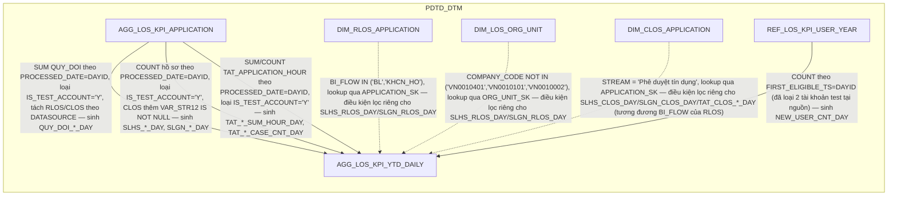

### 1.3 Cấu trúc bảng

| STT | Tên cột | Kiểu dữ liệu | Bắt buộc | Độ lớn | Khóa | Mô tả | Báo cáo sử dụng | Tên chỉ tiêu trên báo cáo |
| --- | --- | --- | --- | --- | --- | --- | --- | --- |
| 1 | DAYID | DATE | Y |  | PK | Ngày dữ liệu, dạng số YYYYMMDD | Báo cáo KPI (BC9) — điều kiện lọc/khóa để phái sinh YEAR_MONTH tại tầng report | Năm báo cáo (phái sinh từ DAYID) |
| 2 | SLHS_RLOS_DAY | NUMBER | N | 12 |  | Số hồ sơ RLOS được phê duyệt, phát sinh trong ngày — PHÁI SINH: COUNT hồ sơ trên AGG_LOS_KPI_APPLICATION (DATASOURCE='RLOS') có PROCESSED_DATE=DAYID, IS_TEST_ACCOUNT != 'Y', thỏa điều kiện DECISION đã phê duyệt, và BI_FLOW/COMPANY_CODE lọc theo đúng công thức SRS | Báo cáo KPI (BC9) — nguồn cho SLHS_RLOS lũy kế (cột 3) | Nguồn cho chỉ tiêu SLHS_RLOS |
| 3 | SLHS_RLOS | NUMBER | N | 14 |  | Lũy kế từ 1/1: SLHS_RLOS(D) = SLHS_RLOS(D-1) + SLHS_RLOS_DAY(D), reset vào 1/1 | Báo cáo KPI (BC9) — hiển thị trực tiếp | Số lượng hồ sơ phê duyệt RLOS (SLHS_RLOS) |
| 4 | SLGN_RLOS_DAY | NUMBER | N | 12 |  | Số hồ sơ RLOS đã giải ngân (tồn tại hợp đồng trên STG_FCT_LOAN), phát sinh trong ngày — cùng điều kiện lọc SLHS_RLOS_DAY, thêm EXISTS hợp đồng theo SEAB_LOS_ID | Báo cáo KPI (BC9) — nguồn cho SLGN_RLOS lũy kế (cột 5) | Nguồn cho chỉ tiêu SLGN_RLOS |
| 5 | SLGN_RLOS | NUMBER | N | 14 |  | Lũy kế từ 1/1: SLGN_RLOS(D) = SLGN_RLOS(D-1) + SLGN_RLOS_DAY(D), reset vào 1/1 | Báo cáo KPI (BC9) — hiển thị trực tiếp | Số lượng hồ sơ giải ngân RLOS (SLGN_RLOS) |
| 6 | SLHS_CLOS_DAY | NUMBER | N | 12 |  | Số hồ sơ CLOS được phê duyệt, phát sinh trong ngày — cùng cách SLHS_RLOS_DAY, DATASOURCE='CLOS', thêm VAR_STR12 IS NOT NULL và STREAM = 'Phê duyệt tín dụng' | Báo cáo KPI (BC9) — nguồn cho SLHS_CLOS lũy kế (cột 7) | Nguồn cho chỉ tiêu SLHS_CLOS |
| 7 | SLHS_CLOS | NUMBER | N | 14 |  | Lũy kế từ 1/1: SLHS_CLOS(D) = SLHS_CLOS(D-1) + SLHS_CLOS_DAY(D), reset vào 1/1 | Báo cáo KPI (BC9) — hiển thị trực tiếp | Số lượng hồ sơ phê duyệt CLOS (SLHS_CLOS) |
| 8 | SLGN_CLOS_DAY | NUMBER | N | 12 |  | Số hồ sơ CLOS đã giải ngân, phát sinh trong ngày — cùng điều kiện lọc SLHS_CLOS_DAY, thêm EXISTS hợp đồng trên STG_FCT_LOAN (nhánh LD) hoặc STG_DTM.STG_FCT_MD (nhánh MD, bảo lãnh) | Báo cáo KPI (BC9) — nguồn cho SLGN_CLOS lũy kế (cột 9) | Nguồn cho chỉ tiêu SLGN_CLOS |
| 9 | SLGN_CLOS | NUMBER | N | 14 |  | Lũy kế từ 1/1: SLGN_CLOS(D) = SLGN_CLOS(D-1) + SLGN_CLOS_DAY(D), reset vào 1/1 | Báo cáo KPI (BC9) — hiển thị trực tiếp | Số lượng hồ sơ giải ngân CLOS (SLGN_CLOS) |
| 10 | TAT_RLOS_SEC_SUM_HOUR_DAY | NUMBER | N | 18,6 |  | Tổng TAT_APPLICATION_HOUR của hồ sơ RLOS CÓ tài sản bảo đảm, phát sinh trong ngày — SUM lại từ AGG_LOS_KPI_APPLICATION.TAT_APPLICATION_HOUR, lọc SEC theo COLLREQUIRE | Báo cáo KPI (BC9) — nguồn cho TAT_RLOS_SEC_SUM_HOUR_YTD lũy kế (cột 12), qua đó nguồn cho chỉ tiêu TAT_RLOS phái sinh tại tầng report | Nguồn cho chỉ tiêu TAT_RLOS |
| 11 | TAT_RLOS_SEC_CASE_CNT_DAY | NUMBER | N | 12 |  | Số hồ sơ RLOS có tài sản bảo đảm, phát sinh trong ngày — mẫu số của TAT_RLOS_SEC, cùng điều kiện lọc trên | Báo cáo KPI (BC9) — nguồn cho TAT_RLOS_SEC_CASE_CNT_YTD lũy kế (cột 13), qua đó nguồn cho chỉ tiêu TAT_RLOS phái sinh tại tầng report | Nguồn cho chỉ tiêu TAT_RLOS |
| 12 | TAT_RLOS_SEC_SUM_HOUR_YTD | NUMBER | N | 20,6 |  | Lũy kế từ 1/1: (D) = (D-1) + TAT_RLOS_SEC_SUM_HOUR_DAY(D), reset vào 1/1 | Báo cáo KPI (BC9) — thành phần AVG_SEC = SUM_HOUR_YTD/CASE_CNT_YTD, dùng phái sinh chỉ tiêu TAT_RLOS tại tầng report (không lưu vật lý) | Nguồn cho chỉ tiêu TAT_RLOS (AVG_SEC) |
| 13 | TAT_RLOS_SEC_CASE_CNT_YTD | NUMBER | N | 14 |  | Lũy kế từ 1/1: (D) = (D-1) + TAT_RLOS_SEC_CASE_CNT_DAY(D), reset vào 1/1 | Báo cáo KPI (BC9) — thành phần AVG_SEC, dùng phái sinh chỉ tiêu TAT_RLOS tại tầng report | Nguồn cho chỉ tiêu TAT_RLOS (AVG_SEC) |
| 14 | TAT_RLOS_UNSEC_SUM_HOUR_DAY | NUMBER | N | 18,6 |  | Tổng TAT_APPLICATION_HOUR của hồ sơ RLOS KHÔNG có tài sản bảo đảm, phát sinh trong ngày — cùng cách trên, lọc UNSEC | Báo cáo KPI (BC9) — nguồn cho TAT_RLOS_UNSEC_SUM_HOUR_YTD lũy kế (cột 16) | Nguồn cho chỉ tiêu TAT_RLOS |
| 15 | TAT_RLOS_UNSEC_CASE_CNT_DAY | NUMBER | N | 12 |  | Số hồ sơ RLOS không có tài sản bảo đảm, phát sinh trong ngày | Báo cáo KPI (BC9) — nguồn cho TAT_RLOS_UNSEC_CASE_CNT_YTD lũy kế (cột 17) | Nguồn cho chỉ tiêu TAT_RLOS |
| 16 | TAT_RLOS_UNSEC_SUM_HOUR_YTD | NUMBER | N | 20,6 |  | Lũy kế từ 1/1, reset vào 1/1 | Báo cáo KPI (BC9) — thành phần AVG_UNSEC = SUM_HOUR_YTD/CASE_CNT_YTD, dùng phái sinh chỉ tiêu TAT_RLOS tại tầng report | Nguồn cho chỉ tiêu TAT_RLOS (AVG_UNSEC) |
| 17 | TAT_RLOS_UNSEC_CASE_CNT_YTD | NUMBER | N | 14 |  | Lũy kế từ 1/1, reset vào 1/1 | Báo cáo KPI (BC9) — thành phần AVG_UNSEC, dùng phái sinh chỉ tiêu TAT_RLOS tại tầng report | Nguồn cho chỉ tiêu TAT_RLOS (AVG_UNSEC) |
| 18 | TAT_CLOS_SUM_HOUR_DAY | NUMBER | N | 18,6 |  | Tổng TAT_APPLICATION_HOUR của hồ sơ CLOS, phát sinh trong ngày — SUM lại từ AGG_LOS_KPI_APPLICATION.TAT_APPLICATION_HOUR (DATASOURCE='CLOS'), không lọc VAR_STR12, thêm STREAM = 'Phê duyệt tín dụng' | Báo cáo KPI (BC9) — nguồn cho TAT_CLOS_SUM_HOUR_YTD lũy kế (cột 20), qua đó nguồn cho chỉ tiêu TAT_CLOS phái sinh tại tầng report | Nguồn cho chỉ tiêu TAT_CLOS |
| 19 | TAT_CLOS_CASE_CNT_DAY | NUMBER | N | 12 |  | Số hồ sơ CLOS, phát sinh trong ngày — mẫu số của TAT_CLOS, cùng điều kiện lọc trên (bao gồm STREAM) | Báo cáo KPI (BC9) — nguồn cho TAT_CLOS_CASE_CNT_YTD lũy kế (cột 21) | Nguồn cho chỉ tiêu TAT_CLOS |
| 20 | TAT_CLOS_SUM_HOUR_YTD | NUMBER | N | 20,6 |  | Lũy kế từ 1/1, reset vào 1/1 | Báo cáo KPI (BC9) — dùng trực tiếp để phái sinh chỉ tiêu TAT_CLOS = TAT_CLOS_SUM_HOUR_YTD/TAT_CLOS_CASE_CNT_YTD tại tầng report (không lưu vật lý) | TAT CLOS (TAT_CLOS, phái sinh tầng report) |
| 21 | TAT_CLOS_CASE_CNT_YTD | NUMBER | N | 14 |  | Lũy kế từ 1/1, reset vào 1/1 | Báo cáo KPI (BC9) — dùng trực tiếp để phái sinh chỉ tiêu TAT_CLOS tại tầng report | TAT CLOS (TAT_CLOS, phái sinh tầng report) |
| 22 | QUY_DOI_RLOS_DAY | NUMBER | N | 14,4 |  | Tổng QUY_DOI của hồ sơ RLOS, phát sinh trong ngày — SUM lại từ AGG_LOS_KPI_APPLICATION.QUY_DOI (DATASOURCE='RLOS'), IS_TEST_ACCOUNT != 'Y' | Báo cáo KPI (BC9) — nguồn cho QUY_DOI_RLOS lũy kế (cột 23) | Nguồn cho chỉ tiêu QUY_DOI_RLOS |
| 23 | QUY_DOI_RLOS | NUMBER | N | 16,4 |  | Lũy kế từ 1/1: QUY_DOI_RLOS(D) = QUY_DOI_RLOS(D-1) + QUY_DOI_RLOS_DAY(D), reset vào 1/1 | Báo cáo KPI (BC9) — hiển thị trực tiếp | Điểm KPI RLOS quy đổi (QUY_DOI_RLOS) |
| 24 | QUY_DOI_CLOS_DAY | NUMBER | N | 14,4 |  | Tổng QUY_DOI của hồ sơ CLOS, phát sinh trong ngày — cùng cách trên, DATASOURCE='CLOS' | Báo cáo KPI (BC9) — nguồn cho QUY_DOI_CLOS lũy kế (cột 25) | Nguồn cho chỉ tiêu QUY_DOI_CLOS |
| 25 | QUY_DOI_CLOS | NUMBER | N | 16,4 |  | Lũy kế từ 1/1: QUY_DOI_CLOS(D) = QUY_DOI_CLOS(D-1) + QUY_DOI_CLOS_DAY(D), reset vào 1/1 | Báo cáo KPI (BC9) — hiển thị trực tiếp | Điểm KPI CLOS quy đổi (QUY_DOI_CLOS) |
| 26 | NEW_USER_CNT_DAY | NUMBER | N | 8 |  | Số USERNAME mới đủ điều kiện tính nhân sự trong ngày — PHÁI SINH: COUNT trên REF_LOS_KPI_USER_YEAR có KPI_YEAR = năm(DAYID) và TRUNC(FIRST_ELIGIBLE_TS) = DAYID | Báo cáo KPI (BC9) — nguồn cho NHAN_SU lũy kế (cột 27) | Nguồn cho chỉ tiêu NHAN_SU |
| 27 | NHAN_SU | NUMBER | N | 8 |  | Lũy kế từ 1/1: NHAN_SU(D) = NHAN_SU(D-1) + NEW_USER_CNT_DAY(D), reset vào 1/1 — tương đương COUNT DISTINCT USERNAME lũy kế | Báo cáo KPI (BC9) — hiển thị trực tiếp | Nhân sự Khối PDTD (NHAN_SU) |

Ghi chú: 9 chỉ tiêu tỷ lệ/trung bình phái sinh của BC9 (`TAT_RLOS`, `TAT_TB`, `TY_LE_GN_RLOS`, `TY_LE_GN_CLOS`, `TY_LE_GN_TONG`, `SLHS_TONG`, `SLGN_TONG`, `NSLD`, và `YEAR_MONTH`) được tính hoàn toàn tại tầng report (OAS) từ các cột lũy kế đã lưu ở trên — không lưu vật lý trên bảng này, theo quyết định đã thống nhất với người dùng (tránh trùng dữ liệu suy ra được).

## 2. AGG_LOS_KPI_APPLICATION

### 2.1 Mục đích thiết kế
- **Ý nghĩa bảng:** Bảng FACT chấm điểm KPI theo từng hồ sơ, là input pre-aggregate duy nhất cho `AGG_LOS_KPI_YTD_DAILY` (SUM/COUNT lên grain ngày) — bản thân bảng này không tự hiển thị số lũy kế. Toàn bộ cột đều là chỉ tiêu KPI đã tính sẵn phục vụ thẳng Báo cáo KPI (BC9) (`VOLUME`, `POINT`, `QUY_DOI`, `TAT_APPLICATION_HOUR`, `TSBD_G2`, `DEVIATION_G2/G3`...) — không đọc trực tiếp 1 sự kiện nghiệp vụ thô nào, bản chất là bảng chỉ tiêu tổng hợp/phái sinh (derived KPI), không phải transaction fact.
- **Khóa chính của bảng (PK):** WI_NAME, DATASOURCE.
- **Độ chi tiết (grain):** 1 dòng = 1 hồ sơ (WI_NAME) × 1 hệ nguồn (DATASOURCE).
- **Phục vụ báo cáo:**
  - Báo cáo KPI (BC9) — nguồn trực tiếp cho phần "Nguồn RLOS"/"Nguồn CLOS" của báo cáo, đồng thời là input pre-aggregate duy nhất cho AGG_LOS_KPI_YTD_DAILY

### 2.2 Sơ đồ lineage

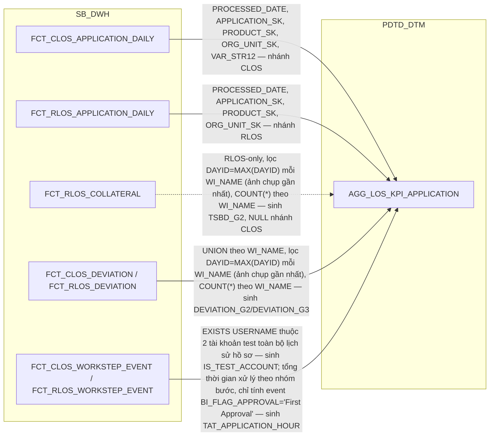

### 2.3 Cấu trúc bảng

| STT | Tên cột | Kiểu dữ liệu | Bắt buộc | Độ lớn | Khóa | Mô tả | Báo cáo sử dụng | Tên chỉ tiêu trên báo cáo |
| --- | --- | --- | --- | --- | --- | --- | --- | --- |
| 1 | WI_NAME | VARCHAR2 | Y | 100 | PK | Mã hồ sơ tín dụng CLOS hoặc RLOS — nguồn FCT_CLOS_APPLICATION_DAILY.WI_NAME/FCT_RLOS_APPLICATION_DAILY.WI_NAME | Báo cáo KPI (BC9) — khóa JOIN, đồng thời hiển thị trực tiếp làm mã hồ sơ | Mã hồ sơ (WI_NAME) |
| 2 | DATASOURCE | VARCHAR2 | Y | 10 | PK | RLOS hoặc CLOS — quyết định công thức TAT/POINT/nhóm phân loại áp dụng | Báo cáo KPI (BC9) — khóa phân biệt nhánh "Nguồn RLOS"/"Nguồn CLOS" của báo cáo, đồng thời điều kiện lọc DATASOURCE khi tổng hợp SLHS/SLGN/TAT/QUY_DOI_*_DAY tại AGG_LOS_KPI_YTD_DAILY | Phân nhánh RLOS/CLOS của báo cáo |
| 3 | APPLICATION_SK | NUMBER | Y | 18 |  | Khóa tới DIM_CLOS_APPLICATION hoặc DIM_RLOS_APPLICATION tùy DATASOURCE. Mặc định -1 | Báo cáo KPI (BC9) — khóa JOIN tới DIM_RLOS_APPLICATION/DIM_CLOS_APPLICATION để lấy điều kiện lọc ẩn BI_FLOW (RLOS)/STREAM (CLOS) dùng trong công thức SLHS/SLGN/TAT_*_DAY tại AGG_LOS_KPI_YTD_DAILY | Nguồn cho chỉ tiêu SLHS_RLOS/SLGN_RLOS/SLHS_CLOS/SLGN_CLOS/TAT_CLOS (điều kiện lọc BI_FLOW/STREAM) |
| 4 | PRODUCT_SK | NUMBER | Y | 18 |  | Khóa tới DIM_CLOS_PRODUCT hoặc DIM_RLOS_PRODUCT tùy DATASOURCE. Mặc định -1 | Báo cáo KPI (BC9) — khóa JOIN report-time tới DIM_RLOS_PRODUCT/DIM_CLOS_PRODUCT để tra PRODUCT_LINE_NAME (+PRODUCT_NAME với CLOS) dùng tính cột POINT trên chính bảng này | Nguồn cho chỉ tiêu POINT |
| 5 | ORG_UNIT_SK | NUMBER | Y | 18 |  | Khóa tới DIM_LOS_ORG_UNIT. Mặc định -1 | Báo cáo KPI (BC9) — khóa JOIN tới DIM_LOS_ORG_UNIT để lấy điều kiện lọc ẩn COMPANY_CODE NOT IN (...) dùng trong công thức SLHS_RLOS_DAY/SLGN_RLOS_DAY tại AGG_LOS_KPI_YTD_DAILY | Nguồn cho chỉ tiêu SLHS_RLOS/SLGN_RLOS (điều kiện lọc loại trừ chi nhánh) |
| 6 | PROCESSED_DATE | DATE | N |  |  | Ngày xử lý của hồ sơ — nguồn FCT_CLOS_APPLICATION_DAILY.PROCESSED_DATE/FCT_RLOS_APPLICATION_DAILY.PROCESSED_DATE. Là mốc để AGG_LOS_KPI_YTD_DAILY xếp hồ sơ vào đúng DAYID khi SUM/COUNT lên grain ngày | Báo cáo KPI (BC9) — khóa lọc theo ngày, đồng thời hiển thị trực tiếp làm ngày dữ liệu | Ngày dữ liệu (PROCESSED_DATE) |
| 7 | VOLUME | NUMBER | N | 5,2 |  | Mức độ hoàn thành hồ sơ, thang 0-1 — PHÁI SINH theo DECISION/WORKSTEP xa nhất đã đạt, tính từ UNION FCT_CLOS_WORKSTEP_EVENT/FCT_RLOS_WORKSTEP_EVENT toàn bộ lịch sử hồ sơ | Báo cáo KPI (BC9) — hiển thị trực tiếp (Tỷ lệ KPI), đồng thời là mẫu số của QUY_DOI (cột 9) | Tỷ lệ KPI (VOLUME) |
| 8 | POINT | NUMBER | N | 12,4 |  | Điểm KPI — RLOS: SLA_DE_TOTAL_RESULT (report-time LEFT JOIN REF_SLA_NLTT qua DIM_RLOS_PRODUCT + SYSTEM_CODE='RLOS') + SLA_CREDIT_OFFICER + SLA_CREDIT_APPROVER; CLOS: SLA_DE_TOTAL_RESULT (report-time LEFT JOIN REF_SLA_NLTT qua DIM_CLOS_PRODUCT+DIM_CLOS_APPLICATION + SYSTEM_CODE='CLOS') + SLA_CREDIT_OFFICER + SLA_CREDIT_APPROVER, riêng APP_GRP='C1' cộng thêm hằng số 4 giờ | Báo cáo KPI (BC9) — hiển thị trực tiếp (Điểm KPI), đồng thời là tử số của QUY_DOI (cột 9) | Điểm KPI (POINT) |
| 9 | QUY_DOI | NUMBER | N | 12,4 |  | Điểm KPI quy đổi — PHÁI SINH: POINT*8/VOLUME, NULL nếu VOLUME NULL. Là đầu vào duy nhất của QUY_DOI_RLOS_DAY/QUY_DOI_CLOS_DAY ở AGG_LOS_KPI_YTD_DAILY | Báo cáo KPI (BC9) — hiển thị trực tiếp, đồng thời nguồn cho QUY_DOI_RLOS/QUY_DOI_CLOS lũy kế tại AGG_LOS_KPI_YTD_DAILY | Điểm KPI quy đổi (QUY_DOI) |
| 10 | TAT_APPLICATION_HOUR | NUMBER | N | 18,6 |  | Tổng thời gian xử lý của hồ sơ, đơn vị giờ — RLOS = DDE+QC+UWM+UWC+APPROVER; CLOS = như RLOS cộng thêm COMMITTEE. Chỉ tính sự kiện BI_FLAG_APPROVAL='First Approval', loại trừ ngày nghỉ/giờ ngoài hành chính và thời gian rework | Báo cáo KPI (BC9) — nguồn cho TAT_RLOS_SEC/UNSEC_SUM_HOUR_DAY và TAT_CLOS_SUM_HOUR_DAY tại AGG_LOS_KPI_YTD_DAILY, qua đó nguồn cho chỉ tiêu TAT_RLOS/TAT_CLOS/TAT_TB phái sinh tại tầng report | Nguồn cho chỉ tiêu TAT_RLOS/TAT_CLOS |
| 11 | TSBD_G2 | VARCHAR2 | N | 10 |  | Hồ sơ có từ 2 tài sản bảo đảm trở lên (RLOS-only, NULL nhánh CLOS) — PHÁI SINH: UNION 4 bảng collateral qua FCT_RLOS_COLLATERAL, lọc DAYID=MAX(DAYID)/WI_NAME (ảnh chụp gần nhất), COUNT(*) theo WI_NAME >= 2 thì 'YES' | Báo cáo KPI (BC9) — hiển thị trực tiếp | HS có từ 02 TSBĐ trở lên (TSBD_G2) |
| 12 | INCOM_3 | VARCHAR2 | N | 10 |  | Hồ sơ có từ 3 nguồn thu trở lên (RLOS-only, NULL nhánh CLOS) — đếm cờ REPAYFLAGS >= 3 thì 'YES' | Báo cáo KPI (BC9) — hiển thị trực tiếp | HS có từ 03 nguồn thu trở lên (INCOM_3) |
| 13 | BUSINESS_INCOM | VARCHAR2 | N | 10 |  | Hồ sơ có nguồn thu từ kinh doanh, không áp dụng SeAPro/SeALand (RLOS-only, NULL nhánh CLOS) — PHÁI SINH theo PRODUCT_NAME loại trừ SeAPro/SeALand VÀ cờ FAIMILYFLAG/ENTERPRISSEFLAG/NONLICFLAG | Báo cáo KPI (BC9) — hiển thị trực tiếp | HS có nguồn thu từ kinh doanh (BUSINESS_INCOM) |
| 14 | DEVIATION_G2 | VARCHAR2 | N | 10 |  | Hồ sơ có đúng 2 ngoại lệ — PHÁI SINH: đếm dòng trên FCT_CLOS_DEVIATION/FCT_RLOS_DEVIATION, lọc DAYID=MAX(DAYID)/WI_NAME (ảnh chụp gần nhất), COUNT(*) theo WI_NAME = 2 thì 'YES' | Báo cáo KPI (BC9) — hiển thị trực tiếp | HS có 2 ngoại lệ (DEVIATION_G2) |
| 15 | DEVIATION_G3 | VARCHAR2 | N | 10 |  | Hồ sơ có từ 3 ngoại lệ trở lên — cùng cách lọc DAYID mới nhất + COUNT(*) theo WI_NAME, >= 3 thì 'YES' | Báo cáo KPI (BC9) — hiển thị trực tiếp | HS có từ 3 ngoại lệ trở lên (DEVIATION_G3) |
| 16 | IS_TEST_ACCOUNT | VARCHAR2 | Y | 1 |  | 'Y' nếu hồ sơ có tồn tại (bất kỳ dòng lịch sử nào) USERNAME thuộc 2 tài khoản test/kỹ thuật ('hanh.nh2','hai.bt2') — EXISTS trên UNION FCT_CLOS_WORKSTEP_EVENT/FCT_RLOS_WORKSTEP_EVENT, toàn bộ lịch sử hồ sơ | Báo cáo KPI (BC9) — điều kiện lọc ẩn: AGG_LOS_KPI_YTD_DAILY loại các hồ sơ IS_TEST_ACCOUNT='Y' khỏi MỌI phép COUNT/SUM _DAY (SLHS/SLGN/TAT/QUY_DOI) | Nguồn cho chỉ tiêu SLHS/SLGN/TAT/QUY_DOI (điều kiện lọc loại tài khoản test) |
| 17 | VAR_STR12 | VARCHAR2 | N | 200 |  | Cột generic của WFINSTRUMENTTABLE (CLOS-only, RLOS luôn NULL) — nguồn FCT_CLOS_APPLICATION_DAILY.VAR_STR12 | Báo cáo KPI (BC9) — điều kiện lọc ẩn IS NOT NULL riêng cho SLHS_CLOS_DAY/SLGN_CLOS_DAY tại AGG_LOS_KPI_YTD_DAILY (không áp dụng cho TAT_CLOS_DAY/QUY_DOI_CLOS_DAY) | Nguồn cho chỉ tiêu SLHS_CLOS/SLGN_CLOS (điều kiện lọc) |

Ghi chú: cần BA/DEV xác nhận `VAR_STR12` (cột generic của WFINSTRUMENTTABLE, không tự mô tả ý nghĩa) thực chất chứa giá trị gì và liệu nhóm LISTAGG(CONTRACT) theo cột này có tương đương 1-1 với nhóm theo hồ sơ hay không trước khi sinh LLD (xem Section 3 dòng #47 tại `hld/HLD_Table_Design.md`).

## 3. FCT_CLOS_APPLICATION_DAILY

### 3.1 Mục đích thiết kế
- **Ý nghĩa bảng:** bảng FACT xương sống của CLOS tại PDTD_DTM — bê nguyên
  1:1 từ `FCT_CLOS_APPLICATION_DAILY` (SB_DWH), lưu ảnh trạng thái cuối
  ngày của từng hồ sơ tín dụng doanh nghiệp (CLOS), kèm các mốc thời gian
  xử lý, người phụ trách từng bước, số tiền/lãi suất phê duyệt, và các chỉ
  tiêu lũy kế (số lần return...). Bổ sung tại tầng này khóa kỹ thuật
  `T24_CUSTOMER_SK` (chân khách hàng T24, tra qua `DIM_CLOS_CUSTOMER`,
  tách riêng khỏi chân khách hàng LOS `CUSTOMER_SK`) và cột `LAST_WORKSTEP`
  (tên bước hoàn tất gần nhất, đã chuẩn hóa dùng chung CLOS/RLOS).
- **Khóa chính của bảng (PK):** DAYID, WI_NAME.
- **Độ chi tiết (grain):** 1 dòng = 1 hồ sơ x 1 ngày dữ liệu (sinh dòng khi
  có action trong ngày hoặc hồ sơ còn trong chu kỳ thẩm định chưa chốt,
  theo quy tắc load T-1).
- **Phục vụ báo cáo:**
  - Báo cáo CLOS APPLICATION (BC2)
  - Báo cáo Tuần Chuyên viên Thẩm định (BC4)
  - Báo cáo SLA - TAT (BC5)
  - Báo cáo RETURN (BC8)
  - Báo cáo KPI (BC9)
  - Báo cáo Giải ngân _ Quá hạn KHDN (BC11) — qua T24_CUSTOMER_SK

### 3.2 Sơ đồ lineage

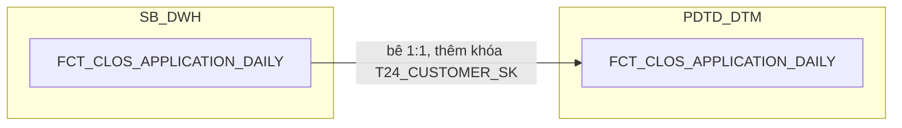

### 3.3 Cấu trúc bảng

| STT | Tên cột | Kiểu dữ liệu | Bắt buộc | Độ lớn | Khóa | Mô tả | Báo cáo sử dụng | Tên chỉ tiêu trên báo cáo |
| --- | --- | --- | --- | --- | --- | --- | --- | --- |
| 1 | DAYID | DATE | Y |  | PK | Ngày dữ liệu, dạng số YYYYMMDD | Báo cáo CLOS APPLICATION (BC2) — một phần khóa chính Báo cáo SLA - TAT (BC5) — khóa chính | — |
| 2 | WI_NAME | VARCHAR2 | Y | 100 | PK | Mã hồ sơ tín dụng CLOS | Báo cáo CLOS APPLICATION (BC2) — hiển thị trực tiếp, khóa chính Báo cáo SLA - TAT (BC5) — khóa chính | WINAME (Mã hồ sơ) |
| 3 | DATASOURCE | VARCHAR2 | Y | 10 |  | Cột kỹ thuật đánh dấu nguồn hệ, luôn cố định 'CLOS' sau khi tách vật lý CLOS/RLOS | Báo cáo SLA - TAT (BC5) — hiển thị trực tiếp | SYSTEMNAME (Hệ thống CLOS/RLOS) |
| 4 | APPLICATION_SK | NUMBER | Y | 18 |  | Khóa tới DIM_CLOS_APPLICATION. Mặc định -1 nếu không khớp | Báo cáo CLOS APPLICATION (BC2) — khóa JOIN | — |
| 5 | CURRENT_WORKSTEP_SK | NUMBER | Y | 18 |  | Khóa tới DIM_CLOS_WORKSTEP, bước hồ sơ đang đứng tại ngày DAYID. Mặc định -1 | Thiết kế dư thừa | — |
| 6 | LAST_WORKSTEP_SK | NUMBER | Y | 18 |  | Khóa tới DIM_CLOS_WORKSTEP của sự kiện hoàn tất gần nhất. Mặc định -1 | Báo cáo CLOS APPLICATION (BC2) — khóa JOIN, nguồn cho chỉ tiêu/trường LAST_WORKSTEP (Bước hồ sơ cuối, tính ở PDTD_DTM) | — |
| 7 | LAST_DECISION_SK | NUMBER | Y | 18 |  | Khóa tới DIM_CLOS_DECISION của sự kiện hoàn tất gần nhất. Mặc định -1 | Báo cáo CLOS APPLICATION (BC2) — khóa JOIN | LAST_DECISION (Quyết định bước cuối) |
| 8 | LAST_USER_SK | NUMBER | Y | 18 |  | Khóa tới DIM_LOS_USER của người xử lý sự kiện hoàn tất gần nhất. Mặc định -1 | Thiết kế dư thừa | — |
| 9 | PRODUCT_SK | NUMBER | Y | 18 |  | Khóa tới DIM_CLOS_PRODUCT — lookup theo PRODUCT_LINE_CODE=NG_SB_CLOS_CUST_INFO.PRODUCT_LINE AND SUB_PRODUCT_CODE=NG_SB_CLOS_CUST_INFO.SUB_PRODUCT, điều kiện SCD2 hiệu lực tại DAYID. Mặc định -1 nếu không khớp | Báo cáo CLOS APPLICATION (BC2) — khóa JOIN tới PRODUCT_LINE/SUB_PRODUCT Báo cáo SLA - TAT (BC5) — khóa JOIN điều kiện SLA_DE Báo cáo KPI (BC9) — điều kiện lọc STREAM khi tính SLGN_CLOS | — |
| 10 | ORG_UNIT_SK | NUMBER | Y | 18 |  | Khóa tới DIM_LOS_ORG_UNIT — lookup theo COMPANY_CODE=NG_SB_CLOS_CUST_INFO.COMPANY_CODE, điều kiện SCD2 hiệu lực tại DAYID. Mặc định -1 nếu không khớp | Báo cáo CLOS APPLICATION (BC2) — khóa JOIN tới BRANCH_CODE/COMPANY_CODE/COMPANY_NAME | — |
| 11 | RI_USER | VARCHAR2 | N | 100 |  | User khởi tạo hồ sơ (bước RequestInitiate) | Báo cáo CLOS APPLICATION (BC2) — hiển thị trực tiếp | RI_USER (User khởi tạo hồ sơ) |
| 12 | BRANCH_USER | VARCHAR2 | N | 100 |  | User xử lý bước BranchSupport, HOÀN TẤT gần nhất | Báo cáo CLOS APPLICATION (BC2) — hiển thị trực tiếp | BRANCH_USER (User Chi nhánh) |
| 13 | DDE_USER | VARCHAR2 | N | 100 |  | User xử lý bước DetailDataEntry, HOÀN TẤT gần nhất | Báo cáo CLOS APPLICATION (BC2) — hiển thị trực tiếp | DDE_USER (User Chuyên viên nhập liệu) |
| 14 | QC_USER | VARCHAR2 | N | 100 |  | User xử lý bước DataInputerChecker, HOÀN TẤT gần nhất | Báo cáo CLOS APPLICATION (BC2) — hiển thị trực tiếp | QUALITY_CHECKER (User Kiểm soát nhập liệu) |
| 15 | UND_MAKER_USER | VARCHAR2 | N | 100 |  | User xử lý bước UnderwriterMaker, HOÀN TẤT gần nhất | Báo cáo CLOS APPLICATION (BC2) — hiển thị trực tiếp | UND_MAKER (User Chuyên viên thẩm định) |
| 16 | UND_CHECKER_USER | VARCHAR2 | N | 100 |  | User xử lý bước UnderwriterChecker, HOÀN TẤT gần nhất | Báo cáo CLOS APPLICATION (BC2) — hiển thị trực tiếp | UND_CHECKER (User Kiểm soát thẩm định) |
| 17 | PHV_USER | VARCHAR2 | N | 100 |  | User xử lý bước PhoneVerification, HOÀN TẤT gần nhất | Báo cáo CLOS APPLICATION (BC2) — hiển thị trực tiếp | PHV_USER (User Chuyên viên Thẩm định điện thoại) |
| 18 | FA_USER | VARCHAR2 | N | 100 |  | User Chuyên viên Thực địa | Báo cáo CLOS APPLICATION (BC2) — hiển thị trực tiếp | FA_USER (User Chuyên viên Thực địa) |
| 19 | APPROVER_USER | VARCHAR2 | N | 100 |  | User xử lý bước CreditApproval, HOÀN TẤT gần nhất | Báo cáo CLOS APPLICATION (BC2) — hiển thị trực tiếp | BI_APPROVER (User Chuyên gia phê duyệt) |
| 20 | COMMITTEE_USER | VARCHAR2 | N | 100 |  | User Hội đồng tín dụng | Báo cáo CLOS APPLICATION (BC2) — hiển thị trực tiếp | BI_COMMITTEE (User Hội đồng tín dụng) |
| 21 | HOS_USER | VARCHAR2 | N | 100 |  | User Hỗ trợ phê duyệt | Báo cáo CLOS APPLICATION (BC2) — hiển thị trực tiếp | BI_HOS_USER (User Hỗ trợ phê duyệt) |
| 22 | PROCESSED_DATE | DATE | N |  |  | Ngày xử lý chung của hồ sơ theo 3 mức ưu tiên (phê duyệt cuối / hủy / hoàn tất gần nhất) | Báo cáo CLOS APPLICATION (BC2) — hiển thị trực tiếp Báo cáo KPI (BC9) — nguồn cho AGG_LOS_KPI_APPLICATION.PROCESSED_DATE, mốc xếp hồ sơ vào đúng DAYID khi SUM/COUNT lên grain ngày | PROCESSED_DATE (Ngày dữ liệu báo cáo) |
| 23 | LAST_UWM_ENTRYDATE | TIMESTAMP | N |  |  | MAX(ENTRYDATE) tại UnderwriterMaker <= DAYID — mốc mở chu kỳ thẩm định hiện hành | Nguồn cho chỉ tiêu/trường PROCESSED_DATE_UWM (cột 24, cùng bảng) | — |
| 24 | PROCESSED_DATE_UWM | DATE | N |  |  | Ngày chốt chu kỳ thẩm định hiện hành, tính tương đối theo LAST_UWM_ENTRYDATE | Báo cáo Tuần Chuyên viên Thẩm định (BC4) — REPORT_DATE (dùng thay DAYID khi báo cáo cần mốc theo chu kỳ thẩm định) | REPORT_DATE (Ngày báo cáo) |
| 25 | CREATION_DATE | DATE | N |  |  | TRUNC(MIN(ENTRYDATE)) theo WI_NAME | Báo cáo CLOS APPLICATION (BC2) — hiển thị trực tiếp | CREATION_DATE (Ngày hồ sơ khởi tạo) |
| 26 | FIRST_APPROVAL_DATE | DATE | N |  |  | MIN(EXITDATE) tại bước phê duyệt hợp lệ | Thiết kế dư thừa | — |
| 27 | LAST_APPROVAL_DATE | DATE | N |  |  | MAX(EXITDATE) tại bước phê duyệt (nhóm quyết định đã định nghĩa) | Báo cáo CLOS APPLICATION (BC2) — hiển thị trực tiếp | LAST_APPROVAL_DATE (Thời gian phê duyệt cuối cùng) |
| 28 | MIN_UWM | TIMESTAMP | N |  |  | MIN(ENTRYDATE) tại UnderwriterMaker | Báo cáo CLOS APPLICATION (BC2) — hiển thị trực tiếp | MIN_UWM (Thời gian hồ sơ lên CV thẩm định) |
| 29 | MIN_APP | TIMESTAMP | N |  |  | MIN(ENTRYDATE) tại CreditApproval/CreditCommittee | Báo cáo CLOS APPLICATION (BC2) — hiển thị trực tiếp | MIN_APP (Thời gian hồ sơ lên cấp phê duyệt) |
| 30 | AUTO_CANCEL_DATE | DATE | N |  |  | Ngày hồ sơ bị hệ thống tự hủy (theo quy tắc CancelRevoke rỗng liên tiếp) | Nguồn cho chỉ tiêu/trường FLAG_AUTO_CANCEL (cột 40, cùng bảng) | — |
| 31 | CANCEL_USER_DATE | DATE | N |  |  | EXITDATE tại bản ghi DECISION='Cancel' và USERNAME khác NULL | Thiết kế dư thừa | — |
| 32 | BI_CAN_DATE | DATE | N |  |  | ENTRYDATE tại bước CancelRevoke | Báo cáo CLOS APPLICATION (BC2) — hiển thị trực tiếp | BI_CAN_DATE (Thời gian hồ sơ vào vùng CancelRevoke) |
| 33 | LAST_ENTRYDATE | TIMESTAMP | N |  |  | ENTRYDATE của sự kiện hoàn tất gần nhất | Báo cáo CLOS APPLICATION (BC2) — hiển thị trực tiếp | LAST_ENTRYDATE (Thời gian vào bước cuối) |
| 34 | LAST_EXITDATE | TIMESTAMP | N |  |  | EXITDATE của cùng sự kiện hoàn tất gần nhất | Báo cáo CLOS APPLICATION (BC2) — hiển thị trực tiếp | LAST_EXITDATE (Thời gian kết thúc bước cuối) |
| 35 | BI_APPSTATUS | VARCHAR2 | N | 50 |  | Trạng thái hồ sơ chuẩn hóa (Approved/Rejected/Cancelled/Processing) | Báo cáo CLOS APPLICATION (BC2) — hiển thị trực tiếp | BI_APPSTATUS (Trạng thái cuối của hồ sơ) |
| 36 | HAS_ACTION_IN_DAY | VARCHAR2 | Y | 1 |  | 'Y' nếu hồ sơ có phát sinh xử lý trong ngày DAYID | Thiết kế dư thừa | — |
| 37 | LAST_ACTION_DATE | DATE | Y |  |  | Ngày business action gần nhất tính đến cuối DAYID | Thiết kế dư thừa | — |
| 38 | INACTIVE_DAY_CNT | NUMBER | Y | 5 |  | TRUNC(DAYID) - TRUNC(LAST_ACTION_DATE) | Thiết kế dư thừa | — |
| 39 | PRE_WORKSTEP_CODE | VARCHAR2 | N | 200 |  | Bước xử lý liền trước (LAG theo ENTRYDATE) | Báo cáo CLOS APPLICATION (BC2) — hiển thị trực tiếp | PRE_WORKSTEP (Bước hồ sơ trước đó) |
| 40 | FLAG_AUTO_CANCEL | VARCHAR2 | N | 10 |  | 'YES' nếu AUTO_CANCEL_DATE khác NULL | Báo cáo CLOS APPLICATION (BC2) — hiển thị trực tiếp | FLAG_AUTO_CAN (Hồ sơ bị tự động hủy — YES/NO) |
| 41 | LAST_REMARKS | VARCHAR2 | N | 4000 |  | Ghi chú của sự kiện hoàn tất gần nhất | Báo cáo CLOS APPLICATION (BC2) — hiển thị trực tiếp | LAST_REMARKS (Ghi chú ý kiến bước cuối) |
| 42 | LAST_REMARK_DDE | VARCHAR2 | N | 4000 |  | Ghi chú tại bước DetailDataEntry | Thiết kế dư thừa | — |
| 43 | LAST_CAN_REMARKS | VARCHAR2 | N | 4000 |  | Ghi chú tại lần hủy hồ sơ | Thiết kế dư thừa | — |
| 44 | HAS_REACHED_DDE | VARCHAR2 | N | 1 |  | Hồ sơ đã tới bước DetailDataEntry hay chưa | Thiết kế dư thừa | — |
| 45 | HAS_REACHED_QC | VARCHAR2 | N | 1 |  | Hồ sơ đã tới bước DataInputerChecker hay chưa | Thiết kế dư thừa | — |
| 46 | HAS_REACHED_UWM | VARCHAR2 | N | 1 |  | Hồ sơ đã tới bước UnderwriterMaker hay chưa | Thiết kế dư thừa | — |
| 47 | HAS_REACHED_UWC | VARCHAR2 | N | 1 |  | Hồ sơ đã tới bước UnderwriterChecker hay chưa | Thiết kế dư thừa | — |
| 48 | HAS_REACHED_APPROVAL | VARCHAR2 | N | 1 |  | Hồ sơ đã tới bước CreditApproval/CreditCommittee hay chưa | Thiết kế dư thừa | — |
| 49 | PROPOSED_AMT | NUMBER | N | 20,2 |  | Số tiền đề xuất — nguồn NG_SB_CLOS_CREDITINFO_COMM.PRECREDITLIMIT | Báo cáo CLOS APPLICATION (BC2) — hiển thị trực tiếp | ST_YEUCAU (Số tiền đề xuất vay) |
| 50 | CREDIT_LIMIT_APPROVAL | NUMBER | N | 20,2 |  | Hạn mức do chuyên gia phê duyệt — nguồn NG_SB_CLOS_CREDITINFO_CD.CREDIT_LIMIT | Báo cáo CLOS APPLICATION (BC2) — hiển thị trực tiếp | ST_PHEDUYET (Số tiền phê duyệt chính thức) |
| 51 | CREDIT_LIMIT_COMMITTEE | NUMBER | N | 20,2 |  | Hạn mức do hội đồng phê duyệt — nguồn NG_SB_CLOS_CREDITINFO_COMM.CREDIT_LIMIT | Báo cáo CLOS APPLICATION (BC2) — hiển thị trực tiếp Báo cáo Thông tin phê duyệt (BC3) — nguồn cho chỉ tiêu/trường CREDIT_LIMIT (đặt bản dư thừa có chủ đích trên DIM_CLOS_APPLICATION để BC3 lookup thẳng qua APPLICATION_SK) | CREDIT_LIMITS (Hạn mức cấp) |
| 52 | APPROVED_AMT_FINAL | NUMBER | N | 20,2 |  | Hạn mức phê duyệt cuối cùng — nguồn NG_SB_CLOS_CREDITINFO_COMM.CREDIT_LIMIT, map thẳng 1 nguồn | Báo cáo Thông tin phê duyệt (BC3) — CREDIT_LIMIT (giá trị hạn mức phê duyệt cuối theo đúng công thức SRS BC3) | CREDIT_LIMIT (Số tiền phê duyệt) |
| 53 | APPROVED_TERM | NUMBER | N | 5 |  | Kỳ hạn phê duyệt — nguồn NG_SB_CLOS_CREDITINFO_COMM.CREDIT_TERM | Báo cáo CLOS APPLICATION (BC2) — hiển thị trực tiếp | CREDIT_TERM (Thời hạn cấp tín dụng) |
| 54 | INTEREST_RATE_PCT | NUMBER | N | 8,4 |  | Lãi suất phê duyệt (%), chỉ nhận khi nguồn là số | Báo cáo CLOS APPLICATION (BC2) — hiển thị trực tiếp (chọn thay cho INTEREST_RATE_DESC theo quyết định người dùng, review 2026-09-21) | INTEREST_RATE (Lãi suất phê duyệt) |
| 55 | INTEREST_RATE_DESC | VARCHAR2 | N | 1600 |  | Diễn giải lãi suất nguyên văn — nguồn NG_SB_CLOS_CREDITINFO_COMM.INTEREST_RATE (có thể là công thức nhiều giai đoạn) | Thiết kế dư thừa | — |
| 57 | RETURN_CNT_DATAENTRY | NUMBER | N | 5 |  | Số lần hồ sơ bị trả về ở khâu nhập liệu | Báo cáo RETURN (BC8) — hiển thị trực tiếp | SL_RETURN_NHAPLIEU (Số lần return tại Nhập liệu) |
| 58 | RETURN_CNT_UNDERWRITING | NUMBER | N | 5 |  | Số lần hồ sơ bị trả về ở khâu thẩm định | Báo cáo RETURN (BC8) — hiển thị trực tiếp | SL_RETURN_THAMDINH (Số lần return tại Thẩm định) |
| 59 | RETURN_CNT_APPROVAL | NUMBER | N | 5 |  | Số lần hồ sơ bị trả về ở khâu phê duyệt | Báo cáo RETURN (BC8) — hiển thị trực tiếp | SL_RETURN_PHEDUYET (Số lần return tại Cấp Phê duyệt) |
| 60 | KPI_VOLUME | NUMBER | N | 5,2 |  | Mức độ hoàn thành hồ sơ, thang 0-1 — theo DECISION nếu đã phê duyệt/từ chối = 1.0; nếu đã CancelRevoke/CancelPermanent thì lấy theo bước xa nhất đã đạt (CreditApproval=0.8, UnderwriterChecker=0.6, UnderwriterMaker=0.5, DetailDataEntry=0.2); còn lại NULL | Thiết kế dư thừa | — |
| 62 | VAR_STR12 | VARCHAR2 | N | 200 |  | Cột generic của WFINSTRUMENTTABLE — LEFT JOIN riêng theo WI_NAME=PROCESSINSTANCEID (không lọc CREATEDBY) | Báo cáo KPI (BC9) — điều kiện lọc IS NOT NULL cho SLHS_CLOS_DAY/SLGN_CLOS_DAY (AGG_LOS_KPI_YTD_DAILY) | — |
| 63 | UNDERWRITERMAKER_TAKERESPON | VARCHAR2 | N | 100 |  | CV Thẩm định chịu trách nhiệm — COALESCE(CASE WHEN m.WORK_STEP='UnderwriterMaker' THEN m.USER_MAKE END, i.UWMAKERUSER) | Báo cáo CLOS APPLICATION (BC2) — hiển thị trực tiếp | UNDERWRITERMAKER_TAKERESPON (CV Thẩm định chịu trách nhiệm) |
| 64 | UNDERWRITERCHECKER_TAKERESPON | VARCHAR2 | N | 100 |  | Kiểm soát thẩm định chịu trách nhiệm — COALESCE(CASE WHEN m.WORK_STEP='UnderwriterChecker' THEN m.USER_MAKE END, i.UWCHKRUSER) | Báo cáo CLOS APPLICATION (BC2) — hiển thị trực tiếp | UNDERWRITERCHECKER_TAKERESPON (Kiểm soát thẩm định chịu trách nhiệm) |
| 65 | APPROVAL_TAKERESPON | VARCHAR2 | N | 100 |  | Chuyên gia phê duyệt chịu trách nhiệm — COALESCE(m.USER_MAKE, CASE e.APP_GRP WHEN 'A1' THEN 'long.lq' WHEN 'CC' THEN 'UBTD' WHEN 'BOD' THEN 'HDQT' END) | Báo cáo CLOS APPLICATION (BC2) — hiển thị trực tiếp | APPROVAL_TAKERESPON (Chuyên gia phê duyệt chịu trách nhiệm) |
| 66 | CUSTOMER_SK | NUMBER | Y | 18 |  | Khóa tới DIM_CLOS_CUSTOMER — quan hệ 1:1 với hồ sơ qua WI_NAME, join theo WI_NAME + điều kiện SCD2 hiệu lực tại DAYID. Mặc định -1 nếu không khớp. Đây là chân khách hàng LOS — khác T24_CUSTOMER_SK (chân T24, bổ sung riêng tại PDTD_DTM) | Báo cáo CLOS APPLICATION (BC2) — khóa JOIN tới ZONE (DIM_CLOS_CUSTOMER.ZONE) | — |
| 67 | T24_CUSTOMER_SK | NUMBER | Y | 18 |  | Khóa tới DIM_T24_CUSTOMER (T24), tra qua ORG_LEGAL_ID trên DIM_CLOS_CUSTOMER. Mặc định -1 (review 2026-09-17: đổi tên từ CUSTOMER_SK để phân biệt rõ với khách hàng LOS — DIM_CLOS_CUSTOMER là chân khách hàng LOS, đây là chân khách hàng T24 riêng, link qua FCT theo đúng nguyên tắc không link DIM sang DIM) | Báo cáo CLOS APPLICATION (BC2) — khóa JOIN sang DIM_T24_CUSTOMER (CUSTOMER_ID — ID khách hàng/Mã CIF) | — |
| 68 | LAST_WORKSTEP | VARCHAR2 | N | 50 |  | Tên bước hoàn tất gần nhất, chuẩn hóa dùng chung 2 hệ — LEFT JOIN Q_RLOS_REF_WORKSTEP_2SYSTEMS theo bước/quyết định của sự kiện hoàn tất gần nhất | Báo cáo CLOS APPLICATION (BC2) — hiển thị trực tiếp (khác LAST_WORKSTEP_SK — khóa nội bộ tới DIM_CLOS_WORKSTEP) | LAST_WORKSTEP (Bước hồ sơ cuối) |

## 4. FCT_CLOS_APPLICATION_PARTY

### 4.1 Mục đích thiết kế
- **Ý nghĩa bảng:** bảng FACT quan hệ (factless fact) tại PDTD_DTM — bê
  nguyên 1:1 từ `FCT_CLOS_APPLICATION_PARTY` (SB_DWH), không mang thuộc
  tính mô tả, chỉ nối lại quan hệ giữa 1 hồ sơ, khách hàng chính và người
  liên quan pháp lý sau khi tách DIM_CLOS_CUSTOMER/DIM_CLOS_LEGAL_PARTY
  ra khỏi FCT gốc. Là cầu nối để DIM_CLOS_CUSTOMER LEFT JOIN lấy các
  thuộc tính từ người liên quan pháp lý (mã số ĐKKD/MST, người đại diện
  pháp luật) hiển thị trên báo cáo. Không có bổ sung nào riêng tại tầng
  PDTD_DTM.
- **Khóa chính của bảng (PK):** DAYID, WI_NAME, LEGAL_PARTY_SK.
- **Độ chi tiết (grain):** 1 dòng = 1 hồ sơ x 1 người liên quan pháp lý
  (dòng trên DIM_CLOS_LEGAL_PARTY), join đủ N dòng cho cả 5 vai trò
  (CUSTOMER, LEGAL_REPRESENTATIVE, COLLATERAL_OWNER,
  MAIN_CONTRIBUTING_MEMBERS, OTHER).
- **Phục vụ báo cáo:**
  - Báo cáo CLOS APPLICATION (BC2) — gián tiếp, làm cầu nối để
    DIM_CLOS_CUSTOMER lookup ORG_LEGAL_ID/LEGAL_REPRESENTATIVE từ
    DIM_CLOS_LEGAL_PARTY

### 4.2 Sơ đồ lineage

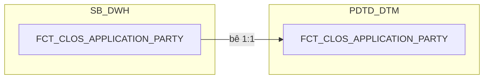

### 4.3 Cấu trúc bảng

| STT | Tên cột | Kiểu dữ liệu | Bắt buộc | Độ lớn | Khóa | Mô tả | Báo cáo sử dụng | Tên chỉ tiêu trên báo cáo |
| --- | --- | --- | --- | --- | --- | --- | --- | --- |
| 1 | DAYID | DATE | Y |  | PK | Ngày dữ liệu, dạng số YYYYMMDD | — (cột kỹ thuật, một phần khóa chính) | — |
| 2 | WI_NAME | VARCHAR2 | Y | 100 | PK | Mã hồ sơ tín dụng CLOS | — (cột kỹ thuật, một phần khóa chính) | — |
| 3 | APPLICATION_SK | NUMBER | Y | 18 |  | Khóa tới DIM_CLOS_APPLICATION. Mặc định -1 | — (khóa liên kết nội bộ, không xuất trực tiếp lên báo cáo) | — |
| 4 | CUSTOMER_SK | NUMBER | Y | 18 |  | Khóa tới DIM_CLOS_CUSTOMER. Mặc định -1 | — (khóa liên kết nội bộ, không xuất trực tiếp lên báo cáo) | — |
| 5 | LEGAL_PARTY_SK | NUMBER | Y | 18 | PK | Khóa tới DIM_CLOS_LEGAL_PARTY — join đủ N dòng cho cả 5 vai trò (CUSTOMER, LEGAL_REPRESENTATIVE, COLLATERAL_OWNER, MAIN_CONTRIBUTING_MEMBERS, OTHER), đúng grain "1 dòng = 1 hồ sơ × 1 người liên quan pháp lý". Mặc định -1 chỉ dùng cho trường hợp dữ liệu thiếu/không khớp được (Unknown) — CLOS luôn có đúng 1 dòng LEGAL_PARTY ứng với chính khách hàng | Báo cáo CLOS APPLICATION (BC2) — khóa JOIN để DIM_CLOS_CUSTOMER lấy ORG_LEGAL_ID (vai trò CUSTOMER) và LEGAL_REPRESENTATIVE (vai trò LEGAL_REPRESENTATIVE) từ DIM_CLOS_LEGAL_PARTY | ID_NUMBER (Số ĐKKD/MST doanh nghiệp); LEGAL_REPRESENTATIVE (Người đại diện pháp luật) |
| 6 | DATASOURCE | VARCHAR2 | Y | 10 |  | Cột kỹ thuật đánh dấu nguồn hệ, luôn cố định 'CLOS' sau khi tách vật lý CLOS/RLOS | — (cột kỹ thuật) | — |

## 5. FCT_CLOS_COLLATERAL

### 5.1 Mục đích thiết kế
- **Ý nghĩa bảng:** bảng FACT chi tiết (nhân dòng) tại PDTD_DTM — bê
  nguyên 1:1 từ `FCT_CLOS_COLLATERAL` (SB_DWH), lưu ảnh số liệu thay đổi
  theo ngày của từng tài sản bảo đảm thuộc hồ sơ CLOS. Không tách chiều
  tài sản riêng — toàn bộ thuộc tính lưu thẳng trên fact vì nguồn
  NG_SB_CLOS_COLL_CD không khai khóa CDC, nên không đủ điều kiện tách
  DIM theo SCD2. Không có bổ sung nào riêng tại tầng PDTD_DTM.
- **Khóa chính của bảng (PK):** DAYID, WI_NAME, COLLATERAL_BK.
- **Độ chi tiết (grain):** 1 dòng = 1 tài sản bảo đảm của 1 hồ sơ x 1 ngày
  dữ liệu (ảnh chụp đầy đủ theo ngày).
- **Phục vụ báo cáo:**
  - Báo cáo RLOS APPLICATION (BC1) — qua đối xứng RLOS, không áp dụng trực tiếp nhánh CLOS
  - Báo cáo CLOS APPLICATION (BC2)
  - Báo cáo Thông tin phê duyệt (BC3)
  - Báo cáo KPI (BC9)

### 5.2 Sơ đồ lineage

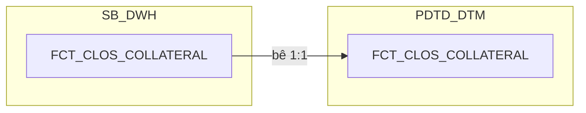

### 5.3 Cấu trúc bảng

| STT | Tên cột | Kiểu dữ liệu | Bắt buộc | Độ lớn | Khóa | Mô tả | Báo cáo sử dụng | Tên chỉ tiêu trên báo cáo |
| --- | --- | --- | --- | --- | --- | --- | --- | --- |
| 1 | DAYID | DATE | Y |  | PK | Ngày dữ liệu, dạng số YYYYMMDD | — (cột kỹ thuật, một phần khóa chính) | — |
| 2 | WI_NAME | VARCHAR2 | Y | 100 | PK | Mã hồ sơ tín dụng CLOS | — (cột kỹ thuật, một phần khóa chính) | — |
| 3 | COLLATERAL_BK | VARCHAR2 | Y | 64 | PK | Khóa nghiệp vụ của dòng tài sản — hash SHA256 trên toàn bộ cột không phải CLOB của NG_SB_CLOS_COLL_CD (loại trừ COLL_MGMT_APP, DESCRIPTION), cộng DATASOURCE và tên bảng nguồn | — (cột kỹ thuật, một phần khóa chính) | — |
| 4 | DATASOURCE | VARCHAR2 | Y | 10 |  | Cột kỹ thuật đánh dấu nguồn hệ, luôn cố định 'CLOS' sau khi tách vật lý CLOS/RLOS | — (cột kỹ thuật) | — |
| 5 | APPLICATION_SK | NUMBER | Y | 18 |  | Khóa tới DIM_CLOS_APPLICATION theo phiên bản hiệu lực tại DAYID. Mặc định -1 nếu không khớp | — (khóa liên kết nội bộ, không xuất trực tiếp lên báo cáo) | — |
| 6 | COLLATERAL_TYPE_SK | NUMBER | Y | 18 |  | Khóa tới DIM_CLOS_COLLATERAL_TYPE, lookup theo COLLATERAL_TYPE_CODE. Mặc định -1 | — (khóa liên kết nội bộ; DIM_CLOS_COLLATERAL_TYPE hiện chỉ còn COLLATERAL_TYPE_CODE — đã có sẵn trực tiếp trên fact này ở cột 7 — nên khóa này không mang thêm giá trị hiển thị nào cho báo cáo) | — |
| 7 | COLLATERAL_TYPE_CODE | VARCHAR2 | N | 100 |  | Mã loại tài sản bảo đảm — nguồn NG_SB_CLOS_COLL_CD.COLLTYPE | Báo cáo CLOS APPLICATION (BC2) — nguồn cho 9 cờ TSDB_NHOM_0/TSDB_BDS/TSDB_PTVT/TSDB_MMTB/TSDB_KPT/TSDB_HTK/TSDB_TIN_CHAP/TIN_CHAP_TQD/TSDB_CP_TP (so sánh CASE trực tiếp giá trị COLLTYPE gốc) Báo cáo Thông tin phê duyệt (BC3) — hiển thị trực tiếp | TSDB_NHOM_0/TSDB_BDS/TSDB_PTVT/TSDB_MMTB/TSDB_KPT/TSDB_HTK/TSDB_TIN_CHAP/TIN_CHAP_TQD/TSDB_CP_TP (các cờ TSBĐ theo nhóm — BC2); TYPES_OF_COLLATERALS (Loại TSBĐ — BC3) |
| 8 | DESCRIPTION | VARCHAR2 | N | 4000 |  | Diễn giải tài sản bảo đảm — nguồn NG_SB_CLOS_COLL_CD.DESCRIPTION (CLOB) | Báo cáo Thông tin phê duyệt (BC3) — hiển thị trực tiếp | DESCRIPTION (Mô tả TSBĐ) |
| 9 | OWNER_NAME | VARCHAR2 | N | 200 |  | Chủ sở hữu tài sản — nguồn NG_SB_CLOS_COLL_CD.COLL_OWNER | Báo cáo Thông tin phê duyệt (BC3) — hiển thị trực tiếp | OWNER (Chủ TSBĐ) |
| 10 | COLL_MGMT_METHOD | VARCHAR2 | N | 4000 |  | Phương thức quản lý tài sản — nguồn NG_SB_CLOS_COLL_CD.COLL_MGMT_APP. Người dùng thường không nhập trường này trên live nên phần lớn sẽ rỗng, nhưng BC3 vẫn liệt kê nên phải nạp | Báo cáo Thông tin phê duyệt (BC3) — hiển thị trực tiếp | COLLATERA_MANAGEMENT (Phương thức quản lý TSBĐ) |
| 11 | APPRAISED_VALUE | NUMBER | N | 20,2 |  | Giá trị định giá của tài sản — nguồn NG_SB_CLOS_COLL_CD.APPRAISED_VAL_FIG. Ép kiểu số từ text theo định dạng Việt Nam, DEFAULT NULL ON CONVERSION ERROR | Báo cáo Thông tin phê duyệt (BC3) — hiển thị trực tiếp | APPRAISED_VALUE (Giá trị định giá) |
| 12 | LOAN_RATE_LTV | NUMBER | N | 5,2 |  | Tỷ lệ cho vay trên giá trị tài sản — nguồn NG_SB_CLOS_COLL_CD.LTV. Cùng quy tắc ép kiểu, đơn vị phần trăm | Báo cáo Thông tin phê duyệt (BC3) — hiển thị trực tiếp | LTV (Tỷ lệ cho vay của TSBĐ) |

## 6. FCT_CLOS_EXCEPTION

### 6.1 Mục đích thiết kế
- **Ý nghĩa bảng:** bảng FACT chi tiết tại PDTD_DTM — bê nguyên 1:1 từ
  `FCT_CLOS_EXCEPTION` (SB_DWH, 13 cột nghiệp vụ + `CHECK_FTR`/
  `FIRST_WORKSTEP_RETURN` đã tính sẵn), lưu mỗi lần một lý do (ngoại lệ)
  được nêu ra trên hồ sơ CLOS trong quá trình xử lý — bao gồm cả lần nêu
  lý do (Raise) lẫn lần đã làm rõ/bổ sung (Clear). Bổ sung tại tầng này 2
  cột phái sinh: `LOANCASEID` (join `DIM_CLOS_APPLICATION.LOANCASEID`
  theo APPLICATION_SK) và `PHAN_LOAI_DDE` (LEFT JOIN `REF_PHAN_LOAI_DDE`
  theo EXCEPTION_CATEGORY + SYSTEMNAME='CLOS'). Riêng `PHAN_LOAI_DDE`
  vốn thiết kế ban đầu đặt tại SB_DWH nhưng đã chuyển hẳn về PDTD_DTM
  (review 2026-09-22) vì `REF_PHAN_LOAI_DDE` chỉ tồn tại vật lý ở tầng
  PDTD_DTM (BA nhập tay, không qua STG_LOS/CDC) — một bảng SB_DWH không
  được phép JOIN thẳng một bảng chỉ có ở PDTD_DTM, nên công thức phải
  tính ở đây, đúng nguyên tắc "JOIN vào bảng REF_ là đặc quyền riêng của
  tầng PDTD_DTM".
- **Khóa chính của bảng (PK):** DAYID, WI_NAME, EXCEPTION_CATEGORY,
  RAISED_BY, RAISED_DATE_TIME.
- **Độ chi tiết (grain):** 1 dòng = 1 lần ghi nhận lý do của 1 hồ sơ,
  trong ảnh chụp của ngày DAYID. Một hồ sơ có thể phát sinh cùng 1 loại lý
  do nhiều lần, bởi nhiều người, ở nhiều thời điểm khác nhau.
- **Phục vụ báo cáo:**
  - Báo cáo EXCEPTION - FTR (BC7)
  - Báo cáo RETURN (BC8)

### 6.2 Sơ đồ lineage

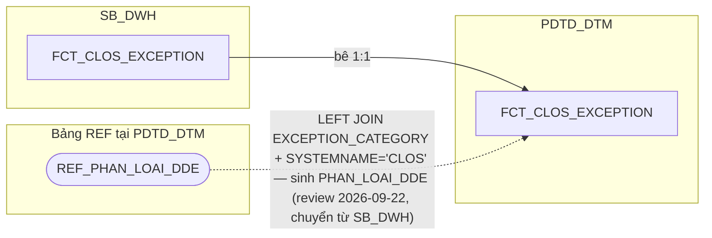

### 6.3 Cấu trúc bảng

| STT | Tên cột | Kiểu dữ liệu | Bắt buộc | Độ lớn | Khóa | Mô tả | Báo cáo sử dụng | Tên chỉ tiêu trên báo cáo |
| --- | --- | --- | --- | --- | --- | --- | --- | --- |
| 1 | DAYID | DATE | Y |  | PK | Ngày dữ liệu, dạng số YYYYMMDD | — (cột kỹ thuật) | — |
| 2 | WI_NAME | VARCHAR2 | Y | 100 | PK | Mã hồ sơ tín dụng CLOS | Báo cáo EXCEPTION - FTR (BC7) — khóa JOIN Báo cáo RETURN (BC8) — khóa JOIN | WINAME (Mã hồ sơ) |
| 3 | APPLICATION_SK | NUMBER | Y | 18 |  | Khóa tới DIM_CLOS_APPLICATION theo phiên bản hiệu lực tại DAYID. Mặc định -1 | Báo cáo EXCEPTION - FTR (BC7) — khóa JOIN sang DIM_CLOS_APPLICATION, đồng thời là nguồn cho chỉ tiêu/trường LOANCASEID (cột 16, cùng bảng) | — |
| 4 | EXCEPTION_REASON_SK | NUMBER | Y | 18 |  | Khóa tới DIM_CLOS_EXCEPTION_REASON — PHÁI SINH 2 bước đúng SRS BC7 (không phải lookup 1 cột): (1) LEFT JOIN theo EXCEPTION_CATEGORY + EXCEPTION_NAME, có thể khớp nhiều dòng DIM cùng category+name khác ACTIVITYNAME/DECISION_CODE; (2) lọc còn đúng 1 dòng bằng điều kiện tồn tại bản ghi NG_SB_CLOS_ENTRY_EXIT (WI_NAME khớp + WORKSTEP=ACTIVITYNAME + DECISION=DECISION_CODE của dòng DIM đó) — chỉ giữ tổ hợp đã thực sự xảy ra trong lịch sử xử lý hồ sơ. Mặc định -1 nếu không còn dòng nào khớp | Báo cáo EXCEPTION - FTR (BC7) — khóa JOIN sang DIM_CLOS_EXCEPTION_REASON | — |
| 5 | RAISED_BY_USER_SK | NUMBER | Y | 18 |  | Khóa tới DIM_LOS_USER, người nêu lý do. Mặc định -1. ĐÚNG GRAIN của bảng — 1 lần ghi nhận lý do có đúng 1 người nêu | Báo cáo EXCEPTION - FTR (BC7) — khóa JOIN sang DIM_LOS_USER | — |
| 6 | EXCEPTION_CATEGORY | VARCHAR2 | N | 500 | PK | Phân nhóm nội dung cần làm rõ — nguồn NG_SB_CLOS_EXCEPTION.EXCEPTION_CATEGORY | Báo cáo EXCEPTION - FTR (BC7) — hiển thị trực tiếp, đồng thời là khóa JOIN sang REF_PHAN_LOAI_DDE để sinh PHAN_LOAI_DDE (cột 15, cùng bảng) | EXCEPTION_CATEGORY (Nhóm nội dung ngoại lệ) |
| 7 | EXCEPTION_NAME | VARCHAR2 | N | 500 |  | Tên nội dung cần làm rõ — nguồn NG_SB_CLOS_EXCEPTION.EXCEPTION_NAME | Báo cáo EXCEPTION - FTR (BC7) — hiển thị trực tiếp | EXCEPTION_NAME (Tên nội dung ngoại lệ) |
| 8 | EXCEPTION_REMARKS | VARCHAR2 | N | 4000 |  | Ghi chú của nội dung cần làm rõ — nguồn NG_SB_CLOS_EXCEPTION.EXCEPTION_REMARKS | Báo cáo EXCEPTION - FTR (BC7) — hiển thị trực tiếp | EXCEPTION_REMARKS (Ghi chú ngoại lệ) |
| 9 | RAISED_BY | VARCHAR2 | N | 100 | PK | Người nêu nội dung cần làm rõ — nguồn NG_SB_CLOS_EXCEPTION.RAISED_BY. Cột RAISED_BY_USER_SK bên cạnh giữ khóa tới DIM | Báo cáo EXCEPTION - FTR (BC7) — hiển thị trực tiếp | RAISED_BY (Người nêu) |
| 10 | RAISED_DATE_TIME | TIMESTAMP | N |  | PK | Thời điểm nêu nội dung cần làm rõ — nguồn NG_SB_CLOS_EXCEPTION.RAISED_DATE_TIME | Báo cáo EXCEPTION - FTR (BC7) — hiển thị trực tiếp, đồng thời là nguồn tính PROCESSED_DATE (TRUNC ở tầng report) | RAISED_DATE_TIME (Thời điểm nêu); nguồn cho chỉ tiêu/trường PROCESSED_DATE (Ngày dữ liệu, BC7) |
| 11 | DATASOURCE | VARCHAR2 | Y | 10 |  | Cột kỹ thuật đánh dấu nguồn hệ, luôn cố định 'CLOS' sau khi tách vật lý CLOS/RLOS | — (cột kỹ thuật) | — |
| 12 | RCTYPE | VARCHAR2 | N | 20 |  | Loại ghi nhận, Raise (nêu lý do khi trả về) hay Clear (đã làm rõ/bổ sung và đẩy lại) — nguồn NG_SB_CLOS_EXCEPTION.RCTYPE | Báo cáo EXCEPTION - FTR (BC7) — hiển thị trực tiếp | RCTYPE (Raise/Clear) |
| 13 | CHECK_FTR | VARCHAR2 | N | 20 |  | Vi phạm nguyên tắc First Time Right — PHÁI SINH (review 2026-09-18, SRS BC7 cập nhật đổi hẳn công thức): mặc định 'Not First Time Right'; là 'First Time Right' CHỈ KHI mọi dòng NG_SB_CLOS_EXCEPTION của hồ sơ đều khớp 1 tổ hợp ngoại lệ miễn trừ (join NG_SB_CLOS_ENTRY_EXIT qua WINAME/WORKSTEP/DECISION), phân theo NG_SB_CLOS_CUST_INFO.CUST_GROUP: nhóm KHDN (MSME/SME/USME) và nhóm KHDNL/ĐT&ĐCTC (FDI/SOC/JSC/NBFI/BANK/STR) — mỗi nhóm có 4 tổ hợp WORKSTEP+DECISION với danh sách EXCEPTION_CATEGORY miễn trừ riêng | Báo cáo EXCEPTION - FTR (BC7) — hiển thị trực tiếp | CHECK_FTR (First Time Right) |
| 14 | FIRST_WORKSTEP_RETURN | VARCHAR2 | N | 200 |  | Bước xử lý phát sinh trả về đầu tiên — PHÁI SINH (review 2026-09-18, SRS BC7 cập nhật): WORKSTEP của bản ghi NG_SB_CLOS_ENTRY_EXIT tại MIN(EXITDATE) theo WI_NAME, với điều kiện EXITDATE IS NOT NULL AND ((WORKSTEP='DetailDataEntry' AND DECISION='Send_Back') OR (WORKSTEP IN ('DataInputerChecker','UnderwriterMaker','CreditApproval') AND DECISION='Additional_Doc_Required') OR (WORKSTEP='UnderwriterMaker' AND DECISION='Send_Back to BranchSupport')) | Báo cáo EXCEPTION - FTR (BC7) — hiển thị trực tiếp | FIRST_WORKSTEP_RETURN (Bước trả về đầu tiên) |
| 15 | PHAN_LOAI_DDE | VARCHAR2 | N | 100 |  | Phân loại nguyên nhân trả về ở khâu nhập liệu — PHÁI SINH TẠI PDTD_DTM (review 2026-09-22, chuyển từ SB_DWH vì REF_PHAN_LOAI_DDE chỉ tồn tại vật lý ở PDTD_DTM): LEFT JOIN REF_PHAN_LOAI_DDE theo EXCEPTION_CATEGORY = REF_PHAN_LOAI_DDE.EXCEPTION_CATEGORY AND REF_PHAN_LOAI_DDE.SYSTEMNAME='CLOS', lấy REF_PHAN_LOAI_DDE.PHAN_LOAI_DDE | Báo cáo EXCEPTION - FTR (BC7) — hiển thị trực tiếp | PHAN_LOAI_DDE (Lỗi Nhập liệu/Thiếu Checklist) |
| 16 | LOANCASEID | VARCHAR2 | N | 100 |  | Mã khoản vay gắn với hồ sơ — PHÁI SINH: JOIN sang DIM_CLOS_APPLICATION theo APPLICATION_SK, lấy LOANCASEID | Báo cáo EXCEPTION - FTR (BC7) — hiển thị trực tiếp (cột trực tiếp trên bảng này, ưu tiên dùng thay vì join lại qua DIM_CLOS_APPLICATION) | LOANCASEID (Mã LOANCASEID) |

## 7. FCT_CLOS_DEVIATION

### 7.1 Mục đích thiết kế
- **Ý nghĩa bảng:** bảng FACT chi tiết, bê nguyên 1:1 từ SB_DWH, lưu ảnh số
  liệu thay đổi theo ngày của từng ngoại lệ chính sách (deviation) phát
  sinh trên hồ sơ CLOS. Không có cột phái sinh riêng ở tầng DTM — toàn bộ
  9 cột đã tính sẵn tại SB_DWH, tầng này chỉ đọc thẳng, không JOIN thêm
  bảng nào, giữ đúng nguyên tắc "DTM chỉ đọc DWH".
- **Khóa chính của bảng (PK):** DAYID, WI_NAME, DEVIATION_BK.
- **Độ chi tiết (grain):** 1 dòng = 1 ngoại lệ chính sách trong ảnh chụp
  của ngày DAYID (ảnh chụp đầy đủ mỗi ngày, không phải ghi thêm khi có
  thay đổi).
- **Phục vụ báo cáo:**
  - Báo cáo NGOẠI LỆ (BC6)

### 7.2 Sơ đồ lineage

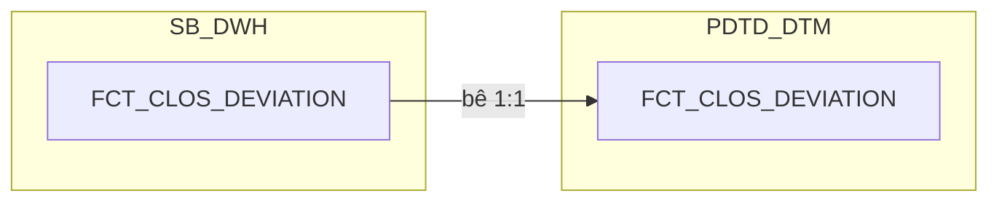

### 7.3 Cấu trúc bảng

| STT | Tên cột | Kiểu dữ liệu | Bắt buộc | Độ lớn | Khóa | Mô tả | Báo cáo sử dụng | Tên chỉ tiêu trên báo cáo |
| --- | --- | --- | --- | --- | --- | --- | --- | --- |
| 1 | DAYID | DATE | Y |  | PK | Ngày dữ liệu, dạng số YYYYMMDD | Thiết kế dư thừa | — |
| 2 | WI_NAME | VARCHAR2 | Y | 100 | PK | Mã hồ sơ tín dụng CLOS | Báo cáo NGOẠI LỆ (BC6) — khóa JOIN | WINAME (Mã hồ sơ) |
| 3 | DEVIATION_BK | VARCHAR2 | Y | 64 | PK | Khóa nghiệp vụ của dòng ngoại lệ — PHÁI SINH: STANDARD_HASH(..., 'SHA256') trên toàn bộ cột không phải CLOB của NG_SB_CLOS_CONDITON_CDGRID (loại trừ AS_REGULAR, DEV_PROPOSAL), cộng DATASOURCE và tên bảng nguồn. Chuẩn hóa trước khi hash: TRIM chuỗi, NULL quy về '<NULL>', DATE/NUMBER dùng format cố định không phụ thuộc NLS | Thiết kế dư thừa | — |
| 4 | DATASOURCE | VARCHAR2 | Y | 10 |  | Cột kỹ thuật đánh dấu nguồn hệ, luôn cố định 'CLOS' sau khi tách vật lý CLOS/RLOS | Thiết kế dư thừa | — |
| 5 | APPLICATION_SK | NUMBER | Y | 18 |  | Khóa tới DIM_CLOS_APPLICATION theo phiên bản hiệu lực tại DAYID. Mặc định -1 nếu không khớp | Báo cáo NGOẠI LỆ (BC6) — khóa JOIN sang DIM_CLOS_APPLICATION | — |
| 6 | DEVIATION_TYPE_CODE | VARCHAR2 | N | 300 |  | Mã loại lệch chính sách — nguồn NG_SB_CLOS_CONDITON_CDGRID.DEVIATION_TYPE | Báo cáo NGOẠI LỆ (BC6) — hiển thị trực tiếp | DEVIATION_TYPE (Loại ngoại lệ) |
| 7 | DEV_PROPOSAL | VARCHAR2 | N | 4000 |  | Đề xuất xử lý lệch chính sách — nguồn NG_SB_CLOS_CONDITON_CDGRID.DEV_PROPOSAL | Báo cáo NGOẠI LỆ (BC6) — hiển thị trực tiếp | DEV_PROPOSAL (Nội dung ngoại lệ) |
| 8 | AS_REGULAR | VARCHAR2 | N | 4000 |  | Quy định chuẩn liên quan tới lệch chính sách — nguồn NG_SB_CLOS_CONDITON_CDGRID.AS_REGULAR. Không báo cáo nào hiển thị trực tiếp; BA từng đề xuất đưa vào khóa nghiệp vụ nhưng bị từ chối vì là trường nhập tùy biến (free-text) — vẫn phải nạp vì là thuộc tính gốc của bảng nguồn | Thiết kế dư thừa | — |
| 9 | PROCESSED_DATE | DATE | N |  |  | Ngày xử lý của hồ sơ — PHÁI SINH: tính độc lập từ NG_SB_CLOS_ENTRY_EXIT theo cùng công thức 3 mức ưu tiên (ngày phê duyệt cuối/ngày hủy/ngày thoát bước gần nhất) đã dùng cho FCT_CLOS_APPLICATION_DAILY.PROCESSED_DATE — không JOIN sang FCT_CLOS_APPLICATION_DAILY để tránh tham chiếu chéo giữa 2 bảng | Báo cáo NGOẠI LỆ (BC6) — hiển thị trực tiếp | PROCESSED_DATE (Ngày dữ liệu báo cáo) |

## 8. FCT_CLOS_WORKSTEP_EVENT

### 8.1 Mục đích thiết kế
- **Ý nghĩa bảng:** bảng FACT nhật ký workflow mức nguyên tử của hệ CLOS,
  bê nguyên 1:1 từ SB_DWH, giữ hết mọi sự kiện "vào bước — ra bước" của
  hồ sơ (không bao giờ xóa, không chép lại nhật ký mỗi ngày). Là nguồn
  duy nhất để tính mọi mốc thời gian, TAT, số lần trả về và người xử lý
  theo từng bước, nhánh CLOS. Không có REF_ nào join thêm ở tầng DTM —
  cấu trúc giữ nguyên như bản SB_DWH.
- **Khóa chính của bảng (PK):** DAYID, WI_NAME, WORKSTEP_CODE, ENTRYDATE.
- **Độ chi tiết (grain):** 1 dòng = 1 phiên bản của 1 logical event (hồ sơ
  x workstep x lần vào bước) — hồ sơ quay lại cùng 1 bước nhiều lần thì
  mỗi lần là 1 sự kiện riêng.
- **Phục vụ báo cáo:**
  - Báo cáo Thông tin phê duyệt (BC3)
  - Báo cáo Tuần Chuyên viên Thẩm định (BC4)
  - Báo cáo SLA - TAT (BC5)
  - Báo cáo RETURN (BC8)
  - Báo cáo KPI (BC9) — nguồn tính VOLUME/NHAN_SU/TAT_CLOS qua UNION với FCT_RLOS_WORKSTEP_EVENT
  - Nguồn cho FCT_CLOS_EXCEPTION.FIRST_WORKSTEP_RETURN (BC7)

### 8.2 Sơ đồ lineage

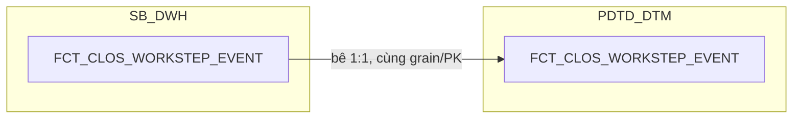

### 8.3 Cấu trúc bảng

| STT | Tên cột | Kiểu dữ liệu | Bắt buộc | Độ lớn | Khóa | Mô tả | Báo cáo sử dụng | Tên chỉ tiêu trên báo cáo |
| --- | --- | --- | --- | --- | --- | --- | --- | --- |
| 1 | DAYID | DATE | Y |  | PK | Ngày dữ liệu, dạng số YYYYMMDD — nguồn NG_SB_CLOS_ENTRY_EXIT, TRUNC về 00:00:00. Là ngày phiên bản được ghi nhận, KHÔNG phải ảnh chụp lại toàn bộ nhật ký mỗi ngày | Thiết kế dư thừa | — |
| 2 | WI_NAME | VARCHAR2 | Y | 100 | PK | Mã hồ sơ tín dụng CLOS — nguồn NG_SB_CLOS_ENTRY_EXIT.WINAME (đổi tên WINAME→WI_NAME cho thống nhất với các bảng khác) | Báo cáo Thông tin phê duyệt (BC3) — khóa JOIN, cũng là khóa lọc tập dòng event Báo cáo Tuần Chuyên viên Thẩm định (BC4) — khóa JOIN, cũng là khóa lọc tập dòng event | WINAME (Mã hồ sơ) |
| 3 | WORKSTEP_CODE | VARCHAR2 | Y | 200 | PK | Mã bước xử lý trên workflow — nguồn ENTRY_EXIT.WORKSTEP (đổi tên thêm hậu tố CODE), đã cắt tiền tố hệ nguồn nếu có | Báo cáo Thông tin phê duyệt (BC3) — hiển thị trực tiếp, cũng là điều kiện lọc chọn dòng event (CreditApproval/CreditCommittee) Báo cáo Tuần Chuyên viên Thẩm định (BC4) — hiển thị trực tiếp, cũng là điều kiện lọc (UnderwriterMaker/UnderwriterChecker) Báo cáo SLA - TAT (BC5) — điều kiện lọc khi SUM TAT_CALENDAR_HOUR/TAT_WORKING_HOUR/TAT_CPC_HOUR theo từng bước Báo cáo RETURN (BC8) — hiển thị trực tiếp | WORKSTEP (Bước hồ sơ) |
| 4 | ENTRYDATE | TIMESTAMP | Y |  | PK | Thời điểm hồ sơ vào bước xử lý — nguồn ENTRY_EXIT.ENTRYDATE. Bắt buộc nằm trong khóa vì 1 hồ sơ có thể quay lại cùng 1 bước nhiều lần | Báo cáo Tuần Chuyên viên Thẩm định (BC4) — hiển thị trực tiếp (ENTRYDATE của dòng event đã lọc) | ENTRYDATE (Thời gian lên bước thẩm định) |
| 5 | DATASOURCE | VARCHAR2 | Y | 10 |  | Cột kỹ thuật đánh dấu nguồn hệ, luôn cố định 'CLOS' sau khi tách vật lý CLOS/RLOS | Báo cáo Thông tin phê duyệt (BC3) — hiển thị trực tiếp Báo cáo Tuần Chuyên viên Thẩm định (BC4) — hiển thị trực tiếp | SYSTEMNAME (Hệ thống CLOS/RLOS) |
| 6 | WORKSTEP_SK | NUMBER | Y | 18 |  | Khóa tới DIM_CLOS_WORKSTEP, lookup bằng WORKSTEP_CODE theo điều kiện thời gian (EFF_DATE/EXP_DATE). Mặc định -1 nếu không khớp | Thiết kế dư thừa | — |
| 7 | DECISION_SK | NUMBER | Y | 18 |  | Khóa tới DIM_CLOS_DECISION, lookup bằng DECISION_CODE theo điều kiện thời gian. DECISION null/không khớp dùng -1. KHÔNG nằm trong PK — chỉ để tra cứu thêm thuộc tính | Thiết kế dư thừa | — |
| 8 | USER_SK | NUMBER | Y | 18 |  | Khóa tới DIM_LOS_USER, người xử lý của chính sự kiện này. ĐÚNG GRAIN của bảng — 1 lần vào bước có đúng 1 người xử lý. Mặc định -1. KHÔNG nằm trong PK | Thiết kế dư thừa | — |
| 9 | APPLICATION_SK | NUMBER | Y | 18 |  | Khóa tới DIM_CLOS_APPLICATION theo phiên bản hiệu lực tại DAYID. Mặc định -1 | Báo cáo Thông tin phê duyệt (BC3) — khóa JOIN sang DIM_CLOS_APPLICATION để lấy STREAM | — |
| 10 | EXITDATE | TIMESTAMP | N |  |  | Thời điểm hồ sơ ra khỏi bước xử lý — nguồn ENTRY_EXIT.EXITDATE. NULL nghĩa là hồ sơ đang nằm tại bước này | Báo cáo Thông tin phê duyệt (BC3) — hiển thị trực tiếp Báo cáo Tuần Chuyên viên Thẩm định (BC4) — hiển thị trực tiếp Báo cáo RETURN (BC8) — hiển thị trực tiếp, đồng thời là nguồn tính PROCESSED_DATE (BC8) | EXITDATE (Thời gian tạo quyết định / kết thúc bước) |
| 11 | DECISION_CODE | VARCHAR2 | N | 200 |  | Mã quyết định tại bước xử lý — nguồn ENTRY_EXIT.DECISION (đổi tên thêm hậu tố CODE) | Báo cáo Thông tin phê duyệt (BC3) — hiển thị trực tiếp, cũng là điều kiện lọc chọn dòng event (Submit/Reject/Send To HOSupport/Send To PostSanction) Báo cáo RETURN (BC8) — hiển thị trực tiếp | DECISION (Quyết định) |
| 12 | USERNAME | VARCHAR2 | N | 100 |  | Tên tài khoản người xử lý hồ sơ — nguồn ENTRY_EXIT.USERNAME. Giữ nguyên giá trị gốc để báo cáo hiển thị thẳng, không phải join qua DIM_LOS_USER | Báo cáo Thông tin phê duyệt (BC3) — hiển thị trực tiếp theo điều kiện WORKSTEP_CODE (BI_APPROVER/BI_COMMITTEE) Báo cáo Tuần Chuyên viên Thẩm định (BC4) — hiển thị trực tiếp theo điều kiện WORKSTEP_CODE (UND_MAKER) Báo cáo KPI (BC9) — đếm DISTINCT theo danh sách WORKSTEP cho NHAN_SU | USERNAME (User xử lý — BI_APPROVER/BI_COMMITTEE/UND_MAKER tùy báo cáo) |
| 13 | REMARKS | VARCHAR2 | N | 4000 |  | Ghi chú tại bước xử lý — nguồn ENTRY_EXIT.REMARKS | Báo cáo Thông tin phê duyệt (BC3) — hiển thị trực tiếp Báo cáo Tuần Chuyên viên Thẩm định (BC4) — hiển thị trực tiếp | REMARKS (Ghi chú) |
| 14 | TAT_SOURCE_SEC | NUMBER | N | 12 |  | Thời gian xử lý do hệ nguồn ghi, đơn vị giây — nguồn ENTRY_EXIT.TAT. Giữ lại để đối soát với 3 cột TAT tính lại bên dưới. Đơn vị "giây" kế thừa từ extract gốc, chưa chốt chính thức | Nguồn cho chỉ tiêu/trường TAT_CALENDAR_HOUR (điều kiện tính khi có giá trị, thay công thức lệch ngày) | — |
| 15 | TAT_CALENDAR_HOUR | NUMBER | N | 18,6 |  | Thời gian xử lý theo lịch tự nhiên, đơn vị giờ — PHÁI SINH: TAT_SOURCE_SEC / 3600, hoặc (CAST(EXITDATE AS DATE) - CAST(ENTRYDATE AS DATE)) * 24 nếu TAT_SOURCE_SEC rỗng. Không trừ ngày nghỉ. NULL nếu chưa có EXITDATE | Báo cáo SLA - TAT (BC5) — SUM theo từng nhóm bước (STEP01_BRANCH_CL_TAT, STEP02_DDE_CL_TAT...) Báo cáo KPI (BC9) — SUM theo nhóm bước cho TAT_CLOS | TAT_CALENDAR_HOUR (TAT theo giờ lịch tự nhiên) |
| 16 | TAT_WORKING_HOUR | NUMBER | N | 18,6 |  | Thời gian xử lý theo giờ làm việc, đơn vị giờ — PHÁI SINH: GET_BUSINESS_MINUTE(ENTRYDATE, EXITDATE) / 60. Loại trừ ngày lễ, chiều thứ Bảy, cả ngày Chủ nhật; giờ tính 8-12 và 13-17. NULL nếu chưa có EXITDATE | Báo cáo SLA - TAT (BC5) — SUM theo từng nhóm bước (STEP01_BRANCH_WK_TAT, STEP02_DDE_WK_TAT...) Báo cáo KPI (BC9) — SUM theo nhóm bước cho TAT_CLOS | TAT_WORKING_HOUR (TAT theo giờ làm việc) |
| 17 | TAT_CPC_HOUR | NUMBER | N | 18,6 |  | Thời gian xử lý theo giờ cam kết SLA, đơn vị giờ — PHÁI SINH: GET_BUSINESS_MINUTE_CPC(ENTRYDATE, EXITDATE) / 60. Giờ theo cam kết SLA, tính 8-11:30 và 13:30-16:30. NULL nếu chưa có EXITDATE | Báo cáo SLA - TAT (BC5) — SUM theo từng nhóm bước, so sánh với REF_SLA_* để ra kết quả đạt/không đạt SLA | TAT_CPC_HOUR (TAT theo giờ cam kết SLA) |
| 18 | EVENT_SEQ_ASC | NUMBER | N | 5 |  | Thứ tự sự kiện theo chiều cũ đến mới — PHÁI SINH: ROW_NUMBER() OVER (PARTITION BY WI_NAME ORDER BY ENTRYDATE ASC). Dùng xác định sự kiện trả về đầu tiên cho BC7 (FIRST_WORKSTEP_RETURN); chiều giảm dần (mới→cũ) khi cần có thể tự suy bằng COUNT(*) OVER (PARTITION BY WI_NAME) - EVENT_SEQ_ASC + 1, không cần cột riêng | Nguồn cho chỉ tiêu/trường FIRST_WORKSTEP_RETURN (xác định sự kiện trả về đầu tiên, BC7, trên FCT_CLOS_EXCEPTION) | — |
| 19 | BI_FLAG_APPROVAL | VARCHAR2 | N | 50 |  | Đánh dấu lần phê duyệt đầu hay lần phê duyệt lại — PHÁI SINH: 'First Approval' nếu EXITDATE <= MIN(EXITDATE của các sự kiện phê duyệt trong cùng hồ sơ), ngược lại 'From Second Approval'. Dùng cho BC5.BI_FLAG_APPROVAL | Báo cáo SLA - TAT (BC5) — hiển thị trực tiếp Báo cáo KPI (BC9) — điều kiện lọc chỉ tính sự kiện 'First Approval' khi tính TAT_APPLICATION_HOUR | BI_FLAG_APPROVAL (Phê duyệt lần đầu/từ lần thứ 2) |
| 20 | PRE_WORKSTEP_CODE | VARCHAR2 | N | 200 |  | Bước xử lý liền trước — PHÁI SINH: LAG(WORKSTEP_CODE) OVER (PARTITION BY WI_NAME ORDER BY ENTRYDATE). Dùng cho BC1.PRE_WORKSTEP, BC2.PRE_WORKSTEP | Nguồn cho chỉ tiêu/trường PRE_WORKSTEP_CODE (BC1/BC2, tính sẵn trên FCT_CLOS_APPLICATION_DAILY/FCT_RLOS_APPLICATION_DAILY, không đọc trực tiếp từ đây) | — |
| 21 | PROCESSED_DATE | DATE | N |  |  | Ngày xử lý chung của hồ sơ theo 3 mức ưu tiên (phê duyệt cuối / hủy tại UnderwriterMaker / ngày dữ liệu hệ thống nếu đang xử lý) — PHÁI SINH TRỰC TIẾP trên bảng này, KHÔNG copy/JOIN từ FCT_CLOS_APPLICATION_DAILY.PROCESSED_DATE: MAX(EXITDATE) window theo WI_NAME WHERE WORKSTEP_CODE IN ('CreditCommittee','CreditApproval') AND DECISION_CODE IN ('Send To HOSupport','Reject','Submit','Send To PostSanction','Submit To DisbursementMaker'); nếu rỗng → EXITDATE tại WORKSTEP_CODE='UnderwriterMaker' AND DECISION_CODE='Cancel'; nếu vẫn rỗng → ngày dữ liệu hệ thống (DAYID) | Báo cáo Tuần Chuyên viên Thẩm định (BC4) — hiển thị trực tiếp | REPORT_DATE (Ngày báo cáo) |
| 22 | WORKSTEP_FLAG | VARCHAR2 | N | 200 |  | Trạng thái tổng hợp hồ sơ dạng mô tả (trường FLAG của BC4) — PHÁI SINH TRỰC TIẾP trên bảng này, KHÔNG copy/JOIN từ FCT_CLOS_APPLICATION_DAILY (cột tương ứng đã bị xóa khỏi bảng đó): LEFT JOIN WFINSTRUMENTTABLE theo WI_NAME=PROCESSINSTANCEID AND CREATEDBY NOT IN ('10000380','10000020','10000420','10000140','10000100'), sau đó 5 nhánh CASE-WHEN theo thứ tự ưu tiên dựa trên WORKSTEP_CODE/DECISION_CODE của TOÀN BỘ lịch sử WI_NAME kết hợp PROCESSNAME='CLOS'/ACTIVITYNAME | Báo cáo Tuần Chuyên viên Thẩm định (BC4) — hiển thị trực tiếp | FLAG (Trạng thái) |
| 23 | CUSTOMER_SK | NUMBER | Y | 18 |  | Khóa tới DIM_CLOS_CUSTOMER — PHÁI SINH TRỰC TIẾP trên bảng này (theo yêu cầu người dùng: cho phép khai thác lookup DIM qua surrogate key thay vì qua WI_NAME natural key, nhất quán với WORKSTEP_SK/DECISION_SK/USER_SK/APPLICATION_SK đã có sẵn trên bảng): join theo WI_NAME + điều kiện SCD2 EFF_DATE<=DAYID<EXP_DATE (hoặc EXP_DATE IS NULL), quan hệ 1:1 với hồ sơ. Mặc định -1 nếu không khớp | Báo cáo Tuần Chuyên viên Thẩm định (BC4) — khóa JOIN sang DIM_CLOS_CUSTOMER để lấy CUSTOMER_NAME | — |

## 9. FCT_CLOS_LOAN_DISBURSEMENT

### 9.1 Mục đích thiết kế
- **Ý nghĩa bảng:** bảng FACT đối chiếu T24, hoàn toàn MỚI ở tầng
  PDTD_DTM (không có bảng tương ứng ở SB_DWH — nguồn chính
  `SB_DWH.FCT_LOAN`, đọc qua vùng chìa `STG_DTM.STG_FCT_LOAN`). Lưu khoản
  vay đã giải ngân của hệ CLOS, nối ngược về hồ sơ LOS qua `SEAB_LOS_ID`.
  Tách từ `FCT_LOS_DISBURSEMENT` (bảng CHUNG cũ, 18 cột) vì 5/18 cột phụ
  thuộc hệ nguồn (`APPLICATION_SK` polymorphic; `CUST_GROUP`/
  `LOANCASEID`/`APPROVAL_WINAME_LOS` chỉ CLOS có giá trị; `APPROVAL_DATE`
  2 công thức khác nhau theo hệ) — cùng nguyên tắc tách CLOS/RLOS đã áp
  dụng cho `FCT_LOS_WORKSTEP_EVENT`. Đổi tên thêm `LOAN` để phân biệt với
  khái niệm giải ngân bảo lãnh (`MD`, xử lý riêng tại `AGG_LOS_KPI_YTD_
  DAILY`, không có bảng vật lý) — `LOAN` = hợp đồng vay, `MD` = hợp đồng
  bảo lãnh. Vùng chìa `STG_FCT_LOAN` chỉ giữ dữ liệu của đúng ngày hiện
  tại nên ETL phải chạy đúng ngày, không đọc bù được nếu trễ.
- **Khóa chính của bảng (PK):** DAYID, CONTRACT.
- **Độ chi tiết (grain):** 1 dòng = 1 HỢP ĐỒNG khoản vay T24 x 1 ngày dữ
  liệu (ảnh chụp theo DAYID, không phải SCD2) — khác hẳn grain hồ sơ của
  mọi bảng LOS khác, vì 1 hồ sơ có thể sinh nhiều hợp đồng.
- **Phục vụ báo cáo:**
  - Báo cáo Giải ngân _ Quá hạn KHDN (BC11)

### 9.2 Sơ đồ lineage

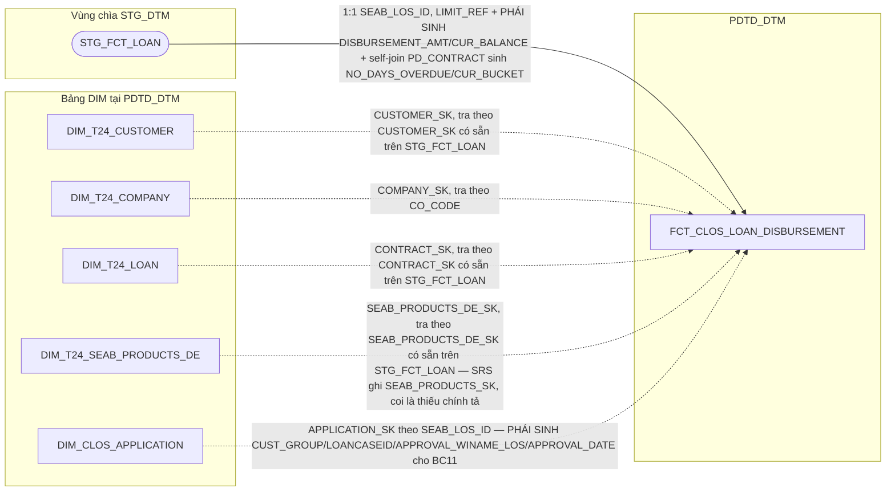

### 9.3 Cấu trúc bảng

| STT | Tên cột | Kiểu dữ liệu | Bắt buộc | Độ lớn | Khóa | Mô tả | Báo cáo sử dụng | Tên chỉ tiêu trên báo cáo |
| --- | --- | --- | --- | --- | --- | --- | --- | --- |
| 1 | DAYID | DATE | Y |  | PK | Ngày dữ liệu, dạng số YYYYMMDD — nguồn STG_FCT_LOAN.DAYID, TRUNC về 00:00:00. Là ngày ảnh chụp số liệu, KHÔNG phải ngày nghiệp vụ | Báo cáo Giải ngân _ Quá hạn KHDN (BC11) — một phần khóa chính | — |
| 2 | CONTRACT | VARCHAR2 | Y | 100 | PK | Mã hợp đồng khoản vay — nguồn STG_FCT_LOAN.CONTRACT (1:1 từ SB_DWH.FCT_LOAN.CONTRACT) | Báo cáo Giải ngân _ Quá hạn KHDN (BC11) — hiển thị trực tiếp, khóa chính | CONTRACT (Mã hợp đồng) |
| 3 | DATASOURCE | VARCHAR2 | Y | 10 |  | Cột kỹ thuật đánh dấu nguồn hệ, luôn cố định 'T24' — bảng nguồn T24 core banking (STG_FCT_LOAN), không thuộc STG_LOS | Thiết kế dư thừa | — |
| 4 | CUSTOMER_SK | NUMBER | Y | 18 |  | Khóa tới DIM_T24_CUSTOMER — nguồn STG_FCT_LOAN.CUSTOMER_SK (surrogate có sẵn, tra thẳng DIM_T24_CUSTOMER.DIMENSION_KEY, không tự lookup qua LEGAL_ID). Mặc định -1 nếu không khớp | Báo cáo Giải ngân _ Quá hạn KHDN (BC11) — khóa JOIN sang DIM_T24_CUSTOMER để lấy CUSTOMER_ID/SHORT_NAME | — |
| 5 | COMPANY_SK | NUMBER | Y | 18 |  | Khóa tới DIM_T24_COMPANY — PHÁI SINH: lookup theo STG_FCT_LOAN.CO_CODE = DIM_T24_COMPANY.COMPANY_CODE (chỉ bản ghi hiện hành, COMPANY_EXP_DATE IS NULL phía nguồn T24). Mặc định -1 | Báo cáo Giải ngân _ Quá hạn KHDN (BC11) — khóa JOIN sang DIM_T24_COMPANY để lấy BRANCH_NAME/COMPANY_NAME | — |
| 6 | CONTRACT_SK | NUMBER | Y | 18 |  | Khóa tới DIM_T24_LOAN — nguồn STG_FCT_LOAN.CONTRACT_SK (surrogate có sẵn, tra thẳng DIM_T24_LOAN.DIMENSION_KEY). Mặc định -1 | Báo cáo Giải ngân _ Quá hạn KHDN (BC11) — khóa JOIN sang DIM_T24_LOAN để lấy VALUE_DATE/MATURITY_DATE/REC_STATUS/CONTRACT_REF/REF_VALUE_DATE | — |
| 7 | SEAB_PRODUCTS_DE_SK | NUMBER | Y | 18 |  | Khóa tới DIM_T24_SEAB_PRODUCTS_DE — nguồn STG_FCT_LOAN.SEAB_PRODUCTS_DE_SK (surrogate có sẵn, tra thẳng DIMENSION_KEY; SRS ghi SEAB_PRODUCTS_SK, coi là thiếu chính tả). Mặc định -1 | Báo cáo Giải ngân _ Quá hạn KHDN (BC11) — khóa JOIN sang DIM_T24_SEAB_PRODUCTS_DE để lấy PRODUCT_T24 | — |
| 8 | APPLICATION_SK | NUMBER | Y | 18 |  | Khóa tới DIM_CLOS_APPLICATION, tra theo SEAB_LOS_ID. KHÔNG để NULL — không tra được thì gán -1 (Unknown), tránh phép JOIN của OAS rớt dòng | Báo cáo Giải ngân _ Quá hạn KHDN (BC11) — khóa JOIN sang DIM_CLOS_APPLICATION, nguồn cho CUST_GROUP/LOANCASEID/APPROVAL_WINAME_LOS/APPROVAL_DATE (cột 16-19, cùng bảng) | — |
| 9 | SEAB_LOS_ID | VARCHAR2 | N | 100 |  | Mã hồ sơ LOS do T24 lưu, gắn với hợp đồng — nguồn STG_FCT_LOAN.SEAB_LOS_ID | Báo cáo Giải ngân _ Quá hạn KHDN (BC11) — hiển thị trực tiếp | SEAB_LOS_ID (Mã hồ sơ) |
| 10 | ZONE | VARCHAR2 | N | 50 |  | Tên vùng của đơn vị kinh doanh — PHÁI SINH: LEFT JOIN TMP_REF_COMPANY_REGION_KHDN theo STG_FCT_LOAN.CO_CODE = COMPANY_CODE. Lưu trực tiếp trên fact (không tách FK riêng) vì nguồn là bảng REF_ tĩnh, không phải DIM SCD2 | Báo cáo Giải ngân _ Quá hạn KHDN (BC11) — hiển thị trực tiếp | ZONE (Khu vực) |
| 11 | DISBURSEMENT_AMT | NUMBER | N | 20,2 |  | Số tiền giải ngân — PHÁI SINH: ABS(STG_FCT_LOAN.FIRST_DISBURSEMENT_AMT) | Báo cáo Giải ngân _ Quá hạn KHDN (BC11) — hiển thị trực tiếp | DISBURSEMENT_AMT_T24 (Số tiền giải ngân) |
| 12 | CUR_BALANCE | NUMBER | N | 20,2 |  | Dư nợ hiện tại — PHÁI SINH: (ABS(NVL(BALANCE,0)) + ABS(NVL(PD_BALANCE,0))) * REVAL_RATE trên STG_FCT_LOAN | Báo cáo Giải ngân _ Quá hạn KHDN (BC11) — hiển thị trực tiếp | CUR_BALANCE (Dư nợ hiện tại) |
| 13 | NO_DAYS_OVERDUE | NUMBER | N | 6 |  | Số ngày quá hạn — PHÁI SINH: self-join STG_FCT_LOAN (b) ON a.PD_CONTRACT = b.CONTRACT, lấy b.NO_DAYS_OVERDUE | Báo cáo Giải ngân _ Quá hạn KHDN (BC11) — hiển thị trực tiếp | NO_DAYS_OVERDUE (Số ngày quá hạn) |
| 14 | CUR_BUCKET | NUMBER | N | 2 |  | Nhóm nợ — PHÁI SINH: CASE WHEN NO_DAYS_OVERDUE > 360 THEN 5 WHEN > 180 THEN 4 WHEN > 90 THEN 3 WHEN >= 10 THEN 2 ELSE 1 END, cùng self-join PD_CONTRACT như NO_DAYS_OVERDUE | Báo cáo Giải ngân _ Quá hạn KHDN (BC11) — hiển thị trực tiếp | CUR_BUCKET (Nhóm nợ) |
| 15 | LIMIT_REFERENCE | VARCHAR2 | N | 100 |  | Mã hạn mức — nguồn STG_FCT_LOAN.LIMIT_REF. Giữ trên fact (không chuyển DIM_T24_LOAN) vì nguồn là chính STG_FCT_LOAN, không phải STG_DIM_LOAN | Báo cáo Giải ngân _ Quá hạn KHDN (BC11) — hiển thị trực tiếp | LIMIT_REFERENCE (Mã Limit) |
| 16 | CUST_GROUP | VARCHAR2 | N | 100 |  | Nhóm khách hàng — PHÁI SINH: JOIN APPLICATION_SK sang DIM_CLOS_APPLICATION.CUST_GROUP | Báo cáo Giải ngân _ Quá hạn KHDN (BC11) — hiển thị trực tiếp | CUST_GROUP (Nhóm khách hàng) |
| 17 | LOANCASEID | VARCHAR2 | N | 100 |  | Mã khoản vay gắn với hồ sơ cha — PHÁI SINH: JOIN APPLICATION_SK sang DIM_CLOS_APPLICATION.LOANCASEID, CHỈ giữ giá trị khi hồ sơ có CHANGE_REQUEST='New' (đúng công thức SRS BC11), còn lại gán NULL dù DIM có giá trị | Báo cáo Giải ngân _ Quá hạn KHDN (BC11) — hiển thị trực tiếp | LOANCASEID (Mã LOANCASEID) |
| 18 | APPROVAL_WINAME_LOS | VARCHAR2 | N | 100 |  | Mã hồ sơ cha đã được phê duyệt — PHÁI SINH: JOIN APPLICATION_SK sang DIM_CLOS_APPLICATION.FIRST_APPROVED_WI_NAME (= MIN(WI_NAME) group theo LOANCASEID) | Báo cáo Giải ngân _ Quá hạn KHDN (BC11) — hiển thị trực tiếp | APPROVAL_WINAME_LOS (Mã hồ sơ phê duyệt) |
| 19 | APPROVAL_DATE | DATE | N |  |  | Ngày phê duyệt — PHÁI SINH: JOIN APPLICATION_SK sang DIM_CLOS_APPLICATION.FIRST_APPROVED_DATE (= MAX(EXITDATE) với điều kiện USERNAME IS NOT NULL AND WORKSTEP IN ('CreditApproval','CreditCommittee') AND DECISION IN ('Submit','Send To HOSupport','Send To PostSanction')) | Báo cáo Giải ngân _ Quá hạn KHDN (BC11) — hiển thị trực tiếp | APPROVAL_DATE (Ngày phê duyệt) |

## 10. FCT_RLOS_APPLICATION_DAILY

### 10.1 Mục đích thiết kế
- **Ý nghĩa bảng:** bảng FACT xương sống của hồ sơ tín dụng RLOS (bán
  lẻ/cá nhân) tại PDTD_DTM — bê nguyên 1:1 cấu trúc từ SB_DWH (ảnh trạng
  thái cuối ngày, chỉ tiêu lũy kế, mốc thời gian xử lý, thông tin phê
  duyệt, nguồn thu nhập...), bổ sung các khóa kỹ thuật để báo cáo join
  sang các chiều T24 và tên bước chuẩn hóa dùng chung 2 hệ CLOS/RLOS.
- **Khóa chính của bảng (PK):** DAYID, WI_NAME.
- **Độ chi tiết (grain):** 1 dòng = 1 hồ sơ x 1 ngày dữ liệu.
- **Phục vụ báo cáo:**
  - Báo cáo RLOS APPLICATION (BC1)
  - Báo cáo Thông tin phê duyệt (BC3) — qua FCT_RLOS_WORKSTEP_EVENT (CREDIT_LIMIT/CURRENCY dư thừa có chủ đích trên DIM_RLOS_APPLICATION)
  - Báo cáo Tuần Chuyên viên Thẩm định (BC4)
  - Báo cáo SLA - TAT (BC5) — khóa tra REF_SLA_NLTT qua PRODUCT_SK
  - Báo cáo NGOẠI LỆ (BC6)
  - Báo cáo RETURN (BC8) — RETURN_CNT_DATAENTRY/UNDERWRITING/APPROVAL
  - Báo cáo KPI (BC9) — AGG_LOS_KPI_APPLICATION.INCOM_3/BUSINESS_INCOM
  - Báo cáo Giải ngân _ Quá hạn KHCN (BC10)

### 10.2 Sơ đồ lineage

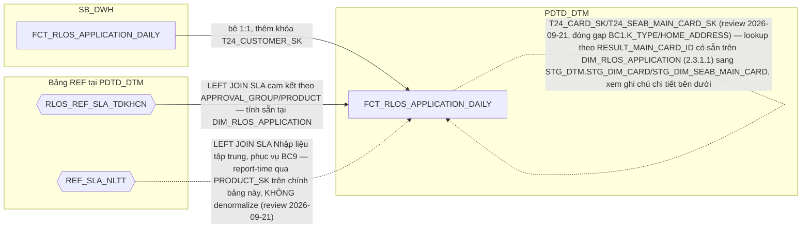

### 10.3 Cấu trúc bảng

| STT | Tên cột | Kiểu dữ liệu | Bắt buộc | Độ lớn | Khóa | Mô tả | Báo cáo sử dụng | Tên chỉ tiêu trên báo cáo |
| --- | --- | --- | --- | --- | --- | --- | --- | --- |
| 1 | DAYID | DATE | Y |  | PK | Ngày dữ liệu, dạng số YYYYMMDD | — (cột kỹ thuật) | — |
| 2 | WI_NAME | VARCHAR2 | Y | 100 | PK | Mã hồ sơ tín dụng RLOS | Báo cáo RLOS APPLICATION (BC1) — khóa chính Báo cáo KPI (BC9) — khóa nối AGG_LOS_KPI_APPLICATION | WINAME (Mã hồ sơ) |
| 3 | DATASOURCE | VARCHAR2 | Y | 10 |  | Cột kỹ thuật đánh dấu nguồn hệ, luôn cố định 'RLOS' sau khi tách vật lý CLOS/RLOS | Báo cáo KPI (BC9) — hiển thị trực tiếp | SYSTEMNAME (Hệ thống CLOS/RLOS) |
| 4 | APPLICATION_SK | NUMBER | Y | 18 |  | Khóa tới DIM_RLOS_APPLICATION. Mặc định -1 nếu không khớp | Báo cáo RLOS APPLICATION (BC1) — khóa JOIN sang DIM_RLOS_APPLICATION | — |
| 5 | CURRENT_WORKSTEP_SK | NUMBER | Y | 18 |  | Khóa tới DIM_RLOS_WORKSTEP, bước hồ sơ đang đứng tại ngày DAYID. Mặc định -1 | Thiết kế dư thừa | — |
| 6 | LAST_WORKSTEP_SK | NUMBER | Y | 18 |  | Khóa tới DIM_RLOS_WORKSTEP của sự kiện hoàn tất gần nhất. Mặc định -1 | Báo cáo RLOS APPLICATION (BC1) — nguồn cho LAST_WORKSTEP (LEFT JOIN Q_RLOS_REF_WORKSTEP_2SYSTEMS ở PDTD_DTM) | Nguồn cho chỉ tiêu/trường LAST_WORKSTEP (BC1) |
| 7 | LAST_DECISION_SK | NUMBER | Y | 18 |  | Khóa tới DIM_RLOS_DECISION của sự kiện hoàn tất gần nhất. Mặc định -1 | Báo cáo RLOS APPLICATION (BC1) — khóa JOIN sang DIM_RLOS_DECISION | LAST_DECISION (Quyết định tại bước cuối) |
| 8 | LAST_USER_SK | NUMBER | Y | 18 |  | Khóa tới DIM_LOS_USER của người xử lý sự kiện hoàn tất gần nhất. Mặc định -1 | Thiết kế dư thừa | — |
| 9 | PRODUCT_SK | NUMBER | Y | 18 |  | Khóa tới DIM_RLOS_PRODUCT — lookup theo PRODUCT_LINE_CODE=NG_SB_RLOS_APPLICANT_GENERAL.PRODUCT_LINE AND SUB_PRODUCT_CODE=NG_SB_RLOS_APPLICANT_GENERAL.SUB_PRODUCT, điều kiện SCD2 hiệu lực tại DAYID. Mặc định -1 nếu không khớp | Báo cáo RLOS APPLICATION (BC1) — khóa JOIN sang DIM_RLOS_PRODUCT Báo cáo SLA - TAT (BC5) — khóa tra REF_SLA_NLTT theo PRODUCT_LINE_NAME Báo cáo KPI (BC9) — khóa report-time tra REF_SLA_NLTT phục vụ POINT | PRODUCT_LINE (Dòng sản phẩm); nguồn cho chỉ tiêu/trường SLA_DE (Cam kết SLA Chuyên viên nhập liệu, BC5) |
| 10 | ORG_UNIT_SK | NUMBER | Y | 18 |  | Khóa tới DIM_LOS_ORG_UNIT — lookup theo COMPANY_CODE=NG_SB_RLOS_APPLICANT_GENERAL.COMPANY_CODE, điều kiện SCD2 hiệu lực tại DAYID. Mặc định -1 nếu không khớp | Báo cáo RLOS APPLICATION (BC1) — khóa JOIN sang DIM_LOS_ORG_UNIT lấy BRANCH_CODE, và tiếp LEFT JOIN TMP_REF_COMPANY_REGION_KHCN lấy ZONE tại tầng truy vấn báo cáo | BRANCH_CODE (Mã Chi nhánh) |
| 11 | CHANGE_TYPE_SK | NUMBER | Y | 18 |  | Khóa tới DIM_RLOS_CHANGE_TYPE. Chỉ có giá trị với hồ sơ thay đổi điều kiện phê duyệt, còn lại Unknown -1. Nguồn: NG_SB_RLOS_EXTTABLE.CHANGE_TYPE | Báo cáo RLOS APPLICATION (BC1) — khóa JOIN sang DIM_RLOS_CHANGE_TYPE | CHANGE_TYPE_DETAIL (Chi tiết loại thay đổi điều kiện) |
| 12 | CARD_PROMOTION_SK | NUMBER | Y | 18 |  | Khóa tới DIM_RLOS_CARD_PROMOTION. Lookup NG_SB_RLOS_CBS.PROMOTION_ID; hồ sơ không phải thẻ dùng -1 | Báo cáo RLOS APPLICATION (BC1) — khóa JOIN sang DIM_RLOS_CARD_PROMOTION | PROMOTION_ID (Ưu đãi phí) |
| 13 | RI_USER | VARCHAR2 | N | 100 |  | User khởi tạo hồ sơ (bước RequestInitiate) | Thiết kế dư thừa | — |
| 14 | BRANCH_USER | VARCHAR2 | N | 100 |  | User xử lý bước BranchSupport, HOÀN TẤT gần nhất | Báo cáo RLOS APPLICATION (BC1) — hiển thị trực tiếp | BRANCH_USER (User Chi nhánh) |
| 15 | DDE_USER | VARCHAR2 | N | 100 |  | User xử lý bước DetailDataEntry, HOÀN TẤT gần nhất | Báo cáo RLOS APPLICATION (BC1) — hiển thị trực tiếp | DDE_USER (User Chuyên viên nhập liệu) |
| 16 | QC_USER | VARCHAR2 | N | 100 |  | User xử lý bước DataInputerChecker, HOÀN TẤT gần nhất | Báo cáo RLOS APPLICATION (BC1) — hiển thị trực tiếp | QUALITY_CHECKER (User Kiểm soát nhập liệu) |
| 17 | UND_MAKER_USER | VARCHAR2 | N | 100 |  | User xử lý bước UnderwriterMaker, HOÀN TẤT gần nhất | Báo cáo RLOS APPLICATION (BC1) — hiển thị trực tiếp | UND_MAKER (User Chuyên viên thẩm định) |
| 18 | UND_CHECKER_USER | VARCHAR2 | N | 100 |  | User xử lý bước UnderwriterChecker, HOÀN TẤT gần nhất | Báo cáo RLOS APPLICATION (BC1) — hiển thị trực tiếp | UND_CHECKER (User Kiểm soát thẩm định) |
| 19 | PHV_USER | VARCHAR2 | N | 100 |  | User xử lý bước PhoneVerification, HOÀN TẤT gần nhất | Báo cáo RLOS APPLICATION (BC1) — hiển thị trực tiếp | PHV_USER (User Chuyên viên Thẩm định điện thoại) |
| 20 | FA_USER | VARCHAR2 | N | 100 |  | User Chuyên viên Thực địa | Thiết kế dư thừa | — |
| 21 | APPROVER_USER | VARCHAR2 | N | 100 |  | User xử lý bước CreditApproval, HOÀN TẤT gần nhất | Báo cáo RLOS APPLICATION (BC1) — hiển thị trực tiếp | BI_APPROVER (User Chuyên gia phê duyệt) |
| 22 | COMMITTEE_USER | VARCHAR2 | N | 100 |  | User Hội đồng tín dụng | Thiết kế dư thừa | — |
| 23 | HOS_USER | VARCHAR2 | N | 100 |  | User Hỗ trợ phê duyệt | Thiết kế dư thừa | — |
| 24 | PROCESSED_DATE | DATE | N |  |  | Ngày xử lý chung của hồ sơ theo 3 mức ưu tiên | Báo cáo RLOS APPLICATION (BC1) — hiển thị trực tiếp Báo cáo KPI (BC9) — dùng xếp hồ sơ vào đúng DAYID khi tổng hợp AGG_LOS_KPI_YTD_DAILY | PROCESSED_DATE (Ngày dữ liệu báo cáo) |
| 25 | LAST_UWM_ENTRYDATE | TIMESTAMP | N |  |  | MAX(ENTRYDATE) tại UnderwriterMaker <= DAYID — mốc mở chu kỳ thẩm định hiện hành | Nguồn cho chỉ tiêu/trường PROCESSED_DATE_UWM (cột 26, cùng bảng) | — |
| 26 | PROCESSED_DATE_UWM | DATE | N |  |  | Ngày chốt chu kỳ thẩm định hiện hành, tính tương đối theo LAST_UWM_ENTRYDATE | Thiết kế dư thừa | — |
| 27 | CREATION_DATE | DATE | N |  |  | TRUNC(MIN(ENTRYDATE)) theo WI_NAME | Báo cáo RLOS APPLICATION (BC1) — hiển thị trực tiếp | CREATION_DATE (Ngày khởi tạo hồ sơ) |
| 28 | FIRST_APPROVAL_DATE | DATE | N |  |  | MIN(EXITDATE) tại bước phê duyệt hợp lệ | Thiết kế dư thừa | — |
| 29 | LAST_APPROVAL_DATE | DATE | N |  |  | MAX(EXITDATE) tại bước phê duyệt (nhóm quyết định đã định nghĩa) | Báo cáo RLOS APPLICATION (BC1) — hiển thị trực tiếp | LAST_APPROVAL_DATE (Thời gian phê duyệt cuối cùng) |
| 30 | MIN_UWM | TIMESTAMP | N |  |  | MIN(ENTRYDATE) tại UnderwriterMaker | Báo cáo RLOS APPLICATION (BC1) — hiển thị trực tiếp | MIN_UWM (Thời gian hồ sơ lên CV thẩm định) |
| 31 | MIN_APP | TIMESTAMP | N |  |  | MIN(ENTRYDATE) tại CreditApproval/CreditCommittee | Báo cáo RLOS APPLICATION (BC1) — hiển thị trực tiếp | MIN_APP (Thời gian hồ sơ lên CG phê duyệt) |
| 32 | AUTO_CANCEL_DATE | DATE | N |  |  | Ngày hồ sơ bị hệ thống tự hủy | Báo cáo RLOS APPLICATION (BC1) — hiển thị trực tiếp | AUTO_CAN_DATE (Thời gian cancel tự động) |
| 33 | CANCEL_USER_DATE | DATE | N |  |  | EXITDATE tại bản ghi DECISION='Cancel' và USERNAME khác NULL | Báo cáo RLOS APPLICATION (BC1) — hiển thị trực tiếp | CAN_USER_DATE (Thời gian cancel do NSD) |
| 34 | BI_CAN_DATE | DATE | N |  |  | ENTRYDATE tại bước CancelRevoke | Thiết kế dư thừa | — |
| 35 | LAST_ENTRYDATE | TIMESTAMP | N |  |  | ENTRYDATE của sự kiện hoàn tất gần nhất | Báo cáo RLOS APPLICATION (BC1) — hiển thị trực tiếp | LAST_ENTRYDATE (Thời gian vào bước cuối) |
| 36 | LAST_EXITDATE | TIMESTAMP | N |  |  | EXITDATE của cùng sự kiện hoàn tất gần nhất | Báo cáo RLOS APPLICATION (BC1) — hiển thị trực tiếp | LAST_EXITDATE (Thời gian kết thúc bước cuối) |
| 37 | BI_APPSTATUS | VARCHAR2 | N | 50 |  | Trạng thái hồ sơ chuẩn hóa (Approved/Rejected/Cancelled/Processing) | Báo cáo RLOS APPLICATION (BC1) — hiển thị trực tiếp Báo cáo KPI (BC9) — hiển thị trực tiếp | BI_APPSTATUS (Trạng thái hồ sơ) |
| 38 | HAS_ACTION_IN_DAY | VARCHAR2 | Y | 1 |  | 'Y' nếu hồ sơ có phát sinh xử lý trong ngày DAYID | Thiết kế dư thừa | — |
| 39 | LAST_ACTION_DATE | DATE | Y |  |  | Ngày business action gần nhất tính đến cuối DAYID | Thiết kế dư thừa | — |
| 40 | INACTIVE_DAY_CNT | NUMBER | Y | 5 |  | TRUNC(DAYID) - TRUNC(LAST_ACTION_DATE) | Thiết kế dư thừa | — |
| 41 | PRE_WORKSTEP_CODE | VARCHAR2 | N | 200 |  | Bước xử lý liền trước (LAG theo ENTRYDATE) | Báo cáo RLOS APPLICATION (BC1) — hiển thị trực tiếp | PRE_WORKSTEP (Bước hồ sơ trước đó) |
| 42 | FLAG_AUTO_CANCEL | VARCHAR2 | N | 10 |  | 'YES' nếu AUTO_CANCEL_DATE khác NULL | Báo cáo RLOS APPLICATION (BC1) — hiển thị trực tiếp | FLAG_AUTO_CAN (Hồ sơ cancel tự động — YES/NO) |
| 43 | LAST_REMARKS | VARCHAR2 | N | 4000 |  | Ghi chú của sự kiện hoàn tất gần nhất | Báo cáo RLOS APPLICATION (BC1) — hiển thị trực tiếp | LAST_REMARKS (Ghi chú ý kiến bước cuối) |
| 44 | LAST_REMARK_DDE | VARCHAR2 | N | 4000 |  | Ghi chú tại bước DetailDataEntry | Báo cáo RLOS APPLICATION (BC1) — hiển thị trực tiếp | LAST_REMARK_DDE (Ghi chú tại bước nhập liệu DDE) |
| 45 | LAST_CAN_REMARKS | VARCHAR2 | N | 4000 |  | Ghi chú tại lần hủy hồ sơ | Báo cáo RLOS APPLICATION (BC1) — hiển thị trực tiếp | LAST_CAN_REMARKS (Ghi chú tại bước Cancel) |
| 46 | HAS_REACHED_DDE | VARCHAR2 | N | 1 |  | Hồ sơ đã tới bước DetailDataEntry hay chưa | Thiết kế dư thừa | — |
| 47 | HAS_REACHED_QC | VARCHAR2 | N | 1 |  | Hồ sơ đã tới bước DataInputerChecker hay chưa | Thiết kế dư thừa | — |
| 48 | HAS_REACHED_UWM | VARCHAR2 | N | 1 |  | Hồ sơ đã tới bước UnderwriterMaker hay chưa | Thiết kế dư thừa | — |
| 49 | HAS_REACHED_UWC | VARCHAR2 | N | 1 |  | Hồ sơ đã tới bước UnderwriterChecker hay chưa | Thiết kế dư thừa | — |
| 50 | HAS_REACHED_APPROVAL | VARCHAR2 | N | 1 |  | Hồ sơ đã tới bước CreditApproval/CreditCommittee hay chưa | Thiết kế dư thừa | — |
| 51 | APPROVED_AMT_FINAL | NUMBER | N | 20,2 |  | Hạn mức phê duyệt cuối cùng — nguồn NG_SB_RLOS_CREDIT_PROPOSAL.LOAN_AMOUNT | Báo cáo RLOS APPLICATION (BC1) — hiển thị trực tiếp | LOAN_AMOUNT (Số tiền phê duyệt) |
| 52 | APPROVED_TERM | NUMBER | N | 5 |  | Kỳ hạn phê duyệt — nguồn NG_SB_RLOS_CREDIT_PROPOSAL.LOAN_TERM | Báo cáo RLOS APPLICATION (BC1) — hiển thị trực tiếp | LOAN_TERM (Thời hạn phê duyệt, tháng) |
| 53 | INTEREST_RATE_PCT | NUMBER | N | 8,4 |  | Lãi suất phê duyệt (%) — ép kiểu từ NG_SB_RLOS_CREDIT_PROPOSAL.CURRENT_RATE | Báo cáo RLOS APPLICATION (BC1) — hiển thị trực tiếp | INTEREST_RATE (Lãi suất phê duyệt, %/năm) |
| 54 | LOAN_TO_VALUE | NUMBER | N | 5,2 |  | Tỷ lệ cho vay trên giá trị TSBĐ — nguồn NG_SB_RLOS_CREDIT_PROPOSAL(_APP).LOAN_TO_VALUE | Báo cáo RLOS APPLICATION (BC1) — hiển thị trực tiếp | LOAN_TO_VALUE (Tỷ lệ LTV, %) |
| 55 | LOAN_OBJECTIVE | VARCHAR2 | N | 200 |  | Mục đích vay — nguồn NG_SB_RLOS_CREDIT_PROPOSAL.LOAN_OBJECTIVE (hồ sơ thẻ tín dụng: mang nghĩa loại thẻ) | Báo cáo RLOS APPLICATION (BC1) — hiển thị trực tiếp | Loan Objective (Mục đích cho vay) |
| 56 | CURRENCY_CODE | VARCHAR2 | N | 10 |  | Loại tiền — nguồn NG_SB_RLOS_CREDIT_PROPOSAL.LOAN_CURRENCY | Thiết kế dư thừa | — |
| 57 | TOTAL_INCOME | NUMBER | N | 20,2 |  | Tổng thu nhập khách hàng — nguồn NG_SB_RLOS_REPAY_CALC.TOT_INC_CALC | Báo cáo RLOS APPLICATION (BC1) — hiển thị trực tiếp | TOTAL_INCOME (Tổng thu nhập phê duyệt) |
| 58 | RETURN_CNT_DATAENTRY | NUMBER | N | 5 |  | Số lần hồ sơ bị trả về ở khâu nhập liệu | Báo cáo RETURN (BC8) — hiển thị trực tiếp | SL_RETURN_NHAPLIEU (Số lần return tại Nhập liệu) |
| 59 | RETURN_CNT_UNDERWRITING | NUMBER | N | 5 |  | Số lần hồ sơ bị trả về ở khâu thẩm định | Báo cáo RETURN (BC8) — hiển thị trực tiếp | SL_RETURN_THAMDINH (Số lần return tại Thẩm định) |
| 60 | RETURN_CNT_APPROVAL | NUMBER | N | 5 |  | Số lần hồ sơ bị trả về ở khâu phê duyệt | Báo cáo RETURN (BC8) — hiển thị trực tiếp | SL_RETURN_PHEDUYET (Số lần return tại Cấp Phê duyệt) |
| 61 | SALARYFLAG | VARCHAR2 | N | 10 |  | Có nguồn thu từ lương hay không — nguồn NG_SB_RLOS_REPAYFLAGS.SALARYFLAG | Nguồn cho chỉ tiêu/trường REPAYMENT_SOURCE (cột 72) và INCOM_3 (BC9, điều kiện đếm nguồn thu) | — |
| 62 | CARFLAG | VARCHAR2 | N | 10 |  | Có nguồn thu từ cho thuê phương tiện hay không — NG_SB_RLOS_REPAYFLAGS.CARFLAG | Nguồn cho chỉ tiêu/trường REPAYMENT_SOURCE (cột 72) và INCOM_3 (BC9) | — |
| 63 | HOUSEFLAG | VARCHAR2 | N | 10 |  | Có nguồn thu từ cho thuê nhà hay không — NG_SB_RLOS_REPAYFLAGS.HOUSEFLAG | Nguồn cho chỉ tiêu/trường REPAYMENT_SOURCE (cột 72) và INCOM_3 (BC9) | — |
| 64 | ENTERPRISSEFLAG | VARCHAR2 | N | 10 |  | Có nguồn thu từ lợi nhuận doanh nghiệp hay không — NG_SB_RLOS_REPAYFLAGS.ENTERPRISSEFLAG (giữ nguyên tên sai chính tả nguồn) | Nguồn cho chỉ tiêu/trường REPAYMENT_SOURCE (cột 72), INCOM_3 và BUSINESS_INCOM (BC9) | — |
| 65 | DIVINGFLAG | VARCHAR2 | N | 10 |  | Có nguồn thu từ cổ tức hay không — NG_SB_RLOS_REPAYFLAGS.DIVINGFLAG (giữ nguyên tên sai chính tả nguồn) | Nguồn cho chỉ tiêu/trường REPAYMENT_SOURCE (cột 72) và INCOM_3 (BC9) | — |
| 66 | FAIMILYFLAG | VARCHAR2 | N | 10 |  | Có nguồn thu từ kinh doanh hộ gia đình hay không — NG_SB_RLOS_REPAYFLAGS.FAIMILYFLAG (giữ nguyên tên sai chính tả nguồn) | Nguồn cho chỉ tiêu/trường REPAYMENT_SOURCE (cột 72), INCOM_3 và BUSINESS_INCOM (BC9) | — |
| 67 | NONLICFLAG | VARCHAR2 | N | 10 |  | Có nguồn thu từ kinh doanh không đăng ký hay không — NG_SB_RLOS_REPAYFLAGS.NONLICFLAG | Nguồn cho chỉ tiêu/trường REPAYMENT_SOURCE (cột 72), INCOM_3 và BUSINESS_INCOM (BC9) | — |
| 68 | WAGESFLAG | VARCHAR2 | N | 10 |  | Có nguồn thu từ tiền công hay không — NG_SB_RLOS_REPAYFLAGS.WAGESFLAG | Nguồn cho chỉ tiêu/trường REPAYMENT_SOURCE (cột 72) và INCOM_3 (BC9) | — |
| 69 | PENSIONFLAG | VARCHAR2 | N | 10 |  | Có nguồn thu từ lương hưu/phụ cấp hay không — NG_SB_RLOS_REPAYFLAGS.PENSIONFLAG | Nguồn cho chỉ tiêu/trường REPAYMENT_SOURCE (cột 72) và INCOM_3 (BC9) | — |
| 70 | OTHERFLAG | VARCHAR2 | N | 10 |  | Có nguồn thu khác hay không — NG_SB_RLOS_REPAYFLAGS.OTHERFLAG | Nguồn cho chỉ tiêu/trường REPAYMENT_SOURCE (cột 72) và INCOM_3 (BC9) | — |
| 71 | INCOME_SOURCE_CNT | NUMBER | N | 5 |  | Số nguồn thu nhập của hồ sơ — đếm số cờ 'Yes' trong 10 cột trên | Nguồn cho chỉ tiêu/trường INCOM_3 (BC9, điều kiện >=3 nguồn thu) | — |
| 72 | REPAYMENT_SOURCE | VARCHAR2 | N | 500 |  | Danh sách nguồn trả nợ, nối tên tiếng Việt các nguồn thu đang bật | Báo cáo RLOS APPLICATION (BC1) — hiển thị trực tiếp | REPAYMENT_SOURCE (Loại nguồn thu) |
| 73 | FLAG_BUSINESS_INCOME | VARCHAR2 | N | 10 |  | Hồ sơ có nguồn thu từ kinh doanh hay không (không áp dụng SeAPro/SeALand) — PHÁI SINH đúng nguyên văn SRS BC9 | Báo cáo KPI (BC9) — nguồn cho BUSINESS_INCOM (AGG_LOS_KPI_APPLICATION) | Nguồn cho chỉ tiêu/trường BUSINESS_INCOM (BC9) |
| 74 | KPI_VOLUME | NUMBER | N | 5,2 |  | Mức độ hoàn thành hồ sơ, thang 0-1 — PHÁI SINH theo DECISION/WORKSTEP xa nhất đã đạt, cùng công thức đã chốt ở AGG_LOS_KPI_APPLICATION.VOLUME (2.1.9) | Thiết kế dư thừa | — |
| 75 | UNDERWRITERMAKER_TAKERESPON | VARCHAR2 | N | 100 |  | CV Thẩm định chịu trách nhiệm — COALESCE(CASE WHEN ak.WORK_STEP='UnderwriterMaker' THEN ak.USER_MAKE END, g.UWMAKERUSER) | Báo cáo RLOS APPLICATION (BC1) — hiển thị trực tiếp | UNDERWRITERMAKER_TAKERESPON (CV Thẩm định chịu trách nhiệm) |
| 76 | UNDERWRITERCHECKER_TAKERESPON | VARCHAR2 | N | 100 |  | Kiểm soát thẩm định chịu trách nhiệm — COALESCE(CASE WHEN ak.WORK_STEP='UnderwriterChecker' THEN ak.USER_MAKE END, g.UWCHKRUSER) | Báo cáo RLOS APPLICATION (BC1) — hiển thị trực tiếp | UNDERWRITERCHECKER_TAKERESPON (Kiểm soát thẩm định chịu trách nhiệm) |
| 77 | APPROVAL_TAKERESPON | VARCHAR2 | N | 100 |  | Chuyên gia phê duyệt chịu trách nhiệm — COALESCE(CASE WHEN ak.WORK_STEP IN ('CreditCommittee','CreditApproval') THEN ak.USER_MAKE END, g.CREDAPPRUSER, g.CCOMMITUSER) | Báo cáo RLOS APPLICATION (BC1) — hiển thị trực tiếp | APPROVAL_TAKERESPON (Chuyên gia phê duyệt chịu trách nhiệm) |
| 78 | APPLICANT_SK | NUMBER | Y | 18 |  | Khóa tới DIM_RLOS_APPLICANT — quan hệ 1:1 với hồ sơ qua WI_NAME, join theo điều kiện SCD2 EFF_DATE<=DAYID<EXP_DATE (hoặc EXP_DATE IS NULL). Mặc định -1 nếu không khớp. Đây là chân khách hàng LOS/applicant — khác T24_CUSTOMER_SK (chân T24) | Báo cáo RLOS APPLICATION (BC1) — khóa JOIN sang DIM_RLOS_APPLICANT (CUSTOMER_NAME, ZONE...) | — |
| 80 | T24_CUSTOMER_SK | NUMBER | Y | 18 |  | Khóa tới DIM_T24_CUSTOMER (T24), tra qua ADD_ID/ADD_ID_OTHER trên DIM_RLOS_APPLICANT. Mặc định -1 (review 2026-09-17: đổi tên từ CUSTOMER_SK để phân biệt rõ với khách hàng LOS/applicant — link qua FCT theo đúng nguyên tắc không link DIM sang DIM. ADD_ID là chuỗi đã nối nhiều giấy tờ bằng ";" nên KHÔNG thể so khớp trực tiếp với LEGAL_ID đơn của T24 — ETL phải tách chuỗi ADD_ID thành từng giá trị ID_NUMBER riêng lẻ theo đúng thứ tự đã nối khi dựng ADD_ID (ưu tiên TCC trước, CC sau), thử so khớp LEGAL_ID lần lượt theo thứ tự đó, lấy giá trị đầu tiên khớp được; nếu không khớp giá trị nào trong ADD_ID thì tiếp tục thử tương tự với ADD_ID_OTHER) | Báo cáo RLOS APPLICATION (BC1) — khóa JOIN sang DIM_T24_CUSTOMER lấy CUSTOMER_ID | Nguồn cho chỉ tiêu/trường CUSTOMER_ID (BC1) |
| 81 | LAST_WORKSTEP | VARCHAR2 | N | 50 |  | Tên bước hoàn tất gần nhất, chuẩn hóa dùng chung 2 hệ — LEFT JOIN Q_RLOS_REF_WORKSTEP_2SYSTEMS theo bước/quyết định của sự kiện hoàn tất gần nhất | Báo cáo RLOS APPLICATION (BC1) — hiển thị trực tiếp | LAST_WORKSTEP (Bước hồ sơ cuối cùng) |
| 82 | T24_CARD_SK | NUMBER | Y | 18 |  | Khóa tới DIM_T24_CARD (T24, cấu trúc cột chi tiết cần bổ sung — bảng đã xác nhận tồn tại thật) — đóng gap BC1.K_TYPE (review 2026-09-21). Lookup theo RESULT_MAIN_CARD_ID (có sẵn trên DIM_RLOS_APPLICATION, qua APPLICATION_SK) = STG_DTM.STG_DIM_CARD.MAIN_ID — đúng nguyên văn nested table SRS BC1 (BR 1.2: "STG_DTM.STG_DIM_CARD (ad) — LEFT JOIN điều kiện n.RESULT_SEAB_MAIN_CARD_ID = ad.MAIN_ID"). Mặc định -1. Báo cáo khai thác K_TYPE qua FK này, không denormalize trực tiếp lên FCT | Báo cáo RLOS APPLICATION (BC1) — khóa JOIN sang DIM_T24_CARD lấy K_TYPE (⚠️ PENDING — DIM_T24_CARD chưa thiết kế chi tiết, cần DBA/DEV cung cấp cấu trúc bảng đầy đủ trước khi sinh LLD) | K_TYPE (Loại thẻ tín dụng) |
| 83 | T24_SEAB_MAIN_CARD_SK | NUMBER | Y | 18 |  | Khóa tới DIM_T24_SEAB_MAIN_CARD (T24, cấu trúc cột chi tiết cần bổ sung — bảng đã xác nhận tồn tại thật) — đóng gap BC1.HOME_ADDRESS (review 2026-09-21). Lookup theo RESULT_MAIN_CARD_ID = STG_DTM.STG_DIM_SEAB_MAIN_CARD.RECID — đúng nguyên văn nested table SRS BC1 (BR 1.2: "STG_DTM.STG_DIM_SEAB_MAIN_CARD (ae) — LEFT JOIN điều kiện n.RESULT_SEAB_MAIN_CARD_ID = ae.RECID"). Mặc định -1. Báo cáo khai thác HOME_ADDRESS qua FK này, không denormalize trực tiếp lên FCT | Báo cáo RLOS APPLICATION (BC1) — khóa JOIN sang DIM_T24_SEAB_MAIN_CARD lấy HOME_ADDRESS (⚠️ PENDING — DIM_T24_SEAB_MAIN_CARD chưa thiết kế chi tiết, cần DBA/DEV cung cấp cấu trúc bảng đầy đủ trước khi sinh LLD) | HOME_ADDRESS (Địa chỉ nhận Pin/Thẻ) |

**⚠️ PENDING:** `DIM_T24_CARD`/`DIM_T24_SEAB_MAIN_CARD` — đã xác định
chắc chắn khóa join (`RESULT_MAIN_CARD_ID` = `MAIN_ID`/`RECID`) và 2
trường nghiệp vụ SRS cần (`K_TYPE`, `HOME_ADDRESS`), nhưng chưa có tài
liệu nào trong repo mô tả đầy đủ cấu trúc cột/PK thật/cơ chế SCD2 của 2
bảng T24 này — cần DBA/DEV cung cấp trước khi sinh LLD.

## 11. FCT_RLOS_APPLICATION_PARTY

### 11.1 Mục đích thiết kế
- **Ý nghĩa bảng:** bảng FACT quan hệ (factless-fact liên kết) — bê
  nguyên 1:1 cấu trúc từ SB_DWH, thể hiện quan hệ 1 hồ sơ x 1 applicant x
  N corepayer của hồ sơ RLOS. Toàn bộ thuộc tính mô tả con người (họ tên,
  giới tính, địa chỉ, giấy tờ...) nằm ở DIM_RLOS_APPLICANT/
  DIM_RLOS_COREPAYER — bảng này chỉ giữ khóa liên kết.
- **Khóa chính của bảng (PK):** DAYID, WI_NAME, COREPAYER_SK.
- **Độ chi tiết (grain):** 1 dòng = 1 hồ sơ x 1 corepayer. Hồ sơ không có
  corepayer nào vẫn có đúng 1 dòng, với COREPAYER_SK = -1 (Unknown).
- **Phục vụ báo cáo:**
  - Báo cáo RLOS APPLICATION (BC1) — khóa JOIN lấy tên người đồng trả nợ từ DIM_RLOS_COREPAYER

### 11.2 Sơ đồ lineage

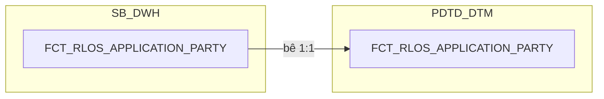

### 11.3 Cấu trúc bảng

| STT | Tên cột | Kiểu dữ liệu | Bắt buộc | Độ lớn | Khóa | Mô tả | Báo cáo sử dụng | Tên chỉ tiêu trên báo cáo |
| --- | --- | --- | --- | --- | --- | --- | --- | --- |
| 1 | DAYID | DATE | Y |  | PK | Ngày dữ liệu, dạng số YYYYMMDD | — (cột kỹ thuật) | — |
| 2 | WI_NAME | VARCHAR2 | Y | 100 | PK | Mã hồ sơ tín dụng RLOS | Báo cáo RLOS APPLICATION (BC1) — khóa chính, khóa nối sang DIM_RLOS_COREPAYER | — |
| 3 | DATASOURCE | VARCHAR2 | Y | 10 |  | Cột kỹ thuật đánh dấu nguồn hệ, luôn cố định 'RLOS' sau khi tách vật lý CLOS/RLOS | — (cột kỹ thuật) | — |
| 4 | APPLICATION_SK | NUMBER | Y | 18 |  | Khóa tới DIM_RLOS_APPLICATION. Mặc định -1 | Thiết kế dư thừa | — |
| 5 | APPLICANT_SK | NUMBER | Y | 18 |  | Khóa tới DIM_RLOS_APPLICANT. Mặc định -1 | Thiết kế dư thừa | — |
| 6 | COREPAYER_SK | NUMBER | Y | 18 | PK | Khóa tới DIM_RLOS_COREPAYER. Mặc định -1 (Unknown) nếu hồ sơ không có corepayer nào | Báo cáo RLOS APPLICATION (BC1) — khóa JOIN sang DIM_RLOS_COREPAYER lấy tên người đồng trả nợ | CO_REPAYER (Tên người đồng trả nợ) |

## 12. FCT_RLOS_COLLATERAL

### 12.1 Mục đích thiết kế
- **Ý nghĩa bảng:** bảng FACT chi tiết (nhân dòng) — bê nguyên 1:1 cấu
  trúc từ SB_DWH, lưu ảnh số liệu thay đổi theo ngày của từng tài sản bảo
  đảm thuộc hồ sơ RLOS. Không có chiều tài sản riêng — toàn bộ thuộc
  tính lưu thẳng trên fact vì 4 bảng nguồn không khai khóa CDC.
- **Khóa chính của bảng (PK):** DAYID, WI_NAME, COLLATERAL_BK.
- **Độ chi tiết (grain):** 1 dòng = 1 tài sản bảo đảm của 1 hồ sơ x 1
  ngày dữ liệu.
- **Phục vụ báo cáo:**
  - Báo cáo RLOS APPLICATION (BC1)
  - Báo cáo Thông tin phê duyệt (BC3)
  - Báo cáo KPI (BC9) — nguồn cho AGG_LOS_KPI_APPLICATION.TSBD_G2 (UNION toàn bộ dòng của hồ sơ tại ảnh chụp gần nhất, đếm số tài sản >=2)

### 12.2 Sơ đồ lineage

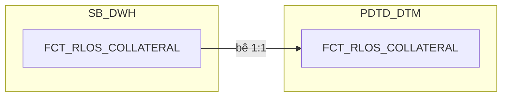

### 12.3 Cấu trúc bảng

| STT | Tên cột | Kiểu dữ liệu | Bắt buộc | Độ lớn | Khóa | Mô tả | Báo cáo sử dụng | Tên chỉ tiêu trên báo cáo |
| --- | --- | --- | --- | --- | --- | --- | --- | --- |
| 1 | DAYID | DATE | Y |  | PK | Ngày dữ liệu, dạng số YYYYMMDD | — (cột kỹ thuật) | — |
| 2 | WI_NAME | VARCHAR2 | Y | 100 | PK | Mã hồ sơ tín dụng RLOS | Báo cáo RLOS APPLICATION (BC1) — khóa chính Báo cáo KPI (BC9) — khóa nối AGG_LOS_KPI_APPLICATION.TSBD_G2 | — |
| 3 | COLLATERAL_BK | VARCHAR2 | Y | 64 | PK | Khóa nghiệp vụ của dòng tài sản — PHÁI SINH: STANDARD_HASH(..., 'SHA256') trên toàn bộ cột không phải CLOB của đúng bảng grid tài sản (COL_REALESTATE/COL_TRANSPORT/COL_VALPAPER/COL_OTHER) sinh ra dòng đó, cộng DATASOURCE và tên bảng nguồn. Chuẩn hóa trước khi hash: TRIM chuỗi, NULL quy về '<NULL>', DATE/NUMBER dùng format cố định không phụ thuộc NLS | — (cột kỹ thuật, khóa chính) | — |
| 4 | DATASOURCE | VARCHAR2 | Y | 10 |  | Cột kỹ thuật đánh dấu nguồn hệ, luôn cố định 'RLOS' sau khi tách vật lý CLOS/RLOS | — (cột kỹ thuật) | — |
| 5 | APPLICATION_SK | NUMBER | Y | 18 |  | Khóa tới DIM_RLOS_APPLICATION theo phiên bản hiệu lực tại DAYID. Mặc định -1 nếu không khớp | Báo cáo RLOS APPLICATION (BC1) — khóa JOIN sang DIM_RLOS_APPLICATION | — |
| 6 | COLLATERAL_TYPE_CODE | VARCHAR2 | N | 100 |  | Nhãn phân loại nguồn của tài sản bảo đảm — gán cố định theo bảng grid mà bản ghi đến từ đó (REALESTATE/TRANSPORT/VALPAPER/OTHER). Dùng để CASE chọn đúng cột chi tiết khi dựng TYPES_OF_COLLATERALS (cột 21) — không phải dữ liệu mô tả tài sản | Báo cáo RLOS APPLICATION (BC1) — điều kiện lọc tách GCN_REAL_ESTATE/GCN_OTHER, TSBD_BDS/TSBD_PTVT Báo cáo Thông tin phê duyệt (BC3) — điều kiện lọc dựng TYPES_OF_COLLATERALS | Nguồn cho chỉ tiêu/trường TYPES_OF_COLLATERALS (BC3); điều kiện lọc GCN_REAL_ESTATE/GCN_OTHER/TSBD_BDS/TSBD_PTVT (BC1) |
| 7 | CERTIFICATE_NO | VARCHAR2 | N | 500 |  | Số giấy chứng nhận tài sản — BĐS lấy NG_SB_RLOS_COL_REALESTATE.NO_CERTI; các tài sản khác lấy NG_SB_RLOS_COLL_CERTIGRD.CERTIFICATENO (nối theo tài sản, không phải theo hồ sơ) | Báo cáo RLOS APPLICATION (BC1) — hiển thị trực tiếp (tách GCN_REAL_ESTATE/GCN_OTHER theo COLLATERAL_TYPE_CODE) Báo cáo Thông tin phê duyệt (BC3) — nguồn cho TYPES_OF_COLLATERALS khi COLLATERAL_TYPE_CODE=REALESTATE | GCN_REAL_ESTATE (Số GCN TSBĐ là BĐS); GCN_OTHER (Số GCN TSBĐ là PTVT/Khác) |
| 8 | DESCRIPTION | VARCHAR2 | N | 4000 |  | Mô tả tài sản bảo đảm — PHÁI SINH đúng nguyên văn SRS BC3: UNION theo loại tài sản — BĐS: NO_CERTI \|\| ', ' \|\| USING_PURPOSE; PTVT: BRAND \|\| ', ' \|\| CONTROL_POSTER; GTCG: NUMBERSIGN; Khác: DESCRIBE. Không dùng REMARKS (không có trong SRS) | Báo cáo Thông tin phê duyệt (BC3) — hiển thị trực tiếp | DESCRIPTION (Mô tả TSBĐ) |
| 9 | OWNER_NAME | VARCHAR2 | N | 200 |  | Chủ sở hữu tài sản — nguồn OWNER của 4 bảng grid tài sản RLOS | Báo cáo RLOS APPLICATION (BC1) — hiển thị trực tiếp Báo cáo Thông tin phê duyệt (BC3) — hiển thị trực tiếp | OWNERSHIP (Sở hữu nhà ở, BC1); OWNER (Chủ TSBĐ, BC3) |
| 10 | REL_TO_CUSTOMER | VARCHAR2 | N | 200 |  | Quan hệ giữa chủ tài sản và khách hàng — UNION REL_CUSTOMER/RELATION_CUSTOMER của 4 bảng grid tài sản | Báo cáo RLOS APPLICATION (BC1) — hiển thị trực tiếp | TSBD_RELATIONSHIP (Mối quan hệ chủ tài sản và KH) |
| 11 | USING_PURPOSE | VARCHAR2 | N | 255 |  | Mục đích sử dụng của bất động sản — nguồn NG_SB_RLOS_COL_REALESTATE.USING_PURPOSE | Báo cáo Thông tin phê duyệt (BC3) — nguồn cho DESCRIPTION khi COLLATERAL_TYPE_CODE=REALESTATE | Nguồn cho chỉ tiêu/trường DESCRIPTION (BC3, nhánh BĐS) |
| 12 | VEHICLE_TYPE | VARCHAR2 | N | 100 |  | Loại phương tiện vận tải — nguồn NG_SB_RLOS_COL_TRANSPORT.TYPE_VEHICLE | Báo cáo Thông tin phê duyệt (BC3) — nguồn cho TYPES_OF_COLLATERALS khi COLLATERAL_TYPE_CODE=TRANSPORT | Nguồn cho chỉ tiêu/trường TYPES_OF_COLLATERALS (BC3, nhánh phương tiện) |
| 13 | BRAND | VARCHAR2 | N | 200 |  | Hãng của phương tiện vận tải — nguồn NG_SB_RLOS_COL_TRANSPORT.BRAND | Báo cáo Thông tin phê duyệt (BC3) — nguồn cho DESCRIPTION khi COLLATERAL_TYPE_CODE=TRANSPORT | Nguồn cho chỉ tiêu/trường DESCRIPTION (BC3, nhánh phương tiện) |
| 14 | CONTROL_POSTER | VARCHAR2 | N | 100 |  | Biển số kiểm soát của phương tiện — nguồn NG_SB_RLOS_COL_TRANSPORT.CONTROL_POSTER | Báo cáo Thông tin phê duyệt (BC3) — nguồn cho DESCRIPTION khi COLLATERAL_TYPE_CODE=TRANSPORT | Nguồn cho chỉ tiêu/trường DESCRIPTION (BC3, nhánh phương tiện) |
| 15 | VALPAPER_TYPE | VARCHAR2 | N | 100 |  | Loại giấy tờ có giá — nguồn NG_SB_RLOS_COL_VALPAPER.TYPE1 | Báo cáo Thông tin phê duyệt (BC3) — nguồn cho TYPES_OF_COLLATERALS khi COLLATERAL_TYPE_CODE=VALPAPER | Nguồn cho chỉ tiêu/trường TYPES_OF_COLLATERALS (BC3, nhánh giấy tờ có giá) |
| 16 | NUMBERSIGN | VARCHAR2 | N | 200 |  | Số hiệu giấy tờ có giá — nguồn NG_SB_RLOS_COL_VALPAPER.NUMBERSIGN | Báo cáo RLOS APPLICATION (BC1) — điều kiện lọc IS NOT NULL cho cờ TSBD_GTCG Báo cáo Thông tin phê duyệt (BC3) — nguồn cho DESCRIPTION khi COLLATERAL_TYPE_CODE=VALPAPER | TSBD_GTCG (Hồ sơ có TSBĐ là GTCG — YES/NO, BC1); nguồn cho chỉ tiêu/trường DESCRIPTION (BC3, nhánh GTCG) |
| 17 | IS_ASSET_FORMED | VARCHAR2 | N | 10 |  | Tài sản đã hình thành hay chưa — nguồn PROPERTY của COL_REALESTATE/COL_TRANSPORT | Báo cáo RLOS APPLICATION (BC1) — hiển thị trực tiếp, lọc theo COLLATERAL_TYPE_CODE | TSBD_BDS (Hồ sơ có TSBĐ là BĐS — YES/NO); TSBD_PTVT (Hồ sơ có TSBĐ là PTVT — YES/NO) |
| 18 | IS_FORMED_FROM_LOAN | VARCHAR2 | N | 100 |  | Loại tài sản hình thành từ vốn vay — PHÁI SINH đúng nguyên văn SRS BC1.PROPERTY_FORMED: giá trị trả về là NG_SB_RLOS_DISB_COL_GRID.COL_TYPE của dòng nối theo tài sản tương ứng có điều kiện lọc PROPERTY_FORMED='YES' (cột filter, không phải giá trị trả về); NULL nếu không có dòng nào thỏa điều kiện | Báo cáo RLOS APPLICATION (BC1) — hiển thị trực tiếp | PROPERTY_FORMED (Tài sản hình thành từ vốn vay không? — YES/NO) |
| 19 | APPRAISED_VALUE | NUMBER | N | 20,2 |  | Giá trị định giá của tài sản — PRICING_VALUE (COL_REALESTATE) hoặc PRICINGVALUE (3 bảng còn lại). Ép kiểu số từ text định dạng Việt Nam, DEFAULT NULL ON CONVERSION ERROR | Báo cáo Thông tin phê duyệt (BC3) — hiển thị trực tiếp | APPRAISED_VALUE (Giá trị định giá) |
| 20 | LOAN_RATE_LTV | NUMBER | N | 5,2 |  | Tỷ lệ cho vay trên giá trị tài sản — LOANRATE của 4 bảng grid tài sản. Cùng quy tắc ép kiểu, đơn vị phần trăm | Báo cáo Thông tin phê duyệt (BC3) — hiển thị trực tiếp | LTV (Tỷ lệ cho vay của TSBĐ) |
| 21 | TYPES_OF_COLLATERALS | VARCHAR2 | N | 500 |  | PHÁI SINH — phục vụ trực tiếp BC3.TYPES_OF_COLLATERALS: CASE theo COLLATERAL_TYPE_CODE chọn đúng 1 cột chi tiết tương ứng — REALESTATE→CERTIFICATE_NO, TRANSPORT→VEHICLE_TYPE, VALPAPER→VALPAPER_TYPE, OTHER→DESCRIPTION | Báo cáo Thông tin phê duyệt (BC3) — hiển thị trực tiếp | TYPES_OF_COLLATERALS (Loại TSBĐ) |

## 13. FCT_RLOS_SUB_PRODUCT

### 13.1 Mục đích thiết kế
- **Ý nghĩa bảng:** bê nguyên 1:1 cấu trúc từ SB_DWH — lưu chi tiết từng
  lần đăng ký sản phẩm phụ đi kèm hồ sơ tín dụng RLOS (SeABuy, SeACivil,
  SeATeacher, SeAWoman, thẻ tín dụng phụ) — hạn mức, thời hạn, thuộc tính
  thẻ phụ nếu có.
- **Khóa chính của bảng (PK):** DAYID, WI_NAME, SUB_PRODUCT_TYPE_CODE,
  SUB_PRODUCT_BK.
- **Độ chi tiết (grain):** 1 dòng = 1 lần đăng ký sản phẩm phụ trong ảnh
  chụp của ngày DAYID. Bốn nhóm SeABuy/Civil/Teacher/Woman tối đa 1
  dòng/loại/hồ sơ; thẻ tín dụng phụ có thể nhiều dòng/hồ sơ (1 hồ sơ có
  thể mở nhiều thẻ phụ).
- **Phục vụ báo cáo:**
  - Báo cáo RLOS APPLICATION (BC1)

### 13.2 Sơ đồ lineage

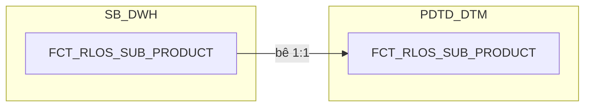

### 13.3 Cấu trúc bảng

| STT | Tên cột | Kiểu dữ liệu | Bắt buộc | Độ lớn | Khóa | Mô tả | Báo cáo sử dụng | Tên chỉ tiêu trên báo cáo |
| --- | --- | --- | --- | --- | --- | --- | --- | --- |
| 1 | DAYID | DATE | Y |  | PK | Ngày dữ liệu, dạng số YYYYMMDD | — (cột kỹ thuật) | — |
| 2 | WI_NAME | VARCHAR2 | Y | 100 | PK | Mã hồ sơ tín dụng RLOS — nguồn NG_SB_RLOS_SUB_PRODUCT.WI_NAME và WI_NAME của 5 bảng sản phẩm phụ | Báo cáo RLOS APPLICATION (BC1) — khóa JOIN sang hồ sơ, không hiển thị trực tiếp ở trường này | — |
| 3 | SUB_PRODUCT_TYPE_CODE | VARCHAR2 | Y | 30 | PK | Mã LOẠI sản phẩm phụ do DWH chuẩn hóa — PHÁI SINH: gán theo bảng nguồn mà dòng đến từ đó, đúng điều kiện lọc SRS BC1 (BR 1.2): NG_SB_RLOS_SUB_PRODUCT.SUB_PRODUCT_LINE = 'SeACivil'→CIVIL, 'SeATeacher'→TEACHER, 'SeAWoman'→WOMAN, 'SeABuy'→SEABUY, 'Thẻ tín dụng'→CREDIT_CARD. Đổi tên từ SUB_PRODUCT_CODE gốc để tránh trùng nghĩa với DIM_RLOS_PRODUCT.SUB_PRODUCT_CODE (sản phẩm nhánh của sản phẩm chính) | — (cột kỹ thuật, một phần PK) | — |
| 4 | SUB_PRODUCT_BK | VARCHAR2 | Y | 64 | PK | Khóa nghiệp vụ của 1 lần đăng ký sản phẩm phụ — PHÁI SINH: với NG_SB_RLOS_SEABUY_APP/TEACHER_APP/WOMAN_APP (khai khóa CDC=WI_NAME) dùng thẳng khóa nguồn; với NG_SB_RLOS_SUB_PRODUCT/CREDIT_CARD_APP/CIVIL_APP/SENT_CBS_LOG (không khai khóa CDC) dùng STANDARD_HASH(..., 'SHA256') trên toàn bộ cột không phải CLOB (loại trừ COMMENT_CO, REQUEST), cộng DATASOURCE và tên bảng nguồn | — (cột kỹ thuật, một phần PK) | — |
| 5 | DATASOURCE | VARCHAR2 | Y | 10 |  | Cột kỹ thuật đánh dấu nguồn hệ, luôn cố định 'RLOS' sau khi tách vật lý CLOS/RLOS | — (cột kỹ thuật) | — |
| 6 | APPLICATION_SK | NUMBER | Y | 18 |  | Khóa tới DIM_RLOS_APPLICATION theo phiên bản hiệu lực tại DAYID. Mặc định -1 nếu không khớp | — (cột kỹ thuật, khóa JOIN nội bộ) | — |
| 7 | SUB_PRODUCT_LINE | VARCHAR2 | N | 200 |  | Dòng của sản phẩm phụ — nguồn NG_SB_RLOS_SUB_PRODUCT.SUB_PRODUCT_LINE. Trường SAN_PHAM_PHU của BC1 | Báo cáo RLOS APPLICATION (BC1) — hiển thị trực tiếp | SAN_PHAM_PHU (Sản phẩm phụ chi tiết) |
| 8 | SPP_AMOUNT | NUMBER | N | 20,2 |  | Hạn mức của sản phẩm phụ — UNION LIMIT_NO của 5 bảng (CREDIT_CARD_APP/SEABUY_APP/CIVIL_APP/TEACHER_APP/WOMAN_APP). Ép kiểu số từ text định dạng Việt Nam, DEFAULT NULL ON CONVERSION ERROR. Trường SPP_Amount của BC1 | Báo cáo RLOS APPLICATION (BC1) — hiển thị trực tiếp | SPP_Amount (Giá trị của sản phẩm phụ) |
| 9 | SPP_TERM | NUMBER | N | 5 |  | Thời hạn của sản phẩm phụ, đơn vị tháng — CREDIT_CARD_APP.TERM; SEABUY_APP/CIVIL_APP/TEACHER_APP/WOMAN_APP.TIME_VALID. Trường SPP_Term của BC1 | Báo cáo RLOS APPLICATION (BC1) — hiển thị trực tiếp | SPP_Term (Thời hạn của sản phẩm phụ) |
| 10 | CARD_TYPE_CODE | VARCHAR2 | N | 100 |  | Loại thẻ đăng ký lúc đề xuất sản phẩm phụ là thẻ tín dụng — nguồn NG_SB_RLOS_CREDIT_CARD_APP.CARD_TYPE. Chỉ có ở dòng SUB_PRODUCT_TYPE_CODE='CREDIT_CARD'. Là khái niệm khác BC1.K_TYPE (loại thẻ thật sau giải ngân, nguồn STG_DIM_CARD.K_TYPE, join qua NG_SB_RLOS_SENT_CBS_LOG.RESULT_SEAB_MAIN_CARD_ID = STG_DIM_CARD.MAIN_ID, không đi qua bảng này) — không dùng để tra BC1.K_TYPE | Thiết kế dư thừa | — |

## 14. FCT_RLOS_EXCEPTION

### 14.1 Mục đích thiết kế
- **Ý nghĩa bảng:** ghi nhận từng lần một lý do (ngoại lệ/nội dung cần làm
  rõ) được nêu ra trên hồ sơ tín dụng RLOS trong quá trình xử lý, kèm người
  nêu, thời điểm, và các chỉ tiêu đánh giá chất lượng nhập liệu lần đầu
  (First Time Right).
- **Khóa chính của bảng (PK):** DAYID, WI_NAME, EXCEPTION_CATEGORY,
  RAISED_BY, RAISED_DATE_TIME.
- **Độ chi tiết (grain):** 1 dòng = 1 lần ghi nhận lý do của 1 hồ sơ, trong
  ảnh chụp của ngày DAYID.
- **Phục vụ báo cáo:**
  - Báo cáo EXCEPTION - FTR (BC7)
  - Báo cáo RETURN (BC8)
  - Báo cáo Giải ngân _ Quá hạn KHDN (BC11) — qua LOANCASEID

### 14.2 Sơ đồ lineage

### 14.3 Cấu trúc bảng

| STT | Tên cột | Kiểu dữ liệu | Bắt buộc | Độ lớn | Khóa | Mô tả | Báo cáo sử dụng | Tên chỉ tiêu trên báo cáo |
| --- | --- | --- | --- | --- | --- | --- | --- | --- |
| 1 | DAYID | DATE | Y |  | PK | Ngày dữ liệu, dạng số YYYYMMDD | — (cột kỹ thuật) | — |
| 2 | WI_NAME | VARCHAR2 | Y | 100 | PK | Mã hồ sơ tín dụng RLOS | Báo cáo EXCEPTION - FTR (BC7) — hiển thị trực tiếp, cũng là khóa JOIN | WI_NAME (Mã hồ sơ) |
| 3 | APPLICATION_SK | NUMBER | Y | 18 |  | Khóa tới DIM_RLOS_APPLICATION theo phiên bản hiệu lực tại DAYID. Mặc định -1 | Báo cáo EXCEPTION - FTR (BC7) — khóa JOIN sang DIM_RLOS_APPLICATION để lấy LOANCASEID (dù BC7 ưu tiên dùng LOANCASEID có sẵn trực tiếp trên bảng này) | — |
| 4 | EXCEPTION_REASON_SK | NUMBER | Y | 18 |  | Khóa tới DIM_RLOS_EXCEPTION_REASON — PHÁI SINH 2 bước đúng SRS BC7: (1) LEFT JOIN theo EXCEPTION_CATEGORY + EXCEPTION_NAME; (2) lọc còn đúng 1 dòng bằng điều kiện tồn tại bản ghi NG_SB_RLOS_ENTRY_EXIT khớp WORKSTEP/DECISION. Mặc định -1 nếu không còn dòng nào khớp | Báo cáo EXCEPTION - FTR (BC7) — khóa JOIN sang DIM_RLOS_EXCEPTION_REASON để lấy ACTIVITYNAME, EXCEPTION_CODE | — |
| 5 | RAISED_BY_USER_SK | NUMBER | Y | 18 |  | Khóa tới DIM_LOS_USER, người nêu lý do. Mặc định -1. ĐÚNG GRAIN của bảng | — (cột kỹ thuật, khóa JOIN nội bộ — BC7 dùng cột RAISED_BY gốc để hiển thị) | — |
| 6 | EXCEPTION_CATEGORY | VARCHAR2 | N | 500 | PK | Phân nhóm nội dung cần làm rõ — nguồn NG_SB_RLOS_EXCEPTION.EXCEPTION_CATEGORY | Báo cáo EXCEPTION - FTR (BC7) — hiển thị trực tiếp, cũng là khóa JOIN sang DIM_RLOS_EXCEPTION_REASON và REF_PHAN_LOAI_DDE (tính PHAN_LOAI_DDE) | EXCEPTION_CATEGORY (Nhóm lý do quyết định) |
| 7 | EXCEPTION_NAME | VARCHAR2 | N | 500 |  | Tên nội dung cần làm rõ — nguồn NG_SB_RLOS_EXCEPTION.EXCEPTION_NAME | Báo cáo EXCEPTION - FTR (BC7) — hiển thị trực tiếp, cũng là điều kiện lọc/khóa JOIN cho CHECK_FTR và DIM_RLOS_EXCEPTION_REASON | EXCEPTION_NAME (Tên lý do) |
| 8 | EXCEPTION_REMARKS | VARCHAR2 | N | 4000 |  | Ghi chú của nội dung cần làm rõ — nguồn NG_SB_RLOS_EXCEPTION.EXCEPTION_REMARKS | Báo cáo EXCEPTION - FTR (BC7) — hiển thị trực tiếp | EXCEPTION_REMARKS (Ý kiến) |
| 9 | RAISED_BY | VARCHAR2 | N | 100 | PK | Người nêu nội dung cần làm rõ — nguồn NG_SB_RLOS_EXCEPTION.RAISED_BY | Báo cáo EXCEPTION - FTR (BC7) — hiển thị trực tiếp | RAISED_BY (User tạo lý do) |
| 10 | RAISED_DATE_TIME | TIMESTAMP | N |  | PK | Thời điểm nêu nội dung cần làm rõ — nguồn NG_SB_RLOS_EXCEPTION.RAISED_DATE_TIME | Báo cáo EXCEPTION - FTR (BC7) — hiển thị trực tiếp Báo cáo RETURN (BC8) — dùng làm PROCESSED_DATE (giữ nguyên giá trị timestamp) | RAISED_DATE_TIME (Thời gian tạo lý do); PROCESSED_DATE (Ngày dữ liệu, BC8) |
| 11 | DATASOURCE | VARCHAR2 | Y | 10 |  | Cột kỹ thuật đánh dấu nguồn hệ, luôn cố định 'RLOS' | — (cột kỹ thuật) | — |
| 12 | RCTYPE | VARCHAR2 | N | 20 |  | Loại ghi nhận, Raise hay Clear — nguồn NG_SB_RLOS_EXCEPTION.RCTYPE. Không còn dùng làm điều kiện lọc CHECK_FTR (SRS BC7 cập nhật 2026-09-18) nhưng BC7 vẫn hiển thị trực tiếp | Báo cáo EXCEPTION - FTR (BC7) — hiển thị trực tiếp | CHECK_FTR (thành phần Raise/Clear của trường "Hồ sơ đạt FTR hay không đạt FTR") |
| 13 | CHECK_FTR | VARCHAR2 | N | 20 |  | Vi phạm nguyên tắc First Time Right — PHÁI SINH (review 2026-09-18): công thức riêng của RLOS, mặc định 'Not First Time Right', là 'First Time Right' chỉ khi mọi dòng EXCEPTION_CATEGORY LIKE '%BR%' đều khớp 1 trong 5 điều kiện miễn trừ | Báo cáo EXCEPTION - FTR (BC7) — hiển thị trực tiếp | CHECK_FTR (Hồ sơ đạt FTR hay không đạt FTR) |
| 14 | FIRST_WORKSTEP_RETURN | VARCHAR2 | N | 200 |  | Bước xử lý phát sinh trả về đầu tiên — PHÁI SINH (review 2026-09-18): WORKSTEP tại MIN(EXITDATE) theo WI_NAME trên NG_SB_RLOS_ENTRY_EXIT, khớp 1 trong 3 điều kiện WORKSTEP/DECISION | Báo cáo EXCEPTION - FTR (BC7) — hiển thị trực tiếp | FIRST_WORKSTEP_RETURN (Bước trả về lần đầu) |
| 15 | PHAN_LOAI_DDE | VARCHAR2 | N | 100 |  | Phân loại nguyên nhân trả về ở khâu nhập liệu — PHÁI SINH TẠI PDTD_DTM (review 2026-09-22, chuyển từ SB_DWH — cùng lý do đã áp dụng cho FCT_CLOS_EXCEPTION): LEFT JOIN REF_PHAN_LOAI_DDE theo EXCEPTION_CATEGORY + SYSTEMNAME='RLOS', lấy PHAN_LOAI_DDE | Báo cáo EXCEPTION - FTR (BC7) — hiển thị trực tiếp | PHAN_LOAI_DDE (Lỗi Nhập liệu/Thiếu Checklist) |
| 16 | LOANCASEID | VARCHAR2 | N | 100 |  | Mã khoản vay gắn với hồ sơ — PHÁI SINH: JOIN sang DIM_RLOS_APPLICATION theo APPLICATION_SK, lấy LOANCASEID (cùng cách FCT_CLOS_EXCEPTION đã làm) | Báo cáo EXCEPTION - FTR (BC7) — hiển thị trực tiếp (ưu tiên dùng cột này thay vì join qua APPLICATION_SK) | LOANCASEID (Mã LOANCASEID) |

## 15. FCT_RLOS_DEVIATION

### 15.1 Mục đích thiết kế
- **Ý nghĩa bảng:** lưu ảnh số liệu thay đổi theo ngày của từng ngoại lệ
  chính sách (deviation) thuộc hồ sơ tín dụng RLOS. Không có chiều riêng —
  toàn bộ thuộc tính lưu thẳng trên fact vì nguồn không khai khóa CDC.
- **Khóa chính của bảng (PK):** DAYID, WI_NAME, DEVIATION_BK.
- **Độ chi tiết (grain):** 1 dòng = 1 ngoại lệ chính sách trong ảnh chụp
  của ngày DAYID.
- **Phục vụ báo cáo:**
  - Báo cáo NGOẠI LỆ (BC6)
  - Báo cáo KPI (BC9) — nguồn cho DEVIATION_G2/DEVIATION_G3 của
    AGG_LOS_KPI_APPLICATION

### 15.2 Sơ đồ lineage

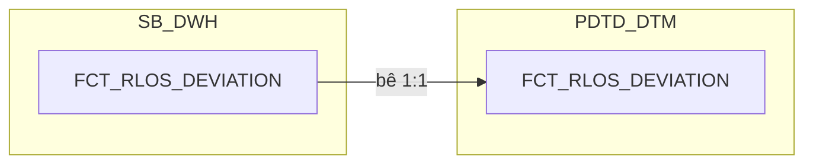

### 15.3 Cấu trúc bảng

| STT | Tên cột | Kiểu dữ liệu | Bắt buộc | Độ lớn | Khóa | Mô tả | Báo cáo sử dụng | Tên chỉ tiêu trên báo cáo |
| --- | --- | --- | --- | --- | --- | --- | --- | --- |
| 1 | DAYID | DATE | Y |  | PK | Ngày dữ liệu, dạng số YYYYMMDD | — (cột kỹ thuật) | — |
| 2 | WI_NAME | VARCHAR2 | Y | 100 | PK | Mã hồ sơ tín dụng RLOS | Báo cáo NGOẠI LỆ (BC6) — hiển thị trực tiếp, cũng là khóa PK | WI_NAME (Mã hồ sơ) |
| 3 | DEVIATION_BK | VARCHAR2 | Y | 64 | PK | Khóa nghiệp vụ của dòng ngoại lệ — PHÁI SINH: STANDARD_HASH(..., 'SHA256') trên toàn bộ cột không phải CLOB của NG_SB_RLOS_MANUAL_DEVIATION (loại trừ REASON), cộng DATASOURCE và tên bảng nguồn | Báo cáo KPI (BC9) — nguồn cho chỉ tiêu/trường DEVIATION_G2/DEVIATION_G3 (COUNT(*) số dòng theo WI_NAME trên AGG_LOS_KPI_APPLICATION, lọc DAYID mới nhất) | — |
| 4 | DATASOURCE | VARCHAR2 | Y | 10 |  | Cột kỹ thuật đánh dấu nguồn hệ, luôn cố định 'RLOS' | — (cột kỹ thuật) | — |
| 5 | APPLICATION_SK | NUMBER | Y | 18 |  | Khóa tới DIM_RLOS_APPLICATION theo phiên bản hiệu lực tại DAYID. Mặc định -1 nếu không khớp | — (cột kỹ thuật, khóa JOIN nội bộ) | — |
| 6 | CHECKING_CONDITION | VARCHAR2 | N | 500 |  | Điều kiện kiểm tra chính sách — nguồn NG_SB_RLOS_MANUAL_DEVIATION.CHECKING_CONDITION | Báo cáo NGOẠI LỆ (BC6) — hiển thị trực tiếp | CHECKING_CONDITION (Tiêu chí ngoại lệ) |
| 7 | CHECKING_RESULT | VARCHAR2 | N | 200 |  | Kết quả kiểm tra chính sách — nguồn NG_SB_RLOS_MANUAL_DEVIATION.CHECKING_RESULT | Báo cáo NGOẠI LỆ (BC6) — hiển thị trực tiếp | CHECKING_RESULT (Loại ngoại lệ) |
| 8 | DEVIATION_REASON | VARCHAR2 | N | 4000 |  | Lý do lệch chính sách — nguồn NG_SB_RLOS_MANUAL_DEVIATION.REASON (đổi tên cho rõ nghĩa) | Báo cáo NGOẠI LỆ (BC6) — hiển thị trực tiếp | REASON (Nội dung ngoại lệ) |
| 9 | PROCESSED_DATE | DATE | N |  |  | Ngày xử lý của hồ sơ — PHÁI SINH: tính độc lập từ NG_SB_RLOS_ENTRY_EXIT theo cùng công thức 3 mức ưu tiên đã dùng cho FCT_RLOS_APPLICATION_DAILY.PROCESSED_DATE — không JOIN sang FCT_RLOS_APPLICATION_DAILY | Báo cáo NGOẠI LỆ (BC6) — hiển thị trực tiếp | PROCESSED_DATE (Ngày dữ liệu báo cáo) |

## 16. FCT_RLOS_WORKSTEP_EVENT

### 16.1 Mục đích thiết kế
- **Ý nghĩa bảng:** nhật ký workflow mức nguyên tử của hệ RLOS (bán lẻ/cá
  nhân) — mỗi dòng là 1 lần hồ sơ đi qua 1 bước xử lý (workstep) trên
  workflow, ghi lại đầy đủ thời gian vào/ra, người xử lý, quyết định và
  các chỉ số TAT tính sẵn. Giữ HẾT MỌI SỰ KIỆN, không bao giờ xóa.
- **Khóa chính của bảng (PK):** DAYID, WI_NAME, WORKSTEP_CODE, ENTRYDATE.
- **Độ chi tiết (grain):** 1 dòng = 1 phiên bản của 1 logical event (hồ
  sơ × workstep × lần vào bước).
- **Phục vụ báo cáo:**
  - Báo cáo RLOS APPLICATION (BC1)
  - Báo cáo CLOS APPLICATION (BC2)
  - Báo cáo Thông tin phê duyệt (BC3)
  - Báo cáo Tuần Chuyên viên Thẩm định (BC4)
  - Báo cáo SLA - TAT (BC5)
  - Báo cáo EXCEPTION - FTR (BC7)
  - Báo cáo RETURN (BC8)
  - Báo cáo KPI (BC9)
  - Báo cáo Giải ngân _ Quá hạn KHCN (BC10)
  - Báo cáo Giải ngân _ Quá hạn KHDN (BC11)

### 16.2 Sơ đồ lineage

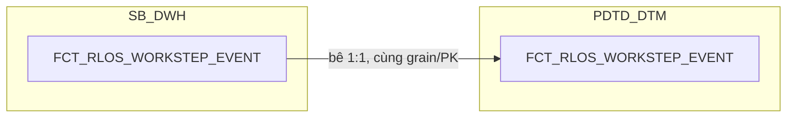

### 16.3 Cấu trúc bảng

| STT | Tên cột | Kiểu dữ liệu | Bắt buộc | Độ lớn | Khóa | Mô tả | Báo cáo sử dụng | Tên chỉ tiêu trên báo cáo |
| --- | --- | --- | --- | --- | --- | --- | --- | --- |
| 1 | DAYID | DATE | Y |  | PK | Ngày dữ liệu, dạng số YYYYMMDD — nguồn NG_SB_RLOS_ENTRY_EXIT, TRUNC về 00:00:00. Là ngày phiên bản được ghi nhận, KHÔNG phải ảnh chụp lại toàn bộ nhật ký mỗi ngày | — | Nguồn cho chỉ tiêu/trường APPLICATION_SK, APPLICANT_SK (mốc thời gian xác định phiên bản SCD2 hiệu lực khi lookup DIM) |
| 2 | WI_NAME | VARCHAR2 | Y | 100 | PK | Mã hồ sơ tín dụng RLOS — nguồn ENTRY_EXIT.WINAME (đổi tên WINAME→WI_NAME) | Báo cáo RLOS APPLICATION (BC1) — hiển thị trực tiếp Báo cáo CLOS APPLICATION (BC2) Báo cáo Thông tin phê duyệt (BC3) Báo cáo Tuần Chuyên viên Thẩm định (BC4) Báo cáo SLA - TAT (BC5) Báo cáo RETURN (BC8) | WINAME (Mã hồ sơ) |
| 3 | WORKSTEP_CODE | VARCHAR2 | Y | 200 | PK | Mã bước xử lý trên workflow — nguồn ENTRY_EXIT.WORKSTEP (thêm hậu tố CODE), đã cắt tiền tố hệ nguồn nếu có | Báo cáo Thông tin phê duyệt (BC3) — hiển thị trực tiếp, đồng thời là điều kiện lọc bước CreditApprovalReview/CreditApproval/CreditCommittee Báo cáo Tuần Chuyên viên Thẩm định (BC4) — điều kiện lọc bước UnderwriterMaker/UnderwriterChecker Báo cáo SLA - TAT (BC5) — điều kiện lọc để SUM từng cột TAT theo từng bước Báo cáo RETURN (BC8) — hiển thị trực tiếp | WORKSTEP (Bước hồ sơ) |
| 4 | ENTRYDATE | TIMESTAMP | Y |  | PK | Thời điểm hồ sơ vào bước xử lý — nguồn ENTRY_EXIT.ENTRYDATE. Bắt buộc nằm trong khóa vì 1 hồ sơ có thể quay lại cùng 1 bước nhiều lần | Báo cáo Thông tin phê duyệt (BC3) — hiển thị trực tiếp Báo cáo Tuần Chuyên viên Thẩm định (BC4) — hiển thị trực tiếp Báo cáo SLA - TAT (BC5) — dùng tính ENTRYDATE_DDE (MIN theo bước DetailDataEntry) | ENTRYDATE (Thời gian lên bước) |
| 5 | DATASOURCE | VARCHAR2 | Y | 10 |  | Cột kỹ thuật đánh dấu nguồn hệ, luôn cố định 'RLOS' | Báo cáo Thông tin phê duyệt (BC3) — hiển thị trực tiếp Báo cáo Tuần Chuyên viên Thẩm định (BC4) — hiển thị trực tiếp | SYSTEMNAME (Hệ thống — CLOS/RLOS) |
| 6 | WORKSTEP_SK | NUMBER | Y | 18 |  | Khóa tới DIM_RLOS_WORKSTEP, lookup bằng WORKSTEP_CODE theo điều kiện thời gian (EFF_DATE/EXP_DATE). Mặc định -1 nếu không khớp | — | Thiết kế dư thừa |
| 7 | DECISION_SK | NUMBER | Y | 18 |  | Khóa tới DIM_RLOS_DECISION, lookup bằng DECISION_CODE theo điều kiện thời gian. KHÔNG nằm trong PK | — | Thiết kế dư thừa |
| 8 | USER_SK | NUMBER | Y | 18 |  | Khóa tới DIM_LOS_USER, người xử lý của chính sự kiện này. ĐÚNG GRAIN của bảng. Mặc định -1. KHÔNG nằm trong PK | — | Thiết kế dư thừa |
| 9 | APPLICATION_SK | NUMBER | Y | 18 |  | Khóa tới DIM_RLOS_APPLICATION theo phiên bản hiệu lực tại DAYID. Mặc định -1 | Báo cáo Thông tin phê duyệt (BC3) — khóa JOIN sang DIM_RLOS_APPLICATION.STREAM/APPROVED_AMT_FINAL/CURRENCY_CODE/APPROVED_TERM Báo cáo KPI (BC9) — khóa tra BI_FLOW (điều kiện lọc SLHS_RLOS/SLGN_RLOS), khóa tra FIRST_ELIGIBLE_TS trên REF_LOS_KPI_USER_YEAR (NHAN_SU) | Nguồn cho chỉ tiêu/trường STREAM, CREDIT_LIMIT, CURRENCY, CREDIT_TERM (BC3); SLHS_RLOS, SLGN_RLOS, NHAN_SU (BC9) |
| 10 | EXITDATE | TIMESTAMP | N |  |  | Thời điểm hồ sơ ra khỏi bước xử lý — nguồn ENTRY_EXIT.EXITDATE. NULL nghĩa là hồ sơ đang nằm tại bước này | Báo cáo Thông tin phê duyệt (BC3) — hiển thị trực tiếp Báo cáo Tuần Chuyên viên Thẩm định (BC4) — hiển thị trực tiếp Báo cáo RETURN (BC8) — hiển thị trực tiếp Báo cáo SLA - TAT (BC5) — dùng tính EXITDATE_DDE (MAX theo bước DetailDataEntry) | EXITDATE (Thời gian kết thúc bước) |
| 11 | DECISION_CODE | VARCHAR2 | N | 200 |  | Mã quyết định tại bước xử lý — nguồn ENTRY_EXIT.DECISION (thêm hậu tố CODE) | Báo cáo Thông tin phê duyệt (BC3) — hiển thị trực tiếp Báo cáo RETURN (BC8) — hiển thị trực tiếp | DECISION (Quyết định) |
| 12 | USERNAME | VARCHAR2 | N | 100 |  | Tên tài khoản người xử lý hồ sơ — nguồn ENTRY_EXIT.USERNAME. Giữ nguyên giá trị gốc, không join qua DIM_LOS_USER | Báo cáo Thông tin phê duyệt (BC3) — hiển thị trực tiếp (BI_APPROVER/BI_COMMITTEE, lọc theo WORKSTEP_CODE) Báo cáo Tuần Chuyên viên Thẩm định (BC4) — hiển thị trực tiếp (UND_MAKER) Báo cáo KPI (BC9) — điều kiện lọc IS_TEST_ACCOUNT, nguồn cho FIRST_ELIGIBLE_TS/NHAN_SU trên REF_LOS_KPI_USER_YEAR | BI_APPROVER, BI_COMMITTEE (BC3); UND_MAKER (BC4); nguồn cho chỉ tiêu/trường IS_TEST_ACCOUNT, NHAN_SU (BC9) |
| 13 | REMARKS | VARCHAR2 | N | 4000 |  | Ghi chú tại bước xử lý — nguồn ENTRY_EXIT.REMARKS | Báo cáo Thông tin phê duyệt (BC3) — hiển thị trực tiếp Báo cáo Tuần Chuyên viên Thẩm định (BC4) — hiển thị trực tiếp | REMARKS (Ghi chú) |
| 14 | REASON_CODE | VARCHAR2 | N | 50 |  | Mã lý do hủy hồ sơ — nguồn NG_SB_RLOS_ENTRY_EXIT.REASON_CODE (chỉ RLOS có cột này) | — | Thiết kế dư thừa |
| 15 | REASON_DESC | VARCHAR2 | N | 500 |  | Diễn giải lý do hủy hồ sơ — nguồn NG_SB_RLOS_ENTRY_EXIT.REASON_DESC (chỉ RLOS có cột này) | — | Thiết kế dư thừa |
| 16 | TAT_SOURCE_SEC | NUMBER | N | 12 |  | Thời gian xử lý do hệ nguồn ghi, đơn vị giây — nguồn ENTRY_EXIT.TAT. Giữ lại để đối soát với 3 cột TAT tính lại bên dưới | — | Nguồn cho chỉ tiêu/trường TAT_CALENDAR_HOUR (input tính toán, dùng khi EXITDATE-ENTRYDATE không đủ dữ liệu) |
| 17 | TAT_CALENDAR_HOUR | NUMBER | N | 18,6 |  | Thời gian xử lý theo lịch tự nhiên, đơn vị giờ — PHÁI SINH: TAT_SOURCE_SEC / 3600, hoặc (CAST(EXITDATE AS DATE) - CAST(ENTRYDATE AS DATE)) * 24 nếu TAT_SOURCE_SEC rỗng. Không trừ ngày nghỉ | Báo cáo SLA - TAT (BC5) — hiển thị trực tiếp, SUM theo từng bước xử lý (BranchSupport, DetailDataEntry, DataInputerChecker, UnderwriterMaker, UnderwriterChecker, CreditApproval, CreditCommittee...) | STEP01_BRANCH_CL_TAT, STEP02_DDE_CL_TAT, STEP03_QUALITY_CHECKER_CL_TAT, STEP04_UNDMAKER_CL_TAT, STEP04_UNDCHECKER_CL_TAT, STEP07_APPROVER_CL_TAT, STEP07_COMMITTEE_CL_TAT, TAT_PHONG_CL_TAT, TAT_KHOI_PDTD_CL_TAT |
| 18 | TAT_WORKING_HOUR | NUMBER | N | 18,6 |  | Thời gian xử lý theo giờ làm việc, đơn vị giờ — PHÁI SINH: GET_BUSINESS_MINUTE(ENTRYDATE, EXITDATE) / 60. Loại trừ ngày lễ, chiều thứ Bảy, cả ngày Chủ nhật | Báo cáo SLA - TAT (BC5) — hiển thị trực tiếp, SUM theo từng bước xử lý, cùng nhóm cột với TAT_CALENDAR_HOUR | STEP01_BRANCH_WK_TAT, STEP02_DDE_WK_TAT, STEP03_QUALITY_CHECKER_WK_TAT, STEP04_UNDMAKER_WK_TAT, STEP04_UNDCHECKER_WK_TAT, STEP07_APPROVER_WK_TAT, STEP07_COMMITTEE_WK_TAT, TAT_PHONG_WK_TAT, TAT_KHOI_PDTD_WK_TAT |
| 19 | TAT_CPC_HOUR | NUMBER | N | 18,6 |  | Thời gian xử lý theo giờ cam kết SLA, đơn vị giờ — PHÁI SINH: GET_BUSINESS_MINUTE_CPC(ENTRYDATE, EXITDATE) / 60. Giờ theo cam kết SLA, tính 8-11:30 và 13:30-16:30 | Báo cáo SLA - TAT (BC5) — hiển thị trực tiếp, SUM theo từng bước để so sánh với các mốc SLA đã cam kết (SLA_DE, SLA_QC, SLA_MARKER, SLA_CHECKER, SLA_CREDIT_OFFICER, SLA_CREDIT_APPROVER) | STEP01_BRANCH_TAT_CPC, STEP02_DDE_TAT_CPC, STEP03_QUALITY_CHECKER_TAT_CPC, STEP04_UNDMAKER_TAT_CPC, STEP04_UNDCHECKER_TAT_CPC, STEP04_UND_TAT_CPC, STEP07_APPROVER_TAT_CPC |
| 20 | EVENT_SEQ_ASC | NUMBER | N | 5 |  | Thứ tự sự kiện theo chiều cũ đến mới — PHÁI SINH: ROW_NUMBER() OVER (PARTITION BY WI_NAME ORDER BY ENTRYDATE ASC). Dùng xác định sự kiện trả về đầu tiên cho BC7 (FIRST_WORKSTEP_RETURN) | — | Thiết kế dư thừa |
| 21 | BI_FLAG_APPROVAL | VARCHAR2 | N | 50 |  | Đánh dấu lần phê duyệt đầu hay lần phê duyệt lại — PHÁI SINH: 'First Approval' nếu EXITDATE <= MIN(EXITDATE của các sự kiện phê duyệt trong cùng hồ sơ), ngược lại 'From Second Approval' | Báo cáo SLA - TAT (BC5) — hiển thị trực tiếp Báo cáo KPI (BC9) — điều kiện lọc khi tính TAT_APPLICATION_HOUR (chỉ lấy sự kiện phê duyệt lần đầu) | BI_FLAG_APPROVAL (Phê duyệt lần đầu/từ lần thứ 2, BC5); nguồn cho chỉ tiêu/trường TAT_APPLICATION_HOUR (điều kiện lọc, BC9) |
| 22 | PRE_WORKSTEP_CODE | VARCHAR2 | N | 200 |  | Bước xử lý liền trước — PHÁI SINH: LAG(WORKSTEP_CODE) OVER (PARTITION BY WI_NAME ORDER BY ENTRYDATE) | Báo cáo RLOS APPLICATION (BC1) — hiển thị trực tiếp Báo cáo CLOS APPLICATION (BC2) | PRE_WORKSTEP (Bước xử lý liền trước) |
| 23 | PROCESSED_DATE | DATE | N |  |  | Ngày xử lý chung của hồ sơ theo 3 mức ưu tiên (phê duyệt cuối / hủy tại UnderwriterMaker / ngày dữ liệu hệ thống nếu đang xử lý) — PHÁI SINH TRỰC TIẾP trên bảng này (review 2026-09-21), không copy/JOIN từ FCT_RLOS_APPLICATION_DAILY | Báo cáo Tuần Chuyên viên Thẩm định (BC4) — hiển thị trực tiếp Báo cáo RETURN (BC8) Báo cáo KPI (BC9) — mốc xếp hồ sơ vào đúng DAYID khi SUM/COUNT SLHS_RLOS/SLGN_RLOS/TAT_RLOS lên grain ngày (qua AGG_LOS_KPI_APPLICATION) | REPORT_DATE (Ngày báo cáo, BC4); PROCESSED_DATE (Ngày dữ liệu, BC8) |
| 24 | WORKSTEP_FLAG | VARCHAR2 | N | 200 |  | Trạng thái tổng hợp hồ sơ dạng mô tả (trường FLAG của BC4, nhánh RLOS) — PHÁI SINH TRỰC TIẾP trên bảng này (review 2026-09-21), LEFT JOIN WFINSTRUMENTTABLE loại tài khoản hệ thống/test, 5 nhánh CASE-WHEN | Báo cáo Tuần Chuyên viên Thẩm định (BC4) — hiển thị trực tiếp | FLAG (Trạng thái) |
| 25 | APPLICANT_SK | NUMBER | Y | 18 |  | Khóa tới DIM_RLOS_APPLICANT — PHÁI SINH TRỰC TIẾP trên bảng này (review 2026-09-21), join theo WI_NAME + điều kiện SCD2 hiệu lực tại DAYID, quan hệ 1:1 với hồ sơ. Mặc định -1 nếu không khớp | Báo cáo RLOS APPLICATION (BC1) — khóa JOIN sang DIM_RLOS_APPLICANT.FULL_NAME Báo cáo Tuần Chuyên viên Thẩm định (BC4) — khóa JOIN sang DIM_RLOS_APPLICANT.FULL_NAME | Nguồn cho chỉ tiêu/trường CUSTOMER_NAME (BC1, BC4) |

## 17. FCT_RLOS_LOAN_DISBURSEMENT

### 17.1 Mục đích thiết kế
- **Ý nghĩa bảng:** bảng FACT đối chiếu T24, lưu khoản vay đã giải ngân
  của hệ RLOS, nối ngược về hồ sơ LOS qua SEAB_LOS_ID. Tách ra từ bảng
  chung cũ `FCT_LOS_DISBURSEMENT` vì 5/18 cột gốc phụ thuộc hệ
  (`APPLICATION_SK` polymorphic, `CUST_GROUP`/`LOANCASEID`/
  `APPROVAL_WINAME_LOS` chỉ CLOS có, `APPROVAL_DATE` 2 công thức khác
  nhau). Bảng RLOS này không có 3 cột `CUST_GROUP`/`LOANCASEID`/
  `APPROVAL_WINAME_LOS` (RLOS không có khái niệm hồ sơ cha/nhóm khách
  hàng doanh nghiệp).
- **Khóa chính của bảng (PK):** DAYID, CONTRACT.
- **Độ chi tiết (grain):** 1 dòng = 1 HỢP ĐỒNG khoản vay trên T24, trong
  ảnh chụp của ngày DAYID — khác hẳn grain hồ sơ của mọi bảng LOS khác
  (1 hồ sơ có thể sinh nhiều hợp đồng), không phải SCD2.
- **Phục vụ báo cáo:**
  - Báo cáo Giải ngân _ Quá hạn KHCN (BC10)

### 17.2 Sơ đồ lineage

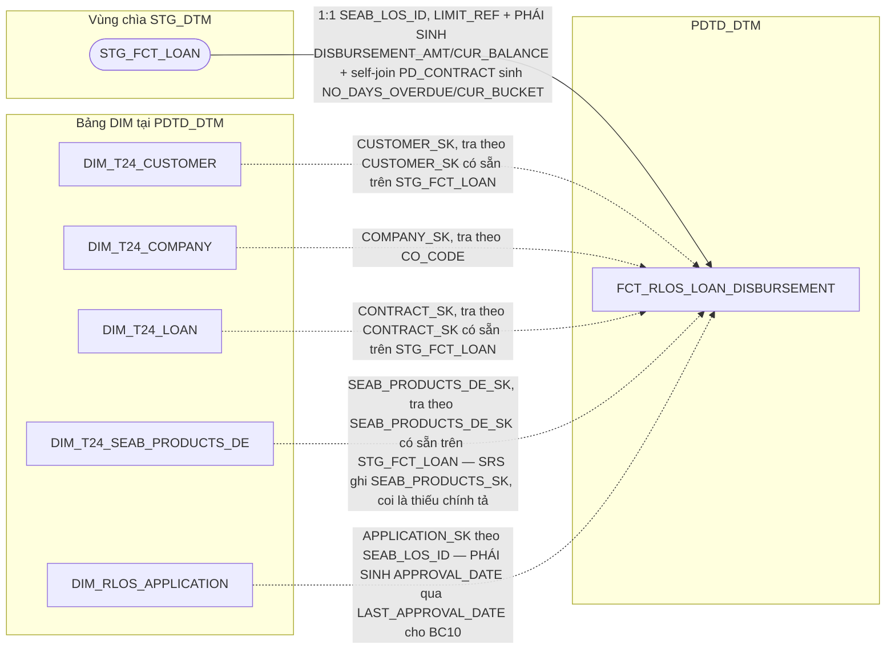

### 17.3 Cấu trúc bảng

| STT | Tên cột | Kiểu dữ liệu | Bắt buộc | Độ lớn | Khóa | Mô tả | Báo cáo sử dụng | Tên chỉ tiêu trên báo cáo |
| --- | --- | --- | --- | --- | --- | --- | --- | --- |
| 1 | DAYID | DATE | Y |  | PK | Ngày dữ liệu, dạng số YYYYMMDD — nguồn STG_FCT_LOAN.DAYID, TRUNC về 00:00:00. Là ngày ảnh chụp số liệu, KHÔNG phải ngày nghiệp vụ | Báo cáo Giải ngân _ Quá hạn KHCN (BC10) — hiển thị trực tiếp (DAYID) Báo cáo KPI (BC9) — nguồn cho chỉ tiêu/trường SLGN_RLOS_DAY (điều kiện lọc EXISTS hợp đồng theo SEAB_LOS_ID) | DAYID (Ngày dữ liệu, BC10) |
| 2 | CONTRACT | VARCHAR2 | Y | 100 | PK | Mã hợp đồng khoản vay — nguồn STG_FCT_LOAN.CONTRACT (1:1 từ SB_DWH.FCT_LOAN.CONTRACT) | Báo cáo Giải ngân _ Quá hạn KHCN (BC10) — hiển thị trực tiếp, cũng là khóa PK | CONTRACT (Mã hợp đồng) |
| 3 | DATASOURCE | VARCHAR2 | Y | 10 |  | Cột kỹ thuật đánh dấu nguồn hệ, luôn cố định 'T24' — bảng nguồn T24 core banking (STG_FCT_LOAN), không thuộc STG_LOS | — (cột kỹ thuật) | — |
| 4 | CUSTOMER_SK | NUMBER | Y | 18 |  | Khóa tới DIM_T24_CUSTOMER — nguồn STG_FCT_LOAN.CUSTOMER_SK (surrogate có sẵn, tra thẳng DIM_T24_CUSTOMER.DIMENSION_KEY). Mặc định -1 nếu không khớp | Báo cáo Giải ngân _ Quá hạn KHCN (BC10) — khóa JOIN sang DIM_T24_CUSTOMER để lấy CUSTOMER_ID/SHORT_NAME | Nguồn cho chỉ tiêu/trường CUSTOMER_ID, SHORT_NAME (BC10) |
| 5 | COMPANY_SK | NUMBER | Y | 18 |  | Khóa tới DIM_T24_COMPANY — PHÁI SINH: lookup theo STG_FCT_LOAN.CO_CODE = DIM_T24_COMPANY.COMPANY_CODE (COMPANY_EXP_DATE IS NULL phía nguồn T24). Mặc định -1 | Báo cáo Giải ngân _ Quá hạn KHCN (BC10) — khóa JOIN sang DIM_T24_COMPANY để lấy BRANCH_NAME/COMPANY_NAME | Nguồn cho chỉ tiêu/trường BRANCH_NAME, COMPANY_NAME (BC10) |
| 6 | CONTRACT_SK | NUMBER | Y | 18 |  | Khóa tới DIM_T24_LOAN — nguồn STG_FCT_LOAN.CONTRACT_SK (surrogate có sẵn, tra thẳng DIMENSION_KEY). Mặc định -1 | Báo cáo Giải ngân _ Quá hạn KHCN (BC10) — khóa JOIN sang DIM_T24_LOAN để lấy VALUE_DATE/MATURITY_DATE/REC_STATUS/CONTRACT_REF/REF_VALUE_DATE | Nguồn cho chỉ tiêu/trường VALUE_DATE, MATURITY_DATE, STATUS, CONTRACT_REF, REF_VALUE_DATE (BC10) |
| 7 | SEAB_PRODUCTS_DE_SK | NUMBER | Y | 18 |  | Khóa tới DIM_T24_SEAB_PRODUCTS_DE — nguồn STG_FCT_LOAN.SEAB_PRODUCTS_DE_SK (surrogate có sẵn; SRS ghi SEAB_PRODUCTS_SK, coi là thiếu chính tả). Mặc định -1 | Báo cáo Giải ngân _ Quá hạn KHCN (BC10) — khóa JOIN sang DIM_T24_SEAB_PRODUCTS_DE để lấy PRODUCT_T24 | Nguồn cho chỉ tiêu/trường PRODUCT_T24 (BC10) |
| 8 | APPLICATION_SK | NUMBER | Y | 18 |  | Khóa tới DIM_RLOS_APPLICATION, tra theo SEAB_LOS_ID. KHÔNG để NULL — không tra được thì gán -1 (Unknown), tránh phép JOIN của OAS rớt dòng | — (cột kỹ thuật, khóa JOIN nội bộ để sinh APPROVAL_DATE) | Nguồn cho chỉ tiêu/trường APPROVAL_DATE (BC10) |
| 9 | SEAB_LOS_ID | VARCHAR2 | N | 100 |  | Mã hồ sơ LOS do T24 lưu, gắn với hợp đồng — nguồn STG_FCT_LOAN.SEAB_LOS_ID | Báo cáo Giải ngân _ Quá hạn KHCN (BC10) — hiển thị trực tiếp Báo cáo KPI (BC9) — nguồn cho chỉ tiêu/trường SLGN_RLOS_DAY (điều kiện lọc EXISTS hợp đồng STG_FCT_LOAN theo SEAB_LOS_ID) | SEAB_LOS_ID (Mã hồ sơ, BC10); nguồn cho chỉ tiêu/trường SLGN_RLOS_DAY (điều kiện lọc, BC9) |
| 10 | ZONE | VARCHAR2 | N | 50 |  | Tên vùng của đơn vị kinh doanh — PHÁI SINH: LEFT JOIN TMP_REF_COMPANY_REGION_KHCN theo STG_FCT_LOAN.CO_CODE = COMPANY_CODE. Lưu trực tiếp trên fact (không tách FK riêng) vì nguồn là bảng REF_ tĩnh, không phải DIM SCD2 | Báo cáo Giải ngân _ Quá hạn KHCN (BC10) — hiển thị trực tiếp | ZONE (Khu vực) |
| 11 | DISBURSEMENT_AMT | NUMBER | N | 20,2 |  | Số tiền giải ngân — PHÁI SINH: ABS(STG_FCT_LOAN.FIRST_DISBURSEMENT_AMT) | Báo cáo Giải ngân _ Quá hạn KHCN (BC10) — hiển thị trực tiếp | DISBURSEMENT_AMT_T24 (Số tiền giải ngân) |
| 12 | CUR_BALANCE | NUMBER | N | 20,2 |  | Dư nợ hiện tại — PHÁI SINH: (ABS(NVL(BALANCE,0)) + ABS(NVL(PD_BALANCE,0))) * REVAL_RATE trên STG_FCT_LOAN | Báo cáo Giải ngân _ Quá hạn KHCN (BC10) — hiển thị trực tiếp | CUR_BALANCE (Dư nợ hiện tại) |
| 13 | NO_DAYS_OVERDUE | NUMBER | N | 6 |  | Số ngày quá hạn — PHÁI SINH: self-join STG_FCT_LOAN (b) ON a.PD_CONTRACT = b.CONTRACT, lấy b.NO_DAYS_OVERDUE | Báo cáo Giải ngân _ Quá hạn KHCN (BC10) — hiển thị trực tiếp, cũng là nguồn tính CUR_BUCKET | NO_DAYS_OVERDUE (Số ngày quá hạn) |
| 14 | CUR_BUCKET | NUMBER | N | 2 |  | Nhóm nợ — PHÁI SINH: CASE WHEN NO_DAYS_OVERDUE > 360 THEN 5 WHEN > 180 THEN 4 WHEN > 90 THEN 3 WHEN >= 10 THEN 2 ELSE 1 END, cùng self-join PD_CONTRACT như NO_DAYS_OVERDUE | Báo cáo Giải ngân _ Quá hạn KHCN (BC10) — hiển thị trực tiếp | CUR_BUCKET (Nhóm nợ) |
| 15 | APPROVAL_DATE | DATE | N |  |  | Ngày phê duyệt — PHÁI SINH: JOIN APPLICATION_SK sang DIM_RLOS_APPLICATION.LAST_APPROVAL_DATE — giữ nguyên tắc "DTM chỉ đọc DWH", không đọc thẳng NG_SB_RLOS_ENTRY_EXIT tại đây, không JOIN fact-to-fact sang FCT_RLOS_APPLICATION_DAILY | Báo cáo Giải ngân _ Quá hạn KHCN (BC10) — hiển thị trực tiếp | APPROVAL_DATE (Ngày phê duyệt) |

