# HLD Review — FCT tables (PDTD_DTM)

## 1. AGG_LOS_KPI_YTD_DAILY

### 1.1 Mục đích thiết kế
- **Ý nghĩa bảng:** Bảng chỉ số KPI lũy kế theo ngày cho toàn khối PDTD (RLOS và CLOS là 2 nhóm cột song song trên cùng một dòng, không tách bảng), phục vụ phần "KPI Khối" của Báo cáo KPI (BC9).
- **Khóa chính của bảng (PK):** DAYID.
- **Độ chi tiết (grain):** 1 dòng = 1 ngày dữ liệu, cho toàn khối (không tách theo hệ RLOS/CLOS).
- **Phục vụ báo cáo:**
  - Báo cáo KPI (BC9) — nguồn trực tiếp cho toàn bộ phần "KPI Khối" (SLHS/SLGN/TAT/QUY_DOI/NHAN_SU theo ngày và lũy kế từ đầu năm)

### 1.2 Sơ đồ lineage

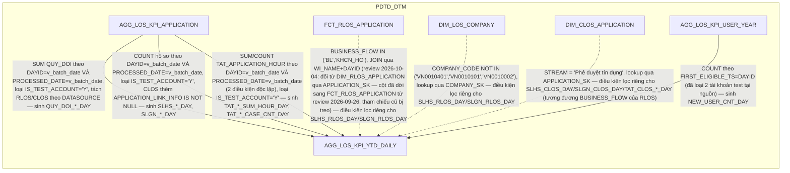
```mermaid
flowchart LR
    subgraph PDTD_DTM
        A["AGG_LOS_KPI_APPLICATION"]
        D1["FCT_RLOS_APPLICATION"]
        D3["DIM_CLOS_APPLICATION"]
        D2["DIM_LOS_COMPANY"]
        M["AGG_LOS_KPI_USER_YEAR"]
        F["AGG_LOS_KPI_YTD_DAILY"]
    end
    A -->|"SUM QUY_DOI theo DAYID=v_batch_date VÀ PROCESSED_DATE=v_batch_date, loại IS_TEST_ACCOUNT='Y', tách RLOS/CLOS theo DATASOURCE — sinh QUY_DOI_*_DAY"| F
    A -->|"COUNT hồ sơ theo DAYID=v_batch_date VÀ PROCESSED_DATE=v_batch_date, loại IS_TEST_ACCOUNT='Y', CLOS thêm APPLICATION_LINK_INFO IS NOT NULL — sinh SLHS_*_DAY, SLGN_*_DAY"| F
    D1 -.->|"BUSINESS_FLOW IN ('BL','KHCN_HO'), JOIN qua WI_NAME+DAYID (review 2026-10-04: đổi từ DIM_RLOS_APPLICATION qua APPLICATION_SK — cột đã dời sang FCT_RLOS_APPLICATION từ review 2026-09-26, tham chiếu cũ bị treo) — điều kiện lọc riêng cho SLHS_RLOS_DAY/SLGN_RLOS_DAY"| F
    D2 -.->|"COMPANY_CODE NOT IN ('VN0010401','VN0010101','VN0010002'), lookup qua COMPANY_SK — điều kiện lọc riêng cho SLHS_RLOS_DAY/SLGN_RLOS_DAY"| F
    D3 -.->|"STREAM = 'Phê duyệt tín dụng', lookup qua APPLICATION_SK — điều kiện lọc riêng cho SLHS_CLOS_DAY/SLGN_CLOS_DAY/TAT_CLOS_*_DAY (tương đương BUSINESS_FLOW của RLOS)"| F
    A -->|"SUM/COUNT TAT_APPLICATION_HOUR theo DAYID=v_batch_date VÀ PROCESSED_DATE=v_batch_date (2 điều kiện độc lập), loại IS_TEST_ACCOUNT='Y' — sinh TAT_*_SUM_HOUR_DAY, TAT_*_CASE_CNT_DAY"| F
    M -->|"COUNT theo FIRST_ELIGIBLE_TS=DAYID (đã loại 2 tài khoản test tại nguồn) — sinh NEW_USER_CNT_DAY"| F
```

### 1.3 Cấu trúc bảng

| STT | Tên cột | Kiểu dữ liệu | Bắt buộc | Độ lớn | Khóa | Mô tả | Báo cáo sử dụng | Tên chỉ tiêu trên báo cáo |
| --- | --- | --- | --- | --- | --- | --- | --- | --- |
| 1 | DAYID | DATE | Y |  | PK | Ngày dữ liệu, dạng số YYYYMMDD — gán = v_batch_date của lần chạy ETL. BẢNG HOÀN TOÀN MỚI TẠI PDTD_DTM (aggregate/pre-tổng hợp), không có bảng SB_DWH tương ứng — nguồn là PDTD_DTM.AGG_LOS_KPI_APPLICATION/AGG_LOS_KPI_USER_YEAR (cũng là bảng chỉ tồn tại ở PDTD_DTM) | Báo cáo KPI (BC9) — điều kiện lọc/khóa để phái sinh YEAR_MONTH tại tầng report | Năm báo cáo (phái sinh từ DAYID) |
| 2 | SLHS_RLOS_DAY | NUMBER | N | 12 |  | Số hồ sơ RLOS được phê duyệt, phát sinh trong ngày — PHÁI SINH TẠI PDTD_DTM: COUNT hồ sơ trên PDTD_DTM.AGG_LOS_KPI_APPLICATION (DATASOURCE='RLOS') có AGG_LOS_KPI_APPLICATION.DAYID = v_batch_date VÀ PROCESSED_DATE = v_batch_date, IS_TEST_ACCOUNT != 'Y', thỏa điều kiện DECISION đã phê duyệt, và BUSINESS_FLOW/COMPANY_CODE lọc theo đúng công thức SRS — BỔ SUNG RIÊNG TẠI PDTD_DTM, không có ở SB_DWH | Báo cáo KPI (BC9) — nguồn cho SLHS_RLOS lũy kế (cột 3) | Nguồn cho chỉ tiêu SLHS_RLOS |
| 3 | SLHS_RLOS | NUMBER | N | 14 |  | Lũy kế từ 1/1: SLHS_RLOS(D) = SLHS_RLOS(D-1) + SLHS_RLOS_DAY(D), reset vào 1/1 — PHÁI SINH TẠI PDTD_DTM, input SLHS_RLOS_DAY lấy từ cột 2, cùng bảng — BỔ SUNG RIÊNG TẠI PDTD_DTM, không có ở SB_DWH | Báo cáo KPI (BC9) — hiển thị trực tiếp | Số lượng hồ sơ phê duyệt RLOS (SLHS_RLOS) |
| 4 | SLGN_RLOS_DAY | NUMBER | N | 12 |  | Số hồ sơ RLOS đã giải ngân (tồn tại hợp đồng trên STG_FCT_LOAN), phát sinh trong ngày — PHÁI SINH TẠI PDTD_DTM, cùng điều kiện lọc SLHS_RLOS_DAY (cột 2, bao gồm DAYID=v_batch_date VÀ PROCESSED_DATE=v_batch_date), thêm EXISTS hợp đồng theo SEAB_LOS_ID — BỔ SUNG RIÊNG TẠI PDTD_DTM, không có ở SB_DWH | Báo cáo KPI (BC9) — nguồn cho SLGN_RLOS lũy kế (cột 5) | Nguồn cho chỉ tiêu SLGN_RLOS |
| 5 | SLGN_RLOS | NUMBER | N | 14 |  | Lũy kế từ 1/1: SLGN_RLOS(D) = SLGN_RLOS(D-1) + SLGN_RLOS_DAY(D), reset vào 1/1 — PHÁI SINH TẠI PDTD_DTM, input SLGN_RLOS_DAY lấy từ cột 4, cùng bảng — BỔ SUNG RIÊNG TẠI PDTD_DTM, không có ở SB_DWH | Báo cáo KPI (BC9) — hiển thị trực tiếp | Số lượng hồ sơ giải ngân RLOS (SLGN_RLOS) |
| 6 | SLHS_CLOS_DAY | NUMBER | N | 12 |  | Số hồ sơ CLOS được phê duyệt, phát sinh trong ngày — PHÁI SINH TẠI PDTD_DTM, cùng cách SLHS_RLOS_DAY (cột 2, bao gồm DAYID=v_batch_date VÀ PROCESSED_DATE=v_batch_date), DATASOURCE='CLOS', thêm APPLICATION_LINK_INFO IS NOT NULL (đổi tên từ VAR_STR12, review 2026-10-04) và STREAM = 'Phê duyệt tín dụng' — BỔ SUNG RIÊNG TẠI PDTD_DTM, không có ở SB_DWH | Báo cáo KPI (BC9) — nguồn cho SLHS_CLOS lũy kế (cột 7) | Nguồn cho chỉ tiêu SLHS_CLOS |
| 7 | SLHS_CLOS | NUMBER | N | 14 |  | Lũy kế từ 1/1: SLHS_CLOS(D) = SLHS_CLOS(D-1) + SLHS_CLOS_DAY(D), reset vào 1/1 — PHÁI SINH TẠI PDTD_DTM, input SLHS_CLOS_DAY lấy từ cột 6, cùng bảng — BỔ SUNG RIÊNG TẠI PDTD_DTM, không có ở SB_DWH | Báo cáo KPI (BC9) — hiển thị trực tiếp | Số lượng hồ sơ phê duyệt CLOS (SLHS_CLOS) |
| 8 | SLGN_CLOS_DAY | NUMBER | N | 12 |  | Số hồ sơ CLOS đã giải ngân, phát sinh trong ngày — PHÁI SINH TẠI PDTD_DTM, cùng điều kiện lọc SLHS_CLOS_DAY (cột 6, bao gồm DAYID=v_batch_date VÀ PROCESSED_DATE=v_batch_date), thêm EXISTS hợp đồng trên STG_FCT_LOAN (nhánh LD) hoặc STG_DTM.STG_FCT_MD (nhánh MD, bảo lãnh) — BỔ SUNG RIÊNG TẠI PDTD_DTM, không có ở SB_DWH | Báo cáo KPI (BC9) — nguồn cho SLGN_CLOS lũy kế (cột 9) | Nguồn cho chỉ tiêu SLGN_CLOS |
| 9 | SLGN_CLOS | NUMBER | N | 14 |  | Lũy kế từ 1/1: SLGN_CLOS(D) = SLGN_CLOS(D-1) + SLGN_CLOS_DAY(D), reset vào 1/1 — PHÁI SINH TẠI PDTD_DTM, input SLGN_CLOS_DAY lấy từ cột 8, cùng bảng — BỔ SUNG RIÊNG TẠI PDTD_DTM, không có ở SB_DWH | Báo cáo KPI (BC9) — hiển thị trực tiếp | Số lượng hồ sơ giải ngân CLOS (SLGN_CLOS) |
| 10 | TAT_RLOS_SEC_SUM_HOUR_DAY | NUMBER | N | 18,6 |  | Tổng TAT_APPLICATION_HOUR của hồ sơ RLOS CÓ tài sản bảo đảm, phát sinh trong ngày — PHÁI SINH TẠI PDTD_DTM: SUM lại từ PDTD_DTM.AGG_LOS_KPI_APPLICATION.TAT_APPLICATION_HOUR có DAYID=v_batch_date VÀ PROCESSED_DATE=v_batch_date, lọc SEC theo COLLREQUIRE — BỔ SUNG RIÊNG TẠI PDTD_DTM, không có ở SB_DWH | Báo cáo KPI (BC9) — nguồn cho TAT_RLOS_SEC_SUM_HOUR_YTD lũy kế (cột 12), qua đó nguồn cho chỉ tiêu TAT_RLOS phái sinh tại tầng report | Nguồn cho chỉ tiêu TAT_RLOS |
| 11 | TAT_RLOS_SEC_CASE_CNT_DAY | NUMBER | N | 12 |  | Số hồ sơ RLOS có tài sản bảo đảm, phát sinh trong ngày — PHÁI SINH TẠI PDTD_DTM, mẫu số của TAT_RLOS_SEC, cùng điều kiện lọc trên (cột 10) — BỔ SUNG RIÊNG TẠI PDTD_DTM, không có ở SB_DWH | Báo cáo KPI (BC9) — nguồn cho TAT_RLOS_SEC_CASE_CNT_YTD lũy kế (cột 13), qua đó nguồn cho chỉ tiêu TAT_RLOS phái sinh tại tầng report | Nguồn cho chỉ tiêu TAT_RLOS |
| 12 | TAT_RLOS_SEC_SUM_HOUR_YTD | NUMBER | N | 20,6 |  | Lũy kế từ 1/1: (D) = (D-1) + TAT_RLOS_SEC_SUM_HOUR_DAY(D), reset vào 1/1 — PHÁI SINH TẠI PDTD_DTM, input từ cột 10, cùng bảng — BỔ SUNG RIÊNG TẠI PDTD_DTM, không có ở SB_DWH | Báo cáo KPI (BC9) — thành phần AVG_SEC = SUM_HOUR_YTD/CASE_CNT_YTD, dùng phái sinh chỉ tiêu TAT_RLOS tại tầng report (không lưu vật lý) | Nguồn cho chỉ tiêu TAT_RLOS (AVG_SEC) |
| 13 | TAT_RLOS_SEC_CASE_CNT_YTD | NUMBER | N | 14 |  | Lũy kế từ 1/1: (D) = (D-1) + TAT_RLOS_SEC_CASE_CNT_DAY(D), reset vào 1/1 — PHÁI SINH TẠI PDTD_DTM, input từ cột 11, cùng bảng — BỔ SUNG RIÊNG TẠI PDTD_DTM, không có ở SB_DWH | Báo cáo KPI (BC9) — thành phần AVG_SEC, dùng phái sinh chỉ tiêu TAT_RLOS tại tầng report | Nguồn cho chỉ tiêu TAT_RLOS (AVG_SEC) |
| 14 | TAT_RLOS_UNSEC_SUM_HOUR_DAY | NUMBER | N | 18,6 |  | Tổng TAT_APPLICATION_HOUR của hồ sơ RLOS KHÔNG có tài sản bảo đảm, phát sinh trong ngày — PHÁI SINH TẠI PDTD_DTM, cùng cách trên (cột 10, DAYID=v_batch_date VÀ PROCESSED_DATE=v_batch_date), lọc UNSEC — BỔ SUNG RIÊNG TẠI PDTD_DTM, không có ở SB_DWH | Báo cáo KPI (BC9) — nguồn cho TAT_RLOS_UNSEC_SUM_HOUR_YTD lũy kế (cột 16) | Nguồn cho chỉ tiêu TAT_RLOS |
| 15 | TAT_RLOS_UNSEC_CASE_CNT_DAY | NUMBER | N | 12 |  | Số hồ sơ RLOS không có tài sản bảo đảm, phát sinh trong ngày — PHÁI SINH TẠI PDTD_DTM, cùng nguồn PDTD_DTM.AGG_LOS_KPI_APPLICATION như cột 14 — BỔ SUNG RIÊNG TẠI PDTD_DTM, không có ở SB_DWH | Báo cáo KPI (BC9) — nguồn cho TAT_RLOS_UNSEC_CASE_CNT_YTD lũy kế (cột 17) | Nguồn cho chỉ tiêu TAT_RLOS |
| 16 | TAT_RLOS_UNSEC_SUM_HOUR_YTD | NUMBER | N | 20,6 |  | Lũy kế từ 1/1, reset vào 1/1 — PHÁI SINH TẠI PDTD_DTM, input từ cột 14, cùng bảng — BỔ SUNG RIÊNG TẠI PDTD_DTM, không có ở SB_DWH | Báo cáo KPI (BC9) — thành phần AVG_UNSEC = SUM_HOUR_YTD/CASE_CNT_YTD, dùng phái sinh chỉ tiêu TAT_RLOS tại tầng report | Nguồn cho chỉ tiêu TAT_RLOS (AVG_UNSEC) |
| 17 | TAT_RLOS_UNSEC_CASE_CNT_YTD | NUMBER | N | 14 |  | Lũy kế từ 1/1, reset vào 1/1 — PHÁI SINH TẠI PDTD_DTM, input từ cột 15, cùng bảng — BỔ SUNG RIÊNG TẠI PDTD_DTM, không có ở SB_DWH | Báo cáo KPI (BC9) — thành phần AVG_UNSEC, dùng phái sinh chỉ tiêu TAT_RLOS tại tầng report | Nguồn cho chỉ tiêu TAT_RLOS (AVG_UNSEC) |
| 18 | TAT_CLOS_SUM_HOUR_DAY | NUMBER | N | 18,6 |  | Tổng TAT_APPLICATION_HOUR của hồ sơ CLOS, phát sinh trong ngày — PHÁI SINH TẠI PDTD_DTM: SUM lại từ PDTD_DTM.AGG_LOS_KPI_APPLICATION.TAT_APPLICATION_HOUR (DATASOURCE='CLOS') có DAYID=v_batch_date VÀ PROCESSED_DATE=v_batch_date , không lọc APPLICATION_LINK_INFO (đổi tên từ VAR_STR12, review 2026-10-04), thêm STREAM = 'Phê duyệt tín dụng' — BỔ SUNG RIÊNG TẠI PDTD_DTM, không có ở SB_DWH | Báo cáo KPI (BC9) — nguồn cho TAT_CLOS_SUM_HOUR_YTD lũy kế (cột 20), qua đó nguồn cho chỉ tiêu TAT_CLOS phái sinh tại tầng report | Nguồn cho chỉ tiêu TAT_CLOS |
| 19 | TAT_CLOS_CASE_CNT_DAY | NUMBER | N | 12 |  | Số hồ sơ CLOS, phát sinh trong ngày — PHÁI SINH TẠI PDTD_DTM, mẫu số của TAT_CLOS, cùng điều kiện lọc trên (cột 18, bao gồm STREAM) — BỔ SUNG RIÊNG TẠI PDTD_DTM, không có ở SB_DWH | Báo cáo KPI (BC9) — nguồn cho TAT_CLOS_CASE_CNT_YTD lũy kế (cột 21) | Nguồn cho chỉ tiêu TAT_CLOS |
| 20 | TAT_CLOS_SUM_HOUR_YTD | NUMBER | N | 20,6 |  | Lũy kế từ 1/1, reset vào 1/1 — PHÁI SINH TẠI PDTD_DTM, input từ cột 18, cùng bảng — BỔ SUNG RIÊNG TẠI PDTD_DTM, không có ở SB_DWH | Báo cáo KPI (BC9) — dùng trực tiếp để phái sinh chỉ tiêu TAT_CLOS = TAT_CLOS_SUM_HOUR_YTD/TAT_CLOS_CASE_CNT_YTD tại tầng report (không lưu vật lý) | TAT CLOS (TAT_CLOS, phái sinh tầng report) |
| 21 | TAT_CLOS_CASE_CNT_YTD | NUMBER | N | 14 |  | Lũy kế từ 1/1, reset vào 1/1 — PHÁI SINH TẠI PDTD_DTM, input từ cột 19, cùng bảng — BỔ SUNG RIÊNG TẠI PDTD_DTM, không có ở SB_DWH | Báo cáo KPI (BC9) — dùng trực tiếp để phái sinh chỉ tiêu TAT_CLOS tại tầng report | TAT CLOS (TAT_CLOS, phái sinh tầng report) |
| 22 | QUY_DOI_RLOS_DAY | NUMBER | N | 14,4 |  | Tổng QUY_DOI của hồ sơ RLOS, phát sinh trong ngày — PHÁI SINH TẠI PDTD_DTM: SUM lại từ PDTD_DTM.AGG_LOS_KPI_APPLICATION.QUY_DOI (DATASOURCE='RLOS') có DAYID=v_batch_date VÀ PROCESSED_DATE=v_batch_date, IS_TEST_ACCOUNT != 'Y' — BỔ SUNG RIÊNG TẠI PDTD_DTM, không có ở SB_DWH | Báo cáo KPI (BC9) — nguồn cho QUY_DOI_RLOS lũy kế (cột 23) | Nguồn cho chỉ tiêu QUY_DOI_RLOS |
| 23 | QUY_DOI_RLOS | NUMBER | N | 16,4 |  | Lũy kế từ 1/1: QUY_DOI_RLOS(D) = QUY_DOI_RLOS(D-1) + QUY_DOI_RLOS_DAY(D), reset vào 1/1 — PHÁI SINH TẠI PDTD_DTM, input từ cột 22, cùng bảng — BỔ SUNG RIÊNG TẠI PDTD_DTM, không có ở SB_DWH | Báo cáo KPI (BC9) — hiển thị trực tiếp | Điểm KPI RLOS quy đổi (QUY_DOI_RLOS) |
| 24 | QUY_DOI_CLOS_DAY | NUMBER | N | 14,4 |  | Tổng QUY_DOI của hồ sơ CLOS, phát sinh trong ngày — PHÁI SINH TẠI PDTD_DTM, cùng cách trên (cột 22, DAYID=v_batch_date VÀ PROCESSED_DATE=v_batch_date), DATASOURCE='CLOS' — BỔ SUNG RIÊNG TẠI PDTD_DTM, không có ở SB_DWH | Báo cáo KPI (BC9) — nguồn cho QUY_DOI_CLOS lũy kế (cột 25) | Nguồn cho chỉ tiêu QUY_DOI_CLOS |
| 25 | QUY_DOI_CLOS | NUMBER | N | 16,4 |  | Lũy kế từ 1/1: QUY_DOI_CLOS(D) = QUY_DOI_CLOS(D-1) + QUY_DOI_CLOS_DAY(D), reset vào 1/1 — PHÁI SINH TẠI PDTD_DTM, input từ cột 24, cùng bảng — BỔ SUNG RIÊNG TẠI PDTD_DTM, không có ở SB_DWH | Báo cáo KPI (BC9) — hiển thị trực tiếp | Điểm KPI CLOS quy đổi (QUY_DOI_CLOS) |
| 26 | NEW_USER_CNT_DAY | NUMBER | N | 8 |  | Số USERNAME mới đủ điều kiện tính nhân sự trong ngày — PHÁI SINH TẠI PDTD_DTM: COUNT trên PDTD_DTM.AGG_LOS_KPI_USER_YEAR có KPI_YEAR = năm(DAYID) và TRUNC(FIRST_ELIGIBLE_TS) = DAYID — BỔ SUNG RIÊNG TẠI PDTD_DTM, không có ở SB_DWH | Báo cáo KPI (BC9) — nguồn cho NHAN_SU lũy kế (cột 27) | Nguồn cho chỉ tiêu NHAN_SU |
| 27 | NHAN_SU | NUMBER | N | 8 |  | Lũy kế từ 1/1: NHAN_SU(D) = NHAN_SU(D-1) + NEW_USER_CNT_DAY(D), reset vào 1/1 — tương đương COUNT DISTINCT USERNAME lũy kế — PHÁI SINH TẠI PDTD_DTM, input từ cột 26, cùng bảng — BỔ SUNG RIÊNG TẠI PDTD_DTM, không có ở SB_DWH | Báo cáo KPI (BC9) — hiển thị trực tiếp | Nhân sự Khối PDTD (NHAN_SU) |

## 2. AGG_LOS_KPI_USER_YEAR

### 2.1 Mục đích thiết kế
- **Ý nghĩa bảng:** bảng danh mục lưu tập `USERNAME` phân
  biệt đã tham gia xử lý hồ sơ đủ điều kiện tính nhân sự Khối PDTD, lũy
  kế theo năm — để `NHAN_SU` (BC9) không phải `COUNT(DISTINCT
  USERNAME)` lại từ đầu năm mỗi ngày. Không phải bảng sự kiện đo lường
  theo `DAYID`.
- **Khóa nghiệp vụ (BK):** composite `KPI_YEAR`+`USERNAME` — hash vào
  cột `USER_YEAR_BK`
- **Khóa chính của bảng (PK):** USER_YEAR_BK.
- **Độ chi tiết (grain):** 1 dòng = 1 user × 1 năm KPI (reset vào 1/1
  hằng năm).
- **Phục vụ báo cáo:**
  - Báo cáo KPI (BC9) — đầu vào duy nhất của `NHAN_SU`/`NEW_USER_CNT_DAY`
    tại `AGG_LOS_KPI_YTD_DAILY` (mục 1)

### 2.2 Sơ đồ lineage

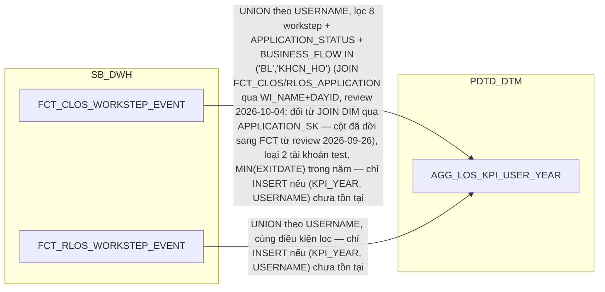
```mermaid
flowchart LR
    subgraph SB_DWH
        C["FCT_CLOS_WORKSTEP_EVENT"]
        D["FCT_RLOS_WORKSTEP_EVENT"]
    end
    subgraph PDTD_DTM
        E["AGG_LOS_KPI_USER_YEAR"]
    end
    C -->|"UNION theo USERNAME, lọc 8 workstep + APPLICATION_STATUS + BUSINESS_FLOW IN ('BL','KHCN_HO') (JOIN FCT_CLOS/RLOS_APPLICATION qua WI_NAME+DAYID, review 2026-10-04: đổi từ JOIN DIM qua APPLICATION_SK — cột đã dời sang FCT từ review 2026-09-26), loại 2 tài khoản test, MIN(EXITDATE) trong năm — chỉ INSERT nếu (KPI_YEAR, USERNAME) chưa tồn tại"| E
    D -->|"UNION theo USERNAME, cùng điều kiện lọc — chỉ INSERT nếu (KPI_YEAR, USERNAME) chưa tồn tại"| E
```

### 2.3 Cấu trúc bảng

| STT | Tên cột | Kiểu dữ liệu | Bắt buộc | Độ lớn | Khóa | Mô tả | Báo cáo sử dụng | Tên chỉ tiêu trên báo cáo |
| --- | --- | --- | --- | --- | --- | --- | --- | --- |
| 1 | USER_YEAR_BK | VARCHAR2 | Y | 64 | PK | Khóa nghiệp vụ của dòng user×năm KPI — PHÁI SINH TẠI PDTD_DTM: STANDARD_HASH(TO_CHAR(KPI_YEAR) \|\| '~' \|\| USERNAME, 'SHA256') — gộp 2 cột PK tự nhiên cũ (KPI_YEAR, USERNAME) thành 1 khóa đơn. BẢNG HOÀN TOÀN MỚI TẠI PDTD_DTM, không có ở SB_DWH — nguồn UNION SB_DWH.FCT_CLOS_WORKSTEP_EVENT/SB_DWH.FCT_RLOS_WORKSTEP_EVENT | — (cột kỹ thuật, khóa chính) | — |
| 2 | KPI_YEAR | NUMBER | Y | 4 |  | Năm KPI — tập user reset vào 1/1 hằng năm — PHÁI SINH TẠI PDTD_DTM: trích năm từ MIN(EXITDATE) của user đó trong UNION SB_DWH.FCT_CLOS_WORKSTEP_EVENT/SB_DWH.FCT_RLOS_WORKSTEP_EVENT (cùng nguồn cột 4) — BỔ SUNG RIÊNG TẠI PDTD_DTM, không có ở SB_DWH | Báo cáo KPI (BC9) — khóa lọc theo năm khi tính NEW_USER_CNT_DAY | — |
| 3 | USERNAME | VARCHAR2 | Y | 100 |  | Tên tài khoản cán bộ xử lý hồ sơ — bê 1:1 từ UNION SB_DWH.FCT_CLOS_WORKSTEP_EVENT.USERNAME/SB_DWH.FCT_RLOS_WORKSTEP_EVENT.USERNAME, qua 4 điều kiện lọc mô tả tại mục 2.2 — BỔ SUNG RIÊNG TẠI PDTD_DTM, không có ở SB_DWH | — (cột kỹ thuật — không hiển thị trực tiếp, chỉ dùng đếm DISTINCT) | — |
| 4 | FIRST_ELIGIBLE_TS | TIMESTAMP | Y |  |  | Thời điểm đầu tiên trong năm user xử lý 1 bước thuộc phạm vi tính nhân sự (8 workstep, đã qua đủ 4 điều kiện lọc) — PHÁI SINH TẠI PDTD_DTM: MIN(EXITDATE) của user đó trong năm, từ UNION SB_DWH.FCT_CLOS_WORKSTEP_EVENT.EXITDATE/SB_DWH.FCT_RLOS_WORKSTEP_EVENT.EXITDATE — quyết định user được tính vào năm nào và ngày nào trên AGG_LOS_KPI_YTD_DAILY.NEW_USER_CNT_DAY — BỔ SUNG RIÊNG TẠI PDTD_DTM, không có ở SB_DWH | Báo cáo KPI (BC9) — nguồn cho NEW_USER_CNT_DAY (AGG_LOS_KPI_YTD_DAILY, mục 1) | Nguồn cho chỉ tiêu NHAN_SU |

## 3. AGG_LOS_KPI_APPLICATION

### 3.1 Mục đích thiết kế
- **Ý nghĩa bảng:** Bảng FACT chấm điểm KPI theo từng hồ sơ TẠI MỖI NGÀY, là input pre-aggregate duy nhất cho `AGG_LOS_KPI_YTD_DAILY` (SUM/COUNT lên grain ngày) — bản thân bảng này không tự hiển thị số lũy kế. Toàn bộ cột đều là chỉ tiêu KPI đã tính sẵn phục vụ thẳng Báo cáo KPI (BC9) (`VOLUME`, `POINT`, `QUY_DOI`, `TAT_APPLICATION_HOUR`, `TSBD_G2`, `DEVIATION_G2/G3`...) — không đọc trực tiếp 1 sự kiện nghiệp vụ thô nào, bản chất là bảng chỉ tiêu tổng hợp/phái sinh (derived KPI), không phải transaction fact.
- **Khóa nghiệp vụ (BK):** composite `WI_NAME`+`DATASOURCE` — hash vào
  cột `APPLICATION_BK`
- **Khóa chính của bảng (PK):** DAYID, APPLICATION_BK.
- **Độ chi tiết (grain):** 1 dòng = 1 hồ sơ (WI_NAME) × 1 hệ nguồn (DATASOURCE) × 1 ngày (DAYID).
- **Phục vụ báo cáo:**
  - Báo cáo KPI (BC9) — nguồn trực tiếp cho phần "Nguồn RLOS"/"Nguồn CLOS" của báo cáo, đồng thời là input pre-aggregate duy nhất cho AGG_LOS_KPI_YTD_DAILY

### 3.2 Sơ đồ lineage

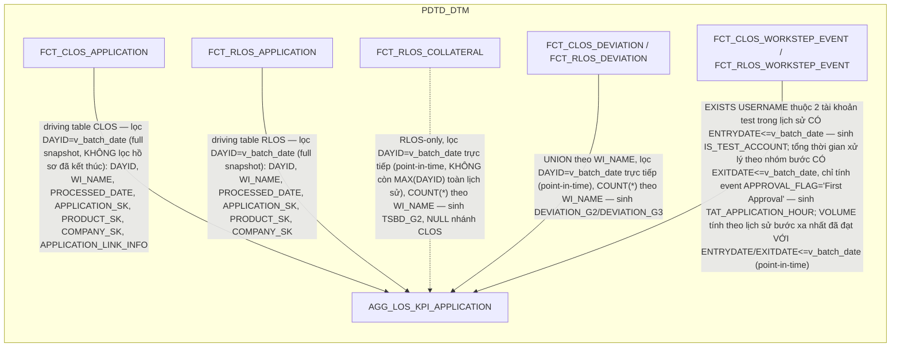
```mermaid
flowchart LR
    subgraph PDTD_DTM
        A["FCT_CLOS_APPLICATION"]
        B["FCT_RLOS_APPLICATION"]
        L["FCT_RLOS_COLLATERAL"]
        V["FCT_CLOS_DEVIATION / FCT_RLOS_DEVIATION"]
        W["FCT_CLOS_WORKSTEP_EVENT / FCT_RLOS_WORKSTEP_EVENT"]
        K["AGG_LOS_KPI_APPLICATION"]
    end
    A -->|"driving table CLOS — lọc DAYID=v_batch_date (full snapshot, KHÔNG lọc hồ sơ đã kết thúc): DAYID, WI_NAME, PROCESSED_DATE, APPLICATION_SK, PRODUCT_SK, COMPANY_SK, APPLICATION_LINK_INFO"| K
    B -->|"driving table RLOS — lọc DAYID=v_batch_date (full snapshot): DAYID, WI_NAME, PROCESSED_DATE, APPLICATION_SK, PRODUCT_SK, COMPANY_SK"| K
    L -.->|"RLOS-only, lọc DAYID=v_batch_date trực tiếp (point-in-time, KHÔNG còn MAX(DAYID) toàn lịch sử), COUNT(*) theo WI_NAME — sinh TSBD_G2, NULL nhánh CLOS"| K
    V -->|"UNION theo WI_NAME, lọc DAYID=v_batch_date trực tiếp (point-in-time), COUNT(*) theo WI_NAME — sinh DEVIATION_G2/DEVIATION_G3"| K
    W -->|"EXISTS USERNAME thuộc 2 tài khoản test trong lịch sử CÓ ENTRYDATE<=v_batch_date — sinh IS_TEST_ACCOUNT; tổng thời gian xử lý theo nhóm bước CÓ EXITDATE<=v_batch_date, chỉ tính event APPROVAL_FLAG='First Approval' — sinh TAT_APPLICATION_HOUR; VOLUME tính theo lịch sử bước xa nhất đã đạt VỚI ENTRYDATE/EXITDATE<=v_batch_date (point-in-time)"| K
```

### 3.3 Cấu trúc bảng

| STT | Tên cột | Kiểu dữ liệu | Bắt buộc | Độ lớn | Khóa | Mô tả | Báo cáo sử dụng | Tên chỉ tiêu trên báo cáo |
| --- | --- | --- | --- | --- | --- | --- | --- | --- |
| 1 | DAYID | DATE | Y |  | PK | Ngày dữ liệu, dạng số YYYYMMDD — gán = v_batch_date của lần chạy ETL (KHÔNG suy ra từ đối chiếu DAYID khác trên chính bảng này hay AGG_LOS_KPI_YTD_DAILY). Kế thừa trực tiếp DAYID=v_batch_date đã lọc sẵn trên driving table PDTD_DTM.FCT_CLOS_APPLICATION/PDTD_DTM.FCT_RLOS_APPLICATION. BẢNG HOÀN TOÀN MỚI TẠI PDTD_DTM (aggregate), không có ở SB_DWH | Báo cáo KPI (BC9) — khóa JOIN sang AGG_LOS_KPI_YTD_DAILY (điều kiện DAYID=v_batch_date, tách biệt điều kiện PROCESSED_DATE=v_batch_date) | — |
| 2 | DATASOURCE | VARCHAR2 | Y | 10 |  | RLOS hoặc CLOS — quyết định công thức TAT/POINT/nhóm phân loại áp dụng — bê 1:1 từ PDTD_DTM.FCT_CLOS_APPLICATION.DATASOURCE/PDTD_DTM.FCT_RLOS_APPLICATION.DATASOURCE — BỔ SUNG RIÊNG TẠI PDTD_DTM, không có ở SB_DWH | Báo cáo KPI (BC9) — khóa phân biệt nhánh "Nguồn RLOS"/"Nguồn CLOS" của báo cáo, đồng thời điều kiện lọc DATASOURCE khi tổng hợp SLHS/SLGN/TAT/QUY_DOI_*_DAY tại AGG_LOS_KPI_YTD_DAILY | Phân nhánh RLOS/CLOS của báo cáo |
| 3 | APPLICATION_BK | VARCHAR2 | Y | 64 | PK | Khóa nghiệp vụ của dòng chấm điểm KPI hồ sơ: STANDARD_HASH(WI_NAME \|\| '~' \|\| DATASOURCE, 'SHA256') — gộp 2 cột PK tự nhiên cũ (WI_NAME, DATASOURCE) thành 1 khóa đơn, input lấy từ cột 7/2 cùng bảng — BỔ SUNG RIÊNG TẠI PDTD_DTM, không có ở SB_DWH | — (cột kỹ thuật, một phần khóa chính) | — |
| 4 | APPLICATION_SK | NUMBER | Y | 18 |  | Khóa tới DIM_CLOS_APPLICATION hoặc DIM_RLOS_APPLICATION tùy DATASOURCE. Mặc định -1 — bê 1:1 từ PDTD_DTM.FCT_CLOS_APPLICATION.APPLICATION_SK/PDTD_DTM.FCT_RLOS_APPLICATION.APPLICATION_SK — BỔ SUNG RIÊNG TẠI PDTD_DTM, không có ở SB_DWH | Báo cáo KPI (BC9) — khóa tới DIM_CLOS/RLOS_APPLICATION dùng để lấy STREAM (CLOS, điều kiện lọc TAT_CLOS_*_DAY tại AGG_LOS_KPI_YTD_DAILY); ⚠️ review 2026-10-04 (đối chiếu SRS BC9): BUSINESS_FLOW (RLOS) KHÔNG còn tra qua DIMENSION_KEY=APPLICATION_SK — cột đã dời sang FCT_RLOS_APPLICATION từ review 2026-09-26, AGG_LOS_KPI_YTD_DAILY nay JOIN FCT_RLOS_APPLICATION qua WI_NAME+DAYID của chính bảng này thay vì qua APPLICATION_SK | Nguồn cho chỉ tiêu SLGN_RLOS/SLHS_RLOS (qua FCT_RLOS_APPLICATION.BUSINESS_FLOW, không qua cột này)/SLHS_CLOS/SLGN_CLOS/TAT_CLOS (điều kiện lọc STREAM, qua cột này) |
| 5 | PRODUCT_SK | NUMBER | Y | 18 |  | Khóa tới DIM_CLOS_PRODUCT hoặc DIM_RLOS_PRODUCT tùy DATASOURCE. Mặc định -1 — bê 1:1 từ PDTD_DTM.FCT_CLOS_APPLICATION.PRODUCT_SK/PDTD_DTM.FCT_RLOS_APPLICATION.PRODUCT_SK — BỔ SUNG RIÊNG TẠI PDTD_DTM, không có ở SB_DWH | Báo cáo KPI (BC9) — khóa JOIN report-time tới DIM_RLOS_PRODUCT/DIM_CLOS_PRODUCT để tra PRODUCT_LINE_NAME (+PRODUCT_NAME với CLOS) dùng tính cột POINT trên chính bảng này | Nguồn cho chỉ tiêu POINT |
| 6 | COMPANY_SK | NUMBER | Y | 18 |  | Khóa tới DIM_LOS_COMPANY. Mặc định -1 — bê 1:1 từ PDTD_DTM.FCT_CLOS_APPLICATION.COMPANY_SK/PDTD_DTM.FCT_RLOS_APPLICATION.COMPANY_SK — BỔ SUNG RIÊNG TẠI PDTD_DTM, không có ở SB_DWH | Báo cáo KPI (BC9) — khóa JOIN tới DIM_LOS_COMPANY để lấy điều kiện lọc ẩn COMPANY_CODE NOT IN (...) dùng trong công thức SLHS_RLOS_DAY/SLGN_RLOS_DAY tại AGG_LOS_KPI_YTD_DAILY | Nguồn cho chỉ tiêu SLHS_RLOS/SLGN_RLOS (điều kiện lọc loại trừ chi nhánh) |
| 7 | WI_NAME | VARCHAR2 | Y | 100 |  | Mã hồ sơ tín dụng CLOS hoặc RLOS — bê 1:1 từ PDTD_DTM.FCT_CLOS_APPLICATION.WI_NAME/PDTD_DTM.FCT_RLOS_APPLICATION.WI_NAME (đã lọc DAYID=v_batch_date) — BỔ SUNG RIÊNG TẠI PDTD_DTM, không có ở SB_DWH | Báo cáo KPI (BC9) — khóa JOIN, đồng thời hiển thị trực tiếp làm mã hồ sơ | Mã hồ sơ (WI_NAME) |
| 8 | PROCESSED_DATE | DATE | N |  |  | Ngày xử lý của hồ sơ — bê 1:1 từ PDTD_DTM.FCT_CLOS_APPLICATION.PROCESSED_DATE/PDTD_DTM.FCT_RLOS_APPLICATION.PROCESSED_DATE (cùng DAYID=v_batch_date đã lọc). Là THUỘC TÍNH CỐ ĐỊNH của hồ sơ (ngày hồ sơ thực sự chốt/hủy, KHÁC DAYID — không đổi ngược theo thời gian một khi hồ sơ đã chốt), là mốc để AGG_LOS_KPI_YTD_DAILY xếp hồ sơ vào đúng ngày phát sinh khi SUM/COUNT lên grain ngày — BỔ SUNG RIÊNG TẠI PDTD_DTM, không có ở SB_DWH | Báo cáo KPI (BC9) — khóa lọc theo ngày, đồng thời hiển thị trực tiếp làm ngày dữ liệu | Ngày dữ liệu (PROCESSED_DATE) |
| 9 | VOLUME | NUMBER | N | 5,2 |  | Mức độ hoàn thành hồ sơ, thang 0-1| Báo cáo KPI (BC9) — hiển thị trực tiếp (Tỷ lệ KPI), đồng thời là mẫu số của QUY_DOI (cột 10) | Tỷ lệ KPI (VOLUME) |
| 10 | POINT | NUMBER | N | 12,4 |  | Điểm KPI — PHÁI SINH TẠI PDTD_DTM: RLOS: SLA_DE_TOTAL_RESULT (report-time LEFT JOIN REF_SLA_NLTT qua DIM_RLOS_PRODUCT + SYSTEM_CODE='RLOS') + SLA_CREDIT_OFFICER + SLA_CREDIT_APPROVER; CLOS: SLA_DE_TOTAL_RESULT (report-time LEFT JOIN REF_SLA_NLTT qua DIM_CLOS_PRODUCT+FCT_CLOS_APPLICATION + SYSTEM_CODE='CLOS') + SLA_CREDIT_OFFICER + SLA_CREDIT_APPROVER, riêng APP_GRP='C1' (tra qua DIM_CLOS_APPLICATION) cộng thêm hằng số 4 giờ. ⚠️ Review 2026-10-04 (đối chiếu SRS BC9, SỬA THAM CHIẾU TREO): SLA_CREDIT_OFFICER/SLA_CREDIT_APPROVER/CHANGE_REQUEST (dùng trong điều kiện NEW_CHANGE_REQUEST của REF_SLA_NLTT) đã dời từ DIM_RLOS/CLOS_APPLICATION sang FCT_RLOS/CLOS_APPLICATION (review 2026-09-26) — công thức cũ vẫn SELECT từ DIM qua DIMENSION_KEY=APPLICATION_SK (cột không còn tồn tại trên DIM). Nay đọc trực tiếp từ FCT_RLOS/CLOS_APPLICATION, JOIN qua WI_NAME+DAYID khớp đúng AGG_LOS_KPI_APPLICATION — do đó KHÔNG còn "không phụ thuộc DAYID" như mô tả cũ, point-in-time theo đúng DAYID của dòng đang tính — BỔ SUNG RIÊNG TẠI PDTD_DTM, không có ở SB_DWH | Báo cáo KPI (BC9) — hiển thị trực tiếp (Điểm KPI), đồng thời là tử số của QUY_DOI (cột 10) | Điểm KPI (POINT) |
| 11 | QUY_DOI | NUMBER | N | 12,4 |  | Điểm KPI quy đổi — PHÁI SINH TẠI PDTD_DTM: POINT*8/VOLUME (input từ cột 10/9, cùng bảng), NULL nếu VOLUME NULL. Là đầu vào duy nhất của QUY_DOI_RLOS_DAY/QUY_DOI_CLOS_DAY ở AGG_LOS_KPI_YTD_DAILY — BỔ SUNG RIÊNG TẠI PDTD_DTM, không có ở SB_DWH | Báo cáo KPI (BC9) — hiển thị trực tiếp, đồng thời nguồn cho QUY_DOI_RLOS/QUY_DOI_CLOS lũy kế tại AGG_LOS_KPI_YTD_DAILY | Điểm KPI quy đổi (QUY_DOI) |
| 12 | TAT_APPLICATION_HOUR | NUMBER | N | 18,6 |  | Tổng thời gian xử lý của hồ sơ, đơn vị giờ| Báo cáo KPI (BC9) — nguồn cho TAT_RLOS_SEC/UNSEC_SUM_HOUR_DAY và TAT_CLOS_SUM_HOUR_DAY tại AGG_LOS_KPI_YTD_DAILY, qua đó nguồn cho chỉ tiêu TAT_RLOS/TAT_CLOS/TAT_TB phái sinh tại tầng report | Nguồn cho chỉ tiêu TAT_RLOS/TAT_CLOS |
| 13 | TSBD_G2 | VARCHAR2 | N | 10 |  | Hồ sơ có từ 2 tài sản bảo đảm trở lên (RLOS-only, NULL nhánh CLOS)| Báo cáo KPI (BC9) — hiển thị trực tiếp | HS có từ 02 TSBĐ trở lên (TSBD_G2) |
| 14 | INCOM_3 | VARCHAR2 | N | 10 |  | Hồ sơ có từ 3 nguồn thu trở lên (RLOS-only, NULL nhánh CLOS) — PHÁI SINH TẠI PDTD_DTM: đếm cờ REPAYFLAGS — BỔ SUNG RIÊNG TẠI PDTD_DTM, không có ở SB_DWH | Báo cáo KPI (BC9) — hiển thị trực tiếp | HS có từ 03 nguồn thu trở lên (INCOM_3) |
| 15 | BUSINESS_INCOM | VARCHAR2 | N | 10 |  | Hồ sơ có nguồn thu từ kinh doanh, không áp dụng SeAPro/SeALand (RLOS-only, NULL nhánh CLOS) — PHÁI SINH TẠI PDTD_DTM theo PRODUCT_NAME loại trừ SeAPro/SeALand VÀ cờ FAIMILYFLAG/ENTERPRISSEFLAG/NONLICFLAG — BỔ SUNG RIÊNG TẠI PDTD_DTM, không có ở SB_DWH | Báo cáo KPI (BC9) — hiển thị trực tiếp | HS có nguồn thu từ kinh doanh (BUSINESS_INCOM) |
| 16 | DEVIATION_G2 | VARCHAR2 | N | 10 |  | Hồ sơ có đúng 2 ngoại lệ| Báo cáo KPI (BC9) — hiển thị trực tiếp | HS có 2 ngoại lệ (DEVIATION_G2) |
| 17 | DEVIATION_G3 | VARCHAR2 | N | 10 |  | Hồ sơ có từ 3 ngoại lệ trở lên — PHÁI SINH TẠI PDTD_DTM, cùng cách lọc DAYID=v_batch_date + COUNT(*) theo WI_NAME (cùng nguồn cột 16), >= 3 thì 'YES' — BỔ SUNG RIÊNG TẠI PDTD_DTM, không có ở SB_DWH | Báo cáo KPI (BC9) — hiển thị trực tiếp | HS có từ 3 ngoại lệ trở lên (DEVIATION_G3) |
| 18 | IS_TEST_ACCOUNT | VARCHAR2 | Y | 1 |  | 'Y' nếu hồ sơ có tồn tại (bất kỳ dòng lịch sử nào TÍNH ĐẾN v_batch_date) USERNAME thuộc 2 tài khoản test/kỹ thuật ('hanh.nh2','hai.bt2') — PHÁI SINH TẠI PDTD_DTM: EXISTS trên UNION PDTD_DTM.FCT_CLOS_WORKSTEP_EVENT/PDTD_DTM.FCT_RLOS_WORKSTEP_EVENT, lọc ENTRYDATE<=v_batch_date | Báo cáo KPI (BC9) — điều kiện lọc ẩn: AGG_LOS_KPI_YTD_DAILY loại các hồ sơ IS_TEST_ACCOUNT='Y' khỏi MỌI phép COUNT/SUM _DAY (SLHS/SLGN/TAT/QUY_DOI) | Nguồn cho chỉ tiêu SLHS/SLGN/TAT/QUY_DOI (điều kiện lọc loại tài khoản test) |
| 19 | APPLICATION_LINK_INFO | VARCHAR2 | N | 200 |  | Thông tin liên kết hồ sơ — cột generic của WFINSTRUMENTTABLE (CLOS-only, RLOS luôn NULL) — bê 1:1 từ PDTD_DTM.FCT_CLOS_APPLICATION.APPLICATION_LINK_INFO (đổi tên từ VAR_STR12, review 2026-10-04, theo yêu cầu người dùng), đã lọc DAYID=v_batch_date — BỔ SUNG RIÊNG TẠI PDTD_DTM, không có ở SB_DWH | Báo cáo KPI (BC9) — điều kiện lọc ẩn IS NOT NULL riêng cho SLHS_CLOS_DAY/SLGN_CLOS_DAY tại AGG_LOS_KPI_YTD_DAILY (không áp dụng cho TAT_CLOS_DAY/QUY_DOI_CLOS_DAY) | Nguồn cho chỉ tiêu SLHS_CLOS/SLGN_CLOS (điều kiện lọc) |

## 4. FCT_CLOS_APPLICATION

### 4.1 Mục đích thiết kế
- **Ý nghĩa bảng:** bảng FACT xương sống của CLOS tại PDTD_DTM — bê nguyên
  1:1 phần lớn cột từ `FCT_CLOS_APPLICATION` (SB_DWH), lưu ảnh trạng thái
  cuối ngày của từng hồ sơ tín dụng doanh nghiệp (CLOS)
- **Khóa nghiệp vụ (BK):** `WI_NAME`
- **Khóa chính của bảng (PK):** DAYID, WI_NAME.
- **Độ chi tiết (grain):** 1 dòng = 1 hồ sơ x 1 ngày dữ liệu
- **Phục vụ báo cáo:**
  - Báo cáo CLOS APPLICATION (BC2) — nay đọc `LEGAL_REPRESENTATIVE`/
    `ADD_ID_REPRESENTATIVE`/`APPROVAL_TYPE` từ đây thay vì qua
    `DIM_CLOS_CUSTOMER`/`DIM_CLOS_APPLICATION`; `ORG_LEGAL_ID` không còn
    ETL, báo cáo tự JOIN report-time `CUSTOMER_SK` →
    `DIM_CLOS_CUSTOMER.ID_NUMBER` khi cần
  - Báo cáo Tuần Chuyên viên Thẩm định (BC4)
  - Báo cáo SLA - TAT (BC5) — nay đọc `REF_PRODUCT`/`SLA_*` từ đây thay
    vì qua `DIM_CLOS_APPLICATION`
  - Báo cáo RETURN (BC8) — `RETURN_CNT_*` không còn ETL sẵn trên bảng
    này, báo cáo tự SUM/COUNT report-time từ `FCT_CLOS_WORKSTEP_EVENT`
  - Báo cáo KPI (BC9) — nay đọc `REF_PRODUCT`/`SLA_*` (điểm `POINT`) từ
    đây thay vì qua `DIM_CLOS_APPLICATION`
  - Báo cáo Giải ngân _ Quá hạn KHDN (BC11) — qua T24_CUSTOMER_SK

### 4.2 Sơ đồ lineage

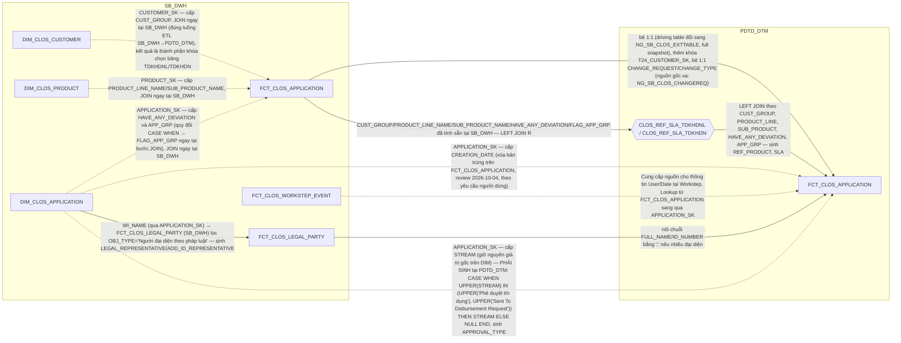
```mermaid
flowchart LR
    subgraph SB_DWH
        C["FCT_CLOS_APPLICATION"]
        SK["DIM_CLOS_CUSTOMER"]
        SH["DIM_CLOS_PRODUCT"]
        SCA["DIM_CLOS_APPLICATION"]
        SLP["FCT_CLOS_LEGAL_PARTY"]
        WE["FCT_CLOS_WORKSTEP_EVENT"]
    end
    subgraph PDTD_DTM
        R{{"CLOS_REF_SLA_TDKHDNL / CLOS_REF_SLA_TDKHDN"}}
        D["FCT_CLOS_APPLICATION"]
    end
    C -->|"bê 1:1 (driving table đổi sang NG_SB_CLOS_EXTTABLE, full snapshot), thêm khóa T24_CUSTOMER_SK, bê 1:1 CHANGE_REQUEST/CHANGE_TYPE (nguồn gốc xa: NG_SB_CLOS_CHANGEREQ)"| D
    SK -.->|"CUSTOMER_SK — cấp CUST_GROUP, JOIN ngay tại SB_DWH (đúng luồng ETL SB_DWH→PDTD_DTM), kết quả là thành phần khóa chọn bảng TDKHDNL/TDKHDN"| C
    SH -.->|"PRODUCT_SK — cấp PRODUCT_LINE_NAME/SUB_PRODUCT_NAME, JOIN ngay tại SB_DWH"| C
    SCA -.->|"APPLICATION_SK — cấp HAVE_ANY_DEVIATION và APP_GRP (quy đổi CASE WHEN → FLAG_APP_GRP ngay tại bước JOIN), JOIN ngay tại SB_DWH"| C
    SCA -.->|"APPLICATION_SK — cấp CREATION_DATE (xóa bản trùng trên FCT_CLOS_APPLICATION, review 2026-10-04, theo yêu cầu người dùng)"| D
    C -->|"CUST_GROUP/PRODUCT_LINE_NAME/SUB_PRODUCT_NAME/HAVE_ANY_DEVIATION/FLAG_APP_GRP đã tính sẵn tại SB_DWH — LEFT JOIN R"| R
    R -->|"LEFT JOIN theo CUST_GROUP, PRODUCT_LINE, SUB_PRODUCT, HAVE_ANY_DEVIATION, APP_GRP — sinh REF_PRODUCT, SLA"| D
    SCA -->|"WI_NAME (qua APPLICATION_SK) → FCT_CLOS_LEGAL_PARTY (SB_DWH) lọc OBJ_TYPE='Người đại diện theo pháp luật' — sinh LEGAL_REPRESENTATIVE/ADD_ID_REPRESENTATIVE"| SLP
    SLP -->|"nối chuỗi FULL_NAME/ID_NUMBER bằng ';' nếu nhiều đại diện"| D
    SCA -.->|"APPLICATION_SK — cấp STREAM (giữ nguyên giá trị gốc trên DIM) — PHÁI SINH tại PDTD_DTM: CASE WHEN UPPER(STREAM) IN (UPPER('Phê duyệt tín dụng'), UPPER('Sent To Disbursement Request')) THEN STREAM ELSE NULL END, sinh APPROVAL_TYPE"| D
    WE -.->|"Cung cấp nguồn cho thông tin User/Date tại Workstep, Lookup từ FCT_CLOS_APPLICATION sang qua APPLICATION_SK"| D
```

### 4.3 Cấu trúc bảng

| STT | Tên cột | Kiểu dữ liệu | Bắt buộc | Độ lớn | Khóa | Mô tả | Báo cáo sử dụng | Tên chỉ tiêu trên báo cáo |
| --- | --- | --- | --- | --- | --- | --- | --- | --- |
| 1 | DAYID | DATE | Y |  | PK | Ngày dữ liệu, dạng số YYYYMMDD — bê 1:1 từ SB_DWH.FCT_CLOS_APPLICATION.DAYID | Báo cáo CLOS APPLICATION (BC2) — một phần khóa chính Báo cáo SLA - TAT (BC5) — khóa chính | — |
| 2 | APPLICATION_SK | NUMBER | Y | 18 |  | Khóa tới DIM_CLOS_APPLICATION. Mặc định -1 nếu không khớp — bê 1:1 từ SB_DWH.FCT_CLOS_APPLICATION.APPLICATION_SK | Báo cáo CLOS APPLICATION (BC2) — khóa JOIN | — |
| 3 | WORKSTEP_DECISION_SK | NUMBER | Y | 18 |  | Khóa tới DIM_CLOS_WORKSTEP_DECISION. Mặc định -1 — bê 1:1 từ SB_DWH.FCT_CLOS_APPLICATION.WORKSTEP_DECISION_SK (đổi tên từ LAST_WORKSTEP_DECISION_SK, review 2026-10-04, theo yêu cầu người dùng) | Báo cáo CLOS APPLICATION (BC2) — khóa JOIN, nguồn cho chỉ tiêu/trường LAST_WORKSTEP (Bước hồ sơ cuối, tính ở PDTD_DTM) và LAST_DECISION (Quyết định bước cuối) | LAST_DECISION (Quyết định bước cuối) |
| 4 | PRODUCT_SK | NUMBER | Y | 18 |  | Khóa tới DIM_CLOS_PRODUCT — lookup theo PRODUCT_LINE_CODE=NG_SB_CLOS_CUST_INFO.PRODUCT_LINE AND SUB_PRODUCT_CODE=NG_SB_CLOS_CUST_INFO.SUB_PRODUCT, điều kiện SCD2 hiệu lực tại DAYID. Mặc định -1 nếu không khớp — bê 1:1 từ SB_DWH.FCT_CLOS_APPLICATION.PRODUCT_SK | Báo cáo CLOS APPLICATION (BC2) — khóa JOIN tới PRODUCT_LINE/SUB_PRODUCT Báo cáo SLA - TAT (BC5) — khóa JOIN điều kiện SLA_DE Báo cáo KPI (BC9) — điều kiện lọc STREAM khi tính SLGN_CLOS | — |
| 5 | COMPANY_SK | NUMBER | Y | 18 |  | Khóa tới DIM_LOS_COMPANY — lookup theo COMPANY_CODE=NG_SB_CLOS_CUST_INFO.COMPANY_CODE, điều kiện SCD2 hiệu lực tại DAYID. Mặc định -1 nếu không khớp — bê 1:1 từ SB_DWH.FCT_CLOS_APPLICATION.COMPANY_SK | Báo cáo CLOS APPLICATION (BC2) — khóa JOIN tới BRANCH_CODE/COMPANY_CODE/COMPANY_NAME | — |
| 6 | CUSTOMER_SK | NUMBER | Y | 18 |  | Khóa tới DIM_CLOS_CUSTOMER — quan hệ 1:1 với hồ sơ qua WI_NAME, join theo WI_NAME + điều kiện SCD2 hiệu lực tại DAYID. Mặc định -1 nếu không khớp. Đây là chân khách hàng LOS — khác T24_CUSTOMER_SK (chân T24, bổ sung riêng tại PDTD_DTM) — bê 1:1 từ SB_DWH.FCT_CLOS_APPLICATION.CUSTOMER_SK | Báo cáo CLOS APPLICATION (BC2) — khóa JOIN tới ZONE (DIM_CLOS_CUSTOMER.ZONE) | — |
| 7 | T24_CUSTOMER_SK | NUMBER | Y | 18 |  | Khóa tới DIM_T24_CUSTOMER (T24), tra qua ORG_LEGAL_ID trên DIM_CLOS_CUSTOMER. Mặc định -1| Báo cáo CLOS APPLICATION (BC2) — khóa JOIN sang DIM_T24_CUSTOMER (CUSTOMER_ID — ID khách hàng/Mã CIF) | — |
| 8 | WI_NAME | VARCHAR2 | Y | 100 | PK | Mã hồ sơ tín dụng CLOS — bê 1:1 từ SB_DWH.FCT_CLOS_APPLICATION.WI_NAME (nguồn gốc xa: NG_SB_CLOS_EXTTABLE.WI_NAME, driving table tại SB_DWH) | Báo cáo CLOS APPLICATION (BC2) — hiển thị trực tiếp, khóa chính Báo cáo SLA - TAT (BC5) — khóa chính | WINAME (Mã hồ sơ) |
| 9 | RI_USER | VARCHAR2 | N | 100 |  | User khởi tạo hồ sơ (bước RequestInitiate) — PHÁI SINH TẠI PDTD_DTM (review 2026-10-04, chuyển từ SB_DWH, theo yêu cầu người dùng): USERNAME tại bản ghi SB_DWH.FCT_CLOS_WORKSTEP_EVENT WHERE WORKSTEP_CODE='RequestInitiate' theo WI_NAME (quy ước tối đa 1 dòng/hồ sơ, không cần MAX/MIN EXITDATE) — BỔ SUNG RIÊNG TẠI PDTD_DTM, không còn ở SB_DWH | Báo cáo CLOS APPLICATION (BC2) — hiển thị trực tiếp | RI_USER (User khởi tạo hồ sơ) |
| 10 | BRANCH_USER | VARCHAR2 | N | 100 |  | User xử lý bước BranchSupport, HOÀN TẤT gần nhất — PHÁI SINH TẠI PDTD_DTM (review 2026-10-04, chuyển từ SB_DWH): USERNAME trên SB_DWH.FCT_CLOS_WORKSTEP_EVENT tại WORKSTEP_CODE='BranchSupport', bản ghi EXITDATE lớn nhất (<=DAYID) theo WI_NAME — BỔ SUNG RIÊNG TẠI PDTD_DTM, không còn ở SB_DWH | Báo cáo CLOS APPLICATION (BC2) — hiển thị trực tiếp | BRANCH_USER (User Chi nhánh) |
| 11 | DDE_USER | VARCHAR2 | N | 100 |  | User xử lý bước DetailDataEntry, HOÀN TẤT gần nhất — PHÁI SINH TẠI PDTD_DTM (review 2026-10-04, chuyển từ SB_DWH): USERNAME trên SB_DWH.FCT_CLOS_WORKSTEP_EVENT tại WORKSTEP_CODE='DetailDataEntry', bản ghi EXITDATE lớn nhất (<=DAYID) theo WI_NAME — BỔ SUNG RIÊNG TẠI PDTD_DTM, không còn ở SB_DWH | Báo cáo CLOS APPLICATION (BC2) — hiển thị trực tiếp | DDE_USER (User Chuyên viên nhập liệu) |
| 12 | QC_USER | VARCHAR2 | N | 100 |  | User xử lý bước DataInputerChecker, HOÀN TẤT gần nhất — PHÁI SINH TẠI PDTD_DTM (review 2026-10-04, chuyển từ SB_DWH): USERNAME trên SB_DWH.FCT_CLOS_WORKSTEP_EVENT tại WORKSTEP_CODE='DataInputerChecker', bản ghi EXITDATE lớn nhất (<=DAYID) theo WI_NAME — BỔ SUNG RIÊNG TẠI PDTD_DTM, không còn ở SB_DWH | Báo cáo CLOS APPLICATION (BC2) — hiển thị trực tiếp | QUALITY_CHECKER (User Kiểm soát nhập liệu) |
| 13 | UND_MAKER_USER | VARCHAR2 | N | 100 |  | User xử lý bước UnderwriterMaker, HOÀN TẤT gần nhất — PHÁI SINH TẠI PDTD_DTM (review 2026-10-04, chuyển từ SB_DWH): USERNAME trên SB_DWH.FCT_CLOS_WORKSTEP_EVENT tại WORKSTEP_CODE='UnderwriterMaker', bản ghi EXITDATE lớn nhất (<=DAYID) theo WI_NAME — BỔ SUNG RIÊNG TẠI PDTD_DTM, không còn ở SB_DWH | Báo cáo CLOS APPLICATION (BC2) — hiển thị trực tiếp | UND_MAKER (User Chuyên viên thẩm định) |
| 14 | UND_CHECKER_USER | VARCHAR2 | N | 100 |  | User xử lý bước UnderwriterChecker, HOÀN TẤT gần nhất — PHÁI SINH TẠI PDTD_DTM (review 2026-10-04, chuyển từ SB_DWH): USERNAME trên SB_DWH.FCT_CLOS_WORKSTEP_EVENT tại WORKSTEP_CODE='UnderwriterChecker', bản ghi EXITDATE lớn nhất (<=DAYID) theo WI_NAME — BỔ SUNG RIÊNG TẠI PDTD_DTM, không còn ở SB_DWH | Báo cáo CLOS APPLICATION (BC2) — hiển thị trực tiếp | UND_CHECKER (User Kiểm soát thẩm định) |
| 15 | PHV_USER | VARCHAR2 | N | 100 |  | User xử lý bước PhoneVerification, HOÀN TẤT gần nhất — PHÁI SINH TẠI PDTD_DTM (review 2026-10-04, chuyển từ SB_DWH): USERNAME trên SB_DWH.FCT_CLOS_WORKSTEP_EVENT tại WORKSTEP_CODE='PhoneVerification', bản ghi EXITDATE lớn nhất (<=DAYID) theo WI_NAME — BỔ SUNG RIÊNG TẠI PDTD_DTM, không còn ở SB_DWH | Báo cáo CLOS APPLICATION (BC2) — hiển thị trực tiếp | PHV_USER (User Chuyên viên Thẩm định điện thoại) |
| 16 | FA_USER | VARCHAR2 | N | 100 |  | User Chuyên viên Thực địa — PHÁI SINH TẠI PDTD_DTM (review 2026-10-04, chuyển từ SB_DWH): USERNAME trên SB_DWH.FCT_CLOS_WORKSTEP_EVENT tại WORKSTEP_CODE='FieldAssessment', bản ghi EXITDATE lớn nhất (<=DAYID) theo WI_NAME — BỔ SUNG RIÊNG TẠI PDTD_DTM, không còn ở SB_DWH | Báo cáo CLOS APPLICATION (BC2) — hiển thị trực tiếp | FA_USER (User Chuyên viên Thực địa) |
| 17 | APPROVER_USER | VARCHAR2 | N | 100 |  | User xử lý bước CreditApproval, HOÀN TẤT gần nhất — PHÁI SINH TẠI PDTD_DTM (review 2026-10-04, chuyển từ SB_DWH): USERNAME trên SB_DWH.FCT_CLOS_WORKSTEP_EVENT tại WORKSTEP_CODE='CreditApproval', bản ghi EXITDATE lớn nhất (<=DAYID) theo WI_NAME — BỔ SUNG RIÊNG TẠI PDTD_DTM, không còn ở SB_DWH | Báo cáo CLOS APPLICATION (BC2) — hiển thị trực tiếp | BI_APPROVER (User Chuyên gia phê duyệt) |
| 18 | COMMITTEE_USER | VARCHAR2 | N | 100 |  | User Hội đồng tín dụng — PHÁI SINH TẠI PDTD_DTM (review 2026-10-04, chuyển từ SB_DWH): USERNAME trên SB_DWH.FCT_CLOS_WORKSTEP_EVENT tại WORKSTEP_CODE='CreditCommittee', bản ghi EXITDATE lớn nhất (<=DAYID) theo WI_NAME — BỔ SUNG RIÊNG TẠI PDTD_DTM, không còn ở SB_DWH | Báo cáo CLOS APPLICATION (BC2) — hiển thị trực tiếp | BI_COMMITTEE (User Hội đồng tín dụng) |
| 19 | HOS_USER | VARCHAR2 | N | 100 |  | User Hỗ trợ phê duyệt — PHÁI SINH TẠI PDTD_DTM (review 2026-10-04, chuyển từ SB_DWH): USERNAME trên SB_DWH.FCT_CLOS_WORKSTEP_EVENT tại WORKSTEP_CODE='HOSupport', bản ghi EXITDATE lớn nhất (<=DAYID) theo WI_NAME — BỔ SUNG RIÊNG TẠI PDTD_DTM, không còn ở SB_DWH | Báo cáo CLOS APPLICATION (BC2) — hiển thị trực tiếp | BI_HOS_USER (User Hỗ trợ phê duyệt) |
| 20 | PROCESSED_DATE | DATE | N |  |  | Ngày xử lý chung của hồ sơ theo 3 mức ưu tiên (phê duyệt cuối / hủy / hoàn tất gần nhất) — bê 1:1 từ SB_DWH.FCT_CLOS_APPLICATION.PROCESSED_DATE | Báo cáo CLOS APPLICATION (BC2) — hiển thị trực tiếp Báo cáo KPI (BC9) — nguồn cho AGG_LOS_KPI_APPLICATION.PROCESSED_DATE, mốc xếp hồ sơ vào đúng DAYID khi SUM/COUNT lên grain ngày Báo cáo SLA - TAT (BC5) — hiển thị trực tiếp | PROCESSED_DATE (Ngày dữ liệu báo cáo). ⚠️ Review 2026-10-04 (cross-check LLD/HLD): bổ sung BC5 — BC5.csv#2 đã dùng cột này từ trước, chỉ thiếu khai báo tại đây |
| 21 | LAST_APPROVAL_DATE | DATE | N |  |  | MAX(EXITDATE) tại bước phê duyệt (nhóm quyết định đã định nghĩa) — PHÁI SINH TẠI PDTD_DTM (review 2026-10-04, chuyển từ SB_DWH): MAX(EXITDATE) trên SB_DWH.FCT_CLOS_WORKSTEP_EVENT tại WORKSTEP_CODE IN ('CreditApproval','CreditCommittee'), không lọc DECISION, theo WI_NAME — BỔ SUNG RIÊNG TẠI PDTD_DTM, không còn ở SB_DWH | Báo cáo CLOS APPLICATION (BC2) — hiển thị trực tiếp | LAST_APPROVAL_DATE (Thời gian phê duyệt cuối cùng) |
| 22 | MIN_UWM | TIMESTAMP | N |  |  | MIN(ENTRYDATE) tại UnderwriterMaker — PHÁI SINH TẠI PDTD_DTM (review 2026-10-04, chuyển từ SB_DWH): MIN(ENTRYDATE) trên SB_DWH.FCT_CLOS_WORKSTEP_EVENT tại WORKSTEP_CODE='UnderwriterMaker' theo WI_NAME — BỔ SUNG RIÊNG TẠI PDTD_DTM, không còn ở SB_DWH | Báo cáo CLOS APPLICATION (BC2) — hiển thị trực tiếp | MIN_UWM (Thời gian hồ sơ lên CV thẩm định) |
| 23 | MIN_APP | TIMESTAMP | N |  |  | MIN(ENTRYDATE) tại CreditApproval/CreditCommittee — PHÁI SINH TẠI PDTD_DTM (review 2026-10-04, chuyển từ SB_DWH): MIN(ENTRYDATE) trên SB_DWH.FCT_CLOS_WORKSTEP_EVENT tại WORKSTEP_CODE IN ('CreditApproval','CreditCommittee') theo WI_NAME — BỔ SUNG RIÊNG TẠI PDTD_DTM, không còn ở SB_DWH | Báo cáo CLOS APPLICATION (BC2) — hiển thị trực tiếp | MIN_APP (Thời gian hồ sơ lên cấp phê duyệt) |
| 24 | CANCEL_DATE | DATE | N |  |  | ENTRYDATE tại bước CancelRevoke — PHÁI SINH TẠI PDTD_DTM (review 2026-10-04, chuyển từ SB_DWH): ENTRYDATE trên SB_DWH.FCT_CLOS_WORKSTEP_EVENT tại WORKSTEP_CODE='CancelRevoke' theo WI_NAME — BỔ SUNG RIÊNG TẠI PDTD_DTM, không còn ở SB_DWH. `FLAG_AUTO_CANCEL` (business rule dựa trên cột này) tiếp tục tính tại chính bảng này, nay dùng input từ cột đã derive cùng bảng | Báo cáo CLOS APPLICATION (BC2) — hiển thị trực tiếp | CANCEL_DATE (Thời gian hồ sơ vào vùng CancelRevoke) |
| 25 | LAST_ENTRYDATE | TIMESTAMP | N |  |  | ENTRYDATE của sự kiện hoàn tất gần nhất — PHÁI SINH TẠI PDTD_DTM (review 2026-10-04, chuyển từ SB_DWH): ENTRYDATE trên SB_DWH.FCT_CLOS_WORKSTEP_EVENT của bản ghi EXITDATE IS NOT NULL có ENTRYDATE lớn nhất (<=DAYID) theo WI_NAME — BỔ SUNG RIÊNG TẠI PDTD_DTM, không còn ở SB_DWH | Báo cáo CLOS APPLICATION (BC2) — hiển thị trực tiếp | LAST_ENTRYDATE (Thời gian vào bước cuối) |
| 26 | LAST_EXITDATE | TIMESTAMP | N |  |  | EXITDATE của cùng sự kiện hoàn tất gần nhất — PHÁI SINH TẠI PDTD_DTM (review 2026-10-04, chuyển từ SB_DWH), cùng bản ghi "sự kiện hoàn tất gần nhất" (cột 25) trên SB_DWH.FCT_CLOS_WORKSTEP_EVENT — BỔ SUNG RIÊNG TẠI PDTD_DTM, không còn ở SB_DWH | Báo cáo CLOS APPLICATION (BC2) — hiển thị trực tiếp | LAST_EXITDATE (Thời gian kết thúc bước cuối) |
| 27 | PRE_WORKSTEP_CODE | VARCHAR2 | N | 200 |  | Bước xử lý liền trước (LAG theo ENTRYDATE) — PHÁI SINH TẠI PDTD_DTM (review 2026-10-04, chuyển từ SB_DWH): LAG(WORKSTEP_CODE) OVER (PARTITION BY WI_NAME ORDER BY ENTRYDATE) trên SB_DWH.FCT_CLOS_WORKSTEP_EVENT của sự kiện hoàn tất gần nhất — BỔ SUNG RIÊNG TẠI PDTD_DTM, không còn ở SB_DWH | Báo cáo CLOS APPLICATION (BC2) — hiển thị trực tiếp | PRE_WORKSTEP (Bước hồ sơ trước đó) |
| 28 | LAST_REMARKS | VARCHAR2 | N | 4000 |  | Ghi chú của sự kiện hoàn tất gần nhất — PHÁI SINH TẠI PDTD_DTM (review 2026-10-04, chuyển từ SB_DWH): REMARKS trên SB_DWH.FCT_CLOS_WORKSTEP_EVENT của cùng bản ghi "sự kiện hoàn tất gần nhất" (cột 25-27) — BỔ SUNG RIÊNG TẠI PDTD_DTM, không còn ở SB_DWH | Báo cáo CLOS APPLICATION (BC2) — hiển thị trực tiếp | LAST_REMARKS (Ghi chú ý kiến bước cuối) |
| 29 | PROPOSED_AMT | NUMBER | N | 20,2 |  | Số tiền đề xuất — bê 1:1 từ SB_DWH.FCT_CLOS_APPLICATION.PROPOSED_AMT (nguồn gốc xa: NG_SB_CLOS_CREDITINFO_COMM.PRECREDITLIMIT) | Báo cáo CLOS APPLICATION (BC2) — hiển thị trực tiếp | ST_YEUCAU (Số tiền đề xuất vay) |
| 30 | CREDIT_LIMIT_APPROVAL | NUMBER | N | 20,2 |  | Hạn mức do chuyên gia phê duyệt — bê 1:1 từ SB_DWH.FCT_CLOS_APPLICATION.CREDIT_LIMIT_APPROVAL| Báo cáo CLOS APPLICATION (BC2) — hiển thị trực tiếp | ST_PHEDUYET (Số tiền phê duyệt chính thức) |
| 31 | CREDIT_LIMIT_COMMITTEE | NUMBER | N | 20,2 |  | Hạn mức do hội đồng phê duyệt — bê 1:1 từ SB_DWH.FCT_CLOS_APPLICATION.CREDIT_LIMIT_COMMITTEE | Báo cáo CLOS APPLICATION (BC2) — hiển thị trực tiếp Báo cáo Thông tin phê duyệt (BC3) — nguồn cho chỉ tiêu/trường CREDIT_LIMIT (đặt bản dư thừa có chủ đích trên DIM_CLOS_APPLICATION để BC3 lookup thẳng qua APPLICATION_SK) | CREDIT_LIMITS (Hạn mức cấp) |
| 32 | APPROVED_AMT_FINAL | NUMBER | N | 20,2 |  | Hạn mức phê duyệt cuối cùng — bê 1:1 từ SB_DWH.FCT_CLOS_APPLICATION.APPROVED_AMT_FINAL | Báo cáo Thông tin phê duyệt (BC3) — CREDIT_LIMIT (giá trị hạn mức phê duyệt cuối theo đúng công thức SRS BC3) | CREDIT_LIMIT (Số tiền phê duyệt) |
| 33 | APPROVED_TERM | NUMBER | N | 5 |  | Kỳ hạn phê duyệt — bê 1:1 từ SB_DWH.FCT_CLOS_APPLICATION.APPROVED_TERM| Báo cáo CLOS APPLICATION (BC2) — hiển thị trực tiếp Báo cáo Thông tin phê duyệt (BC3) — CREDIT_TERM, hiển thị trực tiếp | CREDIT_TERM (Thời hạn cấp tín dụng); CREDIT_TERM (BC3). ⚠️ Review 2026-10-04 (cross-check LLD/HLD): bổ sung BC3 — BC3.csv#14 đã dùng cột này từ trước, chỉ thiếu khai báo tại đây |
| 34 | INTEREST_RATE_PCT | NUMBER | N | 8,4 |  | Lãi suất phê duyệt (%), chỉ nhận khi nguồn là số — bê 1:1 từ SB_DWH.FCT_CLOS_APPLICATION.INTEREST_RATE_PCT | Báo cáo CLOS APPLICATION (BC2) — hiển thị trực tiếp | INTEREST_RATE (Lãi suất phê duyệt) |
| 35 | CURRENCY_CODE | VARCHAR2 | N | 10 |  | Loại tiền — bê 1:1 từ SB_DWH.FCT_CLOS_APPLICATION.CURRENCY_CODE (nguồn gốc xa: NG_SB_CLOS_CREDITINFO_COMM.CURRENCY) | Báo cáo CLOS APPLICATION (BC2) — hiển thị trực tiếp Báo cáo Thông tin phê duyệt (BC3) — hiển thị trực tiếp | CURRENCY (Loại tiền tệ áp dụng); CURRENCY (BC3). ⚠️ Review 2026-10-04 (cross-check LLD/HLD): bổ sung BC3 — BC3.csv#13 đã dùng cột này từ trước, chỉ thiếu khai báo tại đây |
| 36 | APPLICATION_LINK_INFO | VARCHAR2 | N | 200 |  | Thông tin liên kết hồ sơ — cột generic của WFINSTRUMENTTABLE — LEFT JOIN riêng theo WI_NAME=PROCESSINSTANCEID (không lọc CREATEDBY) — bê 1:1 từ SB_DWH.FCT_CLOS_APPLICATION.APPLICATION_LINK_INFO (đổi tên từ VAR_STR12, review 2026-10-04, theo yêu cầu người dùng) | Báo cáo KPI (BC9) — điều kiện lọc IS NOT NULL cho SLHS_CLOS_DAY/SLGN_CLOS_DAY (AGG_LOS_KPI_YTD_DAILY) | — |
| 37 | UNDERWRITERMAKER_USERMAKE | VARCHAR2 | N | 100 |  | PHÁI SINH, COALESCE ĐÃ TÍNH XONG TẠI SB_DWH, bê 1:1 từ SB_DWH.FCT_CLOS_APPLICATION.UNDERWRITERMAKER_USERMAKE | Báo cáo CLOS APPLICATION (BC2) — BC2 map thẳng vào cột này| — |
| 38 | UNDERWRITERCHECKER_USERMAKE | VARCHAR2 | N | 100 |  | PHÁI SINH, COALESCE ĐÃ TÍNH XONG TẠI SB_DWH, bê 1:1 từ SB_DWH.FCT_CLOS_APPLICATION.UNDERWRITERCHECKER_USERMAKE| Báo cáo CLOS APPLICATION (BC2) — BC2 map thẳng vào cột này.| — |
| 39 | APPROVAL_USERMAKE | VARCHAR2 | N | 100 |  | PHÁI SINH, COALESCE ĐÃ TÍNH XONG TẠI SB_DWH, bê 1:1 từ SB_DWH.FCT_CLOS_APPLICATION.APPROVAL_USERMAKE| Báo cáo CLOS APPLICATION (BC2) — BC2 map thẳng vào cột này.| — |
| 40 | LG_REQ | VARCHAR2 | N | 10 |  | Cờ yêu cầu bảo lãnh (Letter of Guarantee) phát sinh theo hồ sơ — bê 1:1 từ SB_DWH.FCT_CLOS_APPLICATION.LG_REQ | — | Thiết kế dư thừa |
| 41 | FI_REQ | VARCHAR2 | N | 10 |  | Cờ yêu cầu (tương tự LG_REQ) — bê 1:1 từ SB_DWH.FCT_CLOS_APPLICATION.FI_REQ| — | Thiết kế dư thừa |
| 42 | PHONE_REQ | VARCHAR2 | N | 10 |  | Cờ yêu cầu xác minh điện thoại (tương tự LG_REQ) — bê 1:1 từ SB_DWH.FCT_CLOS_APPLICATION.PHONE_REQ| — | Thiết kế dư thừa |
| 43 | LAST_WORKSTEP | VARCHAR2 | N | 50 |  | Tên bước hoàn tất gần nhất, chuẩn hóa dùng chung 2 hệ — PHÁI SINH TẠI PDTD_DTM: LEFT JOIN PDTD_DTM.Q_RLOS_REF_WORKSTEP_2SYSTEMS (bảng REF_, chỉ tồn tại ở PDTD_DTM) theo WORKSTEP_CODE/DECISION_CODE tra qua WORKSTEP_DECISION_SK (cột 3, đã bê 1:1 từ SB_DWH.FCT_CLOS_APPLICATION) → SB_DWH.DIM_CLOS_WORKSTEP_DECISION | Báo cáo CLOS APPLICATION (BC2) — hiển thị trực tiếp (khác WORKSTEP_DECISION_SK — khóa nội bộ tới DIM_CLOS_WORKSTEP_DECISION) | LAST_WORKSTEP (Bước hồ sơ cuối) |
| 44 | BUSINESS_FLOW | VARCHAR2 | N | 50 |  | Luồng nghiệp vụ chuẩn hóa để hiển thị trên báo cáo — PHÁI SINH TẠI PDTD_DTM: CASE WHEN CUST_GROUP IN ('MSME','SME','USME') THEN 'PDTD_KHDN' WHEN CUST_GROUP IN ('NBFI','JSC','FDI','BANK','STR','SOC') THEN 'PDTD_KHDNL' ELSE NULL END (nguyên văn SRS BC2) — CUST_GROUP tra qua CUSTOMER_SK (cột 6, cùng bảng) → DIM_CLOS_CUSTOMER — BỔ SUNG RIÊNG TẠI PDTD_DTM, không có ở SB_DWH | Báo cáo CLOS APPLICATION (BC2) — hiển thị trực tiếp | BUSINESS_FLOW (Phân khúc hồ sơ) |
| 45 | REF_PRODUCT | NVARCHAR2 | N | 200 |  | Nhóm sản phẩm dùng để tra cam kết SLA (BC5) — PHÁI SINH TẠI PDTD_DTM: LEFT JOIN CLOS_REF_SLA_TDKHDNL/CLOS_REF_SLA_TDKHDN (chọn bảng theo CUST_GROUP, tra qua CUSTOMER_SK → DIM_CLOS_CUSTOMER) theo PRODUCT_LINE_NAME+SUB_PRODUCT_NAME (tra qua PRODUCT_SK cột 4, cùng bảng → DIM_CLOS_PRODUCT) + HAVE_ANY_DEVIATION + FLAG_APP_GRP (quy đổi từ APP_GRP, cả 2 tra qua APPLICATION_SK cột 2 → DIM_CLOS_APPLICATION) — BỔ SUNG RIÊNG TẠI PDTD_DTM, không có ở SB_DWH | Báo cáo SLA - TAT (BC5) — khóa tra cam kết SLA | — |
| 46 | SLA_CREDIT_OFFICER | NUMBER | N | 10,2 |  | Cam kết giờ cho chuyên viên tín dụng — PHÁI SINH TẠI PDTD_DTM: cùng LEFT JOIN REF_PRODUCT (cột 45, cùng bảng); hồ sơ APP_GRP='C1' dùng hằng số cứng 4 giờ, không lookup — BỔ SUNG RIÊNG TẠI PDTD_DTM, không có ở SB_DWH | Báo cáo SLA - TAT (BC5) — hiển thị trực tiếp | SLA_CREDIT_OFFICER (Cam kết SLA chuyên viên tín dụng) |
| 47 | SLA_MARKER | NUMBER | N | 10,2 |  | Cam kết giờ cho bước lập hồ sơ thẩm định — PHÁI SINH TẠI PDTD_DTM: cùng LEFT JOIN REF_PRODUCT (cột 45, cùng bảng); hồ sơ APP_GRP='C1' dùng hằng số cứng 4 giờ, không lookup — BỔ SUNG RIÊNG TẠI PDTD_DTM, không có ở SB_DWH | Báo cáo SLA - TAT (BC5) — hiển thị trực tiếp | SLA_MARKER (Cam kết SLA lập hồ sơ thẩm định) |
| 48 | SLA_CHECKER | NUMBER | N | 10,2 |  | Cam kết giờ cho bước kiểm soát thẩm định — PHÁI SINH TẠI PDTD_DTM: cùng LEFT JOIN REF_PRODUCT (cột 45, cùng bảng); hồ sơ APP_GRP='C1' dùng hằng số cứng 4 giờ, không lookup — BỔ SUNG RIÊNG TẠI PDTD_DTM, không có ở SB_DWH | Báo cáo SLA - TAT (BC5) — hiển thị trực tiếp | SLA_CHECKER (Cam kết SLA kiểm soát thẩm định) |
| 49 | SLA_CREDIT_APPROVER | NUMBER | N | 10,2 |  | Cam kết giờ cho cấp phê duyệt — PHÁI SINH TẠI PDTD_DTM: cùng LEFT JOIN REF_PRODUCT (cột 45, cùng bảng); hồ sơ APP_GRP='C1' dùng hằng số cứng 4 giờ, không lookup — BỔ SUNG RIÊNG TẠI PDTD_DTM, không có ở SB_DWH | Báo cáo SLA - TAT (BC5) — hiển thị trực tiếp | SLA_CREDIT_APPROVER (Cam kết SLA cấp phê duyệt) |
| 50 | LEGAL_REPRESENTATIVE | VARCHAR2 | N | 1000 |  | Người đại diện theo pháp luật (BC2) — PHÁI SINH TẠI PDTD_DTM: APPLICATION_SK (cột 2, cùng bảng) → DIM_CLOS_APPLICATION.WI_NAME → LEFT JOIN SB_DWH.FCT_CLOS_LEGAL_PARTY theo WI_NAME + OBJ_TYPE='Người đại diện theo pháp luật', nối chuỗi FULL_NAME (nguồn NAMEE) bằng ';' nếu nhiều đại diện — BỔ SUNG RIÊNG TẠI PDTD_DTM, không có ở SB_DWH | Báo cáo CLOS APPLICATION (BC2) — hiển thị trực tiếp | LEGAL_REPRESENTATIVE (Người đại diện theo pháp luật) |
| 51 | ADD_ID_REPRESENTATIVE | VARCHAR2 | N | 1000 |  | Số giấy tờ tùy thân của người đại diện theo pháp luật (BC2) — PHÁI SINH TẠI PDTD_DTM: cùng đường JOIN với LEGAL_REPRESENTATIVE (cột 50, cùng bảng), nối chuỗi ID_NUMBER bằng ';' nếu nhiều đại diện — BỔ SUNG RIÊNG TẠI PDTD_DTM, không có ở SB_DWH | Báo cáo CLOS APPLICATION (BC2) — hiển thị trực tiếp | ADD_ID_REPRESENTATIVE (Số giấy tờ người đại diện) |
| 52 | APPLICATION_STATUS | VARCHAR2 | N | 50 |  | Trạng thái hồ sơ chuẩn hóa (BC2) — PHÁI SINH TẠI PDTD_DTM, CHUYỂN TỪ SB_DWH (đồng bộ theo pattern RLOS mục 11): tra WORKSTEP_CODE/DECISION_CODE qua WORKSTEP_DECISION_SK (cột 3, cùng bảng) → SB_DWH.DIM_CLOS_WORKSTEP_DECISION, áp CASE WHEN DECISION_CODE IN ('Submit','Send To PostSanction','Submit To DisbursementMaker','Send To HOSupport') THEN 'Approved' WHEN DECISION_CODE='Reject' THEN 'Rejected' WHEN WORKSTEP_CODE IN ('CancelRevoke','CancelPermanent') THEN 'Cancelled' ELSE 'Processing' END — BỔ SUNG RIÊNG TẠI PDTD_DTM, không có ở SB_DWH | Báo cáo CLOS APPLICATION (BC2) — hiển thị trực tiếp Báo cáo KPI (BC9) — hiển thị trực tiếp Báo cáo SLA - TAT (BC5) — hiển thị trực tiếp (BI_APPSTATUS) | APPLICATION_STATUS (Trạng thái cuối của hồ sơ). ⚠️ Review 2026-10-04 (cross-check LLD/HLD): bổ sung BC5 — BC5.csv#4 đã dùng cột này từ trước, chỉ thiếu khai báo tại đây |
| 53 | FLAG_AUTO_CANCEL | VARCHAR2 | N | 10 |  | 'YES'/'NO' theo nguyên văn SRS BC2 field FLAG_AUTO_CAN (BC2) — PHÁI SINH TẠI PDTD_DTM, CHUYỂN TỪ SB_DWH: CASE WHEN CANCEL_DATE (cột 24, cùng bảng, nay đã derive tại PDTD_DTM) IS NOT NULL AND DECISION_CODE (qua WORKSTEP_DECISION_SK, cột 3) = 'Auto-Cancel' THEN 'YES' ELSE 'NO' END — BỔ SUNG RIÊNG TẠI PDTD_DTM, không có ở SB_DWH | Báo cáo CLOS APPLICATION (BC2) — hiển thị trực tiếp | FLAG_AUTO_CAN (Hồ sơ bị tự động hủy — YES/NO) |
| 54 | APPROVAL_TYPE | VARCHAR2 | N | 200 |  | Loại luồng phê duyệt (BC2) — PHÁI SINH TẠI PDTD_DTM: CASE WHEN UPPER(STREAM) IN (UPPER('Phê duyệt tín dụng'), UPPER('Sent To Disbursement Request')) THEN STREAM ELSE NULL END, STREAM tra qua APPLICATION_SK (cột 2, cùng bảng) → DIM_CLOS_APPLICATION.STREAM (giữ nguyên giá trị gốc trên DIM, không ép case khi gán) — BỔ SUNG RIÊNG TẠI PDTD_DTM, không có ở SB_DWH. ⚠️ Review 2026-10-04 (đối chiếu SRS BC2): đổi điều kiện lọc sang UPPER() — SRS ghi literal 'Sent to Disbursement Request' (to thường) khác case với bản thiết kế trước ('Sent To Disbursement Request', To hoa); Oracle IN phân biệt hoa/thường nên sai case sẽ khiến điều kiện không bao giờ khớp. Chưa xác nhận được case thật trên NG_SB_CLOS_APPROVAL.STREAM — dùng UPPER() để loại rủi ro mà không cần biết chính xác case nguồn | Báo cáo CLOS APPLICATION (BC2) — hiển thị trực tiếp | APPROVAL_TYPE (Loại luồng phê duyệt) |
| 55 | CHANGE_REQUEST | VARCHAR2 | N | 200 |  | Yêu cầu điều chỉnh hồ sơ — bê 1:1 từ SB_DWH.FCT_CLOS_APPLICATION.CHANGE_REQUEST (nguồn gốc xa: NG_SB_CLOS_CHANGEREQ.CHANGE_REQUEST). BỔ SUNG (review 2026-10-04, thực thi quyết định HLD_Table_Design.md #66 — trước đó để lại tham chiếu treo tạm thời ở REF_PRODUCT/SLA_* cùng bảng, nay đã có cột nguồn thật) | Báo cáo CLOS APPLICATION (BC2) — hiển thị trực tiếp | CHANGE_REQUEST (Thay đổi điều kiện New/Change) |
| 56 | CHANGE_TYPE | VARCHAR2 | N | 500 |  | Loại thay đổi điều kiện phê duyệt, giữ nguyên chuỗi gốc đa giá trị nối bằng dấu `~` — bê 1:1 từ SB_DWH.FCT_CLOS_APPLICATION.CHANGE_TYPE (nguồn gốc xa: NG_SB_CLOS_CHANGEREQ.CHANGE_TYPE). BỔ SUNG (review 2026-10-04), cùng lý do cột 55 | Báo cáo CLOS APPLICATION (BC2) — hiển thị trực tiếp | CHANGE_TYPE (Chi tiết loại thay đổi điều kiện) |

## 5. FCT_CLOS_COLLATERAL

### 5.1 Mục đích thiết kế
- **Ý nghĩa bảng:** bảng FACT chi tiết (nhân dòng) tại PDTD_DTM — bê
  nguyên 1:1 từ `FCT_CLOS_COLLATERAL` (SB_DWH), lưu ảnh số liệu thay đổi
  theo ngày của từng tài sản bảo đảm thuộc hồ sơ CLOS. Không tách chiều
  tài sản riêng — toàn bộ thuộc tính lưu thẳng trên fact vì nguồn
  NG_SB_CLOS_COLL_CD không khai khóa CDC, nên không đủ điều kiện tách
  DIM theo SCD2. Không có bổ sung nào riêng tại tầng PDTD_DTM.
- **Khóa nghiệp vụ (BK):** composite toàn bộ cột không phải CLOB của
  `NG_SB_CLOS_COLL_CD` (loại trừ `COLL_MGMT_APP`, `DESCRIPTION`)— hash vào cột `COLLATERAL_BK`, bê 1:1
  từ SB_DWH
- **Khóa chính của bảng (PK):** DAYID, COLLATERAL_BK.
- **Độ chi tiết (grain):** 1 dòng = 1 tài sản bảo đảm của 1 hồ sơ x 1 ngày
  dữ liệu (ảnh chụp đầy đủ theo ngày).
- **Phục vụ báo cáo:**
  - Báo cáo RLOS APPLICATION (BC1) — qua đối xứng RLOS, không áp dụng trực tiếp nhánh CLOS
  - Báo cáo CLOS APPLICATION (BC2)
  - Báo cáo Thông tin phê duyệt (BC3)
  - Báo cáo KPI (BC9)

### 5.2 Sơ đồ lineage

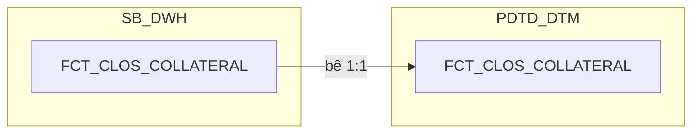
```mermaid
flowchart LR
    subgraph SB_DWH
        C["FCT_CLOS_COLLATERAL"]
    end
    subgraph PDTD_DTM
        D["FCT_CLOS_COLLATERAL"]
    end
    C -->|bê 1:1| D
```

### 5.3 Cấu trúc bảng

| STT | Tên cột | Kiểu dữ liệu | Bắt buộc | Độ lớn | Khóa | Mô tả | Báo cáo sử dụng | Tên chỉ tiêu trên báo cáo |
| --- | --- | --- | --- | --- | --- | --- | --- | --- |
| 1 | DAYID | DATE | Y |  | PK | Ngày dữ liệu, dạng số YYYYMMDD — bê 1:1 từ SB_DWH.FCT_CLOS_COLLATERAL.DAYID | — (cột kỹ thuật, một phần khóa chính) | — |
| 2 | COLLATERAL_BK | VARCHAR2 | Y | 64 | PK | Khóa nghiệp vụ của dòng tài sản — hash SHA256 trên toàn bộ cột không phải CLOB của NG_SB_CLOS_COLL_CD (loại trừ COLL_MGMT_APP, DESCRIPTION) — bê 1:1 từ SB_DWH.FCT_CLOS_COLLATERAL.COLLATERAL_BK | — (cột kỹ thuật, một phần khóa chính) | — |
| 3 | APPLICATION_SK | NUMBER | Y | 18 |  | Khóa tới DIM_CLOS_APPLICATION theo phiên bản hiệu lực tại DAYID. Mặc định -1 nếu không khớp — bê 1:1 từ SB_DWH.FCT_CLOS_COLLATERAL.APPLICATION_SK | — (khóa liên kết nội bộ, không xuất trực tiếp lên báo cáo) | — |
| 4 | WI_NAME | VARCHAR2 | Y | 100 |  | Mã hồ sơ tín dụng CLOS — bê 1:1 từ SB_DWH.FCT_CLOS_COLLATERAL.WI_NAME (nguồn gốc xa: NG_SB_CLOS_COLL_CD.WI_NAME, direct) | — (cột kỹ thuật, một phần khóa chính) | — |
| 5 | COLLATERAL_TYPE_CODE | VARCHAR2 | N | 100 |  | Mã loại tài sản bảo đảm — DENORMALIZE TRỰC TIẾP, bê 1:1 từ SB_DWH.FCT_CLOS_COLLATERAL.COLLATERAL_TYPE_CODE | Báo cáo CLOS APPLICATION (BC2) — nguồn cho 9 cờ TSDB_NHOM_0/TSDB_BDS/TSDB_PTVT/TSDB_MMTB/TSDB_KPT/TSDB_HTK/TSDB_TIN_CHAP/TIN_CHAP_TQD/TSDB_CP_TP (so sánh CASE trực tiếp giá trị COLLTYPE gốc) Báo cáo Thông tin phê duyệt (BC3) — hiển thị trực tiếp | TSDB_NHOM_0/TSDB_BDS/TSDB_PTVT/TSDB_MMTB/TSDB_KPT/TSDB_HTK/TSDB_TIN_CHAP/TIN_CHAP_TQD/TSDB_CP_TP (các cờ TSBĐ theo nhóm — BC2); TYPES_OF_COLLATERALS (Loại TSBĐ — BC3) |
| 6 | DESCRIPTION | VARCHAR2 | N | 4000 |  | Diễn giải tài sản bảo đảm — bê 1:1 từ SB_DWH.FCT_CLOS_COLLATERAL.DESCRIPTION | Báo cáo Thông tin phê duyệt (BC3) — hiển thị trực tiếp | DESCRIPTION (Mô tả TSBĐ) |
| 7 | OWNER_NAME | VARCHAR2 | N | 200 |  | Chủ sở hữu tài sản — bê 1:1 từ SB_DWH.FCT_CLOS_COLLATERAL.OWNER_NAME| Báo cáo Thông tin phê duyệt (BC3) — hiển thị trực tiếp | OWNER (Chủ TSBĐ) |
| 8 | COLL_MGMT_METHOD | VARCHAR2 | N | 4000 |  | Phương thức quản lý tài sản — bê 1:1 từ SB_DWH.FCT_CLOS_COLLATERAL.COLL_MGMT_METHOD | Báo cáo Thông tin phê duyệt (BC3) — hiển thị trực tiếp | COLLATERA_MANAGEMENT (Phương thức quản lý TSBĐ) |
| 9 | APPRAISED_VALUE | NUMBER | N | 20,2 |  | Giá trị định giá của tài sản — bê 1:1 từ SB_DWH.FCT_CLOS_COLLATERAL.APPRAISED_VALUE (nguồn gốc xa: NG_SB_CLOS_COLL_CD.APPRAISED_VAL_FIG| Báo cáo Thông tin phê duyệt (BC3) — hiển thị trực tiếp | APPRAISED_VALUE (Giá trị định giá) |
| 10 | LOAN_RATE_LTV | NUMBER | N | 5,2 |  | Tỷ lệ cho vay trên giá trị tài sản — bê 1:1 từ SB_DWH.FCT_CLOS_COLLATERAL.LOAN_RATE_LTV| Báo cáo Thông tin phê duyệt (BC3) — hiển thị trực tiếp | LTV (Tỷ lệ cho vay của TSBĐ) |

## 6. FCT_CLOS_EXCEPTION

### 6.1 Mục đích thiết kế
- **Ý nghĩa bảng:** bảng FACT chi tiết tại PDTD_DTM — bê nguyên 1:1 từ
  `FCT_CLOS_EXCEPTION`,
  lưu mỗi lần một lý do (ngoại lệ) được nêu ra trên hồ sơ CLOS trong quá
  trình xử lý — bao gồm cả lần nêu lý do (Raise) lẫn lần đã làm rõ/bổ
  sung (Clear). Bổ sung tại tầng này 3 cột phái sinh: `CHECK_FTR`/
  `FIRST_WORKSTEP_RETURN` và `PHAN_LOAI_DDE` (LEFT JOIN `REF_PHAN_LOAI_DDE`
  theo EXCEPTION_CATEGORY + SYSTEMNAME='CLOS').
- **Khóa nghiệp vụ (BK):** composite `WI_NAME`+`EXCEPTION_CATEGORY`+
  `RAISED_BY`+`RAISED_DATE_TIME` — hash vào cột `EXCEPTION_BK`, bê 1:1
  từ SB_DWH (xem `HLD_FCT_SB_DWH_review.md` mục 3)
- **Khóa chính của bảng (PK):** DAYID, EXCEPTION_BK — bê 1:1 từ SB_DWH
  (xem `HLD_FCT_SB_DWH_review.md` mục 3): `EXCEPTION_BK` gộp 4 cột PK tự
  nhiên cũ (WI_NAME, EXCEPTION_CATEGORY, RAISED_BY, RAISED_DATE_TIME)
  thành 1 khóa hash duy nhất.
- **Độ chi tiết (grain):** 1 dòng = 1 lần ghi nhận lý do của 1 hồ sơ,
  trong ảnh chụp của ngày DAYID. Một hồ sơ có thể phát sinh cùng 1 loại lý
  do nhiều lần, bởi nhiều người, ở nhiều thời điểm khác nhau.
- **Phục vụ báo cáo:**
  - Báo cáo EXCEPTION - FTR (BC7)
  - Báo cáo RETURN (BC8)

### 6.2 Sơ đồ lineage

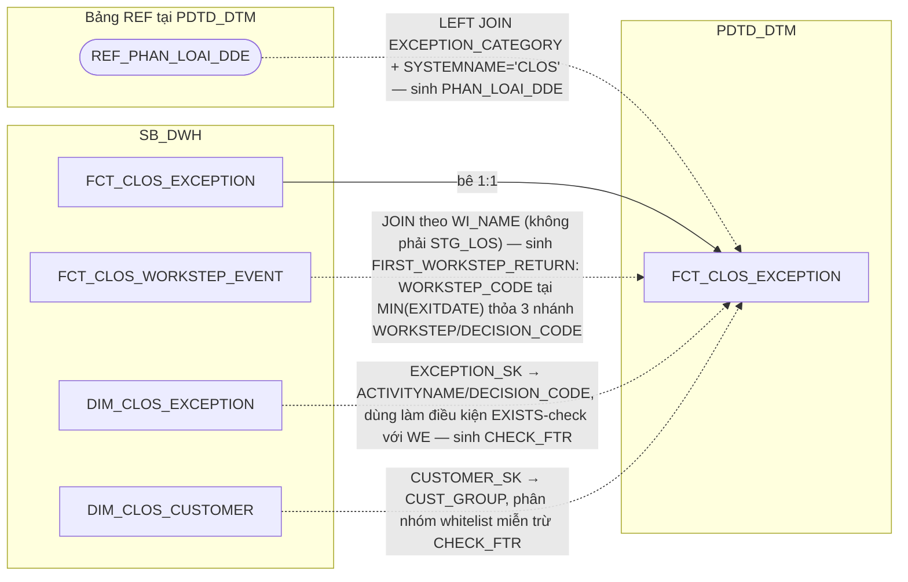
```mermaid
flowchart LR
    subgraph SB_DWH
        C["FCT_CLOS_EXCEPTION"]
        WE["FCT_CLOS_WORKSTEP_EVENT"]
        DE["DIM_CLOS_EXCEPTION"]
        KC["DIM_CLOS_CUSTOMER"]
    end
    subgraph REF_DTM["Bảng REF tại PDTD_DTM"]
        REF(["REF_PHAN_LOAI_DDE"])
    end
    subgraph PDTD_DTM
        D["FCT_CLOS_EXCEPTION"]
    end
    C -->|bê 1:1| D
    REF -.->|"LEFT JOIN EXCEPTION_CATEGORY + SYSTEMNAME='CLOS' — sinh PHAN_LOAI_DDE"| D
    WE -.->|"JOIN theo WI_NAME (không phải STG_LOS) — sinh FIRST_WORKSTEP_RETURN: WORKSTEP_CODE tại MIN(EXITDATE) thỏa 3 nhánh WORKSTEP/DECISION_CODE"| D
    DE -.->|"EXCEPTION_SK → ACTIVITYNAME/DECISION_CODE, dùng làm điều kiện EXISTS-check với WE — sinh CHECK_FTR"| D
    KC -.->|"CUSTOMER_SK → CUST_GROUP, phân nhóm whitelist miễn trừ CHECK_FTR"| D
```

### 6.3 Cấu trúc bảng

| STT | Tên cột | Kiểu dữ liệu | Bắt buộc | Độ lớn | Khóa | Mô tả | Báo cáo sử dụng | Tên chỉ tiêu trên báo cáo |
| --- | --- | --- | --- | --- | --- | --- | --- | --- |
| 1 | DAYID | DATE | Y |  | PK | Ngày dữ liệu, dạng số YYYYMMDD — bê 1:1 từ SB_DWH.FCT_CLOS_EXCEPTION.DAYID | — (cột kỹ thuật) | — |
| 2 | EXCEPTION_BK | VARCHAR2 | Y | 64 | PK | Khóa nghiệp vụ của dòng ngoại lệ — bê 1:1 từ SB_DWH.FCT_CLOS_EXCEPTION.EXCEPTION_BK: STANDARD_HASH(WI_NAME \|\| '~' \|\| EXCEPTION_CATEGORY \|\| '~' \|\| RAISED_BY \|\| '~' \|\| TO_CHAR(RAISED_DATE_TIME,'YYYY-MM-DD HH24:MI:SS.FF6'), 'SHA256') — gộp 4 cột PK tự nhiên cũ thành 1 khóa đơn | — (cột kỹ thuật, một phần khóa chính) | — |
| 3 | APPLICATION_SK | NUMBER | Y | 18 |  | Khóa tới DIM_CLOS_APPLICATION theo phiên bản hiệu lực tại DAYID. Mặc định -1 — bê 1:1 từ SB_DWH.FCT_CLOS_EXCEPTION.APPLICATION_SK | Báo cáo EXCEPTION - FTR (BC7) — khóa JOIN sang DIM_CLOS_APPLICATION, report-time tự tra LOANCASEID khi cần (không còn ETL sẵn trên bảng này) | — |
| 4 | EXCEPTION_SK | NUMBER | Y | 18 |  | Khóa tới DIM_CLOS_EXCEPTION — PHÁI SINH 2 bước đúng SRS BC7 (không phải lookup 1 cột), ĐÃ TÍNH XONG TẠI SB_DWH, bê 1:1 từ SB_DWH.FCT_CLOS_EXCEPTION.EXCEPTION_SK: (1) LEFT JOIN theo EXCEPTION_CATEGORY + EXCEPTION_NAME, có thể khớp nhiều dòng DIM cùng category+name khác ACTIVITYNAME/DECISION_CODE; (2) lọc còn đúng 1 dòng bằng điều kiện tồn tại bản ghi NG_SB_CLOS_ENTRY_EXIT (WI_NAME khớp + WORKSTEP=ACTIVITYNAME + DECISION=DECISION_CODE của dòng DIM đó) — chỉ giữ tổ hợp đã thực sự xảy ra trong lịch sử xử lý hồ sơ. Mặc định -1 nếu không còn dòng nào khớp | Báo cáo EXCEPTION - FTR (BC7) — khóa JOIN sang DIM_CLOS_EXCEPTION, đồng thời là nguồn tra ACTIVITYNAME/DECISION_CODE để tính CHECK_FTR (cột 15, cùng bảng) | — |
| 5 | USER_SK | NUMBER | Y | 18 |  | Khóa tới DIM_LOS_USER, người nêu lý do (khớp naming convention DIM_LOS_USER.USER_SK đã dùng ở FCT_CLOS_WORKSTEP_EVENT). Mặc định -1. ĐÚNG GRAIN của bảng — 1 lần ghi nhận lý do có đúng 1 người nêu — bê 1:1 từ SB_DWH.FCT_CLOS_EXCEPTION.USER_SK | — (cột kỹ thuật, khóa JOIN nội bộ — BC7 dùng cột RAISED_BY gốc để hiển thị, khớp bản RLOS) | — |
| 6 | CUSTOMER_SK | NUMBER | Y | 18 |  | Khóa tới DIM_CLOS_CUSTOMER (bê 1:1 từ SB_DWH.FCT_CLOS_EXCEPTION.CUSTOMER_SK)| — (cột kỹ thuật, khóa JOIN nội bộ phục vụ tính CHECK_FTR) | — |
| 7 | WI_NAME | VARCHAR2 | Y | 100 |  | Mã hồ sơ tín dụng CLOS — bê 1:1 từ SB_DWH.FCT_CLOS_EXCEPTION.WI_NAME| Báo cáo EXCEPTION - FTR (BC7) — khóa JOIN Báo cáo RETURN (BC8) — khóa JOIN | WINAME (Mã hồ sơ) |
| 8 | EXCEPTION_CATEGORY | VARCHAR2 | N | 500 |  | Phân nhóm nội dung cần làm rõ — bê 1:1 từ SB_DWH.FCT_CLOS_EXCEPTION.EXCEPTION_CATEGORY| Báo cáo EXCEPTION - FTR (BC7) — hiển thị trực tiếp, đồng thời là khóa JOIN sang REF_PHAN_LOAI_DDE để sinh PHAN_LOAI_DDE (cột 17, cùng bảng), và điều kiện whitelist miễn trừ khi tính CHECK_FTR (cột 15) | EXCEPTION_CATEGORY (Nhóm nội dung ngoại lệ) |
| 9 | RAISED_BY | VARCHAR2 | N | 100 |  | Người nêu nội dung cần làm rõ — bê 1:1 từ SB_DWH.FCT_CLOS_EXCEPTION.RAISED_BY | Báo cáo EXCEPTION - FTR (BC7) — hiển thị trực tiếp | RAISED_BY (Người nêu) |
| 10 | RAISED_DATE_TIME | TIMESTAMP | N |  |  | Thời điểm nêu nội dung cần làm rõ — bê 1:1 từ SB_DWH.FCT_CLOS_EXCEPTION.RAISED_DATE_TIME | Báo cáo EXCEPTION - FTR (BC7) — hiển thị trực tiếp, đồng thời là nguồn tính PROCESSED_DATE (TRUNC ở tầng report) | RAISED_DATE_TIME (Thời điểm nêu); nguồn cho chỉ tiêu/trường PROCESSED_DATE (Ngày dữ liệu, BC7) |
| 11 | EXCEPTION_NAME | VARCHAR2 | N | 500 |  | Tên nội dung cần làm rõ — bê 1:1 từ SB_DWH.FCT_CLOS_EXCEPTION.EXCEPTION_NAME | Báo cáo EXCEPTION - FTR (BC7) — hiển thị trực tiếp | EXCEPTION_NAME (Tên nội dung ngoại lệ) |
| 12 | EXCEPTION_REMARKS | VARCHAR2 | N | 4000 |  | Ghi chú của nội dung cần làm rõ — bê 1:1 từ SB_DWH.FCT_CLOS_EXCEPTION.EXCEPTION_REMARKS (nguồn gốc xa: NG_SB_CLOS_EXCEPTION.EXCEPTION_REMARKS) | Báo cáo EXCEPTION - FTR (BC7) — hiển thị trực tiếp | EXCEPTION_REMARKS (Ghi chú ngoại lệ) |
| 13 | RCTYPE | VARCHAR2 | N | 20 |  | Loại ghi nhận, Raise (nêu lý do khi trả về) hay Clear (đã làm rõ/bổ sung và đẩy lại) — bê 1:1 từ SB_DWH.FCT_CLOS_EXCEPTION.RCTYPE (nguồn gốc xa: NG_SB_CLOS_EXCEPTION.RCTYPE) | Báo cáo EXCEPTION - FTR (BC7) — hiển thị trực tiếp | RCTYPE (Raise/Clear) |
| 14 | CHECK_FTR | VARCHAR2 | N | 20 |  | Vi phạm nguyên tắc First Time Right — PHÁI SINH TẠI PDTD_DTM: mặc định 'Not First Time Right'; là 'First Time Right' CHỈ KHI mọi dòng cùng WI_NAME đều tồn tại (EXISTS) dòng khớp trong SB_DWH.FCT_CLOS_WORKSTEP_EVENT (WORKSTEP_CODE=DIM_CLOS_EXCEPTION.ACTIVITYNAME AND DECISION_CODE=DIM_CLOS_EXCEPTION.DECISION_CODE, tra qua EXCEPTION_SK) VÀ EXCEPTION_CATEGORY nằm trong whitelist miễn trừ theo CUST_GROUP (tra qua CUSTOMER_SK), phân theo nhóm KHDN (MSME/SME/USME) và nhóm KHDNL/ĐT&ĐCTC (FDI/SOC/JSC/NBFI/BANK/STR) — mỗi nhóm 4 tổ hợp WORKSTEP+DECISION với danh sách EXCEPTION_CATEGORY miễn trừ riêng, xem đầy đủ literal tại SRS BC7 BR 1.2 | Báo cáo EXCEPTION - FTR (BC7) — hiển thị trực tiếp | CHECK_FTR (First Time Right) |
| 15 | FIRST_WORKSTEP_RETURN | VARCHAR2 | N | 200 |  | Bước xử lý phát sinh trả về đầu tiên — PHÁI SINH TẠI PDTD_DTM (xem ghi chú kiến trúc tại mục 6.1): WORKSTEP_CODE của dòng SB_DWH.FCT_CLOS_WORKSTEP_EVENT tại MIN(EXITDATE) theo WI_NAME, với điều kiện EXITDATE IS NOT NULL AND ((WORKSTEP_CODE='DetailDataEntry' AND DECISION_CODE='Send_Back') OR (WORKSTEP_CODE IN ('DataInputerChecker','UnderwriterMaker','CreditApproval') AND DECISION_CODE='Additional_Doc_Required') OR (WORKSTEP_CODE='UnderwriterMaker' AND DECISION_CODE='Send_Back to BranchSupport')) — DECISION_CODE tra qua WORKSTEP_DECISION_SK → DIM_CLOS_WORKSTEP_DECISION | Báo cáo EXCEPTION - FTR (BC7) — hiển thị trực tiếp | FIRST_WORKSTEP_RETURN (Bước trả về đầu tiên) |
| 16 | PHAN_LOAI_DDE | VARCHAR2 | N | 100 |  | Phân loại nguyên nhân trả về ở khâu nhập liệu — PHÁI SINH TẠI PDTD_DTM (vì REF_PHAN_LOAI_DDE chỉ tồn tại vật lý ở PDTD_DTM): LEFT JOIN REF_PHAN_LOAI_DDE theo EXCEPTION_CATEGORY = REF_PHAN_LOAI_DDE.EXCEPTION_CATEGORY AND REF_PHAN_LOAI_DDE.SYSTEMNAME='CLOS', lấy REF_PHAN_LOAI_DDE.PHAN_LOAI_DDE | Báo cáo EXCEPTION - FTR (BC7) — hiển thị trực tiếp | PHAN_LOAI_DDE (Lỗi Nhập liệu/Thiếu Checklist) |

## 7. FCT_CLOS_DEVIATION

### 7.1 Mục đích thiết kế
- **Ý nghĩa bảng:** bảng FACT chi tiết, bê nguyên 1:1 từ SB_DWH, lưu ảnh số
  liệu thay đổi theo ngày của từng ngoại lệ chính sách (deviation) phát
  sinh trên hồ sơ CLOS. Không có cột phái sinh riêng ở tầng DTM — toàn bộ
  9 cột đã tính sẵn tại SB_DWH, tầng này chỉ đọc thẳng, không JOIN thêm
  bảng nào, giữ đúng nguyên tắc "DTM chỉ đọc DWH".
- **Khóa nghiệp vụ (BK):** composite toàn bộ cột không phải CLOB của
  `NG_SB_CLOS_CONDITON_CDGRID` (loại trừ `AS_REGULAR`, `DEV_PROPOSAL`) — hash vào cột `DEVIATION_BK`, bê 1:1 từ
  SB_DWH
- **Khóa chính của bảng (PK):** DAYID, DEVIATION_BK.
- **Độ chi tiết (grain):** 1 dòng = 1 ngoại lệ chính sách trong ảnh chụp
  của ngày DAYID (ảnh chụp đầy đủ mỗi ngày, không phải ghi thêm khi có
  thay đổi).
- **Phục vụ báo cáo:**
  - Báo cáo NGOẠI LỆ (BC6)

### 7.2 Sơ đồ lineage

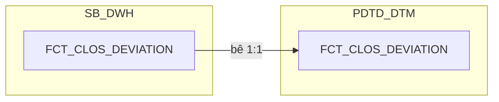
```mermaid
flowchart LR
    subgraph SB_DWH
        C["FCT_CLOS_DEVIATION"]
    end
    subgraph PDTD_DTM
        D["FCT_CLOS_DEVIATION"]
    end
    C -->|bê 1:1| D
```

### 7.3 Cấu trúc bảng

| STT | Tên cột | Kiểu dữ liệu | Bắt buộc | Độ lớn | Khóa | Mô tả | Báo cáo sử dụng | Tên chỉ tiêu trên báo cáo |
| --- | --- | --- | --- | --- | --- | --- | --- | --- |
| 1 | DAYID | DATE | Y |  | PK | Ngày dữ liệu, dạng số YYYYMMDD — bê 1:1 từ SB_DWH.FCT_CLOS_DEVIATION.DAYID | Báo cáo KPI (BC9) | — |
| 2 | DEVIATION_BK | VARCHAR2 | Y | 64 | PK | Khóa nghiệp vụ của dòng ngoại lệ — bê 1:1 từ SB_DWH.FCT_CLOS_DEVIATION.DEVIATION_BK: PHÁI SINH STANDARD_HASH(..., 'SHA256') trên toàn bộ cột không phải CLOB của NG_SB_CLOS_CONDITON_CDGRID (loại trừ AS_REGULAR, DEV_PROPOSAL). Chuẩn hóa trước khi hash: TRIM chuỗi, NULL quy về '<NULL>', DATE/NUMBER dùng format cố định không phụ thuộc NLS | Nguồn cho chỉ tiêu/trường DEVIATION_G2/DEVIATION_G3 (điều kiện đếm số dòng phân biệt, BC9) | — |
| 3 | APPLICATION_SK | NUMBER | Y | 18 |  | Khóa tới DIM_CLOS_APPLICATION theo phiên bản hiệu lực tại DAYID. Mặc định -1 nếu không khớp — bê 1:1 từ SB_DWH.FCT_CLOS_DEVIATION.APPLICATION_SK | Báo cáo NGOẠI LỆ (BC6) — khóa JOIN sang DIM_CLOS_APPLICATION | — |
| 4 | WI_NAME | VARCHAR2 | Y | 100 | | Mã hồ sơ tín dụng CLOS — bê 1:1 từ SB_DWH.FCT_CLOS_DEVIATION.WI_NAME (nguồn gốc xa: NG_SB_CLOS_CONDITON_CDGRID.WI_NAME, direct) | Báo cáo NGOẠI LỆ (BC6) — khóa JOIN Báo cáo KPI (BC9) — khóa GROUP BY khi đếm DEVIATION_G2/DEVIATION_G3 trên AGG_LOS_KPI_APPLICATION | WINAME (Mã hồ sơ) |
| 5 | DEVIATION_TYPE_CODE | VARCHAR2 | N | 300 |  | Mã loại lệch chính sách — bê 1:1 từ SB_DWH.FCT_CLOS_DEVIATION.DEVIATION_TYPE_CODE (nguồn gốc xa: NG_SB_CLOS_CONDITON_CDGRID.DEVIATION_TYPE) | Báo cáo NGOẠI LỆ (BC6) — hiển thị trực tiếp | DEVIATION_TYPE (Loại ngoại lệ) |
| 6 | DEV_PROPOSAL | VARCHAR2 | N | 4000 |  | Đề xuất xử lý lệch chính sách — bê 1:1 từ SB_DWH.FCT_CLOS_DEVIATION.DEV_PROPOSAL (nguồn gốc xa: NG_SB_CLOS_CONDITON_CDGRID.DEV_PROPOSAL) | Báo cáo NGOẠI LỆ (BC6) — hiển thị trực tiếp Báo cáo CLOS APPLICATION (BC2) — PHÁI SINH ở tầng report: EXISTS dòng của hồ sơ → YES/NO (không hiển thị giá trị cột) | DEV_PROPOSAL (Nội dung ngoại lệ). ⚠️ Review 2026-10-04 (cross-check LLD/HLD): bổ sung BC2 — BC2.csv#53 đã dùng cột này (qua EXISTS) từ trước, chỉ thiếu khai báo tại đây |
| 7 | AS_REGULAR | VARCHAR2 | N | 4000 |  | Quy định chuẩn liên quan tới lệch chính sách — bê 1:1 từ SB_DWH.FCT_CLOS_DEVIATION.AS_REGULAR (nguồn gốc xa: NG_SB_CLOS_CONDITON_CDGRID.AS_REGULAR). Không báo cáo nào hiển thị trực tiếp; BA từng đề xuất đưa vào khóa nghiệp vụ nhưng bị từ chối vì là trường nhập tùy biến (free-text) — vẫn phải nạp vì là thuộc tính gốc của bảng nguồn | Không có report sử dụng — giữ có chủ đích (khác nhóm cột dư thừa đã xóa, đây là thuộc tính gốc bắt buộc nạp để bảo toàn dữ liệu nguồn) | — |
| 8 | PROCESSED_DATE | DATE | N |  |  | Ngày xử lý của hồ sơ — bê 1:1 từ SB_DWH.FCT_CLOS_DEVIATION.PROCESSED_DATE (PHÁI SINH TẠI SB_DWH: tính độc lập từ NG_SB_CLOS_ENTRY_EXIT theo cùng công thức 3 mức ưu tiên — ngày phê duyệt cuối/ngày hủy/ngày thoát bước gần nhất — đã dùng cho FCT_CLOS_APPLICATION.PROCESSED_DATE, không JOIN sang FCT_CLOS_APPLICATION để tránh tham chiếu chéo giữa 2 bảng) | Báo cáo NGOẠI LỆ (BC6) — hiển thị trực tiếp | PROCESSED_DATE (Ngày dữ liệu báo cáo) |

## 8. FCT_CLOS_WORKSTEP_EVENT

### 8.1 Mục đích thiết kế
- **Ý nghĩa bảng:** bảng FACT nhật ký workflow mức nguyên tử của hệ CLOS,
  bê nguyên 1:1 từ SB_DWH
- **Khóa nghiệp vụ (BK):** composite `WI_NAME`+`WORKSTEP_CODE`+
  `ENTRYDATE` — hash vào cột `WORKSTEP_EVENT_BK`, bê 1:1 từ SB_DWH
- **Khóa chính của bảng (PK):** DAYID, WORKSTEP_EVENT_BK
- **Độ chi tiết (grain):** 1 dòng = 1 phiên bản của 1 logical event (hồ sơ
  x workstep x lần vào bước) — hồ sơ quay lại cùng 1 bước nhiều lần thì
  mỗi lần là 1 sự kiện riêng.
- **Phục vụ báo cáo:**
  - Báo cáo Thông tin phê duyệt (BC3)
  - Báo cáo Tuần Chuyên viên Thẩm định (BC4) — `WORKSTEP_FLAG` (BC4.FLAG)
  - Báo cáo SLA - TAT (BC5) — `APPROVAL_FLAG`
  - Báo cáo RETURN (BC8)
  - Báo cáo KPI (BC9) — nguồn tính VOLUME/NHAN_SU/TAT_CLOS qua UNION với FCT_RLOS_WORKSTEP_EVENT, `APPROVAL_FLAG='First Approval'` điều kiện lọc TAT_APPLICATION_HOUR
  - Báo cáo Giải ngân _ Quá hạn KHDN (BC11) — qua FCT_CLOS_LOAN_DISBURSEMENT.APPROVAL_DATE (review 2026-10-02: FIRST_APPROVED_DATE chuyển từ FCT_CLOS_APPLICATION về đây)
  - Nguồn cho FCT_CLOS_EXCEPTION.FIRST_WORKSTEP_RETURN (BC7)

### 8.2 Sơ đồ lineage

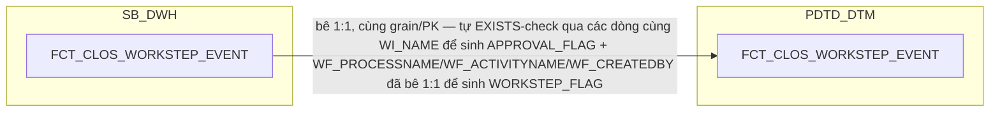
```mermaid
flowchart LR
    subgraph SB_DWH
        C["FCT_CLOS_WORKSTEP_EVENT"]
    end
    subgraph PDTD_DTM
        D["FCT_CLOS_WORKSTEP_EVENT"]
    end
    C -->|"bê 1:1, cùng grain/PK — tự EXISTS-check qua các dòng cùng WI_NAME để sinh APPROVAL_FLAG + WF_PROCESSNAME/WF_ACTIVITYNAME/WF_CREATEDBY đã bê 1:1 để sinh WORKSTEP_FLAG "| D
```

### 8.3 Cấu trúc bảng

| STT | Tên cột | Kiểu dữ liệu | Bắt buộc | Độ lớn | Khóa | Mô tả | Báo cáo sử dụng | Tên chỉ tiêu trên báo cáo |
| --- | --- | --- | --- | --- | --- | --- | --- | --- |
| 1 | DAYID | DATE | Y |  | PK | Ngày dữ liệu, dạng số YYYYMMDD — nguồn NG_SB_CLOS_ENTRY_EXIT, TRUNC về 00:00:00. Là ngày phiên bản được ghi nhận, KHÔNG phải ảnh chụp lại toàn bộ nhật ký mỗi ngày — bê 1:1 từ SB_DWH.FCT_CLOS_WORKSTEP_EVENT.DAYID | Thiết kế dư thừa | — |
| 2 | WORKSTEP_EVENT_BK | VARCHAR2 | Y | 64 | PK | Khóa nghiệp vụ của dòng sự kiện — bê 1:1 từ SB_DWH.FCT_CLOS_WORKSTEP_EVENT.WORKSTEP_EVENT_BK: STANDARD_HASH(WI_NAME \|\| '~' \|\| WORKSTEP_CODE \|\| '~' \|\| TO_CHAR(ENTRYDATE,'YYYY-MM-DD HH24:MI:SS.FF6'), 'SHA256') — gộp 3 cột PK tự nhiên cũ thành 1 khóa đơn | — (cột kỹ thuật, một phần khóa chính) | — |
| 3 | WORKSTEP_DECISION_SK | NUMBER | Y | 18 |  | Khóa tới DIM_CLOS_WORKSTEP_DECISION (gộp từ WORKSTEP_SK+DECISION_SK), lookup theo cặp WORKSTEP_CODE (cột 9, chính dòng event) + DECISION_CODE điều kiện thời gian (EFF_DATE/EXP_DATE). Mặc định -1 nếu không khớp. KHÔNG nằm trong PK — chỉ để tra cứu thêm thuộc tính (kể cả DECISION_CODE, đã xóa denormalize khỏi fact) — bê 1:1 từ SB_DWH.FCT_CLOS_WORKSTEP_EVENT.WORKSTEP_DECISION_SK | Báo cáo Thông tin phê duyệt (BC3) — khóa JOIN thay cho cột DECISION_CODE denormalize đã xóa, cũng là điều kiện lọc chọn dòng event (Submit/Reject/Send To HOSupport/Send To PostSanction) Báo cáo RETURN (BC8) — khóa JOIN thay cho cột DECISION_CODE denormalize đã xóa | DECISION (Quyết định) |
| 4 | USER_SK | NUMBER | Y | 18 |  | Khóa tới DIM_LOS_USER, người xử lý của chính sự kiện này. ĐÚNG GRAIN của bảng — 1 lần vào bước có đúng 1 người xử lý. Mặc định -1. KHÔNG nằm trong PK — bê 1:1 từ SB_DWH.FCT_CLOS_WORKSTEP_EVENT.USER_SK | Thiết kế dư thừa | — |
| 5 | APPLICATION_SK | NUMBER | Y | 18 |  | Khóa tới DIM_CLOS_APPLICATION theo phiên bản hiệu lực tại DAYID. Mặc định -1 — bê 1:1 từ SB_DWH.FCT_CLOS_WORKSTEP_EVENT.APPLICATION_SK | Báo cáo Thông tin phê duyệt (BC3) — khóa JOIN sang DIM_CLOS_APPLICATION để lấy STREAM | — |
| 6 | CUSTOMER_SK | NUMBER | Y | 18 |  | Khóa tới DIM_CLOS_CUSTOMER — PHÁI SINH TRỰC TIẾP tại SB_DWH (cho phép khai thác lookup DIM qua surrogate key thay vì qua WI_NAME natural key, nhất quán với WORKSTEP_DECISION_SK/USER_SK/APPLICATION_SK đã có sẵn trên bảng): join theo WI_NAME + điều kiện SCD2 EFF_DATE<=DAYID<EXP_DATE (hoặc EXP_DATE IS NULL), quan hệ 1:1 với hồ sơ. Mặc định -1 nếu không khớp — bê 1:1 từ SB_DWH.FCT_CLOS_WORKSTEP_EVENT.CUSTOMER_SK | Báo cáo Tuần Chuyên viên Thẩm định (BC4) — khóa JOIN sang DIM_CLOS_CUSTOMER để lấy CUSTOMER_NAME | — |
| 7 | WI_NAME | VARCHAR2 | Y | 100 |  | Mã hồ sơ tín dụng CLOS — bê 1:1 từ SB_DWH.FCT_CLOS_WORKSTEP_EVENT.WI_NAME (nguồn gốc xa: NG_SB_CLOS_ENTRY_EXIT.WINAME, đổi tên WINAME→WI_NAME) | Báo cáo Thông tin phê duyệt (BC3) — khóa JOIN, cũng là khóa lọc tập dòng event Báo cáo Tuần Chuyên viên Thẩm định (BC4) — khóa JOIN, cũng là khóa lọc tập dòng event Báo cáo RETURN (BC8) — khóa GROUP BY, cũng là khóa JOIN sang FCT_CLOS_EXCEPTION | WINAME (Mã hồ sơ). ⚠️ Review 2026-10-04 (cross-check LLD/HLD): bổ sung BC8 — BC8.csv#2 đã dùng cột này từ trước, chỉ thiếu khai báo tại đây |
| 8 | WORKSTEP_CODE | VARCHAR2 | Y | 200 |  | Mã bước xử lý trên workflow — bê 1:1 từ SB_DWH.FCT_CLOS_WORKSTEP_EVENT.WORKSTEP_CODE (nguồn gốc xa: ENTRY_EXIT.WORKSTEP, đổi tên thêm hậu tố CODE, đã cắt tiền tố hệ nguồn nếu có) | Báo cáo Thông tin phê duyệt (BC3) — hiển thị trực tiếp, cũng là điều kiện lọc chọn dòng event (CreditApproval/CreditCommittee) Báo cáo Tuần Chuyên viên Thẩm định (BC4) — hiển thị trực tiếp, cũng là điều kiện lọc (UnderwriterMaker/UnderwriterChecker) Báo cáo SLA - TAT (BC5) — điều kiện lọc khi SUM TAT_CALENDAR_HOUR/TAT_WORKING_HOUR/TAT_CPC_HOUR theo từng bước Báo cáo RETURN (BC8) — hiển thị trực tiếp | WORKSTEP (Bước hồ sơ) |
| 9 | ENTRYDATE | TIMESTAMP | Y |  |  | Thời điểm hồ sơ vào bước xử lý — bê 1:1 từ SB_DWH.FCT_CLOS_WORKSTEP_EVENT.ENTRYDATE (nguồn gốc xa: ENTRY_EXIT.ENTRYDATE). Bắt buộc nằm trong khóa nghiệp vụ vì 1 hồ sơ có thể quay lại cùng 1 bước nhiều lần | Báo cáo Thông tin phê duyệt (BC3) — hiển thị trực tiếp (ENTRYDATE của dòng event đã lọc) Báo cáo Tuần Chuyên viên Thẩm định (BC4) — hiển thị trực tiếp (ENTRYDATE của dòng event đã lọc) Báo cáo SLA - TAT (BC5) — dùng tính ENTRYDATE_DDE (MIN theo bước DetailDataEntry/CLOS_DetailDataEntry) | ENTRYDATE (Thời gian lên bước thẩm định). ⚠️ Review 2026-10-04 (cross-check LLD/HLD): bổ sung BC3+BC5 — BC3.csv#9/BC5.csv#41 đã dùng cột này từ trước, chỉ thiếu khai báo tại đây |
| 10 | EXITDATE | TIMESTAMP | N |  |  | Thời điểm hồ sơ ra khỏi bước xử lý — bê 1:1 từ SB_DWH.FCT_CLOS_WORKSTEP_EVENT.EXITDATE (nguồn gốc xa: ENTRY_EXIT.EXITDATE). NULL nghĩa là hồ sơ đang nằm tại bước này | Báo cáo Thông tin phê duyệt (BC3) — hiển thị trực tiếp Báo cáo Tuần Chuyên viên Thẩm định (BC4) — hiển thị trực tiếp Báo cáo RETURN (BC8) — hiển thị trực tiếp, đồng thời là nguồn tính PROCESSED_DATE (BC8) Báo cáo SLA - TAT (BC5) — dùng tính EXITDATE_DDE (MAX theo bước DetailDataEntry) | EXITDATE (Thời gian tạo quyết định / kết thúc bước). ⚠️ Review 2026-10-04 (cross-check LLD/HLD): bổ sung BC5 — BC5.csv#42 đã dùng cột này từ trước, chỉ thiếu khai báo tại đây |
| 11 | USERNAME | VARCHAR2 | N | 100 |  | Tên tài khoản người xử lý hồ sơ — bê 1:1 từ SB_DWH.FCT_CLOS_WORKSTEP_EVENT.USERNAME (nguồn gốc xa: ENTRY_EXIT.USERNAME). Giữ nguyên giá trị gốc để báo cáo hiển thị thẳng, không phải join qua DIM_LOS_USER | Báo cáo Thông tin phê duyệt (BC3) — hiển thị trực tiếp theo điều kiện WORKSTEP_CODE (BI_APPROVER/BI_COMMITTEE) Báo cáo Tuần Chuyên viên Thẩm định (BC4) — hiển thị trực tiếp theo điều kiện WORKSTEP_CODE (UND_MAKER) Báo cáo KPI (BC9) — đếm DISTINCT theo danh sách WORKSTEP cho NHAN_SU | USERNAME (User xử lý — BI_APPROVER/BI_COMMITTEE/UND_MAKER tùy báo cáo) |
| 12 | REMARKS | VARCHAR2 | N | 4000 |  | Ghi chú tại bước xử lý — bê 1:1 từ SB_DWH.FCT_CLOS_WORKSTEP_EVENT.REMARKS (nguồn gốc xa: ENTRY_EXIT.REMARKS) | Báo cáo Thông tin phê duyệt (BC3) — hiển thị trực tiếp Báo cáo Tuần Chuyên viên Thẩm định (BC4) — hiển thị trực tiếp | REMARKS (Ghi chú) |
| 13 | TAT_SOURCE_SEC | NUMBER | N | 12 |  | Thời gian xử lý do hệ nguồn ghi, đơn vị giây — bê 1:1 từ SB_DWH.FCT_CLOS_WORKSTEP_EVENT.TAT_SOURCE_SEC (nguồn gốc xa: ENTRY_EXIT.TAT). Giữ lại để đối soát với 3 cột TAT tính lại bên dưới. Đơn vị "giây" kế thừa từ extract gốc, chưa chốt chính thức | Nguồn cho chỉ tiêu/trường TAT_CALENDAR_HOUR (điều kiện tính khi có giá trị, thay công thức lệch ngày) | — |
| 14 | TAT_CALENDAR_HOUR | NUMBER | N | 18,6 |  | Thời gian xử lý theo lịch tự nhiên, đơn vị giờ — PHÁI SINH ĐÃ TÍNH XONG TẠI SB_DWH, bê 1:1 từ SB_DWH.FCT_CLOS_WORKSTEP_EVENT.TAT_CALENDAR_HOUR: TAT_SOURCE_SEC / 3600, hoặc (CAST(EXITDATE AS DATE) - CAST(ENTRYDATE AS DATE)) * 24 nếu TAT_SOURCE_SEC rỗng. Không trừ ngày nghỉ. NULL nếu chưa có EXITDATE | Báo cáo SLA - TAT (BC5) — SUM theo từng nhóm bước (STEP01_BRANCH_CL_TAT, STEP02_DDE_CL_TAT...) Báo cáo KPI (BC9) — SUM theo nhóm bước cho TAT_CLOS | TAT_CALENDAR_HOUR (TAT theo giờ lịch tự nhiên) |
| 15 | TAT_WORKING_HOUR | NUMBER | N | 18,6 |  | Thời gian xử lý theo giờ làm việc, đơn vị giờ — PHÁI SINH ĐÃ TÍNH XONG TẠI SB_DWH, bê 1:1 từ SB_DWH.FCT_CLOS_WORKSTEP_EVENT.TAT_WORKING_HOUR: GET_BUSINESS_MINUTE(ENTRYDATE, EXITDATE) / 60. Loại trừ ngày lễ, chiều thứ Bảy, cả ngày Chủ nhật; giờ tính 8-12 và 13-17. NULL nếu chưa có EXITDATE | Báo cáo SLA - TAT (BC5) — SUM theo từng nhóm bước (STEP01_BRANCH_WK_TAT, STEP02_DDE_WK_TAT...) Báo cáo KPI (BC9) — SUM theo nhóm bước cho TAT_CLOS | TAT_WORKING_HOUR (TAT theo giờ làm việc) |
| 16 | TAT_CPC_HOUR | NUMBER | N | 18,6 |  | Thời gian xử lý theo giờ cam kết SLA, đơn vị giờ — PHÁI SINH ĐÃ TÍNH XONG TẠI SB_DWH, bê 1:1 từ SB_DWH.FCT_CLOS_WORKSTEP_EVENT.TAT_CPC_HOUR: GET_BUSINESS_MINUTE_CPC(ENTRYDATE, EXITDATE) / 60. Giờ theo cam kết SLA, tính 8-11:30 và 13:30-16:30. NULL nếu chưa có EXITDATE | Báo cáo SLA - TAT (BC5) — SUM theo từng nhóm bước, so sánh với REF_SLA_* để ra kết quả đạt/không đạt SLA | TAT_CPC_HOUR (TAT theo giờ cam kết SLA) |
| 17 | EVENT_SEQ_ASC | NUMBER | N | 5 |  | Thứ tự sự kiện theo chiều cũ đến mới — PHÁI SINH ĐÃ TÍNH XONG TẠI SB_DWH, bê 1:1 từ SB_DWH.FCT_CLOS_WORKSTEP_EVENT.EVENT_SEQ_ASC: ROW_NUMBER() OVER (PARTITION BY WI_NAME ORDER BY ENTRYDATE ASC). Dùng xác định sự kiện trả về đầu tiên cho BC7 (FIRST_WORKSTEP_RETURN); chiều giảm dần (mới→cũ) khi cần có thể tự suy bằng COUNT(*) OVER (PARTITION BY WI_NAME) - EVENT_SEQ_ASC + 1, không cần cột riêng | Nguồn cho chỉ tiêu/trường FIRST_WORKSTEP_RETURN (xác định sự kiện trả về đầu tiên, BC7, trên FCT_CLOS_EXCEPTION) | — |
| 18 | PROCESSED_DATE | DATE | N |  |  | Ngày xử lý chung của hồ sơ theo 3 mức ưu tiên (phê duyệt cuối / hủy tại UnderwriterMaker / ngày dữ liệu hệ thống nếu đang xử lý) — PHÁI SINH ĐÃ TÍNH XONG TẠI SB_DWH (KHÔNG copy/JOIN từ FCT_CLOS_APPLICATION.PROCESSED_DATE), bê 1:1 từ SB_DWH.FCT_CLOS_WORKSTEP_EVENT.PROCESSED_DATE: MAX(EXITDATE) window theo WI_NAME WHERE WORKSTEP_CODE IN ('CreditCommittee','CreditApproval') AND DECISION_CODE IN ('Send To HOSupport','Reject','Submit','Send To PostSanction','Submit To DisbursementMaker') — DECISION_CODE ở đây tra qua JOIN WORKSTEP_DECISION_SK sang DIM_CLOS_WORKSTEP_DECISION; nếu rỗng → EXITDATE tại WORKSTEP_CODE='UnderwriterMaker' AND DECISION_CODE='Cancel' (cùng cách tra); nếu vẫn rỗng → ngày dữ liệu hệ thống (DAYID) | Báo cáo Tuần Chuyên viên Thẩm định (BC4) — hiển thị trực tiếp | REPORT_DATE (Ngày báo cáo) |
| 19 | WF_PROCESSNAME | VARCHAR2 | N | 50 |  | Tên hệ thống workflow của instance đang đứng, đã lọc tài khoản test — cột thô, bê 1:1 từ SB_DWH.FCT_CLOS_WORKSTEP_EVENT.WF_PROCESSNAME (thay cho WORKSTEP_FLAG đã tính sẵn) | Nguồn cho chỉ tiêu/trường WORKSTEP_FLAG (cột 24, cùng bảng) | — |
| 20 | WF_ACTIVITYNAME | VARCHAR2 | N | 200 |  | Bước hiện tại của instance workflow, đã lọc tài khoản test — cột thô, bê 1:1 từ SB_DWH.FCT_CLOS_WORKSTEP_EVENT.WF_ACTIVITYNAME | Nguồn cho chỉ tiêu/trường WORKSTEP_FLAG (cột 24, cùng bảng) | — |
| 21 | WF_CREATEDBY | VARCHAR2 | N | 50 |  | Mã người/hệ thống tạo bản ghi workflow — cột thô, bê 1:1 từ SB_DWH.FCT_CLOS_WORKSTEP_EVENT.WF_CREATEDBY.: SRS áp dụng điều kiện lọc `CREATEDBY NOT IN (5 tài khoản hệ thống/test)` đồng nhất cho CẢ CLOS VÀ RLOS ngay tại điều kiện JOIN WFINSTRUMENTTABLE — trước đây điều kiện này lọc sẵn trong JOIN tại SB_DWH, nay bê nguyên giá trị thô để áp điều kiện lọc ngay trong WORKSTEP_FLAG (cột 25, cùng bảng) tại chính PDTD_DTM, đồng bộ đúng cơ chế đã áp dụng cho nhánh RLOS (mục 16) | Nguồn cho chỉ tiêu/trường WORKSTEP_FLAG (điều kiện lọc, cột 25, cùng bảng) | — |
| 22 | FIRST_APPROVED_DATE | DATE | N |  |  | Ngày phê duyệt (BC11.APPROVAL_DATE) — CỘT MỚI (review 2026-10-02, theo yêu cầu người dùng: chuyển từ FCT_CLOS_APPLICATION về tính ngay trên bảng nhật ký, cùng pattern PROCESSED_DATE cột 19), bê 1:1 từ SB_DWH.FCT_CLOS_WORKSTEP_EVENT.FIRST_APPROVED_DATE | Báo cáo Giải ngân _ Quá hạn KHDN (BC11) — qua FCT_CLOS_LOAN_DISBURSEMENT.APPROVAL_DATE (mục 9) | APPROVAL_DATE (Ngày phê duyệt) |
| 23 | APPROVAL_FLAG | VARCHAR2 | N | 50 |  | Đánh dấu lần phê duyệt đầu hay lần phê duyệt lại — PHÁI SINH TẠI PDTD_DTM (chuyển từ SB_DWH, tạm thời chỉ CLOS — xem ghi chú kiến trúc tại mục 8.1): 'First Approval' nếu EXITDATE <= MIN(EXITDATE của các sự kiện phê duyệt trong cùng hồ sơ, EXISTS-check qua các dòng cùng WI_NAME trên chính bảng này), ngược lại 'From Second Approval'. Input EXITDATE/WI_NAME lấy từ chính bảng này (đã bê 1:1 từ SB_DWH, cột 8/11). Dùng cho BC5.APPROVAL_FLAG — BỔ SUNG RIÊNG TẠI PDTD_DTM, không có ở SB_DWH | Báo cáo SLA - TAT (BC5) — hiển thị trực tiếp Báo cáo KPI (BC9) — điều kiện lọc chỉ tính sự kiện 'First Approval' khi tính TAT_APPLICATION_HOUR | APPROVAL_FLAG (Phê duyệt lần đầu/từ lần thứ 2) |
| 24 | WORKSTEP_FLAG | VARCHAR2 | N | 200 |  | Trạng thái tổng hợp hồ sơ dạng mô tả (trường FLAG của BC4) — PHÁI SINH TẠI PDTD_DTM (chuyển từ SB_DWH — xem ghi chú kiến trúc tại mục 8.1): 5 nhánh CASE-WHEN theo thứ tự ưu tiên dựa trên WORKSTEP_CODE/DECISION_CODE (tra qua WORKSTEP_DECISION_SK → DIM_CLOS_WORKSTEP_DECISION, cột 4) của TOÀN BỘ lịch sử WI_NAME (EXISTS-check qua các dòng cùng WI_NAME trên chính bảng này) kết hợp WF_PROCESSNAME='CLOS'/WF_ACTIVITYNAME (cột 20-21, đã bê 1:1 từ SB_DWH)| Báo cáo Tuần Chuyên viên Thẩm định (BC4) — hiển thị trực tiếp | FLAG (Trạng thái) |

## 9. FCT_CLOS_LOAN_DISBURSEMENT

### 9.1 Mục đích thiết kế
- **Ý nghĩa bảng:** bảng FACT đối chiếu T24, hoàn toàn MỚI ở tầng
  PDTD_DTM (không có bảng tương ứng ở SB_DWH — nguồn chính
  `SB_DWH.FCT_LOAN`, đọc qua vùng chìa `STG_DTM.STG_FCT_LOAN`). Lưu khoản
  vay đã giải ngân của hệ CLOS, nối ngược về hồ sơ LOS qua `SEAB_LOS_ID`.
  Tách từ `FCT_LOS_DISBURSEMENT` (bảng CHUNG cũ, 18 cột) vì 5/18 cột phụ
  thuộc hệ nguồn (`APPLICATION_SK` polymorphic; `CUST_GROUP`/
  `LOANCASEID`/`APPROVAL_WINAME_LOS` chỉ CLOS có giá trị; `APPROVAL_DATE`
  2 công thức khác nhau theo hệ) — cùng nguyên tắc tách CLOS/RLOS đã áp
  dụng cho `FCT_LOS_WORKSTEP_EVENT`. Đổi tên thêm `LOAN` để phân biệt với
  khái niệm giải ngân bảo lãnh (`MD`, xử lý riêng tại `AGG_LOS_KPI_YTD_
  DAILY`, không có bảng vật lý) — `LOAN` = hợp đồng vay, `MD` = hợp đồng
  bảo lãnh. Vùng chìa `STG_FCT_LOAN` chỉ giữ dữ liệu của đúng ngày hiện
  tại nên ETL phải chạy đúng ngày, không đọc bù được nếu trễ.
- **Khóa nghiệp vụ (BK):** `CONTRACT` (cột đơn, không cần hash — bảng
  hoàn toàn mới ở PDTD_DTM, không bê 1:1 từ SB_DWH)
- **Khóa chính của bảng (PK):** DAYID, CONTRACT.
- **Độ chi tiết (grain):** 1 dòng = 1 HỢP ĐỒNG khoản vay T24 x 1 ngày dữ
  liệu (ảnh chụp theo DAYID, không phải SCD2) — khác hẳn grain hồ sơ của
  mọi bảng LOS khác, vì 1 hồ sơ có thể sinh nhiều hợp đồng.
- **Phục vụ báo cáo:**
  - Báo cáo Giải ngân _ Quá hạn KHDN (BC11)

### 9.2 Sơ đồ lineage

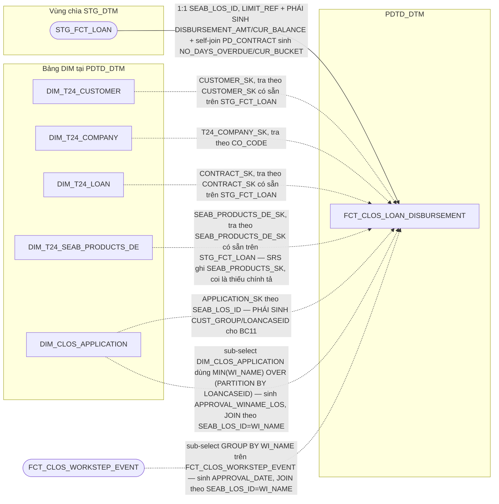
```mermaid
flowchart LR
    subgraph STG_DTM["Vùng chìa STG_DTM"]
        SA(["STG_FCT_LOAN"])
    end
    subgraph DIM_DTM["Bảng DIM tại PDTD_DTM"]
        CUST["DIM_T24_CUSTOMER"]
        COMP["DIM_T24_COMPANY"]
        LOAN["DIM_T24_LOAN"]
        PROD["DIM_T24_SEAB_PRODUCTS_DE"]
        CAPP["DIM_CLOS_APPLICATION"]
    end
    subgraph PDTD_DTM
        E["FCT_CLOS_LOAN_DISBURSEMENT"]
    end
    SA -->|1:1 SEAB_LOS_ID, LIMIT_REF + PHÁI SINH DISBURSEMENT_AMT/CUR_BALANCE + self-join PD_CONTRACT sinh NO_DAYS_OVERDUE/CUR_BUCKET| E
    CUST -.->|CUSTOMER_SK, tra theo CUSTOMER_SK có sẵn trên STG_FCT_LOAN| E
    COMP -.->|T24_COMPANY_SK, tra theo CO_CODE| E
    LOAN -.->|CONTRACT_SK, tra theo CONTRACT_SK có sẵn trên STG_FCT_LOAN| E
    PROD -.->|SEAB_PRODUCTS_DE_SK, tra theo SEAB_PRODUCTS_DE_SK có sẵn trên STG_FCT_LOAN — SRS ghi SEAB_PRODUCTS_SK, coi là thiếu chính tả| E
    CAPP -.->|APPLICATION_SK theo SEAB_LOS_ID — PHÁI SINH CUST_GROUP/LOANCASEID cho BC11| E
    CAPP -.->|"sub-select DIM_CLOS_APPLICATION dùng MIN(WI_NAME) OVER (PARTITION BY LOANCASEID) — sinh APPROVAL_WINAME_LOS, JOIN theo SEAB_LOS_ID=WI_NAME"| E
    WE(["FCT_CLOS_WORKSTEP_EVENT"]) -.->|"sub-select GROUP BY WI_NAME trên FCT_CLOS_WORKSTEP_EVENT — sinh APPROVAL_DATE, JOIN theo SEAB_LOS_ID=WI_NAME"| E
```

### 9.3 Cấu trúc bảng

| STT | Tên cột | Kiểu dữ liệu | Bắt buộc | Độ lớn | Khóa | Mô tả | Báo cáo sử dụng | Tên chỉ tiêu trên báo cáo |
| --- | --- | --- | --- | --- | --- | --- | --- | --- |
| 1 | DAYID | DATE | Y |  | PK | Ngày dữ liệu, dạng số YYYYMMDD — nguồn STG_DTM.STG_FCT_LOAN.DAYID, TRUNC về 00:00:00. Là ngày ảnh chụp số liệu, KHÔNG phải ngày nghiệp vụ. BẢNG HOÀN TOÀN MỚI TẠI PDTD_DTM, không có ở SB_DWH (nguồn STG_DTM/DIM_T24_*, không phải SB_DWH) | Báo cáo Giải ngân _ Quá hạn KHDN (BC11) — một phần khóa chính | — |
| 2 | CUSTOMER_SK | NUMBER | Y | 18 |  | Khóa tới DIM_T24_CUSTOMER — nguồn STG_DTM.STG_FCT_LOAN.CUSTOMER_SK (surrogate có sẵn, tra thẳng DIM_T24_CUSTOMER.DIMENSION_KEY, không tự lookup qua LEGAL_ID). Mặc định -1 nếu không khớp — BỔ SUNG RIÊNG TẠI PDTD_DTM, không có ở SB_DWH | Báo cáo Giải ngân _ Quá hạn KHDN (BC11) — khóa JOIN sang DIM_T24_CUSTOMER để lấy CUSTOMER_ID/SHORT_NAME | — |
| 3 | T24_COMPANY_SK | NUMBER | Y | 18 |  | Khóa tới DIM_T24_COMPANY — PHÁI SINH TẠI PDTD_DTM: lookup theo STG_DTM.STG_FCT_LOAN.CO_CODE = DIM_T24_COMPANY.COMPANY_CODE (chỉ bản ghi hiện hành, COMPANY_EXP_DATE IS NULL phía nguồn T24). Mặc định -1 — BỔ SUNG RIÊNG TẠI PDTD_DTM, không có ở SB_DWH | Báo cáo Giải ngân _ Quá hạn KHDN (BC11) — khóa JOIN sang DIM_T24_COMPANY để lấy BRANCH_NAME/COMPANY_NAME | — |
| 4 | CONTRACT_SK | NUMBER | Y | 18 |  | Khóa tới DIM_T24_LOAN — nguồn STG_DTM.STG_FCT_LOAN.CONTRACT_SK (surrogate có sẵn, tra thẳng DIM_T24_LOAN.DIMENSION_KEY). Mặc định -1 — BỔ SUNG RIÊNG TẠI PDTD_DTM, không có ở SB_DWH | Báo cáo Giải ngân _ Quá hạn KHDN (BC11) — khóa JOIN sang DIM_T24_LOAN để lấy VALUE_DATE/MATURITY_DATE/REC_STATUS/CONTRACT_REF/REF_VALUE_DATE | — |
| 5 | SEAB_PRODUCTS_DE_SK | NUMBER | Y | 18 |  | Khóa tới DIM_T24_SEAB_PRODUCTS_DE — nguồn STG_DTM.STG_FCT_LOAN.SEAB_PRODUCTS_DE_SK (surrogate có sẵn, tra thẳng DIMENSION_KEY; SRS ghi SEAB_PRODUCTS_SK, coi là thiếu chính tả). Mặc định -1 — BỔ SUNG RIÊNG TẠI PDTD_DTM, không có ở SB_DWH | Báo cáo Giải ngân _ Quá hạn KHDN (BC11) — khóa JOIN sang DIM_T24_SEAB_PRODUCTS_DE để lấy PRODUCT_T24 | — |
| 6 | APPLICATION_SK | NUMBER | Y | 18 |  | Khóa tới DIM_CLOS_APPLICATION, tra theo SEAB_LOS_ID (qua STG_DTM.STG_FCT_LOAN.SEAB_LOS_ID). KHÔNG để NULL — không tra được thì gán -1 (Unknown), tránh phép JOIN của OAS rớt dòng — BỔ SUNG RIÊNG TẠI PDTD_DTM, không có ở SB_DWH | Báo cáo Giải ngân _ Quá hạn KHDN (BC11) — khóa JOIN sang DIM_CLOS_APPLICATION, nguồn cho CUST_GROUP/LOANCASEID (cột 16, 17, cùng bảng); APPROVAL_WINAME_LOS (cột 18)/APPROVAL_DATE (cột 19) dùng cùng điều kiện SEAB_LOS_ID=WI_NAME nhưng qua sub-select riêng (trên STG_DIM_CLOS_APPLICATION/STG_FCT_CLOS_WORKSTEP_EVENT), không qua APPLICATION_SK | — |
| 7 | CONTRACT | VARCHAR2 | Y | 100 | PK | Mã hợp đồng khoản vay — nguồn STG_DTM.STG_FCT_LOAN.CONTRACT (nguồn gốc xa: SB_DWH.FCT_LOAN.CONTRACT, 1:1). BẢNG HOÀN TOÀN MỚI TẠI PDTD_DTM — không có SB_DWH.FCT_CLOS_LOAN_DISBURSEMENT tương ứng, chỉ nguồn gốc xa của riêng cột CONTRACT đi qua SB_DWH.FCT_LOAN (bảng T24 chung, không tách CLOS/RLOS) | Báo cáo Giải ngân _ Quá hạn KHDN (BC11) — hiển thị trực tiếp, khóa chính | CONTRACT (Mã hợp đồng) |
| 8 | SEAB_LOS_ID | VARCHAR2 | N | 100 |  | Mã hồ sơ LOS do T24 lưu, gắn với hợp đồng — nguồn STG_DTM.STG_FCT_LOAN.SEAB_LOS_ID — BỔ SUNG RIÊNG TẠI PDTD_DTM, không có ở SB_DWH | Báo cáo Giải ngân _ Quá hạn KHDN (BC11) — hiển thị trực tiếp | SEAB_LOS_ID (Mã hồ sơ) |
| 9 | ZONE | VARCHAR2 | N | 50 |  | Tên vùng của đơn vị kinh doanh — PHÁI SINH TẠI PDTD_DTM: LEFT JOIN TMP_REF_COMPANY_REGION_KHDN theo STG_DTM.STG_FCT_LOAN.CO_CODE = COMPANY_CODE. Lưu trực tiếp trên fact (không tách FK riêng) vì nguồn là bảng REF_ tĩnh, không phải DIM SCD2 — BỔ SUNG RIÊNG TẠI PDTD_DTM, không có ở SB_DWH | Báo cáo Giải ngân _ Quá hạn KHDN (BC11) — hiển thị trực tiếp | ZONE (Khu vực) |
| 10 | DISBURSEMENT_AMT | NUMBER | N | 20,2 |  | Số tiền giải ngân — PHÁI SINH TẠI PDTD_DTM: ABS(STG_DTM.STG_FCT_LOAN.FIRST_DISBURSEMENT_AMT) — BỔ SUNG RIÊNG TẠI PDTD_DTM, không có ở SB_DWH | Báo cáo Giải ngân _ Quá hạn KHDN (BC11) — hiển thị trực tiếp | DISBURSEMENT_AMT_T24 (Số tiền giải ngân) |
| 11 | CUR_BALANCE | NUMBER | N | 20,2 |  | Dư nợ hiện tại — PHÁI SINH TẠI PDTD_DTM: (ABS(NVL(BALANCE,0)) + ABS(NVL(PD_BALANCE,0))) * REVAL_RATE trên STG_DTM.STG_FCT_LOAN — BỔ SUNG RIÊNG TẠI PDTD_DTM, không có ở SB_DWH | Báo cáo Giải ngân _ Quá hạn KHDN (BC11) — hiển thị trực tiếp | CUR_BALANCE (Dư nợ hiện tại) |
| 12 | NO_DAYS_OVERDUE | NUMBER | N | 6 |  | Số ngày quá hạn — PHÁI SINH TẠI PDTD_DTM: self-join STG_DTM.STG_FCT_LOAN (b) ON a.PD_CONTRACT = b.CONTRACT, lấy b.NO_DAYS_OVERDUE — BỔ SUNG RIÊNG TẠI PDTD_DTM, không có ở SB_DWH | Báo cáo Giải ngân _ Quá hạn KHDN (BC11) — hiển thị trực tiếp | NO_DAYS_OVERDUE (Số ngày quá hạn) |
| 13 | CUR_BUCKET | NUMBER | N | 2 |  | Nhóm nợ — PHÁI SINH TẠI PDTD_DTM: CASE WHEN NO_DAYS_OVERDUE (cột 13, cùng bảng) > 360 THEN 5 WHEN > 180 THEN 4 WHEN > 90 THEN 3 WHEN >= 10 THEN 2 ELSE 1 END, cùng self-join PD_CONTRACT như NO_DAYS_OVERDUE — BỔ SUNG RIÊNG TẠI PDTD_DTM, không có ở SB_DWH | Báo cáo Giải ngân _ Quá hạn KHDN (BC11) — hiển thị trực tiếp | CUR_BUCKET (Nhóm nợ) |
| 14 | LIMIT_REFERENCE | VARCHAR2 | N | 100 |  | Mã hạn mức — nguồn STG_DTM.STG_FCT_LOAN.LIMIT_REF. Giữ trên fact (không chuyển DIM_T24_LOAN) vì nguồn là chính STG_FCT_LOAN, không phải STG_DIM_LOAN — BỔ SUNG RIÊNG TẠI PDTD_DTM, không có ở SB_DWH | Báo cáo Giải ngân _ Quá hạn KHDN (BC11) — hiển thị trực tiếp | LIMIT_REFERENCE (Mã Limit) |
| 15 | CUST_GROUP | VARCHAR2 | N | 100 |  | Nhóm khách hàng — PHÁI SINH TẠI PDTD_DTM: JOIN APPLICATION_SK (cột 7, cùng bảng) sang DIM_CLOS_APPLICATION.CUST_GROUP (PDTD_DTM).| Báo cáo Giải ngân _ Quá hạn KHDN (BC11) — hiển thị trực tiếp | CUST_GROUP (Nhóm khách hàng) |
| 16 | LOANCASEID | VARCHAR2 | N | 100 |  | Mã khoản vay gắn với hồ sơ cha — PHÁI SINH TẠI PDTD_DTM: JOIN APPLICATION_SK (cột 7) sang DIM_CLOS_APPLICATION.LOANCASEID (PDTD_DTM), CHỈ giữ giá trị khi hồ sơ có CHANGE_REQUEST='New' (đúng công thức SRS BC11), còn lại gán NULL dù DIM có giá trị — BỔ SUNG RIÊNG TẠI PDTD_DTM, không có ở SB_DWH | Báo cáo Giải ngân _ Quá hạn KHDN (BC11) — hiển thị trực tiếp | LOANCASEID (Mã LOANCASEID) |
| 17 | APPROVAL_WINAME_LOS | VARCHAR2 | N | 100 |  | Mã hồ sơ cha đã được phê duyệt — PHÁI SINH TẠI PDTD_DTM — BỔ SUNG RIÊNG TẠI PDTD_DTM, không có ở SB_DWH | Báo cáo Giải ngân _ Quá hạn KHDN (BC11) — hiển thị trực tiếp | APPROVAL_WINAME_LOS (Mã hồ sơ phê duyệt) |
| 18 | APPROVAL_DATE | DATE | N |  |  | Ngày phê duyệt — PHÁI SINH TẠI PDTD_DTM — BỔ SUNG RIÊNG TẠI PDTD_DTM, không có ở SB_DWH | Báo cáo Giải ngân _ Quá hạn KHDN (BC11) — hiển thị trực tiếp | APPROVAL_DATE (Ngày phê duyệt) |

## 10. FCT_CLOS_LEGAL_PARTY

### 10.1 Mục đích thiết kế
- **Ý nghĩa bảng:** bảng FACT lưu người/đối tượng liên quan vai trò pháp
  lý của hồ sơ CLOS (bao gồm cả giấy tờ định danh) — bê nguyên 1:1 từ
  `FCT_CLOS_LEGAL_PARTY`, bổ sung
  `LEGAL_TYPE` (LEFT JOIN `REF_CLOS_LEGAL` theo `OBJ_TYPE`, chuẩn hóa vai
  trò pháp lý tiếng Việt sang mã tiếng Anh). Không SCD2 (nguồn không có
  CDC key ổn định, xem SB_DWH mục 6).
  — không cần bảng trung gian riêng vì `CUSTOMER_SK`/`APPLICATION_SK` đã
  có sẵn ngay trên bảng này.
- **Khóa nghiệp vụ (BK):** composite `WI_NAME`+`ID_NUMBER` — hash vào
  cột `LEGAL_PARTY_BK`, bê 1:1 từ SB_DWH
- **Khóa chính của bảng (PK):** DAYID, LEGAL_PARTY_BK — bê 1:1 từ SB_DWH.
- **Độ chi tiết (grain):** 1 dòng = 1 người × 1 vai trò × 1 hồ sơ × 1
  ngày dữ liệu (N dòng/hồ sơ/ngày không giới hạn — 1 người có thể giữ
  nhiều vai trò cùng lúc), bê 1:1 theo cùng DAYID từ SB_DWH.
- **Phục vụ báo cáo:**
  - Báo cáo CLOS APPLICATION (BC2) — trực tiếp (`LEGAL_TYPE` lọc
    `CUSTOMER`, report-time tra `ID_NUMBER` khi cần đối chiếu). KHÔNG
    còn là nguồn ETL cho `LEGAL_REPRESENTATIVE`/`ADD_ID_REPRESENTATIVE`
    trên `FCT_CLOS_APPLICATION` (mục 4) — 2 cột đó ETL từ bản
    **SB_DWH** của bảng này, không phải bản PDTD_DTM này.

### 10.2 Sơ đồ lineage

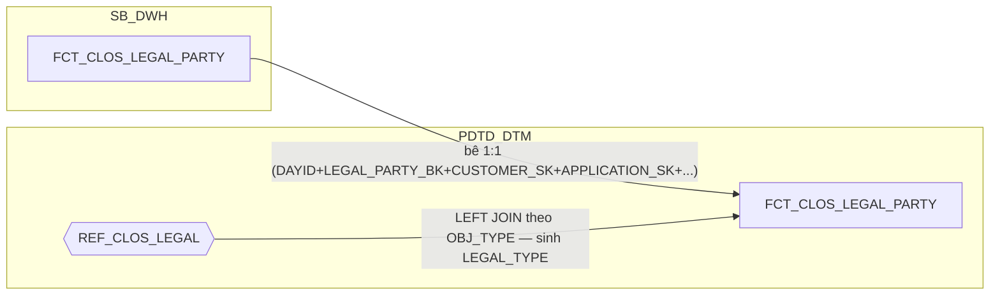
```mermaid
flowchart LR
    subgraph SB_DWH
        C["FCT_CLOS_LEGAL_PARTY"]
    end
    subgraph PDTD_DTM
        R{{"REF_CLOS_LEGAL"}}
        D["FCT_CLOS_LEGAL_PARTY"]
    end
    C -->|"bê 1:1 (DAYID+LEGAL_PARTY_BK+CUSTOMER_SK+APPLICATION_SK+...)"| D
    R -->|LEFT JOIN theo OBJ_TYPE — sinh LEGAL_TYPE| D
```

### 10.3 Cấu trúc bảng

| STT | Tên cột | Kiểu dữ liệu | Bắt buộc | Độ lớn | Khóa | Mô tả | Báo cáo sử dụng | Tên chỉ tiêu trên báo cáo |
| --- | --- | --- | --- | --- | --- | --- | --- | --- |
| 1 | DAYID | DATE | Y |  | PK | Ngày dữ liệu, dạng số YYYYMMDD — bê 1:1 từ SB_DWH.FCT_CLOS_LEGAL_PARTY.DAYID | — (cột kỹ thuật, một phần khóa chính) | — |
| 2 | LEGAL_PARTY_BK | VARCHAR2 | Y | 64 | PK | Khóa nghiệp vụ của dòng vai trò pháp lý — bê 1:1 từ SB_DWH.FCT_CLOS_LEGAL_PARTY.LEGAL_PARTY_BK: STANDARD_HASH(WI_NAME \|\| '~' \|\| ID_NUMBER, 'SHA256') — gộp 2 cột PK tự nhiên cũ (WI_NAME, ID_NUMBER) thành 1 khóa đơn | — (cột kỹ thuật, một phần khóa chính) | — |
| 3 | CUSTOMER_SK | NUMBER | Y | 18 |  | Khóa tới DIM_CLOS_CUSTOMER — khách hàng CHÍNH của hồ sơ (MỌI dòng đều có). Bê 1:1 từ SB_DWH.FCT_CLOS_LEGAL_PARTY.CUSTOMER_SK. Mặc định -1 nếu không khớp | — (khóa liên kết nội bộ — cũng là 1 trong 3 khóa mà FCT_CLOS_APPLICATION_PARTY cũ từng cung cấp, trước khi xóa hẳn khỏi thiết kế) | — |
| 4 | APPLICATION_SK | NUMBER | Y | 18 |  | Khóa tới DIM_CLOS_APPLICATION — join theo WI_NAME. Bê 1:1 từ SB_DWH.FCT_CLOS_LEGAL_PARTY.APPLICATION_SK. Mặc định -1 nếu không khớp | — (khóa liên kết nội bộ — cũng là 1 trong 3 khóa mà FCT_CLOS_APPLICATION_PARTY cũ từng cung cấp, trước khi xóa hẳn khỏi thiết kế) | — |
| 5 | WI_NAME | VARCHAR2 | Y | 100 |  | Mã hồ sơ CLOS — bê 1:1 từ SB_DWH.FCT_CLOS_LEGAL_PARTY.WI_NAME (nguồn gốc xa: NG_SB_CLOS_CUST_INFO_LEGAL.WI_NAME). Quan hệ 1:N với hồ sơ, N không giới hạn | Báo cáo CLOS APPLICATION (BC2) — khóa JOIN report-time để tra ID_NUMBER (LEGAL_TYPE='CUSTOMER') khi cần đối chiếu; nguồn ETL cho FCT_CLOS_APPLICATION.LEGAL_REPRESENTATIVE/ADD_ID_REPRESENTATIVE thực chất đi qua bản SB_DWH của bảng này, không phải qua bản PDTD_DTM này | — |
| 6 | ID_NUMBER | VARCHAR2 | Y | 100 |  | Số giấy tờ định danh — bê 1:1 từ SB_DWH.FCT_CLOS_LEGAL_PARTY.ID_NUMBER (nguồn gốc xa: NG_SB_CLOS_CUST_INFO_LEGAL.ID_NUMBER) | Báo cáo CLOS APPLICATION (BC2) — report-time, lọc LEGAL_TYPE='CUSTOMER' để tra ID_NUMBER khi cần | — |
| 7 | FULL_NAME | VARCHAR2 | N | 200 |  | Họ tên/tên đối tượng — bê 1:1 từ SB_DWH.FCT_CLOS_LEGAL_PARTY.FULL_NAME (nguồn gốc xa: NG_SB_CLOS_CUST_INFO_LEGAL.NAMEE) | Báo cáo CLOS APPLICATION (BC2) — nguồn gián tiếp qua LEGAL_REPRESENTATIVE (LEGAL_TYPE='LEGAL_REPRESENTATIVE', nối chuỗi ';' nếu nhiều đại diện) | LEGAL_REPRESENTATIVE (Người đại diện pháp luật) |
| 8 | OBJ_TYPE | VARCHAR2 | N | 100 |  | Loại đối tượng của giấy tờ pháp lý — bê 1:1 từ SB_DWH.FCT_CLOS_LEGAL_PARTY.OBJ_TYPE (nguồn gốc xa: NG_SB_CLOS_CUST_INFO_LEGAL.OBJ_TYPE) | — (chuẩn hóa thành LEGAL_TYPE ở PDTD_DTM, dùng làm điều kiện lọc) | — |
| 9 | LEGAL_DOC | VARCHAR2 | N | 100 |  | Tên loại giấy tờ pháp lý — bê 1:1 từ SB_DWH.FCT_CLOS_LEGAL_PARTY.LEGAL_DOC (nguồn gốc xa: NG_SB_CLOS_CUST_INFO_LEGAL.LEGAL_DOC) | — (chưa có báo cáo nào tiêu thụ trực tiếp) | — |
| 10 | LEGAL_TYPE | VARCHAR2 | N | 50 |  | PHÁI SINH TẠI PDTD_DTM: LEFT JOIN REF_CLOS_LEGAL (bảng REF_, chỉ tồn tại ở PDTD_DTM) theo OBJ_TYPE (cột 9, cùng bảng, đã bê 1:1 từ SB_DWH) — chuẩn hóa vai trò pháp lý sang mã tiếng Anh (LEGAL_REPRESENTATIVE, CUSTOMER, COLLATERAL_OWNER, MAIN_CONTRIBUTING_MEMBERS, OTHER) — BỔ SUNG RIÊNG TẠI PDTD_DTM, không có ở SB_DWH | Báo cáo CLOS APPLICATION (BC2) — report-time, khóa lọc LEGAL_TYPE='CUSTOMER' khi cần tra ID_NUMBER | — |

## 11. FCT_RLOS_APPLICATION

### 11.1 Mục đích thiết kế
- **Ý nghĩa bảng:** bảng FACT hồ sơ tín dụng RLOS (bán
  lẻ/cá nhân) tại PDTD_DTM — bê nguyên 1:1 phần lớn cột từ SB_DWH (ảnh
  trạng thái cuối ngày, số tiền/kỳ hạn phê duyệt cuối cùng), bổ sung các
  khóa kỹ thuật để báo cáo join sang các chiều T24 và tên bước chuẩn hóa
  dùng chung 2 hệ CLOS/RLOS.
- **Khóa nghiệp vụ (BK):** `WI_NAME`
- **Khóa chính của bảng (PK):** DAYID, WI_NAME.
- **Độ chi tiết (grain):** 1 dòng = 1 hồ sơ x 1 ngày dữ liệu.
- **Phục vụ báo cáo:**
  - Báo cáo RLOS APPLICATION (BC1) — `BUSINESS_FLOW` (Phân khúc hồ sơ) nay đọc từ đây thay vì qua `DIM_RLOS_APPLICATION`
  - Báo cáo Thông tin phê duyệt (BC3) — `CREDIT_LIMIT`/`CURRENCY`/`CREDIT_TERM` đọc trực tiếp tại đây (`APPROVED_AMT_FINAL`/`CURRENCY_CODE`/`APPROVED_TERM`, bê 1:1 từ SB_DWH) — review 2026-10-04: dọn trùng lặp, trước đó đặt riêng ở `FCT_RLOS_WORKSTEP_EVENT`, thống nhất cách CLOS đang làm
  - Báo cáo Tuần Chuyên viên Thẩm định (BC4)
  - Báo cáo SLA - TAT (BC5) — khóa tra REF_SLA_NLTT qua PRODUCT_SK; nay đọc `REF_PRODUCT`/`SLA_*` từ đây thay vì qua `DIM_RLOS_APPLICATION`
  - Báo cáo NGOẠI LỆ (BC6)
  - Báo cáo RETURN (BC8) — `RETURN_CNT_*` không còn ETL sẵn trên bảng
    này, báo cáo tự SUM/COUNT report-time từ `FCT_RLOS_WORKSTEP_EVENT`
    JOIN `DIM_RLOS_WORKSTEP_DECISION` (đồng bộ theo pattern đã áp dụng
    cho `FCT_CLOS_APPLICATION`, mục 4)
  - Báo cáo KPI (BC9) — AGG_LOS_KPI_APPLICATION.INCOM_3/BUSINESS_INCOM
    (nay tra qua DIM_RLOS_APPLICATION, không còn đọc thẳng bảng này);
    `DEVIATION_G3` nay đọc từ đây thay vì qua `DIM_RLOS_APPLICATION`
  - Báo cáo Giải ngân _ Quá hạn KHCN (BC10)

### 11.2 Sơ đồ lineage

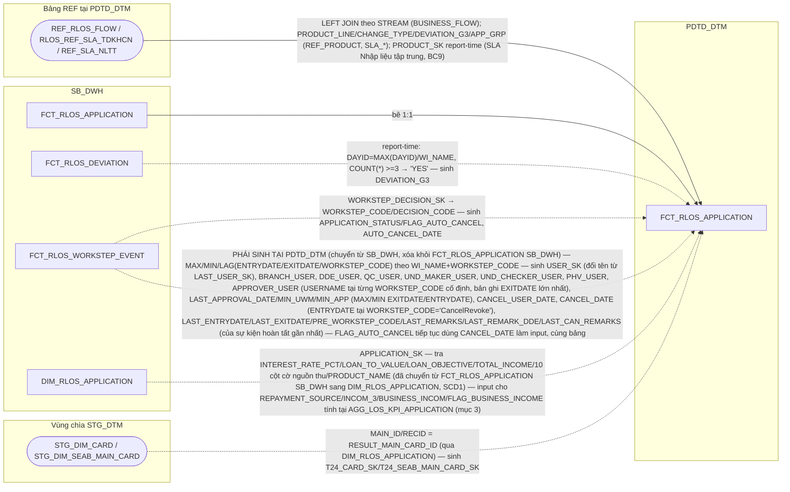
```mermaid
flowchart LR
    subgraph SB_DWH
        C["FCT_RLOS_APPLICATION"]
        DV["FCT_RLOS_DEVIATION"]
        WE["FCT_RLOS_WORKSTEP_EVENT"]
        RAPP["DIM_RLOS_APPLICATION"]
    end
    subgraph REF_DTM["Bảng REF tại PDTD_DTM"]
        REF(["REF_RLOS_FLOW / RLOS_REF_SLA_TDKHCN / REF_SLA_NLTT"])
    end
    subgraph STG_DTM["Vùng chìa STG_DTM"]
        STG(["STG_DIM_CARD / STG_DIM_SEAB_MAIN_CARD"])
    end
    subgraph PDTD_DTM
        D["FCT_RLOS_APPLICATION"]
    end
    C -->|bê 1:1| D
    DV -.->|"report-time: DAYID=MAX(DAYID)/WI_NAME, COUNT(*) >=3 → 'YES' — sinh DEVIATION_G3"| D
    REF -->|"LEFT JOIN theo STREAM (BUSINESS_FLOW); PRODUCT_LINE/CHANGE_TYPE/DEVIATION_G3/APP_GRP (REF_PRODUCT, SLA_*); PRODUCT_SK report-time (SLA Nhập liệu tập trung, BC9)"| D
    WE -.->|"WORKSTEP_DECISION_SK → WORKSTEP_CODE/DECISION_CODE — sinh APPLICATION_STATUS/FLAG_AUTO_CANCEL, AUTO_CANCEL_DATE "| D
    STG -.->|"MAIN_ID/RECID = RESULT_MAIN_CARD_ID (qua DIM_RLOS_APPLICATION) — sinh T24_CARD_SK/T24_SEAB_MAIN_CARD_SK"| D
    WE -.->|"PHÁI SINH TẠI PDTD_DTM (chuyển từ SB_DWH, xóa khỏi FCT_RLOS_APPLICATION SB_DWH) — MAX/MIN/LAG(ENTRYDATE/EXITDATE/WORKSTEP_CODE) theo WI_NAME+WORKSTEP_CODE — sinh USER_SK (đổi tên từ LAST_USER_SK), BRANCH_USER, DDE_USER, QC_USER, UND_MAKER_USER, UND_CHECKER_USER, PHV_USER, APPROVER_USER (USERNAME tại từng WORKSTEP_CODE cố định, bản ghi EXITDATE lớn nhất), LAST_APPROVAL_DATE/MIN_UWM/MIN_APP (MAX/MIN EXITDATE/ENTRYDATE), CANCEL_USER_DATE, CANCEL_DATE (ENTRYDATE tại WORKSTEP_CODE='CancelRevoke'), LAST_ENTRYDATE/LAST_EXITDATE/PRE_WORKSTEP_CODE/LAST_REMARKS/LAST_REMARK_DDE/LAST_CAN_REMARKS (của sự kiện hoàn tất gần nhất) — FLAG_AUTO_CANCEL tiếp tục dùng CANCEL_DATE làm input, cùng bảng"| D
    RAPP -.->|"APPLICATION_SK — tra INTEREST_RATE_PCT/LOAN_TO_VALUE/LOAN_OBJECTIVE/TOTAL_INCOME/10 cột cờ nguồn thu/PRODUCT_NAME (đã chuyển từ FCT_RLOS_APPLICATION SB_DWH sang DIM_RLOS_APPLICATION, SCD1) — input cho REPAYMENT_SOURCE/INCOM_3/BUSINESS_INCOM/FLAG_BUSINESS_INCOME tính tại AGG_LOS_KPI_APPLICATION (mục 3)"| D
```

### 11.3 Cấu trúc bảng

| STT | Tên cột | Kiểu dữ liệu | Bắt buộc | Độ lớn | Khóa | Mô tả | Báo cáo sử dụng | Tên chỉ tiêu trên báo cáo |
| --- | --- | --- | --- | --- | --- | --- | --- | --- |
| 1 | DAYID | DATE | Y |  | PK | Ngày dữ liệu, dạng số YYYYMMDD — bê 1:1 từ SB_DWH.FCT_RLOS_APPLICATION.DAYID | — (cột kỹ thuật) | — |
| 2 | APPLICATION_SK | NUMBER | Y | 18 |  | Khóa tới DIM_RLOS_APPLICATION. Mặc định -1 nếu không khớp — bê 1:1 từ SB_DWH.FCT_RLOS_APPLICATION.APPLICATION_SK | Báo cáo RLOS APPLICATION (BC1) — khóa JOIN sang DIM_RLOS_APPLICATION | — |
| 3 | WORKSTEP_DECISION_SK | NUMBER | Y | 18 |  | Khóa tới DIM_RLOS_WORKSTEP_DECISION. Mặc định -1 — bê 1:1 từ SB_DWH.FCT_RLOS_APPLICATION.WORKSTEP_DECISION_SK (đổi tên từ LAST_WORKSTEP_DECISION_SK, review 2026-10-04, theo yêu cầu người dùng, đồng bộ pattern CLOS) | Báo cáo RLOS APPLICATION (BC1) — nguồn cho LAST_WORKSTEP (LEFT JOIN Q_RLOS_REF_WORKSTEP_2SYSTEMS ở PDTD_DTM) và khóa JOIN cho LAST_DECISION | LAST_DECISION (Quyết định tại bước cuối) |
| 4 | PRODUCT_SK | NUMBER | Y | 18 |  | Khóa tới DIM_RLOS_PRODUCT — lookup theo PRODUCTLINE_CODE=NG_SB_RLOS_APPLICANT_GENERAL.PRODUCT_LINE AND SUB_PRODUCT_CODE=NG_SB_RLOS_APPLICANT_GENERAL.SUB_PRODUCT, điều kiện SCD2 hiệu lực tại DAYID. Mặc định -1 nếu không khớp — bê 1:1 từ SB_DWH.FCT_RLOS_APPLICATION.PRODUCT_SK.| Báo cáo RLOS APPLICATION (BC1) — khóa JOIN sang DIM_RLOS_PRODUCT Báo cáo SLA - TAT (BC5) — khóa tra REF_SLA_NLTT theo PRODUCTLINE_NAME Báo cáo KPI (BC9) — khóa report-time tra REF_SLA_NLTT phục vụ POINT | PRODUCT_LINE (Dòng sản phẩm); nguồn cho chỉ tiêu/trường SLA_DE (Cam kết SLA Chuyên viên nhập liệu, BC5) |
| 5 | COMPANY_SK | NUMBER | Y | 18 |  | Khóa tới DIM_LOS_COMPANY — lookup theo COMPANY_CODE=NG_SB_RLOS_APPLICANT_GENERAL.COMPANY_CODE, điều kiện SCD2 hiệu lực tại DAYID. Mặc định -1 nếu không khớp — bê 1:1 từ SB_DWH.FCT_RLOS_APPLICATION.COMPANY_SK | Báo cáo RLOS APPLICATION (BC1) — khóa JOIN sang DIM_LOS_COMPANY lấy BRANCH_CODE, và tiếp LEFT JOIN TMP_REF_COMPANY_REGION_KHCN lấy ZONE tại tầng truy vấn báo cáo | BRANCH_CODE (Mã Chi nhánh) |
| 6 | CHANGE_TYPE_SK | NUMBER | Y | 18 |  | Khóa tới DIM_RLOS_CHANGE_TYPE. Chỉ có giá trị với hồ sơ thay đổi điều kiện phê duyệt, còn lại Unknown -1. Nguồn: NG_SB_RLOS_EXTTABLE.CHANGE_TYPE — bê 1:1 từ SB_DWH.FCT_RLOS_APPLICATION.CHANGE_TYPE_SK | Báo cáo RLOS APPLICATION (BC1) — khóa JOIN sang DIM_RLOS_CHANGE_TYPE | CHANGE_TYPE_DETAIL (Chi tiết loại thay đổi điều kiện) |
| 7 | CARD_PROMOTION_SK | NUMBER | Y | 18 |  | Khóa tới DIM_RLOS_CARD_PROMOTION. Lookup NG_SB_RLOS_CBS.PROMOTION_ID; hồ sơ không phải thẻ dùng -1 — bê 1:1 từ SB_DWH.FCT_RLOS_APPLICATION.CARD_PROMOTION_SK | Báo cáo RLOS APPLICATION (BC1) — khóa JOIN sang DIM_RLOS_CARD_PROMOTION | PROMOTION_ID (Ưu đãi phí) |
| 8 | T24_CARD_SK | NUMBER | Y | 18 |  | Khóa tới DIM_T24_CARD. Mặc định -1. Báo cáo khai thác K_TYPE qua FK này, không denormalize trực tiếp lên FCT — BỔ SUNG RIÊNG TẠI PDTD_DTM, không có ở SB_DWH | Báo cáo RLOS APPLICATION (BC1) — khóa JOIN sang DIM_T24_CARD lấy K_TYPE| K_TYPE (Loại thẻ tín dụng) |
| 9 | T24_SEAB_MAIN_CARD_SK | NUMBER | Y | 18 |  | Khóa tới DIM_T24_SEAB_MAIN_CARD. Mặc định -1. Báo cáo khai thác HOME_ADDRESS qua FK này, không denormalize trực tiếp lên FCT — BỔ SUNG RIÊNG TẠI PDTD_DTM, không có ở SB_DWH | Báo cáo RLOS APPLICATION (BC1) — khóa JOIN sang DIM_T24_SEAB_MAIN_CARD lấy HOME_ADDRESS| HOME_ADDRESS (Địa chỉ nhận Pin/Thẻ) |
| 10 | WI_NAME | VARCHAR2 | Y | 100 | PK | Mã hồ sơ tín dụng RLOS — bê 1:1 từ SB_DWH.FCT_RLOS_APPLICATION.WI_NAME (nguồn gốc xa: NG_SB_RLOS_ENTRY_EXIT.WINAME, direct, driving table) | Báo cáo RLOS APPLICATION (BC1) — khóa chính Báo cáo KPI (BC9) — khóa nối AGG_LOS_KPI_APPLICATION Báo cáo SLA - TAT (BC5) — khóa chính | WINAME (Mã hồ sơ). ⚠️ Review 2026-10-04 (cross-check LLD/HLD): bổ sung BC5 — BC5.csv#52 đã dùng cột này từ trước, chỉ thiếu khai báo tại đây |
| 11 | USER_SK | NUMBER | Y | 18 |  | Khóa tới DIM_LOS_USER của người xử lý sự kiện hoàn tất gần nhất — PHÁI SINH TẠI PDTD_DTM (review 2026-10-04, chuyển từ SB_DWH, đổi tên từ LAST_USER_SK): USER_SK trên SB_DWH.FCT_RLOS_WORKSTEP_EVENT của bản ghi "sự kiện hoàn tất gần nhất" (cùng bản ghi dùng để tính WORKSTEP_DECISION_SK, cột 3) theo WI_NAME — BỔ SUNG RIÊNG TẠI PDTD_DTM, không còn ở SB_DWH | Thiết kế dư thừa | — |
| 12 | BRANCH_USER | VARCHAR2 | N | 100 |  | User xử lý bước BranchSupport, HOÀN TẤT gần nhất — PHÁI SINH TẠI PDTD_DTM (review 2026-10-04, chuyển từ SB_DWH): USERNAME trên SB_DWH.FCT_RLOS_WORKSTEP_EVENT tại WORKSTEP_CODE='BranchSupport', bản ghi EXITDATE lớn nhất (<=DAYID) theo WI_NAME — BỔ SUNG RIÊNG TẠI PDTD_DTM, không còn ở SB_DWH | Báo cáo RLOS APPLICATION (BC1) — hiển thị trực tiếp | BRANCH_USER (User Chi nhánh) |
| 13 | DDE_USER | VARCHAR2 | N | 100 |  | User xử lý bước DetailDataEntry, HOÀN TẤT gần nhất — PHÁI SINH TẠI PDTD_DTM (review 2026-10-04, chuyển từ SB_DWH): USERNAME trên SB_DWH.FCT_RLOS_WORKSTEP_EVENT tại WORKSTEP_CODE='DetailDataEntry', bản ghi EXITDATE lớn nhất (<=DAYID) theo WI_NAME — BỔ SUNG RIÊNG TẠI PDTD_DTM, không còn ở SB_DWH | Báo cáo RLOS APPLICATION (BC1) — hiển thị trực tiếp | DDE_USER (User Chuyên viên nhập liệu) |
| 14 | QC_USER | VARCHAR2 | N | 100 |  | User xử lý bước DataInputerChecker, HOÀN TẤT gần nhất — PHÁI SINH TẠI PDTD_DTM (review 2026-10-04, chuyển từ SB_DWH): USERNAME trên SB_DWH.FCT_RLOS_WORKSTEP_EVENT tại WORKSTEP_CODE='DataInputerChecker', bản ghi EXITDATE lớn nhất (<=DAYID) theo WI_NAME — BỔ SUNG RIÊNG TẠI PDTD_DTM, không còn ở SB_DWH | Báo cáo RLOS APPLICATION (BC1) — hiển thị trực tiếp | QUALITY_CHECKER (User Kiểm soát nhập liệu) |
| 15 | UND_MAKER_USER | VARCHAR2 | N | 100 |  | User xử lý bước UnderwriterMaker, HOÀN TẤT gần nhất — PHÁI SINH TẠI PDTD_DTM (review 2026-10-04, chuyển từ SB_DWH): USERNAME trên SB_DWH.FCT_RLOS_WORKSTEP_EVENT tại WORKSTEP_CODE='UnderwriterMaker', bản ghi EXITDATE lớn nhất (<=DAYID) theo WI_NAME — BỔ SUNG RIÊNG TẠI PDTD_DTM, không còn ở SB_DWH | Báo cáo RLOS APPLICATION (BC1) — hiển thị trực tiếp | UND_MAKER (User Chuyên viên thẩm định) |
| 16 | UND_CHECKER_USER | VARCHAR2 | N | 100 |  | User xử lý bước UnderwriterChecker, HOÀN TẤT gần nhất — PHÁI SINH TẠI PDTD_DTM (review 2026-10-04, chuyển từ SB_DWH): USERNAME trên SB_DWH.FCT_RLOS_WORKSTEP_EVENT tại WORKSTEP_CODE='UnderwriterChecker', bản ghi EXITDATE lớn nhất (<=DAYID) theo WI_NAME — BỔ SUNG RIÊNG TẠI PDTD_DTM, không còn ở SB_DWH | Báo cáo RLOS APPLICATION (BC1) — hiển thị trực tiếp | UND_CHECKER (User Kiểm soát thẩm định) |
| 17 | PHV_USER | VARCHAR2 | N | 100 |  | User xử lý bước PhoneVerification, HOÀN TẤT gần nhất — PHÁI SINH TẠI PDTD_DTM (review 2026-10-04, chuyển từ SB_DWH): USERNAME trên SB_DWH.FCT_RLOS_WORKSTEP_EVENT tại WORKSTEP_CODE='PhoneVerification', bản ghi EXITDATE lớn nhất (<=DAYID) theo WI_NAME — BỔ SUNG RIÊNG TẠI PDTD_DTM, không còn ở SB_DWH | Báo cáo RLOS APPLICATION (BC1) — hiển thị trực tiếp | PHV_USER (User Chuyên viên Thẩm định điện thoại) |
| 18 | APPROVER_USER | VARCHAR2 | N | 100 |  | User xử lý bước CreditApproval, HOÀN TẤT gần nhất — PHÁI SINH TẠI PDTD_DTM (review 2026-10-04, chuyển từ SB_DWH): USERNAME trên SB_DWH.FCT_RLOS_WORKSTEP_EVENT tại WORKSTEP_CODE='CreditApproval', bản ghi EXITDATE lớn nhất (<=DAYID) theo WI_NAME — BỔ SUNG RIÊNG TẠI PDTD_DTM, không còn ở SB_DWH | Báo cáo RLOS APPLICATION (BC1) — hiển thị trực tiếp | BI_APPROVER (User Chuyên gia phê duyệt) |
| 19 | PROCESSED_DATE | DATE | N |  |  | Ngày xử lý chung của hồ sơ theo 3 mức ưu tiên — bê 1:1 từ SB_DWH.FCT_RLOS_APPLICATION.PROCESSED_DATE | Báo cáo RLOS APPLICATION (BC1) — hiển thị trực tiếp Báo cáo KPI (BC9) — dùng xếp hồ sơ vào đúng DAYID khi tổng hợp AGG_LOS_KPI_YTD_DAILY Báo cáo SLA - TAT (BC5) — hiển thị trực tiếp | PROCESSED_DATE (Ngày dữ liệu báo cáo). ⚠️ Review 2026-10-04 (cross-check LLD/HLD): bổ sung BC5 — BC5.csv#51 đã dùng cột này từ trước, chỉ thiếu khai báo tại đây |
| 20 | CREATION_DATE | DATE | N |  |  | TRUNC(MIN(ENTRYDATE)) theo WI_NAME — bê 1:1 từ SB_DWH.FCT_RLOS_APPLICATION.CREATION_DATE | Báo cáo RLOS APPLICATION (BC1) — hiển thị trực tiếp | CREATION_DATE (Ngày khởi tạo hồ sơ) |
| 21 | LAST_APPROVAL_DATE | DATE | N |  |  | MAX(EXITDATE) tại bước phê duyệt (nhóm quyết định đã định nghĩa) — PHÁI SINH TẠI PDTD_DTM (review 2026-10-04, chuyển từ SB_DWH): MAX(EXITDATE) trên SB_DWH.FCT_RLOS_WORKSTEP_EVENT tại WORKSTEP_CODE IN ('CreditApproval','CreditCommittee'), không lọc DECISION, theo WI_NAME — BỔ SUNG RIÊNG TẠI PDTD_DTM, không còn ở SB_DWH | Báo cáo RLOS APPLICATION (BC1) — hiển thị trực tiếp | LAST_APPROVAL_DATE (Thời gian phê duyệt cuối cùng) |
| 22 | MIN_UWM | TIMESTAMP | N |  |  | MIN(ENTRYDATE) tại UnderwriterMaker — PHÁI SINH TẠI PDTD_DTM (review 2026-10-04, chuyển từ SB_DWH): MIN(ENTRYDATE) trên SB_DWH.FCT_RLOS_WORKSTEP_EVENT tại WORKSTEP_CODE='UnderwriterMaker' theo WI_NAME — BỔ SUNG RIÊNG TẠI PDTD_DTM, không còn ở SB_DWH | Báo cáo RLOS APPLICATION (BC1) — hiển thị trực tiếp | MIN_UWM (Thời gian hồ sơ lên CV thẩm định) |
| 23 | MIN_APP | TIMESTAMP | N |  |  | MIN(ENTRYDATE) tại CreditApproval/CreditCommittee — PHÁI SINH TẠI PDTD_DTM (review 2026-10-04, chuyển từ SB_DWH): MIN(ENTRYDATE) trên SB_DWH.FCT_RLOS_WORKSTEP_EVENT tại WORKSTEP_CODE IN ('CreditApproval','CreditCommittee') theo WI_NAME — BỔ SUNG RIÊNG TẠI PDTD_DTM, không còn ở SB_DWH | Báo cáo RLOS APPLICATION (BC1) — hiển thị trực tiếp | MIN_APP (Thời gian hồ sơ lên CG phê duyệt) |
| 24 | CANCEL_USER_DATE | DATE | N |  |  | EXITDATE tại bản ghi DECISION='Cancel' và USERNAME khác NULL — PHÁI SINH TẠI PDTD_DTM (review 2026-10-04, chuyển từ SB_DWH): trên SB_DWH.FCT_RLOS_WORKSTEP_EVENT, điều kiện DECISION_CODE='Cancel' (qua WORKSTEP_DECISION_SK) AND USERNAME IS NOT NULL theo WI_NAME — BỔ SUNG RIÊNG TẠI PDTD_DTM, không còn ở SB_DWH | Báo cáo RLOS APPLICATION (BC1) — hiển thị trực tiếp | CAN_USER_DATE (Thời gian cancel do NSD) |
| 25 | CANCEL_DATE | DATE | N |  |  | ENTRYDATE tại bước CancelRevoke — PHÁI SINH TẠI PDTD_DTM (review 2026-10-04, chuyển từ SB_DWH): ENTRYDATE trên SB_DWH.FCT_RLOS_WORKSTEP_EVENT tại WORKSTEP_CODE='CancelRevoke' theo WI_NAME — BỔ SUNG RIÊNG TẠI PDTD_DTM, không còn ở SB_DWH. `FLAG_AUTO_CANCEL` (business rule dựa trên cột này) tiếp tục tính tại chính bảng này, nay dùng input từ cột đã derive cùng bảng | Báo cáo RLOS APPLICATION (BC1) — hiển thị trực tiếp | CANCEL_DATE (Thời gian hồ sơ vào vùng CancelRevoke) |
| 26 | LAST_ENTRYDATE | TIMESTAMP | N |  |  | ENTRYDATE của sự kiện hoàn tất gần nhất — PHÁI SINH TẠI PDTD_DTM (review 2026-10-04, chuyển từ SB_DWH): ENTRYDATE trên SB_DWH.FCT_RLOS_WORKSTEP_EVENT của bản ghi EXITDATE IS NOT NULL có ENTRYDATE lớn nhất (<=DAYID) theo WI_NAME — BỔ SUNG RIÊNG TẠI PDTD_DTM, không còn ở SB_DWH | Báo cáo RLOS APPLICATION (BC1) — hiển thị trực tiếp | LAST_ENTRYDATE (Thời gian vào bước cuối) |
| 27 | LAST_EXITDATE | TIMESTAMP | N |  |  | EXITDATE của cùng sự kiện hoàn tất gần nhất — PHÁI SINH TẠI PDTD_DTM (review 2026-10-04, chuyển từ SB_DWH), cùng bản ghi "sự kiện hoàn tất gần nhất" (cột 26) trên SB_DWH.FCT_RLOS_WORKSTEP_EVENT — BỔ SUNG RIÊNG TẠI PDTD_DTM, không còn ở SB_DWH | Báo cáo RLOS APPLICATION (BC1) — hiển thị trực tiếp | LAST_EXITDATE (Thời gian kết thúc bước cuối) |
| 28 | PRE_WORKSTEP_CODE | VARCHAR2 | N | 200 |  | Bước xử lý liền trước (LAG theo ENTRYDATE) — PHÁI SINH TẠI PDTD_DTM (review 2026-10-04, chuyển từ SB_DWH): LAG(WORKSTEP_CODE) OVER (PARTITION BY WI_NAME ORDER BY ENTRYDATE) trên SB_DWH.FCT_RLOS_WORKSTEP_EVENT của sự kiện hoàn tất gần nhất — BỔ SUNG RIÊNG TẠI PDTD_DTM, không còn ở SB_DWH | Báo cáo RLOS APPLICATION (BC1) — hiển thị trực tiếp | PRE_WORKSTEP (Bước hồ sơ trước đó) |
| 29 | LAST_REMARKS | VARCHAR2 | N | 4000 |  | Ghi chú của sự kiện hoàn tất gần nhất — PHÁI SINH TẠI PDTD_DTM (review 2026-10-04, chuyển từ SB_DWH): REMARKS trên SB_DWH.FCT_RLOS_WORKSTEP_EVENT của cùng bản ghi "sự kiện hoàn tất gần nhất" (cột 26-28) — BỔ SUNG RIÊNG TẠI PDTD_DTM, không còn ở SB_DWH | Báo cáo RLOS APPLICATION (BC1) — hiển thị trực tiếp | LAST_REMARKS (Ghi chú ý kiến bước cuối) |
| 30 | LAST_REMARK_DDE | VARCHAR2 | N | 4000 |  | Ghi chú tại bước DetailDataEntry — PHÁI SINH TẠI PDTD_DTM (review 2026-10-04, chuyển từ SB_DWH): REMARKS trên SB_DWH.FCT_RLOS_WORKSTEP_EVENT, bước WORKSTEP_CODE='DetailDataEntry' gần nhất (bản ghi EXITDATE lớn nhất <=DAYID) theo WI_NAME — BỔ SUNG RIÊNG TẠI PDTD_DTM, không còn ở SB_DWH | Báo cáo RLOS APPLICATION (BC1) — hiển thị trực tiếp | LAST_REMARK_DDE (Ghi chú tại bước nhập liệu DDE) |
| 31 | LAST_CAN_REMARKS | VARCHAR2 | N | 4000 |  | Ghi chú tại lần hủy hồ sơ — PHÁI SINH TẠI PDTD_DTM (review 2026-10-04, chuyển từ SB_DWH): REMARKS trên SB_DWH.FCT_RLOS_WORKSTEP_EVENT, bước hủy hồ sơ gần nhất theo WI_NAME — BỔ SUNG RIÊNG TẠI PDTD_DTM, không còn ở SB_DWH | Báo cáo RLOS APPLICATION (BC1) — hiển thị trực tiếp | LAST_CAN_REMARKS (Ghi chú tại bước Cancel) |
| 32 | APPROVED_AMT_FINAL | NUMBER | N | 20,2 |  | Hạn mức phê duyệt cuối cùng — bê 1:1 từ SB_DWH.FCT_RLOS_APPLICATION.APPROVED_AMT_FINAL (nguồn gốc xa: NG_SB_RLOS_CREDIT_PROPOSAL.LOAN_AMOUNT) | Báo cáo RLOS APPLICATION (BC1) — hiển thị trực tiếp Báo cáo Thông tin phê duyệt (BC3) — CREDIT_LIMIT (review 2026-10-04: thay thế FCT_RLOS_WORKSTEP_EVENT) | LOAN_AMOUNT (Số tiền phê duyệt); CREDIT_LIMIT (BC3) |
| 33 | APPROVED_TERM | NUMBER | N | 5 |  | Kỳ hạn phê duyệt — bê 1:1 từ SB_DWH.FCT_RLOS_APPLICATION.APPROVED_TERM | Báo cáo RLOS APPLICATION (BC1) — hiển thị trực tiếp Báo cáo Thông tin phê duyệt (BC3) — CREDIT_TERM (review 2026-10-04: thay thế FCT_RLOS_WORKSTEP_EVENT) | LOAN_TERM (Thời hạn phê duyệt, tháng); CREDIT_TERM (BC3) |
| 34 | UNDERWRITERMAKER_USERMAKE | VARCHAR2 | N | 100 |  | PHÁI SINH, COALESCE ĐÃ TÍNH XONG TẠI SB_DWH, bê 1:1 từ SB_DWH.FCT_RLOS_APPLICATION.UNDERWRITERMAKER_USERMAKE: COALESCE(CASE WHEN NG_SB_RLOS_USER_MAKE_WORK_STEP.WORK_STEP='UnderwriterMaker' THEN NG_SB_RLOS_USER_MAKE_WORK_STEP.USER_MAKE END, NG_SB_RLOS_EXTTABLE.UWMAKERUSER) | Báo cáo RLOS APPLICATION (BC1) — BC1 map thẳng vào cột này.| — |
| 35 | UNDERWRITERCHECKER_USERMAKE | VARCHAR2 | N | 100 |  | PHÁI SINH, COALESCE ĐÃ TÍNH XONG TẠI SB_DWH, bê 1:1 từ SB_DWH.FCT_RLOS_APPLICATION.UNDERWRITERCHECKER_USERMAKE: COALESCE(CASE WHEN NG_SB_RLOS_USER_MAKE_WORK_STEP.WORK_STEP='UnderwriterChecker' THEN NG_SB_RLOS_USER_MAKE_WORK_STEP.USER_MAKE END, NG_SB_RLOS_EXTTABLE.UWCHKRUSER) | Báo cáo RLOS APPLICATION (BC1) — BC1 map thẳng vào cột này.| — |
| 36 | APPROVAL_USERMAKE | VARCHAR2 | N | 100 |  | PHÁI SINH, COALESCE ĐÃ TÍNH XONG TẠI SB_DWH, bê 1:1 từ SB_DWH.FCT_RLOS_APPLICATION.APPROVAL_USERMAKE: COALESCE(CASE WHEN NG_SB_RLOS_USER_MAKE_WORK_STEP.WORK_STEP IN ('CreditCommittee','CreditApproval') THEN NG_SB_RLOS_USER_MAKE_WORK_STEP.USER_MAKE END, NG_SB_RLOS_EXTTABLE.CREDAPPRUSER, NG_SB_RLOS_EXTTABLE.CCOMMITUSER) | Báo cáo RLOS APPLICATION (BC1) — BC1 map thẳng vào cột này. | — |
| 37 | CHANGE_REQUEST | VARCHAR2 | N | 200 |  | Yêu cầu điều chỉnh hồ sơ — bê 1:1 từ SB_DWH.FCT_RLOS_APPLICATION.CHANGE_REQUEST| Báo cáo RLOS APPLICATION (BC1) Báo cáo CLOS APPLICATION (BC2) | CHANGE_REQUEST (Thay đổi điều kiện — New/Change) |
| 38 | CHANGE_TYPE | VARCHAR2 | N | 500 |  | Loại thay đổi điều kiện phê duyệt — bê 1:1 từ SB_DWH.FCT_RLOS_APPLICATION.CHANGE_TYPE | Báo cáo RLOS APPLICATION (BC1) hiển thị trực tiếp Báo cáo SLA - TAT (BC5) khóa tra REF_PRODUCT/SLA_* | CHANGE_TYPE (Loại thay đổi điều kiện) |
| 39 | APPLICATION_STATUS | VARCHAR2 | N | 50 |  | Trạng thái hồ sơ chuẩn hóa (BC1) — PHÁI SINH TẠI PDTD_DTM, CHUYỂN TỪ SB_DWH, business rule (đồng bộ theo pattern CLOS mục 4): tra WORKSTEP_CODE/DECISION_CODE qua WORKSTEP_DECISION_SK (cột 3, cùng bảng, đã bê 1:1 từ SB_DWH) → SB_DWH.DIM_RLOS_WORKSTEP_DECISION, áp CASE WHEN DECISION_CODE IN ('Submit','Send To PostSanction','Submit To DisbursementMaker','Send To HOSupport') THEN 'Approved' WHEN DECISION_CODE='Reject' THEN 'Rejected' WHEN WORKSTEP_CODE IN ('CancelRevoke','CancelPermanent') THEN 'Cancelled' ELSE 'Processing' END — BỔ SUNG RIÊNG TẠI PDTD_DTM, không có ở SB_DWH | Báo cáo RLOS APPLICATION (BC1) — hiển thị trực tiếp Báo cáo KPI (BC9) — hiển thị trực tiếp Báo cáo SLA - TAT (BC5) — hiển thị trực tiếp (BI_APPSTATUS) | APPLICATION_STATUS (Trạng thái hồ sơ). ⚠️ Review 2026-10-04 (cross-check LLD/HLD): bổ sung BC5 — BC5.csv#53 đã dùng cột này từ trước, chỉ thiếu khai báo tại đây |
| 40 | AUTO_CANCEL_DATE | DATE | N |  |  | Ngày hồ sơ bị hệ thống tự động chuyển sang CancelRevoke (BC1.AUTO_CAN_DATE) — PHÁI SINH TẠI PDTD_DTM| Báo cáo RLOS APPLICATION (BC1) — hiển thị trực tiếp | AUTO_CAN_DATE (Thời gian cancel tự động) |
| 41 | FLAG_AUTO_CANCEL | VARCHAR2 | N | 10 |  | 'YES'/'NO' theo nguyên văn SRS BC1 field FLAG_AUTO_CAN (BC1) — PHÁI SINH TẠI PDTD_DTM: CASE WHEN CANCEL_DATE (cột 25, cùng bảng, nay đã derive tại PDTD_DTM) IS NOT NULL AND lịch sử FCT_RLOS_WORKSTEP_EVENT khớp điều kiện Auto-Cancel THEN 'YES' ELSE 'NO' END| Báo cáo RLOS APPLICATION (BC1) — hiển thị trực tiếp | FLAG_AUTO_CAN (Hồ sơ cancel tự động — YES/NO) |
| 42 | LAST_WORKSTEP | VARCHAR2 | N | 50 |  | Tên bước hoàn tất gần nhất, chuẩn hóa dùng chung 2 hệ| Báo cáo RLOS APPLICATION (BC1) — hiển thị trực tiếp | LAST_WORKSTEP (Bước hồ sơ cuối cùng) |
| 43 | BUSINESS_FLOW | VARCHAR2 | N | 50 |  | Luồng nghiệp vụ chuẩn hóa để hiển thị trên báo cáo| Báo cáo RLOS APPLICATION (BC1) — hiển thị trực tiếp | BUSINESS_FLOW (Phân khúc hồ sơ) |
| 44 | DEVIATION_G3 | VARCHAR2 | N | 10 |  | Hồ sơ có từ 3 ngoại lệ chính sách trở lên hay không (YES/NO) — CHUYỂN TỪ `DIM_RLOS_APPLICATION`.| Báo cáo KPI (BC9) — AGG_LOS_KPI_APPLICATION.DEVIATION_G3 | DEVIATION_G3 (Hồ sơ có từ 3 ngoại lệ trở lên) |
| 45 | REF_PRODUCT | NVARCHAR2 | N | 200 |  | Nhóm sản phẩm dùng để tra cam kết SLA (BC5) — CHUYỂN TỪ `DIM_RLOS_APPLICATION`. PHÁI SINH TẠI PDTD_DTM: LEFT JOIN RLOS_REF_SLA_TDKHCN (bảng REF_, chỉ tồn tại ở PDTD_DTM) theo PRODUCTLINE_NAME hoặc CHANGE_TYPE (either/or — chỉ so khớp CHANGE_TYPE khi dòng REF_ có PRODUCT_LINE='Trường Change Request'; CHANGE_TYPE đã có sẵn trên chính bảng này, cột 38, đã bê 1:1 từ SB_DWH)+DEVIATION_G3 (cột 44, cùng bảng, bỏ qua nếu REF_ để trống)+SECONDARY_PRODUCTLINE (qua APPLICATION_SK cột 2 → SB_DWH.DIM_RLOS_APPLICATION, bỏ qua nếu REF_ để trống)+APP_GRP (qua APPLICATION_SK cột 2 → SB_DWH.DIM_RLOS_APPLICATION) — BỔ SUNG RIÊNG TẠI PDTD_DTM, không có ở SB_DWH | Báo cáo SLA - TAT (BC5) — khóa tra cam kết SLA | — |
| 46 | SLA_CREDIT_OFFICER | NUMBER | N | 10,2 |  | Cam kết giờ cho chuyên viên tín dụng — CHUYỂN TỪ `DIM_RLOS_APPLICATION`. PHÁI SINH TẠI PDTD_DTM, cùng LEFT JOIN REF_ trên (cột 45) — BỔ SUNG RIÊNG TẠI PDTD_DTM, không có ở SB_DWH | Báo cáo SLA - TAT (BC5) — hiển thị trực tiếp | SLA_CREDIT_OFFICER (Cam kết SLA chuyên viên tín dụng) |
| 47 | SLA_MARKER | NUMBER | N | 10,2 |  | Cam kết giờ cho bước lập hồ sơ thẩm định — CHUYỂN TỪ `DIM_RLOS_APPLICATION`. PHÁI SINH TẠI PDTD_DTM, cùng LEFT JOIN REF_ trên (cột 45) — BỔ SUNG RIÊNG TẠI PDTD_DTM, không có ở SB_DWH | Báo cáo SLA - TAT (BC5) — hiển thị trực tiếp | SLA_MARKER (Cam kết SLA lập hồ sơ thẩm định) |
| 48 | SLA_CHECKER | NUMBER | N | 10,2 |  | Cam kết giờ cho bước kiểm soát thẩm định — CHUYỂN TỪ `DIM_RLOS_APPLICATION`. PHÁI SINH TẠI PDTD_DTM, cùng LEFT JOIN REF_ trên (cột 45) — BỔ SUNG RIÊNG TẠI PDTD_DTM, không có ở SB_DWH | Báo cáo SLA - TAT (BC5) — hiển thị trực tiếp | SLA_CHECKER (Cam kết SLA kiểm soát thẩm định) |
| 49 | SLA_CREDIT_APPROVER | NUMBER | N | 10,2 |  | Cam kết giờ cho cấp phê duyệt — CHUYỂN TỪ `DIM_RLOS_APPLICATION`. PHÁI SINH TẠI PDTD_DTM, cùng LEFT JOIN REF_ trên (cột 45) — BỔ SUNG RIÊNG TẠI PDTD_DTM, không có ở SB_DWH | Báo cáo SLA - TAT (BC5) — hiển thị trực tiếp | SLA_CREDIT_APPROVER (Cam kết SLA cấp phê duyệt) |
| 50 | CURRENCY_CODE | VARCHAR2 | N | 10 |  | Loại tiền (BC3.CURRENCY) — bê 1:1 từ SB_DWH.FCT_RLOS_APPLICATION.CURRENCY_CODE (nguồn gốc xa: NG_SB_RLOS_CREDIT_PROPOSAL.LOAN_CURRENCY). BỔ SUNG (review 2026-10-04, đối chiếu SRS BC3): đặt cạnh APPROVED_AMT_FINAL (cột 32)/APPROVED_TERM (cột 33) để BC3 lookup đủ 3 cột tại cùng 1 bảng, dọn trùng lặp khỏi FCT_RLOS_WORKSTEP_EVENT (mục 16, không BC nào dùng) | Báo cáo Thông tin phê duyệt (BC3) — hiển thị trực tiếp | CURRENCY (Đơn vị tiền tệ) |

## 12. FCT_RLOS_COLLATERAL

### 12.1 Mục đích thiết kế
- **Ý nghĩa bảng:** bảng FACT chi tiết (nhân dòng) — bê nguyên 1:1 cấu
  trúc từ SB_DWH, lưu ảnh số liệu thay đổi theo ngày của từng tài sản bảo
  đảm thuộc hồ sơ RLOS. Không có chiều tài sản riêng — toàn bộ thuộc
  tính lưu thẳng trên fact vì 4 bảng nguồn không khai khóa CDC.
- **Khóa nghiệp vụ (BK):** composite toàn bộ cột không phải CLOB của
  bảng grid tài sản nguồn (`COL_REALESTATE`/`COL_TRANSPORT`/
  `COL_VALPAPER`/`COL_OTHER`) — hash vào
  cột `COLLATERAL_BK`, bê 1:1 từ SB_DWH
- **Khóa chính của bảng (PK):** DAYID, COLLATERAL_BK.
- **Độ chi tiết (grain):** 1 dòng = 1 tài sản bảo đảm của 1 hồ sơ x 1
  ngày dữ liệu.
- **Phục vụ báo cáo:**
  - Báo cáo RLOS APPLICATION (BC1)
  - Báo cáo Thông tin phê duyệt (BC3)
  - Báo cáo KPI (BC9) — nguồn cho AGG_LOS_KPI_APPLICATION.TSBD_G2

### 12.2 Sơ đồ lineage

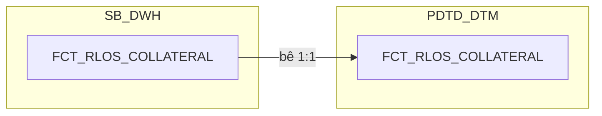
```mermaid
flowchart LR
    subgraph SB_DWH
        C["FCT_RLOS_COLLATERAL"]
    end
    subgraph PDTD_DTM
        D["FCT_RLOS_COLLATERAL"]
    end
    C -->|bê 1:1| D
```

### 12.3 Cấu trúc bảng

| STT | Tên cột | Kiểu dữ liệu | Bắt buộc | Độ lớn | Khóa | Mô tả | Báo cáo sử dụng | Tên chỉ tiêu trên báo cáo |
| --- | --- | --- | --- | --- | --- | --- | --- | --- |
| 1 | DAYID | DATE | Y |  | PK | Ngày dữ liệu, dạng số YYYYMMDD — bê 1:1 từ SB_DWH.FCT_RLOS_COLLATERAL.DAYID | — (cột kỹ thuật) | — |
| 2 | COLLATERAL_BK | VARCHAR2 | Y | 64 | PK | Khóa nghiệp vụ của dòng tài sản — bê 1:1 từ SB_DWH.FCT_RLOS_COLLATERAL.COLLATERAL_BK: PHÁI SINH STANDARD_HASH(..., 'SHA256') trên toàn bộ cột không phải CLOB của đúng bảng grid tài sản (COL_REALESTATE/COL_TRANSPORT/COL_VALPAPER/COL_OTHER) sinh ra dòng đó. Chuẩn hóa trước khi hash: TRIM chuỗi, NULL quy về '<NULL>', DATE/NUMBER dùng format cố định không phụ thuộc NLS | — (cột kỹ thuật, khóa chính) | — |
| 3 | APPLICATION_SK | NUMBER | Y | 18 |  | Khóa tới DIM_RLOS_APPLICATION theo phiên bản hiệu lực tại DAYID. Mặc định -1 nếu không khớp — bê 1:1 từ SB_DWH.FCT_RLOS_COLLATERAL.APPLICATION_SK | Báo cáo RLOS APPLICATION (BC1) — khóa JOIN sang DIM_RLOS_APPLICATION | — |
| 4 | WI_NAME | VARCHAR2 | Y | 100 | | Mã hồ sơ tín dụng RLOS — bê 1:1 từ SB_DWH.FCT_RLOS_COLLATERAL.WI_NAME | Báo cáo RLOS APPLICATION (BC1) — khóa chính Báo cáo KPI (BC9) — khóa nối AGG_LOS_KPI_APPLICATION.TSBD_G2 | — |
| 5 | COLLATERAL_TYPE_CODE | VARCHAR2 | N | 100 |  | Nhãn phân loại nguồn của tài sản bảo đảm — gán cố định theo bảng grid mà bản ghi đến từ đó (REALESTATE/TRANSPORT/VALPAPER/OTHER). Dùng để CASE chọn đúng cột chi tiết khi dựng TYPES_OF_COLLATERALS (cột 21) — không phải dữ liệu mô tả tài sản — bê 1:1 từ SB_DWH.FCT_RLOS_COLLATERAL.COLLATERAL_TYPE_CODE | Báo cáo RLOS APPLICATION (BC1) — điều kiện lọc tách GCN_REAL_ESTATE/GCN_OTHER, TSBD_BDS/TSBD_PTVT Báo cáo Thông tin phê duyệt (BC3) — điều kiện lọc dựng TYPES_OF_COLLATERALS | Nguồn cho chỉ tiêu/trường TYPES_OF_COLLATERALS (BC3); điều kiện lọc GCN_REAL_ESTATE/GCN_OTHER/TSBD_BDS/TSBD_PTVT (BC1) |
| 6 | CERTIFICATE_NO | VARCHAR2 | N | 500 |  | Số giấy chứng nhận tài sản — bê 1:1 từ SB_DWH.FCT_RLOS_COLLATERAL.CERTIFICATE_NO (nguồn gốc xa: BĐS lấy NG_SB_RLOS_COL_REALESTATE.NO_CERTI; các tài sản khác lấy NG_SB_RLOS_COLL_CERTIGRD.CERTIFICATENO) | Báo cáo RLOS APPLICATION (BC1) — hiển thị trực tiếp (tách GCN_REAL_ESTATE/GCN_OTHER theo COLLATERAL_TYPE_CODE) Báo cáo Thông tin phê duyệt (BC3) — nguồn cho TYPES_OF_COLLATERALS khi COLLATERAL_TYPE_CODE=REALESTATE | GCN_REAL_ESTATE (Số GCN TSBĐ là BĐS); GCN_OTHER (Số GCN TSBĐ là PTVT/Khác) |
| 7 | DESCRIPTION | VARCHAR2 | N | 4000 |  | Mô tả tài sản bảo đảm — PHÁI SINH ĐÃ TÍNH XONG TẠI SB_DWH, bê 1:1 từ SB_DWH.FCT_RLOS_COLLATERAL.DESCRIPTION, đúng nguyên văn SRS BC3: UNION theo loại tài sản — BĐS: NO_CERTI \|\| ', ' \|\| USING_PURPOSE; PTVT: BRAND \|\| ', ' \|\| CONTROL_POSTER; GTCG: NUMBERSIGN; Khác: DESCRIBE. Không dùng REMARKS (không có trong SRS) | Báo cáo Thông tin phê duyệt (BC3) — hiển thị trực tiếp | DESCRIPTION (Mô tả TSBĐ) |
| 8 | OWNER_NAME | VARCHAR2 | N | 200 |  | Chủ sở hữu tài sản — bê 1:1 từ SB_DWH.FCT_RLOS_COLLATERAL.OWNER_NAME (nguồn gốc xa: OWNER của 4 bảng grid tài sản RLOS) | Báo cáo RLOS APPLICATION (BC1) — hiển thị trực tiếp Báo cáo Thông tin phê duyệt (BC3) — hiển thị trực tiếp | OWNERSHIP (Sở hữu nhà ở, BC1); OWNER (Chủ TSBĐ, BC3) |
| 9 | REL_TO_CUSTOMER | VARCHAR2 | N | 200 |  | Quan hệ giữa chủ tài sản và khách hàng — bê 1:1 từ SB_DWH.FCT_RLOS_COLLATERAL.REL_TO_CUSTOMER (nguồn gốc xa: UNION REL_CUSTOMER/RELATION_CUSTOMER của 4 bảng grid tài sản) | Báo cáo RLOS APPLICATION (BC1) — hiển thị trực tiếp | TSBD_RELATIONSHIP (Mối quan hệ chủ tài sản và KH) |
| 10 | USING_PURPOSE | VARCHAR2 | N | 255 |  | Mục đích sử dụng của bất động sản — bê 1:1 từ SB_DWH.FCT_RLOS_COLLATERAL.USING_PURPOSE (nguồn gốc xa: NG_SB_RLOS_COL_REALESTATE.USING_PURPOSE) | Báo cáo Thông tin phê duyệt (BC3) — nguồn cho DESCRIPTION khi COLLATERAL_TYPE_CODE=REALESTATE | Nguồn cho chỉ tiêu/trường DESCRIPTION (BC3, nhánh BĐS) |
| 11 | VEHICLE_TYPE | VARCHAR2 | N | 100 |  | Loại phương tiện vận tải — bê 1:1 từ SB_DWH.FCT_RLOS_COLLATERAL.VEHICLE_TYPE (nguồn gốc xa: NG_SB_RLOS_COL_TRANSPORT.TYPE_VEHICLE) | Báo cáo Thông tin phê duyệt (BC3) — nguồn cho TYPES_OF_COLLATERALS khi COLLATERAL_TYPE_CODE=TRANSPORT | Nguồn cho chỉ tiêu/trường TYPES_OF_COLLATERALS (BC3, nhánh phương tiện) |
| 12 | BRAND | VARCHAR2 | N | 200 |  | Hãng của phương tiện vận tải — bê 1:1 từ SB_DWH.FCT_RLOS_COLLATERAL.BRAND (nguồn gốc xa: NG_SB_RLOS_COL_TRANSPORT.BRAND) | Báo cáo Thông tin phê duyệt (BC3) — nguồn cho DESCRIPTION khi COLLATERAL_TYPE_CODE=TRANSPORT | Nguồn cho chỉ tiêu/trường DESCRIPTION (BC3, nhánh phương tiện) |
| 13 | CONTROL_POSTER | VARCHAR2 | N | 100 |  | Biển số kiểm soát của phương tiện — bê 1:1 từ SB_DWH.FCT_RLOS_COLLATERAL.CONTROL_POSTER (nguồn gốc xa: NG_SB_RLOS_COL_TRANSPORT.CONTROL_POSTER) | Báo cáo Thông tin phê duyệt (BC3) — nguồn cho DESCRIPTION khi COLLATERAL_TYPE_CODE=TRANSPORT | Nguồn cho chỉ tiêu/trường DESCRIPTION (BC3, nhánh phương tiện) |
| 14 | VALPAPER_TYPE | VARCHAR2 | N | 100 |  | Loại giấy tờ có giá — bê 1:1 từ SB_DWH.FCT_RLOS_COLLATERAL.VALPAPER_TYPE (nguồn gốc xa: NG_SB_RLOS_COL_VALPAPER.TYPE1) | Báo cáo Thông tin phê duyệt (BC3) — nguồn cho TYPES_OF_COLLATERALS khi COLLATERAL_TYPE_CODE=VALPAPER | Nguồn cho chỉ tiêu/trường TYPES_OF_COLLATERALS (BC3, nhánh giấy tờ có giá) |
| 15 | NUMBERSIGN | VARCHAR2 | N | 200 |  | Số hiệu giấy tờ có giá — bê 1:1 từ SB_DWH.FCT_RLOS_COLLATERAL.NUMBERSIGN (nguồn gốc xa: NG_SB_RLOS_COL_VALPAPER.NUMBERSIGN) | Báo cáo RLOS APPLICATION (BC1) — điều kiện lọc IS NOT NULL cho cờ TSBD_GTCG Báo cáo Thông tin phê duyệt (BC3) — nguồn cho DESCRIPTION khi COLLATERAL_TYPE_CODE=VALPAPER | TSBD_GTCG (Hồ sơ có TSBĐ là GTCG — YES/NO, BC1); nguồn cho chỉ tiêu/trường DESCRIPTION (BC3, nhánh GTCG) |
| 16 | IS_ASSET_FORMED | VARCHAR2 | N | 10 |  | Tài sản đã hình thành hay chưa — bê 1:1 từ SB_DWH.FCT_RLOS_COLLATERAL.IS_ASSET_FORMED (nguồn gốc xa: PROPERTY của COL_REALESTATE/COL_TRANSPORT) | Báo cáo RLOS APPLICATION (BC1) — hiển thị trực tiếp, lọc theo COLLATERAL_TYPE_CODE | TSBD_BDS (Hồ sơ có TSBĐ là BĐS — YES/NO); TSBD_PTVT (Hồ sơ có TSBĐ là PTVT — YES/NO) |
| 17 | IS_FORMED_FROM_LOAN | VARCHAR2 | N | 100 |  | Loại tài sản hình thành từ vốn vay — PHÁI SINH ĐÃ TÍNH XONG TẠI SB_DWH, bê 1:1 từ SB_DWH.FCT_RLOS_COLLATERAL.IS_FORMED_FROM_LOAN, đúng nguyên văn SRS BC1.PROPERTY_FORMED: giá trị trả về là NG_SB_RLOS_DISB_COL_GRID.COL_TYPE của dòng nối theo tài sản tương ứng có điều kiện lọc PROPERTY_FORMED='YES'; NULL nếu không có dòng nào thỏa điều kiện | Báo cáo RLOS APPLICATION (BC1) — hiển thị trực tiếp | PROPERTY_FORMED (Tài sản hình thành từ vốn vay không? — YES/NO) |
| 18 | APPRAISED_VALUE | NUMBER | N | 20,2 |  | Giá trị định giá của tài sản — bê 1:1 từ SB_DWH.FCT_RLOS_COLLATERAL.APPRAISED_VALUE (nguồn gốc xa: PRICING_VALUE/PRICINGVALUE của 4 bảng grid, ép kiểu số) | Báo cáo Thông tin phê duyệt (BC3) — hiển thị trực tiếp | APPRAISED_VALUE (Giá trị định giá) |
| 19 | LOAN_RATE_LTV | NUMBER | N | 5,2 |  | Tỷ lệ cho vay trên giá trị tài sản — bê 1:1 từ SB_DWH.FCT_RLOS_COLLATERAL.LOAN_RATE_LTV (nguồn gốc xa: LOANRATE của 4 bảng grid tài sản, cùng quy tắc ép kiểu, đơn vị phần trăm) | Báo cáo Thông tin phê duyệt (BC3) — hiển thị trực tiếp | LTV (Tỷ lệ cho vay của TSBĐ) |
| 20 | TYPES_OF_COLLATERALS | VARCHAR2 | N | 500 |  | PHÁI SINH ĐÃ TÍNH XONG TẠI SB_DWH, bê 1:1 từ SB_DWH.FCT_RLOS_COLLATERAL.TYPES_OF_COLLATERALS — phục vụ trực tiếp BC3.TYPES_OF_COLLATERALS: CASE theo COLLATERAL_TYPE_CODE chọn đúng 1 cột chi tiết tương ứng — REALESTATE→CERTIFICATE_NO, TRANSPORT→VEHICLE_TYPE, VALPAPER→VALPAPER_TYPE, OTHER→DESCRIPTION | Báo cáo Thông tin phê duyệt (BC3) — hiển thị trực tiếp | TYPES_OF_COLLATERALS (Loại TSBĐ) |

## 13. FCT_RLOS_APPLICATION_SECONDPRODUCT

### 13.1 Mục đích thiết kế
- **Ý nghĩa bảng:** bê nguyên 1:1 cấu trúc từ SB_DWH — lưu chi tiết từng
  lần đăng ký sản phẩm phụ đi kèm hồ sơ tín dụng RLOS (SeABuy, SeACivil,
  SeATeacher, SeAWoman, thẻ tín dụng phụ) — hạn mức, thời hạn, thuộc tính
  thẻ phụ nếu có.
- **Khóa nghiệp vụ (BK):** composite `WI_NAME`+`SUB_PRODUCT_LINE`+
  `SPP_AMOUNT`+`SPP_TERM` — hash vào cột `SUB_PRODUCT_BK`, bê 1:1 từ
  SB_DWH
- **Khóa chính của bảng (PK):** DAYID, SUB_PRODUCT_BK
- **Độ chi tiết (grain):** 1 dòng = 1 lần đăng ký sản phẩm phụ trong ảnh
  chụp của ngày DAYID. Bốn nhóm SeABuy/Civil/Teacher/Woman thường 1
  dòng/loại/hồ sơ; thẻ tín dụng phụ có thể nhiều dòng/hồ sơ (1 hồ sơ có
  thể mở nhiều thẻ phụ, do LEFT JOIN tự nhân dòng — xem cơ chế nạp đầy
  đủ tại SB_DWH mục 11).
- **Phục vụ báo cáo:**
  - Báo cáo RLOS APPLICATION (BC1)

### 13.2 Sơ đồ lineage

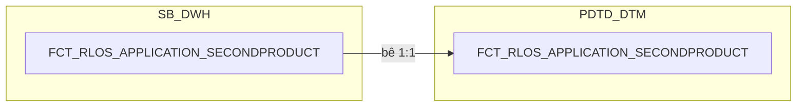
```mermaid
flowchart LR
    subgraph SB_DWH
        C["FCT_RLOS_APPLICATION_SECONDPRODUCT"]
    end
    subgraph PDTD_DTM
        D["FCT_RLOS_APPLICATION_SECONDPRODUCT"]
    end
    C -->|bê 1:1| D
```

### 13.3 Cấu trúc bảng

| STT | Tên cột | Kiểu dữ liệu | Bắt buộc | Độ lớn | Khóa | Mô tả | Báo cáo sử dụng | Tên chỉ tiêu trên báo cáo |
| --- | --- | --- | --- | --- | --- | --- | --- | --- |
| 1 | DAYID | DATE | Y |  | PK | Ngày dữ liệu, dạng số YYYYMMDD — bê 1:1 từ SB_DWH.FCT_RLOS_APPLICATION_SECONDPRODUCT.DAYID | — (cột kỹ thuật) | — |
| 2 | SUB_PRODUCT_BK | VARCHAR2 | Y | 64 | PK | Khóa nghiệp vụ của 1 lần đăng ký sản phẩm phụ — bê 1:1 từ SB_DWH.FCT_RLOS_APPLICATION_SECONDPRODUCT.SUB_PRODUCT_BK: STANDARD_HASH(WI_NAME \|\| '~' \|\| SUB_PRODUCT_LINE \|\| '~' \|\| NVL(TO_CHAR(SPP_AMOUNT),'<NULL>') \|\| '~' \|\| NVL(TO_CHAR(SPP_TERM),'<NULL>'), 'SHA256') — tính tại SB_DWH, xem chi tiết lý do tại SB_DWH mục 11. Tự thân đủ đảm bảo duy nhất — PK chỉ cần DAYID + SUB_PRODUCT_BK | — (cột kỹ thuật, một phần PK) | — |
| 3 | APPLICATION_SK | NUMBER | Y | 18 |  | Khóa tới DIM_RLOS_APPLICATION theo phiên bản hiệu lực tại DAYID. Mặc định -1 nếu không khớp — bê 1:1 từ SB_DWH.FCT_RLOS_APPLICATION_SECONDPRODUCT.APPLICATION_SK | — (cột kỹ thuật, khóa JOIN nội bộ) | — |
| 4 | SECONDPRODUCT_SK | NUMBER | Y | 18 |  | Khóa tới DIM_RLOS_SECONDPRODUCT — MỚI (review, theo yêu cầu người dùng, đồng bộ SB_DWH): bê 1:1 từ SB_DWH.FCT_RLOS_APPLICATION_SECONDPRODUCT.SECONDPRODUCT_SK, lookup PRODUCTLINE_CODE=NG_SB_RLOS_APPLICANT_GENERAL.PRODUCT_LINE (sản phẩm chính gắn với hồ sơ) AND SECONDARY_PRODUCT=SUB_PRODUCT_LINE (cột 6, cùng bảng). Mặc định -1 nếu hồ sơ không có sản phẩm phụ hoặc không khớp | Báo cáo RLOS APPLICATION (BC1) — khóa JOIN sang DIM_RLOS_SECONDPRODUCT | — |
| 5 | WI_NAME | VARCHAR2 | Y | 100 |  | Mã hồ sơ tín dụng RLOS — bê 1:1 từ SB_DWH.FCT_RLOS_APPLICATION_SECONDPRODUCT.WI_NAME (nguồn gốc xa: NG_SB_RLOS_SUB_PRODUCT.WI_NAME, driving table) | Báo cáo RLOS APPLICATION (BC1) — khóa JOIN sang hồ sơ, không hiển thị trực tiếp ở trường này | — |
| 6 | SUB_PRODUCT_LINE | VARCHAR2 | N | 200 |  | Dòng của sản phẩm phụ — bê 1:1 từ SB_DWH.FCT_RLOS_APPLICATION_SECONDPRODUCT.SUB_PRODUCT_LINE (nguồn gốc xa: NG_SB_RLOS_SUB_PRODUCT.SUB_PRODUCT_LINE, driving table). Trường SAN_PHAM_PHU của BC1 — 5 giá trị khả dĩ tự phân biệt loại sản phẩm phụ, không cần cột chuẩn hóa riêng (`SUB_PRODUCT_TYPE_CODE` đã xóa hẳn khỏi thiết kế — chỉ là ánh xạ 1-1 dư thừa của cột này). Đồng thời là đầu vào tra SECONDPRODUCT_SK (cột 4, cùng bảng) | Báo cáo RLOS APPLICATION (BC1) — hiển thị trực tiếp | SAN_PHAM_PHU (Sản phẩm phụ chi tiết) |
| 7 | SPP_AMOUNT | NUMBER | N | 20,2 |  | Hạn mức của sản phẩm phụ — PHÁI SINH ĐÃ TÍNH XONG TẠI SB_DWH, bê 1:1 từ SB_DWH.FCT_RLOS_APPLICATION_SECONDPRODUCT.SPP_AMOUNT theo SRS BC1 BR 1.2: LEFT JOIN đúng 1 trong 5 bảng grid theo WI_NAME=WI_NAME AND SUB_PRODUCT_LINE='<giá trị tương ứng>' (không phải UNION 5 nguồn độc lập), lấy LIMIT_NO. Ép kiểu số từ text định dạng Việt Nam, DEFAULT NULL ON CONVERSION ERROR. Trường SPP_Amount của BC1 | Báo cáo RLOS APPLICATION (BC1) — hiển thị trực tiếp | SPP_Amount (Giá trị của sản phẩm phụ) |
| 8 | SPP_TERM | NUMBER | N | 5 |  | Thời hạn của sản phẩm phụ, đơn vị tháng — PHÁI SINH ĐÃ TÍNH XONG TẠI SB_DWH, bê 1:1 từ SB_DWH.FCT_RLOS_APPLICATION_SECONDPRODUCT.SPP_TERM (cùng cơ chế JOIN cột 7): CREDIT_CARD_APP.TERM hoặc SEABUY_APP/CIVIL_APP/TEACHER_APP/WOMAN_APP.TIME_VALID của đúng bảng đã khớp điều kiện JOIN. Trường SPP_Term của BC1 | Báo cáo RLOS APPLICATION (BC1) — hiển thị trực tiếp | SPP_Term (Thời hạn của sản phẩm phụ) |
| 9 | CARD_TYPE_CODE | VARCHAR2 | N | 100 |  | Loại thẻ đăng ký lúc đề xuất sản phẩm phụ là thẻ tín dụng — bê 1:1 từ SB_DWH.FCT_RLOS_APPLICATION_SECONDPRODUCT.CARD_TYPE_CODE (nguồn gốc xa: NG_SB_RLOS_CREDIT_CARD_APP.CARD_TYPE, LEFT JOIN theo cơ chế cột 7). Chỉ có ở dòng SUB_PRODUCT_LINE='Thẻ tín dụng'. Là khái niệm khác BC1.K_TYPE (loại thẻ thật sau giải ngân, nguồn STG_DIM_CARD.K_TYPE, join qua NG_SB_RLOS_SENT_CBS_LOG.RESULT_SEAB_MAIN_CARD_ID = STG_DIM_CARD.MAIN_ID — thuộc FCT_RLOS_APPLICATION, không đi qua bảng này) — không dùng để tra BC1.K_TYPE | Thiết kế dư thừa | — |

## 14. FCT_RLOS_EXCEPTION

### 14.1 Mục đích thiết kế
- **Ý nghĩa bảng:** bảng FACT chi tiết tại PDTD_DTM — bê nguyên 1:1 từ
  `FCT_RLOS_EXCEPTION` (SB_DWH, 13 cột nghiệp vụ, gồm cả `SUB_PRODUCT`),
  ghi nhận từng lần một lý do (ngoại lệ/nội dung cần làm rõ) được nêu ra
  trên hồ sơ tín dụng RLOS trong quá trình xử lý, kèm người nêu, thời
  điểm, và các chỉ tiêu đánh giá chất lượng nhập liệu lần đầu (First Time
  Right). Bổ sung tại tầng này 3 cột phái sinh: `CHECK_FTR`/
  `FIRST_WORKSTEP_RETURN` và `PHAN_LOAI_DDE` (LEFT JOIN `REF_PHAN_LOAI_DDE`
  theo EXCEPTION_CATEGORY + SYSTEMNAME='RLOS').
- **Khóa nghiệp vụ (BK):** composite `WI_NAME`+`EXCEPTION_CATEGORY`+
  `RAISED_BY`+`RAISED_DATE_TIME` — hash vào cột `EXCEPTION_BK`, bê 1:1
  từ SB_DWH (xem `HLD_FCT_SB_DWH_review.md` mục 10)
- **Khóa chính của bảng (PK):** DAYID, EXCEPTION_BK — bê 1:1 từ SB_DWH
  (xem `HLD_FCT_SB_DWH_review.md` mục 10): `EXCEPTION_BK` gộp 4 cột PK
  tự nhiên cũ (WI_NAME, EXCEPTION_CATEGORY, RAISED_BY, RAISED_DATE_TIME)
  thành 1 khóa hash duy nhất.
- **Độ chi tiết (grain):** 1 dòng = 1 lần ghi nhận lý do của 1 hồ sơ, trong
  ảnh chụp của ngày DAYID.
- **Phục vụ báo cáo:**
  - Báo cáo EXCEPTION - FTR (BC7)
  - Báo cáo RETURN (BC8)

### 14.2 Sơ đồ lineage

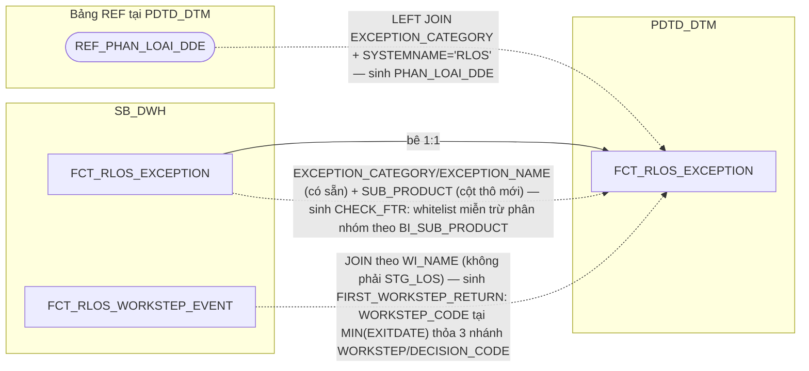
```mermaid
flowchart LR
    subgraph SB_DWH
        C["FCT_RLOS_EXCEPTION"]
        WE["FCT_RLOS_WORKSTEP_EVENT"]
    end
    subgraph REF_DTM["Bảng REF tại PDTD_DTM"]
        REF(["REF_PHAN_LOAI_DDE"])
    end
    subgraph PDTD_DTM
        D["FCT_RLOS_EXCEPTION"]
    end
    C -->|bê 1:1| D
    REF -.->|"LEFT JOIN EXCEPTION_CATEGORY + SYSTEMNAME='RLOS' — sinh PHAN_LOAI_DDE"| D
    WE -.->|"JOIN theo WI_NAME (không phải STG_LOS) — sinh FIRST_WORKSTEP_RETURN: WORKSTEP_CODE tại MIN(EXITDATE) thỏa 3 nhánh WORKSTEP/DECISION_CODE"| D
    C -.->|"EXCEPTION_CATEGORY/EXCEPTION_NAME (có sẵn) + SUB_PRODUCT (cột thô mới) — sinh CHECK_FTR: whitelist miễn trừ phân nhóm theo BI_SUB_PRODUCT"| D
```

### 14.3 Cấu trúc bảng

| STT | Tên cột | Kiểu dữ liệu | Bắt buộc | Độ lớn | Khóa | Mô tả | Báo cáo sử dụng | Tên chỉ tiêu trên báo cáo |
| --- | --- | --- | --- | --- | --- | --- | --- | --- |
| 1 | DAYID | DATE | Y |  | PK | Ngày dữ liệu, dạng số YYYYMMDD — bê 1:1 từ SB_DWH.FCT_RLOS_EXCEPTION.DAYID | — (cột kỹ thuật) | — |
| 2 | EXCEPTION_BK | VARCHAR2 | Y | 64 | PK | Khóa nghiệp vụ của dòng ngoại lệ — bê 1:1 từ SB_DWH.FCT_RLOS_EXCEPTION.EXCEPTION_BK: STANDARD_HASH(WI_NAME \|\| '~' \|\| EXCEPTION_CATEGORY \|\| '~' \|\| RAISED_BY \|\| '~' \|\| TO_CHAR(RAISED_DATE_TIME,'YYYY-MM-DD HH24:MI:SS.FF6'), 'SHA256') — gộp 4 cột PK tự nhiên cũ thành 1 khóa đơn | — (cột kỹ thuật, một phần khóa chính) | — |
| 3 | APPLICATION_SK | NUMBER | Y | 18 |  | Khóa tới DIM_RLOS_APPLICATION theo phiên bản hiệu lực tại DAYID. Mặc định -1 — bê 1:1 từ SB_DWH.FCT_RLOS_EXCEPTION.APPLICATION_SK | Báo cáo EXCEPTION - FTR (BC7) — khóa JOIN sang DIM_RLOS_APPLICATION, report-time tự tra LOANCASEID khi cần (không còn ETL sẵn trên bảng này) | — |
| 4 | EXCEPTION_SK | NUMBER | Y | 18 |  | Khóa tới DIM_RLOS_EXCEPTION — PHÁI SINH 2 bước đúng SRS BC7, ĐÃ TÍNH XONG TẠI SB_DWH, bê 1:1 từ SB_DWH.FCT_RLOS_EXCEPTION.EXCEPTION_SK: (1) LEFT JOIN theo EXCEPTION_CATEGORY + EXCEPTION_NAME; (2) lọc còn đúng 1 dòng bằng điều kiện tồn tại bản ghi NG_SB_RLOS_ENTRY_EXIT khớp WORKSTEP/DECISION. Mặc định -1 nếu không còn dòng nào khớp | Báo cáo EXCEPTION - FTR (BC7) — khóa JOIN sang DIM_RLOS_EXCEPTION để lấy ACTIVITYNAME, EXCEPTION_CODE | — |
| 5 | USER_SK | NUMBER | Y | 18 |  | Khóa tới DIM_LOS_USER, người nêu lý do. Mặc định -1. ĐÚNG GRAIN của bảng — bê 1:1 từ SB_DWH.FCT_RLOS_EXCEPTION.USER_SK | — (cột kỹ thuật, khóa JOIN nội bộ — BC7 dùng cột RAISED_BY gốc để hiển thị) | — |
| 6 | WI_NAME | VARCHAR2 | Y | 100 |  | Mã hồ sơ tín dụng RLOS — bê 1:1 từ SB_DWH.FCT_RLOS_EXCEPTION.WI_NAME (nguồn gốc xa: NG_SB_RLOS_EXCEPTION.WI_NAME, direct, driving table) | Báo cáo EXCEPTION - FTR (BC7) — hiển thị trực tiếp, cũng là khóa JOIN | WI_NAME (Mã hồ sơ) |
| 7 | EXCEPTION_CATEGORY | VARCHAR2 | N | 500 |  | Phân nhóm nội dung cần làm rõ — bê 1:1 từ SB_DWH.FCT_RLOS_EXCEPTION.EXCEPTION_CATEGORY (nguồn gốc xa: NG_SB_RLOS_EXCEPTION.EXCEPTION_CATEGORY) | Báo cáo EXCEPTION - FTR (BC7) — hiển thị trực tiếp, cũng là khóa JOIN sang DIM_RLOS_EXCEPTION và REF_PHAN_LOAI_DDE (tính PHAN_LOAI_DDE) | EXCEPTION_CATEGORY (Nhóm lý do quyết định) |
| 8 | RAISED_BY | VARCHAR2 | N | 100 |  | Người nêu nội dung cần làm rõ — bê 1:1 từ SB_DWH.FCT_RLOS_EXCEPTION.RAISED_BY (nguồn gốc xa: NG_SB_RLOS_EXCEPTION.RAISED_BY) | Báo cáo EXCEPTION - FTR (BC7) — hiển thị trực tiếp | RAISED_BY (User tạo lý do) |
| 9 | RAISED_DATE_TIME | TIMESTAMP | N |  |  | Thời điểm nêu nội dung cần làm rõ — bê 1:1 từ SB_DWH.FCT_RLOS_EXCEPTION.RAISED_DATE_TIME (nguồn gốc xa: NG_SB_RLOS_EXCEPTION.RAISED_DATE_TIME) | Báo cáo EXCEPTION - FTR (BC7) — hiển thị trực tiếp Báo cáo RETURN (BC8) — dùng làm PROCESSED_DATE (giữ nguyên giá trị timestamp) | RAISED_DATE_TIME (Thời gian tạo lý do); PROCESSED_DATE (Ngày dữ liệu, BC8) |
| 10 | EXCEPTION_NAME | VARCHAR2 | N | 500 |  | Tên nội dung cần làm rõ — bê 1:1 từ SB_DWH.FCT_RLOS_EXCEPTION.EXCEPTION_NAME (nguồn gốc xa: NG_SB_RLOS_EXCEPTION.EXCEPTION_NAME) | Báo cáo EXCEPTION - FTR (BC7) — hiển thị trực tiếp, cũng là điều kiện lọc/khóa JOIN cho CHECK_FTR và DIM_RLOS_EXCEPTION | EXCEPTION_NAME (Tên lý do) |
| 11 | EXCEPTION_REMARKS | VARCHAR2 | N | 4000 |  | Ghi chú của nội dung cần làm rõ — bê 1:1 từ SB_DWH.FCT_RLOS_EXCEPTION.EXCEPTION_REMARKS (nguồn gốc xa: NG_SB_RLOS_EXCEPTION.EXCEPTION_REMARKS) | Báo cáo EXCEPTION - FTR (BC7) — hiển thị trực tiếp | EXCEPTION_REMARKS (Ý kiến) |
| 12 | RCTYPE | VARCHAR2 | N | 20 |  | Loại ghi nhận, Raise hay Clear — bê 1:1 từ SB_DWH.FCT_RLOS_EXCEPTION.RCTYPE (nguồn gốc xa: NG_SB_RLOS_EXCEPTION.RCTYPE). Không còn dùng làm điều kiện lọc CHECK_FTR nhưng BC7 vẫn hiển thị trực tiếp | Báo cáo EXCEPTION - FTR (BC7) — hiển thị trực tiếp | CHECK_FTR (thành phần Raise/Clear của trường "Hồ sơ đạt FTR hay không đạt FTR") |
| 13 | SUB_PRODUCT | VARCHAR2 | N | 255 |  | Sản phẩm vay chi tiết tự khai theo hồ sơ — bê 1:1 từ SB_DWH.FCT_RLOS_EXCEPTION.SUB_PRODUCT (nguồn gốc xa: LEFT JOIN NG_SB_RLOS_APPLICANT_GENERAL theo WI_NAME, cột thô, bổ sung để tính CHECK_FTR tại đây) | Nguồn cho chỉ tiêu/trường CHECK_FTR (cột 15, cùng bảng) | — |
| 14 | CHECK_FTR | VARCHAR2 | N | 20 |  | Vi phạm nguyên tắc First Time Right — PHÁI SINH TẠI PDTD_DTM (chuyển từ SB_DWH — xem ghi chú kiến trúc tại mục 14.1): công thức riêng của RLOS, mặc định 'Not First Time Right'; là 'First Time Right' CHỈ KHI mọi dòng cùng WI_NAME có EXCEPTION_CATEGORY LIKE '%BR%' (tra trên chính bảng này) đều khớp 1 trong 5 điều kiện miễn trừ theo EXCEPTION_NAME, một số điều kiện phụ theo BI_SUB_PRODUCT — PHÁI SINH TẠI ĐÂY: CASE WHEN SUB_PRODUCT (cột 14) LIKE '%Phát hành%' OR LIKE '%TTD%' THEN 'Credit Card' ELSE SUB_PRODUCT END | Báo cáo EXCEPTION - FTR (BC7) — hiển thị trực tiếp | CHECK_FTR (Hồ sơ đạt FTR hay không đạt FTR) |
| 15 | FIRST_WORKSTEP_RETURN | VARCHAR2 | N | 200 |  | Bước xử lý phát sinh trả về đầu tiên — PHÁI SINH TẠI PDTD_DTM (chuyển từ SB_DWH — xem ghi chú kiến trúc tại mục 14.1): WORKSTEP_CODE của dòng SB_DWH.FCT_RLOS_WORKSTEP_EVENT tại MIN(EXITDATE) theo WI_NAME, với điều kiện EXITDATE IS NOT NULL AND ((WORKSTEP_CODE='DetailDataEntry' AND DECISION_CODE='Send_Back') OR (WORKSTEP_CODE IN ('DataInputerChecker','UnderwriterMaker','CreditApproval') AND DECISION_CODE='Additional_Doc_Required') OR (WORKSTEP_CODE='UnderwriterMaker' AND DECISION_CODE='Send_Back to BranchSupport')) — DECISION_CODE tra qua WORKSTEP_DECISION_SK → DIM_RLOS_WORKSTEP_DECISION | Báo cáo EXCEPTION - FTR (BC7) — hiển thị trực tiếp | FIRST_WORKSTEP_RETURN (Bước trả về đầu tiên) |
| 16 | PHAN_LOAI_DDE | VARCHAR2 | N | 100 |  | Phân loại nguyên nhân trả về ở khâu nhập liệu — PHÁI SINH TẠI PDTD_DTM (cùng lý do đã áp dụng cho FCT_CLOS_EXCEPTION): LEFT JOIN REF_PHAN_LOAI_DDE theo EXCEPTION_CATEGORY + SYSTEMNAME='RLOS', lấy PHAN_LOAI_DDE | Báo cáo EXCEPTION - FTR (BC7) — hiển thị trực tiếp | PHAN_LOAI_DDE (Lỗi Nhập liệu/Thiếu Checklist) |

## 15. FCT_RLOS_DEVIATION

### 15.1 Mục đích thiết kế
- **Ý nghĩa bảng:** lưu ảnh số liệu thay đổi theo ngày của từng ngoại lệ
  chính sách (deviation) thuộc hồ sơ tín dụng RLOS. Không có chiều riêng —
  toàn bộ thuộc tính lưu thẳng trên fact vì nguồn không khai khóa CDC.
- **Khóa nghiệp vụ (BK):** composite toàn bộ cột không phải CLOB của
  `NG_SB_RLOS_MANUAL_DEVIATION` (loại trừ `REASON`) — hash vào cột `DEVIATION_BK`, bê 1:1 từ SB_DWH (xem
  `HLD_FCT_SB_DWH_review.md` mục 11)
- **Khóa chính của bảng (PK):** DAYID, DEVIATION_BK.
- **Độ chi tiết (grain):** 1 dòng = 1 ngoại lệ chính sách trong ảnh chụp
  của ngày DAYID.
- **Phục vụ báo cáo:**
  - Báo cáo NGOẠI LỆ (BC6)
  - Báo cáo KPI (BC9) — nguồn cho DEVIATION_G2/DEVIATION_G3 của
    AGG_LOS_KPI_APPLICATION

### 15.2 Sơ đồ lineage

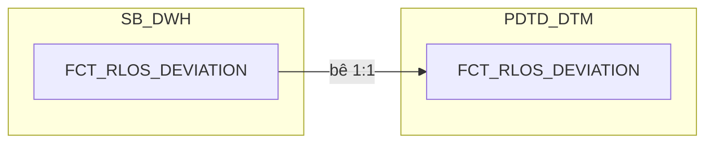
```mermaid
flowchart LR
    subgraph SB_DWH
        C["FCT_RLOS_DEVIATION"]
    end
    subgraph PDTD_DTM
        D["FCT_RLOS_DEVIATION"]
    end
    C -->|bê 1:1| D
```

### 15.3 Cấu trúc bảng

| STT | Tên cột | Kiểu dữ liệu | Bắt buộc | Độ lớn | Khóa | Mô tả | Báo cáo sử dụng | Tên chỉ tiêu trên báo cáo |
| --- | --- | --- | --- | --- | --- | --- | --- | --- |
| 1 | DAYID | DATE | Y |  | PK | Ngày dữ liệu, dạng số YYYYMMDD — bê 1:1 từ SB_DWH.FCT_RLOS_DEVIATION.DAYID | — (cột kỹ thuật) | — |
| 2 | DEVIATION_BK | VARCHAR2 | Y | 64 | PK | Khóa nghiệp vụ của dòng ngoại lệ — bê 1:1 từ SB_DWH.FCT_RLOS_DEVIATION.DEVIATION_BK: PHÁI SINH STANDARD_HASH(..., 'SHA256') trên toàn bộ cột không phải CLOB của NG_SB_RLOS_MANUAL_DEVIATION (loại trừ REASON) | Báo cáo KPI (BC9) — nguồn cho chỉ tiêu/trường DEVIATION_G2/DEVIATION_G3 (COUNT(*) số dòng theo WI_NAME trên AGG_LOS_KPI_APPLICATION, lọc DAYID mới nhất) | — |
| 3 | APPLICATION_SK | NUMBER | Y | 18 |  | Khóa tới DIM_RLOS_APPLICATION theo phiên bản hiệu lực tại DAYID. Mặc định -1 nếu không khớp — bê 1:1 từ SB_DWH.FCT_RLOS_DEVIATION.APPLICATION_SK | — (cột kỹ thuật, khóa JOIN nội bộ) | — |
| 4 | WI_NAME | VARCHAR2 | Y | 100 | | Mã hồ sơ tín dụng RLOS — bê 1:1 từ SB_DWH.FCT_RLOS_DEVIATION.WI_NAME (nguồn gốc xa: NG_SB_RLOS_MANUAL_DEVIATION.WI_NAME, direct, driving table) | Báo cáo NGOẠI LỆ (BC6) — hiển thị trực tiếp, cũng là khóa PK | WI_NAME (Mã hồ sơ) |
| 5 | CHECKING_CONDITION | VARCHAR2 | N | 500 |  | Điều kiện kiểm tra chính sách — bê 1:1 từ SB_DWH.FCT_RLOS_DEVIATION.CHECKING_CONDITION (nguồn gốc xa: NG_SB_RLOS_MANUAL_DEVIATION.CHECKING_CONDITION) | Báo cáo NGOẠI LỆ (BC6) — hiển thị trực tiếp | CHECKING_CONDITION (Tiêu chí ngoại lệ) |
| 6 | CHECKING_RESULT | VARCHAR2 | N | 200 |  | Kết quả kiểm tra chính sách — bê 1:1 từ SB_DWH.FCT_RLOS_DEVIATION.CHECKING_RESULT (nguồn gốc xa: NG_SB_RLOS_MANUAL_DEVIATION.CHECKING_RESULT) | Báo cáo NGOẠI LỆ (BC6) — hiển thị trực tiếp | CHECKING_RESULT (Loại ngoại lệ) |
| 7 | DEVIATION_REASON | VARCHAR2 | N | 4000 |  | Lý do lệch chính sách — bê 1:1 từ SB_DWH.FCT_RLOS_DEVIATION.DEVIATION_REASON (nguồn gốc xa: NG_SB_RLOS_MANUAL_DEVIATION.REASON, đổi tên cho rõ nghĩa) | Báo cáo NGOẠI LỆ (BC6) — hiển thị trực tiếp | REASON (Nội dung ngoại lệ) |
| 8 | PROCESSED_DATE | DATE | N |  |  | Ngày xử lý của hồ sơ — bê 1:1 từ SB_DWH.FCT_RLOS_DEVIATION.PROCESSED_DATE (PHÁI SINH TẠI SB_DWH: tính độc lập từ NG_SB_RLOS_ENTRY_EXIT theo cùng công thức 3 mức ưu tiên đã dùng cho FCT_RLOS_APPLICATION.PROCESSED_DATE — không JOIN sang FCT_RLOS_APPLICATION) | Báo cáo NGOẠI LỆ (BC6) — hiển thị trực tiếp | PROCESSED_DATE (Ngày dữ liệu báo cáo) |

## 16. FCT_RLOS_WORKSTEP_EVENT

### 16.1 Mục đích thiết kế
- **Ý nghĩa bảng:** nhật ký workflow mức nguyên tử của hệ RLOS (bán lẻ/cá
  nhân) — mỗi dòng là 1 lần hồ sơ đi qua 1 bước xử lý (workstep) trên
  workflow, ghi lại đầy đủ thời gian vào/ra, người xử lý, quyết định và
  các chỉ số TAT tính sẵn. Giữ HẾT MỌI SỰ KIỆN.
- **Khóa nghiệp vụ (BK):** composite `WI_NAME`+`WORKSTEP_CODE`+
  `ENTRYDATE` — hash vào cột `WORKSTEP_EVENT_BK`, bê 1:1 từ SB_DWH (xem
  `HLD_FCT_SB_DWH_review.md` mục 12)
- **Khóa chính của bảng (PK):** DAYID, WORKSTEP_EVENT_BK — bê 1:1 từ
  SB_DWH (xem `HLD_FCT_SB_DWH_review.md` mục 12): `WORKSTEP_EVENT_BK`
  gộp 3 cột PK tự nhiên cũ (WI_NAME, WORKSTEP_CODE, ENTRYDATE) thành 1
  khóa hash duy nhất.
- **Độ chi tiết (grain):** 1 dòng = 1 phiên bản của 1 logical event (hồ
  sơ × workstep × lần vào bước).
- **Phục vụ báo cáo:**
  - Báo cáo RLOS APPLICATION (BC1)
  - Báo cáo CLOS APPLICATION (BC2)
  - Báo cáo Thông tin phê duyệt (BC3)
  - Báo cáo Tuần Chuyên viên Thẩm định (BC4) — `WORKSTEP_FLAG` (BC4.FLAG)
  - Báo cáo SLA - TAT (BC5) — `APPROVAL_FLAG`
  - Báo cáo EXCEPTION - FTR (BC7)
  - Báo cáo RETURN (BC8)
  - Báo cáo KPI (BC9) — `APPROVAL_FLAG='First Approval'` điều kiện lọc TAT_APPLICATION_HOUR
  - Báo cáo Giải ngân _ Quá hạn KHCN (BC10)
  - Báo cáo Giải ngân _ Quá hạn KHDN (BC11)

### 16.2 Sơ đồ lineage

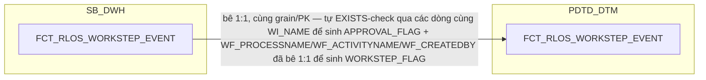
```mermaid
flowchart LR
    subgraph SB_DWH
        C["FCT_RLOS_WORKSTEP_EVENT"]
    end
    subgraph PDTD_DTM
        D["FCT_RLOS_WORKSTEP_EVENT"]
    end
    C -->|"bê 1:1, cùng grain/PK — tự EXISTS-check qua các dòng cùng WI_NAME để sinh APPROVAL_FLAG + WF_PROCESSNAME/WF_ACTIVITYNAME/WF_CREATEDBY đã bê 1:1 để sinh WORKSTEP_FLAG "| D
```

### 16.3 Cấu trúc bảng

| STT | Tên cột | Kiểu dữ liệu | Bắt buộc | Độ lớn | Khóa | Mô tả | Báo cáo sử dụng | Tên chỉ tiêu trên báo cáo |
| --- | --- | --- | --- | --- | --- | --- | --- | --- |
| 1 | DAYID | DATE | Y |  | PK | Ngày dữ liệu, dạng số YYYYMMDD — nguồn NG_SB_RLOS_ENTRY_EXIT, TRUNC về 00:00:00. Là ngày phiên bản được ghi nhận, KHÔNG phải ảnh chụp lại toàn bộ nhật ký mỗi ngày — bê 1:1 từ SB_DWH.FCT_RLOS_WORKSTEP_EVENT.DAYID | — | Nguồn cho chỉ tiêu/trường APPLICATION_SK (mốc thời gian xác định phiên bản SCD2 hiệu lực khi lookup DIM) |
| 2 | WORKSTEP_EVENT_BK | VARCHAR2 | Y | 64 | PK | Khóa nghiệp vụ của dòng sự kiện — bê 1:1 từ SB_DWH.FCT_RLOS_WORKSTEP_EVENT.WORKSTEP_EVENT_BK: STANDARD_HASH(WI_NAME \|\| '~' \|\| WORKSTEP_CODE \|\| '~' \|\| TO_CHAR(ENTRYDATE,'YYYY-MM-DD HH24:MI:SS.FF6'), 'SHA256') — gộp 3 cột PK tự nhiên cũ thành 1 khóa đơn | — (cột kỹ thuật, một phần khóa chính) | — |
| 3 | WORKSTEP_DECISION_SK | NUMBER | Y | 18 |  | Khóa tới DIM_RLOS_WORKSTEP_DECISION (gộp từ WORKSTEP_SK+DECISION_SK), lookup theo cặp WORKSTEP_CODE (cột 9, chính dòng event) + DECISION_CODE điều kiện thời gian (EFF_DATE/EXP_DATE). Mặc định -1 nếu không khớp. KHÔNG nằm trong PK — chỉ để tra cứu thêm thuộc tính (kể cả DECISION_CODE, đã xóa denormalize khỏi fact) — bê 1:1 từ SB_DWH.FCT_RLOS_WORKSTEP_EVENT.WORKSTEP_DECISION_SK | Báo cáo Thông tin phê duyệt (BC3) — khóa JOIN thay cho cột DECISION_CODE denormalize đã xóa Báo cáo RETURN (BC8) — khóa JOIN thay cho cột DECISION_CODE denormalize đã xóa | DECISION (Quyết định) |
| 4 | USER_SK | NUMBER | Y | 18 |  | Khóa tới DIM_LOS_USER, người xử lý của chính sự kiện này. ĐÚNG GRAIN của bảng. Mặc định -1. KHÔNG nằm trong PK — bê 1:1 từ SB_DWH.FCT_RLOS_WORKSTEP_EVENT.USER_SK | — | Thiết kế dư thừa |
| 5 | APPLICATION_SK | NUMBER | Y | 18 |  | Khóa tới DIM_RLOS_APPLICATION theo phiên bản hiệu lực tại DAYID. Mặc định -1 — bê 1:1 từ SB_DWH.FCT_RLOS_WORKSTEP_EVENT.APPLICATION_SK | Báo cáo Thông tin phê duyệt (BC3) — khóa JOIN sang DIM_RLOS_APPLICATION.STREAM (review 2026-10-04: CREDIT_LIMIT/CURRENCY/CREDIT_TERM đổi sang đọc trực tiếp từ FCT_RLOS_APPLICATION, không còn JOIN qua đây) Báo cáo KPI (BC9) — khóa tra BUSINESS_FLOW (điều kiện lọc SLHS_RLOS/SLGN_RLOS), khóa tra FIRST_ELIGIBLE_TS trên AGG_LOS_KPI_USER_YEAR (NHAN_SU) | Nguồn cho chỉ tiêu/trường STREAM (BC3); SLHS_RLOS, SLGN_RLOS, NHAN_SU (BC9) |
| 6 | WI_NAME | VARCHAR2 | Y | 100 |  | Mã hồ sơ tín dụng RLOS — bê 1:1 từ SB_DWH.FCT_RLOS_WORKSTEP_EVENT.WI_NAME (nguồn gốc xa: ENTRY_EXIT.WINAME, đổi tên WINAME→WI_NAME) | Báo cáo RLOS APPLICATION (BC1) — hiển thị trực tiếp Báo cáo CLOS APPLICATION (BC2) Báo cáo Thông tin phê duyệt (BC3) Báo cáo Tuần Chuyên viên Thẩm định (BC4) Báo cáo SLA - TAT (BC5) Báo cáo RETURN (BC8) | WINAME (Mã hồ sơ) |
| 7 | WORKSTEP_CODE | VARCHAR2 | Y | 200 |  | Mã bước xử lý trên workflow — bê 1:1 từ SB_DWH.FCT_RLOS_WORKSTEP_EVENT.WORKSTEP_CODE (nguồn gốc xa: ENTRY_EXIT.WORKSTEP, thêm hậu tố CODE, đã cắt tiền tố hệ nguồn nếu có) | Báo cáo Thông tin phê duyệt (BC3) — hiển thị trực tiếp, đồng thời là điều kiện lọc bước CreditApprovalReview/CreditApproval/CreditCommittee Báo cáo Tuần Chuyên viên Thẩm định (BC4) — điều kiện lọc bước UnderwriterMaker/UnderwriterChecker Báo cáo SLA - TAT (BC5) — điều kiện lọc để SUM từng cột TAT theo từng bước Báo cáo RETURN (BC8) — hiển thị trực tiếp | WORKSTEP (Bước hồ sơ) |
| 8 | ENTRYDATE | TIMESTAMP | Y |  |  | Thời điểm hồ sơ vào bước xử lý — bê 1:1 từ SB_DWH.FCT_RLOS_WORKSTEP_EVENT.ENTRYDATE (nguồn gốc xa: ENTRY_EXIT.ENTRYDATE). Bắt buộc nằm trong khóa nghiệp vụ vì 1 hồ sơ có thể quay lại cùng 1 bước nhiều lần | Báo cáo Thông tin phê duyệt (BC3) — hiển thị trực tiếp Báo cáo Tuần Chuyên viên Thẩm định (BC4) — hiển thị trực tiếp Báo cáo SLA - TAT (BC5) — dùng tính ENTRYDATE_DDE (MIN theo bước DetailDataEntry) | ENTRYDATE (Thời gian lên bước) |
| 9 | EXITDATE | TIMESTAMP | N |  |  | Thời điểm hồ sơ ra khỏi bước xử lý — bê 1:1 từ SB_DWH.FCT_RLOS_WORKSTEP_EVENT.EXITDATE (nguồn gốc xa: ENTRY_EXIT.EXITDATE). NULL nghĩa là hồ sơ đang nằm tại bước này | Báo cáo Thông tin phê duyệt (BC3) — hiển thị trực tiếp Báo cáo Tuần Chuyên viên Thẩm định (BC4) — hiển thị trực tiếp Báo cáo RETURN (BC8) — hiển thị trực tiếp Báo cáo SLA - TAT (BC5) — dùng tính EXITDATE_DDE (MAX theo bước DetailDataEntry) | EXITDATE (Thời gian kết thúc bước) |
| 10 | USERNAME | VARCHAR2 | N | 100 |  | Tên tài khoản người xử lý hồ sơ — bê 1:1 từ SB_DWH.FCT_RLOS_WORKSTEP_EVENT.USERNAME (nguồn gốc xa: ENTRY_EXIT.USERNAME). Giữ nguyên giá trị gốc, không join qua DIM_LOS_USER | Báo cáo Thông tin phê duyệt (BC3) — hiển thị trực tiếp (BI_APPROVER/BI_COMMITTEE, lọc theo WORKSTEP_CODE) Báo cáo Tuần Chuyên viên Thẩm định (BC4) — hiển thị trực tiếp (UND_MAKER) Báo cáo KPI (BC9) — điều kiện lọc IS_TEST_ACCOUNT, nguồn cho FIRST_ELIGIBLE_TS/NHAN_SU trên AGG_LOS_KPI_USER_YEAR | BI_APPROVER, BI_COMMITTEE (BC3); UND_MAKER (BC4); nguồn cho chỉ tiêu/trường IS_TEST_ACCOUNT, NHAN_SU (BC9) |
| 11 | REMARKS | VARCHAR2 | N | 4000 |  | Ghi chú tại bước xử lý — bê 1:1 từ SB_DWH.FCT_RLOS_WORKSTEP_EVENT.REMARKS (nguồn gốc xa: ENTRY_EXIT.REMARKS) | Báo cáo Thông tin phê duyệt (BC3) — hiển thị trực tiếp Báo cáo Tuần Chuyên viên Thẩm định (BC4) — hiển thị trực tiếp | REMARKS (Ghi chú) |
| 12 | REASON_CODE | VARCHAR2 | N | 50 |  | Mã lý do hủy hồ sơ — bê 1:1 từ SB_DWH.FCT_RLOS_WORKSTEP_EVENT.REASON_CODE (nguồn gốc xa: NG_SB_RLOS_ENTRY_EXIT.REASON_CODE, chỉ RLOS có cột này) | — | Thiết kế dư thừa |
| 13 | REASON_DESC | VARCHAR2 | N | 500 |  | Diễn giải lý do hủy hồ sơ — bê 1:1 từ SB_DWH.FCT_RLOS_WORKSTEP_EVENT.REASON_DESC (nguồn gốc xa: NG_SB_RLOS_ENTRY_EXIT.REASON_DESC, chỉ RLOS có cột này) | — | Thiết kế dư thừa |
| 14 | TAT_SOURCE_SEC | NUMBER | N | 12 |  | Thời gian xử lý do hệ nguồn ghi, đơn vị giây — bê 1:1 từ SB_DWH.FCT_RLOS_WORKSTEP_EVENT.TAT_SOURCE_SEC (nguồn gốc xa: ENTRY_EXIT.TAT). Giữ lại để đối soát với 3 cột TAT tính lại bên dưới | — | Nguồn cho chỉ tiêu/trường TAT_CALENDAR_HOUR (input tính toán, dùng khi EXITDATE-ENTRYDATE không đủ dữ liệu) |
| 15 | TAT_CALENDAR_HOUR | NUMBER | N | 18,6 |  | Thời gian xử lý theo lịch tự nhiên, đơn vị giờ — PHÁI SINH ĐÃ TÍNH XONG TẠI SB_DWH, bê 1:1 từ SB_DWH.FCT_RLOS_WORKSTEP_EVENT.TAT_CALENDAR_HOUR: TAT_SOURCE_SEC / 3600, hoặc (CAST(EXITDATE AS DATE) - CAST(ENTRYDATE AS DATE)) * 24 nếu TAT_SOURCE_SEC rỗng. Không trừ ngày nghỉ | Báo cáo SLA - TAT (BC5) — hiển thị trực tiếp, SUM theo từng bước xử lý (BranchSupport, DetailDataEntry, DataInputerChecker, UnderwriterMaker, UnderwriterChecker, CreditApproval, CreditCommittee...) | STEP01_BRANCH_CL_TAT, STEP02_DDE_CL_TAT, STEP03_QUALITY_CHECKER_CL_TAT, STEP04_UNDMAKER_CL_TAT, STEP04_UNDCHECKER_CL_TAT, STEP07_APPROVER_CL_TAT, STEP07_COMMITTEE_CL_TAT, TAT_PHONG_CL_TAT, TAT_KHOI_PDTD_CL_TAT |
| 16 | TAT_WORKING_HOUR | NUMBER | N | 18,6 |  | Thời gian xử lý theo giờ làm việc, đơn vị giờ — PHÁI SINH ĐÃ TÍNH XONG TẠI SB_DWH, bê 1:1 từ SB_DWH.FCT_RLOS_WORKSTEP_EVENT.TAT_WORKING_HOUR: GET_BUSINESS_MINUTE(ENTRYDATE, EXITDATE) / 60. Loại trừ ngày lễ, chiều thứ Bảy, cả ngày Chủ nhật | Báo cáo SLA - TAT (BC5) — hiển thị trực tiếp, SUM theo từng bước xử lý, cùng nhóm cột với TAT_CALENDAR_HOUR | STEP01_BRANCH_WK_TAT, STEP02_DDE_WK_TAT, STEP03_QUALITY_CHECKER_WK_TAT, STEP04_UNDMAKER_WK_TAT, STEP04_UNDCHECKER_WK_TAT, STEP07_APPROVER_WK_TAT, STEP07_COMMITTEE_WK_TAT, TAT_PHONG_WK_TAT, TAT_KHOI_PDTD_WK_TAT |
| 17 | TAT_CPC_HOUR | NUMBER | N | 18,6 |  | Thời gian xử lý theo giờ cam kết SLA, đơn vị giờ — PHÁI SINH ĐÃ TÍNH XONG TẠI SB_DWH, bê 1:1 từ SB_DWH.FCT_RLOS_WORKSTEP_EVENT.TAT_CPC_HOUR: GET_BUSINESS_MINUTE_CPC(ENTRYDATE, EXITDATE) / 60. Giờ theo cam kết SLA, tính 8-11:30 và 13:30-16:30 | Báo cáo SLA - TAT (BC5) — hiển thị trực tiếp, SUM theo từng bước để so sánh với các mốc SLA đã cam kết (SLA_DE, SLA_QC, SLA_MARKER, SLA_CHECKER, SLA_CREDIT_OFFICER, SLA_CREDIT_APPROVER) | STEP01_BRANCH_TAT_CPC, STEP02_DDE_TAT_CPC, STEP03_QUALITY_CHECKER_TAT_CPC, STEP04_UNDMAKER_TAT_CPC, STEP04_UNDCHECKER_TAT_CPC, STEP04_UND_TAT_CPC, STEP07_APPROVER_TAT_CPC |
| 18 | EVENT_SEQ_ASC | NUMBER | N | 5 |  | Thứ tự sự kiện theo chiều cũ đến mới — PHÁI SINH ĐÃ TÍNH XONG TẠI SB_DWH, bê 1:1 từ SB_DWH.FCT_RLOS_WORKSTEP_EVENT.EVENT_SEQ_ASC: ROW_NUMBER() OVER (PARTITION BY WI_NAME ORDER BY ENTRYDATE ASC). Dùng xác định sự kiện trả về đầu tiên cho BC7 (FIRST_WORKSTEP_RETURN) | — | Thiết kế dư thừa |
| 19 | PROCESSED_DATE | DATE | N |  |  | Ngày xử lý chung của hồ sơ theo 3 mức ưu tiên (phê duyệt cuối / hủy tại UnderwriterMaker / ngày dữ liệu hệ thống nếu đang xử lý) — PHÁI SINH ĐÃ TÍNH XONG TẠI SB_DWH (không copy/JOIN từ FCT_RLOS_APPLICATION), bê 1:1 từ SB_DWH.FCT_RLOS_WORKSTEP_EVENT.PROCESSED_DATE | Báo cáo Tuần Chuyên viên Thẩm định (BC4) — hiển thị trực tiếp Báo cáo RETURN (BC8) Báo cáo KPI (BC9) — mốc xếp hồ sơ vào đúng DAYID khi SUM/COUNT SLHS_RLOS/SLGN_RLOS/TAT_RLOS lên grain ngày (qua AGG_LOS_KPI_APPLICATION) | REPORT_DATE (Ngày báo cáo, BC4); PROCESSED_DATE (Ngày dữ liệu, BC8) |
| 20 | WF_PROCESSNAME | VARCHAR2 | N | 50 |  | Tên hệ thống workflow của instance đang đứng — cột thô, bê 1:1 từ SB_DWH.FCT_RLOS_WORKSTEP_EVENT.WF_PROCESSNAME (thay cho WORKSTEP_FLAG đã tính sẵn, cùng cơ chế đã áp dụng cho CLOS) | Nguồn cho chỉ tiêu/trường WORKSTEP_FLAG (cột 28, cùng bảng) | — |
| 21 | WF_ACTIVITYNAME | VARCHAR2 | N | 200 |  | Bước hiện tại của instance workflow — cột thô, bê 1:1 từ SB_DWH.FCT_RLOS_WORKSTEP_EVENT.WF_ACTIVITYNAME | Nguồn cho chỉ tiêu/trường WORKSTEP_FLAG (cột 28, cùng bảng) | — |
| 22 | WF_CREATEDBY | VARCHAR2 | N | 50 |  | Mã người/hệ thống tạo bản ghi workflow — cột thô, bê 1:1 từ SB_DWH.FCT_RLOS_WORKSTEP_EVENT.WF_CREATEDBY.| Nguồn cho chỉ tiêu/trường WORKSTEP_FLAG (điều kiện lọc, cột 28, cùng bảng) | — |
⚠️ **Review 2026-10-04 (đối chiếu SRS BC3): xóa 3 cột `APPROVED_AMT_FINAL`/`CURRENCY_CODE`/`APPROVED_TERM`** (trước đây STT 23-25) — trùng lặp dữ liệu với `FCT_RLOS_APPLICATION` (xem `HLD_FCT_SB_DWH_review.md` mục 7 cột 11-13 và PDTD_DTM mục 11 cột 32-33/50), không BC nào thực tế tham chiếu qua bảng này (BC3 trước đó trỏ sai sang `DIM_RLOS_APPLICATION`). BC3 nay đọc trực tiếp từ `FCT_RLOS_APPLICATION`, thống nhất với cách CLOS đang làm (`FCT_CLOS_APPLICATION`).
| 26 | APPROVAL_FLAG | VARCHAR2 | N | 50 |  | Đánh dấu lần phê duyệt đầu hay lần phê duyệt lại — PHÁI SINH TẠI PDTD_DTM (chuyển từ SB_DWH, cùng cơ chế đã áp dụng cho CLOS): 'First Approval' nếu EXITDATE <= MIN(EXITDATE của các sự kiện phê duyệt trong cùng hồ sơ, EXISTS-check qua các dòng cùng WI_NAME trên chính bảng này), ngược lại 'From Second Approval' — BỔ SUNG RIÊNG TẠI PDTD_DTM, không có ở SB_DWH | Báo cáo SLA - TAT (BC5) — hiển thị trực tiếp Báo cáo KPI (BC9) — điều kiện lọc khi tính TAT_APPLICATION_HOUR (chỉ lấy sự kiện phê duyệt lần đầu) | APPROVAL_FLAG (Phê duyệt lần đầu/từ lần thứ 2, BC5); nguồn cho chỉ tiêu/trường TAT_APPLICATION_HOUR (điều kiện lọc, BC9) |
| 27 | WORKSTEP_FLAG | VARCHAR2 | N | 200 |  | Trạng thái tổng hợp hồ sơ dạng mô tả (trường FLAG của BC4, nhánh RLOS) — PHÁI SINH TẠI PDTD_DTM (chuyển từ SB_DWH): 5 nhánh CASE-WHEN theo thứ tự ưu tiên dựa trên WORKSTEP_CODE/DECISION_CODE (tra qua WORKSTEP_DECISION_SK → DIM_RLOS_WORKSTEP_DECISION, cột 4) của CHÍNH DÒNG SỰ KIỆN đang xét, kết hợp WF_PROCESSNAME='RLOS'/WF_ACTIVITYNAME (cột 21-22, đã bê 1:1 từ SB_DWH) — nhánh 2/4/5 khác CLOS (nhánh 4 có thêm OR (WORKSTEP_CODE='UnderwriterMaker' AND DECISION_CODE='Send to UWChecker')).| Báo cáo Tuần Chuyên viên Thẩm định (BC4) — hiển thị trực tiếp | FLAG (Trạng thái) |

## 17. FCT_RLOS_LOAN_DISBURSEMENT

### 17.1 Mục đích thiết kế
- **Ý nghĩa bảng:** bảng FACT đối chiếu T24, lưu khoản vay đã giải ngân
  của hệ RLOS, nối ngược về hồ sơ LOS qua SEAB_LOS_ID. Tách ra từ bảng
  chung cũ `FCT_LOS_DISBURSEMENT` vì 5/18 cột gốc phụ thuộc hệ
  (`APPLICATION_SK` polymorphic, `CUST_GROUP`/`LOANCASEID`/
  `APPROVAL_WINAME_LOS` chỉ CLOS có, `APPROVAL_DATE` 2 công thức khác
  nhau). Bảng RLOS này không có 3 cột `CUST_GROUP`/`LOANCASEID`/
  `APPROVAL_WINAME_LOS` (RLOS không có khái niệm hồ sơ cha/nhóm khách
  hàng doanh nghiệp).
- **Khóa nghiệp vụ (BK):** `CONTRACT` (cột đơn, không cần hash — bảng
  hoàn toàn mới ở PDTD_DTM, không bê 1:1 từ SB_DWH)
- **Khóa chính của bảng (PK):** DAYID, CONTRACT.
- **Độ chi tiết (grain):** 1 dòng = 1 HỢP ĐỒNG khoản vay trên T24, trong
  ảnh chụp của ngày DAYID — khác hẳn grain hồ sơ của mọi bảng LOS khác
  (1 hồ sơ có thể sinh nhiều hợp đồng), không phải SCD2.
- **Phục vụ báo cáo:**
  - Báo cáo Giải ngân _ Quá hạn KHCN (BC10)

### 17.2 Sơ đồ lineage

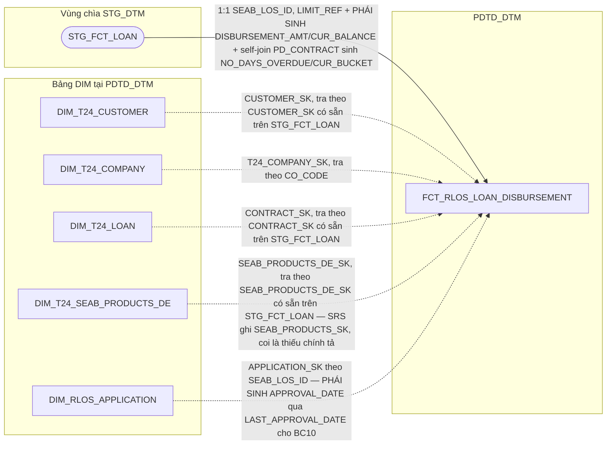
```mermaid
flowchart LR
    subgraph STG_DTM["Vùng chìa STG_DTM"]
        SA(["STG_FCT_LOAN"])
    end
    subgraph DIM_DTM["Bảng DIM tại PDTD_DTM"]
        CUST["DIM_T24_CUSTOMER"]
        COMP["DIM_T24_COMPANY"]
        LOAN["DIM_T24_LOAN"]
        PROD["DIM_T24_SEAB_PRODUCTS_DE"]
        RAPP["DIM_RLOS_APPLICATION"]
    end
    subgraph PDTD_DTM
        E["FCT_RLOS_LOAN_DISBURSEMENT"]
    end
    SA -->|1:1 SEAB_LOS_ID, LIMIT_REF + PHÁI SINH DISBURSEMENT_AMT/CUR_BALANCE + self-join PD_CONTRACT sinh NO_DAYS_OVERDUE/CUR_BUCKET| E
    CUST -.->|CUSTOMER_SK, tra theo CUSTOMER_SK có sẵn trên STG_FCT_LOAN| E
    COMP -.->|T24_COMPANY_SK, tra theo CO_CODE| E
    LOAN -.->|CONTRACT_SK, tra theo CONTRACT_SK có sẵn trên STG_FCT_LOAN| E
    PROD -.->|SEAB_PRODUCTS_DE_SK, tra theo SEAB_PRODUCTS_DE_SK có sẵn trên STG_FCT_LOAN — SRS ghi SEAB_PRODUCTS_SK, coi là thiếu chính tả| E
    RAPP -.->|APPLICATION_SK theo SEAB_LOS_ID — PHÁI SINH APPROVAL_DATE qua LAST_APPROVAL_DATE cho BC10| E
```

### 17.3 Cấu trúc bảng

| STT | Tên cột | Kiểu dữ liệu | Bắt buộc | Độ lớn | Khóa | Mô tả | Báo cáo sử dụng | Tên chỉ tiêu trên báo cáo |
| --- | --- | --- | --- | --- | --- | --- | --- | --- |
| 1 | DAYID | DATE | Y |  | PK | Ngày dữ liệu, dạng số YYYYMMDD — nguồn STG_DTM.STG_FCT_LOAN.DAYID, TRUNC về 00:00:00. Là ngày ảnh chụp số liệu, KHÔNG phải ngày nghiệp vụ. BẢNG HOÀN TOÀN MỚI TẠI PDTD_DTM, không có ở SB_DWH (nguồn STG_DTM/DIM_T24_*, không phải SB_DWH) | Báo cáo Giải ngân _ Quá hạn KHCN (BC10) — hiển thị trực tiếp (DAYID) Báo cáo KPI (BC9) — nguồn cho chỉ tiêu/trường SLGN_RLOS_DAY (điều kiện lọc EXISTS hợp đồng theo SEAB_LOS_ID) | DAYID (Ngày dữ liệu, BC10) |
| 2 | CUSTOMER_SK | NUMBER | Y | 18 |  | Khóa tới DIM_T24_CUSTOMER — nguồn STG_DTM.STG_FCT_LOAN.CUSTOMER_SK (surrogate có sẵn, tra thẳng DIM_T24_CUSTOMER.DIMENSION_KEY). Mặc định -1 nếu không khớp — BỔ SUNG RIÊNG TẠI PDTD_DTM, không có ở SB_DWH | Báo cáo Giải ngân _ Quá hạn KHCN (BC10) — khóa JOIN sang DIM_T24_CUSTOMER để lấy CUSTOMER_ID/SHORT_NAME | Nguồn cho chỉ tiêu/trường CUSTOMER_ID, SHORT_NAME (BC10) |
| 3 | T24_COMPANY_SK | NUMBER | Y | 18 |  | Khóa tới DIM_T24_COMPANY — PHÁI SINH TẠI PDTD_DTM: lookup theo STG_DTM.STG_FCT_LOAN.CO_CODE = DIM_T24_COMPANY.COMPANY_CODE (COMPANY_EXP_DATE IS NULL phía nguồn T24). Mặc định -1 — BỔ SUNG RIÊNG TẠI PDTD_DTM, không có ở SB_DWH | Báo cáo Giải ngân _ Quá hạn KHCN (BC10) — khóa JOIN sang DIM_T24_COMPANY để lấy BRANCH_NAME/COMPANY_NAME | Nguồn cho chỉ tiêu/trường BRANCH_NAME, COMPANY_NAME (BC10) |
| 4 | CONTRACT_SK | NUMBER | Y | 18 |  | Khóa tới DIM_T24_LOAN — nguồn STG_DTM.STG_FCT_LOAN.CONTRACT_SK (surrogate có sẵn, tra thẳng DIMENSION_KEY). Mặc định -1 — BỔ SUNG RIÊNG TẠI PDTD_DTM, không có ở SB_DWH | Báo cáo Giải ngân _ Quá hạn KHCN (BC10) — khóa JOIN sang DIM_T24_LOAN để lấy VALUE_DATE/MATURITY_DATE/REC_STATUS/CONTRACT_REF/REF_VALUE_DATE | Nguồn cho chỉ tiêu/trường VALUE_DATE, MATURITY_DATE, STATUS, CONTRACT_REF, REF_VALUE_DATE (BC10) |
| 5 | SEAB_PRODUCTS_DE_SK | NUMBER | Y | 18 |  | Khóa tới DIM_T24_SEAB_PRODUCTS_DE — nguồn STG_DTM.STG_FCT_LOAN.SEAB_PRODUCTS_DE_SK (surrogate có sẵn; SRS ghi SEAB_PRODUCTS_SK, coi là thiếu chính tả). Mặc định -1 — BỔ SUNG RIÊNG TẠI PDTD_DTM, không có ở SB_DWH | Báo cáo Giải ngân _ Quá hạn KHCN (BC10) — khóa JOIN sang DIM_T24_SEAB_PRODUCTS_DE để lấy PRODUCT_T24 | Nguồn cho chỉ tiêu/trường PRODUCT_T24 (BC10) |
| 6 | APPLICATION_SK | NUMBER | Y | 18 |  | Khóa tới DIM_RLOS_APPLICATION, tra theo SEAB_LOS_ID (qua STG_DTM.STG_FCT_LOAN.SEAB_LOS_ID). KHÔNG để NULL — không tra được thì gán -1 (Unknown), tránh phép JOIN của OAS rớt dòng — BỔ SUNG RIÊNG TẠI PDTD_DTM, không có ở SB_DWH | — (cột kỹ thuật, khóa JOIN nội bộ để sinh APPROVAL_DATE) | Nguồn cho chỉ tiêu/trường APPROVAL_DATE (BC10) |
| 7 | CONTRACT | VARCHAR2 | Y | 100 | PK | Mã hợp đồng khoản vay — nguồn STG_DTM.STG_FCT_LOAN.CONTRACT (nguồn gốc xa: SB_DWH.FCT_LOAN.CONTRACT, 1:1). BẢNG HOÀN TOÀN MỚI TẠI PDTD_DTM — không có SB_DWH.FCT_RLOS_LOAN_DISBURSEMENT tương ứng, chỉ nguồn gốc xa của riêng cột CONTRACT đi qua SB_DWH.FCT_LOAN (bảng T24 chung, không tách CLOS/RLOS) | Báo cáo Giải ngân _ Quá hạn KHCN (BC10) — hiển thị trực tiếp, cũng là khóa PK | CONTRACT (Mã hợp đồng) |
| 8 | SEAB_LOS_ID | VARCHAR2 | N | 100 |  | Mã hồ sơ LOS do T24 lưu, gắn với hợp đồng — nguồn STG_DTM.STG_FCT_LOAN.SEAB_LOS_ID — BỔ SUNG RIÊNG TẠI PDTD_DTM, không có ở SB_DWH | Báo cáo Giải ngân _ Quá hạn KHCN (BC10) — hiển thị trực tiếp Báo cáo KPI (BC9) — nguồn cho chỉ tiêu/trường SLGN_RLOS_DAY (điều kiện lọc EXISTS hợp đồng STG_FCT_LOAN theo SEAB_LOS_ID) | SEAB_LOS_ID (Mã hồ sơ, BC10); nguồn cho chỉ tiêu/trường SLGN_RLOS_DAY (điều kiện lọc, BC9) |
| 9 | ZONE | VARCHAR2 | N | 50 |  | Tên vùng của đơn vị kinh doanh — PHÁI SINH TẠI PDTD_DTM: LEFT JOIN TMP_REF_COMPANY_REGION_KHCN theo STG_DTM.STG_FCT_LOAN.CO_CODE = COMPANY_CODE. Lưu trực tiếp trên fact (không tách FK riêng) vì nguồn là bảng REF_ tĩnh, không phải DIM SCD2 — BỔ SUNG RIÊNG TẠI PDTD_DTM, không có ở SB_DWH | Báo cáo Giải ngân _ Quá hạn KHCN (BC10) — hiển thị trực tiếp | ZONE (Khu vực) |
| 10 | DISBURSEMENT_AMT | NUMBER | N | 20,2 |  | Số tiền giải ngân — PHÁI SINH TẠI PDTD_DTM: ABS(STG_DTM.STG_FCT_LOAN.FIRST_DISBURSEMENT_AMT) — BỔ SUNG RIÊNG TẠI PDTD_DTM, không có ở SB_DWH | Báo cáo Giải ngân _ Quá hạn KHCN (BC10) — hiển thị trực tiếp | DISBURSEMENT_AMT_T24 (Số tiền giải ngân) |
| 11 | CUR_BALANCE | NUMBER | N | 20,2 |  | Dư nợ hiện tại — PHÁI SINH TẠI PDTD_DTM: (ABS(NVL(BALANCE,0)) + ABS(NVL(PD_BALANCE,0))) * REVAL_RATE trên STG_DTM.STG_FCT_LOAN — BỔ SUNG RIÊNG TẠI PDTD_DTM, không có ở SB_DWH | Báo cáo Giải ngân _ Quá hạn KHCN (BC10) — hiển thị trực tiếp | CUR_BALANCE (Dư nợ hiện tại) |
| 12 | NO_DAYS_OVERDUE | NUMBER | N | 6 |  | Số ngày quá hạn — PHÁI SINH TẠI PDTD_DTM: self-join STG_DTM.STG_FCT_LOAN (b) ON a.PD_CONTRACT = b.CONTRACT, lấy b.NO_DAYS_OVERDUE — BỔ SUNG RIÊNG TẠI PDTD_DTM, không có ở SB_DWH | Báo cáo Giải ngân _ Quá hạn KHCN (BC10) — hiển thị trực tiếp, cũng là nguồn tính CUR_BUCKET | NO_DAYS_OVERDUE (Số ngày quá hạn) |
| 13 | CUR_BUCKET | NUMBER | N | 2 |  | Nhóm nợ — PHÁI SINH TẠI PDTD_DTM: CASE WHEN NO_DAYS_OVERDUE (cột 13, cùng bảng) > 360 THEN 5 WHEN > 180 THEN 4 WHEN > 90 THEN 3 WHEN >= 10 THEN 2 ELSE 1 END, cùng self-join PD_CONTRACT như NO_DAYS_OVERDUE — BỔ SUNG RIÊNG TẠI PDTD_DTM, không có ở SB_DWH | Báo cáo Giải ngân _ Quá hạn KHCN (BC10) — hiển thị trực tiếp | CUR_BUCKET (Nhóm nợ) |
| 14 | APPROVAL_DATE | DATE | N |  |  | Ngày phê duyệt — PHÁI SINH TẠI PDTD_DTM: JOIN APPLICATION_SK (cột 7, cùng bảng) sang DIM_RLOS_APPLICATION.LAST_APPROVAL_DATE (PDTD_DTM) — giữ nguyên tắc "DTM chỉ đọc DWH", không đọc thẳng NG_SB_RLOS_ENTRY_EXIT tại đây, không JOIN fact-to-fact sang FCT_RLOS_APPLICATION — BỔ SUNG RIÊNG TẠI PDTD_DTM, không có ở SB_DWH | Báo cáo Giải ngân _ Quá hạn KHCN (BC10) — hiển thị trực tiếp | APPROVAL_DATE (Ngày phê duyệt) |

## 18. FCT_RLOS_CUSTOMER

### 18.1 Mục đích thiết kế
- **Ý nghĩa bảng:** thông tin người vay chính (applicant) của hồ sơ RLOS
  tại PDTD_DTM, chi tiết tới TỪNG GIẤY TỜ ĐỊNH DANH.
- **Khóa nghiệp vụ (BK):** composite `WI_NAME`+`ID_TYPE`+`ID_NUMBER` —
  hash vào cột `CUSTOMER_BK`, bê 1:1 từ SB_DWH
- **Khóa chính của bảng (PK):** `DAYID`, `CUSTOMER_BK` (giữ nguyên như SB_DWH).
- **Độ chi tiết (grain):** 1 dòng = 1 ngày × 1 giấy tờ định danh của
  người vay chính trên 1 hồ sơ, snapshot hàng ngày — không SCD2 (giữ
  nguyên như SB_DWH).
- **Phục vụ báo cáo:**
  - Báo cáo RLOS APPLICATION (BC1)
  - Báo cáo CLOS APPLICATION (BC2)
  - Báo cáo Thông tin phê duyệt (BC3) — hiển thị tên khách hàng
  - Báo cáo Tuần Chuyên viên Thẩm định (BC4) — hiển thị tên khách hàng

### 18.2 Sơ đồ lineage

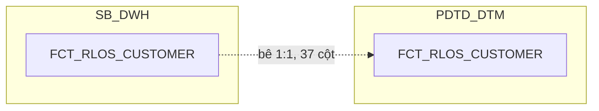
```mermaid
flowchart LR
    subgraph SB_DWH
        C["FCT_RLOS_CUSTOMER"]
    end
    subgraph PDTD_DTM
        D["FCT_RLOS_CUSTOMER"]
    end
    C -.->|"bê 1:1, 37 cột"| D
```

### 18.3 Cấu trúc bảng

⚠️ **Review 2026-10-04 (đối chiếu LLD hiện tại, theo yêu cầu người dùng):
xóa cột phái sinh `CUSTOMER_SEGMENT`** — HLD review trước đây mô tả thừa
cột này (CASE WHEN chuẩn hóa XANH/CBNV/THUONG từ `CUS_SEGMENT`), nhưng
quyết định mới nhất (phiên đối chiếu SRS BC1) là KHÔNG thêm cột phái sinh
này vào `FCT_RLOS_CUSTOMER` ở PDTD_DTM — logic CASE WHEN chuyển hẳn xuống
tầng report (`lld/BC1.csv`), dùng trực tiếp `CUS_SEGMENT` (cột 36) làm
input. Cấu trúc cột kế thừa toàn bộ 37 cột từ SB_DWH (bê 1:1 — xem
nguồn/công thức đầy đủ tại `HLD_FCT_SB_DWH_review.md` mục 15, không lặp
lại ở đây), không có cột phái sinh nào thêm tại PDTD_DTM:

| STT | Tên cột | Kiểu dữ liệu | Bắt buộc | Độ lớn | Khóa | Mô tả | Báo cáo sử dụng | Tên chỉ tiêu trên báo cáo |
| --- | --- | --- | --- | --- | --- | --- | --- | --- |
| 1 | DAYID | DATE | Y |  | PK | Ngày dữ liệu, dạng số YYYYMMDD — bê 1:1 từ SB_DWH.FCT_RLOS_CUSTOMER.DAYID | — (cột kỹ thuật) | — |
| 2 | CUSTOMER_BK | VARCHAR2 | Y | 64 | PK | Khóa nghiệp vụ hash của tổ hợp (hồ sơ, loại giấy tờ, số giấy tờ) — bê 1:1 từ SB_DWH.FCT_RLOS_CUSTOMER.CUSTOMER_BK: PHÁI SINH STANDARD_HASH(WI_NAME \|\| '~' \|\| ID_TYPE \|\| '~' \|\| ID_NUMBER, 'SHA256') | — (cột kỹ thuật, khóa chính) | — |
| 3 | APPLICATION_SK | NUMBER | Y | 18 |  | Khóa tới DIM_RLOS_APPLICATION, join theo WI_NAME + điều kiện SCD2 hiệu lực tại DAYID. Mặc định -1 nếu không khớp — bê 1:1 từ SB_DWH.FCT_RLOS_CUSTOMER.APPLICATION_SK | Báo cáo RLOS APPLICATION (BC1) — khóa JOIN sang DIM_RLOS_APPLICATION | — |
| 4 | T24_CUSTOMER_SK | NUMBER | Y | 18 |  | Khóa tới DIM_T24_CUSTOMER (T24), bê 1:1 từ SB_DWH.FCT_RLOS_CUSTOMER.T24_CUSTOMER_SK — join theo ID_NUMBER=LEGAL_ID AND ID_TYPE=LEGAL_DOC_NAME (đúng nguyên văn SRS BC1 BR 1.2). Mặc định -1 nếu không khớp. Chân khách hàng T24 — khác chân khách hàng LOS/applicant thể hiện bằng chính WI_NAME/ID_TYPE/ID_NUMBER | Báo cáo RLOS APPLICATION (BC1) — khóa JOIN sang DIM_T24_CUSTOMER lấy CUSTOMER_ID | Nguồn cho chỉ tiêu/trường CUSTOMER_ID (BC1) |
| 5 | WI_NAME | VARCHAR2 | Y | 100 |  | Mã hồ sơ RLOS — bê 1:1 từ SB_DWH.FCT_RLOS_CUSTOMER.WI_NAME (nguồn gốc xa: NG_SB_RLOS_APPLICANT_IDGRID.WI_NAME, driving table tại SB_DWH). Quan hệ 1:N với giấy tờ (1 hồ sơ có thể có nhiều giấy tờ) | Báo cáo RLOS APPLICATION (BC1) Báo cáo CLOS APPLICATION (BC2) | WINAME (Mã hồ sơ) |
| 6 | ID_TYPE | VARCHAR2 | N | 50 |  | Loại giấy tờ định danh — bê 1:1 từ SB_DWH.FCT_RLOS_CUSTOMER.ID_TYPE (nguồn gốc xa: NG_SB_RLOS_APPLICANT_IDGRID.ID_TYPE) | — | Thiết kế dư thừa (đầu vào cho pivot ADD_ID/ADD_ID_OTHER nếu cần tại tầng report) |
| 7 | ID_NUMBER | VARCHAR2 | N | 100 |  | Số giấy tờ định danh — bê 1:1 từ SB_DWH.FCT_RLOS_CUSTOMER.ID_NUMBER (nguồn gốc xa: NG_SB_RLOS_APPLICANT_IDGRID.ID_NUMBER) | — | Thiết kế dư thừa (đầu vào cho pivot ADD_ID/ADD_ID_OTHER nếu cần tại tầng report) |
| 8 | ISSUE_DATE | DATE | N |  |  | Ngày cấp giấy tờ — bê 1:1 từ SB_DWH.FCT_RLOS_CUSTOMER.ISSUE_DATE | — | Thiết kế dư thừa |
| 9 | EXPIRY_DATE | DATE | N |  |  | Ngày hết hạn giấy tờ — bê 1:1 từ SB_DWH.FCT_RLOS_CUSTOMER.EXPIRY_DATE | — | Thiết kế dư thừa |
| 10 | ISSUE_PLACE | VARCHAR2 | N | 200 |  | Nơi cấp giấy tờ — bê 1:1 từ SB_DWH.FCT_RLOS_CUSTOMER.ISSUE_PLACE | — | Thiết kế dư thừa |
| 11 | ISSUE_DATE_VISA | DATE | N |  |  | Ngày cấp visa (khách hàng nước ngoài) — bê 1:1 từ SB_DWH.FCT_RLOS_CUSTOMER.ISSUE_DATE_VISA | — | Thiết kế dư thừa |
| 12 | EXPIRY_DATE_VISA | DATE | N |  |  | Ngày hết hạn visa (khách hàng nước ngoài) — bê 1:1 từ SB_DWH.FCT_RLOS_CUSTOMER.EXPIRY_DATE_VISA | — | Thiết kế dư thừa |
| 13 | CUST_CLASS | VARCHAR2 | N | 200 |  | Phân loại khách hàng theo giấy tờ (CLASS.IND.UNDEFINED/CLASS.MASS/CLASS.SB.STAFF/CLASS.VIPS) — bê 1:1 từ SB_DWH.FCT_RLOS_CUSTOMER.CUST_CLASS | — | Thiết kế dư thừa |
| 14 | IS_FETCH | VARCHAR2 | N | 200 |  | Cờ giấy tờ có được tự động lấy từ hệ định danh hay không — bê 1:1 từ SB_DWH.FCT_RLOS_CUSTOMER.IS_FETCH | — | Thiết kế dư thừa |
| 15 | CIF | VARCHAR2 | N | 50 |  | Mã CIF khách hàng, nếu đã định danh — bê 1:1 từ SB_DWH.FCT_RLOS_CUSTOMER.CIF. Khác APPLICANT_CIF trên DIM_RLOS_APPLICATION (gắn theo hồ sơ) | — | Thiết kế dư thừa |
| 16 | FULL_NAME | VARCHAR2 | N | 200 |  | Họ tên đầy đủ — bê 1:1 từ SB_DWH.FCT_RLOS_CUSTOMER.FULL_NAME (nguồn gốc xa: NG_SB_RLOS_APPLICANT_GENERAL.FULL_NAME) | Báo cáo RLOS APPLICATION (BC1) Báo cáo Thông tin phê duyệt (BC3) Báo cáo Tuần Chuyên viên Thẩm định (BC4) | CUSTOMER_NAME (Tên khách hàng) |
| 17 | DATE_OF_BIRTH | DATE | N |  |  | Ngày sinh — bê 1:1 từ SB_DWH.FCT_RLOS_CUSTOMER.DATE_OF_BIRTH | Báo cáo RLOS APPLICATION (BC1) | DATE_OF_BIRTH (Ngày sinh) |
| 18 | GENDER | VARCHAR2 | N | 20 |  | Giới tính — bê 1:1 từ SB_DWH.FCT_RLOS_CUSTOMER.GENDER | Báo cáo RLOS APPLICATION (BC1) | GENDER (Giới tính) |
| 19 | NATIONALITY | VARCHAR2 | N | 100 |  | Quốc tịch (mã) — bê 1:1 từ SB_DWH.FCT_RLOS_CUSTOMER.NATIONALITY | — | Thiết kế dư thừa |
| 20 | TITLE | VARCHAR2 | N | 50 |  | Danh xưng — bê 1:1 từ SB_DWH.FCT_RLOS_CUSTOMER.TITLE | — | Thiết kế dư thừa |
| 21 | HOME_PHONE | VARCHAR2 | N | 50 |  | Số điện thoại nhà riêng — bê 1:1 từ SB_DWH.FCT_RLOS_CUSTOMER.HOME_PHONE | — | Thiết kế dư thừa |
| 22 | PHONE_1 | VARCHAR2 | N | 50 |  | Số điện thoại di động chính — bê 1:1 từ SB_DWH.FCT_RLOS_CUSTOMER.PHONE_1 | — | Thiết kế dư thừa |
| 23 | PHONE_2 | VARCHAR2 | N | 50 |  | Số điện thoại phụ — bê 1:1 từ SB_DWH.FCT_RLOS_CUSTOMER.PHONE_2 | — | Thiết kế dư thừa |
| 24 | MARRIAGE_STATUS | VARCHAR2 | N | 100 |  | Tình trạng hôn nhân — bê 1:1 từ SB_DWH.FCT_RLOS_CUSTOMER.MARRIAGE_STATUS (nguồn gốc xa: NG_SB_RLOS_APPLICANT_DETAIL.MARR_STATUS) | Báo cáo RLOS APPLICATION (BC1) | MARRIAGE_STATUS (Tình trạng hôn nhân) |
| 25 | EDUCATION_LEVEL | VARCHAR2 | N | 100 |  | Trình độ học vấn — bê 1:1 từ SB_DWH.FCT_RLOS_CUSTOMER.EDUCATION_LEVEL | Báo cáo RLOS APPLICATION (BC1) | EDUCATION_LEVEL (Trình độ học vấn) |
| 26 | VEHICLE | VARCHAR2 | N | 100 |  | Phương tiện đi lại — bê 1:1 từ SB_DWH.FCT_RLOS_CUSTOMER.VEHICLE | Báo cáo RLOS APPLICATION (BC1) | VEHICLES (Phương tiện đi lại) |
| 27 | PERM_ADDRESS | VARCHAR2 | N | 500 |  | Địa chỉ thường trú — bê 1:1 từ SB_DWH.FCT_RLOS_CUSTOMER.PERM_ADDRESS | Báo cáo RLOS APPLICATION (BC1) | PERMANENT_RESIDENCE_ADDRESS (Địa chỉ thường trú) |
| 28 | CURR_HOUSE_NO | VARCHAR2 | N | 200 |  | Số nhà thuộc địa chỉ hiện tại — bê 1:1 từ SB_DWH.FCT_RLOS_CUSTOMER.CURR_HOUSE_NO | Báo cáo RLOS APPLICATION (BC1) | Nguồn cho chỉ tiêu/trường CURRENT_RESIDENTIAL_ADDRESS (thành phần số nhà) |
| 29 | CURR_WARD | VARCHAR2 | N | 100 |  | Phường xã thuộc địa chỉ hiện tại — bê 1:1 từ SB_DWH.FCT_RLOS_CUSTOMER.CURR_WARD | Báo cáo RLOS APPLICATION (BC1) | CURRENT_RESIDENTIAL_WARD (Địa chỉ hiện tại — Phường/Xã) |
| 30 | CITY_CODE | VARCHAR2 | N | 50 |  | Mã tỉnh/thành phố thuộc địa chỉ hiện tại — bê 1:1 từ SB_DWH.FCT_RLOS_CUSTOMER.CITY_CODE | — | — |
| 31 | CITY_NAME | VARCHAR2 | N | 200 |  | Tên tỉnh/thành phố — bê 1:1 từ SB_DWH.FCT_RLOS_CUSTOMER.CITY_NAME | Báo cáo RLOS APPLICATION (BC1) | CURRENT_RESIDENTIAL_CITY (Địa chỉ hiện tại — Tỉnh/TP) |
| 32 | CITY_NAME_VN | VARCHAR2 | N | 200 |  | Tên tỉnh/thành phố tiếng Việt có dấu (dùng ghép địa chỉ chi tiết) — bê 1:1 từ SB_DWH.FCT_RLOS_CUSTOMER.CITY_NAME_VN | Báo cáo RLOS APPLICATION (BC1) | Nguồn cho chỉ tiêu/trường CURRENT_RESIDENTIAL_ADDRESS (thành phần tỉnh/thành) |
| 33 | DISTRICT_CODE | VARCHAR2 | N | 50 |  | Mã quận/huyện thuộc địa chỉ hiện tại — bê 1:1 từ SB_DWH.FCT_RLOS_CUSTOMER.DISTRICT_CODE | — | — |
| 34 | DISTRICT_NAME | VARCHAR2 | N | 200 |  | Tên quận/huyện — bê 1:1 từ SB_DWH.FCT_RLOS_CUSTOMER.DISTRICT_NAME | Báo cáo RLOS APPLICATION (BC1) | CURRENT_RESIDENTIAL_DISTRICT (Địa chỉ hiện tại — Quận/Huyện) |
| 35 | DISTRICT_NAME_VN | VARCHAR2 | N | 200 |  | Tên quận/huyện tiếng Việt có dấu (dùng ghép địa chỉ chi tiết) — bê 1:1 từ SB_DWH.FCT_RLOS_CUSTOMER.DISTRICT_NAME_VN (đã xử lý NULL cho giá trị lỗi '#NA'/'#REF!' ngay tại SB_DWH) | Báo cáo RLOS APPLICATION (BC1) | Nguồn cho chỉ tiêu/trường CURRENT_RESIDENTIAL_ADDRESS (thành phần quận/huyện) |
| 36 | CUS_SEGMENT | VARCHAR2 | N | 100 |  | Phân khúc khách hàng theo LOS (giá trị gốc, chưa chuẩn hóa) — bê 1:1 từ SB_DWH.FCT_RLOS_CUSTOMER.CUS_SEGMENT (nguồn gốc xa: NG_SB_RLOS_APPLICANT_DETAIL.CUS_SEGMENT) | Báo cáo RLOS APPLICATION (BC1) — nguồn cho BI_CUS_SEGMENT, CASE WHEN chuẩn hóa XANH/CBNV/THUONG tính tại tầng report (không còn cột phái sinh CUSTOMER_SEGMENT ở PDTD_DTM, review 2026-10-04) | Nguồn cho chỉ tiêu/trường BI_CUS_SEGMENT (BC1) |

## 19. FCT_RLOS_COREPAYER

### 19.1 Mục đích thiết kế
- **Ý nghĩa bảng:** thông tin người đồng trả nợ (corepayer) của hồ sơ
  RLOS tại PDTD_DTM, chi tiết tới TỪNG GIẤY TỜ ĐỊNH DANH — bê nguyên 1:1
  cấu trúc từ SB_DWH, không có cột phái sinh riêng ở tầng này. Bảng này
  trước đây là `DIM_RLOS_COREPAYER` (SCD2, grain 1 dòng/1 corepayer) —
  xem lý do đầy đủ tại `HLD_FCT_SB_DWH_review.md` mục 14 (Section SB_DWH,
  cùng thay đổi).
- **Khóa nghiệp vụ (BK):** composite `WI_NAME`+`REL_TO_APPLICANT`+
  `ID_NO_CO`+`ID_TYPE`+`ID_NUMBER` — hash vào cột `COREPAYER_BK`, bê 1:1
  từ SB_DWH (xem `HLD_FCT_SB_DWH_review.md` mục 14)
- **Khóa chính của bảng (PK):** `DAYID`, `COREPAYER_BK` (giữ nguyên như SB_DWH).
- **Độ chi tiết (grain):** 1 dòng = 1 ngày × 1 giấy tờ định danh của 1
  corepayer trên 1 hồ sơ, snapshot hàng ngày — không SCD2 (giữ nguyên như
  SB_DWH).
- **Phục vụ báo cáo:**
  - Báo cáo RLOS APPLICATION (BC1)

### 19.2 Sơ đồ lineage

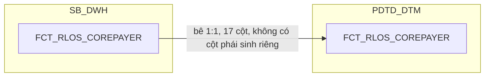
```mermaid
flowchart LR
    subgraph SB_DWH
        C["FCT_RLOS_COREPAYER"]
    end
    subgraph PDTD_DTM
        D["FCT_RLOS_COREPAYER"]
    end
    C -->|bê 1:1, 17 cột, không có cột phái sinh riêng| D
```

### 19.3 Cấu trúc bảng

Cấu trúc cột **kế thừa toàn bộ** từ SB_DWH (bê 1:1), **không bổ sung cột nào ở PDTD_DTM**.

| STT | Tên cột | Kiểu dữ liệu | Bắt buộc | Độ lớn | Khóa | Mô tả | Báo cáo sử dụng | Tên chỉ tiêu trên báo cáo |
| --- | --- | --- | --- | --- | --- | --- | --- | --- |
| 1 | DAYID | DATE | Y |  | PK | Ngày dữ liệu, dạng số YYYYMMDD — bê 1:1 từ SB_DWH.FCT_RLOS_COREPAYER.DAYID | — (cột kỹ thuật) | — |
| 2 | COREPAYER_BK | VARCHAR2 | Y | 64 | PK | Khóa nghiệp vụ hash của tổ hợp (hồ sơ, quan hệ với người vay chính, nhãn thứ tự corepayer, loại giấy tờ, số giấy tờ) — bê nguyên 1:1 từ SB_DWH.FCT_RLOS_COREPAYER.COREPAYER_BK | — (cột kỹ thuật, khóa chính) | — |
| 3 | APPLICATION_SK | NUMBER | Y | 18 |  | Khóa tới DIM_RLOS_APPLICATION, join theo WI_NAME + điều kiện SCD2 hiệu lực tại DAYID. Mặc định -1 nếu không khớp — bê 1:1 từ SB_DWH.FCT_RLOS_COREPAYER.APPLICATION_SK | Báo cáo RLOS APPLICATION (BC1) — khóa JOIN sang DIM_RLOS_APPLICATION | — |
| 4 | WI_NAME | VARCHAR2 | Y | 100 |  | Mã hồ sơ RLOS — bê 1:1 từ SB_DWH.FCT_RLOS_COREPAYER.WI_NAME. Quan hệ 1:N với giấy tờ (1 corepayer có thể có nhiều giấy tờ, 1 hồ sơ có thể có 0..4 corepayer) | Báo cáo RLOS APPLICATION (BC1) | WINAME (Mã hồ sơ) |
| 5 | REL_TO_APPLICANT | VARCHAR2 | N | 200 |  | Quan hệ với người đề nghị vay chính — bê 1:1 từ SB_DWH.FCT_RLOS_COREPAYER.REL_TO_APPLICANT | Báo cáo RLOS APPLICATION (BC1) | CO_REPAYER/ADD_ID_COREPAYER (thành phần vai trò trong tên hiển thị) |
| 6 | ID_NO_CO | VARCHAR2 | N | 100 |  | Nhãn thứ tự người đồng trả nợ (PIN: Corep1-4) — bê 1:1 từ SB_DWH.FCT_RLOS_COREPAYER.ID_NO_CO | — | Thiết kế dư thừa |
| 7 | ID_TYPE | VARCHAR2 | N | 50 |  | Loại giấy tờ định danh — bê 1:1 từ SB_DWH.FCT_RLOS_COREPAYER.ID_TYPE | — | Thiết kế dư thừa (đầu vào LISTAGG ADD_ID_COREPAYER/ADD_ID_OTHER_COREPAYER, chưa xử lý trong lượt này) |
| 8 | ID_NUMBER | VARCHAR2 | N | 100 |  | Số giấy tờ định danh — bê 1:1 từ SB_DWH.FCT_RLOS_COREPAYER.ID_NUMBER | Báo cáo RLOS APPLICATION (BC1) | Thiết kế dư thừa (đầu vào LISTAGG ADD_ID_COREPAYER/ADD_ID_OTHER_COREPAYER — BC1 cần dạng chuỗi nối nhiều giấy tờ theo nhóm ID_TYPE, chưa xử lý trong lượt này) |
| 9 | FULL_NAME | VARCHAR2 | N | 200 |  | Họ tên đầy đủ — bê 1:1 từ SB_DWH.FCT_RLOS_COREPAYER.FULL_NAME | Báo cáo RLOS APPLICATION (BC1) | CO_REPAYER (Tên người đồng trả nợ) |
| 10 | DATE_OF_BIRTH | DATE | N |  |  | Ngày sinh — bê 1:1 từ SB_DWH.FCT_RLOS_COREPAYER.DATE_OF_BIRTH | — | Thiết kế dư thừa |
| 11 | NATIONALITY | VARCHAR2 | N | 100 |  | Quốc tịch — bê 1:1 từ SB_DWH.FCT_RLOS_COREPAYER.NATIONALITY | — | Thiết kế dư thừa |
| 12 | TITLE | VARCHAR2 | N | 30 |  | Danh xưng — bê 1:1 từ SB_DWH.FCT_RLOS_COREPAYER.TITLE | — | Thiết kế dư thừa |
| 13 | HOUSEHOLD | VARCHAR2 | N | 100 |  | Số sổ hộ khẩu — bê 1:1 từ SB_DWH.FCT_RLOS_COREPAYER.HOUSEHOLD | — | Thiết kế dư thừa |
| 14 | PHONE_1 | VARCHAR2 | N | 50 |  | Số điện thoại di động chính — bê 1:1 từ SB_DWH.FCT_RLOS_COREPAYER.PHONE_1 | — | Thiết kế dư thừa |
| 15 | PHONE_2 | VARCHAR2 | N | 50 |  | Số điện thoại phụ — bê 1:1 từ SB_DWH.FCT_RLOS_COREPAYER.PHONE_2 | — | Thiết kế dư thừa |
| 16 | HOME_PHONE | VARCHAR2 | N | 50 |  | Số điện thoại cố định — bê 1:1 từ SB_DWH.FCT_RLOS_COREPAYER.HOME_PHONE | — | Thiết kế dư thừa |

