# HLD Review — FCT tables (SB_DWH)

## 1. FCT_CLOS_APPLICATION_DAILY

### 1.1 Mục đích thiết kế
- **Ý nghĩa bảng:** bảng FACT xương sống của CLOS — lưu ảnh trạng thái cuối
  ngày của từng hồ sơ tín dụng doanh nghiệp (CLOS), kèm các mốc thời gian
  xử lý, người phụ trách từng bước, số tiền/lãi suất phê duyệt, và các chỉ
  tiêu lũy kế (số lần return...).
- **Khóa chính của bảng (PK):** DAYID, WI_NAME.
- **Độ chi tiết (grain):** 1 dòng = 1 hồ sơ x 1 ngày dữ liệu (sinh dòng khi
  có action trong ngày hoặc hồ sơ còn trong chu kỳ thẩm định chưa chốt,
  theo quy tắc load T-1).
- **Phục vụ báo cáo:**
  - Báo cáo CLOS APPLICATION (BC2)
  - Báo cáo Tuần Chuyên viên Thẩm định (BC4)
  - Báo cáo SLA - TAT (BC5)
  - Báo cáo RETURN (BC8)
  - Báo cáo KPI (BC9)

### 1.2 Sơ đồ lineage

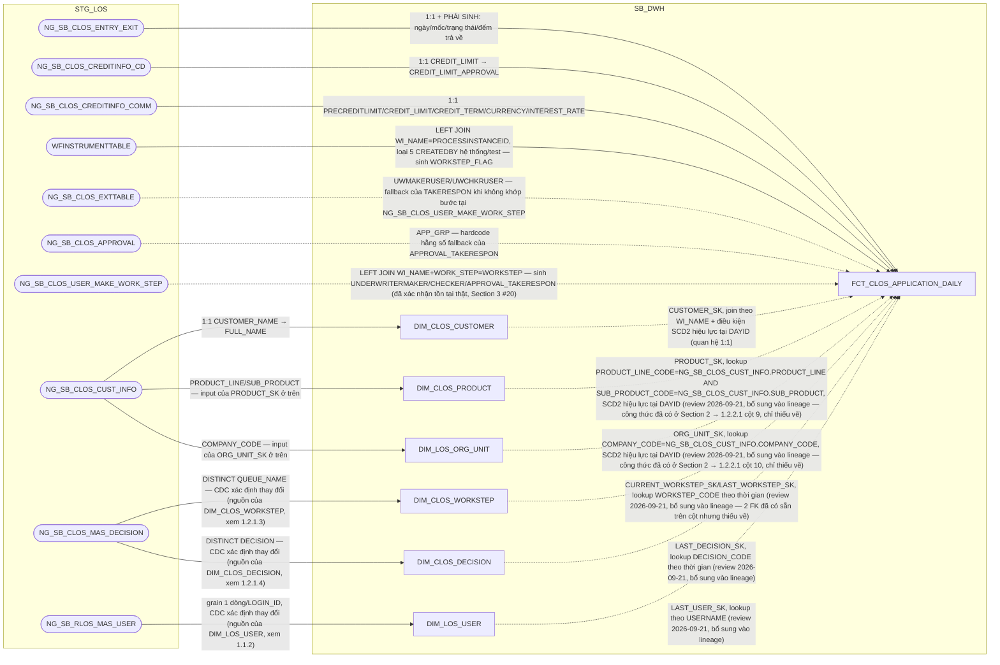

### 1.3 Cấu trúc bảng

| STT | Tên cột | Kiểu dữ liệu | Bắt buộc | Độ lớn | Khóa | Mô tả | Báo cáo sử dụng | Tên chỉ tiêu trên báo cáo |
| --- | --- | --- | --- | --- | --- | --- | --- | --- |
| 1 | DAYID | DATE | Y |  | PK | Ngày dữ liệu, dạng số YYYYMMDD | Báo cáo CLOS APPLICATION (BC2) — một phần khóa chính Báo cáo SLA - TAT (BC5) — khóa chính | — |
| 2 | WI_NAME | VARCHAR2 | Y | 100 | PK | Mã hồ sơ tín dụng CLOS | Báo cáo CLOS APPLICATION (BC2) — hiển thị trực tiếp, khóa chính Báo cáo SLA - TAT (BC5) — khóa chính | WINAME (Mã hồ sơ) |
| 3 | DATASOURCE | VARCHAR2 | Y | 10 |  | Cột kỹ thuật đánh dấu nguồn hệ, luôn cố định 'CLOS' sau khi tách vật lý CLOS/RLOS | Báo cáo SLA - TAT (BC5) — hiển thị trực tiếp | SYSTEMNAME (Hệ thống CLOS/RLOS) |
| 4 | APPLICATION_SK | NUMBER | Y | 18 |  | Khóa tới DIM_CLOS_APPLICATION. Mặc định -1 nếu không khớp | Báo cáo CLOS APPLICATION (BC2) — khóa JOIN | — |
| 5 | CURRENT_WORKSTEP_SK | NUMBER | Y | 18 |  | Khóa tới DIM_CLOS_WORKSTEP, bước hồ sơ đang đứng tại ngày DAYID. Mặc định -1 | Thiết kế dư thừa | — |
| 6 | LAST_WORKSTEP_SK | NUMBER | Y | 18 |  | Khóa tới DIM_CLOS_WORKSTEP của sự kiện hoàn tất gần nhất. Mặc định -1 | Báo cáo CLOS APPLICATION (BC2) — khóa JOIN, nguồn cho chỉ tiêu/trường LAST_WORKSTEP (Bước hồ sơ cuối, tính ở PDTD_DTM) | — |
| 7 | LAST_DECISION_SK | NUMBER | Y | 18 |  | Khóa tới DIM_CLOS_DECISION của sự kiện hoàn tất gần nhất. Mặc định -1 | Báo cáo CLOS APPLICATION (BC2) — khóa JOIN | LAST_DECISION (Quyết định bước cuối) |
| 8 | LAST_USER_SK | NUMBER | Y | 18 |  | Khóa tới DIM_LOS_USER của người xử lý sự kiện hoàn tất gần nhất. Mặc định -1 | Thiết kế dư thừa | — |
| 9 | PRODUCT_SK | NUMBER | Y | 18 |  | Khóa tới DIM_CLOS_PRODUCT — lookup theo PRODUCT_LINE_CODE=NG_SB_CLOS_CUST_INFO.PRODUCT_LINE AND SUB_PRODUCT_CODE=NG_SB_CLOS_CUST_INFO.SUB_PRODUCT, điều kiện SCD2 hiệu lực tại DAYID. Mặc định -1 nếu không khớp | Báo cáo CLOS APPLICATION (BC2) — khóa JOIN tới PRODUCT_LINE/SUB_PRODUCT Báo cáo SLA - TAT (BC5) — khóa JOIN điều kiện SLA_DE Báo cáo KPI (BC9) — điều kiện lọc STREAM khi tính SLGN_CLOS | — |
| 10 | ORG_UNIT_SK | NUMBER | Y | 18 |  | Khóa tới DIM_LOS_ORG_UNIT — lookup theo COMPANY_CODE=NG_SB_CLOS_CUST_INFO.COMPANY_CODE, điều kiện SCD2 hiệu lực tại DAYID. Mặc định -1 nếu không khớp | Báo cáo CLOS APPLICATION (BC2) — khóa JOIN tới BRANCH_CODE/COMPANY_CODE/COMPANY_NAME | — |
| 11 | RI_USER | VARCHAR2 | N | 100 |  | User khởi tạo hồ sơ (bước RequestInitiate) | Báo cáo CLOS APPLICATION (BC2) — hiển thị trực tiếp | RI_USER (User khởi tạo hồ sơ) |
| 12 | BRANCH_USER | VARCHAR2 | N | 100 |  | User xử lý bước BranchSupport, HOÀN TẤT gần nhất | Báo cáo CLOS APPLICATION (BC2) — hiển thị trực tiếp | BRANCH_USER (User Chi nhánh) |
| 13 | DDE_USER | VARCHAR2 | N | 100 |  | User xử lý bước DetailDataEntry, HOÀN TẤT gần nhất | Báo cáo CLOS APPLICATION (BC2) — hiển thị trực tiếp | DDE_USER (User Chuyên viên nhập liệu) |
| 14 | QC_USER | VARCHAR2 | N | 100 |  | User xử lý bước DataInputerChecker, HOÀN TẤT gần nhất | Báo cáo CLOS APPLICATION (BC2) — hiển thị trực tiếp | QUALITY_CHECKER (User Kiểm soát nhập liệu) |
| 15 | UND_MAKER_USER | VARCHAR2 | N | 100 |  | User xử lý bước UnderwriterMaker, HOÀN TẤT gần nhất | Báo cáo CLOS APPLICATION (BC2) — hiển thị trực tiếp | UND_MAKER (User Chuyên viên thẩm định) |
| 16 | UND_CHECKER_USER | VARCHAR2 | N | 100 |  | User xử lý bước UnderwriterChecker, HOÀN TẤT gần nhất | Báo cáo CLOS APPLICATION (BC2) — hiển thị trực tiếp | UND_CHECKER (User Kiểm soát thẩm định) |
| 17 | PHV_USER | VARCHAR2 | N | 100 |  | User xử lý bước PhoneVerification, HOÀN TẤT gần nhất | Báo cáo CLOS APPLICATION (BC2) — hiển thị trực tiếp | PHV_USER (User Chuyên viên Thẩm định điện thoại) |
| 18 | FA_USER | VARCHAR2 | N | 100 |  | User Chuyên viên Thực địa | Báo cáo CLOS APPLICATION (BC2) — hiển thị trực tiếp | FA_USER (User Chuyên viên Thực địa) |
| 19 | APPROVER_USER | VARCHAR2 | N | 100 |  | User xử lý bước CreditApproval, HOÀN TẤT gần nhất | Báo cáo CLOS APPLICATION (BC2) — hiển thị trực tiếp | BI_APPROVER (User Chuyên gia phê duyệt) |
| 20 | COMMITTEE_USER | VARCHAR2 | N | 100 |  | User Hội đồng tín dụng | Báo cáo CLOS APPLICATION (BC2) — hiển thị trực tiếp | BI_COMMITTEE (User Hội đồng tín dụng) |
| 21 | HOS_USER | VARCHAR2 | N | 100 |  | User Hỗ trợ phê duyệt | Báo cáo CLOS APPLICATION (BC2) — hiển thị trực tiếp | BI_HOS_USER (User Hỗ trợ phê duyệt) |
| 22 | PROCESSED_DATE | DATE | N |  |  | Ngày xử lý chung của hồ sơ theo 3 mức ưu tiên (phê duyệt cuối / hủy / hoàn tất gần nhất) | Báo cáo CLOS APPLICATION (BC2) — hiển thị trực tiếp Báo cáo KPI (BC9) — nguồn cho AGG_LOS_KPI_APPLICATION.PROCESSED_DATE, mốc xếp hồ sơ vào đúng DAYID khi SUM/COUNT lên grain ngày | PROCESSED_DATE (Ngày dữ liệu báo cáo) |
| 23 | LAST_UWM_ENTRYDATE | TIMESTAMP | N |  |  | MAX(ENTRYDATE) tại UnderwriterMaker <= DAYID — mốc mở chu kỳ thẩm định hiện hành | Nguồn cho chỉ tiêu/trường PROCESSED_DATE_UWM (cột 24, cùng bảng) | — |
| 24 | PROCESSED_DATE_UWM | DATE | N |  |  | Ngày chốt chu kỳ thẩm định hiện hành, tính tương đối theo LAST_UWM_ENTRYDATE | Báo cáo Tuần Chuyên viên Thẩm định (BC4) — REPORT_DATE (dùng thay DAYID khi báo cáo cần mốc theo chu kỳ thẩm định) | REPORT_DATE (Ngày báo cáo) |
| 25 | CREATION_DATE | DATE | N |  |  | TRUNC(MIN(ENTRYDATE)) theo WI_NAME | Báo cáo CLOS APPLICATION (BC2) — hiển thị trực tiếp | CREATION_DATE (Ngày hồ sơ khởi tạo) |
| 26 | FIRST_APPROVAL_DATE | DATE | N |  |  | MIN(EXITDATE) tại bước phê duyệt hợp lệ | Thiết kế dư thừa | — |
| 27 | LAST_APPROVAL_DATE | DATE | N |  |  | MAX(EXITDATE) tại bước phê duyệt (nhóm quyết định đã định nghĩa) | Báo cáo CLOS APPLICATION (BC2) — hiển thị trực tiếp | LAST_APPROVAL_DATE (Thời gian phê duyệt cuối cùng) |
| 28 | MIN_UWM | TIMESTAMP | N |  |  | MIN(ENTRYDATE) tại UnderwriterMaker | Báo cáo CLOS APPLICATION (BC2) — hiển thị trực tiếp | MIN_UWM (Thời gian hồ sơ lên CV thẩm định) |
| 29 | MIN_APP | TIMESTAMP | N |  |  | MIN(ENTRYDATE) tại CreditApproval/CreditCommittee | Báo cáo CLOS APPLICATION (BC2) — hiển thị trực tiếp | MIN_APP (Thời gian hồ sơ lên cấp phê duyệt) |
| 30 | AUTO_CANCEL_DATE | DATE | N |  |  | Ngày hồ sơ bị hệ thống tự hủy (theo quy tắc CancelRevoke rỗng liên tiếp) | Nguồn cho chỉ tiêu/trường FLAG_AUTO_CANCEL (cột 40, cùng bảng) | — |
| 31 | CANCEL_USER_DATE | DATE | N |  |  | EXITDATE tại bản ghi DECISION='Cancel' và USERNAME khác NULL | Thiết kế dư thừa | — |
| 32 | BI_CAN_DATE | DATE | N |  |  | ENTRYDATE tại bước CancelRevoke | Báo cáo CLOS APPLICATION (BC2) — hiển thị trực tiếp | BI_CAN_DATE (Thời gian hồ sơ vào vùng CancelRevoke) |
| 33 | LAST_ENTRYDATE | TIMESTAMP | N |  |  | ENTRYDATE của sự kiện hoàn tất gần nhất | Báo cáo CLOS APPLICATION (BC2) — hiển thị trực tiếp | LAST_ENTRYDATE (Thời gian vào bước cuối) |
| 34 | LAST_EXITDATE | TIMESTAMP | N |  |  | EXITDATE của cùng sự kiện hoàn tất gần nhất | Báo cáo CLOS APPLICATION (BC2) — hiển thị trực tiếp | LAST_EXITDATE (Thời gian kết thúc bước cuối) |
| 35 | BI_APPSTATUS | VARCHAR2 | N | 50 |  | Trạng thái hồ sơ chuẩn hóa (Approved/Rejected/Cancelled/Processing) | Báo cáo CLOS APPLICATION (BC2) — hiển thị trực tiếp | BI_APPSTATUS (Trạng thái cuối của hồ sơ) |
| 36 | HAS_ACTION_IN_DAY | VARCHAR2 | Y | 1 |  | 'Y' nếu hồ sơ có phát sinh xử lý trong ngày DAYID | Thiết kế dư thừa | — |
| 37 | LAST_ACTION_DATE | DATE | Y |  |  | Ngày business action gần nhất tính đến cuối DAYID | Thiết kế dư thừa | — |
| 38 | INACTIVE_DAY_CNT | NUMBER | Y | 5 |  | TRUNC(DAYID) - TRUNC(LAST_ACTION_DATE) | Thiết kế dư thừa | — |
| 39 | PRE_WORKSTEP_CODE | VARCHAR2 | N | 200 |  | Bước xử lý liền trước (LAG theo ENTRYDATE) | Báo cáo CLOS APPLICATION (BC2) — hiển thị trực tiếp | PRE_WORKSTEP (Bước hồ sơ trước đó) |
| 40 | FLAG_AUTO_CANCEL | VARCHAR2 | N | 10 |  | 'YES' nếu AUTO_CANCEL_DATE khác NULL | Báo cáo CLOS APPLICATION (BC2) — hiển thị trực tiếp | FLAG_AUTO_CAN (Hồ sơ bị tự động hủy — YES/NO) |
| 41 | LAST_REMARKS | VARCHAR2 | N | 4000 |  | Ghi chú của sự kiện hoàn tất gần nhất | Báo cáo CLOS APPLICATION (BC2) — hiển thị trực tiếp | LAST_REMARKS (Ghi chú ý kiến bước cuối) |
| 42 | LAST_REMARK_DDE | VARCHAR2 | N | 4000 |  | Ghi chú tại bước DetailDataEntry | Thiết kế dư thừa | — |
| 43 | LAST_CAN_REMARKS | VARCHAR2 | N | 4000 |  | Ghi chú tại lần hủy hồ sơ | Thiết kế dư thừa | — |
| 44 | HAS_REACHED_DDE | VARCHAR2 | N | 1 |  | Hồ sơ đã tới bước DetailDataEntry hay chưa | Thiết kế dư thừa | — |
| 45 | HAS_REACHED_QC | VARCHAR2 | N | 1 |  | Hồ sơ đã tới bước DataInputerChecker hay chưa | Thiết kế dư thừa | — |
| 46 | HAS_REACHED_UWM | VARCHAR2 | N | 1 |  | Hồ sơ đã tới bước UnderwriterMaker hay chưa | Thiết kế dư thừa | — |
| 47 | HAS_REACHED_UWC | VARCHAR2 | N | 1 |  | Hồ sơ đã tới bước UnderwriterChecker hay chưa | Thiết kế dư thừa | — |
| 48 | HAS_REACHED_APPROVAL | VARCHAR2 | N | 1 |  | Hồ sơ đã tới bước CreditApproval/CreditCommittee hay chưa | Thiết kế dư thừa | — |
| 49 | PROPOSED_AMT | NUMBER | N | 20,2 |  | Số tiền đề xuất — nguồn NG_SB_CLOS_CREDITINFO_COMM.PRECREDITLIMIT | Báo cáo CLOS APPLICATION (BC2) — hiển thị trực tiếp | ST_YEUCAU (Số tiền đề xuất vay) |
| 50 | CREDIT_LIMIT_APPROVAL | NUMBER | N | 20,2 |  | Hạn mức do chuyên gia phê duyệt — nguồn NG_SB_CLOS_CREDITINFO_CD.CREDIT_LIMIT | Báo cáo CLOS APPLICATION (BC2) — hiển thị trực tiếp | ST_PHEDUYET (Số tiền phê duyệt chính thức) |
| 51 | CREDIT_LIMIT_COMMITTEE | NUMBER | N | 20,2 |  | Hạn mức do hội đồng phê duyệt — nguồn NG_SB_CLOS_CREDITINFO_COMM.CREDIT_LIMIT | Báo cáo CLOS APPLICATION (BC2) — hiển thị trực tiếp Báo cáo Thông tin phê duyệt (BC3) — nguồn cho chỉ tiêu/trường CREDIT_LIMIT (đặt bản dư thừa có chủ đích trên DIM_CLOS_APPLICATION để BC3 lookup thẳng qua APPLICATION_SK) | CREDIT_LIMITS (Hạn mức cấp) |
| 52 | APPROVED_AMT_FINAL | NUMBER | N | 20,2 |  | Hạn mức phê duyệt cuối cùng — nguồn NG_SB_CLOS_CREDITINFO_COMM.CREDIT_LIMIT, map thẳng 1 nguồn | Báo cáo Thông tin phê duyệt (BC3) — CREDIT_LIMIT (giá trị hạn mức phê duyệt cuối theo đúng công thức SRS BC3) | CREDIT_LIMIT (Số tiền phê duyệt) |
| 53 | APPROVED_TERM | NUMBER | N | 5 |  | Kỳ hạn phê duyệt — nguồn NG_SB_CLOS_CREDITINFO_COMM.CREDIT_TERM | Báo cáo CLOS APPLICATION (BC2) — hiển thị trực tiếp | CREDIT_TERM (Thời hạn cấp tín dụng) |
| 54 | INTEREST_RATE_PCT | NUMBER | N | 8,4 |  | Lãi suất phê duyệt (%), chỉ nhận khi nguồn là số | Báo cáo CLOS APPLICATION (BC2) — hiển thị trực tiếp (chọn thay cho INTEREST_RATE_DESC theo quyết định người dùng, review 2026-09-21) | INTEREST_RATE (Lãi suất phê duyệt) |
| 55 | INTEREST_RATE_DESC | VARCHAR2 | N | 1600 |  | Diễn giải lãi suất nguyên văn — nguồn NG_SB_CLOS_CREDITINFO_COMM.INTEREST_RATE (có thể là công thức nhiều giai đoạn) | Thiết kế dư thừa | — |
| 57 | RETURN_CNT_DATAENTRY | NUMBER | N | 5 |  | Số lần hồ sơ bị trả về ở khâu nhập liệu | Báo cáo RETURN (BC8) — hiển thị trực tiếp | SL_RETURN_NHAPLIEU (Số lần return tại Nhập liệu) |
| 58 | RETURN_CNT_UNDERWRITING | NUMBER | N | 5 |  | Số lần hồ sơ bị trả về ở khâu thẩm định | Báo cáo RETURN (BC8) — hiển thị trực tiếp | SL_RETURN_THAMDINH (Số lần return tại Thẩm định) |
| 59 | RETURN_CNT_APPROVAL | NUMBER | N | 5 |  | Số lần hồ sơ bị trả về ở khâu phê duyệt | Báo cáo RETURN (BC8) — hiển thị trực tiếp | SL_RETURN_PHEDUYET (Số lần return tại Cấp Phê duyệt) |
| 60 | KPI_VOLUME | NUMBER | N | 5,2 |  | Mức độ hoàn thành hồ sơ, thang 0-1 — theo DECISION nếu đã phê duyệt/từ chối = 1.0; nếu đã CancelRevoke/CancelPermanent thì lấy theo bước xa nhất đã đạt (CreditApproval=0.8, UnderwriterChecker=0.6, UnderwriterMaker=0.5, DetailDataEntry=0.2); còn lại NULL | Thiết kế dư thừa | — |
| 62 | VAR_STR12 | VARCHAR2 | N | 200 |  | Cột generic của WFINSTRUMENTTABLE — LEFT JOIN riêng theo WI_NAME=PROCESSINSTANCEID (không lọc CREATEDBY) | Báo cáo KPI (BC9) — điều kiện lọc IS NOT NULL cho SLHS_CLOS_DAY/SLGN_CLOS_DAY (AGG_LOS_KPI_YTD_DAILY) | — |
| 63 | UNDERWRITERMAKER_TAKERESPON | VARCHAR2 | N | 100 |  | CV Thẩm định chịu trách nhiệm — COALESCE(CASE WHEN m.WORK_STEP='UnderwriterMaker' THEN m.USER_MAKE END, i.UWMAKERUSER) | Báo cáo CLOS APPLICATION (BC2) — hiển thị trực tiếp | UNDERWRITERMAKER_TAKERESPON (CV Thẩm định chịu trách nhiệm) |
| 64 | UNDERWRITERCHECKER_TAKERESPON | VARCHAR2 | N | 100 |  | Kiểm soát thẩm định chịu trách nhiệm — COALESCE(CASE WHEN m.WORK_STEP='UnderwriterChecker' THEN m.USER_MAKE END, i.UWCHKRUSER) | Báo cáo CLOS APPLICATION (BC2) — hiển thị trực tiếp | UNDERWRITERCHECKER_TAKERESPON (Kiểm soát thẩm định chịu trách nhiệm) |
| 65 | APPROVAL_TAKERESPON | VARCHAR2 | N | 100 |  | Chuyên gia phê duyệt chịu trách nhiệm — COALESCE(m.USER_MAKE, CASE e.APP_GRP WHEN 'A1' THEN 'long.lq' WHEN 'CC' THEN 'UBTD' WHEN 'BOD' THEN 'HDQT' END) | Báo cáo CLOS APPLICATION (BC2) — hiển thị trực tiếp | APPROVAL_TAKERESPON (Chuyên gia phê duyệt chịu trách nhiệm) |
| 66 | CUSTOMER_SK | NUMBER | Y | 18 |  | Khóa tới DIM_CLOS_CUSTOMER — quan hệ 1:1 với hồ sơ qua WI_NAME, join theo WI_NAME + điều kiện SCD2 hiệu lực tại DAYID. Mặc định -1 nếu không khớp. Đây là chân khách hàng LOS — khác T24_CUSTOMER_SK (chân T24, bổ sung riêng tại PDTD_DTM) | Báo cáo CLOS APPLICATION (BC2) — khóa JOIN tới ZONE (DIM_CLOS_CUSTOMER.ZONE) | — |

## 2. FCT_CLOS_APPLICATION_PARTY

### 2.1 Mục đích thiết kế
- **Ý nghĩa bảng:** bảng FACT quan hệ (factless fact) — không mang thuộc
  tính mô tả, chỉ nối lại quan hệ giữa 1 hồ sơ, khách hàng chính và người
  liên quan pháp lý sau khi tách DIM_CLOS_CUSTOMER/DIM_CLOS_LEGAL_PARTY
  ra khỏi FCT gốc. Là cầu nối để DIM_CLOS_CUSTOMER LEFT JOIN lấy các
  thuộc tính từ người liên quan pháp lý (mã số ĐKKD/MST, người đại diện
  pháp luật) hiển thị trên báo cáo.
- **Khóa chính của bảng (PK):** DAYID, WI_NAME, LEGAL_PARTY_SK.
- **Độ chi tiết (grain):** 1 dòng = 1 hồ sơ x 1 người liên quan pháp lý
  (dòng trên DIM_CLOS_LEGAL_PARTY), join đủ N dòng cho cả 5 vai trò
  (CUSTOMER, LEGAL_REPRESENTATIVE, COLLATERAL_OWNER,
  MAIN_CONTRIBUTING_MEMBERS, OTHER).
- **Phục vụ báo cáo:**
  - Báo cáo CLOS APPLICATION (BC2) — gián tiếp, làm cầu nối để
    DIM_CLOS_CUSTOMER lookup ORG_LEGAL_ID/LEGAL_REPRESENTATIVE từ
    DIM_CLOS_LEGAL_PARTY

### 2.2 Sơ đồ lineage

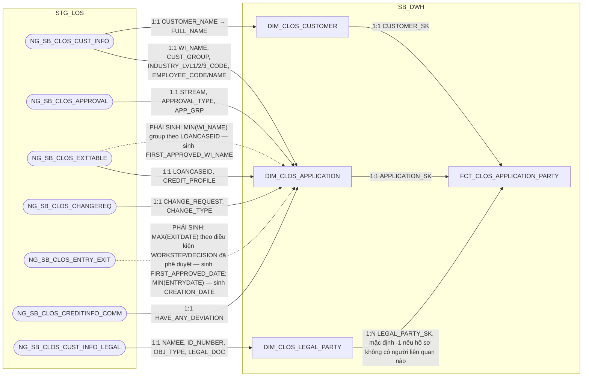

### 2.3 Cấu trúc bảng

| STT | Tên cột | Kiểu dữ liệu | Bắt buộc | Độ lớn | Khóa | Mô tả | Báo cáo sử dụng | Tên chỉ tiêu trên báo cáo |
| --- | --- | --- | --- | --- | --- | --- | --- | --- |
| 1 | DAYID | DATE | Y |  | PK | Ngày dữ liệu, dạng số YYYYMMDD | — (cột kỹ thuật, một phần khóa chính) | — |
| 2 | WI_NAME | VARCHAR2 | Y | 100 | PK | Mã hồ sơ tín dụng CLOS | — (cột kỹ thuật, một phần khóa chính) | — |
| 3 | APPLICATION_SK | NUMBER | Y | 18 |  | Khóa tới DIM_CLOS_APPLICATION. Mặc định -1 | — (khóa liên kết nội bộ, không xuất trực tiếp lên báo cáo) | — |
| 4 | CUSTOMER_SK | NUMBER | Y | 18 |  | Khóa tới DIM_CLOS_CUSTOMER. Mặc định -1 | — (khóa liên kết nội bộ, không xuất trực tiếp lên báo cáo) | — |
| 5 | LEGAL_PARTY_SK | NUMBER | Y | 18 | PK | Khóa tới DIM_CLOS_LEGAL_PARTY — join đủ N dòng cho cả 5 vai trò (CUSTOMER, LEGAL_REPRESENTATIVE, COLLATERAL_OWNER, MAIN_CONTRIBUTING_MEMBERS, OTHER), đúng grain "1 dòng = 1 hồ sơ × 1 người liên quan pháp lý". Mặc định -1 chỉ dùng cho trường hợp dữ liệu thiếu/không khớp được (Unknown) — CLOS luôn có đúng 1 dòng LEGAL_PARTY ứng với chính khách hàng | Báo cáo CLOS APPLICATION (BC2) — khóa JOIN để DIM_CLOS_CUSTOMER lấy ORG_LEGAL_ID (vai trò CUSTOMER) và LEGAL_REPRESENTATIVE (vai trò LEGAL_REPRESENTATIVE) từ DIM_CLOS_LEGAL_PARTY | ID_NUMBER (Số ĐKKD/MST doanh nghiệp); LEGAL_REPRESENTATIVE (Người đại diện pháp luật) |
| 6 | DATASOURCE | VARCHAR2 | Y | 10 |  | Cột kỹ thuật đánh dấu nguồn hệ, luôn cố định 'CLOS' sau khi tách vật lý CLOS/RLOS | — (cột kỹ thuật) | — |

## 3. FCT_CLOS_COLLATERAL

### 3.1 Mục đích thiết kế
- **Ý nghĩa bảng:** bảng FACT chi tiết (nhân dòng), lưu ảnh số liệu thay
  đổi theo ngày của từng tài sản bảo đảm thuộc hồ sơ CLOS. Không tách
  chiều tài sản riêng — toàn bộ thuộc tính lưu thẳng trên fact vì nguồn
  NG_SB_CLOS_COLL_CD không khai khóa CDC, nên không đủ điều kiện tách
  DIM theo SCD2 (xem giải thích chi tiết ở phần lineage).
- **Khóa chính của bảng (PK):** DAYID, WI_NAME, COLLATERAL_BK.
- **Độ chi tiết (grain):** 1 dòng = 1 tài sản bảo đảm của 1 hồ sơ x 1 ngày
  dữ liệu (ảnh chụp đầy đủ theo ngày).
- **Phục vụ báo cáo:**
  - Báo cáo RLOS APPLICATION (BC1) — qua đối xứng RLOS, không áp dụng trực tiếp nhánh CLOS
  - Báo cáo CLOS APPLICATION (BC2)
  - Báo cáo Thông tin phê duyệt (BC3)
  - Báo cáo KPI (BC9)

### 3.2 Sơ đồ lineage

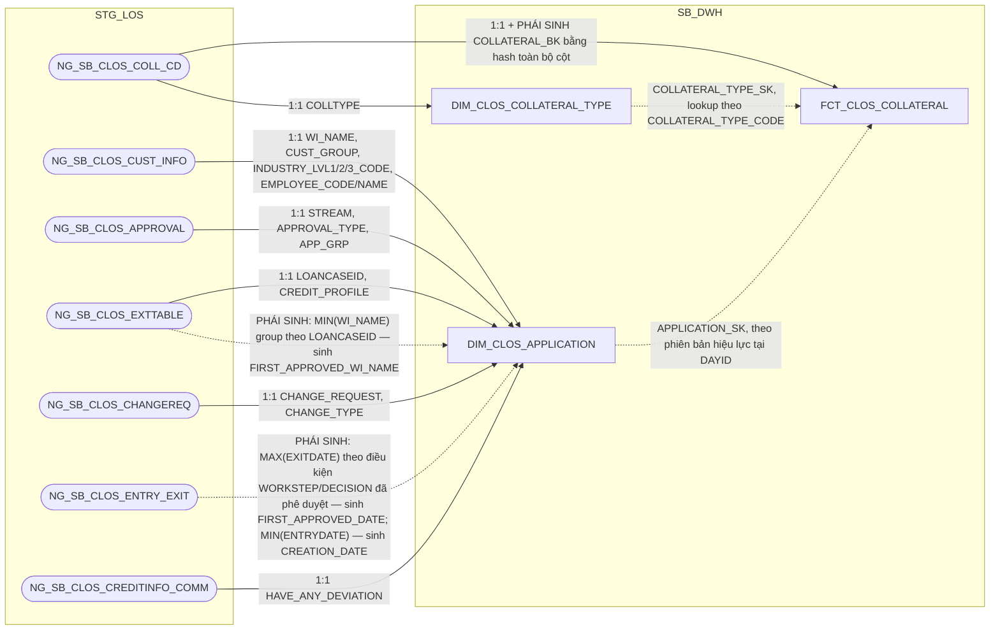

### 3.3 Cấu trúc bảng

| STT | Tên cột | Kiểu dữ liệu | Bắt buộc | Độ lớn | Khóa | Mô tả | Báo cáo sử dụng | Tên chỉ tiêu trên báo cáo |
| --- | --- | --- | --- | --- | --- | --- | --- | --- |
| 1 | DAYID | DATE | Y |  | PK | Ngày dữ liệu, dạng số YYYYMMDD | — (cột kỹ thuật, một phần khóa chính) | — |
| 2 | WI_NAME | VARCHAR2 | Y | 100 | PK | Mã hồ sơ tín dụng CLOS | — (cột kỹ thuật, một phần khóa chính) | — |
| 3 | COLLATERAL_BK | VARCHAR2 | Y | 64 | PK | Khóa nghiệp vụ của dòng tài sản — hash SHA256 trên toàn bộ cột không phải CLOB của NG_SB_CLOS_COLL_CD (loại trừ COLL_MGMT_APP, DESCRIPTION), cộng DATASOURCE và tên bảng nguồn | — (cột kỹ thuật, một phần khóa chính) | — |
| 4 | DATASOURCE | VARCHAR2 | Y | 10 |  | Cột kỹ thuật đánh dấu nguồn hệ, luôn cố định 'CLOS' sau khi tách vật lý CLOS/RLOS | — (cột kỹ thuật) | — |
| 5 | APPLICATION_SK | NUMBER | Y | 18 |  | Khóa tới DIM_CLOS_APPLICATION theo phiên bản hiệu lực tại DAYID. Mặc định -1 nếu không khớp | — (khóa liên kết nội bộ, không xuất trực tiếp lên báo cáo) | — |
| 6 | COLLATERAL_TYPE_SK | NUMBER | Y | 18 |  | Khóa tới DIM_CLOS_COLLATERAL_TYPE, lookup theo COLLATERAL_TYPE_CODE. Mặc định -1 | — (khóa liên kết nội bộ; DIM_CLOS_COLLATERAL_TYPE hiện chỉ còn COLLATERAL_TYPE_CODE — đã có sẵn trực tiếp trên fact này ở cột 7 — nên khóa này không mang thêm giá trị hiển thị nào cho báo cáo) | — |
| 7 | COLLATERAL_TYPE_CODE | VARCHAR2 | N | 100 |  | Mã loại tài sản bảo đảm — nguồn NG_SB_CLOS_COLL_CD.COLLTYPE | Báo cáo CLOS APPLICATION (BC2) — nguồn cho 9 cờ TSDB_NHOM_0/TSDB_BDS/TSDB_PTVT/TSDB_MMTB/TSDB_KPT/TSDB_HTK/TSDB_TIN_CHAP/TIN_CHAP_TQD/TSDB_CP_TP (so sánh CASE trực tiếp giá trị COLLTYPE gốc) Báo cáo Thông tin phê duyệt (BC3) — hiển thị trực tiếp | TSDB_NHOM_0/TSDB_BDS/TSDB_PTVT/TSDB_MMTB/TSDB_KPT/TSDB_HTK/TSDB_TIN_CHAP/TIN_CHAP_TQD/TSDB_CP_TP (các cờ TSBĐ theo nhóm — BC2); TYPES_OF_COLLATERALS (Loại TSBĐ — BC3) |
| 8 | DESCRIPTION | VARCHAR2 | N | 4000 |  | Diễn giải tài sản bảo đảm — nguồn NG_SB_CLOS_COLL_CD.DESCRIPTION (CLOB) | Báo cáo Thông tin phê duyệt (BC3) — hiển thị trực tiếp | DESCRIPTION (Mô tả TSBĐ) |
| 9 | OWNER_NAME | VARCHAR2 | N | 200 |  | Chủ sở hữu tài sản — nguồn NG_SB_CLOS_COLL_CD.COLL_OWNER | Báo cáo Thông tin phê duyệt (BC3) — hiển thị trực tiếp | OWNER (Chủ TSBĐ) |
| 10 | COLL_MGMT_METHOD | VARCHAR2 | N | 4000 |  | Phương thức quản lý tài sản — nguồn NG_SB_CLOS_COLL_CD.COLL_MGMT_APP. Người dùng thường không nhập trường này trên live nên phần lớn sẽ rỗng, nhưng BC3 vẫn liệt kê nên phải nạp | Báo cáo Thông tin phê duyệt (BC3) — hiển thị trực tiếp | COLLATERA_MANAGEMENT (Phương thức quản lý TSBĐ) |
| 11 | APPRAISED_VALUE | NUMBER | N | 20,2 |  | Giá trị định giá của tài sản — nguồn NG_SB_CLOS_COLL_CD.APPRAISED_VAL_FIG. Ép kiểu số từ text theo định dạng Việt Nam, DEFAULT NULL ON CONVERSION ERROR | Báo cáo Thông tin phê duyệt (BC3) — hiển thị trực tiếp | APPRAISED_VALUE (Giá trị định giá) |
| 12 | LOAN_RATE_LTV | NUMBER | N | 5,2 |  | Tỷ lệ cho vay trên giá trị tài sản — nguồn NG_SB_CLOS_COLL_CD.LTV. Cùng quy tắc ép kiểu, đơn vị phần trăm | Báo cáo Thông tin phê duyệt (BC3) — hiển thị trực tiếp | LTV (Tỷ lệ cho vay của TSBĐ) |

⚠️ Lệch đồng bộ: `hld/HLD_FCT_SB_DWH.md` (mermaid Section 1, dòng ~219,
và ghi chú "Đối chiếu SRS" ở Section 1) vẫn mô tả `DIM_CLOS_COLLATERAL_TYPE`
sinh cột `COLL_GROUP` và cho rằng BC2/BC9 dùng `COLL_GROUP` làm đầu vào
phân loại nhóm tài sản — nhưng `hld/HLD_Table_Design.md` (bản mới nhất,
Section 3 dòng #10, review 2026-09-22) đã XÁC NHẬN XÓA HẲN cột `COLL_GROUP`
khỏi `DIM_CLOS_COLLATERAL_TYPE` (cả 3 tầng), vì rà soát lại không có báo
cáo nào thực sự lọc xuyên hệ bằng cột này — BC2 dùng 9 câu CASE so sánh
trực tiếp `COLLATERAL_TYPE_CODE` gốc, không qua `COLL_GROUP`. `hld/
HLD_DIM_SB_DWH.md` (thiết kế DIM_CLOS_COLLATERAL_TYPE) cũng chưa được cập
nhật theo quyết định xóa này. Bảng trên đã viết theo đúng bản mới nhất
(HLD_Table_Design.md): không còn `COLL_GROUP`, mermaid lineage đã bỏ cạnh
"PHÁI SINH COLL_GROUP".

## 4. FCT_CLOS_EXCEPTION

### 4.1 Mục đích thiết kế
- **Ý nghĩa bảng:** bảng FACT chi tiết, lưu mỗi lần một lý do (ngoại lệ)
  được nêu ra trên hồ sơ CLOS trong quá trình xử lý — bao gồm cả lần nêu
  lý do (Raise) lẫn lần đã làm rõ/bổ sung (Clear).
- **Khóa chính của bảng (PK):** DAYID, WI_NAME, EXCEPTION_CATEGORY,
  RAISED_BY, RAISED_DATE_TIME.
- **Độ chi tiết (grain):** 1 dòng = 1 lần ghi nhận lý do của 1 hồ sơ,
  trong ảnh chụp của ngày DAYID. Một hồ sơ có thể phát sinh cùng 1 loại lý
  do nhiều lần, bởi nhiều người, ở nhiều thời điểm khác nhau.
- **Phục vụ báo cáo:**
  - Báo cáo EXCEPTION - FTR (BC7)
  - Báo cáo RETURN (BC8)

### 4.2 Sơ đồ lineage

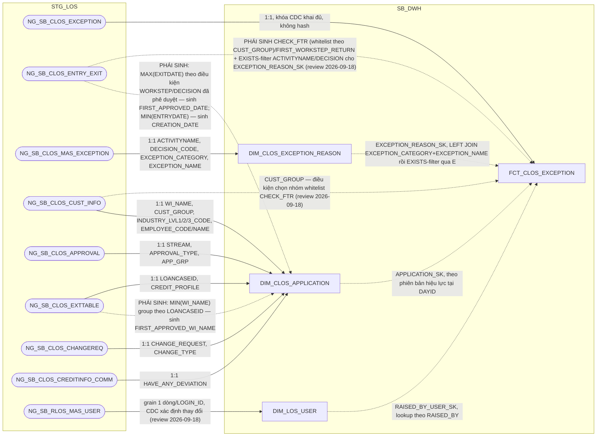

### 4.3 Cấu trúc bảng

| STT | Tên cột | Kiểu dữ liệu | Bắt buộc | Độ lớn | Khóa | Mô tả | Báo cáo sử dụng | Tên chỉ tiêu trên báo cáo |
| --- | --- | --- | --- | --- | --- | --- | --- | --- |
| 1 | DAYID | DATE | Y |  | PK | Ngày dữ liệu, dạng số YYYYMMDD | — (cột kỹ thuật) | — |
| 2 | WI_NAME | VARCHAR2 | Y | 100 | PK | Mã hồ sơ tín dụng CLOS | Báo cáo EXCEPTION - FTR (BC7) — khóa JOIN Báo cáo RETURN (BC8) — khóa JOIN | WINAME (Mã hồ sơ) |
| 3 | APPLICATION_SK | NUMBER | Y | 18 |  | Khóa tới DIM_CLOS_APPLICATION theo phiên bản hiệu lực tại DAYID. Mặc định -1 | Báo cáo EXCEPTION - FTR (BC7) — khóa JOIN sang DIM_CLOS_APPLICATION | — |
| 4 | EXCEPTION_REASON_SK | NUMBER | Y | 18 |  | Khóa tới DIM_CLOS_EXCEPTION_REASON — PHÁI SINH 2 bước đúng SRS BC7 (không phải lookup 1 cột): (1) LEFT JOIN theo EXCEPTION_CATEGORY + EXCEPTION_NAME, có thể khớp nhiều dòng DIM cùng category+name khác ACTIVITYNAME/DECISION_CODE; (2) lọc còn đúng 1 dòng bằng điều kiện tồn tại bản ghi NG_SB_CLOS_ENTRY_EXIT (WI_NAME khớp + WORKSTEP=ACTIVITYNAME + DECISION=DECISION_CODE của dòng DIM đó) — chỉ giữ tổ hợp đã thực sự xảy ra trong lịch sử xử lý hồ sơ. Mặc định -1 nếu không còn dòng nào khớp | Báo cáo EXCEPTION - FTR (BC7) — khóa JOIN sang DIM_CLOS_EXCEPTION_REASON | — |
| 5 | RAISED_BY_USER_SK | NUMBER | Y | 18 |  | Khóa tới DIM_LOS_USER, người nêu lý do. Mặc định -1. ĐÚNG GRAIN của bảng — 1 lần ghi nhận lý do có đúng 1 người nêu | Báo cáo EXCEPTION - FTR (BC7) — khóa JOIN sang DIM_LOS_USER | — |
| 6 | EXCEPTION_CATEGORY | VARCHAR2 | N | 500 | PK | Phân nhóm nội dung cần làm rõ — nguồn NG_SB_CLOS_EXCEPTION.EXCEPTION_CATEGORY | Báo cáo EXCEPTION - FTR (BC7) — hiển thị trực tiếp | EXCEPTION_CATEGORY (Nhóm nội dung ngoại lệ) |
| 7 | EXCEPTION_NAME | VARCHAR2 | N | 500 |  | Tên nội dung cần làm rõ — nguồn NG_SB_CLOS_EXCEPTION.EXCEPTION_NAME | Báo cáo EXCEPTION - FTR (BC7) — hiển thị trực tiếp | EXCEPTION_NAME (Tên nội dung ngoại lệ) |
| 8 | EXCEPTION_REMARKS | VARCHAR2 | N | 4000 |  | Ghi chú của nội dung cần làm rõ — nguồn NG_SB_CLOS_EXCEPTION.EXCEPTION_REMARKS | Báo cáo EXCEPTION - FTR (BC7) — hiển thị trực tiếp | EXCEPTION_REMARKS (Ghi chú ngoại lệ) |
| 9 | RAISED_BY | VARCHAR2 | N | 100 | PK | Người nêu nội dung cần làm rõ — nguồn NG_SB_CLOS_EXCEPTION.RAISED_BY. Cột RAISED_BY_USER_SK bên cạnh giữ khóa tới DIM | Báo cáo EXCEPTION - FTR (BC7) — hiển thị trực tiếp | RAISED_BY (Người nêu) |
| 10 | RAISED_DATE_TIME | TIMESTAMP | N |  | PK | Thời điểm nêu nội dung cần làm rõ — nguồn NG_SB_CLOS_EXCEPTION.RAISED_DATE_TIME | Báo cáo EXCEPTION - FTR (BC7) — hiển thị trực tiếp, đồng thời là nguồn tính PROCESSED_DATE (TRUNC ở tầng report) | RAISED_DATE_TIME (Thời điểm nêu); nguồn cho chỉ tiêu/trường PROCESSED_DATE (Ngày dữ liệu, BC7) |
| 11 | DATASOURCE | VARCHAR2 | Y | 10 |  | Cột kỹ thuật đánh dấu nguồn hệ, luôn cố định 'CLOS' sau khi tách vật lý CLOS/RLOS | — (cột kỹ thuật) | — |
| 12 | RCTYPE | VARCHAR2 | N | 20 |  | Loại ghi nhận, Raise (nêu lý do khi trả về) hay Clear (đã làm rõ/bổ sung và đẩy lại) — nguồn NG_SB_CLOS_EXCEPTION.RCTYPE | Báo cáo EXCEPTION - FTR (BC7) — hiển thị trực tiếp | RCTYPE (Raise/Clear) |
| 13 | CHECK_FTR | VARCHAR2 | N | 20 |  | Vi phạm nguyên tắc First Time Right — PHÁI SINH (review 2026-09-18, SRS BC7 cập nhật đổi hẳn công thức): mặc định 'Not First Time Right'; là 'First Time Right' CHỈ KHI mọi dòng NG_SB_CLOS_EXCEPTION (a) của hồ sơ đều khớp 1 tổ hợp ngoại lệ miễn trừ theo (join NG_SB_CLOS_ENTRY_EXIT (h) qua h.WINAME=a.WI_NAME AND h.WORKSTEP=d.ACTIVITYNAME AND h.DECISION=d.DECISION, d=NG_SB_CLOS_MAS_EXCEPTION), phân theo NG_SB_CLOS_CUST_INFO.CUST_GROUP: nhóm KHDN (MSME/SME/USME) và nhóm KHDNL/ĐT&ĐCTC (FDI/SOC/JSC/NBFI/BANK/STR) — mỗi nhóm có 4 tổ hợp WORKSTEP+DECISION với danh sách EXCEPTION_CATEGORY miễn trừ riêng, xem đầy đủ literal tại SRS BC7 BR 1.2 | Báo cáo EXCEPTION - FTR (BC7) — hiển thị trực tiếp | CHECK_FTR (First Time Right) |
| 14 | FIRST_WORKSTEP_RETURN | VARCHAR2 | N | 200 |  | Bước xử lý phát sinh trả về đầu tiên — PHÁI SINH (review 2026-09-18, SRS BC7 cập nhật): WORKSTEP của bản ghi NG_SB_CLOS_ENTRY_EXIT tại MIN(EXITDATE) theo WI_NAME, với điều kiện EXITDATE IS NOT NULL AND ((WORKSTEP='DetailDataEntry' AND DECISION='Send_Back') OR (WORKSTEP IN ('DataInputerChecker','UnderwriterMaker','CreditApproval') AND DECISION='Additional_Doc_Required') OR (WORKSTEP='UnderwriterMaker' AND DECISION='Send_Back to BranchSupport')) — bổ sung nhánh thứ 3 (UnderwriterMaker+Send_Back to BranchSupport) so với công thức cũ | Báo cáo EXCEPTION - FTR (BC7) — hiển thị trực tiếp | FIRST_WORKSTEP_RETURN (Bước trả về đầu tiên) |

⚠️ Lệch kiến trúc đã sửa (review 2026-09-22): cột `PHAN_LOAI_DDE` (SRS BC7
cập nhật 2026-09-18, LEFT JOIN `REF_PHAN_LOAI_DDE`) ban đầu được thiết kế
tại tầng SB_DWH (bảng này) — nhưng đã phát hiện vi phạm layer boundary vì
`REF_PHAN_LOAI_DDE` chỉ tồn tại vật lý ở tầng PDTD_DTM (xem
`hld/HLD_REF.md` đầu Section 2.4). Cột này đã chuyển hẳn sang tính tại
PDTD_DTM — xem `hld/hld_review/HLD_FCT_PDTD_DTM_review.md` (khi có) hoặc
`hld/HLD_FCT_PDTD_DTM.md` mục 2.2.2.4. Bảng `FCT_CLOS_EXCEPTION` ở SB_DWH
trong bản review này còn đúng **14 cột** (không có `PHAN_LOAI_DDE`).

## 5. FCT_CLOS_DEVIATION

### 5.1 Mục đích thiết kế
- **Ý nghĩa bảng:** bảng FACT chi tiết, lưu ảnh số liệu thay đổi theo ngày
  của từng ngoại lệ chính sách (deviation) phát sinh trên hồ sơ CLOS. Không
  tách chiều riêng — toàn bộ thuộc tính lưu thẳng trên fact vì nguồn không
  khai khóa CDC.
- **Khóa chính của bảng (PK):** DAYID, WI_NAME, DEVIATION_BK.
- **Độ chi tiết (grain):** 1 dòng = 1 ngoại lệ chính sách trong ảnh chụp
  của ngày DAYID (ảnh chụp đầy đủ mỗi ngày, không phải ghi thêm khi có
  thay đổi).
- **Phục vụ báo cáo:**
  - Báo cáo NGOẠI LỆ (BC6)
  - Báo cáo KPI (BC9) — đếm số dòng theo WI_NAME để tính DEVIATION_G2/DEVIATION_G3

### 5.2 Sơ đồ lineage

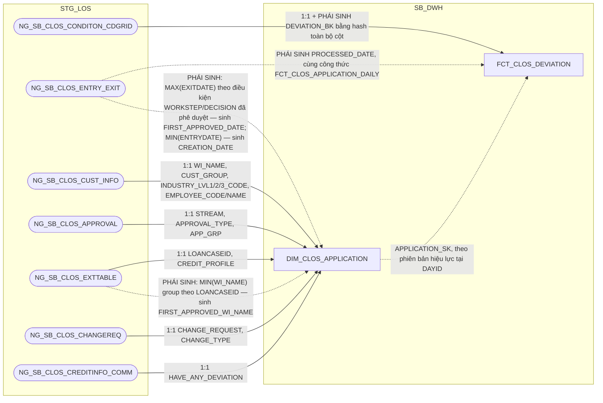

### 5.3 Cấu trúc bảng

| STT | Tên cột | Kiểu dữ liệu | Bắt buộc | Độ lớn | Khóa | Mô tả | Báo cáo sử dụng | Tên chỉ tiêu trên báo cáo |
| --- | --- | --- | --- | --- | --- | --- | --- | --- |
| 1 | DAYID | DATE | Y |  | PK | Ngày dữ liệu, dạng số YYYYMMDD | Báo cáo KPI (BC9) — điều kiện lọc (chỉ lấy DAYID mới nhất của từng WI_NAME) khi đếm DEVIATION_G2/DEVIATION_G3 trên AGG_LOS_KPI_APPLICATION | — |
| 2 | WI_NAME | VARCHAR2 | Y | 100 | PK | Mã hồ sơ tín dụng CLOS | Báo cáo NGOẠI LỆ (BC6) — khóa JOIN Báo cáo KPI (BC9) — khóa GROUP BY khi đếm DEVIATION_G2/DEVIATION_G3 trên AGG_LOS_KPI_APPLICATION | WINAME (Mã hồ sơ) |
| 3 | DEVIATION_BK | VARCHAR2 | Y | 64 | PK | Khóa nghiệp vụ của dòng ngoại lệ — PHÁI SINH: STANDARD_HASH(..., 'SHA256') trên toàn bộ cột không phải CLOB của NG_SB_CLOS_CONDITON_CDGRID (loại trừ AS_REGULAR, DEV_PROPOSAL), cộng DATASOURCE và tên bảng nguồn. Chuẩn hóa trước khi hash: TRIM chuỗi, NULL quy về '<NULL>', DATE/NUMBER dùng format cố định không phụ thuộc NLS | Nguồn cho chỉ tiêu/trường DEVIATION_G2/DEVIATION_G3 (điều kiện đếm số dòng phân biệt, BC9) | — |
| 4 | DATASOURCE | VARCHAR2 | Y | 10 |  | Cột kỹ thuật đánh dấu nguồn hệ, luôn cố định 'CLOS' sau khi tách vật lý CLOS/RLOS | — (cột kỹ thuật) | — |
| 5 | APPLICATION_SK | NUMBER | Y | 18 |  | Khóa tới DIM_CLOS_APPLICATION theo phiên bản hiệu lực tại DAYID. Mặc định -1 nếu không khớp | Báo cáo NGOẠI LỆ (BC6) — khóa JOIN sang DIM_CLOS_APPLICATION | — |
| 6 | DEVIATION_TYPE_CODE | VARCHAR2 | N | 300 |  | Mã loại lệch chính sách — nguồn NG_SB_CLOS_CONDITON_CDGRID.DEVIATION_TYPE | Báo cáo NGOẠI LỆ (BC6) — hiển thị trực tiếp | DEVIATION_TYPE (Loại ngoại lệ) |
| 7 | DEV_PROPOSAL | VARCHAR2 | N | 4000 |  | Đề xuất xử lý lệch chính sách — nguồn NG_SB_CLOS_CONDITON_CDGRID.DEV_PROPOSAL | Báo cáo NGOẠI LỆ (BC6) — hiển thị trực tiếp | DEV_PROPOSAL (Nội dung ngoại lệ) |
| 8 | AS_REGULAR | VARCHAR2 | N | 4000 |  | Quy định chuẩn liên quan tới lệch chính sách — nguồn NG_SB_CLOS_CONDITON_CDGRID.AS_REGULAR. Không báo cáo nào hiển thị trực tiếp; BA từng đề xuất đưa vào khóa nghiệp vụ nhưng bị từ chối vì là trường nhập tùy biến (free-text, xem CLOS - Metadata.xlsx) — vẫn phải nạp vì là thuộc tính gốc của bảng nguồn | Thiết kế dư thừa | — |
| 9 | PROCESSED_DATE | DATE | N |  |  | Ngày xử lý của hồ sơ — PHÁI SINH: tính độc lập từ NG_SB_CLOS_ENTRY_EXIT theo cùng công thức 3 mức ưu tiên (ngày phê duyệt cuối/ngày hủy/ngày thoát bước gần nhất) đã dùng cho FCT_CLOS_APPLICATION_DAILY.PROCESSED_DATE — không JOIN sang FCT_CLOS_APPLICATION_DAILY để tránh tham chiếu chéo giữa 2 bảng | Báo cáo NGOẠI LỆ (BC6) — hiển thị trực tiếp | PROCESSED_DATE (Ngày dữ liệu báo cáo) |

## 6. FCT_CLOS_WORKSTEP_EVENT

### 6.1 Mục đích thiết kế
- **Ý nghĩa bảng:** bảng FACT nhật ký workflow mức nguyên tử của hệ CLOS,
  giữ hết mọi sự kiện "vào bước — ra bước" của hồ sơ (không bao giờ xóa,
  không chép lại nhật ký mỗi ngày). Là nguồn duy nhất để tính mọi mốc thời
  gian, TAT, số lần trả về và người xử lý theo từng bước, nhánh CLOS.
- **Khóa chính của bảng (PK):** DAYID, WI_NAME, WORKSTEP_CODE, ENTRYDATE.
- **Độ chi tiết (grain):** 1 dòng = 1 phiên bản của 1 logical event (hồ sơ
  x workstep x lần vào bước) — hồ sơ quay lại cùng 1 bước nhiều lần thì
  mỗi lần là 1 sự kiện riêng.
- **Phục vụ báo cáo:**
  - Báo cáo RLOS APPLICATION (BC1) — qua FCT_CLOS_APPLICATION_DAILY (PRE_WORKSTEP_CODE)
  - Báo cáo CLOS APPLICATION (BC2) — qua FCT_CLOS_APPLICATION_DAILY (PRE_WORKSTEP_CODE)
  - Báo cáo Thông tin phê duyệt (BC3)
  - Báo cáo Tuần Chuyên viên Thẩm định (BC4)
  - Báo cáo SLA - TAT (BC5)
  - Báo cáo EXCEPTION - FTR (BC7)
  - Báo cáo RETURN (BC8)
  - Báo cáo KPI (BC9)

### 6.2 Sơ đồ lineage

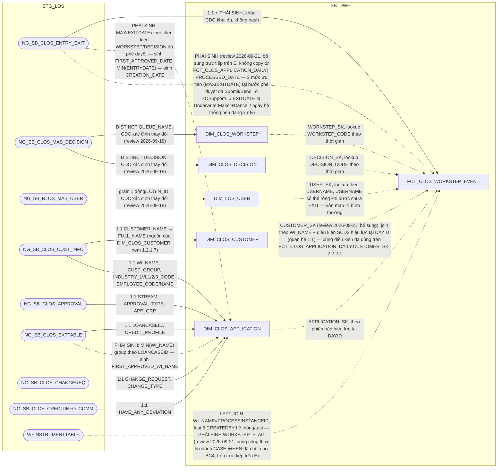

### 6.3 Cấu trúc bảng

| STT | Tên cột | Kiểu dữ liệu | Bắt buộc | Độ lớn | Khóa | Mô tả | Báo cáo sử dụng | Tên chỉ tiêu trên báo cáo |
| --- | --- | --- | --- | --- | --- | --- | --- | --- |
| 1 | DAYID | DATE | Y |  | PK | Ngày dữ liệu, dạng số YYYYMMDD — nguồn NG_SB_CLOS_ENTRY_EXIT, TRUNC về 00:00:00. Là ngày phiên bản được ghi nhận, KHÔNG phải ảnh chụp lại toàn bộ nhật ký mỗi ngày | — (cột kỹ thuật) | — |
| 2 | WI_NAME | VARCHAR2 | Y | 100 | PK | Mã hồ sơ tín dụng CLOS — nguồn NG_SB_CLOS_ENTRY_EXIT.WINAME (đổi tên WINAME→WI_NAME cho thống nhất với các bảng khác) | Báo cáo Thông tin phê duyệt (BC3) — khóa JOIN, cũng là khóa lọc tập dòng event Báo cáo Tuần Chuyên viên Thẩm định (BC4) — khóa JOIN, cũng là khóa lọc tập dòng event | WINAME (Mã hồ sơ) |
| 3 | WORKSTEP_CODE | VARCHAR2 | Y | 200 | PK | Mã bước xử lý trên workflow — nguồn ENTRY_EXIT.WORKSTEP (đổi tên thêm hậu tố CODE), đã cắt tiền tố hệ nguồn nếu có | Báo cáo Thông tin phê duyệt (BC3) — hiển thị trực tiếp, cũng là điều kiện lọc chọn dòng event (CreditApproval/CreditCommittee) Báo cáo Tuần Chuyên viên Thẩm định (BC4) — hiển thị trực tiếp, cũng là điều kiện lọc (UnderwriterMaker/UnderwriterChecker) Báo cáo SLA - TAT (BC5) — điều kiện lọc khi SUM TAT_CALENDAR_HOUR/TAT_WORKING_HOUR/TAT_CPC_HOUR theo từng bước | WORKSTEP (Bước hồ sơ) |
| 4 | ENTRYDATE | TIMESTAMP | Y |  | PK | Thời điểm hồ sơ vào bước xử lý — nguồn ENTRY_EXIT.ENTRYDATE. Bắt buộc nằm trong khóa vì 1 hồ sơ có thể quay lại cùng 1 bước nhiều lần | Báo cáo Tuần Chuyên viên Thẩm định (BC4) — hiển thị trực tiếp (ENTRYDATE của dòng event đã lọc) | ENTRYDATE (Thời gian lên bước thẩm định) |
| 5 | DATASOURCE | VARCHAR2 | Y | 10 |  | Cột kỹ thuật đánh dấu nguồn hệ, luôn cố định 'CLOS' sau khi tách vật lý CLOS/RLOS | Báo cáo Thông tin phê duyệt (BC3) — hiển thị trực tiếp Báo cáo Tuần Chuyên viên Thẩm định (BC4) — hiển thị trực tiếp | SYSTEMNAME (Hệ thống CLOS/RLOS) |
| 6 | WORKSTEP_SK | NUMBER | Y | 18 |  | Khóa tới DIM_CLOS_WORKSTEP, lookup bằng WORKSTEP_CODE theo điều kiện thời gian (EFF_DATE/EXP_DATE). Mặc định -1 nếu không khớp | — (khóa dự phòng, chưa thấy báo cáo nào join qua đường này) | — |
| 7 | DECISION_SK | NUMBER | Y | 18 |  | Khóa tới DIM_CLOS_DECISION, lookup bằng DECISION_CODE theo điều kiện thời gian. DECISION null/không khớp dùng -1. KHÔNG nằm trong PK — chỉ để tra cứu thêm thuộc tính | — (khóa dự phòng, chưa thấy báo cáo nào join qua đường này) | — |
| 8 | USER_SK | NUMBER | Y | 18 |  | Khóa tới DIM_LOS_USER, người xử lý của chính sự kiện này. ĐÚNG GRAIN của bảng — 1 lần vào bước có đúng 1 người xử lý. Mặc định -1. KHÔNG nằm trong PK | — (khóa dự phòng, các báo cáo đang đọc thẳng USERNAME gốc thay vì join qua DIM_LOS_USER) | — |
| 9 | APPLICATION_SK | NUMBER | Y | 18 |  | Khóa tới DIM_CLOS_APPLICATION theo phiên bản hiệu lực tại DAYID. Mặc định -1 | Báo cáo Thông tin phê duyệt (BC3) — khóa JOIN sang DIM_CLOS_APPLICATION để lấy STREAM | — |
| 10 | EXITDATE | TIMESTAMP | N |  |  | Thời điểm hồ sơ ra khỏi bước xử lý — nguồn ENTRY_EXIT.EXITDATE. NULL nghĩa là hồ sơ đang nằm tại bước này | Báo cáo Thông tin phê duyệt (BC3) — hiển thị trực tiếp Báo cáo Tuần Chuyên viên Thẩm định (BC4) — hiển thị trực tiếp Báo cáo RETURN (BC8) — hiển thị trực tiếp, đồng thời là nguồn tính PROCESSED_DATE (BC8) | EXITDATE (Thời gian tạo quyết định / kết thúc bước) |
| 11 | DECISION_CODE | VARCHAR2 | N | 200 |  | Mã quyết định tại bước xử lý — nguồn ENTRY_EXIT.DECISION (đổi tên thêm hậu tố CODE) | Báo cáo Thông tin phê duyệt (BC3) — hiển thị trực tiếp, cũng là điều kiện lọc chọn dòng event (Submit/Reject/Send To HOSupport/Send To PostSanction) Báo cáo RETURN (BC8) — hiển thị trực tiếp | DECISION (Quyết định) |
| 12 | USERNAME | VARCHAR2 | N | 100 |  | Tên tài khoản người xử lý hồ sơ — nguồn ENTRY_EXIT.USERNAME. Giữ nguyên giá trị gốc để báo cáo hiển thị thẳng, không phải join qua DIM_LOS_USER | Báo cáo Thông tin phê duyệt (BC3) — hiển thị trực tiếp theo điều kiện WORKSTEP_CODE (BI_APPROVER/BI_COMMITTEE) Báo cáo Tuần Chuyên viên Thẩm định (BC4) — hiển thị trực tiếp theo điều kiện WORKSTEP_CODE (UND_MAKER) Báo cáo KPI (BC9) — đếm DISTINCT theo danh sách WORKSTEP cho NHAN_SU | USERNAME (User xử lý — BI_APPROVER/BI_COMMITTEE/UND_MAKER tùy báo cáo) |
| 13 | REMARKS | VARCHAR2 | N | 4000 |  | Ghi chú tại bước xử lý — nguồn ENTRY_EXIT.REMARKS | Báo cáo Thông tin phê duyệt (BC3) — hiển thị trực tiếp Báo cáo Tuần Chuyên viên Thẩm định (BC4) — hiển thị trực tiếp | REMARKS (Ghi chú) |
| 14 | TAT_SOURCE_SEC | NUMBER | N | 12 |  | Thời gian xử lý do hệ nguồn ghi, đơn vị giây — nguồn ENTRY_EXIT.TAT. Giữ lại để đối soát với 3 cột TAT tính lại bên dưới. Đơn vị "giây" kế thừa từ extract gốc, CLOS - Metadata.xlsx ghi "cần DE xác nhận đơn vị" — chưa chốt chính thức | Nguồn cho chỉ tiêu/trường TAT_CALENDAR_HOUR (điều kiện tính khi có giá trị, thay công thức lệch ngày) | — |
| 15 | TAT_CALENDAR_HOUR | NUMBER | N | 18,6 |  | Thời gian xử lý theo lịch tự nhiên, đơn vị giờ — PHÁI SINH: TAT_SOURCE_SEC / 3600, hoặc (CAST(EXITDATE AS DATE) - CAST(ENTRYDATE AS DATE)) * 24 nếu TAT_SOURCE_SEC rỗng. Không trừ ngày nghỉ. NULL nếu chưa có EXITDATE | Báo cáo SLA - TAT (BC5) — SUM theo từng nhóm bước (STEP01_BRANCH_CL_TAT, STEP02_DDE_CL_TAT...) Báo cáo KPI (BC9) — SUM theo nhóm bước cho TAT_CLOS | TAT_CALENDAR_HOUR (TAT theo giờ lịch tự nhiên) |
| 16 | TAT_WORKING_HOUR | NUMBER | N | 18,6 |  | Thời gian xử lý theo giờ làm việc, đơn vị giờ — PHÁI SINH: GET_BUSINESS_MINUTE(ENTRYDATE, EXITDATE) / 60. Loại trừ ngày lễ, chiều thứ Bảy, cả ngày Chủ nhật; giờ tính 8-12 và 13-17. NULL nếu chưa có EXITDATE | Báo cáo SLA - TAT (BC5) — SUM theo từng nhóm bước (STEP01_BRANCH_WK_TAT, STEP02_DDE_WK_TAT...) Báo cáo KPI (BC9) — SUM theo nhóm bước cho TAT_CLOS | TAT_WORKING_HOUR (TAT theo giờ làm việc) |
| 17 | TAT_CPC_HOUR | NUMBER | N | 18,6 |  | Thời gian xử lý theo giờ cam kết SLA, đơn vị giờ — PHÁI SINH: GET_BUSINESS_MINUTE_CPC(ENTRYDATE, EXITDATE) / 60. Giờ theo cam kết SLA, tính 8-11:30 và 13:30-16:30. NULL nếu chưa có EXITDATE | Báo cáo SLA - TAT (BC5) — SUM theo từng nhóm bước, so sánh với REF_SLA_* để ra kết quả đạt/không đạt SLA | TAT_CPC_HOUR (TAT theo giờ cam kết SLA) |
| 18 | EVENT_SEQ_ASC | NUMBER | N | 5 |  | Thứ tự sự kiện theo chiều cũ đến mới — PHÁI SINH: ROW_NUMBER() OVER (PARTITION BY WI_NAME ORDER BY ENTRYDATE ASC). Dùng xác định sự kiện trả về đầu tiên cho BC7 (FIRST_WORKSTEP_RETURN); chiều giảm dần (mới→cũ) khi cần có thể tự suy bằng COUNT(*) OVER (PARTITION BY WI_NAME) - EVENT_SEQ_ASC + 1, không cần cột riêng | Nguồn cho chỉ tiêu/trường FIRST_WORKSTEP_RETURN (xác định sự kiện trả về đầu tiên, BC7, trên FCT_CLOS_EXCEPTION) | — |
| 19 | BI_FLAG_APPROVAL | VARCHAR2 | N | 50 |  | Đánh dấu lần phê duyệt đầu hay lần phê duyệt lại — PHÁI SINH: 'First Approval' nếu EXITDATE <= MIN(EXITDATE của các sự kiện phê duyệt trong cùng hồ sơ), ngược lại 'From Second Approval'. Dùng cho BC5.BI_FLAG_APPROVAL | Báo cáo SLA - TAT (BC5) — hiển thị trực tiếp Báo cáo KPI (BC9) — điều kiện lọc chỉ tính sự kiện 'First Approval' khi tính TAT_APPLICATION_HOUR | BI_FLAG_APPROVAL (Phê duyệt lần đầu/từ lần thứ 2) |
| 20 | PRE_WORKSTEP_CODE | VARCHAR2 | N | 200 |  | Bước xử lý liền trước — PHÁI SINH: LAG(WORKSTEP_CODE) OVER (PARTITION BY WI_NAME ORDER BY ENTRYDATE). Dùng cho BC1.PRE_WORKSTEP, BC2.PRE_WORKSTEP | Nguồn cho chỉ tiêu/trường PRE_WORKSTEP_CODE (BC1/BC2, tính sẵn trên FCT_CLOS_APPLICATION_DAILY/FCT_RLOS_APPLICATION_DAILY, không đọc trực tiếp từ đây) | — |
| 21 | PROCESSED_DATE | DATE | N |  |  | Ngày xử lý chung của hồ sơ theo 3 mức ưu tiên (phê duyệt cuối / hủy tại UnderwriterMaker / ngày dữ liệu hệ thống nếu đang xử lý) — PHÁI SINH TRỰC TIẾP trên bảng này (review 2026-09-21, KHÔNG copy/JOIN từ FCT_CLOS_APPLICATION_DAILY.PROCESSED_DATE): MAX(EXITDATE) window theo WI_NAME WHERE WORKSTEP_CODE IN ('CreditCommittee','CreditApproval') AND DECISION_CODE IN ('Send To HOSupport','Reject','Submit','Send To PostSanction','Submit To DisbursementMaker'); nếu rỗng → EXITDATE tại WORKSTEP_CODE='UnderwriterMaker' AND DECISION_CODE='Cancel'; nếu vẫn rỗng → ngày dữ liệu hệ thống (DAYID). Phục vụ BC4.REPORT_DATE mà không cần JOIN fan-out sang APPLICATION_DAILY | Báo cáo Tuần Chuyên viên Thẩm định (BC4) — hiển thị trực tiếp | REPORT_DATE (Ngày báo cáo) |
| 22 | WORKSTEP_FLAG | VARCHAR2 | N | 200 |  | Trạng thái tổng hợp hồ sơ dạng mô tả (trường FLAG của BC4) — PHÁI SINH TRỰC TIẾP trên bảng này (review 2026-09-21, KHÔNG copy/JOIN từ FCT_CLOS_APPLICATION_DAILY — cột tương ứng đã bị xóa khỏi bảng đó): LEFT JOIN WFINSTRUMENTTABLE (c) theo WI_NAME=c.PROCESSINSTANCEID AND c.CREATEDBY NOT IN ('10000380','10000020','10000420','10000140','10000100'), sau đó 5 nhánh CASE-WHEN theo thứ tự ưu tiên dựa trên WORKSTEP_CODE/DECISION_CODE của TOÀN BỘ lịch sử WI_NAME kết hợp c.PROCESSNAME='CLOS'/c.ACTIVITYNAME. Phục vụ BC4.FLAG mà không cần JOIN fan-out sang APPLICATION_DAILY | Báo cáo Tuần Chuyên viên Thẩm định (BC4) — hiển thị trực tiếp | FLAG (Trạng thái) |
| 23 | CUSTOMER_SK | NUMBER | Y | 18 |  | Khóa tới DIM_CLOS_CUSTOMER — PHÁI SINH TRỰC TIẾP trên bảng này (review 2026-09-21, theo yêu cầu người dùng: cho phép khai thác lookup DIM qua surrogate key thay vì qua WI_NAME natural key, nhất quán với WORKSTEP_SK/DECISION_SK/USER_SK/APPLICATION_SK đã có sẵn trên bảng): join theo WI_NAME + điều kiện SCD2 EFF_DATE<=DAYID<EXP_DATE (hoặc EXP_DATE IS NULL), quan hệ 1:1 với hồ sơ. Mặc định -1 nếu không khớp | Báo cáo Tuần Chuyên viên Thẩm định (BC4) — khóa JOIN sang DIM_CLOS_CUSTOMER để lấy CUSTOMER_NAME | — |

⚠️ Lệch đồng bộ: `hld/HLD_FCT_SB_DWH.md` (Section 2, mục 1.2.2.6) vẫn giữ 24 cột kèm `EVENT_SEQ_DESC`, trong khi `hld/HLD_Table_Design.md` (review 2026-09-22) đã bỏ cột này vì không có công thức nào tham chiếu tới (chiều giảm dần tự suy từ `EVENT_SEQ_ASC` khi cần), còn lại 23 cột — cần cập nhật lại `HLD_FCT_SB_DWH.md` cho khớp.

## 7. FCT_RLOS_APPLICATION_DAILY

### 7.1 Mục đích thiết kế
- **Ý nghĩa bảng:** bảng FACT xương sống của hồ sơ tín dụng RLOS (bán lẻ/cá
  nhân) — lưu ảnh trạng thái cuối ngày của hồ sơ kèm các chỉ tiêu lũy kế
  (số lần trả về, mốc thời gian xử lý, thông tin phê duyệt, nguồn thu
  nhập...).
- **Khóa chính của bảng (PK):** DAYID, WI_NAME.
- **Độ chi tiết (grain):** 1 dòng = 1 hồ sơ x 1 ngày dữ liệu.
- **Phục vụ báo cáo:**
  - Báo cáo RLOS APPLICATION (BC1)
  - Báo cáo Thông tin phê duyệt (BC3) — qua FCT_RLOS_WORKSTEP_EVENT (CREDIT_LIMIT/CURRENCY dư thừa có chủ đích trên DIM_RLOS_APPLICATION)
  - Báo cáo Tuần Chuyên viên Thẩm định (BC4)
  - Báo cáo SLA - TAT (BC5) — khóa tra REF_SLA_NLTT qua PRODUCT_SK
  - Báo cáo NGOẠI LỆ (BC6)
  - Báo cáo RETURN (BC8) — RETURN_CNT_DATAENTRY/UNDERWRITING/APPROVAL
  - Báo cáo KPI (BC9) — AGG_LOS_KPI_APPLICATION.INCOM_3/BUSINESS_INCOM
  - Báo cáo Giải ngân _ Quá hạn KHCN (BC10)

### 7.2 Sơ đồ lineage

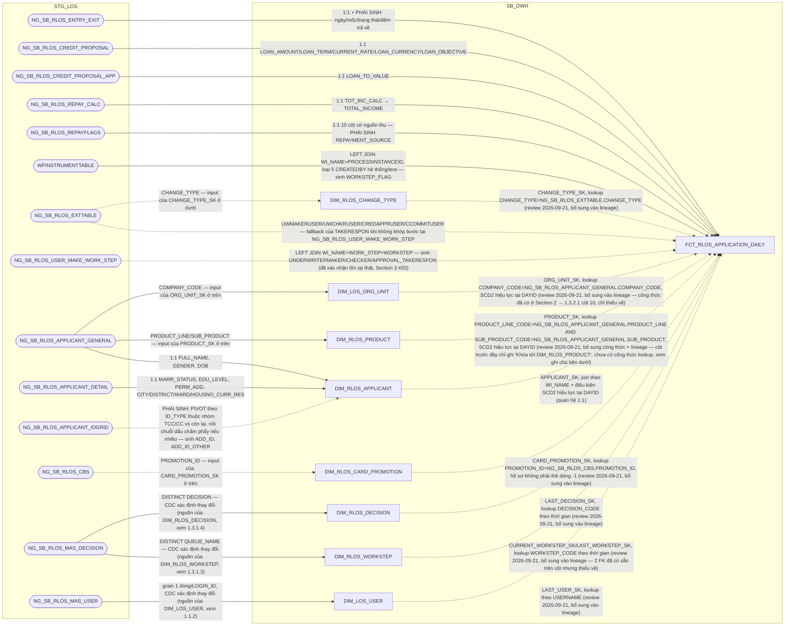

### 7.3 Cấu trúc bảng

| STT | Tên cột | Kiểu dữ liệu | Bắt buộc | Độ lớn | Khóa | Mô tả | Báo cáo sử dụng | Tên chỉ tiêu trên báo cáo |
| --- | --- | --- | --- | --- | --- | --- | --- | --- |
| 1 | DAYID | DATE | Y |  | PK | Ngày dữ liệu, dạng số YYYYMMDD | — (cột kỹ thuật) | — |
| 2 | WI_NAME | VARCHAR2 | Y | 100 | PK | Mã hồ sơ tín dụng RLOS | Báo cáo RLOS APPLICATION (BC1) — khóa chính Báo cáo KPI (BC9) — khóa nối AGG_LOS_KPI_APPLICATION | WINAME (Mã hồ sơ) |
| 3 | DATASOURCE | VARCHAR2 | Y | 10 |  | Cột kỹ thuật đánh dấu nguồn hệ, luôn cố định 'RLOS' sau khi tách vật lý CLOS/RLOS | Báo cáo KPI (BC9) — hiển thị trực tiếp | SYSTEMNAME (Hệ thống CLOS/RLOS) |
| 4 | APPLICATION_SK | NUMBER | Y | 18 |  | Khóa tới DIM_RLOS_APPLICATION. Mặc định -1 nếu không khớp | Báo cáo RLOS APPLICATION (BC1) — khóa JOIN sang DIM_RLOS_APPLICATION | — |
| 5 | CURRENT_WORKSTEP_SK | NUMBER | Y | 18 |  | Khóa tới DIM_RLOS_WORKSTEP, bước hồ sơ đang đứng tại ngày DAYID. Mặc định -1 | Thiết kế dư thừa | — |
| 6 | LAST_WORKSTEP_SK | NUMBER | Y | 18 |  | Khóa tới DIM_RLOS_WORKSTEP của sự kiện hoàn tất gần nhất. Mặc định -1 | Báo cáo RLOS APPLICATION (BC1) — nguồn cho LAST_WORKSTEP (LEFT JOIN Q_RLOS_REF_WORKSTEP_2SYSTEMS ở PDTD_DTM) | Nguồn cho chỉ tiêu/trường LAST_WORKSTEP (BC1) |
| 7 | LAST_DECISION_SK | NUMBER | Y | 18 |  | Khóa tới DIM_RLOS_DECISION của sự kiện hoàn tất gần nhất. Mặc định -1 | Báo cáo RLOS APPLICATION (BC1) — khóa JOIN sang DIM_RLOS_DECISION | LAST_DECISION (Quyết định tại bước cuối) |
| 8 | LAST_USER_SK | NUMBER | Y | 18 |  | Khóa tới DIM_LOS_USER của người xử lý sự kiện hoàn tất gần nhất. Mặc định -1 | Thiết kế dư thừa | — |
| 9 | PRODUCT_SK | NUMBER | Y | 18 |  | Khóa tới DIM_RLOS_PRODUCT — PHÁI SINH: lookup theo PRODUCT_LINE_CODE=NG_SB_RLOS_APPLICANT_GENERAL.PRODUCT_LINE AND SUB_PRODUCT_CODE=NG_SB_RLOS_APPLICANT_GENERAL.SUB_PRODUCT, điều kiện SCD2 EFF_DATE<=DAYID<EXP_DATE (hoặc EXP_DATE IS NULL) trên DIM_RLOS_PRODUCT. Mặc định -1 nếu không khớp | Báo cáo RLOS APPLICATION (BC1) — khóa JOIN sang DIM_RLOS_PRODUCT Báo cáo SLA - TAT (BC5) — khóa tra REF_SLA_NLTT theo PRODUCT_LINE_NAME | PRODUCT_LINE (Dòng sản phẩm); nguồn cho chỉ tiêu/trường SLA_DE (Cam kết SLA Chuyên viên nhập liệu, BC5) |
| 10 | ORG_UNIT_SK | NUMBER | Y | 18 |  | Khóa tới DIM_LOS_ORG_UNIT — PHÁI SINH: lookup theo COMPANY_CODE=NG_SB_RLOS_APPLICANT_GENERAL.COMPANY_CODE, điều kiện SCD2 EFF_DATE<=DAYID<EXP_DATE (hoặc EXP_DATE IS NULL) trên DIM_LOS_ORG_UNIT. Mặc định -1 nếu không khớp | Báo cáo RLOS APPLICATION (BC1) — khóa JOIN sang DIM_LOS_ORG_UNIT lấy BRANCH_CODE | BRANCH_CODE (Mã Chi nhánh) |
| 11 | CHANGE_TYPE_SK | NUMBER | Y | 18 |  | Khóa tới DIM_RLOS_CHANGE_TYPE. Chỉ có giá trị với hồ sơ thay đổi điều kiện phê duyệt, còn lại Unknown -1. Nguồn: NG_SB_RLOS_EXTTABLE.CHANGE_TYPE | Báo cáo RLOS APPLICATION (BC1) — khóa JOIN sang DIM_RLOS_CHANGE_TYPE | CHANGE_TYPE_DETAIL (Chi tiết loại thay đổi điều kiện) |
| 12 | CARD_PROMOTION_SK | NUMBER | Y | 18 |  | Khóa tới DIM_RLOS_CARD_PROMOTION. Lookup NG_SB_RLOS_CBS.PROMOTION_ID; hồ sơ không phải thẻ dùng -1 | Báo cáo RLOS APPLICATION (BC1) — khóa JOIN sang DIM_RLOS_CARD_PROMOTION | PROMOTION_ID (Ưu đãi phí) |
| 13 | RI_USER | VARCHAR2 | N | 100 |  | User khởi tạo hồ sơ (bước RequestInitiate) | Thiết kế dư thừa | — |
| 14 | BRANCH_USER | VARCHAR2 | N | 100 |  | User xử lý bước BranchSupport, HOÀN TẤT gần nhất | Báo cáo RLOS APPLICATION (BC1) — hiển thị trực tiếp | BRANCH_USER (User Chi nhánh) |
| 15 | DDE_USER | VARCHAR2 | N | 100 |  | User xử lý bước DetailDataEntry, HOÀN TẤT gần nhất | Báo cáo RLOS APPLICATION (BC1) — hiển thị trực tiếp | DDE_USER (User Chuyên viên nhập liệu) |
| 16 | QC_USER | VARCHAR2 | N | 100 |  | User xử lý bước DataInputerChecker, HOÀN TẤT gần nhất | Báo cáo RLOS APPLICATION (BC1) — hiển thị trực tiếp | QUALITY_CHECKER (User Kiểm soát nhập liệu) |
| 17 | UND_MAKER_USER | VARCHAR2 | N | 100 |  | User xử lý bước UnderwriterMaker, HOÀN TẤT gần nhất | Báo cáo RLOS APPLICATION (BC1) — hiển thị trực tiếp | UND_MAKER (User Chuyên viên thẩm định) |
| 18 | UND_CHECKER_USER | VARCHAR2 | N | 100 |  | User xử lý bước UnderwriterChecker, HOÀN TẤT gần nhất | Báo cáo RLOS APPLICATION (BC1) — hiển thị trực tiếp | UND_CHECKER (User Kiểm soát thẩm định) |
| 19 | PHV_USER | VARCHAR2 | N | 100 |  | User xử lý bước PhoneVerification, HOÀN TẤT gần nhất | Báo cáo RLOS APPLICATION (BC1) — hiển thị trực tiếp | PHV_USER (User Chuyên viên Thẩm định điện thoại) |
| 20 | FA_USER | VARCHAR2 | N | 100 |  | User Chuyên viên Thực địa | Thiết kế dư thừa | — |
| 21 | APPROVER_USER | VARCHAR2 | N | 100 |  | User xử lý bước CreditApproval, HOÀN TẤT gần nhất | Báo cáo RLOS APPLICATION (BC1) — hiển thị trực tiếp | BI_APPROVER (User Chuyên gia phê duyệt) |
| 22 | COMMITTEE_USER | VARCHAR2 | N | 100 |  | User Hội đồng tín dụng | Thiết kế dư thừa | — |
| 23 | HOS_USER | VARCHAR2 | N | 100 |  | User Hỗ trợ phê duyệt | Thiết kế dư thừa | — |
| 24 | PROCESSED_DATE | DATE | N |  |  | Ngày xử lý chung của hồ sơ theo 3 mức ưu tiên | Báo cáo RLOS APPLICATION (BC1) — hiển thị trực tiếp Báo cáo KPI (BC9) — dùng xếp hồ sơ vào đúng DAYID khi tổng hợp AGG_LOS_KPI_YTD_DAILY | PROCESSED_DATE (Ngày dữ liệu báo cáo) |
| 25 | LAST_UWM_ENTRYDATE | TIMESTAMP | N |  |  | MAX(ENTRYDATE) tại UnderwriterMaker <= DAYID — mốc mở chu kỳ thẩm định hiện hành | Nguồn cho chỉ tiêu/trường PROCESSED_DATE_UWM (cột 26, cùng bảng) | — |
| 26 | PROCESSED_DATE_UWM | DATE | N |  |  | Ngày chốt chu kỳ thẩm định hiện hành, tính tương đối theo LAST_UWM_ENTRYDATE | Thiết kế dư thừa | — |
| 27 | CREATION_DATE | DATE | N |  |  | TRUNC(MIN(ENTRYDATE)) theo WI_NAME | Báo cáo RLOS APPLICATION (BC1) — hiển thị trực tiếp | CREATION_DATE (Ngày khởi tạo hồ sơ) |
| 28 | FIRST_APPROVAL_DATE | DATE | N |  |  | MIN(EXITDATE) tại bước phê duyệt hợp lệ | Thiết kế dư thừa | — |
| 29 | LAST_APPROVAL_DATE | DATE | N |  |  | MAX(EXITDATE) tại bước phê duyệt (nhóm quyết định đã định nghĩa) | Báo cáo RLOS APPLICATION (BC1) — hiển thị trực tiếp | LAST_APPROVAL_DATE (Thời gian phê duyệt cuối cùng) |
| 30 | MIN_UWM | TIMESTAMP | N |  |  | MIN(ENTRYDATE) tại UnderwriterMaker | Báo cáo RLOS APPLICATION (BC1) — hiển thị trực tiếp | MIN_UWM (Thời gian hồ sơ lên CV thẩm định) |
| 31 | MIN_APP | TIMESTAMP | N |  |  | MIN(ENTRYDATE) tại CreditApproval/CreditCommittee | Báo cáo RLOS APPLICATION (BC1) — hiển thị trực tiếp | MIN_APP (Thời gian hồ sơ lên CG phê duyệt) |
| 32 | AUTO_CANCEL_DATE | DATE | N |  |  | Ngày hồ sơ bị hệ thống tự hủy | Báo cáo RLOS APPLICATION (BC1) — hiển thị trực tiếp | AUTO_CAN_DATE (Thời gian cancel tự động) |
| 33 | CANCEL_USER_DATE | DATE | N |  |  | EXITDATE tại bản ghi DECISION='Cancel' và USERNAME khác NULL | Báo cáo RLOS APPLICATION (BC1) — hiển thị trực tiếp | CAN_USER_DATE (Thời gian cancel do NSD) |
| 34 | BI_CAN_DATE | DATE | N |  |  | ENTRYDATE tại bước CancelRevoke | Thiết kế dư thừa | — |
| 35 | LAST_ENTRYDATE | TIMESTAMP | N |  |  | ENTRYDATE của sự kiện hoàn tất gần nhất | Báo cáo RLOS APPLICATION (BC1) — hiển thị trực tiếp | LAST_ENTRYDATE (Thời gian vào bước cuối) |
| 36 | LAST_EXITDATE | TIMESTAMP | N |  |  | EXITDATE của cùng sự kiện hoàn tất gần nhất | Báo cáo RLOS APPLICATION (BC1) — hiển thị trực tiếp | LAST_EXITDATE (Thời gian kết thúc bước cuối) |
| 37 | BI_APPSTATUS | VARCHAR2 | N | 50 |  | Trạng thái hồ sơ chuẩn hóa (Approved/Rejected/Cancelled/Processing) | Báo cáo RLOS APPLICATION (BC1) — hiển thị trực tiếp Báo cáo KPI (BC9) — hiển thị trực tiếp | BI_APPSTATUS (Trạng thái hồ sơ) |
| 38 | HAS_ACTION_IN_DAY | VARCHAR2 | Y | 1 |  | 'Y' nếu hồ sơ có phát sinh xử lý trong ngày DAYID | Thiết kế dư thừa | — |
| 39 | LAST_ACTION_DATE | DATE | Y |  |  | Ngày business action gần nhất tính đến cuối DAYID | Thiết kế dư thừa | — |
| 40 | INACTIVE_DAY_CNT | NUMBER | Y | 5 |  | TRUNC(DAYID) - TRUNC(LAST_ACTION_DATE) | Thiết kế dư thừa | — |
| 41 | PRE_WORKSTEP_CODE | VARCHAR2 | N | 200 |  | Bước xử lý liền trước (LAG theo ENTRYDATE) | Báo cáo RLOS APPLICATION (BC1) — hiển thị trực tiếp | PRE_WORKSTEP (Bước hồ sơ trước đó) |
| 42 | FLAG_AUTO_CANCEL | VARCHAR2 | N | 10 |  | 'YES' nếu AUTO_CANCEL_DATE khác NULL | Báo cáo RLOS APPLICATION (BC1) — hiển thị trực tiếp | FLAG_AUTO_CAN (Hồ sơ cancel tự động — YES/NO) |
| 43 | LAST_REMARKS | VARCHAR2 | N | 4000 |  | Ghi chú của sự kiện hoàn tất gần nhất | Báo cáo RLOS APPLICATION (BC1) — hiển thị trực tiếp | LAST_REMARKS (Ghi chú ý kiến bước cuối) |
| 44 | LAST_REMARK_DDE | VARCHAR2 | N | 4000 |  | Ghi chú tại bước DetailDataEntry | Báo cáo RLOS APPLICATION (BC1) — hiển thị trực tiếp | LAST_REMARK_DDE (Ghi chú tại bước nhập liệu DDE) |
| 45 | LAST_CAN_REMARKS | VARCHAR2 | N | 4000 |  | Ghi chú tại lần hủy hồ sơ | Báo cáo RLOS APPLICATION (BC1) — hiển thị trực tiếp | LAST_CAN_REMARKS (Ghi chú tại bước Cancel) |
| 46 | HAS_REACHED_DDE | VARCHAR2 | N | 1 |  | Hồ sơ đã tới bước DetailDataEntry hay chưa | Thiết kế dư thừa | — |
| 47 | HAS_REACHED_QC | VARCHAR2 | N | 1 |  | Hồ sơ đã tới bước DataInputerChecker hay chưa | Thiết kế dư thừa | — |
| 48 | HAS_REACHED_UWM | VARCHAR2 | N | 1 |  | Hồ sơ đã tới bước UnderwriterMaker hay chưa | Thiết kế dư thừa | — |
| 49 | HAS_REACHED_UWC | VARCHAR2 | N | 1 |  | Hồ sơ đã tới bước UnderwriterChecker hay chưa | Thiết kế dư thừa | — |
| 50 | HAS_REACHED_APPROVAL | VARCHAR2 | N | 1 |  | Hồ sơ đã tới bước CreditApproval/CreditCommittee hay chưa | Thiết kế dư thừa | — |
| 51 | APPROVED_AMT_FINAL | NUMBER | N | 20,2 |  | Hạn mức phê duyệt cuối cùng — nguồn NG_SB_RLOS_CREDIT_PROPOSAL.LOAN_AMOUNT | Báo cáo RLOS APPLICATION (BC1) — hiển thị trực tiếp | LOAN_AMOUNT (Số tiền phê duyệt) |
| 52 | APPROVED_TERM | NUMBER | N | 5 |  | Kỳ hạn phê duyệt — nguồn NG_SB_RLOS_CREDIT_PROPOSAL.LOAN_TERM | Báo cáo RLOS APPLICATION (BC1) — hiển thị trực tiếp | LOAN_TERM (Thời hạn phê duyệt, tháng) |
| 53 | INTEREST_RATE_PCT | NUMBER | N | 8,4 |  | Lãi suất phê duyệt (%) — ép kiểu từ NG_SB_RLOS_CREDIT_PROPOSAL.CURRENT_RATE | Báo cáo RLOS APPLICATION (BC1) — hiển thị trực tiếp | INTEREST_RATE (Lãi suất phê duyệt, %/năm) |
| 54 | LOAN_TO_VALUE | NUMBER | N | 5,2 |  | Tỷ lệ cho vay trên giá trị TSBĐ — nguồn NG_SB_RLOS_CREDIT_PROPOSAL(_APP).LOAN_TO_VALUE | Báo cáo RLOS APPLICATION (BC1) — hiển thị trực tiếp | LOAN_TO_VALUE (Tỷ lệ LTV, %) |
| 55 | LOAN_OBJECTIVE | VARCHAR2 | N | 200 |  | Mục đích vay — nguồn NG_SB_RLOS_CREDIT_PROPOSAL.LOAN_OBJECTIVE (hồ sơ thẻ tín dụng: mang nghĩa loại thẻ) | Báo cáo RLOS APPLICATION (BC1) — hiển thị trực tiếp | Loan Objective (Mục đích cho vay) |
| 56 | CURRENCY_CODE | VARCHAR2 | N | 10 |  | Loại tiền — nguồn NG_SB_RLOS_CREDIT_PROPOSAL.LOAN_CURRENCY | Thiết kế dư thừa | — |
| 57 | TOTAL_INCOME | NUMBER | N | 20,2 |  | Tổng thu nhập khách hàng — nguồn NG_SB_RLOS_REPAY_CALC.TOT_INC_CALC | Báo cáo RLOS APPLICATION (BC1) — hiển thị trực tiếp | TOTAL_INCOME (Tổng thu nhập phê duyệt) |
| 58 | RETURN_CNT_DATAENTRY | NUMBER | N | 5 |  | Số lần hồ sơ bị trả về ở khâu nhập liệu — PHÁI SINH: SUM(CASE WHEN WORKSTEP='DetailDataEntry' AND DECISION='Send_Back' THEN 1 WHEN WORKSTEP='DataInputerChecker' AND DECISION='Additional_Doc_Required' THEN 1 ELSE 0 END) trên NG_SB_RLOS_ENTRY_EXIT, GROUP BY WI_NAME | Báo cáo RETURN (BC8) — hiển thị trực tiếp | SL_RETURN_NHAPLIEU (Số lần return tại Nhập liệu) |
| 59 | RETURN_CNT_UNDERWRITING | NUMBER | N | 5 |  | Số lần hồ sơ bị trả về ở khâu thẩm định — PHÁI SINH theo SRS BC8 (2 nhánh trừ COUNT DISTINCT theo NG_SB_RLOS_EXCEPTION), GROUP BY WI_NAME | Báo cáo RETURN (BC8) — hiển thị trực tiếp | SL_RETURN_THAMDINH (Số lần return tại Thẩm định) |
| 60 | RETURN_CNT_APPROVAL | NUMBER | N | 5 |  | Số lần hồ sơ bị trả về ở khâu phê duyệt — PHÁI SINH: SUM(CASE WHEN WORKSTEP IN ('CreditApproval','CreditCommittee') AND DECISION='Additional_Doc_Required' THEN 1 ELSE 0 END) trên NG_SB_RLOS_ENTRY_EXIT, GROUP BY WI_NAME | Báo cáo RETURN (BC8) — hiển thị trực tiếp | SL_RETURN_PHEDUYET (Số lần return tại Cấp Phê duyệt) |
| 61 | SALARYFLAG | VARCHAR2 | N | 10 |  | Có nguồn thu từ lương hay không — nguồn NG_SB_RLOS_REPAYFLAGS.SALARYFLAG | Nguồn cho chỉ tiêu/trường REPAYMENT_SOURCE (cột 72) và INCOM_3 (BC9, điều kiện đếm nguồn thu) | — |
| 62 | CARFLAG | VARCHAR2 | N | 10 |  | Có nguồn thu từ cho thuê phương tiện hay không — NG_SB_RLOS_REPAYFLAGS.CARFLAG | Nguồn cho chỉ tiêu/trường REPAYMENT_SOURCE (cột 72) và INCOM_3 (BC9) | — |
| 63 | HOUSEFLAG | VARCHAR2 | N | 10 |  | Có nguồn thu từ cho thuê nhà hay không — NG_SB_RLOS_REPAYFLAGS.HOUSEFLAG | Nguồn cho chỉ tiêu/trường REPAYMENT_SOURCE (cột 72) và INCOM_3 (BC9) | — |
| 64 | ENTERPRISSEFLAG | VARCHAR2 | N | 10 |  | Có nguồn thu từ lợi nhuận doanh nghiệp hay không — NG_SB_RLOS_REPAYFLAGS.ENTERPRISSEFLAG (giữ nguyên tên sai chính tả nguồn) | Nguồn cho chỉ tiêu/trường REPAYMENT_SOURCE (cột 72), INCOM_3 và BUSINESS_INCOM (BC9) | — |
| 65 | DIVINGFLAG | VARCHAR2 | N | 10 |  | Có nguồn thu từ cổ tức hay không — NG_SB_RLOS_REPAYFLAGS.DIVINGFLAG (giữ nguyên tên sai chính tả nguồn) | Nguồn cho chỉ tiêu/trường REPAYMENT_SOURCE (cột 72) và INCOM_3 (BC9) | — |
| 66 | FAIMILYFLAG | VARCHAR2 | N | 10 |  | Có nguồn thu từ kinh doanh hộ gia đình hay không — NG_SB_RLOS_REPAYFLAGS.FAIMILYFLAG (giữ nguyên tên sai chính tả nguồn) | Nguồn cho chỉ tiêu/trường REPAYMENT_SOURCE (cột 72), INCOM_3 và BUSINESS_INCOM (BC9) | — |
| 67 | NONLICFLAG | VARCHAR2 | N | 10 |  | Có nguồn thu từ kinh doanh không đăng ký hay không — NG_SB_RLOS_REPAYFLAGS.NONLICFLAG | Nguồn cho chỉ tiêu/trường REPAYMENT_SOURCE (cột 72), INCOM_3 và BUSINESS_INCOM (BC9) | — |
| 68 | WAGESFLAG | VARCHAR2 | N | 10 |  | Có nguồn thu từ tiền công hay không — NG_SB_RLOS_REPAYFLAGS.WAGESFLAG | Nguồn cho chỉ tiêu/trường REPAYMENT_SOURCE (cột 72) và INCOM_3 (BC9) | — |
| 69 | PENSIONFLAG | VARCHAR2 | N | 10 |  | Có nguồn thu từ lương hưu/phụ cấp hay không — NG_SB_RLOS_REPAYFLAGS.PENSIONFLAG | Nguồn cho chỉ tiêu/trường REPAYMENT_SOURCE (cột 72) và INCOM_3 (BC9) | — |
| 70 | OTHERFLAG | VARCHAR2 | N | 10 |  | Có nguồn thu khác hay không — NG_SB_RLOS_REPAYFLAGS.OTHERFLAG | Nguồn cho chỉ tiêu/trường REPAYMENT_SOURCE (cột 72) và INCOM_3 (BC9) | — |
| 71 | INCOME_SOURCE_CNT | NUMBER | N | 5 |  | Số nguồn thu nhập của hồ sơ — đếm số cờ 'Yes' trong 10 cột trên | Nguồn cho chỉ tiêu/trường INCOM_3 (BC9, điều kiện >=3 nguồn thu) | — |
| 72 | REPAYMENT_SOURCE | VARCHAR2 | N | 500 |  | Danh sách nguồn trả nợ, nối tên tiếng Việt các nguồn thu đang bật | Báo cáo RLOS APPLICATION (BC1) — hiển thị trực tiếp | REPAYMENT_SOURCE (Loại nguồn thu) |
| 73 | FLAG_BUSINESS_INCOME | VARCHAR2 | N | 10 |  | Hồ sơ có nguồn thu từ kinh doanh hay không (không áp dụng SeAPro/SeALand) — PHÁI SINH đúng nguyên văn SRS BC9 | Báo cáo KPI (BC9) — nguồn cho BUSINESS_INCOM (AGG_LOS_KPI_APPLICATION) | Nguồn cho chỉ tiêu/trường BUSINESS_INCOM (BC9) |
| 74 | KPI_VOLUME | NUMBER | N | 5,2 |  | Mức độ hoàn thành hồ sơ, thang 0-1 — PHÁI SINH theo DECISION/WORKSTEP xa nhất đã đạt, cùng công thức đã chốt ở AGG_LOS_KPI_APPLICATION.VOLUME (2.1.9) | Thiết kế dư thừa | — |
| 75 | UNDERWRITERMAKER_TAKERESPON | VARCHAR2 | N | 100 |  | CV Thẩm định chịu trách nhiệm — PHÁI SINH theo nguyên văn SRS: COALESCE(CASE WHEN ak.WORK_STEP='UnderwriterMaker' THEN ak.USER_MAKE END, g.UWMAKERUSER) | Báo cáo RLOS APPLICATION (BC1) — hiển thị trực tiếp | UNDERWRITERMAKER_TAKERESPON (CV Thẩm định chịu trách nhiệm) |
| 76 | UNDERWRITERCHECKER_TAKERESPON | VARCHAR2 | N | 100 |  | Kiểm soát thẩm định chịu trách nhiệm — PHÁI SINH: COALESCE(CASE WHEN ak.WORK_STEP='UnderwriterChecker' THEN ak.USER_MAKE END, g.UWCHKRUSER) | Báo cáo RLOS APPLICATION (BC1) — hiển thị trực tiếp | UNDERWRITERCHECKER_TAKERESPON (Kiểm soát thẩm định chịu trách nhiệm) |
| 77 | APPROVAL_TAKERESPON | VARCHAR2 | N | 100 |  | Chuyên gia phê duyệt chịu trách nhiệm — PHÁI SINH: COALESCE(CASE WHEN ak.WORK_STEP IN ('CreditCommittee','CreditApproval') THEN ak.USER_MAKE END, g.CREDAPPRUSER, g.CCOMMITUSER) | Báo cáo RLOS APPLICATION (BC1) — hiển thị trực tiếp | APPROVAL_TAKERESPON (Chuyên gia phê duyệt chịu trách nhiệm) |
| 78 | APPLICANT_SK | NUMBER | Y | 18 |  | Khóa tới DIM_RLOS_APPLICANT — quan hệ 1:1 với hồ sơ qua WI_NAME, join theo điều kiện SCD2 EFF_DATE<=DAYID<EXP_DATE (hoặc EXP_DATE IS NULL). Mặc định -1 nếu không khớp. Đây là chân khách hàng LOS/applicant — khác T24_CUSTOMER_SK (chân T24) | Báo cáo RLOS APPLICATION (BC1) — khóa JOIN sang DIM_RLOS_APPLICANT (CUSTOMER_NAME, ZONE...) | — |

## 8. FCT_RLOS_APPLICATION_PARTY

### 8.1 Mục đích thiết kế
- **Ý nghĩa bảng:** bảng FACT quan hệ (factless-fact liên kết) thể hiện
  quan hệ 1 hồ sơ x 1 applicant x N corepayer của hồ sơ RLOS. Toàn bộ
  thuộc tính mô tả con người (họ tên, giới tính, địa chỉ, giấy tờ...) đã
  chuyển hết sang DIM_RLOS_APPLICANT/DIM_RLOS_COREPAYER — bảng này không
  còn giữ thuộc tính mô tả nào, chỉ giữ 3 khóa liên kết.
- **Khóa chính của bảng (PK):** DAYID, WI_NAME, COREPAYER_SK.
- **Độ chi tiết (grain):** 1 dòng = 1 hồ sơ x 1 corepayer. Hồ sơ không có
  corepayer nào vẫn có đúng 1 dòng, với COREPAYER_SK = -1 (Unknown).
- **Phục vụ báo cáo:**
  - Báo cáo RLOS APPLICATION (BC1) — khóa JOIN lấy tên người đồng trả nợ từ DIM_RLOS_COREPAYER

### 8.2 Sơ đồ lineage

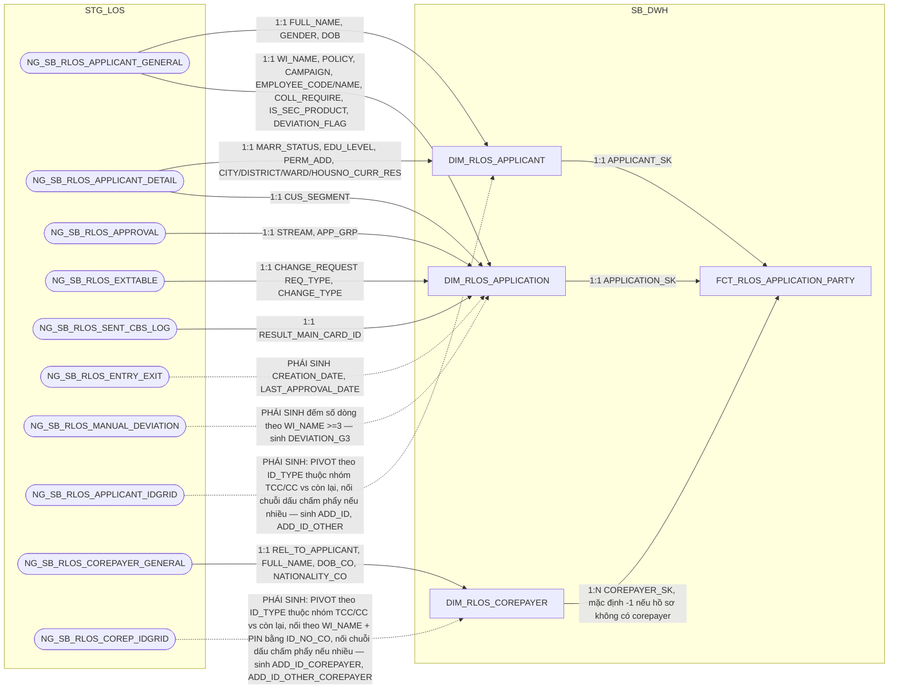

### 8.3 Cấu trúc bảng

| STT | Tên cột | Kiểu dữ liệu | Bắt buộc | Độ lớn | Khóa | Mô tả | Báo cáo sử dụng | Tên chỉ tiêu trên báo cáo |
| --- | --- | --- | --- | --- | --- | --- | --- | --- |
| 1 | DAYID | DATE | Y |  | PK | Ngày dữ liệu, dạng số YYYYMMDD | — (cột kỹ thuật) | — |
| 2 | WI_NAME | VARCHAR2 | Y | 100 | PK | Mã hồ sơ tín dụng RLOS | Báo cáo RLOS APPLICATION (BC1) — khóa chính, khóa nối sang DIM_RLOS_COREPAYER | — |
| 3 | DATASOURCE | VARCHAR2 | Y | 10 |  | Cột kỹ thuật đánh dấu nguồn hệ, luôn cố định 'RLOS' sau khi tách vật lý CLOS/RLOS | — (cột kỹ thuật) | — |
| 4 | APPLICATION_SK | NUMBER | Y | 18 |  | Khóa tới DIM_RLOS_APPLICATION. Mặc định -1 | Thiết kế dư thừa | — |
| 5 | APPLICANT_SK | NUMBER | Y | 18 |  | Khóa tới DIM_RLOS_APPLICANT. Mặc định -1 | Thiết kế dư thừa | — |
| 6 | COREPAYER_SK | NUMBER | Y | 18 | PK | Khóa tới DIM_RLOS_COREPAYER. Mặc định -1 (Unknown) nếu hồ sơ không có corepayer nào | Báo cáo RLOS APPLICATION (BC1) — khóa JOIN sang DIM_RLOS_COREPAYER lấy tên người đồng trả nợ | CO_REPAYER (Tên người đồng trả nợ) |

## 9. FCT_RLOS_COLLATERAL

### 9.1 Mục đích thiết kế
- **Ý nghĩa bảng:** bảng FACT chi tiết (nhân dòng) lưu ảnh số liệu thay
  đổi theo ngày của từng tài sản bảo đảm thuộc hồ sơ RLOS. Không có chiều
  tài sản riêng — toàn bộ thuộc tính lưu thẳng trên fact vì 4 bảng nguồn
  không khai khóa CDC.
- **Khóa chính của bảng (PK):** DAYID, WI_NAME, COLLATERAL_BK.
- **Độ chi tiết (grain):** 1 dòng = 1 tài sản bảo đảm của 1 hồ sơ x 1 ngày dữ liệu.
- **Phục vụ báo cáo:**
  - Báo cáo RLOS APPLICATION (BC1)
  - Báo cáo Thông tin phê duyệt (BC3)
  - Báo cáo KPI (BC9) — nguồn cho AGG_LOS_KPI_APPLICATION.TSBD_G2

### 9.2 Sơ đồ lineage

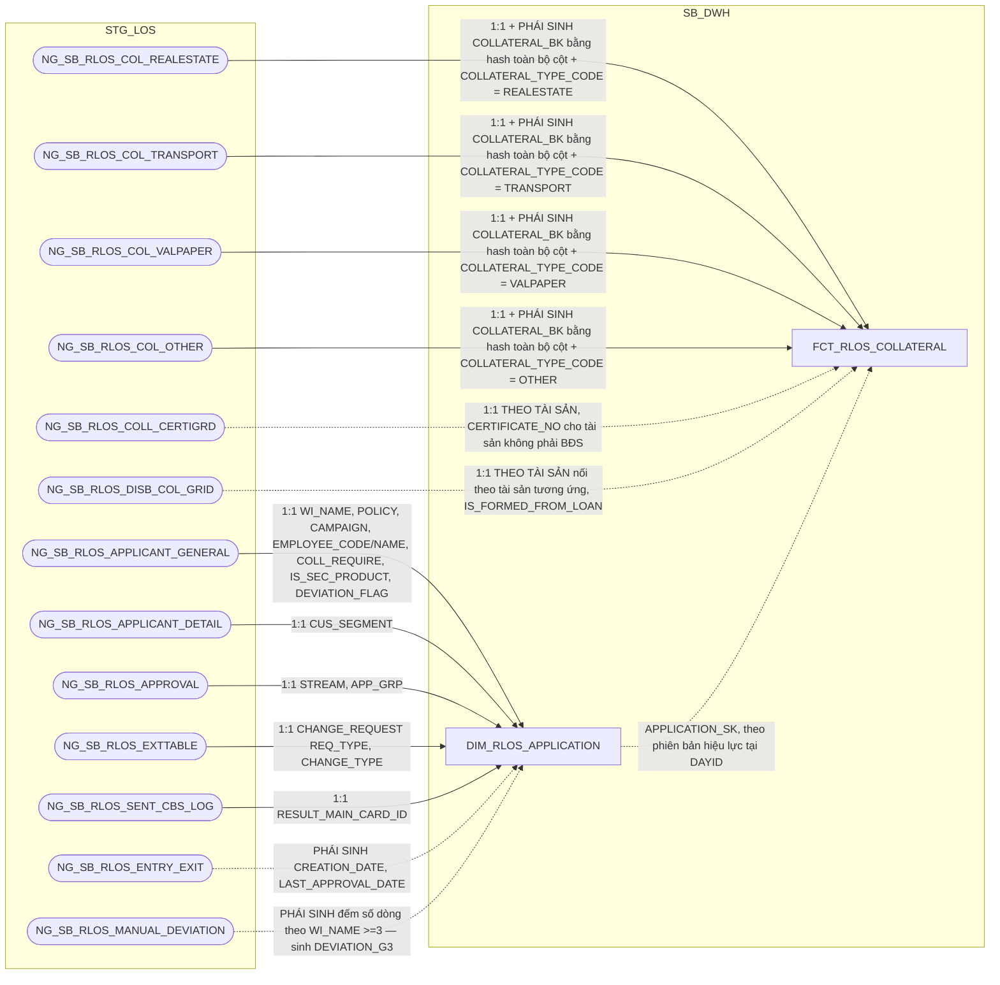

### 9.3 Cấu trúc bảng

| STT | Tên cột | Kiểu dữ liệu | Bắt buộc | Độ lớn | Khóa | Mô tả | Báo cáo sử dụng | Tên chỉ tiêu trên báo cáo |
| --- | --- | --- | --- | --- | --- | --- | --- | --- |
| 1 | DAYID | DATE | Y |  | PK | Ngày dữ liệu, dạng số YYYYMMDD | — (cột kỹ thuật) | — |
| 2 | WI_NAME | VARCHAR2 | Y | 100 | PK | Mã hồ sơ tín dụng RLOS | Báo cáo RLOS APPLICATION (BC1) — khóa chính Báo cáo KPI (BC9) — khóa nối AGG_LOS_KPI_APPLICATION.TSBD_G2 | — |
| 3 | COLLATERAL_BK | VARCHAR2 | Y | 64 | PK | Khóa nghiệp vụ của dòng tài sản — PHÁI SINH: STANDARD_HASH(..., 'SHA256') trên toàn bộ cột không phải CLOB của đúng bảng grid tài sản (COL_REALESTATE/COL_TRANSPORT/COL_VALPAPER/COL_OTHER) sinh ra dòng đó, cộng DATASOURCE và tên bảng nguồn. Chuẩn hóa trước khi hash: TRIM chuỗi, NULL quy về '<NULL>', DATE/NUMBER dùng format cố định không phụ thuộc NLS | — (cột kỹ thuật, khóa chính) | — |
| 4 | DATASOURCE | VARCHAR2 | Y | 10 |  | Cột kỹ thuật đánh dấu nguồn hệ, luôn cố định 'RLOS' sau khi tách vật lý CLOS/RLOS | — (cột kỹ thuật) | — |
| 5 | APPLICATION_SK | NUMBER | Y | 18 |  | Khóa tới DIM_RLOS_APPLICATION theo phiên bản hiệu lực tại DAYID. Mặc định -1 nếu không khớp | Báo cáo RLOS APPLICATION (BC1) — khóa JOIN sang DIM_RLOS_APPLICATION | — |
| 6 | COLLATERAL_TYPE_CODE | VARCHAR2 | N | 100 |  | Nhãn phân loại nguồn của tài sản bảo đảm — gán cố định theo bảng grid mà bản ghi đến từ đó (REALESTATE/TRANSPORT/VALPAPER/OTHER). Dùng để CASE chọn đúng cột chi tiết khi dựng TYPES_OF_COLLATERALS (cột 21) — không phải dữ liệu mô tả tài sản | Báo cáo RLOS APPLICATION (BC1) — điều kiện lọc tách GCN_REAL_ESTATE/GCN_OTHER, TSBD_BDS/TSBD_PTVT Báo cáo Thông tin phê duyệt (BC3) — điều kiện lọc dựng TYPES_OF_COLLATERALS | Nguồn cho chỉ tiêu/trường TYPES_OF_COLLATERALS (BC3); điều kiện lọc GCN_REAL_ESTATE/GCN_OTHER/TSBD_BDS/TSBD_PTVT (BC1) |
| 7 | CERTIFICATE_NO | VARCHAR2 | N | 500 |  | Số giấy chứng nhận tài sản — BĐS lấy NG_SB_RLOS_COL_REALESTATE.NO_CERTI; các tài sản khác lấy NG_SB_RLOS_COLL_CERTIGRD.CERTIFICATENO (nối theo tài sản, không phải theo hồ sơ) | Báo cáo RLOS APPLICATION (BC1) — hiển thị trực tiếp (tách GCN_REAL_ESTATE/GCN_OTHER theo COLLATERAL_TYPE_CODE) Báo cáo Thông tin phê duyệt (BC3) — nguồn cho TYPES_OF_COLLATERALS khi COLLATERAL_TYPE_CODE=REALESTATE | GCN_REAL_ESTATE (Số GCN TSBĐ là BĐS); GCN_OTHER (Số GCN TSBĐ là PTVT/Khác) |
| 8 | DESCRIPTION | VARCHAR2 | N | 4000 |  | Mô tả tài sản bảo đảm — PHÁI SINH đúng nguyên văn SRS BC3: UNION theo loại tài sản — BĐS: NO_CERTI \|\| ', ' \|\| USING_PURPOSE; PTVT: BRAND \|\| ', ' \|\| CONTROL_POSTER; GTCG: NUMBERSIGN; Khác: DESCRIBE. Không dùng REMARKS (không có trong SRS) | Báo cáo Thông tin phê duyệt (BC3) — hiển thị trực tiếp | DESCRIPTION (Mô tả TSBĐ) |
| 9 | OWNER_NAME | VARCHAR2 | N | 200 |  | Chủ sở hữu tài sản — nguồn OWNER của 4 bảng grid tài sản RLOS | Báo cáo RLOS APPLICATION (BC1) — hiển thị trực tiếp Báo cáo Thông tin phê duyệt (BC3) — hiển thị trực tiếp | OWNERSHIP (Sở hữu nhà ở, BC1); OWNER (Chủ TSBĐ, BC3) |
| 10 | REL_TO_CUSTOMER | VARCHAR2 | N | 200 |  | Quan hệ giữa chủ tài sản và khách hàng — UNION REL_CUSTOMER/RELATION_CUSTOMER của 4 bảng grid tài sản | Báo cáo RLOS APPLICATION (BC1) — hiển thị trực tiếp | TSBD_RELATIONSHIP (Mối quan hệ chủ tài sản và KH) |
| 11 | USING_PURPOSE | VARCHAR2 | N | 255 |  | Mục đích sử dụng của bất động sản — nguồn NG_SB_RLOS_COL_REALESTATE.USING_PURPOSE | Báo cáo Thông tin phê duyệt (BC3) — nguồn cho DESCRIPTION khi COLLATERAL_TYPE_CODE=REALESTATE | Nguồn cho chỉ tiêu/trường DESCRIPTION (BC3, nhánh BĐS) |
| 12 | VEHICLE_TYPE | VARCHAR2 | N | 100 |  | Loại phương tiện vận tải — nguồn NG_SB_RLOS_COL_TRANSPORT.TYPE_VEHICLE | Báo cáo Thông tin phê duyệt (BC3) — nguồn cho TYPES_OF_COLLATERALS khi COLLATERAL_TYPE_CODE=TRANSPORT | Nguồn cho chỉ tiêu/trường TYPES_OF_COLLATERALS (BC3, nhánh phương tiện) |
| 13 | BRAND | VARCHAR2 | N | 200 |  | Hãng của phương tiện vận tải — nguồn NG_SB_RLOS_COL_TRANSPORT.BRAND | Báo cáo Thông tin phê duyệt (BC3) — nguồn cho DESCRIPTION khi COLLATERAL_TYPE_CODE=TRANSPORT | Nguồn cho chỉ tiêu/trường DESCRIPTION (BC3, nhánh phương tiện) |
| 14 | CONTROL_POSTER | VARCHAR2 | N | 100 |  | Biển số kiểm soát của phương tiện — nguồn NG_SB_RLOS_COL_TRANSPORT.CONTROL_POSTER | Báo cáo Thông tin phê duyệt (BC3) — nguồn cho DESCRIPTION khi COLLATERAL_TYPE_CODE=TRANSPORT | Nguồn cho chỉ tiêu/trường DESCRIPTION (BC3, nhánh phương tiện) |
| 15 | VALPAPER_TYPE | VARCHAR2 | N | 100 |  | Loại giấy tờ có giá — nguồn NG_SB_RLOS_COL_VALPAPER.TYPE1 | Báo cáo Thông tin phê duyệt (BC3) — nguồn cho TYPES_OF_COLLATERALS khi COLLATERAL_TYPE_CODE=VALPAPER | Nguồn cho chỉ tiêu/trường TYPES_OF_COLLATERALS (BC3, nhánh giấy tờ có giá) |
| 16 | NUMBERSIGN | VARCHAR2 | N | 200 |  | Số hiệu giấy tờ có giá — nguồn NG_SB_RLOS_COL_VALPAPER.NUMBERSIGN | Báo cáo RLOS APPLICATION (BC1) — điều kiện lọc IS NOT NULL cho cờ TSBD_GTCG Báo cáo Thông tin phê duyệt (BC3) — nguồn cho DESCRIPTION khi COLLATERAL_TYPE_CODE=VALPAPER | TSBD_GTCG (Hồ sơ có TSBĐ là GTCG — YES/NO, BC1); nguồn cho chỉ tiêu/trường DESCRIPTION (BC3, nhánh GTCG) |
| 17 | IS_ASSET_FORMED | VARCHAR2 | N | 10 |  | Tài sản đã hình thành hay chưa — nguồn PROPERTY của COL_REALESTATE/COL_TRANSPORT | Báo cáo RLOS APPLICATION (BC1) — hiển thị trực tiếp, lọc theo COLLATERAL_TYPE_CODE | TSBD_BDS (Hồ sơ có TSBĐ là BĐS — YES/NO); TSBD_PTVT (Hồ sơ có TSBĐ là PTVT — YES/NO) |
| 18 | IS_FORMED_FROM_LOAN | VARCHAR2 | N | 100 |  | Loại tài sản hình thành từ vốn vay — PHÁI SINH đúng nguyên văn SRS BC1.PROPERTY_FORMED: giá trị trả về là NG_SB_RLOS_DISB_COL_GRID.COL_TYPE của dòng nối theo tài sản tương ứng có điều kiện lọc PROPERTY_FORMED='YES' (cột filter, không phải giá trị trả về); NULL nếu không có dòng nào thỏa điều kiện | Báo cáo RLOS APPLICATION (BC1) — hiển thị trực tiếp | PROPERTY_FORMED (Tài sản hình thành từ vốn vay không? — YES/NO) |
| 19 | APPRAISED_VALUE | NUMBER | N | 20,2 |  | Giá trị định giá của tài sản — PRICING_VALUE (COL_REALESTATE) hoặc PRICINGVALUE (3 bảng còn lại). Ép kiểu số từ text định dạng Việt Nam, DEFAULT NULL ON CONVERSION ERROR | Báo cáo Thông tin phê duyệt (BC3) — hiển thị trực tiếp | APPRAISED_VALUE (Giá trị định giá) |
| 20 | LOAN_RATE_LTV | NUMBER | N | 5,2 |  | Tỷ lệ cho vay trên giá trị tài sản — LOANRATE của 4 bảng grid tài sản. Cùng quy tắc ép kiểu, đơn vị phần trăm | Báo cáo Thông tin phê duyệt (BC3) — hiển thị trực tiếp | LTV (Tỷ lệ cho vay của TSBĐ) |
| 21 | TYPES_OF_COLLATERALS | VARCHAR2 | N | 500 |  | PHÁI SINH — phục vụ trực tiếp BC3.TYPES_OF_COLLATERALS: CASE theo COLLATERAL_TYPE_CODE chọn đúng 1 cột chi tiết tương ứng — REALESTATE→CERTIFICATE_NO, TRANSPORT→VEHICLE_TYPE, VALPAPER→VALPAPER_TYPE, OTHER→DESCRIPTION | Báo cáo Thông tin phê duyệt (BC3) — hiển thị trực tiếp | TYPES_OF_COLLATERALS (Loại TSBĐ) |

⚠️ Lệch đồng bộ: `hld/HLD_FCT_SB_DWH.md` (mục 1.3.2.3 và 2.3.2.3) hiện vẫn
còn cột `COLLATERAL_TYPE_SK` (khóa tới `DIM_RLOS_COLLATERAL_TYPE`) và vẽ
`DIM_RLOS_COLLATERAL_TYPE` trong lineage, trong khi `hld/HLD_Table_Design.md`
(review 2026-09-22) đã xác nhận LOẠI BỎ HẲN cột này và DIM liên quan —
không báo cáo nào JOIN sang `DIM_RLOS_COLLATERAL_TYPE` nữa, bảng chỉ còn
21 cột. Phần review trên đã theo đúng cấu trúc mới nhất
(`HLD_Table_Design.md`); cần cập nhật lại `HLD_FCT_SB_DWH.md` cho khớp.

## 10. FCT_RLOS_SUB_PRODUCT

### 10.1 Mục đích thiết kế
- **Ý nghĩa bảng:** lưu chi tiết từng lần đăng ký sản phẩm phụ đi kèm hồ sơ
  tín dụng RLOS (SeABuy, SeACivil, SeATeacher, SeAWoman, thẻ tín dụng phụ) —
  hạn mức, thời hạn, thuộc tính thẻ phụ nếu có.
- **Khóa chính của bảng (PK):** DAYID, WI_NAME, SUB_PRODUCT_TYPE_CODE,
  SUB_PRODUCT_BK.
- **Độ chi tiết (grain):** 1 dòng = 1 lần đăng ký sản phẩm phụ trong ảnh
  chụp của ngày DAYID. Bốn nhóm SeABuy/Civil/Teacher/Woman tối đa 1
  dòng/loại/hồ sơ; thẻ tín dụng phụ có thể nhiều dòng/hồ sơ (1 hồ sơ có thể
  mở nhiều thẻ phụ).
- **Phục vụ báo cáo:**
  - Báo cáo RLOS APPLICATION (BC1)

### 10.2 Sơ đồ lineage

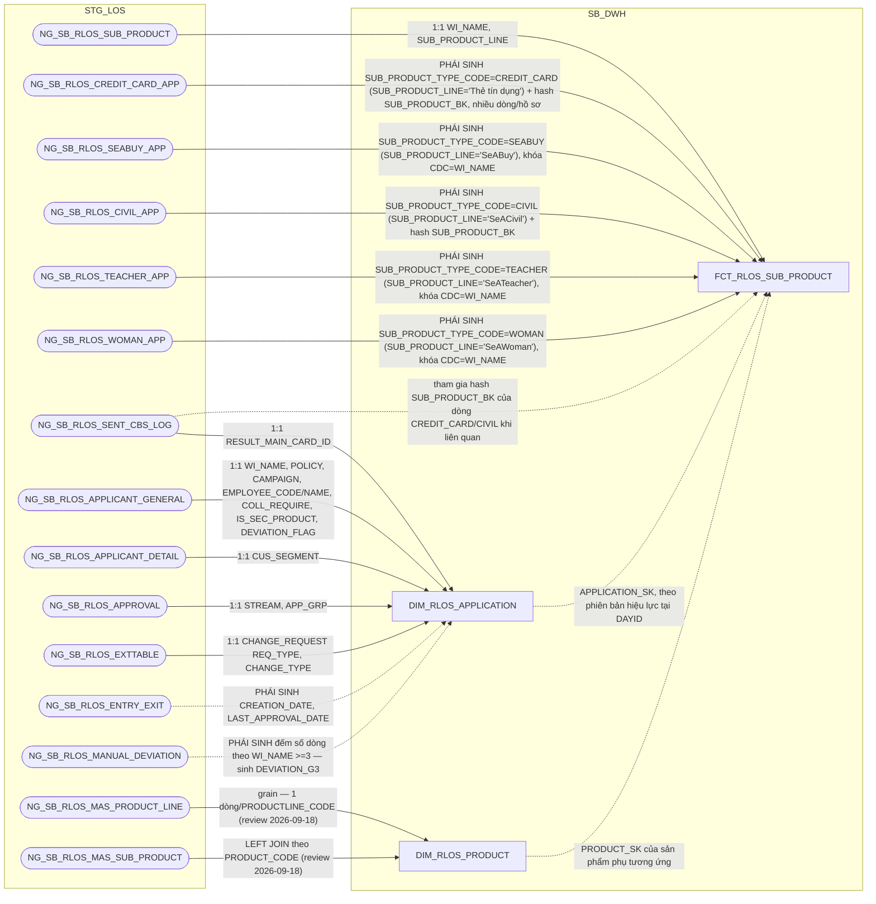

### 10.3 Cấu trúc bảng

| STT | Tên cột | Kiểu dữ liệu | Bắt buộc | Độ lớn | Khóa | Mô tả | Báo cáo sử dụng | Tên chỉ tiêu trên báo cáo |
| --- | --- | --- | --- | --- | --- | --- | --- | --- |
| 1 | DAYID | DATE | Y |  | PK | Ngày dữ liệu, dạng số YYYYMMDD | — (cột kỹ thuật) | — |
| 2 | WI_NAME | VARCHAR2 | Y | 100 | PK | Mã hồ sơ tín dụng RLOS — nguồn NG_SB_RLOS_SUB_PRODUCT.WI_NAME và WI_NAME của 5 bảng sản phẩm phụ | Báo cáo RLOS APPLICATION (BC1) — khóa JOIN sang hồ sơ, không hiển thị trực tiếp ở trường này | — |
| 3 | SUB_PRODUCT_TYPE_CODE | VARCHAR2 | Y | 30 | PK | Mã LOẠI sản phẩm phụ do DWH chuẩn hóa — PHÁI SINH: gán theo bảng nguồn mà dòng đến từ đó, đúng điều kiện lọc SRS BC1 (BR 1.2): NG_SB_RLOS_SUB_PRODUCT.SUB_PRODUCT_LINE = 'SeACivil'→CIVIL, 'SeATeacher'→TEACHER, 'SeAWoman'→WOMAN, 'SeABuy'→SEABUY, 'Thẻ tín dụng'→CREDIT_CARD (giá trị cụ thể theo từng nhóm, không chỉ đơn thuần "dòng có mặt ở bảng nào"). Đổi tên từ SUB_PRODUCT_CODE gốc để tránh trùng nghĩa với DIM_RLOS_PRODUCT.SUB_PRODUCT_CODE (sản phẩm nhánh của sản phẩm chính) | — (cột kỹ thuật, một phần PK) | — |
| 4 | SUB_PRODUCT_BK | VARCHAR2 | Y | 64 | PK | Khóa nghiệp vụ của 1 lần đăng ký sản phẩm phụ — PHÁI SINH: với NG_SB_RLOS_SEABUY_APP/TEACHER_APP/WOMAN_APP (khai khóa CDC=WI_NAME) dùng thẳng khóa nguồn; với NG_SB_RLOS_SUB_PRODUCT/CREDIT_CARD_APP/CIVIL_APP/SENT_CBS_LOG (không khai khóa CDC) dùng STANDARD_HASH(..., 'SHA256') trên toàn bộ cột không phải CLOB (loại trừ COMMENT_CO, REQUEST), cộng DATASOURCE và tên bảng nguồn | — (cột kỹ thuật, một phần PK) | — |
| 5 | DATASOURCE | VARCHAR2 | Y | 10 |  | Cột kỹ thuật đánh dấu nguồn hệ, luôn cố định 'RLOS' sau khi tách vật lý CLOS/RLOS | — (cột kỹ thuật) | — |
| 6 | APPLICATION_SK | NUMBER | Y | 18 |  | Khóa tới DIM_RLOS_APPLICATION theo phiên bản hiệu lực tại DAYID. Mặc định -1 nếu không khớp | — (cột kỹ thuật, khóa JOIN nội bộ) | — |
| 7 | SUB_PRODUCT_LINE | VARCHAR2 | N | 200 |  | Dòng của sản phẩm phụ — nguồn NG_SB_RLOS_SUB_PRODUCT.SUB_PRODUCT_LINE. Trường SAN_PHAM_PHU của BC1 | Báo cáo RLOS APPLICATION (BC1) — hiển thị trực tiếp | SAN_PHAM_PHU (Sản phẩm phụ chi tiết) |
| 8 | SPP_AMOUNT | NUMBER | N | 20,2 |  | Hạn mức của sản phẩm phụ — UNION LIMIT_NO của 5 bảng (CREDIT_CARD_APP/SEABUY_APP/CIVIL_APP/TEACHER_APP/WOMAN_APP). Ép kiểu số từ text định dạng Việt Nam, DEFAULT NULL ON CONVERSION ERROR. Trường SPP_Amount của BC1 | Báo cáo RLOS APPLICATION (BC1) — hiển thị trực tiếp | SPP_Amount (Giá trị của sản phẩm phụ) |
| 9 | SPP_TERM | NUMBER | N | 5 |  | Thời hạn của sản phẩm phụ, đơn vị tháng — CREDIT_CARD_APP.TERM; SEABUY_APP/CIVIL_APP/TEACHER_APP/WOMAN_APP.TIME_VALID. Trường SPP_Term của BC1 | Báo cáo RLOS APPLICATION (BC1) — hiển thị trực tiếp | SPP_Term (Thời hạn của sản phẩm phụ) |
| 10 | CARD_TYPE_CODE | VARCHAR2 | N | 100 |  | Loại thẻ đăng ký lúc đề xuất sản phẩm phụ là thẻ tín dụng — nguồn NG_SB_RLOS_CREDIT_CARD_APP.CARD_TYPE. Chỉ có ở dòng SUB_PRODUCT_TYPE_CODE='CREDIT_CARD'. Là khái niệm khác BC1.K_TYPE (loại thẻ thật sau giải ngân, nguồn STG_DIM_CARD.K_TYPE, join qua NG_SB_RLOS_SENT_CBS_LOG.RESULT_SEAB_MAIN_CARD_ID = STG_DIM_CARD.MAIN_ID, không đi qua bảng này) — không dùng để tra BC1.K_TYPE | Thiết kế dư thừa | — |

## 11. FCT_RLOS_EXCEPTION

### 11.1 Mục đích thiết kế
- **Ý nghĩa bảng:** ghi nhận từng lần một lý do (ngoại lệ/nội dung cần làm
  rõ) được nêu ra trên hồ sơ tín dụng RLOS trong quá trình xử lý, kèm người
  nêu, thời điểm, và các chỉ tiêu đánh giá chất lượng nhập liệu lần đầu
  (First Time Right).
- **Khóa chính của bảng (PK):** DAYID, WI_NAME, EXCEPTION_CATEGORY,
  RAISED_BY, RAISED_DATE_TIME.
- **Độ chi tiết (grain):** 1 dòng = 1 lần ghi nhận lý do của 1 hồ sơ, trong
  ảnh chụp của ngày DAYID.
- **Phục vụ báo cáo:**
  - Báo cáo EXCEPTION - FTR (BC7)
  - Báo cáo RETURN (BC8)

### 11.2 Sơ đồ lineage

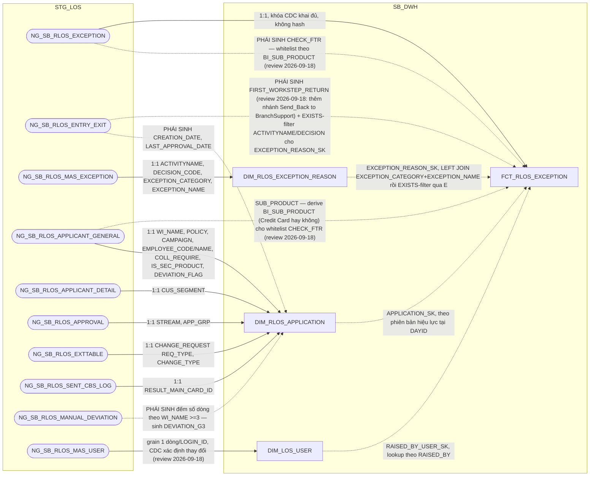

### 11.3 Cấu trúc bảng

| STT | Tên cột | Kiểu dữ liệu | Bắt buộc | Độ lớn | Khóa | Mô tả | Báo cáo sử dụng | Tên chỉ tiêu trên báo cáo |
| --- | --- | --- | --- | --- | --- | --- | --- | --- |
| 1 | DAYID | DATE | Y |  | PK | Ngày dữ liệu, dạng số YYYYMMDD | — (cột kỹ thuật) | — |
| 2 | WI_NAME | VARCHAR2 | Y | 100 | PK | Mã hồ sơ tín dụng RLOS | Báo cáo EXCEPTION - FTR (BC7) — hiển thị trực tiếp, cũng là khóa JOIN | WI_NAME (Mã hồ sơ) |
| 3 | APPLICATION_SK | NUMBER | Y | 18 |  | Khóa tới DIM_RLOS_APPLICATION theo phiên bản hiệu lực tại DAYID. Mặc định -1 | Báo cáo EXCEPTION - FTR (BC7) — khóa JOIN sang DIM_RLOS_APPLICATION để lấy LOANCASEID (dù BC7 ưu tiên dùng LOANCASEID có sẵn trực tiếp trên bảng này) | — |
| 4 | EXCEPTION_REASON_SK | NUMBER | Y | 18 |  | Khóa tới DIM_RLOS_EXCEPTION_REASON — PHÁI SINH 2 bước đúng SRS BC7 (không phải lookup 1 cột): (1) LEFT JOIN theo EXCEPTION_CATEGORY + EXCEPTION_NAME, có thể khớp nhiều dòng DIM cùng category+name khác ACTIVITYNAME/DECISION_CODE; (2) lọc còn đúng 1 dòng bằng điều kiện tồn tại bản ghi NG_SB_RLOS_ENTRY_EXIT (WI_NAME khớp + WORKSTEP=ACTIVITYNAME + DECISION=DECISION_CODE của dòng DIM đó) — chỉ giữ tổ hợp đã thực sự xảy ra trong lịch sử xử lý hồ sơ. Mặc định -1 nếu không còn dòng nào khớp | Báo cáo EXCEPTION - FTR (BC7) — khóa JOIN sang DIM_RLOS_EXCEPTION_REASON để lấy ACTIVITYNAME, EXCEPTION_CODE | — |
| 5 | RAISED_BY_USER_SK | NUMBER | Y | 18 |  | Khóa tới DIM_LOS_USER, người nêu lý do. Mặc định -1. ĐÚNG GRAIN của bảng — 1 lần ghi nhận lý do có đúng 1 người nêu | — (cột kỹ thuật, khóa JOIN nội bộ — BC7 dùng cột RAISED_BY gốc để hiển thị) | — |
| 6 | EXCEPTION_CATEGORY | VARCHAR2 | N | 500 | PK | Phân nhóm nội dung cần làm rõ — nguồn NG_SB_RLOS_EXCEPTION.EXCEPTION_CATEGORY | Báo cáo EXCEPTION - FTR (BC7) — hiển thị trực tiếp, cũng là khóa JOIN sang DIM_RLOS_EXCEPTION_REASON; khóa JOIN REF_PHAN_LOAI_DDE (tính PHAN_LOAI_DDE) đã chuyển sang tầng PDTD_DTM, xem ghi chú cuối bảng | EXCEPTION_CATEGORY (Nhóm lý do quyết định) |
| 7 | EXCEPTION_NAME | VARCHAR2 | N | 500 |  | Tên nội dung cần làm rõ — nguồn NG_SB_RLOS_EXCEPTION.EXCEPTION_NAME | Báo cáo EXCEPTION - FTR (BC7) — hiển thị trực tiếp, cũng là điều kiện lọc/khóa JOIN cho CHECK_FTR và DIM_RLOS_EXCEPTION_REASON | EXCEPTION_NAME (Tên lý do) |
| 8 | EXCEPTION_REMARKS | VARCHAR2 | N | 4000 |  | Ghi chú của nội dung cần làm rõ — nguồn NG_SB_RLOS_EXCEPTION.EXCEPTION_REMARKS | Báo cáo EXCEPTION - FTR (BC7) — hiển thị trực tiếp | EXCEPTION_REMARKS (Ý kiến) |
| 9 | RAISED_BY | VARCHAR2 | N | 100 | PK | Người nêu nội dung cần làm rõ — nguồn NG_SB_RLOS_EXCEPTION.RAISED_BY. Cột RAISED_BY_USER_SK bên cạnh giữ khóa tới DIM | Báo cáo EXCEPTION - FTR (BC7) — hiển thị trực tiếp | RAISED_BY (User tạo lý do) |
| 10 | RAISED_DATE_TIME | TIMESTAMP | N |  | PK | Thời điểm nêu nội dung cần làm rõ — nguồn NG_SB_RLOS_EXCEPTION.RAISED_DATE_TIME | Báo cáo EXCEPTION - FTR (BC7) — hiển thị trực tiếp Báo cáo RETURN (BC8) — dùng làm PROCESSED_DATE (giữ nguyên giá trị timestamp, không TRUNC như nhánh CLOS) | RAISED_DATE_TIME (Thời gian tạo lý do); PROCESSED_DATE (Ngày dữ liệu, BC8) |
| 11 | DATASOURCE | VARCHAR2 | Y | 10 |  | Cột kỹ thuật đánh dấu nguồn hệ, luôn cố định 'RLOS' sau khi tách vật lý CLOS/RLOS | — (cột kỹ thuật) | — |
| 12 | RCTYPE | VARCHAR2 | N | 20 |  | Loại ghi nhận, Raise (nêu lý do khi trả về) hay Clear (đã làm rõ/bổ sung và đẩy lại) — nguồn NG_SB_RLOS_EXCEPTION.RCTYPE. Review 2026-09-18: SRS BC7 cập nhật KHÔNG còn dùng cột này làm điều kiện lọc CHECK_FTR (khác bản SRS trước) — vẫn giữ cột vì BC7 hiển thị trực tiếp làm trường riêng trên báo cáo | Báo cáo EXCEPTION - FTR (BC7) — hiển thị trực tiếp | CHECK_FTR (thành phần Raise/Clear của trường "Hồ sơ đạt FTR hay không đạt FTR") |
| 13 | CHECK_FTR | VARCHAR2 | N | 20 |  | Vi phạm nguyên tắc First Time Right — PHÁI SINH (review 2026-09-18, SRS BC7 cập nhật đổi hẳn công thức): công thức RIÊNG của RLOS, không dùng chung với CLOS — mặc định 'Not First Time Right'; là 'First Time Right' CHỈ KHI mọi dòng NG_SB_RLOS_EXCEPTION (a) có EXCEPTION_CATEGORY LIKE '%BR%' đều khớp 1 trong 5 điều kiện miễn trừ theo EXCEPTION_NAME (một số điều kiện phụ theo BI_SUB_PRODUCT — PHÁI SINH: CASE WHEN NG_SB_RLOS_APPLICANT_GENERAL.SUB_PRODUCT LIKE '%Phát hành%' OR LIKE '%TTD%' THEN 'Credit Card' ELSE SUB_PRODUCT END) | Báo cáo EXCEPTION - FTR (BC7) — hiển thị trực tiếp | CHECK_FTR (Hồ sơ đạt FTR hay không đạt FTR) |
| 14 | FIRST_WORKSTEP_RETURN | VARCHAR2 | N | 200 |  | Bước xử lý phát sinh trả về đầu tiên — PHÁI SINH (review 2026-09-18, SRS BC7 cập nhật): WORKSTEP của bản ghi NG_SB_RLOS_ENTRY_EXIT tại MIN(EXITDATE) theo WI_NAME, với điều kiện EXITDATE IS NOT NULL AND ((WORKSTEP='DetailDataEntry' AND DECISION='Send_Back') OR (WORKSTEP IN ('DataInputerChecker','UnderwriterMaker','CreditApproval') AND DECISION='Additional_Doc_Required') OR (WORKSTEP='UnderwriterMaker' AND DECISION='Send_Back to BranchSupport')) — bổ sung nhánh thứ 3 so với công thức cũ, giống CLOS | Báo cáo EXCEPTION - FTR (BC7) — hiển thị trực tiếp | FIRST_WORKSTEP_RETURN (Bước trả về lần đầu) |

⚠️ Lệch kiến trúc đã sửa (review 2026-09-22): cột `PHAN_LOAI_DDE` (SRS BC7
cập nhật 2026-09-18, LEFT JOIN `REF_PHAN_LOAI_DDE`) ban đầu được thiết kế
tại tầng SB_DWH (bảng này) — nhưng đã phát hiện vi phạm layer boundary vì
`REF_PHAN_LOAI_DDE` chỉ tồn tại vật lý ở tầng PDTD_DTM (xem
`hld/HLD_REF.md` đầu Section 2.4), cùng lý do đã áp dụng cho
FCT_CLOS_EXCEPTION (bảng #4). Cột này đã chuyển hẳn sang tính tại
PDTD_DTM — xem `hld/HLD_FCT_PDTD_DTM.md` mục 2.3.2.5. Bảng
`FCT_RLOS_EXCEPTION` ở SB_DWH trong bản review này còn đúng **14 cột**
(không có `PHAN_LOAI_DDE`).

## 12. FCT_RLOS_DEVIATION

### 12.1 Mục đích thiết kế
- **Ý nghĩa bảng:** lưu ảnh số liệu thay đổi theo ngày của từng ngoại lệ
  chính sách (deviation) thuộc hồ sơ tín dụng RLOS. Không có chiều riêng —
  toàn bộ thuộc tính lưu thẳng trên fact vì nguồn không khai khóa CDC.
- **Khóa chính của bảng (PK):** DAYID, WI_NAME, DEVIATION_BK.
- **Độ chi tiết (grain):** 1 dòng = 1 ngoại lệ chính sách trong ảnh chụp
  của ngày DAYID.
- **Phục vụ báo cáo:**
  - Báo cáo NGOẠI LỆ (BC6)
  - Báo cáo KPI (BC9) — nguồn trực tiếp cho DEVIATION_G2/DEVIATION_G3 của
    AGG_LOS_KPI_APPLICATION

### 12.2 Sơ đồ lineage

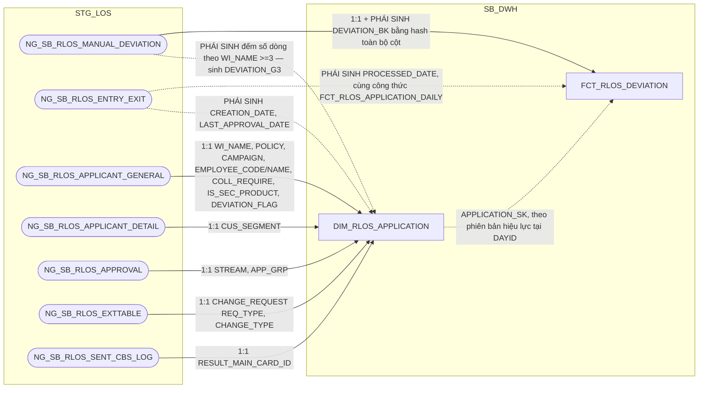

### 12.3 Cấu trúc bảng

| STT | Tên cột | Kiểu dữ liệu | Bắt buộc | Độ lớn | Khóa | Mô tả | Báo cáo sử dụng | Tên chỉ tiêu trên báo cáo |
| --- | --- | --- | --- | --- | --- | --- | --- | --- |
| 1 | DAYID | DATE | Y |  | PK | Ngày dữ liệu, dạng số YYYYMMDD | — (cột kỹ thuật) | — |
| 2 | WI_NAME | VARCHAR2 | Y | 100 | PK | Mã hồ sơ tín dụng RLOS | Báo cáo NGOẠI LỆ (BC6) — hiển thị trực tiếp, cũng là khóa PK | WI_NAME (Mã hồ sơ) |
| 3 | DEVIATION_BK | VARCHAR2 | Y | 64 | PK | Khóa nghiệp vụ của dòng ngoại lệ — PHÁI SINH: STANDARD_HASH(..., 'SHA256') trên toàn bộ cột không phải CLOB của NG_SB_RLOS_MANUAL_DEVIATION (loại trừ REASON), cộng DATASOURCE và tên bảng nguồn. Chuẩn hóa trước khi hash: TRIM chuỗi, NULL quy về '<NULL>', DATE/NUMBER dùng format cố định không phụ thuộc NLS | Báo cáo KPI (BC9) — nguồn cho chỉ tiêu/trường DEVIATION_G2/DEVIATION_G3 (COUNT(*) số dòng theo WI_NAME trên AGG_LOS_KPI_APPLICATION, lọc DAYID mới nhất) | — |
| 4 | DATASOURCE | VARCHAR2 | Y | 10 |  | Cột kỹ thuật đánh dấu nguồn hệ, luôn cố định 'RLOS' sau khi tách vật lý CLOS/RLOS | — (cột kỹ thuật) | — |
| 5 | APPLICATION_SK | NUMBER | Y | 18 |  | Khóa tới DIM_RLOS_APPLICATION theo phiên bản hiệu lực tại DAYID. Mặc định -1 nếu không khớp | — (cột kỹ thuật, khóa JOIN nội bộ) | — |
| 6 | CHECKING_CONDITION | VARCHAR2 | N | 500 |  | Điều kiện kiểm tra chính sách — nguồn NG_SB_RLOS_MANUAL_DEVIATION.CHECKING_CONDITION | Báo cáo NGOẠI LỆ (BC6) — hiển thị trực tiếp | CHECKING_CONDITION (Tiêu chí ngoại lệ) |
| 7 | CHECKING_RESULT | VARCHAR2 | N | 200 |  | Kết quả kiểm tra chính sách — nguồn NG_SB_RLOS_MANUAL_DEVIATION.CHECKING_RESULT | Báo cáo NGOẠI LỆ (BC6) — hiển thị trực tiếp | CHECKING_RESULT (Loại ngoại lệ) |
| 8 | DEVIATION_REASON | VARCHAR2 | N | 4000 |  | Lý do lệch chính sách — nguồn NG_SB_RLOS_MANUAL_DEVIATION.REASON (đổi tên cho rõ nghĩa vì tên gốc quá chung) | Báo cáo NGOẠI LỆ (BC6) — hiển thị trực tiếp | REASON (Nội dung ngoại lệ) |
| 9 | PROCESSED_DATE | DATE | N |  |  | Ngày xử lý của hồ sơ — PHÁI SINH: tính độc lập từ NG_SB_RLOS_ENTRY_EXIT theo cùng công thức 3 mức ưu tiên (ngày phê duyệt cuối/ngày hủy/ngày thoát bước gần nhất) đã dùng cho FCT_RLOS_APPLICATION_DAILY.PROCESSED_DATE — không JOIN sang FCT_RLOS_APPLICATION_DAILY để tránh tham chiếu chéo giữa 2 bảng | Báo cáo NGOẠI LỆ (BC6) — hiển thị trực tiếp | PROCESSED_DATE (Ngày dữ liệu báo cáo) |

## 13. FCT_RLOS_WORKSTEP_EVENT

### 13.1 Mục đích thiết kế
- **Ý nghĩa bảng:** nhật ký workflow mức nguyên tử của hệ RLOS (bán lẻ/cá
  nhân) — mỗi dòng là 1 lần hồ sơ đi qua 1 bước xử lý (workstep) trên
  workflow, ghi lại đầy đủ thời gian vào/ra, người xử lý, quyết định và
  các chỉ số TAT tính sẵn. Giữ HẾT MỌI SỰ KIỆN, không bao giờ xóa, không
  chép lại nhật ký mỗi ngày.
- **Khóa chính của bảng (PK):** DAYID, WI_NAME, WORKSTEP_CODE, ENTRYDATE.
- **Độ chi tiết (grain):** 1 dòng = 1 phiên bản của 1 logical event (hồ
  sơ × workstep × lần vào bước).
- **Phục vụ báo cáo:**
  - Báo cáo RLOS APPLICATION (BC1)
  - Báo cáo CLOS APPLICATION (BC2)
  - Báo cáo Thông tin phê duyệt (BC3)
  - Báo cáo Tuần Chuyên viên Thẩm định (BC4)
  - Báo cáo SLA - TAT (BC5)
  - Báo cáo EXCEPTION - FTR (BC7)
  - Báo cáo RETURN (BC8)
  - Báo cáo KPI (BC9)
  - Báo cáo Giải ngân _ Quá hạn KHCN (BC10)
  - Báo cáo Giải ngân _ Quá hạn KHDN (BC11)

### 13.2 Sơ đồ lineage

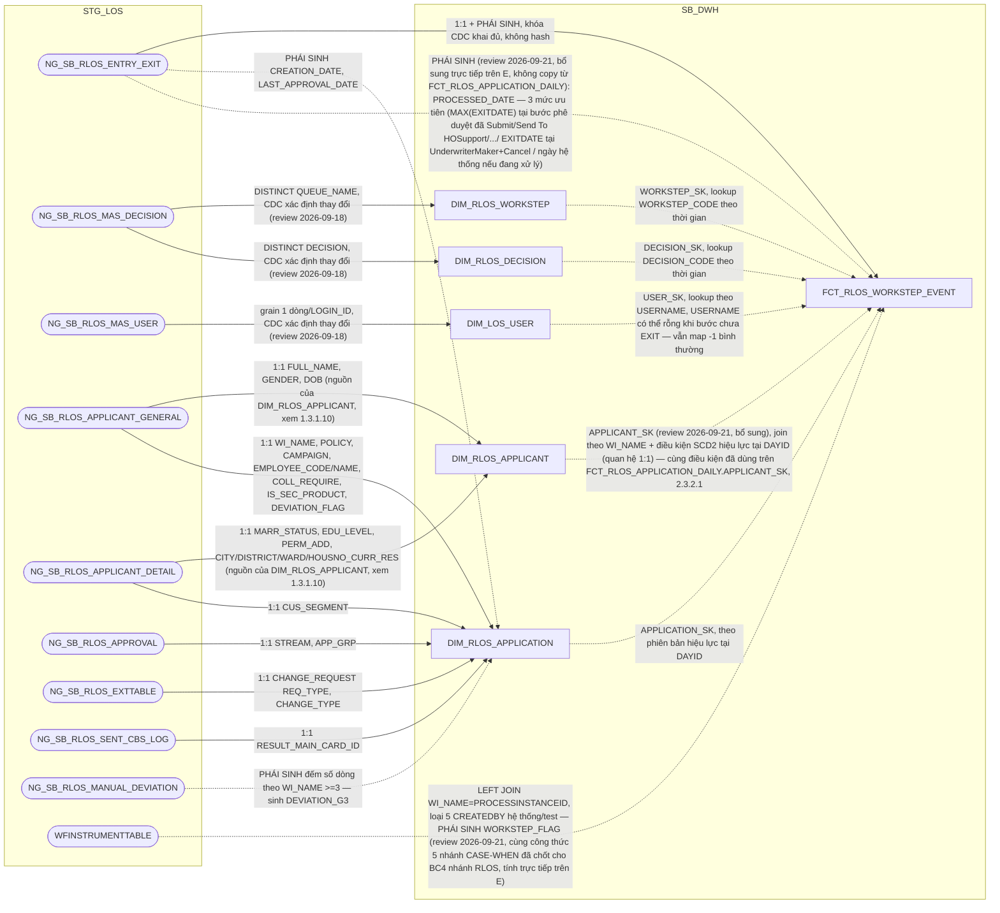

### 13.3 Cấu trúc bảng

| STT | Tên cột | Kiểu dữ liệu | Bắt buộc | Độ lớn | Khóa | Mô tả | Báo cáo sử dụng | Tên chỉ tiêu trên báo cáo |
| --- | --- | --- | --- | --- | --- | --- | --- | --- |
| 1 | DAYID | DATE | Y |  | PK | Ngày dữ liệu, dạng số YYYYMMDD — nguồn NG_SB_RLOS_ENTRY_EXIT, TRUNC về 00:00:00. Là ngày phiên bản được ghi nhận, KHÔNG phải ảnh chụp lại toàn bộ nhật ký mỗi ngày | — | Nguồn cho chỉ tiêu/trường APPLICATION_SK, APPLICANT_SK (mốc thời gian xác định phiên bản SCD2 hiệu lực khi lookup DIM) |
| 2 | WI_NAME | VARCHAR2 | Y | 100 | PK | Mã hồ sơ tín dụng RLOS — nguồn NG_SB_RLOS_ENTRY_EXIT.WINAME (đổi tên WINAME→WI_NAME cho thống nhất với các bảng khác) | Báo cáo RLOS APPLICATION (BC1) — hiển thị trực tiếp Báo cáo CLOS APPLICATION (BC2) Báo cáo Thông tin phê duyệt (BC3) Báo cáo Tuần Chuyên viên Thẩm định (BC4) Báo cáo SLA - TAT (BC5) Báo cáo RETURN (BC8) | WINAME (Mã hồ sơ) |
| 3 | WORKSTEP_CODE | VARCHAR2 | Y | 200 | PK | Mã bước xử lý trên workflow — nguồn ENTRY_EXIT.WORKSTEP (đổi tên thêm hậu tố CODE), đã cắt tiền tố hệ nguồn nếu có | Báo cáo Thông tin phê duyệt (BC3) — hiển thị trực tiếp, đồng thời là điều kiện lọc bước CreditApproval/CreditCommittee Báo cáo Tuần Chuyên viên Thẩm định (BC4) — điều kiện lọc bước UnderwriterMaker/UnderwriterChecker Báo cáo SLA - TAT (BC5) — điều kiện lọc để SUM từng cột TAT theo từng bước Báo cáo RETURN (BC8) — hiển thị trực tiếp | WORKSTEP (Bước hồ sơ) |
| 4 | ENTRYDATE | TIMESTAMP | Y |  | PK | Thời điểm hồ sơ vào bước xử lý — nguồn ENTRY_EXIT.ENTRYDATE. Bắt buộc nằm trong khóa vì 1 hồ sơ có thể quay lại cùng 1 bước nhiều lần | Báo cáo Thông tin phê duyệt (BC3) — hiển thị trực tiếp Báo cáo Tuần Chuyên viên Thẩm định (BC4) — hiển thị trực tiếp Báo cáo SLA - TAT (BC5) — dùng tính ENTRYDATE_DDE (MIN theo bước DetailDataEntry) | ENTRYDATE (Thời gian lên bước) |
| 5 | DATASOURCE | VARCHAR2 | Y | 10 |  | Cột kỹ thuật đánh dấu nguồn hệ, luôn cố định 'RLOS' sau khi tách vật lý CLOS/RLOS | Báo cáo Thông tin phê duyệt (BC3) — hiển thị trực tiếp Báo cáo Tuần Chuyên viên Thẩm định (BC4) — hiển thị trực tiếp | SYSTEMNAME (Hệ thống — CLOS/RLOS) |
| 6 | WORKSTEP_SK | NUMBER | Y | 18 |  | Khóa tới DIM_RLOS_WORKSTEP, lookup bằng WORKSTEP_CODE theo điều kiện thời gian (EFF_DATE/EXP_DATE). Mặc định -1 nếu không khớp | — | Thiết kế dư thừa |
| 7 | DECISION_SK | NUMBER | Y | 18 |  | Khóa tới DIM_RLOS_DECISION, lookup bằng DECISION_CODE theo điều kiện thời gian. DECISION null/không khớp dùng -1. KHÔNG nằm trong PK — chỉ để tra cứu thêm thuộc tính | — | Thiết kế dư thừa |
| 8 | USER_SK | NUMBER | Y | 18 |  | Khóa tới DIM_LOS_USER, người xử lý của chính sự kiện này. ĐÚNG GRAIN của bảng — 1 lần vào bước có đúng 1 người xử lý. Mặc định -1. KHÔNG nằm trong PK | — | Thiết kế dư thừa |
| 9 | APPLICATION_SK | NUMBER | Y | 18 |  | Khóa tới DIM_RLOS_APPLICATION theo phiên bản hiệu lực tại DAYID. Mặc định -1 | Báo cáo Thông tin phê duyệt (BC3) — khóa JOIN sang DIM_RLOS_APPLICATION.STREAM/APPROVED_AMT_FINAL/CURRENCY_CODE/APPROVED_TERM Báo cáo KPI (BC9) — khóa tra BI_FLOW (điều kiện lọc SLHS_RLOS/SLGN_RLOS), khóa tra FIRST_ELIGIBLE_TS trên REF_LOS_KPI_USER_YEAR (NHAN_SU) | Nguồn cho chỉ tiêu/trường STREAM, CREDIT_LIMIT, CURRENCY, CREDIT_TERM (BC3); SLHS_RLOS, SLGN_RLOS, NHAN_SU (BC9) |
| 10 | EXITDATE | TIMESTAMP | N |  |  | Thời điểm hồ sơ ra khỏi bước xử lý — nguồn ENTRY_EXIT.EXITDATE. NULL nghĩa là hồ sơ đang nằm tại bước này | Báo cáo Thông tin phê duyệt (BC3) — hiển thị trực tiếp Báo cáo Tuần Chuyên viên Thẩm định (BC4) — hiển thị trực tiếp Báo cáo RETURN (BC8) — hiển thị trực tiếp, cùng cột với PROCESSED_DATE của báo cáo Báo cáo SLA - TAT (BC5) — dùng tính EXITDATE_DDE (MAX theo bước DetailDataEntry) | EXITDATE (Thời gian kết thúc bước) |
| 11 | DECISION_CODE | VARCHAR2 | N | 200 |  | Mã quyết định tại bước xử lý — nguồn ENTRY_EXIT.DECISION (đổi tên thêm hậu tố CODE) | Báo cáo Thông tin phê duyệt (BC3) — hiển thị trực tiếp Báo cáo RETURN (BC8) — hiển thị trực tiếp | DECISION (Quyết định) |
| 12 | USERNAME | VARCHAR2 | N | 100 |  | Tên tài khoản người xử lý hồ sơ — nguồn ENTRY_EXIT.USERNAME. Giữ nguyên giá trị gốc để báo cáo hiển thị thẳng, không phải join qua DIM_LOS_USER | Báo cáo Thông tin phê duyệt (BC3) — hiển thị trực tiếp (BI_APPROVER/BI_COMMITTEE, lọc theo WORKSTEP_CODE) Báo cáo Tuần Chuyên viên Thẩm định (BC4) — hiển thị trực tiếp (UND_MAKER) Báo cáo KPI (BC9) — điều kiện lọc IS_TEST_ACCOUNT, nguồn cho FIRST_ELIGIBLE_TS/NHAN_SU trên REF_LOS_KPI_USER_YEAR | BI_APPROVER, BI_COMMITTEE (BC3); UND_MAKER (BC4); nguồn cho chỉ tiêu/trường IS_TEST_ACCOUNT, NHAN_SU (BC9) |
| 13 | REMARKS | VARCHAR2 | N | 4000 |  | Ghi chú tại bước xử lý — nguồn ENTRY_EXIT.REMARKS | Báo cáo Thông tin phê duyệt (BC3) — hiển thị trực tiếp Báo cáo Tuần Chuyên viên Thẩm định (BC4) — hiển thị trực tiếp | REMARKS (Ghi chú) |
| 14 | REASON_CODE | VARCHAR2 | N | 50 |  | Mã lý do hủy hồ sơ — nguồn NG_SB_RLOS_ENTRY_EXIT.REASON_CODE (chỉ RLOS có cột này) | — | Thiết kế dư thừa |
| 15 | REASON_DESC | VARCHAR2 | N | 500 |  | Diễn giải lý do hủy hồ sơ — nguồn NG_SB_RLOS_ENTRY_EXIT.REASON_DESC (chỉ RLOS có cột này) | — | Thiết kế dư thừa |
| 16 | TAT_SOURCE_SEC | NUMBER | N | 12 |  | Thời gian xử lý do hệ nguồn ghi, đơn vị giây — nguồn ENTRY_EXIT.TAT. Giữ lại để đối soát với 3 cột TAT tính lại bên dưới. Đơn vị "giây" kế thừa từ extract gốc, cần DE xác nhận chính thức | — | Nguồn cho chỉ tiêu/trường TAT_CALENDAR_HOUR (input tính toán, dùng khi EXITDATE-ENTRYDATE không đủ dữ liệu) |
| 17 | TAT_CALENDAR_HOUR | NUMBER | N | 18,6 |  | Thời gian xử lý theo lịch tự nhiên, đơn vị giờ — PHÁI SINH: TAT_SOURCE_SEC / 3600, hoặc (CAST(EXITDATE AS DATE) - CAST(ENTRYDATE AS DATE)) * 24 nếu TAT_SOURCE_SEC rỗng. Không trừ ngày nghỉ. NULL nếu chưa có EXITDATE | Báo cáo SLA - TAT (BC5) — hiển thị trực tiếp, SUM theo từng bước xử lý (BranchSupport, DetailDataEntry, DataInputerChecker, UnderwriterMaker, UnderwriterChecker, CreditApproval, CreditCommittee...) | STEP01_BRANCH_CL_TAT, STEP02_DDE_CL_TAT, STEP03_QUALITY_CHECKER_CL_TAT, STEP04_UNDMAKER_CL_TAT, STEP04_UNDCHECKER_CL_TAT, STEP07_APPROVER_CL_TAT, STEP07_COMMITTEE_CL_TAT, TAT_PHONG_CL_TAT, TAT_KHOI_PDTD_CL_TAT |
| 18 | TAT_WORKING_HOUR | NUMBER | N | 18,6 |  | Thời gian xử lý theo giờ làm việc, đơn vị giờ — PHÁI SINH: GET_BUSINESS_MINUTE(ENTRYDATE, EXITDATE) / 60. Loại trừ ngày lễ, chiều thứ Bảy, cả ngày Chủ nhật; giờ tính 8-12 và 13-17. NULL nếu chưa có EXITDATE | Báo cáo SLA - TAT (BC5) — hiển thị trực tiếp, SUM theo từng bước xử lý, cùng nhóm cột với TAT_CALENDAR_HOUR | STEP01_BRANCH_WK_TAT, STEP02_DDE_WK_TAT, STEP03_QUALITY_CHECKER_WK_TAT, STEP04_UNDMAKER_WK_TAT, STEP04_UNDCHECKER_WK_TAT, STEP07_APPROVER_WK_TAT, STEP07_COMMITTEE_WK_TAT, TAT_PHONG_WK_TAT, TAT_KHOI_PDTD_WK_TAT |
| 19 | TAT_CPC_HOUR | NUMBER | N | 18,6 |  | Thời gian xử lý theo giờ cam kết SLA, đơn vị giờ — PHÁI SINH: GET_BUSINESS_MINUTE_CPC(ENTRYDATE, EXITDATE) / 60. Giờ theo cam kết SLA, tính 8-11:30 và 13:30-16:30. NULL nếu chưa có EXITDATE | Báo cáo SLA - TAT (BC5) — hiển thị trực tiếp, SUM theo từng bước để so sánh với các mốc SLA đã cam kết (SLA_DE, SLA_QC, SLA_MARKER, SLA_CHECKER, SLA_CREDIT_OFFICER, SLA_CREDIT_APPROVER) | STEP01_BRANCH_TAT_CPC, STEP02_DDE_TAT_CPC, STEP03_QUALITY_CHECKER_TAT_CPC, STEP04_UNDMAKER_TAT_CPC, STEP04_UNDCHECKER_TAT_CPC, STEP04_UND_TAT_CPC, STEP07_APPROVER_TAT_CPC |
| 20 | EVENT_SEQ_ASC | NUMBER | N | 5 |  | Thứ tự sự kiện theo chiều cũ đến mới — PHÁI SINH: ROW_NUMBER() OVER (PARTITION BY WI_NAME ORDER BY ENTRYDATE ASC). Dùng xác định sự kiện trả về đầu tiên cho BC7 (FIRST_WORKSTEP_RETURN); chiều giảm dần (mới→cũ) khi cần có thể tự suy bằng COUNT(*) OVER (PARTITION BY WI_NAME) - EVENT_SEQ_ASC + 1, không cần cột riêng | — | Thiết kế dư thừa |
| 21 | BI_FLAG_APPROVAL | VARCHAR2 | N | 50 |  | Đánh dấu lần phê duyệt đầu hay lần phê duyệt lại — PHÁI SINH: 'First Approval' nếu EXITDATE <= MIN(EXITDATE của các sự kiện phê duyệt trong cùng hồ sơ), ngược lại 'From Second Approval'. Dùng cho BC5.BI_FLAG_APPROVAL | Báo cáo SLA - TAT (BC5) — hiển thị trực tiếp Báo cáo KPI (BC9) — điều kiện lọc khi tính TAT_APPLICATION_HOUR (chỉ lấy sự kiện phê duyệt lần đầu, loại các vòng làm lại sau EXIT đầu tiên) | BI_FLAG_APPROVAL (Phê duyệt lần đầu/từ lần thứ 2, BC5); nguồn cho chỉ tiêu/trường TAT_APPLICATION_HOUR (điều kiện lọc, BC9) |
| 22 | PRE_WORKSTEP_CODE | VARCHAR2 | N | 200 |  | Bước xử lý liền trước — PHÁI SINH: LAG(WORKSTEP_CODE) OVER (PARTITION BY WI_NAME ORDER BY ENTRYDATE). Dùng cho BC1.PRE_WORKSTEP, BC2.PRE_WORKSTEP | Báo cáo RLOS APPLICATION (BC1) — hiển thị trực tiếp Báo cáo CLOS APPLICATION (BC2) | PRE_WORKSTEP (Bước xử lý liền trước) |
| 23 | PROCESSED_DATE | DATE | N |  |  | Ngày xử lý chung của hồ sơ theo 3 mức ưu tiên (phê duyệt cuối / hủy tại UnderwriterMaker / ngày dữ liệu hệ thống nếu đang xử lý) — PHÁI SINH TRỰC TIẾP trên bảng này, không copy/JOIN từ FCT_RLOS_APPLICATION_DAILY. Phục vụ BC4.REPORT_DATE mà không cần JOIN fan-out sang APPLICATION_DAILY | Báo cáo Tuần Chuyên viên Thẩm định (BC4) — hiển thị trực tiếp Báo cáo RETURN (BC8) — cùng cột PROCESSED_DATE của báo cáo Báo cáo KPI (BC9) — mốc xếp hồ sơ vào đúng DAYID khi SUM/COUNT SLHS_RLOS/SLGN_RLOS/TAT_RLOS lên grain ngày (qua AGG_LOS_KPI_APPLICATION) | REPORT_DATE (Ngày báo cáo, BC4); PROCESSED_DATE (Ngày dữ liệu, BC8) |
| 24 | WORKSTEP_FLAG | VARCHAR2 | N | 200 |  | Trạng thái tổng hợp hồ sơ dạng mô tả (trường FLAG của BC4, nhánh RLOS) — PHÁI SINH TRỰC TIẾP trên bảng này, LEFT JOIN WFINSTRUMENTTABLE loại tài khoản hệ thống/test, 5 nhánh CASE-WHEN. Phục vụ BC4.FLAG mà không cần JOIN fan-out sang APPLICATION_DAILY | Báo cáo Tuần Chuyên viên Thẩm định (BC4) — hiển thị trực tiếp | FLAG (Trạng thái) |
| 25 | APPLICANT_SK | NUMBER | Y | 18 |  | Khóa tới DIM_RLOS_APPLICANT — PHÁI SINH TRỰC TIẾP trên bảng này, join theo WI_NAME + điều kiện SCD2 EFF_DATE<=DAYID<EXP_DATE (hoặc EXP_DATE IS NULL), quan hệ 1:1 với hồ sơ. Mặc định -1 nếu không khớp | Báo cáo RLOS APPLICATION (BC1) — khóa JOIN sang DIM_RLOS_APPLICANT.FULL_NAME Báo cáo Tuần Chuyên viên Thẩm định (BC4) — khóa JOIN sang DIM_RLOS_APPLICANT.FULL_NAME | Nguồn cho chỉ tiêu/trường CUSTOMER_NAME (BC1, BC4) |

⚠️ Lệch đồng bộ: `hld/HLD_FCT_SB_DWH.md` (Section 2, mục 1.3.2.7, dòng ~2148-2175) vẫn giữ 26 cột kèm `EVENT_SEQ_DESC` (STT 21), trong khi `hld/HLD_Table_Design.md` (dòng 5795+, review 2026-09-22) đã bỏ cột này và đánh số lại còn 25 cột — cần cập nhật lại `HLD_FCT_SB_DWH.md` cho khớp.
