# HLD Review — FCT tables (SB_DWH)

## 1. FCT_CLOS_APPLICATION

### 1.1 Mục đích thiết kế
- **Ý nghĩa bảng:** bảng FACT xương sống của CLOS — lưu ảnh trạng thái cuối
  ngày của từng hồ sơ tín dụng doanh nghiệp (CLOS)
- **Khóa nghiệp vụ (BK):** `WI_NAME`
- **Khóa chính của bảng (PK):** DAYID, WI_NAME.
- **Độ chi tiết (grain):** 1 dòng = 1 hồ sơ x 1 ngày dữ liệu. Driving
  table là `NG_SB_CLOS_EXTTABLE` (KEY CDC=`WI_NAME`) — full snapshot: mọi
  `WI_NAME` còn hiệu lực sinh dòng ở MỌI `DAYID`, đảm bảo tại mỗi ngày
  view được hết trạng thái mới nhất của toàn bộ tập hồ sơ (không phải
  chỉ sinh dòng khi có action trong ngày).
- **Phục vụ báo cáo:**
  - Báo cáo CLOS APPLICATION (BC2)
  - Báo cáo Tuần Chuyên viên Thẩm định (BC4)
  - Báo cáo SLA - TAT (BC5)
  - Báo cáo RETURN (BC8)
  - Báo cáo KPI (BC9)

### 1.2 Sơ đồ lineage

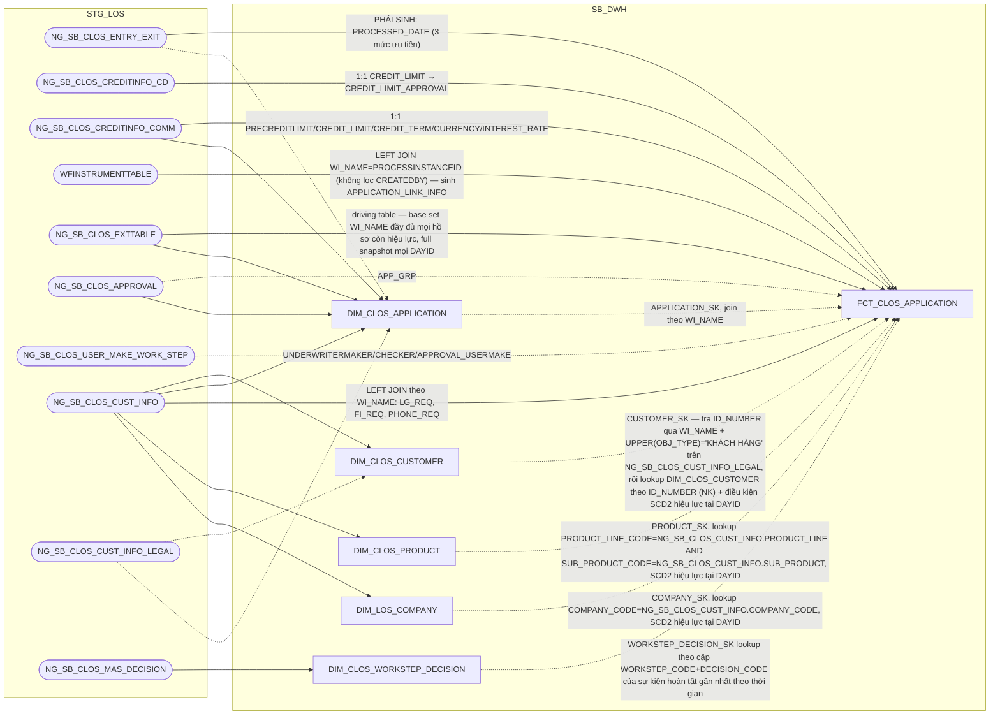
```mermaid
flowchart LR
    subgraph STG_LOS
        A(["NG_SB_CLOS_ENTRY_EXIT"])
        B(["NG_SB_CLOS_CREDITINFO_CD"])
        C(["NG_SB_CLOS_CREDITINFO_COMM"])
        D(["WFINSTRUMENTTABLE"])
        F(["NG_SB_CLOS_EXTTABLE"])
        G(["NG_SB_CLOS_APPROVAL"])
        H(["NG_SB_CLOS_USER_MAKE_WORK_STEP"])
        M(["NG_SB_CLOS_CUST_INFO"])
        ML(["NG_SB_CLOS_CUST_INFO_LEGAL"])
        MW(["NG_SB_CLOS_MAS_DECISION"])
    end
    subgraph SB_DWH
        K["DIM_CLOS_CUSTOMER"]
        WD["DIM_CLOS_WORKSTEP_DECISION"]
        PR["DIM_CLOS_PRODUCT"]
        OU["DIM_LOS_COMPANY"]
        AP["DIM_CLOS_APPLICATION"]
        E["FCT_CLOS_APPLICATION"]
    end
    A -->|"PHÁI SINH: PROCESSED_DATE (3 mức ưu tiên)"| E
    B -->|1:1 CREDIT_LIMIT → CREDIT_LIMIT_APPROVAL| E
    C -->|1:1 PRECREDITLIMIT/CREDIT_LIMIT/CREDIT_TERM/CURRENCY/INTEREST_RATE| E
    D -->|"LEFT JOIN WI_NAME=PROCESSINSTANCEID (không lọc CREATEDBY) — sinh APPLICATION_LINK_INFO"| E
    F -->|"driving table — base set WI_NAME đầy đủ mọi hồ sơ còn hiệu lực, full snapshot mọi DAYID"| E
    G -.->|"APP_GRP"| E
    H -.->|"UNDERWRITERMAKER/CHECKER/APPROVAL_USERMAKE"| E
    K -.->|"CUSTOMER_SK — tra ID_NUMBER qua WI_NAME + UPPER(OBJ_TYPE)='KHÁCH HÀNG' trên NG_SB_CLOS_CUST_INFO_LEGAL, rồi lookup DIM_CLOS_CUSTOMER theo ID_NUMBER (NK) + điều kiện SCD2 hiệu lực tại DAYID"| E
    M --> K
    ML -.-> K
    MW --> WD
    WD -.->|"WORKSTEP_DECISION_SK lookup theo cặp WORKSTEP_CODE+DECISION_CODE của sự kiện hoàn tất gần nhất theo thời gian"| E
    PR -.->|"PRODUCT_SK, lookup PRODUCT_LINE_CODE=NG_SB_CLOS_CUST_INFO.PRODUCT_LINE AND SUB_PRODUCT_CODE=NG_SB_CLOS_CUST_INFO.SUB_PRODUCT, SCD2 hiệu lực tại DAYID"| E
    OU -.->|"COMPANY_SK, lookup COMPANY_CODE=NG_SB_CLOS_CUST_INFO.COMPANY_CODE, SCD2 hiệu lực tại DAYID"| E
    F --> AP
    M --> AP
    ML -.-> AP
    G --> AP
    A -.-> AP
    C --> AP
    AP -.->|"APPLICATION_SK, join theo WI_NAME"| E
    M -->|"LEFT JOIN theo WI_NAME: LG_REQ, FI_REQ, PHONE_REQ"| E
    M --> PR
    M --> OU
```

### 1.3 Cấu trúc bảng

| STT | Tên cột | Kiểu dữ liệu | Bắt buộc | Độ lớn | Khóa | Mô tả | Báo cáo sử dụng | Tên chỉ tiêu trên báo cáo |
| --- | --- | --- | --- | --- | --- | --- | --- | --- |
| 1 | DAYID | DATE | Y |  | PK | Ngày dữ liệu, dạng số YYYYMMDD | Báo cáo CLOS APPLICATION (BC2) — một phần khóa chính Báo cáo SLA - TAT (BC5) — khóa chính | — |
| 2 | APPLICATION_SK | NUMBER | Y | 18 |  | Khóa tới DIM_CLOS_APPLICATION. Mặc định -1 nếu không khớp | Báo cáo CLOS APPLICATION (BC2) — khóa JOIN | — |
| 3 | WORKSTEP_DECISION_SK | NUMBER | Y | 18 |  | Khóa tới DIM_CLOS_WORKSTEP_DECISION (gộp từ LAST_WORKSTEP_SK+LAST_DECISION_SK) của sự kiện hoàn tất gần nhất, lookup theo cặp WORKSTEP_CODE+DECISION_CODE của sự kiện đó. Mặc định -1 — đổi tên từ LAST_WORKSTEP_DECISION_SK (review 2026-10-04, theo yêu cầu người dùng) | Báo cáo CLOS APPLICATION (BC2) — khóa JOIN, nguồn cho chỉ tiêu/trường LAST_WORKSTEP (Bước hồ sơ cuối, tính ở PDTD_DTM) và LAST_DECISION (Quyết định bước cuối) | LAST_DECISION (Quyết định bước cuối) |
| 4 | PRODUCT_SK | NUMBER | Y | 18 |  | Khóa tới DIM_CLOS_PRODUCT — lookup theo PRODUCT_LINE_CODE=NG_SB_CLOS_CUST_INFO.PRODUCT_LINE AND SUB_PRODUCT_CODE=NG_SB_CLOS_CUST_INFO.SUB_PRODUCT, điều kiện SCD2 hiệu lực tại DAYID. Mặc định -1 nếu không khớp | Báo cáo CLOS APPLICATION (BC2) — khóa JOIN tới PRODUCT_LINE/SUB_PRODUCT Báo cáo SLA - TAT (BC5) — khóa JOIN điều kiện SLA_DE Báo cáo KPI (BC9) — điều kiện lọc STREAM khi tính SLGN_CLOS | — |
| 5 | COMPANY_SK | NUMBER | Y | 18 |  | Khóa tới DIM_LOS_COMPANY — lookup theo COMPANY_CODE=NG_SB_CLOS_CUST_INFO.COMPANY_CODE, điều kiện SCD2 hiệu lực tại DAYID. Mặc định -1 nếu không khớp | Báo cáo CLOS APPLICATION (BC2) — khóa JOIN tới BRANCH_CODE/COMPANY_CODE/COMPANY_NAME | — |
| 6 | CUSTOMER_SK | NUMBER | Y | 18 |  | Khóa tới DIM_CLOS_CUSTOMER (NK=ID_NUMBER, vì DIM_CLOS_CUSTOMER grain 1 dòng/khách hàng) — nguồn: lấy NG_SB_CLOS_CUST_INFO_LEGAL.ID_NUMBER, LEFT JOIN theo WI_NAME (của chính dòng đang nạp) + UPPER(OBJ_TYPE)='KHÁCH HÀNG', rồi lookup DIM_CLOS_CUSTOMER.DIMENSION_KEY theo ID_NUMBER (NK) + điều kiện SCD2 hiệu lực tại DAYID. Quan hệ N:1 (nhiều hồ sơ/DAYID của cùng khách hàng có thể trỏ cùng 1 CUSTOMER_SK). Mặc định -1 nếu không khớp. Đây là chân khách hàng LOS — khác T24_CUSTOMER_SK | Báo cáo CLOS APPLICATION (BC2) — khóa JOIN tới ZONE (DIM_CLOS_CUSTOMER.ZONE) | — |
| 7 | WI_NAME | VARCHAR2 | Y | 100 | PK | Mã hồ sơ tín dụng CLOS — nguồn NG_SB_CLOS_EXTTABLE.WI_NAME (direct, driving table)| Báo cáo CLOS APPLICATION (BC2) — hiển thị trực tiếp, khóa chính Báo cáo SLA - TAT (BC5) — khóa chính | WINAME (Mã hồ sơ) |
| 8 | PROCESSED_DATE | DATE | N |  |  | Ngày xử lý chung của hồ sơ theo 3 mức ưu tiên (phê duyệt cuối / hủy / hoàn tất gần nhất) — nguồn NG_SB_CLOS_ENTRY_EXIT, COALESCE theo thứ tự: (1) MAX(EXITDATE) tại WORKSTEP IN ('CreditCommittee','CreditApproval') AND DECISION đã hoàn tất phê duyệt (Submit/Reject/Send To HOSupport/Send To PostSanction/Submit To DisbursementMaker); (2) NVL(EXITDATE,ENTRYDATE) tại WORKSTEP='CancelRevoke'; (3) EXITDATE của sự kiện hoàn tất gần nhất | Báo cáo CLOS APPLICATION (BC2) — hiển thị trực tiếp Báo cáo KPI (BC9) — nguồn cho AGG_LOS_KPI_APPLICATION.PROCESSED_DATE, mốc xếp hồ sơ vào đúng DAYID khi SUM/COUNT lên grain ngày | PROCESSED_DATE (Ngày dữ liệu báo cáo) |
| 9 | PROPOSED_AMT | NUMBER | N | 20,2 |  | Số tiền đề xuất — nguồn NG_SB_CLOS_CREDITINFO_COMM.PRECREDITLIMIT | Báo cáo CLOS APPLICATION (BC2) — hiển thị trực tiếp | ST_YEUCAU (Số tiền đề xuất vay) |
| 10 | CREDIT_LIMIT_APPROVAL | NUMBER | N | 20,2 |  | Hạn mức do chuyên gia phê duyệt — nguồn NG_SB_CLOS_CREDITINFO_CD.CREDIT_LIMIT | Báo cáo CLOS APPLICATION (BC2) — hiển thị trực tiếp | ST_PHEDUYET (Số tiền phê duyệt chính thức) |
| 11 | CREDIT_LIMIT_COMMITTEE | NUMBER | N | 20,2 |  | Hạn mức do hội đồng phê duyệt — nguồn NG_SB_CLOS_CREDITINFO_COMM.CREDIT_LIMIT | Báo cáo CLOS APPLICATION (BC2) — hiển thị trực tiếp Báo cáo Thông tin phê duyệt (BC3) — nguồn cho chỉ tiêu/trường CREDIT_LIMIT (đặt bản dư thừa có chủ đích trên DIM_CLOS_APPLICATION để BC3 lookup thẳng qua APPLICATION_SK) | CREDIT_LIMITS (Hạn mức cấp) |
| 12 | APPROVED_AMT_FINAL | NUMBER | N | 20,2 |  | Hạn mức phê duyệt cuối cùng — nguồn NG_SB_CLOS_CREDITINFO_COMM.CREDIT_LIMIT, map thẳng 1 nguồn | Báo cáo Thông tin phê duyệt (BC3) — CREDIT_LIMIT (giá trị hạn mức phê duyệt cuối theo đúng công thức SRS BC3) | CREDIT_LIMIT (Số tiền phê duyệt) |
| 13 | APPROVED_TERM | NUMBER | N | 5 |  | Kỳ hạn phê duyệt — nguồn NG_SB_CLOS_CREDITINFO_COMM.CREDIT_TERM | Báo cáo CLOS APPLICATION (BC2) — hiển thị trực tiếp | CREDIT_TERM (Thời hạn cấp tín dụng) |
| 14 | INTEREST_RATE_PCT | NUMBER | N | 8,4 |  | Lãi suất phê duyệt (%), chỉ nhận khi nguồn là số — nguồn NG_SB_CLOS_CREDITINFO_COMM.INTEREST_RATE, ép kiểu số (TO_NUMBER), NULL nếu không phải số hợp lệ | Báo cáo CLOS APPLICATION (BC2) — hiển thị trực tiếp (chọn thay cho INTEREST_RATE_DESC) | INTEREST_RATE (Lãi suất phê duyệt) |
| 15 | CURRENCY_CODE | VARCHAR2 | N | 10 |  | Loại tiền — nguồn NG_SB_CLOS_CREDITINFO_COMM.CURRENCY | Báo cáo CLOS APPLICATION (BC2) — hiển thị trực tiếp | CURRENCY (Loại tiền tệ áp dụng) |
| 16 | APPLICATION_LINK_INFO | VARCHAR2 | N | 200 |  | Thông tin liên kết hồ sơ — cột generic của WFINSTRUMENTTABLE — LEFT JOIN riêng theo WI_NAME=PROCESSINSTANCEID (không lọc CREATEDBY) — đổi tên từ VAR_STR12 (review 2026-10-04, theo yêu cầu người dùng) | Báo cáo KPI (BC9) — điều kiện lọc IS NOT NULL cho SLHS_CLOS_DAY/SLGN_CLOS_DAY (AGG_LOS_KPI_YTD_DAILY) | — |
| 17 | UNDERWRITERMAKER_USERMAKE | VARCHAR2 | N | 100 |  | COALESCE(CASE WHEN NG_SB_CLOS_USER_MAKE_WORK_STEP.WORK_STEP='UnderwriterMaker' THEN NG_SB_CLOS_USER_MAKE_WORK_STEP.USER_MAKE END, NG_SB_CLOS_EXTTABLE.UWMAKERUSER) — LEFT JOIN NG_SB_CLOS_USER_MAKE_WORK_STEP theo WI_NAME + WORK_STEP='UnderwriterMaker' | Báo cáo CLOS APPLICATION (BC2) — BC2 map thẳng vào cột này (không qua cột trung gian nào khác)| — |
| 18 | UNDERWRITERCHECKER_USERMAKE | VARCHAR2 | N | 100 |  | COALESCE(CASE WHEN NG_SB_CLOS_USER_MAKE_WORK_STEP.WORK_STEP='UnderwriterChecker' THEN NG_SB_CLOS_USER_MAKE_WORK_STEP.USER_MAKE END, NG_SB_CLOS_EXTTABLE.UWCHKRUSER) — LEFT JOIN NG_SB_CLOS_USER_MAKE_WORK_STEP theo WI_NAME + WORK_STEP='UnderwriterChecker' | Báo cáo CLOS APPLICATION (BC2) — BC2 map thẳng vào cột này.| — |
| 19 | APPROVAL_USERMAKE | VARCHAR2 | N | 100 |  | PHÁI SINH, COALESCE(NG_SB_CLOS_USER_MAKE_WORK_STEP.USER_MAKE, CASE NG_SB_CLOS_APPROVAL.APP_GRP WHEN 'A1' THEN 'long.lq' WHEN 'CC' THEN 'UBTD' WHEN 'BOD' THEN 'HDQT' END) — LEFT JOIN NG_SB_CLOS_USER_MAKE_WORK_STEP theo WI_NAME (không lọc WORK_STEP), LEFT JOIN NG_SB_CLOS_APPROVAL theo WI_NAME. Khác RLOS: có hằng số hardcode theo APP_GRP thay vì 2 cột fallback trên EXTTABLE | Báo cáo CLOS APPLICATION (BC2) — BC2 map thẳng vào cột này.| — |
| 20 | LG_REQ | VARCHAR2 | N | 10 |  | Cờ yêu cầu bảo lãnh (Letter of Guarantee) phát sinh theo hồ sơ — nguồn NG_SB_CLOS_CUST_INFO.LG_REQ (boolean true/false)| — | Thiết kế dư thừa |
| 21 | FI_REQ | VARCHAR2 | N | 10 |  | Cờ yêu cầu — nguồn NG_SB_CLOS_CUST_INFO.FI_REQ (boolean true/false)| — | Thiết kế dư thừa |
| 22 | PHONE_REQ | VARCHAR2 | N | 10 |  | Cờ yêu cầu xác minh điện thoại — nguồn NG_SB_CLOS_CUST_INFO.PHONE_REQ (boolean true/false)| — | Thiết kế dư thừa |

## 2. FCT_CLOS_COLLATERAL

### 2.1 Mục đích thiết kế
- **Ý nghĩa bảng:** bảng FACT chi tiết, lưu ảnh số liệu thay
  đổi theo ngày của từng tài sản bảo đảm thuộc hồ sơ CLOS. Không tách
  chiều tài sản riêng — toàn bộ thuộc tính lưu thẳng trên fact vì nguồn
  NG_SB_CLOS_COLL_CD không khai khóa CDC, nên không đủ điều kiện tách
  DIM theo SCD2 (xem giải thích chi tiết ở phần lineage).
- **Khóa nghiệp vụ (BK):** composite toàn bộ cột không phải CLOB của
  `NG_SB_CLOS_COLL_CD` (loại trừ `COLL_MGMT_APP`, `DESCRIPTION`)
  + tên bảng nguồn — hash vào cột `COLLATERAL_BK`
- **Khóa chính của bảng (PK):** DAYID, COLLATERAL_BK.
- **Độ chi tiết (grain):** 1 dòng = 1 tài sản bảo đảm của 1 hồ sơ x 1 ngày
  dữ liệu (ảnh chụp đầy đủ theo ngày).
- **Phục vụ báo cáo:**
  - Báo cáo RLOS APPLICATION (BC1) — qua đối xứng RLOS, không áp dụng trực tiếp nhánh CLOS
  - Báo cáo CLOS APPLICATION (BC2)
  - Báo cáo Thông tin phê duyệt (BC3)
  - Báo cáo KPI (BC9)

### 2.2 Sơ đồ lineage

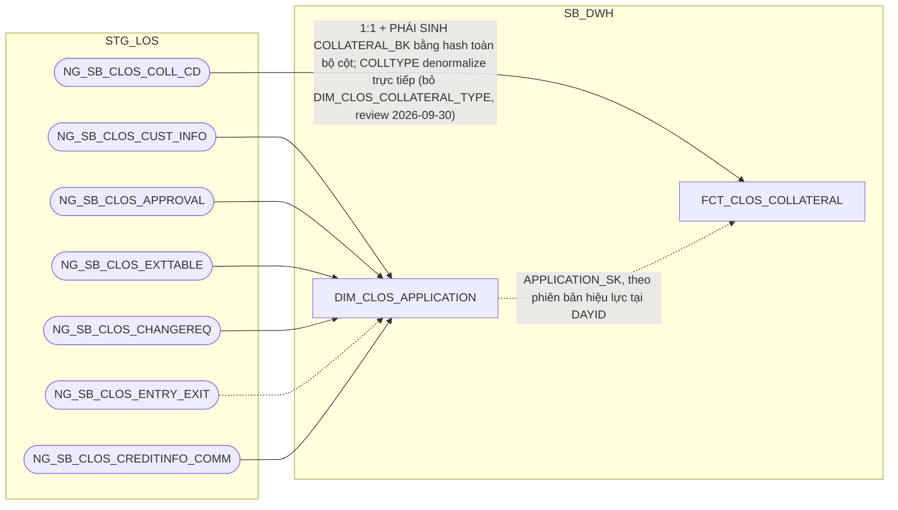
```mermaid
flowchart LR
    subgraph STG_LOS
        A(["NG_SB_CLOS_COLL_CD"])
        H(["NG_SB_CLOS_CUST_INFO"])
        I(["NG_SB_CLOS_APPROVAL"])
        J(["NG_SB_CLOS_EXTTABLE"])
        K1(["NG_SB_CLOS_CHANGEREQ"])
        L(["NG_SB_CLOS_ENTRY_EXIT"])
        N(["NG_SB_CLOS_CREDITINFO_COMM"])
    end
    subgraph SB_DWH
        D["DIM_CLOS_APPLICATION"]
        C["FCT_CLOS_COLLATERAL"]
    end
    A -->|"1:1 + PHÁI SINH COLLATERAL_BK bằng hash toàn bộ cột; COLLTYPE denormalize trực tiếp (bỏ DIM_CLOS_COLLATERAL_TYPE, review 2026-09-30)"| C
    D -.->|APPLICATION_SK, theo phiên bản hiệu lực tại DAYID| C
    H --> D
    I --> D
    J --> D
    K1 --> D
    L -.-> D
    N --> D
```

### 2.3 Cấu trúc bảng

| STT | Tên cột | Kiểu dữ liệu | Bắt buộc | Độ lớn | Khóa | Mô tả | Báo cáo sử dụng | Tên chỉ tiêu trên báo cáo |
| --- | --- | --- | --- | --- | --- | --- | --- | --- |
| 1 | DAYID | DATE | Y |  | PK | Ngày dữ liệu, dạng số YYYYMMDD | — (cột kỹ thuật, một phần khóa chính) | — |
| 2 | COLLATERAL_BK | VARCHAR2 | Y | 64 | PK | Khóa nghiệp vụ của dòng tài sản — hash SHA256 trên toàn bộ cột không phải CLOB của NG_SB_CLOS_COLL_CD (loại trừ COLL_MGMT_APP, DESCRIPTION)| — (cột kỹ thuật, một phần khóa chính) | — |
| 3 | APPLICATION_SK | NUMBER | Y | 18 |  | Khóa tới DIM_CLOS_APPLICATION theo phiên bản hiệu lực tại DAYID. Mặc định -1 nếu không khớp | — (khóa liên kết nội bộ, không xuất trực tiếp lên báo cáo) | — |
| 4 | COLLATERAL_TYPE_CODE | VARCHAR2 | N | 500 |  | Loại tài sản bảo đảm — DENORMALIZE TRỰC TIẾP, nguồn NG_SB_CLOS_COLL_CD.COLLTYPE (text tự do tiếng Việt không dấu) | Báo cáo CLOS APPLICATION (BC2) — nguồn cho 9 cờ TSDB_NHOM_0/TSDB_BDS/TSDB_PTVT/TSDB_MMTB/TSDB_KPT/TSDB_HTK/TSDB_TIN_CHAP/TIN_CHAP_TQD/TSDB_CP_TP (so sánh CASE trực tiếp giá trị COLLATERAL_TYPE_CODE) Báo cáo Thông tin phê duyệt (BC3) — nguồn cho TYPES_OF_COLLATERALS | TSDB_NHOM_0/TSDB_BDS/TSDB_PTVT/TSDB_MMTB/TSDB_KPT/TSDB_HTK/TSDB_TIN_CHAP/TIN_CHAP_TQD/TSDB_CP_TP (các cờ TSBĐ theo nhóm — BC2); TYPES_OF_COLLATERALS (Loại TSBĐ — BC3) |
| 5 | WI_NAME | VARCHAR2 | Y | 100 |  | Mã hồ sơ tín dụng CLOS — nguồn NG_SB_CLOS_COLL_CD.WI_NAME (direct, cùng driving table với COLLATERAL_BK/COLLATERAL_TYPE_CODE/DESCRIPTION...)| Báo cáo Thông tin phê duyệt (BC3) — khóa JOIN để lấy chi tiết tài sản theo hồ sơ | WINAME (Mã hồ sơ) |
| 6 | DESCRIPTION | VARCHAR2 | N | 4000 |  | Diễn giải tài sản bảo đảm — nguồn NG_SB_CLOS_COLL_CD.DESCRIPTION (CLOB) | Báo cáo Thông tin phê duyệt (BC3) — hiển thị trực tiếp | DESCRIPTION (Mô tả TSBĐ) |
| 7 | OWNER_NAME | VARCHAR2 | N | 200 |  | Chủ sở hữu tài sản — nguồn NG_SB_CLOS_COLL_CD.COLL_OWNER | Báo cáo Thông tin phê duyệt (BC3) — hiển thị trực tiếp | OWNER (Chủ TSBĐ) |
| 8 | COLL_MGMT_METHOD | VARCHAR2 | N | 4000 |  | Phương thức quản lý tài sản — nguồn NG_SB_CLOS_COLL_CD.COLL_MGMT_APP. Người dùng thường không nhập trường này trên live nên phần lớn sẽ rỗng, nhưng BC3 vẫn liệt kê nên phải nạp | Báo cáo Thông tin phê duyệt (BC3) — hiển thị trực tiếp | COLLATERA_MANAGEMENT (Phương thức quản lý TSBĐ) |
| 9 | APPRAISED_VALUE | NUMBER | N | 20,2 |  | Giá trị định giá của tài sản — nguồn NG_SB_CLOS_COLL_CD.APPRAISED_VAL_FIG. Ép kiểu số từ text theo định dạng Việt Nam, DEFAULT NULL ON CONVERSION ERROR | Báo cáo Thông tin phê duyệt (BC3) — hiển thị trực tiếp | APPRAISED_VALUE (Giá trị định giá) |
| 10 | LOAN_RATE_LTV | NUMBER | N | 5,2 |  | Tỷ lệ cho vay trên giá trị tài sản — nguồn NG_SB_CLOS_COLL_CD.LTV. Cùng quy tắc ép kiểu, đơn vị phần trăm | Báo cáo Thông tin phê duyệt (BC3) — hiển thị trực tiếp | LTV (Tỷ lệ cho vay của TSBĐ) |

## 3. FCT_CLOS_EXCEPTION

### 3.1 Mục đích thiết kế
- **Ý nghĩa bảng:** bảng FACT chi tiết, lưu mỗi lần một lý do (ngoại lệ)
  được nêu ra trên hồ sơ CLOS trong quá trình xử lý — bao gồm cả lần nêu
  lý do (Raise) lẫn lần đã làm rõ/bổ sung (Clear).
- **Khóa nghiệp vụ (BK):** composite `WI_NAME`+`EXCEPTION_CATEGORY`+
  `RAISED_BY`+`RAISED_DATE_TIME` — hash vào cột `EXCEPTION_BK`
- **Khóa chính của bảng (PK):** DAYID, EXCEPTION_BK — gộp 4 cột PK tự
  nhiên cũ (WI_NAME, EXCEPTION_CATEGORY, RAISED_BY, RAISED_DATE_TIME)
  thành 1 khóa hash duy nhất: `STANDARD_HASH(WI_NAME||'~'||
  EXCEPTION_CATEGORY||'~'||RAISED_BY||'~'||TO_CHAR(RAISED_DATE_TIME,
  'YYYY-MM-DD HH24:MI:SS.FF6'), 'SHA256')`.
- **Độ chi tiết (grain):** 1 dòng = 1 lần ghi nhận lý do của 1 hồ sơ,
  trong ảnh chụp của ngày DAYID. Một hồ sơ có thể phát sinh cùng 1 loại lý
  do nhiều lần, bởi nhiều người, ở nhiều thời điểm khác nhau.
- **Phục vụ báo cáo:**
  - Báo cáo EXCEPTION - FTR (BC7)
  - Báo cáo RETURN (BC8)

### 3.2 Sơ đồ lineage

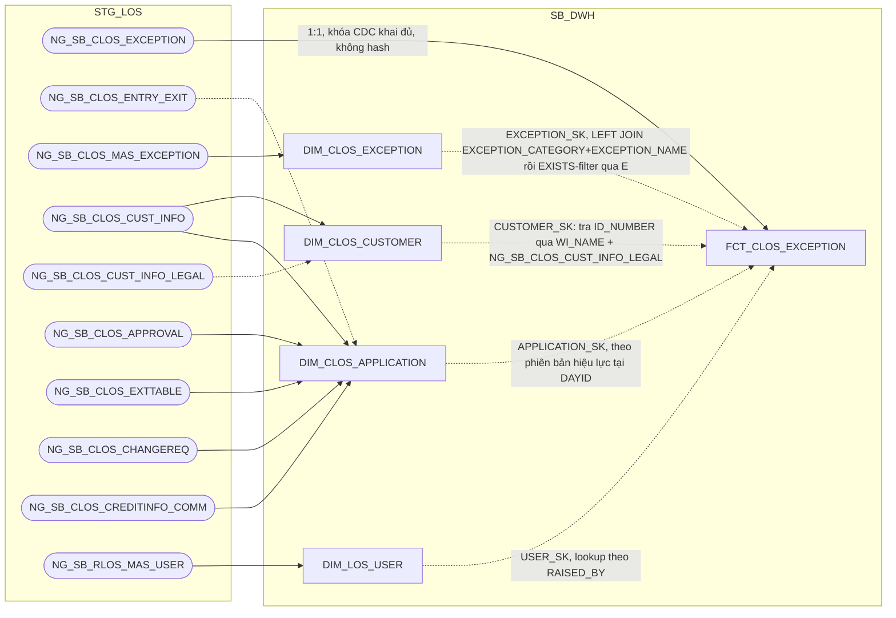
```mermaid
flowchart LR
    subgraph STG_LOS
        A(["NG_SB_CLOS_EXCEPTION"])
        E(["NG_SB_CLOS_ENTRY_EXIT"])
        R(["NG_SB_CLOS_MAS_EXCEPTION"])
        H(["NG_SB_CLOS_CUST_INFO"])
        L(["NG_SB_CLOS_CUST_INFO_LEGAL"])
        I(["NG_SB_CLOS_APPROVAL"])
        J(["NG_SB_CLOS_EXTTABLE"])
        K1(["NG_SB_CLOS_CHANGEREQ"])
        N(["NG_SB_CLOS_CREDITINFO_COMM"])
        U(["NG_SB_RLOS_MAS_USER"])
    end
    subgraph SB_DWH
        B["DIM_CLOS_EXCEPTION"]
        D["DIM_CLOS_APPLICATION"]
        KC["DIM_CLOS_CUSTOMER"]
        F["DIM_LOS_USER"]
        C["FCT_CLOS_EXCEPTION"]
    end
    A -->|1:1, khóa CDC khai đủ, không hash| C
    B -.->|EXCEPTION_SK, LEFT JOIN EXCEPTION_CATEGORY+EXCEPTION_NAME rồi EXISTS-filter qua E| C
    D -.->|APPLICATION_SK, theo phiên bản hiệu lực tại DAYID| C
    F -.->|USER_SK, lookup theo RAISED_BY| C
    KC -.->|"CUSTOMER_SK: tra ID_NUMBER qua WI_NAME + NG_SB_CLOS_CUST_INFO_LEGAL"| C
    R --> B
    H --> D
    I --> D
    J --> D
    K1 --> D
    E -.-> D
    N --> D
    U --> F
    H --> KC
    L -.-> KC
```

### 3.3 Cấu trúc bảng

| STT | Tên cột | Kiểu dữ liệu | Bắt buộc | Độ lớn | Khóa | Mô tả | Báo cáo sử dụng | Tên chỉ tiêu trên báo cáo |
| --- | --- | --- | --- | --- | --- | --- | --- | --- |
| 1 | DAYID | DATE | Y |  | PK | Ngày dữ liệu, dạng số YYYYMMDD | — (cột kỹ thuật) | — |
| 2 | EXCEPTION_BK | VARCHAR2 | Y | 64 | PK | Khóa nghiệp vụ của dòng ngoại lệ — PHÁI SINH: STANDARD_HASH(WI_NAME \|\| '~' \|\| EXCEPTION_CATEGORY \|\| '~' \|\| RAISED_BY \|\| '~' \|\| TO_CHAR(RAISED_DATE_TIME,'YYYY-MM-DD HH24:MI:SS.FF6'), 'SHA256') — gộp 4 cột PK tự nhiên cũ (WI_NAME, EXCEPTION_CATEGORY, RAISED_BY, RAISED_DATE_TIME) thành 1 khóa đơn | — (cột kỹ thuật, một phần khóa chính) | — |
| 3 | APPLICATION_SK | NUMBER | Y | 18 |  | Khóa tới DIM_CLOS_APPLICATION theo phiên bản hiệu lực tại DAYID. Mặc định -1 | Báo cáo EXCEPTION - FTR (BC7) — khóa JOIN sang DIM_CLOS_APPLICATION | — |
| 4 | EXCEPTION_SK | NUMBER | Y | 18 |  | Khóa tới DIM_CLOS_EXCEPTION — PHÁI SINH 2 bước đúng SRS BC7 (không phải lookup 1 cột): (1) LEFT JOIN theo EXCEPTION_CATEGORY + EXCEPTION_NAME, có thể khớp nhiều dòng DIM cùng category+name khác ACTIVITYNAME/DECISION_CODE; (2) lọc còn đúng 1 dòng bằng điều kiện tồn tại bản ghi NG_SB_CLOS_ENTRY_EXIT (WI_NAME khớp + WORKSTEP=ACTIVITYNAME + DECISION=DECISION_CODE của dòng DIM đó) — chỉ giữ tổ hợp đã thực sự xảy ra trong lịch sử xử lý hồ sơ. Mặc định -1 nếu không còn dòng nào khớp | Báo cáo EXCEPTION - FTR (BC7) — khóa JOIN sang DIM_CLOS_EXCEPTION | — |
| 5 | USER_SK | NUMBER | Y | 18 |  | Khóa tới DIM_LOS_USER, người nêu lý do. Mặc định -1. ĐÚNG GRAIN của bảng — 1 lần ghi nhận lý do có đúng 1 người nêu | — (cột kỹ thuật, khóa JOIN nội bộ — BC7 dùng cột RAISED_BY gốc để hiển thị, khớp bản RLOS) | — |
| 6 | CUSTOMER_SK | NUMBER | Y | 18 |  | Khóa tới DIM_CLOS_CUSTOMER: tra ID_NUMBER qua WI_NAME + UPPER(OBJ_TYPE)='KHÁCH HÀNG' trên NG_SB_CLOS_CUST_INFO_LEGAL, rồi lookup DIM_CLOS_CUSTOMER theo ID_NUMBER (NK) + điều kiện SCD2 hiệu lực tại DAYID. Mặc định -1 nếu không khớp | — (cột kỹ thuật, khóa JOIN nội bộ phục vụ PDTD_DTM tra CUST_GROUP để tính CHECK_FTR) | — |
| 7 | WI_NAME | VARCHAR2 | Y | 100 |  | Mã hồ sơ tín dụng CLOS — nguồn NG_SB_CLOS_EXCEPTION.WI_NAME| Báo cáo EXCEPTION - FTR (BC7) — khóa JOIN Báo cáo RETURN (BC8) — khóa JOIN | WINAME (Mã hồ sơ) |
| 8 | EXCEPTION_CATEGORY | VARCHAR2 | N | 500 |  | Phân nhóm nội dung cần làm rõ — nguồn NG_SB_CLOS_EXCEPTION.EXCEPTION_CATEGORY | Báo cáo EXCEPTION - FTR (BC7) — hiển thị trực tiếp | EXCEPTION_CATEGORY (Nhóm nội dung ngoại lệ) |
| 9 | RAISED_BY | VARCHAR2 | N | 100 |  | Người nêu nội dung cần làm rõ — nguồn NG_SB_CLOS_EXCEPTION.RAISED_BY. Cột USER_SK bên cạnh giữ khóa tới DIM | Báo cáo EXCEPTION - FTR (BC7) — hiển thị trực tiếp | RAISED_BY (Người nêu) |
| 10 | RAISED_DATE_TIME | TIMESTAMP | N |  |  | Thời điểm nêu nội dung cần làm rõ — nguồn NG_SB_CLOS_EXCEPTION.RAISED_DATE_TIME | Báo cáo EXCEPTION - FTR (BC7) — hiển thị trực tiếp, đồng thời là nguồn tính PROCESSED_DATE (TRUNC ở tầng report) | RAISED_DATE_TIME (Thời điểm nêu); nguồn cho chỉ tiêu/trường PROCESSED_DATE (Ngày dữ liệu, BC7) |
| 11 | EXCEPTION_NAME | VARCHAR2 | N | 500 |  | Tên nội dung cần làm rõ — nguồn NG_SB_CLOS_EXCEPTION.EXCEPTION_NAME | Báo cáo EXCEPTION - FTR (BC7) — hiển thị trực tiếp | EXCEPTION_NAME (Tên nội dung ngoại lệ) |
| 12 | EXCEPTION_REMARKS | VARCHAR2 | N | 4000 |  | Ghi chú của nội dung cần làm rõ — nguồn NG_SB_CLOS_EXCEPTION.EXCEPTION_REMARKS | Báo cáo EXCEPTION - FTR (BC7) — hiển thị trực tiếp | EXCEPTION_REMARKS (Ghi chú ngoại lệ) |
| 13 | RCTYPE | VARCHAR2 | N | 20 |  | Loại ghi nhận, Raise (nêu lý do khi trả về) hay Clear (đã làm rõ/bổ sung và đẩy lại) — nguồn NG_SB_CLOS_EXCEPTION.RCTYPE | Báo cáo EXCEPTION - FTR (BC7) — hiển thị trực tiếp | RCTYPE (Raise/Clear) |

## 4. FCT_CLOS_DEVIATION

### 4.1 Mục đích thiết kế
- **Ý nghĩa bảng:** bảng FACT chi tiết, lưu ảnh số liệu thay đổi theo ngày
  của từng ngoại lệ chính sách (deviation) phát sinh trên hồ sơ CLOS. Không
  tách chiều riêng — toàn bộ thuộc tính lưu thẳng trên fact vì nguồn không
  khai khóa CDC.
- **Khóa nghiệp vụ (BK):** composite toàn bộ cột không phải CLOB của
  `NG_SB_CLOS_CONDITON_CDGRID` (loại trừ `AS_REGULAR`, `DEV_PROPOSAL`)— hash vào cột `DEVIATION_BK`
- **Khóa chính của bảng (PK):** DAYID, DEVIATION_BK.
- **Độ chi tiết (grain):** 1 dòng = 1 ngoại lệ chính sách trong ảnh chụp
  của ngày DAYID (ảnh chụp đầy đủ mỗi ngày, không phải ghi thêm khi có
  thay đổi).
- **Phục vụ báo cáo:**
  - Báo cáo NGOẠI LỆ (BC6)
  - Báo cáo KPI (BC9) — đếm số dòng theo WI_NAME để tính DEVIATION_G2/DEVIATION_G3

### 4.2 Sơ đồ lineage

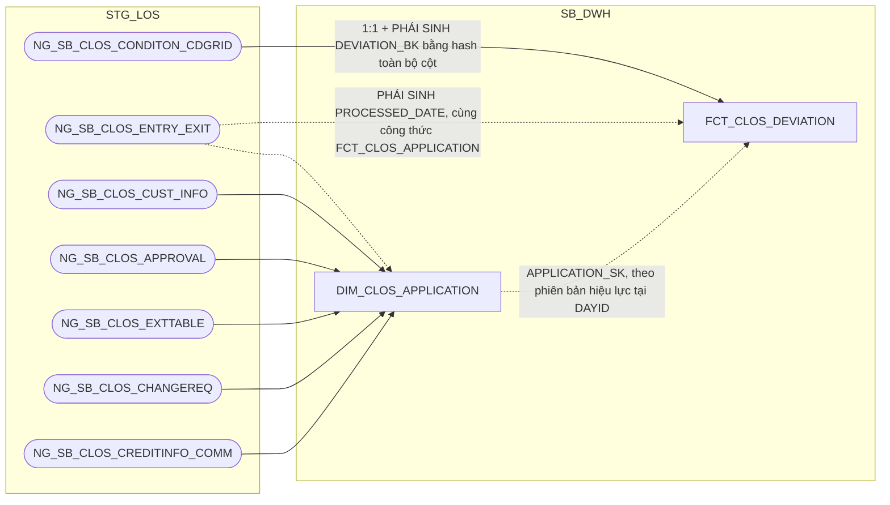
```mermaid
flowchart LR
    subgraph STG_LOS
        A(["NG_SB_CLOS_CONDITON_CDGRID"])
        E(["NG_SB_CLOS_ENTRY_EXIT"])
        H(["NG_SB_CLOS_CUST_INFO"])
        I(["NG_SB_CLOS_APPROVAL"])
        J(["NG_SB_CLOS_EXTTABLE"])
        K(["NG_SB_CLOS_CHANGEREQ"])
        L(["NG_SB_CLOS_CREDITINFO_COMM"])
    end
    subgraph SB_DWH
        D["DIM_CLOS_APPLICATION"]
        C["FCT_CLOS_DEVIATION"]
    end
    A -->|1:1 + PHÁI SINH DEVIATION_BK bằng hash toàn bộ cột| C
    D -.->|APPLICATION_SK, theo phiên bản hiệu lực tại DAYID| C
    E -.->|PHÁI SINH PROCESSED_DATE, cùng công thức FCT_CLOS_APPLICATION| C
    H --> D
    I --> D
    J --> D
    K --> D
    E -.-> D
    L --> D
```

### 4.3 Cấu trúc bảng

| STT | Tên cột | Kiểu dữ liệu | Bắt buộc | Độ lớn | Khóa | Mô tả | Báo cáo sử dụng | Tên chỉ tiêu trên báo cáo |
| --- | --- | --- | --- | --- | --- | --- | --- | --- |
| 1 | DAYID | DATE | Y |  | PK | Ngày dữ liệu, dạng số YYYYMMDD | Báo cáo KPI (BC9) — điều kiện lọc (chỉ lấy DAYID mới nhất của từng WI_NAME) khi đếm DEVIATION_G2/DEVIATION_G3 trên AGG_LOS_KPI_APPLICATION | — |
| 2 | DEVIATION_BK | VARCHAR2 | Y | 64 | PK | Khóa nghiệp vụ của dòng ngoại lệ — PHÁI SINH: STANDARD_HASH(..., 'SHA256') trên toàn bộ cột không phải CLOB của NG_SB_CLOS_CONDITON_CDGRID (loại trừ AS_REGULAR, DEV_PROPOSAL). Chuẩn hóa trước khi hash: TRIM chuỗi, NULL quy về '<NULL>', DATE/NUMBER dùng format cố định| Nguồn cho chỉ tiêu/trường DEVIATION_G2/DEVIATION_G3 (điều kiện đếm số dòng phân biệt, BC9) | — |
| 3 | APPLICATION_SK | NUMBER | Y | 18 |  | Khóa tới DIM_CLOS_APPLICATION theo phiên bản hiệu lực tại DAYID. Mặc định -1 nếu không khớp | Báo cáo NGOẠI LỆ (BC6) — khóa JOIN sang DIM_CLOS_APPLICATION | — |
| 4 | WI_NAME | VARCHAR2 | Y | 100 |  | Mã hồ sơ tín dụng CLOS — nguồn NG_SB_CLOS_CONDITON_CDGRID.WI_NAME (direct, driving table) | Báo cáo NGOẠI LỆ (BC6) — khóa JOIN Báo cáo KPI (BC9) — khóa GROUP BY khi đếm DEVIATION_G2/DEVIATION_G3 trên AGG_LOS_KPI_APPLICATION | WINAME (Mã hồ sơ) |
| 5 | DEVIATION_TYPE_CODE | VARCHAR2 | N | 300 |  | Mã loại lệch chính sách — nguồn NG_SB_CLOS_CONDITON_CDGRID.DEVIATION_TYPE | Báo cáo NGOẠI LỆ (BC6) — hiển thị trực tiếp | DEVIATION_TYPE (Loại ngoại lệ) |
| 6 | DEV_PROPOSAL | VARCHAR2 | N | 4000 |  | Đề xuất xử lý lệch chính sách — nguồn NG_SB_CLOS_CONDITON_CDGRID.DEV_PROPOSAL | Báo cáo NGOẠI LỆ (BC6) — hiển thị trực tiếp | DEV_PROPOSAL (Nội dung ngoại lệ) |
| 7 | AS_REGULAR | VARCHAR2 | N | 4000 |  | Quy định chuẩn liên quan tới lệch chính sách — nguồn NG_SB_CLOS_CONDITON_CDGRID.AS_REGULAR. Không báo cáo nào hiển thị trực tiếp; BA từng đề xuất đưa vào khóa nghiệp vụ nhưng bị từ chối vì là trường nhập tùy biến (free-text, xem CLOS - Metadata.xlsx) — vẫn phải nạp vì là thuộc tính gốc của bảng nguồn | Không có report sử dụng — giữ có chủ đích (thuộc tính gốc bắt buộc nạp để bảo toàn dữ liệu nguồn, không phải cột thiết kế sai/thừa) | — |
| 8 | PROCESSED_DATE | DATE | N |  |  | Ngày xử lý của hồ sơ — PHÁI SINH: tính độc lập từ NG_SB_CLOS_ENTRY_EXIT theo cùng công thức 3 mức ưu tiên (ngày phê duyệt cuối/ngày hủy/ngày thoát bước gần nhất) đã dùng cho FCT_CLOS_APPLICATION.PROCESSED_DATE — không JOIN sang FCT_CLOS_APPLICATION để tránh tham chiếu chéo giữa 2 bảng | Báo cáo NGOẠI LỆ (BC6) — hiển thị trực tiếp | PROCESSED_DATE (Ngày dữ liệu báo cáo) |

## 5. FCT_CLOS_WORKSTEP_EVENT

### 5.1 Mục đích thiết kế
- **Ý nghĩa bảng:** bảng FACT nhật ký workflow mức nguyên tử của hệ CLOS,
  giữ hết mọi sự kiện "vào bước — ra bước" của hồ sơ (không bao giờ xóa,
  không chép lại nhật ký mỗi ngày). Là nguồn duy nhất để tính mọi mốc thời
  gian, TAT, số lần trả về và người xử lý theo từng bước, nhánh CLOS.
- **Khóa nghiệp vụ (BK):** composite `WI_NAME`+`WORKSTEP_CODE`+
  `ENTRYDATE` — hash vào cột `WORKSTEP_EVENT_BK`
- **Khóa chính của bảng (PK):** DAYID, WORKSTEP_EVENT_BK — gộp 3 cột PK
  tự nhiên cũ (WI_NAME, WORKSTEP_CODE, ENTRYDATE) thành 1 khóa hash duy
  nhất: `STANDARD_HASH(WI_NAME||'~'||WORKSTEP_CODE||'~'||
  TO_CHAR(ENTRYDATE,'YYYY-MM-DD HH24:MI:SS.FF6'),
  'SHA256')`.
- **Độ chi tiết (grain):** 1 dòng = 1 phiên bản của 1 logical event (hồ sơ
  x workstep x lần vào bước) — hồ sơ quay lại cùng 1 bước nhiều lần thì
  mỗi lần là 1 sự kiện riêng.
- **Phục vụ báo cáo:**
  - Báo cáo RLOS APPLICATION (BC1) — qua FCT_CLOS_APPLICATION (PRE_WORKSTEP_CODE)
  - Báo cáo CLOS APPLICATION (BC2) — qua FCT_CLOS_APPLICATION (PRE_WORKSTEP_CODE)
  - Báo cáo Thông tin phê duyệt (BC3)
  - Báo cáo Tuần Chuyên viên Thẩm định (BC4)
  - Báo cáo SLA - TAT (BC5)
  - Báo cáo EXCEPTION - FTR (BC7)
  - Báo cáo RETURN (BC8)
  - Báo cáo KPI (BC9)
  - Báo cáo Giải ngân _ Quá hạn KHDN (BC11) — qua FCT_CLOS_LOAN_DISBURSEMENT.APPROVAL_DATE (review 2026-10-02: FIRST_APPROVED_DATE chuyển từ FCT_CLOS_APPLICATION về đây)

### 5.2 Sơ đồ lineage

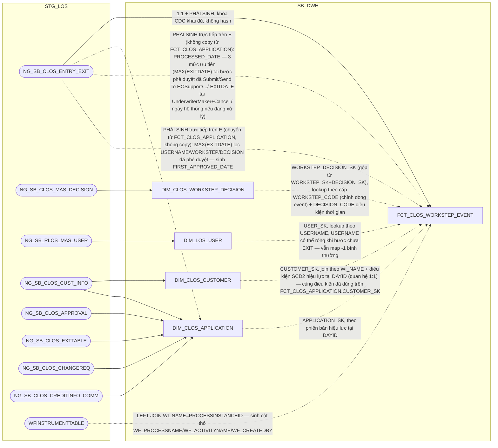
```mermaid
flowchart LR
    subgraph STG_LOS
        A(["NG_SB_CLOS_ENTRY_EXIT"])
        MW(["NG_SB_CLOS_MAS_DECISION"])
        U(["NG_SB_RLOS_MAS_USER"])
        H(["NG_SB_CLOS_CUST_INFO"])
        I(["NG_SB_CLOS_APPROVAL"])
        J(["NG_SB_CLOS_EXTTABLE"])
        K1(["NG_SB_CLOS_CHANGEREQ"])
        N(["NG_SB_CLOS_CREDITINFO_COMM"])
        WF(["WFINSTRUMENTTABLE"])
    end
    subgraph SB_DWH
        WD["DIM_CLOS_WORKSTEP_DECISION"]
        US["DIM_LOS_USER"]
        AP["DIM_CLOS_APPLICATION"]
        KC["DIM_CLOS_CUSTOMER"]
        E["FCT_CLOS_WORKSTEP_EVENT"]
    end
    A -->|1:1 + PHÁI SINH, khóa CDC khai đủ, không hash| E
    WD -.->|"WORKSTEP_DECISION_SK (gộp từ WORKSTEP_SK+DECISION_SK), lookup theo cặp WORKSTEP_CODE (chính dòng event) + DECISION_CODE điều kiện thời gian"| E
    US -.->|USER_SK, lookup theo USERNAME, USERNAME có thể rỗng khi bước chưa EXIT — vẫn map -1 bình thường| E
    AP -.->|APPLICATION_SK, theo phiên bản hiệu lực tại DAYID| E
    KC -.->|"CUSTOMER_SK, join theo WI_NAME + điều kiện SCD2 hiệu lực tại DAYID (quan hệ 1:1) — cùng điều kiện đã dùng trên FCT_CLOS_APPLICATION.CUSTOMER_SK"| E
    MW --> WD
    U --> US
    H --> KC
    H --> AP
    I --> AP
    J --> AP
    K1 --> AP
    A -.-> AP
    N --> AP
    A -.->|"PHÁI SINH trực tiếp trên E (không copy từ FCT_CLOS_APPLICATION): PROCESSED_DATE — 3 mức ưu tiên (MAX(EXITDATE) tại bước phê duyệt đã Submit/Send To HOSupport/.../ EXITDATE tại UnderwriterMaker+Cancel / ngày hệ thống nếu đang xử lý)"| E
    WF -.->|"LEFT JOIN WI_NAME=PROCESSINSTANCEID — sinh cột thô WF_PROCESSNAME/WF_ACTIVITYNAME/WF_CREATEDBY"| E
    A -.->|"PHÁI SINH trực tiếp trên E (chuyển từ FCT_CLOS_APPLICATION, không copy): MAX(EXITDATE) lọc USERNAME/WORKSTEP/DECISION đã phê duyệt — sinh FIRST_APPROVED_DATE"| E
```

### 5.3 Cấu trúc bảng

| STT | Tên cột | Kiểu dữ liệu | Bắt buộc | Độ lớn | Khóa | Mô tả | Báo cáo sử dụng | Tên chỉ tiêu trên báo cáo |
| --- | --- | --- | --- | --- | --- | --- | --- | --- |
| 1 | DAYID | DATE | Y |  | PK | Ngày dữ liệu, dạng số YYYYMMDD — nguồn NG_SB_CLOS_ENTRY_EXIT, TRUNC về 00:00:00. Là ngày phiên bản được ghi nhận, KHÔNG phải ảnh chụp lại toàn bộ nhật ký mỗi ngày | — (cột kỹ thuật) | — |
| 2 | WORKSTEP_EVENT_BK | VARCHAR2 | Y | 64 | PK | Khóa nghiệp vụ của dòng sự kiện — PHÁI SINH: STANDARD_HASH(WI_NAME \|\| '~' \|\| WORKSTEP_CODE \|\| '~' \|\| TO_CHAR(ENTRYDATE,'YYYY-MM-DD HH24:MI:SS.FF6'), 'SHA256') — gộp 3 cột PK tự nhiên cũ (WI_NAME, WORKSTEP_CODE, ENTRYDATE) thành 1 khóa đơn | — (cột kỹ thuật, một phần khóa chính) | — |
| 3 | WORKSTEP_DECISION_SK | NUMBER | Y | 18 |  | Khóa tới DIM_CLOS_WORKSTEP_DECISION (gộp từ WORKSTEP_SK+DECISION_SK), lookup theo cặp WORKSTEP_CODE (cột 8, chính dòng event) + DECISION_CODE điều kiện thời gian (EFF_DATE/EXP_DATE). Mặc định -1 nếu không khớp. KHÔNG nằm trong PK — chỉ để tra cứu thêm thuộc tính (kể cả DECISION_CODE, không denormalize khỏi fact) | Báo cáo Thông tin phê duyệt (BC3) — khóa JOIN để lấy DECISION_CODE, cũng là điều kiện lọc chọn dòng event (Submit/Reject/Send To HOSupport/Send To PostSanction) Báo cáo RETURN (BC8) — khóa JOIN để lấy DECISION_CODE | DECISION (Quyết định) |
| 4 | USER_SK | NUMBER | Y | 18 |  | Khóa tới DIM_LOS_USER, người xử lý của chính sự kiện này. ĐÚNG GRAIN của bảng — 1 lần vào bước có đúng 1 người xử lý. Mặc định -1. KHÔNG nằm trong PK | — (khóa dự phòng, các báo cáo đang đọc thẳng USERNAME gốc thay vì join qua DIM_LOS_USER) | — |
| 5 | APPLICATION_SK | NUMBER | Y | 18 |  | Khóa tới DIM_CLOS_APPLICATION theo phiên bản hiệu lực tại DAYID. Mặc định -1 | Báo cáo Thông tin phê duyệt (BC3) — khóa JOIN sang DIM_CLOS_APPLICATION để lấy STREAM | — |
| 6 | CUSTOMER_SK | NUMBER | Y | 18 |  | Khóa tới DIM_CLOS_CUSTOMER — PHÁI SINH TRỰC TIẾP trên bảng này (lookup DIM qua surrogate key thay vì qua WI_NAME natural key, nhất quán với WORKSTEP_DECISION_SK/USER_SK/APPLICATION_SK): join theo WI_NAME + điều kiện SCD2 EFF_DATE<=DAYID<EXP_DATE (hoặc EXP_DATE IS NULL), quan hệ 1:1 với hồ sơ. Mặc định -1 nếu không khớp | Báo cáo Tuần Chuyên viên Thẩm định (BC4) — khóa JOIN sang DIM_CLOS_CUSTOMER để lấy CUSTOMER_NAME | — |
| 7 | WI_NAME | VARCHAR2 | Y | 100 |  | Mã hồ sơ tín dụng CLOS — nguồn NG_SB_CLOS_ENTRY_EXIT.WINAME (đổi tên WINAME→WI_NAME cho thống nhất với các bảng khác) | Báo cáo Thông tin phê duyệt (BC3) — khóa JOIN, cũng là khóa lọc tập dòng event Báo cáo Tuần Chuyên viên Thẩm định (BC4) — khóa JOIN, cũng là khóa lọc tập dòng event | WINAME (Mã hồ sơ) |
| 8 | WORKSTEP_CODE | VARCHAR2 | Y | 200 |  | Mã bước xử lý trên workflow — nguồn ENTRY_EXIT.WORKSTEP (đổi tên thêm hậu tố CODE), đã cắt tiền tố hệ nguồn nếu có | Báo cáo Thông tin phê duyệt (BC3) — hiển thị trực tiếp, cũng là điều kiện lọc chọn dòng event (CreditApproval/CreditCommittee) Báo cáo Tuần Chuyên viên Thẩm định (BC4) — hiển thị trực tiếp, cũng là điều kiện lọc (UnderwriterMaker/UnderwriterChecker) Báo cáo SLA - TAT (BC5) — điều kiện lọc khi SUM TAT_CALENDAR_HOUR/TAT_WORKING_HOUR/TAT_CPC_HOUR theo từng bước | WORKSTEP (Bước hồ sơ) |
| 9 | ENTRYDATE | TIMESTAMP | Y |  |  | Thời điểm hồ sơ vào bước xử lý — nguồn ENTRY_EXIT.ENTRYDATE. Bắt buộc nằm trong khóa nghiệp vụ vì 1 hồ sơ có thể quay lại cùng 1 bước nhiều lần | Báo cáo Tuần Chuyên viên Thẩm định (BC4) — hiển thị trực tiếp (ENTRYDATE của dòng event đã lọc) | ENTRYDATE (Thời gian lên bước thẩm định) |
| 10 | EXITDATE | TIMESTAMP | N |  |  | Thời điểm hồ sơ ra khỏi bước xử lý — nguồn ENTRY_EXIT.EXITDATE. NULL nghĩa là hồ sơ đang nằm tại bước này | Báo cáo Thông tin phê duyệt (BC3) — hiển thị trực tiếp Báo cáo Tuần Chuyên viên Thẩm định (BC4) — hiển thị trực tiếp Báo cáo RETURN (BC8) — hiển thị trực tiếp, đồng thời là nguồn tính PROCESSED_DATE (BC8) | EXITDATE (Thời gian tạo quyết định / kết thúc bước) |
| 11 | USERNAME | VARCHAR2 | N | 100 |  | Tên tài khoản người xử lý hồ sơ — nguồn ENTRY_EXIT.USERNAME. Giữ nguyên giá trị gốc để báo cáo hiển thị thẳng, không phải join qua DIM_LOS_USER | Báo cáo Thông tin phê duyệt (BC3) — hiển thị trực tiếp theo điều kiện WORKSTEP_CODE (BI_APPROVER/BI_COMMITTEE) Báo cáo Tuần Chuyên viên Thẩm định (BC4) — hiển thị trực tiếp theo điều kiện WORKSTEP_CODE (UND_MAKER) Báo cáo KPI (BC9) — đếm DISTINCT theo danh sách WORKSTEP cho NHAN_SU | USERNAME (User xử lý — BI_APPROVER/BI_COMMITTEE/UND_MAKER tùy báo cáo) |
| 12 | REMARKS | VARCHAR2 | N | 4000 |  | Ghi chú tại bước xử lý — nguồn ENTRY_EXIT.REMARKS | Báo cáo Thông tin phê duyệt (BC3) — hiển thị trực tiếp Báo cáo Tuần Chuyên viên Thẩm định (BC4) — hiển thị trực tiếp | REMARKS (Ghi chú) |
| 13 | TAT_SOURCE_SEC | NUMBER | N | 12 |  | Thời gian xử lý do hệ nguồn ghi, đơn vị giây — nguồn ENTRY_EXIT.TAT. Giữ lại để đối soát với 3 cột TAT tính lại bên dưới. Đơn vị "giây" kế thừa từ extract gốc, chưa chốt chính thức với DE | Nguồn cho chỉ tiêu/trường TAT_CALENDAR_HOUR (điều kiện tính khi có giá trị, thay công thức lệch ngày) | — |
| 14 | TAT_CALENDAR_HOUR | NUMBER | N | 18,6 |  | Thời gian xử lý theo lịch tự nhiên, đơn vị giờ — PHÁI SINH: TAT_SOURCE_SEC / 3600, hoặc (CAST(EXITDATE AS DATE) - CAST(ENTRYDATE AS DATE)) * 24 nếu TAT_SOURCE_SEC rỗng. Không trừ ngày nghỉ. NULL nếu chưa có EXITDATE | Báo cáo SLA - TAT (BC5) — SUM theo từng nhóm bước (STEP01_BRANCH_CL_TAT, STEP02_DDE_CL_TAT...) Báo cáo KPI (BC9) — SUM theo nhóm bước cho TAT_CLOS | TAT_CALENDAR_HOUR (TAT theo giờ lịch tự nhiên) |
| 15 | TAT_WORKING_HOUR | NUMBER | N | 18,6 |  | Thời gian xử lý theo giờ làm việc, đơn vị giờ — PHÁI SINH: GET_BUSINESS_MINUTE(ENTRYDATE, EXITDATE) / 60. Loại trừ ngày lễ, chiều thứ Bảy, cả ngày Chủ nhật; giờ tính 8-12 và 13-17. NULL nếu chưa có EXITDATE | Báo cáo SLA - TAT (BC5) — SUM theo từng nhóm bước (STEP01_BRANCH_WK_TAT, STEP02_DDE_WK_TAT...) Báo cáo KPI (BC9) — SUM theo nhóm bước cho TAT_CLOS | TAT_WORKING_HOUR (TAT theo giờ làm việc) |
| 16 | TAT_CPC_HOUR | NUMBER | N | 18,6 |  | Thời gian xử lý theo giờ cam kết SLA, đơn vị giờ — PHÁI SINH: GET_BUSINESS_MINUTE_CPC(ENTRYDATE, EXITDATE) / 60. Giờ theo cam kết SLA, tính 8-11:30 và 13:30-16:30. NULL nếu chưa có EXITDATE | Báo cáo SLA - TAT (BC5) — SUM theo từng nhóm bước, so sánh với REF_SLA_* để ra kết quả đạt/không đạt SLA | TAT_CPC_HOUR (TAT theo giờ cam kết SLA) |
| 17 | EVENT_SEQ_ASC | NUMBER | N | 5 |  | Thứ tự sự kiện theo chiều cũ đến mới — PHÁI SINH: ROW_NUMBER() OVER (PARTITION BY WI_NAME ORDER BY ENTRYDATE ASC). Dùng xác định sự kiện trả về đầu tiên cho BC7 (FIRST_WORKSTEP_RETURN); chiều giảm dần (mới→cũ) khi cần có thể tự suy bằng COUNT(*) OVER (PARTITION BY WI_NAME) - EVENT_SEQ_ASC + 1, không cần cột riêng | Nguồn cho chỉ tiêu/trường FIRST_WORKSTEP_RETURN (xác định sự kiện trả về đầu tiên, BC7, trên FCT_CLOS_EXCEPTION) | — |
| 18 | PROCESSED_DATE | DATE | N |  |  | Ngày xử lý chung của hồ sơ theo 3 mức ưu tiên (phê duyệt cuối / hủy tại UnderwriterMaker / ngày dữ liệu hệ thống nếu đang xử lý) — PHÁI SINH TRỰC TIẾP trên bảng này (KHÔNG copy/JOIN từ FCT_CLOS_APPLICATION.PROCESSED_DATE): MAX(EXITDATE) window theo WI_NAME WHERE WORKSTEP_CODE IN ('CreditCommittee','CreditApproval') AND DECISION_CODE IN ('Send To HOSupport','Reject','Submit','Send To PostSanction','Submit To DisbursementMaker') — DECISION_CODE ở đây tra qua JOIN WORKSTEP_DECISION_SK sang DIM_CLOS_WORKSTEP_DECISION; nếu rỗng → EXITDATE tại WORKSTEP_CODE='UnderwriterMaker' AND DECISION_CODE='Cancel' (cùng cách tra); nếu vẫn rỗng → ngày dữ liệu hệ thống (DAYID). Phục vụ BC4.REPORT_DATE mà không cần JOIN fan-out sang APPLICATION_DAILY | Báo cáo Tuần Chuyên viên Thẩm định (BC4) — hiển thị trực tiếp | REPORT_DATE (Ngày báo cáo) |
| 19 | WF_PROCESSNAME | VARCHAR2 | N | 50 |  | Tên hệ thống workflow của instance đang đứng — cột thô: LEFT JOIN WFINSTRUMENTTABLE (c) theo WI_NAME=c.PROCESSINSTANCEID, lấy c.PROCESSNAME. Lặp lại giống nhau trên mọi dòng event cùng WI_NAME | Nguồn cho chỉ tiêu/trường WORKSTEP_FLAG| — |
| 20 | WF_ACTIVITYNAME | VARCHAR2 | N | 200 |  | Bước hiện tại của instance workflow — cột thô (cùng JOIN trên): lấy c.ACTIVITYNAME | Nguồn cho chỉ tiêu/trường WORKSTEP_FLAG (tính tại PDTD_DTM) | — |
| 21 | WF_CREATEDBY | VARCHAR2 | N | 50 |  | Mã người/hệ thống tạo bản ghi workflow — cột thô (cùng JOIN trên): lấy c.CREATEDBY| Nguồn cho chỉ tiêu/trường WORKSTEP_FLAG | — |
| 22 | FIRST_APPROVED_DATE | DATE | N |  |  | Ngày phê duyệt (BC11.APPROVAL_DATE) — CỘT MỚI (review 2026-10-02, theo yêu cầu người dùng: chuyển từ FCT_CLOS_APPLICATION về tính ngay trên bảng nhật ký, cùng pattern PROCESSED_DATE cột 18): MAX(EXITDATE) window theo WI_NAME WHERE USERNAME IS NOT NULL AND WORKSTEP_CODE IN ('CreditApproval','CreditCommittee') AND DECISION_CODE IN ('Submit','Send To HOSupport','Send To PostSanction') — DECISION_CODE tra qua WORKSTEP_DECISION_SK (cột 3) sang DIM_CLOS_WORKSTEP_DECISION, cùng cách PROCESSED_DATE đang làm. Khác LAST_APPROVAL_DATE (FCT_CLOS_APPLICATION, không lọc DECISION, phục vụ BC2): 2 metric độc lập | Báo cáo Giải ngân _ Quá hạn KHDN (BC11) — qua FCT_CLOS_LOAN_DISBURSEMENT.APPROVAL_DATE | APPROVAL_DATE (Ngày phê duyệt) |

## 6. FCT_CLOS_LEGAL_PARTY

Đây là bảng CLOS thật, đã được đổi phân loại từ `DIM_CLOS_LEGAL_PARTY`
sang **FACT** `FCT_CLOS_LEGAL_PARTY`. `FCT_CLOS_APPLICATION_PARTY` (bảng
cầu nối factless từng tham chiếu bảng này qua `LEGAL_PARTY_SK`) đã xóa
hẳn khỏi thiết kế vì bảng này tự đủ `WI_NAME`/`CUSTOMER_SK`/
`APPLICATION_SK` để join trực tiếp, không cần bảng cầu nối trung gian.

### 6.1 Mục đích thiết kế
- **Ý nghĩa bảng:** bảng FACT lưu người/đối tượng liên quan vai trò pháp
  lý của hồ sơ CLOS (bao gồm cả giấy tờ định danh)
- **Khóa nghiệp vụ (BK):** composite `WI_NAME`+`ID_NUMBER` — hash vào
  cột `LEGAL_PARTY_BK`
- **Khóa chính của bảng (PK):** DAYID, LEGAL_PARTY_BK — `LEGAL_PARTY_BK`
  gộp 2 cột PK tự nhiên cũ (WI_NAME, ID_NUMBER, theo đúng "Khóa nghiệp
  vụ" ghi trong `CLOS - Metadata.xlsx` sheet "2. Table Review" dòng
  `NG_SB_CLOS_CUST_INFO_LEGAL`) thành 1 khóa hash duy nhất:
  `STANDARD_HASH(WI_NAME||'~'||ID_NUMBER, 'SHA256')`.
  Bổ sung `DAYID` vào PK để bảng đổi sang snapshot theo ngày (khớp bản
  PDTD_DTM tương ứng, mục 10, vốn đã có DAYID từ khi hấp thụ vai trò cầu
  nối của `FCT_CLOS_APPLICATION_PARTY` đã xóa) — không còn `DIMENSION_KEY`
  sequence/`EFF_DATE`/`EXP_DATE` như bản DIM cũ.
- **Độ chi tiết (grain):** 1 dòng = 1 người/đối tượng liên quan pháp lý
  của 1 hồ sơ x 1 ngày dữ liệu (WI_NAME + ID_NUMBER + DAYID) — snapshot
  theo ngày, mỗi DAYID lặp lại toàn bộ dòng đang active. Quan hệ 1:N với
  hồ sơ, N không giới hạn (1 người có thể giữ nhiều vai trò trên cùng 1
  hồ sơ, xác nhận qua CLOS Metadata) — CLOS có 5 vai trò khả dĩ (CUSTOMER,
  LEGAL_REPRESENTATIVE, COLLATERAL_OWNER, MAIN_CONTRIBUTING_MEMBERS,
  OTHER).
- **Phục vụ báo cáo:**
  - Báo cáo CLOS APPLICATION (BC2) — gián tiếp, qua
    `DIM_CLOS_CUSTOMER.ID_NUMBER`/`LEGAL_REPRESENTATIVE`/
    `ADD_ID_REPRESENTATIVE` LEFT JOIN trực tiếp bảng này theo `WI_NAME` +
    `LEGAL_TYPE` ('CUSTOMER' hoặc 'LEGAL_REPRESENTATIVE') — không còn đi
    qua bảng cầu nối trung gian nào (`FCT_CLOS_APPLICATION_PARTY` đã xóa
    hẳn khỏi thiết kế)

### 6.2 Sơ đồ lineage

**Lineage đầy đủ (bao gồm cả nguồn của `DIM_CLOS_CUSTOMER` và
`DIM_CLOS_APPLICATION` — cùng pattern đã áp dụng cho
`FCT_RLOS_CUSTOMER`/`FCT_RLOS_COREPAYER`):**

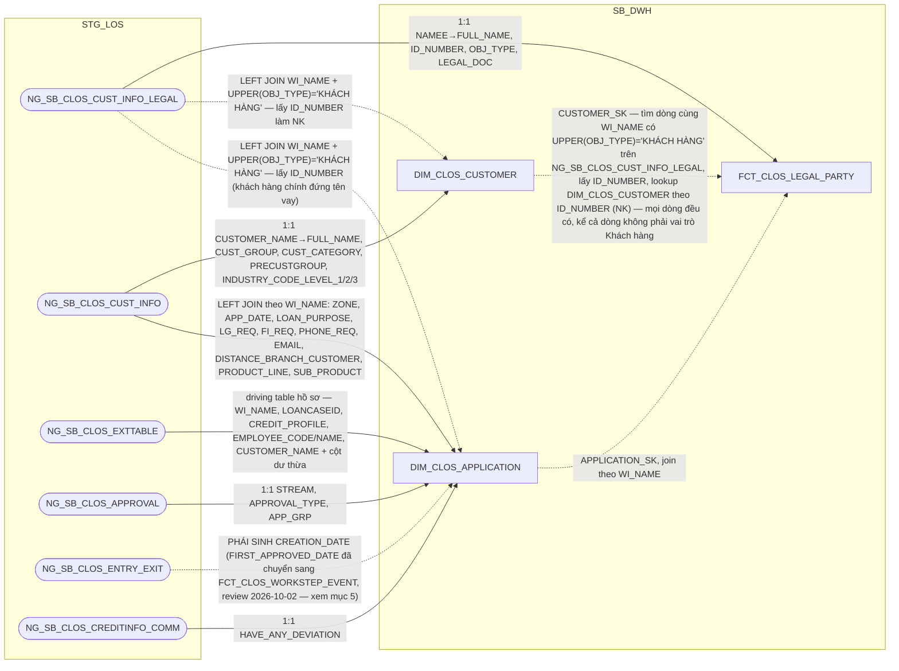
```mermaid
flowchart LR
    subgraph STG_LOS
        A(["NG_SB_CLOS_CUST_INFO_LEGAL"])
        CI(["NG_SB_CLOS_CUST_INFO"])
        EX(["NG_SB_CLOS_EXTTABLE"])
        AR(["NG_SB_CLOS_APPROVAL"])
        EE(["NG_SB_CLOS_ENTRY_EXIT"])
        CM(["NG_SB_CLOS_CREDITINFO_COMM"])
    end
    subgraph SB_DWH
        K["DIM_CLOS_CUSTOMER"]
        AP["DIM_CLOS_APPLICATION"]
        E["FCT_CLOS_LEGAL_PARTY"]
    end
    A -->|1:1 NAMEE→FULL_NAME, ID_NUMBER, OBJ_TYPE, LEGAL_DOC| E
    K -.->|"CUSTOMER_SK — tìm dòng cùng WI_NAME có UPPER(OBJ_TYPE)='KHÁCH HÀNG' trên NG_SB_CLOS_CUST_INFO_LEGAL, lấy ID_NUMBER, lookup DIM_CLOS_CUSTOMER theo ID_NUMBER (NK) — mọi dòng đều có, kể cả dòng không phải vai trò Khách hàng"| E
    AP -.->|"APPLICATION_SK, join theo WI_NAME"| E
    CI -->|"1:1 CUSTOMER_NAME→FULL_NAME, CUST_GROUP, CUST_CATEGORY, PRECUSTGROUP, INDUSTRY_CODE_LEVEL_1/2/3"| K
    A -.->|"LEFT JOIN WI_NAME + UPPER(OBJ_TYPE)='KHÁCH HÀNG' — lấy ID_NUMBER làm NK"| K
    EX -->|"driving table hồ sơ — WI_NAME, LOANCASEID, CREDIT_PROFILE, EMPLOYEE_CODE/NAME, CUSTOMER_NAME + cột dư thừa"| AP
    CI -->|"LEFT JOIN theo WI_NAME: ZONE, APP_DATE, LOAN_PURPOSE, LG_REQ, FI_REQ, PHONE_REQ, EMAIL, DISTANCE_BRANCH_CUSTOMER, PRODUCT_LINE, SUB_PRODUCT"| AP
    A -.->|"LEFT JOIN WI_NAME + UPPER(OBJ_TYPE)='KHÁCH HÀNG' — lấy ID_NUMBER (khách hàng chính đứng tên vay)"| AP
    AR -->|1:1 STREAM, APPROVAL_TYPE, APP_GRP| AP
    EE -.->|"PHÁI SINH CREATION_DATE (FIRST_APPROVED_DATE đã chuyển sang FCT_CLOS_WORKSTEP_EVENT, review 2026-10-02 — xem mục 5)"| AP
    CM -->|1:1 HAVE_ANY_DEVIATION| AP
```

### 6.3 Cấu trúc bảng

| STT | Tên cột | Kiểu dữ liệu | Bắt buộc | Độ lớn | Khóa | Mô tả | Báo cáo sử dụng | Tên chỉ tiêu trên báo cáo |
| --- | --- | --- | --- | --- | --- | --- | --- | --- |
| 1 | DAYID | DATE | Y |  | PK | Ngày dữ liệu, dạng số YYYYMMDD — CỘT MỚI: thêm để bảng đổi sang snapshot theo ngày | — (cột kỹ thuật) | — |
| 2 | LEGAL_PARTY_BK | VARCHAR2 | Y | 64 | PK | Khóa nghiệp vụ của dòng vai trò pháp lý — PHÁI SINH: STANDARD_HASH(WI_NAME \|\| '~' \|\| ID_NUMBER, 'SHA256') — gộp 2 cột PK tự nhiên cũ (WI_NAME, ID_NUMBER) thành 1 khóa đơn | — (cột kỹ thuật, một phần khóa chính) | — |
| 3 | CUSTOMER_SK | NUMBER | Y | 18 |  | Khóa tới DIM_CLOS_CUSTOMER — khách hàng CHÍNH của hồ sơ (MỌI dòng đều có, không chỉ dòng OBJ_TYPE='Khách hàng'). Cách lấy: tìm dòng khác cùng WI_NAME có UPPER(OBJ_TYPE)='KHÁCH HÀNG' trên NG_SB_CLOS_CUST_INFO_LEGAL, lấy ID_NUMBER của dòng đó, lookup DIM_CLOS_CUSTOMER.DIMENSION_KEY theo ID_NUMBER (NK, tái sử dụng đúng logic dựng DIM_CLOS_CUSTOMER). Mặc định -1 nếu không khớp | — (khóa liên kết nội bộ, không xuất trực tiếp lên báo cáo) | — |
| 4 | APPLICATION_SK | NUMBER | Y | 18 |  | Khóa tới DIM_CLOS_APPLICATION — join theo WI_NAME. Quan hệ N:1 (nhiều dòng vai trò pháp lý cùng WI_NAME trỏ về đúng 1 hồ sơ). Mặc định -1 nếu không khớp | — (khóa liên kết nội bộ, không xuất trực tiếp lên báo cáo) | — |
| 5 | WI_NAME | VARCHAR2 | Y | 100 |  | Mã hồ sơ CLOS — nguồn NG_SB_CLOS_CUST_INFO_LEGAL.WI_NAME. Quan hệ 1:N với hồ sơ, N không giới hạn (1 người có thể giữ nhiều vai trò, xác nhận qua CLOS Metadata) | Báo cáo CLOS APPLICATION (BC2) — nguồn gián tiếp qua DIM_CLOS_CUSTOMER.ID_NUMBER/LEGAL_REPRESENTATIVE/ADD_ID_REPRESENTATIVE (LEFT JOIN theo WI_NAME + LEGAL_TYPE) | — |
| 6 | ID_NUMBER | VARCHAR2 | Y | 100 |  | Số giấy tờ định danh — nguồn NG_SB_CLOS_CUST_INFO_LEGAL.ID_NUMBER, theo đúng "Khóa nghiệp vụ" ghi trong CLOS - Metadata.xlsx sheet "2. Table Review" dòng NG_SB_CLOS_CUST_INFO_LEGAL | Báo cáo CLOS APPLICATION (BC2) — nguồn gián tiếp qua DIM_CLOS_CUSTOMER.ID_NUMBER (LEFT JOIN theo WI_NAME + LEGAL_TYPE='CUSTOMER') và ADD_ID_REPRESENTATIVE (LEFT JOIN theo WI_NAME + LEGAL_TYPE='LEGAL_REPRESENTATIVE', nối chuỗi ';' nếu nhiều đại diện) | ID_NUMBER (Số ĐKKD/MST doanh nghiệp); ADD_ID_REPRESENTATIVE (Số GTTT người đại diện theo pháp luật) |
| 7 | FULL_NAME | VARCHAR2 | N | 200 |  | Họ tên/tên đối tượng — nguồn NG_SB_CLOS_CUST_INFO_LEGAL.NAMEE | Báo cáo CLOS APPLICATION (BC2) — nguồn gián tiếp qua DIM_CLOS_CUSTOMER.LEGAL_REPRESENTATIVE (LEFT JOIN theo WI_NAME + LEGAL_TYPE='LEGAL_REPRESENTATIVE', nối chuỗi FULL_NAME bằng ';' nếu nhiều đại diện, cách nối chuỗi đã được BA xác nhận chính thức) | LEGAL_REPRESENTATIVE (Người đại diện pháp luật) |
| 8 | OBJ_TYPE | VARCHAR2 | N | 100 |  | Loại đối tượng của giấy tờ pháp lý — nguồn NG_SB_CLOS_CUST_INFO_LEGAL.OBJ_TYPE (Khách hàng, Người đại diện theo pháp luật, Chủ sở hữu TSBĐ, Thành viên góp vốn chính, Khác). 1 người (cùng ID_NUMBER) có thể giữ nhiều vai trò khác nhau trên cùng hồ sơ (nhiều dòng, xác nhận BA) | — (chuẩn hóa thành LEGAL_TYPE ở PDTD_DTM qua REF_CLOS_LEGAL, dùng làm điều kiện lọc chứ không hiển thị trực tiếp) | — |
| 9 | LEGAL_DOC | VARCHAR2 | N | 100 |  | Tên loại giấy tờ pháp lý — nguồn NG_SB_CLOS_CUST_INFO_LEGAL.LEGAL_DOC | — (chưa có báo cáo nào tiêu thụ trực tiếp) | — |

## 7. FCT_RLOS_APPLICATION

### 7.1 Mục đích thiết kế
- **Ý nghĩa bảng:** bảng FACT xương sống của hồ sơ tín dụng RLOS (bán lẻ/cá
  nhân) — lưu ảnh trạng thái cuối ngày của hồ sơ.
- **Khóa nghiệp vụ (BK):** `WI_NAME`
- **Khóa chính của bảng (PK):** DAYID, WI_NAME.
- **Độ chi tiết (grain):** 1 dòng = 1 hồ sơ x 1 ngày dữ liệu.
- **Phục vụ báo cáo:**
  - Báo cáo RLOS APPLICATION (BC1)
  - Báo cáo Thông tin phê duyệt (BC3) — qua FCT_RLOS_WORKSTEP_EVENT (CREDIT_LIMIT/CURRENCY dư thừa có chủ đích trên DIM_RLOS_APPLICATION)
  - Báo cáo Tuần Chuyên viên Thẩm định (BC4)
  - Báo cáo SLA - TAT (BC5) — khóa tra REF_SLA_NLTT qua PRODUCT_SK
  - Báo cáo NGOẠI LỆ (BC6)
  - Báo cáo RETURN (BC8) — RETURN_CNT_DATAENTRY/UNDERWRITING/APPROVAL
  - Báo cáo KPI (BC9) — AGG_LOS_KPI_APPLICATION.INCOM_3/BUSINESS_INCOM
  - Báo cáo Giải ngân _ Quá hạn KHCN (BC10)

### 7.2 Sơ đồ lineage

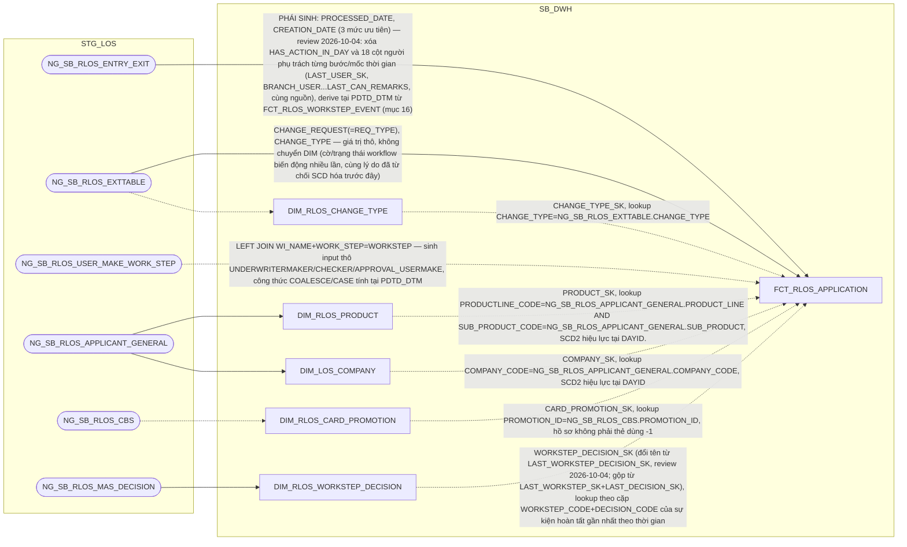
```mermaid
flowchart LR
    subgraph STG_LOS
        A(["NG_SB_RLOS_ENTRY_EXIT"])
        I(["NG_SB_RLOS_EXTTABLE"])
        J(["NG_SB_RLOS_USER_MAKE_WORK_STEP"])
        P1(["NG_SB_RLOS_APPLICANT_GENERAL"])
        P4(["NG_SB_RLOS_CBS"])
        MW(["NG_SB_RLOS_MAS_DECISION"])
    end
    subgraph SB_DWH
        WD["DIM_RLOS_WORKSTEP_DECISION"]
        PR["DIM_RLOS_PRODUCT"]
        OU["DIM_LOS_COMPANY"]
        CT["DIM_RLOS_CHANGE_TYPE"]
        CP["DIM_RLOS_CARD_PROMOTION"]
        E["FCT_RLOS_APPLICATION"]
    end
    A -->|"PHÁI SINH: PROCESSED_DATE, CREATION_DATE (3 mức ưu tiên) — review 2026-10-04: xóa HAS_ACTION_IN_DAY và 18 cột người phụ trách từng bước/mốc thời gian (LAST_USER_SK, BRANCH_USER...LAST_CAN_REMARKS, cùng nguồn), derive tại PDTD_DTM từ FCT_RLOS_WORKSTEP_EVENT (mục 16)"| E
    I -->|"CHANGE_REQUEST(=REQ_TYPE), CHANGE_TYPE — giá trị thô, không chuyển DIM (cờ/trạng thái workflow biến động nhiều lần, cùng lý do đã từ chối SCD hóa trước đây)"| E
    I -.-> CT
    J -.->|"LEFT JOIN WI_NAME+WORK_STEP=WORKSTEP — sinh input thô UNDERWRITERMAKER/CHECKER/APPROVAL_USERMAKE, công thức COALESCE/CASE tính tại PDTD_DTM"| E
    WD -.->|"WORKSTEP_DECISION_SK (đổi tên từ LAST_WORKSTEP_DECISION_SK, review 2026-10-04; gộp từ LAST_WORKSTEP_SK+LAST_DECISION_SK), lookup theo cặp WORKSTEP_CODE+DECISION_CODE của sự kiện hoàn tất gần nhất theo thời gian"| E
    MW --> WD
    PR -.->|"PRODUCT_SK, lookup PRODUCTLINE_CODE=NG_SB_RLOS_APPLICANT_GENERAL.PRODUCT_LINE AND SUB_PRODUCT_CODE=NG_SB_RLOS_APPLICANT_GENERAL.SUB_PRODUCT, SCD2 hiệu lực tại DAYID."| E
    OU -.->|"COMPANY_SK, lookup COMPANY_CODE=NG_SB_RLOS_APPLICANT_GENERAL.COMPANY_CODE, SCD2 hiệu lực tại DAYID"| E
    CT -.->|"CHANGE_TYPE_SK, lookup CHANGE_TYPE=NG_SB_RLOS_EXTTABLE.CHANGE_TYPE"| E
    CP -.->|"CARD_PROMOTION_SK, lookup PROMOTION_ID=NG_SB_RLOS_CBS.PROMOTION_ID, hồ sơ không phải thẻ dùng -1"| E
    P1 --> PR
    P1 --> OU
    P4 -.-> CP
```

### 7.3 Cấu trúc bảng

| STT | Tên cột | Kiểu dữ liệu | Bắt buộc | Độ lớn | Khóa | Mô tả | Báo cáo sử dụng | Tên chỉ tiêu trên báo cáo |
| --- | --- | --- | --- | --- | --- | --- | --- | --- |
| 1 | DAYID | DATE | Y |  | PK | Ngày dữ liệu, dạng số YYYYMMDD | — (cột kỹ thuật) | — |
| 2 | APPLICATION_SK | NUMBER | Y | 18 |  | Khóa tới DIM_RLOS_APPLICATION. Mặc định -1 nếu không khớp | Báo cáo RLOS APPLICATION (BC1) — khóa JOIN sang DIM_RLOS_APPLICATION | — |
| 3 | WORKSTEP_DECISION_SK | NUMBER | Y | 18 |  | Khóa tới DIM_RLOS_WORKSTEP_DECISION (gộp từ LAST_WORKSTEP_SK+LAST_DECISION_SK) của sự kiện hoàn tất gần nhất, lookup theo cặp WORKSTEP_CODE+DECISION_CODE của sự kiện đó. Mặc định -1 — đổi tên từ LAST_WORKSTEP_DECISION_SK (review 2026-10-04, theo yêu cầu người dùng, đồng bộ pattern CLOS) | Báo cáo RLOS APPLICATION (BC1) — nguồn cho LAST_WORKSTEP (LEFT JOIN Q_RLOS_REF_WORKSTEP_2SYSTEMS ở PDTD_DTM) và khóa JOIN cho LAST_DECISION | LAST_DECISION (Quyết định tại bước cuối) |
| 4 | PRODUCT_SK | NUMBER | Y | 18 |  | Khóa tới DIM_RLOS_PRODUCT — PHÁI SINH: lookup theo PRODUCTLINE_CODE=NG_SB_RLOS_APPLICANT_GENERAL.PRODUCT_LINE AND SUB_PRODUCT_CODE=NG_SB_RLOS_APPLICANT_GENERAL.SUB_PRODUCT, điều kiện SCD2 EFF_DATE<=DAYID<EXP_DATE (hoặc EXP_DATE IS NULL) trên DIM_RLOS_PRODUCT. Mặc định -1 nếu không khớp.| Báo cáo RLOS APPLICATION (BC1) — khóa JOIN sang DIM_RLOS_PRODUCT Báo cáo SLA - TAT (BC5) — khóa tra REF_SLA_NLTT theo PRODUCTLINE_NAME | PRODUCT_LINE (Dòng sản phẩm); nguồn cho chỉ tiêu/trường SLA_DE (Cam kết SLA Chuyên viên nhập liệu, BC5) |
| 5 | COMPANY_SK | NUMBER | Y | 18 |  | Khóa tới DIM_LOS_COMPANY — PHÁI SINH: lookup theo COMPANY_CODE=NG_SB_RLOS_APPLICANT_GENERAL.COMPANY_CODE, điều kiện SCD2 EFF_DATE<=DAYID<EXP_DATE (hoặc EXP_DATE IS NULL) trên DIM_LOS_COMPANY. Mặc định -1 nếu không khớp | Báo cáo RLOS APPLICATION (BC1) — khóa JOIN sang DIM_LOS_COMPANY lấy BRANCH_CODE | BRANCH_CODE (Mã Chi nhánh) |
| 6 | CHANGE_TYPE_SK | NUMBER | Y | 18 |  | Khóa tới DIM_RLOS_CHANGE_TYPE. Chỉ có giá trị với hồ sơ thay đổi điều kiện phê duyệt, còn lại Unknown -1. Nguồn: NG_SB_RLOS_EXTTABLE.CHANGE_TYPE | Báo cáo RLOS APPLICATION (BC1) — khóa JOIN sang DIM_RLOS_CHANGE_TYPE | CHANGE_TYPE_DETAIL (Chi tiết loại thay đổi điều kiện) |
| 7 | CARD_PROMOTION_SK | NUMBER | Y | 18 |  | Khóa tới DIM_RLOS_CARD_PROMOTION. Lookup NG_SB_RLOS_CBS.PROMOTION_ID; hồ sơ không phải thẻ dùng -1 | Báo cáo RLOS APPLICATION (BC1) — khóa JOIN sang DIM_RLOS_CARD_PROMOTION | PROMOTION_ID (Ưu đãi phí) |
| 8 | WI_NAME | VARCHAR2 | Y | 100 | PK | Mã hồ sơ tín dụng RLOS — nguồn NG_SB_RLOS_ENTRY_EXIT.WINAME| Báo cáo RLOS APPLICATION (BC1) — khóa chính Báo cáo KPI (BC9) — khóa nối AGG_LOS_KPI_APPLICATION | WINAME (Mã hồ sơ) |
| 9 | PROCESSED_DATE | DATE | N |  |  | Ngày xử lý chung của hồ sơ theo 3 mức ưu tiên — nguồn NG_SB_RLOS_ENTRY_EXIT, cùng công thức 3 mức ưu tiên đã dùng cho nhánh CLOS (xem mục 1 cột 8) | Báo cáo RLOS APPLICATION (BC1) — hiển thị trực tiếp Báo cáo KPI (BC9) — dùng xếp hồ sơ vào đúng DAYID khi tổng hợp AGG_LOS_KPI_YTD_DAILY | PROCESSED_DATE (Ngày dữ liệu báo cáo) |
| 10 | CREATION_DATE | DATE | N |  |  | TRUNC(MIN(ENTRYDATE)) theo WI_NAME — nguồn NG_SB_RLOS_ENTRY_EXIT.ENTRYDATE | Báo cáo RLOS APPLICATION (BC1) — hiển thị trực tiếp | CREATION_DATE (Ngày khởi tạo hồ sơ) |
| 11 | APPROVED_AMT_FINAL | NUMBER | N | 20,2 |  | Hạn mức phê duyệt cuối cùng — nguồn NG_SB_RLOS_CREDIT_PROPOSAL.LOAN_AMOUNT | Báo cáo RLOS APPLICATION (BC1) — hiển thị trực tiếp | LOAN_AMOUNT (Số tiền phê duyệt) |
| 12 | APPROVED_TERM | NUMBER | N | 5 |  | Kỳ hạn phê duyệt — nguồn NG_SB_RLOS_CREDIT_PROPOSAL.LOAN_TERM | Báo cáo RLOS APPLICATION (BC1) — hiển thị trực tiếp | LOAN_TERM (Thời hạn phê duyệt, tháng) |
| 13 | UNDERWRITERMAKER_USERMAKE | VARCHAR2 | N | 100 |  | PHÁI SINH, COALESCE ĐÃ TÍNH XONG TẠI SB_DWH (giá trị cuối cùng, không tính lại ở PDTD_DTM): COALESCE(CASE WHEN NG_SB_RLOS_USER_MAKE_WORK_STEP.WORK_STEP='UnderwriterMaker' THEN NG_SB_RLOS_USER_MAKE_WORK_STEP.USER_MAKE END, NG_SB_RLOS_EXTTABLE.UWMAKERUSER) | Báo cáo RLOS APPLICATION (BC1) — BC1 map thẳng vào cột này| — |
| 14 | UNDERWRITERCHECKER_USERMAKE | VARCHAR2 | N | 100 |  | PHÁI SINH, COALESCE ĐÃ TÍNH XONG TẠI SB_DWH (cùng cơ chế cột trên): COALESCE(CASE WHEN NG_SB_RLOS_USER_MAKE_WORK_STEP.WORK_STEP='UnderwriterChecker' THEN NG_SB_RLOS_USER_MAKE_WORK_STEP.USER_MAKE END, NG_SB_RLOS_EXTTABLE.UWCHKRUSER) | Báo cáo RLOS APPLICATION (BC1) — BC1 map thẳng vào cột này. | — |
| 15 | APPROVAL_USERMAKE | VARCHAR2 | N | 100 |  | PHÁI SINH, COALESCE ĐÃ TÍNH XONG TẠI SB_DWH: COALESCE(CASE WHEN NG_SB_RLOS_USER_MAKE_WORK_STEP.WORK_STEP IN ('CreditCommittee','CreditApproval') THEN NG_SB_RLOS_USER_MAKE_WORK_STEP.USER_MAKE END, NG_SB_RLOS_EXTTABLE.CREDAPPRUSER, NG_SB_RLOS_EXTTABLE.CCOMMITUSER) | Báo cáo RLOS APPLICATION (BC1) — BC1 map thẳng vào cột này.| — |
| 16 | CHANGE_REQUEST | VARCHAR2 | N | 200 |  | Yêu cầu điều chỉnh hồ sơ — nguồn NG_SB_RLOS_EXTTABLE.REQ_TYPE | Báo cáo RLOS APPLICATION (BC1) Báo cáo CLOS APPLICATION (BC2) | CHANGE_REQUEST (Thay đổi điều kiện — New/Change) |
| 17 | CHANGE_TYPE | VARCHAR2 | N | 500 |  | Loại thay đổi điều kiện phê duyệt — nguồn NG_SB_RLOS_EXTTABLE.CHANGE_TYPE, giữ nguyên giá trị thô. Dùng làm khóa either/or với PRODUCT_LINE khi tra cam kết SLA ở PDTD_DTM — khác CHANGE_TYPE_SK (cột 6, trỏ DIM_RLOS_CHANGE_TYPE để lấy tên/chi tiết chuẩn hóa cho BC1). Không chuyển DIM_RLOS_APPLICATION dù cùng nguồn EXTTABLE với 13 cột cờ/trạng thái khác — đây là cờ/trạng thái workflow thực sự biến động nhiều lần trong vòng đời hồ sơ, không phải "bật 1 lần duy nhất" như nhóm cờ CREATE/DELETE_FLAG | Báo cáo RLOS APPLICATION (BC1) hiển thị trực tiếp Báo cáo SLA - TAT (BC5) khóa tra REF_PRODUCT/SLA_* | CHANGE_TYPE (Loại thay đổi điều kiện) |

## 8. FCT_RLOS_COLLATERAL

### 8.1 Mục đích thiết kế
- **Ý nghĩa bảng:** bảng FACT chi tiết (nhân dòng) lưu ảnh số liệu thay
  đổi theo ngày của từng tài sản bảo đảm thuộc hồ sơ RLOS. Không có chiều
  tài sản riêng — toàn bộ thuộc tính lưu thẳng trên fact vì 4 bảng nguồn
  không khai khóa CDC.
- **Khóa nghiệp vụ (BK):** composite toàn bộ cột không phải CLOB của
  bảng grid tài sản nguồn (`COL_REALESTATE`/`COL_TRANSPORT`/
  `COL_VALPAPER`/`COL_OTHER`, tùy dòng thuộc bảng nào)— hash vào cột `COLLATERAL_BK`
- **Khóa chính của bảng (PK):** DAYID, COLLATERAL_BK.
- **Độ chi tiết (grain):** 1 dòng = 1 tài sản bảo đảm của 1 hồ sơ x 1 ngày dữ liệu.
- **Phục vụ báo cáo:**
  - Báo cáo RLOS APPLICATION (BC1)
  - Báo cáo Thông tin phê duyệt (BC3)
  - Báo cáo KPI (BC9) — nguồn cho AGG_LOS_KPI_APPLICATION.TSBD_G2

### 8.2 Sơ đồ lineage

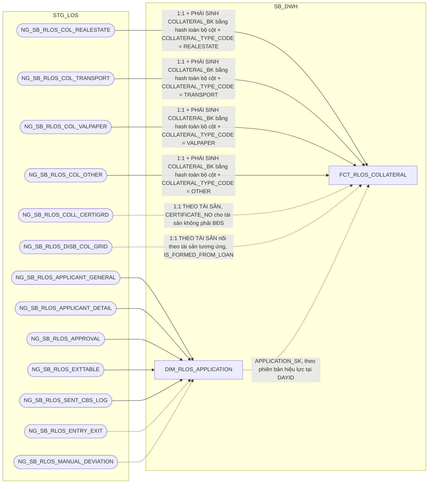
```mermaid
flowchart LR
    subgraph STG_LOS
        A1(["NG_SB_RLOS_COL_REALESTATE"])
        A2(["NG_SB_RLOS_COL_TRANSPORT"])
        A3(["NG_SB_RLOS_COL_VALPAPER"])
        A4(["NG_SB_RLOS_COL_OTHER"])
        A5(["NG_SB_RLOS_COLL_CERTIGRD"])
        A6(["NG_SB_RLOS_DISB_COL_GRID"])
        P1(["NG_SB_RLOS_APPLICANT_GENERAL"])
        P2(["NG_SB_RLOS_APPLICANT_DETAIL"])
        P3(["NG_SB_RLOS_APPROVAL"])
        P4(["NG_SB_RLOS_EXTTABLE"])
        P5(["NG_SB_RLOS_SENT_CBS_LOG"])
        P6(["NG_SB_RLOS_ENTRY_EXIT"])
        P7(["NG_SB_RLOS_MANUAL_DEVIATION"])
    end
    subgraph SB_DWH
        D["DIM_RLOS_APPLICATION"]
        C["FCT_RLOS_COLLATERAL"]
    end
    A1 -->|1:1 + PHÁI SINH COLLATERAL_BK bằng hash toàn bộ cột + COLLATERAL_TYPE_CODE = REALESTATE| C
    A2 -->|1:1 + PHÁI SINH COLLATERAL_BK bằng hash toàn bộ cột + COLLATERAL_TYPE_CODE = TRANSPORT| C
    A3 -->|1:1 + PHÁI SINH COLLATERAL_BK bằng hash toàn bộ cột + COLLATERAL_TYPE_CODE = VALPAPER| C
    A4 -->|1:1 + PHÁI SINH COLLATERAL_BK bằng hash toàn bộ cột + COLLATERAL_TYPE_CODE = OTHER| C
    A5 -.->|1:1 THEO TÀI SẢN, CERTIFICATE_NO cho tài sản không phải BĐS| C
    A6 -.->|1:1 THEO TÀI SẢN nối theo tài sản tương ứng, IS_FORMED_FROM_LOAN| C
    D -.->|APPLICATION_SK, theo phiên bản hiệu lực tại DAYID| C
    P1 --> D
    P2 --> D
    P3 --> D
    P4 --> D
    P5 --> D
    P6 -.-> D
    P7 -.-> D
```

### 8.3 Cấu trúc bảng

| STT | Tên cột | Kiểu dữ liệu | Bắt buộc | Độ lớn | Khóa | Mô tả | Báo cáo sử dụng | Tên chỉ tiêu trên báo cáo |
| --- | --- | --- | --- | --- | --- | --- | --- | --- |
| 1 | DAYID | DATE | Y |  | PK | Ngày dữ liệu, dạng số YYYYMMDD | — (cột kỹ thuật) | — |
| 2 | COLLATERAL_BK | VARCHAR2 | Y | 64 | PK | Khóa nghiệp vụ của dòng tài sản — PHÁI SINH: STANDARD_HASH(..., 'SHA256') trên toàn bộ cột không phải CLOB của đúng bảng grid tài sản (COL_REALESTATE/COL_TRANSPORT/COL_VALPAPER/COL_OTHER) sinh ra dòng đó. Chuẩn hóa trước khi hash: TRIM chuỗi, NULL quy về '<NULL>', DATE/NUMBER dùng format cố định không phụ thuộc NLS | — (cột kỹ thuật, khóa chính) | — |
| 3 | APPLICATION_SK | NUMBER | Y | 18 |  | Khóa tới DIM_RLOS_APPLICATION theo phiên bản hiệu lực tại DAYID. Mặc định -1 nếu không khớp | Báo cáo RLOS APPLICATION (BC1) — khóa JOIN sang DIM_RLOS_APPLICATION | — |
| 4 | WI_NAME | VARCHAR2 | Y | 100 |  | Mã hồ sơ tín dụng RLOS — nguồn WI_NAME của đúng 1 trong 4 bảng grid tài sản sinh ra dòng đó (NG_SB_RLOS_COL_REALESTATE/COL_TRANSPORT/COL_VALPAPER/COL_OTHER.WI_NAME, direct), cùng cơ chế COLLATERAL_TYPE_CODE (cột 5) | Báo cáo RLOS APPLICATION (BC1) — khóa chính Báo cáo KPI (BC9) — khóa nối AGG_LOS_KPI_APPLICATION.TSBD_G2 | WINAME (Mã hồ sơ) |
| 5 | COLLATERAL_TYPE_CODE | VARCHAR2 | N | 100 |  | Nhãn phân loại nguồn của tài sản bảo đảm — gán cố định theo bảng grid mà bản ghi đến từ đó (REALESTATE/TRANSPORT/VALPAPER/OTHER). Dùng để CASE chọn đúng cột chi tiết khi dựng TYPES_OF_COLLATERALS (cột 20) — không phải dữ liệu mô tả tài sản | Báo cáo RLOS APPLICATION (BC1) — điều kiện lọc tách GCN_REAL_ESTATE/GCN_OTHER, TSBD_BDS/TSBD_PTVT Báo cáo Thông tin phê duyệt (BC3) — điều kiện lọc dựng TYPES_OF_COLLATERALS | Nguồn cho chỉ tiêu/trường TYPES_OF_COLLATERALS (BC3); điều kiện lọc GCN_REAL_ESTATE/GCN_OTHER/TSBD_BDS/TSBD_PTVT (BC1) |
| 6 | CERTIFICATE_NO | VARCHAR2 | N | 500 |  | Số giấy chứng nhận tài sản — BĐS lấy NG_SB_RLOS_COL_REALESTATE.NO_CERTI; các tài sản khác lấy NG_SB_RLOS_COLL_CERTIGRD.CERTIFICATENO (nối theo tài sản, không phải theo hồ sơ) | Báo cáo RLOS APPLICATION (BC1) — hiển thị trực tiếp (tách GCN_REAL_ESTATE/GCN_OTHER theo COLLATERAL_TYPE_CODE) Báo cáo Thông tin phê duyệt (BC3) — nguồn cho TYPES_OF_COLLATERALS khi COLLATERAL_TYPE_CODE=REALESTATE | GCN_REAL_ESTATE (Số GCN TSBĐ là BĐS); GCN_OTHER (Số GCN TSBĐ là PTVT/Khác) |
| 7 | DESCRIPTION | VARCHAR2 | N | 4000 |  | Mô tả tài sản bảo đảm — PHÁI SINH đúng nguyên văn SRS BC3, nguồn theo đúng khối tài sản sinh ra dòng đó: khối REALESTATE = NG_SB_RLOS_COL_REALESTATE.NO_CERTI \|\| ', ' \|\| NG_SB_RLOS_COL_REALESTATE.USING_PURPOSE; khối TRANSPORT = NG_SB_RLOS_COL_TRANSPORT.BRAND \|\| ', ' \|\| NG_SB_RLOS_COL_TRANSPORT.CONTROL_POSTER; khối VALPAPER = NG_SB_RLOS_COL_VALPAPER.NUMBERSIGN; khối OTHER = NG_SB_RLOS_COL_OTHER.DESCRIBE. Không dùng REMARKS (không có trong SRS). | Báo cáo Thông tin phê duyệt (BC3) — hiển thị trực tiếp | DESCRIPTION (Mô tả TSBĐ) |
| 8 | OWNER_NAME | VARCHAR2 | N | 200 |  | Chủ sở hữu tài sản — nguồn OWNER của 4 bảng grid tài sản RLOS | Báo cáo RLOS APPLICATION (BC1) — hiển thị trực tiếp Báo cáo Thông tin phê duyệt (BC3) — hiển thị trực tiếp | OWNERSHIP (Sở hữu nhà ở, BC1); OWNER (Chủ TSBĐ, BC3) |
| 9 | REL_TO_CUSTOMER | VARCHAR2 | N | 200 |  | Quan hệ giữa chủ tài sản và khách hàng — nguồn theo đúng khối tài sản sinh ra dòng đó: khối REALESTATE = NG_SB_RLOS_COL_REALESTATE.REL_CUSTOMER; khối TRANSPORT = NG_SB_RLOS_COL_TRANSPORT.RELATION_CUSTOMER; khối VALPAPER = NG_SB_RLOS_COL_VALPAPER.RELATION_CUSTOMER; khối OTHER = NG_SB_RLOS_COL_OTHER.RELATION_CUSTOMER (tên cột nguồn khác nhau giữa REALESTATE và 3 khối còn lại — đã xác nhận qua RLOS - Metadata.xlsx sheet "3. Column Review").| Báo cáo RLOS APPLICATION (BC1) — hiển thị trực tiếp | TSBD_RELATIONSHIP (Mối quan hệ chủ tài sản và KH) |
| 10 | USING_PURPOSE | VARCHAR2 | N | 255 |  | Mục đích sử dụng của bất động sản — nguồn NG_SB_RLOS_COL_REALESTATE.USING_PURPOSE | Báo cáo Thông tin phê duyệt (BC3) — nguồn cho DESCRIPTION khi COLLATERAL_TYPE_CODE=REALESTATE | Nguồn cho chỉ tiêu/trường DESCRIPTION (BC3, nhánh BĐS) |
| 11 | VEHICLE_TYPE | VARCHAR2 | N | 100 |  | Loại phương tiện vận tải — nguồn NG_SB_RLOS_COL_TRANSPORT.TYPE_VEHICLE | Báo cáo Thông tin phê duyệt (BC3) — nguồn cho TYPES_OF_COLLATERALS khi COLLATERAL_TYPE_CODE=TRANSPORT | Nguồn cho chỉ tiêu/trường TYPES_OF_COLLATERALS (BC3, nhánh phương tiện) |
| 12 | BRAND | VARCHAR2 | N | 200 |  | Hãng của phương tiện vận tải — nguồn NG_SB_RLOS_COL_TRANSPORT.BRAND | Báo cáo Thông tin phê duyệt (BC3) — nguồn cho DESCRIPTION khi COLLATERAL_TYPE_CODE=TRANSPORT | Nguồn cho chỉ tiêu/trường DESCRIPTION (BC3, nhánh phương tiện) |
| 13 | CONTROL_POSTER | VARCHAR2 | N | 100 |  | Biển số kiểm soát của phương tiện — nguồn NG_SB_RLOS_COL_TRANSPORT.CONTROL_POSTER | Báo cáo Thông tin phê duyệt (BC3) — nguồn cho DESCRIPTION khi COLLATERAL_TYPE_CODE=TRANSPORT | Nguồn cho chỉ tiêu/trường DESCRIPTION (BC3, nhánh phương tiện) |
| 14 | VALPAPER_TYPE | VARCHAR2 | N | 100 |  | Loại giấy tờ có giá — nguồn NG_SB_RLOS_COL_VALPAPER.TYPE1 | Báo cáo Thông tin phê duyệt (BC3) — nguồn cho TYPES_OF_COLLATERALS khi COLLATERAL_TYPE_CODE=VALPAPER | Nguồn cho chỉ tiêu/trường TYPES_OF_COLLATERALS (BC3, nhánh giấy tờ có giá) |
| 15 | NUMBERSIGN | VARCHAR2 | N | 200 |  | Số hiệu giấy tờ có giá — nguồn NG_SB_RLOS_COL_VALPAPER.NUMBERSIGN | Báo cáo RLOS APPLICATION (BC1) — điều kiện lọc IS NOT NULL cho cờ TSBD_GTCG Báo cáo Thông tin phê duyệt (BC3) — nguồn cho DESCRIPTION khi COLLATERAL_TYPE_CODE=VALPAPER | TSBD_GTCG (Hồ sơ có TSBĐ là GTCG — YES/NO, BC1); nguồn cho chỉ tiêu/trường DESCRIPTION (BC3, nhánh GTCG) |
| 16 | IS_ASSET_FORMED | VARCHAR2 | N | 10 |  | Tài sản đã hình thành hay chưa — nguồn PROPERTY của COL_REALESTATE/COL_TRANSPORT | Báo cáo RLOS APPLICATION (BC1) — hiển thị trực tiếp, lọc theo COLLATERAL_TYPE_CODE | TSBD_BDS (Hồ sơ có TSBĐ là BĐS — YES/NO); TSBD_PTVT (Hồ sơ có TSBĐ là PTVT — YES/NO) |
| 17 | IS_FORMED_FROM_LOAN | VARCHAR2 | N | 100 |  | Loại tài sản hình thành từ vốn vay — PHÁI SINH đúng nguyên văn SRS BC1.PROPERTY_FORMED: giá trị trả về là NG_SB_RLOS_DISB_COL_GRID.COL_TYPE của dòng nối theo tài sản tương ứng có điều kiện lọc PROPERTY_FORMED='YES' (cột filter, không phải giá trị trả về); NULL nếu không có dòng nào thỏa điều kiện | Báo cáo RLOS APPLICATION (BC1) — hiển thị trực tiếp | PROPERTY_FORMED (Tài sản hình thành từ vốn vay không? — YES/NO) |
| 18 | APPRAISED_VALUE | NUMBER | N | 20,2 |  | Giá trị định giá của tài sản — nguồn theo đúng khối tài sản sinh ra dòng đó: khối REALESTATE = NG_SB_RLOS_COL_REALESTATE.PRICING_VALUE; khối TRANSPORT/VALPAPER/OTHER = NG_SB_RLOS_COL_TRANSPORT/COL_VALPAPER/COL_OTHER.PRICINGVALUE (tên cột khác REALESTATE). TO_NUMBER(REPLACE(..., ',', '') DEFAULT NULL ON CONVERSION ERROR) — bỏ dấu phẩy ngăn nghìn, giữ dấu chấm thập phân kiểu Anh-Mỹ theo đúng dữ liệu mẫu thực tế trên database (tài liệu cũ mô tả định dạng Việt Nam đã lỗi thời).| Báo cáo Thông tin phê duyệt (BC3) — hiển thị trực tiếp | APPRAISED_VALUE (Giá trị định giá) |
| 19 | LOAN_RATE_LTV | NUMBER | N | 5,2 |  | Tỷ lệ cho vay trên giá trị tài sản — nguồn LOANRATE của đúng 1 trong 4 bảng grid tài sản sinh ra dòng đó (NG_SB_RLOS_COL_REALESTATE/COL_TRANSPORT/COL_VALPAPER/COL_OTHER.LOANRATE)| Báo cáo Thông tin phê duyệt (BC3) — hiển thị trực tiếp | LTV (Tỷ lệ cho vay của TSBĐ) |
| 20 | TYPES_OF_COLLATERALS | VARCHAR2 | N | 500 |  | PHÁI SINH — phục vụ trực tiếp BC3.TYPES_OF_COLLATERALS: CASE theo COLLATERAL_TYPE_CODE chọn đúng 1 cột chi tiết tương ứng — REALESTATE→CERTIFICATE_NO, TRANSPORT→VEHICLE_TYPE, VALPAPER→VALPAPER_TYPE, OTHER→DESCRIPTION | Báo cáo Thông tin phê duyệt (BC3) — hiển thị trực tiếp | TYPES_OF_COLLATERALS (Loại TSBĐ) |

## 9. FCT_RLOS_APPLICATION_SECONDPRODUCT

### 9.1 Mục đích thiết kế
- **Ý nghĩa bảng:** lưu chi tiết từng lần đăng ký sản phẩm phụ đi kèm hồ sơ
  tín dụng RLOS (SeABuy, SeACivil, SeATeacher, SeAWoman, thẻ tín dụng phụ) —
  hạn mức, thời hạn, thuộc tính thẻ phụ nếu có.
- **Khóa nghiệp vụ (BK):** composite `WI_NAME`+`SUB_PRODUCT_LINE`+
  `SPP_AMOUNT`+`SPP_TERM` — hash vào cột `SUB_PRODUCT_BK`
- **Khóa chính của bảng (PK):** DAYID, SUB_PRODUCT_BK — `SUB_PRODUCT_BK`
  đã hash đủ `WI_NAME`+`SUB_PRODUCT_LINE`+`SPP_AMOUNT`+`SPP_TERM` nên tự
  nó đảm bảo duy nhất, không cần thêm cột PK nào khác.
- **Độ chi tiết (grain):** 1 dòng = 1 lần đăng ký sản phẩm phụ trong ảnh
  chụp của ngày DAYID. Bốn nhóm SeABuy/Civil/Teacher/Woman thường 1
  dòng/loại/hồ sơ (vì bảng grid tương ứng cũng chỉ 1 dòng/hồ sơ); thẻ tín
  dụng phụ có thể nhiều dòng/hồ sơ (1 hồ sơ có thể mở nhiều thẻ phụ — do
  LEFT JOIN tự nhân dòng, xem 9.2).
- **Phục vụ báo cáo:**
  - Báo cáo RLOS APPLICATION (BC1)

### 9.2 Sơ đồ lineage

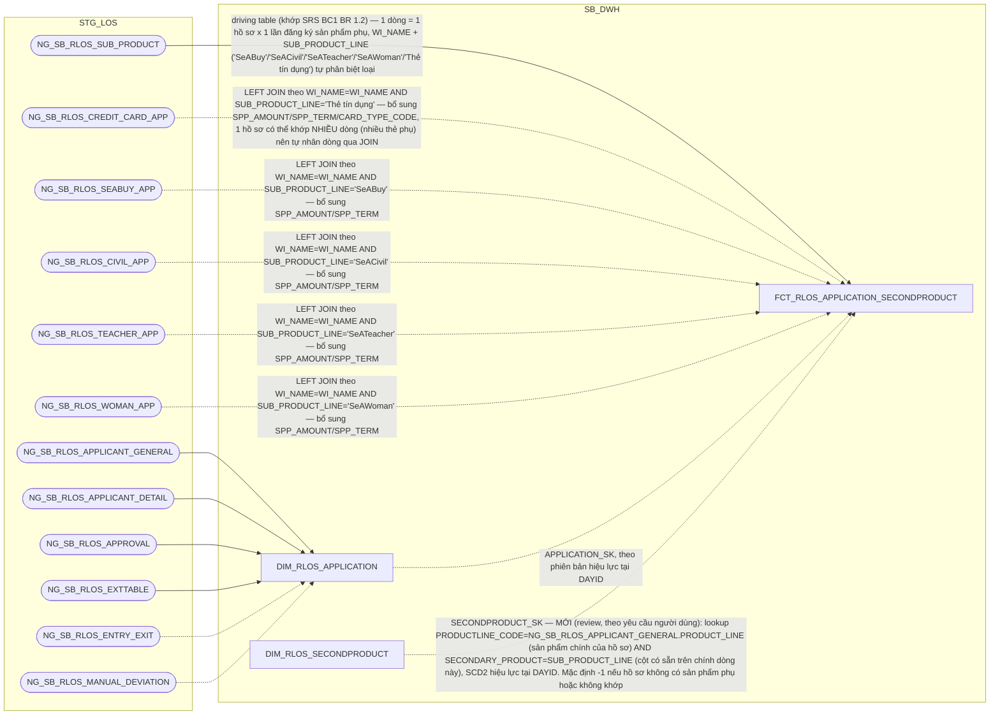
```mermaid
flowchart LR
    subgraph STG_LOS
        A1(["NG_SB_RLOS_SUB_PRODUCT"])
        A2(["NG_SB_RLOS_CREDIT_CARD_APP"])
        A3(["NG_SB_RLOS_SEABUY_APP"])
        A4(["NG_SB_RLOS_CIVIL_APP"])
        A5(["NG_SB_RLOS_TEACHER_APP"])
        A6(["NG_SB_RLOS_WOMAN_APP"])
        P1(["NG_SB_RLOS_APPLICANT_GENERAL"])
        P2(["NG_SB_RLOS_APPLICANT_DETAIL"])
        P3(["NG_SB_RLOS_APPROVAL"])
        P4(["NG_SB_RLOS_EXTTABLE"])
        P6(["NG_SB_RLOS_ENTRY_EXIT"])
        P7(["NG_SB_RLOS_MANUAL_DEVIATION"])
    end
    subgraph SB_DWH
        D["DIM_RLOS_APPLICATION"]
        SP["DIM_RLOS_SECONDPRODUCT"]
        C["FCT_RLOS_APPLICATION_SECONDPRODUCT"]
    end
    A1 -->|"driving table (khớp SRS BC1 BR 1.2) — 1 dòng = 1 hồ sơ x 1 lần đăng ký sản phẩm phụ, WI_NAME + SUB_PRODUCT_LINE ('SeABuy'/'SeACivil'/'SeATeacher'/'SeAWoman'/'Thẻ tín dụng') tự phân biệt loại"| C
    A2 -.->|"LEFT JOIN theo WI_NAME=WI_NAME AND SUB_PRODUCT_LINE='Thẻ tín dụng' — bổ sung SPP_AMOUNT/SPP_TERM/CARD_TYPE_CODE, 1 hồ sơ có thể khớp NHIỀU dòng (nhiều thẻ phụ) nên tự nhân dòng qua JOIN"| C
    A3 -.->|"LEFT JOIN theo WI_NAME=WI_NAME AND SUB_PRODUCT_LINE='SeABuy' — bổ sung SPP_AMOUNT/SPP_TERM"| C
    A4 -.->|"LEFT JOIN theo WI_NAME=WI_NAME AND SUB_PRODUCT_LINE='SeACivil' — bổ sung SPP_AMOUNT/SPP_TERM"| C
    A5 -.->|"LEFT JOIN theo WI_NAME=WI_NAME AND SUB_PRODUCT_LINE='SeATeacher' — bổ sung SPP_AMOUNT/SPP_TERM"| C
    A6 -.->|"LEFT JOIN theo WI_NAME=WI_NAME AND SUB_PRODUCT_LINE='SeAWoman' — bổ sung SPP_AMOUNT/SPP_TERM"| C
    D -.->|APPLICATION_SK, theo phiên bản hiệu lực tại DAYID| C
    SP -.->|"SECONDPRODUCT_SK — MỚI (review, theo yêu cầu người dùng): lookup PRODUCTLINE_CODE=NG_SB_RLOS_APPLICANT_GENERAL.PRODUCT_LINE (sản phẩm chính của hồ sơ) AND SECONDARY_PRODUCT=SUB_PRODUCT_LINE (cột có sẵn trên chính dòng này), SCD2 hiệu lực tại DAYID. Mặc định -1 nếu hồ sơ không có sản phẩm phụ hoặc không khớp"| C
    P1 --> D
    P2 --> D
    P3 --> D
    P4 --> D
    P6 -.-> D
    P7 -.-> D
```

### 9.3 Cấu trúc bảng

| STT | Tên cột | Kiểu dữ liệu | Bắt buộc | Độ lớn | Khóa | Mô tả | Báo cáo sử dụng | Tên chỉ tiêu trên báo cáo |
| --- | --- | --- | --- | --- | --- | --- | --- | --- |
| 1 | DAYID | DATE | Y |  | PK | Ngày dữ liệu, dạng số YYYYMMDD | — (cột kỹ thuật) | — |
| 2 | SUB_PRODUCT_BK | VARCHAR2 | Y | 64 | PK | Khóa nghiệp vụ của 1 lần đăng ký sản phẩm phụ — PHÁI SINH: NG_SB_RLOS_SUB_PRODUCT không khai KEY CDC (input/DS_BANG_202608.xlsx rỗng), vẫn phải hash: STANDARD_HASH(WI_NAME \|\| '~' \|\| SUB_PRODUCT_LINE \|\| '~' \|\| NVL(TO_CHAR(SPP_AMOUNT),'<NULL>') \|\| '~' \|\| NVL(TO_CHAR(SPP_TERM),'<NULL>'), 'SHA256') — hash cặp khóa driving table (WI_NAME+SUB_PRODUCT_LINE) cộng 2 giá trị đã JOIN bổ sung (SPP_AMOUNT/SPP_TERM) để phân biệt nhiều dòng thẻ phụ nhân ra khi LEFT JOIN CREDIT_CARD_APP khớp nhiều thẻ/hồ sơ. Không hash CARD_TYPE_CODE (luôn NULL với 4 nhóm không phải thẻ, không đủ phân biệt 2 thẻ cùng loại) và không hash toàn bộ cột của 5 bảng grid (chúng chỉ là JOIN bổ sung, không phải thành phần định danh dòng). Rủi ro đụng độ (2 thẻ phụ cùng hồ sơ trùng cả SPP_AMOUNT lẫn SPP_TERM) — CHẤP NHẬN theo quyết định người dùng. Tự thân đủ đảm bảo duy nhất — PK chỉ cần DAYID + SUB_PRODUCT_BK | — (cột kỹ thuật, một phần PK) | — |
| 3 | APPLICATION_SK | NUMBER | Y | 18 |  | Khóa tới DIM_RLOS_APPLICATION theo phiên bản hiệu lực tại DAYID. Mặc định -1 nếu không khớp | — (cột kỹ thuật, khóa JOIN nội bộ) | — |
| 4 | SECONDPRODUCT_SK | NUMBER | Y | 18 |  | Khóa tới DIM_RLOS_SECONDPRODUCT — MỚI (review, theo yêu cầu người dùng): PHÁI SINH lookup PRODUCTLINE_CODE=NG_SB_RLOS_APPLICANT_GENERAL.PRODUCT_LINE (sản phẩm chính gắn với hồ sơ, qua WI_NAME) AND SECONDARY_PRODUCT=SUB_PRODUCT_LINE (cột 6, cùng bảng), điều kiện SCD2 EFF_DATE<=DAYID<EXP_DATE (hoặc EXP_DATE IS NULL) trên DIM_RLOS_SECONDPRODUCT. Mặc định -1 nếu hồ sơ không có sản phẩm phụ hoặc không khớp | Báo cáo RLOS APPLICATION (BC1) — khóa JOIN sang DIM_RLOS_SECONDPRODUCT | — |
| 5 | WI_NAME | VARCHAR2 | Y | 100 |  | Mã hồ sơ tín dụng RLOS — nguồn NG_SB_RLOS_SUB_PRODUCT.WI_NAME (driving table) | Báo cáo RLOS APPLICATION (BC1) — khóa JOIN sang hồ sơ, không hiển thị trực tiếp ở trường này | — |
| 6 | SUB_PRODUCT_LINE | VARCHAR2 | N | 200 |  | Dòng của sản phẩm phụ — nguồn NG_SB_RLOS_SUB_PRODUCT.SUB_PRODUCT_LINE (driving table). Trường SAN_PHAM_PHU của BC1 — 5 giá trị khả dĩ ('SeABuy'/'SeACivil'/'SeATeacher'/'SeAWoman'/'Thẻ tín dụng') tự phân biệt loại sản phẩm phụ, đủ dùng làm điều kiện JOIN sang 5 bảng grid, không cần cột chuẩn hóa riêng. Đồng thời là đầu vào tra SECONDPRODUCT_SK (cột 4, cùng bảng) | Báo cáo RLOS APPLICATION (BC1) — hiển thị trực tiếp | SAN_PHAM_PHU (Sản phẩm phụ chi tiết) |
| 7 | SPP_AMOUNT | NUMBER | N | 20,2 |  | Hạn mức của sản phẩm phụ — PHÁI SINH: LEFT JOIN đúng 1 trong 5 bảng grid theo WI_NAME=WI_NAME AND SUB_PRODUCT_LINE='<giá trị tương ứng>' (không phải UNION 5 nguồn độc lập), lấy LIMIT_NO. Ép kiểu số từ text định dạng Việt Nam, DEFAULT NULL ON CONVERSION ERROR. Trường SPP_Amount của BC1 | Báo cáo RLOS APPLICATION (BC1) — hiển thị trực tiếp | SPP_Amount (Giá trị của sản phẩm phụ) |
| 8 | SPP_TERM | NUMBER | N | 5 |  | Thời hạn của sản phẩm phụ, đơn vị tháng — PHÁI SINH (cùng cơ chế JOIN cột 7): CREDIT_CARD_APP.TERM hoặc SEABUY_APP/CIVIL_APP/TEACHER_APP/WOMAN_APP.TIME_VALID của đúng bảng đã khớp điều kiện JOIN. Trường SPP_Term của BC1 | Báo cáo RLOS APPLICATION (BC1) — hiển thị trực tiếp | SPP_Term (Thời hạn của sản phẩm phụ) |
| 9 | CARD_TYPE_CODE | VARCHAR2 | N | 100 |  | Loại thẻ đăng ký lúc đề xuất sản phẩm phụ là thẻ tín dụng — nguồn NG_SB_RLOS_CREDIT_CARD_APP.CARD_TYPE (LEFT JOIN theo cơ chế cột 7). Chỉ có ở dòng SUB_PRODUCT_LINE='Thẻ tín dụng'. Là khái niệm khác BC1.K_TYPE (loại thẻ thật sau giải ngân, nguồn STG_DIM_CARD.K_TYPE, join qua NG_SB_RLOS_SENT_CBS_LOG.RESULT_SEAB_MAIN_CARD_ID = STG_DIM_CARD.MAIN_ID — thuộc FCT_RLOS_APPLICATION, không đi qua bảng này) — không dùng để tra BC1.K_TYPE | Thiết kế dư thừa | — |

## 10. FCT_RLOS_EXCEPTION

### 10.1 Mục đích thiết kế
- **Ý nghĩa bảng:** ghi nhận từng lần một lý do (ngoại lệ/nội dung cần làm
  rõ) được nêu ra trên hồ sơ tín dụng RLOS trong quá trình xử lý, kèm người
  nêu, thời điểm, và các chỉ tiêu đánh giá chất lượng nhập liệu lần đầu
  (First Time Right).
- **Khóa nghiệp vụ (BK):** composite `WI_NAME`+`EXCEPTION_CATEGORY`+
  `RAISED_BY`+`RAISED_DATE_TIME` — hash vào cột `EXCEPTION_BK`
- **Khóa chính của bảng (PK):** DAYID, EXCEPTION_BK — gộp 4 cột PK tự
  nhiên cũ (WI_NAME, EXCEPTION_CATEGORY, RAISED_BY, RAISED_DATE_TIME)
  thành 1 khóa hash duy nhất: `STANDARD_HASH(WI_NAME||'~'||
  EXCEPTION_CATEGORY||'~'||RAISED_BY||'~'||TO_CHAR(RAISED_DATE_TIME,
  'YYYY-MM-DD HH24:MI:SS.FF6'), 'SHA256')`.
- **Độ chi tiết (grain):** 1 dòng = 1 lần ghi nhận lý do của 1 hồ sơ, trong
  ảnh chụp của ngày DAYID.
- **Phục vụ báo cáo:**
  - Báo cáo EXCEPTION - FTR (BC7)
  - Báo cáo RETURN (BC8)

### 10.2 Sơ đồ lineage

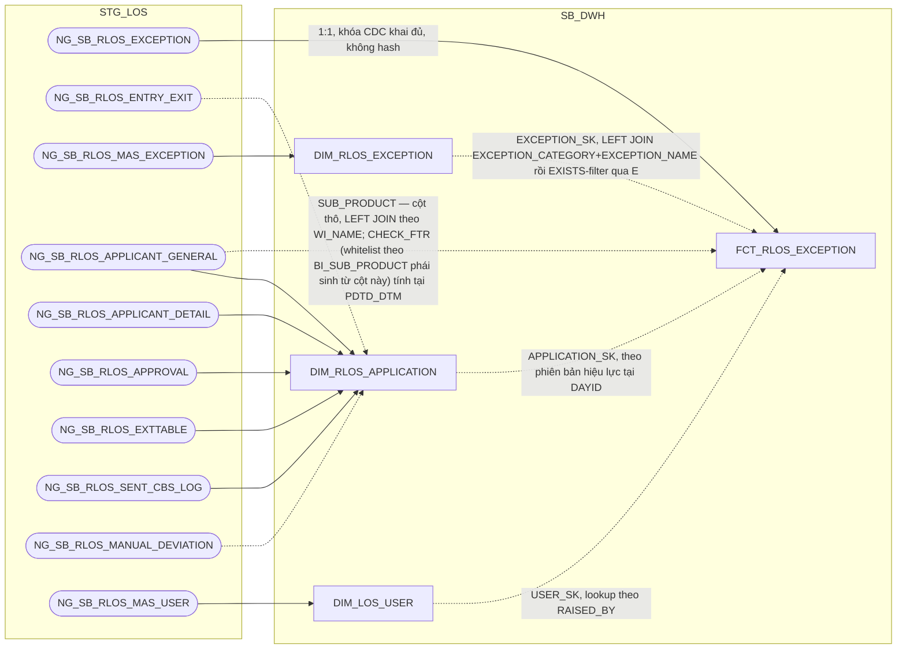
```mermaid
flowchart LR
    subgraph STG_LOS
        A(["NG_SB_RLOS_EXCEPTION"])
        E(["NG_SB_RLOS_ENTRY_EXIT"])
        R(["NG_SB_RLOS_MAS_EXCEPTION"])
        P1(["NG_SB_RLOS_APPLICANT_GENERAL"])
        P2(["NG_SB_RLOS_APPLICANT_DETAIL"])
        P3(["NG_SB_RLOS_APPROVAL"])
        P4(["NG_SB_RLOS_EXTTABLE"])
        P5(["NG_SB_RLOS_SENT_CBS_LOG"])
        P7(["NG_SB_RLOS_MANUAL_DEVIATION"])
        U(["NG_SB_RLOS_MAS_USER"])
    end
    subgraph SB_DWH
        B["DIM_RLOS_EXCEPTION"]
        D["DIM_RLOS_APPLICATION"]
        F["DIM_LOS_USER"]
        C["FCT_RLOS_EXCEPTION"]
    end
    A -->|1:1, khóa CDC khai đủ, không hash| C
    B -.->|EXCEPTION_SK, LEFT JOIN EXCEPTION_CATEGORY+EXCEPTION_NAME rồi EXISTS-filter qua E| C
    D -.->|APPLICATION_SK, theo phiên bản hiệu lực tại DAYID| C
    F -.->|USER_SK, lookup theo RAISED_BY| C
    P1 -.->|"SUB_PRODUCT — cột thô, LEFT JOIN theo WI_NAME; CHECK_FTR (whitelist theo BI_SUB_PRODUCT phái sinh từ cột này) tính tại PDTD_DTM"| C
    R --> B
    P1 --> D
    P2 --> D
    P3 --> D
    P4 --> D
    P5 --> D
    E -.-> D
    P7 -.-> D
    U --> F
```

### 10.3 Cấu trúc bảng

| STT | Tên cột | Kiểu dữ liệu | Bắt buộc | Độ lớn | Khóa | Mô tả | Báo cáo sử dụng | Tên chỉ tiêu trên báo cáo |
| --- | --- | --- | --- | --- | --- | --- | --- | --- |
| 1 | DAYID | DATE | Y |  | PK | Ngày dữ liệu, dạng số YYYYMMDD | — (cột kỹ thuật) | — |
| 2 | EXCEPTION_BK | VARCHAR2 | Y | 64 | PK | Khóa nghiệp vụ của dòng ngoại lệ — PHÁI SINH: STANDARD_HASH(WI_NAME \|\| '~' \|\| EXCEPTION_CATEGORY \|\| '~' \|\| RAISED_BY \|\| '~' \|\| TO_CHAR(RAISED_DATE_TIME,'YYYY-MM-DD HH24:MI:SS.FF6'), 'SHA256') — gộp 4 cột PK tự nhiên cũ (WI_NAME, EXCEPTION_CATEGORY, RAISED_BY, RAISED_DATE_TIME) thành 1 khóa đơn | — (cột kỹ thuật, một phần khóa chính) | — |
| 3 | APPLICATION_SK | NUMBER | Y | 18 |  | Khóa tới DIM_RLOS_APPLICATION theo phiên bản hiệu lực tại DAYID. Mặc định -1 | Báo cáo EXCEPTION - FTR (BC7) — khóa JOIN sang DIM_RLOS_APPLICATION | — |
| 4 | EXCEPTION_SK | NUMBER | Y | 18 |  | Khóa tới DIM_RLOS_EXCEPTION — PHÁI SINH 2 bước đúng SRS BC7 (không phải lookup 1 cột): (1) LEFT JOIN theo EXCEPTION_CATEGORY + EXCEPTION_NAME, có thể khớp nhiều dòng DIM cùng category+name khác ACTIVITYNAME/DECISION_CODE; (2) lọc còn đúng 1 dòng bằng điều kiện tồn tại bản ghi NG_SB_RLOS_ENTRY_EXIT (WI_NAME khớp + WORKSTEP=ACTIVITYNAME + DECISION=DECISION_CODE của dòng DIM đó) — chỉ giữ tổ hợp đã thực sự xảy ra trong lịch sử xử lý hồ sơ. Mặc định -1 nếu không còn dòng nào khớp | Báo cáo EXCEPTION - FTR (BC7) — khóa JOIN sang DIM_RLOS_EXCEPTION để lấy ACTIVITYNAME, EXCEPTION_CODE | — |
| 5 | USER_SK | NUMBER | Y | 18 |  | Khóa tới DIM_LOS_USER, người nêu lý do. Mặc định -1. ĐÚNG GRAIN của bảng — 1 lần ghi nhận lý do có đúng 1 người nêu | — (cột kỹ thuật, khóa JOIN nội bộ — BC7 dùng cột RAISED_BY gốc để hiển thị) | — |
| 6 | WI_NAME | VARCHAR2 | Y | 100 |  | Mã hồ sơ tín dụng RLOS — nguồn NG_SB_RLOS_EXCEPTION.WI_NAME| WI_NAME (Mã hồ sơ) |
| 7 | EXCEPTION_CATEGORY | VARCHAR2 | N | 500 |  | Phân nhóm nội dung cần làm rõ — nguồn NG_SB_RLOS_EXCEPTION.EXCEPTION_CATEGORY | Báo cáo EXCEPTION - FTR (BC7) — hiển thị trực tiếp, cũng là khóa JOIN sang DIM_RLOS_EXCEPTION | EXCEPTION_CATEGORY (Nhóm lý do quyết định) |
| 8 | RAISED_BY | VARCHAR2 | N | 100 |  | Người nêu nội dung cần làm rõ — nguồn NG_SB_RLOS_EXCEPTION.RAISED_BY. Cột USER_SK bên cạnh giữ khóa tới DIM | Báo cáo EXCEPTION - FTR (BC7) — hiển thị trực tiếp | RAISED_BY (User tạo lý do) |
| 9 | RAISED_DATE_TIME | TIMESTAMP | N |  |  | Thời điểm nêu nội dung cần làm rõ — nguồn NG_SB_RLOS_EXCEPTION.RAISED_DATE_TIME | Báo cáo EXCEPTION - FTR (BC7) — hiển thị trực tiếp Báo cáo RETURN (BC8) — dùng làm PROCESSED_DATE (giữ nguyên giá trị timestamp, không TRUNC như nhánh CLOS) | RAISED_DATE_TIME (Thời gian tạo lý do); PROCESSED_DATE (Ngày dữ liệu, BC8) |
| 10 | EXCEPTION_NAME | VARCHAR2 | N | 500 |  | Tên nội dung cần làm rõ — nguồn NG_SB_RLOS_EXCEPTION.EXCEPTION_NAME | Báo cáo EXCEPTION - FTR (BC7) — hiển thị trực tiếp, cũng là điều kiện lọc/khóa JOIN cho CHECK_FTR và DIM_RLOS_EXCEPTION | EXCEPTION_NAME (Tên lý do) |
| 11 | EXCEPTION_REMARKS | VARCHAR2 | N | 4000 |  | Ghi chú của nội dung cần làm rõ — nguồn NG_SB_RLOS_EXCEPTION.EXCEPTION_REMARKS | Báo cáo EXCEPTION - FTR (BC7) — hiển thị trực tiếp | EXCEPTION_REMARKS (Ý kiến) |
| 12 | RCTYPE | VARCHAR2 | N | 20 |  | Loại ghi nhận, Raise (nêu lý do khi trả về) hay Clear (đã làm rõ/bổ sung và đẩy lại) — nguồn NG_SB_RLOS_EXCEPTION.RCTYPE. Không dùng làm điều kiện lọc CHECK_FTR — vẫn giữ cột vì BC7 hiển thị trực tiếp làm trường riêng trên báo cáo | Báo cáo EXCEPTION - FTR (BC7) — hiển thị trực tiếp | CHECK_FTR (thành phần Raise/Clear của trường "Hồ sơ đạt FTR hay không đạt FTR") |
| 13 | SUB_PRODUCT | VARCHAR2 | N | 255 |  | Sản phẩm vay chi tiết tự khai theo hồ sơ — cột thô (cùng cơ chế đã áp dụng cho CLOS mục 3): LEFT JOIN NG_SB_RLOS_APPLICANT_GENERAL theo WI_NAME, lấy SUB_PRODUCT. Không tính BI_SUB_PRODUCT ở đây — chỉ giữ giá trị gốc, PDTD_DTM tự CASE WHEN phân loại 'Credit Card' khi tính CHECK_FTR | Nguồn cho chỉ tiêu/trường CHECK_FTR| — |

## 11. FCT_RLOS_DEVIATION

### 11.1 Mục đích thiết kế
- **Ý nghĩa bảng:** lưu ảnh số liệu thay đổi theo ngày của từng ngoại lệ
  chính sách (deviation) thuộc hồ sơ tín dụng RLOS. Không có chiều riêng —
  toàn bộ thuộc tính lưu thẳng trên fact vì nguồn không khai khóa CDC.
- **Khóa nghiệp vụ (BK):** composite toàn bộ cột không phải CLOB của
  `NG_SB_RLOS_MANUAL_DEVIATION` (loại trừ `REASON`) — hash vào cột `DEVIATION_BK`
- **Khóa chính của bảng (PK):** DAYID, DEVIATION_BK.
- **Độ chi tiết (grain):** 1 dòng = 1 ngoại lệ chính sách trong ảnh chụp
  của ngày DAYID.
- **Phục vụ báo cáo:**
  - Báo cáo NGOẠI LỆ (BC6)
  - Báo cáo KPI (BC9) — nguồn trực tiếp cho DEVIATION_G2/DEVIATION_G3 của
    AGG_LOS_KPI_APPLICATION

### 11.2 Sơ đồ lineage

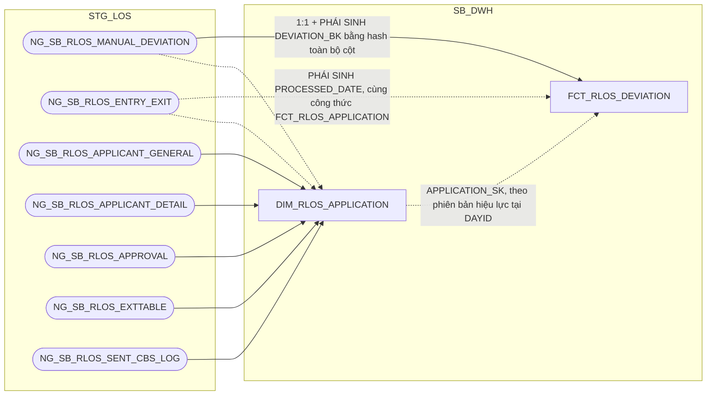
```mermaid
flowchart LR
    subgraph STG_LOS
        A(["NG_SB_RLOS_MANUAL_DEVIATION"])
        E(["NG_SB_RLOS_ENTRY_EXIT"])
        P1(["NG_SB_RLOS_APPLICANT_GENERAL"])
        P2(["NG_SB_RLOS_APPLICANT_DETAIL"])
        P3(["NG_SB_RLOS_APPROVAL"])
        P4(["NG_SB_RLOS_EXTTABLE"])
        P5(["NG_SB_RLOS_SENT_CBS_LOG"])
    end
    subgraph SB_DWH
        D["DIM_RLOS_APPLICATION"]
        C["FCT_RLOS_DEVIATION"]
    end
    A -->|1:1 + PHÁI SINH DEVIATION_BK bằng hash toàn bộ cột| C
    D -.->|APPLICATION_SK, theo phiên bản hiệu lực tại DAYID| C
    E -.->|PHÁI SINH PROCESSED_DATE, cùng công thức FCT_RLOS_APPLICATION| C
    P1 --> D
    P2 --> D
    P3 --> D
    P4 --> D
    P5 --> D
    E -.-> D
    A -.-> D
```

### 11.3 Cấu trúc bảng

| STT | Tên cột | Kiểu dữ liệu | Bắt buộc | Độ lớn | Khóa | Mô tả | Báo cáo sử dụng | Tên chỉ tiêu trên báo cáo |
| --- | --- | --- | --- | --- | --- | --- | --- | --- |
| 1 | DAYID | DATE | Y |  | PK | Ngày dữ liệu, dạng số YYYYMMDD | — (cột kỹ thuật) | — |
| 2 | DEVIATION_BK | VARCHAR2 | Y | 64 | PK | Khóa nghiệp vụ của dòng ngoại lệ — PHÁI SINH: STANDARD_HASH(..., 'SHA256') trên toàn bộ cột không phải CLOB của NG_SB_RLOS_MANUAL_DEVIATION (loại trừ REASON). Chuẩn hóa trước khi hash: TRIM chuỗi, NULL quy về '<NULL>', DATE/NUMBER dùng format cố định không phụ thuộc NLS | Báo cáo KPI (BC9) — nguồn cho chỉ tiêu/trường DEVIATION_G2/DEVIATION_G3 (COUNT(*) số dòng theo WI_NAME trên AGG_LOS_KPI_APPLICATION, lọc DAYID mới nhất) | — |
| 3 | APPLICATION_SK | NUMBER | Y | 18 |  | Khóa tới DIM_RLOS_APPLICATION theo phiên bản hiệu lực tại DAYID. Mặc định -1 nếu không khớp | — (cột kỹ thuật, khóa JOIN nội bộ) | — |
| 4 | WI_NAME | VARCHAR2 | Y | 100 |  | Mã hồ sơ tín dụng RLOS — nguồn NG_SB_RLOS_MANUAL_DEVIATION.WI_NAME (direct, driving table).| Báo cáo NGOẠI LỆ (BC6) — hiển thị trực tiếp, cũng là khóa PK | WI_NAME (Mã hồ sơ) |
| 5 | CHECKING_CONDITION | VARCHAR2 | N | 500 |  | Điều kiện kiểm tra chính sách — nguồn NG_SB_RLOS_MANUAL_DEVIATION.CHECKING_CONDITION | Báo cáo NGOẠI LỆ (BC6) — hiển thị trực tiếp | CHECKING_CONDITION (Tiêu chí ngoại lệ) |
| 6 | CHECKING_RESULT | VARCHAR2 | N | 200 |  | Kết quả kiểm tra chính sách — nguồn NG_SB_RLOS_MANUAL_DEVIATION.CHECKING_RESULT | Báo cáo NGOẠI LỆ (BC6) — hiển thị trực tiếp | CHECKING_RESULT (Loại ngoại lệ) |
| 7 | DEVIATION_REASON | VARCHAR2 | N | 4000 |  | Lý do lệch chính sách — nguồn NG_SB_RLOS_MANUAL_DEVIATION.REASON (đổi tên cho rõ nghĩa vì tên gốc quá chung) | Báo cáo NGOẠI LỆ (BC6) — hiển thị trực tiếp | REASON (Nội dung ngoại lệ) |
| 8 | PROCESSED_DATE | DATE | N |  |  | Ngày xử lý của hồ sơ — PHÁI SINH: tính độc lập từ NG_SB_RLOS_ENTRY_EXIT theo cùng công thức 3 mức ưu tiên (ngày phê duyệt cuối/ngày hủy/ngày thoát bước gần nhất) đã dùng cho FCT_RLOS_APPLICATION.PROCESSED_DATE — không JOIN sang FCT_RLOS_APPLICATION để tránh tham chiếu chéo giữa 2 bảng | Báo cáo NGOẠI LỆ (BC6) — hiển thị trực tiếp | PROCESSED_DATE (Ngày dữ liệu báo cáo) |

## 12. FCT_RLOS_WORKSTEP_EVENT

### 12.1 Mục đích thiết kế
- **Ý nghĩa bảng:** nhật ký workflow mức nguyên tử của hệ RLOS (bán lẻ/cá
  nhân) — mỗi dòng là 1 lần hồ sơ đi qua 1 bước xử lý (workstep) trên
  workflow, ghi lại đầy đủ thời gian vào/ra, người xử lý, quyết định và
  các chỉ số TAT tính sẵn. Giữ HẾT MỌI SỰ KIỆN, không bao giờ xóa, không
  chép lại nhật ký mỗi ngày.
- **Khóa nghiệp vụ (BK):** composite `WI_NAME`+`WORKSTEP_CODE`+
  `ENTRYDATE` — hash vào cột `WORKSTEP_EVENT_BK`
- **Khóa chính của bảng (PK):** DAYID, WORKSTEP_EVENT_BK — gộp 3 cột PK
  tự nhiên cũ (WI_NAME, WORKSTEP_CODE, ENTRYDATE) thành 1 khóa hash duy
  nhất: `STANDARD_HASH(WI_NAME||'~'||WORKSTEP_CODE||'~'||
  TO_CHAR(ENTRYDATE,'YYYY-MM-DD HH24:MI:SS.FF6'),
  'SHA256')`.
- **Độ chi tiết (grain):** 1 dòng = 1 phiên bản của 1 logical event (hồ
  sơ × workstep × lần vào bước).
- **Phục vụ báo cáo:**
  - Báo cáo RLOS APPLICATION (BC1)
  - Báo cáo CLOS APPLICATION (BC2)
  - Báo cáo Thông tin phê duyệt (BC3)
  - Báo cáo Tuần Chuyên viên Thẩm định (BC4)
  - Báo cáo SLA - TAT (BC5)
  - Báo cáo EXCEPTION - FTR (BC7)
  - Báo cáo RETURN (BC8)
  - Báo cáo KPI (BC9)
  - Báo cáo Giải ngân _ Quá hạn KHCN (BC10)
  - Báo cáo Giải ngân _ Quá hạn KHDN (BC11)

### 12.2 Sơ đồ lineage

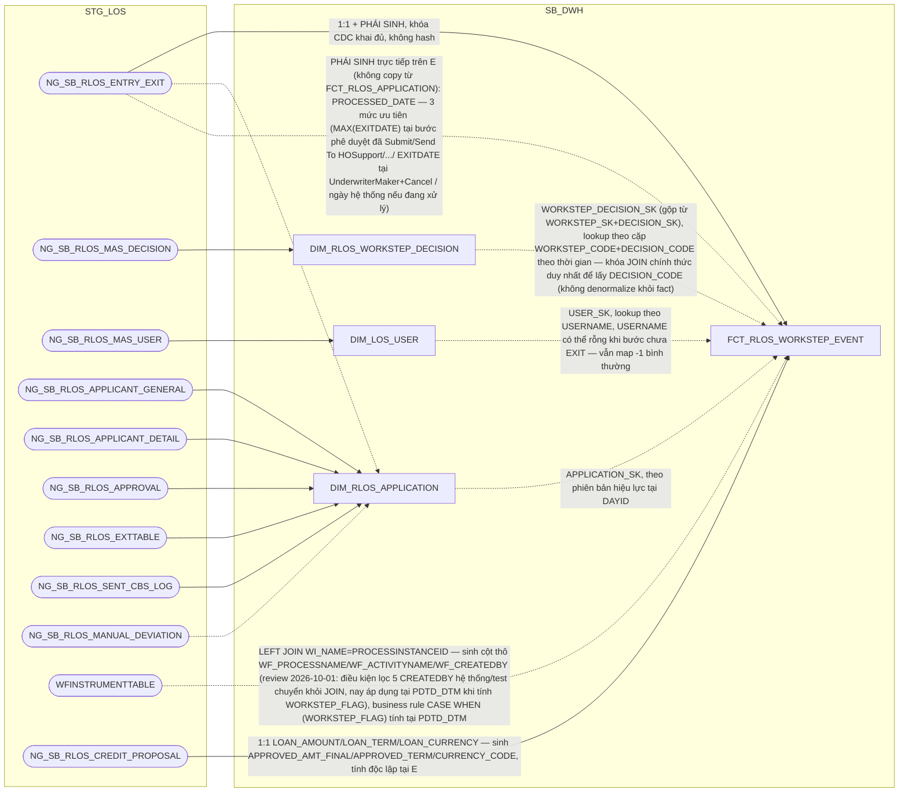
```mermaid
flowchart LR
    subgraph STG_LOS
        B(["NG_SB_RLOS_ENTRY_EXIT"])
        MW(["NG_SB_RLOS_MAS_DECISION"])
        U(["NG_SB_RLOS_MAS_USER"])
        P1(["NG_SB_RLOS_APPLICANT_GENERAL"])
        P2(["NG_SB_RLOS_APPLICANT_DETAIL"])
        P3(["NG_SB_RLOS_APPROVAL"])
        P4(["NG_SB_RLOS_EXTTABLE"])
        P5(["NG_SB_RLOS_SENT_CBS_LOG"])
        P7(["NG_SB_RLOS_MANUAL_DEVIATION"])
        WF(["WFINSTRUMENTTABLE"])
        CR(["NG_SB_RLOS_CREDIT_PROPOSAL"])
    end
    subgraph SB_DWH
        WD["DIM_RLOS_WORKSTEP_DECISION"]
        US["DIM_LOS_USER"]
        AP["DIM_RLOS_APPLICATION"]
        E["FCT_RLOS_WORKSTEP_EVENT"]
    end
    B -->|1:1 + PHÁI SINH, khóa CDC khai đủ, không hash| E
    WD -.->|"WORKSTEP_DECISION_SK (gộp từ WORKSTEP_SK+DECISION_SK), lookup theo cặp WORKSTEP_CODE+DECISION_CODE theo thời gian — khóa JOIN chính thức duy nhất để lấy DECISION_CODE (không denormalize khỏi fact)"| E
    US -.->|USER_SK, lookup theo USERNAME, USERNAME có thể rỗng khi bước chưa EXIT — vẫn map -1 bình thường| E
    AP -.->|APPLICATION_SK, theo phiên bản hiệu lực tại DAYID| E
    MW --> WD
    U --> US
    P1 --> AP
    P2 --> AP
    P3 --> AP
    P4 --> AP
    P5 --> AP
    B -.-> AP
    P7 -.-> AP
    B -.->|"PHÁI SINH trực tiếp trên E (không copy từ FCT_RLOS_APPLICATION): PROCESSED_DATE — 3 mức ưu tiên (MAX(EXITDATE) tại bước phê duyệt đã Submit/Send To HOSupport/.../ EXITDATE tại UnderwriterMaker+Cancel / ngày hệ thống nếu đang xử lý)"| E
    WF -.->|"LEFT JOIN WI_NAME=PROCESSINSTANCEID — sinh cột thô WF_PROCESSNAME/WF_ACTIVITYNAME/WF_CREATEDBY (review 2026-10-01: điều kiện lọc 5 CREATEDBY hệ thống/test chuyển khỏi JOIN, nay áp dụng tại PDTD_DTM khi tính WORKSTEP_FLAG), business rule CASE WHEN (WORKSTEP_FLAG) tính tại PDTD_DTM"| E
    CR -->|"1:1 LOAN_AMOUNT/LOAN_TERM/LOAN_CURRENCY — sinh APPROVED_AMT_FINAL/APPROVED_TERM/CURRENCY_CODE, tính độc lập tại E"| E
```

### 12.3 Cấu trúc bảng

| STT | Tên cột | Kiểu dữ liệu | Bắt buộc | Độ lớn | Khóa | Mô tả | Báo cáo sử dụng | Tên chỉ tiêu trên báo cáo |
| --- | --- | --- | --- | --- | --- | --- | --- | --- |
| 1 | DAYID | DATE | Y |  | PK | Ngày dữ liệu, dạng số YYYYMMDD — nguồn NG_SB_RLOS_ENTRY_EXIT, TRUNC về 00:00:00. Là ngày phiên bản được ghi nhận, KHÔNG phải ảnh chụp lại toàn bộ nhật ký mỗi ngày | — | Nguồn cho chỉ tiêu/trường APPLICATION_SK (mốc thời gian xác định phiên bản SCD2 hiệu lực khi lookup DIM) |
| 2 | WORKSTEP_EVENT_BK | VARCHAR2 | Y | 64 | PK | Khóa nghiệp vụ của dòng sự kiện — PHÁI SINH: STANDARD_HASH(WI_NAME \|\| '~' \|\| WORKSTEP_CODE \|\| '~' \|\| TO_CHAR(ENTRYDATE,'YYYY-MM-DD HH24:MI:SS.FF6'), 'SHA256') — gộp 3 cột PK tự nhiên cũ (WI_NAME, WORKSTEP_CODE, ENTRYDATE) thành 1 khóa đơn | — (cột kỹ thuật, một phần khóa chính) | — |
| 3 | WORKSTEP_DECISION_SK | NUMBER | Y | 18 |  | Khóa tới DIM_RLOS_WORKSTEP_DECISION (gộp từ WORKSTEP_SK+DECISION_SK), lookup theo cặp WORKSTEP_CODE (8, chính dòng event) + DECISION_CODE điều kiện thời gian (EFF_DATE/EXP_DATE). Mặc định -1 nếu không khớp. KHÔNG nằm trong PK — chỉ để tra cứu thêm thuộc tính (kể cả DECISION_CODE, không denormalize khỏi fact) | Báo cáo Thông tin phê duyệt (BC3) — khóa JOIN để lấy DECISION_CODE Báo cáo RETURN (BC8) — khóa JOIN để lấy DECISION_CODE | DECISION (Quyết định) |
| 4 | USER_SK | NUMBER | Y | 18 |  | Khóa tới DIM_LOS_USER, người xử lý của chính sự kiện này. ĐÚNG GRAIN của bảng — 1 lần vào bước có đúng 1 người xử lý. Mặc định -1. KHÔNG nằm trong PK | — | Thiết kế dư thừa |
| 5 | APPLICATION_SK | NUMBER | Y | 18 |  | Khóa tới DIM_RLOS_APPLICATION theo phiên bản hiệu lực tại DAYID. Mặc định -1 | Báo cáo Thông tin phê duyệt (BC3) — khóa JOIN sang DIM_RLOS_APPLICATION.STREAM/APPROVED_AMT_FINAL/CURRENCY_CODE/APPROVED_TERM Báo cáo KPI (BC9) — khóa tra BUSINESS_FLOW (điều kiện lọc SLHS_RLOS/SLGN_RLOS), khóa tra FIRST_ELIGIBLE_TS trên AGG_LOS_KPI_USER_YEAR (NHAN_SU) | Nguồn cho chỉ tiêu/trường STREAM, CREDIT_LIMIT, CURRENCY, CREDIT_TERM (BC3); SLHS_RLOS, SLGN_RLOS, NHAN_SU (BC9) |
| 6 | WI_NAME | VARCHAR2 | Y | 100 |  | Mã hồ sơ tín dụng RLOS — nguồn NG_SB_RLOS_ENTRY_EXIT.WINAME (đổi tên WINAME→WI_NAME cho thống nhất với các bảng khác) | Báo cáo RLOS APPLICATION (BC1) — hiển thị trực tiếp Báo cáo CLOS APPLICATION (BC2) Báo cáo Thông tin phê duyệt (BC3) Báo cáo Tuần Chuyên viên Thẩm định (BC4) Báo cáo SLA - TAT (BC5) Báo cáo RETURN (BC8) | WINAME (Mã hồ sơ) |
| 7 | WORKSTEP_CODE | VARCHAR2 | Y | 200 |  | Mã bước xử lý trên workflow — nguồn ENTRY_EXIT.WORKSTEP (đổi tên thêm hậu tố CODE), đã cắt tiền tố hệ nguồn nếu có | Báo cáo Thông tin phê duyệt (BC3) — hiển thị trực tiếp, đồng thời là điều kiện lọc bước CreditApproval/CreditCommittee Báo cáo Tuần Chuyên viên Thẩm định (BC4) — điều kiện lọc bước UnderwriterMaker/UnderwriterChecker Báo cáo SLA - TAT (BC5) — điều kiện lọc để SUM từng cột TAT theo từng bước Báo cáo RETURN (BC8) — hiển thị trực tiếp | WORKSTEP (Bước hồ sơ) |
| 8 | ENTRYDATE | TIMESTAMP | Y |  |  | Thời điểm hồ sơ vào bước xử lý — nguồn ENTRY_EXIT.ENTRYDATE. Bắt buộc nằm trong khóa nghiệp vụ vì 1 hồ sơ có thể quay lại cùng 1 bước nhiều lần | Báo cáo Thông tin phê duyệt (BC3) — hiển thị trực tiếp Báo cáo Tuần Chuyên viên Thẩm định (BC4) — hiển thị trực tiếp Báo cáo SLA - TAT (BC5) — dùng tính ENTRYDATE_DDE (MIN theo bước DetailDataEntry) | ENTRYDATE (Thời gian lên bước) |
| 9 | EXITDATE | TIMESTAMP | N |  |  | Thời điểm hồ sơ ra khỏi bước xử lý — nguồn ENTRY_EXIT.EXITDATE. NULL nghĩa là hồ sơ đang nằm tại bước này | Báo cáo Thông tin phê duyệt (BC3) — hiển thị trực tiếp Báo cáo Tuần Chuyên viên Thẩm định (BC4) — hiển thị trực tiếp Báo cáo RETURN (BC8) — hiển thị trực tiếp, cùng cột với PROCESSED_DATE của báo cáo Báo cáo SLA - TAT (BC5) — dùng tính EXITDATE_DDE (MAX theo bước DetailDataEntry) | EXITDATE (Thời gian kết thúc bướ c) |
| 10 | USERNAME | VARCHAR2 | N | 100 |  | Tên tài khoản người xử lý hồ sơ — nguồn ENTRY_EXIT.USERNAME. Giữ nguyên giá trị gốc để báo cáo hiển thị thẳng, không phải join qua DIM_LOS_USER | Báo cáo Thông tin phê duyệt (BC3) — hiển thị trực tiếp (BI_APPROVER/BI_COMMITTEE, lọc theo WORKSTEP_CODE) Báo cáo Tuần Chuyên viên Thẩm định (BC4) — hiển thị trực tiếp (UND_MAKER) Báo cáo KPI (BC9) — điều kiện lọc IS_TEST_ACCOUNT, nguồn cho FIRST_ELIGIBLE_TS/NHAN_SU trên AGG_LOS_KPI_USER_YEAR | BI_APPROVER, BI_COMMITTEE (BC3); UND_MAKER (BC4); nguồn cho chỉ tiêu/trường IS_TEST_ACCOUNT, NHAN_SU (BC9) |
| 11 | REMARKS | VARCHAR2 | N | 4000 |  | Ghi chú tại bước xử lý — nguồn ENTRY_EXIT.REMARKS | Báo cáo Thông tin phê duyệt (BC3) — hiển thị trực tiếp Báo cáo Tuần Chuyên viên Thẩm định (BC4) — hiển thị trực tiếp | REMARKS (Ghi chú) |
| 12 | REASON_CODE | VARCHAR2 | N | 50 |  | Mã lý do hủy hồ sơ — nguồn NG_SB_RLOS_ENTRY_EXIT.REASON_CODE (chỉ RLOS có cột này) | — | Thiết kế dư thừa |
| 13 | REASON_DESC | VARCHAR2 | N | 500 |  | Diễn giải lý do hủy hồ sơ — nguồn NG_SB_RLOS_ENTRY_EXIT.REASON_DESC (chỉ RLOS có cột này) | — | Thiết kế dư thừa |
| 14 | TAT_SOURCE_SEC | NUMBER | N | 12 |  | Thời gian xử lý do hệ nguồn ghi, đơn vị giây — nguồn ENTRY_EXIT.TAT. Giữ lại để đối soát với 3 cột TAT tính lại bên dưới. Đơn vị "giây" kế thừa từ extract gốc, chưa chốt chính thức với DE | — | Nguồn cho chỉ tiêu/trường TAT_CALENDAR_HOUR (input tính toán, dùng khi EXITDATE-ENTRYDATE không đủ dữ liệu) |
| 15 | TAT_CALENDAR_HOUR | NUMBER | N | 18,6 |  | Thời gian xử lý theo lịch tự nhiên, đơn vị giờ — PHÁI SINH: TAT_SOURCE_SEC / 3600, hoặc (CAST(EXITDATE AS DATE) - CAST(ENTRYDATE AS DATE)) * 24 nếu TAT_SOURCE_SEC rỗng. Không trừ ngày nghỉ. NULL nếu chưa có EXITDATE | Báo cáo SLA - TAT (BC5) — hiển thị trực tiếp, SUM theo từng bước xử lý (BranchSupport, DetailDataEntry, DataInputerChecker, UnderwriterMaker, UnderwriterChecker, CreditApproval, CreditCommittee...) | STEP01_BRANCH_CL_TAT, STEP02_DDE_CL_TAT, STEP03_QUALITY_CHECKER_CL_TAT, STEP04_UNDMAKER_CL_TAT, STEP04_UNDCHECKER_CL_TAT, STEP07_APPROVER_CL_TAT, STEP07_COMMITTEE_CL_TAT, TAT_PHONG_CL_TAT, TAT_KHOI_PDTD_CL_TAT |
| 16 | TAT_WORKING_HOUR | NUMBER | N | 18,6 |  | Thời gian xử lý theo giờ làm việc, đơn vị giờ — PHÁI SINH: GET_BUSINESS_MINUTE(ENTRYDATE, EXITDATE) / 60. Loại trừ ngày lễ, chiều thứ Bảy, cả ngày Chủ nhật; giờ tính 8-12 và 13-17. NULL nếu chưa có EXITDATE | Báo cáo SLA - TAT (BC5) — hiển thị trực tiếp, SUM theo từng bước xử lý, cùng nhóm cột với TAT_CALENDAR_HOUR | STEP01_BRANCH_WK_TAT, STEP02_DDE_WK_TAT, STEP03_QUALITY_CHECKER_WK_TAT, STEP04_UNDMAKER_WK_TAT, STEP04_UNDCHECKER_WK_TAT, STEP07_APPROVER_WK_TAT, STEP07_COMMITTEE_WK_TAT, TAT_PHONG_WK_TAT, TAT_KHOI_PDTD_WK_TAT |
| 17 | TAT_CPC_HOUR | NUMBER | N | 18,6 |  | Thời gian xử lý theo giờ cam kết SLA, đơn vị giờ — PHÁI SINH: GET_BUSINESS_MINUTE_CPC(ENTRYDATE, EXITDATE) / 60. Giờ theo cam kết SLA, tính 8-11:30 và 13:30-16:30. NULL nếu chưa có EXITDATE | Báo cáo SLA - TAT (BC5) — hiển thị trực tiếp, SUM theo từng bước để so sánh với các mốc SLA đã cam kết (SLA_DE, SLA_QC, SLA_MARKER, SLA_CHECKER, SLA_CREDIT_OFFICER, SLA_CREDIT_APPROVER) | STEP01_BRANCH_TAT_CPC, STEP02_DDE_TAT_CPC, STEP03_QUALITY_CHECKER_TAT_CPC, STEP04_UNDMAKER_TAT_CPC, STEP04_UNDCHECKER_TAT_CPC, STEP04_UND_TAT_CPC, STEP07_APPROVER_TAT_CPC |
| 18 | EVENT_SEQ_ASC | NUMBER | N | 5 |  | Thứ tự sự kiện theo chiều cũ đến mới — PHÁI SINH: ROW_NUMBER() OVER (PARTITION BY WI_NAME ORDER BY ENTRYDATE ASC). Dùng xác định sự kiện trả về đầu tiên cho BC7 (FIRST_WORKSTEP_RETURN); chiều giảm dần (mới→cũ) khi cần có thể tự suy bằng COUNT(*) OVER (PARTITION BY WI_NAME) - EVENT_SEQ_ASC + 1, không cần cột riêng | — | Thiết kế dư thừa |
| 19 | PROCESSED_DATE | DATE | N |  |  | Ngày xử lý chung của hồ sơ theo 3 mức ưu tiên (phê duyệt cuối / hủy tại UnderwriterMaker / ngày dữ liệu hệ thống nếu đang xử lý) — PHÁI SINH TRỰC TIẾP trên bảng này, không copy/JOIN từ FCT_RLOS_APPLICATION. Phục vụ BC4.REPORT_DATE mà không cần JOIN fan-out sang APPLICATION_DAILY | Báo cáo Tuần Chuyên viên Thẩm định (BC4) — hiển thị trực tiếp Báo cáo RETURN (BC8) — cùng cột PROCESSED_DATE của báo cáo Báo cáo KPI (BC9) — mốc xếp hồ sơ vào đúng DAYID khi SUM/COUNT SLHS_RLOS/SLGN_RLOS/TAT_RLOS lên grain ngày (qua AGG_LOS_KPI_APPLICATION) | REPORT_DATE (Ngày báo cáo, BC4); PROCESSED_DATE (Ngày dữ liệu, BC8) |
| 20 | WF_PROCESSNAME | VARCHAR2 | N | 50 |  | Tên hệ thống workflow của instance đang đứng — cột thô: LEFT JOIN WFINSTRUMENTTABLE (c) theo WI_NAME=c.PROCESSINSTANCEID, lấy c.PROCESSNAME. Lặp lại giống nhau trên mọi dòng event cùng WI_NAME | Nguồn cho chỉ tiêu/trường WORKSTEP_FLAG | — |
| 21 | WF_ACTIVITYNAME | VARCHAR2 | N | 200 |  | Bước hiện tại của instance workflow — cột thô (cùng JOIN trên): lấy c.ACTIVITYNAME | Nguồn cho chỉ tiêu/trường WORKSTEP_FLAG (tính tại PDTD_DTM) | — |
| 22 | WF_CREATEDBY | VARCHAR2 | N | 50 |  | Mã người/hệ thống tạo bản ghi workflow — cột thô (cùng JOIN trên): lấy c.CREATEDBY. | Nguồn cho chỉ tiêu/trường WORKSTEP_FLAG (điều kiện lọc, tính tại PDTD_DTM) | — |
| 23 | APPROVED_AMT_FINAL | NUMBER | N | 20,2 |  | Hạn mức phê duyệt cuối cùng — PHÁI SINH TRỰC TIẾP trên bảng này: nguồn NG_SB_RLOS_CREDIT_PROPOSAL.LOAN_AMOUNT, cùng công thức/kết quả với FCT_RLOS_APPLICATION.APPROVED_AMT_FINAL cho cùng WI_NAME, không copy/JOIN từ đó | Báo cáo Thông tin phê duyệt (BC3) — hiển thị trực tiếp | CREDIT_LIMIT (Số tiền phê duyệt) |
| 24 | CURRENCY_CODE | VARCHAR2 | N | 10 |  | Loại tiền — PHÁI SINH TRỰC TIẾP trên bảng này: nguồn NG_SB_RLOS_CREDIT_PROPOSAL.LOAN_CURRENCY, cùng lý do cột 23 | Báo cáo Thông tin phê duyệt (BC3) — hiển thị trực tiếp | CURRENCY (Đơn vị tiền tệ) |
| 25 | APPROVED_TERM | NUMBER | N | 5 |  | Kỳ hạn phê duyệt — PHÁI SINH TRỰC TIẾP trên bảng này: nguồn NG_SB_RLOS_CREDIT_PROPOSAL.LOAN_TERM, cùng lý do cột 23 | Báo cáo Thông tin phê duyệt (BC3) — hiển thị trực tiếp | CREDIT_TERM (Thời hạn phê duyệt) |

## 13. FCT_RLOS_CUSTOMER

### 13.1 Mục đích thiết kế
- **Ý nghĩa bảng:** thông tin người vay chính (applicant) của hồ sơ RLOS,
  chi tiết tới TỪNG GIẤY TỜ ĐỊNH DANH — nhân khẩu học, liên hệ, giấy tờ
  tùy thân, phân khúc khách hàng
- **Khóa nghiệp vụ (BK):** composite `WI_NAME`+`ID_TYPE`+`ID_NUMBER` —
  hash vào cột `CUSTOMER_BK`
- **Khóa chính của bảng (PK):** `DAYID`, `CUSTOMER_BK`.
- **Độ chi tiết (grain):** 1 dòng = 1 ngày × 1 giấy tờ định danh của
  người vay chính trên 1 hồ sơ (`DAYID` + `WI_NAME` + `ID_TYPE` +
  `ID_NUMBER`), snapshot hàng ngày (mỗi ngày lặp lại toàn bộ giấy tờ của
  mọi hồ sơ đang active)
- **Phục vụ báo cáo:**
  - Báo cáo RLOS APPLICATION (BC1)
  - Báo cáo CLOS APPLICATION (BC2)
  - Báo cáo Thông tin phê duyệt (BC3) — hiển thị tên khách hàng
  - Báo cáo Tuần Chuyên viên Thẩm định (BC4) — hiển thị tên khách hàng

### 13.2 Sơ đồ lineage

**Lineage đầy đủ (bao gồm cả nguồn của `DIM_RLOS_APPLICATION` — cùng
pattern đã áp dụng cho `FCT_RLOS_COLLATERAL`/`FCT_RLOS_DEVIATION`, mục
8/11):**

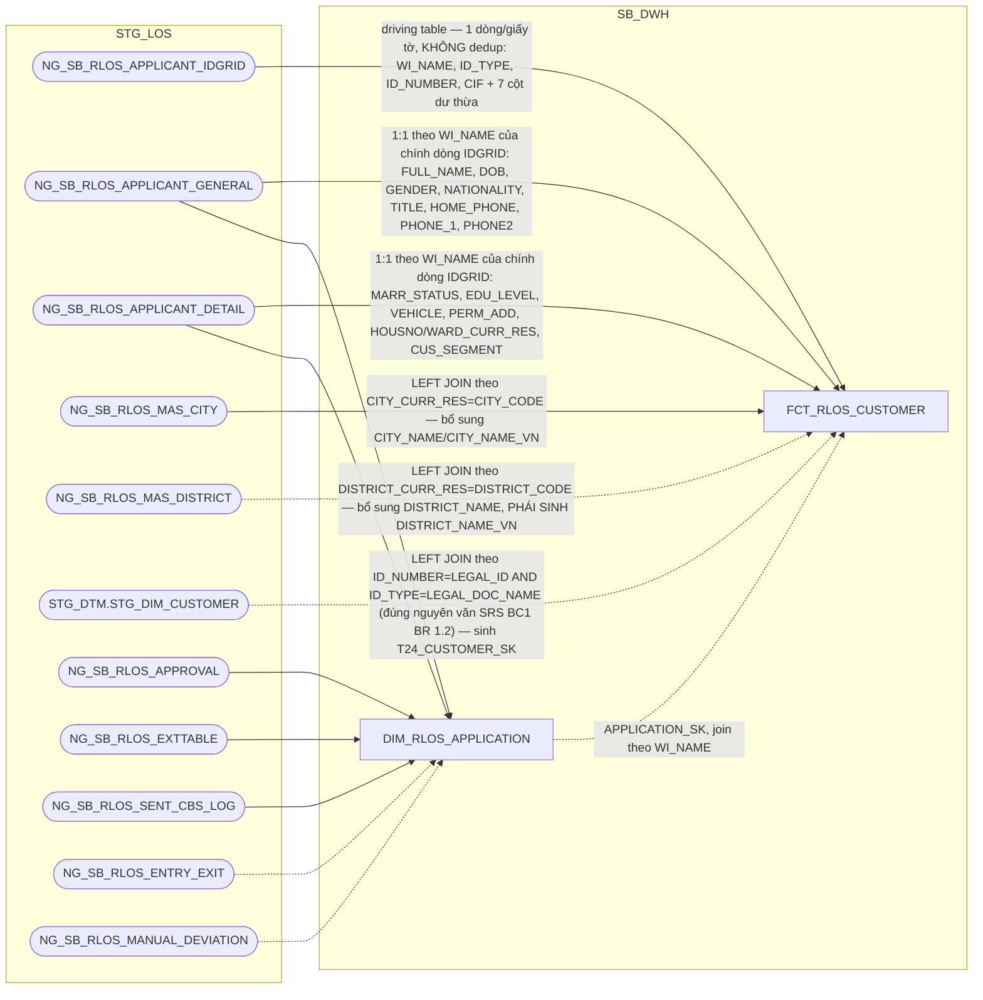
```mermaid
flowchart LR
    subgraph STG_LOS
        A(["NG_SB_RLOS_APPLICANT_IDGRID"])
        B(["NG_SB_RLOS_APPLICANT_GENERAL"])
        C(["NG_SB_RLOS_APPLICANT_DETAIL"])
        D(["NG_SB_RLOS_MAS_CITY"])
        F(["NG_SB_RLOS_MAS_DISTRICT"])
        T(["STG_DTM.STG_DIM_CUSTOMER"])
        P3(["NG_SB_RLOS_APPROVAL"])
        P4(["NG_SB_RLOS_EXTTABLE"])
        P5(["NG_SB_RLOS_SENT_CBS_LOG"])
        P6(["NG_SB_RLOS_ENTRY_EXIT"])
        P7(["NG_SB_RLOS_MANUAL_DEVIATION"])
    end
    subgraph SB_DWH
        AP["DIM_RLOS_APPLICATION"]
        E["FCT_RLOS_CUSTOMER"]
    end
    A -->|"driving table — 1 dòng/giấy tờ, KHÔNG dedup: WI_NAME, ID_TYPE, ID_NUMBER, CIF + 7 cột dư thừa"| E
    AP -.->|"APPLICATION_SK, join theo WI_NAME"| E
    B -->|"1:1 theo WI_NAME của chính dòng IDGRID: FULL_NAME, DOB, GENDER, NATIONALITY, TITLE, HOME_PHONE, PHONE_1, PHONE2"| E
    C -->|"1:1 theo WI_NAME của chính dòng IDGRID: MARR_STATUS, EDU_LEVEL, VEHICLE, PERM_ADD, HOUSNO/WARD_CURR_RES, CUS_SEGMENT"| E
    D -->|"LEFT JOIN theo CITY_CURR_RES=CITY_CODE — bổ sung CITY_NAME/CITY_NAME_VN"| E
    F -.->|"LEFT JOIN theo DISTRICT_CURR_RES=DISTRICT_CODE — bổ sung DISTRICT_NAME, PHÁI SINH DISTRICT_NAME_VN"| E
    T -.->|"LEFT JOIN theo ID_NUMBER=LEGAL_ID AND ID_TYPE=LEGAL_DOC_NAME (đúng nguyên văn SRS BC1 BR 1.2) — sinh T24_CUSTOMER_SK"| E
    B --> AP
    C --> AP
    P3 --> AP
    P4 --> AP
    P5 --> AP
    P6 -.-> AP
    P7 -.-> AP
```

### 13.3 Cấu trúc bảng

| STT | Tên cột | Kiểu dữ liệu | Bắt buộc | Độ lớn | Khóa | Mô tả | Báo cáo sử dụng | Tên chỉ tiêu trên báo cáo |
| --- | --- | --- | --- | --- | --- | --- | --- | --- |
| 1 | DAYID | DATE | Y |  | PK | Ngày dữ liệu, dạng số YYYYMMDD | — (cột kỹ thuật) | — |
| 2 | CUSTOMER_BK | VARCHAR2 | Y | 64 | PK | Khóa nghiệp vụ hash của tổ hợp (hồ sơ, loại giấy tờ, số giấy tờ) — PHÁI SINH: STANDARD_HASH(WI_NAME \|\| '~' \|\| ID_TYPE \|\| '~' \|\| ID_NUMBER, 'SHA256'). Cùng công thức/mục đích với EXCEPTION_BK (DIM_CLOS_EXCEPTION/DIM_RLOS_EXCEPTION) — gộp khóa composite 3 cột thành 1 khóa đơn | — (cột kỹ thuật, khóa chính) | — |
| 3 | APPLICATION_SK | NUMBER | Y | 18 |  | Khóa tới DIM_RLOS_APPLICATION, join theo WI_NAME + điều kiện SCD2 hiệu lực tại DAYID. Mặc định -1 nếu không khớp | Báo cáo RLOS APPLICATION (BC1) — khóa JOIN sang DIM_RLOS_APPLICATION | — |
| 4 | T24_CUSTOMER_SK | NUMBER | Y | 18 |  | Khóa tới DIM_T24_CUSTOMER (T24): join trực tiếp theo ID_NUMBER=LEGAL_ID AND ID_TYPE=LEGAL_DOC_NAME (đúng nguyên văn SRS BC1 BR 1.2: LEFT JOIN STG_DTM.STG_DIM_CUSTOMER (ac) ON u.ID_NUMBER=ac.LEGAL_ID AND u.ID_TYPE=ac.LEGAL_DOC_NAME, u=NG_SB_RLOS_APPLICANT_IDGRID). Mặc định -1 nếu không khớp. Đây là chân khách hàng T24 — khác chân khách hàng LOS/applicant thể hiện bằng chính WI_NAME/ID_TYPE/ID_NUMBER trên bảng này | Báo cáo RLOS APPLICATION (BC1) — khóa JOIN sang DIM_T24_CUSTOMER lấy CUSTOMER_ID | Nguồn cho chỉ tiêu/trường CUSTOMER_ID (BC1) |
| 5 | WI_NAME | VARCHAR2 | Y | 100 |  | Mã hồ sơ RLOS — nguồn NG_SB_RLOS_APPLICANT_IDGRID.WI_NAME (driving table). Quan hệ 1:N với giấy tờ (1 hồ sơ có thể có nhiều giấy tờ) | Báo cáo RLOS APPLICATION (BC1) Báo cáo CLOS APPLICATION (BC2) | WINAME (Mã hồ sơ) |
| 6 | ID_TYPE | VARCHAR2 | N | 50 |  | Loại giấy tờ định danh — nguồn NG_SB_RLOS_APPLICANT_IDGRID.ID_TYPE. 14 giá trị quan sát được (BLX, CMND, CMNDQD, DKKD...); SRS BC1 dùng nhóm TCC/CC làm khóa lọc ADD_ID | — | Thiết kế dư thừa (đầu vào PIVOT ADD_ID/ADD_ID_OTHER ở PDTD_DTM) |
| 7 | ID_NUMBER | VARCHAR2 | N | 100 |  | Số giấy tờ định danh — nguồn NG_SB_RLOS_APPLICANT_IDGRID.ID_NUMBER | — | Thiết kế dư thừa (đầu vào PIVOT ADD_ID/ADD_ID_OTHER ở PDTD_DTM) |
| 8 | ISSUE_DATE | DATE | N |  |  | Ngày cấp giấy tờ — nguồn NG_SB_RLOS_APPLICANT_IDGRID.ISSUE_DATE | — | Thiết kế dư thừa |
| 9 | EXPIRY_DATE | DATE | N |  |  | Ngày hết hạn giấy tờ — nguồn NG_SB_RLOS_APPLICANT_IDGRID.EXPIRY_DATE | — | Thiết kế dư thừa |
| 10 | ISSUE_PLACE | VARCHAR2 | N | 200 |  | Nơi cấp giấy tờ — nguồn NG_SB_RLOS_APPLICANT_IDGRID.ISSUE_PLACE | — | Thiết kế dư thừa |
| 11 | ISSUE_DATE_VISA | DATE | N |  |  | Ngày cấp visa (khách hàng nước ngoài) — nguồn NG_SB_RLOS_APPLICANT_IDGRID.ISSUE_DATE_VISA | — | Thiết kế dư thừa |
| 12 | EXPIRY_DATE_VISA | DATE | N |  |  | Ngày hết hạn visa (khách hàng nước ngoài) — nguồn NG_SB_RLOS_APPLICANT_IDGRID.EXPIRY_DATE_VISA | — | Thiết kế dư thừa |
| 13 | CUST_CLASS | VARCHAR2 | N | 200 |  | Phân loại khách hàng theo giấy tờ (CLASS.IND.UNDEFINED/CLASS.MASS/CLASS.SB.STAFF/CLASS.VIPS) — nguồn NG_SB_RLOS_APPLICANT_IDGRID.CUST_CLASS | — | Thiết kế dư thừa |
| 14 | IS_FETCH | VARCHAR2 | N | 200 |  | Cờ giấy tờ có được tự động lấy từ hệ định danh hay không — nguồn NG_SB_RLOS_APPLICANT_IDGRID.IS_FETCH | — | Thiết kế dư thừa |
| 15 | CIF | VARCHAR2 | N | 50 |  | Mã CIF khách hàng, nếu đã định danh — nguồn NG_SB_RLOS_APPLICANT_IDGRID.CIF. Hiện chưa có report nào dùng trực tiếp (SRS BC1 dùng T24_CUSTOMER_SK làm chân T24 chính thức), giữ dạng dư thừa vì có ý nghĩa nghiệp vụ thật. Khác `APPLICANT_CIF` trên `DIM_RLOS_APPLICATION` (nguồn GENERAL.APPLICANTCIF, gắn theo hồ sơ) | — | Thiết kế dư thừa |
| 16 | FULL_NAME | VARCHAR2 | N | 200 |  | Họ tên đầy đủ — nguồn NG_SB_RLOS_APPLICANT_GENERAL.FULL_NAME, LEFT JOIN theo WI_NAME của chính dòng IDGRID đang xét | Báo cáo RLOS APPLICATION (BC1) Báo cáo Thông tin phê duyệt (BC3) Báo cáo Tuần Chuyên viên Thẩm định (BC4) | CUSTOMER_NAME (Tên khách hàng) |
| 17 | DATE_OF_BIRTH | DATE | N |  |  | Ngày sinh — nguồn NG_SB_RLOS_APPLICANT_GENERAL.DOB | Báo cáo RLOS APPLICATION (BC1) | DATE_OF_BIRTH (Ngày sinh) |
| 18 | GENDER | VARCHAR2 | N | 20 |  | Giới tính — nguồn NG_SB_RLOS_APPLICANT_GENERAL.GENDER | Báo cáo RLOS APPLICATION (BC1) | GENDER (Giới tính) |
| 19 | NATIONALITY | VARCHAR2 | N | 100 |  | Quốc tịch (mã) — nguồn NG_SB_RLOS_APPLICANT_GENERAL.NATIONALITY | — | Thiết kế dư thừa |
| 20 | TITLE | VARCHAR2 | N | 50 |  | Danh xưng — nguồn NG_SB_RLOS_APPLICANT_GENERAL.TITLE | — | Thiết kế dư thừa |
| 21 | HOME_PHONE | VARCHAR2 | N | 50 |  | Số điện thoại nhà riêng — nguồn NG_SB_RLOS_APPLICANT_GENERAL.HOME_PHONE | — | Thiết kế dư thừa |
| 22 | PHONE_1 | VARCHAR2 | N | 50 |  | Số điện thoại di động chính — nguồn NG_SB_RLOS_APPLICANT_GENERAL.PHONE_1 | — | Thiết kế dư thừa |
| 23 | PHONE_2 | VARCHAR2 | N | 50 |  | Số điện thoại phụ — nguồn NG_SB_RLOS_APPLICANT_GENERAL.PHONE2 (đổi tên PHONE2→PHONE_2 cho nhất quán với PHONE_1) | — | Thiết kế dư thừa |
| 24 | MARRIAGE_STATUS | VARCHAR2 | N | 100 |  | Tình trạng hôn nhân — nguồn NG_SB_RLOS_APPLICANT_DETAIL.MARR_STATUS, LEFT JOIN theo WI_NAME của chính dòng IDGRID đang xét | Báo cáo RLOS APPLICATION (BC1) | MARRIAGE_STATUS (Tình trạng hôn nhân) |
| 25 | EDUCATION_LEVEL | VARCHAR2 | N | 100 |  | Trình độ học vấn — nguồn NG_SB_RLOS_APPLICANT_DETAIL.EDU_LEVEL | Báo cáo RLOS APPLICATION (BC1) | EDUCATION_LEVEL (Trình độ học vấn) |
| 26 | VEHICLE | VARCHAR2 | N | 100 |  | Phương tiện đi lại — nguồn NG_SB_RLOS_APPLICANT_DETAIL.VEHICLE | Báo cáo RLOS APPLICATION (BC1) | VEHICLES (Phương tiện đi lại) |
| 27 | PERM_ADDRESS | VARCHAR2 | N | 500 |  | Địa chỉ thường trú — nguồn NG_SB_RLOS_APPLICANT_DETAIL.PERM_ADD | Báo cáo RLOS APPLICATION (BC1) | PERMANENT_RESIDENCE_ADDRESS (Địa chỉ thường trú) |
| 28 | CURR_HOUSE_NO | VARCHAR2 | N | 200 |  | Số nhà thuộc địa chỉ hiện tại — nguồn NG_SB_RLOS_APPLICANT_DETAIL.HOUSNO_CURR_RES | Báo cáo RLOS APPLICATION (BC1) | Nguồn cho chỉ tiêu/trường CURRENT_RESIDENTIAL_ADDRESS (thành phần số nhà) |
| 29 | CURR_WARD | VARCHAR2 | N | 100 |  | Phường xã thuộc địa chỉ hiện tại — nguồn NG_SB_RLOS_APPLICANT_DETAIL.WARD_CURR_RES | Báo cáo RLOS APPLICATION (BC1) | CURRENT_RESIDENTIAL_WARD (Địa chỉ hiện tại — Phường/Xã) |
| 30 | CITY_CODE | VARCHAR2 | N | 50 |  | Mã tỉnh/thành phố thuộc địa chỉ hiện tại — nguồn NG_SB_RLOS_MAS_CITY.CITY_CODE, LEFT JOIN theo NG_SB_RLOS_APPLICANT_DETAIL.CITY_CURR_RES | — | — |
| 31 | CITY_NAME | VARCHAR2 | N | 200 |  | Tên tỉnh/thành phố — nguồn NG_SB_RLOS_MAS_CITY.CITY_NAME | Báo cáo RLOS APPLICATION (BC1) | CURRENT_RESIDENTIAL_CITY (Địa chỉ hiện tại — Tỉnh/TP) |
| 32 | CITY_NAME_VN | VARCHAR2 | N | 200 |  | Tên tỉnh/thành phố tiếng Việt có dấu (dùng ghép địa chỉ chi tiết) — nguồn NG_SB_RLOS_MAS_CITY.CITY_NAME_VN | Báo cáo RLOS APPLICATION (BC1) | Nguồn cho chỉ tiêu/trường CURRENT_RESIDENTIAL_ADDRESS (thành phần tỉnh/thành) |
| 33 | DISTRICT_CODE | VARCHAR2 | N | 50 |  | Mã quận/huyện thuộc địa chỉ hiện tại — nguồn NG_SB_RLOS_MAS_DISTRICT.DISTRICT_CODE, LEFT JOIN theo NG_SB_RLOS_APPLICANT_DETAIL.DISTRICT_CURR_RES | — | — |
| 34 | DISTRICT_NAME | VARCHAR2 | N | 200 |  | Tên quận/huyện — nguồn NG_SB_RLOS_MAS_DISTRICT.DISTRICT_NAME | Báo cáo RLOS APPLICATION (BC1) | CURRENT_RESIDENTIAL_DISTRICT (Địa chỉ hiện tại — Quận/Huyện) |
| 35 | DISTRICT_NAME_VN | VARCHAR2 | N | 200 |  | Tên quận/huyện tiếng Việt có dấu (dùng ghép địa chỉ chi tiết) — PHÁI SINH: lấy NG_SB_RLOS_MAS_DISTRICT.DISTRICT_NAME_VN nhưng gán NULL với giá trị lỗi '#NA'/'#REF!' còn sót từ khâu import Excel | Báo cáo RLOS APPLICATION (BC1) | Nguồn cho chỉ tiêu/trường CURRENT_RESIDENTIAL_ADDRESS (thành phần quận/huyện) |
| 36 | CUS_SEGMENT | VARCHAR2 | N | 100 |  | Phân khúc khách hàng theo LOS (giá trị gốc, chưa chuẩn hóa) — nguồn NG_SB_RLOS_APPLICANT_DETAIL.CUS_SEGMENT | — | Thiết kế dư thừa (nguồn duy nhất của CUSTOMER_SEGMENT ở PDTD_DTM) |

## 14. FCT_RLOS_COREPAYER

### 14.1 Mục đích thiết kế
- **Ý nghĩa bảng:** thông tin người đồng trả nợ (corepayer) của hồ sơ
  RLOS, chi tiết tới TỪNG GIẤY TỜ ĐỊNH DANH — tách riêng khỏi applicant
  chính vì đây là quan hệ 1 hồ sơ có thể có 0 đến 4 người đồng trả nợ.
- **Khóa nghiệp vụ (BK):** composite `WI_NAME`+`REL_TO_APPLICANT`+
  `ID_NO_CO`+`ID_TYPE`+`ID_NUMBER` — hash vào cột `COREPAYER_BK`
- **Khóa chính của bảng (PK):** `DAYID`, `COREPAYER_BK`.
- **Độ chi tiết (grain):** 1 dòng = 1 ngày × 1 giấy tờ định danh của 1
  corepayer trên 1 hồ sơ (`DAYID` + `WI_NAME` + `REL_TO_APPLICANT` +
  `ID_NO_CO` + `ID_TYPE` + `ID_NUMBER`), snapshot hàng ngày (mỗi ngày lặp
  lại toàn bộ giấy tờ của mọi corepayer đang active)
- **Phục vụ báo cáo:**
  - Báo cáo RLOS APPLICATION (BC1)

### 14.2 Sơ đồ lineage

**Lineage đầy đủ (bao gồm cả nguồn của `DIM_RLOS_APPLICATION` — cùng
pattern đã áp dụng cho `FCT_RLOS_COLLATERAL`/`FCT_RLOS_DEVIATION`/
`FCT_RLOS_CUSTOMER`, mục 8/11/13):**

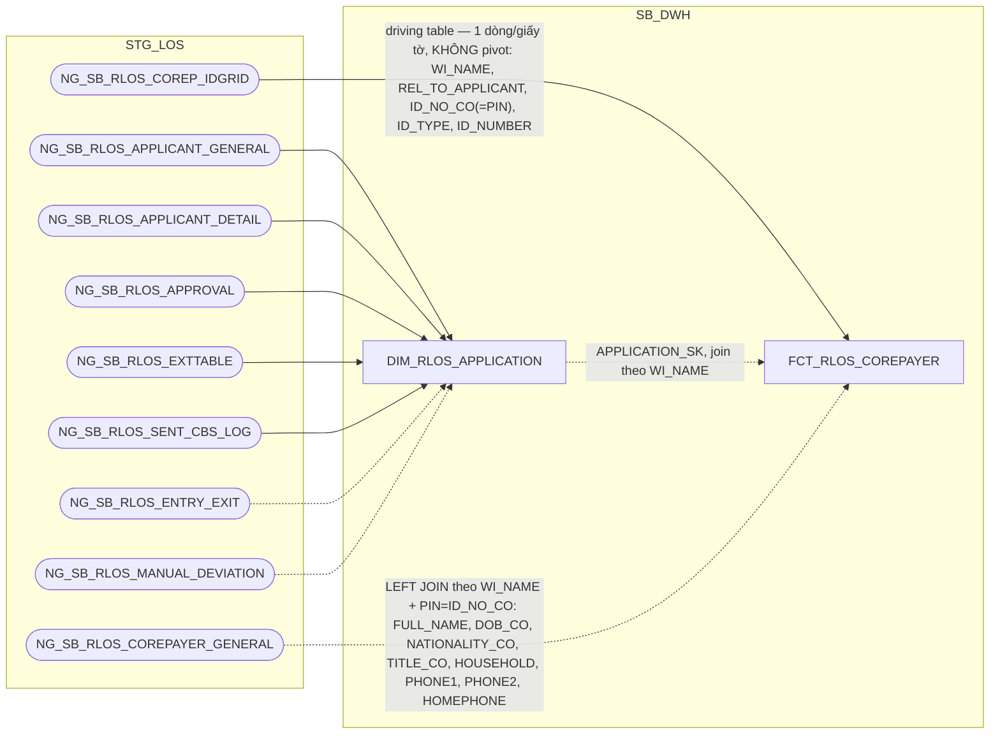
```mermaid
flowchart LR
    subgraph STG_LOS
        B(["NG_SB_RLOS_COREP_IDGRID"])
        A(["NG_SB_RLOS_COREPAYER_GENERAL"])
        P1(["NG_SB_RLOS_APPLICANT_GENERAL"])
        P2(["NG_SB_RLOS_APPLICANT_DETAIL"])
        P3(["NG_SB_RLOS_APPROVAL"])
        P4(["NG_SB_RLOS_EXTTABLE"])
        P5(["NG_SB_RLOS_SENT_CBS_LOG"])
        P6(["NG_SB_RLOS_ENTRY_EXIT"])
        P7(["NG_SB_RLOS_MANUAL_DEVIATION"])
    end
    subgraph SB_DWH
        AP["DIM_RLOS_APPLICATION"]
        E["FCT_RLOS_COREPAYER"]
    end
    B -->|"driving table — 1 dòng/giấy tờ, KHÔNG pivot: WI_NAME, REL_TO_APPLICANT, ID_NO_CO(=PIN), ID_TYPE, ID_NUMBER"| E
    AP -.->|"APPLICATION_SK, join theo WI_NAME"| E
    A -.->|"LEFT JOIN theo WI_NAME + PIN=ID_NO_CO: FULL_NAME, DOB_CO, NATIONALITY_CO, TITLE_CO, HOUSEHOLD, PHONE1, PHONE2, HOMEPHONE"| E
    P1 --> AP
    P2 --> AP
    P3 --> AP
    P4 --> AP
    P5 --> AP
    P6 -.-> AP
    P7 -.-> AP
```

### 14.3 Cấu trúc bảng

| STT | Tên cột | Kiểu dữ liệu | Bắt buộc | Độ lớn | Khóa | Mô tả | Báo cáo sử dụng | Tên chỉ tiêu trên báo cáo |
| --- | --- | --- | --- | --- | --- | --- | --- | --- |
| 1 | DAYID | DATE | Y |  | PK | Ngày dữ liệu, dạng số YYYYMMDD | — (cột kỹ thuật) | — |
| 2 | COREPAYER_BK | VARCHAR2 | Y | 64 | PK | Khóa nghiệp vụ hash của tổ hợp (hồ sơ, quan hệ với người vay chính, nhãn thứ tự corepayer, loại giấy tờ, số giấy tờ) — PHÁI SINH: STANDARD_HASH(WI_NAME \|\| '~' \|\| REL_TO_APPLICANT \|\| '~' \|\| ID_NO_CO \|\| '~' \|\| ID_TYPE \|\| '~' \|\| ID_NUMBER, 'SHA256'). Cùng công thức/mục đích với CUSTOMER_BK (mục 13), EXCEPTION_BK (DIM_CLOS/RLOS_EXCEPTION) | — (cột kỹ thuật, khóa chính) | — |
| 3 | APPLICATION_SK | NUMBER | Y | 18 |  | Khóa tới DIM_RLOS_APPLICATION, join theo WI_NAME + điều kiện SCD2 hiệu lực tại DAYID. Mặc định -1 nếu không khớp | Báo cáo RLOS APPLICATION (BC1) — khóa JOIN sang DIM_RLOS_APPLICATION | — |
| 4 | WI_NAME | VARCHAR2 | Y | 100 |  | Mã hồ sơ RLOS — nguồn NG_SB_RLOS_COREP_IDGRID.WI_NAME (driving table). Quan hệ 1:N với giấy tờ (1 corepayer có thể có nhiều giấy tờ, 1 hồ sơ có thể có 0..4 corepayer) | Báo cáo RLOS APPLICATION (BC1) | WINAME (Mã hồ sơ) |
| 5 | REL_TO_APPLICANT | VARCHAR2 | N | 200 |  | Quan hệ với người đề nghị vay chính — nguồn NG_SB_RLOS_COREPAYER_GENERAL.REL_TO_APPLICANT, LEFT JOIN theo WI_NAME + PIN=ID_NO_CO của chính dòng IDGRID đang xét. Cùng KEY CDC gốc của COREPAYER_GENERAL (WI_NAME+REL_TO_APPLICANT+ID_NO_CO), giữ lại để phân biệt các corepayer khác nhau khi ID_NO_CO chỉ là nhãn thứ tự | Báo cáo RLOS APPLICATION (BC1) | CO_REPAYER/ADD_ID_COREPAYER (thành phần vai trò trong tên hiển thị) |
| 6 | ID_NO_CO | VARCHAR2 | N | 100 |  | Nhãn thứ tự người đồng trả nợ (PIN: Corep1-4) — nguồn NG_SB_RLOS_COREP_IDGRID.PIN (=ID_NO_CO trên COREPAYER_GENERAL, xác nhận nghiệp vụ) | — | Thiết kế dư thừa |
| 7 | ID_TYPE | VARCHAR2 | N | 50 |  | Loại giấy tờ định danh — nguồn NG_SB_RLOS_COREP_IDGRID.ID_TYPE | — | Thiết kế dư thừa (đầu vào LISTAGG ADD_ID_COREPAYER/ADD_ID_OTHER_COREPAYER ở PDTD_DTM, chưa xử lý trong lượt này) |
| 8 | ID_NUMBER | VARCHAR2 | N | 100 |  | Số giấy tờ định danh — nguồn NG_SB_RLOS_COREP_IDGRID.ID_NUMBER | Báo cáo RLOS APPLICATION (BC1) | Thiết kế dư thừa (đầu vào LISTAGG ADD_ID_COREPAYER/ADD_ID_OTHER_COREPAYER ở PDTD_DTM — BC1 cần dạng chuỗi nối nhiều giấy tờ theo nhóm ID_TYPE, tính lại tại PDTD_DTM, chưa xử lý trong lượt này) |
| 9 | FULL_NAME | VARCHAR2 | N | 200 |  | Họ tên đầy đủ — nguồn NG_SB_RLOS_COREPAYER_GENERAL.FULL_NAME, LEFT JOIN theo WI_NAME + PIN=ID_NO_CO của chính dòng IDGRID đang xét | Báo cáo RLOS APPLICATION (BC1) | CO_REPAYER (Tên người đồng trả nợ) |
| 10 | DATE_OF_BIRTH | DATE | N |  |  | Ngày sinh — nguồn NG_SB_RLOS_COREPAYER_GENERAL.DOB_CO | — | Thiết kế dư thừa |
| 11 | NATIONALITY | VARCHAR2 | N | 100 |  | Quốc tịch — nguồn NG_SB_RLOS_COREPAYER_GENERAL.NATIONALITY_CO | — | Thiết kế dư thừa |
| 12 | TITLE | VARCHAR2 | N | 30 |  | Danh xưng — nguồn NG_SB_RLOS_COREPAYER_GENERAL.TITLE_CO | — | Thiết kế dư thừa |
| 13 | HOUSEHOLD | VARCHAR2 | N | 100 |  | Số sổ hộ khẩu — nguồn NG_SB_RLOS_COREPAYER_GENERAL.HOUSEHOLD | — | Thiết kế dư thừa |
| 14 | PHONE_1 | VARCHAR2 | N | 50 |  | Số điện thoại di động chính — nguồn NG_SB_RLOS_COREPAYER_GENERAL.PHONE1 | — | Thiết kế dư thừa |
| 15 | PHONE_2 | VARCHAR2 | N | 50 |  | Số điện thoại phụ — nguồn NG_SB_RLOS_COREPAYER_GENERAL.PHONE2 | — | Thiết kế dư thừa |
| 16 | HOME_PHONE | VARCHAR2 | N | 50 |  | Số điện thoại cố định — nguồn NG_SB_RLOS_COREPAYER_GENERAL.HOMEPHONE | — | Thiết kế dư thừa |
